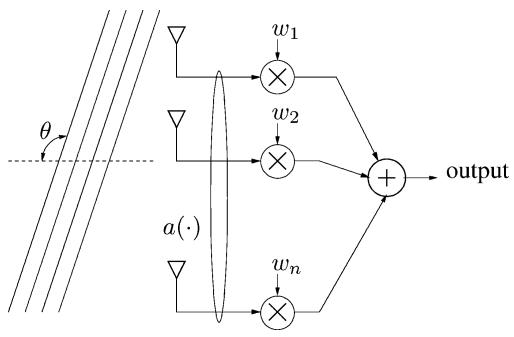
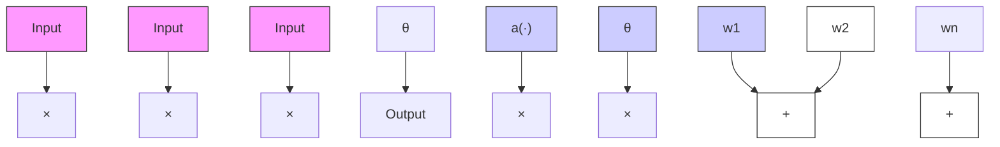
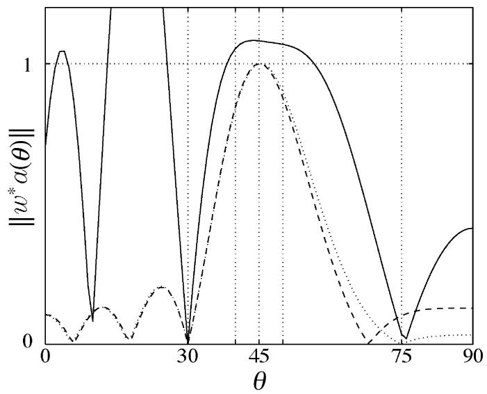
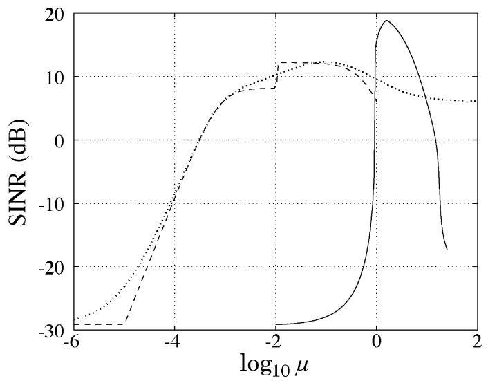
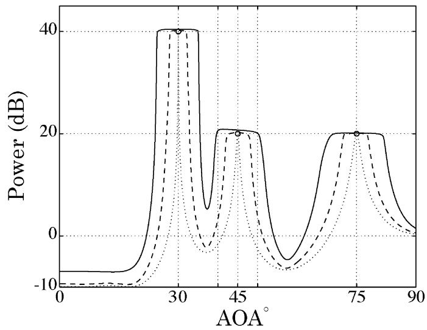
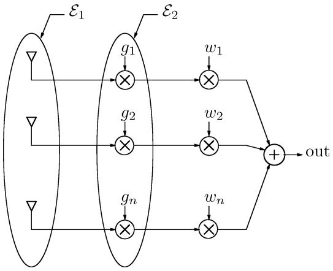
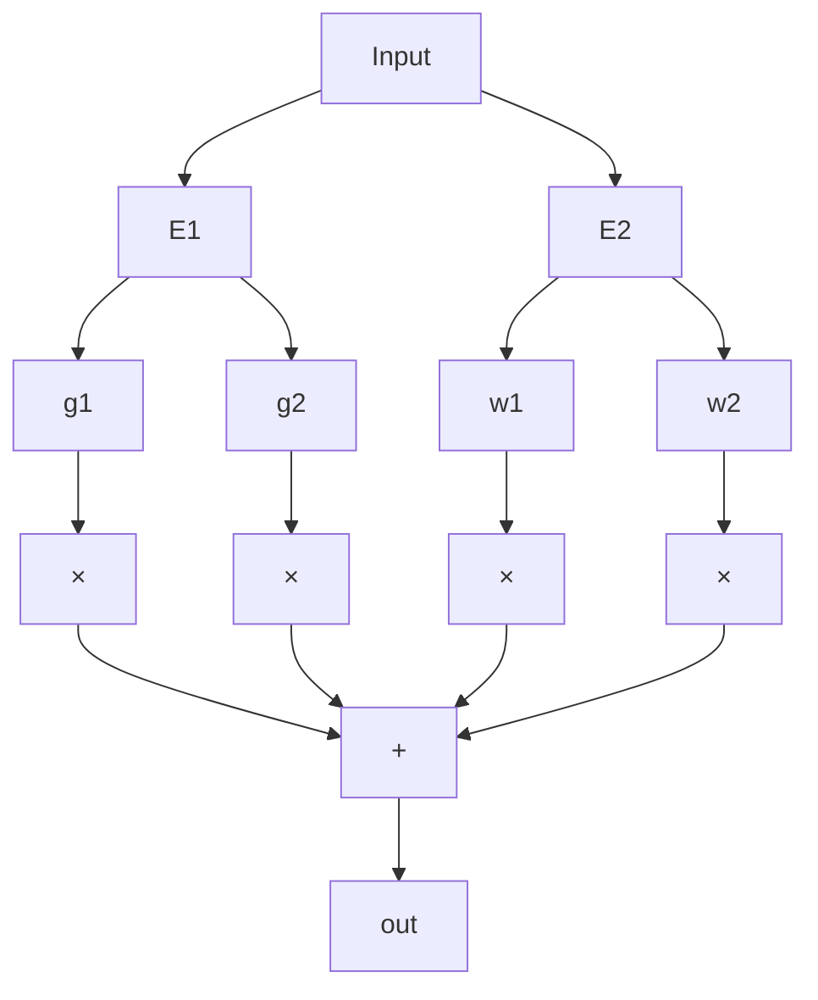
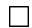
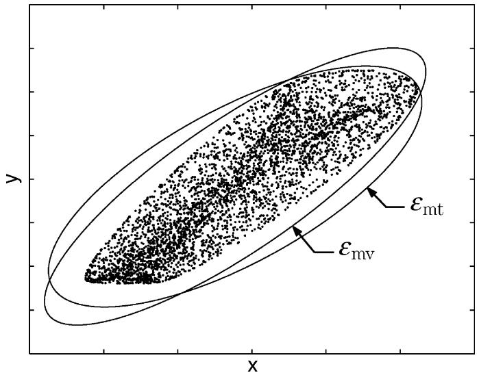

# Robust Minimum Variance Beamforming

Robert G. Lorenz, Member, IEEE, and Stephen P. Boyd, Fellow, IEEE

Abstract—This paper introduces an extension of minimum variance beamforming that explicitly takes into account variation or uncertainty in the array response. Sources of this uncertainty in clude imprecise knowledge of the angle of arrival and uncertainty in the array manifold.

In our method, uncertainty in the array manifold is explicitly modeled via an ellipsoid that gives the possible values of the array for a particular look direction. We choose weights that minimize the total weighted power output of the array, subject to the constraint that the gain should exceed unity for all array responses in this ellipsoid. The robust weight selection process can be cast as a second-order cone program that can be solved efficiently using Lagrange multiplier techniques. If the ellipsoid reduces to a single point, the method coincides with Capon’s method.

We describe in detail several methods that can be used to derive an appropriate uncertainty ellipsoid for the array response. We form separate uncertainty ellipsoids for each component in the signal path (e.g., antenna, electronics) and then determine an aggregate uncertainty ellipsoid from these. We give new results for modeling the element-wise products of ellipsoids. We demonstrate the robust beamforming and the ellipsoidal modeling methods with several numerical examples.

Index Terms—Ellipsoidal calculus, Hadamard product, robust beamforming, second-order cone programming.

## I. INTRODUCTION

ONSIDER an array of sensors. Let $a ( \theta ) \in \mathbf { C } ^ { n }$ denote C the response of the array to a plane wave of unit amplitude arriving from direction $\theta ;$ we will refer to $a ( \cdot )$ as the array manifold. We assume that a narrowband source $s ( t )$ is impinging on the array from angle and that the source is in the far field of the array. The vector array output $y ( t ) \in \mathbf { C } ^ { n }$ is then

$$
y (t) = a (\theta) s (t) + v (t) \tag {1}
$$

where $a ( \theta )$ includes effects such as coupling between elements and subsequent amplification; $v ( t )$ is a vector of additive noises representing the effect of undesired signals, such as thermal noise or interference. We denote the sampled array output by $y ( k )$ . Similarly, the combined beamformer output is given by

$$
y _ {c} (k) = w ^ {*} y (k) = w ^ {*} a (\theta) s (k) + w ^ {*} v (k)
$$

where $w \in \mathbf { C } ^ { n }$ is a vector of weights, i.e., design variables, and $( \cdot ) ^ { * }$ denotes the conjugate transpose.

The goal is to make $w ^ { * } a ( \theta ) \approx 1$ and $w ^ { * } v ( t )$ small, in which case, $y _ { c } ( t )$ recovers , i.e., $y _ { c } ( t )$ ≈ $s ( t )$ . The gain of the

Manuscript received January 20, 2002; revised April 5, 2004. This work was supported by Thales Navigation. The associate editor coordinating the review of this manuscript and approving it for publication was Dr. Joseph Tabrikian.

R. G. Lorenz is with Beceem Communications, Inc., Santa Clara, CA 95054 USA (e-mail: blorenz@beceem.com).

S. P. Boyd is with the Department of Electrical Engineering, Stanford University, Stanford, CA 94305 USA (e-mail: boyd@stanford.edu).

Digital Object Identifier 10.1109/TSP.2005.845436 weighted array response in direction is $\vert w ^ { * } a ( \theta ) \vert$ ; the expected effect of the noise and interferences at the combined output is given by $w ^ { * } R _ { v } w .$ where $R _ { v } = { \bf E } v v ^ { * }$ , and denotes the expected value. If we presume that $a ( \theta )$ and $R _ { v }$ are known, we may choose as the optimal solution of

$$
\text { minimize } \quad w ^ {*} R _ {v} w
$$

$$
\text { subject   to } \quad w ^ {*} a (\theta_ {d}) = 1. \tag {2}
$$

Minimum variance beamforming is a variation on (2) in which we replace $R _ { v }$ with an estimate of the received signal covariance derived from recently received samples of the array output, e.g.,

$$
R _ {y} (k) = \frac {1}{N} \sum_ {i = k - N + 1} ^ {k} y (i) y (i) ^ {*} \in \mathbb {C} ^ {n \times n}. \tag {3}
$$

The minimum variance beamformer (MVB) is chosen as the optimal solution of

$$
\text { minimize } \quad w ^ {*} R _ {y} w
$$

$$
\text { subject   to } \quad w ^ {*} a (\theta) = 1. \tag {4}
$$

This is commonly referred to as Capon’s method [1]. Equation (4) has an analytical solution given by

$$
w _ {\mathrm{mv}} = \frac {R _ {y} ^ {- 1} a (\theta)}{a (\theta) ^ {*} R _ {y} ^ {- 1} a (\theta)}. \tag {5}
$$

Equation (4) also differs from (2) in that the power expression we are minimizing includes the effect of the desired signal plus noise. The constraint $w ^ { * } a ( \theta ) = 1$ in (4) prevents the gain in the direction of the signal from being reduced.

A measure of the effectiveness of a beamformer is given by the signal-to-interference-plus-noise ratio (SINR), given by

$$
\mathrm{SINR} = \frac {\sigma_ {\mathrm{d}} ^ {2} | w ^ {*} a (\theta) | ^ {2}}{w ^ {*} R _ {v} w} \tag {6}
$$

where $\sigma _ { \mathrm { d } } ^ { 2 }$ is the power of the signal of interest. The assumed value of the array manifold $a ( \theta )$ may differ from the actual value for a host of reasons, including imprecise knowledge of the signal’s angle of arrival . Unfortunately, the SINR of Capon’s method can degrade catastrophically for modest differences between the assumed and actual values of the array manifold. We now review several techniques for minimizing the sensitivity of MVB to modeling errors in the array manifold.

## A. Previous Work

One popular method to address uncertainty in the array response or angle of arrival is to impose a set of unity-gain constraints for a small spread of angles around the nominal look direction. These are known in the literature as point mainbeam constraints or neighboring location constraints [2]. The beamforming problem with point mainbeam constraints can be expressed as

$$
\text { minimize } \quad w ^ {*} R _ {y} w
$$

$$
\text { subject   to } \quad C ^ {*} w = f \tag {7}
$$

where $C$ is an $n \times L$ matrix of array responses in the $L$ constrained directions, and $f$ is an $L \times 1$ vector specifying the desired response in each constrained direction. To achieve wider responses, additional constraint points are added. We may similarly constrain the derivative of the weighted array output to be zero at the desired look angle. This constraint can be expressed in the same framework as $( 7 ) ;$ in this case, we let $C$ be the derivative of the array manifold with respect to look angle and $f = 0$ . These are called derivative mainbeam constraints; this derivative may be approximated using regularization methods. Point and derivative mainbeam constraints may also be used in conjunction with one another. The minimizer of (7) has an analytical solution given by

$$
w _ {\mathrm{opt}} = R _ {y} ^ {- 1} C \left(C ^ {*} R _ {y} ^ {- 1} C\right) ^ {- 1} f. \tag {8}
$$

Each constraint removes one of the remaining degrees of freedom available to reject undesired signals; this is particularly significant for an array with a small number of elements. We may overcome this limitation by using a using a low-rank approximation to the constraints [3]. The best rank approximation to $C ,$ in a least squares sense, is given by $U { \boldsymbol { \Sigma } } V ^ { * }$ , where $\Sigma$ is a diagonal matrix consisting of the largest singular values, $U$ is a $n \times k$ matrix whose columns are the corresponding left singular vectors of $C ,$ , and $V$ is a $L \times k$ matrix whose columns are the corresponding right singular vectors of $C .$ . The reduced-rank constraint equations can be written as $V \Sigma ^ { T } U ^ { * } w = f$ or equivalently

$$
U ^ {*} w = \Sigma^ {\dagger} V ^ {*} f \tag {9}
$$

where denotes the Moore–Penrose pseudoinverse. Using (8), we compute the beamformer using the reduced-rank constraints as

$$
w _ {\mathrm{epc}} = R _ {y} ^ {- 1} U \left(U ^ {*} R _ {y} ^ {- 1} U\right) ^ {- 1} \Sigma^ {\dagger} V ^ {*} f.
$$

This technique, which is used in source localization, is referred to as MVB with environmental perturbation constraints (MV-EPC); see [2] and the references contained therein.

Unfortunately, it is not clear how best to pick the additional constraints, or, in the case of the MV-EPC, the rank of the constraints. The effect of additional constraints on the design specifications appears to be difficult to predict.

Regularization methods have also been used in beamforming. One technique, referred to in the literature as diagonal loading, chooses the beamformer to minimize the sum of the weighted array output power plus a penalty term, proportional to the square of the norm of the weight vector. The gain in the assumed angle of arrival (AOA) of the desired signal is constrained to be unity. The beamformer is chosen as the optimal solution of

$$
\text { minimize } \quad w ^ {*} R _ {y} w + \mu w ^ {*} w
$$

$$
\text { subject   to } \quad w ^ {*} a (\theta) = 1. \tag {10}
$$

The parameter $\mu > 0$ penalizes large values of $w$ and has the general effect of detuning the beamformer response. The regularized least squares problem (10) has an analytical solution given by

$$
w _ {\mathrm{reg}} = \frac {(R _ {y} + \mu I) ^ {- 1} a (\theta)}{a (\theta) ^ {*} (R _ {y} + \mu I) ^ {- 1} a (\theta)}. \tag {11}
$$

Gershman [4] and Johnson and Dudgeon [5] provide a survey of these methods; see also the references contained therein. Similar ideas have been used in adaptive algorithms; see [6].

Beamformers using eigenvalue thresholding methods to achieve robustness have also been used; see [7]. The beamformer is computed according to Capon’s method, using a covariance matrix that has been modified to ensure that no eigenvalue is less than a factor $\mu$ times the largest, where $0 ~ \leq ~ \mu ~ \leq ~ 1$ . Specifically, let $V \Lambda V ^ { * }$ denote the eigenvalue/eigenvector decomposition of $R _ { y } .$ , where $\Lambda$ is a diagonal matrix, the th entry (eigenvalue) of which is given by $\lambda _ { i } .$ , i.e.,

$$
\Lambda = \left[ \begin{array}{c c c} \lambda_ {1} & & \\ & \ddots & \\ & & \lambda_ {n} \end{array} \right].
$$

Without loss of generality, assume $\lambda _ { 1 } \geq \lambda _ { 2 } . . . \geq \lambda _ { n }$ . We form the diagonal matrix $\Lambda _ { \mathrm { t h r } } .$ , the th entry of which is given by max $\{ \mu \lambda _ { 1 } , \lambda _ { i } \}$ ; viz,

$$
\Lambda_ {\mathrm{thr}} = \left[ \begin{array}{l l l l} \lambda_ {1} & & & \\ & \max \{\mu \lambda_ {1}, \lambda_ {2} \} & & \\ & & \ddots & \\ & & & \max \{\mu \lambda_ {1}, \lambda_ {n} \} \end{array} \right].
$$

The modified covariance matrix is computed according to $R _ { \mathrm { t h r } } = V \Lambda _ { \mathrm { t h r } } V ^ { * }$ . The beamformer using eigenvalue thresholding is given by

$$
w _ {\mathrm{thr}} = \frac {R _ {\mathrm{thr}} ^ {- 1} a (\theta)}{a (\theta) ^ {*} R _ {\mathrm{thr}} ^ {- 1} a (\theta)}. \tag {12}
$$

The parameter $\mu$ corresponds to the reciprocal of the condition number of the covariance matrix. A variation on this approach is to use a fixed value for the minimum eigenvalue threshold. One interpretation of this approach is to incorporate a priori knowledge of the presence of additive white noise when the sample covariance is unable to observe said white noise floor due to short observation time [7]. The performance of this beamformer appears to be similar to that of the regularized beamformer using diagonal loading; both usually work well for an appropriate choice of the regularization parameter $\mu .$

We see two limitations with regularization techniques for beamformers. First, it is not clear how to efficiently pick $\mu .$ Second, this technique does not take into account any knowledge we may have about variation in the array manifold, $\mathrm { e . g . }$ , that the variation may not be isotropic.

In Section $\mathrm { I - C } ,$ we describe a beamforming method that explicitly uses information about the variation in the array response $a ( \cdot )$ , which we model explicitly as an uncertainty ellipsoid. Prior to this, we introduce some notation for describing ellipsoids.

## B. Ellipsoid Descriptions

An -dimensional ellipsoid can be defined as the image of a -dimensional Euclidean ball under an affine mapping from $\mathbf { R } ^ { n }$ to $\mathbf { R } ^ { n }$ , i.e.,

$$
\mathcal {E} = \{A u + c | \| u \| \leq 1 \} \tag {13}
$$

where $A \in \mathbf { R } ^ { n \times n }$ , and $c \in \mathbf { R } ^ { n }$ . The set $\mathcal { E }$ describes an ellipsoid whose center is and whose principal semiaxes are the unit-norm left singular vectors of scaled by the corresponding singular values. We say that an ellipsoid is flat if this mapping is not injective, i.e., one-to-one. Flat ellipsoids can be described by (13) in the proper affine subspaces of $\mathbf { R } ^ { n }$ . In this case, $A \in \mathbf { R } ^ { n \times l }$ and $u \in \mathbf { R } ^ { l }$ with $n < l .$ .

Unless otherwise specified, an ellipsoid in $\mathbf { R } ^ { n }$ will be parameterized in terms of its center $c \in \mathbf { R } ^ { n }$ and a symmetric non-negative definite configuration matrix $P \in \mathbf { R } ^ { n \times n }$ as

$$
\mathcal {E} (c, P) = \left\{P ^ {\frac {1}{2}} u + c \mid \| u \| \leq 1 \right\} \tag {14}
$$

where $P ^ { 1 / 2 }$ is any matrix square root satisfying $P ^ { 1 / 2 } ( P ^ { 1 / 2 } ) ^ { T } =$ $P .$ When is full rank, the nondegenerate ellipsoid $\mathcal { E } ( c , P )$ may also be expressed as

$$
\mathcal {E} (c, P) = \left\{x \mid (x - c) ^ {T} P ^ {- 1} (x - c) \leq 1 \right\}. \tag {15}
$$

The first representation (14) is more natural when is degenerate or poorly conditioned. Using the second description (15), one may quickly determine whether a point is within the ellipsoid.

As in (18), we will express the values of the array manifold $\ b { \mathscr { x } } \in \mathbf { C } ^ { n }$ as the direct sum of its real and imaginary components in $\mathbf { R } ^ { 2 n }$ ; i.e.,

$$
z _ {i} = \left[ \mathbf {R e} (a _ {1}) \dots \mathbf {R e} (a _ {n}) \mathbf {I m} (a _ {1}) \dots \mathbf {I m} (a _ {n}) \right] ^ {T}. \tag {16}
$$

While it is possible to cover the field of values with a complex ellipsoid in $\mathbf { C } ^ { n }$ , doing so implies a symmetry between the real and imaginary components, which generally results in a larger ellipsoid than if the direct sum of the real and imaginary components are covered in . $\mathbf { R } ^ { 2 n }$

## C. Robust Minimum Variance Beamforming

A generalization of (4) that captures our desire to minimize the weighted power output of the array in the presence of uncertainties in $a ( \theta )$ is then

$$
\text { minimize } \quad w ^ {*} R _ {y} w
$$

$$
\text { subject   to } \quad \mathbf {R e} w ^ {*} a \geq 1 \forall a \in \mathcal {E} \tag {17}
$$

where denotes the real part. Here, $\mathcal { E }$ is an ellipsoid that covers the possible range of values of $a ( \theta )$ due to imprecise knowledge of the array manifold $a ( \cdot )$ , uncertainty in the angle of arrival , or other factors. We will refer to the optimal solution of (17) as the robust minimum variance beamformer (RMVB).

We use the constraint $w ^ { * } a \geq 1$ for all $a \in { \mathcal { E } }$ in (17) for two reasons. First, while normally considered a semi-infi nite constraint, we show in Section II that it can be expressed as a second-order cone constraint. As a result, the robust MVB problem (17) can be solved efficiently. Second, the real part of the response is an efficient lower bound for the magnitude of the response, as the objective $w ^ { \ast } R _ { y } w$ is unchanged if the weight vector is multiplied by an arbitrary shift $e ^ { j \phi }$ . This is particularly true when the uncertainty in the array response is relatively small. It is unnecessary to constrain the imaginary part of the response to be nominally zero. The same rotation that maximizes the real part for a given level of $w ^ { * } R w$ simultaneously minimizes the imaginary component of the response.

Our approach differs from the previously mentioned beamforming techniques in that the weight selection uses the a priori uncertainties in the array manifold in a precise way; the RMVB is guaranteed to satisfy the minimum gain constraint for all values in the uncertainty ellipsoid.

Wu and Zhang [8] observe that the array manifold may be described as a polyhedron and that the robust beamforming problem can be cast as a quadratic program. While the polyhedron approach is less conservative, the size of the description and, hence, the complexity of solving the problem grows with the number of vertices. Vorobyov et al. [9], [10] have described the use of second-order cone programming for robust beamforming in the case where the uncertainty in the array response is isotropic. In this paper, we consider the case in which the uncertainty is anisotropic [11], [12]. We also show how this problem can be solved efficiently in practice.

## D. Outline of the Paper

The rest of this paper is organized as follows. In Section II, we discuss the RMVB. A numerically efficient technique based on Lagrange multiplier methods is described; we will see that the RMVB can be computed with the same order of complexity as its nonrobust counterpart. A numerical example is given in Section III. In Section IV, we describe ellipsoidal modeling methods that make use of simulated or measured values of the array manifold. In Section V, we discuss more sophisticated techniques, based on ellipsoidal calculus, for propagating uncertainty ellipsoids. In particular, we describe a numerically efficient method for approximating the numerical range of the Hadamard (element-wise) product of two ellipsoids. This form of uncertainty arises when the array outputs are subject to multiplicative uncertainties. Our conclusions are given in Section VI.

## II. ROBUST WEIGHT SELECTION

For purposes of computation, we will express the weight vector and the values of the array manifold as the direct sum of the corresponding real and imaginary components

$$
x = \left[ \begin{array}{l} \mathbf {R e} w \\ \mathbf {I m} w \end{array} \right] \quad z = \left[ \begin{array}{l} \mathbf {R e} a \\ \mathbf {I m} a \end{array} \right]. \tag {18}
$$

The real component of the product $w ^ { * } a$ can be written as $x ^ { T } z ;$ the quadratic form $w ^ { * } R _ { y } w$ may be expressed in terms of as $x ^ { T } \bar { R x }$ , where

$$
R = \left[ \begin{array}{c c} \mathbf {R e} R _ {y} & - \mathbf {I m} R _ {y} \\ \mathbf {I m} R _ {y} & \mathbf {R e} R _ {y} \end{array} \right].
$$

We will assume is positive definite.

Let ${ \mathcal { E } } = \{ A u + c | \| u \| \leq 1 \}$ be an ellipsoid covering the possible values of , i.e., the real and imaginary components of $a .$ The ellipsoid is centered at $c ;$ the matrix determines its size and shape. The constraint $\mathbf { R e } w ^ { * } a \geq 1$ for all $a \in { \mathcal { E } }$ in (17) can be expressed as

$$
x ^ {T} z \geq 1 \quad \forall z \in \mathcal {E} \tag {19}
$$

which is equivalent to

$$
u ^ {T} A ^ {T} x \leq c ^ {T} x - 1, \text {   for   all   } u \text {   s.t.   } \| u \| \leq 1. \tag {20}
$$

Now, (20) holds for all $\lvert \lvert u \rvert \rvert \leq 1$ if and only if it holds for the value of that maximizes ${ \ddot { u } } ^ { T } A ^ { T } x$ , namely, $\mathbf { \dot { \eta } } u = A ^ { T } x / \lVert A ^ { T } x \rVert$ . By the Cauchy-Schwartz inequality, we see that (19) is equivalent to the constraint

$$
\left\| A ^ {T} x \right\| \leq c ^ {T} x - 1 \tag {21}
$$

which is called a second-order cone constraint [13]. We can then express the robust minimum variance beamforming problem (17) as

(22)

which is a second-order cone program. See [13]–[16]. The subject of robust convex optimization is covered in [17]–[21].

By assumption, is positive definite, and the constraint $\| A ^ { \hat { T } } x \| \leq \dot { c } ^ { T } x - 1$ in (22) precludes the trivial minimizer of $x ^ { T } R x$ . Hence, this constraint will be tight for any optimal solution, and we may express (22) in terms of real-valued quantities as

(23)

In the case of no uncertainty where is a singleton whose center is $c = [ \mathbf { R e } a ( \theta _ { d } ) ^ { T } \mathbf { I m } a ( \theta _ { d } ) ^ { T } ] ^ { T }$ , (23) reduces to Capon’s method and admits an analytical solution given by the MVB (5). Compared to the MVB, the RMVB adds a margin that scales with the size of the uncertainty. In the case of an isotropic array uncertainty, the optimal solution of (17) yields the same weight vector (to a scale factor) as the regularized beamformer for the proper the proper choice of $\mu .$

## A. Lagrange Multiplier Methods

It is natural to suspect that we may compute the RMVB efficiently using Lagrange multiplier methods. See, for example, [14] and [22]–[26]. Indeed, this is the case.

The RMVB is the optimal solution of

${ \begin{array} { r l } { { \mathrm { m i n i m i z e } } } & { x ^ { T } R x } \\ { { \mathrm { s u b j e c t ~ t o } } } & { \left\| A ^ { T } x \right\| ^ { 2 } = \left( c ^ { T } x - 1 \right) ^ { 2 } } \end{array} }$ (24)

if we impose the additional constraint that $c ^ { T } x \geq 1$ . We define the Lagrangian $L : \mathbf { R } ^ { n } \times \mathbf { R }  \mathbf { R }$ associated with (24) as

$$
\begin{array}{l} L (x, \lambda) = x ^ {T} R x + \lambda \left(\| A ^ {T} x \| ^ {2} - (c ^ {T} x - 1) ^ {2}\right) \\ = x ^ {T} (R + \lambda Q) x + 2 \lambda c ^ {T} x - \lambda \tag {25} \\ \end{array}
$$

where $Q = A A ^ { T } - c c ^ { T }$ . To calculate the stationary points, we differentiate $L ( x , y )$ with respect to and ; setting these partial derivatives equal to zero, we have, respectively

$$
(R + \lambda Q) x = - \lambda c \tag {26}
$$

and

$$
x ^ {T} Q x + 2 c ^ {T} x - 1 = 0 \tag {27}
$$

which are known as the Lagrange equations. To solve for the Lagrange multiplier $\lambda ,$ , we note that (26) has an analytical solution given by

$$
x = - \lambda (R + \lambda Q) ^ {- 1} c.
$$

Applying this to (27) yields

$$
\begin{array}{l} f (\lambda) = \lambda^ {2} c ^ {T} (R + \lambda Q) ^ {- 1} Q (R + \lambda Q) ^ {- 1} c \\ - 2 \lambda c ^ {T} (R + \lambda Q) ^ {- 1} c - 1. \tag {28} \\ \end{array}
$$

The optimal value of the Lagrange multiplier $\lambda ^ { * }$ is then a zero of (28).

We proceed by computing the eigenvalue/eigenvector decomposition $V \Gamma V ^ { T } = R ^ { \large - 1 / 2 } { \large - } Q ( R ^ { \large - 1 / 2 } ) ^ { T }$ to diagonalize (28), i.e.,

$$
f (\lambda) = \lambda^ {2} \bar {c} ^ {T} (I + \lambda \Gamma) ^ {- 1} \Gamma (I + \lambda \Gamma) ^ {- 1} \bar {c} - 2 \lambda \bar {c} ^ {T} (I + \lambda \Gamma) ^ {- 1} \bar {c} - 1 \tag {29}
$$

where $\hat { c } = V ^ { T } R ^ { - 1 / 2 } c$ . Equation (29) reduces to the following scalar secular equation:

$$
f (\lambda) = \lambda^ {2} \sum_ {i = 1} ^ {n} \frac {\bar {c} _ {i} ^ {2} \gamma_ {i}}{(1 + \lambda \gamma_ {i}) ^ {2}} - 2 \lambda \sum_ {i = 1} ^ {n} \frac {\bar {c} _ {i} ^ {2}}{(1 + \lambda \gamma_ {i})} - 1 \tag {30}
$$

where $\gamma \in \mathbf { R } ^ { n }$ are the diagonal elements of . The values of are known as the generalized eigenvalues of $Q$ and and are the roots of the equation $( Q - \gamma R ) = 0$ . Having computed the value of $\lambda ^ { * }$ satisfying $f ( \lambda ^ { * } ) = 0$ the RMVB is computed according to

$$
x ^ {*} = - \lambda^ {*} (R + \lambda^ {*} Q) ^ {- 1} c. \tag {31}
$$

Similar techniques have been used in the design of filters for radar applications; see Stutt and Spafford [27] and Abramovich and Sverdlik [28].

In principle, we could solve for all the roots of (30) and choose the one that results in the smallest objective value $x ^ { T } .$ and satisfies the constraint $c ^ { T } x > 1$ , which is assumed in (24). In the next section, however, we show that this constraint is met for all values of the Lagrange multiplier greater than a minimum value $\lambda _ { \operatorname* { m i n } }$ . We will see that there is a single value of $\lambda > \lambda _ { \mathrm { m i n } }$ that satisfies the Lagrange equations.

## B. Lower Bound on the Lagrange Multiplier

We begin by establishing the conditions under which (9) has a solution. Assume $R = R ^ { T } \succ 0$ , i.e., is symmetric and positive definite.

Lemma 1: For $A \in \mathbf { R } ^ { n \times n }$ full rank, there exists an $x \in \mathbf { R } ^ { n }$ for which $\| A ^ { T } x \| = c ^ { T } x - 1$ if and only if $c ^ { T } ( A A ^ { T } ) ^ { - 1 } c > 1$ .

Proof: To prove the if direction, define

$$
x (\lambda) = (c c ^ {T} - A A ^ {T} - \lambda^ {- 1} R) ^ {- 1} c. \tag {32}
$$

By the matrix inversion lemma, we have

$$
\begin{array}{l} c ^ {T} x (\lambda) - 1 = c ^ {T} (c c ^ {T} - A A ^ {T} - \lambda^ {- 1} R) ^ {- 1} c - 1 \\ = \frac {1}{c ^ {T} \left(A A ^ {T} + \lambda^ {- 1} R\right) ^ {- 1} c - 1}. \tag {33} \\ \end{array}
$$

For $\lambda > 0 , c ^ { T } ( A A ^ { T } + \lambda ^ { - 1 } R ) ^ { - 1 } c$ is a monotonically increasing function of ; therefore, for $c ^ { T } ( A A ^ { T } ) ^ { - 1 } c > 1$ , there exists a $. \lambda _ { \operatorname* { m i n } } \in \mathbf { R } ^ { + }$ for which

$$
c ^ {T} \left(A A ^ {T} + \lambda_ {\min} ^ {- 1} R\right) ^ {- 1} c = 1. \tag {34}
$$

This implies that the matrix $( R + \lambda _ { \operatorname* { m i n } } Q )$ is singular. Since $\bar { { \bf \Phi } _ { \mathrm { i }  \infty } } c ^ { T } x ( \lambda ) - 1 \mathrm { = } - c ^ { T } ( A A ^ { T } - c c ^ { T } ) ^ { - 1 } c - 1 \mathrm { = }$ $( 1 / ( c ^ { T } ( A A ^ { T } ) ^ { - 1 } c - \mathrm { 1 } ) ) > 0 , c ^ { T } x ( \lambda ) - 1 > 0 , \mathrm { f o r ~ a l l } \lambda > \lambda _ { \operatorname* { m i n } }$ .

As in (28) and (30), let $f ( \lambda ) = \lvert \lvert A ^ { T } x \rvert \rvert ^ { 2 } - ( c ^ { T } x - 1 ) ^ { 2 }$ . Examining (28), we see

$$
\begin{array}{l} \lim _ {\lambda \to \infty} f (\lambda) = - c ^ {T} (A A ^ {T} - c c ^ {T}) ^ {- 1} c - 1 \\ = \frac {1}{c ^ {T} (A A ^ {T}) ^ {- 1} c - 1} > 0. \\ \end{array}
$$

Evaluating (28) or (30), we see $\begin{array} { r } { \operatorname* { l i m } _ { \lambda \to \lambda _ { \operatorname* { m i n } } ^ { + } } f ( \lambda ) = - \infty } \end{array}$ . For all $\lambda > \lambda _ { \operatorname* { m i n } } , c ^ { T } x > 1$ , and $f ( \lambda )$ is continuous. Hence, $f ( \lambda )$ assumes the value of 0, establishing the existence of a $\lambda > \lambda _ { \mathrm { m i n } }$ n for which $c ^ { T } x ( \lambda ) - 1 = \lVert A ^ { T } x ( \bar { \lambda ) } \rVert$ .

To show the only if direction, assume that satisfies $\| A ^ { T } x \| \leq c ^ { T } x - 1$ . This condition is equivalent to

$$
z ^ {T} x \geq 1   \forall z \in \mathcal {E} = \left\{A u + c \mid \| u \| \leq 1 \right\}. \tag {35}
$$

For (35) to hold, the origin cannot be contained in ellipsoid , which implies $c ^ { T } ( A A ^ { T } ) ^ { - 1 } c > 1$ .

Remark: The constraints $( c ^ { T } x - 1 ) ^ { 2 } = \| A ^ { T } x \| ^ { 2 }$ and $c ^ { T } x -$ $1 > 0$ in (24), taken together, are equivalent to the constraint $c ^ { T } x - 1 = \| A ^ { T } x \|$ in (23). For $R \stackrel { \cdot } { = } R ^ { T } \stackrel { } { \sim } 0 , A$ full rank, and $c ^ { T } ( A A ^ { T } ) ^ { - 1 } c > 1$ , (23) has a unique minimizer $x ^ { * }$ . For $\lambda > \lambda _ { \operatorname* { m i n } } , ( \lambda ^ { - 1 } R + Q )$ is full rank, and the Lagrange equation (26)

$$
(\lambda^ {- 1} R + Q) x ^ {*} = - c
$$

holds for only a single value of . This implies that there is a unique value of $\lambda > \lambda _ { \mathrm { m i n } }$ for which the secular equation (30) equals zero.

Lemma 2: For $x = - \lambda ( R + \lambda Q ) ^ { - 1 } c \in \mathbf { R } ^ { n }$ with $A \in \mathbf { R } ^ { n \times n }$ full rank, $c ^ { T } ( A A ^ { T } ) ^ { - 1 } c > \operatorname { \bar { 1 } }$ , and $\lambda > 0 , c ^ { T } x > 1$ if and only if the matrix $( \dot { R } + \lambda ( A A ^ { T } - c c ^ { T } ) )$ has a negative eigenvalue.

Proof: Consider the matrix

$$
M = \left[ \begin{array}{c c} \lambda^ {- 1} R + A A ^ {T} & c; \\ c ^ {T} & 1 \end{array} \right].
$$

We define the inertia of as the triple $\begin{array} { l l } { { I n \{ M \} } } & { { = } } \end{array}$ $\{ n _ { + } , n _ { - } , n _ { 0 } \}$ , where $n + { \mathrm { ~ i s ~ } }$ the number of positive eigenvalues, is the number of negative eigenvalues, and $n _ { 0 }$ is the number of zero eigenvalues of $M .$ . See Kailath et al. [29, pp. 729–730].

Since both block diagonal elements of are invertible

$$
I n \{M \} = I n \left\{\lambda^ {- 1} R + A A ^ {T} \right\} + I n \left\{\Delta_ {1} \right\} = I n \{1 \} + I n \left\{\Delta_ {2} \right\} \tag {36}
$$

where $\Delta _ { 1 } = 1 - c ^ { T } ( \lambda ^ { - 1 } R + A A ^ { T } ) ^ { - 1 } c ,$ which is the Schur complement of the (1,1) block in , and $\Delta _ { 2 } = \lambda ^ { - 1 } R + A A ^ { T } -$ $c c ^ { T }$ , which is the Schur complement of the (2,2) block in . We conclude $c ^ { T } ( \lambda ^ { - 1 } R + A A ^ { \hat { T } } ) ^ { - 1 } c > 1$ if and only if the matrix $( \lambda ^ { - 1 } R + A \dot { A } ^ { T } - c c ^ { T } )$ has a negative eigenvalue. By the matrix inversion lemma

$$
\frac {1}{c ^ {T} \left(\lambda^ {- 1} R + A A ^ {T}\right) ^ {- 1} c - 1} = - c ^ {T} \left(\lambda^ {- 1} R + A A ^ {T} - c c ^ {T}\right) ^ {- 1} c - 1. \tag {37}
$$

Inverting a scalar preserves its sign; therefore

$$
c ^ {T} x - 1 = - c ^ {T} \left(\lambda^ {- 1} R + A A ^ {T} - c c ^ {T}\right) ^ {- 1} c - 1 > 0 \tag {38}
$$

if and only if $\lambda ^ { - 1 } R + A A ^ { T } - c c ^ { T }$ has a negative eigenvalue.

Remark: Applying Sylvester’s law of inertia to (28) and (30), we see that

$$
\lambda_ {\min} = - \frac {1}{\gamma_ {j}} \tag {39}
$$

where $\gamma _ { j }$ is the single negative generalized eigenvalue. Using this fact and (30), we can readily verify $\iota _ { \lambda \to \lambda _ { \mathrm { m i n } } ^ { + } } f ( \lambda ) = - \infty$ , as stated in Lemma 1.

Two immediate consequences follow from Lemma 2. First, we may exclude from consideration any value of less than $\lambda _ { \operatorname* { m i n } }$ . Second, for all $\lambda > \lambda _ { \mathrm { m i n } }$ , the matrix $R + \lambda Q$ has a single negative eigenvalue. We now use these facts to obtain a tighter lower bound on the value of the optimal Lagrange multiplier.

We begin by rewriting (30) as

$$
\sum_ {i = 1} ^ {n} \frac {\vec {c} _ {i} ^ {2} (- 2 - \lambda \gamma_ {i})}{(1 + \lambda \gamma_ {i}) ^ {2}} = \frac {1}{\lambda}. \tag {40}
$$

Recall that exactly one of the generalized eigenvalues in the secular equation (40) is negative. We rewrite (40) as

$$
\lambda^ {- 1} = \frac {\bar {c} _ {j} ^ {2} (- 2 - \lambda \gamma_ {j})}{(1 + \lambda \gamma_ {j}) ^ {2}} - \sum_ {i \neq j} \frac {\bar {c} _ {i} ^ {2} (2 + \lambda \gamma_ {i})}{(1 + \lambda \gamma_ {i}) ^ {2}} \tag {41}
$$

where denotes the index associated with this negative eigenvalue.

A lower bound on can be found by ignoring the terms involving the non-negative eigenvalues in (41) and solving

$$
\lambda^ {- 1} = \frac {\overline {{c}} _ {i} ^ {2} (- 2 - \lambda \gamma_ {j})}{(1 + \lambda \gamma_ {j}) ^ {2}}.
$$

This yields a quadratic equation in

$$
\lambda^ {2} \left(\bar {c} _ {j} ^ {2} \gamma_ {j} + \gamma_ {j} ^ {2}\right) + 2 \lambda \left(\gamma_ {j} + \bar {c} _ {j} ^ {2}\right) + 1 = 0 \tag {42}
$$

the roots of which are given by

$$
\lambda = \frac {- 1 \pm | \bar {c} _ {j} | (\gamma_ {j} + \bar {c} _ {j} ^ {2}) ^ {- \frac {1}{2}}}{\gamma_ {j}}.
$$

By Lemma 2, the constraint $c ^ { T } x ^ { * } \geq 1$ implies that $R + \lambda ^ { * } Q$ has a negative eigenvalue since

$$
\begin{array}{l} c ^ {T} x ^ {*} = c ^ {T} \left(- \lambda^ {*} (R + \lambda Q) ^ {- 1}\right) c \geq 1 \\ = - \lambda^ {*} \bar {c} ^ {T} (I + \lambda^ {*} \Gamma) ^ {- 1} \bar {c}. \\ \end{array}
$$

Hence, $\lambda ^ { * } > - 1 / \gamma _ { j }$ , where $\gamma _ { j }$ is the single negative eigenvalue. We conclude that $\begin{array} { r } { \dot { \lambda ^ { * } } > \hat { \lambda } . } \end{array}$ where

$$
\hat {\lambda} = \frac {- 1 - \left| \bar {c} _ {j} \right| \left(\gamma_ {j} + \bar {c} _ {j} ^ {2}\right) ^ {- \frac {1}{2}}}{\gamma_ {j}}. \tag {43}
$$

For any feasible beamforming problem, i.e., if $\begin{array} { r l } { Q } & { { } = } \end{array}$ $A A ^ { T } - c \dot { c } ^ { T }$ has a negative eigenvalue, the parenthetical quantity in (43) is always non-negative. To see this, we note that $\begin{array} { r } { \bar { c } _ { j } = v _ { i } ^ { T } R ^ { - 1 / 2 } c , } \end{array}$ where $v _ { j }$ is the eigenvector associated with the negative eigenvalue $\gamma _ { j } .$ Hence, $v _ { j } \in \mathbf { R } ^ { n }$ can be expressed as the optimal solution of

$\mathrm { m i n i m i z e } \quad v ^ { T } R ^ { - \frac { 1 } { 2 } } ( A A ^ { T } - c c ^ { T } ) \left( R ^ { - \frac { 1 } { 2 } } \right) ^ { T } v$

$\mathrm { s u b j e c t } \mathrm { t o } \quad \| v \| = 1$ (44)

and $\gamma _ { j } = v _ { j } ^ { T } R ^ { - 1 / 2 } ( A A ^ { T } - c c ^ { T } ) ( R ^ { - 1 / 2 } ) ^ { T } v _ { j }$ , which is the corresponding objective value. Since

$$
\bar {c} _ {j} ^ {2} = v _ {j} ^ {T} R ^ {- \frac {1}{2}} c \left(v _ {j} ^ {T} R ^ {- \frac {1}{2}} c\right) ^ {T} = v _ {j} ^ {T} R ^ {- \frac {1}{2}} c c ^ {T} \left(R ^ {- \frac {1}{2}}\right) ^ {T} v _ {j} \tag {45}
$$

we conclude $( \gamma _ { j } + \bar { c } _ { j } ^ { 2 } ) = v _ { j } ^ { T } R ^ { - 1 / 2 } A A ^ { T } ( R ^ { - 1 / 2 } ) ^ { T } v _ { j } > 0 .$ .

## C. Solution of the Secular Equation

The secular equation (30) can be efficiently solved using Newton’s method. The derivative of this secular equation with respect to is given by

$$
f ^ {\prime} (\lambda) = - 2 \sum_ {i = 1} ^ {n} \frac {\bar {c} _ {i} ^ {2}}{(1 + \lambda \gamma_ {i}) ^ {3}}. \tag {46}
$$

As the secular equation (30) is not necessarily a monotonically increasing function of $\lambda ,$ it is useful to examine the sign of the derivative at each iteration. The Newton-Raphson method enjoys quadratic convergence if started sufficiently close to the root $\lambda ^ { * }$ . Se Dahlquist and Björck [30, §6] for details.

## D. Summary and Computational Complexity of the RMVB Computation

We summarize the algorithm below. In parentheses are approximate costs of each of the numbered steps; the actual costs will depend on the implementation and problem size [31]. As in [25], we will consider a flop to be any single floating-point operation.

## RMVB Computation

Given , strictly feasible and .

1) Calculate $Q  A A ^ { T } - c c ^ { T } . ( 2 n ^ { 2 } )$  
2) Change coordinates. $( 2 n ^ { 3 } )$

a) Compute Cholesky factorization $L L ^ { T } = R$ .  
b) Compute $L ^ { - 1 / 2 }$ .  
c) $\boldsymbol { \tilde { Q } } \gets \boldsymbol { L ^ { - 1 / 2 } } \boldsymbol { Q } ( \boldsymbol { L ^ { - 1 / 2 } } ) ^ { T }$ .  
3) Eigenvalue/eigenvector computation. $( 1 0 n ^ { 3 } )$  
a) Compute $V \Gamma V ^ { T } = \tilde { Q }$ .  
4) Change coordinates. $( 4 n ^ { 2 } )$  
a) $\overline { c }  V ^ { T } R ^ { - 1 / 2 } c .$ .  
5) Secular equation solution.  
a) Compute initial feasible point  
b) Find $\lambda ^ { * } > \hat { \lambda }$ for which $f ( \lambda ) = 0$ .  
6) Compute $x ^ { * }  ( R + \lambda ^ { * } Q ) ^ { - 1 } c \mathit { \Pi } ( n ^ { 3 } )$

The computational complexity of these steps is discussed as follows.

1) Forming the matrix product $A A ^ { T }$ is expensive; fortunately, it is also often avoidable. If the parameters of the uncertainty ellipsoid are stored, the shape parameter may be stored as $A \bar { A } ^ { T }$ . In the event that an aggregate ellipsoid is computed using the methods of Section ${ \mathrm { I V } } ,$ the quantity $A A ^ { T }$ is produced. In either case, only the subtraction of the quantity $c c ^ { T }$ need be performed, requiring $2 n ^ { 2 }$ flops.  
2) Computing the Cholesky factor $L$ in step 2 requires $n ^ { 3 } / 3$ flops. The resulting matrix is triangular; hence, computing its inverse requires $n ^ { 3 } / 2$ flops. Forming the matrix $\tilde { Q }$ in step 2c) requires $n ^ { 3 }$ flops.  
3) Computing the eigenvalue/eigenvector decomposition is the most expensive part of the algorithm. In practice, it takes approximately $\mathrm { i } 0 n ^ { 3 }$ flops.  
5) The solution of the secular equation requires minimal effort. The solution of the secular equation converges quadratically. In practice, the starting point is close to $\lambda ^ { * } ;$ hence, the secular equation generally converges in seven to ten iterations, independent of problem size.  
6) Accounting for the symmetry in and $Q ,$ computing $x ^ { * }$ requires $n ^ { \mathrm { 5 } }$ flops.

In comparison, the regularized beamformer requires $n ^ { 3 }$ flops. Hence, the RMVB requires approximately 12 times the computational cost of the regularized beamformer. Note that this factor is independent of problem size.

## III. NUMERICAL EXAMPLE

Consider a ten-element uniform linear array, centered at the origin, in which the spacing between the elements is half of a wavelength. Assume that the response of each element is isotropic and has unit norm. If the coupling between elements is ignored, the response of the array $a : \mathbf { R } \to \mathbf { C } ^ { 1 0 }$ is given by

$$
a (\theta) = \left[ e ^ {- \frac {9 \phi}{2}} e ^ {- \frac {7 \phi}{2}} \dots e ^ {\frac {7 \phi}{2}} e ^ {\frac {9 \phi}{2}} \right] ^ {T}
$$

where $\phi = \pi \sin ( \theta )$ , and is the angle of arrival. The responses of closely spaced antenna elements often differ substantially from this model.

flowchart

Fig. 1. Beamformer block diagram.

In this example, three signals impinge upon the array: a desired signal $s _ { \mathrm { d } } ( t )$ and two uncorrelated interfering signals $s _ { \mathrm { i n t 1 } } ( t )$ and $s _ { \mathrm { i n t 2 } }$ . The signal-to-noise ratio (SNR) of the desired signal at each element is 20 dB. The angles of arrival of the interfering signals $\theta _ { \mathrm { i n t 1 } }$ and $\theta _ { \mathrm { i n t 2 } }$ are $3 0 ^ { \circ }$ and $7 5 ^ { \circ } { \mathrm { ; } }$ ; the SNRs of these interfering signals are 40 dB and 20 dB, respectively. We model the received signals as

$$
y (t) = a _ {\mathrm{d}} s _ {\mathrm{d}} (t) + a (\theta_ {\mathrm{int1}}) s _ {\mathrm{int1}} (t) + a (\theta_ {\mathrm{int2}}) s _ {\mathrm{int2}} (t) + v (t) \tag {47}
$$

where $a _ { \mathrm { d } }$ denotes the array response of the desired signal, $a ( \theta _ { \mathrm { i n t 1 } } )$ and $a ( \theta _ { \mathrm { i n t 2 } } )$ denote the array responses for the interfering signals, $s _ { \mathrm { d } } ( t )$ denotes the complex amplitude of the desired signal, $s _ { \mathrm { i n t 1 } } ( t )$ and $s _ { \mathrm { i n t 2 } } ( t )$ denote the interfering signals, and $v ( t )$ is a complex vector of additive white noises.

Let the noise covariance $\mathbf { E } v v ^ { * } = \sigma _ { n } ^ { 2 } I ,$ , where is an $n \times n$ identity matrix, and is the number of antennas, viz, 10. Similarly, define the powers of the desired signal and interfering signals to be $\mathbf { E } s _ { \mathrm { d } } s _ { \mathrm { d } } ^ { * } = \sigma _ { \mathrm { d } } ^ { 2 } , \mathbf { E } s _ { \mathrm { i n t 1 } } s _ { \mathrm { i n t 1 } } ^ { * } = \bar { \sigma _ { \mathrm { i n t 1 } } ^ { 2 } }$ ${ \bf E } s _ { \mathrm { i n t 1 } } s _ { \mathrm { i n t 2 } } ^ { \ast } =$ $\sigma _ { \mathrm { i n t 2 } } ^ { 2 }$ , where

$$
\frac {\sigma_ {\mathrm{d}} ^ {2}}{\sigma_ {n} ^ {2}} = 1 0 ^ {2}, \quad \frac {\sigma_ {\mathrm{int1}} ^ {2}}{\sigma_ {n} ^ {2}} = 1 0 ^ {4}, \quad \frac {\sigma_ {\mathrm{int2}} ^ {2}}{\sigma_ {n} ^ {2}} = 1 0 ^ {2}.
$$

If we assume the signals $s _ { \mathrm { d } } ( t ) , s _ { \mathrm { i n t 1 } } ( t )$ , and $V ( t )$ are all uncorrelated, the estimated covariance, which uses the actual array response, is given by

$$
\begin{array}{l} \mathbf {E} R = \mathbf {E} y y ^ {*} \\ = \sigma_ {\mathrm{d}} ^ {2} a _ {\mathrm{d}} a _ {\mathrm{d}} ^ {*} + \sigma_ {\mathrm{int1}} ^ {2} a (\theta_ {\mathrm{int1}}) a (\theta_ {\mathrm{int1}}) ^ {*} \\ + \sigma_ {\mathrm{int2}} ^ {2} a (\theta_ {\mathrm{int2}}) a (\theta_ {\mathrm{int2}}) ^ {*} + \sigma_ {\mathrm{n}} ^ {2} I. \tag {48} \\ \end{array}
$$

In practice, the covariance of the received signals plus interference is often neither known nor stationary and, hence, must be estimated from recently received signals. As a result, the performance of beamformers is often degraded by errors in the covariance due to either small sample size or movement in the signal sources.

We will compare the performance of the robust beamformer with beamformers using two regularization techniques: diagonal loading and eigenvalue thresholding (see Fig. 1). In this example, we assume a priori that the nominal $\operatorname { A O A } \theta _ { \mathrm { n o m } }$ is $4 5 ^ { \circ }$ . The actual array response is contained in an ellipsoid $\mathcal { E } ( c , P )$ , whose center and configuration matrix are computed from equally spaced samples of the array response at angles between $4 0 ^ { \circ }$ and $5 0 ^ { \circ }$ according to

  
Fig. 2. Response of the MVB (Capon’s method, dashed trace), the regularized beamformer employing diagonal loading (dotted trace), and the RMVB (solid trace) as a function of angle of arrival . Note that the RMVB preserves greater-than-unity gain for all angles of arrival in the design specification of $\breve { \theta } \in [ 4 0 , 5 0 ]$ .

$$
c = \frac {1}{N} \sum_ {i = 1} ^ {N} a (\theta_ {i}) \quad \mathrm{and}
$$

$$
P = \frac {1}{\alpha N} \sum_ {i = 1} ^ {N} (a (\theta_ {i}) - c) (a (\theta_ {i}) - c) ^ {*} \tag {49}
$$

where

$$
\theta_ {i} = \theta_ {\mathrm{nom}} + \left(- \frac {1}{2} + \frac {i - 1}{N - 1}\right) \Delta_ {\theta}, \quad \text {for} i \in [ 1, N ] \tag {50}
$$

and

$$
\alpha = \sup (a (\theta_ {i}) - c) ^ {*} P ^ {- 1} (a (\theta_ {i}) - c) \quad i \in [ 1, N ].
$$

Here, $\Delta \theta = 1 0 ^ { \circ }$ , and $N = 6 4$ .

In Fig. 2, we see the reception pattern of the array employing the MVB, the regularized beamformer (10), and the RMVB, all computed using the nominal AOA and the corresponding covariance matrix $R .$ The regularization term used in the regularized beamformer was chosen to be one one hundredth of the largest eigenvalue of the received covariance matrix. By design, both the MVB and the regularized beamformer have unity gain at the nominal AOA. The response of the regularized beamformer is seen to be a detuned version of the MVB. The RMVB maintains greater-than-unity gain for all AOAs covered by the uncertainty ellipsoid $\mathcal { E } ( c , P )$ .

In Fig. 3, we see the effect of changes in the regularization parameter $\mu$ on the worst-case SINRs for the regularized beamformers using diagonal loading and eigenvalue thresholding and the effect of scaling the uncertainty ellipsoid on the RMVB. Using the definition of SINR (6), we define the worst-case SINR as the minimum objective value of the following optimization problem:

line chart

| log10 μ | SINR (dB) - Solid Line | SINR (dB) - Dashed Line | SINR (dB) - Dotted Line |
| ------- | ---------------------- | ----------------------- | ----------------------- |
| -6      | -30                    | -30                     | -30                     |
| -4      | -10                    | -10                     | -10                     |
| -2      | 10                     | 10                      | 10                      |
| 0       | 20                     | 10                      | 10                      |
| 2       | -20                    | 5                       | 5                       |

Fig. 3. Worst-case performance of the regularized beamformers based on diagonal loading (dotted) and eigenvalue thresholding (dashed) as a function of the regularization parameter $\mu .$ The effect of scaling of the uncertainty ellipsoid used in the design of the RMVB (solid) is seen; for $\mu ~ = ~ 1$ , the uncertainty used in designing the robust beamformer equals the actual uncertainty in the array manifold.

$$
\mathrm{minimize} \frac {\sigma_ {\mathrm{d}} ^ {2} | | w ^ {*} a | | ^ {2}}{\mathbf {E} w ^ {*} R _ {v} w}
$$

$$
\text { subject   to } \quad a \in \mathcal {E} (c, P)
$$

where the expected covariance of the interfering signals and noises is given by

$$
\mathbf {E} R _ {v} = \sigma_ {\mathrm{int1}} ^ {2} a (\theta_ {\mathrm{int1}}) a (\theta_ {\mathrm{int1}}) ^ {*} + \sigma_ {\mathrm{int1}} ^ {2} a (\theta_ {\mathrm{int2}}) a (\theta_ {\mathrm{int2}}) ^ {*} + \sigma_ {\mathrm{n}} ^ {2} I.
$$

The weight vector and covariance matrix of the noise and interfering signals $R _ { v }$ used in its computation reflect the chosen value of the array manifold.

For diagonal loading, the parameter $\mu$ is the scale factor multiplying the identity matrix added to the covariance matrix, divided by the largest eigenvalue of the covariance matrix $R .$ For small values of $\mu ,$ i.e., $1 0 ^ { - 6 }$ , the performance of the regularized beamformer approaches that of Capon’s method; the worst-case SINR for Capon’s method is 29.11 dB. $\mathbf { A s } \mu \to \infty$ , $w _ { \mathrm { r e g } } \to a ( \theta _ { \mathrm { n o m } } )$ .

The beamformer based on eigenvalue thresholding performs similarly to the beamformer based on diagonal loading. In this case, $\mu$ is defined to be the ratio of the threshold to the largest eigenvalue of $R ;$ as such, the response of this beamformer is only computed for $\mu \leq 1$ .

For the robust beamformer, we use $\mu$ to define the ratio of the size of the ellipsoid used in the beamformer computation $\mathcal { E } _ { \mathrm { d e s i g n } }$ divided by size of the actual array uncertainty ${ \mathcal E } _ { \mathrm { a c t u a l } }$ . Specifically, if $\dot { \mathcal { E } _ { \mathrm { a c t u a l } } } ~ = ~ \{ A u + c ~ | ~ \| \dot { u } \| ~ \leq ~ 1 \} , \dot { \mathcal { E } _ { \mathrm { d e s i g n } } } ~ =$ $\{ \mu A v + c | \| v \| \leq 1 \}$ . When the design uncertainty equals the actual, the worst-case SINR of the robust beamformer is seen to be 15.63 dB. If the uncertainty ellipsoid used in the RMVB design significantly overestimates or underestimates the actual uncertainty, the worst-case SINR is decreased.

line chart

| AOA° | Power (dB) |
| ---- | ---------- |
| 30   | 40         |
| 45   | 20         |
| 75   | 20         |
| 90   | 0          |

Fig. 4. Ambiguity function for the RMVB beamformer using an uncertainty ellipsoid computed from a beamwidth of 10 (solid), $, 2 ^ { \circ }$ (dashed), and the Capon beamformer (dotted). The true powers of the signal of interest and interfering signals are denoted with circles. In this example, the additive noise power at each element has unit variance; hence, the ambiguity function corresponds to SNR.

For comparison, the worst-case SINR of the MVB with (three) unity mainbeam constraints at $4 0 ^ { \circ } , ~ 4 5 ^ { \circ }$ , and $5 0 ^ { \circ }$ is 1.85 dB. The MV-EPC beamformer was computed using the same 64 samples of the array manifold as the computation of the uncertainty ellipsoid (49); the design value for the response in each of these directions was unity. The worst-case SINRs of the rank-1 through rank-4 MV-EPC beamformers were found to be 28.96, 3.92, 1.89, and 1.56 dB, respectively. The worst-case response for the rank-5 and rank-6 MV-EPC beamformers is zero, i.e., it can fail completely.

If the signals and noises are all uncorrelated, the sample covariance, as computed in $( 3 ) ,$ equals its expected value, and the uncertainty ellipsoid contains the actual array response, the RMVB is guaranteed to have greater than unity magnitude response for all values of the array manifold in the uncertainty ellipsoid $\mathcal { E } .$ . In this case, an upper bound on the power of the desired signal $\sigma _ { \mathrm { d } } ^ { 2 }$ is simply the weighted power out of the array, namely

$$
\hat {\sigma} _ {\mathrm{d}} ^ {2} = w ^ {*} R _ {y} w. \tag {51}
$$

In Fig. 4, we see the square of the norm of the weighted array output as a function of the hypothesized angle of arrival $\theta _ { \mathrm { n o m } }$ for the RMVB using uncertainty ellipsoids computed according to (49) and (50) with $\Delta \theta = 1 0 ^ { \circ } , 4 ^ { \circ }$ , and $0 ^ { \circ }$ . If the units of the array output correspond to volts or amperes, the square of the magnitude of the weighted array output has units of power. This plot is referred to in the literature as a spatial ambiguity function; its resolution is seen to decrease with increasing uncertainty ellipsoid size. The RMVB computed for $\Delta \theta = 0 ^ { \circ }$ corresponds to the Capon beamformer. The spatial ambiguity function using the Capon beamformer provides an accurate power estimate only when the assumed array manifold equals the actual.

Prior to publication, we learned of a work similar to ours by Li et al. [32], in which the authors suggest that our approach can be “modified to eliminate the scaling ambiguity when estimating the power of the desired signal.” We submit that 1) there is no scaling ambiguity, and 2) the approach suggested in [32] is counter productive. First, the array response is not an abstract quantity. The array consists of sensors, each element transforming a time-varying physical quantity such as electric field strength or acoustic pressure to another quantity such as voltage or current. The array response can then be measured and expressed in terms of SI (International System) units. The effect of signal processing electronics can be similarly characterized. The sample covariance matrix, being derived from samples of the array output, is hence unambiguous, and no scaling ambiguity exists. Second, sensor arrays do not generally have constant vector norm for all angles of arrival and for all frequencies of interest. Li et al. [32] suggest normalizing the nominal array response to a constant equal to the number of sensor elements. This normalization appears to discard useful information about the array response, namely its norm, which can serve no useful end.

We summarize the effect of differences between assumed and actual uncertainty regions on the performance of the RMVB.

If the assumed uncertainty ellipsoid is smaller than the actual uncertainty, the minimum gain constraint will generally not be met, and the performance may degrade substantially. The power estimate, which is computed using the RMVB as in (51), is not guaranteed to be an upper bound, even when an accurate covariance is used in the computation.  
• If assumed uncertainty is greater than the actual uncertainty, the performance is generally degraded, but the minimum gain in the desired look direction is maintained. Given accurate covariance, the appropriately scaled weighted power out of the array yields an upper bound on the power of the received signal.

The performance of the RMVB is not optimal with respect to SINR; it is optimal in the following sense. For a fixed covariance matrix and an array response contained in an ellipsoid $\mathcal { E } ,$ no other vector achieves a lower weighted power out of the array while maintaining the real part of the response greater than unity for all values of the array contained in $\mathcal { E }$ .

Given an ellipsoidal uncertainty model of the array manifold and a beamformer vector, the minimum gain for the desired signal can be computed directly. If this array uncertainty is subject to a multiplicative uncertainty, verification of this minimum gain constraint is far more difficult. In Section V, we extend the methods of this section to the case of multiplicative uncertainties by computing an outer approximation to the element-wise or Hadamard product of ellipsoids. Using this approximation, no subsequent verification of the performance is required. Prior to this, we describe two methods for computing ellipsoids covering a collection of points.

## IV. ELLIPSOIDAL MODELING

The uncertainty in the response of an antenna array to a plane wave arises principally from two sources: uncertainty in the

AOA and uncertainty in the array manifold given perfect knowledge of the AOA. In this section, we describe methods to compute an ellipsoid that covers the range of possible values given these uncertainties.

## A. Ellipsoid Computation Using Mean and Covariance of Data

If the array manifold is measured in a controlled manner, the ellipsoid describing the array manifold may be generated from the mean and covariance of the measurements from repeated trials. If the array manifold is predicted from numerical simulations, the uncertainty may take into account variation in the array response due to manufacturing tolerance, termination impedance, and similar effects. If the underlying distribution is multivariate normal, the standard deviation ellipsoid would be expected to contain a fraction of points equal to $\mathsf { \bar { 1 } } - \chi ^ { 2 } ( k ^ { 2 } , n )$ , where is the dimension of the random variable.

We may generate an ellipsoid that covers a collection of points by using the mean as the center and an inflated covariance. While this method is very efficient numerically, it is possible to generate “smaller” ellipsoids using the methods of the next section.

## B. Minimum Volume Ellipsoid (MVE)

Let $S = \{ s _ { 1 } , \cdots , s _ { m } \} \in \mathbf { R } ^ { 2 n }$ be a set of samples of possible values of the array manifold $a ( \cdot )$ . Assume that is bounded. In the case of a full rank ellipsoid, the problem of finding the minimum volume ellipsoid containing the convex hull of $\mathcal { S }$ can be expressed as the following semidefinite program (SDP):

$\mathrm { m i n i m i z e \quad \ l o g d e t \ } F ^ { - 1 }$

${ \mathrm { s u b j e c t } } { \mathrm { t o } } \quad F = F ^ { T } \succ 0$

$$
\left\| F s _ {i} - g \right\| \leq 1, \quad i = 1, \dots , m. \tag {52}
$$

See Vandenberghe and Boyd [33] and Wu and Boyd [34]. The minimum-volume ellipsoid containing is called the Löwner-John ellipsoid. Equation (52) is a convex problem in variables $F$ and $g .$ For full rank

$$
\{x \mid \| F x - g \| \leq 1 \} \equiv \{A u + c \mid \| u \| \leq 1 \} \tag {53}
$$

with $A = F ^ { - 1 }$ and $c = F ^ { - 1 } g$ . The choice of is not unique; in fact, any matrix of the form $F ^ { - 1 } U$ will satisfy (53), where is any real unitary matrix.

Commonly, is often well approximated by an affine set of dimension $l < 2 n$ , and (52) will be poorly conditioned numerically. We proceed by first applying a rank-preserving affine transformation $f : \mathbf { R } ^ { 2 n } \ :  \ : \mathbf { R } ^ { l }$ to the elements of ${ \mathcal { S } } ,$ with $f ( s ) = U _ { 1 } ^ { T } ( s - s _ { 1 } )$ . The matrix $U _ { 1 }$ consists of the left singular vectors, corresponding to the nonzero singular values, of the $2 n \times ( m - 1 )$ matrix

$$
\bigl [ (s _ {2} - s _ {1}) (s _ {3} - s _ {1}) \dots (s _ {m} - s _ {1}) \bigr ].
$$

We may then solve (52) for the minimum volume, nondegenerate ellipsoid in $\mathbf { R } ^ { l }$ , which covers the image of $\boldsymbol { S }$ under $f .$ The resulting ellipsoid can be described in $\mathbf { R } ^ { \hat { 2 } n }$ as $\mathcal { E } = \{ A u +$ $c | \| u \| \leq 1 \}$ as in (13), with $A = U _ { 1 } F ^ { - 1 }$ and $c = U _ { 1 } F ^ { - 1 } g + v _ { 1 }$ .

For an -dimensional ellipsoid description, a minimum of $l + 2$ points are required, $\mathbf { i . e . , } m \geq l + 2$ .

Compared to an ellipsoid based on the first- and second-order statistics of the data, a minimum volume ellipsoid is robust in the sense that it is guaranteed to cover all the data points used in the description; the MVE is not robust to data outliers. The computation of the covering ellipsoid is relatively complex; see Vandenberghe et al. [35]. In applications where a real-time response is required, the covering ellipsoid calculations may be profitably performed in advance.

## V. UNCERTAINTY ELLIPSOID CALCULUS

Instead of computing ellipsoid descriptions to represent collections of points, we consider operations on ellipsoids. While it is possible to develop tighter ellipsoidal approximations using the methods of the previous section, the computational burden of these methods often precludes their use.

## A. Sum of Two Ellipsoids

Recall that we can parameterize an ellipsoid in $\mathbf { R } ^ { n }$ in terms of its center $c \in \mathbf { R } ^ { n }$ and a symmetric non-negative definite configuration matrix $P \in \mathbf { R } ^ { n \times n }$ as

$$
\mathcal {E} (c, P) = \left\{P ^ {\frac {1}{2}} u + c \mid \| u \| \leq 1 \right\}
$$

where $P ^ { 1 / 2 }$ is any matrix square root satisfying $P ^ { 1 / 2 } ( P ^ { 1 / 2 } ) ^ { T } =$ $P .$ Let $x \in \mathcal { E } _ { 1 } = \mathcal { E } ( c _ { 1 } , P _ { 1 } )$ and $y \in \mathcal { E } _ { 2 } = \mathcal { E } ( c _ { 2 } , P _ { 2 } )$ . The range of values of the geometrical (or Minkowski) sum $z = x + y$ is contained in the ellipsoid

$$
\mathcal {E} = \mathcal {E} \left(c _ {1} + c _ {2}, P (p)\right) \tag {54}
$$

for all $p > 0$ , where

$$
P (p) = (1 + p ^ {- 1}) P _ {1} + (1 + p) P _ {2}; \tag {55}
$$

see Kurzhanski and Vályi [36]. The value of $p$ is commonly chosen to minimize either the determinant or the trace of $P ( p )$ . Minimizing the trace of $P ( p )$ in (55) affords two computational advantages over minimizing the determinant. First, computing the optimal value of can be done with ${ \mathcal { O } } ( n )$ operations; minimizing the determinant requires $\mathcal { O } ( n ^ { 3 } )$ . Second, the minimum trace calculation may be used without worry with degenerate ellipsoids.

There exists an ellipsoid of minimum trace, i.e., sum of squares of the semiaxes, that contains the sum $\mathcal { E } _ { 1 } ( c _ { 1 } , P _ { 1 } ) \ : +$ $\mathcal { E } _ { 2 } ( c _ { 2 } , P _ { 2 } ) ;$ ; it is described by $\mathcal { E } ( c _ { 1 } + c _ { 2 } , P ( p ^ { \star } ) )$ , where $P ( p )$ is as in (55),

$$
p ^ {\star} = \sqrt {\frac {\mathbf {T r} P _ {1}}{\mathbf {T r} P _ {2}}} \tag {56}
$$

and denotes trace. This fact, which is noted by Kurzhanski and Vályia [36, §2.5], may be verified by direct calculation.

## B. Outer Approximation to the Hadamard Product of Two Ellipsoids

In practice, the output of the antenna array is often subject to uncertainties that are multiplicative in nature. These may be due to gains and phases of the electronics paths that are not precisely known. The gains may be known to have some formal uncertainty; in other applications, these quantities are estimated in terms of a mean vector and covariance matrix. In both cases, this uncertainty is well described by an ellipsoid; this is depicted schematically in Fig. 5.

flowchart

Fig. 5. Possible values of array manifold are contained in ellipsoid $\mathcal { E } _ { 1 } ;$ the values of gains are described by ellipsoid $\mathcal { E } _ { 2 }$ . The design variable w needs to consider the multiplicative effect of these uncertainties.

Assume that the range of possible values of the array manifold is described by an ellipsoid $\mathcal { E } _ { 1 } = \{ A u + b \vert \Vert u \Vert \leq 1 \}$ . Similarly, assume the multiplicative uncertainties lie within a second ellipsoid ${ \mathcal { E } } _ { 2 } = \{ C v + d | \| v \| \leq 1 \}$ . The set of possible values of the array manifold in the presence of multiplicative uncertainties is described by the numerical range of the Hadamard, i.e., element-wise product of $\mathcal { E } _ { 1 }$ and $\mathcal { E } _ { 2 }$ . We will develop outer approximations to the Hadamard product of two ellipsoids. In Section V-B2, we consider the case where both ellipsoids describe real numbers; the case of complex values is considered in Section V-B3. Prior to this, we will review some basic facts about Hadamard products.

1) Preliminaries: The Hadamard product of vectors is the element-wise product of the entries. We denote the Hadamard product of vectors and as

$$
x \circ y = [ x _ {1} y _ {1} x _ {2} y _ {2} \dots x _ {n} y _ {n} ] ^ {T}.
$$

The Hadamard product of two matrices is similarly denoted and also corresponds to the element-wise product; it enjoys considerable structure [37]. As with other operators, we will consider the Hadamard product operator to have lower precedence than ordinary matrix multiplication.

Lemma 3: For any $x , y \in \mathbf { R } ^ { n }$ i,

$$
(x \circ y) (x \circ y) ^ {T} = (x x ^ {T}) \circ (y y ^ {T}).
$$

Proof: Direct calculation shows that the $i , j$ entry of the product is $x _ { i } y _ { i } x _ { j } y _ { j }$ , which can be regrouped as $x _ { i } x _ { j } y _ { i } y _ { j }$ .

Lemma 4: Let $\stackrel { \cdot } { x } \in \mathcal { E } _ { x } = \{ A u \mid \| u \| \leq 1 \}$ and $y \in \mathcal { E } _ { y } =$ $\{ C v \mid \| v \| \leq 1 \}$ . Then, the field of values of the Hadamard product $x \textdegree y$ are contained in the ellipsoid

$$
\mathcal {E} _ {x y} = \left\{\left(A A ^ {T} \circ C C ^ {T}\right) ^ {\frac {1}{2}} w \mid \| w \| \leq 1 \right\}.
$$

Proof: By Lemma 3, we have

$$
(x \circ y) (x \circ y) ^ {T} = (x x ^ {T}) \circ (y y ^ {T}).
$$

in particular

$$
(A u \circ C v) (A u \circ C v) ^ {T} = (A u u ^ {T} A ^ {T}) \circ (C v v ^ {T} C ^ {T}).
$$

We can expand $A A ^ { T } \circ C C ^ { T }$ as

$$
\begin{array}{l} A A ^ {T} \circ C C ^ {T} \\ = A (u u ^ {T}) A ^ {T} \circ C (v v ^ {T}) C ^ {T} \\ + A (u u ^ {T}) A ^ {T} \circ C (I _ {n} - v v ^ {T}) C ^ {T} \\ + A (I _ {n} - u u ^ {T}) A ^ {T} \circ C (v v ^ {T}) C ^ {T} \\ + A (I _ {n} - u u ^ {T}) A ^ {T} \circ C (I _ {n} - v v ^ {T}) C ^ {T}. \tag {57} \\ \end{array}
$$

The Hadamard product of two positive semidefinite matrices is positive semidefinite [37, pp. 298–301]; hence, the last three terms on the right-hand side of (57) are all positive semidefinite. Therefore

$$
\left(A A ^ {T} \circ C C ^ {T}\right) \succeq (A u \circ C v) \left(A u \circ C v\right) ^ {T} \forall \| u \| \leq 1, \quad \| v \| \leq 1.
$$

Lemma 5: Let $\mathcal { E } _ { 1 } = \{ A u \ | \ \| u \| \ \leq \ 1 \}$ , and let be any vector in $\mathbf { R } ^ { n }$ . The Hadamard product of $\mathcal { E } _ { 1 }$ is contained in the ellipsoid

$$
\mathcal {E} = \left\{(A A ^ {T} \circ d d ^ {T}) ^ {\frac {1}{2}} w | \| w \| \leq 1 \right\}.
$$

Proof: This is simply a special case of Lemma 3.

2) Outer Approximation: Let $\mathcal { E } _ { 1 } = \{ A u + b \vert \Vert u \Vert \leq 1 \}$ and ${ \mathcal { E } } _ { 2 } = \{ C v + d | \| v \| \leq 1 \}$ be ellipsoids in $\mathbf { R } ^ { n }$ . Let and be -dimensional vectors taken from ellipsoids $\mathcal { E } _ { 1 }$ and $\mathcal { E } _ { 2 }$ , respectively. Expanding the Hadamard product , we have

$$
x \circ y = b \circ d + A u \circ C v + A u \circ d + b \circ C v. \tag {58}
$$

By Lemmas 4 and 5, the field of values of the Hadamard product

$$
x \circ y \in \{(A u + b) \circ (C v + d) \mid \| u \| \leq 1, \| v \| \leq 1 \}
$$

is contained in the geometrical sum of three ellipsoids

$$
\mathcal {S} = \mathcal {E} (b \circ d, A A ^ {T} \circ C C ^ {T}) + \mathcal {E} (0, A A ^ {T} \circ d d ^ {T}) + \mathcal {E} (0, b b ^ {T} \circ C C ^ {T}). \tag {59}
$$

Ignoring the correlations between terms in the above expansion, we find that $\mathcal { S } \subset \mathcal { E } ( b \circ d , P )$ , where

$$
\begin{array}{l} P = \left(1 + \frac {1}{p _ {1}}\right) \left(1 + \frac {1}{p _ {2}}\right) A A ^ {T} \circ C C ^ {T} + (1 + p _ {1}) \\ \times \left(1 + \frac {1}{p _ {2}}\right) A A ^ {T} \circ d d ^ {T} + (1 + p _ {1}) (1 + p _ {2}) C C ^ {T} \circ b b ^ {T} \tag {60} \\ \end{array}
$$

for all $p _ { 1 } > 0$ and $p _ { 2 } > 0$ . The values of $p _ { 1 }$ and $p _ { 2 }$ may be chosen to minimize the trace or the determinant of $P .$ . In addition to requiring much less computational effort, the trace metric is numerically more reliable; if either or has a very small entry, the corresponding term in expansion (60) will be poorly conditioned.

As a numerical example, we consider the Hadamard product of two ellipsoids in $\mathbf { R } ^ { 2 }$ . The ellipsoid $\mathcal { E } _ { 1 }$ is described by

$$
A = \left[ \begin{array}{c c} - 0. 6 4 5 2 & - 1. 5 2 2 1 \\ 0. 2 6 2 8 & 2. 2 2 8 4 \end{array} \right], \quad b = \left[ \begin{array}{c} - 5. 0 1 1 5 \\ 1. 8 8 3 2 \end{array} \right].
$$

scatterplot

| x    | y    | Label  |
|------|------|--------|
| (various) | (various) | ε_mt   |
| (various) | (various) | ε_mv   |

Fig. 6. Samples of the Hadamard product of two ellipsoids. The outer approximations based on the minimum volume and minimum trace metrics are labeled $\mathcal { E } _ { \mathrm { m v } }$ and $\mathcal { E } _ { \mathrm { m t } }$ .

The parameters of $\mathcal { E } _ { 2 }$ are

$$
C = \left[ \begin{array}{c c} - 1. 0 7 1 0 & 0. 7 9 1 9 \\ 0. 8 7 4 4 & 0. 7 7 7 6 \end{array} \right], d = \left[ \begin{array}{c} - 9. 5 2 5 4 \\ 9. 7 2 6 4 \end{array} \right].
$$

Samples of the Hadamard product of ${ \mathcal { E } } _ { 1 } \circ { \mathcal { E } } _ { 2 }$ are shown in Fig. 6 along with the outer approximations based on the minimum volume and minimum trace metrics ${ \mathcal { E } } _ { \mathrm { m v } }$ and ${ \mathcal E } _ { \mathrm { m t } }$ , respectively.

3) Complex Case: We now extend the results of Section V-B2 to the case of complex values. Again, we will compute the approximating ellipsoid using the minimum trace metric. As before, we will consider complex numbers to be represented by the direct sum of their real and imaginary components. Let $x \in \mathbf { R } ^ { 2 n }$ and $y \in \mathbf { R } ^ { 2 n }$ be the direct sum representations of $\alpha \in \mathbf { C } ^ { n }$ and $\beta \in \mathbf { C } ^ { n }$ , respectively, i.e.,

$$
x = \left[ \begin{array}{c} \mathbf {R e}   \alpha \\ \mathbf {I m}   \alpha \end{array} \right], \quad y = \left[ \begin{array}{c} \mathbf {R e}   \beta \\ \mathbf {I m}   \beta \end{array} \right].
$$

We can represent the real and imaginary components of $\gamma =$ α $\beta$ as

$$
\begin{array}{l} z = \left[ \begin{array}{c} \mathbf {R e}   \gamma \\ \mathbf {I m}   \gamma \end{array} \right] = \left[ \begin{array}{c} \mathbf {R e}   \alpha \circ \mathbf {R e}   \beta - \mathbf {I m}   \alpha \circ \mathbf {I m}   \beta \\ \mathbf {I m}   \alpha \circ \mathbf {R e}   \beta + \mathbf {R e}   \alpha \circ \mathbf {I m}   \beta \end{array} \right] \\ = F _ {1} x \circ F _ {2} y + F _ {3} x \circ F _ {4} y \tag {61} \\ \end{array}
$$

where

$$
\begin{array}{l} F _ {1} = \left[ \begin{array}{c c} I _ {n} & 0 \\ 0 & I _ {n} \end{array} \right], \quad F _ {2} = \left[ \begin{array}{c c} I _ {n} & 0 \\ I _ {n} & 0 \end{array} \right] \\ F _ {3} = \left[ \begin{array}{c c} 0 & - I _ {n} \\ I _ {n} & 0 \end{array} \right], \quad \text {and} \quad F _ {4} = \left[ \begin{array}{c c} 0 & I _ {n} \\ 0 & I _ {n} \end{array} \right]. \\ \end{array}
$$

Note that multiplications associated with matrices $F _ { 1 } , \ldots , F _ { 4 }$ correspond to reordering of the calculations and not general matrix multiplications. Applying (61) to $x \in \mathcal { E } _ { 1 } = \left\{ A u + b \vert \vert u \vert \vert \leq \right.$ and $y \in \mathcal { E } _ { 2 } = \{ C v + d | \Vert v \Vert \leq 1 \}$ yields

$$
\begin{array}{l} z = F _ {1} b \circ F _ {2} d + F _ {3} b \circ F _ {4} d + F _ {1} A u \circ F _ {2} C v + F _ {1} A u \circ F _ {2} d \\ + F _ {1} b \circ F _ {2} C v + F _ {3} A u \circ F _ {4} C v + F _ {3} A u \circ F _ {4} d + F _ {3} b \circ F _ {4} C v. \tag {62} \\ \end{array}
$$

The direct-sum representation of the field of values of the complex Hadamard product $\alpha \circ \beta$ is contained in the geometrical sum of ellipsoids

$$
\begin{array}{l} \mathcal {S} = \mathcal {E} \left(F _ {1} b \circ F _ {2} d, F _ {1} A A ^ {T} F _ {1} ^ {T} \circ F _ {2} C C ^ {T} F _ {2} ^ {T}\right) \\ + \mathcal {E} \left(F _ {3} b \circ F _ {4} d, F _ {1} A A ^ {T} F _ {1} ^ {T} \circ F _ {2} d d ^ {T} F _ {2} ^ {T}\right) \\ + \mathcal {E} \left(0, F _ {1} b b ^ {T} F _ {1} ^ {T} \circ F _ {2} C C ^ {T} F _ {2} ^ {T}\right) \\ + \mathcal {E} \left(0, F _ {3} A A ^ {T} F _ {3} ^ {T} \circ F _ {4} C C ^ {T} F _ {4} ^ {T}\right) \\ + \mathcal {E} \left(0, F _ {3} A A ^ {T} F _ {3} ^ {T} \circ F _ {4} d d ^ {T} F _ {4} ^ {T}\right) \\ + \mathcal {E} \left(0, F _ {3} b b ^ {T} F _ {3} ^ {T} \circ F _ {4} C C ^ {T} F _ {4} ^ {T}\right). \tag {63} \\ \end{array}
$$

As before, we compute $\mathcal { E } ( c , P ) \supseteq \mathcal { S } _ { }$ , where the center of the covering ellipsoid is given by the sum of the first two terms of (62); the configuration matrix $P$ is calculated by repeatedly applying (54) and (55) to the remaining terms of (62), where $p$ is chosen according to (56).

4) Improved Approximation: We now make use of two facts that generally lead to tighter approximations. First, the ellipsoidal outer approximation ignores any correlation between the terms in expansion (62); hence, it is productive to reduce the number of these terms. Consider a Given’s rotation matrix of the form

$$
T = \left[ \begin{array}{c c c c c c} \cos \theta_ {1} & & & \sin \theta_ {1} & & \\ & \ddots & & & \ddots & \\ & & \cos \theta_ {n} & & & \sin \theta_ {n} \\ - \sin \theta_ {1} & & & \cos \theta_ {1} & & \\ & \ddots & & & \ddots & \\ & & - \sin \theta_ {n} & & & \cos \theta_ {n} \end{array} \right]. \tag {64}
$$

The effect of premultiplying a direct sum representation of a complex vector by $T$ is to shift the phase of each of component by the corresponding angle $\theta _ { i }$ . It is not surprising, then, that for all $T _ { x }$ and $T _ { y }$ of the form (64), we have

$$
\begin{array}{l} T _ {x} ^ {- 1} T _ {y} ^ {- 1} \left(F _ {1} T _ {x} x \circ F _ {2} T _ {y} y + F _ {3} T _ {x} x \circ F _ {4} T _ {y} y\right) \\ = F _ {1} x \circ F _ {2} y + F _ {3} x \circ F _ {4} y \tag {65} \\ \end{array}
$$

which does not hold for unitary matrices in general.

We now compute rotation matrices $T _ { b }$ and $T _ { d }$ such that the entries associated with the imaginary components of products $T _ { b } b$ and $T _ { d } d ,$ respectively, are set to zero. In computing $T _ { b } .$ , we choose the values of in (64) according to $\theta _ { i } = \angle ( b ( i ) + \sqrt { - 1 } ;$ × $b ( n + i ) )$ . $T _ { y }$ is similarly computed using the values of $d ,$ i.e., $\theta _ { i } = \angle ( d ( i ) \dot { + } \sqrt { - 1 } \times d ( n + i ) )$ . We change coordinates according to

$$
A \leftarrow T _ {b} A, \quad b \leftarrow T _ {b} b, \quad C \leftarrow T _ {d} C, \quad d \leftarrow T _ {d} d.
$$

The rotated components associated with the ellipsoid centers have the form

$$
T _ {b} b = \left[ \tilde {b} _ {1} \dots \tilde {b} _ {n} 0 \dots 0 \right] ^ {T}, \quad T _ {d} d = \left[ \tilde {d} _ {1} \dots \tilde {d} _ {n} 0 \dots 0 \right] ^ {T} \tag {66}
$$

zeroing the term $F _ { 3 } T _ { b } A A ^ { T } T _ { b } ^ { T } F _ { 3 } ^ { T } \circ ( F _ { 4 } T _ { d } d d ^ { T } T _ { d } ^ { T } F _ { 4 } ^ { T } )$ in (62). The desired outer approximation is computed as the geometrical sum of outer approximations to the remaining five terms, i.e.,

$$
\begin{array}{l} \mathcal {E} (c, P) \supseteq \mathcal {E} \left(F _ {1} b \circ F _ {2} d, F _ {1} A A ^ {T} F _ {1} ^ {T} \circ F _ {2} C C ^ {T} F _ {2} ^ {T}\right) \\ + \mathcal {E} \left(F _ {3} b \circ F _ {4} d, F _ {1} A A ^ {T} F _ {1} ^ {T} \circ F _ {2} d d ^ {T} F _ {2} ^ {T}\right) \\ + \mathcal {E} \left(0, F _ {1} b b ^ {T} F _ {1} ^ {T} \circ F _ {2} C C ^ {T} F _ {2} ^ {T}\right) \\ + \mathcal {E} \left(0, F _ {3} A A ^ {T} F _ {3} ^ {T} \circ F _ {4} C C ^ {T} F _ {4} ^ {T}\right) \\ + \mathcal {E} \left(0, F _ {3} b b ^ {T} F _ {3} ^ {T} \circ F _ {4} C C ^ {T} F _ {4} ^ {T}\right). \tag {67} \\ \end{array}
$$

Second, while the Hadamard product is commutative, the outer approximation based on covering the individual terms in the expansion (62) is sensitive to ordering; simply interchanging the dyads $\{ A , b \}$ and $\{ C , d \}$ results in different qualities of approximations. The ellipsoidal approximation associated with this interchanged ordering is given by

$$
\begin{array}{l} \mathcal {E} (c, P) \supseteq \mathcal {E} \left(F _ {1} d \circ F _ {2} b, F _ {1} C C ^ {T} F _ {1} ^ {T} \circ F _ {2} A A ^ {T} F _ {2} ^ {T}\right) \\ + \mathcal {E} \left(F _ {3} d \circ F _ {4} b, F _ {1} C C ^ {T} F _ {1} ^ {T} \circ F _ {2} b b ^ {T} F _ {2} ^ {T}\right) \\ + \mathcal {E} \left(0, F _ {1} d d ^ {T} F _ {1} ^ {T} \circ F _ {2} A A ^ {T} F _ {2} ^ {T}\right) \\ + \mathcal {E} \left(0, F _ {3} C C ^ {T} F _ {3} ^ {T} \circ F _ {4} A A ^ {T} F _ {4} ^ {T}\right) \\ + \mathcal {E} \left(0, F _ {3} d d ^ {T} F _ {3} ^ {T} \circ F _ {4} A A ^ {T} F _ {4} ^ {T}\right). \tag {68} \\ \end{array}
$$

Since our goal is to find the smallest ellipsoid covering the numerical range of , we compute the trace associated with both orderings and choose the smaller of the two. This determination can be made without computing the minimum trace ellipsoids explicitly, making use of the following fact. Let ${ \mathcal { E } } _ { 0 }$ be the minimum trace ellipsoid covering $\mathcal { E } _ { 1 } + \ldots + \mathcal { E } _ { p }$ . The trace of ${ \mathcal { E } } _ { 0 }$ is given by

$$
\mathbf {T r} \mathcal {E} _ {0} = (\sqrt {\mathbf {T r} \mathcal {E} _ {1}} + \sqrt {\mathbf {T r} \mathcal {E} _ {2}} + \dots + \sqrt {\mathbf {T r} \mathcal {E} _ {p}}) ^ {2}
$$

which may be verified by direct calculation. Hence, determining which of (67) and (68) yields the smaller trace can be performed in ${ \mathcal { O } } ( n )$ calculations. After making this determination, we perform the remainder of the calculations to compute the desired configuration matrix . We then transform $P$ back to the original coordinates according to

$$
P \leftarrow (T _ {b} ^ {- 1} T _ {d} ^ {- 1}) P (T _ {b} ^ {- 1} T _ {d} ^ {- 1}) ^ {T}.
$$

## VI. CONCLUSION

The main ideas of our approach are as follows.

The possible values of the manifold are approximated or covered by an ellipsoid that describes the uncertainty.  
The robust minimum variance beamformer is chosen to minimize the weighted power out of the array subject to the constraint that the gain is greater than unity for all array manifold values in the ellipsoid.  
• The RMVB can be computed very efficiently using Lagrange multiplier techniques.  
Ellipsoidal calculus techniques may be used to efficiently propagate the uncertainty ellipsoid in the presence of multiplicative uncertainties.

## REFERENCES

[1] J. Capon, “High-resolution frequency-wavenumber spectrum analysis,” Proc. IEEE, vol. 57, no. 8, pp. 1408–1418, Aug. 1969.  
[2] J. L. Krolik, “The performance of matched-field beamformers with Mediterranean vertical array data,” IEEE Trans. Signal Process., vol. 44, no. 10, pp. 2605–2611, Jan. 1996.  
[3] , “Matched-field minimum variance beamforming,” J. Acoust. Soc. Amer., vol. 92, no. 3, pp. 1406–1419, Sep. 1992.  
[4] A. B. Gershman, “Robust adaptive beamforming in sensor arrays,” AEU Int. J. Electron. Commun., vol. 53, no. 6, pp. 305–314, Dec. 1999.  
[5] D. Johnson and D. Dudgeon, Array Signal Processing: Concepts and Techniques, ser. Signal Processing. Englewood Cliffs, NJ: Prentice-Hall, 1993.  
[6] S. Haykin, Adaptive Filter Theory, ser. Information and System Sciences. Englewood Cliffs, NJ: Prentice-Hall, 1996.  
[7] K. Harmanci, J. Tabrikian, and J. L. Krolik, “Relationships between adaptive minimum variance beamforming and optimal source localiza tion,” IEEE Trans. Signal Process., vol. 48, no. 1, pp. 1–13, Jan. 2000.  
[8] S. Q. Wu and J. Y. Zhang, “A new robust beamforming method with antennae calibration errors,” in Proc. IEEE Wireless Commun. Networking Conf., vol. 2, New Orleans, LA, Sep. 1999, pp. 869–872.  
[9] S. A. Vorobyov, A. B. Gershman, and Z.-Q. Luo, “Robust adaptive beamforming using worst-case performance optimization,” IEEE Trans. Signal Process., vol. 51, no. 2, pp. 313–324, Feb. 2003.  
[10] , “Robust adaptive beamforming using worst-case performance op timization via second-order cone programming,” in Proc. ICASSP, 2002.  
[11] R. G. Lorenz and S. P. Boyd, “An ellipsoidal approximation to the Hadamard product of ellipsoids,” in Proc. ICASSP, 2002.  
[12] , “Robust beamforming in GPS arrays,” in Proc. Inst. Navigation, Nat. Tech. Meeting, Jan. 2002.  
[13] M. S. Lobo, L. Vandenberghe, S. Boyd, and H. Lebret, “Applications of second-order cone programming,” Linear Algebra Applicat., vol. 284, no. 1–3, pp. 193–228, Nov. 1998.  
[14] S. P. Boyd and L. Vandenberghe, Course Reader for EE364: Introduc tion to Convex Optimization With Engineering Applications. Stanford, CA: Stanford Univ. Press, 1999.  
[15] A. Ben-Tal and A. Nemirovski, “Robust solutions of uncertain linear programs,” Oper. Res. Lett., vol. 25, no. 1, pp. 1–13, 1999.  
[16] H. Lebret and S. Boyd, “Antenna array pattern synthesis via convex op timization,” IEEE Trans. Signal Process., vol. 45, no. 3, pp. 526–532, Mar. 1997.  
[17] A. L. Soyster, “Convex programming with set-inclusive constraints and applications to inexact linear programming,” Oper. Res., vol. 21, no. 5, pp. 1154–1157, Sep.–Oct. 1973.  
[18] L. El Ghaoui and H. Lebret, “Robust solutions to least-squares problems with uncertain data,” SIAM J. Matrix Anal. Applicat., vol. 18, no. 4, pp. 1035–1064, Oct. 1997.  
[19] A. Ben-Tal and A. Nemirovski, “Robust convex optimization,” Math. Oper. Res., vol. 23, no. 4, pp. 769–805, 1998.  
[20] A. Ben-Tal, L. El Ghaoui, and A. Nemirovski, “Robustness,” in Handbook on Semidefinite Programming. Boston, MA: Kluwer, 2000, ch. 6, pp. 138–162.  
[21] A. Ben-Tal and A. Nemirovski, Lectures on Modern Convex Optimization: Analysis, Algorithms, and Engineering Applications, ser. MPS/SIAM Series on Optimization. Philadelphia, PA: SIAM, 2001.  
[22] W. Gander, “Least squares with a quadratic constraint,” Numerische Mathematik, vol. 36, no. 3, pp. 291–307, Feb. 1981.  
[23] B. D. Van Veen, “Minimum variance beamforming with soft response constraints,” IEEE Trans. Signal Process., vol. 39, no. 9, pp. 1964–1971, Sep. 1991.  
[24] G. H. Golub and U. von Matt, “Quadratically constrained least squares and quadratic problems,” Numerische Mathematik, vol. 59, no. 1, pp. 561–580, Feb. 1991.  
[25] G. Golub and C. V. Loan, Matrix Computations, Second ed. Baltimore, MD: Johns Hopkins Univ. Press, 1989.  
[26] D. P. Bertsekas, Constrained Optimization and Lagrange Multiplier Methods. Belmont, MA: Athena Scientific, 1996.  
[27] C. A. Stutt and L. J. Spafford, “A “best” mismatched filter response for radar clutter discrimination,” IEEE Trans. Inf. Theory, vol. IT-14, no. 2, pp. 280–287, Mar. 1968.  
[28] Y. I. Abromovich and M. B. Sverdlik, “Synthesis of a filter which maximizes the signal-to-noise ratio under additional quadratic constraints,” Radio Eng. Electron. Phys., vol. 15, no. 11, pp. 1977–1984, Nov. 1970.  
[29] T. Kailath, A. H. Sayed, and B. Hassibi, Linear Estimation, ser. Information and System Sciences. Upper Saddle River, NJ: Prentice-Hall, 2000.  
[30] G. Dahlquist and Å. Björck, Numerical Methods, ser. Automatic Computation. Englewood Cliffs, NJ: Prentice-Hall, 1974.  
[31] J. W. Demmel, Applied Numerical Linear Algebra. Philadelphia, PA: SIAM, 1997.  
[32] J. Ki, P. Stoica, and Z. Wang, “On robust Capon beamforming and diagonal loading,” IEEE Trans. Signal Process., vol. 51, no. 7, pp. 1702–1715, Jul. 2003.  
[33] L. Vandenberghe and S. Boyd, “Semidefinite programming,” SIAM Rev., 1995.  
[34] S.-P. Wu and S. Boyd, “SDPSOL: A parser/solver for semidefinite programs with matrix structure,” in Advances in Linear Matrix Inequality Methods in Control, L. E. Ghaoui and S.-I. Niculescu, Eds. Philadelphia, PA: SIAM, 2000, ch. 4, pp. 79–91.  
[35] L. Vandenberghe, S. Boyd, and S.-P. Wu, “Determinant maximization with linear matrix inequality constraints,” SIAM J. Matrix Anal. Applicat., vol. 19, no. 2, pp. 499–533, Apr. 1998.  
[36] A. Kurzhanski and I. Vályi, Ellipsoidal Calculus for Estimation and Control, ser. Systems and Control: Foundations and Applications. Boston, MA: Birkhauser, 1997.  
[37] R. Horn and C. Johnson, Topics in Matrix Analysis. Cambridge, U.K.: Cambridge Univ. Press, 1991.

natural_image

Portrait of a man in formal attire (no visible text or symbols)

Robert G. Lorenz (M’03) received the B.S. degree in electrical engineering and computer science from the University of California, Berkeley, in 1987 and the Ph.D. degree in electrical engineering from Stanford University, Stanford, CA, in 2003.

In 1987, he co-founded Ashtech Inc., Sunnyvale, CA, a leading provider of high accuracy Global Positioning System (GPS) surveying systems. More recently, he was the Director of Engineering at SiRF Technology, San Jose, CA, where he led the development of high-sensitivity GPS receivers. Currently, he

is the Vice President of Engineering at Beceem Communications, Inc., Santa Clara, CA, where he leads the physical layer development of broadband wireless systems. His current interests include space-time processing for wireless communications, numerical optimization, and array signal processing.

natural_image

Portrait of a man with gray hair wearing a suit jacket (no text or symbols visible)

Stephen P. Boyd (SM’97–F’99) received the AB degree in mathematics, summa cum laude, from Harvard University, Cambridge, MA, in 1980 and the Ph.D. degree in electrical engineering and computer science from the University of California, Berkeley, in 1985.

He is the Samsung Professor of engineering, Professor of electrical engineering, and Director of the Information Systems Laboratory at Stanford University, Stanford, CA. His current interests include computer-aided control system design and convex pro-

gramming applications in control, signal processing, and circuit design. He is the author of Linear Controller Design: Limits of Performance (with C. Barratt, 1991), Linear Matrix Inequalities in System and Control Theory (with L. El Ghaoui, E. Feron, and V. Balakrishnan, 1994), and Convex Optimization (with L. Vandenberghe, 2003).

Dr. Boyd received an ONR Young Investigator Award, a Presidential Young Investigator Award, and the 1992 AACC Donald P. Eckman Award. He has received the Perrin Award for Outstanding Undergraduate Teaching in the School of Engineering and an ASSU Graduate Teaching Award. In 2003, he received the AACC Ragazzini Education award. He is a Distinguished Lecturer of the IEEE Control Systems Society.