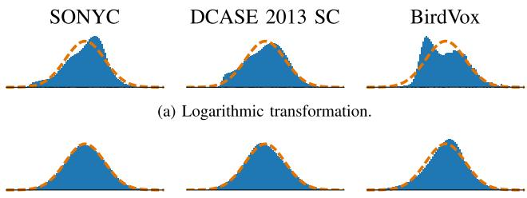
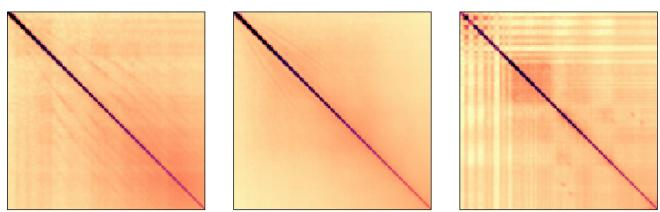
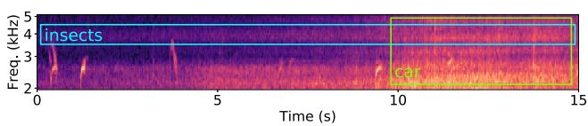
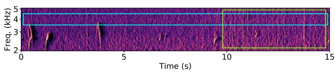
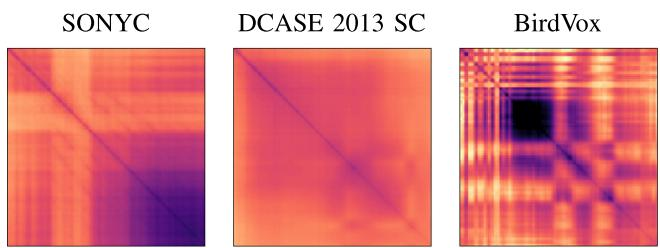
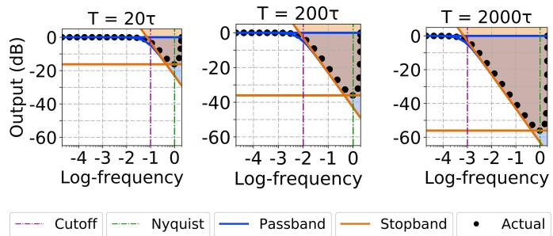
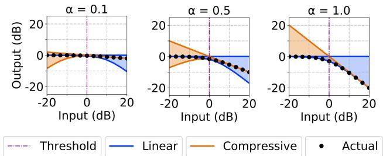
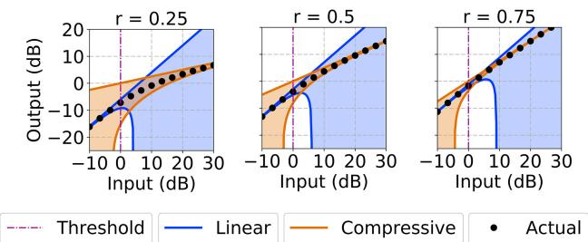

# Per-Channel Energy Normalization: Why and How

Vincent Lostanlen , Justin Salamon , Mark Cartwright , Brian McFee , Andrew Farnsworth , Steve Kelling, and Juan Pablo Bello

Abstract—In the context of automatic speech recognition and acoustic event detection, an adaptive procedure named per-channel energy normalization (PCEN) has recently shown to outperform the pointwise logarithm of mel-frequency spectrogram (logmelspec) as an acoustic frontend. This letter investigates the adequacy of PCEN for spectrogram-based pattern recognition in far-field noisy recordings, both from theoretical and practical standpoints. First, we apply PCEN on various datasets of natural acoustic environments and find empirically that it Gaussianizes distributions of magnitudes while decorrelating frequency bands. Second, we describe the asymptotic regimes of each component in PCEN: temporal integration, gain control, and dynamic range compression. Third, we give practical advice for adapting PCEN parameters to the temporal properties of the noise to be mitigated, the signal to be enhanced, and the choice of time-frequency representation. As it converts a large class of real-world soundscapes into additive white Gaussian noise, PCEN is a computationally efficient frontend for robust detection and classification of acoustic events in heterogeneous environments.

Index Terms—Acoustic noise, acoustic sensors, acoustic signal detection, signal classification, spectrogram.

## I. INTRODUCTION

F REQUENCY transposition is a major factor of intra-classvariability in many sound classification tasks, including automatic speech recognition (ASR) [1], acoustic event detection (AED) [2], and bioacoustic species classification [3]. Tuning auditory filters to the perceptual mel scale provides a timefrequency representation, named mel-frequency spectrogram, in which the frequency transpositions of any periodic audio signal become vertical translations [4]. In the presence of a single source, this property allows convolutional operators in the timefrequency domain [5], such as convolutional neural networks [1] and time-frequency scattering [6], to extract pitch contours as spectrotemporal patterns, regardless of their fundamental frequency – a property known as equivariance [7], [8].

Yet, there is often more than one active source in real-world audio recordings, especially outdoors [9]. Even after narrowing down the classification task to the identification of the most salient source only (thereafter called foreground), the presence of background noise is detrimental to equivariance along the mel-frequency axis [10]. Indeed, on one hand, intra-class variability causes frequency transposition of the foreground while leaving the background unaffected. On the other hand, equivariance is only possible if foreground and background happen to be transposed simultaneously. The generalizability of learned convolutional kernels across acoustically similar events of distinct fundamental frequencies is hindered by the contradiction between these two assumptions. To reconcile them, the background must result from a stochastic process that is stationary along the mel-frequency axis [11]. Indeed, the robustness of deep neural networks to adversarial additive perturbations has been shown to be theoretically optimal if background noise in the training set is additive, white, and Gaussian (AWGN) [12]. However, in the absence of any further processing, magnitudes in the mel-frequency spectrogram $\mathbf { E } ( t , { \dot { f } } )$ of real-world acoustic scenes are typically sparse and strongly correlated, both along time t and mel frequency f [13], and thus not approximable by AWGN.

Per-channel energy normalization (PCEN) [14] has recently been proposed as an alternative to the logarithmic transformation of the mel-frequency spectrogram (logmelspec), with the aim of improving robustness to channel distortion. PCEN combines dynamic range compression (DRC, also present in logmelspec) and adaptive gain control (AGC) with temporal integration. AGC is a prior stage to DRC involving a low-pass filter φT at a time scale T, thus yielding

$$
\mathbf {P C E N} (t, f) = \left(\frac {\mathbf {E} (t , f)}{(\varepsilon + (\mathbf {E} ^ {t} * \phi_ {T}) (t , f)) ^ {\alpha}} + \delta\right) ^ {r} - \delta^ {r}\tag{1}
$$

where $\alpha , \varepsilon , r ,$ and δ are positive constants. While DRC reduces the variance of foreground loudness, AGC is intended to suppress stationary background noise. The resulting representation has shown to improve performance in far-field ASR [15], AED [16], keyword spotting [14], [17], and vocal activity detection in music [18]. However, the literature is yet to provide clear insight into why and how PCEN works.

This article aims to address this gap by showing empirically how PCEN Gaussianizes and whitens mel-frequency magnitude spectra in various acoustic conditions, characterizing the effect of its various parameters by means of theoretical and practical insights combined, and providing concrete guidelines in setting them to optimize performance in a given application context.

  
(a) Logarithmic transformation.

  
(b) Per-channel energy normalization (PCEN)  
Fig. 1. A soundscape comprising bird calls, insect stridulations, and a passing vehicle. The logarithmic transformation of the mel-frequency spectrogram (a) maps all magnitudes to a decibel-like scale, whereas per-channel energy normalization (b) enhances transient events (bird calls) while discarding stationary noise (insects) as well as slow changes in loudness (vehicle). Data provided by BirdVox. Mel-frequency spectrogram and PCEN computed with default librosa 0.6.1 parameters and $T = 6 0$ ms (see Section IV).

## II. WHY PCEN WORKS: A STATISTICAL ANALYSIS

Figure 1 compares logmelspec and PCEN on a complex acoustic scene: while PCEN enhances chirped events, it converts background noise into a spectrotemporal texture that is devoid of long-range interactions. To demonstrate this property across a variety of acoustic conditions, we perform a comparative statistical analysis of logmelspec and PCEN output on a sample of urban, periurban, and rural recordings.

## A. Datasets

The SONYC dataset consists of 66 ten-second recordings sampled from from 51 sensors deployed across NYC during several months [19], and spanning 22 urban sound classes: car horn, crowd, jackhammer, etc. The SONYC dataset thus amounts to $2 2 \times 3 \times 1 0 = 6 6 0$ seconds of audio (7.3M coefficients).

The DCASE 2013 Scene Classification (SC) dataset was recorded in various periurban locations — both indoor and outdoor — near London, UK, by a person wearing a binaural microphone [20]. It consists of 100 half-minute recordings from ten different soundscape classes (open air market, restaurant, bus, etc.) amounting to $1 0 0 \times 3 0 = 3 0 0 0$ seconds of audio (33M coefficients).

The BirdVox project uses nine acoustic sensors near Ithaca, NY, USA, for monitoring avian migration [21]. Out of the 7k hours of audio in the full BirdVox data, we manually curate 15 one-minute recordings; the resulting subset amounts to 15 60 = 900 seconds of audio (10 M coefficients).

## B. Gaussianization ofMagnitudes

Figure 2 displays a histogram of all magnitudes in the matrix of mel-frequency spectrogram coefficients, after either logarithmic transformation or PCEN. We observe that, for each of the three datasets, logmelspec magnitudes exhibit a skewed distribution, either left (BirdVox) or right (SONYC, DCASE 2013 SC). Replacing the logarithm by an adapted Box-Cox power transform [22] could, in principle, improve normality, but the maximum likelihood inference of its two parameters (offset and exponent) is inadequate for real-time applications. Furthermore, we found in practice that both logarithm and adaptive Box-Cox led to leptokurtic distributions. On the contrary, PCEN successfully brings the distribution of magnitudes closer to Gaussian, with skewness and kurtosis both negligible.

(b) Per-channel energy normalization (PCEN).  
Fig. 2. Distributions of magnitudes in the mel-frequency spectrogram after logmelspec (a), and PCEN (b), as estimated on three datasets of acoustic scenes: SONYC (left); DCASE 2013 SC (middle); and BirdVox (right). Each distribution is scaled to null mean and unit variance, and discretized with 500 histogram bins ranging between 4 and 4. For comparison, the dashed line indicates the standard normal distribution. See Section II-B for details.  
  
(a) Logarithmic transformation  
(b) Per-channel energy normalization (PCEN).  
Fig. 3. Covariance matrices of frequency channels after logarithmic transformation (a) and PCEN (b), as estimated on three datasets of acoustic scenes: SONYC (left); DCASE 2013 (middle); and BirdVox (right). Darker shades indicate larger covariances in absolute value. See Section II-C for details.

The Shapiro-Wilk test of normality indicates statistically significant evidence to reject the claim that the logarithmic transformation Gaussianizes the distribution of spectrogram magnitudes $( p < 0 . 0 0 5$ on all three datasets). At the same time, the same test fails to reject the null hypothesis of normality in the distribution of PCEN magnitudes.

## C. Spectrogram Whitening by Decorrelation of Frequency Bands

Figure 3 displays the covariance matrices of mel-frequency spectrogram coefficients across frequency channels. While the logarithmic transformation suffers from strong crosscorrelations between non-adjacent bands, the covariance matrix of PCEN is close to identity, thus suggesting that noise is “whitened”.

  
Fig. 4. Bode plot of the filter $| \widehat { \phi _ { T } } ( \omega ) | ^ { 2 }$ , measured in relative magnitude (dB) as a function of the ratio $\frac { \omega } { \omega _ { \mathrm { c } } }$ between frequency and cut-off frequency $\begin{array} { r } { \omega _ { \mathrm { c } } = \frac { 2 \pi \tau } { T } } \end{array}$ . The time scale T is alternatively set to $1 0 ^ { 1 } 2 \tau ( \mathrm { l e f t } ) , 1 0 ^ { 2 } 2 \tau ( \mathrm { m i d d l e } ) .$ and 103 2τ (right). We observe a sidelobe falloff of 10 dB per decade in the stopband. Solid lines and shaded areas, respectively, denote asymptotic bounds and their corresponding error margins, as proved in Proposition III.1. The dashed purple (resp. green) vertical line denotes the cut-off (resp. Nyquist) frequency.

## III. HOW PCEN WORKS: AN ASYMPTOTIC ANALYSIS

PCEN’s ability to Gaussianize and whiten the background of acoustic recordings is the result of its three component operations of temporal integration, adaptive gain control, and dynamic range compression. In this section, we aim to elucidate the parameter space of these three operations by means of an asymptotic analysis.

## A. Temporal Integration

Filtering each subband $f$ in $\mathbf { E } ( t , f )$ with φ aims at estimating the intensity of background noise at $f$ while remaining invariant to the intensity of foreground events. Under the assumption that the amplitude modulations (AM) of the foreground at $f$ are faster than those of the background, T should be chosen to be above typical periods of foreground AM and below those of background AM. The same can be said of frequency modulation (FM): PCEN enhances chirped events in the mel-frequency spectrogram that move from one subband f to the next in less time than $T$ while attenuating slower FM. Thus, $T$ is the transition threshold between a stationary regime of background and a transient regime of foreground.

The original implementation of PCEN [14] defines $\phi _ { T } ( t )$ as a first-order IIR filter whose response to $\mathbf { E } ( t , f )$ is

$$
\mathbf {M} (t, f) = (\mathbf {E} * \phi_ {T}) (t, f) = s \mathbf {E} (t, f) + (1 - s) \mathbf {M} (t - \tau , f),\tag{2}
$$

where $0 < s < 1$ is the weight of the associated autoregressive process $( \operatorname { A R } ( 1 ) )$ and τ is the discretization time step (“hop size”) in seconds.

Proposition $I I I . I { : }$ The autoregressive filter $\phi _ { T }$ defined in Equation 2 is a low-pass filter of gain 0 dB, cutoff frequency $\begin{array} { r } { \omega _ { \mathrm { c } } = \frac { 2 \pi \tau } { T } = \operatorname { a r c c o s } ( 1 - \frac { s ^ { 2 } } { 2 ( 1 - s ) } ) } \end{array}$ at 3 dB, and sidelobe falloff of 10 dB per decade near $\omega _ { \mathrm { c } }$

Figure 4 illustrates the frequency response of $\phi _ { T }$ for different values of T.

## B. Adaptive Gain Control (AGC)

The smoothed mel-frequency spectrogram $\mathbf { M } ( t , f )$ estimates the level of stationary background noise level in each frequency band $f$ (where background is defined as slower AM than $T )$ and serves to adapt the gain level in the denominator of the

  
Fig. 5. Static compression characteristic of gain $\mathbf { M } \mapsto ( \varepsilon + \mathbf { M } ) ^ { - \alpha }$ , as a function of the ratio $\frac { \mathrm { ~ M ~ } } { \varepsilon }$ between input magnitude M and soft threshold ε. The exponent α is alternatively set to 0.1 (left), 0.5 (middle), and 1.0 (right). Solid lines and shaded areas, respectively, denote asymptotic bounds and their corresponding error margins, as proved in Proposition III.2. The dashed purple vertical line denotes the transition ${ \bf M } = \varepsilon .$

following equation:

$$
\mathbf {G} (t, f) = \frac {\mathbf {E} (t , f)}{(\mathbf {M} (t , f) + \varepsilon) ^ {\alpha}},\tag{3}
$$

where $0 < \alpha < 1 ( \mathrm { r e s p . } \varepsilon > 0 )$ is the exponent (resp. soft threshold) of AGC. This stage resembles mean-variance renormalization [23], relative spectra (RASTA) [24], and cepstral mean normalization [25].

The parameter ε distinguishes two regimes: silent $( \mathbf { M } ( t , f ) \mathbf { \Psi } \ll \varepsilon )$ and active $( \mathbf { M } ( t , f ) \gg \varepsilon )$ . Multiplying $\mathbf { E } ( t , f )$ by some constant C leads to $\mathbf { \dot { G } } ( t , f )$ being multiplied by approximately C in the silent regime and by $\mathsf { \bar { C } } ^ { 1 - \alpha }$ in the active regime. For ε of the order of unit roundoff and α close to 1, the following proposition proves that AGC is nonexpansive in quasi-silent frequency bands and strongly compressive in active frequency bands.

Proposition $I I I . 2 \colon \mathbf { G } ( t , f )$ is asymptotically equivalent to: (i) $\mathbf { E } ( { \dot { t } } , f ) / \varepsilon ^ { \alpha }$ if $\mathbf { M } ( t , f ) \ll \varepsilon$ and to (ii) $\mathbf { E } ( t , \bar { f } ) / \mathbf { \bar { M } } ( t , f ) ^ { \alpha }$ if $\mathbf { M } ( t , f ) \gg \varepsilon .$

Figure 5 illustrates the empirical fit of the characteristic $\mathbf { M } \mapsto ( \mathbf { M } + \varepsilon ) ^ { - \alpha }$ to the asymptotic regimes described in Proposition III.2. In the active regime, bringing α closer to 1 (resp. to 0) leads to more (resp. less) cancellation of background noise.

In the limit case $\varepsilon = 0$ and $\alpha = 1$ , the proposition below proves that spectral equalization does not affect G, because its effect on the numerator E is compensated by AGC with M.

Proposition III.3: Let h(t) be the impulse response of some acoustic environment or recording device. $\operatorname { I f } | { \widehat { \mathbf { h } } } | ( f ) = 0 \operatorname { f o r } f <$ $\textstyle { \frac { 1 } { T } }$ and $| \widehat { \mathbf { h } } | ( f ) > 0$ for every f in the audible range, G is invariant to the filtering of the underlying waveform by h.

This result, derived from [26], makes PCEN suitable for remote sensing applications, where acoustic models need to be robust to variations in the absorption properties of the environment, as well as in sensor technology [5], [27].

## C. Dynamic Range Compression (DRC)

The last stage of PCEN is the addition of a positive bias δ to ${ \bf G } ( t , f )$ , followed by pointwise exponentiation of the sum:

$$
\mathbf {P C E N} (t, f) = (\mathbf {G} (t, f) + \delta) ^ {r} - \delta^ {r},\tag{4}
$$

where $0 < r < 1 ( \mathrm { r e s p . } \delta > 1 )$ ) is the exponent (resp. soft threshold) of dynamic range compression.

The parameter δ distinguishes two regimes: quiet $( \mathbf G \ll \delta )$ and loud $( \mathbf { G } \gg \delta )$ after AGC. For $\mathbf { M } ( { \bar { t } } , f ) \gg { \bar { \varepsilon } }$ , multiplying $\mathbf { E } ( t , f )$ by some constant C leads to ${ \bf G } ( t , f )$ being multiplied by $C ^ { 1 - \alpha }$ in the quiet regime, and by $C ^ { r ( 1 - \alpha ) }$ in the loud regime. Therefore, DRC is stronger for smaller values of r.

  
Fig. 6. Static compression characteristic of dynamic range compressions $\mathbf { G } \mapsto ( \mathbf { G } + \boldsymbol { \delta } ) ^ { r } - \boldsymbol { \delta } ^ { r }$ , as a function of the ratio $\dot { \frac { \mathbf { G } } { \delta } }$ between input magnitude G and soft threshold δ, for different values of r: 0.25 (left), 0.5 (right), and 0.75 (right). Solid lines and shaded areas, respectively, denote asymptotic bounds and their corresponding error margins, as proved in Proposition III.4.

Proposition III.4: PCEN is asymptotically equivalent to: (i) $r \delta ^ { ( r - 1 ) } \mathbf { G }$ for $\mathbf G \ll \delta$ and to (ii) $\mathbf { G } ^ { r }$ for $\mathbf { G } \gg \delta .$

DRC resembles a spectral substraction in the context of speech restoration [28]. Figure 6 illustrates the empirical fit of the characteristic $\bar { \mathbf { G } } \mapsto \mathbf { \bar { ( G + } } \delta ) ^ { r } - \delta ^ { r }$ to the asymptotic regimes described in Proposition III.4.

## IV. PRACTICAL RECOMMENDATIONS

## A. Setting Parameters T and s

As discussed in SubSection III-A, the time constant $T \ ( \mathrm { d i } -$ rectly linked to the dimensionless parameter s) should be longer than the time taken by a frequency-modulated foreground event to move from one subband $f$ to another, adjacent subband. For a mel-frequency spectrogram of N bands ranging between mel $( f _ { \mathrm { m i n } } )$ and $\mathrm { m e l } \dot { ( } f _ { \mathrm { m a x } } ^ { \ast } )$ , a rule of thumb for PCEN in AED is

$$
\frac {T \times c \times N}{\mathrm{mel} (f _ {\mathrm{max}}) - \mathrm{mel} (f _ {\mathrm{min}})} = K,\tag{5}
$$

where c is the typical chirp rate of the event of interest, measured in mels per second; and K is some constant, depending on the reverberation properties of the environment. If the melfrequency spectrogram is replaced by a constant-Q transform, the rule of thumb simply becomes $T \times c \times Q = K$ , where c (resp. Q) is measured in octaves (resp. octaves per second). K is of the order of 1 in dry environments and above 10 in highly reverberant environment, e.g. bioacoustic event detection [29], [30].

In Equation 5, the optimal value of $T$ does not solely depend on the physical phenomenon of interest (through the chirp rate c and reverberation constant $K )$ , but also on the choice of parametrization of the mel-frequency spectrogram (through $\bar { N , f _ { \mathrm { m i n } } } , \mathrm { a n d } f _ { \mathrm { m a x } } )$ . Therefore, in the context of hyperparameter optimization, any change in the resolution of the time-frequency representation should be reflected in an update of $T _ { \mathbf { \delta } }$ , which in turn updates s through the following formula.

Proposition IV.1: At a discrete rate $\tau ^ { - 1 }$ , the weight s of the autoregressive filter $\phi _ { T }$ defined in Equation 2 is

$$
s = \sqrt {1 - \cos \frac {2 \pi \tau}{T}} \left(\sqrt {3 - \cos \frac {2 \pi \tau}{T}} - \sqrt {1 - \cos \frac {2 \pi \tau}{T}}\right).\tag{6}
$$

## B. Setting Parameters ε and α

In accordance with [14], we found empirically that T and α were the most important parameters. Although $\alpha = 1$ leads to an optimal cancellation of stationary background (see Prop. III.3), it may skew the distribution of magnitudes towards the right. Setting α below 1 reduces skewness and brings the background closer to AWGN. However, we have found ε to have no effect as long as it is set below unit roundoff.

## C. Setting Parameters δ and r

The effects of δ and r are more noticeable on the foreground time-frequency regions than on the background. The DRC threshold $\delta > 1$ sets a tradeoff between improving average foreground-to-background ratio $( \delta \to + \infty$ in highly noisy applications) and reducing variance in the loudness of foreground events $( \delta  1 )$ . Moreover, if the foreground source is transient with respect to the time scale T and at distance d from the sensor, the energy in $\mathbf { E } ( t , f )$ is proportional to $\textstyle { \frac { 1 } { d ^ { 2 } } }$ : therefore, under a fixed background noise level $\mathbf { M } ( t , f )$ , one has $\begin{array} { r } { \mathbf { G } \sim \frac { 1 } { d ^ { 2 } } } \end{array}$ and $\begin{array} { r } { \mathbf { P C E N } \sim \frac { 1 } { d ^ { 2 r } } } \end{array}$ . We recommend $\begin{array} { r } { r = { \frac { 1 } { 2 } } } \end{array}$ for indoor applications (d  10 m) and $\textstyle r = { \frac { 1 } { 4 } }$ for outdoor applications (d  100 m).

## D. Open Source Implementation ofPCEN in Librosa

We release an open source implementation of PCEN in librosa v0.6.1 [31], whose default parameters are identical to [14]: T = 400 ms $( \mathrm { i . e . ~ } s \approx 0 . 0 2 5$ with $\tau = 2 3 \mathrm { m s } ) , \varepsilon = 1 0 ^ { - 6 }$ $\alpha = 0 . 9 8 , \delta = 2$ , and $\begin{array} { r } { r = \frac { 1 } { 2 } } \end{array}$ . Whereas these defaults are best suited to indoor applications (e.g. ASR in the smart home), bioacoustic event detection distinguishes itself by faster modulations of foreground (lower T), higher skewness of background magnitudes (lower α), a louder background (higher δ), and more distant sources (lower r). Thus, we adopt the following settings in our bird detection work: $T = 6 0$ ms with $Q = 5 0$ and $\tau = 1 . 5 \mathrm { m s } , \varepsilon = 1 0 ^ { - 6 } , \alpha = 0 . 8 , \delta = 1 0$ , and $r = 0 . 2 5$ . The inspection of magnitude histograms (Figure 2) and covariance matrices (Figure 3) suggests that such settings lead to a successful Gaussianization and decorrelation of subbands.

## V. CONCLUSION

Unlike batch learning decorrelation procedures such as principal component analysis (PCA), PCEN can be implemented in real time and distributed across sensors [19]; in addition, it preserves the locality structure of harmonic patterns along the mel-frequency axis [32]. Although it depends on five parameters $( T , \alpha , \varepsilon , r ,$ and δ) that are possibly frequency-dependent, this article has shown that each of these parameters has an interpretable purpose, and given asymptotic approximations of the PCEN equations in ideal regimes: silent vs. active (ε), stationary vs. transient (T), and quiet vs. loud (δ). In the context of deep learning for ASR and AED, our results could yield well-adapted initial values for the trainable version of PCEN [14], as well as a post hoc interpretation of all learned parameters.

## ACKNOWLEDGMENT

The authors wish to thank Richard F. Lyon for helpful discussions.

## REFERENCES

[1] O. Abdel-Hamid, A.-r. Mohamed, H. Jiang, L. Deng, G. Penn, and D. Yu, “Convolutional neural networks for speech recognition,” IEEE/ACM Trans. Audio Speech Lang. Process., vol. 22, no. 10, pp. 1533– 1545, Oct. 2014.

[2] M. Espi, M. Fujimoto, K. Kinoshita, and T. Nakatani, “Exploiting spectro-temporal locality in deep learning based acoustic event detection,” EURASIP J. Audio Speech Music Process., vol. 2015, 2015, Art. no. 26.

[3] J. Salamon, J. P. Bello, A. Farnsworth, and S. Kelling, “Fusing shallow and deep learning for bioacoustic bird species classification,” in Proc. IEEE Int. Conf. Acoust. Speech Signal Process., 2017, pp. 141–145.

[4] S. Umesh, L. Cohen, and D. Nelson, “Fitting the mel scale,” in Proc. IEEE Int. Conf. Acoust. Speech Signal Process., 1999, pp. 217–220.

[5] V. Lostanlen, “Convolutional operators in the time-frequency domain,” Ph.D. dissertation, Ecole normale sup´ erieure, Paris, France,´ 2017.

[6] J. Anden and V. Lostanlen, “Joint time-frequency scattering for audio´ classification,” in Proc. IEEE Int. Workshop Mach. Learn. Signal Process., 2015, pp. 1–6.

[7] R. Kondor and S. Trivedi, “On the generalization of equivariance and convolution in neural networks to the action of compact groups,” in Proc. 35th Int. Conf. Mach. Learn., 2018, pp. 1–14.

[8] S. Mallat, “Understanding deep convolutional networks,” Phil. Trans. R. Soc. A, vol. 374, no. 2065, 2016, Art. no. 20150203.

[9] A. Mesaros, T. Heittola, and T. Virtanen, “Metrics for polyphonic sound event detection,” Appl. Sci., vol. 6, 2016, Art. no. 162.

[10] J. Salamon and J. P. Bello, “Deep convolutional neural networks and data augmentation for environmental sound classification,” IEEE Signal Process. Lett., vol. 24, no. 3, pp. 279–283, Mar. 2017.

[11] R. Badeau, “Preservation of whiteness in spectral and time-frequency transforms of second-order processes,” Institut Mines Tel´ ecom, Paris,´ France, Tech. Rep. 2016D001, Jan. 2016.

[12] J.-Y. Franceschi, A. Fawzi, and O. Fawzi, “Robustness of classifiers to uniform 	p and gaussian noise,” in Proc. 21st Int. Conf. Artif. Intell. Statist., 2018, pp. 1–25.

[13] J. H. McDermott and E. P. Simoncelli, “Sound texture perception via statistics of the auditory periphery: Evidence from sound synthesis,” Neuron, vol. 71, no. 5, pp. 926–940, 2011.

[14] Y. Wang, P. Getreuer, T. Hughes, R. F. Lyon, and R. A. Saurous, “Trainable frontend for robust and far-field keyword spotting,” in Proc. IEEE Int. Conf. Acoust. Speech Signal Process., 2017, pp. 5670–5674.

[15] E. Battenberg et al., “Reducing bias in production speech models,” arXiv:1705.04400.

[16] S. Krstulovic, “Audio event recognition in the smart home,” in´ Computational Analysis of Sound Scenes and Events. New York, NY, USA: Springer-Verlag, 2018, pp. 335–371.

[17] C. Shan, J. Zhang, Y. Wang, and L. Xie, “Attention-based end-to-end models for small-footprint keyword spotting,” 2018, arXiv:1803.10916.

[18] J. Schluter and B. Lehner, “Zero-mean convolutions for level-invariant¨ singing voice detection,” in Proc. 19th Int. Soc. Music Inf. Retrieval, 2018, pp. 1–6.

[19] J. P. Bello et al., “SONYC: A system for the monitoring, analysis and mitigation of urban noise pollution,” Commun. Assoc. Comput. Mach., in press, 2018.

[20] D. Stowell, D. Giannoulis, E. Benetos, M. Lagrange, and M. D. Plumbley, “Detection and classification of acoustic scenes and events,” IEEE Trans. Multimedia, vol. 17, no. 10, pp. 1733–1746, Oct. 2015.

[21] V. Lostanlen, J. Salamon, A. Farnsworth, S. Kelling, and J. P. Bello, “Birdvox-full-night: A dataset and benchmark for avian flight call detection,” in Proc. IEEE Int. Conf. Acoust. Speech Signal Process., 2018, pp. 266–270.

[22] G. E. Box and D. R. Cox, “An analysis of transformations,” J. Roy. Statist. Soc. Ser. B (Methodological), vol. 26, pp. 211–252, 1964.

[23] C.-P. Chen and J. A. Bilmes, “MVA processing of speech features,” IEEE Trans. Audio Speech Lang. Process., vol. 15, no. 1, pp. 257–270, Jan. 2007.

[24] H. Hermansky and N. Morgan, “RASTA processing of speech,” IEEE Trans. Speech Audio Process., vol. 2, no. 4, pp. 578–589, Oct. 1994.

[25] B. S. Atal, “Effectiveness of linear prediction characteristics of the speech wave for automatic speaker identification and verification,” J. Acoust. Soc. Amer., vol. 55, no. 6, pp. 1304–1312, 1974.

[26] J. Anden and S. Mallat, “Deep scattering spectrum,”´ IEEE Trans. Signal Process., vol. 62, no. 16, pp. 4114–4128, Aug. 2014.

[27] A. Katsamanis, I. Rodomagoulakis, G. Potamianos, P. Maragos, and A. Tsiami, “Robust far-field spoken command recognition for home automation combining adaptation and multichannel processing,” in Proc. IEEE Int. Conf. Acoust. Speech Signal Process, 2014, pp. 5547–5551.

[28] J. Porter and S. Boll, “Optimal estimators for spectral restoration of noisy speech,” in Proc. IEEE Int. Conf. Acoust. Signal Speech Process, 1984, pp. 53–56.

[29] J. Salamon et al., “Towards the automatic classification of avian flight calls for bioacoustic monitoring,” PLoS One, vol. 11, no. 11, 2016, Art. no. e0166866.

[30] J. Shonfield and E. Bayne, “Autonomous recording units in avian ecological research: Current use and future applications,” Avian Conservation Ecol., vol. 12, no. 1, 2017, Art. no. 14.

[31] B. McFee et al., “librosa/librosa: 0.6.1,” May 2018. [Online]. Available: https://doi.org/10.5281/zenodo.1252297

[32] V. Lostanlen and C. E. Cella, “Deep convolutional networks on the pitch spiral for musical instrument recognition,” in Proc. Int. Soc. Music Inf. Retrieval, 2016, pp. 1–6.