# A survey on active noise control techniques–Part I: Linear systems

Lu Lua, Kai-Li Yinb, Rodrigo C. de Lamarec, Zongsheng Zhengd, Yi Yue, Xiaomin Yanga∗, Badong Chenf

a) School of Electronics and Information Engineering, Sichuan University, Chengdu, Sichuan 610065, China.   
b) School of Computer Science, Sichuan University, Chengdu, Sichuan 610065, China.   
c) CETUC, PUC-Rio, Rio de Janeiro 22451-900, Brazil.   
d) School of Electrical Engineering, Sichuan University, Chengdu, 610065, China.   
e) School of Information Engineering, Robot Technology Used for Special Environment Key Laboratory of Sichuan Province, Southwest University of Science and Technology, Mianyang 621010, China.   
f) School of Electronic and Information Engineering, Xi’an Jiaotong University, Xi’an 710049, China.

# Abstract

Active noise control (ANC) is an effective way for reducing the noise level in electroacoustic or electromechanical systems. Since its first introduction in 1936, this approach has been greatly developed. This paper focuses on discussing the development of ANC techniques over the past decade. Linear ANC algorithms, including the celebrated filtered-x least-mean-square (FxLMS)- based algorithms and distributed ANC algorithms, are investigated and evaluated. Nonlinear ANC (NLANC) techniques, such as functional link artificial neural network (FLANN)-based algorithms, are pursued in Part II. Furthermore, some novel methods and applications of ANC emerging in the past decade are summarized. Finally, future research challenges regarding the ANC technique are discussed.

Keywords: Active noise control, Adaptive filtering, FxLMS-based algorithms, Distributed algorithms.

⋆The work is supported by the National Science Foundation of P.R. China under Grant 61901285, 61901400, and 61701327, Sichuan Science and Technology Fund under Grant 20YYJC3709, China Postdoctoral Science Foundation under Grant 2020T130453, and Sichuan University Postdoctoral Interdisciplinary Fund. E-mail addresses: lulu19900303@126.com(L. Lu), kl yin@hotmail.com(K.-L. Yin), delamare@cetuc.puc-rio.br(R.C. de Lamare), zongsheng56@126.com(Z. Zheng), yuyi xyuan@163.com(Y. Yu), arielyang@scu.edu.cn(X. Yang), chenbd@mail.xjtu.edu.cn(B. Chen). Corresponding author: Xiaomin Yang.

# 1. Introduction

Traditional noise control methods use passive noise control (PNC) techniques such as sealing and shielding to attenuate noise. However, such methods suffer from the bulky volume, expensive cost, and degradation performance for reducing low-frequency noise, which hinders its practical use [1]. To address this problem, active noise control (ANC) was developed, based on the principle that noise can be canceled by another noise with the same amplitude but an opposite phase [2, 3]. The development of ANC history can be found in [4, 5] and references therein.

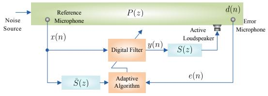

<details>
<summary>flowchart</summary>

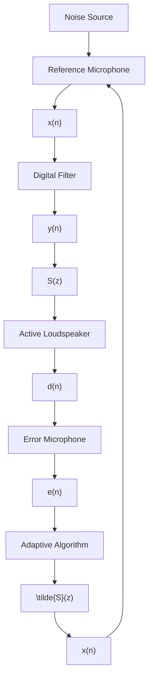
</details>

Figure 1: Diagram of the feedforward ANC model, where n is the iteration, and z is for z-transform.

In ANC, the most popular adaptive algorithm is the filtered-x least-mean-square (FxLMS) algorithm. The FxLMS algorithm exhibits a simple structure, thus it has been extensively studied and extended [6, 7, 8]. Fig. 1 plots the diagram of a feedforward ANC model, where $P ( z )$ denotes the primary path, S(z) denotes the secondary path, which can be used to model the acoustic path between the loudspeaker and the microphone, or the electro-acoustic path that also includes the effects of the amplifier and the driver circuit, $\hat { S } ( z )$ represents the estimate of the secondary path model, $x ( n )$ stands for the reference signal, $d ( n )$ denotes the undesired signal, $y ( n )$ denotes the output of the controller, and $e ( n )$ denotes the residual noise. Morgan’s experiment demonstrated that, for the narrowband ANC (NANC) system, the convergence property of the adaptive algorithm largely relies on the phase response of the filter $S ( z )$ [9]. As the phase increases, it will oscillate and eventually cause instability in the entire ANC system. An effective solution is the introduction of the estimated secondary path, i.e., $\hat { S } ( z )$ . The above method is usually referred to as filtered approach. However, the secondary path increases its eigenvalue spread, and it slows down the convergence speed of the FxLMS algorithm [10, 11]. More importantly, $\hat { S } ( z )$ is not equal to $S ( z )$ in practical applications. Numerous online secondary path estimation methods were developed, which exhibit improved modeling performance than the conventional methods [12, 13, 14, 15, 16, 17]. In particular, a secondary path modeling for NANC systems was presented in [18], which analyzed both online and offline estimation methods and demonstrated improved modeling accuracy.

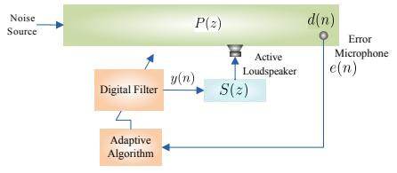

<details>
<summary>flowchart</summary>

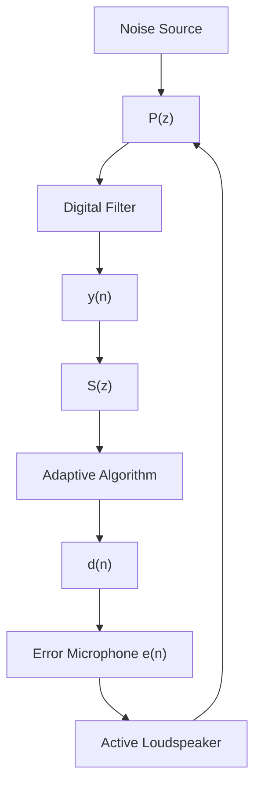
</details>

Figure 2: Diagram of the feedback ANC model.

Another ANC system model employs the feedback strategy. In contrast with the feedforward ANC system, the feedback ANC system does not need the a priori information picked up by the reference microphone, and the attenuated noise level only depends on the active loudspeaker, the adaptive controller, and the error microphone [19]. Moreover, it is not affected by multiple noise sources [20]. The block diagram of the feedback ANC system is shown in Fig. 2. The feedback structure delivers a significantly lower implementation cost, but its drawbacks are also obvious. The main drawback is the stability problem, similar to the infinite impulse response (IIR) filter. The second weakness is the ‘waterbed effect’ which implies that it is theoretically impossible to suppress noise simultaneously at all frequencies. If the noise at some frequencies is suppressed in a feedback ANC system, the noise will be increased at some other frequencies [21]. Furthermore, the noise attenuation bandwidth is typically limited. Thus, few feedback ANC systems involve controlling broadband noise, such as chaotic noise and random noise [19, 20]. A vast number of efforts have been developed to solve these limitations, e.g., see [19, 21, 20].

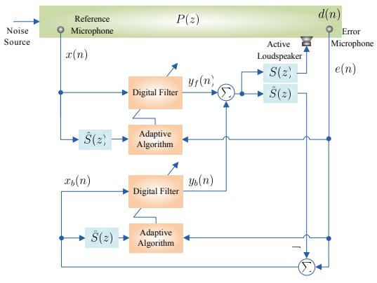

<details>
<summary>flowchart</summary>

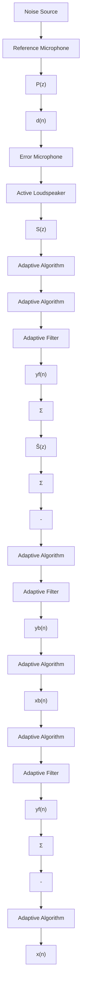
</details>

Figure 3: Diagram of hybrid ANC model.

The hybrid ANC model combined the feedforward and feedback structures, whose secondary signal is generated by the sum of the output of the feedforward and feedback structures. Fig. 3 shows the diagram of a hybrid ANC model, where $x _ { b } ( n )$ and $y _ { b } ( n )$ are the reference signal and output of controller in the feedback structure, respectively, and $y _ { f } ( n )$ is the output of the controller in the feedforward structure. Such model has high design flexibility, and it can control noise and uncorrelated narrowband interference generated by other apparatuses [22, 23]. A guideline for selecting an ANC type was proposed in [24], which analyzes the maximum achievable noise attenuation level for feed-forward, feedback, and hybrid ANC structures. Over the past decade, many efforts were conducted by using the hybrid ANC model [25, 26, 27, 16]. In what follows, we will cover these works in different categories.

Following a different direction, some sparsity-aware ANC algorithms were proposed to exploit the sparsity of the physical system [28]. The convex combination scheme was also developed for ANC to avert the conflicting requirement between fast convergence and small residue [29]. It turns out that this strategy can be applied not only to linear multi-channel ANC situations [29], but also to nonlinear ANC (NLANC) systems [30]. The ANC can cancel the noise at the microphone location. As a result of the reduction of the noise level at this point, a spatial zone of quiet (ZoQ) is created around it. However, its zones of interest are no more than a finite number of discrete points, leading to a restriction to generate 3-D quiet zones. In 2013, an ANC algorithm in 3-D space was developed, which can apply to quiet zones with comparable complexity and fills the gap in this technology [31]. Benefiting from wireless acoustic sensor networks (WASNs), an ANC system over a network of distributed acoustic nodes was proposed, which is based on incremental collaborative strategy with a sample-by-sample data acquisition in the time-domain [32]. Following this work, several distributed algorithms were presented in recent years.

Survey articles on ANC techniques have been published by many researchers [5, 33, 34, 35, 36]. However, these surveys only focus on one of the problems in ANC, and they do not cover the literature since 2013. To complete the review of ANC techniques and include the latest developments, a comprehensive review from 2009 to 2020 on linear ANC1, NLANC, and recent methods and applications are compiled in this article and the accompanying Part II. In particular, we summarize and compare the novel modeling methods and algorithms in the last ten years.

In this Part I, we focus on the development of the past decade of linear ANC techniques, while in Part II we summarize the development of NLANC technique and the recent applications of ANC technique. The paper is organized as follows. In Section 2, we review the finite impulse response (FIR) and IIR filter-based ANC algorithms. In Section 3, some practical considerations in linear ANC systems are reviewed. In Section 4, we emphasize the novel linear ANC methods that emerged in the past decade. Finally, we summarize the conclusions in Section 5.

# 2. FIR and IIR filter-based ANC algorithms

Linear ANC systems based on FIR and IIR filters have been extensively studied in the past decade. This section reviews the filtered-x-, filtered-e-, and filtered-u-based algorithms, which are related to standard adaptive algorithms [37, 38, 39, 40, 41, 42, 43, 44, 45, 46, 47, 48, 49, 50, 51, 52, 53, 54, 55, 56, 57, 58, 59, 60, 61, 62, 63, 64, 65, 66, 67, 68, 69, 70, 71, 72, 73, 74, 75, 76, 77, 78, 79, 80, 81, 82, 83, 84, 85, 86, 87, 88, 89, 90, 91, 92, 93, 94, 95, 96, 97, 98, 99, 100, 101, 102, 103, 104, 105, 106, 107, 108, 109], for different types of undesired signals.

# 2.1. Filtered-x ANC family

Some fundamental methods of the filtered-x ANC family have been developed before the last decade. These contributions are summarized in Table 1. The papers listed in this review in some cases are extensions or variations of the fundamental methods.

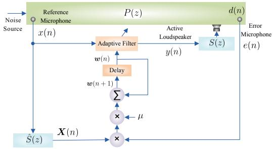

<details>
<summary>flowchart</summary>

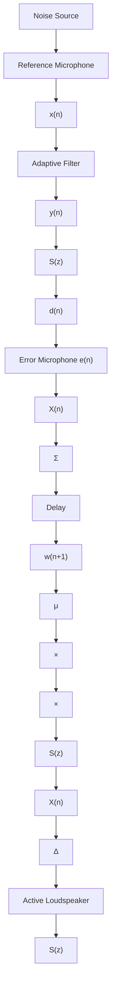
</details>

Figure 4: Diagram of feedforward ANC system with the FxLMS algorithm.

# 2.1.1. Filtered-x LMS-based algorithms

The FxLMS algorithm has low computational complexity for linear ANC, and this algorithm is the cornerstone of many other algorithms. It can be used with feedforward, feedback, and

Table 1: Time line of filtered-x ANC algorithms. 

<table><tr><td>Years</td><td>Authors</td><td>Contributions</td><td>References</td></tr><tr><td>1987</td><td>Elliott, Stothers, and Nelson</td><td>Generalize FxLMS for active control of sound and vibration algorithm</td><td>[110]</td></tr><tr><td>1992</td><td>Shen and Spanias</td><td>Frequency-domain FxLMS algorithm for ANC</td><td>[111]</td></tr><tr><td>1993</td><td>Kuo and Luan</td><td>Cross-coupled filtered-x LMS algorithm with lattice structure to decorrelate the reference input</td><td>[112]</td></tr><tr><td>1993</td><td>Thi and Morgan</td><td>Delayless subband algorithm for ANC</td><td>[113]</td></tr><tr><td>2000</td><td>Bouchard and Quednau</td><td>Multi-channel filtered-x recursive least square (FxRLS) and multi-channel filtered-x fast-transversal-filter (FTF) algorithms</td><td>[114]</td></tr><tr><td>2001</td><td>Park et al.</td><td>Low-cost delayless subband algorithm</td><td>[115]</td></tr><tr><td>2003</td><td>Lan, Zhang, and Ser</td><td>Weight-constrained filtered-x LMS algorithm for broadband noises</td><td>[116]</td></tr><tr><td>2005</td><td>Tobias and Seara</td><td>Analysis of the leaky FxLMS algorithm for Gaussian data and secondary path modeling error</td><td>[117]</td></tr><tr><td>2005</td><td>Carini and Sicuranza</td><td>Multi-channel filtered-x affine projection (FxAP) algorithm and its performance analysis</td><td>[118]</td></tr><tr><td>2006</td><td>Sun, Kuo, and Meng</td><td>FxLMS algorithm with clipped reference signals for impulsive noise control</td><td>[119]</td></tr><tr><td>2007</td><td>Das, Panda, and Kuo</td><td>Reduced-structure of fast Fourier transform (FFT)-based block filtered-x LMS and fast Hartley transform (FHT)-based block filtered-x LMS algorithms</td><td>[120]</td></tr><tr><td>2007</td><td>Sun and Kuo</td><td>Cascade FxLMS algorithm for NANC</td><td>[121]</td></tr><tr><td>2007</td><td>Carini and Sicuranza</td><td>Optimal regularized FxAP algorithm</td><td>[122]</td></tr><tr><td>2007</td><td>Zhou and DeBrunner</td><td>FxLMS algorithm based on geometric analysis and the strict positive real (SPR) property, and without secondary path identification for single-tone noises</td><td>[123]</td></tr></table>

hybrid ANC systems. The block diagram of the feedforward ANC system using the FxLMS-based algorithms is shown in Fig. 4. The residual noise (error signal) can be expressed as

$$
e (n) \triangleq d (n) - s (n) * y (n) \tag {1}
$$

where ∗ denotes the convolution operation, and $s ( n )$ stands for the impulse response of $S ( z )$ . The output of the controller is given by $y ( n ) = w ^ { \mathrm { T } } ( n ) x ( n )$ , where $\pmb { x } ( n ) = [ x ( n ) , x ( n - 1 ) , \dots , x ( n - M +$ $1 ) ] ^ { \mathrm { T } }$ is the input vector, $( \cdot ) ^ { \mathrm { T } }$ is the transpose operation, M denotes the filter length, and $w ( n )$ is the weight vector of the controller. The update equation of the basic FxLMS algorithm is expressed as [9]

$$
\boldsymbol {w} (n + 1) = \boldsymbol {w} (n) + \mu e (n) \boldsymbol {X} (n) \tag {2}
$$

where µ is the step size and $X ( n ) = s ( n ) * x ( n )$ is the secondary signal. In particular, for global active control of noise inside a cavity, the modal FxLMS algorithm is adopted [124, 125]. The conventional FxLMS algorithm is formulated in the modal domain of the acoustic cavity to reduce the specific acoustic modes. The modal FxLMS algorithm brings the concept of ‘modal secondary path’ and ‘modal secondary signal’. Instead of the reference signal filtered using physical secondary paths, the modal FxLMS algorithm obtained $X ( n )$ by reference signal filtered employing modal secondary paths. By this way, the computational burden associated with filtering of the $\mathbf { \boldsymbol { x } } ( \boldsymbol { n } )$ with S(z) can be reduced, and acoustic potential energy can be reduced for the global noise control.

In the following, we summarize the development of the FxLMS-based algorithms from the type of undesired signal.

# 1) FxLMS-based algorithms for broadband noise

• Theoretical analysis: In order to ensure that the achievable reduction level predicted by theory can be realized in practice, effective theoretical analysis is crucial for the FxLMS algorithm. The analysis of the FxLMS algorithm has been deeply studied not only in the past decade, but also during the past few years. The development of FxLMS analysis before the past decade is summarized in Table 2.

In [133], the FxLMS algorithm was analyzed based on the assumption that the secondary path is a moving average (MA) process and the stochastic input signal, which surmounts the limitation of deterministic input signal2. Furthermore, in [135], a new theoretical analysis of the FxLMS algorithm was conducted based on the method in [133] which considers the general secondary path cases. Aiming at revealing the convergence property of ANC systems with online secondary path estimation, the analysis of the broadband FxLMS algorithm was performed in [136]. In [137], an interesting trial was attempted to introduce the statistical-mechanics approach to analyze the FxLMS algorithm. According to this theory, the models and variables are represented by the cross-correlation between the elements or the auto-correlation of the elements. By making use of differential equations, the dynamical behaviors of the direction cosines among the vectors of an adaptive filter, the shifted filters, and an unknown system are described as the macroscopic variables. Such approach does not employ the independence assumption and small step size condition, which are widely used in the other studies. Follow-up works can be seen in [138, 139].

Table 2: Development of FxLMS analysis before the past decade. 

<table><tr><td>Years</td><td>Authors</td><td>Conditions</td><td>Contributions</td><td>References</td></tr><tr><td>1989</td><td>Long, Ling, and Proakis</td><td>The secondary path is a delay system and the input signal is a broadband white signal</td><td>Analysis of behavior of the delayed LMS algorithm</td><td>[126, 127]</td></tr><tr><td>1995</td><td>Bjarnason</td><td>The secondary path is a delay system and the input signal is a Gaussian or colored Gaussian signals</td><td>Analysis of the FxLMS algorithm with offline and online estimation of the error-path filter</td><td>[128]</td></tr><tr><td>2000</td><td>Tobias, Bermudez, and Bershad</td><td>Imperfect secondary path estimation and the input signal is a white or colored reference signals</td><td>Analysis of the FxLMS algorithm without independent assumption</td><td>[129]</td></tr><tr><td>2007</td><td>Fraanje et al.</td><td>Asymptotically convergence of FxLMS</td><td>Analysis of the robustness of the FxLMS algorithm</td><td>[130, 131]</td></tr><tr><td>2007</td><td>Barrault, Bermudez, and Lenzi</td><td>Performance of FxLMS in a finite duct</td><td>Using a stochastic differential equation (SDE) to analyze the performance of the FxLMS algorithm</td><td>[132]</td></tr></table>

By assuming an exact secondary path model and the root locus analysis method, the behavior of the FxLMS-based ANC systems was investigated in [140, 141, 142]. By further adding the error of secondary path model in root locus analysis of the FxLMS algorithm, the effect of the secondary path model was clearly illustrated in [143]. Analysis results showed that the FxLMS algorithm can be guaranteed to converge when $\hat { S } ( z )$ and $S ( z )$ have the same signs. Moreover, it confirms the existence of a simple secondary path model whose single non-zero coefficient can maintain the performance of the FxLMS algorithm [143].

• Leaky algorithm: In certain scenarios, the conventional FxLMS algorithm may suffer from numerical problems and stagnation behavior due to inadequacy or low amplitude of the noise source [144]. In such a case, the leaky FxLMS (LFxLMS) algorithm and its variants were further developed within the last decade [144, 145]. The adaptation of the LFxLMS algorithm is given by [145]

$$
\boldsymbol {w} (n + 1) = (1 - \mu \gamma) \boldsymbol {w} (n) + \mu e (n) \boldsymbol {X} (n), \tag {3}
$$

where $\gamma > 0$ denotes the leakage factor. For $\gamma = 0 .$ , the LFxLMS algorithm reduces to the classical FxLMS algorithm. Recently, the optimal leaky factor was proposed based on the Karush-Kuhn-Tuker (KKT) condition for the output-constrained LFxLMS algorithm [146]. Such approach provides an explicit criterion for selection of the leaky factor.

• HOEP criterion: The high-order error moment (HOEP) can extract extra information from the signals as compared with the minimum mean square error (MMSE) criterion. Moreover, this criterion provides a more general framework for non-Gaussian signal processing. When the environment includes some non-Gaussian components, the HOEP can improve the filtering performance. Therefore, algorithms based on the HOEP criterion may be better than the MMSE-based algorithm, such as the FxLMS algorithm. By using the HOEP criterion, the filtered-x least mean kurtosis (FxLMK) algorithm was derived in [147], which incorporates the least mean kurtosis (LMK) algorithm into feedforward ANC systems. Then, an improved version of the FxLMK algorithm was proposed, which can consistently estimate the parameters, without the need to acquire prior information of the noise. Similar works can also be found in [144], in which the least mean fourth (LMF) algorithm is integrated with a leaky strategy, resulting in the leaky filtered-x LMF (LFxLMF) algorithm. These methods achieve improvements in terms of stability.

• Frequency-domain algorithms: When the sampling-frequency of the ANC system is high, the length of $\hat { S } ( z )$ and ${ \pmb w } ( n )$ will be large, leading to high computational complexity of the FxLMS algorithm. To reduce the computational complexity of ANC systems with high order, many frequency-domain ANC algorithms have been proposed. In these works and other similar references on the topic, the solutions generally rely on the use of a time-frequency domain wavelet packet [20, 148, 149], Fourier transform [150, 151, 152, 153, 154], and data block processing [150, 152, 154] for performance improvement. In [155], a new blind multi-channel ANC algorithm was proposed, and time and frequency-domain adaptive algorithms were developed. Blind pre-processing systems can pre-whiten the output as needed and as such time and frequency-domain adaptive algorithms converge faster than the basic multi-channel FxLMS algorithm. A piezoelectric feedback system with the discrete wavelet transform (DWT)-FxLMS algorithm was proposed to suppress noise inside vehicles [156]. According to the structural vibration and acoustic characteristics of a simplified vehicle cavity model, it can be seen that such method has high application potential for active noise and vibration control (ANVC) systems.

# 2) FxLMS-based algorithms for narrowband noise

The FxLMS-based algorithm can effectively tackle the noise from NANC systems. So far, a large number of FxLMS improvements have been proposed and analyzed for NANC, see [157, 158, 25, 159, 160, 161, 162, 163, 164, 165]. In Table 3, we summarize the development of FxLMS analysis in the context of NANC systems before the past decade. By supposing that the reference is synchronouslysampled, the state-space representation was suggested for analyzing a general FxLMS algorithm [166]. Moreover, the multi-channel version and its common narrowband modification were also covered by this form. The performance analysis of the FxLMS algorithm in feedback ANC systems with internal model control (IMC) was also performed in [167] for band-limited white noise and it was subsequently improved by adaptive notch filtering (ANF) [168]. Moreover, it overcame a difficulty that the feedback ANC system has a degraded performance for controlling broadband noise. The convergence properties of the FxLMS algorithm for traditional and new NANC systems have also been studied [169, 164].

Table 3: Development of FxLMS analysis for NANC systems before the past decade. 

<table><tr><td>Years</td><td>Authors</td><td>Conditions</td><td>Contributions</td><td>References</td></tr><tr><td>1999</td><td>Bermudez and Bershad</td><td>The secondary path is linear time-invariant filters and the input signal is a deterministic sinusoid signal</td><td>Non-Wiener behavior of the filtered LMS algorithm</td><td>[170]</td></tr><tr><td>2006</td><td>Vicente and Masgrau</td><td>The secondary path is a delay system and the input signal is a narrowband signal</td><td>FxLMS convergence condition with deterministic reference</td><td>[134]</td></tr><tr><td>2008</td><td>Xiao</td><td>The secondary path is modeled by MA process and the input signal is a narrowband signal</td><td>Stochastic analysis of the FxLMS for NANC</td><td>[171]</td></tr></table>

In [172, 173], the FxLMS algorithm was employed by a parallel or direct NANC system. Moreover, the corresponding convergence analyses for parallel NANC and direct/parallel NANC systems were conducted. All the results demonstrated that the parallel or direct/parallel NANC can converge faster than the conventional NANC.

It is well known that the fixed step size can lead to a trade-off between convergence rate and noise residue. Therefore, it is natural to utilize variable step size (VSS) schemes in the conventional

FxLMS algorithm. As for the NANC system, a VSS-FxLMS algorithm that has fast convergence, improved tracking capability, and small noise residue, was proposed [159]. Simulations demonstrated that the VSS-FxLMS algorithm even achieved ameliorated performance than the FxRLS algorithm in non-stationary noise environments [159]. Some similar alternating VSS approaches have been proposed for secondary path identification [174] and for NANC systems [175, 176].

# 3) FxLMS-based algorithms for impulsive noise

The impulsive noise is often due to the occurrence of noise disturbance with low probability but large amplitude, which has become a great challenge for ANC systems [177]. The α-stable noise can effectively model the impulsive noise encountered in ANC systems, which explains why such noise is widely used for active impulsive noise control (AINC) [177, 178, 179].

To combat α-stable noise, a clipped FxLMS algorithm was proposed by Sun et al., which puts limitations on the input signal [119]. In 2009, the improved version of Sun’s algorithm was proposed and termed as Akhtar’s algorithm [177]. The Akhtar’s algorithm has a restriction in both input signal and error signal, which can be expressed as:

$$
\boldsymbol {w} (n + 1) = \boldsymbol {w} (n) + \mu e ^ {\prime} (n) (s (n) * \boldsymbol {x} ^ {\prime} (n)) \tag {4a}
$$

where

$$
e ^ {\prime} (n) = \left\{ \begin{array}{l l} c _ {1}, & \text { if } e (n) \leq c _ {1} \\ c _ {2}, & \text { if } e (n) \geq c _ {2} \\ e (n), & \text { otherwise } \end{array} \right. \tag {4b}
$$

and

$$
x ^ {\prime} (n) = \left\{ \begin{array}{l l} c _ {1}, & \text { if } x (n) \leq c _ {1} \\ c _ {2}, & \text { if } x (n) \geq c _ {2} \\ x (n), & \text { otherwise } \end{array} \right. \tag {4c}
$$

where $c _ { 1 } > 0$ and $c _ { 2 } > 0$ are two threshold parameters.

To further enhance the performance, an FxlogLMS algorithm, which minimizes the squared logarithmic transformation of the error signal, was proposed in [180]. The update equation of the FxlogLMS algorithm is described by

$$
\boldsymbol {w} (n + 1) = \boldsymbol {w} (n) + \mu \operatorname{sgn} \{e (n) \} \frac {\log | e (n) |}{| e (n) |} \boldsymbol {X} (n) \tag {5}
$$

and for $| e ( n ) | < 1$ , setting $| e ( n ) | = 1$ . In this expression, sgn{·} denotes the sign function.

A computationally fast algorithm that uses the binormalized data reusing was proposed in [181], based on the FxLMS algorithm. Related to the binormalized data reusing is the data reusing method [182]. The filtered-x data reusing algorithm solves the same optimization problem associated with the classical AP approaches, but employs an iterative strategy to define the projection onto a set of hyperplanes instead of using past information directly.

Based on the fractional lower order moment (FLOM) criterion, a class of the filtered-x least mean pth power (FxLMP) algorithms was investigated for robust performance in the presence of α-stable noise [182, 183, 184]. A representative algorithm of this type is the modified normalized FxLMP (MNFxLMP) algorithm [184]. Furthermore, a filtered-x general step size NLMS (FxgsnLMS) algorithm [178] and a companding FxsgnLMS algorithm [185] were developed. The essence of the former is the adaptation of Gaussian kernel, and the latter is based on the instantaneous power of the companded error signal. In [186], an online estimation approach for non-Gaussian noise characteristics was developed and then was incorporated into the sign FxLMS and FxLMP algorithms. Such algorithm avoids the selection problem of threshold parameters $c _ { 1 }$ and $c _ { 2 }$ , and it is easy to implement.

The Akhtar’s algorithm and its variants utilized the hard limit to clip the residual noise and the reference signal [187, 188]. Accordingly, the algorithm in [189] originally introduced a soft bound for residual noise and reference signal, which offers lower noise reduction level for impulsive noise. Recalling the M-estimation has robustness for system identification, several variants of the M-estimate algorithm were also presented for AINC [190, 191, 192, 193].

Let us define $J ( n )$ as the cost function and $\Phi ( e ) = \partial J ( e ) / \partial e$ as the score function. Fig. 5 shows the score function $\Phi ( e )$ in the FxLMS-based algorithms. As can be seen, the score function of the FxLMS algorithm is unbounded. In contrast, the M-estimator can bound the outliers from impulsive noise. The algorithm in [193] used a family of robust estimators, such as Huber, Fair, and Hample for combating impulsive noise, and further utilized the threshold scheme from Akhtar’s algorithm. For a fair comparison, the averaged noise reduction (ANR) is usually employed as a performance measure, which is defined by [177]

$$
\mathrm{ANR} (n) \triangleq 2 0 \log \left\{\frac {A _ {e} (n)}{A _ {d} (n)} \right\} \tag {6}
$$

where $A _ { e } ( n ) = \chi A _ { e } ( n - 1 ) + ( 1 - \chi ) | e ( n ) |$ and $A _ { d } ( n ) = \chi A _ { d } ( n - 1 ) + ( 1 - \chi ) | d ( n ) |$ , and $\chi = 0 . 9 9 9$ . In Fig. 6, we compare the ANRs of the representative algorithms. The primary path $P ( z )$ and the secondary path S(z) are modeled by an FIR filter with length 256 and 100, respectively. The filter length is set to 128 [147]. With similar convergence rate, the FxgsnLMS algorithm has the smallest noise residual in this scenario.

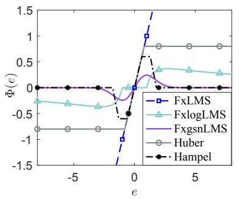

<details>
<summary>line</summary>

| e    | FxLMS  | FxlogLMS | FxgsnLMS | Huber  | Hampel |
| ---- | ------ | -------- | -------- | ------ | ------ |
| -10  | 0.0    | -0.2     | 0.0      | -0.8   | 0.0    |
| -5   | 0.0    | -0.3     | 0.0      | -0.8   | 0.0    |
| 0    | -1.0   | 0.0      | 0.0      | -0.8   | -0.5   |
| 5    | 1.0    | 0.3      | 0.4      | 0.8    | 0.0    |
</details>

Figure 5: Score function of the FxLMS algorithm [9], FxlogLMS algorithm [180], FxsgnLMS algorithm [178], Huber’sbased FxLMS algorithm [190], and Hample’s-based FxLMS algorithm [190].   
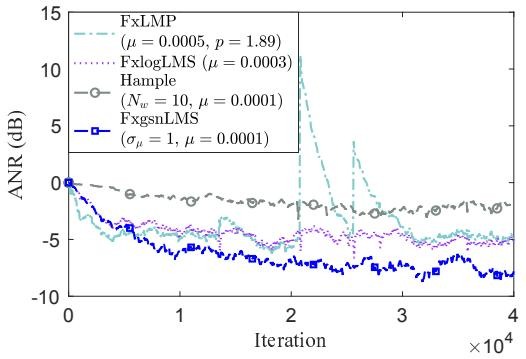

<details>
<summary>line</summary>

| Iteration (x10^4) | FxLMP (μ = 0.0005, p = 1.89) | FxlogLMS (μ = 0.0003) | Hample (Nw = 10, μ = 0.0001) | FxgsnLMS (σμ = 1, μ = 0.0001) |
| ----------------- | ----------------------------- | ---------------------- | ------------------------------ | ------------------------------- |
| 0                 | 0                             | 0                      | 0                              | 0                               |
| 1                 | -5                            | -5                     | -5                             | -5                              |
| 2                 | 15                            | -5                     | -5                             | -5                              |
| 3                 | -5                            | -5                     | -5                             | -5                              |
| 4                 | -5                            | -5                     | -5                             | -5                              |
</details>

Figure 6: ANRs of the representative AINC algorithms in α = 1.9, where the simulation settings are the same as [147].

# 2.1.2. Filtered-x AP-based algorithms

# 1) FxAP-based algorithms for broadband noise

The AP algorithm updates the weights on the basis of multiple input vectors to accelerate convergence speed if driven by highly correlated input signals. For these reasons, it has become a good alternative to LMS-type controllers. The update equation for the basic FxAP algorithm is [194]

$$
\boldsymbol {w} (n + 1) = \boldsymbol {w} (n) + \mu \boldsymbol {U} (n) \left[ \boldsymbol {U} ^ {\mathrm{T}} (n) \boldsymbol {U} (n) \right] ^ {- 1} \boldsymbol {e} (n) \tag {7}
$$

where $e ( n ) = [ e ( n ) , e ( n - 1 ) , . . . , e ( n - P + 1 ) ] ^ { \mathrm { T } } , U ( n ) = [ x ( n ) , x ( n - 1 ) , . . . , x ( n - P + 1 ) ] ^ { \mathrm { T } } ,$ is a M × P matrix, and P denotes the projection order.

In [195, 194], the transient and steady-state performance of the FxAP algorithm was analyzed for multi-channel ANC systems, which is based on the energy conservation argument and does not require a specific characteristic of the signal. The optimal VSS-FxAP algorithm was developed by performing analysis of mean square deviation (MSD) and its non-stationary version was also proposed [196]. A more accurate result was presented in [197, 198], which conducts the augmented weight-error vector for convergence analysis.

# 2) FxAP-based algorithms for impulsive noise

The above mentioned algorithms are also challenged by the difficulty of converging in the presence of impulsive noise. A simple, yet effective approach for AINC was proposed in [199], which is derived by introducing the efficient AP sign (APS) algorithm into ANC systems, resulting in the FxAPS algorithm. Additionally, two extensions regarding a VSS scheme and partial update (PU) were developed.

# 2.1.3. Filtered-x RLS-based algorithms

# 1) FxRLS-based algorithms for broadband noise

The standard FxRLS algorithm can converge faster than the FxLMS algorithm, at the price of increased complexity [200]. As such, the RLS algorithm has been extended to ANC systems in recent years. In [200], a hybrid algorithm, which can switch between the filtered-x NLMS (FxNLMS) and FxRLS algorithms, was proposed for functional magnetic resonance imaging (fMRI) acoustic noise control. The FxRLS algorithm is adopted at the initial convergence stage for obtaining fast convergence. Once detected it stops converging, the hybrid algorithm switches to the FxNLMS algorithm for low residual error. By doing this, the overall attenuation performance can be better than that of the individual FxRLS and FxNLMS components.

# 2) FxRLS-based algorithms for narrowband noise

There is scarce literature focused on using the FxRLS-type algorithm for NANC. In [201], a filtered-x optimally weighted RLS (FxOWRLS) algorithm was derived for both feedforward and feedback ANC systems with bounded narrowband disturbances, which can reduce the computational burden by reducing the update ratio in the adaptation process.

# 3) FxRLS-based algorithms for impulsive noise

In [202], to suppress the effect of the impulsive noise, a logarithmic cost function has been employed with the consideration of communication error in the error signal. Following this work, several FxRLS variants have been developed for AINC [203, 204]. In [203], a modified FxRLS algorithm was proposed by addition of state-space for AINC. The filtered-x recursive maximum correntropy (FxRMC) algorithm [204] presented an information theoretic learning (ITL) approach for AINC. Moreover, an adaptive kernel size scheme was introduced. Note that such maximum correntropy criterion (MCC) can also be utilized in NLANC systems, see Part II of this work. Another FxRLS-based algorithm for AINC was proposed in [205], where Akhtar’s scheme [177] was incorporated with the modified gain method.

# 2.1.4. Subband ANC algorithms

# 1) Subband ANC algorithms for broadband noise

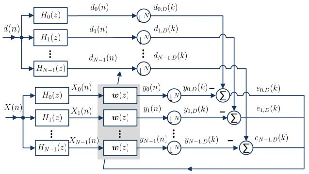

<details>
<summary>flowchart</summary>

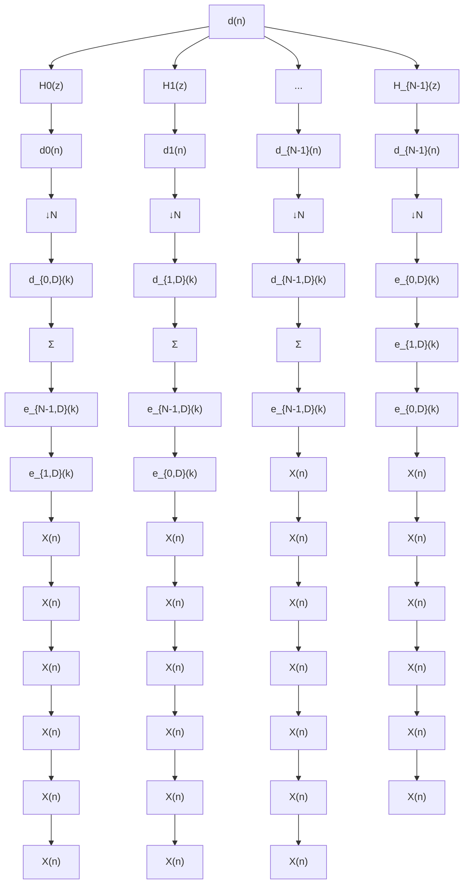
</details>

Figure 7: Diagram of the multi-band structured SAF.

To deal with the long channel responses and colored inputs in ANC systems, the subband adaptive filter (SAF) was developed for fast convergence and low computational complexity [206]. A typical SAF based on multi-band structure with N subbands can be seen in Fig. 7. The signal $d ( n )$ and $X ( n )$ are decomposed through the analysis filters $H _ { i } ( z ) , i = 0 , \dots , N - 1$ . The subband reference signals $X _ { i } ( k )$ are filtered by the adaptive filter to generate the subband output signals $y _ { i } ( n )$ . Then, the subband signals $d _ { i } ( n )$ and $y _ { i } ( n )$ are critically decimated to lower sampled rate sequences $d _ { i , D } ( k ) = d _ { i } ( k N )$ ) and $y _ { i , D } ( k ) = y _ { i } ( k N )$ , where n and k are used to index the original sequences and the decimated sequences. The factor D denotes the decimation factor, which is chosen as same as the number of the subband filters to prevent aliasing of the signals. Finally, the decimated error signal $e _ { i , D } ( k ) = d _ { i , D } ( k ) - y _ { i , D } ( k )$ is utilized for adjusting of the subband ANC

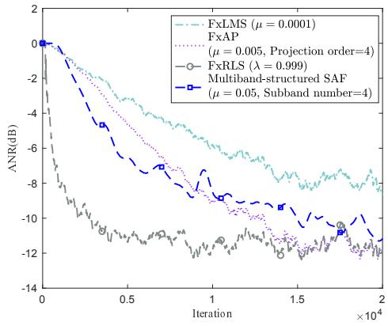

<details>
<summary>line</summary>

| Iteration (x10^4) | FxLMS (μ = 0.0001) | FxAP | FxRLS (λ = 0.999) | Multiband-structured SAF (μ = 0.05, Subband number=4) |
| ----------------- | ------------------- | ---- | ----------------- | ---------------------------------------------------- |
| 0                 | 0                   | 0    | 0                 | 0                                                    |
| 0.5               | ~-3                 | ~-4  | ~-8               | ~-6                                                  |
| 1.0               | ~-6                 | ~-7  | ~-10              | ~-8                                                  |
| 1.5               | ~-8                 | ~-9  | ~-11              | ~-10                                                 |
| 2.0               | ~-9                 | ~-10 | ~-12              | ~-11                                                 |
</details>

Figure 8: ANRs of the algorithms with $\alpha = 2 ,$ where the simulation settings are the same as [147].

controller.

To assess the performance, in Fig. 8, the ANRs of the LMS and non-LMS-based algorithms are investigated. In this case, the primary path $P ( z )$ and the secondary path $S ( z )$ are generated by FIR filter with length of 256 and 100, respectively [147]. The length of the adaptive filter is set to 128. The α-stable noise with $\alpha = 2$ is adopted as the noise source, which corresponds to the Gaussian distribution. One can observe that the FxRLS algorithm has the fastest convergence rate and the FxLMS algorithm suffers from slow convergence. Then, a delayless SAF algorithm for multi-input multi-output (MIMO) ANC applications was developed, which is based on Milani’s work [207, 208] and can significantly mitigate the computational cost [209].

# 2) Subband ANC algorithms for narrowband noise

For most ANC systems, it is necessary to estimate the secondary path offline or online, which undoubtedly increases the computational complexity. Therefore, some subband ANC algorithms consider avoiding the secondary path estimation to reduce complexity. However, when the secondary path phase is close to $\pm 9 0 ^ { \mathrm { o } }$ , the convergence rate of the algorithm is slow. To overcome this limitation, a frequency-domain delayless subband algorithm was proposed, where 4 update directions, $1 8 0 ^ { \mathrm { o } } , 0 ^ { \mathrm { o } } , \mathrm { a n d } \pm 9 0 ^ { \mathrm { o } }$ are adopted to single-tone and narrowband noise control [210]. The disadvantage of this method is that the filter update process must be performed in the frequency-domain, resulting in high computational complexity. To overcome this limitation, in [211], a simplified attempt was developed to cope with the implementation problem when the secondary path phase is close to $\pm 9 0 ^ { \mathrm { o } }$ . Two reference signals are generated in each subband, and two update directions are utilized. Only one subband reference signal and one update direction are employed to approximate the phase response of the residual secondary path. Then, the coefficients of the full-band adaptive controller are directly adapted in time-domain.

# 3) Subband ANC algorithms for impulsive noise

The above mentioned SAF algorithm may fail to work in the presence of impulsive noise since the adaptation is based on the MMSE criterion. To fill this gap, a VSS normalized SAF (VSS-NSAF) was introduced for ANC system, whose step size is adapted to prevent the wrong update by impulsive noise [212]. Since impulsive noise is a great challenge for ANC systems, we summarize the above mentioned contributions of AINC In Table 4.

Table 4: Contributions of AINC in the past decade. 

<table><tr><td>Akhtar&#x27;s algorithm and its variants</td><td>FxlogLMS</td><td>HOEP/FLOM based algorithms</td><td>Soft bound algorithms</td></tr><tr><td>[177, 187]</td><td rowspan="2">[180]</td><td>[147, 144, 178]</td><td rowspan="2">[189]</td></tr><tr><td>[193, 188]</td><td>[182, 183, 184, 185, 186, 187]</td></tr><tr><td>M-estimate based algorithms</td><td>FxAP-based algorithms</td><td>FxRLS-based algorithms</td><td>SAF-based algorithms</td></tr><tr><td rowspan="2">[190, 191, 192, 193]</td><td rowspan="2">[199]</td><td>[202, 203]</td><td rowspan="2">[212]</td></tr><tr><td>[204, 205]</td></tr></table>

# 2.1.5. Lattice ANC algorithms

The lattice filter is also an important architecture in ANC systems. Such structure can attenuate multiple sinusoidal interferences in ANC systems and its corresponding algorithm, i.e., the gradient adaptive lattice (GAL) algorithm, can provide a reliable performance as compared with the known algorithm [213, 214]. In the past decade, two VSS strategies have been suggested for the GAL algorithm, resulting in two VSS filtered-x GAL (VSS-FxGAL) algorithms [214, 215]. These algorithms exhibit good attenuation performance for hybrid narrowband and broadband noise. Very recently, a recursive least-squares lattice (RLSL) algorithm grouping the secondary path innovation (SPI) and lattice-order decision (LOD) was developed [216]. The SPI algorithm whitens the error signal into a virtual error signal just before the secondary path to generate virtual undesired signals corresponding to the output of the lattice filter. The LOD algorithm determines the order of the lattice filter, while considering the noise reduction performance. As a consequence, a faster convergence rate and lower computational complexity is achieved as compared to the FxRLS algorithm.

Table 5: Time line of filtered-e ANC algorithms. 

<table><tr><td>Years</td><td>Authors</td><td>Contributions</td><td>References</td></tr><tr><td>1996</td><td>Wan</td><td>Adjoint LMS algorithm</td><td>[217]</td></tr><tr><td>1996</td><td>Rupp and Sayed</td><td>Analysis of the robustness of the FxFeLMS algorithm along the line of  $H_{\infty}$  theory</td><td>[218]</td></tr><tr><td>1999</td><td>Sujbert</td><td>FxFeLMS algorithm</td><td>[219]</td></tr><tr><td>2005</td><td>Miyagi and Sakai</td><td>Analysis of the mean-square performance of the FxFeLMS algorithm</td><td>[220]</td></tr><tr><td>2006</td><td>DeBrunner and Zhou</td><td>Hybrid FeLMS algorithm for performance improvement</td><td>[221]</td></tr></table>

# 2.2. Filtered-e ANC family

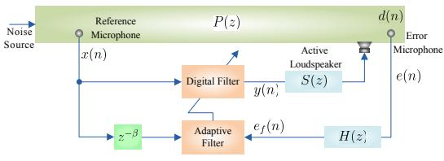

<details>
<summary>flowchart</summary>


</details>

Figure 9: Diagram of the FeLMS algorithm.

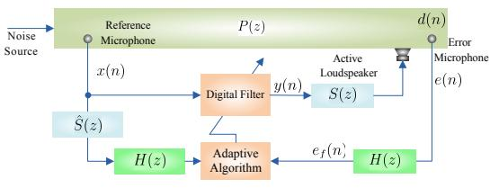

<details>
<summary>flowchart</summary>

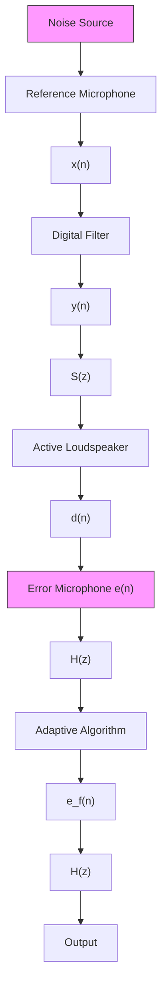
</details>

Figure 10: Diagram of the FxFeLMS algorithm.

The key contributions of the filtered-e ANC algorithms before the last decade are listed in Table 5. Note that the basic filtered-e LMS (FeLMS) and filtered-x FeLMS (FxFeLMS) algorithms have been developed in 1996 and 1999, respectively.

# 2.2.1. Filtered-e LMS-based algorithms

# 1) FeLMS-based algorithms for broadband noise

The FxLMS algorithm may converge to a biased solution when the feedforward ANC system is corrupted by noise. Moreover, it is well known that the FxLMS algorithm suffers from slow convergence speed owing to the effect of S(z). If $| S ( z ) |$ has high dynamics, there are certain frequency bands with small loop gain. As a result, the convergence rate for any signal appearing in this frequency range is slow.

To overcome these drawbacks, the FeLMS algorithm employs the error signal filtered by the error filter $H ( z )$ , instead of filtering the reference signals by S(z). Two types of methods can be used to design $H ( z )$ . The first type of the FeLMS algorithm, termed as the adjoint LMS (ALMS) algorithm, has similar properties to the FxLMS algorithm. For the ALMS algorithm, H(z) is designed as

$$
H (z) = z ^ {- \beta} \hat {S} ^ {*} (z) \tag {8}
$$

where $\hat { S } ^ { * } ( z )$ represents the adjoint transfer function of the secondary path and $\beta$ represents the number of delays.

The second type of the FeLMS algorithm, called the secondary path equalization (SPE) algorithm, has the same block diagram as the ALMS algorithm shown in Fig. 9, where $e _ { f } ( n )$ is the residual noise $e ( n )$ that has been filtered by the error filter $H ( z )$ . In this algorithm, $H ( z )$ is designed as the (pseudo-)inverse of the secondary path filter

$$
H (z) = \left[ z ^ {- \beta} \hat {S} ^ {- 1} (z) \right] _ {+} \tag {9}
$$

where $\hat { S } ^ { - 1 } ( z )$ is the inverse transfer function of $\hat { S } ( z )$ , and $\left[ V ( z ) \right] _ { + }$ stands for the casual part of $V ( z )$ . The weight update equation of the FeLMS algorithm is given by

$$
\boldsymbol {w} (n + 1) = \boldsymbol {w} (n) + \mu e _ {f} (n) \boldsymbol {X} (n - \beta) \tag {10}
$$

To further accelerate the convergence rate of the FeLMS algorithm, the FxFeLMS algorithm was proposed, which can overcome the slow convergence of the FxLMS algorithm when the reference input is the sinusoidal signal [219]. The structure of the FxFeLMS algorithm is plotted in Fig. 10, where $H ( z )$ is required in both input and error signal path. If $H ( z ) ~ = ~ 1$ , the FxFeLMS algorithm degenerates into the basic FxLMS algorithm. Under ideal situations, i.e., $S ( z ) = \hat { S } ( z )$ , $| H ( z ) | ^ { 2 } = 1 / | S ( z ) | ^ { 2 }$ . In [222], a modified FxFeLMS algorithm was proposed, which is derived based on the stochastic model for the first and second moments of the FxFeLMS algorithm without the independent assumption.

# 2) FeLMS-based algorithms for narrowband noise

The performance of the FxLMS-based algorithms for NANC systems is subjected to the number of targeted frequencies and the estimated secondary path. Therefore, it is natural to consider using

FeLMS-based algorithms for NANC. In [223], the FeLMS algorithm was intentionally introduced to deal with the noise in NANC systems. Moreover, the convergence behavior of the algorithm was analyzed. This work has proven that FeLMS-type algorithms are feasible in dealing with narrowband noise. The existing works of NANC are outlined in Table 6.

Table 6: Contributions of NANC in the past decade. 

<table><tr><td>FxLMS-based algorithms</td><td>Subband ANC algorithms</td><td>FxRLS-based algorithms</td><td>FeLMS-based algorithms</td></tr><tr><td>[19, 25, 159, 160, 161, 162, 163, 164, 165, 169, 174, 175, 176, 172, 173, 166, 157, 158]</td><td rowspan="5">[211](Also for band-limited white noise)</td><td rowspan="5">[201](Also for multi-tonal signals)</td><td rowspan="5">[223]</td></tr><tr><td>For uncorrelated narrowband disturbances</td></tr><tr><td>[22, 23, 224]</td></tr><tr><td>For band-limited white noises and tonal signals</td></tr><tr><td>[21, 167, 168]</td></tr></table>

# 2.3. Filtered-u ANC family

Table 7: Time line of filtered-u ANC algorithms. 

<table><tr><td>Years</td><td>Authors</td><td>Contributions</td><td>References</td></tr><tr><td>1987</td><td>Eriksson, Allie, and Greiner</td><td>IIR adaptive algorithm (recursive least mean square) for ANC</td><td>[225]</td></tr><tr><td>1991</td><td>Eriksson</td><td>FuLMS algorithm</td><td>[226]</td></tr><tr><td>1994</td><td>Snyder</td><td>FuLMS algorithm with simple hyper-stable adaptive recursive filter</td><td>[227]</td></tr><tr><td>2003</td><td>Fraanje, Verhaegen, and Doelman</td><td>Analysis of the FuLMS algorithm and develop a preconditioned FuLMS algorithm</td><td>[228]</td></tr><tr><td>2003</td><td>Lu et al.</td><td>IIR filter with lattice form for ANC</td><td>[229]</td></tr><tr><td>2004</td><td>Sun and Meng</td><td>Steiglitz-Mcbride type adaptive IIR algorithm for ANC</td><td>[230]</td></tr></table>

Several fundamental filtered-u ANC algorithms have been proposed before the past decade. We summarize these efforts in Table 7. In the following, the development of filtered-u ANC algorithms in the past decade is reviewed in detail.

# 2.3.1. Filtered-u LMS-based algorithms

# 1) FuLMS-based algorithms for broadband noise

It is well known that the ANC algorithms can be extended to active vibration control (AVC) problem [231]. Among the ANC algorithms, the FuLMS algorithm can be effectively applicable to both AVC and ANC systems. The FuLMS algorithm is often used to update the weight vector of the IIR filter, whereas the above mentioned FxLMS and FeLMS algorithms are commonly adopted to adapt the coefficients of the FIR filter. Fig. 11 depicts the diagram of an ANC system using FuLMS algorithm. The iterative process of the pole and zero-coefficients for the basic FuLMS algorithm can be summarized as follows [232]:

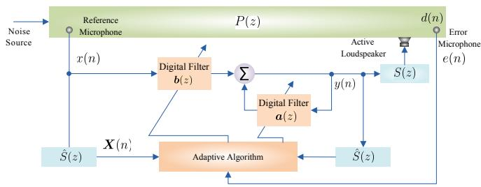

<details>
<summary>flowchart</summary>

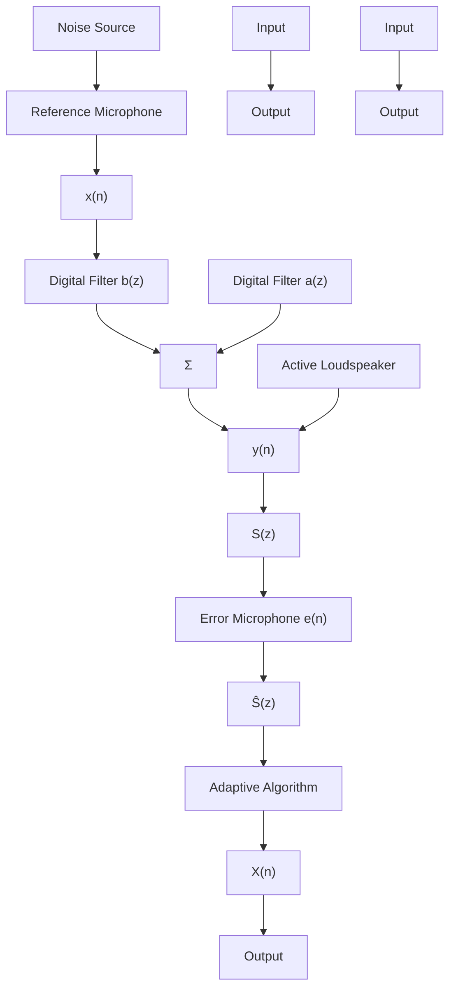
</details>

Figure 11: Diagram of the FuLMS algorithm, where the zero and pole coefficients are updated by using one adaptive algorithm. The coefficients can be also independently updated by using two adaptive algorithms.

$$
\boldsymbol {a} (n + 1) = \boldsymbol {a} (n) + \mu_ {1} e (n) \boldsymbol {y} (n - 1) \tag {11a}
$$

$$
\boldsymbol {b} (n + 1) = \boldsymbol {b} (n) + \mu_ {2} e (n) \boldsymbol {X} (n) \tag {11b}
$$

where ${ \pmb a } ( n )$ and $\boldsymbol { b } ( \boldsymbol { n } )$ are the weight vectors of poles and zeroes in the IIR filter at time $n ,$ respectively, $\mu _ { 1 }$ and $\mu _ { 2 }$ are the step sizes, and $\pmb { y } ( n - 1 )$ is the previous output vector. The FuLMS algorithm consumes fewer coefficients than the FIR filter and is particularly well-suited for ANC systems with short acoustic ducts [232, 233]. For example, in an automotive engine, the intake system owns a short duct and as such, the FuLMS-based algorithms are usually preferred. Unfortunately, the FuLMS algorithm cannot ensure global convergence because of the multimodal error surface and inherent limitation of the IIR filter. To solve the stability problem, new FuLMS algorithms were developed in [232, 234]. In [232], a modified FuLMS algorithm was developed by combining a simple hyper-stable adaptive recursive filter (SHARF) and a VSS scheme. By using the equation-error (EE), the FuLMS algorithm was derived according to the output-error (OE) model and its step size bound and global minimum were also analyzed [234].

# 2.3.2. Filtered-u RLS-based algorithms

# 1) FuRLS-based algorithms for broadband noise

To improve the convergence rate of the FuLMS algorithm, it is reasonable to consider RLS-based IIR filters. The algorithms in [235, 236] were considered using the filtered-u RLS (FuRLS)-type algorithm for active noise and vibration control systems. Moreover, two novel fast implementation schemes were proposed for the FuRLS algorithm, generating the fast FuRLS algorithm. Simulation results demonstrated that two fast FuRLS algorithms outperform the FuLMS algorithm and SHARF algorithm.

The contributions of the existing works for broadband noise are summarized in Table 8.

Table 8: Contributions of the algorithm for broadband noises in the past decade. 

<table><tr><td>FxLMS-based algorithms</td><td>FxAP-based algorithms</td><td>FxRLS-b algorithm</td></tr><tr><td>[133, 135, 136, 137, 138, 139, 140, 141, 142, 143, 144, 145, 146, 147, 148, 149, 150, 151, 152, 153, 154, 155]</td><td>[194, 195, 196, 197, 198]</td><td>[200]</td></tr><tr><td>Lattice ANC algorithms</td><td>FeLMS-based algorithms</td><td>FuLMS-b algorithm</td></tr><tr><td>[213, 214, 215, 216]</td><td>[222]</td><td>[231, 232,</td></tr></table>

# 2.4. Computational complexity

Table 9: Computational complexity of the algorithms. 

<table><tr><td>Types</td><td>Algorithms</td><td>Number of multiplications</td></tr><tr><td rowspan="5">Filtered-x ANC family</td><td>FxLMS</td><td> $2M + L_s + 1$ </td></tr><tr><td>FxAP</td><td> $2P^2 M + 2PM + M + L_s$ </td></tr><tr><td>FxRLS</td><td> $3M^2 + 5M + L_s + 2$ </td></tr><tr><td>Subband ANC</td><td> $3M + NL_a + 2(L_a + 1) + L_s$ </td></tr><tr><td>FxGAL</td><td> $21M + 2L_s$ </td></tr><tr><td rowspan="2">Filtered-e ANC family</td><td>FeLMS (ALMS)</td><td> $2M + L_s + 1$ </td></tr><tr><td>FeLMS (SPE)</td><td> $2M + L_p + 1$ </td></tr><tr><td>Filtered-u ANC family</td><td>FuLMS</td><td> $2(L_f + L_b) + L_s + 1$ </td></tr></table>

In this subsection, the computational complexity of the classical algorithms is analyzed. The number of multiplications for each algorithm per iteration is utilized to estimate the computational complexity. The computational complexity of some classical algorithms is summarized in Table 9, where $L _ { s }$ denotes the length of the secondary path model, $L _ { p }$ denotes the length of the (pseudo-)inverse of secondary path model, $L _ { a }$ denotes the length of analysis and synthesis filters, and $L _ { f }$ and $L _ { b }$ are the length of the forward and feedback sections of the IIR filter 3 One can observe from this table that the LMS-based algorithms require the smallest computational complexity as compared to other algorithms and the RLS-type algorithms have the largest computational load.

# 3. Practical considerations

Table 10: Fundamental of the online secondary path estimation before the past decade. 

<table><tr><td>Years</td><td>Authors</td><td>Contributions</td><td>References</td></tr><tr><td>1989</td><td>Eriksson and Allie</td><td>Online secondary path estimation by injecting a random noise</td><td>[237]</td></tr><tr><td>1993</td><td>Bao, Sas, and Brussel</td><td>Using an additional filter to reduce the interference caused by injected noise</td><td>[238]</td></tr><tr><td>1997</td><td>Kuo and Vijayan</td><td>Using an additional filter to reduce the interference in the secondary path estimation</td><td>[239]</td></tr><tr><td>2001</td><td>Zhang, Lan, and Ser</td><td>Cross-updated adaptive filters for online secondary path estimation</td><td>[240]</td></tr><tr><td>2002</td><td>Lan, Zhang and Ser</td><td>Varied auxiliary noise to reduce the residual noise</td><td>[241]</td></tr><tr><td>2005</td><td>Zhang, Lan and Ser</td><td>Auxiliary noise with power scheduling strategy to reduce the residual noise</td><td>[242]</td></tr><tr><td>2006</td><td>Akhtar, Abe, and Kawamata</td><td>Modified-FxLMS (MFxLMS) with online secondary path estimation</td><td>[243]</td></tr><tr><td>2008</td><td>Carini and Malatini</td><td>Optimal VSS and auxiliary noise with self-tuning power scheduling</td><td>[244]</td></tr></table>

# 3.1. Online secondary path estimation

In the previously described works and other similar references on the topic, the solutions typically rely on the assumption $S ( z ) = \hat { S } ( z )$ . This assumption is based on the fact that the estimate $\hat { S } ( z )$ can be very similar to the true value $S ( z )$ , depending on the estimation method used, the equipment, and the room conditions4. However, in many cases, the secondary path is time-varying. The performance may deteriorate when the secondary path varies after offline secondary path estimation. Therefore, there is a need for online secondary path estimation. The estimation of the secondary path has been addressed in previous studies, including [245, 15, 16, 246]. The fundamental of online secondary path estimation before the past decade is summarized in Table 10. The effect of the secondary path estimation error on the performance of ANC systems was presented in [14]. Interestingly, it showed that the imperfect secondary path models can improve the convergence speed, but shrink the stability bound and degrade the steady-state performance. The algorithm in [247] comprised the least squares (LS) method and the maximum likelihood (ML) principle, which requires only one parameter. However, as shown in [248], the classical statistical estimation method, such as ${ \mathrm { M L } } ,$ is not stable for secondary path estimation. To overcome this limitation, a Bayesian method of maximum a posteriori was suggested, which gives a feasible and stable solution to the secondary path estimation problem [248]. In [249], a tuning-less approach was derived from the method of least squares (LS). The adaptation of this rule is completely devoid of parameters, leading to easy implementation.

In addition to decreasing the number of parameters, the update ratio also plays an important role in reducing complexity. A novel filtered-x LMS-Newton algorithm was proposed, by extending the LMS-Newton algorithm to ANC systems [250]. The LMS-Newton algorithm can converge faster than the conventional LMS algorithm when the input signal is highly correlated, and it is mathematically identical to the RLS algorithm when setting $2 \mu = 1 - \lambda \left[ 2 5 1 \right]$ . Moreover, the selective updating scheme was incorporated in the filtered-x LMS-Newton algorithm to reduce computational complexity of the adaptation of controller. Similar to the set-membership filtering, the selective updating scheme involves a predefined threshold to determine the feasibility solution set. For these reasons, a variable threshold strategy was further developed for performance improvement [250].

The ANC system with online secondary path estimation via auxiliary noise injection method has been extensively studied. In this method, the white Gaussian noise with zero mean is commonly used as the auxiliary noise signal. Such auxiliary noise signal is employed as the input to a classical system identification problem. However, this injected auxiliary noise can deteriorate the noise reduction performance. To overcome this problem, the variable power methods of auxiliary noise were preferred [252, 253]. In [253], an auxiliary noise-based method was designed to tackle sudden and strong changes of $S ( z )$ , where a mixture of the LMS and normalized LMS (NLMS) algorithms is adopted for secondary path estimation. Alternatively, the VSS scheme can be employed for combating performance degradation and sudden changes of S(z) [254, 255]. In [255], a scheduled-step size NLMS algorithm was employed to estimate the secondary path while suppressing disturbances from the modeling and controlling filter. In [256], both variable power and VSS strategies were employed for performance improvement.

In NANC systems, the problem of online estimation of the secondary path also needs to be considered [176, 257]. It was demonstrated that such mismatch between $S ( z )$ and $\hat { S } ( z )$ can affect the stable range of step size [13]. In [18], the effect of both offline and online secondary path modeling was examined by theoretical analysis, which shows that such imperfection can slow down the convergence rate. Then, it offered a solution to speed up the convergence. To provide an online secondary path estimation method for NANC systems, a modified FxLMS algorithm with secondary path estimation was proposed, which is based on scaled auxiliary noise injection [258]. A novel mirror-FxLMS algorithm was proposed in [259], which is based on the algorithm in [245] and can guarantee stability without an auxiliary signal to online estimate secondary path. Such an algorithm can switch between the modified FxLMS (MoFxLMS) and mirror-modified FxLMS (MMoFxLMS) algorithms according to the absolute value of their weight coefficients5. If the absolute value of the MMoFxLMS algorithm greater than the MoFxLMS, the MMoFxLMS algorithm adapts the controller; otherwise, the MoFxLMS algorithm works. The MoFxLMS algorithm can obtain improved performance under high secondary path modeling error, while the MMoFxLMS algorithm can converge fast regardless of the secondary path modeling errors. As a result, a stable performance is achieved for the overall filter. In particular, a phase-locked loop (PLL) was exploited to enhance the tracking capability.

Similarly, Akhtar combined the new algorithms with his MFxLMS algorithm for acquiring refined performance in the presence of α-stable noise [181, 183]. The above examples clearly demonstrate the large potential of online secondary path estimation, not only for Gaussian noise environment, but also for impulsive noise.

# 3.2. Solutions of acoustic feedback

In practical situations, the antisound output $y ( n )$ to the loudspeaker also propagates upstream to the reference microphone, leading to a corrupted reference signal. The coupling of the acoustic wave from the active loudspeaker (cancelling loudspeaker) to the reference microphone is called acoustic feedback. The development of the acoustic feedback before the past decade is outlined in Table 11.

Table 11: Development of the acoustic feedback before the past decade. 

<table><tr><td>Years</td><td>Authors</td><td>Contributions</td><td>References</td></tr><tr><td>1994</td><td>Kuo and Luan</td><td>Online feedback compensation for multi-channel ANC</td><td>[261]</td></tr><tr><td>2002</td><td>Kuo</td><td>Online feedback path neutralization filter for ANC</td><td>[262]</td></tr><tr><td>2002</td><td>Sun and, Chen</td><td>Online feedback path neutralization filter using new FuLMS algorithm</td><td>[263]</td></tr><tr><td>2007</td><td>Akhtar, Abe, and Kawamata</td><td>Online acoustic feedback path modeling for both narrowband and broadband ANC</td><td>[264]</td></tr></table>

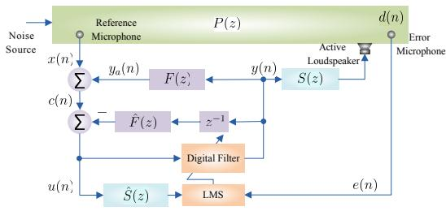

<details>
<summary>flowchart</summary>

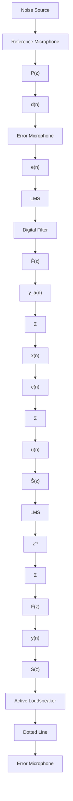
</details>

Figure 12: Diagram of the FxLMS algorithm with feedback neutralization.

The feedback neutralization is the simplest acoustic feedback solution, which uses a separate feedback path neutralization (FBPN) filter with the controller. The principle of feedback neutralization is exactly the same as that of acoustic echo cancellation [265]. A block diagram of the ANC system using the FxLMS algorithm with feedback neutralization is shown in Fig. 12, where $F ( z )$ is the feedback path from cancelling loudspeaker to the reference microphone, $\hat { F } ( z )$ denotes the estimate of $F ( z )$ (FBPN filter), and $y _ { a } ( n )$ denotes the acoustic feedback component. As can be seen, this electrical model of the feedback path is driven by the antinoise signal $y ( n )$ , and its output is subtracted from the reference sensor signal $c ( n )$ . Finally, a (somewhat) acoustic-feedbackfree reference signal $u ( n )$ is obtained for adaptation of the control filter. The FBPN filter can be adapted offline or online. In many applications, $F ( z )$ may be time-varying. Hence, online acoustic feedback modeling and neutralization are needed.

During the past decade, several algorithms have been proposed for online acoustic feedback path modeling and neutralization [8, 266, 267, 268, 269]. Similar to the online secondary path estimation, an auxiliary noise modeled by white Gaussian noise is injected to an ANC system for online modeling feedback path. In [267], a novel VSS scheme was proposed for FBPN filter and then it extended to multi-channel ANC systems. With slightly increased computational complexity, it achieves faster convergence than that of previous algorithms. Following a different direction, the algorithms in [268, 269] developed a time-varying gain scheme for white Gaussian noise generation. Since the auxiliary noise contributes to the residual error, the attenuated performance is degraded. By using the time-varying gain scheme, the lower noise level can be achieved.

# 3.3. Measurement of error signal

Table 12: Fundamental of the error signal measurement before the past decade. 

<table><tr><td>Years</td><td>Authors</td><td>Contributions</td><td>References</td></tr><tr><td>1992</td><td>Elliott, and David</td><td>Virtual microphone arrangement</td><td>[270]</td></tr><tr><td>1999</td><td>Roure and Albarrazin</td><td>Remote microphone technique</td><td>[271]</td></tr><tr><td>2002</td><td>Cazzolato</td><td>LMS filter with virtual microphone technique</td><td>[272]</td></tr><tr><td>2006</td><td>Díaz, Egaña, and Vinolas</td><td>FxLMS with virtual microphone for railway sleeping vehicle applications</td><td>[273]</td></tr><tr><td>2007</td><td>Liao and Lin</td><td>Investigate several FIR algorithms with communication error for ANC systems</td><td>[274]</td></tr><tr><td>2008</td><td>Petersen et al.</td><td>Kalman filter with virtual sensing technique</td><td>[275]</td></tr></table>

We briefly revisit the measurement method of the error signal in this subsection. In this context, the literature is rather scarce. Some contributions of the error signal measurement before the past decade are listed in Table 12. In [202], the concept of the communication error $e _ { c } ( n )$ was applied to ANC algorithms, which can be expressed as

$$
e _ {c} (n) = e (n) - s (n) * [ \boldsymbol {w} ^ {\mathrm{T}} (n) \boldsymbol {x} (n) ] + \boldsymbol {w} ^ {\mathrm{T}} (n) \boldsymbol {X} (n). \tag {12}
$$

Such measurement can be interpreted as a potential difference related with the sequence A $( { \pmb x } ( n )$ → secondary path $S ( z )$ → filter $w ( z )$ → error signal $e ( n ) )$ and the sequence B $( { \pmb x } ( n ) $ filter $\pmb { w } ( z )$ → secondary path $S ( z )$ → error signal $e ( n ) )$ . The price paid for the better performance of the ANC algorithm with $e _ { c } ( n )$ is an increase in computational load as compared to the other measurement schemes under evaluation.

On the other hand, retaining the residual noise with specified spectrum has become necessary to offer a better natural feeling [35]. The adaptive noise equalizer (ANE) algorithm meets the requirement of attenuating or amplifying a predetermined sinusoidal noise, whose error signal is defined by

$$
e (n) \triangleq d (n) - (1 - \theta) y (n) \tag {13}
$$

where θ denotes the gain value. For $\theta = 0 ,$ , it can attenuate the noise source completely; for $\theta = 0 . 5$ , it can reduce the amplitude of the noise source by half; for $\theta = 1$ , the amplitude of noise source is unchanged; for $\theta = 2$ , the ANE amplifies the amplitude of the noise source by 2. By doing so, such method can meet all environments’ requirements in a more flexible manner.

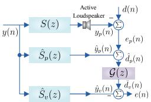

<details>
<summary>flowchart</summary>

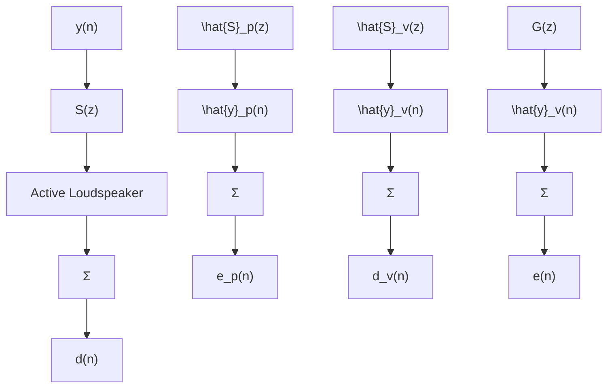
</details>

Figure 13: Estimation model of conventional virtual ANC system.

Alternatively, a new measurement of the error signal can be derived by implementing the virtual sensing systems [276, 277]. Among them, the remote microphone technique (RMT) is the most effective virtual sensing algorithm, which employs the offline identification of two secondary paths. One estimated transfer function of physical location $\hat { S } _ { p } ( z )$ is defined according to the path between the control signal and the physical microphone position, while the other estimated transfer function of $\hat { S } _ { v } ( z )$ represents the virtual locations between the control signal and the virtual microphone position. The diagram of RMT can be seen in Fig. 13, where $e ( n )$ can be interpreted as the total error signal at the virtual location, $e _ { p } ( n )$ denotes the error signal from a physical microphone, ${ \hat { y } } _ { p } ( n )$ and ${ \hat { y } } _ { v } ( n )$ is the estimation of the secondary disturbance at the physical and virtual microphones, respectively, and $\mathcal G ( z )$ denotes the transfer function between the physical and virtual locations. The

error signal in this model can be defined by

$$
e (n) \triangleq d _ {v} (n) - \hat {s} _ {v} (n) * \hat {y} _ {v} (n) \tag {14}
$$

where $\hat { s } _ { v } ( n )$ is the impulse response of $\hat { S } _ { v } ( z )$ and $d _ { v } ( n )$ denotes the primary disturbance at the virtual location. Due to the additional calculations from three transfer functions, $\hat { S } _ { p } ( z ) , \hat { S } _ { v } ( z )$ , and $\mathcal G ( z )$ , the FxLMS algorithm with virtual microphone (virtual FxLMS algorithm) has increased computational complexity as compared to the FxLMS algorithm. To reduce computational complexity, the algorithm in [277] provides a solution by resorting to the frequency-domain method, which also has better performance than the traditional virtual FxLMS algorithm.

To evaluate the performance of the ANC algorithm, another idea is to utilize the acoustic pressure (sound pressure), which is estimated based on the acceleration measurements at the stages of tuning and operating [278].

# 3.4. Frequency mismatch

In 2006, Xiao et al. proposed that the actual frequency of the primary noise and the frequency of the synthesized reference signal in NANC systems may be mismatch [279]. To explore the effect of mismatch, the FxLMS algorithm was analyzed from the perspective of frequency mismatch and phase error [280]. The results showed that the ANC system may undergo severe performance degradation even if the frequency mismatch is only 1%. Several algorithms were proposed to compensate for this mismatch, including [281, 282, 283]. The ANF can provide accurate estimation of frequency and it has been used to enhance performance [168]. In [284], a parallel ANF was proposed, where multiple tones were separated in the feedback reconstruction process to reduce the negative effect of frequency interference.

# 3.5. Design of feedback ANC systems

As we discussed in the Introduction, the feedback ANC systems do not require a coherent reference signal and can be used in the case that the reference signal is not available. The main contributions of the feedback ANC systems before the past decade are summarized in Table 13. During the past decade, such systems have been widely used to ANC headphones and fMRI acoustic noise control, etc (see ‘Recent implementations and applications of ANC’ in Part II).

The feedback ANC systems can be divided into two categories: non-adaptive systems and adaptive systems. The non-adaptive systems can effectively attenuate noise with frequency band of interest by a fixed controller. Unfortunately, the non-stationary reference signals bring great challenges to the stability of such systems. In contrast, the feedback ANC systems with adaptive controller can deal with non-stationary reference signals and the stability problems are no longer a great challenge for adaptive systems. In [21], a generalized form of the LFxLMS algorithm was proposed for feedback ANC systems, which replaces γ with a designed symmetric Toeplitz matrix Q. In [19], a simplified feedback ANC system was proposed which employs the residual noise directly as the reference signal. Compared to the IMC algorithm [167], it shows a lower computational burden since it does not compute the convolution.

Table 13: Contributions of feedback ANC systems before the past decade. 

<table><tr><td>Years</td><td>Authors</td><td>Contributions</td><td>References</td></tr><tr><td>1991</td><td>Eriksson</td><td>Feedback ANC system</td><td>[285]</td></tr><tr><td>1992</td><td>Popovich, Melton, and Allie</td><td>Multi-channel feedbackANC system</td><td>[286]</td></tr><tr><td>1997</td><td>Bai and Lee</td><td>Using  $H_{\infty}$  optimization technique to design the feedback ANC system</td><td>[287]</td></tr><tr><td>1999</td><td>Rafaely and Elliott</td><td>Using  $H_{2}/H_{\infty}$  method to design the feedback ANC system and apply to headrest systems</td><td>[288]</td></tr><tr><td>1999</td><td>Chen, Chiueh, and Chen</td><td>Feedback ANC for magnetic resonance noise control</td><td>[289]</td></tr><tr><td>2003</td><td>Kuo, Kong, and Gan</td><td>Feedback ANC algorithm with three distributed error sensors for industrial machine noise control</td><td>[290]</td></tr><tr><td>2008</td><td>Zhou et al.</td><td>Feedback ANC system using a model-free controller with simultaneous perturbation stochastic approximation</td><td>[291]</td></tr></table>

# 3.6. Analog control in ANC

In the feedback ANC systems, analog control (analog circuitry) based on a negative feedback loop is broadly used for headphones, due to the cost and battery-life issues [287]. It is known that utilizing both digital and analog control has the ability to cancel broadband and narrowband noises. In particular, the analog control is fairly inexpensive and it has good broadband noise reduction owing to the short time delay of analog components employed in the controller [296]. However, the performance of the analog controller for NANC is limited because it is unable to track the environmental changes, which may hinder the application of analog control in some cases [296]. To address this limitation, a hybrid system was proposed in [296], which adds an analog feedback loop into a digital ANC system to reduce disturbances. We summarize the development of analog control for ANC in Table 14.

Table 14: Development of the analog control before the past decade. 

<table><tr><td>Years</td><td>Authors</td><td>Contributions</td><td>References</td></tr><tr><td>1956</td><td>Hawley</td><td>ANC headset with an analog controller</td><td>[292]</td></tr><tr><td>1987</td><td>Leitch and Tokhi</td><td>A review for ANC systems, including analog control methods</td><td>[293]</td></tr><tr><td>2001</td><td>Yu and Hu</td><td>An active analog filter is used to realize the fourth-order controller</td><td>[294]</td></tr><tr><td>2002</td><td>Pawelczyk</td><td>A detailed procedure for designing and practically realizing an analogue ANC system</td><td>[295]</td></tr><tr><td>2005</td><td>Song, Gong, and Kuo</td><td>Adding an analog feedback loop to a digital ANC system, generating a hybrid feedback ANC headset</td><td>[296]</td></tr></table>

Note that some important analog control methods have been proposed before the past decade, and relatively few studies have been conducted in these years. In [297], a short review was presented for hybrid analog-digital systems, including six possible combinations of the classical control structures for ANC systems. The development of the analog control in recent years can also be found in [298, 299]. In [299], a continuous FxLMS algorithm was proposed for hybrid analog-todigital systems. Moreover, an approximation of the algorithm was developed, which can be easily implemented in digital signal processor (DSP).

# 3.7. Methods of reducing computational complexity

Table 15: Fundamental of the reduced computational complexity for ANC before the past decade. 

<table><tr><td>Years</td><td>Authors</td><td>Contributions</td><td>References</td></tr><tr><td>1995</td><td>Douglas</td><td>Fast FxAP algorithm</td><td>[300]</td></tr><tr><td>1999</td><td>Douglas</td><td>Fast multi-channel FxLMS algorithm</td><td>[301]</td></tr><tr><td>2003</td><td>Bouchard</td><td>Fast multi-channel FxAP algorithm for ANC and and acoustic equalization systems</td><td>[302]</td></tr><tr><td>2006</td><td>Carini and Sicuranza</td><td>Multi-channel FxAP algorithm with set-membership filtering</td><td>[303]</td></tr><tr><td>2007</td><td>Albu, Bouchard, and Zakharov</td><td>Filtered-x pseudo AP algorithm based on Gauss-Seidel method or dichotomous coordinate descent (DCD)</td><td>[304]</td></tr><tr><td>2008</td><td>Wesselink and Berkhoff</td><td>Filtered-e fast algorithms for multi-channel ANC</td><td>[305]</td></tr></table>

As an important structure of ANC systems, the subband ANC algorithm is well-suited for multi-channel, MIMO or large-scale ANC systems while preserving the conceptual simplicity of the classical SAFs. The graphics processing units (GPUs) offer powerful parallel processing and it also has reduced computational demand in the previous studies [6, 306]. Some algorithms for reducing complexity can also be integrated into the classic ANC algorithm, such as fast algorithms, set-membership filtering and PU, moreover, the PU scheme has been applied to modify the FxLMS and FxAP algorithm [199, 307]. Note that the first attempt to simultaneously apply PU and setmembership approaches in ANC algorithms is presented for a NLANC system, but not for a linear system [308]. We reviewed these works in Part II of this work, see Table 4 in [309]. Before the past decade, several linear ANC algorithms were developed by using these schemes, see Table 15. In future research, applying both algorithms and structures to reduce complexity can be considered by resorting to research results presented in the literature before the last decade.

# 3.8. Active structural acoustic control (ASAC)

Table 16: Time line of the ASAC before the past decade. 

<table><tr><td>Years</td><td>Authors</td><td>Contributions</td><td>References</td></tr><tr><td>1987</td><td>Fuller and Jones</td><td>Using active vibration control of aircraft fuselages to reduce interior noise levels</td><td>[310]</td></tr><tr><td>1991</td><td>Sommerfeldt</td><td>Multi-channel FxLMS algorithm was applied to vibrational ANC</td><td>[311]</td></tr><tr><td>1992</td><td>Clark and Fuller</td><td>Investigate the implementation of the error sensor constructed from polyvinylidene fluoride (PVDF) for ASAC</td><td>[312, 313]</td></tr><tr><td>1992</td><td>Baumann, Ho, and Robertshaw</td><td>ASAC for broadband disturbances</td><td>[314]</td></tr><tr><td>1994</td><td>Fuller and Gibbs</td><td>Using small patch type piezoceramic actuators bonded to fuselages for interior noise control</td><td>[315]</td></tr><tr><td>2000</td><td>Gibbs et al.</td><td>MIMO adaptive sensor for ASAC</td><td>[316]</td></tr><tr><td>2000</td><td>Berkhoff</td><td>Sensor scheme design for ASAC</td><td>[317]</td></tr><tr><td>2001</td><td>Gardonio et al.</td><td>A theoretical and experimental study of the frequency response function of a matched volume velocity sensor and uniform force actuator for ASAC</td><td>[318]</td></tr><tr><td>2004</td><td>Carneal and Fuller</td><td>An ASAC approach for double panel systems</td><td>[319]</td></tr></table>

To reduce device and machinery noises, an important approach is to control vibration of their casings [320]. This approach is also useful from the perspective of global noise control. A number of theoretical and experimental works have been developed for ASAC. The multi-channel ANC algorithms have been widely used to control structural vibration [311, 321]. Before the past decade, many methods have been proposed for ASAC. We outline some important contributions in Table 16.

In the past decade, the ASAC techniques have been extensively used in diverse fields (helicopters [322, 323], vehicles [324], etc [325, 326, 327]). In [328], an ASAC approach was proposed for repetitive impact noises. The efficiency of the suggested optimal control configuration and the iterative learning control (ILC) algorithm was verified. In [329], an implementation of multi-channel global ANC systems was presented, which utilizes an active casing. Moreover, a distributed version of the switched-error FxLMS algorithm was developed as the control algorithm.

# 3.9. Fuzzy control

Table 17: Development of the fuzzy control for ANC before the past decade. 

<table><tr><td>Years</td><td>Authors</td><td>Contributions</td><td>References</td></tr><tr><td>1993, 1994</td><td>Kipersztok and Hammond</td><td>Fuzzy-logic system for broadband noise control</td><td>[330, 331]</td></tr><tr><td>1995</td><td>Kipersztok and Hammond</td><td>Improved fuzzy-logic system for ANC</td><td>[332]</td></tr><tr><td>2000</td><td>Silva et al.</td><td>Fuzzy modeling techniques for weak nonlinearities</td><td>[333]</td></tr><tr><td>2001, 2003</td><td>Sousa et al.</td><td>Using direct and inverse TS fuzzy models for (nonlinear) ANC</td><td>[334, 335]</td></tr><tr><td>2005</td><td>Botto, Sousa, and Sá da Costa</td><td>Fuzzy and neural modeling techniques for (nonlinear) ANC</td><td>[336]</td></tr></table>

The fuzzy control is one of the most appealing methods where it is impossible to sufficiently well model the inference system and the FxLMS algorithm might be failed. The early work of fuzzy control in ANC systems can be found in [330, 331], which employ the fuzzy-logic system for broadband noise control. In [332], the cross correlation between reference and error microphones signals and the signal-to-noise ratio (SNR) estimate of the cross-correlation function were used as the input of a fuzzy-logic system to adjust the coefficients of the FIR filter.

Before the past decade, the inverse fuzzy modeling techniques were investigated for ANC systems [334, 335, 336]. In particular, such techniques allow for further performance improvements in linear time invariant models. These methods generally use the Takagi-Sugeno (TS) model to deal with reverberations and nonlinear distortions in ANC systems. The development of fuzzy control before the past decade is summarized in Table 17. In 2019, the fuzzy control methods were applied to the vehicle noise and vibration control [324]. It demonstrated that such method has the ability to tolerate the uncertainties of the input vibration signals and to handle the nonlinear phenomena.

It should be noted that some of the above mentioned methods are applied to NLANC systems. Although classical FIR filters achieve stable performance in these systems, the fuzzy modeling methods can perform identification more accurately. In addition, fuzzy-logic systems can also be combined with artificial neural networks (ANNs), generating fuzzy ANNs. We review the fuzzy ANNs methods in Part II.

# 4. Novel linear ANC methods emerging in the past decade

# 4.1. Psychoacoustic ANC systems

The human hearing sensation has selective sensitivity to different frequencies. Hence, it is reasonable to take the characteristics of human hearing into account. In other words, more considerations should be given to the frequency response of the controller. Moreover, minimizing the perceived annoyance of human hearing with residual noise, which needs to be resolved.

To tackle this problem, the psychoacoustic ANC (PANC) systems were established by weighting of the reference and the error signal [337, 26, 338]. These PANC systems have similar structure to the FxFeLMS algorithm in Fig. 10 but with different design of the error filter H(z). Besides, instead of sound pressure level (SPL) and averaged noise reduction (ANR), PANC is inclined to utilize loudness as the measurement of the performance. In [26], a hybrid PANC system was proposed, which can simultaneously control either uncorrelated disturbance or correlated primary noise. In [339], a novel approach integrating subband PANC and psychoacoustic masking was proposed, resulting in reduced computational cost and improved perceptual sound quality and high-frequency noise reduction level.

# 4.2. Sparse ANC algorithms

Taking advantage of the sparsity that may exist in ANC systems to improve performance is a method worthy of attention. A filtered-x improved proportionate NLMS (FxIPNLMS) algorithm was devised by extending the proportionate algorithm to feedforward ANC system [340]. Moreover, the FxIPNLMS algorithm has been shown to be compatible with convex combination schemes for Gaussian noise source, yielding enhanced performance under different degrees of sparsity [340]. By using the framework of the FxAP algorithm, some algorithms were proposed which incorporates the zero-attracting (ZA) or reweighted zero-attracting (RZA) strategies [341, 342, 28]. Unlike the above mentioned algorithms for the case where the primary or secondary path is sparse, the work in [343] investigates the scenario where the noise source is sparsely distributed. The main concept of the proposed complex algorithm is still based on the ZA scheme and the FxLMS algorithm. The significant noise reduction and fast convergence of the algorithm were obtained via experimental tests6.

# 4.3. Convex combination ANC algorithms

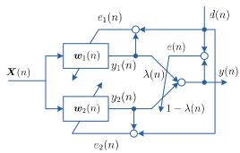

<details>
<summary>flowchart</summary>

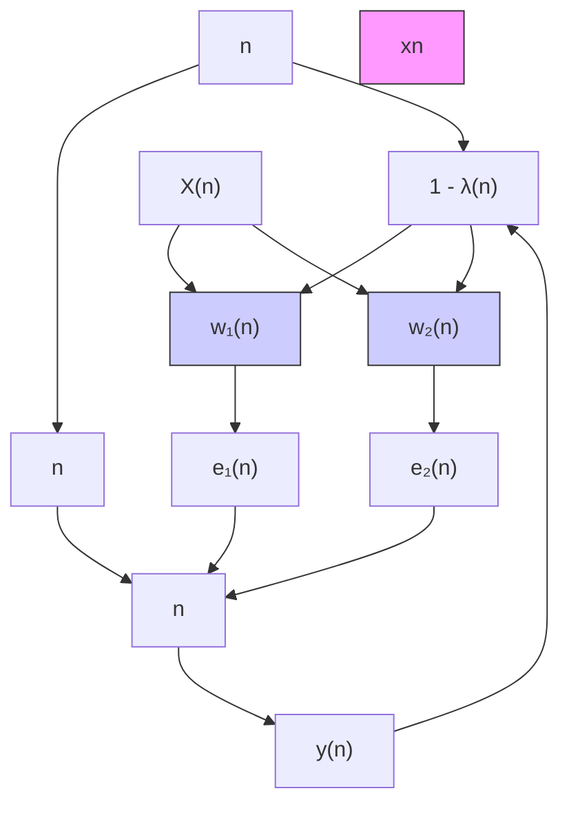
</details>

Figure 14: Diagram of the convex combination.

Like the VSS schemes, the convex combination is a scheme to address the trade-off of the fast convergence rate and small noise residue caused by fixed step size, which utilizes the filter bank to simultaneously obtain refined performance [29, 148, 340]. The schematic of the convex combination is shown in Fig. 14, where $e _ { 1 } ( n )$ denotes the error signal of the fast filter (the filter with large step size), $e _ { 2 } ( n )$ denotes the error signal of the slow filter (the filter with small step size), $y _ { 1 } ( n )$ is the output of the fast filter, $y _ { 2 } ( n )$ is the output of the slow filter, ${ \pmb w } _ { 1 } ( n )$ is the weight vector of the fast filter, ${ \pmb w } _ { 2 } ( n )$ is the weight vector of the slow filter, and $\lambda ( n ) \in [ 0 , 1 ]$ is the mixing parameter. $\mathrm { B y }$ using a convex combination scheme, the error signal and output signal can be calculated as follows:

$$
e (n) = \lambda (n) e _ {1} (n) + [ 1 - \lambda (n) ] e _ {2} (n) \tag {15a}
$$

$$
y (n) = \lambda (n) y _ {1} (n) + [ 1 - \lambda (n) ] y _ {2} (n). \tag {15b}
$$

The classical convex combination scheme adapts $\lambda ( n )$ according to the sigmoid function $\lambda ( n ) =$ 11+e−̺(n) , where ̺(n) is the internal parameter. $\frac { 1 } { 1 + e ^ { - \varrho ( n ) } }$ $\varrho ( n )$

At present, the convex combination strategy has been applied to both single and multi-channel ANC systems [344, 29, 345]. To deal with the impulsive noise, the algorithm in [346] introduced a convex combination to the modified FxLMP algorithm. The step size of this algorithm is based on a convex combination adaptation, which can avert the conflicted requirement between small noise residue and convergence rate.

# 4.4. Fractional-order ANC algorithms

It is worth noting that some properties of fractional-order facilitate an effective combination of the existing ANC algorithms. Some typical definitions of fractional calculus are listed in the following: Gr¨unwald-Letnikov (GL), Riemann-Liouville (RL), Erd´elyi-Kober, Hadamard, Caputo, and Riesz. However, initial studies have shown that the use of GL and RL is helpful in improving noise reduction performance, particularly in the Gaussian noise source:

1) GL-based algorithms: In [246], a novel algorithm was proposed for the ANC system, which online estimates the secondary path according to adaptation of GL. To improve the robustness, the algorithm in [347] exploited the output of FxLMS as the input of the fractional GL-algorithm.   
2) RL-based algorithms: The RL differintegral operator was used in [348] to correct the updating of the parameters in the FeLMS algorithm. As shown in simulations, the new algorithm converges fast and reaches a small error.

The fractional Fourier transform (FrFT) is a unified time-frequency transform, which reflects the information in the time and frequency domains of the signal. Such transform has been applied to solve the ANC problem in [349], which can obtain less error and faster convergence for various linear frequency modulated (LFM) signals.

# 4.5. ANC algorithms for 3-D space

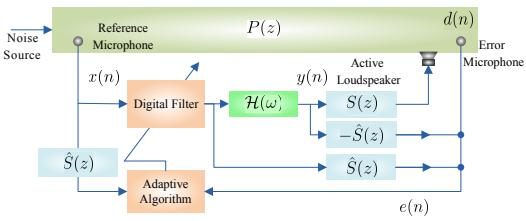

<details>
<summary>flowchart</summary>

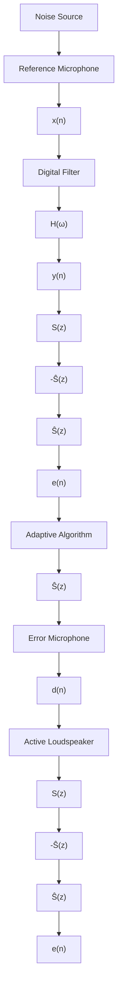
</details>

Figure 15: Diagram of the 3-D ANC system.

The 3-D ANC algorithm has always been a difficult point of the technology. A novel ANC algorithm was proposed to control sound in 3-D space [31]. The diagram of the 3-D ANC system is shown in Fig. 15, where $\mathcal { H } ( \omega )$ stands for a filter with the transfer function

$$
\mathcal {H} (\omega) = \frac {3 c i}{2 r _ {f g} \omega} j _ {0} (\psi a \omega) + \frac {3 (2 r _ {f g} \omega - 3 c i)}{2 a \psi r _ {f g} \omega^ {2}} j _ {1} (\psi a \omega) \tag {16}
$$

where $\omega$ is the angular frequency, $r _ { f g }$ is a parameter related to the locations $r _ { f }$ and $r _ { g } ,$ a is the radius of the sphere, i represents the imaginary unit, c is the sound velocity, $\psi$ is a parameter related to the location $\phi _ { f } , \phi _ { g }$ and $c ,$ and $j _ { m }$ denotes the spherical Bessel function of order m. On this basis, the error signal $e ( n )$ can be defined in the z-domain as

$$
e (z) \triangleq d (z) + w (z) \left(\mathcal {H} (z) \left(S (z) - \hat {S} (z)\right) + \hat {S} (z)\right) X (z). \tag {17}
$$

The above algorithm has demonstrated to be effectiveness in both simulations and experiments for ZoQ with arbitrary shapes (not only for spherical quiet zones). However, the 3D-ANC algorithm for multiple noise sources (such as chaotic noise and impulsive noise) is still in urgent need of research.

# 4.6. Selective ANC systems

Instead of employing the conventional real-time computation of control filter coefficients, the selective ANC (SANC) systems select the control filters from a set of pre-tuned filters based on the temporal or spectral audio features of incoming sounds. As such, the SANC systems have the improved robustness of control filters and reduced computational complexity. In [350], the SANC systems were originally proposed for open window systems and then extended to other methods. In [351], the SANC systems was integrated into the virtual microphone technique, leading to better noise reduction performance than the conventional virtual microphone technique. More extensions of the SANC systems can be referred to [352, 353, 354, 355]

# 4.7. Distributed ANC algorithms

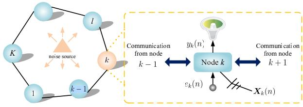

<details>
<summary>flowchart</summary>

```mermaid
graph TD
    subgraph_NoiseSource["Noise Source"]
        K --> l
        l --> k
        k --> k-1
        k --> k
    end
    subgraph_Node_k["Node k"]
        k --> y_k_n["y_k(n)"]
        y_k_n --> Node_k
        Node_k --> e_k_n["e_k(n)"]
        e_k_n --> X_k_n["X_k(n)"]
    end
    subgraph_Communication["Communication from node k-1"]
        k-1 --> y_k_n
        y_k_n --> Node_k
        Node_k --> e_k_n
        e_k_n --> X_k_n
    end
    style NoiseSource fill:#f9f,stroke:#333
    style Node_k fill:#bbf,stroke:#333
    style Communication fill:#dfd,stroke:#333
```
</details>

Figure 16: Diagram of the distributed ANC system with an incremental collaborative strategy.

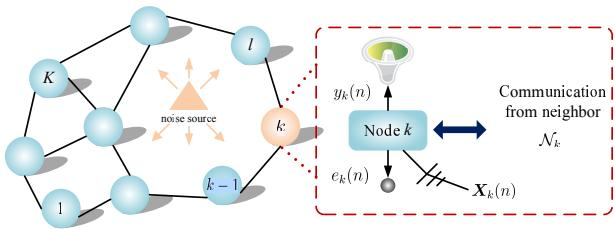

<details>
<summary>flowchart</summary>

```mermaid
graph TD
    subgraph_NoiseSource["noise source"]
        K["Node k"] --> Node_k["Node k"]
        l["Node l"] --> Node_k
        k-1["k-1"] --> Node_k
        Node_k --> e_k["e_k(n)"]
        Node_k --> y_k["y_k(n)"]
    end
    subgraph_Neighborhood[" Neighborhood"]
        Node_k --> y_k
        Node_k --> e_k
        Node_k --> X_k["X_k(n)"]
    end
    subgraph_Communication["Communication from neighbor N_k"]
        y_k --> Node_k
        e_k --> Node_k
        X_k --> Node_k
    end
```
</details>

Figure 17: Diagram of the distributed ANC system with a diffusion collaborative strategy.

In practice, noise source and noise cancellation points may be distanced and the nature of the noise field is complicated. Hence, it is natural to consider employing several reference microphones, error microphones and loudspeakers, resulting in multi-channel ANC system [356]. The cost of multi-channel ANC system is still expensive and demanding. The reasons are as follows. 1) To achieve both sufficient multiple coherence and time advance between the reference and error signals, a sufficient number of reference microphones are needed [357]. 2) The number of filtered reference signals is usually not equal to the number of reference signals [356]. To mitigate the computational complexity of the multi-channel ANC system, several methods were proposed, such as GPU-based methods [6, 306]. The theoretical behavior of the multi-channel ANC system was analyzed in [194, 139]. Recently, a decentralized control method by making use of frequency-domain processing was proposed for multi-channel ANC system [358].

1) Incremental algorithms: Conventionally, the processing of multi-channel ANC systems is the centralized estimation approach. However, it is well known that such an approach is not scalable and require restructuring of hardware components and reformulation of update rules for attenuate noise [359]. An effective solution is to introduce distributed ANC systems, which are motivated by distributed adaptive filtering [360]. Compared with its centralized counterpart, the distributed ANC system consumes less energy and communication resources and is therefore particularly well-suited for WASNs applications. Moreover, it offers a more robust strategy that can be efficiently exploited to reduce noise over geographical regions. The earliest work using distributed ANC systems was reported in [32], which is based on incremental collaborative strategy. A diagram of a distributed ANC system with an incremental collaborative strategy is shown in Fig. 16, where the distributed ANC is considered with K nodes, indexed by $k \in \{ 1 , \ldots , K \}$ . At time instant $n ,$ the observations are acquired for each noise $\{ X _ { k } ( n ) , d _ { k } ( n ) \}$ , where $X _ { k } ( n )$ denotes the input vector, which is obtained by filtering the reference signal x(n) through the kth estimated secondary path, $d _ { k } ( n )$ denotes the noise at the sensor locations, and $e _ { k } ( n )$ is the noise residue at node k. The adaptation of the network for the conventional incremental FxLMS (IFxLMS) algorithm can be expressed as [32]

$$
\left\{ \begin{array}{l} \boldsymbol {w} _ {k} (n) = \boldsymbol {w} _ {k - 1} (n) + \mu_ {k} \boldsymbol {X} _ {k} (n) e _ {k} (n) \\ \boldsymbol {w} (n) = \boldsymbol {w} _ {K} (n) \end{array} \right. \tag {18}
$$

where $\mu _ { k }$ is the step size at node k, $w _ { k } ( n )$ denotes the weight vector at node k, and $w ( n )$ denotes the final estimate for iteration n. To further reduce computational complexity and obtain acceptable noise reduction level, a PU scheme and latency and communication constraints were introduced [32].

2) Diffusion algorithms: In the incremental collaborative strategy, the definition of a cyclic path over the nodes is required, and this method is sensitive to link failure. The diffusion collaborative strategy is a more practical strategy for WASNs applications. In this strategy, each node communicates with a subset of its neighbors $\mathcal { N } _ { k }$ , as shown in Fig. 17. It can achieve a stable behavior over networks regardless of the topology, which is seen as a key advantage. The diffusion FxNLMS (DFxNLMS) algorithm for multi-channel ANC system was developed, whose update equation can be expressed as [361]

$$
\left\{ \begin{array}{l} \boldsymbol {\varphi} _ {k} (n + 1) = \boldsymbol {w} _ {k} (n) + \mu_ {k} \frac {\boldsymbol {X} _ {k} (n)}{\| \boldsymbol {X} _ {k} (n) \| ^ {2}} e _ {k} (n) \\ \boldsymbol {w} _ {k} (n + 1) = \sum_ {l \in \mathcal {N} _ {k}} a _ {l, k} \boldsymbol {\varphi} _ {l} (n + 1) \end{array} \right. \tag {19}
$$

where $\lVert \cdot \rVert$ is the l2-norm, $\varphi _ { l } ( n )$ denotes the local estimates made by neighboring nodes $l \in \mathcal { N } _ { k }$ , and $a _ { l , k } \ge 0$ are the weighting coefficients satisfying

$$
a _ {l, k} = 0 \text {   if   } l \notin \mathcal {N} _ {k} \text {   and   } \sum_ {k = 1} ^ {K} a _ {l, k} = 1. \tag {20}
$$

Another computationally efficient and fast adapting diffusion ANC algorithm, namely distributed FxAP (DFxAP), was proposed in [362], and its convergence behavior was subsequently analyzed. To keep low complexity, the algorithm in [359] only considers neighbor nodes $k - 1$ and $k + 1$ to compute the error signal and adapt the weight vector, which provides a concise solution for practical implementation.

# 5. Conclusion

In this paper, we have reviewed the development of linear ANC techniques in the past 10 years, with emphasis on recent methods such as sparse ANC algorithms and distributed ANC algorithms.

Some fundamental frameworks of the LMS algorithm for ANC, including FxLMS, FeLMS, and FuLMS algorithms were introduced. As the non-LMS-based ANC algorithms, the type of FxAP, FxRLS, subband algorithm, and other structures ANC algorithms were investigated. It should be noted that we did not involve heuristic-based ANC algorithms in Part I, since such algorithms can also be applied to nonlinear models. Part II of this work will review NLANC techniques within the last decade, heuristic-based ANC algorithms, application of the ANC technique, and the future research challenges of ANC techniques.

# Acknowledgment

The authors would like to thank the associate editor and the anonymous referees for their valuable comments.

# References

# References

[1] C. H. Hansen, S. D. Snyder, X. Qiu, L. Brooks, D. Moreau, Active control of noise and vibration, CRC press, 2012.   
[2] P. A. Nelson, S. J. Elliott, Active Control of Sound, Academic Press, 1991.   
[3] S. M. Kuo, D. R. Morgan, Active Noise Control Systems: Algorithms and DSP Implementations, Wiley, New York, 1996.   
[4] S. J. Elliott, P. A. Nelson, Active noise control, IEEE Signal Process. Mag. 10 (4) (1993) 12–35.   
[5] N. V. George, G. Panda, Advances in active noise control: A survey, with emphasis on recent nonlinear techniques, Signal Process. 93 (2) (2013) 363–377.   
[6] J. Lorente, M. Ferrer, M. de Diego, A. Gonzalez, The frequency partitioned block modified filtered-x NLMS with orthogonal correction factors for multichannel active noise control, Digit. Signal Process. 43 (2015) 47–58.   
[7] D. Shi, W.-S. Gan, B. Lam, C. Shi, Two-gradient direction FXLMS: An adaptive active noise control algorithm with output constraint, Mech. Syst. Signal Process. 116 (2019) 651–667.

[8] M. Tufail, S. Ahmed, M. Rehan, M. T. Akhtar, A two adaptive filters-based method for reducing effects of acoustic feedback in single-channel feedforward ANC systems, Digit. Signal Process. 90 (2019) 18–27.   
[9] D. R. Morgan, History, applications, and subsequent development of the FXLMS algorithm, IEEE Signal Process. Mag. 30 (3) (2013) 172–176.   
[10] B. Krstajic, Z. Zecevic, Z. Uskokovic, Increasing convergence speed of FxLMS algorithm in white noise environment, Int. J. Electron. Commun. 67 (10) (2013) 848–853.   
[11] Z. Zecevic, B. Krstajic, M. Radulovic, A new adaptive algorithm for improving the ANC system performance, Int. J. Electron. Commun. 69 (1) (2015) 442–448.   
[12] P. Davari, H. Hassanpour, Designing a new robust on-line secondary path modeling technique for feedforward active noise control systems, Signal Process. 89 (6) (2009) 1195–1204.   
[13] L. Wang, W.-S. Gan, Convergence analysis of narrowband active noise equalizer system under imperfect secondary path estimation, IEEE Trans. Audio Speech Lang. Process. 17 (4) (2009) 566–571.   
[14] I. T. Ardekani, W. H. Abdulla, Effects of imperfect secondary path modeling on adaptive active noise control systems, IEEE Trans. Control Syst. Technol. 20 (5) (2012) 1252–1262.   
[15] D.-C. Chang, F.-T. Chu, Feedforward active noise control with a new variable tap-length and step-size filtered-X LMS algorithm, IEEE/ACM Trans. Audio Speech Lang. Process. 22 (2) (2014) 542–555.   
[16] T. Padhi, M. Chandra, A. Kar, Performance evaluation of hybrid active noise control system with online secondary path modeling, Appl. Acoust. 133 (2018) 215–226.   
[17] S. Pradhan, X. Qiu, A 5-stage active control method with online secondary path modelling using decorrelated control signal, Appl. Acoust. 164 (2020) 107252.   
[18] C.-Y. Chang, S. M. Kuo, C.-W. Huang, Secondary path modeling for narrowband active noise control systems, Appl. Acoust. 131 (2018) 154–164.   
[19] L. Wu, X. Qiu, Y. Guo, A simplified adaptive feedback active noise control system, Appl. Acoust. 81 (2014) 40–46.

[20] L. Luo, J. Sun, B. Huang, A novel feedback active noise control for broadband chaotic noise and random noise, Appl. Acoust. 116 (2017) 229–237.   
[21] L. Wu, X. Qiu, Y. Guo, A generalized leaky FxLMS algorithm for tuning the waterbed effect of feedback active noise control systems, Mech. Syst. Signal Process. 106 (2018) 13–23.   
[22] M. T. Akhtar, W. Mitsuhashi, Improving performance of hybrid active noise control systems for uncorrelated narrowband disturbances, IEEE Trans. Audio, Speech, Lang. Process. 19 (7) (2011) 2058–2066.   
[23] L. Wu, X. Qiu, I. S. Burnett, Y. Guo, Decoupling feedforward and feedback structures in hybrid active noise control systems for uncorrelated narrowband disturbances, J. Sound Vib. 350 (2015) 1–10.   
[24] A. A. Milani, G. Kannan, I. M. S. Panahi, On maximum achievable noise reduction in ANC systems, in: Proc. IEEE Int. Conf. Acoust., Speech Signal Process., 2010, pp. 349–352.   
[25] T. Padhi, M. Chandra, A. Kar, M. N. S. Swamy, A new adaptive control strategy for hybrid narrowband active noise control systems in a multi-noise environment, Appl. Acoust. 146 (2019) 355–367.   
[26] T. Wang, W.-S. Gan, Y. K. Chong, Psychoacoustic hybrid active noise control system, in: Proc. IEEE Int. Conf. Acoust., Speech Signal Process., 2012, pp. 321–324.   
[27] T. Padhi, M. Chandra, A. Kar, M. N. S. Swamy, Design and analysis of an improved hybrid active noise control system, Appl. Acoust. 127 (2017) 260–269.   
[28] F. Albu, A. Gully, R. C. de Lamare, Sparsity-aware pseudo affine projection algorithm for active noise control, in: Proc. Signal Inf. Process. Assoc. Annu. Summit Conf., 2014, pp. 1–5.   
[29] M. Ferrer, A. Gonzalez, M. de Diego, G. Pi˜nero, Convex combination filtered-x algorithms for active noise control systems, IEEE Trans. Audio Speech Lang. Process. 21 (1) (2013) 156–167.   
[30] N. V. George, A. Gonzalez, Convex combination of nonlinear adaptive filters for active noise control, Appl. Acoust. 76 (2014) 157–161.   
[31] I. T. Ardekani, W. H. Abdulla, Active noise control in three dimensions, IEEE Trans. Control Syst. Technol. 22 (6) (2014) 2150–2159.

[32] M. Ferrer, M. de Diego, G. Pi˜nero, A. Gonzalez, Active noise control over adaptive distributed networks, Signal Process. 107 (2015) 82–95.   
[33] S. M. Kuo, K. Kuo, W.-S. Gan, Active noise control: Open problems and challenges, in: Int. Conf. Green Circuits Syst., 2010, pp. 164–169.   
[34] Y. Kajikawa, W.-S. Gan, S. M. Kuo, Recent advances on active noise control: Open issues and innovative applications, APSIPA Trans. Signal, Inf. Process. 1 (2012) e3.   
[35] J. Jiang, Y. Li, Review of active noise control techniques with emphasis on sound quality enhancement, Appl. Acoust. 136 (2018) 139–148.   
[36] S. M. Kuo, D. R. Morgan, Active noise control: a tutorial review, Proc. IEEE 87 (6) (1999) 943–973.   
[37] R. C. de Lamare, R. Sampaio-Neto, Adaptive reduced-rank processing based on joint and iterative interpolation, decimation, and filtering, IEEE Transactions on Signal Processing 57 (7) (2009) 2503–2514. doi:10.1109/TSP.2009.2018641.   
[38] R. C. de Lamare, R. Sampaio-Neto, Minimum mean-squared error iterative successive parallel arbitrated decision feedback detectors for ds-cdma systems, IEEE Transactions on Communications 56 (5) (2008) 778–789. doi:10.1109/TCOMM.2008.060209.   
[39] R. de Lamare, R. Sampaio-Neto, Adaptive reduced-rank mmse filtering with interpolated fir filters and adaptive interpolators, IEEE Signal Processing Letters 12 (3) (2005) 177–180. doi:10.1109/LSP.2004.842290.   
[40] R. C. de Lamare, Adaptive and iterative multi-branch mmse decision feedback detection algorithms for multi-antenna systems, IEEE Transactions on Wireless Communications 12 (10) (2013) 5294–5308. doi:10.1109/TWC.2013.092013.130233.   
[41] R. C. de Lamare, R. Sampaio-Neto, Reduced-rank adaptive filtering based on joint iterative optimization of adaptive filters, IEEE Signal Processing Letters 14 (12) (2007) 980–983. doi:10.1109/LSP.2007.907995.   
[42] R. C. de Lamare, R. Sampaio-Neto, Reduced-rank space-time adaptive interference suppression with joint iterative least squares algorithms for spread-spectrum systems, IEEE Transactions on Vehicular Technology 59 (3) (2010) 1217–1228. doi:10.1109/TVT.2009.2038391.

[43] R. C. de Lamare, R. Sampaio-Neto, Adaptive reduced-rank equalization algorithms based on alternating optimization design techniques for mimo systems, IEEE Transactions on Vehicular Technology 60 (6) (2011) 2482–2494. doi:10.1109/TVT.2011.2157187.   
[44] R. Fa, R. C. de Lamare, L. Wang, Reduced-rank stap schemes for airborne radar based on switched joint interpolation, decimation and filtering algorithm, IEEE Transactions on Signal Processing 58 (8) (2010) 4182–4194. doi:10.1109/TSP.2010.2048212.   
[45] R. C. de Lamare, M. Haardt, R. Sampaio-Neto, Blind adaptive constrained reduced-rank parameter estimation based on constant modulus design for cdma interference suppression, IEEE Transactions on Signal Processing 56 (6) (2008) 2470–2482. doi:10.1109/TSP.2007.913161.   
[46] P. Clarke, R. C. de Lamare, Transmit diversity and relay selection algorithms for multirelay cooperative mimo systems, IEEE Transactions on Vehicular Technology 61 (3) (2012) 1084– 1098. doi:10.1109/TVT.2012.2186619.   
[47] P. Li, R. C. De Lamare, Adaptive decision-feedback detection with constellation constraints for mimo systems, IEEE Transactions on Vehicular Technology 61 (2) (2012) 853–859. doi:10.1109/TVT.2011.2177874.   
[48] Z. Yang, R. C. de Lamare, X. Li, ¡formula formulatype=”inline”¿¡tex notation=”tex”¿l1¡/tex¿ ¡/formula¿-regularized stap algorithms with a generalized sidelobe canceler architecture for airborne radar, IEEE Transactions on Signal Processing 60 (2) (2012) 674–686. doi:10.1109/TSP.2011.2172435.   
[49] R. de Lamare, R. Sampaio-Neto, Adaptive mber decision feedback multiuser receivers in frequency selective fading channels, IEEE Communications Letters 7 (2) (2003) 73–75. doi:10.1109/LCOMM.2002.808373.   
[50] R. de Lamare, L. Wang, R. Fa, Adaptive reduced-rank lcmv beamforming algorithms based on joint iterative optim Signal Processing 90 (2) (2010) 640–652. doi:https://doi.org/10.1016/j.sigpro.2009.08.002. URL https://www.sciencedirect.com/science/article/pii/S0165168409003466   
[51] H. Ruan, R. C. de Lamare, Robust adaptive beamforming using a low-complexity shrinkagebased mismatch estimation algorithm, IEEE Signal Processing Letters 21 (1) (2014) 60–64. doi:10.1109/LSP.2013.2290948.

[52] R. C. de Lamare, P. S. R. Diniz, Set-membership adaptive algorithms based on time-varying error bounds for cdma interference suppression, IEEE Transactions on Vehicular Technology 58 (2) (2009) 644–654. doi:10.1109/TVT.2008.926608.   
[53] R. de Lamare, R. Sampaio-Neto, Blind adaptive code-constrained constant modulus algorithms for cdma interference suppression in multipath channels, IEEE Communications Letters 9 (4) (2005) 334–336. doi:10.1109/LCOMM.2005.04022.   
[54] S. Xu, R. C. de Lamare, H. V. Poor, Distributed compressed estimation based on compressive sensing, IEEE Signal Processing Letters 22 (9) (2015) 1311–1315. doi:10.1109/LSP.2015.2400372.   
[55] R. C. De Lamare, R. Sampaio-Neto, A. Hjorungnes, Joint iterative interference cancellation and parameter estimation for cdma systems, IEEE Communications Letters 11 (12) (2007) 916–918. doi:10.1109/LCOMM.2007.070943.   
[56] R. Fa, R. C. De Lamare, Reduced-rank stap algorithms using joint iterative optimization of filters, IEEE Transactions on Aerospace and Electronic Systems 47 (3) (2011) 1668–1684. doi:10.1109/TAES.2011.5937257.   
[57] R. C. de Lamare, R. Sampaio-Neto, Adaptive interference suppression for ds-cdma systems based on interpolated fir filters with adaptive interpolators in multipath channels, IEEE Transactions on Vehicular Technology 56 (5) (2007) 2457–2474. doi:10.1109/TVT.2007.899931.   
[58] R. C. De Lamare, R. Sampaio-Neto, Blind adaptive mimo receivers for space-time blockcoded ds-cdma systems in multipath channels using the constant modulus criterion, IEEE Transactions on Communications 58 (1) (2010) 21–27. doi:10.1109/TCOMM.2010.01.070549.   
[59] R. de Lamare, R. Sampaio-Neto, Low-complexity variable step-size mechanisms for stochastic gradient algorithms in minimum variance cdma receivers, IEEE Transactions on Signal Processing 54 (6) (2006) 2302–2317. doi:10.1109/TSP.2006.873651.   
[60] A. G. D. Uchoa, C. T. Healy, R. C. de Lamare, Iterative detection and decoding algorithms for mimo systems in block-fading channels using ldpc codes, IEEE Transactions on Vehicular Technology 65 (4) (2016) 2735–2741. doi:10.1109/TVT.2015.2432099.

[61] R. Fa, Multi-branch successive interference cancellation for mimo spatial multiplexing systems: design, analysis a IET Communications 5 (2011) 484–494(10). URL https://digital-library.theiet.org/content/journals/10.1049/iet-com.2009.0843   
[62] N. Song, R. C. de Lamare, M. Haardt, M. Wolf, Adaptive widely linear reduced-rank interference suppression based on the multistage wiener filter, IEEE Transactions on Signal Processing 60 (8) (2012) 4003–4016. doi:10.1109/TSP.2012.2197747.   
[63] L. T. N. Landau, R. C. de Lamare, Branch-and-bound precoding for multiuser mimo systems with 1-bit quantization, IEEE Wireless Communications Letters 6 (6) (2017) 770–773. doi:10.1109/LWC.2017.2740386.   
[64] H. Ruan, R. C. de Lamare, Robust adaptive beamforming based on low-rank and crosscorrelation techniques, IEEE Transactions on Signal Processing 64 (15) (2016) 3919–3932. doi:10.1109/TSP.2016.2550006.   
[65] S. D. Somasundaram, N. H. Parsons, P. Li, R. C. de Lamare, Reduced-dimension robust capon beamforming using krylov-subspace techniques, IEEE Transactions on Aerospace and Electronic Systems 51 (1) (2015) 270–289. doi:10.1109/TAES.2014.130485.   
[66] T. Wang, R. C. de Lamare, P. D. Mitchell, Low-complexity set-membership channel estimation for cooperative wireless sensor networks, IEEE Transactions on Vehicular Technology 60 (6) (2011) 2594–2607. doi:10.1109/TVT.2011.2153884.   
[67] T. Peng, R. C. de Lamare, A. Schmeink, Adaptive distributed space-time coding based on adjustable code matrices for cooperative mimo relaying systems, IEEE Transactions on Communications 61 (7) (2013) 2692–2703. doi:10.1109/TCOMM.2013.043013.120788.   
[68] N. Song, W. U. Alokozai, R. C. de Lamare, M. Haardt, Adaptive widely linear reduced-rank beamforming based on joint iterative optimization, IEEE Signal Processing Letters 21 (3) (2014) 265–269. doi:10.1109/LSP.2013.2295943.   
[69] R. Meng, R. C. de Lamare, V. H. Nascimento, Sparsity-aware affine projection adaptive algorithms for system identification, in: Sensor Signal Processing for Defence (SSPD 2011), 2011, pp. 1–5. doi:10.1049/ic.2011.0144.

[70] J. Liu, R. C. de Lamare, Low-latency reweighted belief propagation decoding for ldpc codes, IEEE Communications Letters 16 (10) (2012) 1660–1663. doi:10.1109/LCOMM.2012.080312.121307.   
[71] R. C. de Lamare, R. Sampaio-Neto, Sparsity-aware adaptive algorithms based on alternating optimization and shrinkage, IEEE Signal Processing Letters 21 (2) (2014) 225–229. doi:10.1109/LSP.2014.2298116.   
[72] L. Wang, Constrained adaptive filtering algorithms based on conjugate gradient techniques for beamforming, IET Signal Processing 4 (2010) 686–697(11). URL https://digital-library.theiet.org/content/journals/10.1049/iet-spr.2009.0243   
[73] Y. Cai, R. C. d. Lamare, R. Fa, Switched interleaving techniques with limited feedback for interference mitigation in ds-cdma systems, IEEE Transactions on Communications 59 (7) (2011) 1946–1956. doi:10.1109/TCOMM.2011.051711.090120A.   
[74] Y. Cai, R. C. de Lamare, Space-time adaptive mmse multiuser decision feedback detectors with multiple-feedback interference cancellation for cdma systems, IEEE Transactions on Vehicular Technology 58 (8) (2009) 4129–4140. doi:10.1109/TVT.2009.2022830.   
[75] Z. Shao, R. C. de Lamare, L. T. N. Landau, Iterative detection and decoding for largescale multiple-antenna systems with 1-bit adcs, IEEE Wireless Communications Letters 7 (3) (2018) 476–479. doi:10.1109/LWC.2017.2787159.   
[76] R. de Lamare, Joint iterative power allocation and linear interference suppression algorithms for cooperative ds-cd IET Communications 6 (2012) 1930–1942(12). URL https://digital-library.theiet.org/content/journals/10.1049/iet-com.2011.0508   
[77] P. Li, R. C. de Lamare, Distributed iterative detection with reduced message passing for networked mimo cellular systems, IEEE Transactions on Vehicular Technology 63 (6) (2014) 2947–2954. doi:10.1109/TVT.2013.2295532.   
[78] Y. Cai, R. C. de Lamare, B. Champagne, B. Qin, M. Zhao, Adaptive reduced-rank receive processing based on minimum symbol-error-rate criterion for large-scale multipleantenna systems, IEEE Transactions on Communications 63 (11) (2015) 4185–4201. doi:10.1109/TCOMM.2015.2475260.

[79] C. T. Healy, R. C. de Lamare, Design of ldpc codes based on multipath emd strategies for progressive edge growth, IEEE Transactions on Communications 64 (8) (2016) 3208–3219. doi:10.1109/TCOMM.2016.2579641.   
[80] L. Wang, R. C. de Lamare, M. Haardt, Direction finding algorithms based on joint iterative subspace optimization, IEEE Transactions on Aerospace and Electronic Systems 50 (4) (2014) 2541–2553. doi:10.1109/TAES.2014.120395.   
[81] J. Gu, R. C. de Lamare, M. Huemer, Buffer-aided physical-layer network coding with optimal linear code designs for cooperative networks, IEEE Transactions on Communications 66 (6) (2018) 2560–2575. doi:10.1109/TCOMM.2017.2708118.   
[82] S. Xu, R. C. de Lamare, H. V. Poor, Adaptive link selection algorithms for distributed estimation, EURASIP J. Adv. Signal Process. 86.   
[83] L. Wang, R. C. de Lamare, Y. Long Cai, Low-complexity adaptive step size constrained constant modulus sg algori Signal Processing 89 (12) (2009) 2503–2513. doi:https://doi.org/10.1016/j.sigpro.2009.04.018. URL https://www.sciencedirect.com/science/article/pii/S0165168409001716   
[84] L. Qiu, Y. Cai, R. C. de Lamare, M. Zhao, Reduced-rank doa estimation algorithms based on alternating low-rank decomposition, IEEE Signal Processing Letters 23 (5) (2016) 565–569. doi:10.1109/LSP.2016.2541688.   
[85] M. Yukawa, R. C. de Lamare, R. Sampaio-Neto, Efficient acoustic echo cancellation with reduced-rank adaptive filtering based on selective decimation and adaptive interpolation, IEEE Transactions on Audio, Speech, and Language Processing 16 (4) (2008) 696–710. doi:10.1109/TASL.2008.916059.   
[86] S. Xu, Distributed estimation over sensor networks based on distributed conjugate gradient strategies, IET Signal Processing 10 (2016) 291–301(10). URL https://digital-library.theiet.org/content/journals/10.1049/iet-spr.2015.0384   
[87] L. Landau, Robust adaptive beamforming algorithms using the constrained constant modulus criterion, IET Signal Processing 8 (2014) 447–457(10). URL https://digital-library.theiet.org/content/journals/10.1049/iet-spr.2013.0166

[88] L. Wang, R. C. de Lamare, Adaptive constrained constant modulus algorithm based on auxiliary vector filtering for beamforming, IEEE Transactions on Signal Processing 58 (10) (2010) 5408–5413. doi:10.1109/TSP.2010.2054086.   
[89] Y. Cai, R. C. de Lamare, Adaptive linear minimum ber reduced-rank interference suppression algorithms based on joint and iterative optimization of filters, IEEE Communications Letters 17 (4) (2013) 633–636. doi:10.1109/LCOMM.2013.021213.122594.   
[90] T. G. Miller, S. Xu, R. C. de Lamare, H. V. Poor, Distributed spectrum estimation based on alternating mixed discrete-continuous adaptation, IEEE Signal Processing Letters 23 (4) (2016) 551–555. doi:10.1109/LSP.2016.2539328.   
[91] P. Clarke, R. C. de Lamare, Low-complexity reduced-rank linear interference suppression based on set-membership joint iterative optimization for ds-cdma systems, IEEE Transactions on Vehicular Technology 60 (9) (2011) 4324–4337. doi:10.1109/TVT.2011.2171376.   
[92] S. Li, R. C. de Lamare, R. Fa, Reduced-rank linear interference suppression for ds-uwb systems based on switched approximations of adaptive basis functions, IEEE Transactions on Vehicular Technology 60 (2) (2011) 485–497. doi:10.1109/TVT.2010.2090545.   
[93] F. G. Almeida Neto, R. C. De Lamare, V. H. Nascimento, Y. V. Zakharov, Adaptive reweighting homotopy algorithms applied to beamforming, IEEE Transactions on Aerospace and Electronic Systems 51 (3) (2015) 1902–1915. doi:10.1109/TAES.2015.140401.   
[94] W. S. Leite, R. C. De Lamare, List-based omp and an enhanced model for doa estimation with non-uniform arrays, IEEE Transactions on Aerospace and Electronic Systems (2021) 1–1doi:10.1109/TAES.2021.3087836.   
[95] T. Wang, R. C. de Lamare, A. Schmeink, Joint linear receiver design and power allocation using alternating optimization algorithms for wireless sensor networks, IEEE Transactions on Vehicular Technology 61 (9) (2012) 4129–4141. doi:10.1109/TVT.2012.2212217.   
[96] R. C. de Lamare, P. S. R. Diniz, Blind adaptive interference suppression based on setmembership constrained constant-modulus algorithms with dynamic bounds, IEEE Transactions on Signal Processing 61 (5) (2013) 1288–1301. doi:10.1109/TSP.2012.2229995.

[97] Y. Cai, R. C. de Lamare, Low-complexity variable step-size mechanism for codeconstrained constant modulus stochastic gradient algorithms applied to cdma interference suppression, IEEE Transactions on Signal Processing 57 (1) (2009) 313–323. doi:10.1109/TSP.2008.2005861.   
[98] Y. Cai, R. C. de Lamare, M. Zhao, J. Zhong, Low-complexity variable forgetting factor mechanism for blind adaptive constrained constant modulus algorithms, IEEE Transactions on Signal Processing 60 (8) (2012) 3988–4002. doi:10.1109/TSP.2012.2199317.   
[99] M. F. Kaloorazi, R. C. de Lamare, Subspace-orbit randomized decomposition for low-rank matrix approximations, IEEE Transactions on Signal Processing 66 (16) (2018) 4409–4424. doi:10.1109/TSP.2018.2853137.   
[100] R. B. Di Renna, R. C. de Lamare, Adaptive activity-aware iterative detection for massive machine-type communications, IEEE Wireless Communications Letters 8 (6) (2019) 1631– 1634. doi:10.1109/LWC.2019.2932674.   
[101] H. Ruan, R. C. de Lamare, Distributed robust beamforming based on low-rank and crosscorrelation techniques: Design and analysis, IEEE Transactions on Signal Processing 67 (24) (2019) 6411–6423. doi:10.1109/TSP.2019.2954519.   
[102] S. F. B. Pinto, R. C. de Lamare, Multistep knowledge-aided iterative esprit: Design and analysis, IEEE Transactions on Aerospace and Electronic Systems 54 (5) (2018) 2189–2201. doi:10.1109/TAES.2018.2811098.   
[103] Y. V. Zakharov, V. H. Nascimento, R. C. De Lamare, F. G. De Almeida Neto, Lowcomplexity dcd-based sparse recovery algorithms, IEEE Access 5 (2017) 12737–12750. doi:10.1109/ACCESS.2017.2715882.   
[104]   
[105] S. Li, R. C. de Lamare, Blind reduced-rank adaptive receivers for ds-uwb systems based on joint iterative optimization and the constrained constant modulus criterion, IEEE Transactions on Vehicular Technology 60 (6) (2011) 2505–2518. doi:10.1109/TVT.2011.2157844.

[106] X. Wu, Y. Cai, M. Zhao, R. C. de Lamare, B. Champagne, Adaptive widely linear constrained constant modulus reduced-rank beamforming, IEEE Transactions on Aerospace and Electronic Systems 53 (1) (2017) 477–492. doi:10.1109/TAES.2017.2650838.   
[107] Y. Yu, H. He, T. Yang, X. Wang, R. C. de Lamare, Diffusion normalized least mean mestimate algorithms: Design and performance analysis, IEEE Transactions on Signal Processing 68 (2020) 2199–2214. doi:10.1109/TSP.2020.2983905.   
[108] R. B. Di Renna, R. C. de Lamare, Iterative list detection and decoding for massive machinetype communications, IEEE Transactions on Communications 68 (10) (2020) 6276–6288. doi:10.1109/TCOMM.2020.3007525.   
[109] L. Wang, Set-membership constrained conjugate gradient adaptive algorithm for beamforming, IET Signal Processing 6 (2012) 789–797(8). URL https://digital-library.theiet.org/content/journals/10.1049/iet-spr.2011.0324   
[110] S. J. Elliott, I. M. Stothers, P. Nelson, A multiple error LMS algorithm and its application to the active control of sound and vibration, IEEE Trans. Acoust., Speech, Signal Process. 35 (10) (1987) 1423–1434.   
[111] Q. Shen, A. Spanias, Time and frequency domain X block LMS algorithms for single channel active noise control, Proc. 2nd Int. Cong. Recent Dev. Air- Struct.-Borne Sound Vib. (1992) 353–360.   
[112] S. M. Kuo, J. Luan, Cross-coupled filtered-x LMS algorithm and lattice structure for active noise control systems, in: IEEE Int. Symp. Circuits Syst., 1993, pp. 459–462.   
[113] J. Thi, D. R. Morgan, Delayless subband active noise control, in: IEEE Int. Conf. Acoust., Speech, Signal Process., Vol. 1, 1993, pp. 181–184.   
[114] M. Bouchard, S. Quednau, Multichannel recursive-least-square algorithms and fasttransversal-filter algorithms for active noise control and sound reproduction systems, IEEE Trans. Speech Audio Process. 8 (5) (2000) 606–618.   
[115] S. J. Park, J. H. Yun, Y. C. Park, D. H. Youn, A delayless subband active noise control system for wideband noise control, IEEE Trans. Speech Audio Process. 9 (8) (2001) 892–899.

[116] H. Lan, M. Zhang, W. Ser, A weight-constrained FxLMS algorithm for feedforward active noise control systems, IEEE Signal Process. Lett. 9 (1) (2002) 1–4.   
[117] O. J. Tobias, R. Seara, Leaky-FXLMS algorithm: Stochastic analysis for Gaussian data and secondary path modeling error, IEEE Trans. Speech, Audio Process. 13 (6) (2005) 1217–1230.   
[118] A. Carini, G. L. Sicuranza, Steady-state and transient analysis of multichannel filtered-X affine projection algorithms, in: IEEE Int. Conf. Acoust., Speech, Signal Process., Vol. 4, 2005, pp. iv–345.   
[119] X. Sun, S. M. Kuo, G. Meng, Adaptive algorithm for active control of impulsive noise, J. Sound Vib. 291 (1-2) (2006) 516–522.   
[120] D. Das, G. Panda, S. Kuo, New block filtered-X LMS algorithms for active noise control systems, IET Signal Process. 1 (2) (2007) 73–81.   
[121] X. Sun, S. M. Kuo, Active narrowband noise control systems using cascading adaptive filters, IEEE Trans. Audio, Speech, Lang. Process. 15 (2) (2007) 586–592.   
[122] A. Carini, G. L. Sicuranza, Optimal regularization parameter of the multichannel filtered-x affine projection algorithm, IEEE Trans. Signal Process. 55 (10) (2007) 4882–4895.   
[123] D. Zhou, V. E. DeBrunner, A new active noise control algorithm that requires no secondary path identification based on the SPR property, IEEE Trans. Signal Process. 55 (5) (2007) 1719–1729.   
[124] A. Puri, S. V. Modak, K. Gupta, Modal filtered-x LMS algorithm for global active noise control in a vibro-acoustic cavity, Mech. Syst. Signal Process. 110 (2018) 540–555.   
[125] A. Puri, S. V. Modak, K. Gupta, Global active control of harmonic noise in a vibro-acoustic cavity using Modal FxLMS algorithm, Appl. Acoust. 150 (2019) 147–161.   
[126] G. Long, F. Ling, J. G. Proakis, The LMS algorithm with delayed coefficient adaptation, IEEE Trans. Acoust., Speech, Signal Process. 37 (9) (1989) 1397–1405.   
[127] G. Long, F. Ling, J. G. Proakis, Corrections to ‘The LMS algorithm with delayed coefficient adaptation’, IEEE Trans. Signal Process. 40 (1) (1992) 230–232.

[128] E. Bjarnason, Analysis of the filtered-X LMS algorithm, IEEE Trans. Speech, Audio Process. 3 (6) (1995) 504–514.   
[129] O. J. Tobias, J. C. M. Bermudez, N. J. Bershad, Mean weight behavior of the filtered-X LMS algorithm, IEEE Trans. Signal Process. 48 (4) (2000) 1061–1075.   
[130] R. Fraanje, M. Verhaegen, S. J. Elliott, Robustness of the filtered-X LMS algorithm–Part I: Necessary conditions for convergence and the asymptotic pseudospectrum of Toeplitz matrices, IEEE Trans. Signal Processing 55 (8) (2007) 4029–4037.   
[131] R. Fraanje, S. J. Elliott, M. Verhaegen, Robustness of the filtered-X LMS algorithm–Part II: Robustness enhancement by minimal regularization for norm bounded uncertainty, IEEE Trans. Signal Process. 55 (8) (2007) 4038–4047.   
[132] G. Barrault, J. C. Bermudez, A. Lenzi, New analytical model for the filtered-x least mean squares algorithm verified through active noise control experiment, Mech. Syst. Signal Process. 21 (4) (2007) 1839–1852.   
[133] I. T. Ardekani, W. H. Abdulla, Theoretical convergence analysis of FxLMS algorithm, Signal Process. 90 (12) (2010) 3046–3055.   
[134] L. Vicente, E. Masgrau, Novel FxLMS convergence condition with deterministic reference, IEEE Trans. Signal Process. 54 (10) (2006) 3768–3774.   
[135] I. T. Ardekani, W. H. Abdulla, Stochastic modelling and analysis of filtered-x least-meansquare adaptation algorithm, IET Signal Process. 7 (6) (2013) 486–496.   
[136] S. C. Chan, Y. Chu, Performance analysis and design of FxLMS algorithm in broadband ANC system with online secondary-path modeling, IEEE Trans. Audio Speech Lang. Process. 20 (3) (2012) 982–993.   
[137] S. Miyoshi, Y. Kajikawa, Statistical-mechanics approach to the filtered-X LMS algorithm, Electron. Lett. 47 (17) (2011) 997–999.   
[138] S. Miyoshi, Y. Kajikawa, Statistical-mechanical analysis of the FXLMS algorithm with actual primary path, in: Proc. IEEE Int. Conf. Acoust., Speech Signal Process., 2015, pp. 3502–3506.

[139] T. Murata, Y. Kajikawa, S. Miyoshi, Statistical-mechanical analysis of the FXLMS algorithm for multiple-channel active noise control, in: Proc. APSIPA Annu. Summit and Conf., 2017, pp. 136–139.   
[140] I. T. Ardekani, W. H. Abdulla, On the stability of adaptation process in active noise control systems, J. Acoust. Soc. Amer. 129 (1) (2011) 173–184.   
[141] I. T. Ardekani, W. H. Abdulla, Root locus analysis and design of the adaptation process in active noise control, J. Acoust. Soc. Amer. 132 (4) (2012) 2313–2324.   
[142] I. T. Ardekani, W. H. Abdulla, Stability of residual acoustic noise variance in active control of stochastic noise, in: Proc. IEEE Int. Conf. Acoust., Speech Signal Process., 2013, pp. 379–382.   
[143] I. T. Ardekani, H. R. Sharifzadeh, S. U. Rehman, W. H. Abdulla, Efficient FxLMS algorithm with simplified secondary path models, in: Proc. IEEE Int. Conf. Acoust., Speech Signal Process., 2015, pp. 609–613.   
[144] A. M. Al Omour, A. Zidouri, N. Iqbal, A. Zerguine, Filtered-X Least Mean Fourth (FXLMF) and Leaky FXLMF adaptive algorithms, EURASIP J. Adv. Signal Process. 2016 (1) (2016) 39.   
[145] J. Cheer, S. J. Elliott, Active noise control of a diesel generator in a luxury yacht, Appl. Acoust. 105 (2016) 209–214.   
[146] D. Shi, B. Lam, W.-S. Gan, S. Wen, Optimal leak factor selection for the output-constrained leaky filtered-input least mean square algorithm, IEEE Signal Process. Lett. 26 (5) (2019) 670–674.   
[147] L. Lu, H. Zhao, Improved filtered-x least mean kurtosis algorithm for active noise control, Circuits, Syst., Signal Process. 36 (4) (2017) 1586–1603.   
[148] T. Padhi, M. Chandra, A. Kar, M. N. S. Swamy, A new hybrid active noise control system with convex combination of time and frequency domain filtered-X LMS algorithms, Circuits, Syst., Signal Process. 37 (8) (2018) 3275–3294.

[149] Z. Qiu, C.-M. Lee, Z. H. Xu, L. N. Sui, A multi-resolution filtered-x LMS algorithm based on discrete wavelet transform for active noise control, Mech. Syst. Signal Process. 66 (2016) 458–469.   
[150] N. K. Rout, D. P. Das, G. Panda, Computationally efficient algorithm for high samplingfrequency operation of active noise control, Mech. Syst. Signal Process. 56 (2015) 302–319.   
[151] X. L. Tang, C.-M. Lee, Time-frequency-domain filtered-x LMS algorithm for active noise control, J. Sound Vib. 331 (23) (2012) 5002–5011.   
[152] S. Zhang, Y. S. Wang, H. Guo, C. Yang, X. Wang, N. N. Liu, A normalized frequencydomain block filtered-x LMS algorithm for active vehicle interior noise control, Mech. Syst. Signal Process. 120 (2019) 150–165.   
[153] S. C. Chan, Y. Chu, Z. G. Zhang, A new variable regularized transform domain NLMS adaptive filtering algorithm–Acoustic applications and performance analysis, IEEE Trans. Audio Speech Lang. Process. 21 (4) (2013) 868–878.   
[154] Z. Zecevic, B. Krstajic, M. Radulovic, Frequency-domain adaptive algorithm for improving the active noise control performance, IET Signal Process. 9 (4) (2015) 349–356.   
[155] Z.-H. Deng, H.-G. Wang, G. Chen, Blind adaptive preprocessing to multichannel feedfoward active noise control system, IET Signal Process. 7 (6) (2013) 461–470.   
[156] Y. S. Wang, H. Guo, Y. R. Li, N. N. Liu, C. Yang, Active control for vehicle interior noise based on DWT-FxLMS algorithm using a piezoelectric feedback system, Appl. Acoust. 167 (2020) 107409.   
[157] W. J. Kozacky, T. Ogunfunmi, Convergence analysis of an adaptive algorithm with output power constraints, IEEE Trans. Circuits Syst. II 61 (5) (2014) 364–367.   
[158] W. J. Kozacky, T. Ogunfunmi, A cascaded IIR–FIR adaptive ANC system with output power constraints, Signal Process. 94 (2014) 456–464.   
[159] B. Huang, Y. Xiao, J. Sun, G. Wei, A variable step-size FXLMS algorithm for narrowband active noise control, IEEE Trans. Audio Speech Lang. Process. 21 (2) (2013) 301–312.

[160] Y. Xiao, H. Zhang, J. Liu, A series of variable step-size FXLMS algorithms for narrowband active noise control, in: Int. Cong. Sound, Vib., 2017, pp. 1–7.   
[161] Y. Xiao, L. Ma, K. Hasegawa, Properties of FXLMS-based narrowband active noise control with online secondary-path modeling, IEEE Trans. Signal Process. 57 (8) (2009) 2931–2949.   
[162] Z. Bo, J. Yang, C. Sun, S. Jiang, A filtered-x weighted accumulated LMS algorithm: Stochastic analysis and simulations for narrowband active noise control system, Signal Process. 104 (2014) 296–310.   
[163] Z. Bo, C. Sun, Y. Xu, S. Jiang, A variable momentum factor filtered-x weighted accumulated LMS algorithm for narrowband active noise control systems, Measurement 48 (2014) 282–291.   
[164] M. V. Matsuo, R. Seara, On the stochastic modeling of FxLMS-based narrowband active noise equalization systems, Signal Process. 115 (2015) 214–226.   
[165] K. Mondal, S. Das, A. B. H. Abu, N. Hamada, H. T. Toh, S. Das, W. F. Faris, All-pass filtered x least mean square algorithm for narrowband active noise control, Appl. Acoust. 142 (2018) 1–10.   
[166] T. Haarnoja, K. Tammi, K. Zenger, Exact LTP representation of the generalized periodicreference FxLMS algorithm, IEEE Trans. Signal Process. 62 (1) (2014) 121–130.   
[167] T. Wang, W.-S. Gan, Stochastic analysis of FXLMS-based internal model control feedback active noise control systems, Signal Process. 101 (6) (2014) 121–133.   
[168] T. Wang, W.-S. Gan, S. M. Kuo, New feedback active noise control system with improved performance, in: Proc. IEEE Int. Conf. Acoust., Speech Signal Process., 2014, pp. 6662–6666.   
[169] Y. Xiao, A new efficient narrowband active noise control system and its performance analysis, IEEE Trans. Audio, Speech, Lang. Process. 19 (7) (2011) 1865–1874.   
[170] J. C. M. Bermudez, N. J. Bershad, Non-Wiener behavior of the filtered LMS algorithm, IEEE Trans. Circuits Syst. II 46 (8) (1999) 1110–1113.   
[171] Y. Xiao, A. Ikuta, L. Ma, K. Khorasani, Stochastic analysis of the FXLMS-based narrowband active noise control system, IEEE Trans. Audio, Speech, Lang. Process. 16 (5) (2008) 1000– 1014.

[172] C.-Y. Chang, S. M. Kuo, Complete parallel narrowband active noise control systems, IEEE Trans. Audio Speech Lang. Process. 21 (9) (2013) 1979–1986.   
[173] C.-Y. Chang, S. M. Kuo, Complete direct/parallel structure for narrowband active noise control systems, IET Signal Process. 7 (6) (2013) 477–485.   
[174] S. Narasimhan, S. Veena, H. Lokesha, Variable step-size Griffiths’ algorithm for improved performance of feedforward/feedback active noise control, Signal, Image, Video Process. 4 (3) (2010) 309–317.   
[175] Y. Xiao, J. Wang, A new feedforward hybrid active noise control system, IEEE Signal Process. Lett. 18 (10) (2011) 591–594.   
[176] R. Delega, G. Bernasconi, L. Piroddi, A novel cost-effective parallel narrowband ANC system with local secondary-path estimation, J. Sound Vib. 401 (2017) 311–325.   
[177] M. T. Akhtar, W. Mitsuhashi, Improving performance of FxLMS algorithm for active noise control of impulsive noise, J. Sound Vib. 327 (3) (2009) 647–656.   
[178] Y. Zhou, Q. Zhang, Y. Yin, Active control of impulsive noise with symmetric α-stable distribution based on an improved step-size normalized adaptive algorithm, Mech. Syst. Signal Process. 56 (2015) 320–339.   
[179] L. Wu, X. Qiu, Active impulsive noise control algorithm with post adaptive filter coefficient filtering, IET Signal Process. 7 (6) (2013) 515–521.   
[180] L. Wu, H. He, X. Qiu, An active impulsive noise control algorithm with logarithmic transformation, IEEE Trans. Audio Speech Lang. Process. 19 (4) (2011) 1041–1044.   
[181] M. T. Akhtar, Binormalized data-reusing adaptive filtering algorithm for active control of impulsive sources, Digit. Signal Process. 49 (2016) 56–64.   
[182] M. T. Akhtar, A. Nishihara, Data-reusing-based filtered-reference adaptive algorithms for active control of impulsive noise sources, Appl. Acoust. 92 (2015) 18–26.   
[183] M. T. Akhtar, A time-varying normalized step-size based generalized fractional moment adaptive algorithm and its application to ANC of impulsive sources, Appl. Acoust. 155 (2019) 240–249.

[184] M. T. Akhtar, W. Mitsuhashi, Improving robustness of filtered-x least mean p-power algorithm for active attenuation of standard symmetric-α-stable impulsive noise, Appl. Acoust. 72 (9) (2011) 688–694.   
[185] L. Tan, J. Jiang, Active control of impulsive noise using a nonlinear companding function, Mech. Syst. Signal Process. 58 (2015) 29–40.   
[186] M. Bergamasco, F. D. Rossa, L. Piroddi, Active noise control with on-line estimation of non-Gaussian noise characteristics, J. Sound Vib. 331 (1) (2012) 27–40.   
[187] A. Mirza, A. Zeb, M. Y. Umair, D. Ilyas, S. A. Sheikh, Less complex solutions for active noise control of impulsive noise, Analog Integr. Circuits Signal Process. (2019) 1–15.   
[188] H. Meng, S. Chen, A modified adaptive weight-constrained FxLMS algorithm for feedforward active noise control systems, Appl. Acoust. 164 (2020) 107227.   
[189] V. Saravanan, N. Santhiyakumari, An active noise control system for impulsive noise using soft threshold FxLMS algorithm with harmonic mean step size, Wireless Personal Commun. (2019) 1–14.   
[190] L. Wu, X. Qiu, An M-estimator based algorithm for active impulse-like noise control, Appl. Acoust. 74 (3) (2013) 407–412.   
[191] P. Li, X. Yu, Active noise cancellation algorithms for impulsive noise., Mech. Syst. Signal Process. 36 (2) (2013) 630–635.   
[192] G. Sun, M. Li, T. C. Lim, Enhanced filtered-x least mean M-estimate algorithm for active impulsive noise control, Appl. Acoust. 90 (2015) 31–41.   
[193] G. Sun, M. Li, T. C. Lim, A family of threshold based robust adaptive algorithms for active impulsive noise control, Appl. Acoust. 97 (2015) 30–36.   
[194] M. Ferrer, M. de Diego, A. Gonzalez, G. Pi˜nero, Steady-state mean square performance of the multichannel filtered-x affine projection algorithm, IEEE Trans. Signal Process. 60 (6) (2012) 2771–2785.

[195] M. Ferrer, A. Gonzalez, M. de Diego, G. Pi˜nero, Transient analysis of the conventional filteredx affine projection algorithm for active noise control, IEEE Trans. Audio Speech Lang. Process. 19 (3) (2011) 652–657.   
[196] J.-M. Song, P. Park, An optimal variable step-size affine projection algorithm for the modified filtered-x active noise control, Signal Process. 114 (2015) 100–111.   
[197] J. Guo, F. Yang, J. Yang, Convergence analysis of the conventional filtered-x affine projection algorithm for active noise control, Signal Process. 170 (2020) 107437.   
[198] J. Guo, F. Yang, J. Yang, Mean-square performance of the modified filtered-x affine projection algorithm, Circuits, Syst., Signal Process. (2020) 1–15.   
[199] L. Xiao, M. Wu, J. Yang, A new efficient filtered-x affine projection sign algorithm for active control of impulsive noise, Signal Process. 120 (2016) 456–461.   
[200] R. M. Reddy, I. M. S. Panahi, R. W. Briggs, Hybrid FxRLS-FxNLMS adaptive algorithm for active noise control in fMRI application, IEEE Trans. Control Syst. Technol. 19 (2) (2011) 474–480.   
[201] M. S. Aslam, P. Shi, C.-C. Lim, Robust active noise control design by optimal weighted least squares approach, IEEE Trans. Circuits Syst. I 66 (10) (2019) 3955–3967.   
[202] L. Wu, X. Qiu, I. S. Burnett, Y. Guo, A recursive least square algorithm for active control of mixed noise, J. Sound Vib. 339 (2015) 1–10.   
[203] A. Mirza, A. Zeb, S. A. Sheikh, Robust adaptive algorithm for active control of impulsive noise, EURASIP J. Adv. Signal Process. 2016 (1) (2016) 44.   
[204] L. Lu, H. Zhao, Active impulsive noise control using maximum correntropy with adaptive kernel size, Mech. Syst. Signal Process. 87 (2017) 180–191.   
[205] A. Zeb, A. Mirza, Q. U. Khan, S. A. Sheikh, Improving performance of FxRLS algorithm for active noise control of impulsive noise, Appl. Acoust. 116 (2017) 364–374.   
[206] Y. Chu, A new regularized subband ANC algorithm with online secondary-path modeling: Performance analysis and application to buildings, Build. Envrion. 94 (2015) 873–882.

[207] A. A. Milani, I. M. S. Panahi, P. C. Loizou, A new delayless subband adaptive filtering algorithm for active noise control systems, IEEE Trans. Audio Speech Lang. Process. 17 (5) (2009) 1038–1045.   
[208] A. A. Milani, G. Kannan, I. M. S. Panahi, R. W. Briggs, Analysis and optimal design of delayless subband active noise control systems for broadband noise, Signal Process. 90 (4) (2010) 1153–1164.   
[209] J. Cheer, S. Daley, An investigation of delayless subband adaptive filtering for multi-input multi-output active noise control applications, IEEE/ACM Trans. Audio Speech Lang. Process. 25 (2) (2017) 359–373.   
[210] M. Wu, G. Chen, X. Qiu, An improved active noise control algorithm without secondary path identification based on the frequency-domain subband architecture, IEEE Trans. Audio, Speech, Lang. Process. 16 (8) (2008) 1409–1419.   
[211] M. Gao, J. Lu, X. Qiu, A simplified subband ANC algorithm without secondary path modeling, IEEE/ACM Trans. Audio Speech Lang. Process. 24 (7) (2016) 1164–1174.   
[212] T. S. Park, D. W. Kim, P. Park, A filtered-x VSS-NSAF active noise control algorithm robust to impulsive noise through the application of step-size scaler, in: Proc. Int. Conf. Electr. Eng./Electron. Comput. Telecommun. Inf. Technol., 2018, pp. 437–440.   
[213] K. Chen, R. Paurobally, J. Pan, X. Qiu, Improving active control of fan noise with automatic spectral reshaping for reference signal, Appl. Acoust. 87 (2015) 142–152.   
[214] S. Kim, Y. Park, D. H. Youn, A variable step-size filtered-x gradient adaptive lattice algorithm for active noise control, in: Proc. IEEE Int. Conf. Acoust., Speech Signal Process., 2012, pp. 189–192.   
[215] S. Kim, Y. Park, D. H. Youn, A variable step-size gradient adaptive lattice algorithm for multiple sinusoidal interference cancelation, EURASIP J. Adv. Signal Process. 2013 (1) (2013) 106.   
[216] D. W. Kim, P. Park, Recursive least-squares lattice algorithm combined with secondary-path innovation and lattice-order decision algorithms for active noise control, IEEE Access (8) (2020) 15952–15962.

[217] E. A. Wan, Adjoint LMS: An efficient alternative to the filtered-x LMS and multiple error LMS algorithms, in: Proc. IEEE Int. Conf. Acoust., Speech, Signal Process., Vol. 3, 1996, pp. 1842–1845.   
[218] M. Rupp, A. H. Sayed, A time-domain feedback analysis of filtered-error adaptive gradient algorithms, IEEE Trans. Signal Process. 44 (6) (1996) 1428–1439.   
[219] L. Sujbert, A new filtered LMS algorithm for active noise control, in: Proc. Active, 1999, pp. 1101–1110.   
[220] S. Miyagi, H. Sakai, Mean-square performance of the filtered-reference/filtered-error LMS algorithm, IEEE Trans. Circuits Syst. I 52 (11) (2005) 2454–2463.   
[221] V. E. DeBrunner, D. Zhou, Hybrid filtered error LMS algorithm: another alternative to filtered-x LMS, IEEE Trans. Circuits Syst. I 53 (3) (2006) 653–661.   
[222] J. R. L´opez, O. J. Tobias, R. Seara, Modified filtered-reference/filtered-error LMS algorithm: Algorithm and stochastic model, in: European Signal Processing Conference, 2009, pp. 1740– 1744.   
[223] W. Zhu, L. Luo, A. Xie, J. Sun, A novel FELMS-based narrowband active noise control system and its convergence analysis, Appl. Acoust. 156 (2019) 229–245.   
[224] T. Padhi, M. Chandra, Cascading time-frequency domain filtered-x LMS algorithm for active control of uncorrelated disturbances, Appl. Acoust. 149 (2019) 192–197.   
[225] L. J. Eriksson, M. C. Allie, R. A. Greiner, The selection and application of an IIR adaptive filter for use in active sound attenuation, IEEE Trans. Acoust., Speech, Signal Process. 35 (4) (1987) 433–437.   
[226] L. J. Eriksson, Development of the filtered-U algorithm for active noise control, J. Acoust. Soc. Amer. 89 (1) (1991) 257–265.   
[227] S. D. Snyder, Active control using IIR filters–a second look, in: IEEE Int. Conf. Acoust., Speech, Signal Process., Vol. 2, 1994, pp. 241–244.

[228] R. Fraanje, M. Verhaegen, N. Doelman, Convergence analysis of the filtered-u LMS algorithm for active noise control in case perfect cancellation is not possible, Signal Process. 83 (6) (2003) 1239–1254.   
[229] J. Lu, C. Shen, X. Qiu, B. Xu, Lattice form adaptive infinite impulse response filtering algorithm for active noise control, J. Acoust. Soc. Amer. 113 (1) (2003) 327–335.   
[230] X. Sun, G. Meng, Steiglitz-Mcbride type adaptive IIR algorithm for active noise control, J. Sound Vib. 273 (1-2) (2004) 441–450.   
[231] I. D. Landau, T. Airimitoaie, M. Alma, IIR Youla-Kucera parameterized adaptive feedforward compensators for active vibration control with mechanical coupling, IEEE Trans. Control Syst. Technol. 21 (3) (2013) 765–779.   
[232] H.-W. Kim, H.-S. Park, S.-K. Lee, K. Shin, Modified-filtered-u LMS algorithm for active noise control and its application to a short acoustic duct, Mech. Syst. Signal Process. 25 (1) (2011) 475–484.   
[233] J. H. Park, S.-K. Lee, A novel adaptive algorithm with an IIR filter and a variable step size for active noise control in a short duct, Int. J. Auto. Technol. 13 (2) (2012) 223–229.   
[234] C.-Y. Ho, K.-K. Shyu, C.-Y. Chang, S. M. Kuo, Development of equation-error adaptive IIR-filter-based active noise control system, Appl. Acoust. 163 (2020) 107226.   
[235] A. Montazeri, J. Poshtan, A computationally efficient adaptive IIR solution to active noise and vibration control systems, IEEE Trans. Automat. Control 55 (11) (2010) 2671–2676.   
[236] A. Montazeri, J. Poshtan, A new adaptive recursive RLS-based fast-array IIR filter for active noise and vibration control systems, Signal Process. 91 (1) (2011) 98–113.   
[237] L. J. Eriksson, M. C. Allie, Use of random noise for on-line transducer modeling in an adaptive active attenuation system, J. Acoust. Soc. Amer. 85 (2) (1989) 797–802.   
[238] C. Bao, P. Sas, H. Van Brussel, Adaptive active control of noise in 3-D reverberant enclosures, J. Sound Vib. 161 (3) (1993) 501–514.   
[239] S. M. Kuo, D. Vijayan, A secondary path modeling technique for active noise control systems, IEEE Trans. Speech, Audio Process. 5 (4) (1997) 374–377.

[240] M. Zhang, H. Lan, W. Ser, Cross-updated active noise control system with online secondary path modeling, IEEE Trans. Speech, Audio Process. 9 (5) (2001) 598–602.   
[241] H. Lan, M. Zhang, W. Ser, An active noise control system using online secondary path modeling with reduced auxiliary noise, IEEE Signal Process. Lett. 9 (1) (2002) 16–18.   
[242] M. Zhang, H. Lan, W. Ser, On comparison of online secondary path modeling methods with auxiliary noise, IEEE Trans. Speech, Audio Process. 13 (4) (2005) 618–628.   
[243] M. T. Akhtar, M. Abe, M. Kawamata, A new variable step size LMS algorithm-based method for improved online secondary path modeling in active noise control systems, IEEE Trans. Audio, Speech, Lang. Process. 14 (2) (2006) 720–726.   
[244] A. Carini, S. Malatini, Optimal variable step-size NLMS algorithms with auxiliary noise power scheduling for feedforward active noise control, IEEE Trans. Audio, Speech, Lang. Process. 16 (8) (2008) 1383–1395.   
[245] P. A. C. Lopes, J. A. B. Gerald, M. S. Piedade, The MMFxLMS algorithm for active noise control with on-line secondary path modelling, Digit. Signal Process. 60 (2017) 75–80.   
[246] M. S. Aslam, M. A. Z. Raja, A new adaptive strategy to improve online secondary path modeling in active noise control systems using fractional signal processing approach, Signal Process. 107 (2015) 433–443.   
[247] M. S. Aslam, Maximum likelihood least squares identification method for active noise control systems with autoregressive moving average noise, Automatica 69 (69) (2016) 1–11.   
[248] I. T. Ardekani, J. P. Kaipio, A. Nasiri, H. Sharifzadeh, W. H. Abdulla, A statistical inverse problem approach to online secondary path modeling in active noise control, IEEE/ACM Trans. Audio, Speech, Lang. Process. 24 (1) (2016) 54–64.   
[249] S. Gaiotto, A tuning-less approach in secondary path modeling in active noise control systems, IEEE Trans. Audio Speech Lang. Process. 21 (2) (2013) 444–448.   
[250] M. S. Aslam, P. Shi, C.-C. Lim, Variable threshold-based selective updating algorithms in feed-forward active noise control systems, IEEE Trans. Circuits Syst. I 66 (2) (2019) 782–795.

[251] P. S. R. Diniz, Adaptive filtering: Algorithms and practical implementations, Springer Publisher, New York, 2008.   
[252] S. Ahmed, M. T. Akhtar, X. Zhang, Robust auxiliary-noise-power scheduling in active noise control systems with online secondary path modeling, IEEE Trans. Audio Speech Lang. Process. 21 (4) (2013) 749–761.   
[253] P. A. C. Lopes, J. A. B. Gerald, Auxiliary noise power scheduling algorithm for active noise control with online secondary path modeling and sudden changes, IEEE Signal Process. Lett. 22 (10) (2015) 1590–1594.   
[254] A. Haseeb, M. Tufail, S. Ahmed, W. Ahmed, A robust approach for online feedback path modeling in single-channel narrow-band active noise control systems using two distinct variable step size methods, Appl. Acoust. 133 (2018) 133–143.   
[255] D. W. Kim, J. Hur, P. Park, Two-stage active noise control with online secondary-path filter based on an adapted scheduled-stepsize NLMS algorithm, Appl. Acoust. 158 (2020) 107031.   
[256] T. Yang, L. Zhu, X. Li, L. Pang, An online secondary path modeling method with regularized step size and self-tuning power scheduling, J. Acoust. Soc. Amer. 143 (2) (2018) 1076–1084.   
[257] Y. Ma, Y. Xiao, A new strategy for online secondary-path modeling of narrowband active noise control, IEEE/ACM Trans. Audio, Speech, Lang. Process. 25 (2) (2017) 420–434.   
[258] J. Liu, Y. Xiao, J. Sun, L. Xu, Analysis of online secondary-path modeling with auxiliary noise scaled by residual noise signal, IEEE Trans. Audio, Speech, Lang. Process. 18 (8) (2010) 1978–1993.   
[259] P. A. C. Lopes, J. A. B. Gerald, A narrowband active noise control system with reference synthesis, Int. J. Adapt, Control Signal Process. 33 (6) (2019) 1118–1133.   
[260] M. Rupp, A. H. Sayed, Modified FxLMS algorithms with improved convergence performance, in: Conf. Signals, Syst., Comput., Vol. 2, 1995, pp. 1255–1259.   
[261] S. M. Kuo, J. Luan, On-line modeling and feedback compensation for multiple-channel active noise control systems, Appl. Signal Process. 1 (2) (1994) 64–75.

[262] S. M. Kuo, Active noise control system and method for on-line feedback path modeling, US Patent 6,418,227 (2002).   
[263] X. Sun, D.-S. Chen, A new infinite impulse response filter-based adaptive algorithm for active noise control, J. Sound Vib. 258 (2) (2002) 385–397.   
[264] M. T. Akhtar, M. Abe, M. Kawamata, On active noise control systems with online acoustic feedback path modeling, IEEE Trans. Audio, Speech, Lang. Process. 15 (2) (2007) 593–600.   
[265] J. Benesty, T. G¨ansler, D. R. Morgan, M. M. Sondhi, S. L. Gay, Advances in network and acoustic echo cancellation, Springer, 2001.   
[266] M. T. Akhtar, M. Abe, M. Kawamata, W. Mitsuhashi, A simplified method for online acoustic feedback path modeling and neutralization in multichannel active noise control systems, Signal Process. 89 (6) (2009) 1090–1099.   
[267] M. T. Akhtar, W. Mitsuhashi, Variable step-size based method for acoustic feedback modeling and neutralization in active noise control systems, Appl. Acoust. 72 (5) (2011) 297–304.   
[268] S. Ahmed, M. T. Akhtar, Z. Xi, Online acoustic feedback mitigation with improved noisereduction performance in active noise control systems, IET Signal Process. 7 (6) (2013) 505– 514.   
[269] S. Ahmed, M. T. Akhtar, Gain scheduling of auxiliary noise and variable step-size for online acoustic feedback cancellation in narrow-band active noise control systems, IEEE/ACM Trans. Audio, Speech, Lang. Process. 25 (2) (2017) 333–343.   
[270] S. J. Elliott, D. A, A virtul microphone arrangement for local active sound control, in: 1st Int. Conf. Motion, Vib. Control, 1992, pp. 1027–1031.   
[271] A. Roure, A. Albarrazin, The remote microphone technique for active noise control, in: Proc. Active, 1999, pp. 1233–1244.   
[272] B. Cazzolato, An adaptive LMS virtual microphone, in: Proc. Active, Vol. 2002, 2002, pp. 105–116.

[273] J. Diaz, J. Ega˜na, J. Vinolas, A local active noise control system based on a virtual-microphone technique for railway sleeping vehicle applications, Mech. Syst. Signal Process. 20 (8) (2006) 2259–2276.   
[274] C.-W. Liao, J.-Y. Lin, New FIR filter-based adaptive algorithms incorporating with commutation error to improve active noise control performance, Automatica 43 (2) (2007) 325–331.   
[275] C. D. Petersen, R. Fraanje, B. S. Cazzolato, A. C. Zander, C. H. Hansen, A Kalman filter approach to virtual sensing for active noise control, Mech. Syst. Signal Process. 22 (2) (2008) 490–508.   
[276] L. Vicente, Effect of modeling errors on virtual sensing systems for active noise control, J. Acoust. Soc. Amer. 134 (5) (2013) 4190–4190.   
[277] D. P. Das, D. J. Moreau, B. S. Cazzolato, A computationally efficient frequency-domain filtered-X LMS algorithm for virtual microphone, Mech. Syst. Signal Process. 37 (1-2) (2013) 440–454.   
[278] A. Gonzalez, M. Ferrer, M. de Diego, G. Pi˜nero, J. J. Garcia-Bonito, Sound quality of lowfrequency and car engine noises after active noise control, J. Sound Vib. 265 (3) (2003) 663–679.   
[279] Y. Xiao, L. Ma, K. Khorasani, A. Ikuta, A new robust narrowband active noise control system in the presence of frequency mismatch, IEEE Trans. Audio, Speech, Lang. Process. 14 (6) (2006) 2189–2200.   
[280] H.-J. Jeon, T.-G. Chang, S. M. Kuo, Analysis of frequency mismatch in narrowband active noise control, IEEE Trans. Audio, Speech, Lang. Process. 18 (6) (2010) 1632–1642.   
[281] H.-J. Jeon, T.-G. Chang, S. Yu, S. M. Kuo, A narrowband active noise control system with frequency corrector, IEEE Trans. Audio, Speech, Lang. Process. 19 (4) (2011) 990–1002.   
[282] J. Liu, X. Chen, L. Yang, J. Gao, X. Zhang, Analysis and compensation of reference frequency mismatch in multiple-frequency feedforward active noise and vibration control system, J. Sound Vib. 409 (2017) 145–164.

[283] R. Han, M. Wu, F. Liu, H. Sun, J. Yang, A narrowband active noise control system with a frequency estimator based on Bayesian inference, J. Sound Vib. 455 (2019) 299–311.   
[284] H. Wang, H. Sun, Y. Sun, M. Wu, J. Yang, A narrowband active noise control system with a frequency estimation algorithm based on parallel adaptive notch filter, Signal Process. 154 (2019) 108–119.   
[285] L. J. Eriksson, Recursive algorithms for active noise control, IEEJ Trans. Ind. Appl. 111 (10) (1991) 819–822.   
[286] S. S. Popovich, D. E. Melton, M. C. Allie, New adaptive mulit-channel control systems for sound and vibration, in: Inter-noise, Vol. 1992, 1992, pp. 405–408.   
[287] M. Bai, D. Lee, Implementation of an active headset by using the $h _ { \infty }$ robust control theory, J. Acoust. Soc. Amer. 102 (4) (1997) 2184–2190.   
[288] B. Rafaely, S. J. Elliott, $H _ { 2 } / H _ { \infty }$ active control of sound in a headrest: design and implementation, IEEE Trans. Control Syst. Technol. 7 (1) (1999) 79–84.   
[289] C. K. Chen, T.-D. Chiueh, J.-H. Chen, Active cancellation system of acoustic noise in MR imaging, IEEE Trans. Biomed. Eng. 46 (2) (1999) 186–191.   
[290] S. M. Kuo, X. Kong, W.-S. Gan, Applications of adaptive feedback active noise control system, IEEE Trans. Control Syst. Technol. 11 (2) (2003) 216–220.   
[291] Y. Zhou, Q. Zhang, X.-D. Li, W.-S. Gan, On the use of an SPSA-based model-free feedback controller in active noise control for periodic disturbances in a duct, J. Sound Vib. 317 (3-5) (2008) 456–472.   
[292] M. E. Hawley, Acoustic interference for noise control, Noise Control 2 (2) (1956) 61–94.   
[293] R. R. Leitch, M. O. Tokhi, Active noise control systems, Proc. Inst. Elect. Eng. 134 (6) (1987) 525–546.   
[294] S.-H. Yu, J.-S. Hu, Controller design for active noise cancellation headphones using experimental raw data, IEEE/ASME Trans. Mechatronics 6 (4) (2001) 483–490.   
[295] M. Pawelczyk, Analogue active noise control, Appl. Acoust. 63 (11) (2002) 1193–1213.

[296] Y. Song, Y. Gong, S. M. Kuo, A robust hybrid feedback active noise cancellation headset, IEEE Trans. Speech, Audio Process. 13 (4) (2005) 607–617.   
[297] P. R. Benois, P. Nowak, U. Z¨olzer, Hybrid active noise control structures: A short overview, in: Speech Commun.; 13th ITG-Symp., 2018, pp. 1–5.   
[298] T. Schumacher, H. Kr¨uger, M. Jeub, P. Vary, C. Beaugeant, Active noise control in headsets: A new approach for broadband feedback ANC, in: IEEE Int. Conf. Acoust., Speech, Signal Process., 2011, pp. 417–420.   
[299] M. Nagahara, K.-I. Hamaguchi, Y. Yamamoto, Active noise control with sampled-data filtered-x adaptive algorithm, arXiv preprint arXiv:1308.3300.   
[300] S. C. Douglas, The fast affine projection algorithm for active noise control, in: Conf. Signals, Syst., Comput., Vol. 2, 1995, pp. 1245–1249.   
[301] S. C. Douglas, Fast implementations of the filtered-X LMS and LMS algorithms for multichannel active noise control, IEEE Trans. Speech Audio Process. 7 (4) (1999) 454–465.   
[302] M. Bouchard, Multichannel affine and fast affine projection algorithms for active noise control and acoustic equalization systems, IEEE Trans. Speech, Audio Process. 11 (1) (2003) 54–60.   
[303] A. Carini, G. L. Sicuranza, Analysis of a multichannel filtered-x set-membership affine projection algorithm, in: IEEE Int. Conf. Acoust., Speech, Signal Process., Vol. 3, 2006, pp. 193–196.   
[304] F. Albu, M. Bouchard, Y. Zakharov, Pseudo-affine projection algorithms for multichannel active noise control, IEEE Trans. Audio, Speech, Lang. Process. 15 (3) (2007) 1044–1052.   
[305] J. M. Wesselink, A. P. Berkhoff, Fast affine projections and the regularized modified filterederror algorithm in multichannel active noise control, J. Acoust. Soc. Amer. 124 (2) (2008) 949–960.   
[306] J. Lorente, M. Ferrer, M. de Diego, A. Gonzalez, GPU implementation of multichannel adaptive algorithms for local active noise control, IEEE/ACM Trans. Audio Speech Lang. Process. 22 (11) (2014) 1624–1635.

[307] J. Lu, K. Chen, H. Zou, Fixed point realization of partial updating adaptive algorithm for active noise control, J. Acoust. Soc. Amer. 131 (4) (2012) 3380–3380.   
[308] G. L. Sicuranza, A. Carini, Nonlinear multichannel active noise control using partial updates, in: IEEE Int. Conf. Acoust., Speech, Signal Process., Vol. 3, 2005, pp. 109–112.   
[309] L. Lu, K.-L. Yin, R. C. de Lamare, Z. Zheng, Y. Yu, X. Yang, B. Chen, A survey on active noise control in the past decade–Part II: Nonlinear systems, Signal Process. 181 (2021) 107929.   
[310] C. R. Fuller, J. D. Jones, Experiments on reduction of propeller induced interior noise by active control of cylinder vibration, J. Sound Vib. (112) (1987) 389–395.   
[311] S. D. Sommerfeldt, Multi-channel adaptive control of structural vibration, Noise Control Eng. J. 37 (2) (1991) 77–89.   
[312] R. L. Clark, C. R. Fuller, Optimal placement of piezoelectric actuators and polyvinylidene fluoride error sensors in active structural acoustic control approaches, J. Acoust. Soc. Amer. 92 (3) (1992) 1521–1533.   
[313] R. L. Clark, C. R. Fuller, Modal sensing of efficient acoustic radiators with polyvinylidene fluoride distributed sensors in active structural acoustic control approaches, J. Acoust. Soc. Amer. 91 (6) (1992) 3321–3329.   
[314] W. T. Baumann, F.-S. Ho, H. H. Robertshaw, Active structural acoustic control of broadband disturbances, J. Acoust. Soc. Amer. 92 (4) (1992) 1998–2005.   
[315] C. R. Fuller, G. P. Gibbs, Active control of interior noise in a business jet using piezoceramic actuators, in: Proc. Noise Con., 1994, pp. 389–394.   
[316] G. P. Gibbs, R. L. Clark, D. E. Cox, J. S. Vipperman, Radiation modal expansion: Application to active structural acoustic control, J. Acoust. Soc. Amer. 107 (1) (2000) 332–339.   
[317] A. P. Berkhoff, Sensor scheme design for active structural acoustic control, J. Acoust. Soc. Amer. 108 (3) (2000) 1037–1045.   
[318] P. Gardonio, Y.-S. Lee, S. J. Elliott, S. Debost, Analysis and measurement of a matched volume velocity sensor and uniform force actuator for active structural acoustic control, J. Acoust. Soc. Amer. 110 (6) (2001) 3025–3031.

[319] J. P. Carneal, C. R. Fuller, An analytical and experimental investigation of active structural acoustic control of noise transmission through double panel systems, J. Sound Vib. 272 (3-5) (2004) 749–771.   
[320] M. Misol, S. Algermissen, H. P. Monner, Experimental investigation of different active noise control concepts applied to a passenger car equipped with an active windshield, J. Sound Vib. 331 (10) (2012) 2209–2219.   
[321] G. Zhao, N. Alujevi´c, B. Depraetere, G. Pinte, J. Swevers, P. Sas, Experimental study on active structural acoustic control of rotating machinery using rotating piezo-based inertial actuators, J. Sound Vib. 348 (2015) 15–30.   
[322] P. Belanger, A. Berry, Y. Pasco, O. Robin, Y. St-Amant, S. Rajan, Multi-harmonic active structural acoustic control of a helicopter main transmission noise using the principal component analysis, Appl. Acoust. 70 (1) (2009) 153–164.   
[323] X. Ma, Y. Lu, F. Wang, Active structural acoustic control of helicopter interior multifrequency noise using input-output-based hybrid control, J. Sound Vib. 405 (2017) 187–207.   
[324] H. Guo, Y. S. Wang, C. Yang, X. L. Wang, N. N. Liu, Z. J. Xu, Vehicle interior noise active control based on piezoelectric ceramic materials and improved fuzzy control algorithm, Appl. Acoust. 150 (2019) 216–226.   
[325] G. Pinte, S. Devos, B. Stallaert, W. Symens, J. Swevers, P. Sas, A piezo-based bearing for the active structural acoustic control of rotating machinery, J. Sound Vib. 329 (9) (2010) 1235–1253.   
[326] X. Ma, G. Jin, Z. Liu, Active structural acoustic control of an elastic cylindrical shell coupled to a two-stage vibration isolation system, Int. J. Mech. Sci. 79 (2014) 182–194.   
[327] D. R. Hendricks, W. R. Johnson, S. D. Sommerfeldt, J. D. Blotter, Experimental active structural acoustic control of simply supported plates using a weighted sum of spatial gradients, J. Acoust. Soc. Amer. 136 (5) (2014) 2598–2608.   
[328] G. Pinte, R. Boonen, W. Desmet, P. Sas, Active structural acoustic control of repetitive impact noise, J. Sound Vib. 319 (3-5) (2009) 768–794.

[329] K. Mazur, S. Wrona, M. Pawelczyk, Design and implementation of multichannel global active structural acoustic control for a device casing, Mech. Syst. Signal Process. 98 (2018) 877–889.   
[330] O. Kipersztok, Active control of broadband noise using fuzzy logic, in: Proc. IEEE Int. Conf. Fuzzy Syst., 1993, pp. 906–911.   
[331] O. Kipersztok, R. Hammond, Fuzzy active control of a distributed broadband noise source, in: Proc. IEEE Int. Fuzzy Syst., 1994, pp. 1342–1347.   
[332] O. Kipersztok, R. Hammond, The use of fuzzy logic in active noise control, in: Proc. 3rd Int. Symp. Uncertainty Model., Anal. Ann. Conf. North Amer. Fuzzy Inf. Process. Soc., IEEE, 1995, pp. 577–582.   
[333] C. A. Silva, J. M. Sousa, M. Botto, J. M. G. S´a da Costa, Acoustic noise identification using fuzzy modeling techniques, in: Proc. Int. Cong. Sound Vib., 2000, pp. 3213–3220.   
[334] C. A. Silva, J. M. Sousa, J. M. G. S´a da Costa, Inverse fuzzy modeling applied to active noise control, in: European Control Conference (ECC), 2001, pp. 126–131.   
[335] J. M. Sousa, C. A. Silva, J. M. G. S´a da Costa, Fuzzy active noise modeling and control, Int. J. Approximate Reasoning 33 (1) (2003) 51–70.   
[336] M. A. Botto, J. M. C. Sousa, J. M. G. S´a da Costa, Intelligent active noise control applied to a laboratory railway coach model, Control Eng. Pract. 13 (4) (2005) 473–484.   
[337] H. Bao, I. M. S. Panahi, Psychoacoustic active noise control based on delayless subband adaptive filtering, in: Proc. IEEE Int. Conf. Acoust., Speech Signal Process., 2010, pp. 341– 344.   
[338] M. W. Munir, W. H. Abdulla, On FxLMS scheme for active noise control at remote location, IEEE Access 8 (2020) 214071–214086.   
[339] V. Belyi, W.-S. Gan, Integrated psychoacoustic active noise control and masking, Appl. Acoust. 145 (2019) 339–348.   
[340] J. A. Garc´ıa, M. de Diego, L. A. A. Ruiz, M. Ferrer, A. Gonzalez, Combinations of proportionate adaptive filters in acoustics: An application to active noise control, in: European Signal Processing Conference, 2011, pp. 1269–1273.

[341] F. Albu, Y. Li, Y. Wang, Low-complexity non-uniform penalized affine projection algorithms for active noise control, in: European Signal Processing Conference, 2017, pp. 1275–1279.   
[342] A. Gully, R. C. de Lamare, Sparsity-aware filtered-X affine projection algorithms for active noise control, arXiv preprint arXiv:1405.6945.   
[343] J. Zhang, T. D. Abhayapala, P. N. Samarasinghe, W. Zhang, S. Jiang, Sparse complex FxLMS for active noise cancellation over spatial regions, in: Proc. IEEE Int. Conf. Acoust., Speech Signal Process., 2016, pp. 524–528.   
[344] M. Ferrer, M. de Diego, A. Gonzalez, G. Pi˜nero, Convex combination of adaptive filters for ANC, in: 16th Int. Cong. Sound, Vib., Vol. 4, 2009, pp. 2124–2131.   
[345] M. T. Akhtar, On active impulsive noise control (AINC) systems - Developing a filteredreference adaptive algorithm using a convex-combined normalized step-size approach, Circuits, Syst., Signal Process. (2020) 1–24.   
[346] M. T. Akhtar, A normalized filtered-x generalized fractional lower order moment adaptive algorithm for impulsive ANC systems, in: Proc. IEEE Int. Midwest Symp. Circuits Syst., 2018, pp. 821–824.   
[347] S. M. Shah, R. Samar, N. M. Khan, M. A. Z. Raja, Fractional-order adaptive signal processing strategies for active noise control systems, Nonlinear Dyn. 85 (3) (2016) 1363–1376.   
[348] S. Shah, R. Samar, M. A. Z. Raja, J. A. Chambers, Fractional normalised filtered-error least mean squares algorithm for application in active noise control systems, Electron. Lett. 50 (14) (2014) 973–975.   
[349] L. Durak, S. Aldirmaz, Adaptive fractional Fourier domain filtering, Signal Process. 90 (4) (2010) 1188–1196.   
[350] R. Ranjan, T. Murao, B. Lam, W.-S. Gan, Selective active noise control system for open windows using sound classification, in: INTER-NOISE and NOISE-CON Cong. Conf. Proc., Vol. 253, 2016, pp. 1921–1931.   
[351] C. Shi, R. Xie, N. Jiang, H. Li, Y. Kajikawa, Selective virtual sensing technique for multichannel feedforward active noise control systems, in: Proc. IEEE Int. Conf. Acoust., Speech, Signal Process., 2019, pp. 8489–8493.

[352] D. Y. Shi, B. Lam, W.-S. Gan, A novel selective active noise control algorithm to overcome practical implementation issue, in: Proc. IEEE Int. Conf. Acoust., Speech, Signal Process., 2018, pp. 1130–1134.   
[353] S. Wen, W.-S. Gan, D. Shi, An improved selective active noise control algorithm based on empirical wavelet transform, in: Proc. IEEE Int. Conf. Acoust., Speech, Signal Process., 2020, pp. 1633–1637.   
[354] S. Wen, W.-S. Gan, D. Shi, Using empirical wavelet transform to speed up selective filtered active noise control system, J. Acoust. Soc. Amer. 147 (5) (2020) 3490–3501.   
[355] D. Shi, W.-S. Gan, B. Lam, S. Wen, Feedforward selective fixed-filter active noise control: Algorithm and implementation, IEEE/ACM Trans. Audio, Speech, Lang. Process. 28 (2020) 1479–1492.   
[356] P. A. C. Lopes, J. A. B. Gerald, M. S. Piedade, The random walk model Kalman filter in multichannel active noise control, IEEE Signal Process. Lett. 22 (12) (2015) 2244–2248.   
[357] J. Cheer, V. Patel, S. Fontana, The application of a multi-reference control strategy to noise cancelling headphones, J. Acoust. Soc. Amer. 145 (5) (2019) 3095–3103.   
[358] G. Zhang, J. Tao, X. Qiu, I. S. Burnett, Decentralized two-channel active noise control for single frequency by shaping matrix eigenvalues, IEEE/ACM Trans. Audio Speech, Signal Process. 27 (1) (2019) 44–52.   
[359] R. Kukde, M. S. Manikandan, G. Panda, Reduced complexity diffusion filtered x least mean square algorithm for distributed active noise cancellation, Signal, Image, Video Process. 13 (3) (2019) 447–455.   
[360] R. Abdolee, B. Champagne, A. H. Sayed, Estimation of space-time varying parameters using a diffusion LMS algorithm, IEEE Trans. Signal Process. 62 (2) (2014) 403–418.   
[361] J.-M. Song, P. Park, A diffusion strategy for the multichannel active noise control system in distributed network, in: Int. Conf. Comput. Sci. Comput. Intell., 2016, pp. 659–664.   
[362] M. Ferrer, A. Gonzalez, M. de Diego, G. Pi˜nero, Distributed affine projection algorithm over acoustically coupled sensor networks, IEEE Trans. Signal Process. 65 (24) (2017) 6423–6434.
