# Deep Feedback Cancellation in Hearing Aids

Lydaki, Eleftheria; Tan, Zheng-Hua; Jensen, Jesper; Guo, Meng

Published in:

IEEE Transactions on Audio, Speech and Language Processing

DOI (link to publication from Publisher):

10.1109/TASLPRO.2026.3700049

Publication date:

2026

Document Version

Accepted author manuscript, peer reviewed version

Link to publication from Aalborg University

Citation for published version (APA):

Lydaki, E., Tan, Z.-H., Jensen, J., & Guo, M. (2026). Deep Feedback Cancellation in Hearing Aids. IEEE

Transactions on Audio, Speech and Language Processing. Advance online publication.

https://doi.org/10.1109/TASLPRO.2026.3700049

## General rights

Copyright and moral rights for the publications made accessible in the public portal are retained by the authors and/or other copyright owners and it is a condition of accessing publications that users recognise and abide by the legal requirements associated with these rights.

- Users may download and print one copy of any publication from the public portal for the purpose of private study or research.  
- You may not further distribute the material or use it for any profit-making activity or commercial gain  
- You may freely distribute the URL identifying the publication in the public portal -

## Take down policy

If you believe that this document breaches copyright please contact us at vbn@aub.aau.dk providing details, and we will remove access to the work immediately and investigate your claim.

© 2026 IEEE. Personal use of this material is permitted. Permission from IEEE must be obtained for all other uses, in any current or future media, including reprinting/republishing this material for advertising or promotional purposes, creating new collective works, for resale or redistribution to servers or lists, or reuse of any copyrighted component of this work in other works.

# Deep Feedback Cancellation in Hearing Aids

Eleftheria Lydaki, Student Member, IEEE, Zheng-Hua Tan, Senior Member, IEEE, Jesper Jensen, Member, IEEE, Meng Guo, Member, IEEE

Abstract—Acoustic feedback is a persistent challenge in audio systems with both microphones and loudspeakers, such as hearing aids. Traditional adaptive feedback cancellation methods, while commonly used, still face limitations, which have recently been tackled with deep learning techniques. In this work, we extend our previously proposed Deep Feedback Cancellation (DFC) model to operate effectively on both speech and music signals. We further explore the benefits of pre-training and finetuning strategies, analyze critical system parameters influencing the convergence speed/steady-state performance trade-off, and conduct a comprehensive evaluation using both objective metrics and subjective listening tests. Additionally, we compare DFC not only against traditional methods but also DeepMFC, a recent DNN-based feedback cancellation system, demonstrating the advantages of our approach in diverse audio scenarios in terms of performance and computational complexity.

Index Terms—Deep feedback cancellation, hearing aids, deep neural networks, convergence/steady-state error trade-off, biased estimation.

## I. INTRODUCTION

A COUSTIC feedback is a phenomenon that occurs inaudio processing systems with at least one microphone audio processing systems with at least one microphone and one loudspeaker. It happens when the amplified sound from the loudspeaker is picked up by the microphone, reamplified, and played back through the loudspeaker, creating a feedback loop. Under certain conditions, this loop of amplification can lead to system instability, manifesting itself as artifacts such as ringing, echoes, or howling. In the context of hearing aids (HAs), acoustic feedback significantly degrades the user experience [1] and, in the worst case, makes the HA useless. HAs typically amplify the input signal to compensate for hearing loss. However, the amplification increases the risk of system instability and thus this added gain must be limited to avoid instability. Hence, HAs always utilize a feedback control method to mitigate these undesirable effects and provide feedback-compensated signals.

Acoustic feedback cancellation (AFC) is commonly performed using adaptive filtering (AF) [2]–[4]. Figure 1 illustrates the setup and operation of an adaptive filter in a HA. Using an adaptive algorithm, the adaptive filter, hˆ(n), makes an approximation of the feedback path, h(n), from the loudspeaker to the microphone, to estimate the feedback component, v(n), and subtract it from the microphone signal, y(n). The feedback compensated signal, e(n), is passed through a hearing loss compensation stage, G, which typically amplifies

Eleftheria Lydaki and Jesper Jensen are with the Department of Electronic Systems, Aalborg University, 9220, Denmark, and also with Oticon A/S, 2765, Denmark (email: elyd@demant.com; jesj@demant.com).

Zheng-Hua Tan is with the Department of Electronic Systems, Aalborg University, 9220, Denmark (email: zt@es.aau.dk). Zheng-Hua Tan is also with the Pioneer Centre for AI, 1350, Denmark.

Meng Guo is with Oticon A/S, 2765, Denmark (email: megu@demant.com)

the signal, and potentially other processing stages (not shown), before the processed signal is output through the loudspeaker. In most HAs, AF is preferred over alternative methods (e.g., feedforward suppression techniques, such as gain reduction [5], [6] or phase modification [7], [8]), since it has the potential for perfect cancellation and avoids significant sound distortion.

Despite their advantages, adaptive filters continue to face challenges that limit their performance. To ensure that feedback artifacts are avoided, adaptive filters need to adapt quickly to abrupt and significant changes of the feedback path (e.g., when the user is picking up the phone and places it next to the ear) and return a precise estimation of it. However, due to the limitations of traditional AF techniques, speed and precision cannot be achieved simultaneously. This is known as the convergence/steady-state error trade-off and has been the focus of many studies [9], [10]. Nevertheless, the AF approach for feedback cancellation remains a state-of-the-art solution.

Furthermore, the nature of acoustic feedback introduces additional challenges that do not arise in otherwise closely related domains, such as acoustic echo cancellation (AEC) or active noise cancellation. More specifically, in feedback control, the unwanted feedback component, v(n), is a processed and delayed version of the desired signal, x(n), and therefore the adaptive algorithm operates in a closed-loop situation (see Fig. 1). It can be shown that when the loudspeaker signal, u(n), is correlated with the desired component, x(n), the adaptive filter’s estimation becomes biased [11]–[13], leading to partial cancellation and/or modification of the desired signal. Since u(n) is a delayed (and processed) version of x(n), this is often true, especially when the desired signal exhibits long-term auto-correlation, which is often the case for many naturally occurring signals (e.g., music and speech).

Recent studies propose deep learning-based solutions to replace or enhance AF-based solutions and report superior performance compared to traditional signal processing-based methods. In the past years, deep neural networks (DNNs) have been utilized in various ways in the context of AEC, which is closely related to AFC. Some methods focus on directly estimating an “echo-free” spectrogram, effectively removing unwanted echoes from the signal [14], [15]. Others employ spectral masking strategies to selectively attenuate echo components within the spectrogram of the input signal [16]–[19]. A hybrid approach combining spectrogram prediction and masking has also been investigated to leverage the strengths of each technique [20].

Beyond direct echo suppression, DNNs have been integrated into traditional AF methods for AEC to refine their performance. For example, they have been used to dynamically adjust the step-size of AEC cancellation filters, allowing for more precise convergence and improved echo removal [21].

Additionally, machine learning models have been employed to predict optimal gradients for adaptive filters, enabling datadriven optimization of echo cancellation processes [22].

A similar trend is observed in AFC, where DNNs have been explored as step-size predictors to enhance the efficiency of AF techniques [23]. Furthermore, DNNs have been used to directly estimate and reconstruct the desired feedbackfree signal, removing the adaptive filter and thus bypassing traditional AF limitations. These methods demonstrate decent performance compared to conventional approaches, indicating the potential of DNNs in feedback-related challenges in realtime audio processing [24], [25].

In [26] we introduced a DNN-based alternative to AF for AFC and demonstrated its superior performance over traditional adaptive filters. However, in [26] our proposed Deep Feedback Cancellation (DFC) model was trained and tested only on speech signals. Due to the biased estimation problem, signals with stronger long-term auto-correlation (e.g., music) pose greater challenges in AFC. Thus, strong performance on speech does not necessarily translate to similar success with other commonly occurring signal types, such as music, which are of great importance for AFC in HAs in contrast to most AEC applications, where the focus is on speech quality.

In this paper, we extend the DFC training using speech and/or music signals and conduct an extensive evaluation of DFC using both speech and music. Additionally, we analyze key aspects of our system that influence the trade-off between convergence speed and steady-state error. We also investigate the impact of pre-training and fine-tuning in more detail. Finally, we expand our evaluations by comparing DFC not only to traditional AF but also to DeepMFC [24], a recently proposed DNN-based approach for feedback control in HAs.

The main contributions of this paper are summarized as follows. (1) We provide additional analyses on the effect of smoothing and on the benefits of pre-training and fine-tuning, offering deeper insight into the performance of the proposed approach. (2) We introduce novel algorithmic extensions by applying DFC training and testing to musical signals, which represent a more challenging and important scenario for acoustic feedback cancellation, and by fine-tuning DeepMFC with measured impulse responses to further enhance performance. (3) We present a more complete exposition of the dataset creation and evaluation methodology, facilitating reproducibility and fair comparison. (4) We conduct extensive experimental validation, including comparisons with both conventional and state-of-the-art DNN-based methods as well as MUSHRA listening tests for speech and music to confirm the perceptual significance of the improvements.

The rest of this paper is organized as follows. In Sec. II, we briefly present the acoustic feedback problem. Sec. III describes state-of-the-art methods for feedback cancellation, both in the signal processing and deep learning domains. A detailed description of the DFC model is included in Sec. IV. Sec. V presents the conducted experiments, comparisons and evaluations, using objective measures and subjective listening test, while in Sec. VI, we discuss the results in detail. Finally, Sec. VII concludes this paper.

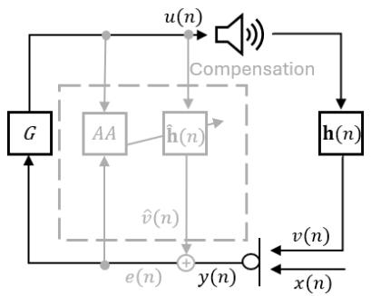

flowchart

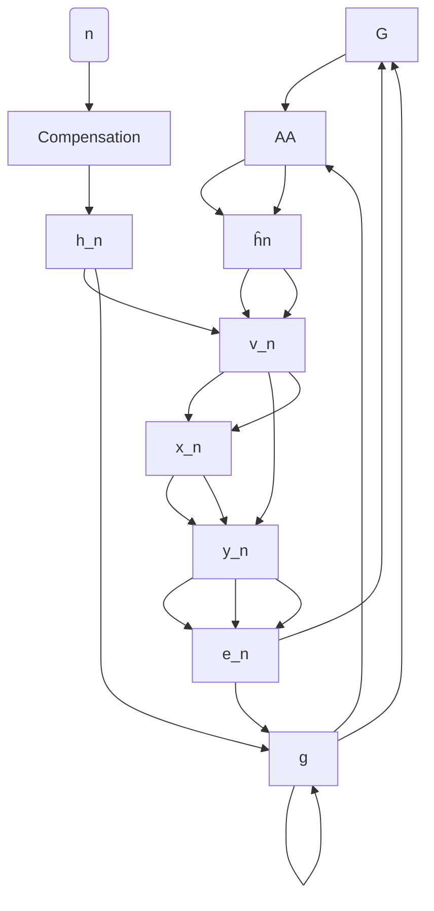

Fig. 1. Acoustic feedback and its compensation in a HA. A HA system with acoustic feedback modeled by h(n), and compensated by an adaptive filter hˆ(n), using an adaptive algorithm (AA).

## II. ACOUSTIC FEEDBACK PROBLEM FORMULATION

In Fig. 1, a HA setup is illustrated where acoustic feedback occurs. The signal of interest, x(n), originates from an external source in the environment, with n representing the discrete time index. This signal is amplified by the forward path gain, G. In HA applications, G is used to amplify the signal and compensate for hearing loss and thus its value is typically high. While G may change over time and frequency, this paper assumes it remains constant, i.e., $G ( n ) = G$ , for simplicity.

The system output, represented as u(n), is ideally an amplified version of $x ( n )$ . In practice, a processing delay is further added in the forward path and can be modeled as part of G. The feedback path is defined by its impulse response (IR), $\mathbf { h } ( n ) \ = \ [ h _ { 1 } ( \bar { n ) } , h _ { 2 } ( n ) , . . . , h _ { L } ( \bar { n ) } ] ^ { T }$ , where L denotes the length of the IR. Typically, the value for $L ,$ needed to model the nonzero elements of the IR, is small in HA applications [27], e.g., $L = 6 4$ (at a sampling frequency of 16 kHz). The feedback signal, v(n), is generated by filtering $u ( n )$ through h(n). As a result, the microphone captures a feedback-corrupted signal $y ( n )$ , with $y ( n ) = v ( n ) + x ( n )$ .

Without feedback control, the stability of the system depends on the amplification, G (including the processing delay), and the feedback path, h(n), and is determined according to the Nyquist stability criterion [28]. The Nyquist stability criterion describes the closed-loop stability of a linear timeinvariant (LTI) system based on its open-loop frequency response. Using Fig. 1, the open-loop transfer function is defined as $O L T F ( m , k ) = G ( m , k ) { \cdot } H ( m , k )$ , where $G ( m , k )$ and $H ( m , k )$ are the short-term frequency responses of $G ( n )$ and h(n), respectively, $m = 1 , 2 , . . . , M$ with M being the total number of frames, and $k = 1 , 2 , . . . , K$ with K being the number of frequency bins. Instability occurs when the following two conditions are fulfilled simultaneously:

$$
\mid O L T F (m, k) \mid \geq 1, \angle \{O L T F (m, k) \} = 2 \pi l, l \in \mathbb {Z}. \tag {1}
$$

An unstable system is perceived by artifacts such as howling or ringing and can significantly degrade the quality of the output signal. Even when stability is maintained, feedback can cause distortions that affect the overall listening experience [24].

## III. STATE-OF-THE-ART METHODS

In this section, we briefly review state-of-the-art feedback control methods. Specifically, we examine traditional adaptive filter-based approaches as well as DNN-based approaches.

## A. Adaptive Filter Based Methods

Adaptive feedback cancellation utilizes an adaptive filter to compensate for feedback artifacts caused by $\mathbf { h } ( n )$ (see Fig. 1). The adaptive filter, defined as $\begin{array} { r l } { \hat { \mathbf { h } } ( n ) } & { { } = } \end{array}$ $[ \hat { h } _ { 1 } ( n ) , \hat { \hat { h } } _ { 2 } ( n ) , . . . , \hat { h } _ { L } ( n ) ] ^ { \bar { T } }$ , aims to approximate the actual feedback path IR $\mathbf { h } ( n )$ . An adaptive algorithm, such as the Least Mean Squares (LMS) method, is employed to continuously update the filter coefficients. The estimated feedback signal, $\hat { v } ( n )$ , is then subtracted from $y ( n )$ to obtain an estimate of x(n), denoted as $e ( n )$ .

Ideally, if $\hat { \mathbf { h } } ( n )$ is a perfect estimate of $\mathbf { h } ( n )$ , we have $e ( n ) ~ = ~ x ( n )$ , and therefore the signal played through the loudspeakers will be feedback-free. However, this is generally not the case, as $\hat { \mathbf { h } } ( n )$ must be estimated from the feedbackcorrupted microphone signal.

The adaptive filter adapts iteratively, using a step-size parameter. A crucial aspect of AF is selecting an appropriate step-size parameter, as it controls the convergence rate and the steady-state estimation error. Various approaches have been proposed to optimize this, e.g., using a variable step-size parameter [29]–[33].

Additionally, the performance of AF for feedback cancellation is limited by the biased estimation problem, that becomes more pronounced when the acoustic signal exhibits strong, long-term auto-correlation, as explained in Sec. I.

To mitigate this effect, various commonly used approaches that aim to decorrelate the feedback component, $u ( n )$ , and the microphone signal, $x ( n )$ , thus enhancing the performance of the adaptive filter. Such techniques include adding a forward delay [11], [34], phase modification [35], [36], frequency shifting (FS) [37], and noise addition [38], [39]. Even though these methods can significantly improve the performance of the adaptive filter, they are not ideal since they change the loudspeaker signal and can cause audible distortions and artifacts. While a pre-whitening approach [40] can decorelate the signals for the estimation without modifying the loudspeaker signal, it also has limitations, especially when the incoming signals are difficult to be modeled in the pre-whitening stage.

## B. Deep Learning Based Methods

As mentioned in Sec. I, deep learning has emerged in the area of feedback control. In [23], the authors proposed Neural-AFC, namely a DNN for step-size control for HAs as an alternative to variable step-size methods [41], [42] or Kalman filter-based methods [43].

Furthermore, Deep Acoustic Howling Suppression (Deep AHS) [44] was presented as a deep learning-based approach to suppress acoustic howling for room acoustics by framing it as a supervised learning problem using teacher forcing. The method employs an attention-based recurrent neural network (RNN) to isolate the target speech from the microphone input, preventing howling without the need for explicit detection.

In [24], Deep Marginal Feedback Cancellation (DeepMFC) was introduced as a deep learning method for feedback control for HAs (see Fig. 2). DeepMFC is a DNN trained to predict the loudspeaker signal directly, aiming for a feedback-free prediction. In [24] the model was trained and tested exclusively with speech inputs, but was later also specialized to music inputs [45]. As shown in Fig. 2, the adaptive filter is removed and DeepMFC is placed directly in the forward path instead.

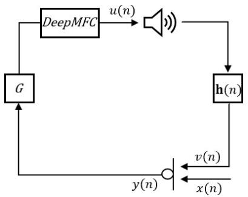

flowchart

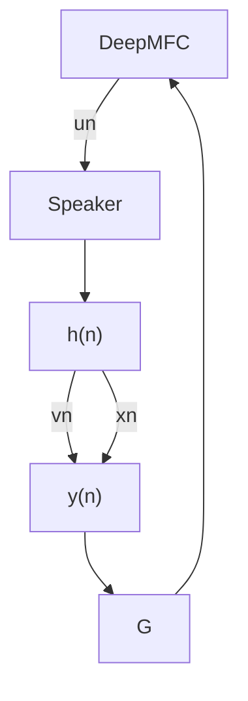

Fig. 2. The setup of the DeepMFC method [24]. DeepMFC returns directly the output signal that will be played through the speaker.

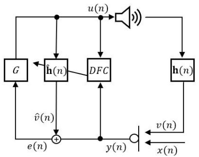

flowchart

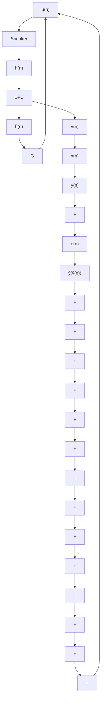

Fig. 3. A HA system with the proposed DNN based feedback cancellation, DFC.

DeepMFC uses an Encoder-Decoder architecture and incorporates a Grouped Long Short-Term Memory (GLSTM) layer. Overall, DeepMFC includes 9.77 million trainable parameters and has been shown to exceed traditional feedback control methods in terms of sound quality [24].

## IV. DEEP FEEDBACK CANCELLATION

## A. Network Architecture

This work is an expansion of [26], where we introduced DFC as an advanced, deep learning version of AF (see Fig. 3). The feature extraction process used in DFC is visualized in Fig. 4. The proposed model begins by applying a Short-Time Fourier Transform (STFT) to input signals u(n) and $y ( n )$ , producing time-frequency representations $U ( m , k )$ and $Y ( m , k )$ , respectively. These are both normalized using the energy of $U ( m , k )$ to minimize amplitude variations. Logarithmic magnitudes and (wrapped) phase components are then extracted and concatenated, forming feature matrices $\mathbf { U } _ { i n p }$ and $\mathbf { Y } _ { i n p }$ (see [26] for more details). We also experimented with various alternative input representations, including the real and imaginary parts of $U ( m , k )$ and $Y ( m , k )$ , among others. Our goal was to provide meaningful inputs to DFC while making the learning process as straightforward as possible. These matrices serve as two input channels to a convolutional layer with a causal filter of size (4, 5), ensuring dependency only on past frames for real-time applications. The convolution layer captures local spectral-temporal correlations, while preserving causality for online processing. The convolution output is concatenated with the original inputs to create the input features for DFC, improving feature richness and allowing the network to exploit both low-level and contextually filtered information. Note that at this stage, the features are combined linearly, as they reside in the same feature space, and adding a non-linear activation after the convolution offers no benefit and may marginally reduce performance.

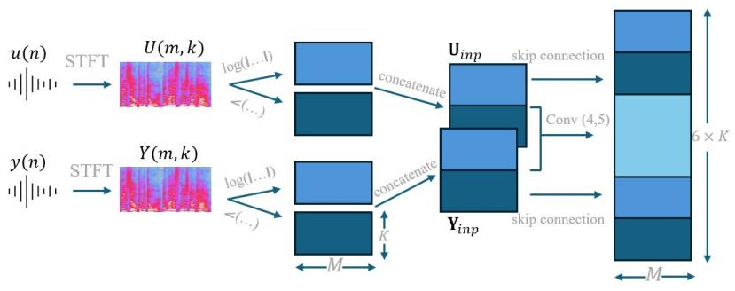

flowchart

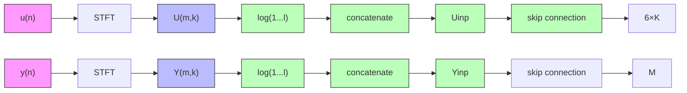

Fig. 4. Feature extraction for DFC.

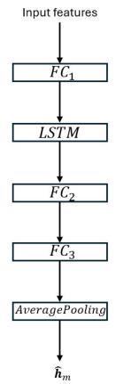

flowchart

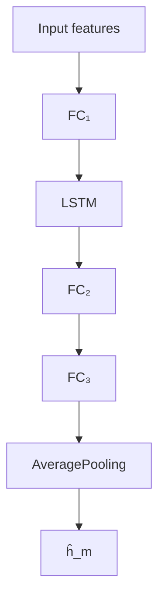

Fig. 5. Main architecture of DFC.

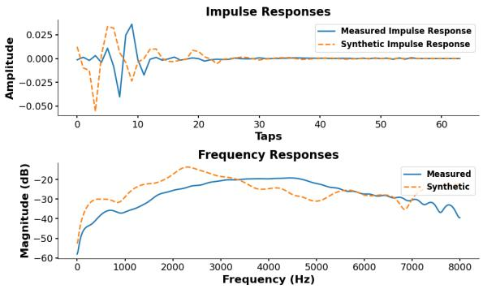

line chart

| Taps | Measured Impulse Response | Synthetic Impulse Response | Measured Magnitude (dB) | Synthetic Magnitude (dB) |
|------|---------------------------|----------------------------|--------------------------|--------------------------|
| 0    | ~0.000                    | ~0.000                     | ~-55                     | ~-55                     |
| 1000 | ~0.025                    | ~0.025                     | ~-30                     | ~-30                     |
| 2000 | ~0.000                    | ~0.000                     | ~-25                     | ~-25                     |
| 3000 | ~-0.025                   | ~-0.025                    | ~-25                     | ~-25                     |
| 4000 | ~-0.025                   | ~-0.025                    | ~-25                     | ~-25                     |
| 5000 | ~-0.025                   | ~-0.025                    | ~-25                     | ~-25                     |
| 6000 | ~-0.025                   | ~-0.025                    | ~-25                     | ~-25                     |
| 7000 | ~-0.025                   | ~-0.025                    | ~-30                     | ~-30                     |
| 8000 | ~-0.025                   | ~-0.025                    | ~-45                     | ~-45                     |

Fig. 6. Examples of a synthetic and a measured IR, represented with 64 coefficients (taps). The bottom plot depicts the corresponding magnitude responses.

Following the feature extraction, the main architecture of DFC is applied (see Fig. 5). The input features pass through a fully connected layer $( F C _ { 1 } )$ with a LeakyReLU activation. This layer performs nonlinear feature mixing and dimensional expansion, enabling the model to represent complex input–output mappings even when the relationship between microphone and loudspeaker paths is nonlinear. The LeakyReLU activation avoids dead neurons and facilitates stable gradient propagation.

A uni-directional LSTM layer is utilized to capture temporal dependencies. The LSTM effectively models the temporal evolution of the acoustic path, which may change gradually over time (e.g., due to user movement or environmental variations). Unlike static architectures, the recurrent structure provides a memory mechanism that helps maintain continuity and robustness in the estimated IR.

The LSTM output is followed by additional fully connected layers $( F C _ { 2 } , F C _ { 3 } )$ with a tanh activation, which compress the temporal features into a smooth nonlinear mapping and ensure the estimated IR remains bounded. The final output, an estimated IR per frame, undergoes smoothing through an average pooling layer over N current and past frames, which controls the convergence speed and steady-state error tradeoff. Further study of the effect of N is included in Sec. V-D. In total, DFC has 856k trainable parameters, making it over ten times smaller than DeepMFC.

To gain insights into the architecture of DFC, we conducted a small-scale ablation study. Specifically, we experimented with (i) removing the LSTM layer and replacing it with a fully connected layer only, (ii) replacing the convolution at the feature extraction stage with a linear layer, and (iii) removing the convolution stage altogether. Each model was trained ten times, and the average validation loss results are reported in Table I. We observe that the original DFC architecture achieves the best performance, and, as expected, removing the LSTM layer leads to a significant degradation in performance. Given that the underlying acoustic IR is stationary within each segment, this suggests that the LSTM layer is beneficial not only through tracking variations of the feedback path, but also due to the LSTM’s ability to exploit longer-range temporal structure in the input representation and to perform adaptive smoothing beyond what is achievable with fixed convolutional or window-averaging operations.

TABLE I ABLATION STUDY RESULTS FOR DFC ARCHITECTURE VARIANTS. EACH MODEL WAS TRAINED TEN TIMES; VALUES CORRESPOND TO THE AVERAGE VALIDATION LOSS.

<table><tr><td>Model Variant</td><td>Validation Loss</td><td># Parameters</td></tr><tr><td>Original DFC</td><td>-12.9</td><td>857K</td></tr><tr><td>Fully Connected instead of LSTM</td><td>-9.08</td><td>293K</td></tr><tr><td>Linear Layer instead of Convolution</td><td>-12.4</td><td>891K</td></tr><tr><td>No Convolution Stage</td><td>-11.9</td><td>806K</td></tr></table>

## B. Training Signals

For the scope of this paper, our goal is to develop a feedback cancellation system that performs well for both speech and music inputs. As mentioned in Sec. II, music signals tend to be highly auto-correlated, increasing the likelihood of the biased feedback path estimation problem. This added complexity means that a feedback cancellation system optimized for speech signals may not necessarily maintain the same level of performance when tested with music signals.

We trained DFC with speech in accordance to [26]. In particular, for training and validation, we used speech signals from a subset of LibriSpeech [46], featuring 80 randomly selected speakers. A dataset, $D _ { s p e e c h }$ , with a total of 5 375 and 1 344 ten-second utterances were used for training and validation, respectively.

To train DFC with music, we used the Slakh dataset [47]. DFC was trained and validated using $D _ { m u s i c }$ that included 1 289 and 270 one-minute audio segments, respectively, which were later divided into ten-second chunks.

The two sets of signals, $D _ { s p e e c h }$ and $D _ { m u s i c } ,$ respectively, were used in the training process as $x ( n )$ in Fig. 3.

## C. Feedback Path Impulse Responses

Due to the lack of measured IRs, DFC was trained using both measured [48], [49] and synthetically generated feedback path IRs. Pre-training was done with synthetic IRs, followed by fine-tuning with measured ones.

Synthetic IRs were generated using the model from [24], with magnitude responses uniformly scaled so that the maximum magnitude ranged between −20 and −10 dB to better match real-world conditions. We created 10 000 feedback paths for the pre-training phase. In [50], the authors report minor modifications in the generation of synthetic IRs over the original method proposed in [24]. However, in our framework, using the modified formula did not significantly impact model performance. Therefore, we retained the original process for generating synthetic IRs, which also allows a direct reproduction of the work in [24].

Measured IRs came from an internal database with 1 010 feedback paths measured across various hearing aid and earpiece setups. These were split into 753 IRs for training, 107 for validation, and 200 for testing. Their magnitude responses were also scaled as above to ensure consistency with the synthetic IRs. Figure 6 compares synthetic and measured IRs, both represented with 64 coefficients as typically used in HA applications [27].

## D. Training Data Generation and Training

To generate the input signals for DFC, $u ( n )$ and $y ( n )$ , shown in Fig. 4, we applied the closed-loop setup, as depicted in Fig. 1 (without the compensation block), where $x ( n )$ was drawn from $D _ { s p e e c h }$ and $D _ { m u s i c }$ , accordingly. For the scope of this paper, we did not account for the nonlinearities introduced by microphones and loudspeakers in real-world conditions. Nevertheless, given the known ability of DNNs to handle nonlinearities, we expect that DFC would remain robust if such effects were modeled and incorporated during training. This investigation is left for future work. Note also that the training of the model was done in an ‘open-loop’ manner, meaning that all training data were available to the model prior to training. Although this creates a mismatch between training and testing conditions, DFC’s performance did not drop significantly during testing. The intuition behind this is that, although the model operates in a closed-loop during testing, its accurate suppression of the feedback path limits the accumulation of residual feedback. As a result, the effective conditions remain close to those encountered during training.

TABLE II COMPARISON OF COMPUTATIONAL COMPLEXITY BETWEEN DFC, FD-AFC AND DEEPMFC.

<table><tr><td>Method</td><td># Multiplications per sample</td><td>Parameters</td></tr><tr><td>DFC</td><td> $\sim 27K$ </td><td>0.86 M</td></tr><tr><td>FD-AFC-FS</td><td> $\sim 200$ </td><td>64</td></tr><tr><td>DeepMFC</td><td> $\sim 167K$ </td><td>9.77 M</td></tr></table>

We trained three models in total. For each model we used a 160-sample forward path delay (at a 16 kHz sample rate), and the gain G was adjusted to maintain a maximum loop gain within [-6, 0) dB, ensuring a realistic training scenario. For the first model, $D F C _ { s p e e c h } ,$ we drew $x ( n )$ from $D _ { s p e e c h }$ and randomly combined the signals with the synthetic and measured IRs. The signals $u ( n )$ and $y ( n )$ were segmented into two-second sequences, resulting in two final datasets of 52 648 training and 6 547 validation sequences (one for pretraining with the synthetic IRs and one for fine-tuning with the measured ones). For the second model, $D F C _ { m u s i c }$ , we similarly created two training and validation datasets, using $D _ { m u s i c }$ instead, with 157 721 and 32 491 sequences, respectively. Finally, the third model, ${ \cal D } F C _ { c o m b i n e d } .$ , was trained and validated using the union of the speech and music datasets, resulting in 210 369 training and 39 038 validation sequences.

The loss function $\mathcal { L }$ is chosen as the normalized euclidean system distance (NESD) between the predicted IR, $\hat { \mathbf { h } } _ { m } .$ , and the real one, $\mathbf { h } _ { m } ,$ averaged across all frames in a batch, as:

$$
N E S D _ {m} = 1 0 \cdot \log_ {1 0} \frac {\left| \left| \mathbf {h} _ {m} - \hat {\mathbf {h}} _ {m} \right| \right| ^ {2}}{\left| \left| \mathbf {h} _ {m} \right| \right| ^ {2}}, \tag {2}
$$

$$
\mathcal {L} = \frac {1}{M - N + 1} \sum_ {m = N} ^ {M} 1 0 \cdot N E S D _ {m}, \tag {3}
$$

where $m = 1 , . . . , M$ is the frame index and N the average pooling parameter.

The adopted formulation is partly motivated by prior work [23], where similar approaches have shown good empirical performance. In addition, the logarithmic transformation is consistent with common practices in signal processing, where logarithmic measures (e.g., dB scales) are widely used to represent error or energy ratios. From an optimization perspective, this formulation also helps compress the dynamic range of the NESD values, which can improve numerical stability and reduce the dominance of large outliers during training.

## V. EXPERIMENTAL SETUP

## A. Evaluation Conditions and Test Scenarios

We evaluated DFC in realistic conditions, when the input signal is speech or music. We compared our system’s performance with state-of-the-art feedback cancellation methods for HAs, namely frequency-domain AFC (FD-AFC) and FD-AFC with frequency shift (FD-AFC-FS), and the recently introduced deep learning-based feedback control system, DeepMFC [24]. To provide insights regarding the computational complexity of each method, Table II reports the number of real multiplications per sample and the number of parameters.

We created two test datasets: one containing speech signals and the other containing music signals. Each dataset consisted of 100 sequences, each with a duration of 15 seconds. All sequences are unseen during training of both DFC and DeepMFC. Additionally, we used a total of 200 reserved (i.e. unseen during training) measured feedback path IRs for testing.

The evaluation was conducted in three different acoustic scenarios, categorized based on feedback severity. First, we tested under moderate feedback conditions, where the gain, G, was selected so that $m a x _ { m } ( | O L T F ( m , k ) | )$ between −4 dB and −3 dB. Next, we simulated conditions near instability, selecting a gain value, G, such that the loop magnitude ranged randomly between −1 dB and 0 dB. Thirdly, to assess the convergence speed of different methods, we introduced a feedback path change at 7.5 seconds. Before the change, the loop magnitude was within the range [−1, 0) in dB. After the path change, the gain, G, remained unchanged, meaning that the loop magnitude could become more or less critical depending on the characteristics of the two feedback paths. Due to the scaling of all the IRs, the loop magnitude after the change ranged between −11 dB and +10 dB. Therefore, in some cases, this resulted in the loop magnitude becoming positive after the path change, i.e., a momentarily highly unstable system. This can happen in real-world scenarios and is a very difficult situation to handle.

## B. Performance Assessment

1) Objective Evaluations: The evaluation of the methods was based on the sound quality of the output signal and performance in terms of convergence speed and steady-state error. To evaluate speech and music quality we used the Perceptual Evaluation of Speech Quality (PESQ) [51] and Perceptual Evaluation of Audio Quality (PEAQ) [52] indices, respectively. PESQ produces values between 0 and 4.5, with higher scores corresponding to better sound quality. PEAQ is used to evaluate audio quality, including music and general audio signals. It provides a score ranging from -4 to 0, with 0 representing transparent (imperceptible distortions) quality and lower values indicating increasing degradation.

In traditional AF, the trade-off between convergence and steady-state error is commonly assessed using the NESD between the estimated and the real IR. Since DeepMFC does not make an estimation of the IR, NESD is not applicable for DeepMFC. To quantify both convergence and steady-state error behavior in this case, we used Feedback-to-Signal energy Ratio (F SR) [53] between the loudspeaker output uˆ(n) and

the feedback-free signal u(n):

$$
F S R (l) = 1 0 \cdot \log_ {1 0} \frac {\sum_ {i = l - L _ {f} / 2} ^ {l + L _ {f} / 2} | | u (i) - \hat {u} (i) | | ^ {2}}{\sum_ {i = l - L _ {f} / 2} ^ {l + L _ {f} / 2} | | u (i) | | ^ {2}}, \tag {4}
$$

where l is the frame index and $L _ { f } = 3 2 0$ the frame length.

Note that F SR can only express the degree of similarity between the signal waveforms u(n) and uˆ(n). This means that methods which alter the signal waveform will be penalized, even if the effect (the difference between $u ( n )$ and uˆ(n)) is inaudible. In particular, a frequency shift in FD-AFC-FS modifies the signal. Although such frequency shifts tend to be inaudible, F SR, which relies on waveform similarity, penalizes them heavily. Hence, to capture the superiority of FD-AFC-FS over simple FD-AFC in terms of better IR estimation, we also computed F SR without taking into consideration the distortions of the signal caused by FS. To do so, we calculated F SR between the reference signal $u ( n )$ and the signal $e _ { g } ( n )$ , obtained when using FD-AFC-FS, namely the error signal before applying FS and after applying the gain, G. The signal $e _ { g } ( n )$ represents the version of the signal with the highest achievable sound quality; however, it is not possible to listen to this signal in practical applications.

Feedback cancellation in HA is commonly evaluated using the Maximum Stable Gain (MSG), defined as $M S G ( m ) =$ $\begin{array} { r } { 2 0 \log _ { 1 0 } \Bigl ( \operatorname* { m a x } _ { k } \Big | H ( m , k ) - \hat { H } ( m , k ) \Big | \Bigr ) } \end{array}$ in dB. As with NESD, MSG is not applicable to DeepMFC. Nevertheless, given that MSG provides a direct measure of the maximum amplification the system can sustain without instability, the results are presented in Subsection VI-D, where a brief comparison between FD-AFC and DFC is provided.

2) Listening Test: We conducted a Multiple Stimuli with Hidden Reference and Anchor (MUSHRA) [54] listening test to evaluate the perceptual audio quality of different feedback cancellation methods. MUSHRA is a standardized subjective assessment method commonly used for evaluating processing algorithms. It allows listeners to directly compare several test conditions, including a hidden reference (the original undistorted signal), against each other on a scale from 0 (“very bad”) to 100 (“excellent”).

The test included six speech samples and six music samples, with three of each containing a feedback path change. The duration of the samples ranged from 5 to 9 seconds. For speech, the evaluated methods were DFC, FD-AFC, and DeepMFC. For music, the tested methods were DFC, FD-AFC-FS, and DeepMFC. In all cases full-band signals were presented to the listeners, as this corresponds to the realistic operating conditions of the underlying hearing aid system. The reference signal was the original, feedback-free version. The participants were asked to only rate one signal as 100, namely they were asked to identify the hidden reference. The playback level was calibrated once prior to the experiment to a comfortable listening level and was kept fixed throughout the entire listening test. All evaluated methods were generated under identical closed-loop gain conditions in the simulation, resulting in equal signal levels across conditions that reflect realistic hearing-aid processing.Since all systems shared the same gain configuration, additional post-hoc normalization across methods was considered unnecessary for interpreting the perceptual comparisons.

The listening tests were carried out internally using highquality headphones (Sennheiser HD 280 Pro) and soundcard (ESI Gigaport EX) in a small and quiet office room. The participants could listen to each stimulus as many times as they wished before assigning scores. A total of 24 normal-hearing participants took part in the test, aged between 25 and 63 years (average age 41.2). All participants provided informed consent for their responses to be published anonymously.

## C. Baseline Systems Configurations

For the adaptive filter-based baseline system, we used FD-AFC with a cutoff frequency of 1 000 Hz to avoid lowfrequency artifacts [26]. Since feedback issues typically do not occur below 1 000 Hz, applying adaptive feedback cancellation only above this frequency preserves the signals in low frequencies, while effectively preventing feedback. We utilized an NLMS algorithm with a step-size equal to $2 ^ { - 5 }$ and a regularization parameter $\delta { \it \Delta \phi } = 1 0 ^ { - 2 0 }$ , added to the denominator of NLMS update term [55]. To enhance the performance of FD-AFC for music signals, we also added a decorrelation method, to mitigate the effects of the biased estimation problem. The decorrelation method, referred as FS, used a 10 Hz frequency shift [56]. These parameters were not separately optimized for speech and music conditions. While signal-dependent tuning could potentially improve AFC performance, in practical applications this would additionally require a reliable signal-type detection mechanism to switch between parameter configurations in real time.

DeepMFC was trained according to [24], with additional fine-tuning. Although in the original work [24] DeepMFC was only trained with synthetic IRs, we also fine-tuned DeepMFC with measured IRs, following exactly the same fine-tuning procedure as DFC (see Sec. IV-C), to ensure a fair comparison. This step enhanced the performance of the original DeepMFC. Note that we trained DeepMFC separately for speech and music. In Section VI, all reported results for DeepMFC are based on models that were tested only on the same type of data they were trained on, namely speech models were tested on speech, and music models were tested on music.

## D. DFC System Configurations

DFC was trained for 40 epochs, using the Adam optimizer [57] with a learning rate of $1 0 ^ { - 3 }$ for pre-training and $1 0 ^ { - 4 }$ for fine-tuning, halved every 10 epochs. For the STFT, a frame length of 128 samples and a hop-size of 32 samples with a Hanning window were used, with a sampling rate of 16 kHz (therefore in Fig. 4, M = 997 frames). The batch size was equal to 64.

As mentioned in Sec. IV-A, DFC utilizes a smoothing parameter N to control the convergence/steady-state error trade-off. This parameter is chosen before training, as it has an effect on the training process and the model’s performance during inference. Selecting a larger value for N, namely averaging the final prediction over more previous frames, leads to lower estimation error in steady-state situations, where h(n) is varying slowly with time, since the model uses more temporal information. However, this simultaneously makes the model slower upon abrupt feedback path changes, hence reducing the convergence speed.

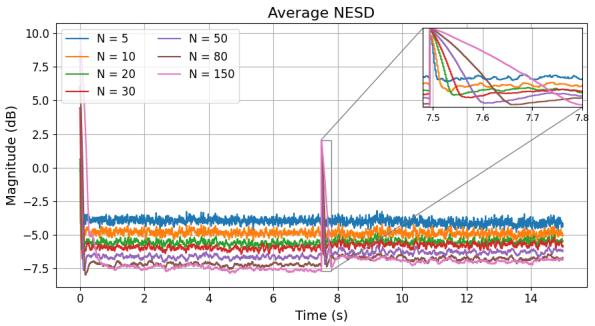

line chart

| Time (s) | N = 5 | N = 10 | N = 20 | N = 30 | N = 50 | N = 80 | N = 150 |
| --- | --- | --- | --- | --- | --- | --- | --- |
| 0 | -4.0 | -4.5 | -5.0 | -6.0 | -6.5 | -7.0 | -7.5 |
| 2 | -4.0 | -4.5 | -5.0 | -6.0 | -6.5 | -7.0 | -7.5 |
| 4 | -4.0 | -4.5 | -5.0 | -6.0 | -6.5 | -7.0 | -7.5 |
| 6 | -4.0 | -4.5 | -5.0 | -6.0 | -6.5 | -7.0 | -7.5 |
| 8 | -4.0 | -4.5 | -5.0 | -6.0 | -6.5 | -7.0 | -7.5 |
| 10 | -4.0 | -4.5 | -5.0 | -6.0 | -6.5 | -7.0 | -7.5 |
| 12 | -4.0 | -4.5 | -5.0 | -6.0 | -6.5 | -7.0 | -7.5 |
| 14 | -4.0 | -4.5 | -5.0 | -6.0 | -6.5 | -7.0 | -7.5 |
| 16 | -4.0 | -4.5 | -5.0 | -6.0 | -6.5 | -7.0 | -7.5 |
| 18 | -4.0 | -4.5 | -5.0 | -6.0 | -6.5 | -7.0 | -7.5 |
| 20 | -4.0 | -4.5 | -5.0 | -6.0 | -6.5 | -7.0 | -7.5 |
| 22 | -4.0 | -4.5 | -5.0 | -6.0 | -6.5 | -7.0 | -7.5 |
| 24 | -4.0 | -4.5 | -5.0 | -6.0 | -6.5 | -7.0 | -7.5 |
| 26 | -4.0 | -4.5 | -5.0 | -6.0 | -6.5 | -7.0 | -7.5 |
| 28 | -4.0 | -4.5 | -5.0 | -6.0 | -6.5 | -7.0 | -7.5 |
| 30 | -4.0 | -4.5 | -5.0 | -6.0 | -6.5 | -7.0 | -7.5 |
| 32 | -4.0 | -4.5 | -5.0 | -6.0 | -6.5 | -7.0 | -7.5 |
| 34 | -4.0 | -4.5 | -5.0 | -6.0 | -6.5 | -7.0 | -7.5 |
| 36 | -4.0 | -4.5 | -5.0 | -6.0 | -6.5 | -7.0 | -7.5 |
| 38 | -4.0 | -4.5 | -5.0 | -6.0 | -6.5 | -7.0 | -7.5 |
| 40 | -4.0 | -4.5 | -5.0 | -6.0 | -6.5 | -7.0 | -7.5 |
| 42 | -4.0 | -4.5 | -5.0 | -6.0 | -6.5 | -7.0 | -7.5 |
| 44 | -4.0 | -4.5 | -5.0 | -6.0 | -6.5 | -7.0 | -7.5 |
| 46 | -4.0 | -4.5 | -5.0 | -6.0 | -6.5 | -7.0 | -7.5 |
| 48 | -4.0 | -4.5 | -5.0 | -6.0 | -6.5 | -7.0 | -7.5 |
| 50 | -4.0 | -4.5 | -5.0 | -6.0 | -6.5 | -7.0 | -7.5 |
| 52 | -4.0 | -4.5 | -5.0 | -6.0 | -6.5 | -7.0 | -7.5 |
| 54 | -4.0 | -4.5 | -5.0 | -6.0 | -6.5 | -7.0 | -7.5 |
| 56 | -4.0 | -4.5 | -5.0 | -6.0 | -6.5 | -7.0 | -7.5 |
| 58 | -4.0 | -4.5 | -5.0 | -6.0 | -6.5 | -7.0 | -7.5 |
| 60 | -4.0 | -4.5 | -5.0 | -6.0 | -6.5 | -7.0 | -7.5 |
| 62 | -4.0 | -4.5 | -5.0 | -6.0 | -6.5 | -7.0 | -7.5 |
| 64 | -4.0 | -4.5 | -5.0 | -6.0 | -6.5 | -7.0 | -7.5 |
| 66 | -4.0 | -4.5 | -5.0 | -6.0 | -6.5 | -7.0 | -7.5 |
| 68 | -4.0 | -4.5 | -5.0 | -6.0 | -6.5 | -7.0 | -7.5 |
| 70 | -4.0 | -4.5 | -5.0 | -6.0 | -6.5 | -7.0 | -7.5 |
| 72 | -4.0 | -4.5 | -5.0 | -6.0 | -6.5 | -7.0 | -7.5 |
| 74 | -4.0 | -4.5 | -5.0 | -6.0 | -6.5 | -7.0 | -7.5 |
| 76 | -4.0 | -4.5 | -5.0 | -6.0 | -6.5 | -7.0 | -7.5 |
| 78 | -4.0 | -4.5 | -5.0 | -6.0 | -6.5 | -7.0 | -7.5 |

Fig. 7. Average NESD for DFC configurations for different average pooling parameters, N . In all cases $\alpha = 0 . 5$ . The value of N controls the trade-off between convergence speed and steady-state performance. We set $N = 5 0$ for all further analysis, since it provides good balance.

The main disadvantage of this approach is that the choice of N is pre-determined before the training, and it can generally not be changed unless carrying out a new training process. To mitigate this, we use a second parameter that can be independently chosen during inference. More specifically, we applied exponential smoothing to the IR predictions during inference so that $\hat { \mathbf { h } } _ { \mathrm { i n f e r e n c e } } ( n ) = \alpha \cdot \hat { \mathbf { h } } ( n ) + ( 1 - \alpha ) \cdot \hat { \mathbf { h } } _ { \mathrm { i n f e r e n c e } } ( n - 1 )$ , where $\hat { \mathbf { h } } ( n )$ and ${ \hat { \mathbf { h } } } _ { \mathrm { i n f e r e n c e } } ( n )$ are the output of DFC and the final estimation at time index n, respectively.

We conducted an extensive evaluation to study the effects of both N and α on system performance, using speech signals as input. Various combinations were tested and analyzed in terms of convergence behavior and steady-state error. The results showed that the DFC model achieves optimal performance when N is in the range 20-50. For values of N below 10, the steady-state error increases significantly. Conversely, for larger values $( \mathrm { e } . \mathrm { g } . , \ N > 8 0 )$ , the system becomes too slow, which can hinder stability when encountering abrupt feedback path changes. For example, configurations with $N = 5 , 1 0 , 8 0$ , and 150 exhibited instability in scenarios where the feedback loop magnitude became positive (up to +10 dB) after the path change. In these cases, the accumulation of feedback following the path change leads to signal conditions that deviate significantly from the open-loop training scenario, ultimately causing the model to fail.

Figure 7 presents the NESD curves for various values of N. Notably, increasing N from 80 to 150 did not yield significant improvements in steady-state error, yet nearly doubled the convergence time. PESQ scores for each configuration are summarized in Table III, along with the number of test sequences in which the system exhibited instability.

Regarding the exponential smoothing factor, we found that $\alpha = 0 . 5$ consistently led to the best trade-off between responsiveness and steady-state performance. However, the potential benefits of a dynamic or adaptive α remain unexplored.

The final selection was $\alpha = 0 . 5$ and $N = 5 0 .$ .

TABLE III PESQ MEAN VALUE (STANDARD DEVIATION) FOR DIFFERENT CONFIGURATIONS OF DFC

<table><tr><td>N</td><td>w/o Path Change (2–5 s)</td><td>w. Path Change (7–8.5 s)</td><td>Whole Sequence (0–15 s)</td><td># Instabilities (out of 100)</td></tr><tr><td>5</td><td>3.98 (0.83)</td><td>3.47 (1.41)</td><td>3.50 (1.35)</td><td>11</td></tr><tr><td>10</td><td>4.06 (0.77)</td><td>3.80 (0.91)</td><td>3.85 (0.13)</td><td>4</td></tr><tr><td>20</td><td>4.08 (0.74)</td><td>3.89 (0.90)</td><td>3.99 (0.58)</td><td>0</td></tr><tr><td>30</td><td>4.10 (0.73)</td><td>3.84 (0.90)</td><td>3.96 (0.60)</td><td>0</td></tr><tr><td>50</td><td>4.16 (0.72)</td><td>3.78 (0.96)</td><td>3.98 (0.64)</td><td>0</td></tr><tr><td>80</td><td>4.21 (0.71)</td><td>3.63 (1.17)</td><td>3.95 (0.91)</td><td>4</td></tr><tr><td>150</td><td>4.14 (0.96)</td><td>3.27 (1.46)</td><td>3.11 (1.55)</td><td>8</td></tr></table>

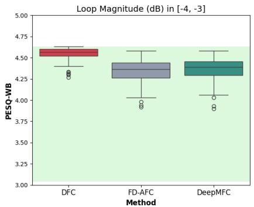

box plot

| Method   | PESQ-WB (dB) |
| -------- | ------------ |
| DFC      | 4.50         |
| DFC      | 4.60         |
| DFC      | 4.70         |
| DFC      | 4.80         |
| DFC      | 4.90         |
| DFC      | 5.00         |
| FD-AFC   | 4.30         |
| FD-AFC   | 4.40         |
| FD-AFC   | 4.50         |
| FD-AFC   | 4.60         |
| FD-AFC   | 4.70         |
| FD-AFC   | 4.80         |
| FD-AFC   | 4.90         |
| FD-AFC   | 5.00         |
| DeepMFC  | 4.20         |
| DeepMFC  | 4.30         |
| DeepMFC  | 4.40         |
| DeepMFC  | 4.50         |
| DeepMFC  | 4.60         |
| DeepMFC  | 4.70         |
| DeepMFC  | 4.80         |
| DeepMFC  | 4.90         |
| DeepMFC  | 5.00         |

(a)

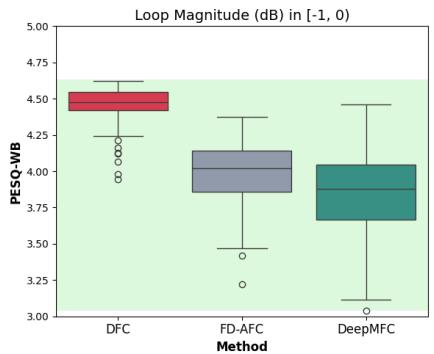

box plot

| Method   | PESQ-WB (dB) |
| -------- | ------------ |
| DFC      | 4.50         |
| DFC      | 4.25         |
| DFC      | 4.00         |
| DFC      | 3.75         |
| DFC      | 3.50         |
| DFC      | 3.25         |
| DFC      | 3.00         |
| FD-AFC   | 4.00         |
| FD-AFC   | 3.75         |
| FD-AFC   | 3.50         |
| FD-AFC   | 3.25         |
| FD-AFC   | 3.00         |
| FD-AFC   | 2.75         |
| FD-AFC   | 2.50         |
| DD-MFC   | 4.00         |
| DD-MFC   | 3.75         |
| DD-MFC   | 3.50         |
| DD-MFC   | 3.25         |
| DD-MFC   | 3.00         |
| DD-MFC   | 2.75         |
| DD-MFC   | 2.50         |
| DD-MFC   | 2.25         |
| DD-MFC   | 2.00         |
| DD-MFC   | 1.75         |
| DD-MFC   | 1.50         |
| DD-MFC   | 1.25         |
| DD-MFC   | 1.00         |
| DD-MFC   | 0.75         |
| DD-MFC   | 0.50         |
| DD-MFC   | 0.25         |
| DD-MFC   | 0.00         |

(b)

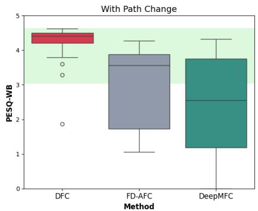

box plot

| Method   | PESQ-WB Min | PESQ-WB Max | Outliers |
| -------- | ----------- | ----------- | -------- |
| DFC      | 1.0         | 4.5         | 3.5      |
| FD-AFC   | 1.0         | 4.0         | 2.0      |
| DeepMFC  | 1.0         | 4.0         | 2.5      |

(c)  
Fig. 8. Boxplots of the distribution of the PESQ scores of three different feedback cancellation methods in three different acoustic scenarios. (a) Loop magnitude in the interval [-4, -3] dB. Moderate feedback (b) Loop magnitude in the interval [-1, 0) dB. Systems that operate close to instability. (c) Loop magnitude in the interval [-1, 0) dB before the change of feedback path. After the path change the loop magnitude ranged between [-11, 10) dB.

## VI. EXPERIMENTAL RESULTS AND DISCUSSION

## A. Evaluation for Speech Signal Inputs

TABLE IV PESQ MEAN VALUE (STANDARD DEVIATION) FOR DIFFERENT LOOP MAGNITUDES (DB)

<table><tr><td rowspan="2">Method</td><td colspan="3">PESQ</td></tr><tr><td>[-4, -3]</td><td>[-1, 0)</td><td>With Path Change</td></tr><tr><td>DFC</td><td>4.54 (0.07)</td><td>4.45 (0.13)</td><td>4.31 (0.33)</td></tr><tr><td>FD-AFC</td><td>4.34 (0.13)</td><td>3.98 (0.22)</td><td>3.01 (1.19)</td></tr><tr><td>DeepMFC</td><td>4.35 (0.13)</td><td>3.83 (0.30)</td><td>2.33 (1.42)</td></tr></table>

Table IV summarizes PESQ scores for different methods across various acoustic scenarios. (Compared to the studies and performance reported in Sec. V-D, we did a further pretraining and fine-tuning, hence PESQ scores are generally higher in Table IV.) It is evident that DFC achieves significantly higher scores, with the difference becoming even more pronounced after a path change. This is because DFC adapts rapidly to changes while effectively avoiding artifacts. In contrast, in most cases where the loop gain exceeds 0 dB, DeepMFC struggles to accurately model the output signal following a path change. Due to the closed-loop system, this initial error leads to increasingly feedback-corrupted inputs, resulting in cumulative degradation of subsequent signal estimates. At high loop magnitudes, using DeepMFC often results in unstable systems and, consequently, very low PESQ scores, which lowers the mean value. Note that, for speech inputs, FD-

AFC and FD-AFC-FS do not show a significant difference in performance; therefore, for the rest of this analysis, we will use FS-AFC for simplicity.

Figure 8 illustrates the distributions of PESQ scores for different loop magnitudes. Notably, DFC operates with minimal sound distortion even with very high loop magnitudes of up to 10 dB for speech inputs. Additionally, the PESQ scores for DFC are consistently high, with almost no outliers, proving the robustness of DFC. To ensure statistical significance of our results, paired t-tests were conducted and all the p-values were found to be p < 0.01. Note that between DFC and the other methods the p-values were practically zero (p < 10−20).

Figures 9(a) and 9(b) show FSR for low and high loop magnitudes, respectively, further validating the PESQ results. In both cases, DFC demonstrates low FSR values. Figure 9(c) shows FSR when a feedback path change occurs at 7.5 seconds. It is evident that DFC’s convergence is significantly faster. The fast convergence limits feedback accumulation after the change, ensuring that the conditions do not deviate significantly from the open-loop training data. As mentioned above, DFC is able to handle situations where the loop magnitude after the change reaches up to +10 dB. However, higher loop magnitude values (e.g., due to excessive gain increases) can cause DFC to fail. This limitation could potentially be tackled by deploying closed-loop training, which is however out of our scope for this study. DeepMFC does not return to its initial value after a path change, as in some cases the system becomes unstable, causing the output to be dominated by feedback, and hence, the FSR values turn positive.

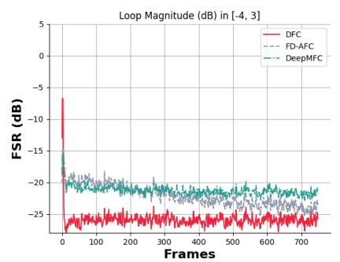

line chart

| Frames | DFC     | FD-AFC  | DeepMFC |
| ------ | ------- | ------- | ------- |
| 0      | -25.0   | -20.0   | -20.0   |
| 100    | -25.0   | -20.0   | -20.0   |
| 200    | -25.0   | -20.0   | -20.0   |
| 300    | -25.0   | -20.0   | -20.0   |
| 400    | -25.0   | -20.0   | -20.0   |
| 500    | -25.0   | -20.0   | -20.0   |
| 600    | -25.0   | -20.0   | -20.0   |
| 700    | -25.0   | -20.0   | -20.0   |

(a)

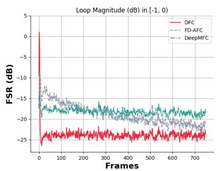

line chart

| Frames | DFC     | FD-AFC  | DeepMFC |
| ------ | ------- | ------- | ------- |
| 0      | 0.0     | -10.0   | -25.0   |
| 100    | -25.0   | -15.0   | -20.0   |
| 200    | -25.0   | -18.0   | -18.0   |
| 300    | -25.0   | -19.0   | -17.0   |
| 400    | -25.0   | -20.0   | -16.0   |
| 500    | -25.0   | -21.0   | -15.0   |
| 600    | -25.0   | -22.0   | -14.0   |
| 700    | -25.0   | -23.0   | -13.0   |

(b)

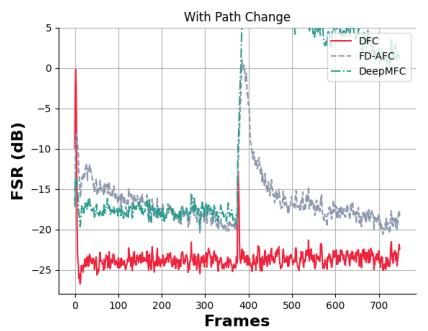

line chart

| Frames | DFC     | FD-AFC  | DeepMFC |
| ------ | ------- | ------- | ------- |
| 0      | -25.0   | -15.0   | -15.0   |
| 100    | -25.0   | -15.0   | -15.0   |
| 200    | -25.0   | -15.0   | -15.0   |
| 300    | -25.0   | -15.0   | -15.0   |
| 400    | -25.0   | -15.0   | 5.0     |
| 500    | -25.0   | -15.0   | -15.0   |
| 600    | -25.0   | -15.0   | -15.0   |
| 700    | -25.0   | -15.0   | -15.0   |

(c)  
Fig. 9. Feedback-to-Signal energy Ratio, averaged across 100 test speech sequences. (a) Performance of three methods with a loop magnitude in the range [-4, -3] dB. (b) Performance of three methods with a loop magnitude in the range [-1, 0) dB. (c) Performance of three methods with a path change and a loop gain in the range [-1, 0) dB, before the change. After the change the loop magnitude ranged between [-11, 10) dB, since the maximum magnitude of all feedback paths was scaled between −20 and −10 dB.

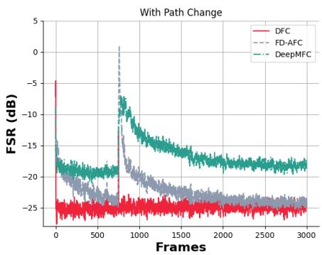

line chart

| Frames | DFC     | FD-AFC  | DeepMFC |
| ------ | ------- | ------- | ------- |
| 0      | -5.0    | -15.0   | -15.0   |
| 500    | -25.0   | -20.0   | -18.0   |
| 1000   | -24.0   | -22.0   | -16.0   |
| 1500   | -23.5   | -23.0   | -17.0   |
| 2000   | -23.0   | -23.5   | -17.5   |
| 2500   | -22.5   | -24.0   | -18.0   |
| 3000   | -22.0   | -24.5   | -18.5   |

Fig. 10. Feedback-to-Signal energy Ratio, averaged across 100 test speech sequences. Comparison of the performance of three methods in terms of convergence rate/steady-state error trade-off with a path change, under conditions that guarantee a stable system before and after the change (moderate feedback with a loop magnitude between −2 dB and −1 dB.)

To further demonstrate the performance of DFC in terms of convergence and steady-state estimation, in Fig. 10 we present a case where a path change occurs without allowing the loop magnitude to exceed 0 dB. In this way, the FSR values for DeepMFC will not be heavily affected by potential instabilities caused by positive loop magnitudes. To achieve this, we adjusted the gain value, G, accordingly after the path change, ensuring that the loop magnitude remains within the interval [−2, −1] both before and after the change. This setup allows the system to operate close to the instability threshold, while remaining within stable limits. It is important to note that, in realistic HA scenarios, the gain is not adjusted in this manner. Therefore, this experiment was conducted solely as a proof of concept. Furthermore, we conducted the experiment using longer test sequences of two minutes in duration to gain a better understanding of the reconvergence speed, since in Fig. 9(c) DeepMFC and FD-AFC seem to not have fully reconverged after the path change. Figure 10 depicts the FSR curves for this experiment, demonstrating that even within stable conditions, DFC outperforms other methods in both convergence speed and steady-state error.

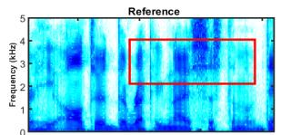

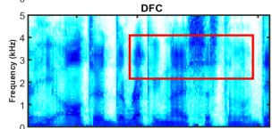

heatmap

| Frequency (kHz) | Value |
| --------------- | ----- |
| 0               | 0     |
| 1               | 0     |
| 2               | 0     |
| 3               | 0     |
| 4               | 0     |
| 5               | 0     |

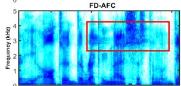

heatmap

FD-AFC
| Frequency (kHz) | 0 | 1 | 2 | 3 | 4 | 5 |
|---|---|---|---|---|---|---|
| 0 | Low | Low | Low | Low | Low | Low |
| 1 | Low | Low | Low | Low | Low | Low |
| 2 | Low | Low | Low | Low | Low | Low |
| 3 | Low | Low | Low | Low | Low | Low |
| 4 | Low | Low | Low | Low | Low | Low |
| 5 | Low | Low | Low | Low | Low | Low |

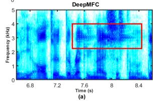

heatmap

| Time (s) | Frequency (kHz) |
| -------- | --------------- |
| 6.8      | 0               |
| 7.2      | 1               |
| 7.6      | 3               |
| 8.0      | 4               |
| 8.4      | 3               |

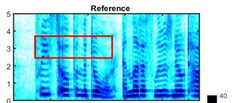

text_image

Reference
5
4
3
2
1
0
0
40

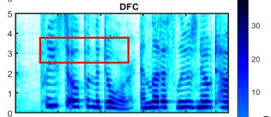

heatmap

| Row | Column | Value |
| --- | --- | --- |
| 1 | 0 | 0 |
| 1 | 1 | 0 |
| 1 | 2 | 0 |
| 1 | 3 | 0 |
| 1 | 4 | 0 |
| 1 | 5 | 0 |
| 2 | 0 | 0 |
| 2 | 1 | 0 |
| 2 | 2 | 0 |
| 2 | 3 | 0 |
| 2 | 4 | 0 |
| 2 | 5 | 0 |
| 3 | 0 | 0 |
| 3 | 1 | 0 |
| 3 | 2 | 0 |
| 3 | 3 | 0 |
| 3 | 4 | 0 |
| 3 | 5 | 0 |
| 4 | 0 | 0 |
| 4 | 1 | 0 |
| 4 | 2 | 0 |
| 4 | 3 | 0 |
| 4 | 4 | 0 |
| 4 | 5 | 0 |
| ... | ... | ... |
| ... | ... | ... |
| ... | ... | ... |
| ... | ... | ... |
| ... | ... | ... |
| ... | ... | ... |
| ... | ... | ... |
| ... | ... | ... |
| ... | ... | ... |
| ... | ... | ... |
| ... | ... | ... |
| ... | ... | ... |

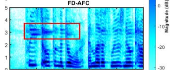

heatmap

| Channel | Magnitude (dB) |
| ------- | -------------- |
| 1       | -20            |
| 2       | -25            |
| 3       | -30            |
| 4       | -25            |
| 5       | -20            |

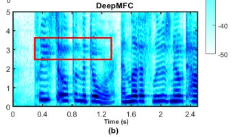

heatmap

| Time (s) | 0    | 0.4  | 0.8  | 1.2  | 1.6  | 2.0  | 2.4  |
|----------|------|------|------|------|------|------|------|
| Value    | -40  | -40  | -40  | -40  | -40  | -40  | -40  |

Fig. 11. Example speech spectrograms for two test sequences. (a) With a path change at 7.5 sec. Audible artifacts are introduced by FD-AFC and DeepMFC due to the change of path, while DFC recorverges quickly and avoids them. (b) Feedback artifacts in the beginning of the signal.

Figure 11 illustrates spectrograms of two example speech signals from the test set. In Fig. 11(a), we have a feedback path change after 7.5 seconds, where the loop magnitude was −0.63 dB before the change and −2.1 dB after. Even though the feedback conditions are less severe after the path change, both FD-AFC and DeepMFC introduce audible artifacts before reconverging. In real-world applications, feedback path changes occur commonly and thus it is important to avoid such artifacts. Figure 11(b) depicts a case where both FD-AFC and DeepMFC introduce feedback artifacts at the beginning of the signal, while DFC converges fast enough to avoid them.

Finally, to verify the positive effect of fine-tuning the deep learning-based models with realistic feedback paths, we also provide Fig. 12, where we compare the performance of both DeepMFC and DFC in the test set, with and without finetuning with real measured IRs (see Sec. IV-C). It is clear that both models benefit from fine-tuning as they achieve lower FSR values. PESQ scores, averaged across the test set, are also reported in Table V. In this comparison, we adjusted the post-change gain to ensure system stability, particularly for DeepMFC, which can otherwise produce unstable outputs. This adjustment avoids severely degraded signals that could distort the evaluation.

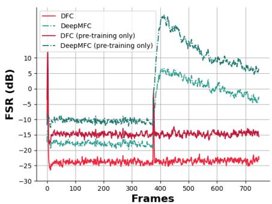

line chart

| Frames | DFC     | DeepMFC | DFC (pre-training only) | DeepMFC (pre-training only) |
|--------|---------|---------|--------------------------|------------------------------|
| 0      | 10.0    | -10.0   | -25.0                    | -10.0                        |
| 100    | -15.0   | -15.0   | -25.0                    | -15.0                        |
| 200    | -15.0   | -15.0   | -25.0                    | -15.0                        |
| 300    | -15.0   | -15.0   | -25.0                    | -15.0                        |
| 400    | -25.0   | 5.0     | -25.0                    | 10.0                         |
| 500    | -25.0   | 5.0     | -25.0                    | 5.0                          |
| 600    | -25.0   | 5.0     | -25.0                    | 5.0                          |
| 700    | -25.0   | 5.0     | -25.0                    | 5.0                          |

Fig. 12. Comparison between the fine-tuned DNNs for feedback cancellation and the ones that skip the fine-tuning phase, trained only with synthetic IRs.

TABLE V PESQ MEAN VALUE (STANDARD DEVIATION) FOR DIFFERENT TRAINING STRATEGIES, TESTED WITH A FEEDBACK PATH CHANGE

<table><tr><td>Method</td><td>Pre-training only</td><td>Pre-training and Fine-tuning</td></tr><tr><td>DFC</td><td>3.65 (0.63)</td><td>4.39 (0.15)</td></tr><tr><td>DeepMFC</td><td>1.68 (0.7)</td><td>2.64 (1.04)</td></tr></table>

## B. Evaluations for Music Signal Input

Musical signals tend to be more challenging in a feedback control context, since they in general are characterized by high, long-term auto-correlation due to tonal signal regions. Therefore, we expect that all methods show similar or worse performance compared to speech input. We enhanced our baseline, FD-AFC, by adding FS and since, as mentioned in Sec. V-B1, our objective measures are waveform-matching based, we also included FD-AFC-FS $( \mathrm { e _ { g } ) }$ in our evaluations.

Table VI highlights mean PEAQ values across the test set. A more detailed distribution of the scores is shown in Fig. 13. (Note that in Fig. 13, FD-AFC-FS is not included, since we have already established that PEAQ penalizes the method in an “unfair” manner, see Table VI). We can observe that DFC outperforms all other methods for all choices of loop magnitude. DeepMFC performs better than the AFC baselines when there is no path change. The low scores during the path change are mainly caused by the cases where the loop magnitude becomes positive after the path change and DeepMFC fails to maintain stability. It is also clear that FD-AFC has a very poor performance for music and is significantly improved after we add FS and circumvent the bias in the estimation of the feedback path IR. Paired t-tests were conducted, and all p-values were found to be $p \ < \ 0 . 0 1$ , confirming statistical significance—specifically, $p \ < \ 1 0 ^ { - 8 }$ between DFC and the other methods. In contrast, for loop magnitude within the range $[ - 1 , 0 )$ , the difference between FD-AFC-FS and DeepMFC was not statistically significant $( p = 0 . 4 )$ .

Figure 14 shows FSR performance for music signals. Note that we have not included FD-AFC, since we have already demonstrated its sub-optimal performance. Similarly to speech inputs, DFC has the best performance. As expected, the performance is worse for music in general compared to speech (Fig. 9). Furthermore, DeepMFC generally outperforms the adaptive filter-based methods, indicating that it is less affected by the stronger auto-correlation of musical signals. It suffers though when the loop magnitude increases, and it shows slow reaction to path changes (Fig. 14(c)).

For clarity and to ensure a fair comparison, the FSR curves for the AFC-based methods are computed on highpass filtered signals. This is because the adaptation in these methods is primarily active above 1 kHz; including the fullband signal would introduce low-frequency components that are not effectively compensated and would therefore bias the FSR evaluation.

TABLE VI PEAQ MEAN VALUE (STANDARD DEVIATION) FOR DIFFERENT LOOP MAGNITUDES (DB)

<table><tr><td rowspan="2">Method</td><td colspan="3">PEAQ</td></tr><tr><td>[-4, -3]</td><td>[-1, 0)</td><td>With Path Change</td></tr><tr><td>DFC</td><td>-0.53 (0.43)</td><td>-1.16 (0.76)</td><td>-1.28 (0.91)</td></tr><tr><td>FD-AFC</td><td>-2.31 (0.96)</td><td>-2.49 (0.9)</td><td>-2.75 (0.79)</td></tr><tr><td>FD-AFC-FS</td><td>-2.64 (0.50)</td><td>-2.71 (0.53)</td><td>-2.96 (0.52)</td></tr><tr><td>FD-AFC-FS ( $e_g$ )</td><td>-1.48 (0.80)</td><td>-1.69 (0.87)</td><td>-2.06 (0.92)</td></tr><tr><td>DeepMFC</td><td>-0.92 (0.51)</td><td>-1.60 (0.73)</td><td>-2.77 (1.11)</td></tr></table>

## C. Evaluation of Combined Model

In practical applications it is crucial to have a model that is able to handle any type of signal that may occur naturally in the environment. Therefore, it is important to test how DFC operates when trained with a mixture of speech and music.

Figures 16(a) and 16(b) depict the average NESD curves $\mathrm { D F C } _ { \mathrm { s p e e c h } } , \ \mathrm { D F C } _ { \mathrm { m u s i c } }$ and $\mathrm { D F C } _ { \mathrm { c o m b i n e d } }$ tested with speech and music, respectively, with a feedback path change occurring after 7.5 seconds. All models reconverge equally fast, since their architecture is identical and they utilize the same value for the average pooling parameter N. However, the differences in the composition of the training and testing data are reflected in the models’ steady-state behavior. Interestingly, even though $\mathrm { D F C } _ { \mathrm { c o m b i n e d } }$ is slightly worse than $\mathrm { D F C } _ { \mathrm { s p e e c h } }$ for speech inputs, it shows a small improvement over $\mathrm { \dot { D F C } } _ { \mathrm { m u s i c } }$ for musical inputs. The performance differences between DFCcombined, $\mathrm { D F C } _ { \mathrm { s p e e c h } }$ , and $\mathrm { D F C _ { \mathrm { m u s i c } } }$ can likely be attributed to the tradeoff in optimizing a single model for multiple input types. Since $\mathrm { D F C } _ { \mathrm { c o m b i n e d } }$ is designed to handle both speech and music, it may not fully exploit speech-specific patterns as effectively as $\mathrm { D F C } _ { \mathrm { s p e e c h } }$ , resulting in a slight performance reduction for speech inputs. However, this broader adaptability allows it to capture a more generalized set of features, leading to a marginal improvement in handling music compared to $\mathrm { D F C } _ { \mathrm { m u s i c } }$ . This indicates that while specialization can yield higher performance in domain-specific scenarios, a more generalized approach may offer advantages in versatility without significant losses in overall effectiveness.

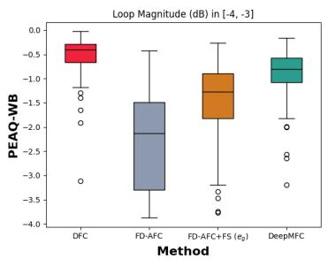

box plot

| Method           | Median | Q1   | Q3   | Min  | Max  |
| ---------------- | ------ | ---- | ---- | ---- | ---- |
| DIFC             | -0.5   | -1.0 | -0.2 | -1.5 | -0.1 |
| FD-AFC           | -1.8   | -3.0 | -2.5 | -3.5 | -0.5 |
| FD-AFC+FCS (eβ)  | -1.2   | -2.8 | -2.0 | -3.0 | -0.8 |
| DeepMFC          | -0.8   | -2.5 | -1.8 | -2.8 | -0.6 |

(a)

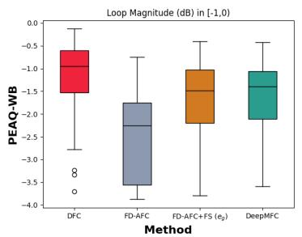

box plot

| Method           | Median | Q1   | Q3   | Min  | Max  |
| ---------------- | ------ | ---- | ---- | ---- | ---- |
| DFC              | -1.0   | -1.5 | -2.0 | -2.8 | -0.2 |
| FD-AFC           | -2.0   | -2.5 | -3.0 | -3.5 | -0.5 |
| FD-AFC+FS (e₀)   | -1.5   | -2.0 | -2.5 | -3.0 | -0.5 |
| DeepMFC          | -1.5   | -2.0 | -2.5 | -3.0 | -0.5 |

(b)

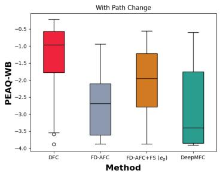

box plot

| Method          | Median | Lower Quartile | Upper Quartile |
| --------------- | ------ | -------------- | -------------- |
| DFC             | -1.0   | -3.5           | -0.5           |
| FD-AFC          | -2.5   | -3.5           | -1.0           |
| FD-AFC+FS (ε₀)  | -2.0   | -3.0           | -0.5           |
| DeepMFC         | -3.5   | -4.0           | -1.5           |

(c)  
Fig. 13. Boxplots of the distribution of the PEAQ scores of four different feedback cancellation methods in three different acoustic scenarios. (a) Loop magnitude in the interval [-4, -3] dB. Moderate feedback (b) Loop gain in the interval [-1, 0) dB. Systems that operate close to instability. (c) Loop gain in the interval [-1, 0) dB before the change of feedback path. After the path change the loop magnitude ranged between [-11, 10) dB.

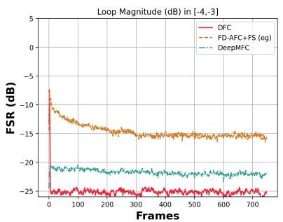

line chart

| Frames | DFC     | FD-AFC+FS (eg) | DeepMFC |
| ------ | ------- | -------------- | ------- |
| 0      | -25.0   | -10.0          | -20.0   |
| 100    | -25.0   | -15.0          | -20.0   |
| 200    | -25.0   | -15.0          | -20.0   |
| 300    | -25.0   | -15.0          | -20.0   |
| 400    | -25.0   | -15.0          | -20.0   |
| 500    | -25.0   | -15.0          | -20.0   |
| 600    | -25.0   | -15.0          | -20.0   |
| 700    | -25.0   | -15.0          | -20.0   |

(a)

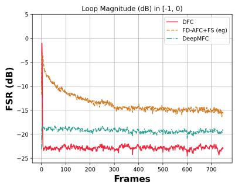

line chart

| Frames | DFC     | FD-AFC+FS (eg) | DeepMFC |
| ------ | ------- | -------------- | ------- |
| 0      | 0.0     | 0.0            | -25.0   |
| 100    | -20.0   | -10.0          | -20.0   |
| 200    | -22.0   | -15.0          | -20.0   |
| 300    | -23.0   | -16.0          | -20.0   |
| 400    | -23.0   | -16.0          | -20.0   |
| 500    | -23.0   | -16.0          | -20.0   |
| 600    | -23.0   | -16.0          | -20.0   |
| 700    | -23.0   | -16.0          | -20.0   |

(b)

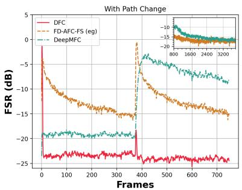

line chart

| Frames | DFC     | FD-AFC-FS (eg) | DeepMFC |
|--------|---------|----------------|---------|
| 0      | -25.0   | -10.0          | -20.0   |
| 100    | -25.0   | -15.0          | -20.0   |
| 200    | -25.0   | -15.0          | -20.0   |
| 300    | -25.0   | -15.0          | -20.0   |
| 400    | -25.0   | 0.0            | -15.0   |
| 500    | -25.0   | -15.0          | -15.0   |
| 600    | -25.0   | -15.0          | -15.0   |
| 700    | -25.0   | -15.0          | -15.0   |

(c)  
Fig. 14. Feedback-to-Signal energy Ratio, averaged across 100 test music sequences. (a) Performance of three methods with a loop magnitude in the range [-4, -3]. (b) Performance of three methods with a loop gain in the range [-1, 0). (c) Performance of three methods with a path change and a loop gain in the range [-1, 0), before the change. The convergence of FD-AFC-FS and DeepMFC is shown in the inset figure.

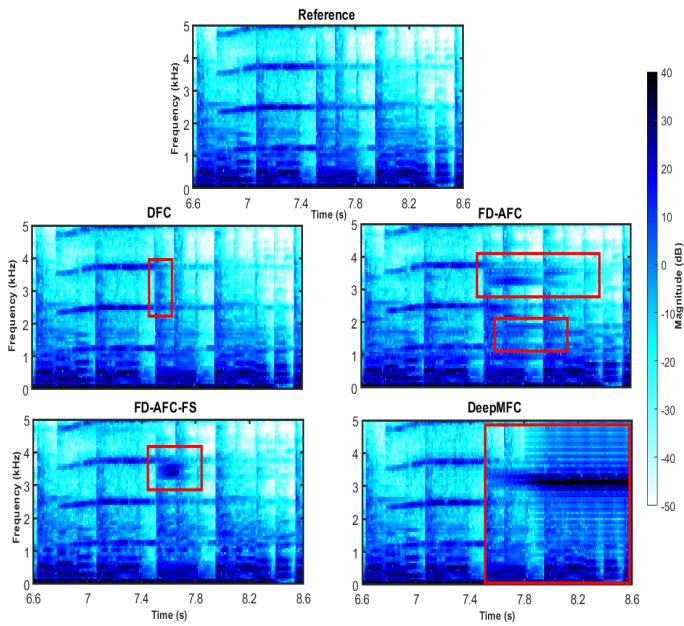

heatmap

| Method     | Frequency (kHz) | Time (s) | Magnitude (dB) |
|------------|-----------------|----------|----------------|
| Reference  | 5               | 6.6      | 0              |
| Reference  | 4               | 7.0      | 10             |
| Reference  | 3               | 7.4      | 20             |
| Reference  | 2               | 7.8      | 30             |
| Reference  | 1               | 8.2      | 40             |
| Reference  | 0               | 8.6      | 0              |
| DFC        | 5               | 7.0      | -10            |
| DFC        | 4               | 7.4      | -20            |
| DFC        | 3               | 7.8      | -30            |
| DFC        | 2               | 8.2      | -40            |
| DFC        | 1               | 8.6      | -50            |
| FD-AFC     | 5               | 7.0      | -10            |
| FD-AFC     | 4               | 7.4      | -20            |
| FD-AFC     | 3               | 7.8      | -30            |
| FD-AFC     | 2               | 8.2      | -40            |
| FD-AFC     | 1               | 8.6      | -50            |
| FD-AFC-FS  | 5               | 7.0      | -10            |
| FD-AFC-FS  | 4               | 7.4      | -20            |
| FD-AFC-FS  | 3               | 7.8      | -30            |
| FD-AFC-FS  | 2               | 8.2      | -40            |
| FD-AFC-FS  | 1               | 8.6      | -50            |
| DeepMFC    | 5               | 7.0      | -10            |
| DeepMFC    | 4               | 7.4      | -20            |
| DeepMFC    | 3               | 7.8      | -30            |
| DeepMFC    | 2               | 8.2      | -40            |
| DeepMFC    | 1               | 8.6      | -50            |

Fig. 15. Example music spectrograms for one test sequence. At 7.5 seconds we have a feedback path change.

The reasonable cross-domain performance can be explained by the fact that DFC predicts the feedback-path IR, meaning that the underlying task remains essentially the same regardless of the input signal type. Rather than relying on signalspecific semantic characteristics, the model learns to estimate the feedback-path IR from the relationship between the loudspeaker signal and its corrupted version after passing through the feedback path. Since this relationship exists for both speech and music signals, the model is able to generalize across different input domains while maintaining robust performance.

Furthermore, we can observe that the overall performance is better for speech inputs, which verifies our original hypothesis, which is well-established for traditional AF-based methods, that music poses a greater challenge in feedback cancellation.

## D. Maximum Stable Gain

MSG is an important metric for evaluating feedback cancellation in HAs, as it quantifies the maximum amplification the system can provide without becoming unstable. In this subsection, we present the MSG results for both FD-AFC and DFC methods, providing a direct comparison of their stability performance over time.

Figure 17 depicts the MSG comparison for speech and music. We can observe that DFC has a better steady-state performance with a faster convergence. As expected both methods achieve lower MSG for music compared to speech, due to the more challenging feedback conditions.

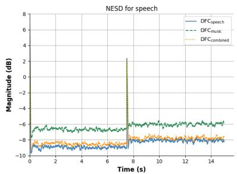

line chart

| Time (s) | DFC_speech | DFC_musk | DFC_combined |
| -------- | ---------- | -------- | ------------ |
| 0        | -10.0      | -8.0     | -8.5         |
| 2        | -9.5       | -7.5     | -8.0         |
| 4        | -9.0       | -7.0     | -7.5         |
| 6        | -8.5       | -6.5     | -7.0         |
| 8        | 2.0        | -6.0     | -6.5         |
| 10       | -8.0       | -6.5     | -7.0         |
| 12       | -8.5       | -6.0     | -7.5         |
| 14       | -9.0       | -6.5     | -7.0         |

(a)

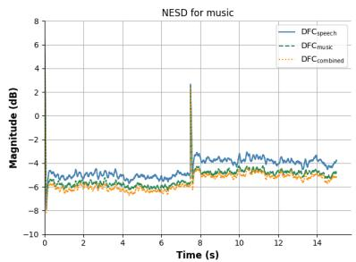

line chart

| Time (s) | DFC_speech | DFC_music | DFC_combined |
| -------- | ---------- | --------- | ------------ |
| 0        | -6.0       | -6.0      | -6.0         |
| 2        | -5.5       | -5.5      | -5.5         |
| 4        | -5.0       | -5.0      | -5.0         |
| 6        | -4.5       | -4.5      | -4.5         |
| 8        | 3.0        | 3.0       | 3.0          |
| 10       | -4.0       | -4.0      | -4.0         |
| 12       | -4.5       | -4.5      | -4.5         |
| 14       | -4.0       | -4.0      | -4.0         |

(b)

Fig. 16. Comparison between specialized DFC and combined DFC for speech and music. (a) NESD for DFCspeech, $\mathrm { D F C _ { m u s i c } }$ and DFCcombined averaged across 100 test speech sequences. (b) NESD for $\mathrm { D F C _ { \mathrm { s p e e c h } } }$ , $\mathrm { D F C _ { m u s i c } }$ and $\mathrm { D F C } _ { \mathrm { c o m b i n e d } }$ averaged across 100 test music sequences.  
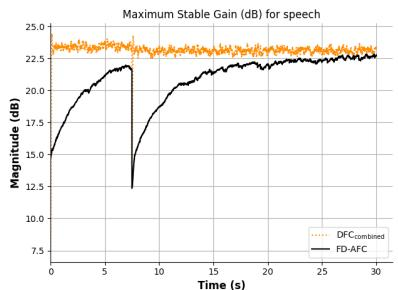

line chart

| Time (s) | DFC_combined | FD-AFC |
| -------- | ------------ | ------ |
| 0        | 23.0         | 15.0   |
| 5        | 23.0         | 21.0   |
| 10       | 23.0         | 19.0   |
| 15       | 23.0         | 21.0   |
| 20       | 23.0         | 22.0   |
| 25       | 23.0         | 22.5   |
| 30       | 23.0         | 22.5   |

(a)

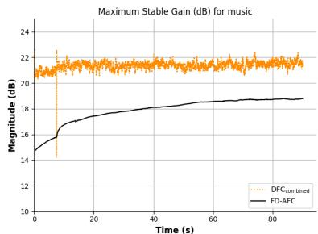

line chart

| Time (s) | DFC_combined | FD-AFC |
| -------- | ------------ | ------ |
| 0        | 21.5         | 14.5   |
| 10       | 21.8         | 16.5   |
| 20       | 21.7         | 17.5   |
| 30       | 21.6         | 18.0   |
| 40       | 21.5         | 18.2   |
| 50       | 21.4         | 18.4   |
| 60       | 21.3         | 18.5   |
| 70       | 21.2         | 18.6   |
| 80       | 21.1         | 18.7   |
| 90       | 21.0         | 18.8   |
| 100      | 20.9         | 18.9   |

(b)  
Fig. 17. Maximum stable gain comparison between $\mathrm { D F C } _ { \mathrm { c o m b i n e d } }$ and AFC for speech and music. (a) MSG for $\mathrm { D F } \bar { \mathrm { C } } _ { \mathrm { c o m b i n e d } }$ and $\mathrm { F D - A F C }$ averaged across 100 test speech sequences. (b) MSG for $\mathrm { D F C } _ { \mathrm { c o m b i n e d } }$ and FD-AFC-FS averaged across 100 test music sequences.

## E. Listening Test Results

Tables VII and VIII summarize the results of the MUSHRA listening test for speech and music inputs, respectively. The statistical significance of the differences in the scores was verified with the use of paired t-tests. All p-values were found to be $p ~ < ~ 0 . 0 1$ (and $p \ < \ 1 0 ^ { - 5 }$ for DFC), except in the case of music with path change where the difference between DeepMFC and FD-AFC-FS obtained a p-value $\begin{array} { r } { p \ = \ 0 . 2 } \end{array}$ , suggesting no statistical significance. DFC obtained consistently higher ratings compared to the other methods with low standard deviations that indicate good robustness and generalization. It is highlighted that DFC handles the feedback path changes more efficiently and provides signals that are preferred by listeners, as indicated by the objective measures.

TABLE VII AVERAGE MUSHRA SCORES (STANDARD DEVIATION) ACROSS PARTICIPANTS FOR SPEECH SIGNALS

<table><tr><td rowspan="2">Method</td><td colspan="3">MUSHRA Scores</td></tr><tr><td>W/o. Path Change</td><td>W. Path Change</td><td>Overall</td></tr><tr><td>DFC</td><td>92.06 (3.61)</td><td>80.20 (21.60)</td><td>86.13 (17.66)</td></tr><tr><td>FD-AFC</td><td>81.00 (14.95)</td><td>33.96 (9.69)</td><td>57.48 (27.18)</td></tr><tr><td>DeepMFC</td><td>45.36 (22.91)</td><td>29.53 (13.38)</td><td>37.45 (21.39)</td></tr></table>

TABLE VIII AVERAGE MUSHRA SCORES (STANDARD DEVIATION) ACROSS PARTICIPANTS FOR MUSIC SIGNALS

<table><tr><td rowspan="2">Method</td><td colspan="3">MUSHRA Scores</td></tr><tr><td>W/o. Path Change</td><td>W. Path Change</td><td>Overall</td></tr><tr><td>DFC</td><td>96.50 (1.30)</td><td>86.93 (11.02)</td><td>91.71 (9.29)</td></tr><tr><td>FD-AFC-FS</td><td>48.23 (24.80)</td><td>45.00 (17.08)</td><td>46.61 (22.47)</td></tr><tr><td>DeepMFC</td><td>60.96 (36.62)</td><td>36.53 (43.20)</td><td>48.75 (39.25)</td></tr></table>

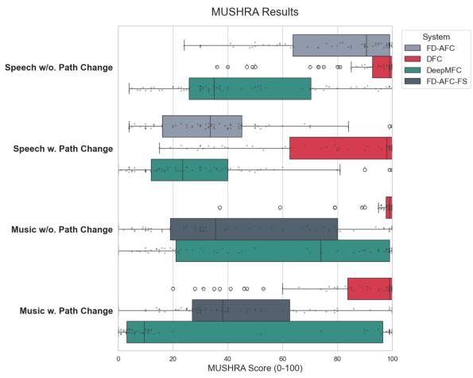

bar chart

| Category                  | FD-AFC | DFC  | DeepMFC | FD-AFC-FS |
| ------------------------- | ------ | ---- | ------- | --------- |
| Speech w/o. Path Change   | 95     | 90   | 70      | 65        |
| Speech w. Path Change     | 45     | 85   | 15      | 10        |
| Music w/o. Path Change    | 80     | 95   | 95      | 85        |
| Music w. Path Change      | 60     | 85   | 95      | 65        |

Fig. 18. Subjective evaluation MUSHRA results comparing sound quality of different feedback control systems for speech and music signals, both with and without a simulated feedback path change. Higher scores indicate better perceived quality. The vertical lines in the boxplots represent the median score, while the gray dots illustrate the individual scores.

DeepMFC received lower subjective ratings than what the objective metrics in Sec. VI-A and Sec. VI-B suggested. This discrepancy may be due to the limited number of listening test samples. The results indicate that DeepMFC’s performance is highly sensitive to system conditions and may perform worse, particularly in the presence of a feedback path change. This is further supported by the high standard deviations reported in Tables IV, VI, VII, and VIII. For FD-AFC and FD-AFC-FS the results aligned well with the objective measures, showing a deterioration in performance when a feedback path change occurs. Although it obtained high scores in some cases, it lacked the consistency of DFC. For music inputs, the additional artifacts introduced by FS make FD-AFC-FS less preferred compared to both DFC and DeepMFC, especially when the feedback is not too critical.

Figure 18 illustrates the MUSHRA score distributions retrieved from the 24 listening test participants across all three sound samples in the four tested acoustic scenarios: speech and music inputs, each with and without a feedback path change. Despite the variability in scores, DFC was significantly preferred by listeners and, in many cases, received a perfect score of 100 –indicating that participants were often unable to distinguish it from the reference signal.

## F. Method Comparison Insights

The experimental results of our study provide some general insights regarding how the feedback control methods compare to each other. Specifically, compared to AF based methods, DNN-based methods offer several potential advantages. For example, they can learn complex nonlinear relationships between the input signal and feedback components that may be difficult to model explicitly with traditional AF approaches. Additionally, a DNN-based approach, as the one proposed, can implicitly exploit contextual and temporal information from the signal, which may allow it to better distinguish between desired signals and feedback artifacts under certain conditions, such as for musical signal that exhibit high autocorrelation. On the other hand, as also highlighted in our experimental analysis, DNN-based methods introduce their own challenges. In particular, their behavior strongly depends on the training data distribution, and they do not inherently possess the explicit adaptation mechanism of AF-based feedback cancellers. As a result, their robustness to unseen conditions or abrupt changes in the feedback path can be limited, moreover it is hard to predict at run-time if/when such limitation manifest itself.

Our results indicate that the proposed algorithm exhibits strong generalization capabilities, demonstrated not only through testing on unseen data but also through several additional factors. In particular, the evaluation includes higher loop magnitude values than those used during training (where the gain is selected so that the loop magnitude is always limited to maximum 0 dB), changes in the feedback path, and different signal types. For instance, as shown in Sec. VI-C, DFCspeech achieves reasonable performance on music signals, and vice versa. Furthermore, the measured IRs used in our experiments originate from a diverse dataset that includes measurements from different HAs, domes, and ears, which further contributes to variability in the evaluation conditions.

Our comparisons also showed that DFC, despite having fewer parameters compared to DeepMFC, achieves more robust and stronger performance. This might indicate that predicting the IR rather than the clean output signal is beneficial in HA applications. This could be so, because the output signals could be of any real-world sound signal, and representing this wide variability demands a DNN with a large representational capacity, trained on a highly diverse set of signals. In contrast, the solution space of plausible IRs is largely constrained by the positions of the microphones and loudspeakers, which we can hypothesize to be far more limited. As a result, it can be modeled more effectively with a smaller DNN.

Moreover, real-world feedback path IRs tend to have only a small number of coefficients that significantly influence the transfer function. Consequently, inaccuracies in less important coefficients have minimal impact on performance. By comparison, when a DNN directly predicts the output sound signal, errors at any point in the signal can noticeably degrade the perceived sound quality.

DeepMFC shows decent performance under stable conditions; however, it appears to struggle when the acoustic environment changes. Systems that estimate the output signal, such as DeepMFC, differ fundamentally from FD-AFC and DFC in that they do not explicitly estimate the feedback path, so the traditional concept of convergence from AF does not directly apply. Our experience showed that, when trained in an openloop setting, it is possible to initially produce predictions that suppress feedback under stable, nominal conditions. However, when the feedback path changes, such systems appear to lack a mechanism to re-estimate or adapt, leading to rapid feedback buildup—especially at higher gains and creating conditions unlike those seen during training. As a result, we often observe failure to adequately suppress feedback after such changes, highlighting a potential key limitation: reduced effectiveness in responding to abrupt feedback-path variations.

## VII. CONCLUSIONS

In this work, we presented a detailed analysis and evaluation of our recently proposed Deep Feedback Cancellation (DFC) model. We further trained the DFC and assessed its performance in various acoustic scenarios using both speech and musical signals. Additionally, we conducted thorough comparisons with state-of-the-art methods based on both traditional signal processing and deep learning techniques. Our analysis focused on two of the most challenging problems in feedback cancellation: the trade-off between convergence speed and steady-state error, and the issue of biased estimation.

The results demonstrate that DFC outperforms other meth ods, delivering high quality sound signals in realistic acoustic scenarios, as confirmed by both objective metrics and subjective listening tests. Notably, this performance is achieved despite the significantly lower complexity compared to the DNN-based baseline. Furthermore, by showing that our model can effectively handle both speech and music, we take a significant step toward real-world applications.

## REFERENCES

[1] J. M. Kates, “The problem of feedback in hearing aids,” Journal of Communication Disorders, vol. 24, no. 3, pp. 223–235, 1991, special Issue: Advances in Sensory Aids for the Hearing Impaired.  
[2] B. Widrow and S. D. Stearns, Adaptive Signal Processing. Upper Saddle River, NJ, US: Prentice Hall, Mar. 1985.  
[3] S. Haykin, Adaptive filter theory, 4th ed. Upper Saddle River, NJ: Prentice Hall, 2002.  
[4] A. H. Sayed, Adaptive Filters. Wiley, Jan. 2008.  
[5] J. E. T. Patronis, “Electronic detection of acoustic feedback and automatic sound system gain control,” Journal of the Audio Engineering Society, vol. 26, no. 5, pp. 323–326, May 1978.  
[6] T. v. Waterschoot and M. Moonen, “Comparative evaluation of howling detection criteria in notch-filter-based howling suppression,” Journal of the audio engineering society, vol. 58, no. 11, pp. 923–940, 2010.  
[7] M. R. Schroeder, “Improvement of feedback stability of public address systems by frequency shifting,” in Audio Engineering Society Convention 13. Audio Engineering Society, 1961.  
[8] M. D. Burkhard, “A simplified frequency shifter for improving acoustic feedback stability,” in Audio Engineering Society Convention 14. Audio Engineering Society, 1962.  
[9] S. Gunnarsson and L. Ljung, “Frequency domain tracking characteristics of adaptive algorithms,” IEEE Trans. Acoustic., Speech, and Signal Processing, vol. 37, no. 7, pp. 1072–1089, 1989.  
[10] M. Guo, T. B. Elmedyb, S. H. Jensen, and J. Jensen, “Analysis of acoustic feedback/echo cancellation in multiple-microphone and singleloudspeaker systems using a power transfer function method,” IEEE Trans. Signal Processing, vol. 59, no. 12, pp. 5774–5788, 2011.  
[11] M. G. Siqueira and A. Alwan, “Steady-state analysis of continuous adaptation in acoustic feedback reduction systems for hearing-aids,” IEEE Transactions on Speech and Audio Processing, vol. 8, no. 4, pp. 443–453, 2000.  
[12] A. Spriet, G. Rombouts, M. Moonen, and J. Wouters, “Adaptive feedback cancellation in hearing aids,” Journal of the Franklin Institute, vol. 343, no. 6, pp. 545–573, 2006.  
[13] A. Spriet, S. Doclo, M. Moonen, and J. Wouters, “Feedback control in hearing aids,” Springer Handbook of Speech Processing, pp. 979–1000, 2008.  
[14] J. Franzen, E. Seidel, and T. Fingscheidt, “AEC in a netshell: on target and topology choices for FCRN acoustic echo cancellation,” in IEEE Int. Conf. Acoustic., Speech and Signal Processing (ICASSP), 2021, pp. 156–160.  
[15] Z. Hao, T. Ke, and W. DeLiang, “Deep Learning for Joint Acoustic Echo and Noise Cancellation with Nonlinear Distortions,” in Proc. Interspeech, 2019, pp. 4255–4259.  
[16] X. Sun, C. Cao, Q. Li, L. Wang, and F. Xiang, “Explore relative and context information with transformer for joint acoustic echo cancellation and speech enhancement,” in IEEE Int. Conf. Acoustic., Speech and Signal Processing (ICASSP), 2022, pp. 9117–9121.  
[17] F. Cui, L. Guo, W. Li, P. Gao, and Y. Wang, “Multi-scale refinement network based acoustic echo cancellation,” in IEEE Int. Conf. Acoustic., Speech and Signal Processing (ICASSP), 2022, pp. 9132–9136.  
[18] H. Zhao, N. Li, R. Han, L. Chen, X. Zheng, C. Zhang, L. Guo, and B. Yu, “A deep hierarchical fusion network for fullband acoustic echo cancellation,” in IEEE Int. Conf. Acoustic., Speech and Signal Processing (ICASSP), 2022, pp. 9112–9116.  
[19] H. Zhang and D. Wang, “Deep Learning for Acoustic Echo Cancellation in Noisy and Double-Talk Scenarios,” in Proc. Interspeech 2018, 2018, pp. 3239–3243.  
[20] ——, “Neural cascade architecture for joint acoustic echo and noise suppression,” in IEEE Int. Conf. Acoustic., Speech and Signal Processing (ICASSP). IEEE, 2022, pp. 671–675.  
[21] T. Haubner, A. Brendel, and W. Kellermann, “End-to-end deep learningbased adaptation control for frequency-domain adaptive system identification,” in IEEE Int. Conf. Acoustic., Speech and Signal Processing (ICASSP), 2022, pp. 766–770.  
[22] J. Casebeer, N. J. Bryan, and P. Smaragdis, “Auto-DSP: Learning to optimize acoustic echo cancellers,” in 2021 IEEE Workshop on Applications of Signal Processing to Audio and Acoustics (WASPAA), Oct. 2021.  
[23] B. Soleimani, H. Schepker, and M. Mirbagheri, “Neural-AFC: Learningbased step-size control for adaptive feedback cancellation with closedloop model training,” in IEEE Int. Conf. Acoustic., Speech and Signal Processing (ICASSP), 2023, pp. 1–5.  
[24] C. Zheng, M. Wang, X. Li, and B. C. J. Moore, “A deep learning solution to the marginal stability problems of acoustic feedback systems for hearing aids,” J. Acoust. Soc. Am., vol. 152, no. 6, pp. 3616 – 3634, Dec. 2022.  
[25] H. Zhang, M. Yu, and D. Yu, “Deep AHS: A deep learning approach to acoustic howling suppression,” in IEEE Int. Conf. Acoustic., Speech and Signal Processing (ICASSP), 2023, pp. 1–5.  
[26] E. Lydaki, Z.-H. Tan, J. Jensen, and M. Guo, “Deep feedback cancellation for hearing aids with improved system stability and sound quality,” in ICASSP 2025 - 2025 IEEE International Conference on Acoustics, Speech and Signal Processing (ICASSP), 2025, pp. 1–5.  
[27] J. M. Kates, “Feedback cancellation in hearing aids: results from a computer simulation,” IEEE Trans. Signal Processing, vol. 39, no. 3, pp. 553–562, 1991.  
[28] H. Nyquist, “Regeneration theory,” Bell System Technical Journal, vol. 11, pp. 126–147, 1932.  
[29] T. Aboulnasr and K. Mayyas, “A robust variable step-size LMS-type algorithm: Analysis and simulations,” IEEE Trans. Signal Processing, vol. 45, no. 3, pp. 631–639, Mar 1997.  
[30] R. H. Kwong and E. W. Johnston, “A variable step size lms algorithm,” IEEE Trans. Signal Processing, vol. 40, no. 7, pp. 1633–1642, Jul 1992.  
[31] H. C. Shin, A. H. Sayed, and W. J. Song, “Variable step-size NLMS and affine projection algorithms,” IEEE Signal Processing Letters, vol. 11, no. 2, pp. 132–135, Feb 2004.  
[32] S. Koike, “A class of adaptive step-size control algorithms for adaptive filters,” IEEE Trans. Signal Processing, vol. 50, no. 6, pp. 1315–1326, 2002.  
[33] C. Paleologu, J. Benesty, and S. Ciochina, “A variable step-size affine projection algorithm designed for acoustic echo cancellation,” IEEE Trans. Audio, Speech, and Language Processing, vol. 16, no. 8, pp. 1466–1478, 2008.  
[34] H. Cao, J. Liu, and W. Zhang, “A combined de-correlation method for acoustic feedback cancellation in hearing aids,” in 2009 WRI World Congress on Computer Science and Information Engineering, vol. 7. IEEE, 2009, pp. 220–224.  
[35] C. Boukis, D. P. Mandic, and A. G. Constantinides, “Toward bias minimization in acoustic feedback cancellation systems,” The Journal of the Acoustical Society of America, vol. 121, no. 3, pp. 1529–1537, 2007.  
[36] Y.-c. Park, I.-y. Kim, and S.-m. Lee, “An efficient adaptive feedback cancellation for hearing aids,” in Proceedings of the 25th Annual International Conference of the IEEE Engineering in Medicine and Biology Society (IEEE Cat. No. 03CH37439), vol. 2. IEEE, 2003, pp. 1647–1650.  
[37] H. A. L. Joson, F. Asano, Y. Suzuki, and T. Sone, “Adaptive feedback cancellation with frequency compression for hearing aids,” The Journal of the Acoustical Society of America, vol. 94, no. 6, pp. 3248–3254, 1993.  
[38] M. Guo, S. H. Jensen, and J. Jensen, “Novel acoustic feedback cancellation approaches in hearing aid applications using probe noise and probe noise enhancement,” IEEE Transactions on Audio, Speech, and Language Processing, vol. 20, no. 9, pp. 2549–2563, 2012.  
[39] C. R. C. Nakagawa, S. Nordholm, and W.-Y. Yan, “Feedback cancellation with probe shaping compensation,” IEEE Signal Processing Letters, vol. 21, no. 3, pp. 365–369, 2014.  
[40] H. Sakai, “Analysis of an adaptive algorithm for feedback cancellation in hearing aids for sinusoidal signals,” in 2007 18th European Conference on Circuit Theory and Design. IEEE, 2007, pp. 416–419.  
[41] M. Rotaru, F. Albu, and H. Coanda, “A variable step size modified decorrelated nlms algorithm for adaptive feedback cancellation in hearing aids,” in 2012 10th International Symposium on Electronics and Telecommunications. IEEE, 2012, pp. 263–266.  
[42] L. T. Tran, H. Schepker, S. Doclo, H. H. Dam, and S. Nordholm, “Frequency domain improved practical variable step-size for adaptive feedback cancellation using pre-filters,” in 2018 16th International Workshop on Acoustic Signal Enhancement (IWAENC). IEEE, 2018, pp. 171–175.  
[43] G. Bernardi, T. Van Waterschoot, J. Wouters, and M. Moonen, “Adaptive feedback cancellation using a partitioned-block frequency-domain kalman filter approach with pem-based signal prewhitening,” IEEE/ACM Transactions on Audio, Speech, and Language Processing, vol. 25, no. 9, pp. 1784–1798, 2017.  
[44] H. Zhang, M. Yu, and D. Yu, “Deep ahs: A deep learning approach to acoustic howling suppression,” in ICASSP 2023-2023 IEEE International Conference on Acoustics, Speech and Signal Processing (ICASSP). IEEE, 2023, pp. 1–5.  
[45] C. Zheng, C. Xu, M. Wang, X. Li, and B. C. Moore, “Evaluation of deep marginal feedback cancellation for hearing aids using speech and music,” Trends in Hearing, vol. 27, p. 23312165231192290, 2023.  
[46] V. Panayotov, G. Chen, D. Povey, and S. Khudanpur, “Librispeech: An ASR corpus based on public domain audio books,” in IEEE Int. Conf. Acoustic., Speech and Signal Processing (ICASSP), April 2015, pp. 5206–5210.  
[47] E. Manilow, G. Wichern, P. Seetharaman, and J. Le Roux, “Cutting music source separation some slakh: A dataset to study the impact of training data quality and quantity,” in 2019 IEEE Workshop on Applications of Signal Processing to Audio and Acoustics (WASPAA). IEEE, 2019, pp. 45–49.  
[48] J. Hellgren, T. Lunner, and S. Arlinger, “Variations in the feedback of hearing aids,” J. Acoust. Soc. Am., vol. 106, no. 5, p. 2821–2833, Nov. 1999.  
[49] M. Guo, “An empirical study on acoustic feedback path across hearing aid users,” in IEEE Int. Conf. Acoustic., Speech and Signal Processing (ICASSP), 2020, pp. 441–445.  
[50] X. Zhan, F. Hao, X. Li, and C. Zheng, “Deeppem-afc: An improved prediction-error-method-based adaptive feedback cancellation with deep learning for hearing aids,” in ICASSP 2025-2025 IEEE International Conference on Acoustics, Speech and Signal Processing (ICASSP). IEEE, 2025, pp. 1–5.  
[51] A. W. Rix, J. G. Beerends, M. P. Hollier, and A. Hekstra, “Perceptual evaluation of speech quality (PESQ)-a new method for speech quality assessment of telephone networks and codecs,” in IEEE Int. Conf. Acoustic., Speech, and Signal Processing (ICASSP), vol. 2, 2001, pp. 749–752.  
[52] T. Thiede, W. C. Treurniet, R. Bitto, C. Schmidmer, T. Sporer, J. G. Beerends, and C. Colomes, “Peaq-the itu standard for objective measurement of perceived audio quality,” Journal of the Audio Engineering Society, vol. 48, no. 1/2, pp. 3–29, 2000.  
[53] A. Spriet, K. Eneman, M. Moonen, and J. Wouters, “Objective measures for real-time evaluation of adaptive feedback cancellation algorithms in hearing aids,” in 2008 16th European Signal Processing Conference, 2008, pp. 1–5.  
[54] ITU-R, “Method for the subjective assessment of intermediate quality level of audio systems,” International Telecommunication Union, Geneva, Recommendation BS.1534-3, 2015.  
[55] M. Guo, “Analysis, design, and evaluation of acoustic feedback cancellation systems for hearing aids:-a novel approach to unbiased feedback cancellation,” 2013.  
[56] M. Guo, S. H. Jensen, and J. Jensen, “Evaluation of state-of-the-art acoustic feedback cancellation systems for hearing aids,” Journal of the Audio Engineering Society, vol. 61, no. 3, pp. 125–137, 2013.  
[57] D. P. Kingma, “Adam: A method for stochastic optimization,” arXiv preprint arXiv:1412.6980, 2014.