# A robust feedforward active noise control system with simultaneous online secondary- and feedback-path modeling

Yaping Maa, Yegui Xiaob,∗, Wenyi Wuc, Liying Mad, Khashayar Khorasani d

a Institute of Automation, Jiangnan University, Wuxi, 214122, China

b Dept. of Information Science, Prefectural University of Hiroshima, Hiroshima, 734-8558, Japan

c Beijing Aerospace Measurement & Control Technology Co., Ltd., Beijing, 100043, China

d Dept. of Electrical and Computer Engineering, Concordia University, Montreal, H3G 1M8, Canada

## a r t i c l e i n f o

Keywords: Feedforward active noise control (FFANC) Online secondary-path modeling (OSPM) Online feedback-path modeling (OFBPM) Noise reduction performance (NRP) Supporting filte Statistical analysis

## a b s t r a c t

In this paper, a new feedforward active noise control (FFANC) system is proposed that is equipped with both online secondary- and feedback-path modeling (OSPM, OFBPM). It is a refined and updated version of an existing FFANC system with the OSPM and OFBPM. The proposed system presents improved noise reduction performance (NRP) in presence of time-varying secondary and feedback paths. Two major contributions are made in this work. First, a new FIR supporting filter (SF) is added to the controller, whose output is a less noisy estimate of the remaining target noise and is used to update the controller. Second, a global scaling scheme is applied to the auxiliary white Gaussian noise (AWGN) that is injected into the secondary source to facilitate both the OSPM and OFBPM. The new SF output, rather than the residual error, is also utilized to perform the global AWGN scaling that significantly reduces the AWGN contribution to the residual error. Furthermore, an approximate steady-state analysis is conducted in detail to reveal the statistical properties of the new SF and the global AWGN scaling scheme. The proposed FFANC system is extensively simulated with synthetic and real settings data to demonstrate its NRP superiority over its counterparts.

## 1. Introduction

Since the early 1990s, active noise control (ANC) [1,2], as a cuttingedge technology has received a tremendous amount of interest from researchers and practitioners. The ANC R&D has been boosted by contin uously increasing investment from the public sectors as well as related industries and has made significant progress in both theory and applications [1–3].

Among the three major types of ANC, namely the feedforward ANC (FFANC), feedback ANC (FBANC), and hybrid ANC (HANC), the FFANC is the most popular paradigm due to its simple structure, easy implementation, good applicability, reasonable noise reduction performance (NRP), among others [1–3]. In this work, we focus on the FFANC for suppressing both broadband and narrowband noise.

Generally speaking, three physical paths of FIR or IIR nature are involved in the ANC [1]. The first one is the primary path (PP) that starts from the reference signal and ends at the residual error. It afects the design of the ANC controllers in the FFANC and the HANC.

The second one is the secondary path (SP) between the secondary source and the residual error. An FIR-type SP estimate is usually obtained in advance and included in the controller update that uses the well-known filtered-x LMS (FXLMS) algorithm (see the pioneer work by Burgess [4]). If the SP is time-varying during the ANC operation, the use of this fixed FIR SP estimate will render the ANC degenerated and even unstable [1]. Online secondary-path modeling (OSPM) based on an auxiliary white Gaussian noise (AWGN) injection was boldly attempted for the first time by Eriksson and Allie [5]. The purpose is to allow the ANC to function stably irrespective of the SP drifts and variations. However, the injected AWGN is allowed to persist on its own and directly contributes to the residual error. In the past three decades, significant eforts have been made in improving the performance of the ANC with OSPM and in reducing the injected AWGN contribution to the residual error (refer to [6,7] for the early eforts, [8–17] for the continuous trials, and [18–21] for the latest developments).

Two major methods have been developed for the AWGN reduction and OSPM enhancement [8–21]. The first method is based on the AWGN power scheduling strategy that uses the powers of not only the OSPM error but also the reference signal and the AWGN. This strategy was proposed by Zhang et al. [9] and thereafter extended and refined by Akhtar, Carini, et al. (refer to [10,11,15] and references therein). The second method only uses a nonlinear function of the residual error. The first attempt of this method was made by Lan et al. [8], with the absolute residual error directly used to scale the AWGN. Later $\mathbf { o n } ,$ the scaling technique is extended to use a lowpass-filtered version of a nonlinear function of the residual error (refer to [13,14,16,18] and references therein). The comparison between these two strategies has not been considered yet.

The third one is the feedback path (FBP) between the secondary source and the reference signal. It imposes negative influence on the ANC performance if no countermeasures are taken [1,2]. The online feedback-path modeling (OFBPM) or cancellation scheme was originally developed by Eriksson [22]. The OFBPM skips the prior estimation of FBP and is capable of compensating the possible FBP drifts and variations. The early efort is focused on how to raise the OFBPM quality to improve the system performance, with the injected AWGN persisting on its own (refer to, $\mathbf { e . g . , }$ [23–25] and references therein). Subsequently, the main stream of OFBPM shifts toward the AWGN scheduling [26–29].

In many real-life FFANC and HANC applications, the SP and the FBP must be considered simultaneously as they afect the ANC performance in a significant way [26,30–32]. Their variations may occur simultaneously and pose serious ANC performance degradation or even system instability. Including the OSPM and OFBPM simultaneously in ANC is technically demanding and costly, but practically unavoidable in many real-life applications. It should be noted that the OSPM and OFBPM have not been simultaneously equipped in all the above-mentioned ANC systems in [5–25,27–29].

To tackle such a challenging scenario where both the SP and the FBP are time-varying, Kuo and Ill [30] developed the first FFANC system with both the OSPM and OFBPM. However, the injected AWGN for the OSPM and OFBPM is not taken care of and is allowed to contribute directly to the residual error.

In [26], a supporting filter (SF) based FFANC with OSPM and OFBPM is proposed and an AWGN scheduling (scaling) strategy is adopted that uses the errors and filter coeficients of both the OSPM and OFBPM. This FFANC reduces the AWGN contribution to the residual error at the expense of more user parameters and higher computational cost. In addition, the OSPM subsystem is coupled with the FFANC controller, since its desired signal is the residual error that contains the remaining target noise the controller is devoted to.

Recently, two FFANC systems with OSPM and OFBPM are developed to mitigate a narrowband noise with one and multiple sinewaves, respectively $[ 3 1 , 3 2 ]$ . The residual error is directly used to not only update the FFANC controller and scale the AWGN, but also to serve as the OSPM desired signal. Consequently, the OSPM subsystem and FFANC controller are deeply coupled with each other, leading to slow convergence and inadequate NRP. To the best of our knowledge, only the above-mentioned four FFANC systems are equipped with both the OSPM and OFBPM and meanwhile have sound system architectures and rational developments [26,30–32].

To mitigate the coupling between the FFANC controller and the OSPM subsystem and further enhance the FFANC, in this paper we propose a new FFANC system with simultaneous OSPM and OFBPM. First, a new SF is added and applied to the residual error. Its output is a less noisy estimate of the remaining target noise and is used to update the controller. Its $\mathrm { e r r o r } ,$ that is attributed to the injected AWGN and the ad ditive noise within the target noise, is put to serve as the desired signal for the OSPM. In this way, the independence is substantially secured between the FFANC controller and the OSPM subsystem, creating a possibility to improve the convergence and the NRP of the proposed system. Second, a global scaling scheme is applied to the AWGN. A lowpassfiltered version of a nonlinear function of the new SF output is adopted to accomplish the AWGN scaling to achieve an improved NRP. An approximate steady-state analysis is also conducted for the new SF and the modified global AWGN scaling scheme to reveal their statistical properties.

The remainder of this work is organized as follows. Section 2 presents three existing FFANC systems, the original FFANC system with FBP compensation and two FFANC systems with both OSPM and OFBPM. The new FFANC system is provided in the Section 3. An approximate steadystate analysis for the newly added SF and global AWGN scaling scheme is presented in detail also in Section 3. Typical simulation results with synthetic and real settings are provided in Section 4. Section 5 concludes the paper.

## 2. Three existing feedforward ANC systems

In this section, three existing FFANC systems are briefly reviewed and discussed. The first one is the original FFANC system with FBP compensation [1]. It serves as a benchmark for other related systems. The second one is an FFANC system with OSPM and OFBPM [26], where an AWGN scaling strategy of local nature is introduced based on errors and filter coeficients of both the OSPM and OFBPM. The third one is a feedforward narrowband ANC (FFNANC) system having OSPM and OFBPM functions [32], which suppresses the narrowband target noise and includes a global AWGN scaling scheme that uses only the residual error.

## 2.1. The original FFANC system with the FBP compensation [1]

The original FFANC system with the FBP compensation is depicted in Fig. 1 [1], with $P ( z ) , F ( z )$ , and ??(??) denoting the primary path (PP), the feedback path (FBP), and the secondary path (SP), respectively. The estimates of the FBP and SP, i.e., $\hat { F } ( z )$ and $\hat { S } ( z )$ , are obtained in advance by using traditional system identification techniques such as Wiener filter [1].

The primary noise is expressed as

$$
p (n) = p _ {r} (n) + v _ {p} (n) = \sum_ {j = 0} ^ {M _ {p} - 1} s _ {p, j} x _ {r} (n - j) + v _ {p} (n)\tag{1}
$$

where $p _ { r } ( n )$ denotes the target (primary) noise due to the noise source or unpolluted reference signal $x _ { r } ( n ) , M _ { p }$ and $\{ s _ { p , j } \} _ { j = 0 } ^ { M _ { p } - 1 }$ denote the length and filter coeficients of the PP, respectively, and $v _ { p } ( n )$ denotes a zeromean additive noise with variance $\sigma _ { p } ^ { 2 } .$

The noisy reference signal ??(??) is acquired by a reference microphone and expressed as

$$
r (n) = x _ {r} (n) + y _ {f} (n)\tag{2}
$$

$$
x _ {r} (n) = x _ {s} (n) + x _ {b} (n) = \sum_ {i = 1} ^ {q} A _ {i} \sin (\omega_ {i} n + \theta_ {i}) + x _ {b} (n)\tag{3}
$$

$$
y _ {f} (n) = \sum_ {m = 0} ^ {M _ {f} - 1} s _ {f, m} y (n - m)\tag{4}
$$

where $y _ { f } ( n )$ denotes the feedback signal due to the secondary source $y ( n ) , x _ { s } ( n )$ with power $\sigma _ { s } ^ { 2 }$ and $x _ { b } ( n )$ with variance $\sigma _ { b } ^ { 2 }$ denote the narrowband and broadband component of $x _ { r } ( n )$ , respectively, ?? denotes the number of sinewaves involved in $x _ { s } ( n ) , \{ \omega _ { i } \} _ { i = 1 } ^ { q } , \{ A _ { i } \} _ { i = 1 } ^ { q }$ , and $\{ \theta _ { i } \} _ { i = 1 } ^ { q }$ denote the angular frequencies, amplitudes, and phases of $x _ { s } ( n ) _ { : }$ , respectively. $M _ { f }$ and $\{ s _ { f , m } \} _ { m = 0 } ^ { M _ { f } - 1 }$ denote the length and filter coeficients of the FBP, respectively.

The input $x ( n )$ to the FIR controller $W ( z )$ possesses power $\sigma _ { x } ^ { 2 }$ and is synthesized by

$$
x (n) = r (n) - \hat {y} _ {f} (n)\tag{5}
$$

$$
\hat {y} _ {f} (n) = \sum_ {m = 0} ^ {M _ {f} - 1} \hat {s} _ {f, m} y (n - m)\tag{6}
$$

where $\hat { M } _ { f }$ and $\{ \hat { s } _ { f , m } \} _ { m = 0 } ^ { \hat { M } _ { f } - 1 }$ denote the length and the filter coeficients of the FBP estimate $\hat { F } ( z ) .$ . The secondary source $y ( n )$ is generated by the FIR controller ?? (??) as follows:

$$
y (n) = y _ {0} (n - 1) = \sum_ {j = 0} ^ {L _ {c} - 1} w _ {j} (n) x (n - 1 - j)\tag{7}
$$

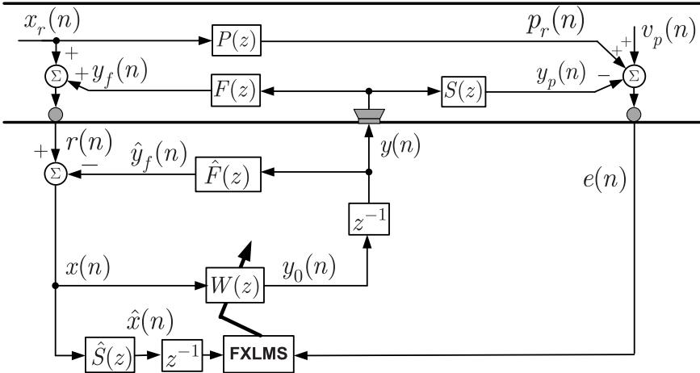  
Fig. 1. Original FFANC system with the FBP compensation [1].

where $L _ { c }$ and $\left\{ w _ { j } ( n ) \right\} _ { i = 0 } ^ { L _ { c } - 1 }$ denote the length and filter coeficients of $W ( z ) ,$ , respectively. If the $p _ { r } ( n )$ is of sinusoidal nature, namely the broadband noise source $x _ { b } ( n )$ is zero or very small as compared to $x _ { s } ( n )$ , the controller length $L _ { c }$ is set moderately larger than $2 q ,$ , say, 7??, 10??, such that the magnitude and phase of every sinusoid in the secondary source $y ( n )$ are well adjusted to neutralize the target noise. If $x _ { s } ( n ) ,$ , on the contrary, is zero or very small as compared to $x _ { b } ( n ) , L _ { c }$ is set larger than $\hat { M } _ { f }$ such that $L _ { c } + \hat { M } _ { s } \ge M _ { p }$ . Otherwise, ?????? $\{ 7 q , \hat { M } _ { f } \}$ may be a good initial value in finding a proper length $L _ { c }$ for the controller. Note that max{⋅} denotes an operator that selects the largest number from its arguments.

The residual error ??(??) with power $\sigma _ { e } ^ { 2 }$ is expressed by

$$
e (n) = p (n) - y _ {p} (n) = p (n) - \sum_ {m = 0} ^ {M _ {s} - 1} s _ {m} y (n - m)\tag{8}
$$

where $M _ { s }$ and $\{ s _ { m } \} _ { m = 0 } ^ { M _ { s } - 1 }$ denote the length and the filter coeficients of the SP ??(??), respectively, and $y _ { p } ( n )$ denotes an ??(??)-filtered version of the secondary source $y ( n )$

The FIR controller $W ( z )$ is updated by the filtered-x LMS (FXLMS) algorithm as follows:

$$
w _ {j} (n + 1) = w _ {j} (n) + \mu_ {c} e (n) \hat {x} (n - 1 - j)\tag{9}
$$

where ̂??(??) denotes an $\hat { S } ( z ) \cdot$ -filtered version of $x ( n ) _ { \mathrm { { ; } } }$ , that is

$$
\hat {x} (n) = \sum_ {m = 0} ^ {\hat {M} _ {s} - 1} \hat {s} _ {m} x (n - m)\tag{10}
$$

and $\mu _ { c }$ denotes a step size that takes a small positive value that is usually empirically specified to make a tradeof between system convergence and steady-state performance, $\hat { M } _ { s }$ and $\{ \hat { s } _ { m } \} _ { m = 0 } ^ { \hat { M } _ { s } - 1 }$ denote the length and filter coeficients of $\hat { S } ( z ) _ { i }$ , respectively. To improve the system performance, one may apply advanced filtered-x afine projection algorithm [33], variable step-size FXLMS algorithm [34], etc. at the expense of higher or moderately higher computational cost.

The FFANC system shown in Fig. 1 is expected to present good noise reduction performance (NRP) given that the SP and FBP are of timeinvariant nature, and are well identified in advance [1]. However, in real-life applications these two physical paths may be time-varying, drifting swiftly and even presenting sudden changes during the system operation. In such a challenging case, this FFANC system presents poor NRP and even sufers from a high likelihood of instability. The following two FFANC systems with the OSPM and OFBPM are developed to address and tackle such a technically demanding and challenging scenario.

## 2.2. An FFANC system with the OSPM and OFBPM [26]

The block diagram of an FFANC system equipped with both the OSPM and OFBPM functions is depicted in Fig. 2 [26]. In this system, the FBP compensation is performed by an OFBPM subsystem, with ??̂(??) in the original FFANC system (Fig. 1) replaced by its adaptive version $\hat { F } _ { n } ( z )$ . A supporting filter (SF) $H _ { 1 } ( z )$ is introduced to facilitate the OF-BPM. It takes the controller output and the reference signal estimate ??(??) as its input and desired signal, respectively. Its output $y _ { 1 } ( n )$ is a signal that remains in the estimated reference signal ??(??) and is attributed to the controller output. Its error $e _ { 1 } ( n )$ with power $\sigma _ { e _ { 1 } } ^ { 2 }$ turns out to be an estimate of the remaining AWGN that the $\hat { F } _ { n } ( z )$ is unable to eradicate.

The LMS algorithm is used to update $H _ { 1 } ( z ) _ { : }$ , as follows:

$$
h _ {1, j} (n + 1) = h _ {1, j} (n) + \mu_ {1} e _ {1} (n) y _ {0} (n - 1 - j)\tag{11}
$$

$$
e _ {1} (n) = x (n) - y _ {1} (n)\tag{12}
$$

$$
x (n) = r (n) - \sum_ {m = 0} ^ {\hat {M} _ {f} - 1} \hat {s} _ {f, m} (n) y (n - m)\tag{13}
$$

$$
y _ {1} (n) = \sum_ {j = 0} ^ {L _ {1} - 1} h _ {1, j} (n) y _ {0} (n - 1 - j)\tag{14}
$$

$$
y (n) = y _ {0} (n - 1) + v (n)\tag{15}
$$

where $L _ { 1 }$ and $\{ h _ { 1 , j } ( n ) \} _ { j = 0 } ^ { L _ { 1 } - 1 }$ denote the length and filter coeficients of $H _ { 1 } ( z ) ,$ , respectively, $\hat { M } _ { f }$ and $\{ \hat { s } _ { f , m } ( \boldsymbol n ) \} _ { m = 0 } ^ { \hat { M } _ { f } - 1 }$ denote the length and filter coeficients of the OFBPM filter $\hat { F } _ { n } ( z ) , \mu _ { 1 }$ denotes another step size, and ??(??) denotes the scaled AWGN to be given subsequently. The length of $H _ { 1 } ( z ) \left( L _ { 1 } \right)$ is set equal to or slightly larger than $\hat { M } _ { f }$

The OFBPM subsystem is updated by the LMS algorithm as follows:

$$
\hat {s} _ {f, m} (n + 1) = \hat {s} _ {f, m} (n) + \mu_ {f} e _ {1} (n) v (n - m)\tag{16}
$$

where $\mu _ { f }$ denotes another step size.

An OSPM subsystem is also included to allow the system to deal with the variations with the SP. It takes ??(??) and the residual error ??(??) as its input and desired signal, respectively. The LMS is used to update its filter coeficients as follows:

$$
\hat {s} _ {m} (n + 1) = \hat {s} _ {m} (n) + \mu_ {s} e _ {s} (n) v (n - m)
$$

$$
e _ {s} (n) = e (n) + y _ {s} (n)\tag{17}
$$

(18)

$$
y _ {s} (n) = \sum_ {m = 0} ^ {\hat {M} _ {s} - 1} \hat {s} _ {m} (n) v (n - m)\tag{19}
$$

where $\mu _ { s }$ denotes another step size, $\hat { M } _ { s }$ and $\{ \hat { s } _ { m } ( n ) \} _ { m = 0 } ^ { \hat { M } _ { s } - 1 }$ denote the length and filter coeficients of $\hat { S } _ { n } ( z ) .$

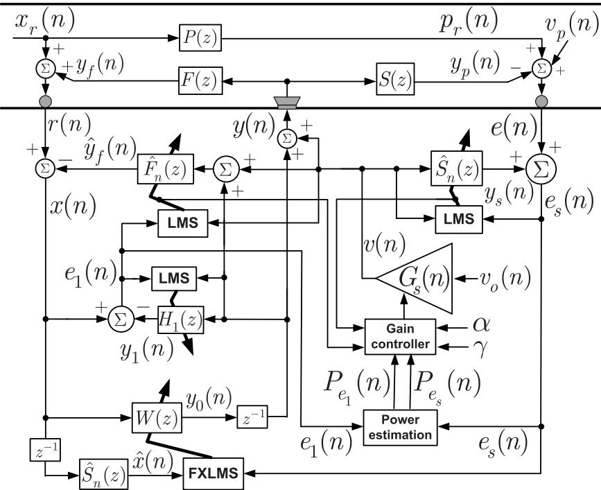  
Fig. 2. An FFANC system with the OSPM and OFBPM [26].

Note that 1) the step sizes $\mu _ { f }$ in (16) and $\mu _ { s }$ in (17) may be set to similar values as the OFBPM and OSPM take the same scaled AWGN ??(??) as their input, and 2) since the $H _ { 1 } ( z )$ is put to support the OFBPM, its update step size $\mu _ { 1 }$ should be set to have an order similar to that of $\mu _ { f }$ and $\mu _ { s }$ and to allow $H _ { 1 } ( z )$ to converge faster than the OFBPM filter.

The controller $W ( z )$ is updated by the FXLMS algorithm as follows:

$$
w _ {j} (n + 1) = w _ {j} (n) + \mu_ {c} e _ {s} (n) \hat {x} (n - 1 - j)\tag{20}
$$

$$
\hat {x} (n) = \sum_ {m = 0} ^ {\hat {M} _ {s} - 1} \hat {s} _ {m} (n) x (n - m).\tag{21}
$$

An AWGN scheduling strategy is introduced for this system. The scheduling gain or scaling factor $G _ { s } ( n )$ and the injected AWGN ??(??) are computed according to,

$$
G _ {s} (n) = \alpha G _ {s} (n - 1) + \gamma \max \left\{\sqrt {\frac {P _ {e _ {1}} (n - 1)}{\sum_ {m = 0} ^ {\hat {M} _ {f} - 1} \hat {s} _ {f , m} ^ {2} (n)}}, \sqrt {\frac {P _ {e _ {s}} (n - 1)}{\sum_ {m = 0} ^ {\hat {M} _ {s} - 1} \hat {s} _ {m} ^ {2} (n)}} \right\}\tag{22}
$$

$$
v (n) = G _ {s} (n) v _ {o} (n)\tag{23}
$$

$$
P _ {e _ {1}} (n) = \lambda P _ {e _ {1}} (n - 1) + (1 - \lambda) e _ {1} ^ {2} (n)\tag{24}
$$

$$
P _ {e _ {s}} (n) = \lambda P _ {e _ {s}} (n - 1) + (1 - \lambda) e _ {s} ^ {2} (n)\tag{25}
$$

where ?? (∈ (0.98, 1)) denotes a forgetting factor, $\gamma \left( > 0 \right)$ denotes a constant that is set very small, ?? denotes another forgetting factor, and $v _ { o } ( n )$ denotes a zero-mean AWGN with variance $\sigma _ { o } ^ { 2 } .$

Now, we have the following remarks regarding the above FFANC system [26]:

R1: This FFANC system is capable of simultaneously tracking the changes with both SP and FBP. The SF or the adaptive noise cancellation filter (ADNC) $H _ { 1 } ( z )$ is included to separate the FBP compensation from the OFBPM process. The AWGN scheduling strategy is also implemented to reduce the injected AWGN contribution to the residual error. The system works quite well and presents acceptable NRP when the OSPM and OFBPM are properly initialized.

R2: The initialization of the OSPM and OFBPM is quite delicate. The initial filter coeficients $\{ \hat { s } _ { f , m } ( 0 ) \} _ { m = 0 } ^ { \hat { M } _ { f } - 1 }$ and $\{ \hat { s } _ { m } ( 0 ) \} _ { m = 0 } ^ { \hat { M } _ { s } - 1 }$ in (22) cannot be set to null vectors. They are set proportional to their truth such that the initial modeling accuracy is -5 dB in [26] (P. 510, 513).

R3: There exists an adverse coupling between the controller and the OSPM subsystem, as the remaining target noise within the residual error due to controller ?? (??) acts as an additive noise for the OSPM. This coupling directly and negatively impacts both the OSPM and the controller.

R4: The AWGN scheduling strategy is framed according to minimizing the modeling error powers of the OSPM and OFBPM, rather than the remaining target noise in the residual error. It is a “local" scheme, in the sense that it does not directly aim at minimizing the “global" residual error.

## 2.3. An FFNANC system with the OSPM and OFBPM [32]

An FFNANC system is given in Fig. 3 [32], that includes both the OSPM and OFBPM. A cascade adaptive notch filter bank (CANFB) (refer to [35,36] and references therein) is applied to the noisy reference signal ??(??). It separates the multi-frequency narrowband component from the broadband component, with the former due to $x _ { s } ( n )$ ) and the FBP output while the latter coming from $x _ { b } ( n )$ and the injected AWGN.

The last CANFB cell output $u _ { N , q } ( n )$ ) contains the OFBPM error and is thus used to execute the OFBPM update. The CANFB cells are secondorder adaptive IIR notch filters (ANF) with constrained poles and zeros [35,36].

The output of the ??th CANFB cell is given by

$$
\begin{array}{r} u _ {N, i} (n) = - \rho c _ {i} (n) u _ {N, i} (n - 1) - \rho^ {2} u _ {N, i} (n - 2) + u _ {N, i - 1} (n) \\ + c _ {i} (n) u _ {N, i - 1} (n - 1) + u _ {N, i - 1} (n - 2) \end{array}\tag{26}
$$

where $u _ { N , 0 } ( n ) = x ( n ) ;$ , and $\rho \in ( 0 , 1 )$ ) denotes a pole attraction parameter that takes a value close to unity, say, 0.95, 0.97, among others and determines the filter notch bandwidth, $c _ { i } ( n )$ denotes the ??th notch filter coeficient that converges toward its ideal destination −2 cos ?? . Note that a constant $\rho$ is usually used in notch filtering, but a timevarying ?? may also be used to pursue better stability and performance [32–36].

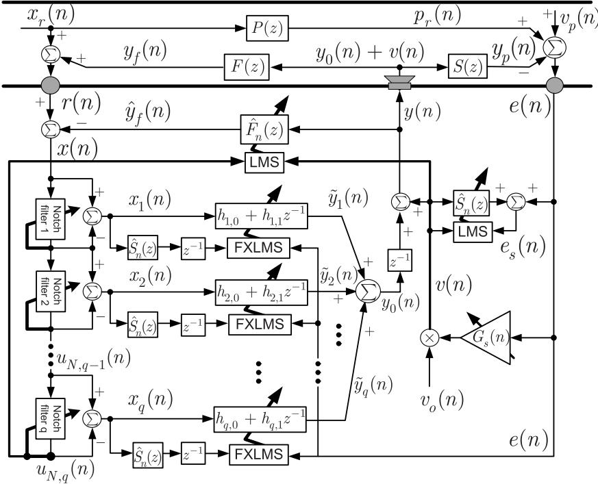  
Fig. 3. An FFNANC system with the OSPM and OFBPM [32].

A normalized gradient (NG) algorithm is adopted to update the CANFB filter coeficients as follows:

$$
c _ {i} (n + 1) = c _ {i} (n)) - \mu_ {N} \frac {g _ {N , i} (n) u _ {N , i} (n)}{\epsilon + G _ {N , i} (n)}\tag{27}
$$

$$
g _ {N, i} (n) = - \rho u _ {N, i} (n - 1) + u _ {N, i - 1} (n - 1)\tag{28}
$$

$$
G _ {N, i} (n) = \beta_ {N} G _ {N, i} (n - 1) + (1 - \beta_ {N}) g _ {N, i} ^ {2} (n)\tag{29}
$$

where $\mu _ { N }$ denotes another step size, ?? denotes a very small positive constant that prevents division by zero, $g _ { N , i } ( n )$ and $G _ { N , i } ( n )$ denote the gradient signal and the lowpass-filtered version of the squared gradient signal of the ??th CANFB cell, respectively, and $\beta _ { N } ~ ( \in [ 0 , 1 )$ denotes an other forgetting factor that is similar to ?? in (24). The selection of $\mu _ { N } , \epsilon ,$ and $\beta _ { N }$ is made according to the analytical and empirical insights that have been obtained in adaptive notch filtering theory and applications (refer to [32–36], and references therein).

Each CANFB cell extracts a single sinusoid as follows:

$$
x _ {i} (n) = u _ {N, i - 1} (n) - u _ {N, i} (n)\tag{30}
$$

that is fed to the ??th magnitude and phase adjuster (MPA) to generate the ??th secondary source

$$
\tilde {y} _ {i} (n) = h _ {i, 0} (n) x _ {i} (n) + h _ {i, 1} (n) x _ {i} (n - 1)\tag{31}
$$

where $\{ h _ { i , 0 } ( n ) , h _ { i , 1 } ( n ) \}$ denotes two filter coeficients of the ??th MPA. The noisy secondary source is obtained by summing all the MPA’s outputs and the scaled AWGN as follows:

$$
y (n) = \sum_ {i = 1} ^ {q} \tilde {y} _ {i} (n - 1) + v (n).\tag{32}
$$

The MPAs and the OFBPM subsystem are updated by the FXLMS and the LMS algorithm, respectively,

$$
h _ {i, 0} (n + 1) = h _ {i, 0} (n) + \mu_ {c} e (n) \hat {x} _ {i} (n - 1)\tag{33}
$$

$$
h _ {i, 1} (n + 1) = h _ {i, 1} (n) + \mu_ {c} e (n) \hat {x} _ {i} (n - 2)\tag{34}
$$

$$
\hat {s} _ {f, m} (n + 1) = \hat {s} _ {f, m} (n) + \mu_ {f} u _ {N, q} (n) v (n - m)\tag{35}
$$

where

$$
\hat {x} _ {i} (n) = \sum_ {m = 0} ^ {\hat {M} _ {s} - 1} \hat {s} _ {m} (n) x _ {i} (n - m).\tag{36}
$$

The OSPM subsystem is the same as in Fig. 2. The scaling factor $G _ { s } ( n )$ is obtained by lowpass-filtering a nonlinear function of the “global" residual error ??(??), that is,

$$
G _ {s} (n) = \alpha_ {c} G _ {s} (n - 1) + \beta_ {c} | e (n - 1) | ^ {\gamma_ {c}}\tag{37}
$$

where $\alpha _ { c }$ and $\beta _ { c }$ denote the user parameters that are similar to ?? and ?? in (22), respectively, and $\gamma _ { c } ~ ( \in \{ 1 , 2 , 3 , 4 \} )$ ) denotes another user parameter to be properly set.

Note that the OSPM-related equations are omitted as they are the same as those of the FFANC system in Fig. 2.

Now, we have the following remarks regarding this FFNANC system [32]:

R1: The above system is solely applicable to target noise of narrowband nature. It presents reasonable performance if the sinusoids in $x _ { s } ( n )$ are not very closely spaced and the broadband noise $x _ { b } ( n )$ is very small.

R2: Due to the online FBP compensation, the input to the CANFB becomes nonstationary, which may deteriorate the CANFB stability, and thus make the entire system less stable.

R3: Only the residual error is used in the AWGN scaling. The AWGN contribution to the residual error is addressed in a straightforward manner, enabling the scaling to contribute to the ANC “global" goal. However, the AWGN or $G _ { s } ( n )$ is not minimized yet, due to the additive noise $v _ { p } ( n )$ that persists in the residual error.

R4: As the residual error is put to serve as the OSPM desired signal and at the same time used directly to update the MPAs, the OSPM subsystem and the MPAs are coupled with one another.

## 3. A new FFANC system with the OSPM and OFBPM

The above two FFANC systems with both OSPM and OFBPM shown in Figs. 2 and 3 involve the following two common major issues, namely I1) adverse coupling between the controller and the OSPM, that undermines the system convergence and NRP, and I2) inadequate AWGN reduction that sharpens the system NRP.

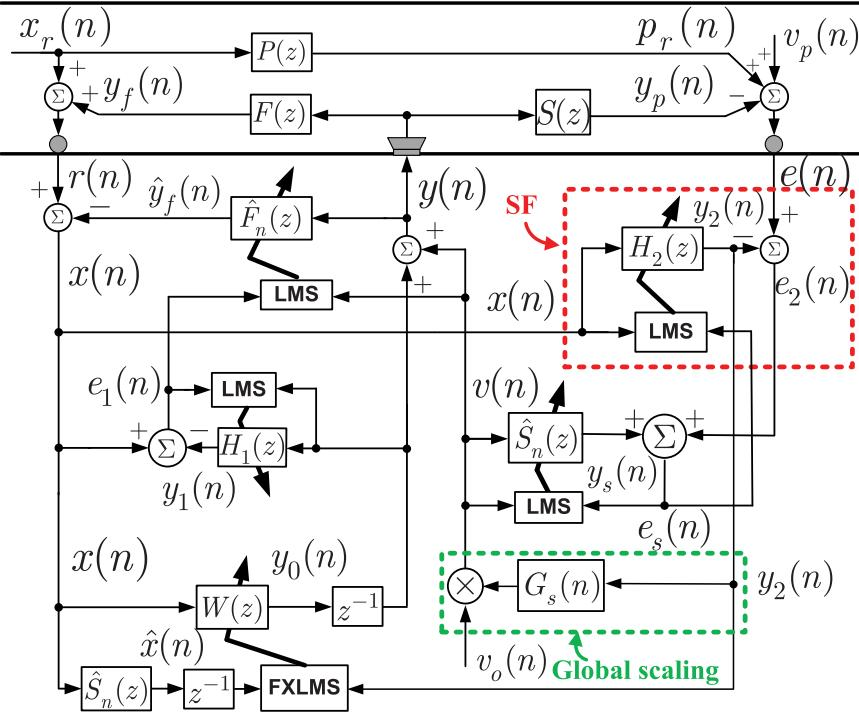  
Fig. 4. Proposed FFANC system with the OSPM and OFBPM

## 3.1. The proposed system configuration and characteristics

A new FFANC system is now proposed, as illustrated in Fig. 4, that solves the above two challenging issues. The proposed system consists of five (5) subsystems, namely, 1) the first SF $\left( H _ { 1 } ( z ) \right)$ that extracts, from the FBP-compensated signal $x ( n ) ,$ , the remaining broadband noise component due to the injected AWGN ??(??) [26], 2) the second $\mathrm { S F } \left( H _ { 2 } ( z ) \right)$ shown in the red-dashed square, that is newly added and applied to the residual error to extract the remaining target noise, 3) the FFANC subsystem, 4) the OSPM subsystem, and 5) the OFBPM subsystem.

Having a closer look at Figs. 2 and $^ { 4 , }$ one readily concludes that the first SF, the FFANC subsystem, the OSPM subsystem and the OF-BPM subsystem in the proposed system are the same as those in the FFANC system in Fig. 2 [26]. The second SF $H _ { 2 } ( z )$ is newly included. The global AWGN scaling in Fig. 3 is modified, with the residual error replaced by the second SF output, as shown in the green-dashed square.

Note that the use of SFs in ANC has been explored for three decades. The first pioneer trial was made by Kuo and Vijayan in 1997 [7]. They introduced a linear prediction filter (LPF) as a SF to the residual error to reduce the interference or coupling between the OSPM and the controller. Their purpose is to raise the OSPM quality and enhancement of the controller as well as the AWGN scaling are not considered. Ever since, a number of SFs, such as the FIR filter, adaptive notch filter bank, bandpass filter bank, sinusoidal noise canceller, etc. have been applied to diferent ANC system architectures, namely the broadband ANC with OFBPM or OSPM, the feedback ANC with OSPM, the hybrid ANC with OSPM, among others. How the SFs are included and what purposes the SFs are put to serve have been extensively explored and evaluated (refer to [10,11,14,18,27], and references therein).

Introducing the second SF to the controller of FFANC with both the OSPM and OFBPM has not been attempted yet. The global AWGN scaling, that is implemented by virtue of the SF output only, has also not been tried yet. Our efort is also expected to enlighten the interest in the technically challenging FFANC with both the OSPM and OFBPM.

The new SF $H _ { 2 } ( z )$ takes the FBP-compensated reference signal ??(??) as its input. Its output $y _ { 2 } ( n )$ is given by

$$
y _ {2} (n) = \sum_ {j = 0} ^ {L _ {2} - 1} h _ {2, j} (n) x (n - j)\tag{38}
$$

where $L _ { 2 }$ and $\left\{ h _ { 2 , j } ( n ) \right\} _ { i = 0 } ^ { L _ { 2 } - 1 }$ denote the length and filter coeficients of the second SF $H _ { 2 } ( z ) _ { \mathrm { { ; } } }$ , respectively. To mitigate the mutual interference between the second SF and the OSPM, the OSPM error $e _ { s } ( n )$ , instead of $e _ { 2 } ( n ) ,$ , is also used to update the second SF, as follows:

$$
h _ {2, j} (n + 1) = h _ {2, j} (n) + \mu_ {2} e _ {s} (n) x (n - j)
$$

$$
e _ {s} (n) = e _ {2} (n) + y _ {s} (n)\tag{39}
$$

(40)

$$
e _ {2} (n) = e (n) - y _ {2} (n)\tag{41}
$$

where $\mu _ { 2 }$ denotes another step size. If the noise source $x _ { r } ( n )$ is mainly of narrowband nature, the SF $H _ { 2 } ( z )$ length $L _ { 2 }$ is set to be similar to that of the controller, $\mathrm { i . e . , }$ the $L _ { c }$ . On the contrary, if the noise source is mainly broadband, the $L _ { 2 }$ is set, at least, larger than the $L _ { c } .$ . Otherwise, the $L _ { c }$ will be a good initial value for finding a proper number for the $L _ { 2 } .$ . As the $H _ { 2 } ( z )$ is required to converge faster than its controller $W ( z ) _ { i }$ , one has to set the $\mu _ { 2 }$ moderately larger than the $W ( z )$ update step size $\mu _ { c }$ . The $H _ { 2 } ( z )$ error $e _ { 2 } ( n )$ serves, exclusively, as the desired signal of the OSPM.

Unlike the systems in Figs. 1–3 the proposed system uses the second SF output $y _ { 2 } ( n )$ , rather than the residual signal ??(??) or the OSPM error $e _ { s } ( n )$ , to update its controller by using of the FXLMS algorithm as follows:

$$
w _ {j} (n + 1) = w _ {j} (n) + \mu_ {c} y _ {2} (n) \hat {x} (n - 1 - j).\tag{42}
$$

In the proposed system, the AWGN $v _ { o } ( n )$ is scaled by a lowpass-filtered nonlinear function of the remaining target noise $y _ { 2 } ( n ) _ { : }$ , instead of the residual error ??(??). The modified scaling factor $G _ { s } ( n )$ in the green-dashed square is given by

$$
G _ {s} (n) = \alpha_ {d} G _ {s} (n - 1) + \beta_ {d} | y _ {2} (n - 1) | ^ {\gamma_ {d}}\tag{43}
$$

where $\alpha _ { d } , \beta _ { d } ,$ , and $\gamma _ { d }$ are similar to the $\alpha _ { c } , \beta _ { c }$ , and $\gamma _ { c }$ that are used in the

FFNANC system in Fig. 3. The filter coeficients of $\hat { S } _ { n } ( z )$ are updated by an LMS algorithm similar to (17).

The three user parameters $\alpha _ { d } , \beta _ { d } ,$ , and $\gamma _ { d }$ directly afect the AWGN scaling factor and must be properly selected. The closer the $\alpha _ { d }$ is to 1, the slower the scaling factor starts up from 0, and vice versa. The peak of the scaling factor becomes higher as the $\alpha _ { d }$ increases, and vice versa. The larger the $\beta _ { d }$ is, the larger the scaling factor is, and vice versa. The steady state scaling factor is proportional to both $\frac { \beta _ { d } } { 1 - \alpha _ { d } }$ and the mean value of $| y _ { 2 } ( n - 1 ) | ^ { \gamma _ { d } }$ . The parameter $\gamma _ { d }$ is usually an integer smaller than 4. A pair of $\{ \alpha _ { d } , \beta _ { d } , \gamma _ { d } \}$ is set such that the scaling factor starts up from 0 as fast as needed, its peak is suficiently high, and its steady-state value is adequately small. A trial-and-error process is inevitable in real applications. The same is true with the user parameter pair $\{ \alpha _ { c } , \beta _ { c } , \gamma _ { c } \}$ and $\{ \alpha , \gamma \}$ in (37) and (22), respectively.

As compared to its counterparts in Figs. 2 and 3, the proposed FFANC system has the following features:

F1: The use of $H _ { 2 } ( z )$ output $y _ { 2 } ( n )$ to update the controller, as in $( 4 2 ) ,$ substantially decouples the controller from the OSPM, making the proposed system easier to tune and more efective. $y _ { 2 } ( n )$ is usually much less noisy as compared to $e _ { s } ( n )$ in (20) and ??(??) in (33), (34), since the influence of the additive noise $v _ { p } ( n )$ and the injected AWGN ??(??) is significantly dampened due to the adaptivity of $H _ { 2 } ( z )$

F2: The new SF output $y _ { 2 } ( n ) _ { : }$ , rather than ??(??) in (8) and $e _ { s } ( n )$ in (18), is also used to perform the AWGN scaling, as in (43). Since the additive noise $v _ { p } ( n )$ is not directly involved in $y _ { 2 } ( n )$ , the scaling factor $G _ { s } ( n )$ in $( 4 3 )$ may converge to a lower steady-state level as compared to its counterparts in (22) and (37), suggesting that the injected AWGN will contribute less to the residual error and the NRP of the proposed system will be improved accordingly.

F3: The use of the OSPM error $e _ { s } ( n )$ to update both the OSPM and $H _ { 2 } ( z )$ is expected to reduce the interference between $H _ { 2 } ( z )$ and $\hat { S } _ { n } ( z ) ;$ allowing both to converge faster and to better support the controller and the AWGN scaling.

F4: Unlike the system in Fig. 2, the proposed system and the FFNANC system in Fig. 3 can set their OSPM and OFBPM initial filter weights to null vectors.

F5: Just like the existing systems in Figs. 2 and 3, the OFBPM and OSPM of the proposed system are simultaneously driven by the same scaled AWGN ??(??). That is, a coupling, small or large, exists between the OFBPM and OSPM, which deserves further research efort.

F6: The above merits F1-F4 are achieved due to the inclusion of the new SF $H _ { 2 } ( z )$ as well as the global AWGN scaling scheme. The SF $H _ { 2 } ( z )$ does require additional computations. However, the proposed system is comparable to the system in Fig. 3 and more eficient than the system in Fig. 2 as far as the AWGN scaling computational cost is concerned.

The main computational loads including the numbers of multiplications, divisions and square roots that are required by the three systems in Figs. 2–4 are summarized in Table 1.

F6-1 The proposed system requires $2 L _ { 2 } - ( \hat { M } _ { f } + \hat { M } _ { s } ) + \gamma _ { d } - 6$ more multiplications as compared to the system in $\mathrm { F i g . } 2 .$ . Since $L _ { 2 }$ is usually set equal to or larger than $L _ { c }$ , the additional multiplication number turns out to be larger than $2 L _ { c } - ( \hat { M } _ { f } + \hat { M } _ { s } ) +$ $\gamma _ { d } - 6 .$ . If the noise source is of broadband nature, one may set $L _ { 2 } > L _ { c } \approx \hat { M } _ { f } ,$ , implying that the additional multiplication number is larger than $\hat { M } _ { f } - \hat { M } _ { s } + \gamma _ { d } - 6$ that is unlikely to be a very large number. On the other hand, if the noise source is narrowband, the number of additional multiplications will be larger than 2 max $\{ 7 q , \hat { M } _ { f } \} - ( \hat { M } _ { f } + \hat { M } _ { s } ) + \gamma _ { d } - 6 .$ . Note that the proposed system requires no divisions and square roots, but two divisions and two square roots are needed by the system in Fig. 2.

F6-2 The system in Fig. 3 can only take care of narrowband target noise. To deal with the same noise, one may set $L _ { c }$ ≈ $L _ { 1 } \approx \hat { M } _ { f } \ ( L _ { c } \gg 2 q )$ and $L _ { 2 } \approx L _ { c } \approx \hat { M } _ { f }$ for the proposed system in Fig. 4. The number of additional multiplications required by the proposed system turns out to be approximately $6 { \hat { M } } _ { f } + { \hat { M } } _ { s } + \gamma _ { d } - \gamma _ { c } + 2 - q ( { \hat { M } } _ { s } + 1 3 )$ as compared to the system in Fig. 3. If ?? is equal to or larger than $q _ { \mathrm { m i n } } ~ ( = \lfloor ( 6 \hat { M } _ { f } +$ $\hat { M } _ { s } + \gamma _ { d } - \gamma _ { c } + 2 ) / ( \hat { M } _ { s } + 1 3 ) \rfloor )$ , the proposed system actually requires less multiplications than the system in Fig. 3 does. However, if $q$ is smaller than $q _ { \mathrm { m i n } } ,$ the number of multiplications involved in the system of Fig. 3 will be smaller than that of the proposed system. Note that $q$ divisions are required by the system in Fig. 3, but no divisions are involved in the proposed system.

In view of the above attractive advantages, ${ \mathrm { F } } 1 \ - \ { \mathrm { F } } 4 ,$ , over the two existing systems in Figs. 2 and $^ { 3 , }$ the proposed system is expected to be able to enhance the applicability of the FFANC in real-life applications.

## 3.2. An approximate statistical steady-state analysis

As depicted in Fig. 4, the proposed FFANC system consists of five subsystems. These subsystems are directly connected with or indirectly related to each other and updated in real-time. It is not dificult to notice and realize that the statistical analysis of the entire proposed system will be extremely challenging, if not impossible. However, the statistical analysis, even of approximate nature and only for part of the system can still enhance our understanding regarding the system properties.

In the proposed system, the newly included SF $H _ { 2 } ( z )$ and the mod ified AWGN scheme are able to improve the system NRP. Analyzing their statistical steady-state behaviors in an approximate way will also provide us with insights into how they work together to improve the proposed system NRP.

When the entire system reaches a very close neighborhood of its steady state, the first SF and the OFBPM subsystem may be considered to have successfully accomplished the FBP compensation task as well as the OFBPM such that the estimated reference signal ??(??) with power $\sigma _ { x } ^ { 2 }$ may be approximated as

$$
x (n) \approx x _ {s} (n) + x _ {b} (n) = \sum_ {i = 1} ^ {q} A _ {i} \sin (\omega_ {i} n + \theta_ {i}) + x _ {b} (n).\tag{44}
$$

The scaled AWGN ??(??) penetrates into the reference signal ??(??) and is simultaneously neutralized by the OFBPM filter $\hat { F } _ { n } ( z )$ , appearing as a random noise $v _ { 1 } ( n )$ with variance $\sigma _ { v _ { 1 } } ^ { 2 }$

$$
v _ {1} (n) = \sum_ {m = 0} ^ {M _ {f} - 1} s _ {f, m} v (n - m) - \sum_ {m = 0} ^ {\hat {M} _ {f} - 1} \hat {s} _ {f, m} (n) v (n - m)\tag{45}
$$

that resides in ??(??). The same thing also happens to the secondary source $y _ { 0 } ( n - 1 )$ . The remaining secondary source ${ \bar { y } } _ { 1 } ( n )$ that dwells in $x ( n )$ has power $\sigma _ { \bar { y } _ { 1 } } ^ { 2 }$ and is calculated by

$$
\bar {y} _ {1} (n) = \sum_ {m = 0} ^ {M _ {f} - 1} s _ {f, m} y _ {0} (n - 1 - m) - \sum_ {m = 0} ^ {\hat {M} _ {f} - 1} \hat {s} _ {f, m} (n) y _ {0} (n - 1 - m).\tag{46}
$$

When the OFBPM converges to its steady state and presents adequately good accuracy, the powers of $v _ { 1 } ( n )$ and $\bar { y } _ { 1 } ( n ) , \sigma _ { v _ { 1 } } ^ { 2 }$ and $\sigma _ { \bar { y } _ { 1 } } ^ { 2 }$ , will become very small as compared to the powers of $x _ { b } ( n )$ and $x _ { s } ( n ) , \sigma _ { b } ^ { 2 }$ and $\sigma _ { x . } ^ { 2 }$ respectively, such that the approximation in (44) holds reasonably well.

At the same time, the second SF $H _ { 2 } ( z )$ ) and the controller are considered to have adequately played their roles, rendering the power $\sigma _ { e _ { r } } ^ { 2 }$ of $e _ { r } ( n )$ (the target noise $p _ { r } ( n )$ that remains in the residual error ??(??))

$$
\begin{array}{l} e _ {r} (n) = p _ {r} (n) - y _ {p, r} (n) \\ \qquad = \sum_ {j = 0} ^ {M _ {p} - 1} s _ {p, j} x _ {r} (n - j) - \sum_ {j = 0} ^ {L _ {c} - 1} w _ {j} (n) y _ {0} (n - 1 - j) \end{array}\tag{47}
$$

Table 1  
Main computational loads of the three FFANC systems with the OSPM and OFBPM (Mu: multiplication, Di: division, Ro: square root).

<table><tr><td colspan="2"></td><td>OFBPM</td><td>OFBPM SF</td><td>Controller</td><td>Controller SF</td><td>OSPM</td><td>AWGN scaling</td><td>Total</td></tr><tr><td rowspan="3">System in Fig. 2[26]</td><td>Mu</td><td> $2\hat{M}_{f} + 1$ </td><td> $2L_{1} + 1$ </td><td> $\hat{M}_{s} + 2L_{c} + 1$ </td><td>—</td><td> $2\hat{M}_{s} + 1$ </td><td> $\hat{M}_{f} + \hat{M}_{s} + 9$ </td><td> $3\hat{M}_{f} + 4\hat{M}_{s} + 2L_{1} + 2L_{c} + 13$ </td></tr><tr><td>Di</td><td>0</td><td>0</td><td>0</td><td>—</td><td>0</td><td>2</td><td>2</td></tr><tr><td>Ro</td><td>0</td><td>0</td><td>0</td><td>—</td><td>0</td><td>2</td><td>2</td></tr><tr><td rowspan="3">System in Fig. 3[32]</td><td>Mu</td><td> $2\hat{M}_{f} + 1$ </td><td>9q</td><td> $q\hat{M}_{s} + 4q + 1$ </td><td>—</td><td> $2\hat{M}_{s} + 1$ </td><td> $\gamma_{c} + 2$ </td><td> $2\hat{M}_{f} + (q + 2)\hat{M}_{s} + 13q + \gamma_{c} + 5$ </td></tr><tr><td>Di</td><td>0</td><td>0</td><td>q</td><td>—</td><td>0</td><td>0</td><td>q</td></tr><tr><td>Ro</td><td>0</td><td>0</td><td>0</td><td>—</td><td>0</td><td>0</td><td>0</td></tr><tr><td rowspan="3">Proposed system in Fig. 4</td><td>Mu</td><td> $2\hat{M}_{f} + 1$ </td><td> $2L_{1} + 1$ </td><td> $\hat{M}_{s} + 2L_{c} + 1$ </td><td> $2L_{2} + 1$ </td><td> $2\hat{M}_{s} + 1$ </td><td> $\gamma_{d} + 2$ </td><td> $2\hat{M}_{f} + 3\hat{M}_{s} + 2L_{1} + 2L_{2} + 2L_{c} + \gamma_{d} + 7$ </td></tr><tr><td>Di</td><td>0</td><td>0</td><td>0</td><td>0</td><td>0</td><td>0</td><td>0</td></tr><tr><td>Ro</td><td>0</td><td>0</td><td>0</td><td>0</td><td>0</td><td>0</td><td>0</td></tr></table>

almost negligible as compared to the additive noise $v _ { p } ( n ) . { \mathrm { A l s o } } ,$ the modified AWGN scaling factor is treated as having converged to suficiently small numbers such that the power $\sigma _ { v . } ^ { 2 }$ of noise $v _ { s } ( n )$ due to the penetration of the scaled AWGN $v ( n )$ through the $\mathrm { s p }$

$$
v _ {s} (n) = \sum_ {m = 0} ^ {M - 1} s _ {m} G _ {s} (n) v _ {o} (n - m)\tag{48}
$$

also turns out to be very small or even negligible with respect to the power $( \sigma _ { p } ^ { 2 } )$ of the additive noise $v _ { p } ( n )$ . Furthermore, the $v _ { s } ( n )$ is neutralized by the OSPM filter $\hat { S } _ { n } ( z )$ , with the unneutralized component $v _ { s \hat { s } } ( n )$ remaining in the OSPM error $e _ { s } ( n )$ and calculated by

$$
v _ {s \hat {s}} (n) = \sum_ {m = 0} ^ {\hat {M} _ {s} - 1} \hat {s} _ {m} (n) v (n - m) - \sum_ {m = 0} ^ {M _ {s} - 1} s _ {m} v (n - m).\tag{49}
$$

When the OSPM reaches its steady state, the power of $v _ { s \hat { s } } ( n ) , \sigma _ { v _ { s \hat { s } } } ^ { 2 }$ , is expected to be very small as compared to the new SF $H _ { 2 } ( z )$ output power $\sigma _ { v \mathrm { \prime } } ^ { 2 }$ . Consequently, it is assumed that the residual error ??(??) is approximately equal to $v _ { p } ( n ) , { \mathrm { i } } . { \mathsf { e } } _ { \cdot }$

$$
e (n) \approx v _ {p} (n)\tag{50}
$$

while the OSPM error $e _ { s } ( n )$ turns out to be

$$
e _ {s} (n) \approx v _ {p} (n) - y _ {2} (n).\tag{51}
$$

Note that $v _ { 1 } ( n ) , \bar { y } _ { 1 } ( n ) , e _ { r } ( n ) , v _ { s } ( n )$ , and $v _ { s \hat { s } } ( n )$ are physically not available simply because the true PP, FBP and SP are unknown. However, they may be calculated in simulations and their powers may be used to investigate the approximation quality of (44), (50) and (51).

Despite that the simulations in Section 4 show that the above approximations hold reasonably well over a wide range of operating conditions, the analysis given below is still of approximate nature. Note that 1) the analysis is intractable if the above approximations are not boldly made, 2) the steady-state analysis is of approximate nature and unable to describe the system-level convergence and stability, and 3) the analytical outcome can only explain roughly the positive functions of the added SF $H _ { 2 } ( z )$ and the modified global AWGN scaling law of the proposed system.

Putting (38) and (51) into (39) leads to

$$
h _ {2, j} (n + 1) = h _ {2, j} (n) + \mu_ {2} x (n - j) \left[ v _ {p} (n) - \sum_ {m = 0} ^ {L _ {2} - 1} h _ {2, m} (n) x (n - m) \right].\tag{52}
$$

Now, the behaviors of $H _ { 2 } ( z )$ may be investigated based on (52) and (44).

## 1) Convergence in the mean and mean square senses

Substituting (44) in (52) and taking ensemble expectation on both sides of the resultant equation, one readily obtains the following diference equation

$$
\begin{array}{c} E \left[ h _ {2, j} (n + 1) \right] = E \left[ h _ {2, j} (n) \right] - \mu_ {2} \sum_ {m = 0} ^ {L _ {2} - 1} E \left[ h _ {2, m} (n) \right] \\ \left[ x _ {s} (n - m) x _ {s} (n - j) + \sigma_ {b} ^ {2} \delta (m - j) \right] \end{array}\tag{53}
$$

where $\delta ( \cdot )$ denotes a Dirac delta function. Note that $v _ { p } ( n ) , x _ { s } ( n )$ , and $x _ { b } ( n )$ are statistically independent of each other, and $x _ { s } ( n )$ is treated as a deterministic signal for the sake of analytical simplicity.

Squaring both sides of (52) and taking ensemble expectation, one readily yields

$$
E [ h _ {2, j} ^ {2} (n + 1) ] = E [ h _ {2, j} ^ {2} (n) ] + \mu_ {2} ^ {2} \phi_ {j} (n) + 2 \mu_ {2} \psi_ {j} (n)\tag{54}
$$

where

$$
\phi_ {j} (n) = E [ e _ {s} ^ {2} (n) x ^ {2} (n - j) ]
$$

$$
\psi_ {j} (n) = E [ h _ {2, j} (n) e _ {s} (n) x (n - j) ].\tag{55}
$$

$$
\text { Using   (44)   and   (51)   in   (55)   results   in }\tag{56}
$$

$$
\phi_ {j} (n) = \sigma_ {p} ^ {2} \left[ x _ {s} ^ {2} (n - j) + \sigma_ {b} ^ {2} \right] + T _ {1, j} (n) + T _ {2, j} (n)\tag{57}
$$

where

$$
\begin{array}{l} T _ {1, j} (n) = \sum_ {m = 0} ^ {L _ {2} - 1} E [ h _ {2, m} ^ {2} (n) ] \big \{x _ {s} ^ {2} (n - m) x _ {s} ^ {2} (n - j) \\ \qquad + 4 x _ {s} (n - m) x _ {s} (n - j) \sigma_ {b} ^ {2} \delta (m - j) \\ \qquad + x _ {s} ^ {2} (n - j) \sigma_ {b} ^ {2} + x _ {s} ^ {2} (n - m) \sigma_ {b} ^ {2} + 3 \sigma_ {b} ^ {4} \delta (m - j) + \sigma_ {b} ^ {4} [ 1 - \delta (m - j) ] \big \} \end{array}\tag{58}
$$

$$
\begin{array}{l} T _ {2, j} (n) = \sum_ {m _ {1} = 0} ^ {L _ {2} - 1} \sum_ {m _ {2} = 0, m _ {2} \neq m _ {1}} ^ {L _ {2} - 1} \\ E [ h _ {2, m _ {1}} (n) ] E [ h _ {2, m _ {2}} (n) ] \big \{x _ {s} ^ {2} (n - j) x _ {s} (n - m _ {1}) x _ {s} (n - m _ {2}) \\ + \sigma_ {b} ^ {2} x _ {s} (n - m _ {1}) x _ {s} (n - m _ {2}) + 2 x _ {s} (n - j) x _ {s} (n - m _ {2}) \sigma_ {b} ^ {2} \delta (m _ {1} - j) \\ + 2 x _ {s} (n - j) x _ {s} (n - m _ {1}) \sigma_ {b} ^ {2} \delta (m _ {2} - j) \big \}. \end{array}
$$

In a similar way, (56) becomes

(59)

$$
\begin{array}{l} \psi_ {j} (n) = - E [ h _ {2, j} ^ {2} (n) ] [ x _ {s} (n - j) x _ {s} (n - j) + \sigma_ {b} ^ {2} ] \\ \qquad - \sum_ {m = 0, m \neq j} ^ {L _ {2} - 1} E [ h _ {2, m} (n) ] E [ h _ {2, j} (n) ] x _ {s} (n - m) x _ {s} (n - j). \end{array}\tag{60}
$$

Consequently, (53) and (54) form a simultaneous diference equation set that describes the statistical dynamics of $H _ { 2 } ( z )$ in the very close neighborhood of the system steady state.

The mean powers of $H _ { 2 } ( z )$ output and error are given by

$$
E [ y _ {2} ^ {2} (n) ] = \sum_ {m = 0} ^ {L _ {2} - 1} E [ h _ {2, m} ^ {2} (n) ] \bigl (x _ {s} ^ {2} (n - m) + \sigma_ {b} ^ {2} \bigr)
$$

$$
+ \sum_ {m _ {1} = 0} ^ {L _ {2} - 1} \sum_ {m _ {2} = 0, m _ {2} \neq m _ {1}} ^ {L _ {2} - 1} E [ h _ {2, m _ {1}} (n) ] E [ h _ {2, m _ {2}} (n) ] x _ {s} (n - m _ {1}) x _ {s} (n - m _ {2})\tag{61}
$$

$$
E [ e _ {2} ^ {2} (n) ] = \sigma_ {p} ^ {2} + E [ y _ {2} ^ {2} (n) ].\tag{62}
$$

## 2) Statistical steady-state closed-form expressions

In the following steady-state analysis, a sinusoid with an amplitude ?? in $x _ { s } ( n )$ in (53) and (54) will be treated as a pseudo-random signal with zero-mean and variance $0 . 5 A ^ { 2 }$ [12,37,38], for the sake of analytical simplicity as well as slim closed-form expressions.

As the system reaches its steady state $( n  \infty )$ , the filter coeficients, $\{ E [ h _ { 2 , j } ( n ) ] \} _ { j = 0 } ^ { L _ { 2 } - 1 }$ , converge, in the mean, to zero, as seen from (53), namely,

$$
\left. E [ h _ {2, j} (n) ] \right| _ {n \to \infty} = E [ h _ {2, j} (\infty) ] = 0.\tag{63}
$$

The squared filter coeficients are expected to converge to constants, i.e.,

$$
\left. E [ h _ {2, j} ^ {2} (n + 1) ] \right| _ {n \to \infty} = \left. E [ h _ {2, j} ^ {2} (n) ] \right| _ {n \to \infty} = E [ h _ {2, j} ^ {2} (\infty) ].\tag{64}
$$

In the steady state, the diference Eq. (54) reduces to

$$
\mu_ {2} E [ \phi_ {j} (n) ] \big | _ {n \to \infty} = - 2 E [ \psi_ {j} (n) ] \big | _ {n \to \infty}.\tag{65}
$$

The mean values of (55) and (56) are obtained as,

$$
\begin{array}{l} E [ \phi_ {j} (n) ] | _ {n \to \infty} = \sigma_ {p} ^ {2} \Big (\Gamma_ {j, j} ^ {(1)} + \sigma_ {b} ^ {2} \Big) + \sum_ {m = 0} ^ {L _ {2} - 1} E [ h _ {2, m} ^ {2} (\infty) ] \\ \qquad \Big (\Gamma_ {j, j, m, m} ^ {(2)} + \Gamma_ {j, j} ^ {(1)} \sigma_ {b} ^ {2} + \Gamma_ {m, m} ^ {(1)} \sigma_ {b} ^ {2} \Big) \\ \qquad + E [ h _ {2, j} ^ {2} (\infty) ] \Big (4 \Gamma_ {j, j} ^ {(1)} \sigma_ {b} ^ {2} + 3 \sigma_ {b} ^ {4} \Big) + \sum_ {m = 0, m \neq j} ^ {L _ {2} - 1} E [ h _ {2, m} ^ {2} (\infty) ] \sigma_ {b} ^ {4} \end{array}\tag{66}
$$

$$
\left. E \left[ \psi_ {j} (n) \right]\right| _ {n \rightarrow \infty} = - E \left[ h _ {2, j} ^ {2} (\infty) \right]\left(\Gamma_ {j, j} ^ {(1)} + \sigma_ {b} ^ {2}\right)\tag{67}
$$

where

$$
\begin{array}{l} \Gamma_ {k _ {1}, k _ {2}} ^ {(1)} = E \left[ \prod_ {\tau = 1} ^ {2} x _ {s} (n - k _ {\tau}) \right] \\ = \sum_ {i _ {1} = 1} ^ {q} \sum_ {i _ {2} = 1} ^ {q} \frac {1}{2} A _ {i _ {1}} A _ {i _ {2}} \cos (\theta_ {i _ {1}} - \theta_ {i _ {2}} - \omega_ {i _ {1}} k _ {1} + \omega_ {i _ {2}} k _ {2}) \delta (\omega_ {i _ {1}} - \omega_ {i _ {2}}) \end{array} \tag {6}\tag{68}
$$

$$
\begin{array}{r l} \Gamma_ {k _ {1}, k _ {2}, k _ {3}, k _ {4}} ^ {(2)} & = E \left[ \prod_ {\tau = 1} ^ {4} x _ {s} (n - k _ {\tau}) \right] \\ & = \sum_ {i _ {1} = 1} ^ {q} \sum_ {i _ {2} = 1} ^ {q} \sum_ {i _ {3} = 1} ^ {q} \sum_ {i _ {4} = 1} ^ {q} \frac {1}{8} A _ {i _ {1}} A _ {i _ {2}} A _ {i _ {3}} A _ {i _ {4}} \left\{\left[ \cos (\mathrm{I} _ {1} \Theta) \right] ^ {\mathrm{T}} \delta (\mathrm{I} _ {1} \times \varpi) \right. \\ & \quad \left. - \left[ \cos (\mathrm{I} _ {2} \Theta) \right] ^ {\mathrm{T}} \delta (\mathrm{I} _ {2} \varpi) \right\} \end{array}\tag{69}
$$

$$
\Theta = \left[ \theta_ {i _ {1}} - \omega_ {i _ {1}} k _ {1}, \theta_ {i _ {2}} - \omega_ {i _ {2}} k _ {2}, \theta_ {i _ {3}} - \omega_ {i _ {3}} k _ {3}, \theta_ {i _ {4}} - \omega_ {i _ {4}} k _ {4} \right] ^ {\mathrm{T}}\tag{70}
$$

$$
\varpi = \left[ \omega_ {i _ {1}}, \omega_ {i _ {2}}, \omega_ {i _ {3}}, \omega_ {i _ {4}} \right] ^ {\mathrm{T}}\tag{71}
$$

$$
\mathrm{I} _ {1} = \left[ \begin{array}{c c c c} 1 & - 1 & 1 & - 1 \\ 1 & - 1 & - 1 & 1 \\ 1 & 1 & 1 & 1 \\ 1 & 1 & - 1 & - 1 \end{array} \right], \quad \mathrm{I} _ {2} = \left[ \begin{array}{c c c c} 1 & 1 & 1 & - 1 \\ 1 & 1 & - 1 & 1 \\ 1 & - 1 & 1 & 1 \\ 1 & - 1 & - 1 & - 1 \end{array} \right].\tag{72}
$$

Substituting (66)–(72) into (65) leads to

$$
\begin{array}{l} \mu_ {2} \sum_ {m = 0} ^ {L _ {2} - 1} h _ {2, m} ^ {2} (\infty) \Bigl (\Gamma_ {j, j, m, m} ^ {(2)} + \Gamma_ {j, j} ^ {(1)} \sigma_ {b} ^ {2} + \Gamma_ {m, m} ^ {(1)} \sigma_ {b} ^ {2} + \sigma_ {b} ^ {4} \Bigr) \\ = h _ {2, j} ^ {2} (\infty) \Bigl (2 \Gamma_ {j, j} ^ {(1)} + 2 \sigma_ {b} ^ {2} + \mu_ {2} \sigma_ {b} ^ {4} - 4 \mu_ {2} \Gamma_ {j, j} ^ {(1)} \sigma_ {b} ^ {2} - 3 \mu_ {2} \sigma_ {b} ^ {4} \Bigr) \\ - \mu_ {2} \sigma_ {p} ^ {2} \Bigl (\Gamma_ {j, j} ^ {(1)} + \sigma_ {b} ^ {2} \Bigr). \end{array}\tag{73}
$$

Taking summation on both sides of the above equation with respect to ?? and then using the symmetry of $\Gamma _ { j , j , m , m } ^ { ( 2 ) } + \bar { \Gamma } _ { j , j } ^ { ( 1 ) } \bar { \sigma _ { b } ^ { 2 } } + \bar { \Gamma } _ { m , m } ^ { ( 1 ) } \sigma _ { b } ^ { 2 }$ between ?? and ??, one obtains the steady-state mean squared filter coeficients of $H _ { 2 } ( z )$ as follows:

$$
E [ h _ {2, j} ^ {2} (\infty) ] = \frac {\mu_ {2} \sigma_ {p} ^ {2}}{2 - \mu_ {2} \frac {\Gamma_ {j , j} ^ {(3)}}{\Gamma_ {j , j} ^ {(1)} + \sigma_ {b} ^ {2}}}\tag{74}
$$

where

$$
\Gamma_ {j, j} ^ {(3)} = (L _ {2} + 4) \Gamma_ {j, j} ^ {(1)} \sigma_ {b} ^ {2} + (L _ {2} + 2) \sigma_ {b} ^ {4} + \sum_ {m = 0} ^ {L _ {2} - 1} \Gamma_ {j, j, m, m} ^ {(2)} + \sigma_ {b} ^ {2} \sum_ {m = 0} ^ {L _ {2} - 1} \Gamma_ {m, m} ^ {(1)}.\tag{75}
$$

The powers of $H _ { 2 } ( z )$ output and the error ultimately converge respectively to

$$
\begin{array}{l} E [ y _ {2} ^ {2} (\infty) ] = \sum_ {j = 0} ^ {L _ {2} - 1} E [ h _ {2, j} ^ {2} (\infty) ] \left(\Gamma_ {j, j} ^ {(1)} + \sigma_ {b} ^ {2}\right) \\ = P _ {x _ {r}} \sum_ {j = 0} ^ {L _ {2} - 1} E [ h _ {2, j} ^ {2} (\infty) ] \end{array}\tag{76}
$$

$$
E [ e _ {2} ^ {2} (\infty) ] = \sigma_ {p} ^ {2} + E [ y _ {2} ^ {2} (\infty) ]\tag{77}
$$

where

$$
P _ {x _ {r}} = \Gamma_ {0, 0} ^ {(1)} + \sigma_ {b} ^ {2} = \frac {1}{2} \sum_ {i = 1} ^ {q} A _ {i} ^ {2} + \sigma_ {b} ^ {2}.\tag{78}
$$

At the steady state, the AWGN scaling factor $G _ { s } ( n )$ with $\gamma _ { d } = 2$ converges to a constant that is derived as follows:

$$
E [ G _ {s} (n) ] | _ {n \to \infty} = G _ {s} (\infty) = \frac {\beta_ {d}}{1 - \alpha_ {d}} E [ y _ {2} ^ {2} (\infty) ].\tag{79}
$$

The power of injected AWGN that remains in the residual error turns out to be

$$
P _ {v} (\infty) = \sigma_ {o} ^ {2} G _ {s} ^ {2} (\infty) \sum_ {m = 0} ^ {M - 1} s _ {m} ^ {2}.\tag{80}
$$

Consequently, the residual noise power may be approximated by

$$
E [ e ^ {2} (\infty) ] \approx \sigma_ {p} ^ {2} + P _ {v} (\infty).\tag{81}
$$

If the step size $\mu _ { 2 }$ is set suficiently small such that

$$
0 <   \mu_ {2} <   <   \min _ {j} \left\{\frac {2 (\Gamma_ {j , j} ^ {(1)} + \sigma_ {b} ^ {2})}{\Gamma_ {j , j} ^ {(3)}} \right\}\tag{82}
$$

one approximately gets, from (74),

$$
E [ h _ {2, j} ^ {2} (\infty) ] \approx \frac {1}{2} \mu_ {2} \sigma_ {p} ^ {2}\tag{83}
$$

that holds for every filter weight of $H _ { 2 } ( z )$

Substituting the above equation into (76) leads to

$$
E [ y _ {2} ^ {2} (\infty) ] \approx \frac {1}{2} \mu_ {2} \sigma_ {p} ^ {2} L _ {2} P _ {x _ {r}}.\tag{84}
$$

Using (84) in (79) results in

$$
G _ {s} (\infty) \approx \frac {\beta_ {d} \mu_ {2}}{2 (1 - \alpha_ {d})} \sigma_ {p} ^ {2} L _ {2} P _ {x _ {r}}.\tag{85}
$$

Substituting (85) into (80) and using the result in (81), one may reach a closed-form expression for the residual error power as follows,

$$
E [ e ^ {2} (\infty) ] \approx \sigma_ {p} ^ {2} + \frac {1}{4} \mu_ {2} ^ {2} \sigma_ {p} ^ {4} \sigma_ {o} ^ {2} L _ {2} ^ {2} P _ {x _ {r}} ^ {2} \left(\frac {\beta_ {d}}{1 - \alpha_ {d}}\right) ^ {2} \sum_ {m = 0} ^ {M - 1} s _ {m} ^ {2}.\tag{86}
$$

From the closed-form expressions in (84)–(86), the following observations are obtained:

O1: The remaining target noise power $E [ y _ { 2 } ^ { 2 } ( \infty ) ]$ , eventually and approximately, reduces to (84), that is proportional to the step size $\mu _ { 2 }$ and length $L _ { 2 }$ of $H _ { 2 } ( z ) ;$ , the reference signal power $P _ { x _ { r } ; \ l }$ , and the additive noise variance $\sigma _ { p } ^ { 2 } .$ If no additive noise was involved in the residual error, a perfect target noise control would be achieved. As $\mu _ { 2 }$ and $L _ { 2 }$ must be set larger than $\mu _ { c }$ and $L _ { c } ,$ respectively, to allow the second SF to certainly play its role, one has to carefully select them to make a practical tradeof between the overall system convergence and the NRP.

O2: As can be observed from (85), the steady-state scaling factor $G _ { s } ( \infty )$ is, just like $E [ y _ { \gamma } ^ { 2 } ( \infty ) ]$ , proportional to $\mu _ { 2 } , L _ { 2 } ,$ , and $P _ { x _ { r } }$ . Moreover, it is also proportional to $\beta _ { d } ,$ , but inversely proportional to $1 - \alpha _ { d }$

O3: Let us now compare the scaling factor $G _ { s } ( \infty )$ of the three FFANC systems with both the OSPM and OFBPM, including the proposed system. First, the first SF error power $E [ e _ { 1 } ^ { 2 } ( \infty ) ]$ in (24) is expected to be approximately equal to $P _ { x _ { r } }$ while the OSPM error power $E [ e _ { s } ^ { 2 } ( \infty ) ]$ in (25) converges approximately to the additive noise variance $\sigma _ { p } ^ { 2 } .$ . Since the reference signal power $P _ { x _ { r } }$ is usually larger than $\sigma _ { p } ^ { 2 } ,$ , the driving term without ?? in (22) is very likely larger than $\sigma _ { p } ^ { 2 } .$ . Second, it is not dificult to realize that the driving term without $\beta _ { c }$ in (37) is approximately $\sigma _ { p } ^ { 2 } \left( \gamma _ { c } = 2 \right)$ . Third, the driving term without $\beta _ { d }$ in (43) is approximately equal to $0 . 5 \mu _ { 2 } \sigma _ { p } ^ { 2 } L _ { 2 } P _ { x _ { r } }$ . Therefore, if the step size $\mu _ { 2 }$ and the length $L _ { 2 }$ of $H _ { 2 } ( z )$ are properly set such that

$$
\frac {1}{2} \mu_ {2} L _ {2} P _ {x _ {r}} <   <   1\tag{87}
$$

the driving term without $\beta _ { d }$ in (43) will become then smaller than those in (22) and (37). This implies that the global scaling in the proposed system is more capable of reducing the injected AWGN, ultimately resulting in improved NRP.

Extensive simulations performed in the next section will demonstrate that the above steady-state closed-form expressions present fairly good agreement with the simulated values.

## 4. Simulation results and discussions

Extensive simulations with synthetic and real settings are performed to demonstrate the efectiveness and robustness of the proposed FFANC system in presence of both time-varying SP and FBP. Four FFANC systems are compared in the simulations, namely 1) the original FFANC system in Fig. 1 [1], referred to as Sys-A, that is equipped with the FBP neutralization and is used to benchmark the following three systems, 2) the FFANC system in Fig. 2 [26], referred to as Sys-B, 3) the FFNANC system in Fig. 3 [32], referred to as Sys-C, that can only mitigate narrowband target noise, and 4) the proposed FFANC system in Fig. 4, referred to as Sys-D.

Note that the SP and FBP estimates, $\hat { S } ( z )$ and $\hat { F } ( z ) _ { : }$ , that are used in the Sys-A are identical to their truths, ?? ?? and $F ( z ) ,$ respectively, allowing the Sys-A to provide the ideal performance that the other three systems (Sys-B, Sys-C, and Sys-D) are challenged to achieve. Three cases are considered in the simulations and typical results are provided and discussed. In particular, a tough scenario is considered and included in the first two cases, that abrupt changes are assumed to happen simultaneously to both the FBP and SP $[ 1 0 , 1 4 , 1 5 , 2 6 ]$ . The NRP and the OFBPM mean square errors (OFBPM MSE: $J _ { f } ( n ) )$ and OSPM MSE $\left( J _ { s } ( n ) \right)$ are evaluated in the same way as given in [18,26]. All simulations were carried out on a Lenovo notebook with an Intel(R) Core i7, 1.80 GHz CPU, 16 GB of main memory, and MATLAB2023.

The true PP, FBP and SP are diferent from case to case, but in each case the Sys-B, Sys-C and Sys-D share a common setting regarding the OFBPM filter, OSPM filter, etc. The FIR controller in the Sys-A, Sys-B and Sys-D is set to have the same length in each case. The Sys-C uses multiple two-weight MPAs in Cases 1 and 2. To compare the Sys-B, Sys-C and Sys-D fairly, the Sys-B is set and adjusted first to have a relatively fast convergence and good NRP with respect to the Sys-A. The Sys-C is set and adjusted such that its mean residual error power presents, as much as possible, a convergence rate that is similar to the Sys-B. The same is done with the Sys-D. The steady-state NRP values of the three systems are then evaluated and compared.

Table 2

<table><tr><td colspan="2">Table 2Simulation conditions and the NRPs (Case 1).</td></tr><tr><td>Noise signals</td><td> $x_s(n)$ : sinusoids withFre = {0.10, 0.15, 0.30, 0.40, 0.45}π,Amp = {1, 1, 1, 1} \sqrt{4/5}, \)Phs = {0, 0, 0, 0, 0}. $x_b(n)$ : white noise with  $\sigma_b^2 = 0.001$ .Additive white noise:  $\sigma_p^2 = 0.01$ .</td></tr><tr><td>Common setting</td><td> $P(z), S(z), F(z)$ : linear lowpass FIR filters generated by a MATLAB function (fir1)with cutoff Fre 0.4π and lengths(1st half)  $M_p = 48, M_s = 21, M_f = 32$ ,(2nd half)  $M_p = 48, M_s = 19, M_f = 30$ .AWGN  $v_o(n)$ :  $\sigma_o^2 = 1.0$ .Adaptation length:  $N = 70000$ .NRP evaluation: last 7000 samples.Number of runs: 100.OSPM:  $\hat{M}_s = 31$ , OFBPM:  $\hat{M}_f = 42$ .</td></tr><tr><td>Sys-A[1]</td><td> $W(z): L_c = 32, \mu_c = 0.0003$ NRP [dB]: -21.08 (1st half), -21.07 (2nd half).Running time (s): 1.42e-5 (per iteration)</td></tr><tr><td>Sys-B[26]</td><td> $W(z)$ : same as the Sys-A.OSPM, OFBPM:  $\mu_s = 0.002, \mu_f = 0.002$ .AWGN:  $\alpha = 0.9995, \gamma = 0.0005, \lambda = 0.998$ .SF  $H_1(z)$ :  $L_1 = 47, \mu_1 = 0.001$ .NRP [dB]: -18.08 (1st half), -18.07 (2nd half).Running time (s): 8.46e-5 (per iteration)</td></tr><tr><td>Sys-C[32]</td><td>Controller (MPAs):  $q = 5, \mu_c = 0.0025$ .OSPM, OFBPM:  $\mu_s = 0.001, \mu_f = 0.001$ .AWGN:  $\alpha_c = 0.999, \beta_c = 0.001, \gamma_c = 2$ .CANFB:  $\rho(n) = 0.95$ , for  $n = 1, 2, \cdots, N$ , $\epsilon = 0.01, \beta_N = 0.999, \mu_N = 0.001$ .NRP [dB]: -20.03 (1st half), -19.41 (2nd half).Running time (s): 1.15e-4 (per iteration)</td></tr><tr><td>Sys-D(proposed system)</td><td> $W(z)$ : same as the Sys-A.OSPM, OFBPM:  $\mu_s = 0.003, \mu_f = 0.0025$ .AWGN:  $\alpha_d = 0.9996, \beta_d = 0.0018, \gamma_d = 2$ .SF  $H_1(z)$ :  $L_1 = 47, \mu_1 = 0.003$ .SF  $H_2(z)$ :  $L_2 = 37, \mu_2 = 0.003$ .NRPs [dB]: -21.07 (1st half), -21.07 (2nd half).Running time (s): 6.17e-5 (per iteration)</td></tr></table>

## 4.1. Simulation results

## A Case 1

In this case, both synthetic noise signal and paths are adopted. The synthetic noise signals are set identical to those in [26]. Abrupt changes with both the SP and the FBP are set to occur in the middle of the adaptation process. Details are summarized in Table 2.

First, the above four systems (Sys-A, Sys-B, Sys-C and Sys-D) are compared in terms of the mean residual error powers $E [ e ^ { 2 } ( n ) ]$ , the mean scaling factors $E [ G _ { s } ( n ) ]$ , the mean OFBPM and OSPM MSEs $E [ J _ { f } ( n ) ] _ { : }$ $E [ J _ { s } ( n ) ]$ and the mean steady-state NRPs. Fig. 5 depicts the comparisons among the four systems.

Second, the analytical (theoretical) closed-form expressions (84)-(86) are compared with their simulated values to verify the accuracy of the approximate analysis that is conducted in Section 3. To check the accuracy of approximations made in Section 3 for the statistical analysis, the steady-state powers of related signals are collected in all the three simulation cases and similar observations are obtained. Here, the steady-state powers of related signals in Case 1 are provided in Tables 3 and 4.

From these two tables, the following observations are obtained:

Table 4  
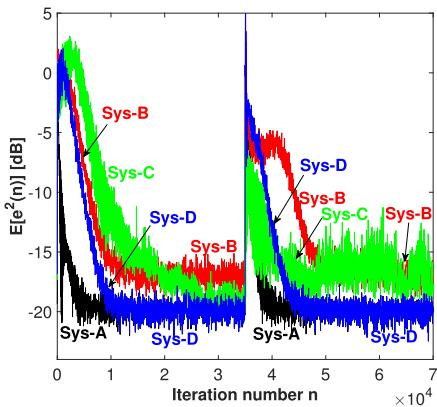  
(a) $E [ e ^ { 2 } ( n ) ]$

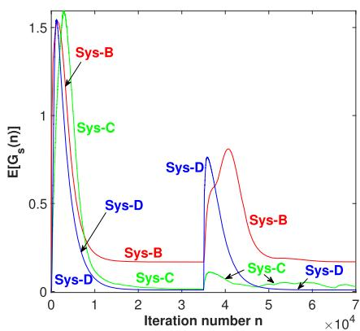  
(b) Scaling factor $E [ G _ { s } ( n ) ]$

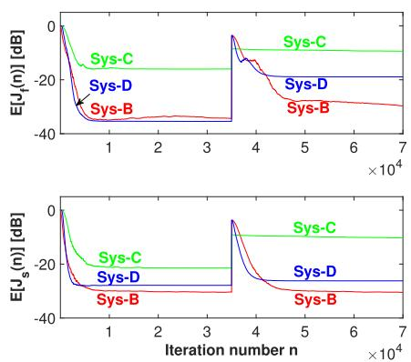  
(c) $E [ J _ { f } ( n ) ]$ and $E [ J _ { s } ( n ) ]$

Fig. 5. Comparisons among the four systems (Case 1).  
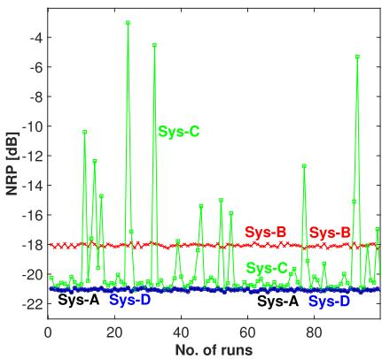  
(d) NRPs (2nd half).

Table 3  
Steady-state powers of signals related to the OFBPM and OSPM versus the step size $\mu _ { 2 }$ for a fixed additive noise power $\sigma _ { p } ^ { 2 } ~ ( = 0 . 0 1 )$  
Steady-state powers of signals related to the OFBPM and OSPM versus the additive noise power $\sigma _ { p } ^ { 2 }$ for a fixed step size $\mu _ { 2 } ~ ( = 5 \mu _ { c } = 0 . 0 0 1 5 )$

<table><tr><td colspan="4">OFBPM side</td><td colspan="4">OSPM side</td></tr><tr><td></td><td> $\mu_2 = 2\mu_c$ =0.0006</td><td> $\mu_2 = 5\mu_c$ =0.0015</td><td> $\mu_2 = 10\mu_c$ =0.003</td><td></td><td> $\mu_2 = 2\mu_c$ =0.0006</td><td> $\mu_2 = 5\mu_c$ =0.0015</td><td> $\mu_2 = 10\mu_c$ =0.003</td></tr><tr><td> $\sigma_x^2$ </td><td>2.0331</td><td>2.0524</td><td>2.0658</td><td> $\sigma_e^2$ </td><td>0.0103</td><td>0.0103</td><td>0.0103</td></tr><tr><td> $\sigma_s^2$ </td><td>2.0003</td><td>2.0003</td><td>2.0003</td><td> $\hat{\sigma}_p^2$ </td><td>0.0100</td><td>0.0100</td><td>0.0100</td></tr><tr><td> $\sigma_b^2$ </td><td>0.0010</td><td>0.0010</td><td>0.0010</td><td> $\sigma_{e_r}^2$ </td><td>2.49e-4</td><td>2.48e-4</td><td>2.49-4</td></tr><tr><td> $\sigma_{v_1}^2$ </td><td>4.23e-9</td><td>4.68e-8</td><td>2.25e-7</td><td> $\sigma_{v_s}^2$ </td><td>4.69e-7</td><td>2.97e-6</td><td>1.33e-5</td></tr><tr><td> $\sigma_{y_1}^2$ </td><td>0.0102</td><td>0.0156</td><td>0.0172</td><td> $\sigma_{y_2}^2$ </td><td>2.41e-4</td><td>6.24e-4</td><td>0.0013</td></tr><tr><td>—</td><td>—</td><td>—</td><td>—</td><td> $\sigma_{v_{s\bar{t}}}^2$ </td><td>8.50e-10</td><td>5.64e-9</td><td>3.13e-8</td></tr></table>

A1 The power of $v _ { 1 } ( n ) ( \sigma _ { v _ { 1 } } ^ { 2 } )$ is, at most, 3.24 % of the power of $x _ { b } ( n )$ $( \sigma _ { b } ^ { 2 } )$ . The unneutralized secondary source $\bar { y } _ { 1 } ( n )$ is basically a si nusoidal signal whose power $\sigma _ { \bar { y } _ { 1 } } ^ { 2 }$ is, at most, 0.86 % of the power of narrowband noise source $x _ { s } ( n ) \ : ( \sigma _ { s } ^ { 2 } )$

A2 The residual error ??(??) consists of three independent components, namely $v _ { p } ( n ) , e _ { r } ( n ) ;$ , and $v _ { s } ( n )$ . The $v _ { p } ( n )$ ) occupies more than 97.09 % power of the residual error. And, $e _ { r } ( n )$ and $v _ { s } ( n )$ are too small and negligible as compared to $v _ { p } ( n )$

The unneutralized AWGN, $v _ { s \hat { s } } ( n )$ with power $\sigma _ { v _ { s } } ^ { 2 }$ , that resides in the OSPM error $e _ { s } ( n )$ is negligible with respect to the new SF $H _ { 2 } ( z )$ output $y _ { 2 } ( n )$

As a result, the approximations and assumptions introduced in Section 3.2, i.e., (44), (50) and (51) hold fairly well for quite a wide range of operating conditions.

<table><tr><td colspan="4">OFBPM side</td><td colspan="4">OSPM side</td></tr><tr><td></td><td> $\sigma_{p}^{2}=0.025$ </td><td> $\sigma_{p}^{2}=0.25$ </td><td> $\sigma_{p}^{2}=0.50$ </td><td></td><td> $\sigma_{p}^{2}=0.025$ </td><td> $\sigma_{p}^{2}=0.25$ </td><td> $\sigma_{p}^{2}=0.50$ </td></tr><tr><td> $\sigma_{x}^{2}$ </td><td>2.0520</td><td>2.0278</td><td>2.0115</td><td> $\sigma_{e}^{2}$ </td><td>0.0254</td><td>0.2535</td><td>0.5101</td></tr><tr><td> $\sigma_{s}^{2}$ </td><td>2.0003</td><td>2.0003</td><td>2.0003</td><td> $\hat{\sigma}_{p}^{2}$ </td><td>0.0250</td><td>0.2500</td><td>0.4999</td></tr><tr><td> $\sigma_{b}^{2}$ </td><td>0.0010</td><td>0.0010</td><td>0.0010</td><td> $\sigma_{e_{r}}^{2}$ </td><td>3.45e-4</td><td>0.0018</td><td>0.0034</td></tr><tr><td> $\sigma_{v_{1}}^{2}$ </td><td>2.64e-7</td><td>9.49e-6</td><td>3.24e-5</td><td> $\sigma_{v_{s}}^{2}$ </td><td>1.76e-5</td><td>0.0017</td><td>0.0067</td></tr><tr><td> $\sigma_{y_{1}}^{2}$ </td><td>0.0151</td><td>0.0074</td><td>0.0028</td><td> $\sigma_{y_{2}}^{2}$ </td><td>0.0015</td><td>0.0150</td><td>0.0301</td></tr><tr><td>—</td><td>—</td><td>—</td><td>—</td><td> $\sigma_{v_{s\bar{t}}}^{2}$ </td><td>6.71e-8</td><td>5.63e-5</td><td>4.57e-4</td></tr></table>

Now, three representative comparisons are provided. Specifically, 1) the scaling factor $G _ { s } ( \infty )$ (85) with respect to $\alpha _ { d }$ and $\beta _ { d } ~ ( \mathrm { F i g . } ~ 6 ) , 2 )$ the second SF output power $E [ y _ { \gamma } ^ { 2 } ( \infty ) ]$ (84) with respect to the step size $\mu _ { 2 }$ (Fig. 7), and 3) the residual error power $E [ e ^ { 2 } ( \infty ) ]$ (86) with respect to the additive noise variance $\sigma _ { p } ^ { 2 }$ (Fig. 8). Note that in these comparisons the other parameters are the same as in the Table 2.

Third, the robustness of the Sys-B, Sys-C and Sys-D are investigated against the FBP and SP random variations (second half) that are modeled by

$$
\mathbf {s} _ {f} = \mathbf {s} _ {f, o} + \tau \sigma_ {f b p} \mathbf {d} _ {f}\tag{88}
$$

$$
\sigma_ {f b p} = \sqrt {\frac {1}{M _ {f}} \sum_ {m = 0} ^ {M _ {f} - 1} \left(s _ {f , m} - \bar {s} _ {f}\right) ^ {2}}, \bar {s} _ {f} = \frac {1}{M _ {f}} \sum_ {m = 0} ^ {M _ {f} - 1} s _ {f, m}\tag{89}
$$

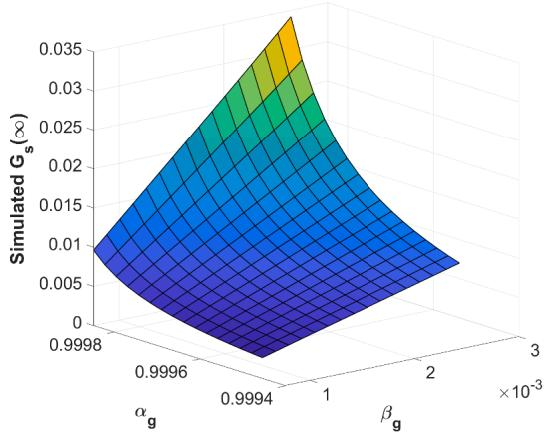  
(a) Simulated scaling factor surface.

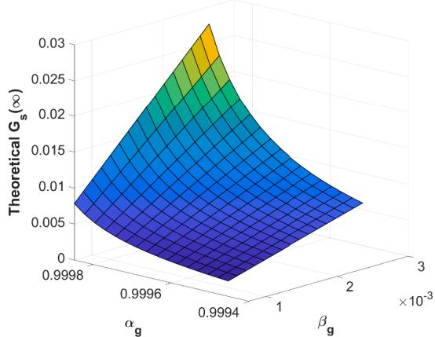  
(b) Theoretical scaling factor surface by (85).

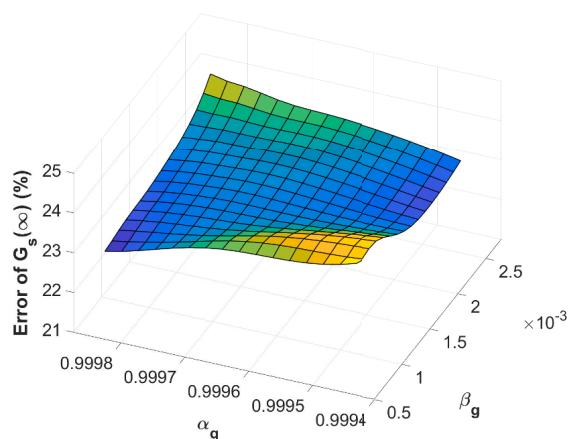  
(c) Error surface.

Fig. 6. Simulated and theoretical scaling factors and their errors (%).  
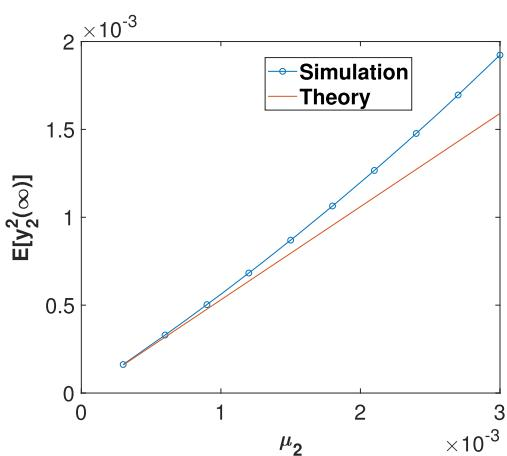  
Fig. 7. Theoretical second SF output power (84) and its simulated values.

$$
\mathbf {s} = \mathbf {s} _ {o} + \tau \sigma_ {s p} \mathbf {d} _ {s}
$$

$$
\sigma_ {s p} = \sqrt {\frac {1}{M _ {s}} \sum_ {m = 0} ^ {M _ {s} - 1} (s _ {m} - \bar {s}) ^ {2}}, \bar {s} = \frac {1}{M _ {s}} \sum_ {m = 0} ^ {M _ {s} - 1} s _ {m}\tag{90}
$$

(91)

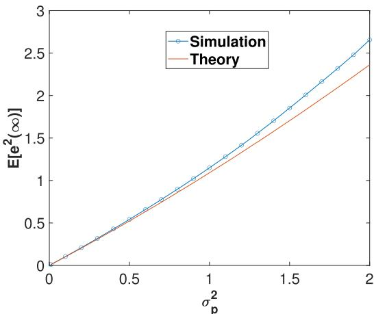  
Fig. 8. Theoretical residual error power (86) and its simulated values.

where ${ \bf s } _ { f , o }$ and ${ \bf s } _ { o }$ denote the nominal (fixed) coeficient vectors, ${ \bf s } _ { f }$ and ?? denote the coeficient vectors with variations on top of their nominal vectors ${ \bf s } _ { f , o }$ and ${ \bf s } _ { o } , { \bf d } _ { f }$ and ${ \bf d } _ { s }$ denote an $M _ { f } \times 1$ and an $M _ { s } \times 1$ zero-mean random vectors with unit variance, for the FBP (?? (??)) and SP (??(??)), respectively, and $\tau \left( \in [ - \tau _ { 0 } , \tau _ { 0 } ] , \tau _ { 0 } \colon \right.$ a positive constant, say, 3 or larger) denotes a random variation rate that is changed to implement diferent degree of variations with the FBP and SP. The simulation results are shown in the following Figs. 9 and 10. Note that 1) for each $\tau ,$ a hundred (100) runs were performed, 2) diferent random vectors ${ \bf d } _ { f }$ and ${ \bf d } _ { s }$ were adopted in every run, and 3) 100 random vectors of $\mathbf { d } _ { f }$ and ${ \bf d } _ { s }$ were repeatedly used for every ??. Fig. 9 shows the NRPs of the three systems versus the random variation rate ??. The coeficients of a nominal and a largely varying (?? = 3) SP and FBP are provided in Fig. 10. From these two figures, one may have the following observations: 1) If one checks the NRP values in Fig. 9, starting from $\tau = 0$ and moving to the right and then to the left for each system, a range of ?? will be found, over which the system is always convergent and meanwhile the NRP diference of 2 adjacent points is very small, say less than 0.40 dB. Three ranges of $\tau ,$ namely [−1.5, 1.5], [−1.25, 0.75] and [−4.25, 3.25], are found from Fig. 9 for the Sys-B, ${ \mathrm { S y s – C } } ,$ and Sys-D, respectively. Obviously, the range of Sys-D has the largest width, implying that the Sys-D enjoys the highest robustness against the random variations with the FBP and SP, whilst the Sys-C presents the poorest robustness and stability. 2) As expected, the robustness of the three systems decreases and even breaks down, as the absolute random variation rate gets larger.

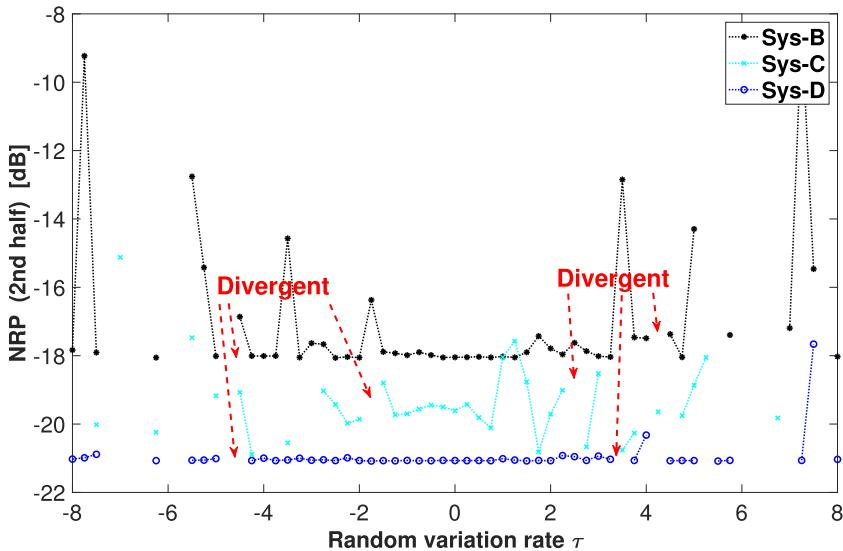  
Fig. 9. NRPs of the Sys-B, Sys-C, and Sys-D with respect to the random variation rate ?? (Case 1).

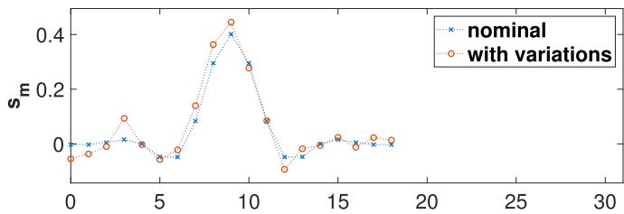

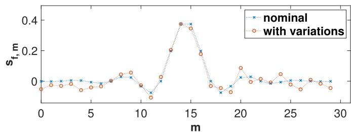  
Fig. 10. An example of coeficients of the nominal and largely varying SP and FBP $( \tau = 3 ,$ , top: SP, bottom: FBP, Case 1).

Fourth, as the noise source coloration may largely afect the system NRP, investigating how the ANC systems are afected by diferent noise source is very important. In this case, the 5 sinusoids considered in Case 1 are replaced by a correlated signal that is generated by the following AR(1) model:

$$
x _ {s} (n) = c x _ {s} (n - 1) + r _ {s} (n)\tag{92}
$$

where ?? (∈ (−1, 1)) denotes the AR(1) model coeficient and $r _ { s } ( \boldsymbol { n } )$ denotes a zero-mean white noise with unit variance. The coeficient ?? directly defines the color (spectrum) of the noise source. Diferent value of ?? gives the noise source diferent color. The ?? (??) in (92) is adjusted to have the same power that the five sinusoids possesses, before it is used in each run. To allow the Sys-B and Sys-D to have a good and similar convergence for all the 100 runs, their AWGN forgetting factor ?? and $\alpha _ { d }$ are reduced to 0.9985, with other simulation conditions exactly the same as in Table 2. Fig. 11 shows, as examples, the mean residual errors of Sys-A, Sys-B and Sys-D $( c = - 0 . 3$ and 0.3). The mean residual errors and powers of the three systems are checked over the range [−0.5, 0.5] of ?? where the three systems all converged for the 100 runs. The NRPs are given in Fig. 12. It can be observed from these two figures that 1) the Sys-B and Sys-D present quite similar convergence rate over $c \in [ - 0 . 5 , 0 . 5 ] _ { \scriptscriptstyle ; }$ implying that a fair NRP comparison can be made between them, 2) the AR(1) coeficient ?? or the noise source color does afect the NRPs of the three systems, 3) the Sys-D outperforms the Sys-B in terms of NRP by a margin of 4.14 to 7.02 dB, 4) the $\tt S y s – B$ and $\tt S y s – D$ are much inferior to the Sys-A with perfect FBP and SP estimates, as they are set to converge quite fast despite the existence of both OFBPM and OSPM.

Fifth, an ablation study is conducted. A version of the proposed system (Sys-D) without the new SF $H _ { 2 } ( z )$ is also simulated. In this version, the controller $W ( z )$ and AWGN scaling factor $G _ { s } ( n )$ are updated by us ing of the OSPM error $e _ { s } ( n )$ . All the other parameters are unchanged. Table 5 shows the NRPs of 5 systems, namely the Sys-A, Sys-B, Sys-C, Sys-D without $H _ { 2 } ( z )$ , and Sys-D, with respect to the clean primary noise $p _ { r } ( n )$ to the additive noise $v _ { p } ( n )$ ratio (SNR). Note that the Sys-B and Sys-$\mathsf { C }$ present poor stability when the SNR becomes as small as 10 and 7 dB, and about 20 runs of them are divergent. Their convergent runs are used to obtain their mean NRP values. However, the Sys-D with and without $H _ { 2 } ( z )$ are always convergent for all 100 runs. From Table 5, it is clear that the Sys-D outperforms its ablated version by a margin of about 0.3 to 5.0 dB. The smaller is the SNR, the larger is the margin of NRP. It is therefore strongly suggested that the new SF $H _ { 2 } ( z )$ plays a crucial role in the Sys-D.

Sixth, to show the efectiveness of the modified global AWGN scaling scheme, related quantities are also obtained and provided in Table $^ { 6 , }$ including the injected AWGN power, AWGN leakage into the residual error, path-modeling quality (OFBPM and OSPM MSEs), AWGN scaling factor, etc. These quantities explicitly show the efectiveness of the modified global AWGN scaling strategy. One sees clearly from Table 6 that, among the three systems, a) the power of scaled AWGN ??(??) in Sys-D, $\sigma _ { v } ^ { 2 } ,$ , is the smallest, and the same is true with the $v _ { s } ( n )$ power $\sigma _ { v _ { c } } ^ { 2 }$ , b) the steady-state scaling factor $G _ { s } ( \infty )$ of Sys-D is also the smallest, c) the

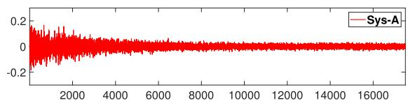

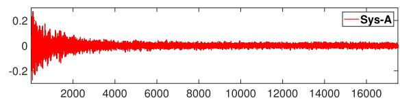

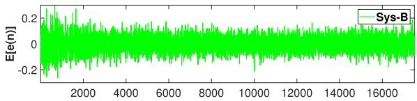

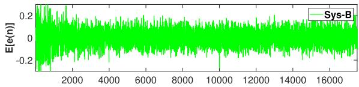

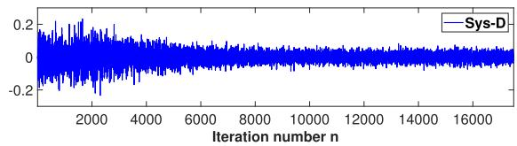

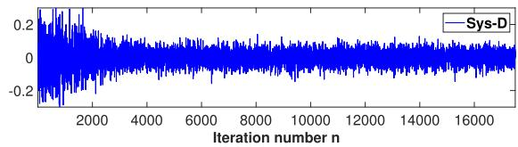  
Fig. 11. Mean residual errors of the Sys-A, Sys-B and Sys-D for AR(1) model generated noise source $x _ { s } ( n )$ (left: $\begin{array} { r } { c = - 0 . 3 , } \end{array}$ right: $c = 0 . 3 ,$ Case 1).

NRPs [dB] of the five FFANC systems with respect to the target noise to additive noise ratio (Case 1).

<table><tr><td> $\sigma_{p,r}^{2}/\sigma_{p}^{2}$ </td><td></td><td>Sys-A</td><td>Sys-B</td><td>Sys-C</td><td>Sys-D wo  $H_2(z)$ </td><td>Sys-D</td></tr><tr><td rowspan="2">130(SNR≈21 dB)</td><td>1st half</td><td>-21.0778</td><td>-18.0569</td><td>-20.0539</td><td>-20.7592</td><td>-21.0708</td></tr><tr><td>2nd half</td><td>-21.0779</td><td>-18.0515</td><td>-19.9087</td><td>-20.7615</td><td>-21.0646</td></tr><tr><td rowspan="2">50(SNR≈17 dB)</td><td>1st half</td><td>-17.0261</td><td>-14.0067</td><td>-16.4873</td><td>-16.2524</td><td>-17.0121</td></tr><tr><td>2nd half</td><td>-17.0247</td><td>-14.0139</td><td>-16.5269</td><td>-16.2609</td><td>-17.0059</td></tr><tr><td rowspan="2">20(SNR≈13 dB)</td><td>1st half</td><td>-13.1894</td><td>-10.1682</td><td>-12.8754</td><td>-11.4608</td><td>-13.1560</td></tr><tr><td>2nd half</td><td>-13.1865</td><td>-10.1754</td><td>-12.6169</td><td>-11.4785</td><td>-13.1489</td></tr><tr><td rowspan="2">10(SNR=10dB)</td><td>1st half</td><td>-10.3863</td><td>-7.3627</td><td>-10.0162</td><td>-7.3687</td><td>-10.3200</td></tr><tr><td>2nd half</td><td>-10.3823</td><td>-7.3698</td><td>-10.0092</td><td>-7.3948</td><td>-10.3129</td></tr><tr><td rowspan="2">5(SNR≈7 dB)</td><td>1st half</td><td>-7.7559</td><td>-4.7275</td><td>-7.1463</td><td>-2.5864</td><td>-7.6241</td></tr><tr><td>2nd half</td><td>-7.7507</td><td>-4.7340</td><td>-7.2067</td><td>-2.6135</td><td>-7.6183</td></tr></table>

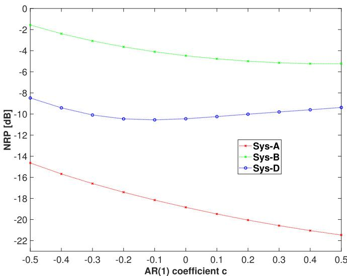  
Fig. 12. NRPs of the Sys-A, Sys-B and Sys-D with respect to the coeficient ?? of AR(1) model that is used to generate the colored noise source ?? (??) (Case 1).

Table 6  
Steady-state quantities (powers and MSEs) of related signals and path modeling MSEs for three FFANC systems (Case 1).

<table><tr><td></td><td>Sys-B</td><td>Sys-C</td><td>Sys-D</td></tr><tr><td> $\sigma_{v}^{2}$ </td><td>0.0288</td><td>0.0142</td><td>8.6018e-5</td></tr><tr><td> $\sigma_{v_s}^{2}$ </td><td>0.0103</td><td>0.0051</td><td>3.0905e-5</td></tr><tr><td> $J_{f}(\infty)$  [dB]</td><td>-32.1138</td><td>-12.1654</td><td>-22.4318</td></tr><tr><td> $J_{s}(\infty)$  [dB]</td><td>-33.2177</td><td>-13.1534</td><td>-28.6883</td></tr><tr><td> $G_{s}(\infty)$ </td><td>0.1698</td><td>0.0340</td><td>0.0093</td></tr><tr><td>NRP [dB]</td><td>-18.0523</td><td>-19.4970</td><td>-21.0624</td></tr><tr><td> $\sigma_{e_r}^{2}$ </td><td>2.4640e-4</td><td>0.0145</td><td>2.2578e-4</td></tr></table>

Sys-B shows the best OFBPM and OSPM quality, d) the Sys-D cancels the clean primary noise $p _ { r } ( n )$ even better than the Sys-B (refer to the values of $\sigma _ { e _ { r } } ^ { 2 } ) ,$ , despite that its OFBPM and OSPM quality is lower than that of the Sys-B. This agrees with our empirical understanding that the FFANC NRP is quite insensitive to the estimated FBP and SP if their modeling MSEs are below some level such as -15 or -20 dB. That is to say, the NRP can not be further improved when the OFBPM and OSPM estimates are already very accurate, and the injected AWGN reduction becomes more important in improving the system overall NRP.

## B Case 2

In this case, the primary noise and the three paths (PP, FBP and SP) are particularly set identical to those adopted in [26]. The three paths are actually the FIR estimates of the three real IIR paths that are provided in [1]. Simulation conditions and NRPs are summarized in Table 7. Simulation results similar to Fig. 5 are shown in Fig. 13.

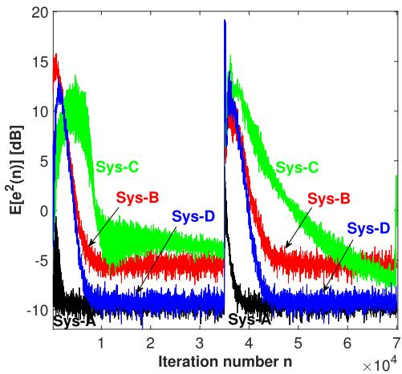  
(a) $E [ e ^ { 2 } ( n ) ]$

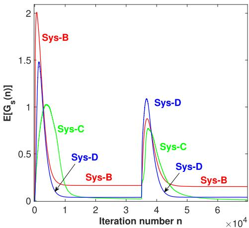  
(b) Scaling factor $E [ G _ { s } ( n ) ]$

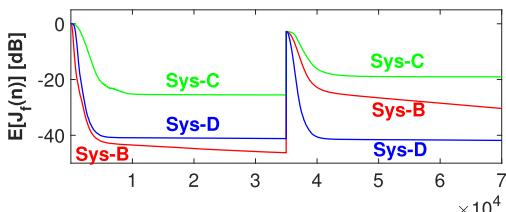

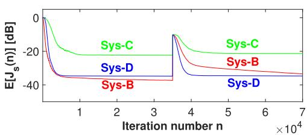  
(c) $E [ J _ { f } ( n ) ]$ and $E [ J _ { s } ( n ) ]$

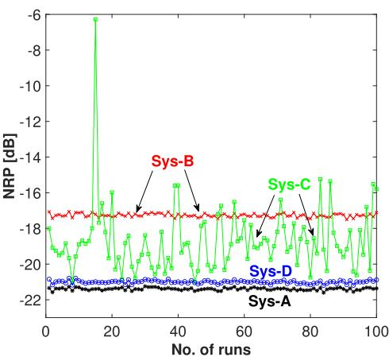  
(d) NRPs (2nd half).  
Fig. 13. Comparisons among the four systems (Case 2).

## C Case 3

In this case, a real noise signal and three real IIR paths [1] are used. A road noise of a hybrid car that was running at the eco mode was recorded and is used as the reference signal in the simulations. The sampling frequency is 4 kHz. The recording setting and the road noise spectrum are shown in Fig. 14. Clearly, the road noise is of broadband nature. The Sys-C that is only capable of reducing narrowband noise is not compared in this case.

In the middle of the adaption process of 240,000 samples long, abrupt changes are set to happen with both the FBP and SP simultaneously, i.e., the FBP and SP suddenly change to two diferent timeinvariant IIR filters. As seen from Fig. 9, the Sys-B and Sys-D do possess robustness against the FIR-type FBP and SP variations. However, when the FBP and SP are of IIR nature and change suddenly, the Sys-B becomes very vulnerable such that there is almost no chance for it to converge in the second half. To make it survive, one has to initialize its OFBPM and OSPM filters in exactly the same way that their initial weights are set at the beginning of the first half. In other words, very good estimates of the true FBP and SP for the second half are assumed known in advance and are used to initialize the OFBPM and OSPM filters. The Sys-B was simulated in this way in Case 3 for the sake of comparison with the Sys-A and Sys-D. However, the initialization in the second half is hardly practical in real applications as one does not know when the abrupt changes happen and the FBP and SP estimates for the second half are unavailable. The Sys-D is also quite vulnerable against the abrupt changes with the IIR-type FBP and SP. It is also very hard to find a good set of user parameters that allow the Sys-D to survive in the second half.

To take care of the drastic changes with the ANC paths, we used an OSPM refreshment scheme that is proposed in [16]. The smoothed residual error power $P _ { e } ( n )$ is calculated by

$$
P _ {e} (n) = \lambda_ {m} P _ {e} (n - 1) + (1 - \lambda_ {m}) e ^ {2} (n)\tag{93}
$$

where $\lambda _ { m }$ (∈ (0, 1)) is another forgetting factor that is set close to 1, say, 0.98, 0.99, etc. The $P _ { e } ( n )$ is summed over a time window $T _ { p }$ and smoothed again at a time instant $n ^ { \prime } T _ { p } ,$ , as follows:

$$
P _ {e, T} (n ^ {\prime}) = \lambda_ {m} P _ {e, T} (n ^ {\prime} - 1) + (1 - \lambda_ {m}) \sum_ {k = 0} ^ {T _ {p} - 1} P _ {e} (n - k)\tag{94}
$$

where $n ^ { \prime }$ is a positive integer. $T _ { p }$ is set between 5 and 50. The system refreshment is executed, if

$$
P _ {e, T} (n ^ {\prime}) \geq \alpha_ {h} P _ {e, T} (n ^ {\prime} - 1)\tag{95}
$$

where $\alpha _ { h }$ (∈ (1, 2)) is a threshold parameter that may be set between 1.05 and 2.00. Note that all related signals and filter weights are set to zeros when the Sys-D is refreshed.

Simulation conditions and NRPs are summarized in Table 8. Simulation results similar to Figs. 5 and 13 are provided in Fig. 15. Note that the OSPM and OFBPM MSEs are evaluated approximately, with two wellidentified, 84-long FIR estimates for the real IIR SP and FBP used as the SP and FBP truth.

  
(a) Recording equipment.

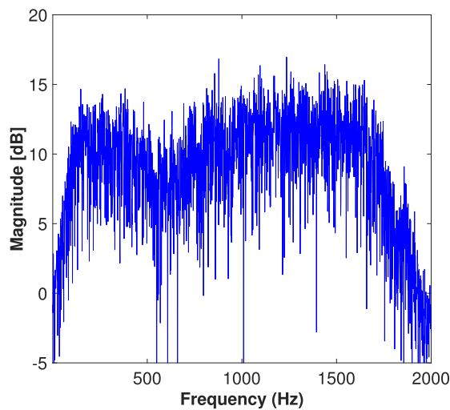  
(b) Road noise spectrum.  
Fig. 14. Recording setting and spectrum for the road noise (Case 3).

Table 7

<table><tr><td colspan="2">Simulation conditions and the NRPs (Case 2).</td></tr><tr><td>Noise signals</td><td> $x_s(n)$ : same as the Case 1. $x_b(n)$ : white noise with  $\sigma_b^2 = 0.002$ .Additive white noise:  $\sigma_p^2 = 0.1$ .</td></tr><tr><td>Common setting</td><td> $P(z), S(z), F(z)$ : FIR estimates [26] obtained from three real IIR paths given in [1], having lengths  $M_p = 48, M_s = 16$ , and  $M_f = 32$ .AWGN  $v_o(n)$ :  $\sigma_o^2 = 1.0$ .Adaptation length:  $N = 70000$ .NRP evaluation: last 7000 samples.Number of runs: 100.OSPM:  $\hat{M}_s = 18$ , OFBPM:  $\hat{M}_f = 35$ .</td></tr><tr><td>Sys-A[1]</td><td> $W(z): L_c = 32, \mu_c = 0.00003$ .NRPs [dB]: -21.38 (1st half), -21.39 (2nd half).Running time (s): 1.66e-5 (per iteration)</td></tr><tr><td>Sys-B[26]</td><td> $W(z)$ : same as the Sys-A.OSPM:  $\mu_s = 0.001$ , OFBPM:  $\mu_f = 0.001$ .AWGN:  $\alpha = 0.9992, \gamma = 0.001, \lambda = 0.998$ .SF  $H_1(z): L_1 = 35, \mu_1 = 0.0005$ .NRPs [dB]: -17.29 (1st half), -17.27 (2nd half).Running time (s): 6.43e-5 (per iteration)</td></tr><tr><td>Sys-C[32]</td><td>Controller (MPAs):  $q = 5, \mu_c = 0.00014$ .OSPM:  $\mu_s = 0.001$ , OFBPM:  $\mu_f = 0.001$ .AWGN:  $\alpha_c = 0.9991, \beta_c = 0.00005, \gamma_c = 2$ .CANFB:  $\rho_{\min} = 0.95, \rho_{\max} = 0.98, \alpha_\rho = 0.999$ , $\rho(n) = \alpha_\rho \rho(n-1) + (1 - \alpha_\rho) \rho_{\max}, \rho(0) = \rho_{\min}$ , $\epsilon = 0.008, \lambda = 0.985, \mu_N = 0.00015$ .NRPs [dB]: -16.38 (1st half), -18.71 (2nd half)Running time (s): 6.62e-5 (per iteration)</td></tr><tr><td>Sys-D(proposed system)</td><td> $W(z): L_c = 32, \mu_c = 0.00005$ .OSPM:  $\mu_s = 0.0015$ , OFBPM:  $\mu_f = 0.002$ .AWGN:  $\alpha_d = 0.9992, \beta_d = 0.00085, \gamma_d = 1$ .SF  $H_1(z): L_1 = 35, \mu_1 = 0.0005$ .SF  $H_2(z): L_2 = 32, \mu_2 = 0.0005$ NRPs [dB]: -21.05 (1st half), -21.00 (2nd half)Running time (s): 3.69e-5 (per iteration)</td></tr></table>

## 4.2. Discussions

From the simulation results in Figs. 5–8, 13 and 15 as well as Tables 2, 7 and 8, the following observations and insights are obtained for the proposed system, regarding its NRP merits and the accuracy of the approximate closed-form expressions.

D1 The proposed FFANC system (Sys-D) significantly outperforms the two existing FFANC systems (Sys-B and Sys-C) in terms of the mean residual error power and the NRP, as noted from Figs. 5(a), (d), 13(a), (d) and 15(b), (e). Its convergence is slightly faster than or comparable to that of the Sys-B and Sys-C, but its NRPs are the best for each of the 100 runs.

Table 8  
Simulation conditions and the NRPs (Case 3).

<table><tr><td colspan="2">Simulation conditions and the NRPs (Case 3).</td></tr><tr><td>Noise signals</td><td> $x_{r}(n)$ : a real road noise of a hybrid car.Additive white noise:  $v_{p}(n)$  with  $\sigma_{p}^{2} = 2\%$  of the power of  $p(n)$ .</td></tr><tr><td>Common setting</td><td> $P(z), S(z)$  and  $F(z)$ :real IIR paths given in [1].AWGN  $v_{o}(n)$ :  $\sigma_{o}^{2} = 0.5$ .Adaptation length:  $N = 240000$ .NRP evaluation: last 20,000 samples.Number of runs: 100.OSPM:  $\hat{M}_{s} = 128$ , OFBPM:  $\hat{M}_{f} = 128$ .Refreshment scheme parameters (Sys-B, Sys-D):  $\lambda_{m} = 0.98$ ,  $T_{p} = 10$ ,  $\alpha_{h} = 1.50$ .</td></tr><tr><td>Sys-A[1]</td><td> $W(z): L_{c} = 188, \mu_{c} = 0.0009$ .NRP [dB]: -14.31 (1st half), -13.15 (2nd half).Running time (s): 1.89e-5 (per iteration)</td></tr><tr><td>Sys-B[26]</td><td> $W(z): L_{c} = 188, \mu_{c} = 0.00012$ .OSPM:  $\mu_{s} = 0.0055$ , OFBPM:  $\mu_{f} = 0.0050$ .AWGN:  $\alpha = 0.9995, \gamma = 0.0005, \lambda = 0.998$ .SF  $H_{1}(z)$ :  $L_{1} = 128, \mu_{1} = 0.0012$ .NRP [dB]: -8.13 (1st half), -7.82 (2nd half).Running time (s): 8.85e-4 (per iteration)</td></tr><tr><td>Sys-D</td><td> $W(z): L_{c} = 188, \mu_{c} = 0.00025$ .OSPM:  $\mu_{s} = 0.0060$ , OFBPM:  $\mu_{f} = 0.0060$ .AWGN:  $\alpha_{d} = 0.99925, \beta_{d} = 0.00085, \gamma_{d} = 2$ .SF  $H_{1}(z)$ :  $L_{1} = 128, \mu_{1} = 0.0060$ .SF  $H_{2}(z)$ :  $L_{2} = 218, \mu_{2} = 0.0135$ .NRP [dB]: -11.94 (1st half), -12.52 (2nd half).Running time (s): 1.04e-4 (per iteration)</td></tr></table>

D2 The steady-state scaling factor of the Sys-D is slightly smaller than or comparable to that of the ${ \mathrm { S y s – C } } ,$ but much smaller than that of the ${ \mathrm { S y s – C } } ,$ suggesting that the injected AWGN in Sys-D contributes much less to the residual noise as seen in Figs. 5(b), 13(b), and 15(c).

D3 From Figs. 5(c), 13(c), and 15(d), one can readily notice that the convergence rate of the mean OSPM and OFBPM MSEs of the proposed system is similar to the Sys-B and faster than the Sys-C in Cases 1 and 2, but somewhat slower than the Sys-B in Case 3. The steady-state mean OSPM and OFBPM MSEs of the proposed system is comparable to or larger than the Sys-B, but superior to the Sys-C by a big margin. Since the Sys-B is given significant privileges in its OSPM and OFBPM initialization to avoid its vulnerability in the AWGN scheduling, its advantage in the OSPM and OFBPM over the proposed system is obviously quite limited.

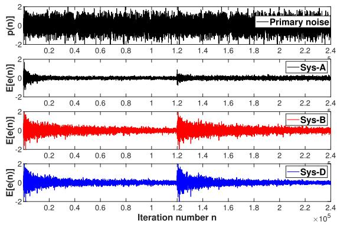  
(a) $E [ e ( n ) ]$

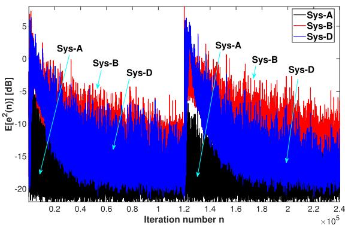  
(b) $E [ e ^ { 2 } ( n ) ]$

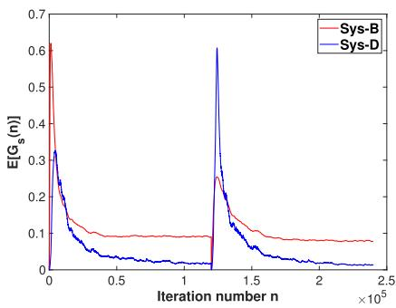

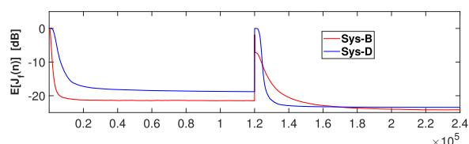

(c) Scaling factor $E [ G _ { s } ( n ) ]$  
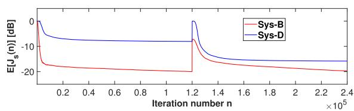  
(d) $E [ J _ { f } ( n ) ]$ and $E [ J _ { s } ( n ) ]$

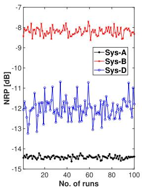

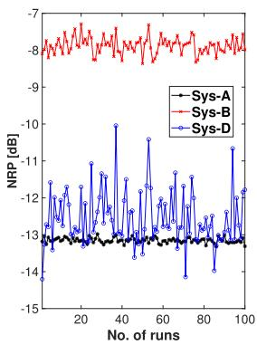  
(e) NRPs (left: 1st half, right: 2nd half)  
Fig. 15. Comparisons among the three systems (Case 3).

D4 The closed-form expressions (84)–(86) that are obtained in our approximate statistical analysis demonstrate as shown in Figs. 6–8, reasonable agreement with their simulated values, with the AWGN scaling factor error around 23 % and the diferences for the second SF output power and the residual error power around 15 %, over relatively wide ranges of user parameters. Higher analytical accuracy is definitely required in order to better understand the properties and convincingly show the advantages of the proposed system. Our approximate analysis in the close neighborhood of the system steady state seems to be the best that we could achieve in this work. Solid and in-depth analysis for the entire system is a challenging future research topic.

D5 As shown in Tables 2, 7 and 8, the running time of the Sys-D is smaller than that of both the Sys-B and Sys-C in the three simulation cases. This is because the Sys-B requires both divisions and square roots and the Sys-C also requires divisions, but the Sys-D does not need any divisions and square roots. Note that this comment makes sense only for the system settings provided in Tables 2, 7 and 8.

D6 In the Case 3, the refreshment scheme was used to tackle the abrupt changes with both the IIR FBP and IIR SP. It worked well in the Sys-D. It also functioned in the Sys-B, provided that reliable estimates of FBP and SP for the second half were available in advance. However, the refreshment scheme is not a panacea. It will fail if the other user parameters such as ??, $\gamma , \alpha _ { d } , \beta _ { d } ,$ , etc. are not properly set. Further eforts are required to improve the robustness of the proposed system.

## 5. Conclusions

A robust FFANC system with simultaneous OSPM and OFBPM has been proposed to deal with the SP and FBP variations. A new FIR supporting filter (SF) is included for the controller, whose output is used to not only update the controller but also drive the AWGN scaling. Consequently, the coupling between the FFANC controller and the OSPM subsystem is substantially reduced and the AWGN contributes significantly less to the residual error, as compared to the counterparts of the proposed system. In addition, an approximate statistical steady-state analysis for the new SF and the scaling scheme has been conducted, in some detail, to reveal their statistical properties. Three typical sets of simulation results under synthetic and real settings are provided to confirm the NRP superiority of the proposed system over its counterparts in the presence of SP and FBP variations. Future research topics include in-depth statistical analysis of the entire system, reduction of computational complexity by using of the advanced frequency-domain frameworks [39–41], and implementation in real applications, among others.

## CRediT authorship contribution statement

Yaping Ma: Writing – original draft, Software, Methodology, Conceptualization; Yegui Xiao: Writing – review & editing, Validation, Supervision, Investigation; Wenyi Wu: Writing – review & editing, Investigation, Data curation; Liying Ma: Writing – review & editing, Investigation; Khashayar Khorasani: Writing – review & editing, Investigation.

## Funding

This work was supported in part by the National Natural Science Foundation of China under Grant 62003149, the Natural Science Foundation of Jiangsu Province under Grant BK20200612, and the JSPS Grant-in-Aid for Scientific Research (C) under Grants 15K06117 and 18K04175.

## Declaration of competing interest

We declare that there is no conflict of interest regarding this work.

## Acknowledgments

The authors would like to express their cordially thanks to the Handling Editor and the three anonymous reviewers who have greatly helped improve presentation of this work.

## Data availability

Data will be made available on request.

## References

[1] S.M. Kuo, D.R. Morgan, Active Noise Control Systems - Algorithms and DSP Implementation, Wiley, New York, 1996.

[2] S.M. Kuo, D.R. Morgan, Active noise control: a tutorial review, Proc. IEEE 87 (6) (1999) 943–973.

[3] L. Lu, K. Yin, R.C. de Lamare, Z. Zheng, Y. Yu, X. Yang, B. Chen, A survey on active noise control in the past decade, Part I: linear systems, Signal Process. 183 (2021) 108039.

[4] J.C. Burgess, Active adaptive sound control in a duct: a computer simulation, J. Acoust. Soc. Amer. 70 (3) (1981) 715–726.

[5] L.J. Eriksson, M.C. Allie, Use of random noise for on-line transducer modeling in a adaptive active attenuation system, J. Acoust. Soc. Amer. 8 (2) (1989) 797–802.

[6] C. Bao, P. Sas, H.V. Brussel, Adaptive active control of noise in 3-D reverberant enclosures, J. Sound Vib. 161 (3) (1993) 501–514.

[7] S.M. Kuo, D. Vijayan, A secondary path modeling technique for active noise control systems, IEEE Trans. Speech Audio Process. 5 (4) (1997) 374–377.

[8] H. Lan, M. Zhang, W. Ser, An active noise control system using online secondary path modeling with reduced auxiliary noise, IEEE Signal Process. Letts. 9 (1) (2002) 16–18.

[9] M. Zhang, H. Lan, W. Ser, A robust online secondary path modeling method with auxiliary noise power scheduling strategy and norm constraint manipulation, IEEE Trans. Speech Audio Process. 11 (1) (2003) 45–53.

[10] M.T. Akhtar, M. Abe, M. Kawamata, A new variable step size LMS algorithm-based method for improved online secondary path modeling in active noise control systems, IEEE Trans. Audio, Speech Lang. Process. 12 (2) (2006) 720–726.

[11] A. Carini, S. Malatini, Optimal variable step-size NLMS algorithms with auxiliary noise power scheduling for feedforward active noise control, IEEE Trans. Audio Speech Lang. Process. 16 (8) (2008) 1383–1395

[12] Y. Xiao, L. Ma, K. Hasegawa, Properties of FXLMS-based narrowband active noise control with online secondary-path modeling, IEEE Trans. Signal Process. 57 (8) (2009) 2931–2949.

[13] Y. Xiao, M. Shadaydeh, R. Ward, A new strategy for auxiliary noise injection in narrowband active noise control, in: Proc. 2009 Int. Symp. Intell. Signal Process. Commun. Syst. (ISISPCS 2009), 2009, pp. 61–64.

[14] Y. Ma, Y. Xiao, A new strategy for online secondary-path modeling of narrowband active noise control, IEEE-ACM Trans. Audio Speech Lang. Process. 25 (2) (2017) 420–434.

[15] M.T. Akhtar, Narrowband feedback active noise control systems with secondary path modeling using gain-controlled additive random noise, Digital Signal Process. 11 (2021) 102976.

[16] Y. Ma, Y. Xiao, B. Huang, T. Bai, X. Tan, A robust feedback active noise control system with online secondary path modeling, IEEE Signal Process. Letts. 29 (2022) 1042–1046.

[17] T. Padhi, M. Chandra, A. Kar, Performance evaluation of hybrid active noise control system with online secondary path modeling, Appl. Acoust. 33 (2018) 215–226.

[18] Z. Wang, Y. Xiao, Y. Ma, L. Ma, K. Khorasani, A new hybrid active noise control system with input-power-controlled online secondary-path modeling, IEEE-ACM Trans. Audio Speech Lang. Process. 32 (2024) 3157–3170.

[19] P.A.C. Lopes, J.A.B. Gerald, Careful feedback active noise and vibration control algorithm robust to large secondary path changes, Eur. J. Control 75 (2024) 100905.

[20] C.C. Cheng, Z. Liu, W. Chen, X. Li, W. Liao, C. Lu, A multi-channel active noise control system using deep learning-based method to estimate secondary path and normalized-clustered control strategy for vehicle interior engine noise, Appl. Acoust. 228 (2025) 110263.

[21] S. Toyooka, Y. Kajikawa, Stable virtual sensing algorithm for active noise control with sequential online modeling of the auxiliary filter and the secondary path, IEICE Trans. Fundam. Electron. Commun. Comput. Sci. E109-A (1) (2026) 1–12

[22] L.J. Eriksson, Active Sound Attenuation System with On-Line Feedback Path Cancellation, U. S. Patent 4, 677 1987 677.

[23] S.M. Kuo, J. Luan, On-line modeling and feedback compensation for multiplechannel active noise control systems, Appl. Signal Process. 1 (1) (1994) 64– 75.

[24] S.M. Kuo, Active Noise Control System and Method for On-Line Feedback Path Modeling, U. S. Patent 6, 418 2002 227.

[25] M.T. Akhtar, W. Mitsuhashi, Variable step-size based method for acoustic feedback modeling and neutralization in active noise control systems, Appl. Acoust. 72 (5) (2011) 297–304.

[26] S. Ahmed, M.T. Akhtar, X. Zhang, Online acoustic feedback mitigation with improved noise-reduction performance in active noise control systems, IET Signal Process. 7 (6) (2013) 505–514.

[27] S. Ahmed, M.T. Akhtar, Gain scheduling of auxiliary noise and variable step-size for online acoustic feedback cancellation in narrowband active noise control systems, IEEE-ACM Trans. Audio Speech Lang. Process. 25 (2) (2017) 333–343

[28] T. Bai, Y. Xiao, J. Ding, J. Lin, Active noise control with online feedback-path modeling using adaptive notch filter, in: Proc. Int. Conf. Advanced Mechatronic System (ICAMechS), 2018, pp. 316–320

[29] M.S. Aslam, P. Shi, C.C. Lim, Self-adapting variable step size strategies for active noise control systems with acoustic feedback, Automatica 123 (2021) 109354.

[30] S.M. Kuo, D. Ill, Active Noise Control System and Method for On-Line Feedback Path Modeling and On-Line Secondary Path Modeling, US Patent 5, 940, 519 1999.

[31] Y. Xiao, T. Bai, L. Ma, K. Khorasani, Y. Ma, A narrowband active noise control system with simultaneous online secondary- and feedback-path modeling using adaptive IIR notch filter, in: Proc. the 26th International Congress on Sound and Vibration, 2019, pp. 8 pages.

[32] T. Bai, Z. Wang, Y. Xiao, Y. Ma, L. Ma, K. Khorasani, A multi-channel narrowband active noise control system with simultaneous online secondary- and feedback-path modeling, in: 2019 IEEE Asia Pacific Conference on Circuits and Systems (APCCAS), IEEE, 2019, pp. 289–292.

[33] M. Ferrer, M.D. Diego, A. Gonzalez, Filtered-X quasi afine projection algorithm for active noise control networks, IEEE-ACM Trans. Audio Speech Lang. Process. 32 (2024) 4237–4252.

[34] A.Q.J. Althahab, H. Ma, B. Vuksanovic, Addressing modeling errors in feedforward ANC systems: a new normalized semi-variable step size FxLMS algorithm, Appl Acoust. 233 (2025) 110602.

[35] S. Pei, C. Tseng, A novel structure for cascade form adaptive notch filters, Signa Process. 33 (1993) 95–110.

[36] W. Wu, Y. Xiao, J. Lin, L. Ma, K. Khorasani, An eficient filter bank structure for adap tive notch filtering and applications, IEEE-ACM Trans. Audio Speech Lang. Process. 29 (10) (2021) 3226–3241.

[37] B. Widrow, S.D. Stearns, Adaptive Signal Processing, Prentice-Hall PTR, 1985.

[38] J.R. Zeidler, E.H. Satorius, D.M. Chabries, H.T. Wexler, Adaptive enhancement of multiple sinusoids in uncorrelated noise, IEEE Trans. ASSP 26 (3) (1978) 240– 254.

[39] D. Shi, W.S. Gan, B. Lam, X. Shen, Comb-partitioned frequency-domain constraint adaptive algorithm for active noise control, Signal Process. 188 (2021) 108222.

[40] W. Chen, L. Xie, J. Guo, Z. Liu, X. Li, C. Lu, A computationally eficient feedforward time-frequency-domain hybrid active sound profiling algorithm for vehicle interior noise, Mechan. Syst. Signal Process. 194 (2023) 110279.

[41] Z. Zhou, S. Chen, H. Li, Y. Cai, Delayless partial subband update algorithm for feedforward active road noise control system in pure electric vehicles, Mechan. Syst Signal Process. 196 (2023) 110328.