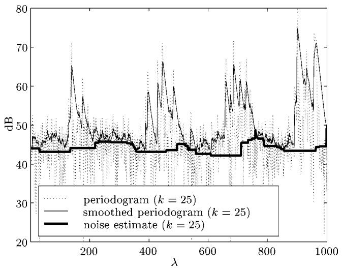
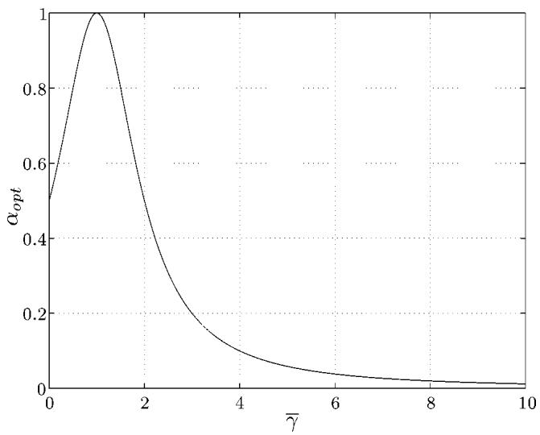
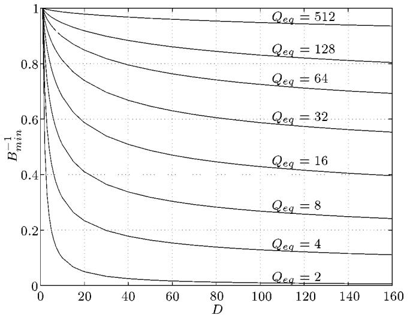
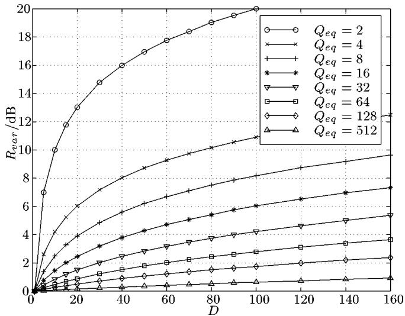
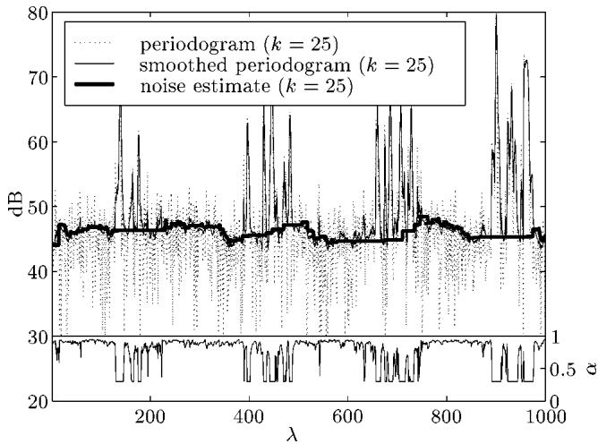
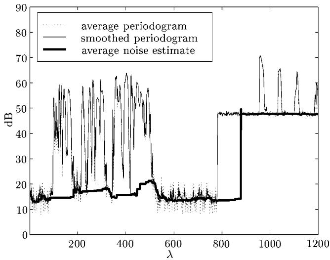

# Noise Power Spectral Density Estimation Based on Optimal Smoothing and Minimum Statistics

Rainer Martin, Senior Member, IEEE

Abstract—We describe a method to estimate the power spectral density of nonstationary noise when a noisy speech signal is given. The method can be combined with any speech enhancement algorithm which requires a noise power spectral density estimate. In contrast to other methods, our approach does not use a voice activity detector. Instead it tracks spectral minima in each frequency band without any distinction between speech activity and speech pause. By minimizing a conditional mean square estimation error criterion in each time step we derive the optimal smoothing parameter for recursive smoothing of the power spectral density of the noisy speech signal. Based on the optimally smoothed power spectral density estimate and the analysis of the statistics of spectral minima an unbiased noise estimator is developed. The estimator is well suited for real time implementations. Furthermore, to improve the performance in nonstationary noise we introduce a method to speed up the tracking of the spectral minima. Finally, we evaluate the proposed method in the context of speech enhancement and low bit rate speech coding with various noise types.

Index Terms—Minimum statistics, spectral estimation, speech enhancement.

# I. INTRODUCTION

WITH the advent and wide dissemination of mobile com-munications speech enhancement has found many new munications speech enhancement has found many new applications. In turn the interest in practical and powerful speech enhancement algorithms has grown considerably, and significant progress has been made [1], [2]. Yet, speech processing under adverse conditions is still a challenge. When the signal to noise ratio is low or the disturbing noise is nonstationary the results are plagued by speech distortions and unnatural sounding or fluctuating residual background noises.

Frequency domain speech enhancement systems typically consist of a spectral analysis/synthesis system, a spectral gain computation method, and a background noise power spectral density (psd) estimation algorithm. While the former two are well understood [1]–[3] and easily implemented the noise estimator has frequently received less attention. The noise estimator is, however, a very important component of the overall system, especially if the algorithm should be capable of handling nonstationary noise. In fact the noise estimator has a major impact on the overall quality of the speech enhancement Manuscript received March 31, 1999; revised February 28, 2001. This work was performed while the author was on leave at the Speech and Image Processing Services Research Lab, AT&T Labs—Research, Florham Park, NJ 07932 USA. The associate editor coordinating the review of this manuscript and approving it for publication was Dr. Shrikanth Narayanan.

R. Martin is with Institute of Communication Systems and Data Processing, Aachen University of Technology, D-52056 Aachen, Germany (e-mail: martin@ind.rwth-aachen.de).

Publisher Item Identifier S 1063-6676(01)04980-X.

system. If the noise estimate is too low, unnatural residual noise will be perceived. If the estimate is too high, speech sounds will be muffled and intelligibility will be lost. The traditional SNR based voice activity detectors (VAD) are difficult to tune and their application to low SNR speech results often in clipped speech. Current research [4]–[6] aims therefore at incorporating soft-decision schemes which are also capable of updating the noise psd during speech activity.

In this paper, we present a novel noise estimation algorithm which is based on an optimal signal psd smoothing method and on minimum statistics. The psd smoothing algorithm utilizes a first order recursive system with a time and frequency dependent smoothing parameter. The smoothing parameter is optimized for tracking nonstationary signals by minimizing a conditional mean square error criterion.

Speech enhancement based on minimum statistics was proposed in [7] and modified in [8]. In contrast to other methods the minimum statistics algorithm does not use any explicit threshold to distinguish between speech activity and speech pause and is therefore more closely related to soft-decision methods than to the traditional voice activity detection methods. Similar to soft-decision methods it can also update the estimated noise psd during speech activity. It was recently confirmed [9] that the minimum statistics algorithm [7] performs well in nonstationary noise.

The minimum statistics method rests on two observations namely that the speech and the disturbing noise are usually statistically independent and that the power of a noisy speech signal frequently decays to the power level of the disturbing noise. It is therefore possible to derive an accurate noise psd estimate by tracking the minimum of the noisy signal psd. Since the minimum is smaller than (or in trivial cases equal to) the average value the minimum tracking method requires a bias compensation. As we will show in the paper, the bias is a function of the variance of the smoothed signal psd and as such depends on the smoothing parameter of the psd estimator. In contrast to earlier work on minimum tracking [7] which utilizes a constant smoothing parameter and a constant minimum bias correction, the time and frequency dependent psd smoothing now also requires a time and frequency dependent bias compensation. We therefore analyze the underlying statistics and develop an approximation to the bias of minimum power estimates which is well suited for real time implementations.

The remainder of this paper is organized as follows. After a brief introduction to noise estimation via minimum statistics in Section II, we will derive the optimum smoothing parameter and a heuristic error monitoring algorithm in Section III. In Section IV, we investigate the statistics of minimum (noise) power spectral density estimates. An algorithm for the compensation of the bias which is associated with minimum power spectral density estimates is developed in Section V. Section IV presents the algorithm for searching spectral minima. Special emphasis is placed on a novel extension which significantly improves the tracking of nonstationary noise. Finally, in Section VII we summarize experimental results in terms of measurements and listening tests.

# II. PRINCIPLES OF MINIMUM STATISTICS NOISE ESTIMATION

# A. Spectral Analysis

In what follows we consider a bandlimited, sampled noisy speech signal $y ( i )$ which is the sum of a clean speech signal $s ( i )$ and a disturbing noise $n ( i ) , y ( i ) = s ( i ) + n ( i )$ . denotes the sampling time index. We further assume that $s ( i )$ and $n ( i )$ are statistically independent and zero mean. The noisy signal $y ( i )$ is transformed into the frequency domain by applying a window $h ( i )$ to a frame of consecutive samples of $y ( i )$ and by computing the FFT of size on the windowed data. Before the next FFT computation the window is shifted by samples. This sliding window FFT analysis results in a set of frequency domain signals which can be written as

$$
Y (\lambda , k) = \sum_ {\mu = 0} ^ {L - 1} y (\lambda R + \mu) h (\mu) e ^ {- j 2 \pi k \mu / L} \tag {1}
$$

where $\lambda$ is the subsampled time index, $\lambda \in \mathbb { Z } .$ , and is the frequency bin index, $k \in \{ 0 , 1 , . . . , L - 1 \}$ , which is related to the normalized center frequency $\Omega _ { k }$ by $\Omega _ { k } = 2 \pi k / L$ . Furthermore, to facilitate our notation and to avoid unnecessary normalization factors we assume $\begin{array} { r } { \sum _ { u = 0 } ^ { L - 1 } h ^ { 2 } ( \mu ) = 1 } \end{array}$ . Typically, we use a sampling rate of $f _ { s } = 8 0 0 0$ Hz and $L = 2 R = 2 5 6$ .

We note that for all practical purposes and for $k \not \in \{ 0 , L / 2 \}$ the real and imaginary part of a Fourier transform coefficient $Y ( \lambda , k )$ can be considered to be independent and can be modeled as zero mean Gaussian random variables [10].1 Under this assumption each periodogram bin $| Y ( \lambda , k ) | ^ { 2 }$ is an exponentially distributed random variable [10] with probability density function (pdf)

$$
\begin{array}{l} f _ {| Y (\lambda , k) | ^ {2}} (x) \\ = \frac {U (x)}{\sigma_ {N} ^ {2} (\lambda , k) + \sigma_ {S} ^ {2} (\lambda , k)} e ^ {- x / \left(\sigma_ {N} ^ {2} (\lambda , k) + \sigma_ {S} ^ {2} (\lambda , k)\right)} \tag {2} \\ \end{array}
$$

where $\begin{array} { r l r } { \sigma _ { S } ^ { 2 } ( \lambda , k ) } & { { } = } & { E \{ | S ( \lambda , k ) | ^ { 2 } \} } \end{array}$ and $\begin{array} { r l } { \sigma _ { N } ^ { 2 } ( \lambda , k ) } & { { } = } \end{array}$ $E \{ | N ( \lambda , \tilde { k } ) | ^ { 2 } \}$ are the power spectral densities of the speech and the noise signals, respectively. $U ( x )$ denotes the unit step function, i.e., $U ( x ) = 1$ for $x \ge 0$ and $U ( x ) = 0$ otherwise. Obviously, during speech pause, $\sigma _ { S } ^ { 2 } ( \lambda , k ) \equiv 0$ , the mean and the variance of $| Y ( \lambda , k ) | ^ { 2 }$ are equal to $\sigma _ { N } ^ { 2 } ( \lambda , k )$ and $\sigma _ { N } ^ { 4 } ( \lambda , k )$ , respectively.

# B. Minimum Statistics Noise Estimation

The minimum statistics noise tracking method is based on the observation that even during speech activity a short term power

1Strictly speaking, this assumption holds only when $y \left( i \right)$ is stationary with a relatively small span of correlation and for a large frame size $L \to \infty$ . spectral density estimate of the noisy signal frequently decays to values which are representative of the noise power level. The method rests on the fundamental assumption that during speech pause or within brief periods in between words and syllables the speech energy is close or identical to zero. Thus, by tracking the minimum power within a finite window large enough to bridge high power speech segments the noise floor can be estimated.

To highlight some of the obstacles which are encountered when implementing such an approach we consider a recursively smoothed periodogram

$$
P (\lambda , k) = \alpha P (\lambda - 1, k) + (1 - \alpha) | Y (\lambda , k) | ^ {2} \tag {3}
$$

and a simplified minimum tracking algorithm. Fig. 1 plots the periodogram $| Y ( \lambda , k ) | ^ { 2 }$ , the smoothed periodogram $P ( \lambda , k )$ as an estimate of the signal psd, and the estimated noise power $\hat { \sigma } _ { N } ^ { 2 } ( \lambda , k )$ which has not yet been compensated for bias as a function of the frame index and for a single frequency bin $k = 2 5$ . The noise in the noisy speech signal is nonstationary vehicular noise with an overall SNR of approximately 10 dB. The window size is $L = 2 R = 2 5 6$ . The periodograms are recursively smoothed with an equivalent (rectangular) window length of $T _ { \mathrm { S M } } = 0 . 2$ seconds which represents a good compromise between smoothing the noise and tracking the speech signal. By assuming independent periodograms and equating the variance of $P ( \lambda , k )$ to the variance of a moving average estimator with window length $T _ { \mathrm { S M } }$ the smoothing parameter in (3) can be computed as $\alpha = ( T _ { \mathrm { S M } } f _ { s } / R - 1 ) / ( T _ { \mathrm { S M } } f _ { s } / R + 1 ) \approx 0 . 8 5$ . The noise psd estimate $\hat { \sigma } _ { N } ^ { 2 } ( \lambda , k )$ is obtained by picking the minimum value within a sliding window of 96 consecutive values of $P ( \lambda , k )$ , regardless whether speech is present or not.

The minimum tracking provides a rough estimate of the noise power. However, we note that to improve the method we have to address the following issues.

�The smoothing with a fixed smoothing parameter widens the peaks of speech activity of the smoothed psd estimate $P ( \lambda , k )$ . This will lead to inaccurate noise estimates as the sliding window for the minimum search might slip into broad peaks. Thus, we cannot use smoothing parameters close to one and, as a consequence, the noise estimate will have a relatively large variance.   
�The noise estimate as shown in Fig. 1 is biased toward lower values.   
�In case of increasing noise power, the minimum tracking lags behind.

The main themes of this paper are therefore to find a time varying smoothing parameter $\alpha ( \lambda , k )$ such that the tracking capabilities of the smoothed periodogram $P ( \lambda , k )$ and its variance are better balanced, to develop an algorithm for bias compensation, and to speed up the noise tracking in general.

# III. OPTIMAL TIME VARYING SMOOTHING

The smoothed signal psd estimate $P ( \lambda , k )$ from which the noise psd estimate $\hat { \sigma } _ { N } ^ { 2 } ( \lambda , k )$ is derived has to satisfy conflicting requirements. On one hand the variance should be as small as possible requiring the smoothing parameter in (3) to be close to one. On the other hand, the smoothed psd estimate has to track possibly nonstationary noise and, since we do not employ a voice activity detector, also has to follow the highly nonstationary excursions of the speech signal. Especially when the input signal has a high dynamic range these requirements are impossible to satisfy with a constant smoothing parameter . However, as we will see below, these problems can be circumvented with a time-varying and possibly frequency dependent smoothing parameter $\alpha ( \lambda , k )$ .

line

| λ    | periodogram (k = 25) | smoothed periodogram (k = 25) | noise estimate (k = 25) |
| ---- | -------------------- | ----------------------------- | ----------------------- |
| 0    | ~45                  | ~45                           | ~45                     |
| 100  | ~48                  | ~45                           | ~45                     |
| 200  | ~65                  | ~45                           | ~45                     |
| 300  | ~48                  | ~45                           | ~45                     |
| 400  | ~60                  | ~45                           | ~45                     |
| 500  | ~65                  | ~45                           | ~45                     |
| 600  | ~48                  | ~45                           | ~45                     |
| 700  | ~60                  | ~45                           | ~45                     |
| 800  | ~48                  | ~45                           | ~45                     |
| 900  | ~75                  | ~45                           | ~45                     |
| 1000 | ~70                  | ~45                           | ~45                     |

Fig. 1. Periodogram $| Y ( \lambda , k ) | ^ { 2 } ,$ smoothed periodogram $P ( \lambda , k )$ ((3), $\overset { \cdot } { \alpha } \overset { \cdot } { = } 0 . 8 \overset { \cdot } { 0 } )$ , and noise estimate $\hat { \sigma } _ { N } ^ { 2 } ( \lambda , k )$ for a noisy speech signal and a single frequency bin $k = 2 5$ .

# A. Derivation of the Smoothing Parameter

To derive an optimal smoothing procedure we assume speech pause $( \sigma _ { S } ^ { 2 } ( \bar { \lambda } , k ) \equiv 0 )$ and consider again the first order smoothing equation for $P ( \lambda , k )$ , now with a time and frequency dependent smoothing parameter $\alpha ( \lambda , k )$

$$
P (\lambda , k) = \alpha (\lambda , k) P (\lambda - 1, k) + (1 - \alpha (\lambda , k)) | Y (\lambda , k) | ^ {2}. \tag {4}
$$

Since we want $P ( \lambda , k )$ to be as close as possible to the true noise psd $\sigma _ { N } ^ { 2 } ( \lambda , k )$ our objective is to minimize the conditional mean square error

$$
E \left\{\left(P (\lambda , k) - \sigma_ {N} ^ {2} (\lambda , k)\right) ^ {2} \mid P (\lambda - 1, k) \right\} \tag {5}
$$

from one iteration step to the next. After substituting $P ( \lambda , k )$ in (5) and using $E \{ | Y ( \bar { \lambda } , k ) | ^ { 2 } \} = \sigma _ { N } ^ { 2 } ( \lambda , k )$ and $E \{ | Y ( \lambda , \dot { k } ) | ^ { 4 } \} =$ $2 \sigma _ { N } ^ { 4 } ( \lambda , k )$ the mean square error is given by

$$
\begin{array}{l} E \left\{\left(P (\lambda , k) - \sigma_ {N} ^ {2} (\lambda , k)\right) ^ {2} \mid P (\lambda - 1, k) \right\} \\ = \alpha^ {2} (\lambda , k) \left(P (\lambda - 1, k) - \sigma_ {N} ^ {2} (\lambda , k)\right) ^ {2} \\ + \sigma_ {N} ^ {4} (\lambda , k) (1 - \alpha (\lambda , k)) ^ {2}. \tag {6} \\ \end{array}
$$

Setting the first derivative with respect to $\alpha ( \lambda , k )$ to zero yields

$$
\alpha_ {\mathrm{opt}} (\lambda , k) = \frac {1}{1 + (P (\lambda - 1 , k) / \sigma_ {N} ^ {2} (\lambda , k) - 1) ^ {2}} \tag {7}
$$

and the second derivative, being nonnegative, reveals that this is indeed a minimum. The term $P ( \lambda - 1 , k ) / \sigma _ { N } ^ { 2 } ( \lambda , k ) = \bar { \gamma } ( \lambda , k )$ on the right hand side of (7) is recognized as a smoothed version of the a posteriori SNR [11]

line

| γ̅  | α_opt |
| --- | ----- |
| 0   | 0.5   |
| 1   | 1.0   |
| 2   | 0.6   |
| 3   | 0.3   |
| 4   | 0.15  |
| 5   | 0.08  |
| 6   | 0.05  |
| 7   | 0.03  |
| 8   | 0.02  |
| 9   | 0.01  |
| 10  | 0.01  |

Fig. 2. Optimal smoothing parameter $\alpha _ { \mathrm { { o p t } } }$ as a function of the smoothed a posteriori SNR $\bar { \gamma } ( \lambda , k )$ .

$$
\gamma (\lambda , k) = \frac {| Y (\lambda - 1 , k) | ^ {2}}{\sigma_ {N} ^ {2} (\lambda , k)}. \tag {8}
$$

Fig. 2 plots the optimal smoothing parameter $\alpha _ { \mathrm { o p t } }$ for $0 \leq \bar { \gamma } \leq$ . Since the optimal smoothing parameter $\alpha _ { \mathrm { o p t } }$ is between zero and one a stable and nonnegative noise power estimate $P ( \lambda , k )$ is guaranteed.

Having assumed speech pause in the above derivation does not pose any principal problems. The optimal smoothing procedure reacts to speech activity in the same way as to highly nonstationary noise. In case of speech activity the smoothing parameter is reduced to small values which enables the psd estimate $P ( \lambda , k )$ to closely follow the time varying psd of the noisy speech signal.

# B. Error Monitoring

In a practical implementation of the optimal smoothing parameter (7) we replace the true noise psd $\sigma _ { N } ^ { 2 } ( \lambda , k )$ by its latest estimated value $\hat { \sigma } _ { N } ^ { 2 } ( \lambda - 1 , k )$ and limit the smoothing parameter to a maximum value , e.g., $\alpha _ { \mathrm { m a x } } = 0 . 9 6$ , to avoid dead lock for $\bar { \gamma } ( \lambda , k ) = 1$ .

In general, the time evolution of the estimated noise psd $\hat { \sigma } _ { N } ^ { 2 } ( \lambda , k )$ lags behind the time evolution of the true noise psd (tracking delay, see Section VI). As a consequence, the estimated noise psd might be smaller or larger than the true noise psd and thus, the estimated smoothing parameter might be too small or too large. Problems may arise when the smoothing parameter is close to one since then the smoothed psd estimate $P ( \lambda , k )$ cannot react quickly to changes in the true noise psd. Given this uncertainty in the noise psd estimate the tracking error in the smoothed short term psd $P ( \lambda , k )$ must be monitored. When tracking errors are detected the optimal smoothing parameter must be decreased to guarantee reliable operation under all circumstances.

Tracking errors in the short term estimate $P ( \lambda , k )$ can be monitored by comparing $P ( \lambda , k )$ to a reference quantity, for instance the frequency averaged periodogram. Our monitoring algorithm therefore comof the previous frame $1 / L \sum _ { k = 0 } ^ { L - 1 } \bar { P ( \lambda - 1 , k ) }$ rm psd estimateto the average periodogram $1 / L \sum _ { k = 0 } ^ { L - 1 } | Y ( \lambda , k ) | ^ { 2 }$ and thus detects deviations of the short term psd estimate from the actual averaged periodogram. The result of this comparison can be used to modify the smoothing parameter in case of large deviations.

The comparison between the average smoothed psd estimate and the average actual periodogram is implemented by means of $\mathrm { { a } } \ \mathrm { { \stackrel { . . } { s o f t } ^ { , 3 } } 1 / \bar { ( 1 + x ^ { 2 } ) } }$ characteristic

$$
\tilde {\alpha} _ {c} (\lambda) = \frac {1}{1 + \left(\sum_ {k = 0} ^ {L - 1} P (\lambda - 1 , k) / \sum_ {k = 0} ^ {L - 1} | Y (\lambda , k) | ^ {2} - 1\right) ^ {2}} \tag {9}
$$

and the resulting correction factor is limited to values larger than 0.7 and smoothed over time

$$
\alpha_ {c} (\lambda) = 0. 7 \alpha_ {c} (\lambda - 1) + 0. 3 \max (\tilde {\alpha} _ {c} (\lambda), 0. 7). \tag {10}
$$

The smoothing parameter in recursion (10) was chosen empirically. It does not appear to be a sensitive parameter. The multiplication of the correction factor with the optimal smoothing parameter then yields the final smoothing parameter

$$
\hat {\alpha} (\lambda , k) = \frac {\alpha_ {\max} \alpha_ {c} (\lambda)}{1 + (P (\lambda - 1 , k) / \hat {\sigma} _ {N} ^ {2} (\lambda - 1 , k) - 1) ^ {2}}. \tag {11}
$$

The smoothing parameter $\hat { \alpha } ( \lambda , k )$ is suboptimal but deviations from the optimal smoothing parameter $\alpha _ { \mathrm { o p t } }$ are small on average. For stationary noise the average deviation is about 5% and for highly nonstationary noise, such as street noise, about 10%.

To improve the performance of the noise estimator in high levels of nonstationary noise we found it advantageous to apply also a lower limit $\alpha _ { \mathrm { m i n } }$ , with a maximum $\alpha _ { \mathrm { m i n } }$ of 0.3, to $\hat { \alpha } _ { \mathrm { o p t } } ( \lambda , k )$ and thus limit also the variance of the bias correction factor (see Section V). This lower limit, however, might decrease the performance for high SNR speech. As limits the rise and decay times of $P ( \lambda , k )$ the lower limit is therefore set as a function of the overall signal-to-noise ratio (SNR) of the speech sample. To avoid the attenuation of weak consonants at the end of a word we require that $P ( \lambda , k )$ can decay from its peak values to the noise level in about 64 ms (or four frames at $L = 2 R = 2 5 6 )$ . Then, $\alpha _ { \mathrm { m i n } }$ can be computed as

$$
\alpha_ {\min} = \min \left(0. 3, \mathrm{SNR} ^ {- \frac {R}{0 . 0 6 4 s f _ {s}}}\right). \tag {12}
$$

# IV. STATISTICS OF MINIMUM POWER ESTIMATES

The minimum tracking psd estimation approach determines the minimum of the short time psd estimate within a finite window of length . Since for nontrivial densities the minimum value of a set of random variables is smaller than their mean the minimum noise estimate is necessarily biased. The objective of this section is to derive the bias and the variance of the minimum estimator and to develop an efficient algorithm for the compensation of the bias in nonstationary noise. The bias can be computed analytically only if successive values of $P ( \lambda , k ) , \lambda \in \{ \lambda _ { 1 } , . . . , \lambda _ { 1 } - i , . . . , \lambda _ { 1 } - D + 1 \}$ are independent, identically distributed (i.i.d.) random variables. Unless the sequence of successive $P ( \lambda , k )$ values is subsampled this is clearly not given. We therefore move directly to the case of correlated short term psd estimates and develop an approximate solution. To simplify notations, we restrict ourselves to the case of speech pause. All results carry over to the case of speech activity by replacing the noise variance by the variance of the noisy speech signal.

# A. Mean of the Minimum of Correlated PSD Estimates

We consider the minimum $P _ { \mathrm { m i n } } ( \lambda , k )$ of successive short term psd estimates $P ( \lambda , k ) , \lambda \ \in \ \{ \lambda _ { 1 } , . . . , \lambda _ { 1 } - i , . . . , \lambda _ { 1 } - $ $D + 1 \}$ . For an infinite sequence of periodograms $| Y ( \lambda , k ) | ^ { 2 }$ the short term psd estimate $P ( \lambda , k )$ can be written as $( 0 \leq \alpha < 1 )$

$$
P (\lambda , k) = (1 - \alpha) \sum_ {i = 0} ^ {\infty} \alpha^ {i} | Y (\lambda - i, k) | ^ {2}. \tag {13}
$$

For independent, exponentially and identically distributed periodograms $| Y ( \lambda , k { \big ) } | ^ { 2 }$ the characteristic function of the pdf of $P ( \lambda , k )$ is then given by [12, Ch. 18]

$$
\Phi_ {P} (\omega) = \prod_ {i = 0} ^ {\infty} \frac {1}{1 - j \omega \sigma_ {N} ^ {2} (\lambda , k) (1 - \alpha) \alpha^ {i}}. \tag {14}
$$

Since the pdf of $P ( \lambda , k )$ is scaled by $\sigma _ { N } ^ { 2 } ( \lambda , k )$ the minimum statistics of the short term psd estimate is also scaled by $\sigma _ { N } ^ { 2 } ( \lambda , k )$ [13, Sec. 6.2]. Therefore, the mean $E \{ P _ { \mathrm { m i n } } ( \lambda , k ) \}$ is proportional to $\sigma _ { N } ^ { 2 } ( \lambda , k )$ and the variance is proportional to $\sigma _ { N } ^ { 4 } ( \lambda , k )$ . Without loss of generality, it is sufficient to compute the mean and the variance for $\sigma _ { N } ^ { 2 } ( \lambda , k ) = 1$ . We introduce the notation $B _ { \mathrm { m i n } } ^ { - 1 } ( \lambda , k ) ~ = ~ \dot { E \{ P _ { \mathrm { m i n } } ( \lambda , k ) \} } _ { | \sigma _ { N } ^ { 2 } ( \lambda , k ) = 1 }$ and determine the mean $B _ { \operatorname* { m i n } } ^ { - 1 }$ of the minimum of correlated variates $P ( \lambda , k )$ as a function of the inverse normalized variance $2 \sigma _ { N } ^ { 4 } ( \lambda , k ) / \mathrm { v a r } \{ P ( \lambda , k ) \} \ = \ Q _ { \mathrm { e q } } ( \lambda , k )$ by generating large amounts of exponentially distributed data with variance $\sigma _ { N } ^ { 2 } = 1$ and by averaging minimum values for various values of . The inverse normalized variance $Q _ { \mathrm { e q } } ( \lambda , k )$ is also called “equivalent degrees of freedom�since nonrecursive (moving average) smoothing of $Q _ { \mathrm { e q } } ( \lambda , k )$ independent squared Gaussian variates would yield an estimate with the same variance.

The result of this evaluation is shown in Fig. 3. Fig. 3 depicts B� $B _ { \operatorname* { m i n } } ^ { - 1 }$ and thus the factor by which the minimum is smaller than the mean as a function of the length of the minimum search window and as a function of the equivalent degrees of freedom $Q _ { \mathrm { e q } } ( \lambda , k )$ .

For software implementations it is practical to have a closed form approximation of the inverse mean $B _ { \mathrm { m i n } } , \mathrm { i . e . }$ ., the bias correction factor. We note that $B _ { \mathrm { m i n } } = D$ for $Q _ { \mathrm { e q } } = 2$ (see Appendix A) and $B _ { \mathrm { m i n } } = 1 \mathrm { f o r } D = 1$ . Using an asymptotic result in [14, Sec. 7.2], we approximate the inverse mean of the minimum by

$$
B _ {\min} (\lambda , k) \approx 1 + (D - 1) \frac {2}{\tilde {Q} _ {\mathrm{eq}} (\lambda , k)} \Gamma \left(1 + \frac {2}{Q _ {\mathrm{eq}} (\lambda , k)}\right) ^ {H (D)} \tag {15}
$$

line

| D   | Q_eq = 512 | Q_eq = 128 | Q_eq = 64 | Q_eq = 32 | Q_eq = 16 | Q_eq = 8 | Q_eq = 4 | Q_eq = 2 |
|-----|------------|------------|-----------|-----------|-----------|----------|----------|----------|
| 0   | 1.0        | 1.0        | 1.0       | 1.0       | 1.0       | 1.0      | 1.0      | 1.0      |
| 20  | ~0.95      | ~0.85      | ~0.75     | ~0.65     | ~0.55     | ~0.45    | ~0.35    | ~0.25    |
| 40  | ~0.92      | ~0.80      | ~0.70     | ~0.60     | ~0.50     | ~0.40    | ~0.30    | ~0.20    |
| 60  | ~0.90      | ~0.78      | ~0.68     | ~0.58     | ~0.48     | ~0.38    | ~0.28    | ~0.18    |
| 80  | ~0.88      | ~0.76      | ~0.66     | ~0.56     | ~0.46     | ~0.36    | ~0.26    | ~0.16    |
| 100 | ~0.86      | ~0.74      | ~0.64     | ~0.54     | ~0.44     | ~0.34    | ~0.24    | ~0.14    |
| 120 | ~0.84      | ~0.72      | ~0.62     | ~0.52     | ~0.42     | ~0.32    | ~0.22    | ~0.12    |
| 140 | ~0.82      | ~0.70      | ~0.60     | ~0.50     | ~0.40     | ~0.30    | ~0.20    | ~0.10    |
| 160 | ~0.80      | ~0.68      | ~0.58     | ~0.48     | ~0.38     | ~0.28    | ~0.18    | ~0.08    |

Fig. 3. Mean of minimum of correlated short term noise psd estimates for $\sigma _ { N } ^ { 2 } = 1$ .

where $\tilde { Q } _ { \mathrm { e q } } ( \lambda , k )$ is a scaled version of $Q _ { \mathrm { e q } } ( \lambda , k )$

$$
\tilde {Q} _ {\mathrm{eq}} (\lambda , k) = \frac {Q _ {\mathrm{eq}} (\lambda , k) - 2 M (D)}{1 - M (D)} \tag {16}
$$

and $M ( D )$ and $H ( D )$ are functions of (see Appendix B). $\Gamma ( \cdot )$ denotes the complete Gamma function [15]. This approximation has a mean square error over the range of values shown in Fig. 3 of less than $4 \cdot 1 0 ^ { - 4 }$ and a peak relative error of less than 4%. The largest errors are obtained for small values of $Q _ { \mathrm { e q } } .$ For values $Q _ { \mathrm { { e q } } } \geq 8$ the peak error is always below 2%. In a real-time application with fixed window length $D , M ( D )$ and $H ( D )$ will be precomputed and (15) and (16) will be evaluated during runtime.

We note that the simplified approximation

$$
B _ {\min} (\lambda , k) \approx 1 + (D - 1) \frac {2}{\tilde {Q} _ {\mathrm{eq}} (\lambda , k)} \tag {17}
$$

works equally well since the additional term in (15) reduces the approximation error for small values of $Q _ { \mathrm { e q } }$ only. Small values occur predominantly when a significant amount of speech power is present. During speech activity, however, it is highly unlikely that $P ( \lambda , k )$ attains a minimum.

# B. Variance of the Minimum Statistics Noise Estimator

The error variance of the minimum statistics noise psd estimator is compared to the variance of a moving average estimator. The evaluation and comparison of these two estimators is based on an equivalent amount of input raw data and also takes the bias of the minimum statistics estimator into account. Again, analytical results are only feasable for the less practical case of mutually independent random variables. We turn directly to the case of correlated short term estimates.

Fig. 4 plots the logarithmic variance ratio

$$
\begin{array}{l} R _ {\mathrm{var}} \\ = 1 0 \log_ {1 0} \left(\frac {Q _ {\mathrm{eq}} + 2 D - 2}{2 \sigma_ {N} ^ {4} (\lambda , k)} \operatorname{var} \left\{P _ {\min} (\lambda , k) B _ {\min} (\lambda , k) \right\}\right) \tag {18} \\ \end{array}
$$

line

| D   | Q_eq = 2 | Q_eq = 4 | Q_eq = 8 | Q_eq = 16 | Q_eq = 32 | Q_eq = 64 | Q_eq = 128 | Q_eq = 512 |
|-----|----------|----------|----------|-----------|-----------|-----------|------------|------------|
| 0   | 0.0      | 0.0      | 0.0      | 0.0       | 0.0       | 0.0       | 0.0        | 0.0        |
| 20  | 12.0     | 6.0      | 4.0      | 3.0       | 2.0       | 1.5       | 1.0        | 0.5        |
| 40  | 16.0     | 8.0      | 5.5      | 4.5       | 3.0       | 2.5       | 1.5        | 1.0        |
| 60  | 18.0     | 9.5      | 7.0      | 5.5       | 4.0       | 3.5       | 2.0        | 1.5        |
| 80  | 19.5     | 10.5     | 8.0      | 6.5       | 5.0       | 4.5       | 2.5        | 2.0        |
| 100 | 20.0     | 11.0     | 8.5      | 7.0       | 5.5       | 5.0       | 3.0        | 2.5        |
| 120 | -        | -        | -        | -         | -         | -         | -          | -          |
| 140 | -        | -        | -        | -         | -         | -         | -          | -          |
| 160 | -        | -        | -        | -         | -         | -         | -          | -          |

Fig. 4. Normalized variance of minimum of correlated noise psd estimates for $\sigma _ { N } ^ { 2 } = 1$ .

as a result of a numerical evaluation of the variance of the minimum of correlated variates. The variance of a moving average estimator which uses the same equivalent number of successive periodogram data points as the minimum estimator is given by $2 \sigma _ { N } ^ { 4 } ( \lambda , k ) / ( Q _ { \mathrm { e q } } + 2 D - 2 )$ . We find, that for $D < 1 0 0$ and $Q _ { \mathrm { e q } } \geq 1 6$ the variance of the minimum estimator is less than four times as large as the variance of the moving average estimator. The increased variance is essentially the price for completely avoiding the voice activity detection problem. Despite this increased variance, the minimum statistics approach to noise estimation appears to be feasible since the minimum of the psd is obtained during speech pauses and the smoothing parameter $\hat { \alpha } ( \lambda , k )$ is then close to one, resulting in large values of $Q _ { \mathrm { e q } } .$ Furthermore, in our comparison of variances we assumed that the reference moving average estimator is combined with an ideal VAD. Under realistic circumstances a VAD based moving average estimator will introduce additional errors which will shift the balance in favor of the minimum statistics approach.

# V. UNBIASED NOISE ESTIMATOR BASED ON MINIMUM STATISTICS

As a result of the previous sections we see that an unbiased estimator of the noise power spectral density $\sigma _ { N } ^ { 2 } ( \lambda , k )$ is given by

$$
\begin{array}{l} \hat {\sigma} _ {N} ^ {2} (\lambda , k) = \frac {P _ {\mathrm{min}} (\lambda , k)}{E \{P _ {\mathrm{min}} (\lambda , k) \} | \sigma_ {N} ^ {2} (\lambda , k) = 1} \\ = B _ {\min} (D, Q _ {\mathrm{eq}} (\lambda , k)) P _ {\min} (\lambda , k) \tag {19} \\ \end{array}
$$

where we now emphasize the dependency of $B _ { \mathrm { m i n } }$ on and $Q _ { \mathrm { e q } } ( \lambda , k )$ . The unbiased estimator requires the knowledge of the normalized variance $\begin{array} { r l } { \{ P ( \lambda , k ) \} / ( 2 \sigma _ { N } ^ { 4 } ( \lambda , k ) ) } & { { } = } \end{array}$ $1 / Q _ { \mathrm { e q } } ( \lambda , k )$ of the smoothed psd estimate $P ( \lambda , k )$ at any given time and frequency index.

To estimate the variance of the smoothed psd estimate $P ( \lambda , k )$ we use a first order smoothing recursion for the approximation of the first moment, $E \{ P ( \lambda , k ) \}$ , and the second moment, $E \{ P ^ { 2 } ( \lambda , k ) \}$ , of $P ( \lambda , k )$ )

$$
\bar {P} (\lambda , k) = \beta (\lambda , k) \bar {P} (\lambda - 1, k)
$$

$$
+ (1 - \beta (\lambda , k)) P (\lambda , k) \tag {20}
$$

$$
\overline {{{P ^ {2}}}} (\lambda , k) = \beta (\lambda , k) \overline {{{P ^ {2}}}} (\lambda - 1, k)
$$

$$
+ (1 - \beta (\lambda , k)) P ^ {2} (\lambda , k) \tag {21}
$$

$$
\widehat {\operatorname{var}} \{P (\lambda , k) \} = \overline {{{P ^ {2}}}} (\lambda , k) - \bar {P} ^ {2} (\lambda , k). \tag {22}
$$

Good results are obtained by choosing the smoothing parameter $\beta ( \lambda , k ) = \alpha ^ { 2 } ( \lambda , k )$ and by limiting $\beta ( \lambda , k )$ to values less or equal to 0.8.

Finally, $1 / Q _ { \mathrm { e q } } ( \lambda , k )$ is estimated by

$$
\frac {1}{Q _ {\mathrm{eq}} (\lambda , k)} \approx \frac {\widehat {\operatorname{var}} \{P (\lambda , k) \}}{2 \hat {\sigma} _ {N} ^ {4} (\lambda - 1 , k)} \tag {23}
$$

and this estimate is limited to a maximum of 0.5 corresponding to $Q _ { \mathrm { e q } } = 2$ . Since an increasing noise power can be tracked only with some delay the minimum statistics estimator has a tendency to underestimate highly nonstationary noise. Furthermore, since the bias compensation (15) (or (16)) depends on the estimated normalized variance the bias compensation factor is a random variable with a variance depending on the variance of $P ( \lambda , k )$ . It is therefore advantageous to increase the inverse bias $B _ { \mathrm { m i n } } ( \lambda , k )$ by a factor $B _ { c } ( \lambda )$ proportional to the normalized standard deviation of the short term estimate $P ( \lambda , k ) , B _ { c } ( \lambda ) = 1 + a _ { v } \sqrt { Q ^ { - 1 } } ( \lambda )$ with the average normalized variance $\overline { { Q ^ { - 1 } } } ( \lambda ) ~ = ~ \overline { { { ( 1 / L ) } } } \sum _ { k = 0 } ^ { L - 1 } 1 / Q _ { \mathrm { e q } } ( \lambda , k )$ and $a _ { v }$ typically set to $a _ { v } = 2 . 1 2$ . This bias correction has an impact only when the short term psd estimate and thus the estimated variance has a large variance. Without the bias correction the variations in ${ \cal B } _ { \mathrm { m i n } } ( D , { \cal Q } _ { \mathrm { e q } } ( \lambda , k ) )$ would push the minimum to values which are too low. For stationary noise this factor is close to one.

# VI. EFFICIENT IMPLEMENTATION OF THE MINIMUM SEARCH

Our algorithm requires that we find the minimum of subsequent psd estimates $P ( \lambda , k )$ . The computational complexity as well as the delay inherent in this procedure depends on how often we update this minimum estimate. If we update the minimum in every time step we have compare operations for each time step and frequency bin. On the other hand, we might choose to update the minimum only after consecutive samples of $P ( \lambda , k )$ have been computed. In this case, we need only one compare operation per signal frame and frequency bin but the worst case delay when responding to a rising noise power is now . Following the proposal in [7] we implemented a tree search to balance the complexity and the update rate in a flexible manner.

We divide the window of samples into subwindows of samples $( U V = D )$ . This allows us to update the minimum every samples while keeping the computational complexity low. Whenever samples are read the minimum of the current subwindow is determined and stored for later use. The overall minimum is obtained as the minimum of all subwindow minima. We therefore have $1 + ( U - 1 ) / V$ compare operations per signal frame and frequency bin. The delay in response to a rising noise power is now only $D { + } V$ . For a sampling rate of 8 kHz and an FFT length of $L = 2 R = 2 5 6$ samples we typically use $U = 8$ and $V = 1 2$ .

For less stationary noise the tracking can be improved by looking in each subwindow for local minima with amplitudes in the vicinity of the overall minimum. A minimum of a subwindow is considered to be local if its value was not obtained in the first or the last signal frame of this subwindow. Since we now explicitly consider the minima of the subwindows we also have to compute a bias compensation for these shorter subwindows.

The new algorithm is summarized in Fig. 5. All computations in Fig. 5 are embedded into loops over all frequency indices and all time indices . Subwindow quantities are subscripted by . In the description of the algorithm we make reference to a subwindow counter which counts the signal frames within a subwindow and to the running minimum estimate $a c t m i n ( \lambda , k )$ . At the startup of the program this counter is initialized to $\ ; \ = \ V$ and $a c t m i n ( \lambda , k )$ is initialized to a preset maximum value. The vector $P _ { \operatorname* { m i n } _ { - u } } ( \lambda , k )$ holds the overall minimum of the length window. It is updated whenever $= = V$ , when the current minimum $( \lambda , k )$ becomes smaller than $P _ { \operatorname* { m i n } \_ u } ( \lambda , k )$ , or when a local minimum is detected.

The search range for local minima is within 0.8 to 9 dB of the current overall minimum. It depends on the average normalized variance $\overline { { Q ^ { - 1 } } } ( \lambda )$ of the short term psd estimate. If the variance is small a local minimum very likely indicates the noise level. It can be therefore accepted even if it is several dB larger than the current overall minimum. An increasing noise level can be therefore tracked on the subwindow level. If the variance is large fluctuations of local minima are not necessarily due to a rising noise floor. Therefore, only minima close to the overall minimum are accepted. The functional dependence of the variance and the search range for local minima was optimized by experiments. $k _ { - } m o d ( k )$ and $l m i n { \_ } f l a g ( \lambda , k )$ are auxilliary vectors for keeping track of those frequency bins which might contain local minima. If the minimum of a subwindow was determined as the first or the last $( s u b w \ = = \ V )$ value of this subwindow it is not accepted as a local minimum (lmin. $\mathbf { \xi } _ { f l a g ( \lambda , k ) } ~ = ~ 0 )$ . If the minimum was obtained in between the first or the last value of the subwindow it is marked as a local minimum $( l m i n \_ f l a g ( \lambda , k ) = 1 )$ . If a local minimum is larger than the overall minimum but still within the search range it replaces all previously stored subwindow minima and thus leads to an increased noise psd estimate.

# VII. PERFORMANCE EVALUATION

# A. Qualitative Results

The noise estimation algorithm was evaluated in the context of speech enhancement with various noise types. We begin our presentation of experimental results with a second look at the noisy speech file of Fig. 1. Fig. 6 plots the periodogram, smoothed periodogram, noise estimate, and time varying smoothing parameter $\hat { \alpha } ( \lambda , k )$ for the same noisy speech file and the same frequency bin as in Fig. 1. We see that the time varying smoothing parameter allows the estimated signal power to closely follow the peaks of the speech signal while during speech pause the noise is well smoothed. Also, the bias compensation appears to work very well as the smoothed power and the estimated noise power follow each other closely during speech pause. We also note that the noise psd estimate is updated during speech activity. This is a major advantage of the minimum statistics approach.

- compute smoothing parameter $\hat{\alpha} (\lambda ,k)$ , (11)
- compute smoothed power $P(\lambda ,k)$ , (4)
- compute bias correction $B_{min}(\lambda ,k)$ and $B_{min\_ sub}(\lambda ,k)$ , (15) or (17), (16), (23)
- compute $\overline{Q^{-1}} (\lambda) = \frac{1}{L}\sum_{k = 0}^{L - 1}\frac{1}{\overline{Q(\lambda,k)}}$ - set $k\_ mod(k) = 0$ for all $k$ - if $P(\lambda ,k)B_{min}(\lambda ,k)B_c(\lambda) < actmin(\lambda ,k)$ - $actmin(\lambda ,k) = P(\lambda ,k)B_{min}(\lambda ,k)B_c(\lambda)$ - $actmin\_ sub(\lambda ,k) = P(\lambda ,k)B_{min\_ sub}(\lambda ,k)B_c(\lambda)$ - set $k\_ mod(k) = 1$ ;
- if $subwc == V$ - if $k\_ mod(k) == 1$ $lmin\_ flag(\lambda ,k) = 0$ - store $actmin(\lambda ,k)$ - find $P_{min\_ u}$ , the minimum of the
    last $U$ stored values of $actmin$ - if $\overline{Q^{-1}} (\lambda) < 0.03$ , noise_slope_max = 8;
- elseif $\overline{Q^{-1}} (\lambda) < 0.05$ , noise_slope_max = 4;
- elseif $\overline{Q^{-1}} (\lambda) < 0.06$ , noise_slope_max = 2;
- else noise_slope_max = 1.2;
- if $lmin\_ flag(\lambda ,k)$ & $(actmin\_ sub(\lambda ,k))$ $< noise\_ slope\_ maxP_{min\_ u}(\lambda ,k))$ & $(actmin\_ sub(\lambda ,k) > P_{min\_ u}(\lambda ,k))$ $P_{min\_ u}(\lambda ,k) = actmin\_ sub(\lambda ,k)$ replace all previously stored values
    of $actmin(\lambda ,k)$ by $actmin\_ sub(\lambda ,k)$ - $lmin\_ flag(\lambda ,k) = 0$ ;
- set $subwc = 1$ , and $actmin(\lambda ,k)$ and $actmin\_ sub(\lambda ,k)$ to their maximum values
- else
- if $subwc > 1$ if $k\_ mod(k) == 1$ set $lmin\_ flag(\lambda ,k) = 1$ compute $\hat{\sigma}_N^2 (\lambda ,k)$ = min $(actmin\_ sub(\lambda ,k), P_{min\_ u}(\lambda ,k))$ set $P_{min\_ u}(\lambda ,k) = \hat{\sigma}_N^2 (\lambda ,k)$ - set $subwc = subwc + 1$   
Fig. 5. Minimum statistics noise estimation algorithm.

Fig. 7 gives another example of the noise tracking abilities of the algorithm. We now look at a speech sample which has high SNR speech ( dB) at its beginnning. After about 780 clean speech frames computer generated white noise is added to the speech. The response of the noise estimator is shown in Fig. 7. The noise jump is tracked with a delay of $D + V$ frames. The small overshoot is a result of increasing the bias compensation factor by the variance dependent factor $B _ { c } ( \lambda )$ which is in this situation at its upper limit.

line

| λ    | periodogram (k = 25) | smoothed periodogram (k = 25) | noise estimate (k = 25) |
| ---- | -------------------- | ----------------------------- | ----------------------- |
| 0    | ~45                  | ~45                           | ~45                     |
| 100  | ~45                  | ~45                           | ~45                     |
| 200  | ~45                  | ~45                           | ~45                     |
| 300  | ~45                  | ~45                           | ~45                     |
| 400  | ~45                  | ~45                           | ~45                     |
| 500  | ~45                  | ~45                           | ~45                     |
| 600  | ~45                  | ~45                           | ~45                     |
| 700  | ~45                  | ~45                           | ~45                     |
| 800  | ~45                  | ~45                           | ~45                     |
| 900  | ~45                  | ~45                           | ~45                     |
| 1000 | ~45                  | ~45                           | ~45                     |

Fig. 6. Periodogram, smoothed periodogram, and noise estimate for a noisy speech signal and a single frequency bin. The time varying smoothing parameter $\bar { \alpha } ( \lambda , k )$ is shown in the lower inset graph.

line

| λ    | average periodogram | smoothed periodogram | average noise estimate |
| ---- | ------------------- | -------------------- | ---------------------- |
| 0    | ~15                 | ~15                  | ~15                    |
| 100  | ~15                 | ~15                  | ~15                    |
| 200  | ~15                 | ~15                  | ~15                    |
| 300  | ~15                 | ~15                  | ~15                    |
| 400  | ~15                 | ~15                  | ~15                    |
| 500  | ~15                 | ~15                  | ~15                    |
| 600  | ~15                 | ~15                  | ~15                    |
| 700  | ~15                 | ~15                  | ~15                    |
| 800  | ~15                 | ~15                  | ~15                    |
| 900  | ~15                 | ~15                  | ~15                    |
| 1000 | ~15                 | ~15                  | ~15                    |
| 1100 | ~15                 | ~15                  | ~15                    |
| 1200 | ~15                 | ~15                  | ~15                    |

Fig. 7. Periodogram, smoothed periodogram, and noise estimate for a speech signal averaged over all frequency bins. The noise is switched on after about 780 frames.

# B. Quantitative Results

We measure the relative estimation error with respect to a reference noise psd for computer generated white Gaussian noise, for vehicular noise, and for street noise without and with speech. While the white Gaussian noise is completely stationary, the vehicular noise has some fluctuations and the street noise is highly nonstationary. Speech (six male and six female speakers, no pauses) was added at an SNR of 15 dB. In all cases the estimation error was averaged over three minutes of audio material. As the true noise psd is not known for vehicular noise and for street noise we used a first order recursive system as in (3) with $\alpha = 0 . 9$ to compute the reference noise psd. The variance of this estimator contributes to the variance which we observe for the noise psd estimation error.

Table I summarizes the results for speech pauses. Three different algorithms were tested: the minimum statistics approach which was proposed in [7] and uses a fixed smoothing parameter $\alpha = 0 . 6$ and the new algorithms as described in Fig. 5 with the bias compensation according to (15) and (17). We also tested our algorithm without the error monitoring algorithm (Section III-B) and found that it diverges unless the noise is completely stationary. All algorithms in Table I exhibit mean errors in the order of several percent except for street noise. For highly nonstationary noise the algorithm underestimates the noise floor on average. This is a result of the immediate tracking for decreasing noise power and the tracking delay in case of increasing noise power. Note, that the algorithm [7] uses a gradient detection approach to track increasing noise power. It therefore achieves a smaller bias for street noise than the two other algorithms.

The second set of experiments was performed with noise speech at an SNR of 15 dB and no speech pauses. Three minutes of continuous speech is clearly an extreme situation and a conventional VAD based algorithm is likely to fail. Table II summarizes the results for this case. We now find that the algorithm [7] with $\alpha = 0 . 6$ delivers a heavily biased estimate. For continuous speech a relative small smoothing parameter of $\alpha = 0 . 6$ is still too large. The smoothed short term psd estimate $P ( \lambda , k )$ never fully decays from the peak power values to the noise floor. As a result the noise psd estimate becomes too large. For white Gaussian and vehicular noises the algorithms proposed in this paper deliver estimates which are accurate within a few percent.

# C. Listening Tests

The noise estimator was tested in conjunction with a multiplicatively modified minimum mean square error log spectral amplitude (MM-MMSE-LSA) estimator [2], [6] and the 2400 bps MELP [16] speech coder. The purpose of the listening tests was to evaluate the quality and the intelligibility of the enhanced and coded speech. What listeners usually find most objectionable when presented with enhanced or enhanced and coded speech is structured residual noise (including “musical tones� and muffled or even clipped speech. The character of the residual noise is mainly influenced by the accuracy of the noise estimator and the spectral gain function that is applied to the noisy Fourier coefficients. We compared our approach to a state-of-the-art noise estimator which estimates the noise psd by means of a VAD and by soft-decision updating during speech activity [6]. Except for the noise psd estimator both algorithms were identical. Compared to the VAD and soft-decision based algorithm, which was also carefully optimized for the speech material at hand, informal listening tests indicated a quality improvement for the minimum statistics approach. It turned out that the minimum statistics approach preserved weak voiced sounds, especially voiced consonants like $/ m /$ and $/ n / .$ much better than the alternative algorithm. Since voiced sounds concentrate their energy in a small number of subbands (relative to ) the computation of the smoothing parameter and the tracking of the smoothed periodogram statistics individually for all frequency bins is very helpful. We also found that the new algorithm gave quite dramatic improvements when the input signal was a music signal. On the other hand, in highly nonstationary noise the alternative algorithm resulted in smoother residual noise since the minimum statistics estimator tends to consider small speech-like noise fluctuations as speech.

TABLE I AVERAGE RELATIVE ESTIMATION ERROR IN PERCENT AND ERROR VARIANCE (IN PARENTHESES) FOR THREE NOISE TYPES DURING SPEECH PAUSE 

<table><tr><td>algorithm</td><td>white noise</td><td>vehicular noise</td><td>street noise</td></tr><tr><td>[7] with α = 0.6</td><td>0.059 (0.11)</td><td>0.062 (0.13)</td><td>-0.15 (0.21)</td></tr><tr><td>new (with (15))</td><td>-0.007 (0.041)</td><td>-0.018 (0.041)</td><td>-0.28 (0.13)</td></tr><tr><td>new (with (17))</td><td>-0.006 (0.041)</td><td>-0.016 (0.041)</td><td>-0.27 (0.13)</td></tr></table>

TABLE II AVERAGE RELATIVE ESTIMATION ERROR IN PERCENT AND ERROR VARIANCE (IN PARENTHESES) FOR THREE NOISE TYPES DURING SPEECH ACTIVITY (SNR = 15 dB, NO PAUSES) 

<table><tr><td>algorithm</td><td>white noise</td><td>vehicular noise</td><td>street noise</td></tr><tr><td>[7] with α = 0.6</td><td>0.64 (0.77)</td><td>0.77 (1.04)</td><td>0.59 (1.9)</td></tr><tr><td>new (with (15))</td><td>-0.07 (0.14)</td><td>0.04 (0.17)</td><td>-0.22 (0.27)</td></tr><tr><td>new (with (17))</td><td>-0.04 (0.14)</td><td>0.02 (0.17)</td><td>-0.20 (0.28)</td></tr></table>

These results were confirmed in formal quality and intelligibility tests with the enhanced and MELP coded speech. In a standardized diagnostic acceptability measure (DAM) [17] quality test (administered by Dynastat Inc.) with speech disturbed by vehicular noise (SNR approximately 10 dB) the minimum statistics method scored about 1.4 DAM points better than the alternative method. The standard error (s.e.) of the test was about 0.9 DAM points. A DRT (Diagnostic Rhyme Test [17]) test showed a slightly improved intelligibility for vehicular noise ( DRT points, s.e. ) and a significantly improved intelligibility for highly nonstationary helicopter noise ( DRT points, s.e. ). This is a result of the minimum tracking during speech activity which leads to an improved reproduction of weak speech sounds and to less clipping.

# VIII. CONCLUSION

Even though most speech enhancement algorithms use a modified noise psd (noise “overestimation�[18] or noise “underestimation�[19]) we believe it is of utmost importance to first obtain an unbiased noise psd estimate and then to modify it based on statistical arguments or on listening tests. Based on our previous work [7] and the results obtained by others [9] we have extended the minimum statistics noise estimation approach to improve its performance in nonstationary noise. Key components of our approach are a power spectral density smoothing algorithm which employs a time varying smoothing parameter, an algorithm to track the variance of the smoothed power spectral density in frequency bands, and a bias compensation algorithm for minimum power spectral density estimates. Our experiments with various noise types show that the time varying smoothing significantly improves the minimum statistics approach. The algorithm turns out to be fairly generic. In experiments with different noise types we did not observe a need for retuning the parameters of the algorithm.

We found that the new minimum statistics noise estimator when combined with a speech enhancement system and compared to more traditional approaches has a superior ability to preserve weak speech sounds and therefore delivers a superior intelligibility.

TABLE III PARAMETERS FOR THE APPROXIMATION OF THE MEAN OF THE MINIMUM (15) AND (17) 

<table><tr><td>D</td><td>M(D)</td><td>H(D)</td><td>D</td><td>M(D)</td><td>H(D)</td></tr><tr><td>1</td><td>0</td><td>0</td><td>30</td><td>0.762</td><td>2.3</td></tr><tr><td>2</td><td>0.26</td><td>0.15</td><td>40</td><td>0.8</td><td>2.52</td></tr><tr><td>5</td><td>0.48</td><td>0.48</td><td>60</td><td>0.841</td><td>2.9</td></tr><tr><td>8</td><td>0.58</td><td>0.78</td><td>80</td><td>0.865</td><td>3.25</td></tr><tr><td>10</td><td>0.61</td><td>0.98</td><td>120</td><td>0.89</td><td>4.0</td></tr><tr><td>15</td><td>0.668</td><td>1.55</td><td>140</td><td>0.9</td><td>4.1</td></tr><tr><td>20</td><td>0.705</td><td>2.0</td><td>160</td><td>0.91</td><td>4.1</td></tr></table>

APPENDIX I MEAN OF MINIMUM FOR $Q _ { \mathrm { e q } } = 2$

The probability density of the minimum $P _ { \mathrm { m i n } }$ of i.i.d. random variables $P ( \lambda , k ) , \lambda \in \{ \lambda _ { 1 } , . . . , \lambda _ { D } \}$ is given by

$$
f _ {P _ {\min}} (x) = D \left(1 - F _ {P (\lambda , k)} (x)\right) ^ {D - 1} f _ {P (\lambda , k)} (x) \tag {24}
$$

where $F _ { P ( \lambda , k ) } ( x )$ denotes the probability distribution function of $P ( \lambda , k )$ . For $Q _ { \mathrm { e q } } = 2$ and the Gaussian assumption $P ( \lambda , k )$ is exponentially distributed and

$$
\begin{array}{l} E \{P _ {\mathrm{min}} (\lambda , k) \} _ {| \sigma_ {N} ^ {2} (\lambda , k) = 1} = \frac {1}{B _ {\mathrm{min}}} \\ = \int_ {0} ^ {\infty} \left(1 - F _ {P (\lambda , k)} (x)\right) ^ {D} d x \\ = \frac {2}{Q _ {\mathrm{eq}} (\lambda , k)} \int_ {0} ^ {\infty} e ^ {- x D} d x. \tag {25} \\ \end{array}
$$

Therefore, for $Q _ { \mathrm { e q } } ( \lambda , k ) = 2$ we obtain $B _ { \mathrm { m i n } } = D$ .

# APPENDIX II APPROXIMATION OF THE MEAN

Table III lists values for and as a function of . Values in between can be obtained by linear interpolation.

# ACKNOWLEDGMENT

The author would like to thank Dr. R. V. Cox for his support and Prof. David Malah for many interesting discussions and for making his speech enhancement code available. Several reviewers provided constructive criticism which helped to improve the presentation of the algorithm. The author is especially grateful to one of the anonymous referees whose comments led to an improved statistical model.

# REFERENCES

[1] Y. Ephraim and D. Malah, “Speech enhancement using a minimum mean-square error short-time spectral amplitude estimator,�IEEE Trans. Acoust., Speech, Signal Processing, vol. 32, pp. 1109�121, Dec. 1984.

[2] , “Speech enhancement using a minimum mean-square error logspectral amplitude estimator,�IEEE Trans. Acoust., Speech, Signal Processing, vol. ASSP-33, pp. 443�45, Apr. 1985.   
[3] P. P. Vaidyanathan, Multirate Systems and Filter Banks. Englewood Cliffs, NJ: Prentice-Hall, 1993.   
[4] H. G. Hirsch and C. Ehrlicher, “Noise estimation techniques for robust speech recognition,�Proc. IEEE Int. Conf. Acoustics, Speech, Signal Processing, vol. 1, pp. 153�56, 1995.   
[5] J. Sohn and W. Sung, “A voice activity detector employing soft decision based noise spectrum adaptation,�Proc. IEEE Int. Conf. Acoustics, Speech, Signal Processing, vol. 1, pp. 365�68, 1998.   
[6] D. Malah, R. V. Cox, and A. J. Accardi, “Tracking speech-presence uncertainty to improve speech enhancement in nonstationary noise environments,�Proc. IEEE Int. Conf. Acoustics, Speech, Signal Processing, pp. 789�92, 1999.   
[7] R. Martin, “Spectral subtraction based on minimum statistics,�in Proc. Eur. Signal Processing Conf., 1994, pp. 1182�185.   
[8] G. Doblinger, “Computationally efficient speech enhancement by spectral minima tracking in subbands,�in Proc. EUROSPEECH, vol. 2, 1995, pp. 1513�516.   
[9] J. Meyer, K. U. Simmer, and K. D. Kammeyer, “Comparison of oneand two-channel noise-estimation techniques,�in Proc. Int. Workshop Acoustic Echo Control Noise Reduction, 1997, pp. 17�0.   
[10] D. R. Brillinger, Time Series: Data Analysis and Theory. New York: Holden-Day, 1981.   
[11] R. J. McAulay and M. L. Malpass, “Speech enhancement using a softdecision noise suppression filter,�IEEE Trans. Acoust., Speech, Signal Processing, vol. 28, pp. 137�45, Dec. 1980.   
[12] N. L. Johnson, S. Kotz, and N. Balakrishnan, Continuous Univariate Distributions: Wiley, 1994.   
[13] H. A. David, Order Statistics. New York: Wiley, 1980.   
[14] E. J. Gumbel, Statistics of Extremes. New York: Columbia Univ. Press, 1958.   
[15] I. S. Gradshteyn and I. M. Ryzhik, Table of Integrals, Series, and Products, 5th ed. New York: Academic, 1994.   
[16] A. McCree, K. Truong, E. B. George, T. P. Barnwell, and V. Viswanathan, “A 2.4 KBIT/S MELP coder candidate for the new U.S. federal standard,�Proc. IEEE Int. Conf. Acoustics, Speech, Signal Processing, pp. 200�03, 1996.   
[17] S. R. Quackenbush, T. P. Barnwell III, and M. A. Clements, Objective Measures of Speech Quality. Englewood Cliffs, NJ: Prentice-Hall, 1988.   
[18] M. Berouti, R. Schwartz, and J. Makhoul, “Enhancement of speech corrupted by acoustic noise,�Proc. IEEE Int. Conf. Acoustics, Speech, Signal Processing, pp. 208�11, 1979.   
[19] P. Händel, “Low-distortion spectral subtraction for speech enhancement,�in Proc. EUROSPEECH, 1995, pp. 1549�552.

natural_image

Portrait of a man wearing glasses and a suit (no text or symbols visible)

Rainer Martin (S�6–M�0–SM�0) received the Dipl.-Ing. and Dr.-Ing. degrees from Aachen University of Technology, Aachen, Germany, in 1988 and 1996, respectively, and the M.S.E.E. degree from Georgia Institute of Technology, Atlanta, in 1989.

Since 1996, he has been a Senior Research Engineer with the Institute of Communication Systems and Data Processing, Aachen University of Technology. From 1998 to 1999, he was with the AT&T Speech and Image Processing Services Research Lab, Florham Park, NJ. His research inter-

ests are acoustic signal processing, such as noise reduction and acoustic echo cancellation, and robustness issues in speech and audio signal transmission, e.g., frame erasure concealment in packet networks.
