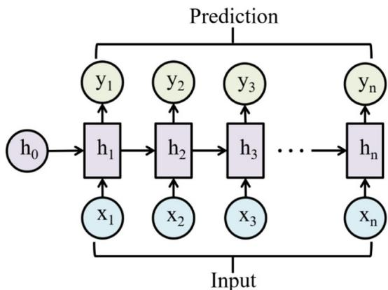
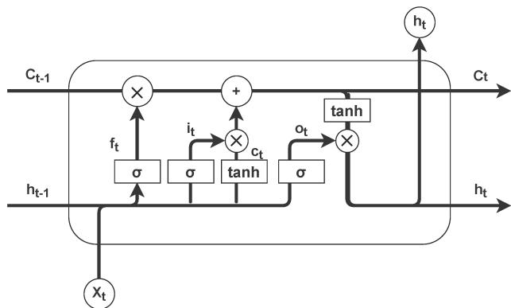
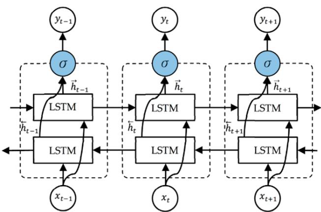
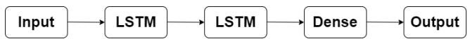
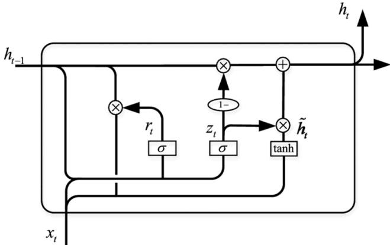

Review

# Recurrent Neural Networks: A Comprehensive Review of Architectures, Variants, and Applications

Ibomoiye Domor Mienye 1,∗,† , Theo G. Swart 1,† and George Obaido 2,†

1 Institute for Intelligent Systems, University of Johannesburg, Johannesburg 2006, South Africa; tgswart@uj.ac.za

2 Center for Human-Compatible Artificial Intelligence (CHAI), Berkeley Institute for Data Science (BIDS), University of California, Berkeley, CA 94720, USA; gobaido@berkeley.edu

Correspondence: ibomoiyem@uj.ac.za

† These authors contributed equally to this work.

Abstract: Recurrent neural networks (RNNs) have significantly advanced the field of machine learn ing (ML) by enabling the effective processing of sequential data. This paper provides a comprehensive review of RNNs and their applications, highlighting advancements in architectures, such as long short-term memory (LSTM) networks, gated recurrent units (GRUs), bidirectional LSTM (BiLSTM), echo state networks (ESNs), peephole LSTM, and stacked LSTM. The study examines the application of RNNs to different domains, including natural language processing (NLP), speech recognition, time series forecasting, autonomous vehicles, and anomaly detection. Additionally, the study discusses recent innovations, such as the integration of attention mechanisms and the development of hybrid models that combine RNNs with convolutional neural networks (CNNs) and transformer architectures. This review aims to provide ML researchers and practitioners with a comprehensive overview of the current state and future directions of RNN research.

Keywords: deep learning; GRU; LSTM; machine learning; NLP; RNN

Citation: Mienye, I.D.; Swart, T.G.; Obaido, G. Recurrent Neural Networks: A Comprehensive Review of Architectures, Variants, and Applications. Information 2024, 15, 517. https://doi.org/10.3390/info15090517

Academic Editor: María N. Moreno García

Received: 21 July 2024 Revised: 22 August 2024 Accepted: 23 August 2024 Published: 25 August 2024

Copyright: © 2024 by the authors. Licensee MDPI, Basel, Switzerland. This article is an open access article distributed under the terms and conditions of the Creative Commons Attribution (CC BY) license (https:// creativecommons.org/licenses/by/ 4.0/).

## 1. Introduction

Deep learning (DL) has reshaped the field of artificial intelligence (AI), driving ad vancements in a wide array of applications, from image recognition and natural language processing (NLP) to autonomous driving and medical diagnostics [1–5]. This rapid growth is fueled by the increasing availability of big data, advancements in computing power, and the development of sophisticated algorithms [6–9]. As DL models continue to evolve, they are increasingly being deployed in critical sectors, demonstrating their ability to outperform traditional machine learning (ML) techniques in handling complex tasks.

Recurrent neural networks (RNNs) are a class of deep learning models that are fundamentally designed to handle sequential data [10,11]. Unlike feedforward neural networks, RNNs possess the unique feature of maintaining a memory of previous inputs by using their internal state (memory) to process sequences of inputs [12]. This makes them ideally suited for applications such as natural language processing, speech recognition, and time series forecasting, where context and the order of data points are crucial.

The inception of RNNs dates back to the 1970s, with foundational work by Werbos [13], which introduced the concept of backpropagation through time (BPTT) that laid the foundation for training recurrent neural networks. However, RNNs struggled with practical applications due to the vanishing gradient problem, where gradients either grow or shrink exponentially during backpropagation [14]. Meanwhile, the introduction of Long Short Term Memory (LSTM) networks by Hochreiter and Schmidhuber [15] was a turning point for RNNs, allowing for the learning of dependencies over much longer periods. Additionally, gated recurrent units (GRUs), proposed by Cho et al. [16], offered a simplified alternative to LSTM while maintaining comparable performance.

Over the years, these RNN architectures have been applied in different fields, achieving excellent performance [17–19]. Despite their advancements and adoption in various fields, RNNs have continued to evolve. Specifically, the increasing complexity of data and tasks in recent years has driven continuous innovations in RNN architectures and variants. These developments have expanded the application of RNNs from simple sequence prediction to complex tasks such as multimodal learning and real-time decision-making systems.

Recent studies and reviews have highlighted the significant progress made in the field of RNNs. For example, Lipton et al. [20] provided an overview of the theoretical foundations and applications of RNNs, while Yu et al. [21] focused on the LSTM cell and different variants. Additionally, Tarwani et al. [22] reviewed the application and role of RNNs in natural language processing. However, many of these reviews do not fully capture the latest advancements and applications, given the rapid pace of innovation in this field. Additionally, there remains a gap in the literature that comprehensively covers the latest advancements in RNN architectures and their applications across a broader range of fields. Therefore, this paper aims to fill that gap by providing a comprehensive review of RNNs, assessing their theoretical advancements and practical implementations, as well as cutting-edge applications, thus helping shape future research on neural networks.

The rest of this paper is organized as follows: Section 2 reviews related works. Section 3 covers the fundamentals of RNNs, including basic architecture and components. Section 4 explores advanced RNN variants, such as LSTM and GRU. Section 5 highlights innovations in RNN architectures and training methodologies. Section 6 presents some publicly available datasets used for RNN studies. Section 7 discusses various applications of RNNs in the literature. Section 8 addresses challenges and future research directions. Finally, Section 9 concludes the study.

## 2. Related Works

RNNs have been applied in different applications, achieving state-of-the-art performance, especially in time-series applications. Early developments in RNNs, including locally recurrent, globally feedforward networks, as reviewed by Tsoi and Back [23], and the block-diagonal recurrent neural networks proposed by Mastorocostas and Theocharis [24], laid important groundwork for understanding complex sequence modeling.

Several reviews have been conducted on RNNs and their applications, each contributing to the understanding and development of the field. For instance, Dutta et al. [25] provided a comprehensive overview of the theoretical foundations of RNNs and their applications in sequence learning. Their review highlighted the challenges associated with training RNNs, particularly the vanishing gradient problem, and discussed the advancements in LSTM and GRU architectures. However, the review primarily focused on the theoretical aspects and applications of RNNs and did not extensively cover the latest innovations and practical applications in emerging fields such as bioinformatics and autonomous systems. Quradaa et al. [26] presented a start-of-the-art review of RNNs, covering the core architectures with a focus on applications in code clones.

Similarly, the review by Tarwani et al. [22] provided an in-depth analysis of RNNs in the context of NLP. While this review offered valuable insights into the advancements in NLP, it lacked a broader perspective on other application domains and recent architectural innovations. Another significant review by Goodfellow et al. [27] focused on the fundamentals of deep learning, including RNNs, and discussed their applications across various domains. This review provided a solid foundation but did not delve deeply into the specific advancements in RNN architectures and their specialized applications.

Greff et al. [28] conducted an extensive study comparing various LSTM variants to determine their effectiveness in different applications. While this review provided a thorough comparison, it primarily focused on LSTM architectures and did not address other RNN variants or the latest hybrid models. In similar research, Al-Selwi et al. [29] reviewed LSTM applications in the literature, covering articles from the 2018–2023 time period. Zaremba et al. [30] reviewed the use of RNNs in language modeling, highlighting significant achievements and the ongoing challenges in this field. Their work offered valuable insights into the application of RNNs in NLP but was limited to language modeling and did not explore other potential applications. Bai et al. [31] provided a critical review of RNNs and their variants, comparing them with other sequence modeling techniques like CNNs and attention-based models. Che et al. [32] focused on the application of RNNs in healthcare, particularly for electronic health records (EHRs) analysis and disease prediction. This review highlighted the potential of RNNs in medical applications.

Furthermore, more recent studies have explored various new aspects and applications of RNNs. For example, Chung et al. [33] explored the advancements in RNN architectures over the past decade, focusing on improvements in training techniques, optimization methods, and new architectural innovations. This review provided an extensive survey of recent developments and their implications for future research. Badawy et al. [34] provided a comprehensive overview of the use of RNNs in healthcare, particularly for predictive analytics and patient monitoring. They discussed the integration of RNNs with other ML techniques and the challenges in deploying these models in clinical settings.

Ismaeel et al. [35] examined the application of RNNs in smart city technologies, including traffic prediction, energy management, and urban planning. Their review discussed the potential and limitations of RNNs in these areas and suggested avenues for future research. Meanwhile, Mers et al. [36] reviewed the applications of RNNs in pavement performance forecasting and conducted a comprehensive performance comparison of the various RNN models, including simple RNNs, LSTM, GRU, and hybrid LSTM–fully connected neural networks (LSTM-FCNNs).

Chen et al. [37] focused on the use of RNNs in environmental monitoring and climate modeling, discussing their effectiveness in predicting environmental changes and managing natural resources. They also highlighted the challenges in modeling complex environmental systems with RNNs. Linardos et al. [38] investigated the advancements in RNNs for natural disaster prediction and management, highlighting the successes and challenges in using RNNs for early warning systems, disaster response, and recovery planning. Zhang et al. [39] discussed RNN applications in robotics, particularly focusing on path planning, motion control, and human–robot interaction. They discussed the integration of RNNs with other DL techniques in robotics. The different related studies are tabulated in Table 1, including their main contributions.

This research addresses the limitations in the existing literature by providing a more comprehensive review that includes the latest developments in RNN architectures, such as hybrid models and neural architecture search, as well as their applications across a wider range of domains. Additionally, this review contributes to a more holistic understanding of the current state and future directions of RNN research by integrating discussions on scalability, robustness, and interoperability.

Table 1. Summary of related reviews on RNNs.

<table><tr><td>Reference</td><td>Year</td><td>Description</td></tr><tr><td>Zaremba et al. [30]</td><td>2014</td><td>Insights into RNNs in language modeling</td></tr><tr><td>Chung et al. [33]</td><td>2014</td><td>Survey of advancements in RNN training, optimization, and architectures</td></tr><tr><td>Goodfellow et al. [27]</td><td>2016</td><td>Review on deep learning, including RNNs</td></tr><tr><td>Greff et al. [28]</td><td>2016</td><td>Extensive comparison of LSTM variants</td></tr><tr><td>Tarwani et al. [22]</td><td>2017</td><td>In-depth analysis of RNNs in NLP</td></tr><tr><td>Chen et al. [37]</td><td>2018</td><td>Effectiveness of RNNs in environmental monitoring and climate modeling</td></tr><tr><td>Bai et al. [31]</td><td>2018</td><td>Comparison of RNNs with other sequence modeling techniques like CNNs and attention mechanisms</td></tr><tr><td>Che et al. [32]</td><td>2018</td><td>Potential of RNNs in medical applications</td></tr></table>

Table 1. Cont.

<table><tr><td>Reference</td><td>Year</td><td>Description</td></tr><tr><td>Zhang et al. [39]</td><td>2020</td><td>RNN applications in robotics, including path planning, motion control, and human-robot interaction</td></tr><tr><td>Dutta et al. [25]</td><td>2022</td><td>Overview of RNNs, challenges in training, and advancements in LSTM and GRU for sequence learning</td></tr><tr><td>Linardos et al. [38]</td><td>2022</td><td>RNNs for early warning systems, disaster response, and recovery planning in natural disaster prediction</td></tr><tr><td>Badawy et al. [34]</td><td>2023</td><td>Integration of RNNs with other ML techniques for predictive analytics and patient monitoring in healthcare</td></tr><tr><td>Ismaeel et al. [35]</td><td>2023</td><td>Application of RNNs in smart city technologies, including traffic prediction, energy management, and urban planning</td></tr><tr><td>Mers et al. [36]</td><td>2023</td><td>Performance comparison of various RNN models in pavement performance forecasting</td></tr><tr><td>Quradaa et al. [26]</td><td>2024</td><td>Start-of-the-art review of RNNs, covering core architectures with a focus on applications in code clones</td></tr><tr><td>Al-Selwi et al. [29]</td><td>2024</td><td>Review of LSTM applications from 2018 to 2023</td></tr></table>

## 3. Fundamentals of RNNs

## 3.1. Basic Architecture and Working Principle of Standard RNNs

RNNs are designed to process sequential data by maintaining a hidden state that captures information about previous inputs [40]. The basic architecture consists of an input layer, a hidden layer, and an output layer. Unlike feedforward neural networks, RNNs have recurrent connections, as shown in Figure 1, allowing information to cycle within the networks. At each time step, $t ,$ the RNN takes an input vector, $\mathbf { x } _ { t } ,$ and updates its hidden state, $\mathbf { h } _ { t } ,$ using the following equation:

$$
\mathbf {h} _ {t} = \sigma_ {h} (\mathbf {W} _ {x h} \mathbf {x} _ {t} + \mathbf {W} _ {h h} \mathbf {h} _ {t - 1} + \mathbf {b} _ {h}),\tag{1}
$$

where $\mathbf { W } _ { x h }$ is the weight matrix between the input and hidden layer, ${ \bf W } _ { h h }$ is the weight matrix for the recurrent connection, $ { \mathbf { b } } _ { h }$ is the bias vector, and $\sigma _ { h }$ is the activation function, typically the hyperbolic tangent function (tanh) or the rectified linear unit [41,42]. The output at each time step, t, is given by the following:

$$
\mathbf {y} _ {t} = \sigma_ {y} (\mathbf {W} _ {h y} \mathbf {h} _ {t} + \mathbf {b} _ {y}),\tag{2}
$$

where $\mathbf { W } _ { h y }$ is the weight matrix between the hidden and output layers, ${ \bf b } _ { y }$ is the bias vector, and $\sigma _ { y }$ is the activation function for the output layer.

  
Figure 1. Basic RNN architecture.

## 3.2. Activation Functions

The core of RNN operations involves the recurrent computation of the hidden state, which integrates the current input with the previous hidden state [43]. This recurrent computation allows RNNs to exhibit dynamic temporal behavior. The choice of activation function $\sigma _ { h }$ plays a crucial role in the behavior of the network, introducing non-linearity that enables the network to learn and represent complex patterns in the data [44,45]. One commonly used activation function in RNNs is the hyperbolic tangent (tanh). The tanh function squashes the input values to the range of $[ - \bar { 1 } , 1 ]$ , making it zero-centered and suitable for modeling sequences with both positive and negative values [46]. The tanh is represented mathematically as follows:

$$
\sigma_ {h} (z) = \tanh (z) = \frac {e ^ {z} - e ^ {- z}}{e ^ {z} + e ^ {- z}}\tag{3}
$$

Another widely used activation function is the rectified linear unit (ReLU). The ReLU function outputs the input directly if it is positive; otherwise, it outputs zero [47]. This simplicity helps mitigate the vanishing gradient problem to some extent by allowing gradients to flow through the network more effectively. Furthermore, the Leaky ReLU is a variant of the ReLU designed to address the “dying ReL $\dot { \boldsymbol { { \mathrm { U } } } } ^ { \prime \prime }$ problem, where neurons can become inactive and stop learning [48]. The leaky ReLU allows a small, non-zero gradient when the input is negative, thus keeping the neurons active during the training process. Additionally, the exponential linear unit (ELU) is another variant designed to bring the mean activation closer to zero, which speeds up learning by reducing bias shifts [49]. The ELU tends to improve learning characteristics over the ReLU by allowing the activations to take on negative values when the input is negative. These activation functions are represented as follows:

$$
\sigma_ {h} (z) = \max (0, z)\tag{4}
$$

$$
\sigma_ {h} (z) = \left\{ \begin{array}{l l} z & \text { if } z > 0 \\ \alpha z & \text { otherwise } \end{array} \right.\tag{5}
$$

$$
\sigma_ {h} (z) = \left\{ \begin{array}{l l} z & \text { if } z > 0 \\ \alpha (e ^ {z} - 1) & \text { otherwise } \end{array} \right.\tag{6}
$$

where α is a small constant, typically 0.01. Meanwhile, the sigmoid function squashes the input values to the range [0, 1]. It is similar to tanh but outputs values in a different range, making it useful for problems where the output needs to be interpreted as probabilities [50–52]. Similarly, the softmax function is commonly used in the output layer of classification networks to convert raw scores into probabilities [53]. It is particularly useful in multi-class classification problems. The sigmoid and softmax functions are represented mathematically as follows:

$$
\sigma_ {h} (z) = \frac {1}{1 + e ^ {- z}}\tag{7}
$$

$$
\sigma_ {h} (z _ {i}) = \frac {e ^ {z _ {i}}}{\sum_ {j} e ^ {z _ {j}}}\tag{8}
$$

where $z _ { i }$ is the i-th element of the input vector $z .$ . Each of these activation functions has its advantages and is chosen based on the specific requirements of the task at hand. Meanwhile, the hidden state update in RNNs can be seen as a function, $\mathbf { h } _ { t } = f ( \mathbf { x } _ { t } , \mathbf { h } _ { t - 1 } )$ , which captures the dependencies between the input sequence and the recurrent connections. The choice of $\sigma _ { h }$ significantly affects how well the network learns these dependencies and generalizes to new data.

## 3.3. The Vanishing and Exploding Gradient Problems

Training RNNs presents significant challenges due to the vanishing and exploding gradient problems. During the training process, the BPTT algorithm is used to compute the gradients of the loss function with respect to the weights [54]. As the gradients are propagated backwards in time, they can either diminish (vanish) or grow exponentially (explode), making it difficult for the network to learn long-term dependencies or causing instability during training. Mathematically, the hidden state at time step t can be expanded as follows:

$$
\mathbf {h} _ {t} = \sigma_ {h} (\mathbf {W} _ {x h} \mathbf {x} _ {t} + \mathbf {W} _ {h h} \sigma_ {h} (\mathbf {W} _ {x h} \mathbf {x} _ {t - 1} + \mathbf {W} _ {h h} \mathbf {h} _ {t - 2} + \mathbf {b} _ {h}) + \mathbf {b} _ {h}).\tag{9}
$$

When calculating the gradients, we encounter terms involving the product of many Jacobian matrices:

$$
\frac {\partial \mathbf {h} _ {t}}{\partial \mathbf {h} _ {t - n}} = \prod_ {k = t - n} ^ {t - 1} \mathbf {J} _ {k},\tag{10}
$$

where $\mathbf { J } _ { k }$ is the Jacobian matrix of the hidden state at time step k. If the eigenvalues of $\mathbf { J } _ { k }$ are less than 1, the product of these matrices will tend to zero as n increases, leading to vanishing gradients [55,56]. Conversely, if the eigenvalues of $\mathbf { J } _ { k }$ are greater than 1, the gradients can grow exponentially, leading to exploding gradients, which can cause the model parameters to become unstable and result in numerical overflow during training. The vanishing gradient problem prevents the network from effectively learning long-term dependencies, as the gradient signal becomes too weak to update the weights meaningfully for earlier layers. On the other hand, the exploding gradient problem can cause the model to converge too quickly to a poor local minimum or make the training process fail entirely due to excessively large updates.

To mitigate these problems, various RNN variants have been developed, such as LSTM and GRUs. These architectures introduce gating mechanisms that regulate the flow of information and gradients through the network, allowing for the better handling of long-term dependencies. Additionally, gradient clipping is a common technique used to prevent exploding gradients by capping the gradients at a maximum threshold during backpropagation, ensuring that they do not grow uncontrollably [57,58].

## 3.4. Bidirectional RNNs

Bidirectional RNNs (BiRNNs) enhance the architecture by processing the sequence in both forward and backward directions. This allows the network to have access to future context, as well as past context, improving its performance in tasks for which understanding both the preceding and succeeding elements is crucial [43,59]. In BiRNNs, two hidden states are maintained: one for the forward pass $( \overrightarrow { \mathbf { h } } _ { t } )$ and one for the backward pass $( \overleftarrow { \mathbf { h } } _ { t } ) \colon$

$$
\overrightarrow {\mathbf {h}} _ {t} = \sigma_ {h} (\mathbf {W} _ {x h} \mathbf {x} _ {t} + \mathbf {W} _ {h h} \overrightarrow {\mathbf {h}} _ {t - 1} + \mathbf {b} _ {h}),\tag{11}
$$

$$
\overleftarrow {\mathbf {h}} _ {t} = \sigma_ {h} (\mathbf {W} _ {x h} \mathbf {x} _ {t} + \mathbf {W} _ {h h} \overleftarrow {\mathbf {h}} _ {t + 1} + \mathbf {b} _ {h}).\tag{12}
$$

The output $\mathbf { y } _ { t }$ is then computed by concatenating the forward and backward hidden states:

$$
\mathbf {y} _ {t} = \sigma_ {y} (\mathbf {W} _ {h y} [ \overrightarrow {\mathbf {h}} _ {t}; \overleftarrow {\mathbf {h}} _ {t} ] + \mathbf {b} _ {y}),\tag{13}
$$

where [; ] denotes concatenation. Furthermore, BiRNNs are effective for tasks such as named entity recognition, machine translation, and speech recognition, where context from both directions improves the model’s performance [60,61]. Through accessing information from both the past and future, BiRNNs can provide a more comprehensive understanding of the input sequence. For instance, in language modeling, understanding the surrounding words can significantly enhance the accuracy of predicting the next word [62,63]. In machine translation, knowing the entire sentence allows the network to translate words more accurately, considering the entire context. Additionally, BiRNNs are also used in various time series applications, such as stock price prediction and medical diagnosis, where understanding the temporal dependencies in both directions is beneficial [64]. However, BiRNNs require more computational resources than unidirectional RNNs due to the need to process the sequence twice (forward and backwards) [59,65].

## 3.5. Deep RNNs

Deep RNNs extend the basic architecture by stacking multiple RNN layers on top of each other, which allows the network to learn more complex representations [66]. Each layer’s hidden state serves as the input to the subsequent layer, enhancing the model’s capacity to capture hierarchical features. For a deep RNN with L layers, the hidden states at layer l and time step t are updated as follows:

$$
\mathbf {h} _ {t} ^ {(l)} = \sigma_ {h} (\mathbf {W} _ {x h} ^ {(l)} \mathbf {h} _ {t} ^ {(l - 1)} + \mathbf {W} _ {h h} ^ {(l)} \mathbf {h} _ {t - 1} ^ {(l)} + \mathbf {b} _ {h} ^ {(l)}),\tag{14}
$$

where ${ \bf h } _ { t } ^ { ( 0 ) } = { \bf x } _ { t }$ represents the input at the first layer. The output at the topmost layer is then computed using the same procedure as in basic RNNs:

$$
\mathbf {y} _ {t} = \sigma_ {y} (\mathbf {W} _ {h y} \mathbf {h} _ {t} ^ {(L)} + \mathbf {b} _ {y}).\tag{15}
$$

Deep RNNs can model more complex sequences and capture longer dependencies than shallow RNNs [67]. However, they are also more prone to the vanishing gradient problem, which can be mitigated by using advanced variants like LSTM or GRUs. Deep RNNs have been successfully applied in various domains, including natural language processing, speech recognition, and video analysis. In NLP, deep RNNs can model com plex linguistic structures and capture long-range dependencies, improving tasks such as machine translation and text generation. However, training deep RNNs can be challenging due to the increased complexity and the risk of overfitting [68,69]. Techniques such as dropout, layer normalization, and residual connections are often employed to improve the training process and generalization of deep RNNs [70–72]. Dropout helps prevent overfit ting by randomly setting a fraction of the units to zero during training, which encourages the network to learn more robust features, while batch normalization helps stabilize and accelerate training by normalizing the inputs to each layer [73]. Residual connections, which add shortcut connections that bypass one or more layers, help mitigate the vanishing gradient problem in very deep networks [74].

## 4. Advanced Variants of RNNs

RNN architectures can vary significantly, with some featuring internal recurrence within neurons and others having external recurrence between layers. These variations impact the network’s ability to learn and process sequences, influencing their application to specific tasks.

## 4.1. Long Short-Term Memory Networks

LSTM networks were introduced by Hochreiter and Schmidhuber [15] to address the vanishing gradient problem inherent to basic RNNs. The key innovation in LSTM is the use of gating mechanisms to control the flow of information through the network. This allows LSTM networks to maintain and update their internal state over long periods, making them effective for tasks requiring the modeling of long-term dependencies. Each LSTM cell contains three gates: the input gate, forget gate, and output gate, which regulate the cell state $\mathbf { c } _ { t }$ and hidden state $\mathbf { h } _ { t }$ [75]. These gates determine how much of the input to consider, how much of the previous state to forget, and how much of the cell state to output. The LSTM update equations are as follows:

$$
\mathbf {i} _ {t} = \sigma (\mathbf {W} _ {x i} \mathbf {x} _ {t} + \mathbf {W} _ {h i} \mathbf {h} _ {t - 1} + \mathbf {b} _ {i}),\tag{16}
$$

$$
\mathbf {f} _ {t} = \sigma (\mathbf {W} _ {x f} \mathbf {x} _ {t} + \mathbf {W} _ {h f} \mathbf {h} _ {t - 1} + \mathbf {b} _ {f}),\tag{17}
$$

$$
\mathbf {o} _ {t} = \sigma (\mathbf {W} _ {x o} \mathbf {x} _ {t} + \mathbf {W} _ {h o} \mathbf {h} _ {t - 1} + \mathbf {b} _ {o}),\tag{18}
$$

$$
\mathbf {g} _ {t} = \operatorname{tanh} (\mathbf {W} _ {x g} \mathbf {x} _ {t} + \mathbf {W} _ {h g} \mathbf {h} _ {t - 1} + \mathbf {b} _ {g}),\tag{19}
$$

$$
\mathbf {c} _ {t} = \mathbf {f} _ {t} \odot \mathbf {c} _ {t - 1} + \mathbf {i} _ {t} \odot \mathbf {g} _ {t},\tag{20}
$$

$$
\mathbf {h} _ {t} = \mathbf {o} _ {t} \odot \operatorname{tanh} (\mathbf {c} _ {t}),\tag{21}
$$

where $\mathbf { i } _ { t }$ is the input gate, $\mathbf { f } _ { t }$ is the forget gate, $\mathbf { o } _ { t }$ is the output gate, ${ \bf g } _ { t }$ is the cell input, $\mathbf { c } _ { t }$ is the cell state, $\mathbf { h } _ { t }$ is the hidden state, σ represents the sigmoid function, tanh is the hyperbolic tangent function, and ⊙ denotes element-wise multiplication [75].

Figure 2 illustrates the internal architecture of an LSTM cell, which effectively manages long-term dependencies in sequence data by employing three crucial gating mechanisms: the input gate $( { \bf { i } } _ { t } )$ , forget gate $\left( \mathbf { f } _ { t } \right)$ , and output gate $\left( \mathbf { o } _ { t } \right)$ . Each of these gates plays a distinct role in controlling the flow of information through the cell. The input gate controls how much of the new input $\mathbf { x } _ { t }$ is written to the cell state $\mathbf { c } _ { t }$ . The forget gate decides how much of the previous cell state $\mathbf { c } _ { t - 1 }$ should be retained. The output gate determines how much of the cell state $\mathbf { c } _ { t }$ is used to compute the hidden state ht. The cell input ${ \bf g } _ { t }$ is a candidate value that is added to the cell state after being modulated via the input gate. The use of these gating mechanisms allows LSTM networks to selectively remember or forget information, enabling them to handle long-term dependencies more effectively than traditional RNNs.

The internal recurrence within the LSTM cell is managed through the cell state $\mathbf { c } _ { t } .$ which acts as a conveyor belt, transferring relevant information across different time steps. This recurrence mechanism allows the LSTM to maintain and update its memory over long sequences, effectively capturing long-term dependencies. Additionally, the element-wise multiplication operations between the gates and their respective inputs ensure that the interactions between different components of the LSTM are smooth and efficient. This enables the LSTM to perform complex transformations on the input data while maintaining the stability of the learning process. Meanwhile, LSTM networks utilize internal recurrence within each cell to manage long-term dependencies, with the recurrence happening through the cell state as information is passed from one time step to the next [21]. Other LSTM variants include bidirectional LSTM (BiLSTM) and stacked LSTM.

  
Figure 2. Architecture of the LSTM network [41].

## 4.2. Bidirectional LSTM

Bidirectional LSTM, shown in Figure $^ { 3 , }$ extends the standard LSTM architecture by processing the sequence in both forward and backward directions, similar to BiRNNs [76]. This approach allows the network to capture context from both the past and the future, enhancing its ability to understand dependencies in the sequence more comprehensively. In BiLSTM, two separate hidden states are maintained for each time step: one for the forward pass $( \overline { { \mathbf { h } } } _ { t } )$ and one for the backward pass $( \overleftarrow { \mathbf { h } } _ { t } )$ . These hidden states are computed as described in Equations (11) and (12). BiLSTM features external recurrence between layers as they process the input sequence in both forward and backward directions, maintaining separate hidden states for each direction.

  
Figure 3. Architecture of BiLSTM network [41].

## Stacked LSTM

Stacked LSTM involves stacking multiple LSTM layers, in which the output of one LSTM layer serves as the input to the next, as shown in Figure 4. This deep architecture allows the network to capture more complex patterns and dependencies in the data by learning hierarchical representations at different levels of abstraction. For a stacked LSTM with L layers, the hidden states at layer l and time step t are updated as described in Equations (14) and (15). Stacked LSTM incorporates external recurrence by connecting multiple LSTM layers, in which each layer passes its output as input to the next, allowing the network to capture more complex temporal patterns.

  
Figure 4. A stacked LSTM [41].

Stacking LSTM layers allows the network to learn increasingly complex features and representations. The lower layers can capture local patterns and short-term dependencies, while the higher layers can capture more abstract features and long-term dependencies [21]. This hierarchical learning is advantageous for tasks such as language modeling, where different levels of syntactic and semantic information need to be captured, or for video analysis, where temporal dependencies at different time scales must be understood. While stacked LSTM offers improved modeling capabilities, they also come with increased computational complexity and a higher risk of overfitting.

## 4.3. Gated Recurrent Units

Gated recurrent units are another variant designed to address the vanishing gradient problem while simplifying the LSTM architecture. Introduced by Cho et al. [16], GRUs combine the forget and input gates into a single update gate and merge the cell state and hidden state, reducing the number of gates and parameters and thus simplifying the model and making it computationally more efficient. The GRU architecture consists of two gates: the update gate, z , and the reset gate, r [77]. Figure 5 shows the GRU architecture. The gates control the flow of information to ensure that relevant information is retained and irrelevant information is discarded. Similar to LSTM, GRUs rely on internal recurrence within each unit as they maintain and update the hidden state across time steps to capture temporal dependencies. The updated equations for GRUs are as follows:

$$
\mathbf {z} _ {t} = \sigma (\mathbf {W} _ {x z} \mathbf {x} _ {t} + \mathbf {W} _ {h z} \mathbf {h} _ {t - 1} + \mathbf {b} _ {z}),\tag{22}
$$

$$
\mathbf {r} _ {t} = \sigma (\mathbf {W} _ {x r} \mathbf {x} _ {t} + \mathbf {W} _ {h r} \mathbf {h} _ {t - 1} + \mathbf {b} _ {r}),\tag{23}
$$

$$
\mathbf {h} _ {t} ^ {\prime} = \tanh (\mathbf {W} _ {x h} \mathbf {x} _ {t} + \mathbf {r} _ {t} \odot (\mathbf {W} _ {h h} \mathbf {h} _ {t - 1}) + \mathbf {b} _ {h}),\tag{24}
$$

$$
\mathbf {h} _ {t} = \left(1 - \mathbf {z} _ {t}\right) \odot \mathbf {h} _ {t - 1} + \mathbf {z} _ {t} \odot \mathbf {h} _ {t} ^ {\prime},\tag{25}
$$

where $\mathbf { z } _ { t }$ is the update gate, rt is the reset gate, and ${ \bf h } _ { t } ^ { \prime }$ is the candidate hidden state. The update gate $\mathbf { z } _ { t }$ determines how much of the previous hidden state $\mathbf { h } _ { t - 1 }$ should be carried forward to the current hidden state h , while the reset gate, $\mathbf { r } _ { t } ,$ , controls how much of the previous hidden state to forget [75]. The candidate hidden state $\mathbf { h } _ { t } ^ { \prime }$ represents the new content to be added to the current hidden state, modulated via the reset gate. Furthermore, the simplified architecture of GRUs allows them to be computationally more efficient than LSTM while still addressing the vanishing gradient problem. This efficiency makes GRUs well-suited for tasks where computational resources are limited or when training needs to be faster. GRUs have been successfully applied in various sequence modeling tasks. Their ability to capture long-term dependencies with fewer parameters makes them a popular choice in many applications. Additionally, studies have shown that GRUs can achieve performance comparable to LSTM [78–80], making them an attractive alternative for many use cases.

  
Figure 5. Architecture of the GRU network.

Comparison with LSTM

GRUs have fewer parameters compared to LSTM due to the absence of a separate cell state and combined gating mechanisms [81]. This often leads to faster training times and comparable performance to LSTM in many tasks. However, despite their advantages, the choice between GRUs and LSTM often depends on the specific task and dataset. Some tasks may benefit more from the additional complexity and gating mechanisms of LSTM, while others may perform equally well with the simpler GRU architecture.

## 4.4. Other Notable Variants

While LSTM and GRUs are the most widely used RNN variants, other architectures like peephole LSTM, echo state networks, and independently recurrent neural networks offer unique advantages for specific applications.

## 4.4.1. Peephole LSTM

Peephole LSTM, introduced by Gers and Schmidhuber [82], enhances standard LSTM by allowing the gates to have access to the cell state through peephole connections. This additional connection enables the LSTM to better regulate the gating mechanisms based on the current cell state, improving timing decisions in applications such as speech recognition and financial time series prediction [83]. In the following equations, the input gate (it), forget gate (f ), and output gate (o ) are enhanced with peephole connections:

$$
\mathbf {i} _ {t} = \sigma (\mathbf {W} _ {x i} \mathbf {x} _ {t} + \mathbf {W} _ {h i} \mathbf {h} _ {t - 1} + \mathbf {W} _ {c i} \mathbf {c} _ {t - 1} + \mathbf {b} _ {i}),\tag{26}
$$

where $\mathbf { i } _ { t }$ is the input gate, and $\mathbf { W } _ { c i }$ is the peephole weight connecting the cell state $\mathbf { c } _ { t - 1 }$ to the input gate.

$$
\mathbf {f} _ {t} = \sigma (\mathbf {W} _ {x f} \mathbf {x} _ {t} + \mathbf {W} _ {h f} \mathbf {h} _ {t - 1} + \mathbf {W} _ {c f} \mathbf {c} _ {t - 1} + \mathbf {b} _ {f}),\tag{27}
$$

where $\mathbf { f } _ { t }$ is the forget gate, and $\mathbf { W } _ { c f }$ is the peephole weight connecting the cell state $\mathbf { c } _ { t - 1 }$ to the forget gate.

$$
\mathbf {o} _ {t} = \sigma (\mathbf {W} _ {x o} \mathbf {x} _ {t} + \mathbf {W} _ {h o} \mathbf {h} _ {t - 1} + \mathbf {W} _ {c o} \mathbf {c} _ {t} + \mathbf {b} _ {o}),\tag{28}
$$

where $\mathbf { o } _ { t }$ is the output gate, and $\mathbf { W } _ { c o }$ is the peephole weight connecting the cell state $\mathbf { c } _ { t }$ to the output gate.

## 4.4.2. Echo State Networks

Echo state networks (ESNs), proposed by Jaeger [84], represent a class of RNNs in which the hidden layer, also known as the reservoir, is fixed and randomly connected, while only the output layer is trained. This architecture significantly simplifies the training process, making ESNs particularly suitable for real-time signal processing, time series prediction, and adaptive control systems. The state update and output computation in ESNs are achieved through the following equations:

$$
\mathbf {h} _ {t} = \operatorname{tanh} \left(\mathbf {W} _ {i n} \mathbf {x} _ {t} + \mathbf {W} _ {r e s} \mathbf {h} _ {t - 1}\right),\tag{29}
$$

where $\mathbf { h } _ { t }$ is the hidden state, $\mathbf { W } _ { i n }$ is the input weight matrix, and $\mathbf { W } _ { r e s }$ is the fixed, randomly initialized reservoir weight matrix. When it is assumed that ${ \mathbf W _ { o u t } }$ is the trained output weight matrix, the output of the network can be represented as follows:

$$
\mathbf {y} _ {t} = \mathbf {W} _ {o u t} \mathbf {h} _ {t},\tag{30}
$$

ESNs have gained significant attention due to their ability to handle complex temporal dynamics with a relatively simple and efficient training process [85,86]. However, traditional ESNs are limited due to the fixed nature of the reservoir, which can restrict their adaptability and performance in more complex tasks. To address these limitations, several advancements have been proposed:

Deep Echo-State Networks: Recent research has extended the ESN architecture to deeper variants, known as deep echo-state networks (DeepESNs). In DeepESNs, multiple reservoir layers are stacked, allowing the network to capture hierarchical temporal features across different timescales [87]. Each layer in a DeepESN processes the output from the previous layer’s reservoir, enabling the model to learn more abstract and complex representations of the input data. The state update for a DeepESN can be generalized as follows:

$$
\mathbf {h} _ {t} ^ {l} = \operatorname{tanh} (\mathbf {W} _ {i n} ^ {l} \mathbf {h} _ {t} ^ {l - 1} + \mathbf {W} _ {r e s} ^ {l} \mathbf {h} _ {t - 1} ^ {l}),\tag{31}
$$

where l denotes the layer number, $\mathbf { h } _ { t } ^ { l }$ is the hidden state at layer l, ${ \bf W } _ { i n } ^ { l }$ is the input weight matrix for layer $l ,$ and $\mathbf { h } _ { t } ^ { l - 1 }$ is the hidden state from the previous layer. DeepESNs have demonstrated improved performance in tasks requiring the modeling of complex temporal patterns, such as speech recognition and financial time series forecasting [88].

Ensemble Deep ESNs: In ensemble deep ESNs, multiple DeepESNs are trained independently, and their outputs are combined to form the final prediction [89]. This ensemble approach leverages the diversity of the reservoirs and the deep architecture to improve robustness and accuracy, particularly in time series forecasting applications. For instance, Gao et al. [90] demonstrated the effectiveness of Deep ESN ensembles in predicting significant wave heights, where the ensemble approach helped mitigate the impact of reservoir initialization variability and improved the model’s generalization ability.

Input Processing with Signal Decomposition: Another critical aspect of effectively utilizing RNNs and ESNs is the preprocessing of input signals. Given the complex and often noisy nature of real-world time series data, signal decomposition techniques such as the empirical wavelet transform (EWT) have been employed to enhance the input to ESNs [91]. The EWT decomposes the input signal into different frequency components, allowing the ESN to process each component separately and improve the model’s ability to capture underlying patterns. The combination of the EWT with ESNs has shown promising results in various applications, including time series forecasting, where it helps reduce noise and enhance the predictive performance of the model.

## 4.4.3. Independently Recurrent Neural Network

Most recently, independently recurrent neural networks (IndRNNs), proposed by Li et al. [92], have used independent recurrent units to address the gradient vanishing and exploding problems, making it easier to train very deep RNNs. This architecture is useful for long sequence tasks such as video sequence analysis and long text generation. When it is assumed that ht is the hidden state, $\mathbf { W } _ { x h }$ is the input weight matrix, and u is a vector of recurrent weights. The state update equation for IndRNN is as follows:

$$
\mathbf {h} _ {t} = \sigma (\mathbf {W} _ {x h} \mathbf {x} _ {t} + \mathbf {u} \odot \mathbf {h} _ {t - 1}),\tag{32}
$$

The various RNN architectures are summarized in Table 2.

Table 2. Comparative overview of RNN architectures.

<table><tr><td>RNN Type</td><td>Key Features</td><td>Gradient Stability</td><td>Typical Applications</td></tr><tr><td>Basic RNN</td><td>Simple structure with short-term memory</td><td>High risk of vanishing gradients</td><td>Simple sequence tasks like text generation</td></tr><tr><td>LSTM</td><td>Long-term memory with input, forget, and output gates</td><td>Stable, handles vanishing gradients well</td><td>Language translation, speech recognition</td></tr><tr><td>GRU</td><td>Simplified LSTM with fewer gates</td><td>Stable, handles vanishing gradients effectively</td><td>Tasks requiring faster training than LSTM</td></tr><tr><td>Bidirectional RNN</td><td>Processes data in both forward and backward directions for better context understanding</td><td>Medium stability, depends on depth</td><td>Speech recognition and sentiment analysis</td></tr><tr><td>Deep RNN</td><td>Multiple RNN layers are stacked to learn hierarchical features</td><td>Variable, and the risk of vanishing gradients increases with depth</td><td>Complex sequence modeling like video processing</td></tr><tr><td>ESN</td><td>Fixed hidden layer weights, trained only at the output</td><td>Not applicable as training bypasses typical gradient issues</td><td>Time series prediction and system control</td></tr><tr><td>Peephole LSTM</td><td>Adds peephole connections to LSTM gates</td><td>Stable and similar to LSTM</td><td>Recognition of complex temporal patterns like musical notation</td></tr><tr><td>IndRNN</td><td>Allows training of deeper networks by maintaining independence between time steps</td><td>Reduces risk of vanishing and exploding gradients</td><td>Very long sequences, such as in video processing or long text generation</td></tr></table>

## 5. Innovations in RNN Architectures and Training Methodologies

In recent years, there have been significant innovations in RNN architectures and train ing methodologies aimed at enhancing performance and addressing existing limitations.

## 5.1. Hybrid Architectures

Combining RNNs with other neural network architectures has led to hybrid models that leverage the strengths of each component. For example, integrating CNNs with RNNs has proven effective in video analysis, where CNNs handle spatial features while RNNs capture temporal dynamics [93,93]. This approach allows the model to process both spatial and temporal information, enhancing its ability to recognize patterns and make predictions. Furthermore, incorporating attention mechanisms into RNNs has also improved their ability to model long-range dependencies. Attention mechanisms enable the network to focus on relevant parts of the input sequence, which is useful in tasks such as machine translation and text summarization. The attention mechanism can be described as follows:

$$
\mathbf {a} _ {t} = \operatorname{softmax} (\mathbf {u} _ {t}),\tag{33}
$$

$$
\mathbf {c} _ {t} = \sum_ {i = 1} ^ {T} \mathbf {a} _ {t, i} \mathbf {h} _ {i},\tag{34}
$$

where $\mathbf { a } _ { t }$ is the attention weight, $\mathbf { u } _ { t }$ is the score function, and $\mathbf { c } _ { t }$ is the context vector.

## 5.2. Neural Architecture Search

Neural architecture search (NAS) has automated the design of RNN architectures, enabling the discovery of more efficient and powerful models [94,95]. NAS techniques, such as those pioneered by Zoph and Le [96], explore various combinations of layers, activation functions, and hyperparameters to find optimal configurations that outperform manually designed architectures. The NAS process can be formulated as an optimization problem:

$$
\mathcal {A} ^ {*} = \arg \max _ {\mathcal {A} \in \mathcal {S}} \text { Accuracy } (\mathcal {A}),\tag{35}
$$

where A represents an architecture, $s$ is the search space, and $\ b { A } ^ { * }$ is the optimal architecture.

## 5.3. Advanced Optimization Techniques

Advanced optimization techniques have been developed to improve the training efficiency and stability of RNNs. Gradient clipping is a technique used to prevent the gradients from becoming too large, which can destabilize training [58,97].

$$
\mathbf {g} \leftarrow \frac {\mathbf {g}}{\max (1 , \frac {\| \mathbf {g} \|}{\tau})},\tag{36}
$$

where $\mathbf { g }$ is the gradient, and $\tau$ is the threshold value. Furthermore, adaptive learning rates, such as those used in the Adam optimizer, adjust the learning rate during training to accelerate convergence and improve performance [98]. The Adam optimizer updates the parameters using the following:

$$
\mathbf {m} _ {t} = \beta_ {1} \mathbf {m} _ {t - 1} + (1 - \beta_ {1}) \mathbf {g} _ {t},\tag{37}
$$

$$
\mathbf {v} _ {t} = \beta_ {2} \mathbf {v} _ {t - 1} + (1 - \beta_ {2}) \mathbf {g} _ {t} ^ {2},\tag{38}
$$

$$
\hat {\mathbf {m}} _ {t} = \frac {\mathbf {m} _ {t}}{1 - \beta_ {1} ^ {t}}, \quad \hat {\mathbf {v}} _ {t} = \frac {\mathbf {v} _ {t}}{1 - \beta_ {2} ^ {t}},\tag{39}
$$

$$
\theta_ {t} = \theta_ {t - 1} - \alpha \frac {\hat {\mathbf {m}} _ {t}}{\sqrt {\hat {\mathbf {v}} _ {t}} + \epsilon},\tag{40}
$$

where ${ \bf m } _ { t }$ and $\mathbf { v } _ { t }$ are the first- and second-moment estimates, $\beta _ { 1 }$ and $\beta _ { 2 }$ are the decay rates, α is the learning rate, and ϵ is a small constant [98]. Also, second-order optimization methods, such as the Hessian-free optimizer, have also been explored to improve the convergence speed and stability of training deep networks.

## 5.4. RNNs with Attention Mechanisms

Integrating attention mechanisms into RNNs allows these networks to selectively focus on important parts of the input sequence, addressing the limitations of traditional RNNs in modeling long-term dependencies [99–101]. This hybrid approach combines the strengths of RNNs and attention mechanisms, enhancing their capability to handle complex sequence tasks. Attention-enhanced RNNs have shown significant improvements in tasks such as speech recognition and text summarization. For example, Bahdanau et al. [102] demonstrated the use of attention mechanisms in neural machine translation, which al lowed RNNs to focus on relevant words in the source sentence, improving translation accuracy. Similarly, Luong et al. [103] proposed global and local attention mechanisms, further enhancing the performance of RNNs in various sequence-to-sequence tasks.

## 5.5. RNNs Integrated with Transformer Models

Transformers, introduced by Vaswani et al. [104] in 201 $^ { . 7 , }$ employ self-attention mechanisms and have proven to be highly effective in capturing long-range dependencies. Unlike RNNs, transformers process sequences in parallel, which can lead to better performance on long sequences. The self-attention mechanism is defined as follows:

$$
\operatorname{Attention} (\mathbf {Q}, \mathbf {K}, \mathbf {V}) = \operatorname{softmax} \left(\frac {\mathbf {Q} \mathbf {K} ^ {T}}{\sqrt {d _ {k}}}\right) \mathbf {V},\tag{41}
$$

where Q, K, and V are the query, key, and value matrices, respectively, and $d _ { k }$ is the dimension of the keys. Considering that both transformer and RNN architecture have limitations, studies have integrated both methods to obtain robust models, as shown in the recent literature [104]. Therefore, researchers can develop more powerful and efficient models for a wide range of applications by leveraging the sequential processing capabilities of RNNs and the parallel, attention-based mechanisms of transformers. This integrated approach addresses the limitations of each architecture and enhances the overall performance in sequence modeling tasks.

## 6. Public Datasets for RNN Research

This section provides an overview of publicly available datasets that are commonly used in the study and evaluation of RNNs. These datasets cover a variety of applications, ranging from natural language processing to time series forecasting, reflecting the diverse capabilities of RNNs. Each of these datasets provides a unique challenge for RNNs, allowing researchers to explore the strengths and limitations of different RNN architectures across various real-world tasks. Table 3 summarizes the publicly available datasets for RNN research.

Table 3. Public datasets for studying RNNs.

<table><tr><td>Dataset Name</td><td>Application</td><td>Description</td></tr><tr><td>Penn Treebank [105]</td><td>Natural language processing</td><td>A corpus of English sentences annotated for part-of-speech tagging, parsing, and named entity recognition; widely used for language modeling with RNNs</td></tr><tr><td>IMDB Reviews [106]</td><td>Sentiment analysis</td><td>A dataset of movie reviews used for binary sentiment classification; suitable for studying the effectiveness of RNNs in text sentiment classification tasks</td></tr><tr><td>MNIST Sequential [107]</td><td>Image recognition</td><td>A version of the MNIST dataset formatted as sequences for studying sequence-to-sequence learning with RNNs</td></tr></table>

Table 3. Cont.

<table><tr><td>Dataset Name</td><td>Application</td><td>Description</td></tr><tr><td>TIMIT Speech Corpus [108]</td><td>Speech recognition</td><td>An annotated speech database used for automatic speech recognition systems</td></tr><tr><td>Reuters-21578 Text Categorization Collection [109]</td><td>Text categorization</td><td>A collection of newswire articles that is a common benchmark for text categorization and NLP tasks with RNNs</td></tr><tr><td>UCI ML Repository: Time Series Data [110]</td><td>Time series analysis</td><td>Contains various time series datasets, including stock prices and weather data, ideal for forecasting with RNNs.</td></tr><tr><td>CORe50 Dataset [111]</td><td>Object Recognition</td><td>Used for continuous object recognition, ideal for RNN models dealing with video input sequences where object persistence and temporal context are important</td></tr></table>

## 7. Applications of RNNs in Peer-Reviewed Literature

RNNs and their variants have been extensively studied and applied across various domains in the peer-reviewed literature. This section provides a comprehensive review of these applications.

## 7.1. Natural Language Processing

RNNs have transformed the field of NLP by enabling more sophisticated and contextaware models. Several studies have demonstrated the effectiveness of RNNs in various NLP tasks.

## 7.1.1. Text Generation

RNNs have been used extensively for text-generation tasks. Souri et al. [112] demonstrated the use of RNNs to generate coherent and contextually relevant Arabic text. Their model was trained on a large corpus of text data, allowing it to learn the probability distribution of word sequences, which proved effective in generating human-like text. Meanwhile, several researchers have proposed novel approaches to enhancing the performance of RNNs in text generation. For instance, Islam [113] introduced a sequence-to-sequence framework that improved the generation quality using LSTM. This method allowed the network to handle longer sequences and maintain coherence over extended text.

Gajendran et al. [114] demonstrated the effectiveness of RNNs in generating characterlevel text. Their work showed that BiLSTM could capture a wide range of patterns, from character-level dependencies to higher-level syntactic structures, making them versatile for different text generation tasks, including the generation of code, literature, and poetry. More recently, advancements in RNN-based text generation have focused on improving the diversity and coherence of generated text. Hu et al. [115] proposed the use of variational autoencoders (VAEs) combined with RNNs to enhance the creativity of text generation. Their approach enabled the generation of diverse and contextually rich sentences by learning a latent space representation of the text.

Meanwhile, Holtzman et al. [116] introduced the concept of “controlled text generation” using RNNs, which allowed users to influence the style and content of the generated text. This method provided more flexibility and control over the text generation process, making it useful for applications such as creative writing and personalized content generation. Additionally, with the advent of more sophisticated models like transformers, RNN-based text generation has evolved to incorporate attention mechanisms.

Yin et al. [117] proposed an approach combining RNN with an attention mechanism, which allows the model to focus on relevant parts of the input sequence during the generation process. This significantly improved the quality and coherence of the generated text by dynamically adjusting the focus of the model based on the context. Hussein and Savas [118] employed LSTM for text generation. Similarly, Baskaran et al. [119] employed LSTM for text generation, achieving excellent performance. These studies showed that LSTM networks are capable of generating texts that are contextually relevant and linguistically accurate.

Furthermore, studies have continued to explore and enhance the capabilities of RNNs in text generation. Keskar et al. [120] introduced a large-scale language model known as Conditional Transformer Language (CTRL), which can be conditioned on specific control codes to generate text in various styles and domains. This work highlights the growing trend of combining RNNs with transformer architectures to leverage their strengths in sequence modeling and text generation. Additionally, Guo [121] explored the integra tion of reinforcement learning with RNNs for text generation. The approach aimed to optimize the generation process by rewarding the model for producing high-quality, contextually appropriate text, thereby improving both the coherence and relevance of the generated content.

In text generation tasks, the LSTM networks have proven to be the most effective among RNN architectures. The LSTM’s ability to manage long-term dependencies through its gating mechanisms makes it well-suited for generating coherent and contextually rel evant text over extended sequences. Studies such as those by Souri et al. [112] and Gajendran et al. [114] highlight the versatility of LSTM in handling both word-level and character-level text generation tasks, respectively. While more recent models, such as those incorporating transformers, have gained popularity, LSTM-based models continue to be preferred for scenarios requiring robust sequence modeling with fewer computa tional resources, especially when dealing with smaller datasets where the complexity of transformers might not be necessary.

## 7.1.2. Sentiment Analysis

In sentiment analysis, RNNs have been shown to outperform traditional models by capturing the context and details of sentiment expressed in text. Yadav et al. [122] used LSTM-based models to analyze customer reviews and social media posts, achieving notable improvements in accuracy over conventional methods. Building on this, Abimbola et al. [123] proposed a hybrid LSTM-CNN model for document-level sentiment classification, which first captures the sentiment of individual sentences and then aggregates them to determine the overall sentiment of the document. This hierarchical approach allows for a more detailed understanding of sentiment, especially in long and complex texts. Zulqarnain et al. [124] utilized the concept of attention mechanisms and GRU to enhance sentiment analysis. By allowing the model to focus on specific parts of the input text that are most indicative of sentiment, attention mechanisms significantly improved the inter pretability and performance of sentiment analysis models. This advancement enabled the models to highlight which words or phrases contribute the most to sentiment prediction.

Additionally, several studies have explored the integration of RNNs with CNNs to leverage the strengths of both architectures. For instance, Pujari et al. [125] combined CNNs and RNNs to capture both local features and long-range dependencies in text, resulting in a hybrid model that achieved state-of-the-art performance in sentiment classification tasks. Meanwhile, Wankhade et al. [126] employed the fusion of CNN and BiLSTM with an attention mechanism, leading to enhanced sentiment classification. Furthermore, Sangeetha and Kumaran [127] utilized BiLSTM to enhance the sentiment analysis capability by processing text in both forward and backward directions. This approach captures the context from both past and future words, providing a more comprehensive understanding of the sentiment expressed in the text.

In addition to these architectural innovations, there has been a focus on improving the robustness of RNN-based sentiment analysis models. For example, He and McAuley [128] developed an adversarial training framework that enhances the model’s ability to handle noisy and adversarial text inputs, thereby improving its generalization to real-world data.

Also, the use of transfer learning and pre-trained language models, such as BERT and GPT, has been increasingly popular in sentiment analysis [129–131]. These models, fine-tuned for sentiment classification tasks, have demonstrated exceptional performance by leveraging large-scale pre-training on diverse text corpora and then adapting to specific sentiment analysis datasets.

Furthermore, BiLSTM can be considered the most effective variant of RNNs in senti ment analysis due to their ability to process text in both forward and backward directions. This bidirectional processing allows the model to capture the full context of a sentence, making it effective in understanding intrinsic sentiment expressed in text. Studies by Sangeetha and Kumaran [127] demonstrate the superiority of BiLSTM in achieving higher accuracy in sentiment classification tasks. The ability of BiLSTM to integrate with attention mechanisms, as shown in work by Wankhade et al. [126], further enhances their perfor mance by allowing the model to focus on the most relevant parts of the text, thus improving interpretability and classification accuracy.

## 7.1.3. Machine Translation

To address the challenge of translating long sentences, Wu et al. [132] introduced the concept of deep RNNs with multiple layers in both the encoder and decoder. Their model, known as Google Neural Machine Translation (GNMT), improved translation accuracy and fluency by capturing more complex patterns and dependencies within the text. GNMT became a major achievement in neural machine translation, setting a new benchmark for translation systems. Sennrich et al. [133] presented a method for incorporating subword units into RNN-based translation models. This approach, known as Byte-Pair Encoding (BPE), enabled the translation models to handle rare and out-of-vocabulary words more effectively by splitting them into smaller, more frequent subword units. This method improved the robustness and generalization of the translation models.

With the advent of transformer models, Vaswani et al. [104] revolutionized the field of machine translation by introducing a fully attention-based architecture that eliminated the need for recurrence entirely. Transformers demonstrated superior performance in translation tasks by allowing for parallel processing of sequences and capturing long-range dependencies more efficiently. Despite this shift, RNN-based models with attention mechanisms continued to be relevant, particularly in scenarios where computational resources were limited or sequential processing was preferred. For example, Kang et al. [134] combined RNN with an attention mechanism to obtain a bilingual attention-based machine translation model. While Zulqarnain et al. [124] utilized GRU in a multi-stage feature attention mechanism model.

Several studies have also combined RNNs with transformer models to utilize the strengths of both architectures. For instance, Yang et al. [135] proposed a hybrid model that integrates RNNs into the transformer architecture to enhance its ability to capture sequential dependencies while maintaining the efficiency of parallel processing. This hybrid approach achieved state-of-the-art performance in several translation benchmarks. Meanwhile, more recent studies have explored the integration of pre-trained language models like BERT and GPT into machine translation systems. Song et al. [136] demonstrated that incorporating BERT into the encoder of a translation model enhanced its understanding of the source language, leading to more accurate and fluent translations. Table 4 summarizes the discussed applications of RNNs in natural language processing.

Hybrid models that combine the strengths of RNNs, particularly LSTM, with transformer architectures are considered the best approach to machine translation. While transformers have set new benchmarks in translation accuracy due to their parallel processing capabilities and efficient handling of long-range dependencies, integrating RNNs with attention mechanisms, as seen in studies by Yang et al. [135] and Song et al. [136], has shown that these hybrid models can outperform purely transformer-based approaches in certain scenarios. This is especially true in resource-constrained environments where the sequential processing of RNNs, enhanced by attention mechanisms, can lead to more accurate and computationally efficient translations.

Table 4. Summary of applications of RNNs in natural language processing.

<table><tr><td>Application Domain</td><td>Reference</td><td>Year</td><td>Methods and Application</td></tr><tr><td rowspan="10">Text generation</td><td>Souri et al. [112]</td><td>2018</td><td>RNNs for generating coherent and contextually relevant Arabic text</td></tr><tr><td>Holtzman et al. [116]</td><td>2019</td><td>Controlled text generation using RNNs for style and content control</td></tr><tr><td>Hu et al. [115]</td><td>2020</td><td>VAEs combined with RNNs to enhance creativity in text generation</td></tr><tr><td>Gajendran et al. [114]</td><td>2020</td><td>Character-level text generation using BiLSTM for various tasks</td></tr><tr><td>Hussein and Savas [118]</td><td>2024</td><td>LSTM for text generation</td></tr><tr><td>Baskaran et al. [119]</td><td>2024</td><td>LSTM for text generation, achieving excellent performance</td></tr><tr><td>Islam [113]</td><td>2019</td><td>Sequence-to-sequence framework using LSTM for improved text generation quality</td></tr><tr><td>Yin et al. [117]</td><td>2018</td><td>Attention mechanisms with RNNs for improved text generation quality</td></tr><tr><td>Guo [121]</td><td>2015</td><td>Integration of reinforcement learning with RNNs for text generation</td></tr><tr><td>Keskar et al. [120]</td><td>2019</td><td>Conditional Transformer Language (CTRL) for generating text in various styles</td></tr><tr><td rowspan="10">Sentiment analysis</td><td>He and McAuley [128]</td><td>2016</td><td>Adversarial training framework for robustness in sentiment analysis</td></tr><tr><td>Pujari et al. [125]</td><td>2024</td><td>Hybrid CNN-RNN model for sentiment classification</td></tr><tr><td>Wankhade et al. [126]</td><td>2024</td><td>Fusion of CNN and BiLSTM with attention mechanism for sentiment classification</td></tr><tr><td>Sangeetha and Kumaran [127]</td><td>2023</td><td>BiLSTM for sentiment analysis by processing text in both directions</td></tr><tr><td>Yadav et al. [122]</td><td>2023</td><td>LSTM-based models for sentiment analysis in customer reviews and social media posts</td></tr><tr><td>Zulqarnain et al. [124]</td><td>2024</td><td>Attention mechanisms and GRU for enhanced sentiment analysis</td></tr><tr><td>Samir et al. [129]</td><td>2021</td><td>Use of pre-trained models like BERT for sentiment analysis</td></tr><tr><td>Prottasha et al. [130]</td><td>2022</td><td>Transfer learning with BERT and GPT for sentiment analysis</td></tr><tr><td>Abimbola et al. [123]</td><td>2024</td><td>Hybrid LSTM-CNN model for document-level sentiment classification</td></tr><tr><td>Mujahid et al. [131]</td><td>2023</td><td>Analyzing sentiment with pre-trained models fine-tuned for specific tasks</td></tr><tr><td rowspan="7">Machine Translation</td><td>Sennrich et al. [133]</td><td>2015</td><td>Byte-Pair Encoding for handling rare words in translation models</td></tr><tr><td>Wu et al. [132]</td><td>2016</td><td>Google Neural Machine Translation with deep RNNs for improved accuracy</td></tr><tr><td>Vaswani et al. [104]</td><td>2017</td><td>Fully attention-based transformer models for superior translation performance</td></tr><tr><td>Yang et al. [135]</td><td>2017</td><td>Hybrid model integrating RNNs into the transformer architecture</td></tr><tr><td>Song et al. [136]</td><td>2019</td><td>Incorporating BERT into translation models for enhanced understanding and fluency</td></tr><tr><td>Kang et al. [134]</td><td>2023</td><td>Bilingual attention-based machine translation model combining RNN with attention</td></tr><tr><td>Zulqarnain et al. [124]</td><td>2024</td><td>Multi-stage feature attention mechanism model using GRU</td></tr></table>

## 7.2. Speech Recognition

RNNs have also made significant contributions to the field of speech recognition, leading to more accurate and efficient systems. Hinton et al. [137] explored the use of deep neural networks, including RNNs, for speech-to-text systems. Their research showed that RNNs could capture the temporal dependencies in speech signals, leading to significant improvements in transcription accuracy compared to previous methods.

Hannun et al. [138] introduced DeepSpeech, a state-of-the-art speech recognition system based on RNNs. DeepSpeech employed a deep LSTM network trained on a vast amount of labeled speech data, thereby improving transcription accuracy. This system was designed to handle noisy environments and diverse accents, making it robust for various real-world applications. Similarly, Amodei et al. [139] presented DeepSpeech2, which extended the capabilities of the original DeepSpeech model by incorporating bidirectional RNNs and a more extensive dataset. DeepSpeech2 achieved notable performance improvements, demonstrating that RNNs could effectively handle variations in speech patterns and accents.

Meanwhile, Chiu et al. [140] proposed the use of RNN-transducer (RNN-T) models for end-to-end speech recognition. RNN-T models integrate both acoustic and language models into a single RNN framework, allowing for more efficient and accurate transcription. This integration reduced the complexity and latency of real-time speech recognition systems, making them more practical for deployment in real-world applications. Furthermore, Zhang et al. [141] proposed the use of convolutional recurrent neural networks (CRNNs) for speech recognition. CRNNs combine the strengths of CNNs for feature extraction and RNNs for sequence modeling, resulting in a hybrid architecture that is robust in both accuracy and computational efficiency. Specifically, this model was effective in handling long audio sequences and varying speech rates.

Recently, Dong et al. [142] introduced the Speech-Transformer, a model that leverages the self-attention mechanism to process audio sequences in parallel, improving both speed and accuracy. This model demonstrated that transformer-based architectures could effectively handle the sequential nature of speech data, providing a competitive alterna tive to traditional RNN-based models. Bhaskar and Thasleema [143] developed a speech recognition model using LSTM. The model achieved visual speech recognition using facial expressions. Other studies that explored the use of different RNN variants in speech recognition include [144–147].

In the field of speech recognition, LSTM networks have been consistently recognized as the most effective RNN variant due to their ability to capture long-range dependencies in sequential data. LSTM, as utilized in systems like DeepSpeech by Hannun et al. [138], has demonstrated superior performance in handling the temporal dependencies inherent in speech signals. This capability is particularly crucial for maintaining context over long audio sequences, which directly translates to improved transcription accuracy. While newer models like the Speech-Transformer [142] leverage attention mechanisms for faster processing, LSTM networks remain a cornerstone in speech recognition due to their proven robustness and ability to handle complex variations in speech patterns. This makes them the preferred choice in scenarios where maintaining sequential order and context is critical, despite the growing popularity of transformer-based architectures.

## 7.3. Time Series Forecasting

RNNs have been extensively used in time series prediction due to their ability to model temporal dependencies and trends in sequential data. In financial forecasting, Fischer and Krauss [148] conducted a comprehensive study using deep RNNs to predict stock returns. Their results indicated that RNNs could outperform traditional ML models, such as support vector machines and random forests, in financial forecasting tasks. The study demonstrated that deep RNNs could learn intricate patterns in stock price movements, contributing to better forecasting accuracy.

With the advancement of deep learning techniques, Nelson et al. [149] proposed a model combining CNNs and RNNs for stock price prediction. The CNN component extracted local features from historical price data, while the RNN component captured the temporal dependencies. This hybrid model showed significant improvements in prediction performance, suggesting that integrating different neural network architectures could enhance financial forecasting. Also, attention mechanisms have been integrated into RNNs to improve financial forecasting.

Luo et al. [150] used an attention-based CNN-BiLSTM model that focused on relevant time steps in the input sequence, enhancing the model’s ability to capture important patterns in financial data. This approach allowed for more accurate predictions of stock prices and market trends by dynamically weighting the significance of past observations. Furthermore, Bao et al. [151] employed a novel deep learning framework combining LSTM with stacked autoencoders for financial time series forecasting. Their model utilized stacked autoencoders to reduce the dimensionality of input data and LSTM to model temporal dependencies. This method improved the model’s ability to predict future stock prices by effectively capturing both feature representations and sequential patterns.

Feng et al. [152] explored the use of transfer learning for financial forecasting. They proposed a model that pre-trained an RNN on a large corpus of financial data and finetuned it on specific stock datasets. This approach employed the knowledge gained from broader market data to improve predictions on individual stocks, which demonstrates the potential of transfer learning in financial forecasting. Meanwhile, the application of reinforcement learning in conjunction with RNNs has gained attention in financial forecasting. Rundo [153] combined RL with LSTM to develop a trading strategy that maximizes returns. Their model learned optimal trading actions through interactions with the market environment, resulting in a robust and adaptive financial forecasting system.

Beyond financial applications, RNNs have shown effectiveness in other domains, such as weather forecasting and renewable energy predictions, where modeling temporal dependencies is critical for accurate forecasts. In weather forecasting, Devi et al. [154] developed an RNN-based model specifically for weather prediction, which demonstrated superior performance in both short-term and long-term forecasting compared to traditional statistical methods. This model effectively captures the sequential dependencies in meteorological data, such as temperature, humidity, and atmospheric pressure, enabling more accurate and reliable forecasts. Additionally, Anshuka et al. [155] showed the effective ness of using LSTM networks in predicting extreme weather events by learning complex temporal patterns in historical weather data. Furthermore, Lin et al. [100] proposed a model that integrates the attention mechanism with LSTM, which further improved the ability of RNNs, especially as the attention mechanism ensures the model focuses on critical features within the large dataset, thereby enhancing the accuracy of predictions in complex weather scenarios.

In the field of renewable energy, RNNs have been extensively applied to forecast energy generation from renewable sources such as wind and solar power. Marulanda et al. [156] utilized an LSTM-based model for short-term wind power forecasting, which showed signifi cant improvements in prediction accuracy by capturing the non-linear and time-dependent characteristics of wind speed data. Similarly, Chen et al. [157] developed an advanced DL approach combining a bidirectional GRU with temporal convolutional networks (TCNs) for energy time series forecasting. This hybrid model was particularly effective in capturing both short-term fluctuations and long-term trends, leading to more reliable predictions. Moreover, RNNs have also been used to forecast energy demand in smart grids, where their ability to model temporal dependencies helps in optimizing the integration of renewable energy sources into the grid and improving overall energy management [158,159].

Furthermore, RNNs have been applied to predict consumer demand patterns for goods and services, allowing businesses to optimize their supply chain management and reduce costs. For instance, Yildiz et al. [160] proposed a hybrid RNN model that combines LSTM with CNN to accurately predict electricity demand in urban areas, showing significant improvements over traditional forecasting techniques.

Meanwhile, ESNs have also shown promise in weather forecasting and renewable energy predictions due to their ability to handle non-linear and chaotic time series data. For instance, Anshuka et al. [155] applied ESNs to model and predict extreme weather events, demonstrating the network’s ability to capture complex temporal patterns from historical weather data. Similarly, Marulanda et al. [156] used an ESN-based approach for short-term wind power forecasting, which effectively captured the non-linear dynamics of wind speed and improved prediction accuracy compared to conventional methods. These studies highlight the versatility and robustness of ESNs in handling diverse time series forecasting tasks across different domains.

Additionally, Gao et al. [90] proposed a dynamic ensemble deep ESN specifically designed for wave height forecasting. This model adjusts reservoir weights dynamically, allowing it to model the complex and non-linear patterns often found in time series more effectively than traditional methods. Additionally, Bhambu et al. [161] introduced a re current ensemble deep random vector functional link neural network for financial time series forecasting. This model integrates the strengths of both ESNs and recurrent networks, providing superior performance in predicting financial market volatility and trends. Table 5 provides a summary of the RNN applications in both speech recognition and time series forecasting.

Among the various RNN architectures, LSTM networks stand out as the most effective for time series forecasting, especially in financial applications [162]. LSTM’s gating mechanisms allow it to maintain and utilize long-term dependencies, which are crucial for accurately predicting future trends based on historical data. The ability of LSTM to capture complex temporal patterns makes it particularly well-suited for financial markets, where long-range dependencies and intricate patterns in data are common. Meanwhile, when LSTM is combined with other techniques, such as CNNs for feature extraction or attention mechanisms for focusing on critical time steps, the models’ forecasting performance improves even further. This combination of adaptability, robustness, and precision demonstrates why LSTM is frequently considered the best RNN variant for time series-forecasting tasks.

Table 5. Summary of RNNs in speech recognition and time series forecasting.

<table><tr><td>Application Domain</td><td>Reference</td><td>Year</td><td>Methods and Application</td></tr><tr><td rowspan="11">Speech recognition</td><td>Hinton et al. [137]</td><td>2012</td><td>Deep neural networks, including RNNs, for speech-to-text systems</td></tr><tr><td>Hannun et al. [138]</td><td>2014</td><td>DeepSpeech: LSTM-based speech recognition system</td></tr><tr><td>Amodei et al. [139]</td><td>2016</td><td>DeepSpeech2: Enhanced LSTM-based speech recognition with bidirectional RNNs</td></tr><tr><td>Zhang et al. [141]</td><td>2017</td><td>Convolutional RNN for robust speech recognition</td></tr><tr><td>Chiu et al. [140]</td><td>2018</td><td>RNN-transducer models for end-to-end speech recognition</td></tr><tr><td>Dong et al. [142]</td><td>2018</td><td>Speech-Transformer: Leveraging self-attention for better processing of audio sequences</td></tr><tr><td>Bhaskar and Thasleema [143]</td><td>2023</td><td>LSTM for visual speech recognition using facial expressions</td></tr><tr><td>Daouad et al. [144]</td><td>2023</td><td>Various RNN variants for automatic speech recognition</td></tr><tr><td>Nasr et al. [146]</td><td>2023</td><td>End-to-end speech recognition using RNNs</td></tr><tr><td>Kumar et al. [147]</td><td>2023</td><td>Performance evaluation of RNNs in speech recognition tasks</td></tr><tr><td>Dhanjal et al. [145]</td><td>2024</td><td>Comprehensive study of different RNN models for speech recognition</td></tr><tr><td rowspan="7">Time series forecasting</td><td>Nelson et al. [149]</td><td>2017</td><td>Hybrid CNN-RNN model for stock price prediction</td></tr><tr><td>Bao et al. [151]</td><td>2017</td><td>Combining LSTM with stacked autoencoders for financial time series forecasting</td></tr><tr><td>Fischer and Krauss [148]</td><td>2018</td><td>Deep RNNs for predicting stock returns, outperforming traditional ML models</td></tr><tr><td>Feng et al. [152]</td><td>2019</td><td>Transfer learning with RNNs for stock prediction</td></tr><tr><td>Rundo [153]</td><td>2019</td><td>Combining reinforcement learning with LSTM for trading strategy development</td></tr><tr><td>Devi et al. [154]</td><td>2024</td><td>RNN-based model for weather prediction and capturing sequential dependencies in meteorological data</td></tr><tr><td>Anshuka et al. [155]</td><td>2022</td><td>LSTM networks for predicting extreme weather events by learning complex temporal patterns</td></tr></table>

Table 5. Cont.

<table><tr><td>Application Domain</td><td>Reference</td><td>Year</td><td>Methods and Application</td></tr><tr><td rowspan="9"></td><td>Lin et al. [100]</td><td>2022</td><td>Integrating attention mechanisms with LSTM for enhanced weather forecasting accuracy</td></tr><tr><td>Marulanda et al. [156]</td><td>2023</td><td>LSTM model for short-term wind power forecasting and improving prediction accuracy</td></tr><tr><td>Chen et al. [157]</td><td>2024</td><td>Bidirectional GRU with TCNs for energy time series forecasting</td></tr><tr><td>Hasanat et al. [158]</td><td>2024</td><td>RNNs for forecasting energy demand in smart grids and optimizing renewable energy integration</td></tr><tr><td>Asiri et al. [159]</td><td>2024</td><td>Short-term renewable energy predictions using RNN-based models</td></tr><tr><td>Yildiz et al. [160]</td><td>2024</td><td>Hybrid model of LSTM with CNN for accurate electricity demand prediction</td></tr><tr><td>Luo et al. [150]</td><td>2024</td><td>Attention-based CNN-BiLSTM model for improved financial forecasting</td></tr><tr><td>Gao et al. [90]</td><td>2023</td><td>Dynamic ensemble deep ESN for wave height forecasting</td></tr><tr><td>Bhambu et al. [161]</td><td>2024</td><td>Recurrent ensemble deep random vector functional link neural network for financial time series forecasting</td></tr></table>

## 7.4. Signal Processing

RNNs, particularly ESNs, have seen significant applications in various signal-processing tasks due to their efficient training and robust performance in handling time-dependent data. One key area of application is physiological signal processing. Mastoi et al. [163] developed an ESN-based approach for the real-time monitoring and prediction of heart rate variability. Their approach outperformed traditional methods in terms of accuracy and computational efficiency, demonstrating ESNs’ potential in real-time health monitoring systems.

ESNs have also been extensively used in speech-processing tasks. Valin et al. [164] proposed an ESN architecture specifically designed for speech signal enhancement. This model demonstrated improved noise reduction and speech intelligibility in noisy environments, which is critical for applications such as hearing aids and speech recognition systems. The model’s ability to handle temporal dependencies in speech signals made it particularly effective in enhancing audio quality under challenging conditions.

Additionally, ESNs have been applied in the preprocessing and analysis of nonstationary and noisy time series data. Gao et al. [91] integrated the empirical wavelet transform (EWT) with ESNs to enhance performance in time series forecasting. This hybrid approach demonstrated that combining the EWT’s ability to decompose complex signals with the robust modeling capabilities of ESNs leads to superior performance, particularly in scenarios where data is noisy or exhibits non-stationary behavior. This integration demonstrates the adaptability of ESNs to a wide range of signal processing challenges, reinforcing their utility in domains requiring accurate and efficient time series analysis.

## 7.5. Bioinformatics

In bioinformatics, RNNs have been used to analyze biological sequences such as DNA, RNA, and proteins. Li et al. [165] employed RNNs for gene prediction and protein structure prediction, demonstrating the ability of RNNs to capture dependencies within biological sequences and providing insights into genetic information and biological processes. Zhang et al. [166] used bidirectional LSTM in predicting DNA-binding protein sequences. Their model, called DeepSite, leveraged the sequential nature of biological data, achieving higher accuracy in identifying binding sites compared to traditional methods. This application demonstrated the potential of RNNs to enhance our understanding of protein-DNA interactions.

In the field of proteomics, RNNs have been used for protein structure prediction and function annotation. Xu et al. [167] developed an RNN-based model to predict protein secondary structures, showing that RNNs could effectively captures the sequential dependencies in amino acid sequences. This application provided significant advancements in protein structure prediction, which is essential for drug discovery and disease research.

More recently, researchers have explored the integration of RNNs with other neural network architectures for bioinformatics applications. For example, Yadav et al. [168] combined BiLSTM with CNNs to analyze protein sequences. Their model extracted local features and captured long-range dependencies with BiLSTM, resulting in improved performance in protein classification tasks. Additionally, the use of ensemble deep learning has enhanced the performance of RNNs in bioinformatics. Aybey et al. [169] introduced an ensemble model for predicting protein–protein interactions using RNNs, GRUs, and CNNs. The model improves the accuracy of interaction predictions. This approach highlighted the potential of ensemble deep learning to enhance the interpretability and performance of RNNs in bioinformatics.

In bioinformatics, RNNs, specifically LSTM networks and GRUs, have established themselves as the best models for analyzing biological sequences due to their ability to process long sequences and maintain information over long distances, crucial for understanding complex biological structures and functions. Bidirectional LSTM, used by Zhang et al. [166] in predicting DNA-binding protein sequences, is particularly effective, as it processes sequences in both forward and backward directions, providing a better context and significantly improving prediction accuracy over unidirectional approaches. This capability makes it preferable for tasks where understanding the full context of a sequence is essential, such as gene prediction, protein folding, and other complex bioinformatics applications involving sequential data.

## 7.6. Autonomous Vehicles

RNNs play an important role in autonomous vehicles by processing sequential data from sensors to make driving decisions. Li et al. [170] used RNNs for path planning, object detection, and trajectory prediction, enabling autonomous vehicles to navigate complex environments and make real-time decisions. Following this foundational work, researchers have continued to explore and enhance the use of RNNs in autonomous driving. For instance, Lee et al. [171] developed a deep learning framework that integrates LSTM with CNN for end-to-end driving. Their model utilized CNN to extract spatial features from camera images and LSTM to capture temporal dependencies, which improved the accuracy and robustness of driving decisions in dynamic environments.

Codevilla et al. [172] introduced a conditional imitation learning approach that combined RNNs with imitation learning for autonomous driving. The model learned from human driving demonstrations and used RNNs to predict future actions based on past observations. This approach allowed the vehicle to adapt to various driving conditions and make safer decisions in complex scenarios. Additionally, researchers have explored the use of LSTM for trajectory prediction in autonomous vehicles. Altché and de La Fortelle [173] proposed an LSTM-based model that predicts the future trajectories of surrounding vehi cles. This model leverages the sequential nature of traffic data to anticipate the movements of other road users, enabling more accurate and proactive path planning for autonomous vehicles. Meanwhile, attention mechanisms have been integrated into RNN models to enhance their performance in autonomous driving tasks. Li et al. [174] introduced an attention-based LSTM model that focuses on relevant parts of the data, improving the detection and tracking of video objects.

Researchers have also explored the use of RNNs for behavior prediction in autonomous driving. Li et al. [175] proposed a model that combines RNNs with CNN to predict the intentions of other drivers. Their approach used sequential data to learn the behavioral patterns of surrounding vehicles, enabling the autonomous vehicle to anticipate potential hazards and respond accordingly. In addition, researchers have investigated the use of RNNs for decision-making in autonomous vehicles. Liu and Diao [176] introduced a deep reinforcement learning framework that incorporates GRU for decision-making in complex traffic scenarios. Their model used RNNs to process sequential observations and make real-time decisions, achieving state-of-the-art performance in various driving tasks.

Furthermore, the integration of LSTM with CNNs seems to represent the best approach in autonomous vehicle applications, as demonstrated by Lee et al. [171]. This combination leverages LSTM’s ability to understand temporal dynamics and CNNs’ strength in spatial feature extraction, making it robust for real-time applications like driving, where both spatial and temporal understandings are crucial for decision-making. The hybrid nature of these models allows for a better understanding and processing of the vast amounts of data from various sensors, ensuring better performance in navigation and real-time decision making in dynamic environments.

## 7.7. Anomaly Detection

RNNs are used in anomaly detection across different fields, such as cybersecurity, industrial monitoring, and healthcare. Altindal et al. [177] demonstrated the use of LSTM networks for anomaly detection in time series data, showing that RNNs could effectively model normal behavior patterns and identify deviations indicative of anomalies. Sim ilarly, Matar et al. [178] proposed a model for anomaly detection in multivariate time series. Their model utilized BiLSTM to learn temporal dependencies and to detect deviations from normal patterns. This approach was effective in industrial applications where monitoring the health of machinery and predicting failures is critical. In cybersecurity, Kumaresan et al. [179] applied RNNs to detect anomalies in network traffic. Their model analyzed sequential data to identify unusual patterns that could indicate security breaches or malicious activities. The use of RNNs allowed for real-time detection and response to potential threats, enhancing the security of network systems.

Furthermore, Li et al. [180] explored the application of RNNs for anomaly detection in manufacturing processes. They developed a model combining RNNs with transfer learning to capture both temporal dependencies and feature representations. This method improved the detection of anomalies in complex industrial processes, contributing to the optimization of production efficiency and quality control. In healthcare, researchers have utilized RNNs for detecting anomalies in physiological signals. For instance, Mini et al. [181] employed RNNs to detect abnormal patterns in electrocardiogram (ECG) signals. Their model accurately identified deviations indicative of cardiac arrhythmias, demonstrating the potential of RNNs to assist in the early diagnosis and monitoring of heart conditions.

Moreover, advances in unsupervised learning have further enhanced the capabilities of RNNs in anomaly detection. Zhou and Paffenroth [182] introduced a robust deep autoencoder model that leverages RNNs for unsupervised anomaly detection. This approach effectively captured the underlying structure of the data, identifying anomalies without requiring labeled training data. Ren et al. [183] proposed an attention-based RNN model that focuses on relevant time steps in the data, improving the accuracy and interpretabil ity of anomaly detection. This approach allowed for the more precise identification of anomalies by dynamically weighting the importance of different parts of the sequence. Additionally, hybrid models combining RNNs with other neural network architectures have also been employed in anomaly detection. Munir et al. [184] developed a hybrid model that integrates CNNs and RNNs to detect anomalies in multivariate time series data. The CNN component extracted local features, while the RNN component captured temporal dependencies, resulting in improved performance in various anomaly detection tasks.

The BiLSTM model stands out as the best RNN architecture in anomaly detection, especially in multivariate time series data, where understanding the influence of past and future input contexts is crucial. Matar et al. [178] demonstrated that BiLSTM effectively capture temporal dependencies in both directions, which is critical in anomaly detection scenarios where anomalies may be contextually linked to events in both the past and the future. This bidirectional processing capability allows for more robust detection of anomalies across various applications, from industrial monitoring to cybersecurity, making it the most suitable RNN model for these tasks.

A summary of RNN applications in bioinformatics, autonomous vehicles, and anomaly detection is shown in Table 6.

Table 6. Summary of RNNs in signal processing, bioinformatics, autonomous vehicles, and anomaly detection.

<table><tr><td>Application Domain</td><td>Reference</td><td>Year</td><td>Methods and Application</td></tr><tr><td rowspan="3">Signal processing</td><td>Mastoi et al. [163]</td><td>2019</td><td>ESNs for real-time heart rate variability monitoring</td></tr><tr><td>Valin et al. [164]</td><td>2021</td><td>ESNs for speech signal enhancement in noisy environments</td></tr><tr><td>Gao et al. [91]</td><td>2021</td><td>EWT integrated with ESNs for enhanced time series forecasting</td></tr><tr><td rowspan="5">Bioinformatics</td><td>Li et al. [165]</td><td>2019</td><td>RNNs for gene prediction and protein-structure prediction</td></tr><tr><td>Zhang et al. [166]</td><td>2020</td><td>Bidirectional LSTM for predicting DNA-binding protein sequences</td></tr><tr><td>Xu et al. [167]</td><td>2021</td><td>RNN-based model for predicting protein secondary structures</td></tr><tr><td>Yadav et al. [168]</td><td>2019</td><td>Combining BiLSTM with CNNs for protein sequence analysis</td></tr><tr><td>Aybey et al. [169]</td><td>2023</td><td>Ensemble model for predicting protein-protein interactions</td></tr><tr><td rowspan="6">Autonomous vehicles</td><td>Altché and de La Fortelle [173]</td><td>2017</td><td>LSTM for predicting the future trajectories of vehicles</td></tr><tr><td>Codevilla et al. [172]</td><td>2018</td><td>RNNs with imitation learning for autonomous driving</td></tr><tr><td>Li et al. [170]</td><td>2020</td><td>RNNs for path planning and object detection</td></tr><tr><td>Lee et al. [171]</td><td>2020</td><td>Integrating LSTM with CNN for end-to-end autonomous driving</td></tr><tr><td>Li et al. [174]</td><td>2024</td><td>Attention-based LSTM for video object tracking</td></tr><tr><td>Liu and Diao [176]</td><td>2024</td><td>GRU with deep reinforcement learning for decision-making</td></tr><tr><td rowspan="8">Anomaly detection</td><td>Zhou and Paffenroth [182]</td><td>2017</td><td>RNNs in unsupervised anomaly detection with deep autoencoders</td></tr><tr><td>Munir et al. [184]</td><td>2018</td><td>Hybrid CNN-RNN model for anomaly detection in time series</td></tr><tr><td>Ren et al. [183]</td><td>2019</td><td>Attention-based RNN model for anomaly detection</td></tr><tr><td>Li et al. [180]</td><td>2023</td><td>RNNs with Transfer learning for anomaly detection in manufacturing</td></tr><tr><td>Mini et al. [181]</td><td>2023</td><td>RNNs for detecting anomalies in ECG signals</td></tr><tr><td>Matar et al. [178]</td><td>2023</td><td>BiLSTM for anomaly detection in multivariate time series</td></tr><tr><td>Kumaresan et al. [179]</td><td>2024</td><td>RNNs for detecting network traffic anomalies</td></tr><tr><td>Altindal et al. [177]</td><td>2024</td><td>LSTM for anomaly detection in time series data</td></tr></table>

## 8. Challenges and Future Research Directions

Despite significant advancements, several unresolved problems are encountered when applying RNNs. Addressing these issues is crucial for further improving the performance and usage of RNNs.

## 8.1. Scalability and Efficiency

Training RNNs on large datasets with long sequences remains computationally intensive and time-consuming [185–187]. Although techniques like gradient checkpointing and hardware accelerators have provided improvements, the sequential nature of RNNs contin ues to limit their scalability compared to parallelizable architectures like transformers [188]. Future research could focus on developing more efficient training algorithms and exploring asynchronous and parallel training methods to distribute the computational load more effectively. Additionally, hybrid architectures that combine RNNs with other models, such as integrating RNNs with attention mechanisms or convolutional layers, could provide new solutions. These hybrid models have the potential to reduce training times and improve scalability while maintaining the performance advantages of RNNs [104].

## 8.2. Interpretability and Explainability

RNNs are often perceived as “black-box” models due to their complex internal dynamics, making it challenging to interpret their decisions [189,190]. Although attention mechanisms and post hoc explanation techniques like Local Interpretable Model-Agnostic Explanations (LIMEs) and Shapley Addictive Explanations (SHAPs) have been proposed to improve interpretability, these methods can still be improved to further provide more comprehensive explanations [191]. Therefore, future research should aim to develop inherently interpretable RNN architectures and hierarchical models that offer structured insights into the model’s decision-making process. Additionally, integrating domain knowledge into RNN models can help align their behavior with human reasoning, enhancing both interpretability and performance in specialized applications.

## 8.3. Bias and Fairness

RNNs can inadvertently learn and propagate biases present in the training data, lead ing to unfair predictions. While various bias detection and mitigation techniques have been developed, such as fairness-aware algorithms and adversarial training, these methods need further refinement to ensure fairness across diverse applications and datasets [192–194]. Research should continue to focus on developing robust bias detection techniques and fair training algorithms that explicitly incorporate fairness constraints. Additionally, transparency and accountability frameworks, including external audits and impact assessments, are essential for ensuring that RNNs are developed and deployed responsibly.

## 8.4. Data Dependency and Quality

RNNs require large amounts of high-quality, labeled sequential data for effective training [195]. In many real-world scenarios, such data may be scarce, noisy, or incomplete. Although data augmentation, transfer learning, and semi-supervised learning techniques have been explored, these methods require further refinement to handle diverse data challenges more effectively. Future research should focus on enhancing these techniques to improve the robustness of RNNs when trained on limited or imperfect data. Additionally, developing new methods for utilizing unlabeled data and integrating domain-specific knowledge can further improve the performance of RNNs in data-scarce environments.

## 8.5. Overfitting and Generalization

RNNs, particularly deep architectures, are prone to overfitting, especially when trained on small datasets [196]. Ensuring that RNN models generalize well to unseen data without overfitting remains a significant challenge. While regularization techniques like dropout and L2 regularization are commonly used, more robust methods for improving generalization are needed. Future research can explore advanced regularization techniques, such as adversarial training and ensemble methods, to enhance the generalization capabilities of RNNs. Additionally, applying data augmentation and transfer learning can help RNN models learn more robust features, improving their ability to generalize to new data.

## 9. Conclusions

RNNs have demonstrated a remarkable ability to model sequential data, making them indispensable in numerous ML applications such as natural language processing, speech recognition, time series prediction, bioinformatics, and autonomous systems. This paper provided a comprehensive overview of RNNs and their variants, covering fundamental architectures like basic RNNs, LSTM networks, and GRUs, as well as advanced variants, including bidirectional RNNs, peephole LSTM, ESNs, and IndRNNs. This study has provided a detailed and comprehensive review of RNNs, as well as their architectures, applications, and challenges. The paper will be a valuable resource for researchers and practitioners in the field of machine learning, helping to guide future developments and applications of RNNs.

Author Contributions: Conceptualization, I.D.M., T.G.S. and G.O.; methodology, I.D.M.; validation, I.D.M., T.G.S. and G.O.; investigation, I.D.M., T.G.S. and G.O.; resources, T.G.S.; writing—original draft preparation, I.D.M. and $\mathrm { G . O . } ;$ writing—review and editing, I.D.M., T.G.S. and $\mathrm { G . O . } ;$ visual ization, I.D.M.; supervision, T.G.S. All authors have read and agreed to the published version of the manuscript.

Funding: This research received no external funding.

Institutional Review Board Statement: Not applicable.

Informed Consent Statement: Not applicable.

Data Availability Statement: Not applicable.

Conflicts of Interest: The authors declare no conflicts of interest.

## Abbreviations

The following abbreviations are used in this manuscript:

AI Artificial intelligence ANN Artificial neural network BiLSTM Bidirectional long short-term memory CNN Convolutional neural network DL Deep learning GRU Gated recurrent unit LSTM Long short-term memory ML Machine learning NAS Neural architecture search NLP Natural language processing RNN Recurrent neural network RL Reinforcement learning SHAPs Shapley Additive Explanations TPU Tensor processing unit VAE Variational autoencoder

## References

1. O’Halloran, T.; Obaido, G.; Otegbade, B.; Mienye, I.D. A deep learning approach for Maize Lethal Necrosis and Maize Streak Virus disease detection. Mach. Learn. Appl. 2024, 16, 100556. [CrossRef]

2. Peng, Y.; He, L.; Hu, D.; Liu, Y.; Yang, L.; Shang, S. Decoupling Deep Learning for Enhanced Image Recognition Interpretability. ACM Trans. Multimed. Comput. Commun. Appl. 2024. [CrossRef]

3. Khan, W.; Daud, A.; Khan, K.; Muhammad, S.; Haq, R. Exploring the frontiers of deep learning and natural language processing: A comprehensive overview of key challenges and emerging trends. Nat. Lang. Process. J. 2023, 4, 100026. [CrossRef]

4. Obaido, G.; Achilonu, O.; Ogbuokiri, B.; Amadi, C.S.; Habeebullahi, L.; Ohalloran, T.; Chukwu, C.W.; Mienye, E.; Aliyu, M.; Fasawe, O.; et al. An Improved Framework for Detecting Thyroid Disease Using Filter-Based Feature Selection and Stacking Ensemble. IEEE Access 2024, 12, 89098–89112. [CrossRef]

5. Mienye, I.D.; Obaido, G.; Aruleba, K.; Dada, O.A. Enhanced Prediction of Chronic Kidney Disease using Feature Selection and Boosted Classifiers. In Proceedings of the International Conference on Intelligent Systems Design and Applications, Virtual, 13–15 December 2021; pp. 527–537.

6. Al-Jumaili, A.H.A.; Muniyandi, R.C.; Hasan, M.K.; Paw, J.K.S.; Singh, M.J. Big data analytics using cloud computing based frameworks for power management systems: Status, constraints, and future recommendations. Sensors 2023, 23, 2952. [CrossRef]

7. Gill, S.S.; Wu, H.; Patros, P.; Ottaviani, C.; Arora, P.; Pujol, V.C.; Haunschild, D.; Parlikad, A.K.; Cetinkaya, O.; Lutfiyya, H.; et al. Telemat. Inform. Rep. 2024 13

8. Mienye, I.D.; Jere, N. A Survey of Decision Trees: Concepts, Algorithms, and Applications. IEEE Access 2024, 12, 86716–86727. [CrossRef]

9. Aruleba, R.T.; Adekiya, T.A.; Ayawei, N.; Obaido, G.; Aruleba, K.; Mienye, I.D.; Aruleba, I.; Ogbuokiri, B. COVID-19 diagnosis: A review of rapid antigen, RT-PCR and artificial intelligence methods. Bioengineering 2022, 9, 153. [CrossRef]

10. Alhajeri, M.S.; Ren, Y.M.; Ou, F.; Abdullah, F.; Christofides, P.D. Model predictive control of nonlinear processes using transfer Chem. Eng. Res. Des. 2024 205

11. Shahinzadeh, H.; Mahmoudi, A.; Asilian, A.; Sadrarhami, H.; Hemmati, M.; Saberi, Y. Deep Learning: A Overview of Theory and Architectures. In Proceedings of the 2024 20th CSI International Symposium on Artificial Intelligence and Signal Processing (AISP), Babol, Iran, 21–22 February 2024; pp. 1–11.

12. Baruah, R.D.; Organero, M.M. Explicit Context Integrated Recurrent Neural Network for applications in smart environments. Expert Syst. Appl. 2024, 255, 124752. [CrossRef]

13. Werbos, P. Backpropagation through time: What it does and how to do it. Proc. IEEE 1990, 78, 1550–1560. [CrossRef]

14. Lalapura, V.S.; Amudha, J.; Satheesh, H.S. Recurrent neural networks for edge intelligence: A survey. ACM Comput. Surv. (CSUR) 2021, 54, 1–38. [CrossRef]

15. Hochreiter, S.; Schmidhuber, J. Long short-term memory. Neural Comput. 1997, 9, 1735–1780. [CrossRef] [PubMed]

16. Cho, K.; Van Merriënboer, B.; Gulcehre, C.; Bahdanau, D.; Bougares, F.; Schwenk, H.; Bengio, Y. Learning phrase representations using RNN encoder-decoder for statistical machine translation. arXiv 2014, arXiv:1406.1078.

17. Liu, F.; Li, J.; Wang, L. PI-LSTM: Physics-informed long short-term memory network for structural response modeling. Eng. Struct. 2023, 292, 116500. [CrossRef]

18. Ni, Q.; Ji, J.; Feng, K.; Zhang, Y.; Lin, D.; Zheng, J. Data-driven bearing health management using a novel multi-scale fused feature and gated recurrent unit. Reliab. Eng. Syst. Saf. 2024, 242, 109753. [CrossRef]

19. Niu, Z.; Zhong, G.; Yue, G.; Wang, L.N.; Yu, H.; Ling, X.; Dong, J. Recurrent attention unit: A new gated recurrent unit for long-term memory of important parts in sequential data. Neurocomputing 2023, 517, 1–9. [CrossRef]

20. Lipton, Z.C.; Berkowitz, J.; Elkan, C. A critical review of recurrent neural networks for sequence learning. arXiv 2015, arXiv:1506.00019.

21. Yu, Y.; Si, X.; Hu, C.; Zhang, J. A review of recurrent neural networks: LSTM cells and network architectures. Neural Comput. 2019, 31, 1235–1270. [CrossRef]

22. Tarwani, K.M.; Edem, S. Survey on recurrent neural network in natural language processing. Int. J. Eng. Trends Technol. 2017, 48, 301–304. [CrossRef]

23. Tsoi, A.C.; Back, A.D. Locally recurrent globally feedforward networks: A critical review of architectures. IEEE Trans. Neural Netw. 1994, 5, 229–239. [CrossRef] [PubMed]

24. Mastorocostas, P.A.; Theocharis, J.B. A stable learning algorithm for block-diagonal recurrent neural networks: Application to the analysis of lung sounds. IEEE Trans. Syst. Man. Cybern. Part B (Cybern.) 2006, 36, 242–254. [CrossRef] [PubMed]

25. Dutta, K.K.; Poornima, S.; Sharma, R.; Nair, D.; Ploeger, P.G. Applications of Recurrent Neural Network: Overview and Case Studies. In Recurrent Neural Networks; CRC Press: Boca Raton, FL, USA, 2022; pp. 23–41.

26. Quradaa, F.H.; Shahzad, S.; Almoqbily, R.S. A systematic literature review on the applications of recurrent neural networks in code clone research. PLoS ONE 2024, 19, e0296858. [CrossRef]

27. Goodfellow, I.; Bengio, Y.; Courville, A. Deep Learning; MIT Press: Cambridge, MA, USA, 2016.

28. Greff, K.; Srivastava, R.K.; Koutník, J.; Steunebrink, B.R.; Schmidhuber, J. LSTM: A search space odyssey. IEEE Trans. Neural Netw. Learn. Syst. 2016, 28, 2222–2232. [CrossRef] [PubMed]

29. Al-Selwi, S.M.; Hassan, M.F.; Abdulkadir, S.J.; Muneer, A.; Sumiea, E.H.; Alqushaibi, A.; Ragab, M.G. RNN-LSTM: From applications to modeling techniques and beyond—Systematic review. J. King Saud-Univ.-Comput. Inf. Sci. 2024, 36, 102068. [CrossRef]

30. Zaremba, W.; Sutskever, I.; Vinyals, O. Recurrent neural network regularization. arXiv 2014, arXiv:1409.2329.

31. Bai, S.; Kolter, J.Z.; Koltun, V. An empirical evaluation of generic convolutional and recurrent networks for sequence modeling. arXiv 2018, arXiv:1803.01271.

32. Che, Z.; Purushotham, S.; Cho, K.; Sontag, D.; Liu, Y. Recurrent neural networks for multivariate time series with missing values. Sci. Rep. 2018, 8, 6085. [CrossRef]

33. Chung, J.; Gulcehre, C.; Cho, K.; Bengio, Y. Empirical evaluation of gated recurrent neural networks on sequence modeling. arXiv 2014, arXiv:1412.3555.

34. Badawy, M.; Ramadan, N.; Hefny, H.A. Healthcare predictive analytics using machine learning and deep learning techniques: A survey. J. Electr. Syst. Inf. Technol. 2023, 10, 40. [CrossRef]

35. Ismaeel, A.G.; Janardhanan, K.; Sankar, M.; Natarajan, Y.; Mahmood, S.N.; Alani, S.; Shather, A.H. Traffic pattern classification in smart cities using deep recurrent neural network. Sustainability 2023, 15, 14522. [CrossRef]

36. Mers, M.; Yang, Z.; Hsieh, Y.A.; Tsai, Y. Recurrent neural networks for pavement performance forecasting: Review and model performance comparison. Transp. Res. Rec. 2023, 2677, 610–624. [CrossRef]

37. Chen, Y.; Cheng, Q.; Cheng, Y.; Yang, H.; Yu, H. Applications of recurrent neural networks in environmental factor forecasting: A review. Neural Comput. 2018, 30, 2855–2881. [CrossRef] [PubMed]

38. Linardos, V.; Drakaki, M.; Tzionas, P.; Karnavas, Y.L. Machine learning in disaster management: Recent developments in methods and applications. Mach. Learn. Knowl. Extr. 2022, 4, 446–473. [CrossRef]

39. Zhang, J.; Liu, H.; Chang, Q.; Wang, L.; Gao, R.X. Recurrent neural network for motion trajectory prediction in human-robot collaborative assembly. CIRP Ann. 2020, 69, 9–12. [CrossRef]

40. Tsantekidis, A.; Passalis, N.; Tefas, A. Recurrent Neural Networks. In Deep Learning for Robot Perception and Cognition; Elsevier: Amsterdam, The Netherlands, 2022; pp. 101–115.

41. Mienye, I.D.; Jere, N. Deep Learning for Credit Card Fraud Detection: A Review of Algorithms, Challenges, and Solutions. IEEE Access 2024, 12, 96893–96910. [CrossRef]

42. Mienye, I.D.; Sun, Y. A machine learning method with hybrid feature selection for improved credit card fraud detection. Appl. Sci. 2023, 13, 7254. [CrossRef]

43. Rezk, N.M.; Purnaprajna, M.; Nordström, T.; Ul-Abdin, Z. Recurrent neural networks: An embedded computing perspective. JEEE Access 2020. 8. 57967–57996. [CrossRefl

44. Yu, Y.; Adu, K.; Tashi, N.; Anokye, P.; Wang, X.; Ayidzoe, M.A. Rmaf: Relu-memristor-like activation function for deep learning. IEEE Access 2020, 8, 72727–72741. [CrossRef]

45. Mienye, I.D.; Ainah, P.K.; Emmanuel, I.D.; Esenogho, E. Sparse Noise Minimization in Image Classification using Genetic Algorithm and DenseNet. In Proceedings of the 2021 Conference on Information Communications Technology and Society (ICTAS), Durban, South Africa, 10–11 March 2021; pp. 103–108.

46. Ciaburro, G.; Venkateswaran, B. Neural Networks with R: SMART Models Using CNN, RNN, Deep Learning, and Artificial Intelligence Principles; Packt Publishing Ltd.: Birmingham, UK, 2017.

47. Nwankpa, C.; Ijomah, W.; Gachagan, A.; Marshall, S. Activation functions: Comparison of trends in practice and research for deep learning. arXiv 2018, arXiv:1811.03378.

48. Szandała, T. Review and comparison of commonly used activation functions for deep neural networks. Bio-Inspired Neurocomp. 2021, 203–224.

49. Clevert, D.A.; Unterthiner, T.; Hochreiter, S. Fast and accurate deep network learning by exponential linear units (elus). arXiv 2015, arXiv:1511.07289.

50. Dubey, S.R.; Singh, S.K.; Chaudhuri, B.B. Activation functions in deep learning: A comprehensive survey and benchmark. Neurocomputing 2022, 503, 92–108. [CrossRef]

51. Obaido, G.; Mienye, I.D.; Egbelowo, O.F.; Emmanuel, I.D.; Ogunleye, A.; Ogbuokiri, B.; Mienye, P.; Aruleba, K. Supervised machine learning in drug discovery and development: Algorithms, applications, challenges, and prospects. Mach. Learn. Appl. 2024, 17, 100576. [CrossRef]

52. Mienye, I.D.; Sun, Y. Effective Feature Selection for Improved Prediction of Heart Disease. In Proceedings of the Pan-African Artificial Intelligence and Smart Systems Conference, Durban, South Africa, 4–6 December 2021; pp. 94–107.

53. Martins, A.; Astudillo, R. From Softmax to Sparsemax: A Sparse Model of Attention and Multi-Label Classification. In Proceedings of the International Conference on Machine Learning, New York, NY, USA, 20–22 June 2016; pp. 1614–1623.

54. Bianchi, F.M.; Maiorino, E.; Kampffmeyer, M.C.; Rizzi, A.; Jenssen, R.; Bianchi, F.M.; Maiorino, E.; Kampffmeyer, M.C.; Rizzi, A.; Jenssen, R. Properties and Training in Recurrent Neural Networks. In Recurrent Neural Networks for Short-Term Load Forecasting: An Overview and Comparative Analysis; Springer: Berlin/Heidelberg, Germany, 2017; pp. 9–21.

55. Mohajerin, N.; Waslander, S.L. State Initialization for Recurrent Neural Network Modeling of Time-Series Data. In Proceedings of the 2017 International Joint Conference on Neural Networks (IJCNN), Anchorage, AK, USA, 14–19 May 2017; pp. 2330–2337.

56. Forgione, M.; Muni, A.; Piga, D.; Gallieri, M. On the adaptation of recurrent neural networks for system identification. Automatica 2023, 155, 111092. [CrossRef]

57. Zhang, J.; He, T.; Sra, S.; Jadbabaie, A. Why gradient clipping accelerates training: A theoretical justification for adaptivity. arXiv 2019, arXiv:1905.11881.

58. Qian, J.; Wu, Y.; Zhuang, B.; Wang, S.; Xiao, J. Understanding Gradient Clipping in Incremental Gradient Methods. In Proceedings of the International Conference on Artificial Intelligence and Statistics, Virtual, 13–15 April 2021; pp. 1504–1512.

59. Fei, H.; Tan, F. Bidirectional grid long short-term memory (bigridlstm): A method to address context-sensitivity and vanishing gradient. Algorithms 2018, 11, 172. [CrossRef]

60. Dong, X.; Chowdhury, S.; Qian, L.; Li, X.; Guan, Y.; Yang, J.; Yu, Q. Deep learning for named entity recognition on Chinese electronic medical records: Combining deep transfer learning with multitask bi-directional LSTM RNN. PLoS ONE 2019, 14, e0216046. [CrossRef] [PubMed]

61. Chorowski, J.K.; Bahdanau, D.; Serdyuk, D.; Cho, K.; Bengio, Y. Attention-based models for speech recognition. Adv. Neural Inf. Process. Syst. 2015, 28.

62. Zhou, M.; Duan, N.; Liu, S.; Shum, H.Y. Progress in neural NLP: Modeling, learning, and reasoning. Engineering 2020, 6, 275–290. [CrossRef]

63. Naseem, U.; Razzak, I.; Khan, S.K.; Prasad, M. A comprehensive survey on word representation models: From classical to state-of-the-art word representation language models. Trans. Asian Low-Resour. Lang. Inf. Process. 2021, 20, 1–35. [CrossRef]

64. Adil, M.; Wu, J.Z.; Chakrabortty, R.K.; Alahmadi, A.; Ansari, M.F.; Ryan, M.J. Attention-based STL-BiLSTM network to forecast tourist arrival. Processes 2021, 9, 1759. [CrossRef]

65. Min, S.; Park, S.; Kim, S.; Choi, H.S.; Lee, B.; Yoon, S. Pre-training of deep bidirectional protein sequence representations with structural information. IEEE Access 2021, 9, 123912–123926. [CrossRef]

66. Jain, A.; Zamir, A.R.; Savarese, S.; Saxena, A. Structural-rnn: Deep Learning on Spatio-Temporal Graphs. In Proceedings of the IEEE Conference on Computer Vision and Pattern Recognition, Las Vegas, NV, USA, 27–30 June 2016; pp. 5308–5317.

67. Pascanu, R.; Gulcehre, C.; Cho, K.; Bengio, Y. How to construct deep recurrent neural networks. arXiv 2013, arXiv:1312.6026.

68. Shi, H.; Xu, M.; Li, R. Deep learning for household load forecasting—A novel pooling deep RNN. IEEE Trans. Smart Grid 2017, 9, 5271–5280. [CrossRef]

69. Gal, Y.; Ghahramani, Z. A theoretically grounded application of dropout in recurrent neural networks. Adv. Neural Inf. Process. Syst. 2016, 29.

70. Moradi, R.; Berangi, R.; Minaei, B. A survey of regularization strategies for deep models. Artif. Intell. Rev. 2020, 53, 3947–3986. [CrossRef]

71. Salehin, I.; Kang, D.K. A review on dropout regularization approaches for deep neural networks within the scholarly domain. Electronics 2023, 12, 3106. [CrossRef]

72. Cai, S.; Shu, Y.; Chen, G.; Ooi, B.C.; Wang, W.; Zhang, M. Effective and efficient dropout for deep convolutional neural networks. arXiv 2019, arXiv:1904.03392.

73. Garbin, C.; Zhu, X.; Marques, O. Dropout vs. batch normalization: An empirical study of their impact to deep learning. Multimed. Tools Appl. 2020, 79, 12777–12815. [CrossRef]

74. Borawar, L.; Kaur, R. ResNet: Solving Vanishing Gradient in Deep Networks. In Proceedings of the International Conference on Recent Trends in Computing: ICRTC 2022, Delhi, India, 3–4 June 2022; Springer: Berlin/Heidelberg, Germany, 2023; pp. 235–247.

75. Mienye, I.D.; Sun, Y. A deep learning ensemble with data resampling for credit card fraud detection. IEEE Access 2023, 11, 30628–30638. [CrossRef]

76. Kiperwasser, E.; Goldberg, Y. Simple and accurate dependency parsing using bidirectional LSTM feature representations. Trans. Assoc. Comput. Linguist. 2016, 4, 313–327. [CrossRef]

77. Zhang, W.; Li, H.; Tang, L.; Gu, X.; Wang, L.; Wang, L. Displacement prediction of Jiuxianping landslide using gated recurrent unit (GRU) networks. Acta Geotech. 2022, 17, 1367–1382. [CrossRef]

78. Cahuantzi, R.; Chen, X.; Güttel, S. A Comparison of LSTM and GRU Networks for Learning Symbolic Sequences. In Proceedings of the Science and Information Conference, Nanchang, China, 2–4 June 2023; Springer: Berlin/Heidelberg, Germany, 2023; pp. 771–785.

79. Shewalkar, A.; Nyavanandi, D.; Ludwig, S.A. Performance evaluation of deep neural networks applied to speech recognition: RNN, LSTM and GRU. J. Artif. Intell. Soft Comput. Res. 2019, 9, 235–245. [CrossRef]

80. Vatanchi, S.M.; Etemadfard, H.; Maghrebi, M.F.; Shad, R. A comparative study on forecasting of long-term daily streamflow using ANN, ANFIS, BiLSTM and CNN-GRU-LSTM. Water Resour. Manag. 2023, 37, 4769–4785. [CrossRef]

81. Mateus, B.C.; Mendes, M.; Farinha, J.T.; Assis, R.; Cardoso, A.M. Comparing LSTM and GRU models to predict the condition of a pulp paper press. Energies 2021, 14, 6958. [CrossRef]

82. Gers, F.A.; Schmidhuber, J. Recurrent Nets That Time and Count. In Proceedings of the IEEE-INNS-ENNS International Joint Conference on Neural Networks, IJCNN 2000, Neural Computing: New Challenges and Perspectives for the New Millennium, Como, Italy, 24–27 July 2000; Volume 3, pp. 189–194.

83. Gers, F.A.; Schraudolph, N.N.; Schmidhuber, J. Learning precise timing with LSTM recurrent networks. J. Mach. Learn. Res. 2002, 3, 115–143.

84. Jaeger, H. Adaptive nonlinear system identification with echo state networks. Adv. Neural Inf. Process. Syst. 2002, 15, 593–600.

85. Ishaq, M.; Kwon, S. A CNN-Assisted deep echo state network using multiple Time-Scale dynamic learning reservoirs for generating Short-Term solar energy forecasting. Sustain. Energy Technol. Assessments 2022, 52, 102275.

86. Sun, C.; Song, M.; Cai, D.; Zhang, B.; Hong, S.; Li, H. A systematic review of echo state networks from design to application. IEEE Trans. Artif. Intell. 2022, 5, 23–37. [CrossRef]

87. Gallicchio, C.; Micheli, A. Deep echo state network (deepesn): A brief survey. arXiv 2017, arXiv:1712.04323.

88. Gallicchio, C.; Micheli, A. Richness of Deep Echo State Network Dynamics. In Proceedings of the Advances in Computational Intelligence: 15th International Work-Conference on Artificial Neural Networks, IWANN 2019, Gran Canaria, Spain, 12–14 June 2019, Proceedings, Part I 15; Springer: Berlin/Heidelberg, Germany, 2019; pp. 480–491.

89. Hu, R.; Tang, Z.R.; Song, X.; Luo, J.; Wu, E.Q.; Chang, S. Ensemble echo network with deep architecture for time-series modeling. Neural Comput. Appl. 2021, 33, 4997–5010. [CrossRef]

90. Gao, R.; Li, R.; Hu, M.; Suganthan, P.N.; Yuen, K.F. Dynamic ensemble deep echo state network for significant wave height forecasting. Appl. Energy 2023, 329, 120261. [CrossRef]

91. Gao, R.; Du, L.; Duru, O.; Yuen, K.F. Time series forecasting based on echo state network and empirical wavelet transformation. Appl. Soft Comput. 2021, 102, 107111. [CrossRef]

92. Li, S.; Li, W.; Cook, C.; Zhu, C.; Gao, Y. Independently Recurrent Neural Network (indrnn): Building a Longer and Deeper rnn. In Proceedings of the IEEE Conference on Computer Vision and Pattern Recognition, Salt Lake City, UT, USA, 18–23 June 2018; pp. 5457–5466.

93. Yang, J.; Qu, J.; Mi, Q.; Li, Q. A CNN-LSTM model for tailings dam risk prediction. IEEE Access 2020, 8, 206491–206502. [CrossRef]

94. Ren, P.; Xiao, Y.; Chang, X.; Huang, P.Y.; Li, Z.; Chen, X.; Wang, X. A comprehensive survey of neural architecture search: Challenges and solutions. ACM Comput. Surv. (CSUR) 2021, 54, 1–34. [CrossRef]

95. Mellor, J.; Turner, J.; Storkey, A.; Crowley, E.J. Neural Architecture Search without Training. In Proceedings of the International Conference on Machine Learning, Virtual, 18–24 July 2021; pp. 7588–7598.

96. Zoph, B.; Le, Q.V. Neural architecture search with reinforcement learning. arXiv 2016, arXiv:1611.01578.

97. Chen, X.; Wu, S.Z.; Hong, M. Understanding gradient clipping in private sgd: A geometric perspective. Adv. Neural Inf. Process. Syst. 2020, 33, 13773–13782.

98. Zhang, Z. Improved Adam Optimizer for Deep Neural Networks. In Proceedings of the 2018 IEEE/ACM 26th International Symposium on Quality of Service (IWQoS), Banff, AB, Canada, 4–6 June 2018; pp. 1–2.

99. De Santana Correia, A.; Colombini, E.L. Attention, please! A survey of neural attention models in deep learning. Artif. Intell. Rev. 2022, 55, 6037–6124. [CrossRef]

100. Lin, J.; Ma, J.; Zhu, J.; Cui, Y. Short-term load forecasting based on LSTM networks considering attention mechanism. Int. J. Electr. Power Energy Syst. 2022, 137, 107818. [CrossRef]

101. Chaudhari, S.; Mithal, V.; Polatkan, G.; Ramanath, R. An attentive survey of attention models. ACM Trans. Intell. Syst. Technol. (TIST) 2021, 12, 1–32. [CrossRef]

102. Bahdanau, D.; Cho, K.; Bengio, Y. Neural machine translation by jointly learning to align and translate. arXiv 2014, arXiv:1409.0473.

103. Luong, M.T.; Pham, H.; Manning, C.D. Effective approaches to attention-based neural machine translation. arXiv 2015, arXiv:1508.04025.

104. Vaswani, A.; Shazeer, N.; Parmar, N.; Uszkoreit, J.; Jones, L.; Gomez, A.N.; Kaiser, Ł.; Polosukhin, I. Attention is all you need. Adv. Neural Inf. Process. Syst. 2017, 30.

105. Marcus, M.P.; Marcinkiewicz, M.A.; Santorini, B. Building a large annotated corpus of English: The Penn Treebank. Comput. Linguist. 1993, 19, 313–330.

106. Maas, A.L.; Daly, R.E.; Pham, P.T.; Huang, D.; Ng, A.Y.; Potts, C. Learning Word Vectors for Sentiment Analysis. In Proceedings of the 49th Annual Meeting of the Association for Computational Linguistics: Human Language Technologies, Portland, OR, USA, 19–24 June 2011; pp. 142–150.

107. LeCun, Y.; Bottou, L.; Bengio, Y.; Haffner, P. Gradient-based learning applied to document recognition. Proc. IEEE 1998, 86, 2278–2324. [CrossRef]

108. Garofolo, J.S.; Lamel, L.F.; Fisher, W.M.; Fiscus, J.G.; Pallett, D.S. TIMIT acoustic-phonetic continuous speech corpus. Linguist. Data Consort. 1993, 93, 27403.

109. Lewis, D. Reuters-21578 Text Categorization Test Collection; Distribution 1.0; AT&T Labs-Research: Atlanta, GA, USA, 1997.

110. Dua, D.; Graff, C. UCI Machine Learning Repository; School of Information and Computer Science, University of California: Irvine, CA, USA, 2017.

111. Lomonaco, V.; Maltoni, D. Core50: A New Dataset and Benchmark for Continuous Object Recognition. In Proceedings of the Conference on Robot Learning. PMLR, Mountain View, CA, USA, 13–15 November 2017; pp. 17–26.

112. Souri, A.; El Maazouzi, Z.; Al Achhab, M.; El Mohajir, B.E. Arabic Text Generation using Recurrent Neural Networks. In Proceedings of the Big Data, Cloud and Applications: Third International Conference, BDCA 2018, Kenitra, Morocco, 4–5 April 2018; Revised Selected Papers 3; Springer: Berlin/Heidelberg, Germany, 2018; pp. 523–533.

113. Islam, M.S.; Mousumi, S.S.S.; Abujar, S.; Hossain, S.A. Sequence-to-sequence Bangla sentence generation with LSTM recurrent neural networks. Procedia Comput. Sci. 2019, 152, 51–58. [CrossRef]

114. Gajendran, S.; Manjula, D.; Sugumaran, V. Character level and word level embedding with bidirectional LSTM–Dynamic recurrent neural network for biomedical named entity recognition from literature. J. Biomed. Inform. 2020, 112, 103609. [CrossRef]

115. Hu, H.; Liao, M.; Mao, W.; Liu, W.; Zhang, C.; Jing, Y. Variational Auto-Encoder for Text Generation. In Proceedings of the 2020 IEEE 5th Information Technology and Mechatronics Engineering Conference (ITOEC), Chongqing, China, 12–14 June 2020; pp. 595–598.

116. Holtzman, A.; Buys, J.; Du, L.; Forbes, M.; Choi, Y. The curious case of neural text degeneration. arXiv 2019, arXiv:1904.09751.

117. Yin, W.; Schütze, H. Attentive convolution: Equipping cnns with rnn-style attention mechanisms. Trans. Assoc. Comput. Linguist. 2018, 6, 687–702. [CrossRef]

118. Hussein, M.A.H.; Sava¸s, S. LSTM-Based Text Generation: A Study on Historical Datasets. arXiv 2024, arXiv:2403.07087.

119. Baskaran, S.; Alagarsamy, S.; S, S.; Shivam, S. Text Generation using Long Short-Term Memory. In Proceedings of the 2024 Third International Conference on Intelligent Techniques in Control, Optimization and Signal Processing (INCOS), Krishnankoil, India, 14–16 March 2024; pp. 1–6. [CrossRef]

120. Keskar, N.S.; McCann, B.; Varshney, L.R.; Xiong, C.; Socher, R. Ctrl: A conditional transformer language model for controllable generation. arXiv 2019, arXiv:1909.05858.

121. Guo, H. Generating text with deep reinforcement learning. arXiv 2015, arXiv:1510.09202.

122. Yadav, V.; Verma, P.; Katiyar, V. Long short term memory (LSTM) model for sentiment analysis in social data for e-commerce products reviews in Hindi languages. Int. J. Inf. Technol. 2023, 15, 759–772. [CrossRef]

123. Abimbola, B.; de La Cal Marin, E.; Tan, Q. Enhancing Legal Sentiment Analysis: A Convolutional Neural Network–Long Short-Term Memory Document-Level Model. Mach. Learn. Knowl. Extr. 2024, 6, 877–897. [CrossRef]

124. Zulqarnain, M.; Ghazali, R.; Aamir, M.; Hassim, Y.M.M. An efficient two-state GRU based on feature attention mechanism for sentiment analysis. Multimed. Tools Appl. 2024, 83, 3085–3110. [CrossRef]

125. Pujari, P.; Padalia, A.; Shah, T.; Devadkar, K. Hybrid CNN and RNN for Twitter Sentiment Analysis. In Proceedings of the International Conference on Smart Computing and Communication; Springer: Berlin/Heidelberg, Germany, 2024; pp. 297–310.

126. Wankhade, M.; Annavarapu, C.S.R.; Abraham, A. CBMAFM: CNN-BiLSTM multi-attention fusion mechanism for sentiment classification. Multimed. Tools Appl. 2024, 83, 51755–51786. [CrossRef]

127. Sangeetha, J.; Kumaran, U. A hybrid optimization algorithm using BiLSTM structure for sentiment analysis. Meas. Sensors 2023, 25, 100619. [CrossRef]

128. He, R.; McAuley, J. Ups and Downs: Modeling the Visual Evolution of Fashion Trends with One-Class Collaborative Filtering. In Proceedings of the 25th International Conference on World Wide Web, Montreal, QC, Canada, 11–15 April 2016; pp. 507–517.

129. Samir, A.; Elkaffas, S.M.; Madbouly, M.M. Twitter Sentiment Analysis using BERT. In Proceedings of the 2021 31st International Conference on Computer Theory and Applications (ICCTA), Kochi, Kerala, India, 17–19 August 2021; pp. 182–186.

130. Prottasha, N.J.; Sami, A.A.; Kowsher, M.; Murad, S.A.; Bairagi, A.K.; Masud, M.; Baz, M. Transfer learning for sentiment analysis using BERT based supervised fine-tuning. Sensors 2022. 22. 4157. [CrossRef]

131. Mujahid, M.; Rustam, F.; Shafique, R.; Chunduri, V.; Villar, M.G.; Ballester, J.B.; Diez, I.d.l.T.; Ashraf, I. Analyzing sentiments regarding ChatGPT using novel BERT: A machine learning approach. Information 2023, 14, 474. [CrossRef]

132. Wu, Y.; Schuster, M.; Chen, Z.; Le, Q.V.; Norouzi, M.; Macherey, W.; Krikun, M.; Cao, Y.; Gao, Q.; Macherey, K.; et al. Google’s neural machine translation system: Bridging the gap between human and machine translation. arXiv 2016, arXiv:1609.08144.

133. Sennrich, R.; Haddow, B.; Birch, A. Neural machine translation of rare words with subword units. arXiv 2015, arXiv:1508.07909.

134. Kang, L.; He, S.; Wang, M.; Long, F.; Su, J. Bilingual attention based neural machine translation. Appl. Intell. 2023, 53, 4302–4315. [CrossRef]

135. Yang, Z.; Dai, Z.; Salakhutdinov, R.; Cohen, W.W. Breaking the softmax bottleneck: A high-rank RNN language model. arXiv 2017, arXiv:1711.03953.

136. Song, K.; Tan, X.; Qin, T.; Lu, J.; Liu, T.Y. Mass: Masked sequence to sequence pre-training for language generation. arXiv 2019, arXiv:1905.02450.

137. Hinton, G.; Deng, L.; Yu, D.; Dahl, G.E.; Mohamed, A.r.; Jaitly, N.; Senior, A.; Vanhoucke, V.; Nguyen, P.; Sainath, T.N.; et al. Deep neural networks for acoustic modeling in speech recognition: The shared views of four research groups. IEEE Signal Process. Mag. 2012, 29, 82–97. [CrossRef]

138. Hannun, A.; Case, C.; Casper, J.; Catanzaro, B.; Diamos, G.; Elsen, E.; Prenger, R.; Satheesh, S.; Sengupta, S.; Coates, A.; et al. Deep speech: Scaling up end-to-end speech recognition. arXiv 2014, arXiv:1412.5567.

139. Amodei, D.; Ananthanarayanan, S.; Anubhai, R.; Bai, J.; Battenberg, E.; Case, C.; Casper, J.; Catanzaro, B.; Cheng, Q.; Chen, G.; et al. Deep Speech 2: End-to-End Speech Recognition in English and Mandarin. In Proceedings of the International Conference on Machine Learning, New York, NY, USA, 20–22 June 2016; pp. 173–182.

140. Chiu, C.C.; Sainath, T.N.; Wu, Y.; Prabhavalkar, R.; Nguyen, P.; Chen, Z.; Kannan, A.; Weiss, R.J.; Rao, K.; Gonina, E.; et al. State of-the-Art Speech Recognition with Sequence-to-Sequence Models. In Proceedings of the 2018 IEEE International Conference on Acoustics, Speech and Signal Processing (ICASSP), Calgary, Canada, 15–20 April 2018; pp. 4774–4778.

141. Zhang, Y.; Chan, W.; Jaitly, N. Very Deep Convolutional Networks for End-to-End Speech Recognition. In Proceedings of the 2017 IEEE International Conference on Acoustics, Speech and Signal Processing (ICASSP), New Orleans, LA, USA, 5–9 March 2017; pp. 4845–4849.

142. Dong, L.; Xu, S.; Xu, B. Speech-Transformer: A No-Recurrence Sequence-to-Sequence Model for Speech Recognition. In Proceedings of the 2018 IEEE International Conference on Acoustics, Speech and Signal Processing (ICASSP), Calgary, AB, Canada, 15–20 April 2018; pp. 5884–5888.

143. Bhaskar, S.; Thasleema, T. LSTM model for visual speech recognition through facial expressions. Multimed. Tools Appl. 2023, 82, 5455–5472. [CrossRef]

144. Daouad, M.; Allah, F.A.; Dadi, E.W. An automatic speech recognition system for isolated Amazigh word using 1D & 2D CNN-LSTM architecture. Int. J. Speech Technol. 2023, 26, 775–787.

145. Dhanjal, A.S.; Singh, W. A comprehensive survey on automatic speech recognition using neural networks. Multimed. Tools Appl. 2024, 83, 23367–23412. [CrossRef]

146. Nasr, S.; Duwairi, R.; Quwaider, M. End-to-end speech recognition for arabic dialects. Arab. J. Sci. Eng. 2023, 48, 10617–10633. [CrossRef]

147. Kumar, D.; Aziz, S. Performance Evaluation of Recurrent Neural Networks-LSTM and GRU for Automatic Speech Recognition. In Proceedings of the 2023 International Conference on Computer, Electronics & Electrical Engineering & Their Applications (IC2E3), Srinagar Garhwal, India, 8–9 June 2023; pp. 1–6.

148. Fischer, T.; Krauss, C. Deep learning with long short-term memory networks for financial market predictions. Eur. J. Oper. Res. 2018, 270, 654–669. [CrossRef]

149. Nelson, D.M.; Pereira, A.C.; De Oliveira, R.A. Stock Market’s Price Movement Prediction with LSTM Neural Networks. In Proceedings of the 2017 International Joint Conference on Neural Networks (IJCNN), Anchorage, AK, USA, 14–19 May 2017; pp. 1419–1426.

150. Luo, A.; Zhong, L.; Wang, J.; Wang, Y.; Li, S.; Tai, W. Short-term stock correlation forecasting based on CNN-BiLSTM enhanced by attention mechanism. IEEE Access 2024, 12, 29617–29632. [CrossRef]

151. Bao, W.; Yue, J.; Rao, Y. A deep learning framework for financial time series using stacked autoencoders and long-short term memory. PLoS ONE 2017, 12, e0180944. [CrossRef] [PubMed]

152. Feng, F.; Chen, H.; He, X.; Ding, J.; Sun, M.; Chua, T.S. Enhancing Stock Movement Prediction with Adversarial Training. In Proceedings of the Twenty-Eighth International Joint Conference on Artificial Intelligence (IJCAI-19), Macao, China, 10–16 August 2019; Volume 19, pp. 5843–5849.

153. Rundo, F. Deep LSTM with reinforcement learning layer for financial trend prediction in FX high frequency trading systems. Appl. Sci. 2019, 9, 4460. [CrossRef]

154. Devi, T.; Deepa, N.; Gayathri, N.; Rakesh Kumar, S. AI-Based Weather Forecasting System for Smart Agriculture System Using a Recurrent Neural Networks (RNN) Algorithm. Sustain. Manag. Electron. Waste 2024, 97–112.

155. Anshuka, A.; Chandra, R.; Buzacott, A.J.; Sanderson, D.; van Ogtrop, F.F. Spatio temporal hydrological extreme forecasting framework using LSTM deep learning model. Stoch. Environ. Res. Risk Assess. 2022, 36, 3467–3485. [CrossRef]

156. Marulanda. G.: Cifuentes. L.: Bello. A.: Reneses. I. A hybrid model based on LSTM neural networks with attention mechanism for short-term wind power forecasting. Wind. Eng. 2023, 0309524X231191163. [CrossRef]

157. Chen, W.; An, N.; Jiang, M.; Jia, L. An improved deep temporal convolutional network for new energy stock index prediction. Inf. Sci. 2024, 682, 121244. [CrossRef]

158. Hasanat, S.M.; Younis, R.; Alahmari, S.; Ejaz, M.T.; Haris, M.; Yousaf, H.; Watara, S.; Ullah, K.; Ullah, Z. Enhancing Load Forecasting Accuracy in Smart Grids: A Novel Parallel Multichannel Network Approach Using 1D CNN and Bi-LSTM Models. Int. J. Energy Res. 2024, 2024, 2403847. [CrossRef]

159. Asiri, M.M.; Aldehim, G.; Alotaibi, F.; Alnfiai, M.M.; Assiri, M.; Mahmud, A. Short-term load forecasting in smart grids using hybrid deep learning. IEEE Access 2024, 12, 23504–23513. [CrossRef]

160. Yıldız Do˘gan, G.; Aksoy, A.; Öztürk, N. A Hybrid Deep Learning Model to Estimate the Future Electricity Demand of Sustainable Cities. Sustainability 2024, 16, 6503. [CrossRef]

161. Bhambu, A.; Gao, R.; Suganthan, P.N. Recurrent ensemble random vector functional link neural network for financial time series forecasting. Appl. Soft Comput. 2024, 161, 111759. [CrossRef]

162. Mienye, E.; Jere, N.; Obaido, G.; Mienye, I.D.; Aruleba, K. Deep Learning in Finance: A Survey of Applications and Techniques. Preprints 2024. [CrossRef]

163. Mastoi, Q.U.A.; Wah, T.Y.; Gopal Raj, R. Reservoir computing based echo state networks for ventricular heart beat classification. Appl. Sci. 2019, 9, 702. [CrossRef]

164. Valin, J.M.; Tenneti, S.; Helwani, K.; Isik, U.; Krishnaswamy, A. Low-Complexity, Real-Time Joint Neural Echo Control and Speech Enhancement Based on Percepnet. In Proceedings of the ICASSP 2021-2021 IEEE International Conference on Acoustics, Speech and Signal Processing (ICASSP), Toronto, ON, Canada, 6–11 June 2021; pp. 7133–7137.

165. Li, Y.; Huang, C.; Ding, L.; Li, Z.; Pan, Y.; Gao, X. Deep learning in bioinformatics: Introduction, application, and perspective in the big data era. Methods 2019, 166, 4–21. [CrossRef]

166. Zhang, Y.; Qiao, S.; Ji, S.; Li, Y. DeepSite: Bidirectional LSTM and CNN models for predicting DNA–protein binding. Int. J. Mach. Learn. Cybern. 2020, 11, 841–851. [CrossRef]

167. Xu, J.; Mcpartlon, M.; Li, J. Improved protein structure prediction by deep learning irrespective of co-evolution information. Nat. Mach. Intell. 2021, 3, 601–609. [CrossRef]

168. Yadav, S.; Ekbal, A.; Saha, S.; Kumar, A.; Bhattacharyya, P. Feature assisted stacked attentive shortest dependency path based Bi-LSTM model for protein–protein interaction. Knowl.-Based Syst. 2019, 166, 18–29. [CrossRef]

169. Aybey, E.; Gümü¸s, Ö. SENSDeep: An ensemble deep learning method for protein–protein interaction sites prediction. Interdiscip. Sci. Comput. Life Sci. 2023, 15, 55–87. [CrossRef] [PubMed]

170. Li, Z.; Du, X.; Cao, Y. DAT-RNN: Trajectory Prediction with Diverse Attention. In Proceedings of the 2020 19th IEEE International Conference on Machine Learning and Applications (ICMLA), Miami, FL, USA, 14–17 December 2020; pp. 1512–1518.

171. Lee, M.j.; Ha, Y.g. Autonomous Driving Control Using End-to-End Deep Learning. In Proceedings of the 2020 IEEE International Conference on Big Data and Smart Computing (BigComp), Busan, Republic of Korea, 19–22 February 2020; pp. 470–473. [CrossRef]

172. Codevilla, F.; Müller, M.; López, A.; Koltun, V.; Dosovitskiy, A. End-to-End Driving via Conditional Imitation Learning. In Proceedings of the 2018 IEEE International Conference on Robotics and Automation (ICRA), Brisbane, Australia, 21–25 May 2018; pp. 4693–4700.

173. Altché, F.; de La Fortelle, A. An LSTM Network for Highway Trajectory Prediction. In Proceedings of the 2017 IEEE 20th International Conference on Intelligent Transportation Systems (ITSC), Abu Dhabi, United Arab Emirates, 25–28 October 2017; pp. 353–359.

174. Li, P.; Zhang, Y.; Yuan, L.; Xiao, H.; Lin, B.; Xu, X. Efficient long-short temporal attention network for unsupervised video object segmentation. Pattern Recognit. 2024, 146, 110078. [CrossRef]

175. Li, R.; Shu, X.; Li, C. Driving Behavior Prediction Based on Combined Neural Network Model. IEEE Trans. Comput. Soc. Syst. 2024, 11, 4488–4496. [CrossRef]

176. Liu, Y.; Diao, S. An automatic driving trajectory planning approach in complex traffic scenarios based on integrated driver style inference and deep reinforcement learning. PLoS ONE 2024, 19, e0297192. [CrossRef]

177. Altindal, M.C.; Nivlet, P.; Tabib, M.; Rasheed, A.; Kristiansen, T.G.; Khosravanian, R. Anomaly detection in multivariate time series of drilling data. Geoenergy Sci. Eng. 2024, 237, 212778. [CrossRef]

178. Matar, M.; Xia, T.; Huguenard, K.; Huston, D.; Wshah, S. Multi-Head Attention Based bi-lstm for Anomaly Detection in Multivariate Time-Series of wsn. In Proceedings of the 2023 IEEE 5th International Conference on Artificial Intelligence Circuits and Systems (AICAS), Hangzhou, China, 11–13 June 2023; pp. 1–5.

179. Kumaresan, S.J.; Senthilkumar, C.; Kongkham, D.; Beenarani, B.; Nirmala, P. Investigating the Effectiveness of Recurrent Neural Networks for Network Anomaly Detection. In Proceedings of the 2024 International Conference on Intelligent and Innovative Technologies in Computing, Electrical and Electronics (IITCEE), Bangalore, India, 24–25 January 2024; pp. 1–5.

180. Li, E.; Bedi, S.; Melek, W. Anomaly detection in three-axis CNC machines using LSTM networks and transfer learning. Int. J. Adv. Manuf. Technol. 2023, 127, 5185–5198. [CrossRef]

181. Minic, A.; Jovanovic, L.; Bacanin, N.; Stoean, C.; Zivkovic, M.; Spalevic, P.; Petrovic, A.; Dobrojevic, M.; Stoean, R. Applying recurrent neural networks for anomaly detection in electrocardiogram sensor data. Sensors 2023, 23, 9878. [CrossRef]

182. Zhou. C.: Paffenroth. R.C. Anomaly Detection with Robust Deep Autoencoders. In Proceedings of the 23rd ACM SIGKDD International Conference on Knowledge Discovery and Data Mining, Halifax, NS, Canada, 13–17 August 2017; pp. 665–674.

183. Ren, H.; Xu, B.; Wang, Y.; Yi, C.; Huang, C.; Kou, X.; Xing, T.; Yang, M.; Tong, J.; Zhang, Q. Time-Series Anomaly Detection Service at Microsoft. In Proceedings of the 25th ACM SIGKDD International Conference on Knowledge Discovery & Data Mining Anchorage, AK, USA, 4–8 August 2019; pp. 3009–3017

184. Munir, M.; Siddiqui, S.A.; Dengel, A.; Ahmed, S. DeepAnT: A deep learning approach for unsupervised anomaly detection in time series. IEEE Access 2018, 7, 1991–2005. [CrossRef]

185. Hewamalage, H.; Bergmeir, C.; Bandara, K. Recurrent neural networks for time series forecasting: Current status and future directions. Int. J. Forecast. 2021, 37, 388–427. [CrossRef]

186. Ahmed, S.F.; Alam, M.S.B.; Hassan, M.; Rozbu, M.R.; Ishtiak, T.; Rafa, N.; Mofijur, M.; Shawkat Ali, A.; Gandomi, A.H. Deep learning modelling techniques: Current progress, applications, advantages, and challenges. Artif. Intell. Rev. 2023, 56, 13521–13617. [CrossRef]

187. Li, X.; Qin, T.; Yang, J.; Liu, T.Y. LightRNN: Memory and computation-efficient recurrent neural networks. Adv. Neural Inf. Process. Syst. 2016, 29.

188. Katharopoulos, A.; Vyas, A.; Pappas, N.; Fleuret, F. Transformers Are rnns: Fast Autoregressive Transformers with Linear Attention. In Proceedings of the International Conference on Machine Learning, Virtual, 12–18 July 2020; pp. 5156–5165.

189. Shao, W.; Li, B.; Yu, W.; Xu, J.; Wang, H. When Is It Likely to Fail? Performance Monitor for Black-Box Trajectory Prediction Model. IEEE Trans. Autom. Sci. Eng. 2024, 4, 765–772. [CrossRef]

190. Jacobs, W.R.; Kadirkamanathan, V.; Anderson, S.R. Interpretable deep learning for nonlinear system identification using frequency response functions with ensemble uncertainty quantification. IEEE Access 2024, 12, 11052–11065. [CrossRef]

191. Mamalakis, M.; Mamalakis, A.; Agartz, I.; Mørch-Johnsen, L.E.; Murray, G.; Suckling, J.; Lio, P. Solving the enigma: Deriving optimal explanations of deep networks. arXiv 2024, arXiv:2405.10008.

192. Shah, M.; Sureja, N. A Comprehensive Review of Bias in Deep Learning Models: Methods, Impacts, and Future Directions. Arch. Comput. Methods Eng. 2024, 1–13. [CrossRef]

193. Goethals, S.; Calders, T.; Martens, D. Beyond Accuracy-Fairness: Stop evaluating bias mitigation methods solely on between-group metrics. arXiv 2024, arXiv:2401.13391.

194. Weerts, H.; Pfisterer, F.; Feurer, M.; Eggensperger, K.; Bergman, E.; Awad, N.; Vanschoren, J.; Pechenizkiy, M.; Bischl, B.; Hutter, F. Can fairness be automated? Guidelines and opportunities for fairness-aware AutoML. J. Artif. Intell. Res. 2024, 79, 639–677. [CrossRef]

195. Bai, Y.; Geng, X.; Mangalam, K.; Bar, A.; Yuille, A.L.; Darrell, T.; Malik, J.; Efros, A.A. Sequential Modeling Enables Scalable Learning for Large Vision Models. In Proceedings of the IEEE/CVF Conference on Computer Vision and Pattern Recognition, Seattle WA, USA, 17–21 June 2024; pp. 22861–22872.

196. Taye, M.M. Understanding of machine learning with deep learning: Architectures, workflow, applications and future directions. Computers 2023, 12, 91. [CrossRef]

Disclaimer/Publisher's Note: The statements, opinions and data contained in all publications are solely those of the individual author(s) and contributor(s) and not of MDPI and/or the editor(s). MDPI and/or the editor(s) disclaim responsibility for any injury to people or property resulting from any ideas, methods, instructions or products referred to in the content.