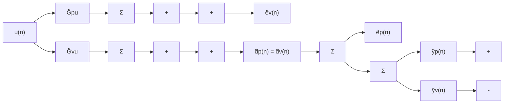
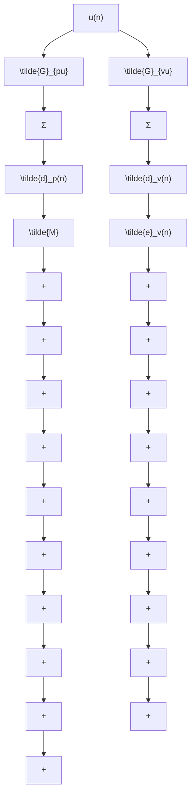
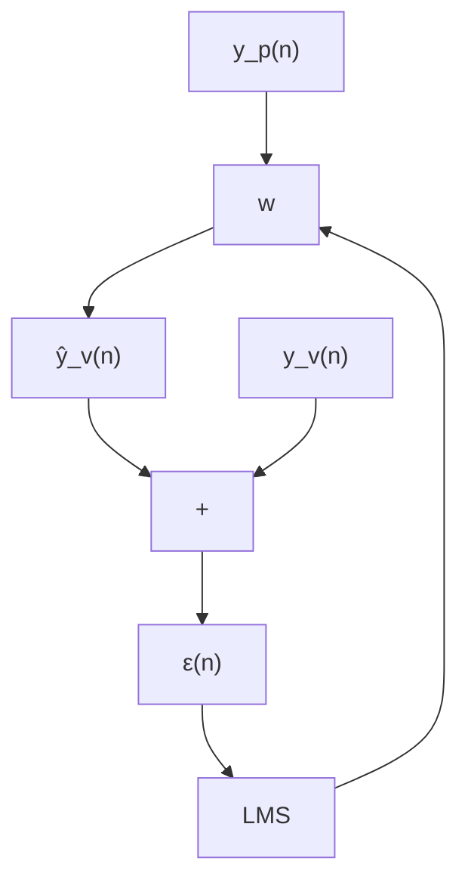
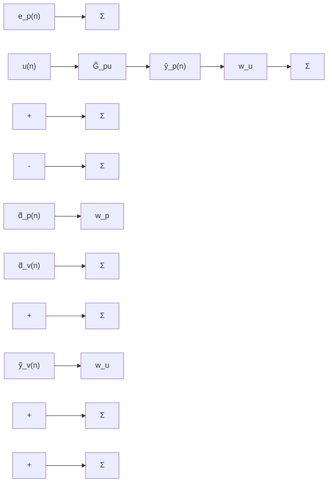
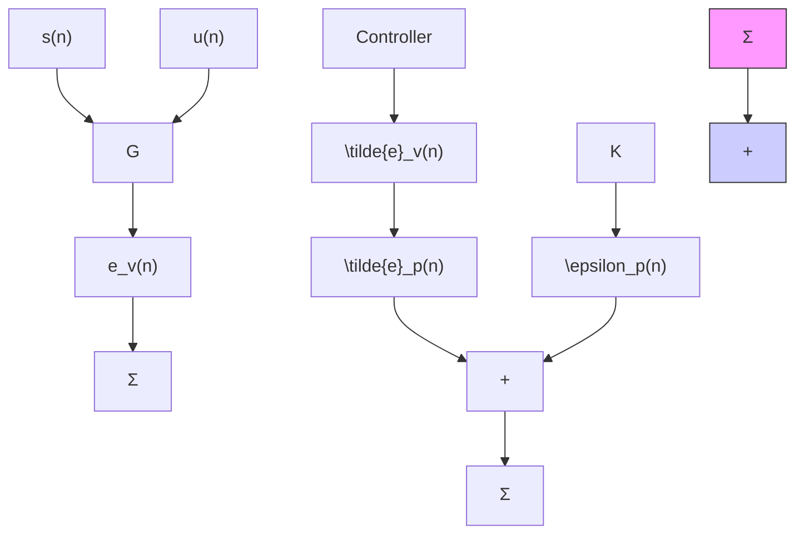
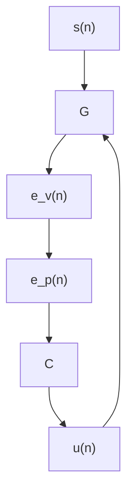
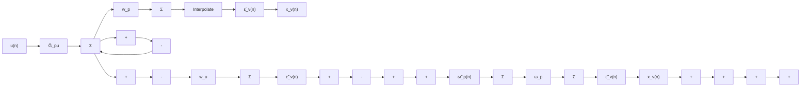

# A Review of Virtual Sensing Algorithms for Active Noise Control

Danielle Moreau 1,?, Ben Cazzolato 1, Anthony Zander 1 and Cornelis Petersen 2

1 School of Mechanical Engineering, The University of Adelaide, North Terrace, SA, 5005, Australia

2 Bassett, 100 Pirie Street, SA, 5000, Australia

E-mails: danielle.moreau@adelaide.edu.au; benjamin.cazzolato@adelaide.edu.au;

anthony.zander@adelaide.edu.au; d.petersen@bassett.com.au

? Author to whom correspondence should be addressed.

Received: 29 September 2008 / Accepted: 29 October 2008 / Published: 3 November 2008

Abstract: Traditional local active noise control systems minimise the measured acoustic pressure to generate a zone of quiet at the physical error sensor location. The resulting zone of quiet is generally limited in size and this requires the physical error sensor be placed at the desired location of attenuation, which is often inconvenient. To overcome this, a number of virtual sensing algorithms have been developed for active noise control. Using the physical error signal, the control signal and knowledge of the system, these virtual sensing algorithms estimate the error signal at a location that is remote from the physical error sensor, referred to as the virtual location. Instead of minimising the physical error signal, the estimated error signal is minimised with the active noise control system to generate a zone of quiet at the virtual location. This paper will review a number of virtual sensing algorithms developed for active noise control. Additionally, the performance of these virtual sensing algorithms in numerical simulations and in experiments is discussed and compared.

Keywords: Virtual sensing; Active noise control; Active headrest.

# 1. Introduction

Local active noise control systems aim to create a localised zone of quiet at the physical error sensor (typically a microphone) by minimising the acoustic pressure at the physical error sensor location with secondary sound sources (typically loudspeakers). While significant attenuation may be achieved at the physical sensor location, the zone of quiet tends to be very small. Also, the sound pressure levels outside the zone of quiet are likely to be higher than the original disturbance alone with the active noise control system present. This is illustrated in Fig. 1 (a), where the zone of quiet located at the physical error sensor is too small to extend to the observer’s ear and the observer in fact experiences an increase in the sound pressure level with the active noise control system operating. Elliott et al. [1] investigatedAlgorithms 2008, 1 2 the spatial extent of the zone of quiet when controlling pressure with a remote secondary source in a pure-tone diffuse sound field. The zone of quiet generated at the microphone was found to be defined by a sinc function, with the primary sound pressure level reduced by 10 dB over a sphere of diameter one tenth of the excitation wavelength, $\lambda / 1 0$ .

The zone of quiet generated at the sensor location may be enlarged by minimising the acoustic energye spatial extent of the zone of quiet when controlling pressure with a remote secondary source in a density instead of the acoustic pressure. As the control of acoustic pressure and pressure gradient at apure-tone diffuse sound field. The zone of quiet generated at the microphone was found to be defined by point is equivalent to minimising the acoustic energy density at that point [2], Elliott and Garcia-Bonitoa sinc function, with the primary sound pressure level reduced by 10 dB over a sphere of diameter one [3] investigated the control of both pressure and pressure gradient in a diffuse sound field with twotenth of the excitation wavelength, λ/10. secondary sources. Minimising both the pressure and pressure gradient along a single axis produced aThe zone of quiet generated at the sensor location may be enlarged by minimising the acoustic energy 10 dB zone of quiet over a distance of density instead of the acoustic pressure. $\lambda / 2$ , in the direction of pressure gradient measurement. This is the control of acoustic pressure and pressure gradient at a considerably larger than the zone of quiet obtained by minimising pressure alone.point is equivalent to minimising the acoustic energy density at that point [2], Elliott

As the zone of quiet generated at the physical error sensor is limited in size for active noise control,] investigated the control of both pressure and pressure gradient in a diffuse sound field with two virtual acoustic sensors were developed to shift the zone of quiet to a desired location that is remotesecondary sources. Minimising both the pressure and pressure gradient along a single axis produced a from the physical sensor. This is shown in Fig. 1 (b) where the zone of quiet is shifted from the physical10 dB zone of quiet over a distance of λ/2, in the direction of pressure gradient measurement. This is sensor to a virtual sensor located at the observer’s ear. Using the physical error signal, a virtual sensingconsiderably larger than the zone of quiet obtained by minimising pressure alone. algorithm is used to estimate the pressure at a fixed virtual location. Instead of minimising the physicalAs the zone of quiet generated at the physical error sensor is limited in size for active noise control, error signal, the estimated pressure is minimised with the active noise control system to generate a zonevirtual acoustic sensors were developed to shift the zone of quiet to a desired location that is remote of quiet at the virtual location. A number of virtual sensing algorithms have been developed to estimate the pressure at a fixed virtual location including the virtual microphone arrangement [4], the remote microphone technique [5], the forward difference prediction technique [6], the adaptive LMS virtual microphone technique [7], the Kalman filtering virtual sensing method [8] and the stochastically optimal tonal diffuse field virtual sensing technique [9].

Figure 1. Comparison of local active noise control (a) at a physical sensor; and (b) at aophone technique [7], the Kalman filtering virtual sensing method [8] and the stochastically optim virtual sensor. diffuse field vir   


<details>
<summary>text_image</summary>

Physical sensor
Primary noise
Controlled noise
</details>


<details>
<summary>text_image</summary>

Virtual sensor
Physical sensor
Primary noise
Controlled noise
</details>

igure 1. Comparison of local active noise control (a) at a physical sensor; and (b) at a virtual sensor.It is, however, likely that the desired location of attenuation is not spatially fixed. This occurs, for example, when the desired location of attenuation is the ear of a seated observer and the observer moves their head, thereby moving the virtual location. As a result, a number of moving virtual sensing algorithms have been developed to generate a virtual microphone capable of tracking a moving virtual location including the remote moving microphone technique [10], the adaptive LMS moving virtual microphone technique [11] and the Kalman filtering moving virtual sensing method [12].

This paper will review the spatially fixed and moving virtual sensing algorithms developed for active noise control. Additionally, the performance of these virtual sensing algorithms in numerical simulations and in experiments is discussed and compared. Finally, it should be noted that the performance of the virtual sensing algorithms is generally assessed indirectly through the performance of the active noise control system in achieving control at the virtual location. Key references are provided for those who wish to obtain further details on any of the virtual sensing algorithms. As the focus of this paper is on the spatially fixed and moving virtual sensing algorithms, details of active noise control algorithms that can be used to control the sound field and generate zones of quiet at the virtual locations are not given. Details of active noise control algorithms, such as the filtered-x LMS algorithm, may be found in Kuo and Morgan [13], Elliott [14] and Nelson and Elliott [2].

# 2. Spatially Fixed Virtual Sensing Algorithms

Spatially fixed virtual sensing algorithms are used to obtain estimates of the error signals at a number of spatially fixed virtual locations using the error signals from the remotely located physical error sensors, the control signal and knowledge of the system. These virtual sensing algorithms are then combined with an active noise control algorithm to generate zones of quiet at the fixed virtual locations. A number of spatially fixed virtual sensing algorithms have been developed in the past including the virtual microphone arrangement [4], the remote microphone technique [5], the forward difference prediction technique [6], the adaptive LMS virtual microphone technique [7], the Kalman filtering virtual sensing method [8] and the stochastically optimal tonal diffuse field virtual sensing technique [9]. A discussion of these algorithms is provided as follows.

# 2.1. The virtual sensing problem

The virtual sensing problem and notation used throughout this paper are introduced in this section. It is assumed here that there are $M _ { p }$ physical microphones, $M _ { v }$ spatially fixed virtual microphones and L secondary sources. The vector of the total pressures at the $M _ { p }$ physical microphones, ${ \bf e } _ { p } ( n )$ , is defined as

$$
\mathbf {e} _ {p} (n) = \left[ \begin{array}{l l l l} e _ {p 1} (n) & e _ {p 2} (n) & \dots & e _ {p M _ {p}} (n) \end{array} \right] ^ {\mathrm{T}}. \tag {1}
$$

The total pressures at the $M _ { p }$ physical microphones, ${ \bf e } _ { p } ( n )$ , is the sum of the sound fields produced by the primary and secondary sound sources at the physical microphone locations, and may be written as

$$
\mathbf {e} _ {p} (n) = \mathbf {d} _ {p} (n) + \mathbf {y} _ {p} (n) = \mathbf {d} _ {p} (n) + \mathbf {G} _ {p u} \mathbf {u} (n), \tag {2}
$$

where $\mathbf { d } _ { p } ( n )$ is a vector of the primary pressures at the $M _ { p }$ physical microphones, ${ \bf y } _ { p } ( n )$ is a vector of the secondary pressures at the $M _ { p }$ physical microphones, $\mathbf { G } _ { p u }$ is a matrix of size $M _ { p } \times L$ whose elements are the transfer functions between the secondary sources and the physical microphones, $\mathbf { u } ( n )$ is a vector of the secondary source strengths and n is the time step.

Similarly, the vector of the total pressures at the $M _ { v }$ spatially fixed virtual locations, ${ \bf e } _ { v } ( n )$ , is defined as

$$
\mathbf {e} _ {v} (n) = \left[ \begin{array}{l l l l} e _ {v 1} (n) & e _ {v 2} (n) & \dots & e _ {p M _ {v}} (n) \end{array} \right] ^ {\mathrm{T}}. \tag {3}
$$

The total pressures at the $M _ { v }$ virtual microphones, ${ \bf e } _ { v } ( n )$ , is the sum of the sound fields produced by the primary and secondary sources at the $M _ { v }$ virtual locations and may be written as

$$
\mathbf {e} _ {v} (n) = \mathbf {d} _ {v} (n) + \mathbf {y} _ {v} (n) = \mathbf {d} _ {v} (n) + \mathbf {G} _ {v u} \mathbf {u} (n), \tag {4}
$$

where ${ \bf d } _ { v } ( n )$ is the vector of the primary pressures at the $M _ { v }$ virtual locations, ${ \bf y } _ { v } ( n )$ is the vector of secondary pressures at the $M _ { v }$ virtual locations and $\mathbf { G } _ { v u }$ is a matrix of size $M _ { v } \times L$ whose elements are the transfer functions between the secondary sources and the virtual locations.

Using the physical error signals, ${ \bf e } _ { p } ( n )$ , a virtual sensing algorithm is used to estimate the pressures, ${ \bf e } _ { v } ( n )$ , at the spatially fixed virtual locations. Instead of minimising the physical error signals, the estimated pressures are minimised with the active noise control system to generate zones of quiet at the virtual locations.

# 2.2. The virtual microphone arrangement

The virtual microphone arrangement, proposed by Elliott and David [4], was the first virtual sensing algorithm suggested for active noise control. This virtual sensing algorithm uses the assumption of equal primary sound pressure at the physical and virtual microphone locations. Virtual sensing algorithms similar to the virtual microphone arrangement have also been proposed by Kuo et al. [15] and Pawelczyk [16, 17]. A block diagram of the virtual microphone arrangement is shown in Fig. 2. The virtual microphone arrangement is most easily implemented with equal numbers of physical and virtual sensors, so $M _ { v } = M _ { p } \left[ 1 2 \right]$ . The microphones are located in $M _ { v }$ pairs, each consisting of one physical microphone and one virtual microphone. In this virtual sensing algorithm the primary sound pressure is assumed to be equal at the physical and virtual microphones in each pair, i.e. that $\mathbf { d } _ { v } ( n ) = \mathbf { d } _ { p } ( n )$ . This assumption holds if the primary sound field does not change significantly between the physical and virtual microphones in each pair.

A preliminary identification stage is required in this virtual sensing algorithm in which the matrices of transfer functions, $\tilde { \mathbf { G } } _ { p u }$ and $\tilde { \mathbf { G } } _ { v u }$ , are modelled as matrices of FIR or IIR filters. Once this preliminary identification stage is complete, the microphones temporarily placed at the virtual locations are removed. As shown in Fig. 2, estimates, $\tilde { \mathbf { e } } _ { v } ( n )$ , of the total error signals at the virtual locations are calculated using

$$
\tilde {\mathbf {e}} _ {v} (n) = \mathbf {e} _ {p} (n) - (\tilde {\mathbf {G}} _ {p u} - \tilde {\mathbf {G}} _ {v u}) \mathbf {u} (n). \tag {5}
$$

The performance of the virtual microphone arrangement has been thoroughly investigated in both tonal and broadband sound fields by a number of authors [16–32]. Theoretical analysis in a pure tone diffuse sound field demonstrated that at low frequencies, the zone of quiet generated at a virtual microphone with the virtual microphone arrangement is comparable to that achieved by directly minimising the measured pressure of a physical microphone at the virtual location [18, 19]. At higher frequencies however, those above 500 Hz, the 10 dB zone of quiet is substantially smaller when using a virtual microphone compared to a physical microphone at the same location. This is due to the assumption of equal

Figure 2. Block diagram of the virtual microphone arrangement. ˜ ˜   


<details>
<summary>flowchart</summary>


</details>

Figure 2. Block diagram of the virtual microphone arrangement.primary pressure at the physical and virtual microphone locations being less valid as the wavelength decreases [18, 19].

wever, those above 500 Hz, the 10 dB zone of quiet is substantially smaller when using a virtual micro-The performance of a local active headrest system implementing the virtual microphone arrangement phone compared to a physical microphone at the same location. This is due to the assumption of equalhas been experimentally investigated by a number of authors [18, 19, 22, 23, 25, 27, 32]. An example of primary pressure at the physical and virtual microphone locations being less valid as the wavelengtha local active headrest system is shown in Fig. 3. Garcia-Bonito et al. [18, 19] investigated the perfordecreases [18, 19].mance of a local active headrest system in minimising a tonal primary disturbance at virtual microphones The performance of a local active headrest system implementing the virtual microphone arrangementlocated 2 cm from the ears of a manikin and 10 cm from the physical microphones. Below 500 Hz, the has been experimentally investigated by a number of authors [18, 19, 22, 23, 25, 27, 32]. An example of10 dB zone of quiet generated at the virtual microphone extends approximately 8 cm forward and 10 a local active headrest system is shown in Fig. 3. Garcia-Bonito et al. [18, 19] investigated the perfor-cm side to side. At higher frequencies however, the assumption relating to the similarity of the primarylocated 2 cm from the ears of a manikin and 10 cm from the physical microphones. Below 500 Hz, the field at the physical and virtual microphones is no longer valid and limited attenuation is achieved at the virtual location.

Figure 3. Local active headrest [23].   


<details>
<summary>text_image</summary>

Loudspeaker
Physical mic
</details>

Figure 3. Local active headrest [23].The performance of a local active headrest system in attenuating a broadband disturbance with a 100 Figure 3. Local active headrest [23].- 400 Hz frequency range was investigated by Rafaely et al. [22, 23] using feedback control. An overall The performance of a local active headrest system in attenuating a broadband disturbance with a 100attenuation of 9.5 dB was obtained at a virtual microphone located at the ear of a manikin with the virtual microphone arrangement. This is compared to 19 dB being obtained at the physical microphone by directly minimising the measured pressure signal. Differences in the attenuation achieved by minimising the physical and virtual microphone signals were partly attributed to the physical microphone being significantly closer to the secondary loudspeaker than the virtual microphone. This results in a longer delay in the virtual plant, which has a negative effect on the performance of the feedback control system.

As the performance of the active headrest will be affected by the presence of the passenger’s head, Garcia-Bonito and Elliott [20] and Garcia-Bonito et al. [19, 21] theoretically investigated the performance of the virtual microphone in generating a zone of quiet near the surface of a reflecting sphere. The presence of the reflecting sphere was seen to increase the size of the zone of quiet when using the virtual microphone arrangement, especially at high frequencies. This is due to the imposed zero pressure gradient on the reflecting surfaces.

# 2.3. The remote microphone technique

The remote microphone technique developed by Roure and Albarrazin [5] is an extension to the virtual microphone arrangement [4] which uses an additional matrix of filters to compute estimates of the primary disturbances at the virtual sensors from the primary disturbances at the physical sensors. An active acoustic attenuation system designed to attenuate noise at a location that is remote from the physical error sensor using the remote microphone technique was independently patented by Popovich [33]. Versions of the remote microphone technique have also been suggested by Hashimoto et al. [34], Friot et al. [35] and Yuan [36].

Like the virtual microphone arrangement, the remote microphone technique requires a preliminary identification stage in which the secondary transfer matrices $\tilde { \mathbf { G } } _ { p u }$ and $\tilde { \mathbf { G } } _ { v u }$ are modelled as matrices of FIR or IIR filters. The $M _ { v } \times M _ { p }$ sized matrix of primary transfer functions between the virtual locations and the physical locations, M˜ , is also estimated as a matrix of FIR or IIR filters during this preliminary identification stage. The secondary transfer function matrix $\tilde { \mathbf { G } } _ { p u }$ is identified using the secondary sources and the physical microphones while microphones temporarily placed at the virtual locations are used to obtain matrices $\tilde { \mathbf { G } } _ { v u }$ and M˜ .

A block diagram of the remote microphone technique is given in Fig. 4. As shown in Fig. 4, estimates of the primary disturbances, $\tilde { \mathbf { d } } _ { p } ( n )$ , at the physical error sensors are first calculated using

$$
\tilde {\mathbf {d}} _ {p} (n) = \mathbf {e} _ {p} (n) - \tilde {\mathbf {y}} _ {p} (n) = \mathbf {e} _ {p} (n) - \tilde {\mathbf {G}} _ {p u} \mathbf {u} (n). \tag {6}
$$

Next, estimates of the primary disturbances, $\tilde { \mathbf { d } } _ { v } ( n )$ , at the virtual locations are obtained using

$$
\tilde {\mathbf {d}} _ {v} (n) = \tilde {\mathbf {M}} \tilde {\mathbf {d}} _ {p} (n). \tag {7}
$$

Finally, estimates, $\tilde { \mathbf { e } } _ { v } ( n )$ , of the total virtual error signals are calculated as

$$
\tilde {\mathbf {e}} _ {v} (n) = \tilde {\mathbf {d}} _ {v} (n) + \tilde {\mathbf {y}} _ {v} (n) = \tilde {\mathbf {M}} \tilde {\mathbf {d}} _ {p} + \tilde {\mathbf {G}} _ {v u} \mathbf {u} (n). \tag {8}
$$

Radcliffe and Gogate [37] demonstrated that theoretically, a perfect estimate of the tonal disturbance at the virtual location can be achieved with this virtual sensing algorithm provided accurate models of the tonal transfer functions are obtained in the preliminary identification stage. Using a three-dimensional

Figure 4. Block diagram of the remote microphone technique.   


<details>
<summary>flowchart</summary>


</details>

Figure 4. Block diagram of the remote microphone technique.finite element model of a car cabin, the tonal control achieved at a number of virtual microphones generated with the remote microphone technique was equivalent to that achieved by directly minimising the Radcliffe and Gogate [37] demonstratmeasured signals at the virtual locations.

the virtual location can be achieved with this virtual sensing algorithm provided accurate models of theRoure and Albarrazin [5] experimentally investigated the performance of the remote microphone tonal transfer functions are obtained in the preliminary identification stage. Using a three-dimensionaltechnique in a room simulating an aircraft cabin with periodic noise at 170 Hz. Using twelve virtual finite element model of a car cabin, the tonal control achieved at a number of virtual microphones gen-microphones, six physical microphones and nine secondary sources, the remote microphone technique erated with the remote microphone technique was equivalent to that achieved by directly minimising theachieved an average attenuation of 20 dB at the twelve virtual locations with a feedforward control measured signals at the virtual locations.approach. However, 27 dB of attenuation was obtained by directly minimising the measured pressure at Roure and Albarrazin [5] experimentally investigated the performance of the remote microphonethe virtual locations. This disparity was attributed to the sensitivity of the remote microphone technique technique in a room simulating an aircraft cabin with periodic noise at 170 Hz. Using twelve virtualto errors in the measured transfer functions. The performance of the remote microphone technique has microphones, six physical microphones and nine secondary sources, the remote microphone techniquealso been investigated in the control of broadband noise in an acoustic enclosure [34], road traffic noise achieved an average attenuation of 20 dB a[38] and broadband acoustic duct noise [36].

The performance of the remote microphone technique has been experimentally compared to that of the virtual locations. This disparity was attributed to the sensitivity of the remote microphone techniquethe virtual microphone arrangement in a broadband primary sound field with 50 - 300 Hz frequency range [39]. Using a feedforward control approach, the two virtual sensing algorithms were used to generate a zone of quiet at a virtual location inside a three-dimensional enclosure using a physical microphone located on the enclosure wall 25 cm from the virtual location. The results demonstrated that greater attenuation is achieved at the virtual location with the remote microphone technique. The inferior performance of the virtual microphone arrangement was again attributed to the invalid assumption of equal primary sound pressure at the physical and virtual microphone locations.

# located on the enclosure wall 25 cm from the vir2.4. The forward difference prediction technique

rmance of the virtual microphone arrangement was again attributed to the invalid assumption of equalThe forward difference prediction technique, as proposed by Cazzolato [6], fits a polynomial to the primary sound pressure at the physical and virtual microphone locations.signals from a number of physical microphones in an array. The pressure at the virtual location is estimated by extrapolating this polynomial to the virtual location. This virtual sensing algorithm is 2.4. The forward difference prediction techniquesuitable for use in low frequency sound fields, when the virtual distance and the spacing between the physical microphones is much less than a wavelength. At low frequencies, the spatial rate of change of the sound pressure between the microphones is small and extrapolation can therefore be applied [6].

Fig. 5 (a) shows the pressure at a virtual location, x, estimated by a first-order finite difference estimate. Using physical mic $M _ { p } = 2$ physical microphones, separated by a distance of 2h, the equation for the estimates is much less than a wavelength. At low frequencies, the spatial rate of change o of the pressure at the virtual location using two microphone linear forward difference extrapolation isthe sound pressure between the microphones is small and extrapolation can therefore be applied [6]. given by [6]

$$
\tilde {e} _ {v} (n) = e _ {p 2} (n) + \frac {e _ {p 2} (n) - e _ {p 1} (n)}{2 h} x. \tag {9}
$$

The pressure at a virtual location, given by [6] $x ,$ can also be estimated by a second-order finite difference estimate, as shown in Fig. 5 (b). Using $M _ { p } = 3$ physical microphones, each separated by a distance of h, the equation for the estimate of the pressure at the virtual location using three microphone quadratic forwarde˜v(n) = ep2(n) + x. (9 difference extrapolation is given by [6]

$$
\tilde {e} _ {v} (n) = \frac {x (x + h)}{2 h ^ {2}} e _ {p 1} (n) + \frac {x (x + 2 h)}{h ^ {2}} e _ {p 2} (n) + \frac {(x + 2 h) (x + h)}{2 h ^ {2}} e _ {p 3} (n). \tag {10}
$$

Figure 5. Diagram of (a) two microphone linear forward difference extrapolation; and (b)x(x + h) x(x + 2h) (x + 2h)(x + h) three microphone quadratic forward difference extrapolation. The black curved line repre-e˜v(n) = 2h2 ep1(n) + h2 ep2(n) + 2h2 ep3(n). sents the actual pressure field and the dashed line represents the pressure estimate.   


<details>
<summary>text_image</summary>

e_{p1}(n)
2h
x
e_{p2}(n)
\tilde{e}_v(n)
</details>

(a)


<details>
<summary>text_image</summary>

e_{p1}(n)
e_{p2}(n)
e_{p3}(n)
\tilde{e}_v(n)
h
h
x
</details>

(b)

The forward difference prediction technique has several advantages over other virtual sensing algo-Figure 5. Diagram of (a) two microphone linear forward difference extrapolation; and (b) three microrithms. Firstly, the assumption of equal primary sound pressure at the physical and virtual locations does phone quadratic forward difference extrapolation. The black curved line represents the actual pressurnot have to be made, but also preliminary identification is not required, nor are FIR filters or similar to field and the dashed line represents the pressure estimate.model the complex transfer functions between the sensors and the sources. Furthermore, this is a fixed gain prediction technique that is robust to physical system changes that may alter the complex transfer The forward difference prediction technique has severafunctions between the error sensors and the control sources.

hms. Firstly, the assumption of equal primary sound pressure at the physical and virtual locations doeThe performance of forward difference prediction virtual sensors has been evaluated in a long narrow not have to be made, but also preliminary identification is not required, nor are FIR filters or similar tduct and in a free field, both numerically and experimentally, by a number of authors [40–47]. Using either linear or quadratic prediction techniques, these virtual sensors outperform the physical microphones gain prediction technique that is robust to physical system changes that may alter the complex transfein terms of the level of attenuation achieved at the virtual location. While the second-order estimate is functions between the error sensors and the control sources.theoretically more accurate than the first-order estimate, real-time feedforward experiments in a narrow The performance of forward difference prediction virtual sensors has been evaluated in a long narroduct demonstrated that quadratic prediction techniques are adversely affected by short wavelength extraneous noise. It was also shown by Petersen [12], that the estimation problem is ill-conditioned for the ther linear or quadratic prediction techniques, these virtual sensors outperform the physical micrthree sensor arrangement, explaining the difference between numerical and experimental results.

terms of the level of attenuation achieved at the virtual location. While the second-order estimate iIn an attempt to improve the prediction accuracy of the forward difference algorithm, higher-order theoretically more accurate than the first-order estimate, real-time feedforward experiments in a narroforward difference prediction virtual sensors which act to spatially filter out the extraneous noise were developed [45, 48]. Additional physical microphones were added to the array resulting in a greater number of microphones than system order. The microphone weights for this over constrained system were then calculated using a least squares approximation.

The pressure at a virtual location, x, estimated by a first-order finite difference estimate using $M _ { p } = 3$ physical microphones, each separated by a distance of $h ,$ , is shown in Fig. 6 (a). The equation for the estimate of the pressure at the virtual location using three microphone linear forward difference extrapolation is given by [45]

$$
\tilde {e} _ {v} (n) = \frac {(- 3 x - h)}{6 h} e _ {p 1} (n) + \frac {1}{3} e _ {p 2} (n) + \frac {(3 x + 5 h)}{6 h} e _ {p 3} (n). \tag {11}
$$

The pressure at a virtual location, x, estimated by a first-order finite difference estimate using $M _ { p } = 5$ physical microphones, separated by a distance of $h / 2 ,$ , is shown in Fig. 6 (b). The equation for the estimate of the pressure at the virtual location using five microphone linear forward difference extrapolation is given by [45]

$$
\tilde {e} _ {v} (n) = \frac {(- 2 x + 3 h)}{5 h} e _ {p 1} (n) + \frac {(- x + 2 h)}{5 h} e _ {p 2} (n) + \frac {1}{5} e _ {p 3} (n) + \frac {x}{5 h} e _ {p 4} (n) + \frac {(2 x - h)}{5 h} e _ {p 5} (n). \tag {12}
$$

The pressure at a virtual location, x, estimated by a second-order finite difference estimate using $M _ { p } = 5$ physical microphones, separated by a distance of $h / 2 ,$ , is shown in Fig. 6 (c). The equation for the estimate of the pressure at the virtual location using five microphone quadratic forward difference extrapolation is given by [45]

$$
\begin{array}{l} \tilde {e} _ {v} (n) = \frac {(2 0 x ^ {2} - 5 4 x h + 3 1 h ^ {2})}{3 5 h ^ {2}} e _ {p 1} (n) + \frac {(- 1 0 x ^ {2} + 3 x h + 9 h ^ {2})}{3 5 h ^ {2}} e _ {p 2} (n) \\ + \frac {(- 2 0 x ^ {2} - 4 0 x h - 3 1 h ^ {2})}{3 5 h ^ {2}} e _ {p 3} (n) + \frac {(- 1 0 x ^ {2} - 2 7 x h - 5 h ^ {2})}{3 5 h ^ {2}} e _ {p 4} (n) \\ + \frac {(2 0 x ^ {2} - 2 6 x h + 3 h ^ {2})}{3 5 h ^ {2}} e _ {p 5} (n). \tag {13} \\ \end{array}
$$

In experiments, the accuracy of these higher-order forward difference prediction virtual sensors was found to be adversely affected by sensitivity and phase mismatches and relative position errors between microphone elements in the array [45]. Such phase mismatches and position errors are unavoidable when a large number of physical microphones is used. It has also been demonstrated by Petersen [12], that the estimation problem is ill-conditioned for higher-order forward difference extrapolation.

In an attempt to extend the zone of quiet achieved at the virtual location, Kestell [40] and Kestell et al. [41–43] developed virtual energy density sensors using the forward difference prediction technique. An estimate of the energy density at a virtual location, x, using two microphone linear forward difference extrapolation, with the arrangement of physical microphones shown in Fig. 5 (a), is given by [40, 41]

$$
\begin{array}{l} \tilde {E} _ {D v} (n) = \frac {1}{4 \rho c ^ {2}} \left[ \left(1 + \frac {x}{2 h}\right) ^ {2} e _ {p 2} ^ {2} (n) - \frac {x}{h} \left(1 + \frac {x}{2 h}\right) e _ {p 1} (n) e _ {p 2} (n) + \left(\frac {x}{2 h}\right) ^ {2} e _ {p 1} ^ {2} (n) \right. \\ \left. - \frac {1}{(2 h k) ^ {2}} \left(e _ {p 2} ^ {2} (n) + 2 e _ {p 1} (n) e _ {p 2} (n) + e _ {p 1} ^ {2} (n)\right) \right], \tag {14} \\ \end{array}
$$

where k is the wavenumber. An estimate of the energy density at a virtual location, x, using three microphone quadratic forward difference extrapolation, with the arrangement of physical microphones

Figure 6. Diagram of (a) three microphone linear forward difference extrapolation; (b) five microphone linear forward difference extrapolation; and (c) five microphone quadratic forward difference extrapolation. The black curved line represents the actual pressure field and the dashed line represents the pressure estimate.   


<details>
<summary>text_image</summary>

e_{p1}(n)
e_{p2}(n)
e_{p3}(n)
\tilde{e}_v(n)
h
h
x
</details>

(a)


<details>
<summary>text_image</summary>

e_{p1}(n)
e_{p2}(n)
e_{p3}(n)
e_{p4}(n)
e_{p5}(n)
\tilde{e}_v(n)
h/2
h/2
h/2
h/2
x
</details>

(b)


<details>
<summary>text_image</summary>

e_{p1}(n)
e_{p2}(n)
e_{p3}(n)
e_{p4}(n)
e_{p5}(n)
\tilde{e}_v(n)
h/2
h/2
h/2
h/2
x
</details>

(c)

Figure 6. Diagram of (a) three microphshown in Fig. 5 (b), is given by [40, 41]

$$
\begin{array}{l} \tilde {E} _ {D v} (n) = \frac {1}{4 \rho c ^ {2}} \left[ \left(\frac {x (x + h)}{2 h ^ {2}} e _ {p 1} (n) + \frac {x (x + h)}{h ^ {2}} e _ {p 2} (n) \right. \right. \\ \left. + \frac {(x + 2 h) (x + h)}{2 h ^ {2}} e _ {p 3} (n)\right) ^ {2} \\ \left. - \frac {1}{(k) ^ {2}} \left(\frac {(2 x + h)}{2 h ^ {2}} e _ {p 1} (n) - \frac {(2 x + 2 h)}{h ^ {2}} e _ {p 2} (n) + \frac {(2 x + h)}{2 h ^ {2}} e _ {p 3} (n)\right) \right]. \tag {15} \\ \end{array}
$$

1 The experimental results presented by Kestell et al. [43] on the performance of forward difference − (2hk)2 ep2(n) + 2ep1(n)ep2(n) + ep1(n) , (14)prediction virtual energy density sensors were inconclusive and it was later demonstrated by Cazzolato et al. [49] that these results were most likely flawed.

# microphone quadratic forward difference extrapolatio2.5. The adaptive LMS virtual microphone technique

The adaptive LMS virtual microphone technique developed by Cazzolato [7] employs the adaptive E˜ (n) =    e (n) +   e (n)LMS algorithm [13] to adapt the weights of physical microphones in an array so that the weighted summation of these signals minimises the mean square difference between the predicted pressure and +   e (n)that measured by a microphone temporarily placed at the virtual location.

For the case of $M _ { v } = 1$ virtual microphones, an estimate of the total disturbance at the virtual microphone location, $\tilde { e } _ { v } ( n )$ −    ep1(n) −  ep2(n) +    ep3(n) ., is calculated as the sum of the weighted physical sensor signals at $M _ { p }$ (15)physical

sensors in an array and this is given by

$$
\tilde {e} _ {v} (n) = \sum_ {i = 1} ^ {M _ {p}} w _ {i} e _ {p i} (n) = \mathbf {w} ^ {\mathrm{T}} \mathbf {e} _ {p} (n), \tag {16}
$$

where w is a vector containing the $M _ { p }$ physical error sensor weights,

$$
\mathbf {w} = \left[ \begin{array}{l l l l} w _ {1} & w _ {2} & \dots & w _ {M _ {p}} \end{array} \right] ^ {\mathrm{T}}. \tag {17}
$$

The weights, w, are calculated in a preliminary identification stage by switching the primary source off and exciting the secondary source with band-limited white noise [12]. A modified version of the adaptive LMS algorithm is used to adapt the microphone weights. This algorithm can be used to find the optimal solution for the weights that minimises the mean square difference between the predicted sensor quantity, $\tilde { y } _ { v } ( n )$ , and that measured by a physical sensor temporarily placed at the virtual location, $y _ { v } ( n )$ . A block diagram of the adaptive LMS virtual microphone technique used to estimate the physical error sensor weights is shown in Fig. 7. As only a single temporal tap is used, the real valued weights correspond to pure gain and are calculated using

$$
\mathbf {w} (n + 1) = \mathbf {w} (n) + 2 \mu \mathbf {y} _ {p} (n) \epsilon (n), \tag {18}
$$

where $\mu$ is the convergence coefficient and $\epsilon ( n )$ is the error term. This error term, $\epsilon ( n )$ , is defined as the difference between the actual virtual secondary disturbance and the estimated virtual secondary disturbance, given by

$$
\epsilon (n) = y _ {v} (n) - \tilde {y} _ {v} (n), \tag {19}
$$

where the estimated virtual secondary disturbance is given by

$$
\tilde {y} _ {v} (n) = \mathbf {w} ^ {\mathrm{T}} \mathbf {y} _ {p} (n). \tag {20}
$$

Once the weights have converged, they are fixed and the temporary microphone is removed from the virtual location.

Figure 7. Block diagram of the adaptive LMS algorithm used to calculate the physical sensor weights.rithms 20   


<details>
<summary>flowchart</summary>


</details>

A virtual sensing algorithm similar to the adaptive LMS virtual microphone technique was also proposed by Gawron and Schaaf [50]. The performance of the adaptive LMS virtual microphone technique has been investigated for tonal duct noise, both numerically and experimentally [7, 45, 51, 52]. The adaptive virtual sensors were found to be unaffected by sensitivity mismatches and relative position errors adversely affecting the forward difference prediction technique. The adaptive sensors were seen to predict the pressure at the virtual location more accurately than the equivalent forward difference prediction virtual sensor.

Petersen [12] investigated the performance of the adaptive LMS virtual microphone technique in a broadband sound field with a frequency range of $5 0 \mathrm { ~ - ~ } 5 0 0 ~ \mathrm { H z } .$ in a long narrow duct. For an array of $M _ { p } = 2 , 3$ and 5 physical sensors, the overall estimation performance decreased with an increasing distance between the physical sensor array and the virtual location, for all three configurations of physical sensors. The best estimation performance is theoretically achieved with an array of five physical sensors, however, this configuration was found to be ill-conditioned in experiments and a similar estimation performance was achieved with all three physical sensor configurations.

Despite being calculated by exciting the secondary source only, the weights, w, in Eq. (18), are applied to both the primary and secondary disturbances. It has thus been assumed that the weights are optimal in the estimation of both disturbances. This however, may not always be true, especially in the near field of the secondary source where the spatial properties of the primary and secondary sound fields are very different [38]. As a result, Petersen [12] suggested that the optimal weights for the estimation of both the primary and secondary disturbances should be found separately, with the adaptive LMS virtual microphone technique being implemented as shown in Fig. 8.

As shown in Fig. 8, the virtual sensing algorithm separates the physical error signals into their primary and secondary components using the vector of the physical secondary transfer functions $\tilde { \mathbf { G } } _ { p u }$ . This vector of FIR or IIR filters is estimated in the preliminary identification stage. The primary component of the physical error signals is calculated as [12]

$$
\tilde {\mathbf {d}} _ {p} (n) = \mathbf {e} _ {p} (n) - \tilde {\mathbf {y}} _ {p} (n) = \mathbf {e} _ {p} (n) - \tilde {\mathbf {G}} _ {p u} u (n). \tag {21}
$$

Once the primary and secondary weights have been estimated separately using Eq. (18), the pressure at the virtual location is estimated, as shown in Fig. 8, using

$$
\tilde {e} _ {v} (n) = \tilde {d} _ {v} + \tilde {y} _ {v} = \mathbf {w} _ {p} ^ {\mathrm{T}} \tilde {\mathbf {d}} _ {p} (n) + \mathbf {w} _ {u} ^ {\mathrm{T}} \tilde {\mathbf {y}} _ {p} (n), \tag {22}
$$

where $\mathbf { w } _ { p }$ and ${ \bf w } _ { u }$ are vectors containing the $M _ { p }$ optimal physical primary and secondary weights and $\tilde { \mathbf { d } } _ { p } ( n )$ and $\tilde { \mathbf { y } } _ { p } ( n )$ are vectors containing estimates of the primary and secondary disturbances at the $M _ { p }$ physical sensor locations.

# 2.6. The Kalman filtering virtual sensing method

The Kalman filtering virtual sensing method [8] uses Kalman filtering theory to obtain estimates of the error signals at the virtual locations. In this virtual sensing method, the active noise control system is first modelled as a state space system whose outputs are the physical and virtual error signals. A Kalman filter is formulated to compute estimates of the plant states and subsequently estimate the virtual error signals using the physical error signals.

Figure 8. Block diagram of the adaptive LMS virtual microphone technique [38].   


<details>
<summary>flowchart</summary>


</details>

Figure 8. Block diagram of the adaptive LMS virtual microphone technique [38].The active noise control system plant is described by the following state space model [8, 12]

$$
\mathbf {z} (n + 1) = \mathbf {A z} (n) + \mathbf {B} _ {u} \mathbf {u} (n) + \mathbf {B} _ {s} \mathbf {s} (n),
$$

$$
\mathbf {e} _ {p} (n) = \mathbf {C} _ {p} \mathbf {z} (n) + \mathbf {D} _ {p u} \mathbf {u} (n) + \mathbf {D} _ {p s} \mathbf {s} (n) + \mathbf {v} _ {p} (n), \tag {23}
$$

$$
\mathbf {e} _ {v} (n) = \mathbf {C} _ {v} \mathbf {z} (n) + \mathbf {D} _ {v u} \mathbf {u} (n) + \mathbf {D} _ {v s} \mathbf {s} (n) + \mathbf {v} _ {v} (n),
$$

where ${ \bf z } ( n )$ are the N plant states, $\mathbf { v } _ { p } ( n )$ are the physical measurement noise signals, ${ \bf v } _ { v } ( n )$ are the virtual measurement noise signals and $\mathbf { s } ( n )$ are the K primary disturbance signals. In the state space model, A is the state matrix of size $N \times N$ in discrete form, $\mathbf { B } _ { u }$ is the discrete secondary input matrix of size $N \times L , \mathbf { B } _ { s }$ is the discrete primary input matrix of size $N \times K , \mathbf { C } _ { p }$ is the discrete physical output matrix of size $M _ { p } \times N , \mathbf { C } _ { v }$ (n + 1) = Az(n) + B u(n) + B s(n),is the discrete virtual output matrix of size $M _ { v } \times N , \mathbf { D } _ { p u }$ and $\mathbf { D } _ { p s }$ are the discrete physical feedforward matrices of size $M _ { p } \times L$ and $M _ { p } \times K$ respectively and $\mathbf { D } _ { v u }$ and $\mathbf { D } _ { v s }$ are the discrete virtual feedforward matrices of size $M _ { v } \times L$ and $M _ { v } \times K$ respectively. Inclusion of the measurement noise signals, $\mathbf { v } _ { p } ( n )$ and ${ \bf v } _ { v } ( n )$ , in the state space model account for measurement noise on where z(n) are the N plant states, v (n) are the physical measurement noise signals, v (n) are thethe microphones at the physical and virtual locations during the preliminary identification stage. Once virtual measurement noise signals and s(n) are the K primary disturbance signals. In the state spacethe preliminary identification stage is complete, the microphones temporarily positioned at the virtual model, A is the state mlocations are removed.

size N L, B is the discrete primary input matrix of size N K, C is the discrete physical outputImplementation of the Kalman filtering virtual sensing method is shown in the block diagram in Fig. 9 matrix of size M N , C is the discrete virtual output matrix of s(a). In this figure, G is the generalised plant of the acoustic system, $\tilde { \mathrm { G } }$ M N, D and D are theis an estimate of the generalised discrete physical feedforward matrices of size M L and M K respectively and D and D areplant given by the state space model in Eq. (23) and K are the Kalman filter gains. This is a form of the discrete virtual feedforward matrices of size M L and M K respectively. Inclusion of thethe generalised control configuration with two sets of inputs and two sets of outputs [53], as shown in measurement noise signals, vp(n) and vv(n), in the state space model account for measurement noise onFig. 9 (b). The generalised control configuration with two sets of inputs and two sets of outputs [53] can the microphones at the physical and virtual locations dutherefore be interpreted as a virtual sensor arrangement.

e preliminary identification stage is complete, the mThe covariance properties of the stochastic signals $\mathbf { s } ( n ) , \mathbf { v } _ { p } ( n )$ emp and ${ \bf v } _ { v } ( n )$ positioned at the virtual are required when using locations are removed.Kalman filtering theory to estimate the error signals at the virtual locations. These covariance proper-Implementation of the Kalman filtering virtual sensing method is shown in the block diagram in Fig. 9ties and the state space model of the active noise control system plant are estimated during a preliminary (a). In this figure, G is the generalised plant of the acoustic system, G˜ is an estimate of the generalisedidentification stage with microphones temporarily positioned at the virtual locations. The primary disturplant given bybance signals, $\mathbf { s } ( n )$ state space model in Eq. (23) and K are t, the physical measurement noise signals, $\mathbf { v } _ { p } ( n )$ lman filter gains. This is a form of, and the virtual measurement noise the genesignals, ${ \bf v } _ { v } ( n )$ d control configuration with two sets of inputs and two sets of outputs [53], as shown in, are all assumed to be zero mean white stationary random processes with the following

Figure 9. Block diagram of (a) implementation of the Kalman filtering virtual sensing method and (b) the generalised control configuration with two sets of inputs and two sets orithmsof outputs [200853]. , 1   


<details>
<summary>flowchart</summary>


</details>

(a)


<details>
<summary>flowchart</summary>


</details>

(b)

Figure 9. Block diagram ocovariance properties [8, 12]

$$
E \left[ \left[ \begin{array}{l} \mathbf {s} (n) \\ \mathbf {v} _ {p} (n) \\ \mathbf {v} _ {v} (n) \end{array} \right] \left[ \begin{array}{l} \mathbf {s} (k) \\ \mathbf {v} _ {p} (k) \\ \mathbf {v} _ {v} (k) \\ 1 \end{array} \right] ^ {\mathrm{T}} \right] = \left[ \begin{array}{c c c c} \mathbf {I} & \mathbf {S} _ {p s} ^ {\mathrm{T}} & \mathbf {S} _ {v s} ^ {\mathrm{T}} & \mathbf {0} \\ \hline \mathbf {S} _ {p s} & \mathbf {R} _ {p} & \mathbf {R} _ {p v} & \mathbf {0} \\ \mathbf {S} _ {v s} & \mathbf {R} _ {p v} ^ {\mathrm{T}} & \mathbf {R} _ {v s} & \mathbf {0} \end{array} \right] \delta_ {n k}, \tag {24}
$$

where $E [ \cdot ]$   T denotes the expectation operator, I is the identity matrix and $\delta _ { n k }$ is the Kronecker delta function.

The term ${ \bf B } _ { s } { \bf s } ( n )$ E  vp(n)     =  Sps Rp Rin Eq. (23) can be interpreted as process noise, ${ \bf w } ( n )$  δnk, (24), and the combined influence  vv(n)    Svs RTpv Rvs 0of the measurement noise signals and disturbance signals can be interpreted as an auxiliary measurement

noise signal, v(n), where

$$
\mathbf {w} (n) = \mathbf {B} _ {s} \mathbf {s} (n), \tag {25}
$$

$$
\mathbf {v} (n) = \left[ \begin{array}{l} \mathbf {D} _ {p s} \mathbf {s} (n) + \mathbf {v} _ {p} (n) \\ \mathbf {D} _ {v s} \mathbf {s} (n) + \mathbf {v} _ {v} (n) \end{array} \right]. \tag {26}
$$

Using these definitions, the following covariance matrix can be defined

$$
E \left[ \left[ \begin{array}{l} \mathbf {w} (n) \\ \mathbf {v} (n) \end{array} \right] \left[ \begin{array}{l} \mathbf {w} (k) \\ \mathbf {v} (k) \end{array} \right] ^ {\mathrm{T}} \right] = \left[ \begin{array}{c c} \bar {\mathbf {Q}} _ {s} & \bar {\mathbf {S}} _ {s} ^ {\mathrm{T}} \\ \hline \bar {\mathbf {S}} _ {s} & \bar {\mathbf {R}} _ {s} \end{array} \right] \delta_ {n k}. \tag {27}
$$

The covariance matrix $\bar { \mathbf { Q } } _ { s }$ of the process noise ${ \bf w } ( n )$ is given by

$$
\bar {\mathbf {Q}} _ {s} = \mathbf {B} _ {s} \mathbf {B} _ {s} ^ {\mathrm{T}}. \tag {28}
$$

The covariance matrix $\bar { \mathbf { R } } _ { s }$ of the auxiliary measurement noise $\mathbf { v } ( n )$ is given by

$$
\begin{array}{l} \bar {\mathbf {R}} _ {s} = \left[ \begin{array}{c c} \bar {\mathbf {R}} _ {p} & \bar {\mathbf {R}} _ {p v} \\ \hline \bar {\mathbf {R}} _ {p v} ^ {\mathrm{T}} & \bar {\mathbf {R}} _ {v} \end{array} \right] \\ = \left[ \begin{array}{c c} \mathbf {R} _ {p} + \mathbf {S} _ {p s} ^ {\mathrm{T}} \mathbf {D} _ {p s} + \mathbf {D} _ {p s} \mathbf {S} _ {p s} + \mathbf {D} _ {p s} \mathbf {D} _ {p s} ^ {\mathrm{T}} & \mathbf {R} _ {p v} ^ {\mathrm{T}} + \mathbf {S} _ {p s} ^ {\mathrm{T}} \mathbf {D} _ {v s} ^ {\mathrm{T}} + \mathbf {D} _ {p s} \mathbf {S} _ {v s} + \mathbf {D} _ {p s} \mathbf {D} _ {v s} ^ {\mathrm{T}} \\ \hline \mathbf {R} _ {p v} ^ {\mathrm{T}} + \mathbf {S} _ {v s} ^ {\mathrm{T}} \mathbf {D} _ {p s} ^ {\mathrm{T}} + \mathbf {D} _ {v s} \mathbf {S} _ {p s} + \mathbf {D} _ {v s} \mathbf {D} _ {p s} ^ {\mathrm{T}} & \mathbf {R} _ {v} + \mathbf {S} _ {v s} ^ {\mathrm{T}} \mathbf {D} _ {v s} + \mathbf {D} _ {v s} \mathbf {S} _ {v s} + \mathbf {D} _ {v s} \mathbf {D} _ {v s} ^ {\mathrm{T}} \end{array} \right]. \tag {29} \\ \end{array}
$$

The covariance matrix $\bar { \mathbf { S } } _ { s }$ between the process noise $\mathbf { w } ( n )$ and the auxiliary measurement noise $\mathbf { v } ( n )$ is given by

$$
\bar {\mathbf {S}} _ {s} = \left[ \begin{array}{l} \bar {\mathbf {S}} _ {p s} \\ \bar {\mathbf {S}} _ {v s} \end{array} \right] = \left[ \begin{array}{l} \mathbf {D} _ {p s} \mathbf {B} _ {s} ^ {\mathrm{T}} + \mathbf {S} _ {p s} \mathbf {B} _ {s} ^ {\mathrm{T}} \\ \mathbf {D} _ {v s} \mathbf {B} _ {s} ^ {\mathrm{T}} + \mathbf {S} _ {v s} \mathbf {B} _ {s} ^ {\mathrm{T}} \end{array} \right]. \tag {30}
$$

The virtual sensing algorithm in state space form, that estimates the virtual error signals $\tilde { \mathbf { e } } _ { v } ( n | n )$ , given measurements of the physical error signals $\mathbf { e } _ { p } ( i )$ up to $i = n$ , is as follows [8, 12]

$$
\left[ \begin{array}{c} \tilde {\mathbf {z}} (n + 1 | n) \\ \tilde {\mathbf {e}} _ {v} (n | n) \end{array} \right] = \left[ \begin{array}{c c c} \mathbf {A} - \mathbf {K} _ {p s} \mathbf {C} _ {p} & \mathbf {B} _ {u} - \mathbf {K} _ {p s} \mathbf {D} _ {p u} & \mathbf {K} _ {p s} \\ \mathbf {C} _ {v} - \mathbf {M} _ {v s} \mathbf {C} _ {p} & \mathbf {D} _ {v u} - \mathbf {M} _ {v s} \mathbf {D} _ {p u} & \mathbf {M} _ {v s} \end{array} \right] \left[ \begin{array}{c} \tilde {\mathbf {z}} (n | n - 1) \\ \mathbf {u} (n) \\ \mathbf {e} _ {p} (n) \end{array} \right], \tag {31}
$$

where $\mathbf { K } _ { p s }$ is the Kalman gain matrix and ${ \bf M } _ { v s }$ is the virtual innovation gain matrix. The Kalman gain matrix and the virtual innovation gain matrix are found by

$$
\mathbf {K} _ {p s} = \left(\mathbf {A P} _ {p s} \mathbf {C} _ {p} ^ {\mathrm{T}} + \bar {\mathbf {S}} _ {p s}\right) \mathbf {R} _ {p \epsilon} ^ {- 1}, \tag {32}
$$

$$
\mathbf {M} _ {v s} = \left(\mathbf {C} _ {v} \mathbf {P} _ {p s} \mathbf {C} _ {p} ^ {\mathrm{T}} + \bar {\mathbf {R}} _ {p v} ^ {- 1}\right) \mathbf {R} _ {p \epsilon} ^ {- 1}, \tag {33}
$$

with ${ \bf P } _ { p s } = { \bf P } _ { p s } ^ { \mathrm { T } }$ , the unique solution to the discrete algebraic Riccati equation given by

$$
\mathbf {P} _ {p s} = \mathbf {A} \mathbf {P} _ {p s} \mathbf {A} ^ {\mathrm{T}} - \left(\mathbf {A} \mathbf {P} _ {p s} \mathbf {C} _ {p} ^ {\mathrm{T}} + \bar {\mathbf {S}} _ {p s}\right) \left(\mathbf {C} _ {p} \mathbf {P} _ {p s} \mathbf {C} _ {p} ^ {\mathrm{T}} + \bar {\mathbf {R}} _ {p}\right) ^ {- 1} \left(\mathbf {A} \mathbf {P} _ {p s} \mathbf {C} _ {p} ^ {\mathrm{T}} + \bar {\mathbf {S}} _ {p s}\right) ^ {\mathrm{T}} + \bar {\mathbf {Q}} _ {s}, \tag {34}
$$

where $\mathbf { R } _ { p \epsilon }$ is the covariance matrix of the innovation signals $\epsilon _ { p } ( n ) = { \bf e } _ { p } ( n ) - \tilde { { \bf e } } _ { p } ( n | n - 1 )$ given by

$$
\mathbf {R} _ {p \epsilon} = \left[ \epsilon_ {p} (n) \epsilon_ {p} (n) ^ {\mathrm{T}} \right] = \mathbf {C} _ {p} \mathbf {P} _ {p s} \mathbf {C} _ {p} ^ {\mathrm{T}} + \bar {\mathbf {R}} _ {p}. \tag {35}
$$

To implement the Kalman filtering virtual sensing method, the state space matrices A, $\mathbf { B } _ { u } , \mathbf { C } _ { p } , \mathbf { C } _ { v } .$ , $\mathbf { D } _ { p u }$ and $\mathbf { D } _ { v u }$ of the state space model in Eq. (23) and the covariance matrices $\bar { \mathbf { Q } } _ { s } , \bar { \mathbf { S } } _ { p s } , \bar { \mathbf { R } } _ { p }$ and $\bar { \mathbf { R } } _ { p v }$ need to be known [12]. Together, the state space model in Eq. (23) and covariance matrices describe the behaviour of the active noise control system and the covariance properties of the input signals. In practice, the behaviour of the active noise control system can be estimated in a preliminary system identification stage using subspace identification techniques [54]. Subspace identification techniques estimate a model of the active noise control system in an innovations form [54]. Therefore, the Kalman filtering virtual sensing method needs to be reformulated for practical implementation with an innovations model of the active noise control system. The steps to practical implementation of the Kalman filtering virtual sensing method using an innovations model of the active noise control system are as follows [12]

1. Temporarily locate physical sensors at the spatially fixed virtual locations and measure an inputoutput data-set

$$
\left\{\mathbf {u} (n), \left[ \begin{array}{l} \mathbf {e} _ {p} (n) \\ \mathbf {e} _ {v} (n) \end{array} \right] \right\} _ {n = 1} ^ {N s}. \tag {36}
$$

2. Use subspace identification techniques [54] to estimate an innovations model of the physical and virtual error signals

$$
\tilde {\mathbf {z}} (n + 1 | n) = \tilde {\mathbf {A}} \tilde {\mathbf {z}} (n | n - 1) + \tilde {\mathbf {B}} _ {u} \mathbf {u} (n) + \tilde {\mathbf {K}} _ {s} \left[ \begin{array}{c} \epsilon_ {p} (n) ^ {\mathrm{T}} \epsilon_ {v} (n) ^ {\mathrm{T}} \end{array} \right] ^ {\mathrm{T}}
$$

$$
\mathbf {e} _ {p} (n) = \tilde {\mathbf {C}} _ {p} \tilde {\mathbf {z}} (n | n - 1) + \tilde {\mathbf {D}} _ {p u} \mathbf {u} (n) + \epsilon_ {p} (n) \tag {37}
$$

$$
\mathbf {e} _ {v} (n) = \tilde {\mathbf {C}} _ {v} \tilde {\mathbf {z}} (n | n - 1) + \tilde {\mathbf {D}} _ {v u} \mathbf {u} (n) + \epsilon_ {v} (n),
$$

and estimate the covariance matrix of the white innovation signals

$$
\tilde {\mathbf {R}} _ {\epsilon} = \left[ \begin{array}{l l} \tilde {\bar {\mathbf {R}}} _ {p \epsilon} & \tilde {\bar {\mathbf {R}}} _ {p v \epsilon} \\ \tilde {\bar {\mathbf {R}}} _ {p v \epsilon} ^ {\mathrm{T}} & \tilde {\bar {\mathbf {R}}} _ {v \epsilon} \end{array} \right]. \tag {38}
$$

3. Implement the Kalman filtering virtual sensing method as

$$
\left[ \begin{array}{c} \tilde {\mathbf {z}} (n + 1 | n) \\ \hline \tilde {\mathbf {e}} _ {v} (n | n) \end{array} \right] = \left[ \begin{array}{c c c} \tilde {\mathbf {A}} - \tilde {\mathbf {K}} _ {p s} \tilde {\mathbf {C}} _ {p} & \tilde {\mathbf {B}} _ {u} - \tilde {\mathbf {K}} _ {p s} \tilde {\mathbf {D}} _ {p u} & \tilde {\mathbf {K}} _ {p s} \\ \hline \tilde {\mathbf {C}} _ {v} - \tilde {\mathbf {M}} _ {v s} \tilde {\mathbf {C}} _ {p} & \tilde {\mathbf {D}} _ {v u} - \tilde {\mathbf {M}} _ {v s} \tilde {\mathbf {D}} _ {p u} & \tilde {\mathbf {M}} _ {v s} \end{array} \right] \left[ \begin{array}{c} \tilde {\mathbf {z}} (n | n - 1) \\ \hline \mathbf {u} (n) \\ \mathbf {e} _ {p} (n) \end{array} \right], \tag {39}
$$

where the Kalman gain matrix $\tilde { \mathbf { K } } _ { p s }$ and the virtual innovation gain matrix $\tilde { \mathbf { M } } _ { v s }$ are calculated as follows

$$
\tilde {\mathbf {K}} _ {p s} = \left(\tilde {\mathbf {A}} \mathbf {X} _ {s} \tilde {\mathbf {C}} _ {p} ^ {\mathrm{T}} + \tilde {\mathbf {K}} _ {s} \left[ \begin{array}{l} \tilde {\bar {\mathbf {R}}} _ {p \epsilon} \\ \tilde {\bar {\mathbf {R}}} _ {p v \epsilon} ^ {\mathrm{T}} \end{array} \right]\right) (\tilde {\mathbf {C}} _ {p} \mathbf {X} _ {s} \tilde {\mathbf {C}} _ {p} ^ {\mathrm{T}} + \tilde {\bar {\mathbf {R}}} _ {p \epsilon}) ^ {- 1}, \tag {40}
$$

$$
\tilde {\mathbf {M}} _ {v s} = \left(\tilde {\mathbf {C}} _ {v} \mathbf {X} _ {s} \tilde {\mathbf {C}} _ {p} ^ {\mathrm{T}} + \tilde {\bar {\mathbf {R}}} _ {p v \epsilon} ^ {\mathrm{T}}\right) \left(\tilde {\mathbf {C}} _ {p} \mathbf {X} _ {s} \tilde {\mathbf {C}} _ {p} ^ {\mathrm{T}} + \tilde {\bar {\mathbf {R}}} _ {p \epsilon}\right) ^ {- 1}, \tag {41}
$$

with $\mathbf { X } _ { s } = \mathbf { X } _ { s } ^ { \mathrm { { T } } } > 0$ , the unique solution to the discrete algebraic Riccati equation given by

$$
\mathbf {X} _ {s} = \tilde {\mathbf {A}} \mathbf {X} _ {s} \tilde {\mathbf {A}} ^ {\mathrm{T}} - \tilde {\mathbf {K}} _ {p s} \left(\tilde {\mathbf {C}} _ {p} \mathbf {X} _ {s} \tilde {\mathbf {C}} _ {p} ^ {\mathrm{T}} + \tilde {\bar {\mathbf {R}}} _ {p \epsilon}\right) ^ {- 1} \tilde {\mathbf {K}} _ {p s} ^ {\mathrm{T}} + \tilde {\mathbf {K}} _ {s} \tilde {\mathbf {R}} _ {\epsilon} \tilde {\mathbf {K}} _ {s} ^ {\mathrm{T}}. \tag {42}
$$

The Kalman filtering virtual sensing method is optimal in its estimation of the virtual error signals given a known or measured noise covariance. Also, instead of using a number of FIR or IIR filter matrices to compute an estimate of the virtual error signals, one compact state space model is used. This virtual sensing algorithm is also derived including measurement noise on the sensors [8]. The Kalman filtering virtual sensing method is however, limited to use in systems of relatively low order.

The performance of this virtual sensing algorithm in generating a zone of quiet at a virtual microphone 10 cm from a physical microphone has been investigated in real-time broadband feedforward experiments conducted in an acoustic duct over a 50 - 500 Hz frequency range [8, 12]. The state space model of the plant was first estimated using subspace model identification techniques [54] with a microphone temporarily placed at the virtual location. Combining this virtual sensing algorithm with the filtered-x LMS algorithm [14] achieved an overall attenuation of 19.7 dB at the virtual location. This is compared to an attenuation of 25.1 dB being achieved by directly minimising the error signal at the virtual location. The 5.4 dB difference was attributed to the fact that the primary disturbances at the physical and virtual locations were not completely causally related, which is a requirement in this virtual sensing algorithm.

# 2.7. The stochastically optimal tonal diffuse field virtual sensing method

The stochastically optimal tonal diffuse field virtual sensing method generates stochastically optimal virtual microphones and virtual energy density sensors specifically for use in pure tone diffuse sound fields [9, 55]. Like the forward difference extrapolation technique, this virtual sensing method does not require a preliminary identification stage nor models of the complex transfer functions between the error sensors and the sources. It is worth noting that the stochastically optimal tonal diffuse field virtual sensing method is analogous to a fixed gain feedforward control problem.

In this section, the primary and secondary acoustic fields are considered diffuse and different notation will be adopted for convenience. The pressure at a position x in a single diffuse acoustic field is denoted $p _ { i } ( { \bf x } )$ , and $g _ { i } ( \mathbf { x } )$ denotes the x-axis component of the pressure gradient. In this section, the subscript i refers to a single diffuse acoustic field, whereas a lack of subscript indicates the total acoustic field produced by superposition of the primary and secondary diffuse acoustic fields.

For a displacement vector, $\mathbf { r } = r _ { x } \mathbf { i } + r _ { y } \mathbf { j } + r _ { z }$ k, the following functions are defined:

$$
A (\mathbf {r}) = \operatorname{sinc} (k | \mathbf {r} |), \tag {43}
$$

$$
B (\mathbf {r}) = \frac {\partial A (\mathbf {r})}{\partial r _ {x}}
$$

$$
= - k \left(\frac {\operatorname{sinc} (k | \mathbf {r} |) - \cos (k | \mathbf {r} |)}{k | \mathbf {r} |}\right) \left(\frac {r _ {x}}{| \mathbf {r} |}\right), \tag {45}
$$

$$
\begin{array}{l} C (\mathbf {r}) = \frac {\partial^ {2} A (\mathbf {r})}{\partial r _ {x} ^ {2}} \\ = - k ^ {2} \left[ \operatorname{sinc} (k | \mathbf {r} |) \left(\frac {r _ {x}}{| \mathbf {r} |}\right) ^ {2} + \left(\frac {\operatorname{sinc} (k | \mathbf {r} |) - \cos (k | \mathbf {r} |)}{(k | \mathbf {r} |) ^ {2}}\right) \left(1 - 3 \left(\frac {r _ {x}}{| \mathbf {r} |}\right) ^ {2}\right) \right], \tag {46} \\ \end{array}
$$

where k is the wavenumber. The correlations between the pressures and pressure gradients at two different points, $\mathbf { x } _ { j }$ and $\mathbf { x } _ { k } .$ , separated by r, are given by [3]

$$
\left\langle p _ {i} \left(\mathbf {x} _ {j}\right) p _ {i} ^ {\star} \left(\mathbf {x} _ {k}\right) \right\rangle = A (\mathbf {r}) \left\langle \left| p _ {i} \right| ^ {2} \right\rangle , \tag {47}
$$

$$
\left\langle p _ {i} \left(\mathbf {x} _ {j}\right) g _ {i} ^ {\star} \left(\mathbf {x} _ {k}\right) \right\rangle = - B (\mathbf {r}) \left\langle \left| p _ {i} \right| ^ {2} \right\rangle , \tag {48}
$$

$$
\left\langle g _ {i} \left(\mathbf {x} _ {j}\right) p _ {i} ^ {\star} \left(\mathbf {x} _ {k}\right) \right\rangle = B (\mathbf {r}) \left\langle \left| p _ {i} \right| ^ {2} \right\rangle , \tag {49}
$$

$$
\left\langle g _ {i} \left(\mathbf {x} _ {j}\right) g _ {i} ^ {\star} \left(\mathbf {x} _ {k}\right) \right\rangle = - C (\mathbf {r}) \left\langle \left| p _ {i} \right| ^ {2} \right\rangle , \tag {50}
$$

where h·i denotes spatial averaging and ? indicates complex conjugation. In the case that $\mathbf { x } _ { j }$ and $\mathbf { x } _ { k }$ are the same point, the limits of $A ( \mathbf { r } )$ , $B ( \mathbf { r } )$ and $C ( \mathbf { r } )$ as $\mathbf r \longrightarrow 0$ must be taken. If there are $M _ { p }$ sensors in the field, each measuring pressure or pressure gradient, then define p as an $M _ { p } \times 1$ matrix whose elements are the relevant pressures and pressure gradients measured by the sensors. The pressure and pressure gradient at any point can be expressed as the weighted sum of the $M _ { p }$ components, each of which are perfectly correlated with a corresponding element of p and a component which is perfectly uncorrelated with each of the elements. Therefore, for each position x, $p ( \mathbf { x } )$ and $g ( \mathbf { x } )$ can be written as

$$
p (\mathbf {x}) = \mathbf {H} _ {p} (\mathbf {x}) \mathbf {p} + p _ {u} (\mathbf {x}), \tag {51}
$$

$$
g (\mathbf {x}) = \mathbf {H} _ {g} (\mathbf {x}) \mathbf {p} + g _ {u} (\mathbf {x}), \tag {52}
$$

where $\mathbf { H } _ { p } ( \mathbf { x } )$ and $\mathbf { H } _ { g } ( \mathbf { x } )$ are matrices of weights which are functions of the position x only and $p _ { u } ( \mathbf { x } )$ and $g _ { u } ( { \bf x } )$ are perfectly uncorrelated with the elements of p. It can be shown, by postmultiplying the expressions for $p ( \mathbf { x } )$ and $g ( \mathbf { x } )$ by $\mathbf { p } ^ { H }$ and spatially averaging, that

$$
\mathbf {H} _ {p} (\mathbf {x}) = \mathbf {L} _ {p} (\mathbf {x}) \mathbf {M} ^ {- 1}, \tag {53}
$$

$$
\mathbf {H} _ {g} (\mathbf {x}) = \mathbf {L} _ {g} (\mathbf {x}) \mathbf {M} ^ {- 1}, \tag {54}
$$

where

$$
\mathbf {L} _ {p} (\mathbf {x}) = \frac {\left\langle p _ {i} (\mathbf {x}) \mathbf {p} _ {i} ^ {\mathrm{H}} \right\rangle}{\left\langle \left| p _ {i} \right| ^ {2} \right\rangle}, \tag {55}
$$

$$
\mathbf {L} _ {g} (\mathbf {x}) = \frac {\left\langle g _ {i} (\mathbf {x}) \mathbf {p} _ {i} ^ {\mathrm{H}} \right\rangle}{\left\langle | p _ {i} | ^ {2} \right\rangle}, \tag {56}
$$

$$
\mathbf {M} = \frac {\left\langle \mathbf {p} _ {i} \mathbf {p} _ {i} ^ {\mathrm{H}} \right\rangle}{\left\langle | p _ {i} | ^ {2} \right\rangle}. \tag {57}
$$

The aim here is to estimate the pressure and pressure gradient at a virtual location. In order to do this, $p ( \mathbf { x } )$ and $g ( \mathbf { x } )$ must be estimated from the known quantities in p. The pressure and pressure gradient at any point x are given by Eqs. (51) and (52). If only the measured quantities in p are known, then the best possible estimates of $p _ { u } ( \mathbf { x } )$ and $g _ { u } ( { \bf x } )$ are zero, since they are perfectly uncorrelated with the measured signals. Therefore the best estimates of pressure and pressure gradient at any point x are given by

$$
\tilde {p} (\mathbf {x}) = \mathbf {H} _ {p} (\mathbf {x}) \mathbf {p}, \tag {58}
$$

$$
\tilde {g} (\mathbf {x}) = \mathbf {H} _ {g} (\mathbf {x}) \mathbf {p}. \tag {59}
$$

Therefore, in a diffuse sound field, the pressure and pressure gradient at a virtual location can be estimated using Eqs. (58) and (59). This requires matrix p whose elements are the relevant pressures and pressure gradients measured by the sensors and calculation of the weight matrices $\mathbf { H } _ { p } ( \mathbf { x } )$ and $\mathbf { H } _ { g } ( \mathbf { x } )$ using matrices $\mathbf { L } _ { p } ( \mathbf { x } ) , \mathbf { L } _ { g } ( \mathbf { x } )$ and M defined in Eqs. (55) - (57).

As the distance between the locations of the physical and virtual sensors increases, the estimates of the virtual quantities approach zero. This is because the virtual and measured quantities become uncorrelated as this distance increases. If none of the distances between the virtual location and the physical sensors are small, then the pressure and pressure gradient at the virtual location will be uncorrelated with the measured quantities and the best estimate of the pressure and pressure gradient at the virtual location will be close to zero.

In a pure tone diffuse sound field, a perfect estimate of the pressure at the virtual location may be obtained with the deterministic remote microphone technique [5] provided accurate measurement of the transfer functions occurs in the preliminary identification stage. Although greater control can be achieved with the remote microphone technique, the stochastically optimal tonal diffuse field virtual sensing technique is much simpler to implement because it is a fixed scalar weighting method requiring only sensor position information. Unlike the remote microphone technique, this virtual sensing method is independent of the source or sensor locations within the sound field. The weight functions only need to be updated if the geometric arrangement of physical and virtual locations change with respect to each other.

The performance of the stochastically optimal tonal diffuse field virtual sensing method in generating a zone of quiet at a virtual sensor a distance of 0.1λ from the physical sensor array has been investigated theoretically and using experimentally measured data [9, 55]. Control at a virtual microphone, using the measured pressure and pressure gradient at a point, achieved a maximum attenuation of 24 dB at the virtual location and generated a 10 dB zone of quiet with a diameter of $\lambda / 1 0 .$ . This is the same sized zone of quiet as that achieved by Elliott et al. [1], when minimising the measured pressure at the physical sensor location with a single secondary source. Similar control performance was obtained using two closely spaced physical microphones to estimate the pressure at the virtual location. Minimising the pressure and pressure gradient at virtual location with two control sources, using the measured pressures and pressure gradients at two points, achieved a maximum attenuation of 45 dB and extended the zone of quiet to a diameter of $\lambda / 2 .$ This is the same sized zone of quiet as that achieved by Elliot and Garcia-Bonito [3], when minimising the measured pressure and pressure gradient with two control sources. Similar control performance was also obtained using physical microphones at four closely spaced points to estimate the pressure and pressure gradient at the virtual location.

# 3. Moving Virtual Sensing Algorithms

As it is most likely that the virtual location is not spatially fixed, moving virtual sensing algorithms have been developed in recent years. These moving virtual sensing algorithms estimate the error signals at a number of virtual locations that move through the sound field. A number of moving virtual sensing algorithms have been developed including the remote moving microphone technique [10], the adaptive LMS moving virtual microphone technique [11] and the Kalman filtering moving virtual sensing method [12]. A discussion of these algorithms is presented as follows.

# 3.1. The remote moving microphone technique

The remote moving microphone technique [10] uses the remote microphone technique [5] to obtain estimates of the virtual error signals at the moving virtual locations. In this section it is assumed that there are $L$ secondary sources, $M _ { p }$ physical sensors and $M _ { v }$ moving virtual sensors. The time-variant locations of the $M _ { v }$ moving virtual microphones are contained in matrix ${ \bf x } _ { v } ( n )$ of size $3 \times M _ { v }$ , defined as [12]

$$
\mathbf {x} _ {v} (n) = \left[ \begin{array}{l l l l} \mathbf {x} _ {v 1} (n) & \mathbf {x} _ {v 2} (n) & \dots & \mathbf {x} _ {v M _ {v}} (n) \end{array} \right], \tag {60}
$$

where each of the moving virtual locations, $\mathbf { x } _ { v m _ { v } } ( n )$ , are defined by three spatial co-ordinates with respect to a reference frame and are given by

$$
\mathbf {x} _ {v m _ {v}} (n) = \left[ \begin{array}{l l l} x _ {v m _ {v}} (n) & y _ {v m _ {v}} (n) & z _ {v m _ {v}} (n) \end{array} \right] ^ {\mathrm{T}}. \tag {61}
$$

It is assumed here that the $M _ { v }$ moving virtual locations, ${ \bf x } _ { v } ( n )$ , are known at every time step. In practice, the moving virtual locations could be measured using a 3D head tracking system based on camera vision or on ultrasonic position sensing [12].

The remote moving microphone technique is used to compute estimates of the virtual error signals, $\widetilde { \mathbf e } _ { v } ( n )$ , at the moving virtual locations, ${ \bf x } _ { v } ( n )$ . A block diagram of the remote moving virtual sensing algorithm is given in Fig. 10. In this moving virtual sensing algorithm, the remote microphone technique is first used to obtain estimates of the virtual error signals, $\tilde { \bar { \mathbf { e } } } _ { v } ( n )$ , at $\bar { M _ { v } }$ spatially fixed virtual microphone locations, $\bar { \mathbf { x } } _ { v }$ . It is assumed here that the moving virtual locations, ${ \bf x } _ { v } ( n )$ , are confined to a threedimensional region and that the spatially fixed virtual microphone locations, $\bar { \bf x } _ { v } ,$ , are therefore located within this region. The vector of the $\bar { M _ { v } }$ spatially fixed virtual microphone locations is given by

$$
\bar {\mathbf {x}} _ {v} = \left[ \begin{array}{l l l l} \bar {\mathbf {x}} _ {v 1} & \bar {\mathbf {x}} _ {v 2} & \dots & \bar {\mathbf {x}} _ {v \bar {M} _ {v}} \end{array} \right], \tag {62}
$$

where each of the spatially fixed virtual locations, $\bar { \mathbf { x } } _ { v \bar { m } _ { v } }$ , are defined by three spatial co-ordinates with respect to a reference frame and are given by

$$
\bar {\mathbf {x}} _ {v \bar {m} _ {v}} = \left[ \begin{array}{l l l} \bar {x} _ {v \bar {m} _ {v}} & \bar {y} _ {v \bar {m} _ {v}} & \bar {z} _ {v \bar {m} _ {v}} \end{array} \right] ^ {\mathrm{T}}. \tag {63}
$$

The virtual error signals, $\tilde { \bar { \mathbf { e } } } _ { v } ( n )$ , at the spatially fixed virtual locations, $\bar { \mathbf { x } } _ { v }$ , are calculated using the remote microphone technique as described in Section 2.2. The remote microphone technique requires a preliminary identification stage in which the secondary transfer matrices, $\tilde { \mathbf { G } } _ { p u }$ of size $M _ { p } \times L$ and $\tilde { \mathbf { G } } _ { v u }$ of size $\bar { M } _ { v } \times L$ , are modelled as matrices of FIR or IIR filters. The $\bar { M } _ { v } \times M _ { p }$ sized matrix of primary transfer functions at the spatially fixed virtual locations from the physical locations, $\tilde { \textbf { M } }$ , is also estimated as a matrix of FIR or IIR filters during this preliminary identification stage.

Estimates of the primary disturbances, $\tilde { \mathbf { d } } _ { p } ( n )$ , at the $M _ { p }$ physical error sensors are first calculated using

$$
\tilde {\mathbf {d}} _ {p} (n) = \mathbf {e} _ {p} (n) - \tilde {\mathbf {y}} _ {p} (n) = \mathbf {e} _ {p} (n) - \tilde {\mathbf {G}} _ {p u} \mathbf {u} (n). \tag {64}
$$

08Figure 10. Block diagram of the remote moving microphone technique., 1   


<details>
<summary>flowchart</summary>

```mermaid
graph LR
    e_p_n["e_p(n)"] --> sum1["Σ"]
    u_n["u(n)"] --> G_pu["G̃_pu"]
    u_n --> G_vu["G̃_vu"]
    sum1 --> d_p_n["d̃_p(n)"]
    d_p_n --> M["M"]
    M --> d̃_v_n["d̃_v(n)"]
    d̃_v_n --> sum2["Σ"]
    x_v_n["x_v(n)"] --> Interpolate["Interpolate"]
    x_v_n --> g̃_v_n["g̃_v(n)"]
    g̃_v_n --> g̃_v_n
    g̃_v_n --> y_v_n["ỹ_v(n)"]
    y_v_n --> sum2
    sum1 --> d_p_n
    sum2 --> d̃_v_n
```
</details>

Figure 10. Block diagram ofNext, estimates of the primary disturbances, $\tilde { \bar { \mathbf { d } } } _ { v } ( n )$ mote moving microphone technique., at the spatially fixed virtual locations, $\bar { \mathbf { x } } _ { v }$ , are obtained using

$$
\tilde {\mathbf {d}} _ {v} (n) = \tilde {\mathbf {M}} \tilde {\mathbf {d}} _ {p} (n). \tag {65}
$$

as a matriEstimates, $\tilde { \bar { \mathbf { e } } } _ { v } ( n )$ IR or IIR filters during this preliminary identification stage., of the total virtual error signals at the spatially fixed virtual locations, $\bar { \mathbf { x } } _ { v }$ , are calculated as

$$
\tilde {\mathbf {e}} _ {v} (n) = \tilde {\bar {\mathbf {d}}} _ {v} (n) + \tilde {\bar {\mathbf {y}}} _ {v} (n) = \tilde {\mathbf {M}} \mathbf {e} _ {p} (n) + (\tilde {\mathbf {G}} _ {v u} - \tilde {\mathbf {M}} \tilde {\mathbf {G}} _ {p u}) \mathbf {u} (n). \tag {66}
$$

As shown in Fig. 10, estimates, $\tilde { \mathbf { e } } _ { v } ( n )$ , of the virtual error signals at the moving virtual locations, ${ \bf x } _ { v } ( n )$ , Next, estimates of the primary disturbances, d˜¯v(n), at the spatiallyare now obtained by spatially interpolating the virtual error signals, $\tilde { \bar { \mathbf { e } } } _ { v } ( n )$ virtual locations, x¯v, are ob-, at the spatially fixed virtual tained uslocations, $\bar { \mathbf { x } } _ { v }$ .

˜¯ ˜ ˜The performance of the remote moving microphone technique has been experimentally investigated in an acoustic duct, at an acoustic resonance [10, 12]. In the acoustic duct, the virtual microphone moved Estimates, e˜¯v(n), of the total virtual errorsinusoidally between a virtual distance of $v = 0 . 0 2$ the spatially fixed virtual locations, x¯v, are calculated m and 0.12 m with a period of 10 s. Minimising the asmoving virtual error signal using a feedforward control approach achieved greater than 34 dB of attenua-˜tion at the moving virtual location. This is 20 dB of attenuation greater than that achieved by minimising v v v the error signal at a fixed physical microphone at $v = 0$ vu − pu  m or a fixed virtual microphone at $v = 0 . 0 2 \mathrm { m }$ . As shown in Fig. 10, estimates, e˜v(n), of the virtual error signals at the moving virtual locations, xv(n),Moreau et al. [56] then extended the remote moving virtual microphone technique to generate a virtual are now obtained by spatially interpolating the virtual error signals, e˜¯v(n), at the spatially fixed virtualmicrophone capable of tracking the ear of a rotating artificial head inside a three-dimensional cavity. For $\pm 4 5 ^ { \circ }$ tions, x¯v.head rotations with a period of 10 s, between 30 dB and 40 dB of attenuation was experimentally The performance of the remote moving microphone technique has beeachieved at the ear of the rotating artificial head at an acoustic resonance.

# sinusoidally between a virtual distance of v = 0.02 m and 0.123.2. The adaptive LMS moving virtual microphone technique

The adaptive LMS moving virtual microphone technique [11] uses the adaptive LMS virtual microphone technique [7] to obtain estimates of the virtual error signals at the moving virtual locations. The adaptive LMS moving virtual microphone technique is used to compute estimates of the virtual error signals, $\tilde { \mathbf { e } } _ { v } ( n )$ re 11. Block diagram of the adapti, at the moving virtual locations, ${ \bf x } _ { v } ( n )$ S moving virtual microphone technique.. A block diagram of the adaptive LMS moving virtual microphone technique is shown in Fig. 11.

Figure 11. Block diagram of the adaptive LMS moving virtual microphone technique.   


<details>
<summary>flowchart</summary>


</details>

In this moving virtual sensing algorithm, the adaptive LMS virtual microphone technique, as described in Section 2.4, is first used to obtain estimates of the virtual error signals, $\tilde { \bar { \mathbf { e } } } _ { v } ( n )$ at the spatially fixed virtual locations, $\bar { \mathbf { x } } _ { v }$ . As shown in Fig. 11, the primary component of the physical error signals is first calculated using the matrix of physical secondary transfer functions $\tilde { \mathbf { G } } _ { p u }$ and is given as [12]

$$
\tilde {\mathbf {d}} _ {p} (n) = \mathbf {e} _ {p} (n) - \tilde {\mathbf {y}} _ {p} (n) = \mathbf {e} _ {p} (n) - \tilde {\mathbf {G}} _ {p u} \mathbf {u} (n). \tag {67}
$$

virtual locations, x¯ , are then estimated separatMatrices of the primary and secondary weights, $\bar { \mathbf { w } } _ { p }$ usingand $\bar { \bf w } _ { u } .$ . (18). , of size $M _ { p } \times \bar { M } _ { v }$ e˜¯ (n),, at the $\bar { M _ { v } }$ he total virtualspatially fixed error signals at tvirtual locations, $\bar { \bf x } _ { v } ,$ patially fixed virtual locations, x¯ , can then be calculated a, are then estimated separately using Eq. (18). Estimates, $\tilde { \bar { \mathbf { e } } } _ { v } ( n )$ , of the total virtual error signals at the spatially fixed virtual locations, $\bar { \bf x } _ { v } ,$ can then be calculated as

$$
\tilde {\mathbf {e}} _ {v} (n) = \tilde {\bar {\mathbf {d}}} _ {v} (n) + \tilde {\bar {\mathbf {y}}} _ {v} (n) = \bar {\mathbf {w}} _ {p} ^ {\mathrm{T}} \tilde {\mathbf {d}} _ {p} (n) + \bar {\mathbf {w}} _ {u} ^ {\mathrm{T}} \tilde {\mathbf {y}} _ {p} (n). \tag {68}
$$

are now obtained by spatially iAs shown in Fig. 11, estimates, $\tilde { \mathbf { e } } _ { v } ( n )$ lating the virtual error signals, e˜¯v(n), at the spatially fixed, of the virtual error signals at the moving virtual locations, ${ \bf x } _ { v } ( n )$ , locations, x¯v.are now obtained by spatially interpolating the virtual error signals, $\tilde { \bar { \mathbf { e } } } _ { v } ( n )$ , at the spatially fixed virtual The plocations, $\bar { \mathbf { x } } _ { v }$ r.

lly investigated in an acoustic duct at an acoustic resonance [11, 12]. Again, the virtual microphoneThe performance of the adaptive LMS moving virtual microphone technique has also been experimenwas moved sinusoidally between a virtual distance of v = 0.02 m and 0.12 m with a period of 10 s.tally investigated in an acoustic duct at an acoustic resonance [11, 12]. Again, the virtual microphone was moved sinusoidally between a virtual distance of $v = 0 . 0 2$ m and 0.12 m with a period of 10 s. Experimental results demonstrated that minimising the moving virtual error signal using a feedforward control approach achieves an additional 18 dB of attenuation at the moving virtual location compared to minimising the error signal at a fixed physical microphone at $v = 0$ m or a fixed virtual microphone at $v = 0 . 0 2 \mathrm { m }$ .

# 3.3. The Kalman filtering moving virtual sensing method

The Kalman filtering moving virtual sensing method [12] uses Kalman filtering theory to obtain estimates of the virtual error signals at the moving virtual locations. The Kalman filtering virtual microphone method as described in Section 2.6 is first used to obtain estimates of the virtual error signals, $\tilde { \bar { \mathbf { e } } } _ { v } ( n )$ , at the spatially fixed virtual locations, $\bar { \mathbf { x } } _ { v }$ . A state space realisation of the Kalman filtering virtual sensing algorithm that estimates the virtual error signals $\tilde { \bar { \mathbf { e } } } _ { v } ( n | n )$ , given measurements of the physical error

signals $\mathbf { e } _ { p } ( i )$ up to $i = n$ , is as follows [12]

$$
\left[ \begin{array}{c} \tilde {\mathbf {z}} (n + 1 | n) \\ \tilde {\bar {\mathbf {e}}} _ {v} (n | n) \end{array} \right] = \left[ \begin{array}{c c c} \mathbf {A} - \mathbf {K} _ {p s} \mathbf {C} _ {p} & \mathbf {B} _ {u} - \mathbf {K} _ {p s} \mathbf {D} _ {p u} & \mathbf {K} _ {p s} \\ \bar {\mathbf {C}} _ {v} - \mathbf {M} _ {v s} \mathbf {C} _ {p} & \bar {\mathbf {D}} _ {v u} - \bar {\mathbf {M}} _ {v s} \mathbf {D} _ {p u} & \bar {\mathbf {M}} _ {v s} \end{array} \right] \left[ \begin{array}{c} \tilde {\mathbf {z}} (n | n - 1) \\ \mathbf {u} (n) \\ \mathbf {e} _ {p} (n) \end{array} \right], \tag {69}
$$

where $\bar { \mathbf { C } } _ { v }$ and $\bar { \mathbf { D } } _ { v u }$ are the state space matrices of the virtual secondary transfer path matrix $\tilde { \bar { \mathbf { G } } } _ { v u }$ at the spatially fixed virtual locations $\bar { \mathbf { x } } _ { v }$ . The Kalman gain matrix $\mathbf { K } _ { p s }$ can be found using equation Eq. (32) and the virtual innovation gain matrix $\bar { \bf M } _ { v s } ,$ of size $\begin{array} { r } { \bar { M } _ { v } \times M _ { p } , } \end{array}$ , is given by

$$
\bar {\mathbf {M}} _ {v s} = \left(\bar {\mathbf {C}} _ {v} \mathbf {P} _ {p s} \mathbf {C} _ {p} ^ {\mathrm{T}} + \bar {\mathbf {R}} _ {p v} ^ {- 1}\right) \mathbf {R} _ {p \epsilon} ^ {- 1}, \tag {70}
$$

with ${ \bf P } _ { p s } = { \bf P } _ { p s } ^ { \mathrm { T } }$ , the unique stabilising solution to the discrete algebraic Riccati equation given in Eq. (34). The covariance matrix between the auxiliary measurement noises on the physical sensors and virtual sensors spatially fixed at $\bar { \mathbf { x } } _ { v } , \bar { \mathbf { R } } _ { p v } .$ , is defined as in Eq. (29).

Estimates, $\widetilde { \mathbf e } _ { v } ( n )$ , of the virtual error signals at the moving virtual locations, ${ \bf x } _ { v } ( n )$ , are now obtained by spatially interpolating the virtual error signals, $\tilde { \bar { \mathbf { e } } } _ { v } ( n )$ , at the spatially fixed virtual locations, $\bar { \mathbf { x } } _ { v }$ .

The performance of the Kalman filtering moving virtual sensing method has also been experimentally investigated in an acoustic duct at an acoustic resonance [12]. Again, the virtual microphone moved sinusoidally between a virtual distance of $v = 0 . 0 2$ m and 0.12 m with a period of 10 s. Experimental results demonstrated that minimising the moving virtual error signal using a feedforward control approach achieves an additional 14 dB of attenuation at the moving virtual location compared to minimising the error signal at a fixed physical microphone at $v = 0$ m or a fixed virtual microphone at $v = 0 . 0 2$ m. While this moving virtual sensing algorithm achieves significant attenuation at the moving virtual location, it is limited to use in systems of relatively low order such as an acoustic duct system.

# 4. Conclusion

This paper has reviewed virtual sensing algorithms for active noise control. A summary of the spatially fixed and moving virtual sensing algorithms, including their characteristics, advantages and disadvantages, is given in Table 1.

Spatially fixed virtual sensing algorithms estimate the error signal at a spatially fixed location that is remote from the physical error sensor. The virtual microphone arrangement [4] projects the zone of quiet away from the physical microphone using the assumption of equal primary sound pressure at the physical and virtual locations. A preliminary identification stage is required in this virtual sensing method in which models of the transfer functions between the secondary source and microphones located at the physical and virtual locations are estimated. These secondary transfer functions, along with the often invalid assumption of equal sound pressure at the physical and virtual locations, are used to obtain an estimate of the error signal at the virtual location. The remote microphone technique [5] is an extension to the virtual microphone arrangement that uses an additional filter to compute an estimate of the primary pressure at the virtual location using the primary pressure at the physical microphone location. In theory, a perfect estimate of the tonal sound pressure may be achieved at the virtual location with the remote microphone technique provided accurate models of the tonal transfer functions are obtained in the preliminary identification stage.

The forward difference prediction technique [6] is a fixed gain virtual sensing algorithm that fits a polynomial to the signals from a number of physical microphones in an array. The pressure at the virtual location is estimated by extrapolating this polynomial to the virtual location. This virtual sensing method does not require a preliminary identification stage, nor are FIR filters or similar to model the complex transfer functions between the sensors and the sources. The forward difference prediction virtual sensors are, however, sensitive to phase and sensitivity mismatches and relative position errors between the physical microphones in the array.

The adaptive LMS virtual microphone technique [7] employs the LMS algorithm to adapt the weights of physical microphones in an array so that the weighted sum of these signals minimises the mean square difference between the predicted pressure and that measured by a microphone placed at the virtual location. The adaptive LMS virtual microphone technique can compensate for relative position errors and sensitivity mismatches adversely affecting the forward difference prediction technique.

The Kalman filtering virtual sensing method [8] uses Kalman filtering theory to obtain an optimal estimate of the error signal at the virtual location. In this virtual sensing method, the active noise control system is modelled as a state space system whose outputs are the physical and virtual error signals. The Kalman filtering virtual sensing method does not require a number of FIR or IIR filter matrices to compute an estimate of the virtual error signals, instead a compact state space model is used. Also, this virtual sensing algorithm is derived with measurement noise included on the sensors.

The stochastically optimal tonal diffuse field virtual sensing method generates stochastically optimal virtual microphones and virtual energy density sensors specifically for use in pure tone diffuse sound fields [9, 55]. Although a perfect estimate of the pressure at the virtual location may be obtained with the remote microphone technique [5], the stochastically optimal tonal diffuse field virtual sensing technique is much simpler to implement being a fixed scalar weighting method requiring only sensor position information. This virtual sensing method is independent of the source or sensor locations within the sound field and can compensate for changes in the sound field that may alter the transfer functions between the sensors and the sources.

Moving virtual sensing algorithms generate a virtual microphone capable of tracking a virtual location that is moving through the sound field. Three moving virtual sensing algorithms have been developed; the remote moving virtual microphone technique [10], the adaptive LMS moving virtual microphone technique [11] and the Kalman filtering moving virtual sensing method [12]. When combined with an active noise control algorithm, these three moving virtual sensing algorithms were shown to achieve greater attenuation at the moving virtual location than control at a fixed physical or virtual sensor.

Table 1. Summary of virtual sensing algorithms for active noise control. 

<table><tr><td>Algorithm</td><td>Characteristics</td><td>Advantages</td><td>Disadvantages</td></tr><tr><td>The virtual microphone arrangement [4]</td><td>Generates a spatially fixed virtual microphone using models of the secondary transfer functions at the physical and virtual locations and the assumption that the primary disturbance at the physical location is equal to the primary disturbance at the virtual location.</td><td></td><td>Requires a preliminary identification stage.Uses the assumption of equal primary sound pressure at the physical and virtual locations.Is not robust to changes in the sound field that alter the transfer functions between the sensors and the sources.</td></tr><tr><td>The remote microphone technique [5]</td><td>Generates a spatially fixed virtual microphone in an extension to the virtual microphone arrangement [4] using an additional filter to compute an estimate of the primary disturbance at the virtual microphone from the primary disturbance at the physical microphone.</td><td>Theoretically obtains a perfect estimate of the tonal disturbance provided accurate models of the tonal transfer functions are obtained.Does not use the assumption of equal primary sound pressure at the physical and virtual locations.</td><td>Requires a preliminary identification stage.Is not robust to changes in the sound field that alter the transfer functions between the sensors and the sources.</td></tr><tr><td>The forward difference prediction technique [6]</td><td>Generates spatially fixed virtual microphones and energy density sensors by fitting a polynomial to the signals from a number of physical microphones in an array. This polynomial is then extrapolated to the virtual location.</td><td>Is a fixed gain technique.Is robust to changes in the sound field that may alter the transfer functions between the sensors and the sources.Does not require a preliminary identification stage or FIR filters or similar to model the complex transfer functions.</td><td>Is only suitable for use in low frequency sound fields and for small virtual distances.Is sensitive to phase and sensitivity mismatches and relative position errors between the physical microphones.Second order estimate is ill-conditioned and is adversely affected by short wavelength extraneous noise.</td></tr></table>

1continued on next

ble1continu 

<table><tr><td>Algorithm</td><td>Characteristics</td><td>Advantages</td><td>Disadvantages</td></tr><tr><td>The adaptive LMS virtual microphone technique [7]</td><td>Generates a spatially fixed virtual microphone by employing the LMS algorithm to adapt the weights of physical microphones in an array so that the weighted sum of these signals minimises the mean square difference between the predicted pressure and that measured at the virtual location.</td><td>Can compensate for relative position errors and sensitivity mismatches adversely affecting the forward difference prediction technique.</td><td>Requires a preliminary identification stage.Is not robust to changes in the sound field that alter the transfer functions between the sensors and the sources.</td></tr><tr><td>The Kalman filtering virtual sensing method [8]</td><td>Generates a spatially fixed virtual microphone using Kalman filtering theory.</td><td>Uses a compact state space model instead of FIR or IIR filter matrices.Is derived including measurement noise on the sensors.Estimation is optimal given a known or measured noise covariance.</td><td>Requires a preliminary identification stage.Is limited to use in systems of relatively low order.</td></tr><tr><td>The stochastically optimal tonal diffuse field virtual sensing method [9]</td><td>Generates stochastically optimal spatially fixed virtual microphones and energy density sensors using the correlation functions between the physical and virtual quantities in a pure tone diffuse sound field.</td><td>Is a fixed gain technique.Can compensate for changes in the sound field that alter the transfer functions between the sensors and the sources.Does not require a preliminary identification stage or FIR filters or similar to model the complex transfer functions.</td><td>Estimation performance decreases with increasing virtual distance.Only suitable for use in pure tone diffuse sound fields.</td></tr></table>

Table 1 continued on next page

Table 1 continued 

<table><tr><td>Algorithm</td><td>Characteristics</td><td>Advantages</td><td>Disadvantages</td></tr><tr><td>The remote moving microphone technique [10]</td><td>Generates a moving virtual microphone by interpolating the virtual error signals at a number of spatially fixed virtual locations estimated using the remote microphone technique [5].</td><td>Virtual microphone can track the desired location of attenuation as it moves through the sound field.</td><td>Requires a preliminary identification stage.Is not robust to changes in the sound field that alter the transfer functions between the sensors and the sources.</td></tr><tr><td>The adaptive LMS moving virtual microphone technique [11]</td><td>Generates a moving virtual microphone by interpolating the virtual error signals at a number of spatially fixed virtual locations estimated using the adaptive LMS virtual microphone technique [7].</td><td>Virtual microphone can track the desired location of attenuation as it moves through the sound field.</td><td>Requires a preliminary identification stage.Is not robust to changes in the sound field that alter the transfer functions between the sensors and the sources.</td></tr><tr><td>The Kalman filtering moving virtual sensing method [12]</td><td>Generates a moving virtual microphone by interpolating the virtual error signals at a number of spatially fixed virtual locations estimated using the Kalman filtering virtual sensing method [8].</td><td>Virtual microphone can track the desired location of attenuation as it moves through the sound field.Implemented using a compact state space model instead of FIR or IIR filter matrices.Is derived including measurement noise on the sensors.</td><td>Requires a preliminary identification stage.Is limited to use in systems of relatively low order.</td></tr></table>

# References and Notes

1. Elliott, S.; Joseph, P.; Bullmore, A.; Nelson, P. Active cancellation at a point in a pure tone diffuse sound field. Journal of Sound and Vibration 1988, 120(1), 183-189.   
2. Nelson, P.; Elliott, S. Active Control of Sound. Academic Press: London, 1st edition, 1992.   
3. Elliott, S.; Garcia-Bonito, J. Active cancellation of pressure and pressure gradient in a diffuse sound field. Journal of Sound and Vibration 1995, 186(4), 696-704.   
4. Elliott, S.; David, A. A virtual microphone arrangement for local active sound control. In Proceedings of the 1st International Conference on Motion and Vibration Control, pages 1027-1031, Yokohama, 1992.   
5. Roure, A.; Albarrazin, A. The remote microphone technique for active noise control. In Proceedings of Active 99, pages 1233-1244, 1999.   
6. Cazzolato, B. Sensing systems for active control of sound transmission into cavities. PhD thesis, School of Mechanical Engineering, The University of Adelaide, SA, 5005, 1999.   
7. Cazzolato, B. An adaptive LMS virtual microphone. In Proceedings of Active 02, pages 105-116, Southampton, UK, 2002.   
8. Petersen, C.; Fraanje, R.; Cazzolato, B.; Zander, A.; Hansen, C. A Kalman filter approach to virtual sensing for active noise control. Mechanical Systems and Signal Processing 2008, 22(2), 490-508.   
9. Moreau, D.; Ghan, J.; Cazzolato, B.; Zander, A. Active noise control with a virtual acoustic sensor in a pure-tone diffuse sound field. In Proceedings of the 14th International Congress on Sound and Vibration, Cairns, Australia, 2007.   
10. Petersen, C.; Cazzolato, B.; Zander, A.; Hansen, C. Active noise control at a moving location using virtual sensing. In Proceedings of the 13th International Congress on Sound and Vibration, Vienna, 2006.   
11. Petersen, C.; Zander, A.; Cazzolato, B.; Hansen, C. A moving zone of quiet for narrowband noise in a one-dimensional duct using virtual sensing. Journal of the Acoustical Society of America 2007, 121(3), 1459-1470.   
12. Petersen, C. Optimal spatially fixed and moving virtual sensing algorithms for local active noise control. PhD thesis, School of Mechanical Engineering, The University of Adelaide, SA, 5005, 2007.   
13. Kuo, S.; Morgan, D. Active Noise Control Systems, Algorithms and DSP Implementation. John Wiley and Sons Inc: New York, 1996.   
14. Elliott, S. Signal Processing for Active Control. Academic Press: London, 2001.   
15. Kuo, S.; Gan, W.; Kalluri, S. Virtual sensor algorithms for active noise control systems. In Proceedings of the 2003 International Symposium on Intelligent Signal Processing and Communication Systems (ISPACS 2003), pages 714-719, Awaji Island, Japan, 2003.   
16. Pawelczyk, M. Adaptive noise control algorithms for active headrest system. Control Engineering Practice 2004, 12(9), 1101-1112.   
17. Pawelczyk, M. Design and analysis of a virtual-microphone active noise control system. In Proceedings of the 12th International Congress on Sound and Vibration, pages 1-8, Lisbon, Portugal, 2005.

18. Garcia-Bonito, J.; Elliott, S.; Boucher, C. A virtual microphone arrangement in a practical active headrest. In Proceedings of Inter-noise 96, pages 1115-1120, 1996.   
19. Garcia-Bonito, J.; Elliott, S.; Boucher, C. Generation of zones of quiet using a virtual microphone arrangement. Journal of the Acoustical Society of America 1997, 101(6), 3498-3516.   
20. Garcia-Bonito, J.; Elliott, S. Strategies for local active control in diffuse sound fields. In Proceedings of Active 95, pages 561-572, Newport Beach, CA, USA, 1995.   
21. Garcia-Bonito, J.; Elliott, S.; Boucher, C. A novel secondary source for a local active noise control system. In Proceedings of Active 97, pages 405-418, Budapest, Hungary, 1997.   
22. Rafaely, B.; Garcia-Bonito, J.; Elliott, S. Feedback control of sound in headrest. In Proceedings of Active 97, pages 445-456, Budapest, 1997.   
23. Rafaely, B.; Elliott, S.; Garcia-Bonito, J. Broadband performance of an active headrest. Journal of the Acoustical Society of America 1999, 106(2), 787-793.   
24. Horihata, S.; Matsuoka, S.; Kitagawa, H.; Ishimitsu, S. Active noise control by means of virtual error microphone system. In Proceedings of Inter-Noise 97, pages 529-532, Budapest, 1997.   
25. Pawelczyk, M. Noise control in the active headrest based on estimated residual signals at virtual microphones. In Proceedings of the 10th International Congress on Sound and Vibration, pages 251-258, Stockholm, Sweeden, 2003.   
26. Pawelczyk, M. A double input-quadruple output adaptive controller for the active headrest system. In Proceedings of the Active Noise and Vibration Control Methods Conference, Cracow, Poland, 2003.   
27. Pawelczyk, M. Multiple input-multiple output adaptive feedback control strategies for the active headrest system: design and real-time implementation. International Journal of Adaptive Control and Signal Processing 2003, 17(10), 785-800.   
28. Pawelczyk, M. Active noise control in a phone. In Proceedings of the 11th International Congress on Sound and Vibration, pages 523-530, St Petersburg, Russia, 2004.   
29. Pawelczyk, M. Polynomial approach to design of feedback virtual-microphone active noise control system. In Proceedings of the 13th International Congress on Sound and Vibration, Vienna, Austria, 2006.   
30. Diaz, J.; Egana, J.; Vinolas, J. A local active noise control system based on a virtual-microphone technique for railway sleeping vehicle applications. Mechanical Systems and Signal Processing 2006, 20, 2259-2276.   
31. Matuoka, S.; Kitagawa, H.; Horihata, S.; Ishimitu, S.; Tamura, F. Active noise control using a virtual error microphone system. Transactions of the Japan Society of Mechanical Engineers 1996, 62(601), 3459-3464.   
32. Holmberg, U.; Ramner, N.; Slovak, R. Low complexity robust control of a headrest system based on virtual microphones and the internal model principle. In Proceedings of Active 02, pages 1243- 1250, ISVR, Southampton, UK, 2002.   
33. Popovich, S. Active acoustic control in remote regions. US Patent No 5,701,350, 1997.   
34. Hashimoto, H.; Terai, K.; Kiba, M.; Nakama, Y. Active noise control for seat audio system. In Proceedings of Active 95, pages 1279-1290, Newport Beach, CA, USA, 1995.   
35. Friot, E.; Roure, A.; Winninger, M. A simplified remote microphone technique for active noise

control at virtual error sensors. In Proceedings of Inter-Noise 01, The Hague, The Netherlands, 2001.   
36. Yuan, J. Virtual sensing for broadband noise control in a lightly damped enclosure. Journal of the Acoustical Society of America 2004, 116(2), 934-941.   
37. Radcliffe, C.; Gogate, S. A model based feedforward noise control algorithm for vehicle interiors. Advanced Automotive Technologies ASME 52(DSC) 1993, pages 299-304.   
38. Berkhoff, A. Control strategies for active noise barriers using near-field error sensing. Journal of the Acoustical Society of America 2005, 118(3), 1469-1479.   
39. Renault, S.; Rymeyko, F.; Berry, A. Active noise control in enclosure with virtual microphone. Canadian Acoustics 2000, 28(3), 72-73.   
40. Kestell, C. Active control of sound in a small single engine aircraft cabin with virtual error sensors. PhD thesis, School of Mechanical Engineering, The University of Adelaide, SA, 5005, 2000.   
41. Kestell, C.; Hansen, C.; Cazzolato, B. Virtual sensors in active noise control. Acoustics Australia 2001, 29(2), 57-61.   
42. Kestell, C.; Hansen, C.; Cazzolato, B. Active noise control in a free field with virtual error sensors. Journal of the Acoustical Society of America 2001, 109(1), 232-243.   
43. Kestell, C.; Hansen, C.; Cazzolato, B. Active noise control with virtual sensors in a long narrow duct. International Journal of Acoustics and Vibration 2000, 5(2), 1-14.   
44. Munn, J.; Cazzolato, B.; Kestell, C.; Hansen, C. Virtual error sensing for active noise control in a one-dimensional waveguide: Performance prediction versus measurement (l). Journal of the Acoustical Society of America 2003, 113(1), 35-38.   
45. Munn, J. Virtual sensors for active noise control. PhD thesis, Department of Mechanical Engineering, The University of Adelaide, SA, 5005, 2004.   
46. Munn, J.; Kestell, C.; Cazzolato, B.; Hansen, C. Real-time feedforward active control using virtual sensors in a long narrow duct. In Proceedings of Acoustics 2001: Noise and Vibration Policy the Way Forward, Canberra, Australia, 2001.   
47. Munn, J.; Kestell, C.; Cazzolato, B.; Hansen, C. Real-time feedforward active noise control using virtual error sensors. In Proceedings of the 2001 International Congress and Exhibition on Noise Control Engineering, The Hague, The Netherlands, 2001.   
48. Munn, J.; Cazzolato, B.; Hansen, C.; Kestell, C. Higher order virtual sensing for remote active noise control. In Proceedings of Active 02, Southampton, UK, 2002.   
49. Cazzolato, B.; Petersen, C.; Howard, C.; Zander, A. Active control of energy density in a 1D waveguide: A cautionary note. Journal of the Acoustical Society of America 2005, 117(6), 3377- 3380.   
50. Gawron, H.; Schaaf, K. Interior car noise: Active cancellation of harmonics using virtual microphones. In Proceedings of the 2nd International Conference on Vehicle Comfort: Ergonomic, Vibrational and Thermal Aspects, pages 739-748, Bologna, Italy, 1992.   
51. Munn, J.; Cazzolato, B.; Hansen, C. Virtual sensing: Open loop vs adaptive LMS. In Proceedings of the Annual Australian Acoustical Society Conference (2002), pages 24-33, 2002.   
52. Munn, J.; Cazzolato, B.; Hansen, C. Virtual sensing using an adaptive LMS algorithm. In Proceedings of Wespac VIII, Melbourne, Australia, 2003.

53. Skogestad, S.; Postlethwaite, I. Multivariable feedback control: analysis and design. John Wiley: Hoboken, NJ, 2005.   
54. Haverkamp, L. State Space Identification: Theory and Practice. PhD thesis, System and Control Engineering Group, Delft University of Technology, 2001.   
55. Moreau, D. An analytical, numerical and experimental investigation of active noise control strategies in a pure tone diffuse sound field. Technical report, School of Mechanical Engineering, The University of Adelaide, 2008.   
56. Moreau, D.; Cazzolato, B.; Zander, A. Active noise control at a moving location in a modally dense three-dimensional sound field using virtual sensing. In Proceedings of Acoustics 08, Paris, 2008.   
c 2008 by the authors; licensee Molecular Diversity Preservation International, Basel, Switzerland. This article is an open-access article distributed under the terms and conditions of the Creative Commons Attribution license (http://creativecommons.org/licenses/by/3.0/).