METHODOLOGY

Open Access

# Robust and early howling detection based on a sparsity measure

Mina Mounir1\*† , Giuliano Bernardi1† and Toon van Waterschoot1

## Abstract

Despite recent advances in audio technology, acoustic feedback remains a problem encountered in many sound reinforcement applications, ranging from public address systems to hearing aids. Acoustic feedback occurs due to the acoustic coupling between a loudspeaker and microphone, creating a closed-loop system that may become unstable and produce an acoustic artifact referred to as howling. One solution to the acoustic feedback problem, known as notch-filter-based howling suppression (NHS), consists in detecting and suppressing howling components hence stabilizing the closed-loop system and removing audible howling artifacts. The key component of any NHS method is howling detection (HD), which is typically based on the calculation of temporal and/or spectral features that allow to discriminate howling from desired audio signal components. In this paper, three contributions to HD research are presented. Firstly, we propose a novel howling detection feature, coined as NINOS2-Transposed (NINOS2 -T), that exploits the particular time-frequency structure of a howling artifact. The NINOS2-T feature is shown to outperform common state-of-the-art HD features, to be more robust to detection threshold variations, and to allow for the detection of early howling and ringing by discarding the often used concept of howling candidates selection. Secondly, a new annotated dataset for HD research is introduced which is significantly larger and more diverse than existing datasets containing realistic howling artifacts. Thirdly, a new HD performance evaluation procedure is proposed that is suitable when using HD features that do not rely on a howling candidates selection. This procedure opens the door for the evaluation of early howling and ringing detection performance and can handle the high class imbalance inherent in the HD problem by using precision-recall (PR) instead of receiver operating characteristic (ROC) curves.

## 1 Introduction

During a nice concert or while attending a lecture, many of us experienced this whistling sound that rapidly grows too loud, forcing us to plug our ears hoping this will not last too long. This extremely annoying sound afecting the audio quality—both to the listener and to the performer—is called howling. It is the most characteristic artifact of the acoustic feedback problem [1], which occurs due to an unwanted acoustic coupling between a loudspeaker and microphone in a sound reinforcement system. Public address systems and hearing aids are two applications where howling occurs frequently even when designed to avoid a direct acoustic coupling. This is because the indirect acoustic coupling caused by reflections on boundaries, objects or subjects in the environment, is unavoidable. As will be explained in detail in Sect. 2, howling results from the instability of the closedloop system originating from the acoustic coupling. In stable closed-loop systems operating close to instability, another feedback artifact known as ringing may occur. In contrast to howling, ringing does not persist yet it may be equally detrimental to audio quality.

Manual solutions to overcome these annoying feedback artifacts include changing the microphone position or lowering its gain. Automatic solutions, jointly denoted as acoustic feedback control methods, exist in many flavors and aim to solve the feedback problem either completely by removing the acoustic coupling, or partially by detecting and eliminating the artifacts. One category of acoustic feedback control methods are the so-called automatic gain reduction methods, which are widespread in sound reinforcement systems [2], mimicking the immediate action an audio engineer would undertake to remove howling as soon as it occurs. The automatic gain reduction methods can further be grouped depending on the width of the frequency band they are attenuating [1]. Automatic gain control methods apply a broadband gain reduction, automatic equalization methods attenuate critical subbands, and notch-filter-based howling suppression (NHS) methods apply a narrowband gain reduction around the critical frequencies, i.e., frequencies where howling/ringing occurs, possibly resulting in the lowest audio signal distortion. NHS methods use spectral and/or temporal features for identifying critical frequencies. Most gain reduction methods are reactive, i.e., howling needs to be detected before it can be suppressed. This makes the performance evaluation of NHS methods not only concerned about the detection precision, but also about detection speed and audibility of howling before detection.

The fast and accurate detection of howling occurrence is therefore the main challenge in the design of an efective NHS method. Adopting a classical detection theory viewpoint, the howling detection (HD) problem can be cast as a binary hypothesis testing problem (howling vs. no howling) which is typically solved by comparing some signal feature to a detection threshold [2]. A detailed overview of signal features for HD that have been proposed in literature [2–27] will be provided in Sect.  2. A common property of these features, which will be challenged in this paper, is that howling can only be detected after it has manifested itself as a peak in the microphone signal magnitude spectrum. These features are therefore not calculated for the entire frequency range of interest but only for a few candidate frequencies that are peakpicked from the microphone signal magnitude spectrum. This presumption implicitly rules out the detection of early howling and ringing components, since these artifacts exhibit too little energy to be peak-picked from the microphone signal magnitude spectrum.

A second issue with existing NHS methods, most of which are described in patents or proof-of-concept-oriented papers, is that their HD performance evaluation is often carried out using few examples and moreover the algorithm parameters, e.g., the detection threshold, are tightly tailored to these examples [2]. More extensive datasets used for HD performance evaluation [3, 4, 6] are either synthetically generated by adding pure tones (sinusoids) to audio signals or based on real howling recordings lacking details on the annotation procedure. While the synthetic datasets are not guaranteed to be representative of realistic howling phenomena and for sure not of early howling and ringing, the recorded howling datasets are manually annotated and therefore relatively scarce. Moreover, the subjective nature of manual annotation implicitly introduces dependencies between training and testing datasets.

A final challenge in NHS research that is considered in this paper concerns the efective performance evaluation of HD features. Due to the fact that existing HD features are only used to discriminate between howling and desired audio signal components for a few candidate frequencies that are peak-picked from the microphone signal magnitude spectrum, their reported performance evaluation may be too optimistic. That is, howling can only be detected when it is included in the set of candidate howling frequencies which implies the howling component exhibits relatively large energy and is thus easy to detect. The more challenging low-energy howling and ringing components are usually not included in the set of candidate howling frequencies and are therefore not counted in the performance evaluation. Moreover, HD performance evaluation is usually carried out with the receiver operating characteristic (ROC) curve and the area under the ROC curve (ROC-AUC) measure, which assess how well an algorithm detects howling while avoiding false alarms. Despite being a powerful detection performance evaluation tool, the ROC has been proven to perform poorly with unbalanced datasets [28] which is generally the case for howling datasets as these contain many more realizations of non-howling than of howling.

In this paper, each of the three issues discussed above is addressed with a novel contribution. A new HD feature named NINOS2-Transposed (NINOS2-T) is proposed, which is a modified version of the Normalized Identification of Note Onset based on Spectral Sparsity (NINOS2) feature previously developed for the musical note onset detection problem [29]. This feature exploits the particular time-frequency structure of a howling component and does not rely on a preselection of candidate howling frequencies. The performance of the proposed and state-of-the-art HD features is evaluated on a novel automatically annotated dataset of howling-corrupted speech and music signals, which is larger and more diverse than existing datasets. Finally, the performance evaluation is designed such that also the early howling and ringing detection performance can be assessed, by considering all frequency bins as candidate howling frequencies. Precision-recall (PR) curves and area under the PR curve (PR-AUC) and F1-score measures are used instead of the

ROC evaluation tool to compare the diferent features, due to their suitability for skewed datasets which are indeed more representative of practical HD use cases.

The rest of this paper is organized as follows. In Sect. 2, we briefly introduce the acoustic feedback problem, summarize the NHS solution scheme and introduce the diferent state-of-the-art HD features. In Sect. 3, the proposed HD feature $\mathrm { N I N O S ^ { 2 } { - } T }$ is derived from its $\mathrm { N I N O S ^ { 2 } }$ counterpart that was previously developed for note onset detection. In Sect.  4, we provide a complexity comparison of the diferent HD features. In Sect. 5, we describe how the dataset used to evaluate the diferent HD features was created. In Sect. $^ { 6 , }$ we describe the new HD performance evaluation procedure and illustrate how it makes the comparison of HD features more reliable and practicality oriented. In Sect.  7, we provide simulation results, and finally the conclusions are drawn in Sect.  8 with suggestions for future work.

## 2 Problem statement and existing solutions 2.1 Acoustic feedback problem

In order to understand the conditions leading to howling, we first study how the acoustic feedback problem is modeled with a closed-loop system model as shown in Fig.  1 considering a single channel with one microphone and one loudspeaker. Using t as the discrete time index and q as the discrete-time shift operator, $\mathrm { i . e . , }$ $q ^ { - k } u ( t ) = u ( t - k ) .$ , the diferent signals and transfer functions can be described as follows:

• v(t) represents the source signal acquired by the microphone (e.g., speech or music);

• y(t) represents the microphone signal fed to the forward path transfer function $G ( q )$ of the closed-loop system;

$u ( t )$ represents the loudspeaker signal, i.e., the output of $G ( q ) ,$ , played back by the loudspeaker; and

• x(t) represents the feedback signal, i.e., the output of the feedback path transfer function $F ( q )$ causing the unwanted coupling between loudspeaker and microphone.

The closed-loop frequency response is given by

$$
\frac {U (\omega , t)}{V (\omega , t)} = \frac {G (\omega , t)}{1 - G (\omega , t) F (\omega , t)},\tag{1}
$$

where $U ( \omega , t )$ and $V ( \omega , t )$ represent the short-term frequency spectra of the loudspeaker and source signal, $G ( \omega , t )$ and $F ( \omega , t )$ represent the short-term frequency responses of the forward and feedback paths and $\omega \in [ 0 , 2 \pi ]$ is the radial frequency variable. The forward and feedback paths are assumed to be slowly time-varying. A closed-loop system exhibits instability at a frequency $\omega = 2 \pi \left( f / f s \right)$ when satisfying the conditions on the loop gain and loop phase, formulated by the Nyquist stability criterion:

$$
| G (\omega , t) F (\omega , t) | \geq 1,\tag{2}
$$

$$
\angle G (\omega , t) F (\omega , t) = n 2 \pi , \quad n \in \mathbb {Z}.\tag{3}
$$

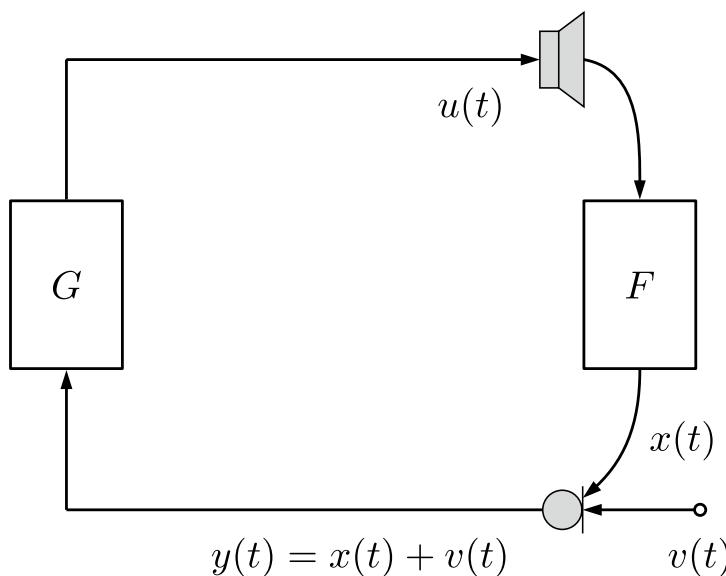  
Fig. 1 Closed-loop system model: the microphone signal y(t) is processed and amplified in the forward path G, resulting in the loudspeaker signa u(t) which is fed back to the microphone through the acoustic feedback path F. In addition to the feedback signal x(t), the microphone also picks up a (desired) source signal v(t)

Under these conditions, if the system is excited at the frequency ω, an oscillation due to instability occurs and may become perceivable in the form of howling.

The maximum stable gain (MSG) is defined as the maximum broadband gain that can be applied in the closedloop system forward path without rendering the system unstable. Under the assumption that the forward path merely consists of a broadband and possibly time-varying gain (referring to [1] for a treatment of the more general case), the MSG is given by

$$
\operatorname{MSG} (t) [ \mathrm{dB} ] = - 2 0 \log_ {1 0} \left(\max _ {\omega \in \mathcal {W}} | F (\omega , t) |\right)\tag{4}
$$

where W is the set of radial frequencies satisfying the loop phase condition in (3).

The spectrogram in Fig.  2 shows how howling occurs when the two conditions in the Nyquist stability criterion are satisfied. In a spectrogram representation, howling can usually be visually identified—perhaps slightly later than when it actually starts—as a high-energy horizontal line, i.e., a persistent, narrowband and often high-frequency signal component. Out of the three frequencies in this example that satisfy the loop gain criterion (2), i.e., the loop gain exceeds the 0 dB line, only one frequency (around 1.6 kHz, indicated by the red dashed line) also satisfies the loop phase criterion (3), i.e., the unwrapped loop phase crosses the zero radians line. A frequency that satisfies the loop phase criterion (3) but not the loop gain criterion (2), may still give rise to another acoustic feedback artifact called ringing. This can be noticed in Fig. 2 at a frequency around 2.6 kHz (indicated by the orange dashed line) where the unwrapped loop phase is zero while the gain is around 3 dB.

## 2.2 Notch‑filter‑based howling suppression (NHS)

NHS is a two stage solution: first, howling is detected and its frequency and magnitude estimated, then—if howling was detected—a notch filter is designed to suppress it. Figure 3 shows how NHS can be integrated in the closedloop system. A HD block detects howling in the microphone signal y(t) and provides a set of notch filter design parameters $\mathcal { D } _ { H } ( t )$ to the filter block $H ( \omega , t ) _ { i }$ which represents a bank of adjustable notch filters activated and deactivated when needed for howling suppression.

The HD block constitutes the most critical component of the NHS solution scheme [1]. The vast majority of HD methods proposed in literature follows the processing scheme presented in Fig. 4, see [2] for a detailed discussion. The microphone signal y(t) is divided into overlapping frames with M samples each and a hop size equal to $P ,$

$$
\mathbf {y} (t) = \left[ y (t + P - M) \dots y (t + P - 1) \right] ^ {T}.\tag{5}
$$

Each frame is then transformed to the frequency domain using the short-time Fourier transform (STFT) after undergoing a windowing function to avoid spectral leakage, i.e.,

$$
Y (\omega_ {k}, t) = \sum_ {n = 0} ^ {M - 1} w (t _ {n}) y (t _ {n}) e ^ {- j \omega_ {k} t _ {n}}, \quad k = 0, \ldots , M - 1,\tag{6}
$$

$$
\mathbf {Y} (t) = \left[ Y (\omega_ {0}, t) \ldots Y (\omega_ {M - 1}, t) \right] ^ {T},\tag{7}
$$

with the angular frequency $\omega _ { k } \triangleq 2 \pi k / M$ , the sample index $t _ { n } \triangleq t + P - M + n$ and $w ( t _ { n } )$ is the windowing function.

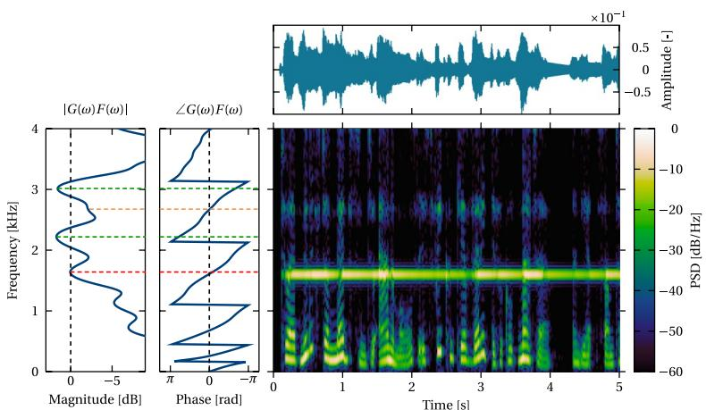  
Fig. 2 Nyquist stability criterion example: a closed-loop system is simulated that meets both magnitude and phase conditions for instability around a frequency of 1.6 kHz. Left pane: loop gain and loop phase of the simulated system. Right pane: time-domain waveform and spectrogram of a microphone signal in the simulated system, exhibiting a howling component around 1.6 kHz

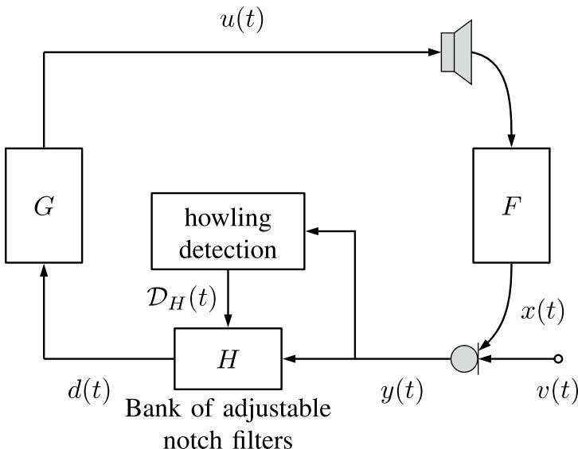  
Fig. 3 NHS solution scheme: the microphone signal y(t) is analyzed to detect howling and identify its properties, which are then summarized in a set $\mathcal { D } _ { H } ( t )$ of design parameters for a bank of adjustable notch filters H

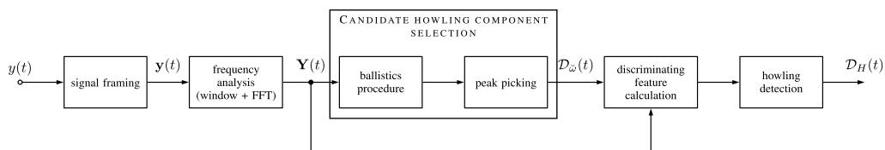  
Fig. 4 State-of-the-art HD solution scheme: a short-time spectral representation of the microphone signal is used to select a number of candidate howling components, which are then further analyzed to detect howling based on one or more discriminating features. In the proposed approach the candidate howling component selection is omitted

As mentioned in the Introduction, existing HD methods aim to detect howling by first identifying magnitude peaks in the microphone signal spectrum and then distinguishing howling from desired speech or music components only for this subset $\mathcal { D } _ { \breve { \omega } } ( t )$ of candidate howling frequencies. The candidate selection procedure, consisting of a magnitude spectrum peak-picking step that is sometimes preceded by a so-called ballistics procedure [10], is indicated by the large box in Fig.  4. Afterwards, HD is achieved by comparing a howling-specific spectral and/or temporal feature—or some logical combination of features—to a prespecified detection threshold. The HD block then outputs a set of notch filter design parameters D (t), e.g., including the desired notch filter center frequency, bandwidth, and notch depth [2].

In this paper, we propose a modification of the common HD solution scheme in which we remove the candidate howling selection and directly calculate the HD features on the STFT coeficients of the microphone signal. In other words, the microphone signal STFT vector Y(t) is forwarded to the discriminating feature calculation block only via the lower arrow in Fig. 4. This can also be interpreted as assigning all STFT frequency bins to be candidate howling frequencies, efectively broadening the capacity of the HD block to include early-howling and ringing detection.

## 2.3 State‑of‑the‑art howling detection (HD) features

Here we revisit the most commonly used HD features summarized in [2], as these will serve as a baseline for evaluating the diferent contributions of this paper. From a spectral point of view, howling is of a purely sinusoidal nature. As shown in Fig. 2 in the STFT domain, howling can be identified as a narrowband, persisting frequency component exhibiting high power with respect to its neighboring frequency components. Another property discriminating howling from speech and music components is the fact that a howling components does not have harmonics, unless loudspeaker saturation and therefore clipping is reached.

These properties gave birth to four spectral HD features each comparing the power of the ith STFT timefrequency bin to a specific reference power:

• Peak-to-threshold power ratio (PTPR) [7–10]: the reference power is a fixed absolute power threshold $P _ { 0 } .$ This feature hence assumes that desired speech and music components are power-limited.

$$
\mathrm{PTPR} (\omega_ {i}, t) = 1 0 \log_ {1 0} \frac {| \mathrm{Y} (\omega_ {\mathrm{i}} , t) | ^ {2}}{\mathrm{MP} _ {0}}.\tag{8}
$$

• Peak-to-average power ratio (PAPR) [7–19]: the reference power is the average microphone signal power $\hat { P } _ { y } ( t )$ . This feature relaxes the power-limited assumption of the PTPR feature by allowing any power for the desired speech and music components, but still considers howling only when it has a large power relative to the desired signal components, which excludes it to be used for early-howling and ringing detection.

$$
\mathrm{PAPR} (\omega_ {i}, t) = 1 0 \log_ {1 0} \frac {| Y (\omega_ {i} , t) | ^ {2}}{\hat {P} _ {y} (t)}
$$

with

(9)

• Interframe peak magnitude persistence (IPMP) [13– 15, 24–27]: this feature captures howling persistence over time around a certain frequency. It does that by counting the number of frames out of the past Q frames in which the ith frequency bin is in the set $\mathcal { C } _ { \omega } ( t )$ that keeps track of the C largest-magnitude frequency bins at each time t.

$$
\mathrm{IPMP} (\omega_ {\mathrm{i}}, t) = \frac {\sum_ {j = 0} ^ {\mathcal {Q} _ {\mathrm{M}}} [ \omega_ {\mathrm{i}} \in \mathcal {C} _ {\omega} (t - j P) ]}{\mathcal {Q} _ {\mathrm{M}}}.\tag{13}
$$

• Interframe magnitude slope deviation (IMSD) [21– 23]: this feature represents the frame-wise variation of the slope of the logarithmic magnitude increase of a frequency component as a function of time, which is expected to be nearly constant for a howling component while being time-varying for speech and music components. It is calculated as the log-spectral magnitude (dB-scale) slope deviation over the past $\mathcal { Q } _ { M }$ frames for the ith frequency bin,

$$
\operatorname{IMSD} (\omega_ {i}, t) = \frac {1}{\mathcal {Q} _ {M} - 1} \sum_ {m = 1} ^ {\mathcal {Q} _ {M} - 1} \left[ \frac {1}{\mathcal {Q} _ {M}} \sum_ {j = 0} ^ {\mathcal {Q} _ {M} - 1} \frac {1}{\mathcal {Q} _ {M} - j} \times 2 0 \log_ {1 0} \frac {| Y (\omega_ {\mathrm{i}} , t - j P) |}{| Y (\omega_ {\mathrm{i}} , t - \mathcal {Q} _ {M} P) |} - \frac {1}{m} \sum_ {j = 0} ^ {m - 1} \frac {1}{m - j} \times 2 0 \log_ {1 0} \frac {| Y (\omega_ {\mathrm{i}} , t - j P) |}{| Y (\omega_ {\mathrm{i}} , t - m P) |} \right].\tag{14}
$$

$$
\hat {P} _ {y} (t) = \frac {1}{M} \sum_ {k = 0} ^ {M - 1} | Y (\omega_ {k}, t) | ^ {2}.\tag{10}
$$

• Peak-to-neighboring power ratio (PNPR) [20–23]: the reference power is the power of the mth neighboring frequency component. This feature exploits the sinusoidal nature of howling, and the value for m is chosen depending on the STFT resolution and accuracy, which in turn depend on the STFT size M and the applied windowing.

$$
\mathrm{PNPR} (\omega_ {\mathrm{i}}, t, \mathrm{m}) = 1 0 \log_ {1 0} \frac {| Y (\omega_ {\mathrm{i}} , t) | ^ {2}}{| Y (\omega_ {\mathrm{i}} + 2 \pi \mathrm{m} / \mathrm{M} , t) | ^ {2}}.\tag{11}
$$

• Peak-to-harmonic power ratio (PHPR) [7, 8, 24, 25]: the reference power is the power of the mth (sub) harmonic. This feature exploits the fact that howling does not have harmonic components, in the absence of clipping saturation.

$$
\mathrm{PHPR} (\omega_ {\mathrm{i}}, t, m) = 1 0 \log_ {1 0} \frac {| Y (\omega_ {\mathrm{i}} , t) | ^ {2}}{| Y (m \omega_ {\mathrm{i}} , t) | ^ {2}}.\tag{12}
$$

In addition to these spectral features, two temporal HD features have been proposed in literature:

It is averaging the diferences between long-term and short-term weighted slope averages corresponding to the second and the third lines of (14). The IMSD value is expected to approach zero for howling components, representing a linear slope increase on a log-magnitude scale. Although it was found to perform well on the example studied in [2], it is a feature that is extremely sensitive to the detection threshold choice. This can be noticed by investigating the thresholds used for plotting its ROC curve in [2] and will also be illustrated in the simulation results in Sect. 7.

It is noticeable that indeed almost all of these features contain the word peak in their names. This is due to the fact that these features were developed to detect howling only for a few candidate magnitude spectrum peaks. For the reasons introduced earlier, in this work, the features are calculated for all frequency bins which is already reflected in the above feature definitions. Out of the features presented above, only the IPMP is a normalized feature, i.e., yielding values between zero and one independently from the signal and experiment parameters. This is a desirable property as it facilitates the choice of a detection threshold. Therefore, a feature normalization will be carried out for the other features, as will be explained in more detail in Sect. 7.

Apart from the above features that are widely used in HD, a few other features have been proposed more recently. In [3], a spectral flatness measure is used for identifying frequency bands where the magnitude spectrum is peaky, which is considered as an indication of howling. This feature is however hard to compare to the HD features used in NHS, as the method in [3] is an automatic equalization rather than an NHS method, since the detection and gain reduction is performed in wider frequency bands than those typically used in NHS. Another feature representing spectral peakiness based on the generalized Teager-Kaiser operator was proposed in [4]. When combined with the PHPR to reduce false alarms, the generalized Teager-Kaiser operator feature was shown to outperform other features in a hearing aid application. To reduce false alarms, the features discussed in [2] were combined with a voice activity detector in [5] while IMSD is post-processed using a bin history assessment feature in [30]. A machine learning (ML) approach to HD based on support vector machines was proposed in [6], but only for taking a binary decision on whether howling occurs or not, without estimating the howling frequency. A diferent ML based on Convolutional Recurrent Neural Network (CRNN) is proposed in [31] and tested on a dataset collected—and manually annotated—from diferent mobile phone devices. As with all deep learning approaches, the challenge remains generalization to all possible non-howling components and scenarios. Finally, some papers have evaluated the combination of two or more features through a logica conjunction operation. The rationale behind the use of multiple features is that the detection threshold can be lowered, aiming to detect more howling instances without increasing the number of false alarms. A strategy for combining multiple features based on the singlefeature HD performance was proposed in [2, 32], and combinations between the standalone features PHPR, PNPR and IMSD/PAPR were evaluated. Instead of a logical conjunction, features can also be combined by linear combination, e.g., the feedback existence probability (FEP) feature [21–23] which is a linear combination of a PNPR-related feature and an IMSD-related feature. Alternatively, as a hardware optimization, in [33] suggested a dual microphone system where one is dedicated for HD based on IMSD. In [34], to tackle the non-decreasing underdamped frequency-howls issue rising in  situation with high environmental noise e.g. car cabin, the authors showed the howling suppression performance of $\mathrm { N I N O S ^ { 2 } { - } T }$ using a Weiner filter for gain control considering signal’s magnitude relative to the noise’s estimated power spectral density (PSD). They reported a good performance in clean and noisy environment, also when compared to their magnitude-STD-based feature developed to diferentiate environmental noise with assumed constant energy compared to howling.

## 3 Proposed howling detection feature

A novel feature for HD is proposed here, perhaps somewhat surprisingly inspired by a feature proposed earlier for the problem of musical note onset detection [29]. At first sight, the detection of howling and musical note onsets may seem unrelated. However, in both problems, one is looking for lines in the spectrogram. Musical note onsets are characterized by a short and broadband increase in signal energy and thus become visible as vertical lines in the spectrogram [29]. Howling, on the other hand, manifests itself as a persisting narrowband signal component observed as a horizontal line in the spectrogram, see, e.g., Fig. 2. This analogy has motivated us to design a HD feature based on the same principles used in the development of the so-called $\mathrm { N I N O } \bar { \mathrm { S } } ^ { 2 }$ feature proposed in [29] for note onset detection.

The key idea behind the $_ \mathrm { N I N O S ^ { 2 } }$ feature is spectral sparsity: a vector containing STFT magnitude coeficients for a single time frame will have few large elements during the tonal part of a note while it has elements of equal magnitude during a note onset. This implies that such vector is less sparse for an onset time frame than for a non-onset time frame, hence an inverse sparsity measure (yielding a larger value for a less sparse vector) is a suitable feature to detect note onsets. Indeed, according to [35], two basic conditions that should be satisfied by any sparsity measure are the following:

1. The most sparse vector is the one having all its energy (magnitude) concentrated in one coeficient.

2. The least sparse vector is the one where all coeficients have the same magnitude.

It is argued in [29] that an inverse sparsity measure can be obtained by considering the ratio of two vector norms as follows, for an arbitrary length-M vector $\mathbf { x } = [ x _ { 0 } , \ldots , x _ { M - 1 } ] ,$

$$
\mathcal {S} = \frac {\| \mathbf {x} \| _ {p}}{\| \mathbf {x} \| _ {q}} = \frac {\left(\sum_ {m = 0} ^ {M - 1} | x _ {m} | ^ {p}\right) ^ {\frac {1}{p}}}{\left(\sum_ {m = 0} ^ {M - 1} | x _ {m} | ^ {q}\right) ^ {\frac {1}{q}}},\tag{15}
$$

where $p < q .$ . For note onset detection, this inverse sparsity measure is combined with an energy measure since note onsets often also exhibit a short-term energy increase, resulting in a feature coined as identifying note onsets based on spectral sparsity (INOS2) [29],

$$
\mathcal {I} = \| \mathbf {x} \| _ {2} \cdot \frac {\| \mathbf {x} \| _ {p}}{\| \mathbf {x} \| _ {q}}.\tag{16}
$$

With the choice $p = 1 , q = 2$ , the $\mathrm { I N O S ^ { 2 } }$ feature reduces to the ℓ -norm $\| \mathbf { x } \| _ { 1 } ,$ which is indeed a widely used joint energy and inverse sparsity measure. In [29], the norms are chosen as $p = 2 , q = 4 ,$ and the $\mathrm { I N O S ^ { 2 } }$ feature is normalized to yield a value $\in [ 0 , 1 ]$ , resulting in the $_ \mathrm { N I N O S ^ { 2 } }$ feature.

In the context of HD, one could similarly use a joint energy and inverse sparsity measure, but now considering a vector representing the time variation (over $\mathcal { Q } _ { M }$ frames) of the STFT in a single frequency bin, i.e.,

$$
\mathbf {Y} _ {T} (\omega_ {i}, t) = \left[ Y (\omega_ {i}, t - \mathcal {Q} _ {M} + 1) \dots Y (\omega_ {i}, t) \right] ^ {T}.\tag{17}
$$

This vector should not be confused with the vector Y(t) defined in $( 7 ) { \colon }$ considering the microphone signal STFT over M frequency bins and $\mathcal { Q } _ { M }$ time frames, as a $M \times \mathcal { Q } _ { M }$ matrix $\mathbf { Y } ,$ then $\mathbf { Y } ( t )$ defined in (7) represents a column of that matrix while $\mathbf { Y } _ { T } ( \omega _ { i } , t )$ defined in (17) represents a row of that matrix. The use of a joint energy and inverse sparsity measure for HD would express the fact that howling is a high-energy component and that it persists over a relatively long period in time. The high-energy property is however only discriminative for howling components that have already built up a significant energy and can thus be expected to be clearly audible. This goes against our objective of developing a HD feature that is capable of detecting early howling and ringing. Therefore we explicitly choose to remove the energy measure and only retain the inverse sparsity measure in the proposed HD feature. Using $p = 2 , q = 4$ as in [29], the inverse sparsity measure in (15) applied to the vector $\mathbf { Y } _ { T } ( \omega _ { i } , t )$ defined in (17) yields the following HD feature,

$$
\mathcal {S} = \frac {\| \mathbf {Y} _ {T} (\omega_ {i} , t) \| _ {2}}{\| \mathbf {Y} _ {T} (\omega_ {i} , t) \| _ {4}} = \frac {\left(\sum_ {m = 0} ^ {\mathcal {Q} _ {M} - 1} | Y (\omega_ {i} , t - m) | ^ {2}\right) ^ {\frac {1}{2}}}{\left(\sum_ {m = 0} ^ {\mathcal {Q} _ {M} - 1} | Y (\omega_ {i} , t - m) | ^ {4}\right) ^ {\frac {1}{4}}}.\tag{18}
$$

For an easier choice of the detection threshold, the above measure $s$ is normalized to have a value [0, 1] ranging from the most sparse (0) to the least sparse (1) vector. This can be achieved by defining the minimum and maximum values that $s$ can take and then computing a normalized measure as follows,

$$
\mathcal {N} = \frac {\mathcal {S} - \mathcal {S} _ {\mathrm{min}}}{\mathcal {S} _ {\mathrm{max}} - \mathcal {S} _ {\mathrm{min}}}.\tag{19}
$$

The values $ { S _ { \mathrm { m i n } } }$ and $S _ { \mathrm { m a x } }$ can be found by considering two extreme cases of an arbitrarily scaled length-QM vector: the sparsest possible vector $[ a , 0 , 0 , \ldots , 0 ]$ having ${ \mathcal { S } } = 1 \triangleq S _ { \operatorname* { m i n } }$ and the least sparse vector $[ a , a , a , \ldots , a ]$ having ${ \cal S } = \sqrt [ 4 ] { \mathcal { Q } _ { M } } \triangleq { \cal S } _ { \mathrm { m a x } } .$ . By substituting these values in (19) we obtain the proposed ${ \mathrm { N I N O S } } ^ { 2 } { \mathrm { - } } { \mathrm { T } }$ feature

$$
\mathcal {N} = \frac {1}{\sqrt [ 4 ]{\mathcal {Q} _ {M}} - 1} \left(\frac {\| \mathbf {Y} _ {T} (\omega_ {i} , t) \| _ {2}}{\| \mathbf {Y} _ {T} (\omega_ {i} , t) \| _ {4}} - 1\right).\tag{20}
$$

Analogous to the onset detection function defined in musical note onset detection, which is a highly sub-sampled, real and nonnegative version of the original signal exhibiting amplitude peaks at the note onsets, here we introduce a howling detection function (HDF) that can be compared to a detection threshold to achieve HD. In contrast to the onset detection function which is a function of time only, the HDF is a function of time and frequency that can be thought of as a sub-sampled, real and nonnegative version of the microphone signal STFT, exhibiting amplitude peaks in time-frequency bins where howling is found to occur. The $\mathrm { N I N O S ^ { \bar { 2 } } { - } T }$ HDF $\mathcal { N } ( \omega _ { i } , t )$ is simply equal to the ${ \mathrm { N I N O S } } ^ { 2 } { \mathrm { - } } { \mathrm { T } }$ feature in (20), considered as an explicit function of time t and frequency ωi,

$$
\mathcal {N} (\omega_ {i}, t) = \frac {1}{\sqrt [ 4 ]{\mathcal {Q} _ {M}} - 1} \left(\frac {\| \mathbf {Y} _ {T} (\omega_ {i} , t) \| _ {2}}{\| \mathbf {Y} _ {T} (\omega_ {i} , t) \| _ {4}} - 1\right).\tag{21}
$$

## 4 Computational complexity comparison

We compare the computational cost of the HD features in terms of multiplication-equivalent operations per STFT frame. Each frame contains M frequency bins and, for temporal features, $\mathcal { Q } _ { M }$ past frames are used. In our analysis, we assume that multiplication, division, square root, and logarithm operations all incur the same constant cost $( \mathrm { i } . \mathrm { e } . , O ( 1 ) )$ . The Big-O complexities for the features are as follows:

• PTPR: For each frequency bin, we compute one squared magnitude, one division, and one logarithm. The overall complexity is O(M).

• PAPR: For each frequency bin, we compute one squared magnitude, one division, and one logarithm, plus one extra division for frame-wide averaging. The overall complexity is O(M).

• PNPR and PHPR: For each frequency bin, we compute one squared magnitude, one division, and one logarithm, plus additional divisions for group averaging (neighbors or harmonics). Their overall complexity remains O(M).

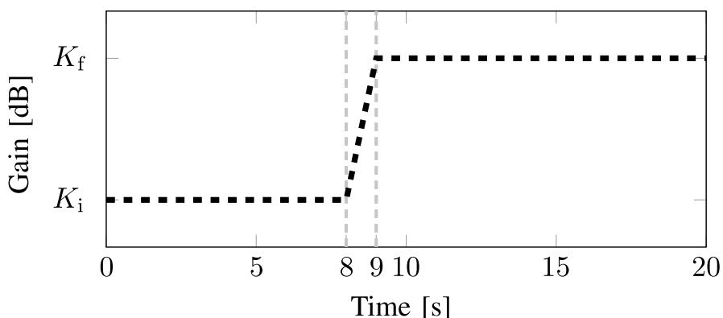  
Fig. 5 Time-varying forward path gain function used in the simulations: the gain is fixed to $K _ { \mathrm { i } } = \mathsf { M S G } - 6$ dB for the first 8 s, linearly increased $\mathrm { t o } K _ { \mathrm { f } } = \mathsf { M S G } 1$ n the following 1 s, and fixed to K for the remaining 11 s of the simulation

• IPMP: This feature requires sorting the M frequency bins to extract candidate peaks, but sorting operations are not directly comparable to multiplicationequivalent operations.

• IMSD: For each frequency bin, IMSD computes two sets of weighted slope averages: a long-term average over $\mathcal { Q } _ { M }$ frames $( O ( \mathcal { Q } _ { M } )$ operations) and a shortterm average over a number between 1 and $\mathcal { Q } _ { M } - 1$ frames (summing to $O \left( \mathcal { Q } _ { M } ^ { 2 } \right)$ operations). Thus, the overall complexity is $O ( M \mathcal { Q } _ { M } ^ { 2 } )$

$\mathsf { N I N O S } ^ { 2 } \mathbf { - T } \colon$ For each frequency bin, computing the $\ell _ { 2 }$ norm requires $O ( \mathcal { Q } _ { M } )$ operations and computing the $\ell _ { 4 }$ norm requires an additional $O ( \mathcal { Q } _ { M } )$ operations. Including a constant number of extra operations (for square root, fourth root, division, and final normalization), the overall complexity is $O ( M \mathcal { Q } _ { M } )$

In summary, both the spectral features (PTPR, PAPR, PNPR, and PHPR) and the temporal features scale linearly with M; the temporal features, however, incorporate an additional dependence on $\mathcal { Q } _ { M } .$ . Notably, the proposed ${ \mathrm { N I N O S } } ^ { 2 } { \mathrm { - } } { \mathrm { T } }$ feature scales as $O ( M \mathcal { Q } _ { M } ) _ { : }$ , which is more eficient than the $O ( M \mathcal { Q } _ { M } ^ { 2 } )$ complexity of IMSD.

## 5 Howling detection dataset

In order to test the proposed HD feature and compare it with diferent existing features, we created a large and diverse database containing a variety of speech and music excerpts corrupted by simulated howling ([36], Ch. 7). Both speech and music signals are used as the source signal v(t) (cf. Fig.  3). The speech signals consist of 20-s excerpts sampled at $f _ { s } = 1 6 k H z$ , taken from 8 original signals files including recorded male and female speech in four languages (Chinese, English, Dutch, and Russian) from an audiobook database [37]. The music signals consist of 20-s excerpts sampled at $f _ { s } = 1 6 k H z$ , taken from 7 pieces spanning various genres (e.g., jazz, opera) from 2 diferent music databases [38, 39]. In total, the database includes 28 music files and 30 speech files. Gaussian white noise is added to the source signal v(t) with a fixed signal-to-noise ratio (SNR) of 40 dB across all recordings. Additionally, all source signals are normalized to ensure the same root mean square value.

Eight acoustic impulse responses (AIRs) simulating the feedback path F are selected from the Openair database [40] and each AIR is either truncated or padded to a length of 1 s at a sampling frequency $f s = 1 6 k H z$ . The eight selected AIRs are chosen in order to achieve suficient variability in the frequencies of the simulated howling signals. All the selected AIRs are normalized such that the maximum stable gain (MSG) condition of the closed-loop system is achieved when providing a forward path gain G of 10 dB.

In each 20-s excerpt, the howling is simulated to start between the 8th and 9th second. This is simulated by feeding the music or speech source signal to a closedloop system with a given F taken from the AIR database and a time-varying broadband gain as depicted in Fig. 5. The final dataset1 contains fewer excerpts than the number of excerpts originally generated, as it went through a pruning step conducted by the authors, aiming to eliminate unsuitable examples (exhibiting howling at multiple howling frequencies or no howling at all). The pruning was carried out by having each excerpt labeled as suitable or unsuitable independently by each of the three authors, and then applying a majority vote to decide which excerpts to retain in the dataset.

## 6 Performance evaluation procedure

The aim of HD is to identify frequencies at which howling occurs and to estimate the time interval during which it occurs. There are several ways in which the performance of a HD method can be quantified. A simple performance evaluation procedure can be achieved by considering the HD problem as an event detection problem where, in each time-frequency bin of the microphone signal STFT $Y ( \omega _ { i } , t )$ , the howling event may or may not occur. In this way, the HD problem becomes a binary classification problem and the performance of an HD method can be carried out in a binary classification framework. A binary annotation (howling/no howling) is then needed for each time-frequency of the microphone signal STFT. Due to the fact that our dataset is created by simulating howling in a closed-loop system with a known feedback path transfer function $F ( q )$ (relating to the AIR used in a specific howling simulation) and a known forward path transfer function $G ( q )$ (relating to the specified gain profile), the binary annotation can be automatically generated by making use of the Nyquist stability criterion introduced in (2)-(3). Note that this annotation depends on the selected AIR and gain profile, as well as on the STFT frame size and hop size, but does not depend on the selected source signal as the Nyquist stability criterion is source-signal-independent.

In previous work, e.g., [2], the evaluation of HD features was compared on a set of candidate howling frequencies using the ROC curve and the ROC-AUC measure. In addition to the limitation of the use of a candidate set, as already explained in Sect. 1, also the use of the ROC curve has its shortcomings when aiming to visually compare the performance of the different features, particularly when considering all STFT frequency bins as candidate howling frequencies. This happens because the ROC curve has been designed for the evaluation of binary classification methods operating on datasets with balanced classes (i.e., both types of events, howling/no howling, occur with equal probability). As this is generally not the case, i.e., howling occurs much less frequently than no howling, we will instead use the PR curve and the PR-AUC measure to evaluate the different features on the entire STFT frequency grid, and provide a comparison with the ROCbased metrics. We will also include the best F -score corresponding to the optimal detection threshold $\theta ^ { \star }$ For more details about the PR-based metrics and their advantages over the traditionally used ROC-based metrics, please refer to ([36], Ch. 2).

## 7 Simulation results

In this section, we will compare the results of the proposed $\mathrm { N I N O S ^ { 2 } { - } T }$ feature to the six baseline features introduced in Sect.  2, i.e., the four spectral features (PTPR, PAPR, PNPR, and PHPR) and the two temporal features (IPMP and IMSD). In the performance comparison, we will also include a variant of the $\mathrm { N I N O S ^ { 2 } { - } T }$ feature that does include an energy measure. This variant will be referred to as the $\mathrm { N I N O S ^ { 2 } }$ feature as it is defined precisely like the NINOS2 feature proposed for note onset detection in [29], but operating on rows rather than columns of the STFT matrix Y.

Before discussing the simulation results, we first summarize the different feature parameters and simulation details. The microphone signal is divided into overlapping frames with a hop size equivalent to a frame rate of 50 frames per second. Four different STFT frame sizes M 512, 1024, 2048, and 4096 samples, were tried out and the optimal value was selected for each feature separately. All features except IPMP are calculated on the log-magnitude of a single sideband of the spectrum. In case of the IPMP, it is not necessary to use the log-magnitude as it considers magnitude spectrum maxima which remain the same for linear or logarithmic magnitude. With IPMP, we kept the number of tracked spectral peaks C equa to 3 according to what is suggested in [2]. For PNPR and PHPR we limited our experiment to the three best scoring sets of neighbors $( m = \pm \{ 2 \}$ , 2, 3 , and 2, 3, 4 ) and harmonics $( m = \{ 2 \}$ , 2, 3 , and 2, 3, 4 ) in [2]. Each one of the temporal features, including $\mathrm { N I N O S ^ { 2 } \mathrm { - } T }$ and $\mathrm { N I N O S ^ { 2 } }$ , was run with the number of preceding frames $\mathcal { Q } _ { M } = 4 , 8 ,$ , 16, 32, 64, and 96. As previously stated, only the IPMP and $\mathrm { N I N O S ^ { 2 } { - } T }$ features yield normalized values between 0 and 1. For the remaining features the resulting feature spectrum, i.e., the vector of feature values for all frequency bins in a single time frame, has to be normalized before applying the thresholding, to avoid that optimal detection threshold values would have to be selected for each test signal separately. The normalization of the feature spectrum requires signal-dependent normalization parameters, i.e., maximum and minimum spectra magnitudes, which are here calculated from the first $_ \textrm { 2 s }$ of each test signal. As a consequence, the first 2 s of each test signal are excluded from the evaluation. Moreover, and to allow for a fair comparison, the first few seconds corresponding to the largest value for $\mathcal { Q } _ { M } .$ i.e., $\mathcal { Q } _ { M } = 9 6$ frames, should also be excluded from the evaluation for the temporal features. These exclusions will hardly affect the resulting HD performance measures as the howling in our dataset starts occurring only as from the 8th to 9th second of the test signal.

For each test signal a binary annotation is automatically generated by using knowledge of the howling frequency $\tilde { \omega } _ { h } ,$ the gain start time $T _ { s }$ (8 s in our dataset) and the gain rise time $T _ { r }$ (1  s in our dataset). The howling frequency $\tilde { \omega } _ { h }$ is calculated from the Nyquist stability criterion given the selected AIR and setting the forward path gain equal to the MSG. As the howling frequency $\tilde { \omega } _ { h }$ will generally not lie on the STFT frequency grid $\omega _ { k } = ( 2 \pi k ) / M$ $k = 0 , \ldots , M - 1$ , the two frequency bins on either side of the howling frequency $\tilde { \omega } _ { h } ,$ , starting from time $( T _ { s } + 0 . 5 T _ { r } )$ to the end of the test signal, are annotated as howling events. The binary annotation $a ( \omega _ { i } , t )$ is thus defined as follows,

$$
a (\omega_ {i}, t) = \left\{\begin{array}{l}1, \text {   if   } \left\{\begin{array}{l}t \geq T _ {s} + \frac {T _ {r}}{2}\\\left\lfloor \frac {M \tilde {\omega} _ {h}}{2 \pi} \right\rfloor \leq i \leq \left\lceil \frac {M \tilde {\omega} _ {h}}{2 \pi} \right\rceil\\0, \text {   otherwise   }\end{array}\right.\end{array}\right.\tag{22}
$$

with  and  denoting the floor and ceiling functions, respectively. Since every howling event is generally represented by two frequency bins, we count one true positive if howling is detected in one or both of these bins. Also, in case two neighboring bins are erroneously detected to contain howling, only one false positive is counted. To generate the PR curves and their corresponding PR-AUC measures, a grid of thresholds $\theta \in [ 0 , 1 ]$ ] with a grid resolution of 0.05 is used. Added to this, two additional thresholds $\theta = \pm \infty$ are used to make sure the curves include the extreme cases. All presented curves are interpolated to produce $I = 5 0$ points in addition to the calculated ones. The interpolated points are computed for equally spaced true positive values $\in [ 0 , G T _ { + } ] ,$ with $G T _ { + }$ being the number of ground truth positives. For each of the compared features, the thresholding is applied in two diferent ways. The first way is to directly compare all time-frequency feature values to the detection threshold. The second way is to first select the $S _ { c }$ largest values of each feature spectrum per time frame and only comparing these to the detection threshold. This peak picking should not be confused with the STFT magnitude peak picking that is used in state-of-the-art HD methods, see Fig. 4, as it occurs after and not before the feature calculation. When $S _ { c } = M$ , the second thresholding approach becomes equivalent to the first one, i.e., all feature values are compared to the detection threshold. In the sequel, the following values will be considered for all features under comparison: $S _ { c } \in \{ 1 , 3 , M \}$

Each of the features depends on a few parameters for which numerical values need to be chosen: the STFT frame size $M ,$ the number of feature values $S _ { c }$ used per frame, the number of past frames $Q _ { M }$ for the temporal features, and the neighbor and harmonics indices m for the PNPR and PHPR features, respectively. The choice of these parameters is determined here using a 5-fold cross-validation setup applied separately on the music and speech datasets. The excerpts in each of these two datasets are organized into 5 folds and 5 simulation rounds are executed where in each round, 4 folds are used for tuning the feature parameters while the 5th fold is used for validation. In each round and for each feature, the parameters resulting in the highest PR-AUC value for the tuning folds, are used to quantify the feature performance on the validation fold. In this way, for each feature, 5 PR-AUC values are obtained (one value for each validation fold), the statistics of which are summarized in the box plots in Fig. 6. In all the following analyses, two evaluation scenarios are considered: full HD and early HD evaluation. While in the full HD evaluation, the performance measures are calculated for the full excerpt (even though excluding the first few seconds as motivated earlier), in the early HD evaluation, the performance measures are calculated only up to 5 s after the theoretical start of the howling, i.e., up to time $8 . 5 + 5 = 1 3 . 5$ s instead of up to 20 s as in the full evaluation. In this way, the early HD evaluation scenario provides an indication of the capability of the diferent features to detect early howling and ringing.

The NINOS2-T feature consistently yields the highest average PR-AUC value for both speech and music datasets and for both full and early HD evaluation. While the performance ranking of the three best features, i.e., the ${ \mathrm { N I N O S } } ^ { 2 } { \mathrm { - T } }$ , IPMP, and $\mathrm { N I N O S ^ { 2 } }$ features, remains the same over all datasets and evaluation scenarios, there is a minor variability in the performance ranking of the other features. The IMSD feature consistently shows the worst performance, which is presumably due to its high sensitivity to the detection threshold choice. Overall, it is clear how the HD problem is more challenging for music than for speech, in particular for the detection of early howling.

The optimal parameter values for each feature resulting from the cross-validation procedure are listed in Table  1 for the speech dataset and in Table  2 for the music dataset. These optimal parameter values are the values resulting in the highest average PR-AUC value considering the early HD evaluation over all 5 validation folds. It can be observed that the proposed $\mathrm { N I N O S ^ { 2 } { - } T }$ feature is the only feature for which it is beneficial to set $S _ { c } = 1$ in all evaluation scenarios, indicating that its highest feature value across all frequency bins in a single time frame consistently seems to point to the most probable occurrence of howling, which is a beneficial property for a HD feature.

In Tables 3 and 4, we present PR-AUC and ROC-AUC values as well as the best achievable $F _ { 1 } \cdot$ -score for each of

$$
\begin{array}{c c c c c} \text {NINOS} ^ {2} \text {-T} & \text {IPMP} & \text {NINOS} ^ {2} & \text {PAPR} \\ \text {PTPR} & \text {PHPR} & \text {PNPR} & \text {IMSD} \\ & \text {Full} & \text {Early} \end{array}
$$

Speech  
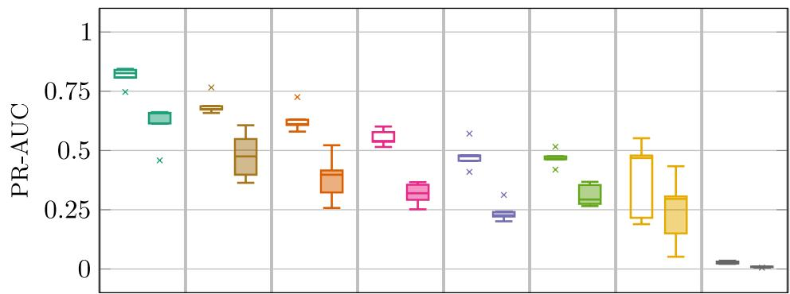

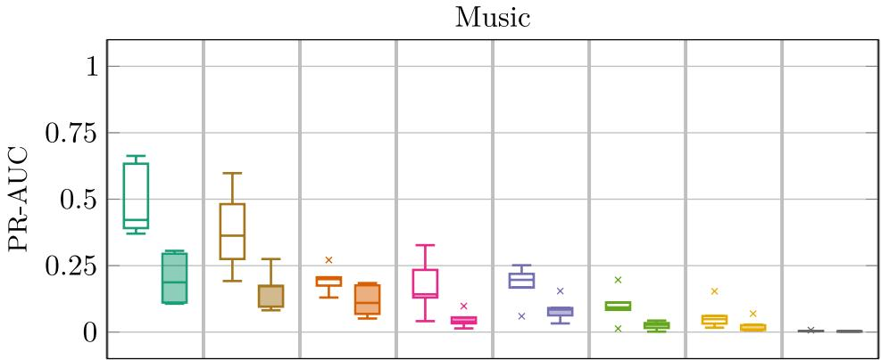  
Feature  
Fig. 6 Cross-validation PR-AUC results for full and early HD evaluation of the diferent features when applied on the speech (top) and music (bottom) datasets

Table 1 Optimal parameter values per feature (speech dataset)

<table><tr><td>Feature</td><td>M</td><td> $\mathcal{Q}_{M}$ </td><td> $S_{C}$ </td><td>m</td></tr><tr><td>NINOS2-T</td><td>1024</td><td>32</td><td>1</td><td>-</td></tr><tr><td>NINOS2</td><td>1024</td><td>16</td><td>1</td><td>-</td></tr><tr><td>PTPR</td><td>512</td><td>-</td><td>1</td><td>-</td></tr><tr><td>PAPR</td><td>2048</td><td>-</td><td>M</td><td>-</td></tr><tr><td>PHPR</td><td>2048</td><td>-</td><td>3</td><td>{2,3,4}</td></tr><tr><td>PNPR</td><td>2048</td><td>-</td><td>M</td><td>±{2,3,4}</td></tr><tr><td>IPMP</td><td>2048</td><td>64</td><td>M</td><td>-</td></tr><tr><td>IMSD</td><td>512</td><td>8</td><td>3</td><td>-</td></tr></table>

Table 2 Optimal parameter values per feature (music dataset)

<table><tr><td>Feature</td><td>M</td><td> $Q_M$ </td><td> $S_C$ </td><td>m</td></tr><tr><td>NINOS2-T</td><td>1024</td><td>96</td><td>1</td><td>-</td></tr><tr><td>NINOS2</td><td>512</td><td>16</td><td>M</td><td>-</td></tr><tr><td>PTPR</td><td>512</td><td>-</td><td>M</td><td>-</td></tr><tr><td>PAPR</td><td>512</td><td>-</td><td>M</td><td>-</td></tr><tr><td>PHPR</td><td>512</td><td>-</td><td>M</td><td>{2,3,4}</td></tr><tr><td>PNPR</td><td>2048</td><td>-</td><td>M</td><td>±{2,3}</td></tr><tr><td>IPMP</td><td>4096</td><td>64</td><td>1</td><td>-</td></tr><tr><td>IMSD</td><td>512</td><td>16</td><td>3</td><td>-</td></tr></table>

Table 3 Speech dataset evaluation using best parametrization per feature. Performance is measured by best $F _ { 1 } .$ -score, PR-AUC, and ROC-AUC for full and early evaluations

<table><tr><td rowspan="2">Feature</td><td colspan="3">Full</td><td colspan="3">Early</td></tr><tr><td>Best  $F_1$ -score</td><td>PR-AUC</td><td>ROC-AUC</td><td>Best  $F_1$ -score</td><td>PR-AUC</td><td>ROC-AUC</td></tr><tr><td> $NINOS^2-T$ </td><td>0.88</td><td>0.82</td><td>0.93</td><td>0.74</td><td>0.63</td><td>0.86</td></tr><tr><td> $NINOS^2$ </td><td>0.77</td><td>0.65</td><td>0.90</td><td>0.58</td><td>0.40</td><td>0.82</td></tr><tr><td>PTPR</td><td>0.60</td><td>0.49</td><td>0.83</td><td>0.41</td><td>0.25</td><td>0.76</td></tr><tr><td>PAPR</td><td>0.63</td><td>0.56</td><td>0.99</td><td>0.45</td><td>0.31</td><td>0.98</td></tr><tr><td>PHPR</td><td>0.59</td><td>0.47</td><td>0.76</td><td>0.46</td><td>0.31</td><td>0.68</td></tr><tr><td>PNPR</td><td>0.55</td><td>0.44</td><td>0.94</td><td>0.41</td><td>0.27</td><td>0.88</td></tr><tr><td>IPMP</td><td>0.68</td><td>0.69</td><td>0.95</td><td>0.50</td><td>0.47</td><td>0.91</td></tr><tr><td>IMSD</td><td>0.13</td><td>0.03</td><td>0.66</td><td>0.07</td><td>0.01</td><td>0.60</td></tr></table>

Table 4 Music dataset evaluation using best parametrization per feature. Performance is measured by bes $F _ { 1 } { \mathrm { - } } \mathsf { S C O r e } ,$ PR-AUC, and ROC-AUC for full and early evaluations

<table><tr><td rowspan="2">Feature</td><td colspan="3">Full</td><td colspan="3">Early</td></tr><tr><td>Best F1-score</td><td>PR-AUC</td><td>ROC-AUC</td><td>Best F1-score</td><td>PR-AUC</td><td>ROC-AUC</td></tr><tr><td> $NINOS^{2}$ -T</td><td>0.70</td><td>0.53</td><td>0.83</td><td>0.42</td><td>0.21</td><td>0.69</td></tr><tr><td> $NINOS^{2}$ </td><td>0.36</td><td>0.19</td><td>0.95</td><td>0.27</td><td>0.13</td><td>0.94</td></tr><tr><td>PTPR</td><td>0.33</td><td>0.17</td><td>0.96</td><td>0.19</td><td>0.08</td><td>0.95</td></tr><tr><td>PAPR</td><td>0.33</td><td>0.16</td><td>0.96</td><td>0.17</td><td>0.05</td><td>0.94</td></tr><tr><td>PHPR</td><td>0.18</td><td>0.07</td><td>0.95</td><td>0.09</td><td>0.03</td><td>0.93</td></tr><tr><td>PNPR</td><td>0.16</td><td>0.05</td><td>0.87</td><td>0.08</td><td>0.02</td><td>0.80</td></tr><tr><td>IPMP</td><td>0.47</td><td>0.36</td><td>0.71</td><td>0.23</td><td>0.15</td><td>0.61</td></tr><tr><td>IMSD</td><td>0.05</td><td>0.01</td><td>0.56</td><td>0.03</td><td>0.00</td><td>0.54</td></tr></table>

the features, using the optimal parameter values for each feature. The $\mathrm { N I N O S ^ { 2 } { - } T }$ feature is the only feature crossing the 50% PR-AUC value in the full HD evaluation for both speech and music. For early HD evaluation, the NINOS2-T feature only crosses the 50% PR-AUC value for speech but not for music, where all features can be observed to perform poorly. We also observe a strong correlation between the PR-AUC measure and the $F _ { 1 ^ { - } }$ score which confirms that the PR evaluation framework is more suitable than the ROC evaluation framework in the HD context. Only for the IPMP and NINOS2 features in the speech dataset, the performance ranking based on the PR-AUC measure is diferent from the ranking by the $F _ { 1 } \cdot$ -score.

A deeper insight into the values reported in Tables  3  and  4 can be obtained by visually inspecting the associated ROC and PR curves, which are shown in Figs. 7 and 8 for the speech and music dataset, respectively. For an easier interpolation of the PR curves, the evaluation metrics are calculated in a micro average setup, i.e., true positive and false positives are aggregated for the whole dataset then used for computing the other metrics and visualizations. Alternatively, the interpolated PR curves for the diferent test files can be macro-averaged using several techniques [28], but this is out of the scope of this work. In contrast to the PR curves, the ROC curves fail to diferentiate the performance of the diferent features. Due to the huge class imbalance, the only practical detection thresholds would be the ones resulting in points lying on the vertical true positive rate (TPR) axis of the ROC curve, as a small displacement away from this axis immediately results in a very high false positive rate (FPR) value. As such, the visual comparison of the ROC curves is reduced to finding the highest point on the curve nearby the vertical axis, which is not always feasible without zooming in. The reason why the baseline— marking the random guessing performance—for the PR curves is constantly omitted, is because it is a constant line almost equal to zero—in the order of $1 0 ^ { - 3 }$ The points in the ROC and PR curves originating from the actual performance evaluation are indicated with markers to diferentiate them from the points obtained by interpolation. Focusing on the three best performing

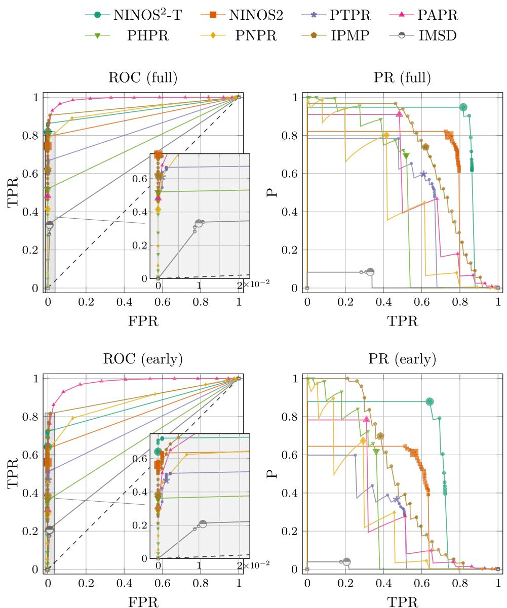  
Fig. 7 ROC and PR curves for full and early HD evaluation with speech dataset

features in Figs. 7 and $8 , \mathrm { i . e . , N I N O S ^ { 2 } - T , N I N O S ^ { 2 } } _ { i }$ , and IPMP, it can be observed that the marked points in the PR curve are spread further apart for the IPMP feature compared to the $\mathrm { N I N O S } ^ { 2 } { \cdot } \bar { \mathrm { T } }$ and $\mathrm { N I N O S ^ { 2 } }$ features, which indicates that the latter features are more robust to detection threshold variations. Another interesting observation is that the $\mathrm { N I N O S ^ { 2 } { - } T }$ and $\mathrm { N I N O S ^ { 2 } }$ features tend to yield PR curves that are more closely approaching the top-right corner of the PR plane compared to the IPMP feature. This indicates that the $\mathrm { N I N O S ^ { 2 } { - } T }$ and $_ { \mathrm { N I N O S ^ { 2 } } }$ features are capable of providing a better compromise between precision and recall, despite perhaps showing a lower PR-AUC value than the IPMP feature in some scenarios.

In Fig.  9, the box-plots show how the feature performance in terms of the of PR-AUC is distributed for the diferent test signals. Again, we can see that the ${ \mathrm { N I N O S } } ^ { 2 } { \mathrm { - } } { \mathrm { T } }$ feature yields the best average and the best worst-case performance for both datasets (speech/ music) and HD evaluation scenarios (full/early). It also shows the least variance over the diferent test signals. For the challenging problem of HD in music signals, all features except for the best three features perform on average worse than the PTPR feature, which represents a simple thresholding of the STFT magnitude spectrum.

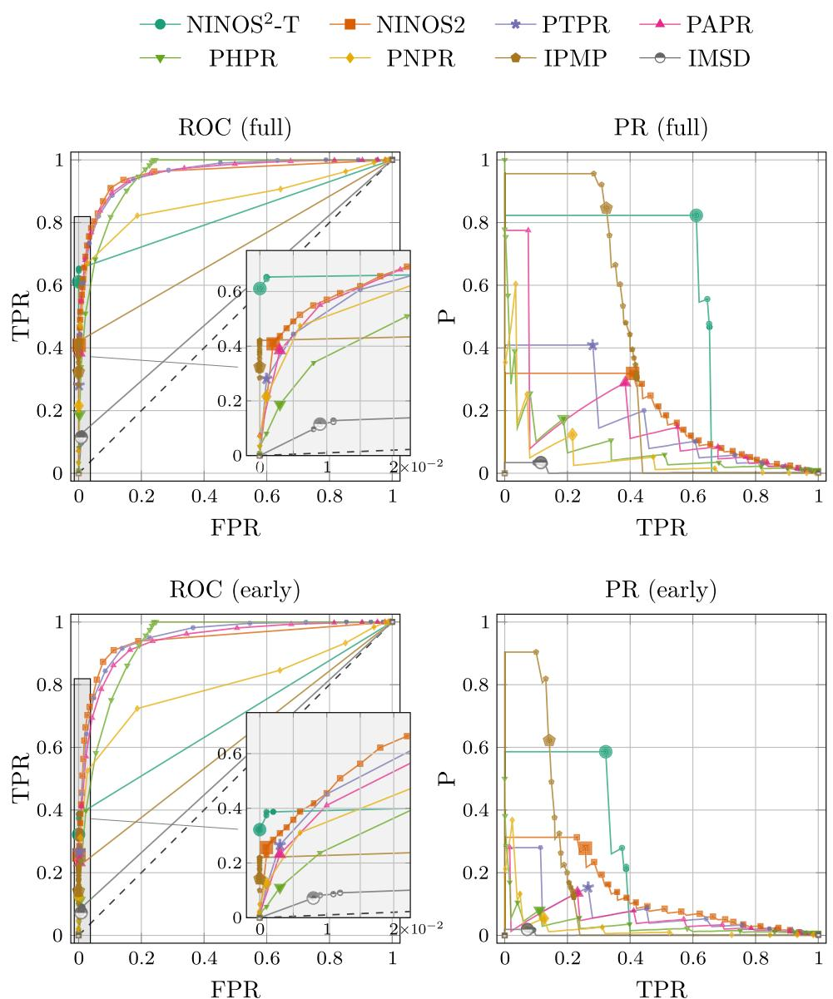  
Fig. 8 ROC and PR curves for full and early HD evaluation with music dataset

Finally, Fig.  10 shows a spectrogram-type snippet of the HDFs for two challenging test examples. The leftmost plots show HDFs for a speech example containing a ringing artifact around 800 Hz, having a lower power than the dominating speech components. The rightmost plots show a music example containing many desired tonal components in addition to a low-power howling component at 260 Hz. Only the NINOS2-T feature was able to capture this howling very close to its starting point, between the 8th and the 9th second. Overall, the diference between the spectral and temporal features can be clearly observed, since the spectral HDFs have a more “vertical” and granular structure whereas the tempora HDFs have a more “horizontal” and smoother structure.

## 8 Conclusions and future work

In this work, we have addressed three challenges relating to the HD problem: feature design, dataset design, and performance evaluation. A novel HD feature based on spectral sparsity, NINOS2-T, was proposed and shown to yield better average and better worst-case performance than state-of-the-art features across various evaluation scenarios involving music and speech signals and considering also detection of early howling and ringing. The NINOS2-T feature is a normalized feature, facilitating

$$
\begin{array}{c c c c c} \text {NINOS} ^ {2} \text {-T} & \text {NINOS} ^ {2} & \text {PTPR} & \text {PAPR} \\ \text {PHPR} & \text {PNPR} & \text {IPMP} & \text {IMSD} \end{array}
$$

Feature  
Feature  
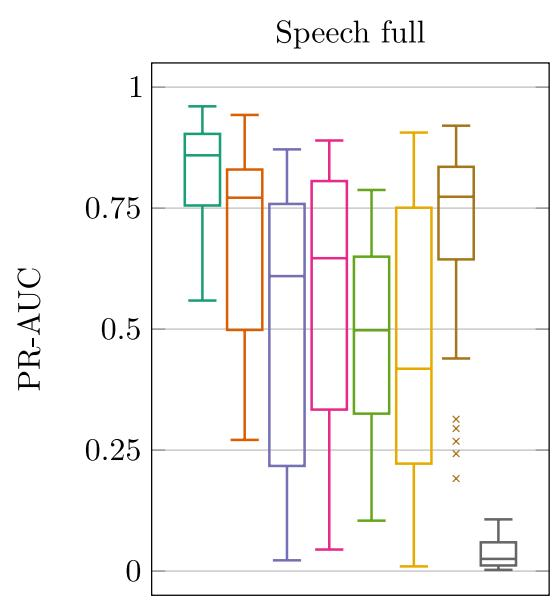

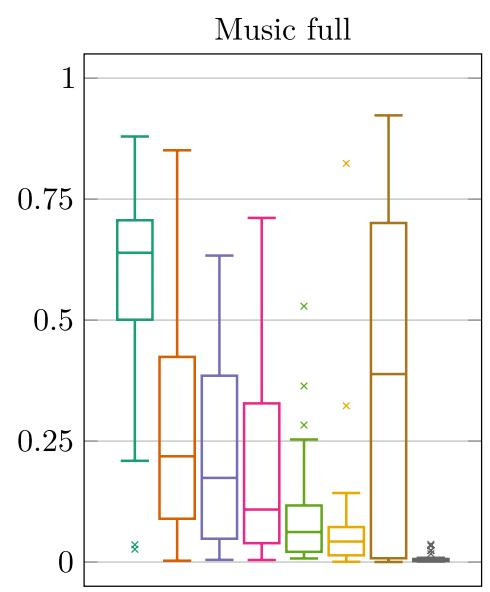

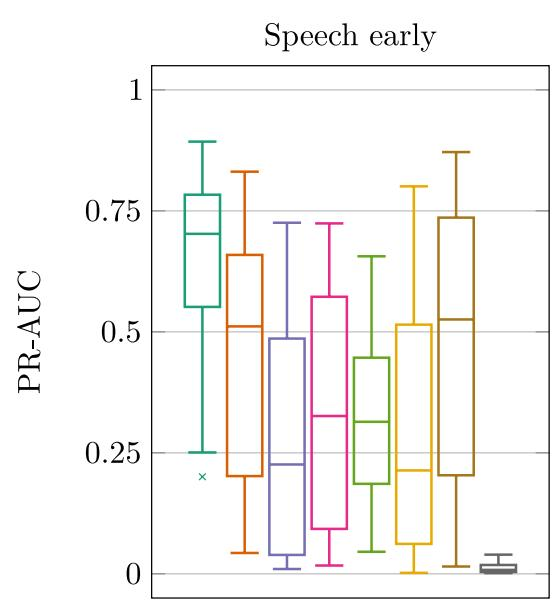

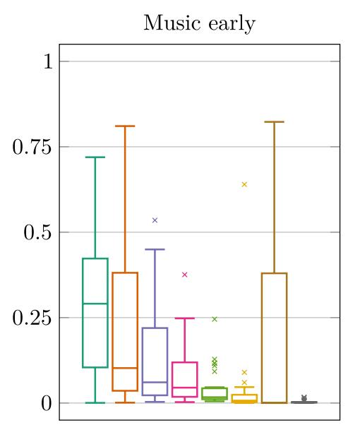  
Fig. 9 Comparison of PR-AUC statistics for the diferent test examples per dataset (speech/music) and HD evaluation scenario (full/early)

the choice of a suitable detection threshold in the range [0, 1], and was experimentally shown to be more robust to threshold variability than existing features. Simulations were carried out on a new, automatically annotated HD dataset which is larger and more diverse than existing datasets. Finally, a novel evaluation procedure is put forward in which all time-frequency bins are considered as candidate howling components, to overcome the limitation of the traditional candidate-based approach to HD which is not suitable for the detection of early howling and ringing artifacts. The high class imbalance inherent in the HD problem makes the traditional ROC-based evaluation unsuitable. Therefore, a PR-based evaluation was proposed which facilitates the performance comparison of diferent features independently of the detection threshold.

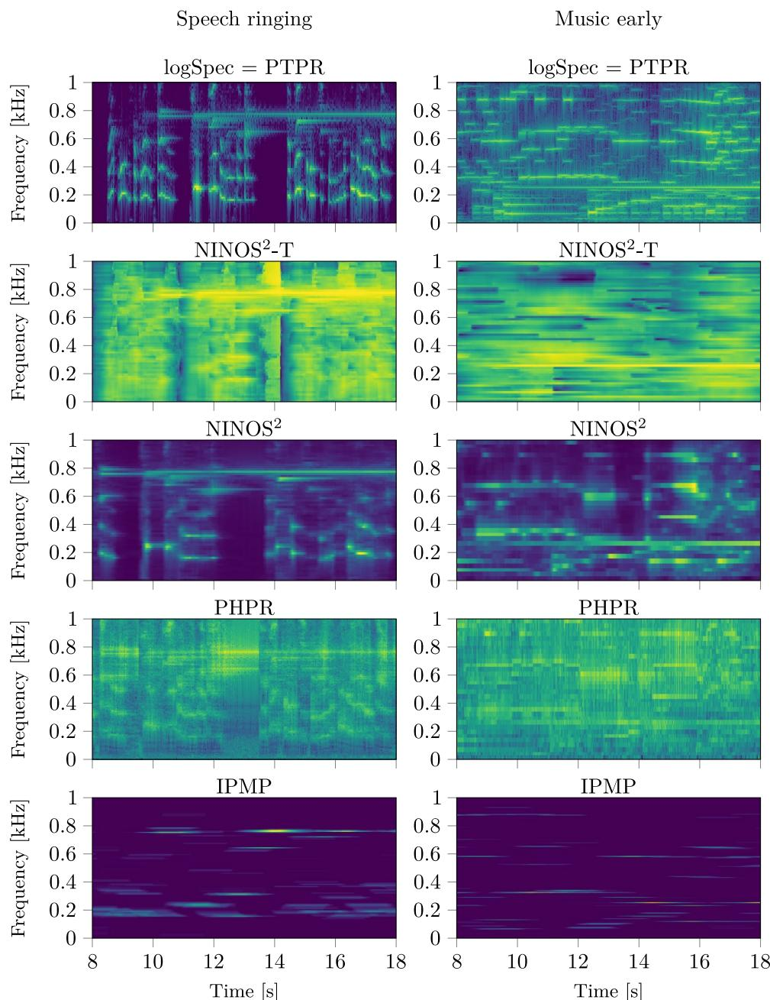  
Fig. 10 Comparison of the HDFs for (left) a speech example exhibiting a ringing artifact around 800 Hz and (right) a music excerpt exhibiting a low power howling around 260 Hz

Future work includes a noise-robustness assessment and improvement of the proposed ${ \mathrm { N I N O S } } ^ { 2 } { \mathrm { - T } }$ feature and its combination with other features in a multiple-feature HD approach particularly targeting the challenging problem of HD in music applications. Finally, the new HD dataset is expected to be suitable also for the development and evaluation of data-driven HD methods.

## Acknowledgements

The authors would like to thank Simon Vos and Kristof Fluyt for the contribu tion to the creation of the database during their Master’s Thesis project.

## Authors’ contributions

MM conceived the presented idea, implemented the ${ \mathsf { N I N O S } } ^ { 2 } { \top }$ algorithm, evaluated the dataset, carried out the statistical analysis, and was the major contributor in writing the manuscript. GB created the dataset, evaluated the dataset, aided in interpreting the results, prepared the figures, and wrote part of the manuscript. TvW acquired the fundings for this research, provided the code for the diferent howling detection features, and supervised the project. Al authors provided critical feedback and helped shape the research, analysis and final manuscript.

## Funding

The research leading to these results has received funding from the KU Leuven Internal Funds C14/21/075, C2/16/00449, C3/19/013, IMP/14/037, and VES/19/004, and the European Research Council under the European Union’s Horizon 2020 research and innovation program / ERC Consolidator Grant: SONORA (no. 773268).

## Data availability

The datasets generated and/or analyzed during the current study are available at the following link https://doi.org/10.48804/EOW7OF. The development and simulation code in python is available at the following link https://github. com/maganino/Howling-Detection-NINOS2T.

## Declarations

## Competing interests

The authors declare that they have no competing interests.

Received: 20 October 2024 Accepted: 23 February 2025 Published online: 27 March 2025

## References

1. T. Waterschoot, M. Moonen, Fifty years of acoustic feedback control: state of the art and future challenges. Proc. IEEE. 99(2), 288–327 (2011)

2. T. Waterschoot, M. Moonen, Comparative evaluation of howling detection criteria in notch-filter-based howling suppression. J. Audio Eng. Soc. 58(11), 923–940 (2010)

3. D. Thomas, A.R. Jayan, Automated suppression of howling noise using sinusoidal model based analysis/synthesis. In: 2014 IEEE International Advance Computing Conference (IACC) (Gurgaon, 2014), pp. 761-765

4. S.A. Khoubrouy, I.M.S. Panahi, J.H.L. Hansen, Howling detection in hearing aids based on generalized Teager-Kaiser operator. IEEE/ACM Trans. Audio Speech Lang. Process. 23(1), 154–161 (2015)

5. S.A. Khoubrouy, I. Panahi, A method of howling detection in presence of speech signal. Signal Process. 119, 153–161 (2016)

6. J. Flocon-Cholet, J. Faure, A. Guérin, P. Scalart, A robust howling detection algorithm based on a statistical approach. In: Proc. 2014 Int. Workshop Acoustic Signal Enhancement (IWAENC ’14) (Antibes, 2014), pp. 65-69

7. M.H. Er, T.H. Ooi, L.S. Li, C.J. Liew, A DSP-based acoustic feedback canceller for public address systems. In: Proc. Int. Conf. Signal Process. (ICSP ’93) (Beijing, 1993), pp. 1251-1254

8. M.H. Er, T.H. Ooi, L.S. Li, C.J. Liew, A DSP-based acoustic feedback canceller for public address systems. Microprocess. Microsyst. 18(1), 39–47 (1994)

9. P. R. Williams, Method and system for elimination of acoustic feedback, WO patent appl. WO/2002/021817, (2002)

10. P. R. Williams, Method and system for elimination of acoustic feedback, U.S. patent appl. 2010/0046768 A1, (2010)

11. M. Hanajima, M. Yoneda, and T. Okuma, Howling eliminator, WO patent appl. WO/1999/021396, (1999)

12. M. Hanajima, M. Yoneda, and T. Okuma, Howling eliminating apparatus, U.S. Patent 6,125,187, (2000).

13. A. Kawamura, M. Matsumoto, M. Serikawa, and H. Numazu, Sound amplifying apparatus with automatic howl-suppressing function, U.S. Paten 5,442,712, (1995)

14. A. Kawamura, M. Matsumoto, M. Serikawa, and H. Numazu, Sound ampli fying apparatus with automatic howl-suppressing function, EP patent appl. EP0599450 A2, (1994)

15. A.F. Rocha, A.J.S. Ferreira, An accurate method of detection and cancel lation of multiple acoustic feedbacks. In: Preprints AES 118th Convention (Barcelona, 2005), AES Preprint 6335

16. M. Börsch, Method for constraining electroacoustic feedback, EP patent appl. EP1684543 A1, (2006)

17. M. Börsch, Method for suppressing electro-acoustic feedback, U.S. patent appl. 2006/0159282 A1, (2006)

18. D. Somasundaram, Feedback cancellation in a sound system, EP patent appl. EP1903833 A1, (2008)

19. D. Somasundaram, Feedback cancellation in a sound system, U.S. patent appl. 2008/0085013 A1, (2008)

20. S. Ando, Howling detection and prevention circuit and a loudspeaker system employing the same, U.S. Patent 6,252,969, (2001)

21. N. Osmanovic, V.E. Clarke, E. Velandia, An in-flight low latency acoustic feedback cancellation algorithm. In: Preprints AES 123rd Convention (New York, 2007), AES Preprint 7266

22. N. Osmanovic and V. Clarke, Acoustic feedback cancellation system, WO patent appl. WO/2007/013981, (2007)

23. N. Osmanovic and V. Clarke, Acoustic feedback cancellation system, U.S. Patent 7,664,275, (2010)

24. D. M. Oster, M. P. Lewis, and T. J. Tucker, Method and apparatus for adaptive audio resonant frequency filtering, WO patent appl. WO/1991/020134, (1991)

25. M. P. Lewis, T. J. Tucker, and D. M. Oster, Method and apparatus for adap tive audio resonant frequency filtering, U.S. Patent 5,245,665, (1993)

26. E. T. Patronis Jr., Acoustic feedback detector and automatic gain control, U.S. Patent 4,079,199, (1978)

27. E.T. Patronis Jr., Electronic detection of acoustic feedback and automatic sound system gain control. J. Audio Eng. Soc. 26(5), 323–326 (1978)

28. J. Davis, M. Goadrich, The relationship between precision-recall and ROC curves. In: Proc. 23rd Int. Conf. Machine Learning (ICML ’06) (Pittsburgh, 2006), pp. 233-240

29. M. Mounir, P. Karsmakers, T. Waterschoot, Guitar note onset detection based on a spectral sparsity measure. In: Proc. 24th European Signal Process. Conf. (EUSIPCO ’16) (Budapest, 2016), pp. 978-982

30. Y. Alkaher, I. Cohen, Temporal Howling Detector for Speech Reinforcement Systems. Acoustics 4(4), 967–995 (2022). https://doi.org/10.3390/ acoustics4040060

31. Z. Chen, Y. Hao, Y. Chen, G. Chen, L. Ruan, A neural network-based howling detection method for real-time communication applications. In: Proc. 2022 IEEE Int. Conf. Acoust., Speech, Signal Process. (ICASSP ’22) (2022), pp. 206-210. https://doi.org/10.1109/ICASS P43922.2022.9747719

32. E.V. Ravve, Z. Volkovich, A multi-criteria approach to optimization of acoustic feedback detection. Appl. Acoust. 184, 108276 (2021). https:// doi.org/10.1016/j.apacoust.2021.108276

33. Y. Alkaher, I. Cohen, Dual-Microphone Speech Reinforcement System With Howling-Control for In-Car Speech Communication. Front. Signal Process. 2, 819113 (2022). https://doi.org/10.3389/frsip.2022.819113

34. Y. Alkaher, I. Cohen, Howling detection and gain control for speech reinforcement in a noisy car cabin environment. IEEE Trans. Audio Speech Lang. Process. 32, 1494–1505 (2024). https://doi.org/10.1109/ TASLP.2024.3364091

35. N. Hurley, S. Rickard, Comparing measures of sparsity. IEICE Trans. Inf. Theory. 55(10), 4723–4741 (2009)

36. M. Mounir, Acoustic event detection: Feature, evaluation and dataset design (PhD thesis, KU Leuven, Leuven, 2020). https://lirias.kuleuven.be retrieve/583999

37. J. Kearns, LibriVox: Free Public Domain Audiobooks (Emerald Group Publishing Limited, 2014)

38. V. Emiya, MAPS Database: a piano database for multipitch estimation and automatic transcription of music (2008). http://www.tsi.telecom-paristech.fr aao/en/2010/07/08/maps-database-a-piano-database-for-multipitch-estim ation-and-automatic-transcription-of-music/. Accessed 12 May 2017

39. M. Deferrard, K. Benzi, P. Vandergheynst, X. Bresson, FMA: a dataset for music analysis. Proc. 18th Int. Symp. on Music Information Retrieval (ISMIR ’17), (Suzhou 2017), pp. 316–323

40. D.T. Murphy, S. Shelley, Openair: an interactive auralization web resource and database. In: Audio Engineering Society Convention 129 (Audio Engineering Society, 2010)

## Publisher’s Note

Springer Nature remains neutral with regard to jurisdictional claims in published maps and institutional afiliations.