©2022 IEEE. Personal use of this material is permitted. Permission from IEEE must be obtained for all other uses, in any current or future media, including reprinting/republishing this material for advertising or promotional purposes, creating new collective works, for resale or redistribution to servers or lists, or reuse of any copyrighted component of this work in other works.

# Switching Independent Vector Analysis and Its Extension to Blind and Spatially Guided Convolutional Beamforming Algorithms

Tomohiro Nakatani, Fellow, IEEE, Rintaro Ikeshita, Member, IEEE, Keisuke Kinoshita, Senior Member, IEEE, Hiroshi Sawada, Fellow, IEEE, Naoyuki Kamo, Shoko Araki, Fellow, IEEE,

Abstract—This paper develops a framework that can accurately perform denoising, dereverberation, and source separation using a relatively small number of microphones. It has been empirically confirmed that Independent Vector Analysis (IVA) can blindly separate N sources from their sound mixture even with diffuse noise when a sufficiently large number (= M) of microphones are available (i.e., M ≫ N). However, the estimation accuracy is seriously degraded when the number of microphones, or more specifically M − N (≥ 0), decreases. To overcome this IVA limitation, we propose switching IVA (swIVA) in this paper. With swIVA, the time frames of an observed signal with timevarying characteristics are clustered into several groups, each of which can be well handled by IVA with a small number of microphones, and thus accurate estimation can be achieved by individually applying IVA to each group. Conventionally, a switching mechanism was introduced into a Minimum-Variance Distortionless Response (MVDR) beamformer, and this paper extends the mechanism to work with a blind source separation algorithm. To incorporate dereverberation capability, we further extend swIVA to a blind Convolutional beamforming algorithm (swCIVA) that integrates swIVA and switching Weighted Prediction Error-based dereverberation (swWPE) in a jointly optimal way. With swCIVA, two different time-varying characteristics of an observed signal are captured for dereverberation and source separation to achieve effective estimation. We show that both swIVA and swCIVA can be optimized effectively based on blind signal processing, and their performance can be further improved using a spatial guide for initialization. Experiments demonstrate that both the proposed methods largely outperformed conventional IVA and its convolutional beamforming extension (CIVA) in terms of objective signal quality and automatic speech recognition scores when using relatively few microphones.

Index Terms—Source separation, dereverberation, microphone array, switching system, blind signal processing

## I. INTRODUCTION

When a speech signal is captured by distant microphones, e.g., in a conference room, it often contains such interference signals as reverberation, diffuse noise, and voices from extraneous speakers. They all reduce the intelligibility of the captured speech and often cause serious degradation in many speech applications, such as hands-free teleconferencing and Automatic Speech Recognition (ASR) [1].

Blind source separation (BSS) has been actively studied to minimize the aforementioned detrimental effects in acquired signals. It separates a sound mixture captured by a microphone array into a given number of sources based on the general statistical characteristics of sources without relying on the prior knowledge of the individual sources or the recording conditions. A number of techniques have been developed for BSS, including Independent Component Analysis (ICA) [2], [3], Independent Vector Analysis (IVA) [4]–[6], Fullrank spatial Covariance Analysis (FCA) [7], [8], and spatial clustering-based beamforming [9]–[11]. Among them, IVA separates sources as mutually independent vectors, each of which corresponds to each source’s full-band complex spectra in the Short-Time Fourier Transform (STFT) domain. Due to this mechanism, IVA can solve BSS’s common frequency permutation problem [9] without any post processing. In addition, IVA assumes a determined condition for BSS, i.e., the number of sources N equals that of microphones M. Under this assumption and when we have more microphones than sources, i.e., $M > N ,$ it is empirically confirmed that IVA can separate N sources and M − N noise components from a sound mixture with stationary diffuse noise [12], [13]. Based on this capability, Independent Vector Extraction (IVE) was recently proposed as a variation of IVA that can extract only N sources from such a noisy mixture in a computationally efficient way [14]–[16].

For performing blind dereverberation (BD), Weighted Prediction Error-based dereverberation (WPE) has been effective [17]–[19]. It uses a Multi-Channel Linear Prediction (MCLP) filter to perform dereverberation, and optimizes the filter based on Maximum Likelihood (ML) estimation. WPE can improve such signal processing techniques as beamforming [20], [21], ASR [22], [23], and speaker recognition/diarization [24], [25] by using it as preprocessing in far-field signal capturing situations.

Convolutional BeamFormers (CBFs) [26]–[33] have also been studied to jointly perform BSS and BD. A CBF is defined in this paper as an STFT-domain filter that spans more than one time frame. It can be factorized into a separation matrix and an MCLP filter and perform BSS and BD in a jointly optimal way by integrating IVA and WPE [28], [30], [34]. This paper refers to this type of CBF optimization algorithm as a blind Convolutional beamforming algorithm with IVA (CIVA). Computationally efficient optimization techniques have been developed for CIVA with factorization [34], or without it [32], [35]. An extension that incorporates IVE into CIVA has also been proposed [36]–[38] that works very well to jointly perform denoising, dereverberation, and source separation when $M \gg N , { \sf e . g . , } M = 8$ and $N = 2 \ [ 3 6 ]$

TABLE I  
TAXONOMY OF ALGORITHMS FOR DEREVERBERATION (DR), BEAMFORMING (BF), AND CONVOLUTIONAL BEAMFORMING (CBF)

<table><tr><td>DR/BF/CBF</td><td>Switch</td><td>With ATF</td><td>Blind</td></tr><tr><td>DR</td><td>-</td><td>-</td><td>WPE [17]–[19]</td></tr><tr><td>BF</td><td>-</td><td>MVDR BF [39]</td><td>IVA [4]–[6]</td></tr><tr><td>CBF</td><td>-</td><td>wMPDR CBF [40], [41]</td><td>CIVA [32], [34]</td></tr><tr><td>DR</td><td>√</td><td>-</td><td>swWPE [42]</td></tr><tr><td>BF</td><td>√</td><td>MVDR swBF [43]</td><td>swIVA (proposed)</td></tr><tr><td>CBF</td><td>√</td><td>wMPDR swCBF [44]</td><td>swCIVA (proposed)</td></tr></table>

## A. Problem solved in this paper

Despite the success of IVA/CIVA approaches, achieving high estimation accuracy is still a challenging problem when using just a few microphones in the presence of diffuse noise. The performance largely degrades as the number of microphones M (or more specifically $M \mathrm { ~ - ~ } N )$ decreases. This severely limits the application area of IVA/CIVA because using many microphones is usually unacceptable in practical applications.

Recently, a promising algorithm called Minimum Variance Distortionless Response (MVDR) switching BeamFormer (swBF) [43] has been proposed that achieves higher estimation accuracy with a small number of microphones. This algorithm is an extension of a conventional MVDR BeamFormer (BF) [39], [45]. MVDR swBF is composed of a set of time-invariant BFs and a switch, which selects one of the BF outputs at each time frame that most accurately estimates the target signal. It relies on the sparseness property of sources, i.e., sources are sparsely distributed in the STFT domain. With this property, the number of sources at each time-frequency (TF) point can be smaller than their total number over all TF points, and thus we can improve beamforming by appropriately switching the BFs. The BFs and the switch are jointly optimized by minimizing the noise power in the observed signal under a distortionless constraint with the given acoustic transfer functions (ATFs) from sources to microphones. WPE with a switching mechanism called swWPE has also been confirmed effective [42]. It consistently outperformed a conventional WPE in diffuse noise environments and/or with underdetermined conditions. A Weighted Minimum Power Distortionless Response (wMPDR) CBF with a switching mechanism [44], called wMPDR swCBF, also outperformed the conventional wMPDR CBF [41].

## B. Contributions

In this paper, we propose two new methods, switching IVA (swIVA) and switching CIVA (swCIVA), by respectively incorporating a switching mechanism into IVA and CIVA,1 to improve their performance when using a small number of microphones. We show that the optimization algorithm can be derived under the same assumptions as those for IVA and CIVA, and all the filter coefficients and switches are jointly optimized based on the maximum-likelihood (ML) estimation. In BSS, certain related techniques have been proposed, e.g., for modeling a time-varying mixing system with a hidden Markov model [46] or handling abrupt changes in sensor or source positions using shadow separation filters [47]. In contrast, our switching mechanism is incorporated into a separation system of BSS, and the whole system is optimized based on the same objective as the conventional BSS in a unified manner. Table I summarizes the taxonomy of the conventional and proposed algorithms for dereverberation, beamforming, and convolutional beamforming with and without the switching mechanism.

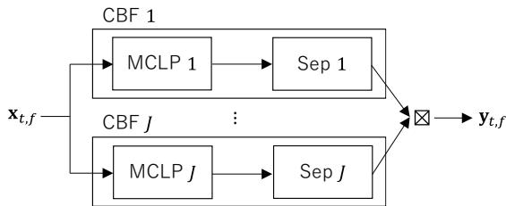  
DVZLWFKWKDWVHOHFWVDQLQSXWDWHDFKWLPHIUDPH

(a) Direct switching model of a swCBF, composed of a set of CBFs followed by a switch. Each CBF can be further factorized into an MCLP filter and a separation matrix.  
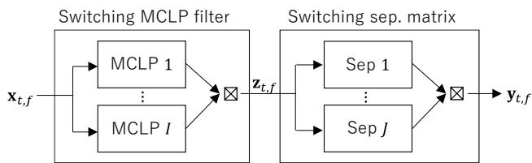  
(b) Factorized switching model of a swCBF, composed of a switching MCLP filter and a switching separation matrix.  
Fig. 1. Examples of swCBF optimized by swCIVA: $\mathbf { x } _ { t , f } , \mathbf { z } _ { t , f } ,$ and $\mathbf { y } _ { t , f } \in$ $\mathbb { C } ^ { \breve { M } }$ represent vectors of a multichannel observed signal, a multichannel dereverberated signal, and swCBF output at a TF point (t, f).

This paper further proposes several important techniques to make swIVA and swCIVA work effectively. The first one is the structure of a swCBF used by swCIVA. One may adopt a simple structure, called a direct switching model (Fig. 1(a)), composed of a set of CBFs followed by a single switch that selects one of the CBF outputs at each time frame. However, as shown in our experiments (Section VI-E), this model is sub-optimal. Instead, we propose a factorized switching model (Fig. 1(b)) that uses two different switches for MCLP filters and separation matrices. This model is advantageous for separately capturing two different time-varying characteristics of an observed signal for dereverberation and source separation.

The second important technique is the structure of a swBF. With a conventional swBF [44], individual sources are estimated separately by different swBFs, each of which independently selects one of its BFs for the estimation at each time frame. With this structure, however, it is difficult to blindly optimize swIVA in a computationally efficient way. To overcome this problem, we propose a new switching structure, called separation matrix-wise switching, which selects one of the separation matrices, each of which estimates all the sources at once at each time frame (right half of Fig. 1(a)). It allows us to also use computationally efficient optimization techniques proposed for conventional IVA [6], [48]–[50] for swIVA.

The third technique is about the selection of a statistical source model. Although a frequency-dependent source model is advantageous for WPE and the optimization of switches, a frequency-independent source model is essential for IVA. As a practical technique to solve this discrepancy, we introduce a hybrid source model, referred to as a coarse-fine source model. With it, we use a frequency-independent model to update the separation matrix and a frequency-dependent model to update the other parameters, including the switch.

The final technique concerns initialization. As shown in our experiments, simple initialization, which is often used for conventional IVA, does not work well for swIVA. This is partly because sources are estimated using different separation matrices at individual switching states with swIVA, and thus they may be permuted at different states. We call this an interstate permutation problem. To solve it, we propose two effective initialization techniques: 1) blind single-state initialization and 2) spatially guided initialization. The former allows us to optimize swIVA and swCIVA by complete blind processing. The latter uses a TF mask-based BF estimated, e.g., by a neural network (NN) [41] to initialize the separation matrices. The spatial guide not only solves the inter-state permutation but also improves the optimization to converge to better stationary points [51].

In experiments, we evaluated swIVA/swCIVA in terms of signal distortion reduction and ASR improvement using noisy reverberant speech mixtures. We first show that the above proposed techniques are all essential for swIVA and swCIVA to perform effective estimation. With these techniques, the switching mechanism largely improves the performances of swIVA and swCIVA. The improvement is substantial and consistent under all experimental conditions when the number of switching states is increased from one (i.e., IVA or CIVA) to two (i.e., swIVA or swCIVA) for both the separation matrices and the MCLP filters, although it becomes less stable when additionally increasing the number of states.

In the remainder of this paper, Section II defines the problem and Section III presents a formulation of swIVA/swCIVA. In Sections IV and V, we describe effective initialization techniques and the computational time complexity of the proposed methods. Experiments and concluding remarks are given in Sections VI and VII.

## II. PROBLEM IN CONVENTIONAL METHODS

This section elaborates the problem mentioned in Section I.A. After describing the model of the observed signal, we discuss the problem to be solved in the conventional methods.

In this section and the next, we mainly discuss cases with reverberation and develop a method based on CIVA. Then in Section III-G, we limit the discussion to cases without reverberation and present a method based on IVA.

## A. Model of observed signals

Suppose that N speech signals are captured by M distant microphones with reverberation and background diffuse noise. We assume $M \geq N$ in this paper. Let $x _ { m , t , f }$ be the captured signal at the mth microphone and a TF point $( t , f )$ in the STFT domain for $1 \leq t \leq T$ and $1 \leq f \leq F$ , where T and F are the numbers of time frames and frequency bins, and let $( \cdot ) ^ { \top }$ denote a non-conjugate transpose. Then the captured signal at all the microphones, $\mathbf { x } _ { t , f } = [ x _ { 1 , t , f } , \dots , x _ { M , t , f } ] ^ { \top } \in \mathbb { C } ^ { M }$ , is modeled by

$$
\mathbf {x} _ {t, f} = \sum_ {n = 1} ^ {N} \mathbf {d} _ {n, t, f} + \sum_ {n = 1} ^ {N} \mathbf {l} _ {n, t, f} + \mathbf {v} _ {t, f},\tag{1}
$$

$$
\mathbf {d} _ {n, t, f} = \mathbf {h} _ {n, f} s _ {n, t, f} \quad \text { for   all } n,\tag{2}
$$

where $\mathbf { d } _ { n , t , f } = [ d _ { n , 1 , t , f } , \dots , d _ { n , M , t , f } ] ^ { \top } \in \mathbb { C } ^ { M }$ is the direct signal plus the early reflections of the nth source [52], [53], $\textstyle { \mathrm { l } } _ { n , t , f }$ is the source’s late reverberation, and $\mathbf { v } _ { t , f }$ is the diffuse noise. This paper deals with ${ \bf d } _ { n , t , f }$ for each n as a signal to be estimated, called a desired signal, and models it by a product of a time-invariant ATF $\mathbf { h } _ { n , f } \in \mathbb { C } ^ { M }$ and the nth clean source signal $s _ { n , t , f } \in \mathbb { C }$ in Eq. (2).

## B. Problem in conventional CIVA

To perform BSS and BD, the conventional CIVA assumes determined conditions,2 where the captured signal contains only point sources, and the number of sources equals the number of microphones. This situation causes substantial mismatch with the above observed signal model. Since diffuse noise comes to microphones from arbitrary directions, it is more appropriate to model the signal to be composed of many sources. Accordingly, to formulate CIVA, we need to further simplify the observation model, that is, modeling it by composing it of N speech sources and $M - N$ noise components [16]. In practice, this simplification works well when $M \gg N ~ ( \mathrm { e . g }$ ., M = 8 and $N = 2 )$ and the noise level is moderate.

With the above simplification, CIVA applies a CBF to the observed signal:

$$
\begin{array}{l} \mathbf {y} _ {t, f} = \left[ \begin{array}{c} \mathbf {W} _ {f} \\ \bar {\mathbf {W}} _ {f} \end{array} \right] ^ {\mathsf {H}} \left[ \begin{array}{c} \mathbf {x} _ {t, f} \\ \bar {\mathbf {x}} _ {t, f} \end{array} \right] \in \mathbb {C} ^ {M}, \\ \bar {\mathbf {x}} _ {t, f} = [ \mathbf {x} _ {t - D, f} ^ {\top}, \ldots , \mathbf {x} _ {t - L + 1, f} ^ {\top} ] ^ {\top} \in \mathbb {C} ^ {M (L - D)}, \end{array}\tag{3}
$$

where $( \cdot ) ^ { \mathsf { H } }$ is an Hermitian transpose, $\mathbf { W } _ { f } ~ \in ~ \mathbb { C } ^ { M \times M }$ and $\bar { \mathbf { W } } _ { f } \in \mathbb { C } ^ { M ( L - D ) \times M }$ are the CBF’s coefficient matrices applied to current captured signal ${ \bf x } _ { t , f }$ and past captured signal sequence $\bar { \mathbf { x } } _ { t , f } ,$ , and $L$ is the length of a CBF. With a CBF, $\bar { \mathbf { W } } _ { f }$ is introduced to appropriately handle reverberation that is longer than an analysis window. $\mathbf { y } _ { t , f } = [ y _ { 1 , t , f } , \dotsc , y _ { M , t , f } ] ^ { \top } \in$ $\mathbb { C } ^ { \boldsymbol { M } }$ is the CBF output, including N signals that correspond to estimates of the desired signals. The other M signals in ${ \bf y } _ { t , f }$ correspond to estimated noise components. $D \ ( \geq 1 )$ is a prediction delay introduced to set the dereverberation goal to reduce only the late reverberation and preserve the desired signals [17].

Although the observed signal can be well dereverberated and separated into N speech signals and $M - N$ noise components when $M \gg N$ , the estimation becomes challenging as $M - N$ becomes small and/or the noise level becomes large. A relatively high level of noise and large estimation errors remain in the separated speech signals, and the dereverberation capability is seriously degraded. This problem severely limits the applicability of CIVA especially when the number of available microphones is small (e.g., 2 or 3).

## III. FORMULATION OF SWIVA/SWCIVA

In this section, we first describe our motivation for introducing a switching mechanism to solve the problem in the conventional methods and then present the formulation of swIVA/swCIVA by introducing a switching mechanism into IVA/CIVA.

## A. Motivation for introducing a switching mechanism

The main aim of introducing a switching mechanism to CIVA is to reduce the model mismatch discussed in Section II-B and to improve the estimation accuracy, especially when using a relatively small number of microphones. Our expectation is that the mismatch can be reduced by clustering the time frames of an observed signal into several groups so that each group better fits the assumed observation model with given set of microphones. Then, each group with reduced mismatch could be more accurately handled by a conventional CBF. In general, the signal components included in an observed signal, such as speech signals and their reverberation, are highly timevarying, and active components rapidly change in a frameby-frame manner. Therefore, adaptively changing the filter coefficients so that they better fit the active components at each TF point can be advantageous over conventional approaches that use fixed filter coefficients to handle all the signal components over time at once. The switching mechanism performs such adaptive processing by clustering the time frames of an observed signal into groups with reduced mismatch and individually applying a conventional CBF to each of the groups.

Let us present two examples that explain how the switching mechanism reduces mismatch. First, a speech signal has a sparseness property, i.e., the energy of a speech signal is sparsely distributed in the STFT domain, and different signals rarely overlap on each TF point. According to this property, clustering can be performed to reduce the number of sources N included in each group [43], and thus increased signal space $M - N$ can be used to improve the separation of diffuse noise in each group. Next, for dereverberation, as will be described in the following subsections, prediction matrices are used to estimate the late reverberation included in each time frame from a past observed signal sequence. In a diffuse noise environment, the prediction matrices also need to reduce the influence of the noise in the past observed signal sequence on the prediction [17]. Because such influence can be highly time-varying, the prediction matrices that optimally reduce the influence should also be time-varying. With the switching mechanism, such time-varying prediction matrices could be achieved by clustering the observed signals considering the influence of the noise, and applying different sets of prediction matrices to the clustered groups.

## B. Definition of swCBF

Before deriving swCIVA, this subsection first defines a structure of a CBF with a switching mechanism: a swCBF.

We start by defining a time-varying CBF, which we modify into a swCBF. A time-varying CBF is defined simply by letting the coefficient matrices of a CBF in Eq. (3) be time-varying:

$$
\mathbf {y} _ {t, f} = \left[ \begin{array}{l} \mathbf {W} _ {t, f} \\ \bar {\mathbf {W}} _ {t, f} \end{array} \right] ^ {\mathsf {H}} \left[ \begin{array}{l} \mathbf {x} _ {t, f} \\ \bar {\mathbf {x}} _ {t, f} \end{array} \right] \in \mathbb {C} ^ {M},\tag{4}
$$

where $\mathbf { W } _ { t , f }$ and $\bar { \mathbf { W } } _ { t , f }$ are time-varying CBF coefficients. Then, similar to a conventional CBF [28], [34], [37], we define a factorized form of the time-varying CBF:

$$
\left[ \begin{array}{c} \mathbf {W} _ {t, f} \\ \bar {\mathbf {W}} _ {t, f} \end{array} \right] = \left[ \begin{array}{c} \mathbf {I} _ {M} \\ - \mathbf {G} _ {t, f} \end{array} \right] \mathbf {W} _ {t, f},\tag{5}
$$

where $\mathbf { G } _ { t , f } ~ \in ~ \mathbb { C } ^ { M ( L - D ) \times M }$ is a coefficient matrix that satisfies $\bar { \mathbf { W } } _ { t , f } = - \mathbf { G } _ { t , f } \mathbf { W } _ { t , f } .$ , and $\mathbf { I } _ { M } \in \mathbb { R } ^ { M \times M }$ is an identity matrix. Using this factorization, ${ \bf y } _ { t , f }$ in Eq. (4) is obtained:

$$
\mathbf {z} _ {t, f} = \mathbf {x} _ {t, f} - \mathbf {G} _ {t, f} ^ {\mathsf {H}} \bar {\mathbf {x}} _ {t, f},\tag{6}
$$

$$
\mathbf {y} _ {t, f} = \mathbf {W} _ {t, f} ^ {\mathsf {H}} \mathbf {z} _ {t, f},\tag{7}
$$

where Eq. (6) is an MCLP filter that yields dereverberated signal $\mathbf { z } _ { t , f }$ from $\mathbf { x } _ { t , f }$ using prediction matrix $\mathbf { G } _ { t , f }$ and Eq. (7) extracts ${ \bf y } _ { t , f }$ by applying separation matrix $\mathbf { W } _ { t , f }$ to $\mathbf { z } _ { t , f } .$ Eqs. (6) and (7) correspond to filters used by swWPE and swIVA.

Because the above time-varying CBF is so flexible that over-fitting to the observed signal can easily happen, we need to introduce certain constraints to avoid that situation. For this purpose, we introduce a switching mechanism, called a factorized switching model in Fig. 1(b), to the MCLP filter and the separation matrix. It is composed of a set of time-invariant MCLP filters and separation matrices, which are controlled by their respective switches. We mathematically model them by the sums of the time-invariant coefficient matrices with switching weights:

$$
\mathbf {G} _ {t, f} = \sum_ {i = 1} ^ {I} \gamma_ {t, f} ^ {(i)} \mathbf {G} _ {f} ^ {(i)} \text { and } \mathbf {W} _ {t, f} = \sum_ {j = 1} ^ {J} \delta_ {t, f} ^ {(j)} \mathbf {W} _ {f} ^ {(j)},\tag{8}
$$

$$
\gamma_ {t, f} ^ {(i)} \in \{0, 1 \}, \delta_ {t, f} ^ {(j)} \in \{0, 1 \}, \sum_ {i = 1} ^ {I} \gamma_ {t, f} ^ {(i)} = 1, \sum_ {j = 1} ^ {J} \delta_ {t, f} ^ {(j)} = 1,\tag{9}
$$

where I and J are the numbers of the switching states of the MCLP filter and the separation matrix, $\mathbf { G } _ { f } ^ { ( i ) }$ for $1 \leq i \leq I$ is a prediction matrix of the ith time-invariant MCLP filter, $\mathbf { W } _ { f } ^ { ( j ) }$ for $1 \ \leq \ j \ \leq \ J$ is the jth time-invariant separation matrix, and $\{ \gamma _ { t , f } ^ { ( i ) } \} _ { i , t , f }$ and $\{ \delta _ { t , f } ^ { ( j ) } \} _ { j , t , f }$ are their time-varying switching weights. In this paper, for brevity, we only consider hard switches and allow $\dot { \gamma } _ { t , f } ^ { ( i ) }$ and $\delta _ { t , f } ^ { ( j ) }$ to take only binary values, 0 or 1.

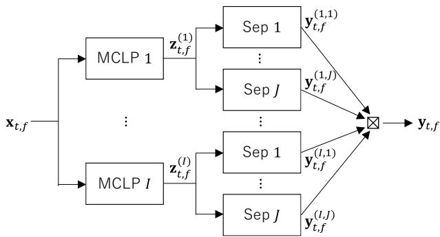  
Fig. 2. Expanded form of a swCBF: Separation matrices $\textstyle ( \mathrm { S e p } )$ labeled with identical number share same filter coefficients.

Based on Eqs. (6), (7), and (8), the swCBF output ${ \bf y } _ { t , f }$ can be further rewritten:

$$
\mathbf {z} _ {t, f} ^ {(i)} = \mathbf {x} _ {t, f} - (\mathbf {G} _ {f} ^ {(i)}) ^ {\mathsf {H}} \bar {\mathbf {x}} _ {t, f},\tag{10}
$$

$$
\mathbf {y} _ {t, f} ^ {(i, j)} = (\mathbf {W} _ {f} ^ {(j)}) ^ {\mathsf {H}} \mathbf {z} _ {t, f} ^ {(i)},\tag{11}
$$

$$
\mathbf {y} _ {t, f} = \sum_ {i = 1} ^ {I} \sum_ {j = 1} ^ {J} \beta_ {t, f} ^ {(i, j)} \mathbf {y} _ {t, f} ^ {(i, j)},\tag{12}
$$

$$
\beta^ {(i, j)} \in \{0, 1 \}, \sum_ {i = 1} ^ {I} \sum_ {j = 1} ^ {J} \beta_ {t, f} ^ {(i, j)} = 1,\tag{13}
$$

where $\beta _ { t , f } ^ { ( i , j ) } = \gamma _ { t , f } ^ { ( i ) } \delta _ { t , f } ^ { ( j ) }$ is a unified switching weight that takes a binary value, 0 or 1. We call this an expanded form of a swCBF. Figure 2 also illustrates the structure of the form. In the following, we use this form to derive the optimization algorithm.

With the expanded form in Fig. 2, at each TF point, multichannel observed signal ${ \bf x } _ { t , f }$ is first dereverberated by I different MCLP filters using Eq. (10) to yield I different sets of dereverberated signals $\mathbf { z } _ { t , f } ^ { ( i ) }$ , which are separated by J different separation matrices using Eq. (11) to yield $I J$ different output signals $\mathbf { y } _ { t , f } ^ { ( i , j ) }$ . Finally, a switch selects one of the $I J$ output signals using Eq. (12). To perform accurate time-varying filtering, all the filter coefficients and switching weights are optimized based on the ML objective derived in the following subsections.

One may consider another naive structure of a swCBF, called a direct switching model $( \mathrm { F i g . ~ } 1 ( \mathrm { a } ) ) . ^ { 3 }$ It is composed of J CBFs and a switch that selects one of the CBF’s outputs at each time frame, and each CBF may be further decomposed into a pair of an MCLP filter and a separation matrix. This model, however, is sub-optimal for swCIVA as will be shown in experiments because it cannot separately capture the timevarying characteristics of the signals for dereverberation and source separation.

## C. Probabilistic model for swCIVA

Now, we introduce the probabilistic models to derive the ML objective. They are equivalent to those used for CIVA. We assume that a certain desired swCBF satisfies the following conditions:

1) Each element $y _ { n , t , f }$ of swCBF output ${ \bf y } _ { t , f }$ for $1 \leq n \leq$ M, $1 \leq t \leq T$ and $1 \leq f \leq F$ , is mutually independent, satisfying

$$
p (\{y _ {n, t, f} \} _ {n, t, f}) = \prod_ {n = 1} ^ {M} \prod_ {t = 1} ^ {T} \prod_ {f = 1} ^ {F} p (y _ {n, t, f}),\tag{14}
$$

where n is an index of separated sources $y _ { n , t , f } .$

2) Each $y _ { n , t , f }$ for $1 \leq n \leq M$ can be modeled by a timevarying Gaussian with a mean zero and time-varying variance $\lambda _ { n , t , f } \colon$

$$
p (y _ {n, t, f}; \lambda_ {n, t, f}) = \frac {1}{\pi \lambda_ {n , t , f}} \exp \left(- \frac {| y _ {n , t , f} | ^ {2}}{\lambda_ {n , t , f}}\right).\tag{15}
$$

Note here that we assumed the mutual independence of $y _ { n , t , f }$ between different frequencies in Eq. (14), and adopted the frequency-dependent source model in Eq. (15) for swCIVA formulation. With this setting, however, BSS solutions are known to suffer from the frequency permutation problem. As a practical technique to solve it, this paper below introduces a frequency-independent source model, which is often adopted by the conventional IVA, in Section III-E.

Based on the above two models and according to $\mathsf { A p - }$ pendix $\mathbf { A } ,$ we obtain the log likelihood function for a timevarying CBF, disregarding constant terms:

$$
\begin{array}{l} \mathcal {L} (\theta) = - \sum_ {n = 1} ^ {M} \sum_ {t = 1} ^ {T} \sum_ {f = 1} ^ {F} \left(\frac {| y _ {n , t , f} | ^ {2}}{\lambda_ {n , t , f}} + \log \lambda_ {n, t, f}\right) \\ \qquad + 2 \sum_ {t = 1} ^ {T} \sum_ {f = 1} ^ {F} \log | \det \mathbf {W} _ {t, f} |, \end{array}\tag{16}
$$

where $\theta = \{ \{ \lambda _ { n , t , f } \} _ { n , t , f } , \{ \mathbf { W } _ { t , f } \} _ { t , f } , \{ \hat { \mathbf { W } } _ { t , f } \} _ { t , f } \}$ , and $y _ { n , t , f }$ is obtained by Eq. (4) dependent on $\mathbf { W } _ { t , f }$ and $\bar { \mathbf { W } } _ { t , f } .$

Finally, with the expanded form defined by Eqs. (10) to (12), the likelihood function of swCIVA can be written:

$$
\mathcal {L} \left(\mathcal {G}, \mathcal {W}, \Lambda , \mathcal {B}\right) = \sum_ {t, f, i, j} \beta_ {t, f} ^ {(i, j)} \mathcal {L} _ {t, f} ^ {(i, j)} \left(\mathbf {G} _ {f} ^ {(i)}, \mathbf {W} _ {f} ^ {(j)}, \Lambda_ {t, f}\right),\tag{17}
$$

$$
\begin{array}{l} \mathcal {L} _ {t, f} ^ {(i, j)} \left(\mathbf {G} _ {f} ^ {(i)}, \mathbf {W} _ {f} ^ {(j)}, \Lambda_ {t, f}\right) = - \sum_ {n = 1} ^ {M} \left(\frac {\left| y _ {n , t , f} ^ {(i , j)} \right| ^ {2}}{\lambda_ {n , t , f}} + \log \lambda_ {n, t, f}\right) \\ \quad + 2 \log | \det \mathbf {W} _ {f} ^ {(j)} |, \end{array} \tag {18}
$$

where $y _ { n , t , f } ^ { ( i , j ) }$ is obtained by Eqs. (10) and (11), dependent on $\mathbf { G } _ { f } ^ { ( i ) }$ and $\mathbf { W } _ { f } ^ { ( j ) } , \mathcal { G } = \{ \mathbf { G } _ { f } ^ { ( i ) } \} _ { i , f } , \mathcal { W } = \{ \mathbf { W } _ { f } ^ { ( j ) } \} _ { j , f } , \Lambda =$ $\{ \Lambda _ { t , f } \} _ { t , f } , \ : \Lambda _ { t , f } = \{ \lambda _ { n , t , f } \} _ { n } ,$ and $B = \{ \beta _ { t , f } ^ { ( i , j ) } \} _ { i , j , t , f } .$

## D. Optimization algorithm swCIVA

We now derive the algorithm, swCIVA, which optimizes a swCBF defined by Eqs. (10), (11), and (12) based on the ML objective defined by Eqs. (17) and (18).

Because no closed form solution has been obtained for the optimization, we use iterative estimation based on a coordinate ascent method [55]. It alternately updates each parameter subset by fixing the other parameter subsets and iterates the update until a convergence is obtained. The following describes each update step in the iteration.

1) G update: First, we extract the terms related with $\mathbf { G } _ { f } ^ { ( i ) }$ from Eqs. (17) and (18) and obtain

$$
\mathcal {L} _ {\mathbf {G} _ {f} ^ {(i)}} = - \sum_ {n, j, t} \frac {\beta_ {t , f} ^ {(i , j)}}{\lambda_ {n , t , f}} \left| \left(\mathbf {w} _ {n, f} ^ {(j)}\right) ^ {\mathsf {H}} \left(\mathbf {x} _ {t, f} - (\mathbf {G} _ {f} ^ {(i)}) ^ {\mathsf {H}} \bar {\mathbf {x}} _ {t, f}\right) \right| ^ {2},\tag{19}
$$

where $\mathbf { w } _ { n , f } ^ { ( j ) }$ is the nth column of $\mathbf { W } _ { f } ^ { ( j ) }$ . Since the above equation is a simple quadratic form in terms of $\mathbf { G } _ { f } ^ { ( i ) }$ , we can obtain a closed form solution for it when fixing the other parameters. Let $\mathbf { g } _ { f } ^ { ( i ) } \ = \ \mathrm { v e c } ( \mathbf { G } _ { f } ^ { ( i ) } )$ , where $\mathbf { a } ~ = ~ \mathrm { v e c } ( \mathbf { A } )$ is an operation to reshape matrix $\mathbf { \check { A } } = [ \mathbf { a } _ { 1 } , \dots , \mathbf { a } _ { M } ]$ to vector $\mathbf { a } = [ \mathbf { a } _ { 1 } ^ { \top } , \ldots , \mathbf { a } _ { M } ^ { \top } ] ^ { \top }$ . Then the solution is given by

$$
\mathbf {g} _ {f} ^ {(i)} \leftarrow (\Psi_ {f} ^ {(i)}) ^ {- 1} \operatorname{vec} (\Phi_ {f} ^ {(i)}) \in \mathbb {C} ^ {M ^ {2} (L - D)}.\tag{20}
$$

where $( \cdot ) ^ { - 1 }$ denotes a matrix inversion. $\Psi _ { f } ^ { ( i ) } \in \{ \mathrm { ~ \Gamma ~ } \} ,$ $\mathbb { C } ^ { M ^ { 2 } ( L - D ) \times M ^ { 2 } ( L - D ) }$ and $\Phi _ { f } ^ { ( i ) } \in \mathbb { C } ^ { M ( L - D ) \times M }$ are calculated:

$$
\Psi_ {f} ^ {(i)} = \sum_ {j = 1} ^ {J} \sum_ {n = 1} ^ {M} \left(\mathbf {w} _ {n, f} ^ {(j)} (\mathbf {w} _ {n, f} ^ {(j)}) ^ {\mathsf {H}}\right) ^ {*} \otimes \mathbf {R} _ {n, f} ^ {(i, j)},\tag{21}
$$

$$
\Phi_ {f} ^ {(i)} = \sum_ {j = 1} ^ {J} \sum_ {n = 1} ^ {M} \mathbf {P} _ {n, f} ^ {(i, j)} \left(\mathbf {w} _ {n, f} ^ {(j)} (\mathbf {w} _ {n, f} ^ {(j)}) ^ {\mathsf {H}}\right),\tag{22}
$$

where $( \cdot ) ^ { * }$ is a complex conjugate, ⊗ is a Kronecker product, and $\mathbf { R } _ { n , f } ^ { ( i , j ) } \in \mathbb { C } ^ { M ( L ^ { - } D ) \times M ( \mathbf { \check { L } } - \mathbf { \check { D } } ) }$ and $\mathbf { P } _ { n , f } ^ { ( i , j ) } \in \mathbb { C } ^ { M ( \tilde { L ^ { - } } D ) \times M }$ are spatio-temporal covariance matrices for the nth source, obtained by

$$
\mathbf {R} _ {n, f} ^ {(i, j)} = \sum_ {t = 1} ^ {T} \frac {\beta_ {t , f} ^ {(i , j)}}{\lambda_ {n , t , f}} \bar {\mathbf {x}} _ {t, f} \bar {\mathbf {x}} _ {t, f} ^ {\mathsf {H}},\tag{23}
$$

$$
\mathbf {P} _ {n, f} ^ {(i, j)} = \sum_ {t = 1} ^ {T} \frac {\beta_ {t , f} ^ {(i , j)}}{\lambda_ {n , t , f}} \bar {\mathbf {x}} _ {t, f} \mathbf {x} _ {t, f} ^ {\mathsf {H}}.\tag{24}
$$

Note that the above update steps can be viewed as an extension of swWPE [42] using a spatial model specified by W.

Once $\mathbf { G } _ { f } ^ { ( i ) }$ is updated, $\{ \mathbf { z } _ { t , f } ^ { ( i ) } \} _ { i , t , f }$ is also updated by Eq. (10).

Several computationally efficient algorithms have been proposed for the joint optimization of CIVA [32], [34]–[37]. Among them, the above update steps correspond to a technique called source-wise covariance decomposition [34], adopted by this paper because the other algorithms cannot be used with the factorized switching model. Although the adopted algorithm requires the calculation of relatively large covariance matrices, $\Psi _ { f } ^ { ( i ) }$ and $\Phi _ { f } ^ { ( i ) }$ , the increase of the computational cost owing to it is not necessarily significant in practice when the number of microphones is relatively small [34]. In contrast, when we adopt the direct switching model, we can use all the computationally efficient algorithms. However, the model underperforms the factorized switching model in terms of estimation accuracy as will be shown in our experiments.

2) W update: Extracting terms related with $\mathbf { W } _ { f } ^ { ( j ) }$ from Eqs. (17) and (18) yields

$$
\mathcal {L} _ {\mathbf {W} _ {f} ^ {(j)}} = - \sum_ {n = 1} ^ {M} (\mathbf {w} _ {n, f} ^ {(j)}) ^ {\mathsf {H}} \Sigma_ {n, f} ^ {(j)} \mathbf {w} _ {n, f} ^ {(j)} + 2 T _ {f} ^ {(j)} \log | \det \mathbf {W} _ {f} ^ {(j)} |,\tag{25}
$$

$$
\Sigma_ {n, f} ^ {(j)} = \sum_ {i = 1} ^ {I} \sum_ {t = 1} ^ {T} \frac {\beta_ {t , f} ^ {(i , j)}}{\lambda_ {n , t , f}} \mathbf {z} _ {t, f} ^ {(i)} (\mathbf {z} _ {t, f} ^ {(i)}) ^ {\mathsf {H}},\tag{26}
$$

$$
T _ {f} ^ {(j)} = \sum_ {i = 1} ^ {I} \sum_ {t = 1} ^ {T} \beta_ {t, f} ^ {(i, j)},\tag{27}
$$

where $\mathbf { z } _ { t , f } ^ { ( i ) }$ is the output of the ith MCLP filter in Eq. (10). Because the above objective has the same form as IVA [6], we can apply iterative optimization techniques proposed for it, including Iterative Projection (IP) [6], Iterative Source Steering [48], Iterative Projection with Adjustment (IPA) [49], and accelerated AuxIVA [50]. This paper employs IP and updates each beamformer for separating the nth source for $1 \leq n \leq M$ (or the nth column of $\mathbf { \dot { W } } _ { f } ^ { ( j ) } ) ;$

$$
\mathbf {w} _ {n, f} ^ {(j)} \leftarrow \left((\mathbf {W} _ {f} ^ {(j)}) ^ {\mathsf {H}} \Sigma_ {n, f} ^ {(j)}\right) ^ {- 1} \mathbf {e} _ {n},\tag{28}
$$

$$
\mathbf {w} _ {n, f} ^ {(j)} \leftarrow \mathbf {w} _ {n, f} ^ {(j)} / \left((\mathbf {w} _ {n, f} ^ {(j)}) ^ {\mathsf {H}} \Sigma_ {n, f} ^ {(j)} \mathbf {w} _ {n, f} ^ {(j)}\right) ^ {1 / 2},\tag{29}
$$

where $\mathbf { e } _ { n }$ is the nth column of identity matrix ${ \mathbf { I } } _ { M }$

Once $\mathbf { W } _ { f } ^ { ( j ) }$ is updated, $\{ \mathbf { y } _ { t , f } ^ { ( i , j ) } \} _ { i , j , t , f }$ is also updated by Eq. (11).

3) Λ and B updates: After updating ${ \bf y } _ { t , f }$ by Eqs. (11) and (12), variance $\lambda _ { n , t , f }$ is updated based on the likelihood function in Eq. (17) by the power of $y _ { n , t , f } \colon$

$$
\lambda_ {n, t, f} \leftarrow | y _ {n, t, f} | ^ {2} + \varepsilon ,\tag{30}
$$

where $\varepsilon$ is a small positive scalar to avoid zero division during the optimization.

Then, according to Eq. (17), the switching weight can be updated:

$$
\beta_ {t, f} ^ {(i, j)} \leftarrow \left\{ \begin{array}{l l} 1 & \text { if }   \{i, j \} = \underset {\{i ^ {\prime}, j ^ {\prime} \}} {\arg \max}   \mathcal {L} _ {t, f} ^ {(i ^ {\prime}, j ^ {\prime})} \left(\mathbf {G} _ {f} ^ {(i ^ {\prime})}, \mathbf {W} _ {f} ^ {(j ^ {\prime})}, \Lambda_ {t, f}\right) \\ 0 & \text { otherwise }, \end{array} \right.\tag{31}
$$

where $\mathcal { L } _ { t , f } ( \mathbf { G } _ { f } ^ { ( i ) } , \mathbf { W } _ { f } ^ { ( j ) } , \Lambda _ { t , f } )$ is calculated by Eq. (18).

## E. Introduction of coarse-fine source model

A coarse-fine source model is an important heuristic to ensure that swCIVA works effectively. As will be shown in our experiments, the frequency-dependent source model (a fine source model) defined in Eq. (15) is essential for appropriately optimizing the MCLP filters and the switching weights. However, using a frequency-independent source model (a coarse source model) is essential so that IVA can effectively solve the frequency permutation problem. With the coarse-fine source model, we apply the coarse source model to update the separation matrices while using the fine source model for the other part of the optimization. The coarse source model is defined at each TF point:

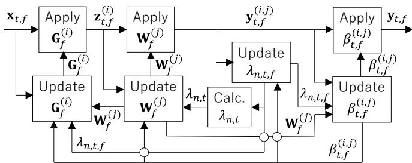  
Fig. 3. Schematic diagram of swCIVA: It also becomes schematic diagram of swIVA when dropping two blocks on $\mathbf { G } _ { f } ,$ directly putting $\mathbf { x } _ { t , f }$ to two blocks on $\mathbf { W } _ { f } ,$ and setting $I = 1 .$ . Small white circles at each intersection of lines denote that lines are not connected.

Algorithm 1: swCIVA.

Input: Observed signal  $\{x_{t,f}\}_{t,f}$ 

Output: Estimated sources  $\{y_{n,t,f}\}_{1\leq n\leq N,t,f}$ 

1 Initialize  $\Lambda$ , B, and W by Algorithm 3

2 repeat

    /* swWPE part    */
3  $\mathbf{R}_{n,f}^{(i,j)} \leftarrow \sum_{t=1}^{T} \frac{\beta_{t,f}^{(i,j)}}{\lambda_{n,t,f}} \bar{\mathbf{x}}_{t,f} \bar{\mathbf{x}}_{t,f}^{\mathsf{H}}$  for i, j, n, f

4  $\mathbf{P}_{n,f}^{(i,j)} \leftarrow \sum_{t=1}^{T} \frac{\beta_{t,f}^{(i,j)}}{\lambda_{n,t,f}} \bar{\mathbf{x}}_{t,f} \mathbf{x}_{t,f}^{\mathsf{H}}$  for i, j, n, f

5  $\Psi_{f}^{(i)} \leftarrow \sum_{j=1}^{J} \sum_{n=1}^{M} \left(\mathbf{w}_{n,f}^{(j)}(\mathbf{w}_{n,f}^{(j)})^{\mathsf{H}}\right)^{*} \otimes \mathbf{R}_{n,f}^{(i,j)}$  for i, f

6  $\Phi_{f}^{(i)} \leftarrow \sum_{j=1}^{J} \sum_{n=1}^{M} \mathbf{P}_{n,f}^{(i,j)} \left(\mathbf{w}_{n,f}^{(j)}(\mathbf{w}_{n,f}^{(j)})^{\mathsf{H}}\right)$  for i, f

7  $\text{vec}(\mathbf{G}_{f}^{(i)}) \leftarrow (\Psi_{f}^{(i)})^{-1} \text{vec}(\Phi_{f}^{(i)})$  for i, f

8  $\mathbf{z}_{t,f}^{(i)} \leftarrow \mathbf{x}_{t,f} - (\mathbf{G}_{f}^{(i)})^{\mathsf{H}} \bar{\mathbf{x}}_{t,f}$  for i, t, f

    /* swIVA part    */
9 Update W,  $\Lambda$ , B, and  $\{y_{t,f}\}_{t,f}$  by Algorithm 2

10 until convergence

$$
p (y _ {n, t, f}; \lambda_ {n, t}) = (\pi \lambda_ {n, t}) ^ {- 1} \exp \left(- \frac {| y _ {n , t , f} | ^ {2}}{\lambda_ {n , t}}\right),\tag{32}
$$

where $\lambda _ { n , t }$ is a time dependent and frequency independent variance of the nth source. Using the coarse-fine source model has already been shown effective for optimizing CIVA [36]. We extend such use for updating the switching weights in this paper.

Modifying the optimization by introducing the coarse-fine source model is simple. We only need to calculate the source variances, $\lambda _ { n , t }$ , of the coarse source model in a step for updating separation matrices $\mathbf { W } _ { f } ^ { ( j ) }$ by

$$
\lambda_ {n, t} = \frac {1}{F} \sum_ {f = 1} ^ {F} \lambda_ {n, t, f},\tag{33}
$$

and calculate Eq. (30) using $\lambda _ { n , f }$ substituted for $\lambda _ { n , t , f }$

## F. Processing flow of swCIVA

Figure 3 shows a schematic diagram of swCIVA with the coarse-fine source model, and Algorithms 1, 2, and 3 summarize the processing flow implemented for our experiments.

Algorithm 2: swIVA update

Input: Updated dereverberated signal  $\{\mathbf{z}_{t,f}^{(i)}\}_{i,t,f}$  and variables  $\Lambda$ , B, and W

Output: Updated source estimates  $\{y_{t,f}\}_{t,f}$  and variables  $\Lambda$ , B, and W

1 for K times do

2  $\lambda_{n,t} \leftarrow \frac{1}{F} \sum_{f=1}^{F} \lambda_{n,t,f}$  for n, t

3  $\Sigma_{n,f}^{(j)} \leftarrow \sum_{i=1}^{I} \sum_{t=1}^{T} \frac{\beta_{t,f}^{(i,j)}}{\lambda_{n,t}} \mathbf{z}_{t,f}^{(i)}(\mathbf{z}_{t,f}^{(i)})^{\mathsf{H}}$  for j, n, f

4  $\mathbf{w}_{n,f}^{(j)} \leftarrow \left((\mathbf{W}_{f}^{(j)})^{\mathsf{H}} \Sigma_{n,f}^{(j)}\right)^{-1} \mathbf{e}_{n}$  for j, n, f

5  $\mathbf{w}_{n,f}^{(j)} \leftarrow \mathbf{w}_{n,f}^{(j)} / \left((\mathbf{w}_{n,f}^{(j)})^{\mathsf{H}} \Sigma_{n,f}^{(j)} \mathbf{w}_{n,f}^{(j)}\right)^{1/2}$  for j, n, f

6  $\mathbf{y}_{t,f}^{(i,j)} \leftarrow (\mathbf{W}_{f}^{(j)})^{\mathsf{H}} \mathbf{z}_{t,f}^{(i)}$  for i, j, t, f

7  $y_{t,f} \leftarrow \sum_{i=1}^{I} \sum_{j=1}^{J} \beta_{t,f}^{(i,j)} y_{t,f}^{(i,j)}$  for t, f

8  $\lambda_{n,t,f} \leftarrow |y_{n,t,f}|^{2} + \varepsilon$  for n, t, f

9 Update  $\{\beta_{t,f}^{(i,j)}\}_{i,j,t,f}$  using Eq. (31)

Algorithm 3: Simple initialization

Input: Observed signal  $\{x_{t,f}\}_{t,f}$ 

Output: Initialized  $\Lambda$ , B and W

1 Initialize each element of  $\{\gamma_{t,f}^{(i)}\}_{i,t,f}$  and  $\{\delta_{t,f}^{(j)}\}_{j,t,f}$  at a random value in a range of  $1 \pm 10^{-3}$ , and normalize it to satisfy  $\sum_{i=1}^{I} \gamma_{t,f}^{(i)} = 1$  and  $\sum_{j=1}^{J} \delta_{t,f}^{(j)} = 1$ 

/* Iterate swWPE one time */

2  $\lambda_{t,f} \leftarrow x_{t,f}^{H} x_{t,f} / M + \varepsilon$  for t, f

3  $R_{f}^{(i)} \leftarrow \sum_{t} \gamma_{t,f}^{(i)} \bar{x}_{t,f} \bar{x}_{t,f}^{H} / \lambda_{t,f}$  for i, f

4  $P_{f}^{(i)} \leftarrow \sum_{t} \gamma_{t,f}^{(i)} \bar{x}_{t,f} x_{t,f}^{H} / \lambda_{t,f}$  for i, f

5  $G_{f}^{(i)} \leftarrow (R_{f}^{(i)})^{-1} P_{f}^{(i)}$  for i, f

6  $z_{t,f}^{(i)} \leftarrow x_{t,f} - (G_{f}^{(i)})^{H} \bar{x}_{t,f}$  for i, t, f

7  $\gamma_{t,f}^{(i)} \leftarrow \begin{cases} 1 &amp; \text{if } i = \arg\min_{i'} |z_{t,f}^{(i')}|^2 \\ 0 &amp; \text{otherwise} \end{cases}$  for i, t, f

/* Initialize swIVA by Algorithm 2 */

8  $W_{f}^{(j)} \leftarrow I_M$  for j, f

9  $\lambda_{n,t,f} \leftarrow 1$  for n, t, f

10  $\beta_{t,f}^{(i,j)} \leftarrow \gamma_{t,f}^{(i)} \delta_{t,f}^{(j)}$  for i, j, t, f

11 Update W,  $\Lambda$ , B, and  $\{y_{t,f}\}_{t,f}$  by Algorithm 2

As in Algorithm 1, MCLP filters G, separation matrices W, source variances Λ, and switching weights B are updated by iterative optimization. Lines 4 to 9 correspond to an update for swWPE and line 10 corresponds to an update for swIVA. Algorithm 2 shows more details of the flow of the update for swIVA. Because the update for the separation matrices requires more iterations until convergence than for the MCLP filters when using IP, and the computational cost of the former is much smaller than the latter, we iterate the update of the separation matrices K times in Algorithm 2 per update of the MCLP filter. Preferable schemes for iterations depend on which algorithm we use for optimizing IVA.

Algorithm 3 shows a simple initialization scheme that corresponds to one typically used by conventional CIVA. In it, after initializing the switching weights with random variables, we apply conventional swWPE to obtain dereverberated observed signal $\{ \mathbf { z } _ { t , f } ^ { ( i ) } \} _ { i , t , f }$ and update switching separation matrices K times to obtain the initial values of W, Λ, and B. The switching weights are first set as values between 0 and 1 and updated to binary values during the initialization steps.

## G. swIVA formulation

This subsection briefly presents the formulation of swIVA (not integrated with swWPE) by summarizing its difference from the formulation of swCIVA as follows.

1) The observation model is assumed to exclude late reverberation, i.e., we set $\mathbf { l } _ { n , t , f } = \mathbf { 0 }$ in Eq. (1).

2) The same issues and motivations as in Sections II-B and III-A are applied except for the discussions on reverberation and dereverberation.

3) The definition of a switching separation matrix used for swIVA is obtained by dropping a switching MCLP filter from a swCBF, or more specifically by Eqs. (11) and (12), substituting $\mathbf { x } _ { t , f }$ for $\mathbf { z } _ { t , f } ^ { ( i ) }$ and setting $I = 1$

4) The same assumptions as in Eqs. (14) and (15) are employed, and the same log-likelihood function as in Eqs. (17) and (18) are derived except that we drop ${ \mathcal { G } } ,$ substitute ${ \bf x } _ { t , f }$ for $\mathbf { z } _ { t , f } ^ { ( i ) } ,$ and set $I = 1$

5) The optimization algorithm can be obtained from that of swCIVA by skipping the step that updates G, substituting $\mathbf { x } _ { t , f }$ for $\mathbf { z } _ { t , f } ^ { ( i ) }$ , and setting $I = 1$

6) The same coarse-fine source model is applied.

As a result, the processing flow of swIVA is obtained by modifying Algorithms 1, 2, and 3 as follows:

1) All algorithms: substitute ${ \bf x } _ { t , f }$ for $\mathbf { z } _ { t , f } ^ { ( i ) }$ , and let I = 1.

2) Algorithm 1: skip lines 4 to 9.

3) Algorithm 3: skip lines 2 to 8 and initialize $\beta _ { t , f } ^ { ( 1 , j ) }$ at line 11 following the way for initializing $\delta _ { t , f } ^ { ( j ) }$ at line 2.

## IV. INITIALIZATION TECHNIQUES FOR SWIVA/SWCIVA

As already discussed in the introduction, the optimization of swIVA/swCIVA is sensitive to initialization, i.e., it does not converge to good stationary points when using the simple initialization in Algorithm 3. Because there is no explicit constraint on the order of estimated sources, they can be easily permuted between different switching states especially at an early stage of the optimization. We call this the inter-state permutation problem.

To solve it, we designed two effective initialization schemes: 1) a blind single-state initialization and 2) a spatially guided initialization. The former allows us to perform fully blind optimization, and the latter enables us to utilize spatial information obtained, e.g., by NN-based TF mask estimation.

## A. Blind single-state initialization

With blind single-state initialization, we use the swIVA/swCIVA themselves for the initialization, but tentatively setting the number of switching states J = 1, i.e., using only one separation matrix in swIVA/swCIVA. Because swIVA/swCIVA with $J ~ = ~ 1$ are free from the inter-state permutation problem, we can avoid such permutation errors. Note that swIVA with $J = 1$ is equivalent to IVA.

We implemented it as follows:

1) We started and iterated the optimization of swIVA/swCIVA by setting $\begin{array} { r l r } { J } & { { } = } & { 1 } \end{array}$ and following Algorithms 1 to 3.

2) After a certain predetermined number of iterations, we reset the number of switching states J to its original number specified for the estimation and re-initialized swIVA/swCIVA based on their updated parameters estimated with $J = 1$

3) We continued the remaining iterations for the optimization.

In our experiment, we performed the following re-initialization in the above step 2 before line 4 of Algorithm 2:

1) Copy updated separation matrix $\mathbf { W } _ { t , f } ^ { ( 1 ) }$ to re-initialized separation matrices $\mathbf { W } _ { t , f } ^ { ( j ) }$ for $1 \le j \le J$

2) Initialize $\delta _ { t , f } ^ { ( j ) }$ at random values following line 2 of Algorithm ${ \mathfrak { Z } } ,$ and multiply it with updated switching weights $\beta _ { t , f } ^ { ( i , 1 ) }$ to obtain re-initialized switching weights $\beta _ { t , f } ^ { ( i , j ) }$ for all $i , j , t ,$ and f as

$$
\beta_ {t, f} ^ {(i, j)} \leftarrow \beta_ {t, f} ^ {(i, 1)} \delta_ {t, f} ^ {(j)}.\tag{34}
$$

## B. Spatially guided initialization

With this initialization, we use the ATFs of the source signals separately estimated from the observed signal. Such ATFs can be reliably estimated for conventional mask-based BFs/CBFs, e.g., with a TF-mask estimation based on a neural network (NN) [41] or blind spatial clustering [21], [56]. So we adopt such a technique in this paper.

In the following, we first explain how ATFs can be estimated based on TF masks and then describe how to initialize swIVA/swCIVA using the estimated ATFs. (See Section VI-A where we estimated the TF masks in our experiments.)

1) TF mask-based ATF estimation: We adopted an ATF estimation method based on generalized eigenvalue decomposition [57], [58]. During the initialization step in Algorithm 3, dereverberated observed signal $\mathbf { z } _ { t , f }$ can be obtained based on swWPE after line 7 of Algorithm 3:

$$
\mathbf {z} _ {t, f} = \sum_ {i = 1} ^ {I} \gamma_ {t, f} ^ {(i)} \mathbf {z} _ {t, f} ^ {(i)}.\tag{35}
$$

For swIVA, we substituted $\mathbf { x } _ { t , f }$ for $\mathbf { z } _ { t , f }$ and set $I = 1$ . Then, we estimated TF masks $\Omega _ { n , t , f }$ from ${ \bf z } _ { t , f }$ , based, e.g., on a neural network. $\Omega _ { n , t , f }$ takes a value between 0 and 1, where $\Omega _ { n , t , f } ~ = ~ 1$ and 0 respectively mean that the TF point is dominated by the nth source and some other sources. With the masks, the covariance matrix of the nth source, denoted by $\Gamma _ { Z , n , f } $ , and that of interference signals, denoted by $\Gamma _ { V , n , f } :$ are calculated:

$$
\Gamma_ {Z, n, f} = \frac {\sum_ {t = 1} ^ {T} \Omega_ {n , t , f} \mathbf {z} _ {t , f} \mathbf {z} _ {t , f} ^ {\mathsf {H}}}{\sum_ {t = 1} ^ {T} \Omega_ {n , t , f}},\tag{36}
$$

$$
\Gamma_ {V, n, f} = \frac {\sum_ {t = 1} ^ {T} (1 - \Omega_ {n , t , f}) \mathbf {z} _ {t , f} \mathbf {z} _ {t , f} ^ {\mathsf {H}}}{\sum_ {t = 1} ^ {T} (1 - \Omega_ {n , t , f})},\tag{37}
$$

Then the ATFs can be estimated:

$$
\mathbf {a} _ {n, f} \leftarrow \Gamma_ {V, n, f} \mathrm{MaxEig} (\Gamma_ {V, n, f} ^ {- 1} \Gamma_ {Z, n, f}),\tag{38}
$$

where MaxEig(·) is a function that extracts the eigenvector corresponding to the maximum eigenvalue.

2) Initialization using estimated ATFs: This technique provides a way to initialize separation matrices W and source variances Λ as a substitution of lines 9 and 10 in Algorithm 3. First, we employed the conventional Minimum Power Distortionless Response (MPDR) BF for the initialization of W, where the estimated ATFs are used in the distortionless constraint, $( \mathbf { w } _ { n , f } ^ { ( j ) } ) ^ { \mathsf { H } } \mathbf { a } _ { n , f } = a _ { n , r , f } .$ , where $\boldsymbol { a } _ { n , r , f }$ is the reference channel element of $\mathbf { a } _ { n , f }$ . In concrete, each column $\mathbf { w } _ { n , f } ^ { ( j ) }$ of $\mathbf { W } _ { f } ^ { ( j ) }$ for $1 \leq n \leq N$ and all j and f is initialized:

$$
\mathbf {w} _ {n, f} ^ {(j)} = \frac {a _ {n , r , f} ^ {*} (\Xi_ {f} ^ {(j)}) ^ {- 1} \mathbf {a} _ {n , f}}{(\mathbf {a} _ {n , f}) ^ {\mathsf {H}} (\Xi_ {f} ^ {(j)}) ^ {- 1} \mathbf {a} _ {n , f}},\tag{39}
$$

where $\Xi _ { f } ^ { ( j ) }$ is a weighted covariance matrix of $\mathbf { z } _ { t , f } ,$ , calculated with the switching weights $\delta _ { t , f } ^ { ( j ) }$ initialized at line 2 of Algorithm 3:

$$
\Xi_ {f} ^ {(j)} = \frac {\sum_ {t = 1} ^ {T} \delta_ {t , f} ^ {(j)} \mathbf {z} _ {t , f} (\mathbf {z} _ {t , f}) ^ {\mathsf {H}}}{\sum_ {t = 1} ^ {T} \delta_ {t , f} ^ {(j)}}.\tag{40}
$$

As for filter coefficients to separate the noise components, i.e., $\mathbf { w } _ { n , f } ^ { ( j ) }$ for $N + 1 \leq n \leq M$ , we initialized them as $\mathbf { w } _ { n , f } ^ { ( j ) } = \mathbf { e } _ { n }$ The variance of each source is then initialized as the squared average of J BFs’ outputs:

$$
\lambda_ {n, t, f} = \left| \frac {\sum_ {j = 1} ^ {J} \delta_ {t , f} ^ {(j)} (\mathbf {w} _ {n , f} ^ {(j)}) ^ {\mathsf {H}} \mathbf {z} _ {t , f}}{\sum_ {j = 1} ^ {J} \delta_ {t , f} ^ {(j)}} \right| ^ {2}.\tag{41}
$$

## V. COMPUTATIONAL TIME COMPLEXITY

Table II summarizes the computational time complexity per iteration of the major processing blocks for IVA, swIVA, CIVA, and swCIVA. First, swIVA and IVA have the same complexity for covariance matrix calculation (Cov) in line 4 of Algorithm 2 because $\beta _ { t , f } ^ { ( i , j ) }$ with $I = 1$ and $J > 1$ can take a value 1 for only one of states j at each TF point, and $\mathbf { z } _ { t , f } ^ { ( i ) } ( \mathbf { z } _ { t , f } ^ { ( i ) } ) ^ { \mathsf { H } } ~ ( = \mathbf { x } _ { t , f } \mathbf { \bar { x } } _ { t , f } ^ { \mathsf { H } } )$ is calculated only once in each iteration. In contrast, for matrix inversion (Inv) in line 5 of Algorithm 2 and filtering (Filtering) in line 7 of Algorithm 2, swIVA needs to conduct the same processing for each state j, and thus it has J times larger complexity than IVA.

As for swCIVA and CIVA, the table shows the complexity using source-wise covariance decomposition for swCIVA and source-wise CBF factorization [34] for CIVA. Thus, the complexity of swCIVA increases not only by the use of the switching mechanism but also by the source-wise covariance decomposition. The complexity of swCIVA has an extra term $O ( I J M ^ { 5 } L ^ { 2 } F )$ for Cov in line 6 of Algorithm 1, and is $I M ^ { 2 }$ times a higher order for Inv in line 8 of Algorithm 1. For Filtering, swCIVA has I times more complexity in line 9 of Algorithm 1 and IJ times more complexity in line 7 of Algorithm 2.

TABLE II  
COMPUTATIONAL TIME COMPLEXITY PER ITERATION OF COVARIANCE MATRIX CALCULATION (COV), MATRIX INVERSION (INV), FILTERING (FILTERING), AND SWITCHING WEIGHT UPDATE (SWITCH) WITH M: #MICROPHONES, F: #FREQUENCIES, T: #FRAMES, L: LENGTH OF A CBF, AND $( I , J ) { \mathrm { : } }$ # OF SWITCHING STATES FOR WPE AND IVA.

<table><tr><td></td><td>IVA</td><td>swIVA</td></tr><tr><td>Cov</td><td> $O(M^{3}TF)$ </td><td> $O(M^{3}TF)$ </td></tr><tr><td>Inv</td><td> $O(M^{4}F)$ </td><td> $O(JM^{4}F)$ </td></tr><tr><td>Filtering</td><td> $O(M^{2}TF)$ </td><td> $O(JM^{2}TF)$ </td></tr><tr><td>Switch</td><td>-</td><td> $O(JMTF + JM^{3}F)$ </td></tr><tr><td></td><td>CIVA</td><td>swCIVA</td></tr><tr><td>Cov</td><td> $O(M^{3}L^{2}TF)$ </td><td> $O(M^{3}L^{2}TF + IJM^{5}L^{2}F)$ </td></tr><tr><td>Inv</td><td> $O(M^{4}L^{3}F)$ </td><td> $O(IM^{6}L^{3}F + JM^{4}F)$ </td></tr><tr><td>Filtering</td><td> $O(M^{2}LTF + M^{2}TF)$ </td><td> $O(IM^{2}LTF + IJM^{2}TF)$ </td></tr><tr><td>Switch</td><td>-</td><td> $O(IJMTF + JM^{3}F)$ </td></tr></table>

For updating the switching weights (Switch) in line 10 of Algorithm 2, the complexity for calculating the first line of Eq. (18) is $O ( J M T F )$ for swIVA and $O ( I J M T F )$ for swCIVA, which are M times smaller than that of Filtering for swIVA and for swCIVA. The complexity for calculating the second line, i.e., det $\mathbf { W } _ { f } ^ { ( j ) }$ , is $O ( J M ^ { 3 } F )$ , which is M times smaller than that of Inv for swIVA and for swCIVA.

In summary, when $T \gg J M$ and $M \gg J ,$ the computational cost for swIVA is dominated by Cov with $O ( M ^ { 3 } T F )$ which is the same as that for IVA. Similarly, when $T \gg$ $I J M ^ { 2 } + I M ^ { 3 } L , M L \gg I ,$ , and $M L ^ { 2 } \gg I J$ for swCIVA, the computational cost is dominated by Cov with $O ( M ^ { 3 } L ^ { 2 } T F )$ which is the same as that for CIVA. As J increases for swIVA and as $I , J ,$ and M increase for swCIVA, the costs become significantly larger than those of the conventional methods.

## VI. EXPERIMENTS

This section experimentally evaluates swIVA/swCIVA in terms of signal distortion reduction and ASR improvement. Tables III and IV summarize the methods and configurations compared in the experiments. First, we confirmed the necessity of the proposed initialization techniques and the coarse-fine source model. Then we evaluated the joint optimization in comparison with separate optimization, for which we applied conventional swWPE [42] and swIVA in a cascade configuration without interaction. Finally, we evaluated swIVA/swCIVA with varying numbers of switching states.

## A. Dataset, evaluation metrics, and analysis condition

To evaluate the estimated source signals, we used two different datasets: REVERB-2MIX [59] and TIMIT-ConvMix. REVERB-2MIX was used in Sections VI-B to VI-F and its specifications are described in the following. TIMIT-ConvMix was used only in Section VI-G, where we also summarized its specifications.

TABLE III  
METHODS TO BE COMPARED

<table><tr><td>Method</td><td>Switch</td><td>#States for switch(es)</td></tr><tr><td>IVA [6]</td><td>-</td><td> $J = 1$ </td></tr><tr><td>swIVA</td><td>√</td><td> $J = 2$  or 3</td></tr><tr><td>CIVA [32], [34]</td><td>-</td><td> $(I, J) = (1, 1)$ </td></tr><tr><td>swCIVA</td><td>√</td><td> $(I, J) = (1, 2), (2, 1), (2, 2), \ldots, \text{or } (3, 3)$ </td></tr></table>

TABLE IV

CONFIGURATIONS TO BE COMPARED: ‘\*’ INDICATES A DEFAULT CONFIGURATION USED IN EXPERIMENTS UNLESS OTHERWISE NOTED.

<table><tr><td>Parameter</td><td>Configurations</td></tr><tr><td>Initialization</td><td>Simple, blind single-state, or *spatially guided</td></tr><tr><td>Source model</td><td>Switch: Coarse (C) or *Fine (F), MCLP: C or *F</td></tr><tr><td>Optimization</td><td>*Joint or separate</td></tr><tr><td>Switching model</td><td>direct (Fig. 1(a)) or *Factorized (Fig. 1(b))</td></tr></table>

TABLE V  
STATISTICS OF MIXED UTTERANCES IN REVERB-2MIX DATASET

<table><tr><td rowspan="2"></td><td rowspan="2">#Mixtures</td><td colspan="2">Each mixture</td><td colspan="3">Length of mixtures</td></tr><tr><td>#Sources</td><td>#Mics.</td><td>Average</td><td>Min</td><td>Max</td></tr><tr><td>SimuData</td><td>2176</td><td>2</td><td>2 or 3</td><td>7.9 s</td><td>2.9 s</td><td>15.6 s</td></tr><tr><td>RealData</td><td>372</td><td>2</td><td>2 or 3</td><td>6.5 s</td><td>1.9 s</td><td>14.5 s</td></tr></table>

REVERB-2MIX is composed of noisy reverberant speech mixtures. Each mixture in the dataset was created by mixing two utterances (i.e., $N = 2 )$ , extracted from the REVERB Challenge dataset (REVERB) [60]: one from its development set (Dev set) and another from its evaluation set (Eval set). REVERB-2MIX is composed of two subsets, SimuData and RealData, created from SimuData and RealData of REVERB. Table V shows some statistics of each subset. REVERB SimuData was generated by convolving the measured impulse responses with utterances extracted from the WSJCAM0 dataset [61] and by adding measured stationary noise. The reverberant signal-to-noise ratio (SNR) was set to 20 dB, and reverberation time RT60 was varied from 0.2 to 0.7 s. REVERB RealData was recorded in actual noisy reverberant rooms, where WSJCAM0 transcriptions were read by humans. Although 8-channel data are available for REVERB-2MIX, we only used its first 2 or 3 channels in the experiments and estimated the same number of sources as channels in the respective settings. Following the REVERB-2MIX guidelines, an evaluation was performed using separated signals that correspond to the Eval set of REVERB, selected from the estimated speech signals based on the correlation with the original signals in the REVERB Eval set.

We used the REVERB-2MIX SimuData to evaluate the distortions of the enhanced signals and the RealData to evaluate the ASR performance of the enhanced signals, where all the mixtures in the respective subsets were used for the evaluations. As a metric to evaluate the signal distortions [62], we adopted the Frequency-Weighted Segmental SNR (FWSSNR), which was shown in the REVERB challenge [60] to have relatively high correlation with a subjective evaluation on the perceived amount of reverberation. To evaluate the ASR performance, we calculated the Word Error Rates (WERs) of the enhanced signals using a baseline ASR system developed for REVERB using Kaldi [63]. This system adopted a Time-Delay NN (TDNN) acoustic model trained using Lattice-Free Maximum Mutual Information (LF-MMI) and online i-vector extraction and a trigram language model. They were all trained on the REVERB training set.

We set the frame length and the shift to 32 and 8 ms and used a Hann window for a short-time analysis. The sampling frequency was 16 kHz. For an MCLP filter, the prediction delay was set at $D = 2$ and the CBF length was set at $L = 1 0$ For swCIVA, separation matrices were updated $K = 5$ times per MCLP filter update, and the separation matrices and the MCLP filters were updated 50 and 10 times. We used diagonal loading for the matrix inversions to make them stable in the optimization. For example, covariance matrices calculated for updating the filter coefficients of WPE and IVA become rank deficient when the number of active frames for a certain state at a frequency is smaller than the sizes of the matrices. We set the diagonal loading factors at $1 0 ^ { - 4 } \times \operatorname { T r a c e } ( \Psi _ { f } ^ { ( i ) } )$ for WPE in Eqs. (20) and $1 0 ^ { - 1 0 } \times \mathrm { T r a c e } ( ( \mathbf { W } _ { f } ^ { ( j ) } ) ^ { \sf H } \Sigma _ { n , f } ^ { ( j ) } )$ for IVE in Eq. (28). For all the methods, we applied projection back [64] post-processing to solve the scale ambiguity of BSS. For the estimation of the time-frequency masks, which were used to estimate the ATFs for the spatially guided initialization, we adopted a frequency-domain convolutional NN (CNN) [65] with a large receptive field, similar to the one used in a fully-Convolutional Time-domain Audio Separation Network (Conv-TasNet) [66]. We trained the CNN to estimate masks based on utterance-level permutation invariant training [67].

## B. Importance of initialization

In the first experiment, we compared the performances of IVA, CIVA, swIVA and swCIVA using three types of initialization techniques, simple initialization in Algorithm 3, blind single-state initialization, and spatially guided initialization. Figure 4 shows the FWSSNRs of the enhanced signals.

First, comparing the results with swIVA $\left( J \ = \ 2 \right)$ and IVA $( J = 1 )$ when using the spatially guided initialization, swIVA greatly outperformed IVA in both (a) and (b). Also, swIVA with blind single-state initialization shows a clear performance jump between 25 and 30 updates of separation matrices when the single-state initialization steps finished, and in the following updates it substantially outperformed IVA and CIVA using the simple initialization. In contrast, swIVA underperformed IVA with the simple initialization for the 2-ch case. Next, comparing the results using swIVA $\left( J = 2 \right)$ , the spatially guided initialization largely outperformed the others, and the blind single-state initialization was second. Note that spatially guided initialization was also very effective for IVA (J = 1). As for swCIVA, we confirmed the identical tendency in (c) and (d).

These results clearly show the importance of the initialization of swIVA and swCIVA. Without appropriate initialization, the switching mechanism might degrade the performance. With our proposed initialization techniques, in contrast, the switching mechanism substantially and consistently improv the performance more than without it. These results al suggest that the permutation alignment was robustly kept on it was appropriately initialized although it was not guarantee The blind single-state initialization helped swIVA and swCIV work effectively based only on blind processing, and t spatially guided initialization further improved performan based on NN-based mask estimation.

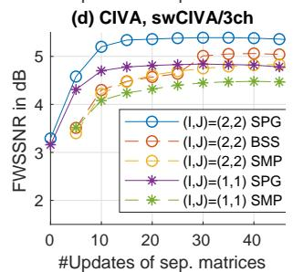

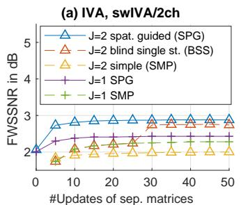

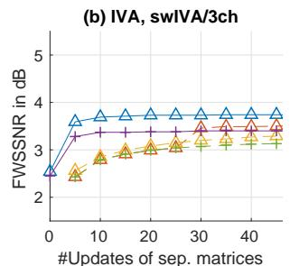

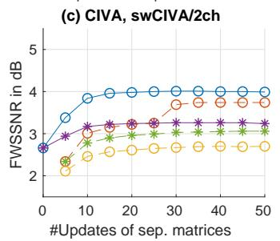  
Fig. 4. FWSSNRs in dB obtained by IVA $( J \ = \ 1 ) .$ , swIVA $( J \ = \ 2 ) ,$ CIVA $( ( I , J ) \ = \ ( 1 , 1 ) )$ , and swCIVA $( ( I , J ) \ = \ ( 2 , 2 ) )$ with spatially guided initialization (SPG), blind single-state initialization (BSS), or simple initialization (SMP): Horizontal axis indicates #updates of separation matrices. #Updates 0 and 5 correspond to MPDR BF outputs used in spatially guided initialization and swIVA outputs obtained after 5 updates in Algorithm 3. F blind single-state initialization, we used first 25 updates as the initializati steps. Default configurations in Table IV were used for other parameters.

Below we used spatially guided initialization as a defau configuration in Table IV.

## C. Necessity of coarse-fine source model

Figures 5 and 6 show the FWSSNRs and WERs of th signals enhanced using swIVA/swCIVA by modifying the configuration of the source model between coarse and fine models. We set $J \ = \ 2$ for swIVA and $( I , J ) = ( 2 , 2 )$ for swCIVA. In the figure, “Switch: $\mathrm { F } '$ and “MCLP: F” mean that the fine source model was used for switching weights and MCLP filters. “Switch: C” and “MCLP: C” mean that the coarse model was used instead. For the separation matrix, we used the coarse model in all cases.

The figures show that using the fine source model for both the switching weights and the MCLP filters greatly improved the performance of swIVA/swCIVA for all cases especially in comparison when the coarse model was used for both of them.

These results clearly show the necessity of respectively using coarse and fine models for the optimization of swIVA and for that of the MCLP filters and switches.

Note that the FWSSNRs and WERs obtained by swIVA and swCIVA did not necessarily improve monotonically as the numbers of updates were increased even using the preferable configurations. For example, see the blue line after 30 updates in Fig. 5(d) and the blue line after 40 updates in Fig. 6(a). This is probably because the optimization was performed based not on FWSSNRs or WERs but on the ML criterion. The performance degradation might be caused by over-fitting to the ML criterion.

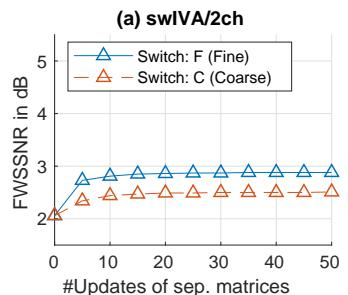

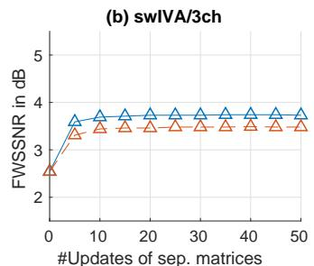

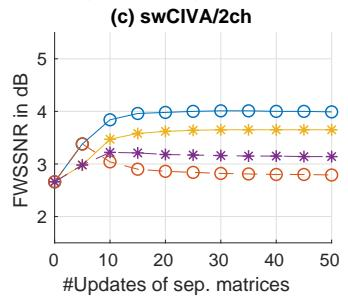

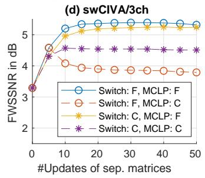  
Fig. 5. FWSSNRs in dB obtained with different source models, indicated as C (Coarse) and F (Fine), for optimization of switches (Switch) and MCLP filters (MCLP) using swIVA $\left( J ^ { ' } = 2 \right)$ and swCIVA $( ( I , J ) = ( 2 , 2 ) )$ : Default configurations in Table IV are used for other parameters.

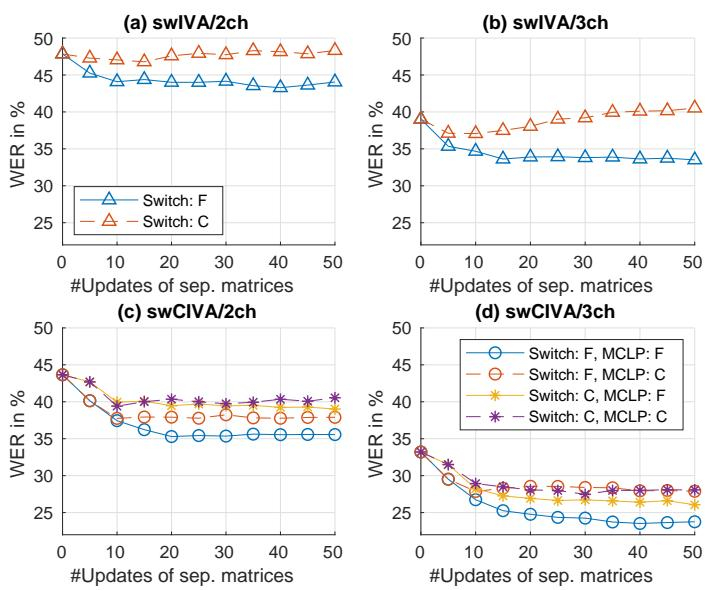  
Fig. 6. WERs in % obtained with different source models, indicated as C (Coarse) and F (Fine), for optimization of switches (Switch) and MCLP filters (MCLP) using swIVA (J = 2) and swCIVA $( ( I , J ) = ( 2 , 2 ) )$ : Default configurations in Table IV are used for other parameters.

## D. Joint optimization vs separate optimization

Next, we evaluated the effect of the joint optimization of CIVA $( ( I , J ) \ = \ ( 1 , 1 ) )$ and swCIVA $( ( I , J ) \ = \ ( 2 , 2 ) )$ in comparison with the case using separate optimization. With separate optimization, we connected conventional swWPE [42] and swIVA in a cascade configuration and optimized each separately without interaction between swIVA to swWPE except for passing the output of swWPE to swIVA. Overall optimality is not guaranteed for separate optimization.

Time (s)  
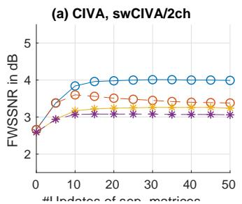

(b) CIVA, swCIVA/3ch  
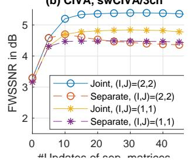

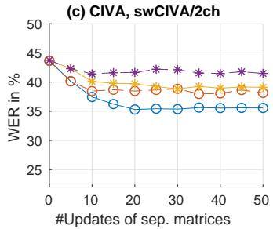

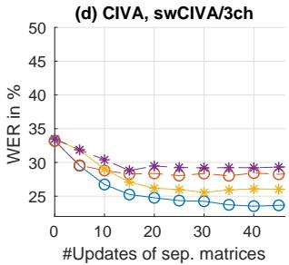

Fig. 7. FWSSNRs in dB and WERs in % obtained by $\mathrm { C I V A } ( ( I , J ) = ( 1$ and swCIVA $( I , J ) = ( 2 , 2 )$ using joint optimization (Joint) and sepa optimization (Separate): Default configurations in Table IV are used for ot parameters.  
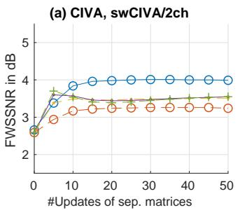

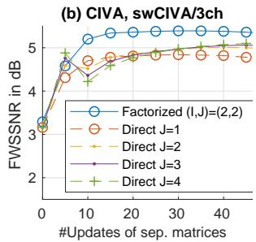  
Fig. 8. FWSSNRs in dB obtained by CIVA and swCIVA using factori switching model $( I , J ) = ( 2 , 2 )$ and direct switching model $( J = 1 , 2 , 3$ 4): Default configurations in Table IV are used for other parameters.

Figure 7 shows the results using 2-ch/3-ch observations. In all cases, the joint optimization largely outperformed the separate optimization. The joint optimization with CIVA $( ( I , J ) = ( 1 , 1 ) )$ ) even outperformed the separate optimization with swCIVA $( ( I , J ) = ( 2 , 2 ) )$ for a 3-ch observation.

This result shows that joint optimization is essential for CIVA and swCIVA.

## E. Factorized switching model vs direct switching model

Figure 8 compares FWSSNRs obtained by swCIVA based on the direct and factorized switching models (Figs. 1(a) and (b)) using 2-ch and 3-ch microphones. The same processing flow shown in Algorithms 1 to 3 was used with the direct switching model except that the same switch was used for both the MCLP filters and the separation matrices. The figure shows that the factorized model $( ( I , J ) = ( 2 , 2 ) )$ was substantially better than the direct model. Although the latter improved the performance when we increased the number of switching states from $J ~ = ~ 1 ~ ( \mathrm { i . e }$ ., conventional CIVA) to 2, further increasing the number did not improve the performance.

(a) Factorized model (sep)  
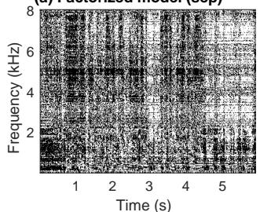  
(c) Direct model

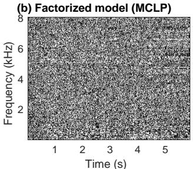

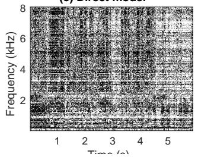

(d) Observed spectrogram  
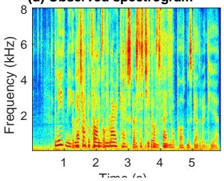

(e) Source 1 spectrogram  
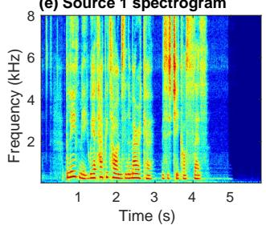

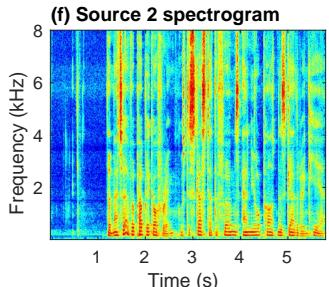  
Fig. 9. Switching weights of (a) separation matrix and (b) MCLP filter estimated with factorized switching model $( ( I , J ) = ( 2 , 2 ) )$ , and (c) those estimated with direct switching model $( J = 2 )$ when using 2-ch observation: Black and white at each TF point respectively represent switching weight value: 0 and 1. Each figure shows only one of switching weights estimated for each switch. With factorized model, switching weights of (a) separation matrix and (b) MCLP filter are respectively calculated by $\Sigma _ { i = 1 } ^ { I } \beta _ { t , f } ^ { ( i , j ) }$ and $\Sigma _ { j = 1 } ^ { J } \beta _ { t , f } ^ { ( i , j ) }$ . Spectrograms of (d) observed mixture, (e) source 1, and (f) source 2 are also shown. Default configurations in Table IV are used for other parameters.

Figure 9 shows switching weights estimated by swCIVA with the factorized switching model $( ( I , J ) \ = \ ( 2 , 2 ) )$ and the direct switching model $\left( J = 2 \right)$ . A spectrogram of the observed mixture is also shown. We can clearly see different patterns in (a) and (b), i.e., switches estimated for separation matrices and MCLP filters with the factorial switching model. In contrast, the switches estimated with the direct switching model have a pattern relatively close to (a), although slightly resembling a mixture of (a) and (b). Note that (a) seems closely related to (d), which is the observed spectrogram structure, but we can hardly see such a relationship between (b) and (d).

These results suggest that the two types of switches in swCIVA, one for MCLP filters and the other for separation matrices, capture rather different time-varying characteristics of the observed signal. This result might be caused by the different roles played by the MCLP filters and separation matrices. The former reduces the late reverberation of all the sources and the latter reduces the direct and early reflection components of the extraneous speaker and stationary noise. Because the time-varying characteristics of these interference signals are completely different from each other, the TF patterns of their switches might become very different. These results show the importance of the factorized switching model for making swCIVA work effectively.

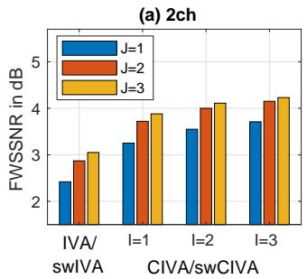

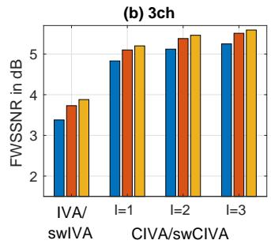  
Fig. 10. FWSSNRs in dB obtained with different number of switching states using IVA $( J = 1 ) ,$ swIVA $( J = 2$ or 3), CIVA $( ( I , J ) = ( 1 , 1 ) ) ,$ and swCIVA $( ( I , J ) = ( 1 , 2 ) , ( 2 , 1 ) , ( 2 , 2 ) , . . . , \mathrm { o r } ( 3 , 3 ) )$ ) after 25 updates: Default configurations in Table IV are used for other parameters.

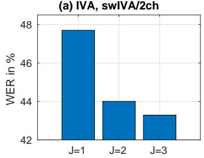

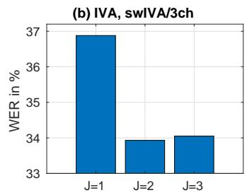

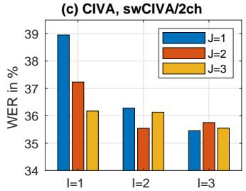

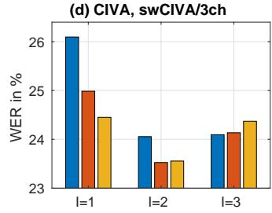  
Fig. 11. WERs in % obtained with different number of switching states using IVA $( J = 1 )$ , CIVA $( ( I , J ) = ( 1 , 1 ) )$ , swIVA $( J = 2$ or 3), and swCIVA $( ( I , J ) ~ = ~ ( 1 , 2 ) , ( 2 , 1 ) , ( 2 , 2 ) , . . . ,$ or (3, 3)) after 40 updates: Default configurations in Table IV are used for other parameters. Y -axes are individually adjusted for making the differences in each plot clear.

## F. Evaluation with various numbers of switching states

In this experiment, we varied the number of switching states for swIVA as $J ~ = ~ 2$ or 3 and those for swCIVA as $( I , J ) \ = \ ( 1 , 2 ) , ( 2 , 1 ) , ( 2 , 2 ) , \ldots , ( 3 , 3 )$ to examine their effect on FWSSNRs and WERs. $\mathrm { I V A } ~ ( J = 1 )$ and CIVA $( ( I , J ) = ( 1 , 1 ) )$ were also compared.

Figure 10 shows the FWSSNRs obtained after 25 updates of the separation matrices. The FWSSNRs were consistently improved by respectively increasing I and J from 1 to 3. On the other hand, Fig. 11 shows the WERs obtained after 40 updates of the separation matrices. Because the WER convergences were slightly slower than those of FWSSNRs, the WERs obtained at a slightly later iteration step were shown here. The WERs were improved by increasing I and J from 1 to 2, but a further increase did not necessarily improve them; it sometimes even degraded them. This may be caused by overfitting swIVA/swCIVA due to their large numbers of parameters linearly increasing as I and J increase.

TABLE VI  
STATISTICS OF MIXED UTTERANCES IN TIMIT-CONVMIX DATASET

<table><tr><td rowspan="2"></td><td rowspan="2">#Mixtures</td><td colspan="2">Each mixture</td><td colspan="3">Length of mixtures</td></tr><tr><td>#Sources</td><td>#Mics.</td><td>Average</td><td>Min</td><td>Max</td></tr><tr><td>2-Mix</td><td>40</td><td>2</td><td>3</td><td>12.3 s</td><td>11.1 s</td><td>13.6 s</td></tr><tr><td>3-Mix</td><td>40</td><td>3</td><td>4</td><td>12.6 s</td><td>12.0 s</td><td>13.6 s</td></tr></table>

These results show that swIVA and swCIVA effectively reduced the signal distortions and improved the ASR performance, although it became unstable in terms of ASR when increasing the number of switching states to 3.

## G. Evaluation using a different dataset: TIMIT-ConvMix

In this experiment, we evaluated our proposed methods using TIMIT-ConvMix, which is composed of simulated noisy reverberant mixtures. Table VI summarizes the statistics of the dataset. To generate the mixtures, we first concatenated utterances extracted from the TIMIT corpus [68] to obtain a set of single speaker clean utterance sequences whose length was at least 10 s. Then we mixed two or three utterance sequences and five different additive noise signals extracted from the CHiME-3 dataset [69] after individually reverberating them. Room impulse responses (RIRs) extracted from JR1 in the RWCP dataset [70] were used. Its RT60 was 0.6 s. All four types of noise signals were used, BUS, STR, PED, and CAF, although each mixture contained only a single type. We set the power ratio of each reverberant speech signal to the sum of the additive noise signals to 10 dB.

The major differences of this dataset from REVERB-2MIX are that all speakers continuously speak during whole sequences under a higher noise level condition. Also, we can examine mixtures with three sources. In this evaluation, we adopted signal-to-distortion ratio (SDR) as the evaluation metric [71], which is widely used in source separation research. We used the MUSEVAL V4 toolkit [72] with its bss eval images configuration. As reference signals, we used clean utterance sequences that were convolved with the initial 32 ms part of the RIRs used for generating the corresponding mixtures. To solve the permutation ambiguity between the enhanced sources, we selected a combination of sources that gave the best average SDR score for each mixture.

Figure 12 shows the improvement in the SDRs obtained from the observed signals using IVA, swIVA, CIVA, and swCIVA after 50 updates of the separation matrices. Blind single-state initialization was used for swIVA and swCIVA. The figure clearly demonstrates that SDRs consistently improved by respectively increasing I and J from 1 to 3 for both 2-Mix and 3-Mix cases.

The performance was also evaluated separately for source separation, denoising, and dereverberation using 3-Mix of the dataset. Given a filter estimated for each mixture, source separation was evaluated by signal-to-interference ratio (SIR) improvement [71] obtained from the mixture. In contrast, denoising was evaluated by noise power reduction ratio obtained when we applied the filter to the noise in the mixture, and dereverberation was evaluated by SDR improvement obtained when we applied the filter to each (noiseless) reverberant speech signal in the mixture. Table VII summarizes the results, where each measure exhibits the same improvement tendency as that in Fig. 12.

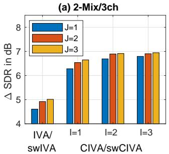

(b) 3-Mix/4ch  
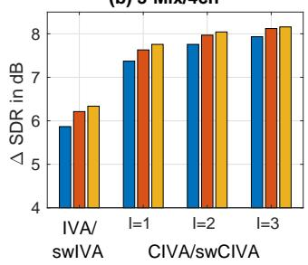  
Fig. 12. Improvement of SDRs in dB on 2-Mix and 3-Mix of TIMI ConvMix using $\mathrm { I V A } \ ( J = 1 ) , \mathrm { C I V A } \ ( ( I , J ) = ( 1 , 1 ) )$ , swIVA $( J = 2$ or and swCIVA $\overset { \cdot } { ( } ( I , J ) = ( 1 , 2 ) , ( 2 , 1 ) , ( 2 , 2 ) , \ldots ,$ or (3, 3)) after 50 upda of separation matrices: Blind single-state initialization initialized switchi weights. Default configurations in Table IV were used for other paramete SDRs of observed signals were -4.7 dB (2-Mix) and -6.8 dB (3-Mix).

TABLE VII  
SEPARATE EVALUATION OF SOURCE SEPARATION (SIR IMPROVEMENT) DENOIS ING (NOISE POWER REDUCTION RATIO), AND DEREVERBERATIO (SDR IMPROVEMENT) WITH 3-MIX OF TIMIT-CONVMIX: LARGER VALUES INDICATE BETTER PERFORMANCES WITH ALL THE MEASURES

<table><tr><td></td><td>IVA</td><td colspan="2">swIVA</td><td>CIVA</td><td colspan="2">swCIVA</td></tr><tr><td> $I$ </td><td>-</td><td>-</td><td>-</td><td>1</td><td>2</td><td>3</td></tr><tr><td> $J$ </td><td>1</td><td>2</td><td>3</td><td>1</td><td>2</td><td>3</td></tr><tr><td>Separation (dB)</td><td>4.70</td><td>5.29</td><td>5.53</td><td>7.11</td><td>7.90</td><td>8.08</td></tr><tr><td>Denoising (dB)</td><td>6.54</td><td>6.64</td><td>6.65</td><td>6.91</td><td>7.12</td><td>7.19</td></tr><tr><td>Dereverberation (dB)</td><td>1.24</td><td>1.59</td><td>1.96</td><td>3.44</td><td>3.77</td><td>3.92</td></tr></table>

Table VIII shows the actual computing times required for processing mixtures whose length was 13.1 s in 2-Mix and 3-Mix. The processing code was implemented using Python version 3.7.10 with Numpy version 1.20.2 mainly to evaluate the estimation accuracy, but it was not necessarily optimized to evaluate the computing times. For example, the summation in Eqs. (23) and (26) was calculated for all t regardless whether $\beta _ { t , f } ^ { ( \hat { i } , j ) }$ takes a zero value, although it largely increases the computational complexity of Cov. Faster implementation could be enabled with lower level programming languages.

According to the table, the computing times increased as I and J increased, but the amount was less than the linear order on both I and J. For example, for 2-Mix, the computing time increased as 11.5, 20.8, and 28.9 with $( I , J ) = ( 1 , 1 )$ (2, 1), and $( 3 , 1 )$ , and further increased as 28.9, 40.6, and 47.2 with $( I , J ) = ( 3 , 1 )$ , (3, 2), and (3, 3). In contrast, the number of microphones had a larger impact on the computing time. For example, the computing time increased from 47.2 to 88.3 when increasing the number of microphones from 3 (2-Mix) to 4 (3-Mix) for $( I , J ) = ( 3 , 3 )$

TABLE VIII  
COMPUTING TIMES IN SECONDS REQUIRED FOR PROCESS ING MIXTURES IN 2-MIX AND 3-MIX OF TIMIT-CONVMIX WITH LENGTH OF 13.1 S.

<table><tr><td></td><td>IVA</td><td colspan="2">swIVA</td><td>CIVA</td><td colspan="8">swCIVA</td></tr><tr><td> $I$ </td><td>-</td><td colspan="2">-</td><td>1</td><td colspan="2">1</td><td colspan="3">2</td><td colspan="3">3</td></tr><tr><td> $J$ </td><td>1</td><td>2</td><td>3</td><td>1</td><td>2</td><td>3</td><td>1</td><td>2</td><td>3</td><td>1</td><td>2</td><td>3</td></tr><tr><td>2-Mix</td><td>5.6</td><td>8.5</td><td>10.9</td><td>11.5</td><td>17.1</td><td>20.7</td><td>20.8</td><td>29.0</td><td>37.3</td><td>28.9</td><td>40.6</td><td>47.2</td></tr><tr><td>3-Mix</td><td>8.7</td><td>12.9</td><td>18.4</td><td>19.7</td><td>27.8</td><td>37.7</td><td>34.8</td><td>47.9</td><td>62.8</td><td>51.2</td><td>69.7</td><td>88.3</td></tr></table>

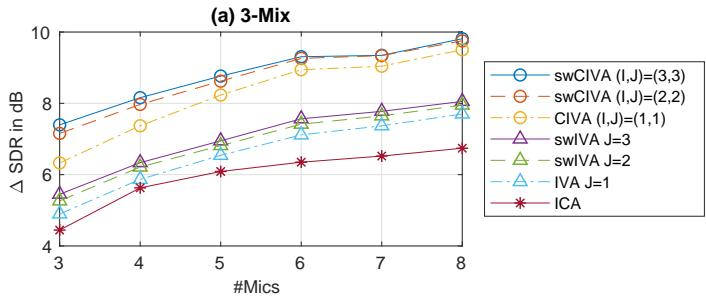  
Fig. 13. Improvement of SDRs in dB with varying number of microphones on 3-Mix of TIMIT-ConvMix using IVA, swIVA, CIVA, and swCIVA after 50 updates of separation matrices: Performance of ICA is also shown as a baseline. Blind single-state initialization initialized switching weights. Default configurations in Table IV were used for other parameters.

Finally, Fig. 13 shows the SDR improvement on 3-Mix when we varied the number of microphones from 3 to 8. ICA is also included as a reference in addition to IVA, swIVA, CIVA, and swCIVA. ICA was optimized using IP [6] and followed by frequency permutation re-alignment [9]. While all the methods improved the SDRs as the number of microphones increased, swIVA and swCIVA, respectively, outperformed IVA and CIVA under all the conditions.

## VII. CONCLUDING REMARKS

This paper proposed swIVA and swCIVA that incorporated a switching mechanism into conventional IVA-based source separation and CIVA-based joint source separation and dereverberation to improve their performance when only a relatively small number of microphones are available. The switching mechanism enables the improvement by clustering the time frames of an observed signal into groups that can be well handled by a small number of microphones and by assigning conventional IVA/CIVA techniques to independently process individual groups. We introduced several essential techniques to let swIVA and swCIVA work appropriately, including two initialization techniques based on blind and spatially guided approaches, a coarse-fine source model, a factorized switching model, and separation matrix-wise switching. Experiments showed that both swIVA and swCIVA greatly outperformed the conventional IVA and CIVA in terms of FWSSNRs, SDR, and ASR scores when using 2 or 3 microphones. In particular, we obtained consistent and substantial improvement when we respectively set the number of switching states at two for the MCLP filters and for separation matrices.

Future work may develop a more consistent source model that does not rely on the proposed hybrid model. For example, such advanced source models as non-negative matrix factorization [73] and neural networks [74], [75] might consistently solve such problems. An evaluation with spatially guided initialization might also be important when the estimation accuracy of the spatial guide is degraded under more challenging adverse conditions.

## APPENDIX A

## DERIVATION OF LIKELIHOOD FUNCTION

Assuming $\mathbf { x } _ { t , f }$ is a zero vector for $t \leq 0$ , Eq. (4) can be rewritten:

$$
\boldsymbol {y} _ {f} = \boldsymbol {W} _ {f} ^ {\mathsf {H}} \boldsymbol {x} _ {f},\tag{42}
$$

$$
\pmb {x} _ {f} = [ \mathbf {x} _ {T, f} ^ {\top}, \mathbf {x} _ {T - 1, f} ^ {\top},..., \mathbf {x} _ {1, f} ^ {\top} ] ^ {\top} \in \mathbb {C} ^ {M T},\tag{43}
$$

$$
\boldsymbol {y} _ {f} = \left[ \mathbf {y} _ {T, f} ^ {\top}, \mathbf {y} _ {T - 1, f} ^ {\top}, \dots , \mathbf {y} _ {1, f} ^ {\top} \right] ^ {\top} \in \mathbb {C} ^ {M T},\tag{44}
$$

$$
\boldsymbol {W} _ {f} = \left[ \begin{array}{c c c c c} \mathbf {W} _ {T, f} & O & & & O \\ * & \mathbf {W} _ {T - 1, f} & \ddots & & \\ & * & \ddots & O & \\ & & \ddots & \mathbf {W} _ {2, f} & O \\ O & & & * & \mathbf {W} _ {1, f} \end{array} \right]\tag{45}
$$

where $\scriptstyle { \pmb x } _ { f }$ and ${ \pmb y } _ { f }$ are vectors containing the whole time series of $\{ \mathbf { x } _ { t , f } \} _ { i }$ t and $\{ \mathbf { y } _ { t , f } \} _ { t } , ~ W _ { f } ~ \in ~ \mathbb { C } ^ { \hat { M } T \times M T }$ is a lower triangular block matrix containing the whole time series of $\{ \mathbf { W } _ { t , f } \} _ { t }$ in its block diagonal components, and ∗ represents certain components corresponding to $\left\{ \bar { \mathbf { W } } _ { t , f } \right\}$ t. According to the assumption in Eq. (14) and a property of a triangular block matrix, the log likelihood function can be expanded:

$$
\log p \left(\left\{\boldsymbol {x} _ {f} \right\} _ {f}\right) = \sum_ {f = 1} ^ {F} \log p \left(\boldsymbol {W} _ {f} ^ {- \mathsf {H}} \boldsymbol {y} _ {f}\right),\tag{46}
$$

$$
\begin{array}{l} = \sum_ {f = 1} ^ {F} \log p (\boldsymbol {y} _ {f}) + 2 \sum_ {f = 1} ^ {F} \log | \det \boldsymbol {W} _ {f} |, \\ = \sum_ {n = 1} ^ {M} \sum_ {t = 1} ^ {T} \sum_ {f = 1} ^ {F} \log p (y _ {n, t, f}) + 2 \sum_ {t = 1} ^ {T} \sum_ {f = 1} ^ {F} \log | \det \boldsymbol {W} _ {t, f} |. \end{array}\tag{47}
$$

(48)

## REFERENCES

[1] J. Li, L. Deng, R. Haeb-Umbach, and Y. Gong, Robust Automatic Speech Recognition: A Bridge to Practical Applications. Academic Press, 2015.

[2] P. Comon, “Independent component analysis, a new concept?” Signal Processing, vol. 36, no. 3, pp. 287–314, 1994.

[3] A. Hyv¨arinen, J. Karhunen, and E. Oja, Independent Component Analysis. New York: John Wiley & Sons, 2001.

[4] T. Kim, H. T. Attias, S.-Y. Lee, and T.-W. Lee, “Blind source separation exploiting higher-order frequency dependencies,” IEEE Trans. Speech, and Audio Processing, vol. 15, no. 1, pp. 70–79, 2006.

[5] A. Hiroe, “Solution of permutation problem in frequency domain ica, using multivariate probability density functions,” in Independent Component Analysis and Blind Signal Separation, 2006, pp. 601–608.

[6] N. Ono and S. Miyabe, “Auxiliary-function-based independent component analysis for super-Gaussian sources,” in LVA/ICA. Springer, 2010, pp. 165–172.

[7] N. Duong, E. Vincent, and R. Gribonval, “Under-determined reverberant audio source separation using a full-rank spatial covariance model,” IEEE Trans. Audio, Speech, and Language Processing, vol. 18, no. 7, pp. 1830–1840, 2010.

[8] N. Ito, R. Ikeshita, H. Sawada, and T. Nakatani, “A joint diagonalization based efficient approach to underdetermined blind audio source separation using the multichannel wiener filter,” IEEE/ACM Trans. Audio, Speech, and Language Processing, vol. 28, pp. 1950–1965, 2021.

[9] H. Sawada, S. Araki, and S. Makino, “Underdetermined convolutive blind source separation via frequency bin-wise clustering and permutation alignment,” IEEE Trans. Audio, Speech, and Language Processing, vol. 19, no. 3, pp. 516–527, 2011.

[10] D. H. T. Vu and R. Haeb-Umbach, “Blind speech separation employing directional statistics in an expectation maximization framework,” in Proc. IEEE ICASSP, 2010, pp. 241–244.

[11] M. Souden, S. Araki, K. Kinoshita, T. Nakatani, and H. Sawada, “A multichannel MMSE-based framework for speech source separation and noise reduction,” IEEE Trans. Audio, Speech, and Language Processing, vol. 21, no. 9, pp. 1913–1928, 2010.

[12] H. Sawada, S. Araki, R. Mukai, and S. Makino, “Blind extraction of a dominant source signal from mixtures of many sources,” in Proc. IEEE ICASSP, vol. III, 2005, pp. 61–64.

[13] Y. Kubo, N. Takamune, D. Kitamura, and H. Saruwatari, “Efficient fullrank spatial covariance estimation using independent low-rank matrix analysis for blind source separation,” in Proc. EUSIPCO, 2019, pp. 1814–1818.

[14] Z. Koldovsk ´y and P. Tichavsk ´y, “Gradient algorithms for complex nongaussian independent component/vector extraction, question of convergence,” IEEE Transactions on Signal Processing, vol. 67, no. 4, pp. 1050–1064, 2018.

[15] R. Scheibler and N. Ono, “Independent vector analysis with more microphones than sources,” in Proc. IEEE WASPAA, 2019.

[16] R. Ikeshita, T. Nakatani, and S. Araki, “Block coordinate descent algorithms for auxiliary-function-based independent vector extraction,” IEEE Trans. Signal Processing, vol. 69, pp. 3252–3267, 2021.

[17] T. Nakatani, T. Yoshioka, K. Kinoshita, M. Miyoshi, and B.-H. Juang, “Speech dereverberation based on variance-normalized delayed linear prediction,” IEEE Transactions on Audio, Speech, and Language Processing, vol. 18, no. 7, pp. 1717–1731, 2010.

[18] T. Yoshioka and T. Nakatani, “Generalization of multi-channel linear prediction methods for blind MIMO impulse response shortening,” IEEE Transactions on Audio, Speech and Language Processing, vol. 20, no. 10, pp. 2707–2720, 2012.

[19] A. Juki´c, T. van Waterschoot, T. Gerkmann, and S. Doclo, “Multichannel linear prediction-based speech dereverberation with sparse priors,” IEEE/ACM Transactions on Audio, Speech and Language Processing, vol. 23, no. 9, pp. 1509–1520, 2015.

[20] T. Yoshioka and T. Nakatani, “Dereverberation for reverberation-robust microphone arrays,” in Proc. EUSIPCO, 2013.

[21] N. Kanda, C. Boeddeker, J. Heitkaemper, Y. Fujita, S. Horiguchi, K. Nagamatsu, and R. Haeb-Umbach, “Guided source separation meets a strong ASR backend: Hitachi/Paderborn university joint investigation for dinner party ASR,” in Proc. Interspeech, 2019, pp. 1248–1252.

[22] M. Delcroix, T. Yoshioka, A. Ogawa, Y. Kubo, M. Fujimoto, N. Ito, K. Kinoshita, M. Espi, S. Araki, T. Hori, and T. Nakatani, “Strategies for distant speech recognition in reverberant environments,” EURASIP J. Adv. Signal Process, vol. Article ID 2015:60, doi:10.1186/s13634-015- 0245-7, 2015.

[23] R. Haeb-Umbach, S. Watanabe, T. Nakatani, M. Bacchiani, B. Hoffmeister, M. Seltzer, H. Zen, and M. Souden, “Speech processing for digital home assistants,” IEEE Signal Processing Magazine, vol. 36, no. 6, pp. 111–124, 2019.

[24] M. K. Nandwana, J. van Hout, C. Richey, M. McLaren, M. A. Barrios, and A. Lawson, “The voices from a distance challenge 2019,” in Proc. Interspeech, 2019, pp. 2438–2442.

[25] S. Horiguchi, N. Yalta, P. Garcia, Y. Takashima1, Y. Xue, D. Raj, Z. Huang, Y. Fujita, S. Watanabe, and S. Khudanpur, “The Hitachi-JHU DIHARD III system: Competitive end-to-end neural diarization and xvector clustering systems combined by dover-lap,” arXiv:2102.01363, 2021.

[26] S. Amari, S. C. Douglas, A. Cichocki, and H. H. Yang, “Multichannel blind deconvolution and equalization using the natural gradient,” in Proc. IEEE Int. Workshop on Signal Processing Advances in Wireless Communications, 1997, pp. 101–107.

[27] H. Buchner, R. Aichner, and W. Kellermann, “TRINICON: a versatile framework for multichannel blind signal processing,” in Proc. IEEE ICASSP, vol. III, 2004, pp. 889–892.

[28] T. Yoshioka, T. Nakatani, M. Miyoshi, and H. G. Okuno, “Blind separation and dereverberation of speech mixtures by joint optimization,” IEEE Trans. Audio, Speech, and Language Processing, vol. 19, no. 1, January 2011.

[29] M. Togami, Y. Kawaguchi, R. Takeda, Y. Obuchi, and N. Nukaga, “Multichannel speech dereverberation and separation with optimized combination of linear and non-linear filtering,” in Proc. IEEE ICASSP, 2012, pp. 4057–4060.

[30] H. Kagami, H. Kameoka, and M. Yukawa, “Joint separation and dereverberation of reverberant mixtures with determined multichannel nonnegative matrix factorization,” in Proc. IEEE ICASSP, 2018, pp. 31–35.

[31] X. Li, L. Girin, S. Gannot, and R. Horaud, “Multichannel source separation and speech enhancement using the convolutive transfer function,” IEEE/ACM Trans. Audio, Speech, and Language Processing, vol. 27, no. 3, pp. 645–659, March 2019.

[32] R. Ikeshita, N. Ito, T. Nakatani, and H. Sawada, “Independent low-rank matrix analysis with decorrelation learning,” in Proc. IEEE WASPAA, October 2019.

[33] T. Dietzen, S. Doclo, M. Moonen, and T. van Waterschoot, “Integrated sidelobe cancellation and linear prediction Kalman filter for joint multimicrophone speech dereverberation, interfering speech cancellation, and noise reduction,” IEEE/ACM Trans. Audio, Speech, and Language Processing, vol. 28, pp. 740–754, January 2020.

[34] T. Nakatani, R. Ikeshita, K. Kinoshita, H. Sawada, and S. Araki, “Computationally efficient and versatile framework for joint optimization of blind speech separation and dereverberation,” in Proc. Interspeech, 2020, pp. 91–95.

[35] T. Nakashima, R. Scheibler, M. Togami, and N. Ono, “Joint dereverberation and separation with iterative source steering,” in Proc. IEEE ICASSP, 2021.

[36] T. Nakatani, R. Ikeshita, K. Kinoshita, H. Sawada, and S. Araki, “Blind and neural network-guided convolutional beamformer for joint denoising, dereverberation, and source separation,” in IEEE ICASSP, 2021, pp. 6129–6133.

[37] R. Ikeshita and T. Nakatani, “Independent vector extraction for fast joint blind source separation and dereverberation,” IEEE Signal Processing Letters, vol. 28, pp. 972–976, 2021.

[38] M. Togami and R. Scheibler, “Over-determined speech source separation and dereverberation,” in Proc. APSIPA, Dec. 2020, pp. 705–710.

[39] B. D. V. Veen and K. M. Buckley, “Beamforming: A versatile approach to spatial filtering,” IEEE ASSP Magazine, vol. 5, no. 2, pp. 4–24, 1988.

[40] C. Boeddeker, T. Nakatani, K. Kinoshita, and R. Haeb-Umbach, “Jointly optimal dereverberation and beamforming,” in Proc. IEEE ICASSP, 2020.

[41] T. Nakatani, C. Boeddeker, K. Kinoshita, R. Ikeshita, M. Delcroix, and R. Haeb-Umbach, “Jointly optimal denoising, dereverberation, and source separation,” IEEE/ACM Trans. Audio, Speech, and Language Processing, vol. 28, pp. 2267–2282, 2020.

[42] R. Ikeshita, N. Kamo, and T. Nakatani, “Blind signal dereverberation based on mixture of weighted prediction error models,” IEEE Signal Processing Letters, vol. 28, pp. 399–403, 2021.

[43] K. Yamaoka, N. Ono, S. Makino, and T. Yamada, “Time-frequency-binwise switching of minimum variance distortionless response beamformer for underdetermined situations,” in Proc. IEEE ICASSP, 2019, pp. 7908– 7912.

[44] T. Nakatani, R. Ikeshita, N. Kamo, K. Kinoshita, S. Araki, and H. Sawada, “Switching convolutional beamformer,” in Proc. EUSIPCO, 2021.

[45] H. L. V. Trees, Optimum Array Processing, Part IV of Detection, Estimation, and Modulation Theory. New York: Wiley-Interscience, 2002.

[46] A. Masnadi-Shirazi, W. Zhang, and B. D. Rao, “Glimpsing IVA: A framework for overcomplete/complete/undercomplete convolutive source separation,” IEEE Trans. Audio, Speech, and Language Processing, vol. 18, no. 7, pp. 1841–1855, 2010.

[47] S. Wehr, A. Lombard, H. Buchner, and W. Kellermann, “‘Shadow BSS’ for blind source separation in rapidly time-varying acoustic scenes,” in ICA, 2007.

[48] R. Scheibler and N. Ono, “Fast and stable blind source separation with rank-1 updates,” in Proc. IEEE ICASSP, 2020, pp. 236–240.

[49] R. Scheibler, “Independent vector analysis via log-quadratically penalized quadratic minimization,” IEEE Trans. Signal Processing, vol. 69, pp. 2509–2524, 2021.

[50] A. Brendel and W. Kellermann, “Accelerating auxiliary function-based independent vector analysis,” in Proc. IEEE ICASSP, 2021.

[51] C. Boedekker, F. Rautenberg, and R. Haeb-Umbach, “A comparison and combination of unsupervised blind source separation techniques,” arXiv:2106.05627, 2021.

[52] J. S. Bradley, H. Sato, and M. Picard, “On the importance of early reflections for speech in rooms,” The Journal of the Acoustic Society of America, vol. 113, pp. 3233–3244, 2003.

[53] T. Nishiura, Y. Hirano, Y. Denda, and M. Nakayama, “Investigations into early and late reflections on distant-talking speech recognition toward suitable reverberation criteria,” in Proc. Interspeech, 2007, pp. 1082– 1085.

[54] M. Miyoshi and Y. Kaneda, “Inverse filtering of room acoustics,” IEEE Trans. Acoustics, Speech, and Signal Processing, vol. 36, no. 2, pp. 145–152, 1988.

[55] S. J. Wright, “Coordinate descent algorithms,” Mathematical Programming, vol. 151, no. 1, pp. 3–34, 2015.

[56] N. Ito, S. Araki, and T. Nakatani, “Complex angular central Gaussian mixture model for directional statistics in mask-based microphone array signal processing,” Proc. EUSIPCO, pp. 1153–1157, 2016.

[57] S. Markovich-Golan, S. Gannot, and I. Cohen, “Multichannel eigenspace beamforming in a reverberant noisy environment with multiple interfering speech signals,” IEEE Trans. ASLP, vol. 17, no. 6, pp. 1071–1086, 2009.

[58] Z. Wang, E. Vincent, R. Serizel, and Y. Yan, “Rank-1 constrained multichannel Wiener filter for speech recognition in noisy environments,” Computer Speech & Language, vol. 49, pp. 37–51, May 2018.

[59] “REVERB-2MIX,” https://github.com/nttcslab-sp/REVERB-2MIX/.

[60] K. Kinoshita, M. Delcroix, S. Gannot, E. A. P. Habets, R. Haeb-Umbach, W. Kellermann, V. Leutnant, R. Maas, T. Nakatani, B. Raj, A. Sehr, and T. Yoshioka, “A summary of the REVERB challenge: State-of-the-art and remaining challenges in reverberant speech processing research,” EURASIP Journal on Advances in Signal Processing, 2016.

[61] T. Robinson, J. Fransen, D. Pye, J. Foote, and S. Renals, “WSJCAMO: A British English speech corpus for large vocabulary continuous speech recognition,” in Proc. IEEE ICASSP, 1995, pp. 81–84.

[62] Y. Hu and P. C. Loizou, “Evaluation of objective quality measures for speech enhancement,” IEEE Trans. Audio, Speech, and Language Processing, vol. 16, no. 1, pp. 229–238, 2008.

[63] D. Povey, A. Ghoshal, G. Boulianne, L. Burget, O. Glembek, N. Goel, M. Hannemann, P. Motlicek, Y. Qian, P. Schwarz, J. Silovsky, G. Stemmer, and K. Vesely, “The Kaldi speech recognition toolkit,” in Proc. IEEE ASRU, 2011.

[64] N. Murata, S. Ikeda, and A. Ziehe, “An approach to blind source separation based on temporal structure of speech signals,” Neurocomputing, vol. 41, no. 1–4, p. 1–24, Oct. 2001.

[65] F. Bahmaninezhad, J. Wu, R. Gu, S.-X. Zhang, Y. Xu, M. Yu, and D. Yu, “A comprehensive study of speech separation: spectrogram vs waveform separation,” in Proc. Interspeech, 2019, pp. 4574–4578.

[66] Y. Luo and N. Mesgarani, “Conv-TasNet: Surpassing ideal time–frequency magnitude masking for speech separation,” IEEE/ACM Trans. Audio, Speech, and Language Processing, vol. 27, no. 8, pp. 1256–1266, 2019.

[67] M. Kolbæk, D. Yu, Z.-H. Tan, and J. Jensen, “Multitalker speech separation with utterance-level permutation invariant training of deep recurrent neural networks,” IEEE Trans. Audio, Speech, and Language Processing, pp. 1901–1913, 2017.

[68] J. S. Garofolo, L. F. Lamel, W. M. Fisher, J. G. Fiscus, D. S. Pallett, N. L. Dahlgren, and V. Zue, TIMIT acoustic-phonetic continuous speech corpus. Philadelphia: Linguistic Data Consortium, 1993.

[69] J. Barker, R. Marxer, E. Vincent, and S. Watanabe, “The third ‘CHiME speech separation and recognition challenge: Dataset, task and baselines,” in Proc. IEEE ASRU-2015, 2015, pp. 504–511.

[70] S. Nakamura, K. Hiyane, F. Asano, T. Nishiura, and T. Yamada, “Acoustical sound database in real environments for sound scene understanding and hands-free speech recognition,” in Proc. 2nd International Conference on Language Resources and Evaluation, 2000.

[71] E. Vincent, R. Gribonval, and C. F´evotte, “Performance measurement in blind audio source separation,” IEE Trans. Audio, Speech, and Language Processing, vol. 14, no. 4, pp. 1462–1469, 2006.

[72] “Museval,” https://github.com/sigsep/sigsep-mus-eval.

[73] D. Kitamura, N. Ono, H. Sawada, H. Kameoka, and H. Saruwatari, “Determined blind source separation unifying independent vector analysis and nonnegative matrix factorization,” IEEE/ACM Trans. Audio, Speech, and Language Processing, vol. 24, no. 9, pp. 1626–1641, 2016.

[74] N. Makishima, S. Mogami, N. Takamune, D. Kitamura, H. Sumino, S. Takamichi, H. Saruwatari, and N. Ono, “Independent deeply learned matrix analysis for determined audio source separation,” IEEE/ACM Transactions on Audio, Speech, and Language Processing, vol. 27, no. 10, pp. 1601–1615, 2019.

[75] H. Kameoka, L. Li, S. Inoue, and S. Makino, “Supervised determined source separation with multichannel variational autoencoder,” Neural computation, vol. 31, no. 9, pp. 1891–1914, 2019.