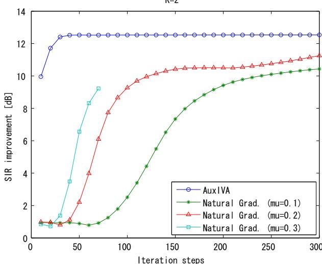
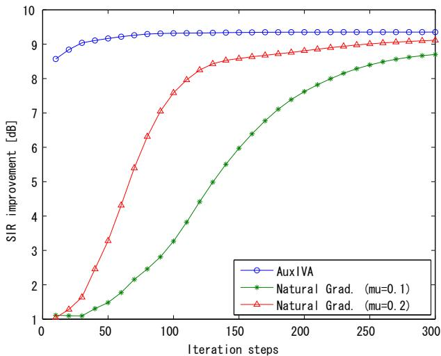

# STABLE AND FAST UPDATE RULES FOR INDEPENDENT VECTOR ANALYSISBASED ON AUXILIARY FUNCTION TECHNIQUE

Nobutaka Ono

National Institute of Informatics 2-1-2 Hitotsubashi, Chiyoda-ku, Tokyo, 101-8430, Japan onono@nii.ac.jp

## ABSTRACT

This paper presents stable and fast update rules for independent vector analysis (IVA) based on auxiliary function technique. The algorithm consists of two alternative updates: 1) weighted covariance matrix updates and 2) demixing matrix updates, which include no tuning parameters such as step size. The monotonic decrease of the objective function at each update is guaranteed. The experimental evaluation shows that the derived update rules yield faster convergence and better results than natural gradient updates.

Index Terms— independent vector analysis, blind source separation, natural gradient, auxiliary function

## 1. INTRODUCTION

Blind source separation (BSS) has still been one of the most interest topics in signal processing field. In recent years, multivariatetype independent component analysis (ICA), which can be referred as independent vector analysis (IVA), has been developed [1, 2, 3] and applied for frequency-domain approach for convolutive mixtures [4]. In conventional frequency-domain ICA, sources are separated at each frequency bin, individually. Hence, the permutation problem has to be solved as a post processing [5]. While, in IVA, the whole frequency components are modeled as a stochastic vector variable and simultaneously processed. Due to the model including dependencies over frequency components, IVA is theoretically not affected by the permutation ambiguity, which is its remarkable advantage.

One of the standard solutions of IVA is the natural gradient update [1, 2, 3]. However, there is a tradeoff between the convergence speed and the stability. While, recently, the author has derive new effective update rules for ICA based on auxiliary function technique [6]. In this paper, we show that the similar technique as [6] is also applicable for the objective function of IVA, and derive efficient update rules for IVA in the similar manner.

## 2. INDEPENDENT VECTOR ANALYSIS

## 2.1. BSS in Frequency Domain

Assume here that K sources are observed by K microphones and their Short-time Fourier Transform (STFT) representations are obtained. Let $s _ { k } ( \omega )$ and $x _ { k } ( \omega )$ be the kth source signal and the kth observation signal at ωth frequency bin, respectively. We here omit the index of time frame and regard the observation of each frame as a realization of stochastic process.

In frequency-domain approach for convolutive mixture [4], the linear mixing model in frequency domain:

$$
\boldsymbol {x} (\omega) = A (\omega) \boldsymbol {s} (\omega)\tag{1}
$$

is assumed and the sources are estimated by a linear demixing process:

$$
\boldsymbol {y} (\omega) = W (\omega) \boldsymbol {x} (\omega),\tag{2}
$$

where $A ( \omega )$ is a mixing matrix,

$$
W (\omega) = \left(\boldsymbol {w} _ {1} (\omega) \dots \boldsymbol {w} _ {K} (\omega)\right) ^ {h}\tag{3}
$$

is a demixing matrix where h denotes Hermitian transpose, $\pmb { s } ( \omega )$ $\scriptstyle { \pmb x } ( \omega )$ , and $\mathbf y ( \omega )$ are the frequency-wise vector representation of the sources, the observations, and the estimated sources, respectively, which are defined as

$$
\pmb {s} (\omega) = \left(s _ {1} (\omega) \dots s _ {K} (\omega)\right) ^ {t},\tag{4}
$$

$$
\pmb {x} (\omega) = (x _ {1} (\omega) \dots x _ {K} (\omega)) ^ {t},\tag{5}
$$

$$
\pmb {y} (\omega) = (y _ {1} (\omega) \dots y _ {K} (\omega)) ^ {t},\tag{6}
$$

where t denotes vector transpose.

## 2.2. Objective Function of IVA

In IVA, assuming a multivariate p.d.f. for sources to exploit the dependencies over frequency components, the demixing matrices are estimated by minimizing the following objective function.

$$
J (\boldsymbol {W}) = \sum_ {k = 1} ^ {K} E [ G (\boldsymbol {y} _ {k}) ] - \sum_ {\omega = 1} ^ {N _ {\omega}} \log | \det W (\omega) |\tag{7}
$$

where W denotes a set of $W ( \omega ) \ : ( 1 \leq \omega \leq N _ { \omega } ) , E [ \cdot ]$ the expectation operation, $\pmb { y } _ { k }$ is the source-wise vector representation defined as

$$
\boldsymbol {y} _ {k} = (y _ {k} (1) \dots y _ {k} (N _ {\omega})) ^ {t},\tag{8}
$$

and $G ( \pmb { y } _ { k } )$ is called contrast function and has a relationship $G ( \pmb { y } _ { k } ) = - \log p ( \pmb { y } _ { k } )$ where $p ( \pmb { y } _ { k } )$ represents a multivariate p.d.f. of sources.

In the literature [1, 2, 3], spherical contrast functions:

$$
G (\pmb {y} _ {k}) = G _ {R} (r _ {k})\tag{9}
$$

$$
r _ {k} = | | \boldsymbol {y} _ {k} | | _ {2} = \sqrt {\sum_ {\omega = 1} ^ {N _ {\omega}} | y _ {k} (\omega) | ^ {2}}\tag{10}
$$

are often used where $| | \cdot | | _ { 2 }$ denotes $L _ { 2 }$ norm of a vector. This paper also focuses on this type of contrast functions.

Minimizing Eq. (7) is a nonlinear optimization problem for which there is generally no closed-form solutions. The most standard approach to solve it is iteratively applying the following update rule based on natural gradient [1, 2, 3]:

$$
W (\omega) \leftarrow W (\omega) + \mu (I - E [ \phi_ {\omega} (\boldsymbol {y}) \boldsymbol {y} ^ {h} (\omega) ]) W (\omega),\tag{11}
$$

$$
\phi_ {\omega} (\pmb {y}) = (\phi_ {1 \omega} (\pmb {y} _ {1}) \dots \phi_ {K \omega} (\pmb {y} _ {K})) ^ {t},\tag{12}
$$

$$
\phi_ {k \omega} (\pmb {y} _ {k}) = \frac {\partial G (\pmb {y} _ {k})}{\partial y _ {k} ^ {*} (\omega)},\tag{13}
$$

where ∗ denotes complex conjugate and $\mu$ denotes a step size parameter. As well known, the step size determines the tradeoff between the convergence speed and the stability. A larger step size would leads faster convergence but may cause the divergence.

## 3. AUXILIARY FUNCTION OF CONTRAST FUNCTION

## 3.1. Auxiliary Function Technique

To avoid a step size tuning and derive an effective iterative update rules, we here introduce auxiliary function technique, which is an extension of EM algorithm and has been recently applied to solve various kinds of optimization problems in the signal processing field [7, 8, 6].

In order to introduce the auxiliary function technique, let us consider a general optimization problem to find a parameter vector $\pmb \theta = \pmb \theta ^ { \dagger }$ satisfying

$$
\boldsymbol {\theta} ^ {\dagger} = \operatorname{argmin} _ {\boldsymbol {\theta}} J (\boldsymbol {\theta}),\tag{14}
$$

where $J ( \pmb \theta )$ is an objective function.

In the auxiliary function technique, a function $Q ( \pmb \theta , \tilde { \pmb \theta } )$ is designed such that it satisfies

$$
J (\boldsymbol {\theta}) = \min _ {\tilde {\boldsymbol {\theta}}} Q (\boldsymbol {\theta}, \tilde {\boldsymbol {\theta}}).\tag{15}
$$

$Q ( \pmb \theta , \tilde { \pmb \theta } )$ is called an auxiliary function for $J ( \pmb \theta )$ , and $\tilde { \pmb { \theta } }$ are called auxiliary variables. Then, instead of directly minimizing the objective function $J ( \pmb \theta )$ , the auxiliary function $Q ( \pmb \theta , \tilde { \pmb \theta } )$ is minimized in terms of $\pmb { \theta }$ and θ˜, alternatively, the variables being iteratively updated as

$$
\tilde {\boldsymbol {\theta}} ^ {(i + 1)} = \operatorname{argmin} _ {\tilde {\boldsymbol {\theta}}} Q (\boldsymbol {\theta} ^ {(i)}, \tilde {\boldsymbol {\theta}}),\tag{16}
$$

$$
\boldsymbol {\theta} ^ {(i + 1)} = \operatorname{argmin} _ {\boldsymbol {\theta}} Q (\boldsymbol {\theta}, \tilde {\boldsymbol {\theta}} ^ {(i + 1)}),\tag{17}
$$

where i denotes the iteration index. The monotonic decrease of $J ( \pmb \theta )$ under the above updates is guaranteed. When both of Eq. (16) and Eq. (17) can be written in closed forms, the auxiliary function technique gives us efficient iterative update rules. However, how to find appropriate $Q ( \pmb \theta , \tilde { \pmb \theta } )$ is problem-dependent.

## 3.2. Auxiliary Function of IVA Contrast Function

Focusing on the resemblance of the IVA objective function to the standard ICA objective function, let us apply the similar technique used in deriving an efficient auxiliary function in the ICA case [6] to the IVA case. We first begin with a definition.

Definition 1 A set ofreal-valuedfunctions ofa vector random variable z, S , is defined as

$$
S _ {G} = \{G (\boldsymbol {z}) | G (\boldsymbol {z}) = G _ {R} (| | \boldsymbol {z} | | _ {2}) \}\tag{18}
$$

where $G _ { R } ( r )$ is a continuous and differentiable function of a real variable r satisfying that $G _ { R } ^ { \prime } ( r ) / r$ is continuous everywhere and it is monotonically decreasing in $r \geq 0$

The condition of $G _ { R } ( r )$ is derived from the super-Gaussianity of the assumed source p.d.f. [6]. Note that most of the IVA contrast functions used in the literature [1, 2, 3], belong to $S _ { G }$ such as

$$
G _ {1} (\boldsymbol {z}) = C r,\tag{19}
$$

$$
G _ {2} (\boldsymbol {z}) = m \log \cosh (C r),\tag{20}
$$

where $r = | | \boldsymbol { z } | | _ { 2 }$ and m and $C$ are positive constants.

Based on this definition of $S _ { G } ,$ , an explicit auxiliary function for the IVA objective function is obtained by the following two theorems.

Thorem 1 For any $G ( z ) = G _ { R } ( | | z | | _ { 2 } ) \in S _ { G }$

$$
G (\boldsymbol {z}) \leq \frac {G _ {R} ^ {\prime} (r _ {0})}{2 r _ {0}} | | \boldsymbol {z} | | _ {2} ^ {2} + \left(G _ {R} (r _ {0}) - \frac {r _ {0} G _ {R} ^ {\prime} (r _ {0})}{2}\right)\tag{21}
$$

holds for any z and $r _ { 0 } .$ The equality sign is satisfied if and only if $r _ { 0 } = | | \boldsymbol { z } | | _ { 2 }$

The proof of theorem 1 can be obtained by the same manner as written in [6]. Theorem 1 indicates that the right side in Eq. (21) can be an auxiliary function for $G ( z )$ with auxiliary variable $r _ { 0 }$ . Note that we use $V _ { k } ( \omega )$ as auxiliary variables instead of $r _ { k }$ in Theorem 2, which is a different notation from [6].

Thorem 2 For any $G ( z ) = G _ { R } ( | | z | | _ { 2 } ) \in S _ { G } $ , let

$$
Q (\boldsymbol {W}, \boldsymbol {V}) = \sum_ {\omega = 1} ^ {N _ {\omega}} Q _ {\omega} (W (\omega), \boldsymbol {V} (\omega)),\tag{22}
$$

$$
\begin{array}{c} Q _ {\omega} (W (\omega), \boldsymbol {V} (\omega)) = \frac {1}{2} \sum_ {k = 1} ^ {K} \boldsymbol {w} _ {k} ^ {h} (\omega) V _ {k} (\omega) \boldsymbol {w} _ {k} (\omega) \\ - \log | \det W (\omega) | + R, \end{array}\tag{23}
$$

where

$$
V _ {k} (\omega) = E \left[ \frac {G _ {R} ^ {\prime} (r _ {k})}{r _ {k}} \pmb {x} (\omega) \pmb {x} ^ {h} (\omega) \right],\tag{24}
$$

and $r _ { k }$ is a positive random variable, $V ( \omega )$ represents a set of $V _ { k } ( \omega )$ for any k, V represents a set of $V _ { k } ( \omega )$ for any k and $\omega ,$ and R is a constant term independent ofW. Then,

$$
J (\boldsymbol {W}) \leq Q (\boldsymbol {W}, \boldsymbol {V})\tag{25}
$$

holds for any W and any V defined as $E q . \ ( 2 4 )$ . The equality sign holds if and only if

$$
r _ {k} = | | \boldsymbol {y} _ {k} | | _ {2} = \sqrt {\sum_ {\omega = 1} ^ {N _ {\omega}} | \boldsymbol {w} _ {k} ^ {h} (\omega) \boldsymbol {x} (\omega) | ^ {2}}.\tag{26}
$$

Proof: Applying theorem 1 to $E [ G ( \pmb { y } _ { k } ) ]$ , we have

$$
\begin{array}{l l} & E [ G (\boldsymbol {y} _ {k}) ] \\ \leq & E \left[ \frac {G _ {R} ^ {\prime} (r _ {k})}{2 r _ {k}} \cdot \sum_ {\omega = 1} ^ {N _ {\omega}} | y _ {k} (\omega) | ^ {2} \right] + R _ {k} \\ = & E \left[ \frac {G _ {R} ^ {\prime} (r _ {k})}{2 r _ {k}} \cdot \sum_ {\omega = 1} ^ {N _ {\omega}} \boldsymbol {w} _ {k} (\omega) ^ {h} \boldsymbol {x} (\omega) \boldsymbol {x} (\omega) ^ {h} \boldsymbol {w} _ {k} (\omega) \right] + R _ {k} \\ = & \sum_ {\omega = 1} ^ {N _ {\omega}} \boldsymbol {w} _ {k} (\omega) ^ {h} E \left[ \frac {G _ {R} ^ {\prime} (r _ {k})}{2 r _ {k}} \cdot \boldsymbol {x} (\omega) \boldsymbol {x} (\omega) ^ {h} \right] \boldsymbol {w} _ {k} (\omega) + R _ {k} \\ = & \sum_ {\omega = 1} ^ {N _ {\omega}} \boldsymbol {w} _ {k} (\omega) ^ {h} V _ {k} (\omega) \boldsymbol {w} _ {k} (\omega) + R _ {k} \end{array} \tag {2}\tag{27}
$$

where $V _ { k } ( \omega )$ is defined as Eq. (24) and $R _ { k }$ is a constant term independent of ${ \pmb w } _ { k } ( { \boldsymbol \omega } )$ for any ω. The equality sign holds if and only if $r _ { k } = | | \boldsymbol { y } _ { k }$ 2. Summing up Eq. (27) over all k and rearraning it, we have Eq. (25).

## 4. DERIVATION OF UPDATE RULES

## 4.1. Derivative of Auxiliary Function

Based on the principle of the auxiliary function technique, update rules should be obtained by minimizing $Q ( W , V )$ in terms of W and V, alternatively. From Theorem 2, the minimization of Q in terms of V is easily obtained by just applying Eq. (26) to Eq. (24). Then, let us focus on minimizing Q in terms of W.

Since the auxiliary function defined as Eq. (22) is written by a sum of the contribution from each frequency, $\partial Q ( W , V ) / \partial w _ { k } ^ { * } ( \omega ) = 0$ can be written in the same way as the ICA case [6] like

$$
\frac {1}{2} V _ {k} (\omega) \boldsymbol {w} _ {k} (\omega) - \frac {\partial}{\partial \boldsymbol {w} _ {k} ^ {*} (\omega)} \log | \det W (\omega) | = 0\tag{28}
$$

Rearranging Eq. (28) using a matrix formula $( \partial / \partial W )$ det $W =$ $W ^ { - t }$ det W yields the following simultaneous vector equations for $1 \leq k \leq K , 1 \leq l \leq K$

$$
\pmb {w} _ {l} ^ {h} (\omega) V _ {k} (\omega) \pmb {w} _ {k} (\omega) = \delta_ {l k}\tag{29}
$$

Actually, it is exactly the same problem as Hybrid Exact-Approximate Joint Diagonalization (HEAD) problem [11] and a closed-form solution for updating all of $w _ { k } ( \omega )$ simultaneously is still an open problem.

## 4.2. Sequential Update Rules

Instead of simultaneously updating all of ${ \pmb w } _ { k } ( { \boldsymbol \omega } )$ , let us consider an update of only $\textbf { 1 } \boldsymbol { w } _ { k } ( \omega )$ with keeping other w s $( l \neq k )$ fixed. In this case, the problem to be solved can be written as follows.

$$
\pmb {w} _ {k} ^ {h} (\omega) V _ {k} (\omega) \pmb {w} _ {k} (\omega) = 1,\tag{30}
$$

$$
\boldsymbol {w} _ {l} ^ {h} (\omega) V _ {k} (\omega) \boldsymbol {w} _ {k} (\omega) = 0 (l \neq k).\tag{31}
$$

Here we introduce a simpler solution than the one presented in [6]. Eq. (30) and eqs. (31) determine the scale and the direction of $w _ { k } ( \omega )$ , respectively. Adding a dummy equation $\mathbf { } \mathbf { } a ^ { h } V _ { k } ( \omega ) \mathbf { } w _ { k } ( \omega ) { \mathrm { ~ = ~ } } 1$ where a is an arbitrary vector to eqs. (31), the direction of $w _ { k } ( \omega )$ can be obtained from

$$
\left( \begin{array}{c} \boldsymbol {w} _ {1} ^ {h} (\omega) \\ \vdots \\ \boldsymbol {w} _ {k - 1} ^ {h} (\omega) \\ \boldsymbol {a} ^ {h} \\ \boldsymbol {w} _ {k + 1} ^ {h} (\omega) \\ \vdots \\ \boldsymbol {w} _ {K} ^ {h} (\omega) \end{array} \right) V _ {k} (\omega) \boldsymbol {w} _ {k} (\omega) = \left( \begin{array}{c} 0 \\ \vdots \\ 0 \\ 1 \\ 0 \\ \vdots \\ 0 \end{array} \right).\tag{32}
$$

Putting $w _ { k } ( \omega )$ obtained in the previous iteration into ${ \mathbf { } } ^ { \mathbf { } } \mathbf { ^ { \mathrm { ~ \mathbf { ~ } ~ } } }$ the update of the direction of $w _ { k } ( \omega )$ can be simply written by

$$
\boldsymbol {w} _ {k} (\omega) \leftarrow (W (\omega) V _ {k} (\omega)) ^ {- 1} \boldsymbol {e} _ {k}\tag{33}
$$

where $e _ { k }$ denotes the unit vector with the kth element unity. Finally, the normalization should be performed to satisfy Eq. (30). They can be applied sequentially and iteratively for all of k. Consequently, the algorithm is summarized as the following alternative updates for all $k ,$ which are applied in order until convergence. We refer it AuxIVA.

Table 1: Experimental conditions

<table><tr><td>microphone spacing</td><td>2.83cm</td></tr><tr><td>source-microphone distance</td><td>2m</td></tr><tr><td>source direction</td><td>10° to 170° by 20°</td></tr><tr><td>reverberation time</td><td>300ms</td></tr><tr><td>signal length</td><td>10s</td></tr><tr><td>sampling frequency</td><td>16kHz</td></tr><tr><td>frame length</td><td>2048</td></tr><tr><td>frame shift</td><td>1024</td></tr><tr><td>window function</td><td>hamming</td></tr></table>

Auxiliary variable updates: Update the weighted covariance matrices $V _ { k } ( \omega )$ for all ω as follows.

$$
{r _ {k}} = {\sqrt {\sum_ {\omega = 1} ^ {N _ {\omega}} | \pmb {w} _ {k} ^ {h} (\omega) \pmb {x} (\omega) | ^ {2}},}\tag{34}
$$

$$
{V _ {k} (\omega)} = {E \left[ \frac {G ^ {\prime} (r _ {k})}{r _ {k}} \pmb {x} (\omega) \pmb {x} ^ {h} (\omega) \right].}\tag{35}
$$

Note that $r _ { k }$ is common for all ω.

Demixing matrix updates: Apply the following updates in order for all ω.

$$
\boldsymbol {w} _ {k} (\omega) \leftarrow (W (\omega) V _ {k} (\omega)) ^ {- 1} \boldsymbol {e} _ {k},
$$

$$
\boldsymbol {w} _ {k} (\omega) \leftarrow \boldsymbol {w} _ {k} (\omega) / \sqrt {\boldsymbol {w} _ {k} ^ {h} (\omega) V _ {k} (\omega) \boldsymbol {w} _ {k} (\omega)}.\tag{36}
$$

(37)

## 5. EXPERIMENTAL EVALUATIONS

In order to evaluate the performance of the proposed algorithm, AuxIVA, it was applied for synthesized convolutive mixtures of speech. The source signals were randomly selected from ATR Japanese speech database (Set B). While, the impulse responses recorded in a variable reverberation room (E2A) from RWCP Sound Scene Database in Real Acoustical Environments [10] were used. We prepared 20 mixtures by convoluting both of the speech source and the impulse response after downsampling to 16kHz for each of $K = 2 \mathrm { o r } K = 3 ( K$ : number of sources), where the source directions were randomly selected from $1 0 ^ { \circ }$ to $1 7 0 ^ { \circ }$ by $2 0 ^ { \circ }$ . Other experimental conditions are summarized in Table 1. The proposed algorithm was compared with the natural gradient update in Eq. (11) with different step sizes $( \mu = 0 . 1 , 0 . 2 , 0 . 3 )$ . In all of the algorithms, $G ( \pmb { y } _ { k } ) = G _ { R } ( r _ { k } ) = r _ { k }$ was used as a contrast function. The initial value of the demixing matrix was given by the identity matrix for simplicity. The estimated sources were calculated by applying estimated demixing matrix with Projection back [9]. The performance was evaluated by the average of SIR improvement over all sources and trials calculated by BSS toolbox [12] at every 10 iterations.

Fig. 1 shows resultant SIR improvements. AuxIVA showed much faster convergence and better results than natural gradient updates. While, the natural gradient updates suffered from the tradeoff between the convergence speed and the stability. The step size

Table 2: Averaged calculation time per one iteration [s]

<table><tr><td></td><td>AuxIVA</td><td>Natural gradient</td></tr><tr><td>K=2</td><td>0.15</td><td>0.10</td></tr><tr><td>K=3</td><td>0.34</td><td>0.16</td></tr></table>

K=3  
  
Figure 1: Averaged SIR improvements at every ten iterations by AuxIVA updates and the natural gradient updates with different step sizes for $\bar { K } = 2$ case (top) and $\dot { K } = 3$ case (bottom)

$\mu = 0 . 2$ showed faster convergence than $\mu = 0 . 1$ . However, $\mu =$ 0.3 causes the divergence in 70-80 iterations for some of 20 trials when $K = 2 ,$ , and in the first 10 iterations when $K = 3$

The experiments were performed in Matlab ver. 7.12 (R2011a). on a laptop PC with 2.66GHz CPU. The comparison of actual computational time in this environment is shown in Table 2. Since Aux-IVA includes the matrix inversion in the update, it needs more time for larger K. However, AuxIVA is still more effective than the natural gradient update. The comparison of the separation performance with other kinds of BSS techniques like [13] is one of the future work.

## 6. CONCLUSION

This paper presents stable and fast update rules for IVA based on auxiliary function technique. The derived update rules show faster convergence and better results than natural gradient updates in experimental evaluation. They will facilitate real-time implementation of BSS in real environment.

## 7. ACKNOWLEDGMENT

This research was partially supported by Grand-in-Aid for Scientific Research (A) (23240023) from the Ministry of Education, Culture, Sports, Science and Technology of Japan.

## 8. REFERENCES

[1] A. Hiroe, “Solution of Permutation Problem in Frequency Domain ICA Using Multivariate Probability Density Functions,” Proc. ICA, pp. 601–608, 2006.

[2] T. Kim, T. Eltoft, and T.-W. Lee, “Independent Vector Analysis: An Extension of ICA to Multivariate Components,” Proc. ICA, pp. 165–172, 2006.

[3] T. Kim, H. T. Attias, S.-Y. Lee, and T.-W. Lee, “Blind Source Separation Exploiting Higher-order Frequency Dependencies,” IEEE Trans. ASLP, vol. 15, no. 1, pp. 70–79, 2007.

[4] P. Smaragdis, “Blind Separation of Convolved Mixtures in the Frequency Domain,” Neurocomputing, vol. 22, no. 1-3, pp. 21–34, 1998.

[5] H. Sawada, R. Mukai, S. Araki, S. Makino, “A Robust and Precise Method for Solving the Permutation Problem of Frequency-Domain Blind Source Separation,” IEEE Trans. SAP, vol.12, no.5, pp.530–538, Sept. 2004.

[6] N. Ono and S. Miyabe, “Auxiliary-function-based Independent Component Analysis for Super-Gaussian Sources,” Proc. LVA/ICA, pp.165-172, 2010.

[7] D. D. Lee and H. S. Seung, “Algorithms for Non-Negative Matrix Factorization” Proc. NIPS, pp. 556–562, 2000.

[8] N. Ono and S. Sagayama, “R-Means Localization: A Simple Iterative Algorithm for Source Localization Based on Time Difference of Arrival,” Proc. ICASSP, pp. 2718–2721, Mar. 2010.

[9] N. Murata, S. Ikeda, and A. Ziehe, “An Approach to Blind Source Separation Based on Temporal Structure of Speech Signals,” Neurocomputing, vol. 41, no. 1, pp. 1–24, 2001.

[10] S. Nakamura, K. Hiyane, F. Asano, T. Nishiura, and T. Yamada, “Acoustical Sound Database in Real Environments for Sound Scene Understanding and Hands-Free Speech Recognition,” Proc. LREC, pp. 965-968, 2000.

[11] A. Yeredor, “On Hybrid Exact-Approximate Joint Diaginalization,” Proc. CAMSAP, pp. 312–315, 2009.

[12] E. Vincent, C. Fevotte, and R. Gribonval, “Performance Measurement in Blind Audio Source Separation,” IEEE Trans. ASLP, vol. 14, no. 4, pp. 1462–1469, 2006.

[13] F. Nesta, T. S. Wada, B. H. Juang, “Coherent spectral estimation for a robust solution of the permutation problem,” Proc. WASPAA, pp. 105–108, Oct. 2009.