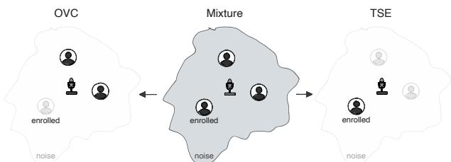
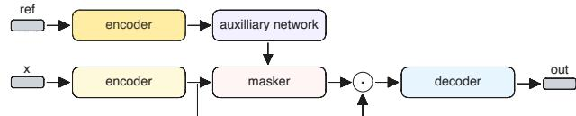
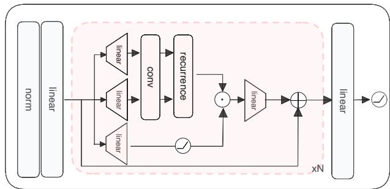
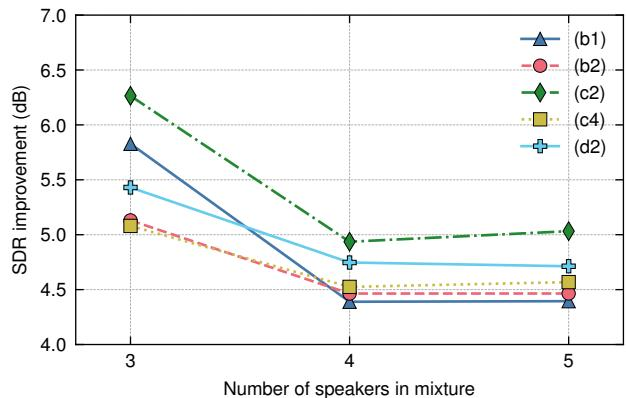

# Don’t Listen to Me: A Lightweight, Low-Latency Model for Own-Voice Cancellation in Far-Field Speech Enhancement

Mads Østergaard ID 1,∗∗, Alexander Neergaard Zahid ID 1, Karl Ulbæk ID 1, Andreas Hansen Bagge I 1,2, Kenny Falkjær Olsen ID 1,2, Rasmus Malik Høegh Lindrup ID 3

1 WS Audiology, Lynge, Denmark

2 DTU Compute, Technical University of Denmark, Kgs. Lyngby, Denmark 3 Verth, Denmark

mads.oestergaard@wsa.com, alexander.neergaardzahid@wsa.com, karl.ulbaek@wsa.com, kenny.olsen@wsa.com, rasmus@verth.ai

## Abstract

We introduce own-voice cancellation (OVC): removing a target (enrolled) speaker from a noisy multi-speaker mixture while preserving any remaining speech. Framed as the complement of target speaker extraction, OVC addresses latency-induced own-voice artifacts that arise when a far-field device streams enhanced audio back to the user, as the round-trip time easily exceeds the perceptual threshold for own-voice distortion. We condition a time-domain model with only 2 ms algorithmic latency on a short enrollment utterance and benchmark TD-SpeakerBeam alongside a lighter Mamba-MinGRU masker built from Mamba blocks with MinGRU temporal mixing. Replacing the ConvTasNet-based auxiliary network with a linear RNN encoder improves both signal-to-distortion ratio and predicted MOS while reducing compute. Results establish OVC as a practical, low-latency enhancement objective for far-field denoising.

Index Terms: deep learning audio processing, own voice cancellation, target speaker extraction, speech enhancement

## 1. Introduction

The problem of enhancing speech degraded by environmental noise, interfering speakers, or reverberant effects has been widely studied and remains a common obstacle in many realworld applications such as telecommunications, smart speakers, and conferencing devices. A particularly challenging scenario arises when a far-field device, such as a table-top microphone, captures, enhances, and streams audio back to the user. Because the acoustic round-trip time through such a pipeline easily exceeds 10 ms, the user’s own voice arrives with a noticeable delay, producing perceptible echo-like artifacts [1, 2]. Delays beyond 15–20 ms are widely reported as disturbing [3], making own-voice suppression an important consideration for any streamed denoising system operating in far field.

In recent years, deep learning has considerably improved the performance of speech enhancement models, surpassing classical methods on most publicly available benchmarks [4]. State-of-the-art deep learning-based methods typically come at the cost of high compute (with associated processing latency), and often require at least moderate algorithmic latency to achieve strong performance [5]. Linear recurrent models such as Mamba [6] and MinGRU [7] have recently emerged as compute-efficient alternatives to transformers that maintain global temporal context while supporting causal, streaming inference, making them attractive building blocks for low-latency audio processing.

  
Figure 1: Difference between own voice cancellation (OVC) and target speaker extraction (TSE). Given a mixture consisting of multiple speakers recorded in a noisy scene, TSE (right) aims to keep only the enrolled speaker, while OVC (left) removes only the enrolled speaker. Both methods jointly denoise and isolate speakers.

In this work we are considering own voice cancellation (OVC), which we define as the removal of a target speaker from a noisy input mixture of multiple speakers conditioned on an enrollment utterance from the target speaker. This effectively makes OVC a generalization of speech enhancement and closely related to target speaker extraction (TSE), see Figure 1.

Our main contributions are as follows:

(i) we establish own-voice cancellation (OVC) as a novel approach for mitigating latency-induced distortion in streamed far-field denoising by treating the user’s voice as an unwanted signal to be suppressed;

(ii) we introduce a compute-efficient architecture based on linear RNNs (Mamba-MinGRU), matching the performance of ConvTasNet-based networks at a fraction of the compute while maintaining only 2 ms algorithmic latency in all causal configurations;

(iii) we demonstrate that auxiliary linear RNN-based encoders provide better speaker representations compared to ConvTasNet-based ones for speaker conditioning.

## 2. Related work

A substantial body of work has focused on developing neural network architectures for speech enhancement and separation [8, 9, 10, 4, 11]. Notable contributions include TasNet [8] and ConvTasNet [9], with ConvTasNet frequently serving as a baseline for evaluating new methods [4].

The perceptual impact of processing latency on own-voice perception has been studied extensively in the hearing-aid literature. Even modest delays of 4–10 ms can produce perceptible disturbances [2], and delays exceeding 15 ms are rated as unacceptable by most listeners [3], in part due to interference between the delayed signal and the listener’s own direct sound [1, 12]. Although these studies focus on hearing devices, the same perceptual effects arise whenever enhanced audio is streamed back to the user with non-negligible latency, as in farfield denoising setups.

The most closely related task to our setup is target speaker extraction (TSE), where the model extracts a single target speaker from a mixture. Prior work includes SpeakerBeam [13], Listen only to me! [14], TEA-PSE [15], and more recently SpeakerBeam-SS [16] and an SSL model-based TSE system [17], which all employ an auxiliary embedding network to condition the main model on a short enrollment utterance. Our proposed own-voice cancellation task can also be viewed as a special case of general speech separation, where individual speakers are estimated from a (potentially noisy) mixture, but where we also jointly solve the source identifiability problem by directly informing the network of which speaker to remove ahead of time.

Recent work has explored state-space models and linear recurrent networks for audio tasks. SepMamba [5] applied Mamba blocks to speech separation, and SpeakerBeam-SS [16] replaced ConvTasNet temporal convolutions with S4D [18] layers for real-time target speaker extraction. MinGRU [7] was proposed as a minimal gated recurrence that can be expressed as a linear recurrence, enabling efficient parallel training while retaining the streaming capability of classical RNNs. Our Mamba-MinGRU architecture combines the Mamba block structure with MinGRU as the temporal mixer, yielding a design that is both compute-efficient and naturally causal.

A related but distinct problem is acoustic echo cancellation (AEC) [19, 20], which removes a known playback signal that leaks back into the microphone. AEC relies on access to the far-end reference signal, whereas OVC operates from only a short enrollment utterance without requiring the playback signal, making it applicable to scenarios where no such reference is available.

## 3. Methods

Given an input mixture $\begin{array} { r } { \mathbf { y } = \mathbf { x } ^ { s } + \sum _ { i \neq s } \mathbf { x } ^ { i } + \mathbf { n } } \end{array}$ containing a target speaker s (the own-voice), other speaker(s) i, and a noise signal n, the goal is to recover $\bar { \mathbf { y } } = \sum _ { i \neq s } ^ { \phantom { - } } \mathbf { x } ^ { i }$ . Following [14], we train the network using at most one other speaker.

## 3.1. Dataset

We train on a dynamically mixed dataset using LibriSpeech [21] in WHAM! noise [22], as in [16] (although they use DNS4 noise). During training, we use the train-clean-360 LibriSpeech partition for training and test-clean for reporting metrics.

Input mixtures are created by sampling two distinct speakers from LibriSpeech and a noise segment from WHAM. From the enrolled (target) speaker we draw two utterances: one serves as the enrollment reference and the other is used in the mixture. From the other speaker we draw only a single utterance. The two speech signals are first mixed at a signal-to-noise ratio (SNR), which is sampled from [−5, 5] dB, after which noise is added at an SNR sampled from [0, 25] dB [16]. During training, we independently drop (mute) the other speaker with probability $p _ { 0 }$ and the enrolled speaker with probability $p _ { e } .$ , following [14]. If the other speaker is absent, the target output should correspond to silence, and if the enrolled speaker is absent, the target is the denoised other speaker. We evaluate our models on the test set on two SNR conditions as in [16]: (1) uniformly sampled from [10, 20] dB when evaluating both speakers present (denoted F) and (2) uniformly sampled from [0, 10] when evaluating denoising (denoted D).

  
Figure 2: High-level architecture of a time-domain conditioned ConvTasNet. Note that the two encoders do not share parameters. The output of the auxiliary network is an embedding which is applied using an adaptation layer.

Additionally, we evaluate on multi-speaker scenarios based on LibriMix [23]. We generate the multi-speaker mixtures using the mixing scripts provided by the original LibriMix authors1, but modified to allow more than two speakers.

## 3.2. Model

We use TD-SpeakerBeam [13] as a baseline model and introduce an alternative, much more compute-efficient, linear RNNbased, architecture. The high-level architecture is shown in Figure 2.

Our architecture is a time-domain TasNet variant whose masking network is composed solely of Mamba blocks [6], using MinGRU [7] as the temporal mixer. We denote this network Mamba-MinGRU.

Each Mamba-MinGRU block is a pre-norm residual block consisting of (1) LayerNorm [24], (2) linear expansion by factor K split into $y , z , ( 3 )$ short causal depthwise 1-D conv + SiLU [25], (4) MinGRU recurrence as time mixing, (5) gating: y ⊙ SiLU(z), and finally, (6) linear projection back to input channels. See Figure 3 for a visualization.

The MinGRU recurrence is given by the following equations:

$$
\begin{array}{c} (\sigma (\mathbf {z} _ {t}), \tilde {\mathbf {h}} _ {t}) = \text {split} (y _ {t}) \\ \mathbf {h} _ {t} = (1 - \mathbf {z} _ {t}) \odot \mathbf {h} _ {t - 1} + \mathbf {z} _ {t} \odot \tilde {\mathbf {h}} _ {t}, \end{array}\tag{1}
$$

which can be written as a linear recurrence and implemented using a parallel associative scan [26] by setting gates = (1−z ) and token $\mathbf { \sigma } _ { i } = \mathbf { z } _ { t } \odot \tilde { \mathbf { h } _ { t } }$

$$
\mathbf {h} _ {t} = \text { gates } \odot \mathbf {h} _ {t - 1} + \text { tokens }.\tag{2}
$$

The recurrence can also be bidirectional, which we implement using Hydra bidirectionality [27].

This design yields lower computational complexity than TD-SpeakerBeam while retaining global context. Regardless of block design, the network consists of an auxiliary network responsible for extracting speaker embeddings from the enrolled speaker, and a main network performing own-voice cancellation.

  
Figure 3: Detailed architecture of the Mamba-MinGRU masker. It contains an initial normalization layer, followed by a projection to $d _ { m o d e l }$ , and then N Mamba-MinGRU blocks. A final projection projects the predicted mask back to the encoder dimension and applies a non-linearity, here a Sigmoid.

## 3.3. Auxiliary network and adaptation

We investigate two auxiliary networks: (1) a ConvTasNet network with a single repetition as in [14] and (2) a bidirectional linear RNN network using only 5 blocks.

Adaptation refers to how the main network is conditioned on the speaker embedding. We use element-wise multiplication of the embedding and the intermediate representation. When the network uses skip connections, the auxiliary network outputs one embedding for the skip path and one for the residual [13].

## 3.4. Loss function

The networks are optimized using negative thresholded signaldistortion ratio (SDR) loss [28], but extended to handle silence [14]:

$$
\mathbf {L} _ {\mathrm{SDR}} \left(\hat {\mathbf {x}}, \mathbf {x}, \mathbf {y}\right) = \left\{ \begin{array}{l l} \mathcal {L} ^ {\text { active }} (\hat {\mathbf {x}}, \mathbf {x}), & \text { if } \mathbf {x} \neq \mathbf {0}, \\ \mathcal {L} ^ {\text { inactive }} (\hat {\mathbf {x}}, \mathbf {y}), & \text { if } \mathbf {x} = \mathbf {0}, \end{array} \right.\tag{3}
$$

The active case is used when there is a speaker present apart from the enrolled speaker, and the inactive case when there is only the enrolled speaker, in which case the network should predict silence:

$$
\mathcal {L} ^ {\mathrm{active}} (\hat {\mathbf {x}}, \mathbf {x}) = - 1 0 \log_ {1 0} \left(\frac {| | \mathbf {x} | | ^ {2}}{| | \mathbf {x} - \hat {\mathbf {x}} | | ^ {2} + \tau | | \mathbf {x} | | ^ {2}}\right),\tag{4}
$$

$$
\mathcal {L} ^ {\text { inactive }} (\hat {\mathbf {x}}, \mathbf {y}) = 1 0 \log_ {1 0} \left(\left| \left| \hat {\mathbf {x}} \right| \right| ^ {2} + \tau \left| \left| \mathbf {y} \right| \right| ^ {2}\right),\tag{5}
$$

with τ being a soft threshold. We set τ to 10−3 and $1 0 ^ { - 2 }$ for the active and inactive losses, respectively. The soft thresholds ensure that the model does not continue to improve on a mixture that is already well separated.

## 3.5. Evaluation metrics

We report two complementary metrics: SDR [29] and predicted mean opinion score (PMOS). As MOS predictor, we use DistillMOS [30] to get a predicted MOS for each enhanced waveform and average it across utterances. We report both metrics on two conditions: (F) full mixtures (own voice present) and (D) denoising-only mixtures (own voice absent).

## 3.6. Experimental settings

For all our experiments we use a sample rate of 16 kHz. Each batch consists of an enrollment utterance with a duration of

2 seconds and an input mixture of 3 seconds. We train each model for 1 million steps with a batch size of 8, using AdamW as optimizer [31] combined with a simple linear decay-to-zero learning rate schedule [32]. We set the initial learning rate to $5 \times 1 0 ^ { - 4 }$ for all experiments, and $p _ { \mathrm { { o } } }$ and $p _ { \epsilon }$ to 10%.

For the baseline TD-SpeakerBeam we use the following hyperparameters (terminology from [9]): $N = 2 5 6 , L = 3 2$ $B = 2 5 6 , H = 5 1 2 , P = 3 , X = 8 , R = 4 .$ . A kernel size (L) of 32 corresponds to an algorithmic delay of 2 ms at 16 kHz, which all configurations share.

For the Mamba-MinGRU network, we set the expansion factor K to 2.0, and the model dimension to 192 and 128 for the "base" and "small" configurations respectively. Both configurations use 15 blocks with the adaptation layer placed after the 8th block and share encoder-decoder configuration with the TD-SpeakerBeam network.

Real-time factor (RTF) is measured in causal streaming mode on an Intel Core i7-13700 CPU, processing one block of 16 samples (1 ms at 16 kHz) at a time with a single thread. We export the model using ExecuTorch and perform the RTF measurements using the C++ runtime. We report the median RTF over 1000 forward passes, discarding the first 5 as warmup.

## 4. Results and discussion

Our main results are shown in Table 1. When comparing task objectives, OVC and TSE appear comparably difficult (cf. (a1) vs. (b1)), with both achieving ∼13 dB SDR in the full mixture condition (F). Moving to a causal setting incurs a moderate drop in SDR for both tasks (cf. (a1) vs. (a2) and (b1) vs. (b2)).

Replacing the TD-SpeakerBeam masking network with the proposed Mamba-MinGRU architecture (c1) yields competitive non-causal performance at a fraction of the compute: the main network uses only 0.33 GMAC/s compared to 4.97 GMAC/s for TD-SpeakerBeam. In the causal setting, the linear RNN model (c3) closely matches the causal TD-SpeakerBeam baseline (b2) while remaining far more efficient.

Substituting the ConvTasNet-based auxiliary encoder with a linear RNN encoder further reduces auxiliary compute from 1.67 GMAC/s to 0.26 GMAC/s while improving SDR on the full mixture condition in all settings. In the non-causal setting, the linear RNN auxiliary encoder (c2) improves SDR on the full mixture condition to 13.57 dB. In the causal setting (c4), SDR is comparable to or better than the ConvTasNet-based auxiliary while using substantially less compute. Using a linear RNN auxiliary encoder does seem to trade better performance in F for a drop in performance in denoising (D). This trend becomes increasingly more apparent when the main network becomes more expressive, see (c2) versus (c1).

The small Mamba-MinGRU variant (d1/d2), with roughly half the main-network parameters of the full model, still achieves competitive causal performance (11.47 dB SDR on F) at 2 ms algorithmic latency, demonstrating the scalability of the approach to resource-constrained streaming devices.

Although the base model (c4) achieves an RTF of 1.69, the smaller variant (d2) runs below real-time with an RTF of 0.82 using a single CPU thread. While further hardware optimizations should be considered especially with regards to the larger model, this demonstrates that the compact variant is already suitable for real-time streaming with very low (2 ms) latency. This should be compared against the reported Speakerbeam-SS results, which show an RTF below 1 but with an algorithmic latency of 20 ms [16], which is above the perceptual threshold for own-voice artifacts.

Table 1: Evaluation results on the dynamic OVC test set. Causal ✓ indicates causal (streaming) inference. OVC: own-voice cancellation; TSE: target speaker extraction; F: full mixture (enrolled speaker present); D: denoising only (enrolled speaker absent); SDR: signal-to-distortion ratio improvement; pMOS: predicted mean opinion score; MACs: multiply-accumulate operations; RTF: real-time factor; aux: auxillary (speaker embedding) network. The best performing model in F is marked with bold, while the best performin causal model is indicated with underline.

<table><tr><td rowspan="2" colspan="2">Method</td><td rowspan="2">Task</td><td rowspan="2">Causal</td><td rowspan="2">RTF</td><td colspan="2">SDR (dB)</td><td colspan="2">pMOS</td><td colspan="2">Params (M)</td><td colspan="2">MACs (G/s)</td></tr><tr><td>F</td><td>D</td><td>F</td><td>D</td><td>main</td><td>aux</td><td>main</td><td>aux</td></tr><tr><td></td><td>Mixture</td><td>-</td><td>-</td><td>-</td><td>-0.07</td><td>5.02</td><td>3.28</td><td>2.95</td><td>-</td><td>-</td><td>-</td><td>-</td></tr><tr><td>(a1)</td><td>TD-SpeakerBeam</td><td>TSE</td><td></td><td></td><td>13.66</td><td>1.14</td><td>3.15</td><td>1.55</td><td>4.94</td><td>1.66</td><td>4.97</td><td>1.67</td></tr><tr><td>(a2)</td><td>TD-SpeakerBeam</td><td>TSE</td><td>√</td><td></td><td>11.01</td><td>9.18</td><td>2.56</td><td>2.30</td><td>4.94</td><td>1.66</td><td>4.94</td><td>1.67</td></tr><tr><td>(b1)</td><td>TD-SpeakerBeam</td><td>OVC</td><td></td><td></td><td>13.42</td><td>14.78</td><td>3.19</td><td>3.26</td><td>4.94</td><td>1.66</td><td>4.97</td><td>1.67</td></tr><tr><td>(b2)</td><td>TD-SpeakerBeam</td><td>OVC</td><td>√</td><td></td><td>11.13</td><td>12.09</td><td>2.66</td><td>2.64</td><td>4.94</td><td>1.66</td><td>4.94</td><td>1.67</td></tr><tr><td>(c1)</td><td>Linear RNN</td><td>OVC</td><td></td><td></td><td>13.38</td><td>14.93</td><td>3.22</td><td>3.32</td><td>4.71</td><td>1.65</td><td>0.33</td><td>1.67</td></tr><tr><td>(c2)</td><td>+ Linear RNN emb.</td><td>OVC</td><td></td><td></td><td>13.57</td><td>9.67</td><td>3.20</td><td>2.71</td><td>4.71</td><td>1.61</td><td>0.33</td><td>0.26</td></tr><tr><td>(c3)</td><td>Linear RNN</td><td>OVC</td><td>√</td><td>1.69</td><td>11.50</td><td>12.46</td><td>2.76</td><td>2.71</td><td>4.72</td><td>1.65</td><td>0.33</td><td>1.67</td></tr><tr><td>(c4)</td><td>+ Linear RNN emb.</td><td>OVC</td><td>√</td><td>1.69</td><td>11.98</td><td>11.35</td><td>2.80</td><td>2.65</td><td>4.72</td><td>1.61</td><td>0.33</td><td>0.26</td></tr><tr><td>(d1)</td><td>Linear RNN (small)</td><td>OVC</td><td>√</td><td>0.82</td><td>11.21</td><td>12.33</td><td>2.66</td><td>2.63</td><td>2.17</td><td>1.65</td><td>0.18</td><td>1.66</td></tr><tr><td>(d2)</td><td>+ Linear RNN emb.</td><td>OVC</td><td>√</td><td>0.82</td><td>11.47</td><td>11.25</td><td>2.71</td><td>2.55</td><td>2.17</td><td>1.63</td><td>0.18</td><td>0.26</td></tr></table>

Table 2: Importance of differences in fundamental pitch frequencies for high (>160 Hz) and low (<160 Hz) pitch groups evaluated on model (c3).

<table><tr><td colspan="2">Method</td><td>SDR</td></tr><tr><td>(e1)</td><td>Same pitch - high</td><td>11.09</td></tr><tr><td>(e2)</td><td>Same pitch - low</td><td>10.91</td></tr><tr><td>(f1)</td><td>Different pitch - enrolled is high</td><td>11.45</td></tr><tr><td>(f2)</td><td>Different pitch - enrolled is low</td><td>12.24</td></tr></table>

## 4.1. Importance of speaker pitch

We show the effect of speaker pitch, as determined by the fundamental frequency (f0) of the enrollment and target speakers, in Table 2. For each subject in the test set, we compute a subject-specific $f _ { 0 }$ using PYIN [33], which is a probabilistic version of the YIN pitch tracking algorithm [34], as the mean $f _ { 0 }$ across all segments of speech. These subject-specific $f _ { 0 }$ scores are then stratified into high and low pitch bins with a cutoff at 160 Hz, and we report model performance on these splits.

We observe that it is more difficult to remove own voice speech from mixtures wherein both speakers have the same pitch compared to when the speakers have different $f _ { 0 }$ . It appears to be slightly easier to remove own voice when the enrolled speaker has low $f _ { 0 }$ (cf. f1 vs. f2).

## 4.2. Multiple speakers

We evaluate the robustness of our OVC models to scenarios with mixtures with 3, 4, and 5 speakers in Figure 4. For all three evaluated models, performance in SDR improvement degrades significantly with a general drop of ∼2 dB with increasing number of mixture speakers. This degradation is expected as the acoustic scene becomes increasingly complex, making it more challenging to isolate and suppress the enrolled speaker’s voice. We leave it as future work to extend this method to more than two speakers.

  
Figure 4: SDR improvement (dB) for mixtures with multiple interfering speakers. Model IDs in the legend correspond to those shown in Table 1.

## 5. Conclusion

We have introduced own-voice cancellation as a practical objective for far-field streamed denoising, showing that methods from target speaker extraction can effectively remove an enrolled speaker from a noisy mixture. The proposed Mamba-MinGRU architecture matches the performance of ConvTasNetbased baselines at a fraction of the compute, and replacing the auxiliary encoder with a linear RNN further reduces cost while maintaining competitive performance. With only 2 ms algorithmic latency in all causal configurations, these results pave the road for low-footprint own-voice suppression in streaming devices. Future work includes training with more than two simultaneous speakers and evaluating under reverberant conditions.

## 6. Generative AI Use Disclosure

In accordance with ISCA policy, generative AI tools were not used as co-authors, nor to develop the source code. AI tools were used solely for grammar correction.

## 7. References

[1] M. A. Stone and B. C. Moore, “Tolerable hearing aid delays. I. Estimation of limits imposed by the auditory path alone using simulated hearing losses,” Ear and Hearing, vol. 20, no. 3, pp. 182–192, 1999.

[2] J. Groth and M. Birkmose, “Disturbance caused by varying propagation delay in non-occluding hearing aid fittings,” International Journal of Audiology, vol. 43, no. 10, pp. 594–599, 2004.

[3] M. A. Stone and B. C. J. Moore, “Tolerable hearing-aid delays: IV. Effects on subjective disturbance during speech production by hearing-impaired subjects,” Ear and Hearing, vol. 26, no. 2, pp. 225–235, 2005.

[4] U.-H. Shin, S. Lee, T. Kim, and H.-M. Park, “Separate and Re construct: Asymmetric Encoder-Decoder for Speech Separation,” 2024, arXiv:2406.05983 [eess.AS].

[5] T. H. Avenstrup, B. Elek, I. L. Mádi, A. B. Schin, M. Mørup, B. S. Jensen, and K. F. Olsen, “SepMamba: State-space models for speaker separation using Mamba,” 2024, arXiv:2410.20997 [cs.SD].

[6] A. Gu and T. Dao, “Mamba: Linear-Time Sequence Modeling with Selective State Spaces,” 2024, arXiv:2312.00752 [cs.LG].

[7] L. Feng, F. Tung, M. O. Ahmed, Y. Bengio, and H. Hajimirsadeghi, “Were RNNs All We Needed?” 2024, arXiv:2410.01201 [cs].

[8] Y. Luo and N. Mesgarani, “TaSNet: Time-Domain Audio Separation Network for Real-Time, Single-Channel Speech Separation,” in 2018 IEEE International Conference on Acoustics, Speech and Signal Processing (ICASSP), Calgary, AB, Canada, 2018, pp. 696–700.

[9] ——, “Conv-TasNet: Surpassing Ideal Time-Frequency Magnitude Masking for Speech Separation,” IEEE/ACM Transactions on Audio, Speech, and Language Processing, vol. 27, no. 8, pp. 1256–1266, 2019.

[10] Y. Luo, Z. Chen, and T. Yoshioka, “Dual-path RNN: efficient long sequence modeling for time-domain single-channel speech sepa ration,” 2020, arXiv:1910.06379 [eess.AS].

[11] K. Saijo, G. Wichern, F. G. Germain, Z. Pan, and J. L. Roux, “TF-Locoformer: Transformer with Local Modeling by Convolution for Speech Separation and Enhancement,” 2024, arXiv:2408.03440 [eess.AS].

[12] M. A. Stone and B. C. J. Moore, “Tolerable hearing aid delays. II. Estimation of limits imposed during speech production,” Ear and Hearing, vol. 23, no. 4, pp. 325–338, 2002.

[13] M. Delcroix, T. Ochiai, K. Zmolikova, K. Kinoshita, N. Tawara, T. Nakatani, and S. Araki, “Improving Speaker Discrimination of Target Speech Extraction With Time-Domain Speakerbeam,” in 2020 IEEE International Conference on Acoustics, Speech and Signal Processing (ICASSP), Barcelona, Spain, 2020, pp. 691– 695.

[14] M. Delcroix, K. Kinoshita, T. Ochiai, K. Zmolikova, H. Sato, and T. Nakatani, “Listen only to me! How well can target speech extraction handle false alarms?” 2022, arXiv:2204.04811 [eess.AS].

[15] Y. Ju, W. Rao, X. Yan, Y. Fu, S. Lv, L. Cheng, Y. Wang, L. Xie, and S. Shang, “TEA-PSE: Tencent-Ethereal-Audio-Lab Personalized Speech Enhancement System for ICASSP 2022 DNS Chal lenge,” in 2022 IEEE International Conference on Acoustics, Speech and Signal Processing (ICASSP), Singapore, Singapore, 2022, pp. 9291–9295.

[16] H. Sato, T. Moriya, M. Mimura, S. Horiguchi, T. Ochiai, T. Ashihara, A. Ando, K. Shinayama, and M. Delcroix, “SpeakerBeam-SS: Real-time Target Speaker Extraction with Lightweight Conv-TasNet and State Space Modeling,” 2024, arXiv:2407.01857 [eess.AS].

[17] J. Peng, M. Delcroix, T. Ochiai, O. Plchot, S. Araki, and J. Cernocky, “Target Speech Extraction with Pre-trained Selfsupervised Learning Models,” 2024, arXiv:2402.13199.

[18] A. Gupta, A. Gu, and J. Berant, “Diagonal State Spaces are as Effective as Structured State Spaces,” 2022, arXiv:2203.14343 [cs.LG].

[19] R. Cutler, A. Saabas, T. Pärnamaa, M. Purin, E. Indenbom, N.-C. Ristea, J. Gužvin, H. Gamper, S. Braun, and R. Aichner, “ICASSP 2023 Acoustic Echo Cancellation Challenge,” IEEE Open Journal of Signal Processing, vol. 5, pp. 675–685, 2024.

[20] Z. Chen, X. Xia, S. Sun, Z. Wang, C. Chen, G. Xie, P. Zhang, and Y. Xiao, “A Progressive Neural Network for Acoustic Echo Cancellation,” in 2023 IEEE International Conference on Acoustics, Speech and Signal Processing (ICASSP), Rhodes Island, Greece, 2023, pp. 1–2.

[21] V. Panayotov, G. Chen, D. Povey, and S. Khudanpur, “Librispeech: An ASR corpus based on public domain audio books,” in 2015 IEEE International Conference on Acoustics, Speech and Signal Processing (ICASSP), South Brisbane, Queensland, Australia, 2015, pp. 5206–5210.

[22] G. Wichern, J. Antognini, M. Flynn, L. R. Zhu, E. Mc-Quinn, D. Crow, E. Manilow, and J. L. Roux, “WHAM!: Extending Speech Separation to Noisy Environments,” 2019, arXiv:1907.01160 [cs].

[23] J. Cosentino, M. Pariente, S. Cornell, A. Deleforge, and E. Vincent, “LibriMix: An Open-Source Dataset for Generalizable Speech Separation,” 2020, arXiv:2005.11262 [eess].

[24] J. L. Ba, J. R. Kiros, and G. E. Hinton, “Layer Normalization,” 2016, arXiv:1607.06450 [stat].

[25] S. Elfwing, E. Uchibe, and K. Doya, “Sigmoid-Weighted Linear Units for Neural Network Function Approximation in Reinforcement Learning,” 2017, arXiv:1702.03118 [cs].

[26] A. Orvieto, S. L. Smith, A. Gu, A. Fernando, C. Gulcehre, R. Pascanu, and S. De, “Resurrecting Recurrent Neural Networks for Long Sequences,” 2023, arXiv:2303.06349 [cs].

[27] S. Hwang, A. Lahoti, T. Dao, and A. Gu, “Hydra: Bidirectional State Space Models Through Generalized Matrix Mixers,” 2024, arXiv:2407.09941 [cs].

[28] S. Wisdom, E. Tzinis, H. Erdogan, R. J. Weiss, K. Wilson, and J. R. Hershey, “Unsupervised Sound Separation Using Mixture Invariant Training,” in Advances in Neural Information Processing Systems, vol. 33. Vancouver, BC, Canada: Curran Associates, Inc., 2020, pp. 3846–3857.

[29] J. L. Roux, S. Wisdom, H. Erdogan, and J. R. Hershey, “SDR - half-baked or well done?” 2018, arXiv:1811.02508 [cs.SD].

[30] B. Stahl and H. Gamper, “Distillation and Pruning for Scalable Self-Supervised Representation-Based Speech Quality Assessment,” 2025, arXiv:2502.05356 [eess.AS].

[31] I. Loshchilov and F. Hutter, “Decoupled Weight Decay Regularization,” 2019, arXiv:1711.05101 [cs].

[32] S. Bergsma, N. Dey, G. Gosal, G. Gray, D. Soboleva, and J. Hestness, “Straight to Zero: Why Linearly Decaying the Learning Rate to Zero Works Best for LLMs,” 2025, arXiv:2502.15938 [cs.LG].

[33] M. Mauch and S. Dixon, “PYIN: A fundamental frequency estimator using probabilistic threshold distributions,” in 2014 IEEE International Conference on Acoustics, Speech and Signal Processing (ICASSP), Florence, Italy, 2014, pp. 659–663.

[34] A. De Cheveigné and H. Kawahara, “YIN, a fundamental frequency estimator for speech and music,” The Journal of the Acoustical Society of America, vol. 111, no. 4, pp. 1917–1930, 2002.