# An Approach to Microphone Array Self-Awareness Through a Residual Model of the Covariance Matrix

Chao Pan , Jingdong Chen , Fellow, IEEE, and Jacob Benesty

Abstract—Microphone arrays are commonly used to extract source signals from noisy observations. Traditional methods rely on a priori information about the source to define the target of the array and derive optimal filters for extraction. However, in challenging acoustic environments—such as those with moving sources, multiple sources, or sporadic sound events—obtaining this information is often difficult. This can lead to performance degradation or even failure in extracting the desired source. In contrast, we propose a novel framework for array processing that defines the unwanted interferences and background noise to extract the source signal. Our approach enables real-time detection of new, unseen sources, allowing the array to possess self-awareness regarding emerging signals. This is achieved by calculating a residual model of the covariance matrix of the array observations, given the coherence matrices of the interferences and background noise. We introduce a two-stage method for calculating this residual model: the first stage computes the total coherence matrix of the interferences and noise, and the second stage determines the coherence matrix of of new source through the proposed matrix decomposition method, and further outputs the array’s self-awareness, represented by the Wiener filter for extracting the new source. Through simulations, we demonstrate that our approach can automatically extract new emerging sources, regardless of the presence of moving sources, multiple sources, or sporadic sound events, provided that the coherence matrix of the unwanted interferences and noise is known. This work presents a significant advancement in source extraction techniques for adverse acoustic environments.

Index Terms—Microphone arrays, covariance matrix modeling, residual model, fixed-point iteration.

## I. INTRODUCTION

XTRACTING the desired source signal from noisy obprocessing. This capability enables devices equipped with sensor arrays to focus on signals that carry important information [1], [2], [3]. In recent decades, extensive research has focused on this area, primarily falling into two categories: neural network-based learning approaches [4], [5], [6], [7], [8], [9], [10] and multichannel filtering frameworks [1], [11], [12], [13]. A well-designed neural network can achieve state-of-the-art performance, but it comes with increased computational complexity. In contrast, well-designed filters can effectively address many practical situations with significantly lower complexity. This paper focuses on source extraction using the multichannel filtering approach. Central to the filter design is the definition of the desired source, utilizing features that distinguish it from the interference.

The simplest method to define a desired source is from its direction. For instance, we can designate the endfire direction of a linear array as the target direction. In this scenario, signals originating from the target and nearby directions are considered as the desired source, while signals from other directions are treated as unwanted noise. The principle of filter design is to ensure that the array has a strong response in the target direction and a weak response elsewhere, leading to a high directivity factor. Early studies, such as superdirective beamforming [14], [15], [16], [17], sought to maximize the array’s directivity factor under constraints that ensure robustness. However, the spatial response of such robust beamformers is often frequency dependent, leading to distortions in signals from directions other than the target direction. To address this issue, differential beamforming employs the differential sound pressure field [18], [19], [20], [21], [22], [23], which maintains a consistent spatial pattern across different frequencies, making the spatial response frequency invariant. Despite advancements, the array gain ofsuperdirective and differential beamformers is often insufficient in practical situations due to limited array apertures and sensors. To achieve a higher directivity factor, a new framework called directionalgain has been proposed [13]. This framework designs beamformers based on the array covariance matrix, incorporating a primary beamformer, a secondary beamformer, and a set of auxiliary beamformers. This non-linear design approach yields higher gains through the principle of directional-gain. Despite significant progress in this field, extracting source signals using these methods requires prior knowledge of the source direction. In real-world scenarios, accurately estimating the desired source directions is challenging, especially in environments with strong reverberation and multiple sources [24], [25].

Another method to define the desired source is through transfer functions and relative transfer functions (RTFs) from the source to the sensors [12], [26]. The array manifold vector for a specific source depends on both the direct path and early reflections. A common principle for designing such beamformers involves minimizing either the power of the array output or the variance of the residual noise, while ensuring that the desired source remains undistorted. Like traditional beamformers that rely on source direction, this approach also faces challenges in estimating RTFs in complex environments. Recent studies have shown that the coherence matrix ofthe source is an effective feature for defining the desired source [27]. If the coherence matrices are known a priori, calculating the variance of the sources becomes efficient. Consequently, the optimal Wiener filter for extracting a particular source can be derived directly from these variances. In comparison to source direction and RTF estimation, both clustering and blind source separation methods can be employed to estimate coherence matrices [28], [29], [30], [31], [32], [33], [34], provided we have sufficient array observations. However, these methods require multiple observations to estimate a new source, which can lead to performance degradation if the coherence matrix of the new source is not accurately determined constrained by limited observations.

In summary, traditional approaches require a clear definition of the desired source to extract the signal from noisy observations. However, in practical situations, the features of the desired source can be time-varying. For example, different speakers may switch during a teleconference, making it challenging to capture the features of the active source. Inspired by the echo cancellation and spectral subtraction techniques [2], we ask a fundamental question for microphone array signal processing: can we extract the source signals by defining the interferences and background noise? Once the interferences and background noise are defined, all signals differing from these known components can be treated as the desired source. Addressing this question is a key motivation ofthis paper. Building on our previous work [27], we define sources through their coherence matrices. Our task now is to determine whether we can automatically extract new emerging sources by utilizing the coherence matrices of the interferences and background noise.

In principle, the array can automatically sense the presence of new sources and define them through their own coherence matrices. This capability suggests that the array possesses a form of self-awareness to recognize its sound environment, which is reflected in the title of this paper.

The rest of this paper is organized as follows. In Section II, we present the signal model, important definitions, and formulate the problem of array self-awareness. In Section III, we propose a two-stage approach to determine a residual model of the covariance matrix. In Section IV, we summarize the framework of array self-awareness. In Section V, we present and analyze simulation results. Finally, we conclude in Section VI.

## II. SIGNAL MODEL AND PROBLEM FORMULATION

Let us consider an array consisting of M sensors in an acoustic environment. In the short-time Fourier transform (STFT)

domain, the signal captured by the mth sensor can be expressed as

$$
Y _ { m } ( \omega , t ) \overset { \triangle } { = } V _ { m } ( \omega , t ) + \sum _ { n = 1 } ^ { N } X _ { m , n } ( \omega , t )\tag{1}
$$

$$
\mathbf { \Sigma } = \sum _ { n = 1 } ^ { N + 1 } X _ { m , n } ( \omega , t ) ,\tag{2}
$$

where ω is the angular frequency, t is the time-frame index, N is the number of sources in the sound field, $X _ { m , N + 1 } ( \omega , t ) =$ $V _ { m } ( \omega , t )$ is the background noise captured by the mth sensor, and $X _ { m , n } ( \omega , t ) \ ( n = 1 , 2 , \ldots , N )$ is the signal associating to the nth source captured by the mth sensor. In the case that we denote the source signal radiated by the nth source as $S _ { n } ( \omega , t )$ the signal $X _ { m , n } ( \omega , t )$ can actually be modeled as [35]

$$
X _ { m , n } ( \omega , t ) = \sum _ { \ell = 0 } ^ { L _ { g } - 1 } G _ { m , n } ( \omega , \ell ) S _ { n } ( \omega , t - \ell ) , \forall n < N + 1 ,\tag{3}
$$

where $G _ { m , n } ( \omega , \ell )$ is a function of the impulse response from the nth source to the mth sensor, and the integer $L _ { g }$ depends on both the STFT parameters and the length of the impulse response. Since all the signals are processed frequency-by-frequency, we omit the ω notation for all variables in the following discussion; in this case, (2) becomes $\begin{array} { r } { Y _ { m } ( t ) = \sum _ { n = 1 } ^ { N + 1 } X _ { m , n } ( t ) } \end{array}$

By putting all the M observations $Y _ { m } ( t ) ^ { : }$ ’s into a vector, one can obtain that

$$
\begin{array} { l } { { \displaystyle { \bf y } ( t ) \triangleq \left[ Y _ { 1 } ( t ) \quad Y _ { 2 } ( t ) \quad \hdots \quad Y _ { M } ( t ) \right] ^ { T } } } \\ { { \displaystyle ~ = \sum _ { n = 1 } ^ { N + 1 } { \bf x } _ { n } ( t ) } , } \end{array}\tag{4}
$$

(5)

where the superscript $_ T$ is the transpose operator. The covariance matrix of the array observations is then often modeled as

$$
\Phi _ { \mathbf { y } } ( t ) \triangleq \mathbb { E } \left[ \mathbf { y } ( t ) \mathbf { y } ^ { H } ( t ) \right]\tag{6}
$$

$$
\mathbf { \Phi } = \sum _ { n = 1 } ^ { N + 1 } \Phi _ { \mathbf { x } , n } ( t )\tag{7}
$$

$$
\mathbf { \Phi } = \sum _ { n = 1 } ^ { N + 1 } \phi _ { X , n } ( t ) \mathbf { \Gamma } \mathbf { r } _ { \mathbf { x } , n } ,\tag{8}
$$

where $\mathbb { E } [ \cdot ]$ denotes mathematical expectation, the superscript H is the conjugate-transpose operator, and $\Phi _ { \mathbf { x } , n } ( t ) =$ $\phi _ { X , n } ( t ) \mathbf { I } _ { \mathbf { x } , n }$ is the covariance matrix of the nth source at the tth frame, which is modeled as the product of a time-varying variance $\phi _ { X , n } ( t )$ and a time-invariant coherence matrix $\Gamma _ { \mathbf { x } , n } .$ Once we have a rough estimation of $\Phi _ { \mathbf { y } } ( t )$ and the a priori information $\Gamma _ { \mathbf { x } , n } ,$ we can efficiently calculate all the time-varying variances under the maximum likelihood principle. This can be accomplished using methods such as the fixed-point iteration approach [27] or explicit solutions in specific cases [28]. In practical situations, the estimate of $\Phi _ { \mathbf { y } } ( t )$ can be obtained using a simple first-order recursive formula, i.e.,

$$
\Phi _ { \mathbf { y } } ( t ) = \alpha \Phi _ { \mathbf { y } } ( t - 1 ) + ( 1 - \alpha ) \mathbf { y } ( t ) \mathbf { y } ^ { H } ( t ) ,\tag{9}
$$

where $\alpha \in ( 0 , 1 )$ is the forgetting factor; a typical choice for α is from 0.9 to 0.98. Since $\Gamma _ { { \bf x } , n }$ is modeled as time invariant, many approaches can be applied to determine such parameters once we have gathered the array observations in the past several seconds [28], [29], [30], [31], [32], [33], [34]. For convenience, we denote the function calculating the source variances as

$$
\phi ( t ) \stackrel { \triangle } { = } \left[ \phi _ { X , 1 } ( t ) ~ \phi _ { X , 2 } ( t ) ~ \cdots ~ \phi _ { X , N + 1 } ( t ) \right] ^ { T }\tag{10}
$$

$$
{ \bf \Phi } = f _ { \mathrm { V } } \left[ \Phi _ { \mathbf { y } } ( t ) ; \Gamma _ { \mathbf { x } , 1 } , \ldots , \Gamma _ { \mathbf { x } , N + 1 } \right] ,\tag{11}
$$

where this function takes the estimated covariance matrix $\Phi _ { \mathbf { y } } ( t )$ and the coherence matrices $\mathbf { \varGamma } _ { \mathbf { x } , n } \mathbf { \dot { \tilde { \Delta } } } _ { \mathbf { s } }$ as inputs, and the outputs are the variances of all the sources. Detail of designing the function $f _ { \mathrm { V } } [ \cdot ]$ can be found in our previous work [27].

Traditionally, once we have all the time-varying variances $\phi _ { X , n } ( t ) \mathbf { \bar { s } }$ , the nth source can be extracted from the array observations according to

$$
\hat { S } _ { n } ( t ) = H _ { n } ( t ) Y _ { n } ( t ) ,\tag{12}
$$

where

$$
H _ { n } ( t ) = \frac { \phi _ { X , n } ( t ) } { \sum _ { i = 1 } ^ { N + 1 } \phi _ { X , i } ( t ) }\tag{13}
$$

is the well-known Wiener filter corresponding to the nth source [2], [3].

Considering that we have a new emerging source $\xi _ { m } ( t )$ , which is not known as a priori yet, the array observations and the corresponding covariance matrix can be expressed as

$$
\mathbf { y } ( t ) = \pmb { \xi } ( t ) + \sum _ { n = 1 } ^ { N + 1 } \mathbf { x } _ { n } ( t ) ,\tag{14}
$$

$$
\Phi _ { \mathbf { y } } ( t ) = \phi _ { \xi } ( t ) \Gamma _ { \xi } + \sum _ { n = 1 } ^ { N + 1 } \phi _ { X , n } ( t ) \Gamma _ { \mathbf { x } , n } ,\tag{15}
$$

where $\xi ( t )$ is a vector of length $M ,$ whose mth element is $\xi _ { m } ( t )$ and $\phi _ { \xi } ( t )$ and $\Gamma _ { \xi }$ are the variance and the coherence matrix of the new source, respectively. According to (12) and (13), extracting the new source requires an estimate of its variance $\phi _ { \xi } ( t )$ , which depends on the corresponding coherence matrix $\Gamma _ { \xi }$ . Unfortunately, this information is not available in our case.

Based on the covariance matrix model presented in (8), the term $\phi _ { \xi } ( t ) \mathbf { r } _ { \xi }$ represents the residual of this covariance matrix. Specifically, the covariance matrix residual $\phi _ { \xi } ( t ) \mathbf { r } _ { \xi } = \Phi _ { \mathbf { y } } ( t ) -$ $\begin{array} { r } { \sum _ { n = 1 } ^ { N + 1 } \phi _ { X , n } ( t ) \Gamma _ { \mathbf { x } , n } . } \end{array}$ , where the coherence matrices $\mathbf { \Gamma } \mathbf { \Gamma } \mathbf { \Gamma } \mathbf { \Gamma } \mathbf { \Gamma } \mathbf { \Gamma } \mathbf { \Gamma } \mathbf { \Gamma } \mathbf { \Gamma } \mathbf { \Gamma } \mathbf { \Gamma } \mathbf { \Gamma } \mathbf { \Gamma } \mathbf { \Gamma } \mathbf { \Gamma } \mathbf { \Gamma } \mathbf { \Gamma } \mathbf { \Gamma } \mathbf { \Gamma } \mathbf { \Gamma } \mathbf { \Gamma } \mathbf { \Gamma } \mathbf { \Gamma } \mathbf { \Gamma } \mathbf { \Gamma } \mathbf { \Gamma } \mathbf { \Gamma } \mathbf { \Gamma } \mathbf { \Gamma } \mathbf { \Gamma } \mathbf { \Gamma } \mathbf { \Gamma } \mathbf { \Gamma } \mathbf { \Gamma } \mathbf { \Gamma } \mathbf { \Gamma } \mathbf { \Gamma } \mathbf { \Gamma } \mathbf { \Gamma } \mathbf { \Gamma } \mathbf { \Gamma } \mathbf { \Gamma } \mathbf { \Gamma } \mathbf { \Gamma } \mathbf { \Gamma } \mathbf { \Gamma } \mathbf { \Gamma } \mathbf { \Gamma } \mathbf { \Gamma } \mathbf { \Gamma } \mathbf { \Gamma } \mathbf { \Gamma } \mathbf { \Gamma } \mathbf { \Gamma } \mathbf { \Gamma } \mathbf { \Gamma } \mathbf { \Gamma } \mathbf { \Gamma } \mathbf { \Gamma } \mathbf { \Gamma } \mathbf { \Gamma \Gamma } \mathbf \mathbf { \Gamma } \mathbf { \Gamma \Gamma } \mathbf \mathbf { \Gamma } \mathbf { \Gamma \Gamma \Gamma \Gamma \Gamma \mathbf } \mathbf  \Gamma \Gamma \Gamma \Gamma \Gamma \mathbf \Gamma \Gamma \Gamma \mathbf \Gamma \Gamma \Gamma \mathbf \Gamma \Gamma \Gamma \mathbf \Gamma \Gamma \Gamma \Gamma \mathbf \Gamma \Gamma \mathbf \Gamma \Gamma \mathbf \Gamma \Gamma \Gamma \mathbf \Gamma \Gamma \Gamma \Gamma \mathbf \Gamma \Gamma \mathbf \Gamma \Gamma \Gamma \Gamma \mathbf \Gamma \Gamma \Gamma \mathbf \Gamma \Gamma \mathbf \Gamma \Gamma \Gamma \mathbf \Gamma \Gamma \mathbf \Gamma \Gamma \mathbf \Gamma \Gamma \Gamma \Gamma \Gamma \mathbf \Gamma \Gamma \mathbf \Gamma \Gamma \Gamma \Gamma \mathbf \Gamma \Gamma \mathbf \Gamma \Gamma \Gamma \Gamma \Gamma \mathbf \Gamma \Gamma \Gamma \Gamma \mathbf \Gamma \Gamma \Gamma \Gamma \Gamma \mathbf \Gamma \Gamma \Gamma \Gamma \Gamma \Gamma \mathbf \Gamma \Gamma \Gamma \Gamma \mathbf \Gamma \Gamma \Gamma \Gamma \Gamma \Gamma \mathbf \Gamma \Gamma \Gamma \Gamma \Gamma \Gamma \Gamma \Gamma \Gamma \mathbf \Gamma \Gamma \Gamma \Gamma \Gamma \Gamma \Gamma \Gamma \Gamma \Gamma \Gamma \Gamma \Gamma \Gamma \Gamma \Gamma \Gamma \Gamma \Gamma \Gamma \Gamma \Gamma \Gamma \Gamma \Gamma \Gamma \Gamma \ c \ c \ c $ and the variances $\phi _ { X , n } ( t ) \mathbf { \bar { s } }$ jointly build the hypothetical model of the covariance matrix at the particular time-frequency bin. The objective of this paper is to propose a model for covariance matrix residual, determine the coherence matrix of unknown sources, further enable the microphone array to automatically detect new sources when they are present.

## III. RESIDUAL MODEL OF THE COVARIANCE MATRIX

## A. Special Case Without Known Sources

Let us first consider a special case without known sources; only the coherence matrix of the background noise is a priori known. In this case, the covariance matrix $\Phi _ { \mathbf { y } } ( t )$ can be expressed as

$$
\Phi _ { \mathbf { y } } ( t ) = \phi _ { \xi } ( t ) \mathbf { I } _ { \xi } + \phi _ { X , 1 } ( t ) \mathbf { I } _ { \mathbf { x } , 1 }\tag{16}
$$

$$
= \phi _ { \xi } ( t ) \mathbf { \Gamma } _ { \xi } + \phi _ { X } ( t ) \mathbf { \Gamma } _ { \mathbf { x } } ,\tag{17}
$$

where $\phi _ { X } ( t ) = \phi _ { X , 1 } ( t )$ is the variance of the background noise and $\mathbf { T _ { x } } = \mathbf { T _ { x , 1 } }$ is the corresponding coherence matrix. A typical choice for $\mathbf { { { \Gamma } } } _ { \mathbf { x } }$ is the diffuse noise [36], whose (i, j)th element is

$$
[ \Gamma _ { { \bf x } } ] _ { i , j } = \frac { \sin ( \omega d _ { i , j / c } c ) } { \omega d _ { i , j } / c } ,\tag{18}
$$

where $d _ { i , j }$ is the distance between the ith and jth sensors, and $c = 3 4 0$ m/s is the sound speed in the air. With the eigenvalue decomposition, we have

$$
\mathbf { \Gamma } _ { \mathbf { x } } = \mathbf { Q } \boldsymbol { \Lambda } \mathbf { Q } ^ { H } ,\tag{19}
$$

where $\pmb { \Lambda } = \mathrm { d i a g } ( \lambda _ { 1 } , \lambda _ { 2 } , \dots , \lambda _ { M } )$ is a diagonal matrix, $\lambda _ { m }$ ’s are the eigenvalues of $\Gamma _ { \mathbf { x } } ,$ , and Q is a unitary matrix consisting of the eigenvectors of $\mathbf { { { \Gamma } } } _ { \mathbf { x } }$

Remark III.1 (Residual Model): In this paper, we model the amplitude and phase of the matrix $\mathbf { Q } ^ { H } \mathbf { \Gamma } _ { \xi } \mathbf { Q }$ separately. To be specific, we use the following model:

$$
\mathbf { Q } ^ { H } \mathbf { T } _ { \pmb { \xi } } \mathbf { Q } = \left( \mathbf { a } \mathbf { a } ^ { T } \right) \odot e ^ { \mathbf { \mathcal { J } } \mathbf { P } } ,
$$

or, equivalently,

(20)

$$
\mathbf { 1 } _ { \boldsymbol { \xi } } = \mathbf { Q } \left[ \left( \mathbf { a } \mathbf { a } ^ { T } \right) \odot e ^ { \boldsymbol { \mathcal { I } } \mathbf { P } } \right] \mathbf { Q } ^ { H } ,\tag{21}
$$

where

$$
\mathbf { a } = \left[ A _ { 1 } \quad A _ { 2 } \quad \cdots \quad A _ { M } \right] ^ { T }\tag{22}
$$

is a vector oflength M, with $A _ { m } > 0 , \forall m , \odot$ is the element-wise product of two matrices, j is the imaginary unit, and P is a symmetric matrix of size $M \times M$ , whose elements have values from 0 to 2π.

Remark III.2 (Estimation ofthe Phase Matrix P): As shown in Fig. 1, let us left-multiply both sides of (17) by $\mathbf { Q } ^ { H }$ , and right-multiply both sides by Q. It can be derived that

$$
{ \bf Q } ^ { H } \Phi _ { { \bf y } } ( t ) { \bf Q } = \phi _ { \xi } ( t ) { \bf Q } ^ { H } { \bf \Gamma } _ { \xi } { \bf Q } + \phi _ { X } ( t ) { \bf Q } ^ { H } { \bf \Gamma } _ { \bf x } { \bf Q }\tag{23}
$$

$$
= \phi _ { \xi } ( t ) \mathbf { Q } ^ { H } \mathbf { T } _ { \xi } \mathbf { Q } + \phi _ { X } ( t ) \mathbf { A } .\tag{24}
$$

Recall that $\phi _ { \xi } ( t ) \geq 0 , \phi _ { X } ( t ) \geq 0 .$ , Λ is a diagonal matrix whose elements are nonnegative real numbers, and the diagonal elements of ${ \bf Q } ^ { H } \Phi _ { \bf y } ( t ) { \bf \breve { Q } }$ and $\mathbf { Q } ^ { H } \mathbf { \Gamma } _ { \xi } \mathbf { Q }$ are also nonnegative real numbers. As a result, the phase of $\mathbf { Q } ^ { H } \mathbf { \Gamma } _ { \xi } \mathbf { Q }$ is the same as that of ${ \mathbf { Q } } ^ { H } \Phi _ { \mathbf { y } } ( t ) { \mathbf { Q } } .$ i.e.,

$$
\begin{array} { r } { \angle \left( \mathbf { Q } ^ { H } \mathbf { T } _ { \xi } \mathbf { Q } \right) \ = \angle \left[ \mathbf { Q } ^ { H } \boldsymbol { \Phi } _ { \mathbf { y } } ( t ) \mathbf { Q } \right] , } \end{array}\tag{25}
$$

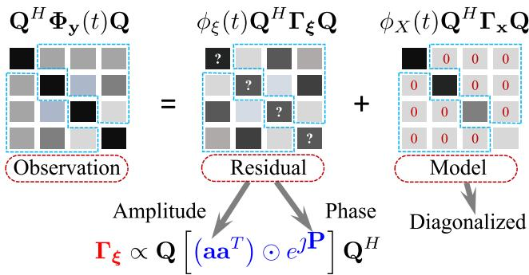  
Fig. 1. Illustration of the matrix decomposition and residual model, where $\Phi _ { \mathbf { y } } ( t ) = \phi _ { \xi } ( t ) \mathbf { I } _ { \mathbf { x } } + \phi _ { X } ( t ) \mathbf { I } _ { \mathbf { x } }$ is the covariance matrix of the array observations, $\mathbf { T _ { x } }$ is the coherence matrix of the background noise, Q contains the eigenvectors of $\mathbf { { \Gamma } } _ { \mathbf { { X } } } ,$ , and $\Gamma _ { \xi }$ is the residual model.

where $\angle ( \cdot )$ stands for element-wise phase extraction of a matrix. According to (20), we have

$$
\mathbf { P } = \angle \left( \mathbf { Q } ^ { H } \mathbf { T } _ { \boldsymbol { \xi } } \mathbf { Q } \right)\tag{26}
$$

$$
\mathbf { \Sigma } = \angle \left[ \mathbf { Q } ^ { H } \Phi _ { \mathbf { y } } ( t ) \mathbf { Q } \right] ,\tag{27}
$$

which ends the estimation of the phase matrix P.

Remark III.3 (Estimation of the Amplitude Matrix $\mathbf { a a } ^ { T } ) .$ According to (24), the amplitudes of the non-diagonal elements of $\mathbf { Q } ^ { H } \mathbf { \Gamma } _ { \boldsymbol { \xi } } \mathbf { \bar { Q } }$ are actually proportional to those of ${ \mathbf { Q } } ^ { H } \Phi _ { \mathbf { y } } ( t ) { \mathbf { Q } }$ i.e.,

$$
\left| \left[ \mathbf { Q } ^ { H } \Gamma _ { \xi } \mathbf { Q } \right] _ { i , j } \right| \propto \left| \left[ \mathbf { Q } ^ { H } \Phi _ { \mathbf { y } } ( t ) \mathbf { Q } \right] _ { i , j } \right| , \forall i \neq j .\tag{28}
$$

By considering the model presented in (20), one can derive that

$$
A _ { i } A _ { j } = \left[ \mathbf { a } \mathbf { a } ^ { T } \right] _ { i , j }\tag{29}
$$

$$
\mathbf { \Sigma } = \left| \left[ \mathbf { Q } ^ { H } \mathbf { T } _ { \xi } \mathbf { Q } \right] _ { i , j } \right|\tag{30}
$$

$$
\propto \left| \left[ \mathbf { Q } ^ { H } \Phi _ { \mathbf { y } } ( t ) \mathbf { Q } \right] _ { i , j } \right|\tag{31}
$$

$$
\mathbf { \eta } = \left| \mathbf { q } _ { i } ^ { H } \Phi _ { \mathbf { y } } ( t ) \mathbf { q } _ { j } \right| , \forall i \neq j ,\tag{32}
$$

where $\mathbf { q } _ { i }$ is the ith column of the matrix Q. Inspired from the work in [37], [38], we find the optimal $A _ { i } ^ { \prime } \mathrm { s }$ by minimizing the Csiszar’s I-divergence [39] between $A _ { i } A _ { j }$ and $| \mathbf { q } _ { i } ^ { H } \Phi _ { \mathbf { y } } ( t ) \mathbf { q } _ { j } |$ which can be expressed as

$$
\mathcal { I } ( \mathbf { a } ) = - \sum _ { i = 1 } ^ { M } \sum _ { j = 1 , j \neq i } ^ { M } \left[ \left| \mathbf { q } _ { i } ^ { H } \Phi _ { \mathbf { y } } ( t ) \mathbf { q } _ { j } \right| \ln \left( A _ { i } A _ { j } \right) - A _ { i } A _ { j } \right] .\tag{33}
$$

Unfortunately, explicit formula of the optimal $A _ { i } ^ { \prime } \mathrm { s }$ cannot be derived; their values can only be determined iteratively. By taking the derivative of $\mathcal { I } ( \mathbf { a } )$ with respect to $A _ { i }$ and setting the results to zero, we can derive an update rule of these parameters, i.e.,

$$
A _ { i }  \frac { B _ { i } } { \sum _ { j = 1 , j \neq i } ^ { M } A _ { j } } ,\tag{34}
$$

where

$$
B _ { i } \triangleq \sum _ { j = 1 , j \neq i } ^ { M } \left| \mathbf { q } _ { i } ^ { H } \Phi _ { \mathbf { y } } ( t ) \mathbf { q } _ { j } \right| .\tag{35}
$$

To initialize the procedure, we set $A _ { i } = \sqrt { B _ { i } / ( M - 1 ) }$ . Based on our observations, the iteration process converges rapidly, and the corresponding computational cost of updating the $A _ { i } \mathrm { ^ { * } s }$ is negligible in practical situations. An example of this iteration can be found in Appendix A.

Remark III.4 (Summary ofthe Residual Model Calculation): To calculate the residual model, the covariance matrix of the array observations $\Phi _ { \mathbf { y } } ( t )$ is calculated according to (9), and the coherence matrix $\mathbf { { { T } _ { x } } }$ is a priori known. For convenience, we denote the function to calculate the residual model as

$$
\begin{array} { r } { \Gamma _ { \xi } = f _ { \mathrm { M R } } \left[ \Phi _ { \mathbf { y } } ( t ) , \Gamma _ { \mathbf { x } } \right] , } \end{array}\tag{36}
$$

which takes $\Phi _ { \mathbf { y } } ( t )$ and $\mathbf { { { T } _ { x } } }$ as the inputs, and delivers the coherence matrix $\Gamma _ { \xi }$ as the output. According to the previous analysis, the function is implemented according to the following steps.

1) Apply the eigenvalue decomposition to $\mathbf { { { T } _ { x } } }$ to get the unitary matrix $\mathbf { Q } ,$ , and further obtain the matrix $\mathbf { Q } ^ { \mathbf { \bar { \alpha } } } \mathbf { ^ { \mathrm { ~ H ~ } } } \Phi _ { \mathbf { y } } ( t ) \mathbf { Q }$

2) Calculate the phase matrix P according to (27).

3) Calculate the values of $B _ { i } { ' } \mathrm { s }$ according to (35).

4) Calculate the values of $A _ { i } \mathrm { ^ { * } s }$ according to (34) with the initialized value, and form the vector a according to (22).

5) Form the coherence matrix $\Gamma _ { \xi }$ according to (21).

6) Modify the matrix $\Gamma _ { \xi }$ by removing its negative eigenvalues and multiplying a scalar such that its trace equals to M.

In the final step, we modify the coherence matrix $\Gamma _ { \xi }$ by removing its negative eigenvalues. We believe that more effective modifications could be developed in future work.

## B. Solution to the General Case With N Known Sources

For the general cases with N known sources, we can express the covariance matrix $\Phi _ { \mathbf { y } } ( t )$ in (15) as

$$
\Phi _ { \mathbf { y } } ( t ) = \phi _ { \xi } ( t ) \Gamma _ { \xi } + \left[ \sum _ { n = 1 } ^ { N + 1 } \phi _ { X , n } ( t ) \right] \sum _ { n = 1 } ^ { N + 1 } H _ { n } ( t ) \Gamma _ { \mathbf { x } , n }\tag{37}
$$

$$
= \phi _ { \xi } ( t ) \mathbf { \Gamma } _ { \xi } + \phi _ { X } ( t ) \mathbf { \Gamma } _ { \mathbf { x } } ,\tag{38}
$$

where $H _ { n } ( t )$ is Wiener filter defined by (13),

$$
\begin{array} { l } { \displaystyle \phi _ { X } ( t ) = \sum _ { n = 1 } ^ { N + 1 } \phi _ { X , n } ( t ) , } \\ { \displaystyle \mathbf { \quad } \mathbf { \quad } \mathbf { \Gamma } _ { \mathbf { X } } = \sum _ { n = 1 } ^ { N + 1 } H _ { n } ( t ) \mathbf { I } _ { \mathbf { x } , n } . } \end{array}\tag{39}
$$

(40)

By comparing (38) with (17), it is clear that the approach to calculating the model residual in general cases is the same as the particular case without known sources, if we can have coherence matrix $\mathbf { { { T } _ { x } } }$ in (40).

In practice, we can first have rough estimates of $N + 1$ variances $\phi _ { \mathbf { x } , n } ( t ) \mathbf { \widetilde { s } }$ s according to (11). Based on the estimated variances $\phi _ { \mathbf { x } , n } ( t ) ^ { , } $ , we can construct the Wiener filter $H _ { n } ( t )$ according to (13), and further construct the coherence matrix $\mathbf { { { T } _ { x } } }$ according to

$$
\widehat { \Gamma } _ { \mathbf { x } } = \sum _ { n = 1 } ^ { N + 1 } H _ { n } ( t ) \Gamma _ { \mathbf { x } , n } ,\tag{41}
$$

By substituting the resulting $\mathbf { { { T } _ { x } } }$ into (36), we can find the coherence matrix of the new source, i.e., $\Gamma _ { \xi } .$ , which is the key of the residual model.

In the case that $\Gamma _ { \xi }$ is determined, we take $\Phi _ { \mathbf { y } } ( t ) , \mathbf { r } _ { \xi }$ , and all the $\mathbf { \Gamma } \mathbf { \Gamma } \mathbf { \Gamma } \mathbf { \Gamma } \mathbf { \Gamma } \mathbf { \Gamma } \mathbf { \Gamma } \mathbf { \Gamma } \mathbf { \Gamma } \mathbf { \Gamma } \mathbf { \Gamma } \mathbf { \Gamma } \mathbf { \Gamma } \mathbf { \Gamma } \mathbf { \Gamma } \mathbf { \Gamma } \mathbf { \Gamma } \mathbf { \Gamma } \mathbf { \Gamma } \mathbf { \Gamma } \mathbf { \Gamma } \mathbf { \Gamma } \mathbf { \Gamma } \mathbf { \Gamma } \mathbf { \Gamma } \mathbf { \Gamma } \mathbf { \Gamma } \mathbf { \Gamma } \mathbf { \Gamma } \mathbf { \Gamma } \mathbf { \Gamma } \mathbf { \Gamma } \mathbf { \Gamma } \mathbf { \Gamma } \mathbf { \Gamma } \mathbf { \Gamma } \mathbf { \Gamma } \mathbf { \Gamma } \mathbf { \Gamma } \mathbf { \Gamma } \mathbf { \Gamma } \mathbf { \Gamma } \mathbf { \Gamma } \mathbf { \Gamma } \mathbf { \Gamma } \mathbf { \Gamma } \mathbf { \Gamma } \mathbf { \Gamma } \mathbf { \Gamma } \mathbf { \Gamma } \mathbf { \Gamma } \mathbf { \Gamma } \mathbf { \Gamma } \mathbf { \Gamma } \mathbf { \Gamma } \mathbf { \Gamma } \mathbf { \Gamma } \mathbf { \Gamma } \mathbf { \Gamma } \mathbf { \Gamma } \mathbf { \Gamma } \mathbf \mathbf { \Gamma } \mathbf { \Gamma } \mathbf \mathbf { \Gamma } \mathbf { \Gamma \Gamma } \mathbf \mathbf { \Gamma \Gamma } \mathbf \mathbf  \Gamma \Gamma \Gamma \Gamma \Gamma \Gamma \Gamma \Gamma \mathbf \Gamma \Gamma \Gamma \mathbf \Gamma \Gamma \Gamma \mathbf \Gamma \Gamma \mathbf \Gamma \Gamma \Gamma \mathbf \Gamma \Gamma \mathbf \Gamma \Gamma \Gamma \mathbf \Gamma \Gamma \Gamma \mathbf \Gamma \Gamma \mathbf \Gamma \Gamma \Gamma \Gamma \mathbf \Gamma \Gamma \mathbf \Gamma \Gamma \mathbf \Gamma \Gamma \Gamma \mathbf \Gamma \Gamma \Gamma \mathbf \Gamma \Gamma \mathbf \Gamma \Gamma \mathbf \Gamma \Gamma \mathbf \Gamma \Gamma \Gamma \mathbf \Gamma \Gamma \Gamma \mathbf \Gamma \Gamma \mathbf \Gamma \Gamma \Gamma \mathbf \Gamma \Gamma \Gamma \mathbf \Gamma \Gamma \Gamma \mathbf \Gamma \Gamma \Gamma \mathbf \Gamma \Gamma \mathbf \Gamma \Gamma \Gamma \Gamma \Gamma \mathbf \Gamma \Gamma \Gamma \mathbf \Gamma \Gamma \Gamma \mathbf \Gamma \Gamma \Gamma \Gamma \mathbf \Gamma \Gamma \Gamma \Gamma \Gamma \mathbf \Gamma \Gamma \Gamma \Gamma \mathbf \Gamma \Gamma \mathbf \Gamma \Gamma \Gamma \Gamma \Gamma \mathbf \Gamma \Gamma \Gamma \Gamma \Gamma \Gamma \Gamma \Gamma \Gamma \Gamma \Gamma \Gamma \mathbf \Gamma \Gamma \Gamma \Gamma \Gamma \Gamma \Gamma \Gamma $ as the inputs of the function $f _ { \mathrm { V } } [ \cdot ]$ in (11), and finally get all the time-varying variances including $\phi _ { \xi } ( t )$ . The entire model residual can then be calculated as $\phi _ { \xi } ( t ) \mathbf { \Gamma } _ { \xi }$

## IV. FRAMEWORK OF MICROPHONE ARRAY SELF-AWARENESS

Microphone array self-awareness approach aims to make the array automatically sense the new sources that it doesn’t know yet. Through the residual model of the covariance, we can obtain the coherence matrix of a new coming source as a new frame signal is observed, which is $\Gamma _ { \xi }$ in particular. With the coherence matrix emerging in real time from the array observations, the variance of the new source, i.e., $\phi _ { \xi } ( t )$ , can be calculated along with the known sources, i $. \mathrm { e } . , \phi _ { X , n } ( t ) , n = 1 , 2 , . . . , N .$ and the background noise, i.e., $\phi _ { X , N + 1 }$ . According to (12) and (13), the Wiener filter to extract the new source can be expressed as

$$
H _ { \xi } ( t ) = \frac { \phi _ { \xi } ( t ) } { \phi _ { \xi } ( t ) + \sum _ { n = 1 } ^ { N + 1 } \phi _ { X , n } ( t ) } .\tag{42}
$$

It can be verified that $H _ { \xi } ( t ) \in [ 0 , 1 ]$ ; it approaches one if the new source dominates the current frequency bin and time-frame index, while it approaches zero if the new source is weak as compared to the other sources and background noise. By considering the behavior of $H _ { \xi } ( t )$ , i.e., it reflects the probability of a new source, and further considering the role of this variable, $\mathrm { i . e . }$ , it is applied to extract the new source from the observations, it is clear that $H _ { \xi } ( t )$ is the key of our array self-awareness approach.

However, when we apply $H _ { \xi } ( t )$ to extract the new source from the array observations, it not only preserves the new source, but also preserves part of direct-path and very early reflections of the known source/interference for the initial speech frames after the silence. For the initial frames of onset, only the direct-path and very early reflections are included in there, the coherence matrix $\Gamma _ { \mathbf { x } , n }$ may not be an accurate model since it includes all the reflections according to the signal model presented in (3). As a result of the model mismatch, some information of the direct-path and early reflections is transferred into the coherence matrix of the new source $\Gamma _ { \xi }$ , and the corresponding variance leaks into $\phi _ { \xi } ( t )$ as well. This phenomenon can be understood as the overfit of the residual model, the effects on the array self-awareness can be eliminated if we have a high confidence that a known source occurs, particularly at the frames including only the direct-path and early reflections. Fortunately, it can be detected through the Wiener filters without considering the new emerging source, i.e., the Wiener filters presented in (13). Based on this observation, our self-awareness Wiener filter can finally be expressed as

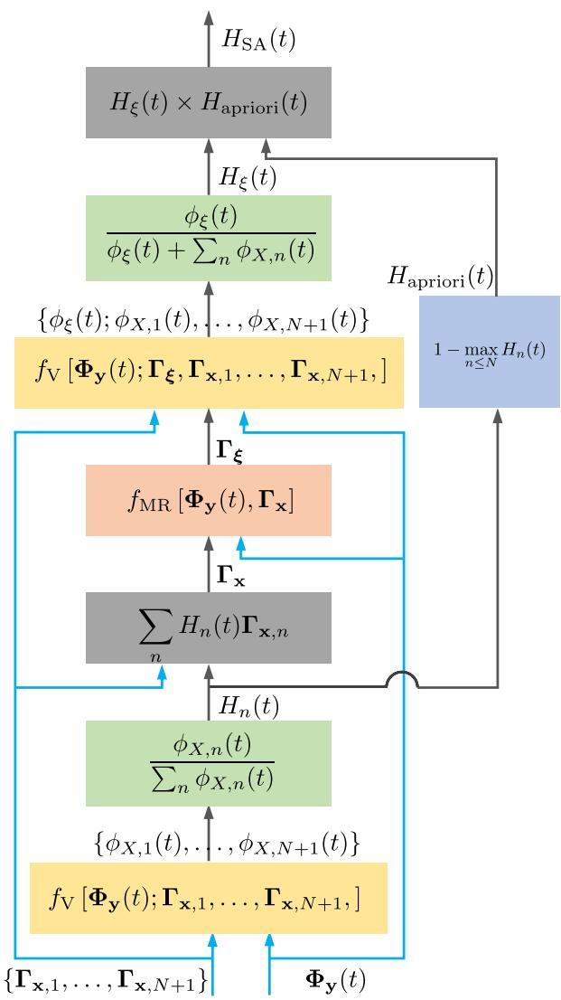  
Fig. 2. Framework of the array self-awareness, where the inputs are $\Phi _ { \mathbf { y } } ( t )$ and ${ \bf { \cal T } } _ { { \bf { x } } , n } \mathrm { { \dot { ~ } s } } ,$ the output is the Wiener filter of the new emerging source, the function $f _ { \mathrm { V } } [ \cdot ]$ ] calculates the variance of the sources and background noise, and the function f [·] calculates the residual model of the covariance matrix.

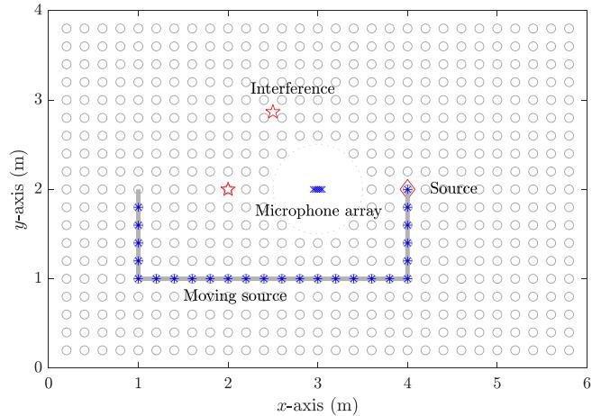  
Fig. 3. Positions of the source and interferences in the room, where the gray circles are the candidate positions of the sources to evaluate the performance of the algorithms.

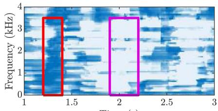  
Time (s) (a)

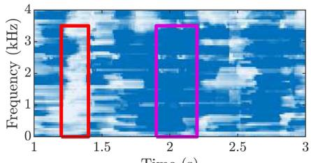

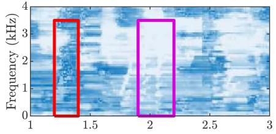

Time (s) (b)  
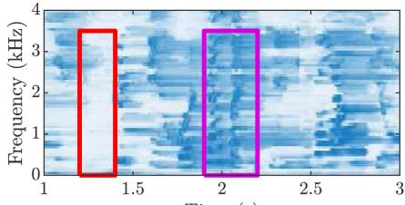  
Time (s) (c)

Time (s) (d)  
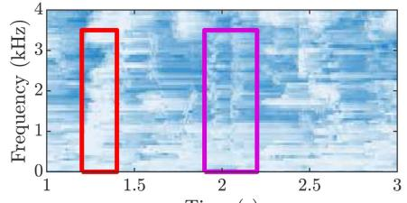

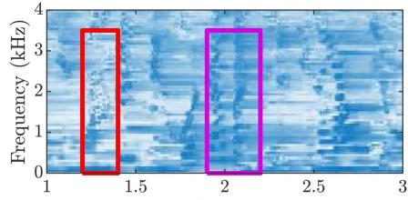

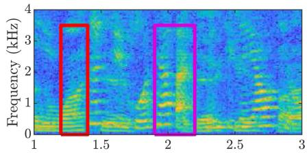  
Time (s) (g)

Time (s) (e)  
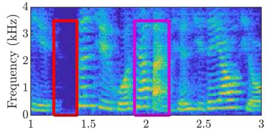  
Time (s) (h)

Time (s) (f)  
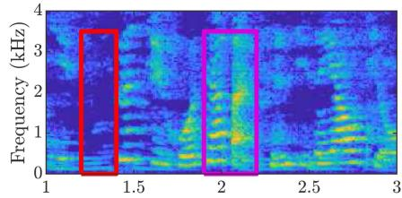  
Time (s) (i)  
Fig. 4. Results of the array self-awareness at different stages: (a) the Wiener filter of the interference at the first stage, (b) the Wiener filter of the background noise at the first stage, (d) the Wiener filter of the interference at the second stage, (e) the Wiener filter of the background noise at the second stage, (f) the Wiener filter of the new source at the second stage, (c) the array self-awareness/Wiener filter of the new source, (g) the array observation, (h) the ground truth of the new source, and (i) the extracted new source through the proposed approach. It should be noted that $( a ) + \tilde { ( b ) } = 1 , ( \dot { d } ) + ( e ) + ( f ) = 1 , \tilde { ( c ) } = ( f ) \times ( b )$ , and $\mathbf { \Psi } ( i ) = \left( g \right) \times \mathbf { \Psi } ( c )$

$$
H _ { \mathrm { S A } } ( t ) = H _ { \xi } ( t ) \times H _ { \mathrm { a p r i o r i } } ( t ) ,\tag{43}
$$

where $H _ { \mathrm { a p r i o r i } } ( t )$ is a function of the Wiener filters presented in (13). In this paper, we design the $H _ { \mathrm { a p r i o r i } } ( t )$ according to

$$
H _ { \mathrm { a p r i o r i } } ( t ) = 1 - \operatorname* { m a x } _ { n \in \{ 1 , 2 , \ldots , N \} } H _ { n } ( t ) .\tag{44}
$$

The principle for designing $H _ { \mathrm { a p r i o r i } } ( t )$ is based on large values of $H _ { n } ( t )$ for some known sources, even for its direct path and early reflections in the initial frame after the silence. The underlying reason is that, in the first stage, we do not consider the new source. Therefore, the overfitting problem caused by the new source can be mitigated by using $\begin{array} { r } { 1 - \operatorname* { m a x } _ { n \in \{ 1 , 2 , \ldots , N \} } H _ { n } ( t ) } \end{array}$

It is important to note that the proposed approach has no chance of detecting a new source if its coherence matrix is very close to that of a known source or interference. From another perspective, in such cases, the new source should be attributed to the known source from the standpoint of array self-awareness. The array builds its awareness solely based on the coherence matrices of the sources, indicating that no new source should occur in this situation.

Finally, we summarize the framework of the array selfawareness in Fig. 2. The computational complexity of the array self-awareness is shown Appendix B, for convenience.

## V. EVALUATION

## A. Setup

The room dimensions are 6 m × 4 m × 3 m. A uniformly linear array consisting of six sensors is positioned at the center of the room. The first sensor is located at (3, 2, 1), with a distance of 2 cm between adjacent sensors. Two candidate interferences are situated at (2, 2, 1) and (2.5, 2.8, 1). The desired new source is at (4, 2, 1), and the path of the moving source is illustrated in Fig. 3, starting from (4, 2, 1). The impulse responses from the source and interferences to the sensors are generated using the well-known image model method [40], [41]. The reflection coefficients of the six walls are 0.9, 0.9, 0.9, 0.9, 0.45, and 0.45, where the lower coefficients correspond to the ceiling and floor. For the moving source, the impulse response is time-varying. The response at a specific position along the route is interpolated from the impulse responses of the two nearest sampled positions. The background noise includes both diffuse and white noises [36], [42], [44], set at 20 dB lower than the interference levels in the sound field. Therefore, the array observations in all simulations consist of the desired source signal, the interferences, and the background noise at all times.

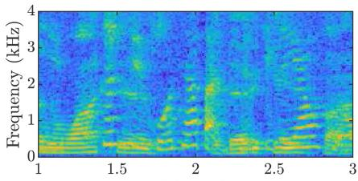  
Time (s) (a)

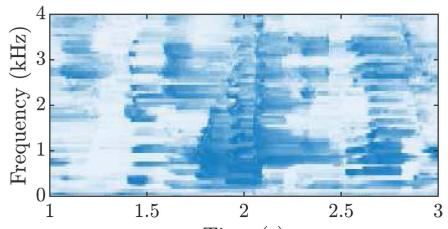  
Time (s) (b)

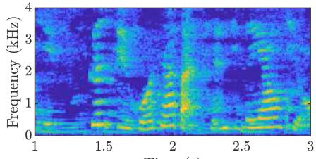  
Time (s) (c)

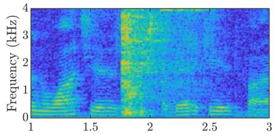  
Time (s) (d)

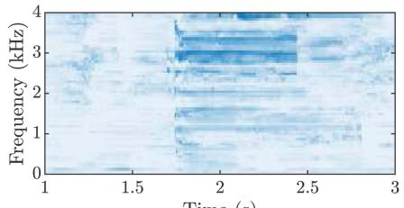

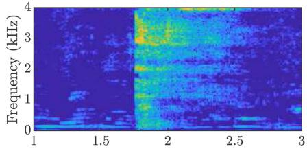

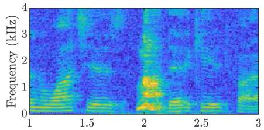  
Time (s) (g)

Time (s) (e)  
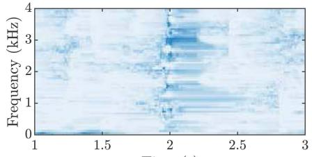  
Time (s) (h)

Time (s) (f)  
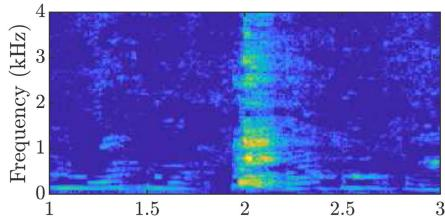  
Time (s) (i)  
Fig. 5. Results of the array self-awareness in the presence of a moving source and a sporadic sound event: (a), (d), and (g) are the spectral of the array observations with the moving source, the glass breaking event, and the dog woofing event; (b), (e), and (h) are the corresponding array self-awareness; and (c), (f), and (i) are the extracted signal from the array observations. It should be noted that ${ a ) \times ( b ) } = ( c ) , ( d ) \times ( e ) = ( f )$ , and $\mathbf { \Phi } ( g ) ^ { - } \times \mathbf { \Phi } ( h ) = \mathbf { \Phi } ( i )$

## B. Feasibility of the Array Self-Awareness

Let us first present the results of the array self-awareness at different stages to better understand the proposed approach. The interference-to-noise ratio is set to 20 dB, while the signal-tointerference ratio (SIR) is approximately 0 dB. The goal of the array self-awareness method is to automatically extract the desired source signal using the coherence matrix of the interference and background noise. The results are displayed in Fig. 4. According to Fig. 2, the proposed array self-awareness approach consists of two main stages. In the first stage, we calculate the Wiener filters $H _ { n } ( t )$ for the interferences and background noise based on the information from their coherence matrices. The Wiener filter for the interference is shown in Fig. 4(a), while the filter for the background noise is presented in Fig. 4(b). Since there is only one interference in this case, the a priori information of the new source, $H _ { \mathrm { a p r i o r i } } ( t )$ , actually equals the Wiener filter of the background noise at the first stage, as shown in Fig. 4(b).

Based on the outputs of the first stage, we obtain the residual model, allowing us to determine the coherence matrix of the new source. We can now calculate the variances of the interference, background noise, and new source using their respective coherence matrices. The corresponding Wiener filters can also be computed. Fig. 4(d), (e), and (f) display the Wiener filters generated in the second stage. Fig. 4(f) represents the Wiener filter for the new source at this stage, denoted as $H _ { \xi } ( t )$ . According to (43), multiplying the filters from Fig. 4(f) and (b) yields the array self-awareness, which is the Wiener filter applicable for extracting the new source. The result of this extraction is shown in Fig. 4(c). By comparing Fig. 4(c) and (f), particularly in the first red boxes, we observe that the a priori Wiener filter $H _ { \mathrm { a p r i o r i } } ( t )$ effectively eliminates false alarms of the new emerging sources caused by direct paths and early reflections of the interference, aligning with the analysis presented in Section IV. By applying the Wiener filter of the new emerging source to the array observations, we successfully extract the new source. The result is illustrated in Fig. 4(i), where the output SIR is 13.9 dB, representing a significant improvement over the initial input SIR of 3.1 dB. We can now clearly hear the new emerging source without interference. Notably, no information about the new source is required throughout this entire process.

## C. Capability ofDealing With Moving Source and Sporadic Sound Events

The proposed array self-awareness approach does not require information about the new source, making it inherently suitable for extracting sources when a priori information is difficult to obtain in real time. In our context, the a priori information is the coherence matrix of the source. Since the coherence matrix often requires multiple frames of observations, more frames generally lead to more accurate estimates, provided they are time-invariant, and limited frames often means challenges for its estimation.

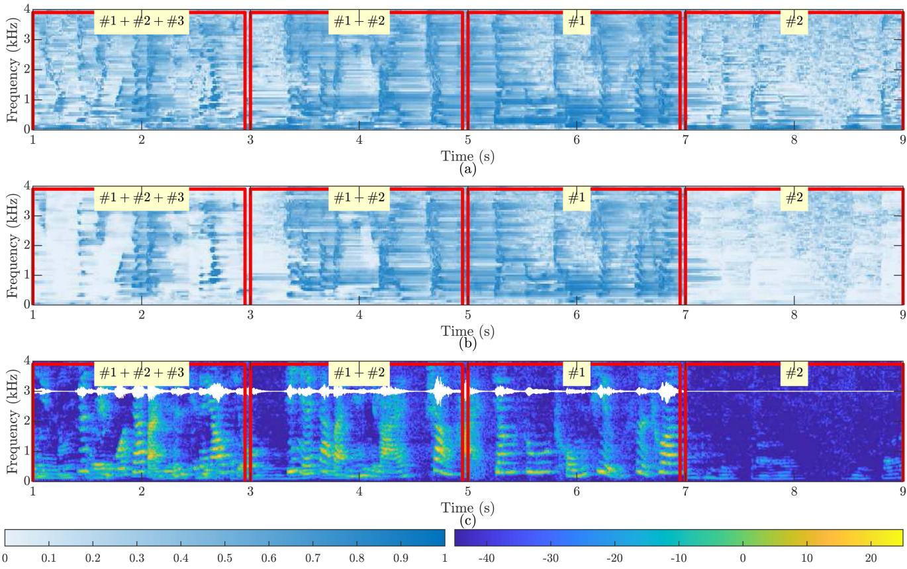  
Fig. 6. Results of the array self-awareness in the presence of an uncertainty in the number of sources: (a) the second-stage Wiener filter $H _ { \xi } ( t )$ , (b) the array self-awareness $H _ { \mathrm { S A } } ( t ) = \dot { H _ { \xi } } ( t ) \times H _ { \mathrm { a p r i o r i } } ( t )$ , and (c) the spectrum of the array output; #1 stands for the presence of the new source; #2 and #3 stand for the presence of two different interference. The waveform of the new source is superimposed on the spectrum as a reference.

There are generally two types of such sources. 1) The moving source. The impulse response from the source to the sensor is time-varying, as is the coherence matrix. Consequently, obtaining enough frames of signals for the same coherence matrix is challenging, if not impossible. 2) Sporadic sound events. Examples include glass breaking, a dog barking, or a gunshot. These events typically have very short durations. Combined with the time delay in parameter estimation, obtaining an estimate of their coherence matrix becomes particularly difficult. Although extracting moving sources and sporadic sound events from array observations is challenging, it is highly valuable, as these events often carry important information.

In this section, we evaluate the performance of the proposed approach in the presence of a moving source and sporadic sound events. The path of the moving source is illustrated in Fig. 3, moving from right to left. We consider two types of sporadic sound events: glass breaking and a dog barking. An interference is present throughout the entire performance evaluation period. The results are presented in Fig. 5. As shown in Fig. 5(b), (e), and (h), the array can detect new sources, whether they are moving or sporadic sound events. From the perspective of source extraction, the output of the array primarily consists of the new sources, as demonstrated in Fig. 5(e), (f), and (i). The corresponding SIR values are 11.4 dB (input: 0 dB), 28.2 dB (input: 6.6 dB), and 16.6 dB (input: 1.7 dB), respectively.

## D. Adaptability to Number of Sources

In the implementation of the proposed array self-awareness approach, we assume that the number of sources is known a priori. However, it is important to recognize that sources may not be active at all times in practical situations. Thus, assessing the robustness of the proposed approach against the uncertainty of the number of sources is crucial. In this section, we consider three sources in the sound field, in addition to the background noise. The first source (#1) is the desired new source, while the second (#2) and third (#3) sources are interferences with known coherence matrices. As shown in Fig. 6, the duration of the array observations is divided into four segments. The first segment includes all three sources, designed to evaluate the algorithm’s performance with multiple interferences. The second segment consists of the new source and one interference, similar to previous experiments; however, we assume two interferences are present during this segment. The third segment contains no interferences, featuring only the new source, while still assuming the presence of both interferences. Finally, the last segment includes only one interference, with no new sources present.

The results are presented in Fig. 6. In the first segment, the algorithm effectively handles the situation where three sources are active simultaneously. In the second segment, the algorithm demonstrates its capability to function even when the assumed number of interferences does not match the actual number. A similar observation can be made in the third segment, where no interferences are present. In the case where no new source occurs, the value of array self-awareness is low, as indicated in the fourth segment of Fig. 6(b). Consequently, the array output is also minimal, as shown in the fourth segment of Fig. 6(c).

## E. Performance as a Function ofthe Source Position

The proposed array self-awareness approach extracts the new source using the coherence matrices of the interferences and background noise. Intuitively, when the source is close to the interferences, their coherence matrices also become similar. As a result, it becomes challenging to detect the new source, as distinguishing between their coherence matrices is difficult. Therefore, it is crucial to evaluate the performance of the proposed approach as a function of the source positions. Additionally, since the coherence matrix depends on the reverberation time, we consider both reverberant and anechoic sound environments in this section. In the anechoic environment, the coherence matrix is determined solely by the direct path from the source to the sensors. In contrast, in a reverberant environment, it is influenced by all reflections.

Fig. 7 illustrates the performance of the proposed approach as a function of the source positions, with candidate positions marked by gray circles in Fig. 3. In Fig. 7(a), the output SIR in the reverberant environment can exceed 15 dB for certain source positions. However, when the source is very close to the interference, the proposed approach struggles to extract the new source, as indicated by the SIRs near the red star region. Since the array manifold vector of a linear array is symmetric around the array axis, a failure region also appears symmetrically around this axis. By comparing the results in Fig. 7(a) and (b), it is evident that the maximum SIR improvement in the reverberant environment is greater than that in the anechoic environment. Additionally, the failure region for new source detection is significantly smaller in the reverberant environment. From the perspective of array self-awareness, reverberation has positive effects. The underlying reason is that reflections contributing to the coherence matrices make them easier to distinguish. This contrasts with traditional microphone array beamforming, which often experiences performance degradation in reverberant environments.

## F. Combination With the BSS Approaches and the Performance Comparison

The proposed method utilizes the source coherence matrices as prior information. In practical scenarios, these matrices depend on the impulse responses from sources to sensors. The impulse responses are embedded in the demixing matrix obtained through source separation techniques, making them estimable via BSS approaches. In our simulations, we employ the offline independent-low-rank-matrix-analysis (ILRMA) method for this purpose.

Impulse responses from sources to sensors are measured in a room at Northwestern Polytechnical University. Three candidate source positions are set around a six-element linear array. Their angles relative to the array axis are $0 ^ { \circ } , 9 0 ^ { \circ }$ , and $1 8 0 ^ { \circ }$ , with a source-to-array distance of 1 m. The first sensor is treated as a reference, while the distances of the remaining five sensors from the reference are 1.3 cm, 2.6 cm, 3.9 cm, 6.5 cm, and 9.1 cm, respectively. Fig. 8(a) displays the measured impulse response from the first source to the first sensor.

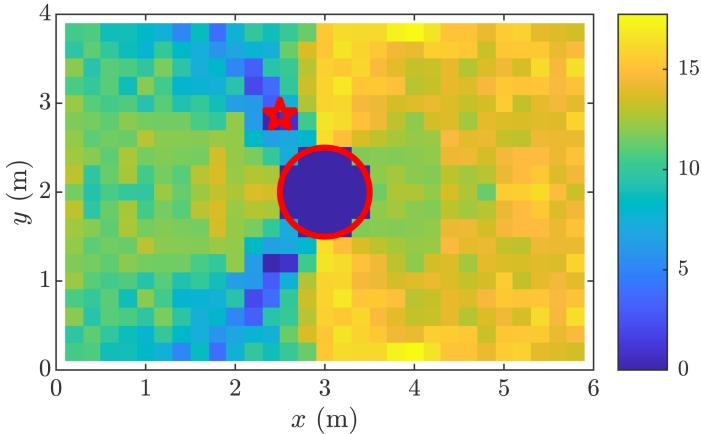  
(a)

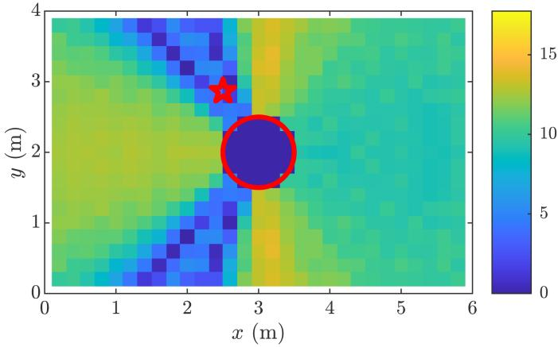  
(b)

Fig. 7. Output SIR of the proposed approach as a function of source positions in both (a) reverberant environment and (b) anechoic environment, where the red star corresponds to the position of the interference, the center of the red circle is the uniform linear array, no performance is evaluated inside the red circle since the source is too close to the array, and the input SIR is set to 0 dB all the time.  
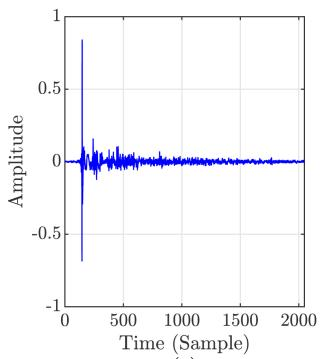  
(a)

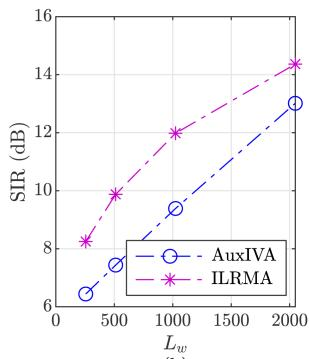  
(b)  
Fig. 8. (a) Example of the impulse response from source to sensor, and (b) the output SIRs of recursive AuxIVA and ILRMA as a function of window length.

Three different sources are considered in the sound field. The source at the $0 ^ { \circ }$ direction acts as a constant interference, while the source at $9 0 ^ { \circ }$ is present for the first 10 seconds, and the source at $1 8 0 ^ { \circ }$ activates after the disappearance of the 90◦ source, specifically from 10s to 30s. Both the $9 0 ^ { \circ }$ and 180◦ sources are desired sources, intended to be preserved in the array output. The source signals are normalized so that their maximum amplitude is one. The source signal captured by each sensor results from convolving the normalized source signal with the corresponding impulse responses, yielding input SIRs around 0 dB. Additionally, diffuse noise with a 20 dB SNR level is added to the source signals. Ultimately, we generate array observations that include three sources, with the desired source change occurring at the 10-second mark.

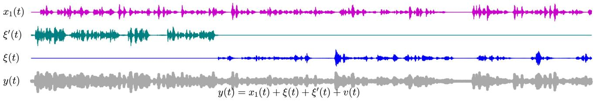

(a)  
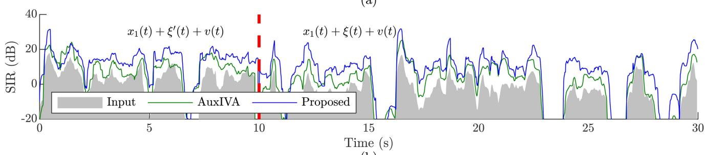  
(b)

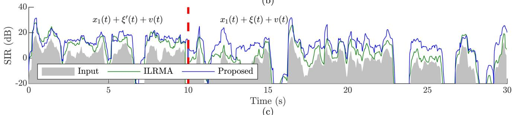  
(c)  
Fig. 9. (a) Array observation and the source signals, (b) the SIR of the proposed approach compared with the recursive AuxIVA approach, (c) the SIR of the proposed approach compared with the recursive ILRMA approach.

The recursive auxiliary-function-based-independent-vectoranalysis (AuxIVA) and ILRMA source separation methods serve as baselines for performance illustration. The window length is a crucial parameter for traditional BSS methods, typically favoring larger windows for optimal results. Fig. 8(b) illustrates the output SIRs of the recursive AuxIVA and ILRMA methods as a function of window length $L _ { w }$ . The SIRs decrease rapidly with shorter window lengths, suggesting that $L _ { w } = 2 0 4 8$ is an appropriate choice for our simulations.

During the implementation of recursive AuxIVA and IL-RMA, the first two seconds of signal data are used for offline initialization. Subsequently, the demixing matrices are updated recursively. As shown in Fig. 9(b) and (c), the SIR of IL-RMA during the first 10 seconds outperforms the AuxIVA method and is notably close to the proposed approach. However, when the desired source changes abruptly, both AuxIVA and ILRMA experience slow convergence rates, taking more than 5 seconds to achieve effective SIR improvements. This slow convergence is also observed in earlier online BSS works [33].

In contrast, the proposed method adapts to the altered source rapidly, as demonstrated in Fig. 9(b) and (c). Notably, the required coherence matrix of the interference is estimated blindly using the offline ILRMA approach. This performance further confirms that our proposed method enables the array to recognize new sources in real-time, as soon as the coherence matrices of unwanted interference are determined. Additionally, the proposed method utilizes a much smaller window size, $L _ { w } = 2 5 6$ significantly reducing system delay compared to BSS methods $( L _ { w } = 2 0 4 8 )$ .

In summary, traditional BSS approaches can provide a-priori information for our proposed method. Combining the BSS approach with the proposed one can lead to reduced system delay and enhanced tracking capabilities for unknown sources. Future research can focus on a more effective integration of either BSS approaches or beamforming approaches [43] with our method and explore further performance enhancements in unknown source extraction.

## VI. CONCLUSION

This paper proposed a framework for microphone array selfawareness, enabling the array to detect new emerging sources in real time without prior information. The proposed approach corresponds to the optimal Wiener filter for the new source and is calculated in two steps. In the first step, we roughly estimated the variances of the known interferences and background noise using the given covariance matrix of the array observations and the coherence matrices of both interferences and background noise. We then constructed the total coherence matrix for the interference and background noise, and calculated the residual model based on the covariance matrix of the observations and the total coherence matrix. The coherence matrix of the new source is determined by normalizing the trace of the residual model. Next, we calculated the variances of the new source, interferences, and background noise simultaneously, taking the new emerging coherence matrix into account. A Wiener filter for extracting the new source is designed based on these resulting variances. It is observed that the resulting Wiener filter retains some direct paths and early reflections from known sources in the initial frames after silence. To address this issue, we proposed an a priori Wiener filter based on the first-stage calculations of array self-awareness. By combining the Wiener filters from both stages, we obtained a filter for extracting the new source, which approaches one when a new source is present in the current frequency bin and time-frame index. This allowed the array to automatically sense new sources. Through simulations, we demonstrated the significant potential of the proposed approach in challenging acoustic environments, including those with moving sources, sporadic sound events, and multiple sources.

## APPENDIX A

## EXAMPLE TO VERIFY THE CONVERGENCE OF THE FIXED POINTITERATION APPROACH

Calculating the residual of the covariance matrix is essential for implementing the array self-awareness. We apply the fixedpoint iteration method to compute the amplitude of the residual matrix, which corresponds to the update rule presented in (34). To evaluate the feasibility of this update rule, we create a toy example where the amplitude of the residual model is given by

$$
{ \frac { 1 } { 7 } } { \sqrt { \frac { 1 6 } { 4 } } } \quad \ { \begin{array} { l l } { 4 } & { 8 } \\ { 4 } & { 1 } & { 2 } \\ { 8 } & { 2 } & { 4 } \end{array} }  = { \sqrt { \frac { 4 } { \sqrt { 7 } } } } { \left[ \begin{array} { l l l } { { \frac { 4 } { \sqrt { 7 } } } } \\ { { \frac { 1 } { \sqrt { 7 } } } } \\ { { \frac { 2 } { \sqrt { 7 } } } } \end{array} \right] }  \times { \left[ \begin{array} { l l l } { { \frac { 4 } { \sqrt { 7 } } } } & { { \frac { 1 } { \sqrt { 7 } } } } & { { \frac { 2 } { \sqrt { 7 } } } } \end{array} \right] } .\tag{45}
$$

We need to determine three variables: $A _ { 1 } , A _ { 2 }$ , and $A _ { 3 } ,$ based on the off-diagonal elements of the residual model matrix. In our example, these elements are 4, 8, and 2, as shown in (45). The results from 1000 cases with randomly initialized values are presented in Fig. 10. As seen, all cases converge to the ground truth. Our observations indicate that the fixed-point iteration method converges rapidly, even though a theoretical proof of convergence is not provided. In our experiments, we set the maximum number of iterations for termination to 20. Given the low computational cost shown in (34), a larger value can be employed if necessary.

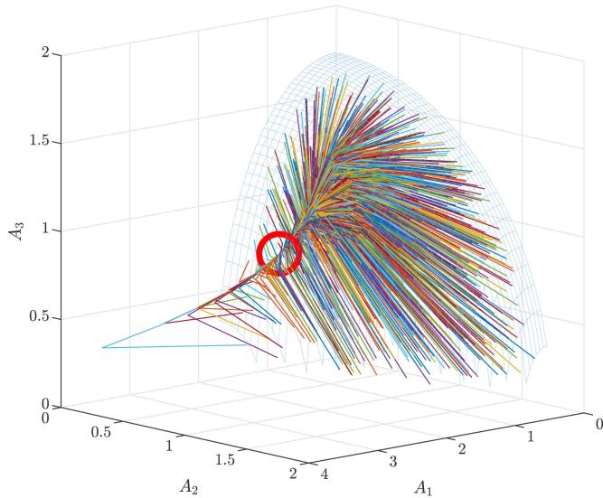  
Fig. 10. Convergence behavior of 1000 simulations with random initialized values, where the red circle shows the position of the ground truth, i.e., $A _ { 1 } =$ $4 / \sqrt { 7 } \approx 1 . 5 1 , A _ { 2 } = 1 / \sqrt { 7 } \approx 0 . 3 7$ , and $A _ { 3 } = 2 / \sqrt { 7 } \approx 0 . 7 5$

## APPENDIX B

## COMPUTATIONAL COMPLEXITY OF ARRAY SELF-AWARENESS

According to the framework in Fig. 2, the primary computation cost involves calculating the source variances, specifically the function $f _ { \mathrm { V } } \big ( \boldsymbol { \Phi } ; \boldsymbol { \Gamma } _ { 1 } , \ldots , \boldsymbol { \Gamma } _ { N } \big )$ . As noted in [27], the source variances are updated iteratively using the equation: $\phi = \mathbf { A } ^ { - 1 } ( \phi ) \mathbf { k }$ b. Here, φ is a vector containing all N variances, A is an $N \times N$ matrix, and b is a vector of length N. The computational cost per iteration is detailed as follows:

$M ^ { 3 }$ multiplication operations for $\Psi ^ { - 1 }$ , where $\Psi =$ $\textstyle \sum _ { n } \phi _ { n } \mathbf { T } _ { n } ;$

$M ^ { 2 } \times N$ multiplication operations for $\boldsymbol { \Psi } ^ { - 1 } \boldsymbol { \Gamma } _ { j } , j =$ $1 , 2 , \ldots , N ;$

$M ^ { 2 }$ multiplication operations for $\Psi ^ { - 1 } \Phi$

$M ^ { 2 } \times ( N + 1 ) N / 2$ multiplication operations to compute the elements of $\mathbf { A } ( \phi )$ , where the $( i , j ) \mathrm { t h }$ element is $\mathrm { t r } ( \Psi ^ { - 1 } { \bf \cal T } _ { i } \Psi ^ { - 1 } { \bf \cal T } _ { j } )$

$M ^ { 2 } \times N$ multiplication operations for the elements of b, where the ith element is $\mathrm { t r } \big ( \Psi ^ { - 1 } \Phi \Psi ^ { - 1 } \Gamma _ { j } \big )$

$N ^ { 3 }$ multiplication operations for the operation $\phi =$ $\mathbf { A } ^ { - 1 } ( \phi ) \mathbf { b }$ , completing one iteration of the variance update. Therefore, the total multiplication operations per iteration can be expressed as :

$$
c ( M , N ) = M ^ { 2 } \left[ M + 2 N + 1 + \frac { N ( N + 1 ) } { 2 } + N ^ { 3 } / M ^ { 2 } \right] .\tag{46}
$$

Let us denote $Q , L _ { w } , L _ { s } ,$ , and $f _ { s }$ as the number of iterations for each $f _ { \mathrm { V } } ( \cdot )$ , the frame length, the step length, and the sampling rate, respectively. We have $L _ { w } / 2$ frequency bands of interest. Therefore, the total multiplication operations per second can be

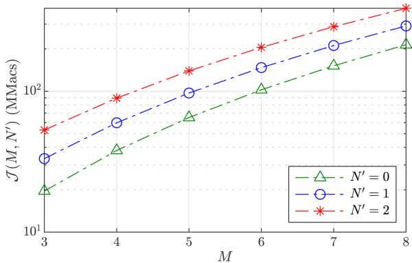  
Fig. 11. The computational cost of the array self-awareness approach as a function of M under different number of interferences, where $\overset { \_ } { Q } = 4 , f _ { s } =$ 16000 Hz, $L _ { w } = 2 5 6$ , and $L _ { s } = 6 4$

derived as

$$
\mathcal { I } ( M , N ^ { \prime } ) = [ c ( M , N ^ { \prime } + 1 ) + c ( M , N ^ { \prime } + 2 ) ] \times \frac { Q L _ { w } f _ { s } } { 2 L _ { s } } ,\tag{47}
$$

where $N ^ { \prime } = N - 1$ denotes the number of interferences. The relationship between computational cost and the number of sensors is illustrated in Fig. 11. As we can see, the computational cost typically remains below 200 MMacs for a setup with six sensors.

## REFERENCES

[1] J. Benesty, I. Cohen, and J. Chen, Fundamentals ofSignal Enhancement and Array Signal Processing. Singapore: Wiley-IEEE Press, 2018.

[2] J. Benesty, M. M. Sondhi, and Y. Huang, Springer Handbook of Speech Processing. Berlin, Germany: Springer, 2008.

[3] J. Benesty, J. Chen, and Y. Huang, Microphone Array Signal Processing. Berlin, Germany: Springer, 2008.

[4] K. Kuang, F. Yang, J. Li, and J. Yang, “Three-stage hybrid neural beamformer for multi-channel speech enhancement,” J. Acoust. Soc. Amer., vol. 153, no. 6, pp. 3378–3378, 2023.

[5] C. Quan and X. Li, “SpatialNet: Extensively learning spatial information for multichannel joint speech separation, denoising and dereverberation,” IEEE/ACM Trans. Audio, Speech, Lang. Process., vol. 32, pp. 1310–1323, 2024.

[6] A. Li, G. Yu, C. Zheng, W. Liu, and X. Li, “A general unfolding speech enhancement method motivated by Taylor’s theorem,” IEEE/ACM Trans. Audio, Speech, Lang. Process., vol. 31, pp. 3629–3646, 2023.

[7] W. Zhang, X. Chang, C. Boeddeker, T. Nakatani, S. Watanabe, and Y. Qian, “End-to-end dereverberation, beamforming, and speech recognition in a cocktail party,” IEEE/ACM Trans. Audio, Speech, Lang. Process., vol. 30, pp. 3173–3188, 2022.

[8] R. Gu, S.-X. Zhang, Y. Zou, and D. Yu, “Complex neural spatial filter: Enhancing multi-channel target speech separation in complex domain,” IEEE Signal Process. Lett., vol. 28, pp. 1370–1374, 2021.

[9] Z. Yang, W. Yang, K. Xie, and J. Chen, “Integrating data priors to weighted prediction error for speech dereverberation,” IEEE/ACM Trans. Audio, Speech, Lang. Process., vol. 32, pp. 3908–3923, 2024.

[10] K. Tesch and T. Gerkmann, “Multi-channel speech separation using spatially selective deep non-linear filters,” IEEE/ACM Trans. Audio, Speech, Lang. Process., vol. 32, pp. 542–553, 2024.

[11] H. Sawada, N. Ono, H. Kameoka, D. Kitamura, and H. Saruwatari, “A review of blind source separation methods: Two converging routes to ILRMA originating from ICA and NMF,” APSIPA Trans. Signal Inf. Process., vol. 8, 2019, Art. no. e12.

[12] S. Gannot, E. Vincent, S. Markovich-Golan, and A. Ozerov, “A consolidated perspective on multimicrophone speech enhancement and source separation,” IEEE/ACM Trans. Audio, Speech, Lang. Process., vol. 25, no. 4, pp. 692–730, Apr. 2017.

[13] C. Pan and J. Chen, “A framework of directional-gain beamforming and a white-noise-gain-controlled solution,” IEEE/ACM Trans. Audio, Speech, Lang. Process., vol. 30, pp. 2875–2887, 2022.

[14] H. Cox, R. M. Zeskind, and T. Kooij, “Practical supergain,” IEEE Trans. Acoust., Speech, Signal Process., vol. ASSP- 34, no. 3, pp. 393–398, Jun. 1986.

[15] S. Yan and Y. Ma, “Robust supergain beamforming for circular array via second-order cone programming,” Appl. Acoust., vol. 66, no. 9, pp. 1018–1032, Sep. 2005.

[16] H. Sun, S. Yan, and U. P. Svensson, “Robust minimum sidelobe beamforming for spherical microphone arrays,” IEEE/ACM Trans. Audio, Speech, Lang. Process., vol. 19, no. 4, pp. 1045–1051, May 2011.

[17] C. Pan, J. Chen, and J. Benesty, “Reduced-order robust superdirective beamforming with uniform linear microphone arrays,” IEEE/ACM Trans. Audio, Speech, Lang. Process., vol. 24, no. 9, pp. 1544–1555, Sep. 2016.

[18] C. Pan, J. Chen, and J. Benesty, “Theoretical analysis of differential microphone array beamforming and an improved solution,” IEEE/ACM Trans. Audio, Speech, Lang. Process., vol. 23, no. 11, pp. 2093–2105, Nov. 2015.

[19] C. Pan, J. Benesty, and J. Chen, “Design of robust differential microphone arrays with orthogonal polynomials,” J. Acoust. Soc. Amer., vol. 138, no. 2, pp. 1079–1089, Aug. 2015.

[20] F. Zhang, C. Pan, J. Chen, and J. Benesty, “MPPCAD: Minimum power pattern constrained adaptive differential beamforming,” IEEE Signal Process. Lett., vol. 32, pp. 2099–2103, 2025.

[21] G. W. Elko, “Differential microphone arrays,” in Audio Signal Processing: For Next-Generation Multimedia Communication Systems, Y. Huang and J. Benesty, Eds. Boston, MA, USA: Springer, 2004, ch. 2, pp. 11–65.

[22] Z. Chen, H. Chen, and Q. Tu, “Sensor imperfection tolerance analysis of robust linear differential microphone arrays,” IEEE/ACM Trans. Audio, Speech, Lang. Process., vol. 29, pp. 2915–2929, 2021.

[23] J. Benesty, J. Chen, and C. Pan, Fundamentals ofDifferential Beamforming (Springer Briefs in Electrical and Computer Engineering). Singerpore: Springer, 2016.

[24] Y. Lu, C. Pan, J. Chen, and J. Benesty, “A closed-form DOA estimator using spherical microphone arrays in the presence of interference,” IEEE Signal Process. Lett., vol. 31, pp. 1770–1774, 2024.

[25] C. Evers et al., “The LOCATA challenge: Acoustic source localization and tracking,” IEEE/ACM Trans. Audio, Speech, Lang. Process., vol. 28, pp. 1620–1643, 2020.

[26] S. Gannot and I. Cohen, “Adaptive beamforming and postfiltering,” in Springer Handbook of Speech Processing, J. Benesty, M. M. Sondhi, and Y. Huang, Eds. Berlin, Germany: Springer, 2008, ch. 47, pp. 945–978.

[27] F. Zhang, C. Pan, J. Chen, and J. Benesty, “An update rule for multiple source variances estimation using microphone arrays,” Speech Commun., vol. 172, 2025, Art. no. 103245.

[28] C. Pan, J. Chen, and G. Shi, “On estimation of time-varying variances of source and noise for sensor array processing,” IEEE/ACM Trans. Audio, Speech, Lang. Process., vol. 28, pp. 2865–2879, 2020.

[29] H. Sawada, S. Araki, and S. Makino, “Underdetermined convolutive blind source separation via frequency bin-wise clustering and permutation alignment,” IEEE/ACM Trans. Audio, Speech, Lang. Process., vol. 19, no. 3, pp. 516–527, Mar. 2011.

[30] T. Higuchi, N. Ito, S. Araki, T. Yoshioka, M. Delcroix, and T. Nakatani, “Online MVDR beamformer based on complex Gaussian mixture model with spatial prior for noise robust ASR,” IEEE/ACM Trans. Audio, Speech, Lang. Process., vol. 25, no. 4, pp. 780–793, Apr. 2017.

[31] Y. Kubo, T. Nakatani, M. Delcroix, K. Kinoshita, and S. Araki, “Maskbased MVDR beamformer for noisy multisource environments: Introduction of time-varying spatial covariance model,” in Proc. IEEE Int. Conf. Acoust., Speech, Signal Process., 2019, pp. 6855–6859.

[32] R. Scheibler, “Independent vector analysis via log-Quadratically penalized quadratic minimization,” IEEE Trans. Signal Process., vol. 69, pp. 2509–2524, 2021.

[33] T. Nakashima and N. Ono, “Inverse-free online independent vector analysis with flexible iterative source steering,” in Proc. 2022 IEEE Asia-Pacific Signal Inf. Process. Assoc. Annu. Summit Conf., 2022, pp. 749–753.

[34] D. Kitamura and K. Yatabe, “Consistent independent low-rank matrix analysis for determined blind source separation,” EURASIP J. Adv. Signal Process., vol. 2020, pp. 1–35, 2020.

[35] Y. Avargel and I. Cohen, “System identification in the short-time fourier transform domain with crossband filtering,” IEEE/ACM Trans. Audio, Speech, Lang. Process., vol. 15, no. 4, pp. 1305–1319, May 2007.

[36] C. Pan, J. Chen, and J. Benesty, “Performance study of the MVDR beamformer as a function of the source incidence angle,” IEEE/ACM Trans. Audio, Speech, Lang. Process., vol. 22, no. 1, pp. 67–79, Jan. 2014.

[37] D. D. Lee and H. S. Seung, “Learning the parts of objects by non-negative matrix factorization,” Nature, vol. 401, no. 6755, pp. 788–791, 1999.

[38] H. Kameoka, N. Ono, and S. Sagayama, “Speech spectrum modeling for joint estimation of spectral envelope and fundamental frequency,” IEEE/ACM Trans. Audio, Speech, Lang. Process., vol. 18, no. 6, pp. 1507–1516, Aug. 2010.

[39] I. Csiszár, “I-divergence geometry of probability distributions and minimization problems,” Annu. Probability., vol. 3, pp. 146–158, 1975.

[40] J. B. Allen and D. A. Berkley, “Image method for efficiently simulating small-room acoustics,” J. Acoust. Soc. Amer., vol. 65, no. 4, pp. 943–950, Apr. 1979.

[41] C. Pan et al., “An anchor-point based image-model for room impulse response simulation with directional source radiation and sensor directivity patterns,” 2023, arXiv:2308.10543.

[42] F. Jacobsen, “The diffuse sound field: Statistical considerations concerning the reverberant field in the steady state,” Acoust. Lab., Tech. Univ. Denmark, 1979.

[43] F. Zhang, J. Benesty, C. Pan, and J. Chen, “A universal linear beamformer for microphone arrays,” in Proc. IEEE 15th Int. Conf. Signal Process., Commun. Comput., 2025, pp. 1–5.

[44] E. A. Habets and S. Gannot, “Generating sensor signals in isotropic noise fields,” J. Acoust. Soc. Amer., vol. 122, no. 6, pp. 3464–3470, Dec. 2007.

Chao Pan was born in 1989. He received the bachelor’s degree in electronics and information engineering and the Ph.D. degree in information and communication engineering from the Northwestern Polytechnical University, Xi’an, China, in 2011 and 2018, respectively. From 2014 to 2016, he was a Visiting Ph.D. degree Student with the University of Quebec, INRS-EMT, Montreal, QC, Canada. From 2018 to 2020, he was a Lecturer with the School of Artificial Intelligence, Xidian University, Xi’an. He is currently an Associate Professor with the Center of Intelligent Acoustics and Immersive Communications, School of Artificial Intelligence, School of Marine Science and Technology, Northwestern Polytechnical University.

His research interests include acoustic signal processing, array signal processing, differential microphone array, sound field measuring and reproduction, signal separation, speech enhancement, brain science, and deep learning. His journal paper Theoretical analysis ofdifferential microphone array beamforming and an improved solution was the recipient of the IEEE Region 10 (Asia-Pacific) 2016 Distinguished Student Paper Award (First Prize) (with Chen and Benesty). He is also a Reviewer of the IEEE TRANSACTIONS ON AUDIO, SPEECH, AND LANGUAGE PROCESSING, IEEE SIGNAL PROCESSING LETTER, and several international conferences.

Jingdong Chen (Fellow, IEEE) received the Ph.D. degree in pattern recognition and intelligence control from the Chinese Academy of Sciences, Beijing, China, in 1998. He was with Bell Laboratories, Murray Hill, NJ, USA, WeVoice Inc., NJ, Griffith University, Brisbane, Australia, and Advanced Telecommunication Research Institute International (ATR), Kyoto, Japan, for more than a decade. He is currently a Professor with Northwestern Polytechnical University, Xi’an, China. His research interests include array signal processing, adaptive signal processing,

speech enhancement, adaptive noise/echo control, signal separation, speech communication, and artificial intelligence.

He was an Associate Editor for the IEEE TRANSACTIONS ON AUDIO, SPEECH AND LANGUAGE PROCESSIN from 2008 to 2014, as a Technical Committee (TC) Member of the IEEE Signal Processing Society (SPS) TC on Audio and Electroacoustics from 2007 to 2009, and a member of the IEEE SPS TC on Audio and Acoustic Signal Processing from 2018 to 2021. He is also the Chair of the IEEE R10 Membership Development Committee, Chair of the IEEE Xi’an Section, and Chair of the IEEE Xi’an Signal Processing Chapter. He was General Co-Chair of ACM WUWNET 2018 and IWAENC 2016, Technical Program Chair of IEEE TENCON 2013, and Technical Program Co-Chair for IEEE WASPAA 2009, IEEE ChinaSIP 2014, IEEE ICSPCC 2014, and IEEE ICSPCC 2015, in addition to contributing to the organization of many other conferences.

Dr. Chen was the recipient of the 2008 Best Paper Award from the IEEE Signal Processing Society (with Benesty, Huang, and Doclo), the Best Paper Award from the IEEE Workshop on Applications of Signal Processing to Audio and Acoustics in 2011 (with Benesty), the Bell Labs Role Model Teamwork Award twice, respectively, in 2009 and 2007, the NASA Tech Brief Award twice, respectively, in 2010 and 2009, Young Author Best Paper Award from the 5th National Conference on Man-Machine Speech Communications in 1998, the Japan Trust International Research Grant from the Japan Key Technology Center in 1998, and the Distinguished Young Scientists Fund from the National Natural Science Foundation of China in 2014. He is also a co-author of a paper that was the recipient of the C. Pan the IEEE R10 (Asia-Pacific Region) Distinguished Student Paper Award (First Prize) in 2016.

Jacob Benesty received the master’s degree in microwaves from Pierre & Marie Curie University, Paris, France, in 1987, and the Ph.D. degree in control and signal processing from Paris-Saclay University, Gif-sur-Yvette, France, in Apr. 1991. From 1989 to 1991, he worked on adaptive filters and fast algorithms with the Centre National d’Etudes des Telecommunications (CNET), Paris, France. From 1994 to 1995, he was with Telecom Paris University on multichannel adaptive filters and acoustic echo cancellation. From 1995 to 2003, he was firstly a

Consultant and then a Member of the Technical Staff with Bell Laboratories, Murray Hill, NJ, USA. In May 2003, he joined the University of Quebec, INRS-EMT, Montreal, QC, Canada, as a Professor. He is also a Guest Professor with Northwestern Polytechnical University, Xi’an, China. His research interests include signal processing, acoustic signal processing, and multimedia communications. He is also the Inventor of many important technologies. In particular, he was the lead Researcher with Bell Labs who conceived and designed the world-first real-time hands-free full-duplex stereophonic teleconferencing system. He has also conceived and designed the world-first PC-based multi-party hands-free full-duplex stereo conferencing system over IP networks. He has co-authored and co-edited/co-authored numerous books in the area of acoustic signal processing. He is the Editor of the book series Springer Topics in Signal Processing. He was the General Chair and Technical Chair of many international conferences and a member of several IEEE Technical Committees. Four of his journal papers were the were the recipient of the IEEE Signal Processing Society, the Gheorghe Cartianu Award in 2010 from the Romanian Academy, and an Honorary Doctorate (Doctor Technices Honoris Causa) in 2023 from Aalborg University, Denmark, for his distinguished efforts in audio and acoustic signal processing.