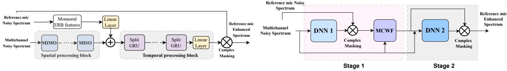

# Ultra low-compute complex spectral masking for multichannel speech enhancement

Ashutosh Pandey

Meta Reality Labs Research

Redmond, USA

apandey620@meta.com

Juan Azcarreta

Meta Reality Labs Research

Cambridge, UK

jazcarretao@meta.com

Abstract—We present a streamlined framework for complex spectral masking that processes multichannel speech with minimal computational demands, enhancing both spectral magnitude and phase by integrating low-compute models with the Multi-Channel Wiener Filter (MCWF). Our methodology employs a two-stage, end-to-end training approach where a deep neural network (DNN) first estimates MCWF weights, followed by another DNN that refines the MCWF output, enhancing spectral masking quality. This architecture not only outperforms the traditional oracle Minimum Variance Distortionless Response (MVDR) beamformer but also maintains high efficiency, requiring less than 50MMACs for processing one second of 8- channel audio. Empirical results demonstrate that our framework exceeds the performance of existing low-compute models, offering significant enhancements with minimal computational demands, making it ideal for deployment on edge devices with limited computational resources.

Index Terms—Multichannel speech enhancement, complex spectrum enhancement, real-time, low-compute, spatial filtering

## I. INTRODUCTION

Speech enhancement is essential for clear communication in noisy environments, isolating conversational speech from background noise. As augmented reality and healthcare technologies advance, integrating advanced speech enhancement systems into devices like smart glasses and hearables presents a significant opportunity. These devices use multichannel microphone arrays to improve spatial processing, enhancing user interaction and expanding the capabilities of wearable technology. This integration facilitates seamless communication in challenging acoustic environments.

Multichannel speech enhancement using deep neural networks (DNNs) has made significant strides, focusing on either complex spectrum enhancement [1], [2], [3], [4], [5] or raw waveform enhancements [6], [7], [8], [9], [10]. Despite DNNs robustness, a hybrid approach combining traditional spatial filters with DNNs is still prevalent [11], [12], [13], [14], [15]. This method employs a two-stage framework where the first DNN estimates parameters for conventional filters such as MVDR [16] and MCWF, followed by a second DNN that performs post-filtering to enhance speech quality further.

The computational and memory demands of many speech enhancement methods are often too high for wearable devices that need to operate in real-time and on-device while adhering to causality constraints. Offloading processing to the cloud can introduce significant latency, adversely affecting user experience during live interactions.

Recent studies such as [17], [18], [19], [20], [21], [22], [15], have focused on reducing both the computational demands and latencies of speech enhancement models. However, these models still require hundreds of millions of multiplyaccumulates (MMACs) to process just one second of audio, which remains prohibitively high for edge devices like smart glasses. In contrast, notable advancements have been made in single-channel [23] and multichannel [24] speech enhancement, achieving much lower computational needs of approximately 50 MMACs per second of audio.

While the study in [24] presents an innovative ultra-lowcompute multichannel model, its effectiveness is significantly hampered by its dependence on equivalent rectangular bandwidth (ERB) based magnitude-only enhancement. To truly elevate performance, it is crucial to develop more sophisticated models that comprehensively enhance both magnitude and phase. Employing methods such as complex spectrum enhancement or time-domain enhancement holds significant potential to improve the speech enhancement performance.

We introduce a streamlined, dual-stage framework designed to enhance both magnitude and phase through complex spectral masking. This system features TinyGRU (TGRU), a novel and efficient DNN that computes the enhanced spectrum for the reference microphone. This spectrum informs the weight calculations for a Multi-Channel Wiener Filter (MCWF), which then processes the noisy speech. Subsequently, this output is refined by another low-compute DNN. Uniquely, both stages of this framework are trained simultaneously from scratch, rather than iteratively as in previous studies [11], [12], optimizing integration and performance.

The proposed TinyGRU model features a low-compute spatial processing block followed by compute-optimized GRU layers for temporal processing. We conducted experiments to confirm that the model effectively enhances the complex spectrum in conjunction with an MCWF. Through ablation studies, we fine-tuned the configuration to achieve exceptional speech enhancement, outperforming the oracle MVDR beamformer while requiring only 44 MMACs/s of compute. Additionally, comparisons with several low-compute baselines underscored the superior performance of our proposed framework.

  
Fig. 1. A schematic overview of TGRU.  
Fig. 2. Depiction of the multi-stage framework with MCWF.

## II. PROBLEM FORMULATION

Consider a microphone array with C channels recording an audio mixture composed of a desired reverberant talker speech $\pmb { S } \in \mathbb { R } ^ { C \times N }$ , corrupted by background noise $\pmb { N } \in \mathbb { R } ^ { C \times N }$ In the time-domain, the observed multichannel mixture signal $\pmb { Y } \in \mathbb { R } ^ { C \times N }$ can be expressed as:

$$
\mathbf {Y} = \mathbf {S} + \mathbf {N}\tag{1}
$$

The primary goal of multichannel speech enhancement is to produce a reliable estimation, $\hat { s } _ { r } \in \mathbb { R } ^ { N }$ , of the target talker speech $s _ { r } \in \mathbb { R } ^ { N }$ at a specific reference microphone r, given the observed noisy recording Y .

## III. PROPOSED METHOD

This section outlines the architecture of the proposed lowcompute DNN model designed for real-time multichannel speech enhancement, TinyGRU, as illustrated in Figure 1.

## A. Input features

The multichannel noisy input, Y , is transformed into the time-frequency domain via the Short-Time Fourier Transform (STFT), resulting in $\pmb { Y } \in \mathbb { C } ^ { C \times T \times F }$ , where T is the number of frames and F is the number of frequency bins. Additionally, the model applies an ERB filter bank to the noisy reference channel, effectively downsampling the input features by aggregating high-frequency bands.

## B. Spatial processing

The spatial processing block consists of a series of multipleinput-multiple-output (MIMO) spatial convolution layers, a novel trainable convolution technique introduced in [22]. Inspired by traditional signal processing techniques, this spatial convolution mimics a frequency domain Filter-And-Sum beamformer operation, albeit implemented in the real domain. Each spatial convolution layer l comprises F distinct matrices, each of size $C _ { o u t } ^ { l } \times C _ { i n } ^ { l }$ , which are multiplied by the input tensor of $C _ { i n } ^ { l }$ channels at each frequency bin. This process yields an output tensor with $C _ { o u t } ^ { l }$ spatial dimension and F frequency bins. At the input, the real and imaginary part of the STFT are concatenated to form a real-valued multichannel signal with 2 · C channels. Each convolution is followed by parametric ReLU nonlinearity.

The final layer of the spatial processing block outputs a single channel signal. This monaural output is combined with the output derived from transforming the ERB features of the reference microphone input using a linear layer.

## C. Efficient temporal processing with SplitGRU

The output from the spatial processing block is directed into a series of B SplitGRU (Split Gated Recurrent Unit) layers, each with a hidden size of H. GRU units adhere to causality constraints by iteratively updating their state based on the current input frame and previous state values. The SplitGRU layer enhances efficiency by dividing the input into R segments across the feature dimension and processing each segment with one of R parallel GRUs. The outputs of each layer are reorganized such that the output from a specific GRU is distributed to all GRUs in the subsequent layer [25]. Employing a split factor of R effectively reduces computational demands by a factor of R. The final output of the GRU model is then projected to a size of $2 F$ using a linear layer, which is subsequently split into real and imaginary components to form a complex mask.

## D. Complex masking

Assuming the model generates a mask $\mathbf { M } \in \mathbb { C } ^ { T \times F }$ , the enhanced signal $\hat { \mathbf { S } _ { r } } \in \check { \mathbb { C } } ^ { T \times F }$ is computed by applying the complex mask to the noisy input signal from the reference microphone r as:

$$
\hat {\mathbf {S}} _ {r} = \Re (\mathbf {Y} _ {r}) \cdot \Re (\mathbf {M}) + j \Im (\mathbf {Y} _ {r}) \cdot \Im (\mathbf {M})\tag{2}
$$

The real and imaginary parts of the mask are respectively multiplied by the corresponding parts of the signal. This method, which deviates slightly from the standard complex multiplication approach [26], requires less computation and achieves similar performance.

## E. Multichannel Wiener Filter

The output of TinyGRU is used to derive an MCWF [27]. The MCWF beamformer optimizes a linear filter in the frequency domain to minimize the Mean Square Error (MSE) between the desired signal and the beamformed signal. By using the estimated speech $\hat { \mathbf { S } } _ { r }$ as a proxy for the target signal, the beamformer coefficients can be calculated in a closed-form solution as follows:

$$
\mathbb {E} [ \mathbf {Y Y ^ {H}} ] (t, f) = \frac {1}{t} \sum_ {i = 1} ^ {i = t} \mathbf {Y} (i, f) \mathbf {Y} ^ {H} (i, f)\tag{3}
$$

$$
\mathbb {E} [ \mathbf {Y} \hat {\mathbf {S}} _ {\mathbf {r}} ^ {\mathbf {H}} ] (t, f) = \frac {1}{t} \sum_ {i = 1} ^ {i = t} \mathbf {Y} (i, f) \hat {\mathbf {S}} _ {r} ^ {H} (i, f)\tag{4}
$$

$$
\mathbf {W} (t, f) = \mathbb {E} [ \mathbf {Y Y} ^ {H} ] (t, f) ^ {- 1} \mathbb {E} [ \mathbf {Y} \hat {\mathbf {S}} _ {r} ^ {H} ] (t, f)\tag{5}
$$

TABLE I  
PERFORMANCE OF TINYGRU IN DIFFERENCE SETUPS. (A)-(D) USE DIFFERENT MASKING APPRAOCHES.

<table><tr><td></td><td>STOI</td><td>PESQ</td><td>SNR</td><td rowspan="2">MMACs/s</td><td rowspan="2">Para. (k)</td></tr><tr><td>Noisy</td><td>61.4</td><td>1.54</td><td>-1.4</td></tr><tr><td>(a) Sigmoid</td><td>70.0</td><td>1.99</td><td>6.9</td><td>18</td><td>138</td></tr><tr><td>(b) Softplus</td><td>70.0</td><td>2.00</td><td>6.9</td><td>18</td><td>138</td></tr><tr><td>(c) Complex-1</td><td>69.6</td><td>2.01</td><td>6.9</td><td>20</td><td>151</td></tr><tr><td>(d) Complex-2</td><td>70.0</td><td>2.02</td><td>6.9</td><td>20</td><td>151</td></tr><tr><td>(d) wo ERB</td><td>69.3</td><td>2.00</td><td>6.7</td><td>19</td><td>145</td></tr><tr><td>(a) + MCWF</td><td>71.7</td><td>2.02</td><td>6.5</td><td>32</td><td>138</td></tr><tr><td>(b) + MCWF</td><td>72.2</td><td>2.04</td><td>6.8</td><td>32</td><td>138</td></tr><tr><td>(c) + MCWF</td><td>73.9</td><td>2.08</td><td>7.1</td><td>34</td><td>151</td></tr><tr><td>(d) + MCWF</td><td>73.9</td><td>2.08</td><td>7.1</td><td>34</td><td>151</td></tr><tr><td>(c) + MCWF + (c)</td><td>78.9</td><td>2.38</td><td>8.7</td><td>54</td><td>304</td></tr><tr><td>(d) + MCWF + (d)</td><td>78.2</td><td>2.35</td><td>8.4</td><td>54</td><td>304</td></tr></table>

TABLE II

PERFORMANCE ANALYSIS OF TGRU. A) TGRU + MCWF, B) TGRU + MCWF + TGRU.

<table><tr><td>Typ.</td><td>GRUs</td><td>Filt.</td><td>STOI</td><td>PESQ</td><td>SNR</td><td>MMACs/s</td><td>Para. (k)</td></tr><tr><td rowspan="6">(a)</td><td rowspan="3">1</td><td>(1, )</td><td>71.9</td><td>2.01</td><td>6.5</td><td>25</td><td>74</td></tr><tr><td>(4, 1)</td><td>72.4</td><td>2.03</td><td>6.6</td><td>26</td><td>80</td></tr><tr><td>(8, 4, 2, 1)</td><td>72.6</td><td>2.03</td><td>6.7</td><td>28</td><td>94</td></tr><tr><td>2</td><td>(4, 1)</td><td>73.2</td><td>2.06</td><td>6.9</td><td>30</td><td>109</td></tr><tr><td rowspan="2">3</td><td>(4, 1)</td><td>73.8</td><td>2.07</td><td>7.1</td><td>34</td><td>137</td></tr><tr><td>(8, 4, 2, 1)</td><td>74.0</td><td>2.08</td><td>7.1</td><td>36</td><td>151</td></tr><tr><td rowspan="6">(b)</td><td rowspan="3">1</td><td>(1, )</td><td>75.2</td><td>2.21</td><td>7.7</td><td>35</td><td>147</td></tr><tr><td>(4, 1)</td><td>76.2</td><td>2.25</td><td>8.0</td><td>37</td><td>162</td></tr><tr><td>(8, 4, 2, 1)</td><td>76.7</td><td>2.28</td><td>8.1</td><td>41</td><td>191</td></tr><tr><td>2</td><td>(4, 1)</td><td>77.7</td><td>2.32</td><td>8.4</td><td>44</td><td>218</td></tr><tr><td rowspan="2">3</td><td>(4, 1)</td><td>78.5</td><td>2.36</td><td>8.5</td><td>52</td><td>275</td></tr><tr><td>(8, 4, 2, 1)</td><td>78.9</td><td>2.38</td><td>8.7</td><td>56</td><td>304</td></tr></table>

Note that the covariance matrices are computed in an online fashion by applying cumulative empirical mean, a reasonable assumption since the target and receiver sources are non-stationary. Finally, the estimated beamformer coefficients $\mathbf { W } \in \mathbb { C } ^ { N \times T \times F }$ are applied to the input multichannel audio:

$$
\hat {\mathbf {S}} _ {M C W F} = \mathbf {W} ^ {H} \mathbf {Y}\tag{6}
$$

The inverse operation in Eq. 5 can be computed in an online manner with $\mathcal { O } ( N ^ { 2 } )$ complexity by running the iterative Sherman-Morrison-Woodbury inversion algorithm [28].

## F. Two-stage training

The MCWF output is further refined using a second-stage neural network that includes identical spatial and temporal processing blocks. As depicted in Fig 2, the beamformed audio from Eq. 6 is concatenated with the multichannel noisy input and processed by this second-stage DNN [29], which employs complex masking to enhance the initial output. During this training phase, the weights of the pretrained first-stage remain frozen.

## IV. EXPERIMENTS

## A. Dataset

To create pairs of clean and noisy signals for training, we utilize the Interspeech 2020 DNS Challenge corpus [30]. The speakers and noises in the training set are randomly allocated into training, testing, and validation subsets with split ratios of 85%, 5%, and 10%, respectively. All utterances are resampled to 16 kHz prior to data generation.

To facilitate the generation of multichannel data, we employ an eight-microphone circular array with a 10 cm radius. We utilize the Pyroomacoustics library [31] in Python, employing the image method with an order of 6. The absorption coefficient for reverberation is uniformly sampled from the range [0.1, 0.7]. Initially, random room dimensions are determined: length and width are uniformly sampled from [3, 10] meters, and height from [2, 5] meters. We then randomly select a microphone location and orientation within the room. The speech source is positioned at a distance ranging from [0.5, 2.5] meters from the array center. Between 1 and 10 noise sources are placed at distances exceeding 0.5 meters from the array center. With a 75% probability, 8-16 interfering talker locations are positioned at distances greater than 3 meters to simulate babble noise. The Signal-to-Noise Ratio (SNR) is sampled from [-10, 10] dB, and the Signal-to-Interference Ratio (SIR) from [-5, 15] dB.

## B. Experimental settings

The multichannel time-domain signal is normalized to a range between -60 dB and -20 dB at the reference microphone. Additionally, the instantaneous mean of the ERB features is removed at each frame.

All models are trained using Pytorch with a time-domain Signal-to-Noise Ratio (SNR) loss between the enhanced signal and the target speech. Training spans 100 epochs with 10- second utterances and a batch size of 128, distributed across multiple Nvidia H100 GPUs. We employ the Adam optimizer [32], with amsgrad set to True and gradient norms clipped at 1. The learning rate starts at 0.001 for the first 70 epochs and is reduced by a factor of 0.1 every 10 epochs thereafter.

Model evaluations utilized short-time objective intelligibility (STOI), narrow-band perceptual evaluation of speech quality (NB-PESQ), and SNR concerning reverberant target speech [33]. The computational demands are expressed in MMACs for processing one second of 8-channel audio, and the number of parameters is reported in thousands (K).

## C. Architecture configuration

The proposed network consists of four spatial convolution filters with input channels of 16, 8, 4, 2 and output channels of 8,4,2,1. Each spatial layer, except the first, includes a trainable bias. The first layer’s output is normalized by removing the frame-wise mean and variance over channel and frequency dimension. This normalization, in conjunction with the masking approach, renders the model scale-invariant. The splitGRU features 96 hidden units, 2 splits, and 3 layers. STFT settings include a 256-sample window size, 128-sample frame-shift, and 129 frequency bins. This configuration results in the model having 18 MMACs/s and 150k parameters.

## D. Baselines

The proposed model is evaluated against traditional signal processing methods and low-compute neural network baselines. Initially, it is compared with oracle MCWF and Souden MVDR [34] beamformers. Additionally, we replicated the multichannel speech-enhancement MC-CRN baseline from [24], an extension of CRN [35] that incorporates spatial information using K=20 maxDI fixed beamformers uniformly distributed in space. MC-CRN modifies the ERB features of the reference channel with a real-gain. Furthermore, we adapted the low-compute GTCRN [23] to handle multichannel audio by concatenating input channels and increasing the number of input filters.

TABLE III  
COMPARING TGRU WITH A LOW-COMPUTE BASELINE MODEL WITH 16MS LATENCY.

<table><tr><td></td><td>STOI</td><td>PESQ</td><td>SNR</td><td rowspan="2">MMACs/s</td><td rowspan="2">Para. (k)</td></tr><tr><td>Noisy</td><td>61.4</td><td>1.54</td><td>-1.4</td></tr><tr><td>MC-CRN [24]</td><td>68.1</td><td>1.92</td><td>6.3</td><td>19</td><td>75</td></tr><tr><td>TGRU</td><td>70.0</td><td>2.02</td><td>6.9</td><td>18</td><td>150</td></tr><tr><td>MC-CRN + MCWF</td><td>71.3</td><td>2.00</td><td>5.3</td><td>33</td><td>75</td></tr><tr><td>TGRU + MCWF</td><td>74.0</td><td>2.08</td><td>7.1</td><td>32</td><td>150</td></tr><tr><td>MC-CRN + MCWF + TGRU</td><td>77.5</td><td>2.32</td><td>8.1</td><td>51</td><td>221</td></tr><tr><td>TGRU + MCWF + TGRU</td><td>78.9</td><td>2.38</td><td>8.7</td><td>50</td><td>304</td></tr><tr><td>Oracle MVDR</td><td>75.7</td><td>2.06</td><td>5.1</td><td>14</td><td>-</td></tr><tr><td>Oracle MCWF</td><td>80.1</td><td>2.25</td><td>8.7</td><td>16</td><td>-</td></tr></table>

TABLE IV

COMPARING TGRU WITH A LOW-COMPUTE BASELINE MODEL WITH 32 MS LATENCY.

<table><tr><td></td><td>STOI</td><td>PESQ</td><td>SNR</td><td rowspan="2">MMACs/s</td><td rowspan="2">Para. (k)</td></tr><tr><td>Noisy</td><td>61.4</td><td>1.54</td><td>-1.4</td></tr><tr><td>GTCRN</td><td>70.9</td><td>2.11</td><td>7.3</td><td>70</td><td>29</td></tr><tr><td>TGRU</td><td>71.2</td><td>2.10</td><td>7.5</td><td>20</td><td>310</td></tr><tr><td>GTCRN + MCWF</td><td>76.7</td><td>2.17</td><td>7.8</td><td>84</td><td>29</td></tr><tr><td>TGRU + MCWF</td><td>76.8</td><td>2.18</td><td>8.2</td><td>34</td><td>310</td></tr><tr><td>GTCRN + MCWF + GTCRN</td><td>80.4</td><td>2.54</td><td>8.9</td><td>140</td><td>59</td></tr><tr><td>TGRU + MCWF + TGRU</td><td>81.7</td><td>2.55</td><td>9.7</td><td>54</td><td>625</td></tr><tr><td>Oracle MVDR</td><td>79.9</td><td>2.21</td><td>6.2</td><td>12</td><td>-</td></tr><tr><td>Oracle MCWF</td><td>84.6</td><td>2.41</td><td>10.6</td><td>14</td><td>-</td></tr></table>

## V. RESULTS AND DISCUSSION

## A. TGRU performance

Table I presents the results from training TGRU with various masking approaches. In (a), magnitude masking is applied using a sigmoid nonlinearity, which limits gain similar to ideal ratio masking. This is then replaced in (b) by a softplus unit [36], allowing for gains exceeding one, akin to spectral magnitude masking. Subsequently, in (c) and (d) the real and imaginary components are separately estimated at the output to implement complex ratio masking. ”Complex-1” denotes masking applied using Eq. 2, while ”Complex-2” refers to complex masking achieved through complex multiplication.

The standalone TGRU exhibits comparable performance across different masking types, indicating that it does not fully exploit the enhanced modeling capabilities of complex ratio masking. The addition of ERB features yields a marginal improvement in STOI scores. However, when TGRU is combined with MCWF, there is a marked improvement in performance with complex ratio masking. This enhancement suggests that MCWF assists the model in effectively utilizing spatial information for more precise phase estimation, thereby maximizing the advanced modeling potential of complex ratio masking. Ultimately, the two-stage approach significantly outperforms the single-stage setup with MCWF. The performances of ”Complex-1” and ”Complex-2” are similar, demonstrating equivalent effectiveness in their respective complex masking strategies.

Next, we delve into ablation studies examining various configurations within the spatial processing block and the GRU layers, as detailed in Table II. The tuple values for the spatial filter indicate the number of output channels after each layer. We explore three variations in the intermediate layers, each representing an incremental increase in the depth of the spatial processing block. Similarly, the number of GRUs is adjusted from 1 to 3, maintaining a consistent split of 2. For configuration (a), TGRU + MCWF, the setup of (4, 1) with 2 GRUs strikes an optimal balance between computational efficiency and performance, requiring 30 MMACs/s, with performance only slightly inferior to the most compute setup of 36 MMACs/s featuring 3 GRUs and a filter configuration of (8, 4, 2, 1). For configuration (b), TGRU + MCWF + TGRU, a similarly impressive performance is achieved with the same settings, while keeping the computational demand below 50 MMACs/s.

## B. Comparison with baselines

In Table III, we compare the TGRU model, which has a 16 ms latency, to the baseline MC-CRN model that operates under the same algorithmic latency and demands a comparable level of computational resources. The results clearly show that TGRU consistently surpasses MC-CRN in all tested scenarios. Additionally, it is crucial to highlight that the performance of the MC-CRN model, which utilizes ERB features for magnitude masking, declines when paired with MCWF. This emphasizes the improved compatibility and effectiveness of the TGRU model when integrated with MCWF for complex spectral masking.

In Table IV, we present a comparison between the TGRU model with a 32 ms latency and the baseline GTCRN model, which also operates at the same latency. The results demonstrate that the TGRU, utilizing 20MMACs/s of computational power, performs comparably or even surpasses the more robust GTCRN model, which uses 70MMACs/s of computation. TGRU consistently exceeds the performance of GTCRN across all tested scenarios.

Additionally, at both latency levels, TGRU significantly outperforms the oracle MVDR beamformer and surpasses the oracle MCWF in terms of PESQ, although it falls short in STOI and SNR metrics. It is important to note that the baseline GTCRN model boasts a remarkably low number of parameters. However, its use of temporal dilated convolution results in increased runtime memory usage to accommodate the large receptive field, whereas TGRU only stores the state of the previous frame. Furthermore, it is widely recognized that the performance of a deep learning model depends more on computational resources than on the number of parameters. Therefore, achieving superior performance with reduced computational demand presents a greater challenge.

## VI. CONCLUSIONS

We have introduced a novel ultra-low compute framework for complex spectral masking in multichannel speech enhancement. This approach has proven effective, matching the performance of oracle DSP and DNN baselines. The framework paves the way for deploying DNN models for multichannel processing on edge devices.

[1] Z.-Q. Wang, J. Le Roux, and J. R. Hershey, “Multi-channel deep clustering: Discriminative spectral and spatial embeddings for speakerindependent speech separation,” in ICASSP, 2018, pp. 1–5.

[2] B. Tolooshams, R. Giri, A. H. Song, U. Isik, and A. Krishnaswamy, “Channel-attention dense U-Net for multichannel speech enhancement,” in ICASSP, 2020, pp. 836–840

[3] K. Tan, Z.-Q. Wang, and D. Wang, “Neural spectrospatial filtering,” IEEE/ACM Transactions on Audio, Speech, and Language Processing, vol. 30, pp. 605–621, 2022.

[4] J. Liu and X. Zhang, “DRC-NET: Densely connected recurrent convolutional neural network for speech dereverberation,” in ICASSP 2022 - 2022 IEEE International Conference on Acoustics, Speech and Signal Processing (ICASSP), 2022, pp. 166–170.

[5] D. Lee and J.-W. Choi, “DeFT-AN: Dense frequency-time attentive network for multichannel speech enhancement,” IEEE Signal Processing Letters, vol. 30, pp. 155–159, 2023.

[6] C.-L. Liu, S.-W. Fu, Y.-J. Li, J.-W. Huang, H.-M. Wang, and Y. Tsao, “Multichannel speech enhancement by raw waveform-mapping using fully convolutional networks,” IEEE/ACM Transactions on Audio, Speech, and Language Processing, pp. 1888–1900, 2020.

[7] Y. Luo, Z. Chen, N. Mesgarani, and T. Yoshioka, “End-to-end microphone permutation and number invariant multi-channel speech separation,” in ICASSP, 2020, pp. 6394–6398.

[8] J. Zhang, C. Zorila, R. Doddipatla, and J. Barker, “On end-to-end multi-˘ channel time domain speech separation in reverberant environments,” in ICASSP, 2020, pp. 6389–6393.

[9] A. Pandey, B. Xu, A. Kumar, J. Donley, P. Calamia, and D. Wang, “TPARN: Triple-path attentive recurrent network for time-domain multichannel speech enhancement,” in ICASSP, 2022.

[10] A. Pandey, B. Xu, A. Kumar, J. Donley, P. Calamia, and D. L. Wang, “Time-domain ad-hoc array speech enhancement using a triple-path network,” in INTERSPEECH, 2022, pp. 729–733.

[11] Z.-Q. Wang and D. Wang, “Multi-microphone complex spectral mapping for speech dereverberation,” in ICASSP, 2020, pp. 486–490.

[12] Y.-J. Lu, S. Cornell, X. Chang, W. Zhang, C. Li, Z. Ni, Z.-Q. Wang, and S. Watanabe, “Towards low-distortion multi-channel speech enhancement: The espnet-se submission to the l3das22 challenge,” in ICASSP, 2022.

[13] A. Pandey, B. Xu, A. Kumar, J. Donley, P. Calamia, and D. Wang, “Multichannel speech enhancement without beamforming,” in ICASSP, 2022.

[14] Z.-Q. Wang, S. Cornell, S. Choi, Y. Lee, B.-Y. Kim, and S. Watanabe, “Neural speech enhancement with very low algorithmic latency and complexity via integrated full-and sub-band modeling,” in ICASSP, 2023.

[15] T.-A. Hsieh, J. Donley, D. Wong, B. Xu, and A. Pandey, “On the importance of neural wiener filter for resource efficient multichannel speech enhancement,” in ICASSP, pp. 12 181–12 185.

[16] J. Heymann, L. Drude, and R. Haeb-Umbach, “Neural network based spectral mask estimation for acoustic beamforming,” in ICASSP, 2016, pp. 196–200.

[17] I. Fedorov, M. Stamenovic, C. Jensen, L.-C. Yang, A. Mandell, Y. Gan, M. Mattina, and P. Whatmough, “Tinylstms: Efficient neural speech enhancement for hearing aids,” 05 2020.

[18] K. Tan and D. Wang, “Towards model compression for deep learning based speech enhancement,” IEEE/ACM transactions on audio, speech, and language processing, vol. 29, pp. 1785–1794, 2021.

[19] A. Pandey, K. Tan, and B. Xu, “A simple rnn model for lightweight, low-compute and low-latency multichannel speech enhancement in the time domain,” in INTERSPEECH, 2023, pp. 2478–2482.

[20] L. Meng, J. Coldenhoff, P. Kendrick, T. Stojkovic, A. Harper, K. Ratmanski, and M. Cernak, “On real-time multi-stage speech enhancement systems,” ICASSP, pp. 10 241–10 245, 2023. [Online]. Available: https://api.semanticscholar.org/CorpusID:266361884

[21] K. Patel, A. Kovalyov, and I. Panahi, “UX-Net: Filter-and-processbased improved U-Net for real-time time-domain audio separation,” in ICASSP, 2023.

[22] A. Pandey and B. Xu, “Decoupled spatial and temporal processing for resource efficient multichannel speech enhancement,” in ICASSP, April 2024, pp. 12 206–12 210.

[23] X. Rong, T. Sun, X. Zhang, Y. Hu, C. Zhu, and J. Lu, “GTCRN: A speech enhancement model requiring ultralow computational resources,” in ICASSP, 2024, pp. 971–975.

[24] Z. Xu, A. Aroudi, K. Tan, A. Pandey, J.-S. Lee, B. Xu, and F. Nesta, “Fovnet: Configurable field-of-view speech enhancement with low computation and distortion for smart glasses,” 08 2024.

[25] K. Tan and D. L. Wang, “Learning complex spectral mapping with gated convolutional recurrent networks for monaural speech enhancement,” IEEE/ACM Transactions on Audio, Speech, and Language Processing, vol. 28, pp. 380–390, 2019.

[26] D. S. Williamson, Y. Wang, and D. L. Wang, “Complex ratio masking for monaural speech separation,” IEEE/ACM Transactions on Audio, Speech and Language Processing, vol. 24, pp. 483–492, 2016.

[27] J. Benesty, J. Chen, and Y. Huang, Microphone array signal processing. Springer Science & Business Media, 2008.

[28] S. Gannot, E. Vincent, S. Markovich-Golan, and A. Ozerov, “A consolidated perspective on multimicrophone speech enhancement and source separation,” IEEE/ACM Transactions on Audio, Speech, and Language Processing, vol. 25, no. 4, pp. 692–730, April 2017.

[29] Z.-Q. Wang, G. Wichern, S. Watanabe, and J. Le Roux, “STFTdomain neural speech enhancement with very low algorithmic latency,” IEEE/ACM Transactions on Audio, Speech, and Language Processing, vol. 31, pp. 397–410, 2022.

[30] C. K. Reddy, V. Gopal, R. Cutler, E. Beyrami, R. Cheng, H. Dubey, S. Matusevych, R. Aichner, A. Aazami, S. Braun et al., “The INTER-SPEECH 2020 deep noise suppression challenge: Datasets, subjective testing framework, and challenge results,” INTERSPEECH, 2020.

[31] R. Scheibler, E. Bezzam, and I. Dokmanic, “Pyroomacoustics: A python´ package for audio room simulation and array processing algorithms,” in ICASSP, 2018, pp. 351–355.

[32] D. P. Kingma and J. Ba, “Adam: A method for stochastic optimization,” arXiv preprint arXiv:1412.6980, 2014.

[33] E. Vincent, R. Gribonval, and C. Fevotte, “Performance measurement in´ blind audio source separation,” Audio, Speech, and Language Processing, IEEE Transactions on, vol. 14, pp. 1462 – 1469, 08 2006.

[34] M. Souden, J. Benesty, and S. Affes, “On optimal frequency-domain multichannel linear filtering for noise reduction,” IEEE Transactions on Audio, Speech, and Language Processing, vol. 18, no. 2, pp. 260–276, 2010.

[35] K. Tan and D. L. Wang, “A convolutional recurrent neural network for real-time speech enhancement.” in INTERSPEECH, 2018, pp. 3229– 3233.

[36] H. Zheng, Z. Yang, W. Liu, J. Liang, and Y. Li, “Improving deep neural networks using softplus units,” in 2015 International Joint Conference on Neural Networks (IJCNN), 2015, pp. 1–4.