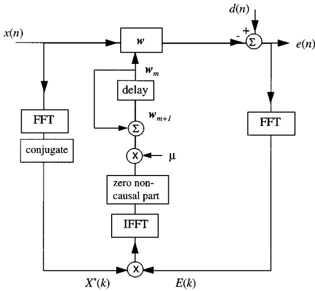
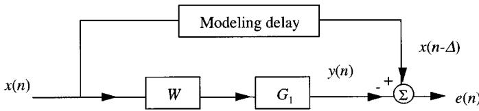
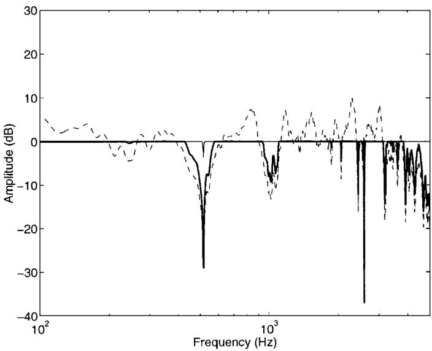
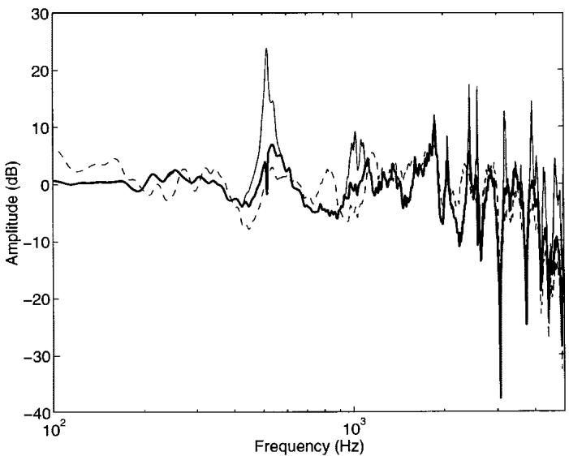
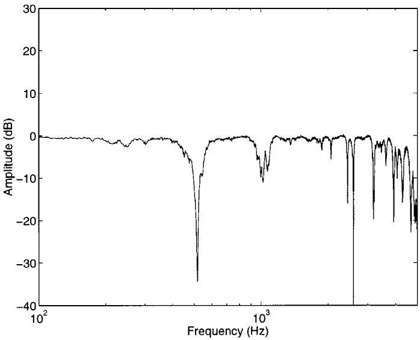
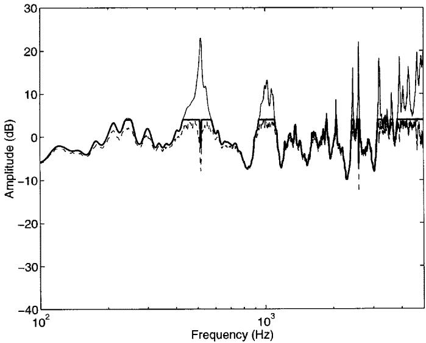
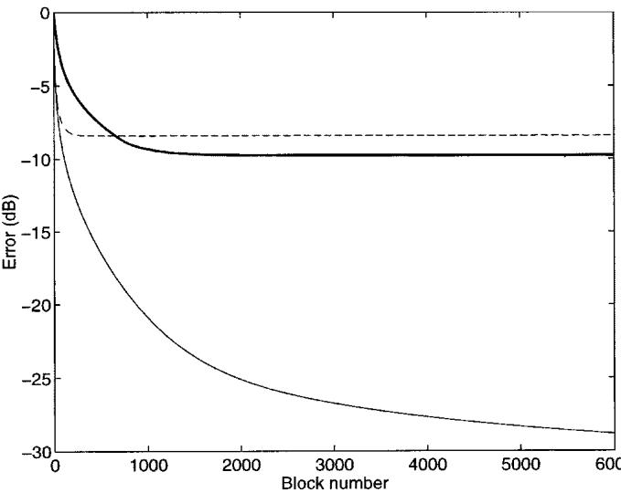

# A Computationally Efficient Frequency-Domain LMS Algorithm with Constraints on the Adaptive Filter

Boaz Rafaely, Member, IEEE, and Stephen J. Elliott, Senior Member, IEEE

Abstract—The frequency-domain implementation of the LMS algorithm is attractive due to both the reduced computational complexity and the potential of faster convergence compared with the time domain implementation. Another advantage is the potential of using frequency-domain constraints on the adaptive filter, such as limiting its magnitude response or limiting the power of its output signal. This paper presents a computationally efficient algorithm that allows the incorporation of various frequency domain constraints into the LMS algorithm. A penalty function formulation is used with a steepest descent search to adapt the filter so that it converges to the new constrained minimum. The formulation ofthe algorithm is derived first, after which the use of some practical constraints with this algorithm and a simulation example for adaptive sound equalization are described.

Index Terms—Adaptive equalizers, adaptive signal processing, digital filters, discrete Fourier transforms, optimization methods.

## I. INTRODUCTION

HE LEAST mean square (LMS) algorithm is widely used in a variety of applications, ranging from speech enhancement and biomedical signal processing [1] to active control of sound and vibration [2]. The frequency-domain implementation of the LMS algorithm [3] is particularly efficient when long adaptive filters are used, due to the reduced computational complexity associated with the fast Fourier transform (FFT) compared with time domain convolution. Another benefit of implementing the LMS algorithm in the frequency domain is improved convergence rate when the convergence coefficient is bin-normalized with respect to the inverse of the power spectral density of the input signal. When the adaptive filter is required to perform prediction, however, the bin-normalization can lead to a biased solution [4], [5], although this can be overcome using appropriate factorization of the convergence coefficient [5].

Recent advances in the field of optimization, together with the development of efficient optimization solvers [6], [7], has motivated the use of constrained optimization in many engineering applications [6], [8]. The ability to specify performance objective functions together with practical constraints can produce engineering solutions that are more suitable for practical implementation than the minimization of unconstrained cost functions. Some examples of practical constraints are limitation on system amplification, stability in face of uncertain parameters, and a limit on the power input to actuators.

Adaptive systems can also be modified to converge to constrained solutions. For example, adaptive feedback systems could employ constraints to maintain stability in the face of plant uncertainty, and adaptive sound equalization systems could use constraints to prevent extreme magnitudes in the equalization filter. Although such adaptive systems could benefit from the addition of constraints, most currently available constrained optimization solvers are computationally complex and are not suitable for real-time implementation on conventional digital signal processing (DSP) hardware in the audio frequency range.

In this paper, a modification of the frequency-domain LMS algorithm is introduced that allows the addition of constraints, formulated as 2-norm and -norm [9] convex constraint functions [10] in the discrete frequency domain. The additional computation complexity introduced with the constraints is not very high because of the relatively simple optimization approach adopted here, which is based on the penalty function formulation and a steepest descent search. Although this optimization approach might be less efficient than other more complex search methods regarding convergence speed [7], [11], it allows a very simple implementation that could be readily programmed into commercially available DSP hardware.

The paper is organized as follows. The frequency-domain LMS is introduced in Section II. Section III presents the general formulation of the constrained algorithm, and examples of practical constraints are presented in Section IV. Finally, an example of adaptive filter for sound equalization is presented in Section V.

## II. FREQUENCY-DOMAIN LMS ALGORITHM

The frequency-domain implementation of the block LMS algorithm [3] is widely used to improve computational efficiency and convergence rate, due to the use of the FFT. However, the frequency-domain LMS algorithm results in a delay of one block of data from filter input to filter output. In applications such as adaptive control, this delay can impair system performance. Therefore, in such applications, a formulation of the LMS algorithm can be used where the filtering is performed in the time domain to avoid the long filtering delay, whereas the correlation involved in the adaptation of the filter coefficients is computed in the frequency domain [12]. In this work, a time domain filtering is assumed, although the results obtained here can be readily applied to the LMS algorithm that employs frequency domain filtering.

  
Fig. 1. Frequency-domain LMS algorithm with time domain filtering and frequency domain adaptation.

A block diagram of the frequency-domain LMS algorithm as used in this work is presented in Fig. 1 and follows the notation used in Shynk [3], except for the implementation of the filtering in the time domain.

A block size of points is assumed so that the adaptive filter is updated after the acquisition of every new block of input data . An FFT size of $2 N$ is used to avoid circular convolution effects [3]. The time-domain filtering equation and the update of the error signal is written as

$$
e (n) = d (n) - \pmb {w} ^ {T} \pmb {x} (n)\tag{1}
$$

where

$$
\pmb {w} = [ w _ {0} w _ {1} \dots w _ {N - 1} ] ^ {T}\tag{2}
$$

is the vector of filter coefficients of size

$$
\pmb {x} (n) = [ x (n) x (n - 1) \dots x (n - N + 1) ] ^ {T}\tag{3}
$$

is the -vector of present and past input samples, and

$$
\pmb {e} (n) = [ e (n) e (n - 1) \dots e (n - N + 1) ] ^ {T}\tag{4}
$$

is the -vector of present and past error samples.

The update equation of the adaptive filter is written as

$$
\pmb {w} _ {m + 1} = \pmb {w} _ {m} + \mu \cdot \mathrm{IFFT} \{X ^ {*} (k) E (k) \} _ {+}\tag{5}
$$

where $\mu$ is the convergence coefficient, and $\{ \cdot \} _ { + }$ denotes the causal part and is equivalent to the causality gradient constraint in [3]. The frequency domain vectors $X ( k )$ and $E ( k )$ of size are calculated using $\mathrm { F F T } { \mathbf { s } }$ on the corresponding time domain vectors as

$$
\begin{array}{l} X (k) = \mathrm{FFT} \left\{\left[ \begin{array}{c c} \boldsymbol {x} ^ {T} (n) & \boldsymbol {x} ^ {T} (n - N) \end{array} \right] ^ {T} \right\} \\ E (k) = \mathrm{FFT} \left\{\left[ \begin{array}{c c} \boldsymbol {0} & \boldsymbol {e} ^ {T} (n) \end{array} \right] ^ {T} \right\} \end{array}\tag{6}
$$

where 0 is an -point zero vector and is used to ensure linear correlation in the update of the adaptive filter [3].

The frequency-domain LMS algorithm minimizes the cost function

$$
J = \pmb {e} ^ {T} (n) \pmb {e} (n) = \sum_ {i = 0} ^ {N - 1} e ^ {2} (n - i)\tag{7}
$$

which is a block-averaged estimate of the cost function $J =$ $E [ e ^ { T } ( n ) e ( n ) ]$ and has been shown convergence properties similar to the LMS algorithm, which minimizes an instantaneous estimate of the cost function $J = E [ e ^ { 2 } ( n ) ] \left[ 3 \right]$ ].

## III. FREQUENCY-DOMAIN LMS ALGORITHM WITH CONSTRAINTS

The frequency-domain LMS algorithm can be modified to include constraints in its objective function, which can represent various limitations imposed on the adaptive system, as described above. Consider the general constrained optimization problem as follows:

$$
\begin{array}{l l} \text {minimize} & J = E \left[ \boldsymbol {e} ^ {T} (n) \boldsymbol {e} (n) \right] \\ \text {subject to} & c _ {i} (\boldsymbol {w}) <   0 \qquad i = 1, \dots , I. \end{array}\tag{8}
$$

This objective function is similar to that minimized by the frequency-domain LMS algorithm, only now, the adaptive filter has to satisfy constraints defined by the functions $c _ { i } ( { \pmb w } )$ . The example presented in Section VI shows how this formulation can be used in signal processing applications, but in this section, a modification of the frequency domain LMS is derived that can integrate constraints as in (8). It is assumed that the constraint functions $c _ { i } ( { \pmb w } )$ are convex functions [10] of the filter coefficients, and although this seems to be a limiting assumption, it is shown later that many practical constraints are convex with respect to .

Since both the objective function and the constraints in (8) are convex, the complete constrained optimization problem is convex and, therefore, has a unique minimum and a well-defined solution, provided a feasible solution exists, i.e., one that satisfies the constraints [11]. The optimization solvers recently developed to solve problems in the form of (8) (see, for example [13]) could provide an efficient solution but are usually computationally expensive and are not suitable for real-time implementation on conventional DSP hardware. The aim here is to develop a simpler solution method that is computationally less expensive and would not significantly increase the computational complexity of the frequency domain LMS algorithm.

The optimization problem in (8) is first reformulated using a penalty function method [7], [11], although a barrier type function could also be used in a similar manner. The penalty function is added to the objective function to penalize the cost for violating the constraints, which ensures that the solution that achieves a minimum value for $J$ is driven away from violating the constraints. The new objective function is written as [11]

minimize

$$
J = E \left[ \pmb {e} ^ {T} (n) \pmb {e} (n) \right] + \sigma \sum_ {i = 1} ^ {I} \left\{\max \left[ c _ {i} (\pmb {w}), 0 \right] \right\} ^ {2}\tag{9}
$$

where the value of $\{ \operatorname* { m a x } [ c _ { i } ( \pmb { w } ) , 0 ] \} ^ { 2 }$ is zero if $c _ { i } < 0$ and the constraint is maintained, or the value is $c _ { i } ^ { 2 }$ if the constraint is violated. In this way, the objective function is equal to $E [ e ^ { T } e ]$ as long as the constraints are maintained, but has an additional penalty value equal to the weighted sum of the squared constraint functions when the constraints are violated. The parameter defines the “tightness” of the penalty function, where a large results in large penalties even for small violation of the constraints, thus ensuring tight maintenance of the constraints, but possibly at the price of producing a more rapidly varying error surface, which might complicate a search for the minimum.

The penalty term $\{ \operatorname* { m a x } [ c _ { i } ( \pmb { w } ) , 0 ] \} ^ { 2 }$ is convex if $c _ { i } ( { \pmb w } )$ is convex since its second derivative with respect to is not negative [10], and therefore, the new penalty-based objective function is also convex. The steepest descent gradient search method can therefore be used to find the minimum of this new cost function.

The gradient of the new cost function with respect to the filter coefficients is now calculated and is then used in the steepest descent search. The gradient of the error variance term is the same as that of the conventional frequency-domain LMS algorithm, as used in (5). The gradient of the penalty term for a given constraint $\mathit { c } _ { i }$ is calculated as

$$
\frac {\partial}{\partial \boldsymbol {w}} \left\{\max \left[ c _ {i} (\boldsymbol {w}), 0 \right] \right\} ^ {2} = \left\{ \begin{array}{c c} 0 & c _ {i} (\boldsymbol {w}) \leq 0 \\ 2 c _ {i} (\boldsymbol {w}) \frac {\partial}{\partial \boldsymbol {w}} c _ {i} (\boldsymbol {w}) & c _ {i} (\boldsymbol {w}) > 0 \end{array} \right\}\tag{10}
$$

where the derivative at $c _ { i } ( { \pmb w } ) = 0$ is zero. To simplify the notation, we introduce the operator $[ c _ { i } ( { \pmb w } ) ] _ { z } ,$ which returns zero if $c _ { i } ( { \pmb w } ) < 0$ and the constrained is maintained, or returns $c _ { i } ( { \pmb w } )$ otherwise. This operator can be implemented using the sign function as

$$
[ c _ {i} ] _ {z} = c _ {i} \frac {\mathrm{sign} (c _ {i}) + 1}{2}.\tag{11}
$$

The sign function will return for $c _ { i } \leq 0$ and 1 for $c _ { i } >$ . Equation (11) can be readily implemented in real time on a conventional DSP processor since both the sign function and multiplication are very efficient DSP operations. The gradient term in (10) can now be written using the new notation as

$$
\frac {\partial}{\partial \pmb {w}} \left\{\max \left[ c _ {i} (\pmb {w}), 0 \right] \right\} ^ {2} = 2 [ c _ {i} (\pmb {w}) ] _ {z} \frac {\partial}{\partial \pmb {w}} c _ {i} (\pmb {w})\tag{12}
$$

and the gradient of the complete penalty term, for all the constraints, as in (9), is written as

$$
\frac {\partial}{\partial \boldsymbol {w}} \sum_ {i = 1} ^ {I} \left\{\max \left[ c _ {i} (\boldsymbol {w}), 0 \right] \right\} ^ {2} = 2 \sum_ {i = 1} ^ {I} \left[ c _ {i} (\boldsymbol {w}) \right] _ {z} \frac {\partial}{\partial \boldsymbol {w}} c _ {i} (\boldsymbol {w}).\tag{13}
$$

The frequency-domain LMS algorithm, as modified to minimize the cost function in (9), will now have a modified update equation that is composed of the gradient terms of both the original objective function and penalty term in (9), which is given by (5) and (13), respectively, as

$$
\begin{array}{l} \boldsymbol {w} _ {m + 1} = \boldsymbol {w} _ {m} + \mu \left(\text {IFFT} \left\{X ^ {*} (k) E (k) \right\} _ {+} \right. \\ \left. + 2 \sigma \sum_ {i = 1} ^ {I} [ c _ {i} (\boldsymbol {w} _ {m}) ] _ {z} \frac {\partial}{\partial \boldsymbol {w}} c _ {i} (\boldsymbol {w} _ {m})\right). \end{array}\tag{14}
$$

The cost function in (9) is convex and, therefore, has a unique, global minimum. The method of steepest descent search described in (14), combined with an appropriate line search to compute a suitable value of $\mu ,$ will yield a search algorithm with guaranteed convergence [11], [14]. Practical line search methods compute $\mu$ such that the value of the cost function is minimized or reduced along the search direction. Alternatively, in the example presented below, a fixed convergence coefficient was used, which was set to be sufficiently small to produce a continuing decrease in the cost function and convergence to the constrained minimum. This approach was taken to avoid the additional computational complexity involved with a line search, although the use of a line search in this algorithm could also be considered to improve the convergence rate. The stochastic nature of the algorithm could also affect its convergence, although due to the block averaging, the estimated quantities are assumed to be sufficiently accurate to enable convergence.

It should be noted that a search method based on the steepest descent method will usually result in slow convergence compared with other methods that involve the second derivative matrix, such as Newton and quasi-Newton methods [14]. The latter methods, however, tend to be more computationally complex and require more memory to store the second derivative matrices. The aim of this work has been to incorporate constraints in the frequency-domain LMS algorithm but with a minimal additional computational load, therefore adopting the steepest descent approach.

An alternative way to restrict the output of the adaptive filter is to introduce an effort weighting term in the form of the leaky LMS algorithm [1], which is simpler to implement in real time. Although this may be useful in many applications, the method proposed here provides a more explicit formulation for including practical constraints, as demonstrated in the example below, and, in many cases, can achieve a better performance than the leaky LMS while remaining within the constraints [15].

## IV. CONSTRAINTS IN PRACTICE

This section describes examples of practical constraints on the adaptive filter. A simulation example of adaptive sound equalization is then presented in the following section. The first constraint considered is a limit on the magnitude of the adaptive filter , calculated as the FFT of , at any frequency. This is useful to avoid excess amplification of the filter at given frequencies and is used below in the adaptive sound equalization example.

The limit on the gain of the adaptive filter at any discrete frequency is defined by the square root of the real vector $L ( k )$ therefore, the constraint equation can be written as

$$
| W (k) | <   \sqrt {L (k)} \qquad k = 0, \dots , N - 1\tag{15}
$$

where the filter gain is constrained to be smaller than 10 $ { \mathrm { o g } } _ { 1 0 } L ( k )$ dB. Equation (15) can be rewritten to define a constraint function $c _ { k }$ as

$$
c _ {k} = | W (k) | ^ {2} - L (k) <   0 \qquad k = 0, \dots , N - 1\tag{16}
$$

where a square absolute value of has been used to simplify the formulation below. This constraint involves the -norm, or the maximum value of $c _ { k } ,$ , ensuring that it is negative for all . The discrete Fourier transform (DFT) operation on is written next in vector form as

$$
W (k) = \sum_ {n = 0} ^ {N - 1} w _ {n} e ^ {- j 2 \pi n k / N} = \pmb {w} ^ {T} \pmb {a} _ {k}\tag{17}
$$

where $\pmb { a } _ { k }$ is a column vector of the complex Fourier exponentials at frequency . Substituting (17) into (16) and writing the modulus square of as the complex value times its conjugate, the constraint at frequency can be written as

$$
c _ {k} = \boldsymbol {w} ^ {T} \left(\boldsymbol {a} _ {k} ^ {*} \boldsymbol {a} _ {k} ^ {T}\right) \boldsymbol {w} - L (k).\tag{18}
$$

Equation (18) is a quadratic equation of the form

$$
c _ {k} = \pmb {w} ^ {T} \mathbf {A} \pmb {w} + d.\tag{19}
$$

Matrix is positive semi-definite [11] since following the derivation above, ${ \pmb w } ^ { T } { \bf A } { \pmb w }$ is equal to $| W ( k ) | ^ { 2 }$ , which is nonnegative for all . This implies that the constraints limiting the magnitude of as in (16) are all convex.

The derivative of $c _ { k }$ with respect to the filter coefficients is required to implement (14) with this constraint. The derivative is given as

$$
\frac {\partial}{\partial \pmb {w}} c _ {k} = 2 \mathbf {A} \pmb {w} = 2 \pmb {a} _ {k} ^ {*} \pmb {a} _ {k} ^ {T} \pmb {w} = 2 W (k) \pmb {a} _ {k} ^ {*}.\tag{20}
$$

The update term in (14) associated with the constraint penalty can be written using the inverse discrete Fourier transform as

$$
\begin{array}{l} 2 \sigma \sum_ {k = 0} ^ {N - 1} \left[ c _ {k} \right] _ {z} \frac {\partial}{\partial \boldsymbol {w}} c _ {k} \\ = 4 \sigma \sum_ {k = 0} ^ {N - 1} \left[ | W (k) | ^ {2} - L (k) \right] _ {z} W (k) \boldsymbol {a} _ {k} ^ {*} \\ = 4 \sigma N \cdot \mathrm{IFFT} \left\{\left[ | W (k) | ^ {2} - L (k) \right] _ {z} W (k) \right\}. \end{array}\tag{21}
$$

The update equation for the adaptive filter can now be written, omitting the explicit dependence on $k ,$ as

$$
\boldsymbol {w} _ {m + 1} = \boldsymbol {w} _ {m} + \mu \cdot \operatorname{IFFT} \left\{X ^ {*} E + 4 \sigma N \cdot \left[ | W | ^ {2} - L \right] _ {z} W \right\} _ {+}.\tag{22}
$$

This update equation requires some additional multiplications over the conventional frequency-domain LMS algorithm, but its computational complexity is not significantly higher.

Another constraint is to limit the power of the filter output signal. This constraint is useful when the adaptive filter is used to drive an external actuator, such as a loudspeaker, since it can be used to ensure that the actuator is not overloaded. Denoting the input signal to the adaptive filter as and its output as $u ,$ the power limit constraint can be written in terms of the 2-norm of signal

$$
| | u | | _ {2} ^ {2} <   p\tag{23}
$$

where the constant $p$ is the power limit. An instantaneous estimate of the power can be calculated in the frequency domain using a block of input data as

$$
\frac {1}{N} \sum_ {k = 0} ^ {N - 1} | X (k) W (k) | ^ {2} <   p.\tag{24}
$$

Equation (24) can be rewritten to define the constraint function (note that in this case there is only one constraint) as

$$
c = \frac {1}{N} \sum_ {k = 0} ^ {N - 1} | X (k) W (k) | ^ {2} - p <   0.\tag{25}
$$

Substituting (17), which is the DFT of , into (25), the constraint is written as

$$
c = \frac {1}{N} \sum_ {k = 0} ^ {N - 1} \pmb {w} ^ {T} \left(\pmb {a} _ {k} ^ {*} | X (k) | ^ {2} \pmb {a} _ {k} ^ {T}\right) \pmb {w} - p.\tag{26}
$$

This is a quadratic equation of the form $c = { \pmb w } ^ { T } { \bf A } { \pmb w } + d ,$ with matrix being positive semi-definite since following the derivation above, $\pmb { w } ^ { \bar { T } }$ is equal to $\begin{array} { r } { \sum _ { k } | X ( k ) W ( k ) | ^ { 2 } } \end{array}$ , which is non-negative for all . The power constraint is, therefore, convex.

The derivative of the constraint function with respect to the filter coefficients is given by

$$
\begin{array}{r l} & {\frac {\partial}{\partial \pmb {w}} c = 2 \mathbf {A} \pmb {w}} \\ & {\qquad = \frac {2}{N} \sum_ {k = 0} ^ {N - 1} \pmb {a} _ {k} ^ {*} | X (k) | ^ {2} \pmb {a} _ {k} ^ {T} \pmb {w}} \\ & {\qquad = \frac {2}{N} \sum_ {k = 0} ^ {N - 1} | X (k) | ^ {2} W (k) \pmb {a} _ {k} ^ {*}.} \end{array}\tag{27}
$$

The update term in (14) associated with the constraint penalty can be written as

$$
\begin{array}{l} 2 [ c ] _ {z} \frac {\partial}{\partial \boldsymbol {w}} c = 4 \left[ \frac {1}{N} \sum_ {k = 0} ^ {N - 1} | X (k) W (k) | ^ {2} - p \right] _ {z} \\ \cdot \frac {1}{N} \sum_ {k = 0} ^ {N - 1} | X (k) | ^ {2} W (k) \boldsymbol {a} _ {k} ^ {*} \\ = 4 \cdot \text {IFFT} \left\{\left[ \frac {1}{N} \sum_ {k = 0} ^ {N - 1} | X (k) W (k) | ^ {2} - p \right] _ {z} \right. \\ \left. \cdot | X (k) | ^ {2} W (k) \right\}. \end{array}\tag{28}
$$

The update equation for the adaptive filter can now be written, omitting the explicit dependency on , as

$$
\boldsymbol {w} _ {m + 1} = \boldsymbol {w} _ {m} + \mu o \mathrm{IFFT} \left\{X ^ {*} E + 4 \sigma [ P - p ] _ {z} | X (k) | ^ {2} W \right\} _ {+}\tag{29}
$$

where $P$ is a scalar denoting the power estimate, which can be computed either in the frequency domain using (24) or in the time domain using (23). Although this update equation requires additional multiplications over the conventional frequency-domain LMS algorithm, it is not significantly more computationally expensive.

Another constraint that would be useful if the adaptive filter is part of an adaptive feedback controller is a constraint on robust stability [9]. This constraint ensures that the feedback system will remain stable under given variations or uncertainty in the system under control. An internal model control (IMC) configuration [16] can be employed in this situation, which allows the use of feedforward adaptation techniques [17] and, therefore, enable the LMS algorithm to be implemented in a feedback controller. Time-domain configurations of such a controller have been examined for active sound control [18], but similar systems can also be implemented in the frequency domain. The robust stability constraint in this case can be written as [16]

  
Fig. 2. Block diagram of an adaptive sound equalization system.

$$
c _ {k} = | W (k) G (k) B (k) | ^ {2} - 1 <   0 \qquad k = 0, \dots , N - 1\tag{30}
$$

where $G$ is a model of the system under control, or the plant, and $B$ is the bound of the multiplicative uncertainty of the plant [9], both of which can be obtained from measured data [8]. Equation (30) has a similar structure to (16); therefore, the resulting update equation will also have a similar form and can be written as

$$
\begin{array}{c} \boldsymbol {w} _ {m + 1} = \boldsymbol {w} _ {m} + \mu o \text {IFFT} \left\{X ^ {*} E + 4 \sigma N \cdot [ | W G B | ^ {2} - 1 ] _ {z} \right. \\ \cdot | G B | ^ {2} W \bigg \} _ {+}. \end{array} \tag {3}\tag{31}
$$

This will guarantee that the adaptive controller will be robust to variations in the plant, although the stability analysis in this case is complicated by the fact that both adaptive stability and closed-loop stability have to be considered [18], [19].

## V. EXAMPLE—ADAPTIVE SOUND EQUALIZATION

Adaptive sound equalization is used in sound reproduction systems, for example, to compensate for amplitude distortion caused by the frequency response of the acoustic path and the loudspeaker [20]. The signal to be reproduced is filtered prior to driving the loudspeaker to correct any such distortion. A microphone can be placed to detect the reproduced sound and used as an on-line reference for an adaptive filter to equalize the sound in real time. Elliott et al. [21] showed that good equalization of the acoustic path in the enclosure of a car can be achieved using adaptive filtering.

Fig. 2 shows a block diagram of an adaptive sound equalization system, where an adaptive filter $W$ is used to model the inverse of the acoustic path $G _ { 1 } . \mathrm { A }$ modeling delay is introduced to ensure that performance is not limited by causality constraints on the adaptive filter. With a minimum error, the acoustic signal measured by the microphone will be an estimate of the delayed input signal , and the acoustic path will therefore not affect its amplitude response significantly.

Although good equalization could be achieved at the microphone position, very poor equalization might be achieved at other locations due the variability in the frequency response of the acoustic path [21]. For example, the equalization filter might have significant peaks to compensate for notches in the acoustic path at the microphone position. At other positions, however, these notches will occur at other frequencies since they originate from interference between acoustic modes [20], therefore suffering from distorted sound at the peak filter frequencies. To avoid this distortion, a gain limit can be imposed on the adaptive filter, as proposed in the previous section.

  
Fig. 3. Magnitude response of unequalized path $G _ { 1 }$ from loudspeaker to microphone (dashed curve), and equalized response, $| W G _ { 1 } | ,$ using the conventional frequency-domain LMS (solid thin curve), and the frequency-domain LMS with magnitude constraint of 4 dB (solid thick curve).

An adaptive frequency domain LMS filter has been designed around the system in Fig. 2 with an additional constraint on the magnitude of the adaptive filter as developed above. The frequency response $G _ { 1 }$ between a loudspeaker and a microphone in an enclosure was measured and used in the simulations below to estimate the equalization at the microphone location. Matlab simulations of the various frequency-domain LMS algorithms presented above were performed with a sampling frequency of 10 kHz and a block size of 2048 samples, allowing several thousand block iterations for convergence.

Fig. 3 shows the magnitude response of the acoustic path $G _ { 1 }$ (dashed curve), when equalized $( W G _ { 1 } )$ with the conventional frequency domain LMS as in (5) (thin solid curve), and with the frequency domain LMS with an upper bound of dB on the filter magnitude as in (22) (thick solid curve). It is clear that without any constraints, the conventional LMS algorithm produces a better equalized response since it compensates for almost all notches and peaks in the magnitude. The frequency-domain LMS with the constraint on the magnitude cannot compensate for all the notches, which requires a filter response with large magnitude. Nevertheless, the frequency-domain LMS with the constraint achieves good equalization at most frequencies.

Another response from the loudspeaker input to the output of a microphone placed 10 cm from the equalization microphone, which is denoted by $G _ { 2 } ,$ was measured and is shown in Fig. 4 (dashed curve). As can be seen, this response is different from $G _ { 1 }$ ; therefore, the filters designed to equalize $G _ { 1 }$ will not produce good sound equalization of $G _ { 2 }$ . Fig. 4 shows that the equalization with the constrained frequency-domain LMS is poorer than the equalization of $G _ { 1 }$ , although no extreme peaks are observed. However, with the conventional frequency-domain LMS, a peak of over 20 dB is observed around 500 Hz due to the amplification produced by the equalization filter at this frequency with additional peaks at the higher frequencies. This will result in a reproduced sound with very poor audibility at locations away from the equalization microphone.

  
Fig. 4. Magnitude response of unequalized path $G _ { 2 }$ from loudspeaker to location 10 cm from the equalization microphone (dashed curve) and corresponding equalized response $| W G _ { 2 } |$ using the conventional frequency-domain LMS (solid thin curve) and the frequency-domain LMS with magnitude constraint of 4 dB (solid thick curve), where both are designed to equalize the response to the microphone $G _ { 1 }$

It is clear, then, that due to the spatial variability of the sound field, the equalization filter must not produce large peaks if a reasonable equalization is to be achieved at locations other than the equalization microphone. This is accurately achieved using the frequency-domain LMS proposed here with a constraint on its magnitude. It should be noted that the acoustic path can change due to movements of people around the enclosure, for example, so that an adaptive filter is necessary in this case to maintain good equalization at all times.

An alternative algorithm that could be used to limit the gain of the adaptive filter is the leaky LMS [1] with a leak factor used in the following adaptation equation:

$$
\pmb {w} _ {m + 1} = \gamma \pmb {w} _ {m} + \mu \cdot \mathrm{IFFT} \left\{X ^ {*} (k) E (k) \right\} _ {+}.\tag{32}
$$

With $\gamma$ set to a value smaller than one, the filter will tend to reduce its gain. This algorithm in its time-domain or frequencydomain form is widely used in practice to avoid instability. The leaky frequency domain LMS has been used here to equalize the acoustic path $G _ { 1 }$ with $\gamma$ chosen such that the maximum magnitude of the resulting filter is limited to about 4 dB. Fig. 5 shows the equalized response, which can be compared with the other algorithms in Fig. 3. Although a reasonable equalization is achieved, the use of the leak factor has affected the response at all frequencies, and by limiting the gain due to peaks in one frequency range, the equalization is degraded at other frequencies. This is in contrast to the algorithm suggested here, where only the frequencies that violate the constraint are affected. Furthermore, the value of $\gamma$ that will produce the required limit on magnitude has to be found by trial and error and can change with changing level of the input signal, for example. In the algorithm suggested here, the constraint on the gain is explicit and can be accurately defined.

  
Fig. 5. Magnitude response of equalized response $| W G _ { 1 } |$ using the leaky frequency-domain LMS with the leak chosen to limit the filter magnitude to about 4 dB.

  
Fig. 6. Magnitude response of equalization filters after convergence corresponding to the conventional frequency-domain LMS (thin solid curve), the leaky frequency-domain LMS (dashed curve), and the frequency-domain LMS with constraint on its magnitude (thick solid curve).

Fig. 6 shows the magnitude response of the equalization filters described above with the conventional frequency-domain LMS (thin solid curve) producing large peaks, and the LMS with constraint (thick solid curve) and leaky LMS (dashed curve) having more moderate responses. The figure clearly shows how the magnitude of the filter with the constraint is accurately limited to 4 dB at several frequency ranges.

Fig. 7 presents the block-averaged error as a function of the block number for the duration of the adaptation for all three adaptation schemes. The conventional frequency-domain LMS (thin solid curve) takes the longest to converge but produces the smallest equalization error. The LMS with the constraint (thick solid curve) and the leaky LMS (dashed curve) converged after fewer iterations but produced larger equalization errors. It should be noted that a smaller convergence coefficient was used for the LMS with the constraint to ensure convergence, which accounts for the slower convergence of this algorithm in the initial part of the adaptation.

  
Fig. 7. Magnitude of block-averaged error as a function of block number for the conventional frequency domain LMS (thin solid curve), the leaky frequency domain LMS (dashed curve), and the frequency domain LMS with constraint on its magnitude (thick solid curve).

## VI. CONCLUSIONS

A new formulation of the LMS algorithm in the frequency domain has been presented, which allows the incorporation of practical frequency-domain constraints in the adaptive filter. The algorithm is computationally efficient, although it may converge more slowly than other more complex constrained optimization search methods, or the simpler leaky LMS algorithm, due to the simple approach of using penalty functions and the steepest descent search. Nevertheless, it allows the explicit use of constraints, which are often required in practical applications, as demonstrated in the sound equalization simulation. The real-time implementation of the algorithm and computationally efficient methods to improve its convergence rate are suggested for future studies.

## REFERENCES

[1] B. Widrow and S. D. Stearns, Adaptive Signal Processing. Englewood Cliffs, NJ: Prentice-Hall, 1985.

[2] P. A. Nelson and S. J. Elliott, Active Control ofSound. London, U.K.: Academic, 1992.

[3] J. J. Shynk, “Frequency-domain and multirate adaptive filtering,” IEEE Signal Processing Mag., vol. 9, pp. 14–37, Jan. 1992.

[4] A. Feuer and R. Cristi, “On the steady state performance of frequency domain LMS algorithms,” IEEE Trans. Signal Processing, vol. 41, pp. 419–423, Feb. 1993.

[5] S. J. Elliott and B. Rafaely, “Rapid frequency domain adaptation of causal FIR filters,” IEEE Signal Processing Lett., vol. 4, pp. 337–339, Dec. 1997.

[6] S. Boyd, L. Vandenberghe, and M. Grant, “Efficient convex optimization for engineering design,” in Proc. IFAC Symp. Robust Contr. Design, Rio de Janeiro, Brazil, Sept. 1994, pp. 14–23.

[7] B. Rustem, Algorithms for Nonlinear Programming and Multiple Objective Decisions. New York: Wiley, 1998.

[8] B. Rafaely and S. J. Elliott, “H /H-infinity active control of sound in a Headrest: Design and implementation,” IEEE Trans. Contr. Syst. Technol., vol. 7, pp. 79–84, Jan. 1999.

[9] S. Skogestad and I. Postlethwaite, Multivariable Feedback Control. Chichester, U.K.: Wiley, 1996.

[10] W. Roberts and D. E. Varberg, Convex Functions. New York: Academic, 1973.

[11] R. Fletcher, Practical Methods of Optimization. New York: Wiley, 1987.

[12] R. Morgan and J. C. Thi, “A delayless subband adaptive filter architecture,” IEEE Trans. Signal Processing, pp. 1819–1830, Aug. 1995.

[13] A. Grace, Matlab Optimization Toolbox. Natick, MA: The Math-Works, Inc., 1995.

[14] P. E. Gill, W. Murray, and M. H. Wright, Practical Optimization. New York: Academic, 1991.

[15] S. J. Elliott and B. Rafaely, “Frequency-domain adaptation of feedforward and feedback controllers,” in Proc. ACTIVE Conf., Budapest, Hungary, 1997, pp. 771–787.

[16] M. Morari and E. Zafiriou, Robust Process Control. Englewood Cliffs, NJ: Prentice-Hall, 1989.

[17] S. J. Elliott, T. J. Sutton, B. Rafaely, and M. Johnson, “Design of feedback controllers using a feedforward approach,” in Proc. ACTIVE Conf., 1995, pp. 863–874.

[18] B. Rafaely and S. J. Elliott, “Adaptive internal model controller—Stability analysis,” in Proc. INTER-NOISE Conf., Liverpool, U.K., July 1996, pp. 983–988.

[19] A. Datta, Adaptive Internal Model Control. New York: Springer-Verlag, 1998.

[20] M. Tohyama, H. Suzuki, and Y. Ando, The Nature and Technology of Acoustic Space. London, U.K.: Academic, 1995.

[21] S. J. Elliott et al., “Practical implementation of low-frequency equalization using adaptive digital filters,” J. Audio Eng. Soc., vol. 42, pp. 988–998, Dec. 1994.

Boaz Rafaely (S’95–M’98) received the B.Sc. degree (cum laude) in electrical engineering from Ben-Gurion University, Beer Sheva, Israel, in 1986, the M.Sc. degree in biomedical engineering from Tel-Aviv University, Tel-Aviv, Israel, in 1994, and the Ph. D. degree in 1997 from the Institute of Sound and Vibration Research (ISVR), Southampton University, Southampton, U.K

He is currently a Lecturer at the ISVR and the organizer of the modular M.Sc. in applied digital signal processing. His research interests include active control of sound and vibration, with applications of headset and headrest stystems, robust controllers design using convex optimization, adaptive systems in the frequency domain, control of feedback in hearing aids, and acoustics for communication.

Stephen J. Elliott (SM’92) received the B.Sc. degree in physics and electronics from the University of London, London, U.K., in 1976 and the Ph.D. degree from the University of Surrey, Surrey, U.K., in 1979 for a dissertation on musical acoustics.

After a short period as a Research Fellow at the Institute of Sound and Vibration Research (ISVR), Southampton University, Southampton, U.K., working on acoustic intensity measurement and as a temporary Lecturer at the University of Surrey, he was appointed Lecturer at the ISVR in 1982.

He was made Senior Lecturer at ISVR in 1988 and Professor in 1994. His research interests have been mainly concerned with the connections between the physical world and digital signal processing, originally in relation to the modeling and synthesis of speech and, more recently, in relation to the active control in propeller aircraft, cars, and helicopters. His current research interests include the active control of structrural waves active isolation, adaptive algorithms for feedforward and feedback control, the control of nonlinear systems, and biomedical signal processing and control. He is co-author of Active Control of Sound (with P. A. Nelson) and Active Control of Vibration (with C. R. Fuller and P. A. Nelson).

Dr. Elliott is a Member of the Acoustical Society of America and the U.K. Institute of Acoustics, from whom he was jointly awarded the Tyndall Medal in 1992.