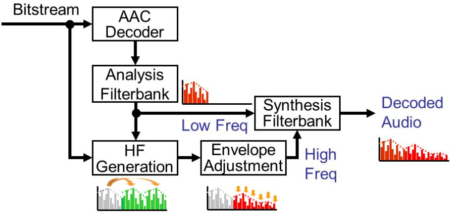
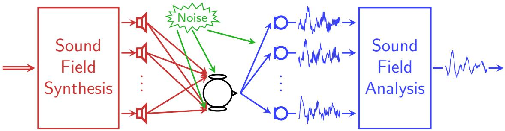
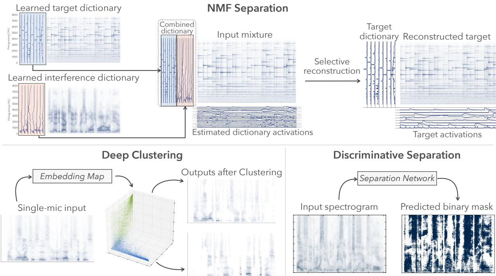
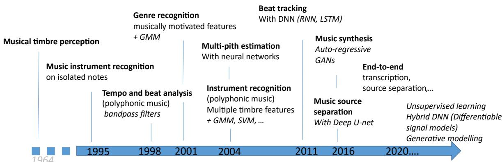
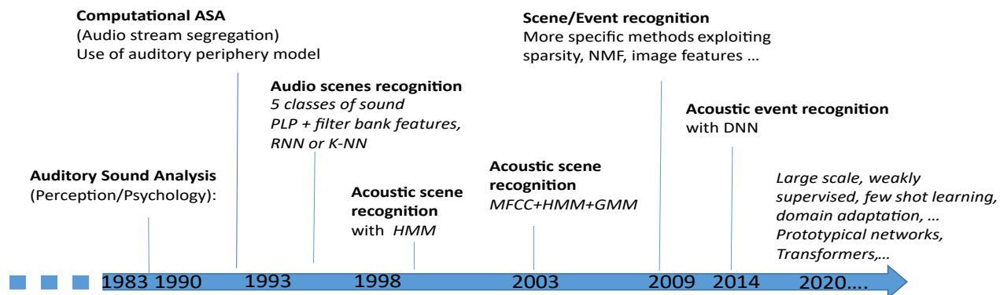

Audio Signal Processing in the 21st Century Gaël Richard, Paris Smaragdis, Sharon Gannot, Patrick A Naylor, Shoji Makino, Walter Kellermann, Akihiko Sugiyama

## To cite this version:

Gaël Richard, Paris Smaragdis, Sharon Gannot, Patrick A Naylor, Shoji Makino, et al.. Audio Signal Processing in the 21st Century. IEEE Signal Processing Magazine, 2023, f10.1109/MSP.2023.3276171f. hal-04112575

HAL Id: hal-04112575 https://telecom-paris.hal.science/hal-04112575

Submitted on 31 May 2023

HAL is a multi-disciplinary open access archive for the deposit and dissemination of scientific research documents, whether they are published or not. The documents may come from teaching and research institutions in France or abroad, or from public or private research centers.

L’archive ouverte pluridisciplinaire HAL, est destinée au dépôt et à la difusion de documents scientifiques de niveau recherche, publiés ou non, émanant des établissements d’enseignement et de recherche français ou étrangers, des laboratoires publics ou privés.

TC-AASP - 25 YEARS

# Audio Signal Processing in the $2 1 ^ { s t }$ Century

Gael Richard, Paris Smaragdis, Sharon Gannot, Patrick A. Naylor, Shoji Makino, Walter Kellermann,¨ Akihiko Sugiyama

## I. INTRODUCTION

Audio signal processing has seen many landmarks in its development as a research topic. Many are well-known, such as the development of the phonograph in the second half of the nineteenth century and technology associated with digital telephony that burgeoned in the late twentieth century and is still a hot topic in multiple guises. Interestingly, the development of audio technology has been fuelled not only by advancements in the capabilities of technology but also by high consumer expectations and customer engagement. From surround sound movie theatres to the latest in-ear devices, people love sound and soon build new audio technology into their daily lives as an essential and expected feature.

Some of the major outcomes of the research in Audio and Acoustic Signal Processing prior to 1997 were summarized in the landmark paper published on the occasion of the 50th anniversary of the signal processing society [1]. At that time, the vast majority of work was driven by the objective to build models that capture the essential characteristics of the analyzed audio signal and to represent it with a limited set of parameters or components. The field has now evolved beyond the essential characteristics explored in the past. For instance, a wide variety of speech/audio signal models have since been proposed and in particular around signal decomposition/factorization models and sparse signal representations.

Nevertheless, the entire research domain covered by the IEEE Technical Committee (TC) on Audio and Acoustic Signal Processing (AASP), is recently witnessing a paradigm shift towards data-driven methods based on machine learning and especially deep learning.

In many applications, such data-driven models obtain state-of-the-art results if appropriate data is available to train the models. This has accompanied sustained efforts to gather highly valuable and public data collections (and in particular annotated data) which are in fact essential for data-driven algorithms. Concurrently, to promote reproducible research and to identify the state-of-the-art methods, a number of challenges were launched, for instance in Acoustic Characterisation of Environments (ACE), Reverberant speech processing (REVERB), Acoustic Source Localization and Tracking (LOCATA), source separation (SiSEC), Acoustic Echo Cancellation Challenge (AEC), Deep Noise Suppression (DNS) dedicated to single-microphone noise reduction, or Detection and Classification of Acoustic Scenes and Events (DCASE) which is a yearly event since 2016.1,2,3,4

Without aiming for exhaustiveness, the paper provides a view of the important outcomes of the field in the last 25 years illustrating also the emergence of purely data-driven models. In particular, the paper covers the research addressed in signal models and representations, in the modeling, analysis, and synthesis of acoustic environments and acoustic scenes, in signal enhancement and separation, in Music Information Retrieval (MIR), and Detection and Detection and Classification of Acoustic Scenes and Events (DCASE).

The overall structure of the paper is as follows: we discuss in Section II the main axes of progress and highlights of the domain underlining the evolution and breakthroughs of the field. We then focus in Section III on the new topics that have mostly emerged in the last 25 years before suggesting some conclusions and perspectives.

## II. ADVANCES AND HIGHLIGHTS (EVOLUTION AND BREAKTHROUGH)

Building upon the achievements prior to 1997 already discussed in [1], we summarize in this section the key advances and highlights of recent years.

## A. Modeling and representation

We first discuss herein the developments in audio coding and signal modeling with a focus on multichannel audio channel coding. We then describe some of the important work pursued in modeling, analysis, and synthesis of acoustic environments with specific highlights on room impulse response analysis and synthesis.

1) Coding and signal modeling: Audio coding is a long-standing topic in the field and has led to several international standards.5

The field had its golden age in the ’90s with the first international standard of audio coding; MPEG1 Audio (11172-3: 1993) and its extension to multichannel signals up to 5 channels; MPEG2 Audio (13818-3; 1995). MPEG2 Audio was developed for multichannel and multilingual applications such as digital radio broadcasting in Europe with backward compatibility with MPEG1.

Though, without the backward compatibility constraint, much higher subjective quality was successfully achieved with MPEG2 AAC (Advanced Audio Coding, 13818-7: 1997). It is still the foundation of today’s audio coding algorithms and is employed in terrestrial TV broadcasting in Japan and Latin America. From a viewpoint of applications, MPEG4 AAC (14496-3: 2009) and MPEG4 HE-AAC (14496-3:2009/Amd 7:2018) achieve sufficient audio quality at 64 kbit/s and 32 kbit/s, respectively, for mobile applications and are most widely used today.

One of the major improvements is brought by bandwidth extension (BWE) also known as subband replication (SBR) which encodes only the low-frequency subband plus high-frequency power envelope information thereby reducing the bitrate with inaudible quality degradation. The decoder copies the low-frequency spectrum to the highfrequency band and adjusts the envelope by the transmitted envelope information to reconstruct the fullband audio (see Fig. 1). MPEG4 AAC and HE-AAC are used in various consumer products such as PCs, tablet PCs, mobile phones, and car navigation systems to name a few.

5The ISO/IEC audio coding standards are accessible at https://www.iso.org/standards.html by providing the search window with the number and the year in the parenthesis.

  
Fig. 1. Bandwidth extension (BWE) principle.

The history of MPEG1 Audio through MPEG4 HE-AAC was to remove redundancy of the input audio in the frequency domain (transform coding), time domain (prediction), and spatial domain (multichannel coding). The next stage of MPEG Audio, MPEG Surround (23003-1: 2007), also known as MPS, exploits further redundancy in the spatial domain based on binaural cue coding [2]. A multichannel audio signal is decomposed into a monaural signal and additional spatial information in the form of interaural level difference (ILD), and interaural time difference (ITD) in multiple time-frequency tiles (segments). The monaural data are encoded by MPEG4 AAC with a little side information representing ILD and ITD. MPEG Surround achieves comparable quality to MPEG4 AAC at one-third of the MPEG4 AAC bitrate. The absolute subjective quality is transparent to the source signal that is suitable for content delivery between geographically distributed studios. MPEG SAOC (Spatial Audio Object Coding, 23003-2: 2010) removes redundancy of the input audio based on the composition of each audio object. The input audio signal consists of multiple audio objects which are independent audio sources such as individual musical instruments. Each audio object is expressed in multiple frequency tiles by an Object Level Differences (OLD) and an Inter-Object Cross Coherences (IOC). The OLD is the relative energy to the energy of the downmix signal that is a combination of the audio objects. The IOC is the cross-correlation to the downmix signal. The downmix signal of multiple objects is encoded by MPEG4 AAC whereas the OLD and the IOC of each object are encoded as side information. The decoder recovers each object from the downmix signal, OLD, and IOC. A direct link to MPEG SAOC can also be made with the line of work developed simultaneously in parallel on (coding-based) informed source separation [3].

Until MPEG SAOC, speech-dominant audio signals and more general audio signals had been encoded with different algorithms. MPEG USAC (Unified Speech and Audio Coding, 14496-3:2009/Amd 3:2012) is the first audio coding framework which automatically switches between the speech-oriented algorithm and the audio-oriented algorithm based on the input-signal analysis result in multiple time-frequency tiles. The most recent member of the MPEG Audio family is MPEG-H (23008-3: 2019) which is a generic coding including 3D audio (HOA or higher-order ambisonics).

The most successful application of audio coding is portable audio players represented by Apple’s iPod. The first prototype was the Silicon Audio developed in 1994 which is a precursor of iPod first put in the market in 2001. Audio players were later extended to include video-data processing. The iPhone released in 2007 was the first in the world, which was combined with a large display to make a tablet PC or with a tiny display to make a smart watch. A history of these personal handy terminals can be found in [4]. Nevertheless, despite their immense success, audio players are now gradually being replaced by music streaming

## 2) Acoustic environments modeling, analysis, and synthesis:

a) Modeling and analysis of acoustic impulse responses: Sound propagation in acoustic enclosures is characterized by multiple reflections and the addition of noise, both associated with the acoustic environment. When an acoustic signal propagates in an echoic environment it is reflected by the room facets and the objects in the enclosure, resulting in the reverberation phenomenon. The acoustic impulse responses (AIRs) that relate sound sources and microphones are usually a few hundred milliseconds in duration, corresponding to a few thousand taps in discrete-time filtering at typical sampling rates. The decay rate of acoustic energy in an acoustic environment is measured by the reverberation time, $T _ { 6 0 } { \mathrm { : } }$ , the time it takes for the exponentially decaying power profile of the reverberation tail to decay by $^ { 6 0 }$ dB from its initial value. Typical offices have $T _ { 6 0 }$ around 300-400 ms and larger rooms can approach 1 s, depending on the volume, shape, and materials. The perceived reverberation also depends on the ratio between the direct path (including the early reflections) and the power of the tail, denoted direct-toreverberant ratio (DRR). In the same environment, distant sources will exhibit lower DRR and will be perceived as more reverberant.

Reverberation can degrade the quality of a speech signal and, in severe cases, particularly in noise, also its intelligibility. The word error rate (WER) of automatic speech recognition (ASR) systems is usually severely impacted by high reverberation levels, especially for low DRR.

An AIR encompasses the entire reflection pattern, comprising the direct path, the early reflections (consisting of several distinguishable arrivals), and the late reflection tail, with an exponentially decaying power profile. The latter part is the main cause of the reverberation phenomenon.

When an acoustic environment is a room, its AIR is referred to as a room impulse response (RIR). Room acoustics, even in mild reverberation conditions, should be taken into account when designing acoustic signal processing algorithms, and failing to do so may severely degrade their performance. Modeling and accurately analyzing the properties of the RIR is therefore of crucial importance.

b) Room simulators, RIR datasets, and sound field generators: Acoustic signal processing algorithms should be evaluated under reverberant conditions. This can be achieved by either using recorded RIRs or using room simulators. The outcome of such simulators may indeed be less accurate, but using them allows researchers in the field to generate a vast number of examples. This has recently become extremely important with the emergence of machine learning algorithms that require a large volume and diversity of training data. The field has evolved from the pioneering work in acoustics by Schroder (frequency-domain modeling), Polack (time-domain modeling)¨ and Allen and Berkely (the image method) [5]. Based on these models (especially the image method), many RIR generators were developed: the RIR generator,6 PyRoomAcoustics,7 and gpuRIR.8 Using these generators, one can evaluate the performance of audio processing algorithms and also train data-driven methods. Recent advances improve the RIR generation using data-driven methods, usually generative adversarial networks (GANs).

Databases of real-world RIRs are also available, facilitating reliable evaluation of algorithms.9,10,11 In parallel, noise field generators were also proposed, including isotropic noise12 and wind noise.13

c) Inference of room characteristics: The parameters characterizing the acoustic properties of an enclosure can be inferred from the AIR or from the reverberant sound itself. These parameters can be used in the development of audio processing algorithms and also in rendering acoustic scenes. Reverberation time, $T _ { 6 0 }$ , and DRR were already mentioned above. The coherent-to-diffuse power ratio (CDR) is another attribute of the sound field that determines the impact of the reverberation and depends on the source-microphone distance and the reverberation time. If the direct path and early reflections are dominant, the sound is perceived as more coherent, less diffuse, and less reverberant. The Acoustic Characterisation of Environments (ACE) challenge14 was dedicated to developing and benchmarking estimation procedures for the above room acoustic parameters. A recent database of RIRs with annotated reflections (“dEchorate”) can be used to advance research further in this direction.15

d) Generation of artificial reverberation: Another thriving research direction is the generation of artificial reverberation, with the most popular method being feedback delay networks [6]. Traditionally (from the pioneering work of Schroder), these algorithms have been widely used in music production, and now find applications in new¨ fields, such as game audio including virtual and augmented reality.

A different angle of research would rather consider geometric approaches which rely on physics-based models. The image method remains untractable for modeling late reverberation, especially of large rooms. The Radiance Transfer Method (RTM) was introduced to overcome this limitation as it can model diffuse reflections and sound energy decay of the late reverberation [7]. Although complex, it was later shown that RTM can be linked to feedback delay networks to build efficient geometry-based reverberators [8].

## B. Analysis of acoustic scenes

Here we explore the field of acoustic scene analysis, using microphone arrays that are either arranged in structured constellations (e.g., spherical or circular) or arbitrarily distributed in the acoustic enclosure. We discuss the localization of sound sources and basic concepts of data-independent spatial filtering. We further discuss wavedomain representations using the cylindrical or spherical harmonics domain [9]. While originating from soundfield rendering and microphone array beamforming, these representations are now frequently used for, e.g., source localization, echo cancellation, active noise control, and blind source separation which are discussed below.

1) Acoustic sensor networks: Recent technological advances in the design of miniature and low-power devices enable the deployment of so-called wireless acoustic sensor networks (WASNs). A WASN consists of multiple (often battery-powered) microphone nodes, each of which is equipped with one or more microphones, a signal processing unit, and a wireless communication module. The large spatial distribution of such microphone constellations yields a large amount of spatial information and consequently increases the probability that a subset of the microphones (node) is close to a relevant sound source. Many daily-life devices are now equipped with multiple microphones and considerable audio processing capabilities. These technological advancements significantly pushed the research forward. WASNs find applications in hearing devices, speech communication systems, acoustic monitoring, ambient intelligence, and more.

However, new challenges arise in these new ad hoc architectures. Typically, for a spatially extended network, the utility of sensors for a given task should be assessed, and for coherent signal processing of multiple sensor nodes, the signals must be synchronized. In particular, when data centralization is not possible, either due to the lack of a dedicated central processing device or due to overly demanding transmission/processing requirements, one must rely on distributed processing, where nodes only share compressed/fused microphone signals with each other. The according modifications for the various algorithms, e.g., for beamforming, will be discussed along with their non-distributed versions below. First steps have also been taken to consider a moving robot as part of an acoustic sensor network.

2) Localisation and tracking: Speaker localization algorithms, mainly time-difference of arrival (TDoA) and direction of arrival (DoA) estimation emerged already in the ’70s, with solutions based on normalized crosscorrelation between the signals received by a pair of microphones, the so-called generalized cross-correlation (GCC), and were later extended to multi-microphone solutions, most notably the steered response power phase transform (SRP-PHAT) [10], which steers a beam toward all candidate directions. Especially for simultaneously localizing multiple sources, generic frequency estimation or direction-finding algorithms (such as MUSIC (MUltiple SIgnal Classification) or ESPRIT (Estimation of Signal Parameters via Rotational Invariance Techniques)) were also adapted to acoustic applications, most prominently to the cylindrical and spherical harmonics domain. While TDoA and DoA estimation dominate localization efforts, efficient range estimation based on soundfield characteristics, e.g., the CDR, has been demonstrated and applied for position estimation in WASNs [11].

In later years there were many attempts to incorporate statistical methods that can also facilitate tracking of sources in dynamic scenarios, including Bayesian methods, e.g., nonlinear extensions of the Kalman filter, particle filters and probability hypothesis density (PHD) filters, and non-Bayesian methods, e.g. recursive expectation-maximization (REM).

Acoustic reflections may degrade the performance of localization and tracking algorithms, especially in highly reverberant environments and when multiple speakers are concurrently active. There are two paradigms in the literature to mitigate the effects of reverberation on localization accuracy. The first focuses on extracting the direct path of the sound propagation from the source to the microphones while trying to minimize the effects of the long AIR. Under the second paradigm, more general features are extracted from the microphone signals. These features characterize sound propagation. Then, a mapping from these high-dimensional features to the source location is learned. Manifold-learning based methods adopt this paradigm.16 This is part of the trend towards data-driven methods, specifically DNN-based algorithms, that infer the source location from a feature vector [12]. A recent survey [13] explores many of these methods.

Under the same paradigm, simultaneous localization and mapping can be used in the acoustic domain (Acoustic SLAM) to enable devices equipped with microphones, such as robots, to move within their environment in order to explore, adapt to, and interact with sound sources of interest [14].

3) Spatial filtering: Essentially all multichannel algorithms, implicitly or explicitly, use the spatial diversity of the sensor arrangement for spatially selective signal processing. Referring to later sections for the treatment of other spatial filtering methods such as data-dependent beamforming or multichannel source separation and signal extraction, we limit here the consideration to data-independent linear spatial filtering, which was portrayed as an active area of research already in [1]. Since then, notable advances in this area include the exploitation of the spherical harmonics domain [9], [15], as well as differential microphone arrays [16], [17] due to their high directivity. These also included the introduction of polynomial beamforming for efficient and flexible beamsteering, the use of powerful optimization algorithms for non-iterative designs of beamformers that meet robustness constraints, e.g., on white noise gain, and the incorporation of object-related transfer functions (ORTFs), e.g., head-related transfer functions, into the beamformer design. While these data-independent techniques were conceived for microphone array signal processing, they can also be used for sound reproduction by loudspeaker arrays. For the latter, more reproduction-specific techniques are discussed below.

## C. Synthesis of acoustic scenes

1) Listener-centric, binaural rendering: Binaural rendering usually refers to the process of spatial sound reproduction with headphones. One popular approach is based on the use of Head-Related Transfer Functions filters (or HRTF). Such filters contain all the cues that allow a listener to localize a sound source (and in particular spectral cues and interaural differences in time and intensity) [18]. The binaural signals are then obtained, for each ear, by filtering the input monophonic signal by the HRTF corresponding to a given position in space. The rendering for reverberant environments is more complex since it should superimpose different HRTFs for each direction of the early reflections. This approach is, however, facing major challenges: the difficulty to acquire large databases of HRTFs, the difficulty of obtaining generic or non-individualized HRTFs, and the necessity to limit the computation complexity for high-quality rendering. These challenges have fueled extensive research in several complementary directions: a) obtaining more generic HRTFs, b) obtaining means to adapt generic HRTFs to individuals (for instance by either averaging sets of HRTFs, or by using anthropometric measurements or by resorting to physical models), and c) selecting an appropriate set of HRTFs from a large database by, e.g., subjective tests [19].

2) Soundfield rendering: Beyond the universal numerical methods based on finite elements and finite differences, signal processing of soundfields started to take advantage of wave-domain representations especially using the cylindrical or spherical harmonics domain [9], and has been applied now to address many key challenges in sound field rendering.

An important class of sound rendering techniques relies on a specific setting of distributed loudspeakers surrounding the listening area. Specific formats were developed based on stereophonic principles for a variety of configurations: 6 channels including one additional for low-frequencies (5.1), 8 channels (7.1), 12 channels (10.2) or 24 channels (22.2). These formats are associated with directional sound field encoding which imposes strict constraints on the loudspeaker positions. Also, in practice, the spatial illusion is correct only in a rather small area around the center of the room (called the sweet spot). Outside this sweet spot, the sound is perceived as coming from the closest loudspeaker. The approaches based on sound field reproduction, such as Ambisonics originally proposed by Gerson in 1973, wave field synthesis, introduced in the ’80s by Berkhout or in a more general representation in the spatial frequency domain [20], solve some of these constraints by taking into account the actual position of the speakers and by creating virtual speakers for each required direction. In practice, these approaches can rely on object-based coding and have a much wider sweet spot. Since their introduction, these methods have received much attention and have led to many extensions for sound field reproduction with parametric or non-parametric methods with potentially small-size microphone arrays for the recording to arbitrary loudspeaker layouts [21]. Once sound field rendering should also account for the acoustic environment, room equalization techniques become necessary, which have been studied already in [22].

## D. Acoustic Signal Enhancement

In this section we explore both single- and multi-microphone approaches for acoustic signal enhancement, addressing multiple sources of interference, namely, echo, feedback, reverberation, noise, and competing signals. A generic view of an acoustic signal processing architecture, together with sound field synthesis that was discussed above, is depicted in Fig. 2.

1) Echo cancellation: Echo cancellation emerged already in the ’60s but has seen radical progress in the last 50 years.

Many of the advances in the field of acoustic echo cancellation (AEC) were already explored at the SPS 50th anniversary [1], including recursive least squares (RLS), affine projection, subband, and frequency-domain adaptive filters, and double-talk detectors. AECs became the enabling technology of hand-free telecommunication systems, especially modern video conference systems.

Several important challenges were then tackled to take into account the nonlinearities of the reproduction system [23], [24], the latter also harnessing DNNs to improve performance. A global approach for combining (residual) echo cancellation, dereverberation, and noise reduction, usually by applying a postfiltering stage, was also a topic of extensive research. The classical spectral postfiltering may be substituted with modern structures such as DNNs to further improve performance. In multi-microphone settings with additive noise present, it is important to design the AECs and the beamforming stages such that their cross-interference is minimized. Stepsize control continued to develop from double-talk detection [25] to Kalman-filter based, and more recently to Kalman-filter with Deep Learning based step-size optimization. Stereophonic AEC, as discussed in Sondhi’s seminal work, was extended to the multichannel case [26] and to multi-input multi-output (MIMO) AEC in the wave domain.

  
Fig. 2. A typical multichannel sound system. On the analysis side, a spatially and/or spectrally selective acquisition is applied, including noise reduction, speaker separation (using either beamforming or ICA), and dereverberation. Echo signals are also removed and sources may be localized. On the synthesis side, a spatially selective rendering is applied and noise can be actively canceled.

Comprehensive surveys of the AEC field, its achievements, and remaining challenges can be found in [27], [26]. The International Workshop on Acoustic Echo and Noise Control (IWAENC),17 started in 1989 and held in two years intervals, was originally dedicated to Acoustic Echo Cancellation (AEC), but its scope was rapidly extended to other audio signal processing domains and the name was accordingly changed to International Workshop on Acoustic Signal Enhancement (IWAENC).

2) Acoustic feedback and active noise control: Acoustic feedback occurs when a microphone signal is played back by a loudspeaker (e.g., in public announcement systems or in hearing aids). This creates a closed loop that limits the amount of amplification that can be applied in the loop before the system becomes unstable and produces the howling effect [28]. This problem is well known to hearing-aid wearers who report it as one of the main drawbacks, especially for those requiring high gain due to moderate to severe hearing impairment. In the first step, a good ‘closed’ fitting of a hearing aid can usually provide for a stable increase in useful gain. To go beyond this, adaptive processing was introduced in the ’90s to cancel the feedback components and this approach has been advancing in recent years through the use of better models of the feedback path and better methods to control feedback-cancelling algorithms. Usable gains have risen by as much as 10 dB in some cases providing corresponding benefits to the hearing impaired.

Active noise control (ANC) systems are based on microphones that capture the sound outside a volume and render “anti-sound” in order to create a quiet zone. Research in the field was boosted by commercial products, e.g., noise-canceling headphones and aircraft and automotive applications. Aside from just suppressing noise in a given zone, multizone rendering became a topic of significant, both theoretical and practical, interest [29]: here, in each zone, only one of multiple simultaneously active sources should be audible, i.e., form a ‘bright’ zone, whereas all others should be suppressed, i.e. form a ‘dark’ zone each. This technology finds applications in entertainment, business, and health applications. For example, the sound from multiple TVs in the same hospital room may be zoned separately to each patient’s bed. Also, the sound level or rendering strategy of a movie may be zoned differently to different seats in the listening room, creating a ‘bright zone’ and a ‘dark zone’. Different languages for the dialogue may also be rendered in specific zones.

Note that, as soon as the reference information on the undesired sound in a certain zone does not need to be acquired by microphones, but can be estimated from an observable sound source and modeled or measured sound propagation path characteristics (e.g., impulse responses), then the creation of dark and bright zones reduces to a spatial filtering task.

3) Dereverberation: Related to the objective of AEC, the topic of dereverberation has received growing attention due to the clear need to remove reverberation from audio signals, particularly in speech-processing tasks. Dereverberation, as opposed to AEC, is a blind estimation problem, as no reference signal for the anechoic signal is available. While only a few dereverberation algorithms were available in the late ’90s, dereverberation has become a flourishing field of research and has reached some level of maturity as reflected by a dedicated and highly cited book, summarizing a decade of intensive activity [30], and later by the community-wide REVERB Challenge. Both single- and multi-microphone dereverberation algorithms have been proposed and evaluated. Statistical modeling of the decaying tail of the RIR has been used to derive spectral methods for single-microphone dereverberation [31].

In the multichannel case, dereverberation can be treated as a blind equalization problem. Hence, either the RIR coefficients or, alternatively, the inverse of a matrix of impulse responses should be estimated. Estimation procedures for the multichannel equalization system include subspace methods, i.e., extracting the RIRs from the null subspace of the spatial correlation matrix of the received microphone signals, and least-squares (LS) methods for (partially) equalizing the multichannel RIRs, and consequently the reverberation effects. The anechoic signal and the (timevarying) RIRs can be also jointly estimated by applying a (recursive) expectation-maximization algorithm in parallel to Kalman filtering.

The weighted prediction error (WPE) method [32] realized blind dereverberation of time-varying colored audio sources, such as speech, based on multichannel linear prediction (MCLP). To enable MCLP to handle such a source, WPE introduced two necessary extensions into it, a nonstationary Gaussian source model and a delayed prediction that protects inherent source correlation from being whitened by MCLP. WPE established a new effective MCLP algorithm called variance-normalized delayed linear prediction. Several extensions to this method, including joint blind source separation and dereverberation and the incorporation of DNNs were also proposed.

In recent years, several successful data-driven methods based on DNNs were proposed [33]. We believe that this research direction will continue, exploring aspects including the noisy and time-varying nature of real-world scenarios, probably combining model-based and data-driven paradigms.

4) Noise suppression: Noise reduction algorithms gained momentum in the late ’70s with the pioneering singlechannel spectral subtraction method published by Boll and by Berouti et al. A few years later, with the introduction of the seminal papers by Ephraim and Malah on the estimation of the spectral amplitude and the log-spectral amplitude (LSA), statistically-optimal methods became dominant. Beyond the statistically optimal estimation under the Gaussian assumption on the speech spectral components, these papers also introduced novel concepts related to the estimation under signal presence uncertainty, as well as the decision-directed approach for the a priori signal to noise ratio (SNR) estimation. Extensions to other probability distributions, e.g., super-Gaussian, were later presented. Comprehensive surveys of the state-of-the-art in the first decade of the 21st century can be found in [34], [35].

While it was assumed for many years that the estimation of the phase is unimportant and that it is sufficient to estimate the amplitude spectrum of the speech and augment it with the noisy phase, recent findings have shown that it is beneficial to estimate the phase as well [36].

All-pole modeling of the speech signal, widely used in traditional speech compression algorithms, was adopted by Lim and Oppenheim to develop an iterative scheme, alternating between the estimation of the speech autoregressive coefficients and enhancing the speech signal using Wiener filtering. The same speech model was later used under the expectation-maximization (EM) framework with Kalman filter substituting the Wiener filter.

An early data-driven model for speech enhancement was proposed in [37]. In this work, rather than using a specific model for the log-spectral amplitude of the speech, a Mixture of Gaussians (MoG) model is inferred in a training stage using the entire TIMIT database. In recent years, the field of single-microphone speech enhancement (including noise reduction) is dominated by DNN-based algorithms. Many of these algorithms recast the noise reduction problem as a mask estimation. The ideal binary mask (IBM) determines for each T-F bin whether it is dominated by speech or noise. Another popular mask is the ideal ratio mask (IRM), which is a softer version of the IBM. A survey of many noise reduction algorithms can be found in [38], where other masks, e.g., the complex ideal ratio mask (cIRM), which is also sensitive to the phase, are explored and compared. Although already achieving remarkable results, there are still many challenges left. Many of the algorithms require huge amounts of speech and noise data for training and the resulting models are usually very large. There is a growing interest in developing “thin” models that can be deployed in edge devices such as cellular phones or even simpler devices that are used as nodes in WASNs. Moreover, in most telecommunication applications low latency is mandatory, rendering utterancelevel algorithms inadequate. There are many challenging acoustic environments that require further algorithmic improvements. One example is busy cafes and bars, usually characterized by babble noise. Another example is´ factories and mines, characterized by extreme noise levels. A third example is transient noise, e.g., keyboard typing or wind noise.

5) Spatial filtering (Beamforming): The enhancement and separation capabilities offered by multichannel inter faces are usually greater than those of single-channel interfaces, although DNN-based single-microphone solutions offer now competitive performance. We have explored data-independent beamformers earlier. This section is dedicated to data-dependent beamformers, namely beamformers that adapt to the received microphone signals. Early multi-microphone speech enhancement and speaker separation solutions adopted beamforming techniques with freefield propagation models [1]. Early attempts to incorporate statistically optimal solutions in the beamformer design, as well as advanced speaker localization algorithms, are summarized in [39].

As discussed above, sound fields in acoustic enclosures are typically characterized by high-order multipath propagation. If the number of microphones is too small to form narrow beams, using only the direct path of the

AIR may provide insufficient sound quality. It, therefore, became common to take into consideration the entire AIR in the beamformer design. The concept of designing a matched filter towards multiple reflections of the sound was first introduced by Jan and Flanagan in 1996, but without discussing AIR estimation procedures.

In [40], the acoustic transfer function (ATF) relating the speaker and a microphone array was estimated using a subspace tracking procedure and was used in the design of a minimum variance distortionless response (MVDR) beamformer. The relative transfer function (RTF) was later introduced and used in the MVDR design, as a substitute for the ATF. The RTF encompasses the relevant information regarding the acoustic propagation between the source and a pair of microphones. Multiple optimal design criteria were used in the literature of microphone arrays, namely the MVDR, the multichannel Wiener filter (MWF), and its variant the speech distortion weighted (SDW)-MWF [41], the maximum SNR, and the linearly constrained minimum variance (LCMV). The latter addresses the speaker extraction problem, which is closely related to (semi-) blind speaker separation as discussed in the next subsection of this paper. Here we only briefly note that microphone array processing and blind source separation paradigms are now strongly interrelated and routinely borrow ideas from each other. Further elaboration on spatial processing algorithms can be found in [42], [43], including spatial processing criteria and algorithms, and the relation to blind speaker separation.

While general-purpose multi-microphone speech enhancement algorithms aim at selectively enhancing the desired speech source and suppressing interfering sources and ambient background noise, the objective of binaural algorithms is also to preserve the auditory impression of the acoustic scene. This can be achieved by preserving the so-called binaural cues of the desired speech source, the interfering sources, and the background noise, such that the binaural hearing advantage of the auditory system can be exploited and confusions due to a mismatch between acoustic and visual information are avoided. A range of multichannel filters to achieve this goal is surveyed in [43] (Chapter 18).

All criteria discussed above were designed for centralized processing. In WASNs, when such processing becomes too expensive, either optimal or sub-optimal distributed algorithms should be applied instead. The outcome of the optimal distributed algorithms should be identical to their centralized counterparts, while for sub-optimal algorithms some performance degradation may result. The advantage of the latter family of algorithms is reduced communication bandwidth and sometimes even lower local computational load. The challenges typical to WASN processing, several important applications, and several efficient node-fusion schemes can be found in [44]. Distributed versions of many of the above criteria can be found in the literature. In WASNs processing, sampling rate synchronization may be crucial for guaranteeing the proper operation of the system. Multiple re-synchronization schemes can be found in the literature.

A large number of DNN-based spatial processing algorithms were proposed in recent years. Three main trends can be found in the current literature. In the first line of work, the DNN is used for estimating the building blocks of the statistically-optimal beamformers. In the second line of work, e.g., in [45], the DNN is directly estimating the multichannel weights of the beamformer. The advantage of the latter is the ability to go beyond the conventional second-order statistics and to implement a beamformer with perceptually more meaningful cost functions (or with WER as a loss function in ASR applications). However, it may not be as robust as the DNN-controlled beamformers.

In the third line of work, the DNN is directly applied to the multichannel data, and the beamformer structure is not preserved.

6) Audio-visual signal enhancement: The visual modality can clearly support the enhancement task. As an example, focusing on the face of the speaker, and particularly the lips, can be used to extract the desired speaker from background noise and competing speakers [46].

## E. Signal separation

Source separation and blind source separation (BSS) was a topic of growing interest in the mid-90s and gradually moved from the determined or overdetermined cases to the more challenging underdetermined case where there are potentially more sources than observed mixtures [47]).

1) Determined case: Blind source separation (BSS) started as an application of Independent Component Analysis (ICA). A series of ICA conferences started in 1999 and was held in 1.5 years intervals, played an important role in promoting the field. Audio signals are, due to time differences of arrival of the source signals arriving at different sensors and reverberation, convolutively mixed in a room. Because a convolutive mixture in the time domain can be converted to instantaneous mixtures in the frequency domain, the frequency domain ICA approach converts time-domain signals into the time-frequency domain by using a short-time Fourier transform (STFT). ICA theory inherently includes two ambiguities; namely output order (permutation) and output amplitude (scaling). Both become serious problems in frequency-domain ICA. To solve the permutation problem, spatial information and spectral information of the sources are key information. It was further shown that ICA-based BSS forms a null directivity pattern toward the interfering source and suppresses it [48].

An interesting framework for multichannel blind signal processing for convolutive mixtures, known as TRINI-CON, [49] defines an information-theoretic cost function and enables the utilization of three fundamental signal properties, namely nonwhiteness, nongaussianity, and nonstationarity. Nonnegative matrix factorization (NMF) [50] separates sources by using common frequency patterns as frequency bases. Independent low-rank matrix analysis (ILRMA) [51] separates sources by using spatial information of ICA and spectral information of NMF. As in most fields of audio processing, deep learning methods are now widely used, and some of them are improved variants of classical algorithms. For instance, the multichannel variational autoencoder (MVAE) [52] combines spatial information of ICA and spectral information of DNN. Audio source separation methods and algorithms are surveyed in [53], [43].

2) Monophonic separation: Although multi-channel separation provided a way to invert mixing, the case in which the input mixture is presented in a single channel only, known as monophonic separation, posed a new challenge. Techniques that emerged in this area utilized either generative modeling or variations of masking approaches in order to recover the intended source. This problem also brought into the spotlight the idea of trained separation algorithms as opposed to blind methods.

An early successful approach along these lines came from models based on Nonnegative Matrix Factorization (NMF) [50]. These models were pre-trained using sound examples, learned a target-specific spectral dictionary, and were able to isolate and reconstruct such a target from an input mixture. Variations of this approach included multichannel versions, convolutional models, models trained on a variety of spectro-temporal representations, Markov models, probabilistic formulations, and more [54], [55].

  
Fig. 3. Examples of approaches for monophonic separation. NMF models (top) decompose inputs based on trained dictionaries and then use that information to reconstruct selected parts of the input. Deep clustering (bottom left) projects the time-frequency points of a mixture to a latent space adapted such that different sources cluster separately, and then uses the cluster labels to reconstruct each source. Finally, discriminative separation, mostly based on neural networks, predicts masking functions directly from input signals such that it can mute interference and isolate target sounds.

Although generative models performed well at the time, an alternative approach came from a technique that was first used for multichannel separation. The W-disjoint orthogonality [56] took advantage of sparsity in the time-frequency representation of most sounds, to directly apply a binary mask on a spectrogram and isolate the desired sound. First formulated for stereo recordings, this idea became a cornerstone for approaches based on neural networks and resulted in a discriminative approach to solving the separation problem, where each time-frequency point is classified as useful or not. A popular neural network model that made use of this idea was Deep Clustering [57], which projected mixtures in a space where time-frequency bins could be clustered and labeled accordingly as belonging to independent sources. Other neural network models dispensed with the clustering step, thereby losing some generality, and directly attempted to predict a mask given just an input mixture [38]. The latter approach has dominated the source separation research as of lately, providing many approaches with impressive sounding results, ranging in their application from small and efficient on-device speech enhancers that are commonly used for most voice communication today, to larger high-quality offline models such as those used for the award-winning restorations of historical Beatles recordings. Models along these lines have explored many of the new neural architectures (U-net, transformers, etc.), and span a wealth of extensions, such as the use of soft masks, models that learn a latent space as opposed to using an STFT [58], models that resolve ambiguity in the order of output sources (permutation invariant training - PIT), conditional models that are guided towards a target by a user, models that directly optimize perceptual metrics, and more. In Fig. 3 several examples of approaches for monophonic separation are depicted.

A special case of these models has had a significant impact on music processing. The release of easy-to-use music-oriented source separation models18 has resulted in a wealth of free and commercial software that allows users to decompose a music recording into its constituent instrument tracks, and freely remix or manipulate. Aside from being a very useful tool, this has enhanced the way we interact with recorded music and has opened new avenues of media interactivity which are still being explored.

Although the discriminative models offer superior performance with relative ease of use, their downside as compared to generative methods is that they are prone to over-specialization and cannot be easily extended or redeployed for alternative uses. Some open questions still remain on how to make universal separators, how to learn with limited training data, how to extend a trained model to work out-of-distribution, etc. Despite the impressivesounding demos, there is still a lot of work to be done in this space.

## III. EMERGING TOPICS

Another viewpoint of the evolution & breakthrough discussed above is the emergence of new topics, almost absent in the ’90s and which are today amongst the most popular fields.

## A. Objective evaluation

Objective evaluation of speech and audio quality has emerged as a highly relevant topic in the last 25 years. If the ultimate means for speech/audio quality evaluation or intelligibility assessment is a human perceptual test, it is also known that it is costly and tedious to organize. This has motivated the community to develop objective metrics for sound quality which are better correlated with perception. For instance, led by the speech coding community, several speech quality metrics were developed (and standardized), including PESQ (Perceptual Evaluation of Speech Quality), POLQA (Perceptual Objective Listening Quality Assessment or VISQoL (Virtual Speech Quality Objective Listener). An overview of objective perceptual measures is provided in [59]. There is also a widespread adoption of speech intelligibility measures for hearing aids such as STOI (Short-Time Objective Intelligibility) together with binaural extensions - MBSTOI (Modified Binaural STOI). These measures are the de facto standard for assessing the impact of speech enhancement algorithms in human interface devices. Similarly, several metrics were proposed to evaluate the audio quality (such as PEAQ Perceptual Evaluation of Audio Quality - or PEMO-Q - Perception Model-Based Quality -) or the performance of an audio source separation algorithm (SI-SDR - Scale Invariant Signal to Distortion Ratio -, SAR - Signal to Artifact Ratio -, SIR - Signal to Interference Ratio) [60]. Other interesting objective measures were also proposed, in particular for hearing impaired listeners (see [61] for an overview).

More recently, we have also seen the incorporation of trained models that output perceptual scores [62]. These models can be trained on audio inputs to directly predict user responses and provide a rapid alternative to listener tests, or otherwise slow-to-compute evaluation methods. When used with differentiable models, these evaluation methods can also be directly incorporated into algorithm optimization, providing new possibilities for training perceptually-relevant systems.

Finally, when any of the approximations above are not deemed sufficient, audio algorithm designers can resort to modern crowdsourcing tools that can reach thousands of listeners and conduct experiments with unprecedented sample sizes. The ability to do this has revolutionized how audio products are evaluated today and provides stronger statistical results than ever before.

## B. Music Information Retrieval

MIR is defined as a field that covers all the research topics involved in the understanding and modeling of music and that uses information processing methodologies.19 It is in essence an interdisciplinary domain involving machine learning, signal processing, and/or musicology. The nature of the processed music can also be very diverse ranging from the raw audio signal, a symbolic representation of the music score or recording (for example in MIDI format), as an image (for example as a scanned version of the music score) or even as 3D trajectory movements (for example as gestures of performers). If the MIR domain has initially focused on symbolic music processing, some early studies have paved the way for many subsequent works on raw audio signals for example in speech/music discrimination, beat tracking [63] or music analysis and recognition [64], to name a few. The early approaches were often taking inspiration from speech recognition methods, mostly using Mel-Frequency Cepstral Coefficients (MFCC) as features with statistical models such as Gaussian Mixture Models (GMM), Hidden Markov Models (HMM), Support Vector Machines (SVM), and more. Similarly to underdetermined source separation, major progress was obtained in using dedicated low-rank or sparse decomposition such as based on Nonnegative Matrix Factorization (NMF) or Matching Pursuit and variants. With the exception of some early papers which exploited neural networks (see for example [65] for multipitch estimation), the advent of deep learning is rather recent (see Fig. 4). Today, the major trend is to consider deep learning for nearly all applications with remarkable achievements in polyphonic music source separation, music transcription (estimation of melody, harmony, rhythm, lyrics, etc.), music style transfer, and music synthesis, for instance, [66]. As in speech recognition, the field has also received a great interest towards end-to-end deep learning approaches which even replace the traditional feature extraction step with a data-driven representation learning paradigm.

The variety and complexity of music signals also motivate the development of new tailored methods for representation learning and unsupervised learning to avoid the particularly cumbersome stage of music signal annotation. A particularly interesting approach was recently introduced for self-supervised pitch estimation [67]. Besides the main historic domains of MIR, music synthesis is becoming a stronger field with impressive results, especially around new generative models. In recent years, we have witnessed the emergence of approaches at the crossroad of DNNs and classical generative models in so-called deep generative models. Some of the most popular models include different forms of autoencoders (including Variational Auto-Encoders (VAEs), auto-regressive models, and Generative Adversarial Networks (GANs)). A concurrent trend, especially for music generation, revisits the use of classic audio signal models such as, for instance, the source-filter model of speech production or the harmonic + noise model. In fact, such models have great potential in hybrid neural architectures integrating audio models under the form of differentiable signal processing blocks (DDSP) [68]. Hybrid architectures are indeed particularly attractive and already show great promise. For instance, the use of differentiable source generative models opens the path to data-efficient, fully unsupervised music source separation paradigms [69].

  
Fig. 4. MIR: A rather early adoption of deep neural networks

## C. Detection and Classification of Acoustic Scenes and Events

Nevertheless, the most recent and strongest growth has been in the field of Detection and Classification of Acoustic Scenes and Events (or DCASE) [70]. This growing interest is tangible in the increase of the DCASE community and the success of its DCASE workshop, a series launched in 2016 (attendance from 68 in 2016 to 201 in 2019 with an average of 50% from the industry) and of its companion international challenge (a continuous growth of the number of submitted systems from 84 in 2016 to 470 in 2020).20 This steady increase of interest is clearly visible in the number of submissions to ICASSP: in 2022, DCASE was by far the field with the highest number of submissions with up to 23.5% of all submissions in Audio. Although very important work on the perception of sound objects was reported by Schaeffer in his treatise on musical objects in the ’60s, one often refers to CASA (Computational Auditory Scene Analysis) and the work on Acoustic Scene Analysis by Bregman in the early ’90s as the most emblematic initial work in DCASE.

As illustrated in Fig. 5, this field has seen a similar (although much faster) evolution from speech recognitioninspired methods to fully data-driven deep learning methods with a particularly strong axis on weakly supervised approaches [71].

  
Fig. 5. DCASE: from perceptual auditory sound analysis to large scale deep learning algorithms

With the notable exception of work by Schawney and Maes in 1997 which exploited neural networks, most of the studies until 2015 relied on more traditional clustering and machine learning paradigms for instance based on SVM, GMM or HMM. Also, similarly to the domains of audio source separation and Music Information Retrieval at the dawn of the 21st century, many works have exploited approaches to obtain compact or informative audio signal representations. Sparse decomposition methods, image-based features, and nonnegative matrix factorizations have been particularly popular. Then, since 2014, deep learning gained strong momentum and became very rapidly the mainstream architecture. In the DCASE 2016 challenge, all submitted systems for acoustic scene classification but four involved neural networks, even if they were not yet defining the state of the art. Two years later in the challenge DCASE 2018 the top 30 performing systems were DNN-based confirming the indisputable supremacy of neural networks for such a task. Although DCASE is often referring to a single domain, it considers in practice multiple applications which have their own specifics and constraints. In acoustic scene recognition, a more mature application, numerous approaches were proposed to operate at low complexity, and in that regard, the use of network compression, pruning, and knowledge distillation for instance exploiting teacher-student frameworks, are amongst the most successful developments. For the task of acoustic events detection and localization, there is easy access to huge weakly-annotated databases. This has obviously accompanied the emergence of an anthology of weaklysupervised or few-shot learning approaches, for instance around prototypical networks or mean-teacher architectures which are particularly efficient for few-shot learning, weakly supervised learning, or domain adaptation. Finally, it is worth mentioning the wide use of data augmentation techniques which have proved in many domains to be very efficient to reduce model overfitting. Popular data augmentation techniques include Specaugment (with feature warping, time-frequency masking), pitch shifting, time stretching, mixup and channel confusion in the case of multichannel recordings, random noise addition, and many more.

## D. Powerful consumer electronics devices and fast internet connections

Finally, recent years are witnessing a very fast deployment of powerful consumer electronics devices with audio processing capabilities, and usually with more than a single microphone. Example devices are: laptops, tablets, cellular phones, smartphones and smartwatches, smart speakers, hearing devices and hearables, smart loudspeakers,21 and virtual and augmented reality glasses. Dedicated multi-microphone hardware, e.g., spherical microphone arrays, is also available.22

Concurrently, the rapid deployment of fast internet connections, specifically with data over the cellular network, dramatically changed the way we communicate. Rather than communicating over the wired telephone network and later over the cellular network, we now widely used voice-over IP (VoIP) as a cheap and reliable alternative. Moreover, teleconferencing tools, e.g., Skype, Zoom, Meets, have become very popular, as was recently demonstrated during the COVID-19 pandemic, allowing everyone to work from home and remotely communicate with colleagues and co-workers. The VoIP technology promoted research on audio coding, packet loss concealment or echo cancellation over IP. Similarly, the widespread use of the internet has revolutionized the consumption of music with new applications such as audio and music retrieval and music identification (e.g., the popular Shazam service)23 or around streaming services with automatic recommendation or automatic playlist generation.

## IV. CONCLUSIONS AND PERSPECTIVES

The domain of Audio and Acoustic Signal Processing (AASP) experiences a clearly growing interest with a broad range of specific and interdisciplinary research and development. This growth was accompanied by the IEEE-AASP TC whose “mission is to support, nourish and lead scientific and technological development in all areas of audio and acoustic signal processing”. Over the years, and especially recently, the domain has shifted towards more data-driven methods for nearly all speech and audio applications. In some cases, the methods developed are pure end-to-end approaches where all the “knowledge” is extracted from data. We believe that this is a very strong trend which will be further developed in the future, but probably with a different angle. In fact, pure end-to-end deep neural approaches are complex, often over-parametrized, and in many cases remain rather unexplainable. There is thus an interest to go towards more frugal data-driven and interpretable or controllable systems. A potential path is to combine the strength of data-driven paradigms with efficient signal models to build new model-based (or hybrid) deep neural architectures. For example, in MIR it is possible to associate differentiable sound production models and deep learning architectures to design interpretable, more frugal, and yet efficient methods. This may be one of the future paths towards developing new algorithms and technologies which will be in accordance with sustainable and ecological development, and compliant with high ethical standards which we believe will become general concerns of major importance.

Another future research direction that should receive a growing interest in audio processing is Federated (or Collaborative) Learning [72]. In fact, massive amounts of data are now stored on devices. As a result, more models can now be directly trained on the devices (often referred to as on the edge). This allows us to better take into account privacy concerns (recorded data is not stored centrally) but also brings a number of challenges for audio applications in particular on global optimization with communication constraints, on learning with heterogeneous data (audio data recorded from diverse and heterogeneous recording devices) and on learning with partial or missing data. Federated learning which gathers techniques for machine learning and statistical signal processing using multiple, distributed devices then appears as a particularly promising framework for future audio processing applications. Stronger edge devices, with more powerful processing units and faster communication capabilities, will certainly support this trend.

We also expect that multi-modal processing will become more prominent and that we will witness in the near future more algorithms that utilize vision to support speaker localization and separation. Beyond audio-visual processing, other modalities will be more extensively used, e.g., brain-informed speech separation using the EEG signal [73].

## REFERENCES

[1] M. Kahrs, G. W. Elko, S. Elliot, S. Makino, J. M. Kates, M. Bosi, and J. O. Smith, “The past, present and future of audio signal processing,” IEEE Signal Processing Magazine, vol. 14, no. 5, pp. 30–57, 1997.

[2] F. Baumgarte and C. Faller, “Binaural cue coding-part i: psychoacoustic fundamentals and design principles,” IEEE Transactions on Speech and Audio Processing, vol. 11, no. 6, pp. 509–519, 2003.

[3] A. Ozerov, A. Liutkus, R. Badeau, and G. Richard, “Coding-based informed source separation: Nonnegative tensor factorization approach,” IEEE Transactions on Audio, Speech, and Language Processing, vol. 21, no. 8, pp. 1699–1712, 2013.

[4] A. Sugiyama and M. Iwadare, “The origin of digital information devices: the silicon audio and its family,” APSIPA Transactions on Signal and Information Processing, vol. 7, pp. 1–11, 2018.

[5] J. Allen and D. Berkley, “Image method for efficiently simulating small-room acoustics,” Journal of Acoustical Society of America, vol. 65, pp. 943–950, 1979.

[6] V. Valim¨ aki, J. D. Parker, L. Savioja, J. O. Smith, and J. S. Abel, “More than 50 years of artificial reverberation,”¨ Journal of Audio Engineering Society, Jan. 2016.

[7] E. Nosal, M. Hodgson, and I. Ashdown, “Improved algorithms and methods for room sound-field prediction by acoustical radiosity in arbitrary polyhedral rooms,” Journal of Acoustic Society of America, vol. 116, no. 2, pp. 970–980, 2004.

[8] H. Bai, G. Richard, and L. Daudet, “Late reverberation synthesis: From radiance transfer to feedback delay networks,” IEEE/ACM Transactions on Audio, Speech, and Language Processing, vol. 23, no. 12, pp. 2260–2271, 2015.

[9] B. Rafaely, Fundamentals of Spherical Array Processing. Springer, 2015.

[10] J. H. DiBiase, H. F. Silverman, and M. S. Brandstein, “Robust localization in reverberant rooms,” in Microphone Arrays. Springer, 2001, pp. 157–180.

[11] A. Brendel and W. Kellermann, “Distributed source localization in acoustic sensor networks using the coherent-to-diffuse power ratio,” IEEE Journal of Selected Topics in Signal Processing, vol. 13, no. 1, pp. 61–75, 2019.

[12] S. Chakrabarty and E. A. Habets, “Multi-speaker DOA estimation using deep convolutional networks trained with noise signals,” IEEE Journal of Selected Topics in Signal Processing, vol. 13, no. 1, pp. 8–21, 2019.

[13] P.-A. Grumiaux, S. Kitic, L. Girin, and A. Gu ´ erin, “A survey of sound source localization with deep learning methods,” ´ Journal of Acoustical Society of America, vol. 152, no. 1, pp. 107–151, 2022.

[14] C. Evers and P. A. Naylor, “Acoustic SLAM,” IEEE/ACM Transactions on Audio, Speech, and Language Processing, vol. 26, no. 9, pp. 1484–1498, 2018.

[15] D. P. Jarrett, E. A. Habets, and P. A. Naylor, Theory and Applications of Spherical Microphone Array Processing. Springer, 2017.

[16] G. W. Elko, “Differential microphone arrays,” in Audio Signal Processing for Next-Generation Multimedia Communication Systems. Springer, 2004, pp. 11–65.

[17] J. Benesty and C. Jingdong, Study and Design of Differential Microphone Arrays. Springer, 2012.

[18] D. Begault and L. Trejo, 3-D sound for virtual reality and multimedia. NASA/TM-2000-209606, 2000.

[19] D. Poirier-Quinot and B. F. Katz, “On the improvement of accommodation to non-individual HRTFs via VR active learning and inclusion of a 3d room response,” Acta Acustica, vol. 5, no. 25, pp. 1–17, 2021.

[20] J. Ahrens and S. Spors, “Sound field reproduction using planar and linear arrays of loudspeakers,” IEEE Transactions on Audio, Speech, and Language Processing, vol. 18, no. 8, pp. 2038–2050, 2010.

[21] A. Politis, J. Vilkamo, and V. Pulkki, “Sector-based parametric sound field reproduction in the spherical harmonic domain,” IEEE Journal of Selected Topics in Signal Processing, vol. 9, no. 5, pp. 852–866, 2015.

[22] S. Cecchi, A. Carini, and S. Spors, “Room response equalization - a review,” Applied Sciences, vol. 8, no. 1, p. 16, 2017.

[23] A. Stenger and W. Kellermann, “Adaptation of a memoryless preprocessor for nonlinear acoustic echo cancelling,” Signal Processing, vol. 80, no. 9, pp. 1747–1760, 2000.

[24] M. M. Halimeh, C. Huemmer, and W. Kellermann, “A neural network-based nonlinear acoustic echo canceller,” IEEE Signal Processing Letters, vol. 26, no. 12, pp. 1827–1831, 2019.

[25] T. Gansler and J. Benesty, “The fast normalized cross-correlation double-talk detector,” ¨ Signal Processing, vol. 86, no. 6, pp. 1124–1139, 2006.

[26] J. Benesty, M. M. Sondhi, and Y. Huang, Springer Handbook of Speech Processing. Springer, 2008.

[27] E. Hansler and G. Schmidt, ¨ Acoustic Echo and Noise Control: A Practical Approach. Wiley, 2005.

[28] T. Van Waterschoot and M. Moonen, “Fifty years of acoustic feedback control: State of the art and future challenges,” Proceedings of the IEEE, vol. 99, no. 2, pp. 288–327, 2010.

[29] Y. J. Wu and T. D. Abhayapala, “Spatial multizone soundfield reproduction: Theory and design,” IEEE Transactions on Audio, Speech, and Language Processing, vol. 19, no. 6, pp. 1711–1720, 2011.

[30] P. A. Naylor and N. D. Gaubitch, Speech Dereverberation. Springer, 2010.

[31] E. Habets, S. Gannot, and I. Cohen, “Late reverberant spectral variance estimation based on a statistical model,” IEEE Signal Processing Letters, vol. 16, no. 9, pp. 770–773, Sep. 2009.

[32] T. Nakatani, T. Yoshioka, K. Kinoshita, M. Miyoshi, and B.-H. Juang, “Speech dereverberation based on variance-normalized delayed linear prediction,” IEEE/ACM Transactions on Audio, Speech, and Language Processing, vol. 18, no. 7, pp. 1717–1731, 2010.

[33] K. Han, Y. Wang, D. Wang, W. S. Woods, I. Merks, and T. Zhang, “Learning spectral mapping for speech dereverberation and denoising,” IEEE/ACM Transactions on Audio, Speech, and Language Processing, vol. 23, no. 6, pp. 982–992, 2015.

[34] R. C. Hendriks, T. Gerkmann, and J. Jensen, “DFT-domain based single-microphone noise reduction for speech enhancement: A survey of the state of the art,” Synthesis Lectures on Speech and Audio Processing, vol. 9, no. 1, pp. 1–80, 2013.

[35] P. C. Loizou, Speech Enhancement: Theory and Practice. CRC Press, 2007.

[36] T. Gerkmann, M. Krawczyk-Becker, and J. Le Roux, “Phase processing for single-channel speech enhancement: History and recent advances,” IEEE Signal Processing Magazine, vol. 32, no. 2, pp. 55–66, 2015.

[37] D. Burshtein and S. Gannot, “Speech enhancement using a mixture-maximum model,” IEEE Transactions on Speech and Audio Processing, vol. 10, no. 6, pp. 341–351, 2002.

[38] D. Wang and J. Chen, “Supervised speech separation based on deep learning: An overview,” IEEE/ACM Transactions on Audio, Speech, and Language Processing, vol. 26, no. 10, pp. 1702–1726, 2018.

[39] M. Brandstein and D. Ward, Microphone Arrays: Signal Processing Techniques and Applications. Springer, 2001.

[40] S. Affes and Y. Grenier, “A signal subspace tracking algorithm for microphone array processing of speech,” IEEE Transactions on Speech and Audio Processing, vol. 5, no. 5, pp. 425–437, 1997.

[41] S. Doclo, A. Spriet, J. Wouters, and M. Moonen, “Speech distortion weighted multichannel wiener filtering techniques for noise reduction,” in Speech Enhancement. Springer, 2005, pp. 199–228.

[42] S. Gannot, E. Vincent, S. Markovich-Golan, and A. Ozerov, “A consolidated perspective on multimicrophone speech enhancement and source separation,” IEEE/ACM Transactions on Audio, Speech, and Language Processing, vol. 25, no. 4, pp. 692–730, 2017.

[43] E. Vincent, T. Virtanen, and S. Gannot, Eds., Audio Source Separation and Speech Enhancement. Wiley, 2018.

[44] A. Bertrand, “Applications and trends in wireless acoustic sensor networks: A signal processing perspective,” in Proc. IEEE Symposium on Communications and Vehicular Technology in the Benelux (SCVT), 2011, pp. 1–6.

[45] X. Xiao, S. Watanabe, H. Erdogan, L. Lu, J. Hershey, M. L. Seltzer, G. Chen, Y. Zhang, M. Mandel, and D. Yu, “Deep beamforming networks for multi-channel speech recognition,” in Proc. IEEE International Conference on Acoustics, Speech and Signal Processing (ICASSP), 2016, pp. 5745–5749.

[46] A. Ephrat, I. Mosseri, O. Lang, T. Dekel, K. Wilson, A. Hassidim, W. T. Freeman, and M. Rubinstein, “Looking to listen at the cocktail party: A speaker-independent audio-visual model for speech separation,” arXiv:1804.03619, 2018.

[47] P. Comon and C. Jutten, Handbook of Blind Source Separation: Independent Component Analysis and Applications. Academic Press, 2010.

[48] S. Araki, R. Mukai, S. Makino, T. Nishikawa, and H. Saruwatari, “The fundamental limitation of frequency domain blind source separation for convolutive mixtures of speech,” IEEE Transactions on Speech and Audio Processing, vol. 11, no. 2, pp. 109–116, 2003

[49] H. Buchner, R. Aichner, and W. Kellermann, “A generalization of blind source separation algorithms for convolutive mixtures based on second-order statistics,” IEEE Transactions on Speech and Audio Processing, vol. 13, no. 1, pp. 120–134, 2005.

[50] P. Smaragdis, “Convolutive speech bases and their application to supervised speech separation,” IEEE Transactions on Audio, Speech, and Language Processing, vol. 15, no. 1, pp. 1–12, 2006.

[51] D. Kitamura, N. Ono, H. Sawada, H. Kameoka, and H. Saruwatari, “Determined blind source separation unifying independent vector analysis and nonnegative matrix factorization,” IEEE/ACM Transactions on Audio, Speech, and Language Processing, vol. 24, no. 9, pp. 1626–1641, 2016.

[52] H. Kameoka, L. Li, S. Inoue, and S. Makino, “Supervised determined source separation with multichannel variational autoencoder,” Neural Computation, vol. 31, no. 9, pp. 1891–1914, 2019.

[53] S. Makino, Audio Source Separation. Springer, 2018.

[54] T. Virtanen, J. F. Gemmeke, B. Raj, and P. Smaragdis, “Compositional models for audio processing: Uncovering the structure of sound mixtures,” IEEE Signal Processing Magazine, vol. 32, no. 2, pp. 125–144, 2015.

[55] P. Smaragdis, C. Fevotte, G. J. Mysore, N. Mohammadiha, and M. Hoffman, “Static and dynamic source separation using nonnegative´ factorizations: A unified view,” IEEE Signal Processing Magazine, vol. 31, no. 3, pp. 66–75, 2014.

[56] S. Rickard and O. Yilmaz, “On the approximate w-disjoint orthogonality of speech,” in Proc. IEEE International Conference on Acoustics, Speech and Signal Processing (ICASSP), vol. 1, 2002, pp. I–529–I–532.

[57] J. R. Hershey, Z. Chen, J. Le Roux, and S. Watanabe, “Deep clustering: Discriminative embeddings for segmentation and separation,” in Proc. IEEE International Conference on Acoustics, Speech and Signal Processing (ICASSP), 2016, pp. 31–35.

[58] Y. Luo and N. Mesgarani, “Conv-tasnet: Surpassing ideal time–frequency magnitude masking for speech separation,” IEEE/ACM Transactions on Audio, Speech, and Language Processing, vol. 27, no. 8, pp. 1256–1266, 2019

[59] M. Torcoli, T. Kastner, and J. Herre, “Objective measures of perceptual audio quality reviewed: An evaluation of their application domain dependence,” IEEE/ACM Transactions on Audio, Speech, and Language Processing, vol. 29, p. 1530–1541, 2021.

[60] E. Vincent, R. Gribonval, and C. Fevotte, “Performance measurement in blind audio source separation,” IEEE Transactions on Audio, Speech, and Language Processing, vol. 14, no. 4, pp. 1462–1469, 2006.

[61] T. H. Falk, V. Parsa, J. F. Santos, K. Arehart, O. Hazrati, R. Huber, J. M. Kates, and S. Scollie, “Objective quality and intelligibility prediction for users of assistive listening devices: Advantages and limitations of existing tools,” IEEE Signal Processing Magazine, vol. 32, no. 2, pp. 114–124, 2015.

[62] A. R. Avila, H. Gamper, C. Reddy, R. Cutler, I. Tashev, and J. Gehrke, “Non-intrusive speech quality assessment using neural networks,” in Proc. IEEE International Conference on Acoustics, Speech and Signal Processing (ICASSP), 2019, pp. 631–635.

[63] E. D. Scheirer, “Tempo and beat analysis of acoustic musical signals,” Journal of Acoustical Society of America, vol. 103, pp. 588–601, 1998.

[64] J. Foote, “An overview of audio information retrieval,” Multimedia Systems, vol. 7, pp. 2–10, 1999.

[65] M. Marolt, “A connectionist approach to automatic transcription of polyphonic piano music,” IEEE Transactions on Multimedia, vol. 6, no. 3, pp. 439–449, 2004.

[66] G. Peeters and G. Richard, “Deep learning for audio and music,” in Multi-faceted Deep Learning: Models and Data. Springer, 2021.

[67] B. Gfeller, C. Frank, D. Roblek, M. Sharifi, M. Tagliasacchi, and M. Velimirovic, “Spice: Self-supervised pitch estimation,”´ IEEE/ACM Transactions on Audio, Speech, and Language Processing, vol. 28, pp. 1118–1128, 2020.

[68] J. Engel, C. Gu, and A. Roberts, “DDSP: Differentiable digital signal processing,” in Proc. International Conference on Learning Representations (ICLR), 2019.

[69] K. Schulze-Forster, C. S. J. Doire, G. Richard, and R. Badeau, “Unsupervised audio source separation using differentiable parametric source models,” arxiv:2201.09592, 2022

[70] D. Stowell, D. Giannoulis, E. Benetos, M. Lagrange, and M. D. Plumbley, “Detection and classification of acoustic scenes and events,” IEEE Transactions on Multimedia, vol. 17, no. 10, pp. 1733–1746, 2015.

[71] T. Virtanen, D. Ellis, and M. Plumbley, Eds., Computational Analysis of Sound Scenes and Events. Springer, 2018.

[72] J. Konecny, H. B. McMahan, D. Ramage, and P. Richt´ arik, “Federated optimization: Distributed machine learning for on-devic´ intelligence,” ArXiv:1610.02527, 2016.

[73] E. Ceolini, J. Hjortkjær, D. D. Wong, J. O’Sullivan, V. S. Raghavan, J. Herrero, A. D. Mehta, S.-C. Liu, and N. Mesgarani, “Brain-informed speech separation (BISS) for enhancement of target speaker in multitalker speech perception,” NeuroImage, vol. 223, p. 117282, 2020

# V. AUTHORS’ BIOGRAPHIES

Gael Richard¨ (Fellow, IEEE, gael.richard@telecom-paris.fr) is a Full Professor in audio signal processing at Telecom-Paris, Institut polytechnique de Paris and the scientific co-director of the Hi! PARIS interdisciplinary center on Artificial Intelligence and Data analytics. He is the past Chair of the IEEE SPS Technical Committee for Audio and Acoustic Signal Processing. He received, in 2020, the Grand prize of IMT-National academy of science for his research contribution in sciences and technologies. In 2022, he is awarded of an advanced ERC grant of the European Union for a project on hybrid deep learning for audio (HI-Audio).

Paris Smaragdis (Fellow, IEEE) is a Professor in Computer Science at the University of Illinois Urbana-Champaign. He is a Fellow of the IEEE (2015), an IEEE Distinguished Lecturer (2016-2017), and has previously chaired the IEEE Data Science Initiative, the IEEE Audio and Acoustics Signal Processing Technical Committee, and the IEEE Machine Learning for Signal Processing Technical Committee. He has also served as a member of the IEEE SPS Board of Governors. He is currently the Editor in Chief for the IEEE Transactions on Audio, Speech and Language. His research interests lie in the intersection of machine learning and signal processing.

Sharon Gannot (Fellow, IEEE) is a Full Professor at the Faculty of Engineering, Bar-Ilan University, Israel. He has co-authored more than 300 publications in the audio processing field. He currently serves as a Senior Area Chair for the IEEE Transactions on Audio, Speech, and Language Processing, a member of the Senior Editorial Board of SP Magazine, and chair of the IEEE SPS Data Science Initiative. He also served as the Chair of the IEEE Audio and Acoustic Signal Processing Technical Committee, 2017-2018. He was the General Co-Chair of IWAENC2010 and WASPAA2013, and will serve as the General Co-Chair of Interspeech2024. He is a recipient of EURASIP Group Technical Achievement Award, 2022, and an IEEE Fellow, 2021

Patrick A. Naylor (Fellow, IEEE) is Professor of Speech and Acoustic Signal Processing at Imperial College London. His current research addresses microphone array signal processing, speaker diarization and localization, and multichannel speech enhancement for application to binaural hearing aids. In addition to his academic work, he enjoys several collaborative links with industry. He has served on the Board of Governors of the IEEE Signal Processing Society, as Chair of the AASP Technical Committee, as an associate editor of Signal Processing Letters and Senior Area Editor of Transactions on Audio Speech and Language Processing. He is currently Past President of the European Association for Signal Processing (EURASIP).

Shoji Makino (Fellow, IEEE) is a Professor at Waseda University, Japan. He received his Ph.D. degree from Tohoku University in 1993. He joined NTT in 1981 and University of Tsukuba in 2009. He has received 30 Awards, including the IEEE SPS Leo L. Beranek Meritorious Service Award in 2022, the IEEE SPS Best Paper Award in 2014, the IEEE MLSP Competition Award in 2007, and the ICA Unsupervised Learning Pioneer Award in 2006. He has served on the IEEE SPS Board of Governors, Technical Directions Board, Awards Board, and Fellow Evaluation Committee. He is an IEEE SPS Distinguished Lecturer and an IEEE Fellow.

Walter Kellermann (Life Fellow, IEEE) is a Professor at the University of Erlangen-Nurnberg (FAU), Germany, since 1999. He received the¨ Dipl.-Ing. degree in EE from FAU in 1983, and the Dr.-Ing. degree from TH Darmstadt, Germany, in 1988. From 1989 to 1990, he was a Postdoc at AT&T Bell Laboratories, Murray Hill, NJ. In 1999, he joined FAU as a tenured professor. He is an author of 21 book chapters, 350+ refereed papers, 70+ patents, and co-recipient of ten best paper awards and chaired seven mostly SPS-sponsored conferences. Diverse service to IEEE SPS includes Vice President Technical Directions. He is a EURASIP Fellow.

Akihiko Sugiyama (Fellow, IEEE) has been engaged in a wide variety of research projects in signal processing such as audio coding and interference/noise control. He served as the Chair of Audio and Acoustic Signal Processing Technical Committee, Signal Processing Society (SPS), as associate editor for Transactions on Signal Processing, and a member of IEEE Fellow Committee. He was a Technical Program Chair for ICASSP2012. He has contributed to 17 chapters of books, is the inventor of 217 registered patents, and received 21 awards. He has delivered 174 invited talks in 87 cities in 31 countries. He is a past SPS Distinguished Industry Speaker and a past Distinguished Lecturer for SPS and Consumer Technology Society