# GTCRN: A SPEECH ENHANCEMENT MODEL REQUIRING ULTRALOW COMPUTATIONAL RESOURCES

Xiaobin Rong1,2, Tianchi Sun1,2, Xu Zhang3, Yuxiang Hu2, Changbao Zhu2, Jing Lu1,2

1Key Laboratory of Modern Acoustics, Nanjing University, Nanjing 210093, China 2NJU-Horizon Intelligent Audio Lab, Horizon Robotics, Beijing 100094, China 3Jiangsu Thingstar Information Technology Co., Ltd., Nanjing 210046, China {xiaobin.rong, tianchi.sun}@smail.nju.edu.cn, zhangx@thingstar.cn, {yuxiang.hu, changbao.zhu}@horizon.cc, lujing@nju.edu.cn

# ABSTRACT

While modern deep learning-based models have significantly outperformed traditional methods in the area of speech enhancement, they often necessitate a lot of parameters and extensive computational power, making them impractical to be deployed on edge devices in real-world applications. In this paper, we introduce Grouped Temporal Convolutional Recurrent Network (GTCRN), which incorporates grouped strategies to efficiently simplify a competitive model, DPCRN. Additionally, it leverages subband feature extraction modules and temporal recurrent attention modules to enhance its performance. Remarkably, the resulting model demands ultralow computational resources, featuring only 23.7 K parameters and 39.6 MMACs per second. Experimental results show that our proposed model not only surpasses RNNoise, a typical lightweight model with similar computational burden, but also achieves competitive performance when compared to recent baseline models with significantly higher computational resources requirements.

Index Terms— speech enhancement, lightweight model, convolutional recurrent network

# 1. INTRODUCTION

There has been a significant breakthrough in the field of speech enhancement (SE), primarily driven by the fast evolution of deep neural networks (DNN). In general, DNN-based SE algorithms can be categorized into time-frequency (T-F) domain [1, 2, 3, 4] and time domain [5, 6, 7] methods. The overwhelming performance of DNN-based approaches over traditional SE algorithms is often accompanied with large model overhead. Most state-of-the-art (SOTA) SE models call for substantial computational resources ranging from several GMACs to tens of GMACs, making them infeasible to be deployed on edge devices for practical applications.

Some recent works have focused on exploring lightweight SE approaches that achieve performance competitive with the SOTA models while reducing computational requirements. One straightforward solution is to compress well-performed models using techniques like pruning and quantization [8, 9]. Another category of approaches is efficient model design, such as TRU-Net [10], which utilizes one-dimensional convolution to decouple the computation along the frequency and time axes and replaces the standard convolutional operation with depth-wise convolution. Parallel GRUs and optimized skip connections [11] can also be used to design tiny SE models. The third category is the combination of a lightweight model with a proper post-processing. In RNNoise [12] and PercepNet [13], coarse enhancement is performed on a low-resolution spectral envelope, and a finer suppression is executed to attenuate noise between pitch harmonics using a pitch comb filter. DeepFilterNet [14], based on PercepNet, first adopts a more powerful UNet-like DNN to enhance the spectral envelope and further enhances the periodic components utilizing deep filtering. DPCRN-CF [15] employs a DNN-based pitch estimator and a learnable comb filter to achieve superior harmonic enhancement. However, despite the impressive reduction in computational overhead achieved by these approaches, they are still too large for practical deployment in end devices with low power consumption requirements, e.g., earphones and hearing aids, with the exception of RNNoise, which is compact enough whereas suffers from limited performance.

In this paper, we propose Grouped Temporal Convolutional Recurrent Network (GTCRN), a speech enhancement model that requires ultralow computational resources. Using DPCRN [3, 16] as the backbone, various strategies are utilized to significantly shrink the model. An equivalent rectangular bandwidth (ERB) filter bank is used to reduce the redundancy of the input features. Grouped convolution [17] and grouped RNN [18] are employed to decrease the model complexity. To boost the performance without incurring too much computational overhead, we further apply subband feature extraction (SFE) modules and temporal recurrent attention (TRA) modules. The resulting model performs significantly better than RNNoise on both DNS3 and VCTK-DEMAND

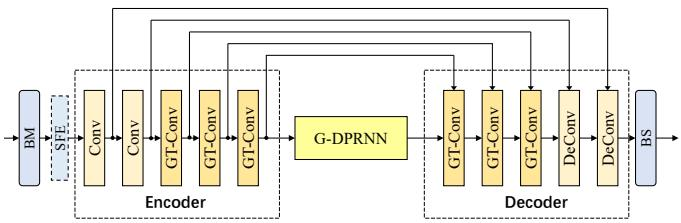

<details>
<summary>flowchart</summary>

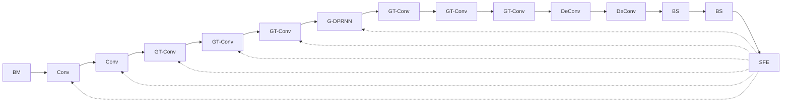
</details>

Fig. 1: Overall architecture of the proposed GTCRN model.

datasets.

# 2. GROUPED TEMPORAL CONVOLUTIONALRECURRENT NETWORK

The GTCRN architecture consists of band merging (BM) and band splitting (BS) modules, an optional SFE module, an encoder, a grouped dual-path RNN (G-DPRNN) module, and a decoder, as shown in Fig. 1. The details of each module will be presented in Secs. 2.1 - 2.5. The encoder consistsGT-Conv模块结构图 of two convolution (Conv) and three grouped temporal convolution (GT-Conv) blocks, which will be discussed in Sec. 2.3. Each Conv block is a sequence of a convolution layer, a batch normalization, and a PReLU activation, which maps the input spectrum to a high-dimensional embedding and downsamples the frequency-axis size. Skip connection is utilized to alleviate the information loss during the encoding phase. The decoder is the mirror version of the encoder, where each ConvDD-Conv2D block is replaced by a deconvolution (DeConv) block, whichP-Conv2DBN PReLU has the same components as the Conv block with the excep-BN tion of substituting the convolution layer with a transposed convolution layer to recover the original size. Moreover, the last DeConv block uses tanh instead of PReLU activation to constrain output values between -1 and 1. These values are interpreted as the real and imaginary parts of the estimated模块结构图 complex ratio mask (CRM) [19].

# 2.1. Band Merging and Splitting

We can down-sample the spectral features by a BM operation, and restore the original resolution using a BS operation. However, it is important to note that harmonics are more likely to be present in low-frequency bands and rarely occur in highfrequency bands. Therefore, the merging of features is only performed in the high-frequency bands above 2 kHz according to the ERB scale.

# 2.2. Grouped Dual-path RNN

We combine grouped RNN (GRNN) [18] with dual-path RNN (DPRNN) [7] to construct G-DPRNN. GRNN utilizes a group of smaller recurrent layers to approximate a large standard recurrent layer. Specifically, both the input features and hidden states are split into 2 disjoint groups, each of which is fed into a recurrent layer with 2 times fewer parameters than the original, before a representation rearrangement layer is applied to obtain the final output. DPRNN was originally proposed to model 1D long sequences, whereas it is also

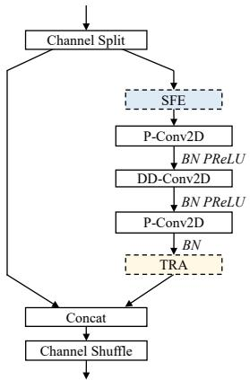

<details>
<summary>flowchart</summary>

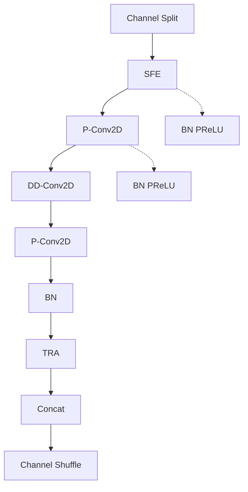
</details>

GT-Conv模块结构图Fig. 2: Grouped temporal convolution block.

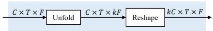  
Fig. 3: Subband feature extraction module.

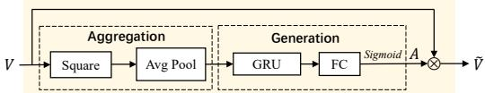

<details>
<summary>flowchart</summary>

```mermaid
graph LR
    V --> Square
    Square --> AvgPool
    AvgPool --> GRU
    GRU --> FC
    FC --> Sigmoid
    Sigmoid --> A
    A --> Ṽ
    Aggregation --> Square
    Generation --> GRU
    Generation --> FC
```
</details>

TRA模块结构图Fig. 4: Temporal recurrent attention module.

well-suited for time-frequency domain features, as presented in [3]. The intra-frame RNNs can model the spectral patterns in a single frame, while the inter-frame RNNs model the time dependence of a certain frequency bin. We use grouped bidirectional GRU for intra-frame modeling, and grouped ???? × ???? × ???? ???? × ???? × ???? ???? × ???? × ????unidirectional GRU for inter-frame modeling, so that the causality of the model can be guaranteed.

# 2.3. Grouped Temporal Convolution

Leveraging the ShuffleNetV2 [17] unit as a basis, the GT-Conv block introduces a temporal dilation into the depth-wise convolution, improving its capacity for long-range temporal dependency modeling. The overview of the GT-Conv block is depicted in Fig. 2. The input features are split in half along the channel axis into two branches. While one branch remains unaltered, the other undergoes an efficient pattern-capturing and processing procedure, which is accomplished by a sequence of convolutional layers made up of two 2D pointwise convolution (P-Conv2D) layers and a 2D dilated depthwise convolution (DD-Conv2D) layer. The outputs from both branches are ultimately concatenated to restore the original size. A channel shuffle operation is performed to facilitate information exchange between the two branches. To further enhance the model performance, the optional SFE module and TRA module can be applied in the second branch.

# 2.4. Subband Feature Extraction

The SFE module, as illustrated in Fig. 3, is designed to enhance the capability of a convolution layer in capturing and utilizing frequency information. It achieves this by first performing an unfold operation on the input features with a kernel size of k in the frequency dimension, which combines each frequency band with its adjacent k − 1 bands to form subband units. Subsequently, a reshape operation is applied to stack each subband unit along the channel dimension, leading to subband interweaved features. Throughout this process, the SFE module integrates the subband relationship, originally existing solely in the frequency dimension, into the channel dimension, empowering the following convolution layer to leverage frequency information more efficiently.

# 2.5. Temporal Recurrent Attention

The TRA module aims to perform temporal feature recalibration utilizing a multiplicative attention mask by effectively modeling the energy distribution along the time axis. The attention mask is generated in two steps: global information aggregation and attention generation, as depicted in Fig. 4. Given $V ~ \in ~ \mathbb { R } ^ { C \times T \times \widecheck { F } }$ as the input features, the temporal energy representation $Z ~ \in ~ \bar { \mathbb { R } ^ { C \times T } }$ is first computed via global average pooling, formulated as Z(c, t) = 1F PFf=1 $\begin{array} { r } { Z ( c , t ) ~ { \stackrel { - } { = } } ~ { \frac { 1 } { F } } \sum _ { f = 1 } ^ { F } \bar { V } ^ { 2 } ( c , t , f ) } \end{array}$ , where C, T, F denote channel, time and frequency axis lengths respectively. Then the temporal energy representation is processed by a GRU followed by a fully connected (FC) layer, where the GRU doubles the input channels and the FC layer restores the original channel number. Subsequently, a sigmoid activation function is applied to generate a 1D attention mask, which is then replicated along the frequency axis to produce a 2D T-F mask $\bar { A ^ { \prime } } \in \mathbb { R } ^ { C \times T \times \bar { F } }$ . The final output is given as $\tilde { V } = V \otimes A$ where ⊗ denotes the element-wise multiplication operation.

# 2.6. Loss Function

Our loss function is applied on both the waveform domain and spectrogram domain:

$$
\begin{array}{l} \mathcal {L} = \alpha \mathcal {L} _ {\text { SISNR }} (\tilde {s}, s) + (1 - \beta) \mathcal {L} _ {\text { mag }} (\tilde {S}, S) \\ + \beta (\mathcal {L} _ {\text { real }} (\tilde {S}, S) + \mathcal {L} _ {\text { imag }} (\tilde {S}, S)) \tag {1} \\ \end{array}
$$

where s˜ and s are enhanced and clean waveform. S˜ and S are enhanced and clean spectrogram, respectively. α and β are set to 0.01 and 0.3 respectively. Each term in the aforementioned formula is calculated as follows:

$$
\mathcal {L} _ {\text {SISNR}} = - \log_ {1 0} \left(\frac {\left\| s _ {t} \right\| ^ {2}}{\left\| \tilde {s} - s _ {t} \right\| ^ {2}}\right); s _ {t} = \frac {\langle \tilde {s} , s \rangle s}{\left\| s \right\| ^ {2}} \tag {2}
$$

$$
\mathcal {L} _ {\mathrm{mag}} (\tilde {S}, S) = \mathrm{MSE} (| \tilde {S} | ^ {0. 3}, | S | ^ {0. 3}) \tag {3}
$$

$$
\mathcal {L} _ {\text {real}} (\tilde {S}, S) = \mathrm{MSE} \left(\tilde {S} _ {r} / | \tilde {S} | ^ {0. 7}, S _ {r} / | S | ^ {0. 7}\right) \tag {4}
$$

$$
\mathcal {L} _ {\text { imag }} (\tilde {S}, S) = \mathrm{MSE} (\tilde {S} _ {i} / | \tilde {S} | ^ {0. 7}, S _ {i} / | S | ^ {0. 7}) \tag {5}
$$

# 3. EXPERIMENT

# 3.1. Datasets

We use two datasets to evaluate our proposed model. The first one is the VCTK-DEMAND dataset [20] which contains paired clean and pre-mixed noisy speech. The training and test set consists of 11,572 utterances from 28 speakers and 824 utterances from two speakers, respectively. 1,572 utterances in the training set are selected for validation. The utterances are resampled to 16 kHz.

The second dataset is the large-scale DNS3 dataset [21], which contains a wide range of clean sets, noise sets, and RIRs. Besides, we also include the Mandarin corpus from DiDiSpeech [22]. During mixing, the clean speech is convolved with a randomly selected RIR, and then mixed with randomly selected noise clips under the SNR range from -5 to 15 dB. The training target is obtained by preserving the first 100 ms reflections. A total of 720,000 pairs of 10-second noisy-clean data are generated for training, while 840 and 800 pairs are generated for validation and testing, respectively. The evaluation is also done on the blind test set provided by DNS challenge 3. All the utterances are sampled at 16 kHz.

# 3.2. Implementation Details

STFT is computed using a square root Hanning window of a length of 32 ms, a hop length of 16 ms, and an FFT length of 512. Input features are used as a channel-wise concatenation of the real and imaginary parts of the noisy spectrogram, along with its magnitude. For BM, we map the 192 high-frequency bands to 64 ERB bands, while keeping the 65 low-frequency bands unaltered, leading to a 129-dimensional compressed feature map. For all the optional SFE modules, we uniformly use a kernel size of 3. The two Conv blocks have a common output channel number of 16, a kernel size of (1, 5) and a stride of (1, 2). The group size of the second convolution layer is set to 2 to reduce parameters and computation. The DD-Conv2D layers in three GT-Conv blocks share a common channel number of 16, a common kernel size of (3, 3), and have time dilations of 1, 2 and 5, respectively. For the whole model, the number of parameters is 23.7 K and the computational cost is 39.6 MMACs per second.

The models are trained by Adam Optimizer [23] with an initial learning rate of 0.001. The learning rate will be halved if the validation loss does not decrease for 5 consecutive epochs. We use a batch size of 4 for the VCTK-DEMAND dataset and a batch size of 16 for the DNS3 dataset. During training on the DNS3 dataset, the utterances are chunked to 8 seconds and 40,000 noisy-clean pairs are randomly selected for each epoch.

# 3.3. Results

# 3.3.1. Ablation Study

We validate the efficacy of SFE and compare our TRA against time-dimension attention (TA) proposed in [24] on a relatively small training set (around 100 hours) sampled from the

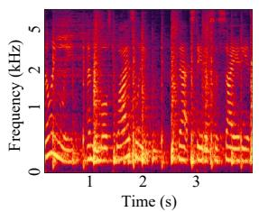

<details>
<summary>heatmap</summary>

| Time (s) | Frequency (kHz) |
| -------- | --------------- |
| 0        | 0               |
| 1        | 1               |
| 2        | 2               |
| 3        | 3               |
</details>

(a) Noisy

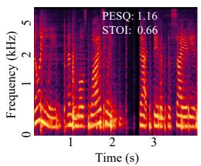

<details>
<summary>line</summary>

| Time (s) | Frequency (kHz) |
| -------- | --------------- |
| 0        | 0               |
| 1        | 2               |
| 2        | 5               |
| 3        | 0               |
</details>

(b) Enhanced by RNNoise

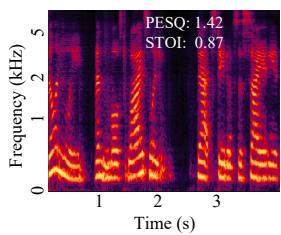

<details>
<summary>line</summary>

| Time (s) | Frequency (kHz) |
| -------- | --------------- |
| 0        | 0               |
| 1        | 5               |
| 2        | 5               |
| 3        | 5               |
</details>

(c) Enhanced by GTCRN

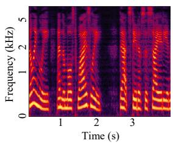

<details>
<summary>line</summary>

| Time (s) | Frequency (kHz) |
| -------- | --------------- |
| 0        | 0               |
| 1        | 5               |
| 2        | 5               |
| 3        | 5               |
</details>

(d) Clean

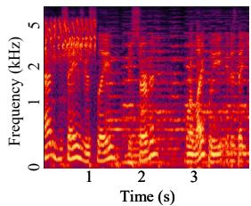

<details>
<summary>heatmap</summary>

| Time (s) | Frequency (kHz) |
| -------- | --------------- |
| 0        | 0               |
| 1        | 1               |
| 2        | 2               |
| 3        | 3               |
</details>

(e) Noisy

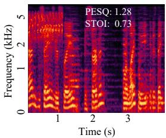

<details>
<summary>line</summary>

| Time (s) | Frequency (kHz) |
| -------- | --------------- |
| 1        | 5               |
| 2        | 2               |
| 3        | 1               |
</details>

(f) Enhanced by RNNoise

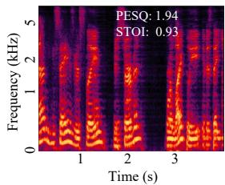

<details>
<summary>heatmap</summary>

| Time (s) | Frequency (kHz) |
| -------- | --------------- |
| 1        | 5               |
| 2        | 5               |
| 3        | 5               |
</details>

(g) Enhanced by GTCRN

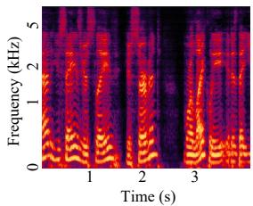

<details>
<summary>line</summary>

| Time (s) | Frequency (kHz) |
| -------- | --------------- |
| 0        | 0               |
| 1        | 5               |
| 2        | 5               |
| 3        | 5               |
</details>

(h) Clean   
Fig. 5: Typical spectrograms from DNS3 test set. (a, e) Noisy Speech, (b, f) enhanced speech by RNNoise, (c, g) enhanced speech by GTCRN, (d, h) clean reference speech.

Table 1: Ablation study results on DNS3 test set. 

<table><tr><td>SFE</td><td>TA</td><td>TRA</td><td>Para. (K)</td><td>MACs (M/s)</td><td>SISNR</td><td>PESQ</td><td>STOI</td></tr><tr><td>-</td><td>-</td><td>-</td><td>-</td><td>-</td><td>3.92</td><td>1.30</td><td>0.789</td></tr><tr><td> $\times$ </td><td> $\times$ </td><td> $\times$ </td><td>13.35</td><td>33.91</td><td>9.87</td><td>1.87</td><td>0.834</td></tr><tr><td> $\times$ </td><td> $\checkmark$ </td><td> $\times$ </td><td>14.84</td><td>34.00</td><td>10.00</td><td>1.89</td><td>0.838</td></tr><tr><td> $\times$ </td><td> $\times$ </td><td> $\checkmark$ </td><td>21.65</td><td>34.47</td><td>10.25</td><td>1.91</td><td>0.840</td></tr><tr><td> $\checkmark$ </td><td> $\times$ </td><td> $\times$ </td><td>15.37</td><td>39.07</td><td>10.10</td><td>1.90</td><td>0.838</td></tr><tr><td> $\checkmark$ </td><td> $\checkmark$ </td><td> $\times$ </td><td>16.86</td><td>39.16</td><td>10.29</td><td>1.92</td><td>0.841</td></tr><tr><td> $\checkmark$ </td><td> $\times$ </td><td> $\checkmark$ </td><td>23.67</td><td>39.63</td><td>10.39</td><td>1.94</td><td>0.844</td></tr></table>

Table 2: Performance on VCTK-DEMAND test set. 

<table><tr><td></td><td>Para. (M)</td><td>MACs (G/s)</td><td>SISNR</td><td>PESQ</td><td>STOI</td></tr><tr><td>Noisy</td><td>-</td><td>-</td><td>8.45</td><td>1.97</td><td>0.921</td></tr><tr><td>RNNoise (2018)</td><td>0.06</td><td>0.04</td><td>-</td><td>2.29</td><td>-</td></tr><tr><td>PercepNet (2020)</td><td>8.00</td><td>0.80</td><td>-</td><td>2.73</td><td>-</td></tr><tr><td>DeepFilterNet (2022)</td><td>1.80</td><td>0.35</td><td>16.63</td><td>2.81</td><td>0.942</td></tr><tr><td>S-DCCRN (2022)</td><td>2.34</td><td>-</td><td>-</td><td>2.84</td><td>0.940</td></tr><tr><td>GTCRN (proposed)</td><td>0.02</td><td>0.04</td><td>18.83</td><td>2.87</td><td>0.940</td></tr></table>

DNS3 dataset. The evaluation is conducted on the test set using objective evaluation metrics including SISNR [25], PESQ [26] and STOI [27]. The ablation test results are presented in Table 1. It can be seen that our proposed TRA outperforms TA with a very limited increment in computational resources. The advantages of SFE are also evident in Table 1, and the optimal performance metrics are achieved through the integration of SFE with TRA.

# 3.3.2. Comparison with the baseline models

We compare our model with RNNoise [12], PercepNet [13], DeepFilterNet [14], and S-DCCRN [28]. Table 2 presents the objective results on the VCTK-DEMAND test set. It is evident that GTCRN not only outperforms RNNoise by a substantial margin with a comparable computational load and fewer parameters, but also surpasses other baseline models with significantly more parameters and MACs in terms of SISNR and PESQ.

In Table 3, we present a comparison of our model with

Table 3: Performance on DNS3 blind test set. 

<table><tr><td rowspan="2"></td><td rowspan="2">Para. (M)</td><td rowspan="2">MACs (G/s)</td><td rowspan="2">DNSMOS-P.808</td><td colspan="3">DNSMOS-P.835</td></tr><tr><td>BAK</td><td>SIG</td><td>OVRL</td></tr><tr><td>Noisy</td><td>-</td><td>-</td><td>2.96</td><td>2.65</td><td>3.20</td><td>2.33</td></tr><tr><td> $RNNoise^1$ (2018)</td><td>0.06</td><td>0.04</td><td>3.15</td><td>3.45</td><td>3.00</td><td>2.53</td></tr><tr><td>S-DCCRN (2022)</td><td>2.34</td><td>-</td><td>3.43</td><td>-</td><td>-</td><td>-</td></tr><tr><td>GTCRN (proposed)</td><td>0.02</td><td>0.04</td><td>3.44</td><td>3.90</td><td>3.00</td><td>2.70</td></tr></table>

RNNoise and S-DCCRN on the DNS3 blind test set. The evaluation is performed using DNSMOS P.808 [29] and DNS-MOS P.835 [30]. The results consistently demonstrate that our model outperforms RNNoise by a wide margin and also surpasses the large-scale S-DCCRN model. Two typical examples from our test set are illustrated in Fig. 5, which clearly show that GTCRN exhibits superior noise suppression than RNNoise. The source code and audio examples are available at https://github.com/Xiaobin-Rong/gtcrn.

# 4. CONCLUSION

In this paper, we present GTCRN, a speech enhancement model that requires only 23.7 K parameters and 39.6 MMACs per second. Multiple strategies are applied to DPCRN to effectively reduce the model while maintaining speech enhancement performance. Experiments show that our model not only outperforms RNNoise by a substantial margin on the VCTK-DEMAND and DNS3 dataset, but also achieves competitive performance compared to several baseline models with significantly higher computational overhead.

# 5. ACKNOWLEDGEMENTS

This work was supported by the National Natural Science Foundation of China (Grant No. 12274221).

# 6. REFERENCES

[1] K. Tan and D. Wang, “A Convolutional Recurrent Neural Network for Real-Time Speech Enhancement,” in Proc. Interspeech 2018, 2018, pp. 3229–3233.   
[2] Y. Hu, Y. Liu, S. Lv, M. Xing, et al., “DCCRN: Deep Complex Convolution Recurrent Network for Phase-Aware Speech Enhancement,” in Interspeech, 2020.   
[3] X. Le, H. Chen, K. Chen, and J. Lu, “DPCRN: Dual-Path Convolution Recurrent Network for Single Channel Speech Enhancement,” in Proc. Interspeech 2021, 2021, pp. 2811–2815.   
[4] Z.-Q. Wang, S. Cornell, S. Choi, Y. Lee, et al., “Tfgridnet: Integrating full-and sub-band modeling for speech separation,” IEEE/ACM Transactions on Audio, Speech, and Language Processing, 2023.   
[5] D. Stoller, S. Ewert, and S. Dixon, “Wave-u-net: A multi-scale neural network for end-to-end audio source separation,” in Proc. International Society for Music Information Retrieval Conference, 2018, pp. 334–340.   
[6] Y. Luo and N. Mesgarani, “Conv-tasnet: Surpassing ideal time–frequency magnitude masking for speech separation,” IEEE/ACM transactions on audio, speech, and language processing, vol. 27, no. 8, pp. 1256–1266, 2019.   
[7] Y. Luo, Z. Chen, and T. Yoshioka, “Dual-path rnn: efficient long sequence modeling for time-domain singlechannel speech separation,” in ICASSP, 2020, pp. 46– 50.   
[8] I. Fedorov, M. Stamenovic, C. R. Jensen, L.-C. Yang, et al., “TinyLSTMs: Efficient Neural Speech Enhancement for Hearing Aids,” in Interspeech, 2020.   
[9] K. Tan and D. Wang, “Towards model compression for deep learning based speech enhancement,” IEEE/ACM transactions on audio, speech, and language processing, vol. 29, pp. 1785–1794, 2021.   
[10] H.-S. Choi, S. Park, J. H. Lee, et al., “Real-time denoising and dereverberation wtih tiny recurrent u-net,” in ICASSP, 2021, pp. 5789–5793.   
[11] S. Braun, H. Gamper, C. K. Reddy, and I. Tashev, “Towards efficient models for real-time deep noise suppression,” in ICASSP, 2021, pp. 656–660.   
[12] J.-M. Valin, “A hybrid DSP/deep learning approach to real-time full-band speech enhancement,” in 2018 IEEE 20th international workshop on multimedia signal processing (MMSP). IEEE, 2018, pp. 1–5.   
[13] J.-M. Valin, U. Isik, N. Phansalkar, R. Giri, et al., “A Perceptually-Motivated Approach for Low-Complexity, Real-Time Enhancement of Fullband Speech,” in Proc. Interspeech 2020, 2020, pp. 2482–2486.   
[14] H. Schroter, A. N. Escalante-B, T. Rosenkranz, and A. Maier, “DeepFilterNet: A low complexity speech enhancement framework for full-band audio based on deep filtering,” in ICASSP, 2022, pp. 7407–7411.   
[15] X. Le, T. Lei, L. Chen, Y. Guo, et al., “Harmonic enhancement using learnable comb filter for light-weight full-band speech enhancement model,” in Proc. INTER-

SPEECH 2023, 2023, pp. 3894–3898.   
[16] X. Le, T. Lei, K. Chen, and J. Lu, “Inference skipping for more efficient real-time speech enhancement with parallel RNNs,” IEEE/ACM Transactions on Audio, Speech, and Language Processing, vol. 30, pp. 2411– 2421, 2022.   
[17] N. Ma, X. Zhang, H.-T. Zheng, and J. Sun, “Shufflenet v2: Practical guidelines for efficient cnn architecture design,” in Proceedings of the European conference on computer vision (ECCV), 2018, pp. 116–131.   
[18] F. Gao, L. Wu, L. Zhao, T. Qin, X. Cheng, and T.-Y. Liu, “Efficient sequence learning with group recurrent networks,” in Proceedings of the 2018 Conference of the North American Chapter of the Association for Computational Linguistics: Human Language Technologies, Volume 1 (Long Papers), 2018, pp. 799–808.   
[19] D. S. Williamson, Y. Wang, and D. Wang, “Complex ratio masking for monaural speech separation,” IEEE/ACM transactions on audio, speech, and language processing, vol. 24, no. 3, pp. 483–492, 2015.   
[20] C. Valentini-Botinhao, X. Wang, S. Takaki, and J. Yamagishi, “Investigating RNN-based speech enhancement methods for noise-robust Text-to-Speech.,” in SSW, 2016, pp. 146–152.   
[21] C. K. A. Reddy, H. Dubey, K. Koishida, et al., “Interspeech 2021 Deep Noise Suppression Challenge,” 2021.   
[22] T. Guo, C. Wen, D. Jiang, N. Luo, et al., “Didispeech: A Large Scale Mandarin Speech Corpus,” in ICASSP, 2021, pp. 6968–6972.   
[23] D. P. Kingma and J. Ba, “Adam: A Method for Stochastic Optimization,” CoRR, vol. abs/1412.6980, 2014.   
[24] Q. Zhang, Q. Song, et al., “Time-Frequency Attention for Monaural Speech Enhancement,” in ICASSP, 2022, pp. 7852–7856.   
[25] J. Le Roux, S. Wisdom, H. Erdogan, and J. R. Hershey, “SDR–half-baked or well done?,” in ICASSP, 2019, pp. 626–630.   
[26] A. W. Rix, J. G. Beerends, et al., “Perceptual evaluation of speech quality (PESQ)-a new method for speech quality assessment of telephone networks and codecs,” in ICASSP, 2001, vol. 2, pp. 749–752.   
[27] C. H. Taal, R. C. Hendriks, et al., “A short-time objective intelligibility measure for time-frequency weighted noisy speech,” in ICASSP, 2010, pp. 4214–4217.   
[28] S. Lv, Y. Fu, M. Xing, et al., “S-DCCRN: Super Wide Band DCCRN with Learnable Complex Feature for Speech Enhancement,” in ICASSP, 2022, pp. 7767– 7771.   
[29] C. K. Reddy, V. Gopal, and R. Cutler, “DNSMOS: A non-intrusive perceptual objective speech quality metric to evaluate noise suppressors,” in ICASSP, 2021, pp. 6493–6497.   
[30] C. K. Reddy, V. Gopal, and R. Cutler, “Dnsmos P.835: A Non-Intrusive Perceptual Objective Speech Quality Metric to Evaluate Noise Suppressors,” in ICASSP, 2022, pp. 886–890.