# Speech extraction under extremely low SNR conditions

Haoxin Ruan a,b,1, Lele Liao a,b,1, Kai Chen a,b, Jing Lu a,b,∗

a Key Laboratory of Modern Acoustics, Nanjing University, Nanjing, 210093, Jiangsu, China

b NJU-Horizon Intelligent Audio Lab, Horizon Robotics, Beijing, 100094, Beijing, China

## A R T I C L E I N F O

Keywords: Blind source extraction Independent vector extraction Orthogonal constraint Region of convergence Natural gradient

## A B S T R A C T

The acquisition of the target signal in noisy environments remains a prominent focus in the realm of signal processing. Although extensively studied, speech extraction under extremely low signal-to-noise ratio (SNR) conditions remains a formidable challenge. In this paper, we address this challenging task in the framework of independent vector extraction with the orthogonal constraint (OGIVE). We use real speech data to analyze the behaviors of the cost function under diferent SNR conditions, which inspires us to select appropriate parameters for optimization. Furthermore, we propose natural gradient-based algorithms to improve conventional OGIVE algorithms. Numerical experiments across various scenarios demonstrate the efectiveness and robustness of our proposed algorithms.

## 1. Introduction

Blind source extraction (BSE) intends to directly extract the source of interest (SOI) from a noisy mixture while disregarding the estimation of background components (BG) such as environmental noise and competing sources [1,2]. BSE techniques have been applied in various fields including fault diagnosis [3], biological signal processing [4,5] and speech enhancement [6–15]. Recently, independent vector extraction (IVE), a computationally eficient variant of independent vector analysis (IVA) [2,16–19], is proposed as an efective solution for BSE. In the field of speech enhancement, a series of IVE methods have been proposed to extract a specific source such as the dominant source [9], the source from a specific direction [2,15] or the source from the target speaker [7,8]. However, these IVE methods only consider scenarios with moderate signal-to-noise ratio (SNR) levels (-5 dB ∼ 5 dB) while the extraction of the weak source under extremely low SNR conditions is rarely explored.

Low SNR speech enhancement is a tough but more crucial topic as it determines whether the target speech can be heard clearly and understood accurately while enhancement under moderate SNR conditions only makes the speech more comfortable for listeners [20]. The IVE framework considering the orthogonal constraint (OG), named OGIVE, has attracted intensive research eforts [6,13,14,21]. Most separation and extraction algorithms take the demixing parameters as the optimization term, while it is demonstrated in [14] that such optimization under low SNR conditions is disadvantageous. [14] explores the behaviors of the OGIVE cost function under diferent SNR conditions and concludes that algorithms optimizing the mixing parameters are more advantageous than algorithms optimizing the demixing parameters at low SNR levels while the opposite is true under high SNR conditions. Based on these conclusions, three variants of OGIVE based on gradient ascent algorithms have been proposed, i.e., OGIVE optimizing the mixing vector � (OGIVEa), OGIVE optimizing the demixing vector � (OGIVEw), and OGIVE with switched optimization (OGIVEs). However, all the analyses and experiments are based on manually generated data, whose efectiveness should be further validated using realistic data. Moreover, since the ordinary gradient ascent algorithm cannot guarantee stable convergence, a precise initialization is required, which brings dificulties for realistic applications.

In this paper, we use real speech signals to analyze and validate the properties of the OGIVE cost function under diferent SNR conditions. Based on the obtained conclusions, we address the extraction problem under extremely low SNR conditions by switching the optimization term to the mixing vector. Furthermore, we improve conventional OGIVE algorithms, i.e., OGIVEa and OGIVEw, by replacing the ordinary gradient with the natural gradient (NG) and propose two natural gradient-based algorithms, i.e., OGIVEa\_NG and OGIVEw\_NG. Numerical experiments across various reverberant scenarios and diferent types of noise are conducted and the results demonstrate the efectiveness and robustness of our parameter selection and optimization strategies.

## 2. Formulation of blind source extraction

Take audio extraction as a typical scenario. Without loss of generality, we assume that the microphone number � equals the source number � since we only focus on the target signal and regard the rest components as interference. In the time-frequency (T-F) domain, mixed signals can be approximated by an instantaneous mixing model in each frequency bin as [16]

$$
\mathbf {x} _ {i j} = \mathbf {A} _ {i} \mathbf {v} _ {i j}, i = 1, 2, \dots , I, j = 1, 2, \dots , J,\tag{1}
$$

where $\mathbf { x } _ { i j } = \left[ x _ { i j 1 } , x _ { i j 2 } , \cdots , x _ { i j M } \right] ^ { \mathrm { T } }$ and $\mathbf { v } _ { i j } = \left[ v _ { i j 1 } , v _ { i j 2 } , \cdots , v _ { i j N } \right] ^ { \mathrm { T } }$ are captured and source signals respectively. $\mathbf { A } _ { i }$ is an � × � mixing matrix. The indices � and � denote the frequency bins and time frames respectively and the corresponding � and � denote their total numbers.

In blind source separation (BSS), source signals can be obtained by a demixing matrix $\mathbf { W } _ { i } \approx \mathbf { A } _ { i } ^ { - 1 } \ \left[ 1 6 \right]$ as:

$$
\mathbf {y} _ {i j} = \mathbf {W} _ {i} \mathbf {x} _ {i j}, \quad i = 1, 2, \dots , I, \quad j = 1, 2, \dots , J,\tag{2}
$$

where $\mathbf { y } _ { i j } = \left[ y _ { i j 1 } , y _ { i j 2 } , \cdots , y _ { i j N } \right] ^ { \mathrm { T } }$ contains estimated sources. In BSE, without loss of generality, let $y _ { i j 1 }$ be the SOI (denoted by $s _ { i j } , s _ { i j } \approx v _ { i j 1 } )$ ) and the rest of $\mathbf { y } _ { i j }$ be the BG (denoted by $\mathbf { z } _ { i j } )$ , i.e., $\mathbf { y } _ { i j } = \left[ s _ { i j } , \mathbf { z } _ { i j } ^ { \mathrm { T } } \right] ^ { \mathrm { T } }$ . Correspondingly, we partition $\mathbf { A } _ { i }$ and $\mathbf { W } _ { i }$ as

$$
\mathbf {A} _ {i} = \left[ \begin{array}{c c} \mathbf {a} _ {i} & \mathbf {Q} _ {i} \end{array} \right], \quad \mathbf {W} _ {i} = \left[ \begin{array}{c} \mathbf {w} _ {i} ^ {\mathrm{H}} \\ \mathbf {B} _ {i} \end{array} \right],\tag{3}
$$

so that ${ \bf a } _ { i }$ and $\mathbf { w } _ { i }$ are the mixing and demixing vectors related to $s _ { i j }$ respectively. Since the identification of $\mathbf { z } _ { i j }$ is not the goal of BSE, $\mathbf { Q } _ { i }$ or $\mathbf { B } _ { i }$ can be arbitrary. According to [14], $\mathbf { A } _ { i }$ and $\mathbf { W } _ { i }$ can be further parameterized as:

$$
\begin{array}{l} \mathbf {W} _ {i} = \left[ \begin{array}{c} \mathbf {w} _ {i} ^ {\mathrm{H}} \\ \mathbf {B} _ {i} \end{array} \right] = \left[ \begin{array}{c c} \beta_ {i} ^ {*} & \mathbf {h} _ {i} ^ {\mathrm{H}} \\ \mathbf {g} _ {i} & - \gamma_ {i} \mathbf {I} _ {N - 1} \end{array} \right] \\ \mathbf {A} _ {i} = \left[ \begin{array}{c c} \mathbf {a} _ {i} & \mathbf {Q} _ {i} \end{array} \right] = \left[ \begin{array}{c c} \gamma_ {i} & \mathbf {h} _ {i} ^ {\mathrm{H}} \\ \mathbf {g} _ {i} & \gamma_ {i} ^ {- 1} \left(\mathbf {g} _ {i} \mathbf {h} _ {i} ^ {\mathrm{H}} - \mathbf {I} _ {N - 1}\right) \end{array} \right], \end{array}\tag{4}
$$

where $\mathbf { I } _ { N - 1 }$ is an $( N - 1 ) \times ( N - 1 )$ identity matrix, the superscript \* means the complex conjugate and the superscript H denotes the conju gate transpose operation. In this way, the undetermined parameters are simplified to $\beta _ { i } , \gamma _ { i } ,$ � and $\mathbf { h } _ { i } .$ . Moreover, they are linked through

$$
\mathbf {w} _ {i} ^ {\mathrm{H}} \mathbf {a} _ {i} = \beta_ {i} ^ {*} \gamma_ {i} + \mathbf {h} _ {i} ^ {\mathrm{H}} \mathbf {g} _ {i} = 1\tag{5}
$$

according to the distortionless response constraint [22]. Applying the properties of the determinant of a block matrix to Eq. (4) and considering Eq. (5), we have

$$
\det \mathbf {W} _ {i} = (- 1) ^ {N - 1} \gamma_ {i} ^ {N - 2}.\tag{6}
$$

Conventionally, $\mathbf { w } _ { i }$ is optimized and the SOI is obtained by $s _ { i j } = \mathbf { w } _ { i } ^ { \mathrm { H } } \mathbf { x } _ { i j } ,$ while $\mathbf { z } _ { i j } = \mathbf { B } _ { i } \mathbf { x } _ { i j }$ does not necessarily correspond to the real BG.

## 3. Brief review of OGIVE based on the gradient ascent algorithm

Define the source component vectors (SCV) by stacking the separated components along the frequency axis as $\mathbf { s } _ { j } = \left[ s _ { 1 j } , s _ { 2 j } , \cdots , s _ { I j } \right] ^ { \mathrm { T } }$ and $\mathbf { z } _ { j } = \left[ \mathbf { z } _ { 1 j } ^ { \mathrm { T } } , \mathbf { z } _ { 2 j } ^ { \mathrm { T } } , \cdots , \mathbf { z } _ { I j } ^ { \mathrm { T } } \right] ^ { \mathrm { T } }$ . According to Eq. (2) and the independence be tween the SOI and the BG, we can obtain the log-likelihood function of the mixtures [14,16] as

$$
\mathcal {L} \left(\left\{\mathbf {w} _ {i} \right\}, \left\{\mathbf {a} _ {i} \right\}\right) = \frac {1}{J} \sum_ {j = 1} ^ {J} \log p _ {s} \left(\mathbf {s} _ {j}\right) + \frac {1}{J} \sum_ {j = 1} ^ {J} \log p _ {\mathbf {z}} \left(\mathbf {z} _ {j}\right) + \sum_ {i = 1} ^ {I} \log | \det \mathbf {W} _ {i} | ^ {2},\tag{7}
$$

where $p _ { s } ( \cdot )$ and $p _ { \mathbf { z } } ( \cdot )$ are pre-defined joint probability distribution functions (PDF), which introduce inter-frequency dependence. The BG $\mathbf { z } _ { j }$ is assumed to follow a complex Gaussian distribution, i.e., $\mathbf { z } _ { j } \sim \mathcal { N } _ { C } \left( \mathbf { 0 } , \mathbf { C } _ { \mathbf { z } } \right)$ with $\mathbf { C _ { z } } \in \mathbb { C } ^ { I ( N - 1 ) \times I ( N - 1 ) }$ the covariance matrix. This model should also work for non-Gaussian BG as long as their second-order statistics exist [14]. Substitute the BG model and Eq. (6) into Eq. (7) and ignore the constant term, we have

$$
\begin{array}{c} \mathcal {L} \left(\left\{\mathbf {w} _ {i} \right\}, \left\{\mathbf {a} _ {i} \right\}, \mathbf {C} _ {\mathbf {z}}\right) = \frac {1}{J} \sum_ {j = 1} ^ {J} \log p _ {s} \left(\mathbf {s} _ {j}\right) + \sum_ {i = 1} ^ {I} (N - 2) \log | \gamma_ {i} | ^ {2} \\ - \frac {1}{J} \sum_ {j = 1} ^ {J} \sum_ {i _ {2} = 1} ^ {I} \sum_ {i _ {1} = 1} ^ {I} \mathbf {x} _ {i _ {1} j} ^ {\mathrm{H}} \mathbf {B} _ {i _ {1}} ^ {\mathrm{H}} \mathbf {R} _ {i _ {1}, i _ {2}} \mathbf {B} _ {i _ {2}} \mathbf {x} _ {i _ {2} j} - \log | \det \mathbf {C} _ {\mathbf {z}} | \end{array} ,\tag{8}
$$

where $\mathbf { R } _ { i _ { 1 } i _ { 2 } } \in \mathbb { C } ^ { ( N - 1 ) \times ( N - 1 ) }$ is the $( i _ { 1 } , i _ { 2 } )$ block of $\mathbf { C } _ { \mathbf { z } } ^ { - 1 }$

It is easy to find that optimizing the cost function Eq. (8) with respect to $\mathbf { C _ { z } }$ results in the maximum likelihood estimation of a Gaussian model with a simple solution $\begin{array} { r } { \mathbf { C _ { z } } = ( 1 / J ) \sum _ { j } \mathbf { z } _ { j } \mathbf { z } _ { i } ^ { \mathrm { H } } } \end{array}$ , which only depends on the value of $\mathbf { B } _ { i }$ (determined by ${ \bf a } _ { i }$ according to Eq. (4)). Therefore, we do not need an additional update step for $\mathbf { C _ { z } }$ and can ignore the last term of Eq. (8) in subsequent analyses.

To guarantee the decorrelation of � and $\mathbf { z } ,$ we impose the orthogonal constraint (OG), i.e., $\begin{array} { r } { ( 1 / J ) \sum _ { j } s _ { i j } \mathbf { z } _ { i j } ^ { * } = \mathbf { 0 } } \end{array}$ , which induces a link between $\mathbf { w } _ { i }$ and $\mathbf { a } _ { i } \ [ 1 4 , 2 3 ]$ as

$$
\mathbf {w} _ {i} = \frac {\left(\hat {\mathbf {C}} _ {\mathbf {x}} ^ {i}\right) ^ {- 1} \mathbf {a} _ {i}}{\mathbf {a} _ {i} ^ {\mathrm{H}} \left(\hat {\mathbf {C}} _ {\mathbf {x}} ^ {i}\right) ^ {- 1} \mathbf {a} _ {i}}, \quad \mathbf {a} _ {i} = \frac {\hat {\mathbf {C}} _ {\mathbf {x}} ^ {i} \mathbf {w} _ {i}}{\mathbf {w} _ {i} ^ {\mathrm{H}} \hat {\mathbf {C}} _ {\mathbf {x}} ^ {i} \mathbf {w} _ {i}}, \quad i = 1,..., I,\tag{9}
$$

where $\begin{array} { r } { \hat { \mathbf { C } } _ { \mathbf { x } } ^ { i } = ( 1 / J ) \sum _ { j } \mathbf { x } _ { i j } \mathbf { x } _ { i j } ^ { \mathrm { H } } } \end{array}$ . Adopting the relationship in Eq. (9), the cost function Eq. (8) only depends on either the mixing vectors $\left\{ \mathbf { a } _ { i } \right\}$ or the demixing vectors $\left\{ \mathbf { w } _ { i } \right\}$

Taking the derivative of Eq. (8) with respect to $\mathbf { w } _ { i } ^ { * }$ under the coupling Eq. (9) yields the update rule of OGIVEw as

$$
\Delta \mathbf {w} _ {i} = \mathbf {a} _ {i} - \frac {1}{J} \sum_ {j = 1} ^ {J} \mathbf {x} _ {i j} \varphi_ {i} (\mathbf {s} _ {j})\tag{10}
$$

where

$$
\varphi_ {i} \left(\mathbf {s} _ {j}\right) = - \left. \frac {\partial \log p _ {s} (\boldsymbol {\xi})}{\partial \xi_ {i}} \right| _ {\boldsymbol {\xi} = \mathbf {s} _ {j}}\tag{11}
$$

|is the score function depending on the choice of the source prior $p _ { s } ( \cdot )$ A commonly used $\varphi$ is

$$
\varphi_ {i} (\xi) = \tanh \left(\xi_ {i}\right) ^ {*} / \sqrt {\sum_ {i = 1} ^ {I} \left| \xi_ {i} \right| ^ {2}}.\tag{12}
$$

Similarly, taking the derivative of Eq. (8) with respect to $\mathbf { a } _ { i } ^ { * }$ under the coupling Eq. (9) yields the update rule of OGIVEa as

$$
\Delta \mathbf {a} _ {i} = \mathbf {w} _ {i} - \frac {1}{J} \lambda (\mathbf {a} _ {i}) (\widehat {\mathbf {C}} _ {\mathbf {x}} ^ {i}) ^ {- 1} \sum_ {j = 1} ^ {J} \mathbf {x} _ {i j} \varphi_ {i} (\mathbf {s} _ {j})\tag{13}
$$

where $\lambda \left( \mathbf { a } _ { i } \right) = \left( \mathbf { a } _ { i } ^ { \mathrm { H } } { \left( \widehat { \mathbf { C } } _ { \mathbf { x } } ^ { i } \right) } ^ { - 1 } \mathbf { a } _ { i } \right) ^ { - 1 }$ . The rigorous derivation of the orthogonal constraints Eq. (9) and the gradients Eq. (10), Eq. (13) can be found in [14,23].

According to Eq. (10), the stationary point is obtained when

$$
\Delta \mathbf {w} _ {i} = \mathbf {a} _ {i} - \frac {1}{J} \sum_ {j = 1} ^ {J} \mathbf {x} _ {i j} \varphi_ {i} (\mathbf {s} _ {j}) = \mathbf {0}.\tag{14}
$$

If $\mathbf { w } _ { i }$ is the ideal demixing vector satisfying $s _ { i j } = { \bf w } _ { i } ^ { \mathrm { H } } { \bf x } _ { i j } = v _ { i j 1 }$ , we can derive from Eq. (14) that

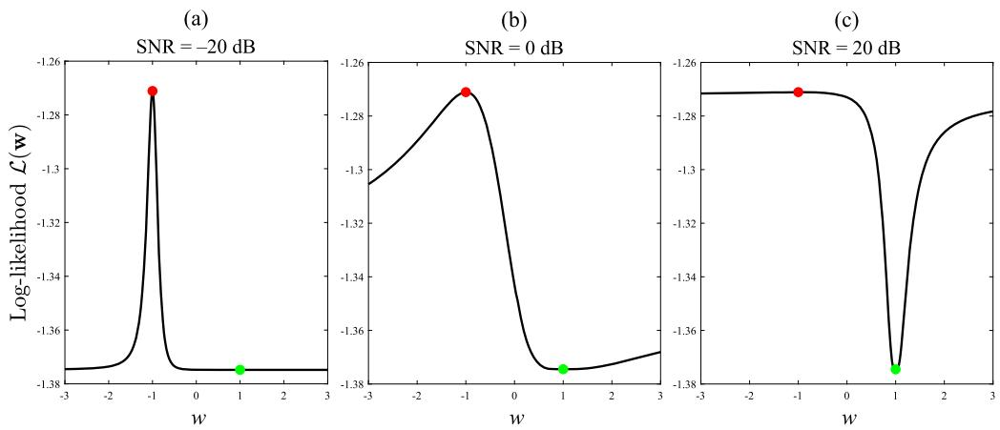

Fig. 1. The cost function with respect to $\mathbf { w } = [ 1 , w ] ^ { \mathrm { T } }$ in the presence of Gaussian noise when the initial SNR = (a) −20 dB, (b) 0 dB and (c) 20 dB. The red and green dots denote the theoretical solutions corresponding to the SOI and the BG respectively.  
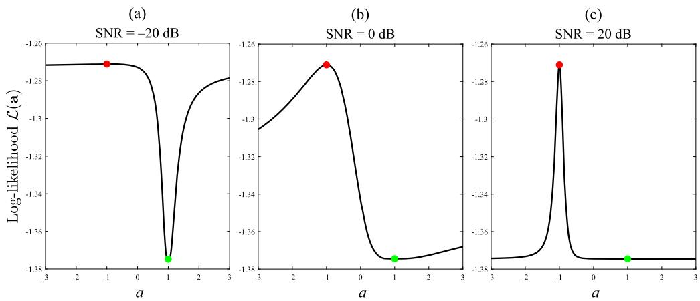  
Fig. 2. The cost function with respect to $\mathbf { a } = \left[ 1 , a \right] ^ { \mathrm { T } }$ in the presence of Gaussian noise when the initial SNR = (a) −20 dB, (b) 0 dB and (c) 20 dB. The red and green dots denote the theoretical solutions corresponding to the SOI and the BG respectively.

$$
\begin{array}{c} \Delta \mathbf {w} _ {i} = \left[ 1 - \frac {1}{J} \sum_ {j = 1} ^ {J} s _ {i j} \varphi_ {i} (\mathbf {s} _ {j}) \right] \mathbf {a} _ {i} = \mathbf {0}, \\ \frac {1}{J} \sum_ {j = 1} ^ {J} s _ {i j} \varphi_ {i} (\mathbf {s} _ {j}) = 1. \end{array}\tag{15}
$$

Hence, each $\varphi _ { i } ( \cdot )$ should be normalized at each iteration to satisfy Eq. (15). The pseudo codes of OGIVEw and OGIVEa can be found in [14].

## 4. Convergence region analysis

In this section, we explore the behaviors of the cost function $\operatorname { E q . } \left( 8 \right)$ on speech recordings under diferent SNR conditions. Consider an instantaneous mixture of a target speech and a Gaussian white noise in the time domain with a mixing matrix $\mathbf { A } = { \left\lceil \begin{array} { l l } { 1 } & { 1 } \\ { - 1 } & { 1 } \end{array} \right\rceil }$ and an alternate SNR within {−20 dB, 0 dB, 20 dB}. The corresponding demixing ma trix is $\mathbf { W } = \left\lceil { \begin{array} { c c } { 1 } & { - 1 } \\ { 1 } & { 1 } \end{array} } \right\rceil$ . In this scenario, the cost function Eq. (8) can be simplified to

$$
\mathcal {L} (\mathbf {a}, \mathbf {w}) = \frac {1}{J} \sum_ {j = 1} ^ {J} \left[ \log p _ {s} (s _ {j}) - \mathbf {x} _ {j} ^ {\mathrm{H}} \mathbf {B} ^ {\mathrm{H}} \mathbf {R B x} _ {j} \right],\tag{16}
$$

where the nonlinear function is selected as log $p _ { s } ( s ) = - \log \left| \cosh ( s / \sigma _ { s } ) \right|$ with $\sigma _ { s } ^ { 2 }$ the variance of the target source. $\mathbf { R } = \mathbf { C } _ { z } ^ { - 1 }$ with $\mathbf { C } _ { z } = \mathbb { E } \left[ z _ { j } z _ { j } ^ { * } \right]$ Note that log det $\mathbf { W } | = 0$ when � = 2 according to Eq. (6).

When we optimize the cost function with respect to �, we can assume $\mathbf { w } = [ 1 , w ] ^ { \mathrm { T } }$ with $w \in \mathbb R$ due to the amplitude ambiguity inherent in BSS/BSE. The desired solution is $w = - 1$ while $w = 1$ corresponds to the extraction of the BG. We can obtain $\mathbf { a } = \left[ a _ { 1 } , a _ { 2 } \right] ^ { \mathrm { T } }$ through � using Eq. (9) and $\mathbf { B } = \left[ a _ { 2 } , - a _ { 1 } \right]$ using Eq. (4). In this way, all parameters in Eq. (16) only depend on �. We plot the cost function $\mathcal { L } ( \mathbf { w } )$ under diferent SNR conditions in Fig. 1.

Similarly, we assume $\mathbf { a } = \left[ 1 , a \right] ^ { \mathrm { T } }$ with $a \in \mathbb R$ when optimizing �. The desired solution is $a = - 1$ while � = 1 corresponds to the extraction of the BG. We obtain � through � using Eq. (9) and $\mathbf { B } = [ a , - 1 ]$ using Eq. (4). In this way, all parameters in Eq. (16) only depend on �. We plot the cost function (�) under diferent SNR conditions in Fig. 2.

In Figs. 1 and 2, all the maximum values of the log-likelihood are the same, indicating that the optimum found by optimizing either � or � has the same efect. However, the variations of the cost function near the optimum at diferent SNR levels difer significantly. When the initial $\mathbf { S N R } \ = \ 0 \ \mathrm { d B }$ , the curves of the cost function with respect to � and � are almost the same. In this case, the efects of optimizing � and optimizing � are similar. When the initial SNR is much less than $^ { 0 , }$ the curve in Fig. 2(a) appears flatter near $a = - 1$ (corresponding to the SOI) while the curve in Fig. 1(a) appears sharper near $w = - 1$ (also corresponding to the SOI). This implies that optimization based on � is easier to converge to the desired solution while optimization based on � is dificult to find an accurate solution. Also, the wide and flat region of convergence (ROC) in Fig. 2(a) guarantees that a solution with ofset does not significantly degrade the performance. Therefore, optimization algorithms based on � are more advantageous for SOI extraction under extremely low SNR conditions. Similarly, comparing Figs. 1(c) with 2(c), we can conclude that optimization based on � is advantageous in the case with high SNR.

Above analyses inspires us to switch the optimization term to the mixing parameters under extremely low SNR conditions.

## 5. The proposed method

Original OGIVEa uses an ordinary gradient ascent algorithm to optimize the cost function. However, the convergence precision is still unsatisfactory. The main reason is that the ordinary gradient only in dicates the steepest ascent direction in a Euclidean parameter space but the parameter space consisting of all nonsingular matrix $\mathbf { W } _ { i }$ or $\mathbf { A } _ { i }$ is a Riemannian manifold when introducing a Riemannian metric [1]. It is confirmed that the true steepest ascent direction in the Rie mannian space is the natural gradient [24]. Therefore, to improve the performance, we replace the ordinary gradient with a natural gradient [1,24,25] and propose two natural gradient-based algorithms. We call OGIVE with natural gradient-based optimization as OGIVEw\_NG and OGIVEa\_NG respectively

Rewrite Eq. (10) and Eq. (13) into matrix forms:

$$
\Delta \mathbf {A} _ {i} = \mathbf {W} _ {i} ^ {\mathrm{H}} - \frac {1}{J} \left(\widehat {\mathbf {C}} _ {\mathbf {x}} ^ {i}\right) ^ {- 1} \sum_ {j = 1} ^ {J} \mathbf {x} _ {i j} \boldsymbol {\psi} _ {i j} ^ {\mathrm{T}},\tag{17}
$$

where $\pmb { \varphi } _ { i j } = \left[ \varphi _ { i } \left( \mathbf { s } _ { j } \right) , \varphi _ { i } \left( \mathbf { y } _ { j 2 } \right) , \cdots , \varphi _ { i } \left( \mathbf { y } _ { j N } \right) \right] ^ { \mathrm { T } }$ with $\mathbf { y } _ { j n } = \left[ y _ { 1 j n } , y _ { 2 j n } , \cdots \right.$ $\boldsymbol { y } _ { I j n } \boldsymbol { ] } ^ { \mathrm { T } } . \boldsymbol { \psi } _ { i j } = \left[ \lambda \left( \mathbf { a } _ { i 1 } \right) \varphi _ { i } \left( \mathbf { s } _ { j } \right) , \cdots , \lambda \left( \mathbf { a } _ { i N } \right) \varphi _ { i } \left( \mathbf { y } _ { j N } \right) \right] ^ { \mathrm { T } }$ with $\mathbf { a } _ { i n }$ the �-th column of $\mathbf { A } _ { i }$ . To get the corresponding natural gradient, $\Delta \mathbf { W } _ { i } ^ { \mathrm { H } }$ and $\Delta \mathbf { A } _ { i }$ are left-multiplied by $\mathbf { W } _ { i } ^ { \mathrm { H } } \mathbf { W }$ and $\mathbf { A } _ { i } \mathbf { A } _ { i } ^ { \mathrm { { \scriptscriptstyle V } } }$ respectively [24,25] so that Eq. (17) becomes

$$
\begin{array}{l} \Delta \mathbf {W} _ {i} ^ {\mathrm{H}} = \mathbf {W} _ {i} ^ {\mathrm{H}} - \frac {1}{J} \mathbf {W} _ {i} ^ {\mathrm{H}} \mathbf {W} _ {i} \sum_ {j = 1} ^ {J} \mathbf {x} _ {i j} \boldsymbol {\varphi} _ {i j} ^ {\mathrm{T}} \\ \Delta \mathbf {A} _ {i} = \mathbf {A} _ {i} - \frac {1}{J} \mathbf {A} _ {i} \mathbf {A} _ {i} ^ {\mathrm{H}} \Big (\widehat {\mathbf {C}} _ {\mathbf {x}} ^ {i} \Big) ^ {- 1} \sum_ {j = 1} ^ {J} \mathbf {x} _ {i j} \boldsymbol {\psi} _ {i j} ^ {\mathrm{T}} \end{array} .\tag{18}
$$

With a slight abuse of notation, we still use $\Delta \mathbf { W } _ { i } ^ { \mathrm { H } }$ and $\Delta \mathbf { A } _ { i }$ to denote the natural gradient. Note that Eq. (17) and Eq. (18) are only used for derivation and do not correspond to actual iterations. Taking the first column of $\Delta \mathbf { W } _ { i } ^ { \mathrm { H } }$ and $\Delta \mathbf { A } _ { i } .$ , we obtain the update rules of $\mathbf { w } _ { i }$ and � :

$$
\begin{array}{l} \Delta \mathbf {w} _ {i} = \mathbf {w} _ {i} - \frac {1}{J} \mathbf {W} _ {i} ^ {\mathrm{H}} \mathbf {W} _ {i} \sum_ {j = 1} ^ {J} \mathbf {x} _ {i j} \varphi_ {i} (\mathbf {s} _ {j}) \\ \Delta \mathbf {a} _ {i} = \mathbf {a} _ {i} - \frac {1}{J} \lambda (\mathbf {a} _ {i}) \mathbf {A} _ {i} \mathbf {A} _ {i} ^ {\mathrm{H}} (\widehat {\mathbf {C}} _ {\mathbf {x}} ^ {i}) ^ {- 1} \sum_ {j = 1} ^ {J} \mathbf {x} _ {i j} \varphi_ {i} (\mathbf {s} _ {j}) \end{array} .\tag{19}
$$

Compared with original OGIVE algorithms, natural gradient-based algorithms avoid matrix inversion operations, which helps to improve the computational eficiency and stability.

After updating $\mathbf { w } _ { i } / \mathbf { a } _ { i } , \mathbf { W } _ { i } / \mathbf { A } _ { i }$ can be obtained through Eq. (4) and Eq. (9) directly. The pseudo codes are shown in Algorithm 1 and Algorithm 2.

## 6. Experiments

## 6.1. Experimental setup

In our experiments, we consider the mixture of a speech signal (as SOI) and a noise signal (as BG). A two-unit microphone array with 2.5 cm spacing is used to capture mixed signals. We take the first microphone as reference and adjust the energy of the SOI captured by this microphone to control the initial SNR = −20 dB. We use RIR-Generator toolbox [26,27] to simulate random rectangular rooms with walls between 6 m and 10 m and the ceiling between 2.8 m and 4.5 m high. The microphone array is randomly placed at least 0.5 m away from the wall with a height between 1 m and 2 m. The positions of the sources are random but maintain at the same height as the array. In an anechoic room, the distance from each source to the array center is set between 1 m and $2 \textrm { m }$ . In a reverberant room, such distance is between $d _ { \mathrm { c r i t } }$ and $( d _ { \mathrm { c r i t } } + 1 \ \mathrm { m } )$ where the critical distance $d _ { \mathrm { c r i t } } = 0 . 0 5 7 \sqrt { V / T _ { 6 0 } }$ with $T _ { 6 0 }$ the reverberation time and $V$ the room volume. Since the performance of separation and extraction algorithms significantly degrades when the sources are too close [28], the incident angle between two sources is set between $4 5 ^ { \circ }$ and $1 8 0 ^ { \circ }$ to disentangle from additional factors. We take clean speech signals from TIMIT dataset [29] as target signals. They are pre-processed by trimming out the silence and concatenated into signals with a length of 10 s and a sampling rate of 16 kHz. In section 6.2, we generate Gaussian white noise as the background noise. In section $6 . 3 ,$ we use realistic recordings taken from DEMAND dataset [30] and TIMIT dataset as noise signals with a randomly intercepted length of 10 s.

Algorithm 1 OGIVEw_NG.

1: for i = 1 to I do
2: Initialize  $a_{i}$ 
3: Compute  $w_{i}$  using Eq. (9)
4: end for
5: for iter = 1 to max_iter do
6: for i = 1 to I do
7: Update the estimated signal  $s_{ij} = w_{i}^{H} x_{ij}$ 
8: Obtain  $W_{i}$  by  $a_{i}$  and  $w_{i}$  using Eq. (4)
9: Normalize  $\varphi_{i}(s_{j})$  using Eq. (15)
10: Update  $w_{i}$  using Eq. (19)
11: Compute  $a_{i}$  using Eq. (9)
12: end for
13: end for
Output:
14: for i = 1 to I do
15: Compute the estimated signal  $s_{ij} = w_{i}^{H} x_{ij}$ 
16: end for

Algorithm 2 OGIVEa_NG.

1: for i = 1 to I do
2: Initialize  $a_{i}$ 
3: Compute  $w_{i}$  using Eq. (9)
4: end for
5: for iter = 1 to max_iter do
6: for i = 1 to I do
7: Update the estimated signal  $s_{ij} = w_{i}^{H} x_{ij}$ 
8: Obtain  $A_{i}$  by  $a_{i}$  and  $w_{i}$  using Eq. (4)
9: Normalize  $\varphi_{i}(s_{j})$  using Eq. (15)
10: Update  $a_{i}$  using Eq. (19)
11: Compute  $w_{i}$  using Eq. (9)
12: end for
13: end for
Output:
14: for i = 1 to I do
15: Compute the estimated signal  $s_{ij} = w_{i}^{H} x_{ij}$ 
16: end for

We take two representative separation algorithms, i.e., auxiliary function-based IVA (AuxIVA) [18] and independent low-rank matrix analysis (ILRMA) [19], and two extraction algorithms, i.e., OGIVEa and OGIVEw, as competing algorithms. The standard frequency-domain separation framework includes a post-processing step such as back projection to eliminate the amplitude ambiguity. However, we empiri cally note that such operation degrades the performance of separation algorithms under extremely low SNR conditions. For a fair comparison, we remove the amplitude adjustment operation of AuxIVA and ILRMA. This may sometimes cause instability issues but the final performance is still superior. The performance is evaluated under anechoic $( T _ { 6 0 } =$ 0 ms), low $( T _ { 6 0 } = 2 0 0 ~ \mathrm { m s } )$ , medium $( T _ { 6 0 } = 5 0 0 \mathrm { m } s )$ , and high reverberation $( T _ { 6 0 } = 8 0 0$ ms) conditions. All algorithms are performed in the T-F domain and 2048-points Hanning windows with 3/4 overlap are used to conduct short time Fourier transform (STFT). All demixing matrices of AuxIVA and ILRMA are initialized as an identity matrix and the number of bases in ILRMA is set to 2. Note that initialization sig nificantly impacts all IVE algorithms since the initial value may locate in an inferior position (e.g., � > 1 in Fig. 2(a)) and lead to a solution with performance degradation. We empirically choose the initialization that enables each algorithm to achieve optimal results. All initial mixing vectors are set to $[ 1 , 1 ] ^ { \mathrm { T } }$ for OGIVEa and OGIVEa\_NG and $[ 0 , 1 ] ^ { \mathrm { T } }$ for OGIVEw and OGIVEw\_NG. All algorithms iterate 500 times for fair com parison.

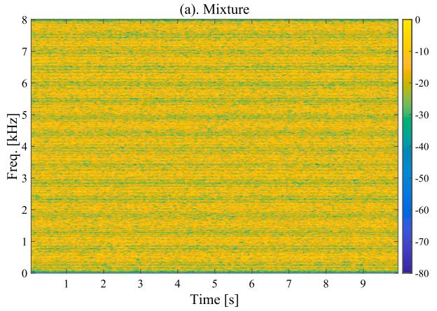

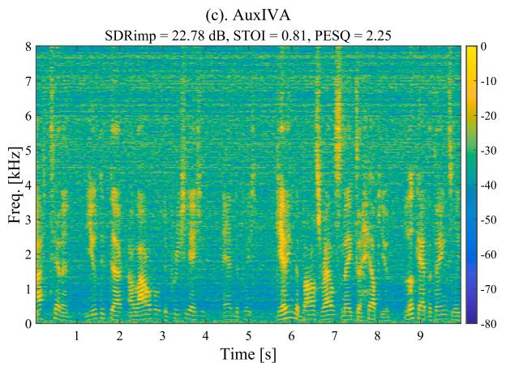

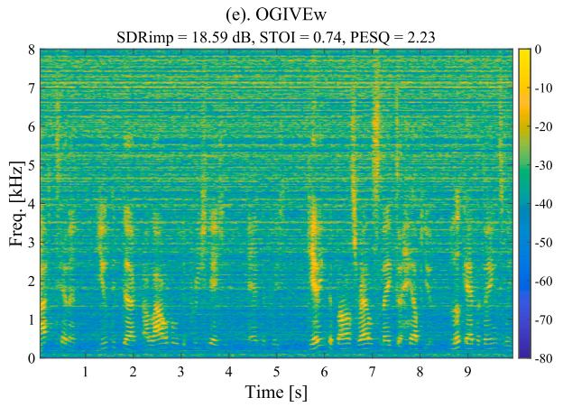  
(g). OGIVEw NG

(d). ILRMA  
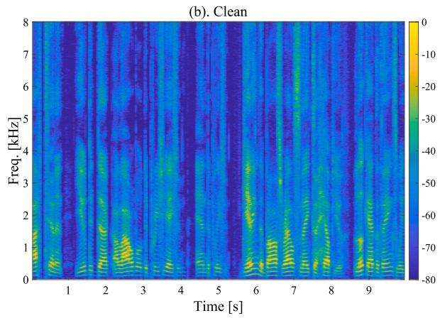

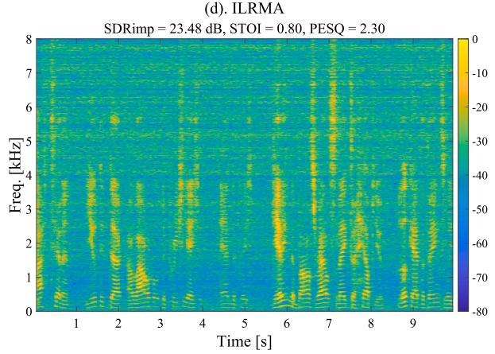

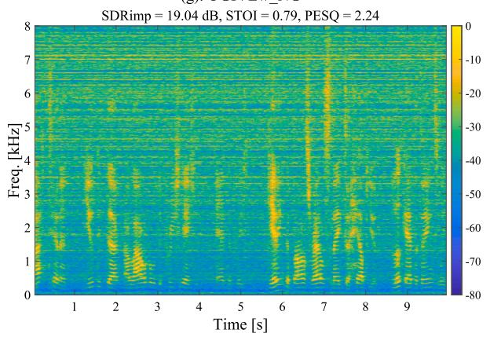

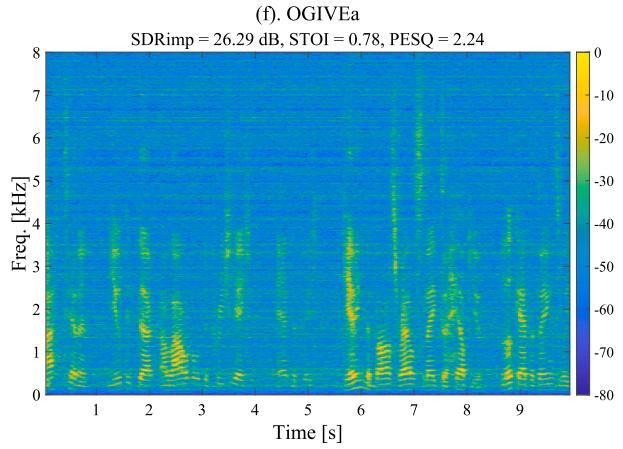

(h). OGIVEa NG  
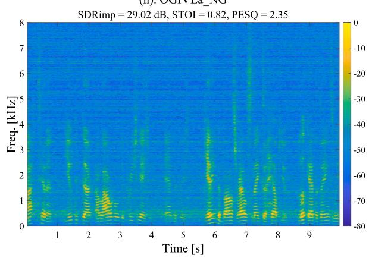  
Fig. 3. Extracted signals in a reverberant room with Gaussian noise. The STFT spectrograms of (a) the mixture; (b) the clean signal; and the signal extracted by (c) AuxIVA; (d) ILRMA; (e) OGIVEw; (f) OGIVEw\_NG; (g) OGIVEa; (h) OGIVEa\_NG.

Table 1  
Objective metrics (SDRimp, STOI and PESQ) with Gaussian noise.

<table><tr><td></td><td> $T_{60}$ </td><td>AuxIVA</td><td>ILRMA</td><td>OGIVEw</td><td>OGIVEa</td><td>OGIVEw_NG</td><td>OGIVEa_NG</td></tr><tr><td rowspan="4">SDRimp [dB]</td><td>0 ms</td><td>36.79±1.97</td><td>33.86±10.13</td><td>20.06±4.20</td><td>33.16±2.02</td><td>29.73±5.13</td><td>46.46±4.00</td></tr><tr><td>200 ms</td><td>22.32±1.95</td><td>22.90±2.06</td><td>18.36±3.01</td><td>24.63±3.02</td><td>18.61±3.24</td><td>26.41±3.30</td></tr><tr><td>500 ms</td><td>15.71±1.83</td><td>15.42±2.00</td><td>10.86±2.29</td><td>17.47±2.19</td><td>10.04±2.47</td><td>18.81±2.67</td></tr><tr><td>800 ms</td><td>12.64±2.00</td><td>11.96±2.17</td><td>7.87±2.42</td><td>14.21±2.16</td><td>7.17±2.54</td><td>15.80±2.50</td></tr><tr><td rowspan="4">STOI</td><td>0 ms</td><td>0.91±0.03</td><td>0.87±0.16</td><td>0.76±0.09</td><td>0.92±0.03</td><td>0.86±0.05</td><td>0.95±0.02</td></tr><tr><td>200 ms</td><td>0.78±0.05</td><td>0.77±0.05</td><td>0.68±0.06</td><td>0.75±0.06</td><td>0.73±0.07</td><td>0.78±0.05</td></tr><tr><td>500 ms</td><td>0.65±0.07</td><td>0.65±0.07</td><td>0.56±0.07</td><td>0.62±0.07</td><td>0.59±0.07</td><td>0.63±0.08</td></tr><tr><td>800 ms</td><td>0.57±0.08</td><td>0.57±0.08</td><td>0.50±0.07</td><td>0.54±0.08</td><td>0.53±0.07</td><td>0.56±0.08</td></tr><tr><td rowspan="4">PESQ</td><td>0 ms</td><td>3.40±0.22</td><td>3.24±1.06</td><td>2.37±0.43</td><td>3.28±0.25</td><td>3.14±0.41</td><td>3.79±0.16</td></tr><tr><td>200 ms</td><td>2.12±0.22</td><td>2.16±0.22</td><td>2.01±0.24</td><td>2.12±0.23</td><td>2.07±0.25</td><td>2.23±0.22</td></tr><tr><td>500 ms</td><td>1.57±0.21</td><td>1.58±0.24</td><td>1.48±0.23</td><td>1.59±0.21</td><td>1.51±0.21</td><td>1.64±0.22</td></tr><tr><td>800 ms</td><td>1.29±0.20</td><td>1.30±0.22</td><td>1.27±0.23</td><td>1.33±0.19</td><td>1.32±0.22</td><td>1.40±0.19</td></tr></table>

In reverberant scenarios, we apply the weighted prediction error (WPE) algorithm [31] for dereverberation as a preprocessing. To reduce computational load, we employ the frequency-domain version. The filter length in the frequency domain is determined by $L _ { \mathrm { c } } = \lfloor T _ { 6 0 } * f s / n _ { \mathrm { s h i f t } } \rfloor$ with $n _ { \mathrm { s h i f t } }$ ⌊ ⌋the size of the frame shift, �� the sampling rate and ⋅ the floor function. Since the reverberation time gets shorter as the frequency increases, we use a variable filter length here. The filter length is set to $L _ { \mathrm { c } }$ in the $0 \sim f s / 1 0$ sub-band, $0 . 8 L _ { \mathrm { c } }$ in the $f s / 1 0 \sim 3 * f s / 1 6$ subband, $0 . 6 L _ { \mathrm { c } }$ in the $3 * f s / 1 6 \sim 3 * f s / 8$ sub-band and $0 . 4 L _ { \mathrm { c } }$ in the $3 * f s / 8 \sim f s / 2$ sub-band.

and 3(h), which shows the limited ability of AuxIVA and ILRMA to handle Gaussian noise. In Figs. 3(e) and 3(g), despite some improvement in metrics, the extraction results of OGIVEw and OGIVEw\_NG remains unsuccessful due to the negative output SDR’s. Figs. 3(f) and 3(h) achieve the best results with an SDRimp’s of 26.29 dB and 29.02 dB respectively, which shows the advantages of algorithms optimizing the mixing parameters under extremely low SNR conditions. Comparing Figs. 3(h) with 3(f), it is evident that OGIVEa\_NG significantly suppresses the noise and improves various metrics. Such advantages can also be found through a comparison between Figs. 3(g) and 3(e), although not as prominently. These results demonstrate the superiority of the proposed natural gradient-based algorithms.

For AuxIVA and ILRMA, we manually select the separated signal with the highest signal-to-distortion-ratio improvement (SDRimp) for evalu ation. Such operation is impractical in realistic scenarios so their results are only for reference.

## 6.2. Performance under diferent reverberant conditions

Table 1 shows the objective metrics - SDRimp, short-time objective intelligibility (STOI) and perceptual evaluation of speech quality (PESQ) - of these algorithms, averaged over 30 tests respectively. It can be seen that IVA and ILRMA yields inferior results compared to OGIVEa and OGIVEa\_NG. This can be attributed to the signal models used by IVA and ILRMA (Laplacian or local Gaussian model) not matching the Gaussian noise. Algorithms optimizing � (OGIVEa and OGIVEa\_NG) consistently outperform algorithms optimizing � (OGIVEw and OGIVEw\_NG), highlighting the advantage of the mixing parameters optimization under extremely low SNR conditions. Furthermore, the proposed algorithms that employ natural gradients significantly exceed those using ordinary gradients, with OGIVEa\_NG stranding out as the best algorithm in terms of almost all metrics.

Fig. 3 presents a group of extraction results in a reverberant room $( T _ { 6 0 } = 2 0 0 \mathrm { m } s )$ with Gaussian noise. With an SNR of −20 dB, the SOI is hardly visible in Fig. 3(a). In Figs. 3(c) and 3(d), components of the target signal can be observed but the results are inferior than Figs. 3(f)

## 6.3. Evaluation on diferent BG distribution

In this section, we investigate the robustness of the proposed algorithms against diferent types of noise interference. Three distinct types of noise recordings are considered: (1). the ‘PSTATION’ noise excerpted from DEMAND dataset [30], which approximately follows a Gaussian distribution; (2). the ‘OMEETING’ noise excerpted from DE-MAND dataset, which has weak sparsity; (3). real speech signals excerpted from TIMIT dataset [29], which is highly sparse. They indicate no deviation, slight deviation and severe deviation from the assumption in section 3 respectively.

Similar to Fig. 2 in section 4, Figs. 4, 5 and 6 show the cost function with respect to � in the presence of the ‘PSTATION’ noise, the ‘OMEET-ING’ noise and the speech interference respectively. It can be seen that curves in Fig. 4 are almost the same as those in Fig. 2 while the curves in Figs. 5 and 6 difer from those in Fig. 2. In Figs. 5(a) and 6(a), the curves exhibit a local optimum at $a = 1$ (corresponding to the BG) since the BG’s are sparse and conform to the statistical model of the SOI to some extent. The height of the local optimum varies due to the diferent level of sparsity. For the same reason, the curves in Figs. 5(c) and 6(c) are elevated to diferent heights near the undesired solution $( a = 1 )$ However, in neither Fig. 5(a) nor 6(a), the ROC of this local optimum is narrow and sharp while the ROC of the desired solution $( a = - 1 )$ is much wider and flatter. This makes the algorithm tend to converge to the desired solution. Therefore, algorithms optimizing the mixing parameters are still advantageous and our proposed algorithms maintain efectiveness on diferent types of noise.

To enable each algorithm to achieve optimal results, we slightly revise the initialization as follows. In experiments conducted in anechoic rooms with ‘OMEETING’ noise, we initialize all the mixing vectors as $[ 1 , 1 ] ^ { \mathrm { T } }$ for OGIVEw and OGIVEw\_NG. In experiments conducted in reverberant environments with ‘OMEETING’ noise and speech interference, we initialize all the mixing vectors as $[ 1 , 0 ] ^ { \mathrm { T } }$ for all extraction algorithms. Other settings remain unchanged from those described in section 6.1.

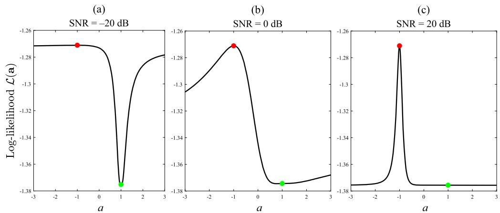

Fig. 4. The cost function with respect to $\mathbf { a } = \left[ 1 , a \right] ^ { \mathrm { T } }$ in the presence of the ‘PSTATION’ noise when the initial SNR = (a) −20 dB, (b) 0 dB and (c) 20 dB. The red and green dots denote the theoretical solutions corresponding to the SOI and the BG respectively.  
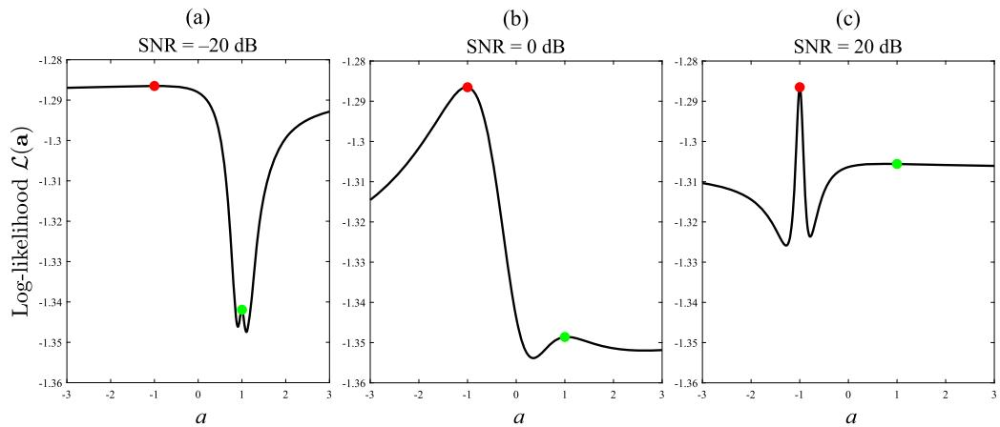

Fig. 5. The cost function with respect to $\mathbf { a } = \left[ 1 , a \right] ^ { \mathrm { T } }$ in the presence of the ‘OMEETING’ noise when the initial SNR = (a) −20 dB, (b) 0 dB and (c) 20 dB. The red and green dots denote the theoretical solutions corresponding to the SOI and the BG respectively.  
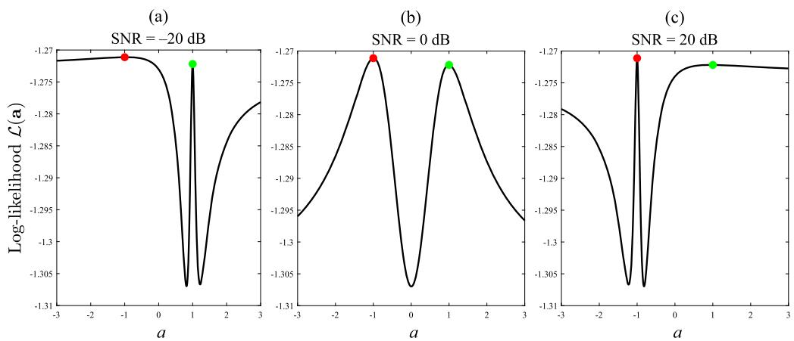  
Fig. 6. The cost function with respect to $\mathbf { a } = \left[ 1 , a \right] ^ { \mathrm { T } }$ in the presence of the speech interference when the initial SNR = (a) −20 dB, (b) 0 dB and (c) 20 dB. The red and green dots denote the theoretical solutions corresponding to the SOI and the BG respectively.

Tables 2, 3 and 4 show the experimental results on these three types of noise. For all involved types of noise, separation algorithms achieve excellent performance with ILRMA achieving the best results. Since OGIVE and its variants only model the target signal and use a Gaussian model for the BG, the performance of extraction algorithms progressively declines as the distribution of BG gradually deviates from the

Gaussian assumption. Also, it can be found that extraction algorithms optimizing � still outperform those optimizing �, which confirms the analysis in section 4. Moreover, the proposed natural gradient algorithm significantly improves the performance of extraction algorithms with OGIVEa\_NG achieving performance comparable to ILRMA, a separation algorithm with significantly more sophisticated modeling for noise. This is because the natural gradient indicates a better path to the desired solution in the parameter space. These results demonstrate the efectiveness and robustness of our proposed method across diferent types of noise.

Table 2  
Objective metrics (SDRimp, STOI and PESQ) with ‘PSTATION’ noise.

<table><tr><td></td><td> $T_{60}$ </td><td>AuxIVA</td><td>ILRMA</td><td>OGIVEw</td><td>OGIVEa</td><td>OGIVEw_NG</td><td>OGIVEa_NG</td></tr><tr><td rowspan="4">SDRimp [dB]</td><td>0 ms</td><td>36.55+2.84</td><td>36.75±3.24</td><td>8.89±5.09</td><td>28.41±2.29</td><td>15.63±6.44</td><td>42.59±3.52</td></tr><tr><td>200 ms</td><td>26.25+1.85</td><td>26.18±2.07</td><td>19.33±3.87</td><td>21.71±3.03</td><td>23.56±3.10</td><td>26.30±2.99</td></tr><tr><td>500 ms</td><td>19.43+1.64</td><td>19.62±1.74</td><td>14.42±4.22</td><td>17.12±2.68</td><td>17.07±3.14</td><td>19.27±2.45</td></tr><tr><td>800 ms</td><td>16.79+1.55</td><td>16.53±1.50</td><td>12.05±3.53</td><td>15.60±2.03</td><td>14.73±2.74</td><td>16.56±2.17</td></tr><tr><td rowspan="4">STOI</td><td>0 ms</td><td>0.92±0.02</td><td>0.92±0.03</td><td>0.62±0.11</td><td>0.87±0.03</td><td>0.73±0.10</td><td>0.95±0.02</td></tr><tr><td>200 ms</td><td>0.75±0.05</td><td>0.77±0.04</td><td>0.65±0.05</td><td>0.71±0.06</td><td>0.72±0.05</td><td>0.75±0.05</td></tr><tr><td>500 ms</td><td>0.64±0.06</td><td>0.65±0.06</td><td>0.56±0.06</td><td>0.59±0.06</td><td>0.60±0.06</td><td>0.62±0.06</td></tr><tr><td>800 ms</td><td>0.57±0.06</td><td>0.58±0.06</td><td>0.50±0.05</td><td>0.54±0.06</td><td>0.54±0.06</td><td>0.56±0.07</td></tr><tr><td rowspan="4">PESQ</td><td>0 ms</td><td>3.43±0.18</td><td>3.45±0.57</td><td>1.44±0.36</td><td>2.95±0.20</td><td>2.04±0.44</td><td>3.67±0.18</td></tr><tr><td>200 ms</td><td>2.14±0.25</td><td>2.16±0.22</td><td>1.88±0.29</td><td>2.04±0.33</td><td>2.10±0.23</td><td>2.27±0.23</td></tr><tr><td>500 ms</td><td>1.60±0.28</td><td>1.66±0.25</td><td>1.48±0.25</td><td>1.62±0.26</td><td>1.57±0.24</td><td>1.73±0.24</td></tr><tr><td>800 ms</td><td>1.35±0.27</td><td>1.34±0.24</td><td>1.22±0.24</td><td>1.35±0.28</td><td>1.33±0.25</td><td>1.52±0.25</td></tr></table>

Table 3  
Objective metrics (SDRimp, STOI and PESQ) with ‘OMEETING’ noise.

<table><tr><td></td><td> $T_{60}$ </td><td>AuxIVA</td><td>ILRMA</td><td>OGIVEw</td><td>OGIVEa</td><td>OGIVEw_NG</td><td>OGIVEa_NG</td></tr><tr><td rowspan="4">SDRimp [dB]</td><td>0 ms</td><td>23.92±3.01</td><td>34.56±4.24</td><td>20.23±10.67</td><td>27.08±5.72</td><td>34.35±7.48</td><td>41.28±4.73</td></tr><tr><td>200 ms</td><td>22.36+2.69</td><td>25.21±1.51</td><td>5.40±3.63</td><td>24.26±2.95</td><td>13.66±7.16</td><td>25.19±2.14</td></tr><tr><td>500 ms</td><td>19.33+2.32</td><td>20.05±2.15</td><td>6.31±3.16</td><td>17.53±3.71</td><td>12.78±5.24</td><td>18.91±2.83</td></tr><tr><td>800 ms</td><td>17.34+2.48</td><td>17.64±2.42</td><td>6.91±3.11</td><td>15.72±3.72</td><td>12.33±4.59</td><td>16.85±3.01</td></tr><tr><td rowspan="4">STOI</td><td>0 ms</td><td>0.77±0.03</td><td>0.91±0.03</td><td>0.74±0.17</td><td>0.84±0.09</td><td>0.91±0.06</td><td>0.94±0.02</td></tr><tr><td>200 ms</td><td>0.70±0.04</td><td>0.75±0.04</td><td>0.37±0.06</td><td>0.73±0.04</td><td>0.46±0.14</td><td>0.73±0.04</td></tr><tr><td>500 ms</td><td>0.63±0.05</td><td>0.65±0.05</td><td>0.36±0.06</td><td>0.60±0.07</td><td>0.43±0.10</td><td>0.61±0.07</td></tr><tr><td>800 ms</td><td>0.57±0.06</td><td>0.59±0.06</td><td>0.35±0.05</td><td>0.54±0.07</td><td>0.42±0.09</td><td>0.55±0.07</td></tr><tr><td rowspan="4">PESQ</td><td>0 ms</td><td>2.37±0.23</td><td>3.43±0.18</td><td>2.42±0.81</td><td>2.88±0.59</td><td>3.25±0.68</td><td>3.68±0.28</td></tr><tr><td>200 ms</td><td>2.10±0.24</td><td>2.25±0.18</td><td>1.30±0.64</td><td>2.16±0.21</td><td>1.54±0.67</td><td>2.15±0.20</td></tr><tr><td>500 ms</td><td>1.70±0.24</td><td>1.74±0.23</td><td>1.34±0.68</td><td>1.65±0.23</td><td>1.41±0.70</td><td>1.68±0.23</td></tr><tr><td>800 ms</td><td>1.46±0.22</td><td>1.47±0.25</td><td>1.48±0.76</td><td>1.44±0.22</td><td>1.44±0.61</td><td>1.48±0.25</td></tr></table>

Table 4  
Objective metrics (SDRimp, STOI and PESQ) with speech interference.

<table><tr><td></td><td> $T_{60}$ </td><td>AuxIVA</td><td>ILRMA</td><td>OGIVEw</td><td>OGIVEa</td><td>OGIVEw_NG</td><td>OGIVEa_NG</td></tr><tr><td rowspan="4">SDRimp [dB]</td><td>0 ms</td><td>37.12+2.79</td><td>35.62±5.06</td><td>4.59±1.02</td><td>26.61±7.36</td><td>17.88±10.82</td><td>41.28±11.99</td></tr><tr><td>200 ms</td><td>24.33+2.95</td><td>24.38±2.90</td><td>3.77±2.22</td><td>22.27±4.59</td><td>11.73±9.60</td><td>24.11±3.10</td></tr><tr><td>500 ms</td><td>17.98+2.47</td><td>17.88±2.44</td><td>3.38±2.14</td><td>12.66±3.73</td><td>6.02±4.33</td><td>15.93±2.65</td></tr><tr><td>800 ms</td><td>15.56+2.18</td><td>15.78±2.37</td><td>3.36±2.10</td><td>11.77±3.12</td><td>6.18±3.55</td><td>14.35±2.66</td></tr><tr><td rowspan="4">STOI</td><td>0 ms</td><td>0.91±0.02</td><td>0.92±0.03</td><td>0.35±0.05</td><td>0.85±0.14</td><td>0.51±0.28</td><td>0.89±0.17</td></tr><tr><td>200 ms</td><td>0.75±0.05</td><td>0.76±0.04</td><td>0.29±0.04</td><td>0.74±0.06</td><td>0.37±0.19</td><td>0.75±0.05</td></tr><tr><td>500 ms</td><td>0.63±0.07</td><td>0.64±0.07</td><td>0.28±0.04</td><td>0.57±0.07</td><td>0.31±0.07</td><td>0.59±0.07</td></tr><tr><td>800 ms</td><td>0.59±0.08</td><td>0.60±0.08</td><td>0.30±0.04</td><td>0.54±0.09</td><td>0.34±0.07</td><td>0.56±0.09</td></tr><tr><td rowspan="4">PESQ</td><td>0 ms</td><td>3.49±0.17</td><td>3.56±0.30</td><td>1.14±0.43</td><td>2.88±0.65</td><td>1.93±0.91</td><td>3.66±0.66</td></tr><tr><td>200 ms</td><td>2.18±0.18</td><td>2.22±0.18</td><td>1.41±0.56</td><td>2.14±0.23</td><td>1.52±0.53</td><td>2.17±0.20</td></tr><tr><td>500 ms</td><td>1.60±0.21</td><td>1.63±0.21</td><td>1.30±0.41</td><td>1.49±0.22</td><td>1.26±0.39</td><td>1.57±0.22</td></tr><tr><td>800 ms</td><td>1.33±0.22</td><td>1.40±0.21</td><td>1.40±0.70</td><td>1.39±0.31</td><td>1.45±0.78</td><td>1.40±0.19</td></tr></table>

Figs. 7 and 8 provide extraction results in a reverberant room $( T _ { 6 0 }$ $= 2 0 0$ ms) with ‘PSTATION’ noise and speech interference respectively. In Figs. 7(c) and 7(d), AuxIVA and ILRMA achieve excellent results in both scenarios. The noise is better suppressed in Figs. 7(f) and 7(h) compared to Figs. 7(e) and 7(g). Moreover, in the low-frequency region highlighted by the red boxes, the speech components are extracted correctly in Figs. 7(g) and 7(h) while more noise components are retained in Figs. 7(e) and 7(f), indicating the superiority of natural gradientbased optimization to find the desired solution in most frequency bins. In Fig. 8(a), target source components can be observed only in the silent regions of the interference source. In Figs. 8(c) and 8(d), AuxIVA and ILRMA obtain relatively better results with an SDRimp of 21.76 dB and 22.56 dB respectively, which demonstrates their ability to model super-Gaussian sources. Both OGIVEw and OGIVEw\_NG yield extremely poor results since they tend to find the BG. The interference source is suppressed more efectively in Figs. 8(f) and 8(h), which validates the superiority of algorithms optimizing � when extracting a weak source. Additionally, compared to Fig. 8(f), Fig. 8(h) shows the best result across the extraction methods with comparable performance to Fig. 8(d).

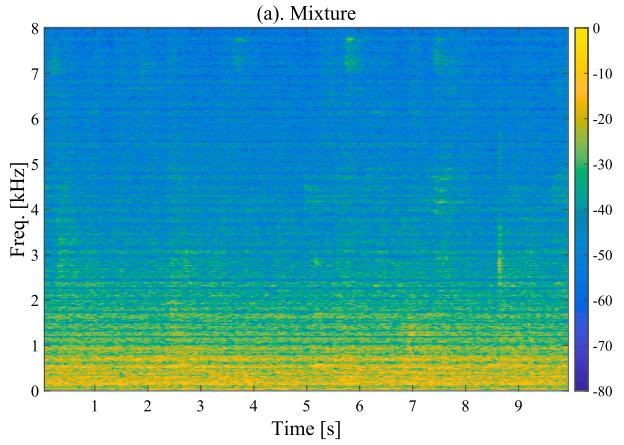

(c). AuxIVA  
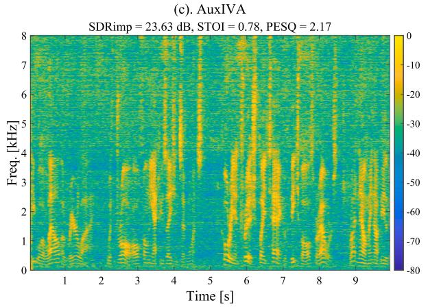  
(e). OGIVEw

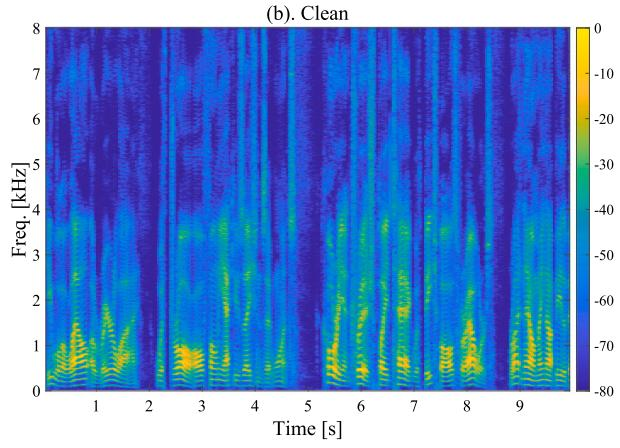  
(d). ILRMA

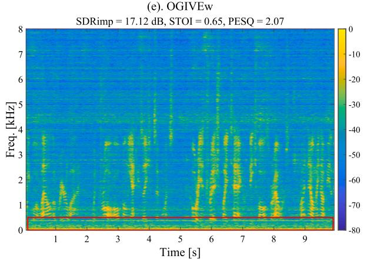

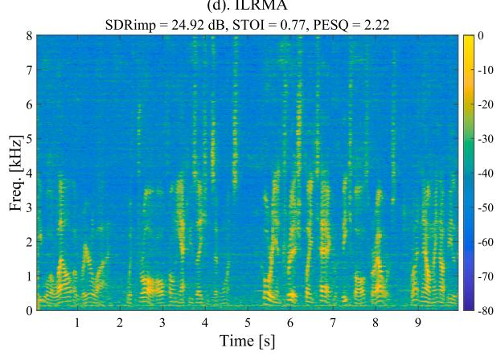  
(f). OGIVEa

(g). OGIVEw NG  
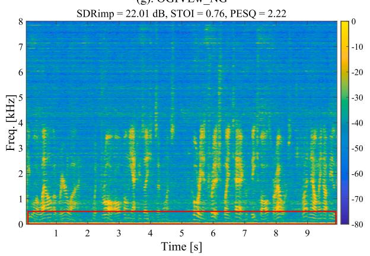

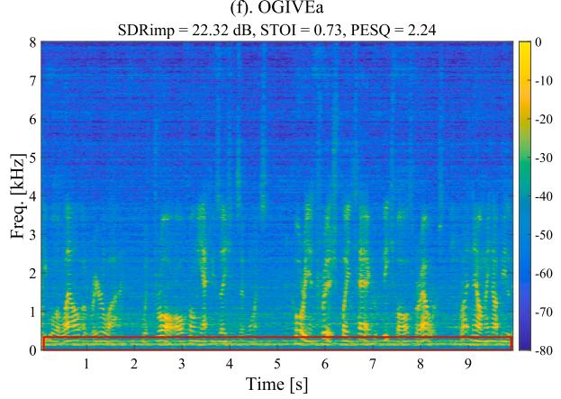

(h). OGIVEa NG  
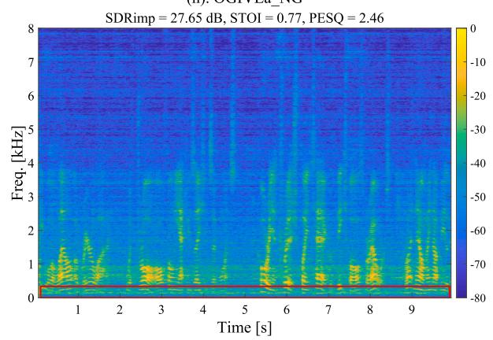  
Fig. 7. Extracted signals in a reverberant room with ‘PSTATION’ noise. The STFT spectrograms of (a) the mixture; (b) the clean signal; and the signal extracted by (c) AuxIVA; (d) ILRMA; (e) OGIVEw; (f) OGIVEw\_NG; (g) OGIVEa; (h) OGIVEa\_NG.

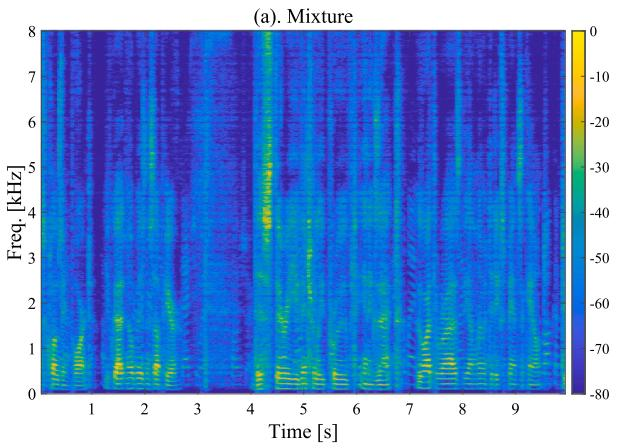

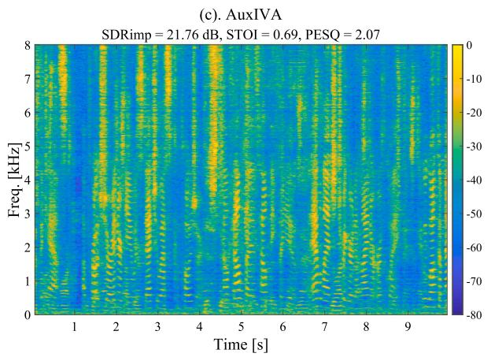

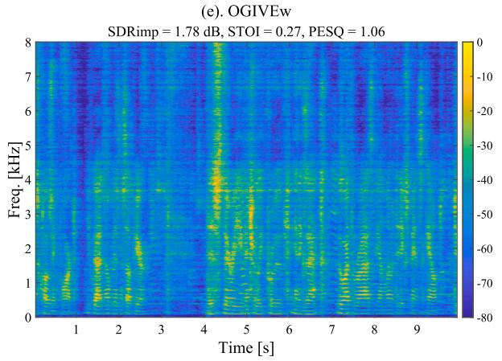

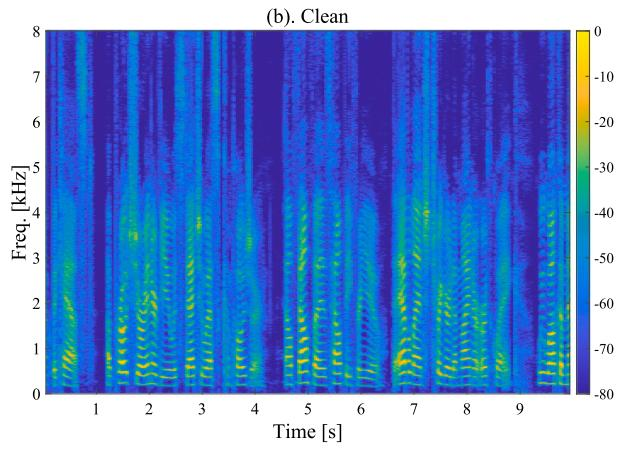

(d). ILRMA  
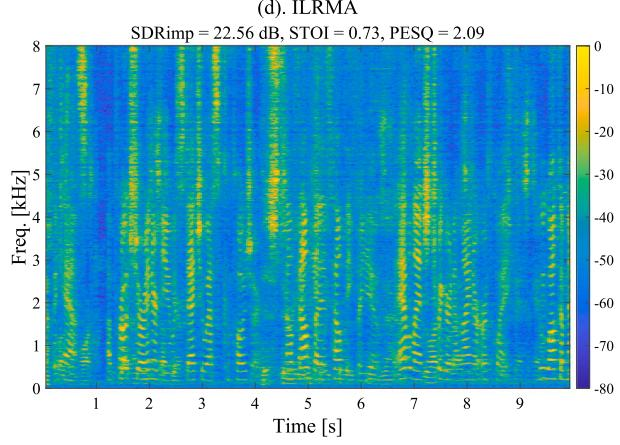

(g). OGIVEw NG  
(f). OGIVEa  
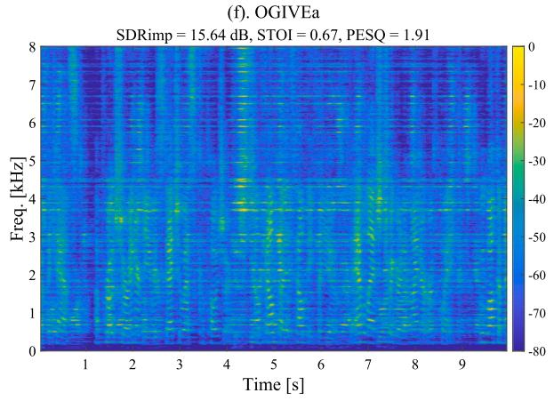

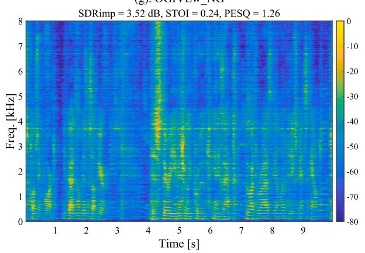

(h). OGIVEa NG  
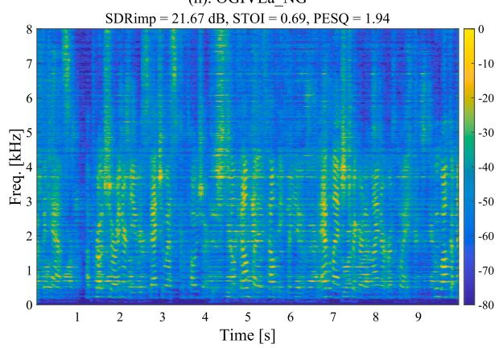  
Fig. 8. Extracted signals in a reverberant room with speech interference. The STFT spectrograms of (a) the mixture; (b) the clean signal; and the signal extracted by (c) AuxIVA; (d) ILRMA; (e) OGIVEw; (f) OGIVEw\_NG; (g) OGIVEa; (h) OGIVEa\_NG.

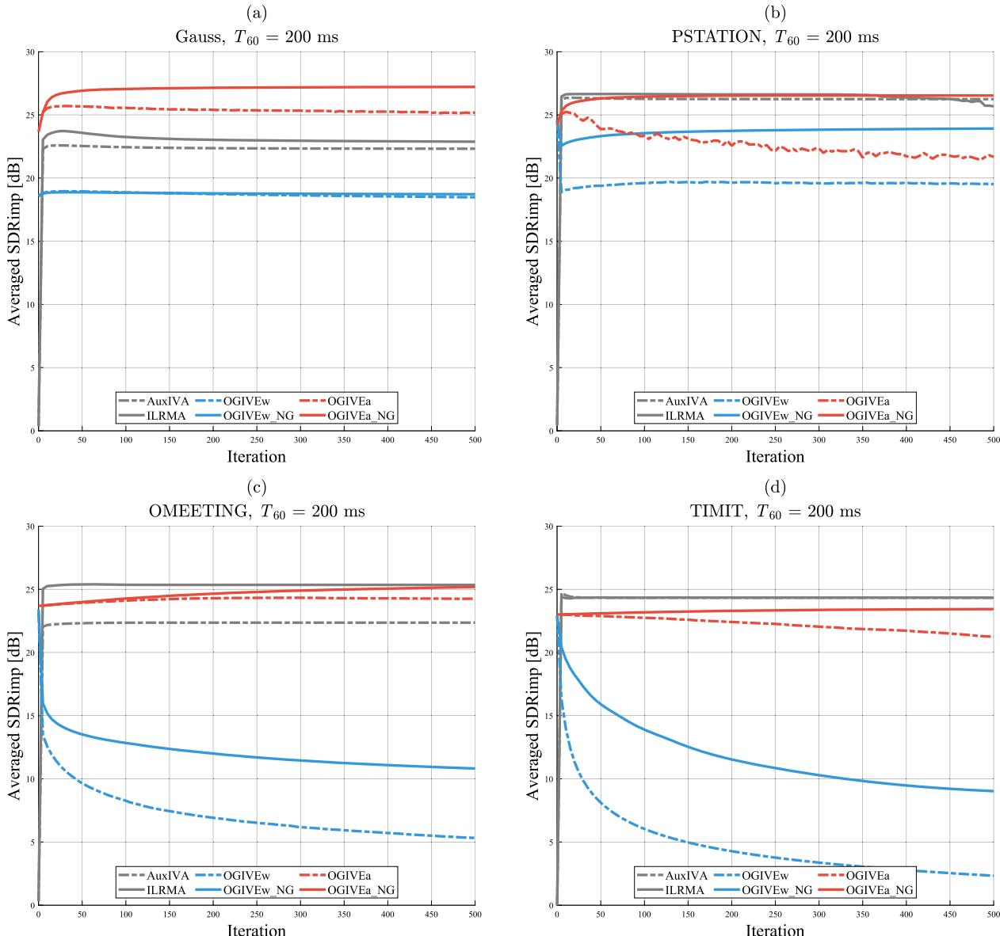  
Fig. 9. Averaged SDRimp of 6 involved algorithms in diferent scenarios.

## 6.4. Convergence analysis

In this section, we investigate the convergence properties of the pro posed algorithms in typical scenarios. Fig. 9 shows typical convergence curves of the SDRimp averaged over 30 samples for the involved algo rithms. The titles indicate the noise type and reverberation time of the simulated room. The convergence curves of AuxIVA and ILRMA start from 0 dB since all the demixing matrices are initialized as identity matrices. Extraction algorithms require a well-defined initialization so their curves start from a higher SDRimp.

Extraction algorithms optimizing the demixing parameters, i.e., OGIVEw and OGIVEw\_NG, tend to extract the dominant source. Therefore, when given an inferior initialization, the SDRimp remains almost unchanged (Fig. 9(a)). When given a well-defined initialization, the

SDRimp continues to decrease and convergence to a worse result compared to the start point of the curve (Figs. 9(b), 9(c) and 9(d)). On the contrary, algorithms optimizing the mixing parameters, i.e., OGIVEa and OGIVEa\_NG, tend to extract the weak source and show better convergence performance. However, OGIVEa still faces the issues of unstable convergence (Fig. 9(b)) and performance degradation com pared to the start point of the curve (Figs. 9(b) and 9(d)) since the ordinary gradient cannot guarantee stable convergence and may lead to a suboptimal solution. Compared to OGIVEa, OGIVEa\_NG exhibits smooth convergence and non-degrading performance in all scenarios. Moreover, even for OGIVEw, natural gradient-based optimization help to mitigate the degradation trend and leads to a relatively better result. These behaviors demonstrate the efectiveness of our parameter selection and optimization strategies.

## 6.5. Evaluation on real-recorded data

To further confirm the stability and eficacy of the proposed algo rithms, we evaluate the algorithms on real-recorded data. 30 mixtures are recorded using a 2-microphone array in a real room with a $T _ { 6 0 }$ over 500 ms. We take clean signals from VCC dataset [32] as target signals. They are concatenated into signals with a length of 10 s and a sampling rate of 16 kHz. Three types of noise in DEMAND dataset, i.e., ‘PSTA-TION’, ‘PCAFETER’ and ‘STRAFFIC’, are taken as noise signals with a randomly intercepted length of 10 s. The noise source is placed at 90◦ (the direction perpendicular to the line connecting the microphones), 2.0 m away from the array center. The target source is placed at $4 5 ^ { \circ }$ 1.5 m away from the array center.

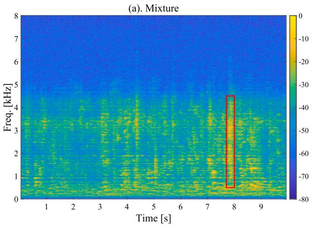

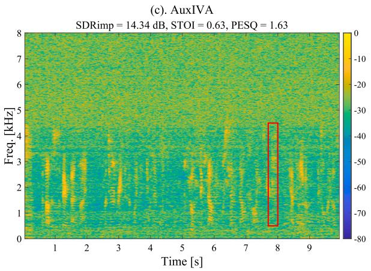  
(e). OGIVEw

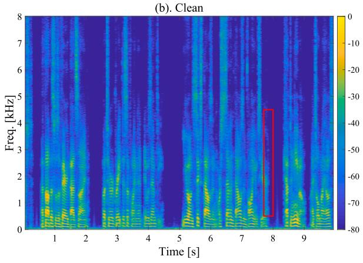  
(d). ILRMA

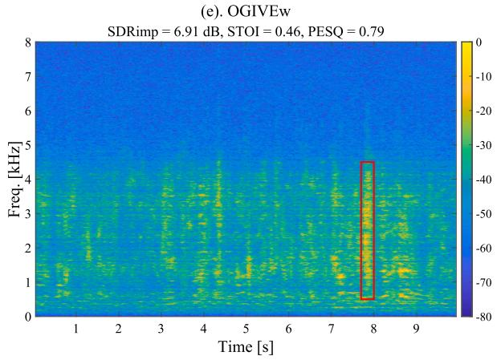

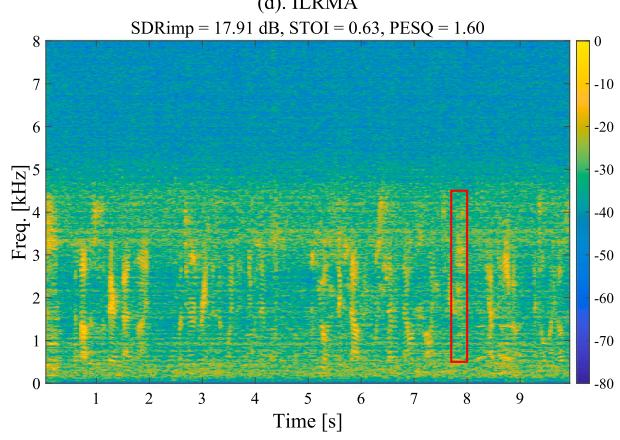

(f). OGIVEa  
(g). OGIVEw NG  
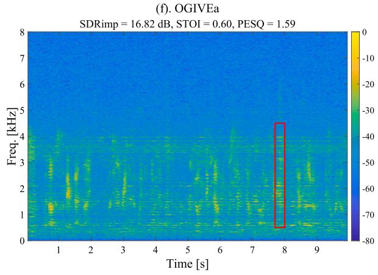

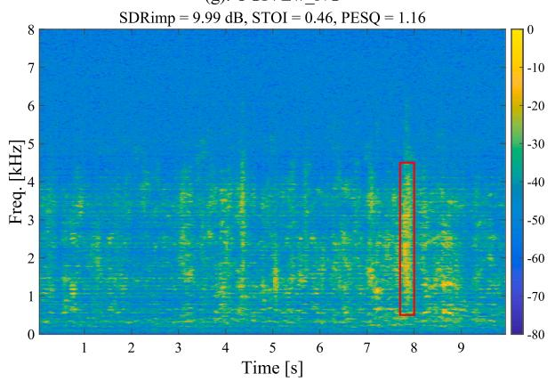

(h). OGIVEa NG  
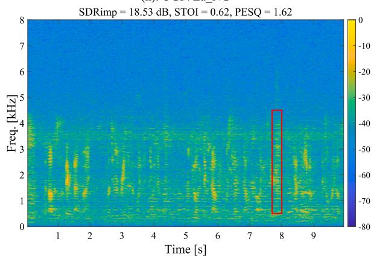  
Fig. 10. Extracted signals in a real room with ‘PCAFETER’ noise. The STFT spectrograms of (a) the mixture; (b) the clean signal; and the signal extracted by (c) AuxIVA; (d) ILRMA; (e) OGIVEw; (f) OGIVEw\_NG; (g) OGIVEa; (h) OGIVEa\_NG.

Table 5  
Objective metrics (SDRimp, STOI and PESQ) on the real-recorded data.

<table><tr><td></td><td>AuxIVA</td><td>ILRMA</td><td>OGIVEw</td><td>OGIVEa</td><td>OGIVEw_NG</td><td>OGIVEa_NG</td></tr><tr><td>SDRimp [dB]</td><td>12.18±2.32</td><td>15.12±2.55</td><td>12.46±4.77</td><td>15.30±2.73</td><td>14.34±3.61</td><td>15.66±2.68</td></tr><tr><td>STOI</td><td>0.60±0.05</td><td>0.60±0.05</td><td>0.54±0.08</td><td>0.58±0.05</td><td>0.55±0.08</td><td>0.58±0.04</td></tr><tr><td>PESQ</td><td>1.35±0.18</td><td>1.31±0.19</td><td>1.32±0.46</td><td>1.33±0.16</td><td>1.32±0.26</td><td>1.35±0.17</td></tr></table>

All initial mixing vectors are set to $[ 0 . 0 1 , 1 ] ^ { \mathrm { T } }$ for OGIVEa and OGIVEa\_NG and $[ 0 , \bar { 1 } ] ^ { \mathrm { T } }$ for OGIVEw and OGIVEw\_NG. Other settings remain unchanged from those described in section 6.1.

Table 5 shows the objective metrics averaged over 30 samples. It can be seen that algorithms optimizing � (OGIVEa and OGIVEa\_NG) consistently outperform algorithms optimizing � (OGIVEw and OGIVEw\_NG). Moreover, natural gradient-based method helps to improve the perfor mance of extraction algorithms with $\mathsf { O G I V E a \_ N G }$ achieving the best performance, which demonstrates the efectiveness and stability of the proposed algorithms in the real-world scenario.

Fig. 10 provides extraction results in a real room with ‘PCAFETER’ noise. Note that this noise contains a large amount of human voice, so we can see some harmonic structures in Fig. 10(a). Output SDR’s of all the extracted signals are negative in such a complicated environment. AuxIVA achieves an inferior result since the high-frequency noise is not suppressed efectively while ILRMA achieves a significantly better performance. It can be clearly seen that the noise is better suppressed in Figs. 10(f) and 10(h) compared to Figs. 10(e) and 10(g). For example, in Figs. 10(e) and 10(g), OGIVEw and OGIVEw\_NG tend to retain the noise components marked by the red boxes while OGIVEa and OGIVEa\_NG tend to eliminate them in Figs. 10(f) and 10(h). Moreover, compared to Figs. 10(e) and 10(f), components of the target source are clearer in Figs. 10(g) and 10(h), which demonstrates the efectiveness of natural gradient-based optimization. More audio samples can be found in https://github.com/hxruan-cpp/lowSNR-audio-samples.

## 7. Conclusion

This paper adopts the OGIVE framework to address the problem of speech extraction under extremely low SNR conditions. Theoretica analyses based on real speech signals demonstrates that algorithms opti mizing the mixing vector � are more advantageous than conventional algorithms optimizing the demixing vector � at extremely low SNR levels. Two natural gradient-based algorithms, OGIVEw\_NG and OGIVEa\_NG, are proposed to improve the performance of original OGIVE. Experimental results demonstrate the superiority of the proposed algorithms compared to original OGIVE methods and their versatility across difer ent types of noise interference.

## Funding

This work was supported by the National Natural Science Foundation of China (Grant No. 12274221).

## CRediT authorship contribution statement

Haoxin Ruan: Writing – review & editing, Writing – original draft, Visualization, Validation, Software, Methodology, Investigation, For mal analysis, Conceptualization. Lele Liao: Writing – review & editing, Writing – original draft, Visualization, Validation, Software, Methodol ogy, Investigation, Formal analysis, Data curation, Conceptualization.

Kai Chen: Writing – review & editing, Supervision, Resources, Project administration. Jing Lu: Writing – review & editing, Supervision, Resources, Funding acquisition, Conceptualization.

## Declaration of competing interest

The authors declare the following financial interests/personal relationships which may be considered as potential competing interests: Jing Lu reports financial support was provided by National Natural Science Foundation of China. Jing Lu reports a relationship with National Natural Science Foundation of China that includes: funding grants.

## Data availability

Data will be made available on request.

## References

[1] Cichocki A, Amari S-i. Adaptive blind signal and image processing: learning algorithms and applications. John Wiley & Sons; 2002.

[2] Brendel A, Haubner T, Kellermann W. A unified probabilistic view on spatially informed source separation and extraction based on independent vector analysis. IEEE Trans Signal Process 2020;68:3545–58.

[3] Zhao X, Qin Y, He C, Jia L. Underdetermined blind source extraction of early vehicle bearing faults based on emd and kernelized correlation maximization. J Intell Manuf 2022:33:185-201

[4] Ahmadian P, Sanei S, Ascari L, González-Villanueva L, Umiltà MA. Constrained blind source extraction of readiness potentials from EEG. IEEE Trans Neural Syst Rehabil Eng 2012;21(4):567–75.

[5] Javidi S, Mandic DP, Cichocki A. Complex blind source extraction from noisy mixtures using second-order statistics. IEEE Trans Circuits Syst I, Regul Pap 2010:57(7):1404-16

[6] Janský J, Koldovský Z, Málek J, Kounovský T, Čmejla J. Auxiliary function-based algorithm for blind extraction of a moving speaker. EURASIP J Audio Speech Music Process 2022;2022(1):1–16.

[7] Jansk J. Málek J. Čmeila J. Kounoysk T. Koldoysk Z. Žd'ánsk J. Adaptive blind audio source extraction supervised by dominant speaker identification using x-vectors. In: ICASSP 2020-2020 IEEE international conference on acoustics, speech and signal processing (ICASSP). IEEE; 2020. p. 676–80.

[8] Malek J, Jansky J, Koldovsky Z, Kounovsky T, Cmejla J, Zdansky J. Target speech extraction: independent vector extraction guided by supervised speaker identification. IEEE/ACM Trans Audio Speech Lang Process 2022;30:2295–309.

[9] Liao L, Cheng G, Gu Z, Lu J. Eficient independent vector extraction of dominant source (l). J Acoust Soc Am 2022;151(6):4126–30.

[10] Scheibler R, Ono N. Fast independent vector extraction by iterative sinr maximization. In: ICASSP 2020-2020 IEEE international conference on acoustics, speech and signal processing (ICASSP). IEEE; 2020. p. 601–5.

[11] Ikeshita R, Nakatani T, Araki S. Overdetermined independent vector analysis. In: ICASSP 2020-2020 IEEE international conference on acoustics, speech and signa processing (ICASSP). IEEE; 2020. p. 591–5.

[12] Ikeshita R, Nakatani T, Araki S. Block coordinate descent algorithms for auxiliary-function-based independent vector extraction. IEEE Trans Signal Process 2021:69:3252–67

[13] Scheibler R, Ono N. Independent vector analysis with more microphones than sources. In: 2019 IEEE workshop on applications of signal processing to audio and acoustics (WASPAA). IEEE; 2019. p. 185–9.

[14] Koldovsky Z,\` Tichavsky P.\` Gradient algorithms for complex non-Gaussian independent component/vector extraction, question of convergence. IEEE Trans Signal Process 2018;67(4):1050–64.

[15] Ikeshita R. Nakatani T. Geometricallv-regularized fast independent vector extraction by pure majorization-minimization. IEEE Trans Signal Process 2024.

[16] Sawada H, Ono N, Kameoka H, Kitamura D, Saruwatari H. A review of blind source separation methods: two converging routes to ilrma originating from ica and nmf. APSIPA Trans Signal Inf Process 2019:8

[17] Adali T, Anderson M, Fu G-S. Diversity in independent component and vector analyses: identifiability, algorithms, and applications in medical imaging. IEEE Signal Process Mag 2014;31(3):18–33.

[18] Ono N. Stable and fast update rules for independent vector analysis based on auxil iary function technique. In: 2011 IEEE workshop on applications of signal processing to audio and acoustics (WASPAA). IEEE; 2011. p. 189–92.

[19] Kitamura D, Ono N, Sawada H, Kameoka H, Saruwatari H. Determined blind source separation unifying independent vector analysis and nonnegative matrix factorization. JEEE/ACM Trans Audio Speech Lang Process 2016:24(9):1626–41.

[20] Hao X, Su X, Wang Z, Zhang H. Unetgan: a robust speech enhancement approach in time domain for extremely low signal-to-noise ratio condition. arXiv preprint. arXiv:2010.15521, 2020.

[21] Koldovský Z, Kautský V, Tichavský P. Double nonstationarity: blind extraction of independent nonstationary vector/component from nonstationary mixtures— algorithms. IEEE Trans Signal Process 2022;70:5102–16.

[22] Van Trees HL. Optimum array processing: Part IV of detection, estimation, and modulation theory. John Wiley & Sons; 2002.

[23] Koldovsky Z,\` Tichavsky P,\` Kautsky V.\` Orthogonally constrained independent component extraction: blind MPDR beamforming. In: 2017 25th European signal processing conference (EUSIPCO). IEEE; 2017. p. 1155–9.

[24] Amari S-I. Natural gradient works eficiently in learning. Neural Compu 1998;10(2):251–76.

[25] Li H, Adalı T. Complex-valued adaptive signal processing using nonlinear functions. EURASIP J Adv Signal Process 2008:1–9.

[26] Allen JB, Berkley DA. Image method for eficiently simulating small-room acoustics. J Acoust Soc Am 1979;65(4):943–50.

[27] Habets EA. Room impulse response generator. Tech. Rep. 2 (2.4), Technische Universiteit Eindhoven; 2006. p. 1.

[28] Liao L, Cheng G, Chen K, Cao Z, Lu J. Improvement of independent vector analysis for closely spaced sources. Appl Acoust 2023;212:109575.

[29] Garofolo JS. Timit acoustic phonetic continuous speech corpus. Linguistic data consortium, vol. 1993. 1993.

[30] Thiemann J, Ito N, Vincent E. The diverse environments multi-channel acoustic noise database (demand): a database of multichannel environmental noise recordings. In: Proceedings of meetings on acoustics, vol. 19. AIP Publishing; 2013.

[31] Nakatani T, Yoshioka T, Kinoshita K, Miyoshi M, Juang B-H. Speech dereverberation based on variance-normalized delayed linear prediction. IEEE Trans Audio Speech Lang Process 2010;18(7):1717–31.

[32] Toda T, Chen L-H, Saito D, Villavicencio F, Wester M, Wu Z, et al. The voice conversion challenge 2016. In: Interspeech, vol, 2016: 2016, p. 1632–6