overview paper

# A review of blind source separation methods: two converging routes to ILRMA originating from ICA and NMF

hiroshi sawada1, nobutaka ono2, hirokazu kameoka1, daichi kitamura3 and hiroshi saruwatari4

This paper describes several important methodsfor the blind source separation ofaudio signals in an integrated manner. Two historically developed routes arefeatured. One startedfrom independent component analysis and evolved to independent vector analysis (IVA) by extending the notion ofindependence from a scalar to a vector. In the other route, nonnegative matrix factorization (NMF) has been extended to multichannel NMF (MNMF). As a convergence point ofthese two routes, independent low-rank matrix analysis has been proposed, which integrates IVA and MNMF in a clever way. All the objective functions in these methods are eficiently optimized by majorization-minimization algorithms with appropriately designed auxiliaryfunctions. Experimental results for a simple two-source two-microphone case are given to illustrate the characteristics ofthese five methods.

Keywords: Blind source separation (BSS), Time-frequency-channel tensor, Independent component analysis (ICA), Nonnegative matrix factorization (NMF), Majorization-minimization algorithm with auxiliary function

Received 5 February 2019; Revised 11 April 2019

## I. INTRODUCTION

The technique of blind source separation (BSS) has been studied for decades [1–5], and the research is still in progress. The term “blind” refers to the situation that the source activities and the mixing system information are unknown. There are many diverse purposes for developing this technology even if audio signals are focused on, such as (1) implementing the cocktail party efect as an artificial intelligence, (2) extracting the target speech in a noisy environment for better speech recognition results, (3) separating each musical instrumental part of an orchestra performance for music analysis.

Various signal processing and machine learning methods have been proposed for BSS. They can be classifi ed using two axes (Fig. 1). The horizontal axis relates to the number M of microphones used to observe sound mixtures. The most critical distinction is whether M = 1 or M ≥ 2, i.e., a single-channel or multichannel case. In a multichannel case, the spatial information of a source signal (e.g., source position) can be utilized as an important cue for separation. The second critical distinction is whether the number M of microphones is greater than or equal to the number N of source signals. In determined (N = M) and overdetermined (N < M) cases, the separation can be achieved using linear filters. For underdetermined (N > M) cases, one popular approach is based on clustering, such as by the Gaussian mixture model (GMM), followed by time-frequency masking [6–12]. The vertical axis indicates whether training data are utilized or not. If so, the characteristics of speech and audio signals can be learned beforehand. The learned knowledge helps to optimize the separation system, especially for single-channel cases where no spatial cues can be utilized. Recently, many methods based on deep neural networks (DNNs) have been proposed [13–21].

Among the various methods shown in Fig. 1, this paper discusses the methods in blue. The motivation for selecting these methods is twofold: (1) As shown in Fig. 2, two originally diferent methods, independent component analysis (ICA) [3, 4, 22–29] and nonnegative matrix factorization (NMF) [30–36], have historically been extended to independent vector analysis (IVA) [37–46] and multichannel NMF [47–54], respectively, which have recently been unified as independent low-rank matrix analysis (ILRMA) [55–60]. (2) The objective functions used in these methods can efectively be minimized by majorization-minimization algorithms with appropriately designed auxiliary functions [36, 61–68]. With regard to these two aspects, all the selected methods are related and worth explaining in a single review paper.

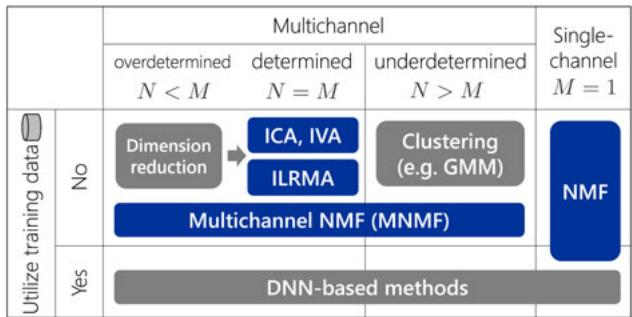  
Fig. 1. Various methods for blind audio source separation. Methods in blue are discussed in this paper in an integrated manner.

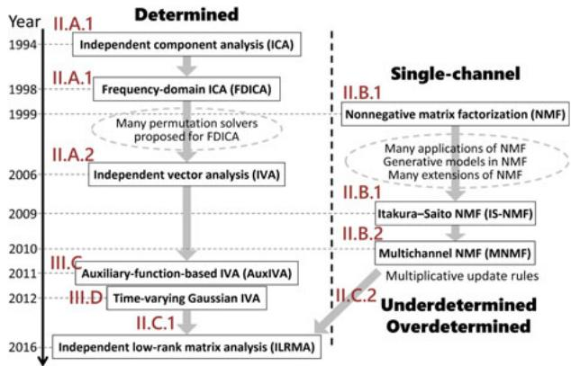  
Fig. 2. Historical development of BSS methods.  
Table 1. Notations.

Although the mixing situation is unknown in the BSS problem, the mixing model is described as follows. Let $s _ { 1 } , \ldots , s _ { N }$ be N original sources and $x _ { 1 } , \ldots , x _ { M }$ be M mixtures at microphones. Let $h _ { m n }$ denote the transfer characteristic from source $s _ { n }$ to mixture $x _ { m }$ . When $h _ { m n }$ is described by a scalar, the problem is called instantaneous BSS and the mixtures are modeled as

$$
x _ {m} (t) = \sum_ {n = 1} ^ {N} h _ {m n} s _ {n} (t), \quad m = 1, \dots , M,\tag{1}
$$

where t represents time. When $h _ { m n }$ is described by an impulse response of L samples that represents the delay and reverberations in a real-room situation, the problem is called convolutive BSS and the mixtures are modeled as

$$
x _ {m} (t) = \sum_ {n = 1} ^ {N} \sum_ {\tau = 0} ^ {L - 1} h _ {m n} (\tau) s _ {n} (t - \tau), \quad m = 1, \dots , M.\tag{2}
$$

To cope with a real-room situation, we need to solve the convolutive BSS problem.

Although there have been proposed time-domain approaches [69–75] to the convolutive BSS problem, a more suitable approach for combining ICA and NMF is a frequency-domain approach [76–85], where we apply i Frequency bin index j Time frame index m Microphone index n Source index I Number of frequency bins J Number of time frames M Number of microphones N Number of sources x Mixtures/observations x Scalar x Vector X Matrix X Hermitian positive semidefinite matrix Tensor y Source estimates W Separation system T Basis spectrum V Time-varying magnitudes H Spatial properties, mixing matrices U Weighted covariance matrix

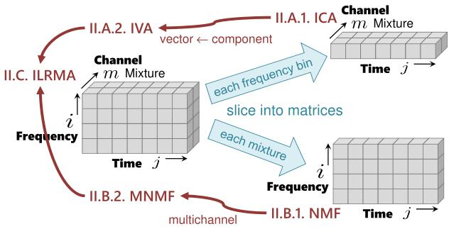  
Fig. 3. Tensor and sliced matrices.

a short-time Fourier transformation (STFT) to the timedomain mixtures (2). Using a suficiently long STFT window to cover the main part of the impulse responses, the convolutive mixing model (2) can be approximated with the instantaneous mixing model

$$
x _ {i j, m} = \sum_ {n = 1} ^ {N} h _ {i, m n} s _ {i j, n}, \quad m = 1, \ldots , M\tag{3}
$$

in each frequency bin i, with time frame j representing the position index of each STFT window. Table 1 summarizes the notations used in this paper.

The data structure that we deal with is a complex-valued tensor with three axes, frequency i, time j, and channel (mixture m or source n), as shown on the left-hand side of Fig. 3. Until IVA was invented in 2006, there had been no clear way to handle the tensor in a unified manner. A practical way was to slice the tensor into frequency-dependent matrices with time and channel axes, and apply ICA to the matrices. Another historical path is from NMF, applied to a matrix with time and frequency axes, to multichannel NMF. These two historical paths merged with the invention of ILRMA, as shown in Figs 2 and 3.

The rest ofthe paper is organized as follows. In Section II, we introduce probabilistic models for all the above methods and define corresponding objective functions. In

Section III, we explain how to optimize the objective functions based on majorization-minimization by designing auxiliary functions. Section IV shows illustrative experimental results to provide an intuitive understanding of the characteristics ofall these methods. Section V concludes the paper.

## I I . M O D E L S

## A) ICA and IVA

In this subsection, we assume determined $( N = M )$ cases for the application of ICA and IVA. For overdetermined $( N < M )$ cases, we typically apply a dimension reduction method such as principal component analysis to the microphone observations as a preprocessing [86, 87].

## 1) ICA

Let the sliced matrix depicted in the upper right of Fig. 3 be $\mathbf { X } _ { i } = \{ \mathbf { x } _ { i j } \} _ { j = 1 } ^ { J }$ with $\mathbf { x } _ { i j } = [ x _ { i j , 1 } , \dots , x _ { i j , M } ] ^ { T }$ . ICA calculates an M-dimensional square separation matrix $\mathbf { W } _ { i }$ that linearly transforms the mixtures $\mathbf { x } _ { i j }$ to source estimates $\mathbf { y } _ { i j } =$ $[ y _ { i j , 1 } , \ldots , y _ { i j , N } ] ^ { T }$ by

$$
\mathbf {y} _ {i j} = \mathbf {W} _ {i} \mathbf {x} _ {i j}.\tag{4}
$$

The separation matrix $\mathbf { W } _ { i }$ can be optimized in a maximum likelihood sense [26]. We assume that the likelihood of $\mathbf { W } _ { i }$ is decomposed into time samples

$$
p (\mathbf {X} _ {i} | \mathbf {W} _ {i}) = \prod_ {j = 1} ^ {J} p (\mathbf {x} _ {i j} | \mathbf {W} _ {i}).\tag{5}
$$

The complex-valued linear operation (4) transforms the density as

$$
p (\mathbf {x} _ {i j} | \mathbf {W} _ {i}) = | \det \mathbf {W} _ {i} | ^ {2} p (\mathbf {y} _ {i j}).\tag{6}
$$

We assume that the source estimates are independent of each other,

$$
p (\mathbf {y} _ {i j}) = \prod_ {n = 1} ^ {N} p (y _ {i j, n}).\tag{7}
$$

Putting (5)–(7) together, the negative log-likelihood $\mathcal { C } ( \mathbf { W } _ { i } ) = - \log p ( \mathbf { W } _ { i } | \mathbf { W } _ { i } )$ , as the objective function to be minimized, is given by

$$
\mathcal {C} (\mathbf {W} _ {i}) = \sum_ {j = 1} ^ {J} \sum_ {n = 1} ^ {N} G (y _ {i j, n}) - 2 J \log | \det \mathbf {W} _ {i} |,\tag{8}
$$

where $G ( y _ { i j , n } ) = - \log p ( y _ { i j , n } )$ is called a contrast function. In speech/audio applications, a typical choice for the density function is the super-Gaussian distribution

$$
p (y _ {i j, n}) \propto \exp \left(- \frac {\sqrt {| y _ {i j , n} | ^ {2} + \alpha}}{\beta}\right),\tag{9}
$$

with nonnegative parameters α and $\beta .$ . How to minimize the objective function (8) will be explained in Section III.

By applying ICA to the every sliced matrix, we have N source estimates for every frequency bin. However, the order of the N source estimates in each frequency bin is arbitrary, and therefore we have the so-called permutation problem. One approach to this problem is to align the permutations in a post-processing [11, 88]. This paper focuses on tensor methods (IVA and ILRMA) as another approach that automatically solves the permutation problem.

## 2) IVA

Figure 4 shows the diference between ICA and IVA. In ICA, we assume the independence of scalar variables, $\mathrm { e . g . , \it y _ { i j , 1 } }$ and $y _ { i j , 2 } .$ . In IVA, the notion of independence is extended to vector variables. Let us define a vector of source estimates spanning all frequency bins as $\mathbf { y } _ { j , n } = [ y _ { 1 j , n } , \ldots , y _ { I j , n } ] ^ { \intercal }$ . The independence among source estimate vectors is expressed as

$$
p (\{\mathbf {y} _ {j, n} \} _ {n = 1} ^ {N}) = \prod_ {n = 1} ^ {N} p (\mathbf {y} _ {j, n}).\tag{10}
$$

We now focus on the left-hand side of Fig. 3. The mixture is denoted by two types of vectors. The first one is channelwise $\mathbf { x } _ { i j } = \overline { { [ { x } _ { i j , 1 } , \ldots , { x } _ { i j , M } ] } } ^ { \top }$ . The second one is frequencywise $\mathbf { x } _ { j , m } = [ x _ { 1 j , m } , \ldots , x _ { I j , m } ] ^ { \intercal }$ . The source estimates are calculated by (4) using the first type for all frequency bins $i =$ $1 , \ldots , I .$ . A density transformation similar to (6) is expressed using the second type as follows:

$$
p (\{\mathbf {x} _ {j, m} \} _ {m = 1} ^ {M} | \mathcal {W}) = p (\{\mathbf {y} _ {j, n} \} _ {n = 1} ^ {N}) \prod_ {i = 1} ^ {I} | \det \mathbf {W} _ {i} | ^ {2},\tag{11}
$$

with $\mathcal { W } = \{ \mathbf { W } _ { i } \} _ { i = 1 } ^ { I }$ being the set of separation matrices of all frequency bins. Similarly to (5), the likelihood of  is decomposed into time samples as

$$
p (\mathcal {X} | \mathcal {W}) = \prod_ {j = 1} ^ {J} p (\{\mathbf {x} _ {j, m} \} _ {m = 1} ^ {M} | \mathcal {W}),\tag{12}
$$

where $\mathcal { X } = \{ \{ \mathbf { x } _ { j , m } \} _ { m = 1 } ^ { M } \} _ { j = 1 } ^ { J }$ . Putting (10)–(12), together, the objective function, i.e., the negative log-likelihood, $\mathcal { C } ( \mathcal { W } ) = - \log p ( \mathcal { X } | \mathcal { W } )$ is given as

$$
\mathcal {C} (\mathcal {W}) = \sum_ {j = 1} ^ {J} \sum_ {n = 1} ^ {N} G (\mathbf {y} _ {j, n}) - 2 J \sum_ {i = 1} ^ {I} \log | \det \mathbf {W} _ {i} |,\tag{13}
$$

where $G ( \mathbf { y } _ { j , n } ) = - \log p ( \mathbf { y } _ { j , n } )$ is again a contrast function. A typical choice for the density function is the spherical super-Gaussian distribution

$$
p (\mathbf {y} _ {j, n}) \propto \exp \left(- \frac {\sqrt {\sum_ {i = 1} ^ {I} | y _ {i j , n} | ^ {2} + \alpha}}{\beta}\right),\tag{14}
$$

with nonnegative parameters α and $\beta .$ How to minimize the objective function (13) will be explained in Section III.

Comparing (9) and (14), we see that there are frequency dependences in the IVA cases. These dependences contribute to solving the permutation problem.

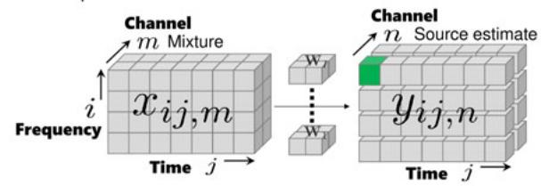

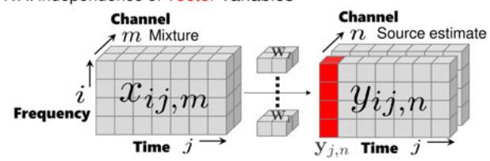  
Fig. 4. Independence in ICA and IVA.

## B) NMF and MNMF

Generally, NMF objective functions are defined as the distances or divergences between an observed matrix and a low-rank matrix. Popular distance/divergence measures are the Euclidean distance [31], the generalized Kullback– Leibler (KL) divergence [31], and the Itakura–Saito (IS) divergence [33]. In this paper, aiming to clarify the connection of NMF to IVA and ILRMA, we discuss NMF with the IS divergence (IS-NMF).

## 1) NMF

Let the sliced matrix depicted in the lower right of Fig. 3 be X, $[ \mathbf { X } ] _ { i j } = x _ { i j } .$ . Microphone index m is omitted here for simplicity. The nonnegative values considered in IS-NMF are the power spectrograms $| x _ { i j } | ^ { 2 }$ , and they are approximated with the rank K structure

$$
| x _ {i j} | ^ {2} \approx \sum_ {k = 1} ^ {K} t _ {i k} \nu_ {k j} = \hat {x} _ {i j},\tag{15}
$$

with nonnegative matrices $\mathbf { T } , [ \mathbf { T } ] _ { i k } = t _ { i k }$ , and V, $[ \mathbf { V } ] _ { k j } = \nu _ { k j }$ j for $i = 1 , \dots , I$ and $j = 1 , \dots , J .$ In a matrix notation, we have

$$
\mathbf {X} = \mathbf {T V},\tag{16}
$$

as a matrix factorization form. Figure 5 shows that a spectrogram can be modeled with this NMF model.

The objective function of IS-NMF can be derived in a maximum-likelihood sense. We assume that the likelihood of T and V for X is decomposed into matrix elements

$$
p (\mathbf {X} | \mathbf {T}, \mathbf {V}) = \prod_ {i = 1} ^ {I} \prod_ {j = 1} ^ {J} p (x _ {i j} | \hat {x} _ {i j}),\tag{17}
$$

and each element $x _ { i j }$ follows a zero-mean complex Gaussian distribution with variance $\hat { x } _ { i j }$ defined in (15),

$$
p (x _ {i j} | \hat {x} _ {i j}) \propto \frac {1}{\hat {x} _ {i j}} \exp \left(- \frac {| x _ {i j} | ^ {2}}{\hat {x} _ {i j}}\right).\tag{18}
$$

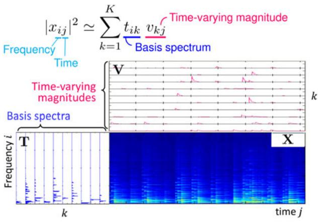  
Fig. 5. NMF as spectrogram model fitting.

Then, the objective function $\mathcal { C } ( \mathbf { T } , \mathbf { V } ) = - \log p ( \mathbf { X } | \mathbf { T } , \mathbf { V } )$ is simply given as

$$
\mathcal {C} (\mathbf {T}, \mathbf {V}) = \sum_ {i = 1} ^ {I} \sum_ {j = 1} ^ {J} \left[ \frac {| x _ {i j} | ^ {2}}{\hat {x} _ {i j}} + \log \hat {x} _ {i j} \right].\tag{19}
$$

The IS divergence between $| x _ { i j } | ^ { 2 }$ and $\hat { x } _ { i j }$ is defined as [33]

$$
d _ {I S} (| x _ {i j} | ^ {2}, \hat {x} _ {i j}) = \frac {| x _ {i j} | ^ {2}}{\hat {x} _ {i j}} - \log \frac {| x _ {i j} | ^ {2}}{\hat {x} _ {i j}} - 1,\tag{20}
$$

and is equivalent to the ij-element of the objective function (19) up to a constant term. How to minimize the objective function (19) will be explained in Section III.

## 2) MNMF

We now return to the left-hand side of Fig. 3 from the lower-right corner, and the scalar $x _ { i j , m }$ is extended to the channel-wise vector $\mathbf { x } _ { i j } = [ x _ { i j , 1 } , \ldots , x _ { i j , M } ] ^ { \top }$ . The power spectrograms $| x _ { i j } | ^ { 2 }$ considered in NMF are now extended to the outer product of the channel vector

$$
\mathsf {X} _ {i j} = \mathbf {x} _ {i j} \mathbf {x} _ {i j} ^ {\mathsf {H}} = \left[ \begin{array}{c c c} | x _ {i j, 1} | ^ {2} & \ldots & x _ {i j, 1} x _ {i j, M} ^ {*} \\ \vdots & \ddots & \vdots \\ x _ {i j, M} x _ {i j, 1} ^ {*} & \ldots & | x _ {i j, M} | ^ {2} \end{array} \right].\tag{21}
$$

To build a multichannel NMF model, let us introduce a Hermitian positive semidefinite matrix $\mathsf { H } _ { i k }$ that is the same size as $\mathsf { X } _ { i j }$ and models the spatial property [48, 49, 84, 85] of the kth NMF basis in the ith frequency bin. Then, the outer products are approximated with a rank-K structure similar to (15),

$$
\mathsf {X} _ {i j} \approx \sum_ {k = 1} ^ {K} \mathsf {H} _ {i k} t _ {i k} v _ {k j} = \hat {\mathsf {X}} _ {i j}.\tag{22}
$$

The objective function of MNMF can basically be defined as the total sum $\begin{array} { r } { \sum _ { i = 1 } ^ { I } \sum _ { j = 1 } ^ { J } d _ { I S } ( \mathsf X _ { i j } , \hat { \mathsf X } _ { i j } ) } \end{array}$ ofthe multichannel IS divergence (see [49] for the definition) between $\mathsf { X } _ { i j }$ and $\hat { \mathsf X } _ { i j } ,$ , and can also be derived in a maximumlikelihood sense. Let H be an $I \times K$ hierarchical matrix such that $[ \underline { { \mathbf { H } } } ] _ { i k } = \mathsf { H } _ { i k }$ . We assume that the likelihood ofT, V, and H for $\mathcal { X } = \{ \{ \mathbf { x } _ { i j } \} _ { i = 1 } ^ { I } \} _ { j = : } ^ { J }$ is decomposed as

$$
p (\mathcal {X} | \mathbf {T}, \mathbf {V}, \underline {{\mathbf {H}}}) = \prod_ {i = 1} ^ {I} \prod_ {j = 1} ^ {J} p (\mathbf {x} _ {i j} | \hat {\mathbf {X}} _ {i j}),\tag{23}
$$

and that each vector $\mathbf { X } _ { i j }$ follows a zero-mean multivariate complex Gaussian distribution with the covariance matrix $\hat { \mathsf X } _ { i j }$ defined in (22),

$$
p (\mathbf {x} _ {i j} | \hat {\mathbf {X}} _ {i j}) \propto \frac {1}{\det \hat {\mathbf {X}} _ {i j}} \exp \left(- \mathbf {x} _ {i j} ^ {\mathsf {H}} \hat {\mathbf {X}} _ {i j} ^ {- 1} \mathbf {x} _ {i j}\right).\tag{24}
$$

Then, similar to (19), the objective function ${ \mathcal { C } } ( \mathbf { T } , \mathbf { V } , \underline { { \mathbf { H } } } ) =$ − log p( |T, V, H) is given as

$$
\mathcal {C} (\mathbf {T}, \mathbf {V}, \underline {{\mathbf {H}}}) = \sum_ {i = 1} ^ {I} \sum_ {j = 1} ^ {J} \left[ \mathbf {x} _ {i j} ^ {\mathsf {H}} \hat {\mathbf {X}} _ {i j} ^ {- 1} \mathbf {x} _ {i j} + \log \det \hat {\mathbf {X}} _ {i j} \right].\tag{25}
$$

How to minimize the objective function (25) will be explained in Section III.

The spatial properties $\mathsf { H } _ { i k }$ learned by the model (22) can be used as spatial cues for clustering NMF bases. In particular, the argument $\arg ( [ \mathsf { H } _ { i k } ] _ { m m ^ { \prime } } )$ of an of-diagonal element m = m represents the phase diference between the two microphones m and m. The left plot of Fig. 6 follows model (22) with $k = 1 , \ldots , 1 0$ . The 10 bases can be clustered into two sources based on their arguments as a postprocessing. However, a more elegant way is to introduce the cluster-assignment variable $\begin{array} { r } { [ 8 9 ] \ z _ { k n } \ge 0 , \ \sum _ { n = 1 } ^ { N } z _ { k n } = } \end{array}$ $\iota , k = 1 , \ldots , K , n = 1 , \ldots , N .$ , and the source-wise spatial property $\mathsf { H } _ { i n } ,$ and express the basis-wise property as $\mathsf { H } _ { i k } =$ $\begin{array} { r } { \sum _ { n = 1 } ^ { N } z _ { k n } \mathsf { H } _ { i n } . } \end{array}$ As a result, the model (22) and the objective function (25) respectively become

$$
\hat {\mathsf {X}} _ {i j} = \sum_ {k = 1} ^ {K} \sum_ {n = 1} ^ {N} z _ {k n} \mathsf {H} _ {i n} t _ {i k} \nu_ {k j},\tag{26}
$$

$$
\mathcal {C} (\mathbf {T}, \mathbf {V}, \underline {{\mathbf {H}}}, \mathbf {Z}) = \sum_ {i = 1} ^ {I} \sum_ {j = 1} ^ {J} \left[ \mathbf {x} _ {i j} ^ {\mathsf {H}} \hat {\mathsf {X}} _ {i j} ^ {- 1} \mathbf {x} _ {i j} + \log \det \hat {\mathsf {X}} _ {i j}, \right]\tag{27}
$$

with $[ \mathbf { Z } ] _ { k n } = z _ { k n }$ and the size of H being $I \times N$ . The middle plot of Fig. 6 shows the result following the model (26). We see that source-wise spatial properties are successfully learned. The objective function (27) can be minimized in a similar manner to (25).

## C) ILRMA

ILRMA can be explained in two ways, as there are two paths in Fig. 2.

## 1) Extending IVA with NMF

The first way is to extend IVA by introducing NMF for source estimates, as illustrated in Fig. 7, with the aim of developing more precise spectral models. Let the objective function (13) of IVA be rewritten as

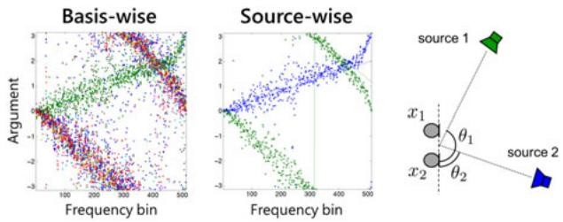  
Fig. 6. Example of MNMF-learned spatial property. The left and middle plots show the learned complex arguments arg( $[ \mathsf { H } _ { i k } ] _ { 1 2 } ) , k = 1 , \ldots , 1 0 ,$ and arg( $[ \mathsf { H } _ { i n } ] _ { 1 2 } ) , n = 1 , 2 ;$ respectively. The right figure illustrates the corresponding two-source two-microphone situation.

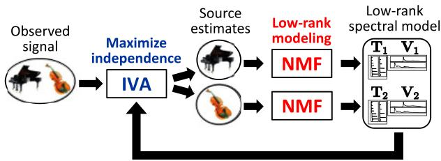  
Fig. 7. ILRMA: unified method of IVA and NMF.

$$
\mathcal {C} (\mathcal {W}) = \sum_ {n = 1} ^ {N} G (\mathbf {Y} _ {n}) - 2 J \sum_ {i = 1} ^ {I} \log | \det \mathbf {W} _ {i} |\tag{28}
$$

with ${ \bf Y } _ { n }$ being an $I \times J$ matrix, $[ { \bf Y } _ { n } ] _ { i j } = y _ { i j , n }$ . Then, let us introduce the NMF model for ${ \bf Y } _ { n }$ as

$$
p \left(\mathbf {Y} _ {n} \mid \mathbf {T} _ {n}, \mathbf {V} _ {n}\right) = \prod_ {i = 1} ^ {I} \prod_ {j = 1} ^ {J} p \left(y _ {i j, n} \mid \hat {y} _ {i j, n}\right)\tag{29}
$$

$$
p (y _ {i j, n} | \hat {y} _ {i j, n}) \propto \frac {1}{\hat {y} _ {i j , n}} \exp \left(- \frac {| y _ {i j , n} | ^ {2}}{\hat {y} _ {i j , n}}\right)\tag{30}
$$

$$
\hat {y} _ {i j, n} = \sum_ {k = 1} ^ {K} t _ {i k, n} \nu_ {k j, n}\tag{31}
$$

with $[ { \bf T } _ { n } ] _ { i k } = t _ { i k , n }$ and $[ { \bf V } _ { n } ] _ { k j } = \nu _ { k j , n }$ . The objective function is then

$$
\begin{array}{l} \mathcal {C} (\mathcal {W}, \{\mathbf {T} _ {n} \} _ {n = 1} ^ {N}, \{\mathbf {V} _ {n} \} _ {n = 1} ^ {N}) = \sum_ {n = 1} ^ {N} \sum_ {i = 1} ^ {I} \sum_ {j = 1} ^ {J} \left[ \frac {\left| y _ {i j , n} \right| ^ {2}}{\hat {y} _ {i j , n}} + \log \hat {y} _ {i j, n} \right] \\ - 2 J \sum_ {i = 1} ^ {I} \log | \det \mathbf {W} _ {i} |. \end{array} \tag {32}
$$

## 2) Restricting MNMF

The second way is to restrict MNMF in the following manner for computational eficiency. Let the spatial property matrix $\mathsf { H } _ { i n }$ be restricted to rank-1 $\mathsf { H } _ { i n } = \mathsf { \bar { h } } _ { i n } \mathsf { h } _ { i n } ^ { \mathsf { H } }$ with $\mathbf { h } _ { i n } \dot { = } [ h _ { i 1 n } , \ldots , h _ { i M n } ] ^ { \top }$ . Then, the MNMF model (26) can be

simplified as

$$
\hat {\mathbf {X}} _ {i j} = \mathbf {H} _ {i} \mathbf {D} _ {i j} \mathbf {H} _ {i} ^ {\mathsf {H}}\tag{33}
$$

with $\mathbf { H } _ { i } = [ \mathbf { h } _ { i 1 } , \dots , \mathbf { h } _ { i N } ]$ and an $N \times N$ diagonal matrix $\mathbf { D } _ { i j }$ whose nth diagonal element is

$$
\hat {y} _ {i j, n} = \sum_ {k = 1} ^ {K} z _ {k n} t _ {i k} v _ {k j}.\tag{34}
$$

We further restrict the mixing system to be determined, i.e., $N = M$ , enabling us to convert the mixing matrix Hi to the separation matrix $\mathbf { W } _ { i }$ by $\mathbf { H } _ { i } = \mathbf { W } _ { i } ^ { - 1 }$ . Substituting (33) into (27), we have

$$
\begin{array}{l} \mathcal {C} (\mathcal {W}, \mathbf {T}, \mathbf {V}, \mathbf {Z}) = \sum_ {i = 1} ^ {I} \sum_ {j = 1} ^ {J} \sum_ {n = 1} ^ {N} \left[ \frac {| y _ {i j , n} | ^ {2}}{\hat {y} _ {i j , n}} + \log \hat {y} _ {i j, n} \right] \\ - 2 J \sum_ {i = 1} ^ {I} \log | \det \mathbf {W} _ {i} |. \end{array}\tag{35}
$$

## 3) Difference between two models

The two ILRMA objective functions (32) and (35) are different in the models (31) and (34) of the source estimates. In (31), the NMF bases are not shared among the source estimates n through the optimization process. In (34), the NMF bases are shared at the beginning of the optimization in accordance with randomly generated cluster-assignment variables $0 \leq z _ { k n } \leq 1 ;$ , and assigned dynamically to the source estimates by optimizing the variable $z _ { k n }$

How to optimize the objective functions (32) and (35) will be explained in the next section.

## III. OPTIMIZATION

The objective functions (8), (13), (19), (25), (27), (32), and (35) can be optimized in various ways. Regarding ICA (8), for instance, gradient descent [23], natural gradient [24], FastICA [27, 90], and auxiliary function-based optimization (AuxICA) [29], to name a few, have been proposed as optimization methods. This paper focuses on an auxiliary function approach because all the above objective functions can eficiently be optimized by updates derived from this approach.

## A) Auxiliary function approach

This subsection explains the general framework of the approach known as the majorization-minimization algorithm [61–63]. Let θ be a set of objective variables, $\quad \mathrm { e . g . , } \theta =$ {T, V} in the case of NMF (19). For an objective function (θ ), an auxiliary function $\mathcal { C } ^ { + } ( \theta , \tilde { \theta } )$ with a set of auxiliary variables $\tilde { \theta }$ satisfies the following two conditions.

• The auxiliary function is greater or equal to the objective function

$$
\mathcal {C} ^ {+} (\theta , \tilde {\theta}) \geq \mathcal {C} (\theta).\tag{36}
$$

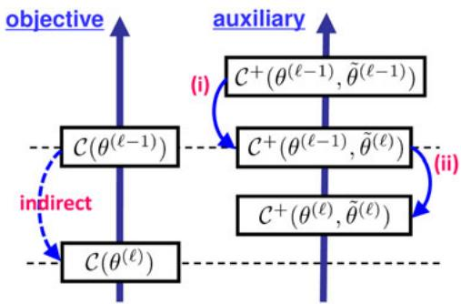  
Fig. 8. Majorization-minimization: minimizing the auxiliary function indirectly minimizes the objective function.

• When minimized with respect to the auxiliary variables, both functions become the same,

$$
\min _ {\tilde {\theta}} \mathcal {C} ^ {+} (\theta , \tilde {\theta}) = \mathcal {C} (\theta).\tag{37}
$$

With these conditions, one can indirectly minimize the objective function (θ ) by minimizing the auxiliary function $\mathcal { C } ^ { + } ( \theta , \tilde { \theta } )$ through the iteration of the following updates:

(i) the update of auxiliary variables

$$
\tilde {\theta} ^ {(\ell)} \leftarrow \operatorname{argmin} _ {\tilde {\theta}} \mathcal {C} ^ {+} (\theta^ {(\ell - 1)}, \tilde {\theta}),\tag{38}
$$

(ii) the update of objective variables

$$
\theta^ {(\ell)} \leftarrow \operatorname{argmin} _ {\theta} \mathcal {C} ^ {+} (\theta , \tilde {\theta} ^ {(\ell)}),\tag{39}
$$

as illustrated in Fig. 8. The superscript ·() indicates that the update is in the th iteration, starting from the initial sets $\bar { \theta ^ { ( 0 ) } }$ and $\tilde { \theta } ^ { ( \mathrm { o } ) }$ of variables (randomly initialized in most cases).

A typical situation in which this approach is taken is that the objective function is complicated and not easy to directly minimize but an auxiliary function can be defined in a way that it is easy to minimize.

In the next three subsections, we explain how to minimize the objective functions introduced in Section II. The order is NMF/MNMF, IVA/ICA, and ILRMA, which is diferent from that of Section II. The reason why the NMF/MNMF case comes first is that the derivation is simpler than the IVA/ICA case and directly by the auxiliary function approach.

## B) NMF and MNMF

## 1) NMF

For the objective function (19) with $\hat { x } _ { i j }$ defined in (15), we employ the auxiliary function

$$
\begin{array}{l} \mathcal {C} ^ {+} (\mathbf {T}, \mathbf {V}, \mathcal {R}, \mathbf {Q}) \\ = \sum_ {i = 1} ^ {I} \sum_ {j = 1} ^ {J} \left[ \sum_ {k = 1} ^ {K} \frac {r _ {i j , k} ^ {2} | x _ {i j} | ^ {2}}{t _ {i k} v _ {k j}} + \frac {\hat {x} _ {i j}}{q _ {i j}} + \log q _ {i j} - 1 \right], \end{array}\tag{40}
$$

with auxiliary variables , $[ \mathcal { R } ] _ { i j , k } = r _ { i j , k }$ , and Q, $[ \mathbf { Q } ] _ { i j } = q _ { i j } ,$ that satisfy $\begin{array} { r } { r _ { i j , k } \ge 0 , \sum _ { k = 1 } ^ { K } r _ { i j , k } = 1 } \end{array}$ and $q _ { i j } > 0 .$ . The auxiliary function $\mathcal { C } ^ { + }$ satisfies conditions (36) and (37) because the following two equations hold. The first one,

$$
\frac {1}{\hat {x} _ {i j}} = \frac {1}{\sum_ {k = 1} ^ {K} t _ {i k} v _ {k j}} \leq \sum_ {k = 1} ^ {K} \frac {r _ {i j , k} ^ {2}}{t _ {i k} v _ {k j}},\tag{41}
$$

originates from the fact that a reciprocal function is convex and therefore satisfies Jensen’s inequality. The equality holds when $r _ { i j , k } = ( t _ { i k } \nu _ { k j } ) / ( \hat { x } _ { i j } )$ . The second one,

$$
\log \hat {x} _ {i j} \leq \log q _ {i j} + \frac {\hat {x} _ {i j} - q _ {i j}}{q _ {i j}},\tag{42}
$$

is derived by the Taylor expansion of the logarithmic function. The equality holds when $q _ { i j } = \hat { x } _ { i j }$

The update (38) of the auxiliary variables is directly derived from the above equality conditions,

$$
r _ {i j, k} \leftarrow \frac {t _ {i k} v _ {k j}}{\hat {x} _ {i j}}, ^ {\forall} i, j, k \quad \text { and } \quad q _ {i j} \leftarrow \hat {x} _ {i j}, ^ {\forall} i, j.\tag{43}
$$

The update (39) of the objective variables is derived by letting the partial derivatives o $\mathsf { f } { \mathcal { C } } ^ { + }$ with respect to the variables T and V be zero,

$$
\begin{array}{l} t _ {i k} ^ {2} \leftarrow \frac {\sum_ {j = 1} ^ {J} (r _ {i j , k} ^ {2} | x _ {i j} | ^ {2}) / (v _ {k j})}{\sum_ {j = 1} ^ {J} (v _ {k j}) / (q _ {i j})} \text { and } \\ v _ {k j} ^ {2} \leftarrow \frac {\sum_ {i = 1} ^ {I} (r _ {i j , k} ^ {2} | x _ {i j} | ^ {2}) / (t _ {i k})}{\sum_ {i = 1} ^ {I} (t _ {i k}) / (q _ {i j})}. \end{array}\tag{44}
$$

Substituting (43) into (44) and simplifying the resulting expressions, we have well-known multiplicative update rules

$$
\begin{array}{l} t _ {i k} \leftarrow t _ {i k} \sqrt {\frac {\sum_ {j = 1} ^ {J} ((v _ {k j}) / (\hat {x} _ {i j})) (| x _ {i j} | ^ {2}) / (\hat {x} _ {i j})}{\sum_ {j = 1} ^ {J} (v _ {k j}) / (\hat {x} _ {i j})}} \\ v _ {k j} \leftarrow v _ {k j} \sqrt {\frac {\sum_ {i = 1} ^ {I} ((t _ {i k}) / (\hat {x} _ {i j})) (| x _ {i j} | ^ {2}) / (\hat {x} _ {i j})}{\sum_ {i = 1} ^ {I} (t _ {i k}) / (\hat {x} _ {i j})}}, \end{array}\tag{45}
$$

for minimizing the IS-NMF objective function (19).

## 2) MNMF

The derivation of the NMF update rules can be extended to MNMF. Let us first introduce auxiliary variables $\mathsf { R } _ { i j , k }$ and $\mathsf { Q } _ { i j }$ of $M \times M$ Hermitian positive semidefinite matrices as extensions of $\dot { r } _ { i j , k }$ and $q _ { i j } ,$ respectively. Then, for the MNMF objective function (25), let us employ the auxiliary function

$$
\begin{array}{l} \mathcal {C} ^ {+} (\mathrm{T}, \mathrm{V}, \underline {{\mathrm{H}}}, \underline {{\mathcal {R}}}, \underline {{\mathrm{Q}}}) \\ = \sum_ {i = 1} ^ {I} \sum_ {j = 1} ^ {J} \sum_ {k = 1} ^ {K} \frac {\mathbf {x} _ {i j} ^ {\mathrm{H}} \mathsf {R} _ {i j , k} \mathsf {H} _ {i k} ^ {- 1} \mathsf {R} _ {i j , k} \mathbf {x} _ {i j}}{t _ {i k} v _ {k j}} \\ + \sum_ {i = 1} ^ {I} \sum_ {j = 1} ^ {J} \left[ \operatorname{tr} (\hat {\mathsf {X}} _ {i j} \mathsf {Q} _ {i j} ^ {- 1}) + \log \det \mathsf {Q} _ {i j} - M \right], \end{array}\tag{46}
$$

with auxiliary variables , $[ \underline { { \mathcal { R } } } ] _ { i j , k } = \mathsf { R } _ { i j , k }$ , and $\underline { { { \bf Q } } } , [ \underline { { { \bf Q } } } ] _ { i j } =$ $\mathsf { Q } _ { i j } ,$ that satisfy $\begin{array} { r } { \sum _ { k = 1 } ^ { K } \mathsf { R } _ { i j , k } = \mathsf { I } } \end{array}$ with I being the identity matrix ofsize M. The auxiliary function $\mathcal { C } ^ { + }$ satisfies the conditions (36) and (37) because the following two equations hold. The first one,

$$
\operatorname{tr} \left[ \left(\sum_ {k = 1} ^ {K} \mathsf {H} _ {i k} t _ {i k} v _ {k j}\right) ^ {- 1} \right] \leq \sum_ {k = 1} ^ {K} \frac {\operatorname{tr} (\mathsf {R} _ {i j , k} \mathsf {H} _ {i k} ^ {- 1} \mathsf {R} _ {i j , k})}{t _ {i k} v _ {k j}},\tag{47}
$$

is a matrix extension of(41). The equality holds when $\mathsf { R } _ { i j , k } =$ $t _ { i k } \nu _ { k j } \mathsf { H } _ { i k } \hat { \mathsf { X } } _ { i j } ^ { - 1 }$ . The second one [66],

$$
\log \det \hat {\mathbf {X}} _ {i j} \leq \log \det \mathbf {Q} _ {i j} + \operatorname{tr} (\hat {\mathbf {X}} _ {i j} \mathbf {Q} _ {i j} ^ {- 1}) - M,\tag{48}
$$

is a matrix extension of (42). The equality holds when $\mathsf Q _ { i j } = \hat { \mathsf X } _ { i j } .$

The update (38) of the auxiliary variables is directly derived from the above equality conditions,

$$
\mathsf {R} _ {i j, k} \leftarrow t _ {i k} v _ {k j} \mathsf {H} _ {i k} \hat {\mathsf {X}} _ {i j} ^ {- 1},   ^ {\forall} i, j, k \quad \text { and } \quad \mathsf {Q} _ {i j} \leftarrow \hat {\mathsf {X}} _ {i j},   ^ {\forall} i, j.\tag{49}
$$

The update (39) of the objective variables is derived by letting the partial derivatives o $\hat { \cdot } \mathcal { C } ^ { + }$ with respect to the variables T, V, and H be zero,

$$
\begin{array}{l} t _ {i k} ^ {2} \leftarrow \frac {\sum_ {j = 1} ^ {J} (1 / \nu_ {k j}) \mathbf {x} _ {i j} ^ {\mathsf {H}} \mathsf {R} _ {i j , k} \mathsf {H} _ {i k} ^ {- 1} \mathsf {R} _ {i j , k} \mathbf {x} _ {i j}}{\sum_ {j = 1} ^ {J} \nu_ {k j} \mathrm{tr} (\mathbf {Q} _ {i j} ^ {- 1} \mathsf {H} _ {i k})} \\ \nu_ {i k} ^ {2} \leftarrow \frac {\sum_ {i = 1} ^ {I} (1 / t _ {i k}) \mathbf {x} _ {i j} ^ {\mathsf {H}} \mathsf {R} _ {i j , k} \mathsf {H} _ {i k} ^ {- 1} \mathsf {R} _ {i j , k} \mathbf {x} _ {i j}}{\sum_ {i = 1} ^ {I} t _ {i k} \mathrm{tr} (\mathbf {Q} _ {i j} ^ {- 1} \mathsf {H} _ {i k})} \\ \mathsf {H} _ {i k} \left(t _ {i k} \sum_ {j = 1} ^ {J} \mathbf {Q} _ {i j} ^ {- 1} \nu_ {k j}\right) \mathsf {H} _ {i k} = \sum_ {j = 1} ^ {J} \frac {\mathsf {R} _ {i j , k} \mathbf {X} _ {i j} \mathsf {R} _ {i j , k}}{t _ {i k} \nu_ {k j}}. \end{array}\tag{50}
$$

Substituting (49) into (50) and simplifying the resulting expressions, we have the following multiplicative update rules for minimizing the MNMF objective function (25):

$$
\begin{array}{l} t _ {i k} \leftarrow t _ {i k} \sqrt {\frac {\sum_ {j = 1} ^ {J} v _ {k j} \mathbf {x} _ {i j} ^ {\mathsf {H}} \hat {\mathsf {X}} _ {i j} ^ {- 1} \mathsf {H} _ {i k} \hat {\mathsf {X}} _ {i j} ^ {- 1} \mathbf {x} _ {i j}}{\sum_ {j = 1} ^ {J} v _ {k j} \mathrm{tr} (\hat {\mathsf {X}} _ {i j} ^ {- 1} \mathsf {H} _ {i k})}} \\ v _ {k j} \leftarrow v _ {k j} \sqrt {\frac {\sum_ {i = 1} ^ {I} t _ {i k} \mathbf {x} _ {i j} ^ {\mathsf {H}} \hat {\mathsf {X}} _ {i j} ^ {- 1} \mathsf {H} _ {i k} \hat {\mathsf {X}} _ {i j} ^ {- 1} \mathbf {x} _ {i j}}{\sum_ {i = 1} ^ {I} t _ {i k} \mathrm{tr} (\hat {\mathsf {X}} _ {i j} ^ {- 1} \mathsf {H} _ {i k})}} \\ \mathsf {H} _ {i k} \leftarrow \mathsf {A} ^ {- 1} \# (\mathsf {H} _ {i k} \mathsf {B H} _ {i k}), \end{array}\tag{51}
$$

where # calculates the geometric mean [91] of two positive semidefinite matrices as

$$
\mathrm{X} _ {\#} \mathrm{Y} = \mathrm{X} (\mathrm{X} ^ {- 1} \mathrm{Y}) ^ {1 / 2}\tag{52}
$$

and $\begin{array} { r } { \mathsf { A } = \sum _ { j = 1 } ^ { J } \nu _ { k j } \hat { \mathsf { X } } _ { i j } ^ { - 1 } } \end{array}$ and $\begin{array} { r } { \mathsf { B } = \sum _ { j = 1 } ^ { J } \nu _ { k j } \hat { \mathsf { X } } _ { i j } ^ { - 1 } \mathsf { X } _ { i j } \hat { \mathsf { X } } _ { i j } ^ { - 1 } } \end{array}$

So far, we have explained the optimization of the objective function (25). The other objective function, (27) with (26), can be optimized similarly [49].

## C) IVA and ICA

We next explain how to minimize the IVA objective function (13). The ICA case (8) can simply be derived by letting I = 1 in the IVA case.

1) Auxiliary function for contrast function Since the contrast function $G ( \mathbf { y } _ { j , n } ) = - \log p ( \mathbf { y } _ { j , n } )$ is generally a complicated part to be minimized, we first discuss an auxiliary function for a contrast function. The contrast function with the density (14) is given as

$$
G (\mathbf {y} _ {j, n}) = \frac {1}{\beta} \sqrt {| | \mathbf {y} _ {j , n} | | _ {2} ^ {2} + \alpha}
$$

with

$$
\left| \left| \mathbf {y} _ {j, n} \right| \right| _ {2} = \sqrt {\sum_ {i = 1} ^ {I} \left| y _ {i j , n} \right| ^ {2}}
$$

being the L2 norm. It is common that a contrast function depends only on the L2 norm. If there is a real-valued function $G _ { R } ( r _ { j , n } )$ that satisfies $G _ { R } ( | | \mathbf { y } _ { j , n } | | _ { 2 } ) = G ( \mathbf { y } _ { j , n } )$ and $G _ { R } ^ { \prime } ( r _ { j , n } ) / r _ { j , n }$ is monotonically decreasing in $r _ { j , n } \geq 0 ;$ , we have an auxiliary function,

$$
G ^ {+} (\mathbf {y} _ {j, n}, r _ {j, n}) = \frac {G _ {R} ^ {\prime} (r _ {j , n})}{2 r _ {j , n}} | | \mathbf {y} _ {j, n} | | _ {2} ^ {2} + F (r _ {j, n}),\tag{53}
$$

that satisfies [43] the two conditions (36) and (37). The term $F ( r _ { j , n } )$ does not depend on the objective variable ${ \bf y } _ { j , n } .$ . The equality holds when $r _ { j , n } = | | \mathbf { y } _ { j , n } | | _ { 2 }$ . For the density function (14), the coeficient $( ( G _ { R } ^ { \prime } ( r _ { j , n } ) ) / ( 2 r _ { j , n } ) )$ is given as

$$
\frac {1}{2 \beta \sqrt {r _ {j , n} ^ {2} + \alpha}}.
$$

2) Auxiliary function for objective function Now, we introduce an auxiliary function for the IVA objective function (13) by simply replacing $G ( \mathbf { y } _ { j , n } )$ with $G ^ { + } ( \mathbf { y } _ { j , n } , r _ { j , n } )$

$$
\mathcal {C} ^ {+} (\mathcal {W}, \mathbf {R}) = \sum_ {j = 1} ^ {J} \sum_ {n = 1} ^ {N} G ^ {+} \left(\mathbf {y} _ {j, n}, r _ {j, n}\right) - 2 J \sum_ {i = 1} ^ {I} \log | \det \mathbf {W} _ {i} |,\tag{54}
$$

with auxiliary variables R, $[ \mathbf { R } ] _ { j , n } = r _ { j , n } .$ . The equality $\mathscr { C } ^ { + } ( \mathcal { W } , { \bf R } ) = \dot { \mathscr { C } } ( \mathcal { W } )$ is satisfied when $r _ { j , n } = | | \mathbf { y } _ { j , n } | | _ { 2 }$ for all $j = 1 , \dots , J$ and $n = 1 , \ldots , N$ . This corresponds to the update (38) of the auxiliary variables.

For the minimization of + with respect to the set $\mathcal { W } =$ $\{ \mathbf { W } _ { i } \} _ { i = : } ^ { I }$ of separation matrices

$$
\mathbf {W} _ {i} = \left[ \begin{array}{c} \mathbf {w} _ {i, 1} ^ {\mathsf {H}} \\ \vdots \\ \mathbf {w} _ {i, N} ^ {\mathsf {H}} \end{array} \right],\tag{55}
$$

let the auxiliary function $\mathcal { C } ^ { + }$ be rewritten as follows by omitting the terms $F ( r _ { j , n } )$ that do not depend on :

$$
J \sum_ {i = 1} ^ {I} \left[ \sum_ {n = 1} ^ {N} \mathbf {w} _ {i, n} ^ {\mathsf {H}} \mathbf {U} _ {i, n} \mathbf {w} _ {i, n} - 2 \log | \det \mathbf {W} _ {i} | \right]\tag{56}
$$

$$
\mathbf {U} _ {i, n} = \frac {1}{J} \sum_ {j = 1} ^ {J} \frac {G _ {R} ^ {\prime} (r _ {j , n})}{2 r _ {j , n}} \mathbf {x} _ {i j} \mathbf {x} _ {i j} ^ {\mathsf {H}}.\tag{57}
$$

Note that $\begin{array} { r } { | | \mathbf { y } _ { j , n } | | _ { 2 } ^ { 2 } = \sum _ { i = 1 } ^ { I } y _ { i j , n } y _ { i j , n } ^ { * } } \end{array}$ and $y _ { i j , n } = \mathbf { w } _ { i , n } ^ { \sf H } \mathbf { x } _ { i j }$ from (4) are used in the rewriting. Letting the gradient $( \partial \mathcal { C } ^ { + } ) / ( \partial \mathbf { w } _ { i , n } ^ { * } )$ of (54), equivalently the gradient of (56), with respect to $\mathbf { w } _ { i , n } ^ { * }$ be zero, we have N simultaneous equations [43],

$$
\mathbf {w} _ {i, m} ^ {\mathsf {H}} \mathbf {U} _ {i, n} \mathbf {w} _ {i, n} = \delta_ {m n}, \quad m = 1, \ldots , N,\tag{58}
$$

where $\delta _ { m n }$ is the Kronecker delta. Considering all N rows of the separation matrix (55), we then have N × N simultaneous equations, i.e., (58) for $n = 1 , \ldots , N$ . This problem has been formulated as the hybrid exact-approximate diagonalization (HEAD) [92] for $\mathbf { U } _ { i , 1 } , \dotsc , \mathbf { U } _ { i , N }$ . Solving HEAD problems to update W $\mathbf { \Phi } _ { i } \operatorname { f o r } i = 1 , \dots , I$ constitutes the update (39) of the objective variables.

## 3) Solving the HEAD problem

An eficient way [43] to solve the HEAD problem for a separation matrix $\mathbf { W } _ { i }$ is to calculate

$$
\mathbf {w} _ {i, n} \leftarrow (\mathbf {W} _ {i} \mathbf {U} _ {i, n}) ^ {- 1} \mathbf {e} _ {n},\tag{59}
$$

for each n, where $\mathbf { e } _ { n }$ is the vector whose nth element is one and the other elements are zero, and update it as

$$
\mathbf {w} _ {i, n} \leftarrow \frac {\mathbf {w} _ {i , n}}{\sqrt {\mathbf {w} _ {i , n} ^ {\mathsf {H}} \mathbf {U} _ {i , n} \mathbf {w} _ {i , n}}},\tag{60}
$$

to accommodate the HEAD constraint $\mathbf { w } _ { i , n } ^ { \mathsf { H } } \mathbf { U } _ { i , n } \mathbf { w } _ { i , n } = 1$

## 4) Whole AuxIVA algorithm

Algorithm 1 summarizes the procedures discussed so far in this subsection. To be concrete, the algorithm description is specific to the case of the super-Gaussian density (14).

## D) ILRMA

The ILRMA objective function (32) can be minimized by alternating NMF updates similar to (45) and the HEAD problem solver (as the IVA part), as illustrated in Fig. 7.

Let us first consider the NMF updates of $\{ \mathbf { T } _ { n } \} _ { n = } ^ { \bar { N } }$ and $\{ \mathbf { V } _ { n } \} _ { n = 1 } ^ { N }$ by focusing on the first term of (32). Note that for each n, the objective function is the same as (19) if $| y _ { i j , n } | ^ { 2 }$ and $\hat { y } _ { i j , n }$ are replaced with $| x _ { i j } | ^ { 2 }$ and $\hat { x } _ { i j } ,$ , respectively. We thus have the following updates for $n = 1 , \ldots , N ;$

$$
t _ {i k, n} \leftarrow t _ {i k, n} \sqrt {\frac {\sum_ {j = 1} ^ {J} ((\nu_ {k j , n}) / (\hat {y} _ {i j , n})) ((| y _ {i j , n} | ^ {2} / (\hat {y} _ {i j}))}{\sum_ {j = 1} ^ {J} (\nu_ {k j , n}) / (\hat {y} _ {i j , n})}}\tag{61}
$$

$$
\nu_ {k j, n} \leftarrow \nu_ {k j, n} \sqrt {\frac {\sum_ {i = 1} ^ {I} ((t _ {i k , n}) / (\hat {y} _ {i j , n})) ((| y _ {i j , n} | ^ {2}) / (\hat {y} _ {i j , n}))}{\sum_ {i = 1} ^ {I} (t _ {i k , n}) / (\hat {y} _ {i j , n})}}.
$$

Next we consider the update of as the IVA part. For the objective function (32), let us omit the log $\hat { y } _ { i j , n }$ terms that

Algorithm 1 AuxIVA: Auxiliary function approach to IVA

1: procedure AUXIVA
2: repeat
3: for n = 1 to N do
4:    for i = 1 to I do
5:    $y_{ij,n} \leftarrow w_{i,n}^{H}x_{ij}, \quad j = 1, \ldots, J$
6:    end for
7:    $r_{j,n} \leftarrow \sqrt{\sum_{i=1}^{I}|y_{ij,n}|^{2}}, \quad j = 1, \ldots, J$
8:    for i = 1 to I do
9:    $U_{i,n} \leftarrow \frac{1}{J}\sum_{j=1}^{J}\frac{1}{2\beta\sqrt{r_{j,n}^{2}+\alpha}}x_{ij}x_{ij}^{H}$
10:    update $w_{i,n}$ by (59) and (60)
11:    end for
12:    end for
13: until convergence
14: end procedure

Time (sec)  
Time (sec)

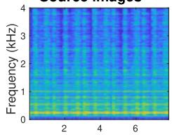

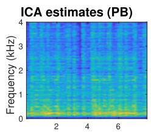

IVA estimates (PB)  
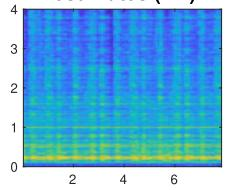

ILRMA estimates (PB)  
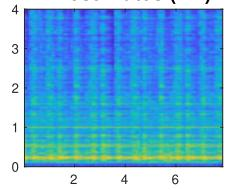

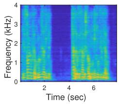

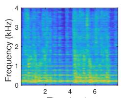

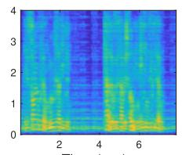

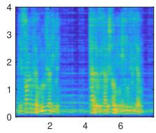

Fig. 9. Source images (left-most column) and source estimates by ICA, IVA, and ILRMA (three columns on the right) whose scales were adjusted by projection back (PB). The first and second rows correspond to music and speech sources, respectively. The plots are spectrograms colored in log scale with large values being yellow. The ICA estimates were not well separated in a full-band sense (SDRs = 6.27 dB, 1.38 dB). The IVA estimations were well separated (SDRs = 13.52 dB, 8.79 dB). The ILRMA estimates were even better separated (SDRs = 16.78 dB, 12.33 dB). Detailed investigations are shown in Fig. 10.  
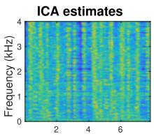

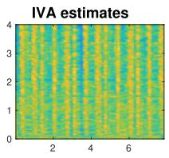

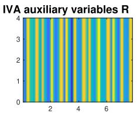

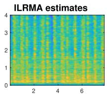

ILRMA bases T and activations V  
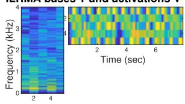

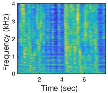

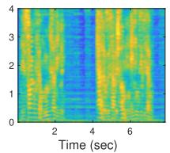

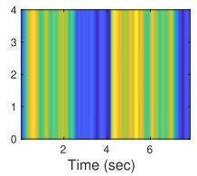

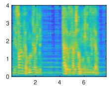

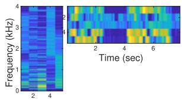  
Fig. 10. (Continued from Fig. 9) Source estimates and auxiliary variables ofICA, IVA, and ILRMA. The source estimates $y _ { i j , n }$ were not scale-adjusted, and had direct links to the auxiliary variables. The ICA estimates were not well separated because there was no communication channel among frequency bins (auxiliary variables used in the other two methods) and the permutation problem was not solved. The IVA estimates were well separated. The IVA auxiliary variables $\begin{array} { r } { \mathbb { R } , [ { \bf R } ] _ { j , n } = r _ { j , n } , } \end{array}$ represented the activities of source estimates and helped to solve the permutation problem. The ILRMA estimates were even better separated. The ILRMA base T and activations $\mathbf { V } , [ \mathbf { T } _ { n } ] _ { i k } = t _ { i k , n } , [ \mathbf { V } _ { n } ] _ { k j } = \nu _ { k j , n }$ , modeled the source estimates with low-rank matrices, which were richer representations than the IVA auxiliary variables R.

do not depend on ,

and then rewrite it in a similar way to (56),

$$
\sum_ {n = 1} ^ {N} \sum_ {i = 1} ^ {I} \sum_ {j = 1} ^ {J} \frac {\left| y _ {i j , n} \right| ^ {2}}{\hat {y} _ {i j , n}} - 2 J \sum_ {i = 1} ^ {I} \log | \det \mathbf {W} _ {i} |,\tag{62}
$$

$$
J \sum_ {i = 1} ^ {I} \left[ \sum_ {n = 1} ^ {N} \mathbf {w} _ {i, n} ^ {\mathsf {H}} \mathbf {U} _ {i, n} \mathbf {w} _ {i, n} - 2 \log | \det \mathbf {W} _ {i} | \right],\tag{63}
$$

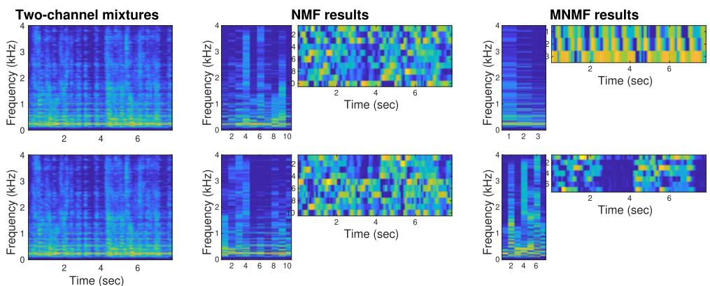  
Fig. 11. Experimental mixtures and variables (log scale, large values in yellow) of NMF and MNMF. The Two-channel mixtures look very similar in a power spectrum sense. However, the phases (not shown) are considerably diferent to achieve efective multichannel separation. The NMF results were obtained corresponding to each mixture. No multichannel information was exploited, and thus the two sources were not separated. In the MNMF results, 10 NMF bases were clustered into two classes according to the multichannel information $\mathsf { H } _ { i n }$ in the model (26). The of-diagonal elements [H ]  , m = m, expressed the phase diferences between the microphones as spatial cues, and the two sources were well separated (SDRs = 14.96 dB, 10.31 dB).

$$
\mathbf {U} _ {i, n} = \frac {1}{J} \sum_ {j = 1} ^ {J} \frac {1}{\hat {y} _ {i j , n}} \mathbf {x} _ {i j} \mathbf {x} _ {i j} ^ {\mathsf {H}}.\tag{64}
$$

Since (63) has the same form as (56), the optimization reduces to solving the HEAD problem for the weighted covariance matrices (64).

Note that no auxiliary function is used to derive (63), unlike in the derivation of (56). A very similar objective function to (62) is derived for the IVA objective function (13) if we assume a Gaussian with time-varying variance $\sigma _ { j , n } ^ { 2 }$ [44],

$$
p (\mathbf {y} _ {j, n}) \propto \frac {1}{\sigma_ {j , n} ^ {2}} \exp \left(- \frac {\sum_ {i = 1} ^ {I} | y _ {i j , n} | ^ {2}}{\sigma_ {j , n} ^ {2}}\right).\tag{65}
$$

The diference between the objective functions is in $\hat { y } _ { i j , n }$ and $\sigma _ { j , n } ^ { 2 } .$ , and this diference exactly corresponds to the diference between ILRMA and IVA (see Fig. 4 in [56], where ILRMA was called determined rank-1 MNMF).

So far, we have explained the optimization of the objective function (32). The other objective function, (35) with (34), can be optimized similarly [56].

## IV. EXPERIMENT

This section shows experimental results of the discussed methods for a simple two-source two-microphone situation. Since this paper is a review paper, detailed experimental results under a variety of conditions are not shown here. Such experimental results can be found in the original papers, e.g., [49, 56]. The purpose of this section is to illustrate the characteristics of the reviewed five methods (ICA, IVA, ILRMA, NMF, MNMF).

In the experiment, we measured impulse responses from two loudspeakers to two microphones in a room whose reverberation time was $\mathrm { R T } _ { 6 0 } = 2 0 0 \mathrm { m s }$ . Then, a music source and a speech source were convolved (their source images at the first microphone are shown at the left most of Fig. 9) and mixed for 8-second microphone observations. The sampling frequency was 8 kHz. The frame width and shift of the STFT were 256 ms and 64 ms, respectively. For the density functions of ICA (9) and IVA (14), we set the parameters as $\alpha = \beta = { \circ { . } 0 1 }$ . The number of update iterations was 50 for ICA, IVA, ILRMA, and NMF to attain suficient separations. However, for MNMF, 50 was insufficient and we iterated the updates 200 times to obtain suficient separations.

The three plots in the right-hand side of Fig. 9 show the separation results obtained by ICA, IVA, and ILRMA. These are the spectrograms after scaling ambiguities were adjusted to the source images shown in the leftmost by the projection back (PB) approach [93–97], specifi cally by the procedure described in [98]. Signal-to-distortion ratios (SDRs) [99] are reported in the captions to show how well the results were separated. To investigate the characteristics of these methods, Fig. 10 shows the source estimates without PB and related auxiliary variables. Specifically, in this example, the speech source had a pause at around from 3 to 4 seconds. Some of the IVA variables R and ILRMA variables V shown in the bottom row successfully extracted the pause and contributed to the separation.

Figure 11 shows how NMF and MNMF modeled and separated the two-channel mixtures. NMF extracted 10 bases for each channel. However, there was no link between the bases and sources. Therefore, separation to two sources was not attained in the NMF case. In the MNMF case, 10 NMF bases were extracted for the multichannel mixtures, and clustered and separated into two sources.

## V. CONCLUSION

Five methods for BSS of audio signals have been explained. ICA and IVA resort to the independence and super-Gaussianity of sources. NMF and MNMF model spectrograms with low-rank structures. ILRMA integrates these two diferent lines of methods and exploits the independence and the low-rankness of sources. All the objective functions regarding these methods can be optimized by auxiliary function approaches. This review paper has explained these facts in a structured and concise manner, and hopefully will contribute to the development of further methods for BSS.

## REFERENCES

[1] Jutten, C.; Herault, J.: Blind separation of sources, part I: an adaptive algorithm based on neuromimetic architecture. Signal Process., 24 (1) (1991), 1–10.

[2] S. Haykin: Ed., Unsupervised Adaptive Filtering (Volume I: Blind Source Separation). John Wiley & Sons, The United States of America, 2000.

[3] Hyvärinen, A.; Karhunen, J.; Oja, E.: Independent Component Anal ysis. John Wiley & Sons, The United States of America, 2001.

[4] Cichocki, A.; Amari, S.: Adaptive Blind Signal and Image Processing. John Wiley & Sons, England, 2002.

[5] Makino, S.; Lee, T.-W.; H. Sawada: Eds., Blind Speech Separation. Springer, The Netherlands, 2007.

[6] Jourjine, A.; Rickard, S.; Yilmaz, O.: Blind separation of disjoint orthogonal signals: demixing N sources from 2 mixtures, in Proc. ICASSP, vol. 5, June 2000, 2985–2988.

[7] Roman, N.; Wang, D.; Brown, G.: Speech segregation based on sound localization. J. Acoust. Soc. Am., 114 (4) (2003), 2236–2252.

[8] Yilmaz, O.; Rickard, S.: Blind separation of speech mixtures via timefrequency masking. IEEE Trans. Signal Process., 52 (7) (2004), 1830– 1847.

[9] Araki, S.; Sawada, H.; Mukai, R.; Makino, S.: Underdetermined blind sparse source separation for arbitrarily arranged multiple sensors. Signal Process., 87 (8) (2007), 1833–1847.

[10] Mandel, M.I.; Weiss, R.J.; Ellis, D.P.W.: Model-based expectation maximization source separation and localization. IEEE Trans. Audio, Speech Language Process., 18 (2) (2010), 382–394.

[11] Sawada, H.; Araki, S.; Makino, S.: Underdetermined convolutive blind source separation via frequency bin-wise clustering and permutation alignment. IEEE Trans. Audio, Speech, Language Process., 19 (3) (2011), 516–527.

[12] Ito, N.; Araki, S.; Nakatani, T.: Complex angular central Gaussian mixture model for directional statistics in mask-based microphone array signal processing, in Proc. EUSIPCO, August 2016, 1153–1157.

[13] Hershey, J.R.; Chen, Z.; Le Roux, J.; Watanabe, S.: Deep clustering: Discriminative embeddings for segmentation and separation, in Proc. ICASSP, March 2016, 31–35.

[14] Nugraha, A.A.; Liutkus, A.; Vincent, E.: Multichannel audio source separation with deep neural networks. IEEE/ACM Trans. Audio, Speech Language Process., 24 (9) (2016), 1652–1664.

[15] Yu, D.; Kolbæk, M.; Tan, Z.-H.; Jensen, J.: Permutation invariant training of deep models for speaker-independent multi-talker speech separation, in Proc. ICASSP, March 2017, 241–245.

[16] Zmolikova, K.; Delcroix, M.; Kinoshita, K.; Higuchi, T.; Ogawa, A.; Nakatani, T.: Speaker-aware neural network based beamformer for speaker extraction in speech mixtures, in Proc. Interspeech, 2017.

[17] Higuchi, T.; Kinoshita, K.; Delcroix, M.; Zmolikova, K.; Nakatani, T.: Deep clustering-based beamforming for separation with unknown number of sources, in Proc. Interspeech, 2017.

[18] Kameoka, H.; Li, L.; Inoue, S.; Makino, S.: Semi-blind source separation with multichannel variational autoencoder, arXiv preprint arXiv:1808.00892, August 2018.

[19] Mogami, S. et al.: Independent deeply learned matrix analysis for multichannel audio source separation, in Proc. EUSIPCO, September 2018, 1557–1561.

[20] Wang, D.; Chen, J.: Supervised speech separation based on deep learning: an overview. IEEE/ACM Trans. Audio, Speech, Language Process., 26 (10) (2018), 1702–1726.

[21] Leglaive, S.; Girin, L.; Horaud, R.: Semi-supervised multichannel speech enhancement with variational autoencoders and non negative matrix factorization, in Proc. ICASSP, 2019, (to appear).

[22] Comon, P.: Independent component analysis, a new concept? Signal. Process., 36 (1994), 287–314.

[23] Bell, A.; Sejnowski, T.: An information-maximization approach to blind separation and blind deconvolution. Neural Comput., 7 (6) (1995), 1129–1159.

[24] Amari, S.; Cichocki, A.; Yang, H.H.: A new learning algorithm for blind signal separation, in Touretzky, D.; Mozer, M.; Hasselmo, M. (eds.), Advances in Neural Information Processing Systems, vol. 8. The MIT Press, Cambridge, MA, 1996, pp. 757–763.

[25] Cardoso, J.-F.; Souloumiac, A.: Jacobi angles for simultaneous diagonalization. SIAM J. Matrix Anal. Appl., 17 (1) (1996), 161–164.

[26] Cardoso, J.-F.: Infomax and maximum likelihood for blind source separation. IEEE Signal Process. Lett., 4 (4) (1997), 112–114.

[27] Bingham, E.; Hyvärinen, A.: A fast fixed-point algorithm for independent component analysis of complex valued signals. Int. J. Neural Syst., 10 (1) (2000), 1–8.

[28] Sawada, H.; Mukai, R.; Araki, S.; Makino, S.: Polar coordinate based nonlinear function for frequency domain blind source separation. IEICE Trans. Fund., E86-A (3) (2003), 590–596.

[29] Ono, N.; Miyabe, S.: Auxiliary-function-based independent component analysis for super-Gaussian sources, in Proc. LVA/ICA. Springer, 2010, 165–172.

[30] Lee, D.D.; Seung, H.S.: Learning the parts of objects with nonnegative matrix factorization. Nature, 401 (1999), 788–791.

[31] Lee, D.; Seung, H.: Algorithms for non-negative matrix factorization, in Advances in Neural Information Processing Systems, vol. 13, 2001, 556–562.

[32] Kameoka, H.; Goto, M.; Sagayama, S.: Selective amplifier of periodic and non-periodic components in concurrent audio signals with spectral control envelopes, in IPSJ SIG Technical Reports, 2006-MUS-66-13, August 2006, 77–84, in Japanese.

[33] Févotte, C.; Bertin, N.; Durrieu, J.-L.: Nonnegative matrix factorization with the Itakura-Saito divergence: with application to music analysis. Neural Comput., 21 (3) (2009), 793–830.

[34] Kameoka, H.; Ono, N.; Kashino, K.; Sagayama, S.: Complex NMF: a new sparse representation for acoustic signals, in Proc. ICASSP, April 2009, 3437–3440.

[35] Nakano, M.; Kameoka, H.; Le Roux, J.; Kitano, Y.; Ono, N.; Sagayama, S.: Convergence-guaranteed multiplicative algorithms for nonnegative matrix factorization with β-divergence, in Proc. MLSP, August 2010, 283–288.

[36] Févotte, C.; Idier, J.: Algorithms for nonnegative matrix factorization with the β-divergence. Neural Comput., 23 (9) (2011), 2421–2456.

[37] Hiroe, A.: Solution of permutation problem in frequency domain ICA using multivariate probability density functions, in Proc. ICA 2006 (LNCS 3889). Springer, March 2006, 601–608.

[38] Kim, T.; Eltoft, T.; Lee, T.-W.: Independent vector analysis: An extension of ICA to multivariate components, in Proc. ICA 2006 (LNCS 3889). Springer, March 2006, 165–172.

[39] Lee, I.; Kim, T.; Lee, T.-W.: Complex FastIVA: A robust maximum likelihood approach of MICA for convolutive BSS, in Proc. ICA 2006 (LNCS 3889). Springer, March 2006, 625–632.

[40] Kim, T.; Attias, H.T.; Lee, S.-Y.; Lee, T.-W.: Blind source separation exploiting higher-order frequency dependencies. IEEE Trans. Audio, Speech Language Process., 15 (1) (2007), 70–79.

[41] Lee, I.; Kim, T.; Lee, T.-W.: Fast fixed-point independent vector analysis algorithms for convolutive blind source separation. Signal Process., 87 (8) (2007), 1859–1871.

[42] Kim, T.: Real-time independent vector analysis for convolutive blind source separation. IEEE Trans. Circuits and Systems I: Regular Papers, 57 (7) (2010), 1431–1438.

[43] Ono, N.: Stable and fast update rules for independent vector analysis based on auxiliary function technique, in Proc. WASPAA, October 2011, 189–192.

[44] Ono, N.: Auxiliary-function-based independent vector analysis with power of vector-norm type weighting functions, in Proc. APSIPA ASC, December 2012, 1–4.

[45] Anderson, M.; Fu, G.-S.; Phlypo, R.; Adali, T.: Independent vector analysis: identification conditions and performance bounds. IEEE Trans. Signal Process., 62 (17) (2014), 4399–4410.

[46] Ikeshita, R.; Kawaguchi, Y.; Togami, M.; Fujita, Y.; Nagamatsu, K.: Independent vector analysis with frequency range division and prior switching, in Proc. EUSIPCO, August 2017, 2329–2333.

[47] Ozerov, A.; Févotte, C.: Multichannel nonnegative matrix factorization in convolutive mixtures for audio source separation. IEEE Trans. Audio, Speech Language Process., 18 (3) (2010), 550–563.

[48] Arberet, S. et al.: Nonnegative matrix factorization and spatial covari ance model for under-determined reverberant audio source separation, in Proc. ISSPA 2010, May 2010, 1–4.

[49] Sawada, H.; Kameoka, H.; Araki, S.; Ueda, N.: Multichannel extensions of non-negative matrix factorization with complex-valued data. IEEE Trans. Audio, Speech, Language Process., 21 (5) (2013), 971–982.

[50] Higuchi, T.; Kameoka, H.: Joint audio source separation and dereverberation based on multichannel factorial hidden Markov model, in Proc. MLSP, September 2014, 1–6.

[51] Nikunen, J.; Virtanen, T.: Direction of arrival based spatial covariance model for blind sound source separation. IEEE/ACM Trans. Audio, Speech, Language Process., 22 (3) (2014), 727–739.

[52] Mirzaei, S.; Van Hamme, H.; Norouzi, Y.: Blind audio source counting and separation ofanechoic mixtures using the multichannel complex NMF framework. Signal. Process., 115 (2015), 27–37.

[53] Itakura, K.; Bando, Y.; Nakamura, E.; Itoyama, K.; Yoshii, K.; Kawahara, T.: Bayesian multichannel nonnegative matrix factorization for audio source separation and localization, in Proc. ICASSP, 2017, 551–555.

[54] Kameoka, H.; Sawada, H.; Higuchi, T.: General formulation of multichannel extensions of NMF variants, in Makino, S. (ed.), Audio Source Separation. Springer, Cham, Switzerland, 2018, pp. 95–124.

[55] Kameoka, H.; Yoshioka, T.; Hamamura, M.; Le Roux, J.; Kashino, K.: Statistical model of speech signals based on composite autoregressive system with application to blind source separation, in Proc. LVA/ICA. Springer, September 2010, 245–253.

[56] Kitamura, D.; Ono, N.; Sawada, H.; Kameoka, H.; Saruwatari, H.: Determined blind source separation unifying independent vector analysis and nonnegative matrix factorization. IEEE/ACM Trans. Audio, Speech, Language Process., 24 (9) (2016), 1626–1641.

[57] Kitamura, D.; Ono, N.; Sawada, H.; Kameoka, H.; Saruwatari, H.: Determined blind source separation with independent low-rank matrix analysis, in Makino, S. Ed., Audio Source Separation. Springer, Cham, Switzerland, March 2018.

[58] Kitamura, D. et al.: Generalized independent low-rank matrix analysis using heavy-tailed distributions for blind source separation. EURASIP J. Adv. Signal Process., 2018 (28), 2018, 25 pages.

[59] Ikeshita, R.; Kawaguchi, Y.: Independent low-rank matrix analysis based on multivariate complex exponential power distribution, in Proc. ICASSP, April 2018, 741–745.

[60] Mogami, S. et al.: Independent low-rank matrix analysis based on generalized Kullback-Leibler divergence. IEICE Trans. Fund., E102-A (2) (2019), 458–463.

[61] Lange, K.; Hunter, D.R.; Yang, I.: Optimization transfer using surrogate objective functions. J. Comput. Graph. Statist., 9 (1) (2000), 1–20.

[62] Hunter, D.R.; Lange, K.: Quantile regression via an MM algorithm. J. Comput. Graph. Statist., 9 (1) (2000), 60–77.

[63] Hunter, D.R.; Lange, K.: A tutorial on MM algorithms. The American Statistician, 58 (1) (2004), 30–37.

[64] Ono, N.; Kohno, H.; Ito, N.; Sagayama, S.: Blind alignment of asynchronously recorded signals for distributed microphone array, in Proc. WASPAA, October 2009, 161–164.

[65] Ono, N.; Sagayama, S.: R-means localization: A simple iterative algorithm for source localization based on time diference of arrival, in Proc. ICASSP, March 2010, 2718–2721.

[66] Yoshii, K.; Tomioka, R.; Mochihashi, D.; Goto, M.: Infinite positive semidefinite tensor factorization for source separation of mixture signals, in Proc. ICML, June 2013, 576–584.

[67] Kameoka, H.; Takamune, N.: Training restricted Boltzmann machines with auxiliary function approach, in Proc. MLSP, September 2014, 1–6.

[68] Sun, Y.; Babu, P.; Palomar, D.P.: Majorization-minimization algorithms in signal processing, communications, and machine learning. IEEE Trans Signal Process., 65 (3) (2017), 794–816.

[69] Amari, S.; Douglas, S.; Cichocki, A.; Yang, H.: Multichannel blind deconvolution and equalization using the natural gradient, in Proc. IEEE Workshop on Signal Processing Advances in Wireless Communications, April 1997, 101–104.

[70] Kawamoto, M.; Matsuoka, K.; Ohnishi, N.: A method ofblind separation for convolved non-stationary signals. Neurocomputing, 22 (1998), 157–171.

[71] Douglas, S.C.; Sun, X.: Convolutive blind separation of speech mixtures using the natural gradient. Speech. Commun., 39 (2003), 65–78.

[72] Nishikawa, T.; Saruwatari, H.; Shikano, K.: Blind source separation of acoustic signals based on multistage ICA combining frequencydomain ICA and time-domain ICA. IEICE Trans. Fund., 86 (4) (2003), 846–858.

[73] Buchner, H.; Aichner, R.; Kellermann, W.: TRINICON: A versatile framework for multichannel blind signal processing, in Proc. ICASSP, vol. 3, 2004, iii–889.

[74] Bourgeois, J.; Minker, W.: Time-domain beamforming and blind source separation. Lecture Notes in Electrical Engineering. Springer-Verlag, New York, NY, 2009.

[75] Koldovsky, Z.; Tichavsky, P.: Time-domain blind separation of audio sources on the basis of a complete ica decomposition of an observation space. IEEE Trans. Audio, Speech, Language Process., 19 (2) (2011), 406–416.

[76] Smaragdis, P.: Blind separation of convolved mixtures in the frequency domain. Neurocomputing, 22 (1998), 21–34.

[77] Parra, L.; Spence, C.: Convolutive blind separation of non-stationary sources. IEEE Trans. Speech Audio Process., 8 (3) (2000), 320–327.

[78] Schobben, L.; Sommen, W.: A frequency domain blind signal separation method based on decorrelation. IEEE Trans. Signal Process., 50 (8) (2002), 1855–1865.

[79] Anemüller, J.; Kollmeier, B.: Amplitude modulation decorrelation for convolutive blind source separation, in Proc. ICA, June 2000, 215–220.

[80] Asano, F.; Ikeda, S.; Ogawa, M.; Asoh, H.; Kitawaki, N.: Combined approach of array processing and independent component analysis for blind separation of acoustic signals. IEEE Trans. Speech Audio Process., 11 (3) (2003), 204–215.

[81] Saruwatari, H.; Kurita, S.; Takeda, K.; Itakura, F.; Nishikawa, T.; Shikano, K.: Blind source separation combining independent component analysis and beamforming. EURASIP J. Appl. Signal Process., 2003 (11) (2003), 1135–1146.

[82] Saruwatari, H.; Kawamura, T.; Nishikawa, T.; Lee, A.; Shikano, K.: Blind source separation based on a fast-convergence algorithm combining ICA and beamforming. IEEE Trans. Audio, Speech Language Process., 14 (2) (2006), 666–678.

[83] Yoshioka, T.; Nakatani, T.; Miyoshi, M.: An integrated method for blind separation and dereverberation of convolutive audio mixtures, in Proc. EUSIPCO, August 2008.

[84] Vincent, E.; Jafari, M.G.; Abdallah, S.A.; Plumbley, M.D.; Davies, M.E.: Probabilistic modeling paradigms for audio source separation, in Wang, W.: Ed., Machine Audition: Principles, Algorithms and Systems. IGI global, Hershey, PA, USA, 2010, 162–185.

[85] Duong, N.; Vincent, E.; Gribonval, R.: Under-determined reverberant audio source separation using a full-rank spatial covariance model. IEEE Trans. Audio, Speech, Language Process., 18 (7) (2010), 1830–1840.

[86] Winter, S.; Sawada, H.; Makino, S.: Geometrical interpretation of the PCA subspace approach for overdetermined blind source separation. EURASIP. J. Adv. Signal. Process., 2006 (1) (2006), 071632.

[87] Osterwise, C.; Grant, S.L.: On over-determined frequency domain BSS. IEEE/ACM Trans. Audio, Speech, Language Process., 22 (5) (2014), 956–966.

[88] Sawada, H.; Mukai, R.; Araki, S.; Makino, S.: A robust and precise method for solving the permutation problem of frequency-domain blind source separation. IEEE Trans. Speech Audio Process., 12 (5) (2004), 530–538.

[89] Ozerov, A.; Févotte, C.; Blouet, R.; Durrieu, J.-L.: Multichannel nonnegative tensor factorization with structured constraints for user-guided audio source separation, in Proc. ICASSP, 2011, 257–260.

[90] Hyvärinen, A.: Fast and robust fixed-point algorithm for independent component analysis. IEEE Trans. Neural Networks, 10 (3) (1999), 626–634.

[91] Yoshii, K.; Kitamura, K.; Bando, Y.; Nakamura, E.; Kawahara, T.: Independent low-rank tensor analysis for audio source separation, in Proc. EUSIPCO, September 2018.

[92] Yeredor, A.: On hybrid exact-approximate joint diagonalization, in Proc. IEEE International Workshop on Computational Advances in Multi-Sensor Adaptive Processing (CAMSAP), 2009, 312–315.

[93] Cardoso, J.-F.: Multidimensional independent component analysis, in Proc. ICASSP, May 1998, 1941–1944.

[94] Murata, N.; Ikeda, S.; Ziehe, A.: An approach to blind source separa tion based on temporal structure of speech signals. Neurocomputing, 41 (2001), 1–24.

[95] Matsuoka, K.; Nakashima, S.: Minimal distortion principle for blind source separation, in Proc. ICA, December 2001, 722–727.

[96] Takatani, T.; Nishikawa, T.; Saruwatari, H.; Shikano, K.: Highfidelity blind separation ofacoustic signals using SIMO-model-based

independent component analysis. IEICE Trans. Funda., E87-A (8) (2004), 2063–2072.

[97] Mori, Y. et al.: Blind separation of acoustic signals combining SIMOmodel-based independent component analysis and binary masking. EURASIP J. Appl. Signal Process., 2006, article ID 34970, 17 pages, 2006.

[98] Sawada, H.; Araki, S.; Makino, S.: MLSP 2007 data analysis competition: Frequency-domain blind source separation for convolutive mixtures of speech/audio signals, in Proc. MLSP, August 2007, 45–50.

[99] Vincent, E. et al.: The signal separation evaluation campaign (2007– 2010): Achievements and remaining challenges. Signal Process., 92 (8) (2012), 1928–1936.

Hiroshi Sawada received the B.E., M.E., and Ph.D. degrees in information science from Kyoto University, in 1991, 1993, and 2001, respectively. He joined NTT Corporation in 1993. He is now a senior distinguished researcher and an executive manager at the NTT Communication Science Laboratories. His research interests include statistical signal processing, audio source separation, array signal processing, latent variable models, and computer architecture. From 2006 to 2009, he served as an associate editor of the IEEE Transactions on Audio, Speech & Language Processing. He is an associate member of the Audio and Acoustic Signal Processing Technical Committee of the IEEE SP Society. He received the Best Paper Award of the IEEE Circuit and System Society in 2000, the SPIE ICA Unsupervised Learning Pioneer Award in 2013, the IEEE Signal Processing Society 2014 Best Paper Award. He is an IEEE Fellow, an IEICE Fellow, and a member of the ASJ.

Nobutaka Ono received the B.E., M.S., and Ph.D. degrees from the University of Tokyo, Japan, in 1996, 1998, 2001, respectively. He became a research associate in 2001 and a lecturer in 2005 in the University of Tokyo. He moved to the National Institute of Informatics in 2011 as an associate professor, and moved to Tokyo Metropolitan University in 2017 as a full professor. His research interests include acoustic signal processing, machine learning, and optimization algorithms for them. He was a chair of Signal Separation Evaluation Campaign evaluation committee in 2013 and 2015, and an Associate Editor ofthe IEEE Transactions on Audio, Speech and Language Processing during 2012 to 2015. He is a senior member of the IEEE Signal Processing Society and a member of IEEE Audio and Acoustic Signal Processing Technical Committee from 2014. He received the unsupervised learning ICA pioneer award from SPIE.DSS in 2015.

Hirokazu Kameoka received B.E., M.S., and Ph.D. degrees all from the University of Tokyo, Japan, in 2002, 2004, and 2007, respectively. He is currently a Distinguished Researcher and a Senior Research Scientist at NTT Communication Science Laboratories, Nippon Telegraph and Telephone Corporation and an Adjunct Associate Professor at the National Institute of Informatics. From 2011 to 2016, he was an Adjunct Associate Professor at the University of Tokyo. His research interests include audio, speech, and music signal processing and machine learning. He has been an associate editor of the IEEE/ACM Transactions on Audio, Speech, and Language Processing since 2015, a Member of IEEE Audio and Acoustic Signal Processing Technical Committee since 2017, and a Member of IEEE Machine Learning for Signal Processing Technical Committee since 2019. He received 17 awards, including the

IEEE Signal Processing Society 2008 SPS Young Author Best Paper Award.

Daichi Kitamura received the M.E. and Ph.D. degrees from Nara Institute of Science and Technology and SOKENDAI (The Graduate University for Advanced Studies), respectively. He joined The University of Tokyo in 2017 as a Research Associate, and he moved to National Institute of Technology, Kagawa Collage as an Assistant Professor in 2018. His research interests include audio source separation, array signal processing, and statistical signal processing. He received Awaya Prize Young Researcher Award from The Acoustical Society ofJapan (ASJ) in 2015, Ikushi Prize from Japan Society for the Promotion of Science in 2017, Best Paper Award from IEEE Signa Processing Society Japan in 2017, and Itakura Prize Innovative Young Researcher Award from ASJ in 2018. He is a member of IEEE and ASJ.

Hiroshi Saruwatari Hiroshi Saruwatari received the B.E., M.E., and Ph.D. degrees from Nagoya University, Japan, in 1991, 1993, and 2000, respectively. He joined SECOM IS Laboratory, Japan, in 1993, and Nara Institute of Science and Technology, Japan, in 2000. From 2014, he is currently a Professor of The University of Tokyo, Japan. His research interests include audio and speech signal processing, blind source separation, etc. He received paper awards from IEICE in 2001 and 2006, from TAF in 2004, 2009, 2012, and 2018, from IEEE-IROS2005 in 2006, and from APSIPA in 2013 and 2018. He received DOCOMO Mobile Science Award in 2011, Ichimura Award in 2013, The Commendation for Science and Technology by the Minister ofEducation in 2015, Achievement Award from IEICE in 2017, and Hoko-Award in 2018. He has been professionally involved in various volunteer works for IEEE, EURASIP, IEICE, and ASJ. He is an APSIPA Distinguished Lecturer from 2018.