# Physics-informed adaptive filtering for acoustic echo cancellation

Michele Scarpiniti ∗, Danilo Comminiello , Aurelio Uncini

Department of Information Engineering, Electronics and Telecommunications (DIET), Sapienza University of Rome, Via Eudossiana 18, Rome, 00184, Italy

a r t i c l e i n f o

Keywords: Adaptive filter Physics-informed adaptive filter (PIAF) Acoustic echo cancellation (AEC) Room impulse response (RIR) NLMS

## a b s t r a c t

This paper introduces a physics-informed adaptive filtering framework for acoustic echo cancellation (AEC). Unlike conventional adaptive algorithms that rely solely on data-driven error minimization, the proposed method incorporates physically motivated priors derived from acoustic wave propagation and room impulse response structure. The echo path estimation problem is formulated as a composite stochastic optimization task, where the instantaneous squared error is regularized by constraints encoding causality, exponential energy decay, time weighted sparsity of early reflections, spectral smoothness, and slow temporal variation of the acoustic path. The resulting Physics-Informed Normalized Least-Mean-Squares (PI-NLMS) algorithm performs stochastic gradient descent on the regularized cost while enforcing hard causality through projection. The proposed formulation restricts adaptation to a physically plausible echo-path manifold, improving conditioning and reducing variance without substantially increasing computational complexity. Theoretical analysis establishes mean convergence conditions and characterizes the bias-variance trade-of introduced by structured regularization. Simulation re sults under stationary and time-varying echo paths demonstrate faster convergence, improved steady-state misalignment, and enhanced echo return loss enhancement (ERLE) compared to conventional NLMS and sparsity aware baselines.

## 1. Introduction

Acoustic echo cancellation (AEC) is a fundamental component in hands-free telephony, teleconferencing systems, smart speakers, and invehicle communication platforms [1,2]. The objective of AEC is to identify and suppress the acoustic coupling between a loudspeaker and a microphone, thus preventing far-end echoes from degrading communication quality [3]. This task is typically formulated as an adaptive identification problem in which the acoustic echo path is modeled as an unknown finite impulse response (FIR) filter.

Classical solutions rely on adaptive filtering algorithms such as the least-mean-squares (LMS), normalized LMS (NLMS), and recursive least squares (RLS) methods [4,5]. These algorithms estimate the echo path by minimizing the instantaneous or exponentially weighted squared error between the microphone signal and the estimated echo [6]. Their low computational complexity and robustness have made them the dominant approach in practical AEC systems for several decades.

Despite their maturity, adaptive filtering remains an active research area and several recent contributions have sought to improve the robustness, convergence speed, and theoretical understanding of echo path identification. For example, advanced optimization-based formulations have recently been investigated for acoustic system identification, including Newton-Raphson solutions to exponentially weighted least-<sub>??</sub> estimation problems [7]. Multi-channel and multi-input acoustic scenarios have also attracted increasing attention, leading to novel filter decomposition strategies for MISO acoustic echo cancellation [8]. In parallel, theoretical analyses have revisited the fundamental performance limits of adaptive echo cancellers through Cramér-Rao lower bound formulations [9], providing useful benchmarks for evaluating practical adaptive algorithms. Nevertheless, despite their widespread use, conventional adaptive filters treat echo path identification as an unconstrained linear system identification problem. However, in practice, room impulse responses (RIRs) exhibit a well-known physical structure determined by acoustic propagation and room geometry [10]. Typical RIRs are strictly causal due to finite sound propagation speed, contain a dominant direct-path component followed by sparse early reflections, and exhibit exponentially decaying late reverberation. This exponential decay behavior has been widely studied in room acoustics and can be modeled using energy decay curves and reverberation time metrics derived from the impulse response [11–13]. Additionally, the impulse response tends to vary smoothly across time and frequency due to transducer characteristics and room acoustics, and evolves slowly over time except during abrupt environmental changes. Since classical adaptive filters do not explicitly incorporate these structural properties, their convergence speed, robustness to double-talk, and steady-state misalignment can degrade in high-dimensional or low signal-to-noise ratio (SNR) scenarios [14].

To address some of these limitations, several extensions of adaptive filtering have been proposed. Recognizing that early reflections often produce sparse impulse responses, proportionate adaptive algorithms were introduced to accelerate convergence for sparse systems. Methods such as proportionate NLMS (PNLMS) [15,16], improved PNLMS (IPNLMS) [17], and related variants assign coeficient-dependent step sizes that favor active taps [18,19]. Other approaches incorporate $\ell _ { 1 }$ or $\ell _ { 2 }$ regularization to promote sparse or well-conditioned solutions, linking adaptive filtering with sparse system identification and compressed sensing principles [20–22]. Subsequent works explored structured modeling of echo paths and acoustic impulse responses to better capture the temporal distribution of reflections and reverberation [57] or exploit Kronecker and tensor decomposition to handle long RIRs [23,24]. Although these methods encourage sparsity, the priors employed remain generic and are not explicitly derived from the physics of acoustic propagation.

Another active research direction focuses on improving robustness against impulsive disturbances, non-Gaussian noise, and adverse acoustic conditions. Recent examples include generalized mixed-norm maximum correntropy approaches [25], and adaptive filtering methods based on generalized correntropy criteria combined with <sub>??</sub>-norm loss functions [26]. Fractional-order adaptive algorithms have also been proposed to improve convergence and robustness in challenging vehicular acoustic environments [27]. While these approaches modify the adaptation mechanism or cost function to improve robustness, they generally remain data-driven and do not explicitly exploit prior knowledge regarding the physical structure of room impulse responses. Kalman filter-based AEC algorithms introduce temporal evolution models for the echo path, improving tracking performance in time-varying environments [28,29]. These approaches allow prior assumptions on parameter evolution, but typically rely on simple Gaussian random-walk models rather than physically motivated structural constraints.

Frequency-domain adaptive filtering has also been widely adopted to eficiently handle long echo paths [30–32], also exploiting robust subband RLS algorithms [33]. Partitioned-block frequency-domain NLMS algorithms significantly reduce computational complexity while maintaining adaptation performance [34,35]. Nevertheless, frequencydomain implementations primarily address computational scalability and do not inherently enforce structural priors on the impulse response [36].

More recently, deep learning approaches have been explored for echo suppression and nonlinear echo cancellation [37–39,58]. Neural networks can model nonlinear loudspeaker distortions and complex acoustic interactions, often operating as residual echo suppressors or post-filters following linear adaptive cancellation [40,59]. For example, deep neural networks have been proposed to control the adaptation behavior of frequency-domain adaptive filters by predicting step-size parameters directly from signal features [37]. Hybrid systems that combine adaptive filters with neural residual models have shown promising performance improvements [41,42]. Recent developments have further expanded this trend through neural Kalman filtering frameworks that integrate state-space estimation with deep neural networks [43], convolutional recurrent architectures employing multiple adaptive sub-filters for monophonic acoustic echo cancellation [44], and attention-based architectures inspired by Kolmogorov-Arnold networks for double-talk and noisy scenarios [45]. Lightweight neural post-filtering strategies have also been investigated to improve speech enhancement performance while maintaining low computational complexity [46]. However, purely data-driven models typically require large training datasets and may lack interpretability or explicit consistency with acoustic physical principles [47]. Nevertheless, these methods typically impose generic mathematical priors rather than physically grounded constraints derived from acoustic propagation principles. A systematic framework that directly embeds physical knowledge of room impulse responses into adaptive echo path identification remains underexplored.

In parallel with these developments, physics-informed learning has emerged as an important paradigm in scientific machine learning [48, 49]. Physics-informed methods incorporate governing equations or domain knowledge directly into optimization objectives, improving generalization, robustness, and data eficiency. While this idea has been successfully applied in many scientific domains, its integration into classical adaptive signal processing, and particularly into acoustic echo cancellation, remains largely unexplored.

Existing regularized adaptive filters can be interpreted as incorporating generic mathematical priors, such as sparsity or coeficient smoothness [21,50,60], or as introducing regularization terms to improve robustness against model uncertainties and interference [51,52]. However, these regularization strategies are typically not derived from the underlying physics of acoustic propagation, and a unified framework that systematically integrates multiple physically motivated properties of RIRs, such as causality, exponential energy decay, sparse early reflections, spectral smoothness, and slow temporal variation, has not yet been fully developed for adaptive echo path identification.

## 1.1. Main contributions and paper organization

Overall, while recent research has focused on increasingly sophisticated adaptive filtering algorithms, robust optimization techniques, state-space estimation methods, and neural-network-based echo cancellers, the explicit incorporation of physically motivated priors describing room acoustics remains relatively unexplored. This motivates the development of physics-informed adaptive filtering frameworks that exploit prior knowledge on the structure of room impulse responses while preserving the low complexity and online adaptability of classical signalprocessing methods.

Motivated by these considerations, we reinterpret acoustic echo cancellation as a physics-constrained stochastic optimization problem. Instead of searching the entire coeficient space, the adaptive filter is guided toward a physically plausible echo-path manifold defined by propagation delay, energy decay structure, sparsity patterns, and smoothness properties derived from room acoustics.

In this paper, we introduce a Physics-Informed Adaptive Filtering (PIAF) framework for AEC. The proposed approach augments the instantaneous squared-error criterion with physically motivated regularization terms and projection operators. The resulting Physics-Informed NLMS (PI-NLMS) algorithm performs stochastic gradient descent on a composite objective that integrates both error minimization and acoustic structural priors. Hard constraints, such as causality, are enforced through projection, while soft constraints, including exponential decay, spectral smoothness, and temporal continuity, are incorporated via differentiable regularization terms.

The proposed framework ofers several advantages. By restricting adaptation to a physically consistent parameter space, it improves the conditioning of the optimization problem and accelerates convergence. Structured regularization also reduces steady-state variance. Moreover, the formulation is modular and extensible, allowing additional priors or hybrid integration with nonlinear residual models while maintaining computational complexity comparable to standard NLMS algorithms.

The main contributions of this work are summarized as follows:

1. We formulate acoustic echo path identification as a physics-informed stochastic optimization problem that integrates multiple physically motivated structural constraints within a unified adaptive filtering framework.

2. We derive the Physics-Informed NLMS (PI-NLMS) algorithm, combining gradient-based regularization with projection-based constraints.

3. We analyze convergence properties and characterize the biasvariance trade-of induced by structured physical priors.

4. We demonstrate through simulations under stationary and timevarying echo paths that the proposed method achieves faster convergence, improved steady-state misalignment (MSD), and enhanced echo return loss enhancement (ERLE) compared to conventional and sparsity-aware baselines.

The remainder of the paper is organized as follows. Section 2 presents the AEC model. Section 3 introduces the physics-informed optimization framework and derives the PI-NLMS algorithm, while Section 4 analyzes convergence behavior. Section 5 presents simulation results under various acoustic scenarios. Finally, Section 6 concludes the paper and outlines future research directions.

## 1.2. Notation

In this paper, matrices are represented by boldface capital letters, i.e. $\mathbf { A } \in \mathbb { R } ^ { \bar { M } \times \bar { N } }$ , while Tr<sub>(⋅)</sub> denotes the trace of a matrix. All vectors are column vectors, denoted by boldface lowercase letters, like $\mathbf { h } \in \mathbb { R } ^ { L \times 1 } =$ $\big [ h _ { 0 } , h _ { 1 } , \ldots , h _ { L - 1 } \big ] ^ { \top }$ , where $h _ { i }$ denotes the <sub>??</sub>-th individual entry of <sub>??</sub>. In recursive algorithm definition, a discrete-time subscript index <sub>??</sub> is added. For example, the weight vector, calculated according to some law, is written as $\mathbf { w } _ { n + 1 } = \mathbf { w } _ { n } + \Delta \mathbf { w } _ { n }$ . In the case of signal regression, vectors are indicated as $\mathbf { x } _ { n } \in \mathbb { R } ^ { L \times 1 } = [ x ( n ) , x ( n - 1 ) , \ldots , x ( n - L + 1 ) ] ^ { \intercal }$ . The Euclidean norm and the transpose of a vector are denoted by <sub>‖⋅‖</sub> and $( \cdot ) ^ { \top }$ respectively, while the expectation of a random variable is denoted by <sub>??[⋅]</sub>. We also have, for a vector <sub>??</sub>, that: $\mathbf { z } ^ { \top } \mathbf { z } = \| \mathbf { z } \| ^ { 2 } = \operatorname { T r } ( \mathbf { z } \mathbf { z } ^ { \top } )$ . The symbol <sub>∇</sub> denotes the gradient operator while <sub>⌊⋅⌋</sub> denotes the floor operator, i.e., it gives as output the greatest integer less than or equal to the input.

## 2. Acoustic echo cancellation (AEC)

Formally, let <sub>??(??)</sub> denote the far-end signal driving the loudspeaker. The acoustic echo received at the microphone can be modeled as the convolution between <sub>??(??)</sub> and the room impulse response (RIR) <sub>ℎ(??)</sub>, which represents the acoustic path between loudspeaker and microphone. As shown in Fig. 1, the microphone signal is therefore given by:

$$
d (n) = \sum_ {k = 0} ^ {L - 1} h _ {k} x (n - k) + s (n) + v (n) \equiv \mathbf {h} _ {0} ^ {\top} \mathbf {x} _ {n} + s (n) + v (n),
$$

where $\mathbf { h } _ { 0 } = [ h _ { 0 } , h _ { 1 } , \ldots , h _ { L - 1 } ] ^ { \top }$ is the vector collecting the RIR coefficients, $\mathbf { x } _ { n } = [ x ( n ) , x ( n - 1 ) , \ldots , x ( n - L + 1 ) ] ^ { \intercal }$ is the input vector (or frame) collecting the last <sub>??</sub> samples, <sub>??(??)</sub> is the near-end speech signal, and <sub>??(??)</sub> represents background noise characterized by a variance $\sigma _ { v } ^ { 2 }$

The objective of the acoustic echo canceler is to estimate the echo component and subtract it from the microphone signal, resulting in an estimate of near-end speech. The echo path <sub>ℎ(??)</sub> is typically long (hundreds to thousands of taps), time-varying due to speaker or device motion, and excited by highly colored input signals such as speech or music. These characteristics make AEC a challenging adaptive system identifi cation problem.

The conventional AEC architecture is based on an adaptive finite impulse response (FIR) filter ${ \bf w } _ { n } \in \mathbb { R } ^ { L }$ that models the unknown acoustic path. The estimated echo is:

$$
\boldsymbol {y} (n) = \mathbf {w} _ {n} ^ {\top} \mathbf {x} _ {n},
$$

and the error signal used for adaptation is:

$$
e (n) = d (n) - y (n).
$$

This error is the residual signal delivered to the output and drives the adaptation algorithm to update $\mathbf { w } _ { n } .$

The most widely used adaptation algorithms in AEC include: Least Mean Squares (LMS), Normalized LMS (NLMS), and Recursive Least Squares (RLS). Among these, NLMS is particularly popular due to its low computational complexity and robustness to signal scaling. The NLMS update, obtained by minimizing the instantaneous squared error $e ^ { 2 } ( n ) { \mathrm { , } }$ is given by [4,5]:

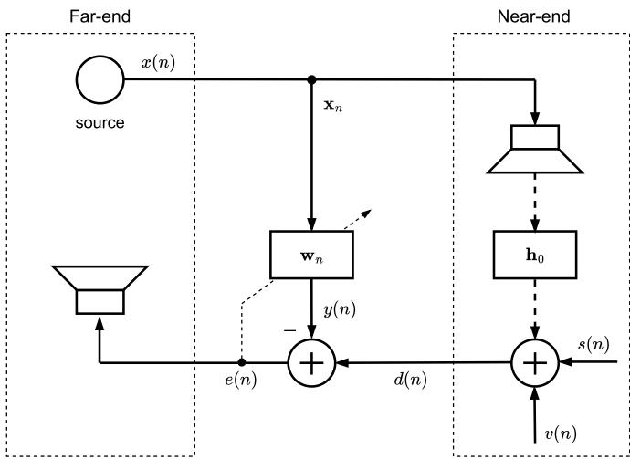  
<sub>Fig. 1.</sub> Basic framework of the acoustic echo cancellation (AEC) problem.

$$
\mathbf {w} _ {n + 1} = \mathbf {w} _ {n} + \frac {\mu}{\left\| \mathbf {x} _ {n} \right\| ^ {2} + \epsilon} e (n) \mathbf {x} _ {n},\tag{1}
$$

where $\mu$ is the step size and <sub>??</sub> is a (small) regularization constant.

## 3. Proposed approach

With reference to $\mathrm { F i g . ~ } 1 ,$ consider the AEC problem:

$$
d (n) = \mathbf {h} _ {0} ^ {\top} \mathbf {x} _ {n} + v (n),\tag{2}
$$

where $\textstyle d ( n ) \in \mathbb { R }$ is the microphone signal, $\mathbf { x } _ { n } = [ x ( n ) , x ( n - 1 ) , \ldots , x ( n -$ $L + 1 ) ] ^ { \top }$ is the far-end signal vector, $\mathbf { h } _ { 0 } \in \mathbb { R } ^ { L }$ is the true acoustic echo path, and <sub>??(??)</sub> is background noise. The objective is to estimate $\mathbf { h } _ { 0 }$ using an adaptive filter ${ \bf w } _ { n }$

Despite decades of research, several fundamental challenges remain when highly colored excitation signals (such as speech) are used, the environment is represented by long and sparse impulse responses, time variability is present due to environmental changes, input signal dropouts, and model mismatch. These challenges often cause slow convergence, misadjustment, or instability in classical adaptive algorithms. However, the acoustic echo path is not arbitrary, because it possesses a typical physical structure. The energy typically decays with delay, its coeficients exhibit spectral smoothness, and the system varies slowly over time.

Unlike conventional adaptive filters that minimize only the instantaneous squared error:

$$
J _ {\mathrm{NLMS}} (n) = \frac {1}{2} e ^ {2} (n),
$$

where the error signal is defined as:

$$
e (n) = d (n) - y (n) = d (n) - \mathbf {w} _ {n} ^ {\top} \mathbf {x} _ {n},\tag{3}
$$

and do not explicitly exploit these RIR properties, we propose minimizing a physics-informed composite cost:

$$
\begin{array}{l} J (n) = \frac {1}{2} e ^ {2} (n) + \sum_ {i = 1} ^ {M} \lambda_ {i} \mathcal {P} _ {i} (\mathbf {w} _ {n}) = \frac {1}{2} e ^ {2} (n) + \sum_ {i = 1} ^ {M} \Phi_ {i} (\mathbf {w} _ {n}) \\ = \frac {1}{2} e ^ {2} (n) + \Phi (\mathbf {w} _ {n}), \end{array}\tag{4}
$$

where $\mathcal { P } _ { i } ( \cdot )$ encode physical priors and $\lambda _ { i } \geq 0$ are regularization parameters, $\begin{array} { r } { \Phi _ { i } ( \mathbf { w } _ { n } ) = \lambda _ { i } \mathcal { P } _ { i } ( \mathbf { w } _ { n } ) , } \end{array}$ and $\begin{array} { r } { \Phi ( \mathbf { w } _ { n } ) = \sum _ { i = 1 } ^ { M } \Phi _ { i } ( \mathbf { w } _ { n } ) } \end{array}$ , where <sub>??</sub> is the number of priors. This defines a constrained search over a physically plausible echo-path manifold. Incorporating structured priors or physics-informed constraints into the adaptive filtering framework can improve convergence speed, robustness, and steady-state performance, especially under colored input and low signal-to-noise ratio conditions. We incorporate the physically motivated penalties described in the following subsection. We also anticipate that the considered physical priors are either quadratic by construction (e.g., exponential decay, smoothness, and slow variation constraints) or are treated through a quadratic approximation as in the case of the $\ell _ { 1 }$ sparsity penalty. This representation is adopted to obtain a compact formulation of the proposed physicsinformed framework and to derive a tractable gradient-based adaptation rule.

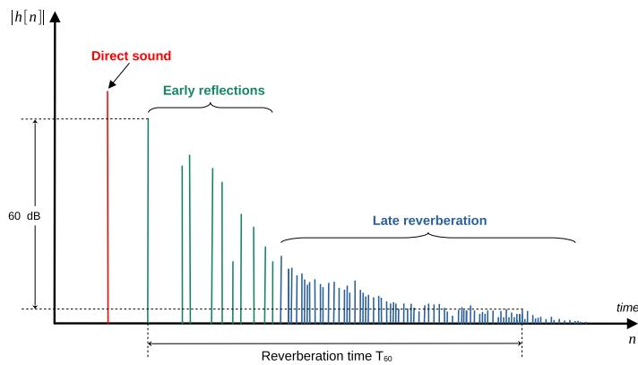  
<sub>Fig. 2.</sub> Magnitude of a typical room impulse response (RIR)

## 3.1. Physical structure of the room impulse response and prior modeling

As described above, AEC aims at identifying the acoustic path between a loudspeaker and a microphone. This path is governed by the RIR, which is not arbitrary but obeys well-established physical laws of sound propagation in enclosed environments. As shown in Fig. 2, the RIR is composed of a first impulse characterizing the direct sound, a number of sparse early reflections, and a decaying late reverberation tail. Exploiting these physical properties motivates the structured priors introduced in the proposed Physics-Informed NLMS (PI-NLMS) algorithm. This section summarizes the main physical characteristics of RIRs and links each to the regularization terms used in the proposed method.

## 3.1.1. Causality

The RIR should be strictly causal due to the finite propagation speed of sound. In fact, the first impulse in the RIR, characterizing the direct sound is localized at the sample $\tau _ { \mathrm { m i n } } ,$ corresponding to the minimum propagation delay, which depends on the distance <sub>??</sub> between the source and the microphone, and the sampling frequency $f _ { s } { \mathrm { : } }$ :

$$
\tau_ {\mathrm{min}} = \left\lfloor \frac {d \times f _ {s}}{c} \right\rfloor ,
$$

where <sub>??</sub> is the sound speed in the room.

The causality constraint can be interpreted as a hard projection operator:

$$
\mathbf {w} _ {n} \leftarrow \Pi_ {\mathcal {C}} (\mathbf {w} _ {n}),
$$

where  is the convex set:

$$
\mathcal {C} = \{\mathbf {w}: w _ {k} = 0 \text {   for   } k <   \tau_ {\min} \}.\tag{5}
$$

The projection efectively reduces the dimensionality of the parameters from <sub>??</sub> to $L - \tau _ { \mathrm { m i n } } ,$ improving the conditioning.

## 3.1.2. Energy decay and exponential attenuation

In enclosed spaces, acoustic energy decays due to geometric spreading, air absorption, surface absorption, and scattering. According to

Sabine’s reverberation theory [10], the energy envelope of the RIR follows approximately an exponential decay:

$$
E \big [ | h (k) | ^ {2} \big ] \propto e ^ {- 2 k T _ {s} / \tau} = e ^ {- 2 k \rho T _ {s}},
$$

where $T _ { s }$ is the sampling period and $\tau = 1 / \rho$ is related to the reverberation time $T _ { 6 0 } \mathrm { . }$ . Thus, early taps contain most of the energy, while late taps are progressively weaker. This implies that large coeficients at long delays are physically unlikely. For this reason, we can adopt an exponential decay prior:

$$
\mathcal {P} _ {\mathrm{decay}} (\mathbf {w}) = \frac {1}{2} \sum_ {k = 0} ^ {L - 1} \delta_ {k} w _ {k} ^ {2},
$$

with $\delta _ { k } = e ^ { \alpha k }$ , where <sub>??</sub> controls the decay weight. From room acoustics and Sabine’s reverberation theory, the parameter <sub>??</sub> is related to the reverberation time $T _ { 6 0 }$ (see [10] for details):

$$
\alpha = \rho T _ {s} = \frac {3 \log (1 0)}{T _ {6 0}} T _ {s} \approx \frac {6 . 9 1}{T _ {6 0}} T _ {s}.\tag{6}
$$

This enforces a stronger penalization for late taps and an improved robustness under highly reverberant conditions. In matrix form at time instant <sub>??</sub> we have:

$$
\Phi_ {\mathrm{decay}} (\mathbf {w} _ {n}) = \lambda_ {\mathrm{decay}} \mathcal {P} _ {\mathrm{decay}} (\mathbf {w} _ {n}) = \frac {1}{2} \mathbf {w} _ {n} ^ {\top} \boldsymbol {\Lambda} _ {\mathrm{decay}} \mathbf {w} _ {n},\tag{7}
$$

where $\Lambda _ { \mathrm { d e c a y } } = \lambda _ { \mathrm { d e c a y } } \mathbf { \Delta } \mathbf { \Delta } \mathbf { \Delta } \mathbf { \Delta } \mathbf { \Delta } \mathbf { \Lambda } \mathrm { d e c a y } \mathrm { d i a g } ( \delta _ { k } ) ,$

## 3.1.3. Sparsity of early reflections

In many practical environments, the early part of the RIR consists of a small number of dominant reflections, while late reverberation becomes difuse and noise-like. Thus, especially in short acoustic paths, the RIR is approximately sparse. This implies that many coeficients are near zero.

For this reason, denoting with <sub>⊙</sub> the element-wise multiplication, the corresponding prior is:

$$
\mathcal {P} _ {\ell_ {1}} (\mathbf {w}) = \| \boldsymbol {\beta} \odot \mathbf {w} \| _ {1} = \sum_ {k = 0} ^ {L - 1} \beta_ {k} \big | w _ {k} \big |,
$$

where $\beta _ { k } = e ^ { - \eta k }$ encourages strong early sparsity but relaxes later for difused late reverberation. The parameter <sub>??</sub> is indirectly related through the reflection density, which depends on the volume and absorption of the room, and assume the expression [10]: $\eta = \eta _ { 0 } T _ { 6 0 } / ( L T _ { s } )$ , with $\eta _ { 0 }$ related to the early region. This prior promotes sparse early reflections and suppression of spurious taps under noisy excitation.

This is a non-quadratic penalty term. However, we can rewrite the $\ell _ { 1 }$ prior as a weighted $\ell _ { 2 }$ one:

$$
\left| w _ {k} \right| = \frac {w _ {k} ^ {2}}{\left| w _ {k} \right|}.
$$

Therefore, we can rewrite it at time <sub>??</sub> in matrix form as:

$$
\Phi_ {\ell_ {1}} (\mathbf {w} _ {n}) = \lambda_ {\ell_ {1}} \mathcal {P} _ {\ell_ {1}} (\mathbf {w} _ {n}) = \frac {1}{2} \mathbf {w} _ {n} ^ {\top} \boldsymbol {\Lambda} _ {\ell_ {1}} \mathbf {w} _ {n},\tag{8}
$$

where, using a small parameter <sub>??</sub> that prevents division by zero, we set:

$$
\Lambda_ {\ell_ {1}} = \lambda_ {\ell_ {1}} \mathrm{diag} \bigg (\frac {\beta_ {k}}{| w _ {k} | + \varepsilon} \bigg).
$$

As a remark, compared with the exact $\ell _ { 1 }$ penalty, the approximation produces a smoother shrinkage efect and generally results in slightly weaker sparsity promotion, particularly for coeficients close to zero. Consequently, the steady-state solution may exhibit a small reduction in sparsity but also a reduced estimation bias. In the context of room impulse response identification, where only the early reflections are strongly sparse while the late reverberation tail is typically dense, this behavior provides a favorable compromise between sparsity promotion and preservation of reverberant components.

## 3.1.4. Temporal smoothness of the impulse response

Although the RIR contains reflections, its fine structure is not arbitrarily oscillatory. The acoustic transfer function is band-limited by the loudspeaker and microphone responses, air propagation, and surface scattering. Therefore, the RIR coeficients vary smoothly at the scale of the sampling period. Abrupt oscillations between adjacent taps would imply unrealistically sharp frequency-domain behavior. This implies that the RIR has limited curvature.

For this reason, we can adopt the following smoothness penalty:

$$
\mathcal {P} _ {\mathrm{ts}} (\mathbf {w}) = \frac {1}{2} \sum_ {k = 1} ^ {L - 1} (w _ {k} - w _ {k - 1}) ^ {2},
$$

$^ { \mathrm { o r , } }$ in matrix form at time <sub>??</sub>:

$$
\Phi_ {\mathrm{ts}} (\mathbf {w} _ {n}) = \lambda_ {t s} \mathcal {P} _ {\mathrm{ts}} (\mathbf {w} _ {n}) = \frac {1}{2} \mathbf {w} _ {n} ^ {\top} \boldsymbol {\Lambda} _ {\mathrm{ts}} \mathbf {w} _ {n},\tag{9}
$$

where:

$$
\mathbf {\Lambda_ {t s}} = \lambda_ {t s} \mathbf {D} ^ {\top} \mathbf {D} \equiv \lambda_ {t s} \mathbf {L} _ {s},
$$

where <sub>??</sub> is the first-order discrete diference operator, which leads to the tridiagonal Laplacian matrix:

$$
\mathbf {L} _ {s} = \mathbf {D} ^ {\top} \mathbf {D} = \left[ \begin{array}{c c c c c} 1 & - 1 & 0 & 0 & \dots \\ - 1 & 2 & - 1 & 0 & \dots \\ 0 & - 1 & 2 & - 1 & \dots \\ \vdots & & \ddots & & 1 \end{array} \right]
$$

This corresponds to a discrete Laplacian operator, penalizing curvature $( \nabla ^ { 2 } w _ { k } \approx 2 w _ { k } - w _ { k - 1 } - w _ { k + 1 } )$ . The smoothness prior suppresses nonphysical high-frequency fluctuations in the estimated impulse response, acting as a spatial low-pass filter on the tap sequence.

## 3.1.5. Spectral smoothness of the impulse response

The room impulse response <sub>ℎ[??]</sub> and its frequency response $H ( e ^ { j \omega } ) =$ $\begin{array} { r } { \sum _ { k = 0 } ^ { L - 1 } h [ k ] e ^ { - j \omega k } } \end{array}$ are related via the discrete-time Fourier transform. While the impulse response may appear irregular in time due to reflections, the acoustic transfer function is inherently spectrally smooth. This spectral smoothness arises from fundamental physical constraints of acoustic wave propagation.

Several physical mechanisms enforce smooth frequency behavior. First, loudspeakers and microphones have smooth frequency responses. Their transfer functions do not exhibit abrupt spectral variations. Thus, the overall acoustic channel is filtered by smooth transducer responses. Second, air absorption increases smoothly with frequency. The attenuation factor can be approximated as:

$$
A (f) \propto e ^ {- \kappa (f) d},
$$

where $\kappa ( f )$ is a slowly varying function of frequency and <sub>??</sub> is the propagation distance. Therefore, the magnitude of the frequency response decays smoothly. Third, reflection coeficients of walls and objects vary smoothly with frequency, except at structural resonances. In typical rooms, these resonances are relatively sparse and low-Q. Thus, the global transfer function remains spectrally smooth. Fourth, late reverberation behaves approximately as a difuse sound field, whose power spectral density is smooth. Therefore, high-frequency oscillations in $H ( e ^ { j \omega } )$ are physically unlikely.

Spectral smoothness means that $d ^ { 2 } H ( e ^ { j \omega } ) / d \omega ^ { 2 }$ is small. We can adopt the following smoothness penalty:

$$
\mathcal {P} _ {\mathrm{ss}} (\mathbf {w}) = \frac {1}{2} \sum_ {k = 1} ^ {L - 1} (W _ {k} - W _ {k - 1}) ^ {2},
$$

where $W _ { k }$ represents the <sub>??</sub>-th frequency bin of $W ( f )$ . The spectral smoothness penalty can be expressed, in matrix form at time <sub>??</sub>, as:

$$
\Phi_ {\mathrm{ss}} (\mathbf {w} _ {n}) = \lambda_ {\mathrm{ss}} \mathcal {P} _ {\mathrm{ss}} (\mathbf {w} _ {n}) = \frac {\lambda_ {\mathrm{ss}}}{2} \mathbf {w} _ {n} ^ {\top} \mathbf {F} ^ {\top} \mathbf {D} ^ {\top} \mathbf {D} \mathbf {F} \mathbf {w} _ {n} = \frac {1}{2} \mathbf {w} _ {n} ^ {\top} \boldsymbol {\Lambda} _ {\mathrm{ss}} \mathbf {w} _ {n},\tag{10}
$$

where ${ \mathbf W } _ { n } = { \mathbf F } { \mathbf w } _ { n }$ is the Fourier transform of $\mathbf { w } _ { n } ,$ <sub>??</sub> is the Fourier matrix, and:

$$
\mathbf {\Lambda} _ {s s} = \lambda_ {s s} \mathbf {F} ^ {\top} \mathbf {D} ^ {\top} \mathbf {D} \mathbf {F} = \lambda_ {s s} \mathbf {F} ^ {\top} \mathbf {L} _ {s} \mathbf {F}.
$$

Physically, it suppresses artificial spectral ripples, reduces variance amplification under colored excitation, and improves robustness to input spectral nulls.

Without smoothness regularization NLMS may create oscillatory coeficient patterns, especially under colored input and when input spectrum has deep nulls. These oscillations correspond to non-physical transfer functions. The smoothness prior constrains the solution to physically plausible acoustic responses.

## 3.1.6. Slow temporal variation of the acoustic path

The acoustic path changes due to possibly: device movement, speaker movement, temperature variations, and minor environmental changes. However, these changes occur slowly relative to the sampling rate. Therefore:

$$
\mathbf {w} _ {n} \approx \mathbf {w} _ {n - 1}.
$$

This implies that large frame-to-frame variations are physically unlikely. The corresponding prior is:

$$
\mathcal {P} _ {\mathrm{slow}} (\mathbf {w} _ {n}) = \frac {1}{2} \left\| \mathbf {w} _ {n} - \mathbf {w} _ {n - 1} \right\| ^ {2}.
$$

Slow variation prior pulls weights toward previous estimate. Thus, PI-NLMS incorporates a physically justified state-space evolution model. This prior can be rewritten as:

$$
\begin{array}{c} \Phi_ {t} (\mathbf {w} _ {n}) = \lambda_ {t} P _ {\text { slow}} (\mathbf {w}) = \frac {\lambda_ {t}}{2} \mathbf {w} _ {n} ^ {\top} \mathbf {w} _ {n} - \lambda_ {t} \mathbf {w} _ {n - 1} ^ {\top} \mathbf {w} _ {n} + \frac {\lambda_ {t}}{2} \mathbf {w} _ {n - 1} ^ {\top} \mathbf {w} _ {n - 1} \\ = \frac {1}{2} \mathbf {w} _ {n} ^ {\top} \boldsymbol {\Lambda} _ {t} \mathbf {w} _ {n} - \mathbf {b} ^ {\top} \mathbf {w} _ {n} + a, \end{array}\tag{11}
$$

where we set:

$$
\mathbf {\Lambda} _ {t} = \lambda_ {t} \mathbf {I}, \quad \mathbf {b} = \lambda_ {t} \mathbf {w} _ {n - 1} \quad \text { and } \quad a = \frac {\lambda_ {t}}{2} \mathbf {w} _ {n - 1} ^ {\top} \mathbf {w} _ {n - 1}.
$$

## 3.1.7. Total prior

The total prior used in PI-NLMS is therefore:

$$
\begin{array}{l} \Phi (\mathbf {w} _ {n}) \equiv \sum_ {i} \lambda_ {i} \mathcal {P} _ {i} (\mathbf {w} _ {n}) = \sum_ {i} \Phi_ {i} (\mathbf {w} _ {n}) \\ \qquad = \frac {1}{2} \mathbf {w} _ {n} ^ {\top} \Big (\boldsymbol {\Lambda} _ {\text {decay}} + \boldsymbol {\Lambda} _ {\ell_ {1}} + \boldsymbol {\Lambda} _ {\text {ts}} + \boldsymbol {\Lambda} _ {\text {ss}} + \boldsymbol {\Lambda} _ {t} \Big) \mathbf {w} _ {n} - \mathbf {b} ^ {\top} \mathbf {w} _ {n} + a \\ \qquad = \frac {1}{2} \mathbf {w} _ {n} ^ {\top} \boldsymbol {\Lambda} \mathbf {w} _ {n} - \mathbf {b} ^ {\top} \mathbf {w} _ {n} + a, \end{array}\tag{12}
$$

where $i \in$ <sub>{</sub>decay<sub>,</sub> ts<sub>,</sub> ss<sub>,</sub> $\ell _ { 1 } , t \}$ corresponds to each of the five considered priors and $\Lambda = \Lambda _ { \mathrm { d e c a y } } + \Lambda _ { \ell _ { 1 } } + \Lambda _ { \mathrm { t s } } + \Lambda _ { s s } + \Lambda _ { t }$

## 3.2. Algorithm derivation

To derive the proposed PI-NLMS algorithm, we compute the gradient of the composite cost function in (4):

$$
\nabla J (n) = \frac {1}{2} \nabla e ^ {2} (n) + \nabla \Phi (\mathbf {w} _ {n}).\tag{13}
$$

The gradient of the first term is the standard LMS one:

$$
\frac {1}{2} \nabla e ^ {2} (n) = \frac {1}{2} 2 e (n) \frac {\partial e (n)}{\partial \mathbf {w} _ {n}} = e (n) \frac {\partial (d (n) - \mathbf {w} _ {n} ^ {\top} \mathbf {x} _ {n})}{\partial \mathbf {w} _ {n}} = - e (n) \mathbf {x} _ {n}.\tag{14}
$$

For the gradients of the total prior in (12), we obtain the following results:

$$
\nabla \Phi (\mathbf {w} _ {n}) \equiv \mathbf {g} _ {p h y s} (n) = \boldsymbol {\Lambda} \mathbf {w} _ {n} - \mathbf {b}.\tag{15}
$$

Therefore, by using the normalized step-size:

$$
\mu_ {n} = \frac {\mu}{\left\| \mathbf {x} _ {n} \right\| ^ {2} + \epsilon},\tag{16}
$$

and taking into account the gradient terms in (14) and (15), the proposed PI-NLMS update becomes:

$$
\mathbf {w} _ {n + 1} = \mathbf {w} _ {n} + \mu_ {n} e (n) \mathbf {x} _ {n} - \mu_ {n} \mathbf {g} _ {p h y s} (n).\tag{17}
$$

Then we apply the causality projection in (5), which simply enforces:

$$
w _ {k} (n + 1) = 0, \quad \forall k <   \tau_ {\mathrm{min}},\tag{18}
$$

given a known minimum propagation delay $\tau _ { \mathrm { m i n } }$ . The proposed Physics Informed NLMS (PI-NLMS) algorithm is summarized in Algorithm 1.

```txt
Algorithm 1 The proposed PI-NLMS algorithm.

Input: x[n], d[n], μ, ε, λi, τmin

Initialize: w0 = [1, 0, 0, ..., 0]

for n = 0, 1, ..., N - 1 do

Form the input vector xn

Compute output: y(n) = w_n^T x_n

Compute error: e(n) = d(n) - y(n)

Compute normalized step: μn = μ/(||x_n||² + ε)

Compute physics gradients: g_phys(n) = Σi λi ∇Pi

Update the filter: w_{n+1} = w_n + μn e(n)x_n - μn g_phys(n)

Enforce causality: w_k(n + 1) = 0, ∀k < τ_min

end for

Return: w_{n+1}, e(n)
```

Importantly, the proposed PI-NLMS algorithm preserves the simplicity and scalability of NLMS while incorporating physically motivated priors that improve convergence behavior and robustness in challeng ing acoustic environments.

## 3.3. Computational complexity

This section evaluates the computational cost of the proposed PI-NLMS algorithm. Let <sub>??</sub> denote the adaptive filter length. The analysis focuses on the number of multiplications and additions required per iteration, which are the dominant operations in real-time acoustic echo cancellation systems.

The standard NLMS algorithm performs the following operations at each iteration: evaluation of the filter output, which requires <sub>??</sub> multiplications and <sub>??</sub> <sub>−</sub> <sub>1</sub> additions; evaluation of the signal power ${ \bf x } _ { n } ^ { T } { \bf x } _ { n } + \epsilon ,$ which requires <sub>??</sub> multiplications and <sub>??</sub> additions; computation of the error <sub>??(??)</sub>, which requires <sub>1</sub> addition; and the weight updated, which requires <sub>??</sub> multiplications and <sub>??</sub> additions. Thus, the total computational cost of NLMS is <sub>3??</sub> multiplications and <sub>3??</sub> additions.

The proposed PI-NLMS algorithm introduces five physically moti vated priors (decay prior, $\ell _ { 1 }$ sparsity prior, temporal smoothness prior, spectral smoothness prior, and slow-variation prior). Each prior contributes with an additional gradient term in the weight update. The decay prior corresponds to a diagonal weighting matrix applied to the coeficient vector, which requires <sub>??</sub> multiplications. The sparsity regularization involves evaluating the sign function and scaling by a constant, resulting in approximately <sub>??</sub> multiplications. The temporal smoothness prior penalizes first-order diferences between adjacent filter taps, requiring approximately <sub>??</sub> multiplications and <sub>2??</sub> additions. Similarly, the spectral smoothness prior corresponds to a first-order diference but applied to adjacent filter bins in the frequency domain; hence, its evaluation requires, if the FFT algorithm is applied, approximately <sub>??∕2</sub> <sub>log ??</sub> complex multiplications and <sub>?? log ??</sub> complex additions. Finally, the slow-variation prior penalizes the diference between consecutive weight vectors and requires <sub>??</sub> multiplications and <sub>??</sub> additions.

Combining the NLMS baseline with the additional regularization terms, the total computational cost of PI-NLMS becomes approximately $7 L + L / 2 \log _ { 2 } L$ multiplications and $6 L + L \log _ { 2 } L$ additions per iteration, as summarized in Table 1. Let us note that the spectral smooth ness prior represents the most computationally demanding component of the algorithm, accounting for a significant fraction of the additional operations, and leading to an asymptotical complexity of <sub>(?? log ??)</sub>. In cases where computational resources are limited, the spectral smoothness prior can be omitted. In this case, despite the additional regularization terms, the proposed algorithm maintains linear asymptotic computational complexity <sub>(??)</sub> with respect to the filter length. Therefore, the algorithm remains suitable for real-time acoustic echo cancellation applications where the filter length can range from several hundred to several thousand taps. Nevertheless, the overall computational burden remains modest compared with more complex adaptive filtering techniques such as afine projection algorithms or recursive least squares methods.

Table 1  
Computational complexity of the proposed PI-NLMS algorithm.

<table><tr><td>Term</td><td>Multiplications</td><td>Additions</td></tr><tr><td>NLMS</td><td> $3L$ </td><td> $3L$ </td></tr><tr><td>Decay</td><td> $L$ </td><td>0</td></tr><tr><td>Sparsity</td><td> $L$ </td><td>0</td></tr><tr><td>Temporal smooth</td><td> $L$ </td><td> $2L$ </td></tr><tr><td>Spectral smooth</td><td> $\frac{L}{2} \log_{2} L$ </td><td> $L \log_{2} L$ </td></tr><tr><td>Slow variation</td><td> $L$ </td><td> $L$ </td></tr><tr><td>Total w/ spectral smooth</td><td> $7L + \frac{L}{2} \log_{2} L$ </td><td> $6L + L \log_{2} L$ </td></tr><tr><td>Total w/o spectral smooth</td><td> $7L$ </td><td> $6L$ </td></tr></table>

If necessary, further complexity reductions can be achieved by evaluating the regularization term every <sub>??</sub> iterations rather than at every sample. Alternatively, the regularization may be activated through an event-triggered strategy, for example when the residual error exceeds a predefined threshold. Such approaches reduce the average computational burden while preserving most of the benefits of the proposed physics-informed regularization and are particularly suitable for slowly varying echo paths. Moreover, the proposed framework can be naturally integrated into partitioned-block frequency-domain adaptive filtering implementations commonly used in practical AEC systems, enabling eficient processing of long room impulse responses while retaining the benefits of the proposed physical priors [4].

## 4. Convergence analysis

In this section, we analyze the mean and mean-square behavior of the proposed PI-NLMS algorithm. The analysis extends classical NLMS convergence results to the regularized stochastic optimization framework.

Let <sub>??(??)</sub> be the desired signal in (2), where $\mathbf { h } _ { 0 } \in \mathbb { R } ^ { L }$ is the true echo path, $\mathbf { x } _ { n } \in \mathbb { R } ^ { L }$ is a zero-mean input vector, and <sub>??(??)</sub> is zero-mean white noise with variance $\sigma _ { v } ^ { 2 }$ and independent of <sub>??(??)</sub>. Let us also define $\mathbf { R } _ { x } =$ $\mathbb { E } [ \mathbf { x } _ { n } \mathbf { x } _ { n } ^ { \top } ]$ <sub>]</sub> the auto-correlation matrix of the input signal ${ \bf x } _ { n }$ . For analytical tractability, we assume that:

1. ${ \bf x } _ { n }$ is independent of ${ \bf w } _ { n }$ and <sub>??(??)</sub> (independence assumption);

2. $\mu _ { n }$ is suficiently small (small step-size approximation).

## 4.1. Mean convergence analysis

Define the weight error vector:

$$
\widetilde {\mathbf {w}} _ {n} = \mathbf {h} _ {0} - \mathbf {w} _ {n}.
$$

By using the fact that $d ( n ) = \mathbf { x } _ { n } ^ { \top } \mathbf { h } _ { 0 } + v ( n )$ and $\begin{array} { r } { y ( n ) = \mathbf { w } _ { n } ^ { \top } \mathbf { x } _ { n } , } \end{array}$ , we have:

(19)

$$
\begin{array}{r} \mathbf {x} _ {n} e (n) = \mathbf {x} _ {n} (d (n) - y (n)) = \mathbf {x} _ {n} (\mathbf {x} _ {n} ^ {\top} \mathbf {h} _ {0} + v (n) - \mathbf {x} _ {n} ^ {\top} \mathbf {w} _ {n}) \\ = \mathbf {x} _ {n} \mathbf {x} _ {n} ^ {\top} (\mathbf {h} _ {0} - \mathbf {w} _ {n}) + \mathbf {x} _ {n} v (n) = \mathbf {x} _ {n} \mathbf {x} _ {n} ^ {\top} \widetilde {\mathbf {w}} _ {n} + \mathbf {x} _ {n} v (n). \end{array}\tag{20}
$$

Hence, taking the expectation of both sides of (20) and invoking the standard independence assumption between the current input vector and the weight-error vector leads to:

$$
\mathbb {E} [ e (n) \mathbf {x} _ {n} ] = \mathbf {R} _ {x} \mathbb {E} [ \widetilde {\mathbf {w}} _ {n} ].\tag{21}
$$

On the other side, from (12) and (15) we have:

$$
\mathbf {g} _ {\text {phys}} (n) \equiv \nabla \boldsymbol {\Phi} (\mathbf {w} _ {n}) = \boldsymbol {\Lambda} \mathbf {w} _ {n} - \mathbf {b}, \quad \text {and} \quad \nabla \mathbf {g} _ {\text {phys}} (n) \equiv \nabla^ {2} \boldsymbol {\Phi} (\mathbf {w} _ {n}) = \boldsymbol {\Lambda}\tag{22}
$$

Using (17), (19), and the first equation in (22), we obtain:

$$
\begin{array}{r l} & {\widetilde {\mathbf {w}} _ {n + 1} = \mathbf {h} _ {0} - \mathbf {w} _ {n + 1} = \mathbf {h} _ {0} - (\mathbf {w} _ {n} + \mu_ {n} e (n) \mathbf {x} _ {n} - \mu_ {n} \boldsymbol {\Lambda} \mathbf {w} _ {n} + \mu_ {n} \mathbf {b})} \\ & {\quad = \widetilde {\mathbf {w}} _ {n} - \mu_ {n} e (n) \mathbf {x} _ {n} + \mu_ {n} \boldsymbol {\Lambda} \mathbf {w} _ {n} - \mu_ {n} \mathbf {b}} \\ & {\quad = \widetilde {\mathbf {w}} _ {n} - \mu_ {n} e (n) \mathbf {x} _ {n} + \mu_ {n} \boldsymbol {\Lambda} (\mathbf {h} _ {0} - \widetilde {\mathbf {w}} _ {n}) - \mu_ {n} \mathbf {b},} \end{array}
$$

where the last line has been derived by using the fact that from (19) we have $\begin{array} { r } { \mathbf { w } _ { n } = \mathbf { h } _ { 0 } - \widetilde { \mathbf { w } } _ { n } . } \end{array}$ . Taking expectations of both sides and using the result in (21), after some manipulation yields:

$$
\mathbb {E} [ \widetilde {\mathbf {w}} _ {n + 1} ] = \left(\mathbf {I} - \mu_ {n} \mathbf {R} _ {x} - \mu_ {n} \boldsymbol {\Lambda}\right) \mathbb {E} [ \widetilde {\mathbf {w}} _ {n} ] + \mu_ {n} \mathbf {c},\tag{23}
$$

where $\mathbf { c } = \mathbf { \mathbf { { A } } } \mathbf { h } _ { 0 } - \mathbf { b }$ . In order (23) be convergent, it is necessary that:

$$
\rho \big (\mathbf {I} - \mu_ {n} (\mathbf {R} _ {x} + \boldsymbol {\Lambda}) \big) <   1,
$$

where $\rho ( \cdot )$ denotes the spectral radius. This is accomplished if:

$$
\left| \lambda_ {\max} \left[ \mathbf {I} - \mu_ {n} (\mathbf {R} _ {x} + \boldsymbol {\Lambda}) \right] \right| <   1 \quad \Rightarrow \quad 0 <   \mu_ {n} \lambda_ {\max} \left[ \mathbf {R} _ {x} + \boldsymbol {\Lambda} \right] <   2,
$$

where $\lambda _ { \operatorname* { m a x } } [ \mathbf { A } ]$ corresponds to the maximum eigenvalue of the matrix <sub>??</sub>. The previous result is obtained due to the identity matrix <sub>??</sub>, since in this case the eigenvalues of matrix <sub>?? − ??</sub> are $1 - \lambda _ { i } [ \mathbf { G } ]$ under appropriate ordering. Therefore, the PI-NLMS algorithm is stable in mean if:

$$
0 <   \mu_ {n} <   \frac {2}{\lambda_ {\max} \left[ \mathbf {R} _ {x} + \boldsymbol {\Lambda} \right]}.\tag{24}
$$

Compared to standard NLMS, the efective correlation matrix becomes: $\mathbf { R } _ { \mathrm { e f f } } \equiv \mathbf { B } = \mathbf { R } _ { x } + \mathbf { \Lambda }$ . Hence, the regularization term increases eigenvalues, by improving conditioning and potentially allowing larger efective stability margins. Thus, structured physical priors can improve convergence behavior.

The recursion in (23) can be further solved using the approach in [53] as follows:

$$
\mathbb {E} [ \widetilde {\mathbf {w}} _ {n} ] = \left(\mathbf {I} - \mu_ {n} \mathbf {R} _ {x} - \mu_ {n} \mathbf {\Lambda}\right) ^ {n} \mathbb {E} [ \widetilde {\mathbf {w}} _ {0} ] + \mu_ {n} \sum_ {p = 0} ^ {n - 1} \left(\mathbf {I} - \mu_ {n} \mathbf {R} _ {x} - \mu_ {n} \mathbf {\Lambda}\right) ^ {n - 1 - p} \mathbf {c},\tag{25}
$$

where $\mathbf { w } _ { 0 }$ denotes the initial value of $\mathbf { w } _ { n } .$ Since the eigenvalues of the first term in (25) are smaller than one if (24) is satisfied and the second term is a geometric series, the steady-state solution of (23) is:

$$
\widetilde {\mathbf {w}} _ {\infty} = \lim _ {n \to \infty} \mathbb {E} [ \widetilde {\mathbf {w}} _ {n} ] = \mu_ {n} \big (\mu_ {n} \mathbf {R} _ {x} + \mu_ {n} \boldsymbol {\Lambda} \big) ^ {- 1} \mathbf {c} = \big (\mathbf {R} _ {x} + \boldsymbol {\Lambda} \big) ^ {- 1} \mathbf {c}.\tag{26}
$$

Therefore, the steady-state solution is:

$$
\mathbf {w} _ {\infty} = \mathbf {h} _ {0} - (\mathbf {R} _ {x} + \boldsymbol {\Lambda}) ^ {- 1} \mathbf {c}.\tag{27}
$$

When we have no priors (i.e. <sub>??</sub> <sub>=</sub> <sub>??</sub> and <sub>?? =</sub> <sub>0</sub>, and therefore $\mathbf { c } = \boldsymbol { \Lambda } \mathbf { h } _ { 0 } -$ $\mathbf { b } = 0 ) \left( 2 7 \right)$ ) reduces to $\begin{array} { r } { \mathbf { w } _ { \infty } = \mathbf { h } _ { 0 } , } \end{array}$ , otherwise a biased solution will be found in general. Hence, the structured prior introduces a controlled bias (toward physically plausible subspace), and a reduced variance in steadystate misadjustment, as shown in next sub-section. If the true echo path satisfies the imposed physical structure (e.g., exponential decay), the bias becomes negligible.

This analysis has been performed by considering the normalized step-size $\mu _ { n }$ in (16). We can also consider directly the non-normalized step-size <sub>??</sub> by replacing $\mathbf { R } _ { x }$ with:

$$
\widetilde {\mathbf {R}} _ {x} = \mathbb {E} \left[ \frac {\mathbf {x} _ {n} \mathbf {x} _ {n} ^ {\top}}{\left\| \mathbf {x} _ {n} \right\| ^ {2} + \epsilon} \right].
$$

For white input, <sub>??</sub> <sub>≫ 1</sub>, and <sub>??</sub> negligible, we have the following approximation: $\widetilde { \mathbf { R } } _ { x } \approx \mathbf { R } _ { x } / L$

## 4.2. Mean-square behavior

In this section, we aim at analyzing the mean-square behavior in terms of steady-state mean square deviation (MSD) and excess mean square error (EMSE), which are defined respectively as:

$$
\mathrm{MSD} = \mathbb {E} \left[ \left\| \widetilde {\mathbf {w}} _ {n} \right\| ^ {2} \right] \quad \text { and } \quad \mathrm{EMSE} = \mathbb {E} \left[ e _ {a} ^ {2} (n) \right],
$$

where $e _ { a } ( n )$ is the <sub>a priori</sub> error defined as:

$$
e _ {a} (n) = \widetilde {\mathbf {w}} _ {n} ^ {\top} \mathbf {x} _ {n}.\tag{28}
$$

In addition, we also investigate the relationship between the EMSE and the steady-state value of the echo return loss enhancement (ERLE), defined in (52).

## 4.2.1. Steady-state mean square deviation (MSD)

Assume first the unbiased case: $\mathbf { b } = \mathbf { \Lambda } \mathbf { \Lambda } \mathbf { \Lambda } \mathbf { h } _ { 0 } ,$ , so that bias term $\mathbf { c } = \mathbf { { \boldsymbol { \Lambda } } } \mathbf { h } _ { 0 } - \mathbf { b }$ in (23) disappears. Let us define $\mathbf { P } _ { n } = \mathbb { E } [ \widetilde { \mathbf { w } } _ { n } \widetilde { \mathbf { w } } _ { n } ^ { \top } ]$ the covariance matrix of weight error vector $\widetilde { \mathbf { w } } _ { n }$ . Using (23), we have the recursion:

$$
\mathbf {P} _ {n + 1} = \mathbf {A P} _ {n} \mathbf {A} ^ {\top} + \mu_ {n} ^ {2} \mathbf {Q},\tag{29}
$$

where:

$$
\mathbf {A} = \mathbf {I} - \mu_ {n} (\mathbf {R} _ {x} + \boldsymbol {\Lambda})
$$

and

$$
\mathbf {Q} = \mathbb {E} \big [ \mathbf {x} _ {n} v (n) v (n) \mathbf {x} _ {n} ^ {\top} \big ] = \sigma_ {v} ^ {2} \mathbf {R} _ {x},
$$

since $v ( n )$ is independent of $\mathbf { x } _ { n } .$

(30)

For simplicity of notation, let us pose ${ \bf B } = { \bf R } _ { x } + { \bf A }$ and observe that both <sub>??</sub> and <sub>??</sub> are symmetric matrices $( \mathrm { i } . \mathbf { e } . , \mathbf { A } ^ { \top } = \mathbf { A }$ and $\mathbf B ^ { \top } = \mathbf B )$ . Hence the covariance matrix recursion (29) can be written as:

$$
\begin{array}{r l} & {\mathbf {P} _ {n + 1} = (\mathbf {I} - \mu_ {n} \mathbf {B}) \mathbf {P} _ {n} (\mathbf {I} - \mu_ {n} \mathbf {B}) ^ {\top} + \mu_ {n} ^ {2} \mathbf {Q} = (\mathbf {P} _ {n} - \mu_ {n} \mathbf {B P} _ {n}) (\mathbf {I} - \mu_ {n} \mathbf {B}) ^ {\top} + \mu_ {n} ^ {2} \mathbf {Q}} \\ & {\qquad = \mathbf {P} _ {n} - \mu_ {n} (\mathbf {B P} _ {n} + \mathbf {P} _ {n} \mathbf {B}) + \mu_ {n} ^ {2} \mathbf {B P} _ {n} \mathbf {B} + \mu_ {n} ^ {2} \mathbf {Q} \approx \mathbf {P} _ {n} - \mu_ {n} (\mathbf {B P} _ {n} + \mathbf {P} _ {n} \mathbf {B})} \\ & {\qquad + \mu_ {n} ^ {2} \mathbf {Q}.} \end{array}\tag{31}
$$

Last approximation is justified by the fact that, if $\mu _ { n } \ll 1 , \left\| \mu _ { n } ^ { 2 } \mathbf { B P } _ { n } \mathbf { B } \right\| \ll$ $\left. \mu _ { n } \mathbf { B P } _ { n } \right.$ , resorting to the small step-size approximation. This is a standard approximation in adaptive filtering analysis that enables a tractable closed-form characterization of the steady-state MSD.

At steady-state for $n  \infty ,$ since the system has converged, we have: $\mathbf { P } _ { n + 1 } = \mathbf { P } _ { n } = \mathbf { P } _ { \infty } \equiv \mathbf { P }$ . Therefore, from previous relationship in (31), we obtain the following discrete Lyapunov equation:

$$
\mathbf {B P} + \mathbf {P B} = \mu_ {n} \mathbf {Q}.\tag{32}
$$

Now, diagonalize the matrix <sub>??</sub> by computing the eigenvalue decomposition:

$$
\mathbf {B} = \mathbf {U} \boldsymbol {\Gamma} \mathbf {U} ^ {\top},\tag{33}
$$

where <sub>??</sub> is the matrix of eigenvectors and $\mathbf { \Gamma } \mathbf { \Gamma } \mathbf { r } = \mathrm { d i a g } ( \gamma _ { i } )$ is the matrix that collects the eigenvalues $\gamma _ { i } , \mathrm { f o r } i = 1 , \dots , L ;$ , on the main diagonal. Let us also consider the transformed matrix:

$$
\mathbf {P} ^ {\prime} = \mathbf {U} ^ {\top} \mathbf {P U}.\tag{34}
$$

By using (33), the Lyapunov Eq. (32) can be rewritten as:

$$
\mathbf {U} \boldsymbol {\Gamma} \mathbf {U} ^ {\top} \mathbf {P} + \mathbf {P} \mathbf {U} \boldsymbol {\Gamma} \mathbf {U} ^ {\top} = \mu_ {n} \mathbf {Q}.
$$

Multiply this equation for $\mathbf { U } ^ { \top }$ from the left side and for <sub>??</sub> from the right side, obtaining:

$$
\begin{array}{l} \mathbf {U} ^ {\top} (\mathbf {U} \boldsymbol {\Gamma} \mathbf {U} ^ {\top} \mathbf {P} + \mathbf {P} \mathbf {U} \boldsymbol {\Gamma} \mathbf {U} ^ {\top}) \mathbf {U} \\ = \mu_ {n} \mathbf {U} ^ {\top} \mathbf {Q} \mathbf {U} \quad \Rightarrow \quad \mathbf {U} ^ {\top} \mathbf {U} \boldsymbol {\Gamma} \mathbf {U} ^ {\top} \mathbf {P} \mathbf {U} + \mathbf {U} ^ {\top} \mathbf {P} \mathbf {U} \boldsymbol {\Gamma} \mathbf {U} ^ {\top} \mathbf {U} = \mu_ {n} \sigma_ {v} ^ {2} \mathbf {U} ^ {\top} \mathbf {R} _ {x} \mathbf {U}, \end{array}
$$

where the last identity is obtained by the definition of <sub>??</sub> in (30). Using now (34) and remembering that the eigenvector matrix is orthonormal $( \mathrm { i . e . , \bf U ^ { \top } U = I } ) .$ , we obtain:

$$
\mathbf {\Gamma} \mathbf {P} ^ {\prime} + \mathbf {P} ^ {\prime} \mathbf {\Gamma} = \mu_ {n} \sigma_ {v} ^ {2} \mathbf {R} _ {x} ^ {\prime},\tag{35}
$$

where $\mathbf { R } _ { \mathrm { r } } ^ { \prime } = \mathbf { U } ^ { \top } \mathbf { R } _ { \mathrm { x } } \mathbf { I }$ is the transformed autocorrelation matrix.

We can now consider the per mode components:

$$
\left(\mathbf {\Gamma P} ^ {\prime}\right) _ {i j} = \gamma_ {i} P _ {i j} ^ {\prime} \quad \text { and } \quad \left(\mathbf {P} ^ {\prime} \mathbf {\Gamma}\right) _ {i j} = \gamma_ {j} P _ {i j} ^ {\prime},
$$

for $i = 1 , 2 , \dots , L$ where $G _ { i j }$ denotes the entry of row <sub>??</sub> and column <sub>??</sub> of matrix <sub>??</sub>. Therefore, the per mode version of Lyapunov Eq. (35) becomes:

$$
\left(\gamma_ {i} + \gamma_ {j}\right) P _ {i j} ^ {\prime} = \mu_ {n} \sigma_ {v} ^ {2} R _ {x, i j} ^ {\prime}.\tag{36}
$$

For the $\mathbf { M S D } = \operatorname { T r } ( \mathbf { P } ) ,$ , we have to consider only the diagonal entries, i.e., $i = j ,$ . Hence, (36) becomes:

$$
2 \gamma_ {i} P _ {i i} ^ {\prime} = \mu_ {n} \sigma_ {v} ^ {2} R _ {x, i i} ^ {\prime},
$$

from which we derive:

$$
P _ {i i} ^ {\prime} = \frac {\mu_ {n} \sigma_ {v} ^ {2}}{2} \frac {R _ {x , i i} ^ {\prime}}{\gamma_ {i}},\tag{37}
$$

where $\gamma _ { i }$ are the eigenvalues of the matrix $\mathbf { R } _ { x } + \mathbf { \Lambda } { \boldsymbol { \Lambda } }$

For analytical tractability, and to further decompose the previous equation, we assume that the input covariance matrix $\mathbf { R } _ { x }$ and the regularization operator <sub>??</sub> are jointly diagonalizable. Although this assumption does not strictly hold in general, it is commonly adopted in adaptive filtering analysis and becomes accurate under standard approximations, such as large filter lengths and Toeplitz-to-circulant equivalence. This allows decoupling the dynamics into independent modes and provides useful insight into the efect of the proposed regularization. Since <sub>??</sub> diagonalizes ${ \bf B } = { \bf R } _ { x } + { \bf A }$ , and making the assumption that these two matrices are jointly diagonalizable, we have $\gamma _ { i } = \lambda _ { x , i } + \lambda _ { \Lambda , i } ,$ where $\lambda _ { x , i }$ and $\lambda _ { \Lambda , i }$ are the <sub>??</sub>-th eigenvalues of $\mathbf { R } _ { x }$ and $\Lambda ,$ respectively. In addition, in this case we also have ${ R } _ { x , i i } ^ { \prime } = \lambda _ { x , i }$ . By using these results, (36) can be rewritten as follows:

$$
P _ {i i} ^ {\prime} = \frac {\mu_ {n} \sigma_ {v} ^ {2}}{2} \frac {\lambda_ {x , i}}{\lambda_ {x , i} + \lambda_ {\Lambda , i}}.\tag{38}
$$

Therefore, the final expression for the MSD is:

$$
\mathrm{MSD} = \mathrm{Tr} (\mathbf {P} _ {\infty}) = \sum_ {i = 1} ^ {L} P _ {i i} ^ {\prime} = \frac {\mu_ {n} \sigma_ {v} ^ {2}}{2} \sum_ {i = 1} ^ {L} \frac {\lambda_ {x , i}}{\lambda_ {x , i} + \lambda_ {\Lambda , i}}.\tag{39}
$$

When the input signal is white $( \mathbf { R } _ { x } = \sigma _ { x } ^ { 2 } \mathbf { I } )$ and matrix <sub>??</sub> can be considered diagonal $\mathbf { \Lambda } \mathbf { \Lambda } \mathbf { \Lambda } \mathbf { \Lambda } \mathbf { \Lambda } \mathbf { \Lambda } \mathbf { \Lambda } \mathbf { \Lambda }$ , the MSD becomes:

$$
\mathrm{MSD} = \frac {\mu_ {n} L \sigma_ {v} ^ {2} \sigma_ {x} ^ {2}}{2 (\sigma_ {x} ^ {2} + \lambda)}.\tag{40}
$$

If $\lambda = 0$ (standard NLMS), for white input signals we have:

$$
\mathrm{MSD} _ {N L M S} = \frac {\mu_ {n} L \sigma_ {v} ^ {2}}{2}.
$$

If $\lambda > 0 ,$ the MSD is reduced by the factor $\sigma _ { x } ^ { 2 } / ( \sigma _ { x } ^ { 2 } + \lambda )$ . So larger <sub>??</sub> provides lower MSD, while too large <sub>??</sub> gets higher bias (see (27)).

## 4.2.2. Steady-state excess mean-square error (EMSE)

From the definition of EMSE and for the independence assumption, we have:

$$
\mathbf {E M S E} = \mathbb {E} \left[ e _ {a} ^ {2} (n) \right] = \mathbb {E} \left[ \left(\widetilde {\mathbf {w}} _ {n} ^ {\top} \mathbf {x} _ {n}\right) ^ {\top} \cdot \left(\widetilde {\mathbf {w}} _ {n} ^ {\top} \mathbf {x} _ {n}\right) \right] = \mathbb {E} \left[ \mathbf {x} _ {n} ^ {\top} \widetilde {\mathbf {w}} _ {n} \widetilde {\mathbf {w}} _ {n} ^ {\top} \mathbf {x} _ {n} \right] = \mathrm{Tr} (\mathbf {R} _ {x} \mathbf {P}).
$$

Therefore, by using the results found for the steady-state MSD, we have:

$$
\mathrm{EMSE} = \mathrm{Tr} (\mathbf {R} _ {x} \mathbf {P}) = \sum_ {i = 1} ^ {L} \lambda_ {x, i} P _ {i i} ^ {\prime},
$$

which using (38) leads to the final result:

$$
\mathrm{EMSE} = \frac {\mu_ {n} \sigma_ {v} ^ {2}}{2} \sum_ {i = 1} ^ {L} \frac {\lambda_ {x , i} ^ {2}}{\lambda_ {x , i} + \lambda_ {\Lambda , i}}.\tag{41}
$$

Again, in the case of white input and diagonal <sub>??</sub>, (41) simplifies as:

$$
\mathrm{EMSE} = \frac {\mu_ {n} L \sigma_ {v} ^ {2} \sigma_ {x} ^ {4}}{2 (\sigma_ {x} ^ {2} + \lambda)}.\tag{42}
$$

If $\lambda = 0$ (standard NLMS), for white input signals we have:

$$
\mathrm{EMSE} _ {N L M S} = \frac {\mu_ {n} L \sigma_ {v} ^ {2} \sigma_ {x} ^ {2}}{2}.
$$

If $\lambda > 0 ,$ , the EMSE is reduced again by the factor $\sigma _ { x } ^ { 2 } / ( \sigma _ { x } ^ { 2 } + \lambda )$ . Thus, a larger value of <sub>??</sub> reduces the EMSE, whereas excessively large values increase the estimation bias (see (27)).

The <sub>??</sub> matrix increases efective eigenvalues of $\mathbf { R } _ { \mathrm { e f f } } \equiv \mathbf { B } = \mathbf { R } _ { x } + \boldsymbol { \Lambda }$ So the eigenvalue spread is reduced, the noise amplification is reduced, and the EMSE decreases.

## 4.2.3. Steady-state echo return loss enhancement (ERLE)

In this section, we derive an interesting relationship between the steady-state ERLE and the EMSE derived in previous section. Let us compute separately the terms in the numerator and denominator of the ERLE defined in (52). For the numerator, by using the independence assumption and (2), we have:

$$
\begin{array}{c} \mathbb {E} \big [ d ^ {2} (n) \big ] = \mathbb {E} \big [ \big (\mathbf {h} _ {0} ^ {\top} \mathbf {x} _ {n} + v (n) \big) \big (\mathbf {h} _ {0} ^ {\top} \mathbf {x} _ {n} + v (n) \big) ^ {\top} \big ] = \mathbb {E} \big [ \mathbf {h} _ {0} ^ {\top} \mathbf {x} _ {n} \mathbf {x} _ {n} ^ {\top} \mathbf {h} _ {0} \big ] + \mathbb {E} \big [ v ^ {2} (n) \big ] \\ = \mathbf {h} _ {0} ^ {\top} \mathbf {R} _ {x} \mathbf {h} _ {0} + \sigma_ {v} ^ {2} \approx \mathbf {h} _ {0} ^ {\top} \mathbf {R} _ {x} \mathbf {h} _ {0}. \end{array}
$$

Similarly, for the denominator, by using the independence assumption and the definition of the error signal $e ( n ) = d ( n ) - y ( n ) = \mathbf { h } _ { 0 } ^ { \top } \mathbf { x } _ { n } + v ( n ) -$ $\mathbf { w } _ { n } ^ { \top } \mathbf { x } _ { n } = \widetilde { \mathbf { w } } _ { n } ^ { \top } \mathbf { x } _ { n } + v ( n )$ 0 , we have:

$$
\begin{array}{r l} & {\mathbb {E} \big [ e ^ {2} (n) \big ] = \mathbb {E} \big [ \big (\widetilde {\mathbf {w}} _ {n} ^ {\top} \mathbf {x} _ {n} + v (n) \big) ^ {\top} \big (\widetilde {\mathbf {w}} _ {n} ^ {\top} \mathbf {x} _ {n} + v (n) \big) \big ] = \mathbb {E} \big [ \mathbf {x} _ {n} ^ {\top} \widetilde {\mathbf {w}} _ {n} \widetilde {\mathbf {w}} _ {n} ^ {\top} \mathbf {x} _ {n} \big ] + \mathbb {E} \big [ v ^ {2} (n) \big ]} \\ & {\qquad = \mathrm{Tr} (\mathbf {R} _ {x} \mathbf {P}) + \sigma_ {v} ^ {2} = \mathrm{EMSE} + \sigma_ {v} ^ {2}.} \end{array}
$$

Therefore, we obtain the following equation for the steady-state ERLE:

$$
\mathrm{ERLE} = \frac {\mathbb {E} \big [ d ^ {2} (n) \big ]}{\mathbb {E} \big [ e ^ {2} (n) \big ]} = \frac {\mathbf {h} _ {0} ^ {\top} \mathbf {R} _ {x} \mathbf {h} _ {0}}{\mathrm{EMSE} + \sigma_ {v} ^ {2}},\tag{43}
$$

where EMSE is defined in (41). For white input $( \mathbf { R } _ { x } = \sigma _ { x } ^ { 2 } \mathbf { I } )$ and normalized RIR $( \left. \mathbf { h } _ { 0 } \right. ^ { 2 } = 1 ) _ { : }$ , (43) can be rewritten as:

$$
\mathrm{ERLE} = \frac {\sigma_ {x} ^ {2}}{\mathrm{EMSE} + \sigma_ {v} ^ {2}},\tag{44}
$$

where EMSE is defined in (42). Hence, for normalized RIRs, the ERLE tends to approach the SNR.

## 4.3. The case of biased solution

In case of the bias term $\mathbf { c } = \mathbf { \mathbf { \mathbf { \mathbf { \mathbf { \Lambda } } } } } \mathbf { \mathbf { \mathbf { \mathbf { \Lambda } } } } \mathbf { \mathbf { \mathbf { \mathbf { \mathbf { \Lambda } } } } } ( \mathbf { \mathbf { \mathbf { \mathbf { \Lambda } } } } ) = \mathbf { \mathbf { \mathbf { \mathbf { \Lambda } } } } \mathbf { \mathbf { \mathbf { \mathbf { \Lambda } } } } \mathbf { \mathbf { \mathbf { \mathbf { \Lambda } } } } \mathbf { \mathbf { \mathbf { \mathbf { \Lambda } } } } ( \mathbf { \mathbf { \Lambda } } )$ in (23) does not disappear, the previous equations for MSD and EMSE are modified. To analyze the covariance, in this case it is convenient to define the centered weight error vector:

$$
\mathbf {z} _ {n} = \widetilde {\mathbf {w}} _ {n} - \widetilde {\mathbf {w}} _ {\infty},\tag{45}
$$

since now $\widetilde { \mathbf { w } } _ { \infty } \neq 0$ due to bias in estimating $\mathbf { h } _ { 0 }$ (see (27)).

Let us define ${ \mathbf Z } _ { n } = \mathbb { E } [ { \mathbf z } _ { n } { \mathbf z } _ { n } ^ { \top } ]$ the covariance matrix of the centered weight error vector $\mathbf { z } _ { n } .$ . We can write, similarly to (29), the following recursion:

$$
\mathbf {Z} _ {n + 1} = \mathbf {A} \mathbf {Z} _ {n} \mathbf {A} ^ {\top} + \boldsymbol {\mu} _ {n} ^ {2} \mathbf {Q},\tag{46}
$$

where again $\mathbf { Q } = \sigma _ { v } ^ { 2 } \mathbf { R } _ { x }$ . Since from (45) we have $\widetilde { \mathbf { w } } _ { n } = \mathbf { z } _ { n } + \widetilde { \mathbf { w } } _ { \infty } ;$ , we can derive:

$$
\mathbf {P} _ {n} = \mathbb {E} \big [ \widetilde {\mathbf {w}} _ {n} \widetilde {\mathbf {w}} _ {n} ^ {\top} \big ] = \mathbb {E} \big [ \left(\mathbf {z} _ {n} + \widetilde {\mathbf {w}} _ {\infty}\right) \left(\mathbf {z} _ {n} + \widetilde {\mathbf {w}} _ {\infty}\right) ^ {\top} \big ] = \mathbf {Z} _ {n} + \widetilde {\mathbf {w}} _ {\infty} \widetilde {\mathbf {w}} _ {\infty} ^ {\top},
$$

since $\mathbb { E } [ { \mathbf { z } } _ { n } ] = 0 .$ . Therefore, we can derive:

$$
\mathrm{MSD} = \mathrm{Tr} (\mathbf {P} _ {\infty}) = \underbrace {\mathrm{Tr} (\mathbf {Z} _ {\infty})} _ {\text {variance}} + \underbrace {\left\| \widetilde {\mathbf {w}} _ {\infty} \right\| ^ {2}} _ {\text {bias} ^ {2}} = \mathrm{Tr} (\mathbf {Z} _ {\infty}) + \left\| \left(\mathbf {R} _ {x} + \boldsymbol {\Lambda}\right) ^ {- 1} \mathbf {c} \right\| ^ {2}.\tag{47}
$$

This is the well-known bias-variance tradeof. By considering now the per mode components and omitting the prime sign for brevity, (38) is modified as:

$$
P _ {i i} = P _ {i i} ^ {\mathrm{var}} + P _ {i i} ^ {\mathrm{bias}} = \frac {\mu_ {n} \sigma_ {v} ^ {2}}{2} \frac {\lambda_ {x , i}}{\lambda_ {x , i} + \lambda_ {\Lambda , i}} + \left(\frac {c _ {i}}{\lambda_ {x , i} + \lambda_ {\Lambda , i}}\right) ^ {2},\tag{48}
$$

where $c _ { i }$ is the <sub>??</sub>-th component of the vector <sub>??</sub>. We can observe that the first term $P _ { i i } ^ { \mathrm { v a r } }$ in (48) depends of the noise variance $\sigma _ { v } ^ { 2 } .$ , while the second term $P _ { i i } ^ { \mathrm { b i a s } }$ is constant. Therefore, the per mode components behave as: $P _ { i i } = C _ { 1 , i } \sigma _ { v } ^ { 2 } + C _ { 2 , i } .$ (49)

Similarly, for the EMSE and considering (26), we derive:

$$
\begin{array}{r l} \mathrm{EMSE} = & \mathrm{Tr} (\mathbf {R} _ {x} \mathbf {P} _ {\infty}) = \mathrm{Tr} (\mathbf {R} _ {x} (\mathbf {Z} _ {\infty} + \widetilde {\mathbf {w}} _ {\infty} \widetilde {\mathbf {w}} _ {\infty} ^ {\top})) = \mathrm{Tr} (\mathbf {R} _ {x} \mathbf {Z} _ {\infty}) + \widetilde {\mathbf {w}} _ {\infty} ^ {\top} \mathbf {R} _ {x} \widetilde {\mathbf {w}} _ {\infty} \\ & = \mathrm{Tr} (\mathbf {R} _ {x} \mathbf {Z} _ {\infty}) + \mathbf {c} ^ {\top} (\mathbf {R} _ {x} + \boldsymbol {\Lambda}) ^ {- 1} \mathbf {R} _ {x} (\mathbf {R} _ {x} + \boldsymbol {\Lambda}) ^ {- 1} \mathbf {c}. \end{array}\tag{50}
$$

Hence, although bias afects only the mean of the estimate, it contributes additively to the MSD and EMSE.

In summary, when the regularization is not perfectly matched to the true system, the adaptive filter converges to a biased solution. This results in an additional deterministic component in the MSD and EMSE expressions, which dominates the performance at high SNR and may produce a performance saturation.

## 5. Results

This section evaluates the performance of the proposed Physics-Informed NLMS (PI-NLMS) in comparison with conventional adaptive filtering methods, in particular with the standard NLMS [4] and the proportionate NLMS (PNLMS) [15]. The comparison with NLMS and PNLMS is particularly relevant because the proposed PI-NLMS is derived as a regularized extension of the NLMS framework and retains the same first-order adaptation mechanism. Therefore, these algorithms constitute the most appropriate baselines for isolating and quantifying the benefits introduced by the proposed physics-informed priors.

The objectives are to assess convergence speed and steady-state per formance evaluated in terms of misalignment or Mean Square Deviation (MSD), defined as:

$$
\operatorname{MSD} (n) = 1 0 \log_ {1 0} \left(\mathbb {E} \left[ \left\| \mathbf {h} _ {0} - \mathbf {w} _ {n} \right\| ^ {2} \right]\right) = 1 0 \log_ {1 0} \left(\mathbb {E} \left[ \left\| \widetilde {\mathbf {w}} _ {n} \right\| ^ {2} \right]\right),\tag{51}
$$

and Echo Return Loss Enhancement (ERLE):

$$
\operatorname{ERLE} (n) = 1 0 \log_ {1 0} \frac {\mathbb {E} \left[ d ^ {2} (n) \right]}{\mathbb {E} \left[ e ^ {2} (n) \right]}.\tag{52}
$$

The microphone signal is generated as in (2), where the true echo path $\mathbf { h } _ { 0 }$ is both a real-world and synthetically generated to emulate a realistic room impulse response. Specifically, we use the Open AIR dataset<sup>1</sup> [54], from which we selected the St. George’s Episcopal Church in Nashville, Tennessee, measured in medium position. This RIR has been originally recorded at 96,000 Hz sampling rate. We resampled it at $f _ { s } = 8 { , } 0 0 0$ Hz and truncated it at <sub>?? =</sub> <sub>1024</sub> samples (see Fig. 3a), while the synthetic RIR has been generated with the acousticRoomResponse tool of MAT-LAB at $f _ { s } = 8 { , } 0 0 0$ Hz and with <sub>?? =</sub> <sub>1024</sub> samples (see Fig. 3b). The impulse response is then normalized such that $\left\| \mathbf { h } _ { 0 } \right\| ^ { 2 } = 1$ , ensuring that ERLE comparisons are not afected by arbitrary scaling of the echo path.

Simulations have been performed by using an input far-end signal <sub>??(??)</sub> and an additive near-end white Gaussian noise $v ( n )$ with zero mean and SNR varying in range <sub>[−10, 30]</sub> dB with step of 5 dB. Two types of far-end signals <sub>??(??)</sub> are considered: a white Gaussian noise with zero mean and unit variance with <sub>?? =</sub> <sub>20, 000</sub> samples and a female speech signal resampled at 8 kHz with a total of <sub>?? =</sub> <sub>22, 400</sub> samples.

For the hyper-parameters, we selected <sub>?? =</sub> <sub>0.5</sub> and $\epsilon = 1 0 ^ { - 6 }$ for both the environments. For the decay factors, accordingly to (6), we set $\alpha = 0 . 0 1$ for the synthetic RIR and $\alpha = 0 . 0 0 5$ for the Church RIR. For the other parameters, in the case of synthetic RIR, we set: $\lambda _ { \mathrm { d e c a y } } = 1 0 ^ { - 3 }$ $\lambda _ { \ell _ { 1 } } = \lambda _ { t } = 1 0 ^ { - 6 } , \lambda _ { \mathrm { t s } } = \lambda _ { s s } = 1 0 ^ { - 5 }$ , and we have estimated $\tau _ { \mathrm { m i n } } = 1 0$ samples. In the case of Church RIR, we set: $\lambda _ { \mathrm { d e c a y } } = 1 0 ^ { - 4 } , \lambda _ { \ell _ { 1 } } = \lambda _ { t } = \lambda _ { \mathrm { t s } } =$ $\lambda _ { s s } = 1 0 ^ { - 6 } ,$ and we have estimated $\tau _ { \mathrm { m i n } } = 1 4 0$ samples. The values of these regularizing parameters have been selected through a grid-search procedure over predefined physically meaningful intervals, as shown in

Section 5.2. The step-size for the NLMS algorithm is set to $\mu _ { \mathrm { N L M S } } = 0 . 5 ,$ while that for the PNLMS is set to $\mu _ { \mathrm { P N L M S } } = 0 . 4$ , choosing also $\rho = 1 0 ^ { - 2 }$ and $\delta = 1 0 ^ { - 6 }$ (refer to [15]). The regularization parameter $\mathbf { i } s ,$ also for these algorithms, set to $\epsilon = 1 0 ^ { - 6 }$

## 5.1. Performance under white noise excitation

In the first set of experiments, we evaluate the MSD for both the considered RIRs and at diferent levels of SNR by using the white noise excitation. As an example, Fig. 4 shows the MSD curves under white noise excitation in both environments for the compared approaches in the case of SNR = 20 dB. The complete set of results are detailed in Table $^ { 2 , }$ which reports the steady-state performance in terms of MSD and ERLE for the considered algorithms under white Gaussian excitation and varying SNR conditions, for both synthetic and measured (Church) RIRs. Several important observations can be drawn.

First, all algorithms exhibit the expected monotonic improvement in both MSD and ERLE as the SNR increases. This behavior is consistent with the theoretical analysis, since the steady-state error is driven by the noise variance $\sigma _ { v } ^ { 2 } \ / .$ , and therefore scales proportionally with the SNR. In particular, the approximately linear trend in dB scale confirms the validity of the derived EMSE expressions. Across all SNR values, the proposed PI-NLMS consistently outperforms NLMS and PNLMS in terms of MSD, with gains of approximately 2–3 dB for the synthetic RIR and slightly lower but still consistent improvements for the Church RIR. This confirms that the incorporation of physics-informed priors efectively reduces the steady-state coeficient error. The improvement is slightly larger for the synthetic RIR than for the Church RIR. This can be explained by the fact that the synthetic RIR shows a better alignment with imposed priors, while the Church RIR shows a more difuse reverberation.

The case of SNR = 20 dB is particularly meaningful, as it corresponds to a realistic operating condition in acoustic echo cancellation, where background noise is present but not dominant. At this SNR level, as it can be seen from Table 2 and Fig. 4, the proposed PI-NLMS achieves, for the synthetic RIR an MSD of -27.43 dB against -24.80 dB for NLMS (about 2.6 dB gain) and, for the Church RIR, an MSD of -26.33 dB against -24.69 dB (about 1.6 dB gain).

While the MSD improvement is clearly visible, the ERLE gain remains modest. This is fully consistent with theory, since MSD depends on the entire coeficient error vector, including weakly excited modes, while ERLE depends on the projection of the error onto the input signal. The improvement in terms of ERLE are less evident for high SNRs. In fact, considering that ERLE depends on EMSE (see (43) and (44)), and this is dominated, at high SNR, by high-energy modes that have large $\lambda _ { x , i }$ terms (see (41)), hence reducing the impact of the regularizing priors. In general, PI-NLMS mainly improves low-energy modes, hence improving MSD, by keeping ERLE quite constant. This highlights the complementary nature of MSD and ERLE as performance metrics and underscores the advantage of physics-informed regularization in controlling the full coeficient error rather than only its projection onto the input signal.

Accordance between the simulated MSD and EMSE with respect to the corresponding theoretical values in (39) and (41) is shown in Figs. 5a and 5b, respectively. Both figures highlight a quite perfect accordance between theory and simulated values, validating the theory under white noise excitation.

## 5.2. Regularizing parameter selection and sensitivity analysis

The regularization parameters of the proposed PI-NLMS algorithm were selected through a grid-search procedure over predefined physically meaningful intervals. In particular, the search ranges were chosen to cover weak, moderate, and strong regularization regimes, while avoiding values that either make the corresponding prior negligible or dominate the data-driven NLMS update. The same search intervals were used for all considered acoustic scenarios, and the final values were selected according to the best average MSD obtained on a validation configuration. Specifically, we used the grid $\{ 1 0 ^ { - 1 } , 5 \times 1 0 ^ { - 2 } , 1 0 ^ { - 2 } , 5 \times 1 \bar { 0 } ^ { - 3 } , 3 \times 1 0 ^ { - \bar { 3 } } , 1 0 ^ { - 3 } , 5 \times$ $1 0 ^ { - 4 } , 1 0 ^ { - 4 } , 5 \times 1 0 ^ { - 5 } , 1 0 ^ { - 5 } \}$ for $\lambda _ { \mathrm { d e c a y } }$ and the grid $\lbrace 1 0 ^ { - 2 } , 1 0 ^ { - 3 } ,$ , 5 × $1 0 ^ { - 4 } , 1 0 ^ { - 4 } , 5 \times 1 0 ^ { - 5 } , 1 0 ^ { - 5 } , 5 \times 1 0 ^ { - 6 } , 1 0 ^ { - 6 } , 5 \times 1 0 ^ { - 7 } , 1 0 ^ { - 7 } \}$ for all the other parameters $( \mathrm { i } . \mathrm { e } . , \lambda _ { \ell _ { 1 } } , \lambda _ { \mathrm { t s } } , \lambda _ { s s } .$ , and $\lambda _ { \mathrm { t } } )$ .

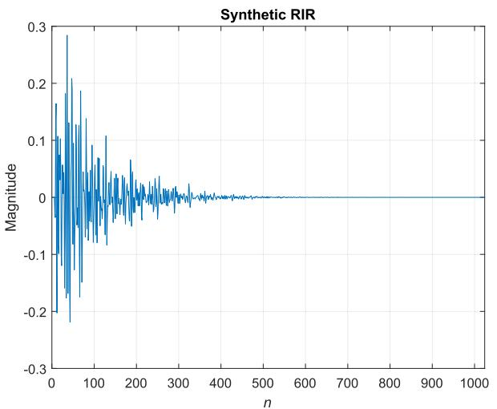

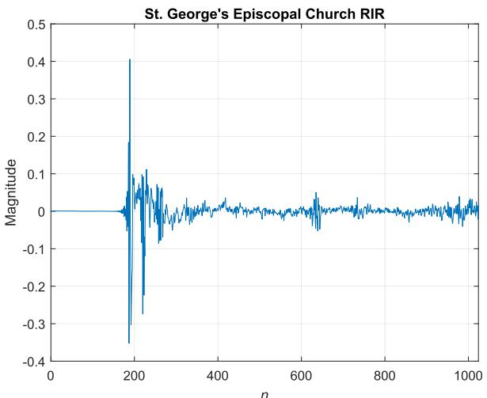  
<sub>Fig. 3.</sub> The considered synthetic (left) and Church (right) RIRs.

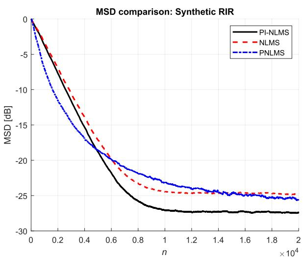

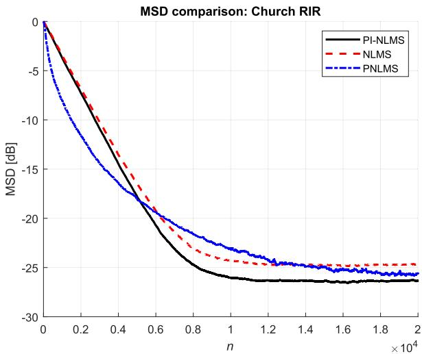  
<sub>Fig. 4.</sub> MSD under white noise excitation for the synthetic RIR (left) and the Church RIR (right) with SNR = 20 dB.

Main results in terms of MSD and ERLE at diferent SNRs for the synthetic and Church RIRs under white noise excitation.

<table><tr><td></td><td>SNR</td><td>-10 dB</td><td>-5 dB</td><td>0 dB</td><td>5 dB</td><td>10 dB</td><td>15 dB</td><td>20 dB</td><td>25 dB</td><td>30 dB</td></tr><tr><td colspan="11">Synthetic RIR</td></tr><tr><td rowspan="2">PI-NLMS</td><td>MSD</td><td>1.57</td><td>-2.48</td><td>-7.44</td><td>-12.47</td><td>-17.45</td><td>-22.43</td><td>-27.43</td><td>-32.11</td><td>-36.30</td></tr><tr><td>ERLE</td><td>-0.08</td><td>0.71</td><td>2.50</td><td>5.71</td><td>9.92</td><td>14.65</td><td>19.52</td><td>24.50</td><td>29.31</td></tr><tr><td rowspan="2">NLMS</td><td>MSD</td><td>5.26</td><td>0.24</td><td>-4.69</td><td>-9.71</td><td>-14.71</td><td>-19.78</td><td>-24.80</td><td>-29.78</td><td>-34.70</td></tr><tr><td>ERLE</td><td>-0.49</td><td>0.30</td><td>2.08</td><td>5.29</td><td>9.49</td><td>14.26</td><td>19.14</td><td>24.15</td><td>29.09</td></tr><tr><td rowspan="2">PNLMS</td><td>MSD</td><td>1.81</td><td>-1.58</td><td>-5.86</td><td>-11.04</td><td>-16.08</td><td>-20.76</td><td>-25.45</td><td>-29.45</td><td>-32.37</td></tr><tr><td>ERLE</td><td>-0.18</td><td>0.40</td><td>2.13</td><td>5.44</td><td>9.73</td><td>14.44</td><td>19.26</td><td>24.04</td><td>28.38</td></tr><tr><td colspan="11">Church RIR</td></tr><tr><td rowspan="2">PI-NLMS</td><td>MSD</td><td>1.65</td><td>-2.54</td><td>-6.62</td><td>-11.42</td><td>-16.61</td><td>-21.53</td><td>-26.33</td><td>-31.28</td><td>-35.51</td></tr><tr><td>ERLE</td><td>-0.21</td><td>0.59</td><td>2.39</td><td>5.54</td><td>9.80</td><td>14.48</td><td>19.32</td><td>24.34</td><td>29.15</td></tr><tr><td rowspan="2">NLMS</td><td>MSD</td><td>5.38</td><td>0.22</td><td>-4.84</td><td>-9.65</td><td>-14.81</td><td>-19.87</td><td>-24.69</td><td>-29.78</td><td>-34.71</td></tr><tr><td>ERLE</td><td>-0.52</td><td>0.28</td><td>2.09</td><td>5.23</td><td>9.49</td><td>14.20</td><td>19.04</td><td>24.09</td><td>29.02</td></tr><tr><td rowspan="2">PNLMS</td><td>MSD</td><td>1.95</td><td>-2.16</td><td>-6.38</td><td>-11.05</td><td>-16.00</td><td>-20.89</td><td>-25.69</td><td>-30.33</td><td>-34.00</td></tr><tr><td>ERLE</td><td>-0.33</td><td>0.52</td><td>2.27</td><td>5.44</td><td>9.72</td><td>14.44</td><td>19.27</td><td>24.24</td><td>28.90</td></tr></table>

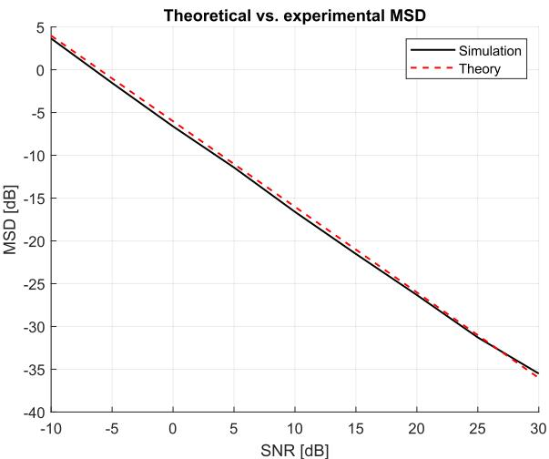

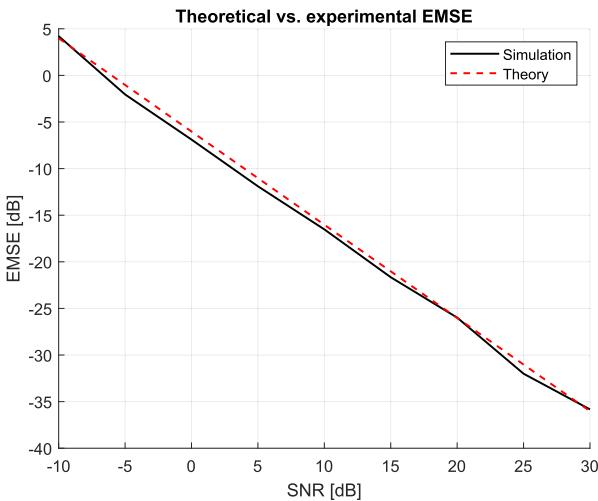  
<sub>Fig. 5.</sub> Comparisons between simulated and theoretical MSD (left) and EMSE (right) at diferent levels of SNR for the Church RIR under white noise excitation.

To assess the robustness of the selected parameters, we performed a sensitivity analysis by varying pairs of regularization weights while keeping the remaining parameters fixed at their nominal values. Specifically, two heatmaps were generated and shown in Fig. 6 for the case of synthetic RIR at the SNR = 20 dB. The first reports the steadystate MSD as a function of the exponential decay weight $\lambda _ { \mathrm { d e c a y } }$ and the temporal-smoothness weight $\lambda _ { \mathrm { t s } } .$ . The second reports the MSD as a function of the sparsity weight $\lambda _ { \ell _ { 1 } }$ and $\lambda _ { \mathrm { t s } } .$ . These pairs were selected because they represent the most relevant trade-ofs in the proposed framework: decay and temporal smoothness control the global structure and stability of the estimated RIR, while sparsity and temporal smoothness jointly afect early-reflection modeling and coeficient fluctuations.

The resulting heatmaps in Fig. 6 show that the proposed algorithm is not critically dependent on a single isolated parameter configuration. Instead, a broad region of low MSD is observed around the selected values, indicating that the proposed parameter setting is robust to moderate variations of the regularization weights. Very small values of the parameters reduce the efect of the physical priors and make the algorithm closer to standard NLMS, while excessively large values overconstrain the solution and increase the bias, leading to a degraded MSD. Therefore, the selected values provide a compromise between variance reduction and bias control. Similar results are obtained with the Church RIR, not shown here for space constraints.

## 5.3. Performance under speech signal excitation

In next experiment, we test the proposed approach under the speech signal excitation that introduces non-stationarity and colored input statistics. Specifically, Fig. 7 presents ERLE results using the female speech for both the synthetic and Church RIRs in the case of 20 dB of SNR. The complete set of results in terms of MSD and ERLE values for diferent SNRs and algorithms are detailed in Table 3. Specifically, Table 3 reports the steady-state performance under speech excitation, which represents a significantly more challenging and realistic scenario compared to white Gaussian input. The results clearly highlight the impact of input coloration on adaptive filtering performance and the benefits of the proposed PI-NLMS.

First, all algorithms exhibit a general improvement in both MSD and ERLE as the SNR increases. However, compared to the white input case, the overall performance is significantly degraded, particularly at low and moderate SNRs. This behavior is consistent with theoretical expectations, as speech signals exhibit a highly colored spectrum, leading to a large eigenvalue spread of the input covariance matrix $\mathbf { R } _ { x } .$ . As discussed in the analysis, this results in poor excitation of several modes, which in turn increases the steady-state MSD. Across all SNR values, the proposed PI-NLMS consistently outperforms NLMS and PNLMS, with substantially larger gains than in the white input case. In particular, the MSD improvement is now much more pronounced, especially at low and moderate SNRs, while the ERLE gains are also significant, unlike the white input scenario. This confirms that the proposed physics-informed regularization is particularly efective when the input signal is poorly conditioned, as it compensates for the lack of excitation in weak modes.

The case of SNR = 20 dB is especially relevant, as it represents a realistic operating point for acoustic echo cancellation with speech signals. For the synthetic RIR, at 20 dB, the MSD is -13.94 dB, against -11.89 dB for NLMS and -12.82 dB for PNLMS (about 2 dB of gain with respect to NLMS). The ERLE is 15.36 dB, against 12.33 dB for NLMS and 11.46 dB for PNLMS (about 3 dB of gain with respect to PNLMS). Similar considerations can be applied to the Church RIR.

Let us observe that we got much larger ERLE gains than white input. This is justified by the fact that, under speech excitation, eigenvalues $\lambda _ { x , i }$ are highly non-uniform, producing general lower results. However, the presence of the priors (refers to $\gamma _ { i } = \lambda _ { x , i } + \lambda _ { \Lambda , i }$ in (39) reduces the efective condition number $\kappa = \lambda _ { \operatorname* { m a x } } / \lambda _ { \operatorname* { m i n } }$ to $\kappa ^ { \prime } = \gamma _ { \mathrm { m a x } } / \gamma _ { \mathrm { m i n } } ,$ , improving the ERLE. Hence, PI-NLMS improves both MSD and ERLE under speech excitation, unlike the white signal case.

Accordance between the simulated MSD and EMSE with respect to the corresponding theoretical values in (39) and (41) is shown in Figs. 8a and 8b, respectively. In this case, the autocorrelation matrix <sub>??</sub> and squared norm of inputs in (16) are computed recursively on several batches of input. Both figures highlight a good accordance between theory and simulated values, for low and moderate SNR.

At high SNR values, the MSD deviates from the linear trend predicted by the noise-limited analysis and exhibits a saturation behavior, as predicted by (48) (see the dashed-dot blue line in Fig. 8). As described in Section 4.3, this efect is due to the presence of a bias term introduced by the regularization, which becomes dominant as the noise variance decreases. Specifically, MSD can be split into two terms (by summing over all modes in (49)): one proportional to the noise variance $\sigma _ { { } _ { v } } ^ { 2 }$ and the other related to bias and independent of noise, in equation $\mathrm { M S D } = C _ { 1 } \sigma _ { v } ^ { 2 } + C _ { 2 }$ . At low SNR, the first term dominates (linear behavior), while at high SNR the constant term dominates (tending to plateau). As a result, the algorithm operates in a bias-limited regime, where further increases in SNR do not translate into performance improvements. This behavior is consistent with the classical bias-variance trade-of and is particularly evident in the proposed PI-NLMS due to the presence of physics-informed priors. Compared to the white noise case, the plateau behavior of the MSD is more pronounced under speech excitation due to the highly colored nature of the input signal. In this case, the input covariance matrix exhibits a large eigenvalue spread, with many modes being weakly excited. As a result, the noise-driven component of the error vanishes rapidly with increasing SNR, while the residual bias, introduced by the regularization and the lack of excitation, remains dominant. Consequently, the algorithm enters a biaslimited regime at significantly lower SNR values compared to the white input case, leading to an earlier and more evident saturation of the MSD.

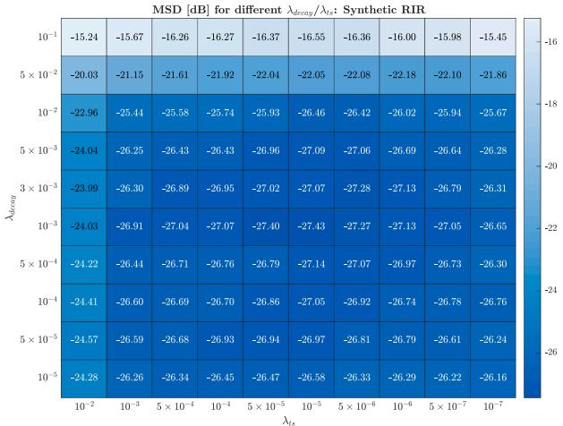

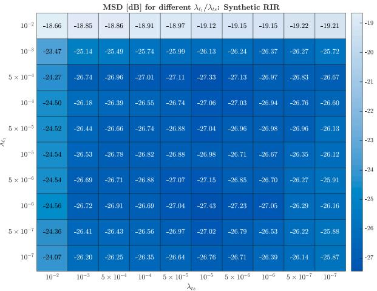  
<sub>Fig. 6.</sub> MSD at diferent values of the $\lambda _ { \mathrm { d e c a y } }$ and $\lambda _ { \mathrm { t s } } \ ( \mathrm { l e f t } )$ and $\lambda _ { \ell _ { 1 } }$ and $\lambda _ { \mathrm { t s } }$ regularizing parameters (right) for the synthetic RIR at $\mathrm { S N R } = 2 0 \mathrm { d B } .$

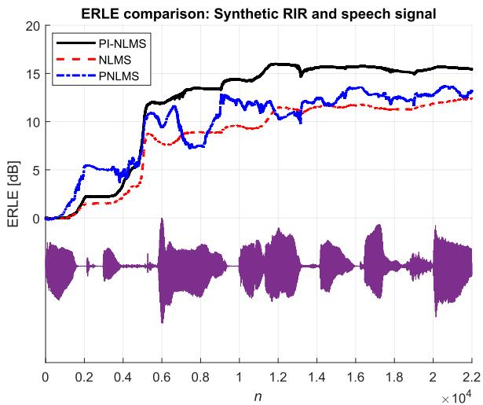  
<sub>Fig. 7.</sub> ERLE under speech excitation for the synthetic (left) and Church (right) RIRs with SNR = 20 dB.

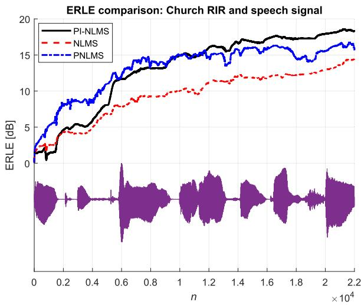

In summary, under speech excitation, the proposed PI-NLMS demonstrates significantly improved performance compared to NLMS and PNLMS, with gains that are substantially larger than those observed under white input conditions. This behavior is due to the highly colored nature of speech signals, which induces a large eigenvalue spread and leads to poor excitation of several modes. In this regime, the physics-informed regularization efectively compensates for the lack of excitation, stabilizes the adaptation, and reduces the steady-state error across all modes, despite the saturation performance at higher SNRs.

## 5.4. Comparison with APA and RLS

To further assess the performance of the proposed PI-NLMS algorithm, additional comparisons were conducted against the Afine Projection Algorithm (APA) and the Recursive Least Squares (RLS) algorithm [4,5]. These methods were selected because they represent two widely adopted adaptive filtering approaches characterized by faster convergence properties than NLMS-based techniques, particularly when the input signal exhibits strong temporal correlation, as is commonly the case for speech excitation.

It should be emphasized that APA and RLS are not direct counterparts of the proposed PI-NLMS. While PI-NLMS belongs to the class of low-complexity stochastic gradient algorithms, APA exploits multiple input vectors at each iteration and RLS performs a second-order adaptation based on the inverse input correlation matrix. Consequently, both methods generally achieve faster convergence at the expense of, especially the RLS one, a significantly higher computational complexity.

In experiments we set the projection order of APA to $K = 4$ and the step-size to $\mu _ { A P A } = 0 . 2$ , while for RLS algorithm we set the forgetting factor to $\lambda _ { R L S } = 0 . 9 9 9$ and the inverse of covariance matrix is initialized as <sub>?? = ????</sub> using <sub>?? =</sub> <sub>1</sub>. For the meaning of these parameters and details about APA and RLS, refer to [4,5].

Fig. 9a compares the proposed PI-NLMS with APA and RLS for the synthetic RIR at SNR = 20 dB. The MSD curves under white-noise excitation show that RLS provides the fastest initial convergence, as expected from its second-order nature and use of the inverse input correlation matrix. APA also exhibits a smooth and rapid convergence behavior by exploiting multiple past input vectors. In contrast, the proposed PI-NLMS converges more gradually, reflecting its first-order adaptation mechanism. Nevertheless, after convergence, PI-NLMS achieves the lowest steady-state MSD, outperforming both APA and RLS by approximately 1.7 dB. This result suggests that the incorporation of physically motivated priors efectively reduces the variance of the estimated coeficients and guides the adaptation process toward physically plausible solutions. Consequently, the proposed regularization partially compensates for the lack of second-order adaptation while preserving a substantially lower computational complexity than RLS, whose complexity scales as $\mathcal { O } ( L ^ { 2 } )$

Table 3  
Main results in terms of MSD and ERLE at diferent SNRs for the synthetic and Church RIRs unde speech signal excitation.

<table><tr><td></td><td>SNR</td><td>-10 dB</td><td>-5 dB</td><td>0 dB</td><td>5 dB</td><td>10 dB</td><td>15 dB</td><td>20 dB</td><td>25 dB</td><td>30 dB</td></tr><tr><td colspan="11">Synthetic RIR</td></tr><tr><td rowspan="2">PI-NLMS</td><td>MSD</td><td>5.82</td><td>2.76</td><td>-2.13</td><td>-6.56</td><td>-10.16</td><td>-12.76</td><td>-13.94</td><td>-14.29</td><td>-14.47</td></tr><tr><td>ERLE</td><td>-0.53</td><td>-0.13</td><td>0.96</td><td>3.41</td><td>6.90</td><td>11.23</td><td>15.36</td><td>18.61</td><td>20.57</td></tr><tr><td rowspan="2">NLMS</td><td>MSD</td><td>12.51</td><td>8.53</td><td>5.39</td><td>0.59</td><td>-4.24</td><td>-8.47</td><td>-11.89</td><td>-13.89</td><td>-14.08</td></tr><tr><td>ERLE</td><td>-4.30</td><td>-4.09</td><td>-2.65</td><td>-0.84</td><td>3.39</td><td>7.33</td><td>12.33</td><td>16.68</td><td>19.82</td></tr><tr><td rowspan="2">PNLMS</td><td>MSD</td><td>6.65</td><td>4.16</td><td>0.05</td><td>-2.10</td><td>-6.07</td><td>-8.18</td><td>-12.82</td><td>-13.94</td><td>-14.38</td></tr><tr><td>ERLE</td><td>-0.10</td><td>-0.08</td><td>-0.06</td><td>1.18</td><td>2.86</td><td>6.87</td><td>11.46</td><td>15.60</td><td>18.55</td></tr><tr><td colspan="11">Church RIR</td></tr><tr><td rowspan="2">PI-NLMS</td><td>MSD</td><td>10.60</td><td>5.66</td><td>-0.51</td><td>-4.41</td><td>-8.84</td><td>-12.79</td><td>-15.82</td><td>-17.18</td><td>-17.95</td></tr><tr><td>ERLE</td><td>-2.28</td><td>-1.17</td><td>1.39</td><td>4.91</td><td>9.33</td><td>14.04</td><td>18.24</td><td>21.21</td><td>23.18</td></tr><tr><td rowspan="2">NLMS</td><td>MSD</td><td>15.65</td><td>10.65</td><td>5.56</td><td>0.66</td><td>-4.01</td><td>-8.06</td><td>-11.33</td><td>-12.90</td><td>-13.82</td></tr><tr><td>ERLE</td><td>-3.98</td><td>-3.05</td><td>-0.54</td><td>3.37</td><td>7.74</td><td>11.43</td><td>14.58</td><td>15.55</td><td>16.29</td></tr><tr><td rowspan="2">PNLMS</td><td>MSD</td><td>10.95</td><td>5.99</td><td>-0.28</td><td>-1.67</td><td>-5.54</td><td>-8.55</td><td>-13.75</td><td>-14.84</td><td>-16.56</td></tr><tr><td>ERLE</td><td>-2.11</td><td>-1.13</td><td>1.14</td><td>3.84</td><td>7.74</td><td>11.21</td><td>15.64</td><td>17.81</td><td>18.48</td></tr></table>

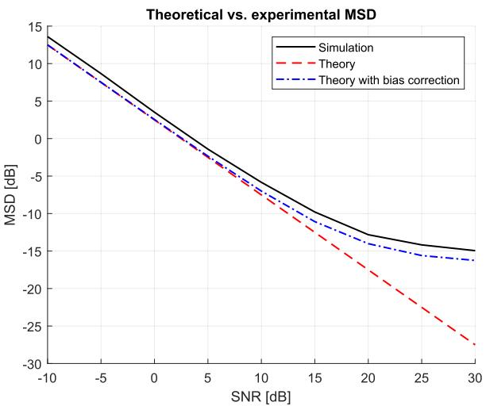

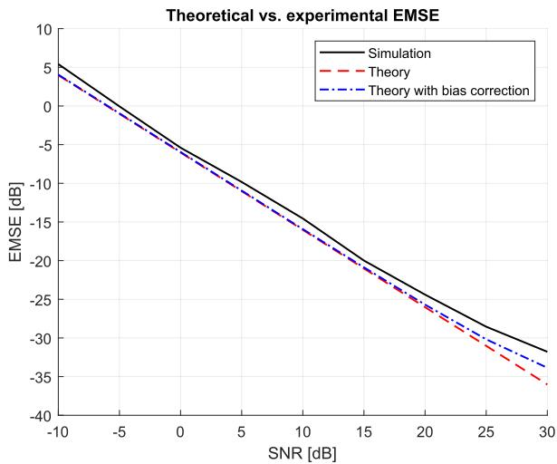  
<sub>Fig. 8.</sub> Comparisons between simulated and theoretical MSD (left) and EMSE (right) at diferent level of SNR for the Church RIR under speech excitation.

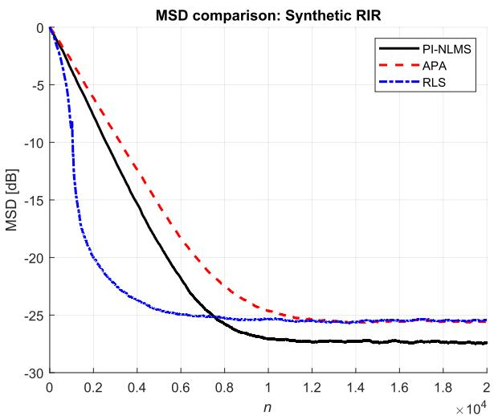

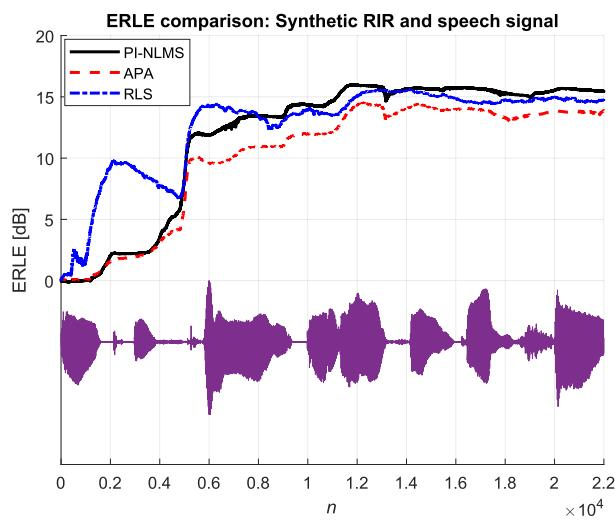  
<sub>Fig. 9.</sub> Comparisons of the proposed PI-NLMS with respect to APA and RLS in the case of synthetic RIR with SNR = 20 dB: MSD under white noise excitation (left) and ERLE under speech excitation (right).

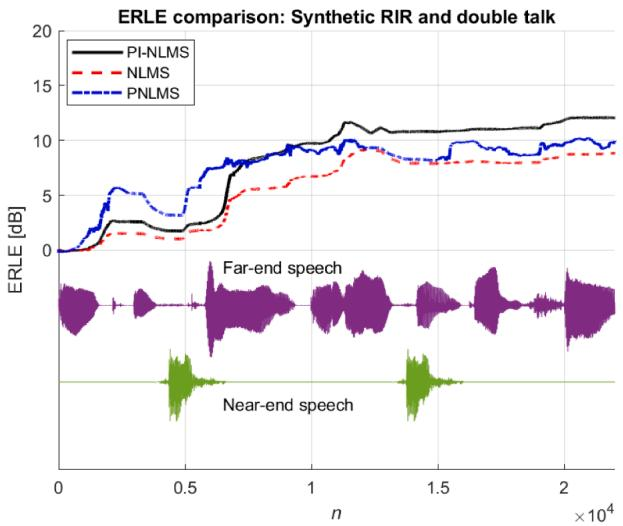

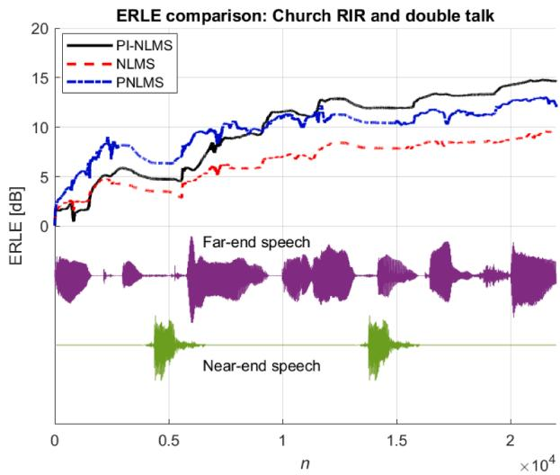  
<sub>Fig. 10.</sub> ERLE under speech excitation for the synthetic (left) and Church (right) RIRs with SNR = 20 dB and double-talk conditions.

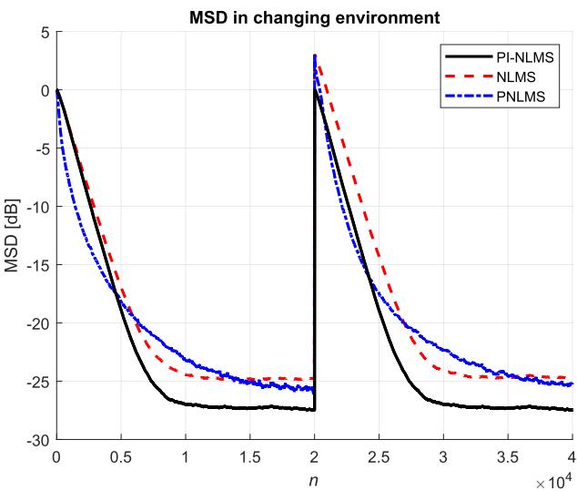  
<sub>Fig. 11.</sub> MSD obtained in a changing environment, where at iteration <sub>?? =</sub> 20,000 the RIR is abruptly changed.

Fig. 9b reports the ERLE comparison under speech excitation for the same synthetic RIR and SNR condition. In this more realistic scenario, the colored nature of speech makes the identification problem more challenging and typically slows down the adaptation process. As expected, RLS exhibits the fastest initial ERLE growth, while PI-NLMS shows a slower transient due to its stochastic-gradient nature. However, the proposed method achieves the highest steady-state ERLE, providing approximately 1 dB improvement over both APA and RLS after convergence. These results indicate that the proposed physical priors improve not only the accuracy of the identified echo path but also the efectiveness of the resulting echo cancellation process under correlated excitation.

Overall, the proposed PI-NLMS achieves a favorable performancecomplexity trade-of, combining the low computational burden of NLMS-class algorithms with a steady-state performance that is competitive with, and in this scenario slightly superior to, more computationally demanding adaptive filtering approaches.

## 5.5. Performance under double-talk condition

To evaluate the robustness of the proposed approach in realistic acoustic environments, additional experiments were conducted under double-talk conditions using both the synthetic and the measured Church RIRs. A female near-end speech signal was added during a predefined time interval while maintaining an overall SNR of 20 dB. To prevent coeficient divergence during double talk, a correlation-based double-talk detector (DTD) was employed [55,56]. When double talk was detected, the adaptation process was temporarily suspended, while the regularization terms remained active.

Double talk represents a particularly challenging condition for acoustic echo cancellation because the near-end speech component is uncorrelated with the far-end reference signal and may therefore corrupt the adaptation process. In conventional adaptive filters, this often results in coeficient drift, increased misalignment, and slower recovery after the end of the double-talk period.

The obtained results, shown in Fig. 10a and b, demonstrate that the proposed PI-NLMS maintains stable operation throughout the doubletalk interval for both considered room impulse responses. As expected, the presence of near-end speech leads to a slight reduction in the achievable steady-state ERLE compared with the single-talk case. Nevertheless, the observed degradation is limited to approximately 2–3 dB, demonstrating that the combination of double-talk detection and physicsinformed regularization efectively mitigates coeficient drift and preserves the quality of the echo-path estimate. Moreover, the ERLE temporarily decreases during the presence of near-end speech due to the additional signal component entering the microphone signal. However, the correlation-based DTD efectively limits the adaptation of the filter coeficients during double talk, thereby preventing significant degradation of the echo-path estimate.

In addition to the protection provided by the DTD, the proposed physics-informed regularization contributes to preserving a physically consistent impulse-response structure. Consequently, the decrease in ERLE during double talk remains limited and the recovery after the disappearance of the near-end speech is faster than that observed for conventional adaptive filtering approaches, such as the NLMS. This behavior is particularly evident for the Church RIR, whose long reverberation tail makes the identification problem more sensitive to coeficient perturbations.

Overall, the results indicate that the combination of double-talk detection and physics-informed regularization provides improved robustness against near-end speech interference. The DTD prevents severe coeficient drift during double-talk intervals, while the proposed physical priors facilitate rapid re-convergence and maintain a physically plausible echo-path estimate, resulting in improved post-double-talk performance.

## 5.6. Performance under nonstationary scenario

Finally, the tracking capability of the considered algorithms is as sessed in a nonstationary scenario. To this end, a sequence of 40,000 white noise samples is used as input, while an abrupt change in the echo path is introduced at sample <sub>?? =</sub> 20,000. Specifically, the acoustic environment is modified by replacing the Church RIR with the synthetic RIR, thereby emulating a sudden variation in the acoustic conditions. The resulting MSD curves are reported in Fig. 11. As expected, all algorithms exhibit a sharp performance degradation at the change point due to the mismatch between the adaptive filter and the new echo path.

A closer inspection of the re-convergence behavior reveals clear quantitative diferences. Immediately after the change, all methods experience a similar MSD increase, but the proposed PI-NLMS achieves a significantly faster decay. In particular, PI-NLMS reduces the MSD below <sub>−20</sub> dB within approximately 5000 samples after the change, whereas NLMS and PNLMS require roughly 7000 samples to reach the same level. Moreover, the steady-state MSD attained by PI-NLMS after re-convergence is around <sub>−27.5</sub> dB, which represents an improvement of approximately 2–3 dB over NLMS and PNLMS, respectively. These results indicate not only a faster tracking speed but also a lower misadjustment level.

This behavior can be attributed to the presence of physics-informed priors, which efectively regularize the adaptation and prevent large deviations in poorly excited modes, thereby accelerating convergence after abrupt changes. In contrast, NLMS exhibits slower adaptation due to its sensitivity to eigenvalue spread, while PNLMS benefits from proportionate updates but lacks the additional structural constraints provided by the proposed approach. Overall, the results confirm that PI-NLMS provides superior tracking performance, achieving both faster reconvergence and improved steady-state accuracy in dynamically vary ing environments.

## 6. Conclusion

This paper introduced a Physics-Informed Adaptive Filtering (PIAF) framework for acoustic echo cancellation. By reformulating echo path identification as a structured stochastic optimization problem, the proposed Physics-Informed NLMS (PI-NLMS) algorithm integrates physically motivated priors, such as causality, exponential energy decay, time-weighted sparsity of early reflections, spectral smoothness, and slow temporal variation, into the adaptive filtering process. Unlike conventional data-driven adaptive algorithms that operate over an unconstrained coeficient space, the proposed method restricts adaptation to a physically plausible echo-path manifold. Convergence analysis demonstrated that structured regularization modifies the efective correlation matrix, improving conditioning and reducing steady-state variance while introducing a controlled bias aligned with acoustic physics.

Simulation results under stationary and time-varying echo paths confirmed that the proposed approach achieves faster convergence, lower steady-state misalignment, improved ERLE, and enhanced robustness compared to conventional NLMS, proportionate algorithms, and standard sparsity-aware methods. Importantly, these gains are obtained with modest additional computational complexity, preserving real-time feasibility for practical acoustic echo cancellation systems.

Future work may extend the framework to a proximal version to handle sparsity constraints without subgradients and extend it to frequencydomain adaptive filtering implementations for long impulse responses, incorporate nonlinear loudspeaker distortion modeling within a hybrid linear-nonlinear architecture, and investigate adaptive selection of physics regularization parameters based on environmental conditions. Moreover, theoretical extensions to nonstationary and double-talk scenarios, as well as experimental validation in real-world scenarios, constitute promising directions for further research.

## CRediT authorship contribution statement

<sub>Michele Scarpiniti:</sub> Writing – original draft, Visualization, Validation, Software, Methodology, Formal analysis, Conceptualization; <sub>Danilo Comminiello:</sub> Writing – review & editing, Investigation, Formal analysis, Data curation; <sub>Aurelio Uncini:</sub> Writing – review & editing, Validation, Supervision, Formal analysis

## Declaration of competing interest

The authors declare that they have no known competing financial interests or personal relationships that could have appeared to influence the work reported in this paper.

## Data availability

Data will be made available on request.

## References

[1] D. Yang, Echo cancellation algorithms for tele-communication system, in: International Conference on Electronics, Electrical, and Information Engineering (ICEEIE 2025), 14003, 2025, p. 140030J. https://doi.org/10.1117/12.3090101

[2] A. Saremi, B. Ramkumar, G. Ghafari, Z. Gu, An acoustic echo canceller optimized for hands-free speech telecommunication in large vehicle cabins, EURASIP J. Audio Speech Music Process. 2023 (1) (2023) 39. https://doi.org/10.1186 s13636-023-00305-7

[3] J. Benesty, T. Gänsler, D.R. Morgan, M.M. Sondhi, S.L. Gay, Advances in Network and Acoustic Echo Cancellation, Springer, 2001.

[4] A. Uncini, Fundamentals of Adaptive Signal Processing, Springer, 2015.

[5] A.H. Sayed, Adaptive Filters, Wiley, 2008.

[6] A. Deb, A. Kar, M. Chandra, A technical review on adaptive algorithms for acoustic echo cancellation, in: 2014 International Conference on Communication and Signal Processing, 2014, pp. 041–045. https://doi.org/10.1109/ICCSP.2014.6949795

[7] L. Zhang, H. He, J. Chen, Y. Yu, J. Benesty, A Newton-Raphson solution to the exponentially weighted least M-estimate formulation for acoustic system identification, Appl. Acoust. 231 (2025) 110460. https://doi.org/10.1016/j.apacoust.2024. 110460

[8] Z. Cao, T. Yan, J. Chen, J. Chen, J. Benesty, A MISO acoustic echo cancellation algorithm based on a two-layer filter decomposition, Signal Process. 232 (2025) 109892. https://doi.org/10.1016/j.sigpro.2025.109892

[9] Z. Zheng, Z. Shao, Y. Yu, L. Lu, S. Gao, Cramér–Rao lower bound of adaptive filtering algorithms for acoustic echo cancellation, Signal Process. 238 (2026) 110111. https //doi.org/10.1016/j.sigpro.2025.110111

[10] H. Kuttruf, Room Acoustics, Spon Press, 4th edition edition, 2000

[11] D.G. Jankovic,´ M. Ciri<sup>´</sup> c,´ A. Pantic,´ Automated estimation of the truncation of room impulse response by applying a nonlinear decay model, J. Acoust. Soc. Am. 139 (3) (2016) 1047–1057. https://doi.org/10.1121/1.4941657

[12] L. Wang, Y. Lu, Z. Gao, K. Li, J. Huang, Y. Kong, S. Okada, BERP: A blind estimator of room parameters for single-channel noisy speech signals, IEEE Trans. Audio Speech Lang. Process. 33 (2025) 2215–2231. https://doi.org/10.1109/TASLPRO. 2025.3574849

[13] R. Badeau, Unified stochastic reverberation modeling, in: 2018 26th European Signal Processing Conference (EUSIPCO), 2018, pp. 2175–2179. https://doi.org/ 10.23919/EUSIPCO.2018.8553562

[14] I. Hassani, A. Benallal, R. Bendoumia, Double-talk robust fast converging and low complexity algorithm for acoustic echo cancellation in teleconferencing system, in: M. Hatti, (Eds.), Artificial Intelligence and Heuristics for Smart Energy Eficiency in Smart Cities, Springer International Publishing, 2022, pp. 409–420. https://doi. org/10.1007/978-3-030-92038-8\_41

[15] D. Duttweiler, Proportionate normalized least-mean-squares adaptation in echo cancelers, IEEE Trans. Speech Audio Process. 8 (5) (2000) 508–518. https://doi.org 10.1109/89.861368

[16] C. Paleologu, J. Benesty, S. Ciochina,˘ A robust proportionate NLMS algorithm, IEEE Signal Process. Lett. 17 (3) (2010) 237–240.

[17] J. Benesty, S.L. Gay, An improved PNLMS algorithm, in: 2002 IEEE International Conference on Acoustics, Speech, and Signal Processing, 2, 2002, pp. II– 1881–II–1884. https://doi.org/10.1109/ICASSP.2002.5744994

[18] M. Hamidia, A. Amrouche, Improved variable step-size NLMS adaptive filtering algorithm for acoustic echo cancellation, Digit. Signal Process. 49 (2016) 44–55. https://doi.org/10.1016/j.dsp.2015.10.015

[19] Y.A. Huang, J. Benesty, J. Chen, Acoustic MIMO Signal Processing, Springer, 2006

[20] Y. Chen, Y. Gu, A.O. Hero, Sparse LMS for system identification, in: 2009 IEEE International Conference on Acoustics, Speech and Signal Processing, 2009, pp. 3125–3128. https://doi.org/10.1109/ICASSP.2009.4960286

[21] K. Kumar, R. Pandey, M. Karthik, S.S. Bhattacharjee, N.V. George, Robust and sparsity-aware adaptive filters: a review, Signal Process. 189 (2021) 108276. https://doi.org/10.1016/j.sigpro.2021.108276

[22] Y.-Y. Chen, J.-H. Wang, P.-C. Chan, K.-W. Liang, Z.-Y. Wang, J.-C. Wang, Optimizing acoustic echo cancellation with variable step size in adaptive filtering, in: 2024 International Conference on Advanced Technologies for Communications (ATC), 2024, pp. 329–332. https://doi.org/10.1109/ATC63255.2024.10908122

[23] L.-M. Dogariu, J. Benesty, C. Paleologu, S. Ciochina,˘ Identification of room acoustic impulse responses via Kronecker product decompositions, IEEE/ACM Trans. Audio Speech Lang. Process. 30 (2022) 2828–2841. https://doi.org/10.1109/TASLP.2022. 3202128

[24] R.-A. Otopeleanu, L.-M. Dogariu, C. Paleologu, J. Benesty, C.-L. Stanciu, R.-L. Costea, Recursive least-squares algorithm based on a fourth-order tensor decomposition for acoustic echo cancellation, Mathematics 14 (5) (2026) 812. https://doi.org/10 3390/math14050812

[25] G. Li, H. Zhang, S. Wang, G. Wang, J. Zhao, Generalized mixed-norm maximum correntropy for robust adaptive filtering, Appl. Acoust. 228 (2025) 110382. https: //doi.org/10.1016/j.apacoust.2024.110382

[26] G. Li, G. Wang, F. Huang, J. Zhao, H. Zhang, Novel robust filtering algorithms employing generalized correntropy within p-norm loss, Appl. Acoust. 243 (2026) 111112. https://doi.org/10.1016/j.apacoust.2025.111112

[27] Y. Li, D. Sun, Y. Zhu, Y. Miao, C. Yu, Y. Fu, Fractional-order hyperbolic tangent adaptive algorithm for vehicular acoustic echo cancellation, Appl. Acoust. 242 (2026) 111069. https://doi.org/10.1016/j.apacoust.2025.111069

[28] S. Wang, Z. Lai, Y. Lei, A sparse extended Kalman filtering based on laplace prior for real-time state-parameter identification, Mech. Syst. Signal Process. 241 (2025) 113500. https://doi.org/10.1016/j.ymssp.2025.113500

[29] Q. Fu, L. Wang, Q. Xie, Y. Zhou, An improved adaptive iterative extended Kalman filter based on variational Bayesian, Appl. Sci. 14 (4) (2024) 1393. https://doi.org/ 10.3390/app14041393

[30] J. Franzen, T. Fingscheidt, An eficient residual echo suppression for multi-channel acoustic echo cancellation based on the frequency-domain adaptive Kalman filter, in: 2018 IEEE International Conference on Acoustics, Speech and Signal Processing (ICASSP), 2018, pp. 226–230. https://doi.org/10.1109/ICASSP.2018.8462488

[31] J.M. Gil-Cacho, T. van Waterschoot, M. Moonen, S.H. Jensen, A frequency-domain adaptive filter (FDAF) prediction error method (PEM) framework for double-talkrobust acoustic echo cancellation, IEEE/ACM Trans. Audio Speech Lang. Process. 22 (12) (2014) 2074–2086. https://doi.org/10.1109/TASLP.2014.2351614

[32] Y.-S. Park, J.-H. Chang, Frequency domain acoustic echo suppression based on soft decision, IEEE Signal Process. Lett. 16 (1) (2009) 53–56. https://doi.org/10.1109 LSP.2008.2008571

[33] T. Bahraini, A.N. Sadigh, Proposing a robust RLS based subband adaptive filtering for audio noise cancellation, Appl. Acoust. 216 (2024) 109755. https://doi.org/10 1016/j.apacoust.2023.109755

[34] Z.M. Sari˘ c,´ I.I. Papp, D.D. Kukolj, I. Velikic,´ G. Velikic,´ Partitioned block frequency domain acoustic echo canceller with fast multiple iterations, Digit. Signal Process 27 (2014) 119–128. https://doi.org/10.1016/j.dsp.2014.01.008

[35] G. Enzner, R. Martin, P. Vary, G. Enzner, R. Martin, P. Vary, Partitioned residual echo power estimation for frequency-domain acoustic echo cancellation and postfiltering, Eur. Trans. Telecommun. 13 (2) (2002) 103–114. https://doi.org/10.1002/ ett.4460130205

[36] H. Zhao, Y. Gao, Y. Zhu, Robust subband adaptive filter algorithms-based mixture correntropy and application to acoustic echo cancellation, IEEE/ACM Trans. Audio Speech Lang. Process. 31 (2023) 1223–1233. https://doi.org/10.1109/TASLP.2023. 3250845

[37] T. Haubner, A. Brendel, W. Kellermann, End-to-end deep learning-based adaptation control for linear acoustic echo cancellation, IEEE/ACM Trans. Audio Speech Lang Process. 32 (2024) 227–238. https://doi.org/10.1109/TASLP.2023.3325923

[38] M. K. S. I. V., Attention-driven echo cancellation: a novel transformer-based approach for robust acoustic echo and noise cancellation, Results Eng. 26 (2025) 105039. https://doi.org/10.1016/j.rineng.2025.105039

[39] Y. Huang, W. Qin, Z. Li, Q. Zhang, Time-frequency dual-domain attention for acoustic echo cancellation, J. Supercomput. 81 (5) (2025) 739. https://doi.org/10.1007 s11227-025-07200-2

[40] Z. Chen, X. Xia, C. Chen, X. Wang, Y. Leng, L. Chen, R. Togneri, Y. Xiao, P. Ding, S. Song, P. Zhang, A two-stage progressive neural network for acoustic echo cancellation, in: Proc. Interspeech 2023, 2023, pp. 795–799. https://doi.org/10.21437/ Interspeech.2023-521

[41] S. Xu, C. He, B. Yan, M. Wang, A multi-stage acoustic echo cancellation model based on adaptive filters and deep neural networks, Electronics 12 (15) (2023) 3258. https://doi.org/10.3390/electronics12153258

[42] C. Zhang, X. Zhang, A robust and cascaded acoustic echo cancellation based on deep learning, in: Proc. Interspeech 2020, 2020, pp. 3940–3944. https://doi.org/ 10.21437/Interspeech.2020-1260

[43] E. Seidel, G. Enzner, P. Mowlaee, T. Fingscheidt, Neural Kalman filters for acoustic echo cancellation: comparison of deep neural network-based extensions, IEEE Signal Process. Mag. 41 (6) (2024) 24–38. https://doi.org/10.1109/MSP.2024.3449557

[44] V.R. Tadi, A. Kar, Fully convolutional recurrent network with multiple sub-filters for monophonic acoustic echo cancellation, Digit. Signal Process. 176 (2026) 106068. https://doi.org/10.1016/j.dsp.2026.106068

[45] M. K. S. I. V, A novel adaptive Kolmogorov Arnold sparse masked attention model with multi-loss optimization for acoustic echo cancellation in double-talk noisy scenario, Comput. Speech Lang. 93 (2025) 101786. https://doi.org/10.1016/j.csl. 2025.101786

[46] T. Sun, X. Rong, D. Wang, Y. Hu, K. Chen, J. Lu, Exploiting lightweight neural postfiltering for directional speech enhancement, Appl. Acoust. 239 (2025) 110844. https://doi.org/10.1016/j.apacoust.2025.110844

[47] A. Ivry, I. Cohen, B. Berdugo, Deep adaptation control for acoustic echo cancellation, in: 2022 IEEE International Conference on Acoustics, Speech and Signal Processing (ICASSP 2022), 2022, pp. 741–745. https://doi.org/10.1109/ICASSP43922.2022. 9746557

[48] M. Raissi, P. Perdikaris, G.E. Karniadakis, Physics-informed neural networks: a deep learning framework for solving forward and inverse problems involving nonlinear partial diferential equations, J. Comput. Phys. 378 (2019) 686–707. https://doi. org/10.1016/j.jcp.2018.10.045

[49] G.E. Karniadakis, I.G. Kevrekidis, L. Lu, P. Perdikaris, S. Wang, L. Yang, Physicsinformed machine learning, Nat. Rev. Phys. 3 (6) (2021) 422–440. https://doi.org/ 10.1038/s42254-021-00314-5

[50] T. van Waterschoot, G. Rombouts, M. Moonen, Towards optimal regularization by incorporating prior knowledge in an acoustic echo canceller, in: International Workshop on Acoustic Signal Enhancement (IWAENC 2005), 2005, pp. 157–160.

[51] R.-A. Otopeleanu, J. Benesty, C. Paleologu, C.-L. Stanciu, L.-M. Dogariu, S. Ciochina,˘ A practical regularized recursive least-squares algorithm for robust system identifi cation, in: 2025 33rd European Signal Processing Conference (EUSIPCO), 2025, pp. 1417–1421. https://doi.org/10.23919/EUSIPCO63237.2025.11226097

[52] C.-L. Stanciu, C. Anghel, L.-M. Dogariu, I.-D. Fîciu, L. Stanciu, Regularized afine projection algorithm for stereophonic acoustic echo cancellation, in: 2024 Advanced Topics on Measurement and Simulation (ATOMS), 2024, pp. 319–322. https://doi. org/10.1109/ATOMS60779.2024.10921557

[53] N. Bershad, P. Celka, J.-M. Vesin, Stochastic analysis of gradient adaptive identification of nonlinear systems with memory for Gaussian data and noisy input and output measurements, IEEE Trans. Signal Process. 47 (3) (1999) 675–689. https://doi.org/10.1109/78.747775

[54] S. Shelley, D.T. Murphy, OpenAIR: an interactive auralization web resource and database, in: AES 129th Convention, San Francisco, CA, USA, 2010, p. 8226

[55] J. Benesty, D. Morgan, J. Cho, A new class of doubletalk detectors based on crosscorrelation, IEEE Trans. Speech Audio Process. 8 (2) (2000) 168–172. https://doi. org/10.1109/89.824701

[56] T. Gänsler, J. Benesty, The fast normalized cross-correlation double-talk detector, Signal Process. 86 (6) (2006) 1124–1139. https://doi.org/10.1016/j.sigpro.2005 07.035

[57] M. Von Berg, P.P. Schwörer, L. Prinz, J. Stefens, Analysis of physical and perceptual properties of room impulse responses: development of an online tool, in: Proceedings of the 10th Convention of the European Acoustics Association Forum Acusticum 2023, 2023, pp. 1647–1654. https://doi.org/10.61782/fa.2023.0480

[58] A. Fan, W. Yang, Z. Wang, Y. Xu, Deep echo cancellation algorithm based on time-frequency domain combination, in: 2024 4th International Conference on Neural Networks, Information and Communication Engineering (NNICE), 2024, pp. 997–1001. https://doi.org/10.1109/NNICE61279.2024.10498402

[59] H. Chen, G. Chen, K. Chen, J. Lu, Nonlinear residual echo suppression based on dual-stream DPRNN, EURASIP J. Audio Speech Music Process. 2021 (1) (2021) 35. https://doi.org/10.1186/s13636-021-00221-8

[60] A. Favrot, C. Faller, F. Kuech, Modeling late reverberation in acoustic echo suppression, in: International Workshop on Acoustic Signal Enhancement (IWAENC 2012) 2012, pp. 1–4.