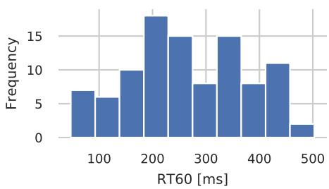
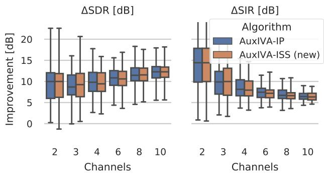
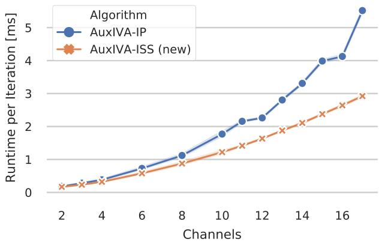

# FAST AND STABLE BLIND SOURCE SEPARATION WITH RANK-1 UPDATES

Robin Scheibler and Nobutaka Ono

Tokyo Metropolitan University, Tokyo, Japan

## ABSTRACT

We propose a new algorithm for the blind source separation of acoustic sources. This algorithm is an alternative to the popular auxiliary function based independent vector analysis using iterative projection (AuxIVA-IP). It optimizes the same cost function, but instead of alternate updates of the rows of the demixing matrix, we propose a sequence of rank-1 updates. Remarkably, and unlike the previous method, the resulting updates do not require matrix inversion. Moreover, their computational complexity is quadratic in the number of microphones, rather than cubic in AuxIVA-IP. In addition, we show that the new method can be derived as alternate updates of the steering vectors of sources. Accordingly, we name the method iterative source steering (AuxIVA-ISS). Finally, we confirm in simulated experiments that the proposed algorithm separates sources just as well as AuxIVA-IP, at a lower computational cost.

Index Terms— Blind Source Separation, Auxiliary Function Optimization, Independent Vector Analysis, Mixing Matrix, Fast algorithm

## 1. INTRODUCTION

Independent component analysis (ICA) allows to separate mixtures of signals without any prior information, provided these signals are statistically independent [1]. Due to this wonderful property, ICA has found applications in numerous fields [2]. Of particular interest is the blind source separation (BSS) of audio recordings into the individual sources present in the auditory scene. In this case, the problem is complicated by mixtures being convolutive due to the effect of reverberation. Nevertheless, the problem can be solved by running separation in parallel at multiple narrow frequency bands in the time-frequency domain [3]. Being blind, however, the sources separated at different frequencies are not guaranteed to appear in the same order and their permutation must be solved for. While algorithms for this exist [4], the problem can be circumvented altogether by doing joint separation of all frequencies according to a multivariate probability distribution for sources, so-called independent vector analysis (IVA) [5, 6].

In the IVA framework, the convolutive BSS problem is formulated as the minimization of a single cost function. Originally, the natural gradient method has been proposed for the task [5, 6, 7]. While being widely used in practice, gradient methods are crucially dependent on the choice of the step size. Too small a step and the algorithm never reaches convergence. Too big a step and the algorithm diverges. To solve this issue, auxiliary function based IVA (Aux-IVA) has been proposed [8]. In auxiliary function optimization, also known as majorization-maximization [9], a hard-to-optimize function is replaced by an auxiliary function that can be minimized instead. Using this technique, AuxIVA proposes simple rules, known as iterative projection (IP) to alternately update the demixing filters of each source, i.e., the rows of the demixing matrix, with guaranteed monotonic decrease of the cost function. Let us also mention here an alternative to AuxIVA-IP based on proximal splitting [10].

Being tuning parameter-free, stable, and with fast convergence in practice, the AuxIVA-IP rules enjoy widespread popularity and are now a key building block of many algorithms. These algorithms usually reflect a different source model. Independent low-rank matrix analysis (ILRMA) uses a local-Gaussian model with a nonnegative low-rank assumption for the source spectrograms [11, 12]. Independent deeply-learnt matrix analysis (IDLMA) replaces the non-negative low-rank model with a non-linear projection using a neural network trained in advance [13]. Kameoka et al., replace the source model by a variational autoencoder that provides a very expressive source model that can be learnt from data, while still allowing to minimize the negative log-likelihood [14]. Any improvement of the update rules for AuxIVA will directly result in improvements for all these algorithms.

Despite all their advantages, the update rules of AuxIVA-IP require recomputation of one covariance matrix and its inversion per source and per iteration. In fact, its complexity is cubic in the number of microphones used. In addition, the matrix inversion is an inherently dangerous operation that can lead to instability and is best avoided. Recently, a work close in spirit to ours proposed alternative rules for IDLMA, but applicable to AuxIVA, that update one column of the demixing matrix at a time [15]. While avoiding the computation of the covariance matrices, these rules still require a matrix inversion for each update.

In this work, we propose iterative source steering (ISS), an alternative algorithm that minimizes the same cost function as AuxIVA. Rather than updating one demixing vector at a time, we consider a series of rank-1 updates to the demixing matrix itself. The resulting update rules are inverse-free, and have per-iteration complexity only quadratic in the number of microphones. We further explain how the rank-1 updates arise from alternative updates of the steering vectors of the sources and give an intuitive interpretation of the rules. Numerical experiments confirm that separation performance is on par with AuxIVA-IP at a reduced computational cost.

## 2. BACKGROUND

## 2.1. Signal Model and Notation

We address the problem of blindly separating K sound sources recorded with M microphones. A convolutive sound mixture is

$$
\hat {x} _ {m} [ t ] = \sum_ {k = 1} ^ {K} (\hat {a} _ {m k} \star \hat {s} _ {k}) [ t ],\tag{1}
$$

where $\hat { x } _ { m } [ t ]$ is the mth microphone signal, $\hat { s } _ { k } [ t ]$ is the kth source signal, and $\hat { a } _ { m k } [ t ]$ is the impulse response between the two. The operator ? denotes convolution. In the time-frequency domain, convolution becomes frequency-wise multiplication and we have

$$
x _ {m f n} = \sum_ {k = 1} ^ {K} a _ {m k f} s _ {k f n},\tag{2}
$$

where $x _ { m f n }$ and $s _ { k f n }$ are the short-time Fourier transforms (STFT) [16] of $\hat { x } _ { m } [ t ]$ and $\hat { s } _ { k } [ t ]$ , respectively, and $a _ { m k } [ f ]$ is the discrete Fourier transform of $\hat { a } _ { m k } [ t ]$ . Finally, $f \ = { \mathrm { \dot { 1 } } } , \ldots , F$ and $n = 1 , \ldots , N$ are the discrete frequency bin and frame indices, respectively. This is an approximation valid when the Fourier transform is sufficiently longer than the impulse response.

Grouping the microphone and source signals at frequency f in vectors, we can express the former as a linear mixing of the latter

$$
\pmb {x} _ {f n} = \pmb {A} _ {f} \pmb {s} _ {f n},\tag{3}
$$

where $A _ { f }$ is the mixing matrix with $( A _ { f } ) _ { m k } = a _ { m k f }$ . Importantly, note that if the number of sources and microphones is the same, i.e., $M = K$ , then $A _ { f }$ is a square matrix that can be inverted under mild conditions. This is what we’ll assume in the rest of this paper.

In the rest of the manuscript, we use lower and upper case bold letters for vectors and matrices, respectively. Furthermore, $A ^ { \top } , A ^ { \top }$ det(A) and $\operatorname { t r } ( A )$ denote the transpose, conjugate transpose, determinant and trace of matrix A, respectively. We denote by $e _ { k }$ the kth canonical basis vector with a one at the kth position and zeros everywhere else. Unless specified otherwise, indices $k , m , f ,$ , and n always take the ranges defined here.

## 2.2. Iterative Projection Algorithm

The objective of IVA is to find the demixing matrix $\begin{array} { r l } { W _ { f } } & { { } = } \end{array}$ $\left[ { \pmb w } _ { 1 f } \mathrm { ~  ~ \cdots ~ } { \pmb w } _ { M f } \right] ^ { \sf H } , \forall f .$ , such that the demixed signal

$$
\pmb {y} _ {f n} = \pmb {W} _ {f} \pmb {x} _ {f n}\tag{4}
$$

is the maximum likelihood estimator of $s _ { f n }$ under the assumptions

1. the sources are statistically independent,

2. the source signals distribution is spherical super-Gaussian,

$$
p \big (s _ {k 1 n}, \ldots , s _ {k F n} \big) \sim e ^ {- G \big (\sqrt {\sum_ {f} s _ {k f n}} \big)},\tag{5}
$$

with $G \ : \ \mathbb { R } _ { + } \to \mathbb { R }$ , strictly increasing, differentiable, and such that $\varphi ( \boldsymbol { r } ) = G ^ { \prime } ( \boldsymbol { r } ) / ( 2 r )$ is strictly decreasing (see [17] for details).

Under these assumptions, the negative log-likelihood of the input is

$$
\mathcal {L} = \sum_ {k = 1} ^ {M} G \left(\sqrt {\sum_ {f} | \boldsymbol {w} _ {k f} ^ {\mathsf {H}} \boldsymbol {x} _ {f n} | ^ {2}}\right) - 2 \sum_ {f} \log | \det (\boldsymbol {W} _ {f}) |.\tag{6}
$$

Furthermore, one can show that this cost function is majorized by

$$
\mathcal {L} \leq \mathcal {L} _ {2} = \sum_ {f = 1} ^ {F} \sum_ {k = 1} ^ {M} \boldsymbol {w} _ {k f} ^ {\mathsf {H}} \boldsymbol {V} _ {k f} \boldsymbol {w} _ {k f} - 2 \sum_ {f = 1} ^ {F} \log | \det (\boldsymbol {W} _ {f}) |,\tag{7}
$$

where $V _ { k f }$ is an auxiliary variable. According to majorizationminimization theory [9], we can minimize L by iteratively minimizing $\mathcal { L } _ { 2 }$ and recomputing the auxiliary variable at each iteration. However, minimizing $\mathcal { L } _ { 2 }$ with respect to $\boldsymbol { W } _ { f }$ is difficult. Instead,

AuxIVA-IP does it alternately for $\pmb { w } _ { k n } , k = 1 , \ldots , M$ , for which closed-form solutions exist [8]. This leads to the update rules

$$
\begin{array}{l l} r _ {k n} \leftarrow \sqrt {\sum_ {f} | \boldsymbol {w} _ {k f} ^ {\mathsf {H}} \boldsymbol {x} _ {f n} | ^ {2}}, & \boldsymbol {V} _ {k f} \leftarrow \frac {1}{N} \sum_ {n} \varphi (r _ {k n}) \boldsymbol {x} _ {f n} \boldsymbol {x} _ {f n} ^ {\mathsf {H}}, \\ \boldsymbol {w} _ {k f} \leftarrow \left(\widehat {\boldsymbol {W}} _ {f} \boldsymbol {V} _ {k f}\right) ^ {- 1} \boldsymbol {e} _ {k}, & \boldsymbol {w} _ {k f} \leftarrow \frac {\boldsymbol {w} _ {k f}}{\left(\boldsymbol {w} _ {k f} ^ {\mathsf {H}} \boldsymbol {V} _ {k f} \boldsymbol {w} _ {k f}\right) ^ {- \frac {1}{2}}}. \end{array}\tag{8}
$$

Unlike gradient methods, AuxIVA-IP does not require step size tuning. It has also been shown to have fast convergence in practice and has enjoyed widespread popularity. In fact, it spawned a whole family of separation algorithms with various source models, but sharing the same demixing matrix update rules, e.g. [11, 12, 13, 14]. However, these rules have a few drawbacks. They are computation heavy, requiring computations of M covariance matrices and M matrix inversions per iteration. In addition, the inversion may lead to instability if some $V _ { k f }$ becomes ill-conditioned during the algorithm.

## 3. ITERATIVE SOURCE STEERING ALGORITHM

While AuxIVA-IP updates one row of $W _ { f }$ at a time, we propose a rank-1 update of the whole matrix, namely

$$
\boldsymbol {W} _ {f} \leftarrow \boldsymbol {W} _ {f} - \boldsymbol {v} _ {k f} \boldsymbol {w} _ {k f} ^ {\mathsf {H}},\tag{9}
$$

where $\pmb { v } _ { k f } = \left[ v _ { 1 k f } , \dots , v _ { M k f } \right] ^ { \top }$ is a vector yet to be determined. The rank-1 update is to be repeated for $k = 1 , \dots , M$ . We start by deriving the rules and then propose an efficient implementation. In Section 4, we explain how the update rule (9) arises from updates of the steering vectors, i.e., the columns of $A _ { f }$ in (3).

## 3.1. Derivation

Plugging (9) into the auxiliary function $\mathcal { L } _ { 2 } ,$ we have

$$
\begin{array}{l} \mathcal {L} _ {2} (\boldsymbol {v} _ {k f}) = - 2 \sum_ {f = 1} ^ {F} \log \left| \det (\boldsymbol {W} _ {f} - \boldsymbol {v} _ {k f} \boldsymbol {w} _ {k f} ^ {\mathsf {H}}) \right| \\ + \sum_ {f = 1} ^ {F} \sum_ {m = 1} ^ {M} (\boldsymbol {w} _ {m f} - v _ {m k f} ^ {*} \boldsymbol {w} _ {k f}) ^ {\mathsf {H}} \boldsymbol {V} _ {m f} (\boldsymbol {w} _ {m f} - v _ {m k f} ^ {*} \boldsymbol {w} _ {k f}), \end{array}\tag{10}
$$

and the new update rules are obtained by minimization of this expression. Because $\mathcal { L } _ { 2 }$ is separable over frequencies, we drop the index $f$ in the rest of this section.

Theorem 1. The auxiliary function $\mathcal { L } _ { 2 }$ is minimized by the choice

$$
v _ {m k} = \left\{ \begin{array}{l l} \frac {\boldsymbol {w} _ {m} ^ {\mathsf {H}} \boldsymbol {V} _ {m} \boldsymbol {w} _ {k}}{\boldsymbol {w} _ {k} ^ {\mathsf {H}} \boldsymbol {V} _ {m} \boldsymbol {w} _ {k}} & i f m \neq k, \\ 1 - (\boldsymbol {w} _ {k} ^ {\mathsf {H}} \boldsymbol {V} _ {k} \boldsymbol {w} _ {k}) ^ {- \frac {1}{2}} & i f m = k. \end{array} \right.\tag{11}
$$

Proof. First, application of the matrix determinant lemma yields

$$
\det (\boldsymbol {W} - \boldsymbol {v} _ {k} \boldsymbol {w} _ {k} ^ {\mathsf {H}}) = \det (\boldsymbol {W}) (1 - \boldsymbol {e} _ {k} ^ {\top} \boldsymbol {v} _ {k}),\tag{12}
$$

and, discarding constant terms, the function $\mathcal { L } _ { 2 }$ simplifies to

$$
- 2 \log | 1 - v _ {k k} | + \sum_ {m} (\boldsymbol {w} _ {m} - v _ {m k} ^ {*} \boldsymbol {w} _ {k}) ^ {\mathsf {H}} \boldsymbol {V} _ {k} (\boldsymbol {w} _ {m} - v _ {m k} ^ {*} \boldsymbol {w} _ {k}).
$$

Taking the complex derivative with respect to $v _ { m k } ^ { \star }$ , we have

$$
\frac {\partial \mathcal {L} _ {2}}{\partial v _ {m k} ^ {\star}} = \left\{ \begin{array}{l l} - \boldsymbol {w} _ {m} ^ {\mathsf {H}} \boldsymbol {V} _ {m} \boldsymbol {w} _ {k} + v _ {m k} \boldsymbol {w} _ {k} ^ {\mathsf {H}} \boldsymbol {V} _ {m} \boldsymbol {w} _ {k} & \text {if m\neq k}, \\ \frac {1}{(1 - v _ {k k}) ^ {\star}} - (1 - v _ {k k}) \boldsymbol {w} _ {k} ^ {\mathsf {H}} \boldsymbol {V} _ {k} \boldsymbol {w} _ {k} & \text {if m = k}, \end{array} \right.\tag{13}
$$

and equating this expression to zero yields the desired result.

Input : Input signals  $\{x_{fn}\}$ 

Output: Separated signals  $\{y_{fn}\}$ $y_{fn} \leftarrow x_{fn}, \forall f, n$ 

for loop  $\leftarrow 1$  to max. iterations do

 $r_{kn} \leftarrow \sqrt{\sum_{f} |y_{kfn}|^{2}}, \forall k, n$ 

for  $k \leftarrow 1$  to M do

    for  $f \leftarrow 1$  to F do

    $u_{m} \leftarrow \sum_{n} \varphi(r_{mn}) y_{mfn} y_{kfn}^{*}, \forall m \neq k$ $d_{m} \leftarrow \sum_{n} \varphi(r_{mn}) |y_{kfn}|^{2}, \forall m$ $v_{mk} \leftarrow \frac{u_{m}}{d_{m}}, \forall m \neq k$ $v_{kk} = 1 - d_{k}^{-\frac{1}{2}}$ $y_{fn} \leftarrow y_{fn} - v_{k} y_{kfn}$ 

Algorithm 1: AuxIVA-ISS: Auxiliary function based independent vector analysis by iterative source steering.

## 3.2. Efficient Implementation

The new update rules can be implemented efficiently. Recall that the kth output source signal is $y _ { k n } = \pmb { w } _ { k } ^ { \sf H } \pmb { x } _ { n }$ . Then, the computation of the update vector $v _ { k } \ ( 1 1 )$ only requires the quantities

$$
\pmb {w} _ {m} ^ {\mathsf {H}} \pmb {V} _ {m} \pmb {w} _ {k} = \sum_ {n} \varphi (r _ {m n}) y _ {m n} y _ {k n} ^ {*},\tag{14}
$$

$$
\pmb {w} _ {k} ^ {\mathsf {H}} \pmb {V} _ {m} \pmb {w} _ {k} = \sum_ {n} \varphi (r _ {m n}) | y _ {k n} | ^ {2}.\tag{15}
$$

Because these quantities are needed for $m = 1 , \ldots , M$ and each requires N operations, the total complexity is $O ( M N )$ per source update. We note that the updates for every k require all $V _ { k } , k =$ $1 , \ldots , M$ , and change all demixing filters. Nevertheless, we found it sufficient to update the source activations $r _ { k n }$ only once per iteration.

After computing ${ \pmb v } _ { k } ,$ we need to update the output signal ${ \pmb y } _ { n }$ by applying the new demixing matrix (9) to the input. It turns out to have the following convenient form

$$
\pmb {y} _ {n} \gets (\pmb {W} - \pmb {v} _ {k} \pmb {w} _ {k} ^ {\mathsf {H}}) \pmb {x} _ {n} = \pmb {y} _ {n} - \pmb {v} _ {k} y _ {k n}.\tag{16}
$$

As we now see, none of the update equations require to store the demixing matrix. Only the output signal ${ \pmb y } _ { n }$ is required. Thus, in the offline case, the algorithm can be implemented in-place, with only $O ( 1 )$ extra memory needed. The full algorithm is described in Algorithm 1.

## 4. INTERPRETATION OF THE UPDATES

While the idea of changing the demixing matrix with the rank-1 update of (9) may seem arbitrary, there is in fact a principled way of deriving it. Whereas AuxIVA-ISS updates rows of the demixing matrix W, we can arrive to the proposed method by considering updates of the columns of the mixing matrix, that is $A = W ^ { - 1 }$ . The columns of the mixing matrix $\pmb { A } = \left[ \pmb { a } _ { 1 } \quad \cdots \quad \pmb { a } _ { M } \right]$ correspond to the steering vectors of the sound sources.

Proposition 1. Let us consider an update to a column ofthe mixing matrix, $\mathbf { \delta } _ { A } + u e _ { k } ^ { \top }$ . Then, the update to $W = A ^ { - 1 }$ from (9) is equivalent. Moreover, the new steering vector after the update is

$$
\boldsymbol {a} _ {k} + \boldsymbol {u} = \frac {1}{1 - v _ {k k}} \left(\boldsymbol {a} _ {k} + \sum_ {m \neq k} v _ {m k} \boldsymbol {a} _ {m}\right).\tag{17}
$$

  
Fig. 1: Histogram of the reverberation time of the simulated rooms.

Proof. By the Sherman-Morrison formula and because $W = A ^ { - 1 }$

$$
\left(\boldsymbol {A} + \boldsymbol {u} \boldsymbol {e} _ {k} ^ {\top}\right) ^ {- 1} = \boldsymbol {W} - \frac {\boldsymbol {W} \boldsymbol {u}}{1 + \boldsymbol {w} _ {k} ^ {\mathsf {H}} \boldsymbol {u}} \boldsymbol {w} _ {k} ^ {\mathsf {H}}.\tag{18}
$$

By identification with (9), we see that $\pmb { v } = \pmb { W } \pmb { u } ( 1 + \pmb { w } _ { k } ^ { \mathsf { H } } \pmb { u } ) ^ { - 1 }$ . Then, solving for u and adding $\mathbf { \delta } _ { \mathbf { \alpha } \mathbf { \alpha } \mathbf { \alpha } \mathbf { \alpha } } \mathbf { \delta } _ { \mathbf { \alpha } \mathbf { \alpha } \mathbf { \alpha } \mathbf { \alpha } \mathbf { \alpha } \mathbf { \alpha } \mathbf { \alpha } \mathbf { \alpha } \mathbf { \alpha } \mathbf { \alpha } \mathbf { \alpha } \mathbf { \alpha } \mathrm { ~ \textit ~ { ~ a ~ l ~ } ~ } \mathbf { \alpha } \mathbf { \alpha } \mathbf { \alpha } \mathbf { \alpha } }$ completes the proof. □

In (17), the kth steering vector is updated by a weighted sum of the other sources steering vectors followed by a rescaling. Let us ignore the scaling, and concentrate for a moment on the coefficients $v _ { m k }$ for $m \neq k$ . In fact, $v _ { m k }$ can be understood as a projection of the noise in the mth source estimate, ${ \pmb y } _ { m }$ , onto the subspace of $\pmb { y } _ { k }$ ,

$$
v _ {m k} = \underset {v} {\arg \min} \sum_ {n} \varphi (r _ {m n}) | y _ {m n} - v y _ {k n} | ^ {2}.\tag{19}
$$

By the properties of $\varphi ( r )$ stated in Section 2.2, assumption 2, $\varphi ( r _ { m n } )$ is indeed small when the mth source is active, and large when it is not. Thus, we modify the kth steering vector by a proportional amount of the mth steering vector. Finally, the scaling is necessary to maintain the scale of the signals while iterating.

## 5. COMPLEXITY

We will compare here the complexities of AuxIVA based on IP and ISS. The complexity of the update of the kth row of $\boldsymbol { W } _ { f }$ in IP is dominated by either the covariance matrix $V _ { k f }$ or the linear system. They have complexity $O ( M ^ { 2 } N )$ and $O ( M ^ { 3 } )$ , respectively. Because we repeat the update for the M rows, and for F frequency bands, the overall complexity of one iteration is

$$
\mathcal {C} _ {\mathrm{IP}} = O (F M ^ {3} \max (M, N)),\tag{20}
$$

that is, at least $O ( M ^ { 4 } )$

In ISS, we need to compute (14) and (15) for m, $k = 1 , \dots , M$ at each iteration, for a complexity of $O ( F M ^ { 2 } N )$ . In addition, computation of $r _ { k n } , \forall k , n ,$ has complexity $O ( F M N )$ per iteration. Thus, the overall complexity per iteration is

$$
\mathcal {C} _ {\mathrm{ISS}} = O (F M ^ {2} N).\tag{21}
$$

Remarkably, this complexity is the same as computing a single covariance matrix per iteration. Therefore, any algorithm requiring full covariance information cannot hope to achieve a better time complexity. In that sense, ISS has order optimal complexity updates. Furthermore, when $N = 1$ , which is the case in the online scenario, the complexity is just quadratic in the number of microphones. For online AuxIVA-IP, the complexity can be brought down to cubic with the help of the Sherman-Morrison formula [18], but this still severely limits the number of microphones that can be used.

  
Fig. 2: Box-plots of the SDR and SIR improvement after 10M iterations.

## 6. EXPERIMENTS

In these experiments we aim mainly at verifying two things. First, that the proposed ISS rank-1 update rules lead to performance on par with regular IP rules. Second, that the lower computational complexity leads to runtime gains in practice.

## 6.1. Experimental Setup

We use the pyroomacoustics Python package [19] to simulate 100 random rectangular rooms with walls between 6 m and 10 m and ceiling from 2.8 m to 4.5 m high. Simulated reverberation times (T ) range from 60 ms to 540 ms. A histogram is provided in Fig. 1. Sources and microphone array are placed at random at least 50 cm away from the walls and between 1 m and 2 m high. The array is circular, with 10 elements and radius 3.2 cm, such that the spacing is 2 cm. The distance between sources and array center is at least $d _ { \mathrm { c r i t } } = 0 . 0 5 7 \sqrt { V / T _ { 6 0 } } \mathrm { r }$ m, the critical distance, with V being the volume of the room [20]. The source signals are normalized to have unit power at the first microphone. Then, we define $\mathsf { S N R } = M / \sigma _ { n } ^ { 2 } ,$ where $\sigma _ { n } ^ { 2 }$ is the variance of uncorrelated white noise at the microphones. We fix SNR = 30 dB.

Separation is performed for 2, 3, 4, 6, 8, and 10 sources. When the number of sources is less than ten (the number of microphones), an equal number of channels is selected in order from the microphone array. The sampling frequency is 16 kHz and the STFT frame size is 256 ms with half-overlap. We use a Hamming window for analysis and the optimally matching window for synthesis. Both AuxIVA-IP and AuxIVA-ISS are run for 10M iterations (M is the number of microphones). After separation, the scale of the output is restored by projection back onto the first microphone [21].

## 6.2. Separation Performance

The evaluation metrics are signal-to-distortion ratio (SDR) and signal-to-interference ratio (SIR) [22]. They are computed with a modified implementation of BSSEval version 4 [23]. The SDR and SIR are measured before and after the separation and we report their differences, that we call ∆SDR and ∆SIR, respectively.

Box-plots of the results are shown in Fig. 2. We find the performance of both algorithms to be identical up to what can be attributed to statistical fluctuations. We therefore conclude that the IP and ISS rules (11) are equally suitable for the minimization of (6).

  
Fig. 3: Runtime of high performance implementations of AuxIVA-IP and AuxIVA-ISS for varying number of microphones

## 6.3. Runtime Performance

We investigate the runtime performance for up to 17 sources in the otherwise unchanged setup previously described. For this comparison, we developed a high performance implementation of AuxIVA-IP and AuxIVA-ISS in C++ using the lazy tensor library XTensor [24]. To fully exploit multicore architecture, the computation of the activations, i.e., $r _ { k n } .$ , is parallelized over time frames, and the demixing matrix updates over frequency bands. For ease of use, a Python wrapper is provided for the C++ core routines. Because we think this implementation is of independent interest, we make it available separately1. The simulation was run on a workstation powered by a 10-core Intel Core i9-7900X CPU clocked at 3.3 GHz.

Fig. 3 shows the average runtime for one iteration of IP and ISS as a function of the number of microphones, normalized for one second of input signal. As predicted by the complexity analysis, we find that the new update rules (11) are indeed faster. Their advantage is modest for fewer microphones, but grows dramatically as their number increases. Still, the gap between the two is less than predicted by the complexity analysis, which is in part due to ISS having a larger hidden constant. We also conjecture that differences in memory access patterns might explain it to some extent. We further take note of all runtimes being less than 6 ms, even for 17 microphones, a tribute to the high performance implementation.

## 7. CONCLUSION

We introduced iterative source steering, a parameter-free algorithm for independent vector analysis based on the auxiliary function technique. Whereas prior work, AuxIVA-IP, updated demixing vectors alternately, the proposed algorithm performs a sequence of rank-1 updates. This leads to update rules that are inverse-free and with reduced computational complexity, making them ideal for practical implementations where stability and speed are crucial. We showed that these rules can be understood as the update of the steering vector of one source by an amount proportional to the projection on this source subspace of the residual noise in the other sources. Numerical experiments confirmed that the new rules are just as efficient for separation, but at a reduced computational cost. Now, an interesting question is whether applying alternately the rules of IP and ISS can help convergence, similar to some line of work in IDLMA [15].

## 8. REFERENCES

[1] P. Comon, “Independent component analysis, a new concept?” Signal Processing, vol. 36, no. 3, pp. 287–314, Apr. 1994.

[2] P. Comon and C. Jutten, Handbook of blind source separation: independent component analysis and applications, 1st ed. Oxford, UK: Academic Press/Elsevier, 2010.

[3] P. Smaragdis, “Blind separation of convolved mixtures in the frequency domain,” Neurocomputing, vol. 22, no. 1-3, pp. 21– 34, Nov. 1998.

[4] H. Sawada, S. Araki, and S. Makino, “Measuring dependence of bin-wise separated signals for permutation alignment in frequency-domain BSS,” in Proc. IEEE ISCAS, New Orleans, LA, USA, May 2007, pp. 3247–3250.

[5] T. Kim, T. Eltoft, and T.-W. Lee, “Independent vector analysis: An extension of ICA to multivariate components,” in Advances in Cryptology – ASIACRYPT 2016. Berlin, Heidelberg: Springer Berlin Heidelberg, 2006, pp. 165–172.

[6] A. Hiroe, “Solution of permutation problem in frequency domain ICA, using multivariate probability density functions,” in Advances in Cryptology – ASIACRYPT 2016. Berlin, Heidelberg: Springer Berlin Heidelberg, 2006, pp. 601–608.

[7] T. Kim, H. T. Attias, S.-Y. Lee, and T.-W. Lee, “Blind source separation exploiting higher-order frequency dependencies,” IEEE Trans. Audio, Speech, Language Process., vol. 15, no. 1, pp. 70–79, Dec. 2006.

[8] N. Ono, “Stable and fast update rules for independent vector analysis based on auxiliary function technique,” in Proc. IEEE WASPAA, New Paltz, NY, USA, Oct. 2011, pp. 189–192.

[9] K. Lange, MM optimization algorithms. SIAM, 2016.

[10] K. Yatabe and D. Kitamura, “Determined blind source separation via proximal splitting algorithm,” in Proc. IEEE ICASSP, Calgary, CA, Apr. 2018, pp. 776–780.

[11] D. Kitamura, N. Ono, H. Sawada, H. Kameoka, and H. Saruwatari, “Determined blind source separation unifying independent vector analysis and nonnegative matrix factorization,” IEEE/ACM Trans. Audio, Speech, Language Process., vol. 24, no. 9, pp. 1626–1641, Jun. 2016.

[12] D. Kitamura, S. Mogami, Y. Mitsui, N. Takamune, H. Saruwatari, N. Ono, Y. Takahashi, and K. Kondo, “Generalized independent low-rank matrix analysis using heavy-tailed distributions for blind source separation,” EURASIP Journal

on Advances in Signal Processing, vol. 2018, no. 1, p. 28, May 2018.

[13] N. Makishima, S. Mogami, N. Takamune, D. Kitamura, H. Sumino, S. Takamichi, H. Saruwatari, and N. Ono, “Independent deeply learned matrix analysis for determined audio source separation,” IEEE/ACM Trans. Audio, Speech, Language Process., vol. 27, no. 10, pp. 1601–1615, Oct. 2019.

[14] H. Kameoka, L. Li, S. Inoue, and S. Makino, “Supervised determined source separation with multichannel variational autoencoder,” Neural computation, vol. 31, no. 9, pp. 1891–1914, Sep. 2019.

[15] N. Makishima, N. Takamune, D. Kitamura, H. Saruwatari, Y. Takahashi, and K. Kondo, “Column-wise update algorithm for independent deeply learned matrix analysis,” in Proc. ICA, Sep. 2019, pp. 2805–2812.

[16] J. Allen, “Short term spectral analysis, synthesis, and modification by discrete Fourier transform,” IEEE Trans. Acoust., Speech, Signal Process., vol. 25, no. 3, pp. 235–238, Jun. 1977.

[17] N. Ono and S. Miyabe, “Auxiliary-function-based independent component analysis for super-Gaussian sources,” Proc. LVA/ICA, vol. 6365, no. 6, pp. 165–172, Sep. 2010.

[18] T. Taniguchi, N. Ono, A. Kawamura, and S. Sagayama, “An auxiliary-function approach to online independent vector analysis for real-time blind source separation,” in Proc. HSCMA, Nancy, FR, May 2014, pp. 107–111.

[19] R. Scheibler, E. Bezzam, and I. Dokmanic, “Pyroomacoustics:´ A Python package for audio room simulations and array processing algorithms,” in Proc. IEEE ICASSP, Calgary, CA, Apr. 2018, pp. 351–355.

[20] H. Kuttruff, Room acoustics. CRC Press, 2009.

[21] N. Murata, S. Ikeda, and A. Ziehe, “An approach to blind source separation based on temporal structure of speech signals,” Neurocomputing, vol. 41, no. 1-4, pp. 1–24, Oct. 2001.

[22] E. Vincent, R. Gribonval, and C. Fevotte, “Performance measurement in blind audio source separation,” IEEE Trans. Audio, Speech, Language Process., vol. 14, no. 4, pp. 1462–1469, Jun. 2006.

[23] F.-R. Stoter et al., “BSSEval v4,” https://github.com/sigsep/ ¨ bsseval, 2019.

[24] QuantStack, “XTensor,” https://github.com/xtensor-stack/ xtensor, 2019.