# A Semidefinite Programming Approach to Min-max Estimation of the Common Part of Acoustic Feedback Paths in Hearing Aids

Henning Schepker, Student Member, IEEE, and Simon Doclo, Senior Member, IEEE

Abstract—The convergence speed and the computational complexity of adaptive feedback cancellation algorithms both depend on the number of adaptive parameters used to model the acoustic feedback paths. To reduce the number of adaptive parameters it has been proposed to decompose the acoustic feedback paths as the convolution of a time-invariant common part and time-varying variable parts. Instead of estimating all parameters of the common and variable parts by minimizing the misalignment using a leastsquares cost function, in this paper we propose to formulate the parameter estimation problem as a min-max optimization problem aiming to maximize the maximum stable gain (MSG). We formulate the min-max optimization problem as a semidefinite program and use a constraint based on Lyapunov theory to guarantee stability of the estimated common pole-zero filter. Experimental results using measured acoustic feedback paths show that the proposed min-max optimization outperforms least-squares optimization in terms ofthe MSG. Furthermore, the results indicate that the proposed common part decomposition is able to increase the MSG and reduce the number of variable part parameters even for unknown feedback paths that were not included in the optimization. Simulation results using an adaptive feedback cancellation algorithm based on the prediction-error-method show that the convergence speed can be increased by using the proposed feedback path decomposition.

Index Terms—Acoustic feedback cancellation, common part modeling, hearing aids, maximum stable gain, min-max optimization.

## I. INTRODUCTION

the last years. Although largely alleviating problems related to the occlusion effect, open-fitting hearing aids are especially susceptible to acoustic feedback, often perceived as whistling or howling. This problem demands for robust and fast-adapting acoustic feedback cancellation algorithms.

Different strategies can be used to reduce acoustic feedback (see, e.g., [1]–[4]), where adaptive feedback cancellation (AFC) is one of the most promising approaches. In AFC an adaptive filter is used to estimate the impulse response (IR) of the acoustic feedback path between the hearing aid receiver and the hearing aid microphone, theoretically allowing for perfect cancellation of the feedback signal [1]. In general, the convergence speed and the computational complexity of an adaptive filter is determined by the number of adaptive parameters [5]. In order to reduce the number of adaptive parameters and hence improve the convergence speed and reduce the computational complexity, it has been proposed in [6]–[10] to decompose the acoustic feedback path as the convolution of two filters: a time-invariant common part and a time-varying variable part. While the time-invariant common part accounts for parts that are common in a set of acoustic feedback paths, e.g., transducer characteristics and individual ear characteristics, the time-varying variable part enables to track fast changes, e.g., caused by a moving telephone or hand. Such a set of acoustic feedback paths may arise, e.g., in a multi-microphone hearing aid or when multiple measurements for different positions of the hearing aid microphones are available.

For modeling the common part different filter models have been proposed, i.e., an all-zero filter [7], an all-pole filter [11] and the general pole-zero filter [8]–[10]. The variable part is typically modeled as an all-zero filter to enable easy and stable adaptation using adaptive filtering techniques. This feedback path decomposition can be integrated with standard adaptive filtering algorithms for acoustic feedback cancellation [12], [13], however, giving rise to the well-known bias problem [14], [15], or with advanced adaptive filtering algorithms reducing the bias [1], [3], [14], e.g., based on the prediction-error-method. Note that the feedback path decomposition by itself does not reduce the bias.

Assuming that the IRs of at least two acoustic feedback paths are available (e.g., from measurements), the parameters of the common part and the corresponding variable parts are usually estimated by minimizing a least-squares (LS) cost function [7]–[9], [11]. This corresponds to minimizing the misalignment between the true and estimated feedback paths, which is often used to quantify the performance of adaptive filters. However, even when achieving a reasonable performance in terms of misalignment, the maximum stable gain (MSG) [16], i.e., the maximum applicable gain that leads to a stable closed-loop system of the hearing aid, may be limited. Therefore, in this paper we propose a novel optimization approach to estimate the parameters of the common part and corresponding variable parts by directly maximizing the MSG.

This paper is organized as follows. After introducing the common part estimation problem in Section II, reviewing commonly used instrumental measures to assess the performance of AFC algorithms in Section III and discussing the existing LS optimization approach from [9] in Section IV, in Section V we show how the problem of maximizing the MSG can be formulated as a (non-linear) min-max optimization problem, which can be optimized using an alternating optimization procedure. In contrast to our previous approach [10], in each step the optimization problem is formulated as a linear matrix inequality (LMI), making it applicable to semidefinite programming (SDP) and allowing to incorporate a constraint based on Lyapunov theory [5], [17] to guarantee stability of the estimated common pole-zero filter. In Section VI experimental results using measured acoustic feedback paths from a two-microphone behind-the-ear hearing aid demonstrate that the proposed min-max optimization approach yields a larger MSG compared to the existing LS optimization approach of [9]. Furthermore, it is shown that even for unknown feedback paths that were not included in the optimization the proposed common part decomposition is able to increase the MSG and to reduce the number of variable part parameters. Evaluations of the perceptual speech quality using a static feedback canceller indicate that the LS optimization approach and the proposed min-max optimization approach yield a similar speech quality for the same (broadband) hearing aid gain, while the min-max optimization approach allows for a larger MSG. In addition, simulations using a state-of-the-art AFC algorithm based on the prediction-error-method show that the convergence speed can be considerably increased when employing the proposed feedback path decomposition.

## II. PROBLEM FORMULATION

Consider the single-input-multiple-output (SIMO) system with outputs depicted in Fig. 1(a). The -th output signal $Y _ { m } ( z )$ is related to the input signal $X ( z )$ by the -th acoustic transfer function (ATF) $H _ { m } ( z )$ as $Y _ { m } ( z ) ~ = ~ H _ { m } ( z ) X ( z )$ $m = 1 , \ldots , M$ . Assume that the true (e.g., measured) ATFs $H _ { m } ( z )$ can be represented by causal all-zero filters of finite order $N _ { z } ^ { h }$ each, i.e.,

$$
H _ {m} (z) = \sum_ {j = 0} ^ {N _ {z} ^ {h}} h _ {m} [ j ] z ^ {- j},\tag{1}
$$

with $h _ { m } [ j ]$ the coefficients of the polynomial representing $H _ { m } ( z )$ . To reduce the number of coefficients required to model all ATFs, the approximation depicted in Fig. 1(b) is introduced, i.e.,

$$
\boxed {\left[ \begin{array}{c} H _ {1} (z) \\ \vdots \\ H _ {M} (z) \end{array} \right] \approx \left[ \begin{array}{c} \hat {H} _ {1} (z) \\ \vdots \\ \hat {H} _ {M} (z) \end{array} \right] = \hat {H} ^ {c} (z) \left[ \begin{array}{c} \hat {H} _ {1} ^ {v} (z) \\ \vdots \\ \hat {H} _ {M} ^ {v} (z) \end{array} \right]}\tag{2}
$$

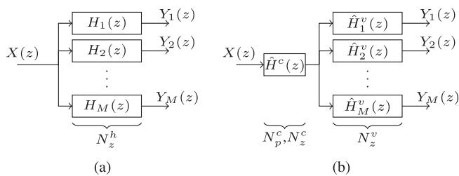  
Fig. 1. System models: (a) general SIMO system and (b) approximation of the SIMO system using a common part.

where $H ^ { c } ( z )$ is the common part and $H _ { m } ^ { v } ( z ) , m = 1 , \ldots , M$ 2 are the variable parts. The aim is to decompose the true ATFs into a common part for which a pole-zero filter model with $N _ { p } ^ { c }$ poles and $N _ { z } ^ { c }$ zeros is assumed and variable parts for which an all-zero filters model with $N _ { z } ^ { v }$ zeros is assumed. The transfer functions of the common and variable parts are defined as

$$
\hat {H} ^ {c} (z) = \frac {B ^ {c} (z)}{A ^ {c} (z)} = \frac {\sum_ {j = 0} ^ {N _ {z} ^ {c}} b ^ {c} [ j ] z ^ {- j}}{1 + \sum_ {j = 1} ^ {N _ {p} ^ {c}} a ^ {c} [ j ] z ^ {- j}},\tag{3}
$$

$$
\hat {H} _ {m} ^ {v} (z) = B _ {m} ^ {v} (z) = \sum_ {j = 0} ^ {N _ {z} ^ {v}} b _ {m} ^ {v} [ j ] z ^ {- j},\tag{4}
$$

where $a ^ { c } [ j ] , b ^ { c } [ j ]$ and $b _ { m } ^ { v } [ j ]$ are the coefficients of the polynomials representing the common poles, common zeros and variable zeros. Note that $a ^ { c } [ 0 ] = 1 , \mathrm { i . e . , } A ^ { c } ( z )$ is assumed to be a monic polynomial. The estimated ATF $\hat { H } _ { m } ( z )$ can hence be written as

$$
\hat {H} _ {m} (z) = \frac {B ^ {c} (z)}{A ^ {c} (z)} B _ {m} ^ {v} (z).\tag{5}
$$

The coefficients in vector notation are defined as

$$
\mathbf {h} _ {m} = \left[ \begin{array}{c c c c} h _ {m} [ 0 ] & h _ {m} [ 1 ] & \ldots & h _ {m} [ N _ {z} ^ {h} ] \end{array} \right] ^ {T},\tag{6}
$$

$$
\mathbf {a} ^ {c} = \left[ \begin{array}{l l l l} a ^ {c} [ 1 ] & a ^ {c} [ 2 ] & \dots & a ^ {c} [ N _ {p} ^ {c} ] \end{array} \right] ^ {T},
$$

$$
\mathbf {b} ^ {c} = \left[ \begin{array}{l l l l} b ^ {c} [ 0 ] & b ^ {c} [ 1 ] & \ldots & b ^ {c} [ N _ {z} ^ {c} ] \end{array} \right] ^ {T},\tag{7}
$$

(8)

$$
\mathbf {b} _ {m} ^ {v} = \left[ b _ {m} ^ {v} [ 0 ] \quad b _ {m} ^ {v} [ 1 ] \quad \ldots \quad b _ {m} ^ {v} [ N _ {z} ^ {v} ] \right] ^ {T},\tag{9}
$$

where $[ \cdot ] ^ { T }$ denotes transpose operation. We also define the concatenation of the coefficient vectors $ { \mathbf { b } } _ { m } ^ { v }$ as

$$
\mathbf {b} ^ {v} = \left[ \begin{array}{c c c c} (\mathbf {b} _ {1} ^ {v}) ^ {T} & (\mathbf {b} _ {2} ^ {v}) ^ {T} & \ldots & (\mathbf {b} _ {M} ^ {v}) ^ {T} \end{array} \right] ^ {T}.\tag{10}
$$

Furthermore the frequency domain representation of the so-called output-error in the -th microphone, i.e., the difference between the frequency response $H _ { m } ( e ^ { j \Omega } )$ of the true ATF $H _ { m } ( z )$ and the frequency response $\hat { H } _ { m } ( e ^ { j \Omega } )$ of the estimated ATF $\hat { H } _ { m } ( z )$ is defined as

$$
\tilde {E} _ {m} (e ^ {j \Omega}) = H _ {m} (e ^ {j \Omega}) - \underbrace {\frac {B ^ {c} (e ^ {j \Omega})}{A ^ {c} (e ^ {j \Omega})} B _ {m} ^ {v} (e ^ {j \Omega})} _ {\hat {H} _ {m} (e ^ {j \Omega})},\tag{11}
$$

where denotes normalized frequency.

## III. TECHNICAL MEASURES OF FEEDBACK CANCELLATION PERFORMANCE

Fig. 2(a) depicts the generic framework for acoustic feedback cancellation. The incoming signal is denoted as $S _ { m } ( z )$ . The microphone signal $Y _ { m } ( z )$ is processed by the hearing aid gain function $G ( z )$ and played back by the loudspeaker. The loudspeaker and microphone are coupled by the acoustic feedback path $H _ { m } ( z )$ and the hearing aid gain function $G ( z )$ , yielding a closed-loop system. A filter $\hat { H } _ { m } ( z )$ is used to model the acoustic feedback path and subtract an estimate of the feedback signal $X ( z ) \hat { H } _ { m } ( z )$ from the microphone signal $Y _ { m } ( z )$ , generating the error signal $E _ { m } ( z )$

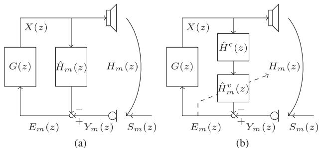  
Fig. 2. Acoustic feedback cancellation frameworks using (a) a static feedback canceller and (b) an adaptive feedback canceller using the proposed feedback path decomposition.

To assess the performance of acoustic feedback cancellation algorithms two instrumental measures are typically used [4], [7], [18], [19]: the normalized misalignment and the MSG.

The normalized misalignment $\epsilon _ { m }$ of the -th filter estimate $\hat { H } _ { m } ( z )$ measures the accuracy of the estimated filter by computing the normalized Euclidean distance between the estimated IR and the IR of the true feedback path as

$$
\epsilon_ {m} = \frac {\| \mathbf {h} _ {m} - \hat {\mathbf {h}} _ {m} \| _ {2} ^ {2}}{\| \mathbf {h} _ {m} \| _ {2} ^ {2}},\tag{12}
$$

where $\hat { \mathbf { h } } _ { m }$ is a vector containing the IR of $\hat { H } _ { m } ( z )$ . The normalized misalignment can be related to the output-error in (11) as

$$
\epsilon_ {m} = \frac {\int_ {0} ^ {\pi} | \tilde {E} _ {m} (e ^ {j \Omega}) | ^ {2} d \Omega}{\int_ {0} ^ {\pi} | H _ {m} (e ^ {j \Omega}) | ^ {2} d \Omega}.\tag{13}
$$

Furthermore, the overall misalignment for a set of IRs is defined as

$$
\epsilon = \frac {1}{M} \sum_ {m = 1} ^ {M} \epsilon_ {m}.\tag{14}
$$

The MSG is defined as the gain that can be applied in a hearing aid until instability ofthe closed-loop system and hence howling or whistling occurs. Assuming a broadband hearing aid gain, the MSG $\mathcal { M } _ { m }$ of the -th microphone is defined as [16]

$$
\boxed {\mathcal {M} _ {m} = 1 0 \log_ {1 0} \frac {1}{\max _ {0 \leq \Omega \leq \pi} | \tilde {E} _ {m} (e ^ {j \Omega}) | ^ {2}}}\tag{15}
$$

Note, that the closed-loop system is only unstable if also the phase at the frequency ofthe maximum amplitude ofthe outputerror is a multiple of $2 \pi$ [20], such that (15) actually provides the worst-case assumption.

Assuming that the worst MSG for a considered set of IRs dominates the overall MSG in a multi-microphone hearing aid the overall MSG is defined as

$$
\mathcal {M} = \min _ {m} \mathcal {M} _ {m}.\tag{16}
$$

## IV. LEAST-SQUARES COMMON POLE-ZERO FILTER ESTIMATION

Existing approaches to estimate the coefficient vectors $\mathbf { a } ^ { c }$ , and $\mathbf { b } ^ { v }$ of the common and variable parts aim to minimize the overall misalignment in (14), i.e., they minimize the LS cost function [8], [9]

$$
\boxed {J _ {L S} (\mathbf {a} ^ {c}, \mathbf {b} ^ {c}, \mathbf {b} ^ {v}) = \sum_ {m = 1} ^ {M} \int_ {0} ^ {\pi} \alpha_ {m} | \tilde {E} _ {m} (e ^ {j \Omega}) | ^ {2} d \Omega}\tag{17}
$$

with $\alpha _ { m }$ a weighting parameter1 which was chosen as $\alpha _ { m } =$ $\frac { 1 } { \Vert \mathbf { h } _ { m } \Vert _ { 2 } ^ { 2 } }$ . For conciseness the variable will be omitted in the following if possible. Since the output-error $\tilde { E } _ { m }$ in (11) is nonlinear in $A ^ { c }$ $B ^ { c }$ and $B _ { m } ^ { v }$ , minimizing (17) is not straightforward. Note that the output-error can, however, be rewritten as

$$
\tilde {E} _ {m} = \frac {1}{A ^ {c}} E _ {m} = \frac {1}{A ^ {c}} \left(A ^ {c} H _ {m} - B ^ {c} B _ {m} ^ {v}\right),\tag{18}
$$

with $E _ { m }$ the so-called equation-error, which is non-linear in only $B ^ { c }$ and $B _ { m } ^ { v }$ . This formulation suggests to use the iterative Steiglitz-McBride method [21] to minimize (17), where at each iteration the aim is to minimize the weighted LS cost function [9]

$$
J _ {W L S} (\mathbf {a} _ {i} ^ {c}, \mathbf {b} _ {i} ^ {c}, \mathbf {b} _ {i} ^ {v}) = \sum_ {m = 1} ^ {M} \int_ {0} ^ {\pi} \frac {\alpha_ {m}}{| A _ {i - 1} ^ {c} | ^ {2}} | E _ {m, i} | ^ {2} d \Omega ,\tag{19}
$$

where $E _ { m , i }$ is the equation-error at iteration $i ,$ i.e.,

$$
E _ {m, i} = A _ {i} ^ {c} H _ {m} - B _ {i} ^ {c} B _ {m, i} ^ {v},\tag{20}
$$

which is weighted with the inverse frequency response of $A _ { i - 1 } ^ { c }$ from the previous iteration and $\mathbf { a } _ { i } ^ { c }$ , and $\mathbf { b } _ { i } ^ { v }$ denote the coefficient vectors at iteration . Ideally, at convergence $A _ { i } ^ { c } \approx A _ { i - 1 } ^ { c }$ such that $( A _ { i - 1 } ^ { c } ) ^ { - 1 } E _ { m , i } ~ \approx ~ \tilde { E } _ { m }$ , approximating the desired output-error minimization in (17). Note that while the cost function in (17) is non-linear in $A ^ { c } , B ^ { c }$ and $B _ { m } ^ { v }$ , the cost function in (19) is non-linear in only $B _ { i } ^ { c }$ and $B _ { m , i } ^ { v }$ . Minimizing (19) can hence be carried out by an alternating least-squares optimization of the common part coefficient vectors $\mathbf { a } _ { i } ^ { c }$ and $\mathbf { b } _ { i } ^ { c }$ and the variable part coefficient vector $\mathbf { b } _ { i } ^ { v }$ [9]. However, while achieving good performance in terms of misalignment, the MSG that can be achieved using LS optimization may still be limited (cf. simulation results in Section VI).

## V. MIN-MAX COMMON POLE-ZERO FILTER ESTIMATION

Instead ofminimizing the overall misalignment in (14), in this section we propose an optimization approach to estimate the coefficient vectors , ${ \bf b } ^ { c }$ and $\mathbf { b } ^ { v }$ such that the MSG is maximized. Maximizing the MSG of the -th microphone in (15) corresponds to minimizing the maximum absolute error between the estimated frequency response $\hat { H } _ { m }$ and the true frequency response $H _ { m }$ . Thus, in order to optimize the overall MSG in (16) we propose to minimize the maximum absolute error for all IRs, i.e.,

$$
\boxed{J_{MM}(\mathbf{a}^{c},\mathbf{b}^{c},\mathbf{b}^{v}) = \max_{\substack{0\leq \Omega \leq \pi \\ 1\leq m\leq M}}|\tilde{E}_{m}(e^{j\Omega})|^{2}}\tag{21}
$$

1Note that in the approach presented in [9] $\alpha _ { m } = 1$ is used.

leading to a min-max optimization problem. Similar to the LS cost function in (17) the cost function in (21) is non-linear in $A ^ { c } , B ^ { c }$ and $B _ { m } ^ { v }$ . To approximate the min-max optimization we propose to use an iterative procedure based on the Steiglitz-McBride method [21]. This procedure has been successfully applied to the min-max design of 1D and 2D filters [17], [22] and yields a novel optimization approach for the problem at hand, i.e., the estimation of the coefficients of the common pole-zero filter $\mathbf { a } ^ { c }$ and ${ \bf b } ^ { c }$ and the coefficients of the variable all-zero filters $\mathbf { b } ^ { v }$ . Similar to (19), by using the weighted equation-error, at each iteration the cost function to be minimized is given by

$$
\boxed{J_{WM}(\mathbf{a}_{i}^{c},\mathbf{b}_{i}^{c},\mathbf{b}_{i}^{v}) = \max_{\substack{0\leq \Omega \leq \pi \\ 1\leq m\leq M}}\frac{1}{|A_{i - 1}^{c}|^{2}} |E_{m,i}|^{2}}\tag{22}
$$

which is non-linear in only $B _ { i } ^ { c }$ and $B _ { m , i } ^ { v }$ . To minimize the non-linear cost function in (22), at each iteration we split the min-max optimization problem into two separate convex subproblems, i.e., we alternatingly optimize for the variable part coefficient vector $\mathbf { b } _ { i } ^ { v }$ (using the common part coefficient vectors $\mathbf { a } _ { i - 1 } ^ { c }$ and $\mathbf { b } _ { i - 1 } ^ { c }$ from the previous iteration fixed) and optimize for the common part coefficient vectors $\mathbf { a } _ { i } ^ { c }$ and $\mathbf { b } _ { i } ^ { c }$ (using the variable part coefficient vector $\mathbf { b } _ { i } ^ { v }$ from the previous step). This alternating optimization procedure is similar to the alternating optimization procedure aiming to minimize the LS equation-error in [8] or the LS output-error in [9]. However, in [8], [9] an alternating least-squares optimization procedure was proposed while here we propose to use an alternating min-max optimization procedure aiming to maximize the MSG.

The proposed alternating optimization procedure at each iteration consists of the following two steps:

Step 1 (estimation of the variable part coefficient vector ): Assuming the common part coefficient vectors to be equal to the value obtained from the previous iteration, i.e., $\mathbf { a } _ { i - 1 } ^ { c } ,$ $\mathbf { b } _ { i - 1 } ^ { c }$ , the variable part coefficient vector $\mathbf { b } _ { i } ^ { v }$ is estimated by minimizing

$$
\boxed{J_{WM}(\mathbf{b}_{i}^{v}) = \max_{\substack{0\leq \Omega \leq \pi \\ 1\leq m\leq M}}\frac{1}{|A_{i - 1}^{c}|^{2}} |E_{m,i}^{v}|^{2}}\tag{23}
$$

with

$$
E _ {m, i} ^ {v} = A _ {i - 1} ^ {c} H _ {m} - B _ {i - 1} ^ {c} B _ {m, i} ^ {v}.\tag{24}
$$

Using the auxiliary variable , which provides an upper bound for the employed cost function, the minimization of (23) can be reformulated as the following SDP for all frequencies and IRs (see Appendix A for a detailed derivation)

$$
\begin{array}{c c} \hline \min _ {t, \mathbf {b} _ {i} ^ {v}} t & \\ \text {subject to} & \left[ \begin{array}{c c c} t & p _ {m, i} ^ {v} (\Omega) & r _ {m, i} ^ {v} (\Omega) \\ p _ {m, i} ^ {v} (\Omega) & 1 & 0 \\ r _ {m, i} ^ {v} (\Omega) & 0 & 1 \end{array} \right] \succeq \mathbf {0} \end{array}\tag{25a}
$$

(25b)

where $\succeq 0$ denotes positive semi-definiteness and $p _ { m , i } ^ { v } ( \Omega )$ and $r _ { m , i } ^ { v } ( \Omega )$ are defined as

$$
p _ {m, i} ^ {v} (\Omega) = \Re \mathfrak {e} \left\{\frac {E _ {m , i} ^ {v} (e ^ {j \Omega})}{A _ {i - 1} ^ {c} (e ^ {j \Omega})} \right\},\tag{26}
$$

$$
r _ {m, i} ^ {v} (\Omega) = \Im \mathfrak {m} \left\{\frac {E _ {m , i} ^ {v} (e ^ {j \Omega})}{A _ {i - 1} ^ {c} (e ^ {j \Omega})} \right\},\tag{27}
$$

with $\mathfrak { R e } \{ \cdot \}$ and $\mathfrak { I m } \{ \cdot \}$ denoting the real and imaginary part of a complex variable part. The real and imaginary parts $p _ { m , i } ^ { v } ( \Omega )$ and $r _ { m , i } ^ { v } ( \Omega )$ can be computed as

$$
p _ {m, i} ^ {v} (\Omega) = \mathbf {c} ^ {T} (\Omega) \mathbf {e} _ {m, i} ^ {v, p},
$$

$$
r _ {m, i} ^ {v} (\Omega) = \mathbf {s} ^ {T} (\Omega) \mathbf {e} _ {m, i} ^ {v, p},\tag{28}
$$

(29)

where

$$
\mathbf {c} (\Omega) = \left[ \begin{array}{c c c c} 1 & \cos \Omega & \ldots & \cos (\tilde {N} _ {z} ^ {h} + N _ {p} ^ {c}) \Omega \end{array} \right] ^ {T},\tag{30}
$$

$$
\mathbf {s} (\Omega) = [ 0 \sin \Omega \dots \sin (\tilde {N} _ {z} ^ {h} + N _ {p} ^ {c}) \Omega ] ^ {T},\tag{31}
$$

denote the real and imaginary part of the Fourier transform and $\tilde { N } _ { z } ^ { h } = \operatorname* { m a x } \{ N _ { z } ^ { h } , N _ { z } ^ { c } + N _ { z } ^ { v } \}$ . The vector $\mathbf { e } _ { m , i } ^ { v , p }$ denotes the equation-error vector ${ \bf e } _ { m , i } ^ { v }$ filtered with the all-pole filter $\frac { 1 } { A _ { i - 1 } ^ { c } ( q ^ { - 1 } ) }$ from the previous iteration, i.e.,

$$
\begin{array}{r l} & e _ {m, i} ^ {v, p} [ k ] = \frac {1}{A _ {i - 1} ^ {c} (q ^ {- 1})} e _ {m, i} ^ {v} [ k ] \\ & \qquad = e _ {m, i} ^ {v} [ k ] - \sum_ {j = 1} ^ {N _ {p} ^ {c}} a _ {i - 1} ^ {c} [ j ] e _ {m, i} ^ {v, p} [ k - j ], \end{array}\tag{32}
$$

where $q ^ { - 1 }$ denotes the unit delay operator [1], i.e., $q ^ { - 1 } h _ { m } [ k ] =$ $h _ { m } [ k - 1 ]$ . The equation-error vector $\mathbf { e } _ { m , i } ^ { v }$ is the time-domain representation corresponding to (24), i.e.,

$$
\mathbf {e} _ {m, i} ^ {v} = \tilde {\mathbf {h}} _ {m} + \tilde {\mathbf {H}} _ {m} \mathbf {a} _ {i - 1} ^ {c} - \tilde {\mathbf {B}} _ {i - 1} ^ {c} \mathbf {b} _ {m, i} ^ {v},\tag{33}
$$

with $\tilde { \mathbf { h } } _ { m }$ the $( \tilde { N } _ { z } ^ { h } + N _ { p } ^ { c } + 1 )$ -dimensional zero-padded vector of $\mathbf { h } _ { m } , \mathrm { i . e . }$

$$
\tilde {\mathbf {h}} _ {m} = [ \mathbf {h} _ {m} ^ {T} \underbrace {0 \ldots 0} _ {\tilde {N} _ {z} ^ {h} + N _ {p} ^ {c} - N _ {z} ^ {h}} ] ^ {T},\tag{34}
$$

$\tilde { \mathbf { H } } _ { m }$ the $( \tilde { N } _ { z } ^ { h } + N _ { p } ^ { c } + 1 ) \times N _ { p } ^ { c }$ -dimensional convolution matrix of $\tilde { \mathbf { h } } _ { m } , \mathrm { i . e . }$

$$
\tilde {\mathbf {H}} _ {m} = \left[ \begin{array}{c c c} 0 & \ldots & 0 \\ h _ {m} [ 0 ] & \ddots & \vdots \\ \vdots & \ddots & 0 \\ h _ {m} [ N _ {p} ^ {c} - 1 ] & \ddots & h _ {m} [ 0 ] \\ \vdots & \ddots & \vdots \\ h _ {m} [ \tilde {N} _ {z} ^ {h} ] & \ddots & \vdots \\ 0 & \ddots & \vdots \\ \vdots & \ddots & \vdots \\ 0 & \ldots & h _ {m} [ \tilde {N} _ {z} ^ {h} ] \end{array} \right],\tag{35}
$$

and $\tilde { \bf B } _ { i - 1 } ^ { c }$ the $( \tilde { N } _ { z } ^ { h } + N _ { p } ^ { c } + 1 ) \times ( N _ { z } ^ { v } + 1 ) ^ { \top }$ -dimensional convolution matrix of $\mathbf { b } _ { i - 1 } ^ { c } , \mathrm { i } . \mathsf { e } .$ 2

$$
\tilde {\mathbf {B}} _ {i - 1} ^ {c} = \left[ \begin{array}{c c c} b _ {i - 1} ^ {c} [ 0 ] & \ddots & 0 \\ \vdots & \ddots & \vdots \\ b _ {i - 1} ^ {c} [ N _ {z} ^ {v} ] & \ddots & b _ {i - 1} ^ {c} [ 0 ] \\ \vdots & \ddots & \vdots \\ b _ {i - 1} ^ {c} [ N _ {z} ^ {c} ] & \ddots & \vdots \\ 0 & \ddots & \vdots \\ \vdots & \ddots & b _ {i - 1} ^ {c} [ N _ {z} ^ {c} ] \\ 0 & \ldots & 0 \\ \vdots & \ddots & \vdots \\ 0 & \ldots & 0 \end{array} \right].\tag{36}
$$

The SDP problem in (25) can then be efficiently solved using existing optimization tools, e.g., the Matlab software CVX [23], [24].

Step 2 (estimation of the common part coefficient vectors $\mathbf { a } _ { i } ^ { c }$ and $\overline { { \mathbf { b } _ { i } ^ { c } ) \mathbf { : } } }$ Assuming the variable part coefficient vector to be equal to the value from the previous step, i.e., $\mathbf { b } _ { i } ^ { v }$ , the common part coefficient vectors and ${ \bf b } _ { i } ^ { c }$ are estimated by minimizing

$$
\boxed{J_{WM}(\mathbf{a}_{i}^{c},\mathbf{b}_{i}^{c}) = \max_{\substack{0\leq \Omega \leq \pi \\ 1\leq m\leq M}}\frac{1}{|A_{i - 1}^{c}|^{2}} |E_{m,i}^{c}|^{2}}\tag{37}
$$

with

$$
E _ {m, i} ^ {c} = A _ {i} ^ {c} H _ {m} - B _ {i} ^ {c} B _ {m, i} ^ {v}.\tag{38}
$$

Similarly as in Step 1, the minimization of (37) can be reformulated as an SDP. However, in this case a constraint $\Gamma _ { i } ^ { s t a b } \succeq \mathbf { 0 }$ needs to be added to guarantee stability of the estimated common poles, leading to the following SDP for all frequencies and IRs

$$
\text { subject   to } \quad \left[ \begin{array}{c c c} t & p _ {m, i} ^ {c} (\Omega) & r _ {m, i} ^ {c} (\Omega) \\ p _ {m, i} ^ {c} (\Omega) & 1 & 0 \\ r _ {m, i} ^ {c} (\Omega) & 0 & 1 \end{array} \right] \succeq \mathbf {0}\tag{39a}
$$

$$
\boldsymbol {\Gamma} _ {i} ^ {s t a b} \geq \mathbf {0}\tag{39b}
$$

(39c)

with $p _ { m , i } ^ { c } ( \Omega )$ and $r _ { m , i } ^ { c } ( \Omega )$ defined similar to $p _ { m , i } ^ { v } ( \Omega )$ and $r _ { m , i } ^ { v } ( \Omega )$ in (28) and (29), i.e.,

$$
p _ {m, i} ^ {c} (\Omega) = \mathbf {c} ^ {T} (\Omega) \mathbf {e} _ {m, i} ^ {c, p},\tag{40}
$$

$$
r _ {m, i} ^ {c} (\Omega) = \mathbf {s} ^ {T} (\Omega) \mathbf {e} _ {m, i} ^ {c, p},\tag{41}
$$

with the equation-error $\mathbf { e } _ { m , i } ^ { c , p }$ equal to the pre-filtered equation error vector ${ \bf e } _ { m , i } ^ { c }$ using $\frac { 1 } { A _ { i - 1 } ^ { \mathrm { c } } ( q ^ { - 1 } ) }$ . The equation-error vector ${ \bf e } _ { m , i } ^ { c }$ is the time-domain representation corresponding to (38), i.e.,

$$
\mathbf {e} _ {m, i} ^ {c} = \tilde {\mathbf {h}} _ {m} + \tilde {\mathbf {H}} _ {m} \mathbf {a} _ {i} ^ {c} - \tilde {\mathbf {B}} _ {m, i} ^ {v} \mathbf {b} _ {i} ^ {c},\tag{42}
$$

with $\tilde { \mathbf { B } } _ { m , i } ^ { v }$ the $( \tilde { N } _ { z } ^ { h } + N _ { p } ^ { c } + 1 ) \times ( N _ { z } ^ { c } + 1 )$ -dimensional convolution matrix of $\mathbf { b } _ { m , : } ^ { v }$ defined similar as $\tilde { \bf B } _ { i - 1 } ^ { c }$ in (36), i.e.,

$$
\tilde {\mathbf {B}} _ {m, i} ^ {v} = \left[ \begin{array}{c c c} b _ {m, i} ^ {v} [ 0 ] & \ddots & 0 \\ \vdots & \ddots & \vdots \\ b _ {m, i} ^ {v} [ N _ {z} ^ {c} ] & \ddots & b _ {m, i} ^ {v} [ 0 ] \\ \vdots & \ddots & \vdots \\ b _ {m, i} ^ {v} [ N _ {z} ^ {v} ] & \ddots & \vdots \\ 0 & \ddots & \vdots \\ \vdots & \ddots & b _ {m, i} ^ {v} [ N _ {z} ^ {v} ] \\ 0 & \dots & 0 \\ \vdots & \ddots & \vdots \\ 0 & \dots & 0 \end{array} \right].\tag{43}
$$

To guarantee stability of the common pole-zero filter estimated in (39), a constraint based on Lyapunov theory [5], [17], [22] can be used. Stability of a causal pole-zero filter is guaranteed if the poles, i.e., the roots of $A _ { i } ^ { c } ( z )$ , are strictly inside the unitcircle. This is equivalent to requiring the absolute value of all eigenvalues of the canonical matrix ${ \bf A } _ { i } ^ { c }$ of $A _ { i } ^ { c } ( z )$ to be smaller than one, with

$$
\mathbf {A} _ {i} ^ {c} = \left[ \begin{array}{c c c c} - a _ {i} ^ {c} [ 1 ] & - a _ {i} ^ {c} [ 2 ] & \ldots & - a _ {i} ^ {c} [ N _ {p} ^ {c} ] \\ 1 & & & 0 \\ & \ddots & & \vdots \\ & & 1 & 0 \end{array} \right].\tag{44}
$$

From Lyapunov theory it follows that if and only if $A _ { i } ^ { c } ( z )$ is stable then there exists a positive definite matrix $\mathbf { P } _ { i }$ such that

$$
\mathbf {P} _ {i} - (\mathbf {A} _ {i} ^ {c}) ^ {T} \mathbf {P} _ {i} \mathbf {A} _ {i} ^ {c} \succ \mathbf {0}.\tag{45}
$$

Unfortunately, (45) cannot be used directly as a stability constraint in (39) since $\mathbf { P } _ { i }$ and ${ \bf A } _ { i } ^ { c }$ would have to be jointly estimated [17], [22]. Therefore, assuming a stable pole-zero filter from the previous iteration, i.e., using the canonical matrix $\mathbf { A } _ { i - 1 } ^ { c }$ , first a positive definite matrix $\tilde { \mathbf { P } } _ { i }$ is computed that solves the Lyapunov equation

$$
\tilde {\mathbf {P}} _ {i} - (\mathbf {A} _ {i - 1} ^ {c}) ^ {T} \tilde {\mathbf {P}} _ {i} \mathbf {A} _ {i - 1} ^ {c} = \mathbf {I} s. t. \tilde {\mathbf {P}} _ {i} \succ \mathbf {0}.\tag{46}
$$

Using $\tilde { \mathbf { P } } _ { i }$ instead of $\mathbf { P } _ { i }$ and introducing a small positive constant to control the stability margin, (45) can be reformulated as

$$
\tilde {\mathbf {P}} _ {i} - (\mathbf {A} _ {i} ^ {c}) ^ {T} \tilde {\mathbf {P}} _ {i} \mathbf {A} _ {i} ^ {c} \succeq \tau \mathbf {I},\tag{47}
$$

which can be rewritten, using the Schur complement [5], as an LMI, i.e.,

$$
\boxed {\boldsymbol {\Gamma} _ {i} ^ {s t a b} = \left[ \begin{array}{c c} \tilde {\mathbf {P}} _ {i} - \tau \mathbf {I} & (\mathbf {A} _ {i} ^ {c}) ^ {T} \\ \mathbf {A} _ {i} ^ {c} & \tilde {\mathbf {P}} _ {i} ^ {- 1} - \tau \mathbf {I} \end{array} \right] \succeq \mathbf {0}}\tag{48}
$$

which is used as the stability constraint in (39). Note that the convolution of $B ^ { c } ( z )$ and $B _ { m } ^ { v } ( z )$ can only be identified up to a constant scaling factor. Therefore, prior to step 1 of the alternating optimization procedure, the coefficient vector $\mathbf { b } _ { i - 1 } ^ { c }$ is normalized to unit-norm. An overview of the proposed min-max optimization approach to estimate the common pole-zero filter is given in Table I.

TABLE I
OVERVIEW OF THE NOVEL OPTIMIZATION APPROACH TO ESTIMATE THE COMMON POLE-ZERO FILTER MAXIMIZING THE MSG

input  $N_{p}^{c}, N_{z}^{c}, N_{z}^{v}, h_{m} \forall m \in [1 : M]$ 

initialize  $a_{0}^{c}, b_{0}^{c}, i = 1$ 

repeat

Normalize common part all-zero coefficient vector to resolve scaling ambiguity

 $b_{i-1}^{c} \leftarrow b_{i-1}^{c} / \|b_{i-1}^{c}\|_{2}$ 

Estimate the variable part all-zero coefficient vector using the pre-filtered equation-error  $e_{m,i}^{v,p}$ $b_{i}^{v} \leftarrow$  solve the SDP in (25)

Solve Lyapunov equation

 $\tilde{P}_{i-1} \leftarrow$  solve (46)

Estimate common part all-pole and all-zero coefficient vectors using the pre-filtered equation-error  $e_{m,i}^{c,p}$ $a_{i}^{c}, b_{i}^{c} \leftarrow$  solve the SDP in (39) with  $\Gamma_{i}^{stab}$  in (48)

until convergence

## VI. EXPERIMENTAL EVALUATION

In this section the proposed min-max optimization approach aiming to maximize the MSG is evaluated and compared to the LS optimization approach aiming to minimize the misalignment. After discussing the acoustic measurement setup and the algorithmic parameters in Section VI-A, we compare exemplary feedback paths estimated using both optimization approaches in Section VI-B. In Section VI-C and VI-D we compare both optimization approaches in terms ofthe MSG and the misalignment. In Section VI-E the robustness when considering unknown acoustic feedback paths is investigated and in Section VI-F the ability of the proposed optimization approach to reduce the number of variable part parameters is analyzed. In Section VI-G we investigate the impact on the perceptual speech quality using a static feedback canceller. In Section VI-H we show simulation results when the proposed acoustic feedback path decomposition is used in a state-of-the-art AFC algorithm based on the prediction-error-method.

## A. Acoustic Setup and Algorithmic Parameters

Acoustic feedback paths were measured using a two-microphone behind-the-ear hearing aid with open-fitting ear molds (vent size mm) on a dummy head with adjustable ear canals [25]. The IRs were sampled at $f _ { s } = 1 6$ kHz and truncated to order $N _ { z } ^ { h } ~ = ~ 9 9 $ . Fig. 3 depicts the amplitude and phase responses of the two acoustic feedback paths $( m = 1 , 2 )$ measured in a free-field condition which have been used in the evaluation to optimize the common part and the variable parts.

The performance was evaluated in terms of the overall misalignment and the overall MSG defined in (14) and (16), respectively. The performance was evaluated for the following set of parameters: $N _ { p } ^ { c } , N _ { z } ^ { c } \in \{ 0 , 4 , 8 , \dots , 2 4 \} , N _ { z } ^ { v } \in$ . In the following $N ^ { c }$ denotes the total number of common part parameters, i.e., $N ^ { c } ~ = ~ N _ { v } ^ { c } + N _ { z } ^ { c }$ . Hence, $\mathbf { e . g . , } N ^ { c } = 8$ could correspond to either $\{ N _ { p } ^ { c } = 8 , N _ { z } ^ { c } = 0 \}$ $\{ N _ { p } ^ { c } = 0 , N _ { z } ^ { c } = 8 \}$ or $\{ N _ { p } ^ { c } = 4 , N _ { z } ^ { c } = 4 \}$ . For $N ^ { c } = 0$ only the SDP problem in (25) is solved and $A ^ { c } ( z ) = B ^ { c } ( z ) = 1$ To discretize the normalized frequency , $K = 2 0 4 8$ frequencies were used and $\tau { = } 1 0 ^ { - 6 }$ was used in (48) to control the stability margin. Since it was experimentally found that a good initialization for the proposed min-max optimization approach is important, the solution obtained with the LS optimization approach in [9] was used to initialize the common part coefficient vectors. Similarly to the convergence criterion in [17], for both alternating optimization procedures the normalized norm of the difference between successive common part coefficient vectors, i.e.,

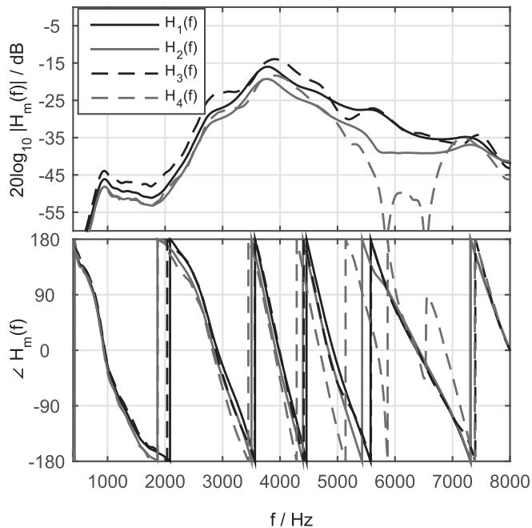  
Fig. 3. Amplitude and phase responses of the acoustic feedback paths $m =$ $1 , { \bar { 2 } } , 3 ,$ used in the experimental evaluation.

$$
\frac {| | [ \mathbf {a} _ {i} ^ {T} \quad \mathbf {b} _ {i} ^ {T} ] - [ \mathbf {a} _ {i - 1} ^ {T} \quad \mathbf {b} _ {i - 1} ^ {T} ] | | _ {2}}{| | [ \mathbf {a} _ {i - 1} ^ {T} \quad \mathbf {b} _ {i - 1} ^ {T} ] | | _ {2}} \leq \delta ,\tag{49}
$$

was used as the convergence criterion, with $\delta = 1 0 ^ { - 4 }$

## B. Exemplary Estimated Feedback Paths

Fig. 4 (top) depicts exemplary amplitude responses estimated using the LS optimization approach and the proposed min-max optimization approach for the acoustic feedback paths $m = 1 , 2$ and the parameters $N _ { p } ^ { c } = 8 , N _ { z } ^ { c } = 4 , N _ { z } ^ { v } = 1 2$ . First, it can be observed that both optimization approaches are able to approximate the amplitude response of both acoustic feedback paths quite well. However, examining the estimation error (i.e., the output-error) depicted in Fig. 4 (bottom) more closely it can be observed that the LS optimization approach yields a larger estimation error (around 3000 and 5500 Hz) than the proposed min-max optimization approach. Since the maximum outputerror is directly related to the MSG defined in (15), the proposed min-max optimization approach yields a larger MSG (45.4 dB for both IRs) than the LS optimization approach (42.2 dB for $m = 1$ and 44.7 dB for $m = 2 )$ , such that the proposed min-max optimization approach yields an overall MSG improvement of about 3 dB compared to the LS optimization approach.

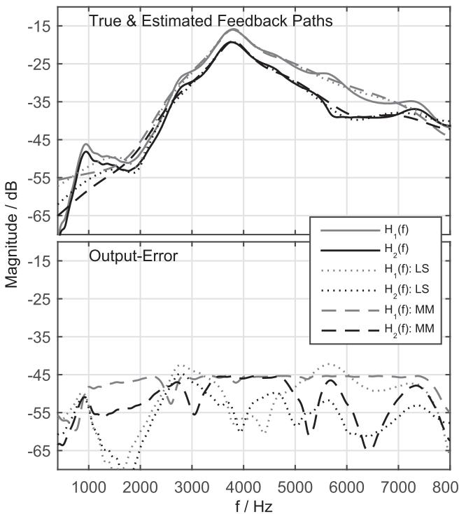  
Fig. 4. Estimated amplitude responses (top) and estimation error (bottom) of the acoustic feedback paths $m = 1 , 2$ using the LS and the proposed min-max optimization approaches for $N _ { p } ^ { c } = \overline { { 1 2 } } , N _ { z } ^ { c } = 4$ and $N _ { z } ^ { v } = 1 2$

## C. Overall Maximum Stable Gain

In this section the performance of both optimization approaches is compared in terms of the overall MSG. First, the impact of the number of variable part and common part parameters $N _ { z } ^ { v }$ and $N ^ { c }$ on the overall MSG of the proposed min-max optimization approach is considered. Fig. 5 depicts the overall MSG as a function of $N _ { z } ^ { v }$ for different values of $N ^ { c }$ Note that for each $N ^ { c }$ value only the combination of $N _ { p } ^ { c }$ and $N _ { z } ^ { c }$ leading to the largest overall MSG is shown. As expected, the overall MSG increases with increasing number of variable part parameters $N _ { z } ^ { v }$ and common part parameters $N ^ { c }$ . The MSG increase when including a common part, i.e., $N ^ { c } > 0 .$ , is explained by the fact that more coefficients are used to model the acoustic feedback paths. Note that the improvement of including a common part compared to not using a common part $( N ^ { c } ~ = ~ 0 )$ decreases with increasing number of variable part parameters. This is expected, since most of the energy of the IRs falls within the first 50 samples such that the IRs can be well modelled using the variable part alone.

Fig. 6 depicts the overall MSG for the LS optimization approach as a function of $N _ { z } ^ { v }$ for different values of $N ^ { c }$ . Again, an increase in the overall MSG with increasing number of variable part parameters and common part parameters is observed.

In order to compare both optimization approaches, Fig. 7 shows the average overall MSG for the proposed min-max optimization approach and the LS optimization approach using $N ^ { c } ~ = ~ 8$ . The average overall MSG improvement has been computed across all three possible combinations of $N _ { z } ^ { c }$ and $N _ { p } ^ { c }$ resulting in $N ^ { c } = 8$ . Additionally, the error bars indicate the minimum and maximum overall MSG improvement. In general, large MSGs are obtained for both optimization approaches, which can be explained by the fact that the acoustic feedback paths can be modelled more accurately when including a common part. Moreover, as expected, the proposed min-max optimization approach maximizing the MSG outperforms the LS optimization approach minimizing the misalignment by 3 to 4 dB in this condition. Note that the parameter combination leading to the lowest overall MSG for all investigated $N _ { z } ^ { v }$ is $\{ N _ { p } ^ { c } = 0 , N _ { z } ^ { c } = 8 \}$ , i.e., an all-zero common part. This is in line with the results from [8], where it was shown that for a low number of $N _ { z } ^ { v }$ the all-zero common part filter is outperformed by the all-pole and pole-zero common part filter.

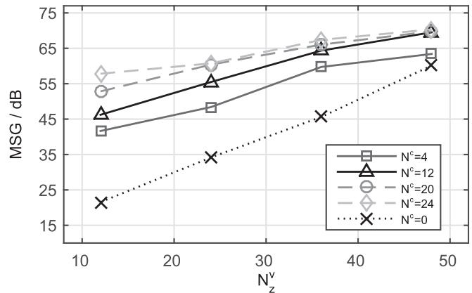  
Fig. 5. MSG of the proposed min-max optimization approach as a function of the number of variable part parameters $N _ { z } ^ { \bar { v } }$ and number of common part parameters $N ^ { c }$

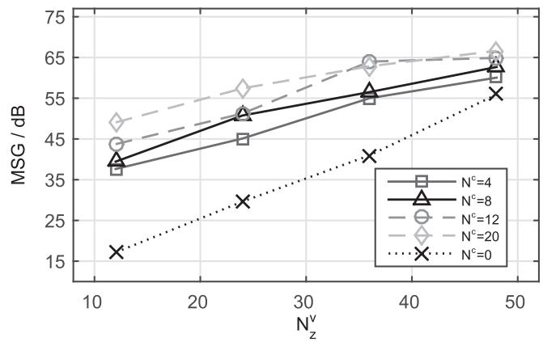  
Fig. 6. MSG of the LS optimization approach as a function of the number of variable part parameters $\dot { N } _ { z } ^ { v }$ and number of common part parameters $N ^ { c }$

To assess the performance over a wider range of $N ^ { c }$ , Fig. 8 depicts the average overall MSG improvement of the proposed min-max optimization approach compared to the LS optimization approach. Again, for each value of $N ^ { c }$ the average overall MSG improvement has been computed across all possible combinations of $N _ { p } ^ { c }$ and $N _ { z } ^ { c }$ resulting in $N ^ { c }$ . For all considered values of $N ^ { c }$ , the proposed min-max optimization approach outperforms the LS optimization approach, with average improvements in the range of 2 to 5 dB. This indicates that compared to existing optimization approaches the maximum gain of the hearing could be significantly increased when using the proposed min-max optimization approach.

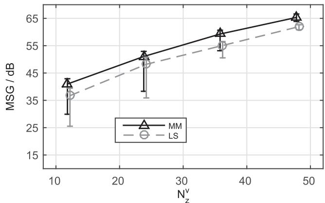

Fig. 7. Average overall MSG of the LS optimization approach and the proposed min-max optimization approach for $N ^ { c } = 8 .$ . Error bars indicate minimum and maximum overall MSG.  
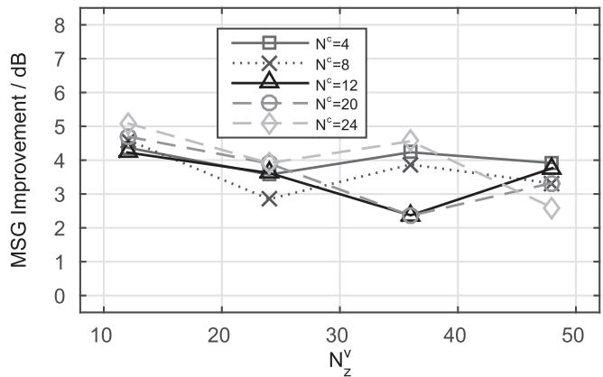  
Fig. 8. Average overall MSG improvements of the proposed min-max optimization approach compared to the LS optimization approach.

## D. Overall Misalignment

In this section the performance of both optimization approaches is compared in terms of the overall misalignment. Fig. 9 depicts the overall misalignment of the proposed min-max optimization approach compared to the LS optimization approach, averaged across all possible combinations of $N _ { p } ^ { c }$ and $N _ { z } ^ { c }$ for each value of $N ^ { c }$ . Note that negative values indicate a better performance for the LS approach. As expected, the LS optimization approach minimizing the overall misalignment outperforms the min-max optimization approach, with improvements in the range of 1 to 4 dB. These overall misalignment improvements for the LS optimization approach appear to be in the same order of magnitude as the overall MSG improvements for the min-max optimization approach (cf. Section VI-C). However, it should be realized that the MSG can be directly related to the gain of the hearing, which is not the case for the misalignment.

## E. Robustnessfor Unknown Acoustic Feedback Paths

Since in practice the acoustic feedback paths will change over time, in this section we evaluate the performance when using the estimated common part from the free-field acoustic feedback paths for unknown acoustic feedback paths that have not been included in the optimization.

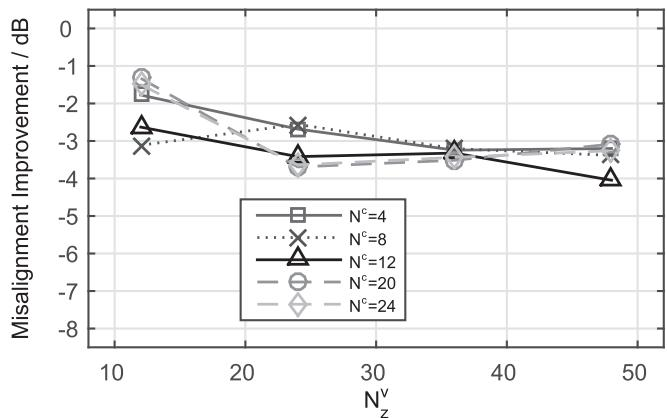

Fig. 9. Average overall misalignment improvements of the LS optimization approach compared to the proposed min-max optimization approach over. Note that negative values indicate better performance of the LS optimization approach.  
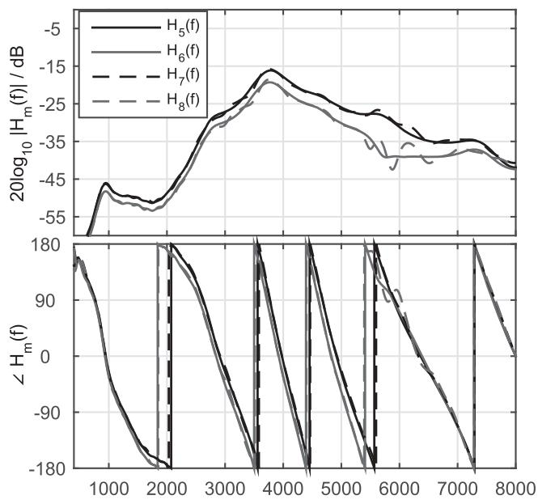  
f/ Hz  
Fig. 10. Amplitude and phase responses of the acoustic feedback paths $m =$ used in the experimental evaluation.

Six unknown IRs were included in the evaluation, where two IRs $( m = 3 , 4 )$ depicted in Fig. 3 were measured with a telephone receiver in close distance of less than 1 cm to the hearing aid, two IRs $( m = 5 , 6 )$ depicted in Fig. 10 were measured after repositioning of the hearing aid without any obstruction and two IRs $( m = 7 , 8 )$ were measured with a telephone receiver at a distance of approximately 24 cm. While IRs $m = 3 ,$ are very different from IRs $m = 1 , 2$ , the IRs measured in free-field $( m = 5 , 6 )$ are very similar to IRs $m = 1 , 2$ . For IRs $m = 7 , \mathrm { { \small ~ \hat { ~ } { ~ } { ~ } { ~ } { ~ } { ~ } } }$ 8 only slight differences are observed compared to IRs $m = 5 , 6$

First the common part coefficients vectors $\mathbf { a } _ { 1 , 2 } ^ { c }$ and ${ \bf b } _ { 1 , 2 } ^ { c }$ are estimated from the free-field IRs $\mathbf { h } _ { 1 }$ and $\mathbf { h } _ { 2 }$ using the proposed min-max optimization approach, and then for the unknown IRs only the SDP problem in (25) is solved for the variable part coefficient vector using $\mathbf { a } _ { 1 , 2 } ^ { c }$ and $\mathbf { b } _ { 1 , 2 } ^ { c }$

Fig. 11 depicts the overall MSG for the different unknown IRs as a function of $N _ { z } ^ { v }$ for different $N ^ { c }$ . In general, it can be observed that the overall MSG increases with increasing number of common part parameters $N ^ { c }$ and variable part parameters

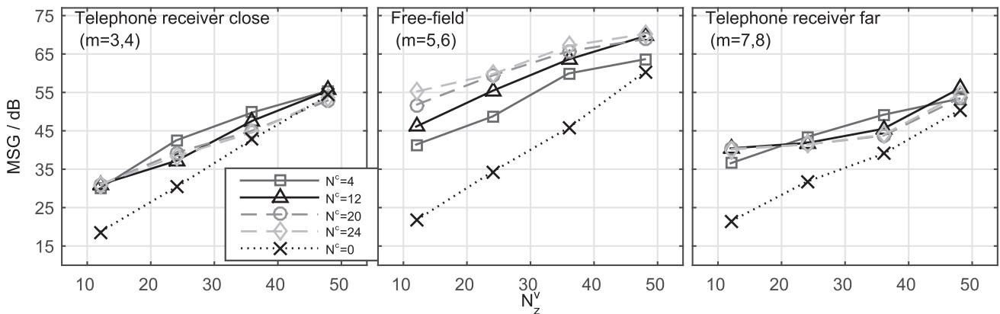  
Fig. 11. Overall MSG as a function of the number of variable part parameters $N _ { z } ^ { v }$ for different unknown acoustic feedback paths and number of common part parameters $N ^ { c }$ . The common part was estimated from the free-field IRs $m = 1 , \tilde { 2 } .$

$N _ { z } ^ { v }$ . A comparison of both sets of measured free-field IRs, i.e., $m = 1 , 2$ in Fig. 5 and $m \ : = \ : 5 , 6$ in Fig. 11 (mid), indicates that the common pole-zero filter estimated using the proposed min-max optimization approach is robust to small changes of the hearing aid position. Note that for conditions with the telephone receiver present $( \mathrm { i . e . , } m = 3 , 4 \mathrm { a n d } m = 7 , 8 )$ the MSG for $N ^ { c } = 0$ is in general about $3 \mathrm { t o } 5 \mathrm { d B }$ lower compared to the free-field conditions $( \mathrm { i } . \mathrm { e } . \ m = 1 , 2$ and $m = 5 , 6 )$ . Again, by including a common part improvements in the MSG can be obtained. These MSG improvements are in general lower than for IRs $m = 1 , 2$ and $m = 5 , 6$ . Nevertheless, considering the total number ofparameters used to model the acoustic feedback path, $\mathrm { i } . \mathrm { e } . , N ^ { c } + N _ { z } ^ { v }$ , for small $N ^ { c }$ and small $N _ { z } ^ { v }$ a similar performance can be achieved for the same total number of parameters, e.g., comparing $\{ N ^ { c } = 1 2 , N _ { z } ^ { v } = 1 2 \}$ and $\{ N ^ { c } = 0 , N _ { z } ^ { v } = 2 4 \}$ In conclusion, incorporating a common part estimated using the proposed min-max optimization approach leads to an increase in terms of the overall MSG even for acoustic feedback paths that were not included in the optimization of the common part.

## F. Reduction ofVariable Part Parameters

The proposed acoustic feedback path decomposition into a common part and variable parts is motivated by the goal to reduce the number of parameters $N _ { z } ^ { v }$ required to model the variable part. In this section it is investigated how many variable part parameters can be reduced when including a common part, even in case of unknown feedback paths. Similarly as in Section VI-E, the common part has been estimated from the free-field acoustic feedback paths $m = 1 , 2$ . We investigate the performance for three different desired MSGs of 25 dB, 35 dB and 45 dB in order to provide insights into the performance and limits of the proposed feedback path decomposition.

Fig. 12 depicts the minimum number of variable part parameters $N _ { z } ^ { v }$ required to achieve desired MSGs of 25 dB, 35 dB and 45 dB as a function of the number of common part parameters $N ^ { c }$ . Note that $N ^ { c } = 0$ corresponds to using only a variable part, i.e., no common part, and thus provides the baseline performance. In general, the results indicate that by including a common part the number of variable part parameters can be reduced. As expected, for all desired MSGs the best performance, i.e., the lowest $N _ { z } ^ { v }$ , is achieved for IRs $m = 1 , 2 ,$ , i.e., the same acoustic feedback paths that were used for estimating the common part. A similar performance is achieved for IRs $m \ = \ 5 , 6 .$ indicating that the estimated common part is robust against small changes of the hearing aid position. For IRs $m = 3 , 4 , \mathrm { i . e . }$ , a telephone in close distance, the number of variable part parameters needs to be substantially larger to achieve larger $\mathrm { M S G s , e . g . }$ , 35 dB and 45 dB. Nevertheless, for these IRs including the common part estimated from IRs $m = 1 , 2$ does allow for a reduction of $N _ { z } ^ { v }$ for low $N ^ { c }$ . For IRs $m = 7 , 8 , 1 . 6 .$ a telephone at a distant position, including the common part allows to reduce the number ofvariable part parameters almost by the same amount as for the free-field conditions $( m = 1 , 2$ and $m = 5 , 6 )$ for the desired MSG of 25 dB and 35 dB. However, for the large desired MSG of45 dB the reduction in variable part parameters is present only for $N ^ { c } = 4$ . These results indicate that including a common part estimated from only a limited set ofIRs enables to reduce the number ofvariable part parameters, especially when the desired MSG is not too large.

## G. Perceptual Quality Evaluation Using a Static Feedback Canceller

As shown in Sections VI-C and VI-D, the proposed min-max optimization approach yields a large MSG, whereas the LS optimization approach yields a small misalignment. While a large MSG is desirable in hearing aids, the proposed min-max optimization approach achieves this at the cost of a larger misalignment, which may introduce undesirable quality degradations. For the perceptual quality evaluation, we have considered a single-loudspeaker single-microphone feedback cancellation system as depicted in Fig. 2(a). In order to avoid the impact of artifacts due to the adaptation of an adaptive feedback cancellation algorithm, we have considered a static feedback canceller, i.e., using the optimized common and variable part as $\hat { H } _ { m } ( z )$ . We evaluated the perceptual quality of the loudspeaker signal using the perceptual quality of speech (PESQ) measure [26], since results from [19] indicated that the rankings obtained by PESQ are very similar to the rankings obtained by formal listening tests. The reference signal for the PESQ measure was the incoming signal $S _ { m } ( z )$ processed with the hearing aid gain function only. As incoming signal we have used an 80 s long speech signal as in [4] comprising several male and female speakers. For the hearing aid gain $G ( z ) = | G | z ^ { - d _ { G } }$ we have used a delay $d _ { G } = 9 6$ corresponding to 6 ms and two different broadband gains $| G | \colon 1 )$ a broadband gain that is 3 dB lower than the MSG obtained with the LS optimization approach $( \mathrm { M S G } _ { L S } )$

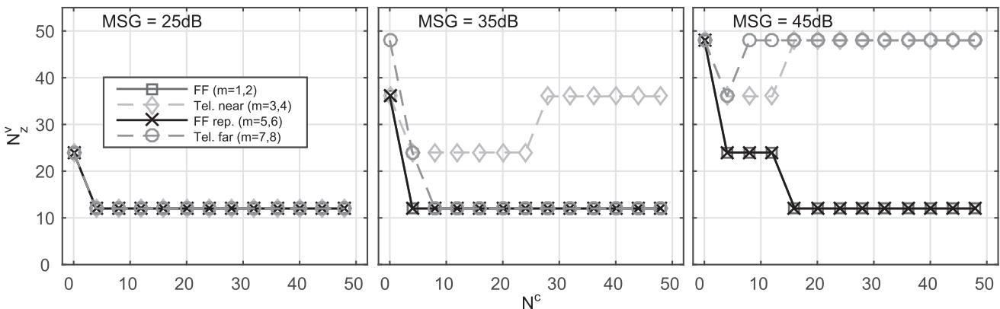  
Fig. 12. Minimum number of variable part parameters $N _ { z } ^ { v }$ as a function of $. N ^ { c }$ required to obtain a desired MSG of (left) 25 dB, (middle) 35 dB and (right) 45 dB for different acoustic feedback paths. The common part was estimated from the free-field IRs $m = 1 , 2$

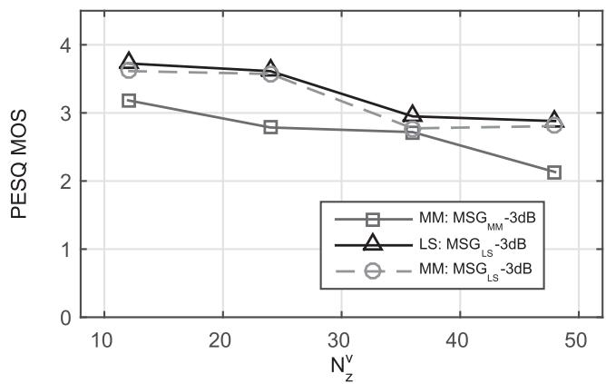  
Fig. 13. Mean opinion scores as evaluated by PESQ for $N ^ { c } = 1 2$ as a function of $\bar { ( N _ { z } ^ { v } }$

and 2) a broadband gain that is 3 dB lower than the MSG obtained with the min-max optimization approach $( \mathrm { M S G } _ { M M } ) ^ { 2 }$ Since applying the broadband hearing aid gain $\mathrm { M S G } _ { M M }$ 3 dB typically led to an unstable system for the LS optimization approach, in the following we only present the results for the min-max optimization approach for this broadband hearing aid gain.

Fig. 13 depicts exemplary results for $N ^ { c } = 1 2$ , where those combinations of $N _ { p } ^ { c }$ and $N _ { z } ^ { c }$ were chosen that corresponded to the largest overall MSG depicted in Figs. 5 and 6. The results in Fig. 13 show that the PESQ scores for the broadband hearing aid gain of $\mathrm { M S G } _ { L S } { - 3 }$ dB are very similar for the min-max optimization approach and the LS optimization approach. When increasing the broadband hearing aid gain to $\mathrm { M S G } _ { M M } { - } 3$ dB, the LS optimization approach led to an unstable system while for the min-max optimization approach the PESQ scores are about 0.5 MOS values lower than for the broadband hearing aid gain of $\mathrm { M S G } _ { L S } - 3 \mathrm { d B }$ . These results indicate that the proposed min-max optimization approach allows to achieve the same perceptual quality as the LS optimization approach while providing a larger stability margin as shown by an increased MSG.

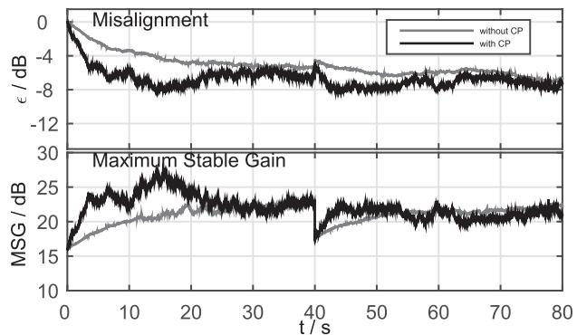  
Fig. 14. Misalignment and MSG as a function of time for a standard AFC algorithm (without CP) and an AFC algorithm using the proposed feedback path decomposition (with CP).

## H. Application to AFC in Hearing Aids

In this section we investigate the performance of an AFC algorithm as depicted in Fig. 2(b) that makes use of the proposed acoustic feedback path decomposition. The adaptive filter is updated using the normalized least mean squares (NLMS) algorithm in the time-domain and in order to reduce the bias of the estimated filter the prediction-error method (PEM) [1], [14] is applied. As incoming signal we have used an 80 s long speech signal as in [4], comprising several male and female speakers. For the hearing aid gain function we have used $G ( z ) = | G | z ^ { - d _ { G } }$ with $| G | \overset { - } { = } 1 0 ^ { 1 5 / 2 0 }$ and $d _ { G } = 9 6$ corresponding to a delay of 6 ms. The prediction-error filter is estimated from the error signal $E _ { m } ( z )$ using the Burg-lattice algorithm [28], where the order ofthe prediction filter was set to 20. The step-size of the NLMS algorithm was set to $\mu = 0 . 0 0 2$

Fig. 14 depicts the results for the following two settings ofthe common and variable parts: 1) $N _ { p } ^ { c } = 0 , N _ { z } ^ { c } = 0$ , and $N _ { z } ^ { v } = 3 6$ R i.e., without a common part, and 2) $N _ { p } ^ { c } = 8 , N _ { z } ^ { c } = 4 , N _ { z } ^ { v } = 2 4$ i.e., with a common part which is estimated from the free-field IRs $m = 1 , 2$ . During the first 40 s the acoustic feedback path $\mathbf { h } _ { 1 }$ was used in the simulation and during the remaining 40 s the acoustic feedback path $\mathbf { h } _ { 3 }$ was used, which was not included in the optimization of the common part. Results show that the proposed feedback path decomposition allows for an increased initial convergence speed as well as an increased convergence speed when the acoustic feedback path changes after

40 s. Additionally, the AFC algorithm using the proposed feedback path decomposition achieves a similar steady-state performance compared to the AFC algorithm without a common part.

## VII. CONCLUSION

In this paper the problem of estimating a common pole-zero filter from a set ofmeasured acoustic feedback paths was formulated as a min-max optimization problem aiming to maximize the MSG. The resulting non-linear cost function was minimized by applying an iterative optimization procedure. At each iteration a two-step alternating optimization was used to estimate the coefficient vectors of the common pole-zero filter. The optimization problem in each step was formulated as an SDP and an LMI constraint based on Lyapunov theory was imposed to guarantee stability of the estimated common poles. Experimental results using measured acoustic feedback paths show that the proposed optimization approach leads to a larger overall MSG compared to existing LS optimization approaches at the expense of an increased overall misalignment. Furthermore, for a given desired MSG the proposed min-max optimization approach enables to reduce the number of variable part parameters, even for unknown acoustic feedback paths. Quality evaluations using the PESQ measure show that the min-max optimization approach leads to a similar speech quality compared to the LS optimization approach at the same broadband gain and additionally allows for a larger gain margin of the hearing aid. Results using a state-of-the-art AFC algorithm based on the prediction-error method show that employing the proposed acoustic feedback path decomposition allows to increase the convergence speed compared to an AFC algorithm without a common part.

## APPENDIX A

## SCHUR COMPLEMENT OF (23)

The absolute values in (23) can be rewritten in terms of the real part $p _ { m , i } ^ { v } ( \Omega )$ and imaginary part $r _ { m , i } ^ { v } ( \Omega )$ of the frequency response optimized in (23), i.e.,

$$
\frac {1}{| A _ {i - 1} ^ {c} | ^ {2}} | E _ {m, i} ^ {v} | ^ {2} = | \frac {1}{A _ {i - 1} ^ {c}} E _ {m, i} ^ {v} | ^ {2}\tag{50}
$$

$$
= (p _ {m, i} ^ {v}) ^ {2} + (r _ {m, i} ^ {v}) ^ {2}.\tag{51}
$$

Using this results, the cost function in (23) can be rewritten as

$$
J_{WM}(\mathbf{b}_{i}^{v}) = \max_{\substack{0\leq \Omega \leq \pi \\ 1\leq m\leq M}}(p_{m,i}^{v})^{2} + (r_{m,i}^{v})^{2}\forall \Omega ,m.\tag{52}
$$

Introducing the auxiliary variable [17], [27] and using (51) this can be reformulated as

$$
\min _ {t, \mathbf {b} _ {i} ^ {v}} t\tag{53a}
$$

$$
\text { subject   to } \quad (p _ {m} ^ {v}, i) ^ {2} + (r _ {m} ^ {v}, i) ^ {2} \leq t   \forall \Omega , m.\tag{53b}
$$

Rewriting (53b) as

$$
t - ((p _ {m, i} ^ {v}) ^ {2} + (r _ {m, i} ^ {v}) ^ {2}) \geq 0,\tag{54}
$$

and thus recognizing (53b) as the Schur complement [5] of a matrix of the following form

$$
\mathbf {M} = \left[ \begin{array}{c c} \mathbf {A} & \mathbf {B} \\ \mathbf {C} & \mathbf {D} \end{array} \right],\tag{55}
$$

with $\mathrm { ~ \bf ~ A ~ } = \mathrm { ~ \bf ~ t ~ } , \mathrm { ~ \bf ~ B ~ } = \mathrm { ~ \bf ~ [ ~ } ( p _ { m , i } ^ { v } ) \mathrm { ~ \bf ~ \phi ~ } ( r _ { m , i } ^ { v } ) \mathrm { ~ \bf ~ ] , ~ C ~ } = \mathrm { ~ \bf ~ B ^ { \it T } ~ }$ and the $2 \times 2$ -dimensional identity matrix, the min-max problem in (23) can be formulated as the SDP in (25).

## REFERENCES

[1] A. Spriet, S. Doclo, M. Moonen, and J. Wouters, “Feedback control in hearing aids,” in Springer Handbook of Speech Processing. Berlin, Germany: Springer-Verlag, 2008, pp. 979–999.

[2] T. van Waterschoot and M. Moonen, “Fifty years of acoustic feedback control: State of the art and future challenges,” Proc. IEEE, vol. 99, no. 2, pp. 288–327, Feb. 2011.

[3] M. Guo, S. H. Jensen, and J. Jensen, “Novel acoustic feedback cancellation approaches in hearing aid applications using probe noise and probe noise enhancement,” IEEE Trans. Audio, Speech, Lang. Process., vol. 20, no. 9, pp. 2549–2563, Nov. 2012.

[4] C. R. C. Nakagawa, S. Nordholm, and W.-Y. Yan, “Analysis of two microphone method for feedback cancellation,” IEEE Signal Process. Lett., vol. 22, no. 1, pp. 35–39, Jan. 2015.

[5] A. H. Sayed, Fundamentals of Adaptive Filtering. New York, NY, USA: Wiley, 2003.

[6] J. M. Kates, “Feedback Cancellation Apparatus and Methods,” U.S. patent, 6,072,884, 2000.

[7] G. Ma, F. Gran, F. Jacobsen, and F. Agerkvist, “Extracting the invariant model from the feedback paths of digital hearing aids,” J. Acoust. Soc. Amer., vol. 130, no. 1, pp. 350–63, Jul. 2011.

[8] H. Schepker and S. Doclo, “Modeling the common part of acoustic feedback paths in hearing aids using a pole-zero model,” in Proc. Int. Conf. Acoust. Speech Signal Process. (ICASSP), Florence, Italy, May 2014, pp. 3693–3697.

[9] H. Schepker and S. Doclo, “Estimation of the common part of acoustic feedback paths in hearing aids using iterative quadratic programming,” in Proc. Int. Workshop Acoust. Signal Enhancement (IWAENC), Antibes - Juan Les Pins, France, Sep. 2014, pp. 46–50.

[10] H. Schepker and S. Doclo, “Common part estimation of acoustic feedback paths in hearing aids optimizing maximum stable gain,” in Proc. Int. Conf. Acoust. Speech Signal Process. (ICASSP), Brisbane, Australia, Apr. 2015, pp. 649–653.

[11] Y. Haneda, S. Makino, and Y. Kaneda, “Common acoustical pole and zero modeling of room transfer functions,” IEEE Trans. Speech Audio Process., vol. 2, no. 2, pp. 320–328, Apr. 1994.

[12] D. K. Bustamante, T. L. Worrall, and M. J. Williamson, “Measurement and adaptive suppression of acoustic feedback in hearing aids,” in Proc. Int. Conf. Acoust. Speech Signal Process. (ICASSP), Glasgow, U.K., May 1989, pp. 2017–2020.

[13] J. A. Maxwell and P. M. Zurek, “Reducing acoustic feedback in hearing aids,” IEEE Speech Audio Process., vol. 3, no. 4, pp. 304–313, Jul. 1995.

[14] A. Spriet, I. Proudler, M. Moonen, and J. Wouters, “Adaptive feedback cancellation in hearing aids with linear prediction of the desired signal,” IEEE Trans. Signal Process., vol. 53, no. 10, pp. 3749–3763, Oct. 2005.

[15] M. G. Siqueira and A. Alwan, “Steady-state analysis of continuous adaptation in acoustic feedback reduction systems for hearing-aids,” IEEE Trans. Speech Audio Process., vol. 8, no. 4, pp. 443–453, Jul. 2000.

[16] J. M. Kates, “Room reverberation effects in hearing aid feedback cancellation,” J. Acoust. Soc. Amer., vol. 109, no. 1, pp. 367–378, Jan. 2001.

[17] W.-S. Lu, “Design of stable minimax IIR digital filters using semidefinite programming,” in Proc. IEEE Int. Symp. Circuits Syst. (ISCAS), Geneva, Switzerland, 2000, pp. 355–358.

[18] A. Spriet, G. Rombouts, M. Moonen, and J. Wouters, “Adaptive feedback cancellation in hearing aids,” J. Franklin Inst., vol. 343, pp. 545–573, 2006.

[19] M. Guo, S. H. Jensen, and J. Jensen, “Evaluation of state-of-the-art acoustic feedback cancellation systems for hearing aids,” J. Audio Eng. Soc., vol. 61, no. 3, pp. 125–137, Mar. 2013.

[20] H. Nyquist, “Regeneration theory,” Bell Syst. Tech. J., vol. 11, no. 1, pp. 126–147, 1932.

[21] K. Steiglitz and L. McBride, “A technique for the identification of linear systems,” IEEE Trans. Autom. Control, vol. AC-10, no. 4, pp. 461–464, Oct. 1965.

[22] W.-S. Lu, “A unified approach for the design of 2-D digital filters via semidefinite programming,” IEEE Trans. Circuits Sys., I, vol. 49, no. 6, pp. 814–826, Jun. 2002.

[23] M. Grant and S. Boyd, “Graph implementations for nonsmooth convex programs,” in Recent Advances in Learning and Control, V. Blondel, S. Boyd, and H. Kimura, Eds. Berlin, Germany: Springer-Verlag, 2008 pp. 95–110, Lecture Notes in Control and Information Sciences.

[24] M. Grant and S. Boyd, “CVX: Matlab software for disciplined convex programming, version 2.1,” in , Mar. 2014 [Online]. Available: http:// cvxr.com/cvx

[25] M. Hiipakka, M. Tikander, and M. Karjalainen, “Modeling the external ear acoustics for insert headphone usage,” J. Audio Eng. Soc., vol. 58, no. 4, pp. 269–281, Apr. 2010.

[26] “ITU-T, Perceptual evaluation of speech quality (PESQ), An objective method for end-to-end speech quality assessment of narrowband telephone networks and speech codecs P.862 Int. Telecomm. Union (ITU-T) Rec.,” 2001.

[27] S. P. Boyd and L. Vandenberghe, Convex Optimization. Cambridge, U.K.: Cambridge Univ. Press, 2004.

[28] J. Makouhl, “Stable and efficient lattice methods for linear prediction,” IEEE Trans. Acoust., Speech, Signal Process., vol. AASP-25, no. 5, pp. 423–428, Oct. 1977.

Henning Schepker (S’14) received the B.Eng. degree in 2011 from Jade University of Applied Sciences Oldenburg and the M.Sc. degree (with distinction) in 2012 from University of Oldenburg, Germany, both in Hearing Technology and Audiology. Currently he is a Ph.D. student in the Signal Processing Group at the Department of Medical Physics and Acoustics at the University of Oldenburg, Germany. His current work focuses on feedback cancellation for open-fitting hearing aids. His research interests are in the area of signal

processing for hearing aids and speech and audio applications as well as speech perception.

Simon Doclo (S’95–M’03–SM’13) received the M.Sc. degree in electrical engineering and the Ph.D. degree in applied sciences from the Katholieke Universiteit Leuven, Belgium, in 1997 and 2003. From 2003 to 2007 he was a Postdoctoral Fellow with the Research Foundation Flanders at the Electrical Engineering Department (Katholieke Universiteit Leuven) and the Adaptive Systems Laboratory (McMaster University, Canada). From 2007 to 2009 he was a Principal Scientist with NXP Semiconductors at the Sound and Acoustics

Group in Leuven, Belgium. Since 2009 he has been a Full Professor at the University of Oldenburg, Germany, and scientific advisor for the project group Hearing, Speech and Audio Technology of the Fraunhofer Institute for Digital Media Technology. His research activities center around signal processing for acoustical applications, more specifically microphone array processing, active noise control, acoustic sensor networks and hearing aid processing. Prof. Doclo received the Master Thesis Award of the Royal Flemish Society of Engineers in 1997 (with Erik De Clippel), the Best Student Paper Award at the International Workshop on Acoustic Echo and Noise Control in 2001, the EURASIP Signal Processing Best Paper Award in 2003 (with Marc Moonen) and the IEEE Signal Processing Society 2008 Best Paper Award (with Jingdong Chen, Jacob Benesty, Arden Huang). He was a member of the IEEE Signal Processing Society Technical Committee on Audio and Acoustic Signal Processing (2008–2013) and Technical Program Chair for the IEEE Workshop on Applications of Signal Processing to Audio and Acoustics (WASPAA) in 2013. Prof. Doclo has served as guest editor for several special issues (IEEE Signal Processing Magazine, Elsevier Signal Processing) and is associate editor for IEEE/ACM TRANSACTIONS ON AUDIO, SPEECH AND LANGUAGE PROCESSING and EURASIP Journal on Advances in Signal Processing.