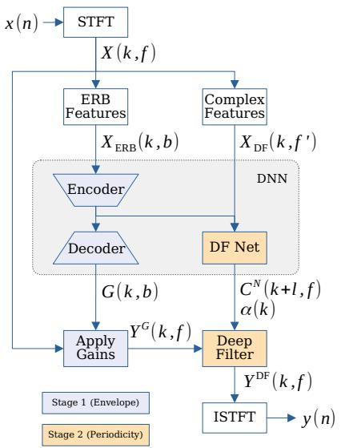
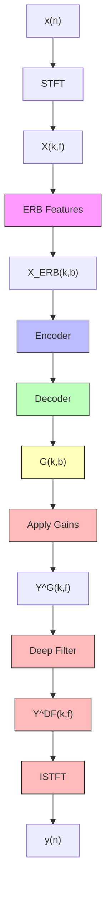
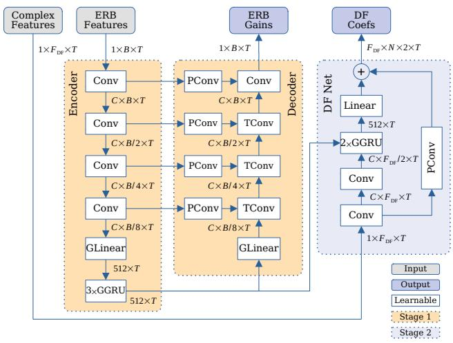
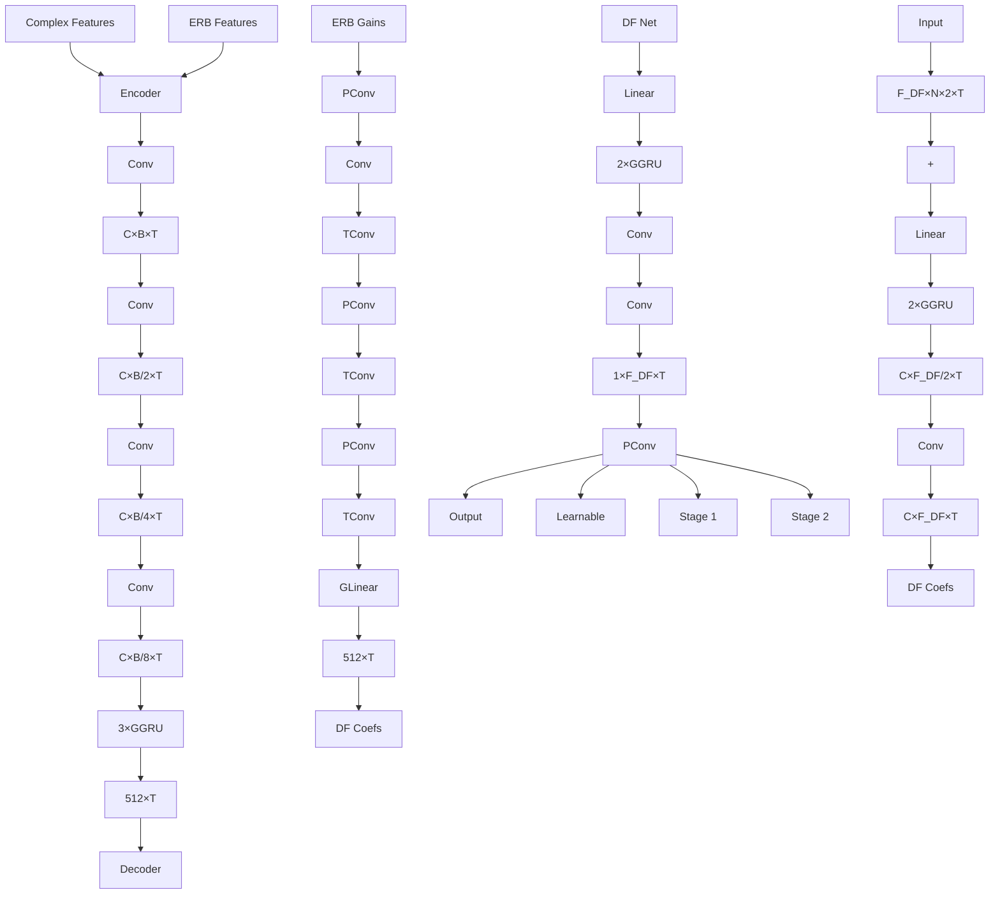
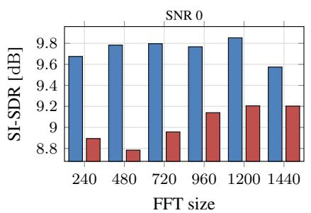
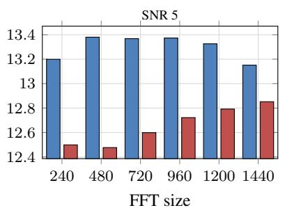
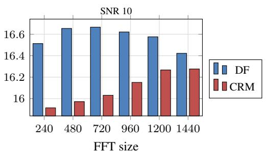
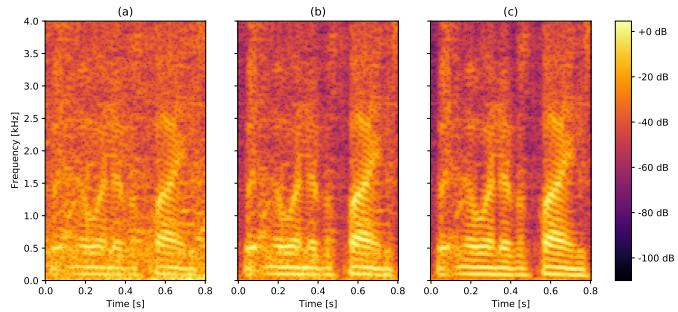

# DEEPFILTERNET: A LOW COMPLEXITY SPEECH ENHANCEMENT FRAMEWORK FOR FULL-BAND AUDIO BASED ON DEEP FILTERING

Hendrik Schroter¨ 1, Alberto N. Escalante-B.2, Tobias Rosenkranz2, Andreas Maier1

1Friedrich-Alexander-Universitat Erlangen-N ¨ urnberg, Pattern Recognition Lab¨ 2WS Audiology, Research and Development, Erlangen, Germany

## ABSTRACT

Complex-valued processing has brought deep learning-based speech enhancement and signal extraction to a new level. Typically, the process is based on a time-frequency (TF) mask which is applied to a noisy spectrogram, while complex masks (CM) are usually preferred over real-valued masks due to their ability to modify the phase. Recent work proposed to use a complex filter instead of a point-wise multiplication with a mask. This allows to incorporate information from previous and future time steps exploiting local correlations within each frequency band.

In this work, we propose DeepFilterNet, a two stage speech enhancement framework utilizing deep filtering. First, we enhance the spectral envelope using ERB-scaled gains modeling the human frequency perception. The second stage employs deep filtering to enhance the periodic components of speech. Additionally to taking advantage of perceptual properties of speech, we enforce network sparsity via separable convolutions and extensive grouping in linear and recurrent layers to design a low complexity architecture.

We further show that our two stage deep filtering approach outperforms complex masks over a variety of frequency resolutions and latencies and demonstrate convincing performance compared to other state-of-the-art models.

Index Terms— deep filtering, speech enhancement

## 1. INTRODUCTION

Monaural speech enhancement is an important part in many systems such as automatic speech recognition, video conference systems, as well as assistive listening devices. Most state-of-the-art approaches work in the short-time Fourier transform (STFT) representation and estimate a TF mask using a deep neural network, many of these either real-valued masks [1, 2, 3] or complex masks [4, 5, 6, 7]. The estimated masks are usually well-defined and limited by an upper bound to improve stability of the network training. However, typically both approaches degrade if the frequency resolution gets to low for removing noise between speech harmonics. The approaches above work on at least 20 ms windows resulting in a minimum frequency of 50 Hz.

In this paper, we propose an open source speech enhancement framework based on deep filtering (DF) [8, 9]. Instead of using a complex mask that is applied per TF-bin, we use a combination of real-valued gains and a deep filter enhancement component. For the first stage, we take advantage from the fact that noise as well as speech usually have a smooth spectral envelope. An equivalent rectangular bandwidth (ERB) filter bank reduces input and output dimensions to only 32 bands, allowing for a computationally cheap encoder/decoder network. Since the resulting minimum bandwidth of 100 Hz to 250 Hz depending on the FFT size is typically not sufficient to enhance periodic components, we use a second enhancement stage based on deep filtering. That is, a deep filter network estimates coefficients for frequency bins up to an upper frequency fDF. The resulting linear complex-valued filters are applied to their corresponding frequency bins. DF enhancement is only applied for lower frequencies since periodic speech components contain most energy in the lower frequencies.

Deep filtering was first proposed by Mack et al. [8] and Schroter et al. [9]. Since a filter applied to multiple¨ time/frequency (TF) bins, DF is able to recover signal degradations like notch-filters or time-frame zeroing. Schroter ¨ et al. [9] introduced this method as complex linear coding (CLC) for low latency hearing aid applications. CLC was motivated by its ability to model quasi-static properties of speech. That is, even for frequency bandwidth of 500 Hz CLC is able to reduce noise within a frequency band, while preserving speech components. This is especially helpful, when there are multiple speech harmonics within one frequency bin or for filtering periodic noises. Recent work [7] demonstrated good performance using deep filtering in the deep noise suppression challenge [10]. However, compared to their previous work [11] using a complex ratio mask (CRM), their improvements are mostly given by network architecture changes like complex TF-LSTMs or convolutional pathways.

In this work, we demonstrate superior performance of deep filtering over CRMs for multiple FFT sizes from 5 ms to 30 ms. We further show that even for low latency requirements of e.g. 5 ms resulting in a frequency resolution of 250 Hz, DF can still enhance the periodic speech components.

## 2. DEEPFILTERNET

## 2.1. Signal Model

Let $x ( t )$ be a mixture signal recorded in a noisy room.

$$
x (t) = s (t) * h (t) + z (t) \tag {1}
$$

where $s ( t )$ is a clean speech signal, $h ( t )$ is a room impulse response from the speaker to the microphone and $z ( t )$ is an additive noise signal already containing reverberation. Typically, noise reduction operates in frequency domain:

$$
X (k, f) = S (k, f) \cdot H (k, f) + Z (k, f), \tag {2}
$$

where $X ( k , f )$ is the STFT representation of the time domain signal $x ( t )$ and $k , f$ are the time and frequency bins.

## 2.2. Deep Filtering

Deep filtering is defined by a complex filter in TF-domain:

$$
Y (k, f) = \sum_ {i = 0} ^ {N} C (k, i, f) \cdot X (k - i + l, f), \tag {3}
$$

where C are the complex coefficients of filter order N that are applied to the input spectrogram X, and Yˆ the enhanced spectrogram. In our framework, the deep filter is applied to the gain-enhanced spectrogram $Y ^ { G }$ . l is an optional look-ahead, which allows incorporating non-causal taps in the linear combination if $l \geq 1$ . Additionally, one could also filter over the frequency axis allowing to incorporate correlations e.g. due to overlapping bands. To further make sure that deep filtering only affects periodic parts, we introduce a learned weighting factor α to produce the final output spectrogram:

$$
Y ^ {D F} (k, f) = \alpha (k) \cdot Y ^ {D F ^ {\prime}} (k, f) + (1 - \alpha (k)) \cdot Y ^ {G} (k, f). \tag {4}
$$

## 2.3. Framework Overview

An overview of the DeepFilterNet algorithm is shown in Fig. 1. Given a noisy audio signal $x ( t )$ we transform the signal into frequency domain using a short time Fourier transform (STFT). The framework is designed for sampling rates up to 48 kHz to support high resolution VoIP applications and STFT window sizes $N _ { F F T }$ between 5 ms and 30 ms. By default, we use an overlap of $N _ { o v } = 5 0 \%$ but also support higher overlaps. We use two kinds of input features for the deep neural network (DNN). For the ERB encoder/decoder features $X _ { \mathrm { E R B } } ( k , b ) , b \in [ 0 , N _ { \mathrm { E R B } } ]$ , we compute a log-power spectrogram, normalize it using an exponential mean normalization [12] with decay of 1 s and apply a rectangular ERB filter bank (FB) with a configurable number of bands $N _ { \mathrm { E R B } }$ . In fact, this normalization is similar to using instance normalization like [7], which also estimates statistics with a momentum-based approach and only adds additional scaling and bias parameters. For the deep filter network features $X _ { \mathrm { D F } } ( k , f ^ { \prime } ) , f ^ { \prime } \in [ 0 , f _ { \mathrm { D F } } ]$ , we use the complex spectrogram as input and normalize it using an exponential unit normalization [9] with the same decay.

flowchart

Fig. 1. Overview of the DeepFilterNet algorithm. Stage 1 blocks are indicated in blue, stage 2 blocks in yellow.

An encoder/decoder architecture is used to predict ERBscaled gains. An inverse ERB filter bank is applied to transform the gains back to frequency domain before pointwise multiplying with the noisy spectrogram. To further enhance the periodic components, DeepFilterNet predicts per-band filter coefficients $\dot { C ^ { N } }$ of order N . We only utilize Deep Filtering up to a frequency fDF assuming that the periodic components contain most energy in lower frequencies.

Together with the DNN look-ahead in the convolutional layers as well as the deep filter look-ahead, the overall latency is given by ${ l _ { N _ { \mathrm { F F T } } } + \operatorname* { m a x } ( { l _ { \mathrm { D N N } } } , \ l _ { \mathrm { D F } } ) }$ resulting in a minimal latency of 5 + max $( 0 , 0 ) = 5$ ms for $N _ { \mathrm { F F T } } = 2 4 0$ .

## 2.4. DNN Model

We focus on designing an efficient DNN only using standard DNN layers like convolutions, batch normalization, ReLU, etc., so that we can take advantage of layer fusing as well utilize good support by inference frameworks. We adopt a UNet-like architecture similar to [13, 7] as shown in Fig. 2. Our convolutional blocks consist of a separable convolutions (depthwise followed by a 1x1 convolution) with kernel size of (3x2) and $C = 6 4$ channels followed by a batch normalization and ReLU activation. The convolutional layers are aligned in time such that the first layers may introduce an overall lookahaead $l _ { \mathrm { D N N } }$ . The remaining convolutional layers are causal and do not contribute any more latency. We heavily make use of grouping [14, 13] for our linear and GRU layers. That is, the layer input is split into $P = 8$ groups resulting in P smaller GRUs/linear layers with a hidden size of $5 1 2 / P =$ 64. The output is shuffled to recover inter-group correlations and concatenated to the full hidden size again. Convolutional pathways [13, 7] with add-skips are used to retain frequency resolution. We use a global pathway skip connection for the DF Net to provide a good representation of the original noisy phase at the output layer.

flowchart

Fig. 2. Overview of the DeepFilterNet architecture. We use 1x1 pathway convolutions (PConv) as add-skip connections and transposed convolutional blocks (TConv) analogous to the encoder blocks. Grouped linear and GRU (GLinear, GGRU) layers are used to introduce sparsity.

## 2.5. Data Preprocessing

The DeepFilterNet framework utilizes heavy on-the-fly augmentation. We mix a clean speech signal with up to 5 noise signals at signal-to-noise ratios (SNR) of {−5, 0, 5, 10, 20, 40} dB. To further increase variabilty, we augment speech as well as noise signals with second order filters [1], EQs, and random gains of $\{ - 6 , 0 , 6 \}$ dB. Random resampling increases the variety of pitches and room impulse responses (RIR) are used for simulating reverberant environments. We apply a low-pass filter to noise signals before mixing, if the sampling rate of a speech signal is lower than the current model’s sampling rate. This e.g. also allows models trained on full-band audio (48 kHz) to perform equally well on input signals with lower sampling rates. We furthermore support training attenuation limited models. Therefore, we generate a “noisy” target signal s with a 6 to 20 dB higher SNR compared to the noisy signal x. During training, we then clamp the predicted gains G and having a “noisy” target s, DF Net will learn to not remove more noise than specified. This is useful e.g. for wearable devices where we want to keep some environmental awareness for the user.

## 2.6. Loss

It is not trivial to provide ideal DF coefficients $C ^ { N }$ , since there are infinitely many possibilities [8]. Instead, we use a compressed spectral loss to implicitly learn ERB gains G and

filter coefficients $C ^ { N }$ [15, 13].

$$
\mathcal {L} _ {\text { spec }} = \sum_ {k, f} | | | Y | ^ {c} - | S | ^ {c} | | ^ {2} + \sum_ {k, f} | | | Y | ^ {c} e ^ {j \varphi_ {Y}} - | S | ^ {c} e ^ {j \varphi_ {S}} | | ^ {2}, \tag {5}
$$

where $c = 0 . 6$ is a compression factor to model the perceived loudness [16]. Having a magnitude as well as a phase-aware term makes this loss is suitable for modeling both real-valued gain and complex DF coefficient prediction. To harden the gradient for TF bins with magnitude close to zero (e.g. for input signals with a lower sampling rate), we compute the angle backward method of $\varphi _ { X }$ like:

$$
\frac {\delta \varphi}{\delta X} = \delta X \cdot (\frac {- \Im \{X \}}{| X _ {h} | ^ {2}}, \frac {\Re \{X \}}{| X _ {h} | ^ {2}}), \tag {6}
$$

where $\Re \{ X \}$ and ${ \mathfrak { N } } \{ X \}$ represent real and imaginary part of spectrogram X and $| \tilde { X } _ { h } | ^ { 2 } \stackrel { - } { = } \operatorname* { m a x } ( \Re \{ X \} ^ { 2 } + \Im \{ X \} ^ { 2 } , \bar { 1 } e ^ { - 1 2 } )$ is the hardened squared magnitude to avoid by 0 division.

As an additional loss term, we force the DF component to only enhance periodic parts of the signal. The motivation is as follows. DF does not provide any benefit over ERB gains for noise-only sections. DF may even cause artifacts by modeling periodic noises like engine or babble noise which is most noticeable in attenuation limited models. Furthermore, DF does not provide any benefit for speech with only stochastic components like fricatives or plosives. Assuming, that these sections contain most of the energy in higher frequencies, we compute the local SNR for frequencies below $f _ { \mathrm { D F } }$ . Therefore, $\mathcal { L } _ { \alpha }$ is given by

$$
\mathcal {L} _ {\alpha} = \sum_ {k} | | \alpha \cdot \mathbb {1} _ {\mathrm{LSNR} <   - 1 0 \mathrm{dB}} | | ^ {2} + \sum_ {k} | | (1 - \alpha) \cdot \mathbb {1} _ {\mathrm{LSNR} > - 5 \mathrm{dB}} | | ^ {2}, \tag {7}
$$

where $\mathbb { 1 } _ { \mathrm { L S N R < - 1 0 d B } }$ is the characteristic function with value 1 if the local SNR (LSNR) is smaller than −10 dB and $\mathbb { 1 } _ { \mathrm { L S N R > - 5 d B } }$ 1 if LSNR is greater than −5 dB. The LSNR is computed in STFT domain up to a frequency of fDF over 20 ms windows. This ensures that DF is only applied in segments containing significant amount of speech energy in low frequencies. The combined loss is given by

$$
\mathcal {L} = \lambda_ {s p e c} \cdot \mathcal {L} _ {s p e c} (Y, S) + \lambda_ {\alpha} \cdot \mathcal {L} _ {\alpha}. \tag {8}
$$

## 3. EXPERIMENTS

## 3.1. Training setup

We train our models based on the deep noise suppression (DNS) challenge dataset [10] containing over 750 h of fullband clean speech and 180 h of various noise types. We oversample included high-quality speech datasets, VCTK and PTDB, by a factor of 10. Additionally to the provided RIRs which are sampled at 16 kHz, we simulate another 10 000 RIRs at 48 kHz using the image source model [17] with RT60s of 0.05 to 1.00 s. The VCTK and PTDB datasets are split on speaker level ensuring no overlap with the VCTK test set [18], the remaining dataset is split at signal level into train/validation/test (70/15/15 %). Early stopping is applied based on the validation loss, results are reported on the test set. The VCTK/DEMAND test set [18] is used to compare DeepFilterNet to related work.

bar chart

| FFT size | SI-SDR [dB] |
| -------- | ----------- |
| 240      | 9.6         |
| 480      | 9.8         |
| 720      | 9.8         |
| 960      | 9.8         |
| 1200     | 9.8         |
| 1440     | 9.6         |

bar chart

| FFT size | Blue Bar | Red Bar |
| -------- | -------- | ------- |
| 240      | 13.2     | 12.5    |
| 480      | 13.4     | 12.5    |
| 720      | 13.4     | 12.6    |
| 960      | 13.4     | 12.7    |
| 1200     | 13.3     | 12.8    |
| 1440     | 13.2     | 12.9    |

bar chart

| FFT size | DF    | CRM   |
| -------- | ----- | ----- |
| 240      | 16.5  | 15.9  |
| 480      | 16.7  | 15.95 |
| 720      | 16.75 | 16.05 |
| 960      | 16.65 | 16.15 |
| 1200     | 16.55 | 16.3  |
| 1440     | 16.45 | 16.3  |

Fig. 3. Comparison of Deep Filtering (DF) and conventional complex ratio masks (CRM) over multiple FFT sizes corresponding to 5 to 30 ms.

All experiments use full-band signals with a sampling rate of 48 kHz. We take $N _ { \mathrm { E R B } } = 3 2 ,$ , $f _ { \mathrm { D F } } = 5 \mathrm { k H z } ,$ , DF order of $N = 5$ , and a look-ahead of $l _ { \mathrm { D F } } = 1$ and $l _ { \mathrm { D N N } } = 2$ for the convolutions. We train our models on 3 s samples and a batch size of 32 for 30 epochs using an Adam optimizer with an initial learning rate of $1 \times 1 0 ^ { - 3 }$ . The learning rate is decayed by a factor of 0.9 every 3 epochs. Loss parameters are $\lambda _ { s p e c } = 1$ and $\lambda _ { \alpha } = 0 . 0 5$ . The framework source code can be obtained at https://github.com/Rikorose/ DeepFilterNet.

## 3.2. Results

We evaluate our framework over multiple FFT sizes and compare the performance of DF and CRMs based on the scaleinvariant signal-distortion-ratio (SI-SDR) [19]. CRM is just a special case of DF, where order N = 1 and look-ahead $l = 0$ . The DNN look-ahead remains the same for the CRM models.

Fig. 3 shows that DF outperforms CRM over all FFT sizes corresponding to 5 ms to 30 ms. Limited by the frequency resolution, the performance of CRMs drops for FFT window sizes ≤ 20 ms. On the other hand, the relatively constant performance of DF drops around 30 ms due to a smaller amount of correlation in neighboring frames. Increasing the

heatmap

| Time [s] | Frequency [kHz] |
| -------- | --------------- |
| 0.0      | 0.0             |
| 0.2      | 0.5             |
| 0.4      | 1.0             |
| 0.6      | 1.5             |
| 0.8      | 2.0             |
| 0.0      | 3.5             |
| 0.2      | 3.5             |
| 0.4      | 3.5             |
| 0.6      | 3.5             |
| 0.8      | 3.5             |
| 0.0      | 4.0             |
| 0.2      | 4.0             |
| 0.4      | 4.0             |
| 0.6      | 4.0             |
| 0.8      | 4.0             |

Fig. 4. Sample from the VCTK test set. Noisy (a), CRM (b), DF (c) $( N _ { \mathrm { F F T } } = 9 6 0$ for CRM and DF).

Table 1. Objective results on VCTK/DEMAND test set. Unreported values of related work are indicated as “-”.

<table><tr><td>Model</td><td>Params [M]</td><td>MACS [G]</td><td>WB-PESQ [MOS]</td><td>SI-SDR [dB]</td></tr><tr><td>Noisy</td><td>-</td><td>-</td><td>1.97</td><td>8.41</td></tr><tr><td>PercepNet [2]</td><td>8.0</td><td>0.80</td><td>2.73</td><td>-</td></tr><tr><td>DCCRN [11]</td><td>3.7</td><td>14.36</td><td>2.68</td><td>-</td></tr><tr><td>DCCRN+ [7]</td><td>3.3</td><td>-</td><td>2.84</td><td>-</td></tr><tr><td>DeepFilterNet</td><td>1.8</td><td>0.35</td><td>2.81</td><td>16.63</td></tr><tr><td>w/o stage 2</td><td>0.9</td><td>0.25</td><td>2.57</td><td>13.81</td></tr></table>

FFT overlap to 75 % results in a slightly better performance for both, DF and CRM (+0.6 dB SI-SNR for input SNR 0). This performance increase can be explained by a higher intraframe correlation as well as the DNN having twice as many steps to update the RNN hidden states at the cost of doubling the computational complexity. Fig. 4 shows a qualitative example to demonstrate the capabilities of DF to reconstruct speech harmonics that are indistinguishable in the noisy spectrogram.

We compare DeepFilterNet with $N _ { \mathrm { F F T } } = 9 6 0 \ ( 2 0 \mathrm { { m s } ) }$ to related work like PercepNet [2] which uses a similar perceptual approach as well as DCCRN+ [7] which also utilizes deep filtering. We assess speech enhancement quality using WB-PESQ [20] and compare computational complexity in multiply-and-accumulate per second (MACS). Table 1 shows that DeepFilterNet outperforms PercepNet and performs on par with DCCRN+ while having a much lower computational complexity making DeepFilterNet viable for real-time usage.

## 4. CONCLUSION

In this work, we proposed DeepFilterNet, a low complexity speech enhancement framework. We showed that DeepFilter-Net performs on par with other algorithms, while being computationally more efficient. This is achieved using a perceptually motivated approach allowing to minimize the model complexity. Moreover, we provided evidence that DF outperforms CRMs, particularly for smaller STFT window sizes. In the future, we plan to further improve the perceptual approach by better applying DF to periodic components of speech e.g. using a correlation-based voiced probability.

## 5. REFERENCES

[1] Jean-Marc Valin, “A hybrid DSP/deep learning approach to real-time full-band speech enhancement,” in 2018 IEEE 20th International Workshop on Multimedia Signal Processing (MMSP). IEEE, 2018, pp. 1–5.  
[2] Jean-Marc Valin, Umut Isik, Neerad Phansalkar, Ritwik Giri, Karim Helwani, and Arvindh Krishnaswamy, “A Perceptually-Motivated Approach for Low-Complexity, Real-Time Enhancement of Fullband Speech,” in IN-TERSPEECH 2020, 2020.  
[3] Xu Zhang, Xinlei Ren, Xiguang Zheng, Lianwu Chen, Chen Zhang, Liang Guo, and Bing Yu, “Low-Delay Speech Enhancement Using Perceptually Motivated Target and Loss,” in Proc. Interspeech 2021, 2021.  
[4] Donald S Williamson, Yuxuan Wang, and DeLiang Wang, “Complex ratio masking for monaural speech separation,” IEEE/ACM Transactions on Audio, Speech and Language Processing (TASLP), vol. 24, no. 3, pp. 483–492, 2016.  
[5] Ke Tan and DeLiang Wang, “Complex spectral mapping with a convolutional recurrent network for monaural speech enhancement,” in ICASSP 2019-2019 IEEE International Conference on Acoustics, Speech and Signal Processing (ICASSP). IEEE, 2019, pp. 6865–6869.  
[6] Jonathan Le Roux, Gordon Wichern, Shinji Watanabe, Andy Sarroff, and John R Hershey, “Phasebook and friends: Leveraging discrete representations for source separation,” IEEE Journal of Selected Topics in Signal Processing, vol. 13, no. 2, pp. 370–382, 2019.  
[7] Shubo Lv, Yanxin Hu, Shimin Zhang, and Lei Xie, “DC-CRN+: Channel-wise Subband DCCRN with SNR Estimation for Speech Enhancement,” in INTERSPEECH, 2021.  
[8] Wolfgang Mack and Emanuel AP Habets, “Deep Filter-¨ ing: Signal Extraction and Reconstruction Using Complex Time-Frequency Filters,” IEEE Signal Processing Letters, vol. 27, pp. 61–65, 2020.  
[9] Hendrik Schroter, Tobias Rosenkranz, Alberto Es-¨ calante Banuelos, Marc Aubreville, and Andreas Maier, “CLCNet: Deep learning-based noise reduction for hearing aids using complex linear coding,” in ICASSP 2020-2020 IEEE International Conference on Acoustics, Speech and Signal Processing (ICASSP), 2020.  
[10] Chandan KA Reddy, Harishchandra Dubey, Kazuhito Koishida, Arun Nair, Vishak Gopal, Ross Cutler, Sebastian Braun, Hannes Gamper, Robert Aichner, and Sriram Srinivasan, “INTERSPEECH 2021 Deep Noise Suppression Challenge,” in INTERSPEECH, 2021.  
[11] Yanxin Hu, Yun Liu, Shubo Lv, Mengtao Xing, Shimin Zhang, Yihui Fu, Jian Wu, Bihong Zhang, and Lei Xie, “DCCRN: Deep complex convolution recurrent network for phase-aware speech enhancement,” in IN-TERSPEECH, 2020.  
[12] Hendrik Schroter, Tobias Rosenkranz, Alberto N.¨ Escalante-B., Pascal Zobel, and Andreas Maier, “Lightweight Online Noise Reduction on Embedded Devices using Hierarchical Recurrent Neural Networks,” in INTERSPEECH 2020, 2020.  
[13] Sebastian Braun, Hannes Gamper, Chandan KA Reddy, and Ivan Tashev, “Towards efficient models for real-time deep noise suppression,” in ICASSP 2021-2021 IEEE International Conference on Acoustics, Speech and Signal Processing (ICASSP). IEEE, 2021, pp. 656–660.  
[14] Ke Tan and DeLiang Wang, “Learning complex spectral mapping with gated convolutional recurrent networks for monaural speech enhancement,” IEEE/ACM Transactions on Audio, Speech, and Language Processing, vol. 28, pp. 380–390, 2019.  
[15] Ariel Ephrat, Inbar Mosseri, Oran Lang, Tali Dekel, Kevin Wilson, Avinatan Hassidim, William T Freeman, and Michael Rubinstein, “Looking to Listen at the Cocktail Party: A Speaker-Independent Audio-Visual Model for Speech Separation,” ACM Transactions on Graphics (TOG), vol. 37, no. 4, pp. 1–11, 2018.  
[16] Jean-Marc Valin, Srikanth Tenneti, Karim Helwani, Umut Isik, and Arvindh Krishnaswamy, “Low-Complexity, Real-Time Joint Neural Echo Control and Speech Enhancement Based On PercepNet,” in 2021 IEEE International Conference on Acoustics, Speech and Signal Processing (ICASSP). IEEE, 2021.  
[17] Emanuel AP Habets and Sharon Gannot, “Generating ¨ sensor signals in isotropic noise fields,” The Journal of the Acoustical Society of America, vol. 122, no. 6, pp. 3464–3470, 2007.  
[18] Cassia Valentini-Botinhao, Xin Wang, Shinji Takaki, and Junichi Yamagishi, “Investigating RNN-based speech enhancement methods for noise-robust Text-to-Speech,” in SSW, 2016, pp. 146–152.  
[19] Jonathan Le Roux, Scott Wisdom, Hakan Erdogan, and John R Hershey, “SDR–half-baked or well done?,” in ICASSP 2019-2019 IEEE International Conference on Acoustics, Speech and Signal Processing (ICASSP). IEEE, 2019, pp. 626–630.  
[20] ITU, “Wideband extension to Recommendation P.862 for the assessment of wideband telephone networks and speech codecs,” ITU-T Recommendation P.862.2, 2007.
