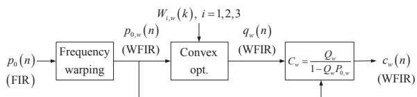
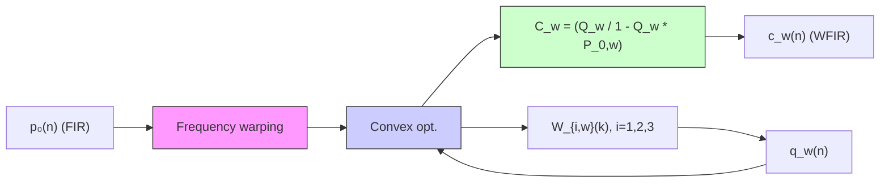
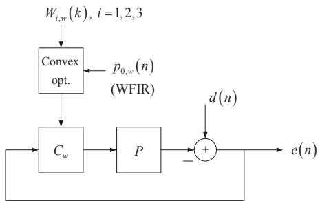
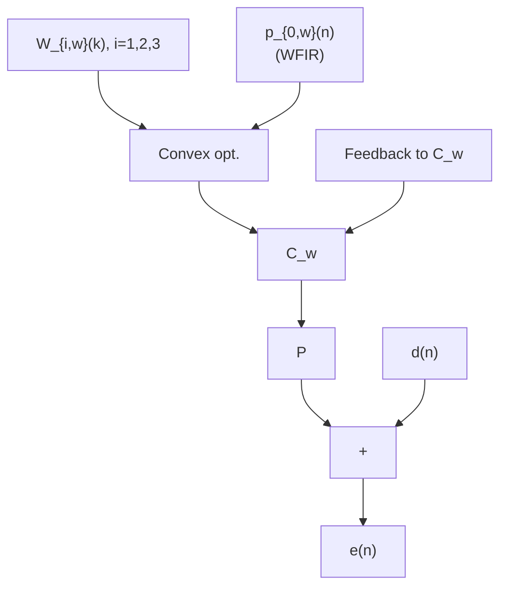
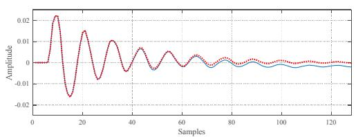
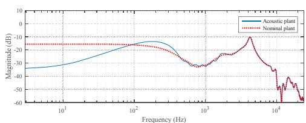
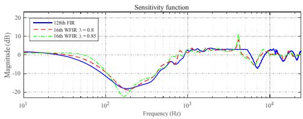
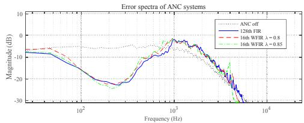
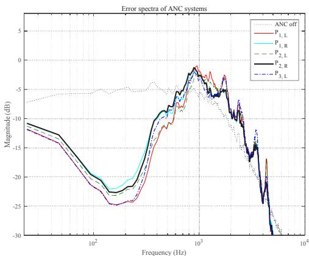
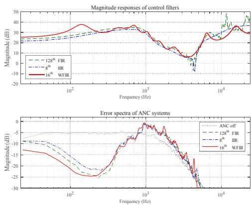

# Design of Feedback Active Noise Control System Based on a Constrained Optimization for Headphone/Earphone Applications

Ji-ho Seo $^{1}$ , Young-cheol Park $^{2}$ , and Dae Hee Youn $^{1}$

$^{1}$ Department of Electrical and Electronic Engineering, Yonsei University, Seoul, Korea $^{2}$ Computer & Telecommunication Engineering Division, Yonsei University, Wonju, Korea  
qwinyjh@dsp.yonsei.ac.kr

# Abstract

This paper presents an efficient method of designing the feedback active noise control (ANC) filter based on a constrained optimization. The designed filter minimizes the variance of the error signal for a given nominal plant, while satisfying multiple constraints. By applying the frequency-warping technique, the designed low-order filter achieves similar performance to the conventional high-order filters and shows robust stability. Experimental results verify the efficiency of the proposed method.

Keywords: Active noise control, constrained optimization, frequency warping

# 1. Introduction

Active noise control (ANC) is a method of attenuating undesired noise signals by generating and adding anti-noise signals. Headphones/earphones, hearing aids, cars and airplanes are typical applications of the ANC technique. For headphones/earphones applications, feedback control methods have been widely used to control the environmental noise. Feedback ANC systems utilize an error microphone and an active speaker inside earcup to minimize the level of error signal. By applying the feedback control theory, we can obtain optimal noise control filters that can minimize the closed-loop transfer function called sensitivity function written as

$$
S = \frac {1}{1 + C P} \tag {1}
$$

where C is noise control filter, P is actual acoustic plant and S is the sensitivity function. ANC systems for high-quality headphones/earphones applications often adopt high sampling rates. Thus, when the feedback ANC system is implemented using an FIR form, relatively high-order filters are required to

flowchart

Fig. 1. Block diagram of the proposed ANC filter design algorithm

achieve reasonable noise attenuation, especially at low frequencies less than 1kHz. It is essential to have a low-order control filter in application of ANC for the high-quality headphones/earphones. To reduce the order of the control filter, low order IIR approximation schemes such as Prony's method or Balanced Model Truncation [1] can be used. However, there can be a performance degradation caused by inaccurate modeling of the original FIR control filter.

In this paper, we propose an efficient method of designing low-order control filter for feedback ANC. By virtue of the frequency warping, the proposed ANC system achieves high performance with low-order filters, and thus it is suitable for low-power ANC headphones/earphones.

# 2. Proposed ANC filter design method

The proposed ANC filter design algorithm is depicted in Fig. 1. To obtain optimal noise control filter, the convex optimization method is utilized. The method formulates the optimization problem using Q-parameterization and frequency discretization, and finds the optimal solution of the problem by sequential quadratic programming [2]. The method minimizes the variance of the error signal for a given nominal plant $p_0(n)$ , under the constraints corresponding to plant uncertainty and disturbance enhancement. In addition, the proposed algorithm utilizes the frequency warping technique. Frequency warping can increase or decrease frequency resolution by replacing unit delay elements by all-pass elements written as

$$
\tilde {z} ^ {- 1} = \frac {z ^ {- 1} - \lambda}{1 - \lambda z ^ {- 1}} \tag {2}
$$

where $\lambda$ is warping parameter [3]. The bigger the parameter, the better low-frequency resolution.

By using the frequency warping, FIR filter in the linear frequency domain is now transformed into warped FIR (WFIR) filter in warped frequency domain written as

$$
\sum_ {n = 0} ^ {\infty} l (n) \left(\frac {\tilde {z} ^ {- 1} + \lambda}{1 + \lambda \tilde {z} ^ {- 1}}\right) ^ {- n} = \sum_ {k = 0} ^ {\infty} w (k) \tilde {z} ^ {- k} \tag {3}
$$

where $l(n)$ is FIR filter in linear frequency domain and $w(k)$ is WFIR filter in warped frequency domain. $w(k)$ has to be truncated to proper length because it is not possible to use infinite-length filter. As a result, the nominal plant is also warped and truncated to be utilized to design the control filter in warped frequency domain for the ANC system. The transfer function of the truncated WFIR filter is written as

$$
W _ {t r u n c.} (z) = \sum_ {n = 0} ^ {W} w (n) [ D (z) ] ^ {n} \tag {4}
$$

where $D(z)$ is all-pass element and W is final order of the WFIR filter. Power of late part of the filter is very low so that truncating hardly affects the system. The entire cost function for the convex optimization based on frequency warping can be formulated as

$$
\min \frac {1}{L} \sum_ {k = 0} ^ {L - 1} \left| \left(1 - Q _ {w} (k) P _ {0, w} (k)\right) W _ {1, w} (k) \right| ^ {2}
$$

s.t. $\left|Q_w(k)P_{0,w}(k)W_{2,w}(k)\right| < 1,$ (5)

$$
\left| \left(1 - Q _ {w} (k) P _ {0, w} (k)\right) W _ {3, w} (k) \right| <   1,
$$

where $k = 0,\dots ,L - 1$

where L is the FFT size, k is the frequency bin index for frequency discretization, $Q_{w}(k)$ is WFIR control filter obtained from solving the cost function iteratively and $W_{i,w}(k), i=1,2,3$ are the weighting functions for each constraint equation in warped frequency domain. $W_{1,w}(k)$ confines the band of control and takes a form of band-pass filter. If we set $W_{1,w}(k)$ a low-pass filter with a cutoff frequency of 1kHz and then the control filter minimizes the sensitivity function concentrating especially at low

flowchart

Fig. 2. Block diagram of the proposed ANC system

frequencies under 1kHz. $W_{2,w}(k)$ is to maintain the closed-loop stability for the plant perturbation. If a user moves his/her head, there may occur a performance degradation due to the change of frequency response of the plant because the control filter is obtained from a fixed nominal plant. In addition, it is also essential for the ANC system to consider the stability issue to ensure robust noise attenuation performance for several headphone/earphone users. Thus, we assume multiplicative uncertainty model [2] and it is written as

$$
p = p _ {0} (1 + \Delta) \tag {6}
$$

where p is actual plant, $p_{0}$ is nominal plant modeled from the actual plant and $\Delta$ is perturbation. It is possible to get stability as we set threshold of perturbation. Because frequency responses of plants of the users vary more randomly at high frequency, it is usually modeled as high-pass filter. The last constraint equation including $W_{3,w}(k)$ means setting upper limit of the magnitude of the sensitivity function, that is, setting noise boosting threshold. If we set the threshold value high, we can get excellent noise boosting performance but it is unavoidable to have poor attenuation performance because there must be a trade-off between noise attenuation at the controlled frequency band and undesired noise boosting at the other frequency band called waterbed effect [4]. Setting the proper noise boosting threshold is essentially required. The three weighting functions are all modeled in linear frequency domain as a form of FIR filter, and then these are transformed into WFIR filters in warped frequency domain for designing the final control filter which is also obtained in the warped frequency domain.

The proposed algorithm requires a warped nominal plant $p_{0,\mathrm{w}}(n)$ to design the control filter. By solving the constrained optimization problem in (5), the optimal Q-parameter $q_{w}(n)$ is obtained, and then the final feedback control filter is obtained as

line

| Samples | Amplitude (Red Line) | Amplitude (Blue Line) |
| ------- | -------------------- | --------------------- |
| 0       | 0.0000               | 0.0000                |
| 10      | 0.0200               | 0.0000                |
| 20      | -0.0150              | 0.0000                |
| 30      | 0.0150               | 0.0000                |
| 40      | -0.0050              | 0.0000                |
| 50      | 0.0050               | 0.0000                |
| 60      | -0.0050              | 0.0000                |
| 70      | 0.0050               | 0.0000                |
| 80      | -0.0050              | 0.0000                |
| 90      | 0.0050               | 0.0000                |
| 100     | -0.0050              | 0.0000                |
| 110     | 0.0050               | 0.0000                |
| 120     | -0.0050              | 0.0000                |

line

| Frequency (Hz) | Acoustic plant | Nominal plant |
| -------------- | -------------- | ------------- |
| 10^1           | ~30            | 20            |
| 10^2           | ~20            | 20            |
| 10^3           | ~-30           | ~-30          |
| 10^4           | ~-60           | ~-60          |

Fig. 3. Waveforms and magnitude responses of actual plant (blue solid) and nominal plant (red dotted)

$$
C _ {w} = \frac {Q _ {w}}{1 - Q _ {w} P _ {0 , w}} \tag {7}
$$

where $C_{w}$ is the final control filter in warped frequency domain. Though additional all-pass devices are required for implementing the real ANC system, it is still efficient because of their low computational complexity. As shown in Fig. 2, the proposed ANC system attenuates the environmental noise $d(n)$ using $C_{w}$ in warped frequency domain and the microphone output (error) signal $e(n)$ contains music signal including attenuated noise if the control filter is fully optimized.

# 3. Performance evaluations

Several experiments are performed for verifying the efficiency of the proposed ANC system. Parameters were set as follows. A sampling frequency of 48kHz was used. Actual plant p is real acoustic secondary path measured with BOSE ANC headphone and filter order is 128. Nominal plant $p_{0}(n)$ is obtained by ARMA modeling with 15 AR and 15 MA coefficients of the actual plant p. Waveforms and magnitude responses of the actual plant and the nominal plant is shown in Fig. 3. For weighting functions, $W_{1}$ was modeled as a Butterworth low-pass filter with a cutoff frequency of 400Hz. It helps the cost function to focus on designing the control filter especially at frequencies under 400Hz. $W_{2}$ was modeled as a Butterworth high-pass filter with a cutoff frequency of 4kHz. $W_{3}$ was set to 0.7071 which corresponds to the maximum 3dB boosting. For performance comparison, orders of the FIR and

line

| Frequency (Hz) | 128th FIR | 16th WFR λ = 0.8 | 16th WFR λ = 0.85 |
| -------------- | --------- | ---------------- | ----------------- |
| 10^1           | ~0        | ~0               | ~0                |
| 10^2           | ~-20      | ~-20             | ~-20              |
| 10^3           | ~0        | ~0               | ~0                |
| 10^4           | ~0        | ~0               | ~0                |

line

| Frequency (Hz) | ANC off | 128th FIR | 16th WFR λ = 0.8 | 16th WFR λ = 0.85 |
| -------------- | ------- | --------- | ---------------- | ----------------- |
| 10^2           | -10     | -10       | -10              | -10               |
| 10^3           | 0       | 0         | 0                | 0                 |
| 10^4           | -30     | -30       | -30              | -30               |

Fig. 4. Sensitivity function (upper panel) and error spectra (lower panel) obtained using the conventional (blue solid) and proposed (red dashed, green dash-dot) ANC systems

WFIR filters were set to 128 and 16 respectively. FFT size L was set to 512. For confirming function of warping parameter, $\lambda$ s were set to 0.8 and 0.85 respectively. Magnitude response of the sensitivity function and error spectra obtained using low-pass filtered white noise were observed. Results are shown in Fig. 4. It can be seen that the proposed ANC system of an order of 16 achieves about maximum 19dB attenuation and maximum 3dB boosting. It is nearly the same attenuation as the conventional ANC system of an order of 128 at low frequencies less than 1kHz. Besides, maximum attenuation can be further increased by tuning warping parameter from the property of controlling low-frequency resolution. Because larger $\lambda$ helps modeling the actual acoustic path accurately at low frequency band, the WFIR control filter can intensively attenuate the noise at the band. As mentioned before, the larger the warping parameter, the better maximum noise attenuation performance but the level of maximum noise boosting is also increased so that the warping value has to be set properly considering the trade-off between the noise attenuation and boosting.

For verifying the robustness of the proposed ANC system for different acoustic paths, error spectra of the system obtained using different plants were also observed. As shown in Fig. 5, attenuation and boosting performance vary depending on the acoustic plants. However, due to the little difference in performance of about 1 to 3dB, it can be said that the proposed ANC system has robust performance generally.

Result of comparing attenuation performance of proposed low-order WFIR filter and low-order IIR filter mentioned in chapter 1 briefly was also observed. All parameters were set to be the same and only the filter order of low-order IIR filter obtained using IIR approximation scheme was additionally considered, it was set to 8. For fair comparison, we utilized frequency warping method to IIR approximation for more accurate modeling of original FIR control filter because BMT method itself cannot approximate frequency response of the control filter accurately at low frequencies under high sampling rate environment. As shown in Fig. 6, the proposed low order WFIR filter has nearly same noise attenuation as high order FIR filter and has even better attenuation at low frequencies under 200Hz. In addition, it has better attenuation than low-order IIR filter though the warping technique is additionally utilized for accurate modeling of the original FIR filter.

line

| Frequency (Hz) | ANC off | P₁,L | P₁,R | P₂,L | P₂,R | P₃,L |
| -------------- | ------- | ---- | ---- | ---- | ---- | ---- |
| 10^1           | -5      | -10  | -12  | -14  | -16  | -18  |
| 10^2           | -7      | -15  | -18  | -20  | -22  | -24  |
| 10^3           | -5      | -5   | -3   | -2   | -1   | -2   |
| 10^4           | -30     | -30  | -30  | -30  | -30  | -30  |

Fig. 5. Error spectra of the proposed ANC system obtained from different acoustic plants

line

| Frequency (Hz) | Magnitude responses of control filters (128th FIR) | Magnitude responses of control filters (8th IRR) | Magnitude responses of control filters (16th WFR) | Error spectra of ANC systems (ANC off) | Error spectra of ANC systems (128th FIR) | Error spectra of ANC systems (8th IRR) | Error spectra of ANC systems (16th WFR) |
| -------------- | ----------------------------------------------- | --------------------------------------------- | ---------------------------------------------- | -------------------------------------- | --------------------------------------- | ------------------------------------- | --------------------------------------- |
| 10^2           | ~25                                             | ~25                                           | ~25                                            | ~-5                                    | ~-10                                    | ~-10                                  | ~-10                                    |
| 10^3           | ~35                                             | ~35                                           | ~35                                            | ~-10                                   | ~-5                                     | ~-5                                   | ~-5                                     |
| 10^4           | ~40                                             | ~40                                           | ~40                                            | ~-30                                   | ~-20                                    | ~-20                                  | ~-20                                    |

Fig. 6. Magnitude responses (upper panel) and error spectra of the ANC systems (lower panel) obtained from conventional high order FIR (green dashed), low-order IIR (blue dash-dot) and proposed low-order WFIR (red solid) filter

# 4. Conclusion

In this paper, a new ANC filter design algorithm is presented. The proposed ANC filter was designed in warped frequency domain to improve the limitations of conventional high order FIR filter in linear frequency domain in terms of computational complexity and suitability for real-time processing in low-power ANC headphone/earphone. Experimental results showed that the proposed ANC system has nearly the same attenuation performance with just a low-order filter and better maximum attenuation by controlling the warping parameters while having robust stability corresponding to different plants.

# Acknowledgement

This work is supported by the K-BrainPower Technology Development Program (10053203), funded by the Ministry of Trade, Industry and Energy (MOTIE).

# References

[1] Ahfir, Maamar, Izzet Kale, and Daoud Berkani. "An Alternative Approach to the Balanced Model Truncation Algorithm for Acoustic Minimum-Phase Inverse Filters Order Reduction." ISRN Signal Processing 2011 (2011).   
[2] Rafaely, Boaz, and Stephen J. Elliott. "H 2/H∞ active control of sound in a headrest: design and implementation." IEEE Transactions on control systems technology 7.1 (1999): 79-84.   
[3] Aki H“arm”a, Matti Karjalainen, Lauri Savioja, Vesa V“alim”aki, Unto K. Laine, and Jyri Huopaniemi, “Frequency-Warped Signal Processing for Audio Applications,” J. Audio Eng. Soc., Vol. 48, No. 11, Nov. 2000.   
[4] B. Rafaely, “Active noise reducing headset-an overview,” Proceedings of the Internoise 2001 Conference, August 2001, The Hague, Holland, pp.589-598 (2001).
