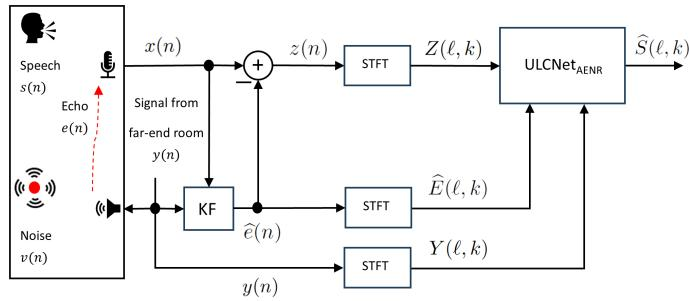
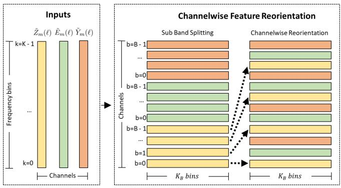

# A HYBRID APPROACH FOR LOW-COMPLEXITYJOINT ACOUSTIC ECHO AND NOISE REDUCTION

Shrishti Saha Shetu, Naveen Kumar Desiraju, Miguel Martinez, Emanuel A. P. Habets, Edwin Mabande¨

Fraunhofer IIS, Am Wolfsmantel 33, 91058 Erlangen, Germany

{shrishti.saha.shetu, naveen.kumar.desiraju, miguel.martinez, emanuel.habets, edwin.mabande}@iis.fraunhofer.de

## ABSTRACT

Deep learning-based methods that jointly perform the task of acoustic echo and noise reduction (AENR) often require high memory and computational resources, making them unsuitable for real-time deployment on low-resource platforms such as embedded devices. We propose a low-complexity hybrid approach for joint AENR by employing a single model to suppress both residual echo and noise components. Specifically, we integrate the state-of-the-art (SOTA) ULCNet model, which was originally proposed to achieve ultra-low complexity noise suppression, in a hybrid system and train it for joint AENR. We show that the proposed approach achieves better echo reduction and comparable noise reduction performance with much lower computational complexity and memory requirements than all considered SOTA methods, at the cost of slight degradation in speech quality.

Index Terms— acoustic echo reduction, noise reduction, DNN, low complexity, ULCNet

## 1. INTRODUCTION

Acoustic echo and noise reduction (AENR) is a highly desirable technology in communication devices, which aims to produce an estimate of the near-end speech signal by suppressing the undesired echo and background noise components captured by the microphone. In recent years, there has been a considerable increase in the use of deep neural network (DNN)-based approaches to achieve better acoustic echo reduction (AER) and AENR performance, either using hybrid approaches in combination with an adaptive filter [1–6] or using end-to-end approaches [7–11]. However, most of the state-of-the-art (SOTA) approaches have high memory and computational complexity requirements, making them unsuitable for deployment on resource-constrained platforms such as embedded devices. The main motivation for this study is to develop a high-quality solution for joint AENR with low computational complexity and memory requirements such that it can be integrated into embedded devices for real-time applications.

A number of hybrid and end-to-end approaches have been proposed in the literature for AER and joint AENR. In Peng et al. [1], a hybrid approach was used for AER, where the error signal obtained at the output of an adaptive filter and the farend signal were fed as inputs to a DNN post-filter. In Zhang et al. [2], a similar approach was also followed for the task of AER. In [3], only the error signal, as well as the echo estimate, were fed as inputs to a DNN post-filter as part of a hybrid approach for AENR. In [7], a two-stage DNN model was used as part of an end-to-end approach for AENR by splitting the tasks of AER and noise reduction (NR). In the first stage, a DNN was fed with the microphone and time-aligned far-end signals as input for performing the task of AER, while in the second stage, a second DNN was fed with the error signal as well as the echo estimate to perform the task of NR. Both DNNs were trained by minimizing the same cost function. In the Align-CRUSE method [8], an end-to-end approach was used for AER, where a small DNN was first used to timealign the far-end signal with the microphone signal, and then both these signals were fed into the main DNN to yield a magnitude mask for the desired near-end speech signal. In their follow-up work, i.e., the Deep-VQE method [9], the authors used a similar end-to-end approach, with an improved timealignment method for joint AENR and dereverberation tasks.

In recent years, numerous low complexity methods have been proposed for the NR task, which achieved SOTA performance in terms of NR and speech quality [12–16]. However, it has not been investigated comprehensively if the same architectures can be used for AER and AENR tasks. So, in this paper, we propose to leverage the ULCNet model [12], which showed good NR performance at ultra-low complexity, for the task of AENR by making appropriate modifications to the model. In particular, we propose a hybrid system combining a diagonalized partioned-block-frequency-domain-adaptive-Kalman-filter, as detailed in [17] and hereafter referred to as KF, with a DNN post-filter based on the ULCNet model. The modified ULCNet model takes three inputs, namely the far-end signal, the error signal, and the echo estimate. Our motivation for using a hybrid approach is that using the KF as a pre-processor for AER lightens the overall load for the DNN post-filter, enabling us to achieve good AENR performance with an ultra-low complexity model. We demonstrate that the ULCNet model can be successfully modified to perform the joint AENR and delivers better performance than having dedicated AER and NR models in series at almost half the computational cost.

  
Fig. 1. Flow-diagram of proposed method

This paper is structured as follows. In Section 2, we explain the proposed processing method, including the modifications w.r.t. the original model in [12] to achieve joint AENR. Subsequently, we present the experiments, results, and discussions in Section 3, followed by the conclusions in Section 4.

## 2. SIGNAL MODEL AND PROPOSED METHOD

Fig. 1 shows a typical communication scenario where the farend signal y is played through the loudspeaker, and the microphone captures the acoustic echo e, the (desired) near-end speech s, and the background noise v. The microphone signal can thus be written as:

$$
x (n) = s (n) + e (n) + v (n),\tag{1}
$$

where n denotes the discrete-time sample index.

In order to suppress the echo and noise components, we propose a hybrid system consisting of two processing stages. In the first processing stage, a KF [17] generates an estimate for the echo signal, which is subtracted from the microphone signal to obtain the error signal:

$$
\begin{array}{l} z (n) = x (n) - \widehat {e} (n) \\ \qquad = s (n) + \Big \{e (n) - \widehat {e} (n) \Big \} + v (n) \\ \qquad = s (n) + r (n) + v (n), \end{array}\tag{2}
$$

where $z , { \widehat { e } } ,$ and r denote the error signal, the echo estimate, and the residual echo signal, respectively. The residual echo is assumed to be composed of early residual echo due to filter misalignment, late residual echo due to reverberation, and non-linear echo components [18].

In the second processing stage, the residual echo and noise components are jointly suppressed in the short-time Fourier transform (STFT) domain using a DNN post-filter. The signals $z ( n ) , \widehat { e } ( n )$ and $y ( n )$ are transformed into the STFT domain using a fast Fourier transform (FFT) of order $N _ { \mathrm { F F T } }$ , with their STFT counterparts denoted as $Z ( \ell , k )$

  
Fig. 2. Modified channel-wise feature reorientation

${ \widehat E } ( \ell , k )$ and Y (ℓ, k), respectively. Here, ℓ denotes the frame index, k denotes the frequency bin index, and $\begin{array} { r } { K = \frac { N _ { \mathrm { F F T } } } { 2 } + 1 } \end{array}$ the total number of frequency bins. As mentioned earlier, the proposed DNN post-filter is based on the ULCNet model from [12], with three significant modifications to make it suitable for the joint AENR task:

1. The proposed DNN post-filter takes three input signals, namely: $\{ Z , \widehat { E } , Y \}$ (instead of a single input signal {X} in [12]). The power-law compression method with a compression factor of α (as explained in Section 2.1 in [12]) is applied on all three inputs to obtain their respective compressed magnitudes $\{ \widetilde { Z } _ { \mathrm { m } } , \widetilde { E } _ { \mathrm { m } } , \widetilde { Y } _ { \mathrm { m } } \}$ . The left side of Fig. 2 shows the compressed magnitudes for frame ℓ.

2. We propose a modified channel-wise feature reorientation and stacking method for our multiple compressed magnitude inputs, as shown in Fig. 2. Firstly, in each frame, we split the compressed magnitude features of each input into B sub-bands of length $K _ { B }$ frequency bins each, with an overlap factor between the sub-bands of $0 ~ \leq ~ \beta ~ < ~ 1$ . Secondly, we interleave the resulting sub-bands of the three inputs as follows: $[ \widetilde { Z } _ { \mathrm { m } , 0 } , \widetilde { E } _ { \mathrm { m } , 0 } , \widetilde { Y } _ { \mathrm { m } , 0 } \dots \widetilde { Z } _ { \mathrm { m } , B - 1 } , \widetilde { E } _ { \mathrm { m } , B - 1 } , \widetilde { Y } _ { \mathrm { m } , B - 1 } ]$ ], where $\widetilde { Z } _ { \mathrm { m } , b }$ denotes the $b ^ { \mathrm { t h } }$ sub-band obtained after splitting $\widetilde { Z } _ { \mathrm { m } }$ . The interleaved features are then stacked together, as shown on the right side of Fig. 2.

3. The Intermediate Feature Computation block of ULC-Net [12] now takes the phase component of the error signal $\widetilde { Z } _ { \mathrm { p } }$ as input (instead of the phase of the microphone signal $\widetilde { X } _ { \mathfrak { p } } )$ . The compressed near-end speech estimate $\widetilde { S }$ is then computed using the complex ratio mask-based multiplication method shown in [22], as follows:

$$
\widetilde {S} (\ell , k) = \widetilde {Z} _ {\mathrm{m}} (\ell , k) \cdot M _ {\mathrm{m}} (\ell , k) \cdot e ^ {(\widetilde {Z} _ {\mathrm{p}} (\ell , k) + M _ {\mathrm{p}} (\ell , k))},\tag{3}
$$

where $M _ { \mathrm { m } }$ and $M _ { \mathrm { p } }$ represent the magnitude and phase components of the complex-valued mask M computed by ULCNet, respectively. Finally, we obtain the nearend speech estimate $\widehat { S }$ by performing power-law decompression on the compressed near-end speech estimate S, as described in Section 2.2 in [12].

<table><tr><td rowspan="3">Processing</td><td colspan="2">Computational Complexity</td><td colspan="4">Interspeech 2021 [19]</td><td colspan="4">ICASSP 2023 [20]</td></tr><tr><td rowspan="2">Params [M]</td><td rowspan="2">GMACs</td><td colspan="2">DT</td><td>FST</td><td>NST</td><td colspan="2">DT</td><td>FST</td><td>NST</td></tr><tr><td>EMOS</td><td>DMOS</td><td>EMOS</td><td>DMOS</td><td>EMOS</td><td>DMOS</td><td>EMOS</td><td>DMOS</td></tr><tr><td>Peng et al. [1]</td><td>10.20</td><td>2.52</td><td>4.36</td><td>4.23</td><td>4.34</td><td>4.26</td><td>-</td><td>-</td><td>-</td><td>-</td></tr><tr><td>Zhang et. al. [2]</td><td>9.56</td><td>-</td><td>-</td><td>-</td><td>-</td><td>-</td><td>4.72</td><td>4.16</td><td>4.70</td><td>3.91</td></tr><tr><td>Mack et al. [3]</td><td>2.73</td><td>2.74</td><td>4.56</td><td>4.09</td><td>4.81</td><td>4.13</td><td>-</td><td>-</td><td>-</td><td>-</td></tr><tr><td>Braun et al. [7]</td><td>-</td><td>-</td><td>4.55</td><td>4.25</td><td>4.35</td><td>4.18</td><td>-</td><td>-</td><td>-</td><td>-</td></tr><tr><td>Align-CRUSE [8]</td><td>0.74</td><td>-</td><td>4.45</td><td>4.07</td><td>4.67</td><td>-</td><td>4.60</td><td>3.95</td><td>4.56</td><td>-</td></tr><tr><td>Deep-VQE [9]</td><td>7.50</td><td>4.02</td><td>-</td><td>-</td><td>-</td><td>-</td><td>4.70</td><td>4.29</td><td>4.69</td><td>4.41</td></tr><tr><td>KF</td><td>-</td><td>-</td><td>3.02</td><td>3.77</td><td>3.02</td><td>4.16</td><td>2.75</td><td>3.51</td><td>3.38</td><td>4.07</td></tr><tr><td> $\text{ULCNet}_{\text{AER}}$ </td><td>0.69</td><td>0.10</td><td>4.40</td><td>3.82</td><td>4.39</td><td>4.17</td><td>4.31</td><td>3.31</td><td>4.65</td><td>4.06</td></tr><tr><td> $\text{ULCNet}_{\text{AER}} + \text{ULCNet}_{\text{Freq}}$ </td><td>1.38</td><td>0.20</td><td>4.53</td><td>3.80</td><td>4.46</td><td>4.35</td><td>4.49</td><td>3.37</td><td>4.72</td><td>4.28</td></tr><tr><td>Proposed  $\text{ULCNet}_{\text{AENR}}$ </td><td>0.69</td><td>0.10</td><td>4.61</td><td>3.79</td><td>4.64</td><td>4.28</td><td>4.54</td><td>3.58</td><td>4.73</td><td>4.15</td></tr></table>

Table 1. AECMOS [21] results on AEC Challenge blind test sets

## 3. EXPERIMENTS AND RESULTS

## 3.1. Experimental Design

Training Dataset: We trained our proposed DNN post-filter for the task of AER-only as well as joint AENR. To create the training dataset for the task of AER, we used the synthetic and measured echo and far-end files provided in [20]. We manually curated the measured echo files and excluded files with uncharacteristically long echo delays (above 1.5s), as well as mismatched echo and far-end files. As the near-end signal, we used the clean and noisy speech signals provided in [20, 23]. To simulate the microphone signal and near-end training target, we mixed the signals as described in [1], with a signal-to-echo ratio (SER) in the range [-20, 20] dB.

To create the training dataset for the joint AENR task, we used the clean speech and noise signals from the Interspeech 2020 DNS Challenge dataset [23]. We first created the noisy mixtures with a signal-to-noise ratio (SNR) in the range [−5, 30] dB, as described in [12]. Then we simulated different scenarios for the microphone signal (e.g., near-end single-talk (NST), far-end single-talk (FST), and double-talk (DT)) following the methods proposed in [3], with an SER in the range [−20, 20] dB.

In total, we generated 1100 hours of training data each for both the AER and AENR tasks. All training samples were generated for a sampling frequency of 16 kHz.

Experimental Parameters: For implementing the KF [17], we derived the observation-noise power-spectral-density (PSD) matrix by recursively averaging the power of the error signal $Z .$ The process-noise PSD matrix was estimated following the methods outlined in [17, 24]. The Kalman gain used for the recursive averaging was set to 0.8. During training and inference, we always used 10 partitions.

As mentioned in Section 2, we used the ULCNet model with the exact same model configurations as defined in [12] for both the AER and AENR tasks. As mentioned previously, we trained the ULCNet model always in combination with the KF and used the frequency domain mean-squared-error (MSE) loss function defined in [12]. From hereon, we denote the ULCNet model trained for the single-stage joint AENR task as $\mathrm { U L C N e t } _ { \mathrm { A E N R } }$ , and the model trained for only the AER task as $\mathrm { U L C N e t } _ { \mathrm { A E R } }$ . We use the pre-trained $\mathrm { U L C N e t } _ { \mathrm { F r e q } }$ model from [12] as a baseline for the NR task and also to post-process the output of $\mathrm { U L C N e t } _ { \mathrm { A E R } }$ , such that it can be compared with the output of $\mathrm { U L C N e t } _ { \mathrm { A E N R } }$

To train both the $\mathrm { U L C N e t } _ { \mathrm { A E R } }$ and $\mathrm { U L C N e t } _ { \mathrm { A E N R } }$ models, we used the Adam optimizer with an initial learning rate of 0.004, which decayed by a factor of 10 when the validation loss did not improve with a patience of one epoch. Each training sample was of 3s duration, a batch size of 64 was chosen, and each model was trained for 20k steps per epoch. We chose $N _ { \mathrm { F F T } } = 5 1 2$ , such that $K \ : = \ : 2 5 7 .$ , and a powerlaw compression factor $\alpha = 0 . 3$ . For channel-wise feature reorientation, we used $K _ { B } \ = \ 4 8$ with an overlap factor of $\beta = 0 . 3 3 ,$ , such that $B = 8 .$

Evaluation Dataset and Metrics: For both the AER and AENR tasks, we use the blind test sets from the Interspeech 2021 [19] and ICASSP 2023 [20] AEC Challenges for evaluation, which contain real-world recordings in diverse scenarios. To evaluate the AER performance of our proposed method in different scenarios and to compare it with SOTA methods, we use the AECMOS metrics [21], which are composed of the DMOS and EMOS metrics, which measure the speech quality of the near-end speech estimate and the echo reduction performance, respectively. Additionally, to evaluate the NR performance, we compute the PESQ [25], SI-SDR [26], BAKMOS and SIGMOS metrics [27] on the DNS challenge 2020 synthetic non-reverb test set [23].

<table><tr><td rowspan="2">Processing</td><td colspan="2">Computational Complexity</td><td colspan="4">DNS Challenge 2020 [23]</td></tr><tr><td>Params [M]</td><td>GMACS</td><td>PESQ</td><td>SI-SDR</td><td>SIGMOS</td><td>BAKMOS</td></tr><tr><td>Noisy</td><td>-</td><td>-</td><td>1.58</td><td>9.06</td><td>3.39</td><td>2.62</td></tr><tr><td>DeepFilterNet [13]</td><td>1.78</td><td>0.35</td><td>2.50</td><td>16.17</td><td>3.49</td><td>4.03</td></tr><tr><td>DeepFilterNet2 [14]</td><td>2.31</td><td>0.36</td><td>2.65</td><td>16.60</td><td>3.51</td><td>4.12</td></tr><tr><td> $\text{ULCNet}_{\text{MS}}$  [12]</td><td>0.68</td><td>0.09</td><td>2.64</td><td>16.34</td><td>3.46</td><td>4.06</td></tr><tr><td> $\text{ULCNet}_{\text{Freq}}$  [12]</td><td>0.68</td><td>0.09</td><td>2.24</td><td>16.67</td><td>3.38</td><td>4.09</td></tr><tr><td> $\text{ULCNet}_{\text{AER}} + \text{ULCNet}_{\text{Freq}}$ </td><td>1.38</td><td>0.20</td><td>2.23</td><td>16.56</td><td>3.344</td><td>4.08</td></tr><tr><td>Proposed  $\text{ULCNet}_{\text{AENR}}$ </td><td>0.69</td><td>0.10</td><td>2.11</td><td>15.58</td><td>3.302</td><td>4.05</td></tr></table>

Table 2. DNSMOS results on DNS Challenge 2020 [23] synthetic non-reverb test set

## 3.2. Results and Discussion

AER Performance: We evaluate our proposed $\mathrm { U L C N e t } _ { \mathrm { A E N R } }$ method against six existing SOTA methods from literature, namely Peng et al. [1], Zhang et al. [2], Mack et al. [3], Braun et al. [7], Align-CRUSE [8] and Deep-VQE [9], as well as the KF output, the AER-only $\mathrm { U L C N e t } _ { \mathrm { A E R } }$ method and the two-stage $\mathrm { U L C N e t } _ { \mathrm { A E R } } + \mathrm { U L C N e t } _ { \mathrm { F r e q } }$ approach. We can observe from the results presented in Table 1 that the proposed $\mathrm { U L C N e t } _ { \mathrm { A E N R } }$ method outperforms all other methods in terms of EMOS for the DT scenarios for the Interspeech 2021 test set and EMOS for the FST scenarios for the ICASSP 2023 test set. For both the DT and FST scenarios for either test set, all of our ULCNet-based approaches achieve comparable performance to SOTA methods in terms of the EMOS metrics, with $\mathrm { U L C N e t } _ { \mathrm { A E N R } }$ performing best. For the NST scenarios for either test sets, the proposed ULCNetAENR method achieves comparable performance to SOTA methods in terms of the DMOS metrics, while the two-stage approach achieves better performance albeit at double the computational cost. However, all of our ULCNet-based approaches perform poorly as compared to SOTA methods in terms of the DMOS metrics for the DT scenarios. Please note that the proposed $\mathrm { U L C N e t } _ { \mathrm { A E N R } }$ model is much smaller in size (up to 10x smaller) and computationally much cheaper (up to 4x cheaper) as compared to SOTA methods.

NR Performance: To evaluate our proposed method for the NR task, we compare with four different low-complexity SOTA methods, namely DeepFilterNet [13], DeepFilter-Net2 [14], $\mathrm { U L C N e t _ { M S } }$ and $\mathrm { U L C N e t } _ { \mathrm { F r e q } }$ [12]. We can observe from the results presented in Table 2 that the Deep-FilterNet2 model outperforms all other methods while being the most computationally intensive. Our two-stage approach $\mathrm { U L C N e t } _ { \mathrm { A E R } } + \mathrm { U L C N e t } _ { \mathrm { F r e q } }$ performs similarly to U $\mathrm { \_ C N e t _ { F r e q } } ,$ which was shown in [12] to achieve perceptually similar performance as DeepFilterNet2. We also observed similar perceptual quality in our informal listening tests for the two-stage approach. The UL $\mathrm { \cal C N e t _ { A E N R } }$ model lags behind in all the objective metrics. However, this model was trained on a different training dataset as compared to the $\mathrm { U L C N e t } _ { \mathrm { F r e q } }$ model, as it is designed for the joint AENR task. In informal listening tests, we found the perceptual quality of the joint AENR model to be comparable to the other methods. The processed samples can be found here: https://fhgainr.github.io/fhgaenr/.

Discussion: Our proposed UL $\mathrm { \cal C N e t _ { A E N R } }$ method, despite being computationally highly inexpensive, achieves comparable or better results as compared to SOTA approaches for the AER task across all scenarios and test sets, except for the DT scenarios in terms of the DMOS metric, which can be explained due to the aggressive nature of our method, combined with the effect of the modified power-law compression as discussed in [12]. One other important thing to note is that our proposed approach does not use any time-alignment method for the far-end signal, unlike most SOTA approaches [7–9], which has shown to improve performance significantly in DT scenarios [4]. We assume that combining a DNN-based timealignment method with our proposed approach will further improve its performance in DT scenarios. We also observe that while being trained for the two separate tasks of AER and NR jointly, our $\mathrm { U L C N e t } _ { \mathrm { A E N R } }$ method still achieves acceptable performance for the NR task. The low complexity of our proposed method makes it suitable for deployment on embedded devices, as it can run with a real-time factor of 13.1% on a Cortex-A53 1.43 GHz processor.

## 4. CONCLUSION

We proposed a low-complexity hybrid approach for joint AENR. Our proposed UL $\mathrm { \mathcal { L } N e t _ { A E N R } }$ model achieves objective results on par with SOTA approaches, for both the AER and NR tasks, requiring by far the lowest computational complexity and model size, which makes it suitable for deployment in resource-constrained consumer devices.

## 5. REFERENCES

[1] Renhua Peng, Linjuan Cheng, Chengshi Zheng, and Xiaodong Li, “Acoustic echo cancellation using deep complex neural network with nonlinear magnitude compression and phase information,” Interspeech, pp. 4768–4772, 2021.

[2] Zihan Zhang, Shimin Zhang, Mingshuai Liu, Yanhong Leng, Zhe Han, Li Chen, and Lei Xie, “Two-step band-split neural network approach for full-band residual echo suppression,” IEEE International Conference on Acoustics, Speech and Signal Processing (ICASSP), pp. 1–2, 2023.

[3] Wolfgang Mack and Emanuel AP Habets, “A hybrid acoustic echo¨ reduction approach using Kalman filtering and informed source extraction with improved training,” IEEE Spoken Language Technology Workshop (SLT), pp. 502–508, 2023.

[4] Jan Franzen and Tim Fingscheidt, “Deep residual echo suppression and noise reduction: A multi-input FCRN approach in a hybrid speech enhancement system,” IEEE International Conference on Acoustics Speech and Signal Processing (ICASSP), pp. 666–670, 2022.

[5] Mhd Modar Halimeh and Walter Kellermann, “Efficient multichannel nonlinear acoustic echo cancellation based on a cooperative strategy,” IEEE International Conference on Acoustics, Speech and Signal Processing (ICASSP), pp. 461–465, 2020.

[6] Jean-Marc Valin, Srikanth Tenneti, Karim Helwani, Umut Isik, and Arvindh Krishnaswamy, “Low-complexity, real-time joint neural echo control and speech enhancement based on percepnet,” IEEE International Conference on Acoustics, Speech and Signal Processing (ICASSP), pp. 7133–7137, 2021.

[7] Sebastian Braun and Maria Luis Valero, “Task splitting for DNNbased acoustic echo and noise removal,” International Workshop on Acoustic Signal Enhancement (IWAENC), pp. 1–5, 2022.

[8] Evgenii Indenbom, Nicolae-Cat˘ alin Ristea, Ando Saabas, Tanel˘ Parnamaa, and Jegor Gu ¨ zvin, “Deep model with built-in cross-ˇ attention alignment for acoustic echo cancellation,” arXiv preprint arXiv:2208.11308, 2022.

[9] Evgenii Indenbom, Nicolae-Catalin Ristea, Ando Saabas, Tanel Parnamaa, Jegor Guzvin, and Ross Cutler, “DeepVQE: Real time deep voice quality enhancement for joint acoustic echo cancellation, noise suppression and dereverberation,” Interspeech, pp. 3819–3823, 2023.

[10] Shimin Zhang, Ziteng Wang, Jiayao Sun, Yihui Fu, Biao Tian, Qiang Fu, and Lei Xie, “Multi-task deep residual echo suppression with echo-aware loss,” IEEE International Conference on Acoustics, Speech and Signal Processing (ICASSP), pp. 9127–9131, 2022.

[11] Nils L Westhausen and Bernd T Meyer, “Acoustic echo cancellation with the dual-signal transformation LSTM network,” IEEE International Conference on Acoustics, Speech and Signal Processing (ICASSP), pp. 7138–7142, 2021.

[12] Shrishti Saha Shetu, Soumitro Chakrabarty, Oliver Thiergart, and Edwin Mabande, “Ultra low complexity deep learning based noise suppression,” IEEE International Conference on Acoustics, Speech and Signal Processing (ICASSP), pp. 466–470, 2024.

[13] Hendrik Schroter, Alberto N Escalante-B, Tobias Rosenkranz, and Andreas Maier, “DeepFilterNet: A low complexity speech enhancement framework for full-band audio based on deep filtering,” IEEE International Conference on Acoustics, Speech and Signal Processing (ICASSP), pp. 7407–7411, 2022.

[14] Hendrik Schroter, A Maier, Alberto N Escalante-B, and Tobias¨ Rosenkranz, “DeepFilterNet2: Towards real-time speech enhancement on embedded devices for full-band audio,” International Workshop on Acoustic Signal Enhancement (IWAENC), pp. 1–5, 2022.

[15] Nils L Westhausen and Bernd T Meyer, “Dual-signal transformation LSTM network for real-time noise suppression,” IEEE International Conference on Acoustics, Speech and Signal Processing (ICASSP), 2020.

[16] Hyeong-Seok Choi, Sungjin Park, Jie Hwan Lee, Hoon Heo, Dongsuk Jeon, and Kyogu Lee, “Real-time denoising and dereverberation with tiny recurrent U-Net,” IEEE International Conference on Acoustics, Speech and Signal Processing (ICASSP), pp. 5789–5793, 2021.

[17] Fabian Kuech, Edwin Mabande, and Gerald Enzner, “State-space architecture of the partitioned-block-based acoustic echo controller,” IEEE International Conference on Acoustics, Speech and Signal Processing (ICASSP), pp. 1295–1299, 2014.

[18] Emanuel AP Habets, Sharon Gannot, Israel Cohen, and Piet CW Som-¨ men, “Joint dereverberation and residual echo suppression of speech signals in noisy environments,” IEEE Transactions on Audio, Speech and Language Processing, vol. 16, no. 8, pp. 1433–1451, 2008.

[19] Ross Cutler, Ando Saabas, Tanel Parnamaa, Markus Loide, Sten¨ Sootla, Marju Purin, Hannes Gamper, Sebastian Braun, Karsten Sørensen, Robert Aichner, et al., “Interspeech 2021 Acoustic Echo Cancellation Challenge,” Interspeech, pp. 4748–4752, 2021.

[20] Ross Cutler, Ando Saabas, Tanel Parnamaa, Marju Purin, Evgenii In-¨ denbom, Nicolae-Cat˘ alin Ristea, Jegor Gu˘ zvin, Hannes Gamper, Se-ˇ bastian Braun, and Robert Aichner, “ICASSP 2023 Acoustic Echo Cancellation Challenge,” IEEE Open Journal of Signal Processing, 2024.

[21] Marju Purin, Sten Sootla, Mateja Sponza, Ando Saabas, and Ross Cutler, “AECMOS: A speech quality assessment metric for echo impairment,” IEEE International Conference on Acoustics, Speech and Signal Processing (ICASSP), pp. 901–905, 2022.

[22] Yanxin Hu, Yun Liu, Shubo Lv, Mengtao Xing, Shimin Zhang, Yihui Fu, Jian Wu, Bihong Zhang, and Lei Xie, “DCCRN: Deep complex convolution recurrent network for phase-aware speech enhancement,” Interspeech, pp. 2472–2476, 2020.

[23] Chandan KA Reddy, Vishak Gopal, Ross Cutler, Ebrahim Beyrami, Roger Cheng, Harishchandra Dubey, Sergiy Matusevych, Robert Aichner, Ashkan Aazami, Sebastian Braun, et al., “The Interspeech 2020 Deep Noise Suppression Challenge: Datasets, subjective testing framework, and challenge results,” Interspeech, pp. 2492–2496, 2020.

[24] Thomas Haubner, Mhd Modar Halimeh, Andreas Brendel, and Walter Kellermann, “A synergistic Kalman-and deep postfiltering approach to acoustic echo cancellation,” 29th European Signal Processing Conference (EUSIPCO), pp. 990–994, 2021.

[25] Antony W Rix, John G Beerends, Michael P Hollier, and Andries P Hekstra, “Perceptual evaluation of speech quality (PESQ) - a new method for speech quality assessment of telephone networks and codecs,” IEEE International Conference on Acoustics, Speech and Signal Processing (ICASSP), vol. 2, pp. 749–752, 2001.

[26] Jonathan Le Roux, Scott Wisdom, Hakan Erdogan, and John R Hershey, “SDR–half-baked or well done?,” IEEE International Conference on Acoustics, Speech and Signal Processing (ICASSP), pp. 626– 630, 2019.

[27] Chandan KA Reddy, Vishak Gopal, and Ross Cutler, “DNSMOS P. 835: A non-intrusive perceptual objective speech quality metric to evaluate noise suppressors,” IEEE International Conference on Acoustics, Speech and Signal Processing (ICASSP), pp. 886–890, 2022.