# An active noise control casing using the multi-channel feedforward control system and the relative path based virtual sensing method

Chuang Shi ⇑ , Zhuoying Jia, Rong Xie, Huiyong Li

School of Information and Communication Engineering, University of Electronic Science and Technology of China, Chengdu, China

# a r t i c l e i n f o

Article history:

Received 21 December 2019

Received in revised form 2 March 2020

Accepted 7 April 2020

Keywords:

Active noise control

Multi-channel feedforward control

Virtual sensing

# a b s t r a c t

Active noise control (ANC) is a noise reduction technique based on acoustic wave superposition. The sound pressure level is reduced in a zone of quiet (ZoQ) by an anti-noise wave transmitted from the control source. The anti-noise wave has the same amplitude and opposed phase of the noise wave. An error microphone is conventionally placed at the target ZoQ to monitor the sound pressure level, forming a closed-loop control in an ANC system. However, due to application constraints or physical limitations, the error microphone sometimes cannot be placed at the target ZoQ. Virtual sensing (VS) methods are developed for such situations. There are two most commonly used VS methods. They are the auxiliary filter based VS (AF-VS) method and the remote microphone based VS (RM-VS) method. The AF-VS method preserves the information regarding the optimal control filter that can achieve the maximum noise reduction at the target ZoQ. The RM-VS method estimates the disturbance signal at the target ZoQ based on remote measurements. In this paper, we propose a new VS method, the relative path based VS (RP-VS) method, which estimates both the disturbance signal and the anti-noise signal at the target ZoQ. A theoretical analysis is provided to demonstrate that under different assumptions of varying acoustic paths, the RP-VS method can behave in the same way as the AF-VS method or the RM-VS method. Simulation results validate this theoretical analysis and demonstrate that improved noise reduction can be achieved by the RP-VS method when the noise frequency varies. Lastly, an ANC casing is built up with the RP-VS method to reduce a varying broadband fan noise. The RP-VS method is validated to be as effective as the AF-VS method and the RM-VS method with the implementation of the ANC casing.

 2020 Elsevier Ltd. All rights reserved.

# 1. Introduction

Noise pollution is a pressing environmental concern in our modern times. There are two fundamental ways to abate noise, passively and actively. The passive noise control (PNC) absorbs and diffracts the noise wave, and therefore can effectively deal with high-frequency noise. However, the efficiency of PNC decreases when the noise frequency is relatively low, due to the massive size, high cost and complexity in deployment [1,2]. The active noise control (ANC) uses acoustic actuators such as loudspeakers to emit an anti-noise wave. When the anti-noise wave has the same amplitude and opposed phase as the unwanted noise wave, the sound pressure level can be reduced in a zone of quiet (ZoQ) based on the acoustic wave superposition [3]. ANC is ideally suited to reduce low-frequency noise and is therefore an irreplaceable complement to PNC.

Besides its great implementation success in noise canceling headphones, ANC has recently provided a source of hope due to its possibility in reducing noise in smart cities, buildings, manufacturing and transportation [4,5]. An ANC casing is proposed to enclose a noise source inside a sound-proof shield with an opening to allow heat and air ventilation [6]. As illustrated in Fig. 1, control sources are distributed at the opening to transmit the anti-noise wave that cancels the noise wave emitted by the enclosed noise source. A small-scale ANC casing may be integrated with household appliances and home servers, while a large-scale ANC casing is possible to be adapted for machinery such as electrical transformers, padding machines, and so on.

Being an ANC application, ANC casings adopt acoustic sensors such as microphones to provide real-time information of the noise wave for the calculation of control signals. According to microphones, ANC systems are categorized into feedforward and feedback systems. The feedforward ANC system contains both reference and error microphones, while the feedback ANC system consists of only error microphones. The reference microphones measure the noise wave upstream, in order for the ANC controller to be fed with reference signals that are highly correlated with error signals that are acquired by the error microphones. Hence, the feedforward ANC system is more efficient in reducing the broadband noise. In the feedback ANC system, the reference signal is estimated by internal models based on error signals. Usually, such estimation is only effective in reducing the narrowband noise.

ANC systems are also categorized by the number of loudspeakers used. A single-channel ANC system consists of one loudspeaker, often together with one error microphone and at most one reference microphone. A multi-channel ANC system includes multiple loudspeakers and several microphones [7,8]. It can form a relatively large ZoQ as compared to the noise wavelength. The ANC casing is designed to be a multi-channel feedforward ANC (MCFFANC) system.

Adaptive ANC controllers use error signals to update their control filter coefficients. The filtered-x least mean squares (FxLMS) is the most widely used adaptive algorithm in ANC systems [9]. The goal of the FxLMS algorithm is to minimize 2-norm of error signal vector, which includes instant samples from all the error microphones [10]. This ensures that the ZoQ is formed around error microphones [11]. In the design of an ANC casing, error microphones have to be placed close enough to control sources to avoid obvious protuberance. Therefore, the FxLMS algorithm can only achieve local noise reduction. For better global noise reduction performance, the ANC casing desires the ZoQ to be formed far away from the error microphones.

Virtual sensing (VS) methods are developed to solve this dilemma [12–15]. Currently, there are two virtual sensing methods that are commonly used in implementations of ANC systems. They are the auxiliary filter based VS (AF-VS) method and the remote microphone based VS (RM-VS) method. The AF-VS method preserves the information about the optimal noise control filter that can achieve the maximum noise reduction at the target ZoQ [16–18]. The RM-VS method estimates the disturbance signal at the target ZoQ based on the measurable error signals [19,20]. The AF-VS method and the RM-VS method are recently compared by different experimental configurations of control sources and error microphones [21,22]. A delayed RM-VS method is thus proposed to overcome the revealed causality weakness of the RM-VS method [23,24]. However, there are two practical aspects that have yet to be thoroughly investigated. They are the varying acoustic paths and varying noise characteristics [25,26]. A successful VS method should be robust to changes in acoustic paths and noise characteristics.

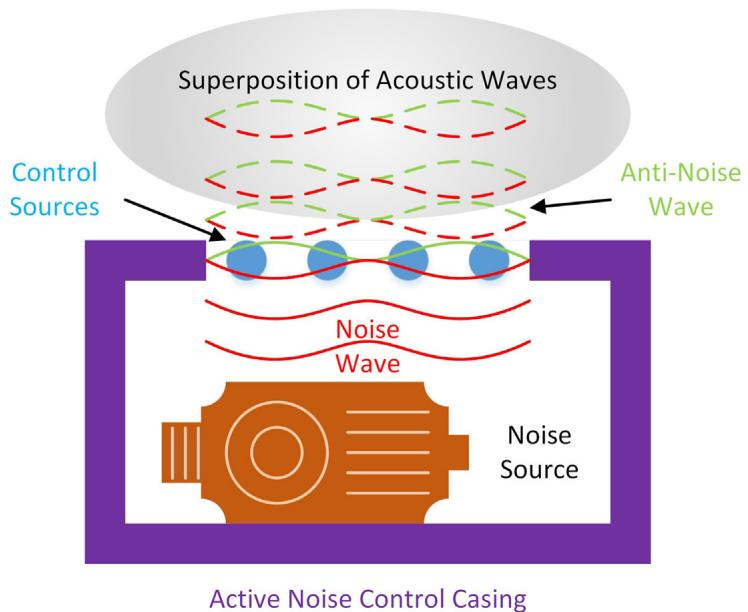

text_image

Superposition of Acoustic Waves
Anti-Noise Wave
Control Sources
Noise Wave
Noise Source
Active Noise Control Casing

Fig. 1. Illustration of the ANC casing.

The rest of this paper is organized as follows. Firstly, the AF-VS method and the RM-VS method are reviewed and the relative path based VS (RP-VS) method is proposed. The RP-VS method estimates not only the disturbance signal but also the anti-noise signal at the target ZoQ. It can behave in the same way as the AF-VS method or the RM-VS method, under different assumptions of varying acoustic paths. Secondly, the aforementioned three VS methods are compared with the fixedcoefficient (FC) filter. The FC filter is the most commonly used non-adaptive method in commercial ANC applications, due to its effectiveness and simplicity. Varying acoustic paths measured from experimental setups of the single-channel and dual-channel feedforward ANC systems are adopted. The change of noise characteristics is carried out by setting different noise frequency bands. The theoretical analysis and simulations results validate that the proposed RP-VS method is an effective VS method and robust to the demonstrated changes in acoustic paths and noise frequency bands. Lastly, an ANC casing is constructed. The experiment results show that when the speed of a computer fan is accelerated, the noise reduction performance achieved by the RP-VS method is as good as the AF-VS method and the RM-VS method at the target ZoQ.

# 2. Virtual sensing methods

There are two stages when the VS method is in use. The first stage is the tuning stage. In this stage, temporal microphones, which are referred to as the virtual microphones, can be placed at the target ZoQ in order to train the control filter and model the transfer functions between virtual microphones and error microphones. The error microphones are placed far from the target ZoQ. They are also referred to as the monitoring microphones. The second stage of the VS method is the control stage. Without any microphones placed at the target ZoQ, adaptive control filters converge based on real-time outputs of the monitoring microphones and the prior information obtained in the tuning stage.

# 2.1. Auxiliary filter based virtual sensing method

Fig. 2 shows the block diagram of the AF-VS method in z domain. Notations of signals and acoustic paths are different in the tuning stage and the control stage. In this way, we are able to analyze the effect of varying acoustics paths and varying noise characteristics on the converged control filter and corresponding noise reduction. These effects are overlooked in previous works on VS methods.

In the tuning stage, the control filter is firstly converged to the optimal solution $W _ { o } ( z )$ that minimizes the power of the virtual error signal $E _ { \nu } ( z )$ . The virtual error signal $E _ { \nu } ( z )$ is provided by the temporal microphone placed at the target ZoQ, which is written as the acoustic superposition of the noise wave and the anti-noise wave, i.e.

$$
E _ {v} (z) = D _ {v} (z) + S _ {v} (z) Y (z). \tag {1}
$$

In Eq. (1), $ { D _ { \nu } } ( z ) =  { P _ { \nu } } ( z ) X ( z )$ is the disturbance signal. $Y ( z ) = W _ { o } ( z ) X ( z )$ is the control signal. The virtual primary path $P _ { \nu } ( z )$ and virtual secondary path $S _ { \nu } ( z )$ are the transfer functions from the noise source and control source to the virtual microphone, respectively. $X ( z )$ is the reference signal.

The yellow block indicates a perfect model of the virtual secondary path that is assumed to be available for the controller in the tuning stage. The z domain optimal solution yields that

$$
W _ {o} (z) = - \frac {P _ {v} (z) X (z)}{S _ {v} (z) X (z)} = - \frac {P _ {v} (z)}{S _ {v} (z)} B (X), \tag {2}
$$

where

$$
B (X) = \left\{ \begin{array}{l l} 1 & X (z) \neq 0 \\ 0 & X (z) = 0 \end{array} . \right. \tag {3}
$$

Meanwhile, the error signal $E _ { m } ( z )$ measured by the monitoring microphone is written as

$$
E _ {m} (z) = D _ {m} (z) + S _ {m} (z) Y (z) = \left[ P _ {m} (z) + S _ {m} (z) W _ {o} (z) \right] X (z), \tag {4}
$$

where $D _ { m } ( z )$ is the disturbance signal at the monitoring microphone. The primary path $P _ { m } ( z )$ and secondary path $S _ { m } ( z )$ Þ are the transfer functions from the noise source and control source to the monitoring microphone, respectively. The auxiliary filter $H ( z )$ is trained to estimate the error signal $E _ { m } ( z )$ based on the reference signal $X ( z )$ . Therefore,

$$
H (z) = - \frac {E _ {m} (z)}{X (z)} = - [ P _ {m} (z) + S _ {m} (z) W _ {o} (z) ] B (X). \tag {5}
$$

In the control stage, the temporary microphone is removed from the target ZoQ. The control filter is retained to minimize the power of $E _ { m ^ { \prime } } ( z ) + H ( z ) X ^ { \prime } ( z )$ , where $E _ { m ^ { \prime } } ( z )$ and $X ^ { \prime } ( z )$ are the error and reference signals in the control stage, respectively. The yellow block indicates a perfect model of the secondary path that is assumed to be available to the controller in the control stage. The z domain expression of the converged control filter in the AF-VS method is thus written as

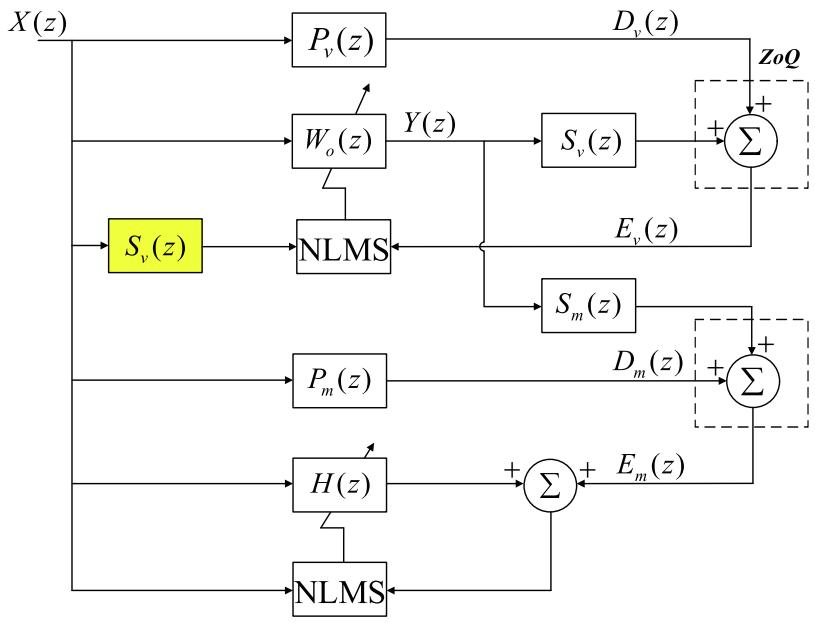

flowchart

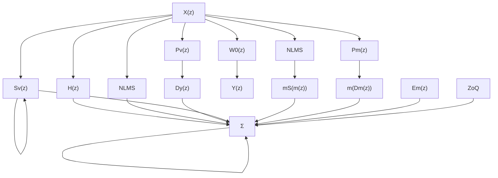
```mermaid
graph TD
    Xz["X(z)"] --> Pz["Pv(z)"]
    Xz --> W0["W0(z)"]
    Xz --> SvSv["Sv(z)"]
    Xz --> NLS1["NLMS"]
    Xz --> PmPm["Pm(z)"]
    Xz --> HhH["H(z)"]
    Xz --> NLMS["NLMS"]
    Pz --> Dy["Dy(z)"]
    W0 --> Y["Y(z)"]
    SvSv --> SvSv["Sv(z)"]
    NLS1 --> SmSsS["mS(m(z))"]
    PmPm --> DmD["m(Dm(z))"]
    HhH --> SumSum["Σ"]
    NLMS --> SumSum
    Dy --> SumSum
    SvSv --> SumSum
    SmSsS --> SumSum
    DmD --> SumSum
    Emz["Em(z)"] --> SumSum
    ZoQ["ZoQ"] --> SumSum
    SumSum --> SumSum
```

(a) Tuning stage

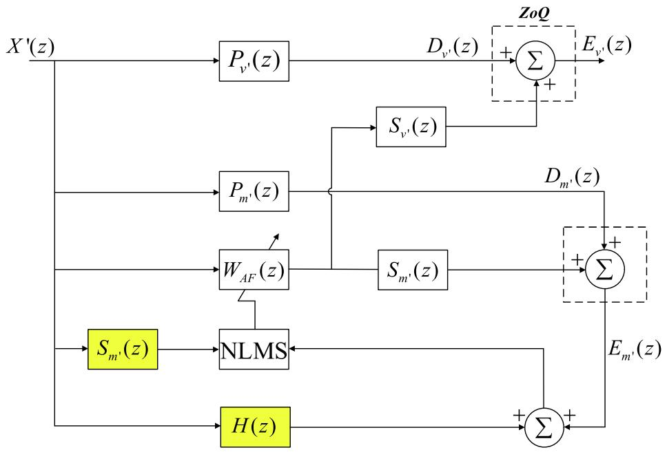

flowchart

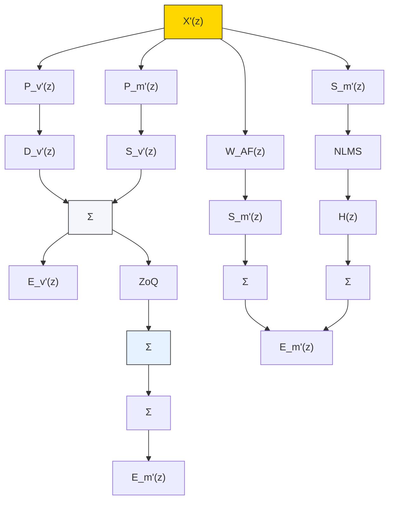
```mermaid
graph TD
    A["X'(z)"] --> B["P_v'(z)"]
    B --> C["D_v'(z)"]
    C --> D["Σ"]
    D --> E["E_v'(z)"]
    A --> F["P_m'(z)"]
    F --> G["S_v'(z)"]
    G --> D
    A --> H["W_AF(z)"]
    H --> I["S_m'(z)"]
    I --> J["Σ"]
    J --> K["E_m'(z)"]
    A --> L["S_m'(z)"]
    L --> M["NLMS"]
    M --> N["H(z)"]
    N --> O["Σ"]
    O --> K
    D --> P["ZoQ"]
    P --> Q["Σ"]
    Q --> R["Σ"]
    R --> S["E_m'(z)"]
    style A fill:#FFD700,stroke:#333
    style D fill:#F5F5FC,stroke:#333
    style Q fill:#E6F2FF,stroke:#333
```

(b) Control stage   
Fig. 2. Block diagram of the AF-VS method.

$$
W _ {A F} (z) = - \frac {P _ {m ^ {\prime}} (z) + H (z)}{S _ {m ^ {\prime}} (z)} B \left(X ^ {\prime}\right), \tag {6}
$$

where the primary path $P _ { m ^ { \prime } } ( z )$ and secondary path $S _ { m ^ { \prime } } ( z )$ are the transfer functions from the noise source and control source to the monitoring microphone in the control stage, respectively.

# 2.2. Remote microphone based virtual sensing method

Fig. 3 shows the block diagram of the RM-VS method in z domain. In the tuning stage, the disturbance signal measured by the monitoring microphone is used to estimate the disturbance signal measured by the virtual microphone. Such estimation is carried out by the relative primary path model $C _ { p } ( z )$ , i.e.

$$
D _ {v} (z) = C _ {p} (z) D _ {m} (z). \tag {7}
$$

Considering the primary and virtual primary paths, we obtain

$$
C _ {p} (z) = \frac {P _ {v} (z) X (z)}{P _ {m} (z) X (z)} = \frac {P _ {v} (z)}{P _ {m} (z)} B (X). \tag {8}
$$

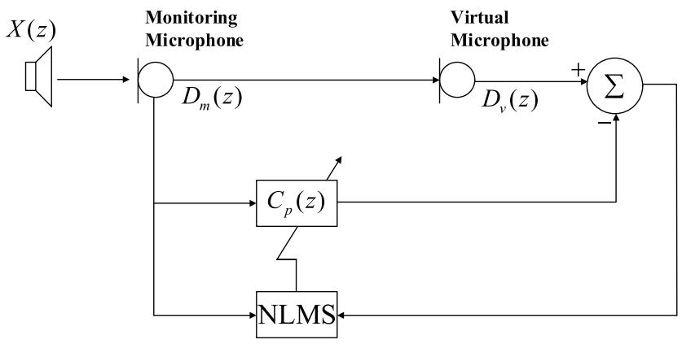

flowchart

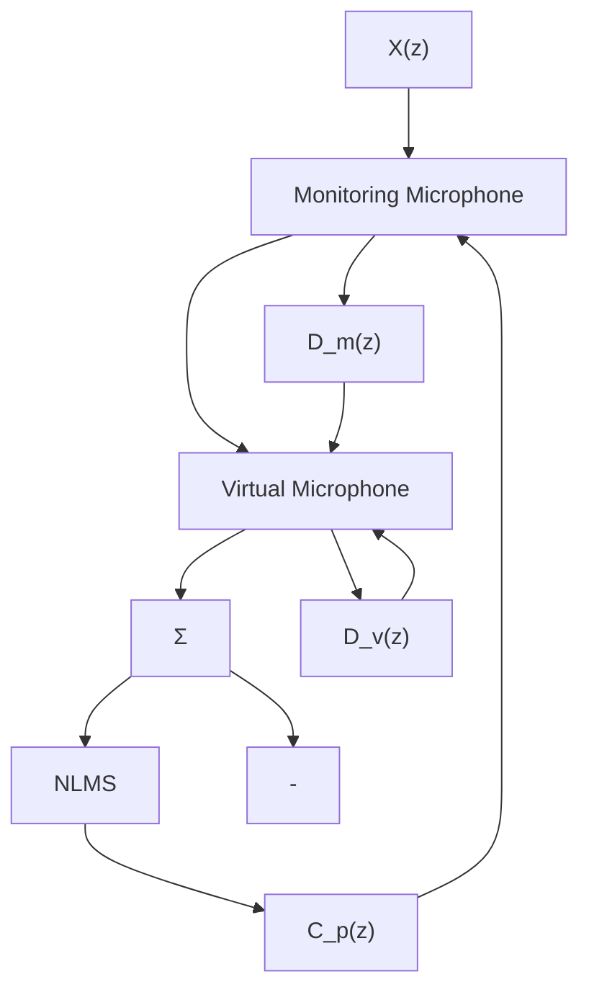
```mermaid
graph TD
    A["X(z)"] --> B["Monitoring Microphone"]
    B --> C["Virtual Microphone"]
    C --> D["Σ"]
    D --> E["NLMS"]
    E --> F["C_p(z)"]
    F --> B
    C --> G["D_v(z)"]
    G --> C
    B --> H["D_m(z)"]
    H --> C
    D --> I["-"]
```

(a) Tuning stage

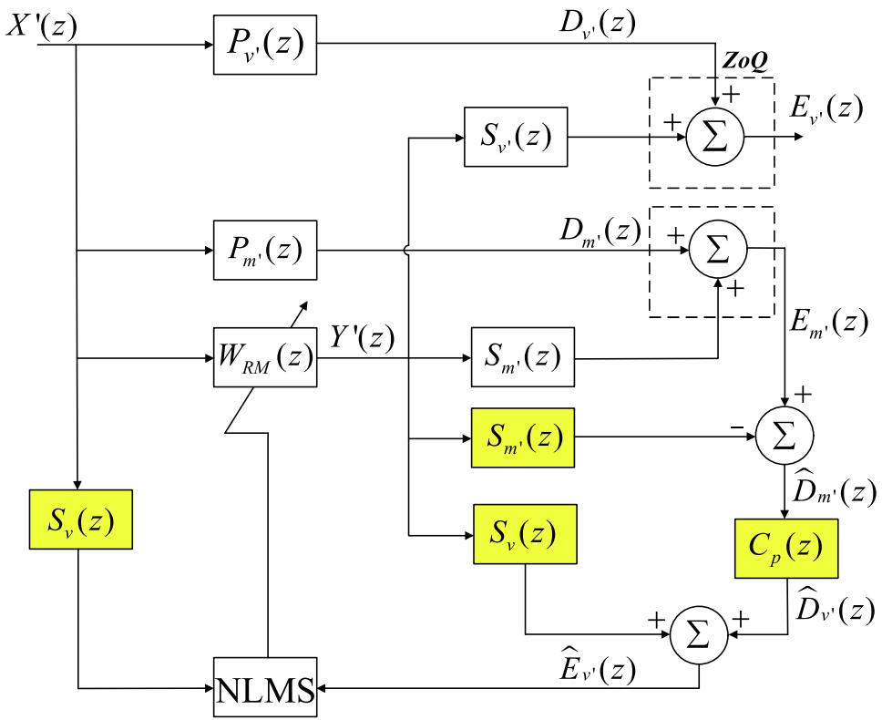

flowchart

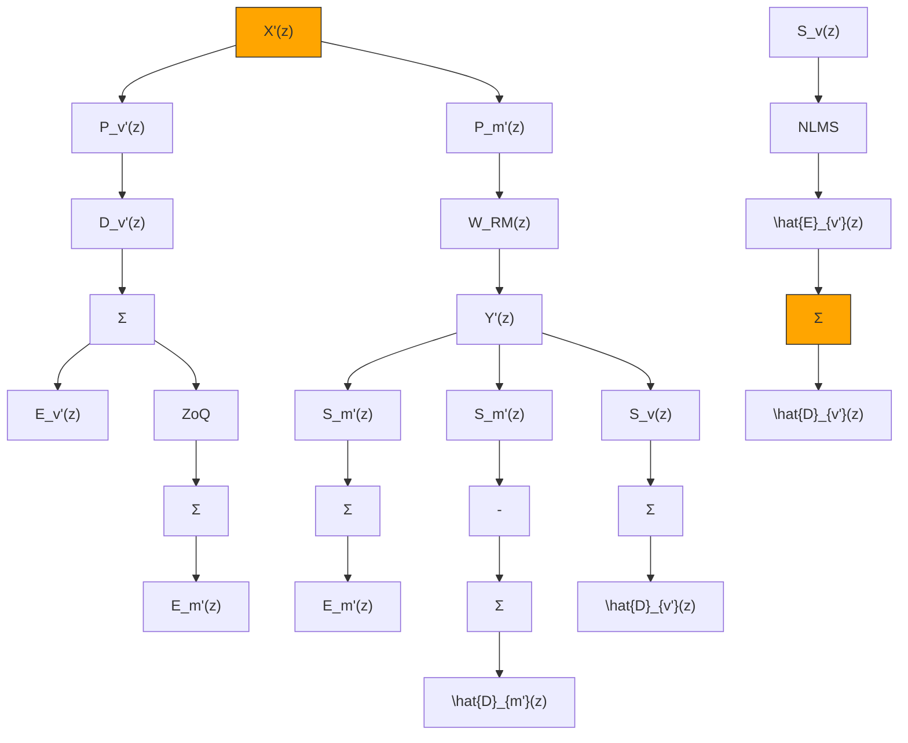
```mermaid
graph TD
    A["X'(z)"] --> B["P_v'(z)"]
    B --> C["D_v'(z)"]
    C --> D["Σ"]
    D --> E["E_v'(z)"]
    A --> F["P_m'(z)"]
    F --> G["W_RM(z)"]
    G --> H["Y'(z)"]
    H --> I["S_m'(z)"]
    I --> J["Σ"]
    J --> K["E_m'(z)"]
    H --> L["S_m'(z)"]
    L --> M["-"]
    M --> N["Σ"]
    N --> O["\hat{D}_{m'}(z)"]
    H --> P["S_v(z)"]
    P --> Q["Σ"]
    Q --> R["\hat{D}_{v'}(z)"]
    S["S_v(z)"] --> T["NLMS"]
    T --> U["\hat{E}_{v'}(z)"]
    U --> V["Σ"]
    V --> W["\hat{D}_{v'}(z)"]
    D --> X["ZoQ"]
    X --> Y["Σ"]
    Y --> Z["E_m'(z)"]
    style A fill:#FFA500,stroke:#333
    style V fill:#FFA500,stroke:#333
```

(b) Control stage   
Fig. 3. Block diagram of the RM-VS method.

When compared with the AF-VS method, the RM-VS method is likely to result in less noise reduction due to dips in the denominator.

In the control stage, the RM-VS method firstly estimates the disturbance signal at the monitoring microphone by

$$
\widehat {D} _ {m ^ {\prime}} (z) = E _ {m ^ {\prime}} (z) - S _ {m ^ {\prime}} (z) Y ^ {\prime} (z), \tag {9}
$$

where $Y ^ { \prime } ( z )$ is the control signal in the control stage. Secondly, the virtual error signal $\widehat { E } _ { \nu ^ { \prime } } ( z )$ is estimated by

$$
\widehat {E} _ {v ^ {\prime}} (z) = C _ {p} (z) \widehat {D} _ {m ^ {\prime}} (z) + S _ {v} (z) Y ^ {\prime} (z). \tag {10}
$$

When the temporal microphones have been removed, the model of the virtual secondary path cannot be updated. And when a perfect model of the secondary path is assumed, the error signal measured by the monitoring microphone is expressed as

$$
D _ {m ^ {\prime}} (z) = \widehat {D} _ {m ^ {\prime}} (z) = P _ {m ^ {\prime}} (z) X ^ {\prime} (z). \tag {11}
$$

The control filter converges by minimizing the power of $\widehat { E } _ { \nu } ( z )$ . The z domain expression of the converged control filter of the RM-VS method is thus written as

$$
W _ {R M} (z) = - \frac {C _ {p} (z) P _ {m ^ {\prime}} (z)}{S _ {v} (z)} B \left(X ^ {\prime}\right). \tag {12}
$$

When there is a change in the virtual secondary path, the accurate model of the virtual secondary path requested by the RM-VS method is not possible to be obtained with any online modeling technique, because no temporary microphone is placed at the target ZoQ during the control stage. In comparison, the AF-VS method requests the accurate model of the secondary path, which is available because online modeling technique can update the secondary path model based on the monitoring microphone.

# 2.3. Relative path based virtual sensing method

To resolve the aforementioned disadvantage of the RM-VS method, we propose the RP-VS method. Fig. 4 shows the additional tuning stage of the RP-VS method. As compared with the RM-VS method, the improvement of the RP-VS method is made by adding in another relative path modeling. The relative secondary path model $C _ { s } ( z )$ is in charge of estimating the anti-noise signal at the virtual microphone based on the anti-noise signal measured by the monitoring microphone, i.e.

$$
S _ {v} (z) Y (z) = C _ {s} (z) S _ {m} (z) Y (z). \tag {13}
$$

After the tuning stage, we obtain

$$
C _ {s} (z) = \frac {S _ {v} (z)}{S _ {m} (z)} B (Y). \tag {14}
$$

In the control stage, the perfect model of the secondary path is assumed. Following a similar procedure of the RM-VS method, we estimate the virtual error signal $\widehat { E } _ { \nu ^ { \prime } } ( z )$ as

$$
\widehat {E} _ {v ^ {\prime}} (z) = C _ {p} (z) \widehat {D} _ {m ^ {\prime}} (z) + C _ {s} (z) S _ {m ^ {\prime}} (z) Y ^ {\prime} (z), \tag {15}
$$

where the estimate of the disturbance signal at the monitoring microphone is still calculated by Eqs. (9) and (11). The z domain expression of the converged control filter of the RP-VS method is thus written as

$$
W _ {R P} (z) = - \frac {C _ {p} (z) P _ {m ^ {\prime}} (z)}{C _ {s} (z) S _ {m ^ {\prime}} (z)} B \left(X ^ {\prime}\right). \tag {16}
$$

# 2.4. Comparison of virtual sensing methods

When there are no changes to the acoustic paths and noise characteristics, Eqs. (6), (12) and (16) all lead to the same optimal solution. However, fixing the coefficients of the control filter obtained in Eq. (2) would be the simplest way to control the noise in this case, rather than using any adaptive algorithms. Therefore, it is important to investigate the varying acoustic paths and varying noise characteristics for all the VS methods.

When the noise is assumed to occupy the entire bandwidth, i.e. letting $B ( X ) = B ( X ^ { \prime } ) = B ( Y ) = 1$ , the control filters obtained in the control stage of the AF-VS method, the RM-VS method and the RP-VS method are manipulated as

$$
W _ {A F} (z) = \frac {P _ {m} (z) - P _ {m ^ {\prime}} (z)}{S _ {m ^ {\prime}} (z)} + W _ {o} \frac {S _ {m} (z)}{S _ {m ^ {\prime}} (z)}, \tag {17}
$$

$$
W _ {R M} (z) = W _ {o} \frac {P _ {m ^ {\prime}} (z)}{P _ {m} (z)}, \tag {18}
$$

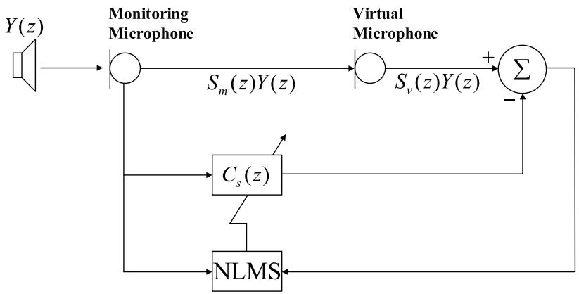

flowchart

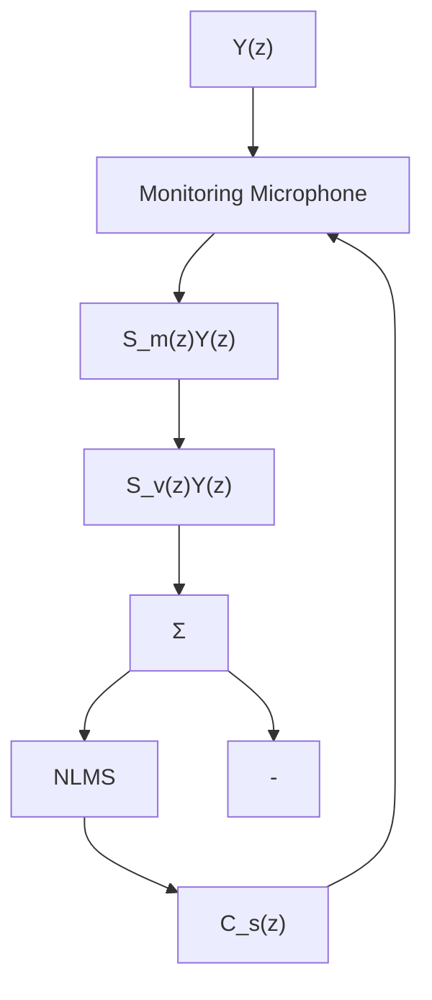
```mermaid
graph TD
    A["Y(z)"] --> B["Monitoring Microphone"]
    B --> C["S_m(z)Y(z)"]
    C --> D["S_v(z)Y(z)"]
    D --> E["Σ"]
    E --> F["NLMS"]
    F --> G["C_s(z)"]
    G --> B
    E --> H["-"]
```

(a) Additional tuning stage

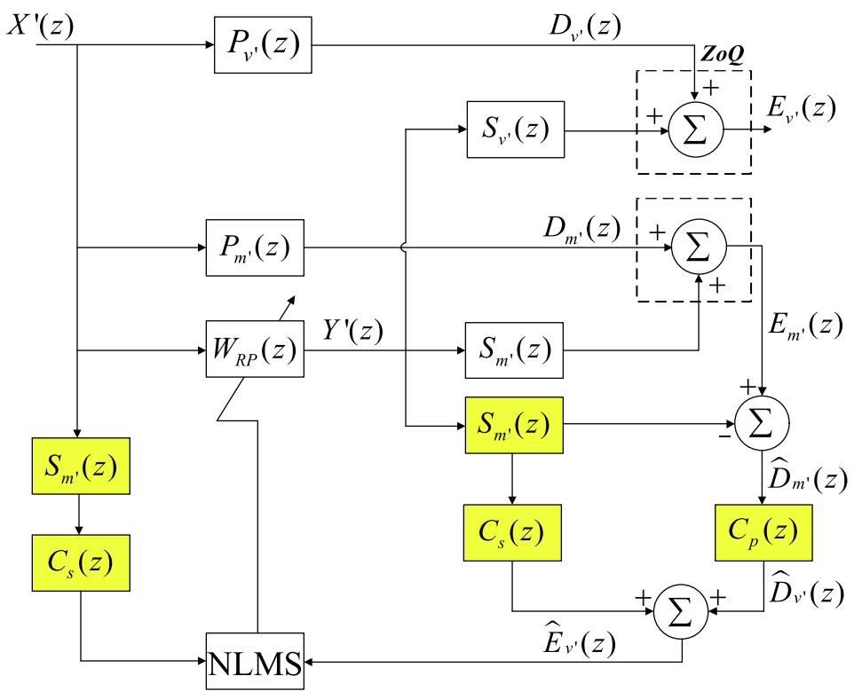

flowchart

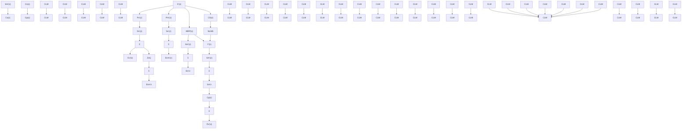
```mermaid
graph TD
    A["X'(z)"] --> B["Pv'(z)"]
    B --> C["Dv'(z)"]
    C --> D["Σ"]
    D --> E["Ev'(z)"]
    A --> F["Pm'(z)"]
    F --> G["Sv'(z)"]
    G --> H["Σ"]
    H --> I["Evm'(z)"]
    A --> J["WRP(z)"]
    J --> K["Sm'(z)"]
    K --> L["Σ"]
    L --> M["Em'z"]
    J --> N["Y'(z)"]
    N --> O["Sm'(z)"]
    O --> P["Σ"]
    P --> Q["Sm'z"]
    Q --> R["Cp(z)"]
    R --> S["Σ"]
    S --> T["D̂v'(z)"]
    A --> U["CS(z)"]
    U --> V["NLMS"]
    V --> N
    D --> W["ZoQ"]
    W --> X["Σ"]
    X --> Y["Evm'z"]
    Z["Sm'(z)"] --> AA["Cs(z)"]
    AB["Cs(z)"] --> AC["Cp(z)"]
    AD["CLM"] --> AE["CLM"]
    AF["CLM"] --> AG["CLM"]
    AH["CLM"] --> AI["CLM"]
    AJ["CLM"] --> AK["CLM"]
    AL["CLM"] --> AM["CLM"]
    AN["CLM"] --> AO["CLM"]
    AP["CLM"] --> AQ["CLM"]
    AR["CLM"] --> AS["CLM"]
    AT["CLM"] --> AU["CLM"]
    AV["CLM"] --> AW["CLM"]
    AX["CLM"] --> AY["CLM"]
    AZ["CLM"] --> BA["CLM"]
    BB["CLM"] --> BC["CLM"]
    BD["CLM"] --> BE["CLM"]
    BF["CLM"] --> BG["CLM"]
    BH["CLM"] --> BI["CLM"]
    BJ["CLM"] --> BK["CLM"]
    BL["CLM"] --> BM["CLM"]
    BN["CLM"] --> BO["CLM"]
    BP["CLM"] --> BQ["CLM"]
    BR["CLM"] --> BS["CLM"]
    BT["CLM"] --> BU["CLM"]
    BV["CLM"] --> BW["CLM"]
    BX["CLM"] --> BY["CLM"]
    BZ["CLM"] --> BQ
    CA["CLM"] --> BQ
    CB["CLM"] --> BQ
    CC["CLM"] --> BQ
    DD["CLM"] --> BQ
    DX["CLM"] --> BQ
```

(b) Control stage   
Fig. 4. Block diagram of the RP-VS method.

and

$$
W _ {R P} (z) = W _ {o} \frac {S _ {m} (z) P _ {m ^ {\prime}} (z)}{P _ {m} (z) S _ {m ^ {\prime}} (z)}, \tag {19}
$$

respectively. We notice that when there is no change in the primary path, i.e. $P _ { m ^ { \prime } } ( z ) = P _ { m } ( z ) ,$ , the AF-VS method and the RP-VS method lead to the same solution. When there is no change in the secondary path, i.e. $S _ { m ^ { \prime } } ( z ) = S _ { m } ( z )$ , the RM-VS method and the RP-VS method lead to the same solution.

Table 1 shows the ratio between the sound pressure level after control and the reference signal in the z domain. For the simplicity of presentations, the notation  z has been abbreviated. When the secondary and virtual secondary paths are invariant, the FC filter remains effective if the change in the primary path is slight. Similarly, the AF-VS method remains effective if changes in both the primary and virtual primary paths are slight. In comparison, the performance of the RM-

Table 1 Z-transform analysis of different virtual sensing methods under conditions when there are changes to the primary and virtual primary paths, the secondary and virtual secondary paths, and all the acoustic paths. The notation ð Þz has been abbreviated. 

<table><tr><td> $E_{v'}/X$ </td><td>Invariant Secondary Paths $(S_m = S_{m'}\text{ and } S_v = S_{v'})$ </td><td>Invariant Primary Paths $(P_m = P_{m'}\text{ and } P_v = P_{v'})$ </td></tr><tr><td>FC Filter</td><td> $P_{v'} - P_v$ </td><td> $\left(1 - \frac{S_{v'}}{S_v}\right)P_v$ </td></tr><tr><td>AF-VS Method</td><td> $P_{v'} - P_{v} + \frac{S_{v'}}{S_{m'}}(P_m - P_{m'})$ </td><td> $\left(1 - \frac{S_{v'} S_m}{S_v S_{m'}}\right)P_v$ </td></tr><tr><td>RM-VS Method</td><td> $P_{v'} - \frac{P_{m'}}{P_m}P_v$ </td><td> $\left(1 - \frac{S_{v'}}{S_v}\right)P_v$ </td></tr><tr><td>RP-VS Method</td><td> $P_{v'} - \frac{P_{m'}}{P_m}P_v$ </td><td> $\left(1 - \frac{S_{v'} S_m}{S_v S_{m'}}\right)P_v$ </td></tr><tr><td> $E_{v'}/X$ </td><td colspan="2">Varying Acoustic Paths</td></tr><tr><td>FC Filter</td><td></td><td> $P_{v'} - \frac{S_{v'}}{S_v}P_v$ </td></tr><tr><td>AF-VS Method</td><td></td><td> $P_{v'} - \frac{S_{v'} S_m}{S_v S_{m'}}P_v + \frac{S_{v'}}{S_{m'}}(P_m - P_{m'})$ </td></tr><tr><td>RM-VS Method</td><td></td><td> $P_{v'} - \frac{S_{v'} P_{m'}}{S_v P_m}P_v$ </td></tr><tr><td>RP-VS Method</td><td></td><td> $P_{v'} - \frac{S_{v'} S_m P_{m'}}{S_v S_m' P_m}P_v$ </td></tr></table>

VS method and the RP-VS method relies only on the relative change of the primary and virtual primary paths. The optimal noise reduction is achieved when $\begin{array} { r } { { \frac { P _ { \nu ^ { \prime } } } { P _ { \nu } } } = { \frac { P _ { m ^ { \prime } } } { P _ { m } } } } \end{array}$ . This condition is likely to be fulfilled in practice when the change of acoustics paths is incurred by the noise source itself. When the primary and virtual primary paths are invariant, the FC filter and the RM-VS method have the same performance, which depends on the change in the virtual secondary path. Meanwhile, the AF-VS method and the RP-VS method have the same performance, which is proportional to the relative change in the secondary and virtual secondary paths. The optimal noise reduction is achieved when $\frac { S _ { \nu ^ { \prime } } } { S _ { \nu } } = \frac { S _ { m ^ { \prime } } } { S _ { m } }$ 0. This condition may happen when the change of acoustic paths is due to the control source. When all the acoustic paths are varying, the RP-VS method still achieves the optimal noise reduction, so long as the relative changes in the acoustic paths are balanced.

Similarly, the noise level after control can be analyzed for a MCFFANC system, which for instance consists of I reference microphones, J secondary loudspeakers, K monitoring microphones and L virtual microphones. For the simplicity of presentations, the notation ð Þz has been abbreviated and the noise is assumed to occupy the entire bandwidth. The dimensions of matrixes and vectors are explicitly marked on the superscript.

In the training stage, the optimum control filter $\mathbf { W } _ { o }$ is written as

$$
\mathbf {W} _ {o} ^ {(J \times I)} = - \left[ \mathbf {S} _ {v} ^ {(L \times J)} \right] ^ {\dagger} \mathbf {P} _ {v} ^ {(L \times I)}, \tag {20}
$$

where $\mathbf { p } _ { \nu }$ is the virtual primary path; $\mathbf { S } _ { \nu }$ is the virtual secondary path; and denotes the pseudo inverse of a matrix. The AF-VS method obtains the auxiliary filter H as

$$
\mathbf {H} ^ {(K \times I)} = - \mathbf {P} _ {m} ^ {(K \times I)} + \mathbf {S} _ {m} ^ {(K \times J)} \mathbf {W} _ {o} ^ {(J \times I)}, \tag {21}
$$

where ${ \pmb P } _ { m }$ and $\pmb { \mathsf { S } } _ { m }$ are the primary and secondary paths, respectively. The RM-VS method obtains the relative primary path model $\mathbf { C } _ { p }$ as

$$
\mathbf {C} _ {p} ^ {(L \times K)} = \mathbf {P} _ {v} ^ {(L \times I)} \left[ \mathbf {P} _ {m} ^ {(K \times I)} \right] ^ {\dagger}, \tag {22}
$$

while the RP-VS method in addition obtains the relative secondary path model $\pmb { C } _ { s }$ as

$$
\mathbf {C} _ {s} ^ {(L \times K)} = \mathbf {S} _ {v} ^ {(L \times J)} \left[ \mathbf {S} _ {m} ^ {(K \times J)} \right] ^ {\dagger}. \tag {23}
$$

In the control stage, the control filters of the AF-VS method, the RM-VS method and the RP-VS method are respectively written as

$$
\mathbf {W} _ {A F} (z) = \left[ \mathbf {S} _ {m ^ {\prime}} ^ {(K \times J)} \right] ^ {\dagger} \left[ \mathbf {P} _ {m} ^ {(K \times I)} - \mathbf {P} _ {m ^ {\prime}} ^ {(K \times I)} + \mathbf {S} _ {m} ^ {(K \times J)} \mathbf {W} _ {o} ^ {(J \times I)} \right], \tag {24}
$$

$$
\mathbf {W} _ {R M} (z) = \mathbf {W} _ {o} ^ {(J \times I)} \left[ \mathbf {P} _ {m} ^ {(K \times I)} \right] ^ {\dagger} \mathbf {P} _ {m ^ {\prime}} ^ {(K \times I)}, \tag {25}
$$

and

$$
\mathbf {W} _ {R P} (z) = \left[ \mathbf {S} _ {m ^ {\prime}} ^ {(K \times J)} \right] ^ {\dagger} \mathbf {S} _ {m} ^ {(K \times J)} \mathbf {W} _ {o} ^ {(J \times I)} \left[ \mathbf {P} _ {m} ^ {(K \times I)} \right] ^ {\dagger} \mathbf {P} _ {m ^ {\prime}} ^ {(K \times I)}, \tag {26}
$$

where $\mathbf { P } _ { m ^ { \prime } }$ and $\pmb { \mathsf { S } } _ { m ^ { \prime } }$ are the primary and secondary paths that might be different from those in the training stage. Furthermore, the virtual primary and secondary paths in the control stage are denoted as $\mathbf { P } _ { \nu ^ { \prime } }$ and $\mathsf { \pmb { S } } _ { \nu ^ { \prime } }$ , respectively.

Table 2 shows the noise levels after control $\mathbf { E } _ { \nu ^ { \prime } }$ of the AF-VS method, the RM-VS method, the RP-VS method and the FC filter for comparison, where X is the reference signal vector with the size of I 1. Observations are generally similar to the single-channel ANC system. However, it is worth noting that the effectiveness of all VS methods cannot be guaranteed under arbitrary path changes. In the multi-channel ANC system, the balanced relative path change happens much more occasionally than that in the single-channel ANC system, even for just a fraction of the noise bandwidth. Therefore, multi-channel ANC systems are big challenges for all the VS methods.

# 3. Simulation results

In this section, we establish two experimental setups of the single-channel and dual-channel feedforward ANC systems. The acoustic paths are acquired by a real-time digital signal processor (DSP) platform. Three changes in different acoustic paths are measured. For the primary and virtual primary paths, the impulse responses are measured up to 75 ms. The length of the secondary and virtual secondary paths is 25 ms. The sampling rate is 16 kHz. The memory length of the control filter, auxiliary filter, and relative path models is 400 taps. In different VS methods, all the adaptive algorithms adopt the normalized step size of 0.01. Noise reduction levels are calculated after control filters completely converge.

# 3.1. Single-channel feedforward ANC system

Fig. 5 shows the setup of a case (1,1,1) single-channel feedforward ANC system and variations of acoustic paths. The frequency band of the noise source is from 400 Hz to 1600 Hz. Changes in the acoustic paths are made by manually moving the microphones 12 cm away from their original positions. As the monitoring microphone and the virtual microphone are fastened to separate microphone stands, they are not moved into the same direction. Three groups of measurements are carried out to record all the acoustic paths. They are then used as the primary and virtual primary path changes, secondary and virtual secondary path changes, and all path changes in the simulation. Fig. 6 further exhibits the magnitude and phase responses of these acoustic paths. There is an obvious dip in primary paths at about 825 Hz.

Table 3 lists noise reduction levels of different VS methods at the target ZoQ. When there are no changes in all of the acoustic paths, it is labeled as the tuning condition. The AF-VS method achieves nearly the same performance as the FC filter, which is the optimal solution in this condition. Both the RM-VS method and the RP-VS method result in less noise reduction due to the dip in the frequency response of the primary path. When there are changes in the primary and virtual primary paths, the RM-VS method and the RP-VS method achieve the same levels of noise reduction. Although their performance is not optimal, the RM-VS method and the RP-VS method show significant robustness as compared to the AF-VS method, and far better performance than the FC filter. When there are changes in the secondary and virtual secondary paths, the AF-VS method and the RP-VS method have very similar noise reduction levels. They outperform the FC filter and the RM-VS method. The latter two methods also have very similar noise reduction levels. These observations are consistent with the theoretical analysis in Table 1. Furthermore, when all of the acoustic paths are varying, the RM-VS method obtains the least noise reduction and the RP-VS method outperforms the other VS methods in terms of the average noise reduction level. None of the VS methods are guaranteed to provide the perfect performance in all circumstances.

When there are no changes in all of the acoustic paths, the noise frequency band is firstly changed to a tuning band (from 600 Hz to 1200 Hz), and then shifted to five different testing frequency bands. Noise reduction levels of the FC filter and VS methods at the target ZoQ are shown in Fig. 7. All of the aforementioned methods obtain less noise reduction levels when the noise frequency band varies. The FC filter even causes increments in the sound pressure level, when the testing frequency band is outside the tuning frequency band. The control filters obtained in the control stage of the RP-VS method have the closest phase responses to those of the optimal control filters. This is likely due to the fact that the RP-VS method has trained the relative primary path model $C _ { p } ( z )$ and the relative secondary path model $C _ { s } ( z )$ separately. Since phase plays a more significant role in ANC rather than magnitude, the RP-VS method shows the most robust performance when the noise frequency band varies in the simulation. The change in the noise frequency band is of particular importance to the RM-VS method and the RP-VS method. This is because the noise source is uncontrollable. The relative primary path model is favorable to be trained under one working condition of the noise source, but there may be many other working conditions.

Table 2 Z-transform analysis of different virtual sensing methods under conditions when the primary path change, the secondary path change, and all the path change in a MCFFANC system. I denotes the identity matrix. 

<table><tr><td> $\| \mathbf{E}_{\nu'} \|$ </td><td>Invariant Secondary Paths $(\mathbf{S}_m = \mathbf{S}_{m'} \text{ and } \mathbf{S}_v = \mathbf{S}_{v'})$ </td><td>Invariant Primary Paths $(\mathbf{P}_m = \mathbf{P}_{m'} \text{ and } \mathbf{P}_v = \mathbf{P}_{v'})$ </td></tr><tr><td>FC Filter</td><td> $\| (\mathbf{P}_{v'} - \mathbf{P}_v) \mathbf{X} \|$ </td><td>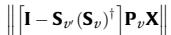</td></tr><tr><td>AF-VS Method</td><td> $\| [ \mathbf{P}_{v'} - \mathbf{P}_v + \mathbf{S}_{v'} (\mathbf{S}_{m'})^\dagger (\mathbf{P}_m - \mathbf{P}_{m'}) ] \mathbf{X} \|$ </td><td>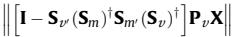</td></tr><tr><td>RM-VS Method</td><td> $\| [ \mathbf{P}_{v'} - \mathbf{P}_v (\mathbf{P}_m)^\dagger \mathbf{P}_{m'} ] \mathbf{X} \|$ </td><td>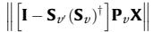</td></tr><tr><td>RP-VS Method</td><td> $\| [ \mathbf{P}_{v'} - \mathbf{P}_v (\mathbf{P}_m)^\dagger \mathbf{P}_{m'} ] \mathbf{X} \|$ </td><td>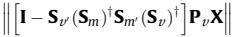</td></tr><tr><td> $\| \mathbf{E}_{\nu'} \|$ </td><td colspan="2">Varying Acoustic Paths</td></tr><tr><td>FC Filter</td><td colspan="2"> $\| [ \mathbf{P}_{v'} - \mathbf{S}_{v'} (\mathbf{S}_v)^\dagger \mathbf{P}_v ] \mathbf{X} \|$ </td></tr><tr><td>AF-VS Method</td><td colspan="2"> $\| [ \mathbf{P}_{v'} - \mathbf{S}_{v'} (\mathbf{S}_m)^\dagger \mathbf{S}_{m'} (\mathbf{S}_v)^\dagger \mathbf{P}_v + \mathbf{S}_{v'} (\mathbf{S}_{m'})^\dagger (\mathbf{P}_m - \mathbf{P}_{m'}) ] \mathbf{X} \|$ </td></tr><tr><td>RM-VS Method</td><td colspan="2"> $\| [ \mathbf{P}_{v'} - \mathbf{S}_{v'} (\mathbf{S}_v)^\dagger \mathbf{P}_v (\mathbf{P}_m)^\dagger \mathbf{P}_{m'} ] \mathbf{X} \|$ </td></tr><tr><td>RP-VS Method</td><td colspan="2"> $\| [ \mathbf{P}_{v'} - \mathbf{S}_{v'} (\mathbf{S}_m)^\dagger \mathbf{S}_{m'} (\mathbf{S}_v)^\dagger \mathbf{P}_v (\mathbf{P}_m)^\dagger \mathbf{P}_{m'} ] \mathbf{X} \|$ </td></tr></table>

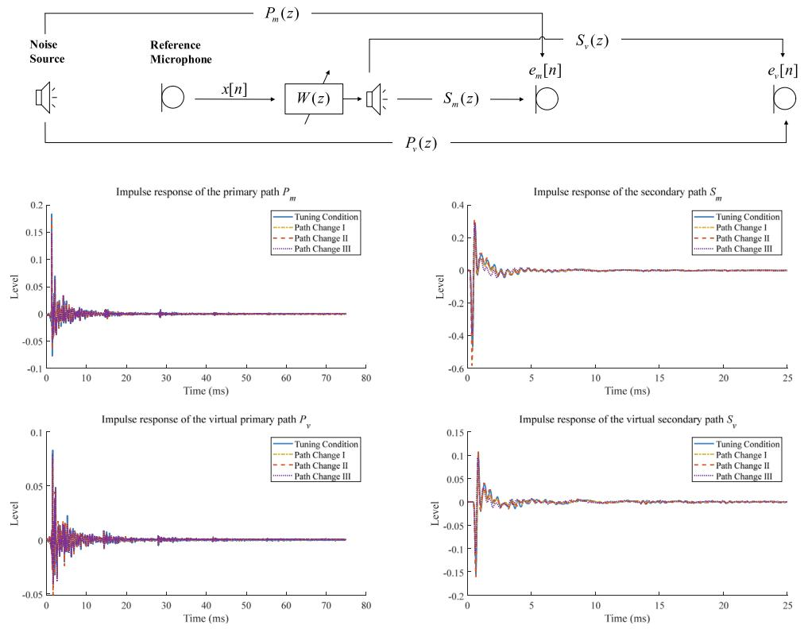  
Fig. 5. Case (1,1,1) single-channel ANC system setup.

# 3.2. Dual-channel feedforward ANC system

Fig. 8 shows the setup of a case (1,2,2) dual-channel feedforward ANC system and variations of cross-channel acoustic paths. The frequency band of the noise source is from 400 Hz to 1600 Hz. Changes in the acoustic paths are made by manually moving microphones 12 cm away from their original positions. Moreover, Fig. 9 exhibits the magnitude and phase responses of those cross-channel acoustic paths.

Table 4 lists noise reduction levels of different VS methods at the target ZoQ of the dual-channel ANC system. For the tuning condition, the AF-VS method still outperforms the RM-VS method and the RP-VS method. However, the difference in their performance is reduced as compared to the single-channel ANC system. When there are changes in the primary and virtual primary paths, the RM-VS method and the RP-VS method exhibit more robustness than the FC filter and the AF-VS method. For the third combinations of the primary and virtual primary paths, although the AF-VS method achieves the highest noise reduction level, the other three methods can also achieve noise reduction levels of about 15 dB. When there are changes in the secondary and virtual secondary paths, the AF-VS method and the RP-VS method no longer result in the same noise reduction levels. The cross-channel acoustic paths incur errors in the relative secondary path models that are used by the RP-VS method. However, with more computational power consumed and more prior information obtained, the RP-VS method still achieves the best average noise reduction performance in the simulation.

Similar to the simulation results of the single-channel ANC system, all the methods obtain less noise reduction in the dual-channel ANC system when the noise frequency band varies. The tuning frequency band is from 600 Hz to 1200 Hz. Two of the five testing frequency bands are totally outside the tuning frequency band. One testing frequency band is broader than the tuning frequency band. The other two testing frequency band overlap with the tuning frequency band. Noise reduction levels of the FC filter and VS methods at the target ZoQ are shown in Fig. 10. The FC filter and the AF-VS method cause increments in the sound pressure level when the testing frequency band is lower than the tuning frequency band. Among all the VS methods, the RP-VS method leads to the control filters with the closest phase responses to the optimal control filters in the control stage. This gains the advantage of the RP-VS method when dealing with the varying noise frequency band in

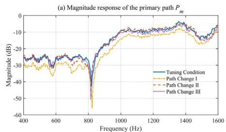

line

(a) Magnitude response of the primary path Pm
| Frequency (Hz) | Tuning Condition (dB) | Path Change I (dB) | Path Change II (dB) | Path Change III (dB) |
|---|---|---|---|---|
| 400 | -30 | -32 | -31 | -31 |
| 600 | -28 | -29 | -28 | -28 |
| 800 | -50 | -55 | -52 | -51 |
| 1000 | -10 | -11 | -10 | -10 |
| 1200 | -8 | -9 | -8 | -8 |
| 1400 | -5 | -6 | -5 | -5 |
| 1600 | -2 | -3 | -2 | -2 |

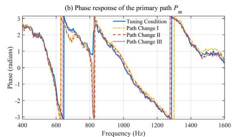

line

| Frequency (Hz) | Tuning Condition | Path Change I | Path Change II | Path Change III |
| -------------- | ---------------- | ------------- | -------------- | --------------- |
| 400            | 2.5              | 2.5           | 2.5            | 2.5             |
| 600            | -3.0             | -3.0          | -3.0           | -3.0            |
| 800            | 3.0              | 3.0           | 3.0            | 3.0             |
| 1000           | 1.0              | 1.0           | 1.0            | 1.0             |
| 1200           | -3.0             | -3.0          | -3.0           | -3.0            |
| 1400           | 1.0              | 1.0           | 1.0            | 1.0             |
| 1600           | 0.5              | 0.5           | 0.5            | 0.5             |

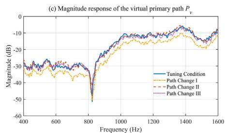

line

(c) Magnitude response of the virtual primary path P_v
| Frequency (Hz) | Tuning Condition (dB) | Path Change I (dB) | Path Change II (dB) | Path Change III (dB) |
|---|---|---|---|---|
| 400 | -30 | -32 | -31 | -31 |
| 500 | -31 | -33 | -32 | -32 |
| 600 | -32 | -34 | -33 | -33 |
| 700 | -33 | -35 | -34 | -34 |
| 800 | -50 | -52 | -51 | -51 |
| 900 | -15 | -16 | -17 | -17 |
| 1000 | -10 | -11 | -12 | -12 |
| 1100 | -8 | -9 | -10 | -10 |
| 1200 | -7 | -8 | -9 | -9 |
| 1300 | -6 | -7 | -8 | -8 |
| 1400 | -5 | -6 | -7 | -7 |
| 1500 | -4 | -5 | -6 | -6 |
| 1600 | -3 | -4 | -5 | -5 |

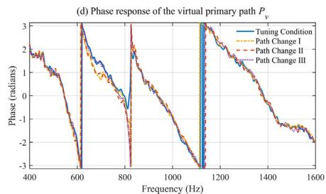

line

| Frequency (Hz) | Tuning Condition | Path Change I | Path Change II | Path Change III |
| -------------- | ---------------- | ------------- | -------------- | --------------- |
| 400            | 2.0              | 2.0           | 2.0            | 2.0             |
| 600            | -3.0             | -3.0          | -3.0           | -3.0            |
| 800            | 2.0              | 2.0           | 2.0            | 2.0             |
| 1000           | -3.0             | -3.0          | -3.0           | -3.0            |
| 1200           | 3.0              | 3.0           | 3.0            | 3.0             |
| 1400           | -1.0             | -1.0          | -1.0           | -1.0            |
| 1600           | -2.0             | -2.0          | -2.0           | -2.0            |

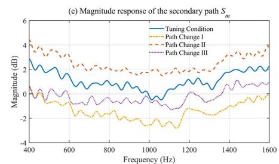

line

(e) Magnitude response of the secondary path S_m
| Frequency (Hz) | Tuning Condition | Path Change I | Path Change II | Path Change III |
|---|---|---|---|---|
| 400 | 3.0 | -0.5 | 4.5 | 0.0 |
| 600 | 1.5 | -1.0 | 2.5 | -0.5 |
| 800 | 1.0 | -1.5 | 2.0 | -0.5 |
| 1000 | 0.5 | -2.0 | 1.5 | -0.5 |
| 1200 | 1.5 | -1.5 | 2.5 | -0.5 |
| 1400 | 2.0 | -1.0 | 3.5 | 0.5 |
| 1600 | 2.0 | -0.5 | 4.0 | 1.0 |

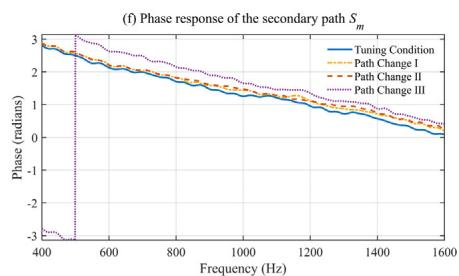

line

(f) Phase response of the secondary path S_m
| Frequency (Hz) | Tuning Condition | Path Change I | Path Change II | Path Change III |
|---|---|---|---|---|
| 400 | 2.8 | 2.7 | 2.6 | -3.0 |
| 500 | 2.5 | 2.4 | 2.3 | -2.5 |
| 600 | 2.2 | 2.1 | 2.0 | -2.0 |
| 800 | 1.9 | 1.8 | 1.7 | -1.5 |
| 1000 | 1.6 | 1.5 | 1.4 | -1.0 |
| 1200 | 1.3 | 1.2 | 1.1 | -0.5 |
| 1400 | 1.0 | 0.9 | 0.8 | -0.2 |
| 1600 | 0.6 | 0.5 | 0.4 | -0.1 |

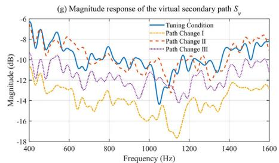

line

(g) Magnitude response of the virtual secondary path S_v
| Frequency (Hz) | Tuning Condition (dB) | Path Change I (dB) | Path Change II (dB) | Path Change III (dB) |
|---|---|---|---|---|
| 400 | -6.5 | -12.0 | -8.5 | -10.0 |
| 500 | -7.5 | -13.0 | -9.0 | -10.5 |
| 600 | -8.0 | -13.5 | -9.5 | -11.0 |
| 700 | -8.5 | -14.0 | -10.0 | -11.5 |
| 800 | -9.0 | -14.5 | -10.5 | -12.0 |
| 900 | -9.5 | -15.0 | -11.0 | -12.5 |
| 1000 | -10.0 | -15.5 | -11.5 | -13.0 |
| 1100 | -11.0 | -16.0 | -12.0 | -13.5 |
| 1200 | -12.0 | -16.5 | -12.5 | -14.0 |
| 1300 | -12.5 | -17.0 | -13.0 | -14.5 |
| 1400 | -13.0 | -17.5 | -13.5 | -15.0 |
| 1500 | -13.5 | -18.0 | -14.0 | -15.5 |
| 1600 | -14.0 | -18.5 | -14.5 | -16.0 |

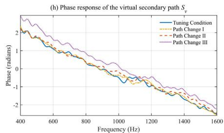

line

(h) Phase response of the virtual secondary path S_v
| Frequency (Hz) | Tuning Condition | Path Change I | Path Change II | Path Change III |
|---|---|---|---|---|
| 400 | 2.1 | 2.0 | 2.1 | 2.3 |
| 500 | 1.8 | 1.7 | 1.8 | 2.0 |
| 600 | 1.4 | 1.3 | 1.4 | 1.6 |
| 700 | 1.0 | 0.9 | 1.0 | 1.2 |
| 800 | 0.6 | 0.5 | 0.6 | 0.8 |
| 900 | 0.2 | 0.1 | 0.2 | 0.4 |
| 1000 | -0.2 | -0.3 | -0.2 | -0.1 |
| 1100 | -0.6 | -0.7 | -0.6 | -0.8 |
| 1200 | -1.0 | -1.1 | -1.0 | -1.2 |
| 1300 | -1.4 | -1.5 | -1.4 | -1.6 |
| 1400 | -1.8 | -1.9 | -1.8 | -2.0 |
| 1500 | -2.2 | -2.3 | -2.2 | -2.4 |
| 1600 | -2.6 | -2.7 | -2.6 | -2.8 |

Fig. 6. Magnitude and phase responses of acoustic paths used in the single-channel ANC simulation.

Table 3 Noise reduction levels at the target ZoQ of the single-channel feedforward ANC system with varying acoustic paths. 

<table><tr><td>Noise Reduction Level</td><td>FC Filter</td><td>AF-VS Method</td><td>RM-VS Method</td><td>RP-VS Method</td></tr><tr><td>Tuning Condition</td><td>24.3</td><td>24.2</td><td>23.7</td><td>23.7</td></tr><tr><td>Primary and Virtual Primary Paths I</td><td>4.2</td><td>6.4</td><td>14.0</td><td>14.0</td></tr><tr><td>Primary and Virtual Primary Paths II</td><td>15.1</td><td>14.7</td><td>13.3</td><td>13.3</td></tr><tr><td>Primary and Virtual Primary Paths III</td><td>15.8</td><td>16.5</td><td>15.3</td><td>15.3</td></tr><tr><td>Secondary and Virtual Secondary Paths I</td><td>8.0</td><td>12.3</td><td>7.9</td><td>12.2</td></tr><tr><td>Secondary and Virtual Secondary Paths II</td><td>11.8</td><td>12.5</td><td>11.8</td><td>12.5</td></tr><tr><td>Secondary and Virtual Secondary Paths III</td><td>7.4</td><td>13.8</td><td>7.3</td><td>13.9</td></tr><tr><td>All of the Acoustic Paths I</td><td>14.7</td><td>10.3</td><td>8.4</td><td>14.5</td></tr><tr><td>All of the Acoustic Paths II</td><td>10.9</td><td>10.9</td><td>9.0</td><td>10.5</td></tr><tr><td>All of the Acoustic Paths III</td><td>7.6</td><td>12.7</td><td>7.0</td><td>11.8</td></tr></table>

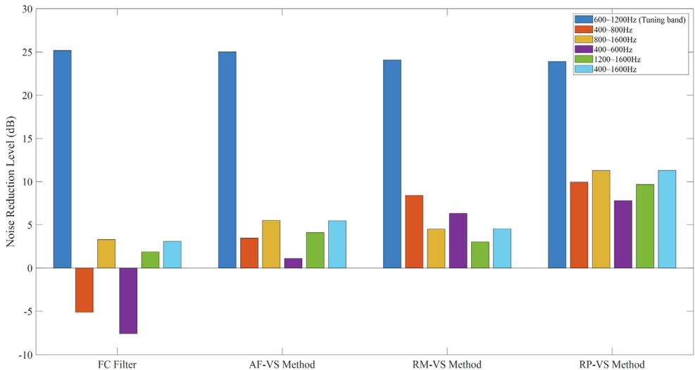

bar

| Category | 600-1200Hz (Tuning band) | 400-800Hz | 800-1600Hz | 400-600Hz | 1200-1600Hz | 400-1600Hz |
|---|---|---|---|---|---|---|
| FC Filter | 25.3 | -5.2 | 3.4 | -7.8 | 1.9 | 3.1 |
| AF-VS Method | 25.1 | 3.5 | 5.6 | 1.2 | 4.2 | 5.5 |
| RM-VS Method | 24.1 | 8.4 | 4.6 | 6.4 | 3.1 | 4.6 |
| RP-VS Method | 23.9 | 10.1 | 11.3 | 7.8 | 9.7 | 11.3 |

Fig. 7. Noise reduction levels at the target ZoQ of the single-channel ANC system with varying noise frequency bands.

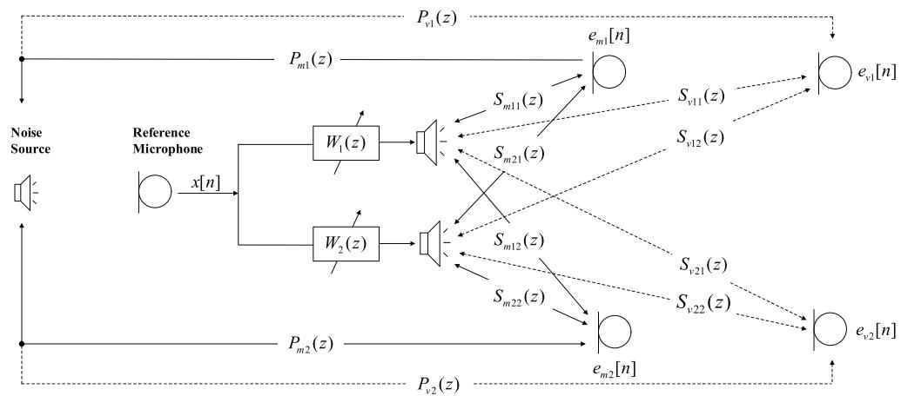

flowchart

```mermaid
graph TD
    A["Noise Source"] --> B["Reference Microphone"]
    B --> C["W1(z)"]
    B --> D["W2(z)"]
    C --> E["Speaker"]
    D --> F["Speaker"]
    E --> G["e_m1[n"]]
    F --> H["e_m2[n"]]
    G --> I["S_{m11}(z)"]
    G --> J["S_{m12}(z)"]
    H --> K["S_{m21}(z)"]
    H --> L["S_{m22}(z)"]
    I --> M["S_{v11}(z)"]
    I --> N["S_{v12}(z)"]
    J --> O["S_{v21}(z)"]
    J --> P["S_{v22}(z)"]
    K --> Q["e_{v1}[n"]]
    L --> R["e_{v2}[n"]]
    M --> S["P_{v1}(z)"]
    N --> T["P_{v2}(z)"]
    O --> U["P_{m1}(z)"]
    P --> V["P_{m2}(z)"]
```

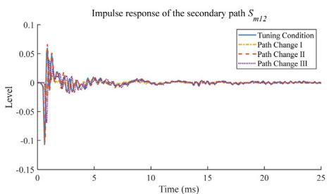

line

Impulse response of the secondary path S_m12
| Time (ms) | Tuning Condition | Path Change I | Path Change II | Path Change III |
|---|---|---|---|---|
| 0 | 0.05 | 0.05 | 0.05 | 0.05 |
| 1 | -0.08 | -0.08 | -0.08 | -0.08 |
| 2 | 0.03 | 0.03 | 0.03 | 0.03 |
| 3 | -0.02 | -0.02 | -0.02 | -0.02 |
| 4 | 0.01 | 0.01 | 0.01 | 0.01 |
| 5 | -0.01 | -0.01 | -0.01 | -0.01 |
| 6 | 0.01 | 0.01 | 0.01 | 0.01 |
| 7 | -0.01 | -0.01 | -0.01 | -0.01 |
| 8 | 0.01 | 0.01 | 0.01 | 0.01 |
| 9 | -0.01 | -0.01 | -0.01 | -0.01 |
| 10 | 0.01 | 0.01 | 0.01 | 0.01 |
| 11 | -0.01 | -0.01 | -0.01 | -0.01 |
| 12 | 0.01 | 0.01 | 0.01 | 0.01 |
| 13 | -0.01 | -0.01 | -0.01 | -0.01 |
| 14 | 0.01 | 0.01 | 0.01 | 0.01 |
| 15 | -0.01 | -0.01 | -0.01 | -0.01 |
| 16 | 0.01 | 0.01 | 0.01 | 0.01 |
| 17 | -0.01 | -0.01 | -0.01 | -0.01 |
| 18 | 0.01 | 0.01 | 0.01 | 0.01 |
| 19 | -0.01 | -0.01 | -0.01 | -0.01 |
| 20 | 0.01 | 0.01 | 0.01 | 0.01 |
| 21 | -0.01 | -0.01 | -0.01 | -0.01 |
| 22 | 0.01 | 0.01 | 0.01 | 0.01 |
| 23 | -0.01 | -0.01 | -0.01 | -0.01 |
| 24 | 0.01 | 0.01 | 0.01 | 0.01 |
The chart displays a single data series with values for each condition: 'Tuning Condition' and 'Path Change I', 'Path Change II', 'Path Change III'. The y-axis represents 'Level' and the x-axis represents 'Time (ms)'. The data shows that all three conditions have zero or near-zero levels across the time range, indicating no significant change in the measured state under these conditions.

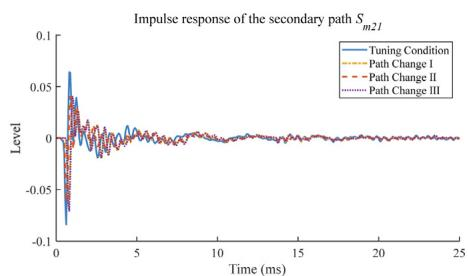

line

Impulse response of the secondary path S_m21
| Time (ms) | Tuning Condition | Path Change I | Path Change II | Path Change III |
|---|---|---|---|---|
| 0 | -0.08 | 0.04 | 0.03 | 0.03 |
| 1 | 0.06 | 0.03 | 0.02 | 0.02 |
| 2 | -0.05 | 0.02 | 0.01 | 0.01 |
| 3 | 0.01 | 0.01 | 0.01 | 0.01 |
| 4 | -0.01 | 0.01 | 0.01 | 0.01 |
| 5 | 0.01 | 0.01 | 0.01 | 0.01 |
| 6 | -0.01 | 0.01 | 0.01 | 0.01 |
| 7 | 0.01 | 0.01 | 0.01 | 0.01 |
| 8 | -0.01 | 0.01 | 0.01 | 0.01 |
| 9 | 0.01 | 0.01 | 0.01 | 0.01 |
| 10 | -0.01 | 0.01 | 0.01 | 0.01 |
| 11 | 0.01 | 0.01 | 0.01 | 0.01 |
| 12 | -0.01 | 0.01 | 0.01 | 0.01 |
| 13 | 0.01 | 0.01 | 0.01 | 0.01 |
| 14 | -0.01 | 0.01 | 0.01 | 0.01 |
| 15 | 0.01 | 0.01 | 0.01 | 0.01 |
| 16 | -0.01 | 0.01 | 0.01 | 0.01 |
| 17 | 0.01 | 0.01 | 0.01 | 0.01 |
| 18 | -0.01 | 0.01 | 0.01 | 0.01 |
| 19 | 0.01 | 0.01 | 0.01 | 0.01 |
| 20 | -0.01 | 0.01 | 0.01 | 0.01 |
| 21 | 0.01 | 0.01 | 0.01 | 0.01 |
| 22 | -0.01 | 0.01 | 0.01 | 0.01 |
| 23 | 0.01 | 0.01 | 0.01 | 0.01 |
| 24 | -0.01 | 0.01 | 0.01 | 0.01 |
The chart displays a single data series with 'Tuning Condition' as the baseline and 'Path Change I', 'Path Change II', and 'Path Change III' as the individual paths plotted on the line chart.

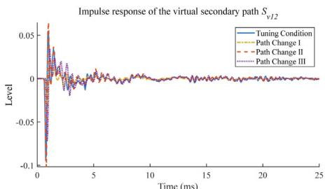

line

Impulse response of the virtual secondary path S_v12
| Time (ms) | Tuning Condition | Path Change I | Path Change II | Path Change III |
|---|---|---|---|---|
| 0 | 0.05 | -0.1 | 0.05 | 0.05 |
| 1 | 0.03 | -0.08 | 0.03 | 0.03 |
| 2 | 0.01 | -0.05 | 0.01 | 0.01 |
| 3 | -0.01 | -0.03 | -0.01 | -0.01 |
| 4 | -0.02 | -0.02 | -0.02 | -0.02 |
| 5 | -0.01 | -0.01 | -0.01 | -0.01 |
| 6 | -0.01 | -0.01 | -0.01 | -0.01 |
| 7 | -0.01 | -0.01 | -0.01 | -0.01 |
| 8 | -0.01 | -0.01 | -0.01 | -0.01 |
| 9 | -0.01 | -0.01 | -0.01 | -0.01 |
| 10 | -0.01 | -0.01 | -0.01 | -0.01 |
| 11 | -0.01 | -0.01 | -0.01 | -0.01 |
| 12 | -0.01 | -0.01 | -0.01 | -0.01 |
| 13 | -0.01 | -0.01 | -0.01 | -0.01 |
| 14 | -0.01 | -0.01 | -0.01 | -0.01 |
| 15 | -0.01 | -0.01 | -0.01 | -0.01 |
| 16 | -0.01 | -0.01 | -0.01 | -0.01 |
| 17 | -0.01 | -0.01 | -0.01 | -0.01 |
| 18 | -0.01 | -0.01 | -0.01 | -0.01 |
| 19 | -0.01 | -0.01 | -0.01 | -0.01 |
| 20 | -0.01 | -0.01 | -0.01 | -0.01 |
| 21 | -0.01 | -0.01 | -0.01 | -0.01 |
| 22 | -0.01 | -0.01 | -0.01 | -0.01 |
| 23 | -0.01 | -0.01 | -0.01 | -0.01 |
| 24 | -0.01 | -0.01 | -0.01 | -0.01 |
| 25 | -0.01 | -0.01 | -0.01 | -0.01 |
The chart displays a single data series with values plotted against Time (ms). The y-axis represents 'Level' and the x-axis represents 'Time (ms)'. The legend indicates four series: Tuning Condition, Path Change I, Path Change II, and Path Change III.

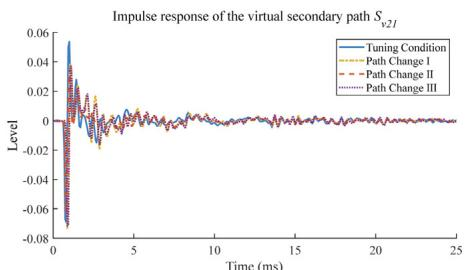  
Fig. 8. Case (1,2,2) dual-channel ANC system setup.

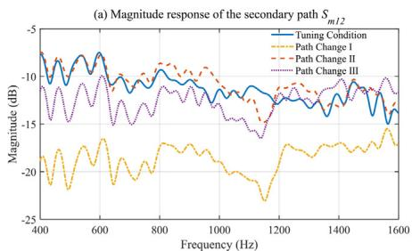

line

(a) Magnitude response of the secondary path S_m12
| Frequency (Hz) | Tuning Condition (dB) | Path Change I (dB) | Path Change II (dB) | Path Change III (dB) |
|---|---|---|---|---|
| 400 | -8.5 | -19.0 | -8.0 | -16.0 |
| 500 | -8.0 | -18.5 | -7.5 | -15.5 |
| 600 | -8.5 | -18.0 | -7.0 | -15.0 |
| 700 | -9.0 | -17.5 | -6.5 | -14.5 |
| 800 | -9.5 | -17.0 | -6.0 | -14.0 |
| 900 | -10.0 | -16.5 | -5.5 | -13.5 |
| 1000 | -10.5 | -16.0 | -5.0 | -13.0 |
| 1100 | -11.0 | -15.5 | -4.5 | -12.5 |
| 1200 | -11.5 | -15.0 | -4.0 | -12.0 |
| 1300 | -12.0 | -14.5 | -3.5 | -11.5 |
| 1400 | -12.5 | -14.0 | -3.0 | -11.0 |
| 1500 | -13.0 | -13.5 | -2.5 | -10.5 |
| 1600 | -13.5 | -13.0 | -2.0 | -10.0 |

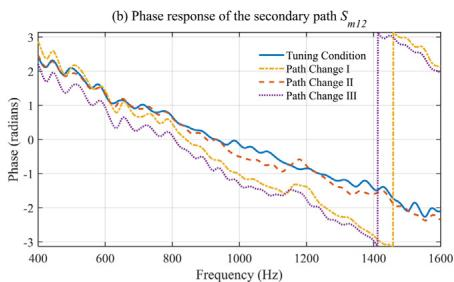

line

(b) Phase response of the secondary path S_m12
| Frequency (Hz) | Tuning Condition | Path Change I | Path Change II | Path Change III |
|---|---|---|---|---|
| 400 | 2.5 | 2.8 | 2.7 | 2.6 |
| 600 | 1.2 | 1.3 | 1.1 | 0.9 |
| 800 | 0.5 | 0.6 | 0.4 | 0.3 |
| 1000 | -0.5 | -0.6 | -0.7 | -0.8 |
| 1200 | -1.2 | -1.3 | -1.4 | -1.5 |
| 1400 | -2.0 | -2.1 | -2.2 | -2.3 |
| 1600 | -2.5 | -2.6 | -2.7 | -2.8 |

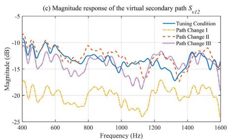

line

(c) Magnitude response of the virtual secondary path S_v12
| Frequency (Hz) | Tuning Condition | Path Change I | Path Change II | Path Change III |
|---|---|---|---|---|
| 400 | -8.5 | -18.0 | -9.0 | -10.0 |
| 500 | -10.0 | -19.0 | -10.0 | -11.0 |
| 600 | -11.0 | -20.0 | -11.0 | -12.0 |
| 700 | -12.0 | -21.0 | -12.0 | -13.0 |
| 800 | -13.0 | -22.0 | -13.0 | -14.0 |
| 900 | -14.0 | -23.0 | -14.0 | -15.0 |
| 1000 | -15.0 | -24.0 | -15.0 | -16.0 |
| 1100 | -16.0 | -25.0 | -16.0 | -17.0 |
| 1200 | -17.0 | -24.0 | -17.0 | -18.0 |
| 1300 | -18.0 | -23.0 | -18.0 | -19.0 |
| 1400 | -19.0 | -22.0 | -19.0 | -20.0 |
| 1500 | -20.0 | -21.0 | -20.0 | -21.0 |
| 1600 | -21.0 | -20.0 | -21.0 | -22.0 |

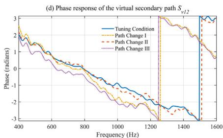

line

| Frequency (Hz) | Tuning Condition | Path Change I | Path Change II | Path Change III |
| -------------- | ---------------- | ------------- | -------------- | --------------- |
| 400            | 2.5              | 2.8           | 2.6            | 2.4             |
| 600            | 1.0              | 1.2           | 1.1            | 0.9             |
| 800            | -0.5             | -0.3          | -0.4           | -0.6            |
| 1000           | -1.5             | -1.7          | -1.6           | -1.8            |
| 1200           | -2.5             | -2.7          | -2.6           | -2.8            |
| 1400           | -3.0             | -3.2          | -3.1           | -3.3            |
| 1600           | 3.0              | 3.2           | 3.1            | 2.9             |

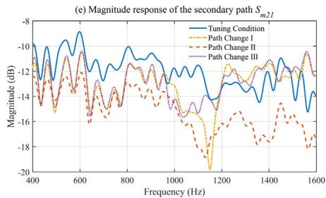

line

(e) Magnitude response of the secondary path S_m21
| Frequency (Hz) | Tuning Condition | Path Change I | Path Change II | Path Change III |
|---|---|---|---|---|
| 400 | -10.0 | -14.5 | -13.8 | -14.2 |
| 500 | -9.5 | -14.0 | -13.5 | -13.7 |
| 600 | -9.0 | -13.5 | -13.0 | -13.2 |
| 700 | -9.5 | -13.0 | -12.5 | -12.7 |
| 800 | -10.0 | -12.5 | -12.0 | -12.2 |
| 900 | -10.5 | -12.0 | -11.5 | -11.7 |
| 1000 | -11.0 | -11.5 | -11.0 | -11.2 |
| 1100 | -11.5 | -12.0 | -11.5 | -11.7 |
| 1200 | -12.0 | -12.5 | -12.0 | -12.2 |
| 1300 | -12.5 | -13.0 | -12.5 | -12.7 |
| 1400 | -13.0 | -13.5 | -13.0 | -13.2 |
| 1500 | -13.5 | -14.0 | -13.5 | -13.7 |
| 1600 | -14.0 | -14.5 | -14.0 | -14.2 |

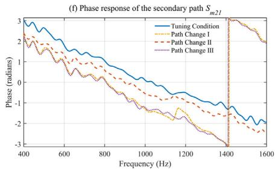

line

| Frequency (Hz) | Tuning Condition | Path Change I | Path Change II | Path Change III |
| -------------- | ---------------- | ------------- | -------------- | --------------- |
| 400            | 3.0              | 2.5           | 2.0            | 1.5             |
| 600            | 2.0              | 1.5           | 1.0            | 0.5             |
| 800            | 1.0              | 0.5           | 0.0            | -0.5            |
| 1000           | 0.0              | -0.5          | -1.0           | -1.5            |
| 1200           | -1.0             | -1.5          | -2.0           | -2.5            |
| 1400           | -2.0             | -2.5          | -3.0           | -3.5            |
| 1600           | -2.5             | -3.0          | -3.5           | -4.0            |

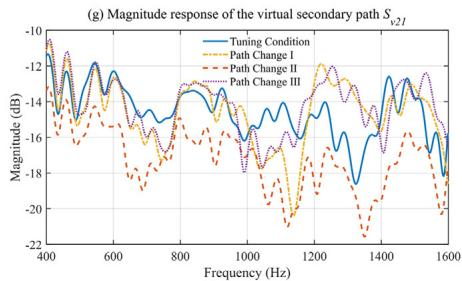

line

(g) Magnitude response of the virtual secondary path S_v2l
| Frequency (Hz) | Tuning Condition (dB) | Path Change I (dB) | Path Change II (dB) | Path Change III (dB) |
|---|---|---|---|---|
| 400 | -10.5 | -10.8 | -11.2 | -10.3 |
| 500 | -12.0 | -12.5 | -13.0 | -11.8 |
| 600 | -13.5 | -14.0 | -14.5 | -13.2 |
| 700 | -14.0 | -14.5 | -15.0 | -13.8 |
| 800 | -14.5 | -15.0 | -15.5 | -14.3 |
| 900 | -15.0 | -15.5 | -16.0 | -14.8 |
| 1000 | -15.5 | -16.0 | -16.5 | -15.3 |
| 1100 | -16.0 | -16.5 | -17.0 | -15.8 |
| 1200 | -16.5 | -17.0 | -17.5 | -16.3 |
| 1300 | -17.0 | -17.5 | -18.0 | -16.8 |
| 1400 | -17.5 | -18.0 | -18.5 | -17.3 |
| 1500 | -18.0 | -18.5 | -19.0 | -17.8 |
| 1600 | -18.5 | -19.0 | -19.5 | -18.3 |

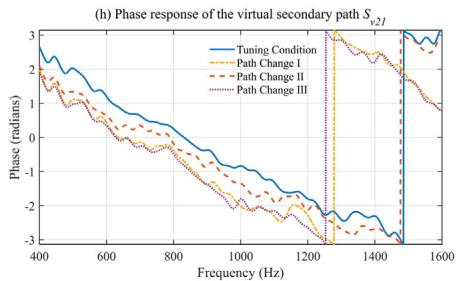

line

(h) Phase response of the virtual secondary path S_v2l
| Frequency (Hz) | Tuning Condition | Path Change I | Path Change II | Path Change III |
|---|---|---|---|---|
| 400 | 2.5 | 2.0 | 1.8 | 1.6 |
| 600 | 1.5 | 1.2 | 1.0 | 0.8 |
| 800 | 0.5 | 0.3 | 0.2 | 0.1 |
| 1000 | -0.5 | -0.7 | -0.9 | -1.1 |
| 1200 | -1.5 | -1.7 | -1.9 | -2.1 |
| 1400 | -2.5 | -2.7 | -2.9 | -3.1 |
| 1600 | -3.0 | -3.2 | -3.4 | -3.6 |

Fig. 9. Magnitude and phase responses of cross-channel acoustic paths used in the dual-channel ANC simulation.

Table 4 Noise reduction levels at the target ZoQ of the dual-channel ANC system with varying acoustic paths. 

<table><tr><td>Noise Reduction Level</td><td>FC Filter</td><td>AF-VS Method</td><td>RM-VS Method</td><td>RP-VS Method</td></tr><tr><td>Tuning Condition</td><td>23.7</td><td>23.7</td><td>23.0</td><td>23.1</td></tr><tr><td>Primary and Virtual Primary Paths I</td><td>10.0</td><td>11.8</td><td>13.7</td><td>13.7</td></tr><tr><td>Primary and Virtual Primary Paths II</td><td>8.3</td><td>9.8</td><td>14.3</td><td>14.3</td></tr><tr><td>Primary and Virtual Primary Paths III</td><td>15.4</td><td>16.1</td><td>14.4</td><td>14.4</td></tr><tr><td>Secondary and Virtual Secondary Paths I</td><td>4.2</td><td>5.4</td><td>4.2</td><td>6.2</td></tr><tr><td>Secondary and Virtual Secondary Paths II</td><td>7.7</td><td>10.4</td><td>7.6</td><td>9.9</td></tr><tr><td>Secondary and Virtual Secondary Paths III</td><td>5.7</td><td>5.0</td><td>5.6</td><td>5.8</td></tr><tr><td>All of the Acoustic Paths I</td><td>4.9</td><td>6.8</td><td>4.3</td><td>6.0</td></tr><tr><td>All of the Acoustic Paths II</td><td>10.0</td><td>8.8</td><td>7.3</td><td>7.9</td></tr><tr><td>All of the Acoustic Paths III</td><td>5.3</td><td>4.7</td><td>4.7</td><td>5.5</td></tr></table>

the simulation. However, the noise reduction levels achieved by the RP-VS method in the dual-channel ANC system are less than those in the single-channel ANC system. Similar trends are observed for the RM-VS method too. The difficulty caused by the cross-channel acoustic paths is hence demonstrated.

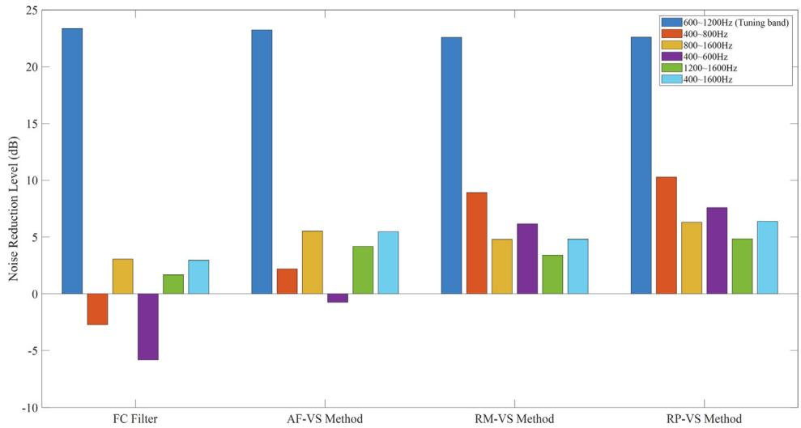

bar

| Category | 600-1200Hz (Tuning band) | 400-800Hz | 800-1600Hz | 400-600Hz | 1200-1600Hz | 400-1600Hz |
|---|---|---|---|---|---|---|
| FC Filter | 23.5 | -2.5 | 3.2 | -5.8 | 1.7 | 3.0 |
| AF-VS Method | 23.3 | 2.3 | 5.6 | -0.8 | 4.3 | 5.5 |
| RM-VS Method | 22.5 | 9.0 | 4.9 | 6.2 | 3.5 | 4.9 |
| RP-VS Method | 22.6 | 10.3 | 6.4 | 7.6 | 4.9 | 6.4 |

Fig. 10. Noise reduction levels at the target ZoQ of the dual-channel ANC system with varying noise frequency bands.

# 4. Experiment results of an ANC casing

The ANC casing is built up with a case (1,4,4) feedforward ANC control system. It consists of one reference microphone inside the casing, four loudspeakers as the control sources, four monitoring microphones fastened near the loudspeakers and four removable virtual error microphones that are supported by racks in the tuning stage. The 3D design model and prototype photo of the ANC casing are shown in Fig. 11. A computer fan, whose full speed is about 2500 rpm, is enclosed in the ANC casing for the experiment. The ANC controller is a real-time DSP platform supporting four channels of digital-to-analog conversion and eight channels of analog-to-digital conversion. Therefore, in the tuning stage of the RM-VS method and the RP-VS method, only the monitoring microphones and the virtual microphones are connected to the DSP platform. The relative primary path models are estimated with the noise emitted from the computer fan. The relative secondary path models are obtained by turning off the computer fan and playing white noise from each secondary loudspeaker. Subsequently, the reference microphone and the virtual microphones are connected to the DSP platform, in order for the optimal control filters to be obtained by the FxLMS algorithm. With the control filter coefficients fixed, the monitoring microphones are connected to replace the virtual microphones and to tune the auxiliary filters of the AF-VS method. In the control stage, the virtual microphones are connected to another DSP platform to record the sound pressure level at the target ZoQ. The AF-VS method, the RM-VS method and the RP-VS method all adopt the reference microphone and the monitoring microphones to update their control filter coefficients. The speed of the computer fan is adjusted during the control stage. For each speed setting, the FxLMS baseline is obtained by using the reference microphone and the virtual microphones. The circuit configuration of the ANC casing in the experiment is shown in Fig. 12.

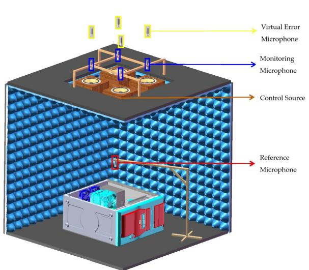

text_image

Virtual Error
Microphone
Monitoring
Microphone
Control Source
Reference
Microphone

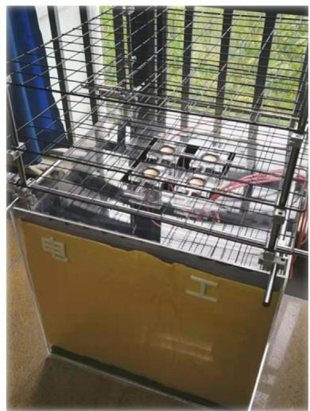

text_image

电工

Fig. 11. 3D design model (left) and prototype photo (right) of the ANC Casing.

In the tuning stage, the computer fan is set to 30% of its full speed. The sound pressure level at the target ZoQ is 58 dB, while the floor noise of the measurement room is 34 dB. The relative path models are trained with the fan noise on the realtime DSP platform. The FxLMS baseline is then trained with the reference microphone and four virtual microphones. In the control stage, the virtual microphones are only used to showcase the noise reduction performance. The noise power spectra are plotted in Fig. 13. It shows that the ANC casing achieves broadband noise reduction at the target ZoQ. The performance of the AF-VS method is very close to the FxLMS baseline, while the RM-VS method and the RP-VS method provide competitive noise reduction performance. Next, the fan speed is accelerated to its full speed. The noise frequency band is not significantly changed. However, the sound pressure level at the target ZoQ is increased to 73 dB. The computer fan causes vibration of the ANC casing, which leads to fluctuations in acoustic paths. Without further tuning of the auxiliary filters and the relative path models, the RP-VS method is as effective as the AF-VS method and the RM-VS method. They all achieve notable broadband noise reduction, but none of the VS methods can outperform the other two methods substantially (see Fig. 14).

Fig. 15 shows the convergence curves of the VS methods and the FxLMS baseline at the target ZoQ and the monitoring microphones when the fan speed is 30%; 60%; 80% and 100% of its full speed. The relative path models are only obtained with the tuning condition when the fan speed is at 30% of its full speed. It is worth noting that with higher fan speed, more noise reduction is observed. This is due to the floor noise of the measurement room that hinders the convergence of the adaptive algorithm. Furthermore, the sound pressure level at the monitoring microphone is increased when the target ZoQ is formed. This demonstrates the necessity of VS methods in applications with the ANC casing. The monitoring microphones are placed very close to the control sources for better appearance and safer use. However, the target ZoQ can be far away from the control sources. VS methods are effective solutions to this practical situation. Besides the AF-VS method and

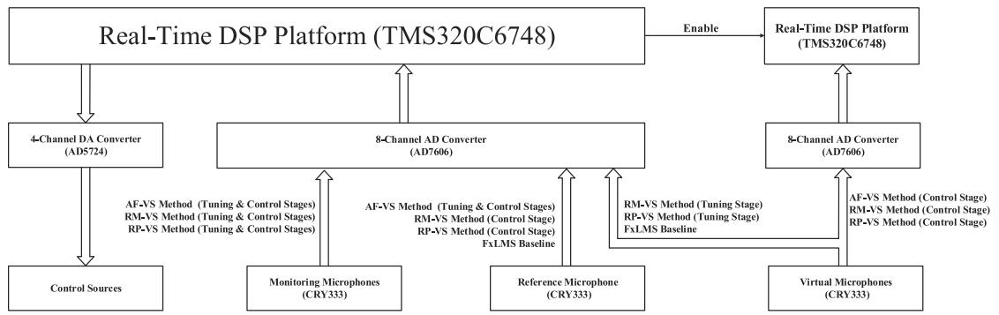

flowchart

```mermaid
graph TD
    A["Real-Time DSP Platform (TMS320C6748)"] -->|Enable| B["Real-Time DSP Platform (TMS320C6748)"]
    A --> C["4-Channel DA Converter (AD5724)"]
    A --> D["8-Channel AD Converter (AD7606)"]
    A --> E["8-Channel AD Converter (AD7606)"]
    C --> F["Control Sources"]
    D --> G["Monitoring Microphones (CRY333)"]
    D --> H["Reference Microphone (CRY333)"]
    D --> I["Virtual Microphones (CRY333)"]
    E --> J["AF-VS Method (Tuning & Control Stages)"]
    E --> K["RM-VS Method (Tuning & Control Stages)"]
    E --> L["RP-VS Method (Tuning & Control Stages)"]
    E --> M["RP-VS Method (Control Stage)"]
    E --> N["FxLMS Baseline"]
    E --> O["AF-VS Method (Tuning & Control Stages)"]
    E --> P["RM-VS Method (Tuning & Control Stages)"]
    E --> Q["FxLMS Baseline"]
    E --> R["AF-VS Method (Control Stage)"]
    E --> S["RM-VS Method (Control Stage)"]
    E --> T["RP-VS Method (Control Stage)"]
```

Fig. 12. Circuit configuration of the ANC casing in the experiment.

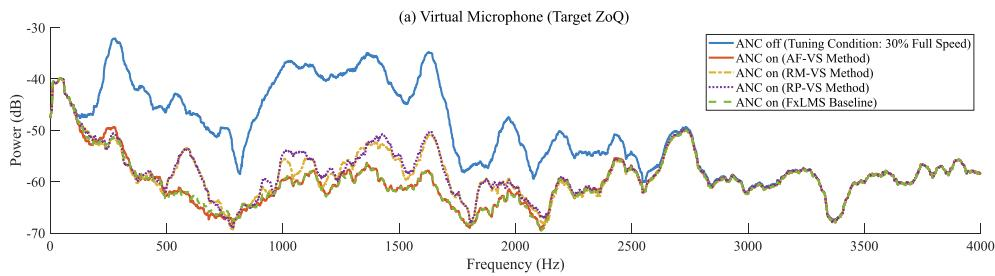

line

| Frequency (Hz) | ANC off (Tuning Condition: 30% Full Speed) | ANC on (AF-VS Method) | ANC on (RM-VS Method) | ANC on (RP-VS Method) | ANC on (FxLMS Baseline) |
| -------------- | ---------------------------------------- | --------------------- | --------------------- | --------------------- | ----------------------- |
| 0              | -40                                      | -40                   | -40                   | -40                   | -40                     |
| 500            | -35                                      | -45                   | -48                   | -47                   | -49                     |
| 1000           | -30                                      | -50                   | -52                   | -51                   | -53                     |
| 1500           | -25                                      | -55                   | -57                   | -56                   | -58                     |
| 2000           | -20                                      | -60                   | -62                   | -61                   | -63                     |
| 2500           | -15                                      | -55                   | -57                   | -56                   | -58                     |
| 3000           | -10                                      | -50                   | -52                   | -51                   | -53                     |
| 3500           | -5                                       | -45                   | -47                   | -46                   | -48                     |
| 4000           | 0                                        | -40                   | -42                   | -41                   | -43                     |

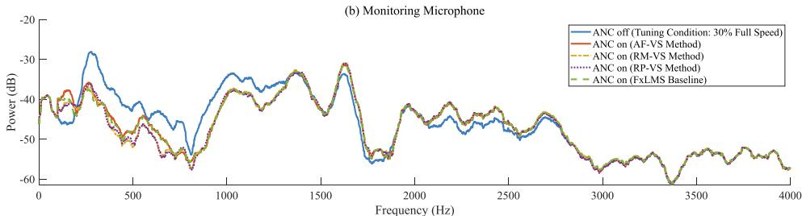

line

| Frequency (Hz) | ANC off (Tuning Condition: 30% Full Speed) | ANC on (AF-VS Method) | ANC on (RM-VS Method) | ANC on (RP-VS Method) | ANC on (FxLMS Baseline) |
| -------------- | ------------------------------------------ | --------------------- | --------------------- | --------------------- | ----------------------- |
| 0              | -40                                        | -40                   | -40                   | -40                   | -40                     |
| 500            | -30                                        | -35                   | -35                   | -35                   | -35                     |
| 1000           | -40                                        | -45                   | -45                   | -45                   | -45                     |
| 1500           | -30                                        | -35                   | -35                   | -35                   | -35                     |
| 2000           | -50                                        | -55                   | -55                   | -55                   | -55                     |
| 2500           | -40                                        | -45                   | -45                   | -45                   | -45                     |
| 3000           | -60                                        | -60                   | -60                   | -60                   | -60                     |
| 3500           | -50                                        | -55                   | -55                   | -55                   | -55                     |
| 4000           | -60                                        | -60                   | -60                   | -60                   | -60                     |

Fig. 13. Noise spectra at the virtual microphone and the monitoring microphone when the fan speed is at 30% of its full speed. Note that this is also the tuning condition for the AF-VS method, the RM-VS method and the RP-VS method.

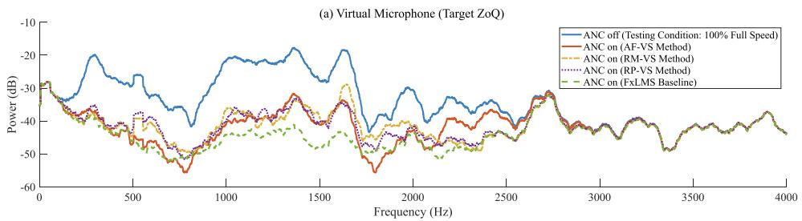

line

| Frequency (Hz) | ANC off (Testing Condition: 100% Full Speed) | ANC on (AF-VS Method) | ANC on (RM-VS Method) | ANC on (RP-VS Method) | ANC on (FxLMS Baseline) |
| -------------- | ------------------------------------------- | --------------------- | --------------------- | --------------------- | ----------------------- |
| 0              | -30                                         | -30                   | -30                   | -30                   | -30                     |
| 500            | -25                                         | -40                   | -40                   | -40                   | -45                     |
| 1000           | -20                                         | -45                   | -45                   | -45                   | -50                     |
| 1500           | -15                                         | -35                   | -35                   | -35                   | -45                     |
| 2000           | -25                                         | -45                   | -45                   | -45                   | -50                     |
| 2500           | -30                                         | -40                   | -40                   | -40                   | -45                     |
| 3000           | -35                                         | -45                   | -45                   | -45                   | -50                     |
| 3500           | -40                                         | -40                   | -40                   | -40                   | -45                     |
| 4000           | -45                                         | -45                   | -45                   | -45                   | -50                     |

(b) Monitoring Microphone   
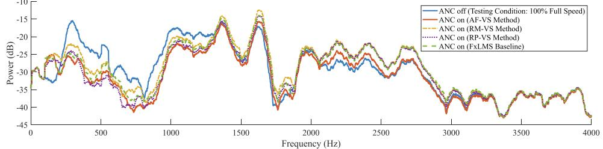

line

| Frequency (Hz) | ANC off (Testing Condition: 100% Full Speed) | ANC on (AF-VS Method) | ANC on (RM-VS Method) | ANC on (RP-VS Method) | ANC on (FxLMS Baseline) |
| -------------- | ------------------------------------------- | --------------------- | --------------------- | --------------------- | ----------------------- |
| 0              | -30                                         | -30                   | -30                   | -30                   | -30                     |
| 500            | -25                                         | -25                   | -25                   | -25                   | -25                     |
| 1000           | -20                                         | -20                   | -20                   | -20                   | -20                     |
| 1500           | -15                                         | -15                   | -15                   | -15                   | -15                     |
| 2000           | -25                                         | -25                   | -25                   | -25                   | -25                     |
| 2500           | -30                                         | -30                   | -30                   | -30                   | -30                     |
| 3000           | -40                                         | -40                   | -40                   | -40                   | -40                     |
| 3500           | -35                                         | -35                   | -35                   | -35                   | -35                     |
| 4000           | -45                                         | -45                   | -45                   | -45                   | -45                     |

Fig. 14. Noise spectra at the virtual microphone and the monitoring microphone when the fan speed is at 100% of its full speed.

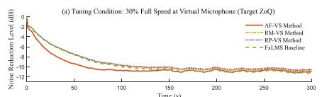

line

| Time (s) | AF-VS Method | RM-VS Method | RP-VS Method | PALMS Baseline |
| -------- | ------------ | ------------ | ------------ | -------------- |
| 0        | 0            | 0            | 0            | 0              |
| 50       | -8           | -9           | -10          | -10            |
| 100      | -10          | -11          | -11          | -11            |
| 150      | -11          | -12          | -12          | -12            |
| 200      | -12          | -13          | -13          | -13            |
| 250      | -13          | -14          | -14          | -14            |
| 300      | -14          | -15          | -15          | -15            |

(c) Testing Condition: 60% Full Speed at Virtual Microphone (Target ZoQ)   
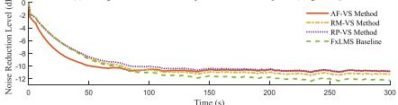

line

| Time (s) | AF-VS Method | RM-VS Method | RP-VS Method | FLMS Baseline |
| -------- | ------------ | ------------ | ------------ | ------------- |
| 0        | 0            | 0            | 0            | 0             |
| 50       | -8           | -9           | -10          | -10           |
| 100      | -10          | -11          | -11          | -11           |
| 150      | -11          | -12          | -12          | -12           |
| 200      | -12          | -12          | -12          | -12           |
| 250      | -12          | -12          | -12          | -12           |
| 300      | -12          | -12          | -12          | -12           |

(c) Testing Condition: 80% Full Speed at Virtual Microphone (Target ZoQ)   
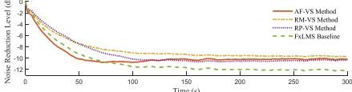

line

| Time (s) | AF-VS Method | RM-VS Method | RP-VS Method | FLMS Baseline |
| -------- | ------------ | ------------ | ------------ | ------------- |
| 0        | 0.0          | 0.0          | 0.0          | 0.0           |
| 50       | -8.0         | -7.5         | -7.0         | -9.0          |
| 100      | -10.0        | -9.5         | -9.0         | -11.0         |
| 150      | -11.0        | -10.5        | -10.0        | -12.0         |
| 200      | -11.5        | -11.0        | -10.5        | -12.5         |
| 250      | -12.0        | -11.5        | -11.0        | -13.0         |
| 300      | -12.5        | -12.0        | -11.5        | -13.5         |

(g) Testing Condition: 100% Ful Speed at Virtual Microphone (Target ZoQ)

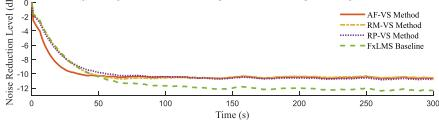

line

| Time (s) | AF-VS Method | RM-VS Method | RP-VS Method | FLMS Baseline |
| -------- | ------------ | ------------ | ------------ | ------------- |
| 0        | -2.0         | -2.0         | -2.0         | -2.0          |
| 50       | -8.0         | -8.5         | -9.0         | -10.0         |
| 100      | -10.0        | -10.5        | -11.0        | -11.5         |
| 150      | -11.0        | -11.5        | -12.0        | -12.0         |
| 200      | -11.5        | -12.0        | -12.5        | -12.5         |
| 250      | -12.0        | -12.5        | -13.0        | -13.0         |
| 300      | -12.5        | -13.0        | -13.5        | -13.5         |

(b) Tuning Condition: 30% Full Speed at Monitoring Microphone   
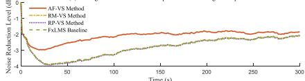

line

| Time (s) | AF-VS Method | RM-VS Method | RP-VS Method | P/LMS Baseline |
| -------- | ------------ | ------------ | ------------ | -------------- |
| 0        | -2.0         | -2.0         | -2.0         | -2.0           |
| 50       | -2.5         | -2.8         | -3.0         | -3.2           |
| 100      | -2.3         | -2.6         | -2.8         | -2.9           |
| 150      | -2.1         | -2.4         | -2.6         | -2.7           |
| 200      | -2.0         | -2.3         | -2.5         | -2.6           |
| 250      | -1.9         | -2.2         | -2.4         | -2.5           |
| 300      | -1.8         | -2.1         | -2.3         | -2.4           |

(d) Testing Condition: 60% Full Speed at Monitoring Microphone   
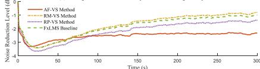

line

| Time (s) | AF-VS Method | RM-VS Method | RP-VS Method | FLMS Baseline |
| -------- | ------------ | ------------ | ------------ | ------------- |
| 0        | -2.5         | -2.5         | -2.5         | -2.5          |
| 50       | -1.8         | -1.7         | -1.6         | -1.9          |
| 100      | -1.5         | -1.4         | -1.3         | -1.6          |
| 150      | -1.3         | -1.2         | -1.1         | -1.4          |
| 200      | -1.1         | -1.0         | -0.9         | -1.2          |
| 250      | -0.9         | -0.8         | -0.7         | -1.0          |
| 300      | -0.7         | -0.6         | -0.5         | -0.8          |

(f) Testing Condition: 80% Full Speed at Monitoring Microphone   
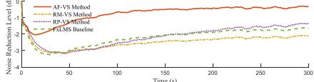

line

| Time (s) | AF-VS Method | RM-VS Method | RP-VS Method | PLMS Baseline |
| -------- | ------------ | ------------ | ------------ | ------------- |
| 0        | -1.5         | -1.5         | -1.5         | -1.5          |
| 50       | -1.2         | -1.3         | -1.4         | -1.6          |
| 100      | -1.0         | -1.1         | -1.2         | -1.7          |
| 150      | -0.8         | -0.9         | -1.0         | -1.8          |
| 200      | -0.6         | -0.7         | -0.8         | -1.9          |
| 250      | -0.4         | -0.5         | -0.6         | -2.0          |
| 300      | -0.2         | -0.3         | -0.4         | -2.1          |

(h) Testing Condition: 100% Full Speed at Monitoring Microphone

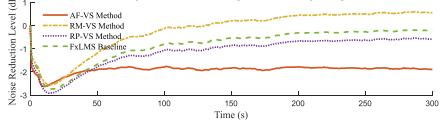

line

| Time (s) | AF-VS Method | RM-VS Method | RP-VS Method | PxLMB Bottling |
|---|---|---|---|---|
| 0 | -2.5 | -2.5 | -2.5 | -2.5 |
| 50 | -1.8 | -1.2 | -1.0 | -1.5 |
| 100 | -1.5 | -0.8 | -0.7 | -1.2 |
| 150 | -1.3 | -0.6 | -0.5 | -1.0 |
| 200 | -1.2 | -0.4 | -0.4 | -0.8 |
| 250 | -1.1 | -0.3 | -0.3 | -0.7 |
| 300 | -1.0 | -0.2 | -0.2 | -0.6 |

Fig. 15. Convergence curves at the virtual microphone and the monitoring microphone with different fan speed settings.

the RM-VS method, the RP-VS method is a new option that is suitable when dealing with varying acoustic paths and varying noise characteristics.

# 5. Conclusions

The two most commonly applied VS methods, namely the AF-VS method and the RM-VS method, are compared with the newly proposed RP-VS method in this paper through analytical analysis and simulations. An investigation of varying acoustic paths and noise characteristics is highlighted. Simulation results, obtained with case (1,1,1) and case (1,2,2) feedforward ANC systems, are in good agreement with the analytical results. The RP-VS method can behave in the same way as the AF-VS method or the RM-VS method, under specific assumptions of varying acoustic paths. When the secondary and virtual secondary paths are invariant, the RM-VS method and the RP-VS method are likely to provide more noise reduction than the AF-VS method. When the primary and virtual primary paths are invariant, the AF-VS method and the RP-VS method can make use of the online secondary path modeling technique to achieve better noise reduction performance. Moreover, all the VS methods demonstrate their robustness, which is a lack in the FC filter due to its non-adaptivity. With more crosschannel acoustic paths involved, multi-channel ANC systems are more sensitive to varying acoustic paths, which consequently are more challenging in practical implementations.

Lastly, an ANC casing is built up with a case (1,4,4) feedforward ANC system, implementing the RP-VS method on a realtime DSP platform. The tuning stage is carried out with a relatively low fan speed, while the control stage deals with higher speeds and correspondingly higher noise levels. The experiment results validate that the RP-VS method is as effective as the AF-VS method and the RM-VS method in the implementation of the ANC casing. Therefore, the RP-VS method could be an alternative VS method to deal with varying acoustic paths and varying noise characteristics.

# CRediT authorship contribution statement

Chuang Shi: Conceptualization, Methodology, Writing - original draft, Project administration, Funding acquisition. Zhuoying Jia: Software, Formal analysis, Data curation. Rong Xie: Validation, Investigation, Visualization. Huiyong Li: Resources, Supervision.

# Declaration of Competing Interest

The authors declare that they have no known competing financial interests or personal relationships that could have appeared to influence the work reported in this paper.

# Acknowledgements

This manuscript is prepared based on the research work supported by the National Natural Science Foundation of China and the Civil Aviation Administration of China (Joint Grant No. U1933127).

# References

[1] S.J. Elliott, P.A. Nelson, Active noise control, IEEE Signal Process. Mag. 10 (4) (1993) 12–35.   
[2] S.M. Kuo, D.R. Morgan, Active noise control: a tutorial review, Proc. IEEE 87 (6) (1999) 943–973.   
[3] Y. Kajikawa, W.S. Gan, S.M. Kuo, Recent advances on active noise control: open issues and innovative applications, APSIPA Trans. Signal Inform. Process. 1 (e3) (2012) 1–21.   
[4] T. Murao, C. Shi, W.S. Gan, M. Nishimura, Mixed-error approach for multi-channel active noise control of open windows, Appl. Acoust. 127 (2017) 305– 315.   
[5] B. Lam, C. Shi, D. Shi, W.S. Gan, Active control of sound through full-sized open windows, Build. Environ. 141 (2018) 16–27.   
[6] K. Mazur, S. Wrona, M. Pawelczyk, Design and implementation of multichannel global active structural acoustic control for a device casing, Mech. Syst. Signal Process. 98 (2018) 877–889.   
[7] S.J. Elliot, C.C. Boucher, P.A. Nelson, The behavior of a multiple channel active control system, IEEE Trans. Signal Process. 40 (5) (1992) 1041–1052.   
[8] J. Cheer, S.J. Elliott, Multichannel control systems for the attenuation of interior road noise in vehicles, Mech. Syst. Signal Process. 60–61 (2015) 753– 769.   
[9] D. Shi, W.S. Gan, B. Lam, C. Shi, Two-gradient direction FXLMS: An adaptive active noise control algorithm with output constraint, Mech. Syst. Signal Process. 116 (2019) 651–667.   
[10] S.J. Elliott, I.M. Stothers, P.A. Nelson, A multiple error LMS algorithm and its application to the active control of sound and vibration, IEEE Trans. Acoust., Speech, Signal Process. 35 (10) (1987) 1423–1434.   
[11] P. Joseph, S.J. Elliott, P. Nelson, Near field zones of quiet, J. Sound Vib. 172 (5) (1994) 605–627.   
[12] D. Moreau, B. Cazzolato, A. Zander, C. Petersen, A review of virtual sensing algorithms for active noise control, Algorithms 1 (2) (2008) 69–99.   
[13] C.D. Kestell, B.S. Cazzolato, C.H. Hansen, Active noise control in a free field with virtual sensors, J. Acoust. Soc. Am. 109 (1) (2001) 232–243.   
[14] D.P. Das, D.J. Moreau, B.S. Cazzolato, A computationally efficient frequency-domain filtered-XLMS algorithm for virtual microphone, Mech. Syst. Signal Process. 37 (2013) 440–454.   
[15] A. Walle, F. Naets, W. Desmet, Virtual microphone sensing through vibro-acoustic modelling and Kalman filtering, Mech. Syst. Signal Process. 104 (2018) 120–133.   
[16] M. Pawelczyk, Analog active control of acoustic noise at a virtual location, IEEE Trans. Control Syst. Technol. 17 (2) (2009) 465–472.   
[17] N. Miyazaki, Y. Kajikawa, Head-mounted active noise control system with virtual sensing technique, J. Sound Vib. 339 (2015) 65–83.   
[18] R. Xie, C. Shi, H. Li, Virtual sensing technique for a multi-reference and multi-error active noise control system, in: Proceedings of the 23rd International Congress on Acoustics, Aachen, Germany, 2019.   
[19] J. Garcia-Bonito, S.J. Elliott, C.C. Boucher, Generation of zones of quiet using a virtual microphone arrangement, J. Acoust. Soc. Am. 101 (6) (1997) 3498– 3516.   
[20] S.J. Elliott, J. Cheer, Modeling local active sound control with remote sensors in spatially random pressure fields, J. Acoust. Soc. Am. 137 (4) (2015) 1936–1946.   
[21] D. Shi, B. Lam, W.S. Gan, Analysis of multichannel virtual sensing active noise control to overcome spatial correlation and causality constraints, in: Proceedings of the 44th IEEE International Conference on Acoustics, Speech and Signal Processing, Brighton, UK, 2019.   
[22] Y. Kajikawa, C. Shi, Comparison of virtual sensing techniques for broadband feedforward active noise control, in: Proceedings of the 8th International Conference on Control, Automation and Information, Chengdu, China, 2019.   
[23] S.J. Elliott, W. Jun, J. Cheer, Causality and robustness in the remote sensing of acoustic pressure, with application to local active sound control, in: Proceedings of the 44th IEEE International Conference on Acoustics, Speech and Signal Processing, Brighton, UK, 2019.   
[24] W. Jung, S.J. Elliott, J. Cheer, Local active control of road noise inside a vehicle, Mech. Syst. Signal Process. 121 (2019) 144–157.   
[25] S.J. Elliott, C.K. Lai, T. Vergez, J. Cheer, Robust stability and performance of local active control systems using virtual sensing, in: Proceedings of the 23rd International Congress on Acoustics, Aachen, Germany, 2019.   
[26] C. Shi, R. Xie, N. Jiang, H. Li, Y. Kajikawa, Selective virtual sensing technique for multi-channel feedforward active noise control systems, in: Proceedings of the 44th IEEE International Conference on Acoustics, Speech and Signal Processing, Brighton, UK, 2019.
