# On Optimal Frequency-Domain Multichannel Linear Filtering for Noise Reduction

Mehrez Souden, Student Member, IEEE, Jacob Benesty, Senior Member, IEEE, and Sofiène Affes, Senior Member, IEEE

Abstract—Several contributions have been made so far to develop optimal multichannel linear filtering approaches and show their ability to reduce the acoustic noise. However, there has not been a clear unifying theoretical analysis of their performance in terms of both noise reduction and speech distortion. To fill this gap, we analyze the frequency-domain (non-causal) multichannel linear filtering for noise reduction in this paper. For completeness, we consider the noise reduction constrained optimization problem that leads to the parameterized multichannel non-causal Wiener filter (PMWF). Our contribution is fivefold. First, we formally show that the minimum variance distortionless response (MVDR) filter is a particular case of the PMWF by properly formulating the constrained optimization problem of noise reduction. Second, we propose new simplified expressions for the PMWF, the MVDR, and the generalized sidelobe canceller (GSC) that depend on the signals’ statistics only. In contrast to earlier works, these expressions are explicitly independent of the channel transfer function ratios. Third, we quantify the theoretical gains and losses in terms of speech distortion and noise reduction when using the PWMF by establishing new simplified closed-form expressions for three performance measures, namely, the signal distortion index, the noise reduction factor (originally proposed in the paper titled “New insights into the noise reduction Wiener filter,” by J. Chen et al. (IEEE Transactions on Audio, Speech, and Language Processing, Vol. 15, no. 4, pp. 1218–1234, Jul. 2006) to analyze the single channel time-domain Wiener filter), and the output signal-to-noise ratio (SNR). Fourth, we analyze the effects of coherent and incoherent noise in addition to the benefits of utilizing multiple microphones. Fifth, we propose a new proof for the a posteriori SNR improvement achieved by the PMWF. Finally, we provide some simulations results to corroborate the findings of this work.

Index Terms—Generalized sidelobe canceller (GSC), micro phone arrays, minimum variance distortionless response (MVDR), noise reduction, parameterized non-causal multichannel Wiener filter, speech distortion.

## I. INTRODUCTION

N OISE reduction has become an active area of researchafter the pioneering work of Schroeder [2]. This fact is after the pioneering work of Schroeder [2]. This fact is due to its various applications including hands-free communications, hearing aids, teleconferencing, etc. [3]. On the other hand, microphone arrays are becoming commonplace in modern speech communication systems because of their potential. Indeed, it has been established that in addition to their very important task of localizing acoustic sources ([4] and references therein), microphone arrays allow for efficient source retrieval from mixtures of sounds and noise by taking advantage of the spatial dimension in addition to the classical temporal and frequency dimensions [5], [6].

In contrast to single microphone-based speech enhancement approaches where noise reduction may come at the price of significant speech distortion [1], the utilization of multiple microphones has theoretically the potential to significantly reduce the noise while outputting low or even no speech distortion [5], [7], [8]. In this context, several attempts have been made to enhance speech signals by not only denoising (i.e., removal of additive noise) but also dereverberating (i.e., removal of multiplicative noise) them using microphone arrays [9]–[11]. However, the resulting complexity is generally prohibitive. Actually, dereverberation itself remains an open field for further research and we would rather focus, as in [1], [5], [8], [12]–[29], on noise reduction in this contribution.

The spatial diversity inherent to microphone arrays accounts for the increasing interest to take advantage of their potentials for noise reduction in either frequency- or time-domain. Among time-domain approaches, beamforming is known for its ability to perform noise reduction by steering the array beam toward the direction of arrival of the source. By doing so, the desired source is recovered while other competing sources (or background noise) are attenuated [25]. The linearly constrained minimum variance (LCMV) is one of the most promising beamforming techniques for noise reduction in acoustic environments and even for speech enhancement though the channel impulse responses need to be known [7]. The minimum variance distortionless response (MVDR) is a single-constraint version of the LCMV while the generalized sidelobe canceller (GSC) represents its unconstrained form [32]. The latter consists of two branches operating on orthogonal subspaces [7]: a fixed beamformer and a blocking matrix followed by a multichannel noise canceller. Reference [7] provides a good survey on time-domain multichannel beamforming algorithms for acoustic signals. Other time-domain multichannel noise reduction approaches include [12] where Doclo and Moonen proposed a time-domain multichannel subspace-based method for noise reduction which generalizes the single channel methods in [13] and [14]. Their approach is based on the so-called generalized singular value decomposition (GSVD).

In [15], this multichannel GSVD-based technique was incorporated into a GSC-type structure to reduce its complexity. Another notable time-domain technique was also presented in [16]. Therein, Spriet et al. proposed a noise reduction scheme which was termed spatially preprocessed speech distortion weighted multichannel Wiener filter (SP-SDW-MWF). In that scheme, the standard Griffith and Jim GSC [32] was used as a spatial preprocessor and an adaptive noise canceller was properly designed such that the speech leakage at the output of the blocking matrix was taken into account while minimizing the noise power. The adaptive noise canceller was implemented using the SDW-MWF, originally proposed in [12]. More robustness to the overall noise reduction filter against the system model errors than the standard GSC [16] was achieved. The utilization of a priori information about the system model (e.g., array geometry and source location) to preprocess the data may be appropriate with small-sized microphone arrays as in hearing aids devices, thoroughly investigated in [16]. However, in general applications (e.g., teleconferencing systems with large spacing between the microphones and reverberation) it is known that the standard GSC is unable to operate properly since its formulation is based on the estimated desired speaker and microphones locations. Its deployment as a preprocessing may introduce unpredictable distortions to the desired signal even in its first branch (fixed beamformer). In addition, the estimation of the time delay to align the signals can be affected by many factors such as spatial aliasing due to large microphones spacing, reverberation, and microphones mismatch. Hence, signals alignment as a preprocessing is not desirable in such applications.

Time-domain techniques are generally computationally demanding since large matrix calculations are involved and numerical problems are commonly encountered especially as the number of microphones and/or reverberation time increase. Conversely, frequency-domain techniques are generally preferred because each frequency bin can be processed apart from the others. This allows for easier calculations and interesting relationships can be easily found as compared to the time-domain approaches. For instance, in [17], Gannot et al. proposed an adaptive GSC structure involving the channel transfer functions ratios. The latter were estimated using least-squares fitting in periods of speech activity. In [18] and [19], speech presence probability and multichannel postfiltering were exploited to improve the online estimation of the channel transfer functions ratios. In [20], Warsitz et al. proposed an alternative method to develop a new blocking matrix using the generalized vector decomposition and a delay-and-sum filter was used as a distortionless beamformer. However, the generalized eigenvector decomposition adds complexity if implemented at each iteration in an adaptive scheme and the delay-and-sum beamformer is sensitive to reverberation and array system model uncertainties. In [21], Spriet et al. analyzed the robustness of the multichannel Wiener and GSC filters for hearing aids applications. It was found that, in contrast to the GSC, the multichannel Wiener filter is not affected by microphones calibration. The result is justified since the investigated GSC structure is based on a delay-and-sum beamformer, making it vulnerable to system model errors. Recently, Doclo et al. proposed a multichannel frequency-domain implementation of the SP-SDW-MWF [22].

It goes without saying that the choice of a noise reduction technique has a direct impact on the functioning of the speech communication systems (e.g., those mentioned above). Therefore, a clear understanding of its advantages and shortcomings is of great importance. In most cases, however, the effectiveness of the noise reduction methods (including those mentioned above) has been generally verified only through numerical and experimental results. Among the few contributions devoted to the theoretical analysis of multichannel filtering techniques we mention [1] where the performance of the single channel time-domain Wiener filter in terms of the tradeoff of noise reduction versus speech distortion was thoroughly analyzed. In [8], the ability of the MVDR (where the objective is to reduce the noise and preserve the signal) to reduce the noise was studied. A unifying theoretical analysis of multichannel noise reduction techniques seems necessary.

In this paper, we analyze the general framework of noise reduction using an array of microphones with an arbitrary geometry in the frequency domain. In contrast to some earlier works, we make no assumptions on the geometrical information in the system model. For the sake of generality, we consider the parameterized multichannel linear filtering. We start by proposing an alternative simplified expression for the PMWF that allows for tuning the signal distortion and noise reduction through some parameter of interest. The MVDR is formally shown herein to be a particular case of the PMWF by properly defining the optimization framework that leads to very similar expressions for both filters. As far as the GSC is generally preferred when im plementing the MVDR [10], we also include it in our study and propose a new expression for this beamformer. Interestingly, all the proposed expressions depend on the signals’ statistics only and are explicitly independent of the channel transfer function ratios, in contrast to earlier works such as [17] and [23]. This fact makes them of very practical use in modern speech com munication systems where voice activity detectors and noise sta tistics estimators are commonplace since no additional calcula tions are required once the signals’ statistics are properly estimated. Another notable fact is that the new expression of the PMWF is simplified enough and will enable us to carry out a rigorous and simplified performance analysis of this filter (and its derivatives). We, subsequently, dedicate the second part of this work to the theoretical analysis of the linear filtering tech niques. For completeness, we focus on the performance of the PMWF with respect to the operating conditions, namely, the input signal-to-noise ratio (SNR), the reverberation, the type of noise (spatially coherent or incoherent), and the number of microphones. Our theoretical investigations are focused on three performance measures: the signal distortion index, the noise reduction factor that have been initially investigated by Chen et al. in [1] in the case of a single channel time-domain Wiener filter, and the output SNR. In addition to the tradeoff of signa distortion versus noise reduction in the multichannel case that we clearly establish in this paper, we provide a new theoretical proof of the output SNR improvement when one of the aforementioned filters is used. We also establish the gains achieved by deploying multiple microphones by analyzing the effects of the PMWF on the spatially coherent and incoherent noise components.

The remainder of this paper is organized as follows. In Section II, we describe the investigated data model, assumptions, and definitions required in our forthcoming analysis. In Section III, we investigate the noise reduction subject to some constraints on the signal distortion to develop the PMWF, MVDR, and GSC beamformers. All filters are derived from the same optimization framework. Consequently, their expressions depend on the statistics of the signals of interest only. In Section IV, we analyze the performance of the PMWF in terms of speech distortion and noise reduction. In Section V, simulation results are presented to support our theoretical analysis.

## II. DATA MODEL AND DEFINITIONS

## A. Data Model

Let $s ( t )$ denote a speech signal impinging on an array of $N$ microphones with an arbitrary geometry. The resulting obser vations are given by

$$
\begin{array}{r l} & y _ {n} (t) = g _ {n} * s (t) + v _ {n} (t) \\ & \qquad = x _ {n} (t) + v _ {n} (t), \quad n = 1, 2, \ldots , N \end{array}\tag{1}
$$

where is the convolution operator, $g _ { n }$ is the channel impulse response encountered by the source before impinging on the th microphone, $x _ { n } ( t ) = g _ { n } * s ( t )$ is the noise-free reverberant speech component, and $v _ { n } ( t )$ is the noise at microphone . This notation is general. Indeed, the noise here can represent mul tiple competing point sources or a spatially incoherent noise. We assume that it is uncorrelated with $s ( t )$ and that all its components and $s ( t )$ are zero-mean random processes. The above data model can be written in the frequency domain as

$$
\begin{array}{r l} & Y _ {n} (j \omega) = G _ {n} (j \omega) S (j \omega) + V _ {n} (j \omega) \\ & \qquad = X _ {n} (j \omega) + V _ {n} (j \omega), \quad n = 1, 2, \ldots , N \end{array}\tag{2}
$$

where $Y _ { n } ( j \omega ) , G _ { n } ( j \omega ) , S ( j \omega )$ and $V _ { n } ( j \omega )$ are discrete-time Fourier transforms (DTFTs) of $y _ { n } ( t ) , g _ { n } , s ( t )$ and $v _ { n } ( t )$ , respectively.

Our aim is to reduce the noise and recover one of the signal components, say1 $X _ { n _ { 0 } } ( j \omega )$ , the best way we can (along some criteria to be defined later) by applying a linear filter $\mathbf { h } _ { n _ { 0 } } ( j \omega )$ to the overall observation vector $\begin{array} { c c c c c } { \mathbf { y } ( \ j \omega ) } & { = } & { [ Y _ { 1 } ( \ j \omega ) } & { Y _ { 2 } ( \ j \omega ) } & { \cdots } & { Y _ { N } ( \ j \omega ) ] ^ { T } } \end{array}$ where the superscript denotes the transpose of a matrix or a vector. The output of this filter is given by

$$
\begin{array}{r l} & Z (j \omega) = \mathbf {h} _ {n _ {0}} ^ {H} (j \omega) \mathbf {y} (j \omega) \\ & \qquad = \underbrace {\mathbf {h} _ {n _ {0}} ^ {H} (j \omega) \mathbf {x} (j \omega)} _ {D _ {n _ {0}} (j \omega)} + \underbrace {\mathbf {h} _ {n _ {0}} ^ {H} (j \omega) \mathbf {v} (j \omega)} _ {\nu_ {n _ {0}} (j \omega)} \end{array}\tag{3}
$$

where $\mathbf { x } ( j \omega )$ and $\mathbf { v } ( j \omega )$ are defined in a similar way to $\mathbf { y } ( j \omega )$ 2 $D _ { n _ { 0 } } ( j \omega )$ is the output speech component, $\nu _ { n _ { 0 } } ( j \omega )$ is the residual noise, and the superscript $H$ denotes the transpose-conjugate operator. Finally, the vector containing all the channel transfer functions between the source and the microphones is $\mathbf { g } ( j \omega ) = [ G _ { 1 } ( j \omega ) , G _ { 2 } ( j \omega ) , \ldots , G _ { N } ( j \omega ) ] ^ { T }$

## B. Definitions

In this paper, we use the same definitions presented in [5]. For completeness, we specify some important ones here. We first define the so-called power spectrum density (PSD) matrix for a given vector $\mathbf { a } ( j \omega )$

$$
\Phi_ {a a} (j \omega) = E \left\{\mathbf {a} (j \omega) \mathbf {a} ^ {H} (j \omega) \right\}.\tag{4}
$$

Assuming that the noise is stationary enough [12], [15], $\Phi _ { v v } ( j \omega )$ can be estimated during the periods of silence of the desired speech and used during its periods of activity. Then, we use the uncorrelation of the desired speech and the noise to calculate $\Phi _ { x x } ( j \omega ) = \Phi _ { y y } ( j \omega ) - \Phi _ { v v } ( j \omega )$

As far as we are taking the th noise-free microphone signal as a reference one, we define the local input SNR (at frequency $\omega )$ as

$$
\mathrm{SNR} (\omega) = \frac {\phi_ {x _ {n _ {0}} x _ {n _ {0}}} (\omega)}{\phi_ {v _ {n _ {0}} v _ {n _ {0}}} (\omega)}\tag{5}
$$

where $\phi _ { a a } ( \omega ) ~ = ~ E \{ | A ( j \omega ) | ^ { 2 } \}$ is the PSD of $a ( t )$ (having $A ( j \omega )$ as DTFT). The global input SNR is defined as

$$
\mathrm{SNR} = \frac {\int_ {- \pi} ^ {\pi} \phi_ {x _ {n _ {0}} x _ {n _ {0}}} (\omega) d \omega}{\int_ {- \pi} ^ {\pi} \phi_ {v _ {n _ {0}} v _ {n _ {0}}} (\omega) d \omega}.\tag{6}
$$

Again, our aim is to have an optimal (in some sense that will be specified later) estimate of $X _ { n _ { 0 } } ( j \omega )$ at every frequency at the output of the linear filter $\mathbf { h } _ { n _ { 0 } } ( j \omega )$ . Hence, we define the error signals [5]

$$
\begin{array}{r} \mathcal {E} _ {x, n _ {0}} (j \omega) = X _ {n _ {0}} (j \omega) - D _ {n _ {0}} (j \omega) \\ = [ \mathbf {u} _ {n _ {0}} - \mathbf {h} _ {n _ {0}} (j \omega) ] ^ {H} \mathbf {x} (j \omega) \end{array}\tag{7}
$$

$$
\begin{array}{r} \mathcal {E} _ {v, n _ {0}} (j \omega) = \nu_ {n _ {0}} (j \omega) \\ = \mathbf {h} _ {n _ {0}} ^ {H} (j \omega) \mathbf {v} (j \omega) \end{array}\tag{8}
$$

where $\mathbf { u } _ { n _ { 0 } } = [ 0 \ \cdots \ 0 \underbrace { 1 } _ { n _ { 0 } \mathrm { t h } } \ 0 \ \cdots \ 0 ] ^ { T }$ is an -dimensional

vector. Note that $\mathcal { E } _ { x , n _ { 0 } } ( j \omega )$ represents the residual signal distortion and $\mathcal { E } _ { v , n _ { 0 } } ( j \omega )$ is the residual noise at the output of $\mathbf { h } _ { n _ { 0 } } ( j \omega )$ In contrast to the analyzed scheme herein, the SP-SDW-MWF proposed in [16], [22] consists of a standard GSC [32] deployed as a preprocessor and the adaptive noise canceller implemented in a parameterized fashion to control the speech leakage at the output of the blocking matrix while minimizing the noise. This approach has been shown to outperform the standard GSC, especially in hearing aids devices where the deployed microphone array has a small size. However, for general applications it is known that the standard GSC distorts the desired signal due to not only the speech leakage at the output of the blocking matrix, but also the non-coherent summation of the signal replicas performed by the fixed beamformer [8], [10], [17]. Here, we would rather focus on the signals captured by the microphones and avoid any preprocessing. In addition, we analyze the performance of the PMWF using the following definitions of the local signal distortion index $v _ { \mathrm { s d } } [ \mathbf { h } _ { n _ { 0 } } ( j \omega ) ]$ and the local noise reduction factor $\xi _ { \mathrm { n r } } [ \mathbf { h } _ { n _ { 0 } } ( j \omega ) ]$ as [1], [5], [6]

$$
\begin{array}{r l} & v _ {\mathrm{sd}} \left[ \mathbf {h} _ {n _ {0}} (j \omega) \right] \\ & \quad = \frac {E \left\{| \mathcal {E} _ {x , n _ {0}} (j \omega) | ^ {2} \right\}}{E \left\{| X _ {n _ {0}} (j \omega) | ^ {2} \right\}} \\ & \quad = \frac {[ \mathbf {u} _ {n _ {0}} - \mathbf {h} _ {n _ {0}} (j \omega) ] ^ {H} \Phi_ {x x} (j \omega) [ \mathbf {u} _ {n _ {0}} - \mathbf {h} _ {n _ {0}} (j \omega) ]}{\phi_ {x _ {n _ {0}} x _ {n _ {0}}} (\omega)} \\ & \xi_ {\mathrm{nr}} \left[ \mathbf {h} _ {n _ {0}} (j \omega) \right] \\ & \quad = \frac {E \left\{| V _ {n _ {0}} (j \omega) | ^ {2} \right\}}{E \left\{| \mathcal {E} _ {v, n _ {0}} (j \omega) | ^ {2} \right\}} \\ & \quad = \frac {\phi_ {v _ {n _ {0}} v _ {n _ {0}}} (\omega)}{\mathbf {h} _ {n _ {0}} ^ {H} (j \omega) \Phi_ {v v} (j \omega) \mathbf {h} _ {n _ {0}} (j \omega)}. \end{array}\tag{9}
$$

(10)

It can be clearly seen that $v _ { \mathrm { s d } } [ \mathbf { h } _ { n _ { 0 } } ( j \omega ) ]$ and $\xi _ { \mathrm { n r } } [ \mathbf { h } _ { n _ { 0 } } ( j \omega ) ]$ are perfectly tailored2 to the definition of the mean square errors defined in (7) and (8). In addition, they have been shown to provide good insight into the behavior of the single channel Wiener filter [1], [5], [6]. In this paper, we show their efficiency in extending the performance analysis of the noise reduction filters to the multichannel case. Finally, we define the local output SNR as

$$
\begin{array}{r} \mathrm{SNR} _ {\mathrm{o}} [ \mathbf {h} _ {n _ {0}} (j \omega) ] = \frac {E \left\{| D _ {n _ {0}} (j \omega) | ^ {2} \right\}}{E \left\{| \mathcal {E} _ {v , n _ {0}} (j \omega) | ^ {2} \right\}} \\ = \frac {\mathbf {h} _ {n _ {0}} ^ {H} (j \omega) \boldsymbol {\Phi} _ {x x} (j \omega) \mathbf {h} _ {n _ {0}} (j \omega)}{\mathbf {h} _ {n _ {0}} ^ {H} (j \omega) \boldsymbol {\Phi} _ {v v} (j \omega) \mathbf {h} _ {n _ {0}} (j \omega)}. \end{array}\tag{11}
$$

In a similar fashion to (6), we can define the global performance measures (signal distortion, noise reduction, and output SNR) by integrating the local PSD’s involved in (9), (10), and (11) over all the frequencies [5].

As a rule of thumb, noise reduction comes at the price of speech distortion. This fact is well known in the single-channel case where any noise reduction leads to speech distortion [1]. In the multichannel case, however, noise reduction can be theoretically achieved with low or even no speech distortion [5], [8], [17]. Alternatively, one may also relax the constraint on the output speech distortion. In either case, it is of extreme importance to accurately quantify the achieved noise reduction. Indeed, we inarguably establish that a tradeoff between speech distortion and noise reduction has to be made after devising new expressions for the PMWF, MVDR, and GSC filters in the sequel.

## III. OPTIMAL NON-CAUSAL MULTICHANNEL LINEAR FILTERS

In this section, we start by analyzing the general framework leading to the optimal noise reduction linear filters. In contrast to earlier works, we propose new simplified expressions for the PMWF, the MVDR, and the GSC. These new simplified expressions will allow us to easily see the links between these filters and propose new closed-form performance measures to accurately quantify the gains and losses in terms of noise reduction and speech distortion. Before going further, it is worth noting that a traditional trend to devise parameterized filters (the PMWF in our case) allowing the tuning of the levels of residual noise and signal distortion has been to minimize the signal distortion under the constraint of an upper bound on the residual noise [12]–[16], [35]. On the other hand, the MVDR (equivalently the GSC) is traditionally devised by minimizing the residual noise subject to no speech distortion constraint. Hence, for the coherence of our proposal, we found it judicious to switch the constraint and the objective function in the traditional optimization framework leading to the PMWF. In other words, we propose to minimize the residual noise while constraining the output speech distortion. It has to be emphasized, however, that this modification is not meant to alter the expression of the resulting filter since the associated Lagrangian functions are equal up to some constant scaling factor. Mathematically, the noise reduction constrained optimization problem is given by

$$
\begin{array}{l l} \min _ {\mathbf {h} _ {n _ {0}} (j \omega)} & E \left\{| \mathcal {E} _ {v, n _ {0}} (j \omega) | ^ {2} \right\} \\ \text { subject   to } & E \left\{| \mathcal {E} _ {x, n _ {0}} (j \omega) | ^ {2} \right\} \leq \sigma^ {2} (\omega) \end{array}\tag{12}
$$

where $\sigma ^ { 2 } ( \omega )$ represents the maximum allowable local signal distortion $\mathcal { E } _ { x , n _ { 0 } } ( j \omega )$ , and $\mathcal { E } _ { v , n _ { 0 } } ( j \omega )$ are defined in (7) and (8), respectively. Again, to justify the appropriateness of the choice of the performance measures in (9) and (10), it is not difficult to see that (12) is equivalent to

$$
\begin{array}{r l} \max _ {\mathbf {h} _ {n _ {0}} (j \omega)} & \xi_ {\mathrm{nr}} \left[ \mathbf {h} _ {n _ {0}} (j \omega) \right] \\ \text {subject to} & v _ {\mathrm{sd}} \left[ \mathbf {h} _ {n _ {0}} (j \omega) \right] \leq \tilde {\sigma} ^ {2} (\omega) \end{array}\tag{13}
$$

where $\tilde { \sigma } ^ { 2 } ( \omega ) = ( \sigma ^ { 2 } ( \omega ) / \phi _ { x _ { n _ { 0 } } x _ { n _ { 0 } } } ( \omega ) )$ . In what follows, we start by investigating the case where $\sigma ( \omega ) \neq 0$ that leads to the PMWF. Then, we focus on the particular case of $\sigma ( \omega ) = 0$ that leads to the MVDR. Now, by using this formulation, it can be inferred that the MVDR is nothing but a particular case of the PMWF. This fact will be made clearer in the new expressions that we propose for both filters.

## A. Parameterized Multichannel Non-Causal Wiener Filter

The Lagrangian associated with the optimization problem (12) is

$$
\begin{array}{l} \mathcal {L} [ \gamma , \mathbf {h} _ {n _ {0}} (j \omega) ] \\ = E \left\{| \mathcal {E} _ {v, n _ {0}} (j \omega) | ^ {2} \right\} + \gamma \left[ E \left\{| \mathcal {E} _ {x, n _ {0}} (j \omega) | ^ {2} \right\} - \sigma^ {2} (\omega) \right] \\ = \mathbf {h} _ {n _ {0}} ^ {H} (j \omega) \boldsymbol {\Phi} _ {v v} (j \omega) \mathbf {h} _ {n _ {0}} (j \omega) \\ + \gamma \left\{\left[ \mathbf {u} _ {n _ {0}} - \mathbf {h} _ {n _ {0}} (j \omega) \right] ^ {H} \boldsymbol {\Phi} _ {x x} (j \omega) \right. \\ \times \left[ \mathbf {u} _ {n _ {0}} - \mathbf {h} _ {n _ {0}} (j \omega) \right] - \sigma^ {2} (\omega) \Bigg \} \end{array} \tag {14}\tag{14}
$$

where is the Lagrange multiplier. Setting the derivative of $\mathcal { L } [ \gamma , \mathbf { h } _ { n _ { 0 } } ( j \omega ) ]$ with respect to $\dot { \mathbf { h } } _ { n _ { 0 } } ^ { H } ( j \omega )$ to zero, we obtain the PMWF

$$
\mathbf {h} _ {\mathrm{W} \beta , n _ {0}} (j \omega) = [ \Phi_ {x x} (j \omega) + \beta \Phi_ {v v} (j \omega) ] ^ {- 1} \Phi_ {x x} (j \omega) \mathbf {u} _ {n _ {0}}\tag{15}
$$

where $\beta = 1 / \gamma$ (positive valued) is a factor that allows for tuning the signal distortion and noise reduction at the output of $\mathbf { h } _ { \mathrm { W } \beta , n _ { 0 } } ( j \omega )$ . The relationship between $\beta$ and $\sigma ( \omega )$ will be detailed in Section IV. Note also that (15) can be found in earlier works such as [5] while its time-domain counterpart can be found in [12], [16]. Unfortunately, the utilization of (15) renders the performance analysis of the PMWF quite involved. To overcome this issue, we propose a more simplified form by taking advantage of the fact that the matrix $\begin{array} { r } { \Phi _ { x x } ( j \omega ) = } \end{array}$ $\dot { \phi _ { s s } } ( \omega ) \mathbf { g } \bar { ( \ j \omega ) } \mathbf { g } ^ { H } ( \bar { j \omega } )$ is of rank one. We have the following two key properties.

• Property 1: The matrix $\Phi _ { v v } ^ { - 1 } ( j \omega ) \Phi _ { x x } ( j \omega )$ is of rank one and its unique positive eigenvalue $\lambda ( \omega )$ is given by

$$
\begin{array}{r} \lambda (\omega) = \mathrm{tr} \left\{\Phi_ {v v} ^ {- 1} (j \omega) \Phi_ {x x} (j \omega) \right\} \\ = \mathrm{tr} \left\{\Phi_ {v v} ^ {- 1} (j \omega) \Phi_ {y y} (j \omega) \right\} - N. \end{array}\tag{16}
$$

• Property 2: For $\beta \neq 0 ( \mathrm { i . e . , } \gamma \neq \infty )$ , using the Woodbury’s identity and the fact that $\phi _ { s s } ( \boldsymbol { \omega } ) \mathbf { g } ^ { H } ( j \boldsymbol { \omega } ) \Phi _ { v v } ^ { - 1 } ( j \boldsymbol { \omega } ) \mathbf { g } ( j \boldsymbol { \omega } ) =$ $\lambda ( \omega )$ , we obtain

$$
\begin{array}{r l} & {[ \Phi_ {x x} (j \omega) + \beta \Phi_ {v v} (j \omega) ] ^ {- 1}} \\ & {\quad = \frac {1}{\beta} \left[ \Phi_ {v v} ^ {- 1} (j \omega) - \frac {\Phi_ {v v} ^ {- 1} (j \omega) \Phi_ {x x} (j \omega) \Phi_ {v v} ^ {- 1} (j \omega)}{\beta + \lambda (\omega)} \right].} \end{array}\tag{17}
$$

Using both properties jointly with the fact that the PMWF can be rewritten as

$$
\begin{array}{r} \mathbf {h} _ {\mathrm{W} \beta , n _ {0}} (j \omega) = [ \mathbf {I} _ {N \times N} - \beta [ \boldsymbol {\Phi} _ {x x} (j \omega) \\ + \beta \boldsymbol {\Phi} _ {v v} (j \omega) ] ^ {- 1} \boldsymbol {\Phi} _ {v v} (j \omega) ] \mathbf {u} _ {n _ {0}} \end{array}
$$

we obtain

$$
\begin{array}{r} \mathbf {h} _ {\mathrm{W} \beta , n _ {0}} (j \omega) = \frac {\boldsymbol {\Phi} _ {v v} ^ {- 1} (j \omega) \boldsymbol {\Phi} _ {x x} (j \omega)}{\beta + \lambda (\omega)} \mathbf {u} _ {n _ {0}} \\ = \frac {\boldsymbol {\Phi} _ {v v} ^ {- 1} (j \omega) \boldsymbol {\Phi} _ {y y} (j \omega) - \mathbf {I} _ {N \times N}}{\beta + \lambda (\omega)} \mathbf {u} _ {n _ {0}}. \end{array}\tag{18}
$$

This parameterized filter is denoted as PMWF- in the sequel. The parameter $\beta$ in (18) can be fixed or varied with respect to the frequency depending on the desired spectral properties of the output signal $( \mathrm { e . g . }$ ., following a human hearing model [28], [35]). Without loss of generality, we mainly focus on fixed values of $\beta$ in this work. The new expression (18) is interesting for two main reasons. First, it depends on the signals $( \mathrm { i . e . } ,$ , noise and speech) statistics only and not the channel transfer functions or their ratios. Second, it is simplified enough to allow us to not only show that known filters, namely, the multichannel Wiener and the MVDR, are particular cases of (18) but also establish new closed-form expressions for the PMWF performance measures in Section IV. When using these measures, we gain good insight into the behavior of the PMWF in terms of signal distortion and noise reduction. The simplified proof of the output SNR improvement that we also propose in this paper is based on this new form. The non-causal multichannel Wiener filter [5] is nothing but the PMWF-1 and is expressed as

$$
\mathbf {h} _ {\mathrm{W}, n _ {0}} (j \omega) = \frac {\Phi_ {v v} ^ {- 1} (j \omega) \Phi_ {x x} (j \omega)}{1 + \lambda (\omega)} \mathbf {u} _ {n _ {0}}.\tag{19}
$$

Referring to (14), we see that by setting the parameter to (or $\beta \tan 0 ) , \mathcal { L } [ \gamma , \mathbf { h } _ { n _ { 0 } } ( j \omega ) ]$ becomes equivalent to $\gamma \{ { \bf { u } } _ { n _ { 0 } } -$ ${ \bf h } _ { n _ { 0 } } ( j \omega ) ] ^ { H } \Phi _ { x x } ( \bar { j } \omega ) [ { \bf u } _ { n _ { 0 } } - \bar { \bf h } _ { n _ { 0 } } ( j \omega ) ] - { \bar { \sigma } } ^ { 2 } ( \omega ) \}$ . In the case of a full rank matrix $\Phi _ { x x } ( j \omega )$ , the optimal filter corresponds to the trivial solution $\mathbf { u } _ { n _ { 0 } }$ . In the investigated case, however, since $\Phi _ { x x } ( j \omega )$ is of rank one, a straightforward solution cannot be deduced by simply setting to as mentioned in [23] and a careful study of this case is required to show that it leads to the MVDR beamformer.

## B. Minimum Variance Distortionless Response Beamformer

Imposing a distortionless response constraint to the noise reduction filter in the optimization problem in (12) amounts to setting $\sigma ( \omega ) = 0$ . This is, indeed, the well know framework leading to the MVDR filter [5], [8], [17]. Consequently, the expression of the MVDR can be expected to be closely related to (18). Rewriting the constraint in (12) with $\sigma ( \omega ) = 0$ , we obtain

$$
\begin{array}{r l} & E \left\{| \mathcal {E} _ {x, n _ {0}} (j \omega) | ^ {2} \right\} \\ & \quad = \phi_ {s s} (\omega) \left[ \mathbf {u} _ {n _ {0}} - \mathbf {h} _ {n _ {0}} (j \omega) \right] ^ {H} \mathbf {g} (j \omega) \mathbf {g} ^ {H} (j \omega) \\ & \quad \times [ \mathbf {u} _ {n _ {0}} - \mathbf {h} _ {n _ {0}} (j \omega) ] = 0 \end{array}\tag{20}
$$

or more simply

$$
\mathbf {h} _ {n _ {0}} ^ {H} (j \omega) \mathbf {g} (j \omega) = G _ {n _ {0}} (j \omega).\tag{21}
$$

Now, the problem (12) with $\sigma ( \omega ) = 0$ can be reformulated as [5], [8], [17]

$$
\begin{array}{r l} \underset {\mathbf {h} _ {n _ {0}} (j \omega)} {\min} & \mathbf {h} _ {n _ {0}} ^ {H} (j \omega) \boldsymbol {\Phi} _ {v v} (j \omega) \mathbf {h} _ {n _ {0}} (j \omega) \\ \text {subject to} & \mathbf {h} _ {n _ {0}} ^ {H} (j \omega) \mathbf {g} (j \omega) = G _ {n _ {0}} (j \omega). \end{array}\tag{22}
$$

Setting the derivative of the Lagrangian associated with the above optimization problem with respect to $\mathbf { h } _ { n _ { 0 } } ^ { H } ( j \omega )$ to zero, we obtain

$$
\begin{array}{r l} & {\mathbf {h} _ {\mathrm{MVDR}, n _ {0}} (j \omega)} \\ & {\quad = G _ {n _ {0}} ^ {*} (j \omega) \frac {\mathbf {\Phi} _ {v v} ^ {- 1} (j \omega) \mathbf {g} (j \omega)}{\mathbf {g} ^ {H} (j \omega) \mathbf {\Phi} _ {v v} ^ {- 1} (j \omega) \mathbf {g} (j \omega)}.} \end{array}\tag{23}
$$

Multiplying and dividing the second term in (23) by $\phi _ { s s } ( \omega )$ and knowing that $\begin{array} { r l } { \mathbf { g } ^ { H } ( j \omega ) \pmb { \Phi } _ { v v } ^ { - 1 } ( j \omega ) \mathbf { g } ( j \omega ) } & { { } \overset { , } { = } } \end{array}$ t $\boldsymbol { \mathrm { r } } \{ \boldsymbol { \Phi } _ { v v } ^ { - 1 } ( j \omega ) \mathbf { g } ( j \omega ) \mathbf { g } ^ { H } ( \bar { j } \omega ) \}$ , we can get rid of the explicit dependence of the above filter on the channel transfer functions and obtain the following form [5]

$$
\mathbf {h} _ {\mathrm{MVDR}, n _ {0}} (j \omega) = \frac {\Phi_ {v v} ^ {- 1} (j \omega) \Phi_ {x x} (j \omega)}{\lambda (\omega)} \mathbf {u} _ {n _ {0}}.\tag{24}
$$

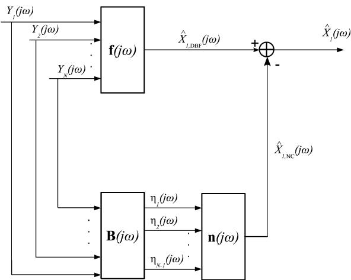  
Fig. 1. GSC structure; particular case $n _ { 0 } = 1$

Naturally, since we are literally solving a particular case of the general problem defined in (12), i.e., with $\sigma ( \omega ) = 0$ , we see from (18) and (24) that the MVDR is nothing but the PMWF with a parameter $\beta ~ = ~ 0 ~ ( \mathrm { i . e }$ ., PMWF-0). More importantly, note that in the above expressions, there is no need to know the channel impulse responses (or their ratios [17]) and only estimates of the statistics of the noise and the speech signals are required. This can be done as in [12], [15], [22] exploiting the noise stationarity.

## C. Generalized Sidelobe Canceler

The optimization problem (12) with $\sigma ( \omega ) = 0$ can be transformed into an alternative form when the GSC whose structure depicted in Fig. 1 is implemented. Three components are required to completely define this filter [17], [32]:

1) an $N \times 1$ -dimensional distortionless beamformer which is given by $\mathbf { f } ( \ j \omega )$ ;

2) an $N \times ( N - 1 )$ -dimensional blocking matrix that creates a noise reference signal, $\pmb { \eta } ( j \omega )$ , and is denoted as $\mathbf { B } ( j \omega )$ in the sequel;

3) an $( N { - } 1 ) \times 1 \cdot$ dimensional noise canceller that optimally combines the components of $\pmb { \eta } ( j \omega )$ (noise reference signals) and is denoted as $\mathbf { n } ( j \omega )$

In this paper, we choose the first components as

$$
\mathbf {f} (j \omega) = \frac {\boldsymbol {\Phi} _ {x x} (j \omega)}{\operatorname{tr} \left\{\boldsymbol {\Phi} _ {x x} (j \omega) \right\}} \mathbf {u} _ {n _ {0}}.\tag{25}
$$

This filter introduces no distortion to the speech signal. Indeed, the signal $\hat { X } _ { n _ { 0 } , \mathrm { D B F } } ( j \omega )$ at the output of $\mathbf { f } ( \ j \omega )$ is given by

$$
\begin{array}{r} \hat {X} _ {n _ {0}, \mathrm{DBF}} (j \omega) = \mathbf {f} ^ {H} (j \omega) \mathbf {y} (j \omega) \\ = X _ {n _ {0}} (j \omega) + \mathbf {f} ^ {H} (j \omega) \mathbf {v} (j \omega). \end{array}\tag{26}
$$

Note that in [20], [21], and [32], this first branch of the GSC structure was chosen as a delay-and-sum beamformer. This leads to high sensitivity to microphones mismatch, inaccuracies in time difference of arrival estimation, and more importantly reverberation. A first implementation of the GSC based on the channel transfer function estimates was proposed in [10] to reduce not only the noise but also reverberation. Later, another form has been proposed in [17] where the channel transfer functions ratios were considered for noise reduction. However, the latter method was still confronted with the estimation of the channel transfer-function ratios.

In the GSC structure, we also need a noise reference signal that contains no speech component to avoid signal cancellation. This noise reference signal is created by passing the microphone outputs through the blocking matrix $\mathbf { B } ( j \omega )$ in the second branch of the structure depicted in Fig. 1. The choice of $\mathbf { B } ( j \omega )$ is not unique. Indeed, any matrix with columns spanning the $( N -$ dimensional subspace orthogonal to $\mathbf { g } ( j \omega )$ is able to block the speech and create a speech-free signal that can be used as a reference for the noise. A particular choice of this matrix is given by

$$
\mathbf {B} (j \omega) = \left( \begin{array}{c c} \mathbf {I} _ {(n _ {0} - 1) \times (n _ {0} - 1)} & \mathbf {0} _ {(n _ {0} - 1) \times (N - n _ {0})} \\ - \frac {\boldsymbol {\chi} _ {1 : n _ {0} - 1} ^ {H} (j \omega)}{\chi_ {n _ {0}} ^ {*} (j \omega)} & - \frac {\boldsymbol {\chi} _ {n _ {0} + 1 : N} ^ {H} (j \omega)}{\chi_ {n _ {0}} ^ {*} (j \omega)} \\ \mathbf {0} _ {(N - n _ {0}) \times (n _ {0} - 1)} & \mathbf {I} _ {(N - n _ {0}) \times (N - n _ {0})} \end{array} \right)\tag{27}
$$

where $\begin{array} { r c l } { \chi _ { 1 : n _ { 0 } - 1 } ( j \omega ) } & { = } & { [ \chi _ { 1 } ( j \omega ) \quad \cdots \quad \chi _ { n _ { 0 } - 1 } ( j \omega ) ] ^ { T } } \end{array}$ and $\begin{array} { r l r } { \chi _ { n _ { 0 } + 1 : N } ( j \omega ) } & { { } = } & { [ \chi _ { n _ { 0 } + 1 } ( j \omega ) \quad \cdots \quad \chi _ { N } ( j \omega ) ] ^ { T } } \end{array}$ Both vectors and $\chi _ { n _ { 0 } } ( j \omega )$ are chosen such that $\begin{array} { r l } { x ( j \omega ) } & { { } = } \end{array}$ $[ \chi _ { 1 : n _ { 0 } - 1 } ^ { T } ( j \omega ) ~ \chi _ { n _ { 0 } } ( j \omega ) ~ \pmb { \chi } _ { n _ { 0 } + 1 : N } ^ { T } ( j \omega ) ] ^ { T }$ is any vector collinear to $\mathbf { g } ( j \omega )$ . A particular form (with $n _ { 0 } ~ = ~ 1 )$ of this blocking matrix has been used in [21] to investigate the robustness of the standard GSC beamformer to calibration errors. However, the expression of $\chi ( j \omega )$ used therein is based on the propagation delays between the microphones. This fact makes it valid only in the absence of system model uncertainties (reverberation, array geometry errors, spatial aliasing, etc.). In [17], Gannot et al. used also a particular form of this blocking matrix (with $n _ { 0 } = 1 )$ where the channel transfer-function ratios are directly involved and estimated using a least-squares method and plugged into (27). However, channel transfer-function ratios estimation remains a challenging task. In [20], another form of this matrix has been proposed. This matrix is based on the generalized eigenvector decomposition of the matrices $\Phi _ { y y } ( j \omega )$ and $\Phi _ { v v } ( j \omega )$ . Here, we propose to use this vector

$$
\boldsymbol {\chi} (j \omega) = \boldsymbol {\Phi} _ {x x} (j \omega) \mathbf {u} _ {n _ {0}} = \phi_ {s s} (\omega) G _ {n _ {0}} ^ {*} (j \omega) \mathbf {g} (j \omega).\tag{28}
$$

Obviously, using $\chi ( j \omega )$ is theoretically equivalent to the utilization of the true channel transfer function ratios. Indeed,

$$
\frac {\chi_ {k} ^ {*} (j \omega)}{\chi_ {n _ {0}} ^ {*} (j \omega)} = \frac {G _ {k} ^ {*} (j \omega)}{G _ {n _ {0}} ^ {*} (j \omega)}, k = 2, \ldots , N.\tag{29}
$$

However, when compared to the methods proposed in [17] and [20], no additional complexity is needed once the PSD matrices are properly calculated. Indeed, neither least-squares fitting as in [17] nor generalized eigenvector decomposition as in [20] are required. When compared to the GSC blocking matrix proposed in [21], no assumption on the array geometry and the source location (or estimated time difference of arrival between the microphones) is required.

Now, the output signal is given by

$$
\hat {X} _ {n _ {0}} (j \omega) = \hat {X} _ {n _ {0}, \mathrm{DBF}} (j \omega) - \hat {X} _ {n _ {0}, \mathrm{NC}} (j \omega)
$$

$$
\hat {X} _ {n _ {0}, \mathrm{NC}} (j \omega) = \mathbf {n} ^ {H} (j \omega) \pmb {\eta} (j \omega)\tag{30}
$$

(31)

$$
\hat {X} _ {n _ {0}, \mathrm{DBF}} (j \omega) = \mathbf {f} ^ {H} (j \omega) \mathbf {y} (j \omega)\tag{32}
$$

where $\mathbf { n } ( j \omega )$ is defined such that the energy of $\hat { X } _ { n _ { 0 } } ( j \omega )$ is minimized. Note that

$$
\hat {X} _ {n _ {0}} (j \omega) = X _ {n _ {0}} (j \omega) + [ {\bf f} (j \omega) - {\bf B} (j \omega) {\bf n} (j \omega) ] ^ {H} {\bf v} (j \omega).\tag{33}
$$

Hence, minimizing the overall power of $\hat { X } _ { n _ { 0 } } ( j \omega )$ with respect to $\mathbf { n } ( j \omega )$ amounts to minimizing the overall output noise energy while keeping $X _ { n _ { 0 } } ( j \omega )$ undistorted. We can easily establish the optimal expression for the noise canceller as

$$
\begin{array}{r} \mathbf {n} (j \omega) = \left[ \mathbf {B} ^ {H} (j \omega) \boldsymbol {\Phi} _ {y y} (j \omega) \mathbf {B} (j \omega) \right] ^ {- 1} \\ \times \mathbf {B} ^ {H} (j \omega) \boldsymbol {\Phi} _ {y y} (j \omega) \mathbf {f} (j \omega) \\ = \left[ \mathbf {B} ^ {H} (j \omega) \boldsymbol {\Phi} _ {v v} (j \omega) \mathbf {B} (j \omega) \right] ^ {- 1} \\ \times \mathbf {B} ^ {H} (j \omega) \boldsymbol {\Phi} _ {v v} (j \omega) \mathbf {f} (j \omega). \end{array}\tag{34}
$$

(35)

To sum up, the GSC beamformer is expressed as

$$
\begin{array}{r} \mathbf {h} _ {n _ {0}, \mathrm{GSC}} = \{\mathbf {I} _ {N \times N} - \mathbf {B} (j \omega) \mathbf {n} (j \omega) \mathbf {M} ^ {- 1} (j \omega) \\ \times \mathbf {B} ^ {H} (j \omega) \boldsymbol {\Phi} _ {v v} (j \omega) \} \mathbf {f} (j \omega) \end{array}\tag{36}
$$

where $\mathbf { M } ( j \omega ) = \mathbf { B } ^ { H } ( j \omega ) \Phi _ { v v } ( j \omega ) \mathbf { B } ( j \omega ) , \mathbf { f } ( j \omega )$ is defined in (25), and $\mathbf { B } ( j \omega )$ is defined in (27). Again, noise and speech statistics are directly involved in the proposed GSC filter and they are assumed to be calculated separately. This can be done as in [12], [15], and [22] exploiting the noise stationarity.

Theoretically, the GSC and the MVDR are equivalent though they have different expressions [33] and the former is generally preferred for adaptive implementations [10], [17]. Having this in mind, we will investigate, in the sequel, the performance of the $\mathrm { P M W F } { - } \beta$ in terms of output signal distortion and noise reduction. This analysis applies not only for the Wiener filter, but also for the MVDR which is a particular case of the PMWF- , and the GSC which is equivalent to the MVDR.

## IV. PERFORMANCE ANALYSIS

Our analysis is based on the local performance measures (at frequency ) defined in [1] and [6] and shown to give good insight into the behavior of the single-channel time-domain Wiener filter. These performance measures are the speech distortion index $\mathcal { V } _ { \mathrm { s d } } [ \mathbf { h } _ { \mathrm { W } \beta , n _ { 0 } } ( j \omega ) ]$ , the noise reduction factor, $\xi _ { \mathrm { n r } } [ \mathbf { h } _ { \mathrm { W } \beta , n _ { 0 } } ( j \omega ) ]$ , and the output SNR, $\mathrm { S N R } _ { \mathbf { o } } [ \mathbf { h } _ { \mathrm { W } \beta , n _ { 0 } } ( j \omega ) ]$ as defined earlier in Section II in the particular case of the PMWF- .

We have the following local performance measures (see the proof in the Appendix)

$$
v _ {\mathrm{sd}} \left[ \mathbf {h} _ {\mathrm{W} \beta , n _ {0}} (j \omega) \right] = \frac {\beta^ {2}}{\left[ \beta + \lambda (\omega) \right] ^ {2}}\tag{37}
$$

$$
\xi_ {\mathrm{nr}} \left[ \mathbf {h} _ {\mathrm{W} \beta , n _ {0}} (j \omega) \right] = \frac {[ \beta + \lambda (\omega) ] ^ {2}}{\operatorname{SNR} (\omega) \lambda (\omega)}\tag{38}
$$

$$
\mathrm{SNR} _ {\mathrm{o}} \left[ \mathbf {h} _ {\mathrm{W} \beta , n _ {0}} (j \omega) \right] = \lambda (\omega).\tag{39}
$$

Clearly, $\mathcal { V } _ { \mathrm { s d } } [ \mathbf { h } _ { \mathrm { W } , \beta , n _ { 0 } } ( j \omega ) ]$ and $\xi _ { \mathrm { n r } } [ \mathbf { h } _ { \mathrm { W } \beta , n _ { 0 } } ( j \omega ) ]$ increase with respect to $\beta .$ However, the output SNR is independent of this parameter since it is obvious from (18) that all the filters that can be devised from the PMWF- are equal up to a scaling factor (which depends on the frequency and ). In Fig. 2(a), we plot the theoretical variations of these performance measures with respect to $\beta$ in the case of white noise. We notice that the tradeoff between noise reduction and signal distortion has to be made in the multichannel case too. However, noise reduction can be achieved $( \mathrm { i . e . , ~ } \xi _ { \mathrm { n r } } [ \mathbf { h } _ { \mathrm { W } \beta , n _ { 0 } } ( j \omega ) ]$ can be higher than one) even when there is no signal distortion $( \mathrm { i . e . , } v _ { \mathrm { s d } } [ \mathbf { h } _ { \mathrm { W } \beta , n _ { 0 } } ( j \omega ) ] = 0 )$ which is not possible in the single-channel case [1], [5], [26]. This is observed with the MVDR which preserves the speech and reduces the noise. The corresponding performance measures are

$$
\upsilon_ {\mathrm{sd}} \left[ \mathbf {h} _ {\mathrm{MVDR}, n _ {0}} (j \omega) \right] = 0
$$

$$
\xi_ {\mathrm{nr}} \left[ \mathbf {h} _ {\mathrm{MVDR}, n _ {0}} (j \omega) \right] = \frac {\lambda (\omega)}{\mathrm{SNR} (\omega)}\tag{40}
$$

(41)

$$
\mathrm{SNR} _ {\mathbf {o}} [ \mathbf {h} _ {\mathrm{MVDR}, n _ {0}} (j \omega) ] = \lambda (\omega).\tag{42}
$$

From (37)–(42), it is rigorously established that the signal distortion is increasing with respect to the parameter $\beta .$ . The lowest signal distortion is achieved by the MVDR (or the GSC). This comes at the price of lower noise reduction (i.e., $\xi _ { \mathrm { n r } } [ { \bf h } _ { \mathrm { M V D R } , n _ { 0 } } ( j \omega ) ] \leq \xi _ { \mathrm { n r } } [ { \bf h } _ { \mathrm { W } \beta , n _ { 0 } } ( j \omega ) ] , \beta \geq 0 )$ . These findings will be numerically corroborated in Section V.

It is also important to note that thanks to the new simplified expression of the signal distortion index (37), one can find the relationship between $\sigma ( \omega )$ defined in the optimization problem (12) and the tuning parameter $\beta .$ Indeed, by taking the constraint in (13) and using (37), we obtain the relationship

$$
\beta \leq \frac {\tilde {\sigma} (\omega)}{1 - \tilde {\sigma} (\omega)} \lambda (\omega).\tag{43}
$$

For a given $\tilde { \sigma } ( \omega ) < 1$ , one can choose $\beta$ and vice versa. The relationship (43) is useful if one wants to impose a frequency-dependent signal distortion following psychoacoustic models for instance [28], [35].

Now, to better understand the gains in terms of signal distortion and noise reduction when using multiple microphones, we investigate the particular case of spatially coherent and incoherent noise components. Then, we prove the SNR improvement at the output of these filters using the magnitude squared coherence (MSC) [36]. Note that the case of spatially diffuse noise was also investigated and the same conclusions regarding the tradeoff between signal distortion and noise reduction were reached. However, no simplified expressions can be obtained to allow for the analytical performance analysis.

## A. Particular Case: Spatially Coherent and Incoherent Noise Effects

To gain a better understanding of the noise reduction performance of the PMWF- , we suppose that the noise can be decomposed into a spatially coherent (a single point source of noise) and incoherent noise (with identically distributed components). In other words, we suppose that the noise PSD matrix can be written as

$$
\mathbf {\Phi} _ {v v} (j \omega) = \mathbf {c} (j \omega) \mathbf {c} ^ {H} (j \omega) + \delta (\omega) \mathbf {I} _ {N \times N}\tag{44}
$$

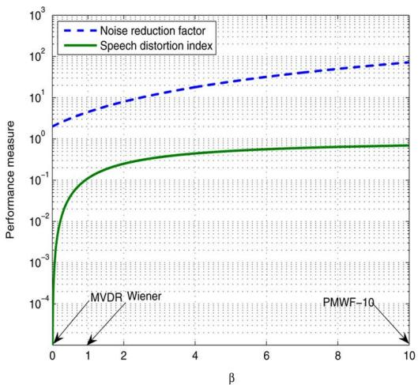  
(a)

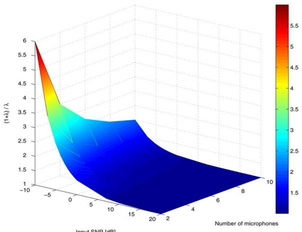  
(b)  
Fig. 2. Theoretical analysis. (a) Signal distortion index and noise reduction factor versus $\beta ; N = 2$ and input $\mathrm { S N R } \ = \ 0 \ \mathrm { d B . \ ( b ) }$ Scalar coefficient relating PMWF-1 and MVDR filters versus input SNR and number of microphones; anechoic environment.

where $\mathbf { c } ( j \omega )$ represents the propagation path of the coherent noise including the square root of the PSD of this noise (combined herein for the sake of simplicity), and $\delta ( \omega )$ is the PSD of the incoherent noise. Note that the effect of the noise on the above performance measures is only seen with $\lambda ( \omega )$ for a given value of $\beta .$ . Hence, we will study the effect of both components of the noise on $\lambda ( \omega )$

Using the matrix inversion lemma, we have

$$
\mathbf {\Phi} _ {v v} ^ {- 1} (j \omega) = \frac {1}{\delta (\omega)} \left[ \mathbf {I} _ {N \times N} - \frac {\mathbf {c} (j \omega) \mathbf {c} ^ {H} (j \omega)}{\delta (\omega) + | | \mathbf {c} (j \omega) | | ^ {2}} \right].
$$

Combining this result with the fact that $\begin{array} { r l } { \Phi _ { x x } ( j \omega ) } & { { } = } \end{array}$ $\phi _ { s s } ( \omega ) \mathbf { g } ( j \omega ) \mathbf { g } ^ { H } ( j \omega )$ , and after some calculations, we obtain

$$
\lambda (\omega) = \frac {\phi_ {s s} (\omega) | | \mathbf {g} (j \omega) | | ^ {2}}{\delta (\omega)} [ 1 - \alpha (\omega) ]\tag{45}
$$

where

$$
\alpha (\omega) = \frac {| \tilde {\mathbf {c}} ^ {H} (j \omega) \tilde {\mathbf {g}} (j \omega) | ^ {2}}{\frac {\delta (\omega)}{| | \mathbf {c} (j \omega) | | ^ {2}} + 1}\tag{46}
$$

$\tilde { \mathbf { c } } ( j \omega ) = ( \mathbf { c } ( j \omega ) / | | \mathbf { c } ( j \omega ) | | )$ , and $\tilde { \mathbf { g } } ( j \omega ) = ( \mathbf { g } ( j \omega ) / | | \mathbf { g } ( j \omega ) | | )$ The numerator of the second term in (46) clearly depends on the collinearity between the propagation vectors of the coherent noise and the desired source only, while the denominator depends on the ratio of powers of the coherent and incoherent noise. For a given value of $\delta ( \omega )$ , we draw two important conclusions.

• By observing the numerator in (46), we find that increasing the collinearity between $\mathbf { c } ( j \omega )$ and $\mathbf { g } ( j \omega )$ (e.g., by physically placing the noise source near the desired speech) leads to larger values of $\alpha ( \omega )$ decreasing, thereby, the output SNR $\scriptstyle ( \mathrm { i . e . , } \ \lambda ( \omega ) )$ and increasing the signal distortion (when $\beta \neq 0 )$ . The behavior of the noise reduction factor depends on $\beta .$ Indeed, decreasing $\lambda ( \omega )$ (by increasing $\alpha ( \omega ) )$ to values larger than $\beta$ decreases the noise reduction factor. When $\lambda ( \omega )$ becomes lower than $\beta ,$ decreasing $\lambda ( \omega )$ leads to the increase of the noise reduction factor.

• By observing the denominator in (46), we find that decreasing the power of the coherent noise (increasing the ratio of coherent to non-coherent noise) leads to smaller values of $\alpha ( \omega )$ . Consequently, the output SNR $( \mathrm { i } . \mathrm { e } . , \lambda ( \omega ) )$ is increased and the signal distortion is decreased (when $\beta \neq 0 )$ . The variations of the noise reduction factor depend on $\beta$ and $\lambda ( \omega )$ as explained above. Finally, in the extreme case where only the coherent noise is present $( \delta \to 0 )$ and has a different propagation vector than the target source, the noise is totally removed without distorting the desired speech signal.

In the absence of coherent noise, we have

$$
\lambda (\omega) = \mathrm{SNR} (\omega) \left[ 1 + R _ {n _ {0}} (\omega) \right]\tag{47}
$$

where

$$
\| \mathbf {g} (j \omega) \| ^ {2} = | G _ {n _ {0}} (j \omega) | ^ {2} [ 1 + R _ {n _ {0}} (\omega) ]\tag{48}
$$

$$
R _ {n _ {0}} (\omega) = \sum_ {n = 1, n \neq n _ {0}} ^ {N} \frac {| G _ {n} (j \omega) | ^ {2}}{| G _ {n _ {0}} (j \omega) | ^ {2}}.\tag{49}
$$

The performance measures corresponding to the PMWF- become

$$
v _ {\mathrm{sd}} \left[ \mathbf {h} _ {\mathrm{W} \beta , n _ {0}} (j \omega) \right] = \frac {\beta^ {2}}{\left\{\beta + \mathrm{SNR} (\omega) \left[ 1 + R _ {n _ {0}} (\omega) \right] \right\} ^ {2}}\tag{50}
$$

$$
\xi_ {\mathrm{nr}} \left[ \mathbf {h} _ {\mathrm{W} \beta , n _ {0}} (j \omega) \right] = \frac {\{\beta + \mathrm{SNR} (\omega) [ 1 + R _ {n _ {0}} (\omega) ] \} ^ {2}}{\mathrm{SNR} ^ {2} (\omega) [ 1 + R _ {n _ {0}} (\omega) ]}\tag{51}
$$

$$
\mathrm{SNR} _ {\mathrm{o}} \left[ \mathbf {h} _ {\mathrm{W} \beta , n _ {0}} (j \omega) \right] = \mathrm{SNR} (\omega) \left[ 1 + R _ {n _ {0}} (\omega) \right].\tag{52}
$$

By observing the above performance measures, we conclude the following.

• For an invariant environment, increasing the number of microphones amounts to adding more diversity (other propagation paths), thereby increasing $R _ { n _ { 0 } } ( \omega )$ Hence, when the number of microphones increases, $\mathcal { V } _ { \mathrm { s d } } [ \mathbf { h } _ { \mathrm { W } \beta , n _ { 0 } } ( j \omega ) ]$ and $\mathrm { S N R } _ { \mathrm { o } } [ \mathbf { h } _ { \mathrm { W } \beta , n _ { 0 } } ( j \omega ) ]$ are enhanced for the $\mathrm { P M W F } { - } \beta$ (decreasing signal distortion when $\beta \quad \neq \quad 0$ and increasing noise reduction and output SNR). A similar improvement is observed when the input SNR is increased. However, $\xi _ { \mathrm { n r } } [ \mathbf { h } _ { \mathrm { W } \beta , n _ { 0 } } ( j \omega ) ]$ variations depend on the input SNR when $\beta \neq 0 ,$ Indeed, for large input SNR values, increasing the number of microphones increases the noise reduction factor. Conversely, for sufficiently low input SNR, $\begin{array} { r l r } { \xi _ { \mathrm { n r } } [ { \bf h } _ { \mathrm { W } \beta , n _ { 0 } } ( j \omega ) ] } & { { } \sim } & { ( \beta ^ { 2 } / \mathrm { S N R } ^ { 2 } ( \omega ) [ 1 + { \bf \bar { \Phi } } _ { n _ { 0 } } ( \omega ) ] ) } \end{array}$ meaning that increasing the number of microphones deteriorates the noise reduction capabilities. Actually, observing the noise reduction factor alone is not enough to understand the gains in terms of output SNR in this case. Indeed, one has to also observe the effect of the number of microphones on the signal reduction factor3 $\begin{array} { r l } { \xi _ { \mathrm { s r } } [ \mathbf { h } _ { \mathrm { W } / \beta , n _ { 0 } } ( j \omega ) ] } & { { } = } \end{array}$ $\begin{array} { r l } & { ( \phi _ { x _ { n _ { 0 } } x _ { n _ { 0 } } } / \mathbf { h } _ { \mathrm { W } _ { \beta , n _ { 0 } } ^ { H } } ( j \omega ) \Phi _ { x x } ( j \omega ) \mathbf { h } _ { \mathrm { W } \beta , n _ { 0 } } ( j \omega ) ) } \\ & { ( [ \beta + \lambda ( \omega ) ] ^ { 2 } / \lambda ^ { 2 } ( \omega ) ) . \qquad \mathrm { I t } \qquad \mathrm { i s } \qquad \mathrm { e } } \end{array}$ 二 asy to see that SNRo[hwβ,n0(jω)] 二 $\mathrm { S N R } ( \omega ) ( \xi _ { \mathrm { n r } } [ \mathbf { h } _ { \mathrm { W } \beta , n _ { 0 } } ( j \omega ) ] / \xi _ { \mathrm { s r } } [ \mathbf { \dot { h } } _ { \mathrm { W } \beta , n _ { 0 } } ( j \omega ) ] )$ . By consid ering (47) and for sufficiently low input SNR, we can show that $\begin{array} { r } { \xi _ { \mathrm { s r } } [ \mathbf { h } _ { \mathrm { W } \beta , n _ { 0 } } ( j \omega ) ] \ \sim \ ( \beta ^ { 2 } / \mathrm { S N R } ^ { 2 } ( \omega ) [ 1 + R _ { n _ { 0 } } ( \omega ) ] ^ { 2 } ) } \end{array}$ meaning that $\xi _ { \mathrm { s r } } [ \mathbf { h } _ { \mathrm { W } \beta , n _ { 0 } } ( j \omega ) ]$ decreases at a rate $[ 1 + R _ { n _ { 0 } } ( \omega ) ]$ lower than $\xi _ { \mathrm { n r } } [ \mathbf { h } _ { \mathrm { W } \beta , n _ { 0 } } ( j \omega ) ]$ . Then, by observing the relationship between $\xi _ { \mathrm { n r } } [ \mathbf { h } _ { \mathrm { W } \beta , n _ { 0 } } ( j \omega ) ]$ 2 $\xi _ { \mathrm { s r } } [ \mathbf { h } _ { \mathrm { W } \beta , n _ { 0 } } ( j \omega ) ]$ , and $\mathrm { S N R _ { o } } [ \mathbf { h } _ { \mathrm { W } \beta , n _ { 0 } } ( j \bar { \omega } ) ]$ , one can understand the output SNR gains in spite of the losses in terms of noise reduction factor in this case. Note also that $\xi _ { \mathrm { n r } } [ { \bf h } _ { \mathrm { M V D R } , n _ { 0 } } ( j \omega ) ] \left( \mathrm { i . e . , } \beta = 0 \right)$ is always increasing as the number of microphones increases.

• As the input SNR or number of microphones increases, all filters derived from the $\mathrm { P M W F } { - } \beta$ tend to have similar performance in terms of noise reduction factor and signal distortion index. This result can be more evidently seen in the anechoic case where $R _ { n _ { 0 } } ( \omega ) = N - 1$ . At a given frequency $\omega ,$ the Wiener and MVDR filters, for example, are related up to a scaling coefficient. Precisely, we see from (18) and (24) that

$$
\mathbf {h} _ {\mathrm{MVDR}, n _ {0}} (j \omega) = \frac {1 + \lambda (\omega)}{\lambda (\omega)} \mathbf {h} _ {\mathrm{W}, n _ {0}} (j \omega).\tag{53}
$$

In Fig. 2(b), we represent the theoretical variations of the scaling factor relating both filters for a given frequency with respect to the input SNR and the number of microphones in an anechoic environment. Clearly, both filters seem to have similar effects on the input signals when the number of microphones and/or the SNR is sufficiently high. The major differences between both filters can be noticed at low SNR and small .

• According to (5), $=$ $( \phi _ { s s } ( \omega ) / \phi _ { v v } ( \omega ) ) | G _ { n _ { 0 } } ( j \omega ) | ^ { 2 }$ . Therefore, choosing the signal microphone experiencing the highest input SNR leads to the best performances.

The same performance measures corresponding to the noncausal single-channel Wiener filter have been derived in [5]. Those results correspond to the particular case of $N =$ . Thus, the multichannel case theoretically provides better performance than single-channel processing.

## B. Proof of the Output SNR Improvement Based on the Magnitude Squared Coherence

Here, we take advantage of the MSC in a similar fashion to the squared Pearson correlation coefficient in [26] to prove the SNR improvement at the output of the $\mathrm { P M W F } { \cdot } \beta .$ . Note that proofs for SNR improvement with the time-domain single-channel Wiener filter can be found in [1] and [26] and a quite involved one for the time-domain multichannel Wiener filter can be found in [24]. The proof provided herein applies not only to the PMWF, the MVDR and the GSC but to other filters such as the maximum likelihood and maximum output SNR since they are all equal up to a scaling factor for a given frequency ([34] and references therein). In particular, for $\mathbf { h } _ { \mathrm { W } \beta , n _ { 0 } } ( j \omega )$ , hw ${ } _ { , n _ { 0 } } ( j \omega )$ , and ${ \bf h } _ { \mathrm { M V D R } , n _ { 0 } } ( j \omega )$ , we have the following result:

$$
\begin{array}{r} \mathrm {SNR_ {o}} \left[ \mathbf {h} _ {\mathrm{W} \beta , n _ {0}} (j \omega) \right] = \mathrm {SNR_ {o}} \left[ \mathbf {h} _ {\mathrm{W}, n _ {0}} (j \omega) \right] \\ = \mathrm {SNR_ {o}} \left[ \mathbf {h} _ {\mathrm{MVDR}, n _ {0}} (j \omega) \right]. \end{array}\tag{54}
$$

We make the following statement.

Statement: The local SNR at the output of the non-causal multichannel Wiener filter is larger than the input SNR. In other words, we have

$$
\mathrm{SNR} _ {\mathrm{o}} \left[ \mathbf {h} _ {\mathrm{W}, n _ {0}} (j \omega) \right] \geq \mathrm{SNR} (\omega).\tag{55}
$$

Proof: For two random processes $x ( t )$ and $y ( t )$ , the MSC is expressed as [36]

$$
\rho_ {x y} ^ {2} (\omega) = \frac {| \phi_ {x y} (j \omega) | ^ {2}}{\phi_ {x x} (\omega) \phi_ {y y} (\omega)}.
$$

We always have [36]

$$
0 \leq \rho_ {x y} ^ {2} (\omega) \leq 1.\tag{56}
$$

Using the notation in (3) and the fact that $\begin{array} { r l } { \mathbf { h } _ { \mathrm { W } , n _ { 0 } } ( j \omega ) } & { { } = } \end{array}$ $\Phi _ { y y } ^ { - 1 } ( j \omega ) \Phi _ { x x } ( j \omega ) { \mathbf { u } } _ { n _ { 0 } }$ , we obtain

$$
\begin{array}{r l} & {\rho_ {x _ {n _ {0}} z} ^ {2} (\omega) = \frac {| E \left\{X _ {n _ {0}} (j \omega) Z ^ {*} (j \omega) \right\} | ^ {2}}{\phi_ {x _ {n _ {0}} x _ {n _ {0}}} (\omega) \phi_ {z z} (\omega)}} \\ & {\qquad = \frac {\mathbf {h} _ {\mathrm{W} , n _ {0}} ^ {H} (j \omega) \boldsymbol {\Phi} _ {y y} (j \omega) \mathbf {h} _ {\mathrm{W} , n _ {0}} (j \omega)}{\phi_ {x _ {n _ {0}} x _ {n _ {0}}} (\omega)}} \\ & {\qquad = \frac {\mathrm{SNR} _ {\mathrm{o}} [ \mathbf {h} _ {\mathrm{W} , n _ {0}} (j \omega) ]}{1 + \mathrm{SNR} _ {\mathrm{o}} [ \mathbf {h} _ {\mathrm{W} , n _ {0}} (j \omega) ]} \rho_ {x _ {n _ {0}} d _ {n _ {0}}} ^ {2} (\omega).} \end{array}\tag{57}
$$

Indeed,

$$
\begin{array}{r l} & {\left| \mathbf {u} _ {n _ {0}} ^ {T} \boldsymbol {\Phi} _ {x x} (j \omega) \mathbf {h} _ {\mathrm{W}, n _ {0}} (j \omega) \right| ^ {2}} \\ & {\quad = \left| \mathbf {u} _ {n _ {0}} ^ {T} \boldsymbol {\Phi} _ {x x} (j \omega) \boldsymbol {\Phi} _ {y y} ^ {- 1} (j \omega) \boldsymbol {\Phi} _ {y y} (j \omega) \mathbf {h} _ {\mathrm{W}, n _ {0}} (j \omega) \right| ^ {2}} \\ & {\quad = \left[ \mathbf {h} _ {\mathrm{W}, n _ {0}} ^ {H} (j \omega) \boldsymbol {\Phi} _ {y y} (j \omega) \mathbf {h} _ {\mathrm{W}, n _ {0}} (j \omega) \right] ^ {2}} \end{array}\tag{58}
$$

and

$$
\begin{array}{r l} & {\rho_ {x _ {n _ {0}} d _ {n _ {0}}} ^ {2} (\omega)} \\ & {\quad = \frac {| E \left\{X _ {n _ {0}} (j \omega) D _ {n _ {0}} ^ {*} (j \omega) \right\} | ^ {2}}{\phi_ {x _ {n _ {0}} x _ {n _ {0}}} (\omega) \phi_ {d _ {n _ {0}} d _ {n _ {0}}} (\omega)}} \\ & {\quad = \frac {\left[ \mathbf {h} _ {\mathrm{W} , n _ {0}} ^ {H} (j \omega) \boldsymbol {\Phi} _ {y y} (j \omega) \mathbf {h} _ {\mathrm{W} , n _ {0}} (j \omega) \right] ^ {2}}{\phi_ {x _ {n _ {0}} x _ {n _ {0}}} (\omega) \mathbf {h} _ {\mathrm{W} , n _ {0}} ^ {H} (j \omega) \boldsymbol {\Phi} _ {x x} (j \omega) \mathbf {h} _ {\mathrm{W} , n _ {0}} (j \omega)}.} \end{array}\tag{59}
$$

(60)

Using (56) and (57), we deduce the following result:

$$
\rho_ {x _ {n _ {0}} z} ^ {2} (\omega) \leq \frac {\mathrm{SNR} _ {\mathrm{o}} [ \mathbf {h} _ {\mathrm{W} , n _ {0}} (j \omega) ]}{1 + \mathrm{SNR} _ {\mathrm{o}} [ \mathbf {h} _ {\mathrm{W} , n _ {0}} (j \omega) ]}.\tag{61}
$$

In addition,

$$
\rho_ {y _ {n _ {0}} z} ^ {2} (\omega) = \frac {| {\bf u} _ {n _ {0}} ^ {T} \mathbf {\Phi} _ {y y} (j \omega) {\bf h} _ {\mathrm{W} , n _ {0}} (j \omega) | ^ {2}}{\phi_ {y _ {n _ {0}} y _ {n _ {0}}} (\omega) {\bf h} _ {\mathrm{W} , n _ {0}} ^ {H} (j \omega) \mathbf {\Phi} _ {y y} (j \omega) {\bf h} _ {\mathrm{W} , n _ {0}} (j \omega)}.
$$

Replacing $\mathrm { { h w } } _ { , n _ { 0 } } ( j \omega )$ by its expression, we find

$$
\begin{array}{r} \rho_ {y _ {n _ {0}} z} ^ {2} (\omega) = \frac {\mathrm{SNR} (\omega)}{1 + \mathrm{SNR} (\omega)} \frac {\phi_ {x _ {n _ {0}} x _ {n _ {0}}} (\omega)}{\mathbf {h} _ {\mathrm{W} , n _ {0}} ^ {H} (j \omega) \boldsymbol {\Phi} _ {y y} (j \omega) \mathbf {h} _ {\mathrm{W} , n _ {0}} ^ {H} (j \omega)} \\ = \frac {\mathrm{SNR} (\omega)}{1 + \mathrm{SNR} (\omega)} \frac {1}{\rho_ {x _ {n _ {0}} z} ^ {2} (\omega)}. \end{array}
$$

The latter result combined with (56) implies that

$$
\rho_ {x _ {n _ {0}} z} ^ {2} (\omega) \geq \frac {\mathrm{SNR} (\omega)}{1 + \mathrm{SNR} (\omega)}.\tag{62}
$$

Now using (61) and (62), we obtain

$$
\frac {\mathrm{SNR} _ {\mathrm{o}} \left[ \mathbf {h} _ {\mathrm{W} , n _ {0}} (j \omega) \right]}{1 + \mathrm{SNR} _ {\mathrm{o}} \left[ \mathbf {h} _ {\mathrm{W} , n _ {0}} (j \omega) \right]} \geq \rho_ {x _ {n _ {0}} z} ^ {2} (\omega) \geq \frac {\mathrm{SNR} (\omega)}{1 + \mathrm{SNR} (\omega)}.
$$

We conclude that

$$
\mathrm{SNR} _ {\mathrm{o}} \left[ \mathbf {h} _ {\mathrm{W}, n _ {0}} (j \omega) \right] \geq \mathrm{SNR} (\omega).\tag{63}
$$

□

Again, this proves that all linear non-causal filters which are equal to the PMWF-1 up to a scaling factor (e.g., the MVDR) enhance the SNR at their output.

## V. NUMERICAL EXAMPLES

In this section, our aim is to prove the efficacy of the filters developed above and highlight the tradeoff between the signal distortion and noise reduction in the multichannel case. Precisely, we will investigate the performance of the filters PMWF-1 (i.e., Wiener), the PMWF-10 $( \beta = 1 0 )$ , the PMWF-0 (i.e., the MVDR), and the GSC. Without loss of generality, we will take the first microphone $n _ { 0 } ~ = ~ 1$ as a reference. The results of our simulations are presented in terms of the performance measures, $v _ { \mathrm { s d } } , \xi _ { \mathrm { n r } } ,$ , and output SNR, in addition to the log-likelihood ratio (LLR) between the estimated signal and the clean signal captured by the first microphone [35, Ch. 10]. This signal distortion measure has been shown to be very correlated to human subjective evaluation (with a correlation factor of around 0.61) [37]. Most results are presented in terms of the global version of these performance measures (e.g., refer to (6) where we define the global SNR) except in Figs. 7–9.

It is important to note that the expressions of the GSC and MVDR filters (24), (25), (27), and (36) involve divisions by some quantities that might decay to 0 due to speech absence or common zeros between the channels [5, Ch. 4]. Therefore, all quantities in the denominators are kept above certain thresholds.

In the investigated scenarios, the speaker is located in a reverberant room with dimensions4 length $= 6 . 7 , \mathrm { w i d t h = 6 . 1 }$ , and he ${ \mathrm { i g h t } } = 2 . 9 \left( x \times y \times z \right)$ . We consider a uniform linear array of $N$ (varied between 2 and 10) microphones which is placed on the axis $( y _ { \mathrm { m } } = 5 . 6 , z _ { \mathrm { m } } = 1 . 4 )$ with the first microphone at the coordinate $x _ { \mathrm { m , 1 } } = 2 . 4 3 7$ on the -axis and the micro phones spacing is $\Delta = 0 . 2$ . The source is around 2-min-long female speech5 sampled at 8 kHz and located at $( x _ { \mathrm { s } } = 1 . 7 3 7$ $y _ { \mathrm { s } } = 4 . 6 , z _ { \mathrm { s } } = 1 . 4 )$ . The image method [38] (following the description in [6, Ch. 2]) was used to generate the impulse responses (0.5-s-long each) which are convolved with the speech signal before adding a computer generated white Gaussian noise with a long-term input SNR and 10 dB, evaluated at the first microphone as defined in (5). The signals are cut into 75% overlapping frames of duration 256 ms $( L = 2 0 4 8$ data samples) each as in [31]. Once the observed signals are filtered in the frequency domain, they are transformed into the time domain and only the last output samples are kept to limit the circular convo lution effect (we assume that the filter lengths are less than $L / 2$ in the time domain such that only the first $L / 2$ samples of the output signals are affected by the circular convolution) [39]. To handle the filters non-causality, we proceed as in [10], [17], [31] through three stages: transforming the filters estimated in the frequency domain to the time domain, then truncating them6 to impose the non-causal FIR constraint, and finally transforming them back to the frequency domain to perform the filtering. We are interested in assessing the performance of the filters developed above and the different tradeoffs. Hence, we put aside the problem of noise statistics estimation and suppose that the noise samples are known for any processed data frame as in [29] and [30]. The noise and noisy data PSD matrices are estimated in a batch mode using the Welch’s modified periodogram [40]. For further details about noise statistics estimation, we refer the readers to [35, Ch. 9]. Two reverberation conditions are consid ered herein. The first one has $T _ { 6 0 } \approx 0$ ms (anechoic environment) and the second ha $T _ { 6 0 } \approx 2 7 0$ ms. Other scenarios (with different reverberation times and types of stationary and nonstationary noise) were also tested, and similar conclusions were obtained.

Figs. 3 and 5 depict the variations of the signal distortion measures with respect to the number of microphones (from 2 to 10) in the two reverberation conditions. Note that we also included the performance of the single-channel non-causal Wiener filter (PMWF-1 with $N = 1 )$ . When trying to keep the speech undistorted in the single-channel case, no noise reduction can be achieved [26]. This corresponds to the trivial unity gain filter

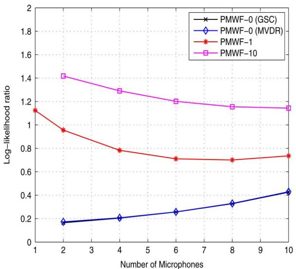  
(a)

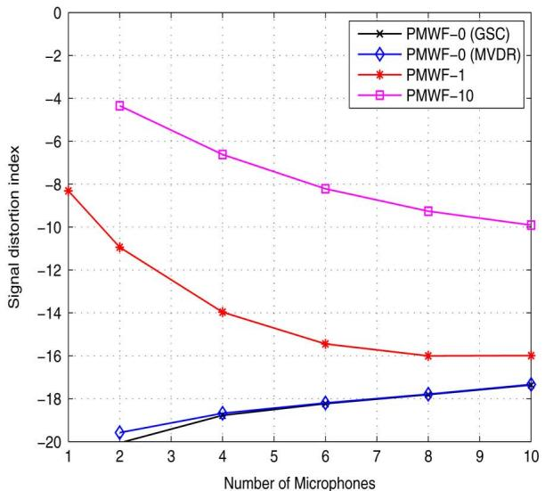  
(b)

Fig. 3. Signal distortion versus number of microphones. (a) Log-likelihood ratio. (b) Signal distortion index; input -   dB, $T _ { 6 0 }$   ms.  
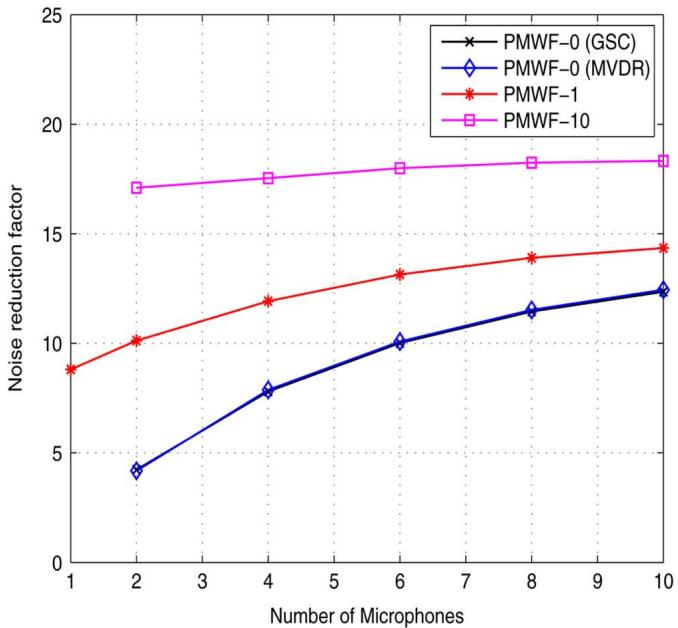  
(a)

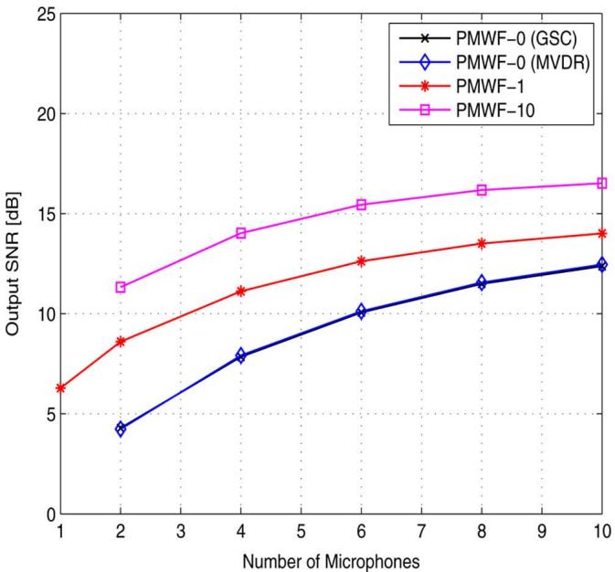  
(b)  
Fig. 4. Noise reduction versus number of microphones. (a) Noise reduction factor. (b) Output SNR; input -   dB,    ms.

and is not considered in our simulations. We first see that using PMWF-1 with multiple microphones is more beneficial in terms of signal distortion than the single-channel case. In addition, the highest signal distortions are observed with the PMWF-10 and PMWF-1 while relatively low signal distortions are seen with the MVDR and the GSC. This confirms the effect of the choice of the tuning parameter $\beta$ that we expected in Section IV. In creasing the number of microphones reduces the signal distor tion for both filters PMWF-1 and PMWF-10. Theoretically, the MVDR and the GSC are equivalent. Hence, they are expected to have the same performance. Slight differences between the results obtained by both filters are due to the estimation errors involved in the estimation of the PSD matrices and the reverberation. This numerical issue is also seen with the log-likelihood ratios and the signal distortion index values which are not equal to zero as they theoretically have to be. Moreover, increasing the number of microphones would, theoretically, have no effect on the signal distortion which must be equal to zero even when only two microphones are used. In practice, however, increasing the number of microphones leads to more estimation errors since the required PSD matrices become of larger sizes and more auto- and cross-PSD terms are estimated, thereby increasing the overall estimation errors and leading to more signal distortions with the MVDR and the GSC. The increase of the reverberation time also has a detrimental effect on the signal distortion index for all filters. However, as we are taking sufficiently long filters, the log-likelihood ratio and the output SNR seem to be unchanged. In all cases, we observe that the resulting

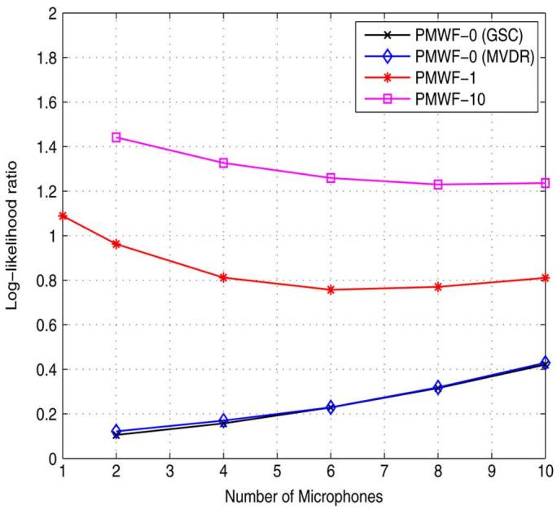  
(a)

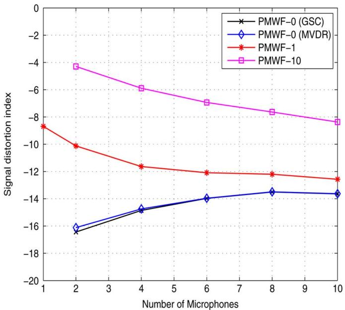  
(b)

Fig. 5. Signal distortion versus number of microphones. (a) Log-likelihood ratio. (b) Signal distortion index; input -   dB,    ms.  
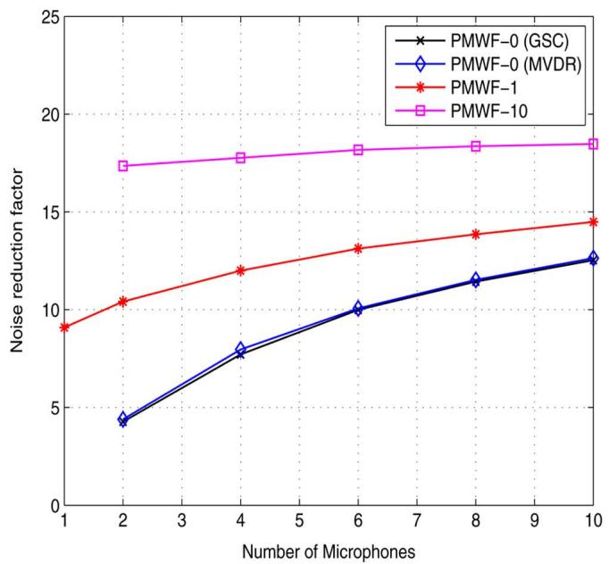  
(a)

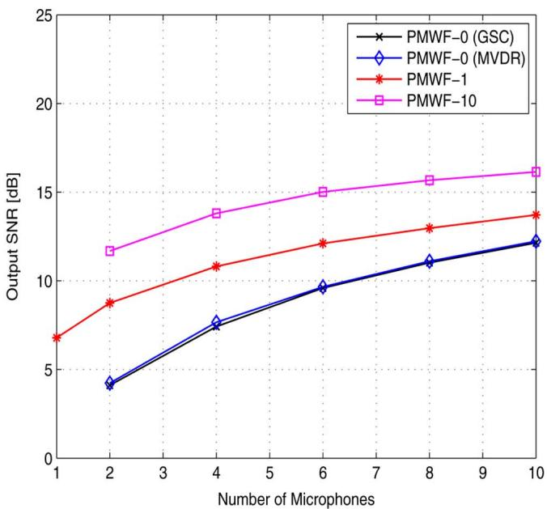  
(b)  
Fig. 6. Noise reduction versus number of microphones. (a) Noise reduction factor. (b) Output SNR; input -   dB, $T _ { 6 0 }$   ms.

signal distortion measures comply with the theoretical effect of the tuning parameter $\beta$ and the number of microphones $N .$ In Figs. 4 and $^ { 6 , }$ we see that increasing the number of microphones leads, as expected, to more output SNR gains. Again, the effect of the choice of the parameter $\beta$ complies with the theoretical findings of Section IV. Indeed, the highest noise reduction values are achieved by the PMWF-10 while the lowest are achieved by the MVDR and the GSC. This proves the tradeoff between the signal distortion and noise reduction in the multichannel case. The MVDR and GSC filters are desired because of their low speech distortion. However, this comes at the price of low noise reduction, especially when few microphones are used. The PMWF-1 and PMWF-10 are able to better reduce the noise at the price of distorting the target signal. However, the utilization of more microphones seems to be a good solution to achieve both goals: more noise reduction with less speech distortion. We also see that larger values of $\beta$ lead to larger global SNR gains. This result is not straightforward to observe in the theoretical expression of the global SNR itself, but can be intuitively explained. Indeed, the increase of $\beta$ globally attenuates the noise power at a higher rate than the target signal.

Figs. 7–9 depict the effect of the increase of the number of microphones on the performance of these filters in the anechoic environment (a similar behavior is observed in the presence of

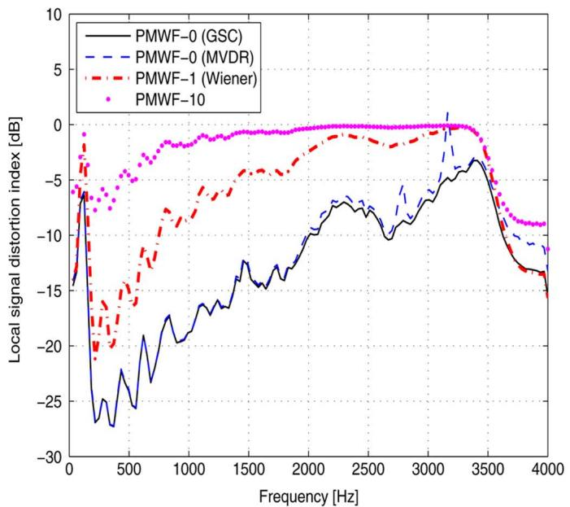  
(a)

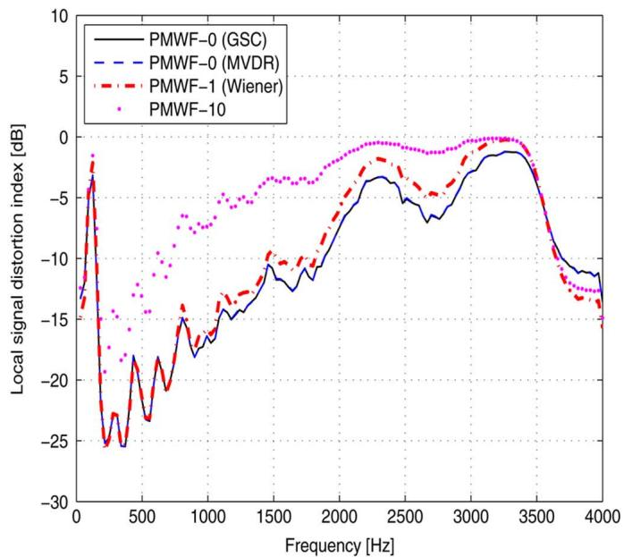  
(b)

Fig. 7. Signal distortion index versus frequency. (a) Two microphones. (b) Ten microphones; input -   dB.  
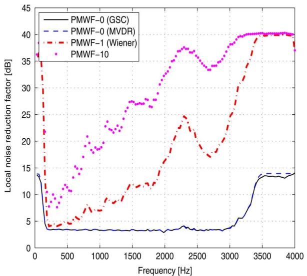  
(a)

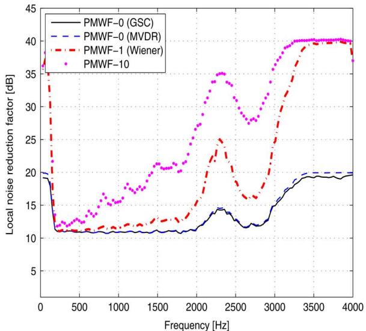  
(b)  
Fig. 8. Noise reduction factor versus frequency. (a) Two microphones. (b) Ten microphones; input -   dB.

reverberation when the filters are long enough). We focus on the particular cases of two and ten microphones and represent the local performance measures that we analyzed in Section IV. We see that the PMWF-1 and PMWF-10 are much more aggressive in terms of both noise reduction and signal distortion espe cially when only two microphones are deployed. The MVDR and the GSC result in less speech distortion generally, even though the former exhibits some instabilities (sharp spike seen in Fig. 7(a) at some frequencies due to some numerical issues in the absence of speech energy. When ten microphones are deployed, the signal distortion index is decreased at the output of the PMWF-1 and PMWF-10, and slightly increased for the MVDR and the GSC. Note how the PMWF-1 tends to have the same effect in terms of signal distortion on the PMWF-0. The output SNR in Fig. 9 is increased for all filters. The noise reduction factor behavior in Fig. 8 agrees well with our theoretical study. Indeed, it is increased for the PMWF-1 and PMWF-10 at relatively low frequencies (with high input SNR) when the number of microphones increases from 2 to 10. An opposite behavior is observed at relatively high frequencies (with lower input SNR). The local output SNR seems to be equal for all filters in most of the frequency range, thereby confirming (54). Another important result that can be drawn from these local performance measures is that when the input SNR increases (low frequency range), all filters tend to be less aggressive in terms of signal distortion and the output noise reduction factors are comparable (especially at relative high input SNR frequency bins). This fact is confirmed by the global version of these performance measures in Table I. Therein, 10 microphones are used and the global input SNR is set to 10 dB. Clearly, the PMWF-1 tends to have comparable performance as the MVDR and GSC in terms of the dual effect: noise reduction versus speech distortion. The performance measures are improved for the PMWF-10 too, but the signal distortion introduced by this filter is still relatively high.

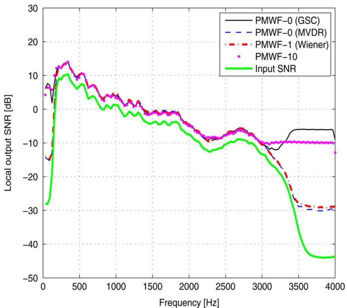  
(a)

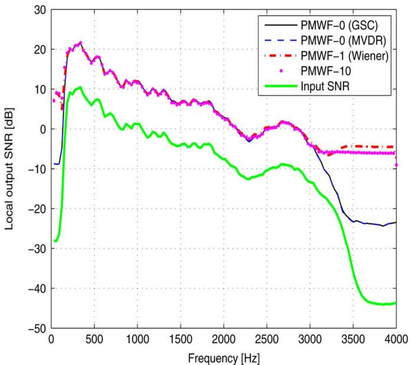  
(b)  
Fig. 9. Output SNR versus frequency. (a) Two microphones. (b) Ten microphones (global input -   dB).

TABLE I  
PERFORMANCE OF THE PMWF-1, MVDR, GSC, AND PMWF-10; INPUT -   dB,    MICROPHONES

<table><tr><td></td><td>Performance index</td><td>PMWF-0 (GSC)</td><td>PMWF-0 (MVDR)</td><td>PMWF-1</td><td>PMWF-10</td></tr><tr><td rowspan="4"> $T_{60} \approx 0$  ms</td><td>LLR</td><td>0.075</td><td>0.070</td><td>0.116</td><td>0.43</td></tr><tr><td> $v_{sd}$  [dB]</td><td>-27.59</td><td>-27.61</td><td>-27.15</td><td>-19.6</td></tr><tr><td> $\xi_{nr}$  [dB]</td><td>11.8</td><td>11.68</td><td>12.35</td><td>14.19</td></tr><tr><td> $SNR_o$  [dB]</td><td>21.84</td><td>21.74</td><td>22.33</td><td>23.85</td></tr><tr><td rowspan="4"> $T_{60} \approx 270$  ms</td><td>LLR</td><td>0.101</td><td>0.096</td><td>0.15</td><td>0.49</td></tr><tr><td> $v_{sd}$  [dB]</td><td>-16.31</td><td>-16.32</td><td>-16.17</td><td>-14.41</td></tr><tr><td> $\xi_{nr}$  [dB]</td><td>11.74</td><td>11.62</td><td>12.28</td><td>14.10</td></tr><tr><td> $SNR_o$  [dB]</td><td>21.42</td><td>21.30</td><td>21.90</td><td>23.36</td></tr></table>

In Table II, we compare the performance of the proposed GSC filter (New GSC) to the one proposed in [17] which is based on the ratios of channel transfer functions (TFR-GSC). We assume that the channel transfer functions are known. We also compare the results to the GSC structure proposed in [20] in different scenarios. Note that the latter has been shown to outperform the delay-and-sum based GSC [21], [32], and the GSC based on the estimates of the channel transfer functions ratios using least-squares method in [17]. The main reasons for that is that the delay-and-sum-based GSC generally assumes free field propagation with known array geometry. This fact makes it sensitive to system model uncertainties (e.g., time delay estimation errors, array geometry uncertainties, and reverberation), while the one in [17] is confronted with the problem of estimating the channel transfer-function ratios which is sensitive to PSD estimation errors, noise, and reverberation. The GSC of [20] is denoted herein as GEV-GSC since its blocking matrix is based on the generalized eigenvector (GEV) decomposition of $\Phi _ { y y } ( j \omega )$ and $\Phi _ { v v } ( j \omega )$ while its first branch consists of a delay-and-sum beamformer. To estimate the time delay between the microphones, we used the generalized cross-correlation method with the phase transform weighting (see [6] and references therein). We also exploited the prior knowledge of the array geometry. In this simulations setup, we choose the number of microphones and fix the input SNR at 0 and 10 dB. The results are presented for the two reverberation conditions considered above.

We notice that the TFR-GSC performs the best in terms of signal distortion. The reason is that the channel transfer functions are known. This strong assumption is not practical and acoustic channel transfer functions (or their ratios) estimation is quite a difficult task. The proposed GSC beamformer outperforms the GEV-GSC in terms of signal distortion. Actually, the delay-and-sum beamformer at the first branch of the GEV-GSC is very sensitive. This fact is observed even in the absence of reverberation where the estimation of the time delay of arrival is affected by both factors: noise and non-robustness of the hypothesis of far field7 to properly estimate the time delay and align the signals. In addition, the delay-and-sum branch ignores the attenuation and reverberation effects on the speech. All these factors cause the speech to leak into the noise reference signal and lead to its cancellation and distortion. Hence, high values of the speech distortion index and log-likelihood ratio are achieved by the GEV-GSC as compared to the proposed GSC in all the investigated scenarios. Regarding the ability of these filters to reduce the noise, notice that all filters lead to almost similar output SNR (with slight advantage to the GSC-GEV and lower values for the TFR-GSC). These results illustrate the ability of the proposed GSC filter to reduce the noise while keeping the speech undistorted with no additional computational complexity (no GEV decomposition). Indeed, it performs matched beamforming at its first branch and a simple projection on its second branch to create the noise reference. These branches are designed regardless of the array geometry and source position by taking the speech and noise PSD matrices with no additional computations.

TABLE II  
COMPARISON OF THE PROPOSED GSC BEAMFORMER (NEW GSC), THE CHANNEL TRANSFER FUNCTIONS RATIOS-BASED GSC WITH KNOWN AND TRUNCATED IMPULSE RESPONSES (TFR-GSC), AND THE GENERALIZED-EIGENVALUE-BASED (GEV-GSC) ONE;   - MICROPHONES

<table><tr><td colspan="2"></td><td colspan="3">Input SNR = 0 dB</td><td colspan="3">Input SNR = 10 dB</td></tr><tr><td></td><td>Performance index</td><td>Ideal TFR-GSC</td><td>New GSC</td><td>GEV-GSC</td><td>Ideal TFR-GSC</td><td>New GSC</td><td>GEV-GSC</td></tr><tr><td rowspan="4"> $T_{60} \approx 0 ms$ </td><td>LLR</td><td>0.00018</td><td>0.25</td><td>0.33</td><td>0.00018</td><td>0.06</td><td>0.32</td></tr><tr><td> $v_{sd}$  [dB]</td><td>-49.28</td><td>-18.22</td><td>-4.17</td><td>-49.28</td><td>-27.95</td><td>-4.63</td></tr><tr><td> $\xi_{nr}$  [dB]</td><td>8.97</td><td>10.01</td><td>13.86</td><td>8.97</td><td>10.0</td><td>11.33</td></tr><tr><td> $SNR_o$  [dB]</td><td>9.01</td><td>10.06</td><td>12.05</td><td>19.01</td><td>20.02</td><td>19.69</td></tr><tr><td rowspan="4"> $T_{60} \approx 270 ms$ </td><td>LLR</td><td>0.014</td><td>0.22</td><td>0.36</td><td>0.016</td><td>0.09</td><td>0.31</td></tr><tr><td> $v_{sd}$  [dB]</td><td>-28.50</td><td>-13.98</td><td>-2.51</td><td>-28.50</td><td>-15.95</td><td>-2.78</td></tr><tr><td> $\xi_{nr}$  [dB]</td><td>8.43</td><td>9.99</td><td>14.22</td><td>8.43</td><td>9.77</td><td>11.74</td></tr><tr><td> $SNR_o$  [dB]</td><td>8.45</td><td>9.6</td><td>11.54</td><td>17.30</td><td>19.41</td><td>19.06</td></tr></table>

## VI. CONCLUSION

In this paper, the general framework for the design of non-causal noise reduction filters for microphone arrays is investigated. The general parameterized expression for the non-causal multichannel Wiener filter is derived regardless of the system configuration (microphone array geometry, source location, and reverberation). The MVDR is simply a particular case of this generalized expression. Essentially, the parameterized non-causal Wiener filter and the MVDR are derived from the same optimization problem leading to similar expressions that depend on the speech and noise statistics only. We also proposed a new expression for the alternative implementation of the MVDR, i.e., the GSC that depends on the signal and noise statistics only. In the second part of this work, we investigated the theoretical performance of these filters and found interesting relationships between the input SNR, noise reduction, signal distortion, and the output SNR. Indeed, we highlighted the tradeoff between the signal distortion and noise reduction in the multichannel case. Naturally, the MVDR and GSC lead to similar performance. They both aim at preserving the signal while reducing the noise. In contrast, the multichannel Wiener filter aims at jointly optimizing both criteria. Therefore, the lowest signal distortion and noise reduction values are achieved by the GSC and MVDR filters. Furthermore, we theoretically proved that these filters improve the output SNR, thereby confirming their ability to reduce the noise even when the speech signal is preserved. Finally, we provided some numerical examples to confirm our theoretical study and show that with increasing SNR and number of microphones the Wiener filter and the distortionless beamformers (MVDR and GSC) tend to have similar behaviors in terms of signal distortion and noise reduction. Other comparisons were also provided to show the efficacy of the proposed GSC beamformer.

## APPENDIX

## CALCULATION OF THE LOCAL PERFORMANCE MEASURES

Herein, we present detailed calculations of the simplified expressions of the performance measures in (37)–(39). Using (18), we obtain

$$
\begin{array}{r l} & {\mathbf {h} _ {\mathrm{W} \beta , n _ {0}} ^ {H} (j \omega) \boldsymbol {\Phi} _ {v v} (j \omega) \mathbf {h} _ {\mathrm{W} \beta , n _ {0}} (j \omega)} \\ & {\quad = \frac {1}{[ \beta + \lambda (\omega) ] ^ {2}} \mathbf {u} _ {n _ {0}} ^ {T} \boldsymbol {\Phi} _ {x x} (j \omega) \boldsymbol {\Phi} _ {v v} ^ {- 1} (j \omega)} \\ & {\qquad \times \boldsymbol {\Phi} _ {v v} (j \omega) \boldsymbol {\Phi} _ {v v} ^ {- 1} (j \omega) \boldsymbol {\Phi} _ {x x} (j \omega) \mathbf {u} _ {n _ {0}}} \\ & {\quad = \frac {1}{[ \beta + \lambda (\omega) ] ^ {2}} \mathbf {u} _ {n _ {0}} ^ {T} \boldsymbol {\Phi} _ {x x} (j \omega) \boldsymbol {\Phi} _ {v v} ^ {- 1} (j \omega) \boldsymbol {\Phi} _ {x x} (j \omega) \mathbf {u} _ {n _ {0}}.} \end{array}\tag{64}
$$

Note that by using the fact that $\Phi _ { x x } ( j \omega )$ 二 $\phi _ { s s } ( \omega ) \mathbf { g } ( j \omega ) \mathbf { g } ^ { H } ( j \omega )$ , we obtain

$$
\begin{array}{r l} & {\mathbf {u} _ {n _ {0}} ^ {T} \boldsymbol {\Phi} _ {x x} (j \omega) \boldsymbol {\Phi} _ {v v} ^ {- 1} (j \omega) \boldsymbol {\Phi} _ {x x} (j \omega) \mathbf {u} _ {n _ {0}}} \\ & {\quad = \phi_ {s s} ^ {2} (\omega) | G _ {n _ {0}} (j \omega) | ^ {2} \mathbf {g} ^ {H} (j \omega) \boldsymbol {\Phi} _ {v v} ^ {- 1} \mathbf {g} (j \omega)} \\ & {\quad = \phi_ {x _ {n _ {0}} x _ {n _ {0}}} (\omega) \mathrm{tr} \left\{\phi_ {s s} (\omega) \mathbf {g} ^ {H} (j \omega) \boldsymbol {\Phi} _ {v v} ^ {- 1} \mathbf {g} (j \omega) \right\}} \\ & {\quad = \phi_ {x _ {n _ {0}} x _ {n _ {0}}} (\omega) \mathrm{tr} \left\{\boldsymbol {\Phi} _ {v v} ^ {- 1} \boldsymbol {\Phi} _ {x x} (j \omega) \right\}} \\ & {\quad = \phi_ {x _ {n _ {0}} x _ {n _ {0}}} (\omega) \lambda (\omega).} \end{array}\tag{65}
$$

Hence,

$$
\mathbf {h} _ {\mathrm{W} \beta , n _ {0}} ^ {H} (j \omega) \boldsymbol {\Phi} _ {v v} (j \omega) \mathbf {h} _ {\mathrm{W} \beta , n _ {0}} (j \omega) = \frac {\phi_ {x _ {n _ {0}} x _ {n _ {0}}} (\omega) \lambda (\omega)}{[ \beta + \lambda (\omega) ] ^ {2}}.\tag{66}
$$

On the other hand,

$$
\begin{array}{r l} & {\mathbf {h} _ {\mathrm{W} \beta , n _ {0}} ^ {H} (j \omega) \boldsymbol {\Phi} _ {x x} (j \omega) \mathbf {h} _ {\mathrm{W} \beta , n _ {0}} (j \omega)} \\ & {\quad = \frac {1}{[ \beta + \lambda (\omega) ] ^ {2}} \mathbf {u} _ {n _ {0}} ^ {T} \boldsymbol {\Phi} _ {x x} (j \omega) \boldsymbol {\Phi} _ {v v} ^ {- 1} (j \omega)} \\ & {\quad \times \boldsymbol {\Phi} _ {x x} (j \omega) \boldsymbol {\Phi} _ {v v} ^ {- 1} (j \omega) \boldsymbol {\Phi} _ {x x} (j \omega) \mathbf {u} _ {n _ {0}}.} \end{array}\tag{67}
$$

Using the decomposition of $\Phi _ { x x } ( j \omega )$ and the expression of $\lambda ( \omega )$ in (16), we obtain

$$
\begin{array}{c} \mathbf {u} _ {n _ {0}} ^ {T} \boldsymbol {\Phi} _ {x x} (j \omega) \boldsymbol {\Phi} _ {v v} ^ {- 1} (j \omega) \boldsymbol {\Phi} _ {x x} (j \omega) \boldsymbol {\Phi} _ {v v} ^ {- 1} (j \omega) \boldsymbol {\Phi} _ {x x} (j \omega) \mathbf {u} _ {n _ {0}} \\ = \phi_ {x _ {n _ {0}} x _ {n _ {0}}} (\omega) \mathrm{tr} \left\{\left\{\boldsymbol {\Phi} _ {v v} ^ {- 1} (j \omega) \boldsymbol {\Phi} _ {x x} (j \omega) \right\} ^ {2} \right\}. \end{array}\tag{68}
$$

Since $\Phi _ { v v } ^ { - 1 } ( j \omega ) \Phi _ { x x } ( j \omega )$ is of rank one and has $\lambda ( \omega )$ as a unique non-zero eigenvalue, we deduce that

$$
\mathrm{tr} \left\{\left[ \Phi_ {v v} ^ {- 1} (j \omega) \Phi_ {x x} (j \omega) \right] ^ {2} \right\} = \lambda^ {2} (\omega).\tag{69}
$$

Now, using (68) and (69) jointly with (67), we obtain

$$
\mathbf {h} _ {\mathrm{W} \beta , n _ {0}} ^ {H} (j \omega) \boldsymbol {\Phi} _ {x x} (j \omega) \mathbf {h} _ {\mathrm{W} \beta , n _ {0}} (j \omega) = \frac {\phi_ {x _ {n _ {0}} x _ {n _ {0}}} (\omega) \lambda^ {2} (\omega)}{[ \beta + \lambda (\omega) ] ^ {2}}.\tag{70}
$$

We also have

$$
\begin{array}{r l} & {\mathbf {u} _ {n _ {0}} ^ {T} \boldsymbol {\Phi} _ {x x} (j \omega) \mathbf {h} _ {\mathrm{W} \beta , n _ {0}} (j \omega)} \\ & {\quad = \frac {1}{\beta + \lambda (\omega)} \mathbf {u} _ {n _ {0}} ^ {T} \boldsymbol {\Phi} _ {x x} (j \omega) \boldsymbol {\Phi} _ {v v} ^ {- 1} (j \omega) \boldsymbol {\Phi} _ {x x} (j \omega) \mathbf {u} _ {n _ {0}}.} \end{array}\tag{71}
$$

Again, using the decomposition of $\Phi _ { x x } ( j \omega )$ and the expression of $\lambda ( \omega )$ in (16), we obtain

$$
\mathbf {u} _ {n _ {0}} ^ {T} \boldsymbol {\Phi} _ {x x} (j \omega) \mathbf {h} _ {\mathrm{W} \beta , n _ {0}} (j \omega) = \frac {\lambda (\omega) \phi_ {x _ {n _ {0}} x _ {n _ {0}}} (\omega)}{\beta + \lambda (\omega)}.\tag{72}
$$

Now, by plugging (70) and (72) into (9), we obtain (37). Plugging (66) into (10) and using the definition in (5), we obtain (38). Finally, plugging (66) and (70) into (11) and using the definition (5), we obtain (39). □

## REFERENCES

[1] J. Chen, J. Benesty, Y. Huang, and S. Doclo, “New insights into the noise reduction Wiener filter,” IEEE Trans. Audio, Speech, Language Process., vol. 14, pp. 1218–1234, Jul. 2006.

[2] M. R. Schroeder, “Apparatus for Suppressing Noise and Distortion in Communication Signals,” U.S. Patent No 3,180,936, filed Dec. 1, 1960, issued Apr. 27, 1965.

[3] J. Benesty, S. Makino, and J. Chen, Speech Enhancement. Berlin, Germany: Springer-Verlag, 2005.

[4] J. Dmochowski, J. Benesty, and S. Affes, “Direction of arrival estimation using the parameterized spatial correlation matrix,” IEEE Trans. Audio, Speech, Lang. Process., vol. 15, no. 4, pp. 1327–1339, May 2007.

[5] J. Benesty, J. Chen, and Y. Huang, Microphone Array Signal Processing. Berlin, Germany: Springer-Verlag, 2008.

[6] Y. Huang, J. Benesty, and J. Chen, Acoustic MIMO Signal Processing. Berlin, Germany: Springer-Verlag, 2006.

[7] J. Benesty, J. Chen, Y. Huang, and J. Dmochowski, “On microphonearray beamforming from a MIMO acoustic signal processing perspective,” IEEE Trans. Audio, Speech, Lang. Process., vol. 15, no. 3, pp. 1053–1065, Mar. 2007.

[8] S. Gannot and I. Cohen, “Adaptive beamforming and postfiltering,” in Springer Handbook of Speech Processing, J. Benesty, Y. Huang, and M. M. Sondhi, Eds. New York: Springer-Verlag, 2007, ch. 47, pp. 945–978.

[9] M. Delcroix, T. Hikichi, and M. Miyoshi, “Dereverberation and denoising using multichannel linear prediction,” IEEE Trans. Audio, Speech, Lang. Process., vol. 15, no. 6, pp. 1791–1801, Aug. 2007.

[10] S. Affes and Y. Grenier, “A signal subspace tracking algorithm for microphone array processing of speech,” IEEE Trans. Speech, Audio Process., vol. 5, pp. 425–437, Sep. 1997.

[11] Y. Huang, J. Benesty, and J. Chen, “A blind channel identification-based two-stage approach to separation and dereverberation of speech signals in a reverberant environment,” IEEE Trans. Speech, Audio Process., vol. 13, no. 5, pp. 882–895, Sep. 2005.

[12] S. Doclo and M. Moonen, “GSVD-based optimal filtering for single and multimicrophone speech enhancement,” IEEE Trans. Signal Process., vol. 50, no. 9, pp. 2230–2244, Sep. 2002.

[13] Y. Hu and P. C. Loizou, “A generalized subspace approach for enhancing speech corrupted by colored noise,” IEEE Trans. Speech, Audio Process., vol. 11, pp. 334–341, Jul. 2003.

[14] U. Mittal and N. Phamdo, “Signal/noise KLT based approach for enhancing speech degraded by colored noise,” IEEE Trans. Speech, Audio Process., vol. 8, no. 2, pp. 159–167, Mar. 2000.

[15] S. Doclo and M. Moonen, “Multimicrophone noise reduction using recursive GSVD-based optimal filtering with ANC postprocessing,” IEEE Trans. Audio, Speech, Lang. Process., vol. 13, no. 1, pp. 53–69, Jan. 2005.

[16] A. Spriet, M. Moonen, and J. Wouters, “Spatially pre-processed speech distortion weighted multi-channel Wiener filtering for noise reduction,” Signal Process., vol. 84, pp. 2367–2387, Dec. 2004.

[17] S. Gannot, D. Burshtein, and E. Weinstein, “Signal enhancement using beamforming and nonstationarity with applications to speech,” IEEE Trans. Signal Process., vol. 49, no. 8, pp. 1614–1626, Aug. 2001.

[18] I. Cohen, “Relative transfer function identification using speech signals,” IEEE Trans. Speech, Audio Process., vol. 12, no. 5, pp. 451–459, Sep. 2004.

[19] I. Cohen, S. Gannot, and B. Berdugo, “An integrated real-time beamforming and postfiltering system for non-stationary noise environments,” EURASIP J. Appl. Signal Process., vol. 2003, pp. 1064–1073, Oct. 2003.

[20] E. Warsitz, A. Krueger, and R. Haeb-Umbach, “Speech enhancement with a new generalized eigenvector blocking matrix for application in a generalized sidelobe canceller,” in Proc. IEEE ICASSP, 2008, pp. 73–76.

[21] A. Spriet, M. Moonen, and J. Wouters, “Robustness analysis of multi-channel Wiener filtering and generalized sidelobe cancellation for multi-microphone noise reduction in hearing aid applications,” IEEE Trans. Speech Audio Process., vol. 13, no. 4, pp. 487–503, Jul. 2005.

[22] S. Doclo, A. Spriet, M. Moonen, and J. Wouters, “Frequency-domain criterion for the speech distortion weighted multichannel wiener filter for robust noise reduction,” Speech Commun., vol. 49, pp. 636–656, Aug. 2007.

[23] A. Spriet, S. Doclo, M. Moonen, and J. Wouters, “A unification of adaptive multi-microphone noise reduction systems,” in Proc. IWAENC, 2006, pp. 1–4.

[24] S. Doclo and M. Moonen, “On the output SNR of the speech-distortion weighted multichannel Wiener filter,” IEEE Signal Process. Lett., vol. 12, no. 12, pp. 809–811, Dec. 2005.

[25] B. D. Van Veen and K. M. Buckley, “Beamforming: A versatile approach to spatial filtering,” IEEE Audio, Speech, Signal Process. Mag., vol. 5, no. 2, pp. 4–24, Apr. 1988.

[26] J. Benesty, J. Chen, and Y. Huang, “On the importance of the Pearson correlation coefficient in noise reduction,” IEEE Trans. Audio, Speech, Lang. Process., vol. 16, no. 4, pp. 757–765, May 2008.

[27] J. Chen, J. Benesty, and Y. Huang, “A minimum distortion noise reduction algorithm with multiple microphones,” IEEE Trans. Audio, Speech, Lang. Process., vol. 16, no. 3, pp. 481–493, Mar. 2008.

[28] F. Jabloun and B. Champagne, “Incorporating the human hearing properties in the signal subspace approach for speech enhancement,” IEEE Trans. Speech, Audio Process., vol. 11, no. 8, pp. 700–708, Nov. 2003.

[29] Y. Huang, J. Benesty, and J. Chen, “Analysis and comparison of multichannel noise reduction methods in a common framework,” IEEE Trans. Audio, Speech, Lang. Process., vol. 16, no. 5, pp. 957–968, Jul. 2008.

[30] M. Souden, J. Benesty, and S. Affes, “Microphone arrays for noise reduction with low signal distortion in room acoustics,” in Proc. IEEE ICASSP, 2008, pp. 77–80.

[31] G. Reuven, S. Gannot, and I. Cohen, “Dual source transfer-function generalized sidelobe canceller,” IEEE Trans. Audio, Speech, Lang. Process., vol. 16, no. 4, pp. 711–726, May 2008.

[32] L. J. Griffiths and C. W. Jim, “An alternative approach to linearly constrained adaptive beamforming,” IEEE Trans. Antennas Propagat., vol. AP-30, no. 1, pp. 27–34, Jan. 1982.

[33] B. R. Breed and J. Strauss, “A short proof of the equivalence of LCMV and GSC beamforming,” IEEE Signal Process. Lett., vol. 9, no. 6, pp. 168–169, Jun. 2002.

[34] E. Warsitz and R. Haeb-Umbach, “Blind acoustic beamforming based on generalized eigenvalue decomposition,” IEEE Trans. Audio, Speech, Lang. Process., vol. 15, no. 5, pp. 1529–1539, Jul. 2007.

[35] P. C. Loizou, Speech Enhancement: Theory and Practice. New York: CRC, 2007.

[36] J. Benesty, J. Chen, and Y. Huang, “A generalized MVDR spectrum,” IEEE Signal Process. Lett., vol. 12, pp. 827–830, Dec. 2005.

[37] Y. Hu and P. C. Loizou, “Evaluation of objective quality measures for speech enhancement,” IEEE Trans. Audio, Speech, Lang. Process., vol. 16, no. 1, pp. 229–238, Jan. 2008.

[38] J. B. Allen and D. A. Berkley, “Image method for efficiently simulating small-room acoustics,” J. Acoust. Soc. Amer., vol. 65, pp. 943–950, Apr. 1979.

[39] J. J. Shynk, “Frequency-domain and multirate adaptive filtering,” IEEE Signal Process. Mag., vol. 9, no. 1, pp. 15–37, Jan. 1992.

[40] A. V. Oppenheim and R. W. Schafer, Discrete-Time Signal Processing. Upper Saddle River, NJ: Prentice-Hall, 1999.

Mehrez Souden (S’06) was born in 1980. He received the Diplôme d’Ingénieur degree (with honors) in signals and systems from the École Polytechnique de Tunisie, Tunis, Tunisia, and the M.Sc. degree in telecommunications from the Institut National de la Recherche Scientifique-Énergie, Matériaux, et Télécommunications (INRS-EMT), University of Quebec, Montreal, QC, Canada, in 2004 and 2006, respectively. He is currently pursuing the Ph.D. degree in telecommunications engineering at the INRS-EMT.

His current research focuses on microphone array processing with an em phasis noise reduction and source localization.

Mr. Souden is the recipient of the Alexander-Graham-Bell Canada graduate scholarship from the National Sciences and Engineering Research Council (2008–2010) and the National grant from the Tunisian Government at the Master and Doctoral Levels.

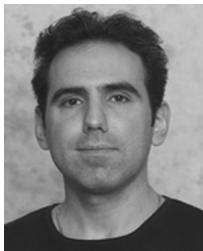

Jacob Benesty (M’98–SM’04) was born in 1963. He received the M.S. degree in microwaves from Pierre and Marie Curie University, Paris France, in 1987, and the Ph.D. degree in control and signal processing from Orsay University, Paris, in April 1991.

During the Ph.D. degree (from November 1989 to April 1991), he worked on adaptive filters and fast algorithms at the Centre National d’Etudes des Telecommunications (CNET), Paris. From January 1994 to July 1995, he worked at Telecom Paris University on multichannel adaptive filters and acoustic

echo cancellation. From October 1995 to May 2003, he was first a Consultant and then a Member of the Technical Staff at Bell Laboratories, Murray Hill, NJ. In May 2003, he joined INRS-EMT, University of Quebec, Montreal, QC, Canada, as a Professor. His research interests are in signal processing, acoustic signal processing, and multimedia communications. He was a member of the editorial board of the EURASIP Journal on Applied Signal Processing. He coauthored the books Noise Reduction in Speech Processing (Springer-Verlag, 2009), Microphone Array Signal Processing (Springer-Verlag, 2008), Acoustic MIMO Signal Processing (Springer-Verlag, 2006), and Advances in Network and Acoustic Echo Cancellation (Springer-Verlag, 2001). He is the Editor-in-Chief of the reference Springer Handbook of Speech Processing (Springer-Verlag, 2007). He is also a coeditor/coauthor of the books Speech Enhancement (Springer-Verlag, 2005), Audio Signal Processing for Next Generation Multimedia communication Systems (Kluwer, 2004), Adaptive Signal Processing: Applications to Real-World Problems (Springer-Verlag, 2003), and Acoustic Signal Processingfor Telecommunication (Kluwer, 2000).

Dr. Benesty received the 2001 and 2008 Best Paper Awards from the IEEE Signal Processing Society. He was a member of the IEEE Audio and Electroacoustics Technical Committee, and the Co-Chair of the 1999 International Workshop on Acoustic Echo and Noise Control (IWAENC). He is the General Co-Chair of the 2009 IEEE Workshop on Applications of Signal Processing to Audio and Acoustics (WASPAA).

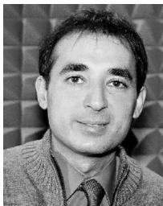

Sofiène Affes (S’94–M’95–SM’04) received the Diplôme d’Ingénieur degree in electrical engineering and the Ph.D. degree (with honors) in signal processing in 1995, both from the École Nationale Supérieure des Télécommunications (ENST), Paris, France, in 1992 and 1995, respectively.

He has been since with INRS-EMT, University of Quebec, Montreal, QC, Canada, as a Research Associate from 1995 to 1997, then as an Assistant Professor until 2000. Currently, he is an Associate Professor in the Wireless Communications Group. His

research interests are in wireless communications, statistical signal and array processing, adaptive space–time processing, and MIMO. From 1998 to 2002, he has been leading the radio design and signal processing activities of the Bell/ Nortel/NSERC Industrial Research Chair in Personal Communications at INRS-EMT, Montreal. Since 2004, he has been actively involved in major projects in wireless of Partnerships for Research on Microelectronics, Photonics and Telecommunications (PROMPT).

Prof. Affes was the corecipient of the 2002 Prize for Research Excellence of INRS. He currently holds a Canada Research Chair in Wireless Communications and a Discovery Accelerator Supplement Award from the Natural Sciences & Engineering Research Council of Canada (NSERC). In 2006, he served as a General Co-Chair of the IEEE VTC’2006-Fall Conference, Montreal. In 2008, he received from the IEEE Vehicular Technology Society the IEEE VTC Chair Recognition Award for exemplary contributions to the success of IEEE VTC. He currently acts as a member of the Editorial Board of the IEEE TRANSACTIONS ON WIRELESS COMMUNICATIONS and of the Wiley Journal on Wireless Communications and Mobile Computing.