# An Integrated Solution for Online Multichannel Noise Tracking and Reduction

Mehrez Souden, Member, IEEE, Jingdong Chen, Senior Member, IEEE, Jacob Benesty, and Sofiène Affes, Senior Member, IEEE

Abstract—Noise statistics estimation is a paramount issue in the design of reliable noise-reduction algorithms. Although significant efforts have been devoted to this problem in the literature, most developed methods so far have focused on the single-channel case. When multiple microphones are used, it is important that the data from all the sensors are optimally combined to achieve judicious updates of the noise statistics and the noise-reduction filter. This contribution is devoted to the development of a practical approach to multichannel noise tracking and reduction. We combine the multichannel speech presence probability (MC-SPP) that we proposed in an earlier contribution with an alternative formulation of the minima-controlled recursive averaging (MCRA) technique that we generalize from the single-channel to the multichannel case. To demonstrate the effectiveness of the proposed MC-SPP and multichannel noise estimator, we integrate them into three variants of the multichannel noise reduction Wiener filter. Experimental results show the advantages of the proposed solution.

Index Terms—Microphone array, minima controlled recursive averaging (MCRA), multichannel noise reduction, multichannel speech presence probability (MC-SPP), noise estimation.

## I. INTRODUCTION

PEECH signals are inherently sparse in the time and frequency domains, thereby allowing for continuous tracking and reduction of background noise in speech acquisition systems. Indeed, spotting time instants and frequency bins without/ with active speech components is extremely important to update/hold the noise statistics that are needed in the design of noise-reduction filters. When multiple microphones are utilized, the extra space dimension has to be optimally exploited for this purpose.

In general terms, noise reduction methods can be classified into two main categories. The first focuses on the utilization of a single microphone while the second deals with multiple microphones. Both categories have emerged and, in many cases, continued to be treated as separate fields. However, the latter can be viewed as a generalized case of the former and similar principles can be used for both the single and multichannel noise tracking and reduction.

Single-channel noise reduction has been an active field of research over the last four decades after the pioneering work of Schroeder in 1965 [1]. In this category, both spectral and temporal information are commonly utilized to extract the desired speech and attenuate the background additive noise [2]–[7]. In spite of the differences among them, most of the existing single-channel methods, essentially, find their common root in the seminal work of Norbert Wiener in 1949 [8] as shown in [9], for example. To implement these filters, noise statistics are required and have to be continuously estimated from the observed data [2], [10]–[13]. The accuracy of these estimates is a crucial factor since noise overestimation can lead to the cancellation of the desired speech signal while its underestimation may result in larger annoying residual noise. To deal with this issue, Martin proposed a minimum statistics-based method that tracks the spectral minima of the noisy data per frequency bin [10]. These minima were considered as rough estimates of the noise power spectral density (PSD) that were refined later on by proper PSD smoothing [11]. In [14], Cohen proposed the so-called MCRA in which the smoothing factor of the first-order recursive averaging of the noise PSD is shown to depend directly on the speech presence probability (SPP). Then, the principle of minimum statistics tracking was exploited to determine this probability. In [12], a Gaussian statistical model was assumed for the observation data and the SPP was accordingly devised. In this formulation the a priori speech absence probability (SAP) is estimated by tracking the minimum values of the recursively smoothed periodogram of the noisy data.

Multichannel noise reduction approaches were, on the other hand, greatly influenced by the traditional theory of beamforming that dates back to the mid twentieth century and was initially developed for sonar and radar applications [15]–[17]. In fact, a common trend in multichannel noise reduction has been to formulate this problem in the frequency domain for many reasons such as efficiency, simplicity, and ease to tune performance. Then, noise reduction (and even dereverberation) is achieved if the source propagation vector is known. In anechoic situations where the speech components observed at each microphone are purely delayed and attenuated copies of the source signal, beamforming techniques yield reasonably good noise-reduction performance. In most acoustic environments, however, the reverberation is inevitable and generalized transfer functions (TFs) are used to model the complex propagation process of speech signals. One way to reduce the acoustic noise in this case consists in using the MVDR or the generalized sidelobe canceller (GSC) whose coefficients are computed based on the acoustic channel TFs. Nevertheless, the channel TFs are unknown in practice and have to be estimated in a blind manner, which is a very challenging issue. Some of the prominent contributions that were developed for multichannel speech enhancement include [18], where the generalized channel TFs were first utilized and assumed to be known in order to develop an adaptive filter that trades off signal distortion and noise reduction. In [19], Affes and Grenier proposed an adaptive channel TF-based GSC that tracks the signal subspace to jointly reduce the noise and the reverberation. In [20], Gannot et al. focused on noise reduction only using the GSC that was shown to depend on the channel TF ratios which can be estimated using the speech nonstationarity [21].

In [22], the MVDR (consequently the GSC), in particular, and parameterized multichannel Wiener filter (PMWF), in general, were formulated such that they only depend on the noise and noisy data PSD matrices when only noise reduction is of interest. This formulation can be viewed as a natural extension of noise reduction from the single to the multichannel case and what one actually needs to implement these filters are accurate estimates of the noise and noisy data PSD matrices. Following the single-channel noise reduction legacy, it seems natural to also generalize the concepts of SPP estimation and noise tracking to the multichannel case in order to implement the multichannel noise reduction filters. Recently, the MC-SPP has been theoretically formulated and its advantages were discussed in [23]. In this paper, we first propose a practical implementation of the MC-SPP. An estimator of the a priori SAP is developed by taking into account the short and long term variations of some properly defined SNR measure. Also, an online estimator of the noise PSD matrix which generalizes the MCRA to the multichannel case is provided. Similar to the single-channel scenario, we show how the noise estimation is performed during speech absence only. After investigating the accuracy of the speech detection when multiple microphones are utilized, we combine the multichannel noise estimator with three noise reduction methods, namely, the MVDR, Wiener, and a new modified Wiener filter. The overall proposed scheme performs very well in various conditions: stationary or nonstationary noise in anechoic or reverberant acoustic rooms.

The remainder of this paper is organized as follows. Section II describes the signal model. Section III reviews the properties of the MC-SPP that was developed in [23]. Section IV outlines the practical considerations that have to be taken into account to implement the MC-SPP. It also contains a thorough description of the proposed a priori SAP estimator and the overall algorithm for noise estimation and tracking. Section V presents several numerical examples to illustrate the effectiveness of the proposed approach for speech detection and noise reduction.

## II. PROBLEM STATEMENT

Let $s ( t )$ denote a speech signal impinging on an array of microphones with an arbitrary geometry at time instant . The resulting observations are given by

$$
\begin{array}{r l} & y _ {n} (t) = g _ {n} (t) * s (t) + v _ {n} (t) \\ & \qquad = x _ {n} (t) + v _ {n} (t), n = 1, 2, \ldots , N \end{array}\tag{1}
$$

where is the convolution operator, $g _ { n } ( t )$ is the channel im pulse response encountered by the source before impinging on the th microphone, $x _ { n } ( t ) \ { \overset { \mathtt { \Delta } } { = } } \ g _ { n } ( t ) * s ( t )$ is the noise-free (clean) speech component, and $v _ { n } ( t )$ is the noise at microphone which can be either white or colored but is uncorrelated with $s ( t )$ . We assume that all the noise components and $s ( t )$ are zero-mean random processes. In the short-time Fourier transform (STFT) domain, the signal model (1) is written as

$$
Y _ {n} (k, l) = X _ {n} (k, l) + V _ {n} (k, l), n = 1, 2, \ldots , N\tag{2}
$$

where $k ~ = ~ 0 , \ldots , K - 1$ is the frequency index $( K$ is the STFT length) and is the time-frame index. With this model, the objective of noise reduction is to estimate one of the clean speech spectra $X _ { n } ( k , l ) , n \ = \ 1 , 2 , . . . , N$ Without loss of generality, we choose to estimate $X _ { 1 } ( k , l )$ To formulate the algorithm, we use the following vector notation. First, we define $\begin{array} { r l r } { \mathbf { g } ( k ) } & { { } \triangleq } & { [ G _ { 1 } ( k ) \cdots \bar { G } _ { N } ( k ) ] ^ { T } } \end{array}$ which consists of the TFs of the propagation channels between the source and all microphone locations, $\begin{array} { l l } { \mathbf { y } ( k , l ) } & { \triangleq } \end{array}$ $[ Y _ { 1 } ( k , l ) \ \cdots \ Y _ { N } ( k , l ) ] ^ { T } , \mathbf x ( k , l ) \ { \overset { \Delta } { = } } \ [ X _ { \scriptscriptstyle { \perp } } ( k , l ) \ \cdots \ X _ { N } ( k , l ) ] ^ { T }$ and $\mathbf { v } ( k , l ) \triangleq [ V _ { 1 } ( k , l ) \cdots V _ { N } ( k , l ) ] ^ { T }$ . The noise and noisy data PSD matrices are $\Phi _ { v v } ( k ) \ \triangleq \ \bar { E } \left\{ \mathbf { v } ( k , l ) \mathbf { v } ^ { H } ( k , l ) \right\}$ and $\begin{array} { r c l } { \Phi _ { y y } ( k ) } & { \triangleq } & { E \left\{ \mathbf { y } ( k , l ) \mathbf { y } ^ { H } ( \dot { k } , l ) \right\} } \end{array}$ , respectively. Since noise and speech components are assumed to be uncorrelated, we can calculate the PSD matrix of the noise-free signals as $\Phi _ { x x } ( k ) \ \triangleq \ E \left\{ \mathbf { x } ( k , l ) \mathbf { x } ^ { H } ( k , l ) \right\} \ = \ \Phi _ { y y } ( k ) - \ \tilde { \Phi } _ { v v } ( k )$ . In practice, recursive smoothing is used to approximate the mathematical expectations involved in the previous PSD matrices. In other words, at time frame , the estimates of the noise and noisy data statistics are updated recursively [we use the notation to denote “the estimate of”]

$$
\begin{array}{r l} & {\hat {\mathbf {\Phi}} _ {y y} (k, l)} \\ & {= \alpha_ {y} (k, l) \hat {\mathbf {\Phi}} _ {y y} (k, l - 1) + [ 1 - \alpha_ {y} (k, l) ] \mathbf {y} (k, l) \mathbf {y} ^ {H} (k, l)} \end{array}\tag{3}
$$

and

$$
\begin{array}{l} \hat {\boldsymbol {\Phi}} _ {v v} (k, l) \\ = \tilde {\alpha} _ {v} (k, l) \hat {\boldsymbol {\Phi}} _ {v v} (k, l - 1) + [ 1 - \tilde {\alpha} _ {v} (k, l) ] \mathbf {y} (k, l) \mathbf {y} ^ {H} (k, l) \end{array}\tag{4}
$$

where $0 ~ \le ~ \alpha _ { y } ( k , l ) ~ \le ~ 1$ and $0 ~ \leq ~ \tilde { \alpha } _ { v } ( k , l ) ~ \leq ~ 1$ are two forgetting factors. The choice of these two parameters is very important in order to correctly update the noisy and noise data PSD matrices. Without loss of generality, we will assume that $\alpha _ { y } ( k , l ) = \alpha _ { y }$ is constant in the following. As for $\tilde { \alpha } _ { v } ( k , l )$ it should be small enough when the speech is absent so that $\hat { \Phi } _ { v v } ( k , l )$ can follow the noise changes, but when the speech is present, this parameter should be sufficiently large to avoid noise PSD matrix overestimation and speech cancellation. Clearly, the parameter $\tilde { \alpha } _ { v } ( k , l )$ is closely related to the detection of speech presence/absence. In the following, we propose a practical approach for the computation of the MC-SPP and $\tilde { \alpha } _ { v } ( k , l )$

## III. MULTICHANNEL SPEECH PRESENCE PROBABILITY

The SPP in the single-channel case has been exhaustively studied [12], [24], [25]. In the multichannel case, the two-state model of speech presence/absence, as in the single-channel case, holds and we have

1) $H _ { 0 } ( k , l )$ : in which case the speech is absent, i.e.,

$$
\mathbf {y} (k, l) = \mathbf {v} (k, l).\tag{5}
$$

2) $H _ { 1 } ( k , l )$ : in which case the speech is present, i.e.,

$$
\mathbf {y} (k, l) = \mathbf {x} (k, l) + \mathbf {v} (k, l).\tag{6}
$$

A first attempt to generalize the concept of SPP to the multichannel case was made in [26] where some restrictive assumptions (uniform linear microphone array, anechoic propagation environment, additive white Gaussian noise) were made to develop an MC-SPP. Recently, we have generalized this study and shown that this probability is in the following form [23]

$$
p (k, l) = \left\{1 + \frac {q (k , l)}{1 - q (k , l)} [ 1 + \xi (k, l) ] \exp \left[ - \frac {\beta (k , l)}{1 + \xi (k , l)} \right] \right\} ^ {- 1}\tag{7}
$$

where

$$
\xi (k, l) \triangleq \mathrm{tr} \left[ \Phi_ {v v} ^ {- 1} (k, l) \Phi_ {x x} (k, l) \right].\tag{8}
$$

$\xi ( k , l )$ can be identified as the multichannel a priori SNR [23] and is also the theoretical output SNR of the PMWF [22]. Moreover, we have

$$
\beta (k, l) \triangleq \mathbf {y} ^ {H} (k, l) \boldsymbol {\Phi} _ {v v} ^ {- 1} (k, l) \boldsymbol {\Phi} _ {x x} (k, l) \boldsymbol {\Phi} _ {v v} ^ {- 1} (k, l) \mathbf {y} (k, l)\tag{9}
$$

and $\mathbf { \Lambda } _ { q ( k , l ) }$ is the a priori SAP. The result in (7)–(9) describes how the multiple microphones’ observations can be combined in order to achieve optimal speech detection. It can be viewed as a straightforward generalization of the single-channel SPP to the multichannel case under the assumption of Gaussian statistical model. In comparison with its single-channel counterpart, this MC-SPP has many advantages as shown in [23]. Indeed, perfect detection is possible when the noise emanates from a point source, while a coherent summation of the speech components is performed in order to enhance the detection accuracy if the noise is spatially white. It is important to point out that the MC-SPP in (7)–(9) involves only the noise and noisy signal PSD matrices in addition to the current (at time instant ) data samples. This feature makes it appealing in the sense that it can be combined with recursive statistics estimation to track the speech absence/presence and, correspondingly, continue/halt the noise statistics update.

## IV. PRACTICAL CONSIDERATIONS AND NOISE TRACKING

In order to compute the MC-SPP in (7)–(9), we have to estimate ${ q ( k , l ) , \xi ( k , l ) , \Phi _ { v v } ( k , l ) }$ , and $\Phi _ { x x } ( k , l )$ as described in the following section. We denote the estimates of these terms as $\hat { q } ( k , l ) , \hat { \xi } ( k , \bar { l } ) , \hat { \Phi } _ { v v } ( k , l )$ , and $\hat { \Phi } _ { x x } ( k , l )$ , respectively.

## A. Estimation of the a Priori Speech Absence Probability

It is clear from (7) that the a priori SAP, $\mathrm { ~ } q ( k , l )$ , needs to be estimated. In single-channel approaches, this probability is often set to a fixed value [25], [27]. However, speech signals are inherently nonstationary. Hence, choosing a time- and frequency-dependent a priori SAP can lead to more accurate detectors. Notable contributions that have recently been proposed include [13], where the a priori SAP is estimated using a soft decision approach that takes advantage of the correlation of the speech presence in neighboring frequency bins of consecutive frames. In [12], a single-channel estimator of the a priori SAP which is based on minimum statistics tracking was proposed. The method is inspired from [11], but further uses time and frequency smoothing.

In contrast to previous contributions, we propose to use multiple observations captured by an array of microphones to achieve more accuracy in estimating the a priori SAP. Theoretically, any of the aforementioned principles (fixed SAP, minimum-statistics, or correlation of the speech presence in neighboring frequency bins of consecutive frames) can be extended to the multichannel case. Without loss of generality, we consider a framework that is similar to the one proposed in [13] and use both long-term and instantaneous variations of the overall observations’ energy (with respect to the best estimate of the noise energy). Our method is based on the multivariate statistical analysis [28] and jointly processes the $N$ microphone observations for optimal a priori SAP estimation.

We define the following two terms:

$$
\psi (k, l) \triangleq \mathbf {y} ^ {H} (k, l) \hat {\boldsymbol {\Phi}} _ {v v} ^ {- 1} (k, l) \mathbf {y} (k, l)
$$

$$
\tilde {\psi} (k, l) \triangleq \mathrm{tr} \left[ \hat {\Phi} _ {v v} ^ {- 1} (k, l) \hat {\Phi} _ {y y} (k, l) \right].\tag{10}
$$

(11)

Both terms will be used for a priori SAP estimation. Indeed, note first that in the particular case $N = 1 , \tilde { \psi } ( k , l )$ boils down to the ratio of the noisy data energy divided by the energy of the noise (known as a posteriori SNR [11]–[13]). Besides, $\psi ( k , l )$ is nothing but the instantaneous version of $\tilde { \psi } ( k , l )$ . We have $\tilde { \psi } ( k , l ) \ge N$ and large values of $\psi ( k , l )$ and $\tilde { \psi } ( k , l )$ would indicate the speech presence, while small values (close to ) indicate speech absence. Actually, by analogy to the single channelcase, $\psi ( k , l )$ and $\tilde { \psi } ( k , l )$ can be identified as the instantaneous and long-term estimates of the multichannel a posteriori SNR, respectively. Consequently, considering both terms in (10) and (11) to have a prior estimate of the SAP amounts to assessing the instantaneous and long-term averaged observations’ energies compared to the best available noise statistics estimates and deciding whether the speech is a priori absent or present as in [13].

Now, we see from the definitions in (10) and (11) that in order to control the false alarm rate, two thresholds $\psi _ { 0 }$ and $\tilde { \psi } _ { 0 }$ have to be chosen such that

$$
\begin{array}{c} \operatorname{Prob} \left[ \psi (k, l) \geq \psi_ {0} | H _ {0} (k, l) \right] \leq \epsilon \\ \operatorname{Prob} \left[ \tilde {\psi} (k, l) \geq \tilde {\psi} _ {0} | H _ {0} (k, l) \right] \leq \epsilon \end{array}\tag{12}
$$

where denotes a certain significance level that we choose as $\epsilon = 0 . 0 1 [ 1 3 ]$ . In theory, the distributions of $\psi ( k , l )$ and $\tilde { \psi } ( k , l )$ are required to determine $\psi _ { 0 }$ and $\tilde { \psi } _ { 0 }$ . In practice, it is very difficult to determine the two probability density functions. To circumvent this problem, we make the following two assumptions for noise only frames.

• Assumption 1: the vectors ${ \bf y } ( k , l )$ are Gaussian, independent, and identically distributed with mean and covariance $\Phi _ { v v } ( k , l )$

• Assumption 2: the noise PSD matrix can be approximated as a sample average of periodograms (we further assume that these periodograms are independent for ease of analysis), i.e.,

$$
\hat {\mathbf {\Phi}} _ {v v} (k, l) \approx \frac {1}{L} \sum_ {i = 1} ^ {L} \mathbf {y} (k, l _ {i}) \mathbf {y} ^ {H} (k, l _ {i})\tag{13}
$$

where $l _ { i }$ is a certain time index of a speech-free frame preceding the th one. Following this assumption, $\hat { \Phi } _ { v v } ( k , l )$ has a complex Wishart distribution $W _ { N } \left( \Phi _ { v v } ( k , l ) , \dot { L } \right) ~ [ $ in the following, we will use the notation $\hat { \Phi } _ { v v } ( k , l ) \ \sim$ $W _ { N } ( \Phi _ { v v } ( k , l ) , \mathbf { \bar { \xi } } _ { } L ) \mathbf { \xi } ]$ [28].

Using Assumption 1 and Assumption 2, we find that $\psi ( k , l )$ has a Hotelling’s $T ^ { 2 }$ distribution with probability density function (pdf) and cumulative distribution function (cdf), respectively, expressed as [28]

$$
f _ {\psi} (x) = \frac {\Gamma (L + 1)}{L \Gamma (N) \Gamma (L - N + 1)} \frac {\left(\frac {x}{L}\right) ^ {N - 1}}{\left(1 + \frac {x}{L}\right) ^ {L + 1}} u (x)\tag{14}
$$

(15)

where ${ } _ { 2 } F _ { 1 } \left( \cdot , \cdot ; \cdot ; \cdot \right)$ is the hypergeometric function [28], [29], and $u ( x ) = 1 { \mathrm { ~ i f ~ } } x \geq 1$ and 0 otherwise.

Now, we turn to the estimation of $\tilde { \psi } _ { 0 }$ . To this end, we use Assumption 1 and further suppose that, similar to $\hat { \Phi } _ { v v } ( k , l )$ $\hat { \Phi } _ { y y } ( k , l )$ can be approximated by a sample average of $L { \mathfrak { p e } } -$ riodograms. In order to determine the pdf of $\tilde { \psi } ( k , l )$ , we use the fact that for two independent random –dimensional matrices $\sim W _ { d } ( \pmb { \Sigma } , m _ { H } )$ and $\mathbf { E } \sim W _ { d } ( \Sigma , m _ { E } )$ , the distribution of $\operatorname { t r } \left\{ \mathbf { H } \mathbf { E } ^ { - 1 } \right\}$ can be approximated by $c F$ where $F \sim F _ { a , b }$ (F distribution with and degrees of freedom) where [28], [30]

$$
\begin{array}{r l} & {a = d m _ {H}, b = 4 + \frac {a + 2}{B - 1}, c = \frac {a (b - 2)}{b (m _ {E} - d - 1)}} \\ & {B = \frac {(m _ {E} + m _ {H} - d - 1) (m _ {E} - 1)}{(m _ {E} - d - 3) (m _ {E} - d)}.} \end{array}
$$

Specifically, the pdf and cdf corresponding to $F _ { a , b }$ are [28]

$$
f _ {\tilde {\psi}} (x) = \frac {\sqrt {\frac {(a x) ^ {a} b ^ {b}}{(a x + b) ^ {a + b}}}}{x \mathcal {B} \left(\frac {a}{2} , \frac {b}{2}\right)} u (x)\tag{16}
$$

$$
\mathcal {F} _ {\tilde {\psi}} (x) = I _ {a x / (a x + b)} \left(\frac {a}{2}, \frac {b}{2}\right) u (x).\tag{17}
$$

This approximation is valid for real matrices and we found that it gives good results in all the investigated scenarios for $\tilde { \psi } ( k , l )$ [i.e., replacing and by $\hat { \Phi } _ { y y } ( k , l )$ and $\hat { \Phi } _ { v v } ( k , l )$ , respectively] by choosing $m _ { E } = m _ { H } = L$ and $d = 2 \dot { N }$ . Note again that we are assuming that $\hat { \Phi } _ { y y } ( k , l )$ and $\hat { \Phi } _ { v v } ( k , l )$ have the same mean since we are considering noise only frames.

Once we determine $\psi _ { 0 }$ and $\tilde { \psi } _ { 0 }$ using (12) jointly with (15) and (17), we have to take into account the variations of both $\psi ( k , l )$ and $\tilde { \psi } ( k , l )$ in order to devise an accurate estimator of the $a p r i o r i \mathrm { S A P }$ . Hence, we propose a procedure which is inspired from the work of Cohen in [12], [13]. We first propose the following three estimators: $\hat { q } _ { \mathrm { l o c a l } } ( k , l ) , \hat { q } _ { \mathrm { g l o b a l } } ( k , \bar { l } )$ , and ${ \hat { q } } _ { \mathrm { f r a m e } } ( l )$ which are described in the following.

For a given frequency bin, we estimate the local (at frequency bin ) a priori SAP as [13]

$$
\begin{array}{l l} \hat {q} _ {\text {local}} (k, l) \\ = \left\{ \begin{array}{l l} 1, & \text {if} \tilde {\psi} (k, l) <   N \text {and} \psi (k, l) <   \psi_ {0} \\ \frac {\tilde {\psi} _ {0} - \tilde {\psi} (k , l)}{\tilde {\psi} _ {0} - N}, & \text {if} N \leq \tilde {\psi} (k, l) <   \tilde {\psi} _ {0} \text {and} \psi (k, l) <   \psi_ {0} \\ 0, & \text {else.} \end{array} \right. \end{array}\tag{18}
$$

When $\psi ( k , l )$ and $\tilde { \psi } ( k , l )$ are sufficiently large, it is assumed that the speech is a priori locally present. If $\psi ( k , l )$ is lower than and $\tilde { \psi } ( k , l )$ is lower than its minimum theoretical lower value $N .$ , we decide that the speech is a priori absent. In mild situations, a soft transition from speech to nonspeech decision is performed.

Note that the condition on $\psi ( k , l )$ in (18) represents a local decision that the speech is assumed to be a priori absent or present using the information retrieved from a single frequency bin . It is known that speech miss detection is more destructive for speech enhancement applications than false alarms. Therefore, we choose the following conservative approach and introduce a second speech absence detector based on $\psi ( k , l )$ and the concept of speech presence correlation over neighboring frequency bins that has been exploited in earlier contributions such as [12], [13], [31]. With the help of this second detector, we can judge whether speech is absent based on the local, global, and frame-wise results. For further explanation, we follow the notation of [13] and define the global and frame-based averages of a posteriori SNR for the th frequency bin as

$$
\psi_ {\mathrm{global}} (k, l) = \sum_ {i = - K _ {1}} ^ {K _ {1}} w _ {\mathrm{global}} (i) \psi (k - i, l)\tag{19}
$$

where $w _ { \mathrm { g l o b a l } }$ is a normalized Hann window of size $2 K _ { 1 } + 1$ and

$$
\psi_ {\mathrm{frame}} (l) = \frac {1}{K} \sum_ {i = 1} ^ {K} \psi (i, l).\tag{20}
$$

Then, we can decide that the speech is absent in a given frequency bin, i.e., $\hat { q } _ { \mathrm { g l o b a l } } ( k , l ) = 1 , \mathrm { i f } \psi _ { \mathrm { g l o b a l } } ( k , l ) < \psi _ { 0 } .$ , otherwise it is present and $\hat { q } _ { \mathrm { g l o b a l } } ( k , l ) =  { \mathrm { 0 . 5 i m i l a r l y } }$ , we decide that the speech is absent in the th frame, i.e., $\hat { q } _ { \mathrm { f r a m e } } ( l ) = 1$ if $\psi _ { \mathrm { f r a m e } } ( l ) < \psi _ { 0 }$ , otherwise it is present and ${ \hat { q } } _ { \mathrm { f r a m e } } ( l ) = 0$ . Finally, we propose the following a priori SAP

$$
\hat {q} (k, l) = \hat {q} _ {\mathrm{local}} (k, l) \hat {q} _ {\mathrm{global}} (k, l) \hat {q} _ {\mathrm{frame}} (l).\tag{21}
$$

It is seen from (7) that there will be a numerical problem when $\hat { q } = 1$ . To circumvent this, we use $[ \hat { q } ( k , l ) , q _ { \mathrm { m a x } } ]$ instead of $\hat { q } ( k , l )$ when computing the MC-SPP, where $q _ { \mathrm { m a x } } = 0 . 9 9$

## B. Noise Statistics Estimation Using Multichannel MCRA

In this section, we generalize the single-channel noise tracking approach in [12] to the multichannel case. First, recall that the noise statistics are generally updated using the recursive formula in (4). In order to avoid the cancellation of the desired signal and properly reduce the noise, the parameter $\tilde { \alpha } _ { v } ( k , l )$ is defined as a function of $p ( k , l )$ . Following the two-state model for speech presence/absence described in the beginning of Section III and the recursive noise statistics update using a smoothing parameter $\alpha _ { v }$ , we have

$$
H _ {0} (k, l): \hat {\Phi} _ {v v} (k, l)
$$

$$
= \alpha_ {v} \hat {\mathbf {\Phi}} _ {v v} (k, l - 1) + (1 - \alpha_ {v}) \mathbf {y} (k, l) \mathbf {y} ^ {H} (k, l)\tag{22}
$$

$$
H _ {1} (k, l): \hat {\bar {\Phi}} _ {v v} (k, l) = \hat {\bar {\Phi}} _ {v v} (k, l - 1).\tag{23}
$$

The same argument of [12] can be used herein to show that the above two update formulas can be combined into the following form, as also shown in (4):

$$
\begin{array}{r l} & {\hat {\mathbf {\Phi}} _ {v v} (k, l)} \\ & {= \tilde {\alpha} _ {v} (k, l) \hat {\mathbf {\Phi}} _ {v v} (k, l - 1) + [ 1 - \tilde {\alpha} _ {v} (k, l) ] \mathbf {y} (k, l) \mathbf {y} ^ {H} (k, l)} \end{array}\tag{24}
$$

where

$$
\tilde {\alpha} _ {v} (k, l) = \alpha_ {v} + (1 - \alpha_ {v}) p (k, l)\tag{25}
$$

and $0 \leq \alpha _ { v } \leq 1$ . Clearly, this generalizes the noise tracking algorithm to the multichannel case.

Now to estimate $p ( k , l )$ , a good estimate of $\Phi _ { v v } ( k , l )$ is required. Unfortunately, this is not easy to achieve since the best available estimate at time instant and before estimating $p ( k , l )$ is $\hat { \Phi } _ { v v } ( k , l - 1 )$ . To solve this issue, we propose to proceed in two steps after initialization as described next.

1) Initialization:

1) Knowing the significance level $\epsilon = 0 . 0 1$ and using (12) with (15) and (17), determine $\psi _ { 0 } ( k , l )$ and $\tilde { \psi } _ { 0 } ( k , l )$

2) $\hat { \Phi } _ { v v } ( k , 0 ) = \mathbf { 0 } , \hat { \Phi } _ { y y } ( k , 0 ) = \mathbf { 0 } .$

3) Recursively update $\dot { \Phi } _ { y y } ( k , l )$ using (3) for the first $L _ { \mathrm { i n i t } }$ frames.

4) Assuming that the first $L _ { \mathrm { i n i t } }$ frames consists of noise only, set $\hat { \Phi } _ { v v } ( \bar { k } , L _ { \mathrm { i n i t } } ) = \hat { \Phi } _ { y y } ( k , L _ { \mathrm { i n i t } } )$ . Also, set $p ( k , L _ { \mathrm { i n i t } } ) =$ $0 . L _ { \mathrm { i n i t } }$ has to be small enough, $\mathrm { e . g . , } L _ { \mathrm { i n i t } } = 2 0$ , to avoid signal cancellation in the first frames.

At time frame $l > L _ { \mathrm { i n i t } } .$

2) Iteration 1:

1) Recursively update $\hat { \Phi } _ { y y } ( k , l )$ using (3).

2) Use $\hat { \Phi } _ { v v } ( k , l - 1 )$ to compute

$$
\mathrm{a)} \hat {\Phi} _ {x x} (k, l) \gets \hat {\Phi} _ {y y} (k, l) - \hat {\Phi} _ {v v} (k, l - 1);
$$

$$
\psi (k, l) \leftarrow \mathbf {y} ^ {H} (k, l) \hat {\Phi} _ {v v} ^ {- 1} (k, l - 1) \mathbf {y} (k, l);
$$

$$
\mathrm{c)} \tilde {\psi} (k, l) \gets \mathrm{tr} \left\{\hat {\Phi} _ {v v} ^ {- 1} (k, l - 1) \hat {\Phi} _ {y y} (k, l) \right\};
$$

d) $\hat { \xi } ( k , l ) \gets \tilde { \psi } ( \dot { k } , l ) - N ;$

e) $\hat { \beta } ( k , l ) \longleftarrow \mathbf { y } ^ { H } ( k , l ) \cdot \hat { \boldsymbol { \Phi } } _ { v v } ^ { - 1 } ( k , l - 1 ) \hat { \hat { \boldsymbol { \Phi } } } _ { x x } ( k , l ) \hat { \boldsymbol { \Phi } } _ { v v } ^ { - 1 }$ $( k , l - 1 ) \hat { \Phi } _ { x x } ( k , l ) \mathbf { y } ( k , l ) .$

3) Using and $\psi ( k , l )$ , compute $\hat { q } ( k , l )$ as described in Section IV-A.

4) Compute a first estimate of the MC-SPP:

$$
\hat {p} ^ {(i)} (k, l) = \left\{1 + \frac {\hat {q} (k , l)}{1 - \hat {q} (k , l)} \left[ 1 + \hat {\xi} (k, l) \right] \exp \left[ - \frac {\hat {\beta} (k , l)}{1 + \hat {\xi} (k , l)} \right] \right\} ^ {- 1}.
$$

5) Smooth the MC-SPP recursively using a smoothing parameter $0 < \alpha _ { p } < 1$ as

$$
\hat {p} (k, l) \leftarrow \alpha_ {p} p (k, l - 1) + (1 - \alpha_ {p}) \hat {p} ^ {\mathrm{(i)}} (k, l).
$$

6) Compute $\hat { \tilde { \alpha } } _ { v } ( k , l ) \gets \alpha _ { v } + ( 1 - \alpha _ { v } ) \hat { p } ( k , l )$ and use it to obtain a first estimate of the noise PSD matrix at time frame as

$$
\hat {\Phi} _ {v v} ^ {(\mathrm{i})} (k, l) = \hat {\tilde {\alpha}} _ {v} (k, l) \hat {\Phi} _ {v v} (k, l - 1) + [ 1 - \hat {\tilde {\alpha}} _ {v} (k, l) ] \mathbf {y} (k, l) \mathbf {y} ^ {H} (k, l).
$$

3) Iteration 2:

1) Use $\hat { \Phi } _ { v v } ^ { \mathrm { ( i ) } } ( k , l )$ instead of $\hat { \Phi } _ { v v } ( k , l - 1 )$ to perform Steps 1) and 2) of Iteration 1 and obtain $\hat { \xi } ( k , l ) , \hat { q } ( k , l )$ , and $\hat { \beta } ( k , l )$ An improved estimate of the MC-SPP is given by

$$
p (k, l) = \left\{1 + \frac {\hat {q} (k , l)}{1 - \hat {q} (k , l)} \left[ 1 + \hat {\xi} (k, l) \right] \exp \left[ - \frac {\hat {\beta} (k , l)}{1 + \hat {\xi} (k , l)} \right] \right\} ^ {- 1}.
$$

2) Update $\tilde { \alpha } _ { v } ( k , l ) = \alpha _ { v } + ( 1 - \alpha _ { v } ) p ( k , l )$ . Then, a final and finer noise PSD matrix estimate is obtained by (24). In the first iteration, $^ { 6 6 } { \mathcal { X } }  { \mathcal { Y } } ^ { * }$ stands for “assigning value to $\mathcal { X } . ^ { \dag }$ Actually, more than two iterations can be used in the proposed procedure; but we observed no additional improvement in performance after the second iteration.

## V. NUMERICAL EXAMPLES

We consider a simulation setup where a target speech signal composed of six utterances of speech (half male and half female) taken from the IEEE sentences [2], [32] and sampled at 8 kHz rate is located in a reverberant enclosure with dimensions of $3 0 4 . 8 ~ \mathrm { c m } \times 4 5 7 . 2 ~ \mathrm { c m } \times 3 8 1 . 0$ cm. The image method [33], [34] was used to generate the impulse responses for two conditions: anechoic and reverberant environments (with reverberation time $T _ { 6 0 } = 2 1 0 \mathrm { m s } )$ . A uniform linear array with either four or two microphones (inter-microphone spacing is 6.9 cm) is used and the array outputs are generated by convolving the source signal with the corresponding channel impulses and then corrupted by noise. Two different types of noise are studied: a point-source noise where the source is a nonspeech signal taken from the Noisex database [35] (it is referred to as interference) and a computer generated Gaussian noise. Note that in this case, the noise term in (1) is decomposed as $v _ { n } ( t ) = i _ { n } ( t ) +$ $w _ { n } ( t )$ , with $i _ { n } ( t )$ and $w _ { n } ( t )$ being the interference and AWGN. The levels of the two types of noise are controlled by the input signal-to-interference ratio $\left( \mathrm { S I R } \ = \ E \left[ x _ { 1 } ^ { 2 } ( t ) \right] / E \left[ \dot { i } _ { 1 } ^ { 2 } ( t ) \right] \right)$ and input $\mathrm { S N R } = E \left[ x _ { 1 } ^ { 2 } ( t ) \right] / E \left[ w _ { 1 } ^ { 2 } ( t ) \right]$ depending on the scenarios investigated below1. The target source and the interferer are located at (27.40 cm, 318.11 cm, 101.60 cm) and (277.40 cm, 318.11 cm, 101.60 cm), respectively. The microphone array elements are placed on the axis $( y _ { 0 } = 1 0 1 . 6 0 \mathrm { c m } , z _ { 0 } = 1 0 1 $ cm) with the first microphone at $( x _ { 0 } = 1 2 8 . 2 5 \mathrm { c m } , y _ { 0 } , z _ { 0 } )$ and the th one at $( x _ { 0 } + ( n - 1 ) r , y _ { 0 } , z _ { 0 } )$ with $n = 1 , \ldots , N$ . To implement the proposed algorithm we choose a frame width of 32 ms for the anechoic environment and 64 ms for the reverberant one in order to capture the long channel impulse response, with an overlap of 50% and a Hamming window for data framing. The filtered signal is finally synthesized using the overlap-add technique. We also choose a Hann window for $w _ { \mathrm { g l o b a l } } , K _ { 1 } = 1 5 .$ $L = 3 2 , \alpha _ { p } = 0 . 6 .$ , and $\alpha _ { v } = \alpha _ { y } = 0 . 9 2$ to implement the algorithm described in Section IV-B.

1Note that we defined these measures at the first microphone because it is taken as a reference [9], [22]. The fullband input signal-to-interfrence-plusnoise ratio (SINR) is defined as $\mathrm { S I N R } = E \left[ x _ { 1 } ^ { 2 } \dot { ( t ) } \right] / \breve { E } \left[ v _ { 1 } ^ { 2 } ( t ) \right]$

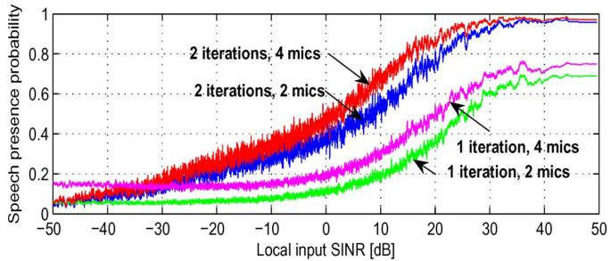

(a)  
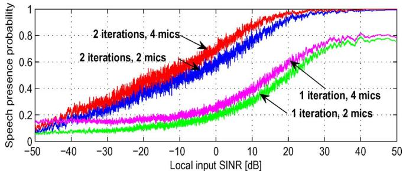  
(b)  
Fig. 1. Multichannel speech presence probability versus instantaneous input SINR after one and two iterations. The interference is an F-16 noise. $N = 2$ and 4 microphones. SIR  - dB. (a) SNR  - dB. (b) $\mathrm { S N R } = 1 0 ~ \mathrm { d B }$

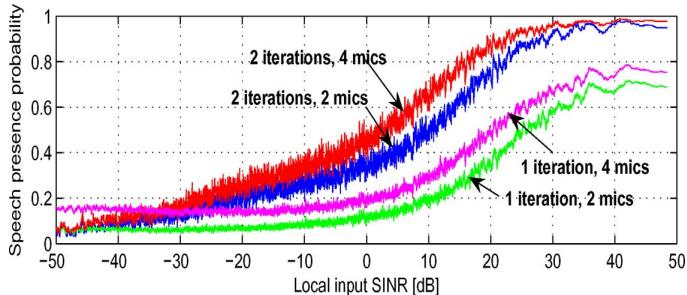

(a)  
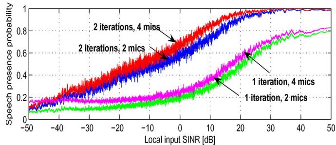  
(b)  
Fig. 2. Multichannel Speech presence probability versus instantaneous input SINR after one and two iterations. The Interference is a babble noise. $N \stackrel { } { = } 2$ and 4 microphones. SIR  - dB. (a) SNR  - dB, (b) SNR   dB.

## A. Speech Components Detection

Here, we investigate the effect of the input instantaneous and local (frequency-bin wise) SINR, defined at frequency bin and time frame as $\mathrm { S I N R } ( k , l ) = \left| X _ { 1 } ( k , l ) \right| ^ { 2 } / \phi _ { v _ { 1 } v _ { 1 } } ( k , l )$ , on the estimated MC-SPP. We consider an anechoic environment and show the results for two types of interfering signals: F-16 and babble noise. The noise-free signal observed at the first microphone is treated as the clean speech and we compute its STFT spectrum. We sort all the spectral components based on the input SINR. Then, we compute the corresponding MC-SPP. Note that we have 1141 speech frames, each composed of 257 frequency bins (the FFT size is 512). In total, we have 293 237 components to classify depending on the input SINR. Fig. 1 shows the variations of the estimated MC-SPP with respect to the input SINR for two and four microphones. To emphasize the advantage of the two-stage procedure, we also provide the MC-SPP estimates after the first and second iterations described in Section IV-B. As seen in Figs. 1 and 2, the second stage yields better detec tion results with either two or four microphones. As expected, using more microphones can improve MC-SPP estimation performance. This is extremely important for situations where the speech energy is relatively weak.

In detection theory, it is common to assess the performance of a given detector by investigating the correct detection rate versus the rate of false alarms, known as receiver operating characteristic (ROC). Our results are compared to the single-channel SPP estimation method proposed in [13]. The latter is imple mented using the first microphone signal since we are taking it as a reference for both single and multichannel processing. In this scenario, we choose SIR dB and SNR is varied between and 20 dB with a step of 2 dB. In order to obtain the ROC curves we normalize the subband speech energies by their maximum value and if the normalized subband energy is below dB, the corresponding subband is assumed to have no speech. If the corresponding SPP is larger than 0.5, it is considered as a false alarm. If the normalized speech energy is larger than dB and the SPP estimator is above 0.5, it is considered as a correct detection. Subsequently, the false alarm rate is computed as $P _ { f } ~ = ~ N _ { f } / N _ { a }$ , where $N _ { f }$ is the number of false alarm occurrences over all the frequency bins and time samples $( N _ { a }$ is the overall number of speech components). Similarly, the correct detection rate is computed as $\bar { P } _ { c } = N _ { c } / N _ { a }$ , where is the number of correct detection occurrences. In Figs. 3 and 4, we show the ROC curves. A clear gain over the single-channel-based approach is observed especially in the case of babble noise which is more nonstationary than the F-16 noise. This suggests that the utilization of multiple microphones improves speech detection that can, consequently, lead to better noise statistics tracking and reduction while preserving the speech signal. More illustrations are provided in the sequel to support this fact.

## B. Noise Tracking

In this part, we illustrate the noise tracking capability of the proposed algorithm. We also consider both cases of babble and F-16 interfering signals in addition to the computer generated white Gaussian noise such that the input SIR dB and input SNR dB. The propagation environment is anechoic. To visualize the result, we plot the estimated noise PSD for the frequency bin 1 kHz. Figs. 5 and 6(a) and (b) depict the subband energy of the clean speech at the first microphone and the corresponding MC-SPP. It is clear that this probability takes large values whenever some speech energy exists and is significantly reduced when the speech energy is low. The effect on the noise tracking is clearly shown in Figs. 5, 6(c), (d), and (e) where the proposed approach is shown to accurately track not only the noise PSD, $\phi _ { v _ { 1 } v _ { 1 } } ( k , l )$ , but also the cross-PSD term, $\phi _ { v _ { 1 } v _ { 2 } } ( k , l )$ . Notice that when the speech is active, the noise tracking is halted. As soon as the speech energy decays, the tracking resumes, thereby allowing the algorithm to follow the potential nonstationarity of the noise.

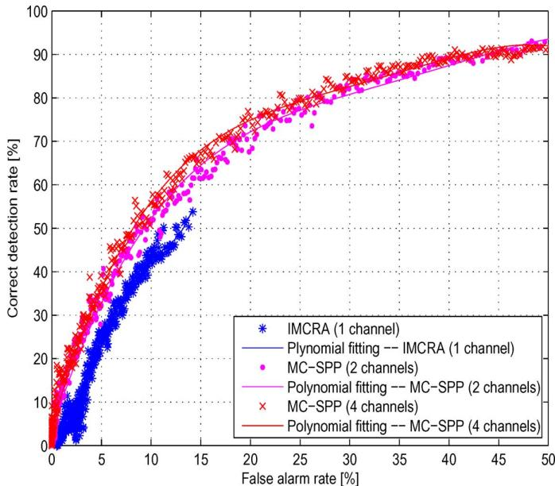  
Fig. 3. Receiver operating characteristic curves of the proposed approach (MC-SPP) with two and four microphones compared to the single-channel improved minima-controlled recursive averaging (IMCRA) method [13]. The interference is F-16 noise.

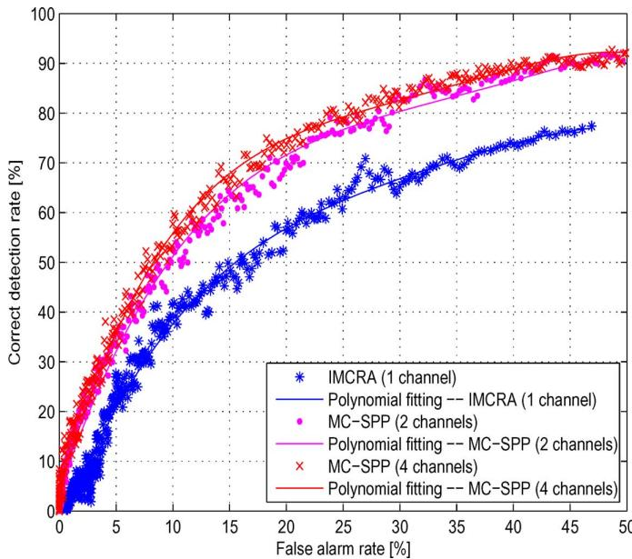  
Fig. 4. Receiver operating characteristic curves of the proposed approach (MC-SPP) with two and four microphones compared to the single-channel improved minima-controlled recursive averaging (IMCRA) method [13]. The interference is babble noise.

In linear noise-reduction approaches (particularly using the PMWF), an accurate estimate of the output SINR , defined in (8), is required [22]. Therefore, we choose to show how the resulting estimate of the frequency-bin-wise output SINR [22] accurately tracks its theoretical value with respect to time at frequency bin 1 kHz in Figs. 7 and 8. Slight mismatches between the theoretical and estimated SINR values are mainly caused by the coexistence of two factors: nonstationarity of the noise and presence of speech.

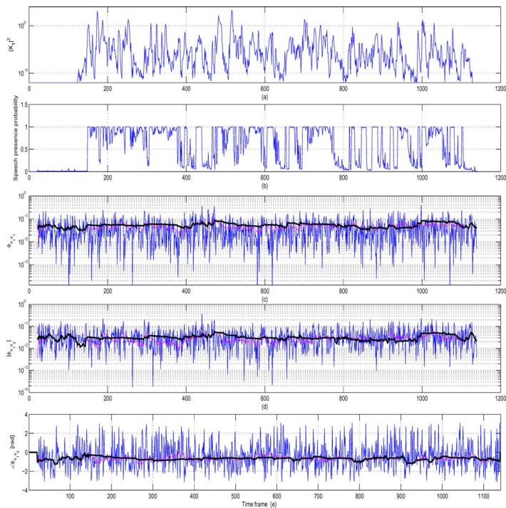  
Fig. 5. Noise statistics tracking: the interference is an F-16 noise. $N \ = \ 4$ microphones. $\mathrm { S N R } \ = \ 1 0 \ \mathrm { d B } , \bar { \mathrm { S I R } } \ = \ 5 \ \mathrm { d B }$ . (a) Target speech periodogram. (b) Estimated speech presence probability. (c) Noise PSD tracking. (d) Noise cross-PSD amplitude tracking. (e) Noise cross-PSD phase tracking. In (c), (d), and (e), the blue, magenta, and black curves correspond to the exact instantaneous periodograms, time smoothed by recursive averaging with a forgetting factor 0.92, and estimated terms (PSD, magnitude, and phase of the cross-PSD), respectively.

## C. Integrated Solution for MC-SPP and Multichannel Wiener-Based Noise Reduction

At time frame , we have an estimate of the noise PSD matrix at the output of the two-iteration procedure described in Section IV-B. Also, we have an estimate of the noisy data PSD matrix that is continuously updated. Using both terms, we deduce an estimate of the noise-free PSD matrix $\hat { \Phi } _ { x x } ( k , l ) ~ =$ $\hat { \Phi } _ { y y } ( k , l ) - \hat { \Phi } _ { v v } ( k , l )$ . Then, it is straightforward to estimate $\xi ( k , l ) \mathrm { a s } \hat { \xi } ( k , l ) = \mathrm { t r } \left[  { \hat { \Phi } } _ { v v } ^ { - 1 } ( k , l )  { \hat { \Phi } } _ { x x } ( k , l ) \right]$ . The performance of this estimator was shown in Figs. 7 and 8 and discussed in Section V-B. Finally, we are able to implement the proposed MC-SPP estimation approach as a front-end followed by one of the next three Wiener-based noise reduction methods.

1) The minimum variance distortionless response (MVDR) filter expressed as [9], [22]

$$
\mathbf {h} _ {\mathrm{MVDR}} (k, l) = \frac {\hat {\boldsymbol {\Phi}} _ {v v} ^ {- 1} (k , l) \hat {\boldsymbol {\Phi}} _ {x x} (k , l) \mathbf {u} _ {1}}{\hat {\xi} (k , l)}\tag{26}
$$

where $\mathbf { u } _ { 1 } = \left[ 1 0 \cdots 0 \right] ^ { T }$ is an –dimensional vector. 2) The multichannel Wiener filter expressed as [9], [22]

$$
\mathbf {h} _ {\mathrm{W}} (k, l) = \frac {\hat {\boldsymbol {\Phi}} _ {v v} ^ {- 1} (k , l) \hat {\boldsymbol {\Phi}} _ {x x} (k , l) \mathbf {u} _ {1}}{1 + \hat {\xi} (k , l)}.\tag{27}
$$

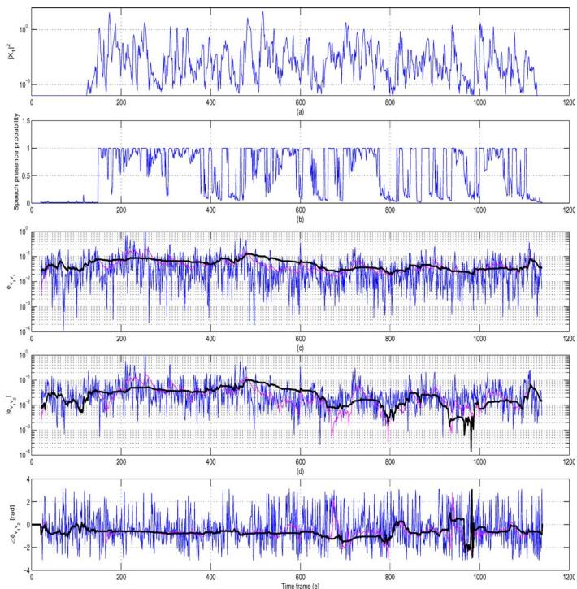  
Fig. 6. Noise statistics tracking: the interference is a babble noise. $N = ~ 4$ microphones. $\mathrm { S N R } \ = \ 1 0$ dB, $\bar { \mathrm { { S I R } } } = \ 5$ dB. (a) Target speech periodogram. (b) Estimated speech presence probability. (c) Noise PSD tracking, (d) Noise cross-PSD magnitude tracking. (e) Noise coross-PSD phase tracking. In (c), (d), and (e), the blue, magenta, and black curves correspond to the exact instantaneous periodograms, time smoothed by recursive averaging with a forgetting factor 0.92, and estimated terms (PSD, magnitude and phase of the cross-PSD), respectively.

3) A new modified multichannel Wiener filter that explicitly takes into account the MC-SPP as

$$
\mathbf {h} _ {\mathrm{mW}} (k, l) = \Omega (k, l) \mathbf {h} _ {\mathrm{MVDR}} (k, l)\tag{28}
$$

where

$$
\Omega (k, l) = \left\{1 - \left[ \frac {1}{1 + \hat {\xi} (k , l)} \right] ^ {\hat {p} (k, l)} \right\} ^ {1 / \hat {p} (k, l)}.
$$

This new modification of the multichannel Wiener filter is rather heuristic and aims at achieving more noise reduction in segments where the MC-SPP value is small (i.e., noise-only frames). When the speech is present the MC-SPP values are close to 1 and both $\mathbf { h } _ { \mathrm { m W } } ( k , l )$ and $\mathbf { h } _ { \mathrm { W } } ( k , l )$ have similar performance. As for ${ \bf h } _ { \mathrm { M V D R } } ( k , l )$ and $\mathrm { { h } w } ( k , l )$ they both belong to the same family of the so-called PMWF and it has been shown that the Wiener filter leads to more noise reduction and larger output SINR at the price of an increased speech distortion [22], [36]. These effects will be further discussed in the following.

The results are presented for the two previous types of interfering signals: F-16 and babble, in addition to the case of white Gaussian noise. The SIR is chosen as $\mathrm { S I R } = 5 \mathrm { d B }$ . Also a computer generated white Gaussian noise was added such that the input $\mathrm { S N R } = 1 0 ~ \mathrm { d B }$ (the overall input SINR dB). Two and four microphones were, respectively, used to process the data in both anechoic and reverberant environments. Furthermore, we include the performance of the single-channel noise reduction method proposed by Cohen and Berdugo and termed “optimally modified log-spectral amplitude estimator” (OM-LSA) [37]. The latter uses the IMCRA to track the noise statistics [13], [37].

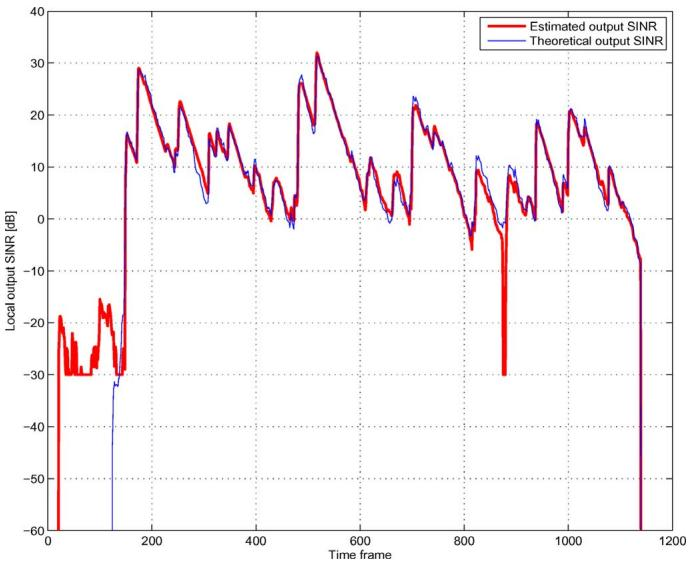  
Fig. 7. Multichannel output SINR $\xi ( k , l )$ , tracking: the Interference is an F-16 noise. $N = 4$ microphones. $\mathrm { { S I R } } = \mathrm { { 5 } }$ dB and $\mathrm { S N R } = 1 0 ~ \mathrm { d B }$

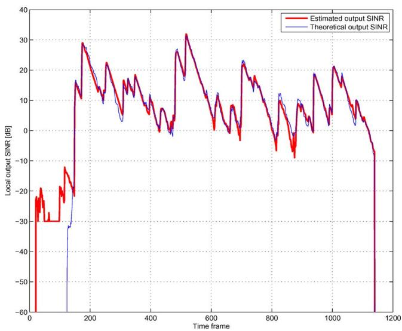  
Fig. 8. Multichannel output $\mathrm { S I N R } , \xi ( k , l ) .$ , tracking: the Interference is babble noise. $N = 4$ microphones. $\mathrm { S I R } = 5$ dB and $\mathrm { S N R } ^ { \sim } = 1 0 ~ \mathrm { d B }$

Let $v _ { \mathrm { r e s i d u a l } } ( t )$ and $x _ { \mathrm { f i l t e r e d } } ( t )$ , respectively, denote the final residual noise-plus-interference and filtered clean speech signal at the output of one of methods described above (after filtering, inverse Fourier transform, and synthesis). Then, the performance measures that we consider here are [9], [22]

• Output SINR given by $E \left\{ x _ { \mathrm { f i l t e r e d } } ^ { 2 } ( t ) \right\} / E \left\{ v _ { \mathrm { r e s i d u a l } } ^ { 2 } ( t ) \right\}$ • Noise (plus interference) reduction factor given by $E \left\{ v _ { 1 } ^ { 2 } ( t ) \right\} / E \left\{ v _ { \mathrm { r e s i d u a l } } ^ { 2 } ( t ) \right\}$

• Signal distortion index given by

$$
E \left\{\left[ x _ {1} (t) - x _ {\mathrm{filtered}} (t) \right] ^ {2} \right\} / E \left\{x _ {1} ^ {2} (t) \right\}
$$

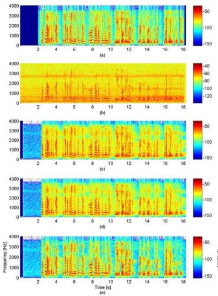

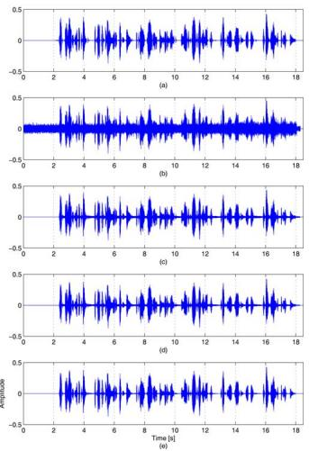  
Fig. 9. Spectrogram and waveform of the (a) first microphone noise-free speech, (b) speech corrupted with additive noise (white Gaussian noise) and interference (F-16 noise), (c) output of the MVDR filter, (d) output of the multichannel Wiener filter, and (e) output of the modified multichannel Wiener Filter.   - microphones. SIR   dB and SNR   dB.

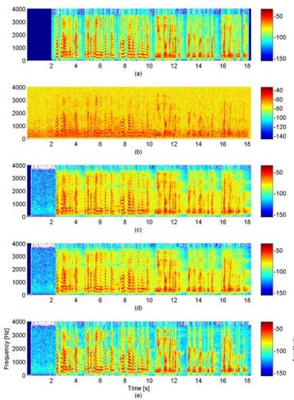

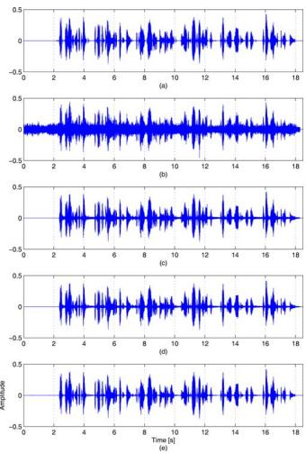  
Fig. 10. Spectrogram and waveform of the (a) first microphone noise-free speech, (b) speech corrupted with additive noise (white Gaussian noise) and interference (Babble noise), (c) output of the MVDR filter, (d) output of the multichannel Wiener filter, and (e) output of the modified multichannel Wiener Filter.   - microphones. SIR   dB and SNR   dB.

For better illustration of the speech distortion and noise reduction in the time and frequency domains, we provide the spectrograms and waveforms of some of the noise-free, noisy, and filtered signals in Figs. 9 and 10. Tables I–IV summarize the achieved values of the above performance measures. Important gains in terms of noise reduction are observed when using more microphones in either reverberant or anechoic environments. Indeed, using four microphones leads to better speech detection as shown previously and also more noise reduction as expected [22]. The proposed modification of the Wiener filter results in more gains in terms of noise reduction and even larger output SINR in all scenarios. However, it also causes more distortions of the desired speech signal. This is understandable since the effects of miss-detections of speech signals are further emphasized by the new MC-SPP-dependent post-processor. Nevertheless, only very weak speech energy components are affected as we observe in the spectrograms and waveforms in Figs. 9 and 10. Furthermore, we see that in all cases, the least noise reduction factor is achieved in the presence of the babble noise which is highly nonstationary (as compared to the other two types of interference). This happens because the noise statistics vary at a relatively high rate that they become difficult to track and more noise components are left due to estimation errors of the noise PSD matrix. The comparison between the performance of the multichannel processing in Tables I and III and that of the single-channel processing shown in Tables II and IV, respectively, lends credence to the importance of using multiple microphones for joint speech detection, noise tracking, and filtering. This fact is pretty obvious in the anechoic case where, for example, the SINR gains of the proposed modification of the multichannel Wiener filter using four microphones is as high as approximately 9 dB in the babble noise case while the speech distortion gain is around 8 dB as compared to the OM-LSA method. In the presence of reverberation, these gains shrink to some extent, but our approach still achieves better performance as illustrated in Tables III and IV.

TABLE I  
PERFORMANCE OF THE MVDR, WIENER, AND MODIFIED WIENER IN DIFFERENT NOISE CONDITIONS: INPUT SNR   dB, INPUT SIR   dB (INPUT SINR   dB). ANECHOIC ROOM. ALL MEASURES ARE IN dB

<table><tr><td>Interf. Sig.</td><td>F-16</td><td>Babble</td><td>White</td></tr><tr><td>Output SINR</td><td>12.36</td><td>10.06</td><td>13.95</td></tr><tr><td>Noise reduction factor</td><td>10.14</td><td>7.38</td><td>12.14</td></tr><tr><td>Signal distortion index</td><td>-8.10</td><td>-10.38</td><td>-6.53</td></tr></table>

TABLE II  
PERFORMANCE OF THE OM-LSA METHOD (1ST MICROPHONE): SAME SETUP AS TABLE I

<table><tr><td>Interf. Sig.</td><td>F-16</td><td>Babble</td><td>White</td></tr><tr><td>Output SINR</td><td>12.78</td><td>9.12</td><td>14.51</td></tr><tr><td>Noise reduction factor</td><td>10.43</td><td>6.07</td><td>12.24</td></tr><tr><td>Signal distortion index</td><td>-7.75</td><td>-9.10</td><td>-7.28</td></tr></table>

## VI. CONCLUSION

In this paper, we proposed a new approach to online multichannel noise tracking and reduction for speech communication applications. This method can be viewed as a natural generalization of the previous single-channel noise tracking and reduction techniques to the multichannel case. We showed that the principle of MCRA can be extended to the multichannel case. Based on the Gaussian statistical model assumption, we formulated the MC-SPP and combined it with a noise estimator using a temporal smoothing. Then, we developed a two-iteration procedure for accurate detection of speech components and tracking of nonstationary noise. Finally, the estimated noise PSD matrix and MC-SPP were utilized for noise reduction. Good performance in terms of speech detection, noise tracking and speech denoising were obtained.

TABLE III  
PERFORMANCE OF THE MVDR, WIENER, AND MODIFIED WIENER IN DIFFERENT NOISE CONDITIONS: INPUT SNR  - dB, INPUT SIR   dB (INPUT SINR   dB), REVERBERANT ROOM, ALL MEASURES ARE IN dB

<table><tr><td colspan="2">Filter</td><td colspan="3">MVDR</td><td colspan="3">Wiener</td><td colspan="3">Modified Wiener</td></tr><tr><td></td><td>Interf. Sig.</td><td>F-16</td><td>Babble</td><td>White</td><td>F-16</td><td>Babble</td><td>White</td><td>F-16</td><td>Babble</td><td>White</td></tr><tr><td rowspan="3">2 Mics.</td><td>Output SINR</td><td>12.12</td><td>11.16</td><td>12.82</td><td>13.79</td><td>12.84</td><td>14.46</td><td>16.01</td><td>14.70</td><td>16.63</td></tr><tr><td>Noise reduction factor</td><td>8.62</td><td>7.68</td><td>9.28</td><td>10.59</td><td>9.67</td><td>11.18</td><td>12.83</td><td>11.55</td><td>13.37</td></tr><tr><td>Signal distortion index</td><td>-19.08</td><td>-19.25</td><td>-19.57</td><td>-17.65</td><td>-17.62</td><td>-18.37</td><td>-16.33</td><td>-16.32</td><td>-17.13</td></tr><tr><td rowspan="3">4 Mics.</td><td>Output SINR</td><td>15.80</td><td>15.20</td><td>15.22</td><td>17.67</td><td>17.14</td><td>17.30</td><td>19.88</td><td>19.27</td><td>19.45</td></tr><tr><td>Noise reduction factor</td><td>12.26</td><td>11.67</td><td>11.66</td><td>14.26</td><td>13.73</td><td>13.85</td><td>16.48</td><td>15.88</td><td>16.02</td></tr><tr><td>Signal distortion index</td><td>-19.52</td><td>-20.06</td><td>-19.86</td><td>-19.43</td><td>-19.81</td><td>-20.01</td><td>-18.48</td><td>-18.71</td><td>-18.97</td></tr></table>

TABLE IV  
PERFORMANCE OF THE OM-LSA METHOD (1ST MICROPHONE): SAME SETUP AS TABLE III

<table><tr><td colspan="2">Filter</td><td colspan="3">MVDR</td><td colspan="3">Wiener</td><td colspan="3">Modified Wiener</td></tr><tr><td></td><td>Interf. Sig.</td><td>F-16</td><td>Babble</td><td>White</td><td>F-16</td><td>Babble</td><td>White</td><td>F-16</td><td>Babble</td><td>White</td></tr><tr><td rowspan="3">2 Mics.</td><td>Output SINR</td><td>10.25</td><td>9.06</td><td>11.64</td><td>12.09</td><td>10.63</td><td>13.44</td><td>14.27</td><td>11.97</td><td>15.71</td></tr><tr><td>Noise reduction factor</td><td>6.99</td><td>5.82</td><td>8.32</td><td>9.22</td><td>7.76</td><td>10.44</td><td>11.44</td><td>9.14</td><td>12.75</td></tr><tr><td>Signal distortion index</td><td>-15.88</td><td>-16.49</td><td>-15.63</td><td>-14.44</td><td>-14.97</td><td>-14.59</td><td>-13.50</td><td>-14.08</td><td>-13.88</td></tr><tr><td rowspan="3">4 Mics.</td><td>Output SINR</td><td>12.63</td><td>11.65</td><td>13.84</td><td>14.53</td><td>13.23</td><td>15.67</td><td>16.99</td><td>14.81</td><td>18.03</td></tr><tr><td>Noise reduction factor</td><td>9.64</td><td>8.76</td><td>10.80</td><td>11.78</td><td>10.56</td><td>12.81</td><td>14.28</td><td>12.18</td><td>15.21</td></tr><tr><td>Signal distortion index</td><td>-13.19</td><td>-12.79</td><td>-13.17</td><td>-12.69</td><td>-12.32</td><td>-12.87</td><td>-12.14</td><td>-11.87</td><td>-12.49</td></tr></table>

## REFERENCES

[1] M. R. Schroeder, “Apparatus for Suppressing Noise and Distortion in Communication Signals,” U.S. patent 3,180,936, Apr. 27, 1965.

[2] P. C. Loizou, Speech Enhancement: Theory and Practice. New York: CRC, 2007.

[3] J. Chen, J. Benesty, Y. Huang, and S. Doclo, “New insights into the noise reduction Wiener filter,” IEEE Trans. Audio, Speech, Lang. Process., vol. 14, no. 4, pp. 1218–1234, Jul. 2006.

[4] Y. Hu and P. Loizou, “A generalized subspace approach for enhancing speech corrupted by colored noise,” IEEE Trans. Speech Audio Process., vol. 11, no. 4, pp. 334–341, Jul. 2003.

[5] U. Mittal and N. Phamdo, “Signal/noise KLT based approach for enhancing speech degraded by colored noise,” IEEE Trans. Speech Audio Process., vol. 8, no. 2, pp. 159–167, Mar. 2000.

[6] J. Benesty, J. Chen, and Y. Huang, “On the importance of the Pearson correlation coefficient in noise reduction,” IEEE Trans. Audio, Speech, Lang. Process., vol. 16, no. 4, pp. 757–765, May 2008.

[7] F. Jabloun and B. Champagne, “Incorporating the human hearing properties in the signal subspace approach for speech enhancement,” IEEE Trans. Speech Audio Process., vol. 11, no. 6, pp. 700–708, Nov. 2003.

[8] N. Wiener, Extrapolation, Interpolation, and Smoothing of Stationary Time Series. New York: Wiley, 1949.

[9] J. Benesty, J. Chen, and Y. Huang, Microphone Array Signal Pro cessing. Berlin, Germany: Springer-Verlag, 2008.

[10] R. Martin, “Spectral subtraction based on minimum statistics,” in Proc. EUSIPCO, 1994, pp. 1182–1185.

[11] R. Martin, “Noise power spectral density estimation based on optimal smoothing and minimum statistics,” IEEE Trans. Speech Audio Process., vol. 9, no. 5, pp. 504–512, Jul. 2001.

[12] I. Cohen, “Noise spectrum estimation in adverse environments: Improved minima controlled recursive averaging,” IEEE Trans. Speech Audio Process., vol. 11, no. 5, pp. 466–475, Sep. 2003.

[13] I. Cohen, “Optimal speech enhancement under signal presence uncertainty using log-spectral amplitude estimator,” IEEE Signal Process. Lett., vol. 9, no. 4, pp. 113–116, Apr. 2002.

[14] I. Cohen and B. Berdugo, “Noise estimation by minima controlled recursive averaging for robust speech enhancement,” IEEE Signal Process. Lett., vol. 9, no. 1, pp. 12–15, Jan. 2002.

[15] J. Capon, “High-resolution frequency-wavenumber spectrum analysis,” Proc. IEEE, vol. 57, no. 8, pp. 1408–1418, Aug. 1969.

[16] L. J. Griffiths and C. W. Jim, “An alternative approach to linearly constrained adaptive beamforming,” IEEE Trans. Antennas Propagat., vol. AP-30, no. 1, pp. 27–34, Jan. 1982.

[17] B. D. Van Veen and K. M. Buckley, “Beamforming: A versatile approach to spatial filtering,” IEEE Audio, Speech, Signal Process. Mag., vol. 5, no. 2, pp. 4–24, Apr. 1988.

[18] Y. Kaneda and J. Ohga, “Adaptive microphone-array system for noise reduction,” IEEE Trans. Acoust., Speech, Signal Process., vol. ASSP-34, no. 6, pp. 1391–1400, Dec. 1986.

[19] S. Affes and Y. Grenier, “A signal subspace tracking algorithm for microphone array processing of speech,” IEEE Trans. Speech Audio Process., vol. 5, no. 5, pp. 425–437, Sep. 1997.

[20] S. Gannot, D. Burstein, and E. Weinstein, “Signal enhancement using beamforming and nonstationarity with applications to speech,” IEEE Trans. Signal Process., vol. 49, no. 8, pp. 1614–1626, Aug. 2001.

[21] O. Shalvi and E. Weinstein, “System identification using nonstationary signals,” IEEE Trans. Signal Process., vol. 44, no. 8, pp. 2055–2063, Aug. 1996.

[22] M. Souden, J. Benesty, and S. Affes, “On optimal frequency-domain multichannel linear filtering for noise reduction,” IEEE Trans. Audio, Speech, Lang. Process., vol. 18, no. 2, pp. 260–276, Feb. 2010.

[23] M. Souden, J. Chen, J. Benesty, and S. Affes, “Gaussian model-based multichannel speech presence probability,” IEEE Trans. Audio, Speech, Lang. Process., vol. 18, no. 5, pp. 1072–1077, Jul. 2010.

[24] D. Middleton and R. Esposito, “Simultaneous optimum detection and estimation of signals in noise,” IEEE Trans. Inf. Theory, vol. IT-14, no. 3, pp. 434–444, May 1968.

[25] Y. Ephraim and D. Malah, “Speech enhancement using a minimum mean-square error short-time spectral amplitude estimator,” IEEE Trans. Acoust., Speech, Signal Process., vol. ASSP-32, no. 6, pp. 1109–1121, Dec. 1984.

[26] I. Potamitis, “Estimation of speech presence probability in the field of microphone array,” IEEE Signal Process. Lett., vol. 11, no. 12, pp. 956–959, Dec. 2004.

[27] I. Y. Soon, S. N. Koh, and C. K. Yeo, “Improved noise suppression filter using self-adaptive estimator for probability of speech absence,” Elsevier, Signal Process., vol. 75, pp. 151–159, Sep. 1999.

[28] G. A. F. Seber, Multivariate Observations. New York: Wiley, 1984.

[29] I. S. Gradshteyn and I. Ryzhik, Table of Integrals, Series, and Products, Seventh ed. New York: Elsevier Academic Press, 2007.

[30] J. J. McKeon, “ approximations to the distribution of Hotelling’s - ,” Biometrika, vol. 61, pp. 381–383, Aug. 1974.

[31] S. Gannot and I. Cohen, “Adaptive beamforming and postfitering,” in Springer Handbook of Speech Processing. Berlin, Germany: Springer-Verlag, 2007, pp. 945–978.

[32] “IEEE recommended practice for speech quality measurements,” IEEE Trans.Audio Electroacoust., vol. AE-17, no. 3, pp. 225–246, Sep. 1969.

[33] J. B. Allen and D. A. Berkley, “Image method for efficiently simulating small-room acoustics,” J. Acoust. Soc. Amer., vol. 65, pp. 943–950, Apr. 1979.

[34] P. Peterson, “Simulating the response of multiple microphones to a single acoustic source in a reverberant room,” J. Acoust. Soc. Amer., vol. 80, pp. 1527–152, Nov. 1986.

[35] A. P. Varga, H. J. M. Steenekan, M. Tomlinson, and D. Jones, “The Noisex-92 Study on the Effect of Additive Noise on Automatic Speech Recognition,” Tech. Rep. DRA Speech Research Unit, 1992.

[36] M. Souden, J. Benesty, and S. Affes, “On the global output SNR of the parameterized frequency-domain multichannel noise reduction Wiener filter,” IEEE Signal Process. Lett., vol. 17, no. 5, pp. 425–428, May 2010.

[37] I. Cohen and B. Berdugo, “Speech enhancement for non-stationary noise environments,” Signal Process., vol. 81, pp. 2403–2418, 2001.

Mehrez Souden (M’10) was born in 1980. He received the Diplôme d’Ingénieur degree in electrical engineering from the École Polytechnique de Tunisie, La Marsa, in 2004 and the M.Sc. and Ph.D. degrees in telecommunications from the Institut National de la Recherche Scientifique-Énergie, Matériaux, et Télécommunications, University of Quebec, Montreal, QC, Canada, in 2006 and 2010, respectively.

In November 2010, he joined the Nippon Telegraph and Telephone (NTT) Communication Science

Laboratories, Kyoto, Japan, as an Associate Researcher. His research focuses on microphone array processing with an emphasis on speech enhancement and source localization.

Dr. Souden is the recipient of the Alexander-Graham-Bell Canada graduate scholarship from the National Sciences and Engineering Research Council (2008-2010) and the national grant from the Tunisian Government at the Master and Doctoral Levels.

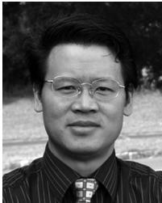

Jingdong Chen (SM’09) received the Ph.D. degree in pattern recognition and intelligence control from the Chinese Academy of Sciences, Beijing, in 1998.

From 1998 to 1999, he was with ATR Interpreting Telecommunications Research Laboratories, Kyoto, Japan, where he conducted research on speech synthesis, speech analysis, as well as objective measurements for evaluating speech synthesis. He then joined the Griffith University, Brisbane, Australia, where he engaged in research on robust speech recognition and signal processing. From 2000 to 2001, he worked at

ATR Spoken Language Translation Research Laboratories on robust speech recognition and speech enhancement. From 2001 to 2009, he was a Member of Technical Staff at Bell Laboratories, Murray Hill, NJ, working on acoustic signal processing for telecommunications. He subsequently joined WeVoice, Inc., Bridgewater, NJ, serving as the Chief Scientist. He is currently a Professor at Northwestern Polytechnical University, Xi’an, China. His research interests include acoustic signal processing, adaptive signal processing, speech enhancement, adaptive noise/echo control, microphone array signal processing, signal separation, and speech communication. He coauthored the books Speech Enhancement in the Karhunen–Loève Expansion Domain (Morgan & Claypool, 2011), Noise Reduction in Speech Processing (Springer-Verlag, 2009), Microphone Array Signal Processing (Springer-Verlag, 2008), and Acoustic MIMO Signal Processing (Springer-Verlag, 2006). He is also a coeditor/coauthor of the book Speech Enhancement (Springer-Verlag, 2005) and a section coeditor of the reference Springer Handbook of Speech Processing (Springer-Verlag, 2007).

Dr. Chen is currently an Associate Editor of the IEEE TRANSACTIONS ON AUDIO, SPEECH, AND LANGUAGE PROCESSING, a member of the IEEE Audio and Electroacoustics Technical Committee, and a member of the editorial advisory board of the Open Signal Processing Journal. He helped organize the 2005 IEEE Workshop on Applications of Signal Processing to Audio and Acoustics (WASPAA), and was the technical Co-Chair of the 2009 WASPAA. He received the 2008 Best Paper Award from the IEEE Signal Processing Society, the Bell Labs Role Model Teamwork Award twice, respectively, in 2009 and 2007, the NASA Tech Brief Award twice, respectively, in 2010 and 2009, the 1998-1999 Japan Trust International Research Grant from the Japan Key Technology Center, the Young Author Best Paper Award from the 5th National Conference on Man–Machine Speech Communications in 1998, and the CAS (Chinese Academy of Sciences) President’s Award in 1998.

Jacob Benesty was born in 1963. He received the M.S. degree in microwaves from Pierre and Marie Curie University, Paris, France, in 1987, and the Ph.D. degree in control and signal processing from Orsay University, Orsay, France, in April 1991.

During the Ph.D. degree (from November 1989 to April 1991), he worked on adaptive filters and fast algorithms at the Centre National d’Etudes des Telecomunications (CNET), Paris. From January 1994 to July 1995, he worked at Telecom Paris University on multichannel adaptive filters and acoustic echo can-

cellation. From October 1995 to May 2003, he was first a Consultant and then a Member of the Technical Staff at Bell Laboratories, Murray Hill, NJ. In May 2003, he joined INRS-EMT, University of Quebec, Montreal, QC, Canada, as a Professor. His research interests are in signal processing, acoustic signal processing, and multimedia communications. He is the inventor of many important technologies. In particular, he was the Lead Researcher at Bell Labs who conceived and designed the world-first real-time hands-free full-duplex stereophonic teleconferencing system. Also, he and T. Gaensler conceived and designed the world-first PC-based multi-party hands-free full-duplex stereo conferencing system over IP networks. He is the editor of the book series: Springer Topics in Signal Processing (Springer, 2008). He has coauthored and coedited/ coauthored many books in the area of acoustic signal processing. He is also the lead editor-in-chief of the reference Springer Handbook of Speech Processing (Springer-Verlag, 2007).

Prof. Benesty was the co-chair of the 1999 International Workshop on Acoustic Echo and Noise Control and the general co-chair of the 2009 IEEE Workshop on Applications of Signal Processing to Audio and Acoustics. He was a member of the IEEE Signal Processing Society Technical Committee on Audio and Electroacoustics and a member of the editorial board of the EURASIP Journal on Applied Signal Processing. He is the recipient, with Morgan and Sondhi, of the IEEE Signal Processing Society 2001 Best Paper Award. He is the recipient, with Chen, Huang, and Doclo, of the IEEE Signal Processing Society 2008 Best Paper Award. He is also the coauthor of a paper for which Y. Huang received the IEEE Signal Processing Society 2002 Young Author Best Paper Award. In 2010, he received the “Gheorghe Cartianu Award” from the Romanian Academy.

Sofiène Affes (S’94–M’95–SM’04) received the Diplôme d’Ingénieur in electrical engineering and the Ph.D. degree (with honors) in signal processing, both from the École Nationale Supérieure des Télé- communications (ENST), Paris, France, in 1992 and 1995, respectively.

He has been since with INRS-EMT, University of Quebec, Montreal, QC, Canada, as a Research Associate from 1995 to 1997, then as an Assistant Professor from 2000 to 2009. Currently, he is a Full Professor in the Wireless Communications Group. His

research interests are in wireless communications, statistical signal and array processing, adaptive space–time processing and MIMO. From 1998 to 2002, he was leading the radio design and signal processing activities of the Bell/Nortel/ NSERC Industrial Research Chair in Personal Communications at INRS-EMT, Montreal. Since 2004, he has been actively involved in major projects in wireless of Partnerships for Research on Microelectronics, Photonics, and Telecommunications (PROMPT).

Professor Affes was the corecipient of the 2002 Prize for Research Excellence of INRS. He currently holds a Canada Research Chair in Wireless Communications and a Discovery Accelerator Supplement Award from the Natura Sciences and Engineering Research Council of Canada (NSERC). In 2006, he served as a General Co-Chair of the IEEE VTC’2006-Fall conference, Montreal. In 2008, he received from the IEEE Vehicular Technology Society the IEEE VTC Chair Recognition Award for exemplary contributions to the success of IEEE VTC. He currently acts as a member of the Editorial Board of the IEEE TRANSACTIONS ON SIGNAL PROCESSING, the IEEE TRANSACTIONS ON WIRELESS COMMUNICATIONS, and the Wiley Journal on Wireless Communications and Mobile Computing.