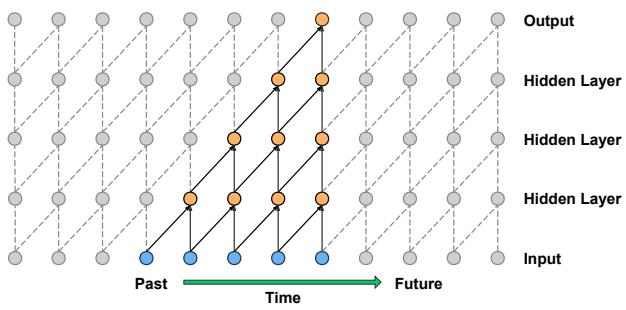
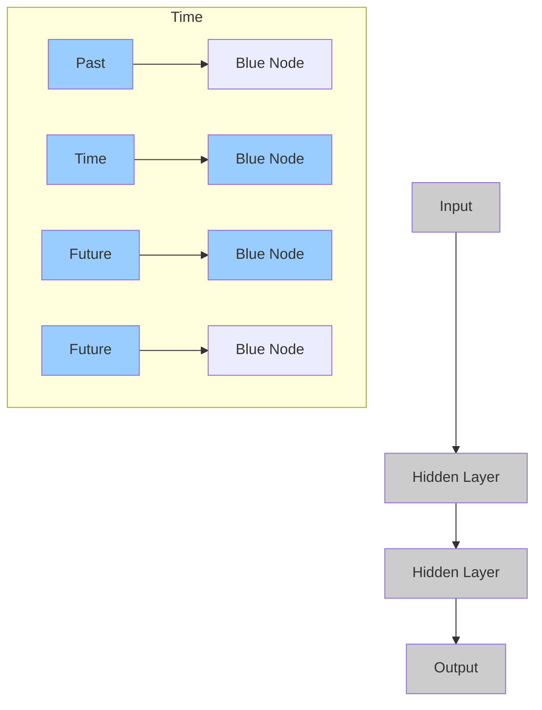
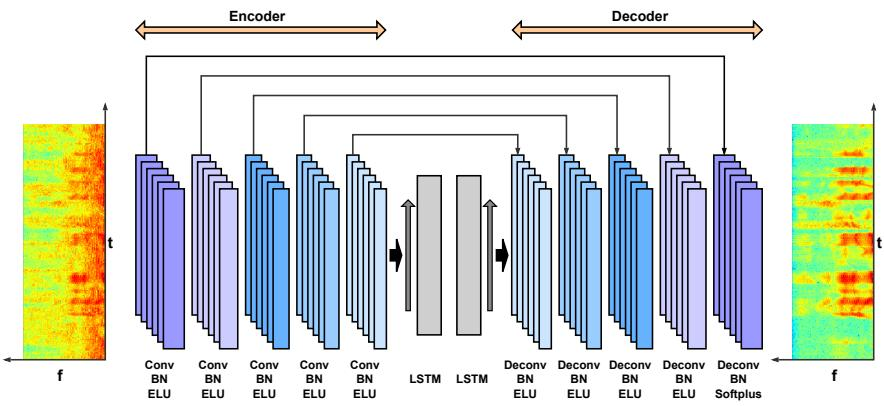
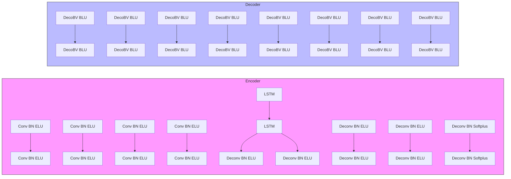
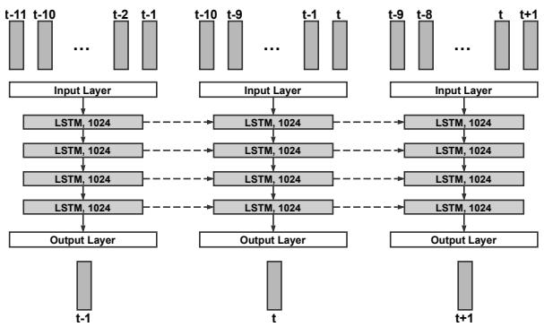
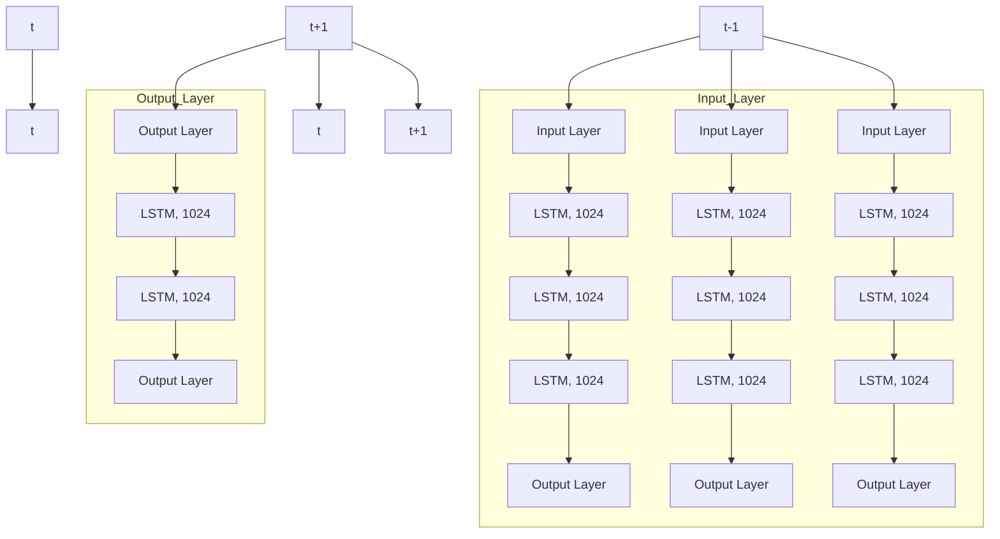
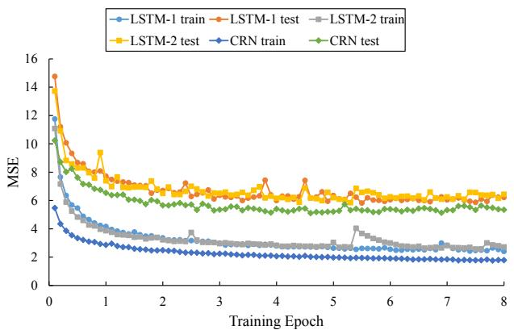
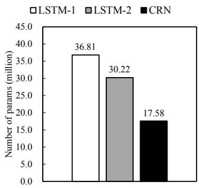

# A Convolutional Recurrent Neural Network for Real-Time Speech Enhancement

Ke Tan1, DeLiang Wang1,2

1Department of Computer Science and Engineering, The Ohio State University, USA 2Center for Cognitive and Brain Sciences, The Ohio State University, USA

tan.650@osu.edu, wang.77@osu.edu

# Abstract

Many real-world applications of speech enhancement, such as hearing aids and cochlear implants, desire real-time processing, with no or low latency. In this paper, we propose a novel convolutional recurrent network (CRN) to address real-time monaural speech enhancement. We incorporate a convolutional encoderdecoder (CED) and long short-term memory (LSTM) into the CRN architecture, which leads to a causal system that is naturally suitable for real-time processing. Moreover, the proposed model is noise- and speaker-independent, i.e. noise types and speakers can be different between training and test. Our experiments suggest that the CRN leads to consistently better objective intelligibility and perceptual quality than an existing LSTM based model. Moreover, the CRN has much fewer trainable parameters.

Index Terms: noise- and speaker-independent speech enhancement, real-time applications, convolutional encoder-decoder, long short-term memory, convolutional recurrent networks

# 1. Introduction

Speech separation aims to separate target speech from a background interference, which may include nonspeech noise, interfering speech and room reverberation [1]. Speech enhancement refers to the separation of speech and nonspeech noise. It has various real-world applications such as robust automatic speech recognition and mobile speech communication. For many such applications, real-time processing is required. In other words, speech enhancement is performed with low computational complexity, providing near-instantaneous output.

In this study, we focus on monaural (single-microphone) speech enhancement that can operate in real-time applications. In digital hearing aids, for example, it has been found that a delay as low as 3 milliseconds is noticeable to listeners and a delay of longer than 10 milliseconds is objectionable [2]. For such applications, causal speech enhancement systems, where no future information is allowed, are often required.

Inspired by the concept of time-frequency (T-F) masking in computational auditory scene analysis (CASA) [3], speech separation has been formulated as supervised learning in recent years, where a deep neural network (DNN) is employed to learn a mapping from noisy acoustic features to a T-F mask [4]. The ideal binary mask, which classifies T-F units as either speechdominant or noise-dominant, is the first training target used in supervised speech separation. More recent training targets include the ideal ratio mask [5] and mapping-based targets corresponding to the magnitude or power spectra of target speech [6] [7]. In this study, we use the magnitude spectra of target speech as the training target.

For supervised speech enhancement, noise generalization and speaker generalization are both crucial. A simple yet effective method to deal with noise generalization is to train with different noise types [8]. Analogously, to address speaker generalization would include a large number of speakers in a training set. However, it has been found that a feedforward DNN is unable to track a target speaker in the presence of many training speakers [9] [10] [11]. Typically, a DNN independently predicts a label for each time frame from a small context window around the frame. An interpretation is that such DNNs cannot leverage long-term contexts, which would be essential for tracking a target speaker. Recent studies [9] [10] suggest that it would be better to formulate speech separation as a sequence-to-sequence mapping in order to leverage long-term contexts.

With such a formulation, recurrent neural networks (RNNs) and convolutional neural networks (CNNs) have been used for noise- and speaker-independent speech enhancement, where noise types and speakers can be different between training and test. Chen et al. [10] proposed an RNN with four hidden LSTM layers to deal with speaker generalization of noise-independent models. Their experimental results show that the LSTM model generalizes well to untrained speakers, and substantially outperforms a DNN based model in terms of short-time objective intelligibility (STOI) [12]. A more recent study [13] developed a gated residual network (GRN) based on dilated convolutions. Compared with the LSTM model in [10], the GRN exhibits higher parameter efficiency and better generalization capability for untrained speakers at different SNR levels. On the other hand, the GRN requires a large amount of future information for mask estimation or spectral mapping at each time frame. Hence, it cannot be used for real-time speech enhancement.

Motivated by recent works [14] [15] on CRNs, we develop a novel CRN architecture for noise- and speaker-independent speech enhancement in real time. The CRN incorporates a convolutional encoder-decoder and long short-term memory. We find that the proposed CRN leads to consistently better objective speech intelligibility and quality than the LSTM model in [10]. Moreover, the CRN has much fewer trainable parameters.

The rest of this paper is organized as follows. We give a detailed description of our proposed model in Section 2. The experimental setup and results are presented in Section 3. We conclude this paper in Section 4.

# 2. System description

# 2.1. Encoder-decoder with causal convolutions

Badrinarayanan et al. first proposed a convolutional encoderdecoder network for pixel-wise image labelling [16]. It comprises a convolutional encoder followed by a corresponding decoder which feeds into a softmax classification layer. The encoder is a stack of convolutional layers and pooling layers, which serves to extract high-level features from a raw input image. With essentially the same structure as the encoder in the reverse order, the decoder maps low-resolution feature maps at the output of the encoder to feature maps of the full input image size. The symmetric encoder-decoder architecture ensures that the output has the same shape as the input. With such an attractive property, the encoder-decoder architecture is naturally suitable for any pixel-wise dense prediction task, which aims to predict a label for each pixel in the input image.

flowchart

Figure 1: An example of causal convolutions. The convolution output does not depend on future inputs.

For speech enhancement, one approach is to employ a CED to map from the magnitude spectrogram of noisy speech to that of clean speech, where the magnitude spectrograms are simply treated as images. To our knowledge, Park et al. [17] first introduced CED for speech enhancement. They proposed a redundant CED network (R-CED), which consists of repetitions of a convolution, batch normalization (BN) [18], and a Re-LU activation [19] layer. The R-CED architecture additionally incorporates skip connections to facilitate optimization, which connect each layer in the encoder to its corresponding layer in the decoder.

In our proposed network, the encoder comprises five convolutional layers while the decoder has five deconvolutional layers. We apply exponential linear units (ELUs) [20] to all convolutional and deconvolutional layers except the output layer. ELUs have been demonstrated to lead to faster convergence and better generalization than ReLUs. In the output layer, we utilize softplus activation [19] which is a smooth approximation to the ReLU function and can constrain the network output to always be positive. Moreover, we adopt batch normalization right after each convolution (or deconvolution) and before activation. The numbers of kernels are kept symmetric: the number of kernels is gradually increased in the encoder while it is gradually decreased in the decoder. To leverage a larger context along the frequency direction, we apply a stride of 2 along the frequency dimension to all convolutional (or deconvolutional) layers. In other words, we halve the frequency dimension size of feature maps layer by layer in the encoder and double it layer by layer in the decoder, whereas we do not change the time dimension size of feature maps. To improve the flow of information and gradients throughout the network, we utilize skip connections which concatenate the output of each encoder layer to the input of each decoder layer.

To obtain a causal system for real-time speech enhancement, we impose causal convolutions upon the encoder-decoder architecture. Fig. 1 depicts an example of causal convolutions. Note that the input can be treated as a sequence of feature vectors, while only the time dimension is illustrated in Fig. 1. In causal convolutions, the output does not depend on future input-

s. With causal convolutions instead of noncausal convolutions, the encoder-decoder architecture leads to a causal system. Note that we can easily apply causal deconvolutions to the decoder, since the deconvolution is intrinsically a convolution operation.

# 2.2. Temporal modeling via LSTM

In order to track a target speaker, it may be important to leverage long-term contexts, which cannot be utilized by the aforementioned convolutional encoder-decoder. The LSTM [21], a specific type of RNN which incorporates a memory cell, has been successful in temporal modeling in various applications such as acoustic modeling and video classification. To account for temporal dynamics of speech, we insert two stacked LSTM layers between the encoder and the decoder. In this study, we use the LSTM defined by the following equations:

$$
i _ {t} = \sigma (W _ {i i} x _ {t} + b _ {i i} + W _ {h i} h _ {t - 1} + b _ {h i}) \tag {1}
$$

$$
f _ {t} = \sigma (W _ {i f} x _ {t} + b _ {i f} + W _ {h f} h _ {t - 1} + b _ {h f}) \tag {2}
$$

$$
g _ {t} = \tanh (W _ {i g} x _ {t} + b _ {i g} + W _ {h g} h _ {t - 1} + b _ {h g}) \tag {3}
$$

$$
o _ {t} = \sigma (W _ {i o} x _ {t} + b _ {i o} + W _ {h o} h _ {t - 1} + b _ {h o}) \tag {4}
$$

$$
c _ {t} = f _ {t} \odot c _ {t - 1} + i _ {t} \odot g _ {t} \tag {5}
$$

$$
h _ {t} = o _ {t} \odot \tanh (c _ {t}) \tag {6}
$$

where $x _ { t } , \ g _ { t } , \ c _ { t }$ and $h _ { t }$ represent input, block input, memory cell and hidden activation at time t, respectively. $\mathbf { \hat { \boldsymbol { W } } ^ { s } }$ and b’s denote weights and biases, respectively. σ represents sigmoid nonlinearity and represents element-wise multiplication.

To fit the input shape required by the LSTM, we flatten the frequency dimension and the depth dimension of the encoder output to produce a sequence of feature vectors before feeding it into the LSTM layers. The output sequence of the LSTM layers is subsequently reshaped back to fit the decoder. It is worth noting that the inclusion of the LSTM layers does not change the causality of the system.

# 2.3. Network architecture

Table 1: Architecture of our proposed CRN. Here T denotes the number of time frames in the STFT magnitude spectrum. 

<table><tr><td>layer name</td><td>input size</td><td>hyperparameters</td><td>output size</td></tr><tr><td>reshape_1</td><td> $T \times 161$ </td><td>-</td><td> $1 \times T \times 161$ </td></tr><tr><td>conv2d_1</td><td> $1 \times T \times 161$ </td><td> $2 \times 3, (1,2), 16$ </td><td> $16 \times T \times 80$ </td></tr><tr><td>conv2d_2</td><td> $16 \times T \times 80$ </td><td> $2 \times 3, (1,2), 32$ </td><td> $32 \times T \times 39$ </td></tr><tr><td>conv2d_3</td><td> $32 \times T \times 39$ </td><td> $2 \times 3, (1,2), 64$ </td><td> $64 \times T \times 19$ </td></tr><tr><td>conv2d_4</td><td> $64 \times T \times 19$ </td><td> $2 \times 3, (1,2), 128$ </td><td> $128 \times T \times 9$ </td></tr><tr><td>conv2d_5</td><td> $128 \times T \times 9$ </td><td> $2 \times 3, (1,2), 256$ </td><td> $256 \times T \times 4$ </td></tr><tr><td>reshape_2</td><td> $256 \times T \times 4$ </td><td>-</td><td> $T \times 1024$ </td></tr><tr><td>lstm_1</td><td> $T \times 1024$ </td><td>1024</td><td> $T \times 1024$ </td></tr><tr><td>lstm_2</td><td> $T \times 1024$ </td><td>1024</td><td> $T \times 1024$ </td></tr><tr><td>reshape_3</td><td> $T \times 1024$ </td><td>-</td><td> $256 \times T \times 4$ </td></tr><tr><td>deconv2d_5</td><td> $512 \times T \times 4$ </td><td> $2 \times 3, (1,2), 128$ </td><td> $128 \times T \times 9$ </td></tr><tr><td>deconv2d_4</td><td> $256 \times T \times 9$ </td><td> $2 \times 3, (1,2), 64$ </td><td> $64 \times T \times 19$ </td></tr><tr><td>deconv2d_3</td><td> $128 \times T \times 19$ </td><td> $2 \times 3, (1,2), 32$ </td><td> $32 \times T \times 39$ </td></tr><tr><td>deconv2d_2</td><td> $64 \times T \times 39$ </td><td> $2 \times 3, (1,2), 16$ </td><td> $16 \times T \times 80$ </td></tr><tr><td>deconv2d_1</td><td> $32 \times T \times 80$ </td><td> $2 \times 3, (1,2), 1$ </td><td> $1 \times T \times 161$ </td></tr><tr><td>reshape_4</td><td> $1 \times T \times 161$ </td><td>-</td><td> $T \times 161$ </td></tr></table>

In this study, we use 161-dimensional short-time Fourier transform (STFT) magnitude spectrum of noisy speech as input features, and that of clean speech as the training target. Our proposed CRN is shown in Fig. 2, in which the network input is encoded into a higher-dimensional latent space, and the sequence of latent feature vectors are then modeled by two LSTM layers. Subsequently, the output sequence of the LSTM layers is converted back to the original input shape by the decoder. The proposed CRN benefits from the feature extraction capability of CNNs and the temporal modeling capability of RNNs, by combining the two topologies together.

flowchart

Figure 2: Network architecture of our proposed CRN.

A more detailed description of our proposed network architecture is provided in Table 1. The input size and the output size of each layer are specified in featureMaps × timeSteps × frequencyChannels format. The layer hyperparameters are given in (kernelSize, strides, outChannels) format. For all the convolutions and the deconvolutions, we apply zero-padding to the time direction but not to the frequency direction. To perform causal convolutions, we use a kernel size of 2 3 (time  frequency). Note that the number of feature maps in each decoder layer is doubled by the skip connections.

# 2.4. LSTM baselines

In our experiments, we build two LSTM baselines for comparison. In the first LSTM model, a feature window of 11 frames (10 past frames and 1 current frame) is employed to estimate one frame of the target (see Fig. 3). In other words, 11 frames of feature vectors are concatenated into a long vector as the network input at each time step. In the second LSTM model, however, no feature window is utilized. We denote the first LSTM model as LSTM-1 and the second one as LSTM-2. From the input layer to the output layer, LSTM-1 has 11 161, 1024, 1024, 1024, 1024, and 161 units, respectively; LSTM-2 has 161, 1024, 1024, 1024, 1024, and 161 units, respectively. Both baselines do not use future information, which amount to causal systems.

# 3. Experiments

# 3.1. Experimental setup

In our experiments, we evaluate the models on the WSJ0 SI-84 training set [22] including 7138 utterances from 83 speakers (42 males and 41 females). Among these speakers, 6 speakers (3 males and 3 females) are treated as untrained speakers. Hence, we train the models with the 77 remaining speakers. To obtain noise-independent models, we use 10 000 noises from a sound effect library (available at https://www.sound-ideas.com) for training, and the duration is about 126 hours. For test, we use two challenging noises (babble and cafeteria) from an Au-

flowchart

Figure 3: An LSTM baseline with a feature window of 11 frames (10 past frames and 1 current frame). At each time step, the 11 input frames are concatenated into a feature vector.

ditec CD (available at http://www.auditec.com).

We create a training set including 320 000 mixtures with a total duration of about 500 hours. Specifically, we mix a randomly selected training utterance with a random cut from the 10 000 training noises at a signal-to-noise ratio (SNR) that is randomly chosen from -5, -4, -3, -2, -1, 0 dB. To investigate speaker generalization of the models, we create two test sets for each noise using 6 trained speakers (3 males and 3 females) and 6 untrained speakers, respectively. One test set comprises 150 mixtures created from 25 6 utterances of 6 trained speakers, while the other comprises 150 mixtures created from 25 6 utterances of 6 untrained speakers. Note that all test utterances are excluded from the training set. We use two SNRs for the test set, i.e. -5 and -2 dB. All signals are sampled at 16 kHz.

The models are trained with the Adam optimizer [23]. We set the learning rate to 0.0002. The mean squared error (MSE) serves as the objective function. We train the models with a minibatch size of 16 on the utterance-level. Within a minibatch, all training samples are padded with zeros to have the same number of time steps as the longest sample does. The best models are selected by cross validation.

# 3.2. Experimental results

In this study, we use STOI and perceptual evaluation of speech quality (PESQ) [24] as the evaluation metrics. Table 2 and 3 present STOI and PESQ scores of unprocessed and processed signals for trained speakers and untrained speakers, respectively. In each case, the best result is highlighted by a boldface number. As shown in Table 2 and 3, LSTM-1 and LSTM-2 yield similar STOI and PESQ scores for both trained speakers and untrained speakers, which implies that the use of the feature window in LSTM-1 does not improve the performance. On the other hand, our proposed CRN consistently outperforms the LSTM baselines in both metrics. At the SNR of -5 dB, for example, the CRN provides about 2% STOI improvements and about 0.1 PESQ improvements over the LSTM models. Comparing the results in Table 2 with those in Table 3, we can find that the CRN generalizes well to untrained speakers. In the most challenging case, where the utterances from untrained speakers are mixed with the two untrained noises at -5 dB, the CRN produces a 18.56% STOI improvement and a 0.55 PESQ improvement over the unprocessed mixtures.

Table 2: Model comparisons in terms of STOI and PESQ scores on trained speakers. 

<table><tr><td>evaluation metrics</td><td colspan="6">STOI (in %)</td><td colspan="6">PESQ</td></tr><tr><td>test SNR</td><td colspan="3">-5 dB</td><td colspan="3">-2 dB</td><td colspan="3">-5 dB</td><td colspan="3">-2 dB</td></tr><tr><td>noises</td><td>Avg.</td><td>babble</td><td>cafeteria</td><td>Avg.</td><td>babble</td><td>cafeteria</td><td>Avg.</td><td>babble</td><td>cafeteria</td><td>Avg.</td><td>babble</td><td>cafeteria</td></tr><tr><td>unprocessed</td><td>58.18</td><td>58.95</td><td>57.40</td><td>65.75</td><td>66.30</td><td>65.19</td><td>1.50</td><td>1.63</td><td>1.52</td><td>1.67</td><td>1.79</td><td>1.70</td></tr><tr><td>LSTM-1</td><td>75.81</td><td>77.29</td><td>74.32</td><td>82.00</td><td>82.62</td><td>81.38</td><td>2.05</td><td>2.06</td><td>2.04</td><td>2.33</td><td>2.36</td><td>2.30</td></tr><tr><td>LSTM-2</td><td>75.80</td><td>77.45</td><td>74.14</td><td>82.53</td><td>83.80</td><td>81.25</td><td>2.05</td><td>2.06</td><td>2.03</td><td>2.31</td><td>2.34</td><td>2.28</td></tr><tr><td>CRN</td><td>77.89</td><td>79.71</td><td>76.07</td><td>84.08</td><td>85.48</td><td>82.68</td><td>2.15</td><td>2.17</td><td>2.12</td><td>2.41</td><td>2.44</td><td>2.38</td></tr></table>

Table 3: Model comparisons in terms of STOI and PESQ scores on untrained speakers. 

<table><tr><td>evaluation metrics</td><td colspan="6">STOI (in %)</td><td colspan="6">PESQ</td></tr><tr><td>test SNR</td><td colspan="3">-5 dB</td><td colspan="3">-2 dB</td><td colspan="3">-5 dB</td><td colspan="3">-2 dB</td></tr><tr><td>noises</td><td>Avg.</td><td>babble</td><td>cafeteria</td><td>Avg.</td><td>babble</td><td>cafeteria</td><td>Avg.</td><td>babble</td><td>cafeteria</td><td>Avg.</td><td>babble</td><td>cafeteria</td></tr><tr><td>unprocessed</td><td>57.86</td><td>58.54</td><td>57.18</td><td>65.08</td><td>65.45</td><td>64.70</td><td>1.52</td><td>1.56</td><td>1.47</td><td>1.66</td><td>1.69</td><td>1.63</td></tr><tr><td>LSTM-1</td><td>74.33</td><td>75.21</td><td>73.44</td><td>81.75</td><td>82.65</td><td>80.84</td><td>1.96</td><td>1.94</td><td>1.97</td><td>2.25</td><td>2.26</td><td>2.24</td></tr><tr><td>LSTM-2</td><td>74.42</td><td>75.55</td><td>73.29</td><td>81.88</td><td>82.87</td><td>80.88</td><td>1.95</td><td>1.94</td><td>1.96</td><td>2.25</td><td>2.25</td><td>2.24</td></tr><tr><td>CRN</td><td>76.42</td><td>77.98</td><td>74.85</td><td>83.31</td><td>84.38</td><td>82.24</td><td>2.04</td><td>2.04</td><td>2.03</td><td>2.33</td><td>2.34</td><td>2.31</td></tr></table>

line

| Training Epoch | LSTM-1 train | LSTM-1 test | LSTM-2 train | LSTM-2 test | CRN train | CRN test |
| -------------- | ------------ | ----------- | ------------ | ----------- | --------- | -------- |
| 0              | 12.0         | 15.0        | 10.0         | 14.0        | 6.0       | 10.0     |
| 1              | 4.0          | 8.0         | 3.0          | 9.0         | 2.5       | 7.0      |
| 2              | 3.0          | 7.0         | 2.5          | 7.5         | 2.0       | 6.0      |
| 3              | 2.5          | 6.5         | 2.0          | 7.0         | 1.8       | 5.5      |
| 4              | 2.0          | 7.0         | 2.0          | 6.5         | 1.7       | 5.0      |
| 5              | 2.0          | 6.5         | 2.0          | 6.0         | 1.6       | 4.5      |
| 6              | 2.0          | 6.0         | 2.0          | 6.0         | 1.5       | 4.5      |
| 7              | 2.0          | 6.0         | 2.0          | 6.0         | 1.5       | 4.5      |
| 8              | 2.0          | 6.0         | 2.0          | 6.0         | 1.5       | 4.5      |

Figure 4: Mean square errors over training epochs for LSTM-1, LSTM-2 and CRN on the training set and the test set. All models are evaluated with a test set of six untrained speakers on the untrained babble noise.

The CRN takes advantage of batch normalization, which can be easily adopted for convolution operations to accelerate training and improve the performance. Fig. 4 compares training and test MSEs of different models over training epochs, where the models are evaluated on a test set of six untrained speakers. We observe that the CRN converges faster and achieves lower MSEs than the two LSTM models. Moreover, the CRN has fewer trainable parameters than the LSTM models as shown in

bar

| Model | Number of params (million) |
| :--- | :--- |
| LSTM-1 | 36.81 |
| LSTM-2 | 30.22 |
| CRN | 17.58 |

Figure 5: Parameter efficiency comparison of different models. We compare the number of trainable parameters in different models.

Fig. 5. This is mainly due to the use of shared weights in convolutions. With a higher parameter efficiency, the CRN is easier to train than the LSTMs.

In addition, the causal convolutions in the CRN capture local spatial patterns in the input STFT magnitude spectrum without using future information. In contrast, the LSTM models treat each input frame as a flattened feature vector, and cannot sufficiently leverage the T-F structure in the STFT magnitude spectrum. On the other hand, the LSTM layers in the CRN model the temporal dependencies in a latent space, which would be important to speaker characterization in speaker-independent speech enhancement.

# 4. Conclusions

In this study, we have proposed a convolutional recurrent network to deal with noise- and speaker-independent speech enhancement for real-time applications. The proposed model leads to a causal speech enhancement system, where no future information is utilized. The evaluation results suggest that the proposed CRN consistently outperforms two strong LSTM baselines for both trained and untrained speakers in terms of STOI and PESQ scores. In addition, we find that the CRN has fewer trainable parameters than the LSTMs. We believe the proposed model represents a strong speech enhancement method for real-world applications, of which the desirable properties often include online operation, single-channel operation, and noise- and speaker-independent models.

# 5. References

[1] D. L. Wang and J. Chen, “Supervised speech separation based on deep learning: an overview,�arXiv preprint arXiv:1708.07524, 2017.   
[2] J. Agnew and J. M. Thornton, “Just noticeable and objectionable group delays in digital hearing aids,�Journal of the American Academy of Audiology, vol. 11, no. 6, pp. 330�36, 2000.   
[3] D. L. Wang and G. J. Brown, Eds., Computational auditory scene analysis: Principles, algorithms, and applications. Wiley-IEEE press, 2006.   
[4] Y. Wang and D. L. Wang, “Towards scaling up classificationbased speech separation,�IEEE Transactions on Audio, Speech, and Language Processing, vol. 21, no. 7, pp. 1381�390, 2013.   
[5] Y. Wang, A. Narayanan, and D. L. Wang, “On training targets for supervised speech separation,�IEEE/ACM Transactions on Audio, Speech and Language Processing (TASLP), vol. 22, no. 12, pp. 1849�858, 2014.   
[6] Y. Xu, J. Du, L.-R. Dai, and C.-H. Lee, “An experimental study on speech enhancement based on deep neural networks,�IEEE Signal processing letters, vol. 21, no. 1, pp. 65�8, 2014.   
[7] , “A regression approach to speech enhancement based on deep neural networks,�IEEE/ACM Transactions on Audio, Speech and Language Processing (TASLP), vol. 23, no. 1, pp. 7�9, 2015.   
[8] J. Chen, Y. Wang, S. E. Yoho, D. L. Wang, and E. W. Healy, “Large-scale training to increase speech intelligibility for hearingimpaired listeners in novel noises,�The Journal of the Acoustical Society of America, vol. 139, no. 5, pp. 2604�612, 2016.   
[9] J. Chen and D. L. Wang, “Long short-term memory for speaker generalization in supervised speech separation,�Proceedings of Interspeech, pp. 3314�318, 2016.   
[10] —� “Long short-term memory for speaker generalization in supervised speech separation,�The Journal of the Acoustical Society of America, vol. 141, no. 6, pp. 4705�714, 2017.   
[11] M. Kolbæk, Z.-H. Tan, and J. Jensen, “Speech intelligibility potential of general and specialized deep neural network based speech enhancement systems,�IEEE/ACM Transactions on Audio, Speech, and Language Processing, vol. 25, no. 1, pp. 153�167, 2017.   
[12] C. H. Taal, R. C. Hendriks, R. Heusdens, and J. Jensen, “An algorithm for intelligibility prediction of time–frequency weighted noisy speech,�IEEE Transactions on Audio, Speech, and Language Processing, vol. 19, no. 7, pp. 2125�136, 2011.   
[13] K. Tan, J. Chen, and D. L. Wang, “Gated residual networks with dilated convolutions for supervised speech separation,�in IEEE International Conference on Acoustics, Speech and Signal Processing (ICASSP), 2018, to appear.   
[14] Z. Zhang, Z. Sun, J. Liu, J. Chen, Z. Huo, and X. Zhang, “Deep recurrent convolutional neural network: Improving performance for speech recognition,�arXiv preprint arXiv:1611.07174, 2016.   
[15] G. Naithani, T. Barker, G. Parascandolo, L. Bramsl, N. H. Pontoppidan, and T. Virtanen, “Low latency sound source separation using convolutional recurrent neural networks,�in 2017 IEEE Workshop on Applications of Signal Processing to Audio and Acoustics (WASPAA). IEEE, 2017, pp. 71�5.   
[16] V. Badrinarayanan, A. Handa, and R. Cipolla, “Segnet: A deep convolutional encoder-decoder architecture for robust semantic pixel-wise labelling,�arXiv preprint arXiv:1505.07293, 2015.   
[17] S. R. Park and J. Lee, “A fully convolutional neural network for speech enhancement,�arXiv preprint arXiv:1609.07132, 2016.   
[18] S. Ioffe and C. Szegedy, “Batch normalization: Accelerating deep network training by reducing internal covariate shift,�in International conference on machine learning, 2015, pp. 448�56.   
[19] X. Glorot, A. Bordes, and Y. Bengio, “Deep sparse rectifier neural networks,�in Proceedings of the Fourteenth International Conference on Artificial Intelligence and Statistics, 2011, pp. 315�23.

[20] D.-A. Clevert, T. Unterthiner, and S. Hochreiter, “Fast and accurate deep network learning by exponential linear units (elus),�arXiv preprint arXiv:1511.07289, 2015.   
[21] S. Hochreiter and J. Schmidhuber, “Long short-term memory,�Neural computation, vol. 9, no. 8, pp. 1735�780, 1997.   
[22] D. B. Paul and J. M. Baker, “The design for the wall street journalbased csr corpus,�in Proceedings of the workshop on Speech and Natural Language. Association for Computational Linguistics, 1992, pp. 357�62.   
[23] D. P. Kingma and J. Ba, “Adam: A method for stochastic optimization,�arXiv preprint arXiv:1412.6980, 2014.   
[24] A. W. Rix, J. G. Beerends, M. P. Hollier, and A. P. Hekstra, “Perceptual evaluation of speech quality (pesq)-a new method for speech quality assessment of telephone networks and codecs,�in 2001 IEEE International Conference on Acoustics, Speech, and Signal Processing, vol. 2. IEEE, 2001, pp. 749�52.
