# INFORMED SPATIAL FILTERS FOR SPEECH ENHANCEMENT

# Noise and Interference Reduction, Blind Source Separation, and Acoustic Source Tracking

## INFORMED SPATIAL FILTERS FÜR SPRACH SIGNALVERBESSERUNG: Rauschunterdrückung, Quellentrennung, und Verfolgung von akustischen Quellen

Der Technischen Fakultät
der Friedrich-Alexander-Universität Erlangen-Nürnberg
zur
Erlangung des Doktorgrades

Doktor-Ingenieur

vorgelegt von
Maja Taseska
aus Ohrid, Mazedonien

Als Dissertation genehmigt
von der Technischen Fakultät
der Friedrich-Alexander-Universität Erlangen-Nürnberg
Tag der mündlichen Prüfung: 27.11.2017
Vorsitzender des Promotionsorgans: Prof. Dr.-Ing. Reinhard Lerch
Gutachter: Prof. Dr. ir. Emanuël A. P. Habets
Prof. Dr. Reinhold Häb-Umbach

## Abstract

In modern devices which provide hands-free speech capturing functionality, such as hands-free communication kits and voice-controlled devices, the received speech signal at the microphones is corrupted by background noise, interfering speech signals, and room reverberation. In many practical situations, the microphones are not necessarily located near the desired source, and hence, the ratio of the desired speech power to the power of the background noise, the interfering speech, and the reverberation at the microphones can be very low, often around or even below 0 dB. In such situations, the comfort of human-to-human communication, as well as the accuracy of automatic speech recognisers for voice-controlled applications can be significantly degraded. Therefore, effective speech enhancement algorithms are required to process the microphone signals before transmitting them to the far-end side for communication, or before feeding them into a speech recognition engine.

This thesis is concerned with multi-microphone speech enhancement in reverberant environments, in the presence of background noise and non-stationary interferers, such as interfering speakers. The desired speech signal that needs to be enhanced is usually application-dependent and can originate from one or multiple speakers. The background noise and the non-stationary interferers, constitute undesired signals. Specific tasks of interest in this thesis are undesired signal reduction, Blind Source Separation (BSS), and acoustic source detection and tracking. While single-channel speech enhancement and noise reduction have been extensively studied for more than four decades, efficient solutions to challenging problems such as BSS, acoustic source tracking, and speech enhancement in scenarios with multiple speech sources, have emerged more recently as a result of the rapid development in multi-channel speech processing and the availability of multiple microphones in commercial products, e.g., mobile phones, laptops, smart watches, hearing aids, etc. The spatial diversity provided by multiple microphones allows to reduce strong non-stationary undesired signals, while introducing little, or no distortion to the desired speech.

In multi-microphone speech enhancement systems, spatio-temporal filters (beamformers) are applied to the microphone signals to obtain an estimate of the desired speech signal. A spatio-temporal filter is a processor which linearly combines the received microphone signals to provide the desired signal estimate. Commonly used optimality criteria for spatio-temporal filter design, require knowledge of the spatio-temporal Second-Order Statistics (SOS) of the desired and undesired signals received at the microphones. As the SOS are often unavailable and time-varying in practice, their estimation from the microphone signals is on of the most important factors that determine the quality of the desired signal estimate at the filter output. In general, the SOS need to be estimated in a supervised manner from the microphone signals, such that the SOS of the desired signal are estimated when the desired signal is present and the SOS of the undesired signals are estimated when the desired signal is absent. Hence, an accurate desired signal detector is a fundamental building block for implementation of data-dependent spatio-temporal filters in practice. Although the theory of optimal filter design for speech applications is a mature field, in many books and contributions it is often assumed that the SOS are available, or that they can be estimated in advance in stationary scenarios. However, the implementation of optimal filters in dynamic scenarios typical for real applications, and the importance of signal detection and online SOS estimation has been less often addressed in the literature.

In this thesis, we address the design of data-dependent speech enhancement frameworks in a range of applications. We propose several application-specific frameworks, each of which constitutes of designing an appropriate desired signal detector, estimating the SOS of the desired and undesired signals using the detector output, and computing optimal data-dependent spatial filters to estimate the speech signal of interest while reducing undesired signals. As the optimal filters are computed in a supervised manner using the signal detectors, they are referred to as Informed Spatial Filters (ISFs). An underlying assumption for the design of the proposed detectors and ISFs is the speech sparsity in the Short-Time Fourier Transform (STFT) domain, which means that with a suitably chosen time and frequency resolution of the STFT, each Time-Frequency (TF) bin is dominated by either a single speech source or background noise. Based on this assumption, signal detection is performed at each TF bin, followed by an update of the SOS statistics corresponding to the dominant source at that TF bin. The estimated SOS are then used to compute optimal, time-varying ISFs to extract the desired signals. The ISFs obtained in this manner, are able to almost instantaneously adapt to changing acoustic conditions, such as time-varying locations of the desired and the undesired sources and time-varying noise statistics. Using the informed spatial filtering concept, we develop a general system which by properly designing its building blocks, is applied to a range of applications, including noise reduction, spatially selective sound acquisition, and online BSS of static and moving sources.

## Kurzfassung

In modernen Kommunikationsgeräten mit Freisprecheinrichtung, wie z. B. Freisprechanlagen und ferngesteuerten Geräten, wird das von Mikrofonen empfangene Sprachsignal durch Hintergrundrauschen, störende Sprachsignale und Raumnachhall verzerrt. Da sich die Mikrofone oft nicht in der Nähe der gewünschten Quelle befinden, kann das Verhältnis zwischen der gewünschten Sprachleistung und der Leistung von Hintergrundrauschen, störender Sprache und Nachhall an den Mikrofonen sehr niedrig sein, oft in der Region um oder sogar unterhalb 0 dB. In solchen Situationen kann der subjektive Hörkomfort einer Kommunikation sowie die Präzision von automatischen Spracherkennern deutlich verschlechtert werden. Daher sind Algorithmen zur Sprachverbesserung erforderlich, um die Mikrofonsignale zu verarbeiten, bevor sie zur Kommunikation übertragen werden oder als Eingangsignal eines Spracherkenners verwendet werden.

Diese Arbeit beschäftigt sich mit der Verbesserung von Sprachsignalen unter Verwendung mehrerer Mikrofone in halligen Umgebungen mit Nachhall, Hintergrundrauschen und nicht-stationären interferierenden Schallquellen, wie z. B. unerwünschten Sprechern. Das zu extrahierende gewünschte Sprachsignal ist in der Regel anwendungsabhängig und kann von einem oder mehreren Sprechern stammen. Das Hintergrundrauschen und die nicht-stationären Störsignale stellen hingegen unerwünschte Signale dar. Besondere Aufgaben in dieser Arbeit sind die Reduktion von unerwünschten Signalkomponenten, blinde Quellentrennung, und Detektion und Verfolgung von akustischen Quellen. Während Methoden zur Einkanal-Sprachverbesserung und zur Rauschunterdrückung sind seit mehr als vier Jahrzehnten intensiv untersucht worden, dagegen sind effiziente Lösungen für die anspruchsvolleren Probleme der blinde Quellentrennung, akustischen Quellenverfolgung und Sprachverbesserung in Szenarien mit mehreren Sprachquellen erst vor kurzem entwickelt worden. Dies ist ein Ergebnis der rasanten Entwicklung in der Mehrkanal-Sprachverarbeitung und der Verfügbarkeit von mehreren Mikrofonen in kommerziellen Produkten, z. B. Mobiltelefonen, Laptops, Smart-Uhren, Hörgeräten usw. Die räumliche Information, die von mehreren Mikrofonen zur Verfügung gestellt wird, ermöglicht es starke, nicht-stationäre unerwünschte Signale zu reduzieren, wobei die gewünschten Sprachsignal wenig bis gar nicht verzerrt werden.

Bei Multimikrofon-Sprachverbesserungssystemen werden räumlich-zeitliche Filter, sog. „Beamformer“ auf die Mikrofonsignale angewendet, um eine Schätzung des gewünschten Sprachsignals zu erhalten. Ein solcher räumlich-zeitlicher Filter kombiniert die empfangenen Mikrofonsignale linear kombiniert, um die gewünschte Signalschätzung zu liefern. Häufig verwendete Optimalitätskriterien für räumlich-zeitliches Filterdesign erfordern Kenntnis der räumlich-zeitlichen statistischen Momente höherer Ordnung von den gewünschten und unerwünschten Signalen, die an den Mikrofonen empfangen werden. Da die statistischen Momente zum Einen in der Praxis oft nicht verfügbar und zum Anderen zeitvariant sind, ist deren Schätzung aus den Mikrofonsignalen der wichtigste Faktor für die Qualität der gewünschten Signalschätzung am Filterausgang. Im Allgemeinen müssen die statistischen Momente in einer überwachten Weise aus den Mikrofonsignalen geschätzt werden, so dass die statistischen Momente des gewünschten Signals geschätzt werden, wenn das gewünschte Signal präsent ist und die statistischen Momente der unerwünschten Signalanteile geschätzt werden, wenn das gewünschte Signal nicht präsent ist. Somit ist in der Praxis ein genauer Signaldetektor ein grundlegender Baustein für die Implementierung von datenabhängigen räumlich-zeitlichen Filtern. Obwohl die Theorie für optimales Filterdesign für Sprachanwendungen ein fortgeschrittenes Feld ist, wird in vielen Büchern und Beiträgen oft davon ausgegangen, dass die statistischen Momente der Signalkomponenten verfügbar sind oder dass diese im Voraus in stationären Szenarien geschätzt werden können. Allerdings wird sowohl die Implementierung von optimalen Filtern in dynamischen Szenarien, welche für reale Anwendungen typisch sind, als auch die Bedeutung der Signaldetektion und der Echtzeit-Schätzung in der Literatur selten erwähnt.

In dieser Arbeit wird wir die Gestaltung von datenabhängigen Sprachverbesserungsgerüsten in unterschiedliche Anwendungen behandelt. Wir schlagen mehrere anwendungsspezifische Frameworks vor, von denen jeder einen geeigneten gewünschten Signaldetektor entwirft, die Statistiken höherer Ordnung der gewünschten und unerwünschten Signale schätzt, und optimale datenabhängige Raumfilter berechnet, um die gewünschte Sprachsignal zu schätzen, wobei gleichzeitig die unerwünschter Signale reduziert werden. Da die optimalen Filter unter Verwendung der Signaldetektoren in einer überwachten Weise berechnet werden, werden sie als „Informed Spatial Filters“ (IFS) bezeichnet. Eine zugrunde liegende Annahme für die Gestaltung der vorgeschlagenen Detektoren und Informed Spatial Filters ist die geringe Ausdehnung von Sprachsignalen (sparsity assumption) in der Kurz-Zeit-Frequenz-Domäne, was bedeutet, dass mit einer entsprechend hoch gewählten Zeit- und Frequenzauflösung jeder Frequenz-Zeit-Abschnitt entweder von einer einzelnen Sprachquelle oder einem Hintergrundrauschen dominiert wird. Basierend auf dieser Annahme wird die Signaldetektion an jedem Abschnitt durchgeführt, gefolgt von einer Aktualisierung der Statistik, die der dominanten Quelle in diesem Abschnitt entspricht. Die geschätzten Statistiken werden dann verwendet, um optimale, zeitvariable IFS zu berechnen, um die gewünschten Signale zu extrahieren. Die auf diese Weise erhaltenen ISF können sich nahezu augenblicklich an sich ändernde akustische Zustände anpassen, wie z. B. zeitvariable Orte der gewünschten und der unerwünschten Quellen und zeitvariablen Rauschstatistiken. Mit dem informed spatial filtering concept haben wir ein allgemeines System entwickelt, welches durch die konstruktive Gestaltung seiner Bausteine auf eine Reihe von Anwendungen angewendet wird, wie z.B. Rauschunterdrückung, räumlich selektive Klangerfassung, und blinde Quellentrennung von statischen und bewegten Quellen in Echtzeit.

## Acknowledgements

I would like to express my deepest gratitude to Professor Emanuël Habets, for his dedicated supervision, support, and interest in my work in the past years. His guidance and encouragement were invaluable all the way, and I consider myself very lucky to have had the opportunity to be one of his PhD students. He often went out of his way to make this journey as successful and enjoyable as possible.

I am extremely grateful to Professor Giovanni Del Galdo, who already in the second year of my university studies guided me into the world of research and signal processing. He often helped me make important choices that strongly influenced where I am today.

I would also like to thank the second reviewer of my thesis, Professor Reinhold Häb-Umbach for taking the time to read and evaluate my work, and to Professor Wolfgang Gerstacker and Professor Björn Eskofier for joining the PhD defence committee.

It is my great pleasure to thank all the academic and administrative staff of the International Audio Laboratories Erlangen for creating one of the best working environments one could wish for.

I wish to thank Basti and Oli, and all of my colleagues with whom we did this journey together, supporting and encouraging each other, and creating amazing memories during and after office hours.

I am thankful to Vivi, Affan, Gleni, and Reza for accepting my supervision and allowing me to realise that sharing the research experience, learning, and solving problems together is one of the greatest pleasures of the academic work.

Thanks to my amazing friends Magda, Carla, Maneesh, and Jessi. It is because of having them around that Erlangen was the best city in the world and a home away from home, all these years.

Thanks to Julien for his selfless support in the last stages of this run and for infecting me with his relentless enthusiasm about science and research.

Finally, my greatest gratitude to my parents, Goce and Atina, to my brother Nikola, and to my grandmother Vera, for believing in me ever since I remember.

# Acronyms, Symbols, and Notation

Acronyms

<table><tr><td>AIR</td><td>Acoustic Impulse Response</td></tr><tr><td>ATF</td><td>Acoustic Transfer Function</td></tr><tr><td>BM</td><td>Blocking Matrix</td></tr><tr><td>BSS</td><td>Blind Source Separation</td></tr><tr><td>CC</td><td>Complex Coherence</td></tr><tr><td>CDR</td><td>Coherent-to-Diffuse Ratio</td></tr><tr><td>c-MMSE</td><td>Conditional Minimum Mean Squared Error</td></tr><tr><td>DFT</td><td>Discrete Fourier Transform</td></tr><tr><td>DNN</td><td>Deep Neural Network</td></tr><tr><td>DOA</td><td>Direction-Of-Arrival</td></tr><tr><td>DSAP</td><td>Desired Speech Absence Probability</td></tr><tr><td>DSB</td><td>Delay-and-Sum Beamformer</td></tr><tr><td>DSIR</td><td>Desired Speech-to-Interfering speech Ratio</td></tr><tr><td>DSPP</td><td>Desired Speech Presence Probability</td></tr><tr><td>EM</td><td>Expectation-Maximization</td></tr><tr><td>FBF</td><td>Fixed Beamformer</td></tr><tr><td>FFT</td><td>Fast Fourier Transform</td></tr><tr><td>FIR</td><td>Finite Impulse Response</td></tr><tr><td>FNR</td><td>False Negative Rate</td></tr><tr><td>FPR</td><td>False Positive Rate</td></tr><tr><td>FSD</td><td>Frobenius Spectral Distance</td></tr><tr><td>GEVD</td><td>Generalised Eigenvalue Decomposition</td></tr><tr><td>GEVP</td><td>Generalised Eigenvalue Problem</td></tr><tr><td>GMM</td><td>Gaussian Mixture Model</td></tr><tr><td>GSC</td><td>General Sidelobe Canceller</td></tr><tr><td>ICA</td><td>Independent Component Analysis</td></tr><tr><td>IPD</td><td>Interarural Phase Difference</td></tr><tr><td>IR</td><td>Interference Reduction</td></tr><tr><td>ISF</td><td>Informed Spatial Filter</td></tr><tr><td>iSIR</td><td>Input Signal-to-Interference Ratio</td></tr><tr><td>iSNR</td><td>Input Signal-to-Noise Ratio</td></tr></table>

IVA Independent Vector Analysis
JPDA Joint Probabilistic Data Association
KLT Karhunen-Loève Transform
LCMV Linearly Constrained Minimum Variance
LMS Least Mean Squares
LS Least Squares
MAP Maximum A-Posteriori
MCRA Minima-Controlled Recursive Averaging
ML Maximum Likelihood
MMSE Minimum Mean Squared Error
MOS Mean Opinion Scores
MPDR Minimum Power Distortionless Response
MTF Multiplicative Transfer Function
MVDR Minimum Variance Distortionless Response
MWF Multichannel Wiener Filter
NC Noise Canceller
NLMS Normalized Least Mean Squares
NR Noise Reduction
oSIR Output Signal-to-Interference-Ratio
oSNR Output Signal-to-Noise-Ratio
PDA Probabilistic Data Association
PDAF Probabilistic Data Association Filter
PDF Probability Density Function
PESQ Perceptual Evaluation of Speech Quality
PMHT Probabilistic Multi-Hypothesis Tracker
PMWF Parametric Multichannel Wiener Filter
PSD Power Spectral Density
RAB Robust Adaptive Beamformer
R-GSC Robust Generalised Sidelobe Canceller
RLS Recursive Least Squares
ROC Receiver Operating Characteristics
RTF Relative Transfer Function
RV Random Variable
SAP Speech Absence Probability
SD Speech Distortion
SDR Signal-to-Diffuse Ratio
SIR Signal-to-Interference Ratio
SNR Signal-to-Noise Ratio
SOI Spot of Interest
SOS Second-Order Statistics
SPP Speech Presence Probability
SRMR Signal-to-Reverberation-Modulation Ratio
SRP Steered Response Power

STFT Short-Time Fourier Transform
STOI Short-Time Objective Intelligibility
SVD Singular Value Decomposition
TDOA Time-Difference of Arrival
TF Time-Frequency
VAD Voice Activity Detector
2D two-dimensional

## Symbols

<table><tr><td>a,b,c</td><td>scalars</td></tr><tr><td>a,b,c</td><td>column vectors</td></tr><tr><td>A,B,C</td><td>matrices</td></tr><tr><td> $(\cdot)^{*}$ </td><td>complex conjugate</td></tr><tr><td> $(\cdot)^{\text{H}}$ </td><td>conjugate (Hermitian) transpose</td></tr><tr><td> $(\cdot)^{\text{T}}$ </td><td>transpose</td></tr><tr><td> $\hat{a}$ </td><td>estimated quantity</td></tr><tr><td> $\angle(\cdot)$ </td><td>angle of a complex number</td></tr><tr><td>cond  $\{ \cdot \}$ </td><td>condition number</td></tr><tr><td>det A</td><td>determinant of the matrix A</td></tr><tr><td>diag  $\{ \cdot \}$ </td><td>main diagonal elements of a matrix returned as column vector</td></tr><tr><td>e</td><td>exponential</td></tr><tr><td>E  $[\cdot]$ </td><td>expectation</td></tr><tr><td>f $(\cdot)$ </td><td>probability density of a continuous random variable</td></tr><tr><td>Im  $\{ \cdot \}$ </td><td>imaginary part</td></tr><tr><td>ln  $(\cdot)$ </td><td>natural logarithm</td></tr><tr><td>p $(\cdot)$ </td><td>probability distribution of a discrete random variable</td></tr><tr><td>Re  $\{ \cdot \}$ </td><td>real part</td></tr><tr><td>tr  $\{ \cdot \}$ </td><td>trace</td></tr><tr><td> $\star$ </td><td>convolution operator</td></tr></table>

## Notation

<table><tr><td>b(i)</td><td>smoothing Hamming window</td></tr><tr><td>B(t,k)</td><td>blocking matrix in a GSC</td></tr><tr><td>Csu</td><td>cost of a false positive in Bayes detectors</td></tr><tr><td>Cus</td><td>cost of a false negative in Bayes detectors</td></tr><tr><td>dm</td><td>2D position of the m-th microphone</td></tr><tr><td>gj(t,k)</td><td>RTF vector of source j (reference microphone index omitted)</td></tr><tr><td>gm(t,k)</td><td>RTF vector of the dominant source at (t,k), w. r. t. m-th microphone</td></tr><tr><td>gjm(t,k)</td><td>RTF vector of source j, with the m-th microphone as a reference</td></tr><tr><td>hjm(τ)</td><td>AIR between source j and microphone m</td></tr><tr><td>hj(t,k)</td><td>ATF vector of source j</td></tr><tr><td>Ha</td><td>hypothesis that the signal in the subscript is dominant</td></tr><tr><td>i(t,k)</td><td>STFT-domain signal vector of speech interferers</td></tr><tr><td>IHA</td><td>binary indicator about the hypothesis in the subscript</td></tr><tr><td>j</td><td>source index</td></tr><tr><td>J</td><td>number of sources in fixed scenarios</td></tr><tr><td>Jt</td><td>number of sources at time frame t</td></tr><tr><td>k</td><td>STFT frequency bin index</td></tr><tr><td>kb</td><td>learning parameter of RLS at the output of the blocking matrix in a GSC</td></tr></table>

<table><tr><td> $\mathcal{L}$ </td><td>observed data likelihood</td></tr><tr><td>m</td><td>microphone index</td></tr><tr><td>M</td><td>total number of microphones</td></tr><tr><td>n</td><td>discrete time</td></tr><tr><td> $N_{\mathcal{S}}$ </td><td>number of positions sampled from the spot  $\mathcal{S}$ </td></tr><tr><td> $\mathcal{N}(x;\mu,\Sigma)$ </td><td>Real-valued Gaussian distribution with mean  $\mu$  and covariance  $\Sigma$ </td></tr><tr><td> $\mathcal{N}_{\mathbb{C}}(x;\mu,\Sigma)$ </td><td>Complex-valued Gaussian distribution with mean  $\mu$  and covariance  $\Sigma$ </td></tr><tr><td> $o_{tk}$ </td><td>measurement of the tracking system at TF bin  $(t,k)$ </td></tr><tr><td> $p_s$ </td><td>short notation of a posteriori speech presence probability in Chapter 3</td></tr><tr><td> $\tilde{p}_s$ </td><td>a posteriori SPP computed with old parameter estimates</td></tr><tr><td> $p_{si}$ </td><td>short notation for a posteriori speech presence probability in Chapter 4</td></tr><tr><td> $p_v$ </td><td>short notation of a posteriori speech absence probability</td></tr><tr><td> $\mathbf{p}$ </td><td>eigenvector or generalised eigenvector</td></tr><tr><td> $P_{t|t-1}^{(j)}$ </td><td>prediction error covariance for the state (position) of source j at time t</td></tr><tr><td> $\mathcal{P}_t$ </td><td>parameter set at time framet</td></tr><tr><td> $q_s$ </td><td>a priori speech presence probability</td></tr><tr><td> $q_v$ </td><td>a priori speech absence probability</td></tr><tr><td> $\mathbf{q}_j$ </td><td>DOA vector of source j</td></tr><tr><td> $Q_j$ </td><td>covariance matrix of the source motion model in Chapter 8</td></tr><tr><td> $Q(\mathcal{P}_t|\mathcal{P}_{t-1})$ </td><td>the Q-function for estimating the new parameters  $\mathcal{P}_t$ , given the old ones  $\mathcal{P}_{t-1}$ </td></tr><tr><td> $\mathbf{r}_{tk}$ </td><td>2D position of the dominant source at TF bin  $(t,k)$ </td></tr><tr><td> $\mathbf{s}(t,k)$ </td><td>STFT-domain signal vector of the desired source</td></tr><tr><td> $\mathbf{s}_j(t,k)$ </td><td>STFT-domain signal vector of the j-th source</td></tr><tr><td> $S_{jm}(t,k)$ </td><td>STFT-domain signal of the j-th source at the m-th microphone</td></tr><tr><td> $\tilde{s}_j(\tau)$ </td><td>time-domain signal of the j-th source (non-reverberant)</td></tr><tr><td> $\tilde{S}_j(t,k)$ </td><td>STFT-domain signal of the j-th source (non-reverberant)</td></tr><tr><td> $\mathcal{S}$ </td><td>user-defined spot of interest</td></tr><tr><td>t</td><td>STFT frame index</td></tr><tr><td> $\mathcal{U}$ </td><td>uniform distribution</td></tr><tr><td> $\mathbf{v}(t,k)$ </td><td>STFT-domain background noise signal vector</td></tr><tr><td> $V_m(t,k)$ </td><td>STFT-domain background noise signal of the m-th microphone</td></tr><tr><td> $w_{sc}(t,k)$ </td><td>single-channel spectral filter</td></tr><tr><td> $w_a(t,k)$ </td><td>STFT analysis window</td></tr><tr><td> $\mathbf{w}(t,k)$ </td><td>multi-channel STFT-domain filter</td></tr><tr><td> $\mathbf{w}_{nc}(t,k)$ </td><td>noise cancelling filter in a General Sidelobe Canceller (GSC)</td></tr><tr><td> $\mathbf{x}_{tj}$ </td><td>state (position) of a source j at time t (Chapter 8</td></tr><tr><td> $\mathbf{y}(t,k)$ </td><td>STFT-domain microphone signal vector</td></tr><tr><td> $Y_m(t,k)$ </td><td>STFT-domain signal of the m-th microphone</td></tr><tr><td> $Y_{\text{fbf}}(t,k)$ </td><td>output of the fixed beamformer in a GSC</td></tr><tr><td> $Z_{tk}$ </td><td>a random variable of the dominant source label at TF bin  $(t,k)$ </td></tr><tr><td> $z_{tk}$ </td><td>a realisation of the random variable  $Z_{tk}$ </td></tr><tr><td> $\alpha_a(t,k)$ </td><td>averaging parameter for estimating the PSD matrix  $\Phi_{\mathbf{a}}(t,k)$ </td></tr><tr><td> $\tilde{\alpha}_a(t,k)$ </td><td>user-defined averaging constant for estimating the PSD matrix  $\Phi_{\mathbf{a}}(t,k)$ </td></tr></table>

<table><tr><td> $\alpha_{\psi}(t,k)$ </td><td>Averaging parameter for estimating the a priori SNR</td></tr><tr><td> $\Gamma(t,k)$ </td><td>Signal-to-diffuse ratio TF bin  $(t,k)$ </td></tr><tr><td> $\Gamma^{f}(t,k)$ </td><td>frequency-averaged signal-to-diffuse ratio at TF bin  $(t,k)$ </td></tr><tr><td> $\theta_{j}(t)$ </td><td>DOA of source j at time t</td></tr><tr><td> $\theta_{tk}$ </td><td>narrowband DOA estimate at TF bin  $(t,k)$ </td></tr><tr><td> $\tilde{\theta}$ </td><td>mean of a von Mises distribution</td></tr><tr><td> $\kappa$ </td><td>concentration parameter of von Mises distribution</td></tr><tr><td> $\lambda$ </td><td>weighting parameter for exponentially weighted likelihood</td></tr><tr><td> $\mu(t,k)$ </td><td>PMWF trade-off parameter</td></tr><tr><td> $\mu_{\text{lms}}$ </td><td>learning rate in LMS filters</td></tr><tr><td> $\boldsymbol{\mu}_{j}$ </td><td>mean of the j-th Gaussian in a mixture</td></tr><tr><td> $\nu_{\text{sd}}$ </td><td>speech distortion index</td></tr><tr><td> $\pi_{j}$ </td><td>prior probability of the j-th Gaussian in a mixture</td></tr><tr><td> $\phi_{a}(t,k)$ </td><td>PSD of the signal in the subscript</td></tr><tr><td> $\Phi_{\mathbf{a}}(t,k)$ </td><td>PSD matrix of the signal in the subscript</td></tr><tr><td> $\Phi_{\tilde{\mathbf{a}}}(t,k)$ </td><td>PSD matrix of the signal, which does not contain the one in the subscript</td></tr><tr><td> $\Sigma_{j}$ </td><td>covariance of the j-th Gaussian in a mixture</td></tr><tr><td> $\psi_{\text{mvdr}}$ </td><td>SNR at the output of an MVDR filter.</td></tr><tr><td> $\tau$ </td><td>continuous time</td></tr></table>

## Contents

Abstract ii  
Kurzfassung iv  
Acknowledgments v  
Glossary of Acronyms, Symbols, and Notation ix  
List of Figures xxiii  
List of Tables xxv  
1 Introduction 1  
1.1 Single-channel and multichannel speech enhancement 1  
1.2 Multichannel noise reduction 3  
1.2.1 Estimation of the array propagation vector of the desired signal 3  
1.2.2 Estimation of Second-Order Statistics of the desired and the undesired signals 4  
1.2.3 Challenges and open issues 5  
1.3 Speech enhancement in the presence of undesired speakers 5  
1.3.1 Extraction of a source given its direction-of-arrival 6  
1.3.2 Acoustic spotforming 6  
1.3.3 Challenges and open issues 6  
1.4 Blind Source Separation (BSS) 7  
1.4.1 Independent Component Analysis-based BSS 8  
1.4.2 Spatial filtering-based BSS 8  
1.4.3 Sparsity-based BSS 8  
1.4.4 Combined approaches 9  
1.4.5 Challenges and open issues 9  
1.5 Source tracking with application to BSS 10  
1.5.1 Tracking of a single speaker 10  
1.5.2 Tracking of multiple speakers 10  
1.5.3 Challenges and open issues 11  
1.6 Thesis contributions 11  
1.6.1 Thesis structure 11  
1.6.2 List of publications 12

2 Optimal spatial filters in theory and practice 15   
2.1 Problem formulation in the STFT domain 16   
2.1.1 STFT analysis of a speech signal 16   
2.1.2 Multichannel signal model in the STFT domain 17   
2.1.3 Spatial filtering in the STFT domain 18   
2.2 Random signal model and second-order statistics 19   
2.3 Data-independent (fixed) spatial filters 20   
2.3.1 Delay-and-Sum Beamformer 20   
2.3.2 Matched beamformer 21   
2.4 Optimal spatial filtering 21   
2.4.1 Minimum Variance Distortionless Response spatial filter 21   
2.4.2 Multichannel Wiener Filter 22   
2.4.3 Parametric Multichannel Wiener Filter 23   
2.4.4 Conditional Minimum Mean Squared Error spatial filter 24   
2.5 Informed spatial filtering 24   
2.5.1 Narrowband signal detectors 25   
2.5.2 Estimation of signal statistics 26   
2.5.3 Estimation of Relative Transfer Function (RTF) vectors 26   
2.5.3.1 Covariance subtraction method for RTF estimation 27   
2.5.3.2 Covariance whitening method for RTF estimation 27   
2.6 Summary 27   
3 Noise PSD matrix estimation with application to blind source extraction 29   
3.1 Signal model 30   
3.2 Multichannel MCRA for noise PSD matrix estimation 31   
3.2.1 Multichannel a posteriori SPP 31   
3.2.2 Noise PSD matrix estimation using the a posteriori SPP 32   
3.3 Maximum-likelihood view on noise PSD matrix estimation 33   
3.3.1 Exponentially weighted maximum likelihood estimation 33   
3.3.2 Recursive computation of the parameters 35   
3.3.3 Discussion 36   
3.4 Robust a priori Speech Absence Probability (SAP) estimation 37   
3.4.1 Minimum statistic-based single-channel a priori SAP [1] 37   
3.4.2 Multichannel a priori SAP [2] 38   
3.4.3 Coherent-to-diffuse ratio-based a priori SAP 39   
3.5 Application to source extraction 42   
3.5.1 Computation of the Minimum Variance Distortionless Response filter 42   
3.5.2 Computation of the Multichannel Wiener Filter 42   
3.6 Performance evaluation 44   
3.6.1 Experimental setup 44   
3.6.2 Qualitative evaluation of the a priori and a posteriori SPPs 45   
3.6.3 Receiver Operating Characteristics 46   
3.6.4 Evaluation of tracking performance 50

3.6.5 Evaluation of extracted signal quality 50
3.6.5.1 Computation of the single-channel spectral filter 51
3.6.5.2 Comparison of the SPP and PSD matrix estimators 52
3.7 Summary 54

4 DOA-informed source extraction 57
4.1 Signal model 58
4.2 Narrowband Direction-Of-Arrival (DOA) estimation 59
4.2.1 Least-squares fitting of instantaneous phase differences 59
4.2.2 Least-squares fitting of cross PSD phase differences 60
4.3 State-of-the-art DOA-informed source extraction 61
4.3.1 DSB and MPDR beamforming 61
4.3.2 Informed spatial filtering 61
4.4 DOA model-based signal detection 62
4.4.1 Likelihood model for the narrowband DOA estimates 62
4.4.2 Desired speech presence probability and optimal detection 63
4.4.3 Estimation of the likelihood model parameters 64
4.4.3.1 Estimating the a priori probabilities $q_s, q_i$ and $q_v$ 64
4.4.3.2 Estimating the concentration parameter $\kappa$ 64
4.5 Application to semi-blind source extraction 66
4.6 Performance evaluation 67
4.6.1 Experimental setup 67
4.6.2 Detector evaluation in terms of ROC curves 68
4.6.3 Objective evaluation of extracted signals 69
4.7 Summary 74

5 Adaptive informed spatial filters 75
5.1 Informed GSC filter for source extraction 76
5.2 Adaptive implementations of the informed GSC 77
5.2.1 Adaptation with recursive matrix inversion (RLS) 78
5.2.2 Adaptation with stochastic gradient descent (NLMS) 79
5.3 State-of-the-art DOA-informed GSC filters 80
5.3.1 GSC with a propagation vector tracking 80
5.3.2 Robust GSC with an adaptive blocking matrix 81
5.4 Computational complexity 81
5.5 Performance evaluation 82
5.6 Summary 91

6 Acoustic spotforming 93
6.1 Signal model and overview 94
6.2 State-of-the-art methods for acoustic spotforming 95
6.2.1 Eigenspace-based spotforming 95
6.2.2 Matched filter for spotforming 96
6.2.3 Other approaches 96

6.3 Acoustic spotforming using informed spatial filters 96  
6.3.1 Estimation of PSD matrices 97  
6.3.2 Estimation of a constraint vector for the MVDR spotformer 99  
6.3.2.1 Constraint vector based on MMSE rank-one approximation 99  
6.3.2.2 Constraint vector based on Least Squares rank-one approximation 99  
6.3.2.3 Constraint vector using projection-based approximation 100  
6.4 Spot signal detection 101  
6.4.1 Feature selection: narrowband position estimates 102  
6.4.2 Conditional spot probability 103  
6.4.3 Likelihood models $f(\hat{\mathbf{r}}_{tk}|\mathcal{H}_{si},\mathbf{r}_i)$ 104  
6.4.4 Discussion 105  
6.5 Performance evaluation 107  
6.5.1 Experimental setup 107  
6.5.2 Results 108  
6.6 Summary 116  
Informed spatial filtering for BSS 119  
7.1 Signal model 120  
7.2 Probabilistic models in sparsity-based BSS 121  
7.2.1 Hierarchical model for speech presence uncertainty 122  
7.2.2 Estimation of the source label a posteriori probability 123  
7.2.3 Outline of the EM algorithm for Gaussian mixture models 124  
7.3 Joint number of source estimation and clustering 126  
7.3.1 Tolerance region of a Gaussian distribution 126  
7.3.2 Proposed approach 126  
7.3.3 Summary and an illustrative example 128  
7.4 Spatial filtering for source separation 128  
7.4.1 PSD matrix estimation 129  
7.4.2 Informed spatial filter design for BSS 130  
7.5 Performance evaluation 131  
7.5.1 Experimental setup 132  
7.5.2 Evaluation of the proposed clustering algorithm 133  
7.5.2.1 A comparable state-of-the-art approach 133  
7.5.2.2 Clustering results using simulated and measured data 133  
7.5.3 Objective evaluation of the separated source signals 139  
7.5.3.1 The undesired signal PSD matrix for the MVDR filters 139  
7.5.3.2 Comparison with the state-of-the-art NOSET approach 140  
7.5.3.3 Training during single versus multi-talk 141  
7.5.3.4 Comparison of MVDR and MWF separation filters 142  
7.6 Summary 144

8 Sparsity-based source tracking, and separation 147
8.1 Signal and probabilistic models for moving sources 148
8.1.1 Signal model 148
8.1.2 Probabilistic model 149
8.2 Formulation of the tracking problem 149
8.2.1 State and measurement models 149
8.2.2 Augmented measurement model 150
8.2.3 Derivation of the dominant source label probability 151
8.3 Proposed tracking framework 152
8.3.1 Formulation of tracking as a missing data problem 152
8.3.2 Estimation of measurement noise covariance matrices 154
8.3.3 Relation to JPDA and PMHT trackers 155
8.3.4 Summary of the proposed tracking framework 156
8.4 Track management 157
8.4.1 Source detection 157
8.4.2 Source removal 158
8.5 Performance Evaluation 159
8.5.1 Experimental setup 159
8.5.2 Evaluation of association accuracy and detection delay 160
8.5.3 Evaluation of separated signal quality in the simulated scenarios 162
8.5.4 Evaluation of tracking accuracy and track management 163
8.5.5 Evaluation of separated signal quality using real measurements 167
8.6 Summary 171
9 Conclusions and outlook 175
9.1 Conclusions 175
9.1.1 Informed spatial filtering frameworks using one array 176
9.1.2 Informed spatial filtering frameworks using multiple arrays 177
9.2 Suggestions for further research 177
A Objective performance measures 183
A.1 Input and output desired-to-undesired signal ratio 183
A.2 Speech Distortion (SD) index $\nu_{\mathrm{sd}}$ 184
A.3 Desired-to-undesired signal ratio improvement 184
A.4 Undesired signal reduction 184
A.5 Perceptual Evaluation of Speech Quality (PESQ) 184
A.6 Short-Time Objective Intelligibility (STOI) 185
B Appendix to Chapter 8 187

## List of Figures

1.1 Illustration beamforming versus spotforming . . . . . . . . . . . . . . . . . . . . . . . . . . . . . . . . . 7
1.2 Illustration of the thesis contributions. . . . . . . . . . . . . . . . . . . . . . . . . . . . . 12
2.1 Spatial filtering for speech enhancement in the STFT domain. . . . . . . . . . . . . . . . . . 19
2.2 A general block diagram of an informed spatial filtering framework. . . . . . . . . . . . 25
3.1 CDR-based mapping for the a priori SAP with parameters $l_{\text{min}} = 0.1$ , $l_{\text{max}} = 0.998$ , $c = 3$ , $\rho = 2.5$ . 
3.2 Informed spatial filtering with Coherent-to-Diffuse Ratio (CDR)-based noise Power Spectral Density (PSD) matrix estimation. . . . . . . . . . . . . 40
3.3 SPP-based mapping for the PMWF trade-off parameter. . . . . . . . . . . 44
3.4 Signal spectra, ideal speech detector, and estimated CDR in a simulated scenario. 
3.5 A priori and a posteriori SPP for the example from Figure 3.4. 
3.6 A priori and a posteriori SPP from an example with babble noise. 
3.7 ROC curves for the binary detectors obtained from the different a posteriori SPPs. 
3.8 Noise PSD matrix estimation errors for $T_{60} = 0.2$ s and an abrupt noise change. 
3.9 Noise PSD matrix estimation errors, $T_{60} = 0.4$ s and an abrupt noise change. 
3.10 Noise PSD matrix estimation errors, $T_{60} = 0.2$ s and an abrupt noise change. 
3.11 Illustration of single-channel Wiener filter coefficients. 
3.12 Results for $T_{60} = 0.2$ s, SNR = 10 dB and noise with long-term speech PSD. 
3.13 Results for $T_{60} = 0.2$ s, SNR = 7 dB and babble background noise. 
3.14 Segmental noise power before and after spatial filtering. 
4.1 Example results from the two DOA estimators. True source DOAs: $-105^{\circ}$ and $138^{\circ}$ 60
4.2 Illustration of the DOA-based likelihoods under the different hypotheses. 
4.3 Main processing blocks of the proposed DOA model-based detector. 
4.4 Main processing blocks of the proposed DOA-informed spatial filtering framework. 
4.5 Measurement setup for evaluation of the DOA-informed spatial filtering framework. 
4.6 ROC curves for Gaussian model-based and DOA-model based detectors. 
4.7 Overview of evaluated DOA-informed source extraction methods. 
4.8 Evaluation as a function of the DOA separation between the sources 73
4.9 Evaluation as a function of the DOA mismatch. 74
5.1 Block diagrams of the equivalent MVDR and GSC spatial filter implementations. 78

5.2 Segment-wise interference power at the output of the different GSC implementations. 84   
5.3 Results for the GSC implementations as a function of the input SIR. 87   
5.4 SIR improvement as a function of the angular separation between sources. 88   
5.5 PESQ improvement as a function of the angular separation between the sources. 88   
5.6 STOI improvement as a function of the angular separation between the sources. 88   
5.7 SD index as a function of the angular separation between the sources. 89   
5.8 SIR improvement as a function of the DOA mismatch. 89   
5.9 PESQ improvement as a function of the DOA mismatch. 90   
5.10 STOI improvement as a function of the DOA mismatch. 90   
6.1 High level diagram of informed spatial filtering framework for acoustic spotforming. 98   
6.2 Hierarchical model in the spotforming framework. 101   
6.3 Illustration of narrowband position estimates during double-talk. 103   
6.4 Illustration of detection . 105   
6.5 Block diagram of the proposed acoustic spotforming framework. 106   
6.6 Different setups for spotformer evaluation. 107   
6.7 Interference power at the input and at the spotformer output. 111   
6.8 Comparison of spotforming with an untrained and a trained detector. 112   
6.9 ROCs of the spot signal detector. 113   
6.10 Effect of reverberation on spotforming performance. 113   
6.11 SRMR improvement after spotforming. 114   
6.12 Evaluation in a scenario with two sources inside the spot. 114   
6.13 Spatial patterns of the proposed spotformer for different number of arrays. 115   
6.14 Illustration of simulated scenarios for spotforming experiments. 115   
6.15 Spatial patterns of the proposed spotformer for different number of arrays. 117   
7.1 Probabilistic hierarchical model for TF bin-to-source association. 122   
7.2 Diagram of the framework for position-based clustering and BSS. 124   
7.3 The narrowband position estimates in the training set. 129   
7.4 The estimated clusters using the proposed EM-based algorithm. 130   
7.5 Measurement setup for the BSS experiments. 132   
7.6 Clustering in simulated environments with different acoustic conditions. 135   
7.7 Histograms of narrowband DOA estimates in a simulated scenario. 136   
7.8 Clustering results using measured data. 137   
7.9 Histograms of narrowband DOA estimates in measured scenarios. 138   
7.10 Results for the proposed and a state-of-the-art BSS framework for two sources. 141   
7.11 Results for the proposed and the state-of-the-art BSS framework for three sources. 142   
7.12 BSS with training during single-talk versus multi-talk. 143   
7.13 Evaluation of BSS in a two-sources scenario for different number of arrays. 144   
7.14 BSS results for four sources for different number of arrays and different filters. 145   
8.1 The processing blocks of the proposed tracking system.. 155   
8.2 Illustration of tracker results.. 160   
8.3 Simulation setups for evaluating source detection tracking and separation.. 160

8.4 True source trajectories versus estimated ones. 164  
8.5 True source trajectories versus estimated ones. 165  
8.6 True source trajectories versus estimated ones. 165  
8.7 True source trajectories versus estimated ones. 166  
8.8 Measurement setups for evaluating source detection tracking and separation. 167  
8.9 Comparison of BSS by the proposed system and auxIVA. 169  
8.10 SD index of the separated signals of moving sources, measured data 170  
8.11 IR at the separated signals of moving sources, measured data 170  
8.12 SIR improvement at the separated source signals, measured data. 170  
8.13 NR at the separated signals of moving sources, measured data 170  
8.14 PESQ improvement of the separated signals compared to the references, measured data 171  
8.15 STOI improvement of the separated signals compared to the references, measured data 171  
8.16 Example spectrograms from the framework for BSS of moving sources 172

## List of Tables

3.1 Parameters for implementation of the a priori SAP. 45   
4.1 Evaluation results for DOA-informed source extraction with informed MVDR filters. 72   
4.2 Evaluation results for DOA-informed source extraction with MMSE filters. 72   
6.1 Evaluation of spotforming with different number of arrays . 109   
6.2 Evaluation of spotforming with two and three interferers. 109   
6.3 Comparison of a fixed and a data-dependent spotformer. 110   
6.4 Objective performance results for a scenario with moving sources . 113   
7.1 Parameters for the proposed joint number of source detection and clustering approach. 132   
7.2 Input SIR for each source in the experiments. 139   
7.3 BSS with MVDR filters and different undesired PSD matrix estimates. 140   
8.1 False positive and false negative rates of the tracker's data association. 162   
8.2 Evaluation results of proposed BSSs of moving sources, simulated data . 163   
8.3 Detection delay of the proposed track management method, two concurrent sources. 166   
8.4 Detection delay of the proposed track management method, three concurrent sources. 167   
8.5 iSNR and iSIR for each source in the measurements with moving sources . 168   
8.6 Signal-to-interference-plus-noise ratio at the reference microphone of each source. 169

## Introduction

Extraction of a desired speech signal from a noisy mixture has been an active area of research for around four decades. With the proliferation of hands-free communication devices and voice-controlled commercial products equipped with multiple microphones in the past decade, there is an increasing demand for efficient speech enhancement algorithms. These algorithms should be able to operate in challenging situations, where in addition to reducing background noise, the goal is to also reduce non-stationary interferers, such as undesired speakers. Although in early literature, the terms speech enhancement and noise reduction were used synonymously, indicating the estimation of a desired speech signal given the noisy mixture captured at a single microphone, nowadays, with the development of multichannel algorithms, the scope of speech enhancement is much broader, including extraction of speech in the presence of non-stationary interferers and Blind Source Separation (BSS) of static and moving speakers. The objective in this chapter is to provide a brief overview of the scope of modern multi-microphone speech enhancement algorithms, and to elaborate the contributions of this thesis to several applications in the field.

In Section 1.1, we present a general overview of the advances in single- and multichannel speech enhancement. In Sections 1.2-1.5, we describe several applications where multichannel speech processing and enhancement algorithms are required. For each application, we briefly discuss the state-of-the-art and important milestones in the literature, and point out the main challenges in practice. Additional state-of-the-art overviews that are more closely related to the work in the thesis are provided in the respective chapters. In Section 1.6, we summarise the thesis structure and contributions.

## 1.1 Single-channel and multichannel speech enhancement

The rapid progress in the field of speech enhancement starts in the 1970s with the well-known spectral subtraction approach [3], which is used up to this day due to its simplicity and low complexity. Besides the spectral subtraction and its variants, important single-channel approaches include Wiener filters [4, 5], statistical model-based approaches [6] (representatives of which are the Minimum Mean Squared Error (MMSE) short-term spectral amplitude [7] and log-spectral amplitude estimators [7,8]), speech model-based approaches [9–11], and subspace-based approaches [12–14]. For an overview of the early literature, the reader is referred to [15], whereas a more recent overview is provided in [16]. Although the implementation of single-channel methods is practical, their performance is limited in challenging situations, particularly in the emerging hands-free systems which are used in non-stationary conditions with low input signal-tonoise ratios. If the undesired signals have similar spectral properties as the desired speech, single-channel approaches are unable to sufficiently enhance the desired speech, due to the inherent trade-off between undesired signal reduction and speech distortion $[17]$ . It should be noted however that the research in Deep Neural Networks (DNNs) and their application to speech in the past few years, opened up new perspectives for the design of successful single-channel speech enhancement algorithms, provided that sufficient amount of training data and prior knowledge about the environment is available $[18–20]$ .

In this thesis, we focus on multichannel speech enhancement using spatial filters $[21–25]$ . By utilising the spatial diversity provided by multiple microphones, spatial filters can provide significant reduction of the undesired signal, with very low, or in some cases, without any distortion of the desired speech. The output of the spatial filters is obtained by linearly filtering each of the microphone signals and computing their sum. Note that linear spatial filtering is often synonymous with beamforming in the literature $[26]$ . Linear spatial filtering is extensively studied since the mid 80s in a broad spectrum of applications including speaker localization and tracking $[21,27,28]$ , speech dereverberation $[29–31]$ , BSS $[32]$ , acoustic echo cancellation $[33,34]$ , and noise reduction $[23,28,35]$ . Modern multi-microphone devices that require one or more of the aforementioned tasks in their speech signal processing pipeline, include hearing aids $[36]$ , hands-free in-car systems $[37]$ , voice-controlled hands-free speakers, etc.

As the early advances in array processing originate from narrowband processing in radar $[38]$ , many spatial filters, such as the well known Linearly Constrained Minimum Variance (LCMV) filter $[39]$ , and the General Sidelobe Canceller (GSC) $[40]$ were originally proposed in the time-domain. With a design suitable for wideband signals, time-domain filters can be used for speech enhancement as well $[41-44]$ . However, due to reverberation and the wideband nature of speech, the time-domain filters are often very long and their computation involves large matrix operations, which can be computationally complex for real-time applications. If the signals are transformed to the frequency domain, spatial filters can be efficiently implemented for each frequency separately using the narrowband filtering techniques developed for radar $[38]$ . Furthermore, in this manner, the performance trade-offs can be controlled separately for each frequency. Online processing in the frequency domain is done by segmenting the signals into short frames, and transforming them to the Short-Time Fourier Transform (STFT) domain using the Fast Fourier Transform (FFT). After applying spatial filters in the frequency domain, inverse FFT is applied and the enhanced speech signal in the time-domain is reconstructed by using overlap-add or overlap-save methods $[45, 46]$ . Due to their desirable properties, STFT domain approaches are ubiquitous in recent speech enhancement literature $[47-53]$ . All algorithms in this thesis are designed and implemented in the STFT domain. We refer the reader to a few contributions presented in $[49, 54-59]$ which provide interesting links between frequency-domain data-dependent spatial filters, derive their performance limits, and identify equivalent formulations. In addition, note that speech enhancement can also be done in different transform domains, including the discrete wavelet transform $[60, 61]$ , the discrete cosine transform $[62]$ , and the Karhunen-Loeve transform $[63-65]$ .

Originally, spatial filters for speech enhancement were designed to estimate the non-reverberant signal of the desired source as it would be captured by a microphone placed at the source location $[66, 67]$ , aiming therefore at reduction of background noise and undesired sources, as well as dereverberation. Achieving these tasks jointly, requires knowledge of the Acoustic Impulse Responses (AIRs) between the source and the microphones, which are often unknown and difficult to estimate. Moreover, it has been shown that an inherent trade-off exists between the achievable noise reduction and dereverberation of spatial filters $[68]$ . Therefore, many researchers have reformulated the design of spatial filters to provide an estimate of the desired signal as received at one of the microphones $[2, 41, 43, 47, 49, 69]$ . This is the approach we follow in this thesis, i.e., we seek to estimate a properly defined desired speech signal, as captured at one of the available microphones. The definition of a desired signal is application-dependent, as discussed in the following sections.

## 1.2 Multichannel noise reduction

Although unambiguous classification of the variety of existing approaches for multichannel noise reduction is difficult, the main trends can be distinguished based on the following criteria

1. Classification based on the treatment of the array propagation vector of the desired signal (often synonymous with array steering vector):

(a) The array propagation vector is model-based or known a priori.

(b) The array propagation vector is estimated from the data.

2. Classification based on the treatment of the noise Second-Order Statistics (SOS)

(a) The noise SOS are model-based, or known a priori.

(b) The noise SOS are estimated from the data.

The Delay-and-Sum Beamformer (DSB) [70], as well as classical Minimum Variance Distortionless Response (MVDR) [71], LCMV [39] and GSC [40] filters, whose steering vectors are based on an anechoic propagation model, satisfy property 1(a). The anechoic steering vectors can be computed analytically if the array geometry and the Direction-Of-Arrival (DOA) of the desired source are known. Fixed spatial filters, whose important representatives besides the DSB include superdirective beamformers [72] and differential microphone arrays [73], satisfy property 2(a) as well, and hence can not adapt to changes in the acoustic conditions. Two main directions exist in the literature which seek to improve the performance of fixed spatial filters: estimating the array propagation vector of the desired source from the data (property 1(b)), and estimating the noise SOS from the data (property 2(b)). In both cases, the objective is to utilise the microphone signals to obtain optimal data-dependent filters that take into account the spatio-temporal statistics of the desired and the undesired signals. In the following sections, we provide an overview of state-of-the-art approaches to estimate the propagation vectors and the SOSs. The aforementioned classification of the spatial filtering approaches for multichannel noise reduction considers only the classical approach to array signal processing, which is the one that we focus on in this thesis. However, it should be mentioned that in the recent years, the DNNs have also been applied to directly estimate the spatial filter coefficients in certain applications [74–77].

## 1.2.1 Estimation of the array propagation vector of the desired signal

The main limitations of anechoic propagation models are the fact that in many practical scenarios, the source location is unknown to compute the propagation vector and that in reverberant environments, the propagation from the source to the microphones is defined by long AIRs rather than pure delays. Whether due to location errors, imperfect array calibration, or reverberation, mismatches in the propagation vectors degrade the spatial filtering performance. In the late 1980s, to relax the requirement of known source locations, the authors in [78] propose to estimate the propagation delays from the microphone signals.

In [79], simultaneous beamforming and propagation vector tracking was proposed, which allows for small-scale source movements. However, although the propagation vectors are estimated from the data in [78, 79], mismatch due to reverberation was not addressed.

The advantage of incorporating the AIRs for spatial filtering in reverberant environments was experimentally shown in $[80,81]$ in the early 1990s. Substituting the delays in a DSB by the time-reversed AIRs results in a matched filter, which has been used in $[81]$ instead of a DSB, and in $[82]$ in a combination with a Least Mean Squares (LMS)-based adaptive filter. In practice, the AIRs are often unknown and measuring them in advance as in $[81,82]$ is not suitable for scenarios where the sources are not static. Affes et al in $[66]$ propose a frequency-domain framework to estimate and track the Acoustic Transfer Functions (ATFs) in an integrated ATF tracking and GSC filtering framework. While allowing certain flexibility to small-scale movements, the approach requires initial ATFs estimates and prior information of the ATFs structure. Fully blind AIRs or ATFs estimation is extremely challenging, and to the author's knowledge, a framework suitable for blind and dynamic scenarios is not available.

As mentioned in Section 1.1, if only noise reduction without reverberation is required, only the Relative Transfer Function (RTF) rather than the ATFs are sufficient to design spatial filters. The estimation of RTFs and their application to noise reduction has been extensively studied since the transfer function-GSC proposed by Gannot et al in [47]. Since the early 2000s, numerous methods for robust RTF estimation have been proposed [83-86], where the estimation of the Power Spectral Density (PSD) matrix of the desired signal plays a crucial role.

## 1.2.2 Estimation of SOS of the desired and the undesired signals

In the frequency-domain, the noise PSD matrices at each frequency are the SOS required to compute optimal linear spatial filters such as the MVDR and the Multichannel Wiener Filter (MWF). Many contributions on the theory of spatial filters assume that the noise PSD matrix can be estimated in advance, when the desired speech is absent. In practice, the noise properties are time-varying, requiring continuous detection of periods when the noise PSD matrix can be updated. Even in adaptive GSCs, which do not require the noise PSD matrix explicitly, detection of speech-free periods is crucial, as restricting the filter adaptation to these periods, reduces the danger of signal cancellation $[78]$ .

Accurate speech detection is one of the most fundamental problems in the development of data-dependent noise reduction algorithms. Common heuristics for Voice Activity Detector (VAD) are signal energy and zero-crossings $[66,78]$ and spatial coherence $[87]$ . The introduction of a statistical model-based VAD in the late nineties $[88]$ had a significant impact in literature. By using parametric models for the distributions of the STFT coefficients under speech presence and speech absence, and estimating the model parameters from the data, a generalised likelihood ratio test can be employed for a VAD at each time-frequency bin. In this manner, the noise PSD can be updated at the Time-Frequency (TF) bins where noise is dominant. Using the bin-wise Speech Presence Probability (SPP) obtained from the statistical model-based framework to perform updates of the noise PSD is a common trend since the Minima-Controlled Recursive Averaging (MCRA) proposed by Cohen in $[1]$ . SPP-based noise PSD matrix estimation has also been used for multichannel noise reduction in $[2]$ . It is worthwhile noting that in recent works, DNNs have also been successfully employed for VAD and SPP estimation $[89,90]$ . In particular, in $[91,92]$ , DNNs have been used in the similar manner as the model-based SPP in MCRA, namely, to detect TF bins when to update the undesired signal PSD matrix and improve the performance of the resulting spatial filters.

## 1.2.3 Challenges and open issues

The MCRA-based approaches estimate the noise PSD matrix from the microphone signals, without prior information about the desired source location, while the state-of-the-art estimators of array propagation vectors provide automatic steering of the spatial filters towards the desired source. However, a remaining open issue is how to maintain invariable quality of the extracted desired signal in situations where the noise spatial or spectral properties change abruptly. Although the background noise is significantly more stationary than the speech, it often happens that due to changes in the environment (e.g. opening a window, turning on air conditioner, displacing a fan, etc.) the noise properties change at certain times. The core algorithm of MCRA provides an accurate SPP in stationary conditions, however, it is not able to distinguish between the aforementioned noise changes and speech onsets. If the TF bins where noise change has occurred are wrongly detected as speech-dominated TF bins, the noise PSD matrices at the different frequencies can not be promptly updated, resulting in higher residual noise at the spatial filter output.

It is well known in the literature that the a priori SPP of the Gaussian model used in MCRA is a key parameter that provides a mechanism to distinguish between changes in the noise properties and speech onsets $[2,8,93]$ . In Chapter 3 of this thesis, by proposing a suitable a priori SPP, we provide an MCRA-based informed spatial filtering framework for noise reduction that is robust to abrupt noise changes, and is only based on the assumption that the coherence of the noise signal across the array is significantly lower than the coherence of the desired speech.

## 1.3 Speech enhancement in the presence of undesired speakers

In many practical situations, besides background noise, the undesired signal contains speech from one or multiple sources with unknown locations. In such situations, the estimation of the undesired signal SOS is significantly more challenging. Robust desired signal detection in the presence of undesired speech represents a more difficult problem than voice activity detection $[78]$ due to the similar temporal and spectral dynamics of the desired and the undesired speech signals. Several researchers have addressed the problem of speech extraction in multi-speaker scenarios in the last decade. Markovich et al. in $[94]$ , propose an LCMV beamformer to extract desired signals in static scenarios, by placing null constraints in the undesired signal subspace. The same authors extend the framework to moving source scenarios in $[95]$ . A different noise and interference reduction filter, related to the LCMV filter, has been proposed in $[96]$ . The performance of MVDR and LCMV filters when background noise and directional interferers are present was analysed in $[57]$ . Note that all of the aforementioned contributions propose optimal spatial filters for different scenarios, however, assuming that the SOS of the desired and the undesired signals are given. In practice, in particular in dynamic scenarios with moving sources and non-stationary signals, the SOS is an open and challenging problem.

In this thesis, we focus on two applications that involve SOS estimation and optimal source extraction in the presence of interfering speakers and background noise: source extraction given the DOA of the desired source (at least approximately), and acoustic spotforming. Overviews of the state-of-the-art related to these problems are given in Section 1.3.1 and 1.3.2.

## 1.3.1 Extraction of a source given its direction-of-arrival

Given the DOA of the desired source, and assuming that reverberation is negligible, fixed spatial filters with delay-based propagation vectors, such as the DSB or superdirective beamformers can be used. As the limitations of these filters were discussed in Section 1.2, we focus on data-dependent spatial filters for source extraction in the presence of non-stationary interferers. Two main research directions can be identified that address optimal noise and interference reduction given the desired source DOA (at least approximately): Robust Adaptive Beamformers (RABs) and Informed Spatial Filters (ISFs). While RABs are concerned with improving the robustness of spatial filters in the presence of DOA uncertainties or array calibration errors, ISFs address the estimation of the propagation vectors, the desired and the undesired signal statistics from the data, and their usage in optimal spatial filters such as MVDR, LCMV, or MWFs.

Important RAB representatives include Bayesian beamformers $[97,98]$ , which incorporate the DOA uncertainty in a MMSE-optimal manner in the filter design, and spatial filters with eigenvector constraints, which approximate the desired response across the uncertainty region in the Least Squares (LS) sense $[99,100]$ . Another approach is proposed in $[101]$ , where the desired signal PSD matrix is computed by integrating the free field-based PSD matrices across the uncertainty region. The RABs can also be designed to provide robustness against errors in the undesired signal PSD matrix, for instance, by diagonal loading $[102,103]$ . In general, the estimation of the PSD matrices from the microphone signals is not addressed in RAB frameworks and the robust propagation vectors employ far-field $[101]$ or near-field $[99,104]$ propagation models. Furthermore, improving the spatial filter robustness by multiple constraints or by diagonal loading, usually comes at the cost of worse noise and interference reduction. Note that RABs can also be implemented in a GSC structure, where the robustness to DOA and propagation model mismatches is ensured by using an adaptive blocking matrix $[105,106]$ , and by imposing constraints to the adaptive noise cancellers $[105]$ .

ISFs, in contrast to RABs, estimate the desired signal propagation vector and the undesired signal SOS from the data, and use them for optimal spatial filtering $[2, 107–109]$ . Specifically, in the context of DOA-informed source extraction in the presence of undesired speakers, desired signal detection and ISF frameworks implemented in the spherical harmonic domain have been recently proposed in $[108, 109]$ .

## 1.3.2 Acoustic spotforming

The frameworks for signal extraction from a desired DOA can be extended to provide position-based selectivity, where signals from user-defined Spot of Interest (SOI) are desired, as depicted in Figure 1.1 [99,110–112]. To achieve acoustic spotforming with RABs, the robust filter constraints or blocking matrices need to take into account that the region of interest is given in terms of positions rather than DOAs. To apply ISFs for acoustic spotforming, the desired signal detectors need to be designed accordingly to distinguish time periods when signals from the SOI are present, from periods when undesired signals are present. Although the data-dependent ISFs have been used for noise reduction and DOA-informed source extraction, to the author's knowledge, they have not been employed to the task of acoustic spotforming in the literature.

## 1.3.3 Challenges and open issues

Although it is well known that data-dependent spatial filters provide optimal undesired signal reduction, while preserving the desired signal undistorted, the design of accurate signal detectors which are required for the estimation of propagation vectors and PSD matrices is less often addressed in the literature. In particular, in dynamic scenarios with time-varying acoustic conditions and source locations, the estimation of PSD matrices and propagation vectors is an open and challenging problem. Only by providing efficient solutions to the desired signal detection and SOS estimation problem in dynamic scenarios, can the optimal data-dependent filters be fully exploited in practical applications.

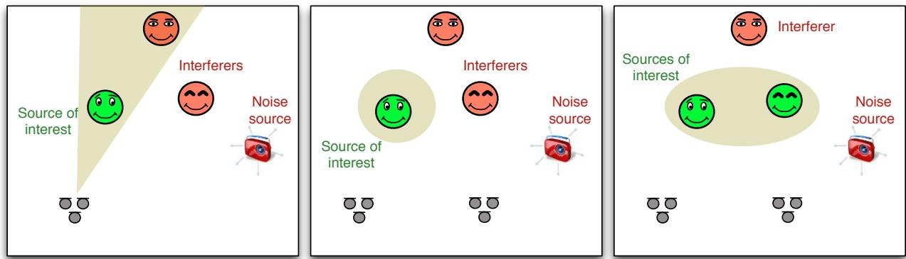  
Figure 1.1: Illustration beamforming versus spotforming

Both in the context of DOA-informed source extraction, as well as acoustic spotforming, the main question addressed in this thesis, is how to use the microphone signals and spatial features extracted thereof, to design accurate desired signal detectors which can then be used to estimate the desired signal propagation vector and the undesired signal PSD matrix required for instance in an MVDR filter, or to control the adaptation of a GSC for source extraction. Similarly to the ISF framework in $[108]$ in the spherical harmonic domain, we propose an ISF framework in the signal domain, with a robust desired signal detector specifically designed for scenarios where the DOA of the desired source is approximately known, whereas the locations of the interfering speakers are unknown and possibly time-varying. A desired signal detector and an MVDR-based framework for DOA-informed source extraction is developed in Chapter 4, whereas its implementation in a GSC structure is discussed in Chapter 5. A desired signal detector and an MVDR-based framework for acoustic spotforming is developed in Chapter 6.

## 1.4 Blind Source Separation

The objective of a BSS system is to separate multiple concurrent sources, which are mixed via an unknown mixing system, by using only observations of the mixture signals received at the microphones. The separation needs to be done without prior information about the source location, and the source spectral and statistical properties. BSS of acoustic signals is known as the cocktail party problem in the literature. A coarse classification of the broad range of BSS algorithms can be made as follows $[32]$

1. Independent Component Analysis (ICA) and its variants (see [32, 113] and references therein).

2. Spatial filtering-based BSS.

3. Sparsity-based BSS (also known as TF-masking in the literature).

4. Approaches which combine multiple of the concepts listed above.

In the following, we provide brief overview of the state-of-the-art related to each category.

## 1.4.1 Independent Component Analysis-based BSS

Typically, in ICA-based BSS, the mixing process generating the source signals is modelled by a network of Finite Impulse Response (FIR) filters. For acoustic signals, the mixing filters are FIR approximations of the AIRs between each source-microphone pair, and the BSS system aims at inverting the effect of the FIR system by estimating the inverse thereof. ICA-based BSS represents an unsupervised adaptive filtering approach $[114]$ , where no information on the signals and sources is available, besides assumptions on the signal's higher-order statistics $[115,116]$ or second-order statistics $[117–119]$ . In speech applications, the FIR separation filters often reach thousands of taps to properly invert the mixing system, which can be computationally expensive for practical systems. Therefore, a common approach to the separation of convolutive mixtures is to transform the problem to the frequency domain, and perform BSS at each frequency separately (see $[120]$ and references therein). Note that frequency-domain ICA suffers from permutation and scaling ambiguities which needs to be resolved additionally $[120]$ . Due to the scaling ambiguity, the separated signals in ICA-based BSS are determined only up to an arbitrary filtering, i.e., depending on the particular algorithm, the separated sources will be FIR-filtered versions of the original source signals $[121,122]$ . For more extensive overview of ICA-based BSS, the reader is referred to $[32]$ and references therein. In the context of BSS based on higher-order statistics, it is worthwhile to mention the Independent Vector Analysis (IVA)-based approaches $[123]$ , which represent an extension of frequency-domain ICA. By explicitly modelling the inter-frequency dependencies, IVA avoids the permutation ambiguity of ICA. Moreover, efficient implementations of ICA-based approaches suitable for online BSS have been proposed $[124,125]$ .

## 1.4.2 Spatial filtering-based BSS

The BSS problem can be seen as a collection of multiple source extraction problems, where each problem consists of designing a spatial filter that preserves one of the sources while reducing the others. If the DOAs or locations of the different sources are known or can be estimated from the data, a DSB can be used to extract each source from the mixtures $[70]$ . As the DSB is often insufficient in reducing the interferers and the background noise, adaptive null beamformers can be employed, which adaptively search the optimal location of the nulls while preserving the signal from the specified DOA $[40,48,82]$ . It has been shown that frequency-domain ICA-based BSS achieves equivalent result as frequency-domain adaptive null beamformers $[126]$ . Strictly speaking, spatial filtering is not a blind approach, as prior information of the source locations is required for the adaptive beamformers. Moreover, the beamformers should only adapt when the target source is absent, requiring target signal detection. Hence, spatial filtering-based BSS approaches are supervised. However, if a given spatial filtering framework estimates the DOAs or RTFs vectors, as well target signal detectors blindly from the data, it can be rightfully considered as a BSS approach.

Spatial filtering-based BSS has desirable properties such as the fact that the ambiguity up to arbitrary filtering, common for ICA-based approaches, can be resolved by designing the spatial filters to extract the source signals as captured at a reference microphone. Moreover, in contrast to ICA where the presence of background noise is not specifically addressed, spatial filters provide simultaneous source separation and noise reduction.

## 1.4.3 Sparsity-based BSS

The underlying assumption of sparsity-based BSS algorithms is the existence of a signal representation where the different source signals are sparse. It is well-known that speech signals are sparse in the STFT domain.

This property is known as W-disjoint orthogonality $[127]$ , which means that the supports of the windowed Fourier transforms of the source signals are disjoint. In general, it suffices that the sources are approximately W-disjoint orthogonal, i.e., that every TF bin is dominated by the energy of at most one source. In this case, the TF bins can be partitioned to the different sources, creating so-called TF masks. The TF mask for each source contains values between 0 and 1, where the value approaches one for the dominant source, and zero for the other sources. To achieve source separation, the TF masks are multiplied to one of the mixture signals, and hence, sparsity-based BSS is often synonymous with TF masking.

TF mask estimation represents a clustering problem, where each TF bin is associated to the dominant source. The first approach to clustering-based TF mask estimation was proposed in $[127,128]$ , and is known as degenerate unmixing estimation technique. In this approach, non-probabilistic clustering was used, based on the histograms of the amplitude ratios and the Time-Difference of Arrival (TDOA) between two microphones. Later, in $[129]$ , probabilistic Expectation-Maximization (EM)-based clustering of interaural level and phase differences was proposed. While most of the state-of-the-art TF mask estimation methods are based on the EM algorithm $[129–133]$ , the choice of features for clustering is very diverse, and important representatives are discussed in Chapter 7. Besides the model-based techniques for TF mask estimation, recently, DNNs have also been employed to generate TF masks for source separation, in particular in single-channel scenarios $[134]$ , or to complement the model-based TF mask estimation in multi-channel scenarios $[135]$ .

## 1.4.4 Combined approaches

Various frameworks that combine aspects from at least two of the aforementioned categories exist in the literature. For instance, combination of ICA and spatial filtering or spatial information such as DOAs has been proposed in $[136–138]$ . A combined approach that utilises sparsity and ICA was discussed in $[139]$ . Finally, the combination of sparsity and spatial filtering, leads us to the application of ISFs for BSS. The combination of sparsity and spatial filtering arises by employing the TF masks obtained using the speech sparsity assumption, as signal detectors that guide the estimation of the SOS required for ISFs for source separation. Note that although the spatial information provided by multiple microphones is essential for accurate TF mask estimation, the sparsity-based BSS discussed in Section 1.4.3 are in essence single-channel approaches, as the TF masks are multiplied to only one of the mixture signals. In contrast, ISFs utilise both the sparsity (to estimate the TF masks), as well as the spatial diversity.

## 1.4.5 Challenges and open issues

The different categories of BSS approaches mentioned in Sections 1.4.1-1.4.4, provide a large variety of effective solutions to the cocktail party problem. Specific challenges that are often addressed jointly with BSS include extensions to online BSS [32, 124, 140], joint noise reduction and BSS [141], as well as joint number of source estimation and BSS [142, 143]. In practical applications, it is desirable that a BSS system is able to handle all of the aforementioned issues, while having sufficiently low computational complexity for real-time implementation.

Considering the versatility and relatively low computational complexity of TF mask estimation frameworks, combined with the potential of data-dependent spatial filters to reduce non-stationary undesired signals while preserving the desired signal, in this thesis we focus on ISF-based BSS. The general approach of TF mask estimation and ISF has been extensively studied in the past decade $[130,131,140,141,143]$ . Our contribution to ISF-based BSS, presented in Chapter 7, is applicable to scenarios where multiple spatially separated microphone arrays are available. We propose an EM-based clustering algorithm to estimate the TF masks, while jointly estimating the number of sources from the data, and incorporating speech presence uncertainty using appropriate statistical models. Besides the clustering and TF mask estimation, we provide discussions and experimental results related to the usage of the TF masks for SOS estimation and ISF design, which are relevant for the research in ISF-based BSS in general, regardless of the choice of the TF mask estimation approach.

## 1.5 Source tracking with application to BSS of moving sources

The required properties of a speaker tracking system depend on the use of the estimated source locations. Commonly, locations of moving speakers are required for automatic camera steering for video-conferencing, or for obtaining steering information for spatial filters. In this thesis, the objective is to use a multi-source tracking system jointly with ISF-based BSS, which was discussed in Section 1.4 for the case of a fixed number of static sources.

## 1.5.1 Tracking of a single speaker

Some of the first speaker tracking algorithms, designed for tracking of a single speaker, are based on TDOA measurements $[144,145]$ or on the frequency-averaged output power of a steered beamformer, known as the Steered Response Power (SRP) $[146,147]$ . For each incoming signal frame, the TDOA is estimated and mapped to a position estimate, or the maximum of the SRP evaluated on a grid of positions (or DOAs) is found. Although straightforward, such algorithms are not always robust in practice, as reverberation and noise lead to wrong TDOA estimates and spurious peaks in the SRP. To improve the robustness, the problem can be expressed using a state-space formulation and solved using Bayesian approaches $[148,149]$ , which recursively estimate the probability density of the source location conditioned on all data up to the current time. For instance, TDOAs can be used with an extended Kalman filter $[150]$ , or with particle filters $[151–154]$ in a Bayesian framework. By including a motion model in the state-space formulation, the time correlation in a speaker's movement is considered, and therefore, peaks in the TDOA or SRP functions at the true source location follow the dynamical model. In contrast, erroneous peaks due to noise and reverberation do not exhibit temporal consistency and are easily identified as clutter.

## 1.5.2 Tracking of multiple speakers

Tracking multiple concurrent speakers is significantly more challenging than tracking a single speaker, due to the association uncertainty of the measurements to the sources $[143,155–158]$ . Many tracking algorithms typically assume that the sources are active continuously, without considering speech pauses $[151,155]$ . For robust operation in real applications, a VAD or speech uncertainty information needs to be included in the tracker, as done for instance in $[153]$ within a particle filtering framework. A different approach based on Kalman filtering, is to use a Probabilistic Data Association Filter (PDAF) to explicitly include speech presence uncertainty $[157]$ .

Although the mentioned multi-source trackers provide a location estimate per frame which can be used either for camera steering, or data-independent spatial filtering, they are not directly applicable in combination with ISFs, where the propagation vectors and SOS of the signals need to be updated at each TF bin. To extract or separate of moving sources using ISFs, a tracking algorithm is required which uses narrowband measurements. Similarly as for the static BSS scenario discussed in Section 1.4, the TF bin-to-dominant source association problem can be solved by online clustering algorithms $[140, 143]$ . A different framework for angular multi-speaker tracking and separation, based on IPD and Factorial Wrapped Kalman filter was proposed in $[159]$ .

## 1.5.3 Challenges and open issues

The ISF-based BSS frameworks for static sources can be extended in a rather straightforward manner to moving source scenarios by performing the clustering algorithms on sliding windows $[140,143]$ . However, our work in this area confirmed that such extension is not sufficiently robust and is susceptible to lost tracks during speech silences, which are typical in practical situations. Considering the fact that the association of TF bins to the dominant sources is equivalent to the measurement-to-source association uncertainty in Bayesian trackers, development of a suitable multi-source tracker can provide the underlying framework required for extending ISF-based BSS to moving sources. The contribution in this thesis to multi-source tracking and BSS, described in Chapter 8, is the development of a tracker designed specifically for narrowband measurements, which utilises concepts from Bayesian tracking. To provide robustness to speech pauses, speech presence uncertainty is explicitly incorporated in the statistical measurement models. In addition, efficient track management mechanism (source detection and removal) is developed to deal with time-varying number of sources.

## 1.6 Thesis contributions

## 1.6.1 Thesis structure

In this thesis, we present our contributions to the different spatial filtering applications outlined in Sections 1.2-1.5. All developed frameworks have the following main structure: i) choosing an appropriate TF-dependent spatial feature extracted from the microphone signals, ii) designing a statistical model-based detector using the extracted features, iii) associating each TF bin to the dominant signal, iv) updating the required PSD matrices and propagation vectors, and v) computing ISFs to estimate the desired signal or perform source separation. The content is organised as follows:

Chapter 2 provides the fundamental theoretical background and signal models relevant throughout the thesis. In particular, optimal spatial filter design in the STFT domain is emphasised.

Chapter 3 addresses the problem of noise PSD matrix estimation, with application to blind speech extraction in noisy and reverberant environments.

Chapter 4 addresses the problem of source extraction in the presence of noise and speech interferers, given the desired source DOA.

Chapter 5 discusses adaptive GSC implementations of the ISFs.

Chapter 6 proposes a data-dependent framework for acoustic spotforming.

Chapter 7 deals with sparsity- and spatial filtering-based BSS, which consists of clustering the TF bins to the dominant source and designing ISFs for source separation.

Chapter 8 extends the BSS framework and the associated models, in order to deal with time-varying

number of moving sources and provides a simultaneous multi-source tracking and separation system.

Chapter 9 summarises the main conclusions and outlines future research directions.

Note that the frameworks developed in Chapters 3-5 require only one microphone array, whereas Chapters 6-8 address scenarios where at least two microphone arrays are available. The organisation of the thesis content is illustrated in Figure 1.2. The arrows indicate the dependencies of the different topics and frameworks, and the numbers in the bottom right corners point to relevant publications, listed in Section 1.6.2. The grey blocks denote topics which are closely related to the main thesis contributions, however are not discussed in detail in the thesis chapters.

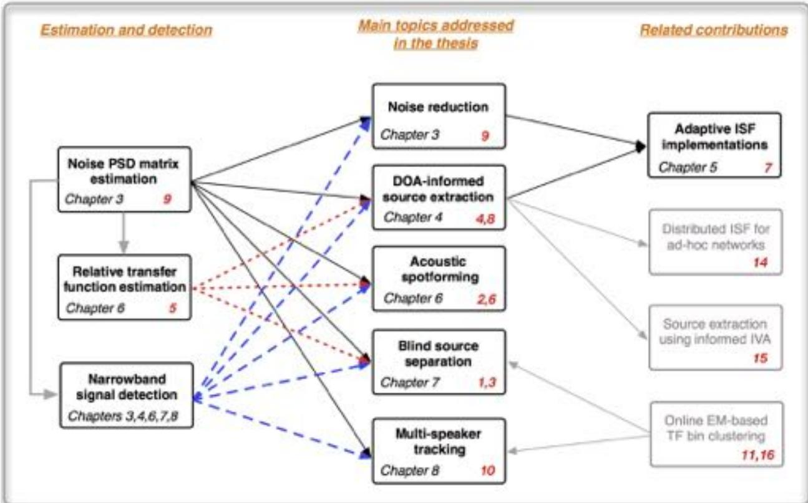  
Figure 1.2: Illustration of the thesis contributions. The arrows indicate dependencies of the different frameworks, and the numbers in the bottom right corners point to relevant publications. The topics in the grey blocks are not discussed in detail in the thesis.

## 1.6.2 List of publications

1. "MMSE-based source extraction using position-based posterior probabilities" - M. Taseska and E. A. P. Habets, In Proc. IEEE Intl. Conf. on Acoustics, Speech and Signal Processing (ICASSP), 2013.

2. "Spotforming using distributed microphone arrays" - M. Taseska and E. A. P. Habets, In Proc. IEEE Workshop on Applications of Signal Processing to Audio and Acoustics, 2013.

3. "Informed spatial filtering with distributed arrays" - M. Taseska and E. A. P. Habets, IEEE

Trans. Audio, Speech, Lang. Process., 22(7): 1195-1206, 2014.

4. "Minimum Bayes risk signal detection for speech enhancement based on a narrowband DOA model" - M. Taseska and E. A. P. Habets, In Proc. IEEE Intl. Conf. on Acoustics, Speech and Signal Processing (ICASSP), 2015.

5. "Relative transfer function estimation exploiting instantaneous signals and the signal subspace" - M. Taseska and E. A. P. Habets, In Proc. European Signal Processing Conf. (EUSIPCO), 2015.

6. "Spotforming: Spatial filtering with distributed arrays for position-selective sound acquisition" - M. Taseska and E. A. P. Habets, IEEE/ACM Trans. Audio, Speech, Lang. Process., 24(7):1291-1304, 2016.

7. "Recursive implementations of informed spatial filters" - M. Taseska, R. Varzandeh and E. A. P. Habets, In Proc. Intl. Workshop Acoustic Echo and Noise Control (IWAENC), 2016.

8. "DOA-informed source extraction in the presence of competing talkers and background noise" - M. Taseska and E. A. P. Habets, EURASIP Journal on Advances in Signal Process., 2017:60, 2017

9. "Non-stationary noise PSD matrix estimation for multichannel blind speech extraction" - M. Taseska and E. A. P. Habets, IEEE/ACM Trans. Audio, Speech, Lang. Process., 25(11): 2223 - 2236, 2017.

10. "Blind source separation of moving sources using sparsity-based source detection and tracking" - M. Taseska and E. A. P. Habets, IEEE/ACM Trans. Audio, Speech, Lang. Process., to appear.

In addition to the publications above which are closely related to the thesis chapters, the following publications contributed significant insights to the algorithms developed in the course of this thesis.

11. "An online EM algorithm for source extraction using distributed microphone arrays" - M. Taseska and E. A. P. Habets, In Proc. European Signal Processing Conf. (EUSIPCO), 2013.

12. "Speech enhancement with a low-complexity online source number estimator using distributed arrays" - M. Taseska, A. H. Khan and E. A. P. Habets, In Proc. European Signal Processing Conf. (EUSIPCO), 2014.

13. "A subspace-based perspective on spatial filtering performance with distributed and colocated microphone arrays" - M. Taseska and E. A. P. Habets, In Proc. ITG Conference on Speech Communication, 2014.

14. "Near-field source extraction using speech presence probabilities for ad-hoc microphone arrays" - M. Taseska, S. Markovich Golan, S. Gannot and E. A. P. Habets In Proc. Intl. Workshop Acoust. Echo Noise Control (IWAENC), 2014.

15. "A geometrically constrained independent vector analysis algorithm for online source extraction" - A. Khan, M. Taseska and E. A. P. Habets In Proc. Intl. Conf. on Latent Variable Analysis and Signal Separation, 2015.

16. "Online clustering of narrowband position estimates with application to multi-speaker detection and tracking"- M. Taseska and E. A. P. Habets In Proc. Intl. Conf. on Machine learning and Signal Processing, 2015.

## Optimal spatial filters in theory and practice

Spatial filtering in speech enhancement applications is very challenging due to the wideband and highly non-stationary nature of the desired and undesired sounds, and the presence of reverberation. These challenging conditions are the reason why fixed beamformers $[26, 38]$ , such as the Delay-and-Sum Beamformer (DSB), which are based on prior information about the location of the desired source and pre-defined spatial and/or spectral responses, often result in insufficient undesired signal reduction and inability to adapt in dynamic scenarios.

In contrast, the coefficients of statistically optimal spatial filters depend on the statistics of the desired and the undesired signals captured at the microphones. Different optimality criteria exist to compute the coefficients of a spatial filter. A commonly used criterion is to minimise the residual power of the undesired signal after filtering, while completely preserving the desired signal. To achieve this task, linear constraints are employed, which are constructed using the source locations and propagation vectors, or estimates thereof. Such spatial filter design constitutes the well-known Linearly Constrained Minimum Variance (LCMV) and Minimum Variance Distortionless Response (MVDR) spatial filters $[23,26,38,49,71]$ , where the MVDR is the single-constraint variant of the LCMV. Another optimisation criterion is the minimisation of the Minimum Mean Squared Error (MMSE) between the desired signal and its estimate, resulting in the Multichannel Wiener Filter (MWF) $[23,43,49]$ . The MWF has been extended to a Parametric Multichannel Wiener Filter (PMWF) $[23,44,160]$ , which allows for additional control of the trade-off between reduction of undesired signals and distortion of the desired signal.

The Second-Order Statistics (SOS) which are required to compute optimal spatial filters need to be estimated from the microphone signals. The estimation is particularly challenging, not only due to the inherent non-stationarity of speech, but also due to possible movements of the desired sources and interferers. Two well-known implementations of data-dependent spatial filters are suitable in such time-varying scenarios. The first one is based on an online estimation of the required SOS, which are then substituted in the closed-form optimal spatial filter expressions. The second one comprises the family of adaptive spatial filters $[161]$ , where the most commonly used representative for speech enhancement is the General Sidelobe Canceller (GSC) $[40, 47, 99]$ . The GSC is an equivalent adaptive implementation of the LCMV filter $[162]$ , where only the propagation vector of the desired source is required, while the undesired signals are reduced by an adaptive noise canceller operating in the signal subspace orthogonal to the desired source propagation vector. In practice, both the closed-form and the adaptive filters require detection of periods or Time-Frequency (TF) bins where the desired signal is inactive, to estimate the SOS and/or adapt the noise cancellers. The detection accuracy has an immediate impact on the spatial filtering performance, and represents the most challenging problem when implementing optimal time-varying filters in practice. The importance of signal detectors is emphasised throughout the chapters of this thesis in several different applications.

In this chapter, we provide a brief overview of the fundamentals of optimal spatial filters, and the estimation of the required SOS and propagation vectors. Online estimation of these quantities from the microphone signals, and their usage in time-varying optimal spatial filters, constitutes an informed spatial filtering framework. Informed Spatial Filters (ISFs) have been gaining increasing attention in the last decade for multichannel speech enhancement in dynamic scenarios $[2,107,141,143,163,164]$ . The chapter is organised as follows: in Section 2.1, we describe the Short-Time Fourier Transform (STFT) domain signal model for speech enhancement. The statistical signal model for speech signals and the relevant SOS for optimal frequency-domain spatial filtering are defined in Section 2.2. In Section 2.3, commonly used fixed spatial filters are briefly described, and in Section 2.4 important representatives of optimal data-dependent spatial filters are summarised. Finally, in Section 2.5, the informed spatial filtering concept is elaborated.

## 2.1 Problem formulation in the STFT domain

We consider multichannel speech acquisition systems, where M microphones are placed in a reverberant enclosure. Generally, the microphones capture multiple speech signals and background noise. If $\tilde{s}_{j}(\tau)$ denotes the time-domain signal of the j-th source, the signal image of the j-th source at the m-th microphone is obtained as the convolution of $\tilde{s}_{j}(\tau)$ with the Acoustic Impulse Response (AIR) $h_{jm}(\tau)$ between the j-th source and the m-th microphone, i.e.,

$$
s _ {j m} (\tau) = \tilde {s} _ {j} (\tau) \star h _ {j m} (\tau) = \int_ {\tau^ {\prime} = - \infty} ^ {+ \infty} \tilde {s} _ {j} (\tau^ {\prime}) h _ {j m} (\tau - \tau^ {\prime}) \mathrm{d} \tau^ {\prime}.\tag{2.1}
$$

## 2.1.1 STFT analysis of a speech signal

To process the signals on a digital processor, the continuous time-domain signals are sampled and discretised. If n denotes the discrete time index, the STFT representation of the discrete time-domain signal $s_{jm}(n)$ is obtained by applying the discrete-time Fourier transform on sliding windows of data from $s_{jm}(n)$ , i.e.,

$$
S _ {j m} (n, \omega) = \sum_ {n ^ {\prime} = - \infty} ^ {+ \infty} s _ {j m} (n ^ {\prime}) w _ {a} (n - n ^ {\prime}) \mathrm{e} ^ {- j \omega n ^ {\prime}},\tag{2.2}
$$

where $w_{a}(n)$ is the STFT analysis window. The analysis window is usually chosen to have finite temporal duration and low-pass frequency characteristics.

The signal $S_{jm}(n,\omega)$ in (2.2) is a redundant representation of $s_{jm}(n)$ , as the STFT is computed at each discrete time sample n. In practice, the STFT is computed only at time samples $n = t \Delta T$ , where $\Delta T$ is known as the hop-size of the STFT, and t is an integer that denotes the time frame index of the STFT. Moreover, rather than the discrete-time Fourier transform, the Discrete Fourier Transform (DFT) is computed with a discrete set of K frequencies, using efficient Fast Fourier Transform (FFT) implementations [165].

The discrete STFT-domain signal at time frame t is then given by

$$
S _ {j m} (t \Delta T, k) = \sum_ {n ^ {\prime} = t \Delta T} ^ {t \Delta T + K - 1} s _ {j m} (n ^ {\prime}) w _ {a} (t \Delta T - n ^ {\prime}) \mathrm{e} ^ {- j \frac {2 \pi i k}{K}},\tag{2.3}
$$

where k denotes the frequency index. If the temporal sampling frequency is denoted by $f_{s}$ , the index k corresponds to frequency $f_{k} = \frac{k}{K} f_{s}$ in Hertz. To alleviate circular convolution artefacts when applying the filters in the STFT domain [45], the number of discrete frequencies K can be larger than the length of the analysis window. In this case, the analysis window is extended by zero-padding before applying (2.3). Due to conjugate symmetry of the DFT for real-valued signals, only $\frac{K}{2} + 1$ frequency bins need to be processed. For notational convenience, in the rest of the thesis we denote the STFT domain signal as $S_{jm}(t, k)$ , such that the relative time frame index t is used instead of the discrete time $n = t \Delta T$ used in (2.2) and (2.3).

In speech processing applications, it is often assumed that the STFT analysis window is sufficiently long to capture most of the AIR $h_{jm}$ , which allows to write the Multiplicative Transfer Function (MTF) approximation [166] relating the spectral coefficients of the original signal $\tilde{S}_{j}(t,k)$ to the spectral coefficients of the source signal as captured at the m-th microphone

$$
S _ {j m} (t, k) = H _ {j m} (k) \tilde {S} _ {j} (t, k),\tag{2.4}
$$

where $H_{jm}(k)$ is the DFT of the AIR $h_{jm}(t)$ , known as the Acoustic Transfer Function (ATF). Although approaches which relax this assumption exist for spatial filtering and system identification [86,167,168], we assume that the MTF approximation is valid throughout the thesis.

## 2.1.2 Multichannel signal model in the STFT domain

The STFT, as described above, is applied to each of the M microphone signals. Vector notation is used for the signal vector from source j, as well as for the ATFs as follows

$$
\mathbf {s} _ {j} (t, k) = [ S _ {j 1} (t, k), S _ {j 2} (t, k), \ldots , S _ {j M} (t, k) ] ^ {\mathrm{T}},\tag{2.5}
$$

$$
\mathbf {h} _ {j} (k) = [ H _ {j 1} (k), H _ {j 2} (k), \ldots , H _ {j M} (k) ] ^ {\mathrm{T}},\tag{2.6}
$$

where $\mathbf{h}_{j}(k)$ represents the propagation vector of the j-th source. Considering the MTF, the source signal vector can be expressed as

$$
\mathbf {s} _ {j} (t, k) = \mathbf {h} _ {j} (k) \tilde {S} _ {j} (t, k).\tag{2.7}
$$

If multiple sources and background noise are present, where the total number of sources is J, the general STFT-domain signal model used throughout this thesis is written as

$$
\mathbf {y} (t, k) = \sum_ {j = 1} ^ {J} \mathbf {h} _ {j} (t, k) \tilde {S} _ {j} (t, k) + \mathbf {v} (t, k) = \sum_ {j = 1} ^ {J} \mathbf {s} _ {j} (t, k) + \mathbf {v} (t, k),\tag{2.8}
$$

where $\mathbf{y}(t,k)$ is an $M \times 1$ vector containing all the microphone signals, i.e.,

$$
\mathbf {y} (t, k) = [ Y _ {1} (t, k), Y _ {2} (t, k), \ldots , Y _ {M} (t, k) ] ^ {\mathrm{T}}.\tag{2.9}
$$

In speech enhancement applications which do not require dereverberation, the signal model is often written in terms of the Relative Transfer Functions (RTFs) rather than the ATFs [47]. The RTF vector describes the coupling between the microphones as a response to the signal from a source. Selecting the m-th microphone as a reference, and assuming that $H_{jm}(k) \neq 0$ , the RTF of the j-th source is given by

$$
\mathbf {g} _ {j m} (k) = \left[ \frac {H _ {j 1} (k)}{H _ {j m} (k)}, \ldots , \frac {H _ {j (m - 1)} (k)}{H _ {j m} (k)}, 1, \frac {H _ {j (m + 1)} (k)}{H _ {j m} (k)} \ldots \frac {H _ {j M} (k)}{H _ {j m} (k)} \right].\tag{2.10}
$$

The signal model from $(2.8)$ can be equivalently expressed in terms of the RTFs vectors and the source signal at the m-th microphone as follows

$$
\mathbf {y} (t, k) = \sum_ {j = 1} ^ {J} \mathbf {g} _ {j m} (t, k) S _ {j m} (t, k) + \mathbf {v} (t, k).\tag{2.11}
$$

## 2.1.3 Spatial filtering in the STFT domain

Processing the time-domain signals by the STFT, provides a sequence of $M \times 1$ vectors $\mathbf{y}(t, k)$ for each frequency bin k. The core concept in recent STFT-domain speech enhancement approaches is to use these sequences for signal detection, parameter estimation, and spatial filter design for signal estimation. To summarise, multichannel STFT domain speech enhancement comprises the following steps (also illustrated in Figure 2.1)

1. Divide the microphone signals into overlapping frames, according to $(2.3)$ .

2. Transform each frame by a K-point FFT to obtain $\mathbf{y}(t,k)$ .

3. For each frequency, use the vectors $\mathbf{y}(t,k)$ for signal detection, parameter estimation, SOS estimation, etc., which are required to compute an optimal spatial filter $\mathbf{w}(t,k)$ . Spatial filtering is performed by linearly combining the microphone signals at each TF bin, i.e.,

$$
\widehat {S} _ {j} (t, k) = \mathbf {w} ^ {\mathrm{H}} (t, k) \mathbf {y} (t, k).\tag{2.12}
$$

4. Obtain the estimated time-domain signal by overlap-add synthesis, using a synthesis window $w_{s}$ as follows

$$
\hat {s} _ {j} (n) = \frac {1}{K} \sum_ {k = 0} ^ {K - 1} \sum_ {t = - \infty} ^ {+ \infty} w _ {s} (n - t \cdot \Delta T) \widehat {S} _ {j} (t, k) \mathrm{e} ^ {j \frac {2 \pi n k}{K}}.\tag{2.13}
$$

Filtering in the STFT domain is extensively discussed in several papers and textbooks including $[46,169–171]$ . In these contributions, the central topic is to derive relationships between single-channel filtering in the time-domain, to its implementation in the DFT domain $[45,46,51]$ or in the STFT domain $[169–171]$ . This is in contrast to recent STFT-domain speech enhancement contributions, where the filters are estimated directly in the STFT domain $[50]$ , and the focus is on how to obtain the complex-valued coefficients $\mathbf{w}(t,k)$ in $(2.12)$ using the sequences of vectors $\mathbf{y}(t,k)$ .

It is important to point out that the spatial filter $\mathbf{w}(t,k)$ is estimated at each frequency bin independently. This is one of the attractive properties of STFT domain speech enhancement, which besides being computationally efficient, it allows to tune the spatial filter parameters at each frequency independently, providing flexible performance trade-offs. Moreover, it allows to integrate multi-microphone processing and singlechannel spectral enhancement techniques. The justification and limitation of the independent frequency processing are briefly discussed in the next section.

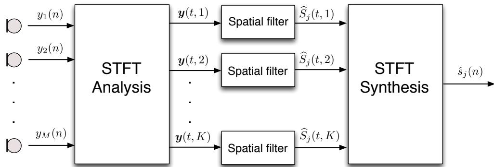  
Figure 2.1: Spatial filtering for speech enhancement in the STFT domain.

## 2.2 Random signal model and second-order statistics

In modern statistical approaches to multichannel speech processing $[23,38]$ , the speech and noise signals are modelled as sample functions of space-time random processes. An underlying assumption of the approaches which perform independent processing of each TF bin as shown in Figure 2.1, is that the random vectors $\mathbf{y}(t,k)$ for each TF bin are mutually uncorrelated and jointly Gaussian $[38, Chapter 5]$ , $[172, Chapter 6]$ . This restrictive assumption is justified by the equivalence of Karhunen-Loève Transform (KLT) and the Fourier transform for long analysis windows and stationary signals $[173]$ . In practice, violation of this assumption is likely: long frames are not suitable due to the processing delay and short-time stationary speech signals, while with short frames, there is spectral leakage among neighbouring frequency bands, causing inter-band correlations. Moreover, due to the frame overlap in the time-domain, signals form neighbouring frames are also correlated $[50]$ . Although recent contributions seek to model inter-frame and inter-band correlations and exploit them for speech enhancement $[50,53,174]$ , in this thesis we focus on independent processing for each TF bin, ignoring the possible inter-frame and inter-band correlations.

If Gaussian, and zero mean, the signal vectors are fully characterised by their SOS, namely, their Power Spectral Density (PSD) matrices, which for the different signals are defined as

$$
\boldsymbol {\Phi} _ {\mathbf {y}} (t, k) = \operatorname{E} \left[ \mathbf {y} (t, k) \mathbf {y} ^ {\mathrm{H}} (t, k) \right]\tag{2.14a}
$$

$$
\boldsymbol {\Phi} _ {\mathbf {s} _ {j}} (t, k) = \operatorname{E} \left[ \mathbf {s} _ {j} (t, k) \mathbf {s} _ {j} ^ {\mathrm{H}} (t, k) \right]\tag{2.14b}
$$

$$
\boldsymbol {\Phi} _ {\mathbf {v}} (t, k) = \operatorname{E} \left[ \mathbf {v} (t, k) \mathbf {v} ^ {\mathrm{H}} (t, k) \right]\tag{2.14c}
$$

where $E[\cdot]$ denotes statistical expectation. As the signals represent realizations of mutually uncorrelated random processes the following holds

$$
\boldsymbol {\Phi} _ {\mathbf {y}} (t, k) = \sum_ {j = 1} ^ {J} \boldsymbol {\Phi} _ {\mathbf {s} _ {j}} (t, k) + \boldsymbol {\Phi} _ {\mathbf {v}} (t, k).\tag{2.15}
$$

Considering that $\mathbf{s}_j(t,k) = \mathbf{g}_{jm}(t,k)S_{jm}(t,k)$ as discussed in 2.1.2, and using the definition in 2.14b, the

PSD matrix $\Phi_{s_{j}}$ of the j-th source can be written as

$$
\boldsymbol {\Phi} _ {\mathbf {s} _ {j}} (t, k) = \phi_ {S _ {j m}} (t, k) \mathbf {g} _ {j m} (k) \mathbf {g} _ {j m} ^ {\mathrm{H}} (k),\tag{2.16}
$$

where the RTF vector $\mathbf{g}_{jm}(t,k)$ was defined in (2.10) and $\phi_{S_{jm}}(t,k)$ is the PSD of the j-th source signal at the m-th microphone, given by

$$
\phi_ {S _ {j m}} (t, k) = \operatorname{E} \left[ | S _ {j m} (t, k) | ^ {2} \right].\tag{2.17}
$$

From (2.16), it follows that the source PSD matrix is a rank one matrix, a fundamental assumption which is extensively used for multichannel speech enhancement.

## 2.3 Data-independent (fixed) spatial filters

For the sake of the presentation of spatial filters, we assume that the j-th source signal is desired, whereas all remaining signals are undesired. We rewrite the signal model from $(2.8)$ as

$$
\mathbf {y} (t, k) = \mathbf {g} _ {j m} (k) S _ {j m} (t, k) + \mathbf {u} (t, k),\tag{2.18}
$$

where $\mathbf{u}(t,k)$ denotes the sum of all interfering speech signals and the background noise. In this section, we briefly overview the DSB and the matched beamformer for extraction of the desired speech signal $S_{jm}(t,k)$ , captured at the m-th microphone.

## 2.3.1 Delay-and-Sum Beamformer

In an anechoic environment, the AIRs are given by pure delays, and hence, the ATFs constitute only a phase shift. If we denote the two-dimensional (2D) microphone locations by $d_{1},\ldots,d_{M}$ and the Direction-Of-Arrival (DOA) vector of the desired source by

$$
\mathbf {q} _ {j} = [ \cos (\theta_ {j}), \mathrm{sin} (\theta_ {j}) ], ^ {\mathrm{T}}\tag{2.19}
$$

the ATF vector of the j-th source and the RTF with respect to the m-th microphone are given by

$$
\mathbf {h} _ {j} (k) = [ \mathrm{e} ^ {j \frac {2 \pi f _ {k}}{c} \mathbf {d} _ {1} ^ {\mathrm{T}} \mathbf {q} _ {j}}, \mathrm{e} ^ {j \frac {2 \pi f _ {k}}{c} \mathbf {d} _ {2} ^ {\mathrm{T}} \mathbf {q} _ {j}}, \ldots , \mathrm{e} ^ {j \frac {2 \pi f _ {k}}{c} \mathbf {d} _ {M} ^ {\mathrm{T}} \mathbf {q} _ {j}} ] ^ {\mathrm{T}},\tag{2.20}
$$

$$
\mathbf {g} _ {j m} (k) = \left[ \mathrm{e} ^ {j \frac {2 \pi f _ {k}}{c} (\mathbf {d} _ {1} - \mathbf {d} _ {m}) ^ {\mathrm{T}} \mathbf {q} _ {j}}, \ldots , \mathrm{e} ^ {j \frac {2 \pi f _ {k}}{c} (\mathbf {d} _ {m - 1} - \mathbf {d} _ {m}) ^ {\mathrm{T}} \mathbf {q} _ {j}}, 1, \ldots , \mathrm{e} ^ {j \frac {2 \pi f _ {k}}{c} (\mathbf {d} _ {M} - \mathbf {d} _ {m}) ^ {\mathrm{T}} \mathbf {q} _ {j}} \right] ^ {\mathrm{T}}.\tag{2.21}
$$

A DSB aligns the signals with respect to the phase of the desired signal at the m-th microphone, and computes the sum of the aligned signals to obtain the desired signal estimate, i.e.,

$$
\mathbf {w} _ {\mathrm{dsb}} (k) = \frac {1}{M} \mathbf {g} _ {j m} (k) \quad \mathrm{and} \quad \widehat {S} _ {j m} (t, k) = \mathbf {w} _ {\mathrm{dsb}} ^ {\mathrm{H}} (k) \mathbf {y} (t, k),\tag{2.22}
$$

Note that in applications where the desired source is in the near-field of the array, the DSB can be computed using a near-field model. In this case, due to the wave curvature, the distance from the source to the microphones needs to be taken into account in the ATFs.

## 2.3.2 Matched beamformer

It is well known that the DSB which is based on an anechoic propagation model is severely affected by room reflections $[81,175]$ . In contrast, matched filters take the AIRs into account, and hence, are more suitable for sound extraction in reverberant enclosures $[175]$ , providing more natural sounding speech quality $[80]$ . Instead of time alignment (or phase alignment in the frequency domain), matched filters apply causal approximations of the reverse of the AIRs, given by $h_{jm}(-t)$ , to the microphone signals. Hence, in the frequency domain, a matched filter which extracts the j-th source is given by $\mathbf{w}_{\mathrm{match}}(k)=\frac{\mathbf{h}_{j}(k)}{\|\mathbf{h}_{j}(k)\|^{2}}$ , where in contrast to the anechoic model-based expression $(2.21)$ for the DSB, the transfer functions $\mathbf{h}_{j}(k)$ can be arbitrary for the matched filter.

Clearly, to apply matched filters, the AIRs or ATFs need to be known in advance, which represents a significantly restrictive requirement in practice. Estimation of the ATFs from the data is a challenging task, especially in dynamic scenarios where the location of the desired source is unknown and might be time-varying [66]. Similarly as in the DSB where the alignment was done with respect to the source signal at the $m$ -th microphone, a matched filter can be computed using the RTF vector $\mathbf{g}_{jm}$ to provide an estimate of the source signal $S_{jm}(t,k)$ , as received at the $m$ -th microphone. However, note that the difference between the two filters in the reverberant case is more significant than in the anechoic case: while in the latter, the resulting signal estimates differ only by a time delay, in the former, they are related by the AIR with respect to the $m$ -th microphone. In other words, the matched filter given by $\mathbf{w}_{\mathrm{match}}(k) = \frac{\mathbf{h}_j(k)}{\|\mathbf{h}_j(k)\|^2}$ performs dereverberation, while $\mathbf{w}_{\mathrm{match}}(k) = \frac{\mathbf{g}_{jm}(k)}{\|\mathbf{g}_{jm}(k)\|^2}$ provides an estimate of the reverberant speech signal.

## 2.4 Optimal spatial filtering

The spatial filters described in this section are estimated and applied at each frequency k independently. Although the spatial filters developed in the thesis are time-varying, for the sake of clarity in this section, we follow standard textbook descriptions and assume that the signal SOS, and hence, the optimal frequency-domain filters are time-invariant. Common optimality criteria used to derive optimal spatial filters are briefly discussed in the following.

## 2.4.1 Minimum Variance Distortionless Response spatial filter

An optimal linear filter which extracts the j-th source signal as captured at the m-th microphone without distortion, while minimising the residual undesired signal power at the filter output is obtained by solving

$$
\mathbf {w} _ {\mathrm{opt}} (k) = \underset {\mathbf {w}} {\arg \min} \mathbf {w} ^ {\mathrm{H}} \boldsymbol {\Phi} _ {\mathbf {u}} (k) \mathbf {w}, \text { subject   to } \mathbf {w} ^ {\mathrm{H}} \mathbf {g} _ {j m} (k) = 1.\tag{2.23}
$$

The solution is given by the well-known MVDR or Capon beamformer [71], given by

$$
\mathbf {w} _ {\mathrm{mvdr}} (k) = \frac {\boldsymbol {\Phi} _ {\mathbf {u}} ^ {- 1} (k) \mathbf {g} _ {j m} (k)}{\mathbf {g} _ {j m} ^ {\mathrm{H}} (k) \boldsymbol {\Phi} _ {\mathbf {u}} ^ {- 1} (k) \mathbf {g} _ {j m} (k)}.\tag{2.24}
$$

Note that the term $\mathbf{g}_{jm}^{\mathrm{H}}(k)\Phi_{\mathbf{u}}^{-1}(k)\mathbf{g}_{jm}(k)$ represents a quadratic form and the following holds

$$
\mathbf {g} _ {j m} ^ {\mathrm{H}} (k) \boldsymbol {\Phi} _ {\mathbf {u}} ^ {- 1} (k) \mathbf {g} _ {j m} (k) = \operatorname{tr} \left\{\mathbf {g} _ {j m} (k) \mathbf {g} _ {j m} ^ {\mathrm{H}} (k) \boldsymbol {\Phi} _ {\mathbf {u}} ^ {- 1} (k) \right\},\tag{2.25}
$$

where $tr\{\cdot\}$ denotes the trace of a matrix. Using (2.25) and the definition of the source PSD matrix in (2.16), the MVDR can be written in terms of $\Phi_{\mathbf{s}_{j}}(k)$ as follows [23,49]

$$
\mathbf {w} _ {\mathrm{mvdr}} (k) = \frac {\boldsymbol {\Phi} _ {\mathbf {u}} ^ {- 1} (k) \boldsymbol {\Phi} _ {\mathbf {s} _ {j}} (k)}{\operatorname{tr} \left\{\boldsymbol {\Phi} _ {\mathbf {u}} ^ {- 1} (k) \boldsymbol {\Phi} _ {\mathbf {s} _ {j}} (k) \right\}} \mathbf {e} _ {m}, \quad \text {with} \quad \mathbf {e} _ {m} = [ \underbrace {0 \cdots 0} _ {m - 1},   1   0 \dots 0 ] ^ {\mathrm{T}}.\tag{2.26}
$$

The MVDR filter represents a special case of the LCMV filter, where in the latter, multiple constraints can be included in the optimisation problem. For instance, if the undesired signal contains speech interferers whose RTF vectors $g_{im}$ (for $i \neq j$ ) are known, additional null constraints can be employed such that $\mathbf{w}_{\mathrm{lcmv}}^{\mathrm{H}}(k)\mathbf{g}_{im}(k) = 0$ . Interesting relations between the performance of the MVDR and the LCMV filters have been discussed in [57, 176]. In scenarios where the number of interferers and their locations is time-varying, the null constraint design for the LCMV filter is not straightforward, as the estimation of the RTF vectors of the different moving interferers is very challenging. In contrast, the MVDR filter requires only the RTF vector or the PSD matrix of the desired source, and the PSD matrix $\Phi_{u}$ of the sum of all undesired signals.

## 2.4.2 Multichannel Wiener Filter

A different commonly used optimality criterion which does not require the RTF vector $g_{jm}$ is the MMSE criterion, where the optimal filter minimises the expected error between the desired signal and the estimate thereof, i.e.,

$$
\mathbf {w} _ {\mathrm{mwf}} (k) = \underset {\mathbf {w}} {\arg \min} \mathcal {J} (\mathbf {w}) = \underset {\mathbf {w}} {\arg \min} \operatorname{E} \left[ | S _ {j m} (t, k) - \mathbf {w} ^ {\mathrm{H}} \mathbf {y} (t, k) | ^ {2} \right].\tag{2.27}
$$

The filter which minimises $(2.27)$ is the well known MWF $[43,49]$ , obtained by setting the derivative of $\mathcal{J}(\mathbf{w})$ with respect to w to zero and solving for w. The result is given by

$$
\mathbf {w} _ {\mathrm{mwf}} (k) = \boldsymbol {\Phi} _ {\mathbf {y}} ^ {- 1} (k) \boldsymbol {\Phi} _ {\mathbf {s} _ {j}} (k) \mathbf {e} _ {m}, \quad \text {with} \quad \text {with} \quad \mathbf {e} _ {m} = [ \underbrace {0 \cdots 0} _ {m - 1}, 1 0 \dots 0 ] ^ {\mathrm{T}}.\tag{2.28}
$$

If we substitute $\mathbf{\Phi}_{\mathbf{s}_{j}}(k)=\mathbf{\Phi}_{\mathbf{y}}(k)-\mathbf{\Phi}_{\mathbf{u}}(k)$ in (2.28), invoke the rank-one model for $\mathbf{\Phi}_{\mathbf{s}_{j}}(k)$ , apply the matrix inversion lemma for $\mathbf{\Phi}_{\mathbf{y}}^{-1}(k)$ , and rearrange the resulting expression, we can write the MWF terms of the RTF vector $g_{jm}$ as follows [23, 49]

$$
\mathbf {w} _ {\mathrm{mwf}} (k) = \frac {\mathbf {\Phi_ {u} ^ {- 1}} (k) \mathbf {g} _ {j m} (k)}{\phi_ {s _ {j m}} ^ {- 1} (k) + \mathbf {g} _ {j m} ^ {\mathrm{H}} (k) \mathbf {\Phi_ {u} ^ {- 1}} (k) \mathbf {g} _ {j} (k)} = \frac {\phi_ {S _ {j m}} (k) \mathbf {\Phi_ {u} ^ {- 1}} (k) \mathbf {g} _ {j m} (k)}{1 + \phi_ {S _ {j m}} (k) \mathbf {g} _ {j m} ^ {\mathrm{H}} (k) \mathbf {\Phi_ {u} ^ {- 1}} (k) \mathbf {g} _ {j m} (k)}.\tag{2.29}
$$

For completeness, we state the matrix inversion lemma applied to compute $\Phi_{y}^{-1}$ , i.e.,

$$
\boldsymbol {\Phi} _ {\mathbf {y}} ^ {- 1} = (\boldsymbol {\Phi} _ {\mathbf {u}} + \phi_ {S _ {j m}} \mathbf {g} _ {j m} \mathbf {g} _ {j m} ^ {\mathrm{H}}) ^ {- 1} = \boldsymbol {\Phi} _ {\mathbf {u}} ^ {- 1} - \frac {\phi_ {S _ {j m}} \boldsymbol {\Phi} _ {\mathbf {u}} ^ {- 1} \mathbf {g} _ {j m} \mathbf {g} _ {j m} ^ {\mathrm{H}} \boldsymbol {\Phi} _ {\mathbf {u}} ^ {- 1}}{1 + \phi_ {S _ {j m}} \mathbf {g} _ {j m} ^ {\mathrm{H}} \boldsymbol {\Phi} _ {\mathbf {u}} ^ {- 1} \mathbf {g} _ {j m}}.\tag{2.30}
$$

Using the relation $(2.25)$ , the MWF can be written as a product of the MVDR filter and a single channel filter as follows

$$
\mathbf {w} _ {\mathrm{mwf}} (k) = \frac {\boldsymbol {\Phi} _ {\mathbf {u}} ^ {- 1} (k) \boldsymbol {\Phi} _ {\mathbf {s} _ {j}} (k)}{1 + \operatorname{tr} \left\{\boldsymbol {\Phi} _ {\mathbf {u}} ^ {- 1} (k) \boldsymbol {\Phi} _ {\mathbf {s} _ {j}} (k) \right\}} \mathbf {e} _ {m} = \mathbf {w} _ {\mathrm{mvdr}} (k) \cdot \frac {\operatorname{tr} \left\{\boldsymbol {\Phi} _ {\mathbf {u}} ^ {- 1} (k) \boldsymbol {\Phi} _ {\mathbf {s} _ {j}} (k) \right\}}{1 + \operatorname{tr} \left\{\boldsymbol {\Phi} _ {\mathbf {u}} ^ {- 1} (k) \boldsymbol {\Phi} _ {\mathbf {s} _ {j}} (k) \right\}}.\tag{2.31}
$$

In contrast to the MVDR filter, the MWF is not distortionless, which is clear from the decomposition $(2.31)$ (recall that single-channel filters introduce distortion to the desired signal).

Note that the single-channel filter which is applied at the output of the MVDR filter in $(2.31)$ to obtain the MWF, corresponds to the MMSE-optimal single-channel noise reduction filter (Wiener filter), as it represents the ratio of the desired signal PSD at the MVDR filter output to the total signal PSD at the MVDR output. Using $(2.25)$ , the single-channel filter can also be written as

$$
w _ {\mathrm{sc}} (k) = \frac {\operatorname{tr} \left\{\boldsymbol {\Phi} _ {\mathbf {u}} ^ {- 1} (k) \boldsymbol {\Phi} _ {\mathbf {s} _ {j}} (k) \right\}}{1 + \operatorname{tr} \left\{\boldsymbol {\Phi} _ {\mathbf {u}} ^ {- 1} (k) \boldsymbol {\Phi} _ {\mathbf {s} _ {j}} (k) \right\}} = \frac {\phi_ {S _ {j m}} (k) \mathbf {g} _ {j m} ^ {\mathrm{H}} (k) \boldsymbol {\Phi} _ {\mathbf {u}} ^ {- 1} (k) \mathbf {g} _ {j m} (k)}{1 + \phi_ {S _ {j m}} (k) \mathbf {g} _ {j m} ^ {\mathrm{H}} (k) \boldsymbol {\Phi} _ {\mathbf {u}} ^ {- 1} (k) \mathbf {g} _ {j m} (k)}.\tag{2.32}
$$

Although in theory, the single-channel Wiener filter can be computed using the RTF vector and PSD matrices as in $(2.32)$ , in practice, it is often beneficial to design the spatial filter (i.e., the MVDR filter) and the single-channel filter separately. The main reason for this is the fact that in practice, the RTF vectors and PSD matrices are estimated as temporal averages, and the spatial and spectral filters require different averaging constants to provide the best achievable overall quality of the extracted signals. Furthermore, the separate design offers more flexibility to control the performance trade-offs for both the spatial and spectral filters.

## 2.4.3 Parametric Multichannel Wiener Filter

The PMWF offers flexibility in tuning the trade-off between the residual noise and the allowable distortion of the desired signal $[23,44,49]$ . The PMWF is obtained by minimising the residual noise power while imposing a constraint on the maximum speech distortion, i.e., by solving

$$
\mathbf {w} _ {\mathrm{pmwf}} (k) = \underset {\mathbf {w}} {\arg \min} \mathbf {w} ^ {\mathrm{H}} \boldsymbol {\Phi} _ {\mathbf {u}} (k) \mathbf {w}, \quad \text {subject to} \quad \operatorname{E} \left[ (S _ {j m} (t, k) - \mathbf {w} ^ {\mathrm{H}} \mathbf {s} _ {j m} (t, k)) ^ {2} \right] \leq \sigma^ {2},\tag{2.33}
$$

where $\sigma^{2}$ indicates the maximum allowable distortion. The Lagrangian for the (2.33) is given by

$$
\mathcal {L} (\gamma , k) = \mathbf {w} ^ {\mathrm{H}} \boldsymbol {\Phi} _ {\mathbf {u}} (k) \mathbf {w} + \gamma \left(\operatorname{E} \left[ (S _ {j m} (t, k) - \mathbf {w} ^ {\mathrm{H}} \mathbf {s} _ {j m} (t, k)) ^ {2} \right] - \sigma^ {2}\right).\tag{2.34}
$$

Setting the derivative with respect to w to zero and solving, leads to the following filter

$$
\mathbf {w} _ {\mathrm{pmwf}} (k) = \phi_ {S _ {j m}} (k) \left(\mu \boldsymbol {\Phi} _ {\mathbf {u}} (k) + \boldsymbol {\Phi} _ {\mathbf {s} _ {j}} (k)\right) ^ {- 1} \mathbf {g} _ {j m} (k),\tag{2.35}
$$

where $\mu = \gamma^{-1}$ . Similarly as in the derivation of the MWF, using the matrix inversion lemma and rearranging, the PMWF can be rewritten as

$$
\mathbf {w} _ {\mathrm{pmwf}} (k) = \frac {\boldsymbol {\Phi} _ {\mathbf {u}} ^ {- 1} (k) \mathbf {g} _ {j m} (k)}{\mu \phi_ {S _ {j m}} ^ {- 1} (k) + \mathbf {g} _ {j m} ^ {\mathrm{H}} (k) \boldsymbol {\Phi} _ {\mathbf {u}} ^ {- 1} (k) \mathbf {g} _ {j m} (k)}.\tag{2.36}
$$

Similarly to the MWF, the PMWF can be written as the product of an MVDR and a single-channel filter as follows

$$
\mathbf {w} _ {\mathrm{pmwf}} (k) = \frac {\boldsymbol {\Phi} _ {\mathbf {u}} ^ {- 1} (k) \boldsymbol {\Phi} _ {\mathbf {s} _ {j}} (k)}{\mu + \operatorname{tr} \left\{\boldsymbol {\Phi} _ {\mathbf {u}} ^ {- 1} (k) \boldsymbol {\Phi} _ {\mathbf {s} _ {j}} (k) \right\}} \mathbf {e} = \mathbf {w} _ {\mathrm{mvdr}} \cdot \frac {\operatorname{tr} \left\{\boldsymbol {\Phi} _ {\mathbf {u}} ^ {- 1} (k) \boldsymbol {\Phi} _ {\mathbf {s} _ {j}} (k) \right\}}{\mu + \operatorname{tr} \left\{\boldsymbol {\Phi} _ {\mathbf {u}} ^ {- 1} (k) \boldsymbol {\Phi} _ {\mathbf {s} _ {j}} (k) \right\}}.\tag{2.37}
$$

Note that the MVDR filter and the MWF represent special cases of the PMWF for appropriately chosen trade-off parameters, i.e., $\mu = 0$ and $\mu = 1$ , respectively. Similarly as for the MWF in Section 2.4.2, it is often beneficial to estimate the single-channel parametric Wiener filter in (2.37) separately, rather than using the same estimates of the PSD matrices and/or the RTF vector that are employed for computing the MVDR filter. In addition, the trade-off parameter $\mu$ can be signal dependent and computed for each TF bin separately, as done for instance in [177].

## 2.4.4 Conditional Minimum Mean Squared Error spatial filter

The spatial filters described in the previous sections do not consider the fact that the desired signal is not present at all TF bins. Speech enhancement under desired speech presence uncertainty is well-known in the literature since the work by McAulay and Malpass in the early 1980s [5]. By introducing the following hypotheses

$$
\mathcal {H} _ {s _ {j}}: \quad \text { desired   signal   is   dominant },\tag{2.38a}
$$

$$
\mathcal {H} _ {u}: \quad \mathrm{undesiredsignalisdominant},\tag{2.38b}
$$

the optimal Conditional Minimum Mean Squared Error (c-MMSE) estimate of the desired signal $S_{jm}$ , under speech presence uncertainty, is given by the conditional expectation

$$
\begin{array}{l} \widehat {S} _ {j m} (t, k) = \mathrm{E} \left[ S _ {j m} (t, k) \mid \mathbf {y} (t, k) \right] \\ = p (\mathcal {H} _ {s _ {j}} \mid \mathbf {y} (t, k)) \cdot \mathrm{E} \left[ S _ {j m} (t, k) \mid \mathbf {y} (t, k), \mathcal {H} _ {s} \right] + p (\mathcal {H} _ {u} \mid \mathbf {y} (t, k)) \cdot \mathrm{E} \left[ S _ {j m} (t, k) \mid \mathbf {y} (t, k), \mathcal {H} _ {u} \right] \\ \approx p (\mathcal {H} _ {s _ {j}} \mid \mathbf {y} (t, k)) \cdot \mathrm{E} \left[ S _ {j m} (t, k) \mid \mathbf {y} (t, k), \mathcal {H} _ {s _ {j}} \right]. \end{array}\tag{2.39a}
$$

(2.39b)

The approximation (2.39b) is valid due to the underlying sparsity assumption, i.e. that when the hypothesis $H_{u}$ is true, the contribution of the desired speech is negligible.

Assuming that the STFT signal vectors are multivariate Gaussian, as discussed in Section 2.2, the expectation $\mathrm{E}\left[S_{jm}(t,k)\mid\mathbf{y}(t,k),\mathcal{H}_{s_{j}}\right]$ is linear in the data and is provided by the MWF i.e.,

$$
\operatorname{E} \left[ S _ {j m} (t, k) \mid \mathbf {y} (t, k), \mathcal {H} _ {s _ {j}} \right] = \mathbf {w} _ {\mathrm{mwf}} ^ {\mathrm{H}} (k) \mathbf {y} (t, k).\tag{2.40}
$$

Hence the c-MMSE filter is obtained by multiplying the MWF output by the Desired Speech Presence Probability (DSPP). For $p(\mathcal{H}_{s_{j}} \mid \mathbf{y}(t, k)) < 1$ , it is clear that the c-MMSE filter is more aggressive than the MWF. If the speech sparsity assumption holds and the DSPP is accurately estimated, the c-MMSE filter provides excellent signal quality. However, in practice where estimation errors are present in the DSPP, the c-MMSE filter might introduce audible distortion to the desired signal. Note that the DSPP represents a TF mask applied at the MWF output, and therefore, the inherent trade-off between undesired signal reduction and distortion of the desired speech, typical for single-channel filters [17], is present in the c-MMSE filter as well.

## 2.5 Informed spatial filtering

The optimal spatial filters in Section 2.4 were derived based on the assumption that the PSD matrices $\Phi_{\mathbf{u}}(k)$ and $\Phi_{\mathbf{s}_j}(k)$ , as well as RTF vector $\mathbf{g}_{jm}(k)$ of the desired source are known. In certain applications, it might be possible to obtain these quantities in advance using training signals, however this is a restrictive assumption, and unrealistic for scenarios with time-varying source locations and acoustic conditions. The main question addressed in this thesis, which is in the core of ISF-based frameworks, is how to estimate the PSD matrices and RTF vectors using only the microphone signals, with minimum amount of prior information about the scenario.

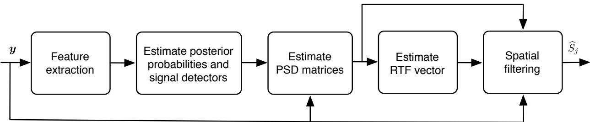  
Figure 2.2: A general block diagram of an informed spatial filtering framework.

The sparsity of speech signals is a fundamental assumption that allows estimation of the PSD matrices and RTF vectors from the data. In this context, sparsity implies that at each TF bin, the energy contribution of either the desired source, or the undesired sources is dominant. Hence, each TF bin can be classified to one of the hypotheses defined in $(2.38)$ . The hypotheses are redefined in each chapter as required for the different applications, however for the sake of discussion in this section, we use the two-hypothesis model from $(2.38)$ . In the following, we provide an overview of the main processing blocks in a typical informed spatial filtering framework, namely, narrowband signal detection (Section 2.5.1), and the usage of the detector's output to estimate the PSD matrices and RTF vectors (Sections 2.5.2 and 2.5.3). A general block diagram which applies to all ISFs developed in the thesis is illustrated in Figure 2.2.

## 2.5.1 Narrowband signal detectors

Narrowband signal detectors or classifiers, perform association of each TF bin to the dominant source at that TF bin, using the microphone signals $\mathbf{y}(t,k)$ or features extracted thereof. The detectors can be designed based on non-probabilistic models as in earlier works [127], or probabilistic models as in more recent works [2, 130, 132, 143]. In probabilistic frameworks, each TF bin is assigned a posterior probability that a desired or undesired signal is dominant, i.e.,

$$
p \left(\mathcal {H} _ {s _ {j}} \mid \mathbf {y} (t, k)\right) \quad \text { probability   that   the   desired   signal   is   dominant },\tag{2.41a}
$$

$$
p \left(\mathcal {H} _ {u} \mid \mathbf {y} (t, k)\right) \mathrm{probabilitythatundesiredsignalisdominant.}\tag{2.41b}
$$

The posterior probabilities, the estimation of which is application-specific and will be detailed in the thesis chapters, can be used to estimate the PSD matrices and RTFs vectors directly, or to compute an optimal Bayesian detector at each TF bin which minimises the Bayes risk for a false positive cost $C_{su} > 0$ and a false negative cost $C_{us} > 0$ as follows [178]

$$
\text { decide } \mathcal {H} _ {s _ {j}} \text { if } \frac {p \left(\mathcal {H} _ {s _ {j}} \mid \mathbf {y} (t , k)\right)}{p \left(\mathcal {H} _ {u} \mid \mathbf {y} (t , k)\right)} > \frac {C _ {s u}}{C _ {u s}},\tag{2.42}
$$

$$
\mathrm{decide} \mathcal {H} _ {u} \quad \mathrm{otherwise}.
$$

## 2.5.2 Estimation of signal statistics

A common approach to estimate PSD matrices from the microphone signals is by recursive temporal averaging. The estimation of the PSD matrix $\Phi_{y}$ is straightforward as follows

$$
\widehat {\boldsymbol {\Phi}} _ {\mathbf {y}} (t, k) = \alpha_ {y} \widehat {\boldsymbol {\Phi}} _ {\mathbf {y}} (t - 1, k) + (1 - \alpha_ {y}) \mathbf {y} (t, k) \mathbf {y} ^ {\mathrm{H}} (t, k),\tag{2.43}
$$

where $\alpha_{y}\in[0,1)$ is an averaging constant. In contrast to $\Phi_{y}$ , the estimation of $\Phi_{s_{j}}$ and $\Phi_{u}$ requires signal-dependent averaging parameters $\alpha_{s_{j}}(t,k)$ and $\alpha_{u}(t,k)$ , to ensure that the PSD matrices are updated only when the corresponding signal is dominant. Therefore, the recursions are given by

$$
\widehat {\boldsymbol {\Phi}} _ {\mathbf {s} _ {j}} (t, k) = \alpha_ {s _ {j}} (t, k) \widehat {\boldsymbol {\Phi}} _ {\mathbf {s} _ {j}} (t - 1, k) + \left(1 - \alpha_ {s _ {j}} (t, k)\right) \mathbf {y} (t, k) \mathbf {y} ^ {\mathrm{H}} (t, k),\tag{2.44a}
$$

$$
\widehat {\boldsymbol {\Phi}} _ {\mathbf {u}} (t, k) = \alpha_ {u} (t, k) \widehat {\boldsymbol {\Phi}} _ {\mathbf {u}} (t - 1, k) + (1 - \alpha_ {u} (t, k)) \mathbf {y} (t, k) \mathbf {y} ^ {\mathrm{H}} (t, k),\tag{2.44b}
$$

where the averaging parameters $\alpha_{s_{j}}$ and $\alpha_{u}$ , are computed at each TF bin using the probabilities $p\left(\mathcal{H}_{s_{j}} \mid \mathbf{y}(t, k)\right)$ and $p\left(\mathcal{H}_{u} \mid \mathbf{y}(t, k)\right)$ as follows

$$
\alpha_ {s _ {j}} (t, k) = 1 + p \left(\mathcal {H} _ {s _ {j}} \mid \mathbf {y} (t, k)\right) (\tilde {\alpha} _ {s} - 1),\tag{2.45a}
$$

$$
\alpha_ {u} (t, k) = 1 + p \left(\mathcal {H} _ {u} \mid \mathbf {y} (t, k)\right) (\tilde {\alpha} _ {u} - 1).\tag{2.45b}
$$

The values $\tilde{\alpha}_s, \tilde{\alpha}_u \in [0,1)$ are user-defined constants which determine the effective range of the averaging parameters, i.e., $\alpha_{s_j} \in [\tilde{\alpha}_s, 1]$ and $\alpha_u \in [\tilde{\alpha}_u, 1]$ .

DSPP-dependent recursion for PSD estimation are widely used since the work by Cohen in $[1]$ on single-microphone speech enhancement. The posterior DSPP was used to estimate the noise PSD, under the assumption that the noise is stationary compared to the speech. However, for non-stationary undesired signals, such as speech, binary update decisions are preferable, to avoid leakage of desired signal into the undesired signal PSD matrix (and vice versa). Therefore, the output of the Bayesian detector in $(4.24)$ is used to obtain the averaging parameters as

$$
\alpha_ {s _ {j}} (t, k) = 1 + \mathcal {I} _ {\mathcal {H} _ {s _ {j}}} (t, k) (\tilde {\alpha} _ {s} - 1),\tag{2.46a}
$$

$$
\alpha_ {u} (t, k) = 1 + \mathcal {I} _ {\mathcal {H} _ {u}} (t, k) (\tilde {\alpha} _ {u} - 1),\tag{2.46b}
$$

where $I_{H_{a}}$ is binary indicator which equals one when the hypothesis in the subscript is true, and zero otherwise.

## 2.5.3 Estimation of RTF vectors

In applications where the source location is known and free field model is assumed, the RTF vector can be computed analytically, such as in the DSB discussed in Section 2.3.1. However, in the scenarios considered in this thesis, the goal is to estimate the RTF vector from the microphone signals. Two RTF estimators commonly used in the literature $[85]$ , are briefly described next.

## 2.5.3.1 Covariance subtraction method for RTF estimation

The covariance subtraction method is an efficient approach to obtain the RTF vector directly from an estimate of $\Phi_{s_{j}}$ , based on the rank-one model of $\Phi_{s_{j}}$ . Using the definition (2.16) it is clear that $g_{jm}$ corresponds to the first column of $\Phi_{s}$ , normalised by the first element, i.e.

$$
\mathbf {g} _ {j m} (t, k) = \frac {\mathbf {\Phi_ {s}} _ {j} (t , k) \mathbf {e} _ {m}}{\mathbf {e} _ {m} ^ {\mathrm{H}} \mathbf {\Phi_ {s}} _ {j} (t , k) \mathbf {e} _ {m}}.\tag{2.47}
$$

The term covariance subtraction is related to the fact that usually, in speech applications, the matrix $\Phi_{s_{j}}$ is not directly obtained using the recursive averages as written in (2.44). The reason is that the background noise $\mathbf{v}(t,k)$ with covariance matrix $\Phi_{v}$ is always present in the microphone signals, even when the desired speech signal is dominant. Hence, obtaining an estimate $\widehat{\Phi}_{s_{j}}$ of the desired signal PSD matrix, consists of a recursive update and covariance subtraction, namely

$$
\widehat {\boldsymbol {\Phi}} _ {\mathbf {s} _ {j} + \mathbf {v}} (t, k) = \alpha_ {s _ {j}} (t, k) \widehat {\boldsymbol {\Phi}} _ {\mathbf {s} _ {j} + \mathbf {v}} (t - 1, k) + \left(1 - \alpha_ {s _ {j}} (t, k)\right) \mathbf {y} (t, k) \mathbf {y} ^ {\mathrm{H}} (t, k),\tag{2.48a}
$$

$$
\widehat {\boldsymbol {\Phi}} _ {\mathbf {s} _ {j}} (t, k) = \widehat {\boldsymbol {\Phi}} _ {\mathbf {s} _ {j} + \mathbf {v}} (t, k) - \widehat {\boldsymbol {\Phi}} _ {\mathbf {v}} (t, k),\tag{2.48b}
$$

where $\widehat{\Phi}_{\mathbf{s}_j + \mathbf{v}}(t,k) = \widehat{\Phi}_{\mathbf{s}_j}(t,k) + \widehat{\Phi}_{\mathbf{v}}(t,k)$ . Finally, $\widehat{\Phi}_{\mathbf{s}_j}(t,k)$ is used in (2.47) to obtain the RTF vector estimate $\hat{\mathbf{g}}_{jm}(t,k)$ .

## 2.5.3.2 Covariance whitening method for RTF estimation

The covariance whitening method, similarly as the covariance subtraction, is based on the rank-one model of $\Phi_{\mathbf{s}_j}$ . Considering that

$$
\boldsymbol {\Phi} _ {\mathbf {s} _ {j} + \mathbf {v}} (t, k) = \phi_ {S _ {j m}} (t, k) \mathbf {g} _ {j m} (t, k) \mathbf {g} _ {j m} ^ {\mathrm{H}} (t, k) + \boldsymbol {\Phi} _ {\mathbf {v}} (t, k),\tag{2.49}
$$

the Generalised Eigenvalue Problem (GEVP) of the matrix pencil $(\Phi_{\mathbf{s}_{j}}, \Phi_{\mathbf{v}})$ can be written as

$$
\left(\phi_ {S _ {j m}} (t, k) \mathbf {g} _ {j m} (t, k) \mathbf {g} _ {j m} ^ {\mathrm{H}} (t, k) + \boldsymbol {\Phi} _ {\mathbf {v}} (t, k)\right) \mathbf {p} = \lambda \boldsymbol {\Phi} _ {\mathbf {v}} (t, k) \mathbf {p},\tag{2.50}
$$

where $\lambda$ and p denote an eigenvalue and eigenvector pair. As the matrix $\Phi_{s_{j}}$ is of rank one, there is only one generalised eigenvalue in (2.50) that satisfies $\lambda > 1$ , and $\mathbf{g}_{jm}(t, k)$ is a scaled and rotated version of the corresponding eigenvector p. Hence, the RTF vector is given by

$$
\mathbf {g} _ {j m} (t, k) = \frac {\boldsymbol {\Phi} _ {\mathbf {v}} (t , k) \mathbf {p}}{\mathbf {e} _ {m} ^ {\mathrm{T}} \boldsymbol {\Phi} _ {\mathbf {v}} (t , k) \mathbf {p}}.\tag{2.51}
$$

The denominator in $(2.51)$ ensures that the m-th entry of $g_{jm}$ is equal to one.

## 2.6 Summary

In this chapter, starting from the motivation for using the STFT domain for speech enhancement, the fundamental concepts of STFT-domain optimal spatial filters were briefly discussed. In contrast to fixed beamformers, optimal spatial filters are data-dependent and take into account the desired and undesired signal statistics. If the statistics are accurately estimated, optimal spatial filters can achieve almost complete interference reduction with only a little, or in some cases, without distortion of the desired signal. The challenging problem in practice is to estimate the signal statistics and update them online so that the spatial filters remain optimal even in time-varying acoustic conditions. Often, it is assumed that there are training periods where only the desired or undesired signals are active, and the required SOS and RTF vectors are estimated during these periods. Clearly, in practical applications, such periods, if they exist, need to be detected using only the microphone signals.

The idea behind ISFs is to use a narrowband signal detector to continuously update the SOS and the RTF vectors, and provide an optimal spatial filter at each TF bin, estimated using only the microphone signals. While the recursive estimation of PSD matrices is a standard component of multichannel speech enhancement systems, the distinguishing concept of ISFs is the continuous estimation of the PSD matrices and RTF vectors using the output of the narrowband detectors. This results in almost instantaneous adaptation of the resulting spatial filters when the acoustic scene or the signal properties change. Hence, the central focus and contributions of the thesis are designing appropriate features and signal detectors for different applications that involve hands-free speech acquisition. Our goal is to develop ISFs for a broad range of applications, as well as answer a few practical design questions related to the computation of spatial filters in dynamic scenarios with non-stationary interferers.

## Noise power spectral density matrix estimation with application to blind source extraction

The main focus of this chapter is reliable estimation of the noise Power Spectral Density (PSD) matrix, which is required for optimal, data-dependent blind source extraction. Noise PSD matrix estimation is one of the most important components of multichannel speech enhancement frameworks, as it directly determines the extracted signal quality at the output of data-dependent spatial filters. Compared to the well-studied problem of single-channel PSD estimation $[1,7,179]$ , the extension to multichannel PSD matrix estimation, especially in blind scenarios without prior knowledge of the noise spatial properties, has been considerably less studied in the literature. PSD matrix estimation is a more challenging problem than single-channel PSD estimation, as the cross-PSDs among the microphones need to be estimated as well, and robustness to both spectral and spatial non-stationarity needs to be guaranteed. In environments with non-stationary noise, estimating the noise PSD matrix in advance during periods when the desired speech signal is inactive, does not provide tracking of the time-varying noise statistics. Therefore, the optimality of the spatial filters in time-varying acoustic conditions can not be maintained.

An overview of the few existing noise PSD matrix estimators was recently published in $[16]$ , distinguishing mainly four approaches to the problem: i) approaches based on direct extensions of the well-known minimum statistics-based single-channel PSD estimation $[180,181]$ , ii) approaches that assume a certain structure for the noise spatial properties (for instance spherically isotropic) and explicitly use this structure to estimate the noise PSD $[22,182–185]$ , (iii) approaches that assume prior knowledge of the desired signal propagation vector $[186]$ , and iv) approaches based on a narrowband Speech Presence Probability (SPP), which gained popularity with the single-channel Minima-Controlled Recursive Averaging (MCRA) $[1]$ , and were later generalised for PSD matrix estimation in multichannel scenarios $[2]$ . For the purpose of blind speech extraction in the presence of diffuse noise, a different noise PSD matrix estimator based on spatial covariance matrix decomposition has been proposed in $[185]$ . While the contribution in $[185]$ and the multichannel MCRA share the underlying statistical models, they represent two different approaches to the problem: MCRA focuses on online estimation of the SPP, and the SPP-controlled noise PSD matrix, whereas the approach in $[185]$ finds batch Maximum Likelihood (ML) estimates of the noise and speech PSD matrices based on pre-defined spatial coherence models.

Assuming that the desired source is sufficiently close to the microphone array, so that its signal is highly coherent across the array, the algorithms developed in this chapter seek to extract signals which are coherent across the array, while reducing signals with low spatial coherence, such as background noise and possibly sources that are far from the array. As the MCRA-based noise PSD matrix estimators have proven to be effective and applicable in blind scenarios where the desired source location and propagation vector are unknown, they are the starting point of our work in this chapter. The first contribution of the chapter is to provide a ML view of the SPP-based noise PSD matrix estimation problem and relate it to multichannel MCRA. An ML view of single-channel noise PSD estimation was published in $[187]$ , and in this thesis, we extend the discussion to multichannel scenarios. In addition, we show that although theoretically sound and elegant, the ML solution alone is not sufficiently robust for SPP and noise PSD estimation when the noise is non-stationary. In such cases, additional control is required to distinguish speech onsets from changes in the noise properties.

In MCRA-based PSD estimation frameworks in the literature, the computation of a signal-dependent a priori Speech Absence Probability (SAP) is recognised a key factor in ensuring robust of PSD estimation in non-stationary environments $[1,2,8,93,188]$ . The estimation of the a priori SAP is the second major topic of this chapter. While the authors in $[1,2,8]$ propose signal-dependent a priori SAP obtained using a signal-dependent estimate of the a priori Signal-to-Noise Ratio (SNR), the authors in $[93]$ suggest that a fixed a priori SAP is preferred and that the a priori SNR should reflect the typical SNR when speech is present. Considering that in this contribution, we seek to develop a framework suitable for estimating non-stationary noise PSD matrices, where the typical SNR when speech is present is also time-varying, we focus on data-dependent a priori SAP estimators. We provide an overview of state-of-the-art signal-dependent a priori SAP estimators, including a Coherent-to-Diffuse Ratio (CDR)-based estimator proposed in our previous work. The CDR is a real-valued quantity related to the complex coherence between two microphones, and therefore, the CDR-based approach assumes that the background noise is significantly less coherent than the speech, which in practice is often satisfied for different background noise types. The magnitude-squared coherence, which has been shown to be closely related to the CDR, was also used in $[189]$ to control the a priori SAP. By including additional control mechanisms that increase the robustness of the CDR-based a priori SAP, and additional comparisons to the state-of-the-art, in this chapter, we further elaborate the importance of using spatial information in the a priori SAP, and its influence on the a posteriori SPP, the resulting PSD matrix estimates, and finally, the extracted signal quality.

The rest of the chapter is organised as follows: In Section 3.1 we define the signal model specific for this chapter. In Section 3.2, we give an overview of the multichannel SPP [190], and its usage in multichannel MCRA for noise PSD matrix estimation [2]. In Section 3.3, we formulate the noise PSD matrix estimation as a ML problem, derive its solution, and relate it to MCRA. In Section 3.4 we focus on the state-of-the-art a priori SAP estimators and propose further control mechanisms for the CDR-based a priori SAP originally proposed in [191]. In Section 3.5, we discuss the design of Informed Spatial Filters (ISFs) using the estimated noise PSD matrices and a posteriori SPPs. In Section 3.6, we present comprehensive performance evaluation of the different SPP and PSD matrix estimators and of the signal quality at the corresponding ISF outputs. Section 3.7 concludes the chapter.

## 3.1 Signal model

We consider scenarios where a desired speech signal is captured by an M-element microphone array in a reverberant room. Besides the desired signal, the microphones capture background noise with unknown temporal, spectral, and spatial properties. The signal vector in the Short-Time Fourier Transform (STFT)

domain can be written as

$$
\mathbf {y} (t, k) = \mathbf {s} (t, k) + \mathbf {v} (t, k) = \mathbf {g} _ {m} (t, k) S _ {m} (t, k) + \mathbf {v} (t, k),\tag{3.1}
$$

where $S_{m}$ denotes the desired speech signal captured at the m-th microphone, $g_{m}$ denotes the Relative Transfer Function (RTF) vector of the desired source with respect to the m-th microphone, and v denotes the noise signal vector. As we assume that only a single speaker is present, we omit the source index j in this chapter. As shown in Section 2.2, the speech signal PSD matrix that follows from the signal model in (3.1) is a rank-one matrix, i.e.,

$$
\boldsymbol {\Phi} _ {\mathbf {s}} (t, k) = \phi_ {S _ {m}} (t, k) \mathbf {g} _ {m} (t, k) \mathbf {g} _ {m} ^ {\mathrm{H}} (t, k),\tag{3.2}
$$

where the RTF vector $g_{m}$ in (3.2) is time-varying to model source movement or switching among multiple sources. The objective is to estimate the PSD matrices $\Phi_{\mathbf{s}}(t,k)$ and $\Phi_{\mathbf{v}}(t,k)$ from the microphone signals, and use them to compute an optimal linear filter $\mathbf{w}_{\mathrm{opt}}(t,k)$ to extract the speech signal as captured at the m-th microphone as follows

$$
\widehat {S} _ {m} (t, k) = \mathbf {w} _ {\mathrm{opt}} ^ {\mathrm{H}} (t, k) \mathbf {y} (t, k).\tag{3.3}
$$

In the scenario considered in this chapter, the bin-wise hypotheses whose general description was given in $(2.38)$ , have the following form

$$
\begin{array}{l l} \mathcal {H} _ {v} (t, k): \mathbf {y} (t, k) = \mathbf {v} (t, k) & \text { indicating speech absence }, \\ \mathcal {H} _ {s} (t, k): \mathbf {y} (t, k) = \mathbf {s} (t, k) + \mathbf {v} (t, k) & \text { indicating speech presence }. \end{array}
$$

Based on these hypotheses, in the following section, we give a brief overview of the MCRA-based noise PSD matrix estimation, which is the basis for the work in this chapter.

## 3.2 Multichannel MCRA for noise PSD matrix estimation

Analogously to the single-channel case where the STFT signal coefficients are modelled as independent realisations of a complex univariate Gaussian distribution $[1]$ , in the multichannel case, the signal vectors containing the STFT coefficients are modelled as independent realisations of a complex multivariate Gaussian distribution $[2,190]$ . Starting from the Gaussian signal model, the multichannel MCRA framework for SPP and noise PSD matrix estimation is described in the following.

## 3.2.1 Multichannel a posteriori SPP

In this section, we omit the Time-Frequency (TF) bin index $(t,k)$ for brevity, as the model holds for $\mathbf{y}(t,k)$ at each t and k. The microphone signal vectors under the speech absence and speech presence hypotheses are modelled as realisations of the following zero-mean complex multivariate Gaussian distributions

$$
f (\mathbf {y} | \mathcal {H} _ {v}) = \mathcal {N} _ {\mathbb {C}} (\mathbf {y}; \mathbf {0}, \boldsymbol {\Phi_ {v}}) = (\pi^ {M} \mathrm{det} [ \boldsymbol {\Phi_ {v}} ]) ^ {- 1} \mathrm{e} ^ {- \mathbf {y} ^ {\mathrm{H}} \boldsymbol {\Phi_ {v}} ^ {- 1} \mathbf {y}},\tag{3.4a}
$$

$$
f (\mathbf {y} | \mathcal {H} _ {s}) = \mathcal {N} _ {\mathbb {C}} (\mathbf {y}; \mathbf {0}, \boldsymbol {\Phi} _ {\mathbf {y}}) = (\pi^ {M} \mathrm{det} [ \boldsymbol {\Phi} _ {\mathbf {y}} ]) ^ {- 1} \mathrm{e} ^ {- \mathbf {y} ^ {\mathrm{H}} \boldsymbol {\Phi} _ {\mathbf {y}} ^ {- 1} \mathbf {y}}.\tag{3.4b}
$$

Given the likelihood models (3.4), the a posteriori SPP follows from the Bayes rule, i.e.,

$$
p (\mathcal {H} _ {s} \mid \mathbf {y}) = \frac {p (\mathcal {H} _ {s}) f (\mathbf {y} \mid \mathcal {H} _ {s})}{p (\mathcal {H} _ {s}) f (\mathbf {y} \mid \mathcal {H} _ {s}) + p (\mathcal {H} _ {v}) f (\mathbf {y} \mid \mathcal {H} _ {v})}.\tag{3.5}
$$

Let us introduce the following notations for the a priori and a posteriori SPP and the a priori and a posteriori SAP

$$
q _ {s} = p (\mathcal {H} _ {s}), \qquad \qquad p _ {s} = p (\mathcal {H} _ {s} | \mathbf {y}),\tag{3.6a}
$$

$$
q _ {v} = p (\mathcal {H} _ {v}) = 1 - q _ {s}, \qquad p _ {v} = p (\mathcal {H} _ {v} | \mathbf {y}) = 1 - p _ {s}.\tag{3.6b}
$$

In the rest of the chapter, the a priori SAP $q_{v}$ and the a priori SPP $q_{s}$ are used interchangeably, depending on the convenience of notation. After rearranging (3.5) and using the notations from (3.6), we obtain

$$
p _ {s} = \left(1 + \frac {q _ {v}}{1 - q _ {v}} \cdot \frac {f (\mathbf {y} | \mathcal {H} _ {v})}{f (\mathbf {y} | \mathcal {H} _ {s})}\right) ^ {- 1} = \left(1 + \frac {q _ {v}}{1 - q _ {v}} \cdot \frac {\det [ \boldsymbol {\Phi_ {y}} ]}{\det [ \boldsymbol {\Phi_ {v}} ]} \cdot \frac {\mathrm{e} ^ {- \mathbf {y} ^ {\mathrm{H}} \boldsymbol {\Phi_ {v}} ^ {- 1} \mathbf {y}}}{\mathrm{e} ^ {- \mathbf {y} ^ {\mathrm{H}} \boldsymbol {\Phi_ {y}} ^ {- 1} \mathbf {y}}}\right) ^ {- 1}.\tag{3.7}
$$

As the microphone signal PSD matrix $\Phi_{y}$ is a sum of the full-rank matrix $\Phi_{v}$ and the rank-one matrix $\Phi_{s}$ , the inverse $\Phi_{y}^{-1}$ in (3.7) can be expressed in terms of $\Phi_{v}^{-1}$ and the RTF vector $g_{m}$ , using the matrix inversion lemma [192]. After applying the matrix inversion lemma and rearranging, (3.7) can be equivalently written as follows

$$
\begin{array}{r l} & p _ {s} = \left(1 + \frac {q _ {v}}{1 - q _ {v}} \cdot \left(1 + \phi_ {S _ {m}} \mathbf {g} _ {m} ^ {\mathrm{H}} \boldsymbol {\Phi} _ {\mathbf {v}} ^ {- 1} \mathbf {g} _ {m}\right) \cdot \mathrm{e} ^ {- \frac {\phi_ {S _ {m}} \mathbf {y} ^ {\mathrm{H}} \boldsymbol {\Phi} _ {\mathbf {v}} ^ {- 1} \mathbf {g} _ {m} \mathbf {g} _ {m} ^ {\mathrm{H}} \boldsymbol {\Phi} _ {\mathbf {v}} ^ {- 1} \mathbf {y}}{1 + \phi_ {S _ {m}} \mathbf {g} _ {m} ^ {\mathrm{H}} \boldsymbol {\Phi} _ {\mathbf {v}} ^ {- 1} \mathbf {g} _ {m}}}\right) ^ {- 1} \\ & \quad = \left(1 + \frac {q _ {v}}{1 - q _ {v}} \cdot \left(1 + \mathrm{tr} \left\{\boldsymbol {\Phi} _ {\mathbf {v}} ^ {- 1} \boldsymbol {\Phi} _ {\mathbf {s}} \right\}\right) \cdot \mathrm{e} ^ {- \frac {\mathbf {y} ^ {\mathrm{H}} \boldsymbol {\Phi} _ {\mathbf {v}} ^ {- 1} \boldsymbol {\Phi} _ {\mathbf {s}} \boldsymbol {\Phi} _ {\mathbf {v}} ^ {- 1} \mathbf {y}}{1 + \mathrm{tr} \left\{\boldsymbol {\Phi} _ {\mathbf {v}} ^ {- 1} \boldsymbol {\Phi} _ {\mathbf {s}} \right\}}}\right) ^ {- 1}, \end{array}\tag{3.8a}
$$

(3.8b)

where we used the trace identity $(2.25)$ to obtain $(3.8b)$ from $(3.8a)$ .

It is worthwhile noting that in the context of single-channel SPP estimation, the authors in $[93]$ have proposed using smoothed observations in the single-channel counterpart of $(3.8)$ , instead of the instantaneous signals $\mathbf{y}(t,k)$ . While this interesting modification might also provide better results for the multichannel SPP, its derivation for the multichannel case is outside the scope of this thesis.

## 3.2.2 Noise PSD matrix estimation using the a posteriori SPP

In MCRA-based noise PSD matrix estimators, the narrowband SPP is used to recursively update the noise PSD matrix estimate $\widehat{\Phi}_{v}$ , similarly as (2.44). Specifically, the recursion for $\widehat{\Phi}_{\mathbf{v}}(t,k)$ is given by

$$
\widehat {\boldsymbol {\Phi}} _ {\mathbf {v}} (t, k) = \alpha_ {v} (t, k) \widehat {\boldsymbol {\Phi}} _ {\mathbf {v}} (t - 1, k) + (1 - \alpha_ {v} (t, k)) \mathbf {y} (t, k) \mathbf {y} ^ {\mathrm{H}} (t, k),\tag{3.9}
$$

where the averaging parameter $\alpha_{v}(t,k)$ is computed at each TF bin $(t,k)$ using the a posteriori SPP at $(t,k)$ , obtained according to (3.7). To ensure that $\widehat{\Phi}_{v}$ is updated only when the desired speech signal is absent, $\alpha_{v}(t,k)$ is computed as

$$
\alpha_ {v} (t, k) = \tilde {\alpha} _ {v} + p _ {s} (t, k) \left(1 - \tilde {\alpha} _ {v}\right),\tag{3.10}
$$

and $\tilde{\alpha}_{v}\in[0,1)$ is a constant which determines the resulting effective range of the averaging parameter $\alpha_{v}(t,k)\in[\tilde{\alpha}_{v},1]$ . An important property of the Gaussian signal model for SPP and noise PSD matrix estimation given by (3.4), is the fact that $\Phi_{\mathbf{v}}(t,k)$ is a parameter of the model itself. This means that to compute the SPP $p_{s}(t,k)$ required for the PSD matrix update in (3.9), the estimate $\widehat{\Phi}_{\mathbf{v}}(t-1,k)$ from the previous frame needs to be used as the model parameter. This explains the reason why Gaussian signal models are only suitable for signal detection if the noise is relatively stationary and does not change abruptly in consecutive frames.

## 3.3 Maximum-likelihood view on noise PSD matrix estimation

The first contribution in this chapter is to demonstrate that the MCRA-based multichannel SPP and noise PSD matrix estimation can be related to the solution of a properly formulated ML parameter estimation problem. Note that an ML view on single-channel noise PSD estimation has been presented in $[187]$ . Following the Gaussian signal model from Section 3.2.1, the probability of receiving the microphone signal vector $\mathbf{y}(t,k)$ is given by the following two-component Gaussian mixture

$$
f \left(\mathbf {y} (t, k)\right) = q _ {v} \mathcal {N} _ {\mathbb {C}} \left(\mathbf {y} (t, k); \mathbf {0}, \boldsymbol {\Phi} _ {\mathbf {v}} (t, k)\right) + q _ {s} \mathcal {N} _ {\mathbb {C}} \left(\mathbf {y} (t, k); \mathbf {0}, \boldsymbol {\Phi} _ {\mathbf {y}} (t, k)\right).\tag{3.11}
$$

Clearly, the noise PSD matrix $\Phi_{\mathbf{v}}(t,k)$ and the a priori SAP $q_{v}$ , are unknown parameters of Gaussian Mixture Model (GMM), and will be denoted by $P_{tk} = \{\Phi_{\mathbf{v}}(t,k), q_{v}\}$ in the following. Denoting the set of all microphone signals at frequency bin k, received up to time t by $\mathcal{Y}_{tk} = \{\mathbf{y}(t',k)\}_{0 \leq t' \leq t}$ , assuming that for $t_{1} \neq t_{2}$ the signal vectors $\mathbf{y}(t_{1},k)$ and $\mathbf{y}(t_{2},k)$ are independent, and considering for a moment wide-sense stationary conditions such that $\Phi_{\mathbf{v}}(t,k)$ and $\Phi_{\mathbf{y}}(t,k)$ are time-invariant, the batch log-likelihood of the observed signals $Y_{tk}$ is given by

$$
\mathcal {L} (\mathcal {Y} _ {t k}; \mathcal {P} _ {k}) = \sum_ {t ^ {\prime} = 1} ^ {t} \ln f (\mathbf {y} (t ^ {\prime}, k); \mathcal {P} _ {k}) = \sum_ {t ^ {\prime} = 1} ^ {t} \ln \left[ q _ {v} \mathcal {N} _ {\mathbb {C}} \left(\mathbf {y} (t ^ {\prime}, k); \mathbf {0}, \boldsymbol {\Phi} _ {\mathbf {v}} (k)\right) + q _ {s} \mathcal {N} _ {\mathbb {C}} \left(\mathbf {y} (t ^ {\prime}, k); \mathbf {0}, \boldsymbol {\Phi} _ {\mathbf {y}} (k)\right) \right].\tag{3.12}
$$

Note that the log-likelihood is formulated separately and independently for each frequency bin k.

Maximising the batch log-likelihood $\mathcal{L}(\mathcal{Y}_{tk};\mathcal{P}_{k})$ with respect to the parameters $P_{k}=\{\Phi_{v}(k),q_{v}\}$ is unsuitable in non-stationary conditions where the parameters are time-varying. To develop an ML-based estimator of time-varying model parameters for non-stationary conditions, in the following, we formulate a exponentially weighted likelihood computed over sliding data windows.

## 3.3.1 Exponentially weighted maximum likelihood estimation

Note: all derivations in this section are done at each frequency bin k independently. Hence, to improve readability, we omit the index k from the signals, from the parameters, and from the likelihoods.

The motivation for defining an exponentially weighted likelihood is to ensure that the data temporally closer to time t have the largest contribution to the estimated model parameters at time t. In contrast to the batch likelihood with fixed parameters in $(3.12)$ , the exponentially weighted likelihood is defined using

time-dependent parameters as follows

$$
\mathcal {L} _ {\lambda} (\mathcal {Y} _ {t}; \mathcal {P} _ {t}) = \sum_ {t ^ {\prime} = 1} ^ {t} \lambda^ {t - t ^ {\prime}} \ln \left[ q _ {v} (t) \mathcal {N} _ {\mathbb {C}} (\mathbf {y} (t ^ {\prime}); \mathbf {0}, \boldsymbol {\Phi} _ {\mathbf {v}} (t)) + q _ {s} (t) \mathcal {N} _ {\mathbb {C}} (\mathbf {y} (t ^ {\prime}); \mathbf {0}, \boldsymbol {\Phi} _ {\mathbf {y}} (t)) \right],\tag{3.13}
$$

where $\lambda\in(1,0)$ . Although ML parameter estimation problems in GMMs can not be solved in a closed form, the Expectation-Maximization (EM) algorithm provides an efficient iterative solution, by extending the observable data set $Y_{t}$ to a so-called complete data set, and maximising the likelihood of the complete data set [193]. The complete data set for our problem is obtained by associating to each microphone signal $\mathbf{y}(t,k)$ a variable that indicates which of the Gaussian components (the one corresponding to speech or the one corresponding to noise) generated the signal $\mathbf{y}(t,k)$ . Although EM algorithms are originally formulated for batch data, incremental EM variants exist for processing sequential data [194]. Once the complete data likelihood is formulated, the EM algorithms maximise the expected value of the complete data likelihood, with respect to the model parameters to be estimated. This expectation, known as the Q-function in the literature [195], in our problem is given by

$$
Q \left(\mathcal {P} _ {t} \mid \mathcal {P} _ {t - 1}\right) = \sum_ {t ^ {\prime} = 0} ^ {t} \lambda^ {t ^ {\prime} - t} \left\{\tilde {p} _ {v} \left(t ^ {\prime}\right) \cdot \ln \left[ q _ {v} (t) \cdot \mathcal {N} \left(\mathbf {y} \left(t ^ {\prime}\right); \mathbf {0}, \boldsymbol {\Phi} _ {\mathbf {v}} (t)\right) \right] + \tilde {p} _ {s} \left(t ^ {\prime}\right) \ln \left[ q _ {s} (t) \cdot \mathcal {N} \left(\mathbf {y} \left(t ^ {\prime}\right); \mathbf {0}, \boldsymbol {\Phi} _ {\mathbf {y}} (t)\right) \right] \right\},\tag{3.14}
$$

where the probabilities $\tilde{p}_{s}(t)$ and $\tilde{p}_{v}(t)=1-\tilde{p}_{s}(t)$ with respect to which the expectation is evaluated are computed using the parameter estimates from time t-1, i.e.,

$$
\tilde {p} _ {s} (t) = \left(1 + \frac {\hat {q} _ {v} (t - 1)}{\hat {q} _ {s} (t - 1)} \cdot \frac {\mathcal {N} _ {\mathbb {C}} (\mathbf {y} (t) ; \mathbf {0} , \widehat {\boldsymbol {\Phi}} _ {\mathbf {v}} (t - 1))}{\mathcal {N} _ {\mathbb {C}} (\mathbf {y} (t) ; \mathbf {0} , \widehat {\boldsymbol {\Phi}} _ {\mathbf {y}} (t))}\right) ^ {- 1}.\tag{3.15}
$$

The tilde is used to distinguish these probabilities from the a posteriori probabilities in $(3.5)$ and $(3.6)$ which are computed after obtaining the parameter estimates for time t.

Evaluating (3.14) and omitting terms that do not depend on $\Phi_{v}$ , $q_{v}$ , and $q_{s}$ , we rewrite the Q-function as

$$
Q (\mathcal {P} _ {t} \mid \mathcal {P} _ {t - 1}) = \sum_ {t ^ {\prime} = 0} ^ {t} \lambda^ {t - t ^ {\prime}} \Bigl \{\tilde {p} _ {v} (t ^ {\prime}) \left(\ln q _ {v} (t) - \ln \det \left(\mathbf {\Phi} _ {\mathbf {v}} (t)\right) - \mathbf {y} ^ {\mathrm{H}} (t ^ {\prime}) \mathbf {\Phi} _ {\mathbf {v}} ^ {- 1} (t) \mathbf {y} (t ^ {\prime})\right) + \tilde {p} _ {s} (t ^ {\prime}) \cdot \ln q _ {s} (t) \Bigr \}.\tag{3.16}
$$

Note that although the terms that depend on $\Phi_{y}$ were omitted, according to the signal model in (2.15), the matrix $\Phi_{v}$ is contained in $\Phi_{y}$ . If the speech PSD matrix $\Phi_{s}$ was known, we could substitute the model (2.15) and solve the optimization problem in (3.14). However, in blind scenarios with no information about the speech sources and their highly non-stationary signals, $\Phi_{s}$ is difficult to estimate. Therefore, we proceed by only considering the likelihoods of the observations when the speech signal is absent. Then, to maximise (3.16) with respect to $q_{s}(t)$ and $\Phi_{\mathbf{v}}(t)$ we need to maximise the following functions, each depending on only one of the required model parameters

$$
Q _ {q} (q _ {v} (t) \mid \mathcal {P} _ {t - 1}) = \sum_ {t ^ {\prime} = 0} ^ {t} \lambda^ {t - t ^ {\prime}} \Bigl \{\tilde {p} _ {v} (t ^ {\prime}) \ln q _ {v} (t) + \tilde {p} _ {s} (t ^ {\prime}) \cdot \ln (1 - q _ {v} (t)) \Bigr \},\tag{3.17a}
$$

$$
Q _ {\mathbf {\Phi_ {v}}} (\mathbf {\Phi_ {v}} (t) \mid \mathcal {P} _ {t - 1}) = \sum_ {t ^ {\prime} = 0} ^ {t} \lambda^ {t - t ^ {\prime}} \tilde {p} _ {v} (t ^ {\prime}) \cdot \left[ - \ln \det \left(\mathbf {\Phi_ {v}} (t)\right) - \mathbf {y} ^ {\mathrm{H}} (t ^ {\prime}) \mathbf {\Phi_ {v}} ^ {- 1} (t) \mathbf {y} (t ^ {\prime}) \right].\tag{3.17b}
$$

By taking the derivative of $Q_{q}(q_{v}(t) \mid \mathcal{P}_{t-1})$ with respect to $q_{v}(t)$ and setting it to zero, we obtain

$$
\hat {q} _ {v} (t) = \frac {\sum_ {t ^ {\prime} = 0} ^ {t} \lambda^ {t - t ^ {\prime}} \tilde {p} _ {v} (t ^ {\prime})}{\sum_ {t ^ {\prime} = 0} ^ {t} \lambda^ {t - t ^ {\prime}}}.\tag{3.18}
$$

This means, that the ML estimate of the a priori SAP at time t is given by an exponentially weighted average of SAPs $\tilde{p}_{v}(t')$ up to time t, where $\tilde{p}_{v}(t')$ are computed using the model parameters estimated up to time t-1.

The derivative of $Q_{\mathbf{\Phi}_{\mathbf{v}}}\big(\mathbf{\Phi}_{\mathbf{v}}(t)\big|\mathcal{P}_{t - 1}\big)$ with respect to $\mathbf{\Phi}_{\mathbf{v}}(t)$ is computed by straightforward algebraic manipulations considering the following derivatives [192]

$$
\frac {\partial \mathrm{det} (\boldsymbol {\Phi} _ {\mathbf {v}})}{\partial \boldsymbol {\Phi} _ {\mathbf {v}}} = \mathrm{det} (\boldsymbol {\Phi} _ {\mathbf {v}}) \cdot \boldsymbol {\Phi} _ {\mathbf {v}} ^ {- \mathrm{H}} \quad \mathrm{and} \quad \frac {\partial \mathbf {y} ^ {\mathrm{H}} \boldsymbol {\Phi} _ {\mathbf {v}} ^ {- 1} \mathbf {y}}{\partial \boldsymbol {\Phi} _ {\mathbf {v}}} = - \boldsymbol {\Phi} _ {\mathbf {v}} ^ {- \mathrm{H}} \mathbf {y} \mathbf {y} ^ {\mathrm{H}} \boldsymbol {\Phi} _ {\mathbf {v}} ^ {- \mathrm{H}}.\tag{3.19}
$$

Setting the derivative to zero, and solving for $\Phi_{\mathbf{v}}(t)$ , the following result is obtained

$$
\widehat {\boldsymbol {\Phi}} _ {\mathbf {v}} (t) = \frac {\sum_ {t ^ {\prime} = 0} ^ {t} \lambda^ {t - t ^ {\prime}} \tilde {p} _ {v} (t ^ {\prime}) \mathbf {y} (t ^ {\prime}) \mathbf {y} ^ {\mathrm{H}} (t ^ {\prime})}{\sum_ {t ^ {\prime} = 0} ^ {t} \lambda^ {t - t ^ {\prime}} \tilde {p} _ {v} (t ^ {\prime})}.\tag{3.20}
$$

Not surprisingly, (3.20) represents a sample average which is known to be the optimal ML estimate of the covariance of a Gaussian distribution [196]. Due to the exponentially weighted likelihood formulation, we also obtained an exponentially weighted sample average in (3.20).

## 3.3.2 Recursive computation of the parameters

The formulation of the ML parameter estimates in (3.18) and (3.20) is not useful in practice as it requires storing all $\tilde{p}_{s}(t')$ up to time t. Fortunately a recursive formulation exists, provided that one important practical issue is taken into account: $\tilde{p}_{s}(t')$ at a given $t'$ , is always computed with $q(t'-1)$ and $\hat{\mathbf{\Phi}}_{\mathbf{v}}(t'-1)$ , and unlike what one would do in a typical EM framework, when the parameters are updated at time $t'+1$ , the probability $\tilde{p}_{s}(t')$ is not re-computed with the new parameters. In other words, each $\tilde{p}_{s}(t')$ is computed only once with the parameters of the previous frame, and is not re-computed with the new parameter estimates from the following frames. Note that equivalent recursive implementation for single-channel ML noise PSD estimation has been employed in [187], however the aforementioned practical consideration which is necessary for the derivations of the recursive relations, was not explicitly stated.

First, we note that as $\lambda \in (0,1)$ , the geometric series $\sum_{t' = 0}^{t}\lambda^{t - t'}$ converges and we can assume for sufficiently large $t$ that $\sum_{t' = 0}^{t}\lambda^{t - t'}\approx (1 - \lambda)^{-1}$ . Substituting the sum of the geometric series in (3.18), and using the identity $\sum_{t' = 0}^{t}\lambda^{t - t'}\tilde{p}_v(t') = \tilde{p}_v(t) + \lambda \sum_{t' = 0}^{t - 1}\lambda^{t - 1 - t'}\tilde{p}_v(t')$ , (3.18) can be rewritten as

$$
\hat {q} _ {v} (t) \approx \lambda \hat {q} _ {v} (t - 1) + (1 - \lambda) \tilde {p} _ {v} (t).\tag{3.21}
$$

To derive a recursive relation for the PSD matrix in $(3.20)$ , we multiply both sides of $(3.20)$ by

$$
\chi_ {v} (t) = \sum_ {t ^ {\prime} = 0} ^ {t} \lambda^ {t - t ^ {\prime}} \tilde {p} _ {v} (t ^ {\prime}) = \lambda \chi_ {v} (t - 1) + \tilde {p} _ {v} (t),\tag{3.22}
$$

Algorithm 3.1 Maximum likelihood PSD matrix estimation.

1: Initialise $\widehat{\Phi}_{\mathbf{y}} = \widehat{\Phi}_{\mathbf{v}} = 10^{-4}\mathbf{I}$, $\chi_v(0) = 1$, $q_v(0) = 0.99$

2: do for each frame $t$ (and each frequency $k$):

3: $\widehat{\Phi}_{\mathbf{y}}(t) \leftarrow \alpha_y \widehat{\Phi}_{\mathbf{y}}(t-1) + (1 - \alpha_y)\mathbf{y}(t)\mathbf{y}^{\mathrm{H}}(t)$

4: Evaluate $\tilde{p}_s(t)$ with $\hat{q}_v(t-1)$ and $\widehat{\Phi}_{\mathbf{v}}(t-1)$ [Eq. (3.15)]

5: Update the a priori SAP estimate: $\hat{q}_v(t) = \frac{1}{1-\lambda}[\lambda \hat{q}_v(t-1) + \tilde{p}_v(t)]$

6: Compute $\chi_v(t)$ [Eq. (3.22)]

7: Compute the PSD matrix estimate $\widehat{\Phi}_{\mathbf{v}}(t)$ using $\tilde{p}_v(t) = 1 - \tilde{p}_s(t)$ [Eq. (3.23)]

8: Evaluate $p_s(t)$ with $\hat{q}_v(t)$ and $\widehat{\Phi}_{\mathbf{v}}(t)$ [Eq. (3.15)]

9: Re-compute the final PSD matrix estimate $\widehat{\Phi}_{\mathbf{v}}(t)$ using $p_v(t) = 1 - p_s(t)$ [Eq. (3.23)]

and after rearranging the right hand side of the resulting equation, and dividing by $\chi_{v}(t)$ , we obtain

$$
\widehat {\boldsymbol {\Phi}} _ {\mathbf {v}} (t) = \left(1 - \frac {\tilde {p} _ {v} (t)}{\lambda \chi_ {v} (t - 1) + \tilde {p} _ {v} (t)}\right) \widehat {\boldsymbol {\Phi}} _ {\mathbf {v}} (t - 1) + \frac {\tilde {p} _ {v} (t)}{\lambda \chi_ {v} (t - 1) + \tilde {p} _ {v} (t)} \mathbf {y} (t) \mathbf {y} ^ {\mathrm{H}} (t).\tag{3.23}
$$

After computing $\widehat{\Phi}_{\mathbf{v}}(t)$ in (3.23), and thereby completing the first EM iteration, we can compute the a posteriori SAP $p_{v}(t)$ using the new noise PSD matrix estimate $\widehat{\Phi}_{\mathbf{v}}(t)$ . This constitutes the E-step in the second iteration, where this time $p_{v}(t)$ is written without tilde as it is computed using the parameter estimates $\hat{q}_{v}(t)$ and $\widehat{\Phi}_{\mathbf{v}}(t)$ updated at the current frame. Finally, in the M-step of the second iteration, a recursive update is performed to re-compute $\widehat{\Phi}_{\mathbf{v}}(t)$ , using $p_{v}(t)$ in (3.23) instead of $\tilde{p}_{v}(t)$ . Multiple iterations of the SPP and the PSD matrix estimation have also been suggested in the MCRA framework in [2]. In this section, we provided an ML point of view, to justify the multiple iterations from the EM perspective. Clearly, the E-step and M-step can be performed more than twice per iteration, however, our experiments, as well as the work in [2] suggested that additional iterations at time t do not provide notable improvement in the SPP and noise PSD matrix estimates. The reason for only observing an improvement between the first and the second iteration can be explained as follows: in the first iteration, the a posteriori SPP $\tilde{p}_{s}(t)$ is computed using parameter estimates from frame t-1, which are based on signals up to t-1. When the noise PSD matrix $\widehat{\Phi}_{\mathbf{v}}(t)$ is computed in the first ML-step according to (3.23), the signals $\mathbf{y}(t,k)$ from the current frame are included in the noise PSD matrix estimate. Therefore, in contrast to the a posteriori probability in the first iteration, the a posteriori probability in the second iteration (and all subsequent iterations, if performed), uses parameter estimates that take the signals from the current frame t into account. The ML-based noise PSD and SPP estimation, using two iterations of the EM, is summarised in Algorithm 3.1.

## 3.3.3 Discussion

In the previous section, we showed that by formulating the noise PSD matrix estimation as an ML estimation problem, the resulting equations reduce to an SPP-controlled recursion, similarly as the multichannel MCRA. While the averaging constants $\tilde{\alpha}_{v}$ in MCRA and $\lambda$ in ML have similar interpretation (they determine how much the past data influences the estimates at time t), MCRA at time t only considers the SPP at time t, while ML considers an exponentially weighted sum of SPPs up to t.

As discussed in Section 3.2.2, to maintain robust estimation when the noise changes abruptly, the a priori

SAP $q_{v}$ plays a crucial role. Although elegant, the a priori SAP derived from the ML estimation does not provide the required robustness in non-stationary conditions. Consider for instance that the noise statistics changed at time t, and the estimate $\hat{q}_{v}(t-1)$ correctly indicates the relative amount of frames at frequency k where the a posteriori SPP was high. After a sudden change, the a posteriori SPP $\tilde{p}_{s}(t)$ , would be high as the change will be wrongly associated with a speech signal onset. Hence, the updated a priori SAP $\hat{q}_{v}(t)$ will be smaller than the old $\hat{q}_{v}(t-1)$ , which is the opposite of the desired behaviour. Therefore, when the noise properties change, the system needs to be informed that the change is not related to speech activity.

## 3.4 Robust a priori SAP estimation

In this section, we discuss three existing methods to compute the a priori SAP $q_{v}$ . The first method, described in Section 3.4.1, is based on the minimum statistics approach [179], and has been used in the single-channel MCRA framework in [1]. The second method, described in Section 3.4.2, is a multichannel approach to estimate the a priori SAP and has been used in [2] as part of the multichannel MCRA framework. The third approach, described in Section 3.4.3, uses a narrowband estimate of the CDR to control the a priori SAP, and has been first proposed in [191].

## 3.4.1 Minimum statistic-based single-channel a priori SAP [1]

In [1], the minimum statistics tracking, proposed in [179], is used to compute a single-channel a priori SAP. The algorithm first performs frequency smoothing of one of the microphone signals, with a finite window $b(i)$ of length 2w

$$
X _ {m} ^ {(f)} (t, k) = \sum_ {i = - w} ^ {w} b (i) | Y _ {m} (t, k - i) | ^ {2},\tag{3.24}
$$

where we used the m-th microphone without loss of generality. Subsequently, smoothing and minimum picking are performed as follows

$$
X _ {m} (t, k) = \alpha X _ {m} (t - 1, k) + (1 - \alpha) X _ {m} ^ {(f)} (t, k)\tag{3.25}
$$

$$
\hat {\phi} _ {v} (t, k) = \min \{X _ {m} (t ^ {\prime}, k) \mid t - D + 1 \leq t ^ {\prime} \leq t \},\tag{3.26}
$$

where D is the length of the temporal window within which the minimum is found. Given the noise PSD estimate $\hat{\phi}_{v}(t,k)$ the authors in [1] define the instantaneous and time-averaged a posteriori SNRs as follows

$$
\psi (t, k) = \frac {| Y _ {m} (t , k) | ^ {2}}{\hat {\phi} _ {v} (t , k)}, \quad \text { and } \quad \tilde {\psi} (t, k) = \frac {X _ {m} (t , k)}{\hat {\phi} _ {v} (t , k)}.\tag{3.27}
$$

The next step is to find thresholds $\psi_0$ and $\tilde{\psi}_0$ so that for a sufficiently small $\epsilon$ , it holds

$$
p \left(\psi (t, k) \leq \psi_ {0} \mid \mathcal {H} _ {v}\right) <   \epsilon \quad \text { and } \quad p (\tilde {\psi} (t, k) \leq \tilde {\psi} _ {0} \mid \mathcal {H} _ {v}) <   \epsilon .\tag{3.28}
$$

This is done by modelling of $\psi$ and $\tilde{\psi}$ so that their Probability Density Functions (PDFs) are found in closed form and the thresholds are computed. Further details are provided in [1]. After finding the thresholds $\psi_{0}$

and $\tilde{\psi}_0$ , the a priori SAP estimate is obtained as

$$
\hat {q} _ {v} (t, k) = \left\{ \begin{array}{l l} 1, & \psi (t, k) \leq 1 \quad \text { and } \quad \tilde {\psi} (t, k) <   \tilde {\psi} _ {0}, \\ \frac {\psi_ {0} - \psi (t , k)}{\psi_ {0} - 1}, & \text { if } 1 \leq \psi (t, k) \leq \psi_ {0} \quad \text { and } \quad \tilde {\psi} (t, k) <   \tilde {\psi} _ {0}, \\ 0 & \text { otherwise }. \end{array} \right.\tag{3.29}
$$

## 3.4.2 Multichannel a priori SAP [2]

The authors in [2] propose a multichannel extension of the a priori SAP estimator, originally proposed for single-channel PSD estimation in [8]. First, they extend the instantaneous and time-averaged a posteriori SNRs from (3.27) as

$$
\psi (t, k) = \mathbf {y} ^ {\mathrm{H}} (t, k) \widehat {\boldsymbol {\Phi}} _ {\mathbf {v}} ^ {- 1} (t, k) \mathbf {y} (t, k),\tag{3.30a}
$$

$$
\tilde {\psi} (t, k) = \mathrm{tr} \left\{\widehat {\boldsymbol {\Phi}} _ {\mathbf {v}} ^ {- 1} (t, k) \widehat {\boldsymbol {\Phi}} _ {\mathbf {y}} (t, k) \right\},\tag{3.30b}
$$

and exploit multivariate statistics, to estimate the corresponding PDFs and compute the thresholds $\psi_{0}$ and $\tilde{\psi}_{0}$ used in (3.28). The a priori SAP proposed in [8] and [2], is obtained by combining three different a priori SAPs, as described next.

The first a priori SAP is a multichannel variant of the SAP in $(3.29)$ . As it only considers the current frequency bin, the authors in $[2,8]$ refer to it as the local SAP. It is given by

$$
q _ {\text {local}} (t, k) = \left\{ \begin{array}{l l} 1, & \psi (t, k) <   M \quad \text {and} \quad \tilde {\psi} (t, k) <   \tilde {\psi} _ {0} \\ \frac {\psi_ {0} - \psi (t , k)}{\psi_ {0} - M}, & \text {if} M \leq \psi (t, k) \leq \psi_ {0} \quad \text {and} \quad \tilde {\psi} (t, k) <   \tilde {\psi} _ {0} \\ 0 & \text {otherwise.} \end{array} \right.\tag{3.31}
$$

For the other two a priori SAPs, the authors in [2,8] define the following averages

$$
\psi_ {\mathrm{global}} (t, k) = \frac {1}{K _ {2} - K _ {1} + 1} \sum_ {i = - K _ {1}} ^ {K _ {1}} b (i) \psi (t, k - i), \quad \psi_ {\mathrm{frame}} (t) = \frac {1}{K} \sum_ {i = 1} ^ {K} \psi (t, i),\tag{3.32}
$$

and use them to create the following SAPs

$$
q _ {\text {global}} (t, k) = \left\{ \begin{array}{l l} 1 & \text {if} \psi_ {\text {global}} (t, k) <   \psi_ {0} \\ 0, & \text {otherwise} \end{array} \right., \quad q _ {\text {frame}} (t, k) = \left\{ \begin{array}{l l} 1 & \text {if} \psi_ {\text {frame}} (t) <   \psi_ {0} \\ 0, & \text {otherwise.} \end{array} \right.\tag{3.33}
$$

The final a priori SAP estimate is obtained by combining $q_{local}$ , $q_{global}$ , and $q_{frame}$ , and hence it utilises frequency correlations at different scales. It is given by

$$
\hat {q} _ {v} (t, k) = q _ {\mathrm{local}} (t, k) q _ {\mathrm{global}} (t, k) q _ {\mathrm{frame}} (t, k).\tag{3.34}
$$

In this case, the a priori SAP estimate utilises all microphone signals. The disadvantage is however that the thresholds $\psi_{0}$ and $\tilde{\psi}_{0}$ need to be determined in advance, and might no longer be suitable if the noise properties change during processing.

## 3.4.3 CDR-based a priori SAP

If the desired and the undesired signals have different spatial properties such as in the considered case where coherence of the desired signal across the array and that of the undesired background noise are significantly different, the spatial properties of the received signal vector can be used to distinguish between speech and noise-dominated TF bins. Typically, as the background noise is approximately diffuse $[197]$ (i.e. spatially isotropic and homogeneous), while the speech signal according to the model in $(3.1)$ is fully coherent (i.e. the magnitude of the complex coherence of the speech signal at two different microphones is equal to one), we can use the CDR to control the a priori SAP. In the literature, CDR estimators are proposed that are based on the estimated short-term Complex Coherence (CC) between two microphone signals $[198, 199]$ . The short-term CC estimate between the signals at microphones a and b is defined as

$$
\hat {\gamma} _ {a b} (t, k) = \frac {\hat {\phi} _ {a b} (t , k)}{\sqrt {\hat {\phi} _ {a a} (t , k) \hat {\phi} _ {b b} (t , k)}},\tag{3.35}
$$

where $\hat{\phi}_{ab}$ is the cross PSD estimate and $\hat{\phi}_{aa}$ and $\hat{\phi}_{bb}$ are the auto PSD estimates obtained by temporal averaging. Denoting the true CC of the speech signal at the microphones by $\gamma_{ab,s}(k)$ , and the true CC of the noise signal at the microphones as $\gamma_{ab,v}(k)$ , the short-term CDR is expressed as [199]

$$
\hat {\Gamma} (t, k) = \frac {\gamma_ {a b , v} (k) - \hat {\gamma} _ {a b} (t , k)}{\hat {\gamma} _ {a b} (t , k) - \gamma_ {a b , s} (k)}.\tag{3.36}
$$

Note that although the CDR is positive and real-valued (it is a ratio of two PSDs), the result obtained using the estimated short-term CC in $(3.36)$ is usually complex-valued due to estimation errors. To ensure real-valued CDR, the authors in $[198, 199]$ propose to use the real part of $(3.36)$ as the CDR estimate.

To evaluate (3.36), known coherence models are substituted for the noise and speech signal [198,199]. For instance, the CC of a spherically isotropic noise field is given by $\gamma_{ab,v}(k) = \sin (2\pi \lambda_k^{-1}d_{ab}) / 2\pi \lambda_k^{-1}d_{ab}$ , where $\lambda_{k}$ is the wavelength at frequency index $k$ , and $d_{ab}$ is the distance between microphones $a$ and $b$ . According to the signal model, the magnitude of the CC of the speech signal equals one. The authors in [199] demonstrate that the constraint on the magnitude of the speech CC and the known noise CC are sufficient to solve for the complex-valued speech CC. Alternatively, for the purpose of CDR estimation, it is common to model the reverberant speech as a superposition of a direct component and a diffuse reverberant component, thereby ignoring the early reflections [198,199]. Given the Direction-Of-Arrival (DOA) estimate $\hat{\theta} (t,k)$ of the direct speech component (relative to the axis defined by the positions of microphones $a$ and $b$ , with $0^{\circ}$ corresponding to the endfire direction), the CC of the coherent speech is given by $\gamma_{ab,s}(k) = e^{j2\pi \lambda_k^{-1}d_{ab}\cos \hat{\theta} (t,k)}$ . By substituting this model in (3.36) and taking the real-value, the CDR estimate is obtained as

$$
\hat {\Gamma} (t, k) = \mathrm{Re} \left\{\frac {\gamma_ {a b , v} (k) - \hat {\gamma} _ {a b} (t , k)}{\hat {\gamma} _ {a b} (t , k) - e ^ {j 2 \pi \lambda_ {k} ^ {- 1} d _ {a b} \cos \hat {\theta} (t , k)}} \right\}\tag{3.37}
$$

As an alternative to directly estimating the DOA $\hat{\theta}(t,k)$ , the authors in [198] use the phase of the noisy PSD $\angle \hat{\phi}_{ab}(t,k)$ as the phase estimate for the CC of the direct sound in (3.37), namely

$$
\hat {\Gamma} (t, k) = \mathrm{Re} \left\{\frac {\gamma_ {a b , v} (k) - \hat {\gamma} _ {a b} (t , k)}{\hat {\gamma} _ {a b} (t , k) - e ^ {j \angle \hat {\phi} _ {a b} (t , k)}} \right\}.\tag{3.38}
$$

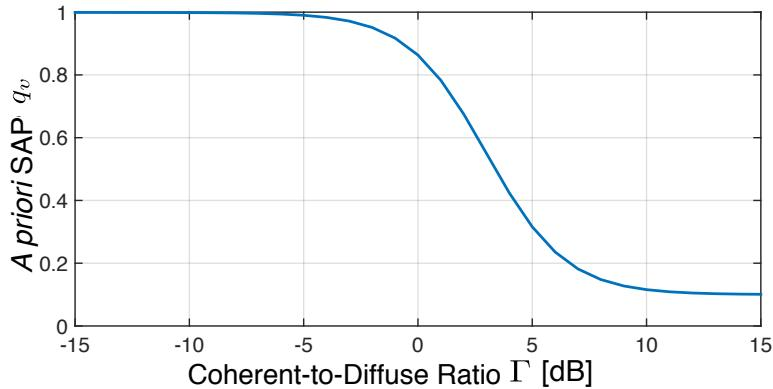  
Figure 3.1: CDR-based mapping for the a priori SAP with parameters $l_{min} = 0.1$ , $l_{max} = 0.998$ , c = 3, $\rho = 2.5$ .

This is the approach we adopt in our implementation of the CDR estimator as well, where the temporal averages are computed using rectangular windows of length 256 ms (corresponding to eight STFT frames). Note that the CDR estimation alternatives proposed in [199] can also be used. The coherence-based CDR can be computed with two microphones only. In cases where the array has multiple sensors, each microphone pair provides an CDR estimate and the different estimates can be combined to give the final CDR. For instance, as diffuse noise coherence is high at low frequencies, it is reasonable to use microphone pairs that are further apart at the these frequencies. Our exact microphone setup and its usage for CDR estimation is described in Section 3.6.

Clearly, low values of the estimated CDR $\hat{\Gamma}(t,k)$ indicate absence of coherent sound, whereas high values indicate its presence. Therefore, we proposed in [191] to use the CDR estimate $\hat{\Gamma}(t,k)$ and compute the a priori SAP using a sigmoid-like function as follows

$$
\hat {q} (t, k) = l _ {\min} + \left(l _ {\max} - l _ {\min}\right) \frac {1 0 ^ {c \rho / 1 0}}{1 0 ^ {c \rho / 1 0} + \Gamma (t , k) ^ {\rho}},\tag{3.39}
$$

where $l_{min}$ and $l_{max}$ determine the minimum and maximum values of the function, c (in dB) controls the offset along the $\Gamma$ axis, and $\rho$ defines the steepness of transition. The parameters of the mapping (3.39) are chosen such that a low CDR corresponds to a high a priori SAP, while a high CDR corresponds to a low a priori SAP. An example of the mapping is illustrated in Figure 3.1.

Motivated by the increased robustness provided by the combination of the three SAPs, $q_{local}$ , $q_{global}$ , and $q_{frame}$ used in [2,8], in this chapter, we extend the CDR-based a priori SAP estimator to include these three different SAPs. Therefore, instead of computing the final SAP in (3.39), we use (3.39) to only obtain the local SAPs, $q_{\mathrm{local}}(t,k)$ . Similarly as in Section 3.4.2, local indicates that the a priori SAP is computed using only the current frequency bin k. Following the state-of-the-art approaches mentioned in Section 3.4.2, we additionally compute frequency-averaged CDR with a Hamming window $b(i)$ using

$$
\hat {\Gamma} ^ {f} (t, k) = \sum_ {i = - w} ^ {w} b (i) \hat {\Gamma} (t, k - i),\tag{3.40}
$$

and use $\hat{\Gamma}^{f}$ in (3.39) to compute what the authors in [2] refer to as the global a priori SAP, $q_{\mathrm{global}}(t,k)$ . To further improve the robustness, state-of-the-art methods include a fullband SAP $q_{\mathrm{frame}}(t)$ , as in (3.34). In our work, we obtain a fullband decision that speech is absent by averaging the CDR-based $q_{local}$ in two frequency bands, one at low and the other at high frequencies

Algorithm 3.2 CDR-informed PSD matrix estimation
1: Initialise $\widehat{\Phi}_{\mathbf{y}} = \widehat{\Phi}_{\mathbf{v}} = 10^{-4}\mathbf{I}, q_v(0) = 0.99$
2: do for each frame $t$ (and each frequency $k$):
3: $\widehat{\Phi}_{\mathbf{y}}(t) \leftarrow \alpha_y \widehat{\Phi}_{\mathbf{y}}(t - 1) + (1 - \alpha_y)\mathbf{y}(t)\mathbf{y}^{\mathrm{H}}(t)$
4: Estimate the CDR $\hat{\Gamma}$ and the frequency-averaged CDR $\hat{\Gamma}^f$ [Eq. (3.37) and (3.40)]
5: Compute the CDR-based a priori SAP $q_v(t)$ [Eq. (3.39)-(3.43)]
6: Evaluate $\tilde{p}_s(t)$ with $q_v(t)$ and $\widehat{\Phi}_{\mathbf{v}}(t - 1)$ [Eq. (3.15)]
7: Estimate PSD matrix $\widehat{\Phi}_{\mathbf{v}}(t)$ using $\tilde{p}_v(t) = 1 - \tilde{p}_s(t)$ [Eq. (3.23)]
8: Evaluate $p_s(t)$ with $q_v(t)$ and $\widehat{\Phi}_{\mathbf{v}}(t)$ [Eq. (3.15)]
9: Re-compute the PSD matrix estimate $\widehat{\Phi}_{\mathbf{v}}(t)$ using $p_v(t) = 1 - p_s(t)$ [Eq. (3.23)]

$$
q _ {\text {low}} (t) = \frac {1}{K _ {\text {low2}} - K _ {\text {low1}} + 1} \sum_ {k = K _ {\text {low1}}} ^ {K _ {\text {low2}}} q _ {\text {local}} (t, k), \quad q _ {\text {high}} (t) = \frac {1}{K _ {\text {high2}} - K _ {\text {high1}} + 1} \sum_ {k = K _ {\text {high1}}} ^ {K _ {\text {high2}}} q _ {\text {local}} (t, k).\tag{3.41}
$$

The fullband a priori SAP $q_{\mathrm{frame}}(t)$ , and the final CDR-based a priori SAP $q_{v}(t,k)$ are given by

$$
q _ {\text {frame}} (t) = \left\{ \begin{array}{l l} 1 & \text {if} q _ {\text {low}} (t) > q _ {\text {thr} _ {1}}, q _ {\text {high}} (t) > q _ {\text {thr} _ {2}} \\ 0, & \text {otherwise}, \end{array} \right.\tag{3.42}
$$

$$
q _ {v} (t, k) = 1 - \left[ 1 - q _ {\mathrm{local}} (t, k) \right] \left[ 1 - q _ {\mathrm{global}} (t, k) \right] \left[ 1 - q _ {\mathrm{frame}} (t) \right],\tag{3.43}
$$

where $q_{local}$ , $q_{global}$ , and $q_{frame}$ are based on the CDR. Note that in contrast to the work in [2], where the final a priori SAP is obtained by multiplying the three SAPs as in (3.34), we express the final SAP in terms of a product of the a priori SPPs in (3.43), as done in [8]. In our experiments, the latter provided more robust performance and less errors in the fullband decision.

The complete PSD matrix estimation framework with an CDR-based a priori SAP is summarised in Algorithm 3.2, where two iterations of the MCRA recursion are employed. As the main body of MCRA, is equivalent to the recursions obtained by the ML solution, the motivation for using two iterations was discussed in Section 3.3.2. A block diagram of the complete informed spatial filtering framework using the CDR-informed noise PSD matrix estimation is illustrated in Figure 3.2. To make a correspondence with the generic diagram in Figure 2.2, note that the CDR estimation corresponds to the feature extraction block, whereas the CDR-based SPP estimation corresponds to the signal detection block. In this chapter, the CDR computed in the feature extraction block is used as a parameter to control the a priori SPP, whereas in the remaining chapters in this thesis, the feature extraction block computes features which are directly used as observations in the likelihood models. The delay introduced between the SPP and the PSD matrix estimation blocks is due to the fact that the PSD matrix $\widehat{\Phi}_{\mathbf{v}}(t - 1,k)$ from the previous frame is required to perform MCRA at time $t$ .

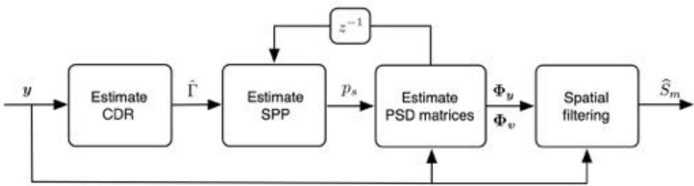  
Figure 3.2: Informed spatial filtering with CDR-based noise PSD matrix estimation.

## 3.5 Application to source extraction

Considering the assumption of a single active speaker and a rank one model for $\Phi_{s}$ , the different optimal spatial filters such as the Minimum Variance Distortionless Response (MVDR), Multichannel Wiener Filter (MWF), and Parametric Multichannel Wiener Filter (PMWF) can be written solely in terms of $\widehat{\Phi}_{v}$ and $\widehat{\Phi}_{s}$ , as discussed in Section 2.4. Our experiments in the course of this thesis, indicated that estimating the RTF vector using $\widehat{\Phi}_{v}$ and $\widehat{\Phi}_{s}$ , and applying the MVDR according to (2.24) provides better objective and perceptual performance than (2.26), and is more robust to estimation errors. In the following sections, we discuss further details on the implementation of ISFs for their application in blind source extraction.

## 3.5.1 Computation of the Minimum Variance Distortionless Response filter

Due to the assumption that the noise and the speech signal are uncorrelated, given an estimate of the noise PSD matrix $\hat{\Phi}_{v}$ , an estimate of the desired signal PSD matrix can be obtained as $\hat{\Phi}_{s} = \hat{\Phi}_{y} - \hat{\Phi}_{v}$ . However, in absence of a speech signal, $\hat{\Phi}_{s}$ computed using this difference, does not contain a desired signal. This can be problematic if $\hat{\Phi}_{s}$ is used to compute an MVDR filter, as whenever the source is inactive, the filter coefficients will be erroneously updated using noise-only frames, requiring an additional time for the filter to focus on the desired source when the source reappears. Therefore, for the purpose of computing the MVDR filter coefficients, the estimated a posteriori SPP can be used to estimate the PSD matrix $\hat{\Phi}_{s+v}$ , according to (2.48), and the desired signal PSD matrix estimate is given by the difference $\hat{\Phi}_{s} = \hat{\Phi}_{s+v} - \hat{\Phi}_{v}$ . The averaging constant for $\hat{\Phi}_{s+v}$ can be computed using the estimated SPP, following the standard recursive PSD estimator, described in Section 2.5.2. Then, the RTF vector estimate $\hat{\mathbf{g}}_{m}(t,k)$ is obtained using the covariance subtraction approach detailed in Section 2.5.3.1, and together with the noise PSD matrix estimate $\hat{\Phi}_{v}(t,k)$ is used to compute the MVDR filter at each TF bin.

## 3.5.2 Computation of the Multichannel Wiener Filter

In theory, the MWF can be computed directly using $\hat{\Phi}_{v}$ and $\hat{\Phi}_{s}$ , or $\hat{g}_{m}$ , as discussed in Section 2.4. However, considering the decomposition of the MWF into an MVDR filter and a single-channel spectral filter according to (2.31), it is beneficial to estimate the spectral filter separately from the MVDR filter. There are two intuitive reasons to motivate the separate estimation of a spectral filter. First, note that according to the description in Section 3.5.1, the desired signal PSD matrix and the RTF vector are quickly updated only when the SPP is high. Such behaviour is important to ensure that the spatial filter is steered towards the desired source, and does not exhibit random variations in noise-only TF bins. However, for the single-channel spectral filter to exploit the temporal non-stationarity of the speech and to provide additional noise reduction, the desired signal PSD matrix needs to be estimated as $\widehat{\Phi}_{s} = \widehat{\Phi}_{y} - \widehat{\Phi}_{v}$ , in contrast to the MVDR filter where $\widehat{\Phi}_{s} = \widehat{\Phi}_{s+v} - \widehat{\Phi}_{v}$ was used. For convenience, we restate the single-channel Wiener spectral filter

$$
\mathbf {w} _ {\mathrm{sc}} (t, k) = \frac {\operatorname{tr} \left\{\widehat {\boldsymbol {\Phi}} _ {\mathbf {v}} ^ {- 1} (t , k) \widehat {\boldsymbol {\Phi}} _ {\mathbf {s}} (t , k) \right\}}{1 + \operatorname{tr} \left\{\widehat {\boldsymbol {\Phi}} _ {\mathbf {v}} ^ {- 1} (t , k) \widehat {\boldsymbol {\Phi}} _ {\mathbf {s}} (t , k) \right\}} = \frac {\operatorname{tr} \left\{\widehat {\boldsymbol {\Phi}} _ {\mathbf {v}} ^ {- 1} (t , k) \left(\widehat {\boldsymbol {\Phi}} _ {\mathbf {y}} (t , k) - \widehat {\boldsymbol {\Phi}} _ {\mathbf {v}} (t , k)\right) \right\}}{1 + \operatorname{tr} \left\{\widehat {\boldsymbol {\Phi}} _ {\mathbf {v}} ^ {- 1} (t , k) \left(\widehat {\boldsymbol {\Phi}} _ {\mathbf {y}} (t , k) - \widehat {\boldsymbol {\Phi}} _ {\mathbf {v}} (t , k)\right) \right\}},\tag{3.44}
$$

where $\operatorname{tr}\left\{\widehat{\Phi}_{\mathbf{v}}^{-1}(t,k)\left(\widehat{\Phi}_{\mathbf{y}}(t,k)-\widehat{\Phi}_{\mathbf{v}}(t,k)\right)\right\}$ is the SNR at the output of the MVDR filter. The second important practical issue is the fact that the recursive temporal estimates $\widehat{\Phi}_{y}$ and $\widehat{\Phi}_{v}$ usually require different averaging constants when used to estimate the SNR at the MVDR output, from the constants when they are used to compute the SPP in the MCRA framework and to compute the MVDR filter. Therefore, instead of using the PSD matrix estimates $\widehat{\Phi}_{v}$ and $\widehat{\Phi}_{y}$ directly, we propose to estimate the SNR at the MVDR output using the well known decision-directed paradigm [200] and the estimated SPP, briefly summarised next.

Let us for brevity introduce the following notation for the SNR estimate at the MVDR output

$$
\hat {\psi} _ {\mathrm{mvdr}} (t, k) \equiv \mathrm{tr} \left\{\widehat {\mathbf {\Phi}} _ {\mathbf {v}} ^ {- 1} (t, k) \left(\widehat {\mathbf {\Phi}} _ {\mathbf {y}} (t, k) - \widehat {\mathbf {\Phi}} _ {\mathbf {v}} (t, k)\right) \right\} = \frac {\phi_ {\hat {S}} (t , k)}{\phi_ {\hat {V}} (t , k)},\tag{3.45}
$$

where $\phi_{\hat{S}}(t,k)$ and $\phi_{\hat{V}}(t,k)$ denote the PSDs of the desired signal estimate and the noise residual at the MVDR filter output. In addition, noting from (3.44) and (3.45) that

$$
w _ {\mathrm{sc}} (t, k) = \frac {\hat {\psi} _ {\mathrm{mvdr}} (t , k)}{1 + \hat {\psi} _ {\mathrm{mvdr}} (t , k)},\tag{3.46}
$$

the decision-directed approach to computing $w_{\mathrm{sc}}(t,k)$ can be summarised as follows

1. Update the PSD of the noise residual using the SPP-based averaging parameter $\alpha_{v}$ from (3.10)

$$
\phi_ {\hat {V}} (t, k) = \alpha_ {v} (t, k) \phi_ {\hat {V}} (t - 1, k) + (1 - \alpha_ {v} (t, k)) | \widehat {S} _ {m} (t, k) | ^ {2}.\tag{3.47}
$$

2. Obtain the SNR estimate $\hat{\psi}_{\mathrm{mvdr}}(t,k)$ as a weighted average with a constant $\alpha_{\psi}\in(0,1)$

$$
\hat {\psi} _ {\mathrm{mvdr}} (t, k) = \alpha_ {\psi} w _ {\mathrm{sc}} (t - 1, k) \frac {| \widehat {S} _ {m} (t - 1 , k) | ^ {2}}{\phi_ {\hat {V}} (t - 1 , k)} + (1 - \alpha_ {\psi}) \max \left\{0, \frac {| \widehat {S} _ {m} (t , k) | ^ {2}}{\phi_ {\hat {V}} (t , k)} - 1 \right\}.\tag{3.48}
$$

3. Get the spectral filter using the updated SNR estimate, according to $(3.46)$ and apply it to the MVDR output (this is provides the MWF output).

Similarly as the MWF, the PMWF can be obtained using the estimated SNR $\hat{\psi}_{\mathrm{mvdr}}(t,k)$ . In addition, similarly to [177], we apply an SPP-controlled trade-off parameter $\mu(t,k)$ , and propose a mapping based on (3.39), to obtain the trade-off parameter at each TF bin as follows

$$
\mu (t, k) = l _ {\min} + \left(l _ {\max} - l _ {\min}\right) \frac {1 0 ^ {c \rho / 1 0}}{1 0 ^ {c \rho / 1 0} + \left(\frac {p _ {s} (t , k)}{1 - p _ {s} (t , k)}\right) ^ {\rho}}.\tag{3.49}
$$

In this manner, whenever the SPP is high, the trade-off parameter approaches zero, resulting in the MVDR filter that preserves the desired signal undistorted at the filter output. In contrast, when the SPP is low, the trade-off parameter can achieve values larger than 1 (based on the chosen mapping parameters in $(3.49)$ ), thereby providing more aggressive noise reduction. The mapping between the SPP and the trade-off parameter is illustrated in Figure 3.3 for $l_{min} = 0$ , $l_{max} = 4$ , c = -3, $\rho = 4$ ).

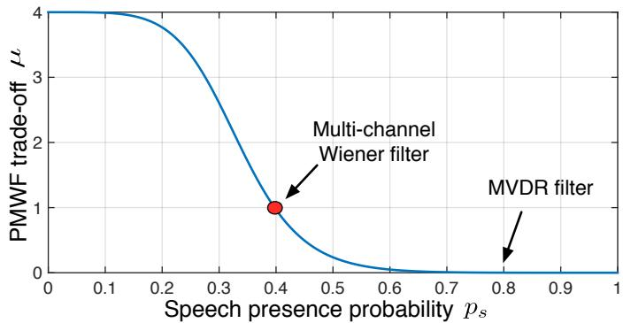  
Figure 3.3: SPP-based mapping for the PMWF trade-off parameter.

Besides the MVDR, the MWF, and the PMWF, a Conditional Minimum Mean Squared Error (c-MMSE) filter can also be applied, as described in Section 2.4.4. In this case, the a posteriori SPP estimate obtained using any of the frameworks discussed in this chapter, is applied to the output of the informed MWF obtained from the corresponding framework.

## 3.6 Performance evaluation

## 3.6.1 Experimental setup

The experiments for this chapter were performed using simulated Acoustic Impulse Responses (AIRs) [201, 202] in a room with dimensions [7.5, 4.5, 3] m. We used a uniform linear array with four microphones and inter-microphone distance of $5\mathrm{cm}$ . The source distance from the array in all experiments was in the range $1 - 1.5\mathrm{m}$ . Diffuse noise, generated using [203, 204], and spatially and temporally uncorrelated Gaussian noise were added. The input noise signals to the diffuse noise generator were either a noise signal with white spectrum, or babble noise. The Input Signal-to-Noise Ratio (iSNR) with respect to the sensor noise was fixed to $35\mathrm{dB}$ , where the iSNR is computed segmentally, as described in Appendix A. The desired signal when computing the iSNR corresponds to the speech signal captured at the reference microphone. The signals were sampled at $16\mathrm{kHz}$ , segmented by $64~\mathrm{ms}$ Hamming windows with $50\%$ overlap and transformed to the STFT domain using the Fast Fourier Transform (FFT). The FFT for each frame was computed after adding zero padding equal to the length of the STFT window. The CDR estimates $\hat{\Gamma}(t,k)$ were obtained by combining different microphone pairs as follows: in the frequency range [1, 650] Hz, the outermost pair (1, 4) was used (with an inter-microphone distance of $15\mathrm{cm}$ ), in the range (650, 1500] the average of the CDR estimates with the microphone pairs (1, 4), and (1, 3) was used, and above $1500\mathrm{Hz}$ , the average of all pairs (1, 2), (1, 3) and (1, 4) was used.

We evaluate the framework with a single-channel a priori SAP (described in Section 3.4.1 and denoted by SC-Cohen), the framework with a multichannel a priori SAP (described in Section 3.4.2 and denoted by MC-Souden), the framework with an CDR-based a priori SAP (summarised in Algorithm 3.2 and denoted by MC-CDR), and the multichannel ML framework (summarised in Algorithm 3.1). To estimate the singlechannel a priori SAP for the SC-Cohen approach, we used the code available online by the author of $[1]$ , whereas for the a priori SAP for MC-Souden, we implemented the algorithm following the description in $[2]$ . All the parameters associated with the implementation of the MC-CDR framework are summarised in Table 3.1. The time constant corresponding to the averaging parameters $\alpha_{y}, \alpha_{v} = 0.93$ is equal to 0.44 seconds. The two frequency bands used for the fullband a priori SAP $q_{frame}$ were $[1, 800]$ Hz and $[3, 7]$ kHz.

<table><tr><td> $l_{\min }$ </td><td> $l_{\max }$ </td><td> $\rho$ </td><td>c</td><td>w</td><td> $q_{\text{thr}_1}$ </td><td> $q_{\text{thr}_2}$ </td><td> $\alpha_y$ </td><td> $\alpha_v$ </td><td> $\lambda$ </td><td> $\alpha_\psi$ </td></tr><tr><td>(3.39)</td><td>(3.39)</td><td>(3.39)</td><td>(3.39)</td><td>(3.40)</td><td>(3.42)</td><td>(3.42)</td><td>Alg. 3.2</td><td>(3.9)</td><td>(3.13)</td><td>(3.48)</td></tr><tr><td>0.1</td><td>0.998</td><td>2.5</td><td>3</td><td>10</td><td>0.95</td><td>0.9</td><td>0.93</td><td>0.93</td><td>0.85</td><td>0.95</td></tr></table>

Table 3.1: Parameters for implementation of the a priori SAP.

The performance of the noise PSD matrix estimation and source extraction frameworks discussed in this chapter, is evaluated from the following three aspects:

1. The Receiver Operating Characteristics (ROC) curves obtained from the a posteriori SPPs when using the different a priori SAPs (Section 3.6.3).

2. The accuracy of the resulting PSD matrix estimates (Section 3.6.4).

3. Objective quality of the extracted signals by the resulting ISFs (Section 3.6.5).

Before proceeding with the different experiments, we first provide qualitative discussion on the SPP estimators in Section 3.6.2.

## 3.6.2 Qualitative evaluation of the a priori and a posteriori SPPs

To illustrate the a priori and a posteriori SPPs, we consider a scenario with background noise with a white spectrum, and an iSNR of 10 dB. The reverberation time for this simulation was set to $T_{60} = 0.2$ s. The spectrum of the noisy and the clean speech at the reference microphone, an ideal binary speech detector, and the estimated CDR are illustrated in Figure 3.4. The ideal binary detector $H_{ideal}$ is obtained by comparing the spectrum of the speech signal to the spectrum of the noise signal at the reference microphone m, namely

$$
\mathcal {H} _ {\mathrm{ideal}} (t, k) = \left\{ \begin{array}{l l} & 1, \quad \text { if } \quad | S _ {m} (t, k) | ^ {2} > | V _ {m} (t, k) | ^ {2} \\ & 0, \quad \text { otherwise. } \end{array} \right.\tag{3.50}
$$

The a priori and a posteriori SPPs obtained from the different estimators are illustrated in Figure 3.5. The SC-Cohen estimator based on a single-channel a priori SAP, overestimates the SPP and the speech harmonics are not resolved. In contrast, the estimators with multichannel a priori SAP are able to resolve the speech onsets and the harmonics, allowing for frequent updates of the noise PSD matrix. Note however that in some cases, updating the noise PSD matrix between the harmonics can lead to speech leakage into the noise PSD matrix, causing speech distortion. From the SPPs in Figure 3.5, we anticipate that the ML estimator is the most susceptible to speech distortion, which will be confirmed in the following experiments. Comparing the MC-Souden and the MC-CDR estimators, we note that MC-Souden introduces more false positives (TF bins where SPPs is high, although there is no speech). Note that although we adjusted the parameters of the MC-Souden implementation to the best of our knowledge to obtain the best possible results, the false positives during noise-only frames can be further reduced by modifying $\psi_{0}$ and $\tilde{\psi}_{0}$ , at the cost of larger number of false negatives (TF bins where SPPs is low, although speech is present).

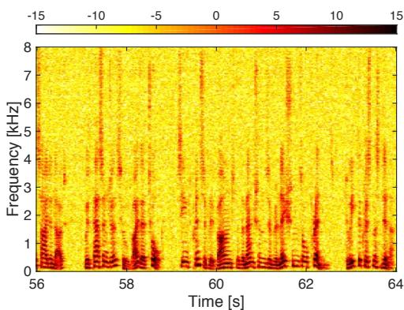  
(a) Spectrum of the reference microphone

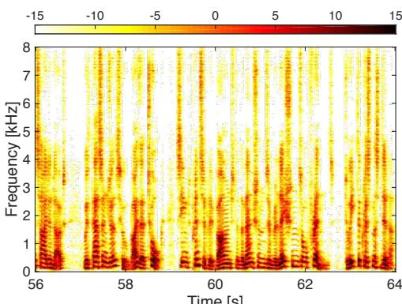  
(b) Clean speech at the reference microphone

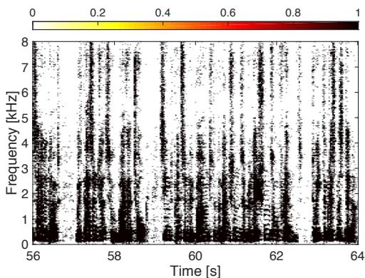  
(c) Ideal speech detector

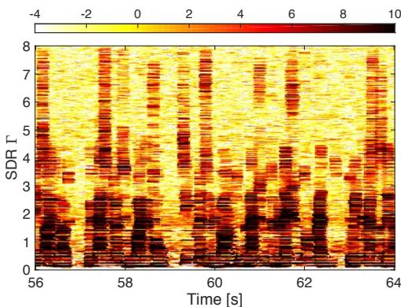  
(d) Estimated CDR  
Figure 3.4: Signal spectra, ideal speech detector, and estimated CDR for a simulation with $T_{60} = 0.2$ s, SNR=10 dB and noise PSD resembling long-term speech PSD.

Similar TF images from an experiment with babble background noise are shown in Figure 3.6, where we only show the SPPs from the approaches with multichannel a priori SAP.

## 3.6.3 Receiver Operating Characteristics

Given the a posteriori SPPs obtained from the different frameworks, it is interesting to consider the ROC of the corresponding minimum Bayes risk detectors $[178]$ . The detectors are obtained using $(2.42)$ , where we substitute the speech presence and speech absence hypotheses $H_{s}$ and $H_{v}$ . Using the ideal detector defined in $(3.50)$ , the False Positive Rate (FPR), and the False Negative Rate (FNR) of a detector are defined as

$$
\begin{array}{l} \text {FPR} = \sum_ {t, k} [ \mathcal {H} _ {s} \wedge \mathcal {H} _ {\text {ideal}}   =   0 ] / \sum_ {t, k} [ \mathcal {H} _ {\text {ideal}}   =   0 ], \\ \text {FNR} = \sum_ {t, k} [ \mathcal {H} _ {v} \wedge \mathcal {H} _ {\text {ideal}}   =   1 ] / \sum_ {t, k} [ \mathcal {H} _ {\text {ideal}}   =   1 ], \end{array}\tag{3.51}
$$

where $\sum_{t,k}[\cdot]$ denotes a sum over all TF bins of the value of the logical expression in the brackets. For each of the a posteriori SPPs, the ROC curves in Figure 3.7 are obtained by computing the FPR and FNR as the false positive-to-false negative cost ratio $\frac{C_{sv}}{C_{vs}}$ varies from 0 to $\infty$ .

The ROC were computed using simulated signals at $T_{60} = 0.2$ s and $T_{60} = 0.4$ s, for both stationary and modulated noise with white spectrum. The noise was modulated as follows: a noise sequence with a given iSNR was multiplied by a sinusoid with frequency 0.4 Hz, minimum value 1 and maximum value 3. Two iSNR conditions were tested, with the original noise sequence with a fullband iSNR of 10 dB and 3 dB. The FPR and FNR are computed across a signal segment of 80 seconds with continuous speech, containing female and male speech in English, German, and French (one speaker active at a time). The ROC curves in Figures 3.7(c) and 3.7(d) confirm that the MC-CDR framework is particularly advantageous in terms of speech detection accuracy when the noise is non-stationary.

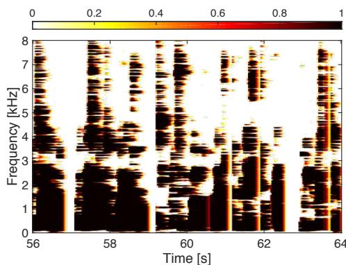  
(a) a priori SPP, SC-Cohen

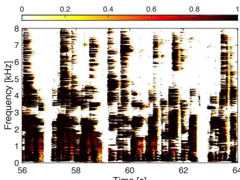  
Time [s]  
(b) a posteriori SPP, SC-Cohen

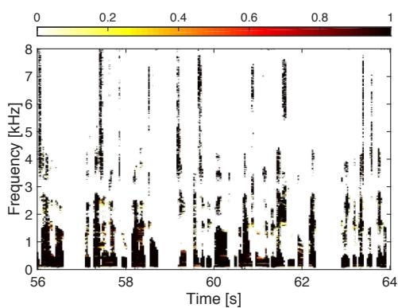  
(c) a priori SPP, MC-Souden

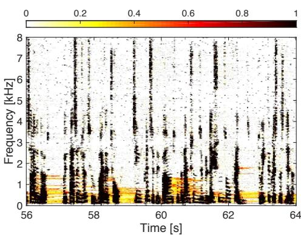  
(d) a posteriori SPP, MC-Souden

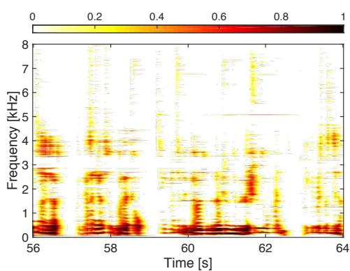  
(e) a priori SPP, ML

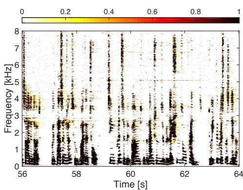

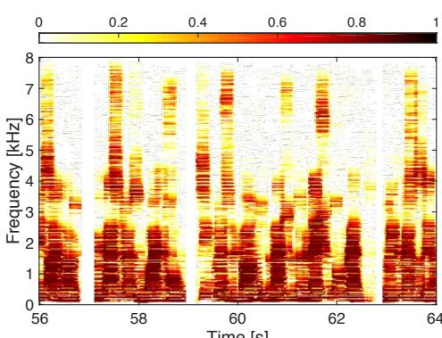  
Time [s]  
(g) a priori SPP, MC-CDR

(f) a posteriori SPP, ML  
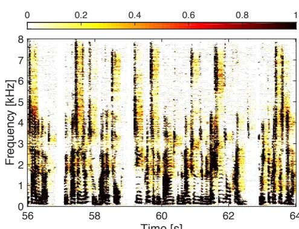  
Time [s]  
(h) a posteriori SPP, MC-CDR  
Figure 3.5: A priori and a posteriori SPPs for the example from Figure 3.4.

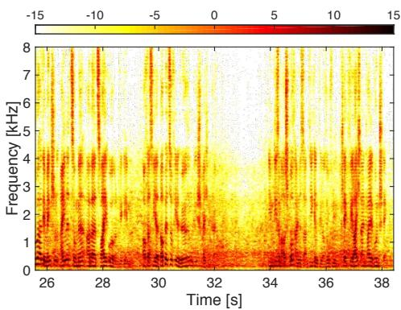  
(a) Mixture

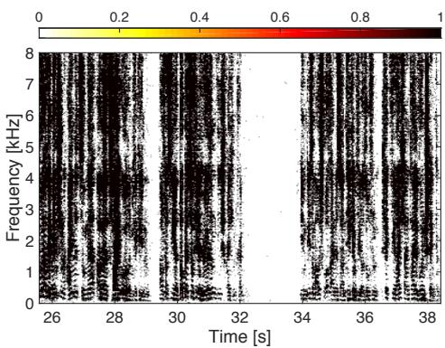  
(b) Ideal SPP

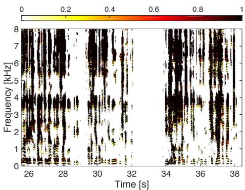  
(c) a priori SPP, Souden

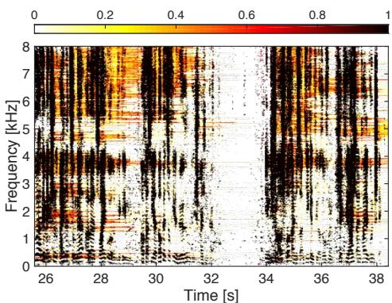  
(d) a posteriori SPP, Souden

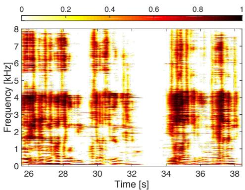  
(e) a priori SPP, ML

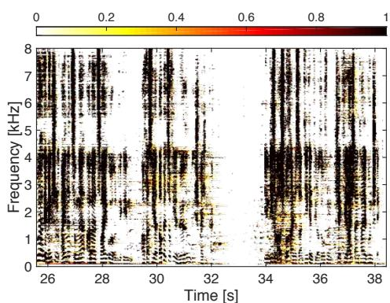

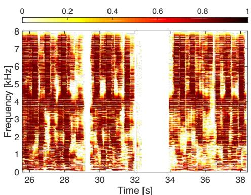  
(g) a priori SPP, MC-CDR

(f) a posteriori SPP, ML  
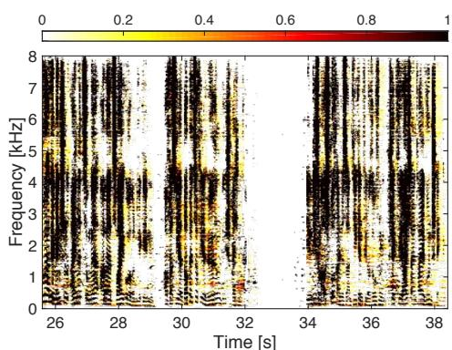  
(h) a posteriori SPP, MC-CDR  
Figure 3.6: A priori and a posteriori SPPs from an example with babble noise with SNR of 10 dB and $T_{60} = 0.2$ s.

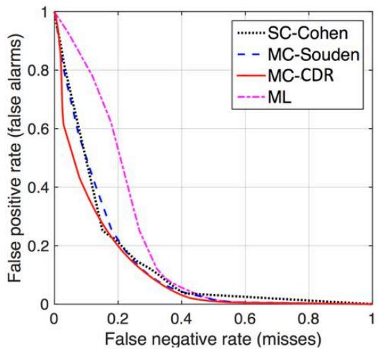  
(a) $T_{60}=0.2$ s, SNR=10dB, stationary noise

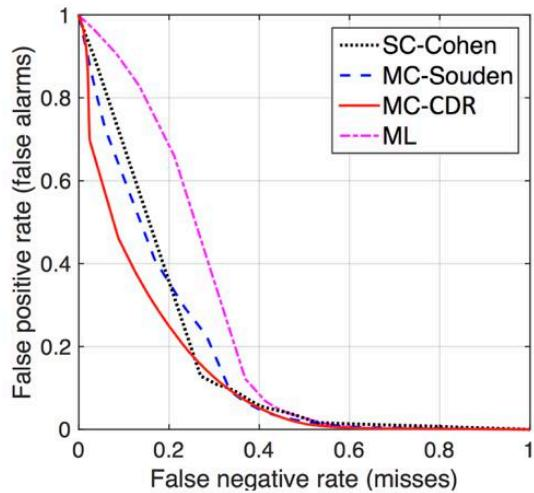  
(b) $T_{60}=0.2$ s, SNR=3dB, stationary noise

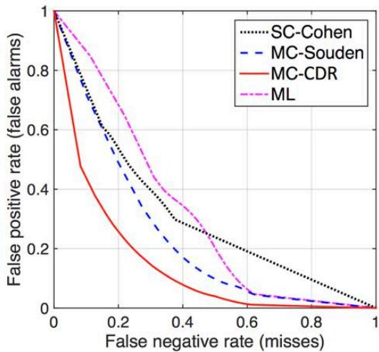  
(c) $T_{60}=0.2$ s, SNR=10dB, modulated noise

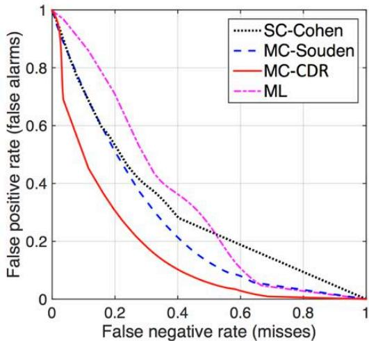  
(d) $T_{60}=0.4$ s, SNR=3dB, modulated noise  
Figure 3.7: ROC curves for the binary detectors obtained from the different a posteriori SPPs.

## 3.6.4 Evaluation of tracking performance

To evaluate the tracking of the noise PSD without the cross-PSD terms, we define the estimated PSD averaged across microphones and frequencies in range $[K_{1}, K_{2}]$ as

$$
\hat {\phi} _ {v} (t) = \frac {1}{K} \sum_ {k = K _ {1}} ^ {K _ {2}} \left(\frac {1}{M} \operatorname{trace} \left\{\widehat {\boldsymbol {\Phi}} _ {\mathbf {v}} (t, k) \right\}\right).\tag{3.52}
$$

We compare $\hat{\phi}_{v}(t)$ obtained with SC-Cohen, MC-Souden, MC-CDR, and ML estimators, to the oracle noise PSD $\phi_{v}(t)$ obtained by using (3.52) and an oracle estimate of $\Phi_{v}$ computed by recursive averaging with the noise signal. The full PSD matrix estimates, including the complex-valued cross-terms, are evaluated using the Frobenius Spectral Distance (FSD)

$$
\operatorname{FSD} (t) = \sqrt {\frac {1}{K} \sum_ {k = K _ {1}} ^ {K _ {2}} \| \boldsymbol {\Phi} _ {\mathbf {v}} (t , k) - \widehat {\boldsymbol {\Phi}} _ {\mathbf {v}} (t , k) \| _ {F}},\tag{3.53}
$$

where $\|\cdot\|_{F}$ denotes the Frobenius norm. The performance was evaluated in two bands: a small range at low frequencies [1,800] Hz, and a range containing all other frequencies, [800,8000] Hz.

In the scenario evaluated in Figure 3.8, the noise originally with SNR of 16 dB, increases by 3 dB at the 10 s marker, in a simulation with $T_{60} = 0.2$ s. In the first column, the results from the low frequency band, and in the second column from the second frequency band are shown. Considering the PSD, we notice the fastest adaptation of the MC-CDR in both frequency ranges. In general, the noise PSD tends to be overestimated by the MC-CDR and MC-Souden methods, and underestimated by the SC-Cohen method. This behaviour is anticipated from Figure 8.16: while the multichannel approaches resolve the speech harmonics, low speech energy is present between harmonics, where noise PSD matrix updates result in overestimation of the noise PSD. For the ML approach, the overestimation at low frequencies is even more prominent, due to the large number of false negatives. Considering the FSD, MC-Souden has slightly lower error than MC-CDR at low frequencies, while slightly larger error than MC-CDR at high frequencies. The delay of the oracle estimator when the noise switches is due to the fact that the oracle PSD estimate is obtained by recursive averaging with the same constant $\tilde{\alpha}_{v}$ as the other estimators. The experiment was repeated for reverberation time of $T_{60} = 0.4$ s. The results, shown in in Figure 3.9, lead to similar conclusions as for the case of $T_{60} = 0.2$ .

The tracking performance was also evaluated for modulated noise. The results in Figure 3.10, show similar behaviour of the estimators as in the previous experiment: MC-CDR adapts the fastest, and has the lowest FSD at the higher frequency band. The SC-Cohen approach does not achieve sufficiently fast adaptation at high frequencies due to the tendency to overestimate the SPP.

## 3.6.5 Evaluation of extracted signal quality

To evaluate the different PSD and SPP estimators when applied to blind source extraction, we performed experiments where sources were placed near end-fire at 1-1.5 m distance from the array. Each experiment was done with 37 seconds of speech, where an English female speaker and German male speaker are active one after the other from the same location. In the first part of the evaluation, in Section 3.6.5.1, we provide an illustrative example of the single-channel spectral filter computation, whereas in Section 3.6.5.2 we evaluate the signal quality at the output of the ISFs in various acoustic conditions.

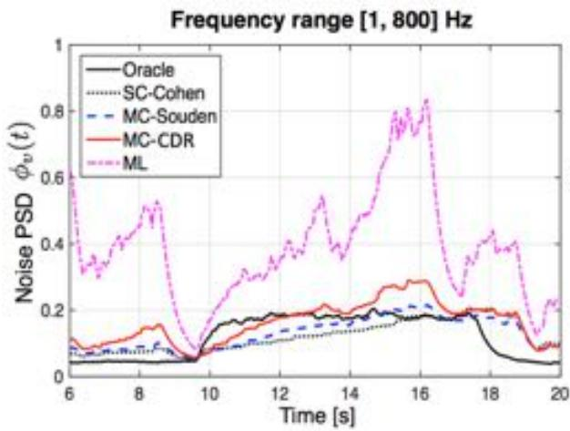

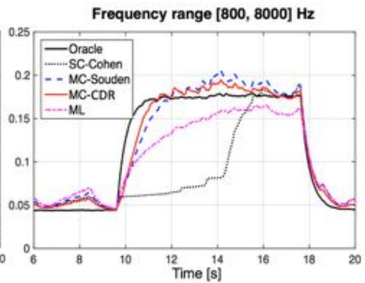

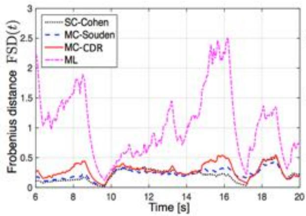

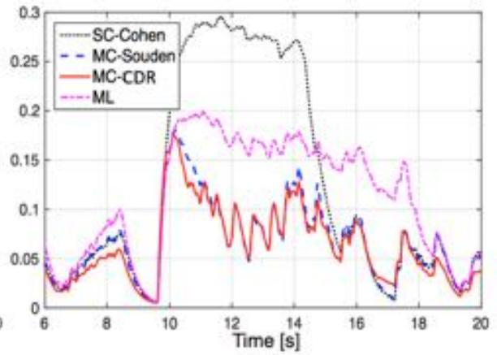  
Figure 3.8: Noise PSD matrix estimation errors at $T_{60} = 0.2$ s. Noise power increases by 3 dB at 10 s.

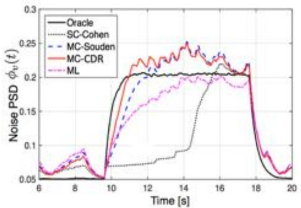

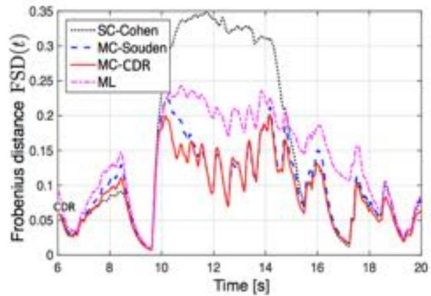  
Figure 3.9: Noise PSD matrix estimation errors at $T_{60} = 0.4$ s. Noise power increases by 3 dB at 10 s.

## 3.6.5.1 Computation of the single-channel spectral filter

In this experiment, we demonstrate the advantage of using the decision-directed approach when computing the single channel Wiener filter, compared to using directly the noise PSD matrix estimates $\hat{\Phi}_{v}$ and $\hat{\Phi}_{y}$ . We simulated a scenario where diffuse noise with SNR of 10 dB and white spectrum is added to the speech signal. For the illustration in this section, we applied the MC-CDR framework for SPP and noise PSD matrix estimation. At the MVDR filter output, two single-channel Wiener filters were applied: for the first Wiener filter we used $\operatorname{tr}\left\{\widehat{\Phi}_{\mathbf{v}}^{-1}\left(\widehat{\Phi}_{\mathbf{y}}-\widehat{\Phi}_{\mathbf{v}}\right)\right\}$ as an estimate of the SNR at the MVDR output, and for the second filter, we estimated the SNR using the decision-directed approach, as detailed in Section 3.5.2.

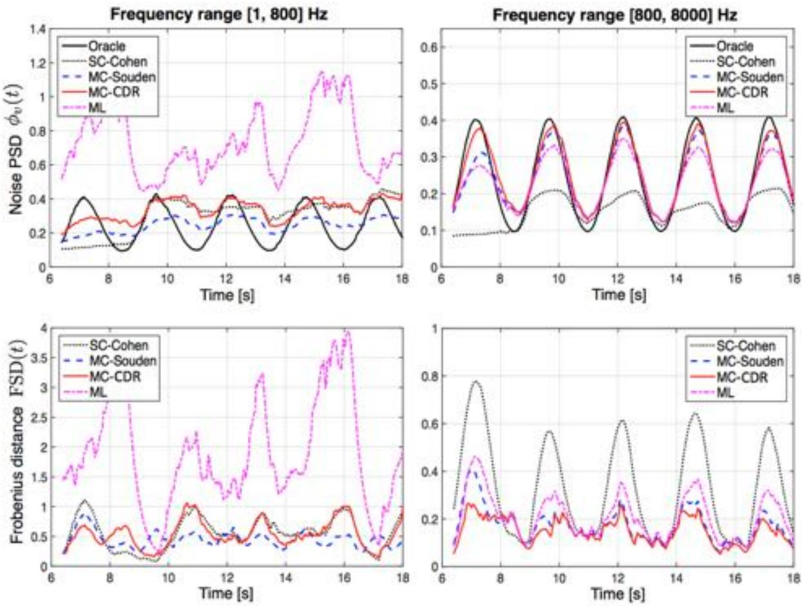  
Figure 3.10: Noise PSD matrix estimation errors at $T_{60} = 0.2$ s for modulated noise signal.

In Figure 3.11, the spectra of the clean speech and the two estimated Wiener filters are illustrated for a 12 seconds segment. Recall that one of the reasons to employ the decision-directed approach was the fact that the averaging parameters with which the PSD matrices are estimated for the MVDR filter, are not suitable for the spectral filter, as they do not allow tracking of short-term temporal non-stationarity This phenomenon is visible in Figure 3.11 (right), where the spectral filter does not update sufficiently quickly to reduce background noise between two speech onsets. In contrast, the spectral filter computed using the decision directed approach in Figure 3.11 (middle) is able to track the spectral and temporal variations of the speech.

## 3.6.5.2 Comparison of the SPP and PSD matrix estimators

The quality of the extracted signals at the output of the ISFs were evaluated in terms of Speech Distortion (SD) index, Noise Reduction (NR), and improvement of Perceptual Evaluation of Speech Quality (PESQ) and Short-Time Objective Intelligibility (STOI) scores with respect to the unprocessed signal at the reference. The computation of the performance measures for all experiments is detailed in Appendix A. The experiments were performed with a background noise with white spectrum, and with babble noise. For the white noise, the performance was evaluated for a stationary noise with iSNR of 10 dB, and for a sinusoidally modulated noise. As babble noise is rather non-stationary, additional modulation was not included and only a scenario with an iSNR of 7 dB was evaluated. The reverberation time was set to $T_{60} = 0.2$ s. The main conclusions from the results illustrated in Figures 3.12 and 3.13 are summarised as follows:

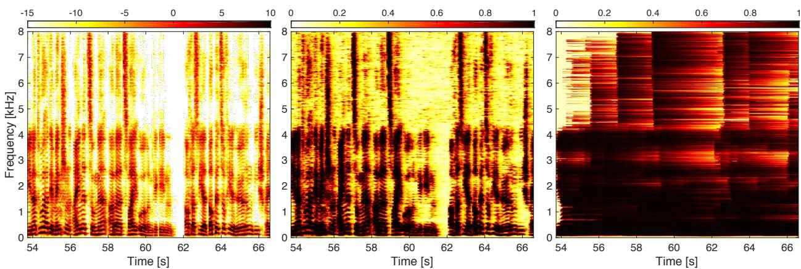  
Figure 3.11: Illustration of the two approaches to compute the single-channel Wiener filter applied at the MVDR output. Coded in colour: clean speech signal (left), the single-channel Wiener filter coefficients estimated using the decision directed approach (middle), and the single-channel Wiener filter coefficients estimated using the PSD matrices directly (right).

i) A common observation for all experiments is the increase in SD and NR when using the c-MMSE filter compared to the MVDR, the MWF, and the PMWF. Although reducing more noise, the c-MMSE filter introduces larger SD by up to 0.1 than the other filters. Hence, the scores that predict the perceptual quality and intelligibility (PESQ and STOI) do not show advantage of the c-MMSE filter. In particular, the c-MMSE filter degrades the intelligibility compared to the unprocessed reference, as visible in Figures 3.12(d) and 3.13(d).

ii) When the MVDR filter is applied, without spectral filtering that leads to the MWF, the performance is similar for all SPP and noise PSD matrix estimators. Only the framework with the ideal detector has slightly better performance than the fully estimated frameworks in terms of the considered performance measures. For MWF, the gap between the oracle and the estimated systems increases.

iii) Comparing the performance of the different PSD matrix estimators, i.e., SC-Cohen, MC-Souden, MC-CDR, and ML, we note that the SC-Cohen approach has overall worse performance than the remaining ones. As discussed in Section 3.6.2, the SC-Cohen approach tends to overestimate the SPP, which not only prohibits adaptation of the noise PSD but also modifies the look direction of the filters during noisy frames. The worse performance of the SC-Cohen framework is even more visible for the modulated noise scenario, as in the case of non-stationary noise, the SPP overestimation is more pronounced. The advantage of the MC-CDR approach over the others is particularly visible in terms of the PESQ and STOI score improvements, for both noise types. In the case with babble noise in Figure 3.13, the MC-CDR maintains the SD index by 0.05-0.1 lower than the MC-Souden and the ML. Although the MC-Souden and the ML frameworks offer noise reduction by 5 dB better than MC-CDR, the MC-CDR still provides better speech intelligibility according to the STOI score, and similar or slightly better PESQ score.

Finally, in Figure 3.14, we illustrate the segment-wise NR across 8 seconds of the signal in a scenario with modulated white noise and $T_{60} = 0.4$ s. Until around the 8 seconds marker, the noise PSD is stationary with iSNR of 9 dB, and from the 8-th second the noise PSD abruptly increases, to an iSNR of 2 dB. In addition, for the rest of the signal duration, the noise is modulated as as visible in Figure 3.14. Note that before the 8 s marker, the NR curve is not visible as it falls below the plotted range on the y-axis (the range was chosen so that the relevant NR curves after the 8 s marker are clearly visible). The NR is shown for the MWF and the c-MMSE filter. In this experiment, the advantage of the superior PSD matrix tracking performance of the MC-CDR compared to the other methods, demonstrated in Section 3.6.4, is corroborated when the estimated PSD matrices are applied in a noise reduction task. Although after several seconds of adaptation to the new noise conditions, the MC-Souden and the MC-CDR offer similar NR (this similarity was also visible in the average NR illustrated in Figure 3.12(b)), the faster tracking ability of the MC-CDR is particularly notable when the noise power abruptly increases. As visible from the curves, the MC-CDR provides only slightly worse performance than the system with an oracle detector.

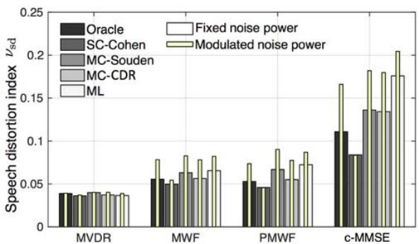  
(a) Speech distortion index $\nu_{sd}$

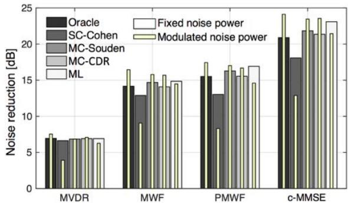  
(b) Segmental noise reduction

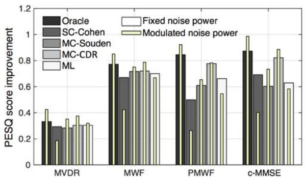  
(c) PESQ score improvement

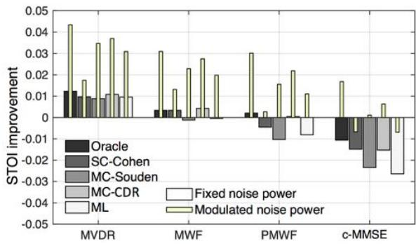  
(d) STOI improvement  
Figure 3.12: Results for white noise with SNR=10 dB for non-modulated noise, SNR=6 dB for modulated noise, and reverberation $T_{60}=0.2$ s.

## 3.7 Summary

Noise PSD matrix estimation for blind speech extraction was addressed in this chapter. Motivated by the SPP-controlled noise PSD matrix estimation from single- and multichannel MCRA, our major focus was robust estimation of the a posteriori SPP. Besides directly influencing the accuracy of the noise PSD matrix estimates, the a posteriori SPP is of paramount importance to ensure that the look direction of the resulting

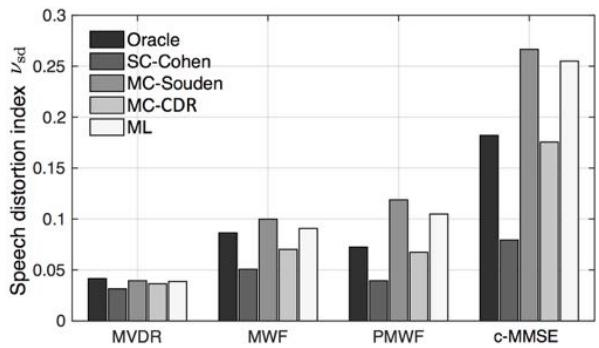  
(a) Speech distortion index

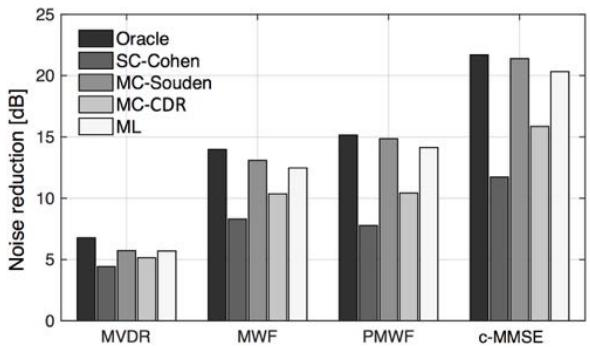  
(b) Segmental noise reduction

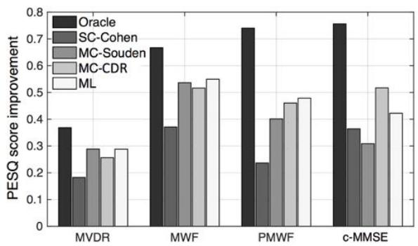  
(c) PESQ score improvement

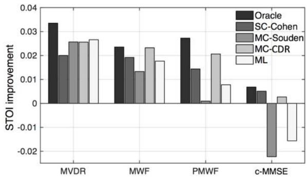  
(d) STOI score improvement

Figure 3.13: Results for the scenario with $T_{60} = 0.2$ s, SNR = 7 dB and babble background noise.  
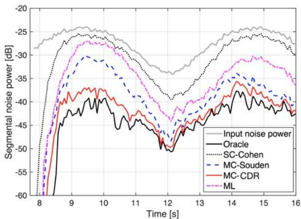  
(a) Multichannel Wiener filter

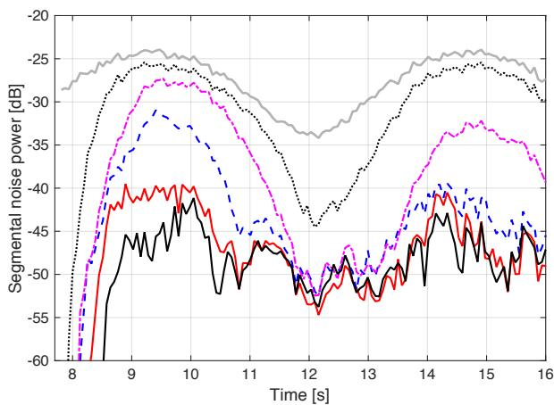  
(b) Conditional Minimum Mean Squared Error (MMSE) filter  
Figure 3.14: Segmental noise power before and after spatial filtering in a scenario with $T_{60} = 0.4$ s and average input SNR of 3 dB.

ISFs is only estimated and updated when the speech signal is present.

As a first contribution, we derived the ML solution of the noise PSD matrix estimation problem and showed that it has the same structure as multichannel MCRA, with a specific a priori SAP and a specific recursive averaging parameter. Although strictly speaking, the MCRA approaches that use other a priori SAP and averaging parameters than those given by the ML solution, represent heuristic modifications of the theoretically optimal ML solution, the heuristic control is crucial for robust PSD matrix estimation. We discussed and experimentally showed that although elegant and theoretically justified, the ML framework without further control mechanisms is not adequate in non-stationary environments. In particular, the a priori SAP is a key parameter by means of which an additional control can be included to distinguish between changes in the noise properties and speech onsets.

We discussed three state-of-the-art a priori SAP estimators, two of which were initially used in the MCRA frameworks and are based on single- and multichannel SNR estimates. The third SAP estimator, proposed in our previous work, is based on a narrowband CDR estimate and assumes that the desired speech is coherent across the array, while the background noise is approximately diffuse. In this chapter, we included further control mechanisms to the existing CDR-based a priori SAP, and showed with comprehensive experiments that using spatial information, such as the CDR, to control the a priori SAP is extremely beneficial to avoid that changes in the noise properties are falsely detected as desired speech.

In the last part of the chapter, we provided a discussion on how to use the estimated SPPs and noise PSD matrices to design ISFs and extract the desired speech signal. By evaluating the noise PSD matrix estimation accuracy, as well as the objective quality of the extracted signals at the outputs of the ISFs, we supported the two main claims of the chapter: i) the ML solution is not sufficient for robust noise PSD matrix estimation, and additional mechanisms are required to control the a priori SAP, and ii) the CDR-based a priori SAP leads to more accurate noise PSD matrix estimates and better noise tracking ability in non-stationary environments compared to the single-channel and multichannel SNR-based a priori SAPs traditionally used in MCRA. The evaluation results in terms of noise PSD matrix estimation and speech detection accuracy were consistent with the objective signal quality at the output of the different filters.

## DOA-informed source extraction in the presence of undesired speakers and noise

In this chapter, we address scenarios where besides background noise, the undesired signal contains undesired speech signals. Clearly, in this case, the two main assumptions from Chapter 3 are violated: the spatial coherence of the undesired signal has similar properties as that of the desired signal, and moreover, the undesired signals are equally non-stationary as the desired signal. However, in contrast to the fully blind source extraction task from Chapter 3, in this chapter we consider semi-blind scenarios, where semi-blind refers to the fact that the Direction-Of-Arrival (DOA) of the desired source with respect to the array is approximately known, while the locations, and number of interferers are unknown and possibly time-varying.

The state-of-the-art approaches, main challenges, and open issues of the DOA-informed source extraction problem were discussed in Section 1.3, where it was mentioned that the Informed Spatial Filter (ISF)-based approaches have the following advantages compared to the alternatives: i) the ISFs provide better interference reduction than the standard Delay-and-Sum Beamformer (DSB) and the fixed Minimum Variance Distortionless Response (MVDR) beamformers with a pre-computed undesired signal Power Spectral Density (PSD) matrix, which are not able to adapt to changing acoustic conditions, and ii) in contrast to the Robust Adaptive Beamformers (RABs), where the robustness to signal distortion comes at the cost of worse undesired signal reduction, the ISFs have the potential to maintain the low signal distortion, without sacrificing interference reduction performance. Clearly, a prerequisite for a good extracted signal quality at the ISFs output are accurate estimates of the desired and undesired signal statistics.

The main objective in this chapter is to design a robust bin-wise signal detector which can be used to control the estimation of the desired and undesired signal PSD matrices in the aforementioned scenarios. Due to the non-stationarity of the undesired signals, and the similar spatial coherence of the desired and the undesired speakers, the Gaussian model-based detector with an Coherent-to-Diffuse Ratio (CDR)-based a priori speech absence probability, developed in the previous chapter, is not applicable in the current scenario. To estimate the PSD matrices in this chapter, we propose a narrowband DOA-based generative model which is used to distinguish desired from undesired speech at each Time-Frequency (TF) bin, while using the Gaussian model-based framework from Chapter 3 to distinguish speech from background noise and estimate the background noise PSD matrix. Note that narrowband DOAs are often used for signal detection in the literature. In [108], the narrowband DOAs are used to control the a priori Desired Speech Presence Probability (DSPP), while in [205] a Gaussian DOA model is used to compute the DSPP which is applied as a single-channel gain to the output of a spatial filter.

The remainder of this chapter is organised as follows: in Section 4.1, we describe the signal model corresponding to the DOA-informed scenario with stationary and non-stationary undesired signals. In Section 4.2, two state-of-the-art narrowband DOA estimators are briefly described. In Section 4.3, state-of-the-art solutions to the DOA-informed source extraction are discussed. The main concepts of the proposed ISF-based framework for DOA-informed source extraction are described in Sections 4.4 and 4.5: in Section 4.4, the DOA-based desired signal detector is developed, while in Section 4.5, the spatial filter design using the output of the detector is discussed. Performance evaluation is presented in Section 4.6, and Section 4.7 concludes the chapter.

## 4.1 Signal model

In this chapter, we consider scenarios where the microphone signals consist of a desired speech, interfering speech, and background noise. The Short-Time Fourier Transform (STFT)-domain signal vector is given by

$$
\mathbf {y} (t, k) = \mathbf {s} (t, k) + \mathbf {i} (t, k) + \mathbf {v} (t, k),\tag{4.1}
$$

where s, i and v denote the signal vectors of the desired speaker, the interferers, and the background noise, respectively. Given the DOA of the desired speaker, at least approximately, the objective is to obtain an estimate of the desired signal $S_{m}(t,k)$ at the m-th microphone, using an optimal spatial filter, similarly to (3.3). Throughout the chapter, we assume without loss of generality that the first microphone is the reference, i.e. m = 1, and the desired signal estimate is $\widehat{S}_{1}(t,k)$ .

The PSD matrices corresponding to the different signals are denoted by $\Phi_{s}$ , $\Phi_{i}$ , and $\Phi_{v}$ . As the signals are zero-mean and mutually uncorrelated, the PSD matrices are related as

$$
\boldsymbol {\Phi} _ {\mathbf {y}} (t, k) = \boldsymbol {\Phi} _ {\mathbf {s}} (t, k) + \boldsymbol {\Phi} _ {\mathbf {i}} (t, k) + \boldsymbol {\Phi} _ {\mathbf {v}} (t, k).\tag{4.2}
$$

The desired signal PSD matrix is assumed to be a rank one matrix, as given by $(3.2)$ . In addition, we introduce the PSD matrix containing the speech interferers and the noise as follows

$$
\boldsymbol {\Phi} _ {\mathbf {u}} (t, k) = \boldsymbol {\Phi} _ {\mathbf {i}} (t, k) + \boldsymbol {\Phi} _ {\mathbf {v}} (t, k).\tag{4.3}
$$

The bin-wise hypotheses indicating the dominant source at each TF bin, the general description of which was given in $(2.38)$ , are defined in the current scenario as follows

$$
\mathcal {H} _ {s}: \mathbf {y} (t, k) \approx \mathbf {s} (t, k) + \mathbf {v} (t, k) \quad \mathrm{desiredsignalisdominant},\tag{4.4a}
$$

$$
\mathcal {H} _ {i}: \mathbf {y} (t, k) \approx \mathbf {i} (t, k) + \mathbf {v} (t, k) \quad \mathrm{non-stationaryinterfererisdominant(e.g.speech)},\tag{4.4b}
$$

$$
\mathcal {H} _ {v}: \mathbf {y} (t, k) \approx \mathbf {v} (t, k) \qquad \mathrm{backgroundnoiseisdominant}.\tag{4.4c}
$$

In addition we introduce the hypothesis $H_{u} = H_{i} \cup H_{v}$ that undesired signal (undesired speech or background noise) is dominant. The objective in this chapter, is to define appropriate likelihood models for the hypotheses, design a detector that associates each TF bin to the correct hypothesis, estimate the undesired signal PSD matrix $\Phi_{u}$ and the desired source Relative Transfer Function (RTF) vector $g_{1}$ , and compute an ISF for source extraction by substituting the estimates $\hat{\Phi}_{u}$ and $\hat{g}_{1}$ in the optimal filter expressions. Note that the ISFs can be implemented in an adaptive General Sidelobe Canceller (GSC) structure as well, which does not require direct estimation of $\Phi_{u}$ . Adaptive structures are discussed in Chapter 5.

## 4.2 Narrowband DOA estimation

Important criteria when choosing a DOA estimator for our work are i) applicability to planar arrays, so that the full range of 360 degrees is covered, (although depending on the application, this might not be required), ii) low computational complexity suitable for real-time systems and iii) ability to obtain nearly instantaneous narrowband DOA estimates without requiring temporal averaging. Note that state-of-the-art subspace-based DOA estimators such as MUSIC and ESPRIT [206, 207], require temporally averaged PSD matrices of the input signals. In the following, we give a brief overview of two state-of-the-art DOA estimators which are suitable for the applications considered in this thesis.

## 4.2.1 Least-squares fitting of instantaneous phase differences [208]

Assuming a single source is dominant at a given TF bin, the phase difference between the microphone signals can be used to estimate the DOA of the dominant source. If we denote the two-dimensional (2D) microphone locations as $d_{1},\ldots,d_{M}$ , the DOA of the dominant source in radians as $\theta_{tk}$ , and the corresponding DOA vector as

$$
\mathbf {q} (t, k) = [ \cos (\theta_ {t k}), \sin (\theta_ {t k}) ] ^ {\mathrm{T}},\tag{4.5}
$$

the RTF vector with respect to the first microphone is given by

$$
\mathbf {g} _ {1} (t, k) = [ 1, \mathrm{e} ^ {j \frac {2 \pi f _ {k}}{c} (\mathbf {d} _ {2} - \mathbf {d} _ {1}) ^ {\mathrm{T}} \mathbf {q} (t, k)}, \ldots , \mathrm{e} ^ {j \frac {2 \pi f _ {k}}{c} (\mathbf {d} _ {M} - \mathbf {d} _ {1}) ^ {\mathrm{T}} \mathbf {q} (t, k)} ] ^ {\mathrm{T}}.\tag{4.6}
$$

Recalling the relation $\mathbf{s}(t,k)=\mathbf{g}_{1}(t,k)S_{1}(t,k)$ , the phase differences of the source signal of each microphone with respect to the first microphone are given by

$$
\angle \frac {\mathbf {s} (t , k)}{S _ {1} (t , k)} = \left[ 0, \quad \frac {2 \pi f _ {k}}{c} (\mathbf {d} _ {2} - \mathbf {d} _ {1}) ^ {\mathrm{T}} \mathbf {q} (t, k), \ldots , \quad \frac {2 \pi f _ {k}}{c} (\mathbf {d} _ {M} - \mathbf {d} _ {1}) ^ {\mathrm{T}} \mathbf {q} (t, k) \right] ^ {\mathrm{T}}.\tag{4.7}
$$

If we introduce the $(M - 1)\times 1$ vector $\bar{\mathbf{s}} = \left[\frac{S_2}{S_1},\quad \frac{S_3}{S_1},\dots ,\quad \frac{S_M}{S_1}\right]^{\mathrm{T}}$ , and the $(M - 1)\times 2$ matrix $\mathbf{D}$ containing $(\mathbf{d}_i - \mathbf{d}_j)^{\mathrm{T}}$ as rows, for $i\in [2,M]$ , equation (4.7) can be rewritten as

$$
\bar {\mathbf {s}} = \frac {2 \pi f _ {k}}{c} \mathbf {D q} (t, k),\tag{4.8}
$$

and can be easily solved for the source DOA vector q. However, in practice, the signal $\bar{s}$ is not observable. Instead, the noisy signal $\bar{y} = \left[\frac{Y_{2}}{Y_{1}}, \frac{Y_{3}}{Y_{1}}, \ldots, \frac{Y_{M}}{Y_{1}}\right]^{\mathrm{T}}$ and (4.8) are used to obtain an estimate of the DOA vector by solving the Least Squares (LS) problem

$$
\hat {\mathbf {q}} (t, k) = \underset {\mathbf {q}} {\arg \min} \left\| \bar {\mathbf {y}} (t, k) - \frac {2 \pi f _ {k}}{c} \mathbf {D}   \mathbf {q} \right\| _ {2} ^ {2} = \frac {c}{2 \pi f _ {k}}   \mathbf {D} ^ {+} \bar {\mathbf {y}} (t, k),\tag{4.9}
$$

where $(\cdot)^{+}$ denotes Moore-Penrose pseudoinverse of a matrix.

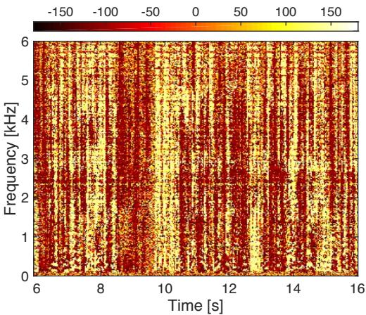  
(a) $T_{60} = 0.2 \, s$ , instantaneous phase differences

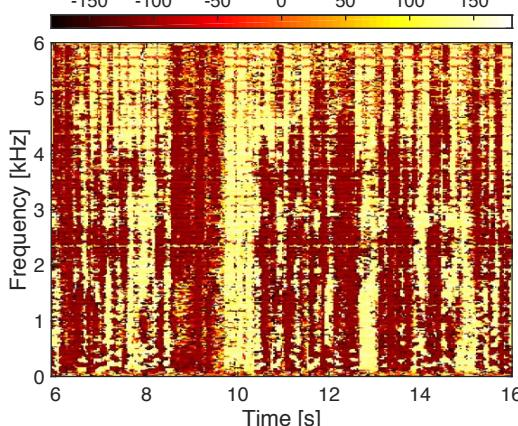  
(b) $T_{60} = 0.2 \, s$ , cross PSD phase differences

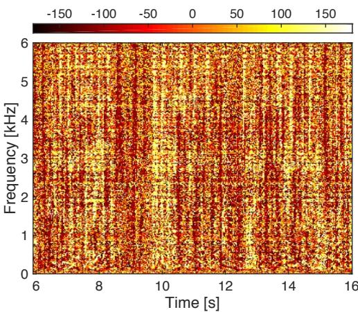  
(c) $T_{60} = 0.4 \, s$ , instantaneous phase differences

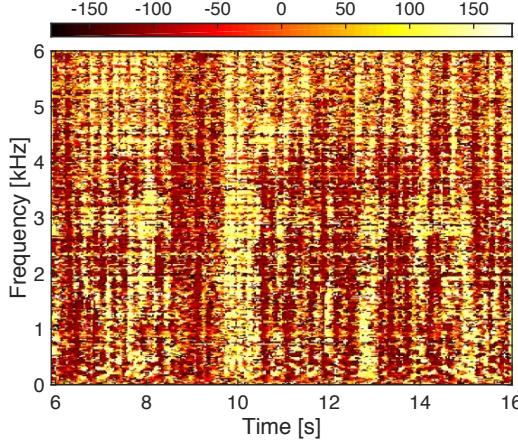  
(d) $T_{60} = 0.4 \, s$ , cross PSD phase differences  
Figure 4.1: Example results from the two DOA estimators. True source DOAs: $-105^{\circ}$ and $138^{\circ}$ .

## 4.2.2 Least-squares fitting of cross PSD phase differences [209]

Instead of the instantaneous phase differences, the authors in $[209]$ use phase differences between the cross PSDs to estimate the narrowband DOA. According to the propagation model in $(4.6)$ , the cross PSD between the m-th and n-th microphone is given by

$$
\phi_ {s, m n} = \mathrm{E} \left[ S _ {m} S _ {n} ^ {*} \right] = \mathrm{E} \left[ | S _ {m} | ^ {2} \right] \mathrm{e} ^ {j \frac {2 \pi f _ {k}}{c} (\mathbf {d} _ {m} - \mathbf {d} _ {n}) ^ {\mathrm{T}} \mathbf {q}}.\tag{4.10}
$$

Introducing the $(M - 1)\times 1$ vector $\bar{\phi}_s(t,k) = \left[\angle \frac{\phi_{S,12}(t,k)}{\phi_{S,11}(t,k)},\dots ,\angle \frac{\phi_{S,1M}(t,k)}{\phi_{S,11}(t,k)}\right]^1$ , and using the matrix $\mathbf{D}$ similarly as in (4.8) we obtain the relation

$$
\bar {\phi} _ {s} = \frac {2 \pi f _ {k}}{c} \mathbf {D q} (t, k).\tag{4.11}
$$

As the signals $S_{1}(t,k),\ldots S_{M}(t,k)$ are unobservable, the noisy cross-PSDs $\phi_{Y,mn}(t,k)$ can be used instead. By defining $\bar{\phi}_y(t,k) = \left[\angle \frac{\phi_{Y,12}(t,k)}{\phi_{Y,11}(t,k)},\dots ,\angle \frac{\phi_{Y,1M}(t,k)}{\phi_{Y,11}(t,k)}\right]^{\mathrm{T}}$ , the DOA vector estimate is obtained analogously to (4.9), as

$$
\hat {\mathbf {q}} (t, k) = \frac {c}{2 \pi f _ {k}} \mathbf {D} ^ {+} \bar {\phi} _ {y} (t, k).\tag{4.12}
$$

The estimators given by $(4.9)$ and $(4.12)$ assume that for each microphone pair, the spatial aliasing frequency lies above $\frac{F_{s}}{2}$ , where $F_{s}$ is the sampling rate. Alternatively, frequency-dependent binary weights can be used to exclude microphone pairs at the frequencies where spatial aliasing might occur, as done in [209].

In Figure 4.1, DOA estimates obtained with the two discussed estimators are shown for a 10 s signal segment. The true DOAs of the two concurrent speakers were $-105^{\circ}$ and $138^{\circ}$ . The cross PSDs needed for the second DOA estimator are obtained as time-averages over 3 signal frames (96 ms). Using phase differences from the time-averaged cross-PSDs instead of the instantaneous phase differences results in less noisy DOA estimates for both reverberation times. The effect of the DOA estimator on the signal detection and extraction is further investigated in Section 4.6.

## 4.3 State-of-the-art DOA-informed source extraction

## 4.3.1 DSB and MPDR beamforming

If the propagation from the sources to the microphones is modelled as pure delay (i.e. anechoic assumption), the DSB is the simplest spatial filter that can be stepped towards the desired source DOA. As discussed in Section 2.3.1, the DSB is known to have insufficient interference reduction capability as it does not take into account the undesired signal statistics. Moreover, in reverberant environments, the anechoic propagation model is not valid. Instead of DSB, a matched filter has been applied in [175], where instead of applying simple delays, each microphone signal is convolved with a causal approximation of the time reverse of the impulse response between the source and the microphone. Although the matched filters offer better performance than the DSB [210], they are impractical as they require measured or estimated Acoustic Impulse Responses (AIRs). Moreover, the signal statistics are not taken into account and hence, the undesired signal reduction is sub-optimal.

Data-dependent spatial filters such as the MVDR or the Linearly Constrained Minimum Variance (LCMV) filter can be applied if the propagation vectors or the PSD matrices of the interfering sources are known. However, in the considered application, this information is unavailable. A possibility to adapt the filters to changing acoustic conditions is via a Minimum Power Distortionless Response (MPDR) beamformer $[38]$ , computed using the anechoic RTF vector and the microphone signals PSD matrix as follows

$$
\mathbf {w} _ {\mathrm{mpdr}} (t, k) = \frac {\mathbf {\Phi_ {y} ^ {- 1}} (t , k) \mathbf {g} (k)}{\mathbf {g} ^ {\mathrm{H}} (k) \mathbf {\Phi_ {y} ^ {- 1}} (t , k) \mathbf {g} (k)}.\tag{4.13}
$$

In contrast to the MVDR filter which is expressed in terms of the PSD matrix $\Phi_{u}$ , the MPDR filter is expressed in terms of $\Phi_{y}$ , which contains the desired signal as well. Therefore, if the RTF vector is inaccurate due to the anechoic model mismatch or DOA errors, the MPDR filter causes severe distortion of the desired signal [103]. The unacceptably large speech distortion caused by the MPDR filter in the considered application is experimentally shown in Section 4.6.

## 4.3.2 Informed spatial filtering

To extract the desired source while reducing both diffuse noise and directional speech interferers, the narrowband detectors involved in ISFs need to distinguish TF bins where desired speech is dominant from TF bins where undesired speech is dominant. In contrast to Chapter 3, the CDR information does not suffice as the desired and the undesired signals have similar coherence across the array. To distinguish between desired and undesired speakers, the authors in $[108]$ develop a framework in the spherical harmonic domain, which can be represented by the block diagram in Figure 3.2, where instead of the CDR, narrowband DOAs are used. The idea in $[108]$ is to incorporate narrowband DOA estimates in the prior DSPP of the Gaussian model, where the likelihoods of the undesired signal and the desired signal hypotheses are

$$
f (\mathbf {y} | \mathcal {H} _ {u}) = (\pi^ {M} \mathrm{det} [ \boldsymbol {\Phi_ {u}} ]) ^ {- 1} \mathrm{e} ^ {- \mathbf {y} ^ {\mathrm{H}} \boldsymbol {\Phi_ {u}} ^ {- 1} \mathbf {y}},\tag{4.14a}
$$

$$
f (\mathbf {y} | \mathcal {H} _ {s}) = (\pi^ {M} \mathrm{det} [ \boldsymbol {\Phi_ {s}} ]) ^ {- 1} \mathrm{e} ^ {- \mathbf {y} ^ {\mathrm{H}} (\boldsymbol {\Phi_ {s}} + \boldsymbol {\Phi_ {v}}) ^ {- 1} \mathbf {y}}.\tag{4.14b}
$$

If $\Theta_{\theta,\hat{\theta}}(t,k)$ denotes the angle between the true DOA $\theta$ of the source of interest, and the DOA estimate $\hat{\theta}_{tk}$ at a TF bin $(t,k)$ , the prior DSPP is empirically obtained as

$$
q _ {s} (t, k) = w \left(\Theta_ {\theta , \hat {\theta}} (t, k)\right),\tag{4.15}
$$

where $w(\Theta)$ is a windowing function (such as Gaussian or Hamming for instance), centred at $\Theta = 0$ . The Gaussian window function for mapping the opening angle to the a priori DSPP, has similar role as the sigmoid mapping of the CDR to the a priori Speech Absence Probability (SAP) discussed in Section 3.4.3.

## 4.4 DOA model-based signal detection

In Chapter 3, we discussed that the Gaussian model-based Speech Presence Probability (SPP) is sensitive to even to simple noise non-stationarity, such as modulation. If the undesired signal contains speech, the sensitivity is even more prominent and a DOA-based a priori SPP as discussed in Section 4.3.2 is not sufficient to compensate for the errors in the likelihood ratio used to compute the a posteriori DSPP. This is our motivation for developing a different method to incorporate narrowband DOAs in the DSPP estimation, using a probabilistic generative DOAs-based model.

## 4.4.1 Likelihood model for the narrowband DOA estimates

To derive the a posteriori DSPP, we first define likelihood functions under the hypotheses $H_{s}$ , $H_{i}$ , and $H_{v}$ . As the DOA estimates represent random variables on the circle, we propose to model $f(\hat{\theta}_{tk} \mid \mathcal{H}_{s})$ by a von Mises distribution, which closely approximates a wrapped normal distribution on the circle [211], and is characterised by a mean $\tilde{\theta}$ and a concentration $\kappa$ as

$$
f (\hat {\theta} _ {t k} | \mathcal {H} _ {s}; \tilde {\theta}, \kappa) = c _ {\mathcal {M}} (\kappa) \mathrm{e} ^ {\kappa \cos (\hat {\theta} _ {t k} - \tilde {\theta})}.\tag{4.16}
$$

The normalization $c_{\mathcal{M}}(\kappa)=[2\pi I_{0}(\kappa)]^{-1}$ is derived in [212], where $I_{0}$ is the modified Bessel function of the first kind. Provided that the DOA estimator is unbiased, the mean $\tilde{\theta}$ is equal to the DOA of the desired source, which is assumed to be approximately known (in Section 4.6, we investigate the effect of inaccurate DOA information). The concentration parameter $\kappa$ reflects the uncertainty in the DOA estimates, where larger concentration indicates smaller DOA estimation error variance, while smaller concentration indicates larger DOA estimation error variance. Factors which commonly affect the concentration parameter include the array geometry, number of microphones, Signal-to-Noise Ratio (SNR), as well as the amount of reverberation. The concentration $\kappa$ in (4.16) is an unknown model parameter and its computation is discussed in Section 4.4.3.

Assuming that the background noise is spatially isotropic, the likelihood $f(\hat{\theta}_{tk} \mid \mathcal{H}_v)$ is modelled by a

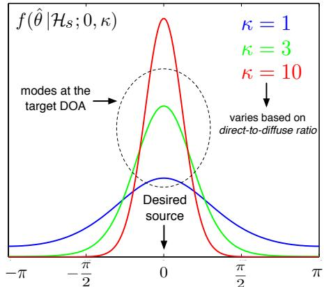

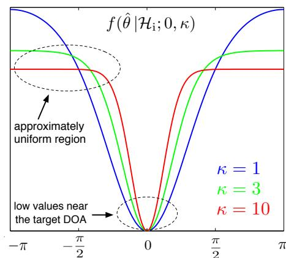  
(a) Von Mises distribution $f(\mathcal{H}_s\mid \theta)$  
(b) Notched distribution $f(\mathcal{H}_{i} \mid \theta)$  
Figure 4.2: Illustration of the DOA-based likelihoods under the different hypotheses.

uniform distribution on the circle, i.e.,

$$
f (\hat {\theta} _ {t k} \mid \mathcal {H} _ {v}) = (2 \pi) ^ {- 1}.\tag{4.17}
$$

Regarding the likelihood of $\hat{\theta}_{tk}$ , under $H_{i}$ , if the DOAs of the interferers were known, a multimodal distribution on the circle with modes at the interferers' DOAs, would accurately model $f(\hat{\theta}_{tk} \mid \mathcal{H}_{i})$ . In practice, this information is unavailable and difficult to obtain. Instead, we model $f(\hat{\theta}_{tk} \mid \mathcal{H}_{i})$ as approximately uniform in regions sufficiently far from the desired source, and having notch centred at the DOA of the desired source. Such distribution is constructed by considering a function $g(\theta, \tilde{\theta}, \kappa)$

$$
g (\theta , \tilde {\theta}, \kappa) = - \mathrm{e} ^ {\kappa \cos (\theta - \tilde {\theta})} + \mathrm{e} ^ {\kappa},\tag{4.18}
$$

which attains a minimum of 0 for $\theta = \tilde{\theta}$ . As $\theta$ deviates from $\tilde{\theta}$ , $g(\theta, \tilde{\theta}, \kappa)$ approaches a uniform distribution. To obtain a valid probability density, $g(\theta, \tilde{\theta}, \kappa)$ is normalised by $c_{\mathcal{A}}$ such that

$$
\int c _ {\mathcal {A}} g (\theta , \tilde {\theta}, \kappa) \mathrm{d} \theta = \mathrm{c} _ {\mathcal {A}} \int \left(- \mathrm{e} ^ {\kappa \cos (\theta - \tilde {\theta})} + \mathrm{e} ^ {\kappa}\right) \mathrm{d} \theta = 1.\tag{4.19}
$$

The integral of the first term is equal to the normalization constant $c_{M}$ of the von Mises distribution, and the second term is an integral of a constant, evaluated on the circle. Therefore, the normalisation constant and the resulting likelihood are given by

$$
c _ {\mathcal {A}} (\kappa) = [ - 2 \pi (I _ {0} (\kappa) + \mathrm{e} ^ {\kappa}) ] ^ {- 1},\tag{4.20}
$$

$$
f (\hat {\theta} _ {t k} \mid \mathcal {H} _ {i}; \tilde {\theta}, \kappa) = c _ {\mathcal {A}} (\kappa) (- \mathrm{e} ^ {\kappa \cos (\hat {\theta} _ {t k} - \tilde {\theta})} + \mathrm{e} ^ {\kappa}).\tag{4.21}
$$

The proposed likelihood distributions are illustrated in Figure 4.2 for different values of the concentration parameter $\kappa$ .

## 4.4.2 Desired speech presence probability and optimal detection

Having defined the likelihoods and the prior probabilities $q_{s} = p(\mathcal{H}_{s})$ , $q_{i} = p(\mathcal{H}_{i})$ and $q_{v} = p(\mathcal{H}_{v})$ which satisfy $q_{s} + q_{i} + q_{v} = 1$ , the a posteriori DSPP and the a posteriori Desired Speech Absence Probability

(DSAP) are given by the Bayes theorem as

$$
p (\mathcal {H} _ {s} \mid \hat {\theta} _ {t k}) = \frac {q _ {s} f (\hat {\theta} _ {t k} \mid \mathcal {H} _ {s} ; \tilde {\theta} , \kappa)}{q _ {s} f (\hat {\theta} _ {t k} \mid \mathcal {H} _ {s} ; \tilde {\theta} , \kappa) + q _ {i} f (\hat {\theta} _ {t k} \mid \mathcal {H} _ {i} ; \tilde {\theta} , \kappa) + q _ {v} f (\hat {\theta} _ {t k} \mid \mathcal {H} _ {v})},\tag{4.22}
$$

$$
p (\mathcal {H} _ {u} \mid \hat {\theta} _ {t k}) = \frac {q _ {i} f (\hat {\theta} _ {t k} \mid \mathcal {H} _ {i} ; \tilde {\theta} , \kappa) + q _ {v} f (\hat {\theta} _ {t k} \mid \mathcal {H} _ {v})}{q _ {s} f (\hat {\theta} _ {t k} \mid \mathcal {H} _ {s} ; \tilde {\theta} , \kappa) + q _ {i} f (\hat {\theta} _ {t k} \mid \mathcal {H} _ {i} ; \tilde {\theta} , \kappa) + q _ {v} f (\hat {\theta} _ {t k} \mid \mathcal {H} _ {v})}.\tag{4.23}
$$

The estimation of the a priori probabilities and the concentration $\kappa$ is discussed in Section 4.4.3.

In Chapter 3, the a posteriori DSPP was used for noise PSD matrix estimation using a soft recursive update in (3.9) and (3.10). If the undesired signal contains speech sources, soft updates introduce excessive leakage of undesired signal into the desired signal PSD matrix and vice versa. Therefore, in this chapter, we compute a binary signal detector from the a posteriori DSPP and DSAP. As discussed in Section 2.5.1, an optimal detector which minimises the Bayes risk for a false positive cost $C_{su} > 0$ and a false negative cost $C_{us} > 0$ , is given by the decision rule [178]

$$
\mathrm{decide} \mathcal {I} _ {\mathcal {H} _ {s}} = 1, \mathcal {I} _ {\mathcal {H} _ {u}} = 0 \mathrm{if} \frac {p (\mathcal {H} _ {s} | \hat {\theta} _ {t k})}{p (\mathcal {H} _ {u} | \hat {\theta} _ {t k})} > \frac {C _ {s u}}{C _ {u s}},\tag{4.24}
$$

$$
\mathrm{decide} \mathcal {I} _ {\mathcal {H} _ {u}} = 1, \mathcal {I} _ {\mathcal {H} _ {s}} = 0 \mathrm{otherwise},
$$

where $I_{H_{a}}$ is a binary indicator which equals one if the hypothesis in the subscript is true, and zero otherwise.

## 4.4.3 Estimation of the likelihood model parameters

## 4.4.3.1 Estimating the a priori probabilities $q_{s}, q_{i}$ and $q_{v}$

The Gaussian signal model has been successfully used to compute the DSPP in scenarios with stationary noise, as discussed in Chapter 3 and in [1, 2, 190]. Introducing the speech presence hypothesis (desired or undesired speech) as $\mathcal{H}_{si} = \mathcal{H}_s \cup \mathcal{H}_i$ , we can define the Gaussian likelihoods $f(\mathbf{y}|\mathcal{H}_v)$ and $f(\mathbf{y}|\mathcal{H}_{si})$ as discussed in Chapter 3, with the appropriate PSD matrices $\Phi_{\mathbf{v}}$ and $\Phi_{\mathbf{y}} - \Phi_{\mathbf{v}}$ , and compute the SPP $p(\mathcal{H}_{si}|\mathbf{y}(t,k))$ denote by $p_{si}(t,k)$ for brevity. The SPP $p_{si}$ obtained from the Gaussian model, can then be used as an a priori probability in the proposed DOA-based model, i.e.,

$$
q _ {v} (t, k) = 1 - p _ {s i} (t, k) \quad \text { and } \quad q _ {s} (t, k) = q _ {i} (t, k) = 0. 5 (1 - q _ {v} (t, k)).\tag{4.25}
$$

In this manner, the a priori SPP in the proposed model exploits the spatio-temporal properties of the signal vector $\mathbf{y}(t,k)$ and knowledge of the noise PSD matrix to aid the discrimination between noise and speech-dominated TF bins, prior to the estimation of the narrowband DOA at the current TF bin.

## 4.4.3.2 Estimating the concentration parameter $\kappa$

It was mentioned in Section 4.4.1, that the concentration parameter $\kappa$ related to the mode and the notch of the DOA-related likelihoods, often depends on the CDR, the array geometry, and the DOA estimator. For a given array geometry and a given DOA estimator, a single concentration parameter can be estimated for instance by collecting the DOA estimates from all TF bins during a training period when only the desired speech source and background noise are present, and finding the Maximum Likelihood (ML) estimate. However, this way of obtaining a single concentration parameter does not take into account the fact that many of the TF bins used for training are noise-dominated and do not contain significant speech energy. Instead, of providing an average concentration parameter, we seek to quantify the uncertainty of the DOA estimate at each TF bin. By quantifying the certainty of each DOA estimate, we provide additional information to the proposed signal detector for determining the dominant source at each TF bin. Therefore, the concentration parameter $\kappa$ of the von Mises distribution needs to be estimated for each TF bin as well.

If the CDR is high at a given TF bin, it is more likely that the estimated DOA accurately indicates the DOA of the coherent sound. In such TF bins, $f(\hat{\theta}_{tk} \mid \mathcal{H}_s)$ and $f(\hat{\theta}_{tk} \mid \mathcal{H}_i)$ should have a high concentration $\kappa$ , resulting in narrow mode or notch. If the CDR is low, the concentration should be lower, to reflect larger uncertainty in the DOA estimates. Hence, similarly as for the a priori SPP in Chapter 3, we use a sigmoid-like function to map the CDR estimate to the concentration $\kappa$

$$
\kappa (t, k) = l _ {\mathrm{min}} + (l _ {\mathrm{max}} - l _ {\mathrm{min}}) \frac {1 0 ^ {c \rho / 1 0}}{1 0 ^ {c \rho / 1 0} + \hat {\Gamma} (t , k) ^ {\rho}},\tag{4.26}
$$

where $l_{min}$ and $l_{max}$ determine the minimum and maximum values of the function, c (in dB) controls the offset along the $\widehat{\Gamma}_{tk}$ axis, and $\rho$ controls the steepness of transition region.

The remaining question is how to determine the parameters of the sigmoid function, so that the concentration parameter $\kappa$ accurately describes the distribution of the DOA estimates for each value of the CDR. To do this, we perform a training phase in a controlled simulated environments as follows:

1. Simulate a short signal segment by convolving white Gaussian noise signal with an anechoic acoustic impulse response, and add diffuse noise simulated using $[204]$ , with a specified SNR. Note that although the CDR also depends on the reverberation from directional sources, the spatial properties of late reverberation closely resemble those of a diffuse sound field.

2. Repeat the simulation for different SNRs (we used the range $[-30, 30]$ dB, with 5 dB steps). For each simulation store the CDR estimates and the DOA estimates for each TF bin.

3. Make a histogram of the CDR estimates stored from all simulations and associate to each histogram bin the set of DOA estimates corresponding to TF points from that histogram bin.

4. If the DOA set of the n-th histogram bin is $\Theta_{n} = \{\theta_{1}, \ldots, \theta_{L_{n}}\}$ , to obtain an ML estimate of the concentration, given the sample set $\Theta_{n}$ we first compute

$$
r = \sqrt {\left(\frac {1}{L _ {n}} \sum_ {i = 1} ^ {L _ {n}} \cos \theta_ {i}\right) ^ {2} + \left(\frac {1}{L _ {n}} \sum_ {i = 1} ^ {L _ {n}} \sin \theta_ {i}\right) ^ {2}},\tag{4.27}
$$

and use the following approximation (see [211, Section 5.3.1] for details of ML estimation of the parameters of circular distributions)

$$
\kappa_ {n, \mathrm{ML}} = \left\{ \begin{array}{l l} 2   r + r ^ {3} + \frac {5}{6}   r ^ {5} & \text {if}    r <   0. 5 3, \\ - 0. 4 + 1. 3 9   r + \frac {0 . 4 3}{1 - r} & \text {if}    0. 5 3 \leq r <   0. 8 5 \\ \frac {1}{2 (1 - r)}, & \text {if}    r \geq 0. 8 5. \end{array} \right.\tag{4.28}
$$

5. For each histogram bin n, store the CDR value of the bin centre and the corresponding ML estimate of the concentration parameter as a pair $(\Gamma_{n}, \kappa_{n,\mathrm{ML}})$ .

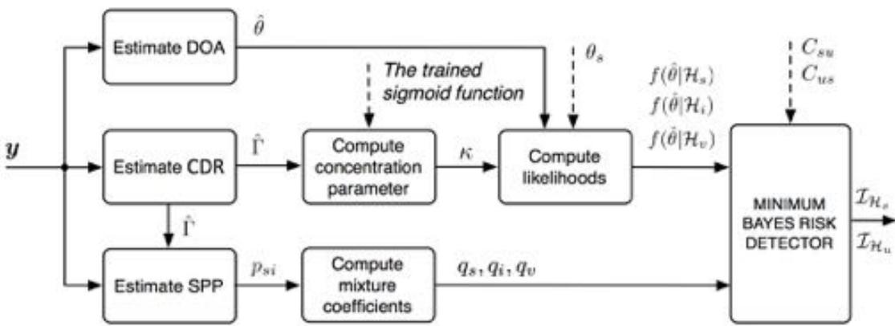  
Figure 4.3: Main processing blocks of the proposed DOA model-based detector.

Following this data-driven procedure, we have experimentally found a correspondence between the CDR estimates and the concentration parameter $\kappa$ . Given the pairs $(\Gamma_{n},\kappa_{n,\mathrm{ML}})$ , we can now determine the parameters of the sigmoid-like mapping function. First, note that although in theory the logarithmic range of the CDR is $[-\infty,\infty]$ , in practice, the CDR estimators saturate and are limited to a relatively small range of values around 0 dB. For our particular estimator, we observed that the range of estimates was $[-10,20]$ dB, which allows us to determine the maximum value $l_{max}$ of the concentration parameter by observing the values of $\kappa_{n,ML}$ for the histogram bins where $\Gamma_{n}\approx20$ dB. To find the parameter c that determines the offset along the $\widehat{\Gamma}$ axis, we note that for any value of $\rho$ , the value of $\widehat{\Gamma}$ for which the resulting $\kappa$ is exactly in the midpoint of its range $[0,l_{max}]$ , satisfies $\widehat{\Gamma}=10c$ . Therefore, by looking for the pair $(\Gamma_{n},\kappa_{n,\mathrm{ML}})$ in our training results where $\kappa_{n,ML}$ is as close as possible to $l_{max}/2$ , we can use the corresponding $\Gamma_{n}$ to compute the parameter c. Having fixed c and $l_{max}$ and noting that due to the aforementioned saturation of the CDR estimator, the concentration parameter is approximately 0 for $\Gamma_{n}\approx-10$ , there is only a small range of values for $\rho$ which satisfy the constraints on the maxima and the minima of the sigmoid-like function (i.e., $f(-10)\approx0$ and $f(20)\approx l_{\max}$ ). This range was $\rho\in[0.2,2]$ in our case, and the best fit for $\rho$ can be found by visual inspection of the curves obtained by substituting several values for $\rho$ from this range. The above described procedure for our data resulted in $l_{max}=8$ , c=1.5, and $\rho=1.2$ , which we kept constant for all the experiments. The block diagram in Figure 4.3 illustrates all processing steps associated with the proposed narrowband signal detector described in this section. Once the detectors are obtained, we can estimate the necessary PSD matrices, as discussed next.

## 4.5 Application to semi-blind source extraction

As discussed in the experiments in Chapter 3, the MVDR filter implementation in terms of the desired source RTF vector, given by $(2.24)$ , is more robust to estimation errors than the formulation in terms of the PSD matrices, given by $(2.26)$ and $(2.37)$ , although in theory the two formulations are equivalent. Therefore, in this chapter we apply the MVDR filter using $(2.24)$ as well.

To estimate the RTF vector $\mathbf{g}_1(t,k)$ , we employ the covariance-whitening method, and compute the Generalised Eigenvalue Decomposition (GEVD) of the matrix pencil $\left(\widehat{\Phi}_{\mathbf{s} + \mathbf{v}}(t,k),\widehat{\Phi}_{\mathbf{v}}(t,k)\right)$ , as detailed in Section 2.5.3.2. The PSD matrix estimates $\widehat{\Phi}_{\mathbf{s}}$ and $\widehat{\Phi}_{\mathbf{u}}$ , are obtained by recursive averaging according to (2.48) and (2.44b). The averaging parameters $\alpha_{s}$ and $\alpha_{u}$ are computed by (2.46), using the output of the

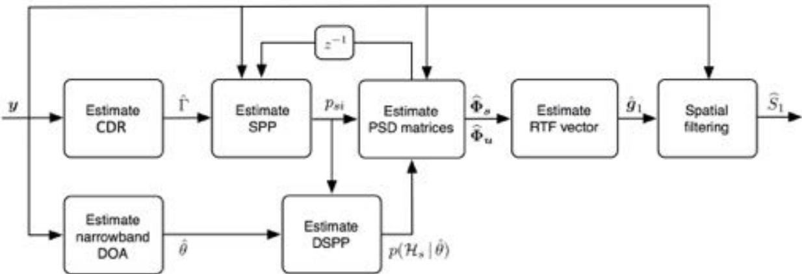  
Figure 4.4: Main processing blocks of the proposed DOA-informed spatial filtering framework.

DOA model-based detector from $(4.24)$ . The noise PSD matrix estimate $\tilde{\Phi}_{v}$ is obtained using the SPP $p_{si}$ , obtained using the framework from Chapter 3. The processing blocks of the DOA-informed source extraction framework are illustrated in Figure 4.4. In the upper branch, the SPP and noise PSD matrix estimation from Figure 3.2 can be recognised.

Note that in addition, the DSPP $p(\mathcal{H}_{s} \mid \hat{\theta}_{tk})$ can be applied as a multiplicative factor to the output of the MVDR filter, i.e.,

$$
\widehat {S} _ {1} (t, k) = p (\mathcal {H} _ {s} \mid \hat {\theta} _ {t k}) \cdot \mathbf {w} _ {\mathrm{mvdr}} ^ {\mathrm{H}} (t, k) \mathbf {y} (t, k),\tag{4.29}
$$

which has a similar role as the single-channel DOA-based gain in $[205]$ and the DOA-based TF mask common for source separation $[213]$ . If the MVDR is substituted by a Multichannel Wiener Filter (MWF) in $(4.29)$ , we obtain the Conditional Minimum Mean Squared Error (c-MMSE) filter. Applying the estimated DSPP as a multiplicative factor provides additional undesired signal reduction at the MVDR filter output, however, when wrongly estimated it causes audible distortion to the desired signal. This is further evaluated in the experiments in Section 4.6.3. A more robust single-channel filter that improves the undesired signal reduction at the output of the MVDR beamformer can be obtained by estimating a single-channel Wiener or parametric Wiener spectral filter using the MVDR filter output, as done in Chapter 3. However, in this chapter we only focus on the MVDR and the c-MMSE filters.

## 4.6 Performance evaluation

## 4.6.1 Experimental setup

To evaluate the proposed system, measurements were done in a room with $T_{60} = 0.16$ s with the setup in Figure 4.5. Three sources were captured using three uniform circular arrays with a diameter of 3 cm, and three omnidirectional DPA microphones (model DPA d:screet SMK-SC4060) per array. The distance between each source and the nearest array is 0.7 m, and the goal is to extract each source using the nearest array. Hence the framework is implemented with only three microphones. To generate background noise, babble speech signals were convolved with the measured AIRs of ten loudspeakers facing the walls (GENELEC, model 8010 AP, and Focal, model CMS40 loudspeakers were used). Finally, clean speech signals were convolved with the measured AIRs for the three sources and added with the babble noise signal, appropriately scaled to provide a pre-defined Input Signal-to-Noise Ratio (iSNR) (the exact Input Signal-to-Interference Ratio (iSIR) is stated for each experiment). The measured sensor noise was added with an iSNR of 35 dB for all experiments.

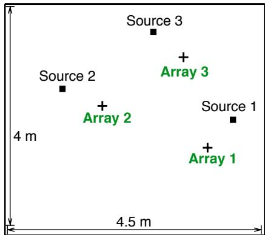  
Figure 4.5: Measurement setup for evaluation of the DOA-informed spatial filtering framework.

To evaluate the performance for different reverberation levels, simulated data was used. The AIR for each source-microphone pair was computed using the simulator in $[201]$ . Diffuse noise was simulated as described in $[204]$ and the microphone signals were obtained by adding the speech signals convolved with the simulated AIRs, the diffuse noise signal with a pre-defined iSNR (the exact iSIR is stated for each experiment) and an uncorrelated noise signal with an iSNR of 35 dB. The processing was done at a sampling rate of 16 kHz, with an STFT frame length of 64 ms with 50% overlap, windowed by a Hamming window. Unless stated otherwise, the DOA estimator with instantaneous phase differences was employed, described in Section 4.2.1.

## 4.6.2 Detector evaluation in terms of ROC curves

In this section, we compare a minimum Bayes risk detector obtained using the proposed DOA model-based DSPP, to the one obtained using the Gaussian signal model and a DOA-based a priori DSPP, used in [108]. Minimum Bayes risk detectors were computed by varying $\frac{C_{su}}{C_{us}}$ from 0 to $\infty$ , as described in Section 3.6.3. The False Positive Rate (FPR) and False Negative Rate (FNR) of a detector were defined in (8.35). A ground-truth detector $H_{ideal}$ is obtained by comparing the spectra of the desired source signal to the sum of all the other speech and noise signals, namely,

$$
\mathcal {H} _ {\mathrm{ideal}} (t, k) = \left\{ \begin{array}{l l} & 1, \quad \text { if } \quad | S _ {m} (t, k) | ^ {2} > \left| I _ {m} (t, k) + V _ {m} (t, k) \right| ^ {2} \\ & 0, \quad \text { otherwise. } \end{array} \right.\tag{4.30}
$$

The FPR and FNR are computed for the three sources (French female, English female, and English male) during 20 seconds of multi-talk, and the average FPR and FNR are used to obtain the Receiver Operating Characteristics (ROC). In all experiments, the average input Desired Speech-to-Interfering speech Ratio (DSIR) was in the range $[5,8]$ dB, where the input DSIR for each source is computed at one of the microphones from the nearest array.

Experiment 1: In this experiment, we evaluate the detection accuracy for different noise and reverberation levels. To investigate the effect of background noise, the experiment was repeated for iSNR of 3 dB, 8 dB, 13 dB and 18 dB, using the measured data. The ROC curves for the different SNRs are shown in Figure 4.6(a) for the two detectors. The detection accuracy is not notably affected by the SNR, as shown by the overlapping

ROC curves and only a minor increase in the error rate can be observed for decreasing SNR. It is worthwhile nothing that although in non-stationary scenarios, both types of errors are critical for the extracted signal quality $[103]$ , false positives are more detrimental as they lead to errors in the RTF vector and distortion of the desired signal. In contrast, if the RTF vector is accurate, which can be achieved if the FPR is low, false negatives do not affect the performance.

To evaluate the detectors for different reverberation levels, the setup shown in Figure 4.5 was simulated for $T_{60}$ of 0.2 s, 0.35 s, 0.5 s, and 0.65 s and diffuse babble noise with iSNR of 22 dB was added. As shown in Figure 4.6(b), reverberation has a stronger effect on the ROC than the noise, as the curves shift more notably with increasing reverberation. However, the proposed detector clearly outperforms the signal-model based detector in all cases.

Experiment 2: In this experiment, we simulated scenarios with one desired source and one interferer, for different angular separation between them, namely, 160, 95, 50 25 and 0 degrees. In all cases, the desired source is located at 0.7 m from the array, whereas the interferer at 1.5 m from the array. The reverberation time was $T_{60} = 0.35$ s and diffuse babble noise with an SNR of 22 dB and uncorrelated sensor noise with an SNR of 35 dB were added. As expected, with decreasing angular separation, the detection accuracy deteriorates, as visible in Figure 4.6(c). Note that even when the desired and the undesired source have equal DOA, the detector provides good accuracy due to the fact that the desired signal is stronger than the interferer at its respective nearest array. Another reason is that the CDR in interferer-dominated TF bins is lower than the CDR in desired signal-dominated TF bins, hence allowing the CDR-controlled concentration $\kappa$ to aid the detection even when the sources have equal DOA.

Experiment 3: The ROC curves obtained with the two DOA estimators discussed in Section 4.2 are illustrated in Figure 4.6(d). The experiment is done for the proposed DOA-based and for the signal model-based detector from [108]. Although time averaging of the phase differences provides less noisy DOA estimates as shown in Figure 4.1, the ROC curves indicate better accuracy with the instantaneous DOA estimator. The effect of the DOA estimator on the extracted signal quality is evaluated in the following experiments.

## 4.6.3 Objective evaluation of extracted signals

To estimate the PSD matrices and the RTF vector required for an informed MVDR filter, we computed a Bayes detector with $C_{du} = 1$ and $C_{ud} = 2$ . The costs were chosen after investigating the objective performance measures and the results of informal listening tests in different acoustic conditions, where they proved to achieve the best performance from all $(C_{su}, C_{us})$ pairs across the ROC. The chosen costs resulted in an FPR of 0.1 and an FNR of 0.9 on average (across the different experiments), which corroborates the observation that the FPR needs to be very low in order to ensure a good extracted signal quality. The averaging constants for the PSD matrices were $\tilde{\alpha}_{v} = 0.95$ , $\tilde{\alpha}_{s} = \tilde{\alpha}_{u} = 0.92$ , corresponding to time constants of 0.62 s and 0.38 s. The performance was evaluated in terms of segmental Noise Reduction (NR), segmental Interference Reduction (IR), Speech Distortion (SD) index $\nu_{sd}$ , Perceptual Evaluation of Speech Quality (PESQ) score improvement compared to the reference microphone, $\Delta_{PESQ}$ [214], and Short-Time Objective Intelligibility (STOI) score improvement compared to the reference microphone, $\Delta_{STOI}$ [215] (see Appendix A for definition of the performance measures). At each array, the goal is to extract the closest source, while reducing the background noise and the remaining sources. The following five spatial filtering frameworks are evaluated:

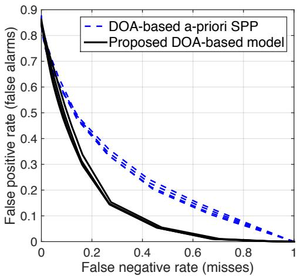  
(a) The different curves correspond to different iSNRs in the range $[3, 8, 13, 18]$ dB. The curves shift upwards with decreasing iSNR.

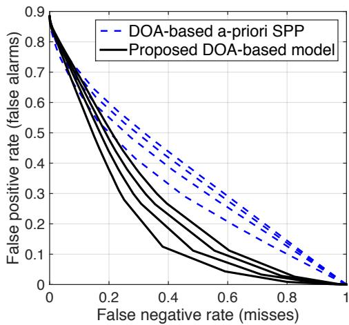  
(b) The different curves correspond to different $T_{60}$ values in the range $[0.2, 0.35, 0.5, 0.65]$ s. The curves shift upwards with increasing $T_{60}$ .

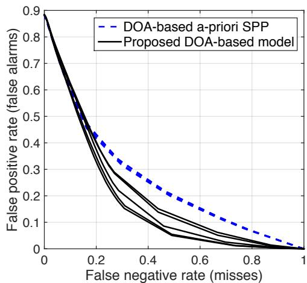  
(c) The different curves correspond to different angular separations between the desired source and the interferer, in the range $[0, 25, 50, 95, 160]$ degrees. The curves shift upwards with decreasing separation.

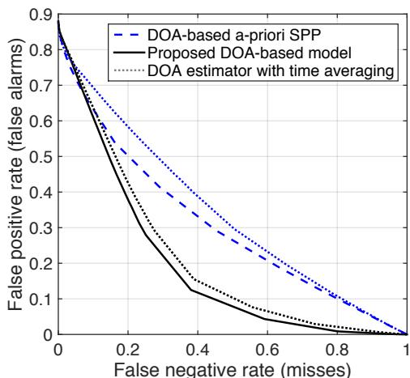  
(d) Detection with different DOA estimators. Each detector is evaluated with the instantaneous phase differences-based and the averaged phase differences-based DOA estimator.  
Figure 4.6: ROC curves for the state-of-the-art Gaussian model-based detector with a DOA-based a priori SPP, and the proposed DOA model-based detector, for different acoustic conditions, source arrangements, and DOA estimators.

1. An oracle MVDR filter, where the PSD matrices are computed using recursive averaging with an ideal bin-wise detector, denoted by $D_{id}$ .

2. A DSB steered to the desired source DOA, described in Section 4.3.1.

3. An MPDR filter steered to the desired source DOA, described in Section 4.3.1.

4. An informed MVDR filter with the state-of-the-art Gaussian signal model-based detector with DOA-based a priori SPP, denoted by $\mathcal{D}_{\mathrm{sm}}$ .

5. An informed MVDR filter with the proposed DOA-based detector, denoted by $D_{dm}$ .

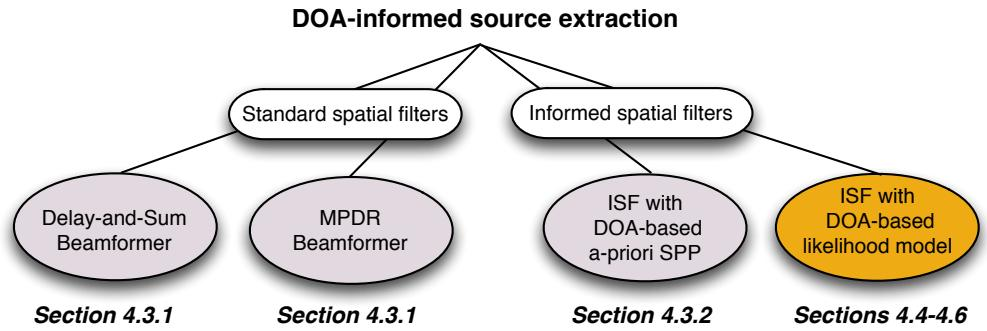  
Figure 4.7: Overview of the state-of-the-art (grey) and the proposed method (orange) for DOA-informed source extraction in the presence of non-stationary directional interferers and background noise.

The DOA-informed source extraction frameworks evaluated in this chapter are illustrated in Figure 4.7. Note that suitable adaptive spatial filtering approaches to the DOA-informed source extraction problem are discussed in Chapter 5.

Experiment 1: This experiment is performed using measured data for two iSNR conditions, shown in Table 4.1. The result of the oracle MVDR filter, and the second best result are indicated in bold. The superscript i in the notation for the proposed framework in Table 4.1, $\mathcal{D}_{\mathrm{dm}}^{(i)}$ indicates which DOA estimator was used: i = 1 for the instantaneous phase difference-based estimator, and i = 2 for the time averaged phase differences-based estimator. Although $D_{sm}$ and $D_{dm}$ perform similarly in terms of NR, $D_{dm}$ offers by up to 8 dB better IR than $D_{sm}$ at iSNR of 10 dB, and up to 6 dB better IR at iSNR of 2 dB. The SD index in all cases is lower for the proposed $D_{dm}$ . The better performance of the proposed system is due to the higher accuracy of the DOA-based detector compared to the Gaussian model-based one. The improvement in PESQ and STOI scores at the output of the proposed system with respect to the unprocessed signal is notably higher than the improvement offered by the other systems. The severe distortions of MPDR filter often result in lower PESQ and STOI scores than the unprocessed signal, as visible in Table 4.1.

Experiment 2: In this experiment, the proposed system $D_{dm}$ , and the output of the DSB, are multiplied by the a posteriori DSPP. A system where DOA-based DSPP is applied at the output of a fixed spatial filter is proposed in [205], and the goal of the current experiment is to confirm that the benefit of the DSPP is even larger when it is used in combination with an informed, rather than fixed spatial filter. The results in Table 4.2 are shown for a scenario with iSNR of 10 dB, and confirm that the informed MVDR filter outperforms the DSB when the DSPP-based mask is applied after spatial filtering. The superscripts indicate which of the DOA estimators was used for the framework, similarly as in the previous experiment. Note that although noise and interference reduction are improved, multiplying the DSPP is critical as it introduces audible distortion to the desired speech signal. The choice whether to multiply the MVDR output by the DSPP, depends on the accuracy of the DSPP and the importance of undistorted speech for a given application. Finally, note that the systems with the DOA estimator based on instantaneous phase differences outperform the ones with DOA estimator based on time-averaged phase differences. Time averaging result in smoothing of the DSPP, which can distort the speech onsets and worsen the quality of the extracted signal.

Experiment 3: In this experiment, we investigate the performance for varying angular separation between the desired and the interfering source. Signals were simulated with reverberation time $T_{60} = 0.2$ s and $T_{60} = 0.4$ s, and the distances of the desired source and the interferer from the array were 0.7 m and 1.5 m, respectively. As illustrated in Figure 4.8, the NR and SD of the different frameworks are rather unaffected by the angular separation, while the IR decreases with decreasing angular separation. As the angular separation decreases, $D_{dm}$ and $D_{sm}$ achieve similar IR, due to the fact that in both cases, the performance is limited by the spatial resolution of the array.

<table><tr><td rowspan="2"></td><td colspan="6">Average input SNR 10 dB</td><td colspan="6">Average input SNR 2 dB</td></tr><tr><td>DSB</td><td>MPDR</td><td> $\mathcal{D}_{id}$ </td><td> $\mathcal{D}_{sm}$ </td><td> $\mathcal{D}_{dm}^{(1)}$ </td><td> $\mathcal{D}_{dm}^{(2)}$ </td><td>DSB</td><td>MPDR</td><td> $\mathcal{D}_{id}$ </td><td> $\mathcal{D}_{sm}$ </td><td> $\mathcal{D}_{dm}^{(1)}$ </td><td> $\mathcal{D}_{dm}^{(2)}$ </td></tr><tr><td>NR</td><td>1.4</td><td>6.4</td><td>7.5</td><td>6.1</td><td>7.2</td><td>6.9</td><td>1.4</td><td>7.0</td><td>8.9</td><td>7.6</td><td>9.2</td><td>9.0</td></tr><tr><td>IR</td><td>1.9</td><td>8.1</td><td>14.4</td><td>5.5</td><td>12.9</td><td>12.5</td><td>1.9</td><td>8.0</td><td>12.8</td><td>6.3</td><td>11.8</td><td>11.4</td></tr><tr><td> $\nu_{sd}$ </td><td>0.03</td><td>0.25</td><td>0.02</td><td>0.11</td><td>0.06</td><td>0.05</td><td>0.03</td><td>0.28</td><td>0.03</td><td>0.08</td><td>0.07</td><td>0.07</td></tr><tr><td> $\Delta_{PESQ}$ </td><td>0.02</td><td>0.17</td><td>0.75</td><td>-0.02</td><td>0.68</td><td>0.63</td><td>0.02</td><td>0.12</td><td>0.59</td><td>0.17</td><td>0.53</td><td>0.49</td></tr><tr><td> $\Delta_{STOI}$ </td><td>0.01</td><td>0.07</td><td>0.17</td><td>-0.01</td><td>0.15</td><td>0.15</td><td>0.01</td><td>0.05</td><td>0.18</td><td>0.04</td><td>0.16</td><td>0.15</td></tr><tr><td>NR</td><td>0.9</td><td>4.3</td><td>7.1</td><td>7.0</td><td>6.0</td><td>6.4</td><td>0.9</td><td>2.8</td><td>11.7</td><td>7.5</td><td>6.1</td><td>6.9</td></tr><tr><td>IR</td><td>0.5</td><td>2.9</td><td>15.7</td><td>5.3</td><td>13.9</td><td>12.4</td><td>0.5</td><td>2.1</td><td>13.9</td><td>6.2</td><td>11.0</td><td>10.7</td></tr><tr><td> $\nu_{sd}$ </td><td>0.06</td><td>0.19</td><td>0.03</td><td>0.11</td><td>0.03</td><td>0.03</td><td>0.06</td><td>0.17</td><td>0.03</td><td>0.10</td><td>0.03</td><td>0.04</td></tr><tr><td> $\Delta_{PESQ}$ </td><td>0.03</td><td>-0.01</td><td>0.85</td><td>0.20</td><td>0.76</td><td>0.70</td><td>0.03</td><td>0.04</td><td>0.73</td><td>0.31</td><td>0.51</td><td>0.51</td></tr><tr><td> $\Delta_{STOI}$ </td><td>0.01</td><td>-0.03</td><td>0.13</td><td>0.01</td><td>0.12</td><td>0.11</td><td>0.01</td><td>-0.02</td><td>0.16</td><td>0.05</td><td>0.11</td><td>0.11</td></tr><tr><td>NR</td><td>1.4</td><td>10.6</td><td>6.4</td><td>5.6</td><td>6.5</td><td>6.5</td><td>1.4</td><td>12.8</td><td>8.4</td><td>7.7</td><td>8.1</td><td>8.1</td></tr><tr><td>IR</td><td>1.7</td><td>15.9</td><td>13.8</td><td>5.6</td><td>11.8</td><td>11.7</td><td>1.7</td><td>15.0</td><td>11.2</td><td>6.4</td><td>10.4</td><td>10.3</td></tr><tr><td> $\nu_{sd}$ </td><td>0.03</td><td>0.87</td><td>0.02</td><td>0.09</td><td>0.04</td><td>0.04</td><td>0.04</td><td>0.81</td><td>0.02</td><td>0.07</td><td>0.04</td><td>0.04</td></tr><tr><td> $\Delta_{PESQ}$ </td><td>0.02</td><td>-1.10</td><td>0.61</td><td>0.20</td><td>0.53</td><td>0.51</td><td>0.02</td><td>-0.63</td><td>0.51</td><td>0.31</td><td>0.47</td><td>0.46</td></tr><tr><td> $\Delta_{STOI}$ </td><td>0</td><td>-0.37</td><td>0.07</td><td>0.01</td><td>0.07</td><td>0.06</td><td>0.01</td><td>-0.25</td><td>0.10</td><td>0.06</td><td>0.09</td><td>0.09</td></tr></table>

Table 4.1: Results for Source1 (top), Source2 (middle), and Source3 (bottom). The segmental SIR at the reference microphone of each source is 6.8 dB, 5.7 dB, and 8 dB. $^{(1)}$ indicates the DOA estimator with instantaneous phase differences, while $^{(2)}$ the DOA estimator with cross-PSD phase differences.

<table><tr><td></td><td>DSB(1)</td><td>DSB(2)</td><td> $\mathcal{D}_{\text{dm}}^{(1)}$ </td><td> $\mathcal{D}_{\text{dm}}^{(2)}$ </td></tr><tr><td>NR</td><td>14.3</td><td>14.2</td><td>19.3</td><td>18.9</td></tr><tr><td>IR</td><td>15.7</td><td>15.6</td><td>24.9</td><td>24.3</td></tr><tr><td> $\nu_{\text{sd}}$ </td><td>0.36</td><td>0.36</td><td>0.33</td><td>0.34</td></tr><tr><td> $\Delta_{\text{PESQ}}$ </td><td>0.52</td><td>0.47</td><td>0.88</td><td>0.79</td></tr><tr><td> $\Delta_{\text{STOI}}$ </td><td>0.10</td><td>0.08</td><td>0.13</td><td>0.11</td></tr><tr><td>NR</td><td>9.1</td><td>8.2</td><td>15.7</td><td>15.4</td></tr><tr><td>IR</td><td>12.3</td><td>11.5</td><td>25.0</td><td>23.1</td></tr><tr><td> $\nu_{\text{sd}}$ </td><td>0.12</td><td>0.13</td><td>0.15</td><td>0.15</td></tr><tr><td> $\Delta_{\text{PESQ}}$ </td><td>0.67</td><td>0.60</td><td>1.07</td><td>1.00</td></tr><tr><td> $\Delta_{\text{STOI}}$ </td><td>0.08</td><td>0.07</td><td>0.11</td><td>0.10</td></tr><tr><td>NR</td><td>12.2</td><td>11.4</td><td>16.7</td><td>16.0</td></tr><tr><td>IR</td><td>14.0</td><td>13.2</td><td>22.5</td><td>21.6</td></tr><tr><td> $\nu_{\text{sd}}$ </td><td>0.27</td><td>0.26</td><td>0.24</td><td>0.23</td></tr><tr><td> $\Delta_{\text{PESQ}}$ </td><td>0.54</td><td>0.48</td><td>0.87</td><td>0.84</td></tr><tr><td> $\Delta_{\text{STOI}}$ </td><td>0.04</td><td>0.02</td><td>0.05</td><td>0.04</td></tr></table>

Table 4.2: Results for Source1 (top), Source2 (middle), and Source3 (bottom), when the DSPP is multiplied to the output of the spatial filters. The iSIR at the reference microphone of each source is 6.8 dB, 5.7 dB, and 8.0 dB. $^{(1)}$ indicates the DOA estimator with instantaneous phase differences, while $^{(2)}$ indicates the DOA estimator with cross-PSD phase differences.

Experiment 4: An important motivation for the current work was to mitigate the sensitivity to DOA mismatch typical for the MPDR beamformer, where DOA errors lead to severe distortion of the desired signal. Provided that the desired signal detector is accurate besides the presence of small DOA errors, the RTF vector and the undesired signal PSD matrix can be estimated and the desired signal can be extracted with a good quality using an informed MVDR filter. In Figure 4.9, the DOA mismatch is varied such that the system is given a wrong information about the true source DOA, with an error from 1 to 19 degrees. The difference between the DOA of the desired source and the interferer is 100 degrees. In Figure 4.9(a), the SD index and the PESQ improvement are shown on the y-axis, whereas in Figure 4.9(b) the NR and the IR are shown. Notably, besides minor performance loss as the mismatch angle increases, the ISF is very robust to DOA errors, which is crucial in practice where the DOA might only be approximately known. Note however, that the sensitivity to DOA mismatch would increase in more reverberant environments, and for smaller angular separation between the desired signal and the interferer. Further experiments regarding the DOA mismatch are provided in the following chapter together with the adaptive filter implementations.

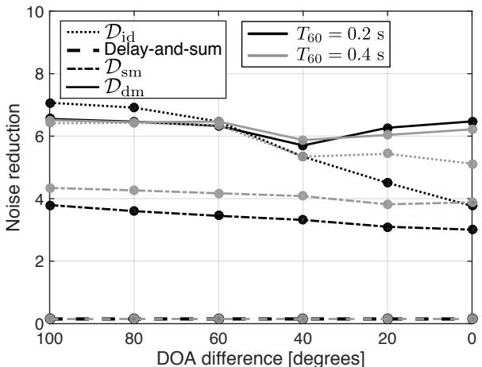  
(a) Noise reduction

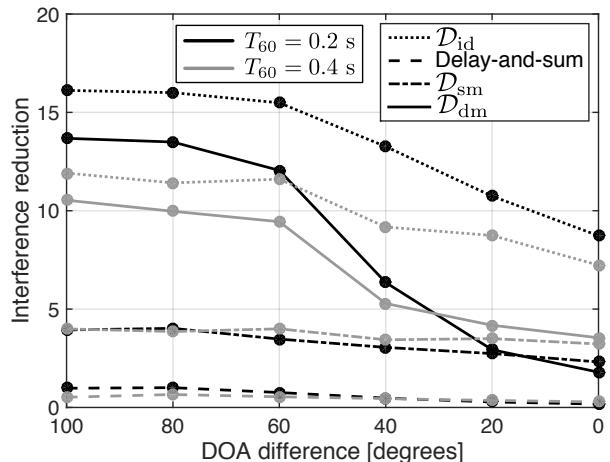  
(b) Interference reduction

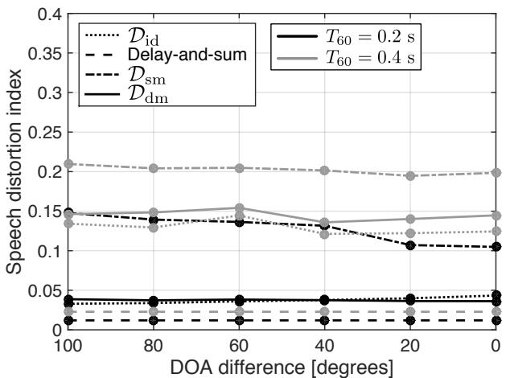  
(c) Speech distortion

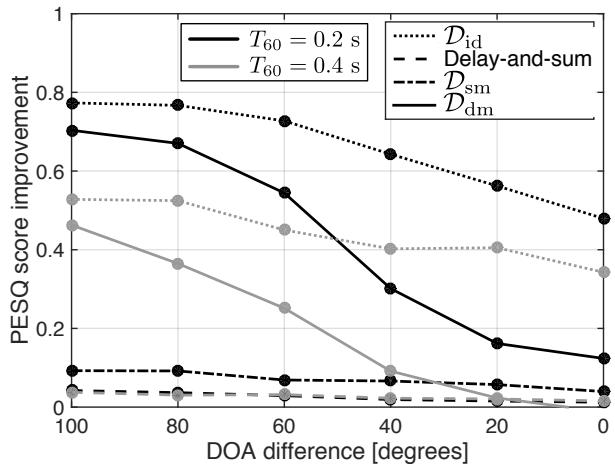  
(d) PESQ score improvement  
Figure 4.8: Evaluation as a function of the DOA separation between the sources. The interferer is at 1.5 m and the desired source at 0.7 m from the array, iSIR = 9 dB and iSNR = 14 dB.

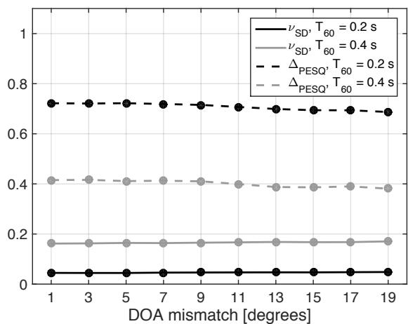  
(a) Speech distortion and PESQ score improvement

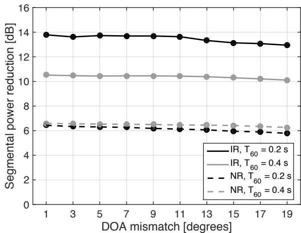  
(b) Noise reduction and interference reduction  
Figure 4.9: Evaluation of extracted signal quality in the presence of DOA mismatch. The y-axis on the left plot illustrates the SD index and the PESQ improvement, while the y-axis on the right plot illustrates the NR and IR. The interferer is at 1.5 m and the desired source at 0.7 m distance from the array, iSIR = 9 dB and iSNR = 14 dB. The angular separation between the desired source and the interferer is 100 degrees.

## 4.7 Summary

In this chapter, we addressed the problem of source extraction in the presence of background noise and speech interferers. Design of robust spatial filters is challenging in such scenarios, as the non-stationary undesired signal PSD matrix needs to be estimated from the data to maintain good performance when the interferers move or new interferers appear. Standard state-of-the-art approaches, such the DSB and the MPDR filter, do not offer sufficiently good performance: the former offers insufficient interference reduction and the latter introduces severe speech distortion due to the mismatch between the true RTF vector of the desired source and the anechoic model-based RTF vector.

We proposed an informed spatial filtering framework, where the first step is to design a detector which given the desired source DOA, can distinguish TF bin where the desired source is dominant to those where undesired signals are dominant. Similar approach was previously proposed for source extraction in the spherical harmonic domain, where a Gaussian model-based detector was used. We showed that in our system, implemented in the signal domain rather than spherical harmonic domain, such detector is not always robust for non-stationary scenarios with interfering speakers. Therefore, we proposed a DOA model-based detector, where narrowband DOA estimates are used for discrimination of desired and undesired speakers, while the Gaussian signal model aids the detection of noise-dominated TF bins. The detector with the specific likelihood models, the usage of the spectral information and the CDR to control the model parameters constituted the main contributions of the chapter. The robustness of the detector was demonstrated in terms of ROC curves, and by objective evaluation of the extracted signal when the detector is applied for estimating the desired source RTF vector and the undesired signal PSD matrix, used in an informed MVDR filter. Another advantage of the proposed ISF framework compared to traditional robust beamforming is the fact that as the propagation vectors and the PSD matrices are estimated from the data, the system is less sensitive to array calibration errors and to mismatch between the specified and the true DOA of the source.

## Adaptive implementations of informed spatial filters

In the multichannel speech enhancement applications discussed in the previous chapters, it was shown that Informed Spatial Filters (ISFs) provide high quality speech acquisition in dynamic scenarios due to their ability to almost instantaneously adapt the filter coefficients in changing acoustic conditions. The Power Spectral Density (PSD) matrices of the desired and undesired signals were updated at each Time-Frequency (TF) bin using a signal detector (the detector is framework and application-dependent) and substituted in the standard Minimum Variance Distortionless Response (MVDR) filter expression, which requires a matrix inversion at each TF bin. Such implementation is also known to as direct matrix inversion in literature $[38]$ .

In the literature, it is well known that the MVDR filter can be reformulated in an adaptive General Sidelobe Canceller (GSC) structure $[40,162]$ , without requiring the undesired signal PSD matrix. Although the GSC is generally preferred for practical implementations, when implemented in its standard form based on anechoic propagation, as proposed by Griffiths and Jim in $[40]$ , the GSC results in signal cancellation due to the propagation vector mismatch in reverberant environments. To apply the GSC in speech applications, researchers have proposed different approaches to take reverberation into account. Estimation and tracking of the Acoustic Transfer Function (ATF) has been proposed by Affes et al in $[66]$ , while usage of Relative Transfer Functions (RTFs) has been proposed by Gannot et al in $[47]$ , and later applied in many contributions $[94,216,217]$ . In addition, efficient GSC implementations with adaptive Blocking Matrix (BM) structure have been proposed, which can mitigate signal cancellation even in the presence of errors in the propagation vector $[105,218]$ .

To apply the aforementioned reverberation-aware GSCs in practice, the ATFs, and RTFs need to be estimated from the data. Unless the estimates are free of errors, the resulting BM does not provide perfect blocking of the desired signal, and signal cancellation can not be completely avoided. The phenomenon of signal cancellation in GSCs when the RTFs or ATFs, and consequently, the BM are not perfectly estimated, corresponds to the signal distortion occurring in the Minimum Power Distortionless Response (MPDR) beamformer in the presence of steering vector mismatch. For the GSC structure to be equivalent to the MVDR beamformer, which is less sensitive to errors in the RTFs or ATFs, the Noise Canceller (NC) filters need to be updated only when the desired signal is absent. The need for an accurate detection mechanism when to update the NCs and when to estimate the BM in GSC structures is well known in the literature, and certain control mechanisms are included in almost all GSC implementations in order to ensure robust operation. For frequency-domain implementations of the GSC filters, the adaptation control for the BM and the NCs can be done for each TF bin, using the output of a narrowband signal detector. Bin-wise control has been proposed for instance in $[219]$ using a detector based on a signal-to-interference ratio estimate, and in $[143]$ using the outcome of a Direction-Of-Arrival (DOA)-based signal classifier in a framework for source separation. In this chapter, we refer to such GSCs with bin-wise adaptation control based on a signal detector, as informed GSCs.

The main objective in this chapter is to investigate the implications of highly non-stationary conditions on adaptive ISFs, and evaluate whether in such cases, GSCs are a good alternative to the closed-form MVDR filter. In particular, we employ the DOA model-based detector proposed in Chapter 4 as a narrowband signal detector, assuming that the DOA of the desired source is approximately known. The rest of this chapter is organised as follows: In Section 5.1, we summarise the equivalence between the MVDR and the GSC filters. In Section 5.2, we discuss GSC implementations of the DOA-informed system from Chapter 4, and in Section 5.3, we provide an overview of other GSC filters from the literature. A note on the complexity is provided in Section 5.4. Evaluation is presented in Section 5.5, and the conclusions are summarised in Section 5.6.

## 5.1 Informed GSC filter for source extraction

We proceed with the signal model described in Section 4.1, where a microphone array captures the signals of a desired speaker, interfering speakers, and a noise signal. In Chapter 4, the undesired signal PSD matrix $\Phi_{\mathbf{u}}$ and the desired signal RTF vector $\mathbf{g}_1$ were estimated using a bin-wise signal detector, and substituted in the MVDR filter expression, which we restate for convenience

$$
\mathbf {w} _ {\mathrm{mvdr}} (t, k) = \frac {\boldsymbol {\Phi} _ {\mathbf {u}} ^ {- 1} (t , k) \mathbf {g} _ {1} (t , k)}{\mathbf {g} _ {1} ^ {\mathrm{H}} (t , k) (k) \boldsymbol {\Phi} _ {\mathbf {u}} ^ {- 1} (t , k) \mathbf {g} _ {1} (t , k)}.\tag{5.1}
$$

We have assumed without loss of generality that the first microphone is the reference microphone.

It is well known [162] that if an $M \times 1$ vector $\mathbf{w}_{\mathrm{fbf}}$ satisfies the MVDR constraint $\mathbf{w}_{\mathrm{fbf}}^{\mathrm{H}}\mathbf{g}_1 = 1$ , and the columns of a full-rank $M \times (M - 1)$ matrix $\mathbf{B}$ (or an $M \times M$ matrix of rank $M - 1$ ) span the null-space of $\mathbf{g}_1(t,k)$ , i.e. $\mathbf{g}_1^{\mathrm{H}}(t,k)\mathbf{B} = \mathbf{0}$ , then the following holds

$$
\frac {\mathbf {\Phi} _ {\mathbf {u}} ^ {- 1} (t , k) \mathbf {g} _ {1} (t , k)}{\mathbf {g} _ {1} ^ {\mathrm{H}} (t , k) \mathbf {\Phi} _ {\mathbf {u}} ^ {- 1} (t , k) \mathbf {g} _ {1} (t , k)} = (\mathbf {I} _ {M \times M} - \mathbf {B} (\mathbf {B} ^ {\mathrm{H}} \mathbf {\Phi} _ {\mathbf {u}} (t, k) \mathbf {B}) ^ {- 1} \mathbf {B} ^ {\mathrm{H}} \mathbf {\Phi} _ {\mathbf {u}} (t, k)) \mathbf {w} _ {\mathrm{fbf}}.\tag{5.2}
$$

The relation $(5.2)$ can be derived using solely linear algebraic transformations as shown in [162], and underlies the equivalent GSC structure of the MVDR filter, i.e., [40, 47, 48, 162]

$$
\mathbf {w} _ {\mathrm{mvdr}} (t, k) \equiv \mathbf {w} _ {\mathrm{gsc}} (t, k) = \mathbf {w} _ {\mathrm{fbf}} (t, k) - \mathbf {B} (t, k) \mathbf {w} _ {\mathrm{nc}} (t, k), \quad \mathrm{where}\tag{5.3a}
$$

$$
\mathbf {w} _ {\mathrm{fbf}} (t, k) = \frac {\mathbf {g} _ {1} (t , k)}{\| \mathbf {g} _ {1} (t , k) \| ^ {2}},\tag{5.3b}
$$

$$
\mathbf {w} _ {\mathrm{nc}} (t, k) = (\mathbf {B} ^ {\mathrm{H}} (t, k) \boldsymbol {\Phi} _ {\mathbf {u}} (t, k) \mathbf {B} (t, k)) ^ {- 1} \mathbf {B} ^ {\mathrm{H}} (t, k) \boldsymbol {\Phi} _ {\mathbf {u}} (t, k) \mathbf {w} _ {\mathrm{fbf}} (t, k).\tag{5.3c}
$$

The vector $w_{fbf}$ is a spatial filter that ensures that the desired signal is preserved, B is the BM which blocks the desired signal and creates references for the noise canceller, and $w_{nc}$ is the noise canceller which operates on the output of the BM. The estimated desired signal at the GSC output is given by

$$
\widehat {S} _ {1} (t, k) = \mathbf {w} _ {\mathrm{fbf}} ^ {\mathrm{H}} (t, k) \mathbf {y} (t, k) - \mathbf {w} _ {\mathrm{nc}} ^ {\mathrm{H}} (t, k) \mathbf {B} ^ {\mathrm{H}} (t, k) \mathbf {y} (t, k).\tag{5.4}
$$

Note that $w_{fbf}$ is known as the fixed beamformer in the literature, as it is often computed using the DOA of the desired source and hence, it is data-independent. Although in our informed GSC implementation discussed in this Chapter, $w_{fbf}$ is computed at each TF bin using the RTF vector estimate, we refer to it as the Fixed Beamformer (FBF) for consistency with the GSC literature. Similarly, the BM is computed at each TF bin using the RTF vector: it is easy to see that one possible construction satisfying $g_{1}^{H}B = 0$ , is given by [48]

$$
\mathbf {B} = \left[ \begin{array}{c c c c} - G _ {1 2} ^ {*} & - G _ {1 3} ^ {*} & \ldots & - G _ {1 M} ^ {*} \\ 1 & 0 & \ldots & 0 \\ 0 & 1 & \ldots & 0 \\ \vdots & \ldots & \ddots & \\ 0 & 0 & \ldots & 1 \end{array} \right],\tag{5.5}
$$

where $G_{1i}$ is the i-th entry of $g_{1}$ . Hence, the RTF vector suffices to implement the FBF and the BM. By substituting an anechoic model for $g_{1}$ as given by (4.6), the GSC corresponds to a frequency-domain counterpart of the original GSC proposed by Griffiths and Jim [40]. The RTF-based GSC was proposed by Gannot in [47], where the RTF vector $g_{1}$ and the BM are estimated in advance using signal segments where only the desired speaker and the background noise are present.

Note that in the standard formulations of the GSC filter $[11,40,48]$ , the microphone signal PSD matrix $\Phi_{y}$ rather than the undesired signal PSD matrix $\Phi_{u}$ is used to compute the NC in $(5.3c)$ . If the BM creates desired signal-free noise reference signals, the formulations in terms of $\Phi_{u}$ and $\Phi_{y}$ are equivalent. This is analogous to the fact that the closed-form MVDR and MPDR filters are equivalent when the desired source propagation vector is accurate $[38]$ . In practice, due to estimation errors and reverberation, neither the estimated RTF vector $\hat{g}_{1}$ nor the anechoic propagation vector are perfectly accurate, resulting in leakage of the desired signal in the BM outputs. The leakage causes the well-known signal cancellation problem of the GSC filter $[220]$ . The signal cancellation is alleviated if the PSD matrix $\Phi_{u}$ instead of $\Phi_{y}$ is used in the NC in $(5.3c)$ . For adaptive implementations of the NC, this implies that the NC should be updated only when the desired signal is absent. Hence, an accurate bin-wise signal detection scheme is crucial for robust operation of GSC-based filters as well. The numerous GSC-based filtering frameworks for source extraction in the literature differ in the estimation of one or more of the three main components, namely, the FBF, the BM, and the NC $[47,66,105,216–218]$ . In each of the aforementioned frameworks, one of the main objectives is to alleviate the desired signal cancellation without sacrificing interference reduction performance.

## 5.2 Adaptive implementations of the informed GSC

Assuming that the BM perfectly blocks the desired signal, the Minimum Mean Squared Error (MMSE)-optimal NC filter is obtained as the solution to the following optimisation problem [161]

$$
\mathbf {w} _ {\mathrm{nc}} (t, k) = \underset {\mathbf {w}} {\arg \min} \operatorname{E} \left[ | \mathbf {w} ^ {\mathrm{H}} \mathbf {B} ^ {\mathrm{H}} (t, k) \mathbf {y} (t, k) - \mathbf {w} _ {\mathrm{fbf}} ^ {\mathrm{H}} \mathbf {y} (t, k) | ^ {2} \right].\tag{5.6}
$$

By denoting $Y_{fbf} = w_{fbf}^{H} y$ , $b = B^{H} y$ , and $\Phi_{b} = E [b b^{H}]$ , the solution to (5.6) is given by [161]

$$
\mathbf {w} _ {\mathrm{nc}} (t, k) = \boldsymbol {\Phi} _ {\mathbf {b}} ^ {- 1} (t, k) \mathrm{E} \left[ \mathbf {b} (t, k) Y _ {\mathrm{fbf}} ^ {*} (t, k) \right].\tag{5.7}
$$

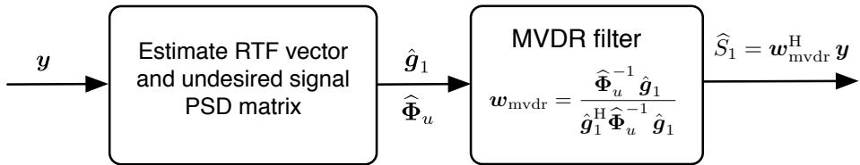  
(a) MVDR filter implementation

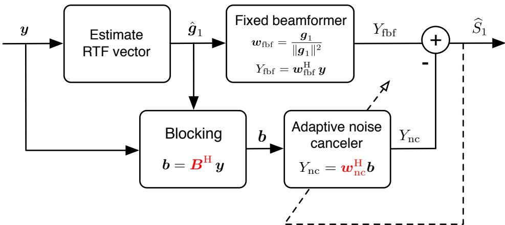  
(b) GSC filter implementation  
Figure 5.1: Block diagrams of the equivalent MVDR and GSC spatial filter implementations.

When the blocking matrix B and the FBF $w_{fbf}$ are fixed (and hence deterministic), (5.7) is equivalent to (5.3c). However, in ISF frameworks, B and $w_{fbf}$ are time-varying as they are estimated using the RTF vector $\mathbf{g}_{1}(t,k)$ . Furthermore, $\mathbf{g}_{1}(t,k)$ is estimated using the signal detector and the microphone signals $\mathbf{y}(t,k)$ . As the signal vector y is modelled as a random vector, the time-varying estimates of B and $w_{fbf}$ are random as well. Therefore, the following holds for the statistical expectation

$$
\mathbf {B} ^ {\mathrm{H}} \operatorname{E} \left[ \mathbf {b b} ^ {\mathrm{H}} \right] \mathbf {B} \neq \operatorname{E} \left[ \mathbf {B} ^ {\mathrm{H}} \mathbf {b b} ^ {\mathrm{H}} \mathbf {B} \right],\tag{5.8a}
$$

$$
\operatorname{E} \left[ \mathbf {B} ^ {\mathrm{H}} \mathbf {b b} ^ {\mathrm{H}} \mathbf {w} _ {\mathrm{fbf}} \right] \neq \mathbf {B} ^ {\mathrm{H}} \operatorname{E} \left[ \mathbf {b b} ^ {\mathrm{H}} \right] \mathbf {w} _ {\mathrm{fbf}}.\tag{5.8b}
$$

In contrast, for deterministic B and $w_{fbf}$ , the left-hand side expressions and the right-hand side expressions in (5.8) are equivalent. Hence, an ISF implemented as an adaptive GSC, is not completely equivalent to the closed-form MVDR filter, even when the same detector is used for updating the PSD matrices in the MVDR filter and the NC in the GSC. In the following, we revise the Recursive Least Squares (RLS) and the Normalized Least Mean Squares (NLMS) algorithms for computing the adaptive NC in an informed GSC. Besides the RLS and NLMS, more advanced adaptive algorithms exist which are suited for bin-wise filter adaptation (see [219] and references therein). Discussion of adaptive algorithms beyond the RLS and the NLMS is beyond the scope of this thesis.

## 5.2.1 Adaptation with recursive matrix inversion (RLS)

The PSD matrix $\Phi_{b}$ and the cross-PSD vector $r = E[bY_{fbf}^{*}]$ required for the NC in (5.7), can be estimated from the data using recursive averaging controlled by the output of the detector proposed in Chapter 4. By substituting the rank-one updates at TF bin $(t,k)$ , $\mathbf{w}_{\mathrm{nc}}(t,k)$ is computed as [38, Chapter 7]

$$
\begin{array}{r l} \mathbf {w} _ {\mathrm{nc}} (t, k) = & \left[ \alpha_ {b} (t, k)   \boldsymbol {\Phi} _ {\mathbf {b}} (t - 1, k) + (1 - \alpha_ {b} (t, k))   \mathbf {b} (t, k) \mathbf {b} ^ {\mathrm{H}} (t, k) \right] ^ {- 1} \\ & \times \left[ \alpha_ {b} (t, k)   \mathbf {r} (t - 1, k) + (1 - \alpha_ {b} (t, k))   \mathbf {b} (t, k)   Y _ {\mathrm{fbf}} ^ {*} (t, k) \right], \end{array}\tag{5.9}
$$

where the averaging parameter $\alpha_{b}$ is obtained using the signal detector as follows

$$
\alpha_ {b} (t, k) = 1 + \mathcal {I} _ {\mathcal {H} _ {s}} (t, k) (\tilde {\alpha} _ {b} - 1), \tilde {\alpha} _ {b} \in (0, 1 ].\tag{5.10}
$$

Applying the matrix inversion lemma and rearranging the result, $\mathbf{w}_{\mathrm{nc}}(t,k)$ can be expressed in terms of $\mathbf{w}_{\mathrm{nc}}(t-1,k)$ by the following recursion

$$
\mathbf {w} _ {\mathrm{nc}} (t, k) = \mathbf {w} _ {\mathrm{nc}} (t - 1, k) + \mathbf {k} _ {b} (\tau , k) \left[ Y _ {\mathrm{fbf}} ^ {*} (t, k) - \mathbf {b} ^ {\mathrm{H}} (t, k) \mathbf {w} _ {\mathrm{nc}} (t - 1, k) \right],\tag{5.11}
$$

where the learning vector $\mathbf{k}_b(t,k)$ is given by

$$
\mathbf {k} _ {b} (t, k) = \frac {\left(1 - \alpha_ {b} (t , k)\right) \widehat {\boldsymbol {\Phi}} _ {\mathbf {b}} ^ {- 1} (t , k) \mathbf {b} (t , k)}{\alpha_ {b} (t , k) + \left(1 - \alpha_ {b} (t , k)\right) \mathbf {b} ^ {\mathrm{H}} (t , k) \widehat {\boldsymbol {\Phi}} _ {\mathbf {b}} ^ {- 1} (t , k) \mathbf {b} (t , k)}.\tag{5.12}
$$

The inverse $\widehat{\Phi}_{\mathbf{b}}^{-1}(t,k)$ required in (5.12) can be computed recursively with the averaging constant $\alpha_{b}(t,k)$ and the matrix inversion lemma [192], i.e.,

$$
\begin{array}{l} \widehat {\boldsymbol {\Phi}} _ {\mathbf {b}} ^ {- 1} (t, k) = \alpha_ {b} ^ {- 1} (t, k) \widehat {\boldsymbol {\Phi}} _ {\mathbf {b}} ^ {- 1} (t - 1, k) + \frac {\alpha_ {b} ^ {- 1} (t , k) (1 - \alpha_ {b} (t , k)) \widehat {\boldsymbol {\Phi}} _ {\mathbf {b}} ^ {- 1} (t - 1 , k) \mathbf {b} (t , k) \mathbf {b} ^ {\mathrm{H}} (t , k) \widehat {\boldsymbol {\Phi}} _ {\mathbf {b}} ^ {- 1} (t - 1 , k)}{\alpha_ {b} (t , k) + (1 - \alpha_ {b} (t , k)) \mathbf {b} ^ {\mathrm{H}} (t , k) \widehat {\boldsymbol {\Phi}} _ {\mathbf {b}} ^ {- 1} (t - 1 , k) \mathbf {b} (t , k)} \\ = \alpha_ {b} ^ {- 1} (t, k) \left[ \widehat {\boldsymbol {\Phi}} _ {\mathbf {b}} ^ {- 1} (t - 1, k) + \mathbf {k} _ {b} (t - 1, k) \mathbf {b} ^ {\mathrm{H}} (t, k) \widehat {\boldsymbol {\Phi}} _ {\mathbf {b}} ^ {- 1} (t - 1, k) \right] \\ = \alpha_ {b} ^ {- 1} (t, k) \left[ \mathbf {I} + \mathbf {k} _ {b} (t - 1, k) \mathbf {b} ^ {\mathrm{H}} (t, k) \right] \widehat {\boldsymbol {\Phi}} _ {\mathbf {b}} ^ {- 1} (t - 1, k). \end{array} \tag {5.1}\tag{5.13}
$$

Note that the computation of $w_{nc}$ at a given TF bin $(t,k)$ , can be formulated also as a weighted Least Squares (LS) problem, such that $\mathbf{w}_{\mathrm{nc}}(t,k)$ minimises the following cost function

$$
J (t, k) = \left(1 - \alpha_ {b} (t, k)\right) \sum_ {i = 0} ^ {t} \alpha_ {b} ^ {t - i} \left| Y _ {\mathrm{fbf}} (i, k) - \mathbf {w} _ {\mathrm{nc}} ^ {\mathrm{H}} \mathbf {b} (i, k) \right| ^ {2}.\tag{5.14}
$$

The solution to this minimisation problem leads to the equations $(5.11)-(5.13)$ . Clearly, this corresponds to a standard RLS update, and hence, the GSC filter where the NC is updated according to $(5.11)-(5.13)$ is referred to GSC-RLS in the following.

## 5.2.2 Adaptation with stochastic gradient descent (NLMS)

Rather than substituting $\Phi_{b}^{-1}$ in (5.7) to obtain the MMSE-optimal NC filter, in gradient-based methods, the matrix $\Phi_{b}$ is used to move along the direction of the negative gradient of the MMSE cost function, searching for the optimal $w_{nc}$ . In this manner, given the NC $\mathbf{w}_{\mathrm{nc}}(t-1,k)$ from time t-1, the updated NC at time t is given by [48,161]

$$
\mathbf {w} _ {\mathrm{nc}} (t, k) = \mathbf {w} _ {\mathrm{nc}} (t - 1, k) + \mu_ {\mathrm{lms}} \left[ \mathbf {r} (t, k) - \boldsymbol {\Phi} _ {\mathbf {b}} (t, k) \mathbf {w} _ {\mathrm{nc}} (t - 1, k) \right],\tag{5.15}
$$

where $\mu_{lms}$ is a pre-defined learning parameter. Clearly, in an informed GSC, the update (5.15) should only affect the NC if the desired signal is absent at TF bin $(t,k)$ , so that (5.15) is modified to include the signal detector as follows

$$
\mathbf {w} _ {\mathrm{nc}} (t, k) = \mathbf {w} _ {\mathrm{nc}} (t - 1, k) + \mathcal {I} _ {\mathcal {H} _ {u}} (t, k) \mu_ {\mathrm{lms}} [ \mathbf {r} (t, k) - \boldsymbol {\Phi} _ {\mathbf {b}} (t, k) \mathbf {w} _ {\mathrm{nc}} (t - 1, k) ],\tag{5.16}
$$

Note that in non-stationary conditions, the optimum solution is also time-varying, and the task of the adaptive algorithm is to track the optimum solution.

The simplest, and most well-known adaptive algorithm, the Least Mean Squares (LMS), is obtained by using the instantaneous estimates of the PSD matrix $\Phi_{\mathbf{b}}(t,k)$ and the cross PSD vector $\mathbf{r}(t,k)$ in (5.16), namely $\mathbf{r}(t,k)=\mathbf{b}(t,k)Y_{\mathrm{fbf}}^{*}(t,k)$ and $\Phi_{\mathbf{b}}(t,k)=\mathbf{b}(t,k)\mathbf{b}^{\mathrm{H}}(t,k)$ , such that [161]

$$
\mathbf {w} _ {\mathrm{nc}} (t, k) = \mathbf {w} _ {\mathrm{nc}} (t - 1, k) + \mathcal {I} _ {\mathcal {H} _ {u}} (t, k) \mu_ {\mathrm{lms}} \mathbf {b} (t, k) \left[ Y _ {\mathrm{fbf}} ^ {*} (t, k) - \mathbf {b} ^ {\mathrm{H}} (t, k) \mathbf {w} _ {\mathrm{nc}} (t - 1, k) \right].\tag{5.17}
$$

To avoid amplification of gradient noise and dependence of the leaning rate on the power of b, the NLMS algorithm is used instead, where the learning rate $\mu_{lms}$ is divided by the power of b, namely,

$$
\mu_ {\mathrm{lms}} \longleftarrow \frac {\mu_ {\mathrm{lms}}}{\rho (t , k)} \quad \text { where }\tag{5.18a}
$$

$$
\rho (t, k) = \alpha_ {\rho} \rho (t - 1, k) + (1 - \alpha_ {\rho}) \| \mathbf {b} (t, k) \| ^ {2},\tag{5.18b}
$$

$$
\alpha_ {\rho} (t, k) = 1 + \mathcal {I} _ {\mathcal {H} _ {u}} (t, k) (\tilde {\alpha} _ {\rho} - 1), \tilde {\alpha} _ {\rho} \in (0, 1 ].\tag{5.18c}
$$

The ISF filter implemented in as a GSC with an NLMS-based adaptive NC will be referred to as GSC-NLMS in the following. For practical implementation, the GSC-NLMS is often preferred over the MVDR and GSC-RLS, as it has lower computational complexity and does not require computation of $\Phi_{u}$ , $\Phi_{b}$ nor their inverses. In Section 5.5, we experimentally investigate whether the lower complexity comes at the cost of reduced performance.

## 5.3 State-of-the-art DOA-informed GSC filters

In GSC implementations, a traditional approach to combat cancellation/distortion of the desired signal due to propagation vector and DOA uncertainties, is to incorporate additional constraints to the FBF or the BM $[221,222]$ . However, such methods inevitably lead to worse noise and interference reduction capability of the resulting spatial filter. In this section, we briefly discuss two state-of-the-art approaches that avoid the loss of degrees of freedom by estimating the FBF or the BM adaptively from the microphone signals, and therefore can offer comparable performance as the informed GSC implementations discussed in this chapter.

## 5.3.1 GSC with a propagation vector tracking

To gain robustness to DOA errors, the authors in $[66,223]$ propose an integrated GSC implementation which is able to self-correct the propagation vector using an LMS-like tracking within the GSC structure. While the authors in $[223]$ use anechoic propagation model, the framework was extended in $[66]$ to track arbitrary ATF vectors in reverberant environments. Once the ATF vector of the desired source is estimated, the BM is computed to block any signal that lies in the estimated desired signal subspace. In case of the anechoic model, the BM follows the delay-based approach from the traditional Griffiths-Jim GSC $[40]$ . Note that the objective in the aforementioned approaches is to extract the original source signal, rather than the one at a reference microphone, and hence they aim at both undesired signal reduction as well as dereverberation.

## 5.3.2 Robust GSC with an adaptive blocking matrix

A different approach to alleviate the signal cancellation due to errors and mismatches of the desired source RTF vector, the authors in $[105]$ propose a Robust Generalised Sidelobe Canceller (R-GSC) where the BM is realised by adaptive filters between the FBF output and the sidelobe cancelling path. This approach is effective as it does not require estimation of the propagation vectors but uses the anechoic propagation vector, and ensures that the desired signal leakage is minimised at the output of the BM. Implementation of the R-GSC in frequency domain has been proposed and discussed in $[218, Ch. 5]$ , where the BM outputs are given by given by

$$
b _ {m} (t, k) = Y _ {m} (t, k) - w _ {b, m} ^ {*} (t, k) Y _ {\mathrm{fbf}} (t, k),\tag{5.19}
$$

and the filters $w_{b,m}^{*}$ applied to the FBF output are obtained by minimizing

$$
w _ {b, m} (t, k) = \underset {w} {\arg \min} \mathrm{E} \left[ | Y _ {m} (t, k) - w ^ {*} Y _ {\mathrm{fbf}} (t, k) | ^ {2} \right].\tag{5.20}
$$

Similarly to the NC in $(5.17)$ , the adaptive BM filters can be computed using NLMS, i.e.,

$$
w _ {b, m} (t + 1, k) = w _ {b, m} (t, k) + \frac {\mu_ {\mathrm{lms}}}{\phi_ {Y _ {\mathrm{fbf}}}} Y _ {\mathrm{fbf}} [ Y _ {m} ^ {*} (t, k) - Y _ {\mathrm{fbf}} ^ {*} (t, k) w _ {b, m} (t - 1, k) ],\tag{5.21}
$$

where the PSD $\phi_{fbf}$ of $Y_{fbf}$ is estimated recursively using an averaging constant $\alpha_{fbf}$ as

$$
\phi_ {\mathrm{fbf}} (t, k) = \alpha_ {\mathrm{fbf}} \phi_ {\mathrm{fbf}} (t - 1, k) + (1 - \alpha_ {\mathrm{fbf}}) | Y _ {\mathrm{fbf}} (t, k) | ^ {2}, \quad \alpha_ {\mathrm{fbf}} \in (0, 1)\tag{5.22}
$$

Note that further robustness measures are taken in $[105]$ by including adequate constraints to the BM filters and the NC filters, and in $[219]$ by using different outlier-robust adaptive filters instead of the simple NLMS. However, as noted in $[219]$ , regardless of other robustness constraints, bin-wise signal detection which controls when to adapt the BM and the NC filters is crucial. The authors in $[106]$ , who used a variant of the R-GSC, point out that provided that the detector is accurate, further robustness constraints are generally unnecessary. In Section 5.5 we evaluate the R-GSC described in this section, and implemented according to $[218]$ . The performance of the R-GSC is then compared to the informed GSC in standard GSC-NLMS and GSC-RLS structures.

## 5.4 Computational complexity

The adaptive GSCs are preferred in practical systems over the MVDR filter, as they have lower complexity and do not require estimation and inversion of $\Phi_{u}$ . In terms of complex multiplications per TF bin, the MVDR filter has a complexity of $\mathcal{O}(M^{2})$ , where M is the number of microphones. Both the computation of the inverse $\Phi_{u}^{-1}$ (provided that it is computed using the matrix inversion lemma), as well as the computation of the filter coefficients in (5.1), once $\Phi_{u}^{-1}$ and the RTF vector $g_{1}$ are given, are in $\mathcal{O}(M^{2})$ . Similarly, the GSC-RLS has an overall complexity of $\mathcal{O}(M^{2})$ (in terms of complex multiplications per TF bin) due to the recursive matrix inversion required for the adaptation of the NCs in (5.11)-(5.13). However, the overall complexity of GSC-RLS is lower than that of the MVDR, as once the matrix inverse is obtained the remaining computations are of linear complexity (computing and applying the FBF, applying the BM, and applying the NCs).

The GSC-NLMS and the R-GSC filters have both a complexity of $\mathcal{O}(M)$ , as they do not require matrix-vector multiplications. For GSC-NLMS, the latter holds provided that the BM is given by (5.5), where it is clear that due to the matrix structure, only M - 1 complex multiplications are required. If the BM is a non-sparse matrix obtained for instance using orthogonal projectors as in [217], GSC-NLMS would have an overall complexity of $\mathcal{O}(M^{2})$ . Note that in contrast to R-GSC where the FBF is fixed, in GSC-NLMS, the FBF depends on the RTF vector and needs to be computed at each TF bin when the desired source is detected. However, if the covariance subtraction method is used, the additional complexity is not significant, in particular as the outer product $\mathbf{y}(t,k)\mathbf{y}^{\mathrm{H}}(t,k)$ required for updating the desired signal PSD matrix is already computed previously in the framework for the estimation of the Speech Presence Probability (SPP) and can be re-used for the PSD matrix update.

## 5.5 Performance evaluation

The measurement and simulation setups, and all parameters related to signal detection and RTF and PSD estimation described in Section 4.6 are employed for the following experiments as well. Additional experiment-specific details are provided in the corresponding experiment descriptions below. The averaging parameters used in the GSC implementations are summarised as follows

\- $\alpha_{b} = 0.92$ , used to update the matrix inverse for the NC in the GSC-RLS, according to (5.13). Note that $\alpha_{b} = \alpha_{u}$ , where $\alpha_{u}$ was used to estimate the undesired signal PSD matrix for the MVDR filter.

\- $\mu_{\mathrm{lms}} = 0.2$ , the learning parameter for the adaptive NC in the GSC-NLMS, computed in (5.17). This value provided a good trade-off between fast adaptation and stability of the NLMS, although any parameter in the range $\mu \in [0.1, 0.3]$ provided similar results.

\- $\alpha_{\rho} = 0.8$ , the averaging constant for the average power in the NLMS, computed in (5.18c).

All the parameters were chosen after careful tuning to provide a good tradeoff regarding artefacts, signal distortion, and undesired signal reduction at the filter outputs. The objective when evaluating of the different filter implementations in this chapter is twofold

1. To compare the performance of the adaptive GSC-RLS and GSC-NLMS implementations of the DOA-informed source extraction framework to its closed-form MVDR implementation, proposed in Chapter 4. For all implementations we use the DOA model-based signal detector, with the same parameters as discussed in Chapter 4: in the closed-form implementation to update the MVDR constraint vector and the undesired signal PSD matrix, while in GSC implementations to update the FBF, the BM, and the NC filters.

2. To compare the performance of the informed GSC structure which uses the DOA model-based signal detector proposed in Chapter 4, to state-of-the-art GSC implementations. As a baseline, we use the standard RTF-GSC proposed by Gannot [47], where the FBF and the BM are fixed, and estimated in advance during periods when only the desired source and background noise are present. During these periods, we compute estimates of the noise PSD matrix $\widehat{\Phi}_{\mathbf{v}}$ and the desired signal plus noise PSD matrix $\widehat{\Phi}_{\mathbf{s + v}}$ , and obtain the RTF vector using the Generalised Eigenvalue Decomposition (GEVD) of the matrix pencil $(\widehat{\Phi}_{\mathbf{s}+\mathbf{v}}, \widehat{\Phi}_{\mathbf{v}})$ , as described in Section 2.5.3.2. Hence, for this baseline framework, we do not incorporate bin-wise signal detection and the NC filters are continuously updated. In addition, we implement a variant of the R-GSC with an adaptive BM summarised in Section 5.3.2. In this system, the propagation vector is anechoic, however, the BM is updated using the proposed DOA model-based detector from Chapter 4. The accuracy of the signal detection is one of the major factors that determine the performance of GSCs, as pointed out by many researchers [106, 218, 224]. Therefore, the R-GSC implementation evaluated in this section is not considered as a baseline, but rather an alternative efficient implementation of the DOA-informed GSC, which uses the anechoic propagation vector instead of estimated RTFs.

## Experiment 1: evaluation as a function of the signal-to-interference ratio

In this experiment, we use measured data from the scenario in Figure 4.5 and detailed in Section 4.6. For each individual experiment, the total signal length is 29 seconds: the desired signal is active the first 6.6 seconds (Source 3 in Figure 4.5), an interferer (Source 1 in Figure 4.5) appears at second 6.6, and the interferer switches at second 16.4 (Source 2 starts speaking instead of Source 1). The experiment is done for different Input Signal-to-Interference Ratio (iSIR) values in the range of $[-2, 10]$ dB, and the speech-to-background noise ratio was approximately 9 dB.

We illustrate the Interference Reduction (IR) performance across time in Figure 5.2, in particular at the point where the two interferers switch and the filters need to adapt to reduce the new interferer. The interference power at the input and at the filter outputs for two iSIR, 5.2 dB and -1.5 dB is illustrated. Note that the interference power is computed segmentally over non-overlapping segments of 30 ms, and the segment-wise values are time-averaged across moving windows of three segments in order to obtain smoother plots. The main conclusion from this illustration is that the adaptation speed of the GSC implementations that use the proposed signal detector is slightly worse than the adaptation of the closed-form MVDR solution. Such behaviour is expected due to the fact that the MVDR is updated instantaneously, by substituting the newest estimates of the undesired signal PSD matrix and the desired signal RTF vector, while in the GSC implementations, the optimal undesired signal cancellers are computed adaptively. Nonetheless, except at the interfering speech onsets where the closed-form MVDR provides 3-5 dB better IR, the GSC implementations have a good adaptation speed, even in the case when an interfering source at a different location appears.

To evaluate the performance as function of the iSIR, for each iSIR the experiment was repeated three times with different speech source combinations (including male and female speech in English and French), and the results are averaged across 87 seconds of data. The average IR, Noise Reduction (NR), Signal-to-Interference Ratio (SIR) improvement, Speech Distortion (SD) index, Perceptual Evaluation of Speech Quality (PESQ) improvement, and Short-Time Objective Intelligibility (STOI) improvement are illustrated in Figure 5.3 (see Appendix A for definition of the performance measures). The main observations are summarised as follows:

i) In terms of average SIR improvement and IR, the closed-form MVDR provides only by up to 1 dB better performance than the best adaptive GSC implementation (GSC-RLS). The slightly better IR of the GSC-RLS compared to the other GSCs follows due to the faster tracking ability of the RLS algorithm compared to the NLMS [161]. However, recall that GSC-RLS implementation is computationally more complex than GSC-NLMS, as discussed in Section 5.4.

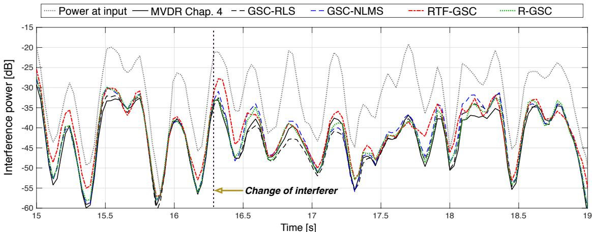  
(a) iSIR= 5.2 dB

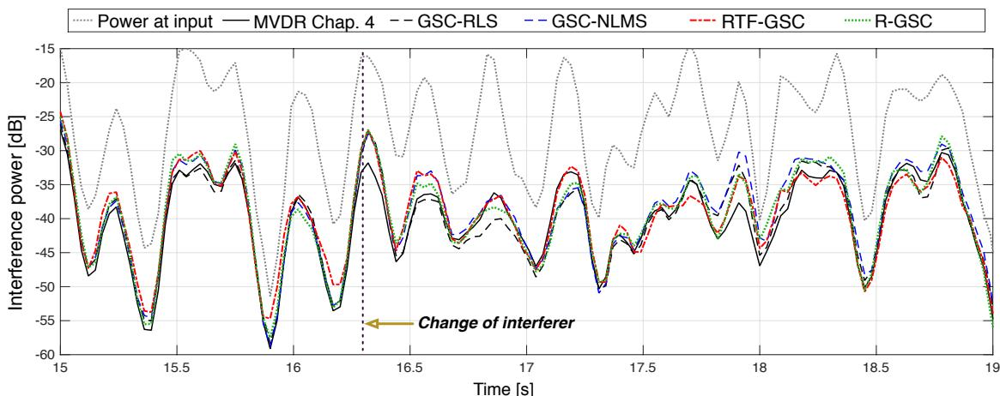  
(b) iSIR=-1.5 dB  
Figure 5.2: Segment-wise interference power at the output of the different GSC implementations.

ii) The baseline system RTF-GSC, where the NCs are updated continuously without a signal detector, has notably worse performance, particularly at high iSIRs. Besides having an FBF and a BM computed using data when the interfering signal is absent, it is clear that even small estimation errors in the RTF vector lead to signal cancellation. Note that in the closed-form filters, the sensitivity of the MPDR filter to propagation mismatch is particularly prominent at high Signal-to-Noise Ratios (SNRs) $[38, 220]$ . As the GSC filter with continuous NC adaptation is an equivalent implementation of the MPDR, the performance degradation of the RTF-GSC at high iSIR is a manifestation of the same phenomenon.

iii) Although the R-GSC provides similar SIR improvement and IR as the GSC-RLS and GSC-NLMS implementations, it causes larger distortion to the desired signal, visible in Figure 5.3(d). This is due to the usage of an anechoic propagation-based FBF. Nonetheless, the usage of an adaptive BM updated only when the desired signal is detected, clearly alleviates the signal cancellation problem compared to the RTF-GSC. Moreover, considering the fact that the R-GSC is less complex than the informed GSCs which update the FBF continuously, and that the SD index is only by 0.02 larger, it might be the preferred choice for practical implementation, provided that there are no significant array calibration errors (although the R-GSC is designed to be robust to a certain amount of miscalibration). Furthermore, in terms of PESQ and STOI scores, all adaptive GSC implementations (GSC-RLS,GSC-NLMS, and R-GSC), which use the proposed signal detector for controlling the filter updates, prove to be a nearly equivalent alternatives to the closed-form MVDR.

## Experiment 2: evaluation for different angular separations

The goal in this experiment is to evaluate the different filter implementations as a function of the angular separation between the desired source and the interferer. In addition to the filters tested in Experiment 1, we evaluate an MVDR filter when ideal detector is used, in order to investigate whether the performance trends follow due to the spatial resolution of the array, or due to different detection errors at different angular separations. Simulated data was used for this experiment, with the simulation process as described in Section 4.6. The distances of the desired source and the interferer from the array were 0.8 m and 1.4 m, respectively. The experiment was repeated for two reverberation levels: $T_{60} = 0.2$ s, where the iSIR and the speech-to-noise ratio are 1.5 dB and 10 dB, respectively, and $T_{60} = 0.4$ s, where the iSIR and the speech-to-noise ratio are 10.8 dB and 13 dB, respectively. The results averaged over three trials with different source combinations are presented in Figures 5.4-5.7, for the two reverberation levels. The main conclusions can be summarised as follows

i) The IR and SIR improvement followed identical trends, and hence we only show the SIR improvement in Figure 5.4. Considering the superior performance of the oracle MVDR filter, and the RTF-GSC at low angular separations, compared to the GSC filters that use the proposed signal detector, it can be concluded that improvement of detection scheme would offer better performance when the sources are close. However, for angular separations higher than 50 degrees, the GSC filters with the proposed detector outperform the RTF-GSC. In general, as expected, the SIR improvement of all filters decreases at higher reverberation times, in particular at higher angular separations, where the performance depends mostly on the ability of the array to reduce the undesired signals in reverberant environments, rather than the detection performance. It is also to be noted that in more reverberant environments the similarity between the closed-form MVDR filter and the adaptive GSC filters increases. The improvement in PESQ and STOI scores follow the same trend as the SIR improvement, as visible in Figures 5.5 and 5.6.

ii) The SD index is illustrated in Figure 5.7. As expected, the SD index increases at higher reverberation levels, although it is important to note that due to the fact that reverberant signal is used as a reference when computing the SD, part of the distortion is observed due to dereverberation, and not necessarily to lower desired signal quality or unpleasant distortion. A somewhat unexpected result is the fact that the R-GSC, besides using an anechoic propagation vector, provides lower SD at the higher reverberation level, compared to the filters that use the estimated RTF, even the one which is estimated using an ideal detector. A possible explanation of this behaviour is a violation of the Multiplicative Transfer Function (MTF) assumption which is used to estimate the RTFs, causing desired signal leakage in the BM outputs. As the R-GSC computes the BM adaptively, specifically with the purpose to combat signal cancellation, it might be more robust in reverberant environments than the informed GSC with a time-varying FBF, unless the convolutive transfer function model is used to estimate the RTFs [86]. Such investigation is however outside the scope of this thesis.

iii) In addition, note that the NR performance was not notably affected by the angular separation and remained in the range 5-8 dB for all filter implementations and both reverberation levels. In terms of NR, the R-GSC achieved by 2 dB worse NR than the remaining filters.

## Experiment 3: evaluation in the presence of DOA mismatch

In this experiment, we investigate the performance of the different filters when the system is provided a wrong DOA of the desired source, which might often happen in practice. We showed in Chapter 4 that the proposed DOA-informed MVDR filter is robust to such errors, when the interferer had a relatively large angular separation from the desired source. In this experiment, we evaluate the GSC implementations, and in addition, we repeat the experiment for a smaller angular separation between the desired source and the interferer as well. Measured data was used for this experiment, where the desired source is Source 3 from Figure 4.5, extracted with the three microphones from Array 3. We perform the experiment once with Source 1 as an interferer (angular separation from the desired source is $169^{\circ}$ ), and once when with Source 2 as an interferer (angular separation from the desired source is $55^{\circ}$ ). The average iSIR was 2 dB, while the average speech-to-noise ratio was 11 dB. The objective results are illustrated in Figures 5.8-5.10, and the main conclusions are summarised as follows

i) The SD index was unaffected by the DOA mismatch for both angular separations, and remained approximately 0.06 for the R-GSC, and 0.04 for the informed MVDR, GSC-NLMS, and GSC-RLS. The RTF-GSC which does not use a signal detector to control the NC updates, had a slightly higher SD with 0.08 for angular separation of $169^{\circ}$ and 0.12 for $55^{\circ}$ .

ii) Similarly as in Chapter 4, when the angular separation between the two sources is high, the SIR improvement offered by the different filters is unaffected by the DOA mismatch, as visible in Figure 5.8. In contrast, when the angular separation decreases, the DOA mismatch becomes more critical and the SIR improvement decreases linearly with increasing mismatch. This behaviour is expected, as the detection errors are more frequent when the angular separation is smaller and the DOA mismatch further worsens the detection performance.

iii) In the presence of DOA mismatch, the MVDR offers by 2.5-3.5 dB better SIR improvement than the GSCs in the case with angular separation 169°, and by 1 dB better SIR improvement in the case with angular separation 55°. The advantage in terms of SIR improvement of the MVDR compared to the GSC filters, notable for large angular separations, was also manifested in Experiment 2. Clearly, as the RTF-GSC does not employ the signal detector, its performance is independent of the DOA mismatch, and less affected by the angular separation between the sources. The PESQ and STOI scores follow similar trend as the SIR improvement, as visible in Figures 5.9 and 5.10.

iv) The NR performance was independent from the DOA mismatch in this experiment. For both interferer locations, the NR was 5 dB for the RTF-GSC, and 6-7 dB for the remaining filters.

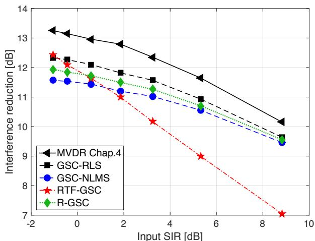  
(a) Interference reduction

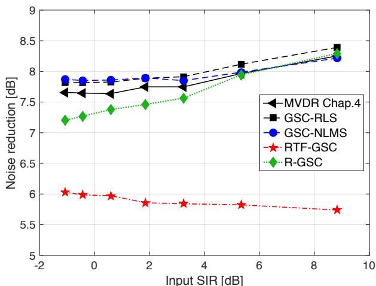  
(b) Noise reduction

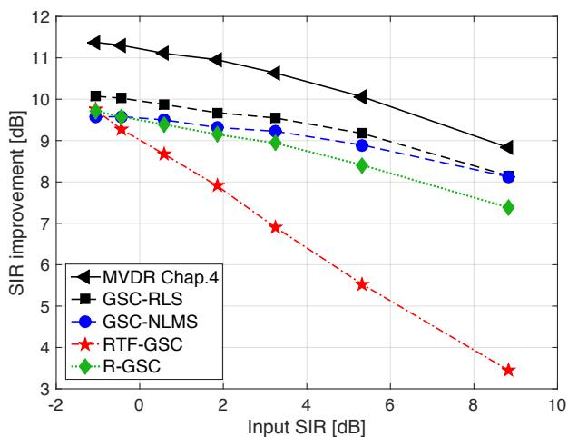  
(c) Signal-to-interference ratio improvement

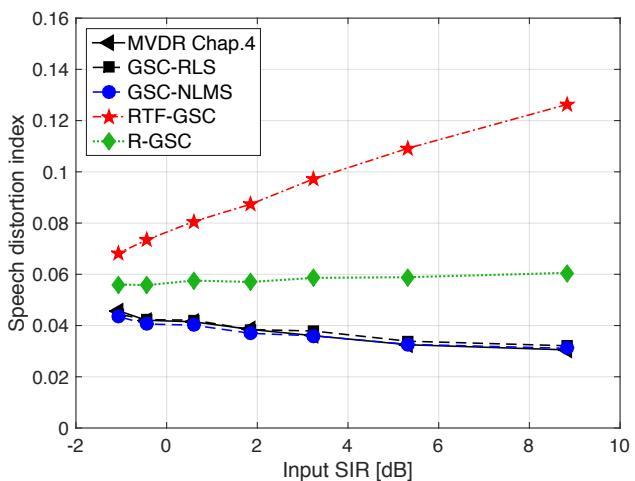  
(d) Speech distortion index $\nu_{sd}$

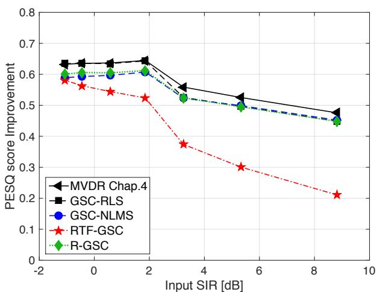  
(e) PESQ score improvement

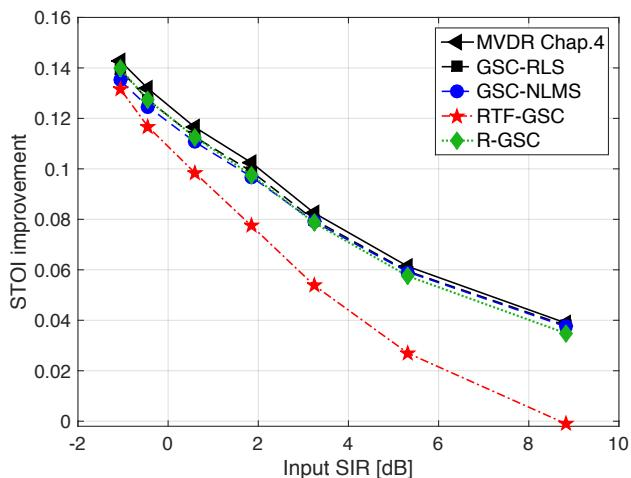  
(f) STOI improvement  
Figure 5.3: Average results as a function of the iSIR. The desired source is source 3, extracted using the microphones from array 3 (see Figure 4.5), while the other two sources are interferers which are active one after other (at the same time while the desired source is active). The input speech to noise ratio (desired plus undesired speech) at the reference microphone was approximately 9 dB.

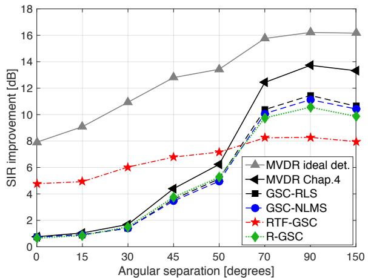  
(a) $T_{60} = 0.2 \, s$

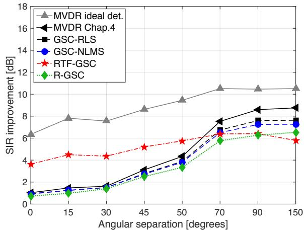  
(b) $T_{60} = 0.4 \, s$

Figure 5.4: Experiment 2, SIR improvement as a function of the angular separation between the sources.  
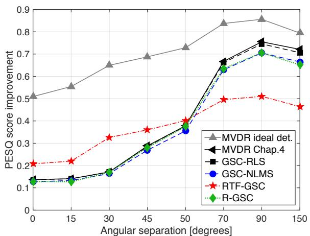  
(a) $T_{60} = 0.2 \, s$

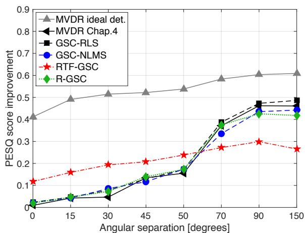  
(b) $T_{60} = 0.4 \, s$

Figure 5.5: Experiment 2, PESQ improvement as a function of the angular separation between the sources.  
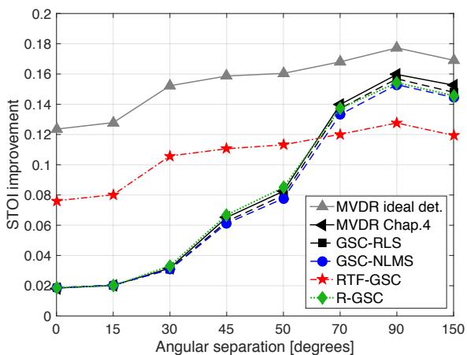  
(a) $T_{60} = 0.2 \, s$

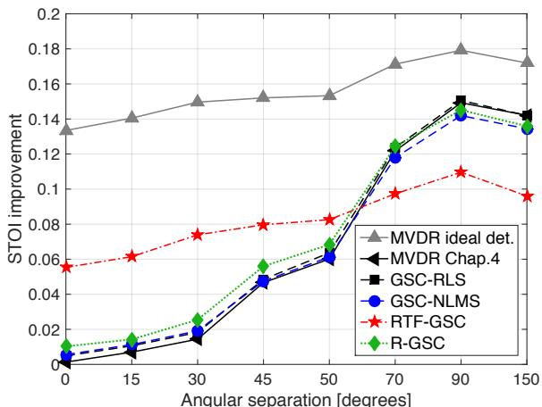  
(b) $T_{60} = 0.4 \, s$  
Figure 5.6: Experiment 2, STOI improvement as a function of the angular separation between the sources.

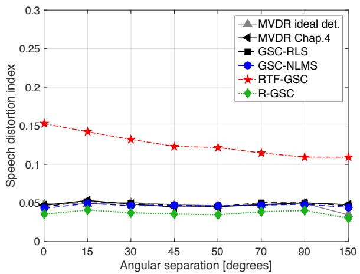  
(a) $T_{60} = 0.2 \, s$

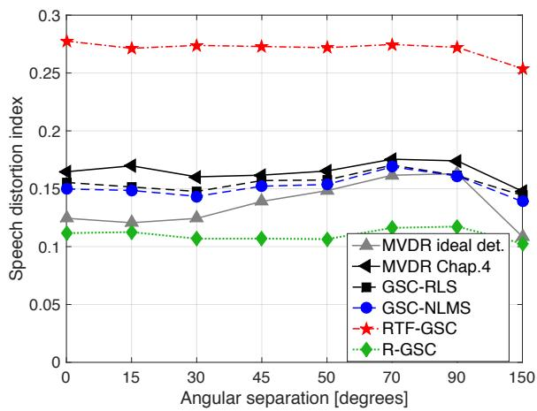  
(b) $T_{60} = 0.4 \, s$  
Figure 5.7: Experiment 2, average SD index as a function of the angular separation between the sources.

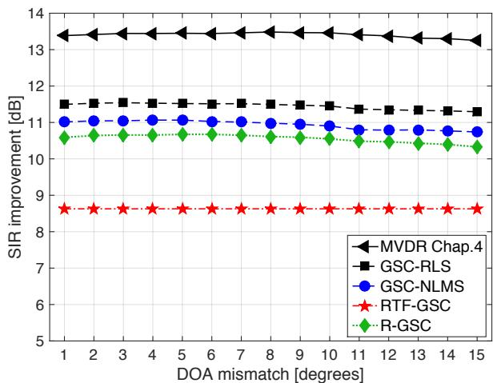  
(a) $T_{60} = 0.2 \, s$

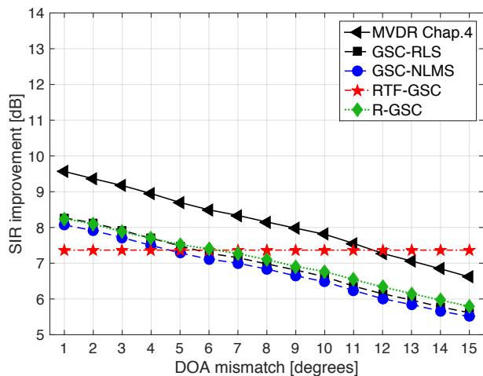  
(b) $T_{60} = 0.4 \, s$  
Figure 5.8: Experiment 3, SIR improvement as a function of the desired source DOA mismatch.

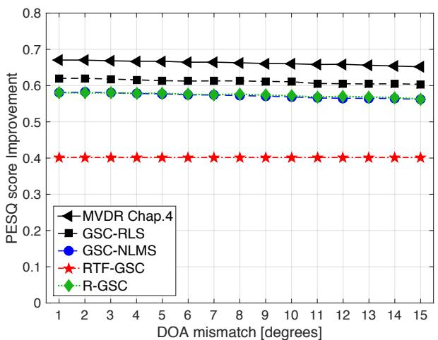  
(a) $T_{60} = 0.2 \, s$

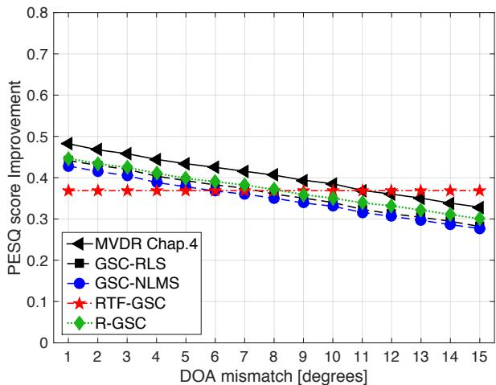  
(b) $T_{60} = 0.4 \, s$  
Figure 5.9: Experiment 3, PESQ improvement as a function of the desired source DOA mismatch.

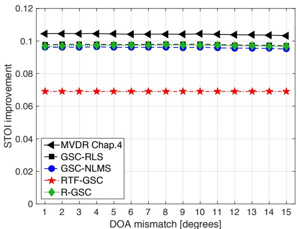  
(a) $T_{60} = 0.2 \, s$

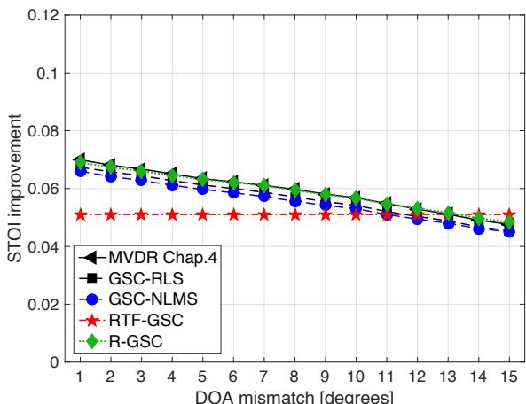  
(b) $T_{60} = 0.4 \, s$  
Figure 5.10: Experiment 3, STOI improvement as a function of the desired source DOA mismatch.

## 5.6 Summary

In this chapter, we discussed the implementation of informed spatial filtering frameworks using adaptive GSC structures. In particular, we applied different GSC implementations to the DOA-informed source extraction problem, which was addressed in Chapter 4. While the main contribution of Chapter 4, i.e., the DOA model-based signal detector was used in the MVDR filter to update the desired signal RTF vector and the undesired signal PSD matrix, it was shown that its role is equally important in the GSC structure, where it is used to determine when to update the fixed beamformer, the blocking matrix, and the adaptive noise cancellers. In particular, it was confirmed that even when having a fixed RTF vector estimate obtained during periods when only the desired signal and background noise are present, GSC which does not take into account the desired signal presence when updating the noise cancellers generally leads to larger distortion of the desired signal than the informed GSCs.

In addition to the two GSC implementations GSC-RLS, and GSC-NLMS, where the FBFs and the BM are obtained using the RTFs vector estimates, as in the standard well-known RTF-GSC proposed by Gannot $[47]$ (however, with time-varying FBFs and BMs), the R-GSC according to $[105,225]$ was discussed and evaluated. In the R-GSC, the adaptive filters for the BM and the noise cancellers were updated based on the output of the proposed signal detector, while the FBF was obtained using the anechoic RTF vector computed analytically using the array geometry and the DOA of the desired source. One of the main conclusions from the evaluation was the fact that the R-GSC provides comparable performance to the GSC-RLS and GSC-NLMS, while having a lower complexity more suitable for practical implementation. Therefore, together with a suitably desired signal detector, it might be the preferable ISF implementation in applications where the DOA of the desired source is known or can be estimated from the data, and where there are no significant array calibration errors.

In most experiments, a marginal advantage of the MVDR filter over the GSC implementations, and a marginal advantage of the GSC-RLS over the GSC-NLMS and R-GSC were observed. However, considering the quadratic complexity of the MVDR and GSC-RLS, compared to the linear one of the GSC-NLMS and R-GSC, the conclusion is that the GSC-NLMS and R-GSC, together with the proposed DOA-based detector, offer an efficient solution for implementing ISFs in practice.

Hands-free capture of speech in scenarios with multiple speech sources often requires solving one of the following tasks: i) extraction of a subset of sources from a mixture $[94]$ , ii) source separation where a separate filter is computed to extract each source $[130,141]$ , and iii) extraction of sources that originate from a user-defined Spot of Interest (SOI) $[99,104,110–112]$ . In this chapter, we focus on the last problem, hereafter referred to as acoustic spotforming, to emphasize that in contrast to traditional beamforming which extracts sources from desired directions, as considered in Chapter 4 and $[101,164]$ , spotforming extracts sources from a desired SOI. Directional signals originating from the SOI are referred to as spot signals, while the background noise and directional signals from outside the SOI represent undesired signals. The term spotforming has been used earlier in ultra-wideband (UWB) array processing to emphasise that UWB waveforms can focus on spots, as opposed to directions in narrowband processing $[226]$ .

Although state-of-the-art spatial filters, as discussed in the previous chapters, are fully data-dependent and computed using the Power Spectral Density (PSD) matrices of the desired and the undesired signals, the existing solutions to the acoustic spotforming problem are only partially data-dependent $[66,99,104,110–112,175]$ . The spot signal statistics are often pre-computed, for instance, based on a near-field propagation model, resulting in sub-optimal filters $[99,100,104]$ . The undesired signal PSD matrices, are also fixed and computed using standard Voice Activity Detectors (VADs) in isolated periods when the spot signal is inactive. Such estimation of the undesired signal PSD matrix is not able to sufficiently quickly track changes in scenarios with temporally and spatially non-stationary interferers.

In this chapter, we propose a fully data-dependent spatial filtering framework for extraction of speech signals that originate from a SOI, using multiple microphone arrays. In contrast to the aforementioned state-of-the-art approaches, the proposed approach does not assume a propagation model and stationarity of the undesired signals, and hence, it is applicable in challenging multi-talk situations, without requiring any prior information, except the geometry, location and orientation of the arrays. Following the informed spatial filtering concept, the PSD matrices of the spot signal and the undesired signal are updated at each Time-Frequency (TF) bin by using a minimum Bayes risk detector that is based on a likelihood model of narrowband position estimates. To obtain narrowband position estimates, which are the key narrowband features for the algorithms developed in this and in the subsequent chapters, we assume that at least two spatially separated microphone arrays are available, with at least three microphones each.

Assuming relatively small spot sizes, a crucial observation underlying the work in this chapter is the fact that due to the speech sparsity in the Short-Time Fourier Transform (STFT) domain $[127]$ and the online estimation of the PSD matrices, the spot signal PSD matrix at each TF bin can be approximated by a rankone matrix, even if there are multiple sources in the SOI. Therefore, the spot signal can be extracted by a Minimum Variance Distortionless Response (MVDR) filter with a time-varying constraint. In contrast to state-of-the-art Linearly Constrained Minimum Variance (LCMV)-based approaches which employ multiple eigenvector constraints to ensure low distortion across the SOI, the MVDR filter has a single constraint and offers more degrees of freedom to reduce undesired signals.

Note that although multiple spatially separated arrays are required to obtain narrowband position estimates required for the signal detector, the spotformer can be computed using an arbitrary subset of arrays or microphones. We experimentally show that due to the spatial diversity of distributed arrays, multi-array spotforming improves the spatial selectivity compared to single-array spotforming, however, at the cost of a larger spot signal distortion. Furthermore, throughout this chapter, we assume that all signals are synchronised and available at a centralised processor. For details on signal synchronisation the reader is referred to $[227]$ and references therein.

The rest of the chapter is organised as follows: in Section 6.1 we define the signal model specific for the spotforming application. An overview of a few state-of-the-art approaches to acoustic spotforming is provided in Section 6.2. The first main contribution of this chapter, namely, the development of an informed spatial filtering framework for spotforming is presented in Section 6.3. The feature extraction and narrowband signal detection specific for the this application are the second main contribution and are presented in Section 6.4. A comprehensive performance evaluation is presented in Section 6.5, and Section 6.6 concludes the chapter.

## 6.1 Signal model and overview

We assume that M microphones, arranged in at least two spatially separated arrays are placed in a reverberant enclosure. If a user-defined arbitrary SOI is denoted by S, the signal captured at the m-th microphone is given in the STFT domain as follows

$$
Y _ {m} (t, k) = \int_ {\mathbf {r} \in \mathcal {S}} H _ {\mathbf {r} m} (k) \tilde {S} _ {\mathbf {r}} (t, k) \mathrm{d} \mathbf {r} + I _ {m} (t, k) + V _ {m} (t, k),\tag{6.1}
$$

where $\tilde{S}_{r}$ denotes the signal from a source at position $r \in S$ , $I_{m}$ is the sum of all directional signals from outside S, and $V_{m}$ is the sum of background and sensor noise. If there is no source at position r, then $\tilde{S}_{\mathbf{r}}(t,k)=0$ . Assuming that the Acoustic Transfer Function (ATF) $H_{rm} \neq 0$ , the signal model (6.1) can be rewritten in vector notation in terms of the Relative Transfer Function (RTF) vector $\mathbf{g}_{\mathbf{r}m}(k)$ with respect to the m-th microphone as follows

$$
\mathbf {y} (t, k) = \int_ {\mathbf {r} \in \mathcal {S}} \mathbf {g} _ {\mathbf {r} m} (k)   S _ {\mathbf {r} m} (t, k)   \mathrm{d} \mathbf {r} + \mathbf {i} (t, k) + \mathbf {v} (t, k),\tag{6.2}
$$

where the RTF vector $g_{rm}$ was defined in (2.10). To be consistent with the desired signal notation from the previous chapters, we denote the spot signal by $\mathbf{s}(t,k)$ , i.e.,

$$
\mathbf {s} (t, k) = \int_ {\mathbf {r} \in \mathcal {S}} \mathbf {g} _ {\mathbf {r} m} (k)   S _ {\mathbf {r} m} (t, k)   \mathrm{d} \mathbf {r}.\tag{6.3}
$$

As the spot signal might contain speech from multiple sources, the spot signal PSD matrix in not necessarily a rank-one matrix and is given by

$$
\boldsymbol {\Phi} _ {\mathbf {s}} (t, k) = \int_ {\mathbf {r} \in \mathcal {S}} \phi_ {S _ {\mathbf {r} m}} (t, k) \mathbf {g} _ {\mathbf {r} m} (k) \mathbf {g} _ {\mathbf {r} m} ^ {\mathrm{H}} (k) \mathrm{d} \mathbf {r},\tag{6.4}
$$

where $\phi_{S_{\mathbf{r}m}} = \mathrm{E}\left[|S_{\mathbf{r}m}|^2\right]$ is the PSD of the source signal $S_{\mathbf{r}m}$ located at $\mathbf{r}$ . In addition, similarly as in the previous chapters, we use the notation $\Phi_{\mathbf{u}} = \Phi_{\mathbf{i}} + \Phi_{\mathbf{v}}$ and $\Phi_{\mathbf{s} + \mathbf{v}} = \Phi_{\mathbf{s}} + \Phi_{\mathbf{v}}$ .

The objective is to estimate the spot signal $S_{m}(t,k)=\int_{\mathbf{r}\in\mathcal{S}}S_{\mathbf{r}m}(t,k)\,\mathrm{d}\mathbf{r}$ , as captured at the reference microphone m. As the SOI is user-defined, the microphone m can be chosen as the nearest microphone to the spot centroid. At each TF bin, $\widehat{S}_{m}(t,k)$ is obtained by applying an optimal data-dependent and time-varying spotformer $w_{opt}$ as follows

$$
\widehat {S} _ {m} (t, k) = \mathbf {w} _ {\mathrm{opt}} ^ {\mathrm{H}} (t, k) \mathbf {y} (t, k).\tag{6.5}
$$

## 6.2 State-of-the-art methods for acoustic spotforming

Spatial filters which achieve acoustic spotforming are known as soft-constrained, space-constrained, or region-based beamformers $[110–112]$ in the literature. Alternatively, spotforming can be realised using Robust Adaptive Beamformers (RABs), such as a robust LCMV beamformer with eigenvector constraints that impose low distortion across the SOI $[99,104]$ . This approach is briefly reviewed in Section 6.2.1. Sound extraction from a volume using a filter-and-sum beamformer has been proposed in $[175]$ , where the filters are matched to the ATFs of multiple microphones. Although room acoustics are included via the ATF, this approach is data-independent (and hence sub-optimal), requires a large number of microphones to achieve good performance, and requires a priori knowledge of the ATFs.

## 6.2.1 Eigenspace-based spotforming

As a state-of-the-art spotforming framework, we consider the robust LCMV filter with eigenvector constraints [99, 104]. Low distortion across the SOI is imposed via an $M \times S$ constraint matrix $\mathbf{G}_S$ ( $S \gg M$ ) such that

$$
\mathbf {G} _ {\mathcal {S}} ^ {\mathrm{H}} (k) \mathbf {w} (t, k) = \mathbf {1} _ {S \times 1},\tag{6.6}
$$

where the columns of $G_{S}$ are the near-field steering vectors for S sampled positions from the SOI. If the ATF or RTF vectors are known for each position, they can substitute the near-field steering vectors to take the room acoustics into account. Although in [99,104] the near-field design is used, we proceed by using the RTFs in order to avoid model violation in the reverberant environment.

Eigenvector constraints are computed by substituting $G_{S}$ in the overdetermined system (6.6) by its rank-r approximation, where r < M. The Singular Value Decomposition (SVD) and the rank-r approximation of $G_{S}$ are given by

$$
\mathbf {G} _ {\mathcal {S}} = \mathbf {U} \boldsymbol {\Sigma} \mathbf {V} ^ {\mathrm{H}} \text {and} \mathbf {G} _ {\mathcal {S}, r} = \mathbf {U} _ {r} \boldsymbol {\Sigma} _ {r} \mathbf {V} _ {r} ^ {\mathrm{H}},\tag{6.7}
$$

where $U_{r}$ and $V_{r}$ contain the first r columns of U and V, corresponding to the r largest singular values, and $\Sigma_{r}$ is a $r \times r$ diagonal matrix containing these singular values. Using the $M \times r$ matrix $G_{S,r}$ , the new

constraint is given by

$$
\mathbf {V} _ {r} \boldsymbol {\Sigma} _ {r} \mathbf {U} _ {r} ^ {\mathrm{H}} \hat {\mathbf {w}} = \mathbf {1} _ {r \times 1},\tag{6.8}
$$

which can be rearranged in a similar form as the standard LCMV constraints in (6.6), namely,

$$
\mathbf {U} _ {r} ^ {\mathrm{H}} \hat {\mathbf {w}} = \boldsymbol {\Sigma} _ {r} ^ {- 1} \mathbf {V} _ {r} ^ {\mathrm{H}} \mathbf {1} _ {r \times 1}.\tag{6.9}
$$

Finally, the LCMV filter with eigenvector constraints is obtained by solving

$$
\underset {\mathbf {w}} {\arg \min} \mathbf {w} ^ {\mathrm{H}} \boldsymbol {\Phi} _ {\mathbf {u}} \mathbf {w}, \quad \text { subject   to } (6. 9).\tag{6.10}
$$

Denoting the constraint vector on the right-hand side in $(6.9)$ by c, the resulting LCMV filter with eigenvector constraints is given by

$$
\mathbf {w} _ {\mathrm{opt}} = \boldsymbol {\Phi} _ {\mathbf {u}} ^ {- 1} \mathbf {U} _ {r} (\mathbf {U} _ {r} ^ {\mathrm{H}} \boldsymbol {\Phi} _ {\mathbf {u}} ^ {- 1} \mathbf {U} _ {r}) ^ {- 1} \mathbf {c}.\tag{6.11}
$$

The rank r required to ensure that the distortion across the SOI is lower than a given threshold can be determined from the eigenstructure of the matrix $G_{S}$ [100].

## 6.2.2 Matched filter for spotforming

An alternative way to realise a spotformer based on existing techniques is to use the ATF vector for the centroid of S as a constraint in an MVDR beamformer. This design was inspired by $[175]$ , where sounds from a SOI were extracted by a matched filter. The authors in $[175]$ argue that due to the correlation between the ATFs of neighbouring positions, a matched filter extracts sounds from a wider region. However, note that in this case, there is no explicit control of the size of S. To ensure fair comparison to our proposed spotformer, we will use the RTF vector instead of the ATF vector in the implementation of the matched filter-based spotformer.

## 6.2.3 Other approaches

The approaches in $[99,104,110-112]$ are based on a near-field model, where the spot signal PSD matrix is model-based (data-independent) and computed using near-field steering vectors. The model-based PSD matrix then used to compute a maximum Signal-to-Noise Ratio filter $[110]$ , a Minimum Mean Squared Error (MMSE) (Wiener) filter $[111,112]$ , or to design eigenvector constraints $[99,104]$ . The undesired signal PSD matrix $\Phi_{u}$ is estimated using full-band VADs, which is applicable if $\Phi_{u}$ varies slowly compared to $\Phi_{s}$ and if there are periods where the spot signal is inactive. As the constraints that ensure low spot signal distortion are computed using only prior information about the SOI, and the undesired signal PSD matrix estimation is not designed to quickly track changes in the acoustic scene, all the aforementioned methods are sub-optimal.

## 6.3 Acoustic spotforming using informed spatial filters

The following two assumptions underlie the Informed Spatial Filter (ISF)-based spotforming proposed in this chapter:

1. Relatively small SOIs with only a few concurrent sources are common in most applications.

2. The spot PSD matrix estimate $\widehat{\Phi}_{\mathbf{s}}(t,k)$ obtained at each TF bin by recursive averaging, has a low rank due to the speech sparsity in the STFT domain [127].

Although the spot signal PSD matrix was originally modelled as a full-rank matrix in (6.4), based on the above assumptions, $\Phi_{\mathbf{s}}(t,k)$ at a given TF bin can be approximated as

$$
\boldsymbol {\Phi} _ {\mathbf {s}} (t, k) \approx \phi_ {S _ {m}} (t, k) \mathbf {g} _ {m} (t, k) \mathbf {g} _ {m} ^ {\mathrm{H}} (t, k),\tag{6.12}
$$

where $\phi_{S_{m}}(t,k)$ is the spot signal PSD at the reference microphone and $\mathbf{g}_{m}(t,k)$ is the RTF vector of the dominant source at TF bin $(t,k)$ . Note that the RTF vector is time-varying to model movements of the dominant source, or different sources from the spot being dominant at different TF bins.

The main idea of the proposed spotforming framework is to employ an MVDR filter whose distortionless constraint is given by the time-varying RTF vector $\mathbf{g}_{m}(t,k)$ . In contrast to the state-of-the-art LCMV filters with multiple eigenvector constraints, the MVDR filter has a single constraint and offers more degrees of freedom to reduce undesired signals. Considering the assumptions that the speech signals are sparse, a single constraint suffices to extract the desired dominant source with low distortion. Given the undesired signal PSD matrix and the constraint, the MVDR spotformer at each TF bin can be computed as described in Section 2.4.1. Clearly, realisation of the MVDR spotformer involves two main tasks:

1. Estimate the time-varying undesired signal PSD matrix $\Phi_{\mathbf{u}}(t,k)$ ;

2. Estimate the time-varying spot signal PSD matrix $\Phi_{\mathbf{s}}(t,k)$ , and find a suitable rank-one approximation which provides an optimal (in a sense that will be discussed next) constraint vector $\mathbf{g}_{m}(t,k)$ .

As discussed in the previous chapters, accurate PSD matrix estimates can be obtained by defining likelihood models for suitably chosen narrowband features for the particular application, and computing detectors to determine whether a desired or an undesired signal is dominant at each TF bin. A suitable spot signal detector is developed in Section 6.4. The computation of an optimal constraint $\mathbf{g}_{m}(t,k)$ , given a spot PSD matrix estimate $\widehat{\Phi}_{s}$ , is closely related to RTF estimation [85], and can be solved using the RTF estimators outlined in Section 2.5.3. In addition, we propose an RTF estimator suitable for scenarios when multiple sources are present in the SOI and the rank-one approximation of $\Phi_{s}$ might be violated.

High level diagram of the proposed informed spatial filtering framework for acoustic spotforming, is illustrated in Figure 6.1. The narrowband spatial features block estimates the Signal-to-Diffuse Ratio (SDR) required for the background noise PSD matrix, as proposed in Chapter 3, narrowband Direction-Of-Arrival (DOA) estimates from the each array, and narrowband position estimates obtained from the DOAs. The estimation of narrowband DOAs was outlined in Section 4.2, and in this chapter we use the DOA estimator based on instantaneous phase differences. The computation of narrowband position estimates is detailed in Section 6.4.1.

## 6.3.1 Estimation of PSD matrices

In the spotforming application, we relax the strict sparsity assumption and only require that there exist TF bins where either sources from S or sources outside S and/or background noise are dominant. Accordingly,

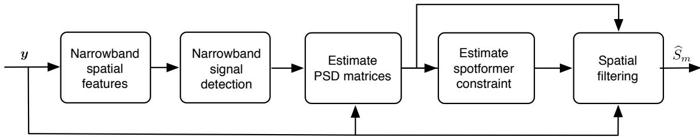  
Figure 6.1: High level diagram of informed spatial filtering framework for acoustic spotforming.

we define the following hypotheses

$$
\mathcal {H} _ {v}: \text { background   noise   is   dominant } \mathbf {y} (t, k) \approx \mathbf {v} (t, k),\tag{6.13a}
$$

$$
\mathcal {H} _ {s}: \mathrm{speechfrom} \mathcal {S} \mathrm{isdominant,i.e} \mathbf {y} (t, k) \approx \mathbf {s} (t, k) + \mathbf {v} (t, k),\tag{6.13b}
$$

$$
\mathcal {H} _ {i}: \text { speech   outside } \mathcal {S} \text { is   dominant,   i.e } \mathbf {y} (t, k) \approx \mathbf {i} (t, k) + \mathbf {v} (t, k),\tag{6.13c}
$$

$$
\mathcal {H} _ {s i} = \mathcal {H} _ {s} \cup \mathcal {H} _ {i}: \text { speech   is   dominant   (inside   or   outside   } \mathcal {S})\tag{6.13d}
$$

$$
\mathcal {H} _ {u} = \mathcal {H} _ {i} \cup \mathcal {H} _ {v}: \text { undesired   signal   is   dominant   (noise   or   speech) }.\tag{6.13e}
$$

To compute the coefficients of the MVDR spotformer, the matrices $\Phi_{s}$ , $\Phi_{u}$ , and $\Phi_{v}$ are required. For convenience, we restate the recursions for the PSD matrices

$$
\widehat {\boldsymbol {\Phi}} _ {\mathbf {u}} (t, k) = \alpha_ {u} (t, k) \widehat {\boldsymbol {\Phi}} _ {\mathbf {u}} (t - 1, k) + \left[ 1 - \alpha_ {u} (t, k) \right] \mathbf {y} (t, k) \mathbf {y} ^ {\mathrm{H}} (t, k),\tag{6.14a}
$$

$$
\widehat {\boldsymbol {\Phi}} _ {\mathbf {v}} (t, k) = \alpha_ {v} (t, k) \widehat {\boldsymbol {\Phi}} _ {\mathbf {i + v}} (t - 1, k) + \left[ 1 - \alpha_ {v} (t, k) \right] \mathbf {y} (t, k) \mathbf {y} ^ {\mathrm{H}} (t, k),\tag{6.14b}
$$

$$
\widehat {\boldsymbol {\Phi}} _ {\mathbf {s} + \mathbf {v}} (t, k) = \alpha_ {s} (t, k) \widehat {\boldsymbol {\Phi}} _ {\mathbf {s} + \mathbf {v}} (t - 1, k) + \left[ 1 - \alpha_ {s} (t, k) \right] \mathbf {y} (t, k) \mathbf {y} ^ {\mathrm{H}} (t, k),\tag{6.14c}
$$

where for given constants $\tilde{\alpha}_{s},\tilde{\alpha}_{u},\tilde{\alpha}_{v}\in(0,1)$ , the time and frequency-dependent averaging parameters are given by

$$
\alpha_ {s} (t, k) = 1 + \mathcal {I} _ {\mathcal {H} _ {s}} (t, k) (\tilde {\alpha} _ {s} - 1),\tag{6.15a}
$$

$$
\alpha_ {u} (t, k) = 1 + \mathcal {I} _ {\mathcal {H} _ {u}} (t, k) (\tilde {\alpha} _ {u} - 1),\tag{6.15b}
$$

$$
\alpha_ {v} (t, k) = \tilde {\alpha} _ {v} + p (\mathcal {H} _ {s i} | \mathbf {y} (t, k)) (1 - \tilde {\alpha} _ {v}).\tag{6.15c}
$$

The motivation for using binary detection when updating the non-stationary PSD instead of soft updates as for the PSD matrix $\Phi_{v}$ , was mentioned in Chapter 4.

The Speech Presence Probability (SPP) $p(\mathcal{H}_{si} \mid \mathbf{y})$ required for the averaging constant $\alpha_{v}$ in (6.15c) was the main topic of Chapter 3, and similarly used in Chapter 4 for SPP and noise PSD matrix estimation. Hence the SDR-based framework developed in Chapter 3 is fully included in the spotforming framework as well. Note that the signal vector $\mathbf{y}(t, k)$ now contains signals from spatially separated arrays. Although the SPP and noise PSD matrix estimation framework can be implemented in the same manner as in Chapter 3 ignoring the geometry of the microphones, our experiments showed that estimating the SPP separately for each array, and using the maximum of the SPPs across the arrays in (6.15c) provides more robust noise PSD matrix estimates.

## 6.3.2 Estimation of a constraint vector for the MVDR spotformer

When the spot signal PSD matrix $\Phi_{\mathbf{s}}(t,k)$ can be approximated as a rank-one matrix, as discussed in Section 6.3, the constraint vector of the MVDR spotformer at a given TF bin can be interpreted as an approximation of the RTF vector of the dominant source at that bin. Using this interpretation, we discuss three methods to determine the MVDR constraint, which are closely related to the RTF vector estimation approaches discussed in Section 2.5.3.

## 6.3.2.1 Constraint vector based on MMSE rank-one approximation

Under the approximate rank-one approximation, the following relation holds between the spot signal $S_{m}(t,k)$ at the reference microphone and the vector $\mathbf{s}(t,k)$

$$
\mathbf {s} (t, k) \approx \mathbf {g} _ {m} (t, k) S _ {m} (t, k).\tag{6.16}
$$

The optimal spotformer constraint in the MMSE sense is obtained by solving

$$
\hat {\mathbf {g}} _ {m} (t, k) = \underset {\mathbf {g}} {\arg \min} \mathrm{E} \left[ \| \mathbf {s} (t, k) - \mathbf {g} S _ {m} (t, k) \| ^ {2} \right],\tag{6.17}
$$

the solution to which is given by

$$
\hat {\mathbf {g}} _ {m} (t, k) = \frac {\boldsymbol {\Phi} _ {\mathbf {s}} (t , k)   \mathbf {e} _ {m}}{\mathbf {e} _ {m} ^ {\mathrm{H}} \boldsymbol {\Phi} _ {\mathbf {s}} (t , k)   \mathbf {e} _ {m}}, \quad \text { with } \quad \mathbf {e} _ {m} = [ \underbrace {0 \cdots 0} _ {m - 1}, 1 0 \dots 0 ] ^ {\mathrm{T}}.\tag{6.18}
$$

Hence, the MMSE-optimal constraint is given by the first column of $\Phi_{s}$ , normalised by the PSD at the reference microphone. This result is equivalent to the covariance subtraction-based RTF vector in Section 2.5.3.1. Although based on a single-source model, it was experimentally shown [55] that using the constraint (6.18), multiple sources can be extracted with low distortion, which justifies its applicability in the spotforming framework. An estimate of the spot PSD matrix $\Phi_{s}$ is obtained as $\widehat{\Phi}_{s} = \widehat{\Phi}_{s+v} - \widehat{\Phi}_{v}$ , where $\widehat{\Phi}_{s+v}$ and $\widehat{\Phi}_{v}$ , are estimated according to (6.14). In practice, due to estimation errors, $\widehat{\Phi}_{s}$ might not be positive semi-definite at some TF bins. In this case, $\hat{\mathbf{g}}_{m}(t,k)$ is not updated and $\hat{\mathbf{g}}_{m}(t-1,k)$ from the previous frame is used.

## 6.3.2.2 Constraint vector based on Least Squares rank-one approximation

A different way to approximate $\Phi_{s}$ by a rank-one matrix is by minimising the Frobenius norm of the difference between $\Phi_{s}$ and a rank-one approximation thereof, i.e.,

$$
\hat {\mathbf {g}} _ {m} (t, k) = \underset {\mathbf {g}} {\arg \min} \| \boldsymbol {\Phi_ {s}} (t, k) - \phi_ {s} (t, k) \mathbf {g} \mathbf {g} ^ {\mathrm{H}} \| _ {\mathrm{F}}.\tag{6.19}
$$

According to the matrix approximation lemma [228], the optimal solution to (6.19) is the principal eigenvector of $\Phi_{\mathbf{s}}$ . As only an estimate of $\Phi_{\mathbf{s + v}}$ rather than $\Phi_{\mathbf{s}}$ is available, $\hat{\mathbf{g}}_m$ is estimated by first computing the principal eigenvector $\mathbf{p}_{\mathrm{max}}$ of the pre-whitened matrix $\widehat{\Phi}_{\mathbf{v}}^{-1}\widehat{\Phi}_{\mathbf{s + v}}$ , and performing de-whitening, i.e. $\hat{\mathbf{g}}_m \propto \widehat{\Phi}_{\mathbf{v}}\mathbf{p}_{\mathrm{max}}$ . The scaling is determined by definition, as the first element of $\mathbf{g}_m$ is equal to 1. To avoid the explicit matrix inversion in $\widehat{\Phi}_{\mathbf{v}}^{-1}\widehat{\Phi}_{\mathbf{s + v}}$ , the vector $\mathbf{p}_{\mathrm{max}}$ can be computed from the Generalised Eigenvalue Decomposition (GEVD) of $(\Phi_{\mathbf{s + v}}, \Phi_{\mathbf{v}})$ [228].

The Least Squares (LS)-optimal approach of computing $\hat{\mathbf{g}}_{m}(t,k)$ corresponds to the covariance whitening-based RTF estimator in Section 2.5.3.2. Note that the complexity of performing GEVD at each TF bin can be reduced by employing an adaptive estimation of the principal eigenvector [52]. Similarly as the MMSE-optimal constraint, the LS-optimal constraint can also be applied to extract multiple sources with low distortion, due to the speech sparsity in the STFT domain.

## 6.3.2.3 Constraint vector using projection-based approximation

When there are multiple sources in the SOI and the rank of $\Phi_{s}$ increases, distortion of the spot signal is unavoidable when using an MVDR spotformer. To improve the performance in such scenarios, without including additional constraints and reducing thereby the degrees of freedom for undesired signal reduction, we propose an RTF estimator that does not explicitly use a rank-one model for $\Phi_{s}$ . The RTF vector of the dominant source at each TF bin is computed using the instantaneous signal $\mathbf{y}(t,k)$ and an estimate of the multi-dimensional signal subspace.

To motivate the need for the RTF estimator described in this section, consider the GEVD of the matrix pencil $(\Phi_{\mathbf{s}+\mathbf{v}}, \Phi_{\mathbf{v}})$ when the SOI contains two sources located at positions $r_{1}$ and $r_{2}$

$$
\left(\phi_ {\mathbf {r} _ {1}} \mathbf {g} _ {\mathbf {r} _ {1}} \mathbf {g} _ {\mathbf {r} _ {1}} ^ {\mathrm{H}} + \phi_ {\mathbf {r} _ {2}} \mathbf {g} _ {\mathbf {r} _ {2}} \mathbf {g} _ {\mathbf {r} _ {2}} ^ {\mathrm{H}} + \boldsymbol {\Phi} _ {\mathbf {v}}\right) \mathbf {p} = \lambda \boldsymbol {\Phi} _ {\mathbf {v}} \mathbf {p},\tag{6.20}
$$

where $(\lambda,\mathbf{p})$ denote a generalised eigenvalue and eigenvector pair, $\phi_{r_{1}}$ and $\phi_{r_{2}}$ are the PSDs of the two sources at the reference microphone, and $g_{r_{1}}$ and $g_{r_{2}}$ are the RTFs vectors of the two sources with respect to the reference microphone. Equation (6.20) can be rearranged as

$$
\begin{array}{l} c _ {1} \mathbf {g} _ {\mathbf {r} _ {1}} + c _ {2} \mathbf {g} _ {\mathbf {r} _ {2}} = (\lambda - 1) \boldsymbol {\Phi_ {\mathbf {v}}} \mathbf {p}, \\ \text {where} c _ {1} = (\phi_ {\mathbf {r} _ {1}} \mathbf {g} _ {\mathbf {r} _ {1}} ^ {\mathrm{H}} \mathbf {p}) ^ {- 1}, c _ {2} = (\phi_ {\mathbf {r} _ {2}} \mathbf {g} _ {\mathbf {r} _ {1}} ^ {\mathrm{H}} \mathbf {p}) ^ {- 1}. \end{array}\tag{6.21}
$$

From (6.21), it is clear that the generalised eigenvectors $p_{1}$ and $p_{2}$ that correspond to $\lambda_{1}, \lambda_{2} \neq 1$ , provide two distinct linear combinations of the RTF vectors $g_{r_{1}}$ and $g_{r_{2}}$ , and hence a basis for the spot signal subspace. Note that in practice, due to estimation errors there more than two generalised eigenvalues of $(\widehat{\Phi}_{\mathbf{s}+\mathbf{v}}, \widehat{\Phi}_{\mathbf{v}})$ which are not equal to one. Therefore, an orthogonal basis $U_{s}$ for the estimated spot signal subspace can be computed by orthonormalisation of the two generalised eigenvectors that correspond to the two largest eigenvalues.

Let $P_{s} = U_{s} U_{s}^{H}$ denote a projection matrix onto the signal subspace, obtained using the two generalised eigenvectors described above. The key idea of the proposed RTF estimator is to enforce the instantaneous RTF vector $\mathbf{g}_{m,\mathrm{inst}}(t,k)$

$$
\mathbf {g} _ {m, \mathrm{inst}} (t, k) = \frac {\mathbf {y} (t , k) Y _ {m} ^ {*} (t , k)}{| Y _ {m} (t , k) | ^ {2}},\tag{6.22}
$$

to lie in the estimated signal subspace, by performing the following subspace projection

$$
\mathbf {g} _ {m, \mathrm{proj}} (t, k) = \frac {\mathbf {P} _ {s} (t , k) \mathbf {g} _ {m , \mathrm{inst}} (t , k)}{\mathbf {e} _ {m} ^ {\mathrm{H}} \mathbf {P} _ {s} (n , k) \mathbf {g} _ {m , \mathrm{inst}} (t , k) \mathbf {e} _ {m}},\tag{6.23}
$$

where the denominator normalises the m-th entry (reference microphone) to one. The vector $g_{m,inst}$ captures the spatial information of the dominant source, whereas the projection de-noises $g_{m,inst}$ by constraining it onto the signal subspace. Using the output $\mathcal{I}_{\mathcal{H}_{s}}(t,k)$ of a bin-wise binary spot signal detector, the RTF vector to be used as a spotformer constraint is given by

$$
\hat {\mathbf {g}} _ {m} (t, k) = \mathcal {I} _ {\mathcal {H} _ {s}} (t, k) \mathbf {g} _ {m, \mathrm{proj}} (t, k) + [ 1 - \mathcal {I} _ {\mathcal {H} _ {s}} (t, k) ] \hat {\mathbf {g}} _ {m} (t - 1, k).\tag{6.24}
$$

Hence, when the spot signal is dominant $(\mathcal{I}_{\mathcal{H}_{s}}(t,k)=1)$ the constraint is obtained by (6.23), whereas when the spot signal is absent, the constraint from the previous frame is used. The computation of the spot signal detector, required for the projection-based constraint $\hat{g}_{m}$ as well as for the spot signal PSD matrix estimation, is detailed in the following section.

In general, the number of sources in the SOI is unknown and it is unclear how many eigenvectors should be used to obtain the orthonormal basis $U_{s}$ . One approach to determine the rank of the spot signal subspace is to set a threshold on the generalised eigenvalues. However, in the experiments in the course of our work, we found that due to the speech sparsity, two eigenvectors per frequency bin suffice to approximate the signal subspace for up to four concurrent sources in moderately reverberant rooms.

## 6.4 Spot signal detection

To recursively estimate the PSD matrices in (6.14), each TF bin needs to be associated to one of the hypotheses $H_{s}$ and $H_{u}$ . Similarly as in the previous chapters, the first step is to define appropriate probabilistic models which allow to estimate the posterior probabilities $p(\mathcal{H}_{s} | \mathbf{y})$ and $p(\mathcal{H}_{u} | \mathbf{y})$ . Recall that in the presence of non-stationary interferers, binary detectors are preferable, and once the posterior probabilities are estimated, a minimum Bayes risk detector given by (4.24) can be evaluated to determine the correct hypothesis.

A specific property of the proposed detector design is the usage of the hierarchical model in Figure 6.2. Given that speech is present, meaning that $H_{si} = 1$ (upper branch of the figure), the probability that the speech originates from the SOI is $p_{s} = p(\mathcal{H}_{s} \mid \mathcal{H}_{si}, \mathbf{y})$ and is referred to as the conditional spot probability. The relations in Figure 6.2 can be formalised as

$$
p (\mathcal {H} _ {s} \mid \mathbf {y} (t, k)) = p (\mathcal {H} _ {s}, \mathcal {H} _ {s i} \mid \mathbf {y} (t, k)) = p (\mathcal {H} _ {s} \mid \mathcal {H} _ {s i}, \mathbf {y} (t, k)) \cdot p (\mathcal {H} _ {s i} \mid \mathbf {y} (t, k)).\tag{6.25}
$$

The SPP $p_{si} \equiv p(\mathcal{H}_{si} \mid \mathbf{y}(t, k))$ is computed using the Gaussian model-based framework proposed in Chapter 3, independently of the remaining components of the spot signal detection framework. Hence, we assume that $p(\mathcal{H}_{si} \mid \mathbf{y}(t, k))$ is known in the following discussions and we only focus on estimating the conditional spot probability $p(\mathcal{H}_{s} \mid \mathcal{H}_{si}, \mathbf{y}(t, k))$ .

Besides the usage of the hierarchical model depicted in Figure 6.2, the contribution of this chapter towards a spotforming-specific detector is the definition of a suitable spatial feature and a corresponding likelihood model which allows to evaluate the conditional spot probability. The spatial feature is discussed in Section 6.4.1, while the computation of the conditional spot probability and the likelihood models are detailed in Sections 6.4.2 and 6.4.3.

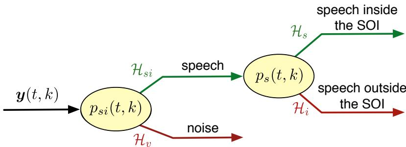  
Figure 6.2: Hierarchical model in the spotforming framework.

## 6.4.1 Feature selection: narrowband position estimates

As the spotforming requires position-based spatial selectivity, narrowband position estimates are an appropriate spatial feature to detect signals that originate from the SOI at a given TF bin. At TF bins where speech is dominant, the narrowband position estimate, denoted by $\hat{r}_{tk}$ , represents an estimate of the true position $r_{tk}$ of the source which is dominant at TF bin $(t,k)$ . Considering that multiple arrays are available, an efficient method to obtain $\hat{r}_{tk}$ is by triangulating the narrowband DOA vectors from the two arrays that have largest signal power at TF bin $(t,k)$ .

Let $\mathbf{d}_1, \mathbf{d}_2$ denote the centroids of the two arrays, $\hat{\mathbf{q}}_{1,tk} = [\cos \hat{\theta}_{1,tk}, \sin \hat{\theta}_{1,tk}]$ and $\hat{\mathbf{q}}_{2,tk} = [\cos \hat{\theta}_{2,tk}, \sin \hat{\theta}_{2,tk}]$ denote the estimated DOA vectors at the arrays, and $\hat{\theta}_{1,tk}$ and $\hat{\theta}_{2,tk}$ denote the DOAs estimates in radians. The position estimate $\hat{\mathbf{r}}_{tk}$ is the intersection of the lines defined by $\mathbf{d}_1, \mathbf{d}_2$ and $\hat{\mathbf{q}}_{1,tk}, \hat{\mathbf{q}}_{2,tk}$ , which is found by first solving the following equation for $\xi_1$ and $\xi_2$

$$
\mathbf {d} _ {1} + \xi_ {1} \hat {\mathbf {q}} _ {1, t k} = \mathbf {d} _ {2} + \xi_ {2} \hat {\mathbf {q}} _ {2, t k},\tag{6.26}
$$

and substituting to find $\hat{r}_{\tau k}$ in either $d_{1} + \xi_{1}\hat{q}_{1,tk} = \hat{r}_{tk}$ or in $d_{2} + \xi_{2}\hat{q}_{2,\tau k} = \hat{r}_{tk}$ . Although the two (non-parallel) lines defined above always have an intersection point, this point is a meaningful position estimate only if the inner product of the corresponding DOA vectors is positive. In this manner the triangulation process naturally discards noisy TF bins with unreliable position estimates. In general, the processing can be extended to 3D space by estimating the DOAs in 3D, and adding the z-coordinate in the estimated position. The most significant change from algorithmic point of view would be the triangulation step, which in the 3D case can be done for instance by finding the point that minimises the sum of distances from the rays defined by the DOA vectors at the arrays.

Given the position estimates $\hat{r}_{tk}$ a parametric model of the probabilities of the spot signal presence and spot signal absence can be defined. To this end, we proceed with the approximation

$$
p (\mathcal {H} _ {s} \mid \mathcal {H} _ {s i}, \mathbf {y} (t, k)) \approx p (\mathcal {H} _ {s} \mid \mathcal {H} _ {s i}, \hat {\mathbf {r}} _ {t k}),\tag{6.27}
$$

which is based on the assumption that when speech is present, all information contained in the signals $\mathbf{y}(t,k)$ that enables discrimination between speech from the SOI and speech outside the SOI, is contained in the narrowband position estimates. Recall however, that the signal vector y was used to discriminate between noise and speech via $p(\mathcal{H}_{si} \mid \mathbf{y})$ in the spot probability in (6.25).

An illustration of narrowband position estimates collected over 5 seconds of double-talk are illustrated in Figure 6.3. The different colours indicate which of the sources was dominant at the TF bin corresponding to the given position estimate. Clearly, when the sources are far apart and the reverberation is mild, the position estimates form separable clusters around each of the sources. When the reverberation level increases in Figure 6.3 (right), the position estimates are less accurate and the clusters become more spread. This behaviour is the reason for detection errors and deterioration of the extracted signal quality when there are undesired sources near the spot borders, or when the reverberation level is high.

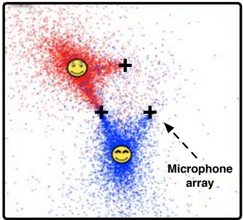

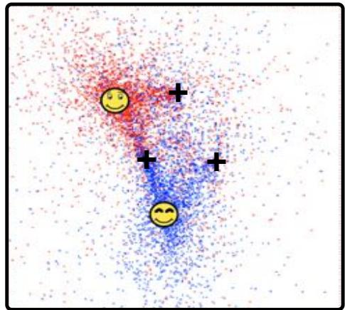  
Figure 6.3: Illustration of narrowband position estimates during 5 seconds of double-talk. Left: reverberation time $T_{60} = 0.2 \, s$ , and right: $T_{60} = 0.5 \, s$ .

## 6.4.2 Conditional spot probability

Using the Bayes theorem and standard probability axioms [229], the conditional spot probability can be expressed in a convenient manner in terms of likelihood functions which are parametrised in terms of the position estimates $\hat{\mathbf{r}}_{tk}$ . Let $\mathbf{r}$ denote 2-D vector corresponding to a true source position. Then, the conditional spot probability approximated by (6.27) is equivalent to the probability of the event $\mathbf{r} \in S$ , conditioned on speech presence. Formally, this can be written as

$$
p (\mathcal {H} _ {s} \mid \mathcal {H} _ {s i}, \hat {\mathbf {r}} _ {t k}) = \int_ {\mathbf {r} \in \mathcal {S}} f (\mathbf {r} \mid \mathcal {H} _ {s i}, \hat {\mathbf {r}} _ {t k}) d \mathbf {r}.\tag{6.28}
$$

To evaluate the integral, the room where the setup is located is uniformly sampled at N positions $r_{i}$ with $i \in I = \{1, 2, \ldots, N\}$ . This results in sampling of the Probability Density Function (PDF) of the true source location $f(\mathbf{r})$ , to obtain the discrete probability distribution $p(\mathbf{r}_{i})$ . To represent the SOI in terms of the position samples, define a subset $I_{S} \subset I$ with cardinality $N_{S}$ such that if $i \in I_{S}$ then $r_{i} \in S$ . The integral (6.28) can then be approximated as follows

$$
p (\mathcal {H} _ {s} \mid \mathcal {H} _ {s i}, \hat {\mathbf {r}} _ {t k}) = \int_ {\mathbf {r} \in \mathcal {S}} f (\mathbf {r} \mid \mathcal {H} _ {s i}, \hat {\mathbf {r}} _ {t k}) d \mathbf {r} \approx \frac {1}{N _ {\mathcal {S}}} \sum_ {i \in \mathcal {I} _ {\mathcal {S}}} p (\mathbf {r} _ {i} \mid \mathcal {H} _ {s i}, \hat {\mathbf {r}} _ {t k}).\tag{6.29}
$$

Next, to evaluate each of the $N_{S}$ terms in the sum, we apply the Bayes theorem, i.e.,

$$
p (\mathbf {r} _ {i} \mid \mathcal {H} _ {s i}, \hat {\mathbf {r}} _ {t k}) = f (\hat {\mathbf {r}} _ {t k} \mid \mathcal {H} _ {s i}, \mathbf {r} _ {i}) \cdot \frac {p (\mathbf {r} _ {i})}{f (\hat {\mathbf {r}} _ {t k} \mid \mathcal {H} _ {s i})}.\tag{6.30}
$$

The PDF $f(\hat{\mathbf{r}} \mid \mathcal{H}_{si})$ in the denominator is obtained by marginalisation over the true position r as

$$
f (\hat {\mathbf {r}} _ {t k} \mid \mathcal {H} _ {s i}) = \int_ {\mathbf {r}} f (\hat {\mathbf {r}} _ {t k} \mid \mathcal {H} _ {s i}, \mathbf {r}) \cdot f (\mathbf {r}) d \mathbf {r}.\tag{6.31}
$$

Similarly as in (6.29), using the room samples and the true source position PDF $f(\mathbf{r})$ , (6.31) can be approximated as

$$
f (\hat {\mathbf {r}} _ {t k} \mid \mathcal {H} _ {s i}) \approx \frac {1}{N} \sum_ {i ^ {\prime} \in \mathcal {I}} f (\hat {\mathbf {r}} _ {t k} \mid \mathcal {H} _ {s i}, \mathbf {r} _ {i ^ {\prime}}) \cdot p (\mathbf {r} _ {i ^ {\prime}}).\tag{6.32}
$$

Finally, by combining (6.28), (6.29), (6.30), and (6.32), the conditional spot probability is given by

$$
p (\mathcal {H} _ {s} | \mathcal {H} _ {s i}, \hat {\mathbf {r}} _ {t k}) = \frac {1}{N _ {\mathcal {S}}} \sum_ {i \in \mathcal {I} _ {\mathcal {S}}} \frac {f (\hat {\mathbf {r}} _ {t k} | \mathcal {H} _ {s i} , \mathbf {r} _ {i}) p (\mathbf {r} _ {i})}{\frac {1}{N} \sum_ {i ^ {\prime} \in \mathcal {I}} f (\hat {\mathbf {r}} _ {t k} | \mathcal {H} _ {s i} , \mathbf {r} _ {i ^ {\prime}}) p (\mathbf {r} _ {i ^ {\prime}})}.\tag{6.33}
$$

Hence, to compute the conditional spot probability, we only need know the PDFs $p(\mathbf{r}_{i})$ and $f(\hat{\mathbf{r}}_{tk} \mid \mathcal{H}_{si}, \mathbf{r}_{i})$ , for all $i \in I$ . The PDF $p(\mathbf{r}_{i})$ represents the prior knowledge where speech sources are located in the room. If no priori information about possible source locations is provided, $p(\mathbf{r}_{i})$ is assumed to be uniform, i.e., $p(\mathbf{r}_{i}) = 1/N$ . Therefore, it only remains to evaluate the likelihood $f(\hat{\mathbf{r}}_{tk} \mid \mathcal{H}_{si}, \mathbf{r}_{i})$ . We reiterate that the motivation to extract narrowband positions and express the conditional spot probability conditioned on the position estimates rather than on the signals y, was the fact that we can define a simple likelihood model for $f(\hat{\mathbf{r}} \mid \mathcal{H}_{si}, \mathbf{r}_{i})$ , which is described next.

## 6.4.3 Likelihood models $f(\hat{\mathbf{r}}_{tk} \mid \mathcal{H}_{si}, \mathbf{r}_i)$

For each position $r_{i}, i \in I$ , a likelihood $f(\hat{\mathbf{r}}_{tk} \mid \mathcal{H}_{si}, \mathbf{r}_{i})$ can be estimated in a training stage, by emitting a signal from $r_{i}$ for a short period of time, recording the position estimates $\hat{r}_{tk}$ for all TF bins, and fitting a parametric PDF to the observed set of position estimates. To avoid training, in our initial publication [230], we modelled $f(\hat{\mathbf{r}}_{tk} \mid \mathcal{H}_{si}, \mathbf{r}_{i})$ by a symmetric Gaussian distribution with mean $r_{i}$ and a fixed variance $\sigma^{2}I$ . The variance $\sigma^{2}$ depends on the acoustic conditions and was determined empirically. However, estimating the PDF parameters from observed data improves the performance and allows for better discrimination when interfering sources approach the spot borders. Hence, for each $r_{i}, f(\hat{\mathbf{r}}_{tk} \mid \mathcal{H}_{si}, \mathbf{r}_{i})$ is modelled as a Gaussian distribution with an unknown mean $\mu_{i}$ and an unknown covariance $\Sigma_{i}$ that are estimated in the training phase. Note that if the narrowband position estimates are unbiased, the mean $\mu_{i}$ is equal to the source position $r_{i}$ . However, due to the errors in the DOA estimates and the triangulation, which strongly depend on the relative location of the source and the arrays, we do not assume that the estimator is unbiased and estimate $\mu_{i}$ from the training data.

Training was performed in a simulated shoebox room with $T_{60} = 0.2$ s and low ambient noise level. The test signal was a 10 seconds of white noise. For each $i \in I$ , the white noise signal was emitted from $r_i$ and the mean and covariance matrix of the Gaussian distribution $f(\hat{\mathbf{r}}_{tk} \mid \mathcal{H}_{si}, \mathbf{r}_i)$ were estimated in the Maximum Likelihood (ML) sense [195]. The estimated PDFs were applied in several experiments with measured and simulated data in Section 6.5, that encompass rooms with $T_{60} \in [0.18, 0.7]$ s, different noise levels, and different source constellations. As shown in Section 6.5, no significant performance loss directly caused by mismatch between train and test conditions was observed. Hence, the experiments indicated that the likelihood model parameters estimated during training in a simulated scenario, generalise well to different acoustic conditions, provided that the array geometry and the DOA estimators are fixed. The good generalisation can be intuitively explained as follows: reverberation and noise affect the variance of $f(\hat{\mathbf{r}}_{tk} \mid \mathcal{H}_{si}, \mathbf{r}_i)$ , but not the directions of the principal axes, which depend mostly on the array geometry and orientation. This can also be seen in Figure 6.3, where the position estimates were recorded for two different reverberation levels. As the increase of variance for larger $T_{60}$ happens for all $r_i$ , $i \in I$ , the detector is only affected by a minor shift in the false alarm and miss rates, which, can to some extent be adjusted using the Bayes costs $C_{su}$ and $C_{us}$ .

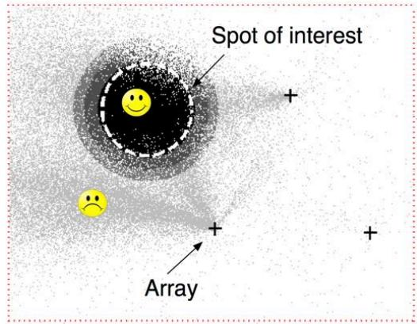  
(a) Without training

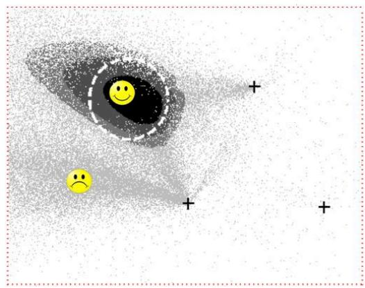  
(b) With training  
Figure 6.4: Illustration of detection

## 6.4.4 Discussion

To illustrate the operation of the spot signal detector, a scenario with one source in the spot and one interferer is shown in Figure 6.4. The dots represent narrowband position estimates observed during 5 seconds of double-talk. The lightest shade denotes positions from TF bins with $I_{H_{s}} = 0$ , whereas the darker shades denote positions from TF bins where $I_{H_{s}} = 1$ . Different brightness indicates that the spot signal detector was computed with different Bayes costs: the false negative cost $C_{us}$ was set to 1, and the false positive cost $C_{su}$ was varied (2,4, and 8, lightest to darkest shade). As indicated in Figure 6.4, increasing the cost of a false positive, reduces the "effective" size of the spot, i.e., the region where the position estimate should be found for the detector to estimate $I_{H_{s}} = 1$ . The difference between the detector without training and the one with training is visible from the shape of the shaded regions. The training takes into account the true variance of the position estimates and reduces the False Positive Rate (FPR) compared to the case without training, especially when an interferer is near the SOI.

The false positives trigger updates of the PSD matrix $\tilde{\Phi}_{s}$ when the undesired signal is dominant, resulting in erroneous update of the constraint vector $\hat{g}_{m}$ . This causes the look direction of the MVDR spotformer to deviate from the SOI, introducing audible distortion of the spot signal (similar problem of the false positives was mentioned in the application in Chapter 4). The FPR can to some extent be controlled by appropriately adjusting the Bayes costs. Nevertheless, in extremely adverse acoustic conditions where the spot signal-to-undesired signal ratio is low (< 0 dB), the state-of-the-art fixed spotformers cause less distortion of the desired signal, and possibly preferable speech quality, even though the undesired signal reduction ability is limited.

A detailed diagram of the proposed spotformer with all processing blocks is given in Figure 6.5. In the upper branch, the full framework for SPP and noise PSD estimation developed in Chapter 3 can be recognised. The SPP is required to obtain the spot probability and the spot signal detector, as given by (6.25), and the noise PSD matrix is required to compute the spotformer constraint as detailed in Section 6.3.2. A pseudocode for the implementation of the complete spotforming framework developed in this chapter is outlined in Algorithm 6.1. The details of the SDR-based SPP estimation and the associated initialisations are not included in the algorithm outline, as they were discussed in detail in Chapter 3.

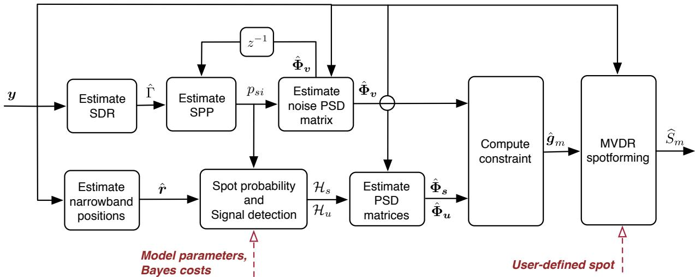  
Figure 6.5: Block diagram of the proposed acoustic spotforming framework.

Algorithm 6.1 Implementation of the proposed acoustic spotforming framework.

1: Training: obtain the parameters  $\mu_{i}$  and  $\Sigma_{i}$  of  $f(\hat{\mathbf{r}} \mid \mathcal{H}_{si}, \mathbf{r}_{i})$ , for  $i \in I$ .

2: User-defined parameters: The SOI S and the Bayes costs  $C_{su}$ ,  $C_{us}$ 

3: Initialize:  $\widehat{\Phi}_{y} = \widehat{\Phi}_{v} = 10^{-4}I$ 

4: do for each frame t and each frequency k:

5: Update the microphone signals PSD matrix  $\widehat{\Phi}_{y}(t, k) = \alpha_{y} \widehat{\Phi}_{y}(t - 1, k) + (1 - \alpha_{y}) y(t, k) y^{H}(t, k)$ .

6: Estimate the SDR  $\Gamma_{a}(t, k)$ , for each array a (Section 3.4.3), needed for line 6.

7: Estimate the SPP  $p(\mathcal{H}_{si} \mid y_{a})$  at each array (Section 3.4.3) and take the maximum  $p(\mathcal{H}_{si} \mid y)$ .

8: Update the noise PSD  $\widehat{\Phi}_{v}(t) = \alpha_{v} \widehat{\Phi}_{v}(t - 1) + (1 - \alpha_{v}) y(t) y^{H}(t)$ , where  $\alpha_{v}$  is given by (6.15c).

9: Estimate the DOA  $\hat{\theta}_{a}(t, k)$  for each array a (Section 4.2).

10: Triangulate the DOA estimates to obtain the position estimate  $\hat{r}_{tk}$ (Section 6.4.1).

11: Compute the conditional spot probability  $p(\mathcal{H}_{s} \mid \mathcal{H}_{si}, \hat{r}_{tk})$  using (6.33).

12: Compute the spot probability  $p(\mathcal{H}_{s} \mid y(t, k))$  using the conditional spot probability  $p(\mathcal{H}_{s} \mid \mathcal{H}_{si}, \hat{r}_{tk})$  and the SPP  $p(\mathcal{H}_{si} \mid y(t, k))$  [Equation (6.25)].

13: Use the spot probability and the Bayes costs to evaluate the Bayesian detector [Equation (6.25)].

14: Update the PSD matrices  $\widehat{\Phi}_{s+v}(t, k)$  and  $\widehat{\Phi}_{u}(t, k)$  according to (6.14) and (6.15).

15: Compute the spotformer constraint  $\hat{g}_{m}(t, k)$  using  $\widehat{\Phi}_{s+v}(t, k)$  and  $\widehat{\Phi}_{v}(t, k)$  (Section 6.3.2).

16: Using  $\hat{g}_{m}(t, k)$  and  $\widehat{\Phi}_{u}(t, k)$ , compute and apply the MVDR spotformer  $w_{opt}(t, k)$  in (6.5).

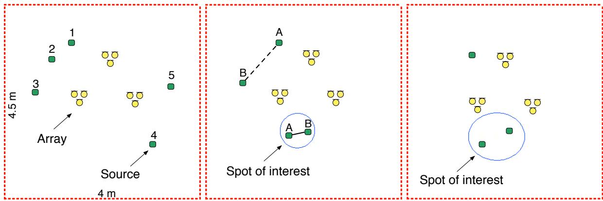  
Figure 6.6: Different scenarios for evaluating the spotformer. Left: measured scenario, middle: simulated scenario for moving sources, right: simulated scenario for multiple sources in the SOI.

## 6.5 Performance evaluation

## 6.5.1 Experimental setup

The spotformer was evaluated in different acoustic conditions with measured and simulated data. Measurements were done in a room with $T_{60}\approx180$ ms and dimensions $4.5\times4.5\times3$ m $^{3}$ . Three uniform circular arrays with diameter 2.9 cm and three DPA microphones per array (model DPA d:screet SMK-SC4060) were arranged as shown in Figure 6.6 (left). The Acoustic Impulse Response (AIR) between positions 1-5 and the microphones were measured, where GENELEC loudspeakers (model 8010 AP) were used as sources. To generate diffuse sound, the AIRs from ten loudspeakers facing the walls were measured. The measurements were performed at a sampling rate of 48 kHz and downsampled to 16 kHz for the spotformer processing. The remaining processing parameters are as follows: STFT frame size was 64 ms, windowed with a Hamming window with 50 % overlap; the Bayes detector costs were $C_{du}=7$ and $C_{ud}=1$ (discussion in Section 6.5.2), the averaging constants $\alpha_{s}$ , $\alpha_{u}$ and $\alpha_{v}$ were 0.75, 0.94, and 0.98, respectively, corresponding to time constants of 0.1, 0.5, and 1.6 seconds. The room was sampled at 10 positions per meter to obtain the position samples $r_{i}$ required to compute the spot probability. The parameters for the implementation of the SDR-based SPP from Chapter 3 were set to $\rho=1.2$ , c=5, $l_{min}=0.05$ , $l_{max}=0.95$ .

The speech signals at the microphones were obtained by convolving clean speech with the measured AIRs from positions 1-5. The clean speech samples consisted of male and female speech in English, German and French, recorded by a close-talking microphone. Babble noise signals were convolved with the AIR for the ten loudspeakers facing the walls, which added together result in approximately diffuse sound. Finally, the microphone signals were obtained by adding the speech signals, the diffuse noise and a measured sensor noise signal. The Input Signal-to-Noise Ratio (iSNR) with respect to sensor noise was 35 dB, while the diffuse noise level was varied in the experiments to test different input iSNRs. The iSNR was measured as the ratio between the power of the spot signal and the noise power at the reference microphone. The effect of reverberation on the spot signal detection and the spotforming performance, was investigated using simulated AIRs. The simulated room geometry was the same as in the measurements, with the freedom to vary the $T_{60}$ using an implementation of the image source model [201]. Diffuse sound was generated according to [203, 204], and uncorrelated (temporally and spatially) Gaussian noise with iSNR 35 dB was added as sensor noise. In addition, simulations were used for moving source scenarios, as detailed in Section 6.5.2.

The objective performance measures used to evaluate the signal quality are described in Appendix A.

## 6.5.2 Results

We discuss six experiments that evaluate different aspects of the proposed spotforming framework:

Experiment 1 provides general objective evaluation of the extracted signals at the spotformer output, for different number of interferers, different number of arrays, and different noise levels.

Experiment 2 compares the proposed spotformer to fixed spotformer when applied in dynamic scenarios.

Experiment 3 investigates the spot signal detector and its effect on the extracted signal quality.

Experiment 4 evaluates the effect of reverberation on the spotforming performance.

Experiment 5 evaluates the spotformer in scenarios with moving sources.

Experiment 6 investigates a scenario with multiple sources inside the spot and emphasises the advantage of the spotformer constraint proposed in Section 6.3.2.3 specifically for multi-source scenarios, compared to the spotformer constraints which are explicitly based on the rank-one assumption.

## Experiment 1

In this experiment, the spotformer is evaluated with measured data from the scenario depicted in Figure 6.6 (left), where a single speaker is located inside a circular SOI of radius 0.4 m. We compute the spotformer with the rank-one model-based constraints described in Section 6.3.2.1 (denoted by MMSE) and Section 6.3.2.2 (denoted by LS). In this experiment, we apply a spot signal detector with training. The following aspects are evaluated: i) spotforming in the presence of different number of interferers, ii) spotforming with one, two, and three arrays, and iii) spotforming in different iSNR conditions. For a given number of sources, the results were averaged over all source combinations from Figure 6.6 (left). The sources in each scenario were active simultaneously for 20 seconds, and the Input Signal-to-Interference Ratio (iSIR) for one, two, and three interferers was 2 dB, -2dB, and -3.5 dB, respectively. Each experiment was repeated for a moderate and a low iSNR ( $\approx$ 16 dB and $\approx$ 6 dB), where the iSNR was computed with respect to the sum of diffuse and sensor noise, while the diffuse-to-sensor noise ratio was 40 dB and 30 dB.

As a fixed spotforming approach for comparison, we use an oracle MVDR spotformer with a constraint computed from the RTF vector at the spot centre, where the desired source was located, assuming that this RTF can be estimated in advance. The undesired signal PSD matrix $\Phi_{u}$ for the fixed spotformer is estimated from a segment with length 3 seconds, where only an undesired speaker with fixed location and background noise are present. In practice, such a segment needs to be detected, and in some cases might not exist, which poses a limitation in practice. As oracle information when to estimate $\Phi_{u}$ is used and the constraint vector is perfectly matched to true RTF vector of the source, the fixed spotformer in this experiment is expected to have superior performance. We seek to evaluate the degradation when using our proposed framework that performs the signal detection, PSD matrix estimation, and spotformer constraint estimation using only the microphone signals. The results are given in Table 6.1 for the case of one interferer, and in Table 6.2 for two and three interferers. The conclusions are summarised as follows:

a) The fixed spotformer is almost distortionless in all scenarios, as the oracle constraint is based on the true RTFs at the source location. The Speech Distortion (SD) index $\nu_{sd}$ for the proposed data-dependent spotformer reaches up to 0.15 when using one array and up to 0.25 when using three arrays. Using multiple arrays increases the SD index as the increased spatial selectivity leads to larger sensitivity to errors in the PSD matrices and RTF vectors. Note however, that the reference signal for computing the SD index was the spot signal as received at the microphone. Hence, the increase in $\nu_{sd}$ is partially contributed to dereverberation as well. This finding is further discussed in Experiment 4.

<table><tr><td></td><td colspan="3">SD index  $\nu_{\text{sd}}$ </td><td colspan="3">IR [dB]</td><td colspan="3">NR [dB]</td></tr><tr><td># Arrays</td><td>1</td><td>2</td><td>3</td><td>1</td><td>2</td><td>3</td><td>1</td><td>2</td><td>3</td></tr><tr><td>Fixed (oracle)</td><td>0.02</td><td>0.02</td><td>0.02</td><td>19.4</td><td>27.6</td><td>30.5</td><td>5.5</td><td>8.4</td><td>10.1</td></tr><tr><td>MMSE</td><td>0.15</td><td>0.21</td><td>0.24</td><td>14.1</td><td>15.7</td><td>16.1</td><td>5.3</td><td>6.4</td><td>7.1</td></tr><tr><td>LS</td><td>0.15</td><td>0.23</td><td>0.26</td><td>14.3</td><td>16.1</td><td>16.6</td><td>5.1</td><td>6.6</td><td>7.4</td></tr><tr><td># Arrays</td><td>1</td><td>2</td><td>3</td><td>1</td><td>2</td><td>3</td><td>1</td><td>2</td><td>3</td></tr><tr><td>Fixed (oracle)</td><td>0.02</td><td>0.02</td><td>0.02</td><td>16.5</td><td>23.0</td><td>25.1</td><td>6.5</td><td>10.0</td><td>11.8</td></tr><tr><td>MMSE</td><td>0.13</td><td>0.19</td><td>0.22</td><td>13.4</td><td>15.1</td><td>15.4</td><td>6.4</td><td>8.6</td><td>9.8</td></tr><tr><td>LS</td><td>0.12</td><td>0.19</td><td>0.23</td><td>13.6</td><td>15.5</td><td>15.7</td><td>7.0</td><td>9.8</td><td>11.1</td></tr></table>

Table 6.1: Experiment 1, objective performance evaluation. The results are averaged over all scenarios with one interferer. Top: iSNR=16 dB; bottom: iSNR=6 dB.

<table><tr><td>Measure</td><td colspan="2"> $\nu_{\text{sd}}$ </td><td colspan="2">IR [dB]</td><td colspan="2">NR [dB]</td></tr><tr><td># sources</td><td>3</td><td>4</td><td>3</td><td>4</td><td>3</td><td>4</td></tr><tr><td>Fixed (oracle)</td><td>0.02</td><td>0.02</td><td>22.7</td><td>20.6</td><td>10.4</td><td>9.3</td></tr><tr><td>MMSE</td><td>0.22</td><td>0.22</td><td>14.2</td><td>14.6</td><td>8.6</td><td>8.7</td></tr><tr><td>LS</td><td>0.22</td><td>0.22</td><td>15.8</td><td>15.8</td><td>11.0</td><td>10.3</td></tr></table>

Table 6.2: Experiment 1, objective performance evaluation for the scenarios with two and three interferers. Results with three-array spotformer and iSNR = 6 dB.

b) The fact that the multi-array fixed spotformer outperforms by 10 dB the single-array fixed spotformer, whereas in the data-dependent case, only a gain of 3 dB is obtained indicates that the spatial selectivity of multiple arrays is not maximally utilised due to detection errors. Moreover, it can be noted that the increase of spatial selectivity is mainly manifested when increasing from one to two arrays, while the improvement when adding further arrays is less significant.

c) There was no significant performance loss when the iSNR was decreased from 16 dB to 6 dB. The degradation in Interference Reduction (IR) is less than 1 dB, whereas the SD index is improved when the iSNR is reduced. This can be explained as follows: for high iSNR, the position estimates are accurate and concentrated around the true source locations, which leads to false alarms in the detector when an interferer is near the SOI. For low iSNR however, the density of position estimates around the true source locations decreases, which in turn reduces the false alarms arising due to the nearby interferer.

d) In Table 6.2, the results for two and three interferers are shown only for the three-array spotformer. The results with a one-array and two-array spotformer followed similar trends as discussed in the single interferer case described above. Note that increasing the number of interferers does not worsen the spot signal distortion, and the loss in interference reduction is less than 1 dB.

e) The Noise Reduction (NR) and the IR when the spotformer constraint is obtained using the MMSE rank-one approximation deteriorates at low iSNR, compared to the NR and IR when the constraint is obtained using the LS-based rank-one approximation. Similar finding for low iSNRs was presented in $[85]$ , where the covariance subtraction approach to RTF estimation, which is closely related to the MMSE-based constraint computation, was shown to be less accurate than the covariance whitening approach to RTF estimation, which is closely related to the LS-based constraint computation. In the following experiments, unless stated otherwise, we only apply the spotformer with an LS-based constraint.

<table><tr><td rowspan="2" colspan="2"># Arrays</td><td colspan="3">Segment 1</td><td colspan="3">Segment 2</td></tr><tr><td>one</td><td>two</td><td>three</td><td>one</td><td>two</td><td>three</td></tr><tr><td rowspan="2">IR [dB]</td><td>Fixed</td><td>17.5</td><td>21.2</td><td>22.3</td><td>5.9</td><td>7.5</td><td>6.8</td></tr><tr><td>LS</td><td>12.4</td><td>13.2</td><td>13.1</td><td>12.5</td><td>15.7</td><td>16.1</td></tr><tr><td rowspan="2">NR [dB]</td><td>Fixed</td><td>6.7</td><td>10.1</td><td>12.4</td><td>6.6</td><td>9.8</td><td>12.0</td></tr><tr><td>LS</td><td>6.3</td><td>8.0</td><td>8.8</td><td>6.6</td><td>9.5</td><td>11.0</td></tr></table>

Table 6.3: Experiment 2, average IR and NR of the fixed spotformer and the proposed spotformer, for the two signal segments where different interferers are active.

## Experiment 2

In this experiment, we compare the proposed spotformer to the fixed spotformer discussed in Experiment 1, when applied in dynamic scenarios. The measured data was used as follows: a spot with radius 0.4 m is centred at the position 1 in Figure 6.6 (left). The first ten seconds, the desired source and an interferer at position 3 are active (iSIR=0 dB), while the next ten seconds the desired source and two interferers at positions 4 and 5 are active (iSIR=-2 dB). The experiment was repeated for 12 speaker combinations in various languages, and the iSNR was 6 dB.

The interference power at the input and at the spotformer outputs is plotted in Figure 6.7 across time for one set of signals. For the first 10 seconds, the fixed spotformer represents an oracle spotformer, as the RTF of the desired source in the spot is known in advance and $\hat{\Phi}_{u}$ is estimated using the signal of the current interferer. Therefore, in this case, the fixed spotformer provides better IR than the proposed spotformer, similarly as in Experiment 1. When new interferers become active, the fixed spotformer can not track changes in $\Phi_{u}$ , resulting in inferior IR compared to the proposed data-dependent spotformer. The average results from 12 experiments are given in Table 6.3, where the results for each individual experiment followed similar trend as shown in Figure 6.7.

## Experiment 3

In this experiment, the effect of the detector on the spotformer performance is examined and the advantage of incorporating training is demonstrated. Measured data was used with the desired source and the spot centre at position 2 in Figure 6.6 (left). Two scenarios were considered: in the first one, an interferer at position 3 was active (relatively near to the spot) with iSIR of 0 dB, and in the second one, an interferer at position 4 was active (relatively far from the spot) with iSIR of 1.5 dB. The iSNR was 6 dB.

The training is particularly advantageous when the interferer is near the spot (< 1 m). This is visible when comparing the array gains $\Delta_{SIR}$ in Figure 6.8(a) (interferer at position 4) and in Figure 6.8(b) (interferer at position 1). When the interferer is far, both detectors lead to similar $\Delta_{SIR}$ , constant for all radii, whereas when the interferer is near, the training improves $\Delta_{SIR}$ by up to 6 dB for moderately large radii. As the spot radius increases, $\Delta_{SIR}$ for both detectors deteriorates due to the increasing FPR. The Signal-to-Noise Ratio (SNR) improvement $\Delta_{SNR}$ is constant regardless of the interferer location. When there is no interferer [Figure 6.8(f)] active, $\Delta_{SNR}$ increases, as all degrees of freedom of the spotformer are used for reducing the background noise.

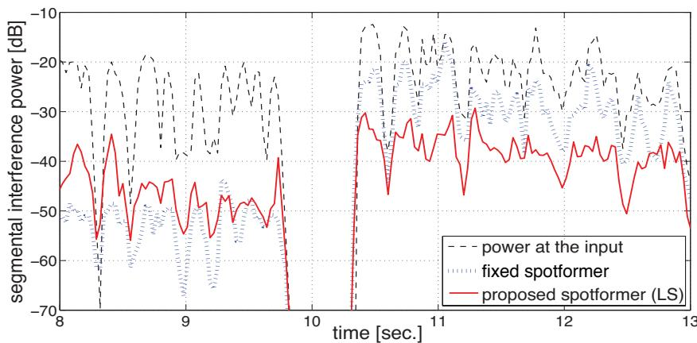  
Figure 6.7: Experiment 2, interference power at the input and at the output of the fixed spotformer and the proposed spotformer. The spotforming was performed using the three arrays.

The previous discussion is corroborated by the performance of the detectors in terms of FPR and False Negative Rate (FNR), plotted in Figure 6.9. The FPR and FNR were defined in (8.35). The FPR remains low when the interferer is far from the spot, while rapidly increasing for larger spot radii when the interferer is near. The FNR is however not significantly influenced by the training. Hence, the Bayes costs $C_{\mathrm{su}}$ and $C_{\mathrm{us}}$ need to prioritise low FPR. With this in mind, they were determined a-priori to achieve FPR<0.1%, while maintaining the FNR not larger than 0.9%, so that $\widehat{\Phi}_{\mathrm{s}}$ can be updated sufficiently quickly in case of moving sources (in our implementation, $C_{\mathrm{ud}} = 1$ and $C_{\mathrm{du}} = 7$ ). Note that the costs might need to be revised if different parameter estimators (SPP, DOA, SDR) are used. However, for a given implementation, chosen costs that satisfy the FPR/FNR trade-off, generalise well to a broad range of acoustic conditions.

## Experiment 4

Due to multi-path propagation in reverberant environments, the accuracy of the position estimates decreases resulting in larger FPR of the detectors. To examine the effect of reverberation on the signal quality at the spotformer output, we simulated shoe box rooms with reverberation times $T_{60}$ from 200 to 700 ms. The iSNR was fixed to 9 dB, which represents a significant level of babble noise. Scenarios when an interferer is far (>2 m) and when an interferer is near the spot (0.5-1 m) were simulated. For both cases, the results are averaged over 10 random source locations. The findings from this experiment are summarised as follows

a) Due to the increased FPR, the SD index increases as visible in Figure 6.10. Nevertheless, note that the high SD is partially attributed to dereverberation. To confirm this, we computed the Signal-to-Reverberation-Modulation Ratio (SRMR) [231] of the desired signal at the reference microphone, and after spotforming. The difference of the two SRMR values, shown in Figure 6.11, indicates the amount of dereverberation (larger values indicate larger dereverberation).

b) Reverberation does not severely affect the NR and IR. The NR is independent of the $T_{60}$ and equal to 7 dB for one array, 9.2 dB for two arrays, and 10.2 dB for three arrays. The IR is illustrated in Figure 6.10 (right). Similarly as observed in Experiment 3, when the interferer is far from the spot, the performance for detector with and without training is identical, whereas when the interferer is near the spot, training improves the IR, as shown in Figure 6.10 (right).

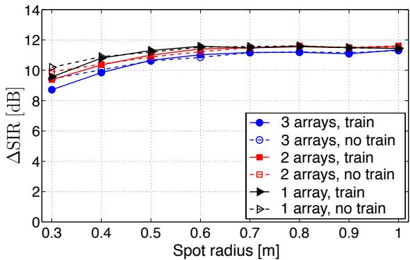  
(a) SIR improvement $\Delta_{SIR}$ , interferer far.

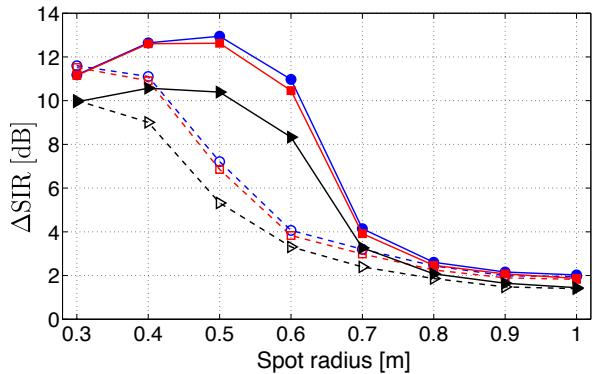  
(b) SIR improvement $\Delta_{SIR}$ , interferer near.

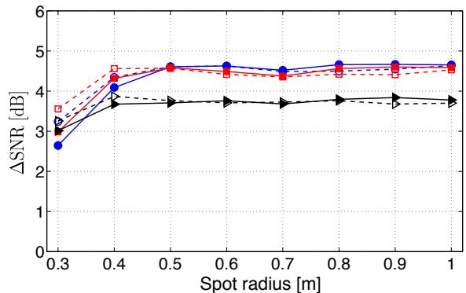  
(c) SNR improvement $\Delta_{SNR}$ , interferer far.

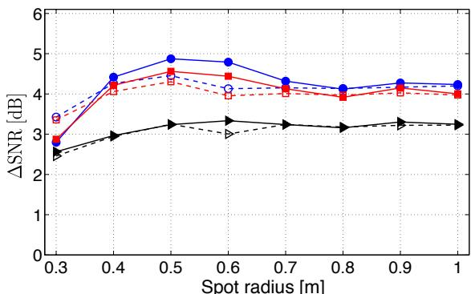

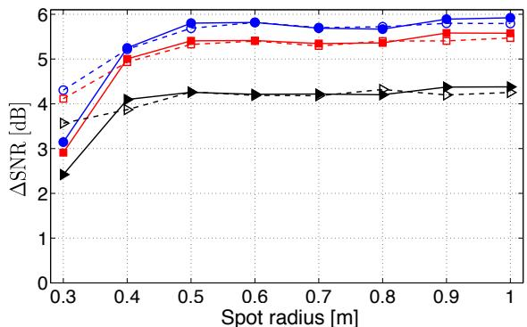  
(e) SNR improvement $\Delta_{SNR}$ , no interferer.

(d) SNR improvement $\Delta_{SNR}$ , interferer near.  
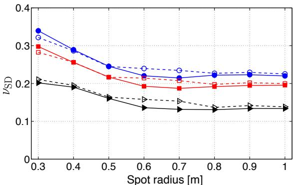  
(f) SD index $\nu_{sd}$ , interferer near.  
Figure 6.8: Experiment 3: comparison of the detector with and without training, as a function of the spot radius, in terms of objective performance measures at the output of a spotformer with a LS-based constraint.

## Experiment 5

To examine the spotformer performance with moving sources, we simulated a moderately reverberant room $T_{60} = 300 \text{ ms}$ with the setup shown in Figure 6.6 (middle). The desired source traverses the trajectory A-B-A-B-A (solid line), whereas the interferer traverses A-B-A (dotted line), during 20 seconds of double-talk. The experiment was repeated for 12 different sets of signals, with average iSNR and iSIR of 6 dB and

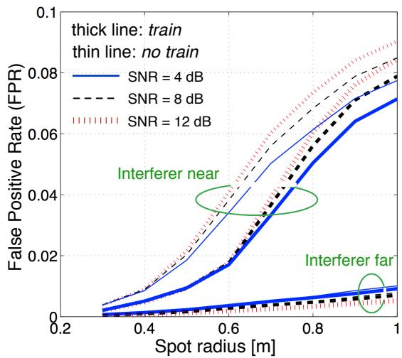

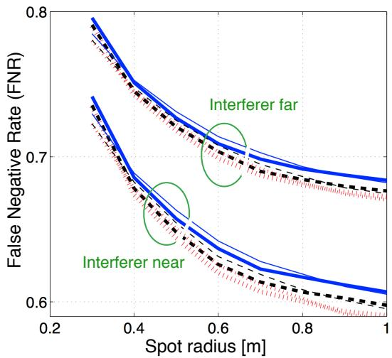  
Figure 6.9: Experiment 3: False positive and false negative rates of the spot signal detector.

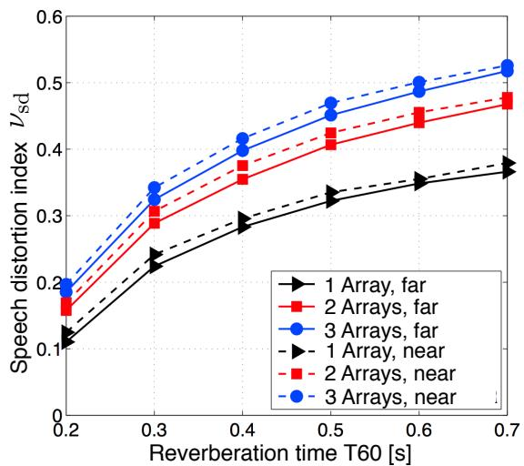

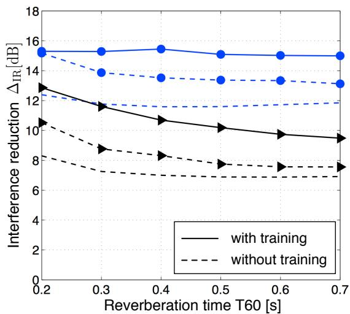  
Figure 6.10: Experiment 4, effect of reverberation on the spotformer performance with spotformer constraint obtained using the LS-based rank-one approximation from Section 6.3.2.2.

<table><tr><td colspan="3">1 Array</td><td colspan="3">2 Arrays</td><td colspan="3">3 Arrays</td></tr><tr><td> $\nu_{\text{sd}}$ </td><td> $\Delta_{\text{IR}}$ </td><td> $\Delta_{\text{NR}}$ </td><td> $\nu_{\text{sd}}$ </td><td> $\Delta_{\text{IR}}$ </td><td> $\Delta_{\text{NR}}$ </td><td> $\nu_{\text{sd}}$ </td><td> $\Delta_{\text{IR}}$ </td><td> $\Delta_{\text{NR}}$ </td></tr><tr><td>0.21</td><td>10.6</td><td>6.4</td><td>0.37</td><td>14.0</td><td>8.9</td><td>0.4</td><td>14.6</td><td>9.8</td></tr></table>

Table 6.4: Experiment 5: objective performance results for a scenario with moving sources averaged over 12 experiments with different signals, with average iSNR and iSIR of 6 dB and 0 dB, respectively.

0 dB, respectively. The results averaged across all the experiment trials are shown in Table 6.4. In terms of the objective measures, the spotformer achieves similar performance as in a fixed scenario with comparable acoustic conditions (see Figure 6.10 for $T_{60} = 300$ ms), with less than 0.5 dB difference in $\Delta_{IR}$ and and less than 0.03 difference in $\nu_{sd}$ .

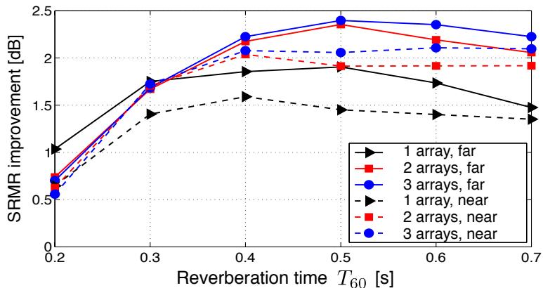  
Figure 6.11: Experiment 4: signal-to-reverberation-modulation ratio improvement after spotforming, compared to the signal at the reference microphone.

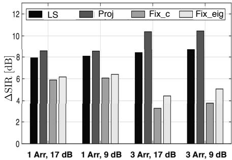

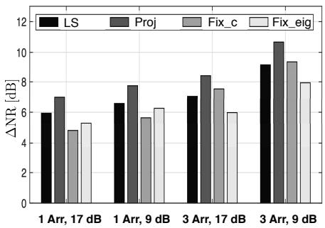

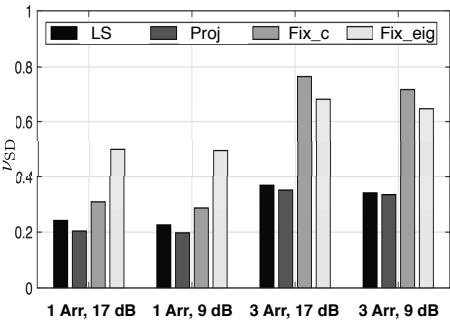  
Figure 6.12: Experiment 6: Average objective performance results in a scenario with two sources inside the spot, and projection-based spotformer constraint proposed in Section 6.3.2.3.

## Experiment 6

In applications with larger spot size, multiple sources might be active in the spot S. The constraint described in Section 6.3.2.3 (denoted as Proj) was proposed for such scenarios and is compared to the LS-based constraint in this experiment. Additionally, we compared the following two fixed constraints: 1) the RTF vector at the spot centroid (denoted as Fix\_c), and 2) the eigenvector constraint described in Section 6.2.1 (denoted as Fix\_eig). To have a fair comparison with the MVDR spotformer in terms of undesired signal reduction, we did not compute an LCMV filter with multiple constraints but rather an MVDR filter with a single eigenvector constraint. Furthermore, to only focus on the effect of the constraint, all spotformers in this experiment are computed using the PSD matrix estimate $\widehat{\Phi}_{u}$ obtained with the proposed signal detector.

The scenario from Figure 6.6 (right) was simulated, where two sources inside S and an interferer are simultaneously active. The experiment was repeated for 10 combinations of English, German, and French speakers. The results are shown in Figure 6.12 for a single-array and a three-array spotformer, for iSNRs of 17 dB and 9 dB, and $T_{60} = 200$ ms. It can be observed that the projection method improves the $\Delta_{NR}$ by 1.5 dB and the array gain $\Delta_{SIR}$ by 1-2 dB compared to the LS method, while slightly reducing the SD $\nu_{SD}$ of the spot signal, which in this case is the sum of two source signals. The data-independent constraints result is notably worse performance in terms of SD index and undesired signal reduction.

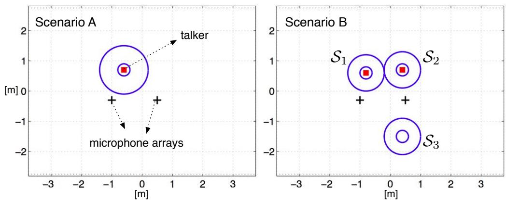

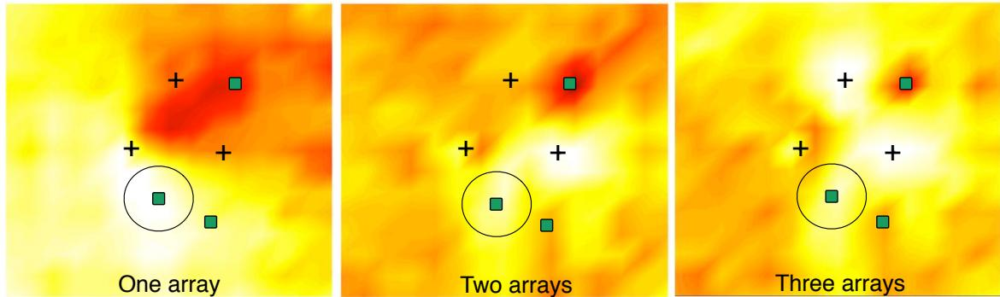  
(a) Spatial patterns with one interferer.

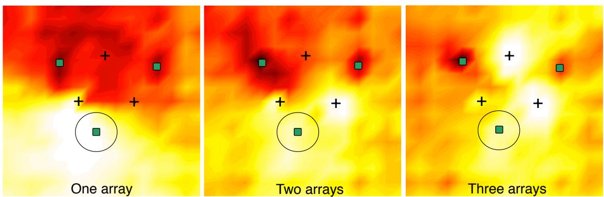  
(b) Spatial patterns with two interferers.  
Figure 6.13: Spatial patterns of the MVDR spotformer computed using one, two, and three arrays.  
Figure 6.14: Illustration of simulated scenarios. The concentric circles denote SOIs with different radii.

## Qualitative and illustrative examples

In this section, we qualitatively illustrate the operation of the proposed spotformer. In Figure 6.13, the spatial patterns of the spotformer are shown at a given time frame. To obtain the spatial patterns, the spotformer coefficients at the chosen time frame were saved for all frequencies. Next, the room was sampled on a square grid with 10 positions per meter, and at each position a source emitting white noise was simulated and the resulting microphone signals were transformed to the STFT domain. The saved spotformer coefficients were then applied to the signals at each of the sampled positions, and for each position, the ratio of the source power at the output to the source power at the input is coded in colour in Figure 6.13.

The spatial pattern is illustrated for a scenario with one interferer in Figure 6.13(a), and a scenario with two interferers in Figure 6.13(b). Regardless of the number of interferers and used arrays for spotforming, the largest attenuation is visible at the location of the interferers, showing the spotformer ability to blindly create spatial notches. The spatial patterns also illustrate that while multiple arrays significantly increase the spatial selectivity (the notches at the interferer locations, and the "beams" over the spot are narrower when multiple arrays are used), they also lead to increased spot signal distortion.

As a last illustration, we show the spectrograms of short signal segments extracted by the proposed spotformer. The two scenarios in Figure 6.14 were simulated, where in Scenario A, the goal is to enhance the signal of a single talker in the presence of background noise with iSNR≈4 dB, and in Scenario B, two interferers and background noise are present, with iSIR≈0 dB, and iSNR≈10 dB. The reverberation time for these simulations was set to $T_{60}=0.4$ s.

In Figure 6.15(a), the spectrograms of signal segments corresponding from Scenario A are shown. The fact that larger spot size introduces less distortion to the spot signal is visible when comparing the output spectra for the two spot radii (see the caption of Figure 6.15(a)). In Figure 6.15(b), the spectrograms of signal segments corresponding from Scenario B are shown. Comparing the spotformer outputs for the three different SOIs to the input mixture at the reference microphone, the reduction of the interferer is clearly visible in the spectrograms. When the there is no source in the SOI, such as in $S_{3}$ , the spotformer reduces all speech signals. Note that only the segment between 3.5 and 4.5 seconds contains double-talk, and that the undesired signal residual after spotforming can be further reduced by an appropriate single-channel post-filter.

## 6.6 Summary

A data-dependent framework for acoustic spotforming was proposed to extract signals originating from a user-defined SOI, while reducing noise and interference. In contrast to the state-of-the-art approaches which assume far-field or near-field propagation models to compute the filter constraints and the PSD matrices of the desired and the undesired signals, the proposed spotformer is based on the informed spatial filtering paradigm where all PSD matrices and spotformer constraints required to extract the spot signal are estimated online from the data. An underlying assumption of the proposed framework is the low-rank approximation of the spot signal PSD matrix, which is valid due to the speech sparsity in the TF domain, the relatively small spot sizes in real applications, and the recursive temporal averaging-based estimation of the spot signal PSD matrix. In this manner, given an estimate of the undesired signal PSD matrix, which contains the background noise signal and speech sources located outside the SOI, the desired spot signal can be extracted by an MVDR filter. In contrast, data-independent spatial filters applied for spotforming, need to have multiple constraints in order to ensure low distortion across the SOI, thereby sacrificing degrees of freedom for undesired signal reduction. In addition, to specifically address scenarios where multiple sources are present in the SOI, we proposed a projection-based RTF estimator which was shown to reduce the distortion of the estimated spot signal compared to the RTF estimators based on a rank-one model.

To develop a probabilistic framework that allows to detect the dominant signal at TF bin (spot signal or undesired signal), we proposed to use narrowband position estimates extracted by triangulating the narrowband DOAs estimated at multiple arrays. Therefore the framework requires availability of at least two spatially separated microphone arrays. By using the narrowband signal detector to estimate the spot signal and undesired signal PSD matrices, the spotformer adapts almost instantaneously in changing acoustic conditions and appearing/disappearing sources.

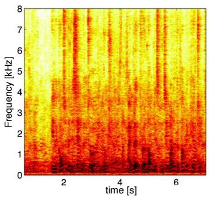

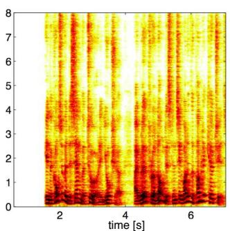

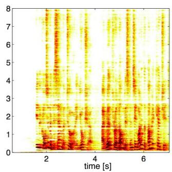

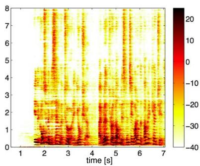  
(a) Spectrograms of signal segments corresponding to Scenario A. The spectrograms from left to right: i) noisy signal at the reference microphone, ii) clean speech signal at the reference microphone, iii) extracted signal by the spotformer when the spot is denoted by the inner radius, iv) extracted signal by the spotformer when the spot is denoted by the outer radius.

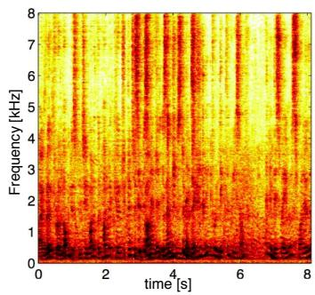

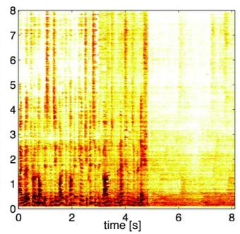

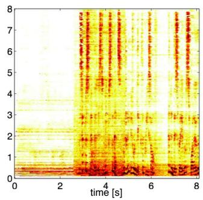

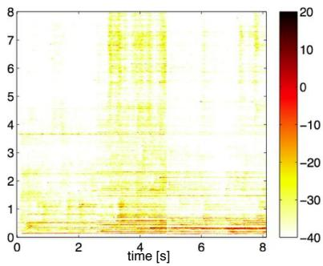  
(b) Spectrograms of signal segments corresponding to Scenario B. The spectrograms from left to right: i) mixture received at the reference microphone, ii) extracted signal by the spotformer for SOI $S_{1}$ , iii) extracted signal by the spotformer for SOI $S_{2}$ , iv) extracted signal by the spotformer for SOI $S_{3}$ . In all cases the SOIs borders are given by the outer radii.  
Figure 6.15: Spatial patterns of the MVDR spotformer computed using one, two, and three arrays.

We discussed a comprehensive set of experiments to evaluate the proposed narrowband position-based spot signal detector, as well as the objective quality of the extracted spot signals in different scenarios. We showed that the position-based detector can operate at very low false positive rates, while still accurately detecting a sufficient number of TF bins where the spot signal is dominant and where the constraint of the MVDR spotformer can be estimated and updated. In addition, we demonstrated the ability of the proposed spotformer to adapt in scenarios with moving sources, and showed its superiority to a fixed spotformer in scenarios where the number and location of the interferers changes during processing.

## Informed spatial filtering for blind source separation using narrowband position estimates

The Blind Source Separation (BSS) problem, also known as the cocktail-party problem in the speech processing community, was mentioned in Chapter 1 as one of the relevant topics in this thesis, where we briefly outlined the state-of-the-art approaches, organised in the four main categories: approaches based on Independent Component Analysis and its variants, approaches based on spatial filtering, approaches based on speech sparsity in the Short-Time Fourier Transform (STFT) domain, and approaches that combine different aspects of the aforementioned categories. In this thesis, we focus on spatial filtering and sparsity-based approaches to the BSS problem.

In the last two decades, sparsity-based BSS has received increasing attention as a versatile and low-complexity approach to joint BSS and noise reduction. The main characteristic for many sparsity-based BSS approaches is clustering of the Time-Frequency (TF) bins to determine the dominant source at each bin and create so-called TF masks. The TF masks can be either binary, so that the value at a given TF bin is one for the TF mask of the dominant source, and zero for the TF masks of all other sources, or soft, so that the entry at a given bin of each TF mask represents a probability that the corresponding source is dominant at that bin. Originally, the TF masks were applied as spectral gains to one of the microphone signals to achieve source separation $[127, 128]$ . In the last decade however, an increasing number of papers suggest to use the TF masks only as means to estimate the Power Spectral Density (PSD) matrices of the different source signals and to compute Informed Spatial Filters (ISFs) for BSS $[130, 141, 163, 232]$ .

In the previous chapters, we discussed different applications where spatial features were extracted from the microphone signals in order to determine the dominant source at each TF bin. This is the starting point of many sparsity-based BSS approaches as well, which differ mostly in the choice of feature for clustering. Commonly used features in BSS, include binaural cues $[129]$ and Direction-Of-Arrival (DOA) estimates $[142, 163]$ . In addition, the STFT-domain signal vectors can be used directly for clustering, as in $[130–132, 141, 208, 233, 234]$ . Moreover, spectral features $[133, 208, 235, 236]$ and temporal correlations $[233]$ can be exploited to improve the clustering and the dominant source detection. In the majority of the aforementioned contributions, the probability density of the chosen feature is modelled as a mixture density, where each mixture component models the likelihood of the feature when a given source is dominant. Clearly, the choice of features and likelihood models depends on the array geometry and the room setup. Therefore, each choice comes with a highly scenario-dependent set of advantages and disadvantages, which makes it difficult to meaningfully and objectively compare the different sparsity-based BSS approaches. Nonetheless, two issues relevant for each approach, and often not sufficiently addressed, are the estimation of the number of sources from the data, and the modelling of speech presence uncertainty within the clustering and BSS frameworks.

Considering the multi-array setup from Chapter 6, the first question we address in this chapter is how to choose a good feature which allows for clustering with only a few iterations, and provides intuitive and meaningful information on the number of sources. In Chapter 6, we showed that a narrowband position estimate can be extracted at each TF bin using the multiple arrays, and that when a given source is active, the narrowband positions form a cluster around the source location. Motivated by this observation, we propose to use the narrowband position estimates as features for clustering. Although the proposed algorithm is based on the well-known Expectation-Maximization (EM) algorithm [195], we propose an EM variant that determines the number of sources from the data. We experimentally show that the proposed approach provides robust number of source estimation and clustering with only a few EM iterations and a few seconds of unlabelled training data.

The second question addressed in this chapter, is how to model the speech presence uncertainty in the BSS framework. Determining noisy TF bins is important for robustness to outliers while clustering, and to ensure that the look directions of the spatial filters for BSS are not modified during noisy TF bins. In existing clustering-based BSS approaches, the speech presence uncertainty is incorporated by adding an additional likelihood for the observed feature when noise is present $[237]$ , or by using energy-based Voice Activity Detectors (VADs) $[142,163]$ . In our work, we take a different approach and use the Gaussian signal model for Speech Presence Probability (SPP) estimation. In this manner, the SPP is obtained from an established probabilistic model which was shown in the previous chapters to robustly distinguish between speech and noise. Finally, note that although the proposed position-based clustering algorithm, similarly as the other clustering approaches, is tuned for our particular multi-array scenario, the proposed way of using a Gaussian model-based SPP can be applied to any STFT-domain sparsity-based BSS algorithm, regardless of the choice of feature.

The rest of the chapter is organised as follows: In Sections 7.1 and 7.2, the STFT-domain signal model and the probabilistic model are presented. The main contributions of this chapter are presented in Section 7.3, where an EM-based algorithm which uses narrowband position estimates as features, is proposed to detect the number of sources and determine the source clusters. In Section 7.4, using the information on the number of sources and their clusters, we discuss the estimation of the PSD matrices of each source, and the design of spatial filters for BSS. Performance evaluation of the proposed clustering and BSS framework is provided in Section 7.5 and Section 7.6 concludes the chapter.

## 7.1 Signal model

Similarly as in Chapter 6, we assume that the signals from all sources and the background noise are captured by M microphones, arranged in at least two spatially separated microphone arrays. For convenience, we restate the multi-source signal model in the STFT domain, i.e.,

$$
\mathbf {y} (t, k) = \sum_ {j = 1} ^ {J} \mathbf {s} _ {j} (t, k) + \mathbf {v} (t, k) = \sum_ {j = 1} ^ {J} \mathbf {g} _ {j m _ {j}} (k) S _ {j m _ {j}} (t, k) + \mathbf {v} (t, k)\tag{7.1}
$$

where the $M \times 1$ vectors $s_{j}$ and v contain the STFT coefficients of the j-th source signal and the noise signal respectively. The Relative Transfer Function (RTF) vector $g_{jm_{j}}$ of the j-th source with respect to the $m_{j}$ -th microphone was defined in (2.10). Note that the reference microphone $m_{j}$ is chosen separately for each source j, from the array that is nearest to the source. As mentioned in Chapter 2, the speech and noise signals v are assumed to be mutually correlated, and their PSD matrices satisfy (2.15). The PSD matrix of each speech source was modelled as a rank-one matrix, as defined in (2.16). For the j-th source, we define the undesired signal PSD matrix, which contains the remaining sources and the background noise as follows

$$
\Phi_ {\tilde {\mathbf {s}} _ {j}} (t, k) = \sum_ {i \neq j} \Phi_ {\mathbf {s} _ {i}} (t, k) + \Phi_ {\mathbf {v}} (t, k).\tag{7.2}
$$

Following the general framework based on speech sparsity and informed spatial filtering established in the previous chapters, for the BSS signal model, each TF bin needs to be associated to one of the $J+1$ mutually exclusive hypotheses

$$
\mathcal {H} _ {s _ {j}}: \mathbf {y} \approx \mathbf {s} _ {j} (t, k) + \mathbf {v} (t, k) j \mathrm{-thsourceisdominant},\tag{7.3a}
$$

$$
\mathcal {H} _ {v}: \mathbf {y} \approx \mathbf {v} (t, k) \quad \text { background   noise   is   dominant. }\tag{7.3b}
$$

For notational simplicity, and to be consistent with other clustering-based BSS approaches from the literature, we introduce a different notation for the bin-wise hypotheses in this chapter. Namely, instead of using $(7.3)$ , we define a discrete Random Variable (RV) $Z_{tk}$ with support $[0, J]$ to denote the dominant source index. Let $z_{tk}$ denote the realisation of $Z_{tk}$ , indicating the dominant source at bin $(t, k)$ . Then

$$
z _ {t k} = j \qquad \mathrm{ifthe} j \mathrm{-thsourceisdominant},\tag{7.4a}
$$

$$
z _ {t k} = 0 \quad \mathrm{ifbackgroundnoiseisdominant.}\tag{7.4b}
$$

The objective in this chapter is to estimate the dominant source index $z_{tk}$ , by defining appropriate probabilistic models, and designing an $J + 1$ -ary classifier that associates each TF bin to the dominant signal. Using the TF bin associations for each source j, the RTF vector $\mathbf{g}_{jm_{j}}(t,k)$ , the undesired signal PSD matrix $\Phi_{\tilde{\mathbf{s}}_{j}}(t,k)$ , and an optimal spatial filter $\mathbf{w}_{j,\mathrm{opt}}(t,k)$ at each TF bin can be computed, to separate source j from the mixtures received at the microphones. In addition, the number of sources J is unknown and needs to be estimated from the data.

## 7.2 Probabilistic models in sparsity-based BSS

To formalise the classification of a given TF bin to the dominant source signal, in the previous chapters, we used the posterior probabilities of appropriately defined hypotheses, given the STFT-domain signal vector at that TF bin (Chapter 3), or given spatial features extracted from the signal vector (Chapters 4 and 6). Using the notation of the hypotheses in terms of the RV $Z_{tk}$ in (7.4), in this chapter, we formalise the classification using the posterior distribution of the dominant source index, denoted by $p(Z_{tk} \mid \mathbf{y}(t,k))$ . If this distribution is known or can be estimated, the Maximum A-Posteriori (MAP) estimate of the dominant source index at TF bin $(t,k)$ is given by

$$
\hat {z} _ {t k} = \underset {j} {\arg \max} p (Z _ {t k} = j \mid \mathbf {y} (t, k)).\tag{7.5}
$$

In the rest of this section, we propose a suitable parametric model that utilises narrowband position estimates to approximate and evaluate $(7.5)$ at each TF bin.

## 7.2.1 Hierarchical model for speech presence uncertainty

For $j \neq 0$ , we can use similar decomposition as (6.25) of the posterior probability of the dominant source index as follows

$$
p (Z _ {t k} = j | \mathbf {y} (t, k)) = p (Z _ {t k} = j, Z _ {t k} \neq 0 | \mathbf {y} (t, k))\tag{7.6a}
$$

$$
= p (Z _ {t k} \neq 0 | \mathbf {y} (t, k)) \cdot p (Z _ {t k} = j | \mathbf {y} (t, k), Z _ {t k} \neq 0).\tag{7.6b}
$$

The decomposition in (7.6) is graphically represented by the hierarchical model in Figure 7.1. Note that $p(Z_{tk} \neq 0 | \mathbf{y}(t, k))$ is just a different notation for the posteriori SPP $p(\mathcal{H}_s | \mathbf{y}(t, k))$ , and we compute it using the Signal-to-Diffuse Ratio (SDR)-informed framework proposed in Chapter 3. Hence, the remaining task for estimating $p(Z_{tk} | \mathbf{y}(t, k))$ and finding the dominant source index according to (7.5), is to find a suitable parametrisation of the conditional probability $p(Z_{tk} | \mathbf{y}(t, k), Z_{tk} \neq 0)$ , that can be efficiently evaluated at each TF bin.

For the parametrisation of $p(Z_{tk} \mid \mathbf{y}, Z_{tk} \neq 0)$ , different features have been proposed in the literature. Besides interaural phase and level differences used in the pioneering papers [127, 128], common features include normalised STFT-domain signal vectors [130, 132, 140, 141, 213, 238, 239], raw STFT-domain signal vectors [107, 131], DOAs [142, 143, 163, 232], or in multi-array systems, inter-array attenuation [240] and phase ratios of distributed microphone pairs [241]. In this work, we propose using the narrowband position estimates extracted by triangulating the DOAs estimates from multiple arrays, as described in Section 6.4.1. Hence, in the rest of the chapter, we proceed with the approximation

$$
p (Z _ {t k} | \mathbf {y} (t, k), Z _ {t k} \neq 0) \approx p (Z _ {t k} | \hat {\mathbf {r}} _ {t k}, Z _ {t k} \neq 0),\tag{7.7}
$$

where $\hat{r}_{tk}$ denotes the position estimate at TF bin $(t, k)$ . The extraction of position estimates and motivation for their usage in TF bin classification was discussed in Section 6.4.1 and the approximation (7.7) was also used for spot signal detection in Chapter 6.

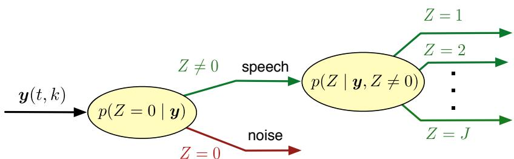  
Figure 7.1: Probabilistic hierarchical model for associating each TF bin to the dominant source.

## 7.2.2 Estimation of the source label a posteriori probability

Regardless of the choice of feature, in clustering-based BSS, the distribution of the selected feature is commonly modelled as a mixture Probability Density Function (PDF), i.e.,

$$
f (\hat {\mathbf {r}} _ {t k} \mid Z _ {t k} \neq 0) = \sum_ {j = 1} ^ {J} p (Z _ {t k} = j \mid Z _ {t k} \neq 0) f (\hat {\mathbf {r}} _ {t k} \mid Z _ {t k} = j),\tag{7.8}
$$

where $f(\hat{\mathbf{r}}_{tk} \mid Z_{tk} = j)$ denotes the likelihood of observing the narrowband position $\hat{r}_{tk}$ , when the j-th source is dominant. Let the probability of the source index, given that speech is present, $p(Z_{tk} = j \mid Z_{tk} \neq 0)$ be denoted by $\pi_{j}$ . Then, the posterior probability defined in (7.7), follows from the Bayes rule

$$
p (Z _ {t k} = j \mid \hat {\mathbf {r}} _ {t k}, Z _ {t k} \neq 0) = \frac {\pi_ {j} f (\hat {\mathbf {r}} _ {t k} \mid Z _ {t k} = j)}{f (\hat {\mathbf {r}} _ {t k} \mid Z _ {t k} \neq 0)},\tag{7.9}
$$

where $f(\hat{\mathbf{r}}_{tk} \mid Z_{tk} \neq 0)$ denotes the likelihood of observing the narrowband position $\hat{r}_{tk}$ , when speech is present. In some of the existing contributions, instead of conditioning on speech presence in (7.8), an additional mixture component is added for Z = 0 [237], while in other contributions, the noise is either ignored [132] or certain energy-based thresholds are incorporated to ensure that only speech-dominant TF bins are used for clustering [142]. One of the contributions of the proposed BSS framework in this chapter, is the hierarchical model described in Section 7.2.1 which incorporates the speech presence uncertainty for each TF bin via the Gaussian model-based SPP.

Depending on the choice of feature, different models are proposed in the literature for the likelihoods $f(\hat{\mathbf{r}}_{tk} \mid Z_{tk} = j)$ in (7.8). For instance, real Gaussian mixtures are used for clustering of DOAs [143], complex Gaussian mixtures for signal vectors [107], von Mises mixtures for DOAs [242], and complex Watson mixtures [130, 243] for normalised signal vectors. Due to different trade-offs between theoretical rigour, complexity, robustness to noise, flexibility for different array geometries, etc., it is unclear whether some features and models are universally preferable in a wide range of settings. Motivated by the fact that the position estimates associated to one source form distinct clusters around the true source position as illustrated in Figure 6.3, we use a simple Gaussian Mixture Model (GMM) in (7.8), where each likelihood is modelled by a two-dimensional (2D) Gaussian vector with mean $\mu_{j}$ and covariance matrix $\Sigma_{j}$ , namely,

$$
f (\hat {\mathbf {r}} _ {t k} \mid Z _ {t k} = j) = \mathcal {N} (\hat {\mathbf {r}} _ {t k}; \pmb {\mu} _ {j}, \pmb {\Sigma} _ {j}).\tag{7.10}
$$

Using the likelihoods from $(7.10)$ , the GMM in $(7.8)$ can be written as

$$
f (\hat {\mathbf {r}} _ {t k} \mid Z _ {t k} \neq 0) = \sum_ {j = 1} ^ {J} \pi_ {j} \mathcal {N} (\hat {\mathbf {r}} _ {t k}; \boldsymbol {\mu} _ {j}, \boldsymbol {\Sigma} _ {j}).\tag{7.11}
$$

By substituting the GMM in $(7.9)$ , the conditional a posteriori probability is computed as

$$
p (Z _ {t k} = j \mid \hat {\mathbf {r}} _ {t k}, Z _ {t k} \neq 0) = \frac {\pi_ {j} \mathcal {N} (\hat {\mathbf {r}} _ {t k} ; \boldsymbol {\mu} _ {j} , \boldsymbol {\Sigma} _ {j})}{\sum_ {j ^ {\prime} = 1} ^ {J} \pi_ {j ^ {\prime}} \mathcal {N} (\hat {\mathbf {r}} _ {t k} ; \boldsymbol {\mu} _ {j ^ {\prime}} , \boldsymbol {\Sigma} _ {j ^ {\prime}})}.\tag{7.12}
$$

Finally, by substituting (7.12) and the SPP computed by the framework in Chapter 3 in (7.6), the a posteriori probability of the dominant source label, $p(Z_{tk} \mid \mathbf{y}(t,k))$ , is obtained.

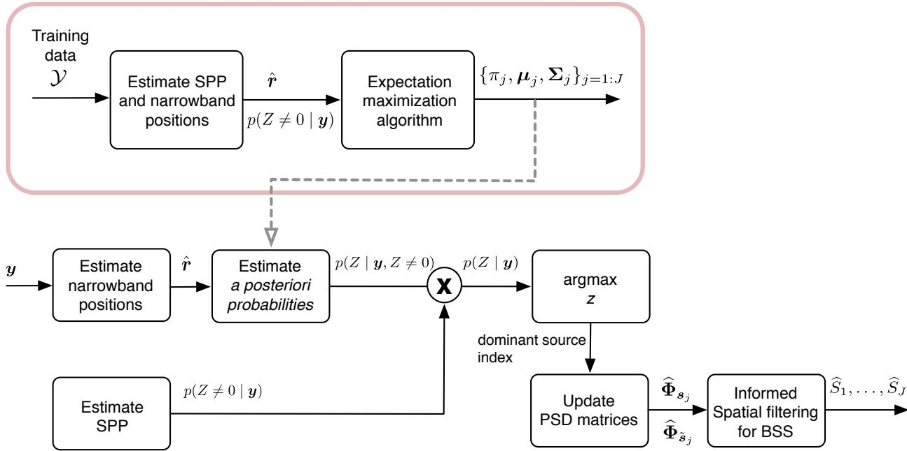  
Figure 7.2: Diagram of the framework for clustering-based BSS, using narrowband position estimates. The figure illustrates the training phase used to obtain the GMM parameters, as well as the usage of the estimated parameters for dominant source detection, PSD matrix estimation and informed spatial filtering for BSS.

Given a training set which contains the bin-wise position estimates (or the features of choice) from a short signal segment where each of the sources has been active (the order of the source activity need not be known, and the sources can be concurrent), the estimation of the parameters $P \equiv \{\pi_{j}, \mu_{j}, \Sigma_{j}\}_{j=1:J}$ represents an unsupervised clustering problem. Maximum Likelihood (ML) parameter estimates can be obtained by the EM algorithm [193], which is often used in clustering-based BSS [129, 130, 132, 238]. Although the EM for GMMs is given in many textbooks (cf. [195]), we summarise it in the next section, with interpretation specific to our problem. A block diagram of the complete framework is shown in Figure 7.2. Note that although the training phase requires a batch of data where all of the sources are active for 2-5 seconds, once the GMM parameters are estimated, BSS can be performed online on new signals. Clearly, it is required that the number of sources is fixed, and that the sources are approximately static. In Chapter 8, we develop a related BSS framework applicable to moving sources.

## 7.2.3 Outline of the EM algorithm for Gaussian mixture models

As the distribution which is modelled by a Gaussian mixture is the conditional $f(\hat{\mathbf{r}}_{tk} \mid Z_{tk} \neq 0)$ , the training set Y should contain only TF bins where speech is present. To this end, we use the Gaussian SPP developed in Chapter 3, and cluster only TF bins $(t, k)$ that satisfy

$$
p (Z _ {t k} \neq 0 | \mathbf {y} (t, k)) > p _ {\mathrm{thr}},\tag{7.13}
$$

where $p_{thr}$ is a threshold on the SPP. Although the SPP can be incorporated in a soft manner in the training phase, our experiments showed that the clustering is more robust when the low SPP points are excluded. Furthermore, removing low SPP points notably reduces the complexity and the number of EM iterations, as due to speech sparsity, many TF bins are noise-dominated.

If the training set Y contains $\hat{r}_{tk}$ , for $t \in [1, T]$ and $k \in [1, K]$ , which satisfy (7.13), the log-likelihood which needs to be maximised with respect to the parameters P is given by

$$
\mathcal {L} (\mathcal {Y}; \mathcal {P}) = \sum_ {t = 1} ^ {T} \sum_ {k = 1} ^ {K} \log f (\hat {\mathbf {r}} _ {t k} \mid Z _ {t k} \neq 0; \mathcal {P}).\tag{7.14}
$$

The problem when estimating GMM parameters, is that a sum of exponentials appears inside the logarithm, which is difficult to maximise. The key idea of the EM algorithm, is instead of $(7.15)$ , to maximise the log-likelihood assuming that the set of dominant source labels Z is available, i.e.,

$$
\mathcal {L} (\mathcal {Y}, \mathcal {Z}; \mathcal {P}) = \sum_ {t = 1} ^ {T} \sum_ {k = 1} ^ {K} \log f (\hat {\mathbf {r}} _ {t k}, z _ {t k}; \mathcal {P}).\tag{7.15}
$$

As the dominant source label is unknown, instead of the log-likelihood (7.15), the EM maximises the expected value of (7.15) with respect to the probability $p(Z_{tk} \mid \hat{\mathbf{r}}_{tk}; \mathcal{P}^{(i-1)})$ , where i denotes the iteration index of the EM. If at iteration i an estimate $\mathcal{P}^{(i-1)}$ of the parameters is provided, then all the information available about $Z_{tk}$ is contained in the posterior probability $p(Z_{tk} \mid \hat{\mathbf{r}}_{tk}; \mathcal{P}^{(i-1)})$ . The expectation of (7.15), known as the Q-function, for our problem is given by

$$
Q (\mathcal {P} ^ {(i)} \mid \mathcal {P} ^ {(i - 1)}) = \sum_ {t = 1} ^ {T} \sum_ {k = 1} ^ {K} \sum_ {j = 1} ^ {J} p (Z _ {t k} \mid \hat {\mathbf {r}} _ {t k}; \mathcal {P} ^ {(i - 1)}) \log \pi_ {j} ^ {(i)} \mathcal {N} \left(\hat {\mathbf {r}} _ {t k}; \boldsymbol {\mu} _ {j} ^ {(i)}, \boldsymbol {\Sigma} _ {j} ^ {(i)}\right).\tag{7.16}
$$

The E-step of the EM, consists of evaluating $p(Z_{tk} \mid \hat{\mathbf{r}}_{tk}; \mathcal{P}^{(i-1)})$ and the $Q$ -function in (7.16). The M-step consists of maximising (7.16) with respect to the parameters $\pi_j^{(i)}, \boldsymbol{\mu}_j^{(i)}, \boldsymbol{\Sigma}_j^{(i)}$ . The new parameter estimates at iteration $i$ are given by (for further details the reader is referred to [195])

$$
\begin{array}{l} \boldsymbol {\mu} _ {j} ^ {(i)} = \frac {\sum_ {t = 1} ^ {T} \sum_ {k = 1} ^ {K} p \left(Z _ {t k} = j   |   \hat {\mathbf {r}} _ {t k} ; \mathcal {P} ^ {(i - 1)}\right) \cdot \hat {\mathbf {r}} _ {t k}}{\sum_ {t = 1} ^ {T} \sum_ {k = 1} ^ {K} p \left(Z _ {t k} = j   |   \hat {\mathbf {r}} _ {t k} ; \mathcal {P} ^ {(i - 1)}\right)} \\ \boldsymbol {\Sigma} _ {j} ^ {(i)} = \frac {\sum_ {t = 1} ^ {T} \sum_ {k = 1} ^ {K} p \left(Z _ {t k} = j   |   \hat {\mathbf {r}} _ {t k} ; \mathcal {P} ^ {(i - 1)}\right) (\hat {\mathbf {r}} _ {t k} - \boldsymbol {\mu} _ {j}) (\hat {\mathbf {r}} _ {t k} - \boldsymbol {\mu} _ {j}) ^ {\mathrm{T}}}{\sum_ {t = 1} ^ {T} \sum_ {k = 1} ^ {K} p \left(Z _ {t k} = j   |   \hat {\mathbf {r}} _ {t k} ; \mathcal {P} ^ {(i - 1)}\right)} \\ \pi_ {j} ^ {(i)} = \frac {1}{N} \sum_ {t = 1} ^ {T} \sum_ {k = 1} ^ {K} p \left(Z _ {t k} = j   |   \hat {\mathbf {r}} _ {t k}; \mathcal {P} ^ {(i - 1)}\right). \end{array}\tag{7.17a}
$$

(7.17b)

(7.17c)

It can be shown that an iteration of the EM algorithm always increases the data likelihood (7.15) [193, 195], i.e., $\mathcal{L}(\mathcal{Y};\mathcal{P}^{(i)}) > \mathcal{L}(\mathcal{Y};\mathcal{P}^{(i - 1)})$ . The $E$ -step and $M$ -steps are repeated to re-estimate the parameters $\mathcal{P}$ , until there is no significant likelihood change in two consecutive iterations.

## 7.3 Joint number of source estimation and clustering

In Section 7.2.3, the EM algorithm was described under the assumption that the number of sources is given. This assumption is commonly used in EM clustering algorithms for BSS $[129, 130, 132, 141, 208]$ . In this section, we propose an EM-based algorithm to jointly estimate the number of sources and the parameters of the GMM. Before describing the proposed approach in Section 7.3.2, we first briefly discuss tolerance regions of a Gaussian distribution which are required in the different steps of proposed algorithm.

## 7.3.1 Tolerance region of a Gaussian distribution

A tolerance region of a probability density is the region of minimum volume that contains a certain probability mass $p_{mass}$ . Consider a multivariate Gaussian distribution with a mean vector $\mu$ and covariance matrix $\Sigma$ . A point r belongs to a tolerance region of probability $p_{mass}$ if

$$
(\mathbf {r} - \boldsymbol {\mu}) ^ {\mathrm{T}} \boldsymbol {\Sigma} ^ {- 1} (\mathbf {r} - \boldsymbol {\mu}) \leq \Psi_ {p _ {\mathrm{mass}}},\tag{7.18}
$$

where $\Psi_{p_{mass}}$ depends on $p_{mass}$ . It can be shown [148] that for an N-dimensional Gaussian, the quadratic form $(\mathbf{r}-\boldsymbol{\mu})^{\mathrm{T}}\boldsymbol{\Sigma}^{-1}(\mathbf{r}-\boldsymbol{\mu})$ has a Chi-squared distribution with N degrees of freedom. For the 2D case, the cumulative distribution of a Chi-squared distribution reduces to an exponential distribution, leading to the following relation between $p_{mass}$ and $\Psi_{p_{mass}}$

$$
p _ {\mathrm{mass}} = 1 - e ^ {- \Psi_ {p _ {\mathrm{mass}}} / 2}.\tag{7.19}
$$

For a 2D Gaussian distribution, the locus of points defined by (7.18) represents the interior of an ellipse with centre $\mu$ and axes aligned with the eigenvectors of $\Sigma$ .

## 7.3.2 Proposed approach

Initialising the EM algorithm with an arbitrary, sufficiently large number that exceeds the expected number of sources (in all of our experiments, the initial number of sources, i.e., Gaussian components in the mixture, is set to 10), an iteration of the algorithm consists of three main steps, as follows

## Step 1: A standard EM iteration

Using the number of sources estimated from the previous iteration (or at iteration 1, the number of sources defined during initialisation), a standard EM iteration is performed, as described in Section 7.2.3.

## Step 2: Update the number of sources estimate

In this step, the narrowband position estimates are used to update the number of Gaussian components, by removing components that do not model a source, and by merging components that model the same source. As listed in Algorithm 7.1, there are two sub-steps as follows

2(a). Removing Gaussian components. Three empirical criteria $C_{1}$ , $C_{2}$ and $C_{3}$ are used to determine if the j-th component in the Gaussian mixture of the current iteration models a source. The first criterion is based on the fact that components which do not model a source have notably larger variance compared to the ones that model a source. Moreover, some Gaussian components might model more than one source, leading to a large variance. Formally, criterion $C_{1}$ is given by

$$
\begin{array}{l} \mathcal {C} _ {1}: \mathrm{tr} \left\{\boldsymbol {\Sigma} _ {j} \right\} > c _ {\mathrm{var}} \cdot \mathrm{tr} \left\{\boldsymbol {\Sigma} _ {j ^ {*}} \right\}, \\ j ^ {*} = \underset {j ^ {\prime}} {\arg \min} \mathrm{tr} \left\{\boldsymbol {\Sigma} _ {j ^ {\prime}} \right\}, \end{array}\tag{7.20}
$$

where $c_{var}$ is a pre-defined constant which determines the maximum variance that is allowed along the principal axes of a component that models a source, and $\Sigma_{j^{*}}$ is the covariance of the component with minimum principal axes variance among all components in the current iteration.

The criterion $C_{2}$ relates to the condition number of the covariance matrix $\Sigma_{j}$ , and can be computed as the ratio of the largest eigenvalue to the smallest eigenvalue of $\Sigma_{j}$ , where the eigenvalues determine the variance along the principal axes. Assuming that noise and reverberation are localised randomly in the room, noisy and reverberant position estimates can be modelled by a distribution with a balanced variance along the principal axes. If $\text{cond}\{\cdot\}$ denotes the condition number, components that do not satisfy

$$
\mathcal {C} _ {2}: \mathrm{cond} \{\pmb {\Sigma} _ {j} \} <   c _ {\mathrm{cond}}\tag{7.21}
$$

are likely to model a source. The pre-defined constant $c_{cond}$ denotes the maximum condition number that is characteristic for a component that does not model a source.

The criterion $C_{3}$ seeks to remove the j-th Gaussian component if it contains the means of at least two other components within a tolerance region of probability $p_{\mu}$ , i.e.,

$$
\mathcal {C} _ {3}: (\boldsymbol {\mu} _ {j ^ {\prime}} - \boldsymbol {\mu} _ {j}) ^ {\mathrm{T}} \boldsymbol {\Sigma} _ {j} ^ {- 1} (\boldsymbol {\mu} _ {j ^ {\prime}} - \boldsymbol {\mu} _ {j}) \leq \Psi_ {p _ {\mu}}
$$

$$
j ^ {\prime}
$$

$$
j ^ {\prime} \neq j\tag{7.22}
$$

where $\Psi_{p_{\mu}}$ is computed using $p_{\mu}$ and (7.19). Finally, the j-th component is removed if the following statement is true

$$
(\mathcal {C} _ {1} \wedge \mathcal {C} _ {2}) \vee \mathcal {C} _ {3},\tag{7.23}
$$

where $\wedge$ and $\vee$ denote logical conjunction and disjunction. Expression (7.23) is crucial for robust number of sources estimation: (i) the conjunction $C_{1} \wedge C_{2}$ eliminates sources with high variance only if the variance is balanced along the principal axes; (ii) the disjunction with $C_{3}$ ensures that a component that models more than one source is discarded, provided that each source is already modelled by a separate component.

When removing the $j$ -th component, the Mahalanobis distances between the mean of the removed component and the means of the remaining ones is to be taken into account when computing the new coefficients $\pi_{j'}$ , for $j' \in \mathcal{G}$ as

$$
\pi_ {j ^ {\prime}} \longleftarrow \pi_ {j ^ {\prime}} + \pi_ {j} \frac {(\boldsymbol {\mu} _ {j} - \boldsymbol {\mu} _ {j ^ {\prime}}) ^ {\mathrm{T}} \boldsymbol {\Sigma} _ {j ^ {\prime}} ^ {- 1} (\boldsymbol {\mu} _ {j} - \boldsymbol {\mu} _ {j ^ {\prime}})}{\sum_ {k \in \mathcal {G}} (\boldsymbol {\mu} _ {j} - \boldsymbol {\mu} _ {k}) ^ {\mathrm{T}} \boldsymbol {\Sigma} _ {k} ^ {- 1} (\boldsymbol {\mu} _ {j} - \boldsymbol {\mu} _ {k})},\tag{7.24}
$$

where G denotes the set of remaining components in the mixture. In addition, the new coefficients are normalised so that their sum is equal to one.

2(b). Merging Gaussian components. Components with closely located means are likely to be modelling a single source. Two components j and $j'$ are merged if the following holds

$$
\left\| \boldsymbol {\mu} _ {j ^ {\prime}} - \boldsymbol {\mu} _ {j} \right\| <   c _ {\mu},\tag{7.25}
$$

where $\|\cdot\|$ denotes the Euclidean norm, and $c_{\mu}$ is a pre-defined constant. The j-th and the $j'$ -th component are merged to form a single component with the following parameters

$$
\pmb {\mu} _ {\mathrm{mrg}} = \frac {\pmb {\mu} _ {j ^ {\prime}} + \pmb {\mu} _ {j}}{2}, \pmb {\Sigma} _ {\mathrm{mrg}} = \frac {\pmb {\Sigma} _ {j ^ {\prime}} + \pmb {\Sigma} _ {j}}{2}, \pi_ {\mathrm{mrg}} = \pi_ {j ^ {\prime}} + \pi_ {j}.\tag{7.26}
$$

## Step 3: Pruning training data

After removing or merging Gaussian components, certain position estimates from the training set are no longer accurately modelled by the Gaussian mixture. To avoid that the remaining components try to erroneously model these position estimates, the data pruning step is crucial, whenever a component is discarded from the mixture. If $p_{mass}$ denotes a chosen probability mass and $\Psi_{p_{mass}}$ the associated Mahalanobis distance computed by (7.19), a position estimate $\hat{r}_{tk}$ is removed from the training set Y if for all components $j' \in G$ the following holds

$$
(\hat {\mathbf {r}} _ {t k} - \pmb {\mu} _ {j ^ {\prime}}) ^ {\mathrm{T}} \pmb {\Sigma} _ {j ^ {\prime}} ^ {- 1} (\hat {\mathbf {r}} _ {t k} - \pmb {\mu} _ {j ^ {\prime}}) \geq \Psi_ {p _ {\mathrm{mass}}}.\tag{7.27}
$$

This means that if a position estimate does not belong to a tolerance interval $p_{mass}$ of any Gaussian in the current iteration, it is removed from the training set.

## Stopping criteria

The algorithm has converged if the difference of the estimated means and covariances in two successive iterations is smaller than a threshold. After convergence, a Mahalanobis distance-based merging is performed to ensure that each source is modelled by a single Gaussian. In particular, two Gaussian components j and $j'$ are merged if at least one of the following holds

$$
(\pmb {\mu} _ {j ^ {\prime}} - \pmb {\mu} _ {j}) ^ {\mathrm{T}} \pmb {\Sigma} _ {j} ^ {- 1} (\pmb {\mu} _ {j ^ {\prime}} - \pmb {\mu} _ {j}) \leq \Psi_ {p _ {\mathrm{merge}}} \quad \mathrm{or} \quad (\pmb {\mu} _ {j} - \pmb {\mu} _ {j ^ {\prime}}) ^ {\mathrm{T}} \pmb {\Sigma} _ {j ^ {\prime}} ^ {- 1} (\pmb {\mu} _ {j} - \pmb {\mu} _ {j ^ {\prime}}) \leq \Psi_ {p _ {\mathrm{merge}}}.\tag{7.28}
$$

## 7.3.3 Summary and an illustrative example

Algorithm 7.1 presents an outline of the proposed algorithm for joint number of source detection and clustering. To further clarify the different steps, we illustrate an example where the GMM parameter estimates are visualised at each iteration. The initialisation, namely the removal of position estimates with low SPP and the K-means clustering with $J^{(0)} = 10$ components are illustrated in Figure 7.3. In Figure 7.4, the leftmost figure corresponds to iteration 2, where it is visible that the components corresponding to sources have generally smaller variance and larger condition number, while the components that do not model a source have a large variance in all directions. In the middle figure, the removal of two Gaussian components can be seen, while the red points denote positions that have been discarded from the training set after data pruning. The rightmost figure shows the final clusters after seven iterations and after applying the Mahalanobis distance-based merger.

## 7.4 Spatial filtering for source separation

Using the estimated GMM parameters from the clustering framework, we can evaluate the conditional posterior distribution of the dominant source label in $(7.6)$ , and together with the SPP obtained according to Chapter 3, determine the dominant source label using $(7.5)$ . Therefore, for each source, we obtain a TF mask, which is equal to one at TF bins where the source is dominant, and zero otherwise. The usage of TF masks for informed spatial filtering was discussed in different applications in the previous chapters. In this section, we briefly revisit their usage in BSS, as several practical issues need to be considered when designing ISFs for scenarios where the undesired signal contains strong directional and non-stationary signals from multiple sources.

Algorithm 7.1 Number of sources detection and clustering.

initialization
i-1. Estimate the SPP for all TF bins in the training set Y and keep those that satisfy (7.13).
i-2. Select a number of initial components  $J^{(0)}$ , as the maximum number of sources.
i-3. Initialize the GMM parameters by a K-means clustering [196].
repeat
    1. Perform E-step and M-step of the EM algorithm as described in Section 7.2.3.
    2. Estimate number of components.
    2(a). Removing a Gaussian component according to (7.20)-(7.24).
    2(b). Merging Gaussian components according to (7.25) and (7.26).
    3. Pruning training data using criterion (7.27).
until the GMM parameters difference between two iterations is sufficiently small.
Run a final Mahalanobis distance-based merger using (7.28).

## 7.4.1 PSD matrix estimation

The computation of the PSD matrices of the desired signals in multi-source scenarios was given by $(2.48)$ in Section 2.5.3.1, where the averaging parameter for each source is computed as

$$
\alpha_ {s _ {j}} (t, k) = 1 + \mathrm{I} _ {Z _ {t k} = j} (\tilde {\alpha} _ {s} - 1),\tag{7.29}
$$

where $I_{Z_{tk}=j}$ is a binary indicator which equals one when the expression the subscript is true, and zero otherwise. Note however, that our experiments in various BSS scenarios, indicated that the perceptual quality of the extracted source signals is slightly better if some temporal averaging of $\alpha_{s_{j}}(t,k)$ in (7.29) is performed before estimating the PSD matrices $\widehat{\Phi}_{s_{j}}$ (we performed averaging over 2 consecutive STFT frames, corresponding to 64 ms). Following the typical PSD matrix estimation procedure, the undesired signal PSD matrix $\Phi_{\tilde{s}_{j}}$ , with respect to the j-th source, can be obtained recursively with the averaging parameter

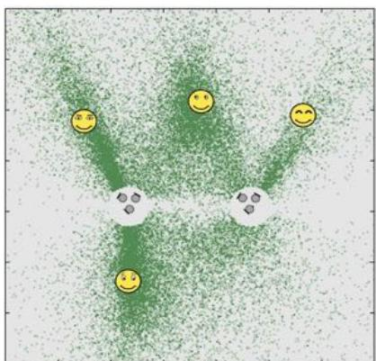

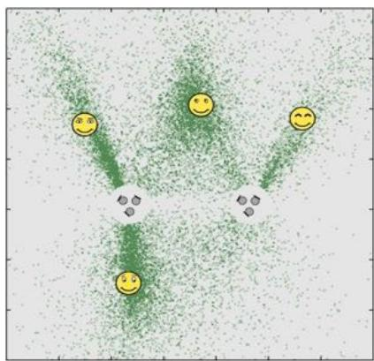

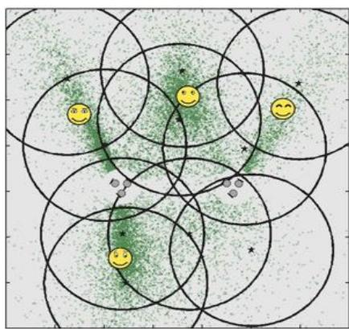  
Figure 7.3: The narrowband position estimates in the training set before removing low SPP points (left), and after removing points with SPP lower than $p_{thr} = 0.85$ (middle). The initial Gaussian components after K-means clustering are shown on the right. The yellow images denote the true source locations, whereas the stars on the right image denote the initial cluster means.

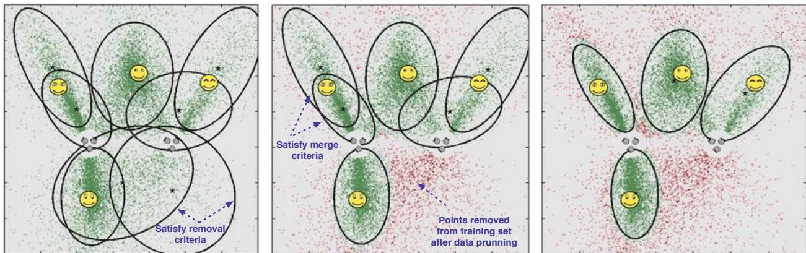  
Figure 7.4: The estimated clusters at iteration 2 (left), iteration 3 (middle), and after the seven iterations and the final Mahalanobis merger (right). The yellow images denote the true source locations, whereas the stars denote the cluster mean estimates at the given iteration. The ellipses correspond to the tolerance regions containing 90% of the total probability mass of the Gaussian components

$$
\alpha_ {\tilde {s} _ {j}} (t, k) = 1 + \mathrm{I} _ {Z _ {t k} \neq j} (\tilde {\alpha} _ {s} - 1).\tag{7.30}
$$

Alternatively, due to the fact that in the BSS framework, the PSD matrices $\widehat{\Phi}_{s_{j}}$ are estimated for each source, we can exploit (7.2) to obtain the undesired signal PSD matrix as follows

$$
\widehat {\boldsymbol {\Phi}} _ {\tilde {\mathbf {s}} _ {j}} (t, k) = \sum_ {i \neq j} \widehat {\boldsymbol {\Phi}} _ {\mathbf {s} _ {i} + \mathbf {v}} (t, k) - (J - 1) \cdot \widehat {\boldsymbol {\Phi}} _ {\mathbf {v}} (t, k).\tag{7.31}
$$

Due to estimation errors, or before the speech signals become active, the expression (7.31) might result in a PSD matrix estimate that is not positive semi-definite. To avoid this, whenever the result from (7.31) has at least one negative entry on the diagonal, we set $\widehat{\mathbf{\Phi}}_{\tilde{\mathbf{s}}_{j}}(t,k)=\widehat{\mathbf{\Phi}}_{\mathbf{v}}(t,k)$ .

To compute ISFs for BSS, the undesired PSD matrix estimate given by (7.31) proved to provide more robust spatial filters than using (7.30) to recursively estimate $\widehat{\Phi}_{\tilde{\mathbf{s}}_{j}}(t,k)$ . Further discussion and experimental results regarding this claim are provided in Section 7.5.3.1.

## 7.4.2 Informed spatial filter design for BSS

As discussed in the previous chapters, the Minimum Variance Distortionless Response (MVDR) filter expressed in terms of the RTF vector, given by $(2.24)$ , provides better signal quality than the formulation in terms of the PSD matrices, given by $(2.26)$ . We confirmed this behaviour in the current experiments as well, and therefore we apply the formulation $(2.24)$ , where the RTF vector was estimated using the covariance subtraction approach described in Section 2.5.3.1.

To achieve better undesired signal reduction (however at the cost of introducing larger distortion to the desired signal), a single-channel Wiener filter can be applied at the MVDR output, similarly as done in Chapter 3 for the application of noise reduction. As discussed in some detail in Section 3.5.2, it is beneficial to design the spectral Wiener filter using $(3.46)-(3.48)$ , rather than applying the direct Multichannel Wiener Filter (MWF) expression from $(2.37)$ . The estimated PSD of the noise residual at the MVDR output in $(3.47)$ , is now substituted by the noise-plus-undesired-speech residual PSD at the output of the informed MVDR separation filter of a selected source j, and the averaging constant for estimating this PSD is given by

$$
\alpha_ {j, \mathrm{sc}} (t, k) = \tilde {\alpha} _ {\mathrm{sc}} + \mathrm{I} _ {Z _ {t k} = j} (1 - \tilde {\alpha} _ {\mathrm{sc}}),\tag{7.32}
$$

where $\tilde{\alpha}_{sc}$ is a constant in the range $(0,1)$ and $\alpha_{j,\mathrm{sc}}(t,k)$ has the same role as $\alpha_{v}(t,k)$ in (3.47). The rationale of (7.32) is that the PSD of the residual undesired signal is recursively updated with an averaging parameter $\alpha_{j,\mathrm{sc}}(t,k)=\tilde{\alpha}_{\mathrm{sc}}$ when the source of interest j is not dominant, whereas it is not updated (i.e. $\alpha_{j,\mathrm{sc}}(t,k)=1$ ), when source j is dominant. Note that a similarly designed spectral filter using the TF masks was applied at the MVDR filter output for BSS in [130].

In practical situations, such as for instance in meeting scenarios, the activity of the sources changes over time and it rarely happens that all sources are active simultaneously. Information about the activity of the sources can be used to achieve stronger interference reduction when a selected desired source is inactive. To implement such additional control, a frequency-independent trade-off parameter can be used in an Parametric Multichannel Wiener Filter (PMWF), such that for the j-th talker, the source label posterior probabilities from the past L frames are used to compute the following indicator

$$
p _ {j} (t) = \frac {\sum_ {t ^ {\prime} = t - L + 1} ^ {n} \sum_ {k} p \left(Z _ {t ^ {\prime} k} = j \mid \hat {\mathbf {r}} _ {t ^ {\prime} k} , \mathbf {y} (t ^ {\prime} , k)\right)}{\sum_ {j ^ {\prime} = 1} ^ {J} \sum_ {t ^ {\prime} = t - L + 1} ^ {n} \sum_ {k} p \left(Z _ {t ^ {\prime} k} = j ^ {\prime} \mid \hat {\mathbf {r}} _ {t ^ {\prime} k} , \mathbf {y} (t ^ {\prime} , k)\right)},\tag{7.33}
$$

and, $p_{j}(t)$ can be mapped to a trade-off parameter using a sigmoid-like function, similarly as in Chapter 3. However, in the following section, we only evaluate the BSS in the more challenging scenarios where all sources are simultaneously active, and therefore only apply the MVDR filter and the MWF. Provided that the dominant source label is accurately estimated, the additional control via the PMWF in scenarios with non-overlapping speech segments is straightforward, and it is not further evaluated in this thesis.

## 7.5 Performance evaluation

The framework for number of source detection, clustering and BSS proposed in this chapter, was evaluated using simulated and measured data. Simulated data is used to illustrate the number of source detection and clustering for different noise and reverberation levels, while measured data was used for objective quality evaluation of the separated source signals for different number of sources. In addition, the performance of a state-of-the-art framework for number of sources estimation, clustering, and subsequent BSS is discussed and compared to the proposed framework. The objective quality measures, namely, the Interference Reduction (IR), Noise Reduction (NR), Speech Distortion (SD) index, Signal-to-Interference Ratio (SIR) improvement, and Perceptual Evaluation of Speech Quality (PESQ), are defined in Appendix A.

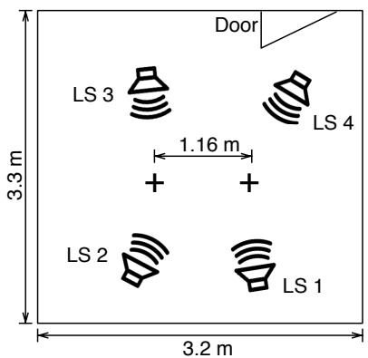  
(a) Setup 1

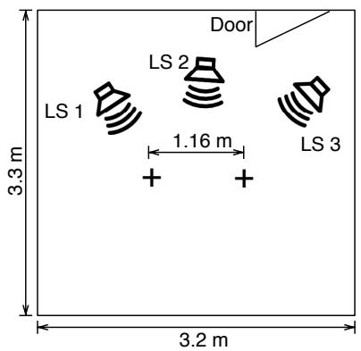  
(b) Setup 2

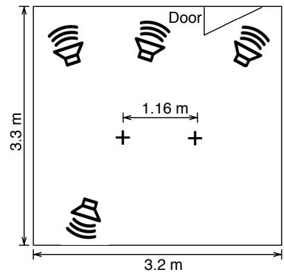  
(c) Diffuse sound

Figure 7.5: Measurement setup for the BSS experiments.

<table><tr><td> $J^{(0)}$ </td><td> $c_{\text{var}}$ (7.20)</td><td> $c_{\mu}$ (7.25)</td><td> $c_{\text{cond}}$ (7.21)</td><td> $p_{\mu}$ (7.22)</td><td> $p_{\text{merge}}$ (7.28)</td><td> $p_{\text{mass}}$ (7.18)</td></tr><tr><td>10</td><td>2.0</td><td>0.4</td><td>2.5</td><td>0.90</td><td>0.95</td><td>0.95</td></tr></table>

Table 7.1: Parameters for the proposed joint number of source detection and clustering approach.

## 7.5.1 Experimental setup

The dimensions of the simulated room, as well as of the room where measurements were performed were $3.2 \, m \times 3.3 \, m \times 2.8 \, m$ . Two uniform circular arrays with diameter 3 cm, inter-array distance of 1.16 m, and four microphones per array were used to capture the acoustic scene. Simulated microphone signals were obtained by convolving Acoustic Impulse Responses (AIRs) (simulated using an implementation of the image source model [201]) with four different speech signals. Diffuse noise [204] and uncorrelated noise were added to the convolved speech signals. Measurements were done in a room with $T_{60} \approx 0.25 \, s$ using DPA miniature microphones (model d:screet SMK-SC4060). The AIRs for each source-microphone pair were measured by emitting time-stretched pulse signals with GENELEC loudspeakers (model 8010 AP) in two different setups, as shown in Figure 7.5(a) and Figure 7.5(b). The AIRs from the setup in Figure 7.5(c) were used to generate diffuse sound, such that a different babble signal for each loudspeaker was convolved with the measured AIRs. To ensure that the resulting signal is sufficiently diffuse, the first 30 ms of the AIRs were set to zero. Finally, the microphone signals were obtained by adding the convolved speech signals, the diffuse noise with a given Input Signal-to-Noise Ratio (iSNR) (given in the experiments), and the measured sensor noise scaled appropriately for an iSNR of 35 dB.

The smoothing constant $\tilde{\alpha}_{v}$ used for noise PSD matrix estimation was set to 0.95 and $\tilde{\alpha}_{s}$ and $\tilde{\alpha}_{\tilde{s}}$ were 0.8 and 0.94, respectively. The averaging constants for the Wiener spectral filter were $\tilde{\alpha}_{sc} = 0.95$ and $\alpha_{\psi} = 0.9$ (see (3.47) and (7.32)). The parameters related to the proposed clustering algorithm in Section 7.3 are summarised in Table 7.1. The chosen values offered a stable performance in all tested scenarios, with mild to moderate reverberation and noise levels.

To avoid erroneous DOA estimates at high frequencies due to spatial aliasing, all signals were band-limited to 7 kHz. Frequencies above aliasing can be processed if the phase wrapping of the DOAs is compensated before triangulation. For instance, an approach to map aliased DOA estimates the true DOA was proposed in $[232]$ . A different DOA-based clustering approach, proposed in $[244]$ takes into account both the spatial aliasing and the number of source estimation by using a Dirichlet prior of the mixture coefficients in the EM. However, the authors in $[244]$ reported more than 40 required iterations in mildly reverberant rooms with $T_{60} = 0.13$ s, in contrast to our approach which requires not more than 7 iterations in all tested scenarios up to $T_{60} = 0.4$ s. When clustering certain spatial features, such as normalised observation vectors $[130, 132]$ , the aliasing problem does not occur at all, however, an additional permutation alignment is required as the clustering is done at each frequency independently.

## 7.5.2 Evaluation of the proposed clustering algorithm

The clustering algorithm described in Section 7.3 was evaluated for different reverberation times, different diffuse noise levels and different number of sources. The length of the signal used for training was 2J seconds where J denotes the number of sources. When training is done during multi-talk, all sources are simultaneously active during the whole training period, whereas in single-talk scenarios each source is active for two seconds. Background noise is always present during training.

## 7.5.2.1 A comparable state-of-the-art approach

As a suitable state-of-the-art method with comparable complexity, which determines the number of sources, does not require permutation alignment, and has a robust cluster initialisation, we chose the method proposed by Loesch and Yang in $[142]$ , referred to as NOSET. NOSET is based on narrowband DOA estimates, which are obtained using the Least Squares (LS) approach described in Section 4.2.1. Hence our framework and NOSET share the same narrowband DOA estimates. NOSET estimates the number of sources by analysing the DOA histogram from the training set. After estimation of the number of sources, transforming the estimated cluster centres (in this case DOAs) to normalised observation vectors using an anechoic model, a step of the K-means algorithm is performed to obtain the final clusters. Therefore, while the DOA estimates are used for number of source estimation, the TF mask generation operates in the normalised observation vector domain, similarly as in the so-called MENUET approach $[239]$ . Note that the NOSET algorithm does not include a model-based VAD or SPP, but instead, it forms several energy-based heuristic measures to determine reliable TF bins for clustering. These measures require some prior information about typical energy of the different sources during single-talk and multi-talk. To avoid such heuristics, which are highly dependent on the scenario, we applied the NOSET algorithm such that we estimated the mean power of the signal across all TF bins in the training data, and removed all bins whose instantaneous power was 20 dB lower than the average. To have a fair comparison between the two algorithms, this power threshold was also applied to the proposed EM-based clustering algorithm.

## 7.5.2.2 Clustering results using simulated and measured data

In Figure 7.6, the clusters of four sources for two reverberation levels are shown. The training in Figure 7.6(a) is performed on signals during single-talk, whereas in Figure 7.6(b) training is performed during constant multi-talk. Although the latter is a challenging scenario where the sources are less likely to be sparse, the algorithm successfully estimates the number of sources and their clusters. To illustrate number of source estimation by the NOSET approach, we illustrate the DOA histograms in Figure 7.7. To have a fair comparison to the proposed algorithm, instead of using only one of the arrays to apply NOSET, we simulated the signals as captured at an 8-element array, at the midpoint of the line connecting the two arrays in Figure 7.6. In this manner, all sources are relatively near the array, and the total number of microphones for both algorithms is equal. To determine the number of sources, thresholding of the histogram peaks is performed in $[142]$ . From Figure 7.7 it is clear that besides thresholding, one needs to ensure that neighbouring peaks are only selected as one peak as they correspond to the same source. Moreover, the peaks are less distinguishable when reverberation increases.

The clustering algorithm was also applied on the measured data, as shown in Figure 7.8. We considered iSNR of 35 dB and 13 dB, where in the former the noise consists of uncorrelated sensor noise, while in the latter, diffuse babble noise is added to obtain an iSNR of approximately 13 dB, with respect to each source. The algorithm was tested with four sources (Figure 7.5(a)), three sources (Figure 7.5(b)), and two sources selected from Figure 7.5(a). The results, demonstrate that the proposed algorithm is robust in low to moderate background noise levels, and provides similar results regardless of whether the training is done during single-talk or multi-talk. The number of sources is accurately estimated in all cases, and the source locations are estimated with maximum error of 35 cm. It can be observed that the cluster variance and the error of the cluster mean depend on the relative position of the source with respect to the arrays. Note that the sensitivity to noise and triangulation errors can be significantly reduced by using more than two arrays for position estimation. In this case, it more likely that each source will be at a position which is less susceptible to triangulation errors, with respect to at least two of the available arrays. The proposed algorithm has a very fast convergence due to the low-dimensionality of the features (the 2D narrowband position estimates), and the removal of the low SPP points prior to the EM iterations. For all tested scenarios in the course of this work, with different reverberation and noise levels, no more than 7 iterations were required.

To investigate whether NOSET can determine the number of sources using the same data, in Figure 7.9, we show the histograms computed at the two arrays, for iSNR of 13 dB. It is clear that using a single array is not always sufficient for accurate number of source estimation. In the case with three concurrent sources, only two peaks are visible. Although for non-concurrent sources, the third peak is visible, thresholding mechanisms might not be sufficiently robust to detect such low peaks. Hence, manual inspection of the histograms is necessary. In contrast, the proposed approach provides the number of sources and clusters directly, both for concurrent and non-concurrent sources.

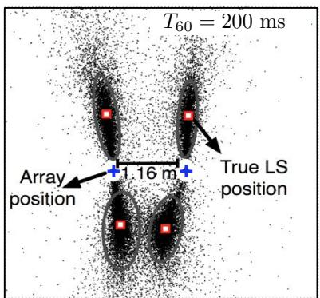

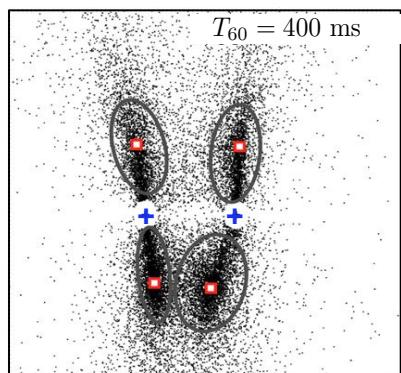  
(a) Each source is active alone for two seconds during training.

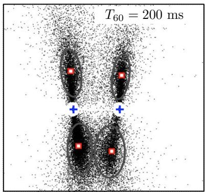

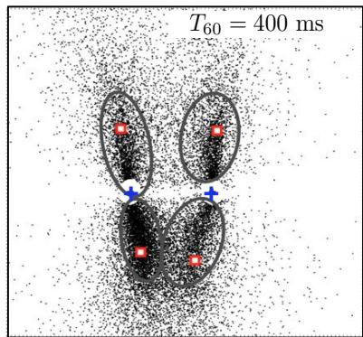  
(b) All speakers are concurrent during training of 8 seconds.  
Figure 7.6: Clustering in simulated environments with different reverberation times and iSNR $\approx$ 17 dB.

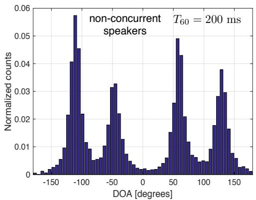

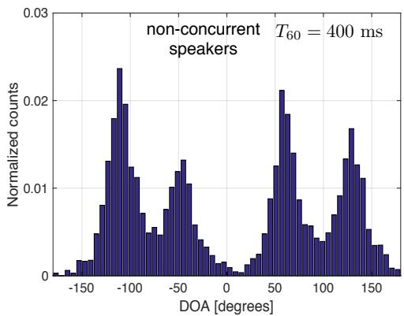

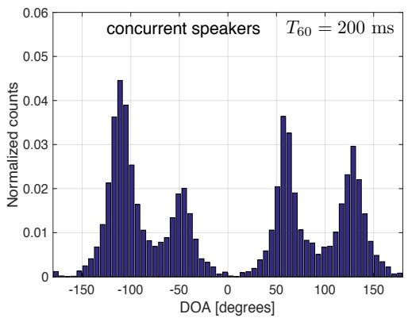

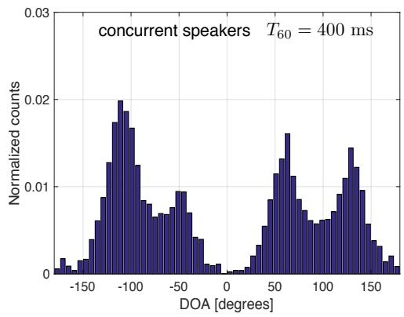  
Figure 7.7: Histograms of DOA estimates obtained using the simulated scenario in Figure 7.6, and a microphone array located at the midpoint of the segment that connects the two illustrated arrays. iSNR13 dB.

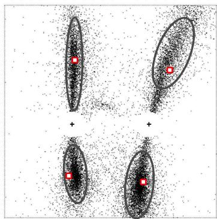  
(a) iSNR = 35 dB (sensor noise)

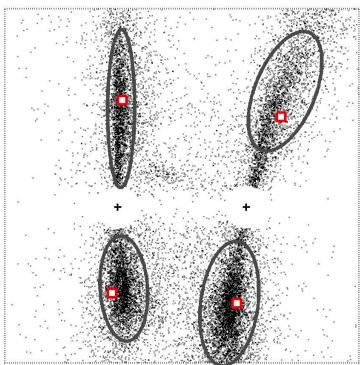  
(b) iSNR = 13 dB

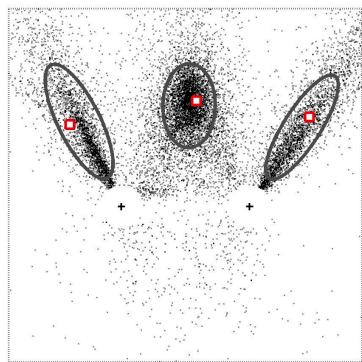  
(c) iSNR = 35 dB (sensor noise)

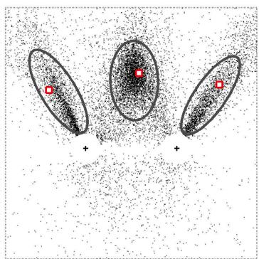

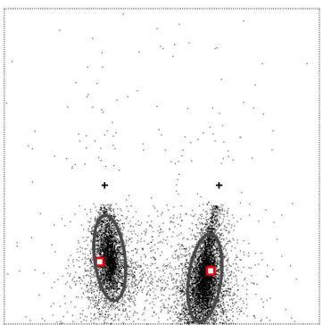  
(d) iSNR = 13 dB  
(e) iSNR = 35 dB (sensor noise)

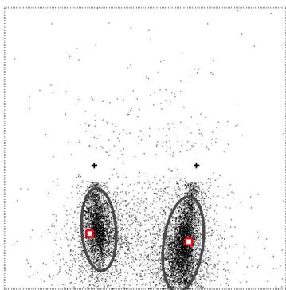  
(f) iSNR = 13 dB

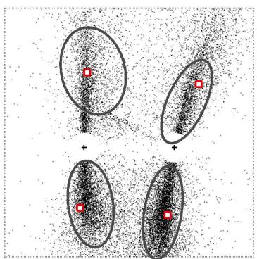

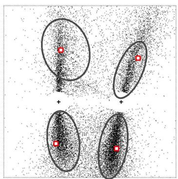  
(g) iSNR = 35 dB (sensor noise)

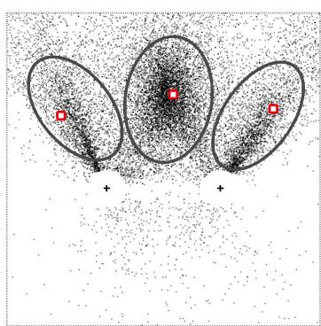

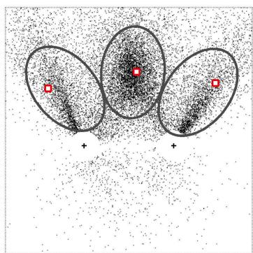  
(j) iSNR = 13 dB

(i) iSNR= 35 dB (sensor noise)  
(h) iSNR = 13 dB  
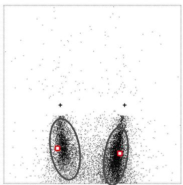  
(k) iSNR = 35 dB (sensor noise)

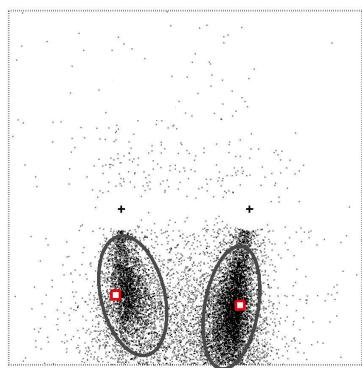  
(1) iSNR = 13 dB  
Figure 7.8: Clustering during single-talk, in Figures (a)-(f), and during double-talk, in Figures (g)-(l), with measured AIRs and two different iSNRs. The iSNR is computed for each source at the respective reference microphone, and the given iSNR in the captions is averaged across sources.

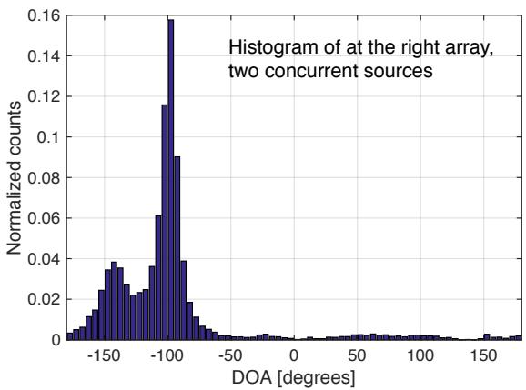

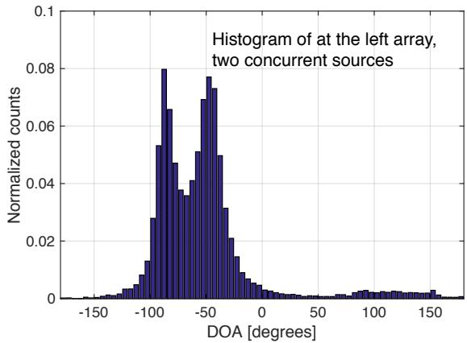

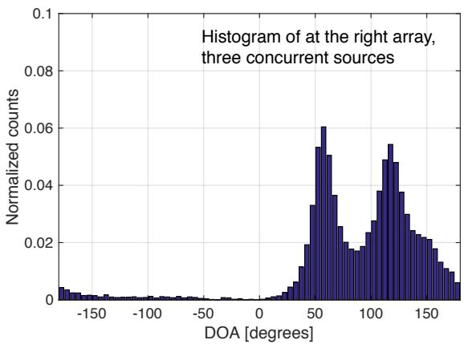

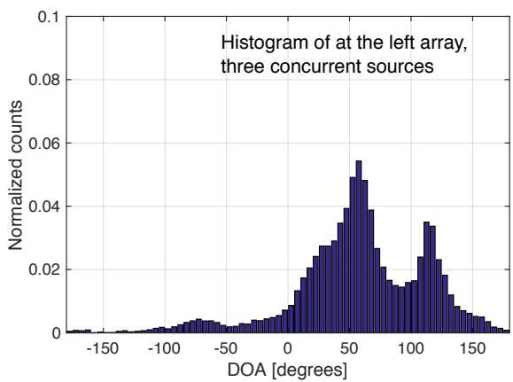

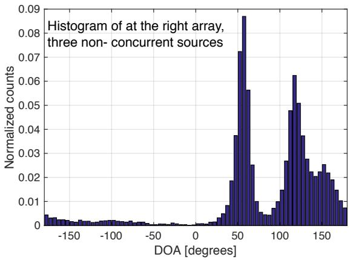

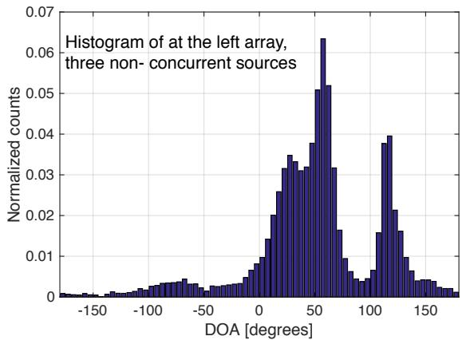  
Figure 7.9: Histograms of narrowband DOA estimates obtained at the two arrays from the measured scenarios for the two and three source clustering experiments from Figure 7.8, and iSNR of 13 dB.

<table><tr><td></td><td colspan="2">2 sources</td><td colspan="3">3 sources</td><td colspan="4">4 sources</td></tr><tr><td></td><td>s 1</td><td>s 2</td><td>s 1</td><td>s 2</td><td>s 3</td><td>s 1</td><td>s 2</td><td>s 3</td><td>s 4</td></tr><tr><td>iSIR [dB]</td><td>3.2</td><td>0.9</td><td>1.0</td><td>-4.3</td><td>-6.5</td><td>3.0</td><td>-5.7</td><td>-10</td><td>-2.8</td></tr></table>

Table 7.2: Input SIR for each source in the experiments.

## 7.5.3 Objective evaluation of the separated source signals

Using the GMM parameters and clusters estimated in the training phase, BSS can be performed on unseen new signals acquired from the same setup (same number of sources and locations). To evaluate the objective quality of the separated signals, we used the measured data, and for all experiments we added a diffuse babble noise with approximately iSNR of 13 dB with respect to each source (the iSNR varies up to $\pm3$ dB across different sources and experiments). The Input Signal-to-Interference Ratios (iSIRs) with respect to each source for the different scenarios are listed in Table 7.2. Note that the estimated clusters for all the scenarios evaluated in the following, were already illustrated in Figure 7.8 using the proposed approach and in Figure 7.9 using the state-of-the-art NOSET approach.

The evaluation in this section, consists of four experiments: first, we continue the discussion from Section 7.4.1 and investigate the performance of the MVDR filters when using the two different methods to estimate the undesired signal PSD matrices. Second, we evaluate the BSS performance when the TF masks are estimated using NOSET, to the performance when the TF masks are estimated using the proposed clustering approach. Third, we investigate the effect of the estimated clusters on the subsequent BSS, depending on whether the training is performed during single talk or multi talk. Finally, in the fourth experiment, we compare the performance when using one array for spatial filtering versus using two arrays, and in addition to the MVDR filter, we apply an informed MWF for BSS.

## 7.5.3.1 The undesired signal PSD matrix for the MVDR filters

To intuitively explain the different behaviour of the MVDR filters depending on how the TF masks are used to obtain the undesired signal PSD matrices, recall that the triangulation-based signal detection often leads to relatively large number of false negatives with respect to a desired source. This was also noted in Chapter 6, where it was mentioned that false negatives do not introduce severe distortions as soon as there are sufficient number of TF bins to update the desired signal PSD matrix. However, in the BSS scenario with several concurrent interferers, the false negative rate increases even further. Considering the frequent occurrence of false negatives, to avoid significant leakage of the desired signal into the undesired signal PSD matrix, it is crucial not to update $\widehat{\Phi}_{\tilde{\mathbf{s}}_j}(t,k)$ based only on the criterion $\hat{z}_{tk} = 0$ , as done when the matrix is updated recursively using (7.30). On the contrary, when $\widehat{\Phi}_{\tilde{\mathbf{s}}_j}(t,k)$ is obtained as a sum of the PSD matrices estimated for each source signal separately, $\widehat{\Phi}_{\tilde{\mathbf{s}}_j}(t,k)$ is updated only when one of the interfering sources (or the noise) is specifically detected as dominant. Moreover, the noise PSD matrix, and the PSD matrices of the speech sources can be updated at different rates, which provides an additional flexibility in tuning the system performance.

The objective results are shown in Table 7.3, averaged over all sources in a given scenario (the quality of each separated signal is evaluated in the following experiments). The experiment was repeated for iSNRs of

<table><tr><td rowspan="2">estimation of  $\widehat{\Phi}_{\bar{s}_j}$ </td><td colspan="2">2 sources</td><td colspan="2">3 sources</td><td colspan="2">4 sources</td></tr><tr><td>(7.30)</td><td>(7.31)</td><td>(7.30)</td><td>(7.31)</td><td>(7.30)</td><td>(7.31)</td></tr><tr><td> $\nu_{sd}$ </td><td>0.19</td><td>0.11</td><td>0.19</td><td>0.10</td><td>0.18</td><td>0.09</td></tr><tr><td>NR [dB]</td><td>2.5</td><td>2.8</td><td>3.6</td><td>3.6</td><td>4.1</td><td>4.4</td></tr><tr><td>IR [dB]</td><td>12.2</td><td>12.1</td><td>13.6</td><td>12.5</td><td>14.1</td><td>12.1</td></tr><tr><td> $\Delta_{SIR}$  [dB]</td><td>8.9</td><td>9.2</td><td>9.9</td><td>10.7</td><td>10.1</td><td>11.5</td></tr><tr><td>PESQ</td><td>0.43</td><td>0.47</td><td>0.55</td><td>0.63</td><td>0.68</td><td>0.70</td></tr><tr><td> $\nu_{sd}$ </td><td>0.2</td><td>0.1</td><td>0.17</td><td>0.10</td><td>0.21</td><td>0.12</td></tr><tr><td>NR [dB]</td><td>6.5</td><td>4.3</td><td>6.3</td><td>4.5</td><td>7.3</td><td>6.1</td></tr><tr><td>IR [dB]</td><td>12.3</td><td>12.0</td><td>13.6</td><td>13.0</td><td>14.7</td><td>13.3</td></tr><tr><td> $\Delta_{SIR}$  [dB]</td><td>8.6</td><td>9.7</td><td>10.4</td><td>11.4</td><td>10.7</td><td>11.5</td></tr><tr><td>PESQ</td><td>0.45</td><td>0.38</td><td>0.57</td><td>0.54</td><td>0.67</td><td>0.62</td></tr></table>

Table 7.3: BSS performance of the informed MVDR filters obtained with the proposed framework, for the two different methods to obtain the undesired signal PSD matrix, discussed in Section 7.4.1. Top: iSNR = 35 dB. Bottom: iSNR = 13 dB.

35 dB and 13 dB, where in the former the noise consists of the sensor noise only, while in the latter, diffuse babble noise is added. The results demonstrate that the SD index is about twice lower when using (7.31) compared to (7.30), supporting the previous discussion. Although due to the frequent updates of the undesired signal PSD matrix the IR when using (7.30) is more aggressive than when using (7.31), the overall SIR improvement is superior with the latter. The PESQ scores however do not indicate a consistent preference: although the distortion when using (7.30) is clearly audible and reflected in the measures, exact preference should be established depending on the use of the separated signals and/or listener preference. Due to the ability to maintain low distortion even in challenging multi-talk situations, in the following experiments, we only evaluate the MVDR filters which use (7.31) as the undesired signal PSD matrix.

## 7.5.3.2 Comparison with the state-of-the-art NOSET approach

To compare the BSS when using the TF masks from the proposed and from the state-of-the-art NOSET approach, we manually selected the histogram peaks from NOSET, and for each source, we used the array nearest to that source for TF mask estimation. However, the informed MVDR filter was in both cases computed using all the microphones from the two arrays, to ensure that any performance differences are due to the different accuracies of the TF masks. Furthermore, note that the post-processing (i.e. temporal smoothing as mentioned in Section 7.4.1) is also applied to the TF masks from NOSET in order to ensure fair comparison. In this experiment, we evaluate the BSS for two and three sources, whereby in the former, training was performed during multi-talk, while in the latter during single talk (recall that we were not able to detect the three peaks with NOSET when training during multi-talk).

Two different results are presented for NOSET, one without VAD and one with VAD. As mentioned in Section 7.5.2.1, to robustly estimate the number of sources and their clusters in NOSET, noisy points are removed using an energy-based threshold. However, when performing BSS on unseen signals the threshold might be too aggressive and introduce a large number of false negatives, especially at high frequencies where the speech energy is lower. As this issue was not clearly discussed in the paper where NOSET was proposed [142], we implemented two alternatives: one without VAD where the presence of noise is ignored for dominant source detection during BSS, and one where similarly as in training, energy-based criterion is used to remove certain TF points, however with a less aggressive threshold.

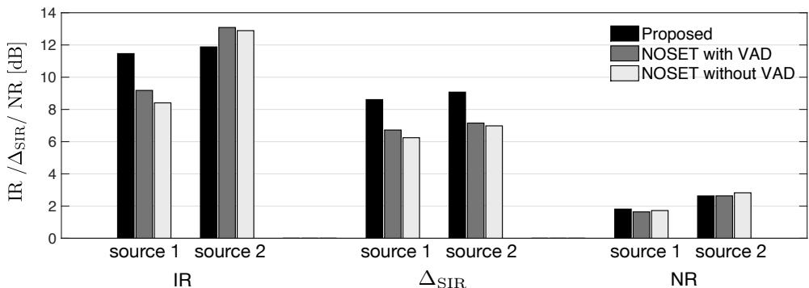  
(a) Interference reduction, SIR improvement, and noise reduction for each source.

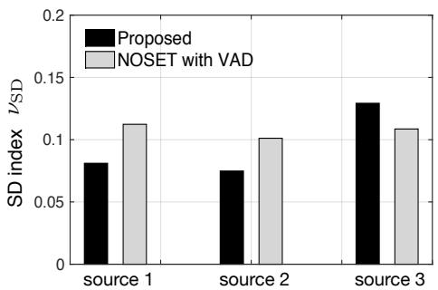  
(b) Speech distortion index for each source

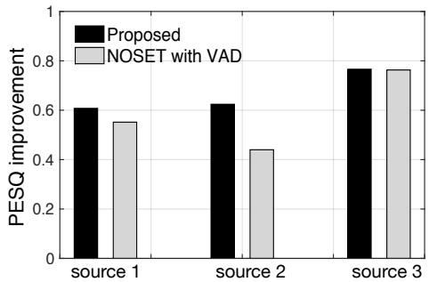  
(c) PESQ score improvement for each source.  
Figure 7.10: Results for the proposed and the state-of-the-art NOSET frameworks for clustering-based BSS in a scenario with two sources. The clustering was performed during multi-talk.

The BSS results are illustrated in Figures 7.10 and 7.11, for two and three sources, respectively. In the three sources scenario, we only evaluate NOSET with VAD, as excluding the VAD did not provide TF masks with a sufficient accuracy for BSS. The advantage of the proposed position-based clustering approach is rather consistent for all presented performance measures. Note that for source 1 in the two-source scenario and source 3 in the 3-source scenario, NOSET introduces lower distortion than the proposed approach. This is an example for sources whose position is sensitive to triangulation errors, i.e., when the DOAs vectors triangulate at a very small angle, resulting in clusters with a large variance in only one direction (see Figure 7.8). For these sources, triangulation-based detection introduces a larger number of false negatives than the DOA-based detection. This observation indicates that although the position estimates are good features for clustering and number of source estimation, their combination with other spatial features for dominant source detection in BSS might reduce the number of detection errors and provide better quality of the separated signals.

## 7.5.3.3 Training during single versus multi-talk

In this experiment, we investigate whether the training conditions during which the GMM parameters are estimated have an influence on the BSS performance. Namely, for a given scenario, the training is performed once when all sources are simultaneously active, and once when each source is active alone for a certain period during training (the total duration of the training period is nonetheless the same in both cases). The estimated GMM parameters are then used for the same BSS task, and the results averaged over all sources are summarised in Figure 7.12. The clustering results for these scenarios were given in Figure 7.8, where the iSNR is 13 dB.

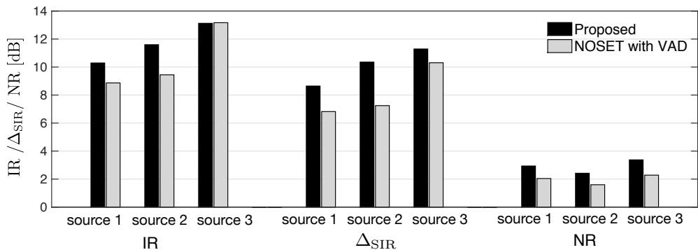  
(a) Interference reduction, SIR improvement, and noise reduction for each source.

  
(b) Speech distortion index for each source.

  
(c) PESQ score improvement for each source.  
Figure 7.11: Results for the proposed and the state-of-the-art NOSET frameworks for clustering-based BSS in a scenario with three sources. The clustering was performed during single-talk.

Although the clusters were estimated with relatively good accuracy regardless of the training conditions, the results indicate a tendency of the parameters estimated during single-talk to slightly outperform the ones estimated during multi-talk. However, the performance difference relatively small, with a difference of 1.5-2.5 dB in terms of SIR improvement, and less than 1 dB difference in terms of IR. The only more notable difference is the higher SD index in the four-source scenario when training is done during multi-talk, which is likely to be a consequence of speech sparsity violation when four sources are simultaneously active in a reverberant environment.

## 7.5.3.4 Comparison of MVDR and MWF separation filters

In this last experiment, we evaluate the BSS in a scenario with two sources (Figure 7.13) and four sources (Figure 7.14). Besides the MVDR filter, we additionally apply a single-channel Wiener filter as discussed in Section 7.4.2 at the MVDR filter outputs. Moreover, we compare the BSS performance when using only one array versus using both available arrays. Finally, an important aspect of this experiment is the evaluation of all the filters using oracle TF masks, assuming that at each TF bin the dominant source index is known. In this manner we are able to evaluate the gap between the proposed framework that estimates the TF masks from the data, and the achievable performance of the ISF-based BSS, if accurate dominant signal detector was available. The main results of this experiment can be summarised as follows

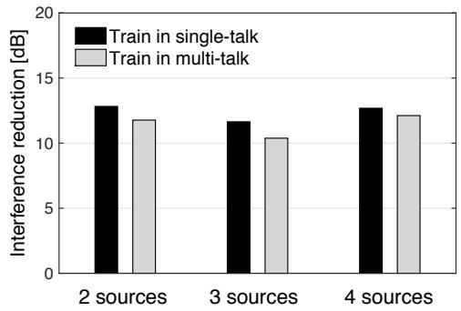

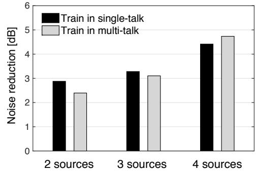

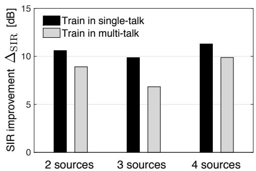

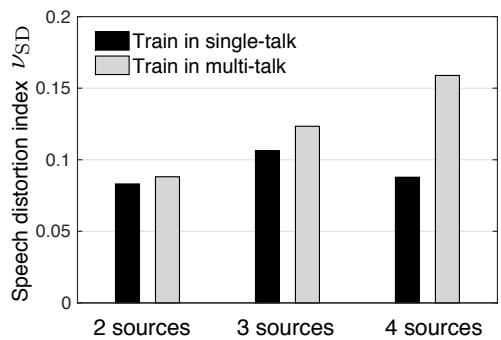  
Figure 7.12: Results of the BSS at the MVDR outputs for training during single-talk, and during multi-talk. The average iSNR with respect to each source is 13 dB.

i) It can be observed that all sources are extracted with good and comparable quality in terms of the evaluated measures. It is interesting to note, that the ordering of the SD index of the different sources in all scenarios follows the ordering of the iSIRs of the sources summarised in Table 7.2. Clearly, the higher the SIR at the input, the lower the number of false negatives with respect to the given source, providing better estimates of the RTF vector and hence, lower distortion of the separated source signal. Applying the single-channel Wiener filter at the MVDR output in the BSS scenario, adds a notable distortion, with SD by 0.1-0.2 higher than the MVDR filters. Although overall, the MWF provides on average by, up to 8 dB better IR reduction, and 1-2 dB better SIR improvement, the SD is clearly audible. When four sources are simultaneously active, the sparsity assumption is often violated, and the spectral filter inevitably causes speech distortion even if the dominant source index is perfectly known, as it can be seen in Figure 7.14.

ii) The gain in SIR when using two arrays for the MVDR filters, compared to when using only one array, does not exceed 2 dB, although, when using oracle detectors, the gain is 5 dB on average. In terms of the PESQ improvement, two arrays do not provide any advantage compared to one array, although when having oracle detectors, the score is by 0.3-0.5 higher when using two arrays. The results indicate that the potential of the larger spatial diversity is not fully utilised due to errors in the TF masks. Such outcome is expected, as it is well known from the robust adaptive beamforming literature, that spatial filters which have larger spatial selectivity, are also more sensitive to estimation errors in the RTF vectors and the signal statistics.

iii) An important conclusion from this experiment, is that there is a notable gap between the BSS performance achieved when the ISFs are obtained using oracle TF masks compared to estimated ones. Although the oracle TF masks which were used in this experiment are not realistically available in practice, the gap is a motivation for further research in designing robust detectors to determine the dominant source at each TF bin. While we showed in Section 7.5.3.2, that the TF masks obtained by proposed framework achieve better performance than the DOA-based TF masks from NOSET, efforts to combine the beneficial properties of the different probabilistic models, and spatial and spectral features used in the literature, might allow to exploit the full potential of sparsity and ISF-based BSS.

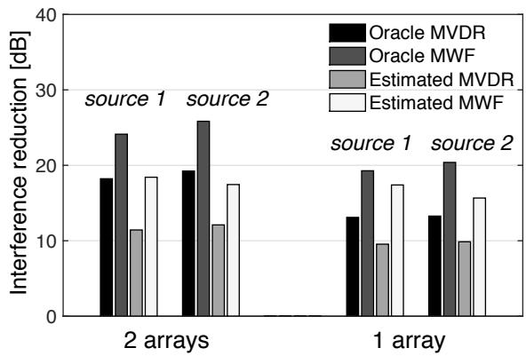

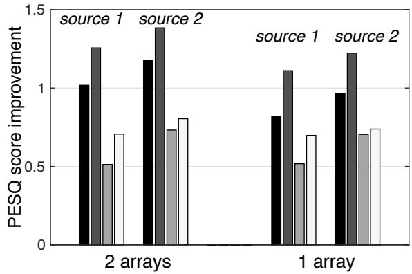

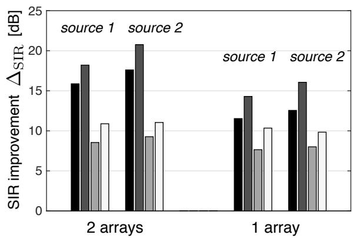

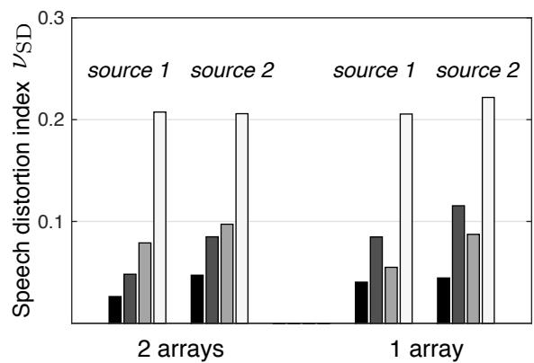  
Figure 7.13: Results of the BSS in a two-sources scenario for different number of arrays, for ISFs with oracle TF masks versus estimated TF masks, and for MVDR filter versus MWF.

## 7.6 Summary

In this chapter, we developed a framework for joint number of source detection and clustering, applied to informed spatial filtering-based BSS. Following the recent trend in clustering-based BSS, a probabilistic framework was used where the probability density of the features extracted from the microphone signals is modelled by a mixture distribution whose parameters need to be estimated from the data. Once the parameters are estimated from a batch of data, they can be applied to probabilistically associate each TF bin to the sources, and detect the dominant source as the one for which the association probability is maximum. This information is then used to update the PSD matrices required for ISFs.

The main points that distinguish the proposed clustering approach from the state-of-the-art are the choice of feature for clustering, the EM-based approach to simultaneously estimate the number of sources simultaneously while clustering, and the incorporation of the Gaussian model-based SPP to account for speech presence uncertainty, both during clustering and during source separation. Regarding the choice of features, considering our multi-array setup, we proposed the narrowband position estimates as a suitable feature for clustering. It was shown that that in combination with the SPP, the resulting system allows for robust number of source detection and clustering, while requiring a very small number of iterations, even in challenging scenarios with up to four concurrent sources. The results of the clustering algorithm, as well as the signal quality after BSS were compared to the results obtained from a state-of-the-art DOA-based number of source estimation, clustering and BSS framework.

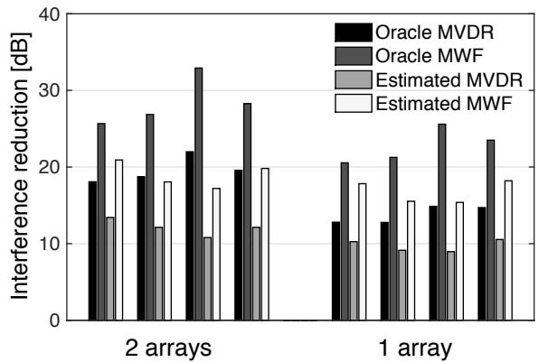

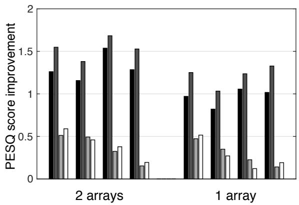

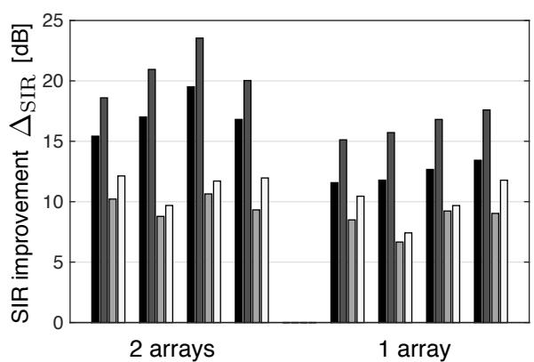

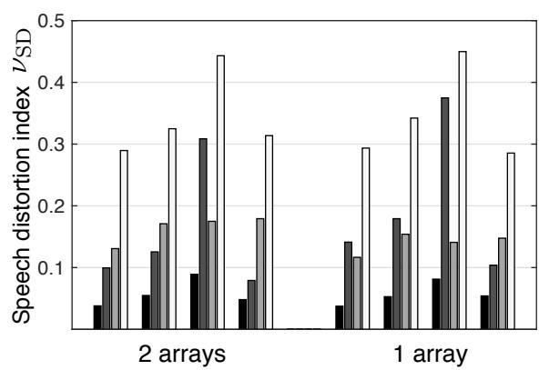  
Figure 7.14: Results of the BSS in a four-sources scenario for different number of arrays, for ISFs with oracle TF masks versus estimated TF masks, and for MVDR filter versus MWF.

In addition, we provided relevant discussions regarding the ISFs design suitable in challenging scenarios where the goal of the filter is to extract a desired source in the presence of multiple strong concurrent sources, such as in a typical BSS setting. Evaluation with simulated and measured data, in terms of objective performance measures, demonstrated the applicability of the proposed framework for source clustering and separation for different number of sources, different background noise levels and different training conditions. It was shown that the sources are separated with good quality even in adverse multi-talk environments. By incorporating the SDR-based SPP estimation developed in Chapter 3, the BSS framework simultaneously provides noise PSD matrix estimation and noise reduction capability, regardless of the number of sources to be separated, and regardless of the statistical properties of the noise, which are also estimated online from the data.

## Sparsity-based source detection and tracking with application to blind source separation

In the previous chapter, we discussed sparsity-based Blind Source Separation (BSS) for clustering and sepa ration of an initially unknown number of static sources. In many applications, it is desirable that BSS o↵ers invariable quality for moving and time-varying number of sources as well, which requires simultaneous source tracking and BSS. Therefore, an important practical criterion in the choice of features in sparsity-based BSS is the ability of the resulting system to handle moving sources. Although sparsity-based BSS can operate on sliding windows, only systems based on low-dimensional features, such as Directions-Of-Arrival (DOAs) and positions, have so far addressed dynamic scenarios [143,232,245]. For such features, e↵ective heuristics exist to manage time-varying number of sources and the relation between online clustering of location features and multi-source tracking is straightforward. Similarly as in the BSS framework described in Chapter 7, the desired output of the detection, tracking and BSS system considered in this chapter, are accurate Time Frequency (TF) masks for each active source, which are used to compute Informed Spatial Filters (ISFs) for source separation. When the sources move, both the desired signal propagation vectors, as well as the undesired signal Power Spectral Density (PSD) matrices are time-varying and the ISFs need to be adapted quickly to focus on the desired moving source, while reducing the undesired moving interfering speakers.

BSS of moving sources can be achieved by direct extension of the cluster-and-separate paradigm discussed in Chapter 7, such that the clustering algorithm is applied on sliding windows with additional control mechanisms that determine the number of sources online [143,232]. However, the algorithms based on online clustering are generally sub-optimal. To estimate the TF masks via optimal Bayesian tracking of sources, the authors in [159] use wrapped Kalman filter. Although the authors in [159] suggest Probabilistic Data Association (PDA) for the measurement-to-source association, it should be noted that the single measurement per source model of PDA [149] is not valid for narrowband features. Time-Di↵erence of Arrivals (TDOAs) have also been used for Bayesian tracking [157], however, they represent fullband features (at each time frame a single TDOA is estimated, in contrast to the narrowband features which are computed for each frequency) and hence not applicable for TF mask estimation

In this chapter, we focus on tracking approaches that are compatible with a subsequent sparsity-based BSS. We propose a multi-source tracker that is explicitly based on a model with multiple measurements per source at a given frame. Such a measurement model is required in narrowband processing, as the same source can be dominant at di↵erent frequency bins. With respect to the main application, this chapter is related to the work by Madhu and Martin in [143] and to the work by Loesch and Yang in [140], namely, online BSS of moving sources using ISFs, with ecient management of appearing and disappearing sources. While the systems in [140, 143] provide angular tracking with the online clustering paradigm, we approach the problem from an (approximate) Bayesian point of view which allows us to i) formulate a measurement model that provides a unified way to deal with speech presence uncertainty and ii) derive a tracker that is consistent with the narrowband model where associations are independent across measurements. Our input measurements are narrowband position estimates obtained using multiple arrays, which have also been used in Chapter 6 for acoustic spotforming, and in Chapter 7 for BSS of static sources. Hence, the requirements are similar to those in Chapters 6 and 7: at least two spatially separated microphone arrays, whose locations and orientations are known, and whose signals are synchronised and available at a central processor. It should be noted that the proposed approach does not su↵er from the frequency permutation problem commonly found in convolutive BSS algorithms, while the Markovian property of the speaker motion model employed in the tracker ensures that the source association is consistent across time frames.

The rest of the chapter is organised as follows: in Section 8.1, we revisit the signal model from Chapter 7 and modify it for the purpose of multi-source tracking and separation. In Section 8.2, we formulate the tracking problem and relate the measurement-to-source association to TF mask estimation. In Section 8.3, we derive the multi-source tracker which provides estimates of the source positions across time, and the measurement-to-source associations for each TF bin, and discuss the relation between the proposed tracker other trackers from the literature. A method for track management (detecting appearing and disappearing sources) is discussed in Section 8.4. In Section 8.5 we provide a comprehensive performance evaluation and comparison of the proposed BSS approach to state-of-the-art sparsity-based and independent vector analysis-based BSS approaches. The conclusions of the chapter are presented in Section 8.6. As the ISF design for source separation is analogous to that presented in Chapter 7 for separation of static sources, in this chapter, we do not provide further discussion on the ISFs and the estimation of the PSD matrices.

## 8.1 Signal and probabilistic models for moving sources

## 8.1.1 Signal model

The Short-Time Fourier Transform (STFT)-domain signal model considered in this chapter is similar to the model in Chapter 7, where M microphones, arranged in at least two distributed arrays capture the signals of an unknown number of speakers and background noise, i.e.,

$$
\mathbf {y} (t, k) = \sum_ {j = 1} ^ {J _ {t}} \mathbf {s} _ {j} (t, k) + \mathbf {v} (t, k) = \sum_ {j = 1} ^ {J _ {t}} \mathbf {g} _ {j m _ {t j}} (t, k) S _ {j m _ {t j}} (t, k) + \mathbf {v} (t, k),\tag{8.1}
$$

where the $M \times 1$ vectors ${ \bf s } _ { j }$ and v contain the STFT coecients of the j-th source signal and the noise signal respectively. In contrast to the signal model (7.1), the number of sources $J _ { t }$ is time-varying. In addition, due to the source movement, the reference microphone index $m _ { j t }$ for each source $j$ is also time-varying, depending on which array the source is nearest to at time t. The remaining definitions of the signal model are equivalent to the ones in Section 7.1.

Recall that the Relative Transfer Function (RTF) vectors $\mathbf { g } _ { j m _ { j } }$ in ISF frameworks are obtained using estimates of the PSD matrix $\Phi _ { \mathbf { s } _ { j } } ( t , k )$ , which is modelled as a rank-one matrix. For $\Phi _ { \mathbf { s } _ { j } }$ to have approximately rank-one, $\mathbf { g } _ { j m _ { j t } }$ needs to be slowly time-varying in neighbouring STFT frames. To justify this assumption, consider a typical frame length of 64 ms, and source velocities of $\mathrm { 1 - 2 ~ m / s }$ . As a source travels only 3.2-6.4 cm during a frame, the RTF vectors of neighbouring frames are highly aligned. Therefore, the sample PSD matrix tends to have only one dominant eigenvalue and can be approximated as a rank-one matrix.

## 8.1.2 Probabilistic model

The probabilistic model for this chapter bares significant similarity with the probabilistic model from Section 7.2. Recall the definition of the hidden discrete Random Variable (RV) $Z _ { t k }$ in (7.4) whose realisation $z _ { t k }$ indicates the dominant source label at TF bin $( t , k )$ , and the problem of finding the dominant source is known as a TF mask estimation in the BSS literature

Seen from the perspective of Bayesian source tracking algorithms, the estimation of $z _ { t k }$ is known as the measurement-to-source association, or the data association problem, which arises due to uncertainty about which source emits which of the received measurements at a given time. Hence, if a multi-source tracker is developed which operates using narrowband measurements, the dominant source label, and hence the TF masks for moving sources can be obtained from the tracker’s data association probabilities $p ( Z _ { t k } | \mathcal { V } _ { 1 : t } )$ , where $\mathcal { D } _ { 1 : t }$ , denotes all the received microphone signals $\mathbf { y } ( t , k )$ , up to time t. Such notation is typical for Bayesian trackers, which use all the information available in an optimal way, to estimate a quantity of interest at a certain time. In the following sections, we describe a parametric model that allows to evaluate $p ( Z _ { t k } | \mathcal { V } _ { 1 : t } )$

## 8.2 Formulation of the tracking problem

Notation: The TF indices of the state-space variables are denoted in the subscript.

## 8.2.1 State and measurement models

Let the vector $\mathbf { x } _ { t j }$ denote the true position (state) of the j-th source at time $t ,$ in an arbitrary two-dimensional (2D) Cartesian coordinate system. The movement of each source is modelled as a Gaussian random walk process with a covariance matrix $\mathbf { Q } _ { j }$ , i.e.,

$$
f \big (\mathbf {x} _ {(t + 1) j} \big) = \mathcal {N} \big (\mathbf {x} _ {(t + 1) j}; \mathbf {x} _ {t j}, \mathbf {Q} _ {j} \big), \forall j \in [ 1, J _ {t} ],\tag{8.2}
$$

where $\mathbf { Q } _ { j }$ is a diagonal matrix with equal entries on the diagonal. The value on the diagonal relates to the source speed and the length of the STFT frame, as we can only resolve source movements once per STFT frame. Equation (8.2) represents the state transition equation in a state-space model, written in terms of the Gaussian transition probability. At each time frame $t ,$ we seek to estimate the number of sources $J _ { t }$ and their states $\mathcal { X } _ { t } = \{ \mathbf { x } _ { t 1 } , \mathbf { x } _ { t 2 } , . . . \mathbf { x } _ { t J _ { t } } \}$ , by using measurements (features) derived from the received signals $\mathbf { y } ( t , k )$

Commonly used measurements for acoustic tracking, such as DOAs [159] and TDOAs [157], are non-linearly related to the states. In this work, using the multiple arrays, we propose a system where a narrowband estimate of the dominant source position at TF bin $( t , k )$ , denoted by $\hat { \mathbf { r } } _ { t k } .$ , is used as a measurement. To not confuse the measurements with the states $\mathbf { x } _ { t j }$ , the former are denoted by $\hat { \mathbf { r } } _ { t k }$ , although they are both RVs in the state-space. Due to noise and reverberation, the measurements are assumed to be corrupted by Gaussian noise and considering the approximately di↵use properties of noise and late reverberation, are assumed uniformly distributed in TF bins where speech is absent. We use the following measurement model

$$
f (\hat {\mathbf {r}} _ {t k} \mid Z _ {t k}) = \left\{ \begin{array}{l l} \mathcal {N} \big (\hat {\mathbf {r}} _ {t k}; \mathbf {x} _ {t z _ {t k}}, \boldsymbol {\Sigma} _ {t z _ {t k}} \big), & \text {if} z _ {t k} > 0 \\ \mathcal {U} (\hat {\mathbf {r}} _ {t k}), & \text {if} z _ {t k} = 0, \end{array} \right.\tag{8.3}
$$

where $\mathcal { U } ( z )$ is a 2D uniform distribution defined on an x-y slice of the room. Note that (8.3) corresponds to the typical Gaussian model with an additional clutter measurement model used in Joint Probabilistic Data Association (JPDA) [246]. In contrast to most tracking systems, the noise covariance $\Sigma _ { t z _ { t k } }$ is sourcedependent and time-varying and needs to be estimated from the data.

As an alternative to triangulation, a 2D Steered Response Power (SRP), a commonly used localisation method in tracking [156], can be computed at each frequency to obtain a position estimate. To obtain an accurate position, the SRP needs to be evaluated on a dense grid, which can be prohibitive for real-time BSS. Moreover, for spatially separated arrays, the SRP might not be appropriate due to the possibly low signal correlation and di↵erent source DOAs at the arrays. Besides the low computational complexity, another advantage of using triangulation is the inherent property to discard large number of outliers: two DOA vectors intersect to provide a position estimate only if their inner product is positive. The extraction of narrowband positions was discussed in more detail in Section 6.4.1.

Note that the measurement model can be extended to a three-dimensional space by estimating the azimuth and the elevation of the DOAs, and adding the z-coordinate in the state and measurement vectors. The triangulation step can then be done, for instance, by finding the point that minimises the sum of distances from the rays defined by the DOA vectors.

## 8.2.2 Augmented measurement model

Probabilistic models of location-related measurements, such as the one described in Section 8.2.1, are typical in the tracking literature [149]. However, in speech applications, the number of clutter measurements (from noise-dominated TF bins) is significant due to the speech sparsity, and a model based on location measure ments alone results in many TF bins being wrongly associated to speakers. To have a more accurate clutter model we propose the following augmented measurement that includes the raw signal vectors

$$
o _ {t k} = \{\hat {\mathbf {r}} _ {t k}, \mathbf {y} (t, k) \}.\tag{8.4}
$$

The potential of augmented measurement models for robust multi-source tracking was suggested in [149]. Our motivation to include the signal vector in the augmented measurement is the fact that the signal vectors are commonly used in the multichannel speech processing literature to build Gaussian signal models tha allow for Speech Presence Probability (SPP) estimation and detection of noisy TF bins [190]. The objective is, therefore, to develop a tracker which utilizes the properties of the signal vector to detect noisy TF bins.

As the real-valued 2 1 location $\hat { \mathbf { r } } _ { t k }$ is obtained by several highly non-linear processing steps from the $M \times 1$ complex-valued signal vector ˆr (splitting in sub-arrays, estimating DOAs at each array using the phase di↵erences in the sub-array signals, and triangulating DOA vectors), we can assume that $\mathbf { r } _ { t k }$ and $\mathbf { y } ( t , k )$ are independent RVs. Using the independence assumption, the likelihood of the augmented measurement, when there is no association uncertainty, is given by

$$
f (o _ {t k} \mid Z _ {t k}) = f (\hat {\mathbf {r}} _ {t k}, \mathbf {y} (t, k) \mid Z _ {t k}) = f (\hat {\mathbf {r}} _ {t k} \mid Z _ {t k}) f (\mathbf {y} (t, k) \mid Z _ {t k}),\tag{8.5}
$$

where $f ( \hat { \mathbf { r } } _ { t k } | Z _ { t k } )$ is the standard non-augmented measurement likelihood used in Bayesian trackers and defined previously in (8.3). The likelihood of the microphone signal vector $f ( \mathbf { y } ( t , k ) \mid Z _ { t k } )$ , was encountered in the previous chapters of the thesis as well. In particular, in Chapter 3, $f ( \mathbf { y } ( t , k ) \mid Z _ { t k } )$ was considered for $Z _ { t k } = 0$ and $Z _ { t k } \neq 0$ (denoted by $\mathcal { H } _ { s }$ and $\mathcal { H } _ { v }$ in Chapter 3) and modelled as a complex Gaussian vector as

$$
f (\mathbf {y} (t, k) \mid Z _ {t k} = 0) = (\pi^ {M} \mathrm{det} [ \boldsymbol {\Phi_ {v}} (t, k) ]) ^ {- 1} \mathrm{e} ^ {- \mathbf {y} ^ {\mathrm{H}} (t, k) \boldsymbol {\Phi_ {v}} ^ {- 1} (t, k) \mathbf {y} (t, k)},\tag{8.6a}
$$

$$
f (\mathbf {y} (t, k) \mid Z _ {t k} \neq 0) = (\pi^ {M} \mathrm{det} [ \boldsymbol {\Phi_ {y}} (t, k) ]) ^ {- 1} \mathrm{e} ^ {- \mathbf {y} ^ {\mathrm{H}} (t, k) \boldsymbol {\Phi_ {y} ^ {- 1}} (t, k) \mathbf {y} (t, k)}.\tag{8.6b}
$$

## 8.2.3 Derivation of the dominant source label probability

Using the models introduced in Sections 8.2.1 and 8.2.2, we are now able to parametrise the posterior distribution of the dominant source index as $p ( Z _ { \tau k } | o _ { \tau k } ) \equiv p ( Z _ { \tau k } | \mathbf { r } _ { \tau k } , \mathbf { y } ( \tau , k ) )$ ), and express it using the Bayes theorem as follows

$$
p (Z _ {t k} \mid \hat {\mathbf {r}} _ {t k}, \mathbf {y} (t, k)) = \frac {f (\hat {\mathbf {r}} _ {t k} , \mathbf {y} (t , k) \mid Z _ {t k}) p (Z _ {t k})}{f (\hat {\mathbf {r}} _ {t k} , \mathbf {y} (t , k))}.\tag{8.7}
$$

However, we can not directly evaluate (8.7), as the likelihood $f ( \mathbf { y } ( t , k ) \mid Z _ { t k } )$ in (8.6) was only provided under the two hypotheses $Z _ { t k } > 0$ and $Z _ { t k } = 0$ rather than across the support of $Z _ { t k }$ . To derive an expression for the posterior, we further assume that

$$
p (Z _ {t k} | \hat {\mathbf {r}} _ {t k}, \mathbf {y} (t, k), Z _ {t k} \neq 0) = p (Z _ {t k} | \hat {\mathbf {r}} _ {t k}, Z _ {t k} \neq 0),\tag{8.8}
$$

which means that the signal $\mathbf { y } ( t , k )$ is not used for discrimination between speakers. This is justified, as the motivation for including $\mathbf { y } ( t , k )$ in the augmented measurement $o _ { t k }$ was to discriminate between noise and speech. Next, according to the decomposition (7.6) we can write for $z _ { t k } \neq 0$

$$
p (Z _ {t k} = z _ {t k} \mid \hat {\mathbf {r}} _ {t k}, \mathbf {y} (t, k)) = p (Z _ {t k} \neq 0 \mid \hat {\mathbf {r}} _ {t k}, \mathbf {y} (t, k)) \cdot p (Z _ {t k} = z _ {t k} \mid \hat {\mathbf {r}} _ {t k}, \mathbf {y} (t, k), Z _ {t k} \neq 0)\tag{8.9a}
$$

$$
= p (Z _ {t k} \neq 0 | \hat {\mathbf {r}} _ {t k}, \mathbf {y} (t, k)) \cdot p (Z _ {t k} = z _ {t k} | \hat {\mathbf {r}} _ {t k}, Z _ {t k} \neq 0),\tag{8.9b}
$$

where (8.9b) is obtained from (8.9a) due to (8.8). The second term in the product in (8.9b) can be expressed using the Bayes theorem and the likelihood models in (8.3) as follows

$$
p (Z _ {t k} = z _ {t k} \mid \hat {\mathbf {r}} _ {t k}, Z _ {t k} \neq 0) = \frac {p (Z _ {t k} \mid Z _ {t k} \neq 0) \mathcal {N} (\hat {\mathbf {r}} _ {t k} ; \mathbf {x} _ {t z _ {t k}} , \boldsymbol {\Sigma} _ {t z _ {t k}})}{\sum_ {z ^ {\prime} = 1} ^ {J _ {t}} p (Z _ {t k} = z ^ {\prime} \mid Z _ {t k} \neq 0) \mathcal {N} (\hat {\mathbf {r}} _ {t k} ; \mathbf {x} _ {t z ^ {\prime}} , \boldsymbol {\Sigma} _ {t z ^ {\prime}})},\tag{8.10}
$$

while the first term in the product in (8.9b), can be expressed using the Bayes theorem as

$$
p (Z _ {t k} \neq 0 | \hat {\mathbf {r}} _ {t k}, \mathbf {y} (t, k)) = \frac {f (\hat {\mathbf {r}} _ {t k} , \mathbf {y} (t , k) | Z _ {t k} \neq 0) p (Z _ {t k} \neq 0)}{f (\mathbf {r} _ {t k} , \mathbf {y} (t , k))}.\tag{8.11}
$$

Finally, recalling the independence assumption (8.5), expressing $f ( \hat { \mathbf { r } } _ { t k } , \mathbf { y } ( t , k ) )$ as

$$
f (\hat {\mathbf {r}} _ {t k}, \mathbf {y} (t, k)) = f (\hat {\mathbf {r}} _ {t k}, \mathbf {y} (t, k) \mid Z _ {t k} \neq 0) p (Z _ {t k} \neq 0) + f (\hat {\mathbf {r}} _ {t k}, \mathbf {y} (t, k) \mid Z _ {t k} = 0) p (Z = 0),\tag{8.12}
$$

and substituting everything in (8.11), we obtain an expression for $p ( Z \neq 0 | \hat { \mathbf { r } } _ { t k } , \mathbf { y } ( t , k ) )$ in terms of the likelihoods: $f ( \mathbf { y } ( t , k ) \mid Z _ { t k } \neq 0 )$ , given by (8.6b), $f ( \mathbf { y } ( t , k ) \mid Z _ { t k } = 0 )$ , given by (8.6a), $f ( \hat { \mathbf { r } } ( t , k ) | Z = 0 )$ , given by the uniform distribution in (8.3), and $f ( \hat { \mathbf { r } } _ { t k } \mid Z _ { t k } \neq 0 ) = 1 - f ( \hat { \mathbf { r } } _ { t k } \mid Z _ { t k } = 0 )$

The remaining distributions required to evaluate $p ( Z _ { t k } \mid \hat { \mathbf { r } } _ { t k } , \mathbf { y } ( t , k ) )$ are $p ( Z _ { t k } \neq 0 )$ and $p ( Z _ { t k } \mid Z _ { t k } \neq 0 )$ For the a priori SPP $p ( Z _ { t k } \neq 0 )$ , we used the Coherent-to-Di↵use Ratio (CDR)-informed approach from Chapter 3. Note that the prior is not expected to have major e↵ect on the tracking and BSS framework, and a fixed value can be used as well. For $p ( Z _ { t k } \mid Z _ { t k } \neq 0 )$ we use a uniform distribution $p ( Z _ { t k } \mid Z _ { t k } \neq 0 ) = J _ { t } ^ { - 1 }$ as we assume no prior information regarding the activity of the di↵erent sources in the room. The remaining challenging problem in the framework and the evaluation of $p ( Z _ { t k } \mid \hat { \mathbf { r } } _ { t k } , \mathbf { y } ( t , k ) )$ is to estimate the source states, and the associated estimation error covariances which parametrize the Gaussian likelihoods $\mathcal { N } \left( \hat { \mathbf { r } } _ { t k } ; \mathbf { x } _ { t z } , \pmb { \Sigma } _ { t z } \right)$ for $z \in [ 1 , J _ { t } ]$ . As the means of the Gaussian distributions represent estimates of the source positions at each time frame, the likelihoods can be evaluated by developing a multi-source tracker.

## 8.3 Proposed tracking framework

This section describes the core contribution of this chapter and is organized as follows: in Section 8.3.1 we formulate the tracking as a missing data problem. Although this point of view is not common in Bayesian tracking literature [149], the narrowband measurement model necessitates such formulation, as clarified next. The estimation of the noise covariance matrices of the measurement model is discussed in Section 8.3.2, and the relation of the proposed tracker to the well-known JPDA and Probabilistic Multi-Hypothesis Tracker (PMHT) is elaborated in Section 8.3.3. A mechanism for track management suitable for the proposed tracker is developed in Section 8.3.2.

Notation: The set offrequency bins with valid measurements at time t is $\textstyle { \boldsymbol { \mathcal { K } } } _ { t }$ (as mentioned in Section $\ 8 . 2 . 1 ,$ some frequency bins are discarded as outliers by the triangulation). Sets of RVs at time t are denoted by: $\mathcal { X } _ { t } =$ $\{ \mathbf { x } _ { t j } \} _ { j \in J _ { t } }$ are the source states, $\mathcal { Z } _ { t } = \{ z _ { t k } \} _ { k \in \mathcal { K } _ { t } }$ are the dominant source labels, and $\mathcal { O } _ { t } = \{ \{ \mathbf { r } _ { t k } , \mathbf { y } ( t , k ) \} \} _ { k \in \mathcal { K } _ { t } }$ The joint distributions of the RVs in the sets are denoted by $f ( \mathcal { X } _ { t } ) , f ( \mathcal { O } _ { t } )$ , and $p ( \mathcal { Z } _ { t } )$ . To distinguish the true source locations (states) from the estimated ones by the tracker, the latter are denoted by $\hat { \mathbf { x } } _ { t j }$

## 8.3.1 Formulation of tracking as a missing data problem

Assuming that the signals at di↵erent frequency bins are uncorrelated (common assumption in the STFT domain), the measurement-to-source associations at di↵erent frequency bins are mutually independent. This assumption has important implications for the development of our tracker: i) in contrast to typical Bayesian trackers where a source generates at most one measurement, in our model, a source can generate multiple measurements per frame (the source can be dominant at multiple frequencies); ii) while an independent association model would render the JPDA tracker prohibitively complex (see Section 8.3.3), it allows for a formulation where $Z _ { t k }$ is treated as a hidden variable that can be jointly estimated with the states $\mathbf { x } _ { t j }$ . This concept is also central to the PMHT [247].

To obtain the state estimates $\hat { \mathbf { x } } _ { t j }$ for each source $j \in [ 1 , J _ { t - 1 } ]$ when receiving the measurements ${ \mathcal { O } } _ { t }$ at time $t ,$ we assume that estimates $\hat { \mathbf { X } } ( t { - } 1 ) j$ are available from the previous time frame, with error covariances $\mathbf { P } _ { ( t - 1 ) j }$ . The goal is to maximise the joint PDF $p ( \mathcal X _ { t } , \mathcal X _ { t - 1 } , \mathcal Z _ { t } , \mathcal O _ { t } )$ , or its logarithm, with respect $\mathcal { X } _ { t }$

$$
\ln \left[ f (\mathcal {X} _ {t}, \mathcal {X} _ {t - 1}, \mathcal {Z} _ {t}, \mathcal {O} _ {t}) \right] = \ln \left[ f (\mathcal {X} _ {t - 1})   f (\mathcal {X} _ {t} \mid \mathcal {X} _ {t - 1})   f (\mathcal {O} _ {t} \mid \mathcal {X} _ {t}, \mathcal {Z} _ {t})   p (\mathcal {Z} _ {t}) \right].\tag{8.13}
$$

The factorization in (8.13) follows from the independence of the states $\mathcal { X } _ { t }$ and the measurement-to-source associations $\mathcal { Z } _ { t } .$ , and the Markovian property of the state-space model. Using the independence of associations across measurements, and the independence of $\mathbf { y } ( t , k )$ and $\hat { \mathbf { r } } _ { t k }$ , we can write

$$
\begin{array}{l} f (\mathcal {X} _ {t - 1}) = \prod_ {j = 1} ^ {J _ {t - 1}} \mathcal {N} (\mathbf {x} _ {(t - 1) j}; \hat {\mathbf {x}} _ {(t - 1) j}, \mathbf {P} _ {(t - 1) j}), \\ f (\mathcal {X} _ {t} | \mathcal {X} _ {t - 1}) = \prod_ {j = 1} ^ {J _ {t - 1}} \mathcal {N} (\mathbf {x} _ {t j}; \hat {\mathbf {x}} _ {(t - 1) j}, \mathbf {P} _ {(t - 1) j} + \mathbf {Q} _ {j}), \end{array}\tag{8.14}
$$

where the covariance $\mathbf { Q } _ { j }$ in $f ( \mathcal { X } _ { t } \mid \mathcal { X } _ { t - 1 } )$ is added due to the motion uncertainty in (8.2). Using the indepen dence of associations across measurements, and the independence of $\mathbf { y } ( t , k )$ and $\hat { \mathbf { r } } _ { t k }$ , we can write

$$
f (\mathcal {O} _ {t} \mid \mathcal {X} _ {t}, \mathcal {Z} _ {t}) = \prod_ {k \in \mathcal {K} _ {t}} f (\hat {\mathbf {r}} _ {t k} \mid Z _ {t k} = z _ {t k}, \mathbf {x} _ {t z _ {t k}}) f (\mathbf {y} (t, k) \mid Z _ {t k} = z _ {t k}, \mathbf {x} _ {t z _ {t k}}).\tag{8.15}
$$

The likelihood terms in $f ( \mathcal { O } _ { t } | \mathcal { X } _ { t } , \mathcal { Z } _ { t } )$ were defined in Section 8.2: according to our model definition in $\left( 8 . 6 \right)$ the signal $\mathbf { y } ( t , k )$ does not depend on the source state, and hence $f ( { \mathbf { y } } ( t , k ) \vert Z _ { t k } , { \mathbf { x } } _ { t Z _ { t k } } ) \equiv f ( { \mathbf { y } } ( t , k ) \vert Z _ { t k } )$ Regarding the term $f ( \hat { \mathbf { r } } _ { t k } \mid Z _ { t k } , \mathbf { x } _ { t Z _ { t k } } )$ , we have $f \left( \hat { \mathbf { r } } _ { t k } \mid Z _ { t k } , \mathbf { x } _ { t Z _ { t k } } \right) \equiv f \left( \hat { \mathbf { r } } _ { t k } \mid Z _ { t k } \right)$ , where $f ( \hat { \mathbf { r } } _ { t k } | Z _ { t k } )$ was defined in (8.3), and the dependency on the source state is implicitly given in the mean of the Gaussian distribution. Substituting (8.14) and (8.15) in (8.13), and omitting $f ( \mathcal X _ { t - 1 } ) , ~ p ( \mathcal Z _ { t } )$ and $f \left( \mathbf { y } ( t , k ) \vert Z _ { t k } \right)$ which do not depend on the states at time $t ,$ the function to be maximised with respect to the new states $\mathcal { X } _ { t }$ is

$$
\mathcal {J} \left(\mathcal {X} _ {t}\right) = \sum_ {j = 1} ^ {J _ {t - 1}} \ln f \left(\mathbf {x} _ {t j} \mid \hat {\mathbf {x}} _ {(t - 1) j}\right) + \sum_ {k \in \mathcal {K} _ {t}} \ln f \left(\hat {\mathbf {r}} _ {t k} \mid Z _ {t k}, \mathbf {x} _ {t j}\right).\tag{8.16}
$$

As $Z _ { t k }$ is unknown, the cost function (8.16) can not be directly maximised. Instead, we start with an initial guess of $\mathcal { X } _ { t }$ , denoted by $\mathcal { X } _ { t } ^ { \prime } .$ , and maximise the conditional expectation of (8.16), where the expectation is taken with respect to $p ( \mathcal { Z } _ { t } | \mathcal { O } _ { t } , \mathcal { X } _ { t } ^ { \prime } )$ . Setting the initial estimates $\mathcal { X } _ { t } ^ { \prime }$ to the previous state estimates $\widehat { X } _ { t - 1 } .$ mimics a typical Bayesian one-step prediction, and the conditional expectation of (8.16) is given by

$$
Q (\mathcal {X} _ {t} \mid \widehat {\mathcal {X}} _ {t - 1}) = \sum_ {j = 1} ^ {J _ {t - 1}} \ln f (\mathbf {x} _ {t j} \mid \widehat {\mathbf {x}} _ {(t - 1) j}) + \sum_ {z = 1} ^ {J _ {t - 1}} \sum_ {k \in \mathcal {K} _ {t}} p (\mathcal {Z} _ {t k} = z \mid o _ {t k}, \widehat {\mathbf {x}} _ {(t - 1) j}) \ln \big [ f (\widehat {\mathbf {r}} _ {t k} \mid Z _ {t k}, \mathbf {x} _ {t j}) \big ].\tag{8.17}
$$

It can be recognised that besides mimicking a traditional Bayesian one-step prediction, the described proce dure represents an iteration of the Expectation-Maximization (EM) algorithm [193], and hence it is guaran teed that the new state estimates increase the likelihood (8.16). As the one-step prediction provides accurate initialisation, a single iteration of the EM suces to estimate the states at time $t ,$ and (8.17) is computed only once per time frame. The steps to compute $p \big ( \mathcal { Z } _ { t k } \mid o _ { t k } , \hat { \mathbf { x } } _ { ( t - 1 ) j } \big )$ were described in Section 8.2.3, where the dependency on the states was implicit via the Gaussian likelihood in (8.10). In $p \big ( \mathcal { Z } _ { t k } \mid o _ { t k } , \hat { \mathbf { x } } _ { ( t - 1 ) j } \big )$ we include $\hat { \mathbf { X } } ( t { - } 1 ) j$ explicitly, in order to emphasise that in contrast to $p ( \mathcal { Z } _ { t k } \mid o _ { t k } )$ , for which the Gaussian likelihoods in (8.10) are computed using source states at time $t ,$ the probability $p \big ( \mathcal { Z } _ { t k } \mid o _ { t k } , \hat { \mathbf { x } } _ { ( \tau - 1 ) j } \big )$ for the Q-function in (8.17) is computed using the state estimates from the previous frame.

For brevity of the subsequent derivation of the updated state estimates, we introduce the following notation

$$
\beta_ {t k j} = p (\mathcal {Z} _ {t k} = j \mid o _ {t k}, \hat {\mathbf {x}} _ {(t - 1) j}), \quad \text { and } \quad \xi_ {t j} = \sum_ {k \in \mathcal {K} _ {t}} \beta_ {t k j}.\tag{8.18}
$$

Maximisation of (8.17) with respect to $\mathbf { x } _ { t j } .$ , reduces to independent maximization of the following function

for each $j \in [ 1 , J _ { t - 1 } ]$ (i.e., for each source that is currently tracked)

$$
Q _ {j} (\mathbf {x} _ {t j}) = \ln f (\mathbf {x} _ {t j} | \hat {\mathbf {x}} _ {(t - 1) j}) + \sum_ {k \in \mathcal {K} _ {t}} \beta_ {t k j} \ln \left[ f (\hat {\mathbf {r}} _ {t k} | Z _ {t k}, \mathbf {x} _ {t j}) \right].\tag{8.19}
$$

Substituting the Gaussian distributions from (8.14), and setting the gradient with respect to $\mathbf { x } _ { t j }$ to zero, we obtain the following estimate of the source state $\mathbf { x } _ { t j }$ (the derivation can be found in Appendix B)

$$
\hat {\mathbf {x}} _ {t j} = \hat {\mathbf {x}} _ {(t - 1) j} + \mathbf {G} _ {t j} (\tilde {\mathbf {r}} _ {t j} - \hat {\mathbf {x}} _ {(t - 1) j}),\tag{8.20}
$$

where $\mathbf { G } _ { t j } , \tilde { \mathbf { r } } _ { t j }$ , and $\tilde { \Sigma } _ { t j }$ are defined as follows

$$
\mathbf {G} _ {t j} = \mathbf {P} _ {t | t - 1} ^ {(j)} (\mathbf {P} _ {t | t - 1} ^ {(j)} + \tilde {\mathbf {\Sigma}} _ {t j}) ^ {- 1},\tag{8.21}
$$

$$
\tilde {\mathbf {r}} _ {t j} = \frac {1}{\xi_ {t j}} \sum_ {k \in \mathcal {K} _ {t}} \beta_ {t k j} \hat {\mathbf {r}} _ {t k}, \quad \tilde {\boldsymbol {\Sigma}} _ {t j} = \frac {1}{\xi_ {t j}} \boldsymbol {\Sigma} _ {t j}.\tag{8.22}
$$

The notation $\mathbf P _ { t | t - 1 } ^ { ( j ) } = \mathbf P _ { ( t - 1 ) j } + \mathbf Q _ { j }$ was introduced following the standard notation of prediction error covariance [149]. The equation (8.20) has the form of a standard Kalman filter, with the noise covariance $\Sigma _ { t j }$ scaled by $\xi _ { t j }$ , and the measurement given by a weighted sum of all measurements, where the weigh depends on the association probabilities. Large $\xi _ { t j }$ indicates that more measurements in a frame originate from source $j ,$ , and as a result, the covariance $\Sigma _ { t j }$ is reduced via the scaling (8.22) and the Kalman filter puts more emphasis on the measurements. For robustness, the state of source $j$ is updated only if $\xi _ { t j }$ exceeds a threshold $\xi _ { \mathrm { t h r } } , \mathrm { i . e . }$ , there is sucient evidence that source $j$ is active. The prediction covariances $\mathbf { P } _ { t \mid t - 1 } ^ { ( j ) }$ empirically assign uncertainties to the state estimates. At frame $t , \mathbf { P } _ { t | t - 1 } ^ { ( j ) }$ is based on the system noise and the number of frames $\Delta t _ { j }$ since the last update of the state of source $j ,$ i.e.,

$$
\mathbf {P} _ {t | t - 1} ^ {(j)} = (\Delta t _ {j} + 1) \mathbf {Q} _ {j}.\tag{8.23}
$$

Hence, after a silent period, the filter puts less emphasis on the predicted state, and more emphasis on the measurements, which is a desired response for robustness to speech pauses. This is in contrast to JPDA, where $\mathbf { P } _ { t \mid t - 1 } ^ { ( j ) }$ represents prediction covariance in a strict statistical sense [148].

## 8.3.2 Estimation of measurement noise covariance matrices

So far, the measurement noise covariance matrices $\Sigma _ { t j }$ were assumed to be known. In practice, they can be estimated from the microphone signals from the past $L _ { \Sigma }$ frames and the association probabilities, as done in EM-based clustering frameworks, i.e.,

$$
\widehat {\boldsymbol {\Sigma}} _ {t j} = \frac {\sum_ {\tau , k} p (Z _ {\tau k} = j \mid o _ {\tau k}) (\hat {\mathbf {r}} _ {\tau k} - \bar {\mathbf {r}} _ {\tau j}) (\hat {\mathbf {r}} _ {\tau k} - \bar {\mathbf {r}} _ {\tau j}) ^ {\mathrm{T}}}{\sum_ {\tau , k} p (Z _ {\tau k} = j \mid o _ {\tau k})},\tag{8.24}
$$

where the sum is over $\tau \in [ t - L _ { \Sigma } , t - 1 ]$ , and $\bar { \mathbf { r } } _ { t j }$ is the weighted sample mean for the $L _ { \Sigma }$ frames

$$
\bar {\mathbf {r}} _ {t j} = \frac {\sum_ {\tau , k} p (Z _ {\tau k} = j | o _ {\tau k}) \cdot \hat {\mathbf {r}} _ {\tau k}}{\sum_ {\tau , k} p (Z _ {\tau k} = j | o _ {\tau k})}.\tag{8.25}
$$

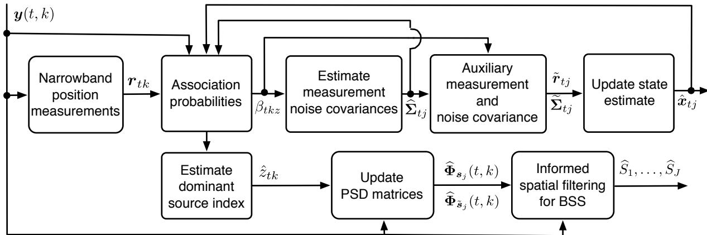  
Figure 8.1: The processing blocks of the proposed tracking system.

However, our experiments indicated that the estimation of $\widehat { \Sigma } _ { t j }$ as given by (8.24) and (8.25) is not always robust in real rooms with moderate reverberation and multi-talk. While the proposed augmented measure ments are robust to noise, the problem is caused by speech-dominated bins, which due to reverberation are inaccurately localised. If such TF occur frequently, they cause increase of the noise covariances, which in turn impedes the tracker from updating the states, increasing the danger of lost tracks

To alleviate the problem, we introduce data-dependent weighting $b _ { t k } \big ( \hat { \mathbf { r } } _ { t k } \big )$ computed as follows: between each two $\hat { \mathbf { r } } _ { t _ { 1 } k _ { 1 } }$ and $\hat { \mathbf { r } } _ { t _ { 2 } k _ { 2 } }$ , for $t _ { 1 } , t _ { 2 } \in [ t - L , t - 1 ]$ , compute a distance measure $a ( \hat { \mathbf { r } } _ { t _ { 1 } k _ { 1 } } , \hat { \mathbf { r } } _ { t _ { 2 } k _ { 2 } } )$ , and assign a weight to each point as the sum of the distances from other points,

$$
a (\hat {\mathbf {r}} _ {t _ {1} k _ {1}}, \hat {\mathbf {r}} _ {t _ {2} k _ {2}}) = \mathrm{e} ^ {- \| \hat {\mathbf {r}} _ {t _ {1} k _ {1}} - \hat {\mathbf {r}} _ {t _ {2} k _ {2}} \|},\tag{8.26}
$$

$$
b (\hat {\mathbf {r}} _ {t k}) = \sum_ {\mathbf {r} ^ {\prime} \neq \mathbf {r} _ {t k}} a (\hat {\mathbf {r}} _ {t k}, \mathbf {r} ^ {\prime}),\tag{8.27}
$$

and normalise the weights $b ( \hat { \mathbf { r } } _ { t k } )$ such that they sum to 1. The weight $b ( \hat { \mathbf { r } } _ { t k } )$ indicates average proximity of $\hat { \mathbf { r } } _ { t k }$ to other localised points in the past L frames, and increases robustness against isolated outliers. Thus, instead of the probability $p ( Z _ { t k } = j \mid o _ { t k } )$ , in (8.24) and (8.25), we use

$$
p _ {j t k} = p (Z _ {t k} = j \mid o _ {t k}) \cdot b _ {t k} (\hat {\mathbf {r}} _ {t k}).\tag{8.28}
$$

Our experiments showed that in scenarios with several concurrent sources in reverberant rooms, the weights $b ( \hat { \mathbf { r } } _ { \tau k } )$ significantly increase the robustness of the tracker

This completes the description of the proposed tracker for a fixed number of sources. The processing blocks of the full tracking and BSS system are summarised in Figure 8.1. To have a clearer illustration, the track management described in Section 8.4 (source detection and removal), and the SPP estimation are omitted from the diagram.

## 8.3.3 Relation to JPDA and PMHT trackers

To elaborate why the well-known JPDA tracker is not suited for our narrowband models, recall that the JPDA assumes at most one measurement per source at time t. To spot the implications, consider the JPDA

state estimate $\hat { \mathbf { x } } _ { t _ { \mathcal { I } } }$

$$
\hat {\mathbf {x}} _ {t j} ^ {\mathrm{JPDA}} = \operatorname{E} \left[ \mathbf {x} _ {t j} \mid \mathcal {O} \right] = \sum_ {\mathbf {Z} _ {t}} \operatorname{E} \left[ \mathbf {x} _ {j} \mid \mathbf {Z} _ {t}, \mathcal {O} \right] p (\mathbf {Z} _ {t} \mid \mathcal {O}),\tag{8.29}
$$

where the association events are given by the $K _ { t } \times J _ { t }$ random matrix $\mathbf { Z } _ { t }$ whose support is the set of matrice with at most one entry equal to 1 per row and column. If each source produces multiple measurements as in the narrowband model, the support of $\mathbf { Z } _ { t }$ contains matrices with maximum one 1 per row, and arbitrary number of ones per column. The cardinality of such support set equals number of ways to distribute $K _ { t }$ balls in $J _ { t } + 1$ boxes, and evaluating (8.29) is not manageable in real-time.

Instead, a model where a source can generate multiple measurements per frame, allows to formulate the tracking as a missing data problem, as proposed in 1995 [247] for the PMHT. The state sequences in PMHT are found by solving similar optimisation problem as (8.16), jointly across frames. As batch processing is not suitable for online BSS, our approach can be considered as an online variant of the PMHT. Originally used for applications where single measurement per source was expected, the PMHT had received criticism due to its model violation [248]. A related criticism is the so-called hospitality, meaning that multiple measurements decrease the noise covariance $\tilde { \Sigma } _ { \tau j }$ , in contrast to the JPDA, where multiple measurements increase the innovations covariance [148]. However, for narrowband models used in our framework, PMHT paradigm is well-suited, as multiple measurements indicate likely source activity in a frame and the reduction of noise covariance is the correct action so that the tracker can update the state during that frame.

A PMHT drawback which a↵ects our system is the larger tendency to track losses compared to JPDA. This stems from the fact that the Gaussian association probabilities $\beta _ { t k z }$ are computed with the noise covariance $\widehat { \pmb { \Sigma } } _ { t k z }$ , while in JPDA the noise plus the prediction covariance is used (innovation covariance). Thus, afte bspeech pauses, JPDA considers measurements from a wider area and is less prone to track losses. Therefore, we modified our association probabilities by adding the prediction covariance $\mathbf { P } _ { t \mid t - 1 } ^ { ( j ) }$ (given by (8.23))

$$
\beta_ {t k j} = \mathcal {N} \left(\hat {\mathbf {r}} _ {t k}; \mathbf {x} _ {t j}, \widehat {\boldsymbol {\Sigma}} _ {t j} + \mathbf {P} _ {t | t - 1} ^ {(j)}\right).\tag{8.30}
$$

The resulting system hence combines positive aspects of PMHT and JPDA, while being consistent with the narrowband model. This property is one of the main factors for the reduced number of lost tracks in dynamic scenarios, compared to direct extensions of clustering-based BSS frameworks to online scenarios [245, 249].

## 8.3.4 Summary of the proposed tracking framework

A pseudo-code of the complete source detection, tracking, and BSS system is provided in Algorithm 8.1. Note that line 3 to line 8 involve estimation of narrowband parameters which were also used in previous chapters; line 9 to line 18 correspond to operations that are developed in this chapter specifically fo detecting, tracking, and removing moving sources (the source detection and removal in lines 10-12 and line 18 are detailed in Section 8.4). line 19 and line 20 perform the dominant source detection based on the updated tracker states and covariances. Finally, using the measurement-to-source associations, line 21 to line 24 estimate the PSD matrices and compute the spatial filters for source separation, in the same fashion as described for separation of the static sources in Chapter 7.

Algorithm 8.1 Implementation the proposed detection, tracking and BSS system.

1: Given from frame t-1: states  $\{\hat{x}_{t-1,j}\}_{j=1:J_{t-1}}$ , measurement error covariance matrices  $\{\widehat{\Sigma}_{t-1,j}\}_{j=1:J_{t-1}}$ , vector containing the  $t_{ttl}$  counters for each source.

2: do for each frame t:

3: Estimate narrowband DOAs for each array and each k.

4: Estimate the SPP and the noise PSD matrix  $\widehat{\Phi}_{\mathbf{v}}(t,k)$  for each k (Chapter 3).

5: Triangulate the DOAs (Section 6.4.1) to get the position measurements set  $K_{t}$ .

6: Propagate the state estimates for each source j (prediction step):  $x_{t,j} \equiv x_{t-1,j}$ .

7: Use the current state and noise covariance estimates of the tracker to compute  $\mathcal{P}(t,\mathbf{r})$  in (8.33).

8: Use the position estimates from last  $L_{det}$  frames to compute  $\mathcal{L}(t,\mathbf{r})$  in (8.32).

9: Compute (8.31) and initialize a new source if (8.34) is satisfied.

10: Update the prediction covariance  $\mathbf{P}_{t|t-1}^{(j)}$  in (8.23) for each source j.

11: Update the noise covariances  $\widehat{\Sigma}_{tj}$  for each source j (Section 8.3.2).

12: Compute the values  $\xi_{tj}$  according to (8.18), for each source j.

13: Update the source state estimates  $\hat{x}_{tj}$  according to (8.20)-(8.22) for each source j.

14: Check if tracks need to be merged using the Mahalanobis distance-based merger.

15: Remove sources that expired the time-to-live  $t_{ttl}$  (Section 8.4.2).

16: Re-compute the association probabilities with the updated tracks and the SPP from line 7.

17: At each frequency k, find the source  $j_{k}^{*}$  with largest association probability.

18: Select a reference microphone  $m_{tj}$  for each source j, closest to the state estimate  $\hat{x}_{tj}$ .

19: Update the PSD matrices  $\hat{\Phi}_{\mathbf{s}_{j_{k}^{*}}}(t,k)$  and the RTF vectors  $g_{j_{k}^{*}m_{tj_{k}^{*}}}$  for all k.

20: Update the PSD matrices  $\hat{\Phi}_{\tilde{s}_{j}}(t,k)$  at each k for  $j \neq j_{k}^{*}$ .

21: Estimate  $\widehat{S}_{1},\ldots,\widehat{S}_{J_{t}}$  using the updated informed MVDR filters.

22: end for:

## 8.4 Track management

In the previous sections, we have developed the processing steps for the proposed multi-source tracker, which similarly as the JPDA and PMHT, estimates the tracks of a known number of sources. In practice, a tracking system should provide a robust track management mechanism as well, which detects and discards sources as they appear and disappear. In this section, we present a track management system suited for the proposed tracker, which detects new sources by utilising both the incoming measurements, as well as the currently estimated source states and covariances.

## 8.4.1 Source detection

The measurements (the narrowband position estimates), as well as the estimated quantities from the tracker (source state and error covariance estimates) contain information about locations where new sources become active. We propose the following function obtained as a product of two terms

$$
\mathcal {J} (t, \mathbf {r}) = \mathcal {L} (t, \mathbf {r}) \cdot \mathcal {P} (t, \mathbf {r}),\tag{8.31}
$$

which reflects our confidence that a new source appears at position $\mathbf { r } ,$ and is evaluated at each time t on a grid of samples r. $\textstyle { \mathcal { L } } ( t , \mathbf { r } )$ is a low-resolution grid where each cell is associated with the number of narrowband position estimates in that cell, collected over the last $L _ { \mathrm { d e t } }$ frames, i.e.,

$$
\mathcal {L} (t, \mathbf {r}) = \sum_ {t = \tau - L _ {\mathrm{det}} + 1} ^ {\tau} \sum_ {k \in \mathcal {K} _ {t}} I (\mathbf {r}, \hat {\mathbf {r}} _ {t k}),\tag{8.32}
$$

where $I ( \mathbf { r } , \hat { \mathbf { r } } _ { t k } ) = 1$ if $\mathbf { r } _ { t k }$ is within the cell centred at r, and 0 otherwise. Next, to avoid duplicate tracks, the second term $\mathcal { P } ( t , \mathbf { r } )$ in (8.31) is designed to de-emphasise the regions where the sources are already in track, and is given by

$$
\mathcal {P} (t, \mathbf {r}) = \sum_ {j = 1} ^ {J _ {t - 1}} 1 - \mathrm{e} ^ {\frac {1}{2} (\mathbf {r} - \hat {\mathbf {x}} _ {t j}) ^ {\mathrm{T}} (\widehat {\boldsymbol {\Sigma}} _ {t j} + \mathbf {P} _ {t | t - 1}) ^ {- 1} (\mathbf {r} - \hat {\mathbf {x}} _ {t j})}.\tag{8.33}
$$

The value $\mathcal { P } ( t , \mathbf { r } )$ is subsequently normalised so that max $[ \mathcal { P } ( t , { \bf r } ) ] = 1$ before using it in (8.31). Finally, a new source is declared at the maximum of $\mathcal { I } ( t , \mathbf { r } )$ if

$$
\max \left[ \mathcal {J} (t, \mathbf {r}) \right] > \chi_ {\mathrm{thr}}.\tag{8.34}
$$

A good threshold $\xi _ { \mathrm { t h r } }$ is found empirically. It is important to promptly detect new sources, even at the cost of false alarms, as false tracks are easily identified and discarded (see Section 8.4.2). Values $\xi _ { \mathrm { t h r } } = [ 1 , 3 ]$ have shown to work well in many scenarios, where in adverse conditions, lower values are preferred. If (8.34) holds, the number of sources is incremented $J _ { t } \gets J _ { t - 1 } + 1$ , the new source state is set to $x _ { t J _ { t } } \equiv \arg \operatorname* { m a x } _ { \mathbf { r } } \mathcal { I } ( t , \mathbf { r } )$ and the initial noise covariance $\Sigma _ { t J _ { t } }$ is set to a scaled identity matrix. Subsequently, a tracking step is performed, as detailed in Sections 8.3.1 and 8.3.2.

Although the proposed source detection mechanism is based on heuristic functions, our goal was to mimic the Bayesian paradigm where both the observed data and the prior information are used to make inferences. Namely, $\textstyle { \mathcal { L } } ( t , \mathbf { r } )$ is based on the observed data and $\mathcal { P } ( t , \mathbf { r } )$ contains prior information from existing tracks. To even further increase the robustness to duplicate tracks, a Mahalanobis distance-based merger is used, as described in Chapter 7, Equation (7.28). With such mechanism, tracks of crossing speakers will be merged, and when the sources move apart, the tracks split by re-detecting one of the speakers as a new source. Although in certain applications, it might be desired to maintain separate tracks while crossing, our system is developed for spatial filtering-based source separation, where closely located speakers cannot be separated based on spatial information alone, and hence the merging process is justified.

## 8.4.2 Source removal

As mentioned in Section 8.3.1, the state of a source j is updated only if $\xi _ { j t } > \xi _ { \mathrm { t h r } }$ , i.e., if at a given time frame t, a sucient measurement evidence exists that source j is active. Let $t _ { \mathrm { t t l } }$ (known as time-to-live in the tracking literature) denote the number of consecutive frames a source can be silent before being removed. The value $t _ { \mathrm { t t l } }$ should be chosen such that short speech pauses do not a↵ect the source track. However, as the source can not be tracked when inactive, it is reasonable to discard the track, and re-detect the source as a new one when speech is resumed. In the experiments performed during this work, we set $t _ { \mathrm { t t l } } = 7 8$ corresponding to 2.5 seconds.

## 8.5 Performance Evaluation

To evaluate the proposed framework for BSS of moving sources, we used several simulated and measured scenarios, in relatively noisy conditions, for di↵erent reverberation, number of sources, array arrangements, and source velocities. The measurement-to-source association accuracy is evaluated in Section 8.5.2. The separated source signals using simulated data are evaluated in Section 8.5.3. The tracking accuracy is evaluated in Section 8.5.4, by comparing the true trajectories of the sources to the estimated trajectories by the tracker. An additional experiment is provided in Section 8.5.4 to evaluate the track management system proposed in Section 8.4, in terms of detection delay between the first time a source appears and the time when it is detected. Finally, the objective quality of separated source signals using measured data data is evaluated in 8.5.5 and compared to an Independent Vector Analysis (IVA)-based state-of-the-art approach.

## 8.5.1 Experimental setup

The system was evaluated with both measured and simulated data. Measurements were done in a room with reverberation T 0.3 s, using three circular arrays with diameter 2.7 cm with three omnidirectiona DPA microphones (model DPA d:screet SMK-SC4060) per array. Speech samples (male and female speech in English, German and French) were emitted using Focal loudspeakers (model CMS40). In addition to the sensor noise present in the signals, rather di↵use noise from the air conditioner was recorded during speech absence, and added to the microphone signals with a given Input Signal-to-Noise Ratio (iSNR). The exact iSNRs, as well as the array and source arrangements are specified in the respective experiments. In the simulations, the same room and array geometries as used in the measurements, were simulated at di↵erent reverberation times, where clean speech signals were convolved with room impulse responses for moving sources simulated using [250]. Di↵use babble noise signals at the microphones were generated according to [204], and scaled to achieve a specified iSNR. In addition, uncorrelated Gaussian sensor noise was added with a speech-to-uncorrelated noise ratio of approximately 35 dB in all experiments. In each of the simulated and measured experiments, the sources are continuously active (with typical short speech pauses) for 20 seconds and traverse the indicated trajectories multiple times with velocities 0.12-0.4 m/s.

The processing was done at a sampling rate of 16 kHz, with an STFT frame size was 64 ms with 50 % overlap, windowed by a Hamming window. The averaging constants for the PSD matrix estimation, $\alpha _ { s }$ and $\alpha _ { v } .$ , were set to 0.75 and 0.98, respectively (corresponding to time constants of 0.11 s and 1.58 s, respectively). For BSS in this chapter, we apply the informed Minimum Variance Distortionless Response (MVDR) filter, in the same manner as discussed in Section 7.4 for separation of static sources. The room was uniformly sampled with 10 samples per meter to evaluate the function $\mathcal { I } ( \mathbf { r } )$ for new source detection. The number of frames T considered for source detection and L for estimation of the measurement noise covariance matrix were T = 10 (Equation 8.32) and L = 30 (Section 8.3.2), respectively. Similarly as done in Chapter 7, as spatial aliasing in the DOAs occurs around 7 kHz for the given array geometry, the signals were band-limited to 7 kHz before processing.

Before proceeding with the di↵erent experiments, an illustration of the tracker operation in a simulated scenario is shown in Figure 8.2 for di↵erent reverberation and noise levels. Four sources were present in the scenario, only three of which are active at the illustrated time snapshot. The grey points represen narrowband positions from the last 30 frames. While increasing either $T _ { 6 0 }$ or the noise, both result in larger error covariance, this e↵ect is somewhat more prominent for increasing $T _ { 6 0 }$ . Due to the robustness of the augmented measurements that in essence provide ability to detect noisy TF bins, the tracker is robust even at low iSNRs of 3 dB, as visible when comparing the first with the second image, and the third with the fourth image.

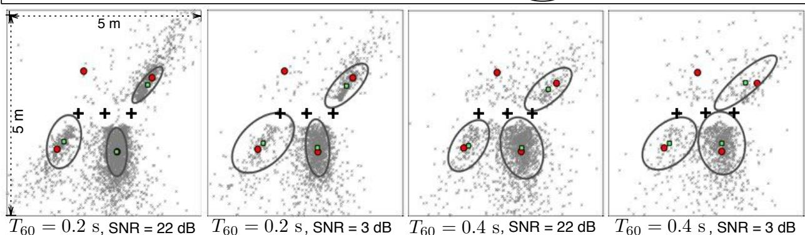  
Figure 8.2: Illustration of tracker results in simulated scenario for one selected time snapshot, where three out of the four present sources are active.

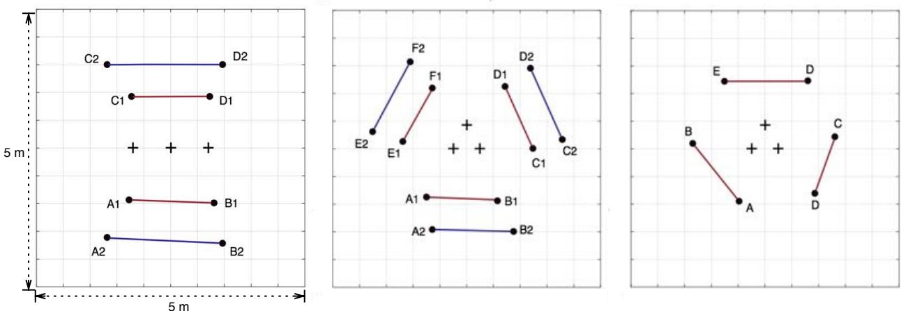  
Figure 8.3: Simulated scenarios for evaluating the detection, tracking, and BSS performance. The line segments denote the source trajectories (traversed multiple times), and the crosses denote the microphone arrays. Line segments of di↵erent colour correspond to di↵erent simulations.

## 8.5.2 Evaluation of association accuracy and detection delay

The measurement-to-source associations determine the TF masks which are used to estimate the RTFs vectors and PSD matrices of each source. Hence the measurement-to-source association accuracy directly influences the performance of the ISFs for source separation. To evaluate the performance for di↵erent reverberation levels, we used simulations for this experiment. All sources have approximately equal power, where the iSNR with respect to each source is approximately 9 dB. The measurement-to-source association is evaluated in terms of False Positive Rate (FPR), and the False Negative Rate (FNR), which for each

source $j$ are defined as

$$
\begin{array}{r l} & {\mathrm{FPR} (j) = \sum_ {t, k} [ \hat {z} _ {t k} = j \land z _ {t k} \neq j ] / \sum_ {t, k} [ z _ {t k} \neq j ],} \\ & {\mathrm{FNR} (j) = \sum_ {t, k} [ \hat {z} _ {t k} \neq j \land z _ {t k} = j ] / \sum_ {t, k} [ z _ {t k} = j ],} \end{array}\tag{8.35}
$$

where $\textstyle \sum _ { t , k } [ \cdot ]$ denotes a sum over all TF bins of the value of the logical expression in the brackets. The true value of $z _ { t k }$ indicates the source with maximum instantaneous power at TF bin (t, k). To obtain the final measure, the FPRs and FNRs are averaged across all the sources in a given experiment.

As state-of-the-art framework for online TF mask estimation of moving sources, which is an equivalent problem as the measurement-to-source association, we consider the DOA-based algorithm by Loesch and Yang proposed in [140]. While the framework for static sources [142] was evaluated in Chapter 7, in this chapter we evaluate the online extension targeting moving source scenarios, proposed by the same authors in [140, Section 5], and denoted by LY-09 in the following. Similarly as described in Section 7.5 for BSS of static sources, to have a more fair comparison, where the array arrangement is adapted to the particular framework, an additional array setup is simulated for LY 09 to capture the acoustic scene, where all mi crophones from the distributed arrays are now placed in a single compact with the same diameter as the other arrays. The simulated scenarios are illustrated in Figure 8.3. The array used for LY-09 is placed at the location of the middle array in Figure 8.3 (left), and at the centroid of the triangle defined by the three arrays in Figures 8.3 (middle,right). As LY-09 assumes that the number of sources is known, we provide the number of sources to LY-09 in this experiment. Note that in the description of LY-09 in [140] no information is provided on the detection of noisy TF bins. Therefore, we employed a simple energy-based Voice Activity Detector (VAD), as follows: from a noise-only period of 5 seconds we computed the average noise power, and whenever we obtain the measurement-to-source associations from LY-09, if the instantaneous power at that TF bin is not at least 6 dB higher than the average noise power, we declare that TF bin as a noise-dominated, i.e. $\hat { z } _ { t k } = 0$ . In contrast, one of the advantages of our proposed framework is the fact that by using the augmented measurements, the detection of noisy TF bins is inherently included in the tracking system. We simulated the following four scenarios for evaluation:

• setup 1: $T _ { 6 0 } = 0 . 2 ~ \mathrm { s }$ , two sources traversing the trajectories $A _ { 1 } – B _ { 1 } , C _ { 1 ^ { - } } D _ { 1 }$ in Figure 8.3 (left), with velocity $0 . 2 ~ \mathrm { m / s }$

• setup 2: $T _ { 6 0 } = 0 . 2 \mathrm { ~ s } ,$ three sources traversing $A _ { 2 ^ { - } } B _ { 2 } , \ C _ { 2 ^ { - } } D _ { 2 } , \ E _ { 2 ^ { - } } F _ { 2 }$ in Figure 8.3 (middle) with velocity $0 . 2 5 ~ \mathrm { m } / \mathrm { s }$

• setup 3: $T _ { 6 0 } = 0 . 2 \mathrm { ~ s } ,$ three sources traversing A-B, C-D, E-F in Figure 8.3 (right) with velocity $0 . 2 \mathrm { m } / \mathrm { s }$

• setup 4: $T _ { 6 0 } = 0 . 4 ~ \mathrm { s } ,$ three sources traversing $A _ { 1 } – B _ { 1 } , C _ { 1 } – D _ { 1 } , E _ { 1 } – F _ { 1 }$ in Figure 8.3 (middle), with a velocity of $\approx 0 . 3 1 \ \mathrm { m / s }$

Note that our implementation of LY-09 was unable to track the sources when they traversed the trajectories farther from the arrays in Figure 8.3 (left).

The setups cover di↵erent array geometries, di↵erent distances of the sources from the arrays, and a setup where the source locations are less suitable for triangulation (Figure 8.3(c)). The FPR and the FNR are summarised in Table 8.1. Distinctively, the proposed framework provides a FPR of maximum 0.01, in all cases, while the FPR of LY-09, notably increases when the sources are farther away from the array and when the $T _ { 6 0 }$ increases. Even though the FNRs of both frameworks are higher than 0.5, with proposed framework by up to 0.25 higher FNR, note that FNRs are less critical than FPR [230]: while false positives introduce errors in the RTF vectors causing speech distortion, false negatives only indicate that the PSD matrices are not updated as frequently as they could if detection was accurate. Although this leads to sub-optimal undesired signal reduction and could be improved if the FNR is reduced, it does not introduce severe distortion to the source signals. Our experiments showed that while FPR of even 0.1 already cause audible distortion, FNRs can reach up to 0.9 while still providing good signal quality.

<table><tr><td rowspan="2"></td><td colspan="2">FPR</td><td colspan="2">FNR</td></tr><tr><td>LY-09</td><td>Proposed</td><td>LY-09</td><td>Proposed</td></tr><tr><td>setup 1</td><td>0.05</td><td>0.01</td><td>0.50</td><td>0.68</td></tr><tr><td>setup 2</td><td>0.07</td><td>≈0</td><td>0.59</td><td>0.85</td></tr><tr><td>setup 3</td><td>0.20</td><td>0.01</td><td>0.61</td><td>0.80</td></tr><tr><td>setup 4</td><td>0.26</td><td>0.01</td><td>0.59</td><td>0.82</td></tr></table>

Table 8.1: False positive and false negative rates of the proposed and the state-of-the-art frameworks for measurement-to-source association. The best result is shown in bold.

## 8.5.3 Evaluation of separated signal quality in the simulated scenarios

In the simulation-based experiments, we can compute oracle ISFs whose PSD matrices are updated with idea measurement-to-source associations. Moreover, using the true source locations, we can steer a Delay-and Sum Beamformer (DSB) towards each source as a baseline. The oracle ISFs, the DSBs, and the ISFs from the proposed framework are computed using only the three microphones from the nearest array, whereas the ISFs obtained using LY-09 are computed using all nine microphones from the compact array. To evaluate the quality of the separated source signals, we used the standard measures summarised in Appendix A, namely, the Speech Distortion (SD) index $\nu _ { \mathrm { S D } }$ , the Interference Reduction (IR) $\Delta _ { \mathrm { I R } }$ , the noise reduction $\Delta _ { \mathrm { I R } }$ , the Perceptual Evaluation of Speech Quality (PESQ) score improvement, and the Short-Time Objective Intelli gibility (STOI) improvement. The objective results for the same setups as in Section 8.5.2 are summarised in Table 8.2. All results are averaged across all sources in the given scenario. Further evaluation of using measured data, where the extracted signal for each source are shown separately, is provided in Section 8.5.5.

The insucient ability of the DSB to reduce undesired speakers is clearly demonstrated. Therefore, even if a perfect tracker would be provided, fixed spatial filters do not achieve suciently good source separation. Comparing the proposed and the LY-09 approach, we note that the proposed approach achieves by 2-3 dB better noise reduction, which can be attributed to the good accuracy when detecting noisy bins using the proposed augmented measurements compared to a simple energy-based detector. The lower FNR of LY-09 than the proposed approach is manifested in the slightly higher interference reduction of LY-09 (at most 0.5 dB), while the critically large FPR of LY-09 manifests itself in the speech distortion, as well as the worse noise reduction. As a result, the proposed method outperforms LY-09 in terms of PESQ and STOI scores.

As the reverberation time $T _ { 6 0 }$ increases, the performance of all filters, including the oracle ones, dete riorates. With higher $T _ { 6 0 }$ , the spatial filters have limited ability to reduce interferers as the RTFs of the sources are not fully captured within an STFT frame. Finally, note that as the reverberant signal is used as a reference when computing the SD, the SD index increases partially due to dereverberation, and not necessarily due to unpleasant distortion.

<table><tr><td colspan="2"></td><td>Oracle</td><td>DSB</td><td>LY-09</td><td>Proposed</td></tr><tr><td rowspan="5">1</td><td> $\nu_{\text{SD}}$ </td><td>0.03</td><td>0.01</td><td>0.04</td><td>0.04</td></tr><tr><td>IR [dB]</td><td>16.0</td><td>1.5</td><td>15.0</td><td>15.0</td></tr><tr><td>NR [dB]</td><td>5.8</td><td>0.2</td><td>3.9</td><td>5.0</td></tr><tr><td> $\Delta_{\text{PESQ}}$ </td><td>0.95</td><td>0.05</td><td>0.61</td><td>0.82</td></tr><tr><td> $\Delta_{\text{STOI}}$ </td><td>0.21</td><td>0.03</td><td>0.15</td><td>0.19</td></tr><tr><td rowspan="5">2</td><td> $\nu_{\text{SD}}$ </td><td>0.03</td><td>0.01</td><td>0.06</td><td>0.04</td></tr><tr><td>IR [dB]</td><td>15.0</td><td>1.0</td><td>13.3</td><td>13.0</td></tr><tr><td>NR [dB]</td><td>5.8</td><td>0.2</td><td>3.7</td><td>5.8</td></tr><tr><td> $\Delta_{\text{PESQ}}$ </td><td>0.81</td><td>0.05</td><td>0.53</td><td>0.60</td></tr><tr><td> $\Delta_{\text{STOI}}$ </td><td>0.25</td><td>0.03</td><td>0.21</td><td>0.22</td></tr><tr><td rowspan="5">3</td><td> $\nu_{\text{SD}}$ </td><td>0.04</td><td>0.01</td><td>0.07</td><td>0.05</td></tr><tr><td>IR [dB]</td><td>14.9</td><td>1.0</td><td>13.3</td><td>12.8</td></tr><tr><td>NR [dB]</td><td>5.7</td><td>0.2</td><td>3.7</td><td>5.8</td></tr><tr><td> $\Delta_{\text{PESQ}}$ </td><td>0.80</td><td>0.05</td><td>0.40</td><td>0.51</td></tr><tr><td> $\Delta_{\text{STOI}}$ </td><td>0.24</td><td>0.03</td><td>0.17</td><td>0.19</td></tr><tr><td rowspan="5">4</td><td> $\nu_{\text{SD}}$ </td><td>0.07</td><td>0.03</td><td>0.18</td><td>0.13</td></tr><tr><td>IR [dB]</td><td>9.3</td><td>0.8</td><td>8.4</td><td>8.4</td></tr><tr><td>NR [dB]</td><td>4.8</td><td>0.2</td><td>2.9</td><td>5.6</td></tr><tr><td> $\Delta_{\text{PESQ}}$ </td><td>0.51</td><td>0.03</td><td>0.21</td><td>0.31</td></tr><tr><td> $\Delta_{\text{STOI}}$ </td><td>0.20</td><td>0.02</td><td>0.13</td><td>0.15</td></tr></table>

Table 8.2: Evaluation results of the di↵erent baselines and the proposed BSS framework in simulated scenarios. The best result (not considering the oracle filter) is indicated in bold.

## 8.5.4 Evaluation of tracking accuracy and track management

Although the accuracy of the estimated source locations is not a major determining factor for the quality of the separated signals, we investigate the tracking accuracy for completeness. We used simulated data, as in this manner the true source locations are perfectly known, which are dicult to obtain on a per-frame basis in real measurements. In future work, it would be interesting to compare the proposed tracker to di↵erent families of trackers, such as for instance particle filters. In particular, if the location estimates are to be used for di↵erent purpose than steering fixed spatial filters (which provide insucient separation, as shown in Section 8.5.3), e.g. for automatic camera steering, comparison of di↵erent trackers would be of interest. The results comparing the x and y coordinates of the true trajectories to the estimated ones, are illustrated in Figure 8.4-8.7 for several simulated scenarios. The main conclusions are summarised as follows: i) In Figure 8.4 we illustrate the tracking performance for the two sets of trajectories in Figure 8.3 (middle), for $T _ { 6 0 } = 0 . 2 ~ \mathrm { s }$ . One observation is the tendency of the tracker to localise sources nearer to the arrays than they actually are, where the bias increases when the sources are far from the arrays. This is due to the nature of the triangulation, where the density of localisations increases in the array vicinity [251].

ii) In Figure 8.5, the tracks are illustrated for the simulated scenario in Figure 8.3 (middle), including and additional experiment with $T _ { 6 0 } = 0 . 4 ~ \mathrm { s }$ . The results indicate that the larger reverberation has only a minor e↵ect on the estimated tracks.

iii) In Figure 8.6, the estimated trajectories for the scenario in Figure 8.3 (left) are shown, where the localisation is more prone to triangulation errors due to the relative position of the sources with respect to the microphones. Nonetheless, even in this situation, there is no notable degradation in the tracking accuracy, when compared to the scenario evaluated in Figure 8.4(a), which had similar source-to-array distances and the same $T _ { 6 0 }$

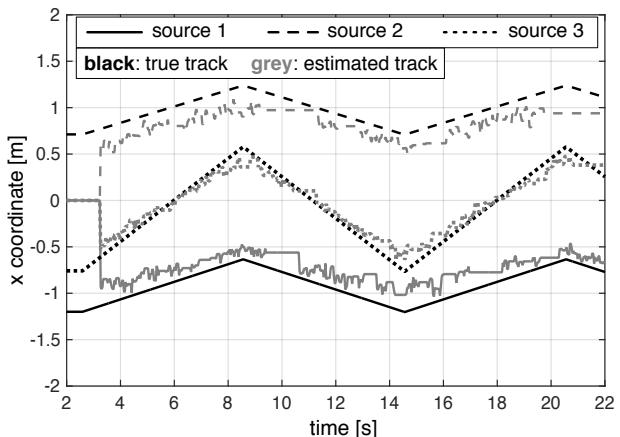

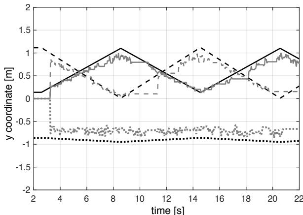  
(a) Source trajectories $A _ { 1 } – B _ { 1 } , C _ { 1 } – D _ { 1 }$ , and $E _ { 1 } - F _ { 1 }$

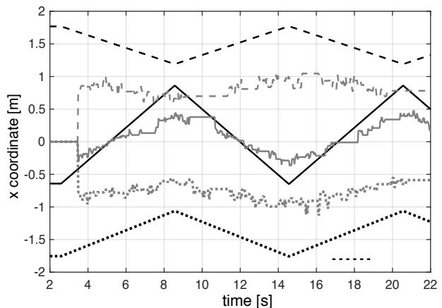

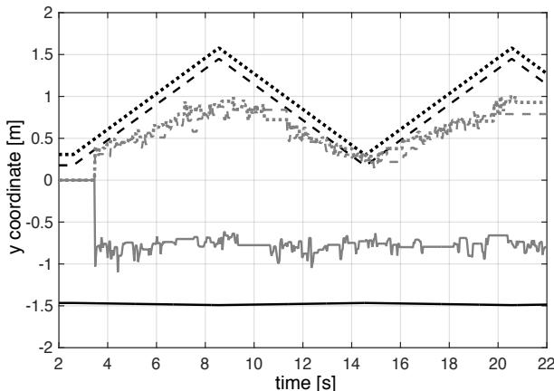  
(b) Source trajectories $A _ { 2 ^ { - } } B _ { 2 } , C _ { 2 ^ { - } } D _ { 2 } ,$ and $E _ { 2 } { - } F _ { 2 }$  
Figure 8.4: Tracking trajectories for scenario in Figure 8.3 (left). iSNR with respect to each source was 9 dB on average, with babble background noise. Source velocities were in the range 0.2-0.25 m/s.

iv) Finally, in Figure 8.7, the estimated tracks in more challenging acoustic conditions are illustrated for the sources in Figure 8.3 (middle) (trajectories near the arrays). Reverberation times $T _ { 6 0 } = 0 . 4$ s and $T _ { 6 0 } = 0 . 6 ~ \mathrm { s } ,$ , and higher source velocities compared to the previous experiments. Besides the aforementioned bias to localise the sources nearer to the arrays, which increases with larger reverberation, it can be concluded that the tracker operates robustly for di↵erent reverberation times, tested up to 0.6 s, di↵erent source velocities, and relatively noisy conditions.

For completeness, we present the detection delay of the proposed track management mechanism, when multiple sources appear simultaneously in di↵erent acoustic conditions, while keeping the parameters of the track management fixed. First we consider scenarios from Figure 8.3(a), for $T _ { 6 0 } = 0 . 2 \mathrm { ~ s ~ }$ and $T _ { 6 0 } = 0 . 4 \ : \mathrm { s } .$ , with source velocities of ${ \approx } 0 . 2 ~ \mathrm { m / s }$ . As shown in Table 8.3, when the sources are nearer to the arrays, both are detected almost instantaneously, and when they are farther away, a delay of only 0.2 s is introduced for one of the sources. The delay is also shown when the three sources traversing the trajectories farther from the arrays in Figure 8.3(b) appear simultaneously. The results in Table 8.4 indicate prompt source detection in all scenarios, without notable increase of the detection delay for the di↵erent reverberations and velocities.

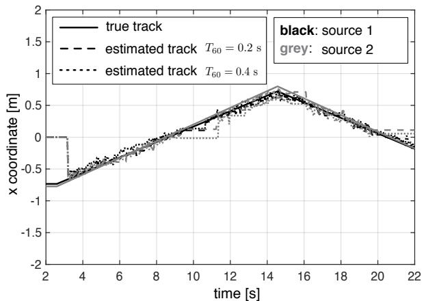

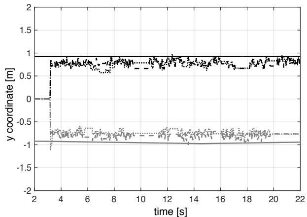  
(a) Source trajectories $A _ { 1 } – B _ { 1 }$ and $C _ { 1 } – D _ { 1 }$

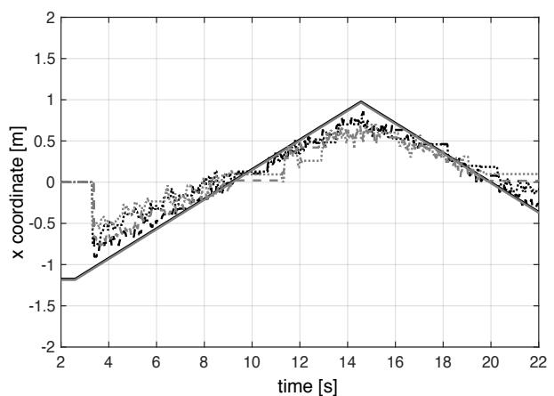

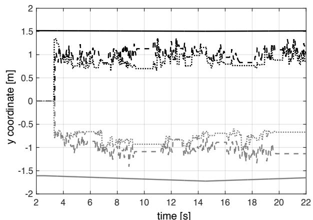  
(b) Source trajectories $A _ { 2 } – B _ { 2 }$ and $C _ { 2 ^ { - } } D _ { 2 }$

Figure 8.5: Tracking trajectories for scenario in Figure 8.3 (middle). iSNR with respect to each source was 9 dB on average, with babble background noise. Source velocities were 0.12 m/s.  
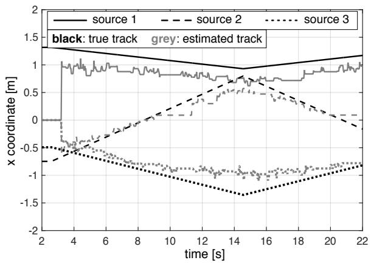

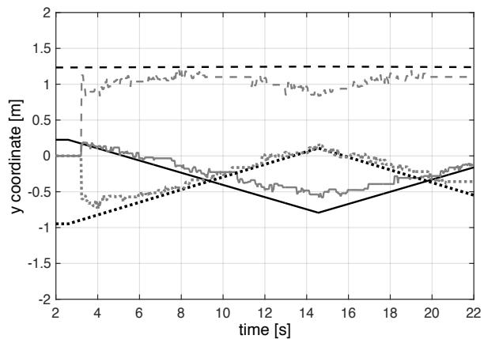  
Figure 8.6: Tracking trajectories for scenario in Figure 8.3 (right). iSNR with respect to each source was 9 dB on average, with babble background noise. Source velocities were 0.12 m/s.

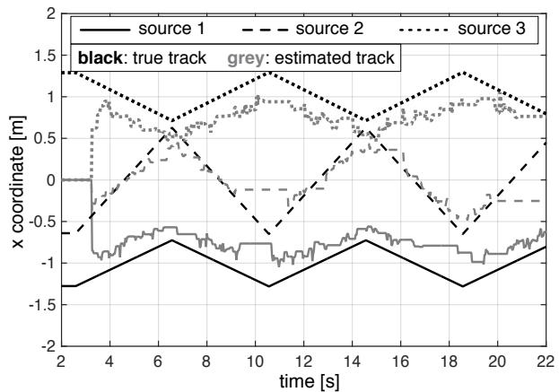

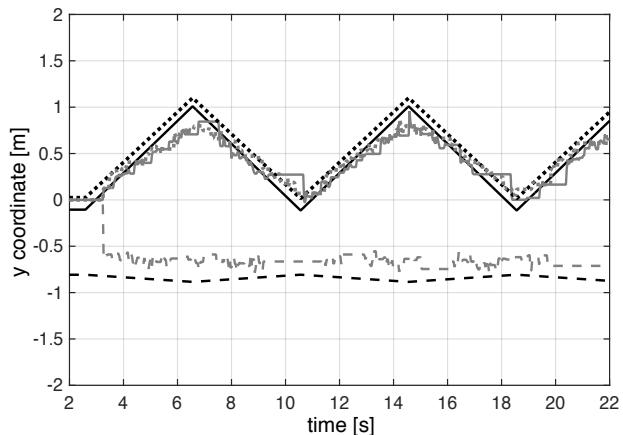  
(a) Velocity 0.31 m/s, $T _ { 6 0 } = 0 . 4 ~ \mathrm { s } ,$

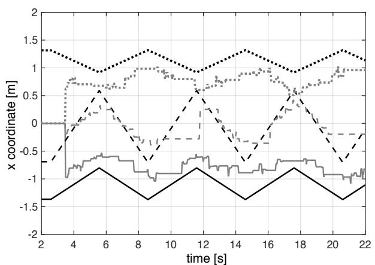

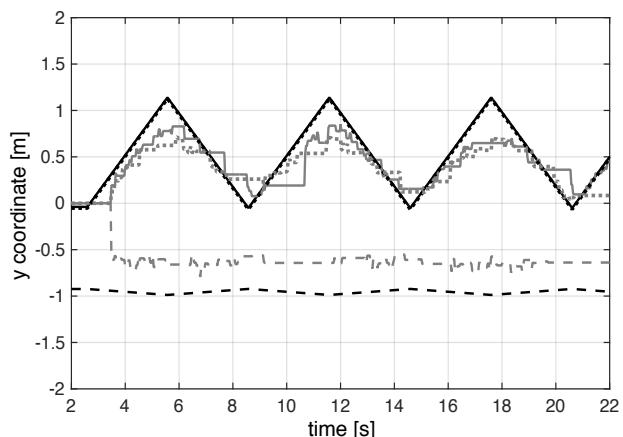  
(b) Velocity 0.43 m/s, $T _ { 6 0 } = 0 . 6 ~ \mathrm { s } ,$

Figure 8.7: Tracking trajectories for scenario in Figure 8.3 (middle). iSNR with respect to each source, 9 dB on average, babble noise.

<table><tr><td rowspan="2"> $T_{60}$  [s]</td><td colspan="2">scenario 1</td><td colspan="2">scenario 2</td></tr><tr><td>source 1( $A_1-B_1$ )</td><td>source 2( $C_1-D_1$ )</td><td>source 1( $A_2-B_2$ )</td><td>source 2( $C_2-D_2$ )</td></tr><tr><td>0.2</td><td>0 s</td><td>0.03 s</td><td>0 s</td><td>0.22 s</td></tr><tr><td>0.4</td><td>0 s</td><td>0.03 s</td><td>0 s</td><td>0.16 s</td></tr></table>

Table 8.3: Detection delay in seconds using simulations of the setup in Figure 8.3 (left), for the two cases when the sources are nearer, and farther from the arrays. The velocity of all sources is 0.2 m/s, and the experiment is repeated for multiple reverberation times.

<table><tr><td> $T_{60}$  [s]</td><td>velocity</td><td>source 1( $A_2-B_2$ )</td><td>source 2( $C_2-D_2$ )</td><td>source 3( $E_2-F_2$ )</td></tr><tr><td>0.2</td><td>0.25 m/s</td><td>0 s</td><td>0.22 s</td><td>0.32 s</td></tr><tr><td>0.4</td><td>0.31 m/s</td><td>0 s</td><td>0.03 s</td><td>0.10 s</td></tr><tr><td>0.6</td><td>0.43 m/s</td><td>0 s</td><td>0.03 s</td><td>0.30 s</td></tr></table>

Table 8.4: Detection delay in seconds using simulations of the setup in Figure 8.3(middle), when the sources are farther from the arrays. The experiment is repeated for multiple reverberation times and source velocities.

## 8.5.5 Evaluation of separated signal quality using real measurements

Using data from real measurements, in this experiment, we evaluate the separated signals, and compare the performance to that of a powerful state-of-the art BSS based on auxiliary function IVA, proposed in [125,252] and denoted by auxIVA in the following. Three experimental setups were evaluated:

• setup 1: three sources, Figure 8.8 (left): female English speaker traverses A-B, male German speaker traverses C-D, and male French speaker traverses H-I.

• setup 2: three sources, Figure 8.8 (right): female French speaker traverses B-C, male English speaker traverses A-B, male French speaker traverses E-D.

• setup 3: four sources, Figure 8.8 (left): male German speaker traverses A-B, female English speaker traverses C-D, male English speaker traverses G-H and male French speaker traverses E-F.

The velocities of all sources were 0.3 m/s and the microphone signals were corrupted by background fan noise. As the processed signals by auxIVA using the implementation by the authors in [125] provided better results when applying BSS with only the microphones from one array, we evaluated all the signals when auxIVA is applied with each of the three arrays, and manually picked the best result for each source to present in the following evaluation. In contrast, our proposed framework selects the reference array depending on the estimated source location, which is beneficial as the microphone subset selection is an important issue in systems with distributed microphones [253, 254]. The segmental iSNRs and Input Signal-to-Interference Ratios (iSIRs) at the corresponding reference microphone signals for each source are summarised in Table 8.5.

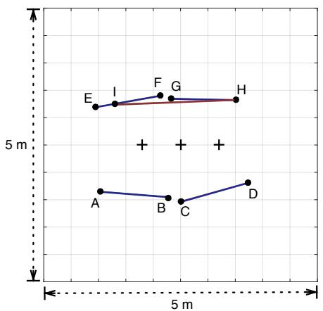

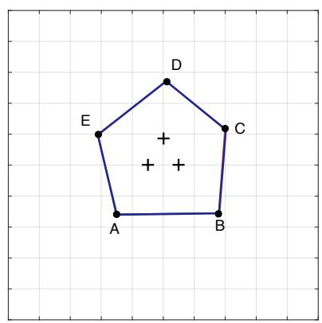  
Figure 8.8: Measured scenarios for evaluating BSS performance. The line segments denote the approximate source trajectories (traversed multiple times), and the crosses denote the arrays. The exact trajectories for each experiment are stated in the corresponding experiments.

<table><tr><td rowspan="2"></td><td colspan="2">source 1</td><td colspan="2">source 2</td><td colspan="2">source 3</td><td colspan="2">source 4</td></tr><tr><td>iSNR</td><td>iSIR</td><td>iSNR</td><td>iSIR</td><td>iSNR</td><td>iSIR</td><td>iSIR</td><td>iSIR</td></tr><tr><td>setup 1</td><td>2.4</td><td>-1.3</td><td>7.2</td><td>-0.4</td><td>0.8</td><td>-3.6</td><td>-</td><td>-</td></tr><tr><td>setup 2</td><td>5.4</td><td>-2.8</td><td>6.2</td><td>-3.7</td><td>3.7</td><td>-1.9</td><td>-</td><td>-</td></tr><tr><td>setup 3</td><td>4.6</td><td>-6.3</td><td>5.7</td><td>-5.4</td><td>6.3</td><td>-5.5</td><td>3.9</td><td>-3.9</td></tr></table>

Table 8.5: iSNR and iSIR at with respect to each of the source at the corresponding reference microphone.

Due to the possibly di↵erent reference microphones for the proposed system and auxIVA, we do not provide the PESQ and STOI improvements with respect to the reference, but rather the final scores at the BSS outputs. Note that we did not have the filtered versions of the clean signals by the auxIVA, and hence, we were unable to compute the standard measures of speech distortion and interference reduction, defined in Appendix A. Nonetheless, the PESQ and STOI scores in Figure 8.9 indicate that the proposed approach consistently outperforms auxIVA. It is worthwhile mentioning that the proposed approach provided superior background noise reduction: one advantage of spatial filtering-based BSS compared to IVA is the fact that noise reduction is explicitly addressed by the spatial filters.

An approximate measure of undesired signal reduction, evaluated in Figure 8.9, was computed by first computing for each $T = 3 0$ ms signal segment the segmental powers

$$
\phi_ {u _ {j}} (i) = \left\langle \left(s _ {j m _ {j}} (n) - y _ {m _ {j}} (n)\right) ^ {2} \right\rangle_ {n} \quad \mathrm{for} \quad n \in \left((i - 1) T, i T \right]\tag{8.36}
$$

$$
\phi_ {\hat {u} _ {j}} (i) = \left\langle \left(s _ {j m _ {j}} (n) - \hat {s} _ {j m _ {j}} (n)\right) ^ {2} \right\rangle_ {n} \quad \mathrm{for} \quad n \in \left((i - 1) T, i T \right]\tag{8.37}
$$

where $\langle \cdot \rangle _ { n }$ denotes temporal average, $s _ { j m _ { j } } ( n )$ is the time-domain signal of the source $j , y _ { m _ { j } } ( n )$ is the timedomain signal of the reference mixture for source $j$ (note we did not include the time-dependency of the reference microphone for readability), and $\hat { s } _ { j m _ { j } } ( n )$ denotes the separated signal for source j obtained by the BSS. The final measure of undesired signal reduction is obtained as

$$
\Delta_ {\phi_ {u}} = \left<   1 0 \log_ {1 0} \phi_ {u _ {j}} (i) / \phi_ {\hat {u} _ {j}} (i) \right> _ {i},\tag{8.38}
$$

where $\langle \cdot \rangle _ { i }$ denotes averaging across the segments i. To obtain $\Delta _ { \phi _ { u } }$ , we computed the median of $\phi _ { u _ { j } } ( i )$ across the segments, and only considered the values within the range [ 15, 15] dB from the median for the averaging in (8.38). Note that $\Delta _ { \phi _ { u } }$ , is an exact measure of the undesired signal reduction only in the case when the estimated source signal is undistorted at the BSS output, which is not true in practice. As we only evaluate the overall undesired signal reduction (including noise and interfering speakers), we summarise the input signal-to-interference-plus-noise ratio at the reference microphones for the auxIVA and for the proposed approach in Table 8.6.

For completeness of the BSS evaluation, in Figures 8.10-8.15, we illustrate the standard performance measures (described in Appendix A) for ISFs computed using the three microphones from the nearest array, as well as for ISFs computed the six microphones from the two nearest arrays. The main conclusions are rather independent from the array configuration and the number of sources and can be summarised as follows:

i) Due to the presence of errors in the estimated RTFs vectors for the ISFs, the increased spatial selectivity when using two arrays comes at the cost of larger speech distortion (0.1 on average, in terms of SD index). Nonetheless, as the IR provided by two arrays is larger than that provided by a single array, the overall iSIR improvement is by up to 2 dB larger for the two-array ISFs.

<table><tr><td></td><td></td><td>source 1</td><td>source 2</td><td>source 3</td><td>source 4</td></tr><tr><td rowspan="3">Proposed</td><td>setup 1</td><td>-4.4</td><td>-1.1</td><td>-4.3</td><td>-</td></tr><tr><td>setup 2</td><td>-1.7</td><td>-5.2</td><td>-2.3</td><td>-</td></tr><tr><td>setup 3</td><td>-7.1</td><td>-5.4</td><td>-5.9</td><td>-2.7</td></tr><tr><td rowspan="3">auxIVA</td><td>setup 1</td><td>-5.9</td><td>-1.2</td><td>-4.5</td><td>-</td></tr><tr><td>setup 2</td><td>-1.0</td><td>-4.3</td><td>-0.5</td><td>-</td></tr><tr><td>setup 3</td><td>-6.9</td><td>-6.0</td><td>-7.2</td><td>-3.5</td></tr></table>

Table 8.6: Signal-to-interference-plus-noise ratios at the reference microphone of each source in the di↵erent experimental setups. The reference microphone may di↵er for the proposed and the IVA framework, hence, di↵erent entries.

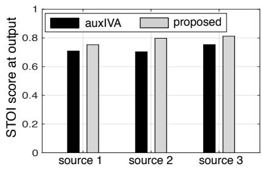

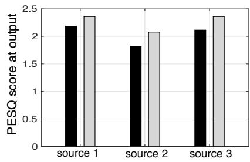  
(a) Results from setup 1

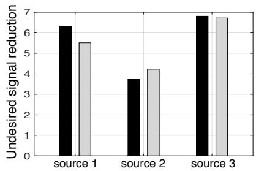

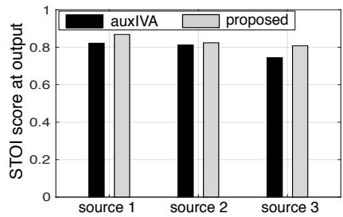

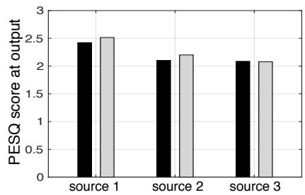  
(b) Results from setup 2

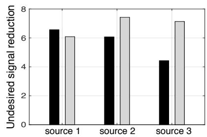

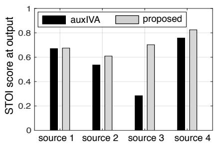

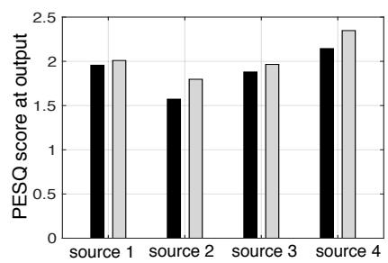  
(c) Results from setup 3

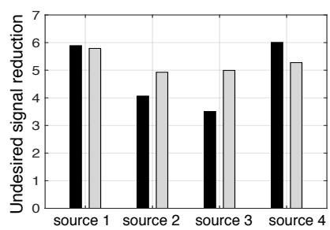  
Figure 8.9: Evaluation results of the BSS by the proposed system and auxIVA in measured scenarios.

ii) The one-array ISFs and the two-array ISFs provide similar performance in terms of Noise Reduction (NR), PESQ improvement, and STOI improvement, whereby in the more challenging four sources scenario the advantage of using two arrays over one array is somewhat more notable, with up to 0.08 points better PESQ improvement and up to 0.05 points better STOI improvement.

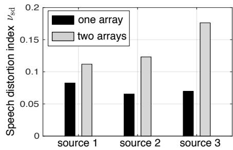

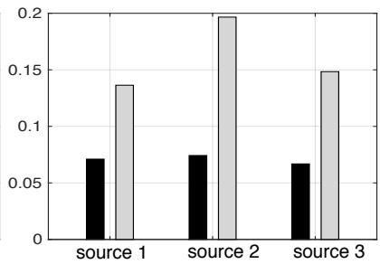

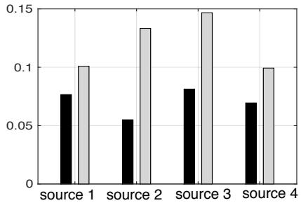  
Figure 8.10: Speech distortion index of the separated signals in the measured scenario in setup1.

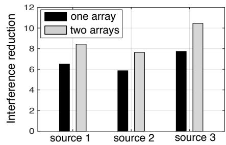

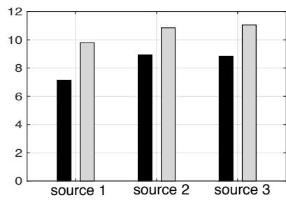

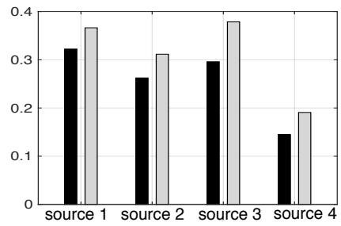  
Figure 8.11: Interference reduction at the separated signals compared to the reference signals in the measured scenarios

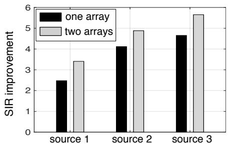

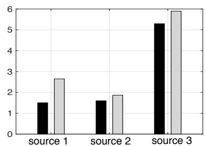

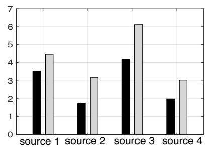  
Figure 8.12: SIR improvement at the separated signals in the measured scenarios.

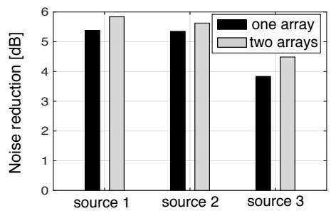

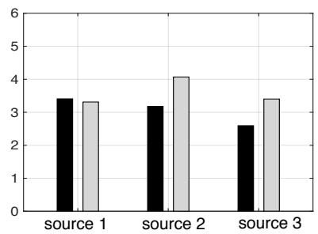

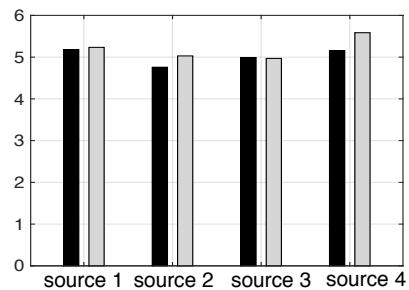  
Figure 8.13: Noise reduction at the separated signals in the measured scenarios.

iii) Note that using two arrays rather than one increases the computational complexity and require perfectly synchronised signals across the arrays. Therefore, unless the accuracy of the RTF and PSD matrix estimates is improved so that the spatial selectivity can be utilised without introducing distortion, using only one array with possibly a spectral post-filter would be the preferred choice for practical implementation of the proposed framework.

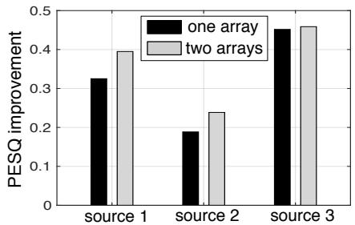

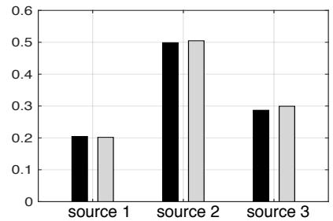

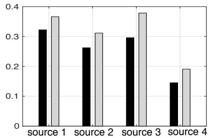  
Figure 8.14: PESQ improvement at the separated signals, compared to the reference signals for in measured scenarios.

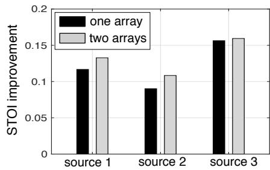

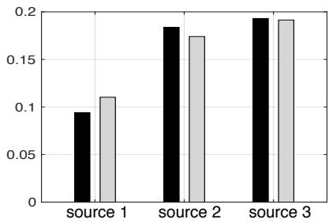

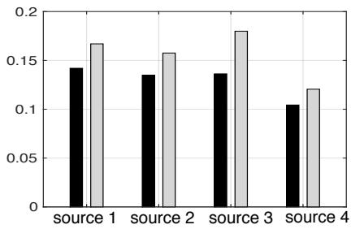  
Figure 8.15: STOI improvement at the separated signals, compared to the reference signals in the measured scenarios.

Example spectrograms of signal segments from the reference mixtures, the clean speech signals at the reference microphone, and the separated speech signals are illustrated in Figure 8.16 for each of the three sources in the measured scenario setup 1. The illustrated separated signals are obtained when the ISFs are computed using the two microphone arrays nearest to the estimated source location. Although compared to the clean signals, a fair amount of residual noise and interference is present in the separated signals, note that further noise and interference reduction can be achieved by applying single channels spectral filters (however, at the cost of larger distortion of the separated signals). In particular, spectral post filters to reduce the residual stationary background noise can be robustly computed using the decision directed approach [200], summarised in Chapter 3, as the SPP required to estimate the residual noise at the output of the ISFs is computed as a part of the framework for measurement-to-source association proposed in this chapter.

## 8.6 Summary

Aiming at sparsity- and ISF-based BSS in dynamic scenarios, we proposed a multi-source tracking system based on narrowband position estimates which is able to detect and track concurrent sources in noisy and reverberant environments. Although the clustering-based BSS framework developed in Chapter 7 can be applied in a rather straightforward manner to moving source scenarios by performing clustering on sliding windows [245, 249], our work in this area confirmed that such extension is not suciently robust and leads to larger number of lost tracks than the approximate Bayesian framework developed in this chapter.

Distinguishing properties of the proposed tracker compared to existing approaches, are the unified treat ment of speech uncertainty via augmented measurements and the formulation of the tracking as a hidden data problem which naturally follows from the properties of the narrowband model. To achieve BSS, the measurement-to-source association from the tracker is used to estimate the RTF vectors and PSD matrices and use them to compute ISFs that achieve joint source separation and noise reduction. Evaluation of the resulting BSS performance in di↵erent acoustic conditions showed the advantages of the proposed system compared to a state-of-the-art sparsity-based BSS framework, and compared to a powerful state-of-the-art BSS approach based on independent vector analysis.

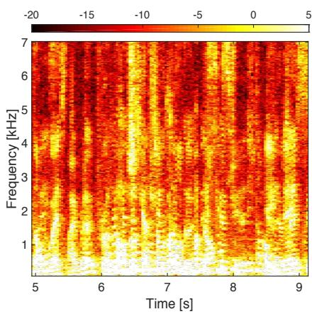

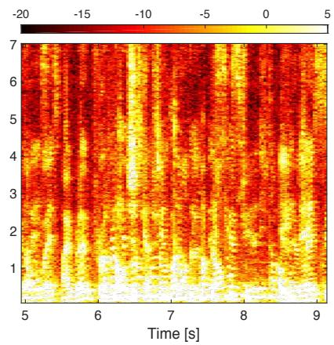  
(a) Mixture at the reference microphone

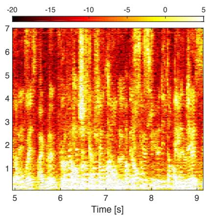

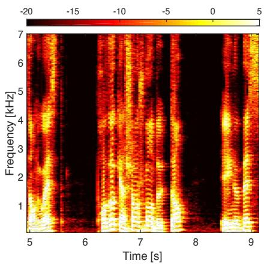

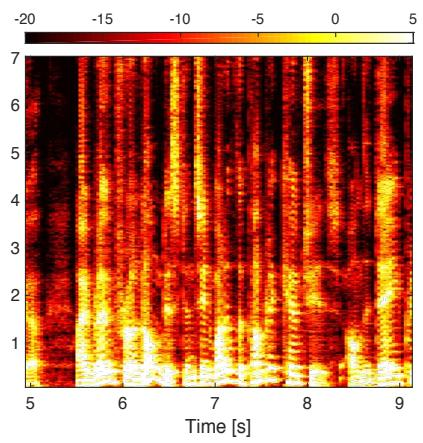  
(b) Clean reference signals

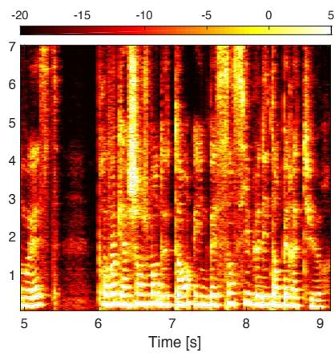

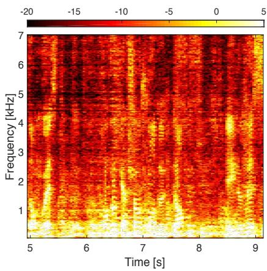

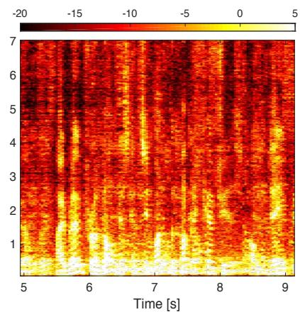  
(c) Separated signals

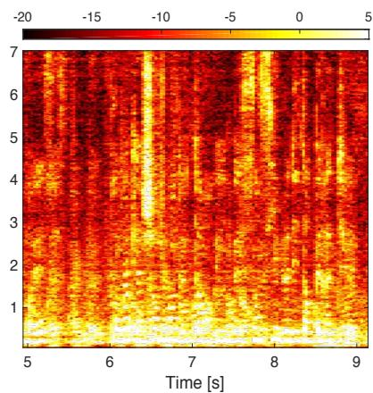  
Figure 8.16: Example spectrograms of the mixtures, reference source signals, and separated source signals by the proposed tracking and BSS framework. The examples are from the measured setup 1.

The evaluation results confirmed robust operation of the tracker for moderate reverberation and up to three or four concurrent speakers. However, although the tracker provides good source detection and tracking results, the objective quality evaluation of the separated signals indicated a significant gap between the achievable source separation performance with ideal bin-to-source associations, and the performance achieved using the estimated bin-to-source associations from the tracker. Therefore, determining robust features that complement the location measurements to provide more accurate bin-to-source association is a crucial factor toward bridging this performance gap of the resulting informed spatial filters.

In this thesis, we have considered several applications of multichannel speech enhancement, where a desired speech signal of interest is captured by one or more microphone arrays in a reverberant enclosure. Besides the desired speech, the microphones capture background noise, and/or other directional interferers, such as undesired speakers, with unknown signal statistics and unknown locations. In all proposed methods the goal was to obtain an estimate of a desired signal as received at a reference microphone, where the desired signal was defined based on the considered application. Good quality of the estimated desired signal is important in practical applications, for instance, when the signal is transmitted to the far-end side for communication (e.g., teleconferencing, hands-free telephony, etc.), or when the signal is fed into an automatic speech recognition engine. Speech enhancement is therefore crucial to maintain communication comfort in adverse acoustic conditions, both in human-to-human, as well as human-to-machine communication.

The proposed algorithms for the di↵erent applications throughout thesis were based on the concept of Informed Spatial Filters (ISFs). The main motivation behind the research in ISFs is the objective to achieve invariable quality of the extracted desired signals of interest in dynamic scenarios, where the undesired signal spatio-temporal properties need to be continuously estimated from the data. While the theory of optimal data-dependent spatio-temporal filters is a mature field in the literature, ecient methods for statistics estimation from the data are crucial for bringing the state-of-the-art multi-microphone speech enhancement to real applications. In the following, we summarise the main contributions and insights gained by the work presented in the di↵erent chapters, and finally, we provide suggestions for future research directions.

## 9.1 Conclusions

In the di↵erent thesis chapters, we addressed the problems of noise Power Spectral Density (PSD) matrix es timation applied to blind source extraction, Direction-Of-Arrival (DOA)-informed source extraction, acoustic spotforming, sparsity-based Blind Source Separation (BSS), and sparsity-based multi-source tracking and separation. In Chapter 1, we provided discussions of the state-of-the-art of approaches to each problem and motivated the usage of informed spatial filtering frameworks as a versatile approach which can be applied to many di↵erent speech enhancement-related tasks. In Chapter 2, we provided a general overview of Short-Time Fourier Transform (STFT)-domain optimal filters, and discussed their implementation as ISFs, namely, where the optimal filter is re-computed for each Time-Frequency (TF) bin using updated signa statistics and propagation vectors estimated from the received microphone signals.

Each of the remaining chapters followed a similar structure, where we first presented the signal model corresponding to the particular application, proposed probabilistic models of suitably chosen narrowband features that allow for accurate detection of the desired signal at each TF bin, and finally discussed the estimation of the statistics and propagation vectors required to compute ISFs. In addition, practical aspects regarding the implementation of the informed spatial filtering frameworks were discussed.

## 9.1.1 Informed spatial filtering frameworks using one array

In Chapter 3, we addressed the problem of blind speech extraction, in the presence of background noise with unknown, possibly time-varying spatio-temporal statistics. Clearly, the main factor in determining the quality of the extracted signals in this application is the accuracy of the noise PSD matrix estimate, and the ability to track the noise PSD matrix in non-stationary conditions. The assumption underlying the algorithms developed in this chapter, was that the noise is significantly less coherent across the array than the desired speech. Motivated by well-studied Speech Presence Probability (SPP)-controlled noise PSD matrix estimation, known as Minima-Controlled Recursive Averaging (MCRA) in the literature, our focus was a robust a posteriori SPP estimation which ensures that the noise PSD matrix is updated at TF bins where the desired speech signal is likely to be absent. As a first contribution, we presented an Maximum Likelihood (ML) formulation of the noise PSD matrix and SPP estimation problem and showed that it results in the same structure as multichannel MCRA. We discussed and experimentally showed that although elegant, the ML solution is not adequate in non-stationary environments. To this end, we proposed an Coherent-to-Di↵use Ratio (CDR)-based a priori SPP estimator and incorporated it in a multichannel MCRA framework. Finally, we used the estimated noise PSD matrix and the SPP to design informed Minimum Variance Distortionless Response (MVDR) and Multichannel Wiener Filter (MWF) to extract the speech signal and reduce background noise.

In applications where the undesired signal contains other directional and non-stationary interferers, such as competing speakers, the stationarity assumptions required for the system in Chapter 3 are violated and a di↵erent approach needs to be developed which is able to not only distinguish between speech and noise, but between desired and undesired speech as well. To this end, in Chapter 4, we incorporated DOA information to design detectors and adapt the source extraction framework to reduce non-stationary interferers. In contrast to Chapter 3, where no information was provided on the desired source location, in Chapter 4, we assumed that the DOA of desired source with respect to the microphone array was known. However, the number and locations of the interferers were unknown and possibly time-varying. To estimate the desired source propagation vector and the undesired signal PSD matrix in this scenario, we proposed a DOA model-based detector, where narrowband DOA estimates are used for discrimination of desired and undesired speakers, while the Gaussian signal model aids the detection of noisy TF bins.

In Chapter 5, we showed that the ISFs framework developed for DOA-informed source extraction, can be implemented in a General Sidelobe Canceller (GSC) structure, which is generally preferable in practical applications than the closed form optimal filters. We provided an overview of di↵erent GSC implementa tions, and showed that using the proposed DOA model-based detector to control the updates of the fixed beamformers, blocking matrices, and the noise cancelling filters, the resulting GSCs provide an ecient alternative to informed MVDR filters without a notable loss in performance.

## 9.1.2 Informed spatial filtering frameworks using multiple arrays

In Chapters 6-8 we considered applications where multiple spatially separated arrays are available, and addressed the problems of acoustic spotforming and sparsity-based BSS. In these applications, although the ISFs can also be computed using only the microphones from one array, multiple spatially separated arrays were required in order to extract narrowband position estimates, which are the main features used in the probabilistic models for these applications. In Chapter 6, we addressed the problem of data-dependen acoustic spotforming to extract signals originating from a user-defined spot of interest, while reducing noise and interference. Using the Gaussian signal model for estimating the SPP, and using a Gaussian mode for the distribution of the narrowband position estimates, we designed a narrowband spot signal detector which determines whether a signal from the spot of interest or an undesired signal is dominant at each TF bin. Using the detector, the spot signal PSD matrix is estimated from the microphone signals and updated whenever the spot signal is detected as dominant. Due to the fact that in practice, the spot signal PSD matrix estimated in this manner tends to be low rank, an MVDR-based spotformer could be employed to extract the desired signal. This is in contrast to state-of-the-art approaches that employ multiple linear constrains to ensure low distortion of the signal across the complete spot-of-interest, and hence reduce the degrees of freedom for undesired signal reduction. Moreover, as typical for ISF frameworks, the spotformer coecients adapt almost instantaneously in changing acoustic conditions and appearing/disappearing sources.

In Chapters 7 and 8, we addressed the challenging problem of BSS in scenarios with static and moving sources. In the introductory chapter, it was mentioned that combining sparsity-based and spatial filtering based BSS, corresponds to estimation of ISFs for each source, where each filter aims to extract one of the sources while reducing the remaining sources. Such approach to BSS is extremely versatile and extensively studied in the literature in the past decade, due to its robustness to background noise, relatively good control of the signal quality at the output of the separation filters, and the potential for ecient online and real-time implementations. Using the narrowband position estimates extracted using multiple spatially separated arrays, in Chapter 7, we proposed an Expectation-Maximization-based clustering approach which determines the number of sources from the data, and using the estimated source clusters can provide a TF mask for each source, indicating the TF bins when the particular source was dominant. Using the TF masks, the statistics of the source signals are estimated and used for ISF-based source separation.

To extend the ISF-based BSS to a time-varying number of moving sources, in Chapter 8, we proposed a multi-source tracker based on a narrowband measurement model, where at each TF, bin a measurement consisted of the narrowband position estimate, and the STFT-domain signal vector. Although the proba bilistic models used to develop the BSS framework for static sources and the one for moving sources share certain similarities, we pointed out the important di↵erences in the two paradigms: while the TF masks of static sources in Chapter 7 are obtained as the posterior source index probabilities after solving a standard ML parameter estimation problem, the TF masks in Chapter 8, are obtained from the data association probabilities of an approximate Bayesian tracker.

## 9.2 Suggestions for further research

Accurate narrowband dominant source detection allows for a unified treatment of a variety of speech enhancement applications, via the concept of informed spatial filtering. Throughout this thesis, di↵erent spatial features were used to define generative models that allow for estimation of the dominant source. However, a general conclusion in the di↵erent chapters was the fact that there is still a large gap between the achievable performance by ISFs which use ideal information about the dominant source, and the performance by the same ISFs when they use the estimated TF masks. Our generative models were based on DOAs and position estimates for discrimination between multiple speech sources, and based on CDR and the STFT-domain signal vectors for discrimination between speech and background noise.

In recent literature, in addition to the spatial features, spectral features have been incorporated in the generative models to provide more accurate TF masks for noise reduction [235], as well as BSS [141, 208]. Although the parameters of the spectral models need to be trained in advance with the signal of each speech and noise source, which might be restrictive in practice, it is nonetheless an interesting question whethe the frameworks in this thesis would benefit from integration of spectral features. In the frameworks with distributed arrays, besides position estimates, probabilistic models of the intra-array attenuation can be incorporated, as done in [133]. Considering the fact that triangulation of position estimates led to a large number of false negatives, additional spectral, or intra-array information might improve the TF masks, while the position estimates can be used for clustering, detection, and tracking tasks, where their application resulted in ecient algorithms. Besides integrating spatial features with other features that capture spectra or intra-array information, a general investigation seems to be missing in the literature, that evaluates the advantages and disadvantages of the large variety of spatial features proposed for TF mask estimation in the last decade. The choice of best models and features for di↵erent applications, as well as their possible integration to improve the TF mask estimation would be of particular interest. Considering the very good performance of spatial filters whose statistics are estimated using the TF masks (i.e. ISFs), even with only a few microphones, investing research e↵orts in this problem, in particular for online processing where the model parameters can also be learned from the data, would provide an improved unified framework applicable in di↵erent multichannel speech enhancement tasks.

A very recent trend in the literature on TF mask estimation for spatial filtering is the usage Deep Neural Networks (DNNs) [89, 91, 92, 134, 255]. DNNs provide discriminatively trained data-driven approaches (in contrast to the generative model-based approaches discussed in this thesis) to TF mask estimation, and as such, they perform well when they have access to a variety of clean speech and noise signals during training. Clearly, this requirement might be restrictive in practice. Considering their potential in improving the TF masks, and recent e↵orts to relax the training requirements [91], the potential of the DNNs-based approaches is to be further investigated, and possibly combined with the generative model-based approaches to provide an accurate, and at the same time practical system for TF mask estimation.

Besides the improvement of the TF masks accuracy, two other research questions related to the work in this thesis are the incorporation of inter-frame and inter-band correlations within the ISF frameworks, and incorporating distributed processing in the frameworks with multiple microphone arrays. In the intro ductory chapters of the thesis, it was mentioned that we assume the Relative Transfer Functions (RTFs) to be multiplicative. Therefore the RTFs and the ISFs were estimated and applied in the STFT domain independently for each frequency. However, it has been shown in the literature [86, 167], that spatial filters which incorporate inter-frame correlations can lead to better quality of the extracted signals in reverberant environments, where due to short STFT frames the RTFs are not multiplicative, but convolutive. For ISF frameworks, the extension is not straightforward due to the fact that the main assumption, i.e., the speech sparsity, is only satisfied for short STFT frames, of length 32-64 ms [127]. Therefore the integration of ISFs using convolutive RTFs and estimation of the required PSD matrices using narrowband detectors is a non-trivial research question that requires careful consideration.

In the chapters where distributed arrays were used, we assumed that all the signals are available at a cen tralised processor. Considering the recent advances in distributed microphone array signal processing [256], there are two levels where which distributed algorithms can be utilised: for dominant source detection, as done in [257], and for distributed estimation of the statistics and spatial filters [258–260]. In addition, ISFs based frameworks can also be used in ad-hoc scenarios, where further challenging questions arise, such as microphone localisation and array synchronisation. Our initial work in ISF for ad-hoc arrays, was published in [261]. Clearly, there are still a large variety of theoretical and practical questions, which would improve the ISFs applicability in real applications. Considering their versatility, and achievable performance with a relatively low complexity and a small number of microphones, the open research questions mentioned in this section are of particular interest for many modern applications that require enhancement of a desired speech signal.

Appendices

## Objective performance measures

Most of the performance measures used in the experiments are computed segmentally, such that for a given experiment, the overall signals in the time-domain are split into 30 ms long non-overlapping segments, and the performance measures are computed for each segment, and finally, averaged across all segments. The discrete time-domain microphone signal at the m-th microphone is denoted by $y _ { m } ( n )$ , the clean desired signa at the m-th microphone as $s _ { m } ( n )$ and the undesired signal at the m-th microphone as $v _ { m } ( n )$ . The exact definitions of what is a desired, and what is an undesired signal depend on the particular experiment, while this generic notation is used for the purpose of presentation in this Appendix. In addition, $\tilde { y } _ { m } ( n ) , \tilde { s } _ { m } ( n )$ and $\tilde { v } _ { m } ( n )$ denote filtered versions of the corresponding signals.

## A.1 Input and output desired-to-undesired signal ratio

The desired-to-undesired signal ratio can either be the Input Signal-to-Noise Ratio (iSNR), or the Input Signal-to-Interference Ratio (iSIR), depending on the definition of the desired and undesired signals, which is application dependent and di↵erent across the thesis chapters. Let us for the purpose of presentation use the iSNR. The segmental iSNR for a segment i of length T samples (corresponding to 30 ms) is given by

$$
\mathrm{iSNR} (i) = 1 0 \log_ {1 0} \frac {\operatorname{E} \left[ s _ {m} ^ {2} (n) \right]}{\operatorname{E} \left[ v _ {m} ^ {2} (n) \right]} \quad \text { for } \quad n \in \big ((i - 1) T, i T \big ].\tag{A.1}
$$

The segmental Output Signal-to-Noise-Ratio (oSNR) is given using the filtered signals as

$$
\mathrm{oSNR} (i) = 1 0 \log_ {1 0} \frac {\operatorname{E} \left[ \tilde {s} _ {m} ^ {2} (n) \right]}{\operatorname{E} \left[ \tilde {v} _ {m} ^ {2} (n) \right]} \quad \mathrm{for} \quad n \in \big ((i - 1) T, i T \big ].\tag{A.2}
$$

The final iSNR and oSNR (as well as iSIR and oSIR) values indicated for a given experiment in the thesis, are obtained by averaging over all segments i for that experiment. To ensure that only the segments where both desired and undesired signals are present contribute to the iSNR (or iSIR), only the segments with a segmental iSNR (or iSIR) in the range [-40,40] dB are included in the averaging.

## A.2 Speech Distortion (SD) index $\nu _ { \mathrm { s d } }$

The segmental SD index is bounded in the interval [0, 1], where larger value indicates larger distortion, and 0 indicates no distortion. The SD index for a segment i of length T samples (corresponding to 30 ms) is given by

$$
\nu_ {\mathrm{sd}} (i) = \frac {\operatorname{E} \left[ (s _ {m} (n) - \tilde {s} _ {m} (n)) ^ {2} \right]}{\operatorname{E} [ s _ {m} ^ {2} (n) ]} \quad \mathrm{for} \quad n \in ((i - 1) T, i T ].\tag{A.3}
$$

The final SD index $\nu _ { \mathrm { s d } }$ listed in the tables and figures for a given experiment is obtained by averaging over all segments i for that experiment. To consider only segments where the desired signal is present, the median of segmental signal energy of $s _ { m } ( n )$ is computed, and the segments where the energy is by 15 dB lower than the median, are excluded from the computation of the final SD index.

## A.3 Desired-to-undesired signal ratio improvement

The desired-to-undesired signal ratio improvement, also known as the array gain, can either be improve ment of the ratio with respect to background noise, or directional interferers, depending on the particular experiment. Using the segmental iSNR and oSNR (or iSIR and oSIR), the desired-to-undesired signal ratio improvement at segment i is given by

$$
\Delta_ {\mathrm{SNR}} (i) = \mathrm{oSNR} (i) - \mathrm{iSNR} (i),\tag{A.4}
$$

$$
\Delta_ {\mathrm{SIR}} (i) = \mathrm{oSIR} (i) - \mathrm{iSIR} (i).\tag{A.5}
$$

The final $\Delta _ { \mathrm { S N R } }$ and $\Delta _ { \mathrm { S I R } }$ listed in a given experiment are obtained by averaging over all segments i, where the segmental iSNR (or iSIR) is in the range [-40,40] dB.

## A.4 Undesired signal reduction

The undesired signal reduction can either refer to the Noise Reduction (NR), or the Interference Reduction (IR), depending on whether for the signal $v ( n )$ background noise, or directional interferers are substituted in a given experiment. Let us for the purpose of presentation use the NR. for the segment i of length T samples (corresponding to 30 ms), the NR is given by

$$
\mathrm{NR} (i) = 1 0 \log_ {1 0} \frac {\operatorname{E} \left[ v _ {m} ^ {2} (n) \right]}{\operatorname{E} \left[ \tilde {v} _ {m} ^ {2} (n) \right]} \quad \text { for } \quad n \in \big ((i - 1) T, i T \big ].\tag{A.6}
$$

The final NR (or IR) listed in the figures and tables for a given experiment is obtained by averaging over all segments i for that experiment.

## A.5 Perceptual Evaluation of Speech Quality (PESQ)

The PESQ algorithm is an objective method of measuring speech quality, which can be found in the ITU-T Recommendation P.862 [214]. PESQ predicts subjective Mean Opinion Scores (MOS) by comparing processed speech signals with the original versions of the speech signals, i.e., the reference signals. PESQ is supposed to predict the MOS as judged by human listeners, where each listener can rate the quality by selecting among five options Bad, Poor, Fair, Good, and Excellent, which are assigned numbers 1 to 5. The average of the received numbers represents the MOS. By taking the processed speech signal and the reference speech signal, the PESQ algorithm tries to predict the MOS.

To apply the PESQ measure for our evaluation results, the PESQ algorithm in each experiment is applied with the following two signal pairs

1. PESQ $[ s _ { m } ( n ) , y _ { m } ( n ) ]$ , i.e., the clean microphone signal $s _ { m } ( n )$ as a reference and the overall received microphone signal $y _ { m } ( n )$

2. PESQ $[ s _ { m } ( n ) , \tilde { y } _ { m } ( n ) ]$ ], i.e., the clean microphone signal $s _ { m } ( n )$ as a reference and the filtered microphone signal $\tilde { y } _ { m } ( n )$

Clearly, a higher PESQ score indicates more similarity to the desired signal, and it is expected that the out come of the second pair has a higher PESQ score. The PESQ improvement measure used in the experiments is then computed as

$$
\Delta_ {\mathrm{PESQ}} = \mathrm{PESQ} [ s _ {m} (n), \tilde {y} _ {m} (n) ] - \mathrm{PESQ} [ s _ {m} (n), y _ {m} (n) ].\tag{A.7}
$$

## A.6 Short-Time Objective Intelligibility (STOI)

The STOI measure, presented in [215], shows high correlation with the intelligibility of noisy and time–frequency weighted noisy speech. It relies on global statistics across entire sentences, and is computed segmentally over time segments of 386 ms duration. Similarly as for the PESQ algorithm, the STOI algorithm is run with the same two pairs, and the final STOI improvement is given by

$$
\Delta_ {\mathrm{STOI}} = \mathrm{STOI} \left[ s _ {m} (n), \tilde {y} _ {m} (n) \right] - \mathrm{STOI} \left[ s _ {m} (n), y _ {m} (n) \right].\tag{A.8}
$$

## Appendix B

# Maximization of $Q _ { j } ( \mathbf x _ { t j } )$ in (8.19)

As the maximization is done for each source j independently, we omit the source index for brevity in the following derivation. First, by substituting the Gaussian distributions in (8.19), the problem is equivalent to minimizing

$$
\mathcal {J} (\mathbf {x} _ {t}) = (\mathbf {x} _ {t} - \hat {\mathbf {x}} _ {t - 1}) ^ {\mathrm{T}} \mathbf {P} _ {t} ^ {- 1} (\mathbf {x} _ {t} - \hat {\mathbf {x}} _ {t - 1}) + \sum_ {k} \beta_ {k} (\mathbf {r} _ {t k} - \mathbf {x} _ {t}) ^ {\mathrm{T}} \boldsymbol {\Sigma} _ {t} ^ {- 1} (\mathbf {r} _ {t k} - \mathbf {x} _ {t}).\tag{B.1}
$$

Setting the derivative of $\mathcal { I } ( \mathbf { x } _ { t } )$ with respect to $\mathbf { x } _ { t }$ to zero, we obtain

$$
\frac {d \mathcal {J}}{d \mathbf {x} _ {t}} \propto \mathbf {P} _ {t} ^ {- 1} (\mathbf {x} _ {t} - \hat {\mathbf {x}} _ {t - 1}) - \sum_ {k} \beta_ {k} \boldsymbol {\Sigma} _ {t} ^ {- 1} (\mathbf {r} _ {t k} - \mathbf {x} _ {t}) \stackrel {!} {=} 0,\tag{B.2}
$$

which can be rearranged in a straightforward manner and solved for $\mathbf { x } _ { t }$ , resulting in

$$
\mathbf {x} _ {t} = \left(\mathbf {P} _ {t} ^ {- 1} + \sum_ {k} \beta_ {k} \boldsymbol {\Sigma} _ {t} ^ {- 1}\right) ^ {- 1} \left(\mathbf {P} _ {t} ^ {- 1} \mathbf {x} _ {t - 1} + \boldsymbol {\Sigma} _ {t} ^ {- 1} \sum_ {k} \beta_ {k} \mathbf {r} _ {k}\right).\tag{B.3}
$$

To arrive to a more insightful formula for $\mathbf { x } _ { t } ,$ we use the definitions in (8.22) and rewrite the solution above as follows

$$
\mathbf {x} _ {t} = \left(\mathbf {P} _ {t} ^ {- 1} + \widetilde {\boldsymbol {\Sigma}} _ {t} ^ {- 1}\right) ^ {- 1} \left(\mathbf {P} _ {t} ^ {- 1} \mathbf {x} _ {t - 1} + \widetilde {\boldsymbol {\Sigma}} _ {t} ^ {- 1} \widetilde {\mathbf {r}} _ {k}\right).\tag{B.4}
$$

Next, we consider one of Searle’s matrix identities [262]

$$
(\mathbf {A} ^ {- 1} + \mathbf {B} ^ {- 1}) ^ {- 1} = \mathbf {A} (\mathbf {A} + \mathbf {B}) ^ {- 1} \mathbf {B},\tag{B.5}
$$

and by substituting $\mathbf { P } _ { t } ^ { - 1 }$ and $\widetilde { \pmb { \Sigma } } _ { t } ^ { - 1 }$ for A and B, equation (B.4) can be rewritten as

$$
\mathbf {x} _ {t} = \mathbf {P} _ {t} (\mathbf {P} _ {t} + \widetilde {\boldsymbol {\Sigma}} _ {t}) ^ {- 1} \widetilde {\boldsymbol {\Sigma}} _ {t} \mathbf {P} _ {t} ^ {- 1} \hat {\mathbf {x}} _ {t - 1} + \mathbf {P} _ {t} (\mathbf {P} _ {t} + \widetilde {\boldsymbol {\Sigma}} _ {t}) ^ {- 1} \tilde {\mathbf {r}} _ {t}.\tag{B.6}
$$

Adding and subtracting $\mathbf P _ { t } ( \mathbf P _ { t } + \widetilde \Sigma _ { t } ) ^ { - 1 } \mathbf x _ { t - 1 }$ on the right-hand side of (B.6), allows us to rearrange (B.6) as follows

$$
\mathbf {x} _ {t} = \mathbf {P} _ {t} (\mathbf {P} _ {t} + \widetilde {\boldsymbol {\Sigma}} _ {t}) ^ {- 1} (\mathbf {I} + \widetilde {\boldsymbol {\Sigma}} _ {t} \mathbf {P} _ {t} ^ {- 1}) \hat {\mathbf {x}} _ {t - 1} + \mathbf {P} _ {t} (\mathbf {P} _ {t} + \widetilde {\boldsymbol {\Sigma}} _ {t}) ^ {- 1} (\tilde {\mathbf {r}} _ {t} - \hat {\mathbf {x}} _ {t - 1}).\tag{B.7}
$$

Finally, using basic matrix identities we can write

$$
\mathbf {I} + \widetilde {\boldsymbol {\Sigma}} _ {t} \mathbf {P} _ {t} ^ {- 1} = \mathbf {P} _ {t} ^ {- 1} (\mathbf {P} _ {t} + \widetilde {\boldsymbol {\Sigma}} _ {t}) = [ \mathbf {P} _ {t} (\mathbf {P} _ {t} + \widetilde {\boldsymbol {\Sigma}} _ {t}) ^ {- 1} ] ^ {- 1},\tag{B.8}
$$

and by substituting (B.8) in (B.7) we obtain the relation between the new state estimate at time $t ,$ the old state estimate at time $t - 1$ , the augmented measurement, and the prediction error and measurement error covariance matrices, as claimed in Section 8.3.1, Equation (8.20)

$$
\hat {\mathbf {x}} _ {t} = \hat {\mathbf {x}} _ {t - 1} + \mathbf {P} _ {t} (\mathbf {P} _ {t} + \widetilde {\boldsymbol {\Sigma}} _ {t}) ^ {- 1} (\tilde {\mathbf {r}} _ {t} - \hat {\mathbf {x}} _ {t - 1}).\tag{B.9}
$$

## Bibliography

[1] I. Cohen, “Noise spectrum estimation in adverse environments: Improved minima controlled recursive averaging,” IEEE Trans. on Speech and Audio Processing, vol. 11, no. 5, pp. 466–475, Aug. 2003.

[2] M. Souden, J. Chen, J. Benesty, and S. A↵es, “An integrated solution for online multichannel noise tracking and reduction,” IEEE Trans. on Audio, Speech, and Lang. Processing, vol. 19, no. 7, pp. 2159–2169, Sep. 2011.

[3] S. F. Boll, “Suppression of acoustic noise in speech using spectral subtraction,” IEEE Trans. Acoustics, Speech, and Signal Processing, vol. ASSP-27, no. 2, pp. 113–120, Apr. 1979.

[4] J. S. Lim and A. V. Oppenheim, “Enhancement and bandwidth compression of noisy speech,” in Proc. of the IEEE, vol. 67, no. 12, Dec. 1979, pp. 1586–1604.

[5] R. McAulay and M. Malpass, “Speech enhancement using a soft-decision noise suppression filter,” IEEE Trans. Acoustics, Speech, and Signal Processing, vol. 28, no. 2, pp. 137–145, Apr. 1980.

[6] Y. Ephraim, “Statistical-model-based speech enhancement systems,” Proc. of the IEEE, vol. 80, no. 10, pp. 1526–1555, Oct. 1992.

[7] Y. Ephraim and D. Malah, “Speech enhancement using a minimum mean-square error log-spectral amplitude estimator,” IEEE Trans. Acoustics, Speech, and Signal Processing, vol. 33, no. 2, pp. 443–445, Apr. 1985.

[8] I. Cohen, “Optimal speech enhancement under signal presence uncertainty using log-spectral amplitude esti mator,” IEEE Signal Processing Letters, vol. 9, no. 4, pp. 113–116, Apr. 2002.

[9] ——, “Speech spectral modeling and enhancement based on autoregressive conditional heteroscedasticity models,” Signal Processing, vol. 86, no. 4, pp. 698–709, Apr. 2006.

[10] A. Abramson and I. Cohen, “Recursive supervised estimation of a Markov-switching GARCH process in the short-time Fourier transform domain,” IEEE Trans. Signal Processing, vol. 55, no. 7, pp. 3227–3238, Jul. 2007.

[11] S. Gannot, D. Burshtein, and E. Weinstein, “Iterative and sequential Kalman filter-based speech enhancement algorithms,” IEEE Trans. on Speech and Audio Processing, vol. 6, no. 4, pp. 373–385, Jul. 1998.

[12] K. Hermus, P. Wambacq, and H. Van hamme, “A review of signal subspace speech enhancement and it application to noise robust speech recognition,” EURASIP J. Appl. Signal Process., vol. 2007, no. 1, pp. 195– 195, Jan. 2007.

[13] Y. Ephraim and H. L. Van Trees, “A signal subspace approach for speech enhancement,” IEEE Trans. on Speech and Audio Processing, vol. 3, no. 4, pp. 251–266, Jul. 1995.

[14] F. Jabloun and B. Champagne, “Incorporating the human hearing properties in the signal subspace approach for speech enhancement,” IEEE Trans. on Speech and Audio Processing, vol. 11, no. 6, pp. 700–708, Nov. 2003.

[15] Y. Ephraim and I. Cohen, “Recent advancements in speech enhancement,” in The Electrical Engineering Hand book, Circuits, Signals, and Speech and Image Processing, 3rd ed., R. C. Dorf, Ed. CRC Press, 2006.

[16] M. Parchami, W. Zhu, B. Champagne, and E. Plourde, “Recent Developments in Speech Enhancement in the Short-Time Fourier Transform Domain,” IEEE Circuits and Systems Magazine, vol. 16, no. 3, pp. 45–77, Aug. 2016.

[17] Y. H. J. Chen, J. Benesty and S. Doclo, “New insights into the noise reduction Wiener filters,” IEEE Trans. on Audio, Speech, and Lang. Processing, vol. 14, pp. 1218–1234, Jul. 2006.

[18] Y. Xu, J. Du, R. Dai, and C. H. Lee, “An experimental study on speech enhancement based on deep neural networks,” IEEE Signal Processing Letters, vol. 21, pp. 65–68, Jan. 2014.

[19] Y. Xu, J. Du, L. R. Dai, and C. H. Lee, “A Regression Approach to Speech Enhancement Based on Deep Neura Networks,” IEEE/ACM Trans. on Audio, Speech, and Language Processing, vol. 23, no. 1, pp. 7–19, Jan. 2015.

[20] P. S. Huang, M. Kim, M. Hasegawa-Johnson, and P. Smaragdis, “Joint Optimization of Masks and Deep Recur rent Neural Networks for Monaural Source Separation,” IEEE/ACM Trans. on Audio, Speech, and Language Processing, vol. 23, no. 12, pp. 2136–2147, Dec. 2015.

[21] M. S. Brandstein and D. B. Ward, Eds., Microphone Arrays: Signal Processing Techniques and Applications. Berlin, Germany: Springer-Verlag, 2001.

[22] I. McCowan and H. Bourlard, “Microphone array post-filter based on noise field coherence,” IEEE Trans. on Speech and Audio Processing, vol. 11, no. 6, pp. 709–716, Nov. 2003.

[23] J. Benesty, J. Chen, and Y. Huang, Microphone Array Signal Processing. Berlin, Germany: Springer-Verlag, 2008.

[24] J. P. Dmochowski and J. Benesty, “Microphone arrays: Fundamental concepts,” in Speech Processing in Modern Communication: Challenges and Perspectives, I. Cohen, J. Benesty, and S. Gannot, Eds. Springer, Jan. 2010, ch. 11.

[25] E. E. Jan and J. Flanagan, “Microphone arrays for speech processing,” in URSI Intl. Symposium on Signals, Systems, and Electronics (ISSSE), San Francisco, USA, Oct. 1995, pp. 373–376.

[26] B. D. van Veen and K. M. Buckley, “Beamforming: A versatile approach to spatial filtering,” IEEE Acoustics, Speech and Signal Magazine, vol. 5, no. 2, pp. 4–24, Apr. 1988.

[27] Y. A. Huang, “Real-time acoustic source localization with passive microphone arrays,” Ph.D. dissertation, Georgia Insitute of Technology, 2001.

[28] J. Benesty, M. M. Sondhi, and Y. Huang, Eds., Springer Handbook of Speech Processing. Springer, 2008.

[29] P. A. Naylor and N. D. Gaubitch, Eds., Speech Dereverberation. London, UK: Springer, 2010.

[30] S. Doclo, “Multi-microphone noise reduction and dereverberation techniques for speech applications,” Ph.D. dissertation, Katholieke Universiteit Leuven, Belgium, May 2003.

[31] E. A. P. Habets, “Single- and multi-microphone speech dereverberation using spectral enhancement,” Ph.D. dissertation, Technische Universiteit Eindhoven, 2007.

[32] S. Makino, T.-W. Lee, and H. Sawada, Eds., Blind speech separation. Springer, 2007.

[33] W. Kellermann, “Acoustic echo cancellation for beamforming microphone arrays,” in Microphone Arrays: Signal Processing Techniques and Applications, M. S. Brandstein and D. B. Ward, Eds. Berlin, Germany: Springer, 2001, pp. 281–306.

[34] E. H¨ansler and G. Schmidt, Eds., Topics in Acoustic Echo and Noise Control. Springer Berlin Heidelberg, 2006.

[35] J. Benesty, S. Makino, and J. Chen, Eds., Speech Enhancement. Springer, 2005.

[36] S. Doclo, W. Kellermann, S. Makino, and S. Nordholm, “Multichannel signal enhancement algorithms for assisted listening devices,” IEEE Signal Processing Magazine, vol. 32, no. 2, pp. 18–30, Mar. 2015.

[37] S. Nordholm, I. Claesson, and N. Grbi´c, “Optimal and adaptive microphone arrays for speech input in auto mobiles,” in Microphone Arrays: Signal Processing Techniques and Applications, M. S. Brandstein and D. B. Ward, Eds. Berlin, Germany: Springer, 2001, pp. 307–330.

[38] H. L. van Trees, Optimum Array Processing, ser. Detection, Estimation and Modulation Theory. Wiley, 2002.

[39] O. L. Frost, III, “An algorithm for linearly constrained adaptive array processing,” Proc. of the IEEE, vol. 60, no. 8, pp. 926–935, Aug. 1972.

[40] L. J. Griths and C. W. Jim, “An alternative approach to linearly constrained adaptive beamforming,” IEEE Trans. Antennas and Propagation, vol. 30, no. 1, pp. 27–34, Jan. 1982.

[41] J. Chen, J. Benesty, and Y. Huang, “A minimum distortion noise reduction algorithm with multiple micro phones,” IEEE Trans. on Audio, Speech, and Lang. Processing, vol. 16, no. 3, pp. 481–493, Mar. 2008.

[42] J. Benesty, J. Chen, Y. Huang, and J. Dmochowski, “On microphone-array beamforming from a MIMO acoustic signal processing perspective,” IEEE Trans. on Speech and Audio Processing, vol. 15, no. 3, pp. 1053–1065, Mar. 2007.

[43] S. Doclo and M. Moonen, “GSVD-based optimal filtering for single and multimicrophone speech enhancement,” IEEE Trans. Signal Processing, vol. 50, no. 9, pp. 2230–2244, Sep. 2002.

[44] A. Spriet, M. Moonen, and J. Wouters, “Spatially pre-processed speech distortion weighted multi-channel Wiener filtering for noise reduction,” IEEE Trans. Signal Processing, vol. 84, no. 12, pp. 2367–2387, Dec. 2004.

[45] J. J. Shynk, “Frequency-domain and multirate adaptive filtering,” IEEE Signal Processing Magazine, vol. 9, no. 1, pp. 14–37, Jan. 1992.

[46] A. Oppenheim and R. W. Schafer, Digital Signal Processing, 2nd ed. Prentice-Hall Inc., Englewood Cli↵, NJ, 1993.

[47] S. Gannot, D. Burshtein, and E. Weinstein, “Signal enhancement using beamforming and nonstationarity with applications to speech,” IEEE Trans. Signal Processing, vol. 49, no. 8, pp. 1614–1626, Aug. 2001.

[48] S. Gannot and I. Cohen, “Adaptive beamforming and postfiltering,” in Springer Handbook of Speech Processing, J. Benesty, M. M. Sondhi, and Y. Huang, Eds. Springer-Verlag, 2008, ch. 47.

[49] M. Souden, J. Benesty, and S. A↵es, “On optimal frequency-domain multichannel linear filtering for noise reduction,” IEEE Trans. on Audio, Speech, and Lang. Processing, vol. 18, no. 2, pp. 260–276, Feb. 2010.

[50] J. Benesty, J. Chen, and E. A. P. Habets, Speech Enhancement in the STFT Domain, ser. SpringerBriefs in Electrical and Computer Engineering, 2011.

[51] S. Doclo, A. Spriet, J. Wouters, and M. Moonen, “Frequency-domain criterion for the speech distortion weighted multichannel Wiener filter for robust noise reduction,” Speech Communication, vol. 49, no. 7–8, pp. 636–656, Aug. 2007.

[52] E. Warsitz and R. Haeb-Umbach, “Blind acoustic beamforming based on generalized eigenvalue decomposition,” IEEE Trans. on Audio, Speech, and Lang. Processing, vol. 15, no. 5, pp. 1529–1539, Jul. 2005.

[53] Y. G. Jin, J. W. Shin, and N. S. Kim, “Spectro-temporal filtering for multichannel speech enhancement in ssm domain,” IEEE Signal Processing Letters, vol. 21, no. 3, pp. 352–355, Mar. 2014.

[54] B. Cornelis, S. Doclo, T. Van den Bogaert, M. Moonen, and J. Wouters, “Theoretical analysis of binaural multimicrophone noise reduction techniques,” IEEE Trans. on Audio, Speech, and Lang. Processing, vol. 18, no. 2, pp. 342–355, Feb. 2010.

[55] B. Cornelis, M. Moonen, and J. Wouters, “Performance analysis of multichannel Wiener filter-based noise reduction in hearing aids under second order statistics estimation errors,” IEEE Trans. on Audio, Speech, and Lang. Processing, vol. 19, no. 5, pp. 1368–1381, Jul. 2011.

[56] A. Spriet, M. Moonen, and J. Wouters, “Robustness analysis of multichannel Wiener filtering and generalized sidelobe cancellation for multimicrophone noise reduction in hearing aid applications,” IEEE Trans. on Speech and Audio Processing, vol. 13, no. 4, pp. 487–503, Jul. 2005.

[57] M. Souden, J. Benesty, and S. A↵es, “A study of the LCMV and MVDR noise reduction filters,” IEEE Trans. Signal Processing, vol. 58, no. 9, pp. 4925–4935, Sep. 2010.

[58] E. A. P. Habets, J. Benesty, S. Gannot, P. A. Naylor, and I. Cohen, “On the application of the LCMV beamformer to speech enhancement,” in IEEE Workshop on Applications of Signal Processing to Audio and Acoustics (WASPAA), New York, USA, Oct. 2009, pp. 141–144.

[59] J. Bitzer, K. Simmer, and K.-D. Kammeyer, “Theoretical noise reduction limits of the generalized sidelobe canceller for speech enhancement,” in Proc. IEEE Intl. Conf. on Acoustics, Speech and Signal Processing (ICASSP), vol. 5, Mar. 1999, pp. 2965–2968.

[60] Y. Shao and C. H. Chang, “A generalized time-frequency subtraction method for robust speech enhancement based on wavelet filter banks modeling of human auditory system,” IEEE Transactions on Systems, Man, and Cybernetics, vol. 37, no. 4, pp. 877–889, Aug. 2007.

[61] S. Tabibian and A. Akbari, “Noise reduction from speech signal based on wavelet transform and kullback-leibler divergence,” in 2008 International Symposium on Telecommunications, Aug. 2008, pp. 787–791.

[62] J.-H. Chang, “Warped discrete cosine transform-based noisy speech enhancement,” IEEE Trans. Circuits and Systems II: Express Briefs, vol. 52, no. 9, pp. 535–539, Sep. 2005.

[63] A. Rezayee and S. Gazor, “An adaptive KLT approach for speech enhancement,” IEEE Trans. on Speech and Audio Processing, vol. 9, no. 2, pp. 87–95, Sep. 2001.

[64] J. Chen, J. Benesty, and Y. Huang, “Study of the noise-reduction problem in the karhunen loeve expansion domain,” IEEE Trans. on Audio, Speech, and Lang. Processing, vol. 17, no. 4, pp. 787–802, May 2009.

[65] Y. Lacouture-Parodi, E. A. P. Habets, J. Chen, and J. Benesty, “Multichannel noise reduction in the karhunen loeve expansion domain,” IEEE/ACM Trans. on Audio, Speech, and Lang. Processing, vol. 22, no. 5, pp. 923–936, May 2014.

[66] S. A↵\`es and Y. Grenier, “A signal subspace tracking algorithm for microphone array processing of speech,” IEEE Trans. on Speech and Audio Processing, vol. 5, no. 5, pp. 425–437, Sep. 1997.

[67] M. Delcroix, T. Hikichi, and M. Miyoshi, “Dereverberation and denoising using multichannel linear prediction,” IEEE Trans. on Audio, Speech, and Lang. Processing, vol. 15, no. 6, pp. 1791–1801, Aug. 2007.

[68] E. A. P. Habets, J. Benesty, I. Cohen, and S. Gannot, “On a tradeo↵ between dereverberation and noise reduction using the MVDR beamformer,” in Proc. IEEE Intl. Conf. on Acoustics, Speech and Signal Processing (ICASSP), Apr. 2009, pp. 3741–3744.

[69] J. Benesty, J. Chen, and Y. Huang, “On the importance of the Pearson correlation coecient in noise reduction,” IEEE Trans. on Audio, Speech, and Lang. Processing, vol. 16, pp. 757–765, May 2008.

[70] J. L. Flanagan, J. D. Johnston, R. Zahn, and G. W. Elko, “Computer-steered microphone arrays for sound transduction in large rooms,” J. Acoust. Soc. Am., vol. 5, no. 78, pp. 1508–1518, Jul. 1985.

[71] J. Capon, “High resolution frequency-wavenumber spectrum analysis,” Proc. of the IEEE, vol. 57, pp. 1408 1418, Aug. 1969.

[72] G. W. Elko, “Superdirectional microphone arrays,” in Acoustic Signal Processing for Telecommunication, S. L. Gay and J. Benesty, Eds. Hingham, MA, USA: Kluwer Academic Publishers, 2000, ch. 10, pp. 181–237.

[73] G. Elko, “Di↵erential microphone arrays,” in Audio Signal Processing for Next-Generation Multimedia Communication Systems. Springer US, 2004.

[74] P. Swietojanski, A. Ghoshal, and S. Renals, “Convolutional neural networks for distant speech recognition,” IEEE Signal Processing Letters, vol. 21, no. 9, pp. 1120–1124, 2014.

[75] Y. Hoshen, R. J. Weiss, and K. W. Wilson, “Speech acoustic modeling from raw multichannel waveforms,” in IEEE Int. Conf. on Acoustics, Speech and Signal Proc. (ICASSP), Brisbane, Australia, Apr. 2015, pp. 4624–4628.

[76] X. Xiao, S. Watanabe, H. Erdogan, J. Lu, J. R. Hershey, M. L. Seltzer, G. Chen, Y. Zhang, M. Mandel, and D. Yu, “Deep beamforming networks for multi-channel speech recognition,” in IEEE Int. Conf. on Acoustics, Speech and Signal Proc. (ICASSP), Shanghai, China, Mar. 2016, pp. 5745–5749.

[77] Z. Meng, S. Watanabe, J. R. Hershey, and H. Erdogan, “Deep long short-term memory adaptive beamforming networks for multichannel robust speech recognition,” in IEEE Int. Conf. on Acoustics, Speech and Signal Proc. (ICASSP), New Orleans, LA, USA, Jun. 2017.

[78] D. V. Compernolle, “Adaptive filter structures for enhancing cocktail party speech from multiple microphone recordings,” Colloque sur le traitement du signal et des images, pp. 513–516, Jan. 1989.

[79] S. Gazor and Y. Grenier, “Wideband robust adaptive beamforming via target tracking,”in Proc. IEEE Workshop on Statistical Signal and Array Processing, Jun. 1994, pp. 141–144.

[80] S. A↵es and Y. Grenier, “Test of adaptive beamformers for speech acquisition in cars,” in Proc. 5-th Int. Conf. Signal Processing Applications and Technology, Oct. 1994.

[81] J. L. Flanagan, A. C. Surendran, and E. E. Jan, “Spatially selective sound capture for speech and audio processing,” Speech Communication, vol. 13, no. 1-2, pp. 207–222, Oct. 1993.

[82] Y. Kaneda and J. Ohga, “Adaptive microphone-array system for noise reduction,” IEEE Trans. Acoustics, Speech, and Signal Processing, vol. 34, no. 6, pp. 1391–1400, Dec. 1986.

[83] O. Shalvi and E. Weinstein, “System identification using nonstationary signals,” IEEE Trans. Signal Processing, vol. 44, no. 8, pp. 2055–2063, Aug. 1996.

[84] I. Cohen, “Relative transfer function identification using speech signals,” IEEE Trans. on Speech and Audio Processing, vol. 12, no. 5, pp. 451–459, Sep. 2004

[85] S. Markovich-Golan and S. Gannot, “Performance analysis of the covariance subtraction method for relative transfer function estimation and comparison to the covariance whitening method,” in IEEE Int. Conf. on Acoustics, Speech and Signal Proc. (ICASSP), Apr. 2015.

[86] R. Talmon, I. Cohen, and S. Gannot, “Relative transfer function identification using convolutive transfer func tion approximation,” IEEE Trans. on Audio, Speech, and Lang. Processing, vol. 17, no. 4, pp. 546–555, May 2009.

[87] M. Rahmani, A. Akbari, B. Ayad, M. Mazoochi, and M. S. Moin, “A modified coherence based method for dual microphone speech enhancement,” in 2007 IEEE International Conference on Signal Processing and Commu nications, Nov. 2007, pp. 225–228.

[88] J. Sohn, N. S. Kim, and W. Sung, “A statistical model-based voice activity detector,” IEEE Signal Processing Letters, vol. 6, no. 1, pp. 1–3, Jan. 1999

[89] A. Chinaev, J. Heymann, L. Drude, and R. Haeb-Umbach, “Noise-Presence-Probability-Based Noise PSD Es timation by Using DNNs,” in ITG Symposium, Speech Communication. VDE, 2016, pp. 1–5.

[90] R. Rehr and T. Gerkmann, “Improving the generalizability of deep neural network based speech enhancement,” arXiv:1709.02175v1, 2017.

[91] J. Heymann, L. Drude, and R. Haeb-Umbach, “Neural network based spectral mask estimation for acoustic beamforming,” in IEEE Int. Conf. on Acoustics, Speech and Signal Processing (ICASSP), Mar. 2016, pp. 196– 200.

[92] H. Erdogan, J. R. Hershey, S. Watanabe, M. Mandel, and J. Le Roux, “Improved MVDR beamforming using single-channel mask prediction networks,” in Interspeech, Sep. 2016.

[93] T. Gerkmann, C. Breithaupt, and R. Martin, “Improved a posteriori speech presence probability estimation based on a likelihood ratio with fixed priors,” IEEE Trans. on Audio, Speech, and Lang. Processing, vol. 16, no. 5, pp. 910–919, Jul. 2008.

[94] S. Markovich, S. Gannot, and I. Cohen, “Multichannel eigenspace beamforming in a reverberant noisy environment with multiple interfering speech signals,” IEEE Trans. on Audio, Speech, and Lang. Proc., vol. 17, no. 6, pp. 1071–1086, Aug. 2009.

[95] S. M. Golan, S. Gannot, and I. Cohen, “Subspace tracking of multiple sources and its application to speaker extraction,” in IEEE Int. Conf. on Acoustics, Speech and Signal Proc. (ICASSP), Mar. 2010.

[96] E. A. P. Habets, J. Benesty, and P. A. Naylor, “A speech distortion and interference rejection constraint beamformer,” IEEE Trans. on Audio, Speech, and Lang. Processing, vol. 20, no. 3, pp. 854–867, Mar. 2012.

[97] K. Bell, Y. Ephraim, and H. Van Trees, “A bayesian approach to robust adaptive beamforming,” IEEE Trans. Signal Processing, vol. 48, no. 2, pp. 386–398, Feb. 2000

[98] C. J. Lam and A. C. Singer, “Bayesian beamforming for doa uncertainty: Theory and implementation,” IEEE Trans. Signal Processing, vol. 54, no. 11, pp. 4435–4445, Nov. 2006.

[99] Y. Grenier, “A microphone array for car environments,” Speech Communication, vol. 12, pp. 25–39, Mar. 1993.

[100] M. K. Buckley, “Spatial/spectral filtering with linearly constrained minimum variance beamformers,” IEEE Trans. Acoustics, Speech, and Signal Processing, vol. 35, no. 3, pp. 249–266, Mar. 1987.

[101] C. A. Anderson, P. D. Teal, and M. A. Poletti, “Spatially robust far-field beamforming using the von Mises(- Fisher) distribution,” IEEE Trans. on Audio, Speech, and Lang. Processing, vol. 23, no. 12, pp. 2189–2197, Dec. 2015.

[102] B. Carlson, “Covariance matrix estimation errors and diagonal loading in adaptive arrays,” IEEE Trans. Aerosp. Electron. Syst., vol. 24, pp. 397–401, Jul. 1988.

[103] H. Cox, R. M. Zeskind, and M. M. Owen, “Robust adaptive beamforming,” IEEE Trans. Acoustics, Speech, and Signal Processing, vol. 35, no. 10, pp. 1365–1376, Oct. 1987.

[104] Y. Zheng, R. Goubran, and M. El-Tanany, “Robust near-field adaptive beamforming with distance discrimina tion,” IEEE Trans. on Speech and Audio Processing, vol. 12, no. 5, pp. 478–488, Sep. 2004.

[105] O. Hoshuyama, A. Sugiyama, and A. Hirano, “A robust adaptive beamformer for microphone arrays with a blocking matrix using constrained adaptive filters,” IEEE Trans. Signal Processing, vol. 47, no. 10, pp. 2677– 2684, Oct. 1999.

[106] B. J. Yoon, I. Tashev, and A. Acero, “Robust adaptive beamforming algorithm using instantaneous direction of arrival with enhanced noise suppression capability,” in IEEE Int. Conf. on Acoustics, Speech and Signal Processing (ICASSP), HI, USA, Apr. 2007, pp. 133–136.

[107] T. Higuchi, N. Ito, T. Yoshioka, and T. Nakatani, “Robust MVDR beamforming using time-frequency masks for online/o✏ine ASR in noise,” in IEEE Int. Conf. on Acoustics, Speech and Signal Processing (ICASSP), Shanghai, China, Mar. 2016.

[108] D. P. Jarrett, E. A. P. Habets, and P. A. Naylor, “Spherical harmonic domain noise reduction using an MVDR beamformer and DOA-based second-order statistics estimation,” in Proc. IEEE Intl. Conf. on Acoustics, Speech and Signal Processing (ICASSP), Vancouver, Canada, May 2013

[109] D. P. Jarrett, M. Taseska, E. A. P. Habets, and P. Naylor, “Noise reduction in the spherical harmonic domain using a tradeo↵ beamformer and narrowband DOA estimates,” IEEE Trans. on Audio, Speech, and Lang. Processing, vol. 22, no. 5, pp. 967–977, May 2014.

[110] J. Martinez, N. Gaubitch, and W. B. Kleijn, “A robust region-based near-field beamformer,” in Proc. IEEE Intl. Conf. on Acoustics, Speech and Signal Processing (ICASSP), Apr. 2015.

[111] A. Davis, S. Y. Low, S. Nordholm, and N. Grbic, “A subband space constrained beamformer incorporating voice activity detection,” in Proc. IEEE Intl. Conf. on Acoustics, Speech and Signal Processing (ICASSP), Mar. 2005.

[112] N. Grbic and S. Nordholm, “Soft constrained subband beamforming for hands-free speech enhancement,” in Proc. IEEE Intl. Conf. on Acoustics, Speech and Signal Processing (ICASSP), May 2002.

[113] K. Torkkola, “Blind separation for audio signals - are we there yet?” in Proc. Workshop on Independent Component Analysis and Blind Signal Separation, Aussois, France, Jan. 1999, pp. 1–6

[114] S. Haykin, Unsupervised Adaptive Filtering, 2nd ed. John–Wiley&Sons, 2000.

[115] C. Jutten, L. N. Thi, E. Dijkstra, E. Vittoz, and J. Caelen, “Blind separation of sources: An algorithm fo separation of convolutive mixtures,” in in Proc. International Signal Processing Workshop, 1992.

[116] A. J. Bell and T. J. Sejnowski, “An information maximization approach to blind separation and blind decon volution,” Neural Computation, vol. 7, no. 6, pp. 1129–1159, Feb. 1995.

[117] L. C. Parra and C. Spence, “Convolutive blind seperation of non-stationary sources,” IEEE Trans. on Speech and Audio Processing, vol. 8, no. 3, pp. 320–327, May 2000.

[118] D. W. E. Schobben and P. C. W. Sommen, “On the indeterminacies of convolutive blind signal separation based on second-order statistics,” in Information sciences, signal processing, and their applications, Aug. 1999, pp. 215–218.

[119] E. Weinstein, M. Feder, and A. V. Oppenheim, “Multichannel signal separation by decorrelation,” IEEE Trans. on Speech and Audio Processing, vol. 1, no. 4, pp. 405–413, Oct. 1993.

[120] S. C. Douglas and M. Gupta, “Convolutive blind source separation for audio signals,” in Blind Speech Separation, S. Makino, T. W. Lee, and H. Sawada, Eds. Springer, 2007.

[121] P. Comon, “Independent component analysis, a new concept?” Signal Processing, vol. 36, no. 3, pp. 287–314, Apr. 1994.

[122] A. Hyv¨arinen, J. Karhunen, and E. Oja, Independent Component Analysis. Wiley-Interscience, 2001.

[123] T. Kim, H. Attias, S.-Y. Lee, and T. W. Lee, “Blind source separation exploiting higher-order frequency dependencies,” IEEE Trans. on Audio, Speech, and Lang. Processing, vol. 15, no. 1, pp. 70–79, Jan. 2007.

[124] T. Kim, “Real-time independent vector analysis for convolutive blind source separation,” IEEE Trans. Circuits and Systems I: Regular Paper, vol. 57, no. 7, pp. 1431–1438, Jul. 2010.

[125] T. Taniguchi, N. Ono, A. Kawamura, and S. Sagayama, “An auxiliary-function approach to online independen vector analysis for real-time blind source separation,” in Joint Workshop on Hands-free Speech Communication and Microphone Arrays (HSCMA), May 2014.

[126] S. Araki, S. Makino, R. Mukai, and H. Saruwatari, “Equivalence between frequency domain blind source separation and frequency domain adaptive null beamformers.” Aalborg Denmark, Scandinavia: ISCA, Sep. 2001, pp. 2595–2598.

[127] O. Yilmaz and S. Rickard, “Blind separation of speech mixture via time-frequency masking,” IEEE Trans. Signal Processing, vol. 52, no. 7, pp. 1830–1847, Jul. 2004.

[128] A. Jourjine, S. Rickard, and O. Yilmaz, “Blind separation of disjoint orthogonal signals: demixing N source from 2 mixtures,” in IEEE Int. Conf. on Acoustics, Speech and Signal Processing (ICASSP), Aug. 2000, pp. 2985–2988.

[129] M. Mandel, R. Weiss, and D. Ellis, “Model-based expectation-maximization source separation and localization,” IEEE Trans. on Audio, Speech, and Lang. Processing, vol. 18, pp. 382–394, Aug. 2010.

[130] D. H. T. Vu and R. Haeb-Umbach, “An EM approach to integrated multichannel speech separation and nois suppression,” in IEEE Workshop on Applications of Signal Processing to Audio and Acoustics (WASPAA), Oct. 2010.

[131] S. Araki, M. Okada, T. Higuchi, A. Ogawa, and T. Nakatani, “Spatial correlation model based observation vector clustering and MVDR beamforming for meeting recognition,” in Proc. IEEE Intl. Conf. on Acoustics, Speech and Signal Processing (ICASSP), Mar. 2016.

[132] H. Sawada, S. Araki, and S. Makino, “Underdetermined convolutive blind source separation via frequency bin wise clustering and permutation alignment,” IEEE Trans. on Audio, Speech, and Lang. Processing, vol. 19, pp. 516–527, May 2011.

[133] M. Souden, K. Kinoshita, and T. Nakatani, “An integration of source location cues for speech clustering in distributed microphone arrays,” in IEEE Int. Conf. on Acoustics, Speech and Signal Processing (ICASSP), Jun. 2013.

[134] J. R. Hershey, C. M., Z. Chen, J. Le Roux, and S. Watanabe, “Deep clustering: discriminative embeddings fo segmentation and separation,” in IEEE Int. Conf. on Acoustics, Speech and Signal Proc. (ICASSP), Shanghai, China, 2016, pp. 31–35.

[135] L. Drude and R. Haeb-Umbach, “Tight integration of spatial and spectral features for BSS with deep clustering embeddings,” in Interspeech, 2017, pp. 2650–2654.

[136] H. Saruwatari, S. Kurita, K. Takeda, F. Itakura, T. Nishikawa, and K. Shikano, “Blind source separation combin ing independent component analysis and beamforming,” EURASIP Journal on Advances in Signal Processing, vol. 2003, no. 11, pp. 1135–1146, Mar. 2003.

[137] L. C. Parra and C. V. Alvino, “Geometric source separation: Merging convolutive source separation with geometric beamforming,” IEEE Trans. on Speech and Audio Processing, vol. 10, no. 6, pp. 352–362, Sep. 2002.

[138] A. Khan, M. Taseska, and E. Habets, “A geometrically constrained independent vector analysis algorithm for online source extraction,” in Proc. 12th International Conf. on Latent Variable Analysis and Signal Separation, Liberec, Czech Republic, Aug. 2015.

[139] M. Souden, J. Wung, and B. H. F. Juang, “A blind source separation criterion where approximate disjointness meets independent component analysis,” in IEEE Global Conf. on Signal and Information Processing (Global SIP), Dec. 2014, pp. 532–536.

[140] B. Loesch and B. Yang, “Online blind source separation based on time-frequency sparseness,” in IEEE Int. Conf. on Acoustics, Speech and Signal Processing (ICASSP), May 2009, pp. 117–120.

[141] M. Souden, S. Araki, K. Kinoshita, T. Nakatani, and H. Sawada, “A multichannel MMSE-based framework for speech source separation and noise reduction,” IEEE Trans. on Audio, Speech, and Lang. Processing, vol. 21, no. 9, pp. 1913–1928, Sep. 2013.

[142] B. Loesch and B. Yang, “Source number estimation and clustering for underdetermined blind source separation,” in International Workshop on Acoustic Echo and Noise Control (IWAENC), 2008.

[143] N. Madhu and R. Martin, “A versatile framework for speaker separation using a model-based speaker localization approach,” IEEE Trans. on Audio, Speech, and Lang. Proc., vol. 19, no. 7, pp. 1900–1912, Sep. 2011.

[144] Y. A. Huang, J. Benesty, G. W. Elko, and R. M. Mersereati, “Real-time passive source localization: a practica linear-correction least-squares approach,” IEEE Trans. on Speech and Audio Processing, vol. 9, no. 8, pp. 943– 956, Nov. 2001.

[145] M. S. Brandstein, J. E. Adcock, and H. F. Silverman, “A closed-form location estimator for use with room environment microphone arrays,” IEEE Trans. on Speech and Audio Processing, vol. 5, no. 1, pp. 45–50, Jan. 1997.

[146] C. Chen, R. Hudson, and K. Yao, “Maximum-likelihood source localization and unknown sensor location esti mation for wideband signals in the near-field,” IEEE Trans. Signal Processing, vol. 50, no. 8, pp. 1843–1854, Aug. 2002.

[147] J. H. Dibiase, H. F. Silverman, and M. S. Brandstein, “Robust localization in reverberant rooms,” in Microphone Arrays: Signal Processing Techniques and Applications. Berlin, Germany: Springer-Verlag, 2001, ch. 8.

[148] Y. Bar-Shalom, Estimation with applications to tracking and Navigation. Wiley & Sons, 2001.

[149] Y. Bar-Shalom and X.-R. Li, Multitarget-multisensor tracking: principles and techniques. YBS, 1995.

[150] U. Klee, T. Gehrig, and J. McDonough, “Kalman filters for time delay of arrival-based source localization,” EURASIP J. Appl. Signal Process., vol. 2006, pp. 167–167, Jan. 2006.

[151] D. B. Ward, E. A. Lehmann, and R. C. Williamson, “Particle filtering algorithms for tracking an acoustic source in a reverberant environment,” IEEE Trans. on Speech and Audio Processing, vol. 11, no. 6, pp. 826–836, Nov. 2003.

[152] C. Hue, J.-P. L. Cadre, and P. P´erez, “Sequential Monte Carlo methods for mutliple target tracking and data fusion,” IEEE Trans. Signal Processing, vol. 50, pp. 309–325, Feb. 2002.

[153] E. A. Lehmann and A. M. Johansson, “Particle filter with integrated voice activity detection for acoustic source tracking,” EURASIP Journal on Advances in Signal Processing, Dec. 2006.

[154] J. Valin, F. Michaud, and J. Rouat, “Robust localization and tracking of simultaneous moving sound sources using beamforming and particle filtering,” Robotics and Autonomous Systems, ELSEVIER, vol. 55, pp. 216–228, 2007.

[155] I. Potamitis, H. Chen, and G. Tremoulis, “Tracking of multiple moving speakers with multiple microphone arrays,” IEEE Trans. on Speech and Audio Processing, vol. 12, no. 5, pp. 520–529, Sep. 2004.

[156] F. C. Fallon and J. S. Godsill, “Acoustic source localization and tracking of a time-varying number of speakers,” IEEE Trans. on Audio, Speech, and Lang. Processing, vol. 20, no. 4, pp. 1409–1415, May 2012.

[157] T. Gehrig and J. McDonough, “Tracking multiple speakers with probabilistic data association filters,” in Multimodal Technologies for Perception of Humans, ser. Lecture Notes in Computer Science, R. Stiefelhagen and J. Garofolo, Eds. Springer Berlin Heidelberg, 2007, vol. 4122, pp. 137–150.

[158] J. Traa and P. Smaragdis, “Blind multi-channel source separation by circular-linear statistical modeling of phase di↵erences,” in Proc. IEEE Intl. Conf. on Acoustics, Speech and Signal Processing (ICASSP), May 2013, pp. 4320–4324.

[159] ——, “Multichannel source separation and tracking with RANSAC and directional statistics,” IEEE/ACM Trans. on Audio, Speech, and Lang. Proc., vol. 22, no. 12, pp. 2233–2243, Dec. 2014.

[160] S. Doclo, A. Spriet, J. Wouters, and M. Moonen, Speech Enhancement, ser. Signals and Communication Technology. Berlin, Germany: Springer, 2005, ch. Speech Distortion Weighted Multichannel Wiener Filtering Techniques for Noise Reduction, pp. 199–228.

[161] S. Haykin, Adaptive Filter Theory, 3rd ed. Prentice-Hall, 1996.

[162] B. R. Breed and J. Strauss, “A short proof of the equivalence of LCMV and GSC beamforming,” IEEE Signal Processing Letters, vol. 9, no. 6, pp. 168–169, Jun. 2002.

[163] S. Araki, H. Sawada, and S. Makino, “Blind speech separation in a meeting situation with maximum SNR beamformers,” in IEEE Int. Conf. on Acoustics, Speech and Signal Processing (ICASSP), Apr. 2007.

[164] O. Thiergart, M. Taseska, and E. Habets, “An informed parametric spatial filter based on instantaneous direction-of-arrival estimates,” IEEE/ACM Trans. on Audio, Speech, and Lang. Processing, vol. 22, no. 12, pp. 2182–2196, Dec. 2014.

[165] P. Duhamel and M. Vetterli, “Fast Fourier transforms: A tutorial review and a state of the art,” Signal Processing, vol. 19, no. 4, pp. 259 – 299, Apr. 1990.

[166] Y. Avargel and I. Cohen, “On multiplicative transfer function approximation in the short-time Fourier transform domain,” IEEE Signal Processing Letters, vol. 14, no. 5, pp. 337–340, May 2007.

[167] R. Talmon, I. Cohen, and S. Gannot, “Convolutive transfer function generalized sidelobe canceler,” IEEE Trans. on Audio, Speech, and Lang. Processing, vol. 17, no. 7, pp. 1420–1434, Sep. 2009.

[168] Y. Avargel and I. Cohen, “System identification in the short-time Fourier transform domain with crossband filtering,” IEEE Trans. on Audio, Speech, and Lang. Processing, vol. 15, no. 4, pp. 1305–1319, May 2007.

[169] L. R. Rabiner and R. W. Schafer, Digital Processing of Speech Signals. Englewood Cli↵s, New Jersey, USA: Prentice-Hall, 1978.

[170] M. R. Portno↵, “Time-frequency representation of digital signals and systems based on short-time Fourier analysis,” IEEE Trans. Signal Processing, vol. 28, no. 1, pp. 55–69, Feb. 1980.

[171] J. B. Allen, “Short term spectral analysis, synthesis, and modification by discrete Fourier transform,” IEEE Trans. Acoustics, Speech, and Signal Processing, vol. 25, no. 3, pp. 235–238, Jun. 1977.

[172] An introduction to the theory of random signals and noise. New York: McGraw-Hil, 1958.

[173] H. L. van Trees, Detection, Estimation, and Modulation Theory, Part I. Wiley Interscience, 2001.

[174] E. A. P. Habets, J. Benesty, and J. Chen, “Multi-microphone noise reduction using interchannel and interframe correlations,” in IEEE Int. Conf. on Acoustics, Speech and Signal Processing (ICASSP), Mar. 2012, pp. 305–308.

[175] E. E. Jan and J. Flanagan, “Sound capture from spatial volumes: Matched-filter processing of microphone array having randomly-distributed sensors,” in Proc. IEEE Intl. Conf. on Acoustics, Speech and Signal Processing (ICASSP), Atlanta, Georgia, USA, May 1996.

[176] E. A. P. Habets and J. Benesty, “A perspective on frequency-domain beamformers in room acoustics,” IEEE Trans. on Audio, Speech, and Lang. Processing, vol. 20, no. 3, pp. 947–960 Mar. 2012.

[177] K. Ngo, A. Spriet, M. Moonen, J. Wouters, and S. Jensen, “Incorporating the conditional speech presence probability in multi-channel Wiener filter based noise reduction in hearing aids,” EURASIP Journal on Applied Signal Processing, vol. 2009, p. 7, Dec. 2009.

[178] S. Kay, Fundamentals of statistical signal processing, Volume II: Detection theory. Prentice Hall, 1998.

[179] R. Martin, “Noise power spectral density estimation based on optimal smoothing and minimum statistics,” IEEE Trans. on Speech and Audio Processing, vol. 9, pp. 504–512, Jul. 2001.

[180] J. Freudenberger, S. Stenzel, and B. Venditti, “A noise PSD and cross-PSD estimation for two-microphone speech enhancement systems,” in IEEE/SP 15th Workshop on Statistical Signal Processing (SSP), Sep. 2009, pp. 709–712.

[181] F. Kallel, M.Ghorbel, M. Frikha, C. Berger-Vachon, and A. B. Hamida, “A noise cross PSD estimator based on improved minimum statistics method for two-microphone speech enhancement dedicated to a bilateral cochlear implant,” Applied Acoustics, vol. 73, no. 3, pp. 256 – 264, Mar. 2012.

[182] N. Yousefian and P. C. Loizou, “A dual-microphone speech enhancement algorithm based on the coherence function,” IEEE Trans. on Audio, Speech, and Lang. Processing, vol. 20, no. 2, pp. 599–609, Feb. 2012.

[183] M. Rahmani, A. Akbari, B. Ayad, and B. Lithgow, “Noise cross PSD estimation using phase information in di↵use noise field,” Signal Processing, vol. 89, no. 5, pp. 703 – 709, May 2009.

[184] S. Lefkimmiatis and P. Maragos, “A generalized estimation approach for linear and nonlinear microphone array post-filters,” Speech Communication, vol. 49, no. 7-8, pp. 657–666, Jul. 2007.

[185] N. Ito, E. Vincent, T. Nakatani, N. Ono, S. Araki, and S. Sagayama, “Blind suppression of nonstationary di↵use acoustic noise based on spatial covariance matrix decomposition,” J. Signal Process. Sys., Springer, vol. 79, no. 2, pp. 145–157, 2015.

[186] T. R. C. Hendriks and Gerkmann, “Noise Correlation Matrix Estimation for Multi-Microphone Speech En hancement,” IEEE Trans. on Audio, Speech, and Lang. Processing, vol. 20, no. 1, pp. 223–233, Jun. 2012.

[187] M. Souden, M. Delcroix, K. Kinoshita, T. Yoshioka, and T. Nakatani, “Noise Power Spectral Density Tracking: A Maximum Likelihood Perspective,” IEEE Signal Processing Letters, vol. 19, no. 8, pp. 495–498, Aug. 2012.

[188] D. Malah, R. V. Cox, and A. J. Accardi, “Tracking speech-presence uncertainty to improve speech enhance ment in non-stationary noise environments,” in IEEE Int. Conf. on Acoustics, Speech and Signal Processing (ICASSP), vol. 2, Mar. 1999, pp. 789–792.

[189] E. A. P. Habets, S. Gannot, and I. Cohen, “Dual-microphone speech dereverberation in a noisy environment,” in Proc. IEEE Intl. Symposium on Signal Processing and Information Technology (ISSPIT), Vancouver, Canada, Aug. 2006, pp. 651–655.

[190] M. Souden, J. Chen, J. Benesty, and S. A↵\`es, “Gaussian model-based multichannel speech presence probability,” IEEE Trans. on Audio, Speech, and Lang. Processing, vol. 18, no. 5, pp. 1072–1077, Jul. 2010.

[191] M. Taseska and E. A. P. Habets, “MMSE-based blind source extraction in di↵use noise fields using a complex coherence-based a priori SAP estimator,” in IEEE International Workshop on Acoustic Signal Enhancement (IWAENC), Sep. 2012.

[192] K. B. Petersen and M. S. Pedersen. (2012, November) The matrix cookbook. [Online]. Available: http://matrixcookbook.com

[193] A. P. Dempster, N. M. Laird, and D. B. Rubin, “Maximum likelihood from incomplete data via the EM algorithm,” Journal Royal Statistical Society, vol. 39, no. 1, pp. 1–38, 1977.

[194] R. M. Neal and G. E. Hinton, Learning in Graphical Models. Norwell, MA, USA: Kluwer, 1998, ch. A view of the EM algorithm that justifies incremental, sparse, and other variants, pp. 355–368.

[195] C. M. Bishop, Pattern Recognition and Machine Learning. Springer, 2006.

[196] R. O. Duda, P. E. Hart, and D. G. Stork, Pattern Classification, 2nd ed. John Wiley and Sons, 2001.

[197] F. Jacobsen and T. Roisin, “The coherence of reverberant sound fields,” J. Acoust. Soc. Am., vol. 108, pp. 204–210, 2000.

[198] O. Thiergart, G. Del Galdo, and E. A. P. Habets, “On the spatial coherence in mixed sound fields and it application to signal-to-di↵use ratio estimation,” J. Acoust. Soc. Am., vol. 132, no. 4, pp. 2337–2346, Oct. 2012.

[199] A. Schwarz and W. Kellermann, “Coherent-to-di↵use power ratio estimation for dereverberation,” IEEE Trans. on Audio, Speech, and Lang. Proc., vol. 23, no. 6, pp. 1006–1018, Apr 2015.

[200] Y. Ephraim and D. Malah, “Speech enhancement using a minimum-mean square error short-time spectral amplitude estimator,” IEEE Trans. Acoustics, Speech, and Signal Processing, vol. 32, no. 6, pp. 1109–1121, Dec. 1984.

[201] E. A. P. Habets, “Room impulse response generator,” Technische Universiteit Eindhoven, Tech. Rep., 2006.

[202] ——. MATLAB implementation for: Room impulse response generator. [Online]. Available: https: //github.com/ehabets/RIR-Generator

[203] E. A. P. Habets and S. Gannot. (2010) MATLAB implementation for: Generating sensor signals in isotropic noise fields. [Online]. Available: https://github.com/ehabets/ANF-Generator

[204] E. A. P. Habets, I. Cohen, and S. Gannot, “Generating nonstationary multisensor signals under a spatial coherence constraint,” J. Acoust. Soc. Am., vol. 124, no. 5, pp. 2911–2917, Nov. 2008.

[205] I. Tashev and A. Acero, “Microphone array post-processor using instantaneous direction-of-arrival,” in International Workshop on Acoustic Echo and Noise Control (IWAENC) , Paris, France, Sep. 2006.

[206] R. Roy and T. Kailath, “ESPRIT - estimation of signal parameters via rotational invariance techniques,” IEEE Trans. Acoustics, Speech, and Signal Processing, vol. 37, pp. 984–995, Jul. 1989.

[207] R. O. Schmidt, “Multiple emitter location and signal parameter estimation,” IEEE Trans. Antennas and Propagation, vol. 34, no. 3, pp. 276–280, Mar. 1986.

[208] S. Araki, T. Nakatani, and H. Sawada, “Sparse source separation based on simultaneous clustering of source locational and spectral features,” Acoust. Sci. Technol., Acoustic Letter, vol. 32, pp. 161–164, Jan. 2011.

[209] O. Thiergart, W. Huang, and E. A. P. Habets, “A low complexity weighted least squares narrowband doa estimator for arbitrary array geometries,” in Proc. IEEE Intl. Conf. on Acoustics, Speech and Signal Processing (ICASSP), Mar. 2016, pp. 340–344.

[210] D. Rabinkin, R. Renomeron, J. Flanagan, and D. Macomber, “Optimal truncation time for matched filter array processing,” in IEEE Int. Conf. on Acoustics, Speech and Signal Processing (ICASSP), Seattle, USA, May 1998, pp. 3269–3272.

[211] K. V. Mardia and P. E. Jupp, Directional Statistics. New York, NY, USA: Wiley-Blackwell, 1999.

[212] M. Abramowitz and I. A. Stegun, Eds., Handbook of Mathematical Functions with Formulas, Graphs, and Mathematical Tables, 1972.

[213] S. Araki, H. Sawada, R. Mukai, and S. Makino, “A novel blind source separation method with observation vector clustering,” in IEEE International Workshop on Acoustic Signal Enhancement (IWAENC), Sep. 2005.

[214] ITU-T, Perceptual evaluation of speech quality (PESQ), an objective method for end-to-end speech quality assessment of narrowband telephone networks and speech codecs, International Telecommunications Union (ITU-T) Std. P.862, 2001.

[215] C. H. Taal, R. C. Hendriks, R. Heusdens, and J. Jensen, “An Algorithm for Intelligibility Prediction of Time Frequency Weighted Noisy Speech,” IEEE Trans. on Audio, Speech, and Lang. Processing, vol. 19, no. 7, pp. 2125–2136, Sep. 2011.

[216] G. Reuven, S. Gannot, and I. Cohen, “Dual source transfer-function generalized sidelobe canceller,” IEEE Trans. on Audio, Speech, and Lang. Processing, vol. 16, no. 4, pp. 711–727, May 2008.

[217] A. Krueger, E. Warsitz, and R. Haeb-Umbach, “Speech enhancement with a GSC-like structure employing eigenvector-based transfer function ratios estimation,” IEEE Trans. on Audio, Speech, and Lang. Processing, vol. 19, no. 1, pp. 206–219, Jan. 2011.

[218] W. Herbordt, Sound capture for human/machine interfaces - Practical aspects of microphone array signal processing, ser. Lecture Notes in Control and Information Sciences. Heidelberg, Germany: Springer, 2005, vol. 315.

[219] W. Herbordt, H. Buchner, S. Nakamura, and W. Kellermann, “Multichannel bin-wise robust frequency-domain adaptive filtering and its applications to adaptive beamforming,” IEEE Trans. on Audio, Speech, and Lang. Processing, vol. 15, no. 4, pp. 1340–1350, May 2007.

[220] H. Cox, “Resolving power and sensitivity to mismatch of optimum array processors,” J. Acoust. Soc. Am., vol. 54, no. 3, pp. 771–785, Sep. 1973.

[221] M. Er and A. Cantoni, “Derivative constraints for broad-band element space antenna array processors,” IEEE Trans. Acoustics, Speech, and Signal Processing, vol. 31, no. 6, pp. 1378–1393, Dec. 1983.

[222] I. Claesson and S. Nordholm, “A spatial filtering approach to robust adaptive beamforming,” IEEE Trans. Antennas and Propagation, vol. 40, pp. 1093–1096, Sep. 1992.

[223] S. Gazor, S. A↵\`es, and Y. Grenier, “Robust adaptive beamforming via target tracking,” IEEE Trans. Signal Processing, vol. 44, no. 6, pp. 1589–1593, Jun. 1996.

[224] O. Hoshuyama, B. Begasse, A. Sugiyama, and A. Hirano, “A real time robust adaptive microphone array controlled by an SNR estimate,” in IEEE Int. Conf. on Acoustics, Speech and Signal Processing (ICASSP), May 1998, pp. 3605–3608.

[225] W. Herbordt and W. Kellermann, “Adaptive beamforming for audio signal acquisition,” in Adaptive Signal Processing: Applications to real-world problems, ser. Signals and Communication Technology, J. Benesty and Y. Huang, Eds. Berlin, Germany: Springer-Verlag, 2003, ch. 6, pp. 155–194.

[226] F. Dowla and A. Spiridon, “Spotforming with an array of ultra-wideband radio transmitters,” in IEEE Conf. on Ultra Wideband Systems and Technologies, Nov. 2003.

[227] D. Cherkassky and S. Gannot, “Blind synchronization in wireless sensor networks with application to speech enhancement,” in IEEE Intl. Workshop on Acoustic Signal Enhancement (IWAENC), Sep. 2014.

[228] G. H. Golub and C. F. van Loan, Matrix Computations, 3rd ed. MD: John Hopkins University Press, Balimore, 1996.

[229] A. Papoulis, Probability, Random Variables, and Stochastic Processes, 3rd ed. McGraw-Hill, Inc., 1991.

[230] M. Taseska and E. A. P. Habets, “Spotforming using distributed microphone arrays,” in IEEE Workshop on Applications of Signal Processing to Audio and Acoustics (WASPAA), New Paltz, USA, Oct. 2013.

[231] T. Falk, C. Zheng, and W.-Y. Chan, “A non-intrusive quality and intelligibility measure of reverberant and dereverberated speech,” IEEE Trans. on Audio, Speech, and Lang. Processing, vol. 18, no. 7, pp. 1766–1774, Sep. 2010.

[232] B. Loesch and B. Yang, “Blind source separation based on time-frequency sparseness in the presence of spatial aliasing,” in Proceedings of the 9th international conference on latent variable analysis and signal separation, Nov. 2010.

[233] D. H. T. Vu and R. Haeb-Umbach, “Blind speech separation exploiting temporal and spectral correlations using 2D-HMMS,” in European Signal Processing Conference (EUSIPCO), Sep. 2013.

[234] A. Alinaghi, W. Wang, and P. J. B. Jackson, “Spatial and coherence cues based time-frequency masking for binaural reverberant speech separation,” in IEEE Int. Conf. on Acoustics, Speech and Signal Processing (ICASSP), Jun. 2013.

[235] T. Nakatani, S. Araki, T. Yoshioka, M. Delcroix, and M. Fujumoto, “Dominance based integration of spatia and spectral features for speech enhancement,” IEEE Trans. on Audio, Speech, and Lang. Processing, vol. 21, no. 12, pp. 2516–2531, Dec. 2013.

[236] T. Nakatani, M. Souden, S. Araki, T. Yoshioka, T. Hori, and A. Ogawa, “Coupling beamforming with spatia and spectral feature based spectral enhancement and its application to meeting recognition,” in IEEE Int. Conf. on Acoustics, Speech and Signal Processing (ICASSP), May 2013, pp. 7249–7253.

[237] D. H. T. Vu and R. Haeb-Umbach, “Exploiting temporal correlations in joint multichannel speech separation and noise suppression,” in IEEE Workshop on Applications of Signal Processing to Audio and Acoustics (WASPAA), Oct. 2012.

[238] Y. Izumi, N. Ono, and S. Sagayama, “Sparseness-based 2ch BSS using the EM algorithm in reverberant environment,” in IEEE Int. Conf. on Acoustics, Speech and Signal Processing (ICASSP), Oct. 2007.

[239] S. Araki, H. Sawada, R. Mukai, and S. Makino. “Underdetermined blind sparse source separation for arbitrarily arranged multiple sensors,” Signal Processing, vol. 87, pp. 1833–1847, Aug. 2007.

[240] M. Souden, K. Kinoshita, M. Delcroix, and T. Nakatani, “Location feature integration for clustering-based speech separation in distributed microphone arrays,” IEEE/ACM Trans. on Audio, Speech, and Lang. Process ing, vol. 22, no. 2, pp. 354–367, Feb. 2014.

[241] Y. Dorfan and S. Gannot, “Tree-based recursive expectation-maximization algorithm for localization of acoustic sources,” IEEE/ACM Trans. on Audio, Speech, and Lang. Processing, vol. 23, no. 10, pp. 1692–1703, Oct. 2015.

[242] C. Kim, C. Khawand, and R. M. Stern, “Two-microphone source separation algorithm based on statistical mod eling of angular distributions,” in Proc. IEEE Intl. Conf. on Acoustics, Speech and Signal Processing (ICASSP), May 2012, pp. 4629–4632.

[243] I. Nobutaka, S. Araki, and T. Nakatani, “Permutation-free convolutive blind source separation via full-band clustering based on frequency-independent source presence priors,” in IEEE Int. Conf. on Acoustics, Speech and Signal Processing (ICASSP), Jun. 2013.

[244] S. Araki, T. Nakatani, H. Sawada, and S. Makino, “Blind sparse source separation for unknown number of sources using gaussian mixture model fitting with dirichlet prior,” in IEEE Int. Conf. on Acoustics, Speech and Signal Processing (ICASSP), Apr. 2009, pp. 33–36.

[245] M. Taseska and E. A. P. Habets, “An online EM algorithm for source extraction using distributed microphon arrays,” in European Signal Processing Conference (EUSIPCO), Marrakech, Morocco, Sep. 2013.

[246] Y. Bar-Shalom, F. Daum, and J. Huang, “The probabilistic data association filter,” IEEE Control Systems, vol. 29, no. 6, pp. 82–100, Dec. 2009.

[247] R. L. Streit and T. E. Luginbuhl, “Probabilistic multi-hypothesis tracking,” Naval Undersea Warfare Cente Division, Newport, Rhode Island, NUWC-NPT 10,428, Feb. 1995.

[248] P. Willett, Y. Ruan, and R. Streit, “PMHT: problems and some solutions,” IEEE Trans. on Aerospace and Electronic Systems, vol. 38, no. 3, pp. 738–754, Jul 2002.

[249] M. Taseska, G. Lamani, and E. A. P. Habets, Online Clustering of Narrowband Position Estimates with Appli cation to Multi-speaker Detection and Tracking. Springer International Publishing, Dec. 2016, pp. 59–69.

[250] E. A. P. Habets. MATLAB implementation for: signals of moving sources captured at microphones. Available online: https://github.com/ehabets/Signal-Generator.

[251] G. Del Galdo, O. Thiergart, T. Weller, and E. A. P. Habets, “Generating virtual microphone signals using geometrical information gathered by distributed arrays,” in Joint Workshop on Hands-free Speech Communication and Microphone Arrays (HSCMA), Jun. 2011, pp. 185–190.

[252] N. Ono, “Stable and fast update rules for independent vector analysis based on auxiliary function technique,” in IEEE Workshop on Applications of Signal Proc. to Audio and Acoustics (WASPAA), Oct. 2011.

[253] I. Himawan, I. McCowan, and S. Sridharan, “Clustered Blind Beamforming From Ad-Hoc Microphone Arrays,” IEEE Trans. on Audio, Speech, and Lang. Processing, vol. 19, no. 4, pp. 661–676, 2011.

[254] V. M. Tavakoli, J. R. Jensen, M. G. Christensen, and J. Benesty, “A framework for speech enhancement with ad hoc microphone arrays,” IEEE/ACM Trans. on Audio, Speech, and Lang. Processing, vol. 24, no. 6, pp. 1038–1051, Jun. 2016.

[255] T. Nakatani, N. Ito, T. Higuchi, S. Araki, and K. Kinoshita, “Integrating DNN-based and spatial clustering based mask estimation for robust MVDR beamforming,” in IEEE Int. Conf. on Acoustics, Speech and Signal Processing (ICASSP), Mar. 2017.

[256] A. Bertrand, “Applications and trends in wireless acoustic sensor networks,” in Proc. IEEE Symposium on Communications and Vehicular Technology, Nov. 2011.

[257] M. Souden, K. Kinoshita, M. Delcroix, and T. Nakatani, “Distributed microphone array processing for speech source separation with classifier fusion,” in IEEE International Workshop on Machine Learning for Signal Processing, Sep. 2012.

[258] S. Markovich-Golan, A. Bertrand, M. Moonen, and S. Gannot, “Optimal distributed minimum-variance beamforming approaches for speech enhancement in wireless acoustic sensor networks,” Signal Processing, vol. 107, pp. 4–20, Feb. 2015.

[259] A. Bertrand and M. Moonen, “Distributed adaptive node-specific MMSE signal estimation in sensor networks with a tree topology,” in in Proc. European Signal Processing Conf. (EUSIPCO), Aug. 2009.

[260] ——, “Distributed adaptive estimation of node-specific signals in wireless sensor networks with a tree topology,” IEEE Trans. Signal Processing, vol. 59, pp. 2196–2210, May 2011.

[261] M. Taseska, E. A. P. H. S. Markovich Golan, and S. Gannot, “Near-field source extraction using speech presence probabilities for ad-hoc microphone arrays,” in IEEE International Workshop on Acoustic Signal Enhancement (IWAENC), Sep. 2014.

[262] S. R. Searle, Matrix algebra useful for statistics. Wiley, 1982.