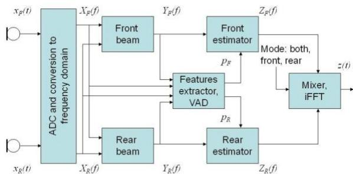
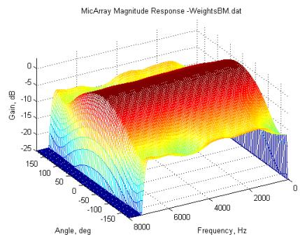
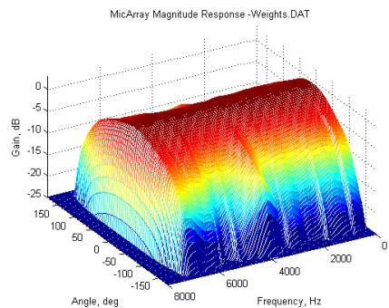
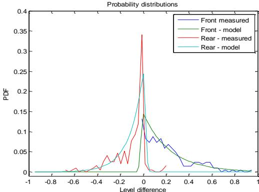

# Sound Capture System and Spatial Filter for Small Devices

Ivan Tashev1, Slavy Mihov2, Tyler Gleghorn3, Alex Acero

1 Microsoft Research, One Microsoft Way, Redmond, WA 98052, USA

2 Technical University of Sofia, Sofia 1000, Bulgaria

3 Microsoft Corporation, One Microsoft Way, Redmond, WA 98052, USA

ivantash@microsof.com, smihov@abv.bg, tylerg@microsoft.com, alexac@microsoft.com

## Abstract

Usage of cellular phones and small form factor devices as PDAs and other handhelds has been increasing rapidly. Their use is varied, with scenarios such as communication, internet browsing, audio and video recording just to name a few. This requires better sound capturing system as the sound source is already at larger distance from the device’s microphone. In this paper we propose sound capture system for small devices which uses two unidirectional microphones placed back-toback close to each other. The processing part consists of beamformer and a non-linear spatial filter. The speech enhancement processing achieves an improvement of 0.39 MOS points in the perceptual sound quality and 10.8 dB improvement in SNR.

Index Terms: sound capture, speech enhancement, beamforming, spatial filter.

## 1. Introduction

Cellular phones have increased their CPU power and amount of memory, which is quickly moving them into the entertainment devices and personal assistants category. Most of them contain cameras, capable of taking still photos and recording video and audio. With advancement of the 3G and 4G wireless technologies, the high speed connection to Internet soon will become standard in the calling plans. This opens the door for mobile video telephony. Often, a multimodal user interface is used for quick access to information on Internet, combining speech recognition and a graphic screen. In these cases, moving the phone close to the mouth to speak and then returning it to roughly an arm’s length away to see the screen can be quite awkward. Besides cellphones, other devices such as PDAs and ultra small mobile personal computers have also grown in popularity and proliferation, particularly among users which need more computing power. All of the devices above have something in common: they need good sound capture from one meter distance (about one arm’s length) in an increasingly noise adverse environment. Unfortunately, these devices historically have only one microphone which, in most of the cases, is omnidirectional. This leads to the pick-up of too much ambient noise and reverberation, making these devices useless under higher noise conditions. And in the case of video streaming and capture, mobile phone requires good sound capture for sound sources up to three meters away.

The most trivial way to improve the sound capture quality is to use a unidirectional microphone. This increases the SNR about 4.3 dB, but worsens the audio quality during video recording, as usually the video camera is on the opposite side of the phone. Still, even this small advantage in SNR helps the stationary noise suppressor [1] to do a better job, as it is less efficient with input SNRs below 5-10 dB.

The next logical improvement is to add one more microphone and to use one of the standard beamforming technologies [2] to improve the SNR and sound quality. Due to the small size of the device and the need to keep the microphones as far as possible from the loudspeaker, the distance between the two microphones is limited to 30-50 millimeters. The efficiency of the classic beamforming techniques with small-base microphone arrays is quite low.

  
Figure 1. Block diagram of the processing algorithm.

Assuming that the linear processing exhausted its ability to reduce the ambient noises, a non-linear microphone array postprocessor can be further utilized. It applies variable real gain in real-time, based on the sound source position. Even microphone arrays with small distance between the microphones can detect relatively well the direction towards the sound source. Building spatial noise models [3], or direct estimation of the probability the sound come from the desired direction [4] can be used for suppressing the sounds coming from unwanted directions.

In this paper we propose a microphone array geometry which consists of two unidirectional microphones placed back-to-back and pointing in opposite directions. The beamformer has two beams, pointing towards the front and rear directions, designed to provide maximum difference frontback. The consequent non-linear spatial filter uses the differ ence between the signals in the two beams to build spatia statistical models and to compute the probability the signal come from the desired direction for each frequency bin. Then it is applied suppression gain, reducing the signal from ambient noise and unwanted sound sources. For evaluation of the results, improvements in SNR and MOS are used, computed using algorithms for objective sound quality measurement.

## 2. Modeling

The block diagram of the processing chain is shown on Figure 1. The signals from the two microphones are processed by two beamformers optimized to provide maximum difference front-back. Then, a feature extractor, assisted by a binary voice activity detector (VAD), computes the differences in the outputs of the beamformers. Based on dynamically updated statistical models, the probability of the speech signal to be coming from the desired direction is computed, which is then applied as suppression gain.

We assume processing in frequency domain using Hann weighting and the standard overlap and add scheme. We omit the notations for frequency bin and frame number whenever it is possible to do so without reducing the clarity.

## 2.1. Microphones identification

For the beamformers’ design, we assume knowledge of the front and rear microphones’ directivity patterns as a function of the frequency and the incident body angle, $U _ { F } ( f , \theta )$ and $U _ { R } ( f , \theta )$ respectively.

## 2.2. Beamformers design

In most cases, the used unidirectional microphones are not perfect. The purpose of the beamformers is to form a beam directivity pattern that maximizes the difference for signals coming from front and rear. We have to compute beamformer weights:

$$
\begin{array}{r} \mathbf {Y} _ {F} ^ {(n)} = \mathbf {W} _ {F F} \cdot \mathbf {X} _ {F} ^ {(n)} + \mathbf {W} _ {F R} \cdot \mathbf {X} _ {R} ^ {(n)} \\ \mathbf {Y} _ {R} ^ {(n)} = \mathbf {W} _ {R F} \cdot \mathbf {X} _ {F} ^ {(n)} + \mathbf {W} _ {R R} \cdot \mathbf {X} _ {R} ^ {(n)} \end{array}\tag{1}
$$

in such a way that:

$$
Q _ {F c o n s t} = \max _ {\mathbf {W} _ {\mathbf {F F}}, \mathbf {W} _ {\mathbf {F R}}} \left(\frac {\int_ {- \Delta \theta} ^ {+ \Delta \theta} \left(\mathbf {W} _ {F F} \cdot \mathbf {X} _ {F} (\theta) + \mathbf {W} _ {F R} \cdot \mathbf {X} _ {R} (\theta)\right) d \theta}{\int_ {- \pi + \Delta \theta} ^ {\pi - \Delta \theta} \left(\mathbf {W} _ {F F} \cdot \mathbf {X} _ {F} (\theta) + \mathbf {W} _ {F R} \cdot \mathbf {X} _ {R} (\theta)\right) d \theta}\right)\tag{2}
$$

$$
Q _ {R c o n s t} = \max _ {\mathbf {w} _ {\mathbf {R F}}, \mathbf {w} _ {\mathbf {R R}}} \left( \begin{array}{l} \int_ {- \pi + \Delta \theta} ^ {\pi - \Delta \theta} \left(\mathbf {W} _ {R F} \cdot \mathbf {X} _ {F} (\theta) + \mathbf {W} _ {R R} \cdot \mathbf {X} _ {R} (\theta)\right) d \theta \\ \frac {- \pi + \Delta \theta}{+ \Delta \theta} \\ \int_ {- \Delta \theta} ^ {\pi - \Delta \theta} \left(\mathbf {W} _ {R F} \cdot \mathbf {X} _ {F} (\theta) + \mathbf {W} _ {R R} \cdot \mathbf {X} _ {R} (\theta)\right) d \theta \end{array} \right)\tag{3}
$$

Here, $\Delta \theta$ is the half of the desired beamwidth, ${ \bf X } _ { F } ( \theta )$ , and $\mathbf { X } _ { R } ( \theta )$ are signals generated by a sound source placed at direction $\theta$ . The distance to the sound source is fixed to ρ=1m, which is close to the average working distance. Then:

$$
X _ {F} (f, \theta) \approx \frac {1}{\left\| \rho - d _ {F} \right\|} \exp \left(- j 2 \pi f \frac {\left\| \rho - d _ {F} \right\|}{c}\right) U _ {F} (f, \theta)\tag{4}
$$

Here $d _ { F }$ is the vector of coordinates {x,y,z} of the front microphone. The middle of the distance between the two microphones is the center of our left oriented coordinates system, with x axis pointing forward, y axis pointing left (view from top) and z axis pointing up. Then the front speaker is at direction $0 ^ { \mathrm { o } }$ and the rear speaker is at direction $- 1 8 0 ^ { 0 }$ . The first member of the expression $X _ { \scriptscriptstyle F } ( f , \theta )$ is the signal magnitude decay due to the distance, the second represents the delay (and the phase shift), and the third is the front microphone directivity pattern. $X _ { \scriptscriptstyle R } ( f , \theta )$ is modeled in the same way.

The beamformer weights can be computed analytically or using one of the algorithms for mathematical optimization. The maximums should be searched for under constrains of unity gain and zero phase shift for signal coming from the desired direction. This can be done by adding punishing functions to the optimization criterion [5].

## 2.3. Voice activity detector

For building the statistical model of the wanted and unwanted signals a simple, energy based, binary VAD is used, applied to the front beamformer output. It employs a minimum energy tracking and is implemented as a state machine with thresholds for switching between “noise” and “voice” states.

## 2.4. Features and statistical models

Distinguishing between desired and unwanted signals is based on their spatial position. As the beamformers are optimized to increase the difference between front and rear signals, we choose four features: difference in signal level (r.m.s.) for the whole frame, difference in signal magnitude per frequency bin, delay for the whole frame, and delay per frequency bin.

## 2.4.1. Level difference per frame

Under ideal conditions (perfect microphones matching, identical directivity patterns and isotropic ambient noise), the levels should be the same and the average difference should be zero. Potential non-zero difference in the pauses can occur when the real microphones have different-than-modeled cha racteristics due to channel mismatch. To compensate for this, we have to compute the level difference mean in addition to the variation. The noise model update happens in the noise frames only:

$$
\begin{array}{l} L _ {C} ^ {(n)} = \left(1 - \frac {T}{\tau_ {W}}\right) L _ {C} ^ {(n - 1)} + \frac {T}{\tau_ {W}} \Delta L ^ {(n)} \\ \sigma_ {W} ^ {(n)} = \sqrt {\left(1 - \frac {T}{\tau_ {W}}\right) \left(\sigma_ {W} ^ {(n - 1)}\right) ^ {2} + \frac {T}{\tau_ {W}} \left(\Delta L ^ {(n)} - L _ {C} ^ {(n)}\right) ^ {2}} \end{array}\tag{5}
$$

Here T is the frame duration and $\tau _ { w }$ is the adaptation time constant. Then the level differences for the current frame is:

$$
L _ {W} ^ {(n)} = \Delta L ^ {(n)} - L _ {C} ^ {(n)}\tag{6}
$$

and this is the first of the four features. The couple $L _ { c } , \sigma _ { w }$ characterizes a Gaussian process for the level differences fluctuation during noise-only frames. The level difference during speech frames is modeled as statistical process with asymmetric PDF: exponential for the positive differences and Gaussian shape for the negative differences:

$$
p _ {F W} \left(\Delta L _ {W} \mid \theta_ {F W}, \sigma_ {W}\right) = \left| \begin{array}{l l} \frac {1}{\theta_ {F W}} \exp \left(- \frac {\Delta L _ {W}}{\theta_ {F W}}\right) & \Delta L _ {W} > 0 \\ \frac {1}{\theta_ {F W}} \exp \left(- \frac {\Delta L _ {W} ^ {2}}{2 \sigma_ {w} ^ {2}}\right) & o t h e r w i s e \end{array} \right.\tag{7}
$$

Here the exponential distribution parameter is estimated dur ing voiced frames and positive level differences as:

$$
\theta_ {F W} ^ {(n)} = \left(1 - \frac {T}{\tau_ {W}}\right) \theta_ {F W} ^ {(n - 1)} + \frac {T}{\tau_ {W}} \Delta L _ {W} ^ {(n)}.\tag{8}
$$

The statistical model parameter for the sound coming from the rear $\theta _ { R W } ^ { ( n ) }$ is estimated and updated in the same way when the level differences are negative.

## 2.4.2. Level difference per bin

The second feature is the magnitude difference per frequency bin. We build the same statistical models as above, estimating the parameters $L _ { C b } ^ { ( n ) } ( k ) , \ \theta _ { F W b } ^ { ( n ) } ( k )$ , and $\theta _ { R W b } ^ { ( n ) } ( k )$ for each frequency bin. The adaptation time constant is $\tau _ { { W b } }$

## 2.4.3. Time delay per frame

The third feature is the time delay between the signals from the two microphones. The delay is estimated using PHAT weighting and Generalized Cross Correlation method:

$$
\mathbf {C} _ {F R} (\tau) = \mathbf {i F F T} \left[ \frac {\mathbf {X} _ {F} \cdot \mathbf {X} _ {R} ^ {*}}{| \mathbf {X} _ {F} | \cdot | \mathbf {X} _ {R} |} \right],\tag{9}
$$

  
Figure 2. Directivity pattern of the front microphone.

see [6] for more details. Quadratic interpolation for finding the maximum is used to achieve sub-sampling period resolution. Based on the classification from the VAD and the delay sign (negative or positive), three statistical models are built: noise (updated during non-voiced frames), front (updated during voiced frames and positive delays), and rear (updated during voiced frames and negative delays). The models assume Gaussian distribution, same variances, and means computed from the geometrical positions of the microphones. This leaves only one parameter to estimate in real time – the variance. The adaptation time constant is $\tau _ { D }$

## 2.4.4. Time delay per bin

The fourth feature is delay per frequency bin, estimated from the phase differences of the microphone signals:

$$
D _ {b} (k) = \frac {\operatorname{norm} \left[ \arg \left(X _ {F} (k)\right) - \arg \left(X _ {R} (k)\right) \right]}{2 \pi f},\tag{10}
$$

normalized in the range of $\left[ - \pi , + \pi \right]$ . The adaptation time constant is $\tau _ { D b }$

## 2.5. Probability estimation

Given frame level difference $L _ { W } ^ { ( n ) }$ between the front and back beams, the probability this frame to be dominated by a signal coming from front is:

$$
\hat {P} _ {F W} ^ {(n)} = \frac {p _ {F W} \left(\Delta L _ {W} ^ {(n)}\right)}{p _ {F W} \left(\Delta L _ {W} ^ {(n)}\right) + p _ {R W} \left(\Delta L _ {W} ^ {(n)}\right) + p _ {N W} \left(\Delta L _ {W} ^ {(n)}\right)},\tag{11}
$$

where $p _ { F W } \left( \Delta L _ { w } ^ { ( n ) } \right) , p _ { _ { R W } } \left( \Delta L _ { w } ^ { ( n ) } \right) , p _ { _ { N W } } \left( \Delta L _ { w } ^ { ( n ) } \right)$ are the values of the front, rear and noise PDFs for this level difference. The probabilities for the other three features are estimated in the same manner.

## 2.6. Features fusion

Once we have the probability estimations for speech sig nal coming from the desired direction we can combine them:

$$
P _ {k} ^ {(n)} = \prod_ {i = 1 \div 4} \left(\left(1 - G _ {i}\right) \hat {P} _ {i} ^ {(n)} (k) + G _ {i}\right),\tag{12}
$$

where $P _ { k } ^ { ( n ) }$ is the probability to have signal coming from desired direction in n-th frame and k-th bin, $P _ { i } ^ { ( n ) } ( k )$ is the probability for the i-th feature and $G _ { \ i }$ is the feature gain. When the gain is one the feature is disabled; when it is zero – the feature is in its full weight.

The overall probability can be used as suppression gain, reducing the presence of sounds coming from unwanted directions. This is an MMSE solution for the time domain waveform, [7].

  
Figure 3. Directivity pattern of the front beam.

## 2.7. Optimization goal

The algorithm above (besides means and variances which are estimated in real time from the input signals), has adapta tion time constants and gains with values that cannot be estimated mathematically. To find the optimal values for them, we use mathematical optimization with parameters the values of the adaptation time constants and gains – a total of eight parameters: $\tau _ { _ W } , \tau _ { _ { W b } } , \tau _ { _ D } , \tau _ { _ { D b } } , G _ { \_ } , G _ { \_ } , G _ { \_ } , G _ { \_ } , G _ { \_ } \nonumber$

A source consisting of a recorded human voice played through a mouth simulator, placed in the desired position can be recorded with the sound capture system in low noise and reverberation conditions – in an anechoic chamber, for exam ple. This can be repeated for various speakers with different gender and age. Ambient noises in various conditions – cafeteria, office, street, etc. can be recorded using the same de vice. The sum of any combination of these two signal types is what would be recorded in the same conditions with a real human speaker. This allows creation of a substantial number of test recordings. All three files (clean, noise-only, mixture) from each set are processed in parallel. Having separated clean speech and noise recordings allows for computing a precise Wiener gain for each frame and frequency bin:

$$
H _ {w} ^ {(n)} (k) = \frac {\left| X _ {k} ^ {(n)} \right| ^ {2}}{\left| X _ {k} ^ {(n)} \right| ^ {2} + \left| N _ {k} ^ {(n)} \right| ^ {2}},\tag{13}
$$

which is an MMSE estimator when applied to the input sig nal. Here $X _ { k } ^ { ( n ) }$ and $N _ { k } ^ { ( n ) }$ are the clean speech and the noise signals respectively. As the probability estimator in (12) is an MMSE estimator as well, then we should minimize:

$$
Q _ {\text { contsr }} = \min _ {\mathbf {R}} \left(\sum_ {n = 0} ^ {N - 1} \sum_ {k = 0} ^ {K - 1} \left(H _ {w} ^ {(n)} (k) - \hat {P} _ {k} ^ {(n)}\right) ^ {2}\right)\tag{14}
$$

where R is the vector of the parameters for optimization. To keep the values of the adaptation time constants, especially the gains in the allowed boundaries, we convert the constrained optimization goal (14) into non-constrained by adding punishing functions:

$$
\begin{array}{r l} Q _ {\text { non - contsr }} = Q _ {\text { contsr }} + \sum_ {i = 0} ^ {R - 1} \left(\max \left(0, r _ {i} - r _ {\max} (i)\right) ^ {2}\right) + \\ & + \sum_ {i = 0} ^ {R - 1} \left(\min \left(0, r _ {i} - r _ {\min} (i)\right) ^ {2}\right) \end{array}\tag{15}
$$

For estimation of the parameters optimal values, almost any algorithm for mathematical optimization can be used.

## 3. Experimental results

The sound capturing device consists of two unidirectional microphones placed back-to-back with distance between the microphones of 9.6 mm. They were installed in a cell phone mock-up to model the same acoustical parameters. The sampling rate for all recordings was 16 kHz, the audio frame size was 512 samples.

Table 1. Gains for different feature combinations.

<table><tr><td rowspan="2">Features combination</td><td colspan="4">Gain</td><td rowspan="2">AvSNR improv.</td></tr><tr><td>Lev/fr</td><td>Lev/bin</td><td>Del/fr</td><td>Del/bin</td></tr><tr><td>All four</td><td>0.00</td><td>0.00</td><td>0.89</td><td>0.99</td><td>11.06</td></tr><tr><td>Lev/bin&amp;fr, Del/fr</td><td>0.02</td><td>0.00</td><td>0.68</td><td></td><td>10.82</td></tr><tr><td>Lev/bin&amp;fr</td><td>0.00</td><td>0.19</td><td></td><td></td><td>10.43</td></tr><tr><td>Lev/bin, Del/fr</td><td></td><td>0.00</td><td>0.48</td><td></td><td>4.83</td></tr><tr><td>Lev/fr</td><td>0.00</td><td></td><td></td><td></td><td>5.25</td></tr><tr><td>Lev/bin</td><td></td><td>0.00</td><td></td><td></td><td>5.12</td></tr><tr><td>Del/fr</td><td></td><td></td><td>0.00</td><td></td><td>6.21</td></tr><tr><td>Del/bin</td><td></td><td></td><td></td><td>0.00</td><td>1.96</td></tr></table>

Table 2. Improvements in SNR and MOS.

<table><tr><td>Processing stage</td><td>BF</td><td>SF</td><td>Total</td></tr><tr><td>Av. SNR improv.</td><td>5.12</td><td>5.31</td><td>10.43</td></tr><tr><td>MOS improv.</td><td>0.15</td><td>0.24</td><td>0.39</td></tr></table>

The microphones directivity patterns were measured in an anechoic chamber by recording chirp signals, played by a reference loudspeaker. The recording was repeated 36 times after rotating the device $1 0 ^ { \mathrm { { o } } }$ . The measured directivity pattern of one of the two microphones is shown on figure 2.

The beamformer coefficients were estimated by maximizing (2) and (3) using a steepest gradient descent algorithm. We maximized the difference between the signal energy in the range $\pm 3 0 ^ { \mathrm { o } }$ and $\left\lceil 1 5 0 ^ { \mathrm { o } } , - 1 5 0 ^ { \mathrm { o } } \right\rceil$ , i.e. $\theta = 3 0 ^ { \mathrm { o } }$ . The resulting beamshape for the front beam is shown on Figure 3. It is substantially improved, compared with the subcardiod directivity pattern of the microphones on previous figure.

For minimizing (15), a set of sixteen files with various voices and input SNRs are used. The average duration of each file is about one minute. The first 80% of each file was used for optimization, the last 20% - for testing. The same steepest gradient descent algorithm was used for finding the minimum. After each iteration of the steepest gradient descent algorithm, the test parts were evaluated using the same optimization criterion. The optimization procedure was stopped when there was no further improvement in the test set evaluation after five iterations in a row. This is done to prevent overtraining of the optimization parameters. The estimated optimal parameters were used to evaluate a second set of recordings, which did not participate in the optimization. These are the results we discuss further. The optimal gains per feature are shown in the first line of Table 1. It is obvious that the optimization procedure practically turned off the last two features: delay per frame and delay per frequency bin. This is due to the small distance between the microphones, equivalent to delay of one quarter of the sampling period. The same table presents the estimated gains for various feature combinations. The combination level difference per frame and level difference per bin produces best results and only these two features are chosen to be part of the further evaluation.

To verify the correctness of the statistical models and the assumed PDFs, we computed the real distributions from the recorded signals. Figure 4 shows the model and the actual distribution for the signal level difference per frame. The estimated models cover well the real probability distribution.

Table 2 shows the results of the processing using two evaluation parameters: SNR and MOS. The second is estimated using PESQ algorithm [8]. The noise suppression and speech enhancement chain is well balanced across processing blocks, and shows very good noise suppression and audible increase in the perceptual sound quality.

  
Figure 4. Modeled and actual probability distributions for level difference per frame.

## 4. Conclusion and acknowledgements

This paper presents a sound capturing configuration and speech enhancement procedure suitable for integration in mobile phones and handheld devices. The algorithm uses the difference between the signals captured from two unidirectional microphones pointing in opposite directions. Novel statistical method for estimation of the probability that the signal is coming from the desired direction was derived. We propose a procedure to optimize the values of the algorithm parameters which cannot be estimated. From the four features experimented with, two were eliminated by this optimization procedure. The algorithm relies only on the differences in the signal levels for the frame and per frequency bin

Authors would like to thank Pavan Davuluri for the support, and Fraser Midstokke and Michael Jonson for making the actual recordings.

## 5. References

[1] Y. Ephraim, D. Malah. “Speech enhancement using a minimum mean-square error short-time spectral amplitude estimator,” IEEE Transactions on Acoustics, Speech, and Signal Processing, vol. ASSP-32, no. 6, pp. 1109–1121, Dec. 1984.

[2] Harry L. Van Trees. Optimum Array Processing. Part IV of De tection, Estimation and Modulation Theory. John Willey & Sons, New York, NY, USA, 2002.

[3] I. Tashev, M. Seltzer, A. Acero. "Microphone Array for Headset with Spatial Noise Suppressor". Proceedings of Ninth International Workshop on Acoustic, Echo and Noise Control IWAENC 2005, Eindhoven, The Netherlands, 2005

[4] I. Tashev, A. Acero. "Microphone Array Post-Processor Using Instantaneous Direction of Arrival". International Workshop on Acoustic, Echo and Noise Control IWAENC 2006, Paris, France, 2006.

[5] S. Mihov, T. Gleghorn, I. Tashev. “Enhanced Sound Capture System for Small Devices”. Proceedings of XLIII International Scientific Conference on Information, Communication, and Energy Systems and Technologies ICEST 2008, Nish, Serbia.

[6] C. Knapp, G. Carter. “The Generalized Method for Estimation of Time Delay”. IEEE Transactions of Acoustics, Speech and Sig nal Processing, vol. ASSP-24, no. 4, August 1976.

[7] R. J. McAulay, M. L. Malpass. “Speech enhancement using a soft decision noise suppression filter,” IEEE Transactions on Acoustics, Speech, and Signal Processing, vol. ASSP-28, no. 2, pp. 137–145, Apr. 1980.

[8] ITU-T Recommendation P.862: Perceptual evaluation of speech quality (PESQ): an objective method for end-to-end speech quality assessment of narrow-band telephone networks and speech codecs. Geneva, Switzerland. 2001