# Blind and Spatially-Regularized Online Joint Optimization of Source Separation, Dereverberation, and Noise Reduction

Tetsuya Ueda , Student Member, IEEE, Tomohiro Nakatani , Fellow, IEEE, Rintaro Ikeshita , Member, IEEE, Keisuke Kinoshita , Senior Member, IEEE, Shoko Araki , Fellow, IEEE, and Shoji Makino , Life Fellow, IEEE

Abstract—This paper proposes a computationally efficient joint optimization algorithm that performs online source separation, dereverberation, and noise reduction based on blind and spatiallyregularized processing. When applying such online Blind Source Separation (BSS) as online Independent Vector Extraction (IVE) to a speech application, we must focus on the trade-off between the algorithmic delay and separation accuracy, both of which depend on the analysis frame length. In addition, to separate the sources with specified source permutation, researchers introduced spatial regularization based on the Directions-of-Arrival (DOAs) of the sources into IVE. However, the scale ambiguity of IVE often makes the spatial regularization work inappropriately. To solve these problems, we first propose a blind online joint optimization algorithm of IVE and weighted prediction error dereverberation (WPE). This online algorithm can achieve accurate separation even using short analysis frames because reverberation can be reduced using WPE. We then extend the online joint optimization with robust spatial regularization. We reveal that regularizing the scale of the separated signals is very effective in making the DOA-based spatial regularization work reliably. Our experiments confirm that our blind online joint optimization algorithm can significantly improve the separation accuracy with an algorithmic delay of 8 ms. In addition, we confirm that the proposed spatially-regularized online joint optimization algorithm reduces the rate of the source permutation error to zero percent.

Index Terms— Online processing, dereverberation, blind source separation, microphone array, spatial regularization.

## I. INTRODUCTION

B LIND Source Separation (BSS) is a technique that sep-arates individual source signals from microphone array arates individual source signals from microphone array inputs without any prior information about the signals or the room acoustics. We expect BSS to enhance such real-time speech applications as hearing aids [1], [2] and in-car communication systems (ICC) [3], [4] by jointly performing source separation, dereverberation, and noise reduction in noisy reverberant environments.

A widely used approach to BSS for overdetermined cases, i.e., when the microphones outnumber the sources, is Independent Component Analysis (ICA) [5], [6]. It achieves BSS assuming statistical independence among the sources. Recently, a number of ICA-based BSS methods that work in the frequency domain have been developed [7], [8], [9], [10], [11], [12] and provide various models for the time-frequency representations of source signals and array responses. Among them, Independent Vector Analysis (IVA) can simultaneously achieve source separation at each frequency and grouping of separated sources over frequencies [7], [8]. Although this grouping is often called frequency permutation alignment [13], this paper refers to it as source grouping to distinguish it from source permutation alignment, which is later defined in Section I-B. IVA achieves the source grouping by assuming that the magnitudes of the frequency components originating from the same source tend to vary coherently over time.

As an important advancement for accelerating and stabilizing IVA optimization, auxiliary-function-based IVA (AuxIVA) was proposed [9], [10]. In recent years, AuxIVA has been accelerated to auxiliary-function-based Independent Vector Extraction (AuxIVE) [14], [15], [16] by focusing on the Blind Source Extraction (BSE) scenario [17], [18] in which we seek to extract N sources from M microphone signals. AuxIVE can skip most of the computations for optimizing variables corresponding to noise sources and is very computationally efficient when N - M. In what follows, we refer to AuxIVA (resp. AuxIVE) simply as IVA (resp. IVE).

For real-time processing, online-BSS algorithms have been extended from offline algorithms. Online-IVA [19] is an algorithm designed for real-time source separation. Unlike offline algorithms, online-IVA offers benefits such as adaptability to dynamic environments and suitability for real-time speech applications with low algorithmic delay in actual environments. Although online processing for IVE has been developed only for single source extraction [20], below we can further extend it to multi-source extraction (Section IV-C). Hereafter, we refer to this extended method as online-IVE throughout this paper.

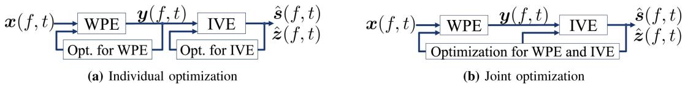  
Fig. 1. Separation and update flow of each method combining WPE and IVE: (a) WPE+IVE and (b) WPE×IVE.

This paper focuses on the two problems shown below when using online-IVE (and online-IVA1) for real-time speech applications: difficulty in low latency processing and difficulty in source permutation alignment.

## A. Difficulty in Low Latency Processing

In a frequency-domain BSS, the algorithmic delay is determined by the short-time Fourier transform (STFT) frame length [1]. Thus, to achieve a sufficiently short processing delay, e.g., a 12 ms delay required for an ICC system [3], [4], we have to use STFT frames that are shorter than the delay [21]. However, they must be longer than the reverberation time for the frequency-domain BSS (including the online-IVE) to maintain high source separation accuracy.

We can mitigate this trade-off by applying such dereverberation preprocessing as Weighted Prediction Error dereverberation (WPE) [22] prior to BSS, thus removing the reverberation that is longer than a frame length. For example, we can apply online-WPE [23], [24] and online-IVE in a cascade configuration. Although this method effectively improves the separation accuracy, it cannot achieve optimal separation because it individually optimizes WPE and IVE. To achieve an overall optimal separation, we need to jointly optimize both of them. Here note the difference between joint optimization and individual optimization shown in Fig. 1. Individual optimization means optimizing each block separately by each cost function (Fig. 1(a)). On the other hand, joint optimization means optimizing all the cascaded blocks using a single cost function defined based on the output of a whole processing (Fig. 1(b)).

## B. Difficulty in Source Permutation Alignment

Because online-IVE separates source signals in an arbitrary permutation, it must often align the separated sources based on a specified permutation before passing them to subsequent realtime speech applications. This paper refers to this processing as source permutation alignment. For that purpose, researchers incorporated spatial regularization into BSS for aligning the separated sources based on the given transfer functions from the sources to the microphones [31], [32], [33], [34], [35], [36], [37], [38], [39]. Because it is generally difficult to obtain accurate transfer functions in advance, they are typically approximated based on the plane-wave assumption using the sources’ Directions-of-Arrival (DOAs).

However, since such transfer functions are inaccurate in real acoustical environments, they often result in incorrect source permutation alignment. In addition, certain regularization techniques implicitly assume a preferable scale of separated signals to perform appropriate source permutation alignment. However, IVE separates signals with arbitrary scales, and thus, there is no guarantee that such regularization techniques will appropriately align the source permutation. To overcome these problems, spatial regularization techniques must be developed that are robust against the errors in the given transfer functions and that can cope with the scale ambiguity of IVE.

TABLE I  
CLASSIFICATION OF SOURCE SEPARATION ALGORITHMS WITHOUT (W/O) SPATIAL REGULARIZATION

<table><tr><td></td><td colspan="2">Offline</td><td colspan="2">Online</td></tr><tr><td>w/o WPE</td><td>IVA [8]-[10]</td><td>IVE [16]-[18]</td><td>Online-IVA [19]</td><td>Online-IVE proposed</td></tr><tr><td>w/ WPE</td><td>WPE×IVA [25] WPE×ILRMA [26], [27]</td><td>WPE×IVE [28], [29] OverILRMA [30]</td><td>Online-WPE×IVA proposed</td><td>Online-WPE×IVE proposed</td></tr></table>

TABLE II  
CLASSIFICATION OF SOURCE SEPARATION ALGORITHMS WITH (W/) SPATIAL REGULARIZATION

<table><tr><td></td><td colspan="2">Offline</td><td colspan="2">Online</td></tr><tr><td>w/o WPE</td><td>SRIVA [32], [34], [38] SRILRMA [33]</td><td>SRIVE [36], [37]</td><td>Online-SRIVA [35], [39]</td><td>Online-SRIVE proposed</td></tr><tr><td>w/ WPE</td><td>None</td><td>None</td><td>Online-WPE×SRIVA proposed</td><td>Online-WPE×SRIVE proposed</td></tr></table>

## C. Contribution

This paper proposes online optimization algorithms that can overcome the above two problems. For the first problem, i.e., achieving overall optimal separation accuracy with low-latency processing, we propose the blind online joint optimization of source separation, dereverberation, and noise reduction. We introduce a log-likelihood function with a forgetting factor for the online joint optimization of WPE and IVE and derive a computationally efficient algorithm based on this function, referred to as online-WPE×IVE (Table I). It can achieve higher separation accuracy using shorter STFT frames than online-WPE+IVE that uses individual optimization. For the second problem caused by the scale ambiguity and the errors in the given transfer functions, we reveal that regularizing the scale of the separated signals helps spatially-regularized IVE (SRIVE) to correctly align the source permutation. We simultaneously solve the above two problems by presenting a spatially-regularized online joint optimization algorithm by applying spatial regularization to online-WPE×IVE (online-WPE×SRIVE, see Table II). Finally, we validate the effectiveness of our proposed methods based on simulation experiments. Note that we can achieve online-IVE and online-SRIVE simply by skipping the online-WPE part from online-WPE×IVE and online-WPE×SRIVE.

This paper is an extended version of our conference papers, which proposed online-WPE×IVA [40] and online-WPE×IVE [41] under very short reverberation conditions $( T _ { 6 0 } \simeq 6 0$ ms.) The extension presented in this paper includes:

1) Complete derivation of online joint optimization of WPE and IVE, including a detailed derivation of a computationally efficient update in Sections IV-B4 and IV-B6.

2) All the discussions on the introduction of spatial regularization in Section V.

3) Evaluations of the proposed method with a long reverberant environment $( T _ { 6 0 } \simeq 7 8 0$ ms) and those with spatial regularization.

## II. RELATED WORK

For offline processing, thejoint optimization ofWPE and IVE, denoted by WPE×IVE, has already been proposed [28], [29] (Table I) and increased separation accuracy more than the individual optimization of WPE and IVE, denoted by $\mathrm { W P E + I V E }$

As for non-blind online processing, a few techniques have been proposed to optimize dereverberation and noise reduction jointly [42], [43]. Among them, integrated sidelobe cancellation and linear prediction [42] has been extended to perform source separation [44]. However, this technique is not based on joint optimization or blind processing. It requires some initial estimates of the transfer functions of individual sources. It also needs to use another method based on a different criterion to update the transfer functions and power spectral densities by online processing.

Based on our best knowledge, online-WPE×IVE is the first joint blind optimization algorithm that can perform source separation, dereverberation, and noise reduction by online processing based on a single maximum likelihood criterion.

Methods that incorporate spatial regularization into offline BSS approaches have been proposed: spatially-regularized IVA (SRIVA) [32], [34], [38], spatially-regularized IVE (SRIVE) [36], [37], and spatially-regularized ILRMA [33] (Table II). For online processing, researchers proposed online-SRIVA [35], [39] (Table II) and a regularized IVE using a pilot signal for a single source extraction [20].

In contrast, online-SRIVE and online-WPE×SRIVE proposed in this paper are the first algorithms that introduce spatial regularization into online-IVE and online-WPE×IVE (Table II).

## III. PROBLEM FORMULATION AND EXISTING TECHNIQUES

In this section, we formulate the problem in Section III-A. Then we show the existing techniques for the problems: convolutional beamformer (Section III-B), the log-likelihood function for offline processing (Section III-C), and spatial regularization (Section III-D), all of which are extended and applied to our proposed algorithms in Sections IV and V-A.

## A. Problem Formulation

Suppose that M microphones capture a reverberant mixture of N source signals and $M - N$ noise signals.2 We represent observed signals x $( f , t )$ , source signals $\mathbf { \boldsymbol { s } } ( f , t )$ , and noise signals $z ( f , t )$ at each time $t = 1 , \dots , T$ and frequency $f = 1 , \ldots , F$ in the STFT domain as

$$
\pmb {x} (f, t) = [ x _ {1} (f, t), \ldots , x _ {M} (f, t) ] ^ {\mathsf {T}} \in \mathbb {C} ^ {M},\tag{1}
$$

$$
\boldsymbol {s} (f, t) = [ s _ {1} (f, t), \dots , s _ {N} (f, t) ] ^ {\mathsf {T}} \in \mathbb {C} ^ {N},\tag{2}
$$

$$
\boldsymbol {z} (f, t) = [ s _ {N + 1} (f, t), \ldots , s _ {M} (f, t) ] ^ {\mathsf {T}} \in \mathbb {C} ^ {M - N},\tag{3}
$$

where $( \cdot ) ^ { \intercal }$ denotes the transpose. We model the relation among ${ \pmb x } ( f , t ) , { \pmb s } ( f , t )$ , and $z ( f , t )$

$$
\boldsymbol {x} (f, t) = \sum_ {\tau = 0} ^ {L _ {A} - 1} \boldsymbol {A} (f, \tau) \left[ \begin{array}{c} \boldsymbol {s} (f, t - \tau) \\ \boldsymbol {z} (f, t - \tau) \end{array} \right].\tag{4}
$$

Here $ { \boldsymbol { A } } ( f , \tau ) \in \mathbb { C } ^ { M \times M }$ for $\tau = 0 , \dots , L _ { A } - 1$ are matrices constituting the convolutional transfer function from the sources and noises to the microphones, where $L _ { A }$ is the length of the convolution.

In this paper, our first goal is to obtain a set of source estimates $\{ \hat { s } _ { 1 } ( f , t ) , \dotsc , \hat { s } _ { N } ( f , t ) \} _ { f , t }$ from ${ \boldsymbol { x } } ( { \boldsymbol { f } } , t )$ with high separation accuracy in online processing. Note that it is unnecessary to obtain noise estimates $\hat { \boldsymbol { z } } ( \boldsymbol { f } , t )$ . Our second goal is to make the source estimates aligned according to the same permutation as the sources in (2). In other words, we obtain source estimates so that the n-th estimate of the source $\hat { s } _ { n } ( f , t )$ is the n-th source $s _ { n } ( f , t )$

$$
\hat {s} _ {n} (f, t) \simeq s _ {n} (f, t) \text {   for   } 1 \leq n \leq N.\tag{5}
$$

We call this process source permutation alignment.

## B. Convolutional Beamformer (CBF)

In offline processing, WPE×IVE [28], [29] obtains a set of source estimates $\{ \hat { s } _ { 1 } ( f , t ) , \dotsc , \hat { s } _ { N } ( f , t ) \} _ { f , i }$ t using a convolutional beamformer (CBF):

$$
\left[ \begin{array}{c} \hat {\boldsymbol {s}} (f, t) \\ \hat {\boldsymbol {z}} (f, t) \end{array} \right] = \left[ \begin{array}{c} \boldsymbol {W} (f) \\ \overline {{\boldsymbol {W}}} (f) \end{array} \right] ^ {\mathsf {H}} \left[ \begin{array}{c} \boldsymbol {x} (f, t) \\ \overline {{\boldsymbol {x}}} (f, t) \end{array} \right],\tag{6}
$$

where $[ \pmb { W } ^ { \top } ( f ) , \overline { { \pmb { W } } } ^ { \top } ( f ) ] ^ { \top } \in \mathbb { C } ^ { M ( L + 1 ) \times M }$ is the CBF to dereverberate and separate observed signal ${ \boldsymbol { x } } ( { \boldsymbol { f } } , t )$ into source estimates $\hat { \pmb { s } } ( f , t ) = [ \hat { s } _ { 1 } ( f , t ) , \dots , \hat { s } _ { N } ( f , t ) ] ^ { \top }$ and noise estimates $\hat { z } ( f , t ) = [ \hat { s } _ { N + 1 } ( f , t ) , \dotsc , \hat { s } _ { M } ( f , t ) ] ^ { \intercal }$ . We refer to $W ( f ) =$ $[ \pmb { w } _ { 1 } ( f ) , . . . , \pmb { w } _ { M } ( f ) ] \in \mathbb { C } ^ { M \times M }$ as the separation matrix and $w _ { n } ( f )$ as the n-th separation filter. $( \cdot ) ^ { \hat { \mathsf { H } } }$ denotes the Hermitian transpose. $\overline { { \boldsymbol { x } } } ( f , t ) = [ \pmb { x } ^ { \top } ( f , t - D ) , \ldots , \pmb { x } ^ { \top } ( f , t - D -$ $L + \ b { \mathrm { 1 } } ) \ b { \mathrm { J } } ^ { \mathsf { T } } \in  { \mathbf { \bar { C } } } ^ { M L }$ is a vector containing a past observation sequence for L frames, and D is the prediction delay.

Equation (6) can be decomposed [28] into

$$
\boldsymbol {y} (f, t) = \boldsymbol {x} (f, t) - \boldsymbol {G} ^ {\mathsf {H}} (f) \overline {{\boldsymbol {x}}} (f, t),\tag{7}
$$

$$
\left[ \begin{array}{c} \hat {\boldsymbol {s}} (f, t) \\ \hat {\boldsymbol {z}} (f, t) \end{array} \right] = \boldsymbol {W} ^ {\mathsf {H}} (f) \boldsymbol {y} (f, t),\tag{8}
$$

where $\pmb { G } ( f ) = - \overline { { \pmb { W } } } ( f ) \pmb { W } ^ { - 1 } ( f ) \in \mathbb { C } ^ { M L \times M }$ is a dereverberation filter and ${ \mathbf { } } y ( f , t )$ is a dereverberated signal. Equation (7) removes the reverberation from observed signal ${ \boldsymbol { x } } ( { \boldsymbol { f } } , t )$ , and thus (8) can perform effective source separation even with short STFT frames.

## C. Log-Likelihood Function

To estimate $G ( f )$ and $W ( f )$ in offline processing, WPE×IVE $[ 2 8 ] , [ 2 9 ]$ assumes the n-th source for all frequencies $\hat { \pmb { s } } _ { n } ( t ) = [ \hat { s } _ { n } \overline { { ( 1 , t ) } } , \ldots , \hat { s } _ { n } ( F , t ) ] ^ { \top } \in \mathbb { C } ^ { F }$ and the noise $\hat { \boldsymbol { z } } ( \boldsymbol { f } , t )$ follow the multivariate complex Gaussian distributions:

$$
p (\hat {\boldsymbol {s}} _ {n} (t)) = \mathcal {N} _ {\mathbb {C}} (\mathbf {0} _ {F}, v _ {n} (t) \boldsymbol {I} _ {F}) \text {   for   } 1 \leq n \leq N,\tag{9}
$$

$$
p (\hat {\pmb {z}} (f, t)) = \mathcal {N} _ {\mathbb {C}} (\pmb {0} _ {M - N}, \pmb {\Omega} (f)),\tag{10}
$$

where $\mathbf { 0 } _ { M } \in \mathbb { C } ^ { M }$ is a zero vector, ${ \cal I } _ { M }$ is a $M \times M$ identity matrix, $v _ { n } ( t )$ is a time-varying source variance of $\hat { s } _ { n } ( f , t )$ and $\Omega ( f ) \overset { \cdot } { \in } \mathbb { C } ^ { ( M - N ) \times ( M - N ) }$ is a stationary covariance matrix of $\hat { \boldsymbol { z } } ( \boldsymbol { f } , t )$ . Following the formulation of offline-CBF, we also assume that each source $\hat { \boldsymbol { s } } _ { n } ( t )$ for $1 \leq n \leq N$ and the noise $\hat { \boldsymbol { z } } ( \boldsymbol { f } , t )$ are assumed to be mutually independent over all times and frequencies3 [28], [29]:

$$
p \left(\left\{\hat {\boldsymbol {s}} _ {n} (t), \hat {\boldsymbol {z}} (f, t) \right\} _ {n, f, t}\right) = \prod_ {n, t} p \left(\hat {\boldsymbol {s}} _ {n} (t)\right) \prod_ {f, t} p \left(\hat {\boldsymbol {z}} (f, t)\right).\tag{11}
$$

Under the above assumptions, negative log-likelihood function ${ \mathcal { L } } _ { \mathrm { N L } }$ for given observed signal $\mathcal { X } = \{ x _ { m } ( f , t ) \} _ { m , f , t }$ can be derived:

$$
\begin{array}{l} \mathcal {L} _ {\mathrm{NL}} (\mathcal {X}; \Theta) \stackrel {{c}} {{=}} \sum_ {f = 1} ^ {F} \left(\log \det \boldsymbol {\Omega} (f) - 2 \log | \det \boldsymbol {W} (f) |\right) \\ + \frac {1}{T} \sum_ {f, t} \left\{\sum_ {n = 1} ^ {N} \left(\log v _ {n} (t) + \frac {| \hat {s} _ {n} (f , t) | ^ {2}}{v _ {n} (t)}\right) \right. \\ + \hat {\boldsymbol {z}} ^ {\mathsf {H}} (f, t) \boldsymbol {\Omega} ^ {- 1} (f) \hat {\boldsymbol {z}} (f, t) \Bigg \}, \end{array}\tag{12}
$$

where $\Theta = \{ \{ v _ { n } ( t ) \} _ { n , t } , \{ G ( f ) \} _ { f } , \{ W ( f ) \} _ { f } , \{ \Omega ( f ) \} _ { f } \}$ and c= denotes the equality up to the constant terms.

## D. Spatial Regularization

To achieve source permutation alignment, researchers have introduced a regularization term into the negative log-likelihood function [31], [32], [33], [34], [35], [36], [37], [38], [39]. The regularization term works as a prior and penalizes separation matrix $W ( f )$ so that the estimated separation filters extract sources based on the specified source permutation. Because the term is designed based on the given transfer functions of the sources, we call it spatial regularization $( \mathrm { S R } ) . ^ { 4 }$

A regularization term is designed with steering vector $\mathbf { \delta } _ { \mathbf { { a } } _ { n } } ( f ) = [ a _ { n 1 } ( f ) , \ldots , a _ { n M } ( f ) ] ^ { \mathsf { T } } \in \mathbb { C } ^ { M }$ , in which each element $a _ { n m } ( f )$ is a transfer function from the n-th source to the m-th microphone. Steering vector $\pmb { a } _ { n } ( f )$ is estimated based on the relative time-delay-of-arrival (TDOA) $\tau _ { n } \in \mathbb { R } ^ { M }$ from the n-th source to M microphones:

$$
\boldsymbol {a} _ {n} (f) = \frac {1}{\sqrt {M}} \exp \left(2 \pi f \boldsymbol {\tau} _ {n} \sqrt {- 1}\right),\tag{13}
$$

where $\tau _ { n }$ is set assuming that the DOAs of the sources and the microphone array configuration are given or estimated.

Next the spatial regularization term is designed so that each separation filter $w _ { n } ( f )$ extracts a source signal corresponding to $\pmb { a } _ { n } ( f )$ and suppresses the other source signals corresponding to $\pmb { a } _ { i \neq n } ( f )$ . To derive the optimization algorithm in Section V-A, this paper uses the following spatial regularization term $\mathcal { I } _ { \mathrm { S R } }$ by integrating several regularization sub-terms from previous work [34], [36]:

$$
\begin{array}{l} \mathcal {J} _ {\mathrm{SR}} (\{\boldsymbol {W} (f) \} _ {f}) = \sum_ {f = 1} ^ {F} \sum_ {n = 1} ^ {N} \left(\lambda^ {\text { unit }} \mathcal {J} _ {\text { unit }} (\boldsymbol {w} _ {n} (f)) + \lambda^ {\text { null }} \mathcal {J} _ {\text { null }} (\boldsymbol {w} _ {n} (f)) + \lambda^ {\text { scale }} \mathcal {J} _ {\text { scale }} (\boldsymbol {w} _ {n} (f))\right), \end{array} \tag {14}
$$

where ${ \mathcal { T } } _ { \mathrm { n u l l } } ( { \pmb w } _ { n } ( f ) ) , { \mathcal { T } } _ { \mathrm { u n i t } } ( { \pmb w } _ { n } ( f ) )$ , and $\mathcal { I } _ { \mathrm { s c a l e } } ( { \pmb w } _ { n } ( f ) )$ are the sub-terms for the regularization, and $\lambda ^ { \mathrm { n u l l } } , \lambda ^ { \mathrm { u n i t } }$ , and $\lambda ^ { \mathrm { s c a l e } }$ are their weights. Note that it is not necessary to regularize noise separation filters ${ \pmb w } _ { n } ( f , t )$ for $N + 1 \leq n \leq M$ because IVE can determine the noise space when the permutations of source estimates $\{ \hat { s } _ { 1 } ( f , t ) , \dotsc , \hat { s } _ { N } ( f , t ) \}$ } are appropriately addressed. We explain each regularization sub-term in the following.

Unit response regularization (unit) [31] forces $w _ { n } ( f )$ to respond with a value 1 to the direction corresponding to $\pmb { a } _ { n } ( f )$

$$
\mathcal {J} _ {\text { unit }} (\boldsymbol {w} _ {n} (f)) = | \boldsymbol {w} _ {n} ^ {\mathsf {H}} (f) \boldsymbol {a} _ {n} (f) - 1 | ^ {2}.\tag{15}
$$

If $w _ { n } ( f )$ responds with 1 to $\pmb { a } _ { n } ( f )$ and responds with less than 1 for any other directions, unit makes $w _ { n } ( f )$ enhance the signals in the direction specified by $\pmb { a } _ { n } ( f )$

Null regularization (null) [31] forces $w _ { n } ( f )$ to put a spatial null in a direction corresponding to $\pmb { a } _ { i \neq n } ( f )$ :

$$
\mathcal {J} _ {\text { null }} (\boldsymbol {w} _ {n} (f)) = \sum_ {i \in \{1, \dots , N \} \backslash \{n \}} | \boldsymbol {w} _ {n} ^ {\mathrm{H}} (f) \boldsymbol {a} _ {i} (f) | ^ {2}.\tag{16}
$$

Scale regularization (scale) suppresses the power of separation filter $\| \mathbf { \bar { w } } _ { n } ( f ) \| _ { 2 } ^ { 2 } = \pmb { w } _ { n } ^ { \mathsf { H } } ( f ) \pmb { w } _ { n } ( f )$ :

$$
\mathcal {J} _ {\text { scale }} (\boldsymbol {w} _ {n} (f)) = \boldsymbol {w} _ {n} ^ {\mathsf {H}} (f) \boldsymbol {w} _ {n} (f).\tag{17}
$$

In a previous work [36], scale was conventionally used as the Tikhonov regularizer that stabilizes the inversion of the covariance matrices. They also discussed that scale has a property that favors low filter power $\| \boldsymbol { w } _ { n } ( f ) \| _ { 2 } ^ { 2 }$ . In addition to these discussions, in Section V-B, below we reveal that scale plays indispensable roles to make unit and null work appropriately; it can also reduce a significant amount of source permutation errors that null and unit potentially generate.

## IV. BLIND ONLINE JOINT OPTIMIZATION: ONLINE-WPE×IVE

This section proposes an online algorithm that jointly optimizes source separation, dereverberation, and noise reduction to achieve our first goal: obtaining source estimates with high separation accuracy by low-latency online processing. We first propose a negative log-likelihood function with a forgetting factor in Section IV-A and then derive an optimization algorithm in Section IV-B. In Sections IV-B4 and IV-B6 we present updates, which are computationally more efficient than those written in our conference papers [40], [41].

## A. Negative Log-Likelihood Function With Forgetting Factor

In online joint optimization, we update time-varying source variances $\mathcal { V } _ { t } = \{ v _ { n } ( t ) \} _ { n } ,$ , separation matrices $\mathcal { W } _ { t } =$ $\{ W ( f ; t ) \} _ { f } ,$ and dereverberation filters $\mathcal { G } _ { t } = \{ G ( f ; t ) \} _ { f }$ at each time frame. Here $( \cdot ) ( f ; t )$ denotes $( \cdot ) ( f )$ estimated at time t. We do not need to update $\{ \Omega ( f ; t ) \} _ { f } ,$ , as discussed in Sections IV-B3 and IV-B5.

For online optimization, we define a negative log-likelihood function based on past and current observed signals $\mathcal { X } _ { t } =$ $\{ { \pmb x } ( f , t ^ { \prime } ) \} _ { f , t ^ { \prime } \le t }$ by introducing forgetting factor $\beta ~ ( 0 < \beta <$ 1) [19], [23], [24] to (12):

$$
\begin{array}{l} \mathcal {L} _ {\beta} (\mathcal {X} _ {t}; \Theta_ {t}) \stackrel {{c}} {{=}} \sum_ {f} \left(\log \det \boldsymbol {\Omega} (f; t) - 2 \log | \det \boldsymbol {W} (f; t) |\right) \\ + \frac {1}{\sum_ {t ^ {\prime} \leq t} \beta^ {t - t ^ {\prime}}} \sum_ {f, t ^ {\prime} \leq t} \beta^ {t - t ^ {\prime}} \left\{\sum_ {n = 1} ^ {N} \left(\log v _ {n} (t ^ {\prime}) + \frac {| \hat {s} _ {n} (f , t ^ {\prime}) | ^ {2}}{v _ {n} (t ^ {\prime})}\right) \right. \\ + \hat {\boldsymbol {z}} ^ {\mathrm{H}} (f, t ^ {\prime}) \boldsymbol {\Omega} ^ {- 1} (f; t ^ {\prime}) \hat {\boldsymbol {z}} (f, t ^ {\prime}) \Bigg \}, \end{array} \tag {18}
$$

where $\boldsymbol { \Theta } _ { t } = \{ \mathcal { V } _ { t } , \mathcal { W } _ { t } , \mathcal { G } _ { t } , \{ \boldsymbol { \Omega } ( f ; t ) \} _ { f } \}$

## B. Optimization by Online Processing

Because no closed-form solution is known to minimize the above function in (18), we minimize it by alternately updating each set in $\Theta _ { t }$ while fixing the others. After initialization at each time frame, we individually update each $\nu _ { t } , \nu _ { t }$ , and $\mathcal { G } _ { t }$ as one that minimizes (18). The following describes the initialization step and each update step.

1) Initialization: At each time frame, we first initialize ${ \mathcal { W } } _ { t }$ and Gt by their previous time frame values.

2) Updating Vt: When fixing $\mathcal { W } _ { t }$ and $\mathcal { G } _ { t }$ and after calculating ${ \mathbf { } } y ( f , t )$ and $\hat { \boldsymbol { s } } ( f , t )$ based on (7) and (8), we can update $\nu _ { t }$ by averaging the power of source estimates $\hat { s } _ { n } ( f , t )$ over all the frequencies:

$$
v _ {n} (t) \leftarrow \frac {1}{F} \sum_ {f = 1} ^ {F} | \hat {s} _ {n} (f, t) | ^ {2} \text {   for   } 1 \leq n \leq N.\tag{19}
$$

Online-IVE can perform source grouping based on this update.

Hereafter, we drop frequency index f from all the symbols to simplify the notation, e.g., denoting $W ( f ; t )$ by $W ( t )$ , because we can independently update all the parameters except for $\nu _ { t }$ at each frequency bin.

3) Updating $\mathcal { W } _ { t }$ : When fixing $\nu _ { t }$ and $\mathcal { G } _ { t } .$ , we can rewrite (18):

$$
\begin{array}{l} \mathcal {L} _ {\beta} (\mathcal {W} _ {t}) \stackrel {{c}} {{=}} \log \det \boldsymbol {\Omega} (t) - 2 \log | \det \boldsymbol {W} (t) | \\ \qquad + \sum_ {n = 1} ^ {N} \Big (\| \boldsymbol {w} _ {n} (t) \| _ {\boldsymbol {\Sigma} _ {n} (t)} ^ {2} \Big) \\ \qquad + \operatorname{tr} (\boldsymbol {W} _ {\mathrm{Z}} ^ {\mathrm{H}} (t) \boldsymbol {\Sigma} _ {N + 1} (t) \boldsymbol {W} _ {\mathrm{Z}} (t) \boldsymbol {\Omega} ^ {- 1} (t)), \end{array}\tag{20}
$$

where $\pmb { W } _ { \mathrm { Z } } ( t ) = [ \pmb { w } _ { N + 1 } ( t ) , \dots , \pmb { w } _ { M } ( t ) ] \in \mathbb { C } ^ { M \times ( M - N ) }$ and $\| \pmb { x } \| _ { \Sigma } ^ { 2 } = \pmb { x } ^ { \mathsf { H } } \Sigma \pmb { x }$ . Spatial covariance matrices $\Sigma _ { n } ( t )$ for $1 \leq n \leq$ $N + 1$ in (20) are calculated:

$$
\boldsymbol {\Sigma} _ {n} (t) = \frac {1}{\sum_ {t ^ {\prime} \leq t} \beta^ {t - t ^ {\prime}}} \sum_ {t ^ {\prime} <   t} \beta^ {t - t ^ {\prime}} \frac {\boldsymbol {y} (t ^ {\prime}) \boldsymbol {y} ^ {\mathsf {H}} (t ^ {\prime})}{v _ {n} (t ^ {\prime})},\tag{21}
$$

which can also be calculated recursively by the following equation:

$$
\boldsymbol {\Sigma} _ {n} (t) \leftarrow \beta \boldsymbol {\Sigma} _ {n} (t - 1) + (1 - \beta) \frac {\boldsymbol {y} (t) \boldsymbol {y} ^ {\mathsf {H}} (t)}{v _ {n} (t)},\tag{22}
$$

where we set $v _ { N + 1 } ( t ) = 1$

Because the likelihood function in (20) has the same format as that of the conventional IVE [15], [18], we can apply the iterative projection (IP) algorithm [10] for optimizing $W ( t )$ . IP sequentially updates ${ \pmb w } _ { 1 } ( t )  { \pmb w } _ { 2 } ( t ) \dots  { \pmb w } _ { N } ( t )  { \pmb W } _ { \mathrm { Z } } ( t )$ one by one based on the minimization of the cost function with respect to that variable while keeping the other variables fixed. This update guarantees that the cost function in (20) is monotonically decreasing.

Using IP, we update ${ \pmb w } _ { n } ( t )$ one by one for each $1 \leq n \leq N ;$

$$
\pmb {w} _ {n} (t) \leftarrow \pmb {\Sigma} _ {n} ^ {- 1} (t) \pmb {W} ^ {- \mathsf {H}} (t) \pmb {e} _ {n},\tag{23}
$$

$$
\boldsymbol {w} _ {n} (t) \leftarrow \frac {\boldsymbol {w} _ {n} (t)}{\sqrt {\boldsymbol {w} _ {n} ^ {\mathsf {H}} (t) \boldsymbol {\Sigma} _ {n} (t) \boldsymbol {w} _ {n} (t)}},\tag{24}
$$

where $e _ { n }$ denotes the n-th column of $\pmb { I } _ { M } , \ \mathrm { A s }$ shown in [16, Proposition $^ { 4 ] , }$ we can simultaneously update $W _ { \mathrm { Z } } ( t )$ and $\Omega ( t )$ using

$$
\boldsymbol {W} _ {\mathrm{Z}} (t) \leftarrow \left[ \begin{array}{c} - (\boldsymbol {W} _ {\mathrm{S}} ^ {\mathsf {H}} (t) \boldsymbol {\Sigma} _ {N + 1} (t) \boldsymbol {E} _ {\mathrm{S}}) ^ {- 1} (\boldsymbol {W} _ {\mathrm{S}} ^ {\mathsf {H}} (t) \boldsymbol {\Sigma} _ {N + 1} (t) \boldsymbol {E} _ {\mathrm{Z}}) \\ \boldsymbol {I} _ {M - N} \end{array} \right],\tag{25}
$$

$$
\boldsymbol {\Omega} (t) \leftarrow \boldsymbol {W} _ {\mathrm{Z}} ^ {\mathsf {H}} (t) \boldsymbol {\Sigma} _ {N + 1} (t) \boldsymbol {W} _ {\mathrm{Z}} (t),\tag{26}
$$

where $\pmb { W } _ { \mathrm { S } } ( t ) = [ \pmb { w } _ { 1 } ( t ) , \dotsc , \pmb { w } _ { N } ( t ) ] \in \mathbb { C } ^ { M \times N }$ , and $E _ { \mathrm { S } }$ and $\scriptstyle { E _ { Z } }$ are the first N and the remaining $M - N$ columns of ${ \cal I } _ { M }$ . The updating formula (25) was originally proposed in a previous work [18]. This updating formula for $W _ { \mathrm { Z } } ( t )$ is computationally inexpensive even when M is large. Note that we do not need to update $\Omega ( t )$ since it is not used for updating the other variables.

4) Computationally EfficientOnline Update ofWt: For computational efficiency, we must calculate matrix inversion $\Sigma _ { n } ^ { - 1 } ( t )$ and $W ^ { \mathrm { - H } } ( t )$ in (23).

As shown in the online-IVA [19], we can apply computationally efficient update $\Sigma _ { n } ^ { - 1 } ( t )$ using a matrix inversion lemma [19], [45]:

$$
- \frac {(1 - \beta) \boldsymbol {\Sigma} _ {n} ^ {- 1} (t - 1) \boldsymbol {x} (t) \boldsymbol {x} ^ {\mathsf {H}} (t) \boldsymbol {\Sigma} _ {n} ^ {- 1} (t - 1)}{\beta^ {2} v _ {n} (t) + \beta (1 - \beta) \boldsymbol {x} ^ {\mathsf {H}} (t) \boldsymbol {\Sigma} _ {n} ^ {- 1} (t - 1) \boldsymbol {x} (t)},\tag{27}
$$

After updating one column vector in matrix $W ( t )$ using (23) and (24), we can efficiently calculate $W ^ { \mathrm { - H } } ( t )$ with a matrix inversion lemma [19]:

$$
\boldsymbol {W} ^ {- \mathsf {H}} (t) \leftarrow \boldsymbol {W} ^ {- \mathsf {H}} (t) - \frac {\boldsymbol {W} ^ {- \mathsf {H}} (t) \boldsymbol {e} _ {n} \Delta \boldsymbol {w} _ {n} ^ {\mathsf {H}} (t) \boldsymbol {W} ^ {- \mathsf {H}} (t)}{1 + \Delta \boldsymbol {w} _ {n} ^ {\mathsf {H}} (t) \boldsymbol {W} ^ {- \mathsf {H}} (t) \boldsymbol {e} _ {n}},\tag{28}
$$

where $\Delta w _ { n } ( t )$ denotes the difference in ${ \pmb w } _ { n } ( t )$ before and after the update in (23) and (24):

$$
\boldsymbol {W} (t) \leftarrow \boldsymbol {W} (t) + \Delta \boldsymbol {w} _ {n} (t) \boldsymbol {e} _ {n} ^ {\mathsf {T}}.\tag{29}
$$

On the other hand in online-IVE, we efficiently update $M - N$ columns in $W ( t )$ using (25). However, after updating them, we cannot efficiently update $W ^ { \mathrm { - H } } ( t )$ even with a matrix inversion lemma in (28).

Therefore, we introduce a new technique to update $W ^ { \mathrm { - H } } ( t )$ after updating $W _ { \mathrm { Z } } ( t )$ . Let $W ( t ) = \left\lceil \sum _ { Z } \quad Y \quad \right\rceil$ based on (25) where $\pmb { X } \in \mathbb { C } ^ { N \times N } , ~ \pmb { Y } \in \mathbb { C } ^ { N \times ( M - N ) }$ , and $\bar { Z } \overset { - } { \in } \mathbb { C } ^ { ( M - N ) \times N }$ and set $\pmb { \tilde { X } } = \pmb { X } - \pmb { Y } \pmb { Z } \in \mathbb { C } ^ { N \times N }$ . Then based on a block matrix inversion formula [46], we can calculate $W ^ { \mathrm { - H } } ( t )$ in a computationally efficient way:

$$
\boldsymbol {W} ^ {- \mathsf {H}} (t) = \left[ \begin{array}{c c} \tilde {\boldsymbol {X}} ^ {- 1} & - \tilde {\boldsymbol {X}} ^ {- 1} \boldsymbol {Y} \\ - \boldsymbol {Z} \tilde {\boldsymbol {X}} ^ {- 1} & \boldsymbol {I} _ {M - N} + \boldsymbol {Z} \tilde {\boldsymbol {X}} ^ {- 1} \boldsymbol {Y} \end{array} \right] ^ {\mathsf {H}}.\tag{30}
$$

5) Updating $\mathcal { G } _ { t } .$ : By fixing $\nu _ { t }$ and $\mathcal { W } _ { t } .$ , we can rewrite (18):

$$
\begin{array}{l} \mathcal {L} _ {\beta} (\mathcal {G} _ {t}) \stackrel {{c}} {{=}} \sum_ {n = 1} ^ {N} \| (\boldsymbol {G} (t) - \boldsymbol {R} _ {n} ^ {- 1} (t) \boldsymbol {P} _ {n} (t)) \boldsymbol {w} _ {n} (t) \| _ {\boldsymbol {R} _ {n} (t)} ^ {2} \\ + \| \boldsymbol {R} _ {N + 1} ^ {1 / 2} (t) \left(\boldsymbol {G} (t) - \boldsymbol {R} _ {N + 1} ^ {- 1} (t) \boldsymbol {P} _ {N + 1} (t)\right) \boldsymbol {W} _ {\mathrm{Z}} (t) \boldsymbol {\Omega} ^ {- 1 / 2} (t) \| _ {\mathrm{F}} ^ {2}, \end{array}\tag{31}
$$

where $\| { \pmb X } \| _ { \mathrm { F } } = \sqrt { \mathrm { t r } ( { \pmb X } ^ { \sf H } { \pmb X } ) }$ is a Frobenius norm of X and $X ^ { 1 / 2 }$ is a unique square root for a Hermitian positive definite matrix X. Spatio-temporal covariance matrices ${ \cal R } _ { n } ( t )$ and $P _ { n } ( t )$ are recursively updated by the following equations:

$$
\boldsymbol {R} _ {n} (t) = \beta \boldsymbol {R} _ {n} (t - 1) + \frac {\overline {{\boldsymbol {x}}} (t) \overline {{\boldsymbol {x}}} ^ {\mathsf {H}} (t)}{v _ {n} (t)},\tag{32}
$$

$$
\boldsymbol {P} _ {n} (t) = \beta \boldsymbol {P} _ {n} (t - 1) + \frac {\overline {{\boldsymbol {x}}} (t) \boldsymbol {x} ^ {\mathsf {H}} (t)}{v _ {n} (t)}.\tag{33}
$$

Note that we do not need to multiply a coefficient $1 - \beta$ to the second term in (32) and (33), unlike the covariance matrix updates for IVE in (22). The coefficient can be cancelled during the derivation of (31).

We here propose a new computationally efficient online update of $G ( t )$ by combining source-wise factorization for offline joint optimization [25] and a matrix inversion lemma [45]. We can minimize (31) when $G ( t )$ satisfies the following equation [29, Algorithm 2]:

$$
\boldsymbol {G} (t) \boldsymbol {w} _ {n} (t) = \boldsymbol {G} _ {n} (t) \boldsymbol {w} _ {n} (t) \text {   for   } 1 \leq n \leq N,\tag{34}
$$

$$
\boldsymbol {G} (t) \boldsymbol {W} _ {\mathrm{Z}} (t) = \boldsymbol {G} _ {N + 1} (t) \boldsymbol {W} _ {\mathrm{Z}} (t),\tag{35}
$$

$$
\text { where } \boldsymbol {G} _ {n} (t) = \boldsymbol {R} _ {n} ^ {- 1} (t) \boldsymbol {P} _ {n} (t) \text { for } 1 \leq n \leq N + 1.\tag{36}
$$

$G _ { n } ( t )$ in (36) corresponds to the dereverberation filter used in the source-wise factorization to dereverberate the n-th source in ${ \mathbf { } } x ( t )$ . The advantage of using $G _ { n } ( t )$ for online processing is that we can update it based on a computationally efficient matrix inversion lemma. After initializing $G _ { n } ( t )$ by its previous time frame value, we can update it:

$$
\pmb {K} _ {n} (t) \leftarrow \frac {\pmb {R} _ {n} ^ {- 1} (t - 1) \overline {{\pmb {x}}} (t)}{\beta v _ {n} (t) + \overline {{\pmb {x}}} ^ {\mathsf {H}} (t) \pmb {R} _ {n} ^ {- 1} (t - 1) \overline {{\pmb {x}}} (t)},\tag{37}
$$

$$
\boldsymbol {R} _ {n} ^ {- 1} (t) \leftarrow \{\boldsymbol {R} _ {n} ^ {- 1} (t - 1) - \boldsymbol {K} _ {n} (t) \overline {{\boldsymbol {x}}} ^ {\mathsf {H}} (t) \boldsymbol {R} _ {n} ^ {- 1} (t - 1) \} / \beta ,\tag{38}
$$

$$
\boldsymbol {G} _ {n} (t) \leftarrow \boldsymbol {G} _ {n} (t) + \boldsymbol {K} _ {n} (t) \{\boldsymbol {x} (t) - \boldsymbol {G} _ {n} ^ {\mathsf {H}} (t) \overline {{\boldsymbol {x}}} (t) \} ^ {\mathsf {H}},\tag{39}
$$

where $K _ { n } ( t )$ is a Kalman gain vector. Then (34) for $1 \leq n \leq N$ and (35) can be integrated:

$$
\boldsymbol {G} (t) \boldsymbol {W} (t) = \overline {{\boldsymbol {G}}} (t),\tag{40}
$$

where

$$
\overline {{{\boldsymbol {G}}}} (t) = \left[ \boldsymbol {G} _ {1} (t) \boldsymbol {w} _ {1} (t), \dots , \boldsymbol {G} _ {N} (t) \boldsymbol {w} _ {N} (t), \boldsymbol {G} _ {N + 1} (t) \boldsymbol {W} _ {\mathrm{Z}} (t) \right].\tag{41}
$$

Finally, (31) can be minimized by an online update:

$$
\boldsymbol {G} (t) \leftarrow \overline {{\boldsymbol {G}}} (t) \boldsymbol {W} ^ {- 1} (t).\tag{42}
$$

6) Efficient Update for $\mathcal { G } _ { t } .$ For a computationally more efficient calculation, we only need to update $G _ { n } ( t )$ for $1 \leq n \leq$ $N + 1$ and skip the estimation of G(t) in (41) and (42). Based on (41) and (42), we can calculate ${ \mathbf { } } { \mathbf { } } { \mathbf { } } { \mathbf { } } ( t ) , \hat { { } } { \hat { \mathbf { } } } ( t )$ , and zˆ(t) in (7) and (8) without $G ( t )$

$$
\boldsymbol {y} _ {n} (t) = \boldsymbol {x} (t) - \boldsymbol {G} _ {n} ^ {\mathsf {H}} (t) \overline {{\boldsymbol {x}}} (t) \text { for } 1 \leq n \leq N + 1,\tag{43}
$$

$$
\left[ \begin{array}{c} \hat {\boldsymbol {s}} (t) \\ \hat {\boldsymbol {z}} (t) \end{array} \right] = \left[ \begin{array}{c} \boldsymbol {w} _ {1} ^ {\mathsf {H}} (t) \boldsymbol {y} _ {1} (t) \\ \vdots \\ \boldsymbol {w} _ {N} ^ {\mathsf {H}} (t) \boldsymbol {y} _ {N} (t) \\ \boldsymbol {W} _ {\mathrm{Z}} ^ {\mathsf {H}} (t) \boldsymbol {y} _ {N + 1} (t) \end{array} \right],\tag{44}
$$

$$
\boldsymbol {y} (t) = \boldsymbol {W} ^ {- \mathsf {H}} (t) \left[ \begin{array}{c} \hat {\boldsymbol {s}} (t) \\ \hat {\boldsymbol {z}} (t) \end{array} \right].\tag{45}
$$

As an alternative, we can further skip (45) and use ${ \bf y } _ { n } ( t )$ in (43) for the update of IVE following the original definition of source-wise factorization [25], [40]. However, we do not adopt this alternative because it slightly degraded the stability of the online optimization in our preliminary experiments.

## C. Implementation ofonline-IVE

We can implement online-IVE by dropping the WPE part from online-WPE×IVE, i.e., by treating G in (7) as a zero matrix and skipping the updates of $G _ { n }$ and $G$ in (37)–(39) and (42). This is also a new algorithm for the multi-source extraction proposed in this paper.

## V. SPATIALLY-REGULARIZED ONLINE JOINT OPTIMIZATION: ONLINE WPE×SRIVE

In this section, we propose an online joint optimization algorithm with robust spatial regularization to achieve our second goal: accurate source separation with specified source permutation. First, we derive the optimization algorithm in Section V-A. Next, as a key to robustly performing the source permutation alignment, we reveal that scale is indispensable for the spatiallyregularized source separation methods in Section V-B. Finally, we show the processing flow and compare the computational complexity in Section V-C.

## A. Online Optimization With Spatial Regularization

To achieve source permutation alignment with online joint optimization, we use the following cost function with (14) and (18):

$$
\mathcal {L} \left(\mathcal {X} _ {t}; \Theta_ {t}\right) = \mathcal {L} _ {\beta} \left(\mathcal {X} _ {t}; \Theta_ {t}\right) + \mathcal {J} _ {\mathrm{SR}} \left(\mathcal {W} _ {t}\right).\tag{46}
$$

Because the updates of $\mathcal { V } _ { t }$ and $\mathcal { G } _ { t }$ are not related to the regularization term, we can update $\nu _ { t }$ and $\mathcal { G } _ { t }$ based on (46) using the same update rules as (19) and (37)–(42). Hereafter, we only explain the update of $\mathcal { W } _ { t }$ . By fixing $\nu _ { t }$ and $\mathcal { G } _ { t }$ , (46) can be rewritten:

$$
\begin{array}{l} \mathcal {L} (\mathcal {W} _ {t}) \stackrel {{c}} {{=}} \log \det \boldsymbol {\Omega} (t) - 2 \log | \det \boldsymbol {W} (t) | \\ + \sum_ {n = 1} ^ {N} \left(\| \boldsymbol {w} _ {n} (t) \| _ {\boldsymbol {\Pi} _ {n} (t)} ^ {2} - \lambda^ {\text { unit }} (\boldsymbol {w} _ {n} ^ {\mathrm{H}} (t) \boldsymbol {a} _ {n} + \boldsymbol {a} _ {n} ^ {\mathrm{H}} \boldsymbol {w} _ {n} (t))\right) \\ + \operatorname{tr} (\boldsymbol {W} _ {\mathrm{Z}} ^ {\mathrm{H}} (t) \boldsymbol {\Sigma} _ {N + 1} (t) \boldsymbol {W} _ {\mathrm{Z}} (t) \boldsymbol {\Omega} ^ {- 1} (t)), \end{array} \tag {47}
$$

where

$$
\boldsymbol {\Pi} _ {n} (t) = \boldsymbol {\Sigma} _ {n} (t) + \lambda^ {\text {scale}} \boldsymbol {I} _ {M} + \sum_ {i = 1} ^ {N} \lambda_ {n i} \boldsymbol {a} _ {i} \boldsymbol {a} _ {i} ^ {\mathsf {H}},\tag{48}
$$

$$
\lambda_ {n i} = \left\{ \begin{array}{l l} \lambda^ {\text { unit }} & (\text { if   } i = n) \\ \lambda^ {\text { null }} & (\text { otherwise }). \end{array} \right.\tag{49}
$$

We can apply similar update rules [33], [34], [36] for (47), which updates $W ( t )$ with a sequence of ${ \pmb w } _ { 1 } ( t )  { \pmb w } _ { 2 } ( t ) $ $\dots \to { \pmb w } _ { N } ( t ) \to { \pmb W } _ { \mathrm { Z } } ( t )$ one by one. When $\lambda ^ { \mathrm { u n i t } } = 0$ in (47), we can update separation filter ${ \pmb w } _ { n } ( t )$ for $1 \leq n \leq N$ using (23) and (24) by substituting $\Sigma _ { n } ( t )$ with ${ { \Pi } _ { n } } ( t )$ in (48). When $\lambda ^ { \mathrm { u n i t } } \neq 0 ,$ , we can update $w _ { n } ( t )$ for $1 \leq n \leq N$ using the Vectorwise Coordinate Descent (VCD) [33]:

$$
\pmb {w} _ {n} (t) = \pmb {\Pi} _ {n} ^ {- 1} (t) \pmb {W} ^ {- \mathsf {H}} (t) \pmb {e} _ {n},
$$

$$
\hat {\pmb {w}} _ {n} (t) = \lambda^ {\mathrm{unit}} \pmb {\Pi} _ {n} ^ {- 1} (t) \pmb {a} _ {n},\tag{50}
$$

$$
h _ {n} (t) = \boldsymbol {w} _ {n} ^ {\mathsf {H}} (t) \boldsymbol {\Pi} _ {n} (t) \boldsymbol {w} _ {n} (t),\tag{51}
$$

(52)

$$
\hat {h} _ {n} (t) = \boldsymbol {w} _ {n} ^ {\mathsf {H}} (t) \boldsymbol {\Pi} _ {n} (t) \hat {\boldsymbol {w}} _ {n} (t),\tag{53}
$$

$$
\tilde {h} _ {n} (t) = \frac {\hat {h} _ {n} (t)}{2 h _ {n} (t)} \left[ - 1 + \sqrt {1 + \frac {4 h _ {n} (t)}{| \hat {h} _ {n} (t) | ^ {2}}} \right],\tag{54}
$$

$$
\boldsymbol {w} _ {n} (t) = \left\{ \begin{array}{l l} \frac {1}{\sqrt {h _ {n} (t)}} \boldsymbol {w} _ {n} (t) + \hat {\boldsymbol {w}} _ {n} (t) & \text { if } \hat {h} _ {n} (t) = 0, \\ \hat {h} _ {n} (t) \boldsymbol {w} _ {n} (t) + \hat {\boldsymbol {w}} _ {n} (t) & \text { otherwise }. \end{array} \right.\tag{55}
$$

Because $W _ { \mathrm { Z } } ( t )$ is not related to the regularization term, we can minimize (47) in terms of $W _ { \mathrm { Z } } ( t )$ using (25). We can also skip the update of $\Omega ( t )$ , as in Section IV-B3.

Similar to Section IV-B4, we must calculate matrix inversion $\Pi _ { n } ^ { - 1 } ( t )$ in (50). After initializing $\pmb { \Pi } _ { n } ^ { - 1 } = ( \lambda ^ { \mathrm { s c a l e } } \pmb { I } _ { M } +$ $\begin{array} { r } { \sum _ { i = 1 } ^ { N } \lambda _ { n i } \pmb { a } _ { i } \pmb { a } _ { i } ^ { \sf H } ) ^ { - 1 } } \end{array}$ , we can efficiently update $\Pi _ { n } ^ { - 1 } ( t )$ by (27) substituting $\Pi _ { n } ^ { - 1 } ( t )$ for $\Sigma _ { n } ^ { - 1 } ( t )$

In the same way as in Section IV-C, we can implement online-SRIVE, which is also a proposed algorithm in this paper.

## B. Robust Spatial Regularization Using Scale Regularization

As an essential contribution of this paper, we now describe how scale regularization (scale) helps spatial regularizations unit and null work effectively with online-SRIVE.

Let us first explain the problem in conventional spatial regularization. The primary cause that complicates spatial regularization is the scale ambiguity in IVE. For example, even when we multiply an arbitrary scalar to a separation filter, likelihood function $\mathcal { L } _ { \beta } ( \mathcal { X } _ { t } ; \Theta _ { t } )$ does not change because it is independent of filter power $\Vert \boldsymbol { w } _ { n } \Vert _ { 2 } ^ { 2 }$ . Based on this property, the power of the separation filter obtained by IVE can become arbitrarily large or small. This property might greatly modify the behavior of the spatial regularization depending on the filter power in the following two aspects:

1) It is uncertain whether unit enhances or suppresses the signals in the specified source direction.

2) The effect of null can be too strong or too weak in the objective function in (46), thus degrading the source permutation alignment’s accuracy.

We explain the above problems in the following.

For item 1), (15) for unit forces separation filter ${ \pmb w } _ { n }$ to respond with 1 to $\mathbf { a } _ { n }$ . However, ${ \pmb w } _ { n }$ has no regularization to the other space orthogonal to $\mathbf { a } _ { n }$ , and the gain of the response depends on filter power $\Vert \boldsymbol { w } _ { n } \Vert _ { 2 } ^ { 2 }$ . The filter should enhance the signals in a direction corresponding to $\mathbf { a } _ { n }$ when the filter power converges to a value close to 1 (Fig. 2(a)). However, when the filter power converges to $\| \pmb { w } _ { n } \| _ { 2 } ^ { 2 } \gg 1$ due to the scale ambiguity of IVE, ${ \pmb w } _ { n }$ should greatly enhance the signals in the space orthogonal to $\mathbf { a } _ { n }$ while maintaining a response of 1 to ${ \pmb a } _ { n } ( \mathrm { F i g . } 2 ( { \bf b } ) )$ . This results in suppressing the signals in the direction corresponding to $\mathbf { a } _ { n }$ compared to the direction in the space orthogonal to $\mathbf { a } _ { n }$ , which is not what we expect to occur using unit.

Next, for item 2), we explain the problem of null using Fig. 3. As shown in Fig. 3(a), although IVE itself can group the separated sources over frequencies even without spatial regularization, it cannot align the source permutation as specified. To do so using null, we impose nulls to the DOAs of interfering sources (Fig. 3(b)) by adding a null term with a certain appropriate weight λnull to the objective function. Here the problem is that the scale ambiguity of IVE may make the actual weight of the null term too large in the objective function, regardless of the weight to which we set $\lambda ^ { \mathrm { n u l l } }$ . Due to the scale ambiguity, the estimated filter power can arbitrarily increase or decrease. This means that the actual weight of the null term in (16) becomes arbitrarily large or small depending on the estimated filter power. When we obtain a filter with very large power, the null term dominates the objective function in (46), disabling the IVE’s source grouping capability, and the source permutation is aligned solely by the null term. Because the steering vector used for null is estimated based on a source DOA under reverberation, it often contains substantial errors, especially in a low-frequency region. Consequently, when the null term dominates the objective function, IVE may not correctly perform the source grouping or the source permutation alignment in such an erroneous frequency region (Fig. 3(c)).

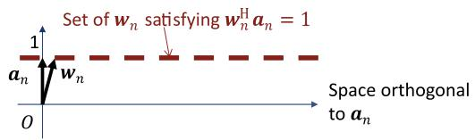  
(a) When $\Vert \pmb { w } _ { n }$ l2 converges to a value close to 1, ${ \pmb w } _ { n }$ suppresses signals in space orthogonal to $\mathbf { \delta } _  \mathbf { \alpha } \mathbf { \delta } \mathbf { \alpha } \mathbf { \delta } \mathbf { \alpha } \mathbf { \delta } \mathbf { \alpha } \mathbf { \delta } \mathbf { \alpha } \mathbf { \delta } \mathbf { \alpha } \mathbf { \delta } \mathbf { \alpha } \mathbf { \delta } \mathbf { \alpha } \mathrm { \bf ~ \textit ~ { ~ a ~ } } _ { n }$ while maintaining response 1 to $\mathbf { \delta } _ { \mathbf { \alpha } \mathbf { \delta } \mathbf { \alpha } \mathbf { \delta } } \mathbf { \delta } \mathbf { a } \mathrm { ~ \textit ~ { ~ a ~ } ~ } _ { n }$

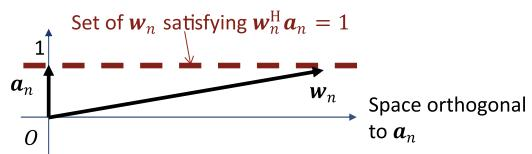  
(b) When $\| \pmb { w } _ { n } \| _ { 2 } ^ { 2 } \gg 1 ,$ ${ \pmb w } _ { n }$ enhances signals in space orthogonal to $\mathbf { \delta } _  \mathbf { \alpha } \mathbf { \delta } \mathbf { \alpha } \mathbf { \delta } \mathbf { \alpha } \mathbf { \delta } \mathbf { \alpha } \mathbf { \delta } \mathbf { \alpha } \mathbf { \delta } \mathbf { \alpha } \mathbf { \delta } \mathbf { \alpha } \mathrm { ~ \textit ~ { ~ a ~ } ~ } _ { n }$ while maintaining response 1 to $\begin{array}{c} \mathbf { \delta } _ { \mathbf { \alpha } \mathbf { \delta } \mathbf { \alpha } \mathbf { \delta } } \mathbf { \delta } _ { \mathbf { \alpha } \mathbf { \delta } \mathbf { \alpha } \mathbf { \delta } \mathbf { \alpha } \mathbf { \delta } \mathbf { \alpha } \mathbf { \delta } \mathbf { \alpha } \mathrm { ~ \textit ~ { ~ a ~ } ~ } } \end{array}$

Fig. 2. Example behaviors of ${ \pmb w } _ { n }$ optimized using unit.  
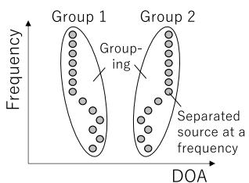  
(a) When IVE w/o null achieves correct source grouping w/o source permutation alignment

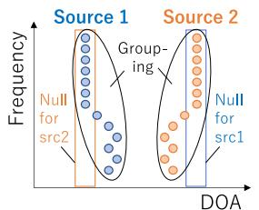  
(b) When IVE w/ null achieves correct source grouping and source permutation alignment

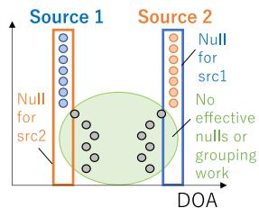  
(c) When IVE w/ null performs erroneous estimation due to IVE's scale ambiguity  
Fig. 3. Example behavior of IVE w/ and w/o null regularization for source grouping and source permutation alignment.

To avoid the above unfavorable effects of scale ambiguity, we must design the spatial regularization so that it can appropriately control the power of separation filter $\Vert \boldsymbol { w } _ { n } \Vert _ { 2 } ^ { 2 }$

To prevent $\Vert \boldsymbol { w } _ { n } \Vert _ { 2 } ^ { 2 }$ from becoming too large, this paper utilizes scale. By putting (17) in the objective function, filter power $\| \pmb { w } _ { n } \| _ { 2 } ^ { 2 } = \pmb { w } _ { n } ^ { \sf H } \pmb { w } _ { n }$ is forced to be reduced during the optimization. Due to this regularization, unit may enable ${ \pmb w } _ { n }$ to suppress the signals in the space orthogonal to $\mathbf { a } _ { n }$ while enhancing the specified direction by maintaining a response of 1 to $\mathbf { a } _ { n }$ . Also, for null, IVE can appropriately perform both source grouping and source permutation alignment by preventing the null term in the objective function from becoming dominant and by considering both the likelihood and the regularization. In Section VI-C, we give a more extensive analysis of the problem caused by scale ambiguity and show that scale effectively solves it.

Note that we should also avoid spatial regularization vanishing when $\Vert \boldsymbol { w } _ { n } \Vert _ { 2 } ^ { 2 }$ approaches zero. This can be heuristically avoided, e.g., by multiplying a scalar to the separation filter and increasing the filter power to a certain value when its power drops below a particular threshold. However, we did not test this normalization because it was not necessary to achieve correct source permutation alignment in our experiments. Elaborating on how to perform normalization is one aspect of our future work.

## C. Processing Flow and Computational Complexity

Algorithm 1 shows the processing flow at each time frame t of the online-WPE×SRIVE algorithm used in our experiments. In it, all the parameters are updated $N _ { \mathrm { I t e r } }$ times at each time frame except for $G _ { n } ( f ; t )$ , which is updated only at the first iteration. We chose this update scheme because WPE converges much faster than IVE in iterative optimization [25]. Moreover, since the computational cost of WPE per iteration exceeds that of IVE, this scheme can make the optimization computationally efficient in practice. In addition, we set different forgetting factors in (22), denoted by α $( 0 < \alpha < 1 )$ for online-IVE to obtain the best performance of the joint optimization. This is because IVE and WPE require different amounts of statistics; IVE uses a smaller covariance matrix $\pmb { \Sigma } _ { n } ( t ) \in \mathbb { C } ^ { M \times M }$ while WPE uses a larger covariance matrix $\pmb { R _ { n } } ( t ) \in \mathbb { C } ^ { M L \times M L }$ . Indeed, previous research has used a relatively large forgetting factor such as 0.99 and 0.9999 for online-WPE [23], [24], while a forgetting factor smaller than 0.99 is used for online-IVA [19], which resulted in stable and quick convergences. We will show the advantage of setting different forgetting factors in our experiments.

Table III shows the computational complexity of each online algorithm, and Table IV summarizes the computational complexity of each update step used in each algorithm. We assume $N _ { \mathrm { I t e r } } = 1$ in Algorithm 1. As shown in Table III, the increase of the complexity of online-WPE×IVA/IVE is $L ^ { 2 }$ in comparison with that of online-IVA/IVE. The increase mainly comes from (37)–(39) in Table IV for updating $G _ { n } ( t )$ , requiring $O ( F M ^ { 2 } L ^ { 2 } )$ . The computational complexities are equal between online-WPE×IVE and online-WPE×SRIVE because the computational complexity for calculating (50)–(55) equals that for calculating (23) and (24). In other words, introducing spatial regularization does not increase the computational complexity.

Algorithm 1: Processing Flow at Each Time Frame t of Online-WPE×SRIVE.

Input : observed signal  $\boldsymbol{x}(f,t)$  for all f
Output: source signals  $\{\hat{s}_{n}(f,t)\}_{1\leq n\leq N}$  for all f
1  $\boldsymbol{G}_{n}(f;t)=\boldsymbol{G}_{n}(f;t-1),\forall f$  and  $1\leq n\leq N+1$ .
2  $\boldsymbol{W}(f;t)=\boldsymbol{W}(f;t-1),\forall f.$ 
3  $\boldsymbol{W}^{-\mathrm{H}}(f;t)=\boldsymbol{W}^{-\mathrm{H}}(f;t-1),\forall f.$ 
4 for Iter = 1 to  $N_{Iter}$  do
5    for f = 1 to F do
6    Update  $\{\boldsymbol{y}_{n}(f,t)\}_{1\leq n\leq N+1}$  by (43).
7    Update  $\boldsymbol{y}(f,t),\hat{\boldsymbol{s}}(f,t),$  and  $\hat{\boldsymbol{z}}(f,t)$  by (44) and (45).
8    Update  $\{v_{n}(t)\}_{1\leq n\leq N}$  by (19).
9    for f = 1 to F do
10    Update  $\{\boldsymbol{\Sigma}_{n}(f;t)\}_{1\leq n\leq N+1}$  by (22)
    substituting  $\alpha$  for  $\beta.$ 
11    Update  $\{\Pi_{n}(f;t)\}_{1\leq n\leq N}$  by (48) and (49).
12    Update  $\{\Pi_{n}^{-1}(f;t)\}_{1\leq n\leq N}$  by (27) substituting  $\alpha$  for  $\beta.$ 
13    for n = 1 to N do
14    if  $\lambda^{unit}=0$  then
15    Update  $w_{n}(f;t)$  by (23) and (24)
    substituting  $\Pi_{n}(f;t)$  for  $\Sigma_{n}(f;t).$ 
16    else
17    Update  $w_{n}(f;t)$  by (50)-(55).
18    Update  $W^{-H}(f;t)$  by (28)
19    Update  $W_{Z}(f;t)$  by (25).
20    Update  $W^{-H}(f;t)$  by (30)
21    if Iter == 1 then
22    Update  $\{G_{n}(f;t)\}_{1\leq n\leq N+1}$  by (37)-(39).

## VI. EXPERIMENTS

In this section, we experimentally evaluate the effectiveness of our proposed online joint optimization and focus on the following three aspects:

\- Source separation accuracy and the computing time of real-time, low-latency processing under a relatively less reverberant environment using an ICC scenario;

\- Source separation accuracy of low-latency processing under a highly reverberant environment in a typical office environment;

\- Effectiveness of spatial regularization for source permutation alignment under the above two environments.

## A. Experimental Condition

We generated observed signals by a simulation that assumed two situations: an ICC scenario with little reverberation and an office with much longer reverberation. In these situations, we used multichannel room impulse responses (RIRs) and noises, which were obtained from 1) data recorded in a car by ourselves and 2) office (OFC) data included in the RWCP Sound Scene

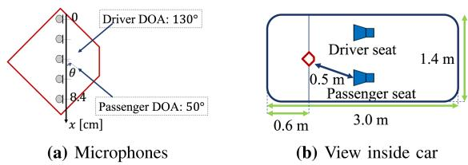  
Fig. 4. Sound source and microphone layout in ICC scenario.

Database from real acoustical environments [47]. The former is a car environment and the latter is an office environment.

We used set B of the ATR digital speech database [48], which is composed of speech data from ten speakers (six men and four women), and generated 100 mixtures of observed signals: 1. Randomly select two utterances by different speakers from the database and repeat each utterance until the length of each signal becomes 20 seconds. 2. Convolve multichannel RIRs and each speaker utterance and mix them at each microphone. 3. Add noise by adjusting the sources-to-noise ratio (SNR) to a specified value. The sampling frequency was set to 16 kHz. Fig. 4 illustrates the recording condition in the car environment. We used five microphones for the office environment: the 19th, 20th, 21st, 22nd, and 23rd microphones. In both environments, we located two speakers at 130 and 50 degrees.

We used the following six methods: online-IVE, online-WPE+IVE (individual optimization), online-WPE×IVE (joint optimization), and those with spatial regularization (e.g., online-SRIVE). Throughout the experiments, the frame length and shift were set to 8 and 4 ms, assuming that low-latency processing of 12 ms is required, e.g., for an ICC scenario [3], [4]. We used a square root Hanning window for both analysis and synthesis and set the forgetting factors to $\alpha = 0 . 9 9$ for IVE and $\beta = 0$ .9999 for WPE. We initialized $\begin{array} { r } { { W } ( f ; 0 ) = { I } _ { M } , { R } _ { n } ^ { - 1 } ( f ; 0 ) = { I } _ { M L } , } \end{array}$ $\begin{array} { r } { G _ { n } ( f ; 0 ) = { \bf 0 } _ { M L \times M } , \Sigma _ { n } ( f , 0 ) = \lambda ^ { \mathrm { s c a l e } } I _ { M } + \sum _ { i = 1 } ^ { N } \lambda _ { n i } a _ { i } a _ { i } ^ { \sf H } } \end{array}$ for $1 \leq n \leq N$ , and $\pmb { \Sigma } _ { N + 1 } ( f , 0 ) = \mathbf { 0 } _ { M \times M }$ . In the online optimization, we did not update separation matrices $W ( f ; t )$ for the first M frames to stabilize the calculation. We used projection back [49] to solve the scale ambiguity.

Because we used linear arrays in both environments, we set relative TDOA $\pmb { \tau } _ { n } = [ \tau _ { n 1 } , \dots , \tau _ { n M } ]$ in (13) for the DOA-based steering vectors:

$$
\tau_ {n m} = \frac {d (m - 1)}{c} \cos \left(\frac {\theta_ {n} \pi}{1 8 0 ^ {\circ}}\right),\tag{56}
$$

where $c = 3 4 3$ m/s is the speed of sound and d is the distance between adjacent microphones. We set $d = 0 . 0 2 1$ meter in the car environment and $d = 0 . 0 2 8 1$ meter in the office environment. We set the speaker directions to $\theta _ { 1 } = 1 3 0 ^ { \circ }$ and $\theta _ { 2 } = 5 0 ^ { \circ }$

We used the average of the source-to-distortion ratios (SDR), the source-to-interference ratios (SIR), and the sources-toartifact ratios (SAR) as the source separation accuracy [50]. To evaluate dereverberation’s effectiveness, we used bss\_eval version 3 [50] and set a dry source as a reference. We set the length of the bss\_eval filter to 512 taps. Because $W ( f ; t )$ changes at each time frame in online source separation, signals should be divided into several segments to evaluate the SDRs in each one. Let $s ( t _ { \mathrm { s a m p l e } } ) \in \mathbb { R } ^ { N \times T _ { \mathrm { s a m p l e } } }$ and $\hat { \pmb { s } } ( t _ { \mathrm { s a m p l e } } ) \in \mathbb { R } ^ { N \times T _ { \mathrm { s a m p l e } } }$ be reference and estimated source signals in the time domain with sample index $t _ { \mathrm { s a m p l e } }$ and let their i-th segments be

TABLE III  
COMPUTATIONAL COMPLEXITY OF EACH ALGORITHM FOR UPDATING PARAMETERS IN EACH TIME t

<table><tr><td>Methods</td><td>Reference</td><td>Flow of parameter updates</td><td>Complexity</td></tr><tr><td>Online-IVA</td><td>[19]</td><td> $(v_1,\dots,v_M) \to w_1 \to w_2 \to \dots \to w_M$ </td><td> $O(FM^3)$ </td></tr><tr><td>Online-IVE</td><td>This paper</td><td> $(v_1,\dots,v_N) \to w_1 \to w_2 \to \dots \to w_N \to W_Z$ </td><td> $O(FNM^2)$ </td></tr><tr><td>Online-WPE×IVA</td><td>This paper</td><td> $(v_1,\dots,v_M) \to w_1 \to w_2 \to \dots \to w_M \to (G_1,\dots,G_M)$ </td><td> $O(FM^3L^2)$ </td></tr><tr><td>Online-WPE×IVE</td><td>This paper</td><td> $(v_1,\dots,v_N) \to w_1 \to w_2 \to \dots \to w_N \to W_Z \to (G_1,\dots,G_{N+1})$ </td><td> $O(F(N+1)M^2L^2)$ </td></tr><tr><td>Online-WPE×SRIVE</td><td>This paper</td><td> $(v_1,\dots,v_N) \to w_1 \to w_2 \to \dots \to w_N \to W_Z \to (G_1,\dots,G_{N+1})$ </td><td> $O(F(N+1)M^2L^2)$ </td></tr></table>

TABLE IV

COMPUTATIONAL COMPLEXITY IN EACH UPDATE STEP

<table><tr><td>Equations</td><td>Variables</td><td>Complexity</td></tr><tr><td>(19)</td><td> $v_n$ </td><td> $O(F)$ </td></tr><tr><td>(23) and (24)</td><td> $w_n$ </td><td> $O(FM^2)$ </td></tr><tr><td>(50)-(55)</td><td> $w_n$ </td><td> $O(FM^2)$ </td></tr><tr><td>(25)</td><td> $W_Z$ </td><td> $O(FNM^2)$ </td></tr><tr><td>(37)-(39)</td><td> $G_n$ </td><td> $O(FM^2L^2)$ </td></tr></table>

$$
\boldsymbol {s} _ {i} = [ \boldsymbol {s} ((i - 1) T _ {\mathrm{seg}} + 1), \dots , \boldsymbol {s} (i T _ {\mathrm{seg}}) ],\tag{57}
$$

$$
\hat {\boldsymbol {s}} _ {i} = [ \hat {\boldsymbol {s}} ((i - 1) T _ {\mathrm{seg}} + 1), \dots , \hat {\boldsymbol {s}} (i T _ {\mathrm{seg}}) ],\tag{58}
$$

where $T _ { \mathrm { s e g } } = 3 2 0 0 0$ samples $\left( = \mathrm { ~ 2 ~ s ~ } \right)$ is the length of each segment. Then, letting $\mathrm { S e g S D R } _ { i , n } \big ( \pmb { \mathscr { s } } _ { i } , \hat { \pmb { \mathscr { s } } } _ { i } \big )$ be the SDR of the n-th source obtained from $s _ { i }$ and $\hat { \mathbf { } } _ { s _ { i } }$ using bss\_eval, we defined SegSDR for segment SegSDR as the average of $\mathrm { S e g S D R } _ { i , n } \big ( \pmb { \mathscr { s } } _ { i } , \hat { \pmb { \mathscr { s } } } _ { i } \big )$ over all the sources:

$$
\operatorname{SegSDR} _ {i} = \frac {1}{N} \sum_ {n = 1} ^ {N} \operatorname{SegSDR} _ {i, n} (\hat {\boldsymbol {s}} _ {i}, \boldsymbol {s} _ {i}).\tag{59}
$$

Moreover, we defined Total-SDR ∈ R:

$$
\text { Total - SDR } = \frac {1}{I} \sum_ {i = 1} ^ {I} \text { SegSDR } _ {i},\tag{60}
$$

where I is the number of segments. We similarly calculated $\mathrm { S e g S I R } _ { i } , \mathrm { S e g S A R } _ { i }$ , Total-SIR, and Total-SAR. In this paper, we calculated SDR, SIR, and SAR using the correct source permutation regardless ofthe actual permutation ofthe separated sources. We defined the correct source permutation as that which achieves the highest SIR among every possible source permutation using the reference signals aligned with a specified source permutation.

We evaluated the accuracy of the source permutation alignment by defining the permutation error (permE):

$$
\text { permE } = \frac {\# \text {   of   mixtures   separated   with   incorrect   permutation }}{\text { Total   } \# \text {   of   mixtures   (=100) }}.\tag{61}
$$

The source permutation alignment was deemed to be incorrect when it was not identical as the correct source permutation.

## B. Evaluation ofOnline Joint Optimization ofWPE and IVE

1) Evaluation in a Car Environment: First, we evaluated the online joint optimization in the car environment. Although the reverberation time $( R T _ { 6 0 } )$ is relatively short ( 60 ms) in a car, we used a much shorter analysis frame (8 ms) for low-latency processing. So dereverberation is necessary to improve the IVE accuracy. We set the dereverberation filter length to $L = 4$ , the prediction delay to $D = 1$ , and the iterations to $N _ { \mathrm { I t e r } } = 2$ . We show the SegSDRs obtained using each method in Fig. 5. For reference, we showed SegSDRs of offline-WPE×IVE [28], [29] in addition to online methods. Although WPE×IVE shows the highest SegSDRs over all 20 seconds, it requires an algorithmic delay of the input signal length (= 20 s). In contrast, all the online methods work with a short algorithmic delay of the analysis frame (= 8 ms). Among them, online-WPE×IVE showed significantly higher SegSDRs than the other online methods after four seconds.

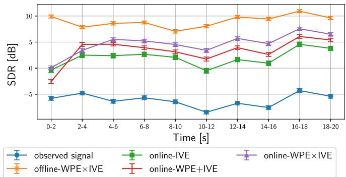  
Fig. 5. SegSDR obtained in car environment with 0 dB input-SNR: Error bar denotes 1.96×standard error each time.

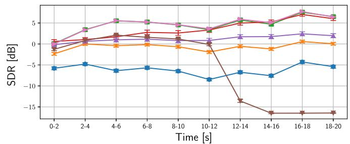  
Fig. 6. SegSDR obtained in car environment when varying forgetting factors α and β.

Fig. 6 compares the SegSDRs obtained when we varied the forgetting factors over α for IVE and β for WPE. Similar to the results for online-IVA [19], the achieved SegSDRs and the convergence speed depended on forgetting factor α when we fixed $\beta = 0 . 9 9 9 9 .$ . In contrast, when we changed $\beta$ from 0.9999 to 0.99 while fixing $\alpha = 0 . 9 9$ , the calculation stability largely degraded after 10 seconds, and the $\mathrm { S e g S D R s }$ were drastically dropped. In this experiment, $( \alpha = 0 . 9 9 , \beta = 0 . 9 9 9 )$ and $( \alpha = 0 . 9 9 , \beta = 0 . 9 9 9 9 )$ yielded the almost best SegSDRs over times. This result shows that using different forgetting factors was advantageous.

TABLE V  
IMPROVEMENTS OF TOTAL-SDR (SDRI), TOTAL-SIR (SIRI), AND TOTAL-SAR [DB] (SARI) AND COMPUTING TIME [S] OBTAINED IN CAR ENVIRONMENT

<table><tr><td>Methods(SNR = 30 dB)</td><td>SDRi</td><td>SIRi</td><td>SARi</td><td></td></tr><tr><td>online-IVE</td><td>5.83</td><td>14.29</td><td>-12.77</td><td></td></tr><tr><td>online-WPE+IVE</td><td>7.32</td><td>16.09</td><td>-12.76</td><td></td></tr><tr><td>online-WPE×IVE</td><td>7.79</td><td>18.25</td><td>-12.54</td><td></td></tr><tr><td>Methods(SNR = 10 dB)</td><td>SDRi</td><td>SIRi</td><td>SARi</td><td></td></tr><tr><td>online-IVE</td><td>7.36</td><td>14.06</td><td>-0.46</td><td></td></tr><tr><td>online-WPE+IVE</td><td>8.34</td><td>15.78</td><td>-0.50</td><td></td></tr><tr><td>online-WPE×IVE</td><td>9.96</td><td>17.97</td><td>0.64</td><td></td></tr><tr><td>Methods(SNR = 0 dB)</td><td>SDRi</td><td>SIRi</td><td>SARi</td><td>Time</td></tr><tr><td>online-IVE</td><td>8.13</td><td>13.44</td><td>3.92</td><td>4.63</td></tr><tr><td>online-WPE+IVE</td><td>9.50</td><td>14.73</td><td>4.86</td><td>6.30</td></tr><tr><td>online-WPE×IVE</td><td>10.82</td><td>15.60</td><td>6.04</td><td>10.6</td></tr></table>

Finally, we compared the improvements of Total-SDR, Total-SIR, and Total-SAR as well as the computing times of each method in Table V. We used python 3.7.7 on a computer with an Intel Xeon Gold 2.4 GHz 1-core CPU. In the table, online-WPE+IVE increased the Total-SDR, Total-SIR, and Total-SAR from the online-IVE by cascading the online-WPE. Online-WPE×IVE achieved the highest Total-SDR, Total-SIR, and Total-SAR improvements regardless of the input-SNR. For the computing time, the proposed method required a total of 10.6 seconds, which corresponded to 2.01 ms (=10,600 ms/5,000 frames) for processing a frame on average. Thus, the total processing delay was 10.01 ms (< 12 ms), including the algorithmic delay (= 8 ms), meaning that the proposed method successfully improved the separation accuracy by real-time processing for an ICC scenario.

2) Evaluation With an Office Environment: Next we evaluated the joint optimization in a noisy reverberant office environment. Because $R T _ { 6 0 }$ in this environment is 780 ms, we set the dereverberation filter length to $L = 2 1$ , the prediction delay to $D = 2$ , and the iterations to $N _ { \mathrm { I t e r } } = 5$ . With a long prediction filter, since real-time processing is impossible in the current implementation, we concentrated on the separation accuracy, relegating real-time processing to future work. We compared the SegSDRs with each method in Fig. 7. Except for offline-WPE×IVE which requires a huge algorithmic delay, the proposed method provided the highest SegSDRs after two seconds. We also confirmed the advantage of using different forgetting factors in not only a car environment but also an office environment, as shown in Fig. 8. Moreover, we compared the Total-SDR, Total-SIR, and Total-SAR improvements of each method in Table VI. When the input-SNR was decreased less than 30 dB, online-WPE×IVE showed a slightly lower Total-SAR than online-WPE+IVE. However, online-WPE×IVE had significantly higher Total-SIR improvement than the other methods regardless of the input-SNR. Online-WPE×IVE had the highest Total-SDR improvement. The above results clearly demonstrate the effectiveness of our proposed method in a noisy and reverberant environment.

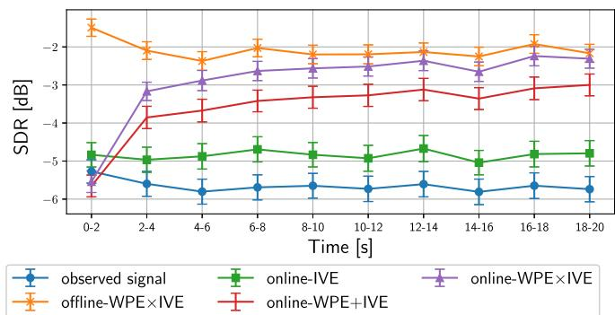  
Fig. 7. SegSDR obtained in an office environment with 10 dB input-SNR. Error bar denotes 1.96×standard error in each time.

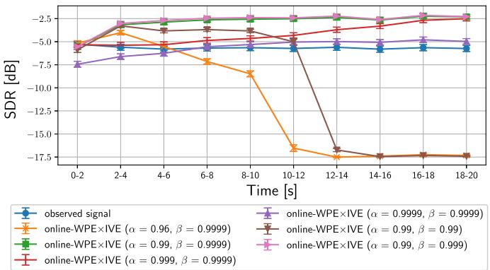  
Fig. 8. SegSDR obtained in an office environment when varying forgetting factors α and β.

TABLE VI  
IMPROVEMENTS OF TOTAL-SDR (SDRI), TOTAL-SIR (SIRI), AND TOTAL-SAR (SARI) [DB] IN AN OFFICE ENVIRONMENT: SCORES IN PARENTHESES ARE 1.96×STANDARD ERROR

<table><tr><td>Methods(SNR = 30 dB)</td><td>SDRi</td><td>SIRi</td><td>SARi</td></tr><tr><td>online-IVE</td><td>0.44 (0.22)</td><td>3.09 (0.34)</td><td>-1.70 (0.09)</td></tr><tr><td>online-WPE+IVE</td><td>1.96 (0.20)</td><td>4.45 (0.29)</td><td>-1.01 (0.10)</td></tr><tr><td>online-WPE×IVE</td><td>2.97 (0.18)</td><td>5.62 (0.28)</td><td>-0.50 (0.09)</td></tr><tr><td>Methods(SNR = 10 dB)</td><td>SDRi</td><td>SIRi</td><td>SARi</td></tr><tr><td>online-IVE</td><td>0.81 (0.20)</td><td>3.03 (0.31)</td><td>-1.34 (0.09)</td></tr><tr><td>online-WPE+IVE</td><td>2.08 (0.18)</td><td>4.11 (0.27)</td><td>-0.69 (0.09)</td></tr><tr><td>online-WPE×IVE</td><td>2.77 (0.16)</td><td>5.37 (0.22)</td><td>-0.75 (0.11)</td></tr><tr><td>Methods(SNR = 0 dB)</td><td>SDRi</td><td>SIRi</td><td>SARi</td></tr><tr><td>online-IVE</td><td>1.96 (0.20)</td><td>3.14 (0.28)</td><td>0.32 (0.12)</td></tr><tr><td>online-WPE+IVE</td><td>3.28 (0.19)</td><td>3.88 (0.26)</td><td>1.34 (0.11)</td></tr><tr><td>online-WPE×IVE</td><td>3.48 (0.18)</td><td>4.73 (0.22)</td><td>0.98 (0.13)</td></tr></table>

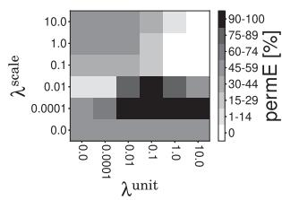  
(a) unit in car environment

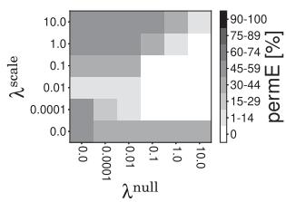  
(b) null in car environment

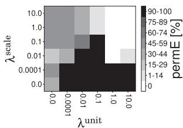  
(c) unit in office environment

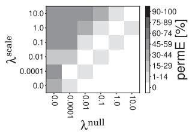  
(d) null in office environment  
Fig. 9. PermE with each spatial regularization term.

TABLE VII  
RMSN OF ESTIMATED SEPARATION FILTER

<table><tr><td>Figure</td><td>Subcaption</td><td> $\sqrt{\frac{1}{F}\sum_{f}\|\boldsymbol{w}_{1}(f)\|_{2}^{2}}$ </td></tr><tr><td rowspan="4">Fig. 10</td><td>(a)</td><td>2,773.35</td></tr><tr><td>(b)</td><td>0.93</td></tr><tr><td>(c)</td><td>3,963.4</td></tr><tr><td>(d)</td><td>16.54</td></tr><tr><td rowspan="4">Fig. 11</td><td>(a)</td><td>30.21</td></tr><tr><td>(b)</td><td>0.89</td></tr><tr><td>(c)</td><td>73.27</td></tr><tr><td>(d)</td><td>10.28</td></tr></table>

## C. Effectiveness of Spatial Regularization for Source Permutation Alignment

Next we evaluated the accuracy of the source permutation alignment using the spatially-regularized source separation methods. First, to determine the general behavior of the spatial regularization, we show how the permutation error (permE) depends on the configurations of the regularization weights, $\lambda ^ { \mathrm { u n i t } } , \lambda ^ { \mathrm { n u l l } }$ l, and $\lambda ^ { \mathrm { s c a l e } }$ in Fig. 9. In the figure, (a) and (c) show the permE obtained using unit and scale, and (b) and (d) show those obtained using null and scale. The white areas indicate that permE was 0%, and permE increases as the color darkens. In Fig. 9(a) and (b), obtained in the car environment, 0% permE was achieved only when $\lambda ^ { \mathrm { s c a l e } }$ is set at appropriate values over 0. On the other hand, in the office environment, setting $\lambda ^ { \mathrm { s c a l e } } > 0$ was necessary for unit to achieve the 0% permE in Fig. 9(c), but null solely achieved a 0% permE without setting $\lambda ^ { \mathrm { s c a l e } } > 0$ as shown in Fig. 9(d). The above results imply that scale is necessary for unit, and it can also help null reduce permE when null cannot sufficiently reduce permE by itself.

We analyzed the reason for the above behavior using the power and the directional response of estimated separation filter $w _ { n } ( f )$ for $n = 1$ . Table VII shows the root mean square norm (RMSN) of estimated filter $\begin{array} { r } { \sqrt { \frac { 1 } { F } \sum _ { f } \| \pmb { w } _ { 1 } ( f ) \| _ { 2 } ^ { 2 } } } \end{array}$ . Fig. 10 shows the directional responses of estimated separation filter to given steering vectors ${ \pmb a } ( f )$ , defined as $\vert \pmb { w } _ { 1 } ^ { \mathsf { H } } ( f ) \pmb { a } ( f ) \vert ^ { 2 }$ . In the y-axis of Fig. 10, row $a _ { \theta ^ { \circ } } ^ { \operatorname { D O A } } ( f )$ corresponds to the steering vector calculated by $( 1 3 ) .$ , and row ${ \pmb a } _ { n } ^ { \mathrm { o r a c l e } } ( f )$ corresponds to oracle steering vector ${ \pmb a } _ { n } ^ { \mathrm { o r a c l e } } ( f )$ for the n-th source. We determined ${ \pmb a } _ { n } ^ { \mathrm { o r a c l e } } ( f )$ as the primary eigenvector of the spatial covariance matrix of the noiseless reverberant source image of $s _ { n } ( f , t )$ The preferred result is that ${ \pmb w } _ { 1 } ( f )$ suppresses the interference speaker’s oracle steering vector $\pmb { a } _ { 2 } ^ { \mathrm { o r a c l e } } ( f )$ and enhances that of target speaker ${ \pmb a } _ { 1 } ^ { \mathrm { o r a c l e } } ( f )$ . Therefore, we normalized the response in each frequency by its maximum value to let the maximum response take 0 dB (or become white in the figure).

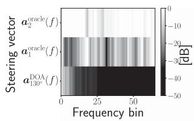  
(a) $\lambda ^ { \mathrm { u n i t } } = 1 0$

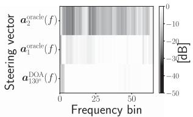  
(b) λunit = 10, λscale = 1

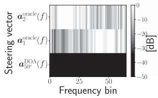  
(c) $\lambda ^ { \mathrm { n u l l } } = 1 0$

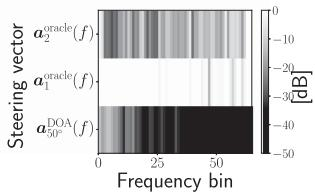  
(d) λnull = 10, λscale = 10−4  
Fig. 10. Directional response $\vert \pmb { w } _ { 1 } ^ { \mathsf { H } } ( f ) \pmb { a } ( f ) \vert ^ { 2 }$ in car environment.

Fig. 10(a) and (b) show the results obtained using unit without and with scale for regularizing $w _ { 1 } ( f )$ to enhance src1 in direction $\theta _ { 1 } = 1 3 0 ^ { \circ }$ . As discussed in Section V-B, to enhance a target sound using unit, the power of separation filter $\| w _ { 1 } ( f ) \| _ { 2 } ^ { 2 }$ must not significantly exceed 1. However, resultant filter $w _ { 1 } ( f )$ in Fig. 10(a) had a large RMSN, 2773.35 (Table VII), and thus $w _ { 1 } ( f )$ suppressed both steering vectors $a _ { 1 3 0 ^ { \circ } } ^ { \mathrm { D O A } }$ and $\pmb { a } _ { 1 } ^ { \mathrm { o r a c l e } }$ that we wanted to enhance. On the other hand, in Fig. 10(b), $w _ { 1 } ( f )$ enhanced $a _ { 1 3 0 ^ { \circ } } ^ { \mathrm { D O A } }$ and ${ \pmb a } _ { 1 } ^ { \mathrm { o r a c l e } }$ while reducing $\pmb { a } _ { 2 } ^ { \mathrm { o r a c l e } } ( f )$ because the filter’s RMSN was now close to 1 due to scale.

We similarly analyzed the response when using null without scale. To achieve the null regularization, we made ${ \pmb w } _ { 1 } ( f )$ suppress src2 in direction $\theta _ { 2 } = 5 0 ^ { \circ }$ . Fig. 10(c) shows that resultant filter ${ \pmb w } _ { 1 } ( f )$ suppressed $\pmb { a } _ { 2 } ^ { \mathrm { o r a c l e } } ( f )$ in the high-frequency region, but failed to suppress it in the low-frequency region. One possible reason for the result was the large RMSN 3,963.4 of the estimated filter (Table VII). Due to the large RMSN, null dominated the objective function, and thus the null direction was determined solely by $a _ { 5 0 ^ { \circ } } ^ { \mathrm { D O A } } ( f )$ . In a reverberant environment, $a _ { 5 0 ^ { \circ } } ^ { \mathrm { D O A } } ( f )$ tends to deviate largely from $\pmb { a } _ { 2 } ^ { \mathrm { o r a c l e } } ( f )$ in the low-frequency region, causing permutation error in the region. On the other hand, with scale, the RMSN of the filter $\begin{array} { r } { \sqrt { \frac { 1 } { F } \sum _ { f } \| \pmb { w } _ { 1 } ( f ) \| _ { 2 } ^ { 2 } } } \end{array}$ was largely reduced to 16.54 (Table VII), and ${ \pmb w } _ { 1 } ( f )$ successfully suppressed $\pmb { a } _ { 2 } ^ { \mathrm { o r a c l e } } ( f )$ in the entire frequency regions (Fig. 10(d)). This is undoubtedly because IVE’s likelihood can now induce a correct source permutation in the low-frequency region due to its source grouping capability. This result implies that scale effectively helped null align the source permutation more robustly against errors in the given transfer functions.

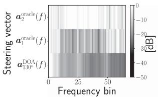  
(a) λunit = 10

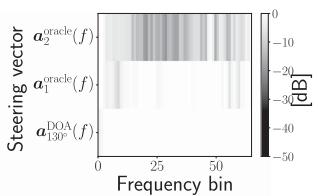  
(b) λunit = 10, λscale = 1

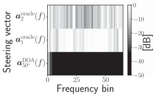  
(c) $\lambda ^ { \mathrm { n u l l } } = 1 0$

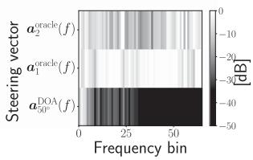  
(d) $\lambda ^ { \mathrm { n u l l } } = 1 0 , \lambda ^ { \mathrm { s c a l e } } = 1 0 ^ { - 4 }$  
Fig. 11. Directional response $\vert \pmb { w } _ { 1 } ^ { \mathsf { H } } ( f ) \pmb { a } ( f ) \vert ^ { 2 }$ in office environment.

We then examined the RMSN and the response of the estimated filter obtained in the office environment with Table VII and Fig. 11. With unit and without scale, the RMSN of the resultant filter was 30.21, still much larger than 1 (Table VII). As a consequence, unit failed to align the source permutation by itself and needed to use scale to solve the problem. On the other hand, with null and without scale, the RMSN of the resultant filter in Table VII was not significantly large this time, i.e., 73.27. Thus, as we expected, the IVE’s source grouping worked appropriately even without scale, and $w _ { 1 } ( f )$ suppressed $\pmb { a } _ { 2 } ^ { \mathrm { o r a c l e } } ( f )$ over the entire frequency regions with only null (Fig. 11(c)).

## D. Evaluation ofOnline Joint Optimization With Spatial Regularization

To simultaneously evaluate the accuracy of the source separation and the source permutation alignment, we show the Total-SDR improvement, Total-SIR improvements, and permE obtained in the car and office environments using Tables VIII and IX.

First, in terms of both Total-SDR and Total-SIR, online-WPE×SRIVE almost consistently outperformed online-SRIVE and online-WPE+SRIVE, except for the Total-SDR obtained using unit without scale. This means that the spatial regularization did not significantly degrade the effectiveness of the joint optimization.

Next, in terms of permE, both unit and null successfully achieved 0 % permE of all the compared methods when we used them with scale in both tables. Only in the office environments, null also reduced permE to 0 % even without using scale. These results again confirm that scale is very useful to make unit and null work appropriately for aligning the source permutation. In addition to reducing the permE to 0 %, using both null and scale always improved the Total-SDR and Total-SIR compared to the cases that did not use the spatial regularization. Although this was not always the case using both unit and scale, their Total-SDR and Total-SIR were comparable to those obtained without regularization. From the above results, even for online joint optimization, we can effectively maintain separation accuracy and achieve accurate source permutation alignment by using both spatial and scale regularization.

TABLE VIII  
TOTAL-SDR IMPROVEMENT (SDRI) [DB], TOTAL-SIR IMPROVEMENT (SIRI) [DB], AND PERMUTATION ERROR (PERME) [%] OBTAINED IN CAR ENVIRONMENT WITH 0 DB INPUT-SNR

<table><tr><td>Methods</td><td> $\lambda^{null}$ </td><td> $\lambda^{unit}$ </td><td> $\lambda^{scale}$ </td><td>SDRi</td><td>SIRi</td><td>permE</td></tr><tr><td rowspan="5">online-SRIVE</td><td>0</td><td>0</td><td>0</td><td>8.13</td><td>13.44</td><td>47</td></tr><tr><td>10</td><td>0</td><td>0</td><td>9.59</td><td>13.14</td><td>38</td></tr><tr><td>10</td><td>0</td><td> $10^{-4}$ </td><td>8.66</td><td>14.23</td><td>0</td></tr><tr><td>0</td><td>10</td><td>0</td><td>6.21</td><td>12.08</td><td>52</td></tr><tr><td>0</td><td>10</td><td>10</td><td>7.75</td><td>12.06</td><td>0</td></tr><tr><td rowspan="5">online-WPE+SRIVE</td><td>0</td><td>0</td><td>0</td><td>9.50</td><td>14.73</td><td>63</td></tr><tr><td>10</td><td>0</td><td>0</td><td>10.67</td><td>14.10</td><td>35</td></tr><tr><td>10</td><td>0</td><td> $10^{-4}$ </td><td>9.64</td><td>15.27</td><td>0</td></tr><tr><td>0</td><td>10</td><td>0</td><td>10.69</td><td>14.24</td><td>63</td></tr><tr><td>0</td><td>10</td><td>10</td><td>8.68</td><td>14.54</td><td>0</td></tr><tr><td rowspan="5">online-WPE×SRIVE</td><td>0</td><td>0</td><td>0</td><td>10.82</td><td>15.60</td><td>32</td></tr><tr><td>10</td><td>0</td><td>0</td><td>12.23</td><td>16.70</td><td>3</td></tr><tr><td>10</td><td>0</td><td> $10^{-4}$ </td><td>11.29</td><td>17.67</td><td>0</td></tr><tr><td>0</td><td>10</td><td>0</td><td>9.08</td><td>15.40</td><td>98</td></tr><tr><td>0</td><td>10</td><td>10</td><td>9.26</td><td>16.47</td><td>0</td></tr></table>

SDRs and SIRs were calculated using correct source permutation that achieved highest sirs among all possible source permutations

TABLE IX  
TOTAL-SDR IMPROVEMENT (SDRI) [DB], TOTAL-SIR IMPROVEMENT (SIRI) [DB], AND PERMUTATION ERROR (PERME) [%] OBTAINED IN OFFICE ENVIRONMENT WITH 10 DB INPUT-SNR

<table><tr><td>Methods</td><td> $\lambda^{null}$ </td><td> $\lambda^{unit}$ </td><td> $\lambda^{scale}$ </td><td>SDRi</td><td>SIRi</td><td>permE</td></tr><tr><td rowspan="5">online-SRIVE</td><td>0</td><td>0</td><td>0</td><td>0.81</td><td>3.03</td><td>41</td></tr><tr><td>10</td><td>0</td><td>0</td><td>0.92</td><td>2.90</td><td>0</td></tr><tr><td>10</td><td>0</td><td> $10^{-4}$ </td><td>0.96</td><td>3.03</td><td>0</td></tr><tr><td>0</td><td>10</td><td>0</td><td>0.71</td><td>3.10</td><td>100</td></tr><tr><td>0</td><td>10</td><td>1</td><td>0.75</td><td>2.75</td><td>0</td></tr><tr><td rowspan="5">online-WPE+SRIVE</td><td>0</td><td>0</td><td>0</td><td>2.08</td><td>4.11</td><td>43</td></tr><tr><td>10</td><td>0</td><td>0</td><td>2.33</td><td>4.50</td><td>0</td></tr><tr><td>10</td><td>0</td><td> $10^{-4}$ </td><td>2.32</td><td>4.49</td><td>0</td></tr><tr><td>0</td><td>10</td><td>0</td><td>2.20</td><td>4.31</td><td>100</td></tr><tr><td>0</td><td>10</td><td>1</td><td>2.22</td><td>4.42</td><td>0</td></tr><tr><td rowspan="5">online-WPE×SRIVE</td><td>0</td><td>0</td><td>0</td><td>2.77</td><td>5.37</td><td>37</td></tr><tr><td>10</td><td>0</td><td>0</td><td>3.14</td><td>5.77</td><td>0</td></tr><tr><td>10</td><td>0</td><td> $10^{-4}$ </td><td>3.25</td><td>6.00</td><td>0</td></tr><tr><td>0</td><td>10</td><td>0</td><td>2.49</td><td>5.48</td><td>100</td></tr><tr><td>0</td><td>10</td><td>1</td><td>2.98</td><td>6.25</td><td>0</td></tr></table>

SDRs and SIRs were calculated using correct source permutation that achieved highest SIRs among all possible source permutations.

## VII. CONCLUSION

This paper proposed low-latency online source separation algorithms that work in noisy reverberant environments. We achieved overall optimal separation accuracy by proposing a blind online source separation algorithm that jointly optimized WPE and IVE. We introduced a log-likelihood function with a forgetting factor for them and derived a computationally efficient algorithm based on it. We conducted experiments on separation accuracy under little and long reverberation environments in a car and an office, setting the algorithmic delay at 8 ms. The proposed joint optimization algorithm significantly outperformed the conventional individual optimization algorithm in both environments. Next we proposed a spatially-regularized online joint optimization algorithm to separate signals with specified source permutations. Our analysis revealed that using the scale regularization with both unit and null regularization is indispensable for source permutation alignment. In our experiments, we successfully reduced the permutation error to 0%. Finally, we showed that the spatially-regularized online joint optimization algorithm achieved high separation accuracy and accurate source permutation alignment. In addition to the effectiveness of the proposed method, this research investigated the impact of varying the forgetting factors and spatial regularization weights on source separation and source permutation alignment accuracy, respectively.

Future research may develop a more effective online joint optimization algorithm by exploring the mutual influence between forgetting factors and weights of spatial regularizations.

## REFERENCES

[1] D. Mauler and R. Martin, “A low delay, variable resolution, perfect reconstruction spectral analysis-synthesis system for speech enhancement,” in Proc. 15th Eur. Signal Process. Conf., 2007, pp. 222–226.

[2] M. Sunohara, C. Haruta, and N. Ono, “Low-latency real-time blind source separation for hearing aids based on time-domain implementation of online independent vector analysis with truncation of non-causal components,” in Proc. IEEE Int. Conf.Acoust., Speech, Signal Process., 2017, pp. 216–220.

[3] M. Zoulikha and M. Djendi, “A new regularized forward blind source separation algorithm for automatic speech quality enhancement,” Appl. Acoust., vol. 112, pp. 192–200, 2016.

[4] R. Landgraf, J. Köhler-Kaeß, C. Lüke, O. Niebuhr, and G. Schmidt, “Can you hear me now? Reducing the Lombard effect in a driving car using an in-car communication system,” in Proc. Speech Prosody, 2016, pp. 479–483.

[5] A. Hyvärinen and E. Oja, “Independent component analysis: Algorithms and applications,” Neural Netw., vol. 13, no. 4-5, pp. 411–430, 2000.

[6] P. Comon, “Independent component analysis, a new concept?,” Signal Process., vol. 36, no. 3, pp. 287–314, 1994.

[7] A. Hiroe, “Solution of permutation problem in frequency domain ICA, using multivariate probability density functions,” in Proc. Independent Component Anal. Blind Signal Separation, 2006, pp. 601–608.

[8] T. Kim, H. T. Attias, S.-Y. Lee, and T.-W. Lee, “Blind source separation exploiting higher-order frequency dependencies,” IEEE Trans. Audio, Speech, Lang. Process., vol. 15, no. 1, pp. 70–79, Jan. 2007.

[9] N. Ono, “Stable and fast update rules for independent vector analysis based on auxiliary function technique,” in Proc. IEEE Workshop Appl. Signal Process. Audio Acoust., 2011, pp. 189–192.

[10] N. Ono and S. Miyabe, “Auxiliary-function-based independent component analysis for super-Gaussian sources,” in Proc. Latent Variable Anal. Signal Separation/Int. Conf. Latent Variable Anal. Signal Separation, 2010, pp. 165–172.

[11] D. Kitamura, N. Ono, H. Sawada, H. Kameoka, and H. Saruwatari, “Determined blind source separation with independent low-rank matrix analysis,” in Audio Source Separation. Berlin, Germany: Springer, 2018, pp. 125–155.

[12] H. Kameoka, L. Li, S. Inoue, and S. Makino, “Supervised determined source separation with multichannel variational autoencoder,” Neural Computation, vol. 31, no. 9, pp. 1891–1914, 2019.

[13] H. Sawada, S. Araki, R. Mukai, and S. Makino, “Grouping separated frequency components by estimating propagation model parameters in frequency-domain blind source separation,” IEEE Trans. ASLP, vol. 15, no. 5, pp. 1592–1604, Jul. 2007.

[14] R. Scheibler and N. Ono, “MM algorithms for joint independent subspace analysis with application to blind single and multi-source extraction,” 2020, arXiv:2004.03926.

[15] R. Ikeshita, T. Nakatani, and S. Araki, “Overdetermined independent vector analysis,” in Proc. Int. Conf. Acoust., Speech Signal Process., 2020, pp. 591–595.

[16] R. Ikeshita, T. Nakatani, and S. Araki, “Block coordinate descent algorithms for auxiliary-function-based independent vector extraction,” IEEE Trans. Signal Process., vol. 69, pp. 3252–3267, 2021.

[17] Z. Koldovsky and P. Tichavsky, “Gradient algorithms for complex non-Gaussian independent component/vector extraction, question of convergence,” IEEE Trans. Signal Process., vol. 67, no. 4, pp. 1050–1064, Feb. 2019.

[18] R. Scheibler and N. Ono, “Independent vector analysis with more microphones than sources,” in Proc. IEEE Workshop Appl. Signal Process. Audio Acoust., 2019, pp. 185–189.

[19] T. Taniguchi, N. Ono, A. Kawamura, and S. Sagayama, “An auxiliaryfunction approach to online independent vector analysis for real-time blind source separation,” in Proc. 4th Joint Workshop Hands-free Speech Commun. Microphone Arrays, 2014, pp. 107–111.

[20] J. Jansky, J. Malek, J. Cmejla, T. Kounovsky, Z. Koldovsky, and J. Zdansky, “Adaptive blind audio source extraction supervised by dominant speaker identification using x-vectors,” in Proc. IEEE Int. Conf. Acoust., Speech, Signal Process., 2020, pp. 676–680.

[21] A. Theiss, G. Schmidt, J. Withopf, and C. Lueke, “Instrumental evaluation of in-car communication systems,” in Proc. Speech Commun.; 11. ITG Symp., 2014, pp. 1–4.

[22] T. Nakatani, T. Yoshioka, K. Kinoshita, M. Miyoshi, and B.-H. Juang, “Blind speech dereverberation with multi-channel linear prediction based on short time Fourier transform representation,” in Proc. IEEE Int. Conf. Acoust., Speech, Signal Process., 2008, pp. 85–88.

[23] T. Yoshioka, H. Tachibana, T. Nakatani, and M. Miyoshi, “Adaptive dereverberation of speech signals with speaker-position change detection,” in Proc. IEEE Int. Conf. Acoust., Speech, Signal Process., 2009, pp. 3733–3736.

[24] J. Caroselli, I. Shafran, A. Narayanan, and R. Rose, “Adaptive multichannel dereverberation for automatic speech recognition,” in Proc. Interspeech, 2017, pp. 3877–3881.

[25] T. Nakatani, R. Ikeshita, K. Kinoshita, H. Sawada, and S. Araki, “Computationally efficient and versatile framework for joint optimization of blind speech separation and dereverberation,” in Proc. Annu. Conf. Int. Speech Commun. Assoc., 2020, pp. 91–95.

[26] H. Kagami, H. Kameoka, and M. Yukawa, “Joint separation and dereverberation of reverberant mixtures with determined multichannel nonnegative matrix factorization,” in Proc. IEEE Int. Conf. Acoust., Speech, Signal Process., 2018, pp. 31–35.

[27] T. Nakashima, R. Scheibler, M. Togami, and N. Ono, “Joint dereverberation and separation with iterative source steering,” in Proc. IEEE Int. Conf. Acoust., Speech, Signal Process., 2021, pp. 216–220.

[28] T. Nakatani, R. Ikeshita, K. Kinoshita, H. Sawada, and S. Araki, “Blind and neural network-guided convolutional beamformer for joint denoising, dereverberation, and source separation,” in Proc. IEEE Int. Conf. Acoust., Speech, Signal Process., 2021, pp. 6129–6133.

[29] R. Ikeshita and T. Nakatani, “Independent vector extraction for fast joint blind source separation and dereverberation,” IEEE Signal Process. Lett., vol. 28, pp. 972–976, 2021.

[30] M. Togami and R. Scheibler, “Over-determined speech source separation and dereverberation,” in Proc. Asia-Pacific Signal Inf. Process. Assoc. Annu. Summit Conf., 2020, pp. 705–710.

[31] L. C. Parra and C. V. Alvino, “Geometric source separation: Merging convolutive source separation with geometric beamforming,” IEEE Trans. Speech Audio Process., vol. 10, no. 6, pp. 352–362, Sep. 2002.

[32] A. H. Khan, M. Taseska, and E. A. Habets, “A geometrically constrained independent vector analysis algorithm for online source extraction,” in Proc. Int. Conf. Latent Variable Anal. Signal Separation, 2015, pp. 396–403.

[33] Y. Mitsui, N. Takamune, D. Kitamura, H. Saruwatari, Y. Takahashi, and K. Kondo, “Vectorwise coordinate descent algorithm for spatially regularized independent low-rank matrix analysis,” in Proc. IEEE Int. Conf. Acoust., Speech, Signal Process., 2018, pp. 746–750.

[34] L. Li and K. Koishida, “Geometrically constrained independent vector analysis for directional speech enhancement,” in Proc. IEEE Int. Conf. Acoust., Speech, Signal Process., 2020, pp. 846–850.

[35] L. Li, K. Koishida, and S. Makino, “Online directional speech enhancement using geometrically constrained independent vector analysis,” in Proc. Annu. Conf. Int. Speech Commun. Assoc., 2020, pp. 61–65.

[36] A. Brendel, T. Haubner, and W. Kellermann, “A unified probabilistic view on spatially informed source separation and extraction based on independent vector analysis,” IEEETrans. Signal Process., vol. 68, pp. 3545–3558, 2020.

[37] A. Brendel and W. Kellermann, “Informed source extraction based on independent vector analysis using eigenvalue decomposition,” in Proc. 28th Eur. Signal Process. Conf., 2021, pp. 875–879.

[38] K. Goto, T. Ueda, L. Li, T. Yamada, and S. Makino, “Geometrically constrained independent vector analysis with auxiliary function approach and iterative source steering,” in Proc. 30th Eur. Signal Process. Conf., 2022, pp. 757–761.

[39] K. Goto, T. Ueda, L. Li, T. Yamada, and S. Makino, “Accelerating online algorithm using geometrically constrained independent vector analysis with iterative source steering,” in Proc. Asia-Pacific Signal Inf. Process. Assoc. Annu. Summit Conf., 2022, pp. 755–760.

[40] T. Ueda, T. Nakatani, R. Ikeshita, K. Kinoshita, S. Araki, and S. Makino, “Low latency online blind source separation based on joint optimization with blind dereverberation,” in Proc. IEEE Int. Conf. Acoust., Speech, Signal Process., 2021, pp. 506–510.

[41] T. Ueda, T. Nakatani, R. Ikeshita, K. Kinoshita, S. Araki, and S. Makino, “Low latency online source separation and noise reduction based on joint optimization with dereverberation,” in Proc. 29th Eur. Signal Process. Conf., 2021, pp. 1000–1004.

[42] T. Dietzen, S. Doclo, M. Moonen, and T. V. Waterschoot, “Joint multimicrophone speech dereverberation and noise reduction using integrated sidelobe cancellation and linear prediction,” in Proc. 16th Int. Workshop Acoust. Signal Enhancement, 2018, pp. 221–225.

[43] T. Nakatani and K. Kinoshita, “Simultaneous denoising and dereverberation for low-latency applications using frame-by-frame online unified convolutional beamformer,” in Proc. Annu. Conf. Int. Speech Commun. Assoc., 2019, pp. 111–115.

[44] T. Dietzen, S. Doclo, M. Moonen, and T. v. Waterschoot, “Integrated sidelobe cancellation and linear prediction Kalman filter for joint multimicrophone speech dereverberation, interfering speech cancellation, and noise reduction,” IEEE/ACM Trans. Audio, Speech, Lang. Process., vol. 28, pp. 740–754, 2020.

[45] S. Haykin, Adaptive Filter Theory. London, U.K.: Pearson Education India, 2008.

[46] T.-T. Lu and S.-H. Shiou, “Inverses of 2 x 2 block matrices,” Comput. Math. with Appl., vol. 43, pp. 119–129, 2002.

[47] S. Nakamura, K. Hiyane, F. Asano, T. Nishiura, and T. Yamada, “Acoustical sound database in real environments for sound scene understanding and hands-free speech recognition,” in Proc. LREC, 2000, pp. 965–968.

[48] A. Kurematsu, K. Takeda, Y. Sagisaka, S. Katagiri, H. Kuwabara, and K. Shikano, “ATR japanese speech database as a tool of speech recognition and synthesis,” Speech Commun., vol. 9, no. 4, pp. 357–363, 1990.

[49] N. Murata, S. Ikeda, and A. Ziehe, “An approach to blind source separation based on temporal structure of speech signals,” Neurocomputing, vol. 41, pp. 1–24, 2001.

[50] E. Vincent, R. Gribonval, and C. Févotte, “Performance measurement in blind audio source separation,” IEEE/ACM Trans. Audio, Speech, Lang. Process., vol. 14, no. 4, pp. 1462–1469, Jul. 2006.

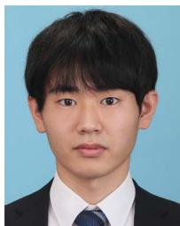  
Tetsuya Ueda (Student Member, IEEE) received the B.Sc. and M.E. degrees in information engineering and engineering from the University of Tsukuba, Tsukuba, Japan, in 2020 and 2022, respectively. He is currently working toward the Ph.D. degree with Waseda University, Kitakyushu, Japan. His research interests include acoustic signal processing, speech enhancement, and dereverberation.

Tomohiro Nakatani (Fellow, IEEE) received the B.E., M.E., and Ph.D. degrees from Kyoto University, Kyoto, Japan, in 1989, 1991, and 2002, respectively. He is currently a Senior Distinguished Researcher with NTT Communication Science Laboratories, NTT Corporation, Kyoto, Japan. Since joining NTT Corporation in 1991, he has been investigating audio signal processing technologies for intelligent human-machine interfaces, including dereverberation, denoising, source separation, and robust ASR. He was a Visiting Scholar with the Georgia Institute of Technology, Atlanta, GA, USA, for a year in 2005, and Visiting Assistant Professor with the Department of Media Science, Nagoya University, Nagoya, Japan, from 2008 to 2017. From 2008 to 2010 he was an Associate Editor for IEEE TRANSACTION ON AUDIO, SPEECH, AND LANGUAGE PROCESSING. From 2009 to 2014, he was a Member ofthe IEEE Signal Processing Society Audio and Acoustics Technical Committee and from 2016 to 2021, Member of the IEEE SPS Speech and Language Processing Technical Committee. From 2011 to 2012, he was the Chair of the IEEE Kansai Section Technical Program Committee and from 2019 to 2020, Chair of the IEEE SPS Kansai Chapter. He was the Technical Program Co-Chair of the IEEE WASPAA-2007, Co-Chair of the 2014 REVERB Challenge Workshop, and General Co-Chair of the IEEE ASRU-2017. He is a Fellow of IEICE and Member of ASJ. He was the recipient of the 2005 IEICE Best Paper Award, 2009 ASJ Technical Development Award, 2012 Japan Audio Society Award, 2015 IEEE ASRU Best Paper Award Honorable Mention, 2017 Maejima Hisoka Award, and 2018 IWAENC Best Paper Award.

Rintaro Ikeshita (Member, IEEE) received the B.E. and M.S. degrees from the University of Tokyo, Tokyo, Japan, in 2013 and 2015, respectively. He is currently a Researcher with NTT Communication Science Laboratories, NTT Corporation, Kyoto, Japan. From 2015 to 2018, he was a Researcher with Research & Development Group, Hitachi, Ltd., Tokyo, Japan.

Keisuke Kinoshita (Senior Member, IEEE) received the M.Eng. and Ph.D. degrees from Sophia University, Tokyo, Japan, in 2003 and 2010, respectively. He is currently a Staff Research Scientist with Google. Before joining Google, he was a Distinguished Research Scientist at NTT Communication Science Laboratories from 2003 to 2022, where he did most of the work on the project described in this manuscript. In this research career, he has been engaged in fundamental research on various types ofspeech, audio, and music signal processing, including 1ch/multi-channel

speech enhancement (blind dereverberation, source separation, noise reduction), speaker diarization, robust speech recognition, and distributed microphone array processing, and developed several innovative commercial software. He is an author or a co-author of more than 20 journal papers, five book chapters, more than 100 papers presented at peer-reviewed international conferences, and an inventor or a co-inventor of more than 20 Japanese patents and five international patents. He is an Associate Editor for IEEE TRANSACTIONS ON AUDIO, SPEECH AND LANGUAGE PROCESSINGS (TASLP) since 2021, and a member of IEEE Audio and Acoustic Signal Processing Technical Committee (AASP-TC) since 2019, and was the Chief Coordinator of the REVERB challenge in 2014, the Editor ofIEICE Transactions on Fundamentals ofElectronics, Communications and Computer Sciences from 2013 to 2017, the Guest Editor of EURASIP Journal on Advances in Signal Processing in 2015. He was honored to receive the 2006 IEICE Paper Award, 2010 ASJ Outstanding Technical Development Prize, the 2011 ASJ Awaya Prize, the 2012 Japan Audio Society Award, 2015 IEEE-ASRU Best Paper Award Honorable Mention, and 2017 Maejima Hisoka Award. He is a member of ASJ and IEICE.

Shoko Araki (Fellow, IEEE) received the B.E. and the M.E. degrees from the University of Tokyo, Tokyo, Japan, in 1998 and 2000, respectively, and the Ph.D. degree from Hokkaido University, Sapporo, Japan, in 2007. is currently a Senior Research Scientist with NTT Communication Science Laboratories, NTT Corporation, Japan, where she is currently leading the Signal Processing Research Group. Since she joined NTT in 2000, she has been engaged in research on acoustic signal processing, array signal processing, blind source separation, meeting diarization and auditory scene analysis. She was formerly a member of the IEEE SPS Audio and Acoustic Signal Processing Technical Committee (AASP-TC) during 2014–2019, the Vice Chair in 2022, and currently serves as its chair. She was a board member of the Acoustical Society of Japan (ASJ) during 2017–2020, and she was the Vice President of ASJ during 2021–2023. She also was a member of the organizing committee of ICA 2003, IWAENC 2003, IEEE WASPAA 2007, HSCMA2017, IEEE WASPAA2017, IWAENC2018, IEEE WASPAA2021, and the Evaluation Co-Chair of the Signal Separation Evaluation Campaign (SiSEC) 2008, 2010, and 2011. She was the recipient ofthe 19th Awaya Prize from Acoustical Society of Japan (ASJ) in 2001, the Best Paper Award of the IWAENC in 2003, the TELECOM System Technology Award from the Telecommunications Advancement Foundation in 2004 and 2014, the Academic Encouraging Prize from the Institute of Electronics, Information and Communication Engineers (IEICE) in 2006, the Itakura Prize Innovative Young Researcher Award from ASJ in 2008, the Commendation for Science and Technology by the Minister of Education, Culture, Sports, Science and Technology, The Young Scientists’ Prize in 2014, IEEE SPS Best paper award in 2014, and IEEE ASRU 2015 Best Paper Award Honorable Mention in 2015. She is an IEEE Fellow for contributions to blind source separation of noisy and reverberant speech signals since 2022.

Shoji Makino (Life Fellow, IEEE) received the B.E., M.E., and Ph.D. degrees from Tohoku University, Sendai, Japan, in 1979, 1981, and 1993, respectively. He joined NTT in 1981 and the University of Tsukuba, Ibaraki, Japan, in 2009. He is currently a Professor with Waseda University, Kiyakyushu, Japan. He has authored or coauthored of more than 400 articles in journals and conference proceedings and is responsible for more than 200 patents. His research interests include adaptive filtering technologies, blind source separation of convolutive mixtures

of speech, the realization of acoustic echo cancellation, and acoustic signa processing for speech and audio applications. He was the recipient of the IEEE Signal Processing Society Leo L. Beranek Meritorious Service Award in 2022, the ICA Unsupervised Learning Pioneer Award in 2006, the IEEE MLSP Competition Award in 2007, the IEEE SPS Best Paper Award in 2014, the Achievement Award for Science and Technology from the Japanese Government in 2015, the Hoko Award of the Hattori Hokokai Foundation in 2018, the Honorary Member Award of the IEICE in 2022, the Outstanding Contribution Award of the IEICE in 2018, the Technical Achievement Award of the IEICE in 2017 and 1997, the Outstanding Technological Development Award of the ASJ in 1995, and eight best paper awards. He was a member of the IEEE Jack S. Kilby Signal Processing Medal Committee during 2015–2018, and the James L. Flanagan Speech & Audio Processing Award Committee during 2008–2011. He was on IEEE SPS Board of Governors during 2018–2020, Technical Directions Board during 2013–2014, Awards Board during 2006–2008, Conference Board during 2002–2004, and a Fellow Evaluation Committee during 2018–2020. He was a Keynote Speaker at ICA2007, a Tutorial Speaker at ICASSP2007, Interspeech2011, and EMBC2013. He was an Associate Editor for IEEE TRANSACTIONS ON SPEECH AND AUDIO PROCESSING during 2002–2005 and an Associate Editor for the EURASIP Journal on Advances in Signal Processing during 2005–2012. He was the Guest Editor of the Special Issue of the IEEE Signal Processing Magazine during 2013–2014. He was the Chair of SPS Audio and Acoustic Signal Processing Technical Committee during 2013–2014, and the Chair of the Blind Signal Processing Technical Committee of the IEEE Circuits and Systems Society during 2009–2010. He was the General Chair of IWAENC 2018, WASPAA2007, IWAENC2003, the Organizing Chair of ICA2003, and is the designated Plenary Chair of ICASSP2012. Dr. Makino is an IEEE SPS Distinguished Lecturer during 2009–2010, an IEICE Fellow, a Board member of the ASJ, and a member of EURASIP.