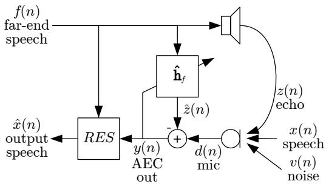
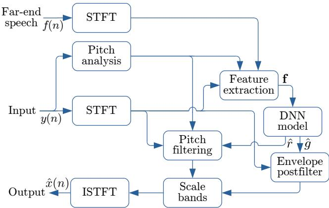
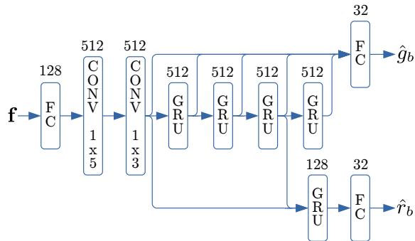
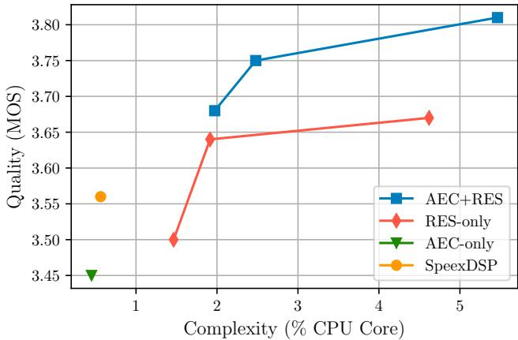
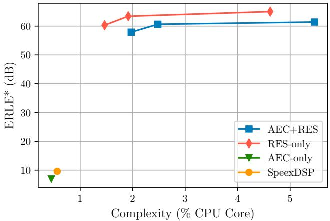

# LOW-COMPLEXITY, REAL-TIME JOINT NEURAL ECHO CONTROL AND SPEECH ENHANCEMENT BASED ON PERCEPNET

Jean-Marc Valin, Srikanth Tenneti, Karim Helwani, Umut Isik, Arvindh Krishnaswamy

Amazon Web Services

Palo Alto, CA, USA

{jmvalin, stenneti, helwk, umutisik, arvindhk}@amazon.com

## ABSTRACT

Speech enhancement algorithms based on deep learning have greatly surpassed their traditional counterparts and are now being considered for the task of removing acoustic echo from hands-free communication systems. This is a challenging problem due to both real-world constraints like loudspeaker non-linearities, and to limited compute capabilities in some communication systems. In this work, we propose a system combining a traditional acoustic echo canceller, and a low-complexity joint residual echo and noise suppressor based on a hybrid signal processing/deep neural network (DSP/DNN) approach. We show that the proposed system outperforms both traditional and other neural approaches, while requiring only 5.5% CPU for real-time operation. We further show that the system can scale to even lower complexity levels.

Index Terms— acoustic echo cancellation, neural residual echo suppression, speech enhancement

## 1. INTRODUCTION

In full-duplex communication applications, echo produced by the acoustic feedback from the loudspeaker to the microphone can severely degrade quality. Traditional acoustic echo cancellation (AEC) aims at cancelling the acoustic echoes from the microphone signal by filtering the far-end (loudspeaker) signal with the estimated echo path modeled by an adaptive FIR filter, and subtracting the resulting signal from the microphone signal [1, 2]. If the estimated echo path is equal to the true echo path, echo is removed from the microphone signal. In real-world applications, residual echo remains at the output of AEC due to issues such as non-linearities in the acoustic drivers, rapidly-varying acoustic environments, and microphone noise. Hence, residual echo suppressors are typically employed after the system identification-based AEC in order to meet the requirements for high echo attenuation [3, 4, 5].

In addition, background noise also degrades the speech quality, while limiting the ability of the AEC to adapt fast enough to track acoustic path changes, further worsening the overall communication quality. Traditional speech enhancement methods [6, 7] – sometimes combined with acoustic echo suppression [8] – can help reduce the effect of stationary noise, but have been mostly unable to remove highly non-stationary noise. In recent years, deep-learning-based speech enhancement systems have emerged as state-of-the-art solutions [9, 10, 11, 12, 13]. Even more recently, deep-learning-based residual echo suppression algorithms have also demonstrated stateof-the-art performance [14, 15].

In this paper, we present an integrated approach to noise suppression and echo control (Section 2) which abides to the idea of incorporating prior knowledge from physics and psychoacoustics to design a low complexity but effective architecture. Since, the acoustic path between a loudspeaker and a microphone is well approximated as a linear FIR filter, we retain the traditional frequencydomain acoustic echo canceller (AEC) described in Section 3. We combine the adaptive filter with a perceptually-motivated joint noise and echo suppression algorithm (Section 4). As in [16], we focus on restoring the spectral envelope and the periodicity of the speech. Our model is trained (Section 5) to enhance the speech from the AEC using the far-end signal as side information to help remove the far-end signal while denoising the near-end speech. Results from our experiments and from the Acoustic Echo Cancellation Challenge [17] show that the proposed algorithm outperforms both traditional and other neural approaches to residual echo suppression, taking first place in the challenge (Section 6).

  
Fig. 1. Overview of the joint echo control and noise suppression system. The far-end signal f (n) is played through the loudspeaker. The microphone signal $d ( n )$ captures the reverberated near-end speech but also some noise v (n), as well as echo $z \left( n \right)$ from the loudspeaker. The echo is partially cancelled by the adaptive filter $\hat { \mathbf { h } } _ { f }$ to produce $y \left( n \right)$ . The RES then enhances $y \left( n \right)$ by suppressing noise, reverberation, as well as the remaining echo, and produces the enhanced output xˆ (n).

## 2. SIGNAL MODEL

The signal model we consider in this work is shown in Fig. 1. Let $x \left( n \right)$ be a clean speech signal. The signal captured by a hands-free microphone in a noisy room is given by

$$
d (n) = x (n) \star \mathbf {h} _ {x} + v (n) + z (n),\tag{1}
$$

where $v \left( n \right)$ is the additive noise from the room, $z \left( n \right)$ is the echo caused by a far-end signal f (n), hx is the impulse response from the talker to the microphone, and ? denotes the convolution. When ignoring non-linear effects, the echo signal can be expressed as $z \left( n \right) = f \left( n \right) \star \mathbf { h } _ { f }$ . Echo cancellation based on adaptive filtering consists in estimating $\mathbf { h } _ { f }$ and subtracting the estimated echo $\hat { z } \left( n \right)$ from the microphone signal to produce the echo-cancelled signal $y \left( n \right)$ Unfortunately, the echo cancellation process is generally imperfect and echo remains in $y \left( n \right)$ . For this reason, we include a joint residual echo suppression (RES) and noise suppression (NS) algorithm (RES block in Fig. 1) such that the enhanced output xˆ (n) is perceptually as close as possible to the ideal clean speech x (n).

  
Fig. 2. Overview of the PercepNet joint noise and residual echo suppressor.

## 3. ADAPTIVE FILTER

The adaptive filter component in Fig. 1 is derived from the SpeexDSP1 implementation of the multidelay block frequency-domain (MDF) adaptive filter [18] algorithm. Robustness to double-talk is achieved through a combination of the learning rate control in [19] and a two-echo-path model as described in [20]. Moreover, a block variant of the PNLMS algorithm [21] is used to speed up adaptation. As a compromise between complexity and convergence, we use a variant of AUMDF [18] where most blocks are alternatively constrained, but the highest-energy block is constrained on each iteration.

There is sometimes an unknown delay between the signal $f \left( n \right)$ sent to the loudspeaker and the corresponding echo appearing at the microphone. To estimate that delay D, we run a second AEC with a 400-ms filter and find the peak in the estimated filter. The delayestimating AEC operates on a down-sampled version of the signals (8 kHz) to reduce complexity. We use the delayed far-end signal $f \left( n - D \right)$ to perform the final echo cancellation at 16 kHz. We use a frame size of 10 ms, which matches the frame size used in the RES and avoids causing any extra delay.

The length of the adaptive filter affects not only the complexity, but also the convergence time and the steady-state accuracy of the filter. We have found that a 150-ms filter provides a good compromise, ensuring that the echo loudness is sufficiently reduced for the RES to correctly preserve double-talk. We do not make any attempt at cancelling non-linear distortion in the echo.

## 4. RESIDUAL ECHO SUPPRESSION

The linear AEC output $y \left( n \right)$ contains the near-end speech x $( n ) .$ the near-end noise $v \left( n \right)$ , as well as some residual echo $z \left( n \right) - \hat { z } \left( n \right)$ The residual echo component includes

• misalignment (or divergence) of the estimated filter $\hat { \mathbf { h } } _ { f }$

• non-linear distortion caused by the loudspeaker

• late reverberation beyond the impulse response of $\hat { \mathbf { h } } _ { f }$

Unlike the problem of noise suppression, residual echo suppression involves isolating a speech signal from another speech signal. Since the echo can sometimes be indistinguishable from the near-end speech, additional information is required for neural echo suppression to work reliably. While there are multiple ways to provide information about the echo, we have found that using the far-end signal $f \left( n \right)$ is both the simplest and the most effective way. Specifically, since $f \left( n \right)$ does not depend on the AEC behaviour, convergence problems with the echo canceller are less likely to affect the RES performance. Similarly, we found that using the delayed signal $f \left( n - D \right)$ leads to slightly poorer results – most likely due to the few cases where delay estimation fails.

We implement joint RES and NS using the PercepNet algorithm [16], which is based on two main ideas:

• scaling the energy of perceptually-spaced spectral bands to match that of the near-end speech;

• using a multi-tap comb filter at the pitch frequency to remove noise between harmonics and match the periodicity of the near-end speech.

Let $Y _ { b } \left( \ell \right)$ be the magnitude of the AEC output signal $y \left( n \right)$ in band b for frame \` and $\bar { X _ { b } ( \ell ) }$ be similarly defined for the clean speech $x \left( n \right)$ , the ideal gain that should be applied to that band is:

$$
g _ {b} (\ell) = \frac {X _ {b} (\ell)}{Y _ {b} (\ell)}.\tag{2}
$$

Applying the gain $g _ { b } \left( \ell \right)$ to the magnitude spectrum in band b results in an enhanced signal that has the same spectral envelope as the clean speech. While this is generally sufficient for unvoiced segments, voiced segment are likely have a higher roughness than the clean speech. This is due to noise between harmonics reducing the perceived periodicity/voicing of the speech. The noise is particularly perceptible due to the fact that tones have relatively little masking effect on noise [22]. In that situation, we use a non-causal comb filter to remove the noise between the pitch harmonics and make the signal more periodic. The comb filter is controlled by strength/mixing parameters $r _ { b } \left( \ell \right)$ , where $r _ { b } \left( \ell \right) = 0$ causes no filtering to occur and $r _ { b } \left( \ell \right) = 1$ causes the band to be replaced by the comb-filtered version, maximizing periodicity. In cases where even rb $( \ell ) = 1$ is insufficient to make the noise inaudible, a further attenuation $g _ { b } ^ { \mathrm { ( a t t ) } } \left( \ell \right)$ is applied (Section 3 of [16]).

Fig. 2 shows an overview of the RES algorithm. The short-time Fourier transform (STFT) spectrum is divided into 32 triangular bands following the equivalent rectangular bandwidth (ERB) scale [23]. The features computed from the input and far-end speech signals are used by a deep neural network (DNN) to estimate the gains $\hat { g } _ { b } \left( \ell \right)$ and filtering strengths $\hat { r } _ { b } \left( \ell \right)$ to use. The output gains $\hat { g } _ { b } \left( \ell \right)$ are further modified by an envelope postfilter (Section 5 of [16]) that reduces the perceptual impact of the remaining noise in each band.

  
Fig. 3. Overview of the DNN architecture computing the $^ { 3 2 }$ gains $\hat { g } _ { b }$ and 32 strengths $\hat { r } _ { b }$ from the 100-dimensional input feature vector f . The number of units on each layer is indicated above the layer type.

## 5. DNN MODEL

The model uses two convolutional layers (a 1x5 layer followed by a 1x3 layer), and five GRU [24] layers, as shown in Fig. 3. The convolutional layers are aligned in time such as to use up to M frames into the future. In order to achieve the 40 ms algorithmic delay allowed by the challenge [17], including the 10-ms frame size and the 10-ms overlap, we have $M = 2$

The input features used by the model are tied to the 32 bands we use. For each band, we use three features:

1. the energy in the band with look-ahead $Y _ { b } \left( \ell + M \right)$

2. the pitch coherence [16] without look-ahead ${ q _ { y , b } } \left( \ell \right)$ (the coherence estimation itself uses the full look-ahead), and

3. the energy of the far-end band with look-ahead $F _ { b } \left( \ell + M \right)$ In addition to those 96 band-related features, we use four extra scalar features (for a total of 100 input features):

• the pitch period T (\`),

• an estimate of the pitch correlation with look-ahead,

• a non-stationarity estimate, and

• the ratio of the $L _ { 1 }$ -norm to the $L _ { 2 }$ -norm of the excitation computed from $y \left( n \right)$

For each band $b ,$ we have 2 outputs: the gain $\hat { g } _ { b } \left( \ell \right)$ approximates $g _ { b } ^ { \mathrm { ( a t t ) } } \left( \ell \right) g _ { b } \left( \ell \right)$ and the strength $\hat { r } _ { b } \left( \ell \right)$ approximates $r _ { b } \left( \ell \right)$

The 8M weights in the model are forced to a $\pm \frac { 1 } { 2 }$ range and quantized to 8-bit integers. This reduces the total memory requirement (and cache bandwidth), while also reducing the computational complexity of the inference when taking advantage of vectorization (more operations for the same register width).

## 5.1. Sparse model

In some situations, it is desirable to further reduce the complexity of the model. While it is always possible to reduce the number of units in each layer, it has recently been found that using sparse weight matrices (i.e. sparse network connections) can lead to better results [25, 26]. Since modern CPUs make heavy use of single instruction, multiple data (SIMD) hardware, it is important for the algorithm to allow vectorization. For that reason, we use structured sparsity – where whole sub-blocks of matrices are chosen to be either zero or non-zero – implemented in a similar way to [27, 28]. In this work, we use 16x4 sub-blocks. All fully-connected layers, as well as the first convolutional layer are kept dense (no sparsity). The second convolutional layer is 50% dense, and the GRUs use different levels of sparsity for the different gates. The matrices that compute the new state have a density of 40%, whereas the update gate matrices are 20% dense and the reset gate matrices have only 10% density. This reflects the unequal usefulness of the different gates on recurrent units.

The resulting sparse model has 2.1M non-zero weights, or 25% of the size of the full model. We also consider an even lower complexity model with the same density but layers limited to 256 units, resulting in 800k non-zero weights, or 10% of the full model size. When training sparse models, we use the sparsification schedule proposed in [26].

## 5.2. Training

We train the model on synthetic mixtures of clean speech, noise and echo that attempt to recreate real-world conditions, including reverberation. We vary the signal-to-noise ratio (SNR) from -15 dB to 45 dB (with some noise-free examples included), and the echo-to-nearend ratio is between -15 dB and 35 dB. We use 120 hours of clean speech data along with 80 hours of various noise types. Most of the data is sampled at 48 kHz, but some of it – including the far-end single-talk data provided by the challenge organizers – is sampled at 16 kHz. We use both synthetic and real room impulse responses for the augmentation process.

In typical conditions, the effect of the room acoustics on the near-end speech, the echo, and the noise is similar, but not identical. This is due to the fact that while all three occur in the same room (same $R T _ { 6 0 } )$ , they can be in different locations and – especially – at different distances. For that reason, we pick only one room impulse response for each condition, but scale the early reflections (first 20 ms) with a gain varying between 0.5 and 1.5 to simulate the distance changing. Inspired by [29], the target signal includes the early reflections as well as an attenuated echo tail (with $R T _ { 6 0 } = 2 0 0 \mathrm { m s } )$ so that late reverberation is attenuated to match the acoustics of a small room.

We improve the generalization of the model by using various filtering augmentation methods [30, 16]. That includes applying a low-pass filter with a random cutoff frequency, making it possible to use the same model on narrowband to fullband audio.

The loss function used for the gain attempts to match human perception as closely as possible. For this reason we use the following loss function for the gain estimations:

$$
\mathcal {L} _ {g} = \sum_ {b} \mathcal {D} (g _ {b}, \hat {g} _ {b}) + \lambda_ {4} \sum_ {b} [ \mathcal {D} (g _ {b}, \hat {g} _ {b}) ] ^ {2},\tag{3}
$$

with the distortion function

$$
\mathcal {D} \left(g _ {b}, \hat {g} _ {b}\right) = \frac {\left(g _ {b} ^ {2 \gamma} - \hat {g} _ {b} ^ {2 \gamma}\right) ^ {2}}{\max \left(g _ {b} ^ {2 \gamma} , \hat {g} _ {b} ^ {2 \gamma}\right) + \epsilon},\tag{4}
$$

where $\gamma = 0 . 3$ is the generally agreed-upon exponent to convert acoustic power to the sone scale for perceived loudness [23]. The purpose of the denominator in (4) is to over-emphasize the loss when completely attenuating speech or when letting through small amounts of noise/echo during silence. We use $\lambda _ { 4 } ~ = ~ 1 0$ for the second term of $( 3 )$ , an $L _ { 4 }$ term that over-emphasizes large errors in general. We use the same loss function as [16] for $\hat { r } _ { b }$

Table 1. AEC Challenge official results: P.808 MOS of near-end single-talk, P.831 Echo DMOS for far-end single-talk, P.831 Echo DMOS for double-talk, P.831 other degradations DMOS of doubletalk. The baseline model is provided by the challenge organizers. As a comparison, we also include the mean of the four algorithms statistically tied in second place.

<table><tr><td>Algorithm</td><td>STNE</td><td>STFE</td><td>DTEcho</td><td>DTOther</td><td>Mean</td></tr><tr><td>Baseline</td><td>3.79</td><td>3.84</td><td>3.84</td><td>3.28</td><td>3.68</td></tr><tr><td> $2^{nd}place$ </td><td>3.80</td><td>4.18</td><td>4.25</td><td>3.74</td><td>3.99</td></tr><tr><td>PercepNet</td><td>3.85</td><td>4.19</td><td>4.34</td><td>4.07</td><td>4.11</td></tr></table>

  
Fig. 4. P.808 MOS results as a function of complexity. The 95% confidence interval is 0.05.

## 6. EXPERIMENTS AND RESULTS

The complexity of the proposed RES with the largest (non-sparse) model is dominated by the 800M multiply-accumulate operations per second required to compute the contribution of all 8M weights on 100 frames per second. The RES thus requires 4.6% of an x86 mobile CPU core (Intel i7-8565U) to operate in real-time. When combined with the AEC, the total complexity of the proposed 16 kHz echo control solution as submitted to the AEC challenge [17] is 5.5% CPU (0.55 ms per 10-ms frame). Since the RES is already designed to operate at 48 kHz, the total cost of fullband echo control only increases to 6.6%, with the difference due to the increased AEC sampling rate.

The AEC challenge organizers evaluated blind test samples processed with the above AEC, followed by the PercepNet-based RES. The mean opinion score (MOS) [31, 32] results were obtained using the crowdsourcing methodology described in P.808 [33]. The test set includes 1000 real recordings. Each utterance was rated by 10 listeners, leading to a 95% confidence interval of 0.01 MOS for all algorithms. The proposed algorithm significantly out-performs the ResRNN baseline, as shown in Table 1, and ranked in first place among the 17 submissions to the challenge. An interesting observation is that although the proposed algorithm performs well over all the metrics, the improvement over the other submitted algorithms is particularly noticeable for the “DT Other” metric, which measures the degradation caused to the near-end speech during double-talk conditions.

  
Fig. 5. Median ERLE\* on the far-end single-talk cases as a function of complexity.

In addition to the official challenge experiments, we conducted further experiments on the challenge blind test set. Those experiments were all conducted after the submission deadline so as to not influence the model to be submitted. We compared the quality obtained with lower complexity versions of the proposed algorithm (Section 5.1). More specifically, the three RES model sizes were each evaluated with and without a linear AEC in front. In addition, the AEC alone (no RES) was evaluated, along with the AEC followed by the SpeexDSP conventional joint RES and NS. The MOS results from all 600 utterances that include near-end speech (i.e. excluding far-end single-talk samples) are shown in Fig. 4. They demonstrate that the PercepNet-based RES significantly outperforms the SpeexDSP conventional RES, even when used as a pure echo suppressor (except for the lowest complexity setting). Despite the good double-talk performance when operated as a residual echo suppressor, the results demonstrate the benefits of using the adaptive filter component.

The far-end single-talk samples are evaluated based on a modified echo return loss enhancement (denoted ERLE\*) metric where both noise and echo are considered. Since the RES is meant to remove all energy from those samples, we simply find the ratio of the input energy to the output energy. The results in Fig. 5 show that all PercepNet-based algorithms remove far more echo and noise than the conventional approach. Combined with Fig. 4, these results confirm that the linear AEC does not help attenuating isolated (farend-only) echo, but greatly contributes to preserving speech during double-talk.

## 7. CONCLUSION

We demonstrate an integrated algorithm for echo and noise suppression in hands-free communication systems. The proposed solution, based on the PercepNet model, incorporates perceptual aspects of human speech in a hybrid DSP/deep learning approach. Evaluation results show significant quality improvements over both traditional and other neural echo control algorithms while using only 5.5% of a CPU core. We further evaluate the impact of the model size on quality down to 1.5% CPU. We believe these results demonstrate the benefits of modeling speech using perceptually-relevant parameters in an echo control task.

## 8. REFERENCES

[1] S. Haykin, Adaptive filter theory, Prentice-Hall, Inc., 1996.

[2] H. Buchner, J. Benesty, and W. Kellermann, “Multichannel frequency-domain adaptive filtering with application to multichannel acoustic echo cancellation,” in Adaptive Signal Processing, pp. 95–128. Springer, 2003.

[3] C. Faller and C. Tournery, “Robust acoustic echo control using a simple echo path model,” in Proc. International Conference on Acoustics, Speech and Signal Processing (ICASSP), 2006.

[4] A. Favrot, C. Faller, and F. Kuech, “Modeling late reverberation in acoustic echo suppression,” in Proc. International Workshop on Acoustic Signal Enhancement (IWAENC), 2012, pp. 1–4.

[5] K. Helwani, H. Buchner, J. Benesty, and J. Chen, “A singlechannel MVDR filter for acoustic echo suppression,” IEEE Signal Processing Letters, vol. 20, no. 4, pp. 351–354, 2013.

[6] S. Boll, “Suppression of acoustic noise in speech using spectral subtraction,” IEEE Transactions on acoustics, speech, and signal processing, vol. 27, no. 2, pp. 113–120, 1979.

[7] Y. Ephraim and D. Malah, “Speech enhancement using a minimum mean-square error log-spectral amplitude estimator,” IEEE Transactions on Acoustics, Speech, and Signal Processing, vol. 33, no. 2, pp. 443–445, 1985.

[8] S. Gustafsson, R. Martin, P. Jax, and P. Vary, “A psychoacoustic approach to combined acoustic echo cancellation and noise reduction,” IEEE Transactions on Speech and Audio Processing, vol. 10, no. 5, pp. 245–256, 2002.

[9] B. Xia and C. Bao, “Speech enhancement with weighted denoising auto-encoder.,” in Proc. INTERSPEECH, 2013, pp. 3444–3448.

[10] Y. Xu, J. Du, L.-R. Dai, and C.-H. Lee, “A regression approach to speech enhancement based on deep neural networks,” IEEE Transactions on Audio, Speech and Language Processing, vol. 23, no. 1, pp. 7–19, 2014.

[11] F. Weninger, H. Erdogan, S. Watanabe, E. Vincent, J. Le Roux, J.R. Hershey, and B. Schuller, “Speech enhancement with LSTM recurrent neural networks and its application to noiserobust ASR,” in Proc. International Conference on Latent Variable Analysis and Signal Separation. Springer, 2015, pp. 91– 99.

[12] U. Isik, R. Giri, N. Phansalkar, J.-M. Valin, K. Helwani, and A. Krishnaswamy, “PoCoNet: Better speech enhancement with frequency-positional embeddings, semi-supervised conversational data, and biased loss,” 2020.

[13] C.K.A. Reddy, V. Gopal, R. Cutler, E. Beyrami, R. Cheng, H. Dubey, S. Matusevych, R. Aichner, A. Aazami, S. Braun, P. Rana, S. Srinivasan, and J. Gehrke, “The INTERSPEECH 2020 deep noise suppression challenge: Datasets, subjective testing framework, and challenge results,” arXiv preprint arXiv:2005.13981, 2020.

[14] L. Ma, H. Huang, P. Zhao, and T. Su, “Acoustic echo cancellation by combining adaptive digital filter and recurrent neural network,” in Proc. INTERSPEECH, 2020.

[15] H. Zhang, K. Tan, and D. Wang, “Deep learning for joint acoustic echo and noise cancellation with nonlinear distortions,” in Proc. INTERSPEECH, 2019, pp. 4255–4259.

[16] J.-M. Valin, U. Isik, N. Phansalkar, R. Giri, K. Helwani, and A. Krishnaswamy, “A perceptually-motivated approach for low-complexity, real-time enhancement of fullband speech,” in

Proc. International Conference on Acoustics, Speech and Signal Processing (ICASSP), 2020.

[17] K. Sridhar, R. Cutler, A. Saabas, T. Parnamaa, H. Gamper, S. Braun, R. Aichner, and S. Srinivasan, “ICASSP 2021 acoustic echo cancellation challenge: Datasets and testing framework,” arXiv preprint arXiv:2009.04972, 2020.

[18] J.-S. Soo and K. K. Pang, “Multidelay block frequency domain adaptive filter,” IEEE Transactions on Acoustics, Speech, and Signal Processing, vol. 38, no. 2, pp. 373–376, 1990.

[19] J.-M. Valin, “On adjusting the learning rate in frequency domain echo cancellation with double-talk,” IEEE Transactions on Audio, Speech, and Language Processing, vol. 15, no. 3, pp. 1030–1034, 2007.

[20] K. Ochiai, T. Araseki, and T. Ogihara, “Echo canceler with two echo path models,” IEEE Transactions on Communications, vol. 25, no. 6, pp. 589–595, 1977.

[21] D.L. Duttweiler, “Proportionate normalized least-meansquares adaptation in echo cancelers,” IEEE Transactions on Speech and Audio Processing, vol. 8, no. 5, pp. 508–518, 2000.

[22] H. Gockel, B.C.J. Moore, and R.D. Patterson, “Asymmetry of masking between complex tones and noise: Partial loudness,” The Journal of the Acoustical Society of America, vol. 114, no. 1, pp. 349–360, 2003.

[23] B.C.J. Moore, An introduction to the psychology of hearing, Brill, 2012.

[24] K. Cho, B. Van Merrienboer, D. Bahdanau, and Y. Bengio, “On ¨ the properties of neural machine translation: Encoder-decoder approaches,” in Proceedings of Eighth Workshop on Syntax, Semantics and Structure in Statistical Translation, 2014.

[25] S. Narang, E. Elsen, G. Diamos, and S. Sengupta, “Exploring sparsity in recurrent neural networks,” arXiv preprint arXiv:1704.05119, 2017.

[26] M. Zhu and S. Gupta, “To prune, or not to prune: exploring the efficacy of pruning for model compression,” arXiv preprint arXiv:1710.01878, 2017.

[27] N. Kalchbrenner, E. Elsen, K. Simonyan, S. Noury, N. Casagrande, E. Lockhart, F. Stimberg, A. van den Oord, S. Dieleman, and K. Kavukcuoglu, “Efficient neural audio synthesis,” arXiv preprint arXiv:1802.08435, 2018.

[28] J.-M. Valin and J. Skoglund, “LPCNet: Improving neural speech synthesis through linear prediction,” in Proc. International Conference on Acoustics, Speech and Signal Processing (ICASSP), 2019, pp. 5891–5895.

[29] Y. Zhao, D. Wang, B. Xu, and T. Zhang, “Late reverberation suppression using recurrent neural networks with long shortterm memory,” in Proc. International Conference on Acoustics, Speech and Signal Processing (ICASSP), 2018, pp. 5434– 5438.

[30] J.-M. Valin, “A hybrid DSP/deep learning approach to realtime full-band speech enhancement,” in Proceedings of IEEE Multimedia Signal Processing (MMSP) Workshop, 2018.

[31] ITU-T, Recommendation P.800: Methods for subjective determination of transmission quality, 1996.

[32] ITU-T, Recommendation P.831: Subjective performance evaluation of network echo cancellers, 1998.

[33] ITU-T, Recommendation P.808: Subjective evaluation of speech quality with a crowdsourcing approach, 2018.