# Fifty Years of Acoustic Feedback Control: State of the Art and Future Challenges

The authors evaluate current methods available for dealing with the problem of acoustic feedback and identify the challenges facing future research in developing reliable and affordable solutions to the problem of controlling acoustic feedback.

By Toon van Waterschoot and Marc Moonen

ABSTRACT | The acoustic feedback problem has intrigued researchers over the past five decades, and a multitude of solutions has been proposed. In this survey paper, we aim to provide an overview of the state of the art in acoustic feedback control, to report results of a comparative evaluation with a selection of existing methods, and to cast a glance at the challenges for future research.

KEYWORDS | Acoustic feedback; adaptive filters; notch filters; phase modulation; sound reinforcement

## I. INTRODUCTION

Ever since sound reinforcement and public address (PA) systems have been in use, their performance has been troubled by the problem of acoustic feedback. Whenever a microphone captures a desired sound signal which is then processed (e.g., amplified) and played back by a loudspeaker in the same environment, as is the case in a PA system, the loudspeaker signal is unavoidably fed back into the microphone. In this way, a closed signal loop is created which affects the system performance, deteriorating the sound quality and limiting the achievable amplification. Among the different artifacts that are produced by this acoustic coupling between loudspeaker and microphone, the howling effect is without any doubt the most characteristic one.

Historically, some ambiguity has arisen in the terminology associated with the acoustic feedback problem. The term acoustic feedback has been used to refer to the undesired acoustic coupling between a loudspeaker and a microphone as well as to the howling effect that results from the coupling. We will use the term acoustic feedback in the first sense. Both the acoustic coupling and the howling effect are sometimes also referred to as the Larsen effect, after the Danish physicist Søren Larsen, who is said to have been one of the first researchers to investigate the acoustic feedback problem [1].

Acoustic feedback control refers to the process of attempting to solve the acoustic feedback problem either completely (i.e., to remove the acoustic coupling) or partially (e.g., to remove the howling artifacts from the loudspeaker signal). This paper only deals with automatic methods for acoustic feedback control, i.e., methods that do not require the interaction of an operator. Moreover, the emphasis will be on discrete-time methods that can be implemented on a digital signal processor. Surprisingly enough, despite 50 years of research on automatic acoustic feedback control, many PA system technicians still prefer to prosecute manual control of acoustic feedback. The main reason for this is the lack of reliability in the available automatic acoustic feedback control solutions, i.e., howling may still occur and may even take more time to be eliminated than in case of manual control.

The goal of this paper is threefold. First, we aim to provide an overview of the state of the art in acoustic feedback control, by reviewing relevant scientific papers and patents that have been published over the past five decades. The focus of the literature review is on acoustic feedback control for room acoustic sound reinforcement systems, a PA system being the most exemplary application. We should point out, however, that during the past two decades a considerable amount of research results has been published related to feedback control in hearing aids (HAs), where the feedback is due to a combined acoustic and mechanical coupling. Some of these publications will also be referenced here as they have provided solutions that have successfully been extrapolated to room acoustic applications. Our second goal is to report results of a comparative evaluation of the three most widely used methods for acoustic feedback control, namely phasemodulating feedback control (PFC), notch-filter-based howling suppression (NHS), and adaptive feedback cancellation (AFC). To our knowledge, such a comparative evaluation has not been reported earlier. This is presumably due to the fact that these three methods in fact attempt to solve different problems (i.e., smoothing the system loop gain versus howling suppression versus removal of the acoustic loudspeaker–microphone coupling) and hence different measures have been used previously to quantify the performance of each of these methods individually. We observe, however, that even though the PFC, NHS, and AFC problem formulations are different, the ultimate objectives of these methods are the same: to improve sound quality, to increase the amount of achievable amplification, and to operate in a reliable way. Hence the reported comparative evaluation is carried out with these three objectives in mind. Finally, out third goal is to formulate the challenges that we believe are most prevalent to steer future research in acoustic feedback control towards the development of reliable and affordable solutions.

The paper is organized as follows. In Section II, the acoustic feedback problem is formulated in a formal way, where the key result is the Nyquist stability criterion, based on which all the acoustic feedback control methods can be derived. Section III deals with the state of the art in acoustic feedback control: the existing feedback control solutions are divided into four categories [phase-modulation (PM) methods, gain reduction methods, spatial filtering methods, and room modeling methods], and a detailed literature review of each category is given. In the next sections, the three most popular acoustic feedback control methods are outlined in more detail: Section IV deals with the PFC method, Section V with the NHS method, and Section VI with the AFC method. In Section VII, these three methods are then evaluated in terms of the resulting sound quality, the achievable amplification, as well as their reliability. The evaluation is based on computer simulation results using realistic room acoustic models and for both speech and audio signals. Finally, in the concluding Section VIII, we summarize the results obtained with the state-of-the-art methods and formulate future research challenges in acoustic feedback control.

## II. THE ACOUSTIC FEEDBACK PROBLEM

A typical PA system scenario is shown in Fig. 1: a number of microphones are positioned such as to pick up the sound of possibly multiple sound sources that are of interest. The microphone signals are then routed to the mixing console and may be subject to additional processing, such as dynamic range processing, artificial reverberation, etc., which is usually performed in the digital domain. The mixed signals are then amplified and sent to the loudspeakers, which are often arranged in a group-wise fashion (i.e., all the loudspeakers in the same loudspeaker group broadcast the same signal). Usually, the microphones and loudspeakers are positioned in such a way that, taking into account their directivity, the loudspeaker sound does not directly hit the microphones, i.e., no direct acoustic coupling between the loudspeakers and the microphones exists. However, in nearly every sound reinforcement application it is unavoidable that the loudspeaker sound is reflected by the boundaries (walls, floor, and ceiling) of the acoustic environment (denoted as the Broom[) and by subjects and objects within the environment. These reflections constitute an indirect acoustic coupling between the loudspeakers and the microphones of the system.

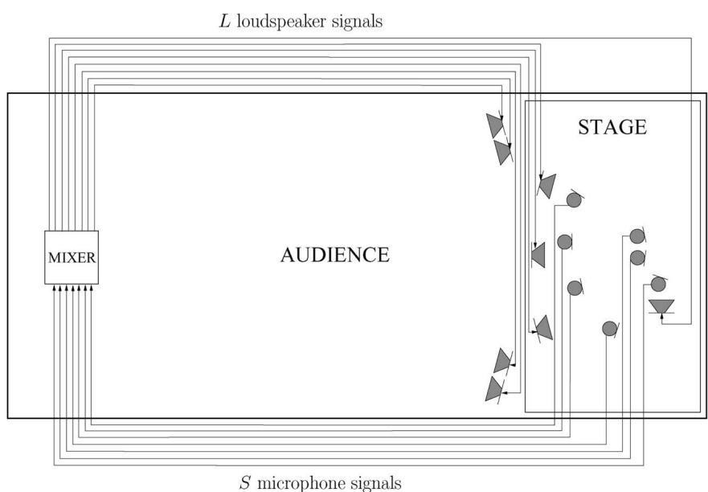  
Fig. 1. A typical public address (PA) system scenario, featuring seven microphones, four onstage loudspeakers, four loudspeakers directed towards the audience, and a mixing/signal processing/amplification console

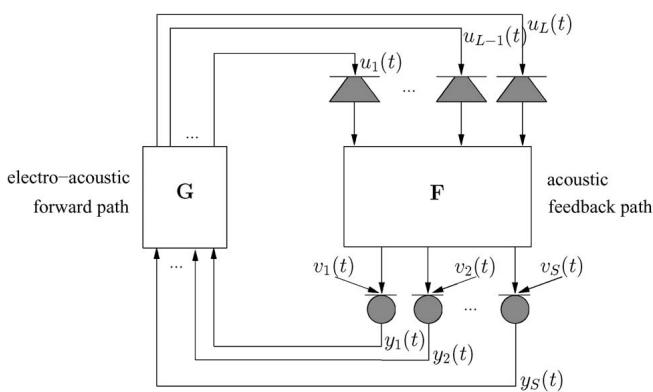  
Fig. 2. Discrete-time model of a PA system with S microphones and L loudspeakers.

The PA scenario can be modeled in a discrete-time context as shown in Fig. 2. All continuous-time signals involved are assumed to be bandlimited in such a way that they can be sampled at a standard sampling frequency $( \mathrm { e . g . } , \ f _ { s } = 1 6$ kHz in speech applications, $f _ { s } =$ 44.1 kHz in audio applications) and represented by their discrete-time counterparts.1 If we represent the S source signals by $v _ { i } ( t ) , i = 1 , \ldots , S ,$ , the corresponding S microphone signals as $y _ { i } ( t ) , i = 1 , \ldots , S ,$ and the L loudspeaker signals as $u _ { j } ( t ) , j = 1 , \ldots , L ,$ , then the discrete-time closed-loop system model in Fig. 2 can be described by the following relations:

$$
\bar {\mathbf {y}} (t) = \mathbf {F} (q, t) \bar {\mathbf {u}} (t) + \bar {\mathbf {v}} (t)\tag{1}
$$

$$
\bar {\mathbf {u}} (t) = \mathbf {G} [ \bar {\mathbf {y}} (t), t ].\tag{2}
$$

Here, the source signal, microphone signal, and loudspeaker signal vectors are defined as

$$
\bar {\mathbf {v}} (t) = \left[ v _ {1} (t) \quad \dots \quad v _ {S} (t) \right] ^ {T}
$$

$$
\bar {\mathbf {y}} (t) = [ y _ {1} (t) \quad \ldots \quad y _ {S} (t) ] ^ {T}\tag{3}
$$

(4)

$$
\bar {\mathbf {u}} (t) = [ u _ {1} (t) \quad \ldots \quad u _ {L} (t) ] ^ {T}\tag{5}
$$

and the multichannel acoustic feedback path $\mathbf { F } ( q , t )$ and electroacoustic forward path characteristics $\mathbf { G } [ \cdot , t ]$ are defined below.

Between each loudspeaker–microphone pair $( j , i )$ $j = 1 , \ldots , L , i = 1 , \ldots , S ,$ , there exists an acoustic coupling, which can be modeled by the acoustic feedback path transfer function

$$
F _ {i j} (q, t) = f _ {i j} ^ {(0)} (t) + f _ {i j} ^ {(1)} (t) q ^ {- 1} + \ldots + f _ {i j} ^ {(n _ {F})} (t) q ^ {- n _ {F}}
$$

(6)

where q denotes the discrete-time shift operator, i.e., $q ^ { - k } u _ { j } ( t ) = u _ { j } ( t - k )$ . The multichannel feedback path matrix in (1) is then defined as an $S \times L$ polynomial matrix

$$
\mathbf {F} (q, t) = \left[ \begin{array}{c c c} F _ {1 1} (q, t) & \ldots & F _ {1 L} (q, t) \\ \vdots & \ddots & \vdots \\ F _ {S 1} (q, t) & \ldots & F _ {S L} (q, t) \end{array} \right].\tag{7}
$$

The acoustic feedback path model is linear, time varying, and of finite order2 nF. The linearity assumption is generally considered to be a reasonable one, since the effects of sound propagation and reflections in the acoustic environment (i.e., signal attenuations and time delays) are quasi level independent. The finite-order assumption, which contrasts with the infinite impulse response (IIR) nature of room acoustics, can be justified by the observation that a typical room impulse response (RIR) has an exponentially decaying envelope such that it can be truncated to have $n _ { F } + 1 <$ 1 coefficients.

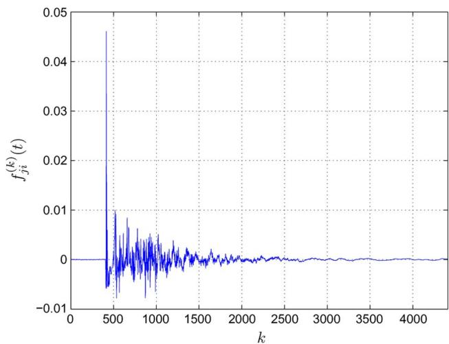  
Fig. 3. A typical RIR, measured at $\mathbf { \nabla } f _ { s } = 4 4 . 1$ kHz and truncated at a length of $\pmb { \eta } _ { F } + \pmb { \ 1 } = \pmb { 4 4 1 0 }$ coefficients.

An example RIR, which was measured at $f _ { s } = 4 4 . 1$ kHz and truncated at a length of $n _ { F } + 1 = 4 4 1 0$ coefficients (corresponding to 100 ms), is shown in Fig. 3. The frequency response of this RIR is displayed in Fig. 4. It can be seen that the magnitude response has an overall lowpass behavior as well as many local magnitude peaks and dips. This irregular behavior was explained and quantified by Schroeder [2], under the assumption that the acoustic coupling is mainly due to reflections and not due to a direct acoustic path between the loudspeaker and the microphone. The average frequency distance between two magnitude peaks is then about 10 Hz, and the peak magnitude can be up to 10 dB larger than the average magnitude in the frequency response [2].

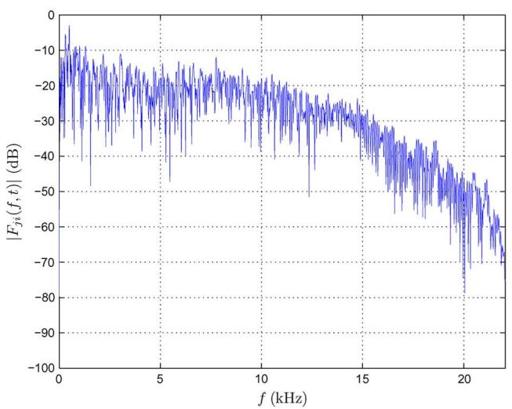  
(a)  
Fig. 4. Frequency response of the RIR shown in Fig. 3. (a) Magnitude response. (b) Phase response.

In the electroacoustic forward path, the S microphone signals are mixed and amplified to obtain L loudspeaker signals, and moreover, some additional signal processing is performed. Since usually nonlinear dynamics processing (e.g., compression, limiting, etc.) is involved here, the forward path mapping $G _ { j i } [ \cdot , t ]$ between the ði; jÞth microphone–loudspeaker pair should be modeled as a nonlinear, time-varying filter. However, to be able to perform a stability analysis of the closed-loop system, we will mostly assume that the forward path can be modeled by a linear, time-varying transfer function, 8i; j

$$
\begin{array}{r l} & G _ {j i} [ \cdot , t ] = G _ {j i} (q, t) \\ & \qquad = g _ {j i} ^ {(0)} (t) + g _ {j i} ^ {(1)} (t) q ^ {- 1} + \ldots + g _ {j i} ^ {(n _ {G})} (t) q ^ {- n _ {G}} \end{array}\tag{8}
$$

and

$$
\mathbf {G} [ \cdot , t ] = \mathbf {G} (q, t) = \left[ \begin{array}{c c c} G _ {1 1} (q, t) & \ldots & G _ {1 S} (q, t) \\ \vdots & \ddots & \vdots \\ G _ {L 1} (q, t) & \ldots & G _ {L S} (q, t) \end{array} \right].\tag{9}
$$

If the forward path includes IIR components, such as IIR equalization filters, we have that $n _ { G } = \infty$ . We further assume that the sound sources have sufficient directivity and are close enough to the respective microphones, such that the acoustic transfer function matrix from the sources to the microphones is an identity matrix. These assumptions can be justified since these do not relate directly to the feedback problem.

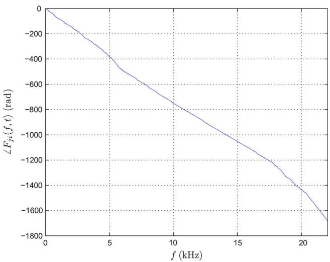  
(b)

While many sound reinforcement systems comprise multiple loudspeakers and microphones, most acoustic feedback control methods have been proposed in a single-channel context $( \mathrm { i . e . , }$ for one loudspeaker and one microphone), without a framework for an extension to multichannel systems being explicitly provided. For this reason, we will analyze the acoustic feedback problem and explain the acoustic feedback control methods in a single-channel context, and drop the subscripts i and j. We will however comment on the implications ofextending a particular method to a multichannel system whenever appropriate.

In a single-channel sound reinforcement system, the closed-loop frequency response from the source signal to the loudspeaker signal can be expressed as follows:

$$
\frac {U (\omega , t)}{V (\omega , t)} = \frac {G (\omega , t)}{1 - G (\omega , t) F (\omega , t)}.\tag{10}
$$

Here, $\omega \in [ 0$ ; 2- represents the radial frequency variable, $U ( \omega , t )$ and $V ( \omega , t )$ denote the short-term frequency spectra of the loudspeaker and source signal, and $G ( \omega , t )$ and $F ( \omega , t )$ are the short-term frequency responses of the forward and feedback path, which can be calculated using the short-time discrete Fourier transform (DFT). The frequency function $G ( \omega , t ) F ( \omega , t )$ appearing in the denominator of (10) is often referred to as the Bloop response[ of the system, and plays a crucial role in acoustic feedback control [the corresponding magnitude response $| G ( \omega , t ) F ( \omega , t ) |$ is then referred to as the Bloop gain[ and the phase response $\angle G ( \omega , t ) F ( \omega , t )$ as the Bloop phase[]. It is well known that a closed-loop system can exhibit instability, which may lead to oscillations that, in an acoustic system, are perceived as howling. Stability analysis of linear closed-loop systems is by now a well-understood topic in control systems theory, which originated from early studies on feedback amplifiers. The current approach to closed-loop system stability analysis is based on a classical paper by Nyquist [3]. The Nyquist stability criterion can be formulated as follows3: if there exists a radial frequency $\omega = 2 \pi ( f / f _ { s } )$ for which

$$
\left\{ \begin{array}{l} | G (\omega , t) F (\omega , t) | \geq 1 \\ \angle G (\omega , t) F (\omega , t) = n 2 \pi , \quad n \in \mathbb {Z} \end{array} \right.\tag{11}
$$

(12)

then the closed-loop system is unstable. If the unstable system is moreover excited at the critical frequency $f ,$ $\mathrm { i . e . , }$ , if the source signal contains a nonzero frequency component at $f ,$ then an oscillation at this frequency will occur. The criterion in (11) and (12) is essential in the remainder of this paper, since any acoustic feedback control method effectively attempts at preventing either one or both of these conditions from being met.

With the aim of quantifying the achievable amplification in a sound reinforcement system with and without acoustic feedback control, it is customary to define a broadband gain factor $K ( t )$ as the average magnitude of the forward path frequency response $G ( \omega , t )$ and extract it from the forward path transfer function $G ( \boldsymbol { q } , t )$ , i.e.,

$$
G (q, t) = K (t) J (q, t)\tag{13}
$$

with

$$
K (t) = \frac {1}{2 \pi} \int_ {0} ^ {2 \pi} | G (\omega , t) | d \omega .\tag{14}
$$

Assuming now that $J ( { \boldsymbol { q } } , t )$ is given, and that $K ( t )$ can be varied, the maximum stable gain (MSG) can be defined as follows:

$$
\mathrm{MSG} (t) [ \mathrm{dB} ] \stackrel {\Delta} {=} 2 0 \log_ {1 0} K (t) \quad \text { such   that }
$$

$$
\max _ {\omega \in \mathcal {P}} | G (\omega , t) F (\omega , t) | = 1
$$

$$
= - 2 0 \log_ {1 0} \biggl [ \max _ {\omega \in \mathcal {P}} | J (\omega , t) F (\omega , t) | \biggr ]\tag{15}
$$

(16)

where $\mathcal { P }$ denotes the set of frequencies at which the phase condition (12) is fulfilled, i.e.,

$$
\mathcal {P} = \{\omega | \angle G (\omega , t) F (\omega , t) = n 2 \pi \}.\tag{17}
$$

From a statistical analysis of room acoustics, assuming a flat forward path magnitude response and a unity average feedback path magnitude response, Schroeder concluded that in a sound reinforcement system without feedback control and having a reverberation time of $T _ { 6 0 }$ s and a bandwidth of B Hz, the expected MSG can be calculated as [2]

$$
\mathrm{MSG} (t) [ \mathrm{dB} ] = - 1 0 \log_ {1 0} [ \log_ {1 0} (B T _ {6 0} / 2 2) ] - 3. 8.\tag{18}
$$

The gain margin is defined as the difference between the MSG and the actual gain of the system. From a sound quality point of view, a gain margin of 2–3 dB is recommended to avoid audible ringing effects [2], [5].

## III. STATE OF THE ART IN ACOUSTIC FEEDBACK CONTROL

As already mentioned, we will only deal with automatic methods for acoustic feedback control. A review of manual feedback control methods is given in [6]. These methods are based on a proper microphone and loudspeaker selection and positioning, suppression of discrete room modes using notch filters, and equalization of the entire room response using 1/3 octave graphic equalizer filters, and may result in an MSG increase of 5–8 dB [6].

Automatic feedback control methods may be categorized into four classes: PM methods, gain reduction methods, spatial filtering methods, and room modeling methods.

## A. Phase-Modulation Methods

One of the earliest approaches to acoustic feedback control consists in frequency shifting (FS) the microphone signals before these are amplified and sent to the loudspeakers. The FS approach can largely be attributed to Schroeder, who published a number of papers on this topic in the early 1960s [2], [7]–[9]. By applying FS, the loop gain can be smoothed, such that ideally, the MSG is determined by the average magnitude response rather than the peak magnitude response [9]. Since the average frequency distance between two magnitude peaks in a room response was found to be around 10 Hz, the optimal FS value is expected to be around 5 Hz [2]. An MSG increase up to 14 dB was reported [7], however, the subjectively acceptable MSG increase is limited to 6 dB if audible beating effects due to the FS operation are to be avoided [2], [9]. It is claimed in [9] that a frequency shift of 5 Hz is inaudible both for speech and music signals. The earliest FS implementations were based on analog single-sideband modulation [10] or phase modulation [11]. More recently, a digital FS implementation using a truncated FIR Hilbert filter has been proposed [12]. A drawback of the FS approach is that it does not preserve the harmonic relations between tonal components in voiced speech and music signals. It was shown in [13] that a bandwidth compression does preserve harmonic relations and results in a feedback stability improvement similar to the FS approach.

Another early feedback control method employs phase modulation (PM) in the electroacoustic forward path, with the aim of bypassing the phase condition (12) in the Nyquist criterion. In 1958, Mishin [14], [170] described a sinusoidal PM approach in which the choice of the modulation parameter relates to the zeros of Bessel functions of the first kind. In a 1968 paper by Nishinomiya [15], an MSG increase up to 7 dB is reported using sinusoidal frequency modulation (FM), which is conceptually equivalent to sinusoidal PM. Guelke and Broadhurst [5] applied the sinusoidal PM technique in the context of reverberation enhancement (RE) systems, using a very low modulation frequency (1 Hz), and resulting in a 4-dB

MSG increase. The apparent suitability of PM, FM, and other periodic modulations for feedback control in digital RE systems resulted in a renewed interest in these methods in the 1990s. Svensson [16] and Nielsen and Svensson [17] provided a unifying approach to PFC in which the modulators, including sinusoidal PM, FM, amplitude modulation (AM), and delay modulation (DM), are viewed as linear periodically time-varying filters. Moreover, they showed that the FS approach also fits into this framework, hence labeling FS-based feedback control as a special case of PFC. Svensson [16] reported an average 4-dB MSG increase with a synthetic acoustic feedback path, while Nielsen and Svensson [17] obtained MSG increases up to 8 dB in real room acoustic feedback scenarios. Poletti [18] was the first to study the performance of PFC (in particular using an FS approach) in multichannel sound systems. His somewhat discouraging conclusion was that the stability improvement due to FS reduces as the number of channels increases. Finally, while the impact of the PFC approach on sound quality may be considerable, to our knowledge only a single study has been devoted to its perceptual evaluation. The results of a perceptual study by Svensson [19] indicate that the PFC approach (and in particular the FS approach) may be well suited for transient signals like speech but is less appropriate for sustained tones often occurring in audio signals.

In Section IV, a more extensive treatment of the PFC approach is provided.

## B. Gain Reduction Methods

The most straightforward approach to acoustic feedback control is to automate the actions that a human operator would undertake for preventing or eliminating howling in a sound reinforcement system. These actions usually consist in reducing the electroacoustic forward path gain, such that the system moves away from magnitude condition (11) in the Nyquist criterion. Depending on the width of the frequency band in which the gain is actually reduced, we can discriminate between three gain reduction methods:

1) in automatic gain control (AGC) methods [20]– [22], the gain is reduced equally in the entire frequency range by decreasing the broadband gain factor KðtÞ defined in (14);

2) in automatic equalization (AEQ) [22]–[30], the gain reduction is applied in critical subbands of the entire frequency range, namely those subbands in which the loop gain is close to unity;

3) in NHS [31]–[58], the gain is reduced in narrow frequency bands around critical frequencies, i.e., frequencies at which the loop gain is close to unity.

Every gain reduction method has to be activated in some way, when a closed-loop instability or a tendency towards instability is detected. Only a few gain reduction methods have been proposed which are based on a proactive instability detection: these are either based on an online measurement of the feedback path magnitude response [52], [59] or on an early detection of the spectral accumulation effect that can be observed at critical frequency components in the microphone signal [28]– [30], [60], [61]. Most gain reduction methods are reactive, in the sense that howling can usually be perceived before it is actually detected. In these methods, howling detection is typically based on a combined spectral and temporal analysis of the microphone signal. Due to the sinusoidal nature of howling, the microphone signal frequency components having the largest magnitude are considered to be candidate howling components. The true howling components within this set of candidates can then be discriminated from the source signal tonal components (originating from voiced speech or musical tones) using several criteria. Spectral criteria for discriminating between howling and tonal components are based on one or more of the following features: the power ratio of the candidate howling component and the entire spectrum [25]–[27], [35]–[38], [45], [49]–[51], [55], [56], the power ratio of the candidate howling component and its (sub)harmonics [32], [34]–[36], [43], and the power ratio of the candidate howling component and its neighboring frequency components [22], [28]–[30]. On the other hand, temporal criteria for howling detection rely on the observation that howling components typically persist for a longer time than tonal components [20], [21], [31], [32], [34], [38], [43]–[45], [49] and exhibit an exponentially increasing magnitude until the sound reinforcement system saturates [28]–[30]. A comparative evaluation of these spectral and temporal howling detection criteria is reported in [62] and [63].

The AGC method is the earliest gain reduction method, which was proposed by Patronis in 1978 [20], [21]. If howling is detected, the broadband gain is immediately reduced, and after a specified time interval the gain is restored to the initial value. Candidate howling frequencies are discriminated from tonal source signal components by assuming that howling components persist for several seconds. A subband implementation of this method was proposed by Ando [22], featuring a spectral approach to howling detection by evaluating power ratios between adjacent subbands. Obviously, AGC methods do not increase the MSG since the spectral shape of the loop gain is not altered. The main strength of AGC methods is their reliability: if the gain is sufficiently reduced, an unstable system is guaranteed to be stabilized. Therefore, many other acoustic feedback control methods include an AGC method as a Brescue procedure[ that is activated if all else fails; see, e.g., [22], [35], [36], [55], [56], and [64].

The AEQ method follows directly from the subband approach to AGC, as proposed by Ando [22]. If howling detection is performed in frequency subbands, then the gain reduction can be limited to those subbands in which howling is detected. Hanajima et al. [25], [26] further improved the subband howling detection, by first performing a howling detection in relatively wide subbands, and subsequently dividing the most critical subband in narrower subbands in which the howling detection is then repeated. They use ten logarithmically spaced wide subbands in the 10–10 000-Hz range, which are then divided into ten linearly spaced narrower subbands to obtain a more accurate howling detection. An even more advanced howling detection can be found in the AEQ method of Osmanovic et al. [28]–[30]. The detection criterion consists of a linear combination of two features that are calculated for all candidate howling components: the Bslopeness[ is a temporal feature that models the exponential buildup of a howling component, while the Bpeakness[ is a spectral feature that estimates the power ratio of a candidate howling component and its neighboring frequency components. For the equalization, Osmanovic et al. use 14 logarithmically spaced eighth-order IIR bandstop filters in the speech range 300–6000 Hz [28]–[30].

The NHS methods can be divided into two categories, i.e., one-stage and two-stage NHS methods, depending on whether the howling detection and notch filtering are performed jointly or separately. The earliest NHS methods are one-stage methods, which are usually implemented using adaptive notch filters (ANFs). In 1989, Foley proposed the adaptive periodic noise canceller [31] for speech applications, which is an FIR-ANF that is able to track and cancel a narrowband component in the microphone signal. Since the FIR-ANF in [31] is adapted using the least mean squares (LMS) algorithm, it is expected to be too slow to cancel tonal speech components, which vary more quickly in time than howling components. Also, the FIR-ANF is preceded by a delay of eight samples such that it cannot cancel the shortterm-correlated speech formants. Foley’s FIR-ANF was shown to be $H _ { \infty }$ -robust for a first-order feedback path (i.e., n ¼ 1), provided that the LMS stepsize is properly chosen [41], [47]. Staudacher [40] proposed an extension to Foley’s FIR-ANF, by using a variable LMS stepsize that increases as the FIR-ANF input signal power increases, such that the convergence is accelerated when howling occurs. To reduce the impact of the ANF on sound quality, the notch filter bandwidth should be as small as possible. A disadvantage of the FIR-ANF implementation is that a large filter order is required to obtain a narrowband notch characteristic, e.g., Foley [31] and Staudacher [40] use 32nd-order filters to cancel a single narrowband component. If multiple howling components are to be canceled, the required FIR-ANF filter order may become unpractically large. Following this observation, several IIR-ANF implementations have been proposed, which only require a biquadratic (i.e., secondorder) filter structure to cancel one narrowband component. The main difficulty with IIR-ANF implementations is that the least squares (LS) cost function associated with the howling component frequency estimation is typically nonconvex.

Kuo and Chen [33] proposed a constrained biquadratic IIR-ANF in which the global minimum of the LS cost function can be found with high probability by increasing the notch bandwidth during the howling detection process. Once howling has been detected, the notch filter is activated in the electroacoustic forward path with a reduced bandwidth, to avoid a loss of sound quality. Another approach to bypass local minima in the LS cost function associated with the IIR-ANF implementation is to only adapt the FIR part of the filter, and subsequently copy the numerator coefficients to the denominator [43], perhaps after including some scaling factor [39], [54]. A biquadratic IIR-ANF implementation featuring an advanced howling detection method was proposed by Porayath and Mapes-Riordan [43]: a howling frequency is detected when it has a power that is 30 dB larger than its first harmonic and when this power difference persists for at least 50–100 ms. Since the power spectral density is however hard to estimate when using the ANF approach, a different howling detection method was recently proposed by Gil-Cacho et al. [58], which is based on running multiple regularized biquadratic IIR-ANFs in parallel with different regularization factors. Yet another second-order ANF implementation was proposed by Wei et al. [48], in which the input samples to the ANF consist of phase-shifted instead of time-shifted microphone signal samples.

The two-stage NHS method, which is by now probably the most popular gain reduction method for acoustic feedback control, originates from the work of Lewis et al. [32], [34] and Er et al. [35], [36] in the early 1990s. A nonparametric frequency analysis of the microphone signal is computed using a fast Fourier transform (FFT) algorithm, from which the candidate howling components are determined using a peak picking algorithm. The power of the candidate howling components is then compared to an absolute power threshold [35], [36], to the average signal power [35], [36], and to the (sub)harmonics power [32], [34]–[36] to determine if howling occurs. This spectral criterion is combined with a temporal criterion for howling detection by Lewis et al. [32], [34]. Whenever howling is detected, biquadratic notch filters are inserted in the electroacoustic forward path. Several improvements to the methods by Lewis et al. and Er et al. have been reported. Kawamura et al. [37], [38] propose an online modification of the thresholds used in the spectral and temporal howling detection criteria, steered by estimates of the background noise spectrum, the source signal spectrum, the reverberation time, and the acoustic feedback path response. Lane et al. [42] apply a parametric frequency analysis instead of the nonparametric analysis proposed earlier, using a set of adjustable bandpass filters having relatively wide passbands as compared to the stopbands of the notch filters. An alternative way of determining the set of candidate howling components was proposed by Williams [44], [45]: instead of executing a peak picking algorithm on the FFT magnitude spectrum estimate, a so-called Bballistics procedure[ is applied to model the temporal buildup of narrowband components such that components with an increasing power can be identified. Rocha and Ferreira [49] and Bo¨rsch [50], [51] replace the FFT algorithm in the nonparametric frequency analysis by an odd FFT algorithm and a frequencywarped FFT algorithm, respectively. Moreover, the frequency analysis described by Bo¨rsch [50], [51] is the only nonparametric method which includes a compensation for the estimation errors due to the limited FFT resolution. In [52], Rombouts et al. propose a proactive howling detection method applied to NHS, based on the estimation of critical closed-loop system frequencies from an adaptive estimate of the feedback path response. Abe [53] was the first to consider NHS in a multichannel sound reinforcement system, and succeeded in reducing the computational and memory requirements by frequencyanalyzing the individual microphone signals with a lowresolution FFT algorithm and the mixed signal with a high-resolution FFT algorithm. Finally, Somasundaram [55], [56] proposes an advanced spectral howling detection criterion, in which the power of the candidate howling component is compared to a threshold that is calculated using the mean and standard deviation of the entire FFT spectrum estimate. Furthermore, the notch filters used in [55] and [56] are gradually enabled and disabled using a socalled leaky integrator, to avoid artifacts in the loudspeaker signal.

Since the majority of the available gain reduction methods are described in patents, not many experimental results are available and no MSG increase values have been reported. However, from Schroeder’s statistical analysis of a feedback path frequency response [2], it can be expected that if the loop gain could be perfectly smoothed using an AEQ or an NHS approach, a maximal MSG increase of about 10 dB may be achieved. The two-stage NHS method, being the most popular of all gain reduction methods, will be described in more detail in Section V.

## C. Spatial Filtering Methods

Spatial filtering methods for acoustic feedback control aim at altering the loop response $G ( \omega , t ) F ( \omega , t )$ of the closed-loop system by using microphone and/or loudspeaker arrays of which the received/transmitted signals are processed by beamforming filters. The general objective is then to design a microphone array beamformer that has its main lobe (i.e., its maximal spatial response) in the direction of the source while having a null (i.e., zero spatial response) in the direction of the loudspeaker, and/or a loudspeaker array with the main lobe directed towards the audience and a null in the direction of the microphone. The first spatial filtering approach to acoustic feedback control was proposed by Duong et al. in 1984 for hands-free telephony applications [65], focusing on the combined use of a microphone and loudspeaker array for a single-channel scenario with fixed microphone and loudspeaker positions. The stringent spatial constraints (i.e.,

the microphone and loudspeaker arrays are to have the same center and lie orthogonal to each other) make this method rather impractical for many sound reinforcement applications. A more flexible approach, which allows for scenarios with arbitrary microphone and loudspeaker array positions, consists in adapting the beamformer coefficients based on the available sound signals. Obviously, an adaptive microphone array is more straightforward to implement than an adaptive loudspeaker array, since the latter does not collect any information on the acoustic environment. A fundamental problem that occurs when computing the coefficients of an adaptive microphone array beamformer in a closed-loop system is the fact that the source signal is correlated with the loudspeaker signal [i.e., the loudspeaker signal can be calculated by filtering the source signal with the closed-loop response; see (10)]. Due to this correlation, a conventional adaptive beamforming algorithm will not converge to the desired solution, and consequently, part of the source signal will eventually be attenuated while part of the feedback signal will still appear in the output of the microphone array. Several solutions to this correlation problem have been proposed. Janse and Belt [66] propose the combined use of an adaptive feedback canceller (AFC) and a microphone array beamformer. By feeding the feedback-compensated signal from the AFC to the microphone array, the influence of the feedback signal on the beamforming algorithm can be decreased. In this case, however, it is not possible to create a beamformer null directed towards the loudspeaker, since the feedbackcompensated signal (ideally) does not provide any information on the loudspeaker position. Another solution was proposed by Kobayashi et al. [67], [68], in which the coefficients of an adaptive microphone array beamformer outside the closed signal loop are computed by canceling the source signal using a null beamformer (NBF) and inserting an artificial source signal. The adaptive beamformer coefficients are then copied to a microphone array beamformer in the closed signal loop, resulting in an MSG increase up to 15 dB [67], [68]. Due to the source signal cancellation, the adaptive beamformer can unambiguously identify the loudspeaker direction, however, the direction of the source with respect to (w.r.t.) the microphone array needs to be known a priori [67] or estimated by an adaptive NBF [68]. The artificial source signal, of which the design is not specified in [67] and [68], serves to constrain the adaptive beamformer response to unity in the source direction. A more recent solution to the correlation problem in adaptive microphone array beamforming was proposed by Rombouts et al. [69], [70], and consists in prewhitening the source signal component in the adaptive beamformer desired signal using an adaptive decorrelation filter that is estimated concurrently with the beamformer coefficients. This approach was shown to result in an MSG increase between 7 and 14 dB (depending on the reverberation time of the room), while it does not require a priori information on the source position and is considerably cheaper than the approach in which an AFC is also used. Finally, a fundamentally different approach to spatial filtering for acoustic feedback control was proposed by Goodwin and Elko [71], [72]. In the so-called Bbeam dithering[ approach, a loudspeaker array is steered by a beamformer of which the coefficients are varied periodically with time, by time stepping through a discrete sequence of approximate Chebyshev coefficients. In this way, a spatial modulation is obtained that provides a smoothing of the loop gain, comparable to the smoothing effect obtained with the PM methods for acoustic feedback control. An MSG increase up to 6 dB has been obtained [72], however, the spatial constraints of the beam dithering approach are rather stringent (in that the audience should always be in the main beamformer lobe, while the microphones should be in the sidelobes) and a perceptual calibration of the system is required [71].

## D. Room Modeling Methods

In room modeling methods for acoustic feedback control, a model of the acoustic feedback path is identified either offline (during the initialization of the sound reinforcement system) or online (during the operation of the sound reinforcement system). We can distinguish between two room modeling methods, depending on how the model is subsequently applied for acoustic feedback control. In AFC, the acoustic feedback path model is used to predict the feedback signal component in the microphone signal (i.e., the part of the microphone signal that stems from the loudspeaker signal through the acoustic coupling). The predicted feedback signal is then subtracted from the microphone signal, hence resulting in a feedback-compensated signal, which is in fact an estimate of the source signal component in the microphone signal. If an accurate model of the acoustic feedback path can be identified, then the AFC method achieves a nearly complete elimination of the acoustic coupling (i.e., the loop gain comes close to zero for all frequencies), and consequently very large MSG increases may be obtained. Alternatively, the inverse of the acoustic feedback path can be modeled and identified, and this inverse model can then be inserted in the closed signal loop to optimally equalize the microphone signal. This approach is referred to as adaptive inverse filtering (AIF), and ideally results in a perfect smoothing of the loop gain, for which the MSG increase can be expected to be around 10 dB [2].

The AIF approach has received only little attention in the context of acoustic feedback control. In 1994, Ushiyama et al. [73] proposed an inverse filtering approach in which an inverse model of the minimum-phase components in the acoustic feedback path is identified offline. It is observed that a smoothing of the inverse model frequency response increases the robustness of the (time-invariant) inverse model w.r.t. time variations in the acoustic feedback path response. Another offline approach to inverse filtering was proposed by Nagata et al. [23], [24], and consists in automatically adjusting a large number of equalizers in the electroacoustic forward path, based on an offline measurement of the acoustic feedback path response using a noise probe signal. Finally, a hybrid AIF-AFC approach was proposed by Janse and Belt [66] and Schmidt and Haulick [74], in which the inverse model coefficients are adjusted based on the acoustic feedback path model that is identified in the AFC algorithm. More results on the AIF approach can be found in the literature on acoustic dereverberation and equalization; see, e.g., [75]–[78].

In the AFC approach, which is conceptually similar to the well-known acoustic echo cancellation (AEC) approach, an adaptive filter is used to model, identify, and track the impulse response of the acoustic feedback path. Analogously to the correlation problem found in adaptive microphone array beamforming (see Section III-C), the fundamental problem encountered in AFC lies in the fact that, unlike in the AEC case, the adaptive filter’s input signal (i.e., the loudspeaker signal) and disturbance signal (i.e., the source signal) are now correlated; see (10). Applying a standard adaptive filtering algorithm to the AFC problem hence results in a biased estimate of the acoustic feedback path impulse response [79]–[81], and consequently, the source signal component in the microphone signal ends up being partially canceled. For this reason, a decorrelation method is generally incorporated in the AFC scheme which is either included in the closed signal loop or in the adaptive filtering circuit [81]; see [82] for an overview and comparative evaluation.

Decorrelation in the closed signal loop can be accomplished by injecting a noise signal, by including a nonlinear or time-varying signal operation, or by inserting a processing delay in the electroacoustic forward path. The earliest AFC reference appears to be a 1988 patent by Ibaraki et al. [83], in which a white noise signal is injected in the closed signal loop noncontinuously (e.g., during source signal pauses) to identify the low-frequency response of the acoustic feedback path. Goertz [84] proposes to inject a white noise signal continuously and reports a 5-dB MSG increase in a severely undermodeled AFC scenario (i.e., the adaptive filter length being only 1/15 of the feedback path length). Decorrelation by continuous white noise injection was also applied by Stott and Wells [64], van Waterschoot [85], and Schmidt and Haulick [74]. With the aim of reducing the sound quality deterioration due to noise injection, several attempts have been made to shape the spectrum of the injected noise signal such that it becomes less perceptible. Goertz [84] proposes to use A-weighted noise instead of white noise, while van Waterschoot [85] and Janse and Tchang [86] apply a time-varying noise shaping based on a psychoacoustic model. However, to obtain an AFC performance comparable to the methods using white noise injection, the psychoacoustically shaped noise has to be amplified to a level at which it is found to be even more disturbing than white noise [85]. Decorrelation in the closed signal loop can also be achieved by including a nonlinear or timevarying signal operation in the electroacoustic forward path. Janse et al. [87]–[89] propose to use a frequency shifter or a periodic phase or delay modulator. The AFC robustness can then be increased since these decorrelating operations also have a stabilizing effect on the closed-loop system (see Section III-A). Another nonlinear decorrelation technique, which was adopted from the stereo AEC literature [90] by van Waterschoot et al. [91] and Schmidt and Haulick [74], consists in adding a half-wave rectified version of the loudspeaker signal to the original loudspeaker signal, yet was found to improve the AFC performance only marginally [91]. Finally, in the context of HA AFC applications, inserting a processing delay in the electroacoustic forward path has been proposed for reducing the correlation between the source and loudspeaker signals [79], [92]. The motivation for this approach is that the source and loudspeaker signal crosscorrelation function is expected to decrease for increasing time lags, which is particularly the case for voiceless speech signals.

While most of the above decorrelation techniques are rather effective when applied in the closed signal loop, their effect on the sound quality may be detrimental. For this reason, there has been an increased interest in the application of decorrelating signal operations in the adaptive filtering circuit, such that the closed-loop signals remain unaffected. A first approach, which was proposed by Ortega et al. [93], [94], consists in having the adaptive filter preceded by a processing delay. The resulting decorrelation effect is similar to when a processing delay is inserted in the electroacoustic forward path. However, the delay length in the adaptive filtering circuit should not exceed the initial delay (i.e., the Bdead time[) in the acoustic feedback path impulse response (e.g., with the acoustic feedback path impulse response shown in Fig. 3, the maximum allowable processing delay would be 405 samples). A second approach consists in the use of decorrelating prefilters, that are designed to whiten the source signal component in the microphone signal. This approach was adopted from HA AFC research [80], [95], [96], and was applied to PA systems by van Waterschoot et al. [81], [91] and to in-car communication systems by Ortega et al. [97]. A fundamental difficulty lies in the concurrent identification of the optimal prefilter and the acoustic feedback path model from the closed-loop signals. This identification problem was tackled following a prediction-errormethod (PEM)-based approach [98, Ch. 3], [99, Ch. 7] by Rombouts et al. [100]–[105]. The PEM-based AFC approach developed in [100]–[102] is based on a nonstationary allpole source signal model, the inverse of which is then used as a time-varying FIR decorrelating prefilter in the AFC scheme. The robustness of the PEM-based AFC approach was further improved in [103] by including some additional features such as adaptation control and the joint use of a foreground and background adaptive filter. Also, efficient subband and frequency domain implementations of the PEM-based AFC method were proposed in [103]. It was shown by van Waterschoot et al. [104], [105] how the convergence of the PEM-based AFC scheme can be improved even further by incorporating prior knowledge on the source signal and the acoustic feedback path through regularization.

In recent years, several remaining issues concerning the AFC approach have been analyzed and further improvements have been reported. The overall performance of the AFC approach may be improved by combining AFC with other acoustic feedback control methods and signal enhancement techniques, leading to so-called hybrid AFC methods. Ortega et al. [93], [94] propose the combination of AFC with a residual feedback and noise suppression postfilter, and this hybrid AFC scheme was further expanded by Janse and Belt [66] with an adaptive microphone array beamformer and an AIF. The combination of AFC with an NHS method is of particular interest due to the robustness of the NHS methods to system instability: Schmidt et al. [74], [106] and Cifani et al. [107], [108] use an ANF that operates on the AFC feedbackcompensated signal, while Rombouts et al. [52], [103] apply a two-stage NHS method in which the howling detection is based on a frequency analysis of the AFC feedback path estimate. The considerable computational complexity of the AFC approach in room acoustic applications is another issue that has recently been addressed. An interesting approach towards AFC complexity reduction was proposed by Okumura and Fujita [109] and consists in applying two or more parallel adaptive filters, preceded by a processing delay in the adaptive filtering circuit, to model a single acoustic feedback path. The first filter (which can be understood to model the late reverberation in the acoustic feedback path impulse response) has many coefficients that are adapted not very frequently using a transform domain approach, while the second filter (which then models the early reflections) is a short filter that is adapted at each instant using a time domain adaptive filtering algorithm. A final issue is related to AFC in audio applications: none of the aforementioned AFC methods has been designed to operate in a high-fidelity audio environment. When applying decorrelation in the closed signal loop, introducing signal distortion is unavoidable, while decorrelation techniques in the adaptive filtering circuit are typically based on the assumption that the source signal is a speech signal. Van Waterschoot and Moonen [110], [111] have recently proposed a novel PEM-based AFC method that is designed particularly for audio signals, but performs equally well in speech applications. The method is based on a cascade of two source signal models, where one models the tonal components in the source signal and the other one models the source signal noise components.

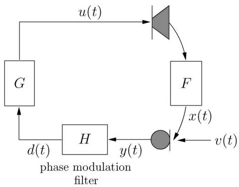  
Fig. 5. PFCbyinsertinga PM filterin the electroacoustic forward path.

IV. PHASE-MODULATING FEEDBACK CONTROL

## A. Concept

The goal of PFC is to control the phase of the microphone signal in such a way that every frequency component in the feedback signal has a different phase each time it arrives at the microphone after having traveled one cycle around the closed signal loop [17]. In this way, the phase condition in the Nyquist criterion (12) can be guaranteed not to hold for the same frequency at two successive instants, hence the closed-loop system stability can be improved, regardless of the magnitude condition (11). The PFC goal can be achieved by inserting a PM filter in the electroacoustic forward path, which operates directly on the microphone signal yðtÞ and delivers an output signal dðtÞ to the forward path processing unit $G { \left( q , t \right) }$ ; see Fig. 5.

The behavior of a PM filter can be analyzed elegantly using the theory of linear time-varying (LTV) filters [16], [17]. A discrete-time4 LTV filter can be described in the time domain using the input–output relationship [112]

$$
d (t) = \sum_ {\tau = - \infty} ^ {\infty} h (\tau , t) y (t - \tau)\tag{19}
$$

with $h ( \tau , t )$ the LTV filter’s impulse response, which depends on both the observation instant t and the time difference - between excitation and observation. If the LTV filter is moreover periodically time-varying (LPTV) with a period $T _ { m }$ that corresponds to an integer number of sampling periods, i.e., $T _ { m } = N T _ { s }$ , then the periodic LTV frequency response

$$
H (\omega , t) = \sum_ {\tau = - \infty} ^ {\infty} h (\tau , t) e ^ {- j \omega \tau}\tag{20}
$$

admits an N-point DFT representation with coefficients

$$
\mathcal {H} (\omega , n) = \sum_ {t = 0} ^ {N - 1} H (\omega , t) e ^ {- j n (2 \pi / N) t}\tag{21}
$$

and the input–output relationship in (19) can be written in the frequency domain as follows [112]:

$$
D (\omega) = \frac {1}{N} \sum_ {n = 0} ^ {N - 1} \mathcal {H} (\omega - n \omega_ {m}, n) Y (\omega - n \omega_ {m})\tag{22}
$$

with $\omega _ { m } = 2 \pi / N$ the LPTV filter fundamental frequency. In other words, the LPTV filter output spectrum is a sum of N frequency-weighted and frequency-shifted versions of the input spectrum. The LPTV filter frequency response DFT coefficients $\mathcal { H } ( \omega , n )$ are usually referred to as the carrier response (for $n = 0 )$ and the sideband responses $( \mathrm { f o r } n \ne 0 )$

It can be seen from (22) that the output spectrum also contains a nonfrequency-shifted version of the input spectrum (for n ¼ 0), which is undesirable in view of the acoustic feedback control performance [17]. The contribution of the nonfrequency-shifted version of the input spectrum to the total output spectrum is quantified using the so-called carrier suppression5 [17]

$$
\mathrm{CS} [ \mathrm{dB} ] = - 1 0 \log_ {1 0} \left[ \int_ {0} ^ {2 \pi} | \mathcal {H} (\omega , 0) | ^ {2} d \omega \right]\tag{23}
$$

and it has been hypothesized that the CS corresponds to an upper bound for the increase in MSG that can be obtained using the PFC approach [17]. Another hypothesis stated in [17] is that a modulation scheme having a larger number of sideband responses with a relatively large power $| \mathcal { H } ( \omega , n ) | ^ { 2 }$ provides a better acoustic feedback control performance, since in this case, more input signal energy is shifted away from the original (carrier) frequency. However, this hypothesis is based on a continuous-time analysis and may not hold in a discrete-time context, since aliasing will fold all the input signal energy that has been shifted above the Nyquist frequency back to lower frequencies.

The following four PM techniques have been studied in the context of acoustic feedback control [17].

1) Sinusoidal PM [5], [14], [16], [17], [170]: a sinusoidal PM filter has a frequency response

$$
H (\omega , t) = e ^ {j \beta \sin \omega_ {m} t}\tag{24}
$$

which is characterized by frequency-independent carrier and sideband responses $\mathcal { H } ( n )$ that correspond to the Bessel functions of the first kind and order n

$$
\mathcal {H} (n) = J _ {n} (\beta), \qquad n = 0, \ldots , N - 1.\tag{25}
$$

These functions are plotted as a function of the socalled modulation index $\beta$ in Fig. 6.

Sinusoidal FM [15], [17]: the effect of a sinusoidal FM filter with a modulation frequency $f _ { m } =$ $\omega _ { m } ( f _ { s } / 2 \pi )$ and a modulation depth $\Delta _ { f }$ can be shown to be identical to the effect of a sinusoidal PM filter with the same modulation frequency $f _ { m }$ and a modulation index $\beta = \Delta _ { f } / f _ { m }$ [17].

FS [2], [7], [11], [12], [17], [18]: an FS device can either be viewed as a nonlinear time-invariant system or as an LPTV system. From the latter interpretation, it can be shown that an FS operation with a frequency shift of $f _ { m } = \omega _ { m } ( f _ { s } / 2 \pi )$ Hz corresponds to a PM operation with a phase function that increases linearly with time [11], [17], i.e.,

$$
H (\omega , t) = e ^ {j \omega_ {m} t}\tag{26}
$$

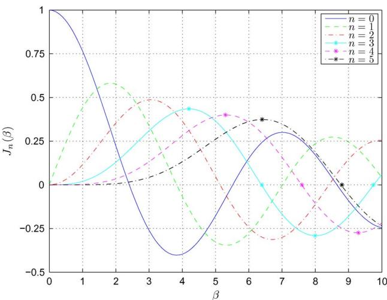  
Fig. 6. Bessel functions of the first kind for different orders $\begin{array} { r } { \pmb { \eta } = \pmb { \sigma } , \dots , \pmb { 5 } . } \end{array}$

and, as a consequence

$$
\mathcal {H} (n) \Bigg \{ \begin{array}{l l} = 1, & n = 1 \\ = 0, & n = 0, 2, \ldots , N - 1. \end{array}\tag{27}
$$

(28)

In other words, an FS device can be described as an LPTV filter with zero carrier response $( \mathrm { i . e . , }$ $\mathrm { C S } = \infty )$ and only one nonzero sideband response (for n ¼ 1).

Sinusoidal DM [14], [16], [17], [170]: a sinusoidal DM filter varies the input signal’s time delay sinusoidally around a time delay offset $\tau _ { 0 }$ with a maximum time delay deviation $\Delta _ { \tau }$ and a modulation frequency $\omega _ { m } ;$ as can be seen in its frequency response

$$
H (\omega , t) = e ^ {- j \omega (\tau_ {0} + \Delta_ {\tau} \sin \omega_ {m} t)}.\tag{29}
$$

This can be interpreted as a sinusoidal PM filter with the same modulation frequency $\omega _ { m }$ and a modulation index $\beta = \omega \Delta _ { \tau }$ that is proportional to the original (carrier) frequency !. As a consequence, the corresponding carrier and sideband responses are frequency selective (as opposed to the frequency-independent PM, FM, and FS responses)

$$
\begin{array}{l} \mathcal {H} (\omega , n) = J _ {n} (\omega \Delta_ {\tau}), \\ n = 0, \ldots , N - 1. \end{array}\tag{30}
$$

From the above expression, it can be understood that a sinusoidal DM filter performs poorly in the low-frequency range since in this case, the carrier response has a much larger magnitude than the sideband responses (see Fig. 6).

## B. Realization

The sinusoidal PM, sinusoidal FM, and FS filters are usually realized by operating on the so-called analytical representation of the microphone signal yðtÞ. In continuous time, the analytical signal $y _ { a } \{ \tau \}$ is defined as follows [113]:

$$
y _ {a} \{\tau \} = y \{\tau \} + j \hat {y} \{\tau \}\tag{31}
$$

where $\hat { y } \{ \tau \}$ represents the Hilbert transform of $y \{ \tau \}$ . The corresponding discrete-time analytical signal $y _ { a } ( t )$ can be calculated in several ways. The first approach is to design a FIR filter $L ( q )$ approximating the Hilbert transform such that an approximation to $\hat { y } ( t )$ can be calculated as $L ( q ) y ( t )$ [114], and then the discrete-time analytical signal can be obtained as $y _ { a } ( t ) = y ( t ) + j L ( q ) y ( t )$ . Since the so-called

Hilbert filter $L ( q )$ is noncausal, a processing delay of half the filter length of $L ( q )$ has to be introduced in the signal path [12]. Another drawback is that this approach does not preserve the orthogonality between yðtÞ and ^yðtÞ which can be obtained in the continuous-time case [115]. The second approach is to design two complex FIR filters, so-called dual quadrature FIR filters, that produce orthogonal approximations to $y ( t )$ and $\hat { y } ( t )$ , respectively, which are then added according to (31) [116]. Unfortunately, this approach does not preserve the original data since the real part of the discrete-time analytical signal is not exactly equal to yðtÞ [115]. In the third approach, which combines the desirable properties of original data preservation in the real part and orthogonality between the real and imaginary part of the discrete-time analytical signal, $y _ { a } ( t )$ is approximated as the inverse DFT of a one-sided discrete spectrum (with zero negative frequency content) that is calculated using the DFT of the original signal yðtÞ [115]. This approach is frame based, hence a processing delay equal to the frame size minus the frame overlap is required. We will use this latter approach for the PFC evaluation in Section VII.

Given the discrete-time analytical signal $y _ { a } ( t ) = y ( t ) +$ $\hat { \mathcal { P } } ( t )$ , the output signal of the PM, FM, and FS filters can be calculated by modulating $y _ { a } ( t )$ with the LPTV frequency response $\scriptstyle H ( \omega , t )$ , and then taking the real part (denoted with Refg) [18], i.e.,

$$
d (t) = \mathrm{Re} \{y _ {a} (t) H (\omega , t) \}.\tag{32}
$$

Using (24) and (26), this leads to

$$
d (t) = y (t) \cos \phi (t) - \hat {y} (t) \sin \phi (t) \mathrm{with}
$$

$$
\beta \sin \omega_ {m} t, \quad \text { for   sinusoidal   PM }\tag{33}
$$

$$
\phi (t) = \left\{ \begin{array}{l l} \beta \sin \omega_ {m} t, & \text {for sinusoidal FM} \\ \frac {\Delta_ {f}}{f _ {m}} \sin \omega_ {m} t, & \text {for sinusoidal FM} \\ \omega_ {m} t, & \text {for FS.} \end{array} \right.\tag{34}
$$

(35)

A sinusoidal DM filter can be realized by directly operating on the microphone signal $y ( t )$ , which is then fed to a variable-length delay line. Such delay lines have also been used for realizing DM-based digital audio effects such as vibrato, flanging, and chorus; see, e.g., [117]–[119]. The sinusoidal DM variable-length delay line has an LPTV transfer function that can be approximated as the cascade of an integer delay of K samples and a fractional delay of $: l / D$ samples [117]–[119], where D is denoted as the interpolation ratio and $l = 0 , \ldots , D - 1$ is the fractional phase

$$
H (q, t) = q ^ {- (\tau_ {0} + \Delta_ {\tau} \sin \omega_ {m} t)}\tag{36}
$$

$$
\approx q ^ {- K} q ^ {- l / D}.\tag{37}
$$

The fractional part of the transfer function in (37) can be realized using any of the available methods for fractional delay filter design [120], e.g., using linear [117]–[119], allpass [117]–[119], or spline [118], [119] interpolation filters. We will use a linear FIR interpolation filter that is a Hamming-windowed, truncated (length-2I) approximation of the ideal sinc-like interpolation filter [120]

$$
H (q, t) = q ^ {- K} \sum_ {i = - I} ^ {I - 1} w _ {h} (i + l / D) \mathrm{sinc} (i + l / D) q ^ {i}\tag{38}
$$

where $w _ { h } ( t )$ denotes the Hamming window, centered at $t = 0 ;$ , and the integer delay and fractional phase are chosen as $K = \lfloor \tau _ { 0 } + \Delta .$ sin $\omega _ { m } t ]$ and $l = [ ( \tau _ { 0 } + \Delta .$ sin $\omega _ { m } t - K ) /$ $D ]$ , with bc the floor function and $[ \cdot ]$ the nearest integer function, respectively. Note that $\tau _ { 0 } , \Delta _ { \tau }$ , and I should be chosen such that $\tau _ { 0 } - \Delta _ { \tau } \geq I - 1$ to guarantee causality of the sinusoidal DM filter.

## C. Discussion

The main strength of the PFC approach is its simplicity, both conceptually and computationally. The design of a PFC system requires little effort, since only the modulation technique (PM, FM, FS, or DM) and a few parameter values have to be decided on. The main computational load lies in the calculation of the analytical microphone signal (for PM, FM, and FS) and the fractional delay interpolation filtering (for DM), which should not be a barrier for real-time implementation. Moreover, the PFC approach does not involve any form of learning or adaptivity, such that it behaves in a completely deterministic way, which is beneficial in terms of robustness.

The choice of the modulation technique depends on the envisaged application. The FS technique is known to generally deliver a larger MSG increase than the other modulation techniques, but is perceptually inappropriate for music applications [18], [86]. The MSG increase obtained with modulation techniques that have a larger number of sideband responses (PM, FM, and DM, with a sufficiently large $\beta )$ appears to be more or less independent of the modulation frequency $\omega _ { m } ,$ , such that these techniques can operate at a lower value of $\omega _ { m }$ as compared to FS, which is perceptually advantageous [17]. DM is known to perform poorly at low signal frequencies, such that it should preferably be combined with another modulation technique or even with a non-PM-based acoustic feedback control method [16].

For a given modulation technique, the main parameters determining the PFC performance are the modulation frequency $\omega _ { m }$ and the modulation index $\beta .$ It has been theoretically shown and experimentally verified that in the case of ${ \mathrm { F S } } ,$ an optimal value of the frequency shift $f _ { m } = \omega _ { m } ( f _ { s } / 2 \pi )$ is around $4 / T _ { 6 0 }$ Hz, with $T _ { 6 0 }$ the room reverberation time in seconds [2]. The optimal value for $f _ { m }$ is less related to the reverberation time in the case of PM, FM, and DM, and values as low as 0.5 Hz may provide a satisfactory MSG increase, especially at high modulation index values [17]. The influence of the modulation index $\beta$ in the case of PM, FM, and DM is governed by two effects [17]: as the value of $\beta$ approaches the zeros of $J _ { 0 } ( \beta )$ (e.g., see Fig. 6), the CS and hence the maximum achievable MSG increase become larger, and on the other hand, a larger value of $\beta$ leads to a larger number of influential sideband responses which (at least in the continuous-time case) can be expected to improve the acoustic feedback control performance [17]. The former effect provides an explanation for the value of $\beta = 2 . 4$ having been suggested as an optimal choice in early studies on PFC using sinudoidal PM [5], [14], [170].

Finally, the PFC method has three major drawbacks. First, the achievable MSG increase is limited. An MSG increase of 12 dB has been found to be the theoretical maximum using FS in a typical room acoustic sound reinforcement system, and moreover, to avoid the FS effect to be clearly audible, a system equipped with an FS filter should operate 6 dB below the MSG, reducing the practically realizable MSG increase to 6 dB [2]. Similar MSG increase values (around 6 dB) were found in experiments using the other modulation techniques (PM, FM, and DM), as reported in several studies [14]–[17], [121], [170]. A second drawback is that inserting a PM filter in the electroacoustic forward path unavoidably leads to signal distortion, the perceptual consequences of which may be detrimental, particularly in audio applications [19]. A third disadvantage is the fact that in multichannel systems, the stability improvement obtained with PFC has been shown to decrease as the number of channels increases [18], hence the practical use of PFC in large-scale sound reinforcement systems (e.g., PA or RE systems) is expected to be limited.

## V. NOTCH-FILTER-BASED HOWLING SUPPRESSION

## A. Concept

The objective of the NHS method can be either to prevent the closed-loop system from becoming unstable by reducing the loop gain $| G ( \omega , t ) F ( \omega , t ) |$ j in the neighborhood of critical frequencies, or to stabilize the system and suppress howling after oscillations have occurred. The former objective requires a proactive approach to instability detection, while the latter approach is reactive in the sense that notch filters are activated only after the detection of howling. We will mainly focus on the reactive approach to NHS, which is much more widespread than the proactive approach. Also, the emphasis is on two-stage NHS methods, since these are much more popular as compared to the ANF-based one-stage NHS methods. In a two-stage NHS method, the microphone signal yðtÞ is first processed by a howling detection algorithm, which forwards a set of design parameters $\mathcal { D } _ { H } ( t )$ to a bank of adjustable notch filters $H ( q , t )$ that is inserted in the electroacoustic forward path; see Fig. 7.

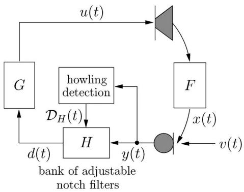  
Fig. 7. Two-stage NHS by feeding the microphone signal to a howling detection algorithm, which forwards a set ofdesign parameters $D _ { H } ( t )$ to a bank ofadjustable notch filters $H ( \boldsymbol { q } , t )$ that is inserted in the electroacoustic forward path.

The howling detection algorithm is the most critical part of the two-stage NHS method. Since howling is known to consist of sinusoidal signal components, the detection of howling is based on a frequency analysis of the microphone signal. It can be understood that howling components can be recognized as signal components having a large magnitude in the frequency domain. However, voiced speech components and tonal music components also have this property, hence it is crucial to discriminate howling components from tonal source signal components. We will use an example to illustrate the signal attributes that can be used to discriminate between howling and tonal components. Let us consider a single-channel closed-loop system defined by the acoustic feedback path shown in Figs. 3 and 4, and an electroacoustic forward path consisting of a cascade of a unit delay and a broadband gain factor $K = 5 . 5 3$ dB. The loop gain of this system is shown in Fig. 8(a) for $f \in [ 0 , 3 ]$ kHz. It can be observed that the Nyquist magnitude condition (11) is fulfilled for a frequency value just above 500 Hz, such that an oscillation at this frequency can be expected. When an audio signal fragment, more specifically a 10-s excerpt from the Partita No. 2 in D minor (Allemande) for solo violin by J. S. Bach, is applied as a source signal in the closed-loop system, the corresponding microphone signal has a spectrogram as shown in Fig. 8(b) (zooming in on the frequency region $f \in [ 0 , 3 ]$ kHz). The buildup of a howling component at a frequency slightly above 500 Hz is clearly visible from the spectrogram. Moreover, it can be observed that the howling component has some distinct features that may be used to discriminate it from the tonal source signal components. Spectral features include the fact that the howling component has a relatively large magnitude, and does not have any harmonic or subharmonic frequency components. Temporal features typical to the howling component are its long duration and its increasing magnitude with time.

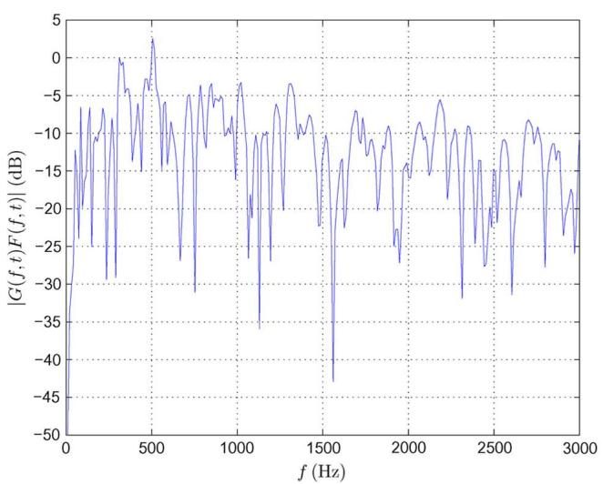  
(a)

Apart from detecting howling components in the microphone signal spectrum, the howling detection algorithm in the two-stage NHS method shown in Fig. 7 also calculates some features of the detected howling components that are subsequently used to design appropriate notch filters. The set of design parameters $\mathcal { D } _ { \mathcal { H } } ( t )$ typically includes the howling components’ frequency and magnitude values. The notch filters are then designed to have center frequencies corresponding to the howling component frequencies and notch depth values depending on the howling component magnitude values. The notch filters’ 3-dB bandwidth is usually fixed to a value in the range of 1/10–1/60 octave. A more narrowband notch filter has the advantage of removing less of the desired source signal components, but requires a more accurate howling component frequency estimation.

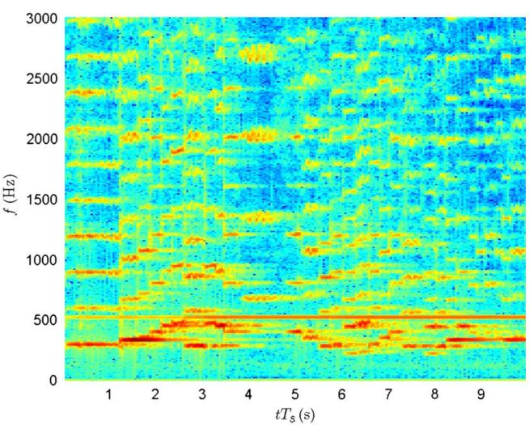  
(b)  
Fig. 8. Example to recognize discriminating features between howling and tonal components (zooming in on the frequency region f 2 [0, 3] kHz): (a) loop gain of the unstable closed-loop system defined by the acoustic feedback path response shown in Fig. 4 and a flat electroacoustic forward path response with gain factor $K = 5 . 5 3 d B ,$ , and (b) microphone signal spectrogram after feeding an audio source signal to the unstable closed-loon system.

## B. Realization

1) Howling Detection: We assume that the howling detection algorithm operates in a frame-based manner, on microphone signal frames with a frame length of M samples and a frame hop size of P samples (i.e., a frame overlap of $M - P$ samples). At time t, the data in the microphone signal frame can then be represented by the vector [which is not to be confused with the multichannel microphone signal vector $\bar { \mathbf { y } } ( t )$ defined in (4)]

$$
\mathbf {y} (t) = \left[ y (t + P - M) \quad \ldots \quad y (t + P - 1) \right] ^ {T}\tag{39}
$$

and the short-term microphone signal spectrum can be obtained as the DFT of the data in $\mathbf { y } ( t )$ , i.e.,

$$
\begin{array}{l} Y (\omega_ {k}, t) = \sum_ {n = 0} ^ {M - 1} w (t _ {n}) y (t _ {n}) e ^ {- j \omega_ {k} t _ {n}}, \\ k = 0, \ldots , M - 1 \end{array}\tag{40}
$$

with $\omega _ { k } \triangleq 2 \pi k / M$ and $t _ { n } \overset { \Delta } { = } t + P - M + n$ . The microphone signal DFT in (40) is generally calculated using the FFT algorithm, and includes a window function $w \big ( t _ { n } \big )$ to reduce the spectral leakage [122] (e.g., a Blackman window has successfully been applied to audio signal processing [123]6). Alternatively, a parametric frequency estimation method may be applied instead of the nonparametric (DFT-based) approach to obtain a good frequency resolution with relatively short signal frames [42]. Also, a frequency-warped DFT [124] may be used to improve the frequency resolution in the low-frequency region [50], [51]. The choice of the signal framing parameters M and P has a rather profound influence on the performance of the howling detection. Small values for the frame length M have been proposed to allow for very quick howling detection $( { \bf e . g . } , ~ M = 1 2 8$ , corresponding to 4 ms at $\begin{array} { r l } { f _ { s } = } & { { } 3 2 } \end{array}$ kHz [28]–[30]), such that howling may potentially be detected before it is actually perceived [28]–[30]. On the other hand, larger values for M provide a better frequency resolution in the microphone signal DFT spectrum estimate $( { \bf e . g . } , \ { \cal M } = \ 4 0 9 6 .$ corresponding to 92.9 ms at $f _ { s } = 4 4 . 1$ kHz [32], [34] or to 85.3 ms at $f _ { s } = 4 8$ kHz [44], [45]), which is necessary when working with very narrowband notch filters such as the 1/60 octave filters used in [50] and [51]. A large frame hop size P may result in a large time lag between howling detection and notch filtering, unless a P-sample delay is inserted in the electroacoustic forward path. On the other hand, a small value for P leads to an increase in computational complexity since the howling detection algorithm is then executed more often. Generally, a 25%–50% frame overlap $\left( P = 3 M / 4 , \dots , M / 2 \right)$ is found to be a good compromise.

Based on the DFT-based microphone signal spectrum estimation, a predefined number N of spectral peaks is identified from the spectrum estimate, with N typically chosen in the range 1–10. These N frequency components are termed Bcandidate howling components[ and their radial frequency values are collected in the set $\mathcal { D } _ { \breve { \omega } } ( t ) = \{ \breve { \omega } _ { i } \} _ { i = 1 } ^ { N }$ . A spectral peak picking algorithm is usually applied to find the candidate howling components. A more advanced approach consists in selecting frequency components that have a consistently increasing magnitude in successive signal frames. This is possible by applying a so-called Bballistics[ procedure [44], [45] before executing the peak picking algorithm. The following spectral and temporal features of the microphone signal have been proposed to determine whether a candidate howling component indeed corresponds to a howling component or rather to a source signal tonal component.

The peak-to-threshold power ratio (PTPR) [35], [36], [44], [45] is a spectral feature that determines the ratio of the candidate howling component power $\left| Y ( \breve { \omega } _ { \mathrm { i } } , t ) \right| ^ { 2 }$ and a fixed absolute power threshold $P _ { 0 } ,$ , i.e.,

$$
\mathrm{PTPR} (\breve {\omega} _ {i}, t) [ \mathrm{dB} ] = 1 0 \log_ {1 0} \frac {| Y (\breve {\omega} _ {i} , t) | ^ {2}}{P _ {0}}.\tag{41}
$$

Howling is detected at the frequency $\breve { \omega } _ { i }$ if $\mathrm { P T P R } ( \cup _ { i } , t ) \geq 0$ dB. The rationale behind using the PTPR for howling detection is that howling should only be suppressed when it appears with a minimum loudness [44], [45]. The absolute power threshold $P _ { 0 }$ depends on the particular sound reinforcement scenario at hand, $\mathrm { e . g . }$ , a value of $1 0 \log _ { 1 0 } P _ { 0 } = 8 5$ dB SPL was suggested in [44] and [45] for a loudspeaker–microphone distance of 1 m.

The peak-to-average power ratio (PAPR) [25], [26], [35]–[38], [45], [49]–[51], [55], [56] is a spectral feature that determines the ratio of the candidate howling component power $\big | Y \big ( \breve { \omega } _ { i } , t \big ) \big | ^ { 2 }$ and the average microphone signal power $\hat { P } _ { y } ( t )$ , i.e.,

$$
\mathrm{PAPR} (\breve {\omega} _ {i}, t) [ \mathrm{dB} ] = 1 0 \log_ {1 0} \frac {\left| Y (\breve {\omega} _ {i} , t) \right| ^ {2}}{\hat {P} _ {y} (t)}\tag{42}
$$

with

$$
\hat {P} _ {y} (t) = \frac {1}{M} \sum_ {k = 0} ^ {M - 1} | Y (\omega_ {k}, t) | ^ {2}.\tag{43}
$$

The ith candidate howling component is identified as a howling component if the PAPR exceeds a predetermined threshold, i.e., $\mathrm { P A P R } ( \cup _ { i } , t ) \geq T _ { \mathrm { P A P R } } .$ The PAPR feature is probably the most widely used feature for howling detection, and different values for the threshold have been proposed, e.g., TPAPR ¼ 6 dB $[ 2 5 ] , [ 2 6 ] , T _ { \mathrm { P A P R } } = 1 0 \log _ { 1 0 } ( M / 1 5 0 ) ^ { 2 } \mathrm { d B } [ 4 4 ]$ [45], and $T _ { \mathrm { P A P R } } = 1 0$ dB [49]. Kawamura et al. [37], [38] propose the use of a variable threshold $T _ { \mathrm { P A P R } } ( t )$ that is adapted online, based on estimates of the background noise spectrum, the source signal spectrum, the reverberation time, and the acoustic feedback path response. It is also suggested in [37] and [38] to remove the eQP $Q _ { P }$ largest frequency components from the spectrum $Y ( \omega _ { k } , t )$ before estimating the average signal power $\hat { P } _ { y } ( t )$ in (43), the value of $Q _ { P }$ depending on the bandwidth of the frequency analysis. Yet another way of estimating the average microphone signal power $\hat { P } _ { y } ( t )$ was suggested in [55] and [56], i.e.,

$$
\begin{array}{l} \hat {P} _ {y} (t) = \left(\frac {1}{M} \sum_ {k = 0} ^ {M - 1} | Y (\omega_ {k}, t) | ^ {2}\right) \\ + 2 \sqrt {\frac {1}{M} \sum_ {k = 0} ^ {M - 1} \left(| Y (\omega_ {k} , t) | ^ {2} - \frac {1}{M} \sum_ {m = 0} ^ {M - 1} | Y (\omega_ {m} , t) | ^ {2}\right) ^ {2}} \end{array}\tag{44}
$$

which should be particularly useful when the source signal has a Gaussian probability density function (pdf).

The peak-to-harmonic power ratio (PHPR) [32], [34]–[36] is a spectral feature that determines the ratio of the candidate howling component power $| Y ( \breve { \omega } _ { \mathrm { i } } , t ) | ^ { 2 }$ and its mth (sub)harmonic component power $| \dot { \boldsymbol { Y } } ( m \omega _ { i } , t ) | ^ { 2 } ,$ i.e.,

$$
\mathrm{PHPR} (\breve {\omega} _ {i}, t, m) [ \mathrm{dB} ] = 1 0 \log_ {1 0} \frac {| Y (\breve {\omega} _ {i} , t) | ^ {2}}{| Y (m \breve {\omega} _ {i} , t) | ^ {2}}.\tag{45}
$$

In [32] and [34], howling is detected at the frequency $\breve { \omega } _ { i }$ if the PHPR exceeds a predetermined threshold for the second, third, and fourth harmonics and the 0.5th and 1.5th subharmonics, i.e., if

$$
\bigcap_ {m \in \{0. 5, 1. 5, 2, 3, 4 \}} \left[ \mathrm{PHPR} (\breve {\omega} _ {i}, t, m) \geq T _ {\mathrm{PHPR}} \right] = 1\tag{46}
$$

with $T _ { \mathrm { P H P R } } = 3 3$ dB. In [35] and [36], a simpler howling detection criterion $\mathrm { P H P R } ( \cup _ { i } , t , 2 ) \ge$ TPHPR is used.

The peak-to-neighboring power ratio (PNPR) [22], [28]–[30] is a spectral feature that determines the ratio of the candidate howling component power $| Y ( \breve { \omega } _ { \mathrm { i } } , t ) | ^ { 2 }$ and its mth neighboring frequency component power $| Y ( \cup _ { i } + 2 \pi m / M , t ) | ^ { 2 }$ , i.e.,

$$
\begin{array}{l} \text {PNPR} (\breve {\omega} _ {i}, t, m) [ \mathrm{dB} ] \\ = 1 0 \log_ {1 0} \frac {| Y (\breve {\omega} _ {i} , t) | ^ {2}}{| Y (\breve {\omega} _ {i} + 2 \pi m / M , t) | ^ {2}}. \end{array}\tag{47}
$$

In [22], ! is determined to be a howling frequency if the PNPR in two adjacent frequency bins on either side of the candidate howling component is consistently above two predetermined thresholds and the PTPR is above 0 dB, i.e., if

$$
\left\{ \begin{array}{l} [ \mathrm{PTPR} (\breve {\omega} _ {i}, t) \geq 0 \text { dB } ] \wedge \\ \bigcap_ {m \in \{\pm 1, \pm 2 \}} [ \mathrm{PNPR} (\breve {\omega} _ {i}, t, m) \geq T _ {\mathrm{PNPR}} (| m |) ] \end{array} \right\} = 1.\tag{48}
$$

In [28]–[30], howling is detected based on a socalled Bpeakness[ feature, which reflects the time-averaged probability (over eight signal frames) that the PNPR, averaged over six neighboring frequency bins on either side of !i (excluding the closest neighbor on either side), exceeds a 15-dB threshold, i.e.,

$$
\begin{array}{l} \text { peakness } (\breve {\omega} _ {i}, t) \\ = \sum_ {j = 0} ^ {7} \frac {1}{1 6} \left\{\left[ \frac {1}{6} \sum_ {m = 2} ^ {7} \mathrm{PNPR} (\breve {\omega} _ {i}, t - j P, m) \geq 1 5 \mathrm{dB} \right] + \left[ \frac {1}{6} \sum_ {m = - 7} ^ {- 2} \mathrm{PNPR} (\breve {\omega} _ {i}, t - j P, m) \geq 1 5 \mathrm{dB} \right] \right\}. \end{array}\tag{49}
$$

The interframe peak magnitude persistence (IPMP) [20], [21], [32], [34], [37], [38], [49] is a temporal feature based on counting in how many frames out of $Q _ { M }$ past signal frames the frequency ! is in the set of candidate howling frequencies, i.e.,

$$
\mathrm{IPMP} (\breve {\omega} _ {i}, t) = \frac {\sum_ {j = 0} ^ {Q _ {M} - 1} [ \breve {\omega} _ {i} \in \mathcal {D} _ {\breve {\omega}} (t - j P) ]}{Q _ {M}}.\tag{50}
$$

Howling is usually detected if $\mathrm { I P M P } ( \cup _ { i } , t ) = 1$ [20], [21], [37], [38], [49], with, e.g., $Q _ { M } = 3 \left[ 4 9 \right]$ In [32] and [34], a howling detection criterion IPM $[ \mathrm { P } ( \breve { \omega } _ { i } , t ) \geq 3 / 5$ is proposed with $Q _ { M } = 5$

The interframe magnitude slope deviation (IMSD) [28]–[30] is a temporal feature that determines the deviation (over $Q _ { M }$ successive signal frames) of the slope, which is defined by averaging magnitude difference values of a candidate howling component, where the differentiation is carried out between an old signal frame and more recent signal frames, i.e.,

$$
\begin{array}{l} \mathrm{IMSD} (\breve {\omega} _ {i}, t) = \frac {1}{Q _ {M} - 1} \sum_ {m = 1} ^ {Q _ {M} - 1} \left[ \frac {1}{Q _ {M}} \sum_ {j = 0} ^ {Q _ {M} - 1} \frac {1}{Q _ {M} - j} \right. \\ \qquad \times (2 0 \log_ {1 0} | Y (\breve {\omega} _ {i}, t - j P) | \\ \qquad \qquad - 2 0 \log_ {1 0} | Y (\breve {\omega} _ {i}, t - Q _ {M} P) |) \\ \qquad - \frac {1}{m} \sum_ {j = 0} ^ {m - 1} \frac {1}{m - j} \\ \qquad \times (2 0 \log_ {1 0} | Y (\breve {\omega} _ {i}, t - j P) | \\ \qquad \qquad - 2 0 \log_ {1 0} | Y (\breve {\omega} _ {i}, t - m P) |) \Bigg ]. \end{array}\tag{51}
$$

Small values for the IMSD are characteristic of howling components since these exhibit a nearly linear (decibel-scale) magnitude increase in time, hence a nearly constant slope can be expected. A detection threshold of 0.05 has been proposed in [28], such that howling is detected when $| \mathrm { I M S D } ( \breve { \omega } _ { i } , t ) | \leq 0 . 0 5 ,$ , with $Q _ { M } = 7 .$

The complete howling detection algorithm is summarized in Fig. 9. Obviously, any combination of the above spectral and temporal features may be used to discriminate between howling and tonal components. In most of the existing NHS methods, at least one spectral and one temporal feature are taken into account for detecting howling.

2) Notch Filtering: When howling has been detected, a notch filter has to be activated to suppress the howling component and stabilize the closed-loop system. The most commonly used notch filter structure in NHS is the second-order IIR (i.e., biquadratic) filter structure

$$
H _ {l} (q, t) = \frac {b _ {l} ^ {(0)} (t) + b _ {l} ^ {(1)} (t) q ^ {- 1} + b _ {l} ^ {(2)} (t) q ^ {- 2}}{1 + a _ {l} ^ {(1)} (t) q ^ {- 1} + a _ {l} ^ {(2)} (t) q ^ {- 2}}.\tag{52}
$$

The bank of adjustable notch filters that is inserted in the electroacoustic forward path, as shown in Fig. 7, then consists of a cascade of $n _ { H } / 2$ such filters, i.e.,

$$
H (q, t) = \prod_ {l = 1} ^ {n _ {H} / 2} H _ {l} (q, t)\tag{53}
$$

with $n _ { H }$ the resulting order of the cascade filter.

The notch filter design procedure consists of two parts. First the set of design parameters $\mathcal { D } _ { H } ( t )$ delivered by the howling detection algorithm has to be mapped to a set of filter specifications, which are then translated into filter coefficient values. A biquadratic notch filter has five coefficients, which depend on a set of six filter specifications [125]: the (radial) center frequency $\omega _ { c , l } ,$ , the (radial) bandwidth $B _ { l } ,$ the notch gain $\begin{array} { r } { G _ { c , l } , } \end{array}$ , the gain at the band edges $G _ { B , l }$ , the gain at direct current (dc) $G _ { 0 , l }$ , and the gain at the Nyquist frequency $G _ { \pi , l }$ . If we fix the latter two variables to $G _ { 0 , l } = G _ { \pi , l } = ~ 0$ dB and the gain at the band edges to $G _ { B , l } = G _ { c , l } + 3$ dB in case $G _ { c , l } \leq - 6 \mathrm { d B } ,$ or to $G _ { B , l } = G _ { c , l } / 2$ in case $G _ { c , l } \ge - ~ 6$ dB (thereby adopting Moorers bandwidth definition [126]), then only the first three filter specifications remain.

The set of design parameters $\mathcal { D } _ { H } ( t )$ should always contain the radial frequencies $\{ \breve { \omega } _ { i } \} _ { i \in { \mathscr { T } _ { H } ( t ) } }$ of the howling components that have been identified in the howling detection algorithm, where ${ \mathcal { T } } _ { H } ( t ) \subseteq \{ 1 , \dots , N \}$ denotes the set of indices for which howling has been detected. For each howling component, a notch filter should be activated, with a center frequency corresponding to the howling frequency. It is desirable to compensate for the limited frequency resolution of the microphone signal DFT by linearly interpolating the notch filter center frequency, using the DFT information from frequency bins adjacent to the identified howling component [44], [45], e.g.,

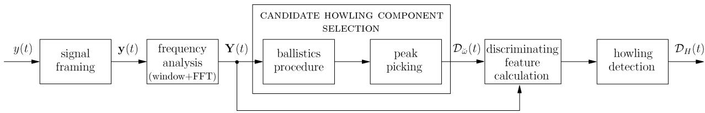  
Fig. 9. Howling detection algorithm for two-stage NHS method: from the microphone signal yðtÞ, a set of notch filter design parameters $D _ { H } ( t )$ is calculated.

$$
\omega_ {c, l} = \breve {\omega} _ {i} + \frac {2 \pi}{M} \left(\frac {| Y (\breve {\omega} _ {i} + 2 \pi / M) | - | Y (\breve {\omega} _ {i} - 2 \pi / M) |}{| Y (\breve {\omega} _ {i} - 2 \pi / M) | + | Y (\breve {\omega} _ {i}) | + | Y (\breve {\omega} _ {i} + 2 \pi / M) |}\right).\tag{54}
$$

In this case, the DFT magnitude values $| Y ( \cup _ { i } - 2 \pi / M ) |$ $\left| Y ( \breve { \omega } _ { i } ) \right|$ , and $| Y ( \breve { \omega } _ { i } + 2 \pi / M )$ j should also appear in the set of design parameters $\mathcal { D } _ { H } ( t )$ . The DFT magnitude information may also be used to determine the notch gain $G _ { c , l } ,$ however, it is common practice to work with fixed notch gain values that are independent of the howling component magnitude. Typically, when a new howling component has been detected $( \mathrm { i . e . , }$ a howling component at a frequency that has not occurred before), the notch gain is set to an initial value $G _ { c , l } ^ { ( 0 ) }$ , e.g., $G _ { c , l } ^ { ( 0 ) } = - 3 \mathrm { ~ d B ~ } [ 3 2 ]$ , [34] or $G _ { c , l } ^ { ( 0 ) } = - 6 \ \mathrm { d B } \ [ 4 4 ] , \ [ 4 5 ] .$ . If howling persists or reoccurs at a frequency close to a previously identified howling frequency, then the gain is decreased with $\Delta G _ { c , l } ~ \mathrm { d B } , \mathrm { e . g . } , \Delta G _ { c , l } = - 3$ dB [32], [34] or $\Delta G _ { c , l } = - 6$ dB [44], [45]. Finally, the radial notch filter bandwidth $B _ { l }$ is usually chosen proportional to the center frequency, such that the filter has a constant $Q$ factor. The octave bandwidth is then also constant and is typically chosen in the range 1/10–1/60 octave, e.g., 1/10 octave [32], [34], [52], [103], 1/20 octave [52], [103], or 1/60 octave [50], [51].

Finally, the filter specifications $S _ { H _ { l } } ( t ) = \{ \omega _ { c , l } , B _ { l } , G _ { c , l } \}$ have to be translated to a set of filter coefficients ${ \mathcal C } _ { H _ { l } } ( t ) =$ $\{ b _ { l } ^ { ( 0 ) } ( t ) , b _ { l } ^ { ( 1 ) } ( t ) , b _ { l } ^ { ( 2 ) } ( t ) , a _ { l } ^ { ( 1 ) } ( t ) , a _ { l } ^ { ( 2 ) } ( t ) \}$ . Most notch filter design methods are based on a bilinear transform of either an analog notch filter transfer function [127]–[133], or a digital notch filter transfer function centered at $\omega _ { c } = \pi / 2$ [126]. A novel design procedure for biquadratic notch filters was recently proposed, which operates directly in the digital domain using a technique known as pole-zero placement [125]. This design procedure, which is equally accurate yet more intuitive than the bilinear-transform-based design methods, will be applied in the evaluation of the NHS method in Section VII. The complete notch filter design procedure for the two-stage NHS method is shown schematically in Fig. 10.

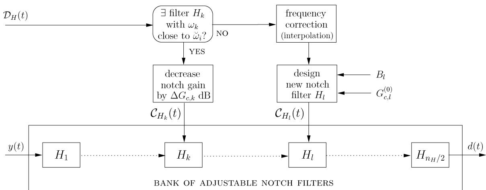  
Fig. 10. Notch filter algorithm for two-stage NHS method: the microphone signal yðtÞ is filtered in a bank of adjustable notch filters, designed using the design parameters in $D _ { H } ( t ) ,$ resulting in the howling-compensated signal dðtÞ.

## C. Initialization

In the PFC method for acoustic feedback control, the optimal values for the algorithm parameters (i.e., the modulation frequency $\omega _ { m }$ and modulation index ) were found to be independent of the specific acoustic feedback path characteristics. The optimal notch filter coefficients in the NHS method, however, depend heavily on the spectral properties of the acoustic feedback path. It has long been known that some of the spectral peaks in the acoustic feedback path magnitude response $| F ( \omega , t ) |$ originate from reflections depending on the room boundaries only and are hence independent of the position of loudspeakers, microphones, and other objects in the room.7 For this reason, manual equalization and notch filtering is largely performed during initialization (e.g., Bringing out[ a PA system during sound check [135]) and fixed filters are applied to compensate for the major room resonances.

Similarly, a number of notch filters in the NHS method may be fixed to the so-called Beigenfrequencies[ of the room, while the remaining notch filters can be adjusted to suppress variable-frequency howling components, which are due to, e.g., microphone movements [32], [34], [42]. The fixed notch filter design parameters should then be determined during the initialization of the sound reinforcement system, which is usually accomplished by feeding a white noise signal to the loudspeakers at a relatively high amplifier gain and subsequently identifying persisting spectral components in the microphone signal [23], [24], [32], [34].

The variable notch filters differ from the fixed notch filters in that they can be activated and deactivated during normal operation of the sound reinforcement system. While an extensive part of the NHS literature is devoted to strategies for the activation of these notch filters $( \mathrm { i . e . , }$ after howling detection), hardly any research results are available dealing with the criteria for notch filter deactivation. One such deactivation criterion was proposed by Terada and Murase [27] in the context of AEQ for HA applications, and consists in deactivating the equalization filters after a time period that is inversely proportional to the time period between two successive occurrences of howling. Finally, we should note that the activation of a notch filter in the electroacoustic forward path leads to transient components in the loudspeaker signal, which may be perceived as short-lived ringing artifacts [35], [36]. This effect can be avoided by gradually activating and deactivating the notch filters, e.g., using a leaky integrator [55], [56].

## D. Discussion

The NHS approach has many strengths, the most important one being its robustness. Unlike other acoustic feedback control methods, NHS methods have the powerful property of being able to stabilize an unstable system without having to reduce the broadband gain. For this reason, it is advisable that a sound reinforcement system that is operated with a different acoustic feedback control method (e.g., PFC or AFC) be supplemented with an NHS method, which should then be activated when the system stability cannot be restored using the PFC or AFC method. As for computational requirements, the NHS approach has a moderate complexity, in between the cheap PFC approach and the expensive AFC approach. The main computational load is in the frequency analysis and can be governed by properly choosing the frame length M and hop size P. Another attractive property is that the extension of the NHS approach to multichannel systems is relatively straightforward. In the multichannel case, it is usually more efficient to have the howling detection and notch filtering algorithms operate on the mixed signals instead of on the microphone signals, since the number of channels is usually reduced after mixing. Alternatively, both the mixed signals and the individual microphone signals can be used for howling detection, where the latter may be analyzed at a lower frequency resolution [53].

A difficulty that arises when applying an NHS method for acoustic feedback control is the multitude of algorithm parameters that have to be set, namely the frame length and hop size, the number of candidate howling components selected in each signal frame, the combination of discriminating features, the thresholds for howling detection, the number of fixed/variable notch filters to use, etc. Unfortunately, few guidelines are available for setting these algorithm parameters. As many NHS methods are described in patents, very few experimental results and no true comparisons between different NHS methods are available. A comparison of three NHS methods with particular choices for the algorithm parameters will be provided in Section VII, but obviously, many more combinations are possible.

The major shortcoming of the NHS approach is that it cannot deliver an MSG increase that is substantially larger than the MSG increase obtained with the PFC approach. At most, i.e., when all the spectral peaks in the loop gain could be removed, an MSG increase of 10 dB could be expected based on the statistical analysis by Schroeder [2]. In practice, this maximum value will never be attained since it is nearly impossible to completely flatten the loop gain and still retain an acceptable degree of sound quality. As an example, if we would increase the gain in the singlechannel system associated with the acoustic feedback path shown in Fig. 4(a) to a value that is 10 dB above the MSG without acoustic feedback control, then over 20 frequencies would satisfy the magnitude condition (11) in the Nyquist criterion, most of these lying in the 100–1500-Hz frequency region. Applying the NHS approach would then lead to a broadband attenuation in the 100–1500-Hz band, which would be detrimental for the sound quality (e.g., speech intelligibility). The limited achievable increase in MSG is also observed in manual notch filtering methods, where values of 5–8 dB have been obtained [6]. Finally, in terms of sound quality, the signal distortion due to notch filtering is reasonable if the number of filters that are applied concurrently is small and if the notch filter bandwidths are small. In fact, the main decrease in sound quality is due to the reactive nature of most NHS methods, i.e., howling can usually be perceived before it can be suppressed. From this point of view, proactive NHS methods can be viewed as promising acoustic feedback control solutions (see, e.g., [52] and [59]), however, their current applicability is limited due to their high computational complexity, comparable to the AFC complexity.

## VI. ADAPTIVE FEEDBACK CANCELLATION

## A. Concept

In a sound reinforcement system, the microphone signal yðtÞ consists of a source signal component vðtÞ and a feedback signal component xðtÞ, the latter denoting the entire signal that is fed back from the loudspeaker to the microphone. The AFC approach to acoustic feedback control is aimed at predicting the feedback signal component and then subtracting this prediction from the microphone signal. The predicted feedback signal, denoted as $\hat { y } [ t , \hat { { \bf f } } ( t ) ]$ , is obtained by filtering the loudspeaker signal $u ( t )$ with a model $\hat { F } ( q , t )$ of the acoustic feedback path; see Fig. 11. This model is calculated using an adaptive filter that is designed to identify the feedback path impulse response $\mathbf { f } \left( t \right)$ and track its changes. The feedback path and adaptive filter impulse responses are defined at time t as

$$
\mathbf {f} (t) = \left[ \begin{array}{c c c c} f ^ {(0)} (t) & f ^ {(1)} (t) & \dots & f ^ {(n _ {F})} (t) \end{array} \right] ^ {T}\tag{55}
$$

$$
\hat {\mathbf {f}} (t) = \left[ \begin{array}{c c c c} \hat {f} ^ {(0)} (t) & \hat {f} ^ {(1)} (t) & \dots & \hat {f} ^ {(n _ {\hat {F}})} (t) \end{array} \right] ^ {T}\tag{56}
$$

respectively.

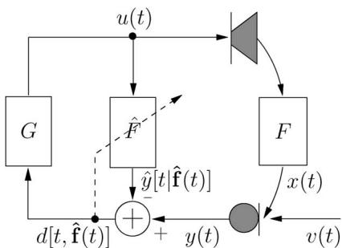  
Fig. 11. AFC by predicting the feedback signal component xðtÞ in the microphone signal, and hence subtracting the prediction $\hat { \gamma } [ t , \hat { \pmb f } ( t ) ]$ from the microphone signal $\gamma ( t ) .$ . The prediction is obtained by filtering the loudspeaker signal with a model $\pmb { \hat { F } } ( \pmb { q } , t )$ of the acoustic feedback path, which is calculated using an adaptive filter.

The closed-loop frequency response of the system shown in Fig. 11, employing an AFC method, is given by

$$
\frac {U (\omega , t)}{V (\omega , t)} = \frac {G (\omega , t)}{1 - G (\omega , t) [ F (\omega , t) - \hat {F} (\omega , t) ]}\tag{57}
$$

and, as a consequence, the Nyquist stability criterion can be rewritten as follows:

$$
\left\{ \begin{array}{l} \big | G (\omega , t) \big [ F (\omega , t) - \hat {F} (\omega , t) \big ] \big | \geq 1 \\ \angle G (\omega , t) \big [ F (\omega , t) - \hat {F} (\omega , t) \big ] = n 2 \pi , \quad n \in \mathbb {Z} \end{array} \right.\tag{58}
$$

(59)

which leads to the following expression for the MSG [see also (16)]:

$$
\operatorname{MSG} (t) [ \mathrm{dB} ] = - 2 0 \log_ {1 0} \left[ \max _ {\omega \in \mathcal {P} _ {\hat {F}}} \left| J (\omega , t) \left[ F (\omega , t) - \hat {F} (\omega , t) \right] \right| \right]\tag{60}
$$

with

$$
\mathcal {P} _ {\hat {F}} = \left\{\omega | \angle G (\omega , t) [ F (\omega , t) - \hat {F} (\omega , t) ] = n 2 \pi \right\}.
$$

From (60), it immediately follows that the better the fit between the estimated and actual feedback path frequency response, particularly at critical frequencies of the closedloop system, the larger the achievable MSG increase. Theoretically, if $\hat { F } ( q , \dot { t } ) \equiv F ( q , t )$ , the system would no longer exhibit a closed signal loop and hence the MSG would be infinitely large.

While the concept of AFC is relatively simple and similar to the well-known acoustic echo cancellation (AEC) approach, its realization is not straightforward. In the identification of the acoustic feedback path model $\hat { F } ( q , t )$ , a fundamental problem appears which is due to the closed-loop nature of the system. The LS estimate $\hat { \mathbf { f } } \left( t \right)$ of the acoustic feedback path impulse response $\mathbf { f } \left( t \right)$ can straightforwardly be calculated as

$$
\hat {\mathbf {f}} (t) = \left(\mathbf {U} ^ {T} \mathbf {U}\right) ^ {- 1} \mathbf {U} ^ {T} \mathbf {y}\tag{61}
$$

where the data vectors and matrices are defined as follows [and where the loudspeaker signal vector ${ \bf \delta u } ( t )$ is not to be confused with the multichannel loudspeaker signal vector $\bar { \mathbf { u } } ( t )$ defined in (5)]:

$$
\mathbf {y} = \left[ \begin{array}{c c c c} y (t) & y (t - 1) & \ldots & y (1) \end{array} \right] ^ {T}\tag{62}
$$

$$
\mathbf {U} = [ \mathbf {u} (t) \quad \mathbf {u} (t - 1) \quad \ldots \quad \mathbf {u} (1) ] ^ {T}\tag{63}
$$

$$
\mathbf {u} (t) = \left[ \begin{array}{c c c c} u (t) & u (t - 1) & \ldots & u (t - n _ {\hat {F}}) \end{array} \right] ^ {T}.\tag{64}
$$

The LS estimate may be characterized by its bias and variance [136, Ch. 8]. The bias corresponds to the difference between the expected value of the LS estimate and the true feedback path impulse response, i.e.,

$$
\operatorname{bias} \left\{\hat {\mathbf {f}} (t) \right\} = \left[ \begin{array}{c} E \left\{\hat {\mathbf {f}} (t) \right\} \\ \mathbf {0} _ {(n _ {F} - n _ {\hat {F}}) \times 1} \end{array} \right] - \mathbf {f} (t)\tag{65}
$$

where $E \{ \cdot \}$ denotes the expectation operator. Under a sufficient order assumption $( \mathrm { i . e . , ~ } n _ { \hat { F } } = n _ { F } )$ , the expected value of the LS estimate can be shown to correspond to [81]

$$
E \left\{\hat {\mathbf {f}} (t) \right\} = \mathbf {f} (t) + E \left\{(\mathbf {U} ^ {T} \mathbf {U}) ^ {- 1} \mathbf {U} ^ {T} \mathbf {v} \right\}.\tag{66}
$$

The rightmost term in (66) can be understood to be generally nonzero due to the closed-loop nature of the system, which induces a correlation between the source signal and the loudspeaker signal, and hence

$$
\operatorname{bias} \left\{\hat {\mathbf {f}} (t) \right\} = E \left\{\left(\mathbf {U} ^ {T} \mathbf {U}\right) ^ {- 1} \mathbf {U} ^ {T} \mathbf {v} \right\} \neq \mathbf {0}.\tag{67}
$$

The resulting effect in AFC is that the adaptive filter does not only predict and cancel the feedback component in the microphone signal, but also (part of) the source signal component. As a consequence, the feedback-compensated signal $d [ t , { \hat { \mathbf { f } } } ( t ) ]$ - is a distorted estimate of the source signal vðtÞ. On the other hand, the variance of the LS estimate can be obtained by considering its covariance matrix,8 which is calculated as [137]

$$
\operatorname{cov} \left\{\hat {\mathbf {f}} (t) \right\} = E \left\{\left(\hat {\mathbf {f}} (t) - \mathbf {f} (t)\right) \left(\hat {\mathbf {f}} (t) - \mathbf {f} (t)\right) ^ {T} \right\}\tag{68}
$$

$$
= \left[ E \bigl \{\mathbf {U} ^ {T} \mathbf {R _ {v}} ^ {- 1} \mathbf {U} \bigr \} \right] ^ {- 1}\tag{69}
$$

where the source signal covariance matrix $\mathbf { R _ { v } }$ is defined as

$$
\mathbf {R _ {v}} = E \{\mathbf {v v} ^ {T} \}\tag{70}
$$

8Note that the covariance matrix of the estimate $\hat { \mathbf { f } } ( t )$ is in fact defined as c $\mathrm { v } \{ \hat { \mathbf { f } } ( t ) \} = E \{ ( \hat { \mathbf { f } } ( t ) - E \{ \hat { \mathbf { f } } ( t ) \} ) ( \hat { \mathbf { f } } ( t ) - E \{ \hat { \mathbf { f } } ( t ) \} ) ^ { T } \}$ , which corresponds to co $\begin{array} { r } { \tau \big \{ \hat { \mathbf { f } } ( t ) \big \} = E \big \{ ( \hat { \mathbf { f } } ( t ) - \mathbf { f } ( \acute { t } ) ) ( \hat { \mathbf { f } } ( \acute { t } ) - \mathbf { f } ( t ) ) ^ { T } \big \} \mathrm { ~ i f ~ } E \big \{ \hat { \mathbf { f } } ( t ) \big \} = \mathbf { f } ( t ) , \mathrm { ~ i . e . ~ } } \end{array}$ ., if the estimate is unbiased. However, in the analysis of closed-loop identification methods it has been found more meaningful to work directly with the covariance expression cov $\{ \hat { \mathbf { f } } ( t ) \} = E \{ ( \hat { \mathbf { f } } ( t ) ^ { \smile } - \mathbf { f } ( t ) ) ( \hat { \mathbf { f } } ( t ) - \mathbf { f } ( t ) ) ^ { \sp { \mathnormal { \prime } } } \}$ even if $E \{ \hat { \mathbf { f } } ( t ) \} \neq \mathbf { f } ( t ) ;$ ; see, e.g., [137].

with

$$
\mathbf {v} = \left[ \begin{array}{c c c c} v (t) & v (t - 1) & \ldots & v (1) \end{array} \right] ^ {T}.\tag{71}
$$

The interpretation of (69) can be related to the double-talk problem occurring in AEC [138]. In AEC, when the loudspeaker signal is active while the source signal is not, the covariance matrix of the acoustic echo path LS estimate is relatively small, since ${ \mathbf { R } } _ { \mathbf { v } } \approx \mathbf { 0 }$ . However, when both signals are active at the same time (i.e., in a double-talk situation), the covariance matrix may become large, which may be observed in the adaptive filter performance as a decrease in convergence speed, or even a divergence. This problem becomes more severe as the source signal has a larger degree of coloration, since then the source signal covariance matrix $\mathbf { R _ { v } }$ exhibits a denser structure [138]. In AFC, the closed signal loop results in a continuous doubletalk situation, and then this is made even worse by the correlation between the source and loudspeaker signal.

To prevent the adaptive filter from converging to a biased solution, and to increase its convergence speed despite the inevitable continuous double-talk situation, a decorrelation procedure is typically included in the AFC approach, with the aim of reducing the correlation between the source and loudspeaker signal. We can distinguish between two types of decorrelation [81], namely decorrelation in the closed signal loop and decorrelation in the adaptive filtering circuit. The former approach has the disadvantage of distorting the loudspeaker signal, while the latter approach requires somewhat more computations.

## B. Realization

1) Adaptive Filtering: The adaptive calculation of the LS estimate (61) of the acoustic feedback path impulse response, and the subsequent calculation of the feedbackcompensated signal can be performed as follows:

$$
\varepsilon \Big [ t, \hat {\mathbf {f}} (t - 1) \Big ] = y (t) - \mathbf {u} ^ {T} (t) \hat {\mathbf {f}} (t - 1)\tag{72}
$$

$$
\mathbf {R} (t) = \lambda \mathbf {R} (t - 1) + \mathbf {u} (t) \mathbf {u} ^ {T} (t)\tag{73}
$$

$$
\hat {\mathbf {f}} (t) = \hat {\mathbf {f}} (t - 1) + \mathbf {R} ^ {- 1} (t) \mathbf {u} (t) \varepsilon [ t, \hat {\mathbf {f}} (t - 1) ]\tag{74}
$$

$$
d \Big [ t, \hat {\mathbf {f}} (t) \Big ] = y (t) - \mathbf {u} ^ {T} (t) \hat {\mathbf {f}} (t).\tag{75}
$$

The algorithm in (72)–(74) is known as the recursive least squares (RLS) algorithm [139, Ch. 13], with an exponential forgetting factor . Note that the (a priori) RLS residual $\varepsilon [ t , { \hat { \mathbf { f } } } ( t - 1 ) ]$ in (72) differs from the (a posteriori) feedbackcompensated signal $d [ t , { \hat { \mathbf { f } } } ( t ) ]$ , which is subsequently processed in the electroacoustic forward path, in that the former depends on the previous estimate $\hat { \mathbf { f } } ( t - 1 )$ . Through the application of the so-called matrix inversion lemma (MIL), the explicit inversion of the loudspeaker signal correlation matrix RðtÞ in $( 7 4 )$ can be avoided, and hence the RLS algorithm requires $O \big ( n _ { \hat { F } } ^ { 2 } \big )$ multiplications per time update [139, Ch. 13]. Fast RLS algorithms, requiring only $O ( n _ { \hat { F } } )$ multiplications per time update, have also been derived [140], [141] and successfully applied to, e.g., AEC [142]–[144, Ch. 6]. These fast RLS algorithms, however, are based on the shift invariance property of the loudspeaker signal vector defined in (64), $\mathrm { i . e . , }$ , the difference between $\mathbf { u } ( t - 1 )$ and uðtÞ consists in discarding the oldest sample value $u \big ( t - 1 - n _ { \hat { F } } \big )$ shifting the remaining sample values, and inserting the most recent sample value $u ( t )$ in the first position. This shift invariance property will generally not hold in the AFC context due to the decorrelation that is applied, either in the closed signal loop or in the adaptive filtering circuit, which often involves a nonlinear or time-varying filtering of the loudspeaker signal (see Section VI-B2).

Alternatively, a computationally cheaper adaptive algorithm can be found in the underdetermined recursive least squares (URLS) family [145]. The affine projection algorithm (APA) provides an estimate of the acoustic feedback path impulse response by using only the M most recent microphone signal samples and loudspeaker signal vectors, i.e.,

$$
\boldsymbol {\varepsilon} _ {M} \Big [ t, \hat {\mathbf {f}} (t - 1) \Big ] = \mathbf {y} _ {M} (t) - \mathbf {U} _ {M} ^ {T} (t) \hat {\mathbf {f}} (t - 1)\tag{76}
$$

$$
\begin{array}{r l} & {\hat {\mathbf {f}} (t) = \hat {\mathbf {f}} (t - 1)} \\ & {\qquad + \mu \mathbf {U} _ {M} (t) \left[ \mathbf {U} _ {M} ^ {T} (t) \mathbf {U} _ {M} (t) + \alpha \mathbf {I} _ {M} \right] ^ {- 1}} \end{array}
$$

$$
\times \boldsymbol {\varepsilon} _ {M} \Big [ t, \hat {\mathbf {f}} (t - 1) \Big ]\tag{77}
$$

$$
d \left[ t, \hat {\mathbf {f}} (t) \right] = y (t) - \mathbf {u} ^ {T} (t) \hat {\mathbf {f}} (t)\tag{78}
$$

where $\mu$ represents the step size, $\alpha \mathbf { I } _ { M }$ is an $M \times M$ identity regularization matrix scaled with the regularization parameter $\alpha ,$ and

$$
\mathbf {y} _ {M} (t) = [ y (t) \quad \ldots \quad y (t - M + 1) ] ^ {T}\tag{79}
$$

$$
\mathbf {U} _ {M} (t) = [ \mathbf {u} (t) \quad \ldots \quad \mathbf {u} (t - M + 1) ].\tag{80}
$$

The APA requires $O ( M n _ { \hat { F } } )$ multiplications per time update, which is obviously much less than the RLS algorithm if the APA projection order $M \ll n _ { \hat { F } }$ . Since the APA can be shown to decorrelate input signals that admit an Mth-order all-pole representation [146], relatively small values for the projection order have been successfully used in AEC applications with speech signals (e.g., $M \in \{ 2 , \ldots , 5 0 \}$ [147], $M = 8$ [148], $M = 1 0 ~ [ 1 4 9 ] )$ . Fast versions of the APA, requiring only $O ( n _ { \hat { F } } ) + O ( M )$ multiplications per time update, have also been derived [147]–[149], but again these algorithms rely on the shift invariance property of the loudspeaker signal vector, which need not be fulfilled in the AFC context.

Since the required adaptive filter order in room acoustic applications may be very high, a computational load of $O ( M n _ { \hat { F } } )$ multiplications per time update may still be too heavy to allow for a real-time application. For this reason, in most of the existing AFC schemes, a projection order $M = 1$ is applied, which leads to the well-known normalized least mean squares (NLMS) algorithm

$$
\varepsilon \left[ t, \hat {\mathbf {f}} (t - 1) \right] = y (t) - \mathbf {u} ^ {T} (t) \hat {\mathbf {f}} (t - 1)\tag{81}
$$

$$
\hat {\mathbf {f}} (t) = \hat {\mathbf {f}} (t - 1) + \mu \frac {\mathbf {u} (t) \varepsilon (t)}{\mathbf {u} ^ {T} (t) \mathbf {u} (t) + \alpha}\tag{82}
$$

$$
d \left[ t, \hat {\mathbf {f}} (t) \right] = y (t) - \mathbf {u} ^ {T} (t) \hat {\mathbf {f}} (t).\tag{83}
$$

The required number of multiplications per time update is $O \big ( n _ { \hat { F } } \big )$ , more specifically $4 n _ { \hat { F } } + 6$ [if the calculation of the feedback-compensated signal in (83) is also taken into account]. The choice of the NLMS step size $\mu$ is crucial to obtain a good compromise between a stable and fast convergence. In our own experience, step size values in the range $\mu = 0 . 0 1 \substack { - 0 . 0 5 }$ are best suited for speech applications [101], [103], [105], while values around $\mu = 0 . 0 0 5$ are recommended when working with audio signals [111].

Finally, the choice of the adaptive filter order $n _ { \hat { F } }$ is obviously extremely important, regardless of which adaptive filtering algorithm is used. It is clear that the choice of $n _ { \hat { F } }$ has a profound influence on the computational requirements of the AFC approach. One could argue that it may be sufficient to choose $n _ { \hat { F } }$ such that the largest components in the acoustic feedback path impulse response (originating from the early reflections) can be modeled. Unfortunately, such an approach would be inefficient for two reasons: first, large impulse response components do not necessarily correspond to large frequency response components and hence stability may not be improved by only cancelling the early reflections. Second, if the impulse response is undermodeled $( \mathrm { i . e . , }$ $n _ { \hat { F } } < n _ { F } )$ then an additional bias component will appear in the LS estimate (in addition to the bias due to the source and loudspeaker signal correlation) and moreover its variance will increase [150]. The best compromise between computational complexity and feedback control performance probably consists in choosing $n _ { \hat { F } }$ just large enough to obtain a satisfying MSG increase, and applying a technique for reducing the bias and variance due to undermodeling [150]– [152]. We should point out that the technique proposed by Rombouts et al. [150] for consistently identifying undermodeled RIRs is particularly interesting in the context of $\mathrm { A F C } ,$ , since it additionally provides a decorrelation in the adaptive filtering circuit.

We should emphasize that the above adaptive algorithms are often not implemented as such, since both the robustness and the efficiency of these algorithms can be further improved [103]. A robust adaptive filter implementation for AFC may include the following features: an adaptation control that freezes the adaptive filter coefficients during source signal onsets [103], a foreground/background adaptive filter implementation to combine good tracking properties with a small steady-state error [103], and a regularization method that compensates for the coloration of the loudspeaker signal [103], [105]. Moreover, the AFC efficiency in terms of computational load and convergence speed can be improved by considering a subband or frequency domain adaptive filter implementation rather than the time domain implementations shown here [103].

2) Decorrelation: Decorrelation of the source and loudspeaker signals in the closed signal loop can be achieved by inserting a decorrelating signal operation in the electroacoustic forward path; see Fig. 12. We can distinguish between the following approaches.

Noise injection [64], [74], [83]–[86]: a white noise signal $n ( t )$ is added to the feedback-compensated signal after the electroacoustic forward path processing (but usually before the forward path amplification) [see Fig. 12(a)], i.e.,

$$
u (t) = K (t) \left[ J (q, t) d [ t, \hat {\mathbf {f}} (t) ] + n (t) \right].\tag{84}
$$

The acoustic feedback path identification can then proceed in two ways: if the loudspeaker signal $u ( t )$ [including the noise signal nðtÞ] is used as the input signal to the adaptive filter, then the effect of the noise injection is that the source and loudspeaker signal cross-correlation is decreased, hence the bias will be reduced but not completely eliminated. A second possibility is to use the noise signal $n ( t )$ as the adaptive filter input signal, which leads to an unbiased estimate since the source signal and the noise signal are uncorrelated. In this case, however, the adaptive filter convergence will be rather slow since not only the source signal, but also the source signal component in the feedback signal acts as a disturbance towards the feedback path identification. With the aim of reducing the influence of the noise injection on sound quality, the noise spectrum can be shaped such as to render the noise less perceptible, e.g., by A-weighting [84] or psychoacoustic noise shaping [85], [86]. Unfortunately, noise shaping decreases the decorrelation effect, making the noise injection less effective in removing the bias.

Time-varying processing [74], [87]–[89]: each of the LPTV filters described in Section IV can be used as a decorrelating filter in the electroacoustic forward path [see Fig. 12(b)]

$$
u (t) = G (q, t) \Big [ H (q, t) d \Big [ t, \hat {\mathbf {f}} (t) \Big ] \Big ].\tag{85}
$$

An FS decorrelating filter has an LPTV frequency response as given by (26) and has successfully been applied to AFC for speech applications [87]–[89]. While the perceptible signal distortion introduced by the FS operation appears to be acceptable for speech signals [89], the FS decorrelation technique was found to be perceptually inadequate for audio applications [86]. The sinusoidal PM and DM filters, of which the LPTV frequency response is given in (24) and (29), respectively, have also been applied as decorrelation filters in AFC [74], [87], [88]. Note that a beneficial side effect of using LPTV decorrelation filters is that these filters also stabilize the closed-loop system by smoothing the loop gain (see Section IV).

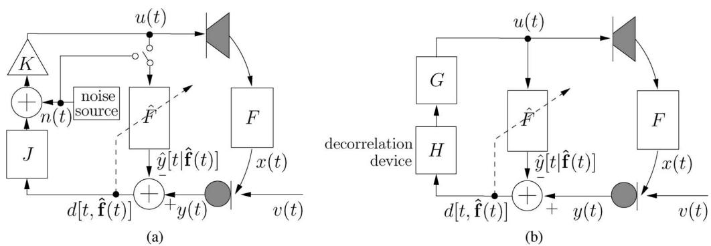  
Fig. 12. AFC with decorrelation in the closed signal loop. (a) Decorrelation by noise injection: the adaptive filter input signal can be either the loudspeaker signal u(t) or the noise signal n(t). (b) Decorrelation in the electroacoustic forward path: the decorrelation device corresponds to an L PTy filter $H ( \boldsymbol { q } , t )$ , a nonlinear mapping $H \{ \cdot , t \} _ { i }$ , or a processing delay $q ^ { - d _ { i } }$

Nonlinear processing [74], [91]: in the context of stereo AEC, the correlation between the stereo channels, which leads to an identifiability problem of the acoustic echo path models [153], has been reduced by applying nonlinear decorrelating operations to the loudspeaker signals [90]. These nonlinear operations can also be used to reduce the correlation between the source and loudspeaker signals in an AFC application. In particular, halfwave rectification has been successfully applied to AFC decorrelation [74], [91] [see Fig. 12(b)], i.e.,

$$
\begin{array}{l} u (t) = G (q, t) \left[ H \left(d [ t, \hat {\mathbf {f}} (t) ], t\right) \right] \\ = G (q, t) \left[ d [ t, \hat {\mathbf {f}} (t) ] \right. \\ \quad + \alpha \left(\frac {d [ t , \hat {\mathbf {f}} (t) ] + | d [ t , \hat {\mathbf {f}} (t) ] |}{2}\right) \Bigg ]. \end{array} \tag {86}\tag{87}
$$

The parameter  can be tuned to obtain the best compromise between decorrelation and perceptible signal distortion.

Forward path delay: in HA AFC applications, inserting a processing delay of $d _ { 1 }$ samples in the electroacoustic forward path has been proposed to decorrelate the source and loudspeaker signals [79], [92] [see Fig. 12(b)], i.e.,

$$
u (t) = G (q, t) d \left[ t - d _ {1}, \hat {\mathbf {f}} (t - d _ {1}) \right].\tag{88}
$$

This approach is particularly useful for source signals that have an autocorrelation function that decays rapidly, e.g., voiceless speech signals, provided that the delay value $d _ { 1 }$ is chosen accordingly.

Note that when applying decorrelation in the closed signal loop, a tradeoff between bias reduction and sound quality should always be sought by properly tuning the decorrelation parameters. Usually, a perceptible signal distortion is unavoidable, either because of the decorrelating signal operation itself (when strong decorrelation is applied), or because of the bias in the acoustic feedback path estimate (when weak decorrelation is applied) [81].

Decorrelation in the adaptive filtering circuit does not require the above tradeoff and generally, the stronger the decorrelation, the better will be the attained sound quality. Two such approaches have been proposed.

Adaptive filter delay [93], [94]: due to the time needed for the loudspeaker sound to propagate through a direct coupling to the microphone, the acoustic feedback path impulse response typically exhibits an initial delay (sometimes referred to as the Bdead time[; see Fig. 3), the value of which is proportional to the loudspeaker–microphone distance. If this initial delay (or a lower bound for it) is known a priori and corresponds to $d _ { 2 } T _ { s }$ s, then the first $d _ { 2 }$ coefficients in the acoustic feedback path model can be forced to zero, i.e.,

$$
\begin{array}{l} \hat {F} (q, t) = \hat {f} ^ {(d _ {2})} (t) q ^ {- d _ {2}} \\ \qquad + \hat {f} ^ {(d _ {2} + 1)} (t) q ^ {- (d _ {2} + 1)} + \ldots + \hat {f} ^ {(n _ {\hat {F}})} q ^ {- n _ {\hat {F}}}. \end{array}\tag{89}
$$

As a consequence, the first $d _ { 2 }$ rows in the expression (61) for the LS estimate of the acoustic feedback path impulse response need not be considered, and likewise for the bias vector in (67). If we now assume that the source and loudspeaker signal cross-correlation function is small for time lags larger than $d _ { 2 }$ samples, then the remaining bias can be considered negligible. Decorrelating prefilters [81], [91], [97]: from a system identification point of view, the bias in the LS estimate of the acoustic feedback path model can be eliminated by using an appropriate noise model in the identification [137], i.e., a model of the signal that disturbs the identification, more specifically the source signal in the AFC context. If we assume a (time-varying) parametric source signal model $H ( q , t )$

$$
v (t) = H (q, t) e (t)\tag{90}
$$

and that an estimate $\hat { H } ( q , t )$ of $H ( q , t )$ is available, then the unbiased identification approach consists in prefiltering the loudspeaker and microphone signals with the inverse source signal model estimate before feeding these signals to the adaptive filtering algorithm. Note that the source signal excitation signal $e ( t )$ in (90) is assumed to be an uncorrelated signal $( { \mathrm { i . e . } }$ , white noise or a Dirac impulse). This approach is depicted in Fig. 13(a), where the prefiltered loudspeaker and microphone signals are calculated as

$$
\tilde {y} [ t, \hat {\mathbf {h}} (t) ] = \hat {H} ^ {- 1} (q, t) y (t)\tag{91}
$$

$$
\tilde {u} [ t, \hat {\mathbf {h}} (t) ] = \hat {H} ^ {- 1} (q, t) u (t)\tag{92}
$$

and $\hat { \mathbf { h } } ( t )$ contains the estimated source signal model parameters. This approach was originally developed for HA AFC applications [80], [95], [96] and later on extended to room acoustic applications [81], [91], [97].

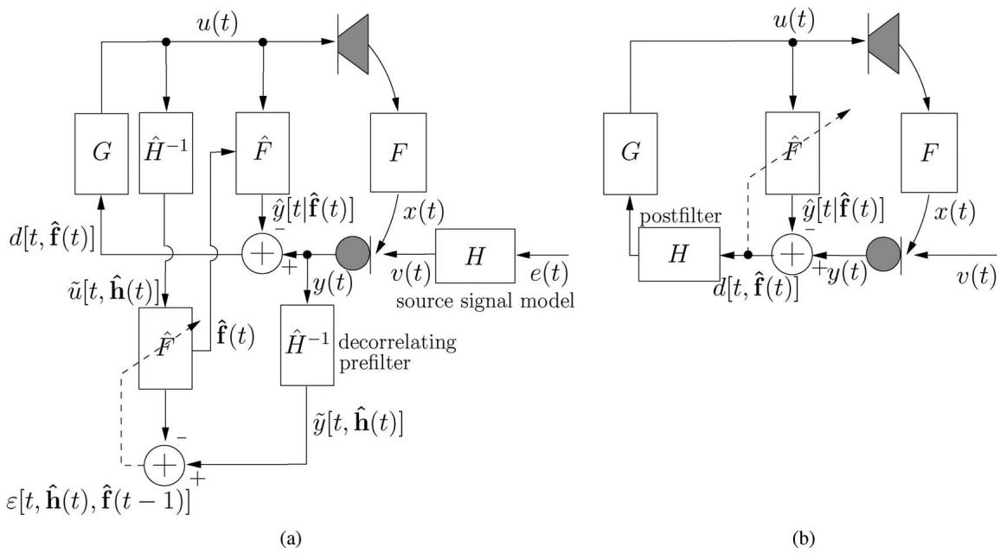  
Fig. 13. (a) AFC with decorrelating prefilters in the adaptive filtering circuit: a linear parametric source signal model Hðq; tÞ is estimated, and subsequently the microphone and loudspeaker signals are prefiltered with the inverse source signal model before being fed to the adaptive filter. (b) AFC with postfiltering: the postfilter Hðq; tÞ can either be a spectral subtraction filter for residual feedback suppression, or a bank of notch filters to avoid closed-loop instability.

Both approaches to decorrelation in the adaptive filtering circuit rely on additional information that is not necessarily available a priori and may moreover be time varying, i.e., the initial delay of the acoustic feedback path and the source signal model. The problem of how to concurrently estimate the initial delay and the model coefficients of the acoustic feedback path impulse response has not yet been treated in the literature. On the other hand, the concurrent estimation of the source signal model and the acoustic feedback path model has been studied extensively by Rombouts et al. [100]– [102] for speech applications and by van Waterschoot and Moonen [110], [111] for audio applications. For speech source signals, the parametric source signal model preferably consists of a cascade of two all-pole models [100], [101]

$$
H (q, t) = \frac {1}{A (q , t)} \frac {1}{C (q , t)}\tag{93}
$$

with

$$
A (q, t) = 1 - \sum_ {i = - 1} ^ {1} \alpha^ {(i)} (t) q ^ {- K - (l / D) - i}\tag{94}
$$

$$
C (q, t) = 1 + \sum_ {i = 1} ^ {n _ {C}} c ^ {(i)} (t) q ^ {- i}.\tag{95}
$$

The three-tap fractional pitch prediction model $1 / A ( q , t )$ is used to model the periodic speech components that stem from the vibration of the vocal chords. Here, $K + l / D$ represents the fractional pitch lag, with K the integer pitch lag, D the interpolation ratio, and $l \in \left\{ 0 , \ldots , D - 1 \right\}$ the fractional phase [154]. The all-pole model $1 / C ( q , t )$ represents the vocal tract response that produces the formant speech components [155]. The cascade model in (93)–(95) can also be used for monophonic audio signals, while for polyphonic audio signals a cascade of a constrained pole-zero model with an all-pole model appears to be better suited [111], [156], i.e.,

$$
H (q, t) = \frac {B (q , t)}{A (q , t)} \frac {1}{C (q , t)}\tag{96}
$$

with

$$
\frac {A (q , t)}{B (q , t)} = \prod_ {i = 1} ^ {n _ {A} / 2} \frac {1 - 2 \nu_ {i} \cos \theta_ {i} q ^ {- 1} + \nu_ {i} ^ {2} q ^ {- 2}}{1 - 2 \rho_ {i} \cos \theta_ {i} q ^ {- 1} + \rho_ {i} ^ {2} q ^ {- 2}}.\tag{97}
$$

The constrained pole-zero model $B ( q , t ) / A ( q , t )$ then models the tonal components in the audio signal, while the all-pole model $1 / C ( q , t )$ models the Bnoise-like[ components. The constrained pole-zero model is usually parametrized using a second-order sections structure, as shown in $( 9 7 )$ , where the $\theta _ { i }$ correspond to the pole-zero angles, and $\nu _ { i }$ and $\rho _ { i }$ are the zero and pole radii, $i = 1 , \dots , n _ { A } / 2$

The concurrent estimation of the source signal models and the acoustic feedback path model can be performed using a prediction error identification approach [98, Ch. 3], [99, Ch. 7], which then leads to the so-called PEM-based AFC algorithms proposed in [100]–[103], [110], and [111].

3) Postfiltering: Mainly owing to undermodeling and steady-state as well as tracking errors, a misadjustment between the AFC adaptive filter coefficients and the acoustic feedback path impulse response will unavoidably exist. As a result, the feedback signal $x ( t )$ will typically not be completely canceled from the microphone signal, and so the feedback-compensated signal contains a residual feedback signal component $r [ t , \hat { { \bf f } } ( \bar { t } ) ]$

$$
d \Big [ t, \hat {\mathbf {f}} (t) \Big ] = v (t) + \underbrace {\big [ F (q , t) - \hat {F} (q , t) \big ] u (t)} _ {\stackrel {{\triangle}} {{=}} r \big [ t, \hat {\mathbf {f}} (t) \big ]}.\tag{98}
$$

A similar problem was previously encountered in AEC, and residual echo suppression postfilters have successfully been applied in this area [157]–[159]. These postfilters operate on the echo-compensated signal and attempt to suppress the residual echo component using a spectral subtraction approach. Several attempts have been made to apply the AEC postfiltering approach to the AFC scenario [66], [94], resulting in the AFC scheme shown in Fig. 13(b). We should emphasize that, again, the correlation between the loudspeaker and source signal makes the residual feedback suppression problem much harder in the AFC case as compared to the AEC case. Since the postfiltering approach is based on spectral subtraction, the postfilter is usually designed directly in the frequency domain.

Janse and Belt [66] propose the procedure, shown in (99)–(100) at the bottom of the page, to determine the postfilter magnitude response, where $| Y ( \omega _ { k } , t ) |$ , $| \hat { Y } [ \omega _ { k } , \bar { { \bf f } } , \hat { { \bf f } } ( t ) ] |$ , and $| D [ \omega _ { k } , t , \hat { { \bf f } } ( t ) ] |$ denote the short-term DFT magnitude spectra of the microphone signal, the feedback signal estimate, and the feedback-compensated signal, respectively, which are defined similarly to (40). Ideally, the filter in (99) should behave as follows: when the source signal component dominates in the short-term magnitude spectrum of the microphone signal, the amount of spectral subtraction should be small, while if the feedback signal component dominates, the amount of subtraction should be large [66]. The subtraction factor $\gamma$ is chosen larger than one in case the estimated maximum loop gain max! $, | G ( \omega , t ) \hat { F } ( \omega , t ) | \geq 1$ , while $\gamma < 1$ i f $\operatorname* { m a x } _ { \omega } | G ( \omega , t ) \hat { F } ( \omega , t ) | < 1$ . The first-order low-pass filtering operation in (100) is performed to obtain a smoothly timevarying postfilter behavior. Unfortunately, the postfilter response in (99) also depends on an estimate of the shortterm residual feedback signal spectrum $| \hat { R } [ \omega _ { k } , t , \hat { \mathbf { f } } ( t ) ] |$ , yet no details are provided in [66] on how to obtain this estimate.

An alternative postfilter design procedure for residual feedback suppression was proposed by Ortega et al. [94], which is based on the observation that an optimal expression for the postfilter [in the sense of forcing the closed-loop frequency response in (10) to be exactly equal to the electroacoustic forward path response $G ( \omega , t ) ]$ is given by

$$
\begin{array}{l} H (\omega , t) = \frac {1}{1 + G (\omega , t) [ F (\omega , t) - \hat {F} (\omega , t) ]} \\ = 1 - \sqrt {\frac {S _ {r} [ \omega , t , \hat {\mathbf {f}} (t) ]}{S _ {d} [ \omega , t , \hat {\mathbf {f}} (t) ]}} \end{array}\tag{101}
$$

(102)

where $S _ { r } [ \omega , t , \hat { \mathbf { f } } ( t ) ]$ and $S _ { d } [ \omega , t , \hat { \mathbf { f } } ( t ) ]$ denote the short-term power spectral density (PSD) of the residual feedback signal and the feedback-compensated signal, respectively. Here, $S _ { d } [ \omega , t , \hat { \mathbf { f } } ( t ) ]$ is estimated from the feedback-compensated signal $d \big [ t , \hat { { \bf f } } ( t ) \big ]$ using the periodogram followed by a Mel-scale-based frequency smoothing. Finally, $S _ { r } [ \omega , t , \hat { \mathbf { f } } ( t ) ]$ is estimated recursively

$$
\begin{array}{r l} & {\hat {S} _ {r} \Big [ \omega , t, \hat {\mathbf {f}} (t - 1) \Big ]} \\ & {\qquad = [ \delta + 2 \lambda (1 - \lambda) ] \hat {S} _ {r} \Big [ \omega , t - 1, \hat {\mathbf {f}} (t - 2) \Big ]} \\ & {\qquad + (1 - \delta) \lambda^ {2} \hat {S} _ {d} \Big [ \omega , t - 1, \hat {\mathbf {f}} (t - 1) \Big ]} \\ & {\qquad + (1 - \delta) (1 - \lambda) ^ {2} \frac {\hat {S} _ {r} ^ {2} \Big [ \omega , t - 1 , \hat {\mathbf {f}} (t - 2) \Big ]}{\hat {S} _ {d} \Big [ \omega , t - 1 , \hat {\mathbf {f}} (t - 1) \Big ]}} \end{array}\tag{103}
$$

where the parameters  and are chosen to be around 0.3 and 0.8, respectively [94]. Consequently, the first term on the right-hand side of (103) dominates the other terms, and hence it can be understood that the initialization of the

$$
\left| \tilde {H} (\omega_ {k}, t) \right| = \max \left\{\frac {\left| Y (\omega_ {k} , t) \right| - \gamma \left(\left| \hat {Y} \left[ \omega_ {k} , t , \hat {\mathbf {f}} (t) \right] \right| + \left| \hat {R} \left[ \omega_ {k} , t , \hat {\mathbf {f}} (t) \right] \right|\right)}{\left| D \left[ \omega_ {k} , t , \hat {\mathbf {f}} (t) \right] \right|}, 0 \right\}
$$

$$
\left| H \left(\omega_ {k}, t\right) \right| = \lambda \left| H \left(\omega_ {k}, t - 1\right) \right| + (1 - \lambda) \left| \tilde {H} \left(\omega_ {k}, t\right) \right|\tag{99}
$$

(100)

residual feedback signal PSD estimate at t ¼ 0 has a crucial effect on the quality of the estimate in (103).

It should be noted that a postfilter may also be used in the AFC scheme with the aim of preventing closed-loop system instability rather than suppressing the residual feedback signal. In this case, the postfilter should behave as a bank of notch filters, operating at the critical frequencies of the closed-loop system. Schmidt et al. [74], [106] propose an ANF postfilter that does not directly use any information from the AFC adaptive filter, and hence does not behave differently from the ANF that operates without an AFC (see Section III-B). Rombouts et al. [52], [103] propose a postfilter based on a two-stage NHS method, in which the NHS howling detection is replaced by a proactive detection of critical frequencies by inspecting the estimated loop gain $\vert G ( \omega , t ) \hat { F } ( \omega , t ) \vert$ using the most recent AFC acoustic feedback path estimate $\hat { F } ( q , t )$

## C. Initialization

Similarly to the NHS method, an initialization procedure that is performed during the startup of the sound reinforcement system is useful to improve the performance of the AFC method. The room acoustics information that is gathered during the initialization can be elegantly incorporated in the AFC adaptive filtering algorithm using a technique known as regularization [105], [160]. The most straightforward approach to regularization consists in calculating an offline estimate of the acoustic feedback path impulse response, and subsequently using this estimate as the initial parameter vector $\hat { \mathbf { f } } ( 0 )$ in any of the adaptive algorithms discussed in Section VI-B1. While this approach may lead to a considerable improvement of the adaptive filter’s convergence speed, it is nonrobust to changes in the acoustic feedback path impulse response. More particularly, the impulse response may be considerably different during initialization and during operation of the system, e.g., due to the presence of an audience on the room acoustics.

A more advanced approach to regularization consists in identifying the acoustic feedback path model in a Bayesian minimum mean square error (MMSE) framework instead of in an LS framework [105]. The acoustic feedback path impulse response $\mathbf f ( t )$ is then viewed as a stochastic quantity on which some prior knowledge may be available, e.g., the mean $E \{ \mathbf { f } ( t ) \mathbf  \bar { \} } = \mathbf { f _ { 0 } }$ and covariance matrix cov $\left\{ { \bf f } \left( t \right) \right\} = { \bf R } _ { \bf f }$ . In the Bayesian MMSE framework, the optimal impulse response estimate is then given by [105]

$$
\hat {\mathbf {f}} (t) = \mathbf {f _ {0}} + \left(\mathbf {U} ^ {T} \mathbf {R _ {v}} ^ {- 1} \mathbf {U} + \mathbf {R _ {f}} ^ {- 1}\right) ^ {- 1} \mathbf {U} ^ {T} \mathbf {R _ {v}} ^ {- 1} (\mathbf {y} - \mathbf {U f _ {0}})\tag{104}
$$

which, in contrast to the LS estimate in (61), depends both on the acoustic feedback path statistics through $\mathbf { f _ { 0 } }$ and $\mathbf { R _ { f } }$ , and on the source signal statistics through $\mathbf { R _ { v } }$ defined in (70). In the context of adaptive filtering, the mean of the acoustic feedback path impulse response is usually chosen either as $\mathbf { f _ { 0 } = 0 }$ or as $\mathbf { f _ { 0 } } = \hat { \mathbf { f } } ( t - 1 )$ , which results in two well-known types of regularization, more specifically, Tikhonov regularization (TR) and Levenberg–Marquardt regularization (LMR), respectively [105]. On the other hand, the covariance matrix $\mathbf { R _ { f } }$ is constructed using an initial impulse response measurement or using the available room acoustic parameters such as the reverberation time and the loudspeaker– microphone distance [105]. The resulting adaptive filtering algorithms, known as TR-RLS, LMR-RLS, LMR-APA, and LMR-NLMS, do not require significantly more computations as compared to the original RLS, APA, and NLMS algorithms, if the covariance matrix $\mathbf { R _ { f } }$ is constructed to be a diagonal matrix [105], [160].

## D. Discussion

The AFC approach is widely considered to be the most promising solution to the acoustic feedback problem. Its most attractive property lies in the fact that the effect of acoustic feedback can be completely canceled, provided that the AFC algorithm converges to the desired solution, and hence the MSG can be increased considerably. Experiments have shown that MSG increases of 15–20 dB are practically achievable [89], [103], which is two to three times more than the MSG increases obtained with the PFC and NHS approaches (see Sections IV-C and V-D). As a consequence, a sound reinforcement system equipped with an AFC method can generally operate at a reasonably large gain margin and hence howling, ringing, and reverberation artifacts can be avoided, resulting in a high sound quality. We should note, however, that in terms of sound quality, the choice of the decorrelation method is of crucial importance. In particular, when applying decorrelation in the closed signal loop, signal distortion appears to be unavoidable, either because the decorrelation itself is perceptible, or because the source signal is partially canceled when the decorrelation is insufficient [81]. From this point of view, it is highly desirable to perform the decorrelation in the adaptive filtering circuit instead of in the closed signal loop. In terms of robustness, the AFC approach has benefited much from recent improvements such as postfiltering [66], [93], [94], notch filtering [74], [103], [106]–[108], adaptation control [103], and regularization [103], [105], [160].

The main disadvantage of the AFC approach is its computational complexity, which is typically much higher than the PFC and NHS complexity. Even when the cheapest adaptive filtering algorithm is applied, i.e., the NLMS algorithm which requires $O \big ( n _ { \hat { F } } \big )$ multiplications per time update, the AFC complexity may still exclude a real-time implementation. The reason for this is twofold. First, since the acoustic feedback path is modeled by its impulse response, a very high adaptive filter order is typically required. Second, since a sufficiently high sampling rate should be used to obtain a good sound quality (especially for audio applications), the impulse response is densely sampled hence requiring many coefficients, and moreover, a large number of adaptive filter iterations has to be performed per second. Nevertheless, several real-time AFC implementations for single-channel systems have been reported. Goertz has tested a real-time AFC setup with a 2646-tap adaptive filter (i.e., modeling the first 60 ms of the acoustic feedback path impulse response at $f _ { s } = 4 4 . 1 \mathrm { k H z } )$ in a room with $T _ { 6 0 } = 1 . 2 s ,$ thereby achieving a 5-dB MSG increase [84]. Rombouts et al. have reported MSG increases up to 14 dB in a real-time AFC experiment with a frequency domain adaptive filter of order 2048, operating at a sampling frequency of 16 kHz in a room with $T _ { 6 0 } = 1 2 0$ ms [103].

The high complexity also puts a limit on the generalization of the AFC approach to multichannel systems. Since no results are available on how to exploit the fact that the different acoustic feedback path impulse responses of a multichannel system share some underlying room acoustic properties, the state of the art in multichannel AFC consists in applying S  L single-channel AFC algorithms in a system having S microphones and L loudspeakers, hence the resulting complexity also increases with a factor S  L.

## VII. EVALUATION

## A. Evaluated Algorithms

From the above exposition, it is clear that a multitude of acoustic feedback control methods has been proposed. An experimental evaluation of all the existing methods and realizations is beyond the scope of this paper. We will however provide an evaluation of a selection of methods and realizations that we consider representative for the state of the art. The evaluation is based on computer simulations rather than real-time experiments, to make sure the simulation scenario is exactly reproducible for the different algorithms. From each of the three presented categories of feedback control methods (i.e., PFC, NHS, and AFC methods), we will select three different state-of-the-art algorithms.

As for PFC, we evaluate three of the PM techniques described in Section IV-A: sinusoidal PM, FS, and sinusoidal DM. The corresponding PFC algorithms are denoted as PFC-PM, PFC-FS, and PFC-DM, respectively. The PFC-PM and PFC-FS algorithms are realized as shown in (33) and (35), respectively, where the discrete-time Hilbert transform ^yðtÞ is estimated using the method proposed in [115]. For the PFC-DM algorithm, we use a Hamming-windowed and truncated linear interpolation filter as given in (38), with an interpolation ratio $D = 8$ and a filter length of 2I ¼ 32 taps. The PFC parameters are tuned to provide a firm tradeoff between the resulting MSG and signal distortion, and also taking into account the parameter values suggested in the PFC literature. In the PFC-FS algorithm, following [2], the modulation frequency is set to $f _ { m } = 5 ~ \mathrm { H z }$ . In the PFC-PM and PFC-DM algorithms, however, a lower value should be used to avoid excessive signal distortion, hence for these two approaches we set $f _ { m } = 1 \ : \mathrm { H z }$ . In the PFC-PM algorithm, a modulation index $\beta = 3 . 8$ was found to produce better results than $\beta = 2 . 4 ,$ , while the PFC-DM algorithm is implemented with a modulation depth of $\Delta _ { \tau } = 3 2$ samples and a delay offset of $\tau _ { 0 } = \Delta _ { \tau } + 2 I = 6 4$ samples.

In the NHS approach, many different howling detection criteria can be designed by combining the spectral and temporal microphone signal features defined in Section V-B1. An elaborate evaluation of each of these features, both in terms of howling detection accuracy and NHS feedback control performance, can be found in [62] and [63]. Here, we will only consider the following three approaches. In the first algorithm (denoted as NHS-1), the howling detection is performed as suggested in [32] and [34], using a combination of the PHPR and IPMP features defined in (45) and (50), respectively. Howling is then detected if for a certain frequency, both (46) is fulfilled (with $T _ { \mathrm { P H P R } } = 3 0 \ \mathrm { d B } )$ and $\mathrm { I P M P } \ge 3 / 5$ with $Q _ { M } = 5$ The second algorithm (denoted as NHS-2) uses the PAPR feature (42) for howling detection, following, e.g., [50] and [51]. It was found that the PAPR threshold should preferably have a different value in speech and audio applications [62], [63], $\mathrm { e . g . , } T _ { \mathrm { P A P R } } ^ { \mathrm { ( s p e e c h ) } } = 3 3$ dB and $T _ { \mathrm { P A P R } } ^ { \mathrm { ( a u d i o ) } } = 5 5$ dB. Choosing $T _ { \mathrm { P A P R } } ^ { \mathrm { ( a u d i o ) } } > T _ { \mathrm { P A P R } } ^ { \mathrm { ( s p e e c h ) } }$ is recommended since the tonal components in an audio signal are much more easily misclassified as howling components. Finally, in the third algorithm (denoted as NHS-3), we apply the howling detection criterion proposed in [28]–[30], which combines the PNPR and IMSD features, defined in (47) and (51), respectively. According to [28]–[30], the PNPR and IMSD features are used to calculate two secondary features, namely the Bpeakness[ and the Bslopeness,[ which are subsequently combined into a so-called feedback existence probability (FEP) function as follows:

$$
\operatorname{FEP} \left(\breve {\omega} _ {i}, t\right) = 0. 7 \cdot \text {   s   l   o   p   e   n   e   s   s } \left(\breve {\omega} _ {i}, t\right) + 0. 3 \cdot \text {   p   e   a   k   n   e   s   s } \left(\breve {\omega} _ {i}, t\right).\tag{105}
$$

The relation between the PNPR and peakness features is given in (49), while the calculation of the slopeness from the IMSD is performed using a nonlinear mapping (which is not explicitly given in [28]–[30]) that is chosen to be

$$
\text { s   l   o   p   e   n   e   s   s } (\breve {\omega} _ {i}, t) = e ^ {- | \mathrm{IMSD} (\breve {\omega} _ {i}, t) |}.\tag{106}
$$

Again, we found that a different value of the FEP threshold should be used in speech and audio applications, e.g., $T _ { \mathrm { F E P } } ^ { \mathrm { ( s p e e c h ) } } = 0 . 7$ (as suggested in [28]–[30]) and $T _ { \mathrm { F E P } } ^ { \mathrm { ( a u i d i o ) } } =$ 0:95 [with howling being detected if FEP $( \breve { \omega } _ { i } , t ) \geq T _ { \mathrm { F E P } } ] .$ Since the howling detection in the NHS-1 and NHS-3 algorithms is more advanced as compared to the NHS-2 algorithm, we can expect a larger false alarm probability when using the latter algorithm [50], [51], [62], [63]. To compensate for this effect, the notch filters applied in the NHS-2 algorithm are given a very small bandwidth, i.e., 1/60 octave, as suggested in [50] and [51]. The NHS-1 and NHS-3 algorithms work with 1/10 octave notch filters, following [32], [34], [52], and [103]. Also, the maximum number of cascaded notch filters as defined in (53) is set to $n _ { H } / 2 = 1 2$ in the NHS-1 and NHS-3 algorithms, and to $n _ { H } / 2 = 4 8$ in the NHS-2 algorithm. Finally, we should mention that all three NHS algorithms under consideration apply a DFT-based frequency analysis as in (40), with $M = 2 0 4 8$ at $f _ { s } = 1 6 ~ \mathrm { k H z }$ , or $M = 4 0 9 6$ at $f _ { s } = 4 4 . 1$ kHz, and with $P = M / 2$ , from which $N = 3$ candidate howling components are identified by peak picking.

The AFC approach will be evaluated using three different decorrelation methods; see Section VI-B2. We refer to [82] for an evaluation of the decorrelation methods that are not covered here. The first AFC algorithm (denoted as AFC-NI) includes a decorrelation by noise injection, in which a white noise signal is added to the feedback-compensated signal before amplification, as suggested in [64], [74], and [83]–[85]. The loudspeaker signal is chosen as the input signal to the adaptive filter [i.e., the switch in Fig. 12(a) is set to its vertical position]. The injected noise power is adjusted to be 10 dB below the long-term feedback-compensated signal power, which results in an adaptive filter convergence speed that is comparable to the other AFC algorithms under consideration. The second algorithm (denoted as AFC-FS) features a decorrelation by a time-varying processing, more specifically by FS, following [74] and [87]–[89]. The FS operation is realized as in the PFC-FS algorithm, and the same modulation frequency $f _ { m } = 5$ Hz will be used. The third algorithm (denoted as AFC-PF) is based on decorrelating prefilters, as proposed in [81], [91], and [97]. We will use a cascade source signal model that consists of a pitch prediction model and an all-pole model, as defined in (93)–(95), which are estimated concurrently with the acoustic feedback path model using the PEM-AFROW algorithm [100], [101], [103]. For this algorithm to be applicable for both speech and audio source signals, the search range for the pitch lag K should be chosen large enough, e.g., $K \in \{ \bar { [ { f _ { s } } / { 1 0 0 0 } ] } , \dots , [ { f _ { s } } / { 1 0 0 } ] \}$ [111]. The fractional delay in the pitch prediction model (94) is approximated by a linear interpolation filter similar to the interpolation filter in the PFC-DM algorithm. The all-pole model order is set to $n _ { C } = 2 0$ , and both source signal models are estimated using 50% overlapping data windows of length $M = 3 2 0$ at $f _ { s } = 1 6$ kHz in case of speech source signals [100], [101], and of length $M = 2 0 4 8$ at $f _ { s } = 4 4 . 1$ kHz for audio source signals [111]. Moreover, a processing delay of half the data window length is inserted in the electroacoustic forward path, as suggested in [100], [101], and [111]. In all three AFC algorithms, the acoustic feedback path model order is equal to the length of the feedback path impulse response, i.e., $\begin{array} { r } { n _ { \hat { F } } = n _ { F } , } \end{array}$ , and the NLMS algorithm (81)–(83) is used to update the adaptive filter coefficients. The NLMS step size is chosen to be $\mu = 0 . 0 2$ for speech source signals and $\mu = 0 . 0 0 5$ for audio source signals, while the regularization parameter is set to $\alpha = 1 0 ^ { - 6 }$

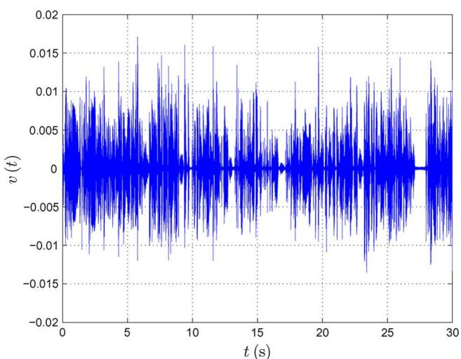  
(a)

## B. Evaluation Procedure

We will evaluate the performance of each of the nine algorithms described above in two simulation scenarios: a 30-s simulation at $f _ { s } = 1 6$ kHz with a speech source signal, and a 60-s simulation at $f _ { s } = 4 4 . 1$ kHz with an audio source signal. The speech signal is plotted in Fig. 14(a) and is taken from an interview with two male Dutch-speaking subjects that was digitally broadcast by the Flemish Radio and Television Network (VRT), resampled to $f _ { s } = 1 6$ kHz. The audio signal is an excerpt from a CD recording of the Partita No. 2 in D minor (Allemande) for solo violin by J. S. Bach, and is shown in Fig. 14(b). These signals were scaled to have a root mean square (RMS) value of 55 dBV, which corresponds to the output voltage of a typical microphone used in sound reinforcement applications.

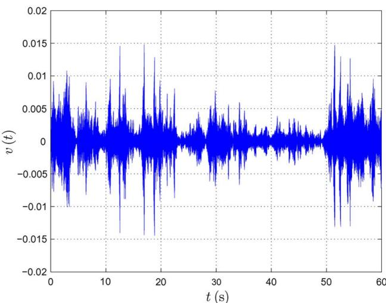  
(b)  
Fig. 14. Source signals used in the evaluation of acoustic feedback control methods: (a) speech source signal $\pmb { ( f _ { s } = 1 6 \pmb { k } \pmb { H } z ) }$ (b) music source signal $\begin{array} { r } { ( f _ { s } = 4 4 . 1 k H z ) . } \end{array}$

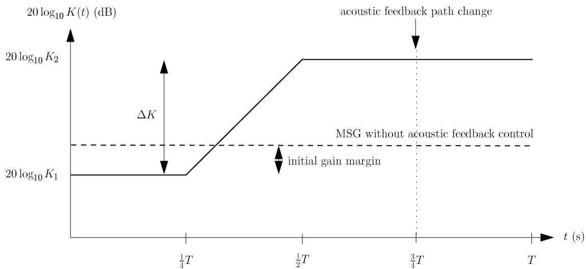  
Fig. 15. Electroacoustic forward path gain 20 $\log _ { t o } K ( t )$ versus time for the acoustic feedback control simulations.

Each simulation consists of four equally long phases, as shown in Fig. 15. In the first phase, the electroacoustic forward path broadband gain factor $K ( t )$ , defined in (14), is set to a value $K _ { 1 }$ that would result in a 3-dB gain margin if no acoustic feedback control were performed. In particular, this first phase should allow the AFC algorithms to partially converge before the gain is increased beyond the point of instability. In the second phase, the gain $2 0 \log _ { 1 0 } K ( t )$ is then linearly increased up to a value $2 0 \log _ { 1 0 } K _ { 2 } = 2 0 \log _ { 1 0 } K _ { 1 } +$ K beyond the point of instability (where $\Delta K$ is defined on a decibel-scale for ease of notation). Since the different acoustic feedback control methods stabilize the closed-loop system to a different degree, the maximum gain increase $\Delta K$ that can be allowed while maintaining a stable operation [which should not be confused with the MSG defined in (16)] differs depending on which method is being used. More specifically, we have found that the maximum gain increase is around $\Delta K = 3$ dB for the PFC algorithms, $\Delta K = 5$ dB for the NHS algorithms, and $\Delta K = 1 0 ~ \mathrm { d B }$ for the AFC algorithms. In the third and fourth phases of the simulation, the gain factor is fixed to $K _ { 2 } ,$ , and at the end of the third phase, an acoustic feedback path change is simulated. The acoustic feedback path used in the first three simulation phases corresponds to the RIR shown in Fig. 3, while the feedback path in the fourth phase is equal to the RIR measured in the same room as the first RIR, after a 1-m displacement of the microphone.

Our goal is to evaluate the acoustic feedback control methods based on three general objectives: the achievable amplification, the sound quality, and the reliability. These objectives can be quantified by a number of performance measures, which are calculated during the third and fourth simulation phases, since these phases correspond to the preferential mode of operation for the sound reinforcement system. The achievable amplification is measured by the MSG and the MSG increase, which by using (16) are defined as

$$
= - 2 0 \log_ {1 0} \left[ \max _ {\omega \in \mathcal {P} _ {H}} | H (\omega , t) J (\omega , t) F (\omega , t) | \right]\tag{107}
$$

MSGðtÞ[dB]

$$
= - 2 0 \log_ {1 0} \left[ \frac {\max _ {\omega \in \mathcal {P} _ {H}} | H (\omega , t) J (\omega , t) F (\omega , t) |}{\max _ {\omega \in \mathcal {P}} | J (\omega , t) F (\omega , t) |} \right]\tag{108}
$$

for the PFC and NHS methods, where $\scriptstyle H ( \omega , t )$ represents the frequency response of the PM filter or the bank of adjustable notch filters, respectively, and

$$
\mathcal {P} _ {H} = \{\omega | \angle H (\omega , t) G (\omega , t) F (\omega , t) = n 2 \pi \}.
$$

In case of the AFC method, these measures are defined using (16) and (60) as follows:

$$
= - 2 0 \log_ {1 0} \left[ \max _ {\omega \in \mathcal {P} _ {\hat {F}}} \left| J (\omega , t) \left[ F (\omega , t) - \hat {F} (\omega , t) \right] \right| \right]\tag{109}
$$

MSGðtÞ[dB]

$$
= - 2 0 \log_ {1 0} \left[ \frac {\max _ {\omega \in \mathcal {P} _ {\hat {F}}} \left| J (\omega , t) \left[ F (\omega , t) - \hat {F} (\omega , t) \right] \right|}{\max _ {\omega \in \mathcal {P}} | J (\omega , t) F (\omega , t) |} \right].\tag{110}
$$

We will use the instantaneous value of the MSGðtÞ, as well as the mean and maximum value of the $\Delta \mathrm { M S G } ( t )$ , as a performance measure in the evaluation.

An objective measure for quantifying the sound quality resulting from acoustic feedback control was proposed in the context of HA AFC in [161]. This measure, known as the frequency-weighted log-spectral signal distortion (SD), is defined $\mathsf { a s } ^ { \mathsf { \acute { 9 } } }$

$$
\mathrm{SD} (t) = \sqrt {\int_ {0} ^ {f _ {s} / 2} w _ {\mathrm{ERB}} (f) \left(1 0 \log_ {1 0} \frac {S _ {d} (f , t)}{S _ {v} (f , t)}\right) ^ {2} d f}\tag{111}
$$

where $S _ { d } ( f , t )$ and $S _ { v } ( f , t )$ denote the short-term PSD of the feedback-compensated signal and source signal, respectively, and wERBðfÞ is a weighting function that gives equal weight to each auditory critical band in the Nyquist interval, following Table 2 of the ANSI S3.5-1997 standard [162]. The short-term PSD is estimated as the squared magnitude of the short-term DFT, which is calculated using 50% overlapping data windows of length $M = 2 0 4 8 \mathrm { a t } f _ { s } =$ 16 kHz, or $M = 4 0 9 6$ at $f _ { s } = 4 4 . 1 \mathrm { k H z }$ . The integration in (111) is then approximated by a summation over the DFT frequency bins. Both the mean and maximum value of the SD measure will be used in the evaluation.

Finally, the reliability is quantified using two performance measures: the howling occurence probability (HOP) and the time to recover from instability (TRI). These measures rely on an estimate of the time intervals during which howling occurs in the simulation. Howling occurrences are manually identified using the following procedure:

1) a rough estimate of the howling time intervals is obtained by listening to the feedback-compensated signal;

2) a spectrogram of the feedback-compensated signal is plotted for each of the time intervals identified in the first step, and the frequency bin(s) in which howling occurs are visually identified from the spectrogram;

3) a time-varying PAPR feature is calculated for each of the time intervals identified in the first step, where the peak PSD is estimated by averaging the power in the howling frequency bins identified in the second step;

4) the time interval during which howling occurs is then defined by the time points on either side of the PAPR maximum value, at which the PAPR has decreased to a value that is 3 dB below the maximum value.

From the time points identified in the last step of the above procedure, we can estimate the time duration $\Delta t _ { i } \ \left( s \right)$ of each howling occurrence, $i = 1 , \ldots , N _ { \mathrm { H O } }$ , with $N _ { \mathrm { H O } }$ the number of howling occurrences estimated in the first step of the above procedure. The HOP and TRI measures are then defined as follows:

$$
\mathrm{HOP} (\%) = \frac {\sum_ {i = 1} ^ {N _ {\mathrm{HO}}} \Delta t _ {i}}{T}\tag{112}
$$

$$
\mathrm{TRI(s)} = \frac {\sum_ {i = 1} ^ {N _ {\mathrm{HO}}} \Delta t _ {i}}{N _ {\mathrm{HO}}}\tag{113}
$$

where $T \ ( s )$ denotes the length of the simulation.

## C. Simulation Results

The instantaneous value of the MSGðtÞ measure versus time is displayed in Fig. 16 (where the left column contains the results obtained with the speech source signal, and the right column gives the results for the audio source signal). These MSGðtÞ curves have been smoothed with a one-pole low-pass filter to improve the clarity of the figures. The instantaneous value of the electroacoustic forward path gain $2 0 \log _ { 1 0 } K ( t )$ and the MSG values obtained without acoustic feedback control are also shown (where BMSG $F _ { 1 } ( q ) ^ { \mathfrak { s } }$ and BMSG $F _ { 2 } ( q ) "$ denote the MSG before and after the acoustic feedback path change, respectively). In the PFC simulation results shown in Fig. 16(a) and (b), the periodic behavior of the PM filters is clearly visible from the MSG curves. It can also be observed that these algorithms behave in a deterministic way, in the sense that their performance is independent of the instantaneous source signal and electroacoustic forward path gain values. The PFC-DM algorithm generally performs somewhat worse compared to the other two PFC algorithms, while the PFC-PM algorithm performance can be seen to slightly improve at a higher sampling frequency. From the NHS simulation results shown in Fig. 16(c) and (d), the howling detection performance of the different NHS algorithms can also be judged. An instantaneous increase in the MSG curves indeed corresponds to the activation of a new notch filter (or the adiustment of an existing notch filter), while an MSG decrease occurs at the acoustic feedback path change. Ideally, no notch filters should be activated before the gain value $2 0 \log _ { 1 0 } K ( t )$ exceeds the instantaneous MSG curves. However, this ideal behavior is exhibited only by the NHS-1 algorithm in the speech simulation. In all other cases, some notch filters are activated earlier, which indicates that some tonal source signal components are wrongly identified as howling components. The behavior of the different NHS algorithms in terms of the MSGðtÞ measure is comparable for speech source signals, while the NHS-1 and NHS-2 algorithms behave quite differently from the NHS-3 algorithm in the audio simulation. We should stress that the high MSG values obtained with the NHS-1 and NHS-2 algorithms in the audio simulation are in fact caused by an excessive amount of notch filtering that is due to the poor howling detection performance and leads to a broadband attenuation of the microphone signal. Hence the resulting sound quality obtained with these methods is extremely poor for audio applications (see the discussion on the results in Table 2). Finally, the simulation results obtained with the AFC algorithms are shown in Fig. 16(e) and (f). In the speech simulation, the MSG performance of the AFC-NI and AFC-PF algorithms appears to be better compared to the AFC-FS algorithm. In the audio simulation, the AFC-NI algorithm initially outperforms the other algorithms, however, the AFC-PF algorithm eventually provides the highest MSG value. All three AFC algorithms appear to react in a relatively robust way to the acoustic feedback path change in the fourth phase of the simulation, except for the AFC-NI algorithm in the audio simulation.

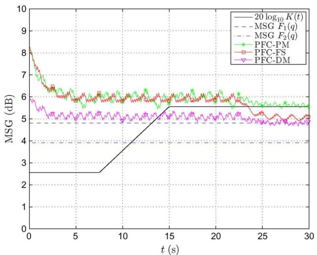  
(a)

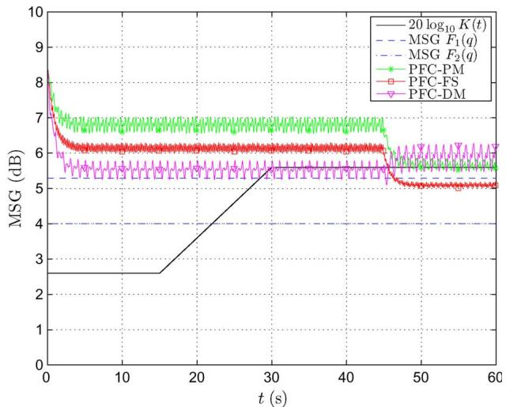  
(b)

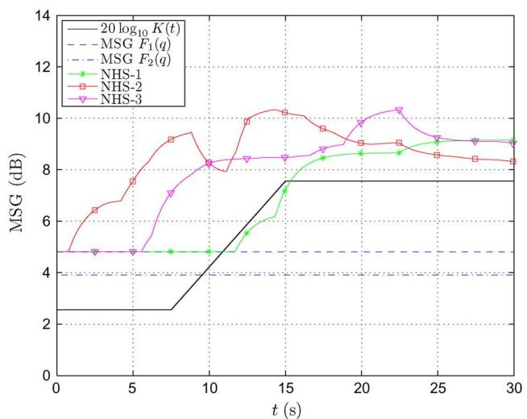  
(c)

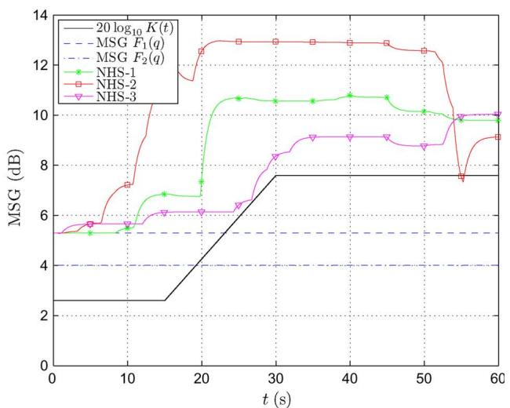

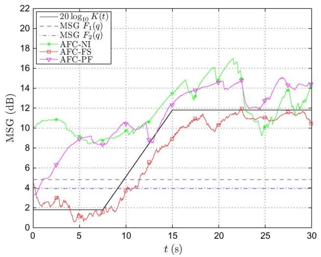  
(e)

(d)  
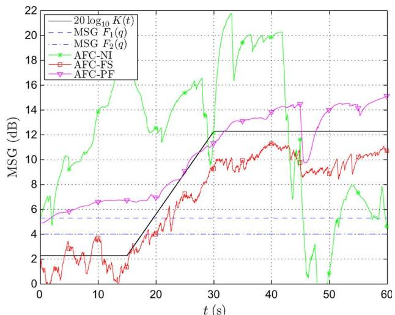  
(f)  
Fig. 16. Instantaneous MsG versus time for simulations with speech (left column) and audio (right column) source signals: (a) and (b) PFC methods (DK ¼ 3 dB), (c), (d) NHS methods (DK ¼ 5 dB), (e), (f) AFC methods (DK ¼ 10 dB). Note the scale difference on the vertical axis between (a)-(b). (c)-(d), and (e)-(f).

The performance measures calculated during the third and fourth simulation phases are shown in Tables 1 and 2 for the speech and audio simulations, respectively. Some general observations can be made concerning the performance of the different acoustic feedback control methods. The achievable amplification in terms of the MSG increase is relatively low for the PFC algorithms, and highest for the AFC algorithms, which is consistent with the MSG increase values reported in the literature. It can also be observed that, for the NHS and AFC algorithms, the MSG increase is larger when the electroacoustic forward path gain is raised to a higher value. This effect can be explained by noting that more notch filters are activated as the gain is increased, while the AFC convergence is known to benefit from a gain increase since the power ratio of the feedback signal and source signal then also increases [103], [111]. In terms of sound quality, the SD performance measure reveals that the perceptual signal distortion is worse for the PFC algorithms and for the AFC-NI algorithm. The other AFC algorithms provide a much higher sound quality, and generally perform somewhat better than the NHS algorithms. As mentioned earlier, the NHS-1 and NHS-2 algorithms result in an extremely poor sound quality in audio applications, which is due to the poor howling detection performance. The reliability of the evaluated algorithms is seen to be slightly worse in the audio simulation as compared to the speech simulation, especially for the PFC algorithms.

Within each acoustic feedback control method, the relative performance of the different algorithms can be compared using the measures in Tables 1 and 2. Among the PFC algorithms, the PFC-PM algorithm should generally be preferred since it performs best in terms of nearly all performance measures. Among the NHS algorithms, the NHS-3 algorithm is the only algorithm that is suited for audio applications, and moreover, in terms of achievable amplification and sound quality, this algorithm outperforms the NHS-1 and NHS-2 algorithms for speech applications also. We should note, however, that the NHS-3 howling detection method is computationally more demanding compared to the other NHS howling detection methods. Among the AFC algorithms, the AFC-NI algorithm yields the highest MSG increase in the speech simulation, which however comes at the cost of a poor sound quality. The AFC-PF algorithm provides the best sound quality and still allows for a relatively high MSG increase. In the audio simulation, the performance of the AFC-NI and AFC-FS algorithms is highly fluctuating, which can be observed from the discrepancy between the mean and maximum MSG values. The AFC-PF algorithm, on the other hand, produces a more steady MSG behavior in the audio simulation. The superior sound quality of the AFC-PF algorithm compared to all other evaluated algorithms results from the fact that the decorrelation is applied in the adaptive filtering circuit instead of in the closed signal loop. Note that the reliability of the AFC algorithms can be further improved by including additional features such as adaptation control, foreground/ background adaptive filtering, regularization, and postfiltering; see [103] for an overview.

Table 1 Performance Measures for Comparative PFC, NHS, and AFC Simulations: Speech Source Signal

<table><tr><td rowspan="2" colspan="3"></td><td colspan="3">PFC</td><td colspan="3">NHS</td><td colspan="3">AFC</td></tr><tr><td>PFC-PM</td><td>PFC-FS</td><td>PFC-DM</td><td>NHS-1</td><td>NHS-2</td><td>NHS-3</td><td>AFC-NI</td><td>AFC-FS</td><td>AFC-PF</td></tr><tr><td rowspan="6">achievable amplification</td><td rowspan="3">mean(ΔMSG)</td><td>ΔK=3</td><td>1.4</td><td>1.1</td><td>0.6</td><td>2.2</td><td>4.4</td><td>4.2</td><td>6.8</td><td>1.3</td><td>4.5</td></tr><tr><td>ΔK=5</td><td></td><td></td><td></td><td>4.5</td><td>4.5</td><td>5.0</td><td>7.8</td><td>3.1</td><td>6.9</td></tr><tr><td>ΔK=10</td><td></td><td></td><td></td><td></td><td></td><td></td><td>9.8</td><td>6.6</td><td>9.6</td></tr><tr><td rowspan="3">max(ΔMSG)</td><td>ΔK=3</td><td>4.1</td><td>4.1</td><td>4.7</td><td>3.0</td><td>5.2</td><td>5.3</td><td>9.1</td><td>8.6</td><td>8.1</td></tr><tr><td>ΔK=5</td><td></td><td></td><td></td><td>5.2</td><td>5.2</td><td>5.6</td><td>10.5</td><td>9.5</td><td>9.3</td></tr><tr><td>ΔK=10</td><td></td><td></td><td></td><td></td><td></td><td></td><td>13.7</td><td>11.1</td><td>12.8</td></tr><tr><td rowspan="6">sound quality</td><td rowspan="3">mean(SD)</td><td>ΔK=3</td><td>6.2</td><td>7.1</td><td>7.9</td><td>3.5</td><td>3.8</td><td>3.1</td><td>13.8</td><td>5.6</td><td>2.4</td></tr><tr><td>ΔK=5</td><td></td><td></td><td></td><td>3.8</td><td>4.6</td><td>3.7</td><td>14.0</td><td>5.6</td><td>2.6</td></tr><tr><td>ΔK=10</td><td></td><td></td><td></td><td></td><td></td><td></td><td>15.1</td><td>6.0</td><td>3.9</td></tr><tr><td rowspan="3">max(SD)</td><td>ΔK=3</td><td>10.7</td><td>11.6</td><td>16.2</td><td>7.5</td><td>6.5</td><td>5.6</td><td>30.4</td><td>8.3</td><td>6.6</td></tr><tr><td>ΔK=5</td><td></td><td></td><td></td><td>6.6</td><td>7.8</td><td>6.9</td><td>30.1</td><td>8.4</td><td>6.5</td></tr><tr><td>ΔK=10</td><td></td><td></td><td></td><td></td><td></td><td></td><td>31.7</td><td>10.6</td><td>16.2</td></tr><tr><td rowspan="6">reliability</td><td rowspan="3">HOP (%)</td><td>ΔK=3</td><td>0</td><td>0</td><td>0</td><td>3.6</td><td>0</td><td>0</td><td>0</td><td>0</td><td>0</td></tr><tr><td>ΔK=5</td><td></td><td></td><td></td><td>8.5</td><td>0</td><td>1.5</td><td>0</td><td>0</td><td>0</td></tr><tr><td>ΔK=10</td><td></td><td></td><td></td><td></td><td></td><td></td><td>1.3</td><td>0</td><td>2.6</td></tr><tr><td rowspan="3">TRI (s)</td><td>ΔK=3</td><td>N/A</td><td>N/A</td><td>N/A</td><td>1.09</td><td>N/A</td><td>N/A</td><td>N/A</td><td>N/A</td><td>N/A</td></tr><tr><td>ΔK=5</td><td></td><td></td><td></td><td>0.85</td><td>N/A</td><td>0.22</td><td>N/A</td><td>N/A</td><td>N/A</td></tr><tr><td>ΔK=10</td><td></td><td></td><td></td><td></td><td></td><td></td><td>0.19</td><td>N/A</td><td>0.77</td></tr></table>

Table 2 Performance Measures for Comparative PFC, NHS, and AFC Simulations: Audio Source Signal

<table><tr><td rowspan="2" colspan="3"></td><td colspan="3">PFC</td><td colspan="3">NHS</td><td colspan="3">AFC</td></tr><tr><td>PFC-PM</td><td>PFC-FS</td><td>PFC-DM</td><td>NHS-1</td><td>NHS-2</td><td>NHS-3</td><td>AFC-NI</td><td>AFC-FS</td><td>AFC-PF</td></tr><tr><td rowspan="6">achievable amplification</td><td rowspan="3">mean(ΔMSG)</td><td>ΔK=3</td><td>1.6</td><td>1.0</td><td>1.1</td><td>5.7</td><td>6.7</td><td>3.5</td><td>-3.2</td><td>0.1</td><td>3.0</td></tr><tr><td>ΔK=5</td><td></td><td></td><td></td><td>5.7</td><td>7.1</td><td>4.8</td><td>-2.7</td><td>1.8</td><td>4.6</td></tr><tr><td>ΔK=10</td><td></td><td></td><td></td><td></td><td></td><td></td><td>6.3</td><td>5.4</td><td>9.0</td></tr><tr><td rowspan="3">max(ΔMSG)</td><td>ΔK=3</td><td>3.9</td><td>3.9</td><td>4.6</td><td>6.1</td><td>8.6</td><td>3.7</td><td>15.0</td><td>6.1</td><td>4.5</td></tr><tr><td>ΔK=5</td><td></td><td></td><td></td><td>6.1</td><td>8.6</td><td>6.0</td><td>16.0</td><td>6.8</td><td>6.5</td></tr><tr><td>ΔK=10</td><td></td><td></td><td></td><td></td><td></td><td></td><td>17.2</td><td>8.6</td><td>11.3</td></tr><tr><td rowspan="6">sound quality</td><td rowspan="3">mean(SD)</td><td>ΔK=3</td><td>8.9</td><td>52.1</td><td>9.2</td><td>6.7</td><td>39.1</td><td>3.3</td><td>19.0</td><td>6.4</td><td>3.7</td></tr><tr><td>ΔK=5</td><td></td><td></td><td></td><td>6.8</td><td>38.3</td><td>4.1</td><td>19.2</td><td>6.5</td><td>4.0</td></tr><tr><td>ΔK=10</td><td></td><td></td><td></td><td></td><td></td><td></td><td>19.9</td><td>7.1</td><td>5.3</td></tr><tr><td rowspan="3">max(SD)</td><td>ΔK=3</td><td>23.9</td><td>72.7</td><td>25.4</td><td>17.3</td><td>63.7</td><td>5.8</td><td>27.3</td><td>10.8</td><td>6.1</td></tr><tr><td>ΔK=5</td><td></td><td></td><td></td><td>16.7</td><td>67.4</td><td>6.3</td><td>27.7</td><td>11.1</td><td>7.1</td></tr><tr><td>ΔK=10</td><td></td><td></td><td></td><td></td><td></td><td></td><td>28.2</td><td>14.7</td><td>19.6</td></tr><tr><td rowspan="6">reliability</td><td rowspan="3">HOP (%)</td><td>ΔK=3</td><td>11.1</td><td>52.0</td><td>19.3</td><td>0</td><td>0</td><td>0</td><td>0</td><td>2.2</td><td>0.5</td></tr><tr><td>ΔK=5</td><td></td><td></td><td></td><td>0</td><td>0</td><td>2.2</td><td>0</td><td>2.2</td><td>0.5</td></tr><tr><td>ΔK=10</td><td></td><td></td><td></td><td></td><td></td><td></td><td>0.4</td><td>4.7</td><td>7.2</td></tr><tr><td rowspan="3">TRI (s)</td><td>ΔK=3</td><td>0.23</td><td>∞</td><td>0.27</td><td>N/A</td><td>N/A</td><td>N/A</td><td>N/A</td><td>0.67</td><td>0.33</td></tr><tr><td>ΔK=5</td><td></td><td></td><td></td><td>N/A</td><td>N/A</td><td>0.67</td><td>N/A</td><td>0.67</td><td>0.33</td></tr><tr><td>ΔK=10</td><td></td><td></td><td></td><td></td><td></td><td></td><td>0.23</td><td>0.46</td><td>1.44</td></tr></table>

The feedback-compensated signals obtained in the different simulations are all available for download,10 such that the sound quality can be assessed subjectively by the reader. Also, the source signals and acoustic feedback path impulse responses used in the simulations can be downloaded for benchmarking purposes.

## VIII. CONCLUSION AND FUTURE CHALLENGES

In this paper, we have attempted to provide a comprehensive overview of five decades of research in acoustic feedback control. The available literature has been reviewed following a classification of the state-of-the-art solutions into four categories: PM methods, gain reduction methods, spatial filtering methods, and room modeling methods. We have also provided an in-depth treatment of three widely used acoustic feedback control methods, namely PFC, NHS, and AFC, thereby discussing conceptual as well as realization issues. Finally, several different realizations of these three methods have been evaluated and compared, in terms of their achievable amplification, sound quality, and reliability.

From the simulation results presented in this paper, we can conclude that the AFC method is superior to the PFC and NHS methods in terms of achievable amplification and sound quality, while its reliability is comparable to the reliability of the PFC and NHS methods. The AFC method should preferably be combined with a decorrelation approach that operates in the adaptive filtering circuit, e.g., using decorrelating prefilters (AFC-PF), since this approach appears to be beneficial w.r.t. the achievable amplification and sound quality. We have found the AFC-PF approach to be capable of providing an average MSG increase of approximately 9 dB, and a maximum MSG increase around 12 dB.

Looking into future research challenges in acoustic feedback control, it appears that there is little room for improvement in the PFC and NHS methods. Since these methods aim at smoothing the loop gain, a theoretical upper bound for the achievable MSG increase is given by the ratio of the peak and average magnitude response of the acoustic feedback path, which was found to be typically around 10 dB [2]. In practice, however, this upper bound is generally not achieved since the allowable values of the PFC modulation frequency and modulation depth are bounded by constraints on the signal distortion, while the number of active notch filters in the NHS method should be limited to avoid a broadband attenuation that ultimately affects sound quality. From our comparative simulation results, we may conclude that the best PFC solution consists in the use of a sinusoidal PM at low modulation frequency, while the preferable NHS solution is based on combining the howling detection method proposed by Osmanovic et al. [28]–[30] with a state-of-the-art biquadratic notch filter design method, e.g., the pole-zero placement technique recently proposed in [125].

On the other hand, we believe that since the AFC method appears to produce promising results, the main challenges for future research in acoustic feedback control lie in further increasing the AFC reliability and reducing its computational complexity. In terms of reliability, recent research has pointed out that so-called hybrid AFC methods, in which AFC is combined with other methods for acoustic feedback control, are far more robust compared to the traditional AFC approach. However, we believe that in the existing hybrid AFC methods, the cooperation between the different methods is still suboptimal. For example, in the combined AFC and postfiltering methods proposed in [66], [93], and [94], the postfilter design is solely based on the feedback-compensated signal spectrum, while it is known from AEC that the joint design of a cancellation filter and a postfilter generally results in a better performance [158], [159]. A related issue is the combination of AFC with a gain reduction method: in [74] and [106]–[108], the AFC and ANF filters are adapted independently, while in the combined AFC and AEQ approach proposed in [66] and in the combined AFC and NHS approach proposed in [103], the AEQ/NHS design is based on the most recent AFC estimate. Similarly to the joint AFC and postfilter design, it can be expected that a joint estimation of the AFC and gain reduction filter coefficients is to be preferred over a decoupled estimation. Finally, a similar remark can be made on the joint design of an AFC and a spatial filtering method, which would probably outperform the state-of-the-art approach of AFC combined with a fixed beamformer [74] or an adaptive beamformer steered by the feedback-compensated signal [66].

The greatest challenge in AFC, however, consists in reducing the computational complexity. Since typically an already cheap NLMS-type algorithm is used, a significant complexity reduction in the AFC adaptive filtering algorithm cannot be expected. The fundamental problem lies in the fact that in AFC, the acoustic feedback path is traditionally modeled using its impulse response, which typically has a large number of coefficients. This is especially so when a high sampling frequency is applied (e.g., in audio applications). The impulse response is then more densely sampled and in addition more adaptive filter updates have to be performed per second. However, from a stability point of view, it may suffice to only model the peaks in the acoustic feedback path magnitude response instead of the complete impulse response. This may be achieved with frequency domain adaptive filtering (FDAF). However, since the frequency domain models currently used in FDAF have a fixed and uniform frequency resolution, the required FDAF filter order should still be high to guarantee that the magnitude peaks are modeled with sufficient accuracy; see, e.g., the FDAF experimental results in [103]. Another possibility for reducing the acoustic feedback path model complexity consists in using a time domain model different from the FIR model. Since the peaks in the acoustic feedback path magnitude response can be modeled as narrowband resonances, an IIR (or pole-zero) model seems to be an appropriate choice. The use of such models in room acoustics has both been recommended [134], [163], [164] and discouraged [165], [166], however, no results on the use of IIR models in AFC are available. The appeal of using such models in room acoustic applications is related to the conjecture that the IIR model denominator coefficients can in fact be assumed time invariant in a certain acoustic environment, regardless of the loudspeaker and microphone positions [134]. A related model, which also exploits the assumption of time-invariant room acoustic resonance frequencies, is based on the use of orthogonal basis functions such as the discrete-time Laguerre or Kautz functions, which have been evaluated in an AEC context in [167] and [168].

Another great challenge in acoustic feedback control, and in AFC in particular, is to generalize the methods proposed in a single-channel context to multichannel systems. Since the number of acoustic feedback paths in a multichannel system equals the number of loudspeakers times the number of microphones, the AFC computational complexity can be expected to increase very quickly in a multichannel context. Again, the use of IIR models or models based on orthogonal basis functions may bring some relief, since, following the arguments in [134] and [168], these models could then share a common denominator. Another problem arising in multichannel AFC is related to the identifiability of the acoustic feedback path models in case the loudspeaker signals are correlated. A similar problem occurs in multichannel AEC, and has received quite some attention in the literature; see, e.g., [153] and [169]. h

## REFERENCES

[1] D. A. Bohn, BPro audio reference,[ -Rane Corporation, Mukilteo, WA, Aug. 2010. [Online]. Available: http://www.rane.com/ digi-dic.html

[2] M. R. Schroeder, BImprovement of acoustic-feedback stability by frequency shifting,[ J. Acoust. Soc. Amer., vol. 36, no. 9, pp. 1718–1724, Sep. 1964.

[3] H. Nyquist, BRegeneration theory,[ Bell Syst. Tech. J., vol. 11, pp. 126–147, 1932.

[4] J. C. Willems, The Analysis of Feedback Systems. Cambridge, MA: MIT Press, 1971.

[5] R. W. Guelke and A. D. Broadhurst, BReverberation time control by direct feedback,[ Acustica, vol. 24, pp. 33–41, 1971.

[6] P. Mapp and C. Ellis, BImprovements in acoustic feedback margin in sound reinforcement systems,[ in Preprints AES 105th Convention, San Francisco, CA, Sep. 1998, AES Preprint 4850.

[7] M. R. Schroeder, BImprovement of acoustic feedback stability in public address systems,[ in Proc. 3rd Int. Congr. Acoust., Stuttgart, Germany, 1959, pp. 771–775.

[8] M. R. Schroeder, BStop feedback in public address systems,[ Radio Electron., vol. 31, pp. 40–42, Feb. 1960.

[9] M. R. Schroeder, BImprovement of feedback stability of public address systems by frequency shifting,[ J. Audio Eng. Soc., vol. 10, no. 2, pp. 108–109, Apr. 1962.

[10] A. J. Prestigiacomo and D. J. MacLean, BA frequency shifter for improving acoustic feedback stability,[ J. Audio Eng. Soc., vol. 10, no. 2, pp. 110–113, Apr. 1962.

[11] M. D. Burkhard, BA simplified frequency shifter for improving acoustic feedback stability,[ J. Audio Eng. Soc., vol. 11, no. 3, pp. 234–237, Jul. 1963.

[12] C. Vila Deutschbein, BDigital frequency shifting for electroacoustic feedback suppression,[ in Preprints AES 118th Conv., Barcelona, Spain, May 2005, AES Preprint 6505.

[13] J. Alisobhani and S. G. Knorr, BImprovement of acoustic-feedback stability by bandwidth compression,[ IEEE Trans. Acoust. Speech Signal Process., vol. ASSP-28, no. 6, pp. 636–644, Dec. 1980.

[14] L. N. Mishin, BA method for increasing the stability of sound amplification systems,[ Akust. Z., vol. 4, pp. 64–72, Jan./Mar. 1958.

[15] G. Nishinomiya, BImprovement of acoustic feedback stability of public address system by warbling,[ in Proc. 6th Int. Congr. Acoust., Tokyo, Japan, 1968, vol. E, pp. 93–96.

[16] P. U. Svensson, BComputer simulations of periodically time-varying filters for acoustic feedback control,[ J. Audio Eng. Soc., vol. 43, no. 9, pp. 667–677, Sep. 1995.

[17] J. L. Nielsen and U. P. Svensson, BPerformance of some linear time-varying systems in control of acoustic feedback,[ J. Acoust. Soc. Amer., vol. 106, no. 1, pp. 240–254, Jul. 1999.

[18] M. A. Poletti, BThe stability of multichannel sound systems with frequency shifting,[ J. Acoust. Soc. Amer., vol. 116, no. 2, pp. 853–871, Aug. 2004.

[19] P. Svensson, BOn reverberation enhancement in auditoria,[ Ph.D. dissertation, Dept. Appl. Acoust., Chalmers Univ. Technol., Gothenburg, Sweden, 1994.

[20] E. T. Patronis, Jr., BAcoustic feedback detector and automatic gain control." U.S Patent 4.079 199 Mar 1978

[21] E. T. Patronis, Jr., BElectronic detection of acoustic feedback and automatic sound system gain control,[ J. Audio Eng. Soc., vol. 26, no. 5, pp. 323–326, May 1978.

[22] S. Ando, BHowling detection and prevention circuit and a loudspeaker system employing the same,[ U.S. Patent 6 252 969, Jun. 2001.

[23] Y. Nagata, S. Suzuki, M. Yamada, M. Yoshida, M. Kitano, K. Kuroiwa, and S. Kimura, BHowling remover having cascade connected equalizers suppressing multiple noise peaks,[ U.S. Patent 5 710 823, Jan. 1998.

[24] Y. Nagata, S. Suzuki, M. Yamada, M. Yoshida, M. Kitano, K. Kuroiwa, and S. Kimura, BHowling remover composed of adjustable equalizers for attenuating complicated noise peaks,[ U.S. Patent 5 729 614, Mar. 1998.

[25] M. Hanajima, M. Yoneda, and T. Okuma, BHowling eliminator,[ WIPO Patent Appl. WO/1999/021 396, Apr. 1999.

[26] M. Hanajima, M. Yoneda, and T. Okuma, BHowling eliminating apparatus,[ U.S. Patent 6 125 187, Sep. 2000.

[27] Y. Terada and A. Murase, BHowling control device and howling control method,[ U.S. Patent 7 190 800, Mar. 2007.

[28] N. Osmanovic, V. E. Clarke, and E. Velandia, BAn in-flight low latency acoustic feedback cancellation algorithm,[ in Preprints AES 123rd Conv., New York, Oct. 2007, AES Preprint 7266.

[29] N. Osmanovic and V. Clarke, BAcoustic feedback cancellation system,[ WIPO Patent Appl. WO/2007/013 981, Feb. 2007.

[30] N. Osmanovic and V. Clarke, BAcoustic feedback cancellation system,[ U.S. Patent 7 664 275, Feb. 2010.

[31] J. B. Foley, BAdaptive periodic noise cancellation for the control of acoustic howling,[ in Proc. IEE Colloq. Adaptive Filters, London, U.K., Mar. 1989, pp. 7/1–7/4.

[32] D. M. Oster, M. P. Lewis, and T. J. Tucker, BMethod and apparatus for adaptive audio resonant frequency filtering,[ WIPO Patent Appl. WO/1991/020 134, Dec. 1991.

[33] S. M. Kuo and J. Chen, BNew adaptive IIR notch filter and its application to howling control in speakerphone system,[ IEE Electron. Lett., vol. 28, no. 8, pp. 764–766, Apr. 1992.

[34] M. P. Lewis, T. J. Tucker, and D. M. Oster, BMethod and apparatus for adaptive audio resonant frequency filtering,[ U.S. Patent 5 245 665, Sep. 1993.

[35] M. H. Er, T. H. Ooi, L. S. Li, and C. J. Liew, BA DSP-based acoustic feedback canceller for public address systems,[ in Proc. Int. Conf. Signal Process., Beijing, China, Oct. 1993, pp. 1251–1254.

[36] M. H. Er, T. H. Ooi, L. S. Li, and C. J. Liew, BA DSP-based acoustic feedback canceller for public address systems,[ Microprocessors Microsyst., vol. 18, no. 1, pp. 39–47, Jan./Feb. 1994.

[37] A. Kawamura, M. Matsumoto, M. Serikawa, and H. Numazu, BSound amplifying apparatus with automatic Howl-suppressing function,[ Eur, Patent Appl, EP0 599 450 A2, Jun. 1994

[38] A. Kawamura, M. Matsumoto, M. Serikawa, and H. Numazu, BSound amplifying apparatus with automatic Howl-suppressing function,[ U.S. Patent 5 442 712, Aug. 1995.

[39] M. Tahernezhadi and L. Liu, BAn adaptive notch filter for howling cancellation,[ Acoust. Lett., vol. 18, no. 8, pp. 142–145, 1995.

[40] W. Staudacher, BAcoustic feedback cancellation for equalized amplifying systems,[ U.S. Patent 5 533 120, Jul. 1996.

[41] J. Timoney and F. B. Foley, BRobust performance of the adaptive periodic noise canceller in a closed-loop system,[ in Proc. 9th Eur. Signal Process. Conf., Rhodes, Greece, Sep. 1998, pp. 1177–1180.

[42] J. E. Lane, D. Hoory, and J. Choe, BMethod and apparatus for suppressing acoustic feedback in an audio system,[ U.S. Patent 5 717 772, Feb. 1998.

[43] R. Porayath and D. J. Mapes-Riordan, BAcoustic feedback elimination using adaptive notch filter algorithm,[ U.S. Patent 5 999 631, Dec. 1999.

[44] P. R. Williams, BMethod and system for elimination of acoustic feedback,[ WIPO Patent Appl. WO/2002/021 817, Mar. 2002.

[45] P. R. Williams, BMethod and system for elimination of acoustic feedback,[ U.S. Patent Appl. 2010/0 046 768 A1, Feb. 2010.

[46] W. Loetwassana, R. Punchalard, and W. Silaphan, BAdaptive howling cancelle using adaptive IIR notch filter: Simulation and implementation,[ in Proc. IEEE Int. Conf. Neural Netw. Signal Process., Nanjing, China, Dec. 2003, pp. 848–851.

[47] J. Timoney, F. B. Foley, and A. T. Schwarzbacher, BAn explicit criterion for adaptive periodic noise canceller robustness applied to feedback cancellation,[ in Proc. 4th Electron. Circuits Syst. Conf., Bratislava, Slovakia, Sep. 2003, pp. 23–26.

[48] J. Wei, L. Du, Z. Chen, and F. Yin, BA new algorithm for howling detection,[ in Proc. IEEE Int. Symp. Circuits Syst., Bangkok, Thailand, May 2003, vol. 4, pp. 409–411.

[49] A. F. Rocha and A. J. S. Ferreira, BAn accurate method of detection and cancellation of multiple acoustic feedbacks." in Preprints AES 118th Conv., Barcelona, Spain, May 2005, AES Preprint 6335.

[50] M. Bo¨rsch, BMethod for constraining electroacoustic feedback,[ Eur. Patent Appl. EP1 684 543 A1, Jul. 2006.

[51] M. Bo¨rsch, BMethod for suppressing electro-acoustic feedback,[ U.S. Patent Appl. 2006/0 159 282 A1, Jul. 2006.

[52] G. Rombouts, T. van Waterschoot, and M. Moonen, BProactive notch filtering for acoustic feedback cancellation." in Proc, 2nd Annu. IEEE Benelux/DSP Valley Signal Process. Symp., Antwerp, Belgium, Mar. 2006, pp. 169–172. [Online]. Available: ftp.esat. kuleuven.be/pub/sista/vanwaterschoot/ abstracts/06-81 html

[53] R. Abe, BHowling suppression device and howling suppression method,[ U.S. Patent 7 295 670, Nov. 2007.

[54] W. Loetwassana, R. Punchalard, A. Lorsawatsiri, J. Koseeyaporn, and P. Wardkein, BAdaptive howling suppressor in an audio amplifier system,[ in Proc. Asia-Pacific Conf. Commun., Bangkok, Thailand, Oct. 2007, pp. 445–448.

[55] D. Somasundaram, BFeedback cancellation in a sound system,[ Eur. Patent Appl. EP1 903 833 A1, Mar. 2008.

[56] D. Somasundaram, BFeedback cancellation in a sound system,[ U.S. Patent Appl. 2008/0 085 013 A1, Apr, 2008.

[57] T. Kawamura and T. Kanamori, BHowling detection device and method." U.S. Patent Appl. 2008/0 021 703 A1, Jan. 2008.

[58] P. Gil-Cacho, T. yan Waterschoot. M. Moonen, and S. H. Jensen, “Regularized

adaptive notch filters for acoustic howling suppression,[ in Proc. 17th Eur. Signal Process. Conf., Glasgow, Scotland, U.K., Aug. 2009, pp. 2574–2578.

[59] T. Ito, BApparatus detecting howling by decay profile of impulse response in sound system,[ U.S. Patent 6 442 280, Aug. 2002.

[60] S. Ibaraki, H. Furukawa, and H. Naono, BPre-howling howlback detection method,[ in Proc. IEEE Int. Conf. Acoust. Speech Signal Process., Tokyo, Japan, Apr. 1986, pp. 941–944.

[61] Y. Takahashi, M. Tohyama, and Y. Yamasaki, BCumulative spectral analysis for transient decaying signals in a transmission system including a feedback loop,[ J. Audio Eng. Soc., vol. 54, no. 7/8, pp. 620–629, Jul./Aug. 2006.

[62] T. van Waterschoot and M. Moonen, BComparative evaluation of howling detection criteria in notch-filter-based howling suppression,[ in Preprints AES 126th Conv., Munich, Germany, May 2009 AES Preprint 7752.

[63] T. van Waterschoot and M. Moonen, BComparative evaluation of howling detection criteria in notch-filter-based howling suppression,[ J. Audio Eng. Soc., Nov, 2010.

[64] J. H. Stott and N. D. Wells, BMethod and apparatus for reduction of unwanted feedback,[ U.S. Patent 6 269 165, Jul. 2001.

[65] T. K. Duong, E. Lefort, and M. G. Bellanger, BAcoustic feedback cancelling electro-acoustic transducer network,[ U.S. Patent 4 485 272, Nov. 1984.

[66] C. P. Janse and H. J. W. Belt, BSound reinforcement system having an echo suppressor and loudspeaker beamformer,[ WIPO Patent Appl. WO/2003/010 996, Feb. 2003.

[67] K. Kobayashi, K. Furuya, and A. Kataoka, BAn adaptive microphone array for howling cancellation,[ Acoust. Sci. Technol., vol. 24, no. 1, pp. 45–47, Jan. 2003.

[68] K. Kobayashi, K. Furuya, and A. Kataoka, BA microphone array for howling cancellation,[ J. Acoust. Soc. Jpn., vol. 60, no. 3, pp. 115–125, Mar. 2004, (in Japanese).

[69] G. Rombouts, A. Spriet, and M. Moonen, BGeneralized sidelobe canceller based acoustic feedback cancellation,[ in Proc. 14th Eur. Signal Process. Conf., Firenze, Italy, Sep. 2006.

[70] G. Rombouts, A. Spriet, and M. Moonen, BGeneralized sidelobe canceller based combined acoustic feedback- and noise cancellation,[ Signal Process., vol. 88, no. 3, pp. 571–581, Mar. 2008.

[71] M. Goodwin and G. Elko, BBeam dithering: Acoustic feedback control using a modulated-directivity loudspeaker array,[ in Preprints AES 93rd Conv., San Francisco, CA, Oct. 1992, AES Preprint 3384.

[72] G. W. Elko and M. M. Goodwin, BBeam dithering: Acoustic feedback control using a modulated-directivity loudspeaker array,[ in Proc. IEEE Int. Conf. Acoust. Speech Signal Process., Minneapolis, MN, Apr. 1993, vol. 1, pp. 173–176.

[73] S. Ushiyama, T. Hirai, M. Tohyama, and Y. Shimizu, BHowling suppression by smoothing the open-loop transfer function,[ IEICE Tech. Rep., vol. 94, no. 20, pp. 23–28, Apr. 1994, (in Japanese).

[74] G. Schmidt and T. Haulick, BSignal processing for in-car communication systems,[ Signal Process., vol. 86, Special Issue on Applied Speech and Audio Processing, no. 6, pp. 1307–1326, Jun. 2006.

[75] M. Miyoshi and Y. Kaneda, BInverse filtering of room acoustics,[ IEEE Trans. Acoust. Speech Signal Process., vol. ASSP-36, no. 2, pp. 145–152, Feb. 1988.

[76] S. J. Elliot and P. A. Nelson, BMultiple-point equalization in a room using adaptive filters,[ J. Audio Eng. Soc., vol. 37, no. 11, pp. 899–907, Nov. 1989.

[77] P. A. Nelson, H. Hameda, and S. J. Elliot, BAdaptive inverse filters for stereophonic sound reproduction,[ IEEE Trans. Signal Process., vol. 40, no. 7, pp. 1621–1632, Jul. 1992.

[78] J. C. Sarris, F. Jacobsen, and G. E. Cambourakis, BSound equalization in a large region of a rectangular enclosure, J. Acoust. Soc. Amer., vol. 116, no. 6, pp. 3271–3274, Dec. 2004.

[79] M. G. Siqueira and A. Alwan, BSteady-state analysis of continuous adaptation in acoustic feedback reduction systems for hearing-aids,[ IEEE Trans. Speech Audio Process., vol. 8, no. 4, pp. 443–453, Jul. 2000.

[80] J. Hellgren and U. Forssell, BBias of feedback cancellation algorithms in hearing aids based on direct closed loop identification,[ IEEE Trans. Speech Audio Process., vol. 9, no. 7, pp. 906–913, Nov. 2001.

[81] T. van Waterschoot, G. Rombouts, and M. Moonen. "On the performance of decorrelation by prefiltering for adaptive feedback cancellation in public address systems,[ in Proc. 4th IEEE Benelux Signal Process. Symp., Hilvarenbeek, The Netherlands, Apr. 2004, pp. 167–170. [Online]. Available: ftp.esat.kuleuven.be/ pub/sista/vanwaterschoot/abstracts/ 04-24.html

[82] T. van Waterschoot and M. Moonen, BAssessing the acoustic feedback contro performance of adaptive feedback cancellation in sound reinforcement systems,[ in Proc. 17th Eur. Signal Process. Conf., Glasgow, Scotland, U.K., Aug. 2009, pp. 1997–2001.

[83] S. Ibaraki, H. Furukawa, and H. Naono BHowling canceller,[ U.S. Patent 4 747 132, May 1988.

[84] A. Goertz, BAn adaptive subtraction filter for feedback cancellation in public address sound systems,[ in Proc. 15th Int. Congr. Acoust., Trondheim, Norway, Jun. 1995, pp. 69–72.

[85] T. van Waterschoot, BAkoestische feedbackonderdrukker,[ M.S. thesis, Dept. Electr. Eng., Katholieke Universiteit Leuven, Leuven, Belgium, Jun. 2001, (in Dutch).

[86] C. P. Janse and C. C. Tchang, BAcoustic feedback suppression,[ WIPO Patent Appl. WO/2005/079 109, Aug. 2005.

[87] C. P. Janse and P. A. A. Timmermans, BSignal amplifier system with improved echo cancellation,[ WIPO Patent Appl. WO/1995/28.034. Oct. 1995.

[88] C. P. Janse and P. A. A. Timmermans, BSignal amplifier system with improved echo cancellation,[ U.S. Patent 5 748 751, May 1998.

[89] S. Kamerling, K. Janse, and F. van der Meulen, BA new way of acoustic feedback suppression,[ in Preprints AES 104th Cony.. Amsterdam, The Netherlands May 1998, AES Preprint 4735.

[90] D. R. Morgan, J. L. Hall, and J. Benesty, BInvestigation of several types of nonlinearities for use in stereo acoustic echo cancellation,[ IEEE Trans. Speech Audio Process., vol. 9, no. 6, pp. 686–696, Sep. 2001.

[91] T. van Waterschoot, K. Eneman, and M. Moonen, BInstrumental variable methods for acoustic feedback cancellation,[ Katholieke Universiteit Leuven, Leuven, Belgium, Tech. Rep. ESAT-SISTA TR 05-14. [Online]. Available: ftp.esat.kuleuven.be/ pub/sista/vanwaterschoot/abstracts/ 05-14.html

[92] P. Estermann and A. Kaelin, BFeedback cancellation in hearing aids: Results from using frequency-domain adaptive filters,[ in Proc. IEEE Int. Symp. Circuits Syst., London, U.K., May/Jun. 1994, vol. 2, pp. 257–260.

[93] F. Gallego, E. Lleida, E. Masgrau, and A. Ortega, BMethod and system for suppressing echoes and noises in environments under variable acoustic and highly feedback conditions,[ WIPO Patent Appl. WO/2002/101 728, Dec. 2002.

[94] A. Ortega, E. Lleida, and E. Masgrau, BSpeech reinforcement system for car cabin communications,[ IEEE Trans. Speech Audio Process., vol. 13, no. 5, pp. 917–929, Sep. 2005.

[95] J. Hellgren, BAnalysis of feedback cancellation in hearing aids with Filtered-X LMS and the direct method of closed-loop identification,[ IEEE Trans. Speech Audio Process., vol. 10, no. 2, pp. 119–131, Feb. 2002.

[96] A. Spriet, M. Moonen, and I. Proudler, BFeedback cancellation in hearing aids: An unbiased modelling approach,[ in Proc. 11th Eur. Signal Process. Conf., Toulouse, France, Sep. 2002, pp. 531–534.

[97] A. Ortega, E. Lleida, E. Masgrau, L. Buera, and A. Miguel, BAcoustic feedback cancellation in speech reinforcement systems for vehicles,[ in Proc. Interspeech, Lisbon, Portugal, Sep. 2005, pp. 2061–2064.

[98] L. Ljung and T. So¨derstro¨m, Theory and Practice of Recursive Identification. Cambridge, MA: MIT Press, 1986.

[99] L. Ljung, System Identification: Theory for the User. Englewood Cliffs, NJ: Prentice-Hall, 1987.

[100] G. Rombouts, T. van Waterschoot, K. Struyve, and M. Moonen, BAcoustic feedback suppression for long acoustic paths using a nonstationary source model,[ in Proc. 13th Eur. Signal Process. Conf., Antalya, Turkey, Sep. 2005.

[101] G. Rombouts, T. van Waterschoot, K. Struyve, and M. Moonen, BAcoustic feedback suppression for long acoustic paths using a nonstationary source model,[ IEEE Trans Signal Process., vol. 54, no. 9, pp. 3426–3434, Sep. 2006.

[102] G. Rombouts, P. Verhoeve, K. Struyve, T. van Waterschoot, and M. Moonen, BCircuit and method for estimating a room impulse response,[ Eur. Patent Appl. EP1 675.374 A1, Jun, 2006.

[103] G. Rombouts, T. van Waterschoot, and M. Moonen. “Robust and efficient implementation of the PEM-AFROW algorithm for acoustic feedback cancellation,[ J. Audio Eng. Soc., vol. 55, no. 11, pp. 955–966, Nov. 2007.

[104] T. van Waterschoot, G. Rombouts, and M. Moonen. “Dually regularized recursive prediction error identification for acoustic feedback and echo cancellation." in Proc. 15th Eur. Signal Process. Conf., Poznac, Poland, Sep. 2007, pp. 1610–1614.

[105] T. van Waterschoot, G. Rombouts, and M. Moonen, BOptimally regularized adaptive filtering algorithms for room acoustic signal enhancement,[ Signal Process., vol. 88, no. 3, pp. 594–611, Mar. 2008.

[106] T. Haulick, G. U. Schmidt, and H. Lenhardt, BFeedback reduction in communication systems,[ Eur. Patent EP1 679 874, May 2008.

[107] S. Cifani, L. C. Montesi, R. Rotili, E. Principe, S. Squartini, and F. Piazza, BA PEM-AFROW based algorithm for acoustic feedback control in automotive speech reinforcement systems,[ in Proc. 6th Int. Symp. Image Signal Process. Anal., Salzburg, Austria, Sep. 2009, pp. 656–661.

[108] S. Cifani, R. Rotili, E. Principe, S. Squartini, and F. Piazza, BReal-time implementation of robust PEM-AFROW based solutions for acoustic feedback control,[ in Preprints AES 127th Conv., New York, Oct. 2009, AES Preprint 7899.

[109] H. Okumura and H. Fujita, BAdaptive howling canceller,[ Eur. Patent Appl. EP1 615 463 A2, Jan. 2006.

[110] T. van Waterschoot and M. Moonen, BAdaptive feedback cancellation for audio signals using a warped all-pole near-end signal model,[ in Proc. IEEE Int. Conf. Acoust. Speech Signal Process., Las Vegas, NV, Apr. 2008, pp. 269–272.

[111] T. van Waterschoot and M. Moonen, BAdaptive feedback cancellation for audio applications,[ Signal Process., vol. 89, no. 11, pp. 2185–2201, Nov. 2009.

[112] T. A. C. M. Claasen and W. F. G. Mecklenbra¨uker, BOn stationary linear time-varying systems,[ IEEE Trans. Circuits Syst., vol. CAS-29, no. 3, pp. 169–184, Mar. 1982.

[113] A. Papoulis, Signal Analysis. New York: McGraw-Hill, 1977.

[114] B. Boashash and A. P. Reilly, BAlgorithms for time-frequency signal analysis,[ in Methods and Applications of Time-Frequency Signa Analysis, B. Boashash, Ed. Melbourne, Australia: Longman Cheshire, 1992.

[115] S. L. Marple, Jr., BComputing the discrete-time Fanalytic\_ signal via FFT,[ IEEE Trans. Signal Process., vol. 47, no. 9, pp. 2600–2603, Sep. 1999.

[116] A. Reilly, G. Frazer, and B. Boashash, BAnalytic signal generation-tips and traps,[ IEEE Trans. Signal Process., vol. 42, no. 11, pp. 3241–3245, Nov. 1994.

[117] J. Dattorro, BEffect designVPart 2: Delay-line modulation and chorus,[ J. Audio Eng. Soc., vol. 45, no. 10, pp. 764–788, Oct. 1997.

[118] S. Disch and U. Zo¨lzer, BModulation and delay line based digital audio effects,[ in Proc. 2nd COST G-6 Workshop Digital Audio Effects, Trondheim, Norway, Dec. 1999, pp. 5–8.

[119] P. Dutilleux and U. Zo¨lzer, BDelays,[ in DAFX: Digital Audio Effects, U. Zo¨lzer, Ed. New York: Wilev, 2002

[120] T. I. Laakso, V. Va¨lima¨ki, M. Karjalainen, and U. K. Laine, BSplitting the unit delay: Tools for fractional delay filter design,[ IEEE Signal Process. Mag., vol. 13, no. 1, pp. 30–60, Jan. 1996.

[121] D. Griesinger, BImproving room acoustics through time-variant synthetic reverberation Preprints AES 90th Conv., Paris, France, Feb. 1991, AES Preprint 3014.

[122] F. I. Harris, “On the use of windows for harmonic analysis with the discrete Fourier transform,[ Proc. IEEE, vol. 66, no. 1, pp. 51–83, Jan. 1978.

[123] J. O. Smith, Mathematics of the Discrete Fourier Transform (DFT), accessed Nov. 2008. [Online]. Available: http://ccrma,stanford. edu/\~jos/mdft/

[124] A. V. Oppenheim, D. H. Johnson, and K. Steiglitz, BComputation of spectra with unequal resolution using the fast Fourier transform,[ Proc. IEEE, vol. 59, no. 2, pp. 299–301, Feb. 1971.

[125] T. van Waterschoot and M. Moonen, BA pole-zero placement technique for designing second-order IIR parametric equalizer filters,[ IEEE Trans. Audio Speech Lang. Process., vol. 15, no. 8, pp. 2561–2565, Nov. 2007.

[126] J. A. Moorer, BThe manifold joys of conformal mapping: Applications of digital filtering in the studio,[ J. Audio Eng. Soc., vol. 31, no. 11, pp. 826–841, Nov. 1983.

[127] K. Hirano, S. Nishimura, and S. K. Mitra, BDesign of digital notch filters,[ IEEE Trans. Commun., vol. COM-22, no. 7, pp. 964–970, Jul. 1974.

[128] S. A. White, BDesign of a digital biquadratic peaking or notch filter for digital audio equalization,[ J. Audio Eng. Soc., vol. 34, no. 6, pp. 479–483, Jun. 1986.

[129] P. A. Regalia and S. K. Mitra, BTunable digital frequency response equalization filters,[ IEEE Trans. Acoust. Speech Signal Process., vol. ASSP-35, no. 1, pp. 118–120, Jan. 1987.

[130] D. J. Shpak, BAnalytical design of biquadratic filter sections for parametric filters,[ J. Audio Eng. Soc., vol. 40, no. 11, pp. 876–885, Nov. 1992.

[131] D. C. Massie, BAn engineering study of the four-multiply normalized ladder filter,[ J. Audio Eng. Soc., vol. 41, no. 7/8, pp. 564–582, Jul./Aug. 1993.

[132] R. Bristow-Johnson, BThe equivalence of various methods of computing biquad coefficients for audio parametric equalizers,[ in Preprints AES 97th Conv., San Francisco, CA, Nov. 1994, AES Preprint 3906.

[133] S. J. Orfanidis, BDigital parametric equalizer design with prescribed Nyquist-frequency gain,[ J. Audio Eng. Soc., vol. 45, no. 6, pp. 444–455, Jun. 1997.

[134] Y. Haneda, S. Makino, and Y. Kaneda, BCommon acoustical pole and zero modeling of room transfer functions,[ IEEE Trans. Speech Audio Process., vol. 2, no. 2, pp. 320–328, Apr. 1994.

[135] C. P. Boner, BA procedure for controlling room-ring modes and feedback modes in sound systems with narrow-band filters,[ J. Audio Eng. Soc., vol. 13, no. 4, pp. 297–299, Oct. 1965.

[136] S. M. Kay, Fundamentals of Statistical Signal Processing: Estimation Theory. Upper Saddle River, NJ: Prentice-Hall, 1993.

[137] U. Forssell and L. Ljung, BClosed-loop identification revisited,[ Automatica, vol. 35, no. 7, pp. 1215–1241, Jul. 1999.

[138] T. van Waterschoot, G. Rombouts, P. Verhoeve, and M. Moonen, BDouble-talk-robust prediction error identification algorithms for acoustic echo cancellation,[ IEEE Trans. Signal Process., vol. 55, no. 3, pp. 846–858, Mar. 2007.

[139] S. Haykin, Adaptive Filter Theory. Englewood Cliffs, NJ: Prentice-Hall, 1996.

[140] J. M. Cioffi and T. Kailath, BFast recursive least squares transversal filters for adaptive processing." JEEE Trans, Acoust, Speech Signal Process., vol. ASSP-32, no. 2, pp. 304–337, Apr. 1984.

[141] D. T. M. Slock and T. Kailath, BNumerically stable fast transversal filters for recursive least squares adaptive filtering,[ IEEE Trans. Signal Process., vol. 39, no. 1, pp. 92–114, Jan, 1991,

[142] S. H. Jensen, BAcoustic echo canceller for hands-free mobile radiotelephony,[ in Proc. 6th Eur. Signal Process. Conf., Brussels, Belgium, Aug. 1992, pp. 1629–1632.

[143] S. L. Gay, BDynamically regularized fast RLS with application to echo cancellation,[ in Proc. IEEE Int. Conf. Acoust. Speech Signal Process., Atlanta, GA, May 1996, vol. 2, pp. 957–960.

[144] J. Benesty, T. Ga¨nsler, D. R. Morgan, M. M. Sondhi, and S. L. Gay, Advances in Network and Acoustic Echo Cancellation. Berlin, Germany: Springer-Verlag, 2001.

[145] B. Baykal and A. G. Constantinides, BUnderdetermined-order recursive least-squares adaptive filtering: The concept and algorithms,[ IEEE Trans. Signal Process., yol, 45, no, 2. pp, 346–362, Feb, 1997.

[146] M. Rupp, BA family of adaptive filter algorithms with decorrelating properties,[ IEEE Trans. Signal Process., vol. 46, no. 3, pp. 771–775, Mar. 1998.

[147] S. L. Gay and S. Tavathia, BThe fast affine projection algorithm,[ in Proc. IEEE Int. Conf. Acoust. Speech Signal Process., Detroit, MI, May 1995, vol. 5, pp. 3023–3026.

[148] M. Tanaka, S. Makino, and J. Kojima, BA block exact fast affine projection algorithm,[ IEEE Trans. Speech Audio Process., vol. 7, no. 1, pp. 79–86, Jan. 1999.

[149] G. Rombouts and M. Moonen, BA sparse block exact affine projection algorithm,[ IEEE Trans. Speech Audio Process., vol. 10, no. 2, pp. 100–108, Feb. 2002.

[150] G. Rombouts, T. van Waterschoot, K. Struyve, P. Verhoeve, and M. Moonen, BIdentification of undermodelled room impulse responses,[ in Proc. Int. Workshop Acoust. Echo Noise Control, Eindhoven, The Netherlands, Sep. 2005, pp. 153–156.

[151] R. D. Poltmann, BStochastic gradient algorithm for system identification using adaptive FIR-filters with too low number of coefficients,[ IEEE Trans. Circuits Syst., vol. CAS-35, no. 2, pp. 247–250, Feb. 1988.

[152] C. Paleologu, S. Ciochina, and J. Benesty, BVariable step-size NLMS algorithm for under-modeling acoustic echo cancellation, IEEE Signal Process. Lett., vol. 15, pp. 5–8, 2008.

[153] M. M. Sondhi, D. R. Morgan, and J. L. Hall, BStereophonic acoustic echo cancellation-an overview of the fundamental problem,[ IEEE Signal Process. Lett., vol. 2, no. 8, pp. 148–151, Aug. 1995.

[154] Y. Qian, G. Chahine, and P. Kabal, BPseudo-multi-tap pitch filters in a low bit-rate CELP speech coder,[ Speech Commun., vol. 14, no. 4, pp. 339–358, Sep. 1994.

[155] J. Makhoul, BLinear prediction: A tutorial review." Proc JEEE vol, 63, no, 4. pp. 561–578, Apr. 1975.

[156] T. van Waterschoot and M. Moonen, BComparison of linear prediction models for audio signals,[ EURASIP J. Audio Speech Music Process., vol. 2008, 2008, Article ID 706935.

[157] S. Gustafsson, R. Martin, and P. Vary, BCombined acoustic echo control and noise reduction for hands-free telephony,[ Signal Process., vol. 64, Special Issue on Acoustic Echo and Noise Control, no. 1, pp. 21–32, Jan, 1998.

[158] E. Haensler and G. U. Schmidt, BHands-free telephones-ioint control of echo cancellation and postfiltering." Signal Process., vol, 80. no. 11, pp, 2295–2305, Nov, 2000.

[159] G. Enzner and P. Vary, BFrequency-domain adaptive Kalman filter for acoustic echo control in hands-free telephones,[ Signal Process., vol. 86, Special Issue on Applied Speech and Audio Processing, no. 6, pp. 1140–1156, Jun. 2006.

[160] T. van Waterschoot, G. Rombouts, and M. Moonen, BMSE optimal regularization of APA and NLMS algorithms in room acoustic applications,[ in Proc. Int. Workshop Acoust. Echo Noise Control, Paris, France, Sep. 2006.

[161] A. Spriet, K. Eneman, M. Moonen, and J. Wouters, BObjective measures for real-time evaluation of adaptive feedback cancellation algorithms in hearing aids," in Proc. 16th Eur. Signal Process. Conf., Lausanne, Switzerland, Aug. 2008.

[162] American National Standard Methods for Calculation of the Speech Intelligibility Index, ANSI Std. S3.5-1997, 1997.

[163] J. Pongsiri, P. Amin, and C. Thompson, BModeling the acoustic transfer function of a room,[ in Proc. 12th Int. Conf. Math. Comput. Model. Sci. Comput., Chicago, IL, Aug. 1999, pp. 44–51.

[164] T. Gustafsson, J. Vance, H. R. Pota, B. D. Rao, and M. M. Trivedi, BEstimation of acoustical room transfer functions,[ in Proc. 39th IEEE Conf. Decision Control, Sydney, Australia, Dec. 2000, pp. 5184–5189.

[165] S. Gudvangen and S. J. Flockton, BComparison of pole-zero and all-zero modelling of acoustic transfer functions,[ IEE Electron. Lett., vol. 28, no. 21, pp. 1976–1978, Oct. 1992.

[166] A. P. Liavas and P. A. Regalia, BAcoustic echo cancellation: Do IIR models offer better modeling capabilities than their FIR counterparts,[ IEEE Trans. Signal Process., vol. 46, no. 9, pp. 2499–2504, Sep. 1998.

[167] G. W. Davidson and D. D. Falconer, BReduced complexity echo cancellation using orthonormal functions,[ IEEE Trans. Circuits Syst., vol. 38, no. 1, pp. 20–28, Jan. 1991.

[168] L. S. H. Ngia, BRecursive identification of acoustic echo systems using orthonormal basis functions,[ IEEE Trans. Speech Audio Process., vol. 11, no. 3, pp. 278–293, May 2003.

[169] J. Benesty, D. R. Morgan, and M. M. Sondhi, BA better understanding and an improved solution to the specific problems of stereophonic acoustic echo cancellation,[ IEEE Trans. Speech Audio Process., vol. 6, no. 2, pp. 156–165, Mar. 1998.

[170] L. N. Mishin, BA method for increasing the stability of sound amplification systems, Sov. Phys.VAcoust., vol. 4, pp. 64–71, 1958.

## ABOUT THE AUTHORS

Toon van Waterschoot was born in Lier, Belgium, on June 11, 1979. He received the M.S. and Ph.D. degrees in electrical engineering from Katholieke Universiteit Leuven (K.U.Leuven), Leuven, Belgium, in 2001 and 2009, respectively.

Since 2010, he has been a Postdoctoral Research Fellow with Delft University of Technology (TU Delft), Delft, The Netherlands. In 2002, he spent a year as a Teaching Assistant with the Antwerp Maritime Academy (Hogere Zeevaartschool Antwerpen),

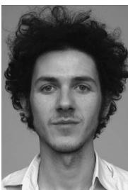

Belgium. From 2002 to 2003, and from 2008 to 2009, he was a Research Assistant with K.U.Leuven, Belgium, while from 2004 to 2007, he was a Research Assistant with the Institute for the Promotion of Innovation through Science and Technology in Flanders (IWT), Belgium. After his Ph.D. graduation, he was a Postdoctoral Research Fellow with K.U.Leuven, Belgium, until 2010. Since 2005, he has been a Visiting Teaching Assistant at the Advanced Learning and Research Institute, University of Lugano (Universita\` della Svizzera Italiana), Switzerland, where he is teaching Digital Signal Processing. His research interests are in adaptive signal processing and parameter estimation, with application to acoustic signal enhancement, speech and audio processing, and wireless communications.

Dr. van Waterschoot served as a Technical Program Committee (TPC) Track Chair for Speech Processing at the 18th European Signal Processing Conference (EUSIPCO-2010), and has been a technical reviewer and TPC member for numerous journals and conferences.

Marc Moonen received the electrical engineering degree and the Ph.D. degree in applied sciences from Katholieke Universiteit Leuven (K.U.Leuven), Leuven, Belgium, in 1986 and 1990, respectively

Since 2004, he has been a Full Professor at the Electrical Engineering Department, K.U.Leuven, where he is heading a research team working in the area of numerical algorithms and signal processing for digital communications, wireless communications, DSL and audio signal processing.

Dr. Moonen received the 1994 K.U.Leuven Research Council Award, the 1997 Alcatel Bell (Belgium) Award (with Piet Vandaele), the 2004 Alcatel Bell (Belgium) Award (with Raphael Cendrillon), and was a 1997 BLaureate of the Belgium Royal Academy of Science.[ He received a journal best paper award from the IEEE TRANSACTIONS ON SIGNAL PROCESSING (with G. Leus) and from Elsevier Signal Processing (with S. Doclo). He was Chairman of the IEEE Benelux Signal Processing Chapter (1998–2002) and is currently Past-President of the European Association for Signal Processing (EURASIP) and a member of the IEEE Signal Processing Society Technical Committee on Signal Processing for Communications. He has served as Editor-in-Chief for the EURASIP Journal on Applied Signal Processing (2003-2005), and has been a member of the editorial board of the IEEE TRANSACTIONS ON CIRCUITS AND SYSTEMSVPART II: ANALOG AND DIGITAL SIGNAL PROCESSING (2002–2003), the IEEE SIGNAL PROCESSING MAGAZINE (2003–2005), and the Integration, the VLSI Journal. He is currently a member of the editorial board of the EURASIP Journal on Applied Signal Processing, the EURASIP Journal on Wireless Communications and Networking, and Signal Processing.