Published in final edited form as:

. 2022 ; 30: 3134–3143. doi:10.1109/taslp.2022.3209943.

# Fusing Bone-conduction and Air-conduction Sensors for Complex-Domain Speech Enhancement

Heming Wang [Student Member, IEEE],

Department of Computer Science and Engineering, The Ohio State University, OH 43210 USA

Xueliang Zhang [Member, IEEE],

Department of Computer Science, Inner Mongolia University, Hohhot 010021, China

DeLiang Wang [Fellow, IEEE]

Department of Computer Science and Engineering and the Center for Cognitive and Brain

Sciences, The Ohio State University, Columbus, OH 43210 USA

# Abstract

Speech enhancement aims to improve the listening quality and intelligibility of noisy speech in adverse environments. It proves to be challenging to perform speech enhancement in very low signal-to-noise ratio (SNR) conditions. Conventional speech enhancement utilizes air-conduction (AC) microphones, which are sensitive to background noise but capable of capturing full-band signals. On the other hand, bone-conduction (BC) sensors are unaffected by acoustic noise, but recorded speech has limited bandwidth. This study proposes an attention-based fusion method to combine the strengths of AC and BC signals and perform complex spectral mapping for speech enhancement. Experiments on the EMSB dataset demonstrate that the proposed approach effectively leverages the advantages of AC and BC sensors, and outperforms a recent time-domain baseline in all conditions. We also show that the sensor fusion method is superior to single-sensor counterparts, especially in low SNR conditions. As the amount of BC data is very limited, we additionally propose a semi-supervised technique to utilize both parallelly and unparallely recorded AC and BC speech signals. With additional AC speech from the AISHELL-1 dataset, we achieve similar performance to supervised learning with only 50% parallel data.

# Index Terms—

speech enhancement; air-conduction; bone-conduction; attention-based fusion; complex spectral mapping

# I. Introduction

Noise interference degrades the quality and intelligibility of speech signals in real-world environments. Speech enhancement aims to remove or reduce the background noise of a given speech signal. The recent introduction of deep learning has led to dramatic advances in this field, and deep neural networks (DNNs) effectively suppress background noise for untrained speakers and noise types [42], [11], [24]. However, speech enhancement in nonstationary noises at very low SNRs remains challenging, as noise dominates the acoustic signal making it difficult to recover clean speech.

Conventional speech enhancement operates on speech recorded by air-conduction (AC) sensors or microphones. AC microphones can capture full-band speech, but are susceptible to background noise. Bone-conduction (BC) sensors directly convert articulation-induced vibrations on the human skull to electric signals [33]. As a result, BC signals are not subject to background interference transmitted in air. On the other hand, BC speech has a limited bandwidth as high-frequency components are attenuated or lost due to the nature of bone conduction, resulting in muffled sound.

In the speech telecommunication scenario where AC and BC signals are both available at the speaker end, how to leverage AC and BC recordings for speech processing before transmitting the processed result to the remote listener end becomes a significant research issue. In early efforts, BC signals are used to extract auxiliary speech information in noisy conditions, e.g., voice activity detection [54], SNR estimation [32] and pitch extraction [27]. Later, researchers attempt to extend the bandwidth of BC signals to improve speech quality. These methods can be categorized into three groups: equalization, analysis and synthesis, and DNN-based. Simulating BC signals by passing AC signals through a low-pass filter, Shimamura and Tamiya [31] proposed an equalization method that estimates the inverse of such transformation. Specifically, they derive a linear-phase filter by first calculating the ratio of long-term discrete Fourier transform of AC and BC speech spectra, and then taking the inverse and applying it to BC speech to recover the AC counterpart. Kondo et al. [17] improve the equalization method by estimating the filter in a frame-by-frame fashion. Although the proposed equalization method improves speech quality, the performance is sensitive to filter length and order and expected to degrade for unknown speakers. In addition, this approach mainly considers the magnitude ratio, and the phase is kept the same as that of the input signal, so perfect speech reconstruction is impossible in the ideal case. Analysis and synthesis models assume the excitation signals are the same for both AC and BC signals. The task is then to obtain the envelope feature for AC signals. Past work uses features like linear predictive coding (LPC) [38], mel-frequency cepstral coefficient (MFCC) [34], and linear spectral frequency (LSF) [12] to predict the spectral envelope of AC signals, and then perform speech synthesis. This approach has several limitations. First, the assumption about the excitation does not always hold in real applications, causing distorted speech reconstruction. Second, excitation signals are hard to model as they are highly nonstationary. Recently DNN based methods are introduced to perform bandwidth extension on BC signals. Shan et al. [30] proposed a speaker-dependent approach to extend the bandwidth of BC speech. An encoder-decoder based network is employed to reconstruct the magnitude of AC speech, and magnitude-based features of spectral magnitude, MFCC and LPC are concatenated as the training input. Given the spectra of BC speech, Zheng et al. [51] introduce attention-based bidirectional long short-term memory (LSTM) to reconstruct the magnitude spectrogram of the corresponding AC speech. A structural similarity metric and a spectral distance metric are employed to guide optimization. Nguyen and Unoki [22] also employ bidirectional LSTM to recover AC speech. It predicts the LSFs of

the corresponding full-band speech given the LSFs of BC speech, and then performs inverse filtering with the filter derived from the predicted LSFs to restore AC speech. Zheng et al. [52] use the vocoder WaveNet [23] to perform bandwidth extension for BC spectrograms, and attempt to reconstruct the full-band waveform from the bandwidth-limited BC magnitude spectrogram. Hussain et al. [14] proposed a hierarchical extreme learning machine to extend the bandwidth of BC spectrogram, which improves the automatic speech recognition accuracy with a limited amount of training data. Despite DNN-based methods showing improved performance, it remains challenging to recover high-resolution speech from BC speech alone. One reason is that the bandwidth of BC speech is usually limited to 1–2 kHz depending on sensor position [21], [4], [15], which makes it very difficult to perform bandwidth extension to 8 kHz or 16 kHz with high quality. As the majority of a spectrogram is missing, the extended spectrogram suffers from the oversmoothing issue [29]. The other reason is that low-intensity, wide-band sounds such as /f/ and /s/ are poorly captured by BC sensors as they induce weak, narrowband vibrations [26], making them especially hard to reconstruct via bandwidth extension.

Earbud devices like Apple Airpods have become popular consumer electronics, and they include both AC and BC sensors. For a typical bone-conduction earbud, the BC sensor is placed on the pinna and the AC sensor serves as a close-talk microphone, making it easier to obtain parallelly recorded AC and BC speech. A recent study by Yu et al. [47] proposed a DNN-based method that regards BC sensors as another modality. They investigate ensemble learning methods to integrate the two types of signal and employ a fully convolutional network (FCN) to perform time-domain speech enhancement, demonstrating the efficacy of combining AC and BC signals in speech enhancement.

In a preliminary study [44], we proposed to leverage AC-BC signals by performing attention based fusion and employing a convolutional recurrent network (CRN) [36] and to perform speech enhancement in the complex domain. The attention mechanism is first introduced in [41] and has produced superior performance for sequence-to-sequence modeling. Since then, it has been widely employed in tasks like automatic speech recognition [25], natural language processing [5] and computer vision [9]. The core idea of attention is to generate a context vector that “attends to” subsets of a sequence through weights that highlight salient features and suppress irrelevant information. This also allows the network to model the long-term dependencies. Recent speech enhancement studies [8], [24] also report significant performance gain by incorporating attention modules. Experiments show that the proposed attention based AC-BC fusion offers an advantage over conventional speech enhancement. In this study, we extend the preliminary work in two main aspects. First, we improve the design of attention-based fusion by concatenating the original feature maps and attentionmapped features. Second, considering the limited availability of parallel AC and BC speech data, we propose a novel semi-supervised framework that trains with both parallel and unparallel AC and BC speech. Our semi-supervised method outperforms its full-supervised counterpart.

The rest of the paper is organized as follows. In Section II, we formulate AC-BC fused speech enhancement. Section III describes our proposed network and pipeline. We describe the semi-supervised AC-BC enhancement framework in Section IV. Section V presents datasets and experimental results. Finally, Section V-B concludes the paper.

# II. Problem Formulation

We propose to utilize both AC and BC sensors to perform speech enhancement. It is assumed that we simultaneously collect a noise-insensitive signal $y _ { B C }$ from the BC sensor and a noisy speech signal  from the AC sensor, which is composed of background noise and clean speech $s ,$

$$
y [ k ] = s [ k ] + n [ k ], \tag {1}
$$

where  denotes the sample index of a waveform signal. Applying short-time Fourier transform (STFT) to the signals we have,

$$
Y [ t, f ] = S [ t, f ] + N [ t, f ], \tag {2}
$$

where $Y ,$ and  are the corresponding STFTs of ${ \cal { Y } } ,$ and . Symbols ,  index time frame and frequency bin, respectively.The STFTs can be written in terms of real and imaginary parts,

$$
Y _ {r} [ t, f ] + i Y _ {i} [ t, f ] = \left(S _ {r} [ t, f ] + N _ {r} [ t, f ]\right) + i \left(S _ {i} [ t, f ] + N _ {i} [ t, f ]\right). \tag {3}
$$

The subscripts  and  denote real and imaginary numbers, respectively, and  the imaginary unit. Using the proposed complex-domain enhancement model $^ { g , }$ whose parameters are denoted as $\theta ,$ our goal is to recover the clean speech  using the signals collected from both and $Y _ { B C } .$ The task is defined as,

$$
\hat {S} [ t, f ] = g (\theta , Y [ t, f ], Y _ {B C} [ t, f ]), \tag {4}
$$

where $\hat { S } [ t , f ]$ is the enhanced speech in the complex domain.

# III. Attention-based Sensor Fusion For Complex Speech Enhancement

We propose an attention-based method to fuse AC and BC signals and perform complex spectral mapping for speech enhancement. The proposed strategy is illustrated in Fig. 1(c). Two other fusion strategies, namely early-fusion and late-fusion as depicted in Figs. 1(a) and 1(b), are also investigated for comparison. In the following subsections, we describe the components of the proposed system and present fusion strategies and the training objective.

# A. Densely Connected Block

Motivated by the success of the densely connected (DC) network [13], [50], [37], we incorporate densely connected blocks into our network to replace standard convolution layers, as illustrated in Fig. 2. These studies suggest a DC network outperforms the same architecture without dense connections. In a DC block, one convolutional operation is split into multiple convolution layers, each with fewer channels, and all layers have direct connections to subsequent layers. This design encourages the reusage of feature maps while also addressing the gradient vanishing issue. We use DC blocks to replace standard convolutions in our network. Specifically, a DC block consists of five convolutional layers, and the first four are 2-D convolutions with the number of output channels set to 8. Each convolution is followed by a batch normalization and a parametric rectified linear unit (PReLU) activation [10]. The final layer accepts outputs from all preceding layers and performs a gated convolution [36]. The gated convolution is employed to facilitate the feature fusion across convolution channels. The kernel size for each convolution layer is (1, 4) along the time and frequency axis, respectively. The dense block with gated convolutions can be formulated as,

$$
x _ {c a t} = \operatorname{Concat} \left(x _ {1}, x _ {2}, x _ {3}, x _ {4}\right) \tag {5}
$$

$$
x = \operatorname{conv} 1 (x _ {\text { cat }}) \odot (\sigma \operatorname{conv} 2 (x _ {\text { cat }})), \tag {6}
$$

where  denotes the output at convolution layer $I ( I = 1 , 2 , 3 , 4 )$ , and  is the dense block output. Symbol ⊙ represents element-wise multiplication, and  denotes the sigmoidal activation function. () is the concatenation operation of the feature vectors, and we use two distinct convolutions 1 and 2 to perform gated convolutions on the concatenated feature $X _ { c a t }$

# B. DC-CRN

We use the densely connected CRN (DC-CRN) as the primary component to perform complex spectral mapping based speech enhancement, and illustrate its details in Fig. 3. The network architecture is based on CRN [36], [37], which builds on the convolutional encoderdecoder structure and a recurrent neural network (RNN) bottleneck to model temporal dependencies. Such an architecture effectively captures the local and global contexts of a given input. We concatenate the real and imaginary parts of the complex spectrogram and feed the DC-CRN with 3-D feature maps. The CRN encoder is a convolutional neural network (CNN) downsampler that uses standard convolutions to reduce the feature dimension along the frequency axis, and the decoder mirrors the encoder architecture to restore the feature dimension with transposed convolutions. In DC-CRN, each convolutional layer within the CRN encoder and decoder is replaced by a DC block as described in Section III-A. The encoder comprises 7 DC blocks, and the number of output convolutional channels is set to be 16, 32, 64, 128, 256, respectively. These blocks and channels are mirrored for the decoder. The major difference with [37] is that we employ pointwise convolutions as skip connections to connect the encoder to the decoder in order to make our DC-CRN model lightweight and memory efficient. Table I lists the efficiency gain by adopting these modifications. For memory consumption, we measure the GPU memory usage by passing a batch of 8 utterances. For the bottleneck RNN, we employ a two-layer grouped bidirectional long short-term memory (BLSTM) module [6], [36], which reduces the computational complexity while maintaining enhancement performance. Specifically, to reduce inter-layer calculations, we divide the feature maps into four disjoint groups. To model the intra-group relationship, we perform a representation rearrangement and a layer normalization after each LSTM layer. Finally, the output of the CNN decoder is halved and then reshaped into one-dimensional features. Each half passes through a linear layer to produce real and

imaginary spectrogram estimates (see Fig. 3). One thing worth noting is that we can easily convert our model to the causal version by switching BLSTM to uni-directional LSTM.

# C. Attention-based Fusion

Different from the attention based methods that focus on a single modality, we regard AC and BC complex spectrograms as different modalities, and employ attention-based modality fusion techniques similar to [3], [49] to fully exploit cross-modal and single-modal features. The attention-based fusion of AC and BC feature maps is illustrated in Fig. 4. First, we implement a channel attention module in multiple scales. To make attention calculations efficient, we only consider local and global contexts. The local context is calculated by applying a two-layer pointwise convolution followed by a batch normalization and a PReLU activation. The global context is acquired similarly, except that we employ a global average pooling before the convolution operation. We aggregate context information and then calculate the attention score  using a sigmoidal activation. Note during the attention calculation, the global context vector has a smaller shape compared with the local context vector, so we expand the vector such that they have the compatible shape before summation. Then, we perform element-wise addition on two input features and assign weights  and 1 −  to each feature map to produce an attention-fused feature (AFF). Finally, as shown in Fig. 1(c), we concatenate the AC and BC complex spectrograms with the attention-fused feature as the input to the DC-CRN model. That is,

$$
Y _ {A F F} [ t, f ] = M Y [ t, f ] + (1 - M) Y _ {B C} [ t, f ] \tag {7}
$$

$$
Y _ {\text { feat }} [ t, f ] = \operatorname{Concat} \left(Y [ t, f ], Y _ {B C} [ t, f ], Y _ {A F F} [ t, f ]\right). \tag {8}
$$

We investigate two other fusion strategies, early-fusion (EF) and late-fusion (LF) [18], which are depicted in Fig. 1(a) and 1(b). Early-fusion concatenates AC and BC signals before feeding them to the DC-CRN. For the late-fusion strategy, AC and BC signals are fed to separate DC-CRN models, and we merge the outputs of the two models using a linear layer.

# D. Training Objective

We define the training objective in the complex domain. Recent studies [45], [46], [48] have demonstrated that including a magnitude loss in complex spectral mapping is beneficial, reflecting the relative importance of magnitude over phase. Based on this observation, we construct the loss function by calculating the mean absolute error (MAE) for the real and imaginary parts, plus the MAE of magnitudes. With the total number of time frames and frequency bins denoted as  and  respectively, the loss is defined as,

$$
L _ {R I - M a g} (S, \hat {S}) = L _ {R I} + L _ {M a g} \tag {9}
$$

$$
L _ {R I} = \frac {1}{T F} \sum_ {t = 1} ^ {T} \sum_ {f = 1} ^ {F} \left(\left| \hat {S} _ {r} [ t, f ] - S _ {r} [ t, f ] \right| \right. \tag {10}
$$

$$
\left. + \left| \hat {S} _ {i} [ t, f ] - S _ {i} [ t, f ] \right|\right)
$$

$$
L _ {M a g} = \frac {1}{T F} \sum_ {t = 1} ^ {T} \sum_ {f = 1} ^ {F} \left\| \hat {S} [ t, f ] \right| - \left| S [ t, f ] \right\|. \tag {11}
$$

# IV. Semi-supervised Learning For AC-BC Fusion

The vast majority of existing speech corpora are recorded with AC microphones. The availability of BC speech is limited, and parallelly recorded AC and BC data is even scarcer. This brings difficulties to the application of our sensor fusion method for speech enhancement. To address this issue, we propose a semi-supervised method for AC-BC fusion. Semi-supervised learning is a kind of weakly-supervised learning where both paired and unpaired data are utilized to facilitate training [1], [39]. In this study, we regard parallel AC and BC speech as paired data, and AC speech provides the ‘label’ of its corresponding BC signal. For unpaired data, the ‘label’ of a given BC speech signal is unavailable. Our proposed framework is based on the Cycle-consistent Generative Adversarial Network (CycleGAN) [53], which is shown to be effective for tasks with unpaired data, like image-toimage translation [53], image segmentation [20], and voice conversion [7]. This framework enables us to train with unpaired speech data, and improves the enhancement performance when paired data is limited.

# A. CycleGAN

CycleGAN [53] is a GAN architecture extension and it is typically applied when there is a lack of paired training data. There are four modules in CycleGAN, two conditional generators and two discriminators. The generators are employed to learn a bidirectional mapping between two domains. The first generator takes input from the first domain, and produces output to the second domain. Meanwhile, the second generator learns the reverse mapping. By applying two generators sequentially, we map the input to its original domain, i.e., recover the original input. The discriminators are designed to determine whether the generated output is real or fake. Adversarial training is performed such that generators and discriminators compete with each other, and generators aim to produce outputs realistic enough to trick discriminators. This model is capable of generating plausible predictions even if there is limited paired data.

# B. Model Description

Our semi-supervised AC-BC fusion speech enhancement model is illustrated in Fig. 5, and it contains two CNN-based discriminators and two generators that build on the proposed DC-CRN model. During training, we adopt the attention based fusion DC-CRN model as Generator , which takes as input both noisy speech and BC speech and predicts clean speech. Generator  is the DC-CRN that converts clean speech to its BC counterpart.

Discriminator  determines whether a given input is an authentic clean signal, and Discriminator  is trained to discriminate whether a given signal belongs to BC speech or not. Unlike image data, speech signals are of variable lengths, so we construct a 7-layer CNN with adaptive pooling as our discriminator, which converts variable-sized features into vectors of fixed dimension. Each CNN layer in the discriminator is followed by a batch normalization and a PReLU activation. The number of convolution channels in each layer is set to 32, 64, 128, 256, 512, 256, 1, sequentially. During interference, we feed Generator with BC speech and noisy speech to produce a clean speech estimate.

# C. Training Objective

The training objective for the semi-supervised framework is composed of two parts, supervised loss and semi-supervised loss. Both paired and unpaired data are involved in the loss calculation. We denote the paired data with the superscript  and the unpaired data with the superscript . For instance, the clean speech that has no parallel BC counterpart is denoted as $s ^ { U } ,$ and the corresponding noisy speech as $Y ^ { U } .$

For supervised speech enhancement loss $L _ { s u p }$ we employ the complex-domain loss function defined in Sec. III-D to measure the complex spectrogram difference of the generated speech and its corresponding ground truth. It consists of $L _ { s u p } ^ { A }$ and $L _ { s u p } ^ { B } ,$ which optimizes Generator and  respectively. The supervised enhancement loss is defined as,

$$
L _ {s u p} = L _ {s u p} ^ {A} + L _ {s u p} ^ {B} \tag {12}
$$

$$
L _ {s u p} ^ {A} = L _ {R I - M a g} \left(G _ {A} \left(Y ^ {P}, Y _ {B C} ^ {P}\right), S ^ {P}\right) \tag {13}
$$

$$
L _ {s u p} ^ {B} = L _ {R I - M a g} \left(G _ {B} \left(S ^ {P}\right), Y _ {B C} ^ {P}\right). \tag {14}
$$

The semi-supervised loss consists of three components, an adversarial loss, a cycle consistency loss and an identity loss. Instead of the cross-entropy loss in regular GANs, we employ the least square loss [19] as the adversarial loss to stabilize adversarial training. It has been shown that this loss minimizes the Pearson $\chi ^ { 2 }$ divergence. We define the adversarial loss as,

$$
L _ {D} = L _ {D} ^ {A} + L _ {D} ^ {B} \tag {15}
$$

$$
L _ {D} ^ {A} = \frac {1}{2} \mathbb {E} _ {S \sim p _ {S}} \left[ \left(D _ {A} (S) - 1\right) ^ {2} \right] \tag {16}
$$

$$
+ \frac {1}{2} \mathbb {E} _ {Y, Y _ {B C} \sim p Y, Y _ {B C}} \Big [ \Big (D _ {A} \big (G _ {A} (Y, Y _ {B C}) \big) ^ {2} \Big ]
$$

$$
L _ {D} ^ {B} = \frac {1}{2} \mathbb {E} _ {Y _ {B C} \sim p Y _ {B C}} \left[ \left(D _ {B} \left(Y _ {B C}\right) - 1\right) ^ {2} \right]
$$

$$
+ \frac {1}{2} \mathbb {E} _ {S \sim p _ {S}} \Big [ D _ {B} \big (G _ {B} (S) \big) ^ {2} \Big ]
$$

$$
\begin{array}{l} L _ {G} = \frac {1}{2} \mathbb {E} _ {Y, Y _ {B C} - p Y, Y _ {B C}} \left[ \left(D _ {A} \left(G _ {A} \left(Y, Y _ {B C}\right)\right) - 1\right) ^ {2} \right] \tag {18} \\ + \frac {1}{2} \mathbb {E} _ {S \sim p _ {S}} \Big [ \big (D _ {B} \big (G _ {B} (S) \big) - 1 \big) ^ {2} \Big ], \\ \end{array}
$$

where $X { \sim } p _ { X }$ represents a random variable  drawn from the probability distribution $p _ { S } ,$ and $X , Y { \sim } p _ { X , Y }$ random variables  and  from the joint probability distribution $p _ { X , Y } .$ E is the expectation operator. Superscripts  and  indicate discriminator  and , respectively. The discriminators seek to classify real speech as 1 and generated speech as 0, whereas the generators intend to deceive the discriminators and identify the label of generated speech to be 1. Note that superscripts  and  are absent in the above equation, as this loss term applies to both paired and unpaired data.

To exploit unparallel speech data, we use a cycle consistency loss. Applying two generators sequentially, we obtain a reconstructed complex spectrogram that corresponds to the original input. Again, we measure the complex spectrogram difference using $L _ { R I - M a g } ,$

$$
L _ {\text {cycle}} = L _ {R I - \operatorname{Mag}} \left(G _ {B} \left(G _ {A} \left(Y ^ {P}, Y _ {B C} ^ {P}\right)\right), Y _ {B C} ^ {P}\right) + L _ {R I - \operatorname{Mag}} \left(G _ {A} \left(Y ^ {U}, G _ {B} \left(S ^ {U}\right)\right), S ^ {U}\right). \tag {19}
$$

An identity loss is added to regularize adversarial training for which, if given a target speech signal, the generator should output the same speech [53], i.e.,

$$
L _ {\text { identity }} = \mathbb {E} _ {S, Y \sim p _ {S, Y}} \left[ G _ {A} (S, Y) - S\right) \big ] + \mathbb {E} _ {Y _ {B C} \sim p _ {Y _ {B C}}} \left[ G _ {B} \left(Y _ {B C}\right) - Y _ {B C}\right) \big ]. \tag {20}
$$

The purpose of this loss term is to preserve the feature correlations between the input and output [53]. Without the identity loss, the generators produce complex spectrograms reasonable enough to deceive the discriminators, but might deviate from the ground truth, as both mappings are equally valid under the adversarial loss and the cycle consistency loss.

Finally, the total loss of our training objective combines all loss terms,

$$
L _ {\text { total }} = L _ {D} + L _ {G} + \alpha L _ {\text { cycle }} + \beta L _ {\text { identity }} + \gamma L _ {\text { sup }}, \tag {21}
$$

where $a , \beta ,$ control the relative importance of their respective loss terms, and we set ${ \pmb a } =$ $5 . 0 , \beta = 2 . 0 , \gamma = 5 . 0$ based on the performance on a validation set.

# V. Experiments

# A. Datasets and Evaluation Metrics

We perform supervised experiments on the Elevoc Simultaneously-recorded Microphone/ Bone-sensor (ESMB) speech corpus1, which is a Chinese corpus consisting of 128 hours of speech uttered by 131 male and 156 female speakers. Speech is recorded using a pair of Elevoc Clear earbuds, and each earbud contains a ST25ba BC sensor near the entry of the ear canal to gather skull vibrations during articulation and an AC sensor outside the ear that acts as a close-talk microphone. During the recording, every speaker reads Chinese prompts for around 20 minutes, producing 16 kHz stereo speech data, for which each channel corresponds to one earbud. We use the same noise set for training and validation, which is generated by randomly selecting 20000 files from the DNS challenge dataset2. For each utterance, we generate a noisy speech signal by mixing an AC signal with a noise segment cut to the same length from the noise set at an SNR level uniformly sampled from the range {−5, −4, −3, −2, −1, 0} dB. We set aside two male and two female speakers for validation and evaluate on two male and two female speakers that are not included in training and validation sets. The remainder of the corpus constitutes the training set. For evaluation, we select four challenging noises: babble and cafeteria from an Auditec ${ \mathrm { C D } } ^ { 3 } .$ , and factory and engine from the NOISEX92 dataset [40]. Each test utterance is mixed with these four noises at three SNR levels −5, 0 and 5 dB.

For semi-supervised experiments, paired AC and BC speech are extracted from the ESMB corpus, and we employ the AISHELL-1 dataset [2] as the source for unpaired data. AISHELL-1 is a Chinese Mandarin speech corpus that consists of around 120000 utterances with a total duration of about 178 hours. Four hundred speakers participated in the recording, which was conducted in a quiet indoor environment using a high-fidelity microphone and then downsampled to 16 kHz. The validation and test settings are the same as in supervised experiments. A similar procedure to supervised experiments is used to generate noisy mixtures for both AISHELL and ESMB.

We use two standard metrics to assess enhancement performance, short-time objective intelligibility (STOI) [35] and perceptual evaluation of speech quality (PESQ) [28]. STOI has a typical value range from 0 to 1, which can be typically interpreted as percent correct. PESQ ranges from −0.5 to 4.5. Higher values indicate better performance for both metrics.

# B. Experimental Setup

For all experiments, we resample recordings to the sampling rate of 8 kHz. During training and validation, we discard for each recording silent portions whose energy is 60 dB below the peak power reference. A window length of 32 ms with 50% overlap between adjacent frames is used in calculating STFTs, which correspond to 129-dimensional spectra. We apply meanvariance normalization (MVN) to each noisy utterance, and the corresponding clean utterance is scaled accordingly. Each BC utterance passes through an eighth-order Butterworth low-pass filter, and is then normalized using MVN. This low-pass filtering serves two purposes. First, there is still residual energy in the upperband of BC spectrograms, which is not helpful for speech enhancement. We find that removing the upperband energy slightly improves enhancement performance. Second, it enforces the same cutoff frequency of all BC utterances, which improves the generalization of the trained model to devices with different cutoff frequencies.

For the fully-supervised model, we use the Adam optimizer [16] and train with the batch size of 16 utterances for 30 epochs. The initial learning rate is set to 0.0006, and is halved if the validation loss has not improved for three consecutive epochs. We also employ a gradient clipping with a maximum value of 5.0 to avoid gradient explosion.

For the semi-supervised model, both generators and discriminators are optimized using the Adam optimizer. The learning rate for the generators is set to 4e-4, and for the discriminators to $2 \mathrm { e } { \cdot } 4 .$ . We train the CycleGAN in an alternating fashion, i.e., when the generators are optimized, the parameters of the discriminators are fixed, and vice versa. To balance the adversarial training, we optimize the discriminators less frequently, and update their parameters every 5 iterations. Furthermore, we set the batch size to 8 utterances and train for 120000 iterations. For the first 10% of the iterations, we only train with paired data using $L _ { s u p } \mathrm { t o }$ initialize, and the learning rate is fixed to 0.0004. For the rest of the training, we use $L _ { t o t a l }$ and the learning rate is linearly decayed from 0.0004 to 0.0001.

# VI. Results and Analyses

# A. Supervised Experiments

Fig. 6 plots the enhancement performance of AC-BC sensor fusion approaches on the ESMB dataset. We present the results of our proposed method and the baseline FCN [47], and compare different fusion strategies. Subscripts AF, EF and LF denote the proposed attention-based fusion, early-fusion and late-fusion strategies, respectively. We also provide a causal version of the proposed DC-CRN for a fairer comparison with FCN. For the causal implementation, we use unidirectional LSTM instead of BLSTM, and only keep the local context computation in the attention module to avoid global average pooling. As shown in the figure, our complex-domain DC-CRN outperforms the time-domain baseline FCN [47] in all conditions. Especially at −5 dB SNR, our attention-based fusion achieves 21.1% higher STOI, and PESQ is improved by 0.83 compared with the best FCN fusion. In terms of fusion strategies, the proposed attention-based fusion shows a consistent improvement over early fusion and late fusion. For instance, at the SNR of −5 dB, on average the attention-based fusion has 1.0% STOI and 0.08 PESQ advantage over the late fusion. Furthermore, for both FCN and DC-CRN, late-fusion performs slightly better than early fusion (see also [47]). However, requiring separate DNNs for two types of sensor signal, late-fusion tends to be computationally heavier and may not be preferable in real applications.

Additionally, we compare sensor fusion with single-sensor counterparts in Fig. 7. Specifically, we feed DNNs with only AC or BC signals, and compare them with the AC-BC fusion. From the figure, we observe that the networks that employ AC-BC fusion always outperform conventional speech enhancement that only utilizes AC signals. Especially at −5 dB SNR, sensor fusion substantially boosts the enhancement performance. For example, STOI is improved by 11.6% and PESQ by 0.65 for the proposed DC-CRN. Incorporating BC signals becomes less beneficial as SNR rises. This is to be expected, as noise interference is not that severe in these conditions, and the noise insensitivity of BC signals is less useful. At 5 dB SNR, STOI is merely 1.7% higher, and PESQ is improved by 0.10 for DC-CRN.

We also provide the results of employing BC signals only, which essentially amounts to bandwidth extension. An advanced bandwidth extension baseline (AECNN\_BC) [43] for comparison. Due to the nature of BC signals, it performs the same in all noisy conditions. Compared to sensor fusion, the enhancement performance is worse, but the gap is relatively small in lower SNR conditions. It is worth noting that, at −5 dB SNR, speech enhancement with only BC signals yields on average better results than with only AC signals.

# B. Semi-supervised Experiments

Table II reports the results of training with different portions of paired data of the ESMB corpus for supervised and semi-supervised learning, where we present average evaluation results of four test noises at −5 dB SNR. We train both the fully-supervised model and the CycleGAN model using 1%, 2%, 5%, 10%, 20%, 50% and 100% paired data, and the semi-supervised model additionally exploits unpaired AC data from the AISHELL corpus.

Compared to fully-supervised baselines, semi-supervised learning has a clear advantage on different paired portions, suggesting we have effectively benefited from unpaired data. Especially when training with only 1% of paired data, the semi-supervised approach considerably boosts the enhancement performance, improving STOI by 8.6% and PESQ by 0.38. As the paired portions rise, the improvement becomes smaller as expected. Using 50% paired data, we are able to match the performance of the full-supervised baseline using the complete ESMB corpus. This shows that the proposed semi-supervised technique can improve the enhancement performance when paired data is limited.

# C. Ablation Study

An ablation study is conducted to investigate the effects of different components within the proposed model, and the results are given in Table III. We use the attention-based fusion of our DC-CRN as the baseline and compare several variants at −5 dB SNR: (i) replacing DC blocks with standard convolutions; (ii) replacing the gated convolutions within DC blocks with standard convolutions; (iii) replacing pointwise convolution-based skip connections with concatenation-based skip connections. (iv) employing addition instead of concatenation when performing attention-based fusion. As shown in the table, these variants all underperform the proposed design. Among these factors, dense connectivity plays a significant role in enhancement performance, as removing DC blocks degrades STOI by 5.3% and PESQ by 0.29. Gated convolutions are beneficial for merging cross-channel features, and removing them from DC blocks results in 2.2% and 0.19 drop in STOI and PESQ, respectively. Furthermore, pointwise skip connections are an efficient way to boost feature fusion compared to simple concatenations, as it improves the performance without introducing many extra parameters. Lastly, performing attention-based fusion using addition leads to a significant performance drop. This is expected as using concatenation can leverage both cross-modal and single-modal features, whereas addition only utilizes cross-modal features.

# VII. Conclusion

In this study, we have proposed a novel attention-based approach for fusing AC and BC sensor signals for complex-domain speech enhancement. To restore clean speech in adverse environments, we take advantage of the full bandwidth of AC microphones and the noise insensitivity of BC sensors. Systematic evaluations show that our approach substantially boosts the enhancement performance compared with conventional monaural speech enhancement that only utilizes AC microphones, especially in very low SNR conditions. Furthermore, our DC-CRN model significantly outperforms a recent timedomain baseline in all conditions. Additionally, as the availability of parallelly recorded AC and BC speech is limited, we have proposed a semi-supervised CycleGAN-based framework to utilize AC and BC speech data in unrelated recordings. We have demonstrated that this framework achieves similar performance with only 50% paired data compared to the fully supervised counterpart. For future work, we plan to reduce the DC-CRN model complexity and improve inference efficiency so that the proposed algorithm can be deployed on mobile devices.

# Acknowledgment

This work began when the first author was an intern at Elevoc Co. Ltd. The authors would like to thank Yongjie Yan for his assistance in organizing the ESMB corpus. This research was supported in part by an NIDCD grant (R01 DC012048) and the Ohio Supercomputer Center.

# Biography

Heming Wang received his Bachelor degree in Physics in 2016, and M.S. degree in Applied Mathematics in 2018 from University of Waterloo, Ontario, Canada. He is currently working toward the Ph. D. degree at the Ohio State University. His research interests lie in speech enhancement, speech super-resolution and deep learning.

# References

[1]. Baur C, Albarqouni S, and Navab N, “Semi-supervised deep learning for fully convolutional networks,” in Proceedings of MICCAI, 2017, pp. 311–319.   
[2]. Bu H, Du J, Na X, Wu B, and Zheng H, “AISHELL-1: An opensource mandarin speech corpus and a speech recognition baseline,” in Proceedings of O-COCOSDA, 2017, pp. 1–5.   
[3]. Dai Y, Gieseke F, Oehmcke S, Wu Y, and Barnard K, “Attentional feature fusion,” in Proceedings of WACV, 2021, pp. 3560–3569.   
[4]. Erzin E, “Improving throat microphone speech recognition by joint analysis of throat and acoustic microphone recordings,” IEEE Transactions on Audio, Speech, and Language Processing, vol. 17, no. 7, pp. 1316–1324, 2009.   
[5]. Galassi A, Lippi M, and Torroni P, “Attention in natural language processing,” IEEE Transactions on Neural Networks and Learning Systems, vol. 32, no. 10, pp. 4291–4308, 2020.   
[6]. Gao F, Wu L, Zhao L, Qin T, Cheng X, and Liu T-Y, “Efficient sequence learning with group recurrent networks,” in Proceedings of NAACL-HLT, 2018, pp. 799–808.   
[7]. Gao Y, Singh R, and Raj B, “Voice impersonation using generative adversarial networks,” in Proceedings of ICASSP, 2018, pp. 2506–2510.   
[8]. Giri R, Isik U, and Krishnaswamy A, “Attention Wave-U-Uet for speech enhancement,” in Proceedings of WASPAA, 2019, pp. 249–253.

[9]. Guo M-H, Xu T-X, Liu J-J, Liu Z-N, Jiang P-T, Mu T-J, Zhang S-H, Martin R, Cheng M-M, and Hu S-M, “Attention mechanisms in computer vision: A survey,” Computational Visual Media, pp. 1–38, 2022.   
[10]. He K, Zhang X, Ren S, and Sun J, “Delving deep into rectifiers: Surpassing human-level performance on ImageNet classification,” in Proceedings of ICCV, 2015, pp. 1026–1034.   
[11]. Hu Y, Liu Y, Lv S, Xing M, Zhang S, Fu Y, Wu J, Zhang B, and Xie L, “DCCRN: Deep complex convolution recurrent network for phase-aware speech enhancement,” in Proceedings of INTERSPEECH, 2020, pp. 2482–2486.   
[12]. Huang B, Gong Y, Sun J, and Shen Y, “A wearable bone-conducted speech enhancement system for strong background noises,” in Proceedings of ICEPT, 2017, pp. 1682–1684.   
[13]. Huang G, Liu Z, Van Der Maaten L, and Weinberger KQ, “Densely connected convolutional networks,” in Proceedings of CVPR, 2017, pp. 4700–4708.   
[14]. Hussain T, Tsao Y, Siniscalchi SM, Wang J-C, Wang H-M, and Liao W-H, “Bone-conducted speech enhancement using hierarchical extreme learning machine,” in Proceedings of IWSDS, 2021, pp. 153–162.   
[15]. Ito T, Röösli C, Kim CJ, Sim JH, Huber AM, and Probst R, “Bone conduction thresholds and skull vibration measured on the teeth during stimulation at different sites on the human head,” Audiology and Neurotology, vol. 16, no. 1, pp. 12–22, 2011. [PubMed: 20453499]   
[16]. Kingma DP and Ba J, “Adam: A method for stochastic optimization,” Proceedings of ICLR, 2015.   
[17]. Kondo K, Fujita T, and Nakagawa K, “On equalization of bone conducted speech for improved speech quality,” in Proceedings of ISSPIT, 2006, pp. 426–431.   
[18]. Liu J, Li T, Xie P, Du S, Teng F, and Yang X, “Urban big data fusion based on deep learning: An overview,” Information Fusion, pp. 123–133, 2020.   
[19]. Mao X, Li Q, Xie H, Lau RY, Wang Z, and Paul Smolley S, “Least squares generative adversarial networks,” in Proceedings of ICCV, 2017, pp. 2794–2802.   
[20]. Mondal AK, Agarwal A, Dolz J, and Desrosiers C, “Revisiting CycleGAN for semi-supervised segmentation,” arXiv:1908.11569, 2019.   
[21]. Nakajima Y, Kashioka H, Shikano K, and Campbell N, “Non-audible murmur recognition input interface using stethoscopic microphone attached to the skin,” in Proceedings of ICASSP, vol. 5, 2003, pp. V–708.   
[22]. Nguyen HQ and Unoki M, “Improvement in bone-conducted speech restoration using linear prediction and long short-term memory model,” Journal of Signal Processing, vol. 24, pp. 175– 178, 2020.   
[23]. Oord AVD, Dieleman S, Zen H, Simonyan K, Vinyals O, Graves A, Kalchbrenner N, Senior A, and Kavukcuoglu K, “WaveNet: A generative model for raw audio,” arXiv:1609.03499, 2016.   
[24]. Pandey A and Wang DL, “Dense CNN with self-attention for time-domain speech enhancement,” IEEE/ACM Transactions on Audio, Speech, and Language Processing, vol. 29, pp. 1270–1279, 2021. [PubMed: 33997107]   
[25]. Povey D, Hadian H, Ghahremani P, Li K, and Khudanpur S, “A timerestricted self-attention layer for ASR,” in Proceedings of ICASSP, 2018, pp. 5874–5878.   
[26]. Prasad N and Kumar TK, “Bandwidth extension of speech signals: A comprehensive review,” International Journal of Intelligent Systems and Applications, vol. 8, no. 2, pp. 45–52, 2016.   
[27]. Rahman MS and Shimamura T, “Pitch characteristics of bone conducted speech,” in Proceedings of EUSIPCO, 2010, pp. 795–799.   
[28]. Rix AW, Beerends JG, Hollier MP, and Hekstra AP, “Perceptual evaluation of speech quality (PESQ)-a new method for speech quality assessment of telephone networks and codecs,” in Proceedings of ICASSP, 2001, pp. 749–752.   
[29]. Sautter J, Faubel F, Buck M, and Schmidt G, “Discriminative training of deep regression networks for artificial bandwidth extension,” in Proceedings of IWAENC, 2018, pp. 540–544.   
[30]. Shan D, Zhang X, Zhang C, and Li L, “A novel encoder-decoder model via NS-LSTM used for bone-conducted speech enhancement,” IEEE Access, vol. 6, pp. 62638–62644, 2018.

[31]. Shimamura T and Tamiya T, “A reconstruction filter for bone-conducted speech,” in Proceedings of MWSCAS, 2005, pp. 1847–1850.   
[32]. Shin HS, Fingscheidt T, and Kang H-G, “A priori SNR estimation using air- and bone-conduction microphones,” IEEE/ACM Transactions on Audio, Speech, and Language Processing, vol. 23, no. 11, 2015.   
[33]. Shin HS, Kang H-G, and Fingscheidt T, “Survey of speech enhancement supported by a bone conduction microphone,” in ITG Conference on Speech Communication, 2012, pp. 1–4.   
[34]. Singh P, Mukul MK, and Prasad R, “Bone conducted speech signal enhancement using LPC and MFCC,” in Proceedings of IHCI, 2018, pp. 148–158.   
[35]. Taal CH, Hendriks RC, Heusdens R, and Jensen J, “An algorithm for intelligibility prediction of time–frequency weighted noisy speech,” IEEE/ACM Transactions on Audio, Speech, and Language Processing, vol. 19, pp. 2125–2136, 2011.   
[36]. Tan K and Wang DL, “Learning complex spectral mapping with gated convolutional recurrent networks for monaural speech enhancement,” IEEE/ACM Transactions on Audio, Speech, and Language Processing, vol. 28, pp. 380–390, 2020. [PubMed: 33748323]   
[37]. Tan K, Zhang X, and Wang DL, “Deep learning based real-time speech enhancement for dual-microphone mobile phones,” IEEE/ACM Transactions on Audio, Speech, and Language Processing, vol. 29, pp. 1853–1863, 2021. [PubMed: 34179221]   
[38]. Thang TV, Kimura K, Unoki M, and Akagi M, “A study on restoration of bone-conducted speech with MTF-based and LP-based models,” Journal of Signal Processing, 2006.   
[39]. Van E JE. and Hoos HH, “A survey on semi-supervised learning,” Machine Learning, vol. 109, no. 2, pp. 373–440, 2020.   
[40]. Varga A and Steeneken HJ, “Assessment for automatic speech recognition: II. NOISEX-92: A database and an experiment to study the effect of additive noise on speech recognition systems,” Speech Communication, vol. 12, pp. 247–251, 1993.   
[41]. Vaswani A, Shazeer N, Parmar N, Uszkoreit J, Jones L, Gomez A, Kaiser Ł, and Polosukhin I, “Attention is all you need,” Advances in neural information processing systems, vol. 30, 2017.   
[42]. Wang DL and Chen J, “Supervised speech separation based on deep learning: An overview,” IEEE/ACM Transactions on Audio, Speech, and Language Processing, vol. 26, pp. 1702–1726, 2018. [PubMed: 31223631]   
[43]. Wang H and Wang DL, “Towards robust speech super-resolution,” IEEE/ACM Transactions on Audio, Speech, and Language Processing, vol. 29, pp. 2058–2066, 2021. [PubMed: 34458395]   
[44]. ——, “Attention-based fusion for bone-conducted and air-conducted speech enhancement in the complex domain,” in Proceedings of ICASSP, 2022, pp. 7757–7761.   
[45]. Wang Z-Q, Wang P, and Wang DL, “Complex spectral mapping for single-and multi-channel speech enhancement and robust ASR,” IEEE/ACM Transactions on Audio, Speech, and Language Processing, vol. 28, pp. 1778–1787, 2020. [PubMed: 33748326]   
[46]. Wang Z-Q, Wichern G, and Roux JL, “On the compensation between magnitude and phase in speech separation,” IEEE Signal Processing Letters, 2021.   
[47]. Yu C, Hung K-H, Wang S-S, Tsao Y, and Hung J-W, “Timedomain multi-modal bone/air conducted speech enhancement,” IEEE Signal Processing Letters, vol. 27, pp. 1035–1039, 2020.   
[48]. Zhang J, Plumbley MD, and Wang W, “Weighted magnitude-phase loss for speech dereverberation,” in Proceedings of ICASSP, 2021, pp. 5794–5798.   
[49]. Zhang P, Du P, Lin C, Wang X, Li E, Xue Z, and Bai X, “A hybrid attention-aware fusion network (HAFNet) for building extraction from high-resolution imagery and LiDAR data,” Remote Sensing, vol. 12, no. 22, p. 3764, 2020.   
[50]. Zhao Y and Wang DL, “Noisy-reverberant speech enhancement using DenseUNet with timefrequency attention.” in Proceedings of INTERSPEECH, 2020, pp. 3261–3265.   
[51]. Zheng C, Cao T, Yang J, Zhang X, and Sun M, “Spectra restoration of bone-conducted speech via attention-based contextual information and spectro-temporal structure constraint,” IEICE Transactions on Fundamentals of Electronics, Communications and Computer Sciences, vol. E102.A, pp. 2001–2007, 2019.   
[52]. Zheng C, Yang J, Zhang X, Cao T, Sun M, and Zheng L, “Bandwidth extension WaveNet for bone-conducted speech enhancement,” in Proceedings of CSMT, 2020, pp. 3–14.

[53]. Zhu J-Y, Park T, Isola P, and Efros AA, “Unpaired image-to-image translation using cycleconsistent adversarial networks,” in Proceedings of ICCV, 2017, pp. 2223–2232.   
[54]. Zhu M, Ji H, Luo F, and Chen W, “A robust speech enhancement scheme on the basis of bone-conductive microphones,” in Proceedings of IWSDA, 2007, pp. 353–355.

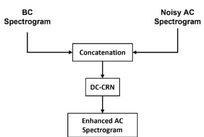

flowchart

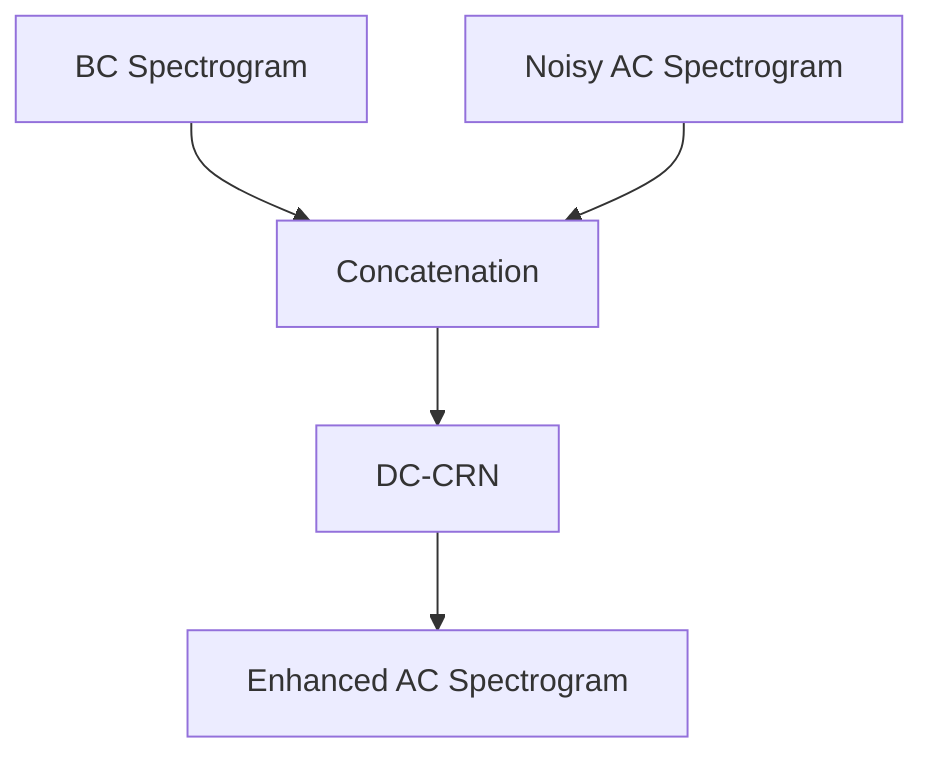

(a) Early-Fusion

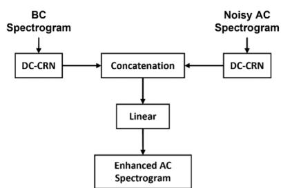

flowchart

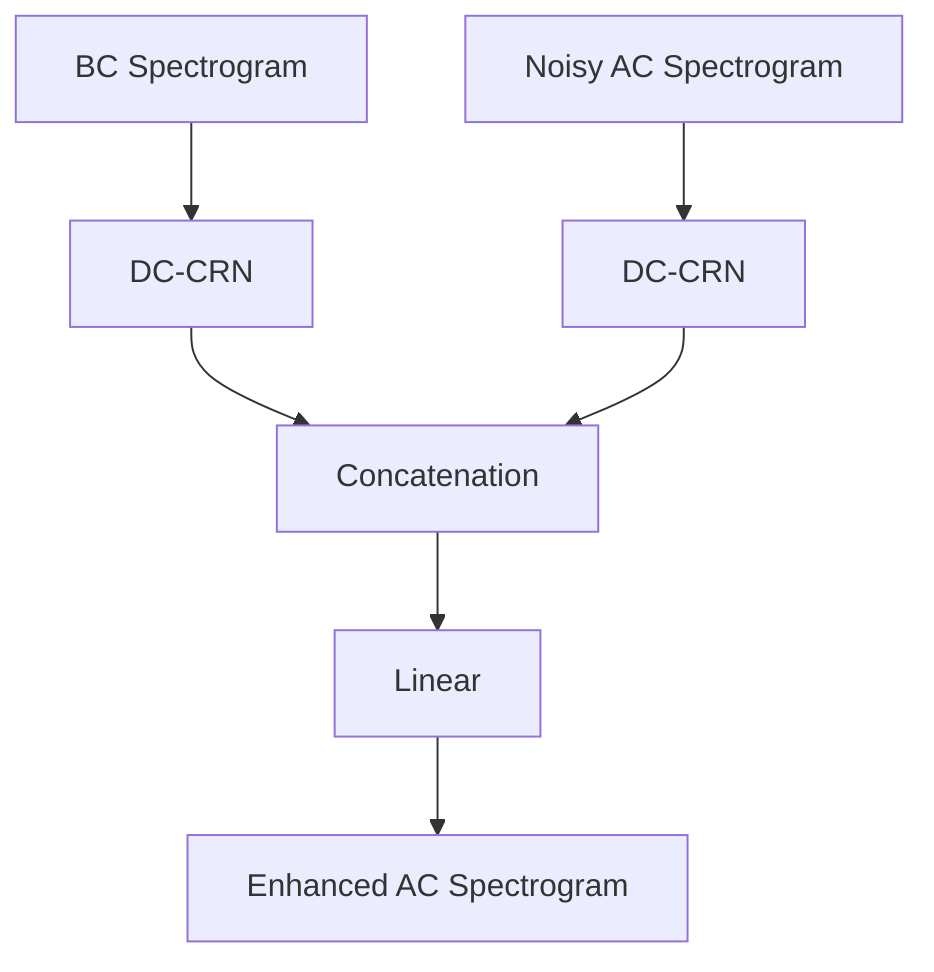

(b) Late-Fusion

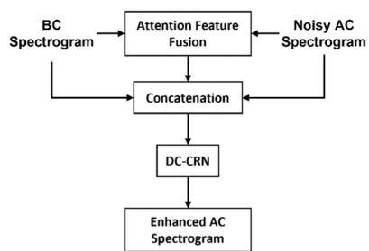

flowchart

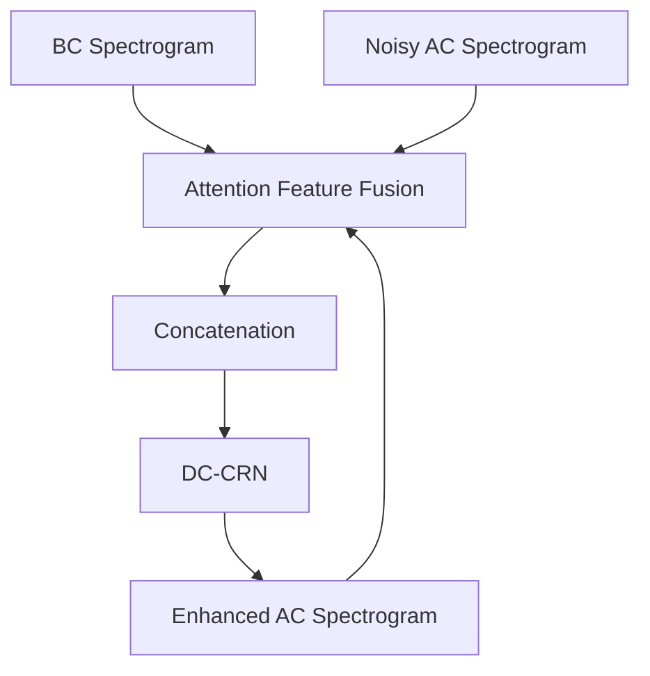

(c) Attention-based Fusion   
Fig. 1. Diagrams showing different fusion strategies, where both BC and noisy AC spectra are utilized to produce an enhanced AC complex spectrogram. (a). Early-fusion, (b). Latefusion, and (c). Attention-based fusion.

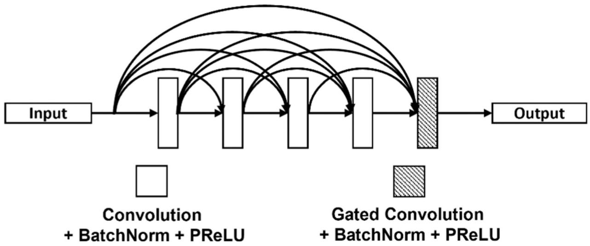

flowchart

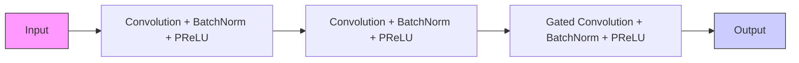

Fig. 2. Diagram of a DC block. The first four layers are standard 2D convolutions, and the last one utilizes gated convolutions.

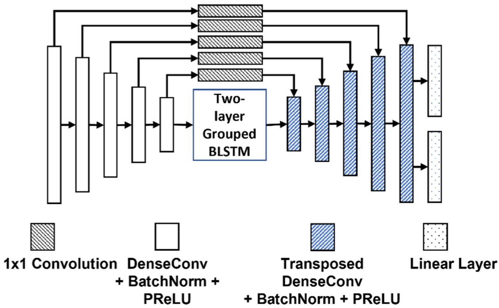

flowchart

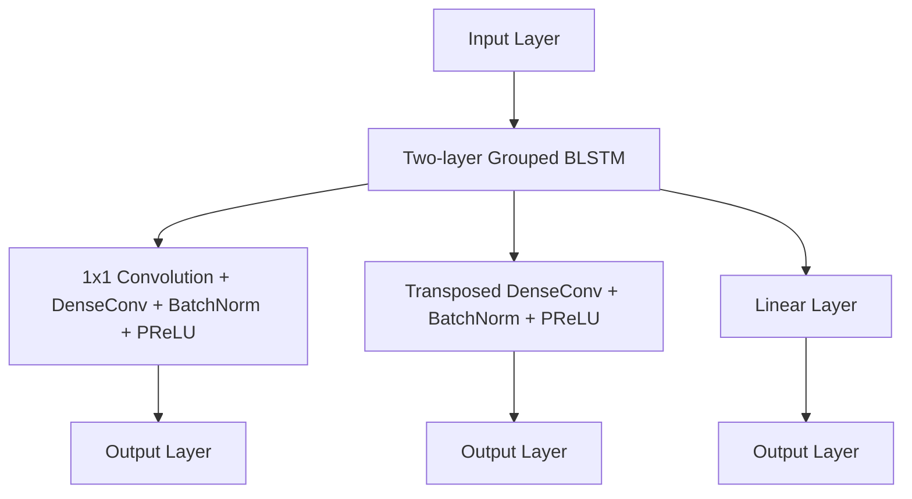

Fig. 3.   
Diagram of the DC-CRN that performs complex spectral mapping for speech enhancement.

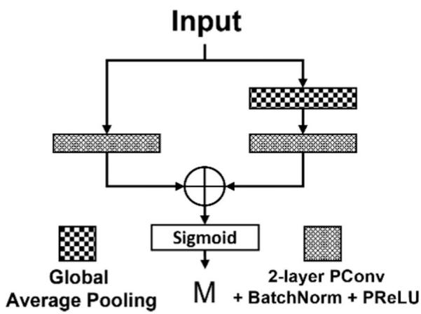

flowchart

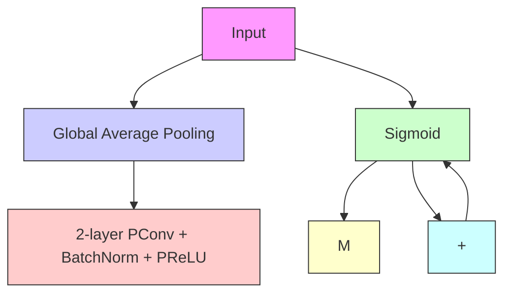

(a)Attention Module

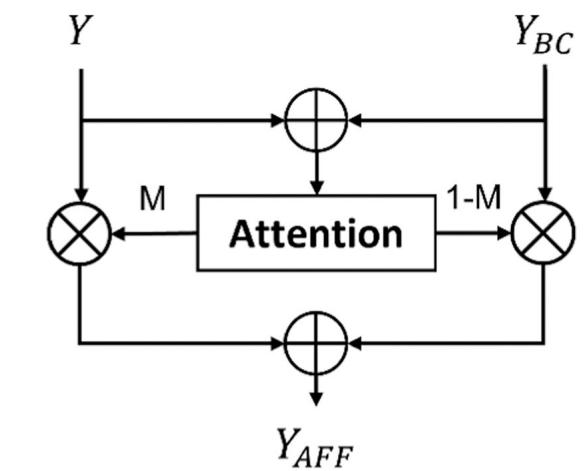

flowchart

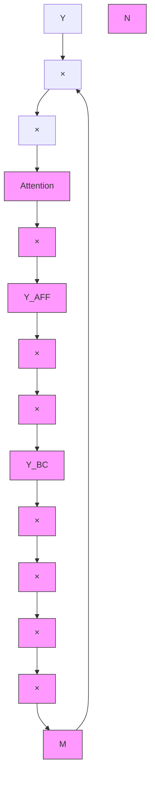

(b) Attention-based Feature Fusion   
Fig. 4. Illustration of attention-based feature fusion. (a) process of calculating the attention score , and (b) process of using  to perform soft selection and feature concatenation. Symbol ⊗ represents element-wise multiplication, and ⊕ summation.

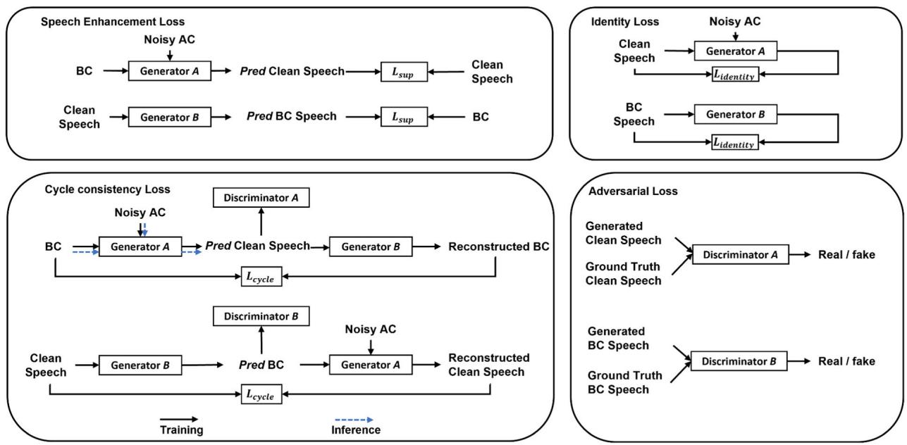

flowchart

```mermaid
graph TD
    subgraph Speech Enhancement Loss
        A["BC"] --> B["Generator A"]
        B --> C["Pred Clean Speech"]
        C --> D["Lsup"]
        D --> E["Clean Speech"]
        F["Clean Speech"] --> G["Generator B"]
        G --> H["Pred BC Speech"]
        H --> I["Lsup"]
        I --> J["BC"]
    end

    subgraph Identity Loss
        K["Identity Loss"] --> L["Generator A"]
        L --> M["Lidentity"]
        M --> N["Generator B"]
        N --> O["Lidentity"]
        P["Identity Loss"] --> Q["Identity Loss"]
        R["Identity Loss"] --> S["Identity Loss"]
    end

    subgraph Cycle Consistency Loss
        T["Cycle Consistency Loss"] --> U["Generator A"]
        U --> V["Pred Clean Speech"]
        V --> W["Generator B"]
        W --> X["Reconstructed BC"]
        Y["Cycle Consistency Loss"] --> Z["Cycle Consistency Loss"]
        AA["Cycle Consistency Loss"] --> AB["Cycle Consistency Loss"]
        AC["Cycle Consistency Loss"] --> AD["Cycle Consistency Loss"]
        AE["Cycle Consistency Loss"] --> AF["Cycle Consistency Loss"]
        AG["Cycle Consistency Loss"] --> AH["Cycle Consistency Loss"]
        AI["Cycle Consistency Loss"] --> AJ["Cycle Consistency Loss"]
        AK["Cycle Consistency Loss"] --> AL["Cycle Consistency Loss"]
        AM["Cycle Consistency Loss"] --> AN["Cycle Consistency Loss"]
        AO["Cycle Consistency Loss"] --> AP["Cycle Consistency Loss"]
        AQ["Cycle Consistency Loss"] --> AR["Cycle Consistency Loss"]
        AS["Cycle Consistency Loss"] --> AT["Cycle Consistency Loss"]
        AU["Cycle Consistency Loss"] --> AV["Cycle Consistency Loss"]
        AW["Cycle Consistency Loss"] --> AX["Cycle Consistency Loss"]
        AY["Adversarial Loss"]
    end

    subgraph Adversarial Loss
        AZ["Generated Clean Speech"] --> BA["Discriminator A"]
        BB["Generated Clean Speech"] --> BC["Discriminator A"]
        BD["Generated Clean Speech"] --> BE["Discriminator B"]
        BF["Generated Clean Speech"] --> BG["Discriminator B"]
        BH["Generated Ground Truth Clean Speech"] --> BI["Real / fake"]
        BJ["Generated Ground Truth Clean Speech"] --> BK["Real / fake"]
    end

    A --> K
    B --> L
    G --> N
    H --> N
    I --> N
    I --> N
    I --> N
    I --> N
    T --> U
    U --> V
    V --> W
    V --> W
    V --> W
    V --> W
    T --> X
    X --> Y
    Y --> Z
    Z --> AA
    AA --> AB
    AB --> AC
    AC --> AD
    AD --> AE
    AE --> AF
    AF --> AG
    AG --> AH
    AH --> AI
    AI --> AJ
    AJ --> AK
    AK --> AL
    AL --> AM
    AL --> AN
    AN --> AO
    AO --> AP
    AP --> AQ
    AQ --> AQ
    AQ --> AQ
```

Fig. 5. Schematic of the CycleGAN-based semi-supervised framework. The proposed model contains two generators and two discriminators, which are trained in a competitive manner. The solid arrow denotes the training process, and the dashed arrow represents the pipeline of inference.  stands for predicted, and the subscript  denotes supervised.

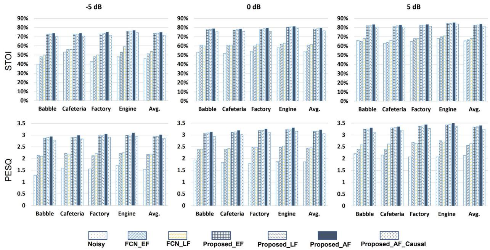  
Fig. 6. Enhancement performance of the FCN baseline and the proposed method using different fusion strategies in terms of STOI and PESQ on the ESMB corpus at different SNRs.

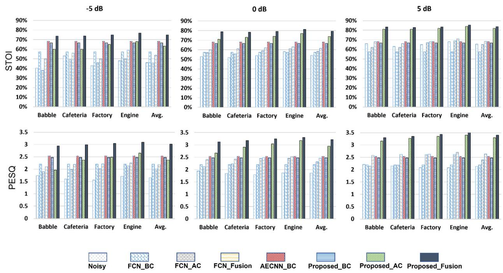  
Fig. 7. Enhancement performance of single-sensor versus sensor-fusion methods.

# TABLE I

Efficiency Gain of the Modified DC-CRN.  denotes millions and  represents gigabytes.

<table><tr><td></td><td># of parameters</td><td>GPU memory used</td></tr><tr><td>Original DC-CRN</td><td>6.43 M</td><td>4.97 G</td></tr><tr><td>Modified DC-CRN</td><td>5.84 M</td><td>4.53 G</td></tr></table>

# TABLE II

Enhancement performance of fully-supervised and semi-supervised learning models using different proportions of paired data at −5 dB SNR

<table><tr><td></td><td colspan="2">Fully-supervised</td><td colspan="2">Semi-supervised</td></tr><tr><td>paired portion</td><td>STOI (%)</td><td>PESQ</td><td>STOI (%)</td><td>PESQ</td></tr><tr><td>1%</td><td>57.6</td><td>2.27</td><td>66.2</td><td>2.65</td></tr><tr><td>2%</td><td>61.2</td><td>2.40</td><td>69.1</td><td>2.74</td></tr><tr><td>5%</td><td>64.2</td><td>2.55</td><td>70.7</td><td>2.79</td></tr><tr><td>10%</td><td>67.6</td><td>2.71</td><td>72.6</td><td>2.86</td></tr><tr><td>20%</td><td>70.0</td><td>2.83</td><td>73.9</td><td>2.99</td></tr><tr><td>50%</td><td>73.0</td><td>2.96</td><td>74.8</td><td>3.02</td></tr><tr><td>100%</td><td>74.8</td><td>3.01</td><td>74.9</td><td>3.03</td></tr></table>

# TABLE III

Ablation Study of the proposed network at −5 dB SNR 

<table><tr><td></td><td>STOI (%)</td><td>PESQ</td></tr><tr><td>Proposed_AF</td><td>74.8</td><td>3.01</td></tr><tr><td>- DC blocks (i)</td><td>69.5</td><td>2.72</td></tr><tr><td>- gated convolution (ii)</td><td>72.6</td><td>2.82</td></tr><tr><td>- pointwise convolution skip connections (iii)</td><td>74.1</td><td>2.94</td></tr><tr><td>attention-based fusion with addition (iv)</td><td>68.4</td><td>2.73</td></tr></table>
