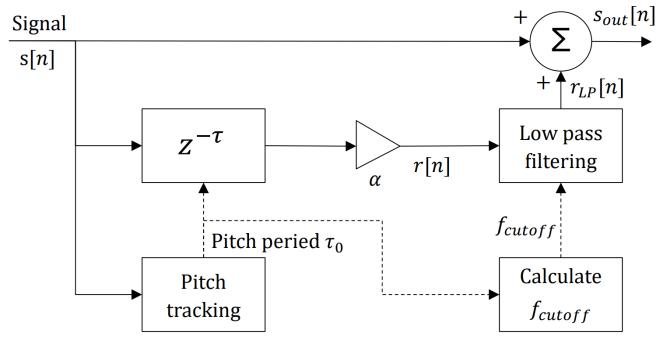
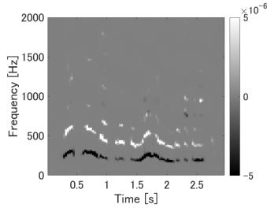
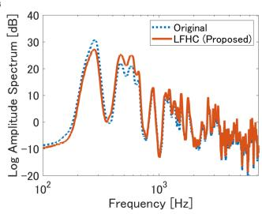
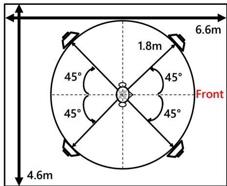
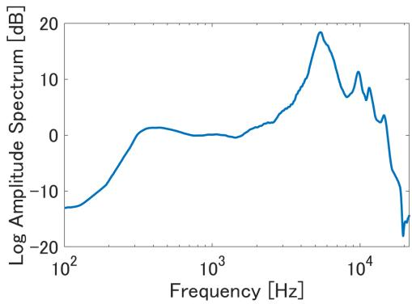
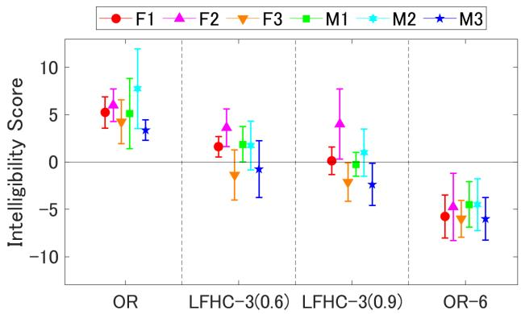
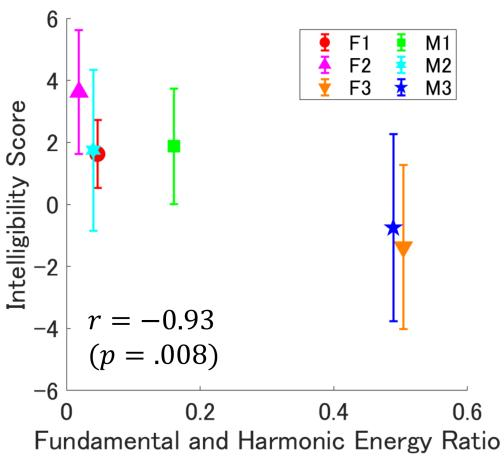

# LOW-FREQUENCY HARMONIC CONTROL FOR SPEECH INTELLIGIBILITY IN OPEN-EAR HEADPHONES

Yuki Watanabe Hironobu Chiba

Yutaka Kamamoto Tatsuya Kako

NTT Inc. Toyko, Japan

## ABSTRACT

This paper presents a low-complexity pitch enhancement method that adjusts the low-frequency harmonic structure of speech signals from open-ear headphones under noisy conditions. Our method suppresses the fundamental pitch and reinforces the second and third harmonics, reallocating energy into the bands less masked by low-frequency environmental noise and less constrained by the limited output of small loudspeaker units in open-ear headphones. The developed approach consists of a single-tap FIR comb filtering and low-pass weighting that confines emphasis up to the third harmonic. We assessed the intelligibility of processed speech items with weighting factors of 0.6 and 0.9 in a MUSHRAlike subjective evaluation under Brown noise at 69 dB SPL. At 0.6, our method increased intelligibility scores for three utterances while not reducing them for others. Our method enhances the intelligibility especially for speech items with a low ratio of low-order harmonics to the fundamental.

Index Terms— post-filter, harmonic-emphasis, lowcomplexity, intelligibility, open-ear headphones

## 1. INTRODUCTION

In recent years, wearable devices of various shapes have been put into practical use. Among them are open-ear headphones, which feature a design that does not occlude the ear canal, providing breathability and long-term comfort [1]. Due to this unoccluded design, open-ear headphones have relatively high acoustic transparency; in other words, real-world sounds can be heard clearly [2]. Furthermore, to achieve this unoccluded design, open-ear headphones often employ small speaker units. However, smaller speaker units result in poor output in the low-frequency range [3]. This is because the smaller the speaker unit, the higher its lowest resonant frequency, and consequently, the output in the frequency range below this resonance becomes smaller than that in the ranges above it. Therefore, when real-world noise is loud, the sound reproduced by open-ear headphones becomes difficult to hear, especially in the low-frequency range.

This section describes prior research aimed at improving the intelligibility of sound reproduced from headphones or loudspeakers in environments with high levels of real-world noise. Previous studies presented methods that consider auditory masking characteristics and emphasize the reproduced headphones or loudspeakers sound in frequency bands with high real-world noise, thereby preserving the timbre or intelligibility of desired sound even in noisy conditions [4, 5]. Here, auditory masking is the phenomenon in which the presence of one sound makes another sound less audible [6]. However, since open-ear headphones tend to have weak low-frequency output, simply emphasizing the low frequencies can cause distortion in the reproduced sound. Although methods have been developed for compensating for nonlinear distortion[7], their high computational complexity makes them relatively difficult to practically use in open-ear headphones. Therefore, a carefully designed method is required to emphasize sound. Furthermore, for the emphasis processing to be implemented on a digital signal processor (DSP) mounted within the small housing of open-ear headphones, or considering real-time applications such as web conferencing, the computation should preferably be lightweight.

To improve the sound quality of speech with low complexity, post-filtering is used in speech coding. For example, some methods improve perceptual sound quality by enhancing pitch in a fixed frequency band [8, 9, 10, 11, 12, 13]. Furthermore, Chiba et al. developed a post-filtering method in which the pitch enhancement band and gain vary for each processing frame depending on the pitch period and demonstrated that it effectively improve sound quality [14]. Such post-filtering can suppress or enhance specific frequency bands with low complexity. Thus, it can potentially be utilized for improving intelligibility in the scenarios envisioned in this research (e.g., phone calls in noisy environments) by controlling the low-frequency harmonic structure of speech.

Therefore, this paper presents a low-complexity method for controlling the low-frequency harmonic structure of speech to improve its intelligibility through open-ear headphones in noisy environments.

## 2. PRINCIPLES AND THEORIES

This section describes the pitch enhancement process, which is utilized in the post-filter of speech coding, based on the signal processing block diagram in Fig. 1. First, for the input signal $s [ n ]$ , the pitch period $\tau _ { 0 }$ is estimated on the basis of the autocorrelation calculated for each frame of several tens of milliseconds. This is because the pitch can be considered stationary over a short period. Subsequently, to enhance the pitch, a comb filter is applied using $\tau = \tau _ { 0 }$ . In the case of a finite impulse response (FIR) filter, the delayed signal r[n] is obtained as follows:

  
Fig. 1. Block diagram of pitch emphasis processing.

$$
r [ n ] = \alpha s [ n - \tau_ {0} ]\tag{1}
$$

where α is a weighting factor for the enhancement. α is a real number, and in practical signal processing, it is often used in the range $| \alpha | \le 1$ . For $0 < \alpha < 1$ , a larger value of α results in a greater degree of pitch enhancement. Next, to reduce the effect of the comb filter on higher-order harmonics, a lowpass filter is applied to the delayed signal to obtain $r _ { \mathrm { L P } } [ n ]$ . The final output signal is obtained by adding the original signal and the low-pass filtered delayed signal as follows:

$$
s _ {\mathrm{out}} [ n ] = s [ n ] + r _ {\mathrm{LP}} [ n ]\tag{2}
$$

This process enhances the fundamental frequency and its lower-order harmonics, while suppressing the frequencies between the harmonics.

## 3. LOW-FREQUENCY HARMONIC CONTROL

This study presents a method for controlling the low-frequency harmonic structure, which utilizes a part of the signal processing techniques described in Section 2. The fundamental principle of our proposed approach is to enhance intelligibility beyond simple volume amplification. This is achieved by suppressing energy that does not contribute to intelligibility while emphasizing the energy that does. Specifically, we apply a comb filter with a delay of $\tau = \tau _ { 0 } / x .$ , in Fig. 1, to suppress the fundamental frequency and emphasize its lowerorder harmonics. Here, x is a non-negative real number. When $x = 1$ , this method is equivalent to the conventional pitch enhancement technique described in Section 2. The primary reason for suppressing the fundamental frequency while emphasizing the lower-order harmonics is that enhancing the fundamental frequency is considered to contribute little to improving intelligibility. As detailed in Section 1, open-ear headphones have low output in the low-frequency range, where urban and bustling noises have large components. Therefore, even when emphasizing the fundamental frequency of speech reproduced by open-ear headphones, intelligibility is unlikely to be significantly improved due to auditory masking. For this reason, we decided to suppress the fundamental frequency and instead emphasize the lowfrequency harmonics, which are higher in frequency than the fundamental frequency. In addition, previous research [15] has indeed shown that emphasizing low-order harmonics may contribute to improving speech intelligibility.

  
Fig. 2. Example of difference between spectrograms before and after processing (left) and example of spectral envelope of speech obtained by this processing (right). The right side shows the results of analyzing the first 1s of the audio shown on the left.

In this study, to suppress the fundamental frequency and emphasize the second and third harmonics with low computational cost using a comb filter, we applied an FIR comb filter with a delay of $\tau = \tau _ { 0 } / 2 . 5$ . The emphasized harmonics were limited to the second and third to minimize their influence on the formant frequencies of the speech signal. In the comb filter that controls the low-frequency harmonic structure, the rationale for setting τ in this manner is based on two considerations. First, if τ were set close to $\tau _ { 0 } / 2$ , the nulls of the comb filter would align with the fundamental frequency and its odd-order harmonics, leading to them being suppressed. Second, if τ were set close to $\tau _ { 0 } / 3 .$ , the emphasis would be placed on the third harmonic, which tends to have less energy than the second harmonic due to the average spectral tilt of speech [16]. This was considered to contribute less to improving intelligibility. Furthermore, to mitigate the comb filter’s impact on frequency bands beyond the third harmonic, we applied a moving-average FIR low-pass filter with a cutoff frequency $F _ { C }$ set to five times the fundamental frequency to the delayed signal $r [ n ]$ , resulting in $r _ { L P } [ n ]$ . The filter length N of the low-pass filter was obtained by the approximation formula: $\begin{array} { r } { N \approx \frac { F _ { S } } { 2 F _ { C } } } \end{array}$ , where $F _ { S }$ is the sampling frequency. By taking into account the group delay of $\tau _ { g } = ( N - 1 ) / 2$ samples introduced by the low-pass filter, τ was actually set as:

$$
\tau = \frac {\tau_ {0}}{2 . 5} - \frac {N - 1}{2}\tag{3}
$$

Fig. 2 shows the spectral envelope of the audio signal processed by the method described above, along with the difference in the spectrograms before and after processing. In Fig. 2, the fundamental frequency is suppressed, while the second and third harmonics are emphasized. We refer to this processing as Low-Frequency Harmonic Control (LFHC).

Fig. 3. Experimental environment.  
  
Fig. 4. Headphone transfer function of the earphone used.

## 4. EXPERIMENT AND RESULTS

## 4.1. Assessment of the presented method

A subjective evaluation experiment was conducted to evaluate the intelligibility of the processed speech in a noisy environment. The experiment was conducted in a room with a reverberation time of approximately 0.1 s. The experimental setup is shown in Fig. 3. Noise simulating environmental noise was reproduced from loudspeakers placed in the room, and speech was reproduced from the open-ear headphones. Genelec 8030C was used for the loudspeakers. For the openear headphones, nwm wired, which is capable of a wired connection, was used. The headphone transfer function of nwm wired is shown in Fig. 4. The lowest resonant frequency of nwm wired was approximately 290 Hz.

In the experiment, the intelligibility of the speech was evaluated using a method similar to MUlti-Stimulus test with Hidden Reference and Anchor (MUSHRA)[17]. However, this study differed from a standard MUSHRA test in that the evaluation criterion was intelligibility, so the anchors were accordingly created to be sounds with low intelligibility, and there were fewer than 20 listeners. Six speech samples were used for the evaluation. These samples were selected from a dataset of 30 sentence pairs, comprising five distinct utterances from each of six talkers (three males and three females), with one utterance chosen per talker. Different talkers were selected because the relationship between the fundamental frequency $( f _ { o } )$ and its second and third harmonics, which was controlled in this study, was presumed to differ among talkers. For each talker, the selected utterance was the one with the lowest arithmetic mean of the energy ratio of the second harmonic to $f _ { o }$ and the energy ratio of the third harmonic to $f _ { o } .$ . This selection criterion was adopted because it was expected to more clearly reveal the effects of the proposed method, which suppresses $f _ { o }$ while emphasizing the second and third harmonics. The arithmetic mean was used to account for the harmonic with the greater intensity, whether it be the second or third. The pitch function (method: PEF) in MATLAB [18] was used to extract pitch. The utterances from the female talkers are denoted as F1, F2, and F3, and those from the male talkers as M1, M2, and M3. Assuming a web-meeting scenario, the sampling frequency of the speech was set to 16 kHz.

Table 1. Processing conditions and sound pressure level.

<table><tr><td>Name</td><td>Process</td><td>SPL[dB]</td></tr><tr><td>OR</td><td>Original Sound (Reference)</td><td>60</td></tr><tr><td>OR-3</td><td>-3 dB from OR&#x27;s SPL</td><td>57</td></tr><tr><td>OR-6</td><td>-6 dB from OR&#x27;s SPL</td><td>54</td></tr><tr><td>LFHC-3(0.6)</td><td>Suggested processing, α = 0.6</td><td>57</td></tr><tr><td>LFHC-3(0.9)</td><td>Suggested processing, α = 0.9</td><td>57</td></tr></table>

Table 1 shows the processing conditions applied to the speech signals under evaluation and their presentation sound pressure levels. Brown noise was presented from loudspeakers in the room. Brown noise was used because it has the same spectral tilt (−6 dB/oct.) as bustle noise measured in actual outdoor environments. Stationary colored noise was used to ensure that the influence of the noise was consistent when listeners were listening to each speech signal. The sound pressure level of the noise at the listening point was calibrated to 69 dB (the A-weighted sound pressure level was 60 dB(A)). The A-weighted sound pressure level of traffic and bustle noise in the outdoor environments assumed by the authors is approximately 65 to 80 dB(A) [19, 20]. Although the noise level presented in the experiment was lower than the real-world value, this was done to protect the hearing of the listeners. The speech under the OR-3 condition had an A-weighted level of 54 to 56 dB(A), resulting in a signal-tonoise ratio of approximately −5 dB(A) with the noise. This was set as a difficult to hear but realistic listening condition. The sampling frequency of the Brown noise used in the experiment was 48 kHz.

Eight well-trained listeners (five males and three females; mean age = 35.9, SD = 9.2) participated in the experiment.

  
Fig. 5. Results of the subjective evaluation experiment.

First, a training session was conducted under Brown noise reproduced by a loudspeaker in the room, using three speech samples from talkers not used in the evaluation. Speech signals with a sound pressure level of 60 dB at the listening point were used as the reference sound. For comparison, a total of four sounds were used: the reference sound and sounds for which only the sound pressure level of the reference sound was changed to 63, 57, and 54 dB. The listeners were instructed to score the evaluation target sound as 80 if they felt it was as intelligible as the reference sound, lower than 80 if it was less intelligible, and higher than 80 if it was more intelligible. They were also instructed to give a score of 70 to the sound they felt was the most difficult to hear among the four sounds (assuming the listeners selected the 54 dB sound). Sounds could be scored in the range of 0 to 100 on the response user interface (UI). After the training session, the intelligibility of the speech was evaluated under Brown noise reproduced by the loudspeakers using the same evaluation criteria as in the training. The display order of the processed speech on the response UI and the presentation order of the six types of speech were randomized among the listeners.

For the analysis, we used a value obtained by subtracting the evaluation score under the OR-3 condition from the score under each processing condition for each listener and each speech sample. This value is defined as the “Intelligibility Score.” A positive Intelligibility Score indicates that the speech is more intelligible than the unprocessed sound presented at 57 dB.

## 4.2. Subjective evaluation

The results of the subjective evaluation experiment are shown in Fig. 5, in which the points represent the arithmetic mean of the Intelligibility Score for each condition across listeners, and the error bars represent the 95% confidence interval of the Intelligibility Score for each condition. Fig. 5 shows that, compared to the unprocessed speech at the same sound pressure level, the speech with the proposed LFHC processing was significantly less intelligible for 2 out of 6 speech samples when $\alpha = 0 . 9$ and significantly more intelligible for 3 out of 6 speech samples when $\alpha = 0 . 6$

  
Fig. 6. Scatter plot of the energy ratio of low-order harmonics relative to the fundamental and the Intelligibility Score.

There are two possible reasons why the intelligibility of the speech processed with $\alpha = 0 . 9$ did not improve. One is that excessive suppression and enhancement resulted in a harmonic structure that degraded intelligibility. The other is that components of the signal caused by incorrect harmonic structure control due to pitch estimation errors were more prominent than in the case of $\alpha = 0 . 6$

Next, the dependency of the processing effect on the speech is considered. Fig. 6 shows a scatter plot of the arithmetic mean of the energy ratio of the second harmonic to the fundamental and the energy ratio of the third harmonic to the fundamental, versus the Intelligibility Score in the processing with $\alpha = 0 . 6$ , for the six speech samples used in the subjective evaluation experiment. The correlation coefficient was $- 0 . 9 3$ . From Fig. 6, the effect of the proposed processing was not apparent for audio signals in which the energy of the second and third harmonics relative to the fundamental was large before the processing was applied. Therefore, the dependency of the processing effect on the speech may possibly be reduced by applying the process in consideration of the energy ratio of the lower-order harmonics to the fundamental.

## 5. CONCLUSION

This paper described Low-Frequency Harmonic Control (LFHC), a simple method to improve the intelligibility of audio play back for open-ear headphones under noisy environments without amplifying volume. Specifically, our approach controls the low-frequency harmonic structure of the speech signal using a low-delay post-filter. To evaluate the presented method, we conducted subjective experiments to assess intelligibility. The results showed that LFHC with $\alpha = 0 . 6$ significantly improved the speech intelligibility for three out of six speech items from different talkers. Moreover, it did not degrade intelligibility for the other three speech items.

## 6. REFERENCES

[1] C. Hu, Q. Yang, Y. Liu, T. Roddiger, K. Butkow,¨ M. Ciliberto, A. L. Pullin, J. Stuchbury-Wass, M. Hassan, C. Mascolo, and D. Ma, “A survey of earable technology: Trends, tools, and the road ahead,” arXiv preprint arXiv:2506.05720, 2025.

[2] Y. Watanabe, H. Chiba, K. Noguchi, H. Itou, and T. Kako, “Effects of acoustic transparency of wearable audio devices on Audio AR,” in Proceedings of the 2025 CHI Conference on Human Factors in Computing Systems, Yokohama, Japan, 2025, CHI ’25.

[3] E. Larsen and R. M. Aarts, “Reproducing low-pitched signals through small loudspeakers,” Journal of the Audio Engineering Society, vol. 50, no. 3, pp. 147–164, 2002.

[4] J. Ram¨ o, V. V¨ alim¨ aki, and M. Tikander, “Percep-¨ tual headphone equalization for mitigation of ambient noise,” in 2013 IEEE International Conference on Acoustics, Speech and Signal Processing. IEEE, 2013, pp. 724–728.

[5] S. Cecchi, V. Bruschi, P. Peretti, and F. Bettarelli, “Realtime system for sound enhancement in noisy environment,” in Proceedings of the International Conference on Digital Audio Effects. DAFx, 2024, pp. 381–387.

[6] D. D. Greenwood, “Auditory masking and the critical band,” The Journal ofthe Acoustical Society ofAmerica, vol. 33, no. 4, pp. 484–502, 1961.

[7] W. Klippel, “Active compensation of transducer nonlinearities,” in Audio Engineering Society Conference: 23rd International Conference: Signal Processing in Audio Recording and Reproduction. Audio Engineering Society, 2003.

[8] ITU-T, “Recommendation G.718: Frame error robust narrow-band and wideband embedded variable bit-rate coding of speech and audio from 8-32 kbit/s,” International Telecommunication Union, June 2008.

[9] M. Jelinek and R. Salami, “Wideband speech coding advances in vmr-wb standard,” IEEE Transactions on Audio, Speech, and Language Processing, vol. 15, no. 4, pp. 1167–1179, 2007.

[10] 3GPP TS 26.441, “Codec for Enhanced Voice Services (EVS); General overview,” 2014.

[11] 3GPP TS 26.445, “Codec for Enhanced Voice Services (EVS); Detailed Algorithmic Description,” 2014.

[12] M. Dietz et al., “Overview of the EVS codec architecture,” in 2015 IEEE International Conference on

Acoustics, Speech and Signal Processing. IEEE, 2015, pp. 5698–5702.

[13] S. Bruhn et al., “Standardization of the new 3GPP EVS codec,” in 2015 IEEE International Conference on Acoustics, Speech and Signal Processing. IEEE, 2015, pp. 5703–5707.

[14] H. Chiba, Y. Kamamoto, T. Moriya, N. Harada, S. Miyabe, T. Yamada, and S. Makino, “Adaptive postfiltering controlled by pitch frequency for celp-based speech coder,” in 2014 48th Asilomar Conference on Signals, Systems and Computers. IEEE, 2014, pp. 838– 842.

[15] Y. Hu and P. C. Loizou, “Effects of introducing lowfrequency harmonics in the perception of vocoded telephone speech,” The Journal of the Acoustical Society of America, vol. 128, no. 3, pp. 1280–1289, 2010.

[16] B. Lindblom, R. Diehl, and C. Creeger, “Do ‘dominant frequencies’ explain the listener’s response to formant and spectrum shape variations?,” Speech Communication, vol. 51, no. 7, pp. 622–629, 2009.

[17] ITU-R, “Recommendation ITU-R BS.1534-3: Method for the subjective assessment of intermediate quality level of audio systems,” International Telecommunication Union, October 2015, [Online]. Available: https://www.itu.int/rec/R-REC-BS.1534-3-201510- I/en. [Accessed Sept. 8, 2025].

[18] Audio Toolbox documentation MATLAB Help Center, “pitch: Estimate fundamental frequency of audio signal,” MathWorks, [Online]. Available: https://jp.mathworks.com/help/audio/ref/pitch.html. [Accessed Sept. 8, 2025].

[19] S. Shu, P. Yang, and Y. Zhu, “Correlation of noise levels and particulate matter concentrations near two major freeways in los angeles, california,” Environmental Pollution, vol. 193, pp. 130–137, 2014.

[20] T. P. McAlexander, R. R. Gershon, and R. L. Neitzel, “Street-level noise in an urban setting: assessment and contribution to personal exposure,” Environmental Health, vol. 14, no. 1, pp. 18, 2015.