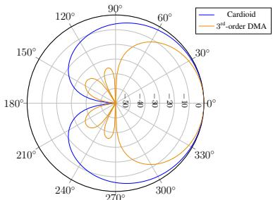
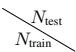
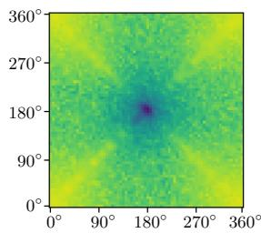
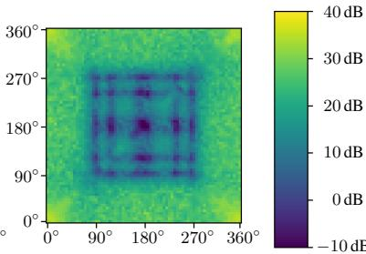
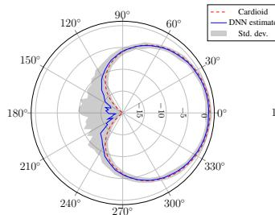
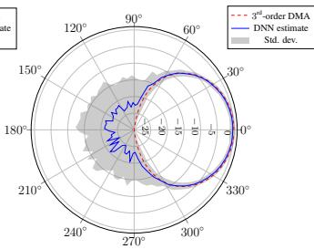

# NEURAL DIRECTIONAL FILTERING: FAR-FIELD DIRECTIVITY CONTROL WITH A SMALL MICROPHONE ARRAY

Julian Wechsler, Srikanth Raj Chetupalli, Mhd Modar Halimeh, Oliver Thiergart, Emanuel A. P. Habets¨

International Audio Laboratories Erlangen∗, Am Wolfsmantel 33, 91058 Erlangen, Germany

## ABSTRACT

Capturing audio signals with specific directivity patterns is essential in speech communication. This study presents a deep neural network (DNN)-based approach to directional filtering, alleviating the need for explicit signal models. More specifically, our proposed method uses a DNN to estimate a single-channel complex mask from the signals of a microphone array. This mask is then applied to a reference microphone to render a signal that exhibits a desired directivity pattern. We investigate the training dataset composition and its effect on the directivity realized by the DNN during inference. Using a relatively small DNN, the proposed method is found to approximate the desired directivity pattern closely. Additionally, it allows for the realization of higher-order directivity patterns using a small number of microphones, which is a difficult task for linear and parametric directional filtering.

Index Terms— Spatial filtering, directivity pattern, microphone array processing

## 1. INTRODUCTION

The ability to capture an acoustic scene in a spatially selective manner is a challenging and centric task in acoustic signal processing. This task is found in many applications, such as spatial sound capturing and reproduction [1, 2], speaker extraction [3, 4], and automatic spatial gain control [5].

Beamformers achieve spatial selectivity by linearly filtering multiple microphone signals [6]. These filters can be obtained, e.g., as a solution to a constrained optimization problem. Other works explored hybrid neural beamforming approaches where a conventional beamformer is supported by a DNN, e.g., [7]. To influence the resulting spatial selectivity, DNNs have been used to estimate filter vectors [8–10], some allowing for control over beamwidth and sharpness during training [10].

By relying on parametric sound field models, parametric directional filtering methods, e.g., [1, 11–13], estimate the directions-ofarrival (DOAs) of active sources and subsequently apply corresponding gains or spatial filters to achieve a desired spatial selectivity pattern. However, these methods are often hindered by challenging acoustic conditions that violate their sound field models [14].

Alternatively, multi-channel source separation and extraction methods approach spatial selectivity by adopting source-dependent selectivity patterns. Particularly interesting are methods that allow for side information to exert limited control over the resulting selectivity pattern. Some studies investigated the inclusion of the DOA of a target as supplementary information for DNNs, either for spatial source extraction [15–17] or for DNN-based source separation with a DOA- and distance-based loss [18, 19]. Other methods have explored defining spatial selectivity patterns as regions around the array wherein active sources are extracted. This includes angular regions with respect to the array [20–24], circular/spherical regions around the array [20, 23, 25], a combination of the two [20], or user-defined angular ranges from which to extract sources during inference [22]. Notable among these methods is the FT-JNF [4, 26–28], which utilizes DNN-estimated spatial-spectral filters to extract a single target speaker based on an input DOA.

Finally, other methods have been proposed to improve spatial selectivity using virtual microphones. They aim to estimate the signal of a virtual microphone at a spatial position where no physical microphone captures the sound field during inference, and then use the physical and virtual signals to achieve better spatial selectivity. These methods have progressed from interpolation-based methods to DNN-based methods [29–31]. Nonetheless, none of these methods investigate virtual microphones with different selectivity patterns.

However, existing methods for spatial selectivity often lack finegrained control over the resulting pattern and/or adopt a sourcedependent definition of the desired pattern. This renders applications such as spatial sound capturing and reproduction especially challenging, as deviations from the desired pattern can result in a distorted spatial image. While some techniques allow for adjustment of the beam width [10,22], it remains unclear whether a detailed control over the pattern can be achieved.

To investigate this question, this paper presents a preliminary study on the feasibility of employing DNNs for selectivity pattern learning, in particular focusing on time-invariant patterns. The contributions of this paper are: (i) formalizing the problem of learning a selectivity pattern; (ii) investigating the appropriate composition of training datasets; (iii) demonstrating that DNN-based pattern learning enables the realization of selectivity patterns with fewer microphones than classical signal processing.

## 2. PROBLEM FORMULATION

Consider a scenario in which a small Q-microphone array consisting of omnidirectional microphones captures an anechoic acoustic scene with N sound sources located in the far field of the array. Let $X _ { q , n } [ f , t ]$ be the n-th source signal at the q-th microphone in the short-time Fourier transform (STFT) domain, where f and t denote the frequency and time indices, respectively. The q-th microphone signal can be written as

$$
Y _ {q} [ f, t ] = \sum_ {n = 1} ^ {N} X _ {q, n} [ f, t ] + V _ {q} [ f, t ], q \in \{1, 2, \dots , Q \},\tag{1}
$$

where the sensor noise $V _ { q } [ f , t ]$ is uncorrelated across the microphones and $X _ { q , n } [ f , t ] = \dot { H _ { \mathbf { p } _ { q } , n } } \dot { [ f ] } X _ { n } [ f , t ]$ , where $H _ { \mathbf { p } _ { q } , n } [ f ]$ models the direct-path transfer function (DPTF) between the n-th source $X _ { n } [ f , t ]$ and the $q \cdot$ -th microphone at position $\mathbf { p } _ { q }$

We consider the task of directional filtering, where the goal is to capture the $N$ sources at a position pVDM with a specific directivity pattern $S [ \vartheta _ { n } , f ]$ , where $\vartheta _ { n }$ denotes the DOA of the n-th source with respect to pVDM. We refer to the target signal as the virtual directional microphone (VDM) signal $Z _ { \mathrm { V D M } } [ f , t ]$ expressed as

$$
Z _ {\mathrm{VDM}} [ f, t ] = \sum_ {n = 1} ^ {N} S [ \vartheta_ {n}, f ] H _ {\mathbf {p} _ {\mathrm{VDM}}, n} [ f ] X _ {n} [ f, t ].\tag{2}
$$

In the following, $S [ \vartheta , f ]$ is only a function of the azimuth $\vartheta$ as we restrict the formulation to a two-dimensional pattern learning for the sake of simplicity.

Parametric filtering approaches assuming a single-plane wave per time-frequency (c.f. [1]) estimate $Z _ { \mathrm { V D M } } [ f , t ]$ by first assigning each STFT bin with a DOA $\vartheta [ f , t ]$ and then scaling a reference microphone signal (here chosen to be the first microphone) with a direction-dependent real-valued gain $G [ f , t ] , \operatorname { i . e . }$

$$
\widehat {Z} _ {\mathrm{VDM}} [ f, t ] = G [ f, t ] Y _ {1} [ f, t ],\tag{3}
$$

where $G [ f , t ]$ is obtained by evaluating the desired directivity pattern $S [ \vartheta , f ]$ at the estimated $\mathrm { D O A } \ \vartheta [ f , t ]$ ]. The effectiveness of this method hinges on fulfilling the W-disjoint orthogonality assumption [14, 32], which is often violated for scenes containing multiple sources. In addition, the effectiveness depends on the accuracy of the DOA estimates used to compute the direction-dependent gain. In this work, we propose a data-driven approach wherein $Z _ { \mathrm { V D M } } [ f , t ]$ is estimated using a DNN.

## 3. PROPOSED METHOD

## 3.1. Architecture

We adopt the FT-JNF architecture, proposed in [27] to extract a single speaker from a particular direction, due to its similarity with our directional filtering task. In this architecture, the real and imaginary parts of the $Q$ microphones are stacked along the channel dimension and first fed to a bidirectional long short-term memory (LSTM) layer configured to model the spectro-spatial relationships in the input, whose output is then fed to a second LSTM layer configured to model the temporal relations. In this work, we focus on a frame-level causal scenario; therefore, the second LSTM is chosen to be unidirectional. Finally, the output of the second LSTM is fed to a linear layer with a hyperbolic Tangent activation function, which computes a complex-valued single-channel mask $\mathcal { M } [ f , t ]$ . The desired VDM signal is then estimated by applying the mask to the reference microphone signal,

$$
\widehat {Z} _ {\mathrm{VDM}} [ f, t ] = \mathcal {M} [ f, t ] Y _ {1} [ f, t ].\tag{4}
$$

## 3.2. Loss function

Let z and $z _ { \mathrm { V D M } }$ be the time-domain signals corresponding to the STFT representations $\widehat { Z } _ { \mathrm { V D M } } [ f , t ]$ and Z [f, t], respectively. We consider a distortion measure computed between zbVDM and zVDM as the loss function. The mask $\boldsymbol { \mathcal { M } } [ f , t ]$ depends on the DOAs of speakers, and it can have a high dynamic range. For example, the reference microphone signal $\bar { Y } _ { 1 } [ f , t ]$ needs to be attenuated significantly if all the speakers in the scene are positioned near the nulls in the directivity pattern. Such large attenuation requirements typically lead to a higher dynamic range for the computed gradients and cause instabilities during training. Hence, we choose the source-aggregated and regularized thresholded signal-to-distortion ratio (SDR) $( \mathbf { S } \mathbf { A } \mathbf { - } \varepsilon \mathbf { - } \mathbf { t } \mathbf { S } \mathbf { D } \mathbf { R } )$ [33] as the loss function, as it is welldefined for both perfect reconstruction and silence.

  
Fig. 1: Logarithmic polar plots of the DMA patterns considered in this study.

## 3.3. Training strategy and simulations

Our preliminary studies have shown that the learned directivity pattern depends on the number and placement of the speakers in the training dataset. We hypothesize that the training dataset must include multi-speaker acoustic scenes with speaker positions densely sampling the desired directivity pattern. Since the goal is to learn a far-field directivity pattern in free-field, we restrict the set of admissible speaker positions to a circle with a sufficiently large diameter $d _ { \mathrm { a c t i v i t y } }$ concentric and coplanar with the microphone array.

To simulate an acoustic scene with N speakers, we (i) randomly select N DOAs, (ii) simulate the DPTF $H _ { \mathbf { p } _ { q } , n }$ for all N speakers and $Q$ microphones using [34] with reflection order zero, and (iii) compute the receive microphone signals using (1). To generate the VDM signal, the source signals at the position of the VDM are further scaled using the desired direction-dependent gains prior to the summation, as in (2).

## 4. EXPERIMENTAL SETUP

## 4.1. Virtual microphone directivity patterns

In this study, two directivity patterns (or, equivalently, two VDMs) are investigated that could be implemented as differential microphone arrays (DMAs) in practice. Generally, the directivity pattern of a R-th order DMA steered towards $\vartheta _ { 0 }$ can be expressed as [35]

$$
S [ \vartheta , f ] = \sum_ {r = 0} ^ {R} a _ {r} \cos^ {r} (\vartheta - \vartheta_ {0}) \quad \forall f.\tag{5}
$$

The first directivity pattern considered in this study is a first-order cardioid pattern with parameters $a _ { 0 } ~ = ~ { \textstyle \frac { 1 } { 2 } } , a _ { 1 } ~ = ~ { \textstyle \frac { 1 } { 2 } }$ that could be realized as a circular DMA (CDMA) using three microphones [36]. The second directivity pattern considered in this study is a thirdorder pattern with parameters $\begin{array} { r } { a _ { 0 } = 0 , a _ { 1 } = \frac { 1 } { 6 } , a _ { 2 } = \frac { 1 } { 2 } , a _ { 3 } = \frac { 1 } { 3 } } \end{array}$ that could be realized as a CDMA using six microphones [36]. Polar plots of the respective patterns are depicted in Fig. 1.

Note that CDMAs can be steered into any direction in the plane $\vartheta \in [ 0 , 2 \pi ]$ . For comparability, we use $\vartheta _ { 0 } = 0$ for both patterns.

## 4.2. Array Geometry and Datasets

We used a $Q = 4$ microphone setup, with three microphones forming a uniform circular array (UCA) and an additional microphone $( q = 1 )$ at the array center. The diameter of the UCA was 3 cm, which corresponds to a spatial aliasing frequency of 11.4 kHz. The VDM was placed at the center microphone position, i.e., p = $\mathbf { p } _ { 1 }$

Table 1: SDR values [dB] of the reference microphone, baselines, and our proposed method based on FT-JNF [27] for the cardioid experiment. The best results per column are highlighted in boldface. The column “av.” gives the average per row.

<table><tr><td rowspan="2">cardioid</td><td rowspan="2"> $N_{\text{test}}$   $N_{\text{train}}$ </td><td colspan="7">Number of speakers during testing</td></tr><tr><td>1</td><td>2</td><td>3</td><td>4</td><td>5</td><td>6</td><td>av.</td></tr><tr><td>Reference Microphone</td><td></td><td>-1.8</td><td>-0.3</td><td>-0.2</td><td>0.0</td><td>0.1</td><td>0.0</td><td>-0.4</td></tr><tr><td>LS Beamformer [40]</td><td></td><td>6.3</td><td>10.9</td><td>12.0</td><td>12.5</td><td>12.7</td><td>12.8</td><td>11.2</td></tr><tr><td>Parametric Baseline [1]</td><td></td><td>27.7</td><td>18.7</td><td>15.5</td><td>14.0</td><td>12.9</td><td>12.0</td><td>16.8</td></tr><tr><td></td><td>1</td><td>32.2</td><td>13.5</td><td>10.0</td><td>8.8</td><td>8.1</td><td>7.6</td><td>13.4</td></tr><tr><td>FT-JNF [27]</td><td>2</td><td>32.2</td><td>27.9</td><td>25.1</td><td>23.8</td><td>23.0</td><td>22.3</td><td>25.7</td></tr><tr><td>given the max.</td><td>3</td><td>30.9</td><td>27.8</td><td>26.0</td><td>25.0</td><td>24.2</td><td>23.5</td><td>26.2</td></tr><tr><td>number of speakers</td><td>4</td><td>30.3</td><td>27.8</td><td>26.1</td><td>25.1</td><td>24.3</td><td>23.6</td><td>26.2</td></tr><tr><td>used for training</td><td>5</td><td>30.2</td><td>27.8</td><td>26.2</td><td>25.2</td><td>24.4</td><td>23.8</td><td>26.2</td></tr><tr><td></td><td>6</td><td>29.2</td><td>27.3</td><td>25.8</td><td>25.0</td><td>24.2</td><td>23.6</td><td>25.8</td></tr></table>

We simulated the acoustic scenes using the strategy described in Sec. 3.3. Apart from being coplanar and concentric with the UCA on a circle with diameter $d _ { \mathrm { a c t i v i t y } } = 3 \mathrm { m }$ , the admissible speaker positions were also restricted to $\dot { P } = 1 4 4$ equidistant DOAs. Directpath impulse responses (DPIRs) between the P source positions and the Q microphone positions were first simulated and stored. These simulated DPIRs were split into three position-disjoint subsets for training, testing, and validation as follows: $P _ { \mathrm { t r a i n i n g } } = 3 6$ with $\vartheta \in$ $\{ 0 ^ { \circ } , 1 \bar { 0 ^ { \circ } } , \dotsc , \bar { 3 } 5 0 ^ { \circ } \} ; P _ { \mathrm { v a l i d a t i o n } } = 3 6 \mathrm { w i t h } \vartheta \in \{ 5 ^ { \circ } , 1 5 ^ { \circ } , \dotsc , 3 5 5 ^ { \circ } \} ;$ $P _ { \mathrm { t e s t i n g } } = 7 2$ with $\bar { \vartheta ^ { \prime } } \in \{ 2 . 5 ^ { \circ } , 7 . 5 ^ { \circ } , \ldots , 3 5 7 . 5 ^ { \circ } \}$ }. For the VDM, we simulated the two patterns described in Sec. 4.1.

As a basis for our datasets, we used the LibriSpeech database [37]. Using the subsets ‘train-clean-360’ and ‘dev-clean’, we created training and validation sets with a maximum number of $N _ { { \mathrm { t r a i n } } } \in \{ 1 , 2 , { \bar { 3 } } , 4 , 5 , 6 \}$ concurrently active speakers by convolving segments of 4 seconds with the DPIRs described earlier at a minimum angular separation of 10 degrees. The number of speakers per sample is chosen uniformly at random. Using the subset ‘test-clean’, we created test sets with a fixed number of $N _ { { \mathrm { t e s t } } } \in \{ 1 , 2 , 3 , 4 , 5 , 6 \}$ speakers in the same way. All signals were normalized to have $[ - 3 3 , - 2 5 ]$ loudness units relative to full scale [38] after convolution with the room impulse response (RIR), similar to [39]. Samples from LibriSpeech shorter than 4 seconds were extended through zero-padding, with the padding randomly distributed between the beginning and the end of the signal. Each training, validation, and test set consists of 10′000, 3′000, and 3′000 samples, respectively.

For the microphones of the array, we also simulated microphone self-noise by adding spatio-temporal white Gaussian noise at a signal-to-noise ratio of 30 dB with respect to the mixture of all speakers. The target VDM signal remains noise-free.

## 4.3. Training details

For both target patterns, we trained a total of 6 models of the FT-JNF architecture [4] each with an increasing maximum number of speakers $N _ { \mathrm { t r a i n } }$ . All models were trained for 250 epochs with a batch size of 10 and a learning rate of 0.001. The final model was selected as the model instance whose validation loss (negative SDR) was the lowest over all epochs. As the number of parameters of the DNN only depends on the number of input channels but not on the number of speakers, all trained DNNs have 873K parameters. The STFT was calculated on signal frames of 32 ms using a √Hann window and 50 % overlap at a sampling frequency of 16 kHz. The threshold and ε values for the SA-ε-tSDR loss function were chosen to be 30 dB and $1 . 2 \cdot 1 0 ^ { - 7 }$ , respectively.

Table 2: SDR values [dB] of the reference microphone, baselines, and our proposed method based on FT-JNF [27] for the $3 ^ { \mathrm { r d } }$ -order DMA experiment. The best results per column are highlighted in boldface. The column “av.” gives the average per row.

<table><tr><td rowspan="2"> $3^{rd}$ -order DMA</td><td colspan="8">Number of speakers during testing</td></tr><tr><td></td><td>1</td><td>2</td><td>3</td><td>4</td><td>5</td><td>6</td><td>av.</td></tr><tr><td>Reference Microphone</td><td></td><td>-21.5</td><td>-15.8</td><td>-12.0</td><td>-9.7</td><td>-8.3</td><td>-7.6</td><td>-12.5</td></tr><tr><td>LS Beamformer [40]</td><td></td><td>-16.4</td><td>-9.0</td><td>-5.0</td><td>-2.7</td><td>-1.4</td><td>-0.7</td><td>-5.9</td></tr><tr><td>Parametric Baseline [1]</td><td></td><td>25.6</td><td>14.1</td><td>10.9</td><td>9.5</td><td>8.5</td><td>7.8</td><td>12.7</td></tr><tr><td></td><td>1</td><td>17.3</td><td>7.9</td><td>5.5</td><td>4.6</td><td>4.0</td><td>3.5</td><td>7.1</td></tr><tr><td>FT-JNF [27]</td><td>2</td><td>21.1</td><td>20.1</td><td>16.3</td><td>14.0</td><td>12.4</td><td>11.4</td><td>15.9</td></tr><tr><td>given the max.</td><td>3</td><td>18.3</td><td>19.2</td><td>18.9</td><td>17.8</td><td>16.5</td><td>15.2</td><td>17.7</td></tr><tr><td>number of speakers</td><td>4</td><td>18.8</td><td>19.4</td><td>19.3</td><td>18.6</td><td>17.6</td><td>16.5</td><td>18.3</td></tr><tr><td>used for training</td><td>5</td><td>18.6</td><td>19.5</td><td>19.3</td><td>18.6</td><td>17.7</td><td>16.7</td><td>18.4</td></tr><tr><td></td><td>6</td><td>17.4</td><td>19.2</td><td>19.3</td><td>18.8</td><td>17.9</td><td>17.0</td><td>18.2</td></tr></table>

## 5. PERFORMANCE EVALUATION

## 5.1. Performance metrics

As conventional directivity patterns cannot be obtained for singlechannel, signal-dependent masking approaches (such as the one proposed in this work), we rely on a proxy metric to quantify how well the desired pattern is approximated. To this end, we utilize a signal error-based measure. Specifically, we use the SDR between Z and $\widehat { Z } _ { \mathrm { V D M } }$ to quantify the distance between the desired signal/pattern and the obtained one. This includes calculating the SDR of the estimates as well as the SDR of the unprocessed omnidirectional reference microphone.

Furthermore, we visualize the output pattern as realized by the DNN. To plot the learned patterns, the estimated mask M is applied separately to the individual direct sounds of the source signals at the reference microphone $q = 1 , X _ { 1 , n }$ , and each masked signal is used to estimate the attenuation in the corresponding source’s direction.

Note, however, that the mask is not devised to extract single sources from the mixture. Further, this separate application of the mask is only possible for simulated data as the direct sound is unobservable in practice. Similarly to what is done in conventional spatial filtering (see, e.g., [41]), the estimate of the spatial pattern is realized as the square root of the power ratio before and after masking, i.e.,

$$
\widehat {S} \left[ \vartheta_ {n} \right] = \sum_ {f = 1} ^ {F} \sqrt {\frac {\frac {1}{T} \sum_ {t = 1} ^ {T} | \mathcal {M} [ f , t ] X _ {1 , n} [ f , t ] | ^ {2}}{\frac {1}{T} \sum_ {t = 1} ^ {T} | X _ {1 , n} [ f , t ] | ^ {2}}}.\tag{6}
$$

## 5.2. Performance analysis

Hereinafter, we analyze the performance of the proposed method in detail. We evaluate two baselines. First, we evaluate the performance of a parametric baseline [1]. For this baseline, single oracle DOAs per STFT bin are computed as a weighted average of the DOAs of active sources, based on their contribution to the power of the respective bin. This procedure mimics the behavior of a “real” DOA estimator. Then, gains according to the desired pattern(s) are applied to the STFT bins of the center microphone, cf. (3).

Secondly, we assessed the performance of a fixed, signalindependent least-squares (LS) beamformer [40] that was optimized individually for each of the two desired patterns at a minimum white noise gain of −15 dB.

We tested all methods on the test set(s) as described in Sec. 4.2 with (fixed) $N _ { { \mathrm { t e s t } } } \in \{ 1 , 2 , 3 , 4 , 5 , 6 \}$ concurrently active speakers. Table 1, summarizes the results of the cardioid experiment.

While the mean SDR of the reference microphone is close to 0 dB, meaning that the power of the difference between the cardioid target and the omnidirectional microphone is close to the power of the target signal itself, the SDRs clearly indicate that all methods can successfully realize the desired spatial selectivity1.

In Table 2, we summarize the results for the $3 ^ { \mathrm { r d } } .$ -order DMA experiment. While the SDR values of the reference microphone are generally lower, the findings of the cardioid experiment can be transferred to this experiment.

While the LS beamformer approximates the Cardioid pattern accurately, and the $3 ^ { \mathrm { r d } }$ -order DMA pattern coarsely, its performance is mostly limited by the strong influence of the white noise.While, for the cardioid target, positive SDR values are achieved, it falls short of all other tested methods in the mean. Further, the LS beamformer cannot approximate the $3 ^ { \mathrm { r d } }$ -order DMA pattern well, reflected in negative SDR values of the estimate.

The parametric baseline has a very strong performance when testing with one active speaker only. For the $\dot { 3 } ^ { \mathrm { r d } }$ -order DMA experiment, it even outperforms all other methods for this test case, achieving an SDR of 25.6 dB. However, the performance drops significantly when testing with two or more speakers. While this could be improved by considering the multi-wave model in [13], the performance remains limited by the accuracy of the estimated number of active sound sources and their DOAs.

Training FT-JNF [27] with the proposed method works successfully and widely outperforms both baselines with the exception noted earlier and when comparing models trained on a single speaker against the baselines. This means, training on the dataset with a single active speaker is not sufficient to fully learn the directivity. While FT-JNF trained on one speaker shows very good performance on testing with one speaker (SDRs of 32.2 dB and 17.3 dB for cardioid and $3 ^ { \mathrm { r d } }$ -order DMA, respectively), the DNN does not generalize to the case of two or more concurrently active speakers, the SDR performance drops significantly.

In the scope of our experiments, we find that DNNs trained on two or more concurrently active speakers generalize to scenarios with up to six speakers. Importantly, training with more than three speakers does not further improve the results significantly. Based on the mean performance of testing with one to six speakers, we chose FT-JNF trained on mixtures of at most five speakers as our best model, exhibiting a mean SDR of 26.2 dB for the cardioid experiment and a mean SDR of 18.4 dB for the $3 ^ { \mathrm { r d } }$ -order DMA experiment.

For this best model, we further investigate the distribution of SDRs over the angular range when testing with two speakers. In Fig. 2, we illustrate these distributions. It is found that the best SDR performance is achieved when both sources are placed close to the VDM’s look direction $\vartheta _ { 0 } = 0 ^ { \circ } / 3 6 0 ^ { \circ }$ . There, the omnidirectional microphone is already a good approximation to the target VDMs.

In contrast, the SDR is notably diminished when both sources are close to the VDM’s spatial null, i.e., 180◦ for the cardioid (cf. middle point of Fig. 2a) and 90◦, 120◦, 180◦, 240◦, 270◦ for the $3 ^ { \mathrm { r d } } .$ order DMA (cf. horizontal and vertical lines towards the center of Fig. 2b). This is because the DNN needs to strongly process the signals as received by the omnidirectional microphone to approximate the signal of the VDM. Note that the low SDR values there are not only impacted by the models’ performance but also by the generally badly conditioned SDR for low-power signals and noise-free targets. We encourage the reader to listen to the audio examples on the website1, as, perceptually, the signals are well suppressed.

  
(a)

  
(b)

Fig. 2: Distributions of SDR values when testing the best model for (a) the cardioid target and (b) the $3 ^ { \mathrm { r d } }$ -order DMA target. The models were tested with two concurrently active sources. Their DOAs are given on the axes, SDRs for missing DOA combinations were interpolated using cubic interpolation.  

  
(a) Estimate of the cardioid.  
(b) Estimate of the $3 ^ { \mathrm { r d } }$ -order DMA.  
Fig. 3: Polar plot of the two VDM targets and their corresponding DNN estimate. The gray area illustrates the standard deviation.

We reason that the spatial one and the spatial null(s) are the edge cases of the task. Other combinations of DOAs exhibit a performance that is found to be rather constant.

Finally, again for the best models and testing with two concurrent sources, we compute the patterns as realized by the DNN according to (6) and illustrate the results in Figs. 3a and 3b. The plots are given in logarithmic representation alongside the VDM’s target patterns. Note that the radial axes are scaled differently between the plots in this paper to match the dynamic range of the depicted patterns. For the cardioid, the DNN estimate follows the target pattern with minimal deviations and small standard deviation for gain values of up to

−7.5 dB, for the $3 ^ { \mathrm { r d } } .$ -order DMA up to −15 dB. For higher attenuation values, the deviations increase. Still, the spatial null is within one standard deviation from the mean. The left semi-circle of the $3 ^ { \mathrm { r d } }$ -order DMA estimate is attenuated with around −22.5 dB. The lobes as seen in Fig. 1 are below this level.

## 6. CONCLUSION

We employed a DNN-based method to process signals from a small array of omnidirectional microphones, approximating the pattern of a VDM through implicit learning from data. This approach utilizes a recently proposed small, causal DNN. Our findings demonstrate that this method surpasses traditional parametric and beamforming strategies. Notably, we observe significant enhancements in signal quality for both VDM training targets. Further, we provided insights into the impact of training dataset composition on the performance of the DNN. Our study highlights the potential of neural directional filtering for far-field directivity control. Future work includes exploring steerable and arbitrary patterns, assessing the performance in near-field and reverberant scenarios, testing on measured data, extending the method to elevated sources, and investigating the placement of the VDM.

## 7. REFERENCES

[1] K. Kowalczyk, O. Thiergart, M. Taseska, G. Del Galdo, V. Pulkki, and E. A. P. Habets, “Parametric spatial sound processing: A flexible and efficient solution to sound scene acquisition, modification, and reproduction,” IEEE Sig. Proc. Magazine, vol. 32, no. 2, pp. 31–42, 2015.

[2] O. Thiergart, G. Milano, T. Ascherl, and E. Habets, “Robust 3D Sound Capturing with Planar Microphone Arrays Using Directional Audio Coding,” in Audio Engineering Society Convention 143, Oct 2017.

[3] M. Elminshawi, S. Raj Chetupalli, and E. A. P. Habets, “Beamformer-guided target speaker extraction,” in Proc. IEEE Intl. Conf. on Ac., Sp. and Sig. Proc. (ICASSP), 2023.

[4] K. Tesch and T. Gerkmann, “Nonlinear spatial filtering in multichannel speech enhancement,” IEEE/ACM Trans. Aud., Sp., Lang. Proc., vol. 29, pp. 1795–1805, 2021.

[5] S. Braun, O. Thiergart, and E. A. P. Habets, “Automatic spatial gain control for an informed spatial filter,” in Proc. IEEE Intl. Conf. on Ac., Sp. and Sig. Proc. (ICASSP), 2014, pp. 830–834.

[6] J. Benesty, J. Chen, and Y. Huang, Microphone Array Signal Processing, Springer, 2009.

[7] Z. Zhang, Y. Xu, M. Yu, S. Zhang, L. Chen, and D. Yu, “ADL-MVDR: All deep learning mvdr beamformer for target speech separation,” in Proc. IEEE Intl. Conf. on Ac., Sp. and Sig. Proc. (ICASSP), 2021, pp. 6089–6093.

[8] Y. Kuno, B. Masiero, and N. Madhu, “A neural network approach to broadband beamforming,” in Proc. ICA, 2019.

[9] X. Xiao et al., “Deep beamforming networks for multi-channel speech recognition,” in Proc. IEEE Intl. Conf. on Ac., Sp. and Sig. Proc. (ICASSP), 2016, pp. 5745–5749.

[10] A. Kovalyov, K. Patel, and I. Panahi, “DSENet: Directional signal extraction network for hearing improvement on edge devices,” IEEE Access, vol. 11, pp. 4350–4358, 2023.

[11] V. Pulkki, “Spatial sound reproduction with directional audio coding,” J. Audio Eng. Soc, vol. 55, no. 6, pp. 503–516, 2007.

[12] M. Kallinger, G. Del Galdo, F. Kuech, D. Mahne, and R. Schultz-Amling, “Spatial filtering using directional audio coding parameters,” in Proc. IEEE Intl. Conf. on Ac., Sp. and Sig. Proc. (ICASSP), Taipei, Taiwan, April 2009, pp. 217–220.

[13] O. Thiergart, M. Taseska, and E. A. P. Habets, “An informed parametric spatial filter based on instantaneous direction-ofarrival estimates,” IEEE/ACM Trans. Aud., Sp., Lang. Proc., vol. 22, no. 12, pp. 2182–2196, 2014.

[14] O. Thiergart and E. A. P. Habets, “Sound field model violations in parametric spatial sound processing,” in Proc. Intl. W. Ac. Sig. Enh. (IWAENC), 2012.

[15] R. Gu, S.-X. Zhang, Y. Zou, and D. Yu, “Towards unified all-neural beamforming for time and frequency domain speech separation,” IEEE/ACM Trans. Aud., Sp., Lang. Proc., vol. 31, pp. 849–862, 2023.

[16] Z. Chen, X. Xiao, T. Yoshioka, H. Erdogan, J. Li, and Y. Gong, “Multi-channel overlapped speech recognition with location guided speech extraction network,” in Proc. IEEE Spoken Lang. Technol. Workshop (SLT), 2018, pp. 558–d565.

[17] R. Gu, S.-X. Zhang, Y. Zou, and D. Yu, “Complex neural spatial filter: Enhancing multi-channel target speech separation in complex domain,” IEEE Sig. Proc. Lett., vol. 28, pp. 1370– 1374, 2021.

[18] H. Taherian, K. Tan, and D. Wang, “Location-based training for multi-channel talker-independent speaker separation,” in Proc. IEEE Intl. Conf. on Ac., Sp. and Sig. Proc. (ICASSP), 2022, pp. 696–700.

[19] H. Taherian, K. Tan, and D. Wang, “Multi-channel talkerindependent speaker separation through location-based training,” IEEE/ACM Trans. Aud., Sp., Lang. Proc., vol. 30, pp. 2791–2800, 2022.

[20] R. Gu and Y. Luo, “ReZero: Region-Customizable Sound Extraction,” IEEE/ACM Trans. Aud., Sp., Lang. Proc., vol. 32, pp. 2576–2589, 2024.

[21] T. Jenrungrot, V. Jayaram, S. Seitz, and I. Kemelmacher-Shlizerman, “The cone of silence: Speech separation by localization,” in Proc. Advances in Neural Information Processing Systems (NeurIPS), 2020, vol. 33, pp. 20925–20938.

[22] M. Yu and D. Yu, “Deep audio zooming: Beamwidth-controllable neural beamformer,” in arXiv: doi.org/10.48550/arXiv.2311.13075, 2023.

[23] D. Markovic, A. Defossez, and A. Richard, “Implicit neural spatial filtering for multichannel source separation in the waveform domain,” in Proc. Interspeech, 2022, pp. 1806–1810.

[24] A. Xu and R. R. Choudhury, “Learning to separate voices by spatial regions,” in Proc. Intl. Conf. on Machine Learning, 2022, vol. 162, pp. 24539–24549.

[25] K. Patterson, K. Wilson, S. Wisdom, and J. R. Hershey, “Distance-based sound separation,” in Proc. Interspeech, 2022, pp. 901–905.

[26] K. Tesch and T. Gerkmann, “Spatially selective deep nonlinear filters for speaker extraction,” in Proc. IEEE Intl. Conf. on Ac., Sp. and Sig. Proc. (ICASSP), 2023.

[27] K. Tesch and T. Gerkmann, “Insights into deep nonlinear filters for improved multi-channel speech enhancement,” IEEE/ACM Trans. Aud., Sp., Lang. Proc., vol. 31, pp. 563–575, 2023.

[28] K. Tesch and T. Gerkmann, “Multi-channel speech separation using spatially selective deep non-linear filters,” IEEE/ACM Trans. Aud., Sp., Lang. Proc., vol. 32, pp. 542–553, 2024.

[29] H. Katahira, N. Ono, S. Miyabe, T. Yamada, and S. Makino, “Nonlinear speech enhancement by virtual increase of channels and maximum SNR beamformer,” EURASIP J. on Advances in Sig. Processing, vol. 11, 2016.

[30] T. Ochiai, M. Delcroix, T. Nakatani, R. Ikeshita, K. Kinoshita, and S. Araki, “Neural network-based virtual microphone estimator,” in Proc. IEEE Intl. Conf. on Ac., Sp. and Sig. Proc. (ICASSP), 2021, pp. 6114–6118.

[31] H. Segawa et al., “Neural network-based virtual microphone estimation with virtual microphone and beamformerlevel multi-task loss,” in Proc. IEEE Intl. Conf. on Ac., Sp. and Sig. Proc. (ICASSP), 2024, pp. 11021–11025.

[32] S. Rickard and O. Yilmaz, “On the approximate W-disjoint orthogonality of speech,” in Proc. IEEE Intl. Conf. on Ac., Sp. and Sig. Proc. (ICASSP), 2002, pp. I–529–I–532.

[33] T. von Neumann, K. Kinoshita, C. Boeddeker, M. Delcroix, and R. Haeb-Umbach, “SA-SDR: A novel loss function for separation of meeting style data,” in Proc. IEEE Intl. Conf. on Ac., Sp. and Sig. Proc. (ICASSP), 2022, pp. 6022–6026.

[34] E. A. P. Habets, “RIR generator,” GitHub repository, 2020, https://github.com/ehabets/RIR-Generator, commit 3cf914d.

[35] G. W. Elko, “Differential microphone arrays,” in Audio Signal Processing for Next-Generation Multimedia Communication Systems, Y. Huang and J. Benesty, Eds., pp. 11–65. Springer US, Boston, MA, 2004.

[36] J. Benesty, J. Chen, and I. Cohen, Design of Circular Differential Microphone Arrays, vol. 12 of Springer Topics in Sig. Proc., Springer International Publishing, Switzerland, 2015.

[37] V. Panayotov, G. Chen, D. Povey, and S. Khudanpur, “Librispeech: An ASR corpus based on public domain audio books,” in Proc. IEEE Intl. Conf. on Ac., Sp. and Sig. Proc. (ICASSP), 2015, pp. 5206–5210.

[38] ITU-R, “Recommendation ITU-R BS.1770-5: Algorithms to measure audio programme loudness and true-peak audio level,” 2023.

[39] J. Cosentino, M. Pariente, S. Cornell, A. Deleforge, and E. Vincent, “LibriMix: An open-source dataset for generalizable speech separation,” 2020.

[40] E. Rasumow et al., “Regularization approaches for synthesizing HRTF directivity patterns,” IEEE/ACM Trans. Aud., Sp., Lang. Proc., vol. 24, no. 2, pp. 215–225, 2016.

[41] J. Benesty, G. Huang, J. Chen, and N. Pan, Microphone Arrays, vol. 22 of Springer Topics in Sig. Proc., Springer, Cham, 2023.