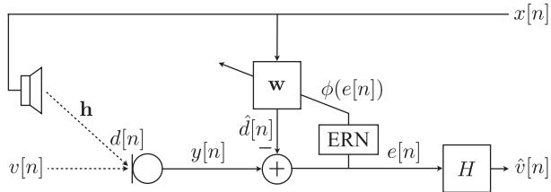
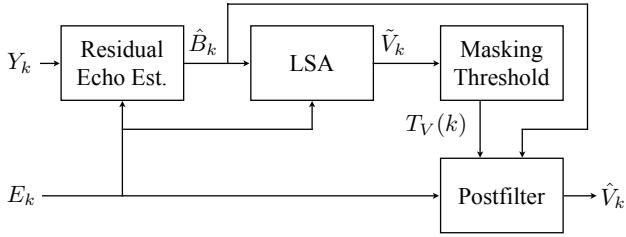
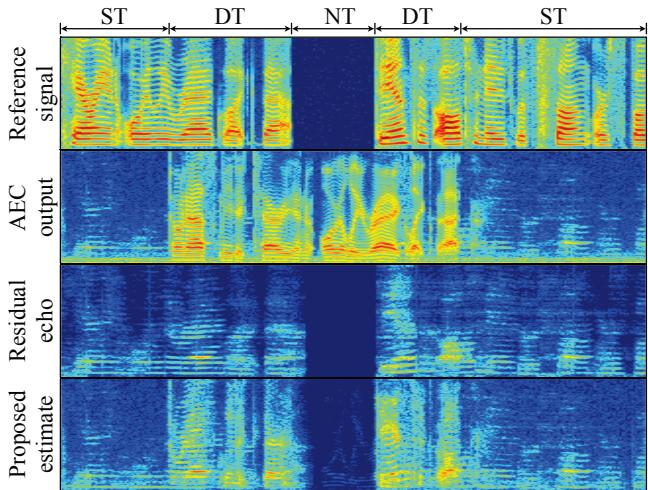
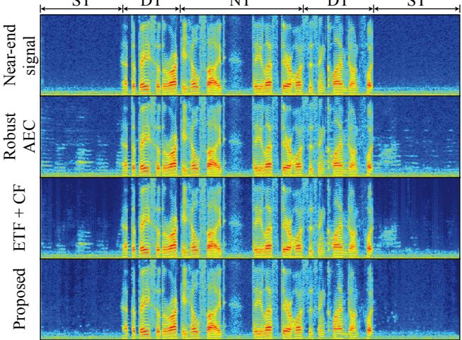
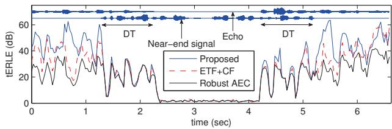

# A SYSTEM APPROACH TO RESIDUAL ECHO SUPPRESSION IN ROBUST HANDS-FREE TELECONFERENCING

Jason Wung, Ted S. Wada, and Biing-Hwang (Fred) Juang

Center for Signal and Image Processing, Georgia Institute of Technology 75 Fifth Street NW, Atlanta, GA 30308, USA jason.wung, twada, juang @ece.gatech.edu

## ABSTRACT

This paper presents a system approach to the residual echo suppression (RES) problem in a noisy acoustic environment. We propose a method that takes advantage of our existing robust acoustic echo cancellation system in order to obtain a residual echo estimate that closely resembles the true, noise-free residual echo. To achieve improved RES during strong near-end interference (e.g., double talk), a psychoacoustic postfilter is also used. The simulation results show that our RES based on the system approach outperforms a conventional estimation method. Comparing the postfiltered output to the unprocessed one indicates that our proposed RES approach can raise the PESQ score by more than half a point.

Index Terms acoustic echo cancellation, residual echo estimation, residual echo suppression, postfiltering, speech enhancement

## 1. INTRODUCTION

Recently we have proposed a new generation of acoustic echo cancellation (AEC) [1] based on an integrated system approach without assuming idealized performances of other traditional system components such as double-talk detectors (DTDs) or voice activity detectors. Our system uses error recovery nonlinearity (ERN) and batch adaptation, which allows the adaptive filter to update continuously even during double talk without the use of a DTD. This robust AEC setup warrants a new perspective for the problem of residual echo suppression (RES). Due to natural mismatches between the room impulse response and the adaptive filter, the actual echo cannot be cancelled perfectly by the AEC echo estimate. To ensure high-quality telephony, the remaining echo must be further suppressed by RES, which requires a residual echo estimate. However, the residual echo is often corrupted by noise, e.g., near-end speech, and can be difficult to estimate accurately.

We propose in this paper a new residual echo estimation method that exploits the nonlinearly estimated echo by a log-spectral amplitude (LSA) estimator [2] and the linearly estimated echo by an adaptive filter of the AEC. The procedure results in a very close representation of the noise-free residual echo. Echo cancellation and echo suppression are two distinct processes, where echo cancellation subtracts the estimated echo samples from the microphone signal. It usually introduces much less distortion compared to echo suppression, which attenuates the signal amplitude. Traditional RES tech-

Bowon Lee, Ton Kalker, and Ronald W. Schafer

Hewlett-Packard Laboratories 1501 Page Mill Road Palo Alto, CA 94304, USA bowon.lee, ton.kalker, ron.schafer @hp.com

  
Fig. 1. An AEC system with an adaptive filter w, error recovery nonlinearity, and a postfilter H.

niques based on frequency-domain Wiener filtering are sensitive to the accuracy of estimated signal-to-noise ratio (SNR) and may introduce near-end speech distortion or musical noise [3]. RES ideally should produce minimal distortion of the near-end signal during both single talk and double talk. Towards this end a psychoacoustic postfilter [4] is used in this paper to suppress the residual echo as much as possible without introducing audible distortion to the near-end speech. The overall goal is to achieve a system combination of individually designed components that together facilitate for improved performance of the AEC system as a whole.

## 2 ROBUST ACOUSTIC ECHO CANCELLATION AND PSYCHOACOUSTIC POSTFILTER

## 2 1 Robust acoustic echo cancellation

A single-channel AEC system is illustrated in Figure 1. Let y be the near-end microphone signal, which consists of the near-end noise or speech v mixed with the acoustic echo $d = \mathbf { h } ^ { \mathrm { T } } \mathbf { x } .$ , where h is the room impulse response vector (a truncated version of the actual impulse response), and x is the far-end reference signal vector. The adaptive filter coefficients w model the room impulse response, and the filtered output $\hat { d } = \mathbf { w } ^ { \mathrm { T } } \mathbf { x }$ approximates the echo d. The observed estimation error e of the AEC is given by

$$
\begin{array}{r} e [ n ] = v [ n ] + d [ n ] - \hat {d} [ n ] \\ = v [ n ] + b [ n ], \end{array}
$$

where b is the true error (residual echo) that comes from the misalignment between the room impulse response and the adaptive filter coefficients, $i . e . , ( \mathbf { h } ^ { \mathrm { { T } } } - \mathbf { w } ^ { \mathrm { { T } } } ) \mathbf { \bar { x } } . \mathbf { B y } \mathbf { \Lambda } ^ { * } \mathbf { \hat { t r u e } } ^ { , , }$ we mean a noise-free quantity, $i . e . , v = 0 $ . However, strong v during double talk, for example, may corrupt the estimation error and cause the adaptive filter to diverge. The ERN reduces such a disturbance remaining in the estimation error and enables the linear adaptive filter to better estimate the linear part of the system response [1], where batch adaptation (or data reuse) enables the recovery of lost convergence speed due to the aggressive step-size control. A postfilter H further suppresses the residual echo before sending out the near-end signal estimate.

## 2 2 Psychoacoustic postfilter

Based on the additive noise model $e = v + b ,$ , an LSA estimator is often used for RES to estimate v. A spectral gain $G _ { \mathrm { L S A } } ( k )$ at the $k ^ { \mathrm { t h } }$ frequency bin is applied to the noisy spectral component $E _ { k }$ to obtain the noise-free spectral estimate $\tilde { V } _ { k }$ $i . e . , \tilde { V } _ { k } = \mathsf { \tilde { G } _ { L S A } } ( k ) E _ { k }$ The LSA gain is given by [2]

$$
G _ {\mathrm{LSA}} (k) = \frac {\xi_ {k}}{1 + \xi_ {k}} \mathrm{exp} \biggl (\frac {1}{2} \int_ {\nu_ {k}} ^ {\infty} \frac {e ^ {- t}}{t} \mathrm{d} t \biggr),\tag{1}
$$

where $\nu _ { k }$ is defined as

$$
\nu_ {k} \equiv \frac {\xi_ {k}}{1 + \xi_ {k}} \gamma_ {k}.
$$

The a priori SNR $\xi _ { k }$ and the a posteriori SNR $\gamma _ { k }$ are defined as

$$
\begin{array}{l} \xi_ {k} \equiv \lambda_ {V} (k) / \lambda_ {B} (k), \\ \gamma_ {k} \equiv | E _ {k} | ^ {2} / \lambda_ {B} (k), \end{array}
$$

where $\lambda _ { V } ( k ) \equiv \mathcal { E } \{ | V _ { k } | ^ { 2 } \}$ and $\lambda _ { B } ( k ) \equiv \mathcal { E } \{ | B _ { k } | ^ { 2 } \}$ denote the variances of the near-end signal and the residual echo, respectively, and $\mathcal { E } \{ \cdot \}$ is the expectation operator. $\xi _ { k }$ is usually estimated using the decision-directed (DD) estimator [5]

$$
\hat {\xi} _ {k} ^ {\mathrm{DD}} (m) = \alpha \frac {| \tilde {V} _ {k} (m - 1) | ^ {2}}{\lambda_ {B} (k , m - 1)} + (1 - \alpha) \max \{0, \gamma_ {k} (m) - 1 \},\tag{2}
$$

where m is the frame index, and $\alpha \in [ 0 , 1 ]$ is a weighting factor. Therefore, using the LSA estimator with the DD a priori SNR estimator requires a residual echo variance estimate $\hat { \lambda } _ { B } ( k )$ , which is one of the most critical parts that influence the RES performance. Given a residual echo variance estimate, we can express the LSA filter as a nonlinear function

$$
\tilde {V} = f _ {\mathrm{LSA}} \{E, \hat {\lambda} _ {B} \}.
$$

Due to the suppressive nature of the LSA gain, $i . e . , G _ { \mathrm { L S A } } ( k ) \in$ [0, 1], the near-end signal can potentially be distorted when the residual echo magnitude is attenuated too much. However, during periods of high background noise levels or double talk, less suppression is required since the residual echo will be masked by the near-end signal [4, 6]. By incorporating this frequency masking property, the psychoacoustic postfilter is derived as follows. Generally, the near-end signal is estimated in the frequency domain as

$$
\hat {V} _ {k} = H _ {k} E _ {k} = H _ {k} \left[ V _ {k} + B _ {k} \right].
$$

Assuming that the near-end signal and the residual echo are statistically uncorrelated, the overall distortion of the near-end signal can be written as

$$
\mathcal {E} \{| V _ {k} - \hat {V} _ {k} | ^ {2} \} = (1 - H _ {k}) ^ {2} \mathcal {E} \{| V _ {k} | ^ {2} \} + H _ {k} ^ {2} \mathcal {E} \{| B _ {k} | ^ {2} \},
$$

where the second term represents the distortion of the residual echo. To minimally impact the near-end speech, a minimum level of suppression is chosen such that the residual echo distortion equals the masking threshold $T _ { V } ( k )$ of the near-end signal. The psychoacoustic postfilter gain is given by [4]

  
Fig. 2. A block diagram of the psychoacoustic postfilter.

$$
H _ {k} = \min \left\{1, \sqrt {\frac {T _ {V} (k)}{\lambda_ {B} (k)}} \right\}.\tag{3}
$$

Therefore, if the residual echo is already masked by the near-end signal, i.e., $T _ { V } ( k ) > \lambda _ { B } ( k )$ , the psychoacoustic postfilter gain will be set to 1, and the near-end signal will be undistorted.

A block diagram of the psychoacoustic postfilter is shown in Figure 2. The operation of the postfilter is as follows [4]:

Obtain a residual echo estimate $\hat { B } _ { k }$

Apply the LSA gain (1) to $E _ { k }$ by using $\hat { B } _ { k }$ to obtain a rough estimate of the near-end signal $\tilde { \bar { V _ { k } } }$

Calculate the masking threshold $T _ { V } ( k )$ by using $\tilde { V } _ { k } .$

Calculate the postfilter gain based on (3) and apply it to $E _ { k }$ to obtain a better near-end signal estimate $\hat { V } _ { k }$

Since both the near-end signal and the residual echo are unknown, the problem of obtaining an accurate residual echo estimate remains.

## 3. RESIDUAL ECHO ESTIMATION METHOD

The near-end microphone signal is modeled as

$$
y [ n ] = d [ n ] + v [ n ],
$$

which contains the true echo d and the near-end signal v. We first estimate d by treating v as an additive noise to be removed from y by LSA filtering, i.e., $\tilde { D ^ { = } } = f _ { \mathrm { L S A } } \{ Y , \lambda _ { V } \}$ . The instantaneous estimate of $\lambda _ { V } ( k )$ is obtained from the output of the robust AEC, $i . e . , e = v + b ,$ as we assume e v after the convergence of the adaptive filter, or at least $\left| E _ { k } \right| \approx \left| V _ { k } \right|$ due to the sparsity of a speech signal in the frequency domain. By applying the LSA filter to $Y _ { k } , ~ D _ { k }$ will be emphasized whereas $\dot { V _ { k } }$ will be suppressed. Finally, the difference between the nonlinear echo estimate provided by the LSA filter and the linear echo estimate provided by the AEC closely represents the true residual echo:

$$
\hat {b} [ n ] = \tilde {d} [ n ] - \hat {d} [ n ].
$$

That is, nonlinear processing by the LSA filter should not alter the residual echo contained in $d = b + { \hat { d } } $ since b simply represents any remaining part of d that cannot be cancelled linearly by adaptive filtering. Other interpretations are as follows.

The basic assumption is that due to the noise-robustness of a combination of AEC and ERN, the signal power $\lambda _ { B }$ is small compared to $\lambda _ { D }$ during single talk or $\lambda _ { V }$ during double talk after the adaptive filter has converged. Assuming that v contains speech only and is free from the background noise, analysis of the LSA filtering can be categorized into the three cases below:

  
Fig. 3. Spectrograms comparing the proposed residual echo estimate to the true residual echo.

Near-end talk (NT): $D _ { k } = 0$ , and only the near-end signal is active, $\overline { { i . e . , Y _ { k } = E _ { k } } } = V _ { k }$ . The LSA filter will suppress all near-end signals and $\tilde { D } _ { k }$ 0.

Single talk (ST): $V _ { k } = 0$ , and only the far-end talker is active, $\overline { { i . e . , Y _ { k } = D _ { k } } }$ and $E _ { k } = B _ { k }$ . Since $\lambda _ { D } ( k ) \gg \lambda _ { B } ( k )$ , the LSA estimator will operate in high SNR mode. Therefore, $G _ { \mathrm { L S A } } \approx 1$ , and the LSA filter will not attenuate $Y _ { k }$ and output $\tilde { D } _ { k } \approx D _ { k }$

Double talk (DT): Both near-end talker and far-end talker are active, $\overline { { i . e . , Y _ { k } \ = \ D _ { k } + V _ { k } } }$ and $E _ { k } ~ = ~ V _ { k } + B _ { k }$ . Since $\lambda _ { V } ( k ) \gg \lambda _ { B } ( k )$ (as a result of the effective robust AEC), and based on the assumption that $V _ { k }$ and $B _ { k }$ are zero mean and statistically uncorrelated random variables, we can write

$$
\begin{array}{c} \lambda_ {E} (k) = \mathcal {E} \{| E _ {k} | ^ {2} \} = \mathcal {E} \{| V _ {k} + B _ {k} | ^ {2} \} \\ = \mathcal {E} \{| V _ {k} | ^ {2} \} + \mathcal {E} \{| B _ {k} | ^ {2} \} \\ = \lambda_ {V} (k) + \lambda_ {B} (k) \approx \lambda_ {V} (k). \end{array}
$$

Therefore, the LSA filter will reduce mostly the near-end signal contained in $Y _ { k }$ , hence $\tilde { D } _ { k } \approx D _ { k }$

Spectrograms of the reference signal X, the AEC output $E ,$ , the true residual echo B, and the proposed residual echo estimate $\hat { B }$ are shown in Figure 3. For clarity, the spectrum of only up to 4 kHz is shown since a speech signal is mostly concentrated around low frequencies. A 10 dB segmental SNR (SSNR) air conditioner noise is added to the microphone signal. The figure shows that E contains the near-end speech, the air conditioner noise, and the residual echo. We note that due to the strong disturbance from V during double talk, $\tilde { D }$ may not be accurate enough and Bˆ is possibly overestimated. However, the masking threshold will also be high during double talk, and overestimation of $\hat { B }$ will not pose a problem in such a case. On the other hand, the near-end signal contains the air conditioner noise during single talk, and V is not strictly equal to 0. Then $\hat { B }$ will contain the true residual echo as well as some background noise. Nevertheless, we will show in the next section that this minor disturbance to our residual echo estimate only slightly affect the overall system performance.

## 4. SIMULATION RESULTS

16 kHz 16-bit PCM recordings of female and male speech signals from the TIMIT database were used as the far-end and the near-end signals, respectively. The far-end signal was normalized to [ 1, 1] range, and the echo signal was re-scaled to produce a 10 dB echo return loss before the addition of the male speech of equal power. To simulate the real world situation, the far-end and the near-end speakers took turns talking with an overlap of 1 second. Air conditioner noise at SSNR of 0 to 30 dB with 10 dB increments were added to the microphone signal. 10 test pairs of near-end signal and far-end signal with an average length of 20 seconds were created. The first 5 seconds of each test pair contained no near-end speech to insure convergence. These segments were removed prior to evaluation.

The robust AEC was implemented based on [1]. A conventional, non-robust AEC was also emulated by adjusting the parameters and modifying the robust AEC (e.g., removal of ERN, inclusion of a DTD, only one adaptive iteration per block of data, etc.) to provide a basis for other non-robust AECs. A Hamming window with a frame size of 512 and 75% overlap was used for the postfilter. The weighting factor for the DD estimator (2) was $\alpha = 0 . 9 8$ . The masking threshold was estimated using the “Psychoacoustic Model $2 ^ { \ast }$ from the MPEG-1 audio coding standard. The residual echo estimation based on the minimum of two methods, the equivalent transfer function method and the coherence function method [4] (abbreviated as ETF+CF), was implemented as a traditional RES method.

For the AEC performance evaluation, the true echo return loss enhancement (tERLE, i.e., ERLE measured without v) was used. In order to determine how faithfully the RES output represents the near-end signal and how the RES affects the overall system performance, background noise reduction was not performed. Specifically, the AEC output e and the postfiltered AEC output vˆ were evaluated, with the near-end signal v treated as the reference containing both the near-end speech and the air conditioner noise. Then for the RES performance evaluation, the segmental signal-to-residual echo ratio (SSRR), the log-spectral distortion (LSD), and the performance evaluation of speech quality (PESQ) score were chosen. The wide-band mode was used for the PESQ score, which is an objective measurement that predicts the results of mean opinion score in subjective listening tests. SSRR is defined similarly to the SSNR as

$$
\mathrm{SSRR} = \frac {1}{J} \sum_ {m = 0} ^ {J - 1} \mathcal {T} \left\{1 0 \log_ {1 0} \frac {\sum_ {n = 0} ^ {N - 1} v ^ {2} \left[ n + \frac {N m}{4} \right]}{\sum_ {n = 0} ^ {N - 1} \left(v \left[ n + \frac {N m}{4} \right] - \hat {v} \left[ n + \frac {N m}{4} \right]\right) ^ {2}} \right\},
$$

where $J$ is the number of frames, N is the frame size, and $\tau$ confines the SRR at each frame to [ 10, 35] (perceptually meaningful range).

Table 1 provides the averaged tERLE from the robust and the non-robust AECs. Tables 2, 3, and 4 show the averaged SSRR, LSD, and PESQ score, respectively, from the two AEC systems. The better results are reflected by boldface numbers in all tables, and the results from the AEC outputs before RES are provided as baseline scores in Tables 2, 3, and 4. Overall, using the robust AEC over the non-robust version increases the tERLE by over 10 dB, whereas the proposed system approach consistently provides better SSNR, LSD, and PESQ when compared to the traditional RES approach. Our robust AEC without any RES gives better quality measures than the non-robust one with RES. In Table 2, lower input SSNR simply means that the near-end signal power is higher since it contains more air conditioner noise. Thus the baseline SSRR is also higher since the residual echo power is now much smaller compared to the near-end signal power. In Table 3, the postfiltered robust AEC output scores worse than the unprocessed one due to the distortion introduced by the suppression gain. The distortion may in fact come from the background noise suppression. Since our system tends to not suppress the background noise, it introduces less distortion than the traditional RES after postfiltering. In Table 4, the traditional RES may not significantly improve the PESQ score in all cases. On the other hand, our proposed method always improves the score by as much as 0.53 and 0.79 when compared to the unprocessed outputs of the robust and the non-robust AECs, respectively. Based on PESQ, our system combination of the robust AEC and the proposed RES delivers the highest overall perceptual quality.

Table 1. tERLE comparison (higher is better).

<table><tr><td>Input SSNR</td><td>0 dB</td><td>10 dB</td><td>20 dB</td><td>30 dB</td></tr><tr><td>Conv. AEC</td><td>14.69</td><td>18.96</td><td>19.32</td><td>19.48</td></tr><tr><td>Robust AEC</td><td>24.88</td><td>27.01</td><td>29.64</td><td>31.21</td></tr></table>

Table 2. SSRR comparison (higher is better).

<table><tr><td>Input SSNR</td><td>Conv. AEC</td><td>ETF+CF</td><td>Proposed</td><td>Robust AEC</td><td>ETF+CF</td><td>Proposed</td></tr><tr><td>0 dB</td><td>22.55</td><td>23.76</td><td>24.78</td><td>29.44</td><td>28.94</td><td>29.51</td></tr><tr><td>10 dB</td><td>20.26</td><td>22.14</td><td>23.34</td><td>25.63</td><td>25.31</td><td>26.25</td></tr><tr><td>20 dB</td><td>16.02</td><td>18.41</td><td>20.71</td><td>22.74</td><td>22.33</td><td>24.23</td></tr><tr><td>30 dB</td><td>12.43</td><td>14.33</td><td>18.19</td><td>18.87</td><td>18.24</td><td>21.92</td></tr></table>

Table 3. LSD comparison (lower is better).

<table><tr><td>Input SSNR</td><td>Conv. AEC</td><td>ETF+CF</td><td>Proposed</td><td>Robust AEC</td><td>ETF+CF</td><td>Proposed</td></tr><tr><td>0 dB</td><td>1.47</td><td>1.11</td><td>0.93</td><td>0.34</td><td>0.41</td><td>0.35</td></tr><tr><td>10 dB</td><td>1.08</td><td>0.75</td><td>0.64</td><td>0.34</td><td>0.43</td><td>0.35</td></tr><tr><td>20 dB</td><td>1.07</td><td>0.69</td><td>0.55</td><td>0.28</td><td>0.39</td><td>0.31</td></tr><tr><td>30 dB</td><td>1.06</td><td>0.65</td><td>0.48</td><td>0.24</td><td>0.37</td><td>0.27</td></tr></table>

Table 4. PESQ comparison (higher is better).

<table><tr><td>Input SSNR</td><td>Conv. AEC</td><td>ETF+CF</td><td>Proposed</td><td>Robust AEC</td><td>ETF+CF</td><td>Proposed</td></tr><tr><td>0 dB</td><td>2.01</td><td>2.32</td><td>2.60</td><td>3.84</td><td>3.79</td><td>4.04</td></tr><tr><td>10 dB</td><td>2.25</td><td>2.78</td><td>3.04</td><td>3.46</td><td>3.58</td><td>3.91</td></tr><tr><td>20 dB</td><td>2.41</td><td>2.80</td><td>3.04</td><td>3.36</td><td>3.52</td><td>3.89</td></tr><tr><td>30 dB</td><td>2.75</td><td>3.02</td><td>3.16</td><td>3.55</td><td>3.58</td><td>3.89</td></tr></table>

Figure 4 shows the spectrograms (up to 4 kHz) of the near-end signal, the robust AEC output, and the two postfiltered results at 10 dB SSNR. Although ST and DT information are not used by the robust AEC, they are indicated in the figure to show the RES performance under different near-end signal mixing environments. We can see that the proposed method almost completely removes the residual echo. Informal listening tests show that in the traditional RES approach, the residual echo is very weak but still audible. In our proposed RES approach, the residual echo is almost imperceptible. Figure 5 compares the tERLE from the robust AEC with the two RES methods at 30 dB SSNR. It shows that our proposed RES achieves higher overall tERLE compared to the traditional RES approach. According to [7], 45 dB tERLE during single talk and 30 dB tERLE during double talk are recommended when no acoustic noise is added. The proposed system achieves more than 45 dB tERLE during single talk and around 30 dB tERLE during double talk when the near-end signal energy is low. The tERLE may be below 30 dB during double talk when the residual echo is already sufficiently masked by the near-end signal.

## 5. CONCLUSION

We presented in this paper a system approach to the RES problem, where individual components in a system are designed properly to assist one another for the benefit of the AEC system as a whole. In particular, we can take advantage of the echo estimate provided by the noise-robust AEC to better estimate the true, noise-free residual echo for the RES. Owing to the robustness of our AEC, the residual echo estimate closely represents the true residual echo. Furthermore, a psychoacoustic postfilter is employed to counteract any inaccuracies incurred in the residual echo estimate. Simulation results indicate that our method introduces much less distortion to the robust AEC output when compared to a traditional approach, while it increases the PESQ score by more than half a point when compared to the unprocessed AEC output. Informal listening tests show that the residual echo is almost imperceptible in our system combination of the robust AEC and the proposed RES.

Fig. 4. Spectrograms comparing the two RES methods.  
  
Fig. 5. Comparison of tERLE at 30 dB SSNR.

## 6 REFERENCES

[1] T.S. Wada and B.H. Juang, “Acoustic echo cancellation based on independen component analysis and integrated residual echo enhancement,” Proc. IEEE WAS-PAA, pp. 205 – 208, 2009.

[2] Y. Ephraim and D. Malah, “Speech enhancement using a minimum mean-square error log-spectral amplitude estimator,” IEEE Trans. ASSP, vol. 33, no. 2, pp. 443 – 445, 1985.

[3] X. Lu and B. Champagne, “A centralized acoustic echo canceller exploiting masking properties of the human ear,” Proc. IEEE ICASSP, vol. 5, pp. 377–380, 2003.

[4] S. Gustafsson, R. Martin, P. Jax, and P. Vary, “A psychoacoustic approach to combined acoustic echo cancellation and noise reduction,” IEEE Trans. SAP, vol. 10, no. 5, pp. 245 – 256, 2002

[5] Y. Ephraim and D. Malah, “Speech enhancement using a minimum-mean square error short-time spectral amplitude estimator,” IEEE Trans. ASSP, vol. 32, no. 6, pp. 1109 – 1121, 1984.

[6] S. Gustafsson, R. Martin, and P. Vary, “Combined acoustic echo control and noise reduction for hands-free telephony,” Signal processing, Jan 1998.

[7] ITU-T G.167, Acoustic Echo Controllers, Mar. 1993.