# On Multichannel Coherent-to-Diffuse Power Ratio Estimation

Qian Xiang , Tao Lei , Senior Member, IEEE, Chao Pan , Jingdong Chen , Fellow, IEEE, and Jacob Benesty

Abstract—The significance of the coherent-to-diffusepower ratio (CDR) has grown in the fields of speech dereverberation and noise reduction. However, the existing CDR estimators are typically limited to applications with only two microphones. In this article, we investigate CDR estimation in multichannel acoustic systems with more than two microphones. We propose two estimation methods. The first approach involves decomposing the microphone array into several groups of subarrays, where each subarray consists of only two sensors. We estimate the CDR for each group and then fuse these group CDR estimates through weighted averaging to form the multichannel CDR estimate. This weighted-average CDR estimation can be seen as an extension of traditional two-channel CDR estimation methods to the multichannel scenario. The second method is based on array manifold estimation using a joint matrix diagonalization technique, eliminating the need for subarray decomposition. By integrating the CDR estimates with a parametric Wienertype postfilter, we demonstrate, via simulations, the superior performance of the proposed techniques in terms of CDR estimation accuracy, signal-to-noise ratio (SNR) gain, log-spectral distortion (LSD), and direct-to-reverberant-energy ratio (DRR).

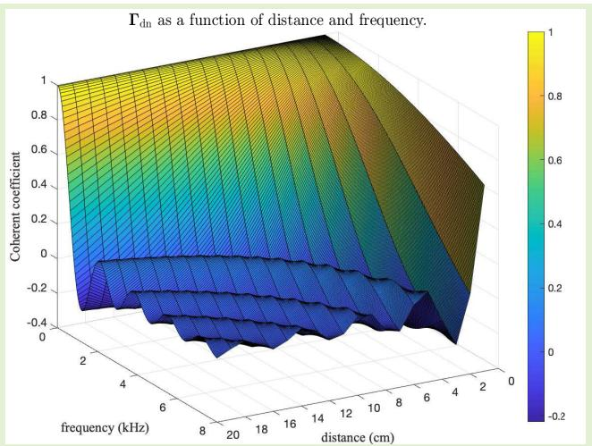

Index Terms— CDR estimation, coherent-to-diffuse-power ratio (CDR), dereverberation, multichannel speech enhancement.

## I. INTRODUCTION

insights into the relative power of direct versus diffuse signal components. It serves as a perceptual cue for source distance and reverberation. Accurate estimation of the CDR is essential for improving speech quality and intelligibility, and it plays a significant role in various acoustic and speech applications, including dereverberation [1], [2], [3], [4], source distance estimation [5], [6], [7], multiple-source localization [8], [9], and automatic speech recognition [10], [11].

Several CDR estimators have been developed [12], [13], with the majority relying on the use of two microphones. The two-channel CDR approaches commonly utilize the coherence between the two omnidirectional microphones for estimating CDR. They assume that the reverberant sound field is isotropic, either spherically isotropic noise is perceived as coming equally from all directions and can be modeled as sources with uniform sound levels distributed uniformly across the surface of a sphere [27], [28], [29], [30] or cylindrically isotropic (a sound field in which the noise sources are assumed to be uniformly distributed across the surface of a cylinder [31]). The spatial coherence function can then be calculated based on the spacing between sensors and the frequency of interest. Those methods can be classified into two categories, i.e., difference-of-arrival (DOA)-dependent estimators [14], [15], [16] and DOA-independent ones [1], [15], [16], [17]. In contrast, the latter category can be made more robust for reverberation suppression applications, as obtaining accurate DOA information in noisy and reverberant environments is consistently challenging.

Recently, the multichannel approach has been developed, which takes advantage of more than two microphones simultaneously for CDR estimation. For example, the method in [18] achieves CDR estimate based on the generalized magnitude-squared coherence (GMSC) [19], [20] of the signal pseudo-coherence matrix. The largest eigenvalue of the pseudo-coherence matrices of signal and noise represents their coherence functions, respectively. Löllmann et al. [22] developed an estimator that exploits the effective rank [23] of the input signal covariance matrix for estimating the diffuseness [24] and, thus, the CDR. Note, however, that this method has a much higher computational complexity as compared with the coherence-based method.

This article also addresses the challenge of multichannel CDR estimation for speech enhancement. We present two multichannel estimation methods. The first approach involves decomposing the microphone array into several groups of subarrays, where each subarray consists of only two sensors. We estimate the CDR for each group and then fuse these group CDR estimates through weighted averaging to form the multichannel CDR estimate. The second method is based on array manifold estimation using a joint matrix diagonalization technique, eliminating the need for subarray decomposition. We evaluate the performance of the proposed methods by integrating the CDR estimates with a parametric Wiener-type postfilter and compare them with some state-of-the-art methods.

The remainder of this article is organized as follows. Section II presents the signal model, defines key terms, and outlines the objectives of this article. In Section III, we derive two multichannel CDR estimation approaches: the weighted-average CDR estimation and the array manifold information-based estimation. Section IV presents the simulation results. Finally, the summary is provided in Section V.

## II. SIGNAL MODEL AND PROBLEM FORMULATION

Consider the observation of a speech signal of interest in a reverberant and noisy environment, with a small-spacing array of M microphones. Assume that the source is in the far-field, and the relative propagation attenuation is negligible. Every microphone observation can then be decomposed into two components, i.e., the direct-path component and diffuse noise, which consists of all the multipath effects that are uncorrelated with the direct-path component [26]. In the time–frequency domain, the array observation signals can be written as follows:

$$
Y _ {m} (\omega , t) = e ^ {J \omega \tau_ {m, 1} (\theta)} X (\omega , t) + V _ {m} (\omega , t)\tag{1}
$$

where $\begin{array} { c c c } { { m } } & { { \in } } & { { \{ 1 , 2 , \dots , M \} } } \end{array}$ is the sensor index, ȷ is the imaginary unit, $\tau _ { m , 1 } ( \theta )$ is the relative time delay of the source signals between the mth and 1st sensors, θ denotes the source incidence angle, ω is the angular frequency, t is the time index, and $X ( \omega , t )$ and $V _ { m } ( \omega , t )$ are the frequency domain of the direct-path signal and diffuse noise, respectively. Stacking all the array observation signals into a vector form gives

$$
\mathbf {y} (\omega , t) \stackrel {\triangle} {=} [ Y _ {1} (\omega , t) \quad Y _ {2} (\omega , t) \quad \dots \quad Y _ {M} (\omega , t) ] ^ {\mathrm{T}}\tag{2}
$$

$$
= \mathbf {d} (\omega , \theta) X (\omega , t) + \mathbf {v} (\omega , t)\tag{3}
$$

where $\mathbf { v } ( \omega , t )$ is the diffuse noise vector, the superscript T is the transpose operator, and

$$
\mathbf {d} (\omega , \theta) \triangleq \left[ 1 \quad e ^ {J \omega \tau_ {2, 1} (\theta)} \quad \dots \quad e ^ {J \omega \tau_ {M, 1} (\theta)} \right] ^ {\mathrm{T}}\tag{4}
$$

is the so-called array manifold vector, which is a function of the source incidence angle and array topology. In the standard practice, signal components from distinct frequency bands are assumed to be orthogonal and, thus, processed independently, a principle followed in this study. Henceforth, we will omit the frequency and time indices for all variables. Then, the signal model in (3) can be expressed as $\mathbf { y } = \mathbf { d } ( \theta ) X + \mathbf { v } .$

Assuming that the source signal, X, and diffuse noise, v, are uncorrelated, one can express the covariance matrix of the observation y as follows:

$$
\boldsymbol {\Phi} _ {\mathbf {y}} \triangleq \mathbb {E} (\mathbf {y y} ^ {\mathrm{H}})
$$

$$
= \phi_ {\mathrm{cs}} \mathbf {d} (\theta) \mathbf {d} ^ {\mathrm{H}} (\theta) + \boldsymbol {\Phi} _ {\mathbf {v}}\tag{5}
$$

$$
= \phi_ {\mathrm{cs}} \Gamma_ {\mathrm{cs}} (\theta) + \phi_ {\mathrm{dn}} \Gamma_ {\mathrm{dn}}\tag{6}
$$

(7)

where E(·) denotes mathematical expectation, the superscript $H$ is the conjugate-transpose operator, $\phi _ { \mathrm { c s } } \triangleq \mathbb { E } ( | X | ^ { 2 } )$ is the variance of the source signal, ${ \boldsymbol { \Gamma } } _ { \mathrm { c s } } ( \theta ) = { \bf d } ( \theta ) { \bf d } ^ { \mathrm { H } } ( \theta )$ is the pseudo-coherence matrix of the source, $\begin{array} { r } { \Phi _ { \mathbf { v } } \triangleq \mathbb { E } ( \mathbf { v } \mathbf { v } ^ { \mathrm { H } } ) = } \end{array}$ $\phi _ { \mathrm { d n } } \Gamma _ { \mathrm { d n } }$ is the covariance matrix of the noise, $\phi _ { \mathrm { d n } }$ is the variance of the diffuse noise, and $\Gamma _ { \mathrm { d n } }$ is the pseudo-coherence matrix of the diffuse noise. In this scenario, the $( i , j ) \mathrm { t h }$ element of $\Gamma _ { \mathrm { d n } }$ is

$$
[ \Gamma_ {\mathrm{dn}} ] _ {i, j} = \frac {\sin (\omega \Delta_ {i , j} / c)}{\omega \Delta_ {i , j} / c}\tag{8}
$$

where $c$ is the speed of sound in air, typically assumed to be 340 m/s, and $\Delta _ { i , j }$ is the distance between the ith and jth sensors.

With the signal model described in (3), (6), and $( 7 ) .$ , the so-called CDR is defined as follows:

$$
\beta \triangleq \frac {\phi_ {\mathrm{cs}}}{\phi_ {\mathrm{dn}}}\tag{9}
$$

which is the ratio between the variance of the coherent source signal and that of the additive diffuse noise. CDR estimation holds crucial significance in various acoustic applications, such as reverberation suppression and speech enhancement. One relatively straightforward method to obtain an estimate of $\beta$ is by first estimating $\phi _ { \mathrm { c s } }$ and $\phi _ { \mathrm { d n } }$ and then substituting the results into (9). For instance, the variance of the diffuse noise can be estimated using the method presented in [32] and [33], while the variance of the source can be determined as demonstrated in [45]. However, these approaches require the knowledge of the a priori source coherence matrix, which can be challenging to estimate in complex environments.

By considering that the coherent source signal and the additive diffuse noise are uncorrelated, the variance of the array observations follows that $\phi _ { Y } = \phi _ { \mathrm { c s } } + \phi _ { \mathrm { d n } }$ . Normalizing the covariance matrix $\Phi _ { \mathbf { y } }$ with $\phi _ { Y }$ , one can derive that

$$
\boldsymbol {\Gamma} _ {\mathbf {y}} = \frac {1}{\phi_ {Y}} \boldsymbol {\Phi} _ {\mathbf {y}} = \frac {1}{\phi_ {\mathrm{cs}} + \phi_ {\mathrm{dn}}} \boldsymbol {\Phi} _ {\mathbf {y}}\tag{10}
$$

$$
= \frac {\beta}{\beta + 1} \Gamma_ {\mathrm{cs}} (\theta) + \frac {1}{\beta + 1} \Gamma_ {\mathrm{dn}}\tag{11}
$$

which can also be expressed into the following form:

$$
\boldsymbol {\Gamma} _ {\mathrm{cs}} (\theta) = \left(1 + \beta^ {- 1}\right) \boldsymbol {\Gamma} _ {\mathbf {y}} - \beta^ {- 1} \boldsymbol {\Gamma} _ {\mathrm{dn}}.\tag{12}
$$

It is worth noting that $\Gamma _ { \mathbf { y } }$ can be easily computed, given the array observation vector ${ \bf y } ,$ and $\Gamma _ { \mathrm { d n } }$ is determined once the array topology is given. If the source DOA is known, all elements of $\Gamma _ { \mathrm { c s } } ( \theta )$ are also determined. Consequently, $M ( M - 1 ) / 2$ equations can be formulated for $\beta$ based on (12), leading to the DOA-based CDR estimation approach. However, in the absence of known source DOA, devising a strategy to formulate the equation for solving $\beta$ becomes also necessary in many application, resulting in DOA-free CDR estimation.

Following the Schwarz method presented in [1], a twochannel DOA-free CDR estimator can be derived based on the simple fact that $| [ \Gamma _ { \mathrm { c s } } ( \theta ) ] _ { 1 , 2 } | = 1$ , i.e.,

$$
\begin{array}{l} \hat {\beta} = g (\gamma_ {y}, \gamma_ {\mathrm{dn}}) \\ \triangleq \frac {f (\gamma_ {y} , \gamma_ {\mathrm{dn}}) - \sqrt {f ^ {2} (\gamma_ {y} , \gamma_ {\mathrm{dn}}) - \left(\left| \gamma_ {y} \right| ^ {2} - 1\right) \cdot \left| \gamma_ {y} - \gamma_ {\mathrm{dn}} \right| ^ {2}}}{\left| \gamma_ {y} \right| ^ {2} - 1} \end{array} \tag {13}\tag{14}
$$

where

$$
f (\gamma_ {y}, \gamma_ {\mathrm{dn}}) \triangleq \Re \left(\gamma_ {y} \gamma_ {\mathrm{dn}} ^ {*}\right) - \left| \gamma_ {y} \right| ^ {2}\tag{15}
$$

and $\gamma _ { y }$ and $\gamma _ { \mathrm { d n } }$ are the normalized correlation coefficients of the observation signals and diffuse noise, which are defined, respectively, as $\gamma _ { y } \overset { \Delta } { = } [ \mathbf { r _ { y } } ] _ { 1 , 2 }$ and $\gamma _ { \mathrm { d n } } \overset { \triangle } { = } [ \mathbf { { r } } _ { \mathrm { d n } } ] _ { 1 , 2 }$ 2.

Now, suppose that we have more than two microphones. Intuitively, one should be able to achieve better CDR estimation as more complementary information is accessible. The objective of this work is to develop CDR estimators that can effectively leverage the redundant and complementary information inherent in array observations to achieve improved CDR estimation.

## III. MULTICHANNEL DOA-FREE CDR ESTIMATION A. Weighted-Average CDR Estimation

If $M \_ { \mathrm { ~ \scriptsize ~ \geq ~ \ ~ 2 ~ } }$ , multiple pairs of sensors can be formed. A straightforward approach to improving CDR estimation would be to average the coherence estimates across all microphone pairs [18], [21]. The challenge lies in forming microphone pairs with consistent distance and orientation for averaging; otherwise, averaging may degrade performance rather than improve it. To address this issue, we propose to partition the microphone array into several groups of subarrays consisting of two sensors each, ensuring that subarrays within the same group share the same sensor spacing and orientation. Fig. 1 illustrates the array decomposition of the pseudo-coherence matrix $\Gamma _ { \mathbf { y } }$ comprised of M sensors. Assume that we have a total of N groups, and the number of subarrays of the nth group is $J _ { n }$ . We then estimate CDR in three steps as follows.

1) In the first step, we average the normalized correlation coefficients within the nth group, i.e.,

$$
\gamma_ {y} ^ {(n)} = \frac {1}{J _ {n}} \sum_ {j = 1} ^ {J _ {n}} \gamma_ {y, j} ^ {(n)}\tag{16}
$$

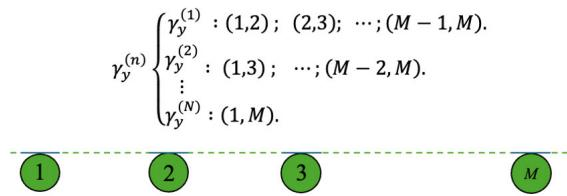  
Fig. 1. Illustration of the decomposition of a linear array with M sensors, where $( i , j )$ denotes the subarray comprising the ith and jth sensors.

where $\gamma _ { y , j } ^ { ( n ) }$ is the normalized correlation coefficient of the jth subarray in the nth group. As the sensor spacing within the nth group remains consistent, the normalized correlation coefficient can be directly computed according to the subarray topology. Let us denote it as $\gamma _ { \mathrm { d n } } ^ { ( n ) }$

2) In the second step, we calculate the CDR for the nth group using the estimated $\gamma _ { y } ^ { ( n ) }$ and $\gamma _ { \mathrm { d n } } ^ { ( n ) }$ values according to (13).

3) At last, we merge the CDRs from all the different groups according to

$$
\hat {\beta} _ {\mathrm{prop1}} = \sum_ {n = 1} ^ {N} w _ {n} g \Big [ \gamma_ {y} ^ {(n)}, \gamma_ {\mathrm{dn}} ^ {(n)} \Big ]\tag{17}
$$

where

$$
w _ {n} \triangleq \frac {e ^ {\zeta_ {0} g [ \gamma_ {y} ^ {(n)} , \gamma_ {\mathrm{dn}} ^ {(n)} ]}}{\sum_ {i = 1} ^ {N} e ^ {\zeta_ {0} g [ \gamma_ {y} ^ {(i)} , \gamma_ {\mathrm{dn}} ^ {(i)} ]}}\tag{18}
$$

with $\zeta _ { 0 }$ being a prespecified constant, $\mathrm { e . g . , \ } \zeta _ { 0 } = 0 . 1$

This method is termed “weighted-average CDR estimation,” in which the problem of multichannel CDR estimation is transformed into one of estimating the CDR using only two channels. It is worth mentioning that any existing two-channel CDR estimation methods can be utilized in this multichannel approach. This methodology is adaptable to any array geometry, with the number of groups and subarrays potentially varying across different geometries.

## B. Array Manifold Information-Based CDR Estimation

Assume that we have an estimate of the array manifold vector, i.e., bd with $\begin{array} { l } { \| \widehat { \mathbf { d } } \| _ { 2 } ^ { 2 } ~ = ~ M } \end{array}$ , where ∥·∥ denotes the Euclidean norm. It follows immediately that $\mathbf { \widehat { I } } _ { \mathrm { c s } } = \widehat { \mathbf { d } } \widehat { \mathbf { d } } ^ { \mathrm { H } }$ . One can then express (11) as follows:

$$
\widehat {\mathbf {d}} ^ {\mathrm{H}} \boldsymbol {\Gamma} _ {\mathrm{y}} \widehat {\mathbf {d}} = \frac {\beta}{\beta + 1} M ^ {2} + \frac {1}{\beta + 1} \widehat {\mathbf {d}} ^ {\mathrm{H}} \boldsymbol {\Gamma} _ {\mathrm{dn}} \widehat {\mathbf {d}}.\tag{19}
$$

With this particular form of $\Gamma _ { \mathrm { c s } } ,$ , one can readily obtain the estimate of $\beta$ by solving (19), i.e.,

$$
\widehat {\beta} _ {\text {prop2}} = \frac {\widehat {\mathbf {d}} ^ {\mathrm{H}} \boldsymbol {\Gamma} _ {\mathbf {y}} \widehat {\mathbf {d}} - \widehat {\mathbf {d}} ^ {\mathrm{H}} \boldsymbol {\Gamma} _ {\mathrm{dn}} \widehat {\mathbf {d}}}{M ^ {2} - \widehat {\mathbf {d}} ^ {\mathrm{H}} \boldsymbol {\Gamma} _ {\mathbf {y}} \widehat {\mathbf {d}}}\tag{20}
$$

which is the second DOA-free CDR estimator proposed in this article.

To estimate the CDR as per (20), we need an estimate of the source array manifold vector, bd. Array manifold estimation has been extensively investigated in microphone signal processing [34], [35], [36], [37], [38]. In this article, we employ the joint diagonalization technique to estimate it.

According to [25] and [39], the two Hermitian matrices $\Gamma _ { \mathbf { y } }$ and $\Gamma _ { \mathrm { d n } }$ can be jointly diagonalized as follows:

$$
\mathbf {\Gamma_ {d n}} = \mathbf {U U ^ {H}}\tag{21}
$$

$$
\boldsymbol {\Gamma} _ {\mathbf {y}} = \mathbf {U} \boldsymbol {\Lambda} \mathbf {U} ^ {\mathrm{H}}\tag{22}
$$

where

$$
\mathbf {U} = [ \mathbf {u} _ {1} \quad \mathbf {u} _ {2} \quad \dots \quad \mathbf {u} _ {M} ]\tag{23}
$$

is a full-rank square matrix (of size $M \times M )$ , the values of $\mathbf { u } _ { m } ,$ $m = 1 , 2 , \ldots , M$ , are the eigenvectors of the matrix $\Gamma _ { \mathrm { d n } } ^ { - 1 } \mathbf { \Gamma } \mathbf { T _ { y } } ,$

$$
\boldsymbol {\Lambda} = \operatorname{diag} (\lambda_ {1}, \lambda_ {2}, \dots , \lambda_ {M})\tag{24}
$$

is a diagonal matrix of size $M \times M ,$ and $\lambda _ { 1 } \geq \lambda _ { 2 } \geq \cdot \cdot \cdot \geq$ $\lambda _ { M } \geq 0$ are the eigenvalues of $\mathbf { \Gamma } _ { \mathrm { d n } } ^ { - 1 } \mathbf { T _ { y } }$ . After the above joint diagonalization, the estimate of the array manifold vector, i.e., bd, is obtained as follows:

$$
\widehat {\mathbf {d}} = \frac {\sqrt {M}}{\| \mathbf {u} _ {1} \| _ {2}} \mathbf {u} _ {1}.\tag{25}
$$

It can be readily verified that $\| \widehat { \mathbf { d } } \| _ { 2 } ^ { 2 } = M .$

Substituting (25) into (20) gives an estimate of CDR. Note that the resulting CDR estimator does not depend on DOA but only relies on the assumption of a diffuse noise field, which is different from the approaches proposed in [14], [15], and [16].

## IV. EVALUATION

In the simulations, we use 100 speech signals taken from the TIMIT database [40], which are sampled at a rate of 16 kHz. These signals are used as source signals. We employ a uniform linear array comprising four microphones with an interelement spacing of 2 cm, positioned in a room measuring $6 \times 4 \times 3$ m. The first and last sensors are situated at coordinates (3.03, 1, 1) and (2.97, 1, 1), respectively. The source is positioned 1.5 m away from the array center along the $3 0 ^ { \circ }$ direction. Impulse responses from the source to the microphones are generated, employing the well-known image model method [41]. By convolving the source signal with the impulse response from the source to the mth sensor, the convolved clean signal at the mth sensor is obtained. Noise is then added to the convolved signal to control the signalto-noise ratio (SNR). The noise environment is modeled as a combination of diffuse noise generated using the method in [42] and white noise, with the power ratio between the diffuse and white noise being 20 dB.

After CDR estimation, we incorporate the estimate into the following postfilter [1] to further enhance speech enhancement performance subsequent to the delay-and-sum beamformer:

$$
G (\omega , t) = \max \left\{G _ {\min}, 1 - \sqrt {\frac {\mu}{\widehat {\beta} + 1}} \right\}\tag{26}
$$

where the parameters $\mu$ and $G _ { \mathrm { m i n } }$ are used to balance the tradeoff between noise reduction and signal distortion [48], [49]. In this work, the value of $\mu$ is fixed at 0.8, and the value of $G _ { \mathrm { m i n } }$ is set to 0.1, following the parameter configuration outlined in [1]. The performance is then evaluated in terms of average full-band SNR gain [43], log-spectral distortion (LSD) [44], [45], and direct-to-reverberant-energy ratio (DRR) [46], [47], which are computed by averaging the results across the 100 signals.

TABLE I  
PERFORMANCE OF THE PROPOSED METHODS AS A FUNCTION OF THE NUMBER OF MICROPHONES $( T _ { 6 0 } = 5 0 0$ ms AND INPUT SNR = 5 dB)

<table><tr><td>Methods</td><td>Mic</td><td>SNR Gain</td><td>LSD</td><td>DRR</td></tr><tr><td rowspan="4">Weighted averaging</td><td>2</td><td>7.58</td><td>7.90</td><td>6.33</td></tr><tr><td>4</td><td>11.30</td><td>6.72</td><td>7.04</td></tr><tr><td>8</td><td>13.79</td><td>6.25</td><td>8.61</td></tr><tr><td>16</td><td>15.09</td><td>6.40</td><td>14.41</td></tr><tr><td rowspan="4">Diagonalization</td><td>2</td><td>7.74</td><td>7.60</td><td>6.71</td></tr><tr><td>4</td><td>11.69</td><td>7.11</td><td>7.08</td></tr><tr><td>8</td><td>14.21</td><td>6.78</td><td>8.59</td></tr><tr><td>16</td><td>14.72</td><td>6.67</td><td>14.37</td></tr></table>

In the first set of simulations, we assess the impact of the number of microphones on the performance of the proposed methods. The results are presented in Table I. It is evident that the SNR gain, DRR, and LSD improve with an increase in the number of microphones.

In the second set of simulations, we evaluate the proposed methods and compare them with five other approaches: the delay-and-sum beamformer, the DOA-independent method proposed by Schwarz and Kellermann [1], the averaged coherence method developed in [18], the GMSC algorithm presented in [18], and the effective rank (ERANK) approach presented in [22]. Apart from Schwarz’s method, which utilizes only two microphones, all the other methods employ four microphones.

To assess the accuracy of the CDR estimation, we computed the mean-squared error (mse), defined as $\mathbb { E } [ ( \beta - \hat { \beta } ) ^ { 2 } ]$ , over 100 speech signals. The results are plotted in Fig. 2. It is clear that the proposed approaches significantly outperform the compared methods, demonstrating much smaller mse values. In addition, we use the kurtosis of the errors for further evaluation. Kurtosis of the random process $\epsilon ~ = ~ \beta ~ - ~ \hat { \beta }$ is calculated as $\mu _ { 4 } / \mu _ { 2 } ^ { 2 } .$ , where $\mu _ { n }$ represents the nth order moment given by $\begin{array} { r } { \mu _ { n } = \int _ { 0 } ^ { \infty } \epsilon ^ { n } p ( \epsilon ) d x } \end{array}$ , with $p ( \epsilon )$ being the error probability density function. The results show that both proposed approaches exceed the performance of other methods, exhibiting notably higher kurtosis values. This indicates that the proposed methods are more concentrated around areas with smaller errors.

The speech enhancement performances are illustrated in Fig. 3, where the reverberation time $T _ { 6 0 } ~ = ~ 5 0 0$ ms and the input SNR ranges from −10 to 30 dB. The following observations can be made from the results.

1) The proposed estimators outperform the compared methods in terms of SNR gain.

2) The performances of all the studied multichannel estimators surpass that of the two-channel Schwarz method.

3) The SNR gain decreases as the input SNR increases, which is expected, as enhancement becomes less demanding with higher input SNR.

4) The LSD metric decreases as the input SNR increases, indicating that smaller distortion is introduced with higher input SNR.

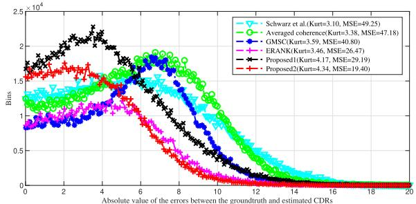  
Fig. 2. Absolute value of errors between the ground truth and the CDR estimates with input $\mathsf { S N R } = 2 0$ dB (diffuse noise) and $T _ { 6 0 } = 5 0 0$ ms. The estimation Kurtosis and mse are provided in parentheses after each method.

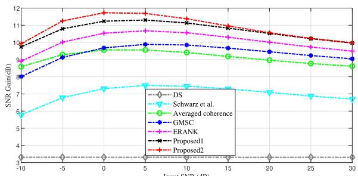

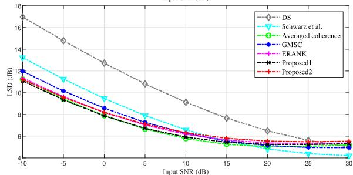

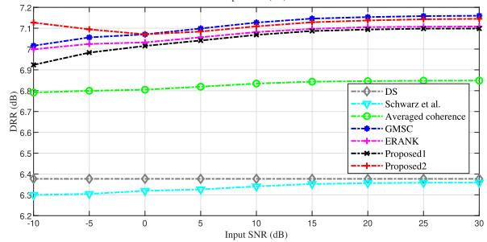  
Fig. 3. SNR gains (larger is better), LSDs (smaller is better), and DRRs (larger is better) of the compared methods plotted against the input SNR.

5) The DRR of the first proposed approach is slightly inferior to that of the other studied methods. However, the DRR exhibits minimal variation with changes in input SNR. This result can be attributed to the fact that the filter gain for all methods depends on CDR, representing the level of reverberation. The estimation of CDR is not significantly influenced by the background noise level.

Fig. 4 illustrates the performance of the proposed approaches across varying reverberation-time conditions, with an input SNR set to 5 dB and reverberation times ranging from 0.14 to 1.03 s. The results show that the proposed estimators significantly outperform the compared methods in terms of SNR gain. The reverberation level has minimal impact on the LSD, causing only a slight reduction at high reverberation levels. This minimal impact is largely due to signal distortion primarily resulting from noise suppression. In addition, it is clear that the DRR of all compared methods decreases sharply with increasing reverberation time. Among the methods proposed, the first one shows a slight inferiority compared with the others.

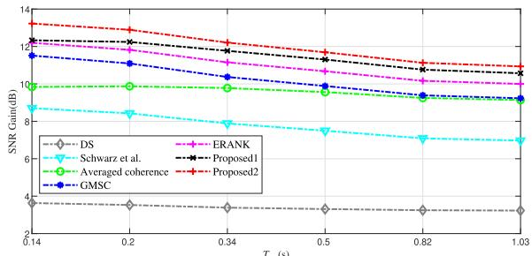

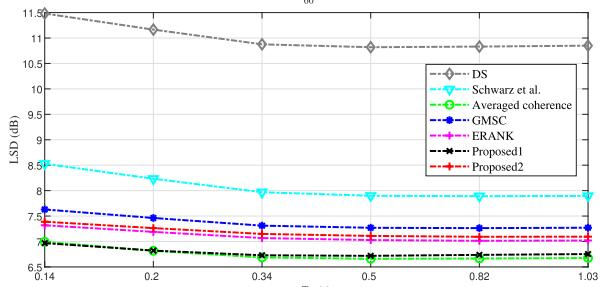

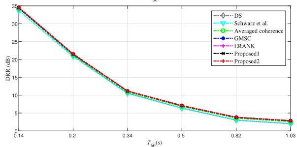  
Fig. 4. SNR gains (larger is better), LSDs (smaller is better), and DRRs (larger is better) of the compared methods plotted against the reverberation condition.

We now evaluate the computational complexity of the proposed methods in comparison with the baseline methods. Table II presents the runtimes of different methods, with each approach tested on a 17-s signal at a 5-dB input SNR on a macOS Apple M1 CPU at 3.2 GHz. The results indicate that the two-channel Schwarz method has significantly lower complexity compared with other multichannel methods. The first proposed method, while slightly more complex than the averaged coherence method, delivers better performance. The second proposed method has a complexity similar to the GMSC method due to its use of similar eigenvalue decomposition techniques. In contrast, the ERANK method exhibits higher computational complexity due to the additional step of fitting a curve to determine the coefficients of the inverse function.

In the final set of simulations, we evaluate the proposed methods with varying numbers of sensors. The results, displayed in Fig. 5, were obtained with an input SNR of 5 dB and a reverberation time of $T _ { 6 0 } = 5 0 0 ~ \mathrm { m s }$ . The data clearly show that the performance of the proposed methods improves relative to the other approaches, as the number of microphones increases.

TABLE II  
COMPARISON OF THE COMPUTATIONAL COMPLEXITY AMONG ALL STUDIED METHODS

<table><tr><td></td><td>DS</td><td>Schwarz et al.</td><td>Averaged coherence</td><td>GMSC</td><td>ERANK</td><td>Proposed1</td><td>Proposed2</td></tr><tr><td>Runtime /s</td><td>9.36</td><td>6.21</td><td>9.50</td><td>27.54</td><td>47.51</td><td>11.37</td><td>25.54</td></tr></table>

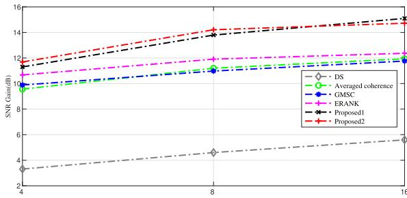

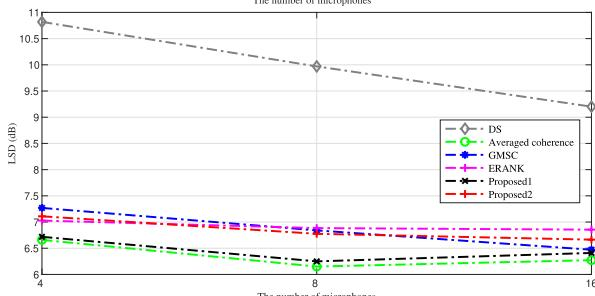

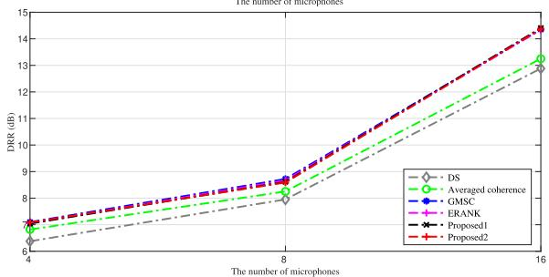  
Fig. 5. SNR gains (larger is better), LSDs (smaller is better), and DRRs (larger is better) of the compared methods plotted against the number of microphones.

TABLE III  
PERFORMANCE OF ALL STUDIED METHODS IN REAL-LIFE SCENARIOS

<table><tr><td>Methods</td><td>SNR Gain</td><td>LSD</td><td>DRR</td></tr><tr><td>DS</td><td>4.25</td><td>5.59</td><td>15.01</td></tr><tr><td>Schwarz et al.</td><td>6.22</td><td>4.40</td><td>15.32</td></tr><tr><td>Averaged coherence</td><td>8.65</td><td>4.22</td><td>15.82</td></tr><tr><td>GMSC</td><td>8.94</td><td>4.00</td><td>16.60</td></tr><tr><td>ERANK</td><td>8.39</td><td>4.01</td><td>16.39</td></tr><tr><td>Proposed1</td><td>9.23</td><td>4.04</td><td>16.23</td></tr><tr><td>Proposed2</td><td>9.37</td><td>4.30</td><td>16.71</td></tr></table>

To further evaluate the proposed methods in real-life scenarios, we used open-source RIR databases, such as Multichannel Acoustic Reverberation Database at York (MARDY) [50]. The 100 speech signals, taken from the TIMIT database [40], are used as source signals. By convolving the source signal with 4-channel RIR from MARDY database, the convolved clean signal is obtained. The results are illustrated in Table III, with the reverberation time $T _ { 6 0 } = 4 4 7$ ms and input SNR set to 20 dB. The results clearly show that the proposed methods outperform other compared methods, which is consistent with the simulation experimental results.

In summary, all experimental results demonstrate that the proposed estimators outperform the compared baseline methods in terms of SNR gain, LSD, and DRR under various input SNR conditions.

## V. SUMMARY

In this article, we introduced two multichannel CDR estimators: one based on weighted averaging of subarray CDR estimates and the other using joint matrix diagonalization. By incorporating these CDR estimates into a parametric Wiener-type postfilter and comparing our methods with the existing state-of-the-art CDR estimators, we demonstrated their effectiveness through simulations. These results highlighted the superiority of our proposed methods in effectively reducing both noise and reverberation.

Several directions for future work can be pursued based on the proposed methods. These include developing improved fusion strategies based on weighted-average CDR estimation, investigating array decompositions for specific array geometries, enhancing methods for estimating the array manifold vector, and designing fast online CDR estimation techniques by integrating array manifold estimation with CDR estimation.

## REFERENCES

[1] A. Schwarz and W. Kellermann, “Coherent-to-diffuse power ratio estimation for dereverberation,” IEEE/ACM Trans. Audio, Speech, Language Process., vol. 23, no. 6, pp. 1006–1018, Jun. 2015.

[2] C. Zheng, A. Schwarz, W. Kellermann, and X. Li, “Binaural coherentto-diffuse-ratio estimation for dereverberation using an ITD model,” in Proc. 23rd Eur. Signal Process. Conf. (EUSIPCO), Aug. 2015, pp. 1048–1052.

[3] C. Zheng, X. Li, A. Schwarz, and W. Kellermann, “Statistical analysis and improvement of coherent-to-diffuse power ratio estimators for dereverberation,” in Proc. IEEE Int. Workshop Acoustic Signal Enhancement (IWAENC), Sep. 2016, pp. 1–5.

[4] Y. Fang, H. Feng, and Y. Chen, “A robust interaural time differences estimation and dereverberation algorithm based on the coherence function,” Appl. Acoust., vol. 129, pp. 126–134, Jan. 2018.

[5] Y.-C. Lu and M. Cooke, “Binaural estimation of sound source distance via the direct-to-reverberant energy ratio for static and moving sources,” IEEE Trans. Audio, Speech, Language Process., vol. 18, no. 7, pp. 1793–1805, Sep. 2010.

[6] A. Brendel and W. Kellermann, “Learning-based acoustic source localization in acoustic sensor networks using the coherent-to-diffuse power ratio,” in Proc. 26th Eur. Signal Process. Conf. (EUSIPCO), Sep. 2018, pp. 1572–1576.

[7] M. Zohourian and R. Martin, “Binaural direct-to-reverberant energy ratio and speaker distance estimation,” IEEE/ACM Trans. Audio, Speech, Language Process., vol. 28, pp. 92–104, 2020.

[8] S. Liang, G. Li, S. Nie, Z. Yang, W. Liu, and J. Tao, “Exploiting the directional coherence function for multichannel source extraction,” Speech Commun., vol. 128, pp. 1–14, Apr. 2021.

[9] D. Fejgin and S. Doclo, “Coherence-based frequency subset selection for binaural RTF-vector-based direction of arrival estimation for multiple speakers,” in Proc. Int. Workshop Acoustic Signal Enhancement (IWAENC), Sep. 2022, pp. 1–5.

[10] A. Brutti and M. Matassoni, “On the use of early-to-late reverberation ratio for ASR in reverberant environments,” in Proc. IEEE Int. Conf. Acoust., Speech Signal Process. (ICASSP), May 2014, pp. 4638–4642.

[11] H. Barfuss, C. Huemmer, A. Schwarz, and W. Kellermann, “Robust coherence-based spectral enhancement for speech recognition in adverse real-world environments,” Comput. Speech Lang., vol. 46, pp. 388–400, Nov. 2017.

[12] P. N. Samarasinghe, T. D. Abhayapala, and H. Chen, “Estimating the direct-to-reverberant energy ratio using a spherical harmonics-based spatial correlation model,” IEEE/ACM Trans. Audio, Speech, Language Process., vol. 25, no. 2, pp. 310–319, Feb. 2017.

[13] P. Calamia, N. Balsam, and P. Robinson, “Blind estimation of the directto-reverberant ratio using a beta distribution fit to binaural coherence,” J. Acoust. Soc. Amer., vol. 148, no. 4, pp. 359–364, Oct. 2020.

[14] M. Jeub, C. Nelke, C. Beaugeant, and P. Vary, “Blind estimation of the coherent-to-diffuse energy ratio from noisy speech signals,” in Proc. 19th Eur. Signal Process. Conf., Aug. 2011, pp. 1347–1351.

[15] O. Thiergart, G. Del Galdo, and E. A. P. Habets, “Signal-to-reverberant ratio estimation based on the complex spatial coherence between omnidirectional microphones,” in Proc. IEEE Int. Conf. Acoust., Speech Signal Process. (ICASSP), Mar. 2012, pp. 309–312.

[16] O. Thiergart, G. Del Galdo, and E. A. P. Habets, “On the spatial coherence in mixed sound fields and its application to signal-to-diffuse ratio estimation,” J. Acoust. Soc. Amer., vol. 132, no. 4, pp. 2337–2346, Oct. 2012.

[17] R. Ghanavi and C. Jin, “Improving spatial cues for hearables using a parameterized binaural CDR estimator,” 2022, arXiv:2207.08314.

[18] H. W. Löllmann, A. Brendel, and W. Kellermann, “Generalized coherence-based signal enhancement,” in Proc. IEEE Int. Conf. Acoust., Speech Signal Process. (ICASSP), May 2020, pp. 201–205.

[19] H. Gish and D. Cochran, “Generalized coherence,” in Proc. IEEE Int. Conf. Acoust., Speech, Signal Process., vol. 5, Oct. 1988, pp. 2745–2748.

[20] D. Ramirez, J. Via, and I. Santamaria, “A generalization of the magnitude squared coherence spectrum for more than two signals: Definition, properties and estimation,” in Proc. IEEE Int. Conf. Acoust., Speech Signal Process., Mar. 2008, pp. 3769–3772.

[21] D. Salvati, C. Drioli, and G. L. Foresti, “Incoherent frequency fusion for broadband steered response power algorithms in noisy environments,” IEEE Signal Process. Lett., vol. 21, no. 5, pp. 581–585, May 2014.

[22] H. W. Löllmann, A. Brendel, and W. Kellermann, “Effective rankbased estimation of the coherent-to-diffuse power ratio,” in Proc. IEEE Int. Conf. Acoust., Speech Signal Process. (ICASSP), Jun. 2021, pp. 955–959.

[23] O. Roy and M. Vetterli, “The effective rank: A measure of effective dimensionality,” in Proc. 15th Eur. Signal Process. Conf. (EUSIPCO), Sep. 2007, pp. 606–610.

[24] G. Del Galdo, M. Taseska, O. Thiergart, J. Ahonen, and V. Pulkki, “The diffuse sound field in energetic analysis,” J. Acoust. Soc. Amer., vol. 131, no. 3, pp. 2141–2151, Mar. 2012.

[25] J. N. Franklin, Matrix Theory. Upper Saddle River, NJ, USA: Prentice-Hall, 1968.

[26] J. Benesty and J. Chen, Study and Design of Differential Microphone Arrays. Berlin, Germany: Springer-Verlag, 2012.

[27] F. Jacobsen, “The diffuse sound field: Statistical considerations concerning the reverberant field in the steady state,” Acoust. Lab., Univ. Denmark Tech., Lyngby, Denmark, 1979.

[28] M. Goulding, “Speech enhancement for mobile telephony microform,” M.S. thesis, Theses Microfiche, School Eng. Sci., Simon Fraser Univ., Burnaby, BC, Canada, 1989.

[29] J. Benesty, M. M. Sondhi, and Y. Huang, Springer Handbook of Speech Processing. Berlin, Germany: Springer-Verlag, 2007.

[30] C. Pan, J. Chen, and J. Benesty, “Performance study of the MVDR beamformer as a function of the source incidence angle,” IEEE/ACM Trans. Audio, Speech, Language Process., vol. 22, no. 1, pp. 67–79, Jan. 2014.

[31] G. W. Elko, “Spatial coherence functions for differential microphones in isotropic noise fields,” in Microphone Arrays. New York, NY, USA: Springer, 2001, pp. 61–85.

[32] S. Braun et al., “Evaluation and comparison of late reverberation power spectral density estimators,” IEEE/ACM Trans. Audio, Speech, Language Process., vol. 26, no. 6, pp. 1056–1071, Jun. 2018.

[33] I. Kodrasi and S. Doclo, “Analysis of eigenvalue decomposition-based late reverberation power spectral density estimation,” IEEE/ACM Trans. Audio, Speech, Language Process., vol. 26, no. 6, pp. 1106–1118, Jun. 2018.

[34] Y. Wang, H. Chen, Y. Peng, and Q. Wan, Spatial Spectrum Estimation Theory and Algorithm. Beijing, China: Tsinghua Univ. Press, 2004.

[35] S. Yan and J. M. Hovem, “Array pattern synthesis with robustness against manifold vectors uncertainty,” IEEE J. Ocean. Eng., vol. 33, no. 4, pp. 405–413, Oct. 2008.

[36] M. Wei and S. Yan, “A new subspace decomposition based array manifold estimation algorithm,” J. Signal Process., vol. 35, no. 9, pp. 1528–1534, Sep. 2019.

[37] W. Yang, J. Benesty, G. Huang, and J. Chen, “A new class of differential beamformers,” IEEE/ACM Trans. Audio, Speech, Language Process., vol. 29, pp. 594–606, 2021.

[38] C. Pan, J. Chen, G. Shi, and J. Benesty, “On microphone array beamforming and insights into the underlying signal models in the shorttime-Fourier-transform domain,” J. Acoust. Soc. Amer., vol. 149, no. 1, pp. 660–672, Jan. 2021.

[39] J. Benesty, I. Cohen, and J. Chen, Fundamentals of Signal Enhancement and Array Signal Processing. Singapore: Wiley-IEEE Press, 2018.

[40] J. S. Garofolo, TIMIT Acoustic-phonetic Continuous Speech Corpus LDC93S1. Philadelphia, PA, USA: Linguistic Data Consortium, 1993.

[41] J. B. Allen, D. A. Berkley, and J. Blauert, “Multimicrophone signalprocessing technique to remove room reverberation from speech signals,” J. Acoust. Soc. Amer., vol. 62, no. 4, pp. 912–915, Oct. 1977.

[42] E. A. P. Habets and S. Gannot, “Generating sensor signals in isotropic noise fields,” J. Acoust. Soc. Amer., vol. 122, no. 6, pp. 3464–3470, Dec. 2007.

[43] J. Benesty, J. Chen, Y. Huang, and I. Cohen, Noise Reduction in Speech Processing. Berlin, Germany: Springer-Verlag, 2009.

[44] I. Cohen and S. Gannot, “Spectral enhancement methods,” in Springer Handbook Speech Process. Berlin, Germany: Springer-Verlag, 2008, pp. 873–901.

[45] C. Pan, J. Chen, and G. Shi, “On estimation of time-varying variances of source and noise for sensor array processing,” IEEE/ACM Trans. Audio, Speech, Language Process., vol. 28, pp. 2865–2879, 2020.

[46] J. Jo and M. Koyasu, “Measurement of reverberation time based on the direct-reverberant sound energy ratio in steady state,” in Proc. Nter-Noise Noise-Con Congr. Conf., 1975, pp. 579–582.

[47] Y. Hioka, K. Niwa, S. Sakauchi, K. Furuya, and Y. Haneda, “Estimating direct-to-reverberant energy ratio based on spatial correlation model segregating direct sound and reverberation,” in Proc. IEEE Int. Conf. Acoust., Speech Signal Process., Mar. 2010, pp. 149–152.

[48] K. U. Simmer, J. Bitzer, and C. Marro, “Post-filtering techniques,” in Microphone Arrays. New York, NY, USA: Springer, 2001, pp. 36–60.

[49] I. A. McCowan and H. Bourlard, “Microphone array post-filter based on noise field coherence,” IEEE Trans. Speech Audio Process., vol. 11, no. 6, pp. 709–716, Nov. 2003.

[50] J. Wen, N. D. Gaubitch, E. Habets, T. Myatt, and P. A. Naylor, “Evaluation of speech dereverberation algorithms using the (MARDY) database,” in Proc. Intl. Workshop Acoust. Echo Noise Control (IWAENC), 2006, pp. 1–4.

Qian Xiang was born in 1986. He received the bachelor’s degree in electronics and information engineering from Anhui Xinhua College, Hefei, China, in 2010, and the master’s degree in signal and information processing from Jiangxi Science and Technology Normal University, Nanchang, China, in 2013. He is currently pursuing the Ph.D. degree in process system engineering with Shaanxi University of Science and Technology, Xi’an, China.

From 2015 to 2020, he was with Fuyang Normal University, Fuyang, China. His research interests include speech enhancement and microphone array signal processing.

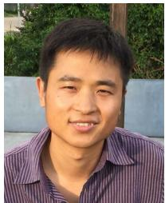

Tao Lei (Senior Member, IEEE) received the Ph.D. degree in information and communication engineering from Northwestern Polytechnica University, Xi’an, China, in 2011.

From 2012 to 2014, he was a Postdoctoral Research Fellow with the School of Electronics and Information, Northwestern Polytechnical University. From 2015 to 2016, he was a Visiting Scholar with the Quantum Computation and Intelligent Systems Group, University of Technology Sydney, Sydney, NSW, Australia. He is

currently a Professor with the School of Electronic Information and Artificial Intelligence, Shaanxi University of Science and Technology, Xi’an. He has authored and co-authored more than 80 research articles, including IEEE TRANSACTIONS ON IMAGE PROCESSING (TIP), IEEE TRANSACTIONS ON FUZZY SYSTEMS (TFS), and IEEE TRANSACTIONS ON GEOSCIENCE AND REMOTE SENSING (TGRS). His current research interests include image processing, pattern recognition, and machine learning.  
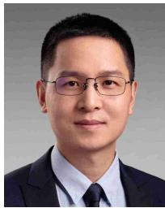

Chao Pan was born in 1989. He received the bachelor’s degree in electronics and information engineering and the Ph.D. degree in information and communication engineering from Northwestern Polytechnical University, Xi’an, China, in 2011 and 2018, respectively.

From 2014 to 2016, he was a Visiting Ph.D. Student at INRS-EMT, University of Quebec, Montreal, QC, Canada. From 2018 to 2020, he was a Lecturer with the School of Artificial Intelligence, Xidian University, Xi’an. He is

currently an Associate Professor with the Center of Intelligent Acoustics and Immersive Communications, School of Marine Science and Technology, Northwestern Polytechnical University. His research interests include acoustic signal processing, array signal processing, differential microphone array, sound field measuring and reproduction, signal separation, speech enhancement, brain science, and deep learning.

Dr. Pan’s journal article Theoretical Analysis of Differential Microphone Array Beamforming and an Improved Solution was awarded by the IEEE Region 10 (Asia–Pacific) 2016 Distinguished Student Paper Award (First Prize) (with Chen and Benesty). He serves as a reviewer for IEEE TRANSACTIONS ON AUDIO, SPEECH, AND LANGUAGE PROCESSING, IEEE SIGNAL PROCESSING LETTERS, and several international conferences.

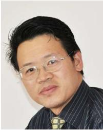

Jingdong Chen (Fellow, IEEE) received the Ph.D. degree in pattern recognition and intelligence control from Chinese Academy of Sciences, Beijing, China, in 1998.

From 1998 to 1999, he was with ATR Interpreting Telecommunications Research Laboratories, Kyoto, Japan, where he conducted research on speech synthesis, speech analysis, and objective measurements for evaluating speech synthesis. He then joined Griffith University, Brisbane, QLD, Australia, where he engaged in research on robust speech recognition and signal processing. From 2000 to 2001, he worked at ATR Spoken Language Translation Research Laboratories, Kyoto, on robust speech recognition and speech enhancement. From 2001 to 2009, he was a Member of the Technical Staff at Bell Laboratories, Murray Hill, NJ, USA, working on acoustic signal processing for telecommunications. He subsequently joined WeVoice Inc., Bridgewater, NJ, USA, serving as the Chief Scientist.

He is currently a Professor with Northwestern Polytechnical University, Xi’an, China. He co-authored the books Design of Circular Differential Microphone Arrays (Springer, 2015), Study and Design of Differential Microphone Arrays (Springer, 2013), Speech Enhancement in the STFT Domain (Springer, 2011), Optimal Time-Domain Noise Reduction Filters: A Theoretical Study (Springer, 2011), Speech Enhancement in the Karhunen-Loève Expansion Domain (Morgan & Claypool, 2011), Noise Reduction in Speech Processing (Springer, 2009), Microphone Array Signal Processing (Springer, 2008), and Acoustic MIMO Signal Processing (Springer, 2006). His research interests include acoustic signal processing, adaptive signal processing, speech enhancement, adaptive noise/echo control, microphone array signal processing, signal separation, and speech communication.

Dr. Chen is currently a Technical Committee (TC) Member of the IEEE Signal Processing Society (SPS) TC on Audio and Electroacoustics and a member of the Editorial Advisory Board of Open Signal Processing Journal. He received the 2008 Best Paper Award from the IEEE Signal Processing Society (with Benesty, Huang, and Doclo), the IEEE Workshop on Applications of Signal Processing to Audio and Acoustics (WASPAA) in 2011 (with Benesty), the Bell Labs Role Model Teamwork Award twice, respectively, in 2009 and 2007, the NASA Tech Brief Award twice, respectively, in 2010 and 2009, and the Young Author Best Paper Award from the Fifth National Conference on Man-Machine Speech Communications in 1998. He was also a recipient of the Japan Trust International Research Grant from Japan Key Technology Center in 1998 and the “Distinguished Young Scientists Fund” from the National Natural Science Foundation of China (NSFC) in 2014. He was the Technical Program Chair of IEEE TENCON 2013 and the Technical Program Co-Chair of IEEE WASPAA 2009, IEEE ChinaSIP 2014, IEEE ICSPCC 2014, and IEEE ICSPCC 2015. He helped organize many other conferences. He was an Associate Editor of IEEE TRANSACTIONS ON AUDIO, SPEECH, AND LANGUAGE PROCESSING from 2008 to 2014.

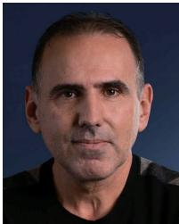

Jacob Benesty received the master’s degree in microwaves from Pierre and Marie Curie University, Paris, France, in 1987, and the Ph.D. degree in control and signal processing from Orsay University, Orsay, France, in April 1991.

During his Ph.D. degree, he worked on adaptive filters and fast algorithms at the Centre National d’Etudes des Telecommunications (CNET), Paris, from November 1989 to April 1991. From January 1994 to July 1995, he worked at Telecom Paris University, Paris,

on multichannel adaptive filters and acoustic echo cancellation. From October 1995 to May 2003, he was first a Consultant and then a Member of the Technical Staff at Bell Laboratories, Murray Hill, NJ, USA. In May 2003, he joined INRS-EMT, University of Quebec, Montreal, QC, Canada, as a Professor. He is an Adjunct Professor with Aalborg University, Aalborg, Denmark, and a Guest Professor with Northwestern Polytechnical University, Xi’an, China. His research interests include signal processing, acoustic signal processing, and multimedia communications. He is the inventor of many important technologies. In particular, he was the Lead Researcher at Bell Laboratories, Murray Hill, NJ, USA, who conceived and designed the world-first real-time hands-free full-duplex stereophonic teleconferencing system. Also, he conceived and designed the world-first PC-based multiparty hands-free full-duplex stereo conferencing system over IP networks. He has co-authored and co-edited/co-authored numerous books in the area of acoustic signal processing.

Dr. Benesty is the editor of the book series Springer Topics in Signal Processing. He was the general chair and the technical chair of many international conferences and a member of several IEEE technical committees. Four of his journal articles were awarded by the IEEE Signal Processing Society, and in 2010, he received the Gheorghe Cartianu Award from the Romanian Academy.