# Design of the Wiener gain in noisy and reverberant environments Qian Xiang a,b, , Jingdong Chen c, ,∗, Jacob Benesty d, , Tao Lei e, Chao Pan c

a Anhui Research Center of Generic Technology in Photovoltaic Industry, Fuyang Normal University, Fuyang, Anhui 236037, China

b School of Electrical and Control Engineering, Shaanxi University of Science and Technology, Xi’an, Shaanxi 710021, China

c Center of Intelligent Acoustics and Immersive Communications, Northwestern Polytechnical University, Xi’an, Shaanxi 710072, China

d INRS-EMT, University of Quebec, Montreal, QC H5A 1K6, Canada

e School of Electronic Information and Art­ficial Intelligence, Shaanxi University of Science and Technology, Xi’an, Shaanxi 710021, China

## A R T I C L E I N F O

Keywords: Dereverberation Noise suppression Signal-to-noise ratio Coherence-to-diffuse ratio Wiener gain

## A B S T R A C T

The Wiener gain or filter plays an important role in both single-channel and multichannel speech enhancement. Traditional Wiener gain formulations are typically based solely on either the signal-to-noise ratio (SNR) or the coherent-to-diffuse ratio (CDR), rendering them suboptimal in noisy and reverberant environments. In this paper, we present an approach to the design of the Wiener gain by incorporating estimates of both SNR and CDR. Additionally, we introduce two hyperparameters to govern the extent of noise reduction and reverberation suppression. Through simulations, we demonstrate that the proposed approach surpasses widely used methods in terms of SNR gain, log-spectral-distortion (LSD), direct-to-reverberant energy ratio (DRR), and Kurtosis ratio (KR).

## 1. Introduction

The Wiener beamformer represents a fundamental spatio-temporal filtering technique extensively employed in the field of acoustic signal processing to extract an acoustic source signal from observations tainted by both noise and reverberation. It has been shown in the liter ature that this beamformer can be decomposed as the combination of a minimum-variance-distortionless-response (MVDR) beamformer and a Wiener gain [1,2]. Hence, both the MVDR beamformer and Wiener gain necessitate careful design to ensure optimal performance of the Wiener beamformer.

Numerous studies in the literature have been dedicated to the design of MVDR beamformers. These eforts aim to achieve high signal-tonoise-ratio (SNR) gain while ensuring robustness for practical applica tions [3--5]. Various techniques have been proposed for this purpose, including the diagonal-loading MVDR beamformer [6,7], worst-case MVDR beamformer [8--10], and simpl­fied MVDR beamformer, where the noise field is modeled as either spatially white [11,12] or difuse noise [13--15]. Similarly, various endeavors have been undertaken to devise optimal Wiener gains. These approaches can be broadly categorized into two main groups: SNR based methods and coherent-to-diffuse-ratio (CDR) based techniques.

SNR-based methods primarily target at the suppression of back ground additive noise [16,17]. The key lies in obtaining an accurate estimate of the SNR, as more accurate SNR estimation leads to enhanced speech with reduced distortion. Classical algorithms for SNR estimation can be found in the literature [18--21]. In contrast, CDR-based approaches center on reverberation suppression [22--24]. The crux lies in obtaining an accurate estimate of the CDR. To estimate CDR, it is generally assumed that the noise coherence matrix induced by reverberation mirrors that of difuse noise. Specifically, coherence coeficients corresponding to the distance between sensors and the frequency of interest are calculated. By leveraging the covariance matrix model of array ob servations and a priori information on the noise coherence matrix, CDR estimators can be derived [25--27]. Initially, CDR estimators were developed for two-element arrays [28--31], and later extended to arrays with more than two sensors [34]. However, existing CDR estimators do not account for both noise and reverberation simultaneously, rendering them less efective in practical environments, where background noise and reverberation coexist.

In this study, we aim to design the Wiener gain by jointly considering both noise and reverberation. We devise an estimator that incorporates both SNR and CDR as parameters. Additionally, we introduce two hyperparameters to regulate the trade-off between noise reduction and reverberation suppression. Using SNR gain, log-spectral-distortion (LSD), direct-to-reverberant energy ratio (DRR) [46,47], and Kurtosis ratio (KR) [50,51] as performance metrics, we demonstrate, through simulations, the superior performance of our proposed method for Wiener gain design.

The organization of the rest of the paper is as follows. In Section $^ { 2 , }$ we introduce the signal model, discuss the parameters, and describe the objective of this study. Section 3 focuses on deriving the optimal Wiener gain for both reverberation and additive noise suppression. Simulation results are presented and analyzed in Section 4. Finally, we draw conclusions in Section 5.

## 2. Signal model and problem formulation

Consider to use an array with � microphones to pick up sound sig nals in a noisy and reverberant environment. The observation signals at the sensors can be modeled as [16]

$$
\begin{array}{r l} & y _ {m} (t) = g _ {m} (t) * s (t) + v _ {m} (t) \\ & \qquad = g _ {m, \mathrm{early}} (t) * s (t) + g _ {m, \mathrm{late}} (t) * s (t) + v _ {m} (t), \end{array}\tag{1}
$$

where � is the discrete-time index, ∗ stands for the linear convolution, $s ( t )$ is the speech source signal of interest, $v _ { m } ( t )$ is the additive noise at the �th sensor, $g _ { m } ( t )$ is the impulse response from the source to the �th sensor, $g _ { m , \mathrm { e a r l y } } ( t )$ represents the direct and early r­flection paths in the impulse response, and $g _ { m , \mathrm { l a t e } } ( t )$ sign­fies the late r­flection paths, which leads to reverberation, with $g ( t ) = g _ { m , \mathrm { { e a r l y } } } ( t ) + g _ { m , \mathrm { { l a t e } } } ( t )$ . It is commonly assumed that the source signal, reverberation, and noise are mutually uncorrelated and they all are of zero mean.

In the short-time-Fourier-transform (STFT) domain, the signal model presented in (1) can be rewritten as

$$
Y _ {m} (n, k) = X _ {m} (n, k) + R _ {m} (n, k) + V _ {m} (n, k),\tag{2}
$$

where � is the frequency-bin index, � is the time-frame index, and $Y _ { m } ( n , k ) , X _ { m } ( n , k ) , R _ { m } ( n , k ) $ , and $V _ { m } ( n , k )$ are the STFTs of $y _ { m } ( t ) _ { \colon }$ $g _ { m , \mathrm { e a r l y } } ( t ) * s ( t ) , \ : g _ { m , \mathrm { l a t e } } ( t ) * s ( t )$ , and $v _ { m } ( t )$ , respectively. Putting all the signals in (2) into a vector form gives

$$
\begin{array}{r l} & {\mathbf {y} (n, k) \stackrel {\triangle} {=} \left[ \begin{array}{l l l l} Y _ {0} (n, k) & Y _ {1} (n, k) & \dots & Y _ {M - 1} (n, k) \end{array} \right] ^ {T}} \\ & {\qquad = \mathbf {d} (k) S (n, k) + \mathbf {r} (n, k) + \mathbf {v} (n, k),} \end{array}\tag{3}
$$

where �(�) is called the array manifold vector, $S ( n , k )$ is the source signal, and $\mathbf { r } ( n , k )$ and $\mathbf { v } ( n , k )$ , which are d­fined in the same way as $\mathbf { y } ( n , k )$ are the reverberation and noise vectors, respectively.

Applying a beamformer �(�) of length � to the observation vector, �(�, �), we obtain

$$
\begin{array}{l} Z (n, k) = \mathbf {h} ^ {H} (k) \mathbf {y} (n, k) \\ \qquad = \mathbf {h} ^ {H} (k) \mathbf {d} (k) S (n, k) + \mathbf {h} ^ {H} (k) \mathbf {r} (n, k) \\ \qquad + \mathbf {h} ^ {H} (k) \mathbf {v} (n, k), \end{array}\tag{4}
$$

where $\mathbf { h } ^ { H } ( k ) \mathbf { d } ( k ) S ( n , k )$ is the recovered signal after beamforming, and $\mathbf { h } ( k ) \mathbf { r } ( n , k )$ and ${ \bf h } ( k ) { \bf v } ( n , k )$ correspond, respectively, to the residual re verberation and residual noise after beamforming.

Based on the assumption that the source, reverberation, and noise are mutually uncorrelated, we can derive the variance of $Z ( n , k )$ as

$$
\begin{array}{r l} & {\phi_ {Z} (n, k) \stackrel {\triangle} {=} \mathbb {E} \left[ | Z (n, k) | ^ {2} \right]} \\ & {\qquad = \left| \mathbf {h} ^ {H} (k) \mathbf {d} (k) \right| ^ {2} \phi_ {S} (n, k)} \\ & {\qquad + \mathbf {h} ^ {H} (k) \boldsymbol {\Phi} _ {R} (n, k) \mathbf {h} (k) + \mathbf {h} ^ {H} (k) \boldsymbol {\Phi} _ {V} (n, k) \mathbf {h} (k),} \end{array}\tag{5}
$$

where �(⋅) denotes the mathematical expectation, $\phi _ { S } ( n , k )$ is the vari ance of the source signal, and $\Phi _ { R } ( n , k )$ and $\Phi _ { V } ( n , k )$ are the covariance matrices of the reverberation and additive noise, respectively. For small-spacing microphone arrays, as assumed in this study, $\Phi _ { R } ( n , k )$ and $\Phi _ { V } ( n , k )$ can be modeled as [35]

$$
\Phi_ {R} (n, k) = \Gamma_ {R} (k) \phi_ {R} (n, k),\tag{6}
$$

$$
\boldsymbol {\Phi} _ {V} (n, k) = \boldsymbol {\Gamma} _ {V} (k) \phi_ {V} (n, k),\tag{7}
$$

where $\Gamma _ { R } ( k )$ and $\Gamma _ { V } ( k )$ are the coherence matrices of the reverberation and additive noise, respectively, with tr $\left[ \Gamma _ { R } ( k ) \right] = \operatorname { t r } \left[ \Gamma _ { V } ( k ) \right] = M$ , and $\phi _ { R } ( n , k )$ and $\phi _ { V } ( n , k )$ are the variances of the reverberation and additive noise, respectively. With (6) and (7), the variance of $Z ( n , k )$ can be further simpl­fied to

$$
\begin{array}{c} \phi_ {Z} (n, k) = \alpha_ {S} (k) \phi_ {S} (n, k) + \alpha_ {R} (k) \phi_ {R} (n, k) \\ + \alpha_ {V} (k) \phi_ {V} (n, k), \end{array}\tag{8}
$$

where

$$
\alpha_ {S} (k) \triangleq \left| \mathbf {h} ^ {H} (k) \mathbf {d} (k) \right| ^ {2},\tag{9}
$$

$$
\alpha_ {R} (k) \triangleq \mathbf {h} ^ {H} (k) \boldsymbol {\Gamma} _ {R} (k) \mathbf {h} (k),
$$

$$
\alpha_ {V} (k) \triangleq \mathbf {h} ^ {H} (k) \boldsymbol {\Gamma} _ {V} (k) \mathbf {h} (k).\tag{10}
$$

(11)

To enhance the source signal from noisy observations, it is often desired that both $\alpha _ { R } ( k )$ and $\alpha _ { V } ( k )$ are small and, at the same time, $\alpha _ { S } ( k )$ is above some level. However, the performance of a fixed beamformer, $\mathbf { h } ( k )$ , may not meet the requirement and, consequently, a pos­ filter $G ( n , k ) \in [ 0 , 1 ]$ is often applied to �(�, �) [1,2]. Under this framework, the final estimate of the source signal can be expressed as

$$
\begin{array}{r l} & {\hat {S} (n, k) = G (n, k) Z (n, k)} \\ & {\qquad = G (n, k) \mathbf {h} ^ {H} (k) \mathbf {y} (n, k)} \\ & {\qquad = S _ {\mathrm{fd}} (n, k) + R _ {\mathrm{rr}} (n, k) + V _ {\mathrm{rn}} (n, k),} \end{array}\tag{12}
$$

where $S _ { \mathrm { f d } } ( n , k ) \overset { \triangle } { = } G ( n , k ) \mathbf { h } ^ { H } ( k ) \mathbf { d } ( k ) S ( n , k )$ is the filtered desired signal, $R _ { \mathrm { r r } } ( n , k ) \overset { \triangle } { = } G ( n , k ) \mathbf { h } ^ { H } ( k ) \mathbf { r } ( n , k )$ is the residual reverberant signal, and $V _ { \mathrm { r n } } \overset { \triangle } { = } G ( n , k ) \mathbf { h } ^ { H } ( k ) \mathbf { v } ( n , k )$ is the residual noise.

Clearly, the optimal gain, i.e., the optimal value of $G ( n , k )$ , is a function of the variances of the desired source, reverberation, and additive noise. In the extreme case where reverberation is absent, the gain degenerates to the following form [18--20]:

$$
G (n, k) = \frac {\mathrm{SNR} (n , k)}{1 + \mathrm{SNR} (n , k)},\tag{13}
$$

where SNR $\stackrel { \triangle } { = } \phi _ { S } ( n , k ) / \phi _ { V } ( n , k )$ is the SNR. In another extreme case where the additive noise is absent, the gain degenerates to a function of CDR [22--29], i.e.,

$$
G (n, k) = \frac {\operatorname{CDR} (n , k)}{1 + \operatorname{CDR} (n , k)},\tag{14}
$$

where CDR $\stackrel { \triangle } { = } \phi _ { S } ( n , k ) / \phi _ { R } ( n , k )$ , which is the ratio between the vari ance of the coherent source signal and that of the late reverberation. To have an estimate of the CDR, one way is to first estimate $\phi _ { S }$ and $\phi _ { \mathrm { R } }$ using such methods as in [32,33] and the variance of the source using methods such as the one in [45]. However, these approaches require to know the a priori source coherence matrix, which is dificult to estimate in complex acoustic environments.

While considerable attention has been dedicated in literature to estimating the gain in the form of either (13) or (14), i.e., either considering the case with only noise or the case with only reverberation, few eforts have focused on estimating the gain $G ( n , k )$ while considering both reverberation and additive noise. This is precisely the objective of this work.

## 3. Proposed approach

Consider both the reverberation and additive noise, the optimal Wiener gain can be expressed according to (8) a

$$
= \frac {\alpha_ {S} (k) \phi_ {S} (n , k)}{\alpha_ {S} (k) \phi_ {S} (n , k) + \alpha_ {R} (k) \phi_ {R} (n , k) + \alpha_ {V} (k) \phi_ {V} (n , k)}.\tag{15}
$$

Note that the distortionless constraint, i.e., $\mathbf { h } ^ { H } ( k ) \mathbf { d } ( k ) = 1$ , is often required in array processing to prevent the desired source signal from distortion. It is reasonable to assume that $\alpha _ { S } ( k ) \approx 1$ . As a result, one can simplify the Wiener gain as

$$
\begin{array}{c} G (n, k) = \frac {\phi_ {S} (n , k)}{\phi_ {S} (n , k) + \alpha_ {R} (k) \phi_ {R} (n , k) + \alpha_ {V} (k) \phi_ {V} (n , k)} \\ = \frac {1}{1 + \alpha_ {R} (k) \frac {1}{\mathrm{CDR} (n , k)} + \alpha_ {V} (k) \frac {1}{\mathrm{SNR} (n , k)}}. \end{array}\tag{16}
$$

In practical applications, eliminating noise and reverberation simul taneously without distorting the source signal is often challenging, if not impossible. Thus, a strategic approach becomes necessary to strike a reasonable balance between speech distortion, noise reduction, and reverberation suppression. Recognizing that the importance of noise reduction or reverberation suppression may vary depending on the ap plication, we generalize the Wiener gain as follows:

$$
G (n, k) = \frac {1}{1 + \beta_ {1} \frac {\alpha_ {R} (k)}{\mathrm{CDR} (n , k)} + \beta_ {2} \frac {\alpha_ {V} (k)}{\mathrm{SNR} (n , k)}},\tag{17}
$$

where $\beta _ { 1 } \geq 0$ and $\beta _ { 2 } \geq 0$ are two hyper-parameters, which control the tradeoff between noise reduction and reverberation suppression.

It is widely acknowledged that the filtering process introduces speech distortion, notably the phenomenon known as musical noise [21]. Indeed, research has shown that increased noise reduction tends to correlate with greater speech distortion [36]. To address this, the applied gain to the signal is frequently adjusted to mitigate the impact of speech distortion by

$$
G (n, k) \leftarrow \max \{G (n, k), G _ {\min} \},\tag{18}
$$

where $G _ { \mathrm { m i n } } \in ( 0 , 1 )$ is a small positive number, ${ \mathrm { e . g . , ~ } } G _ { \mathrm { m i n } } = 0 . 0 1$ . As musical noise stems from isolated peaks in the STFT domain, raising $G _ { \mathrm { m i n } }$ aids in diminishing these peaks, albeit at the expense of reduced noise reduction.

## 3.1. Implementation

## 3.1.1. Covariance and coherence matrices estimation

The covariance matrix of the observation is estimated according to

$$
\boldsymbol {\Phi} _ {Y} (n, k) = \lambda \boldsymbol {\Phi} _ {Y} (n - 1, k) + (1 - \lambda) \mathbf {y} (n, k) \mathbf {y} ^ {H} (n, k),\tag{19}
$$

where $\lambda \in ( 0 ,$ , 1) is a forgetting factor. The corresponding coherence ma trix is then calculated by

$$
\boldsymbol {\Gamma} _ {Y} (n, k) = \boldsymbol {\Phi} _ {Y} (n, k) / \phi_ {Y} (n, k),\tag{20}
$$

where $\phi _ { Y } ( n , k ) \overset { \triangle } { = } \mathrm { t r } \left[ \Phi _ { Y } ( n , k ) \right] / M$ is the variance of the observation sig nals. The covariance matrix of the additive noise is estimated in a similar way when the desired signal is absent. The coherence matrix $\Gamma _ { V } ( k )$ is then calculated according to (7), i.e., ${ \Gamma _ { V } } ( n , k ) = { \Phi _ { V } } ( n , k ) / { \phi _ { V } } ( n , k )$ . The coherence matrix of the reverberation is modeled by that of the difuse noise, i.e.,

$$
\left[ \boldsymbol {\Gamma} _ {R} (k) \right] _ {i, j} = \frac {\sin \left(\omega_ {k} \Delta_ {i , j} / c\right)}{\omega_ {k} \Delta_ {i , j} / c},\tag{21}
$$

where $[ \cdot ] _ { i , j }$ stands for the (�, �)th element of a matrix, � represents the speed of sound in air, typically around 340 m/s, and $\Delta _ { i , j }$ is the distance between the �th and �th sensors. Apparently, the $( i , { \dot { j } } )$ )th element of $\Gamma _ { R } ( k )$ is a function of $\Delta _ { i , j }$ and $\omega _ { \boldsymbol { k } } ( \omega _ { \boldsymbol { k } } = 2 \pi \boldsymbol { k } \cdot \boldsymbol { f } _ { \mathrm { s } } / K$ with $f _ { \mathrm { s } }$ being the sampling rate and � being the total number of frequency bins).

## 3.1.2. Estimation of the beamformer, $\alpha _ { R } ( k ) _ { i }$ , and $\alpha _ { V } ( k )$

Numerous attempts have been made to design both fixed and adaptive beamformers. For simpl­fication, we adopt the robust superdirective beamformer in this work, which is of the following form:

$$
\mathbf {h} (k) = \frac {\mathbf {\Gamma} _ {R , \epsilon} ^ {- 1} (k) \mathbf {d} _ {0} (k)}{\mathbf {d} _ {0} ^ {H} \mathbf {\Gamma} _ {R , \epsilon} ^ {- 1} (k) \mathbf {d} _ {0} (k)},\tag{22}
$$

where $\Gamma _ { R , \epsilon } ( k ) = \Gamma _ { R } ( k ) + \epsilon \mathbf { I } _ { \mathbf { \lambda } }$ , with $\epsilon = 1 0 ^ { - 3 }$ , and $\mathbf { d } _ { 0 } ( k )$ is the array phasedelay vector corresponding to the desired source direction. For a uniform linear array, the phase-delay vector can be expressed as

$$
\mathbf {d} _ {0} (k) = \left[ \begin{array}{c c c c} 1 & e ^ {- \jmath \varpi_ {k} \frac {\delta_ {0}}{c} \cos \theta_ {0}} & \dots & e ^ {- \jmath (M - 1) \varpi_ {k} \frac {\delta_ {0}}{c} \cos \theta_ {0}} \end{array} \right] ^ {T},\tag{23}
$$

where $\delta _ { 0 }$ is the array inter-element spacing and $\theta _ { 0 }$ is the desired source direction. Parameters $\alpha _ { R } ( k )$ and $\alpha _ { V } ( k )$ are then calculated according to (10) and (11), respectively.

## 3.1.3. SNR estimation

The SNR is estimated by the so-called decision-direct approach [18], i.e.,

$$
\mathrm{SNR} (n, k) = \lambda_ {S} \xi (n, k - 1) + (1 - \lambda_ {S}) \zeta (n, k),\tag{24}
$$

where $\lambda _ { S } \in ( 0 , 1 )$ is a hyper-parameter and

$$
\xi (n, k) = \frac {\left| G ^ {\prime} (n , k) Z (n , k) \right| ^ {2}}{\phi_ {V} (n , k)},\tag{25}
$$

$$
\zeta (n, k) = \max \left[ \frac {| Z (n , k) | ^ {2}}{\phi_ {V} (n , k)} - 1, 0 \right],\tag{26}
$$

with $G ^ { \prime } ( n , k ) \in [ 0 , 1 ]$ being a gain function. The variance of the noise is calculated by minimum tracking [18], the gain function $G ^ { \prime } ( n , k )$ is calculated according to [37]. In the case that $\begin{array} { r l } { { G } ^ { \prime } ( n , k ) = } \end{array}$ $\sqrt { | Z ( n , k ) | ^ { 2 } / \phi _ { V } ( n , k ) - 1 }$ , one can verify that $\xi ( n , k ) = \zeta ( n , k )$ . Recall |that $\zeta ( n , k )$ can be viewed as an instantaneous estimate of SNR, the decision-direct approach improves the results by smoothing the instantaneous values.

## 3.1.4. CDR estimation

According to (2), we can express the covariance matrix of the obser vation as

$$
\begin{array}{r l} & {\mathbf {\Phi} _ {Y} (n, k)} \\ & {= \pmb {\phi} _ {S} (n, k) \mathbf {d} (k) \mathbf {d} ^ {H} (k) + \pmb {\phi} _ {R} (n, k) \pmb {\Gamma} _ {R} (k) + \pmb {\phi} _ {V} (n, k) \pmb {\Gamma} _ {V} (k)} \\ & {= \pmb {\phi} _ {S} (n, k) \pmb {\Gamma} _ {S} (k) + \pmb {\phi} _ {R} (n, k) \pmb {\Gamma} _ {R} (k) + \pmb {\phi} _ {V} (n, k) \pmb {\Gamma} _ {V} (k),} \end{array}\tag{27}
$$

where $\phi _ { S }$ is the variance of the coherent source signal and $\Gamma _ { S } ( k ) =$ $\mathbf { d } ( k ) \mathbf { d } ^ { H } ( \bar { k } )$ is the coherence matrix of the source.

Since the coherent source signal, late reverberation, and noise signal are mutually uncorrelated, the variance of the observation follows that $\phi _ { Y } = \phi _ { S } + \phi _ { R } + \phi _ { V }$ . The coherence matrix $\Gamma _ { Y } ( k )$ is then calculated according to (20), i.e.,

$$
\boldsymbol {\Gamma} _ {Y} (k) = \frac {\boldsymbol {\Phi} _ {Y} (n , k)}{\phi_ {S} (n , k) + \phi_ {R} (n , k) + \phi_ {V} (n , k)}.\tag{28}
$$

Substituting (27) into (28) gives

$$
\boldsymbol {\Gamma} _ {S} (k) = \frac {\boldsymbol {\Gamma} _ {Y} (k) - \boldsymbol {\Gamma} _ {R} (k))}{\mathrm{CDR} (k)} + \boldsymbol {\Gamma} _ {Y} (k) + \frac {\boldsymbol {\Gamma} _ {Y} (k) - \boldsymbol {\Gamma} _ {V} (k)}{\mathrm{SNR} (k)}.\tag{29}
$$

Using the constraint that all the absolute value of the off-diagonal elements of $\Gamma _ { S } ( k )$ matrix should be 1, one can estimate the CDR on a pair-by-pair basis using the method developed in [25]. According to (24), if SNR is given, a new DOA-independent CDR estimator for the $( i , j ) t h$ pair of sensors is given as

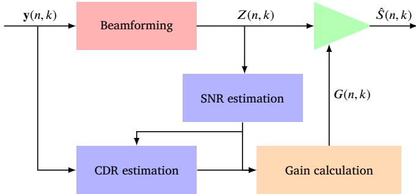  
Fig. 1. Signal processing diagram of the proposed approach.

$$
\begin{array}{l} \mathrm{CDR} _ {i, j} (k) \\ = \frac {- g _ {i , j} (k) - \sqrt {g _ {i , j} ^ {2} (k) - (\left| e _ {i , j} (k) \right| ^ {2} - 1) \left| f _ {i , j} (k) \right| ^ {2}}}{\left| e _ {i , j} (k) \right| ^ {2} - 1}, \end{array}\tag{30}
$$

where

$$
e _ {i, j} (k) \stackrel {\triangle} {=} \left[ \boldsymbol {\Gamma} _ {Y} (k) \right] _ {i, j} + \frac {\left[ \boldsymbol {\Gamma} _ {Y} (k) \right] _ {i , j} - \left[ \boldsymbol {\Gamma} _ {V} (k) \right] _ {i , j}}{\mathrm{SNR} (k)},\tag{31}
$$

$$
f _ {i, j} (k) \stackrel {\triangle} {=} \left[ \boldsymbol {\Gamma} _ {Y} (k) \right] _ {i, j} - \left[ \boldsymbol {\Gamma} _ {R} (k) \right] _ {i, j},\tag{32}
$$

$$
g _ {i, j} (k) \triangleq \Re \left\{e (k) _ {i, j} f _ {i, j} ^ {*} (k) \right\}.\tag{33}
$$

The CDR for the array is then calculated as

$$
\mathrm{CDR} (k) = \frac {2}{M (M - 1)} \sum_ {i = 1} ^ {M - 1} \sum_ {j = 0} ^ {i - 1} \mathrm{CDR} _ {i, j} (k),\tag{34}
$$

which represents the mean of CDR estimates across various pairs.

Given the SNR and CDR estimates, one can then compute the gain $G ( n , k )$ , the block diagram of which is illustrated in Fig. 1.

## 4. Evaluation

## 4.1. Setup

In our simulation, we employ the renowned image model method [38,39] to simulate room impulse responses between the source and sensors within a room dimensions of 6 m×4 m×3 m. A 4-element uniform linear microphone array is utilized with an interelement spacing of 2 cm. The center position of the microphone array is at coordinate (3, 1, 1). Some speech signals are arbitrarily selected from the TIMIT database. These signals are concatenated and truncated to form the source signal, which lasting 17 s with a sampling rate of 16 kHz. Reverberation times $( T _ { 6 0 } )$ vary from 140 ms to 1000 ms across diferent simulation conditions. The source is at (4.299, 1.75, 1) and the corresponding incidence angle is 30◦. By convolving the source signal with the impulse response corresponding to the �th sensor, we obtain the signal captured by that sensor.

In our simulations, the noise signal $v _ { m } ( t )$ is a composite of interfer ence noise, difuse noise [40], and white noise, with interference and difusion noise ratios to white noise approximately 6.5 dB each. The interference source signal is taken from the 100 Nonspeech Corpus [41]. The interference source is located at (1.701, 1.75, 1), so the correspond ing incidence direction is 150◦. The interference signals at the sensors are also generated by convolving the interference source signal with the corresponding impulse responses. Adjusting the input SNR involves scaling the noise signal $v _ { m } ( t )$ appropriately. As our method operates in the STFT domain, observations are segmented into frames of 512 samples with a hop size of 128 samples, followed by application of a Hanning window to each frame before Fourier transformation.

We explore four baseline approaches alongside our proposed method for comparative analysis: the traditional SNR-based Wiener approach [36], the CDR-based approach [25], TSNR [20], HRNR [20], and the adaptive weighted prediction estimation (AWPE) approach [42,43].

## 4.2. Performance measures

To assess the proposed approaches comprehensively, we compute four performance metrics under varying simulation conditions: fullband SNR Gain [36], LSD [44,45], DRR $[ 4 6 , 4 7 ]$ , speech-to-reverberation modulation energy ratio (SRMR) [48], perceptual evaluation of speech quality (PESQ) [49] and KR [50,51].

The fullband SNR gain is the ratio between the fullband output SNR and the fullband input SNR, i.e.,

$$
\mathrm{SNRGain} = \frac {\mathrm{oSNR}}{\mathrm{iSNR}}.\tag{35}
$$

With out loss of generality, we choose the first sensor in the microphone array as the reference for evaluation. Then, the fullband output and in put SNRs are written, respectively, as

$$
\mathrm{iSNR} = \frac {\mathbb {E} [ | s _ {\mathrm{d}} (t) | ] ^ {2}}{\mathbb {E} [ | v (t) | ] ^ {2}},\tag{36}
$$

$$
\mathrm{oSNR} = \frac {\mathbb {E} [ | s _ {\mathrm{fd}} (t) | ] ^ {2}}{\mathbb {E} [ | v _ {\mathrm{rn}} (t) | ] ^ {2}},\tag{37}
$$

where $s _ { \mathrm { d } } ( t ) = g _ { \mathrm { 1 , e a r l y } } ( t ) * s ( t )$ is the desired signal, $v ( t ) = v _ { 1 } ( t )$ is the additive noise, and $s _ { \mathrm { f d } } ( t )$ and $v _ { \mathrm { r n } } ( t )$ are, respectively, the time-domain counterparts of $S _ { \mathrm { f d } } ( n , k )$ and $V _ { \mathrm { r n } } ( n , k )$ in (12).

The DRR of the array output can be expressed as

$$
\mathrm{DRR} = \frac {\mathbb {E} [ | s _ {\mathrm{fd}} (t) | ] ^ {2}}{\mathbb {E} [ | r _ {\mathrm{rr}} (t) | ] ^ {2}},\tag{38}
$$

where $r _ { \mathrm { r r } } ( t )$ is the time-domain counterpart of $R _ { \mathrm { r r } } ( n , k )$ in (12).

The LSD quant­fies the distance between the desired signal and the array output, which is d­fined as

$$
\mathrm{LSD} = \frac {1}{N} \sum_ {n = 0} ^ {N - 1} \sqrt {\frac {1}{K} \sum_ {k = 0} ^ {K - 1} \left| 1 0 \log_ {1 0} \frac {\hat {S} (n , k)}{S _ {\mathrm{d}} (n , k)} \right| ^ {2}},\tag{39}
$$

where $\hat { S } ( n , k )$ is the array output given in (12) and $S _ { \mathrm { d } } ( n , k ) = S ( n , k )$

Finally, the KR is applied to measure the amount of the musical noise in the array output. The KR is d­fined as

$$
\mathrm{KR} = \frac {\text { kurt } _ {\text { out }}}{\text { kurt } _ {\text { in }}},\tag{40}
$$

where kur $\mathrm { \Delta t _ { o u t } }$ and kur ${ \mathfrak { t } } _ { \mathrm { i n } }$ are the Kurtosis of the array output and observed signals, respectively. The Kurtosis of a random process � is d­fined as $\mu _ { 4 } / \mu _ { \gamma } ^ { 2 }$ , where $\mu _ { n }$ is �th order moment given by $\mu _ { n } =$ $\begin{array} { r } { \int _ { 0 } ^ { \infty } x ^ { n } p _ { X } ( x ) d x , } \end{array}$ and $p _ { X } ( x )$ is the probability density function.

It is worth to mention that all the SNR Gain, LSD, DRR, and KR are calculated in the logarithmic scale, i.e., 10log (SNR Gain), 10log (LSD), $1 0 \log _ { 1 0 } ( \mathrm { { D R R } ) }$ , and $\log _ { 1 0 } ( \mathrm { K R } )$

## 4.3. Performance comparison

To ensure a fair comparison of performance across diferent approaches, except for AWPE, all gains are applied to the output of the superdirective (SD) beamformer. These resulting approaches are denoted as SD-SNR, SD-CDR, SD-TSNR, and SD-HRNR, respectively.

In first set of simulations, we evaluate the CDR estimator given in (30) and compare it with the one developed in [25]. The reverberation time $T _ { 6 0 }$ is set to 500 ms, the input SNR is set to $\mathrm { S N R } = 2 0 ~ \mathrm { d B } ,$ , the number of sensors is $M = 4 ,$ and the distance between adjacent sensors is 2 cm. It is worth noting that early r­flections and noise signals are excluded when calculating the ground truth of the CDRs. The results are shown in Fig. 2. As seen, the proposed approach demonstrates lower estimation errors compared to the SD-CDR approach.

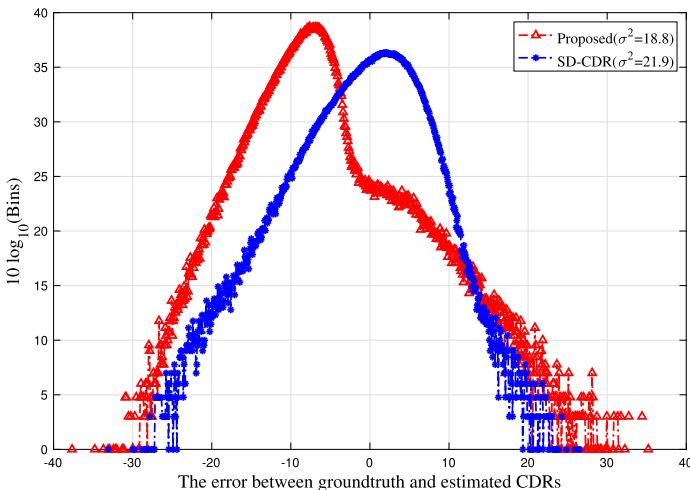  
Fig. 2. The error between groundtruth and estimated CDRs.

Table 1 The values of the SNR Gain, LSD, DRR, and PESQ for the diferent methods.

<table><tr><td>Approaches</td><td>SNR Gain</td><td>LSD</td><td>DRR</td></tr><tr><td>SD-SNR</td><td>9.8</td><td>7.2</td><td>8.3</td></tr><tr><td>SD-CDR</td><td>8.6</td><td>8.1</td><td>9.2</td></tr><tr><td>SD-TSNR</td><td>10.2</td><td>7.4</td><td>8.5</td></tr><tr><td>SD-HRNR</td><td>10.1</td><td>8.0</td><td>8.7</td></tr><tr><td>AWPE</td><td>-</td><td>11.1</td><td>-</td></tr><tr><td>Proposed</td><td>11.4</td><td>7.2</td><td>9.3</td></tr></table>

Referring to (17), we have two hyper-parameters, i.e., $\beta _ { 1 }$ and $\beta _ { 2 }$ , to determine. Fig. 3(a) illustrates the tradeoff between SNR Gain and DRR for the proposed approach, varying with $\beta _ { 1 }$ and $\beta _ { 2 }$ . Here, the input SNR is 5 dB, the reverberation time $T _ { 6 0 }$ is approximately 500 ms, and $\beta _ { 1 }$ and $\beta _ { 2 }$ vary from 1 to 10 incrementally, with each curve corresponding to the same $\beta _ { 2 }$ . One can see from the plot that DRR increases with as the value of $\beta _ { 1 }$ increases, while SNR Gain rises with increasing $\beta _ { 2 }$ . Notably, when $\beta _ { 2 }$ surpasses a certain threshold, $\mathbf { e . g . } , \beta _ { 2 } \geq 5 ,$ , further increments do not significantly enhance SNR Gain. Conversely, enhancing DRR appears to be more eficiently achieved by elevating $\beta _ { 1 }$ . Compared to traditional approaches, our method surpasses them in terms of both DRR and SNR Gain by selecting suitable values of $\beta _ { 1 }$ and $\beta _ { 2 }$

Fig. 3(b) depicts the tradeoff between SNR Gain and LSD concerning $\beta _ { 1 }$ and $\beta _ { 2 }$ , both ranging from 1 to 10 incrementally. Initially, LSD experiences a rapid decline with increasing the value of $\beta _ { 2 }$ . Since SNR Gain escalates with the value of $\beta _ { 2 } ,$ , this decrease in LSD correlates with SNR Gain augmentation. However, with further increments in the value of $\beta _ { 2 } \mathrm { { : } }$ , LSD increases alongside SNR Gain, implying that greater SNR enhancement leads to more significant signal distortion. Consequently, strategically increasing the value of $\beta _ { 2 }$ could be ben­ficial in practical scenarios. When $\beta _ { 2 }$ is fixed, say $\beta _ { 2 } > 3$ , a slight decrease in SNR Gain and a substantial increase in DRR occur with increasing the value of $\beta _ { 1 }$ , indicating enhanced reverberation suppression. However, the value of LSD rises with $\beta _ { 1 }$ , suggesting ampl­fied signal distortion. Hence, a tradeoff becomes necessary when determining the value of $\beta _ { 1 }$ in practical contexts.

Finally, we present the spectrograms of the clean, noisy and rever berant, and array output signals of the proposed method in Fig. 4, with $\beta _ { 1 } = 5$ and $\beta _ { 2 } = 3$ . Additionally, the corresponding CDR, SNR, and fil ter gain are plotted in Fig. 5. It is evident from these figures that the proposed approach efectively attenuates noise in the observations. Additionally, Table 1 presents the results for SNR Gain, LSD, and DRR for the studied methods and Table 2 shows the PESQ results. Note that for

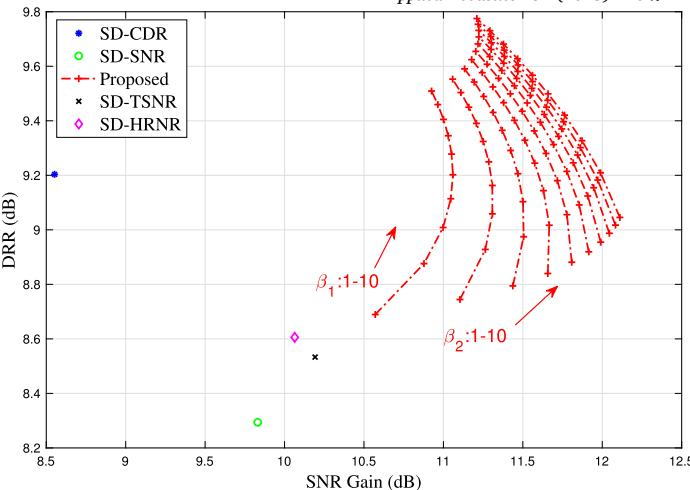  
(a)

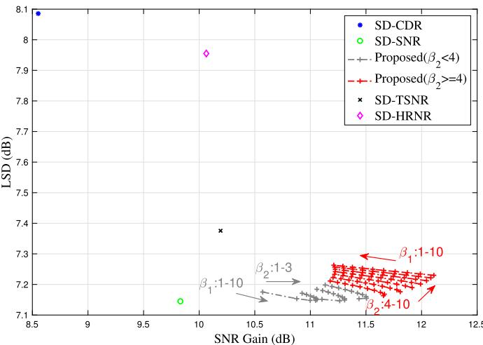  
(b)  
Fig. 3. (a) The DRR v.s. the SNR Gain, (b) the LSD v.s. the SNR Gain of baseline approaches and proposed one as a function of $\beta _ { 1 } , \beta _ { 2 }$ (input SNR = 5 dB, $T _ { 6 0 } =$ 500 ms).

PESQ, a higher score indicates better performance. The results clearly demonstrate the superiority of our proposed method over the compared methods.

## 4.4. Performance as a function of the input SNR

In this subsection, we assess the performance of the proposed approach under various input SNR conditions with the noise signal consisting of interference, difuse noise, and white noise. The reverberation time $T _ { 6 0 }$ is maintained to be approximately 500 ms. Fig. 6 plots the SNR Gain, DRR, and LSD of diferent approaches. It is seen that the proposed approach surpasses traditional methods in both SNR Gain and LSD, with the DRR slightly exceeding that of the SD-CDR approach, consistent with the earlier evaluation of CDR estimation accuracy. Particularly noteworthy is the highest DRR achieved by our proposed approach, indicating superior reverberation suppression. This achievement primarily stems from our approach’s consideration of the noise signal during CDR estimation. Furthermore, the SNR Gain of the SD beamformer remains nearly constant across input SNRs. This constancy arises because the SNR Gain relies on the coherence matrix of the noisy environment, rather than the covariance matrix, which depends on noise variance.

Interestingly, the variation in DRR is minimal for both the SD-CDR approach and our proposed method across varying input SNRs. This stability stems from the fact that the Wiener gain of both approaches de pends on the CDR, which r­flects the level of reverberation. Moreover, CDR estimation is not significantly i­fluenced by changes in background noise level.

Table 2  
Comparison of PESQ for diferent methods.

<table><tr><td colspan="2"> $T_{60}$ ,SNR</td><td>Observed</td><td>SD</td><td>SD-SNR</td><td>SD-CDR</td><td>SD-TSNR</td><td>SD-HRNR</td><td>AWPE</td><td>Proposed</td></tr><tr><td>200 ms, 20 dB</td><td>PESQ</td><td>2.0175</td><td>2.1073</td><td>2.8701</td><td>2.5935</td><td>2.7672</td><td>2.7347</td><td>2.0864</td><td>2.8954</td></tr><tr><td>200 ms, 10 dB</td><td>PESQ</td><td>1.2249</td><td>1.3172</td><td>2.0881</td><td>1.6968</td><td>1.9548</td><td>1.9046</td><td>1.3437</td><td>2.1582</td></tr><tr><td>500 ms, 20 dB</td><td>PESQ</td><td>1.6217</td><td>1.6346</td><td>1.8394</td><td>1.8993</td><td>1.8352</td><td>1.8267</td><td>1.8427</td><td>1.9607</td></tr><tr><td>500 ms, 30 dB</td><td>PESQ</td><td>1.8907</td><td>1.9102</td><td>1.9482</td><td>2.1162</td><td>1.9560</td><td>1.9520</td><td>2.0827</td><td>2.1247</td></tr></table>

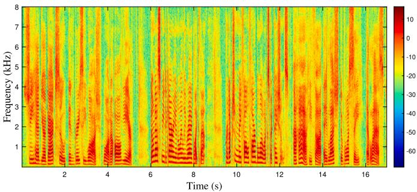  
(a)

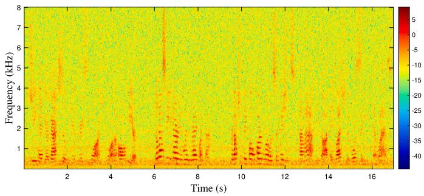  
(b)

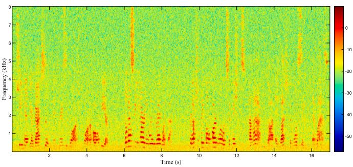  
(c)  
Fig. 4. The spectrograms of: (a) the clean speech, (b) the noisy observation (input SNR = 5 dB and $T _ { 6 0 } = 5 0 0 \mathrm { m } s )$ , and (c) the filter output (SNR Gain= 11.4 dB).

## 4.5. Performance versus reverberation time

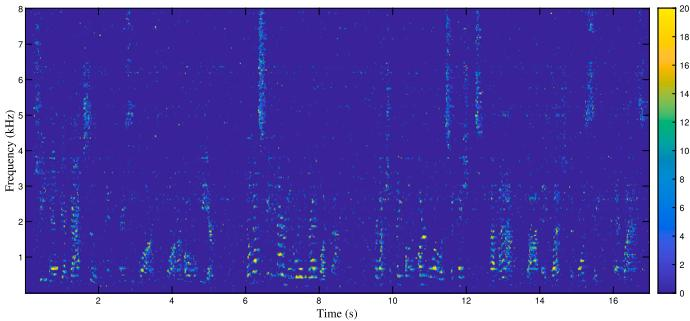

The proposed Wiener gain is determined by both the SNR and CDR. Given that the CDR r­flects the degree of reverberation, it is interesting to evaluate the performance of our approach under varying reverberation conditions. These results are plotted in Fig. 7 where the input SNR is 5 dB. Interestingly, the level of reverberation has minimal impact on LSD, with only slight reduction observed under high reverberation conditions. This phenomenon can be attributed to the fact that sig nal distortion primarily arises from noise suppression. Furthermore, the DRR of all methods exhibits a rapid decline with increasing reverberation time. However, the DRR of the proposed approach surpasses that of traditional methods, as demonstrated in the local enlarged view, particularly when $T _ { 6 0 }$ is 200 ms and 500 ms.

(a)  
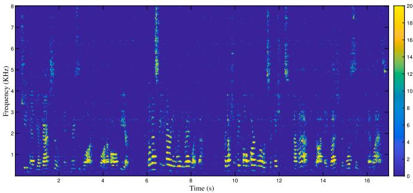  
(b)

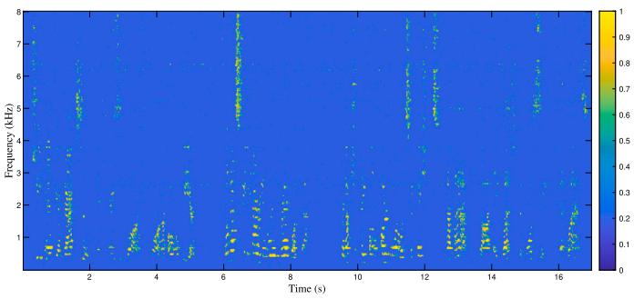  
(c)  
Fig. 5. CDR, SNR, and the filter gain.

In addition to the CDR-based approaches, the AWPE [42,43] method is also widely used for dereverberation. To further compare the dereverberation performance of AWPE with other approaches, we calculate the speech-to-reverberation modulation ratio (SRMR) for all methods (note that AWPE does not use DRR). These results are illustrated in Fig. 8, where the reverberation time $T _ { 6 0 }$ is approximately 500 ms. Observing the figure, we note that the SRMR of the AWPE approach is slightly lower than that of SD-CDR and our proposed approach when the input SNR is high (i.e., 20 dB). However, as the input SNR decreases, the SRMR of AWPE declines rapidly compared to other methods, indicating its high sensitivity to additive noise. In contrast, it is evident that the proposed approach outperforms AWPE in environments with both noise and reverberation.

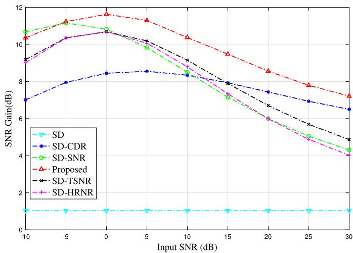

(a)  
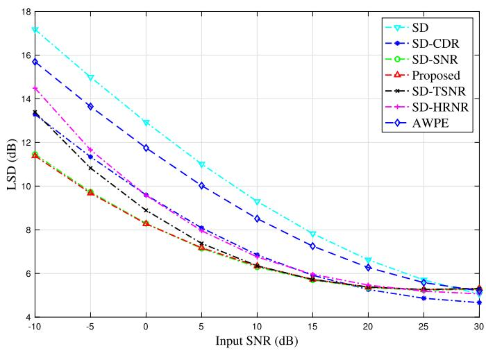

(b)  
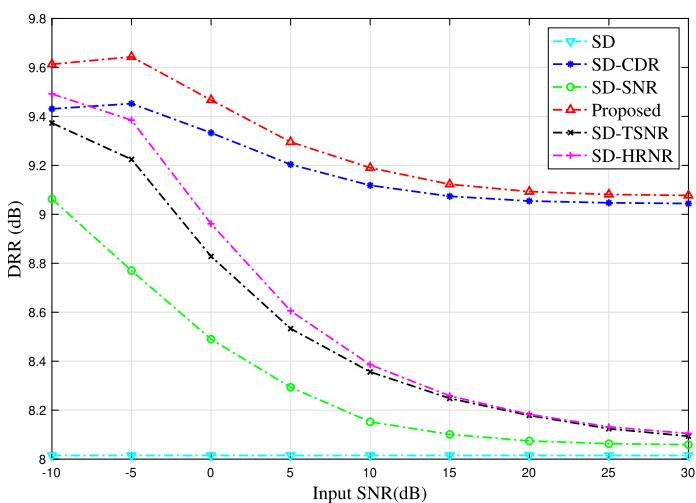  
(c)  
Fig. 6. The SNR Gain, LSD, and DRR of the compared methods as a function of the input SNR.

## 4.6. Impact of $G _ { \mathrm { m i n } }$ on performance

The minimum value of the Wiener gain, i.e., $G _ { \mathrm { m i n } } ,$ serves as a crucial hyperparameter in filter implementation. Smaller values of $G _ { \mathrm { m i n } }$ typically yield larger SNR Gain. However, the occurrence of musical noise becomes a concern if $G _ { \mathrm { m i n } }$ falls below a certain threshold. To assess the presence of musical noise, the Kurtosis ratio is introduced in [50,51]. A higher Kurtosis ratio indicates a greater risk of musical noise generation. Fig. 9 plots the Kurtosis ratio of our proposed approach as a function of $G _ { \mathrm { m i n } }$ where the input SNR is 5 dB and the reverberation time $T _ { 6 0 }$ is approximately 500 ms.

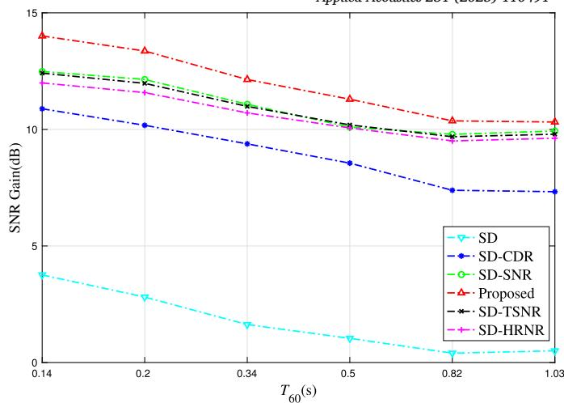

(a)  
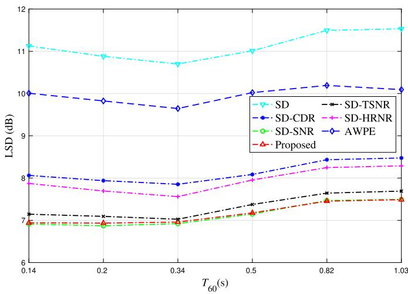  
(b)

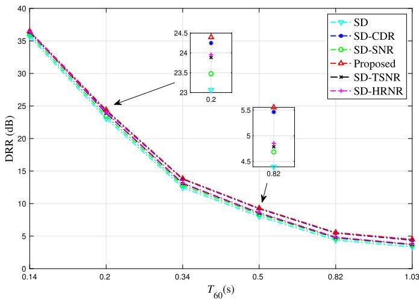  
(c)  
Fig. 7. The SNR Gain, LSD and DRR of the compared methods versus reverberation time.

Table 3  
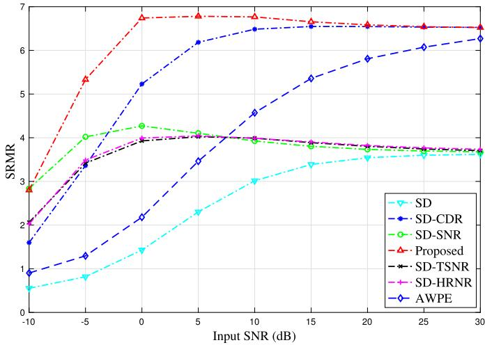  
Fig. 8. The SRMR of the compared methods as a function of the input SNR.

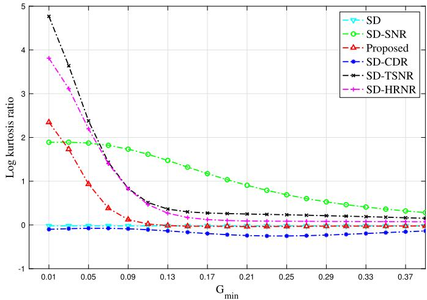  
Fig. 9. The log Kurtosis ratio of the diferent approaches as a function of $G _ { \mathrm { m i n } } .$

As seen, the Kurtosis ratio increases as the value of $G _ { \mathrm { m i n } }$ decreases, indicating a higher risk of musical noise. Opting for $G _ { \mathrm { m i n } } = 0 .$ 1 appears prudent, as the Kurtosis ratio remains relatively stable for $G _ { \mathrm { m i n } } \ge 0 . 1$ Additionally, it is noteworthy that the Kurtosis ratio of our proposed approach is lower than that of the SD-SNR, SD-TSNR, and SD-HRNR methods. Since SD is a fixed beamformer, it does not introduce musical noise, thus maintaining a consistently low Kurtosis ratio, as depicted in Fig. 9. Surprisingly, the Kurtosis ratio of the SD-CDR approach also remains minimal across changes in $G _ { \mathrm { m i n } } .$ . However, despite this, given the inferior SNR Gain of both SD and SD-CDR approaches, our proposed method still outperforms them.

## 4.7. Experiments

Experiments were also conducted to evaluate the efectiveness of the proposed method. These experiments took place in a classroom measuring 12.6 meters in length, 9.5 meters in width, and 4 meters in height, with a reverberation time of approximately 675 ms. A uniform linear array of four microphones, spaced 2 cm apart, was utilized. The first microphone was positioned at (1.6, 6.5, 0.7), and the array’s axis was aligned parallel to the front wall, as illustrated in Fig. 10.

To ensure reproducibility of the experimental results, the room im pulse responses from the source position to the microphone positions were measured using the spectral division method [52,53]. The source was positioned at (2.35, 7.8, 0.7), with a source-to-microphone distance of 1.5 meters. The experimental setup is depicted in Fig. 11. These measured impulse responses were treated as the ground truth for generating observation signals, consistent with the simulation setup described earlier. The input SNR was controlled to be 10 dB.

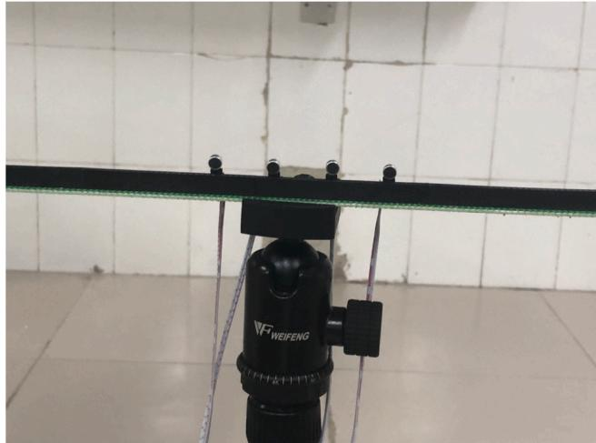  
Fig. 10. A photo of the 4-element uniform linear microphone array.

Experimental results for all the studied methods.

<table><tr><td>Methods</td><td>SNR Gain</td><td>LSD</td><td>DRR</td><td>PESQ</td></tr><tr><td>Observed</td><td>-</td><td>-</td><td>-</td><td>1.28</td></tr><tr><td>SD</td><td>7.11</td><td>12.12</td><td>4.96</td><td>1.49</td></tr><tr><td>SD-SNR</td><td>9.31</td><td>9.49</td><td>5.23</td><td>1.57</td></tr><tr><td>SD-CDR</td><td>13.26</td><td>9.34</td><td>8.20</td><td>1.68</td></tr><tr><td>SD-TSNR</td><td>9.57</td><td>9.39</td><td>5.28</td><td>1.57</td></tr><tr><td>SD-HRNR</td><td>8.65</td><td>10.31</td><td>5.24</td><td>1.55</td></tr><tr><td>AWPE</td><td>-</td><td>9.31</td><td>-</td><td>1.50</td></tr><tr><td>Proposed</td><td>14.88</td><td>7.78</td><td>8.98</td><td>1.74</td></tr></table>

The results, summarized in Table 3, clearly demonstrate that the proposed method outperforms the comparison methods, aligning with the findings from the simulations.

## 5. Conclusions

In this paper, we proposed an approach to the design of the Wiener gain for microphone array beamforming. The resultant Wiener gain is a function of both SNR and CDR, featuring two hyperparameters to suppress background noise and reverberation. By employing the SD beamformer as the spatial filter and integrating our proposed Wiener gain as the pos­ filter, we evaluated our approach and also compared it with some widely used methods in terms of SNR improvement, LSD, DRR, SRMR, and Kurtosis ratio. The results demonstrate the superiority of our proposed method over the compared ones.

## CRediT authorship contribution statement

Qian Xiang: Writing -- review & editing, Writing -- original draft, Funding acquisition, Formal analysis, Data curation, Conceptualization. Jingdong Chen: Writing -- review & editing, Methodology, Formal anal ysis. Jacob Benesty: Writing -- review & editing, Formal analysis, Conceptualization. Tao Lei: Methodology, Investigation. Chao Pan: Writing – review & editing, Investigation, Formal analysis, Data curation.

## Funding

This work was supported in part by the National Key Research and Development Program of China under Grant No. 2021ZD0201502 and in part by the Key Program of National Science Foundation of China (NSFC) under Grant No. 62192713, 61831019, 62171373, and 62271296.

FireFace UFX III, RME  
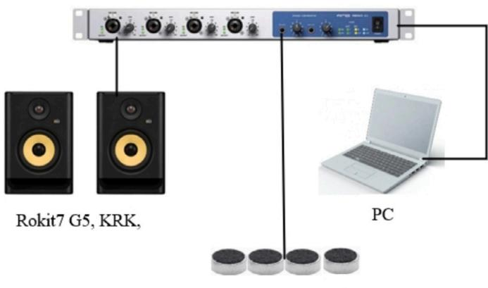  
Rokit7 G5, KRK,

WM-61A. Panasonic  
(a)  
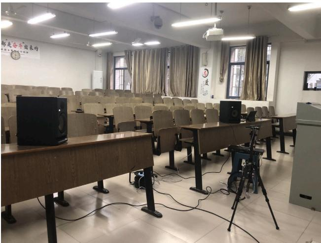  
(b)  
Fig. 11. (a) Illustration; (b) A photo of the experimental setup.

## Declaration of competing interest

The authors declare that they have no known competing financial interests or personal relationships that could have appeared to i­fluence the work reported in this paper.

## Data availability

Data will be made available on request.

## References

[1] Simmer KU, Bitzer J, Marro C. Pos­ filtering techniques. In: Microphone arrays. New York: Springer: 2001, p. 36–60.

[2] McCowan I, Bourlard H. Microphone array pos­ filter based on noise field coherence. IEEE Trans Speech Audio Process 2003;11(6):709--16.

[3] Capon J. High resolution frequency-wavenumber spectrum analysis. Proc JEEF 1969:57:1408-18

[4] Benesty J, Chen J, Huang Y. A generalized MVDR spectrum. IEEE Signal Process Lett 2005:12:827–30.

[5] Pan C, Chen J, Benesty J. On the noise reduction performance of the MVDR beamformer in noisy and reverberant environments, In: Proc. IEEE ICASSP: May 2014. p. 815–9.

[6] Cox H, Zeskind RM, Kooij T. Practical supergain. IEEE Trans Acoust Speech Signal Process 1986;34(3):393--8.

[7] Li J, Stoica P, Wang Zhisong. On robust Capon beamforming and diagonal loading. IEEE Trans Signal Process 2003;51(7):1702--15.

[8] Vorobyov SA, Gershman AB, Luo Z. Robust adaptive beamforming using worst-case performance optimization: a solution to the signal mismatch problem. IEEE Trans Signal Process 2003;51(2):313--24.

[9] Shahbazpanahi S, Gershman AB, Luo Z, Wong K. Robust adaptive beamforming for general-rank signal models. IEEE Trans Signal Process 2003;51(9):2257--69.

[10] Vorobyov SA, Gershman AB, Rong Y. On the relationship between the worstcase optimization-based and probability-constrained approaches to robust adaptive beamforming. In: Proc. IEEE ICASSP; Apr. 2007. p. 977--80.

[11] Flanagan JL, Johnson JD, Zahn R, Elko GW. Computer-steered microphone arrays for sound transduction in large rooms. J Acoust Soc Am 1985;78(5):1508--18.

[12] Rafaely B. Phase-mode versus delay-and-sum spherical microphone array processing. IEEE Signal Process Lett 2005;12(10):713--6.

[13] Kates JM. Superdirective arrays for hearing aids. J Acoust Soc Am 1993;94(4):1930--3.

[14] Doclo S, Moonen M. Superdirective beamforming robust against microphone mismatch. IEEE Trans Acoust Speech Signal Process 2007;15(2):617--31

[15] Pan C, Chen J, Benesty J. Reduced-order robust superdirective beamforming with uniform linear microphone arravs. JEEE/ACM Trans Audio Speech Lang Process 2016;24(9):1548--60.

[16] Benesty J, Chen J, Habets EAP. Speech enhancement in the STFT domain. Springer briefs in electrical and computer. Berlin: Engineering; 2011.

[17] Benesty J, Chen J. Optimal time-domain noise reduction filters-a theoretical study. Springer briefs in electrical and computer. Berlin: Engineering; 2011.

[18] Ephraim Y, Malah D. Speech enhancement using a minimum mean-square error log-spectral amplitude estimator. IEEE Trans Acoust Speech Signal Process 1985;33(2):443--5.

[19] Cohen I. Noise spectrum estimation in adverse environment: improved minima controlled recursive averaging. IEEE Trans Acoust Speech Signal Process 2003;11(5):466 75.

[20] Plapous C. Marro C. Scalart P. Improved signal-to-noise ratio estimation for speech enhancement. IEEE Trans Audio Speech Lang Process 2006;14(6):2098 108.

[21] Cappe O. Elimination of the musical noise phenomenon with Ephraim and Malah noise suppressor. IEEE Trans Speech Audio Process 1994;2(2):345 9.

[22] Jeub M, Nelke CM, Beaugeant C, Vary P. Blind estimation of the coherent-to-diffuse energy ratio from noisy speech signals. In: Proc. EUSIPCO; Aug. 2011. p. 1347--51.

[23] Thiergart O, DelGaldo G, Habets EAP. Signal-to-reverberant ratio estimation based on the complex spatial coherence between omnidirectional microphones. In: Proc. JEEE ICASSP: Mar. 2012, p. 309–12

[24] Thiergart O, DelGaldo G, Habets EAP. On the spatial coherence in mixed sound fields and its application to signal-to-diffuse ratio estimation. J Acoust Soc Am 2012;132(4):2337--46.

[25] Schwarz A, Kellermann W. Coherent-to-diffuse power ratio estimation for dereverberation. IEEE/ACM Trans Audio Speech Lang Process 2015;23(6):1006 18.

[26] Calamia P, Balsam N, Robinson P. Blind estimation of the direct-to-reverberant ratio using a beta distribution fit to binaural coherence. J Acoust Soc Am 2020;148(4):EL359.

[27] Löllmann HW, Brendel A, Kellermann W. Efective rank-based estimation of the coherent-to-diffuse power ratio. In: Proc. JEEE ICASSP: Jun. 2021, p. 955–9

[28] Zheng C, Li X, Schwarz A, Kellermann W. Statistical analysis and improvement of coherent-to-diffuse power ratio estimators for dereverberation. In: Proc, IWAENC Sept. 2016. p. 1--5.

[29] Fang Y, Feng H, Chen Y. A robust interaural time diferences estimation and dereverberation algorithm based on the coherence function. Appl Acoust 2018;129:126--34.

[3o] Brendel A. Kellermann W. Learning-based acoustic source localization in acoustio sensor networks using the coherent-to-diffuse power ratio. In: Proc. EUSIPCO; 2018. p. 1572--6.

[31] Zohourian M, Martin R. Binaural direct-to-reverberant energy ratio and speaker distance estimation. IEEE/ACM Trans Audio Speech Lang Process 2019;28:92--104.

[32] Braun S, Kuklasinski A, Schwartz O, Thiergart O, Habets EAP, Gannot S, et al. Evaluation and comparison of late reverberation power spectral density estimators IEEE/ACM Trans Audio Speech Lang Process 2018;26(6):1056 71.

[33] Kodrasi I, Doclo S. Analysis of eigenvalue decomposition-based late reverberation power spectral density estimation. IEEE/ACM Trans Audio Speech Lang Process 2018:26(6):1106–18

[34] Löllmann HW, Brendel A, Kellermann W. Generalized coherence-based signal enhancement, In: Proc, JEEE ICASSP: Mav 2020, p. 201–5.

[35] Benesty J, Cohen I, Chen J. Array beamforming with linear diference equations. Berlin: Springer-Verlag; 2021.

[36] Benesty J. Chen J. Huang Y, Cohen I. Noise reduction in speech processing. Berlin Springer-Verlag; 2009.

[37] McAulay RJ, Malpass ML. Speech enhancement using a soft-decision noise suppres sion filter. JEEE Trans Acoust Speech Signal Process 1980:28(2):137–45

[38] Allen J, Berkley D, Blauert J. Multimicrophone signal-processing technique to remove room reverberation from speech signals. J Acoust Soc Am 1977:62(4):912–5.

[39] Pan C, Zhang L, Lu Y, Jin J, Qiu L, Chen J, et al. An anchor-point based image-model for room impulse response simulation with directional source radiation and sensor directivity patterns, arXiv:2308 10543 [abs], 2023, 1–19

[40] Habets EAP, Gannot S. Generating sensor signals in isotropic noise fields. J Acoust Soc Am 2007;122(6):3464--70.

[41] Hu G. 100 nonspeech sounds. http://web.cse.ohio-state.edu/pnl/corpus HuNonspeech/HuCorpus.html.

[42] Yoshioka T, Nakatani T, Miyoshi M. Integrated speech enhancement method using noise suppression and dereverberation. IEEE Trans Audio Speech Lang Process 2009:17(2):231-46

[43] Yoshioka T. Speech enhancement in reverberant environments. PhD thesis. Tyoto Japan: Tyoto Univ.; 2010

[44] Cohen I, Gannot S. Springer handbook of speech processing. Berlin: Springer-Verlag 2008. p. 873 901.

[45] Pan C, Chen J, Shi G. On estimation of time-varying variances of source and noise for sensor array processing. IEEE/ACM Trans Audio Speech Lang Process 2020;28:2865--79.

[47] Hioka Y, Niwa K, Sakauchi S, Furuya K, Haneda Y. Estimating direct-to-reverberant energy ratio based on spatial correlation model segregating direct sound and reverberation. In: Proc. IEEE ICASSP; Mar. 2010. p. 149--52.

[46] Jo J, Koyasu M. Measurement of reverberation time based on the direct-reverberant sound energy ratio in steady state. In: Proc. of inter-noise 75: 1975. p. 579–82.

[48] Falk TH, Zheng C, Chan W. A non-intrusive quality and intelligibility measure of reverberant and dereverberated speech. IEEE Trans Audio Speech Lang Process 2010;18(7):1766 74.

[49] Hu Y, Loizou PC. Evaluation of objective quality measures for speech enhancement. JEEE Trans Audio Speech Lang Process 2007:16(1):229–38.

[50] Uemura Y, Takahashi Y, Saruwatari H, Shikano K, Kondo K. Automatic optimization scheme of spectral subtraction based on musical noise assessment via higher-orde statistics. In: Proc. IWAENC; Sept. 2008.

[51] Miyazaki R, Saruwatari H, Nakamura S, Shikano K, Kondo K, Blanchette J, et al. Musical-noise-free blind speech extraction integrating microphone array and iterative spectral subtraction. Signal Process 2014:102:226–39

[52] Angelo F. Advancements in impulse response measurements by sine sweeps. In: Proc AES 122nd convention; May 2007. p. 1--21

[53] Shen Y, Zhu H, Yang Y, Shen Y. A sparse loudspeaker array for surround sound reproduction using the least absolute shrinkage and selection operator algorithm. JAcoust Soc Am 2019:145(5):EL430–4