# Time-Frequency-Bin-Wise Linear Combination of Beamformers for Distortionless Signal Enhancement

Kouei Yamaoka , Student Member, IEEE, Nobutaka Ono , Senior Member, IEEE, and Shoji Makino , Fellow, IEEE

Abstract—In this paper, we address signal enhancement in underdetermined situations and propose new beamforming algorithms. Beamforming in (over) determined situations can successfully reduce noise signals without distortion of a desired signal, which is known to be a desirable property, especially for automatic speech recognition systems. Even in underdetermined situations, time-frequency (TF) masking attains outstanding performance in noise reduction, although it tends to generate artifacts. Integrating these two approaches to benefit from both their advantages, we here propose time-frequency-bin-wise switching (TFS) and timefrequency-bin-wise linear combination (TFLC) beamforming. In the proposed methods, we utilize the best combination of beamformers among multiple beamformers at each TF bin, each of which suppresses a particular combination of interferers. First, we propose a general formulation of signal enhancement employing multiple spatial filters. Then ajoint optimization problem ofdesigning the spatial filters and estimating the suitable weights to combine them is considered under a unified minimum variance criterion. Finally, we present efficient algorithms to solve the problem. In experiments, we used an objective criterion that quantifies the amount of signal distortion caused by the enhancement function and confirmed that the proposed methods effectively suppress interferers without distortion of the target signal.

Index Terms—Beamforming, time-frequency masking, underdetermined, nonlinear signal processing, linear combination.

## I. INTRODUCTION

IGNAL enhancement is an essential task for various audio applications, such as automatic speech recognition (ASR) and acoustic scene classification systems and hearing aids, in a variety of acoustic environments. Recently, small recording devices such as smartphones and voice recorders, which have a limited number of microphones, have come to be widely used. The signal enhancements installed in these mobile devices enable versatile and comfortable technology without the need for special equipment.

Numerous techniques for signal enhancement have been proposed because of its importance. They can roughly be categorized into two main groups: spatial filtering techniques, such as beamforming [1]–[3] and blind source separation (BSS) [4]–[6], and TF masking [7]–[9]. Beamforming is a powerful technique for reducing noise signals efficiently without distortion of signals. However, the capability to suppress multiple interferers depends on the number of microphones M. That is, with M smaller than the number of sound sources N, which is the underdetermined situation, the performance ofsignal enhancement may be degraded. On the other hand, TF masking can attain a satisfactory performance with a small number of microphones owing to its nonlinear processing. At the same time, the distortionless response of the desired signal is not guaranteed. Recent studies (e.g., [10], [11]) have revealed the crucial role of beamforming for ASR systems, i.e., beamforming helps to enhance the desired speech while maintaining the distortionless response. Therefore, we aim to develop a new method of signal enhancement for underdetermined situations, maintaining the undistorted desired signal, as in beamforming, as well as realizing the high performance of noise reduction, as in TF masking.

Another categorization of the signal enhancement methods is whether the spatial parameters such as acoustic transfer functions (ATFs) and source covariance matrices are known or not. These spatial characteristics are essential for spatial filtering techniques, and more precise information directly results in the improved performance of these techniques. Beamforming is one of the methods using the known acoustic parameter(s), which is the scope of this paper, whereas BSS methods [4]–[6] are performed without any prior information.

In this paper, we consider combining multiple beamformers while retaining the distortionless property. For N sound sources consisting of a source of interest and N − 1 interferers, a spatial filter can generally suppress M − 1 interferers by forming a beam pattern with M − 1 nulls. Here, suppose we can construct multiple beamformers, each suppressing a particular M − 1 combination of the N − 1 interferers. In this case, we can improve the performance of signal enhancement by appropriately conjoining those beamformers, as shown in Fig. 1. On the basis of this idea, in this paper, we propose TFS beamforming [12], [13] as one of the underdetermined extensions of beamforming techniques and TFLC beamforming as its generalization. At each TF bin, the TFS beamformer enhances the desired signal by multiplying the short-time Fourier transform (STFT) representation of observed signals with the filter coefficients of the best beamformer instead of the scalar coefficient of a TF mask. On the other hand, the TFLC beamformer does not pick one of the beamformers but combines them using suitable weights.

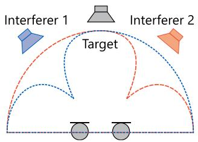  
Fig. 1. Combination of two beamformers with a spatial null for each interferer in a situation with $M = 2$ and $N = 3$

There are some existing methods combining multiple beamformers. In [14], the combination of beamformers having different steering directions for audio zooming was considered. In contrast, we employ beamformers enhancing the same desired signal but suppressing sounds arriving from the different directions. The frequency-bin-wise combination of fixed null beamformers was proposed in [15], [16]. However, this technique tends to distort the desired signal in the post-filtering stage, and require the specially designed square microphone array. To reduce the mechanical noise, e.g., actuators’ sounds in a robot, a design of maximum signal-to-noise ratio (MaxSNR) beamformer [17], [18] adopting a suitable noise covariance matrix at each TF bin has also been proposed [19]. This method requires the clustering of noise covariance matrices in a training stage under the assumption that the number of actuator patterns is usually limited. Therefore, this method is applicable to a particular noise set. Contrasted to them, we combine time-invariant signaldependent minimum variance distortionless response (MVDR) beamformers [17], [20], [21] in each TF bin.

The rest of this paper is organized as follows. In Section II-A, we first describe the problem formulation of signal enhancement and define what is the distortionless property. In Section III, we define the signal enhancement employing multiple beamformers and a joint optimization problem of designing optimum beamformers and determining their combination weights based on a unified minimum variance criterion. In Section IV, we propose the TFLC beamformer and its algorithmic variants, where we derive efficient update rules for minimizing the objective function iteratively. In Section V and VI, we discuss the characteristics of the proposed methods through experiments and present the results of speech enhancement, respectively. Finally, we conclude this paper in Section VII.

This paper is partially based on conference papers [12], [13] in which we proposed the TFS technique for beamformers. The contribution of this paper is that we propose the TFLC beamforming, which is generalization of the TFS beamforming. Moreover, we provide results of analysis from new viewpoints to confirm the properties of these techniques.

## II. DISTORTIONLESS SIGNAL ENHANCEMENT

## A. Signal Model

We model the microphone signals in the STFT domain. Here, let $x _ { m } ( f , t )$ be the mth microphone signal at the angular frequency f in the tth frame, $\tilde { s } ( f , t )$ a source of interest (target source), and $u _ { n } ( f , t )$ an nth interferer $( n = 1 , \ldots , N - 1 )$ . Then, we model the observations as

$$
\boldsymbol {x} (f, t) = \boldsymbol {h} _ {\mathrm{s}} (f) \tilde {s} (f, t) + \sum_ {n = 1} ^ {N - 1} \boldsymbol {h} _ {n} (f) u _ {n} (f, t),\tag{1}
$$

$$
= \boldsymbol {a} (f) s (f, t) + \sum_ {n = 1} ^ {N - 1} \boldsymbol {h} _ {n} (f) u _ {n} (f, t),\tag{2}
$$

$$
= \left[ x _ {1} (f, t) \dots x _ {M} (f, t) \right] ^ {\mathsf {T}},\tag{3}
$$

$$
\pmb {h} _ {\mathrm{s}} (f) = [ h _ {1, \mathrm{s}} (f) \dots h _ {M, \mathrm{s}} (f) ] ^ {\mathsf {T}},\tag{4}
$$

$$
\boldsymbol {h} _ {n} (f) = \left[ h _ {1, n} (f) \dots h _ {M, n} (f) \right] ^ {\mathsf {T}},\tag{5}
$$

$$
\boldsymbol {a} (f) = \left[ 1 \frac {h _ {2 , \mathrm{s}} (f)}{h _ {1 , \mathrm{s}} (f)} \dots \frac {h _ {M , \mathrm{s}} (f)}{h _ {1 , \mathrm{s}} (f)} \right] ^ {\mathsf {T}},\tag{6}
$$

where $h _ { m , n } ( f )$ and $h _ { m , \mathrm { s } } ( f )$ are the ATFs from the nth interferer and target source to the mth microphone, respectively, and the superscript T denotes nonconjugate transposition. $\pmb { a } ( f )$ is the relative transfer function (RTF) [3], [22] from the target source to the microphone array and is defined as the ratio of the ATF $h _ { \mathrm { s } } ( f )$ . Without loss of generality, we set the first microphone to the reference microphone. $s ( f , t )$ in (2) is the source image at the reference microphone, and the estimation of $s ( f , t )$ is our goal.

In this paper, we assume that the frame length in the STFT analysis is sufficiently larger than the length of the ATFs in the time domain (impulse responses). This assumption is to allow the convolution in the time domain to be approximated as multiplication in the STFT domain. Additionally, we assume that the target source and each interferer are uncorrelated.

## B. Signal Enhancement Based on Relative Transfer Function

In this paper, we assume that the RTF from the target source to the microphone array is known and consider the following signal enhancement using the RTF:

$$
\hat {s} = G [ \boldsymbol {x}; \boldsymbol {\theta}, \boldsymbol {a} ],\tag{7}
$$

where $G [ \cdot ]$ abstractly denotes a processing of signal enhancement for the observation x $( f , t )$ . θ denotes parameters, which is optimized by using x $( f , t )$ and $\pmb { a } ( f )$ or be estimated in advance. Especially, we define a signal enhancement with a beamformer as $\tilde { G }$ such as

$$
\tilde {G} [ \boldsymbol {x}; \boldsymbol {\theta}, \boldsymbol {a} ] = \boldsymbol {\theta} ^ {\mathsf {H}} \boldsymbol {x}\tag{8}
$$

where the superscript H denotes conjugate transposition and θ is a spatial filter that is usually a function of a.

## C. Distortionless Property

In (7), let us consider performing signal enhancement for a noise-free target signal with given θ. Here, θ was estimated for enhancing the target signal $s ( f , t )$ from a noisy observation in advance. When the signal enhancement to a noise-free observation outputs the target source image without any distortion, that

is represented as:

$$
s = G [ \boldsymbol {a} s; \boldsymbol {\theta}, \boldsymbol {a} ],\tag{9}
$$

we refer to it as the distortionless property. An MVDR beamformer will be given as an example of distortionless signal enhancement in the next subsection, and a linearly constrained minimum variance (LCMV) beamformer [17] also have the distortionless property.

## D. Conventional Distortionless Beamformer

MVDR beamformer [17], [20], [21] is one of the conventional beamformer which has the distortionless property. Signal enhancement by the beamformer is performed as

$$
y (f, t) = \tilde {G} [ \pmb {x} (f, t); \pmb {w} (f), \pmb {a} (f) ],\tag{10}
$$

$$
= \boldsymbol {w} ^ {\mathsf {H}} (f) \boldsymbol {x} (f, t),\tag{11}
$$

$$
\boldsymbol {w} (f) = \left[ w _ {1} (f) \dots w _ {M} (f) \right] ^ {\mathsf {T}},\tag{12}
$$

where $y ( f , t )$ is the enhanced signal which ideally equal to $s ( f , t )$ and $w _ { m } ( f )$ denotes the spatial filter coefficient for the mth microphone. Note that we consider only the time-invariant (fixed) MVDR beamformer in this paper.

In the MVDR beamformer, the parameters $\theta =$ $( { \pmb w } ( 1 ) , \dots , { \pmb w } ( F ) )$ is estimated by solving the following optimization problem with the minimum variance criterion:

$$
\min _ {\boldsymbol {w}} \frac {1}{T} \sum_ {t = 1} ^ {T} \left| \boldsymbol {w} ^ {\mathsf {H}} (f) \boldsymbol {x} (f, t) \right| ^ {2} \text { s.t. } \boldsymbol {w} ^ {\mathsf {H}} (f) \boldsymbol {a} (f) = 1,\tag{13}
$$

where T is the number of frames. Here and hereafter, we assume that the noise-only period of the observation x $( f , t )$ is available to estimate the MVDR beamformer (e.g., using a precise voice activity detection (VAD)). The well-known closed-form solution is

$$
\boldsymbol {w} (f) = \frac {\boldsymbol {\Phi} ^ {- 1} (f) \boldsymbol {a} (f)}{\boldsymbol {a} ^ {\mathsf {H}} (f) \boldsymbol {\Phi} ^ {- 1} (f) \boldsymbol {a} (f)},\tag{14}
$$

$$
\boldsymbol {\Phi} (f) = \frac {1}{T} \sum_ {t = 1} ^ {T} \boldsymbol {x} (f, t) \boldsymbol {x} ^ {\mathsf {H}} (f, t).\tag{15}
$$

Note that, in this paper, we do not treat the observation ${ \boldsymbol { x } } ( { \boldsymbol { f } } , t )$ stochastically; we define the function that should be minimized and covariance matrices using the time average instead of the expectation operator. This is because we focus on the spatial characteristics of the observation in this paper.

Conventional beamformers could show great improvement of the audio quality as a result of steering spatial nulls in the direction of every interferer. However, the performance may be degraded in underdetermined situations $( M < N )$ since they can suppress only M − 1 interferers at most.

## E. Related Work

Finally, we discuss the properties of the proposed methods by comparing them with existing methods, which are summarized in Table I. Basically, signal enhancement methods face a tradeoff between low signal distortion and good noise reduction, especially in underdetermined situations. For signal enhancement in underdetermined situations, TF masking [7]–[9] including the degenerate unmixing estimation technique (DUET) [32] and multiple sensor DUET (MENUET) [33] is commonly used owing to its excellent noise reduction, although the distortionless property is never held.

TABLE I  
SPEECH ENHANCEMENT METHODS AND THEIR (A) DISTORTIONLESS PROPERTIES, (B) NOISE REDUCTION PERFORMANCE IN UNDERDETERMINED SITUATIONS, AND (C) NECESSITY OF TARGET RTF

<table><tr><td>Methods</td><td>(A)</td><td>(B)</td><td>(C)</td></tr><tr><td>TF masking [7]-[9]</td><td>×</td><td>○</td><td>-</td></tr><tr><td>SDW-MWF (μ=0) [21], [23], [24]</td><td>○</td><td>×</td><td>necessary</td></tr><tr><td>SDW-MWF (otherwise)</td><td>×</td><td>○</td><td>necessary</td></tr><tr><td>TV-MWF [25], [26]</td><td>×</td><td>○</td><td>-</td></tr><tr><td>MNMF [27]-[29]</td><td>×</td><td>○</td><td>-</td></tr><tr><td>MVDR beamformer [17], [20], [21]</td><td>○</td><td>×</td><td>necessary</td></tr><tr><td>MB-MVDR [10], [30], [31]</td><td>○</td><td>△</td><td>estimated</td></tr><tr><td>Proposed TFLC beamformer</td><td>○</td><td>○</td><td>necessary</td></tr></table>

multichannel Wiener filter (MWF) is also a popular method, and we consider two types of MWF: speech distortion weighted MWF (SDW-MWF) and time-varying MWF (TV-MWF). SDW-MWF [21], [23], [24] is a good example to explain the tradeoff relationship and has a tradeoff factor (typically denoted as μ) between signal distortion and noise reduction. When $\mu = 0$ SDW-MWF is identical to the MVDR beamformer, which has the distortionless property. For $\mu \to \infty$ , both the noise reduction performance and the signal distortion are maximized. TV-MWF [25], [26] is an MWF based on (time-varying) full-rank covariance. Although these techniques work well in underdetermined situations owing to their nonlinear mechanism, the distortionless response of the desired signal is not guaranteed.

In [30] and [10], a mask-based MVDR (MB-MVDR) beamformer, in which TF masks extracting the target and interferer signals were estimated to obtain the covariance matrices, was proposed. An MVDR beamformer was constructed using these covariance matrices. An adaptive version of the MB-MVDR beamformer was also considered [31], where the time-varying noise covariance matrix is estimated by the maximum a posteriori (MAP) estimation, assuming a complex inverse Wishart distribution as each source prior. Then, an MVDR beamformer is constructed at every short block (with a minimum of one frame). Thus, this method is a variant of the adaptive MVDR beamformer based on source priors. One of the qualitative differences between adaptive beamforming and our linear combination beamforming is that the former uses M filter coefficients at a TF bin and the latter uses $M \times K ^ { \prime }$ filter coefficients, where $K ^ { \prime } = 1 , 2 , 3$ in this paper. The linear combination of beamformers is worth performing, for example, when the residual noise signals in the output of beamformers can cancel each other out.

In contrast to the methods mentioned above, we focus on signal enhancement in underdetermined situations. We aim to improve the noise reduction performance as much as possible while maintaining the distortionless property. It is worth noting that this method estimates the source statistics, which can also be used in our proposed method to compute the initial estimates of covariance matrices.

Finally, in [34], the switching of MVDR beamformers was considered, where it was assumed that the covariance matrices for all combinations of active interferers were obtained in advance to construct multiple beamformers. The main focus of that paper is the switching mechanism. The other points, such as the method of estimating the number of combinations and how the covariance matrices are obtained, were not discussed. In this paper, we propose a general theory for combining multiple beamformers under a unified minimum variance criterion. We propose clustering-like algorithms, where the filter coefficients and their combination weights are simultaneously estimated. Additionally, we treat the number of beamformers as the userdefined parameter, and a performance analysis of this parameter is given.

## III. PROBLEM FORMULATION OF TIME-FREQUENCY-BIN-WISE LINEAR COMBINATION BEAMFORMER

## A. Motivation

The purpose of this paper is to propose signal enhancement algorithms that achieve high performance in noise reduction and have the distortionless property. Our basic idea comes from linear beamforming; that is, a beamformer with M microphones can suppress $M - 1$ interferers at each TF bin.

Let us consider signal enhancement in the simplest underdetermined situation, where we enhance a target signal collapsed by two interferers using two microphones $( N = 3 , M = 2 )$ Suppose we have two beamformers 1 and 2, that suppress interferers 1 and 2, respectively. Then, if the interferers are sufficiently sparse, that is, only one interferer exists at each TF bin, we can suppress both interferers by appropriately selecting (switching) the beamformer at every TF bin, as shown in Fig. 1. In general, there is enough sparsity when only $M - 1$ interferers exist in each TF bin. Then, at least $C ( N - 1 , M - 1 )$ beamformers, each of which suppresses a different set of interferers, can constitute a sufficient set of beamformers, where $C ( \boldsymbol { a } , \boldsymbol { b } )$ is the b-combination of a elements. Since the number of beamformers K is the user-defined variable in practice, we will experimentally examine the relationship between K and the noise suppression performance in Section VI.

From this idea, we have proposed the TFS beamformer [12], [13] for signal enhancement in underdetermined conditions. This method can be considered as a combination of binary TF masking and the MVDR beamformer and also as an underdetermined extension of the MVDR beamformer. Additionally, we propose a generalization of the TFS beamformer, the TFLC beamformer.

## B. Problem Formulation and Joint Optimization Problem

First of all, we formulate the signal enhancement using multiple beamformers:

$$
y (f, t) = \sum_ {k = 1} ^ {K} c _ {k} (f, t) y _ {k} (f, t),\tag{16}
$$

$$
y _ {k} (f, t) = \pmb {w} _ {k} ^ {\mathsf {H}} (f) \pmb {x} (f, t),\tag{17}
$$

where $k = 1 , \ldots , K$ is the index ofthe beamformers, and $w _ { k } ( f )$ is the kth beamformer filter. $c _ { k } ( f , t )$ is a positive weight function that determines the suitable combination of beamformers, and we refer to it as the beamformer selection mask. This formulation is equal to the conventional single beamformer (11) when $K = 1$ and $c _ { 1 } ( f , t ) = 1 \forall f ,$ t. Now, the problem is how to optimize the beamformers $w _ { k } ( f )$ and mask $c _ { k } ( f , t )$

We consider the following joint optimization problem as an extension of a conventional MVDR beamformer, where we optimize both $w _ { k } ( f )$ and $c _ { k } ( f , t )$ under the unified minimum variance criterion:

$$
\mathcal {J} _ {f} (\boldsymbol {w} _ {k}, c _ {k}) = \frac {1}{T} \sum_ {t = 1} ^ {T} \left| \sum_ {k = 1} ^ {K} c _ {k} (f, t) \boldsymbol {w} _ {k} ^ {\mathsf {H}} (f) \boldsymbol {x} (f, t) \right| ^ {2},\tag{18}
$$

$$
\min _ {\boldsymbol {w} _ {k}, c _ {k}} \sum_ {f = 1} ^ {F} \mathcal {J} _ {f} (\boldsymbol {w} _ {k}, c _ {k}) \text { s.t. } \boldsymbol {w} _ {k} ^ {\mathsf {H}} (f) \boldsymbol {a} (f) = 1,
$$

$$
\sum_ {k = 1} ^ {K} c _ {k} (f, t) = 1, c _ {k} (f, t) \in [ 0, 1 ] \forall k, f, t.\tag{19}
$$

Every constraint is for maintaining the undistorted target signal, namely, $w _ { k } ( f )$ always has a distortionless property, and the sum of $c _ { k } ( f , t )$ guarantees the fully restored target signal. This is verified by Proposition 1.

Proposition 1: Let $\boldsymbol { c } _ { k } \in [ 0 , 1 ] \ ( k = 1 , \ldots , K )$ be positive weights and $\textstyle \sum _ { k = 1 } ^ { K } c _ { k } = 1$ . Suppose every filter has the distor-tionless property, $\bar { \mathrm { i } } . \mathrm { e } . , w _ { k } ^ { \mathsf { H } } a = 1$ and thus $G [ { \bf { a } } s ; { \pmb w } _ { k } , { \pmb a } ] = s$ for all k. Then, a linear combination of these filters also has the distortionless property, i.e.,

$$
\tilde {G} \left[ \boldsymbol {a} s; \sum_ {k = 1} ^ {K} c _ {k} \boldsymbol {w} _ {k}, \boldsymbol {a} \right] = s.\tag{20}
$$

This can be easily confirmed by the following:

$$
\begin{array}{r l} \tilde {G} \left[ \boldsymbol {a} s; \sum_ {k = 1} ^ {K} c _ {k} \boldsymbol {w} _ {k}, \boldsymbol {a} \right] & = \sum_ {k = 1} ^ {K} c _ {k} (f, t) \boldsymbol {w} _ {k} ^ {\mathsf {H}} (f) \boldsymbol {a} (f) s (f, t) \\ & = \sum_ {k = 1} ^ {K} c _ {k} (f, t) s (f, t) \\ & = s (f, t). \end{array}\tag{21}
$$

## IV. SOLUTIONS

## A. TFS Beamformer

First, we introduce the TFS beamformer [12], [13] as a simple and special case of the TFLC beamformer. In the TFS beamformer, $c _ { k } ( f , t )$ is limited to a binary value $( \mathrm { i . e . , } c _ { k } ( f , t ) \in$ $\{ 0 , 1 \} )$ ). Hereafter, we use $c _ { k } ^ { \mathrm { b } } ( f , t )$ instead of $c _ { k } ( f , t )$ to explicitly indicate that $c _ { k } ( f , t )$ takes a binary value. Then, the objective function (18) becomes

$$
\mathcal {J} _ {f} \left(\boldsymbol {w} _ {k}, c _ {k} ^ {\mathrm{b}}\right) = \frac {1}{T} \sum_ {t = 1} ^ {T} \sum_ {k = 1} ^ {K} c _ {k} ^ {\mathrm{b}} (f, t) \left| \boldsymbol {w} _ {k} ^ {\mathsf {H}} (f) \boldsymbol {x} (f, t) \right| ^ {2},\tag{22}
$$

where the constraints are identical to those in (19) except that $c _ { k } ( f , t )$ is binary. It is difficult to optimize both $w _ { k } ( f )$ and $c _ { k } ^ { \mathrm { b } } ( f , t )$ simultaneously, whereas it is straightforward to optimize them alternately.

1) Update ofMultiple Beamformers: With fixed $c _ { k } ^ { \mathrm { b } } ( f , t )$ , the optimization problem regarding $w _ { k } ( f )$ is

$$
\min _ {\boldsymbol {w} _ {k}} \frac {1}{T} \sum_ {t = 1} ^ {T} \left| \boldsymbol {w} _ {k} ^ {\mathsf {H}} (f) \boldsymbol {x} _ {k} (f, t) \right| ^ {2} \text {s.t.} \boldsymbol {w} _ {k} ^ {\mathsf {H}} (f) \boldsymbol {a} (f) = 1 \forall k, f,\tag{23}
$$

where ${ \boldsymbol { x } } _ { k } ( { \boldsymbol { f } } , t )$ is the masked observation defined as

$$
\boldsymbol {x} _ {k} (f, t) = c _ {k} (f, t) \boldsymbol {x} (f, t).\tag{24}
$$

Since the optimization problem (23) is identical to that of the MVDR beamformer (13) except for the index $k ,$ the same type of closed-form solution is obtained:

$$
\pmb {w} _ {k} ^ {\mathrm{(TFS)}} (f) = \frac {\Phi_ {k k} ^ {- 1} (f) \pmb {a} (f)}{\pmb {a} ^ {\mathsf {H}} (f) \Phi_ {k k} ^ {- 1} (f) \pmb {a} (f)},\tag{25}
$$

$$
\boldsymbol {\Phi} _ {i j} (f) = \frac {1}{T} \sum_ {t = 1} ^ {T} \boldsymbol {x} _ {i} (f, t) \boldsymbol {x} _ {j} ^ {\mathsf {H}} (f, t),\tag{26}
$$

where $\Phi _ { k k } ( f ) ~ ( i = j = k$ in (25)) is the masked covariance matrix. Ideally, ${ \boldsymbol { x } } _ { k } ( { \boldsymbol { f } } , t )$ contains a set of $M - 1$ interferers (e.g., ${ \boldsymbol { x } } _ { k } ( { \boldsymbol { f } } , t )$ consists of only one interferer if $M = 2 )$ extracted by TF masking using $c _ { k } ^ { \mathrm { b } } ( f , t )$ , as defined in (24). The MVDR beamformer is thus computed in not the underdetermined situation but the determined situation.

2) Update of Beamformer Selection Mask: With fixed $w _ { k } ( f )$ , the optimum $c _ { k } ^ { \mathrm { b } } ( f , t )$ that minimizes (22) under the binary constraint is

$$
c _ {k} ^ {\mathrm{b}} (f, t) = \left\{ \begin{array}{l l} 1 & \text {if} | \boldsymbol {w} _ {k} ^ {\mathsf {H}} (f) \boldsymbol {x} (f, t) | ^ {2} \leq | \boldsymbol {w} _ {k ^ {\prime}} ^ {\mathsf {H}} (f) \boldsymbol {x} (f, t) | ^ {2} \\ 0 & \text {otherwise}, \end{array} \right.\tag{27}
$$

where $k ^ { \prime } = 1 , \dots , K$ and $k ^ { \prime } \neq k .$ . This equation means that we choose the best spatial filter in terms of the minimum variance at each TF bin. Conversely, $c _ { k } ^ { \mathrm { b } } ( f , t )$ collects the most dominant set of interferers. For example, when $M = 2$ , if interferer 1 is dominant at a TF bin, beamformer $w _ { 1 } ( f )$ (the index has no essential meaning) that suppresses interferer 1 is selected. Therefore, this algorithm works by clustering interferers, where each cluster $c _ { k } ( f , t )$ is utilized to compute the spatial filters.

Note that signal enhancement (16) using the $c _ { k } ^ { \mathrm { b } } ( f , t )$ does not involve a linear combination of filters but their switching. We thus call this the algorithmic variant TFS beamformer.

## B. TFLC Beamformer

Next, we propose the TFLC beamformer. To solve the constrained optimization problem (19), we use the method of Lagrange multipliers and find the stationary point for the following function:

$$
\begin{array}{l} \mathcal {L} _ {f} (\boldsymbol {w} _ {k}, c _ {k}) = \mathcal {J} _ {f} (\boldsymbol {w} _ {k}, c _ {k}) \\ \qquad + \sum_ {k = 1} ^ {K} 2 \mathrm{Re} \left[ \lambda_ {k} ^ {*} \left(\boldsymbol {w} _ {k} ^ {\mathsf {H}} (f) \boldsymbol {a} (f) - 1\right) \right] \end{array}
$$

$$
+ \sum_ {t = 1} ^ {T} \lambda_ {t} \left(\sum_ {k = 1} ^ {K} c _ {k} (f, t) - 1\right),\tag{28}
$$

where $\lambda _ { k } ^ { * }$ and $\lambda _ { t }$ are the kth complex-valued Lagrange multiplier and the real-valued one at the tth frame, respectively. We again derive the algorithm that optimizes ${ \pmb w } _ { k } ( f )$ and $c _ { k } ( f , t )$ alternately.

1) Update of Multiple Beamformers: With $c _ { k } ( f , t )$ fixed, function (28) regarding $w _ { k } ( f )$ can be rewritten as

$$
\begin{array}{l} \mathcal {L} _ {f} (\boldsymbol {w} _ {k}) = \frac {1}{T} \sum_ {t = 1} ^ {T} \left| \sum_ {k = 1} ^ {K} \boldsymbol {w} _ {k} ^ {\mathsf {H}} (f) \boldsymbol {x} _ {k} (f, t) \right| ^ {2} \\ \qquad + \sum_ {k = 1} ^ {K} 2 \mathrm{Re} \Big [ \lambda_ {k} ^ {*} \left(\boldsymbol {w} _ {k} ^ {\mathsf {H}} (f) \boldsymbol {a} (f) - 1\right) \Big ] + \text {const.}, \end{array}\tag{29}
$$

where const. is a constant term that does not include ${ \pmb w } _ { k } ( f )$ Noting the cross-terms and following equations,

$$
\frac {1}{T} \sum_ {t = 1} ^ {T} \left| \sum_ {k = 1} ^ {K} \boldsymbol {w} _ {k} ^ {\mathsf {H}} (f) \boldsymbol {x} _ {k} (f, t) \right| ^ {2} = \sum_ {i = 1} ^ {K} \sum_ {j = 1} ^ {K} \boldsymbol {w} _ {i} ^ {\mathsf {H}} (f) \boldsymbol {\Phi} _ {i j} (f) \boldsymbol {w} _ {j} (f),\tag{30}
$$

we find the stationary point by taking the complex gradient with respect to ${ \pmb w } _ { i } ^ { \sf H } ( f ) ( i = 1 , \ldots , K )$ and setting it to zero. Finally, we obtain the following closed-form solution:

$$
\boldsymbol {w} _ {i} ^ {\text {(TFLC)}} (f) = \left(1 + \boldsymbol {a} ^ {\mathsf {H}} (f) \boldsymbol {u} _ {i} (f)\right) \boldsymbol {w} _ {i} ^ {\text {(TFS)}} (f) - \boldsymbol {u} _ {i} (f),\tag{31}
$$

$$
\boldsymbol {u} _ {i} (f) = \Phi_ {i i} ^ {- 1} (f) \sum_ {j = 1, j \neq i} ^ {K} \Phi_ {i j} (f) \boldsymbol {w} _ {j} (f).\tag{32}
$$

(31) and (32) imply that the coefficients of all filters are taken into account for estimating the optimal ${ \pmb w } _ { i } ( f )$ . This mechanism makes the optimization problem more general, which may result in improved performance in noise reduction. However, this may cause an antiphase problem at the same time, i.e., ${ \pmb w } _ { i } ( f )$ could try to suppress the target signal $s ( f , t )$ using the residual noise signals in the outputs of the other filters ${ \pmb w } _ { j } ( f )$ . This problem may degrade the performance of signal enhancement.

Note that the filter update in the TFS beamformer is the special case of that in the TFLC beamformer. Suppose ith filter is selected in (27). In the TFS beamformer, ${ \boldsymbol { x } } _ { k } ( { \boldsymbol { f } } , t )$ in (24) is 0 except for $k = i$ with binary $c _ { k } ( f , t )$ , and thus $\Phi _ { i j } ( f )$ in (26) and ${ \pmb u } _ { i } ( f )$ in (32) are also 0. Then, filters in the TFS beamformer (25) is equivalent to those in the TFLC beamformer (31), that $\mathrm { i s } , { \boldsymbol w } _ { i } ^ { \mathrm { ( T F S ) } } ( f ) = { \boldsymbol w } _ { i } ^ { \mathrm { ( T F L C ) } } ( f ) \forall i , f .$

2) Update of Beamformer Selection Mask: Next, with $w _ { k } ( f )$ fixed, function (28) can be rewritten as

$$
\begin{array}{l} \mathcal {L} _ {f} (c _ {k}) = \frac {1}{T} \sum_ {t = 1} ^ {T} \left| \sum_ {k = 1} ^ {K} c _ {k} (f, t) y _ {k} (f, t) \right| ^ {2} \\ \qquad + \sum_ {t = 1} ^ {T} \lambda_ {t} \left(\sum_ {k = 1} ^ {K} c _ {k} (f, t) - 1\right) + \text { const. }, \end{array}\tag{33}
$$

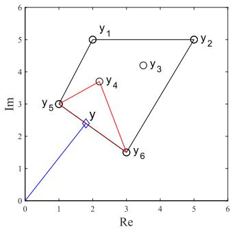

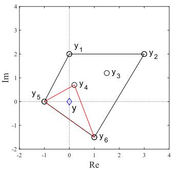  
Fig. 2. Examples of $c _ { k }$ updating. Left: the origin is outside the convex hull, where $y = c _ { 5 } y _ { 5 } + c _ { 6 } y _ { 6 }$ , and thus, $c _ { k } = 0$ except for $c _ { 5 } = 0 . 6$ and $c _ { 6 } = 0 . 4$ Right: the origin is inside the convex hull, where $y = c _ { 4 } y _ { 4 } + c _ { 5 } y _ { 5 }$ + c6y6, and thus, $c _ { k } = 0$ except for $c _ { 4 } = 0 . 4 7 , c _ { 5 } = 0 . 3 1$ and $c _ { 6 } = 0 . 2 2$ . Black line, convex hull containing all y ; red line, selected triangle.

where we reassign const. as a constant term that does not include $c _ { k } ( f , t )$

In this paper, we propose the following algorithm to solve this optimization from geometric aspects. When we go back to the joint optimization problem focusing on a TF bin, it can be rewritten as

$$
\min _ {c _ {k}} \left| \sum_ {k = 1} ^ {K} c _ {k} y _ {k} \right| ^ {2} \text {   s.t.   } \forall k 0 \leq c _ {k} \leq 1, \sum_ {k = 1} ^ {K} c _ {k} = 1.\tag{34}
$$

For simplicity, we drop the indices $( t , f )$ of $c _ { k }$ in this section. Then, we find $c _ { k }$ as follows.

Case $I \colon K = 2$

In this case, (34) becomes

$$
\begin{array}{l l} \min _ {c _ {1}, c _ {2}} & | c _ {1} y _ {1} + c _ {2} y _ {2} | ^ {2} \\ \text {s.t.} & c _ {1} + c _ {2} = 1,   0 \leq c _ {1} \leq 1, 0 \leq c _ {2} \leq 1. \end{array}\tag{35}
$$

On the complex plane, $y = c _ { 1 } y _ { 1 } + c _ { 2 } y _ { 2 }$ exactly means the point that internally divides the interval $y _ { 1 }$ and $y _ { 2 }$ at the ratio $c _ { 2 } { : } c _ { 1 }$ Thus, the optimum $y$ is the point closest to the origin on that line segment. Eventually, the ratio $c _ { 2 } { : } c _ { 1 }$ that achieves the optimum y is the solution.

Case $2 \colon K \geq 3$

In general, we consider the convex hull of a set of $y _ { k }$ (see Fig. 2). Here, since $y _ { k }$ is the finite number of discrete points, the convex hull is a polygon with vertices $y _ { k ^ { \prime } } \ ( k ^ { \prime } \in \{ 1 , \ldots , K \} )$ ). Therefore, i) if the origin is outside the polygon, the problem is reduced to case 1 because the optimum $y$ is on the edge (line segment) of the polygon closest to the origin (see Fig. 2 left). Otherwise, ii) if the origin is inside the polygon, a set of $c _ { k }$ achieving $y = 0$ is the solution. The solution can be obtained by choosing a triangle that has three vertices of y and contains the origin (see Fig. 2 right). Although there may be several candidates of the triangle, we can choose the one with the minimum area as an example. $c _ { k }$ are the positive weights for the two or three selected vertices that attain the minimum $\begin{array} { r } { y = \sum _ { k = 1 } ^ { K } c _ { k } y _ { k } } \end{array}$ . Note that efficient algorithms for finding a convex hull have been widely studied (e.g., [35]).

The update of $c _ { k } ( f , t )$ in the TFS beamformer is also a special case of that in the TFLC beamformer. In the binary case, the $y _ { k } ( f , t )$ closest to the origin is used as $y ( f , t )$ , which is thus not in the interior region of the convex hull but on its vertex (see $\operatorname { F i g } . 2 )$ . Finally, note that all of the formulas displayed above, including the computation of filter coefficients in (31) and the enhanced signal in (16), are in complete agreement with those for the conventional MVDR beamformer when $K = 1$

## C. Restricted TFLC Beamformer

The TFLC beamformer has a solution space wider than that of the TFS beamformer owing to the continuous mask, which is expected to yield better results. However, the optimization problem is more general and complicated. In particular, the filter updates in the TFLC beamformer (31) may be unstable because they depend on all the other $w _ { k } ( f )$ and $c _ { k } ( f , t )$ . Here, we can consider the intermediate between TFLC and TFS beamformers in which filters are linearly combined by the continuous mask but designed similarly to those in the TFS beamformer. That is, we update $c _ { k } ( f , t )$ as in Section IV-B2 but $w _ { k } ( f )$ by (25).

For continuous $c _ { k } ( f , t ) , \Phi _ { k k } ( f )$ in (25) is not a masked covariance matrix but a weighted one. This means that the filter updates are generalized by using the continuous mask instead of the binary mask. $w _ { k } ( f )$ is thus a filter that suppresses the set of interferers extracted by $c _ { k } ( f , t )$ and cannot access the other filter coefficients.

## D. Discussion About the Proposed Beamformers

1) Initialization: For the algorithm presented above, we need the initialization of ${ \pmb w } _ { k } ( f )$ or $c _ { k } ( f , t )$ . Here, we focus on how to initialize $w _ { k } ( f )$ . The naive solution is random initialization. Alternatively, initial $w _ { k } ( f )$ can be computed by fixed beamformers such as a null beamformer [17] requiring only the direction of arrival (DOA) information with an anechoic model, where each beamformer suppresses sound arriving from $M - 1$ directions. Even though the correct DOA leads to better performance, we reported that the initialization using a randomly determined DOA also works well in [13]. Using those beamformers, we can avoid the permutation problem; that is, the filter $w _ { k } ( f )$ suppresses the kth combination of interferers consistently in all frequency bins. We can then see the directivity patterns with straight null(s), whereas this does not hold when we use randomly initialized filters.

Given covariance matrices corresponding to the kth combination of interferers, the spatial filters are ideally initialized by conventional MVDR beamformer. In this case, the iterative updates may be no longer needed; we only once compute the beamformer selection mask and perform the signal enhancement. Although these covariance matrices are rarely obtained in practice, the use of estimates of source statistics [10], [30] is one way of obtaining them.

2) Sparsity Condition: As we mentioned in Section III-A, we consider the sparseness for the interferers. In the case of $M = 2$ and $N = 3$ , the ideal situation is that there is only one interferer at a TF bin. Although this condition is not explicitly introduced in the proposed algorithms, it is valuable in analyzing them. A similar sparseness is often assumed in the context of binary TF masking, which is called as W-disjoint orthogonality (W-DO) [7], [36]. W-DO is a strong sparseness assumed for two signals and is defined as

$$
z _ {p} (f, t) z _ {q} (f, t) = 0, \forall f, t,\tag{36}
$$

where $z _ { p } ( f , t )$ and $z _ { q } ( f , t )$ are example signals, $p = 1 , \ldots , N$ $q = 1 , \ldots , N$ , and $p \neq q .$ . If every pairwise sources $z _ { p }$ and $z _ { q }$ satisfy the W-DO, it can be said that only one source exists in each TF bin at most. Therefore, W-DO is assumed in common binary TF masking techniques. Note that W-DO does not strictly hold for many signals such as speech, and thus its approximate version has been discussed in [37].

In this paper, we consider the following property:

$$
\prod_ {p = 1} ^ {P} z _ {p} (f, t) = 0, \forall f, t,\tag{37}
$$

which is a sparseness assumed for P signals. This equation means that at least one source satisfies the W-DO with respect to each of the other $P - 1$ sources; in other words, at most, $P - 1$ sources exist in a TF bin. Therefore, this property is the relaxation (or generalization) of W-DO. In this paper, we call this P-DO with the free variable of P.

With M microphones, we assume that every M-combination of N − 1 interferers satisfies the M-DO; in other words, an interferer vector

$$
\boldsymbol {z} (f, t) = \left(z _ {1} (f, t), z _ {2} (f, t), \dots , z _ {N - 1} (f, t)\right),\tag{38}
$$

is (M − 1)-sparse at each TF bin. This means that, at most, $M - 1$ interferers exist in each TF bin among N − 1 interferers. Note that M-DO is equivalent to the W-DO for every pair of interferers when $M = 2$

In the literature, e.g., [38], it is assumed that M-DO strictly holds in order to identify the sources present at a TF bin and estimate each of their energies. On the other hand, we assumed that M-DO is satisfied in a sufficient number ofTF bins. Suppose M-DO strictly holds in all TF bins. The TFLC beamformer in an underdetermined situation has the possibility of achieving the same performance as a conventional beamformer in a determined situation. Even if is does not, the TFLC beamformer can suppress at least $M - 1$ dominant interferers at each TF bin, which should guarantee a constant improvement.

## V. EMPIRICAL ANALYSIS OF TFS AND TFLC BEAMFORMERS

In this section, we conducted experiments on speech enhancement to understand the TFS and TFLC beamformers more clearly.

## A. Experimental Conditions

In this experiment, we used source signals obtained from the “Underdetermined-speech and music mixtures” (UND) task of the community-based Signal Separation Evaluation Campaign (SiSEC) [39], [40]. Here, we selected three female speech clips from the dev1 dataset and generated observed signals that are convolutive mixtures of impulse responses. room impulse response (RIR)s were simulated by a RIR Generator [41] with a reverberation time of 120 ms. We conducted this experiment in an underdetermined situation: two microphones with the spacing of 4 cm and signals consisting of a target and two interferers whose DOAs were 90◦, 50◦ and $1 5 0 ^ { \circ }$ , respectively. In this section, we used K = 2 beamformers, where we implicitly assumed that these beamformers, each of them corresponding to the respective interferers, are sufficient for speech enhancement. To discuss the behavior of the proposed method, we simulated all seven combinations of the source signals, as shown in Fig. 3, where the mixture is composed of a combination of the target, interferer 1, and interferer 2. The other experimental conditions are listed in Table II.

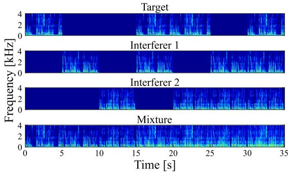  
Fig. 3. Seven patterns of combination of signals. The mixture (bottom) is the sum of target (top) and interferers (second and third row).

TABLE II  
EXPERIMENTAL CONDITIONS OF EXPERIMENTAL ANALYSIS

<table><tr><td>Number of sound sources N</td><td>3</td></tr><tr><td>Number of microphones M</td><td>2</td></tr><tr><td>Reverberation time</td><td>120 ms</td></tr><tr><td>Sampling frequency</td><td>8 kHz</td></tr><tr><td>Frame length / shift</td><td>1024 / 512 samples</td></tr><tr><td>Signals for prior information</td><td>5 s</td></tr><tr><td>Signal for speech enhancement</td><td>35 s (another 5 s ×7)</td></tr></table>

In experimental Sections V and VI, we use the following abbreviations for notation ease. We denote the method used as ‘BF-INIT’, where ‘BF’ is replaced by an enhancing method, namely, TFS, TFLC, or RTFLC. ‘INIT’ represents the initialization method discussed in Section IV-D. We use three means denoted as $\cdot _ { \mathrm { R } } \cdot$ , ‘N’, and $\mathbf { \nabla } ^ { \mathrm { \ell } } \mathbf { P } ^ { \mathrm { \ell } }$ , which correspond to the initialization using random values, the fixed null beamformer, and predesigned MVDR beamformers, respectively. For example, TFS-P refers to the TFS beamformer with predesigned filters we proposed previously [12]. In this paper, we used the iterative algorithms proposed in Section IV for ‘R’ and ‘N’. For $\mathbf { \nabla } ^ { \mathrm { \ell } } \mathbf { P } ^ { \mathrm { \ell } }$ , we did not update the predesigned filters.

Prior information given for each method is summarized in Table III. In this paper, we basically used the exact RTF derived from the discrete Fourier transform (DFT) of the impulse responses of the target signal. For live-recorded data used in Section VI-C, we performed the eigenvalue decomposition for the covariance matrix of the target signal and used the eigenvector corresponding to the maximum eigenvalue as the estimate of the RTF. We used 5 s signals from the beginning for prior information and the remaining 5 s for speech enhancement.

TABLE III  
PRIOR INFORMATION FOR EACH ALGORITHMIC VARIANT OF THE TFLC BEAMFORMER. THE COLUMNS “TARGET” AND “INTERFERERS” REPRESENT PRIOR INFORMATION RELATED TO THOSE SIGNALS. ‘TFLC’ IS REPLACED BY ‘TFS’ AND ‘RTFLC

<table><tr><td>Variants</td><td>Target</td><td>Interferers</td><td>Each interferer</td></tr><tr><td>MVDR</td><td>RTF</td><td>Covariance</td><td>-</td></tr><tr><td>TFLC-P</td><td>RTF</td><td>-</td><td>Covariance</td></tr><tr><td>TFLC-N</td><td>RTF</td><td>Covariance</td><td>DOA</td></tr><tr><td>TFLC-R</td><td>RTF</td><td>Covariance</td><td>-</td></tr></table>

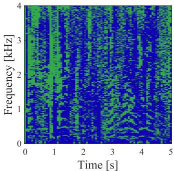

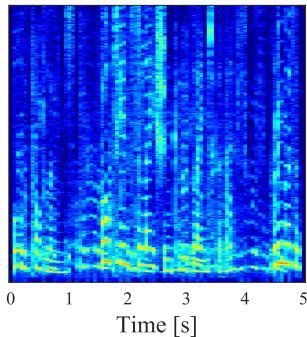  
(b) y(f, t) = y1 (f, t) + y2(f, t)

(a) $c _ { 1 } ( f , t )$ and c2(f, t)  
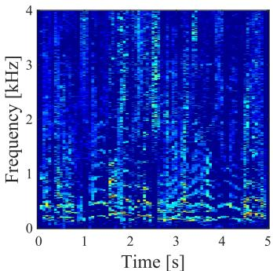  
(c) y1(f, t)

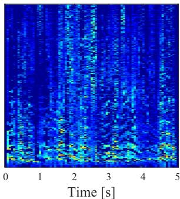  
(d) $y _ { 2 } ( f , t )$  
Fig. 4. Example of speech enhancement by TFS-P for the last 5 s. (a) Beamformer selection mask $c _ { k } ( f , t )$ indicating the selected beamformer (green, $k = 1$ ; blue, $k = 2 )$ . (b) Reconstructed enhanced signal $y ( f , t ) . ( \mathrm { c } )$ and (d) Intermediate enhanced signals y1(f, t) and $y _ { 2 } ( f , t )$ masked by $c _ { 1 } ( f , t )$ and $c _ { 2 } ( f , t )$ , respectively.

## B. Speech Enhancement by TFS Beamformer

In Figs. $4 ( \mathrm { a } ) \mathrm { - } ( \mathrm { d } )$ , we show examples of the beamformer selection mask $c _ { k } ( f , t )$ and spectrograms of TFS-P. We can see the masked spectrograms of $y _ { k } ( f , t ) = c _ { k } ( f , t ) y ( f , t )$ (green, $k = 1 \mathrm { : }$ ; blue, $k = 2 )$ and the reconstructed target signal $y ( f , t ) =$ $y _ { 1 } ( f , t ) + y _ { 2 } ( f , t )$ . According to Fig. 4(a), the selected beamformer switched frequently in the TF plane. Fig. 4(c) shows the intermediate signal $y _ { 1 } ( f , t )$ masked by $c _ { 1 } ( f , t )$ , which was composed of a part of the enhanced target and interferer 1 suppressed by ${ \pmb w } _ { 1 } ( f , t )$ . Although interferer 2 may remain, its power is basically smaller than that of interferer 1. Hence, $y _ { k } ( f , t )$ contains the perforated target signal and remaining interferers. The enhanced signal $y ( f , t )$ , shown in Fig. 4(b), was obtained by summing all $y _ { k } ( f , t )$ where theoretically, the target signal was completely restored without any artificial distortion.

## C. Transition of Spatial Filters and Beamformer Selection Mask

To understand the proposed clustering-like algorithm, we show an example of the update sequence in TFS-N. Fig. 5 shows the beamformer selection mask $c _ { k } ( f , t )$ and directivity patterns of spatial filters at the initialization (a)–(c) and after the first iteration (d)–(f) and the fifth iteration (g)–(i).

We first initialized the spatial filters $w _ { 1 } ( f )$ and ${ \pmb w } _ { 2 } ( f )$ using a fixed null beamformer, as shown in Figs. 5(b) and (c). Then, we computed the beamformer selection mask, as shown in Fig. 5(a). In this initialization, the spatial nulls did not look toward the correct DOAs (50◦ and 150◦). Consequently, $w _ { 1 } ( f )$ was selected at the vast number of TF bins, as shown as green in Fig. 5(a). Conversely, ${ \pmb w } _ { 2 } ( f )$ was selected when the sound was arriving from a very narrow direction near $1 1 0 ^ { \circ }$ . Here, the binary $c _ { k } ( f , t )$ chooses the best beamformer at each TF bin in accordance with the minimum variance criterion. That is, since the selected beamformer suppresses the combination of $M - 1$ interferers that have the largest power, this collection also corresponds to the clustering of the dominant interferers. Note that if only the target exists, either filter can be selected.

Next, we updated the spatial filters for the TFS beamformer. With the updated selection mask, ${ \boldsymbol { x } } _ { k } ( { \boldsymbol { f } } , t )$ was dominated by the combination of interferers corresponding to the index k. This implies that only $M - 1$ interferers exist in ${ \boldsymbol { x } } _ { k } ( { \boldsymbol { f } } , t )$ under the assumption ofM-DO. A beamformer with such a signal was thus designed in not the underdetermined but the (over)determined situation, which can be solved by using the conventional beamformer. As a result, $w _ { 1 } ( f )$ correctly suppressed interferer 1. Moreover, ${ \pmb w } _ { 2 } ( f )$ also correctly tried to steer the null direction toward interferer 2. Since ${ \pmb w } _ { 2 } ( f )$ was selected frequently at low frequencies in Fig. 5(a), the null direction was closer to the correct DOA, whereas it was rarely chosen at high frequencies, and thus, the null direction was slightly moved. $c _ { k } ( f , t )$ computed using those updated filters was clearly better than the previous one, as shown in Fig. 5(d), even though the null directions were still ambiguous.

By iteratively updating the spatial filters and beamformer selection mask, we finally obtained $c _ { k } ( f , t )$ and $w _ { k } ( f )$ shown in Fig. 5(g)–(i). The filters had a straighter null than that after the first iteration and were selected more consistently, especially in the period where only interferer 2 exists (from 10 s to 15 s and 20 s to 25 s). ${ \pmb w } _ { 2 } ( f )$ was rarely used in some (especially in high) frequency bins, where there was the possibility that interferer 2 had almost no power in these bins. In this case, too few TF bins were available to compute ${ \pmb w } _ { 2 } ( f )$ , which led to filter coefficients having abnormal values.

## D. Efficacy of Linear Combination

In this paper, we extend the TFS beamformer to the TFLC beamformer. We here demonstrate their difference in the beamformer selection mask $c _ { k } ( f , t )$

Fig. 6 shows the difference between the binary and soft selection masks, where we used TFS-N and RTFLC-N. According to Fig. 6(c), the values of each mask matched at most TF bins. Since a high-pass filter was applied to the data used, uncertain results were obtained in low-frequency bins. In the other bins, the differences were basically lower than 0.5. This means that the best beamformer was the same, but the linear combination using the other filter led to better performance. Interestingly, the filters were selected naturally in the case of Fig. 6(b), although there are some horizontal lines at high frequencies in Fig. 6(a). In fact, Fig. 5(g) showed the same line (e.g., around 3.2 kHz), and the filter shown in Fig. 5(h) suppressed the opposite interferer in such frequency bins. Moreover, the other filter shown in Fig. 5(i) had incorrect null directions. Fig. 6(c) implies that this problem was solved, and correct beamformers were selected with suitable weights. In these bins, the differences were more than 0.5.

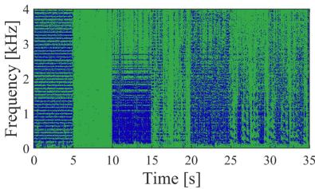  
(a) Initial beamformer mask $c _ { k } ( f , t )$

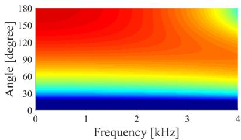

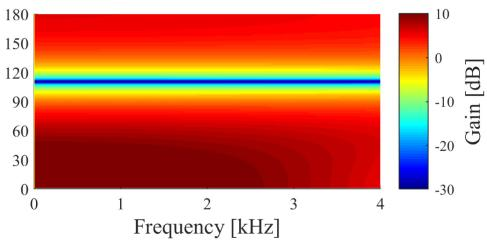  
(b) Initial spatial filter w1 (f)

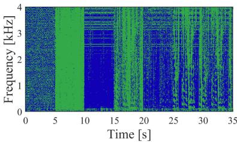  
(d) $c _ { k } ( f , t )$ after the first iteration

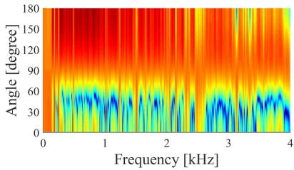  
(e) w1 (f) after the first iteration

(c) Initial spatial filter w2(f)  
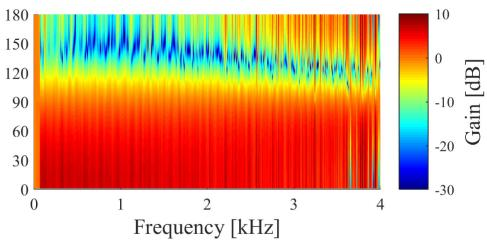

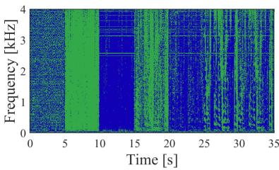  
(g) $c _ { k } ( f , t )$ after the fifth iteration

(f) ${ \pmb w } _ { 2 } ( f )$ after the first iteration  
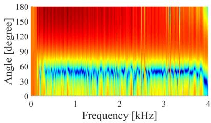  
(h) w1 (f) after the fifth iteration

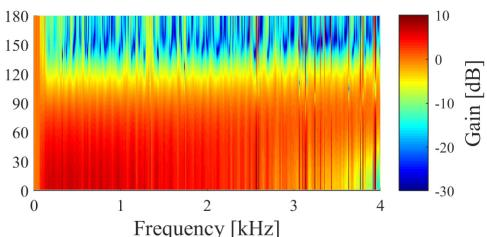  
(i) ${ \pmb w } _ { 2 } ( f )$ after the fifth iteration

Fig. 5. Transition of beamformer selection mask $c _ { k } ( f , t )$ and spatial filters ${ \boldsymbol { w } _ { \boldsymbol { k } } } ( f , t )$ in TFS-N over the number of iterations. (a) $c _ { k } ( f , t )$ computed using initial ${ w } _ { k } ( f )$ (green, $k = 1 \cdot$ ; blue, $k = 2 ) .$ . (b) and (c) Directivity patterns of the initial null beamformer w (f) and w (f), suppressing 10◦ and $\bar { 1 1 0 ^ { \circ } }$ , respectively. $( \mathrm { d } ) { - } ( \mathrm { f } ) \ c _ { k } ( f , t )$ and directivity patterns after the first iteration. $( \mathrm { g } ) \mathrm { - } ( \mathrm { i } ) \mathrm { \ } c _ { k } ( f , t )$ and directivity patterns after the fifth iteration.  
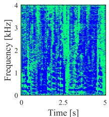  
(a) Binary $c _ { k } ( f , t )$

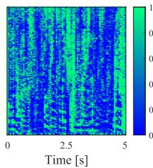  
(b) Soft $c _ { k } ( f , t )$

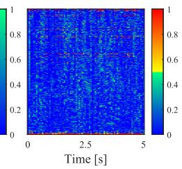  
(c) Difference

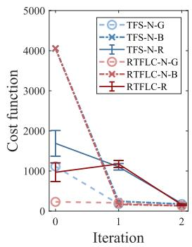

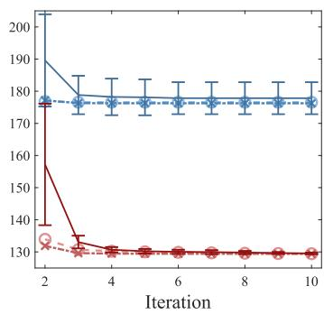  
Fig. 6. (a) Binary and (b) soft beamformer selection masks $c _ { k } ( f , t )$ and (c) their difference for the last 5 s. If the filter that gives the main contribution is the same in both $c _ { k } ( f , t )$ , their difference is less than 0.5.  
Fig. 7. Cost function at each iteration, where index 0 corresponds to the initial value. Blue and red lines indicate TFS and RTFLC beamformer, respectively. The circle correspond to good initialization, and the cross to bad initialization. The vertical line shows the average and error bar shows the standard deviation over 100 trials.

## E. Cost Functions

Finally, Fig. 7 shows the convergence of the cost functions of TFS and RTFLC beamformers, defined in the first term in (28). To expand the resolution of the vertical axis, Fig. 7 is divided into two parts. Here, two types of initialization were considered for TFS-N and RTFLC-N; good and bad denoted as $\cdot _ { - } \mathbf { G } ^ { , }$ and $\dot { \mathbf { \rho } } _ { - \mathrm { \mathbf { B } } } ,$ respectively. For good initialization, we used two null beamformers that suppress the DOAs of $5 0 ^ { \circ }$ and 150◦, which were exactly the same as those of interferers. In contrast, null beamformers suppressing the DOAs of $1 0 ^ { \circ }$ and $5 0 ^ { \circ }$ were used for an example of bad initialization. We show the average and standard deviation of the cost function over 100 trials for random initialization.

As seen in Fig. 7, few iterations were needed to converge to the local minimum regardless of the initialization method. However, the values of the cost function at the convergence point may be different in TFS variants, which means performance degradation due to bad initialization occurred. On the other hand, the RTFLC variants always reached a better convergence point with a small standard deviation, which signifies robustness against the initialization. Note that the cost function at the first iteration may be greater than that at the initialization because initial spatial filters have no constraint toward the DOA of the target.

## VI. EXPERIMENTAL EVALUATION ON SPEECH ENHANCEMENT PERFORMANCE

In this section, we conducted experiments to study the proposed methods in terms of the speech enhancement performance. In Section VI-A, we introduce the objective criteria used in this paper. Then, we show the speech enhancement performance using the SiSEC dataset in Sections VI-B and VI-C. In Section VI-D, we demonstrate the tradeoff between the target distortion and the noise reduction performance. Additionally, to understand the proposed methods from the aspect of speech enhancement, we conducted two experiments in regards to the scales of K, M, and N and the model mismatch in the RTF.

## A. Evaluation Metrics

In this paper, we use four objective criteria, namely, the signalto-distortion ratio (SDR), signal-to-interference ratio (SIR), signal-to-artifacts ratio (SAR) [42], and signal-to-reconstruction distortion ratio (SRDR), to quantify the results. The first three criteria are commonly used to evaluate the performance of signal enhancement and source separation. Additionally, we define SRDR to evaluate the extent to which the distortionless property discussed in Section II-C is satisfied. Inspired by the signal-to-noise ratio (SNR) definition, SRDR is defined as

$$
\mathrm{SRDR} = 1 0 \log_ {1 0} {\frac {| | s | | ^ {2}}{| | \check {s} - s | | ^ {2}}}.\tag{39}
$$

Obviously, SRDR decreases as sˇ deviates from s and SRDR → ∞ as ${ \check { s } }  s .$

‘Distortion’ in SDR [42] means the signal distortion due to the interference, where high SDR is obtained by reducing all noise components (i.e., interferences, noise, and artifacts). On the other hand, that in SRDR (39) means the distortion caused by the algorithm $G [ \cdot ]$ (see (7) and (9)). ‘Distortionless’ in the sense of the proposed beamformers corresponds to SRDR. In [43], an objective criterion, namely, the speech-distortion index (SD), was defined. SRDR is exceedingly relevant to the SD; however, SD changes depending on not only the algorithm G[·] but the input SNR. We therefore used SRDR in this paper. Here, the reference signal was the source image at the reference microphone (we used the first channel), namely, the interference-free reverberant signal. Note that the distortionless property is appropriately evaluated by the SRDR. However, effect of the problem of the target cancellation, which is mentioned in Section IV-B, is not evaluated. This problem will manifest itself as a decrease in SDR instead.

TABLE IV  
EXPERIMENTAL CONDITIONS FOR THE COMPARISON OF SPEECH ENHANCEMENT PERFORMANCE

<table><tr><td>Number of sound sources N</td><td>3 or 4</td></tr><tr><td>Number of microphones M</td><td>2 or 3</td></tr><tr><td>Reverberation time</td><td>120 ms, 230 ms, or 380 ms</td></tr><tr><td>Sampling frequency</td><td>16 kHz</td></tr><tr><td>Frame length</td><td> $2^{i}$  (i = 8...14) samples</td></tr><tr><td>Frame shift</td><td>Half the frame length</td></tr><tr><td>Signals for prior information</td><td>5 s</td></tr><tr><td>Signal for speech enhancement</td><td>(another) 5 s</td></tr></table>

## B. Evaluationfor the SiSEC Dataset

1) Dataset and Conditions: In this experiment, we used the development dataset obtained from the UND task of the SiSEC [39], [40]. The dev1 dataset [39] contains live recorded observations and the mixed signals made by summing them, where the number of microphones is two with the spacing of 5 cm. We selected four types of mixtures consisting of three or four male or female speech signals, where the correct DOA of these signals is given, and used them for the null beamformerbased initialization. The dev3 dataset [40] contains simulated observations that are convolutive mixtures of RIRs recorded in a real enclosure, where the number of microphones is three with the spacing of 5 cm. The mixtures consist of four male or female speech signals, where the DOAs are not given, and we thus roughly estimated it for the null beamformer-based initialization. The experimental conditions are listed in Table IV. Details of the other conditions for these datasets can be found in [39], [40]. Additionally, we experimentally analyzed the optimal frame length. The frame length was set to $2 ^ { i } ( i = 8 \dots 1 4 )$ samples, and each frame was half-overlapped regardless of the frame length. The number of beamformers K is defined as $C ( N - 1 , M - 1 )$ . Finally, because we enhanced the signal of each speaker as the target, we show the results by averaging evaluation criteria over the speakers.

## C. Results and Discussion

1) Performance of Speech Enhancement: The results of speech enhancement with dev1 and dev3 are shown in Figs. 8(a)– (i). We show the best results in terms of the frame length for each method. The best lengths are listed in Table V.

The conventional single MVDR beamformer can suppress only one interferer but generates only a small amount of artificial noise. Therefore, it only showed excellent improvement of SAR. TFS-P showed notable improvement of SDR and SIR while maintaining high SAR. Thus, it can be said that our idea of utilizing a combination of multiple beamformers improves the performance of speech enhancement.

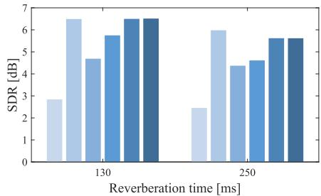  
(a) SDR

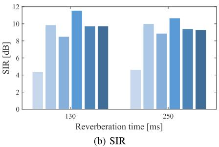

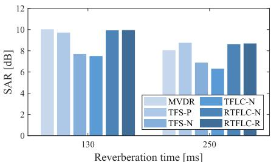  
(c) SAR

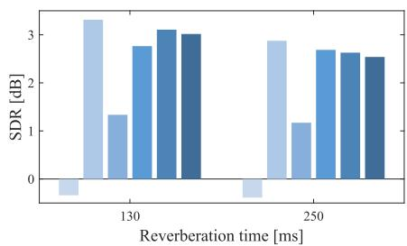  
(d) SDR

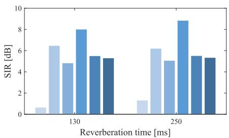  
(e) SIR

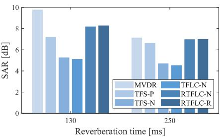  
(f) SAR

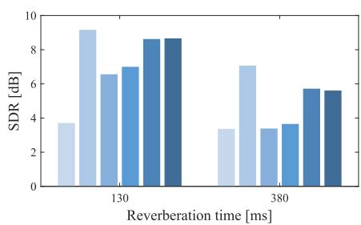  
(g) SDR

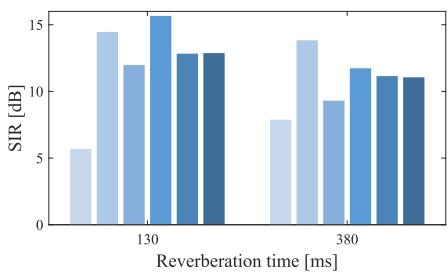  
(h) SIR

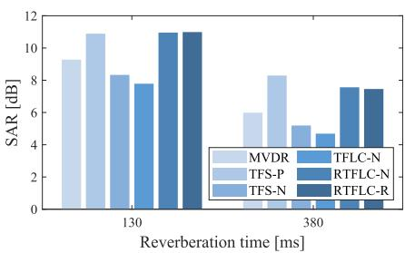  
(i) SAR  
Fig. 8. Results of speech enhancement under the condition of (a)–(c) M = 2 and N = 3 (dev1), (d)–(f) M = 2 and N = 4 (dev1) and (g)–(i) M = 3 and N = 4 (dev3).

TABLE V  
OPTIMAL FRAME LENGTH FOR EACH METHOD

<table><tr><td>Method</td><td>Figs. 8(a)-(c) (120/230 ms)</td><td>(d)-(f)</td><td>(g)-(i)</td></tr><tr><td>MVDR</td><td>8192/8192</td><td>4096/8192</td><td>4096/16384</td></tr><tr><td>TFS-P</td><td>4096/8192</td><td>4096/4096</td><td>4096/16384</td></tr><tr><td>TFS-N</td><td>4096/4096</td><td>2048/4096</td><td>2048/8192</td></tr><tr><td>TFLC-N</td><td>4096/4096</td><td>2048/4096</td><td>2048/4096</td></tr><tr><td>RTFLC-{N,R}</td><td>4096/4096</td><td>2048/4096</td><td>4096/8192</td></tr></table>

The performance of TFS-N was better than that of MVDR. However, the performance was degraded by not using covariance matrices of each interferer as the prior information, compared with TFS-P. The TFLC beamformer overcame this drawback and achieved a comparable performance to that of TFS-P. One possible reason is that the target signal was completely restored by summing the filter outputs, similarly to TFS-N, whereas the interferers were not. If the interferers in the output of beamformers were in the antiphase, they could cancel each other out, which would improve the performance of noise reduction.

The difference between TFLC and RTFLC beamformer is that the former uses (31) to update spatial filters, whereas the latter uses (25) alternately. TFLC uses the original update rule whereby the optimal solution is obtained by minimizing the cost function. Therefore, the best performance ofnoise reduction was obtained, as shown by SIR improvements. Since the ith filter is updated by using the additional information of the other filters, this update rule (31) maximizes the benefits of taking linear combinations. In other words, it is conceivable that the ith filter tried to output the noise components in the antiphase with the output of other filters to minimize the beamformer output. On the downside, this mechanism may counteract the target as well. RTFLC beamformer overcomes this problem by always setting u (f) to 0 and uses (25) to update the filters while continuing to reap the benefits of taking linear combinations. As a result, it achieved significant improvements in SDR, whereas the SIR performance was degraded. Moreover, the SAR performance may be superior to the MVDR performance. Thus, we concluded that RTFLC beamformer achieves a high performance of speech enhancement while maintaining undistorted target signal. Taken together, all the results imply that random initialization leads to sufficient improvements, as shown in the last bar in Fig. 8.

2) Optimal Frame Length: Since these beamformers can be understood as combinations of TF masking and beamforming, they have an optimal frame for speech enhancement. TF masking requires an adequately small frame length such that the signals satisfy the W-DO, whereas beamforming requires a sufficiently large frame length as assume in Section II-A. Therefore, the TFS beamformer has both properties and thus an optimal frame length to satisfy both requirements.

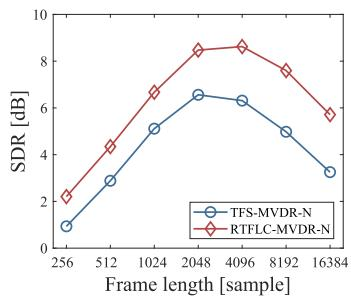

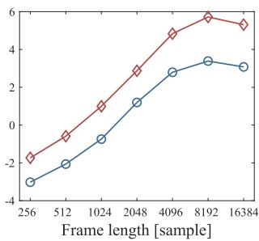  
(a) Reverberation time: 120 ms  
(b) Reverberation time: 380 ms  
Fig. 9. Average SDR vs frame length (dev3).

Fig. 9 shows the SDR performance of TFS-N and RTFLC-N versus frame length. According to this figure, the best SDRs were obtained using frame lengths of 2048 and 8192 samples (128 ms and 512 ms) with reverberation times of 120 ms and 380 ms, respectively. This result implies that the optimal frame length can roughly be estimated by considering the room reverberation, that is, the smallest frame length satisfying the assumption that the frame length is larger than the length of the ATF is the best.

## D. Evaluation for Distortionless Property

The proposed methods theoretically can enhance the desired signal without generating any distortion. In this section, we verify this property. To evaluate the SRDR performance, we conducted an experiment using the RIR generator [41]. We randomly selected three speech samples from the dev1 dataset and randomly placed them at least $3 0 ^ { \circ }$ apart. The reverberation time was set to 120 ms. The other setup is the same as that for dev1. For comparison, we evaluated the performances of the TV-MWF [25] and the ideal binary mask (IBM). TV-MWF [25] is a BSS method; however, we gave the covariance matrices of each interferer as the initial estimates to enable a fair comparison. The IBM is computed using the signal power spectrogram at the reference microphone within the period for enhancement as

$$
\operatorname{IBM} (f, t) = \left\{ \begin{array}{l l} 1 & \text { if } | s (f, t) | ^ {2} \geq | n (f, t) | ^ {2} \\ 0 & \text { otherwise. } \end{array} \right.\tag{40}
$$

We show the average result of 1000 trials.

As indicated in Fig. 10, IBM showed significant improvement in SDR without the use of spatial information. TV-MWF, which is the best in terms of minimum mean square error (MMSE), achieved the highest SDR. However, its SRDR performance is limited because there is no restriction for satisfying the distortionless property. MVDR showed considerably high SRDR, whereas SDR was low owing to the underdetermined situation. On the other hand, the proposed methods achieved high SDR performance while maintaining high SRDR performance, as in MVDR. For instance, RTFLC-N (i = 4) achieved 5.9 dB higher SDR with a 2.2 dB decline of SRDR from MVDR (i 4) and 17.4 dB higher SRDR with a 0.6 dB decline of SDR from MWF $( i = 3 )$ . Therefore, we concluded that the proposed methods successfully improve the performance of noise reduction while retaining the distortionless response of the desired signal.

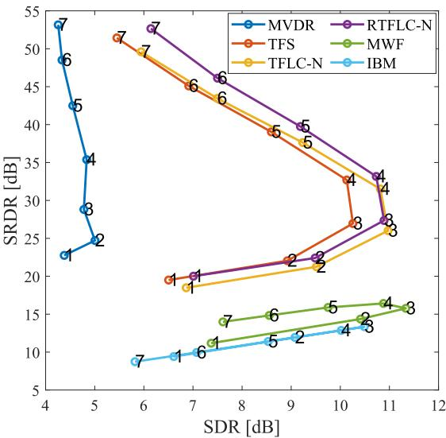  
Fig. 10. Average SRDR vs average SDR over frame length. The numbers $( i \stackrel { - } { = } 1 \ldots 7 )$ correspond to the frame length of $2 ^ { i + 7 }$ . Every proposed method used the MVDR beamformer and ‘-MVDR’ is thus omitted in the legend.

The SRDR performance of the proposed methods totally depends on the MVDR performance, where the larger frame length led to the higher SRDR. It is conceivable that there is an adverse effect of the error in approximating the transfer function in the STFT domain. Simultaneously, a frame length that is too large is undesirable because of the uncertainty principle of the STFT analysis and the lower time resolution. Moreover, the proposed methods need a sufficiently small frame length, as discussed in Section VI-C2. Choosing the best frame length is the key and an important problem, as in the other enhancement methods.

## E. Evaluationfor Different Numbers ofMicrophones, Sources, and Beamformers

In this section, we evaluated the speech enhancement performance of the proposed method over wider ranges of M and N as a function of K. We used the RIR generator [41], where the reverberation time was 200 ms and the frame length was fixed to 2048 samples. The spatial filters of the proposed method were initialized randomly. Note that the proposed methods are theoretically equivalent to the conventional MVDR beamformer when $K = 1$

Fig. 11 shows the result of speech enhancement. Based on our idea, $K = C ( N - 1 , M - 1 )$ is sufficient for signal enhancement (see Section III-A). However, there was no clear difference in SDR performance around it. In underdetermined situations, the proposed methods are always superior to the MVDR beamformer. In particular, the RTFLC beamformer improves SDR as K increases. In contrast, the TFLC beamformer has an optimal K that depends on M and N, but it was not $C ( N - 1 , M - 1 )$

Although we consider underdetermined situations, the performance of the proposed methods in (over)determined situations is also interesting. In (over)determined cases, the TFS and RTFLC beamformers can be superior to the MVDR beamformer. It can be considered that these beamformers effectively suppress the reverberant component of interferers. Additionally, the RTFLC beamformer can reduce the residual noise signals in the output of beamformers if these signals have an antiphase. In contrast, the performance of the TFLC beamformer is significantly degraded, especially for large K. Since the filters of the TFLC beamformer might have large degrees of freedom when $M \geq N$ they can also suppress the target signal using the residual noise component, whereas the distortionless property of each filter is satisfied.

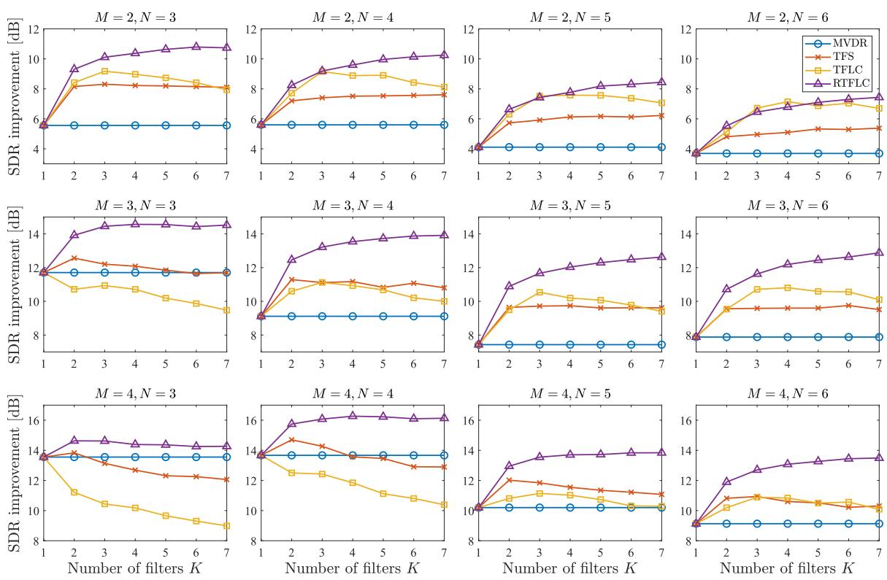  
Fig. 11. Speech enhancement performance as the function of K, where M and N vary in the range of 2 to 3 and 2 to 6, respectively.

## F. Robustness Against Mismatch in RTF

Finally, we investigate the sensitivity of the proposed method to the parameter mismatch in the RTF. Since the proposed methods require the exact RTF, the robustness against the estimation error is interesting from the viewpoint of practicality. For this purpose, the impulse response of the target source simulated by the RIR generator was contaminated by the additive white Gaussian noise. Then, we gave the RTF derived from the DFT of the collapsed impulse response to the proposed methods. The SNR in this evaluation is defined as

$$
\mathrm{SNR} = 1 0 \log_ {1 0} {\frac {\sum_ {\tau} | \pmb {g} (\tau) | ^ {2}}{\sum_ {\tau} | \tilde {\pmb {g}} (\tau) - \pmb {g} (\tau) | ^ {2}}},\tag{41}
$$

where $\pmb { g } ( \tau )$ and $\tilde { \mathbf g } ( \tau )$ denote the ground-truth and contaminated impulse responses, and $\tau$ denote the sample index in the time domain.

Fig. 12 shows the SDR performance as a function ofSNR. Basically, the SDR performance of the proposed method depends on that of the MVDR beamformer. However, the performance of the proposed method rapidly decreases when SNR is lower than 40 dB. We can conclude that the proposed methods require precise RTF. The method for estimating it [22], [44], [45] is another essential problem in many microphone array signal processing methods.

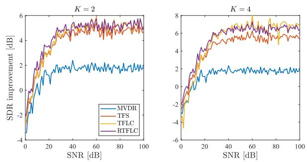  
Fig. 12. Speech enhancement performance as the function of SNR.

## VII. CONCLUSION

In this paper, we proposed a novel method for signal enhancement in underdetermined situations, where multiple beamformers are utilized. The joint optimization problem for the beamformers and their weights was considered in which the distortionless property for the desired signal is guaranteed. Efficient update rules that iteratively minimize the objective function were derived, equivalent to that of the MVDR beamformer when the number of beamformers is one. In experiments, we demonstrated how the beamformers are updated and linearly combined. The crucial property of the proposed methods, the distortionless response of the desired signal, was verified using the objective criterion, SRDR, quantifying the level ofsignal distortion. These experiments revealed the relationship among the proposed TFLC variants: the linear combination of beamformers effectively improves the performance of signal enhancement. In contrast, the too-large degree of freedom leads to the canceling problem of the desired signal by the harmful use of the output of the beamformers, which may cause the target distortion. The restricted variant, RTFLC beamformer, can properly prevent this problem owing to its constraint and showed the highest performance in signal enhancement. The future work includes the online adaptation of the TFLC beamformer.

## ACKNOWLEDGMENT

The authors would like to thank Andreas Brendel, Michael Buerger, and Professor Walter Kellermann of FAU Erlangen-Nürnberg for collaboration in the early stage of this work.

## REFERENCES

[1] S. Gannot, D. Burshtein, and E. Weinstein, “Signal enhancement using beamforming and nonstationarity with applications to speech,” IEEE/ACM Trans. Audio, Speech, Lang. Process., vol. 49, no. 8, pp. 1614–1626, Aug. 2001.

[2] C. Pan, J. Chen, and J. Benesty, “Performance study of the MVDR beamformer as a function of the source incidence angle,” IEEE/ACM Trans. Audio, Speech, Lang. Process., vol. 22, no. 1, pp. 67–79, Jan. 2014.

[3] S. Doclo, W. Kellermann, S. Makino, and S. E. Nordholm, “Multichannel signal enhancement algorithms for assisted listening devices: Exploiting spatial diversity using multiple microphones,” IEEE Signal Process. Mag., vol. 32, no. 2, pp. 18–30, Mar. 2015.

[4] S. Makino, T.-W. Lee, and H. Sawada, Blind Speech Separation. Dordrecht, The Netherlands: Springer, 2007.

[5] N. Ono, “Stable and fast update rules for independent vector analysis based on auxiliary function technique,” in Proc. IEEE Workshop Appl. Signal Process. Audio Acoust., Oct. 2011, pp. 189–192.

[6] D. Kitamura, N. Ono, H. Sawada, H. Kameoka, and H. Saruwatari, “Determined blind source separation unifying independent vector analysis and nonnegative matrix fuctorization,” IEEE/ACM Trans. Audio, Speech, Lang. Process., vol. 24, no. 9, pp. 1626–1641, Sep. 2016.

[7] O. Yılmaz and S. Rickard, “Blind separation of speech mixtures via time-frequency masking,” IEEE Trans. Signal Process., vol. 52, no. 7, pp. 1830–1847, Jul. 2004.

[8] H. Sawada, S. Araki, and S. Makino, “Underdetermined convolutive blind source separation via frequency bin-wise clustering and permutation alignment,” IEEE/ACM Trans. Audio, Speech, Lang. Process., vol. 19, no. 3, pp. 516–527, Mar. 2011.

[9] J. R. Hershey, Z. Chen, and J. L. R. S. Watanabe, “Deep clustering: Discriminative embeddings for segmentation and separation,” in Proc. IEEE Int. Conf. Acoust., Speech, Signal Process., 2016, pp. 31–35.

[10] T. Higuchi, N. Ito, S. Araki, T. Yoshioka, M. Delcroix, and T. Nakatani, “Online MVDR beamformer based on complex Gaussian mixture model with spatial prior for noise robust ASR,” IEEE/ACM Trans. Audio, Speech, Lang. Process., vol. 25, no. 4, pp. 780–793, Apr. 2017.

[11] S. Watanabe et al., “CHiME-6 Challenge: Tackling multispeaker speech recognition for unsegmented recordings,” in Proc. 6th Int. Workshop Speech Process. Everyday Environ. (CHiME 2020), May 2020, pp. 1–7.

[12] K. Yamaoka et al., “Time-frequency-bin-wise beamformer selection and masking for speech enhancement in underdetermined noisy scenarios,” in Proc. Eur. Signal Process. Conf., Sep. 2018, pp. 1596–1600.

[13] K. Yamaoka, N. Ono, S. Makino, and T. Yamada, “Time-frequency-binwise switching of minimum variance distortionless response beamformer for underdetermined situations,” in Proc. IEEE Int. Conf. Acoust., Speech, Signal Process., May 2019, pp. 7908–7912.

[14] N. Q. K. Duong, P. Berthet, S. Zabre, M. Kerdranvat, A. Ozerov, and L. Chevallier, “Audio zoom for smartphones based on multiple adaptive beamformers,” in Proc. Latent Variable Anal. Signal Separation, Feb. 2017, pp. 121–130.

[15] S. Takada, S. Kanba, T. Ogawa, K. Akagiri, and T. Kobayashi, “Sound source separation using null-beamforming and spectral subtraction for

mobile devices,” in Proc. IEEE Workshop Appl. Signal Process. Audio Acoust., 2007, pp. 30–33.

[16] T. Ogawa, S. Takada, K. Akagiri, and T. Kobayashi, “Speech enhancement using a square microphone array in the presence of directional and diffuse noise,” IEICE Trans. Fundam., vol. E93-EA, no. 5, pp. 926–935, May 2010.

[17] H. L. Van Trees, Optimum Array Processing. New York, NY, USA: Wiley, 2002.

[18] S. Araki, H. Sawada, and S. Makino, “Blind speech separation in a meeting situation with maximum SNR beamformers,” in Proc. IEEE Int. Conf. Acoust., Speech, Signal Process., Apr. 2007, pp. 41–45.

[19] M. Togami, T. Sumiyoshi, Y. Obuchi, Y. Kawaguchi, and H. Kokubo, “Beamforming array technique with clustered multichannel noise covariance matrix for mechanical noise reduction,” in Proc. Eur. Signal Process. Conf., Aug. 2010, pp. 741–745.

[20] O. L. FrostIII, “An algorithm for linearly constrained adaptive array processing,” Proc. IEEE, vol. 60, no. 8, pp. 926–935, Aug. 1972.

[21] S. Gannnot, E. Vincent, S. Markovich-Golan, and A. Ozerov, “A consolidated perspective on multimicrophone speech enhancement and source separation,” IEEE/ACM Trans. Audio, Speech, Lang. Process., vol. 25, no. 4, pp. 692–730, Apr. 2017.

[22] S. Markovich-Golan and S. Gannot, “Performance analysis of the covariance subtraction method for relative transfer function estimation and comparison to the covariance whitening method,” in Proc. IEEE Int. Conf. Acoust., Speech, Signal Process., Apr. 2015, pp. 544–548.

[23] A. Spriet, M. Moonen, and J. Wouters, “Spatially pre-processed speech distortion weighted multi-channel Wiener filtering for noise reduction,” Signal Process., vol. 84, no. 12, pp. 2367–2387, 2004.

[24] S. Doclo, A. Spriet, J. Wouters, and M. Moonen, “Speech distortion weighted multichannel Wiener filtering techniques for noise reduction,” in Speech Enhancement, Signals and Communication Technology. Berlin, Germany Springer, 2005, pp. 199–228.

[25] N. Q. K. Duong, E. Vincent, and R. Gribonval, “Under-determined reverberant audio source separation using a full-rank spatial covariance model,” IEEE/ACM Trans. Audio, Speech, Lang. Process., vol. 18, no. 7, pp. 1830–1840, Sep. 2010.

[26] A. A. Nugraha, A. Liutkus, and E. Vincent, “Multichannel audio source separation with deep neural networks,” IEEE/ACM Trans. Audio, Speech, Lang. Process., vol. 24, no. 10, pp. 1652–1664, Sep. 2016.

[27] A. Ozerov and C. Févotte, “Multichannel nonnegative matrix factorization in convolutive mixtures for sudio source separation,” IEEE/ACM Trans. Audio, Speech, Lang. Process., vol. 18, no. 3, pp. 550–563, Mar. 2010.

[28] H. Sawada, H. Kameoka, S. Araki, and N. Ueda, “Multichannel extensions of non-negative matrix factorization with complex-valued data,” IEEE/ACM Trans. Audio, Speech, Lang. Process., vol. 21, no. 5, pp. 971–982, May 2013.

[29] K. Sekiguchi, A. Nugraha, Y. Bando, and K. Yoshii, “Fast multichannel source separation based on jointly diagonalizable spatial covariance matrices,” in Proc. Eur. Signal Process. Conf., 2019, pp. 1–5.

[30] H. Jahn, D. Lukas, and H.-U. Reinhold, “Neural network based spectral mask estimation for acoustic beamforming,” in Proc. IEEE Int. Conf. Acoust., Speech, Signal Process., Mar. 2016, pp. 196–200.

[31] Y. Kubo, T. Nakatani, M. Delcroix, K. Kinoshita, and S. Araki, “Maskbased MVDR beamformer for noisy multisource environments: Introduction of time-varying spatial covariance model,” in Proc. IEEE Int. Conf. Acoust., Speech, Signal Process., 2019, pp. 6855–6859.

[32] S. Rickard, “The DUET blind source separation algorithm” Blind Speech Separation, S. Makino, T.-W. Lee, and H. Sawada, Eds. Dordrecht, The Netherlands: Springer, 2007, pp. 217–241.

[33] S. Araki, H. Sawada, R. Mukai, and S. Makino, “Underdetermined blind sparse source separation for arbitrarily arranged multiple sensors,” Signal Process., vol. 87, no. 8, pp. 1833–1847, 2007.

[34] R. M. Corey and A. C. Singer, “Nonstationary source separation for underdetermined speech mixtures,” in Proc. Asilomar Conf. Signals, Syst., Comput., Nov. 2016, pp. 934–938.

[35] C. B. Barber, D. P. Dobkin, and H. Huhdanpaa, “The quickhull algorithm for convex hulls,” ACM Trans. Math. Softw., vol. 22, no. 4, pp. 469–483, 1996.

[36] A. Jourjine, S. Rickard, and O. Yılmaz, “Blind separation of disjoint orthogonal signals: Demixing n sources from 2 mixtures,” in Proc. IEEE Int. Conf. Acoust., Speech, Signal Process., 2000, pp. 2985–2988.

[37] S. Rickard and O. Yılmaz, “On approximate W-disjoint orthogonality of speech,” in Proc. IEEE Int. Conf. Acoust., Speech, Signal Process., May 2002, pp. 529–532.

[38] A. Aissa-El-Bey, N. Linh-Trung, K. Abed-Meraim, A. Belouchrani, and Y. Grenier, “Underdetermined blind separation of nondisjoint sources in the time-frequency domain,” IEEE Trans. Signal Process., vol. 55, no. 3, pp. 897–907, Mar. 2007.

[39] E. Vincent, S. Araki, and P. Bofill, “The 2008 signal separation evaluation campaign: A community-based approach to large-scale evaluation,” in Proc. Int. Conf. Independent Compon. Anal. Signal Separation, 2009, pp. 734–741.

[40] S. Araki et al., “The 2011 signal separation evaluation campaign (SiSEC2011):- audio source separation,” in Proc. Latent Variable Anal. Signal Separation, Mar. 2012, pp. 414–422.

[41] E. A. P. Habets, “Room impulse response (RIR) generator,” 2008, Accessed: Mar. 2017. [Online]. Available: https://www.audiolabs-erlangen. de/fau/professor/habets/software/ rir-generator

[42] E. Vincent, R. Gribonval, and C. Févotte, “Performance measurement in blind audio source separation,” IEEE/ACM Trans. Audio, Speech, Lang. Process., vol. 14, no. 4, pp. 1462–1469, Jul. 2006.

[43] J. Chen, J. Benesty, Y. Huang, and S. Doclo, “New insights into the noise reduction Wiener filter,” IEEE/ACM Trans. Audio, Speech, Lang. Process., vol. 14, no. 4, pp. 1218–1234, Jul. 2006.

[44] M. Taseska and E. A. P. Habets, “Relative transfer function estimation exploiting instantaneous signals and the signal subspace,” in Proc. Eur. Signal Process. Conf., 2015, pp. 404–408.

[45] D. Cherkassky and S. Gannot, “Successive relative transfer function identification using blind oblique projection,” IEEE/ACM Trans. Audio, Speech, Lang. Process., vol. 28, pp. 474–486, Dec. 2019.

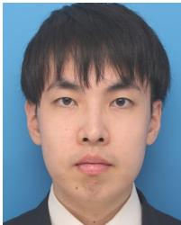  
Kouei Yamaoka (Student Member, IEEE) received the B.Sc. and M.E. degrees in information engineering and engineering from the University of Tsukuba, Tsukuba, Japan, in 2017 and 2019, respectively. He is currently working toward the Ph.D. degree with Tokyo Metropolitan University, Hino, Japan. His research interests include acoustic signal processing, signal enhancement, source localization, and asynchronous distributed microphone array.

Mr. Yamaoka is a member of the Acoustical Society of Japan.

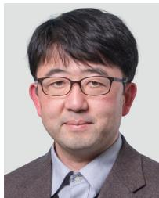

Nobutaka Ono (Senior Member, IEEE) received the B.E., M.S., and Ph.D. degrees in mathematical engineering and information physics from The University of Tokyo, Bunkyo City, Japan, in 1996, 1998, and 2001, respectively.

Dr. Ono is a Senior Member of the IEEE Signal Processing Society, a Member ofthe Acoustical Society ofJapan (ASJ), the Institute ofElectronics, Information and Communications Engineers (IEICE), the Information Processing Society of Japan (IPSJ), and the Society of Instrument and Control Engineers (SICE) in Japan. He was the Chair of the Signal Separation Evaluation Campaign (SiSEC) evaluation committee in 2013 and 2015, a Technical Program Chair of IWAENC 2018, a General Chair ofthe DCASE 2020 workshop, and a Member ofthe IEEE Audio and Acoustic Signal Processing (AASP) Technical Committee from 2014 to 2019. He was an Associate Editor for the IEEE TRANSACTIONS ON AUDIO, SPEECH, AND LANGUAGE PROCESSING from 2012 to 2015. He is currently the Vice Chair to the IEEE Signal Processing Society (SPS) Tokyo Joint Chapter. He was the recipient of the Awaya Award from ASJ in 2007, the Igarashi Award at the Sensor Symposium from IEEJ in 2004, the Best Paper Award at IEEE ISIE in 2008, the measurement division Best Paper Award from SICE in 2013, the Best Paper Award in IEEE IS3C in 2014, the Excellent Paper Award in IIHMSP in 2014, the Unsupervised Learning ICA Pioneer Award from SPIE.DSS in 2015, the Sato Paper Award from ASJ in 2000 and 2018, two TAF telecom system technology awards in 2018, and the Best Paper Award in APSIPA ASC in 2018.

He started to work with The University of Tokyo as a Research Associate in April 2001, and became a Lecturer in April 2005. He moved to the National Institute of Informatics, Japan, as an Associate Professor in April 2011 and became a Professor in September 2017. He moved to Tokyo Metropolitan

University, Japan, in October 2017. He has authored or coauthored more than 280 articles in international journal papers and peer-reviewed conference proceedings. His research interests include acoustic signal processing, especially microphone array processing, source localization and separation, machine learning, and optimization algorithms. He was a Tutorial Speaker with ISMIR 2010 and ICASSP 2018.

Shoji Makino (Fellow, IEEE) received the B.E., M.E., and Ph.D. degrees from Tohoku University, Sendai, Japan, in 1979, 1981, and 1993, respectively. He joined NTT in 1981 and the University of Tsukuba, Tsukuba, Japan, in 2009. He is currently a Professor with Waseda University, Kiyakyushu, Japan. He has authored or coauthored of more than 200 articles in journals and conference proceedings and is responsible for more than 150 patents. His research interests include adaptive filtering technologies, the realization of acoustic echo cancellation,

blind source separation of convolutive mixtures of speech, and acoustic signal processing for speech and audio applications.

He was the recipient of the ICA Unsupervised Learning Pioneer Award in 2006, the IEEE MLSP Competition Award in 2007, the IEEE SPS Best Paper Award in 2014, the Achievement Award for Science and Technology by the Minister of Education, Culture, Sports, Science and Technology in 2015, the Hoko Award of the Hattori Hokokai Foundation in 2018, the Outstanding Contribution Award of the IEICE in 2018, the Technical Achievement Award of the IEICE in 2017 and 1997, the Outstanding Technological Development Award of the ASJ in 1995, and 8 best paper awards. He was a Keynote Speaker at ICA2007, a Tutorial Speaker at EMBC2013, Interspeech2011 and ICASSP2007. He was on IEEE SPS Board of Governors (2018–2020), Technical Directions Board (2013–2014), Awards Board (2006–2008), Conference Board (2002–2004), and Fellow Evaluation Committee (2018–2020). He was a member of the IEEE Jack S. Kilby Signal Processing Medal Committee (2015–2018) and the James L. Flanagan Speech & Audio Processing Award Committee (2008–2011). He was an Associate Editor for the IEEE TRANSACTIONS ON SPEECH AND AUDIO PROCESSING (2002–2005) and an Associate Editor for the EURASIP Journal on Advances in Signal Processing (2005–2012). He was the Guest Editor of the Special Issue of the IEEE Signal Processing Magazine (2013–2014). He was the Chair of SPS Audio and Acoustic Signal Processing Technical Committee (2013–2014) and the Chair of the Blind Signal Processing Technical Committee of the IEEE Circuits and Systems Society (2009–2010). He was the General Chair of IWAENC 2018, WASPAA2007, IWAENC2003, the Organizing Chair of ICA2003, and is the designated Plenary Chair of ICASSP2012. Dr. Makino is an IEEE SPS Distinguished Lecturer (2009–2010), an IEICE Fellow, a Board member of the ASJ, and a member of EURASIP.