· 声频工程专栏 ·

# 基于双传声器的蓝牙耳机降噪算法\*

严馨叶 邱小军 $^{†}$ 卢 晶

(近代声学教育部重点实验室 南京大学声学研究所 南京 210093)

摘要 用于免提通信设备的语音增强算法一直是研究的热点问题，而算法处理结果的音质问题近年来也备受关注。针对基于双传声器降噪的蓝牙耳机系统，将常用多通道传声器降噪算法归纳为基于相干函数法和基于空间预分离法这两大类进行分析和比较。基于相干函数法利用两个通道间信号的相干函数对含噪信号滤波达到降噪目的，而基于空间预分离法利用空间特性从含噪信号中分离出噪声参考信号来消除噪声。分析基于降噪量、语音音质和综合性能三个指标，从约束语音损伤的角度分析最优解的形式，并对比两类算法的实际性能。结果表明选择合适的算法可权衡降噪量与语音损伤，达到较好的综合性能。

关键词 语音增强,蓝牙耳机,相干函数算法,空间预分离算法,语音损伤约束

中图分类号：TN912.35

文献标识码：A

文章编号：1000-310X(2014)04-0313-11

DOI:10.11684/j.issn.1000-310X.2014.04.004

# Two microphone based noise suppression algorithms for bluetooth headsets

YAN Xinye QIU Xiaojun $^{\dagger}$ LU Jing

(Key Laboratory of Modern Acoustics, Institute of Acoustics, Nanjing University, Nanjing 210093, China)

Abstract Speech enhancement for hands-free communication applications has been a hot research topic for a long time while the speech quality of these algorithms receives more attentions in recent years. This paper categorizes various kinds of multi-channel noise suppression algorithms into two groups for analyzing two microphone based noise suppression algorithms for Bluetooth headset systems. One group is the coherence based algorithm, which employs the coherence function between signals in the two channels for noise suppression. Another group is the spatially preprocess based algorithm, which takes advantage of spatial information to separate the noise reference signal from the noisy signal. Two typical algorithms were assessed based on the performance of noise reduction, speech distortion and overall performance and an optimal solution with speech distortion constraint was analyzed. Evaluation results indicate that better overall performance can be achieved by taking balance between noise reduction and speech distortion.

Key words Noise suppression, Bluetooth headset, Coherence based algorithm, Spatially preprocess based algorithm, Speech distortion weighted

## 1 引言

蓝牙耳机等便携通信设备给人们的生活带来极大的便利，但在实际使用中，语音常被周围环境噪声干扰，严重影响了通话质量和听者的听觉感受[1-2]。早期的单通道语音增强算法和降噪算法[3]，如谱减法[4]、参数统计模型法[5]、维纳滤波法[6]等，虽然能一定程度地消除噪声，但他们较难同时考虑降噪和音质两个问题，在实现降噪的同时导致对音质的损伤，且噪声消除越多，对音质损伤越严重[7]。

近年来，传声器阵列被广泛用于降噪算法中 $^{[8-10]}$ 。与单通道算法以牺牲语音音质作为代价来达到降噪的方法不同，多通道语音降噪算法理论上能在对音质毫无损伤的情况下进行降噪 $^{[7,11]}$ 。多通道降噪算法的性能一般随着传声器个数的增加而增加，然而，考虑蓝牙耳机的成本、体积和功耗等问题，双传声器系统是折衷的选择。本文针对双传声器系统，探讨能够在消除噪声的同时保证语音音质的降噪算法。本文所指降噪算法在文献中又称语音增强算法或者噪声抑制算法，指将传声器或者阵列接收到语音中的噪声消除，清晰地传向远端，不是指利用扬声器或者受话器在话者耳中产生反相声波降低周边环境噪声的有源降噪。

基于相干函数原理的语音增强算法在1992年由Le等提出[12]。该算法利用两个通道信号的相关性消除噪声。但当两个通道信号中的噪声分量相关性增加时，该算法性能急剧下降。通过估计噪声信号的互功率谱（Cross power spectral density, CPSD），可提高基于相干函数方法的性能[13]。Rahmani等提出用先验信噪比（Signal to noise ratio, SNR)来修正互功率谱的估计[14]，并提出一种迭代计算方法[15]。在文献[16-17]等论文中，最小统计模型（Minimum statistics, MS)被用于噪声功率谱估计中。Yousefian等提出了在扩散声场条件下利用输入信号相干函数的幅度响应进行语音增强的算法[18-19]，该算法不需要估计噪声参数并能应用于有竞争话者的场合[20]。Kallel等将单通道谱减法应用到双通道算法中[21]。除了基于相干函数的算法，还有基于能量差[22]和基于相位差[23]的算法研究，其本质思想和基于相干函数算法类似，用不同的参数来逼近维纳滤波器。这类算法的关键在于对噪声功率谱的准确估计,而语音音质损伤(Speech distortion, SD)是这些算法的主要缺陷。

基于空间预处理的方法是另一类常用的多通道语音增强算法。这类算法利用阵列的空间性质来分离语音和噪声。广义旁瓣消除器（Generalized sidelobe canceller，GSC） $^{[24-26]}$ 在1982年首次提出，是这类算法中最受关注的。在没有语音泄漏的情况下，该方法可在不引起语音损伤的同时消除相干噪声 $^{[27]}$ 。Gannot等分析了GSC算法的性能极限 $^{[28]}$ ，并提出传递函数GSC(Transfer function GSC, TF-GSC)算法 $^{[29]}$ 来得到没有语音泄漏的噪声参考，但需要知道声源到传声器传递函数的信息。GSC算法结合后处理算法 $^{[30-31]}$ ，可进一步消除不相干噪声。Moonen等提出多通道维纳滤波(Multi-channel Wiener filtering, MWF)算法 $^{[32-34]}$ ，将语音泄漏时引起的语音损伤考虑到算法中。Chen等从权衡降噪量与语音损伤的角度，分析得到最优滤波器形式 $^{[27,35]}$ ，并将GSC算法、MWF算法归类为其中一种特例。

由于人嘴(声源)到耳机中的传声器距离很近，且从声源到传声器阵列之间有人头的影响。传统的传声器阵列针对远场设计波束的方法 $^{[36]}$ 并不能直接用于耳机。Laugesen等针对耳机应用将人头作为刚性球体考虑，对阵列中各传声器设计不同的权重 $^{[37]}$ 。Tashev等提出一种混合算法 $^{[38]}$ ，使用固定波束消除远场的噪声、通过估计不同频率的波到达方向(Direction of arrival, DOA)来抑制方向性的噪声。采用指向性传声器设计波束来提高降噪量并降低对音质的损伤 $^{[39]}$ 。

基于双传声器降噪的蓝牙耳机产品有很多[40-41]，但这些产品的评价结果表明有些产品处理音质较好但降噪效果差，有些产品降噪明显但语音失真明显，综合性能都不太好。结合骨传导传感器[42]或者采用三传声器结构[43]，可获得更好的综合性能。本文专门针对双传声器蓝牙耳机，介绍了两种典型算法，分析了无损降噪算法的最优解。各算法的评价结果对比表明通过权衡降噪量和语音损伤可提高综合性能。

## 2 指标、模型和算法

## 2.1 性能评价指标

降噪算法性能一般可采用三个评价量 $^{[30]}$ 定量分析算法性能: 段信噪比 (Segmental SNR, Seg-SNR)、降噪量 (Noise reduction, NR) 和对数谱距离 (Log-spectral distance, LSD)。其中 NR 只在噪声段计算; SegSNR 是综合考虑语音失真与降噪量, 表征算法的整体性能, 其值越大越好; NR 表征降噪程度, 其值越大越好; LSD 表征语音失真的程度, 其值越小越好。PESQ (Perceptual evaluation of speech quality) 评分 $^{[44]}$ 也是常用的语音音质客观评价标准。它将待评价的语音与纯净的参考语音进行比较, 考虑人耳听觉感知模型, 根据两个信号的差异给出评分。该算法的评分结果与人的主观感受较为一致。PESQ 的得分范围为 -0.5 \~ 4.5 分。-0.5 分表示音质最差, 4.5 分表示音质最好, 语音失真越严重, PESQ 得分越低。

## 2.2 蓝牙耳机模型

实际人头佩戴蓝牙耳机的典型佩戴角度有： $0^{\circ}$ 佩戴、 $45^{\circ}$ 佩戴（正常佩戴）和 $90^{\circ}$ 佩戴。正常佩戴情况下系统平面图如图1所示。一般蓝牙耳机中采用的传声器为全指向性，两者间距 $d$ 为 $3 \sim 4 \mathrm{~cm}$ 。

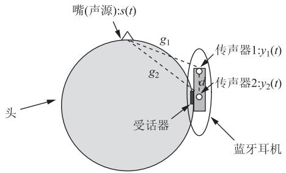  
图 1 双传声器蓝牙耳机系统平面图  
Fig. 1 The planform of a head with a two microphone Bluetooth headset system

两个传声器采集到的信号为 $y_{i}(t)$ ，由语音分量 $x_{i}(t)$ 和噪声分量 $v_{i}(t)$ 组成。声源信号为 $s(t)$ ，声源到传声器的声学路径脉冲响应分别为 $g_{i}, i=1,2$ 。各信号之间的关系为

$$
\begin{array}{r l} y _ {i} (t) & = s (t) * g _ {i} + v _ {i} (t) = x _ {i} (t) + v _ {i} (t) \\ & (i = 1, 2), \end{array}\tag{1}
$$

该模型有 2 个特点:(1)由于两个传声器之间距离比较小,两个通道信号之间的相关性较高;(2)由于声源位置和传声器位置相对固定,声源到传声器的声学路径变化较小。

## 2.3 典型算法描述

通过短时傅立叶变换(Short-time Fourier transform, STFT), 式(1)可以改写为频域形式,

$$
\begin{array}{r l} Y _ {i} (k, m) & = X _ {i} (k, m) + V _ {i} (k, m) \\ & (i = 1, 2), \end{array}\tag{2}
$$

式中 k 表征频点, m 是时帧。下面推导中, 记降噪后的语音信号为 $\hat{s}(t)$ , 其频域形式为 $\hat{S}(k, m)$ 。

## 2.3.1 基于相干函数算法

两个通道的相干函数表示为 $^{[12]}$

$$
\Gamma_ {Y _ {1} Y _ {2}} (k, m) = \frac {\left| P _ {Y _ {1} Y _ {2}} (k , m) \right|}{\sqrt {P _ {Y _ {1} Y _ {1}} (k , m) P _ {Y _ {2} Y _ {2}} (k , m)}}\tag{3}
$$

式中 $P_{Y_{1}Y_{1}}(k,m)$ 、 $P_{Y_{2}Y_{2}}(k,m)$ 和 $P_{Y_{1}Y_{2}}(k,m)$ 分别为信号 $Y_{1}(k,m)$ 的功率谱、信号 $Y_{2}(k,m)$ 的功率谱和 $Y_{1}(k,m)$ 与 $Y_{2}(k,m)$ 的互功率谱。含噪信号的功率谱和互功率谱一般通过固定的遗忘因子进行平滑估计得到。

假设两通道的噪声信号不相关,语音信号相关。则有语音存在时,相干函数接近于1,在没有语音存在时,相干函数接近0。故可用相干函数对含噪信号进行滤波得到增强的语音信号。为降低实际环境中两通道间噪声信号相关性的影响,可做如下改进 $^{[13]}$ :

$$
H _ {\mathrm{CPSD}} (k, m) = \frac {\left| P _ {Y _ {1} Y _ {2}} (k , m) \right| - \left| P _ {N _ {1} N _ {2}} (k , m) \right|}{\sqrt {P _ {Y _ {1} Y _ {1}} (k , m) P _ {Y _ {2} Y _ {2}} (k , m)}}.\tag{4}
$$

式中 $P_{N_{1}N_{2}}(k,m)$ 为噪声信号 $N_{1}(k,m)$ 与 $N_{2}(k,m)$ 的互功率谱。

基于相干函数算法的关键在于对噪声互功率谱的估计 $^{[14-17]}$ 。一般在语音间歇段对噪声谱进行平滑估计。通过先验信噪比、相干性强度、统计参数等信息调节平滑因子 $\gamma(k,m)$ 可提高估计的准确性。基于相干函数算法的一般流程如图2所示。首先，对含噪信号进行功率谱估计，其次，计算所需参数来优化噪声谱的估计，最后，按(4)式计算滤波器，对含噪信号进行滤波得到增强的语音。这类方法的优点是算法简单易行，但是对语音音质损伤严重。噪声谱的估计准确与否决定了算法的性能。

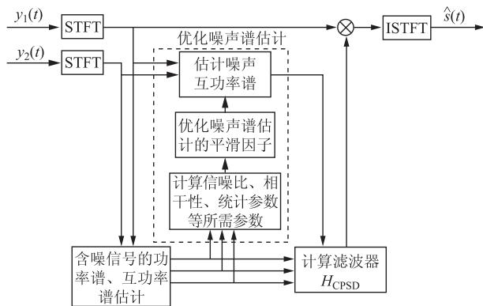  
图 2 基于相干函数算法的流程图  
Fig. 2 Block diagram of the coherence based algorithm

## 2.3.2 基于空间预分离算法的 GSC 算法

基于空间预分离的典型算法为 GSC 算法, 其结构如图 3 所示 $^{[33]}$ 。含噪信号经过波束形成矩阵 $A = [A_{1}(k), A_{2}(k)]$ 和阻塞矩阵 $B = [B_{1}(k), B_{2}(k)]$ 得到语音参考 $Y_{\mathrm{s}}(k, m)$ 和噪声参考 $Y_{\mathrm{n}}(k, m)$ 。通过自适应算法在只有噪声时更新滤波器, 消除语音参考中的噪声。 $\Delta$ 为适当的延时, 用来消除非因果性的影响。信号间关系为

$$
\begin{array}{r l} Y _ {\mathrm{s}} (k, m) & = A _ {1} (k) Y _ {1} (k, m) + A _ {2} (k) Y _ {2} (k, m), \\ Y _ {\mathrm{n}} (k, m) & = B _ {1} (k) Y _ {1} (k, m) + B _ {2} (k) Y _ {2} (k, m), \end{array} \tag {5}\tag{5}
$$

(6)

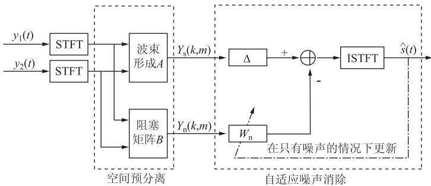  
图 3 GSC 的一般结构图 $^{[33]}$  
Fig. 3 Structure of the general GSC algorithm

一般情况下,语音参考和噪声参考中都同时含有语音分量和噪声分量。若能得到没有语音泄漏的噪声参考信号,则可对信号进行无损降噪。Gannot等提出的TF-GSC算法 $^{[29]}$ 可得到较纯净的噪声参考。通过系统辨识方法 $^{[45-46]}$ 可解决获得相对路径传递函数的问题,但需要一定的收敛时间才能得到较准确的结果。结合后处理算法 $^{[29-31]}$ 可进一步消除噪声。

## 2.3.3 考虑语音损伤的最优算法

为避免预处理给语音音质带来的损伤,这里以第一个传声器作为参考,从中估计语音信号,写成矩阵形式为

$$
\begin{array}{r l} \hat {S} _ {1} (\omega) & = \boldsymbol {H} (\omega) ^ {\mathrm{H}} \boldsymbol {Y} (\omega) \\ & = \boldsymbol {H} (\omega) ^ {\mathrm{H}} \boldsymbol {X} (\omega) + \boldsymbol {H} (\omega) ^ {\mathrm{H}} \boldsymbol {V} (\omega), \end{array}\tag{7}
$$

式中 $\boldsymbol{H}(\omega) = \left[\mathrm{FFT}\left(\boldsymbol{h}_{1}\right) \quad \mathrm{FFT}\left(\boldsymbol{h}_{2}\right)\right]^{\mathrm{T}}$ ; $\boldsymbol{Y}(\omega) = \left[Y_{1}(\omega) \quad Y_{2}(\omega)\right]^{\mathrm{T}}$ ; $\boldsymbol{X}(\omega) = \left[X_{1}(\omega) \quad X_{2}(\omega)\right]^{\mathrm{T}}$ ; $\boldsymbol{V}(\omega) = \left[V_{1}(\omega) \quad V_{2}(\omega)\right]^{\mathrm{T}}$ ; $h_{1}$ 和 $h_{2}$ 均为 L 阶 FIR 滤波器。 $\omega$ 表示频率, $^{T}$ 表示转置操作, $^{H}$ 表示共轭

转置操作。

将误差信号 $\varepsilon(\omega)=\hat{S}_{1}(\omega)-X_{1}(\omega)$ 分为语音失真部分 $\varepsilon_{x}(\omega)=H(\omega)^{\mathrm{H}}X(\omega)-X_{1}(\omega)=(H(\omega)-u)^{\mathrm{H}}X(\omega)$ 和残留噪声部分 $\varepsilon_{v}(\omega)=H(k)^{\mathrm{H}}V(\omega)$ ，其中 $u=\left[1\quad0\right]^{\mathrm{T}}$ 。对 $\varepsilon_{x}(\omega)$ 和 $\varepsilon_{v}(\omega)$ 设计不同的代价函数可得到不同的算法。一般性的考虑为：以最小化残留噪声为目标，并将语音失真约束在一定范围内 $^{[35]}$ ，即

$$
\begin{array}{r l} \boldsymbol {h} _ {\text { optim }} & = \min J _ {v} (\boldsymbol {h} _ {\text { optim }}) = \min \left(\mathrm{E} \{\mid \varepsilon_ {v} (\omega) \mid^ {2} \}\right), \\ & \text { subject   to } \mathrm{E} \{\mid \varepsilon_ {x} (\omega) \mid^ {2} \} \leqslant \sigma^ {2} (\omega), \end{array}\tag{8}
$$

式中 $E\{\}$ 表示期望。由拉格朗日乘数法，可得到最优滤波器的解的形式为 $^{[35]}$

$$
\boldsymbol {h} _ {\text { optim }} = \left[ \Phi_ {x x} (\omega) + \beta \Phi_ {v v} (\omega) \right] ^ {- 1} \Phi_ {x x} (\omega) \boldsymbol {u},\tag{9}
$$

式中 $\beta$ 是与 $\sigma(\omega)$ 有关的权重因子，用于调节语音失真与噪声衰减（Noise reduction, NR）的权重。对于任意向量 $\boldsymbol{a}(\omega), \Phi_{aa}(\omega) = \mathrm{E}\left\{\boldsymbol{a}(\omega)\boldsymbol{a}^{\mathrm{H}}(\omega)\right\}$ 。

语音失真的阈值 $\sigma(\omega)$ 决定了 $\beta$ 的取值范围。

而降噪量和语音失真程度与 $\beta$ 取值有关。 $\beta$ 越高，降噪量越大，同时语音失真越厉害。实际应用中，可在语音间歇段估计 $\Phi_{vv}(\omega)$ ，而 $\Phi_{xx}(\omega)$ 无法直接获得。假设语音和噪声不相关，则有 $\Phi_{xx}(\omega) = \Phi_{yy}(\omega) - \Phi_{vv}(\omega)$ 。但是由于 $\Phi_{vv}(\omega)$ 与 $\Phi_{yy}(\omega)$ 不是在同一时段估计， $\Phi_{xx}(\omega)$ 很难估计准确。噪声信号非平稳性越高， $\Phi_{xx}(\omega)$ 越难得到。特别地，TF-GSC算法在E{ $|\varepsilon_x(\omega)|^2$ } = 0的约束条件下，以最小化E{ $|\varepsilon_v(\omega)|^2$ }为目标。SDW-MWF算法[32-34]以最小化加权的误差能量(E{ $|\varepsilon_v(\omega)|^2$ } + $\mu E{\{|\varepsilon_x(\omega)|^2\}}$ )为目标。

## 2.3.4 基于双传声器的蓝牙耳机降噪算法实现

情况下，是音质损伤最小（为0）的算法；在失配情况下，存在语音泄漏，相当于 $\beta = 1$ 的情况。算法降噪量大要求两通道信号相关性高，音质损伤小要求噪声参考中的语音泄漏小。一种可实现的自适应更新传递函数广义旁瓣消除器（Adaptive TF-GSC, ATF-GSC)算法的结构如图4所示。其中 $A_{\mathrm{ATF - GSC}} = [1, Ws]$ ，阻塞矩阵 $B_{\mathrm{ATF - GSC}} = [1, -Ws]$ 。这里的阻塞矩阵可通过预先在安静环境下建模得到，使用时佩戴位置变化对其影响不大，或者在噪声环境下通过系统辨识方法自适应更新阻塞矩阵[45]。对传递函数建模需要知道语音信号的功率谱，这在噪声环境下很难准确估计，所以在噪声环境下自适应建模与实际传递函数间存在较大误差。

GSC 算法兼顾了降噪量和音质损伤。在无失配

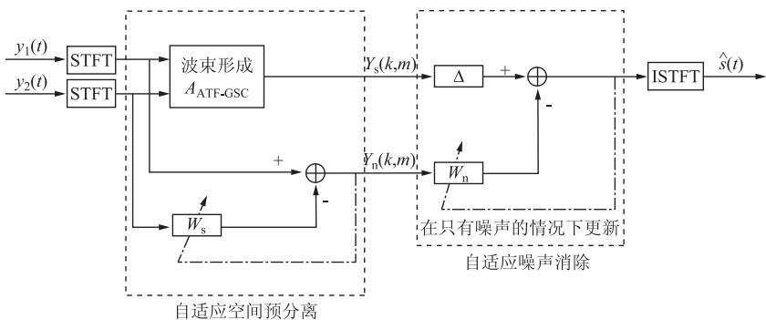  
图 4 ATF-GSC 的结构图  
Fig. 4 Structure of the ATF-GSC algorithm

## 3 比较和讨论

Rahmani 等提出了一种可实现的基于相干函数的语音增强算法 $^{[15]}$ ，记为互功率谱(CPSD)算法。

该算法语音增强结果如图 5 所示。ATF-GSC 算法在 $45^{\circ}$ 佩戴没有失配的情况下、 $0^{\circ}$ 佩戴和 $90^{\circ}$ 佩戴的失配情况下以及自适应更新建模的语音增强结果如图 6 所示。其中 $0^{\circ}$ 佩戴和 $90^{\circ}$ 佩戴的失配情况指在安静环境下采用 $45^{\circ}$ 佩戴下预先建模得到传递函数直接用到 $0^{\circ}$ 佩戴和 $90^{\circ}$ 佩戴的场合，自适应更新建模指在 6 dB 信噪比环境下采用 $45^{\circ}$ 佩戴进行建模得到传递函数。语音增强前含噪信号信噪比为 6 dB。对比语谱图可以看出，CPSD 算法能在一定程度上消除噪声，但对语音的损伤非常严重。ATF-GSC 算法虽然仍有一部分残留噪声，但语音损伤较小。不同佩戴情况对算法性能没有显著影响，但自适应更新建模的降噪效果变差。虽然原理上讲，只要步长取得很小，语音和噪声不相关，只要建模时间足够长，建模误差就能很小。但实际中由于在噪声环境中难以准确估计语音功率谱，建模误差不可避免。本文实验中的建模时间为 25 s，步长为 0.0003。

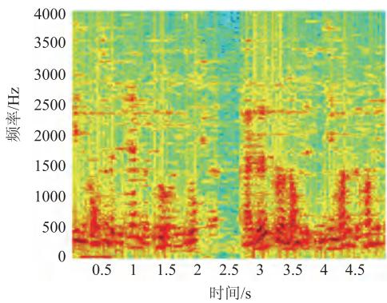  
(a) 粉红噪声干扰

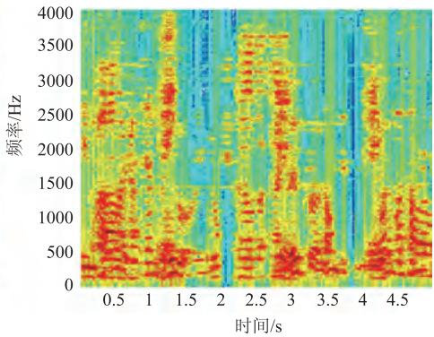  
(b) 人声干扰  
图 5 CPSD 算法增强信号语谱图  
Fig. 5 Spectrogram of the enhanced signal using the CPSD algorithm

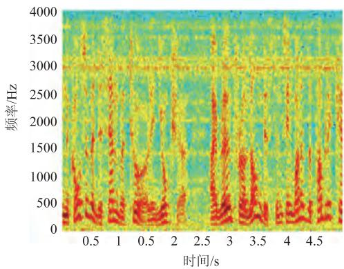  
(a) 粉红噪声干扰(无失配)

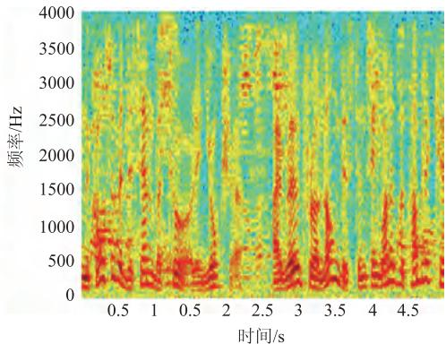  
(b) 人声干扰(无失配)

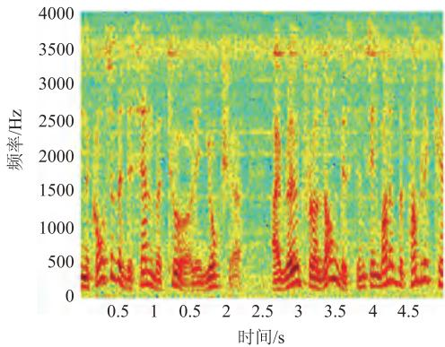  
(c) 粉红噪声干扰( $0^{\circ}$ 佩戴失配)

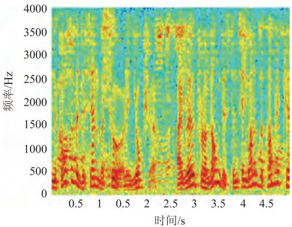  
(d) 人声干扰( $0^{\circ}$ 佩戴失配)

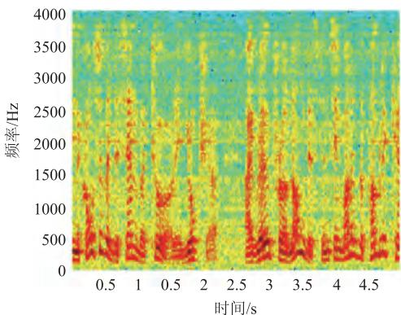  
(e) 粉红噪声干扰(90° 佩戴失配)

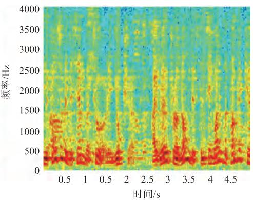  
(f) 人声干扰(90° 佩戴失配)

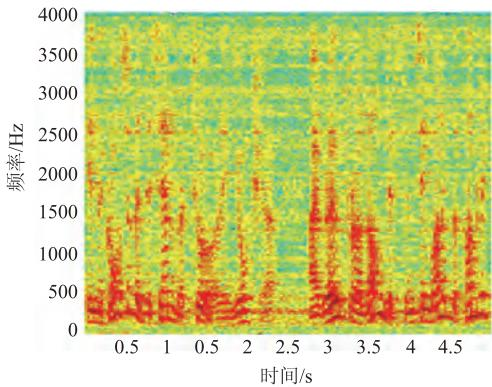  
(g) 粉红噪声干扰(自适应更新)

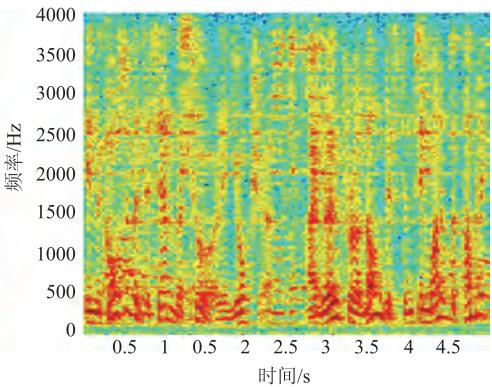  
(h) 人声干扰(自适应更新)  
图 6 ATF-GSC 算法增强信号语谱图  
Fig. 6 Spectrogram of the enhanced signal using the ATF-GSC algorithm

CPSD 算法和 ATF-GSC 算法在各情况下结果的三个评价量与输入信噪比的关系见图 7～9。评价对比结果符合理论分析。基于相干函数的 CPSD 算法只关注对噪声谱的估计，完全没有考虑对语音音质的影响问题。故该算法可以得到较大的降噪量，但语音失真严重。GSC算法完美实现时对音质毫无损伤但会牺牲一定的降噪量 $^{[35]}$ 。实际实现的ATF-GSC算法虽然无法实现无失真降噪，但由于蓝牙耳机失配影响较小，对语音的损伤还是约束在一定的范围内。同时，由于放松了对语音损伤的约束条件，其降噪量会有相应的提升。在噪声环境下自适应更新建模误差较大，性能明显变差。信噪比越低，建模误差越大，性能越差，但语音损伤仍比CPSD算法小。从综合性能来看，ATF-GSC算法优于CPSD算法。由此可看出权衡语音损伤对提高语音增强算法综合性能的重要性。

另外,对5位不同使用者采用同一个阻塞矩阵结果的平均性能及其误差曲线见图10～12。这5位实验者为4位男生和1位女生。实验在视听室中进行。4个扬声器作为噪声源按正方形排列,实

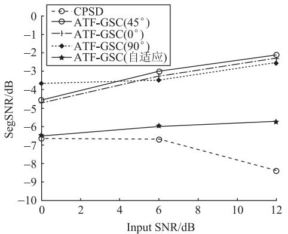  
(a) 粉红噪声干扰

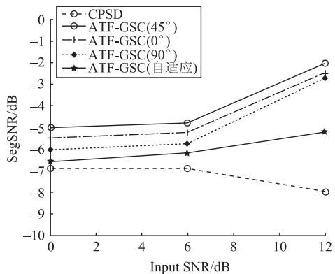  
(b) 人声干扰  
图 7 不同算法的 SegSNR 评价对比

Fig. 7 SegSNR comparison of different algorithms  
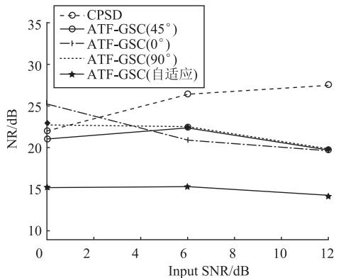  
(a) 粉红噪声干扰

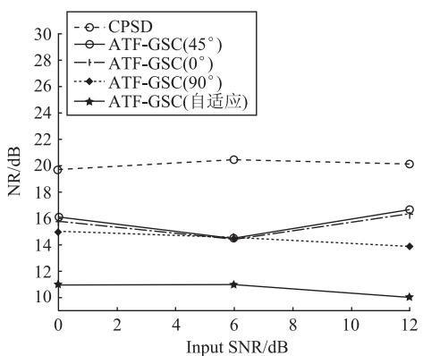  
(b) 人声干扰  
图 8 不同算法的 NR 评价对比  
Fig. 8 NR comparison of different algorithms

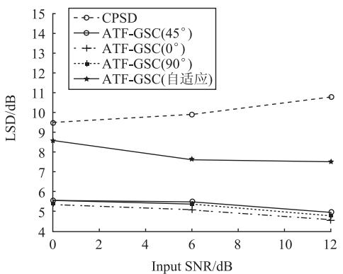  
(a) 粉红噪声干扰

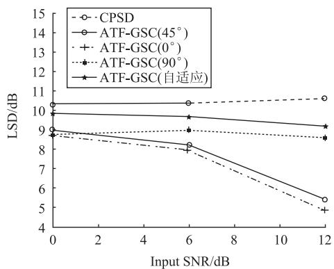  
(b) 人声干扰  
图 9 不同算法的 LSD 评价对比

Fig. 9 LSD comparison of different algorithms  
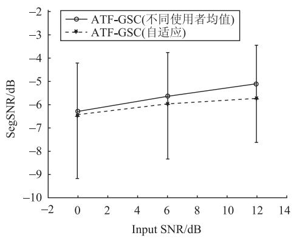  
(a) 粉红噪声干扰

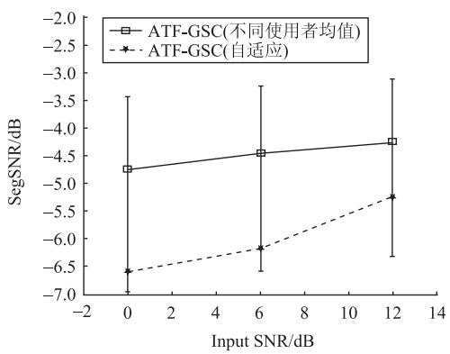  
(b) 人声干扰  
图 10 不同使用者结果的 SegSNR 评价对比

Fig. 10 SegSNR comparison of different users  
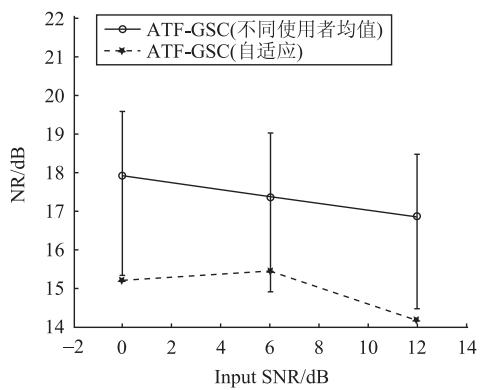  
(a) 粉红噪声干扰

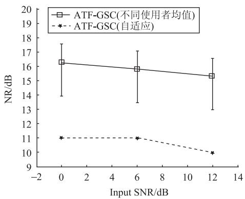  
(b) 人声干扰  
图 11 不同使用者结果的 NR 评价对比  
Fig. 11 NR comparison of different users

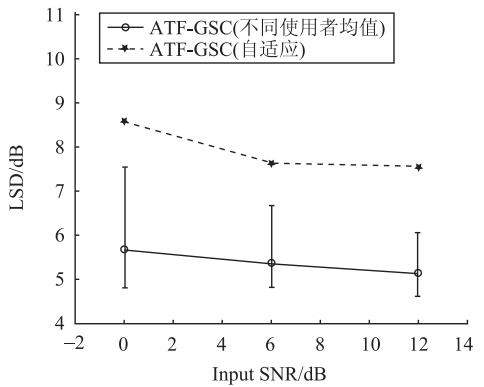  
(a) 粉红噪声干扰

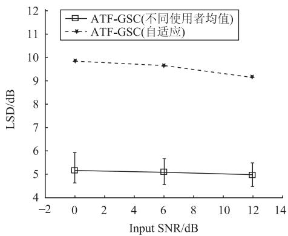  
(b) 人声干扰  
图 12 不同使用者结果的 LSD 评价对比  
Fig. 12 LSD comparison of different users

验者位于两对角线交点，距离扬声器的距离为2 m。用2个传声器放在人头一侧来模拟蓝牙耳机45°佩戴时双传声器的位置。另外将1个传声器放在人嘴旁边采集干净的语音信号。图中给出的是4个扬声器同时发声情况下采集到的含噪信号的处理结果，其中加‘o’的实线为5位实验者的平均值，实线上、下两点表示这5位实验者中该评价量的最高值与最低值。从图中可以看出使用者的变化导致的阻塞矩阵失配对ATF-GSC的性能会有一定影响,但其平均性能任优于自适应更新建模结果。

CPSD 算法与 ATF-GSC 算法各种情况下的 PESQ 评分结果见表 1。PESQ 评分结果和客观评价量的评价结果的趋势基本一致。从 PESQ 评分可以看出，ATF-GSC 算法不同使用者的平均性能与无失配情况接近。自适应建模情况下，ATF-GSC 算法音质变差，但 ATF-GSC 算法在各种情况下都比 CPSD 算法的音质好。

表 1 不同噪声干扰环境中不同信噪比条件下各算法的 PESQ 评分结果  
Table 1 PESQ score of different noise inference in different input SNR

<table><tr><td rowspan="2">输入信噪比 (dB)</td><td colspan="2">ATF-GSC(0°失配)</td><td colspan="2">ATF-GSC(45°无失配)</td><td colspan="2">ATF-GSC(90°失配)</td></tr><tr><td>粉红噪声</td><td>人声</td><td>粉红噪声</td><td>人声</td><td>粉红噪声</td><td>人声</td></tr><tr><td>0</td><td>2.66</td><td>2.96</td><td>2.60</td><td>2.99</td><td>2.55</td><td>2.64</td></tr><tr><td>6</td><td>2.87</td><td>2.88</td><td>2.94</td><td>2.90</td><td>2.80</td><td>2.61</td></tr><tr><td>12</td><td>3.44</td><td>3.13</td><td>3.55</td><td>3.17</td><td>3.12</td><td>2.90</td></tr><tr><td rowspan="2">输入信噪比 (dB)</td><td colspan="2">ATF-GSC(不同使用者均值)</td><td colspan="2">ATF-GSC(自适应)</td><td colspan="2">CPSD</td></tr><tr><td>粉红噪声</td><td>人声</td><td>粉红噪声</td><td>人声</td><td>粉红噪声</td><td>人声</td></tr><tr><td>0</td><td>2.53</td><td>2.83</td><td>2.17</td><td>2.47</td><td>1.77</td><td>1.37</td></tr><tr><td>6</td><td>2.55</td><td>2.92</td><td>2.44</td><td>2.46</td><td>2.10</td><td>1.30</td></tr><tr><td>12</td><td>2.64</td><td>2.98</td><td>2.61</td><td>2.58</td><td>2.32</td><td>1.91</td></tr></table>

## 4 结论与展望

本文将适用于双传声器蓝牙耳机系统的语音增强算法归为两大类,并介绍了相应的典型算法。通过对典型算法的增强结果分析对比可以看出,互功率谱(CPSD)算法原理简单容易实现,降噪效果明显,但没有考虑音质问题,语音损伤较为严重。自适应传递函数 GSC(ATF-GSC)算法以无损降噪为目标,牺牲了降噪量。虽然实际情况有时不能满足最优性能条件,但对于双传声器蓝牙耳机系统而言,在不同佩戴角度或者由于使用者不同引起的失配情况下, ATF-GSC 算法能够保持较好的平均性能。在噪声环境下自适应更新建模的结果较差, 但依然优于互功率谱法的性能。

本文还分析了语音无损条件下的最优滤波器形式,如何在实际应用中更加逼近最优解是具体应用中的关键。从降噪的角度来看,无论是基于相干函数法对噪声谱的估计还是基于空间预分离法得到噪声参考信号,其目的都是为了更准确地从含噪信号中获得噪声的参数。而对于语音损伤的约束部分,由于理论解中的语音部分参数未知,实际还是通过从含噪信号中去掉噪声信息的方式来代替语音信号进行分析。完美降噪和语音无损两者相互牵制很难同时实现,但可以两者权衡,在尽可能多降噪的同时减少语音的失真程度。目前,对噪声参数估计的方法有很多,但是由于对含噪信号的估计和对噪声信号的估计不同时,导致对语音信号估计误差较大。解决在噪声环境下更准确的建模问题有助于设计语音损伤的约束条件,从而提升降噪性能。对说话状态的判断(Voice active detector, VAD)是算法实现的重要环节,如何提高VAD的准确性也是改善算法性能的研究方向之一。对于ATF-GSC算法,其性能很大程度上依赖于自适应算法的性能。优化自适应算法对提高降噪量和实用效果的提升有很大的帮助。对于自适应算法不能消除的不相关噪声,可根据需要采用合适的后处理算法进一步消除噪声。另外,如果取消对成本和加工制造等约束条件的限制,可通过增加传声器的个数或者采用指向性传声器等方式改进蓝牙耳机的系统结构,进一步提高降噪性能。

## 参考文献

[1] BENESTY J, CHEN J, MAKINO S. Speech enhancement [M]. Berlin: Springer, 2006.

[2] BENESTY J, CHEN J, HABETS E A P. Speech enhancement in the STFT domain[M]. Berlin: Springer, 2011.

[3] LOIZOU P C. Speech enhancement: theory and practice [M]. CRC, 2005.

[4] BEROUTI M, SCHWARTZ M, MAKHOUL J. Enhancement of speech corrupted by acoustic noise [C]. Proc. IEEE Int. Conf. Acoust. Speech Signal Process., 1979, 4: 208-211.

[5] LIM J, OPPENHEIM A V. All-pole modeling of degraded speech [J]. IEEE Trans. Acoust. Speech Signal Process., 1978, 26(3): 197-210.

[6] EPHRAIM Y, MALAH D. Speech enhancement using a minimum

mean-square error short-time spectral amplitude estimator [J]. IEEE Trans. Acoust. Speech Signal Process., 1984, 32(6): 1109-1121.

[7] CHEN J, BENESTY J, HUANG Y, et al. New insights into the noise reduction Wiener filter [J]. IEEE Trans. Audio Speech Lang. Process., 2006, 14(4): 1218-1234.

[8] HUANG Y, BENESTY J, CHEN J. Acoustic MIMO signal processing[M]. Berlin: Springer, 2006.

[9] BENESTY J, CHEN J, HUANG Y. Microphone array signal processing[M]. Berlin: Springer, 2008.

[10] TASHEV I J. Sound capture and processing: practical approaches[M]. New York: Wiley, 2009.

[11] GANNOT S, COHEN I. Adaptive beamforming and postfiltering in Springer handbook of speech processing[M]. Berlin: Springer, 2007: 945-978.

[12] LE R, BOUQUIN A, FAUCON G. Using the coherence function for noise reduction [C]. Proc. IEE Commun. Speech Vision, 1992, 139(3): 276-280.

[13] LA BOUQUIN-JEANES R, AZIRANI A A, FAUCON G. Enhancement of speech degraded by coherent and incoherent noise using a cross-spectral estimator[J]. IEEE Trans. Speech Audio Process., 1997, 5(5): 484-487.

[14] RAHMANI M, AKBARI A, AYAD B, et al. A modified coherence based method for dual microphone speech enhancement [C]. IEEE Int. Conf. Signal Process. Commun., 2007, 225-228.

[15] RAHMANI M, AKBARI A, AYAD B. An iterative noise cross-PSD estimation for two-microphone speech enhancement [J]. Appl. Acoust., 2009, 70(3): 514-521.

[16] FREUDENBERGER J, STENZEL S, VENDITTI B. A noise PSD and cross-PSD estimation for two-microphone speech enhancement systems[J]. IEEE Workshop Stat. Signal Process., 2009, 709-712.

[17] KALLEL F, GHORBEL M, FRIKHA M, et al. A noise cross PSD estimator based on improved minimum statistics method for two-microphone speech enhancement dedicated to a bilateral cochlear implant[J]. Appl. Acoust., 2012, 73(3): 256-264.

[18] YOUSEFIAN N, LOIZOU P C. A coherence-based algorithm for noise reduction in dual-microphone applications [C]. Proc. Eur. Signal Process. Conf., 2010, 1904-1908.

[19] YOUSEFIAN N, LOIZOU P C. A dual-microphone speech enhancement algorithm based on the coherence function[J]. IEEE Trans. Audio Speech Lang. Process., 2012, 20(2): 599-609.

[20] YOUSEFIAN N, LOIZOU P C. A dual-microphone algorithm that can cope with competing-talker scenarios[J]. IEEE Trans. Audio Speech Lang. Process., 2013, 21(1): 145-155.

[21] KALLEL F, FRIKHA M, GHORBEL M, et al. Dual-channel spectral subtraction algorithms based speech enhancement dedicated to a bilateral cochlear implant[J]. Appl. Acoust., 2012, 73(1): 12-20.

[22] YOUSEFIAN N, AKBARI A, RAHMANI M. Using power level

difference for near field dual-microphone speech enhancement [J]. Appl. Acoust., 2009, 70: 1412-1421.

[23] KIM K, JEONG S, JEONG J, et al. Dual channel noise reduction method using phase difference-based spectral amplitude estimation [J]. IEEE Int. Conf. Acoust. Speech Signal Process., 2010, 217-220.

[24] GRIFFITHS L J, JIM C W. An alternative approach to linearly constrained adaptive beamforming [J]. IEEE Trans. Antennas Propag., 1982, 30(1): 27-34.

[25] HOSHUYAMA O, SUGIYAMA A, HIRANO A. A robust adaptive beamformer for microphone arrays with a blocking matrix using constrained adaptive filters [J]. IEEE Trans. Signal Process., 1999, 47(10): 2677-2683.

[26] GANNOT S, BURSHTEIN D, Weinstein E. Signal enhancement using beamforming and nonstationarity with applications to speech [J]. IEEE Trans. Signal Process., 2001, 49(8): 1614-1626.

[27] CHEN J, BENESTY J, HUANG Y. A minimum distortion noise reduction algorithm with multiple microphones[J]. IEEE Trans. Audio Speech Lang. Process., 2008, 16(3): 481-493.

[28] GANNOT S, BURSHTEIN D, WEINSTEIN E. Theoretical analysis of the general transfer function GSC[C]. Proc. Int. Workshop Acoust. Echo Noise Control, 2001.

[29] GANNOT S, COHEN I. Speech enhancement based on the general transfer function GSC and postfiltering [J]. IEEE Trans. Speech Audio Process., 2004, 12(6): 561-571.

[30] COHEN I. Analysis of two-channel generalized sidelobe canceller (GSC) with post-filtering [J]. IEEE Trans. Speech Audio Process., 2003, 11(6): 684-699.

[31] COHEN I. Noise spectrum estimation in adverse environments: improved minima controlled recursive averaging [J]. IEEE Trans. Speech Audio Process., 2003, 11(5): 466-475.

[32] DOCLO S, MOONEN M. GSVD-based optimal filtering for single and multi-microphone speech enhancement [J], IEEE Trans. Signal Process., 2002, 50(9): 2230-2244.

[33] SPRIET A, MOONEN M, WOUTERS J. Spatially pre-processed speech distortion weighted multi-channel Wiener filtering for noise reduction[J]. Signal Process, . 2004, 84: 2367-2387.

[34] DOCLO S, SPRIET A, WOUTERS J, et al. Frequency-domain criterion for the speech distortion weighted multichannel Wiener

filter for robust noise reduction [J]. Speech Commun., 2007, 49: 636-656.

[35] SOUDEN M, BENESTY J. On optimal frequency-domain multichannel linear filtering for noise reduction[J]. IEEE Trans. Audio Speech Lang. Process., 2010, 18(2): 260-276.

[36] BRANDSTEIN M, WARD D. Microphone Arrays [M]. Springer, 2001.

[37] LAUGESEN S, RASMUSSEN K B, CHRISTIANSEN T. Design of a microphone array for headsets [J]. IEEE workshop Appl. Signal Process. Audio Acoust., 2003, 37-40.

[38] TASHEV I, SELTZER M, ACERO A. Microphone array for headset with spatial noise suppressor[C]. Proc. Int. workshop Acoust. Echo Noise Control, 2005.

[39] MIHOV S, GLEGHORN T, TASHEV I. Enhanced sound capture system for small devices [C]. Proc. Int. Sci. Conf. Inf. Commun. Energy Syst. Technol., 2008, 57-67.

[40] Motorola elite flip [EB/OL]. Motorola mobility LLC, [2014-03-15]. https://motorola-global-portal.custhelp.com/ci/fattach/get/634666/1370266396/redirect/1/filename/Elite\_Flip\_GSG\_68017335001A.pdf.

[41] Bluetooth headset HM3700 [EB/OL]. Samsung, [2014-03-15]. http://downloadcenter.samsung.com/content/UM/201111/20111116161747502/HM3700\_UM\_CHI\_Rev. 1.0\_111008\_screen.pdf.

[42] Jawbone ERA 技术规格 [EB/IL]. Jawbone, [2014-03-15]. https://jawbone.com/headsets/era/specs

[43] The first truly intelligent headset Voyager Legend [EB/OL]. Plantronics, [2014-03-15]. http://www.plantronics.com/media/media-resources/literature/cordless\_mobile/voyager-legend\_ps\_en-us.pdf.

[44] ITU-T P. 862, Perceptual evaluation of speech quality (PESQ): An objective method for end-to-end speech quality assessment of narrow-band telephone networks and speech codecs [S].

[45] COHEN I. Relative transfer function identification using speech signals[J]. IEEE Trans. Speech Audio Process., 2004, 12(5): 451-459.

[46] BENESTY J, KELLERMANN W. Speech processing in modern communication[M], Berlin: Springer, 2010.