# Real-time implementation and explainable AI analysis of delayless CNN-based selective fixed-filter active noise control

Zhengding Luo, Dongyuan Shi ∗, Junwei Ji, Xiaoyi Shen, Woon-Seng Gan

Digital Signal Processing Lab, School of Electrical and Electronic Engineering, Nanyang Technological University, Singapore

A R T I C L E I N F O

Communicated by J. Rodellar

Keywords:   
Active noise control (ANC) window   
Selective fixed-filter ANC   
Delayless noise control   
Convolutional neural network   
Explainable AI

## A B S T R A C T

The selective fixed-filter active noise control (SFANC) approach can select suitable pre-trained control filters for different types of noise. With the learning ability of convolutional neural network (CNN), the CNN-based SFANC method can automatically learn its parameters from noise data. Combining practical experience, this paper abstracts ANC as a Markov progress and provides a detailed theoretical analysis to verify the reasonableness of the CNN-based SFANC method. To validate its effectiveness, we implement the method in a multichannel ANC window, where the CNN operating in the co-processor collaborates with the real-time controller to realize delayless noise control. Additionally, an explainable AI technique is used to analyze the underlying principle of the CNN-based SFANC method, enhancing its interpretability in acoustic applications. Numerical simulations and real-time experiments demonstrate that the CNN-based SFANC method achieves not only satisfactory noise reduction performance for broadband and real-world noises but also excellent transferability.1

## 1. Introduction

Urbanization and industrialization have caused a substantial rise in environmental noise pollution. Traditional passive noise control methods address this problem by utilizing materials and physical barriers to reduce noise transmission and absorption [1]. However, passive methods are either ineffective or tend to be costly and bulky when reducing low-frequency noises [2–6]. Compared to passive noise control, the active noise control (ANC) technique, which generates an anti-noise equal in amplitude but opposite in phase to the unwanted noise, can provide superior noise reduction performance in eliminating low-frequency noises [7–11]. Due to its compact size and convenient deployment, the ANC system is increasingly utilized in various noise-sensitive commercial products, like windows [12–15], headphones [16–18], headrests [19], and vehicles [20,21].

The filtered reference least mean square (FxLMS) algorithm is typically utilized in traditional ANC systems, as illustrated in Fig. 1. The FxLMS algorithm adaptively adjusts the control filter coefficients to minimize the error signal [22–24]. However, the adaptive algorithm has some inherent limitations, including slow convergence speed, poor tracking ability, and the high potential risk of divergence [25–28]. In comparison, fixed-filter ANC approaches, which adopt a pre-trained control filter for noise cancellation, have a faster response speed and higher robustness [29]. Nevertheless, fixed-filter ANC algorithms are optimized for specific noise types, resulting in mediocre performance when controlling other types of noise [30,31].

To solve this issue, a selective fixed-filter ANC (SFANC) method that can select appropriate pre-trained control filters for different noises has been proposed [32]. However, some crucial parameters of this method can only be determined through trial and error.

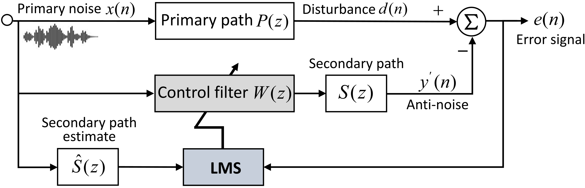

Fig. 1. Block diagram of a traditional feedforward ANC system using the FxLMS algorithm, where ∑ refers to the acoustic suppression.

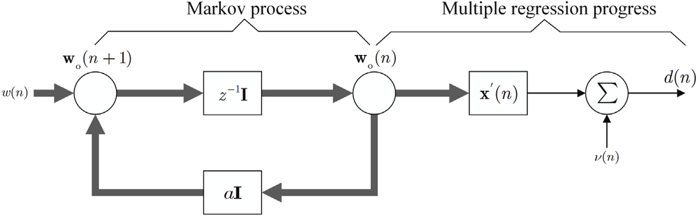

Fig. 2. Linear dynamic model of an acoustic environment.

To overcome this constraint, deep learning techniques, especially convolutional neural networks (CNNs), have emerged as viable approaches for improving ANC performance [33–36]. However, most of the existing deep learning-based ANC methods employ neural networks to replace the control filter in ANC systems. The high computational complexity of these neural networks exceeds the capabilities of real-time processors, causing processing latency. The huge processing latency may violate the causality requirement of ANC systems and result in less effective noise control.

To explore more efficient deep learning-based ANC methods in real scenarios, some research proposed the CNN-based SFANC methods [37–39], where CNNs are utilized to select pre-trained control filters for the incoming noises. With CNNs’ learning capability, all parameters are learned automatically from noise data, eliminating the need for manual efforts [40]. Although simulations have indicated that the CNN-based SFANC methods can effectively reduce different noises, practical implementation and analysis are still lacking. Additionally, in previous simulations, the primary and secondary paths during the evaluation were assumed to be the same as those used during training. However, the acoustic paths in real applications are likely to be different from those used in training [41,42]. Therefore, there is still a need to assess the noise reduction performance and transferability of the CNN-based SFANC method in practice.

In this paper, we implement the CNN-based SFANC method in a dormitory window for real-time noise control, which can achieve delayless noise reduction through efficient coordination between the co-processor and the real-time controller. In terms of theoretical analysis, this paper abstracts ANC as a Markov progress to verify the reasonableness of the CNN-based SFANC method. Furthermore, we use an explainable AI technique, layer class activation map (LayerCAM) [43], to gain insight into the inner principle of the CNN model and explain its effectiveness in SFANC. Simulations and real-time experiments demonstrate that the CNN-based SFANC method can effectively reduce different types of noises and exhibits good transferability in practical scenarios.

The subsequent sections are organized as follows: Firstly, the ANC process is formulated as a Markov model in Section 2, providing theory foundations for the CNN-based SFANC method. Subsequently, the CNN-based SFANC method is comprehensively introduced in Section 3. Additionally, an explainable AI technique is introduced in Section 4. Section 5 and Section 6 provide the numerical simulations and real-time experiments using the CNN-based SFANC method, respectively. Finally, the conclusion is presented in Section 7.

## 2. Markov progress of active noise control

A feedforward ANC system can be regarded as a specific system identification problem [44]. As depicted in Fig. 2, the acoustic environment can be abstracted to a linear dynamic model, and the optimal control filter ${ \bf w } _ { 0 }$ is its state. The state function of this model can be represented as

$$
\mathbf { w } _ { \mathrm { o } } ( n + 1 ) = a \mathbf { w } _ { \mathrm { o } } ( n ) + \pmb { \omega } ( n ) ,\tag{1}
$$

which formulates the acoustic environment as a first-order Markov process, with ?? and ??(??) denoting a fixed parameter and the process noise vector, respectively. Additionally, the disturbance ??(??) can be seen as an observation of the acoustic environment, i.e. the desired signal, which is governed by a multiple linear regression model:

$$
d ( n ) = \mathbf { x ^ { \prime } } ^ { \mathrm { T } } ( n ) \mathbf { w } _ { \mathrm { o } } ( n ) + \nu ( n ) ,\tag{2}
$$

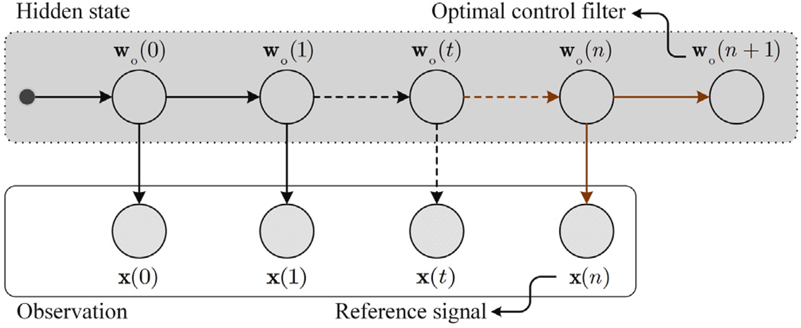

Fig. 3. Hidden Markov model of feedforward active noise control.

where ??(??) denotes the measurement noise. $\mathbf { x } ^ { \prime } ( n )$ represents the reference signal $\mathbf { x } ( n )$ filtered by the estimate secondary path. Notably, since ANC systems typically deal with stationary or slowly varying noises and the acoustic environment is usually time-invariant, the optimal control filter is commonly assumed to be slow-varying. Hence, the above state function can be rewritten as

$$
\mathbf { w } _ { \mathrm { o } } ( n + 1 ) \approx \mathbf { w } _ { \mathrm { o } } ( n ) .\tag{3}
$$

By assuming that the solution space of the optimal control filter is discrete, we can further simplify the acoustic environment as a hidden Markov model (HMM) [45]. Since the reference signal ??(??) is linearly related to the disturbance, it can be regarded as the observation of this HMM model, as shown in Fig. 3. The optimal control filter’s solution space is assumed to have ?? discrete states and expressed as $\{ \mathbf { w } _ { i } \} _ { i = 1 } ^ { M }$ . Using the forward algorithm of HMM, the predicted probability of the optimal control filter at the (?? + 1)-iteration is given by

$$
P [ \mathbf { w } _ { 0 } ( n + 1 ) = \mathbf { w } _ { i } | \mathbf { x } ( 0 ) \cdots , \mathbf { x } ( n ) ] = \frac { \sum _ { j = 1 } ^ { M } a _ { j i } \cdot \alpha _ { n } ( j ) } { P \left[ \mathbf { x } ( 0 ) , \dots , \mathbf { x } ( n ) \right] } ,\tag{4}
$$

where $a _ { j i }$ denotes the transition probability from the current state $\mathbf { w } _ { j }$ to the next state $\mathbf { w } _ { i } ,$ and the current forward path probability $\alpha _ { n } ( j )$ is given by

$$
\alpha _ { n } ( j ) = P \left[ \mathbf { w } _ { 0 } ( n ) = \mathbf { w } _ { j } , \mathbf { x } ( 0 ) , \ldots , \mathbf { x } ( n ) \right] .\tag{5}
$$

Under the hypothesis of the slow-varying state mentioned in (3), ${ \bf w } _ { \mathrm { o } } ( n ) \approx { \bf w } _ { \mathrm { o } } ( n - 1 )$ , the current forward path probability can be derived as

$$
\begin{array} { r l } & { \alpha _ { n } ( j ) = P \left[ \mathbf { w } _ { 0 } ( n ) = \mathbf { w } _ { j } , \mathbf { x } ( 0 ) , \ldots , \mathbf { x } ( n ) \right] } \\ & { \qquad \approx P \left[ \mathbf { x } ( n ) | \mathbf { w } _ { 0 } ( n ) = \mathbf { w } _ { j } , \mathbf { x } ( 0 ) , \ldots , \mathbf { x } ( n - 1 ) \right] \cdot \alpha _ { n - 1 } ( j ) , } \end{array}\tag{6}
$$

where the previous forward path probability $\alpha _ { n - 1 } ( j )$ is expressed as

$$
\alpha _ { n - 1 } ( j ) = P \left[ \mathbf { w } _ { 0 } ( n - 1 ) , \mathbf { x } ( 0 ) , \ldots , \mathbf { x } ( n - 1 ) \right] .\tag{7}
$$

Moreover, according to observation independence in HMM, we have

$$
P \left[ \mathbf { x } ( n ) | \mathbf { w } _ { 0 } ( n ) = \mathbf { w } _ { j } , \mathbf { x } ( 0 ) , \ldots , \mathbf { x } ( n - 1 ) \right] = P \left[ \mathbf { x } ( n ) | \mathbf { w } _ { 0 } ( n ) = \mathbf { w } _ { j } \right] .\tag{8}
$$

Thus, $\alpha _ { n } ( j )$ can be rewritten as

$$
\begin{array} { r } { \alpha _ { n } ( j ) = P \left[ \mathbf { x } ( n ) | \mathbf { w } _ { \mathrm { 0 } } ( n ) = \mathbf { w } _ { j } \right] \cdot \alpha _ { n - 1 } ( j ) . } \end{array}\tag{9}
$$

Based on (4) and (9), it can be inferred that the predicted probability of the next-step optimal control filter is proportional to the current likelihood probability:

$$
P \left[ \mathbf { w } _ { 0 } ( n + 1 ) = \mathbf { w } _ { i } | \mathbf { x } ( 0 ) , \ldots , \mathbf { x } ( n ) \right] \propto P \left[ \mathbf { x } ( n ) | \mathbf { w } _ { 0 } ( n ) = \mathbf { w } _ { j } \right] .\tag{10}
$$

This equation allows for converting the traditional ANC issue into a control filter selection problem, selecting a pre-trained control filter to maximize the likelihood probability:

$$
\mathbf { w } _ { \mathrm { o } } ( n + 1 ) = \underset { \mathbf { w } \in \{ \mathbf { w } _ { i } \} _ { i = 1 } ^ { M } } { \arg \operatorname* { m a x } } \left\{ P \left[ \mathbf { x } ( n ) | \mathbf { w } \right] \right\} .\tag{11}
$$

This likelihood probability can be a deep learning model, which can infer the likelihood of each pre-trained control filter according to the current reference signal and choose the most suitable control filter for the next-step control progress. Following the above discussion and the causality constraint of ANC systems, we can adopt a deep learning model to select a control filter based on the current primary noise for attenuating subsequent noise. Therefore, the control filter selection is performed through a two-dimensional convolutional neural network (2D CNN) in the proposed CNN-based SFANC Method.

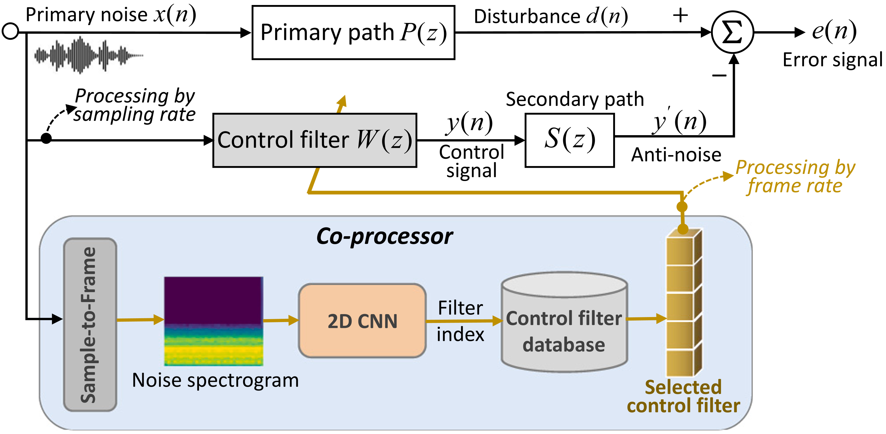

Fig. 4. Block diagram of the delayless CNN-based SFANC method, where the most suitable pre-trained control filter is selected in the co-processor and used for real-time noise control.

## 3. The delayless CNN-based SFANC method

Fig. 4 illustrates the block diagram of the CNN-based SFANC method, which consists of two modules: the selection of control filters in the co-processor and noise cancellation in the real-time controller. In this method, a lightweight 2D CNN runs in the co-processor to select the best pre-trained control filter for each noise frame. Subsequently, the selected control filter is delivered to the real-time controller operating at the sampling rate in parallel. The efficient coordination between the co-processor and real-time controller can enable delayless noise control in the CNN-based SFANC method.

## 3.1. Pre-training control filters

Obtaining pre-trained control filters is the initial step in the CNN-based SFANC method. In this stage, we utilize the target ANC system to cancel ?? broadband white noises, whose frequency bands contain the frequency components of interest. The FxLMS algorithm is used to derive optimal control filters for these broadband noises due to its low computational complexity. Finally, the obtained ?? pre-trained control filters are stored in the control filter database.

## 3.2. Control filter selection via the 2D CNN

For the sake of simplicity, we assume that the reference microphone can acquire all the information about the primary noise. Hence, the reference signal mentioned in this paper is equivalent to the primary noise. In the proposed CNN-based SFANC method, a 2D CNN is trained to classify noises and select pre-trained control filters. $\{ \mathbf { x } _ { i } , l _ { i } \} _ { i = 1 } ^ { N }$ denotes a noise dataset containing ?? noise instances for training the 2D CNN. Given a reference vector of $\mathbf { x } _ { i } ,$ its label $l _ { i }$ indicates the index of the most suitable control filter in a pre-trained control filter set of $\{ \mathbf { w } _ { j } \} _ { j = 1 } ^ { M }$ , which is composed of ?? filters. The process of obtaining the noise label can be expressed as

$$
\begin{array} { r l } & { l _ { i } = \underset { j \in \{ 1 , 2 , \ldots , M \} } { \mathrm { a r g m i n } } \mathbb { E } \bigg \{ \left[ e _ { i } ( n ) \right] ^ { 2 } \bigg \} , } \\ & { = \underset { j \in \{ 1 , 2 , \ldots , M \} } { \mathrm { a r g m i n } } \mathbb { E } \bigg \{ \left[ d _ { i } ( n ) - \mathbf { x } _ { i } ^ { \mathrm { T } } ( n ) \mathbf { w } _ { j } ( n ) \ast s ( n ) \right] ^ { 2 } \bigg \} , } \end{array}\tag{12}
$$

where the argmin(⋅) operation returns the index of the control filter that minimizes the mean square of the error signal $e _ { i } ( n )$ , and ∗ stands for the linear convolution. $d _ { i } ( n )$ and $s ( n )$ represent the disturbance signal and the impulse response of the secondary path, respectively.

During training the 2D CNN, we aim to learn a mapping $C N N : X _ { i }  l _ { i } ,$ where $X _ { i }$ and $l _ { i }$ represent the mel-spectrogram of $\mathbf { x } _ { i }$ and its label, respectively. The output of the 2D CNN is expressed as $C N N ( X _ { i } ; \boldsymbol { \Theta } )$ , where ?? represents the learnable parameters in the 2D CNN. The objective of training the 2D CNN is to adjust the model parameters ?? to minimize the discrepancy between the network outputs and the noise labels, which can be formulated as

$$
\theta ^ { * } = \underset { \theta } { \operatorname { a r g m i n } } \frac { 1 } { N } \sum _ { i = 1 } ^ { N } \mathcal { L } ( C N N ( X _ { i } ; \theta ) , l _ { i } ) ,\tag{13}
$$

where $\mathcal { L }$ denotes a cross-entropy loss function to measure the discrepancy, and $\Theta ^ { * }$ denotes the optimal parameters that minimize the average loss over the training dataset.

After training, the 2D CNN loads its optimal parameters $\Theta ^ { * }$ to select control filters. For a new reference signal, the 2D CNN takes its mel-spectrogram ?? as input and outputs the probability of each pre-trained control filter:

$$
\hat { P } = C N N ( X ; \theta ^ { * } ) = [ \hat { p } _ { 1 } , \dots , \hat { p } _ { m } , \dots , \hat { p } _ { M } ] ,\tag{14}
$$

Table 1  

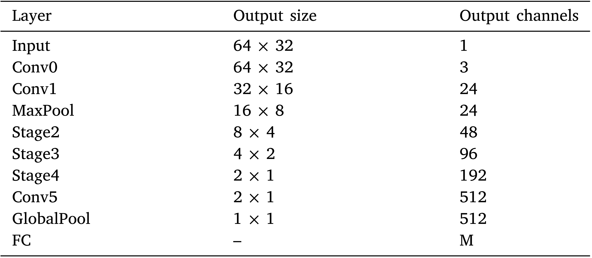

Table 1 Overall architecture of the 2D CNN model.

Overall architecture of the 2D CNN model.
<table><tr><td>Layer</td><td>Output size</td><td>Output channels</td></tr><tr><td>Input</td><td> $6 4 \times 3 2$ </td><td>1</td></tr><tr><td>Conv0</td><td> $6 4 \times 3 2$ </td><td>3</td></tr><tr><td>Conv1</td><td> $3 2 \times 1 6$ </td><td>24</td></tr><tr><td>MaxPool</td><td> $1 6 \times 8$ </td><td>24</td></tr><tr><td>Stage2</td><td> $8 \times 4$ </td><td>48</td></tr><tr><td>Stage3</td><td> $4 \times 2$ </td><td>96</td></tr><tr><td>Stage4</td><td> $2 \times 1$ </td><td>192</td></tr><tr><td>Conv5</td><td> $2 \times 1$ </td><td>512</td></tr><tr><td>GlobalPool</td><td> $1 \times 1$ </td><td>512</td></tr><tr><td>FC</td><td></td><td>M</td></tr></table>

Table 2  

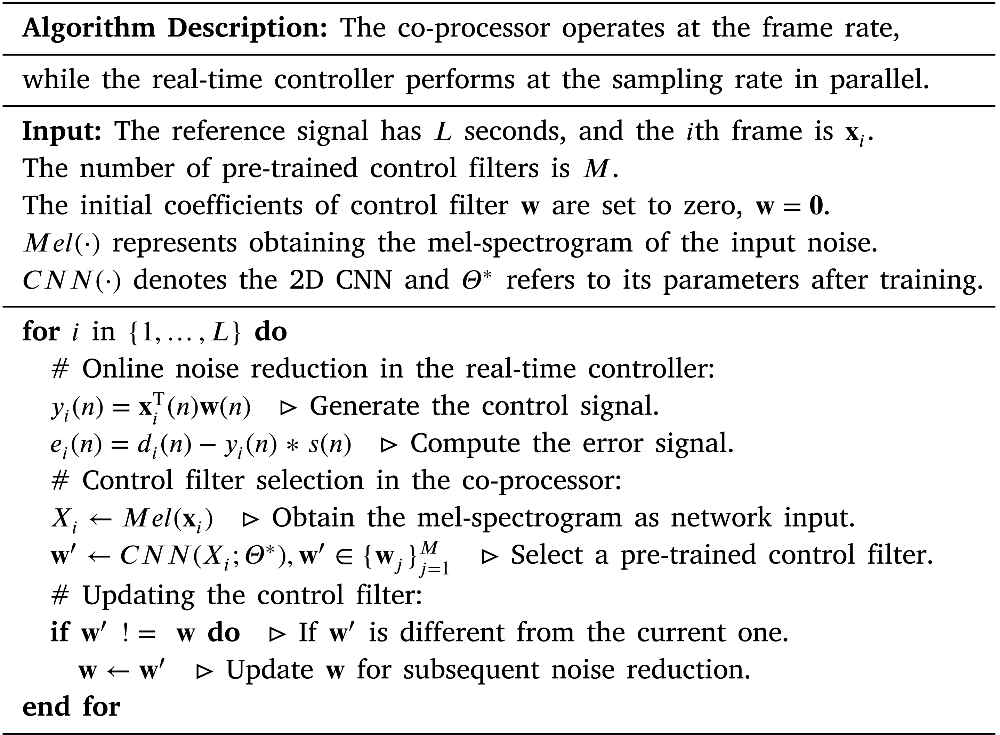

Table 2 Pseudo-code of real-time noise cancellation in the CNN-based SFANC method.

Pseudo-code of real-time noise cancellation in the CNN-based SFANC method.   
Algorithm Description: The co-processor operates at the frame rate,   
while the real-time controller performs at the sampling rate in parallel.   
Input: The reference signal has ?? seconds, and the ??th frame is ?? .   
The number of pre-trained control filters is ??.   
The initial coefficients of control filter ?? are set to zero, $\mathbf { w } = \mathbf { 0 } .$   
??????(⋅) represents obtaining the mel-spectrogram of the input noise.   
??????(⋅) denotes the 2D CNN and ??∗ refers to its parameters after training.   
for ?? in $\{ 1 , \ldots , L \}$ do   
# Online noise reduction in the real-time controller:   
$y _ { i } ( n ) = \mathbf { x } _ { i } ^ { \mathrm { { T } } }$ (??)??(??) ⊳ Generate the control signal.   
?? (??) = ?? (??) − ?? (??) ∗ ??(??) ⊳ Compute the error signal.   
# Control filter selection in the co-processor:   
$X _ { i } \gets M e l ( \mathbf { x } _ { i } )$ ⊳ Obtain the mel-spectrogram as network input.   
??′ ← $C N N ( X _ { i } ; \boldsymbol { \theta } ^ { * } ) , \mathbf { w } ^ { \prime } \in \{ \mathbf { w } _ { j } \} _ { j = 1 } ^ { M }$ ⊳ Select a pre-trained control filter.   
# Updating the control filter:   
if ??′ ! = ?? do ⊳ $\mathrm { ~ I f ~ } \mathbf { w } ^ { \prime }$ is different from the current one.   
?? ← ??′ ⊳ Update ?? for subsequent noise reduction.   
end for

where $\hat { P }$ stands for the predicted probability vector, and $\hat { p } _ { m }$ denotes the probability of the ??th control filter. Finally, the index of the selected pre-trained control filter is given by

$$
\hat { y } = \underset { j \in \{ 1 , 2 , . . . , M \} } { \mathrm { a r g m a x } } \hat { p } _ { j } ,\tag{15}
$$

where the output ̂?? represents the index of the maximum probability.

The trained 2D CNN can be viewed as a black box, taking a noise mel-spectrogram as input and outputting the index of the selected pre-trained control filter. Therefore, the control filter selection in the CNN-based SFANC method is entirely data-driven and does not require additional prior knowledge. To further investigate the filter selection mechanism in the 2D CNN, an explainable AI technique will be introduced in Section 4.

## 3.3. Architecture of the 2D CNN

In the CNN-based SFANC approach, the efficacy of the ANC system in attenuating noises depends on the performance of the CNN model. As shown in Table 1, the proposed 2D CNN is modified from ShuffleNet V2 [46], a model known for its efficiency and high classification accuracy. The modifications are highlighted in bold within Table 1. Firstly, the input mel-spectrogram is fed to the Conv0 module, which transforms the single-channel input into a three-channel tensor to match the input size of the original ShuffleNet V2. Stage2, Stage3, and Stage4 are the same as those in ShuffleNet V2, mainly consisting of convolutional layers, batch normalization, and ReLU nonlinear layers. Furthermore, to reduce network parameters, we decrease the number of channels in the final convolutional module from 1024 to 512. We also set the number of units in the fully connected layer to ?? to align with the number of pre-trained control filters.

## 3.4. Real-time noise cancellation

Throughout the noise control process, the real-time processor conducts the noise control on a sample-by-sample basis. Simultaneously, for each noise frame, the co-processor utilizes the trained 2D CNN to select the best pre-trained control filter. If the selected control filter is different from the currently used one, it will be used to update the used control filter for subsequent noise control. The pseudo-code of the noise control process in the CNN-based SFANC method is provided in Table 2.

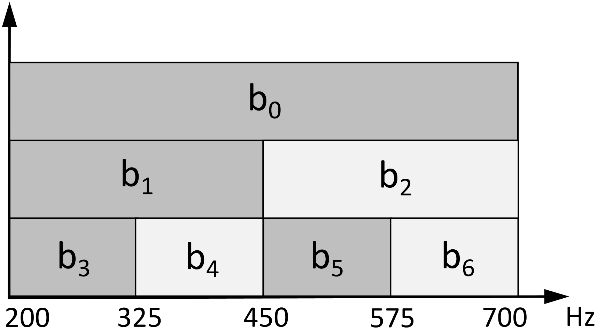

Fig. 5. Frequency ranges of 7 white noises (𝑏0 to 𝑏6) used to pre-train control filters.

Overall, the co-processor and real-time controller operate in parallel, which ensures that the real-time noise control will not be affected by the 2D CNN’s processing delay. This configuration allows a powerful batch-processing co-processor, such as a laptop, to run the 2D CNN, while the real-time controller prioritizes immediate processing to maintain low latency. The efficient coordination between the two processing units can achieve delayless noise control, making this approach a viable solution in real environments.

## 4. Explainable AI technique

Among explainable AI techniques, the class activation map (CAM) method [47] can identify and emphasize the key regions of the input data that play a crucial role in the decision-making process. The layer class activation map (LayerCAM) technique [43], proposed as an enhancement to CAM, offers a straightforward and efficient method to generate trustworthy CAMs for all layers of a network. Hence, in this paper, the LayerCAM technique is used to explore the core principle of filter selection in the 2D CNN.

In the LayerCAM technique, the weight for each spatial location in a feature map is computed based on the backward classspecific gradients. Formally, given the noise mel-spectrogram image ?? as the 2D CNN’s input, the predicted score $s ^ { m }$ of the target class ?? is given by

$$
s ^ { m } = C N N ^ { m } ( X ; \theta ^ { * } ) .\tag{16}
$$

Let ?? denotes the output feature maps of a certain layer in the 2D CNN. $F ^ { k }$ is the feature map of the ??th channel within ?? . The gradient of the prediction score $s ^ { m }$ with respect to the spatial location $( i , j )$ in the feature map $F ^ { k }$ is derived as

$$
g _ { i j } ^ { k m } = \frac { \partial s ^ { m } } { \partial F _ { i j } ^ { k } } .\tag{17}
$$

With the computed gradient, the weight of the spatial location $( i , j )$ in $F ^ { k }$ can be obtained by

$$
w _ { i j } ^ { k m } = \mathrm { R e L U } \left( g _ { i j } ^ { k m } \right) ,\tag{18}
$$

where ReLU(⋅) represents the rectified linear unit function that remains positive gradients and removes negative gradients. Subsequently, the activation value of each location in the feature map is multiplied by the weight:

$$
\begin{array} { r } { \hat { F } _ { i j } ^ { k } = w _ { i j } ^ { k m } \cdot F _ { i j } ^ { k } . } \end{array}\tag{19}
$$

Based on the weighted activation value, the class activation map of this layer is obtained by the linear combination of ${ \hat { F } } ^ { k }$ along the channel dimension:

$$
A ^ { m } = \operatorname { R e L U } \left( \sum _ { k } { \hat { F } } ^ { k } \right) .\tag{20}
$$

Finally, the size of the obtained class activation map $A ^ { m }$ for the particular class ?? is adjusted to the size of the input image.

The LayerCAM approach, when producing class activation maps, considers the importance of spatial positions and channelspecific information in the feature map. The weight allocated to each feature map location reflects its significance for the target class, commonly the class with the network’s highest prediction score. In Section 5.1.4, we will employ the LayerCAM method to investigate the filter selection mechanism of the 2D CNN.

## 5. Numerical simulations

In this section, the simulations are conducted based on a single-channel ANC system. The sampling rate and control filter’s length are set to 16 kHz and 1024 taps, respectively. The simulations utilize synthetic bandpass filters for both the primary and secondary paths. Additionally, the number of pre-trained control filters, ??, is set to 7. As shown in Fig. 5, 7 white noises $( b _ { 0 }$ to $b _ { 6 } )$ with different frequency ranges are utilized to obtain corresponding 7 pre-trained control filters. The FxLMS algorithm is adopted to derive the optimal control filters for these white noises. Finally, the frequency ranges of the obtained 7 pre-trained control filters $( B _ { 0 }$ to $B _ { 6 } )$ are similar to those of the 7 white noises, as illustrated in Fig. 6.

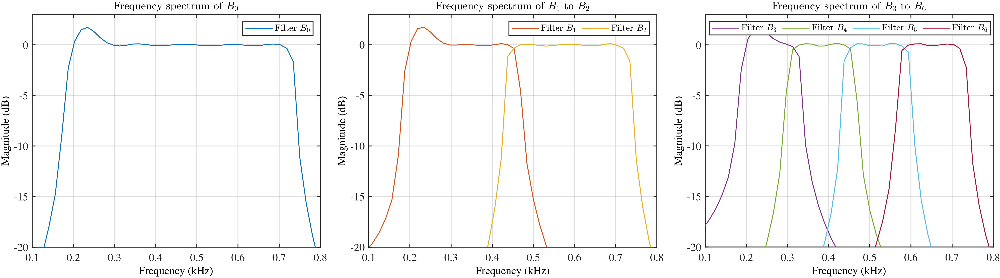

Fig. 6. Frequency spectrum of 7 pre-trained control filters (𝐵0 to 𝐵6).

Table 3  

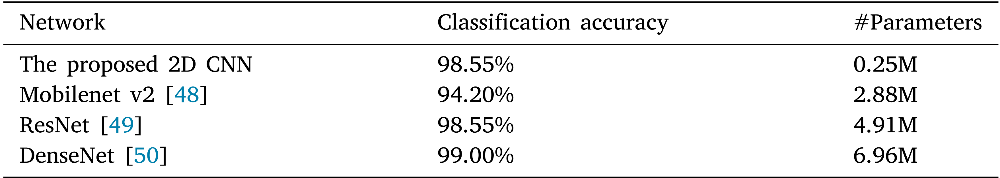

Table 3 Performance comparison of different 2D networks.

Performance comparison of different 2D networks.
<table><tr><td>Network</td><td>Classification accuracy</td><td>#Parameters</td></tr><tr><td>The proposed 2D CNN</td><td>98.55%</td><td>0.25M</td></tr><tr><td>Mobilenet v2 [48]</td><td>94.20%</td><td>2.88M</td></tr><tr><td>ResNet [49]</td><td>98.55%</td><td>4.91M</td></tr><tr><td>DenseNet [50]</td><td>99.00%</td><td>6.96M</td></tr></table>

## 5.1. Effectiveness of the 2D CNN

This section initially presents the noise dataset utilized to train the 2D CNN. Afterwards, the efficacy of the 2D CNN is assessed by analyzing its classification accuracy and learned features. Additionally, the LayerCAM technology is employed to study the filter selection principle of the 2D CNN.

## 5.1.1. Training of the network

A synthetic noise dataset is used to train the 2D CNN, which contains 80,000 noise instances for training, 2000 noise instances for validation, and the remaining 2000 noise instances for testing. The synthetic noise instances are generated by filtering white noise through various bandpass filters with randomly chosen center frequencies and bandwidths. Each noise instance has a 1-second duration. As introduced in (12), the class of each noise instance is the index of the control filter that achieves the highest noise reduction level among the 7 pre-trained control filters.

In the training of the 2D CNN, the cross-entropy loss is used as the optimization metric. Moreover, the Adam algorithm [51] was used for optimization. The number of training epochs was set to 50. The initial learning rate is set to 0.01, and it decreases by a factor of 0.1 every 10 epochs. We initialized all the unmodified layers of the 2D CNN with weights from the ShuffleNet V2 [46] model trained on ImageNet.

## 5.1.2. Classification accuracy

In terms of classification accuracy and amount of network parameters, the proposed 2D CNN is compared against Mobilenet v2 [48], ResNet [49], and DenseNet [50] on the testing dataset. The performances of these networks in the SFANC approach are summarized in Table 3, where the classification accuracy in the testing dataset is defined as

$$
{ \mathrm { A c c u r a c y } } = { \frac { \mathrm { N u m b e r ~ o f ~ c o r r e c t l y ~ c l a s s i f i e d ~ n o i s e ~ i n s t a n c e s } } { \mathrm { T o t a l ~ n u m b e r ~ o f ~ n o i s e ~ i n s t a n c e s } } } .
$$

As shown in Table 3, the proposed 2D CNN obtains a high classification accuracy of 98.55% while utilizing fewer parameters than other networks. The high classification accuracy indicates that the proposed 2D CNN can accurately classify noises to select suitable pre-trained control filters. It is worth noting that the proposed 2D CNN only has 0.25M parameters, but its classification accuracy is comparable to ResNet and DenseNet, which have more than 4M parameters. Hence, the lightweight architecture of the proposed 2D CNN potentially enables its implementation on less powerful devices.

## 5.1.3. Feature visualization using t-SNE

In this sub-section, we utilize the t-distributed stochastic neighbor embedding (t-SNE) technique [52] to visualize the noise features learned by the 2D CNN. t-SNE technology can map high-dimensional noise features into a two-dimensional space to make them visually identifiable. Typically, the input of the fully connected layer is regarded as the final learned feature by the network. In the 2D CNN, the dimension of the learned noise feature is 512, as shown in Table 1. We perform t-SNE visualization using the features of 700 noise instances in the testing dataset (i.e. 7 noise classes with 100 instances per class). The feature visualization results are illustrated in Fig. 7.

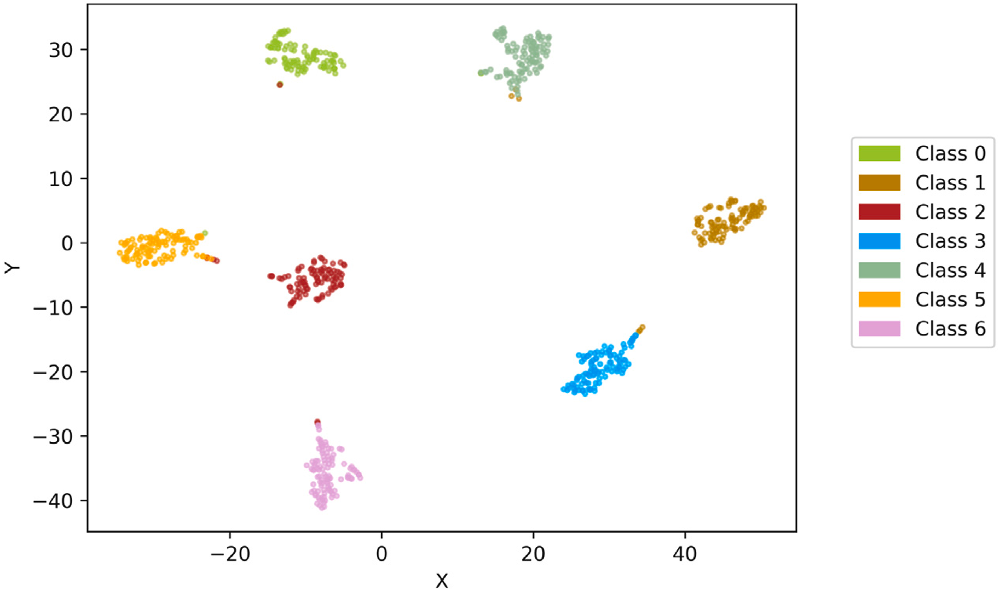

Fig. 7. Visualizing features of different noise classes in the testing dataset. There are 7 noise classes with 100 instances per class. The points with different colors denote noise features from different classes.

In Fig. 7, we can observe that different classes of noise features are well-separated in the two-dimensional space. Although there are a few cases where outlier features are misclassified, most noise features exhibit a high degree of clustering. Noticeably, there are significant variations between classes, while variations within the same class are relatively minor. It confirms that the noise features learned by the 2D CNN have solid discriminative capabilities. Therefore, the feature visualization results indicate that the trained 2D CNN in the SFANC method can accurately classify different types of noise. It is in line with the high classification accuracy of the 2D CNN.

## 5.1.4. Explainable AI analysis using LayerCAM

The previous sections confirmed the efficacy of 2D CNN for noise classification. In this section, we employed the LayerCAM technique [43] to investigate the fundamental principle governing the noise classification in the 2D CNN. As described in Section $^ { 4 , }$ the LayerCAM technique can produce class activation maps for different 2D CNN layers, which highlights the class-specific discriminative regions in the input mel-spectrogram image. The LayerCAM results for a tonal noise (300 Hz) and a broadband noise (50 Hz-800 Hz) are shown in Figs. 8 and 9. The 2D CNN predicts the classes of the two noises as $B _ { 3 }$ and $B _ { 0 } ,$ respectively.

According to the mel-spectrogram images in Fig. 8(a) and Fig. 9(a), the frequency band of the tonal noise is considerably narrower than that observed in the broadband noise. As shown in Fig. 6, the frequency ranges of the control filter $B _ { 3 }$ and $B _ { 0 }$ are approximately 200-325 Hz and 200-700 $\mathrm { H z , }$ respectively. Among the 7 pre-trained control filters, the spectra of control filters $B _ { 3 }$ and $B _ { 0 }$ best match the frequency ranges of the tonal noise and broadband noise. This result indicates that filter selection in the CNN-based SFANC method is primarily based on the frequency ranges of input noises.

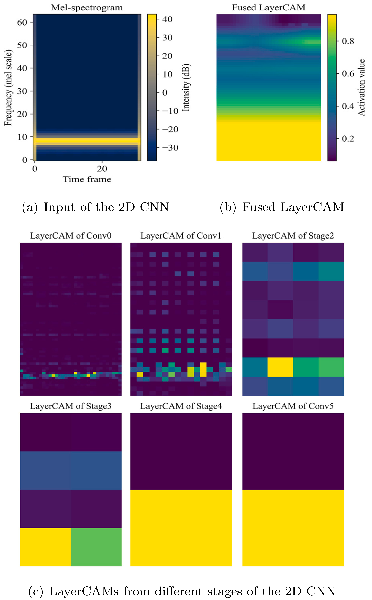

Fig. 8. LayerCAM results of the noise with a predicted class of 𝐵3. (a): The input mel-spectrogram of the 2D CNN; (b): The fused map of LayerCAM, which is the fusion of different stages’ LayerCAMs shown in (c).

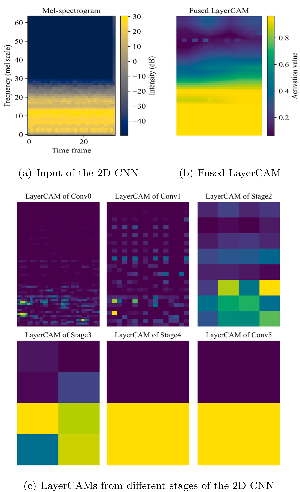

Fig. 9. LayerCAM results of the noise with a predicted class of 𝐵0. (a): The input mel-spectrogram of the 2D CNN; (b): The fused map of LayerCAM, which is the fusion of different stages’ LayerCAMs shown in (c).

Furthermore, by comparing (a) and (b) in Figs. 8 and 9, we noted that regions exhibiting high intensity within mel-spectrogram images correspond to high activation values in the fused LayerCAMs. It indicates that the decision-making process of the 2D CNN mainly focuses on the high-intensity spectral content of the noise, that is, the frequency band information. Therefore, the results confirm that the CNN-based SFANC method mainly relies on noise frequency band information to select control filters, aligning with the theoretical evidence presented in [32]. Additionally, the LayerCAMs from different stages of the 2D CNN reveal that shallow layers (Conv0, Conv1, Stage2) mainly focus on local features, while deeper layers (Stage3, Stage4, Stage5) concentrate on global features. The 2D CNN can accurately classify noises by leveraging both local and global frequency information.

## 5.2. Numerical simulations on real-recorded noises

This section presents numerical simulations, where the CNN-based SFANC method and the FxLMS algorithm are used to attenuate real-recorded noises: an aircraft noise with a frequency range of 100-800 Hz and a compressor noise with a frequency range of 40-1000 Hz. Real-recorded noises are not included in the training dataset, and the step size of the FxLMS algorithm is set to 0.0001.

The CNN-based SFANC method is compared to the FxLMS algorithm regarding noise reduction level (NR) in dB. NR is the ratio of disturbance signal power to error signal power, which is computed as

$$
{ \mathrm { N R } } = 1 0 \log _ { 1 0 } \frac { \sum _ { n = 1 } ^ { L } d ^ { 2 } ( n ) } { \sum _ { n = 1 } ^ { L } e ^ { 2 } ( n ) } ,\tag{21}
$$

where ?? denotes the length of the signal vector. The NR values obtained by CNN-based SFANC and FxLMS on real noises are summarized in Table 4. It is found that the NR values obtained by the CNN-based SFANC method are significantly higher than those obtained by the FxLMS algorithm on both noises.

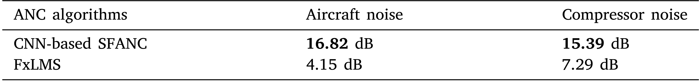

Table 4 Noise reduction levels achieved by the CNN-based SFANC and FxLMS algorithms.

(a) Input of the 2D CNN

(b) Fused LayerCAM  
(c) LayerCAMs from different stages of the 2D CNN  
Fig. 8. LayerCAM results of the noise with a predicted class of ??3. (a): The input mel-spectrogram of the 2D CNN; (b): The fused map of LayerCAM, which is the fusion of different stages’ LayerCAMs shown in (c).

Table 4  
Noise reduction levels achieved by the CNN-based SFANC and FxLMS algorithms.
<table><tr><td>ANC algorithms</td><td>Aircraft noise</td><td>Compressor noise</td></tr><tr><td>CNN-based SFANC</td><td>16.82 dB</td><td>15.39 dB</td></tr><tr><td>FxLMS</td><td>4.15 dB</td><td>7.29 dB</td></tr></table>

Additionally, Figs. 10 and 11 depict the noise reduction results on the real noises using the CNN-based SFANC method and the FxLMS algorithm. Noticeably, the CNN-based SFANC method responds much faster and achieves better noise reduction levels than the FxLMS algorithm on the two noises. On the aircraft noise, the CNN-based SFANC method achieves an averaged noise reduction level of over 10 dB after the first second, but the FxLMS algorithm takes more than 40 seconds to achieve a similar level. The FxLMS algorithm is less efficient at coping with the rapidly varying noises because of its slow convergence and weak tracking ability [53]. It is also observed that the SFANC method has no noise reduction in the first second because a pre-trained control filter needs to be selected based on the first–second noise.

Furthermore, we compare the noise reduction performances using the power spectral density (PSD) illustrated in Fig. 10(d) and Fig. 11(d). PSD provides insights into the distribution of noise power across different frequencies. It can be seen that the CNN-based SFANC method effectively attenuates noise components within the range of 200-700 Hz, aligning with the frequency ranges of the pre-trained control filters in Fig. 5. In comparison, the FxLMS algorithm is less effective at reducing the power of the two noises. Therefore, the simulations demonstrate the superiority of the CNN-based SFANC method over the FxLMS algorithm in handling real dynamic noises.

(a) Input of the 2D CNN

(b) Fused LayerCAM  
(c) LayerCAMs from different stages of the 2D CNN  
Fig. 9. LayerCAM results of the noise with a predicted class of $B _ { 0 } .$ (a): The input mel-spectrogram of the 2D CNN; (b): The fused map of LayerCAM, which is the fusion of different stages’ LayerCAMs shown in (c).

## 6. Real-time implementation of CNN-based SFANC

To evaluate the performance of the CNN-based SFANC Method in practical scenarios, we utilized this method to implement a 4-channel ANC window with a size of 47 cm × 47 cm. Fig. 12 illustrates the schematic of this multichannel ANC system. In the system, the co-processor is a laptop (with an NVIDIA GeForce RTX 3060 Laptop GPU), which runs the trained 2D CNN to choose the pre-trained control filter. Meanwhile, an embedded PXI processing unit (NI PXIe-8135), with a pre-amplifier, an I/O unit, and an output amplifier, works as the real-time controller for noise reduction. During the noise control progress, the laptop utilizes the UDP protocol [54] to transmit the index of the selected control filter to the PXI processing unit. Under this joint working mode, the laptop runs at the frame rate, and online noise control operates at a sampling rate of 16 kHz in parallel, which allows the CNN-based SFANC approach to achieve delayless noise control in the ANC window.

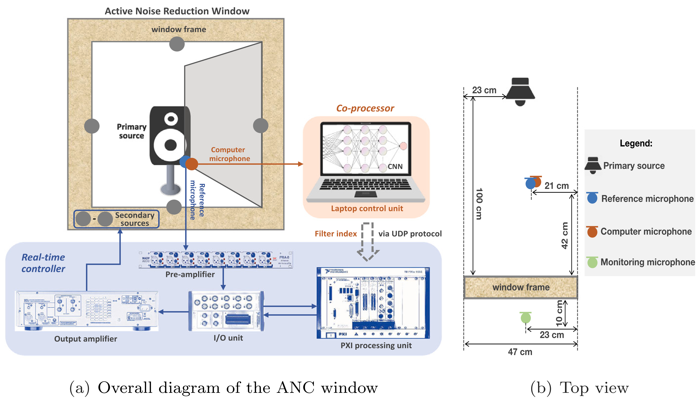

Fig. 12. The CNN-based SFANC method implemented in the ANC window, where the co-processor coordinates with the real-time controller through UDP protocol.

## 6.1. Experimental setup

The experimental setup of the 4-channel ANC window is shown in Fig. 13. Notably, there is no error microphone for real-time noise control. Unlike adaptive ANC algorithms, the CNN-based SFANC method does not require error signals to update its control filter, which makes its deployment more convenient. The primary source is a loudspeaker (YAMAHA DBR-12) placed 1 m away from the ANC window. The reference microphone (GRAS 40PH) and computer microphone (omni-directional microphone) are mounted on the corner of the window sash. Also, there is a monitoring microphone (GRAS 40PH) arranged near the center of the window to measure the noise reduction performance. 4 secondary sources (TB speakers) are installed symmetrically inside the window frame, which plays the control signal generated by the real-time controller illustrated in Fig. 14. In the experiment, the filter length of the control filter is set to 512.

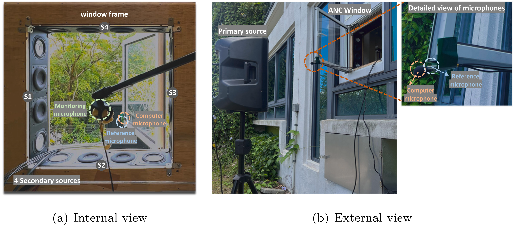

Fig. 13. Experimental setup of the ANC window observed from the internal and external views. Note that there is no error microphone during noise control.

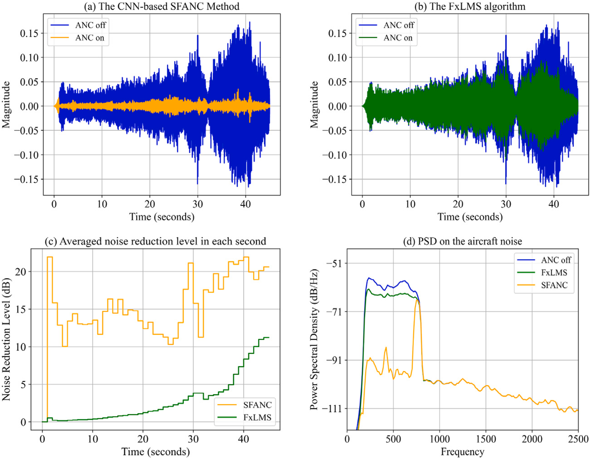

Fig. 10. The (a)–(b) error signal, (c) averaged noise reduction level in each second, and (d) power spectral density obtained by the CNN-based SFANC method and the FxLMS algorithm, on the aircraft noise.

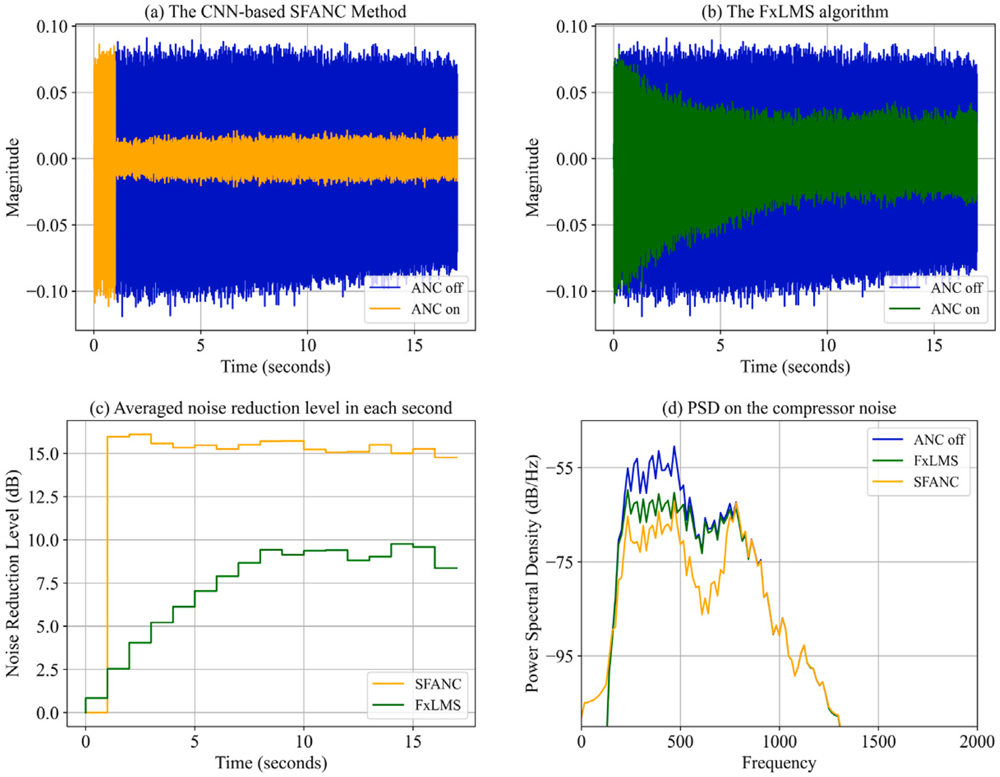

Fig. 11. The (a)–(b) error signal, (c) averaged noise reduction level in each second, and (d) power spectral density obtained by the CNN-based SFANC method and the FxLMS algorithm, on the compressor noise.

(a) Overall diagram of the ANC window  
(b) Top view

Fig. 12. The CNN-based SFANC method implemented in the ANC window, where the co-processor coordinates with the real-time controller through UDP protocol.  
(a) Internal view

(b) External view  
Fig. 13. Experimental setup of the ANC window observed from the internal and external views. Note that there is no error microphone during noise control.

## 6.2. Pre-trained control filters

Initially, 7 pre-trained control filters are obtained in the 4-channel ANC window with a 1 reference microphone, 4 secondary sources, and 4 error sensors. 7 broadband noises with different frequency ranges illustrated in Fig. 5 are used as the primary noises. The FxLMS algorithm is adopted to obtain the optimal control filters for these broadband noises. Upon convergence, 7 pre-trained control filters are obtained, with index values ranging from $B _ { 0 }$ to $B _ { 6 } .$

After obtaining pre-trained control filters, real-time noise control is executed without error microphones in the SFANC system, thereby facilitating the practical deployment. Moreover, by avoiding the feedback mechanism of error signals, it improves the response time and system stability. During noise control, the initial control filter is the pre-trained control filter with an index of $B _ { 0 } .$ When the 2D CNN selects a different pre-trained control filter, the laptop transmits the updated index to the PXI processing unit for loading the corresponding pre-trained control filter. Furthermore, to evaluate the transferability, the 2D CNN model trained on synthetic acoustic paths (as detailed in Section 5) is directly applied to real acoustic paths without retraining.

## 6.3. Broadband noise cancellation

In the first experiment, the implemented ANC system is used to cancel 7 types of broadband noise, and the performance is shown in Figs. 15 and 16. The 7 types of broadband noises have frequency ranges as illustrated in Fig. 5. The experimental results demonstrate that the main power of broadband noises is effectively attenuated by the CNN-based SFANC method. Specifically, the technique is less effective at reducing 325-450 Hz and 450-575 Hz noises, probably due to the limited performance of the corresponding pre-trained control filters on the two frequency ranges. From the 1/3 octave band of noise reduction, we found that the noise reduction value is positive at most frequencies but negative at specific frequencies, which may be caused by the acoustic modes of the experiment room.

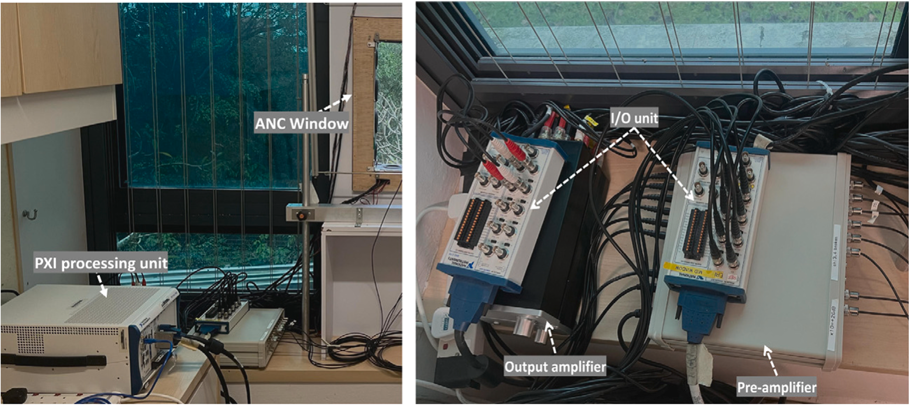

Fig. 14. Detailed view of the ANC hardware system, which includes the PXI processing unit, the pre-amplifier, the I/O unit, and the output amplifier.

1/3 Octave Band (200-700 Hz broadband noise)  
1/3 Octave Band (200-450 Hz broadband noise)  
1/3 Octave Band (450-700 Hz broadband noise)  

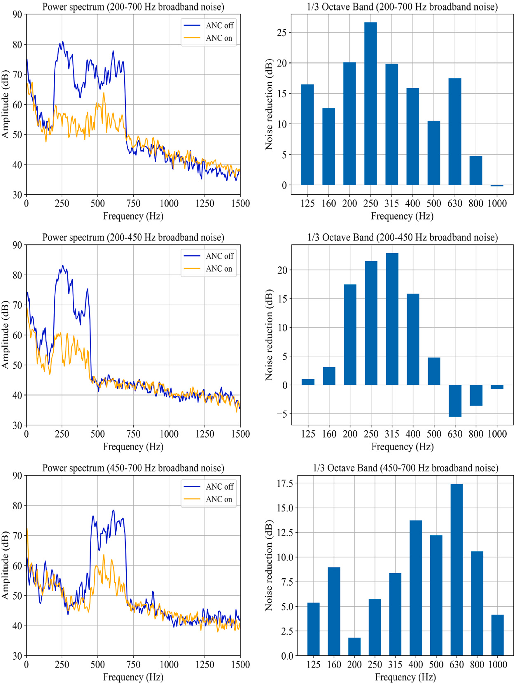

Fig. 15. Noise reduction performance on the broadband noises with predicted classes of 𝐵0-𝐵2, in terms of power spectrums and 1/3 octave band of noise reduction.

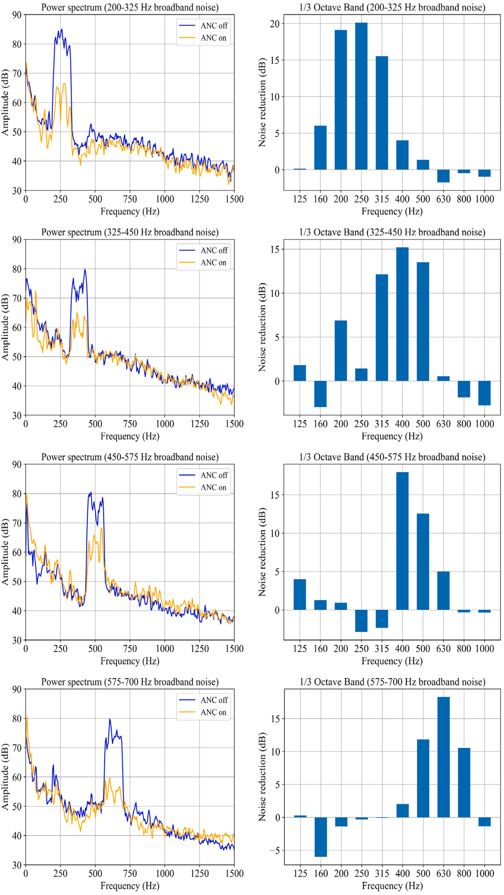

Fig. 16. Noise reduction performance on the broadband noises with predicted classes of ‘3’-’6’, in terms of power spectrums and 1/3 octave band of noise reduction.

The noise reduction levels and indexes of the selected control filters for these broadband noises are summarized in Table 5. The CNN-based SFANC method achieves a noise reduction level of approximately 12 dB for the 325-450 Hz and 450-575 Hz noises. For other types of broadband noise, the noise reduction level exceeds 15 dB. These variations in noise reduction stem from the varying efficacy of their respective pre-trained control filters [55]. Furthermore, the selected control filters are matched with the frequency ranges of these broadband noises, demonstrating that the 2D CNN in the SFANC method correctly classified these broadband noises. The results also indicate that the 2D CNN model trained on synthetic acoustic paths can still accurately classify noises on real acoustic paths without a retraining process. Therefore, the classification accuracy and transferability of the 2D CNN model in SFANC are demonstrated.

Table 5  
Sound pressure levels and noise reduction levels of broadband noises, when the CNN-based SFANC algorithm is turned off and on.
<table><tr><td>Broadband noise</td><td>ANC off</td><td>ANC on</td><td>NR</td><td>Selected filter</td></tr><tr><td>200-700 Hz</td><td>73.61 dBA</td><td>55.79 dBA</td><td>17.82 dB</td><td> $B _ { 0 }$ </td></tr><tr><td>200-450 Hz</td><td>74.17 dBA</td><td>53.43 dBA</td><td>20.74 dB</td><td> $B _ { 1 }$ </td></tr><tr><td>450-700 Hz</td><td>70.42 dBA</td><td>54.70 dBA</td><td>15.72 dB</td><td> $B _ { 2 }$ </td></tr><tr><td>200-325 Hz</td><td>75.10 dBA</td><td>56.62 dBA</td><td>18.48 dB</td><td> $B _ { 3 }$ </td></tr><tr><td>325-450 Hz</td><td>68.44 dBA</td><td>56.06 dBA</td><td>12.38 dB</td><td> $B _ { 4 }$ </td></tr><tr><td>450575 Hz</td><td>70.33 dBA</td><td>57.57 dBA</td><td>12.76 dB</td><td> $B _ { 5 }$ </td></tr><tr><td>575700 Hz</td><td>68.48 dBA</td><td>52.26 dBA</td><td>16.22 dB</td><td> $B _ { 6 }$ </td></tr></table>

Table 6

Sound pressure levels and noise reduction levels of real noises, when the CNN-based SFANC algorithm is turned off and on.
<table><tr><td>Real noise</td><td>ANC off</td><td>ANC on NR</td></tr><tr><td>Aircraft noise</td><td>72.36 dBA</td><td>60.07 dBA 12.29 dB</td></tr><tr><td>Compressor noise</td><td>73.90 dBA</td><td>61.47 dBA 12.43 dB</td></tr></table>

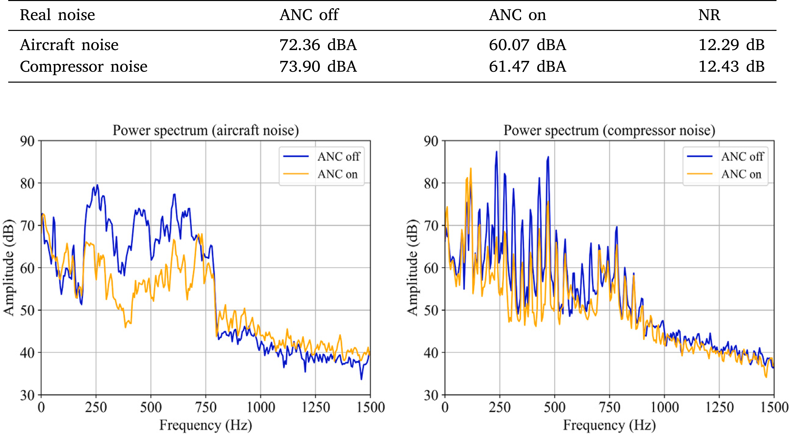

Fig. 17. Power spectrum of real noises picked up by the monitoring microphone, when the CNN-based SFANC algorithm is turned off and on.

## 6.4. Real noise cancellation

In this experiment, the 4-channel ANC window based on the CNN-based SFANC method is used to cancel two real noises: an aircraft noise and a compressor noise. It is important to note that the real noises are absent from the training dataset. Fig. 17 and Table 6 show the power spectrum of the real noises and noise reduction levels, respectively.

Fig. 17 shows that although the power spectrum of the two noises exhibits significant differences, the CNN-based SFANC method can effectively attenuate the 200-700 Hz frequency components in the two noises. This is because the maximum frequency range of the pre-trained control filters is 200-700 Hz. According to Table 6, the CNN-based SFANC algorithm achieves noise reduction levels of 12.29 dB and 12.43 dB for the aircraft noise and compressor noise, respectively. Hence, the experimental results demonstrate the efficacy of the implemented CNN-based SFANC method in dealing with real noises. Moreover, if the acoustic paths change significantly, we only need to obtain the corresponding pre-trained control filters for the new acoustic environment. Importantly, there is no need to retrain the 2D CNN, which exhibits the good transferability of the CNN-based SFANC method across diverse acoustic scenarios.

## 7. Conclusion

This paper mainly highlights the practicality and interpretability of the CNN-based SFANC method. The CNN-based SFANC method is a data-driven method, which employs a 2D CNN in the co-processor to select appropriate pre-trained control filters for different types of noise. The efficient coordination between the co-processor and real-time controller enables delayless noise control. In terms of theoretical analysis, this paper abstracts ANC as a Markov progress to verify the theoretical reasonableness of the CNN-based SFANC method.

Numerical simulations demonstrate a high classification accuracy of 98.55% for the proposed 2D CNN. Using an explainable AI technique, LayerCAM, we discovered that the classification by the 2D CNN primarily depends on the frequency band information of noise. Real-time experiments on an ANC window show that the CNN-based SFANC method effectively attenuates broadband noises and real dynamic noises. Additionally, the 2D CNN trained on synthetic acoustic paths but used in a real environment demonstrates the good transferability of the proposed method.

## CRediT authorship contribution statement

Zhengding Luo: Writing – review & editing, Writing – original draft, Visualization, Validation, Software, Methodology, Investigation, Formal analysis, Data curation, Conceptualization. Dongyuan Shi: Writing – review & editing, Supervision, Methodology, Formal analysis, Conceptualization. Junwei Ji: Validation, Investigation, Data curation. Xiaoyi Shen: Validation, Conceptualization. Woon-Seng Gan: Writing – review & editing, Resources, Funding acquisition.

## Declaration of competing interest

The authors declare that they have no known competing financial interests or personal relationships that could have appeared to influence the work reported in this paper.

## Data availability

Data will be made available on request.

## References

[1] M. Pawelczyk, S. Wrona, C. Isaac, K. Mazur, J. Rzepecki, Passive control, in: Noise-Controlling Casings, CRC Press, 2022, pp. 105–136.

[2] S.M. Kuo, D.R. Morgan, Active noise control: A tutorial review, Proc. IEEE 87 (6) (1999) 943–973.

[3] C.N. Hansen, Understanding Active Noise Cancellation, CRC Press, 2002.

[4] S.J. Elliott, P.A. Nelson, Active noise control, IEEE Signal Process. Mag. 10 (4) (1993) 12–35.

[5] N. Han, X. Qiu, A study of sound intensity control for active noise barriers, Appl. Acoust. 68 (10) (2007) 1297–1306.

[6] L. Yin, Z. Zhang, M. Wu, Z. Wang, C. Ma, S. Zhou, J. Yang, Adaptive parallel filter method for active cancellation of road noise inside vehicles, Mech. Syst. Signal Process. 193 (2023) 110274.

[7] B. Lam, W.-S. Gan, D. Shi, M. Nishimura, S. Elliott, Ten questions concerning active noise control in the built environment, Build. Environ. 200 (2021) 107928.

[8] Y. Kajikawa, W.-S. Gan, S.M. Kuo, Recent advances on active noise control: Open issues and innovative applications, APSIPA Trans. Signal Inf. Process. 1 (2012) e3.

[9] D. Shi, B. Lam, W.-S. Gan, J. Cheer, S.J. Elliott, Active noise control in the new century: The role and prospect of signal processing, in: INTER-NOISE and NOISE-CON Congress and Conference Proceedings, vol. 268, (no. 3) Institute of Noise Control Engineering, 2023, pp. 5141–5151.

[10] S. Wrona, Performance analysis of active structural acoustic control applied to a washing machine, Sensors 22 (19) (2022) 7357.

[11] S. Wrona, M. Pawelczyk, L. Cheng, Semi-active links in double-panel noise barriers, Mech. Syst. Signal Process. 154 (2021) 107542.

[12] C. Shi, T. Murao, D. Shi, B. Lam, W.-S. Gan, Open loop active control of noise through open windows, in: Proceedings of Meetings on Acoustics, vol. 29, (no. 1) AIP Publishing, 2016.

[13] B. Lam, C. Shi, D. Shi, W.-S. Gan, Active control of sound through full-sized open windows, Build. Environ. 141 (2018) 16–27.

[14] D. Shi, B. Lam, J. Ji, X. Shen, C.K. Lai, W.-S. Gan, Computation-efficient solution for fully-connected active noise control window: Analysis and implementation of multichannel adjoint least mean square algorithm, Mech. Syst. Signal Process. 199 (2023) 110444.

[15] C. Shi, Z. Jia, R. Xie, H. Li, An active noise control casing using the multi-channel feedforward control system and the relative path based virtual sensing method, Mech. Syst. Signal Process. 144 (2020) 106878.

[16] X. Shen, D. Shi, W.-S. Gan, S. Peksi, Adaptive-gain algorithm on the fixed filters applied for active noise control headphone, Mech. Syst. Signal Process. 169 (2022) 108641.

[17] M. Pawełczyk, Analogue active noise control, Appl. Acoust. 63 (11) (2002) 1193–1213.

[18] J. Ji, D. Shi, Z. Luo, X. Shen, W.-S. Gan, A practical distributed active noise control algorithm overcoming communication restrictions, in: ICASSP 2023-2023 IEEE International Conference on Acoustics, Speech and Signal Processing, ICASSP, IEEE, 2023, pp. 1–5.

[19] C.-Y. Chang, C.-T. Chuang, S.M. Kuo, C.-H. Lin, Multi-functional active noise control system on headrest of airplane seat, Mech. Syst. Signal Process. 167 (2022) 108552.

[20] J. Cheer, S.J. Elliott, Multichannel control systems for the attenuation of interior road noise in vehicles, Mech. Syst. Signal Process. 60 (2015) 753–769.

[21] P.N. Samarasinghe, W. Zhang, T.D. Abhayapala, Recent advances in active noise control inside automobile cabins: Toward quieter cars, IEEE Signal Process. Mag. 33 (6) (2016) 61–73.

[22] Z. Luo, D. Shi, J. Ji, W.-s. Gan, Implementation of multi-channel active noise control based on back-propagation mechanism, 2022, arXiv preprint arXiv:2208.08086.

[23] D. Shi, C. Shi, W.-S. Gan, Effect of the audio amplifier’s distortion on feedforward active noise control, in: 2017 Asia-Pacific Signal and Information Processing Association Annual Summit and Conference, APSIPA ASC, IEEE, 2017.

[24] S. Wang, H. Li, P. Zhang, J. Tao, H. Zou, X. Qiu, An experimental study on the upper limit frequency of global active noise control in car cabins, Mech. Syst. Signal Process. 201 (2023) 110672.

[25] X. Xu, Y. Lu, C. Lan, Z. Xing, M. Shao, Experimental research on global active rotor noise control using near-field acoustic holography and sound field reproduction, Mech. Syst. Signal Process. 206 (2024) 110930.

[26] W. Chen, Z. Liu, L. Hu, X. Li, Y. Sun, C. Cheng, S. He, C. Lu, A low-complexity multi-channel active noise control system using local secondary path estimation and clustered control strategy for vehicle interior engine noise, Mech. Syst. Signal Process. 204 (2023) 110786.

[27] Z. Zhou, S. Chen, H. Li, Y. Cai, Delayless partial subband update algorithm for feed-forward active road noise control system in pure electric vehicles, Mech. Syst. Signal Process. 196 (2023) 110328.

[28] K.-L. Yin, H.-R. Zhao, Y.-F. Pu, L. Lu, Nonlinear active noise control with tap-decomposed robust volterra filter, Mech. Syst. Signal Process. 206 (2024) 110887.

[29] L. Yin, Z. Zhang, M. Wu, S. Zhou, J. Guo, J. Yang, J. Zhang, Selective fixed-filter active noise control based on frequency response matching in headphones, Appl. Acoust. 211 (2023) 109505.

[30] Z. Luo, D. Shi, W.-S. Gan, Q. Huang, Delayless generative fixed-filter active noise control based on deep learning and Bayesian filter, IEEE/ACM Trans. Audio, Speech, Lang. Process. 32 (2024) 1048–1060.

[31] Z. Luo, D. Shi, X. Shen, J. Ji, W.-S. Gan, GFANC-Kalman: Generative fixed-filter active noise control with CNN-Kalman filtering, IEEE Signal Process. Lett. 31 (2024) 276–280.

[32] D. Shi, W.-S. Gan, B. Lam, S. Wen, Feedforward selective fixed-filter active noise control: Algorithm and implementation, IEEE/ACM Trans. Audio, Speech, Lang. Process. 28 (2020) 1479–1492.

[33] H. Zhang, D. Wang, Deep ANC: A deep learning approach to active noise control, Neural Netw. 141 (2021) 1–10.

[34] H. Zhang, A. Pandey, et al., Low-latency active noise control using attentive recurrent network, IEEE/ACM Trans. Audio, Speech, Lang. Process. 31 (2023) 1114–1123.

[35] A. Mostafavi, Y.-J. Cha, Deep learning-based active noise control on construction sites, Autom. Constr. 151 (2023) 104885.

[36] J.Y. Oh, H.W. Jung, M.H. Lee, K.H. Lee, Y.J. Kang, Enhancing active noise control of road noise using deep neural network to update secondary path estimate in real time, Mech. Syst. Signal Process. 206 (2024) 110940.

[37] D. Shi, B. Lam, K. Ooi, X. Shen, W.-S. Gan, Selective fixed-filter active noise control based on convolutional neural network, Signal Process. 190 (2022) 108317.

[38] Z. Luo, D. Shi, W.-S. Gan, Q. Huang, L. Zhang, Performance evaluation of selective fixed-filter active noise control based on different convolutional neural networks, in: INTER-NOISE and NOISE-CON Congress and Conference Proceedings, 2023, pp. 1615–1622.

[39] K. Doi, Y. Kajikawa, SFANC with compensation filter based on MEFxDCTLMS algorithm, in: 2023 Asia Pacific Signal and Information Processing Association Annual Summit and Conference, APSIPA ASC, 2023, pp. 1240–1244.

[40] Z. Luo, D. Shi, X. Shen, J. Ji, W.-S. Gan, Deep generative fixed-filter active noise control, in: ICASSP 2023-2023 IEEE International Conference on Acoustics, Speech and Signal Processing, ICASSP, IEEE, 2023, pp. 1–5.

[41] D. Shi, W.-S. Gan, B. Lam, Z. Luo, X. Shen, Transferable latent of cnn-based selective fixed-filter active noise control, IEEE/ACM Trans. Audio, Speech, Lang. Process. (2023).

[42] N. Pan, J. Chen, J. Benesty, DNN based multiframe single-channel noise reduction filters, in: ICASSP 2022-2022 IEEE International Conference on Acoustics, Speech and Signal Processing, ICASSP, IEEE, 2022, pp. 8782–8786.

[43] P.-T. Jiang, C.-B. Zhang, Q. Hou, M.-M. Cheng, Y. Wei, LayerCAM: Exploring hierarchical class activation maps for localization, IEEE Trans. Image Process. 30 (2021) 5875–5888.

[44] S. Haykin, Adaptive Filter Theory, third ed., Prentice-Hall, Inc., USA, 1996.

[45] L.R. Rabiner, A tutorial on hidden Markov models and selected applications in speech recognition, Proc. IEEE 77 (2) (1989) 257–286.

[46] N. Ma, X. Zhang, H.-T. Zheng, J. Sun, Shufflenet v2: Practical guidelines for efficient cnn architecture design, in: Proceedings of the European Conference on Computer Vision, ECCV, 2018, pp. 116–131.

[47] B. Zhou, A. Khosla, A. Lapedriza, A. Oliva, A. Torralba, Learning deep features for discriminative localization, in: Proceedings of the IEEE Conference on Computer Vision and Pattern Recognition, 2016, pp. 2921–2929.

[48] S. Adapa, Urban sound tagging using convolutional neural networks, in: Proceedings of the Detection and Classification of Acoustic Scenes and Events 2019 Workshop, DCASE2019, 2019, pp. 5–9.

[49] Z. Luo, J. Li, Y. Zhu, A deep feature fusion network based on multiple attention mechanisms for joint iris-periocular biometric recognition, IEEE Signal Process. Lett. 28 (2021) 1060–1064.

[50] G. Huang, Z. Liu, L. Van Der Maaten, K.Q. Weinberger, Densely connected convolutional networks, in: Proceedings of the IEEE Conference on Computer Vision and Pattern Recognition, 2017, pp. 4700–4708.

[51] D.P. Kingma, J. Ba, Adam: A method for stochastic optimization, 2014, arXiv preprint arXiv:1412.6980.

[52] L. Van der Maaten, G. Hinton, Visualizing data using t-SNE, J. Mach. Learn. Res. 9 (11) (2008).

[53] Z. Luo, D. Shi, W.-S. Gan, A hybrid SFANC-FxNLMS algorithm for active noise control based on deep learning, IEEE Signal Process. Lett. 29 (2022) 1102–1106.

[54] J. Postel, User Datagram Protocol, Tech Rep., 1980.

[55] D. Shi, W.-S. Gan, X. Shen, Z. Luo, J. Ji, What is behind the meta-learning initialization of adaptive filter? — A naive method for accelerating convergence of adaptive multichannel active noise control, Neural Netw. 172 (2024) 106145.