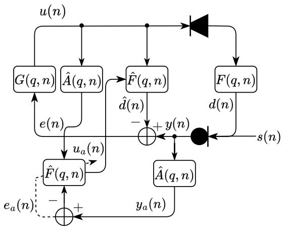
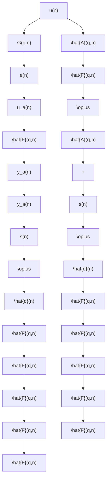
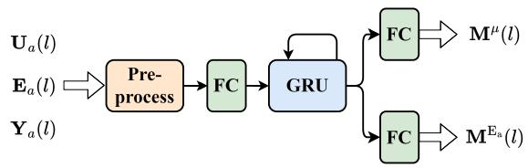
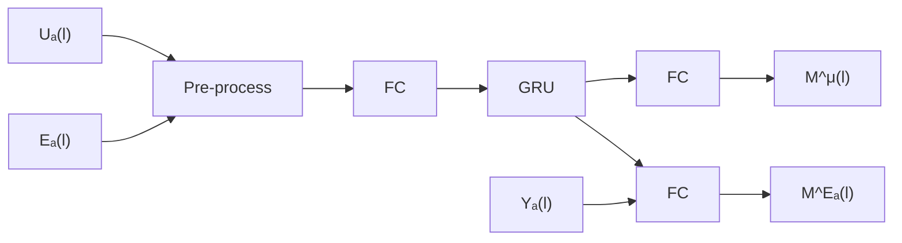
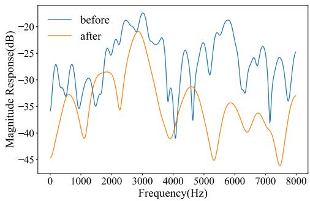
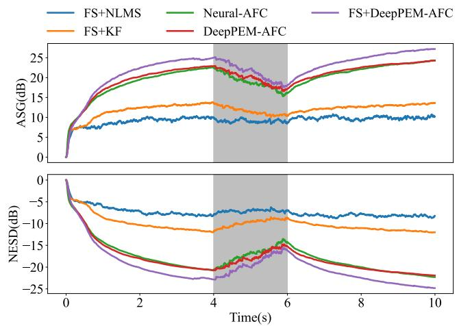

# DeepPEM-AFC: An Improved Prediction-Error-Method-based Adaptive Feedback Cancellation with Deep Learning for Hearing Aids

Xiaofan Zhan∗†, Fengyuan Hao∗†, Xiaodong Li∗†, Chengshi Zheng∗†§

∗Key Laboratory of Noise and Vibration Research,

Institute of Acoustics, Chinese Academy of Sciences

†University of Chinese Academy of Sciences

cszheng@mail.ioa.ac.cn

Abstract—Hearing assistive devices aim to compensate hearing loss for hearing-impaired listeners, and their maximum stable gain (MSG) is constrained because of the existence of the acoustic feedback between the receiver and microphone, resulting in their inefficiency for individuals with severe or profound hearing loss who require very large amplification gain. Adaptive feedback cancellation (AFC) is an effective method to reduce acoustic feedback and increase MSG but its performance often degrades because of the high correlation between the target and feedback signals. The prediction-error-method (PEM)-based AFC has shown its capability in reducing this degradation. This paper proposes a deep learning-based PEM-AFC dubbed DeepPEM-AFC to further improve the performance of traditional PEM-AFC by fully taking advantage of both deep learning in automatically finding the optimal step size when updating the filter coefficients and PEM in solving the abovementioned high-correlation problem. To improve generalization across different acoustic feedback paths, a path generation scheme is proposed for training purposes. Experimental results show that DeepPEM-AFC achieves superior tracking performance compared to state-of-the-art methods, including traditional methods and Neural-AFC. Moreover, combining DeepPEM-AFC with frequency shifting further improves the performance.

Index Terms—Feedback cancellation, Deep learning, Adaptive control, Prediction error method, Hearing aids.

# I. INTRODUCTION

Hearing aids (HAs) are indispensable devices that markedly improve the auditory experience of individuals with hearing loss by amplifying sound signals. However, the intrinsic coupling between the receiver and the microphone within HAs results in the return of some amplified sound signals to the microphone. This recirculation of sound gives rise to a detrimental phenomenon known as acoustic feedback, which typically manifests as unpleasant howling artifacts. Acoustic feedback limits the maximum stable gain (MSG) of HAs, making it inefficient for individuals with severe or profound hearing loss that require a very large amplification gain [1].

Several effective methods have already been proposed to handle acoustic feedback in HAs, including phase modulation (PM) [2], gain reduction [3], and adaptive feedback cancellation (AFC) [4], [5]. Among these methods, AFC is an effective method for its potential ability to theoretically eliminate feedback completely [6]. However, due to the closed-loop nature of the HAs system, the high correlation between the target and feedback signals results in an estimation bias of the feedback path [7]. To reduce the bias, many representative de-correlation approaches have already been proposed, including adding probe noise [8], introducing frequency shift (FS) [9], and using prediction-error-method (PEM) [10]. The performance of FS is limited in HAs scenarios because the direct and early reflections are dominant in the acoustic feedback path [11], [12], while PEM can effectively solve the high-correlation problem by introducing whiten pre-filter operators.

In terms of adaptive filtering algorithms in AFC, the normalized least mean square (NLMS) algorithm is the most commonly used, which can make a good balance between computational complexity and performance. To achieve a faster convergence speed and a lower steady-state misalignment for the adaptive filter (AF), various algorithms have been proposed to control its step size. The non-parametric variable step size (NPVSS) algorithm [13], [14] is based on statistical information and utilizes the instantaneous energy spectrum to dynamically adjust step size. The Kalman filter [15]– [17] employs a state model assumption to derive a simple but powerful statistical convergence state estimator, serving as an indirect means of controlling step size. More recently, many deep learningbased algorithms [18]–[20] have been proposed to achieve automatic regulating step size, and they have been shown better performance than traditional step-size control algorithms. Nevertheless, the abovementioned de-correlation methods have not been incorporated into the existing deep learning-based AFC methods, limiting its upper performance for hearing-aid applications.

This paper proposes a deep learning-based PEM-AFC method, termed DeepPEM-AFC, aiming to significantly improve the performance of the traditional PEM-AFC. The proposed method leverages the strength of deep learning to dynamically select the optimal step size when updating filter coefficients, thus improving the convergence speed and steady-state performance of PEM-AFC. To reduce the computational complexity of PEM, we implement its whiten prefilter operators in the frequency domain (FD), making DeepPEM-AFC more suitable for low-power devices like HAs. Our preliminary experiments show that the proposed method trained on a limited number of real feedback paths is highly path-dependent, limiting their applicability in diverse scenarios. To enhance its generalization capacity, we also propose a path generation scheme that is suitable for model training. Experimental results demonstrate that DeepPEM-AFC achieves superior tracking performance compared to stateof-the-art methods, including both traditional methods and Neural-AFC [20], and also shows great speech quality of the estimated source signal. Furthermore, incorporating FS with DeepPEM-AFC can further improve its overall performance.

# II. PEM-AFC

A general diagram of PEM-AFC is shown in Fig. 1. The receiver signal and the source signal are expressed as u(n) and s(n), respectively, where n is the discrete-time index. The acoustic feedback path transfer function (TF) F (q, n) is defined as:

$$
F (q, n) = f _ {0} (n) + f _ {1} (n) q ^ {- 1} + \dots + f _ {L _ {f} - 1} (n) q ^ {- (L _ {f} - 1)} \tag {1}
$$

flowchart

Fig. 1. AFC block diagram including PEM-based de-correlation.

where q is the discrete-time shift operator, i.e., $q ^ { - 1 } u ( n ) = u ( n - 1 )$ , and $L _ { f }$ is the length of the filter modeling the acoustic feedback path. The microphone signal $y ( n )$ comprises both the desired source signal $s ( n )$ and the undesired feedback signal $d ( n )$ . A finite impulse response (FIR) filter is commonly used in the adaptive filter ${ \hat { \mathbf { f } } } ( n )$ to estimate the acoustic feedback path $\mathbf { f } \left( n \right)$ with the same order [21]. The feed-forward path TF $G ( q , n )$ contains an amplitude amplifier |G| and a time delay unit $\Delta n$ .

It is often assumed that the source signal $s ( n )$ , especially speech, can be approximated by a white noise signal passing through a time-varying auto-regressive (AR) model [10]. In this context, PEM achieves signal de-correlation by introducing a series of whiten prefilter operators, where the filter is the estimated inverse source signal model ${ \hat { A } } ( q , n )$ .

To provide a detailed description of PEM-AFC, we assume that the frame shift and frame length are R and K, respectively, where $K = 2 R$ . The discrete frame index is denoted by $l ,$ and the discrete frequency index by k. In the overlap-and-save (OLS) procedure, the frequency domain version of the receiver signal $u ( n )$ and the Rpoint microphone signal $\mathbf { y } ( l )$ at time frame $l \in \mathbb { Z }$ are represented as follows:

$$
\mathbf {U} (l) = \mathrm{diag} \left\{\mathbf {F} _ {K} \left[ u (l R - K + 1), \dots , u (l R) \right] ^ {\mathrm{T}} \right\}, \tag {2}
$$

$$
\mathbf {y} (l) = \left[ y (l R - R + 1) \quad \dots \quad y (l R) \right] ^ {\mathrm{T}}. \tag {3}
$$

The error signal ${ \bf e } ( l )$ is obtained from the subtraction of the microphone signal and the estimated feedback signal which is shown as follows:

$$
\mathbf {e} (l) = \mathbf {y} (l) - \mathbf {Q} _ {R} ^ {\mathrm{T}} \mathbf {F} _ {K} ^ {- 1} \mathbf {U} (l) \hat {\mathbf {F}} (l), \tag {4}
$$

where $\hat { \mathbf { F } } ( \boldsymbol { l } ) = \mathbf { F } _ { K } \left[ \hat { \mathbf { f } } ^ { \mathrm { T } } ( \boldsymbol { l } ) \quad \mathbf { 0 } _ { 1 \times ( K - L _ { f } ) } \right] ^ { \mathrm { T } }$ and the projection matrix $\mathbf { Q } _ { R } = \left[ \mathbf { 0 } _ { R \times ( K - R ) } \overline { { } } \mathbf { I } _ { R \times R } \right] ^ { \mathrm { T } }$ .

The coefficients of the whitening filter $\hat { \mathbf { a } } ( l )$ with the order of $n _ { A }$ can be estimated using the Levinson-Durbin algorithm [22] with the error signal $e ( n )$ as input. In consideration of the short-term stationary nature of the speech signal, an input signal length of 20 ms is selected [22]. Then, the whitened receiver signal $u _ { a } ( n )$ and microphone signal $y _ { a } ( n )$ are obtained by pre-filtering the receiver and microphone signal using the whitening filter $\hat { \mathbf { a } } ( l )$ , expressed as follows:

$$
u _ {a} (l R - j) = \hat {A} (q, l) u (l R - j), \quad j = 0, \dots , K - 1 \tag {5}
$$

$$
y _ {a} (l R - j) = \hat {A} (q, l) y (l R - j). \quad j = 0, \dots , R - 1 \tag {6}
$$

The filtering operation in the time domain significantly increases the computational complexity of PEM-AFC. Similar to Eqs. (2), $( 3 ) .$ , and (4), we can also define the frequency-domain versions of the whitened receiver signal ${ \mathbf { U } } _ { a } ( l )$ , the whitened microphone signal ${ \bf y } _ { a } ( l )$ , and the prediction error signal ${ \bf e } _ { a } ( l )$ . Subsequently, the prediction error signal is transformed into the frequency domain and, along with the frequency-domain pre-filtered receiver signal, used in the stochastic gradient iteration to update the estimated filter $\hat { \mathbf { F } } ( l )$ :

$$
\hat {\mathbf {F}} (l + 1) = \hat {\mathbf {F}} (l) + \mathbf {G} _ {L _ {f}, 1 0} \mathrm{diag} \{\boldsymbol {\mu} (l) \} \mathbf {U} _ {a} ^ {\mathrm{H}} (l) \mathbf {E} _ {a} (l), \tag {7}
$$

where $\mathbf { G } _ { L _ { f } , 1 0 } \ = \ \mathbf { F } _ { K } \left[ \mathbf { I } _ { K } - \mathbf { Q } _ { L _ { f } } \mathbf { Q } _ { L _ { f } } ^ { \mathrm { T } } \right] \mathbf { F } _ { K } ^ { - 1 }$ is the linear constrained matrix and ${ \bf E } _ { a } ( l ) = { \bf F } _ { K } { \bf Q } _ { R } { \bf e } _ { a } ( l )$ .

# III. PROPOSED METHOD

The challenges of PEM-AFC arise primarily from the increased complexity associated with PEM and the selection of an appropriate step size to update filter. To address these issues, we propose a deep learning-based PEM-AFC, termed DeepPEM-AFC. This method leverages deep learning to automatically determine the optimal step size when updating the filter coefficients and utilizes PEM to solve the high correlation problem. Moreover, by implementing PEM in the frequency domain, the proposed method dramatically reduces computational complexity, making it suitable for low-power devices like HAs. The following parts provide a detailed description of the frequency-domain implementation of PEM and the deep learningbased step size control.

# A. Frequency-domain implementation of PEM

The frequency-domain implementation of PEM in PEM-AFC has been proposed in [23]. However, that method does not consider the case when the overlap is 50% in the OLS procedure, which is essential for reducing computational complexity in practice. So in our method, the frame shift R satisfies $R = L _ { f } + n _ { A }$ and $K = 2 R$ .

In order to implement the whiten pre-filter operators effectively, we also adopt the OLS approach to replace the time-domain filtering with frequency-domain multiplication. The prediction error signal ${ \bf e } _ { a } ( l )$ can be obtained by combining the estimated whitening filter with Eq. (4):

$$
\mathbf {e} _ {a} (l) = \mathbf {Q} _ {L _ {f}} ^ {\mathrm{T}} \mathbf {F} _ {K} ^ {- 1} \hat {\mathbf {A}} (l) [ \mathbf {Y} (l) - \mathbf {U} (l) \hat {\mathbf {F}} (l) ], \tag {8}
$$

with $\hat { \bf A } ( l ) = \mathrm { d i a g } \left\{ { \bf F } _ { K } \left[ \hat { \bf a } ^ { \mathrm { T } } ( l ) \quad { \bf 0 } _ { 1 \times ( K - n _ { A } - 1 ) } \right] ^ { \mathrm { T } } \right\}$ and ${ \bf Y } ( l ) =$ $\mathbf { F } _ { K } \mathbf { Q } _ { R } \mathbf { y } ( l )$ . Notice that the length of ${ \bf e } _ { a } ( l )$ is nA shorter than that in section II and $\mathbf { Q } _ { L _ { f } } = [ \mathbf { 0 } _ { L _ { f } \times \left( K - L _ { f } \right) } \quad \mathbf { I } _ { L _ { f } \times L _ { f } } ] ^ { \mathrm { T } }$ .

Similarly, we can approximate $\hat { \mathbf { A } } ( l ) \mathbf { U } ( l )$ as the frequency-domain counterpart to the whitened receiver signal $\mathbf { U } _ { a } ( l )$ . By combining $\mathbf { U } _ { a } ( l )$ with ${ \bf e } _ { a } ( l )$ , we can derive the same update equation as in Eq. (7). The difference is that only the latter $L _ { f }$ samples of each incoming frame in OLS are used to update the filter coefficients, and the first $n _ { A }$ frequency points in $\mathbf { U } _ { a } ( l )$ are slightly biased. This discrepancy inevitably introduces deviations in the update equation and indirectly reduces the rate of filter updating. To address this problem, we incorporate the deep learning-based step size control method, which is introduced in the following part.

# B. Deep learning-based step size control

In traditional methods, the step size is often determined by balancing the convergence rate and steady-state performance. Recently, deep learning-based methods have been introduced to automatically determine the step size through learning from input features. In comparison with the estimation of power spectral densities (PSDs) or $\mathbf P ( l )$ in the update equation separately in [18], [19], we use a more comprehensive step size mapping method mentioned in [20], [24]:

flowchart

Fig. 2. Network structure of DeepPEM-AFC

$$
[ \boldsymbol {\mu} (l) ] _ {k} = \frac {\mu_ {\max} [ \mathbf {M} ^ {\mu} (l) ] _ {k}}{[ \boldsymbol {\Phi} ^ {\mathrm{U} _ {a}} (l) + \frac {K}{R} \boldsymbol {\Phi} ^ {\mathrm{P} _ {a}} (l) ] _ {k}}, \tag {9}
$$

with

$$
\left[ \boldsymbol {\Phi} ^ {\mathrm{P} _ {a}} (l) \right] _ {k} = \gamma_ {e} \left[ \boldsymbol {\Phi} ^ {\mathrm{P} _ {a}} (l - 1) \right] _ {k} + (1 - \gamma_ {e}) \left| \left[ \mathbf {M} _ {a} ^ {\mathrm{E}} (l) \odot \mathbf {E} _ {a} (l) \right] _ {k} \right| ^ {2}, \tag {10}
$$

$$
[ \mathbf {\Phi} ^ {\mathrm{U} _ {a}} (l) ] _ {k} = \gamma_ {u} [ \mathbf {\Phi} ^ {\mathrm{U} _ {a}} (l - 1) ] _ {k} + (1 - \gamma_ {u}) | [ \mathbf {U} _ {a} (l) ] _ {k k} | ^ {2}, \tag {11}
$$

where the masking vectors $\mathbf { M } ^ { \mu } ( l )$ and $\mathbf { M } _ { a } ^ { \mathrm { E } } ( l )$ are derived from the trainable network.

We adopt the structure proposed in [25] to estimate the masking vectors, comprising a fully connected (FC) layer with a leaky ReLU activation, followed by two stacked GRU layers, and then two parallel FC layers with Sigmoid activations that map the GRU outputs to the masking vectors $\mathbf { M } ^ { \mu } ( l )$ and $\mathbf { M } _ { a } ^ { \mathrm { E } } ( l )$ , as illustrated in Fig. 2. Despite its simple structure, the network can effectively extract information related to filter convergence from the input features and can address the mismatch in the update equation with a powerful capability simultaneously.

For input features, we opt for the logarithmic spectra of the whitened receiver, microphone, and error signals. The receiver and error signals contain relate information about their PSDs, which is crucial for training the step-size control network, as explicitly shown in Eq. (9). The ratio of the microphone signal to the error signal is closely related to changes in the acoustic feedback path [18]. The combination of the two aforementioned factors facilitates its ability to accurately discern the convergence state of the filter and regulate its control. Note that all the feature vectors are normalized based on statistics estimated during training, which is more flexible and adaptable compared to the normalization method used in [20].

# IV. EXPERIMENTS

# A. Data preparation

The source signal $s ( n )$ was selected from the Librispeech dataset [26], sampled at $f _ { s } = 1 6$ kHz. For the feedback path in HAs, real and simulated paths of length $L _ { f } ~ = ~ 6 4$ were obtained using two different methods. The first method utilized real acoustic feedback paths measured in [27] using three distinct techniques. Two-thirds of these paths, totaling 280, were used for training, while the remaining were reserved for evaluation. The second method involved simulated feedback paths inspired by the formulas presented in [28], with minor modifications:

$$
f (n) = \sin \left(2 \pi f _ {\mathrm{env}} n + \phi_ {\mathrm{env}}\right) | r (n) | \exp \left(- \sigma P (n - n _ {f})\right), \tag {12}
$$

where the inclusion of the absolute value in the second term $r ( n )$ ensures the correct implementation of sinusoidal modulation, as evidenced by the amplitude response in the frequency domain (as shown in Fig. 3) and the subsequent evaluation results.

line

| Frequency(Hz) | before | after |
| ------------- | ------ | ----- |
| 0             | -35    | -45   |
| 1000          | -28    | -32   |
| 2000          | -25    | -28   |
| 3000          | -20    | -22   |
| 4000          | -30    | -40   |
| 5000          | -25    | -35   |
| 6000          | -22    | -38   |
| 7000          | -28    | -45   |
| 8000          | -25    | -35   |

Fig. 3. Comparison of magnitude response for one simulated feedback path before and after modification

We generated 15,000 10-second speech sequences, each with a unique random combination of two feedback paths. Of these, 80% was used for training and 20% for validation. Each sequence included a random abrupt, which switches to a different feedback path, uniformly distributed between 2s and 8s, to mitigate overfitting to specific transition points. In the feed-forward path, the amplifier gain |G| was set beyond or closed to the maximum stable gain (MSG) without AFC, within a range of -5 to 5 dB. The MSG is defined as follows:

$$
\mathrm{MSG} (\mathbf {F} (l)) = - 2 0 \log_ {1 0} (\max _ {k} | \mathbf {F} (k, l) |). \tag {13}
$$

# B. Training setting

For the baseline, we employed NLMS, KF, and Neural-AFC as described in [20], using identical configurations within the closedloop system, which also included a 10 Hz frequency shift in the feed-forward path. FS was implemented using a 64th-order FIR filter, introducing a delay of 2 ms, and was applied to all subsequent methods. To compare the effects of FS on DeepPEM-AFC, we evaluated the following two proposed methods:

• DeepPEM-AFC: It utilized a frame length $K \ : = \ : 1 6 0$ and a frame shift $R = 8 0$ in PEMAF, with $n _ { A } ~ = ~ 1 6 ,$ , which was trained in the close-loop.   
• FS+DeepPEM-AFC: It further combined DeepPEM-AFC with a 10 Hz frequency shift in the feed-forward path.

To maintain a consistent system delay of 7 ms, the feed-forward delays for the two methods were set to 2 ms and 0 ms, respectively. All methods used the real paths taken from [27]. To demonstrate the effectiveness of simulated paths, FS+DeepPEM-AFC was additionally trained on 10,000 randomly generated simulated paths using Eq. (12), referred to as FS+DeepPEM-AFC(v2). The parameters for Eq. (12) were configured as follows: the length of $f ( t )$ was 64, the modulation frequency $f _ { \mathrm { e n v } }$ was randomly selected between 0.1 and 0.2 Hz, the decay parameter σ was set randomly between 0.05 and 0.15, and the start-decay time $n _ { f }$ was randomly chosen from 0 to 10 samples.

The dimension of the GRU hidden states was set to 128. We employed the Adam optimizer [29] to train our models with an initial learning rate of $1 0 ^ { - 3 ^ { \circ } }$ over 60 epochs. Early stopping was applied after 10 epochs without improvement in validation performance. The learning rate was halved following two consecutive epochs with no performance gains, and Euclidean norm-based gradient clipping with a threshold of 0.5 was employed. A batch size of 32 was used. For step-size calculation in Eq. (9), $\mu _ { \mathrm { m a x } } ~ = ~ 1$ and $\gamma _ { u } ~ = ~ \gamma _ { e } ~ = ~ 0 . 5$ were selected. The normalized Euclidean system distance (NESD), between ˆf (l) and f (l), averaged across all frames in the mini-batch sequences was used as the loss function, given by:

TABLE I   
DEEP NEURAL NETWORK PARAMETERS, REAL-TIME FACTORS (RTF), AND EVALUATION RESULTS IN PATH CHANGE SCENARIOS FOR VARIOUS METHODS. BOLD FONT INDICATES THE BEST SCORE FOR EACH CASE. 

<table><tr><td rowspan="2">Method</td><td rowspan="2">Param.(M)</td><td rowspan="2">RTF</td><td colspan="4">Path(A)</td><td colspan="4">Path(B)</td></tr><tr><td>WB-PESQ</td><td>eSTOI</td><td>SI-SDR(dB)</td><td>Tracking(s)</td><td>WB-PESQ</td><td>eSTOI</td><td>SI-SDR(dB)</td><td>Tracking(s)</td></tr><tr><td>FS+NLMS</td><td>-</td><td>0.05</td><td>1.93</td><td>0.85</td><td>-5.06</td><td>-</td><td>1.90</td><td>0.86</td><td>-5.56</td><td>-</td></tr><tr><td>FS+KF</td><td>-</td><td>0.05</td><td>3.64</td><td>0.97</td><td>9.83</td><td>0.69</td><td>2.01</td><td>0.93</td><td>-6.63</td><td>1.48</td></tr><tr><td>Neural-AFC [20]</td><td>0.856</td><td>0.22</td><td>3.90</td><td>0.98</td><td>19.73</td><td>0.13</td><td>1.27</td><td>0.62</td><td>-38.33</td><td>-</td></tr><tr><td>DeepPEM-AFC</td><td>0.244</td><td>0.20</td><td>4.13</td><td>0.98</td><td>21.91</td><td>0.09</td><td>1.38</td><td>0.76</td><td>-35.63</td><td>-</td></tr><tr><td>FS+DeepPEM-AFC</td><td>0.244</td><td>0.21</td><td>4.23</td><td>0.99</td><td>24.53</td><td>0.09</td><td>1.38</td><td>0.81</td><td>-26.16</td><td>-</td></tr><tr><td>FS+DeepPEM-AFC(v2)</td><td>0.244</td><td>0.21</td><td>4.00</td><td>0.98</td><td>17.12</td><td>0.11</td><td>4.08</td><td>0.97</td><td>16.60</td><td>0.13</td></tr></table>

$$
\mathrm{NESD} (l) = 1 0 \log_ {1 0} \frac {\| \mathbf {f} (l) - \hat {\mathbf {f}} (l) \| ^ {2}}{\| \mathbf {f} (l) \| ^ {2}}. \tag {14}
$$

# C. Metrics

Three commonly used objective metrics including designated wideband perceptual evaluation of speech quality (WB-PESQ) [30], extended short-time objective intelligibility (eSTOI) [31], and scaleinvariant signal-to-distortion ratio (SI-SDR) [32], were employed to evaluate the estimated source signals, while NESD and added stable gain (ASG) were utilized to assess the performance of the AF method. ASG is defined as:

$$
\operatorname{ASG} (l) = - 2 0 \log_ {1 0} \left(\max _ {k} \frac {| \mathbf {F} (k , l) - \hat {\mathbf {F}} (k , l) |}{| \mathbf {F} (k , l) |}\right). \tag {15}
$$

Tracking time is defined as the time required for the average ASG to exceed the MSG by 3 dB following a path change.

# D. Results

In this evaluation, we used a different uncorrelated subset of speech from the Librispeech dataset [26] as input to the HA system, with the amplifier gain |G| exceeding the MSG by 5 to 10 dB and a path change occurring between 4 and 6 s randomly.

Table I presents the number of deep neural network parameters and the real-time factors (RTF) calculated on an Intel(R) Core(TM) i9-10900 CPU@2.80GHz for different AFC methods. The number of network parameters in DeepPEM-AFC is only 30% of those in Neural-AFC. The frequency-domain implementation of PEM leverages the FFT operator and indirectly decreases the filter update rate to reduce computational complexity. As a result, the RTF is lower than that of the Neural-AFC, despite recursive normalization of the input features.

line

| Time(s) | FS+NLMS ASG(dB) | FS+KF ASG(dB) | Neural-AFC ASG(dB) | DeepPEM-AFC ASG(dB) | FS+NLMS NESD(dB) | FS+KF NESD(dB) | Neural-AFC NESD(dB) | DeepPEM-AFC NESD(dB) | FS+DeepPEM-AFC NESD(dB) |
|---------|-----------------|---------------|--------------------|---------------------|------------------|----------------|--------------------|----------------------|--------------------------|
| 0       | ~5              | ~8            | ~7                 | ~6                  | ~-5              | ~-5            | ~-5                | ~-5                  | ~-5                      |
| 2       | ~10             | ~12           | ~15                | ~14                 | ~-10             | ~-10           | ~-10               | ~-10                 | ~-10                     |
| 4       | ~10             | ~13           | ~20                | ~22                 | ~-15             | ~-15           | ~-15               | ~-15                 | ~-15                     |
| 6       | ~10             | ~13           | ~18                | ~20                 | ~-20             | ~-20           | ~-20               | ~-20                 | ~-20                     |
| 8       | ~10             | ~13           | ~22                | ~24                 | ~-25             | ~-25           | ~-25               | ~-25                 | ~-25                     |
| 10      | ~10             | ~13           | ~24                | ~26                 | ~-25             | ~-25           | ~-25               | ~-25                 | ~-25                     |

Fig. 4. Average ASG and NESD evaluation results for different methods on the paths in [27].

Figure 4 and the Path(A) evaluation results in Table I present the average results of 100 trials performed on the third remaining path mentioned in IV-A. Overall, the deep learning-based methods demonstrate significantly superior performance compared to traditional methods. When comparing DeepPEM-AFC with Neural-AFC, one can observe that, except for eSTOI, DeepPEM-AFC shows varying degrees of improvement across all other metrics. In particular, it improves the tracking speed by approximately 30%, which decreases from 0.13 s to 0.09 s and achieves higher speech quality, which improves from 3.90 to 4.13 in WB-PESQ. Given that DeepPEM-AFC uses only 30% of the learnable parameters, this highlights the critical importance of incorporating the microphone signal into the feature set and demonstrates that deep learning-based methods can effectively compensate for the reduced frequency and potential mismatch in filter updating with PEM-AFC. Furthermore, FS+DeepPEM-AFC achieves optimal performance across all three object metrics, delivering an additional 2-3 dB improvement in ASG and NESD while maintaining rapid re-convergence speed. These findings suggest that, when combined with deep learning-based step size control, PEM offers greater resistance to path variations than FS, and their combination is essential for optimal feedback suppression in AFC.

To assess the feasibility of the simulation paths proposed in Eq. (12), we evaluated two measurement paths selected from [10] and [33], which exhibit a lower similarity to those used in training. These correspond to the Path(B) results in Table I, indicating that the method trained on the path from [27] reduces its performance dramatically, whereas the method trained on simulated paths maintains robust performance. These results suggest that the model trained with simulated paths exhibits strong resilience for unseen feedback paths.

# V. CONCLUSION

In this paper, we introduce DeepPEM-AFC, an improved PEMbased AFC method with deep learning for HAs. By using a more comprehensive step size mapping method with appropriate input features and frequency-domain implementation of PEM, it improves the performance of feedback cancellation while reducing computational complexity. Combining DeepPEM-AFC with FS further improves the performance. In addition, a path generation scheme is proposed to enhance the robustness of unseen acoustic paths. Experimental results show that DeepPEM-AFC outperforms many SOTA methods, including traditional methods and Neural-AFC, especially in the Tracking performance and speech quality. Furthermore, combining FS with DeepPEM-AFC is essential to achieve better feedback suppression in HAs.

# REFERENCES

[1] T. V. Waterschoot and M. Moonen, “Fifty years of acoustic feedback control: State of the art and future challenges,” Proc. IEEE, vol. 99, no. 2, pp. 288–327, 2011.   
[2] J. L. Nielsen and U. P. Svensson, “Performance of some linear timevarying systems in control of acoustic feedback,” J. Acoust. Soc. Am., vol. 106, no. 1, pp. 240–254, 1999.   
[3] T. V. Waterschoot and M. Moonen, “Comparative evaluation of howling detection criteria in notch-filter-based howling suppression,” J. Audio Eng. Soc., vol. 58, no. 11, pp. 923–940, 2010.   
[4] J. M. Kates, “Feedback cancellation in hearing aids: Results from a computer simulation,” IEEE Trans. Signal Process., vol. 39, no. 3, pp. 553–562, 1991.   
[5] T. V. Waterschoot and M. Moonen, “Adaptive feedback cancellation for audio applications,” Signal Process., vol. 89, no. 11, pp. 2185–2201, 2009.   
[6] J. A. Maxwell and P. M. Zurek, “Reducing acoustic feedback in hearingaids,” IEEE Trans. Speech, Audio Process., vol. 3, no. 4, pp. 304–313, 1995.   
[7] A. Spriet, S. Doclo, M. Moonen, and J. Wouters, “Feedback control in hearing aids,” Springer Handbook of Speech Processing, pp. 979–1000, 2008.   
[8] M. Guo, S. H. Jensen, and J. Jensen, “Novel acoustic feedback cancellation approaches in hearing aid applications using probe noise and probe noise enhancement,” IEEE Trans. Audio, Speech, Lang. Process., vol. 20, no. 9, pp. 2549–2563, 2012.   
[9] M. R. Schroeder, “Improvement of acoustic-feedback stability by frequency shifting,” J. Acoust. Soc. Am., vol. 36, no. 9, pp. 1718–1724, 1964.   
[10] A. Spriet, I. Proudler, M. Moonen, and J. Wouters, “Adaptive feedback cancellation in hearing aids with linear prediction of the desired signal,” IEEE Trans. Signal Process., vol. 53, no. 10, pp. 3749–3763, 2005.   
[11] C. Zheng, C. Hofmann, X. Li, and W. Kellermann, “Analysis of additional stable gain by frequency shifting for acoustic feedback suppression using statistical room acoustics,” IEEE Signal Process. Lett., vol. 23, no. 1, pp. 159–163, 2016.   
[12] E. Berdahl and D. Harris, “Frequency shifting for acoustic howling suppression,” in Proc. 13th Int. Conf. on Digital Audio Effects (DAFx-10), vol. 610, 2010.   
[13] F. Strasser and H. Puder, “Adaptive feedback cancellation for realistic hearing aid applications,” IEEE/ACM Trans. Audio, Speech, Lang. Process., vol. 23, pp. 2322–2333, 2015.   
[14] M. Rotaru, F. Albu, and H. Coanda, “A variable step size modified decorrelated nlms algorithm for adaptive feedback cancellation in hearing aids,” in Proc. ISETC. IEEE, 2012, pp. 263–266.   
[15] G. Enzner and P. Vary, “Frequency-domain adaptive Kalman filter for acoustic echo control in hands-free telephones,” Signal Process., vol. 86, no. 6, pp. 1140–1156, 2006.   
[16] G. Bernardi, T. V. Waterschoot, J. Wouters, M. Hillbmtt, and M. Moonen, “A PEM-based frequency-domain Kalman filter for adaptive feedback cancellation,” in Proc. EUSIPCO, 2015, pp. 270–274.   
[17] G. Bernardi, T. V. Waterschoot, J. Wouters, and M. Moonen, “Adaptive feedback cancellation using a partitioned-block frequencydomain Kalman filter approach with PEM-based signal prewhitening,” IEEE/ACM Trans. Audio, Speech, Lang. Process., vol. 25, no. 9, pp. 1480–1494, 2017.   
[18] H. Guo, X. Le, K. Chen, and J. Lu, “A light-weight state detection model for Kalman-filter-based acoustic feedback cancellation with rapid recovery from abrupt path changes,” in Proc. ICASSP, 2024, pp. 456– 460.   
[19] Y. Zhang, H. Zhang, M. Yu, and D. Yu, “Neural network augmented Kalman filter for robust acoustic howling suppression,” arXiv preprint arXiv:2309.16049, 2023.   
[20] B. Soleimani, H. Schepker, and M. Mirbagheri, “Neural-AFC: Learningbased step-size control for adaptive feedback cancellation with closedloop model training,” in Proc. ICASSP. IEEE, 2023, pp. 1–5.   
[21] J. M. Kates, Digital hearing aids. Plural publishing, 2008.   
[22] J. Deller, J. Proakis, and J. Hansen, Discrete time processing of speech signals. Prentice Hall PTR, 1993.   
[23] G. Bernardi, T. V. Waterschoot, J. Wouters, and M. Moonen, “An all-frequency-domain adaptive filter with PEM-based decorrelation for acoustic feedback control,” in Proc. WASPAA. IEEE, 2015, pp. 1–5.

[24] T. Haubner, A. Brendel, and W. Kellermann, “End-to-end deep learningbased adaptation control for frequency-domain adaptive system identification,” in Proc. ICASSP. IEEE, 2022, pp. 766–770.   
[25] T. Haubner, A. Brendel, and W. Kellermann, “End-to-end deep learningbased adaptation control for linear acoustic echo cancellation,” arXiv preprint arXiv:2306.02450, 2023.   
[26] V. Panayotov, G. G. Chen, D. Povey, and S. Khudanpur, “Librispeech: An ASR corpus based on public domain audio books,” in Proc. ICASSP. IEEE, 2015, pp. 5206–5210.   
[27] T. Sankowsky-Rothe, M. Blau, H. Schepker, and S. Doclo, “Reciprocal measurement of acoustic feedback paths in hearing aids,” J. Acoust. Soc. Am., vol. 138, no. 4, pp. EL399–EL404, 2015.   
[28] C. Zheng, M. Wang, X. Li, and B. Moore, “A deep learning solution to the marginal stability problems of acoustic feedback systems for hearing aids,” J. Acoust. Soc. Am., vol. 152, no. 6, pp. 3616–3634, 2022.   
[29] D. P. Kingma, “Adam: A method for stochastic optimization,” arXiv preprint arXiv:1412.6980, 2014.   
[30] A. W. Rix, J. G. Beerends, M. P. Hollier, and A. P. Hekstra, “Perceptual evaluation of speech quality (PESQ)-a new method for speech quality assessment of telephone networks and codecs,” in Proc. ICASSP, vol. 2. IEEE, 2001, pp. 749–752.   
[31] J. Jensen and C. H. Taal, “An algorithm for predicting the intelligibility of speech masked by modulated noise maskers,” IEEE/ACM Trans. Audio, Speech, Lang. Process., vol. 24, no. 11, pp. 2009–2022, 2016.   
[32] J. Le Roux, S. Wisdom, H. Erdogan, and J. Hershey, “SDR–half-baked or well done?” in Proc. ICASSP. IEEE, 2019, pp. 626–630.   
[33] J. Hellgren and F. Urban, “Bias of feedback cancellation algorithms in hearing aids based on direct closed loop identification,” IEEE Trans. Speech, Audio Process., vol. 9, no. 8, pp. 906–913, 2001.