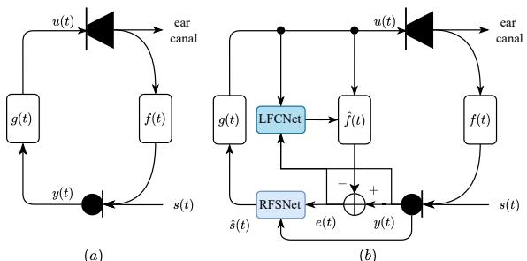
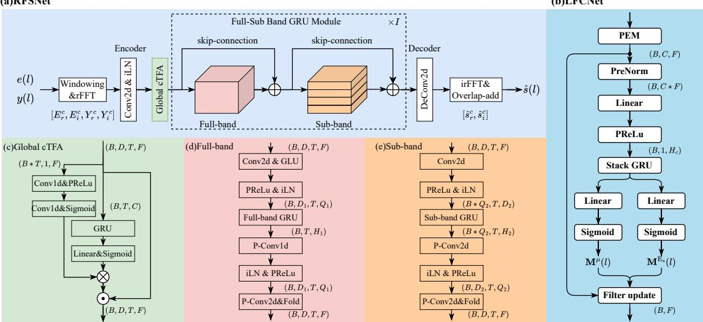
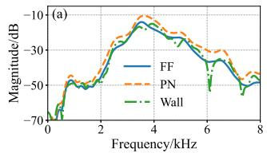
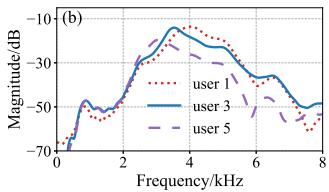

# DEEP LEARNING-BASED JOINT OPTIMIZATION OF ADAPTIVE FEEDBACK CANCELLATION AND RESIDUAL FEEDBACK SUPPRESSION FOR HEARING AIDS

Xiaofan Zhan1,2 Brian C. J. Moore3 Xiaodong Li1,2 Chengshi Zheng1,2,‡

1 Laboratory of Noise and Audio Research, Institute of Acoustics, Chinese Academy of Sciences, Beijing, China

2 University of Chinese Academy of Sciences, Beijing, China

3 Cambridge Hearing Group, Department of Psychology, University of Cambridge, Cambridge, UK

## ABSTRACT

Acoustic feedback remains a fundamental challenge in hearing aids, severely limiting the achievable gain. It has been shown that both traditional and deep learning-based adaptive feedback cancellation (AFC) methods can improve the maximum stable gain by over 10 dB under steady state conditions. However, in practical application scenarios, the process of convergence of AFC when the acoustic environment changes significantly degrades performance. To tackle these issues, this paper proposes JointDFC, a novel two-stage deep learning framework for optimization of feedback control. In the first stage, a linear feedback cancellation network integrates a prediction error method with deep learning. In the second stage, a residual feedback suppression network further suppresses residual feedback and noise components using a global time-frequency attention mechanism and a full-sub band recursive module. A dedicated three-step training strategy is introduced to overcome training difficulties for closed-loop systems. Extensive experiments show that JointDFC outperforms existing baseline methods, particularly in high-gain and/or feedback path-changing scenarios, while maintaining a reasonable computational cost suitable for real-time hearingaid applications.

Index Terms— Joint optimization, feedback control, deep learning, hearing aids

## 1. INTRODUCTION

Acoustic feedback remains a significant challenge in hearing aids. It arises from the inherent acoustic coupling between the receiver and the microphone. This coupling creates a closed-loop system wherein amplified sound is recaptured by the microphone, leading to signal distortion and instability. Without effective control, howling artifacts and oscillation occur [1], severely degrading speech intelligibility and failing to meet the gain requirements of individuals with moderate to severe hearing loss. This challenge is further exacerbated by modern miniaturized and open-fitting designs [2], which increase acoustic coupling. Therefore, developing robust feedback control methods is essential to improve the maximum stable gain (MSG, defined as the maximum amplification gain that can be applied without rendering the system unstable), reduce distortion, and ensure stable amplification in practical hearing aid applications [3].

Over the past five decades, numerous methods have been developed to control acoustic feedback, including gain reduction at the specific frequencies at which feedback occurs [4], phase modulation [5, 6], and adaptive feedback cancellation (AFC) [7]. Although the first two methods are robust and easy to implement, they provide limited improvement in MSG and may also degrade the output sound quality [3]. The AFC method can theoretically eliminate feedback entirely by adaptively modeling the feedback path. However, the closed-loop nature of the system leads to high correlation between the microphone and receiver signals, which makes it more difficult to accurately estimate the acoustic feedback path and cancel the feedback [1].

Recently, learning-based feedback control methods have attracted significant research interest. These have been implemented in two distinct ways. The first method formulates feedback control as an instantaneous speech separation problem. This method employs a neural network to directly map the desired signal from the microphone signal contaminated by feedback [8, 9], collectively referred to as deep acoustic feedback suppression (DeepAFS). Although a closed-loop fine-tuning strategy has been introduced to mitigate the model mismatch encountered during inference [10, 11], this method still suffers from high computational complexity and limited effectiveness in high-gain scenarios. The second method, known as DeepAFC, employs neural networks to enhance traditional AFC performance. Typical strategies include optimizing the step size selection [12, 13] or directly predicting canceler coefficients [14]. However, a major limitation persists: adaptive algorithms struggle during convergence/re-convergence states, which considerably degrades their performance in practice. Moreover, the robustness of DeepAFC requires further improvement.

Given the complementary strengths and limitations of DeepAFS and DeepAFC, we posit that a hybrid framework integrating these two methods holds substantial promise. Notably, similar hybrid paradigms have been extensively investigated in the field of acoustic echo cancellation (AEC), achieving impressive performance [15, 16, 17]. In traditional signal processing-based feedback control methods, feedback cancellation and suppression are often combined to yield superior performance compared with the use of either approach alone. This paper presents the first attempt to incorporate a deep learning framework into the field of integrated feedback cancellation and suppression.

Here, we propose JointDFC, a two-stage deep-learning-based joint feedback control method. Our method divides the feedback control task into two subtasks: linear feedback cancellation (LFC) and residual feedback suppression (RFS). The first stage employs a deep AFC module integrated with the prediction error method (PEM) to remove most acoustic feedback components while preserving the target signal. The second stage processes the feedbackcompensated signal using the RFSNet module, which suppresses residual feedback and environmental noise to enhance output quality and increase the achievable MSG. Furthermore, a global timefrequency attention mechanism is incorporated into the encoded features of RFSNet, enabling more focused suppression of feedback components remaining after the first stage. Accordingly, a novel three-step strategy (individual pre-training, generation of training data, and end-to-end fine-tuning) is proposed to mitigate closed-loop training difficulties and enhance inter-module coordination.

(a)  
  
Fig. 1: Flow of a hearing aid system: (a) without any feedback control method, (b) with the proposed JointDFC method

## 2. PROBLEM STATEMENT

A typical single-channel hearing aid system is illustrated in Fig. 1(a), where t denotes the continuous-time index. The system comprises a microphone, a feedforward processing path represented by $g ( t )$ and a receiver. The input signal $s ( t )$ is picked up by the microphone and processed through $g ( t )$ to produce the receiver signal $u ( t )$ and then transmitted to the ear canal. For simplicity and without loss of generality, the feedforward path is modeled as a linear gain G and a time delay ∆t.

Due to acoustic coupling between the receiver and microphone, the receiver signal inevitably leaks back to the microphone via the feedback path f(t). Thus, the actual microphone signal $y ( t )$ contains both the target signal $s ( t )$ and the feedback component:

$$
y (t) = u (t) * f (t) + s (t) = G \cdot y (t - \Delta t) * f (t) + s (t)\tag{1}
$$

where ∗ denotes linear convolution. This feedback effect causes repeated amplification of the input signal, and it can lead to annoying whistling artifacts and system instability.

## 2.1. Learning-based Feedback Control

Two main deep-learning paradigms have emerged to address the acoustic feedback problem: DeepAFS and DeepAFC.

DeepAFS employs a neural network to directly suppress the feedback signal, as described by:

$$
\hat {s} (t) = \mathbb {N N} \bigl (y (t) \bigr)\tag{2}
$$

With proper training, such as using data generated under ideal feedback control conditions [18] or at marginally stable gain levels [8, 11], the model has proved to be effective in suppressing nonlinear artifacts and whistling. However, it suffers from high computational complexity and limited performance under high gain conditions.

In contrast, DeepAFC focuses solely on modeling the feedback path f(t). It uses neural networks to optimize the gradient descent process in adaptive filtering, allowing fast and accurate estimation of the optimal solution:

$$
\hat {f} (t) = \hat {f} (t - 1) + \mathbb {N N} (\cdot)\tag{3}
$$

$$
\hat {s} (t) = u (t) * (f (t) - \hat {f} (t)) + s (t)\tag{4}
$$

Nevertheless, this method has difficulty tracking rapid changes in the feedback path and variations in the external acoustic environment.

As discussed, DeepAFS and DeepAFC provide distinct yet imperfect solutions to the acoustic feedback problem, and their limitations are often complementary. This provides the motivation for integrating these two methods to leverage their strengths while mitigating their weaknesses.

## 3. PROPOSED METHODS

## 3.1. Overall System

Building upon the complementary strengths and limitations of the DeepAFS and DeepAFC paradigms outlined in Section 2, we propose JointDFC, a novel two-stage learning-based joint framework for acoustic feedback control. The overall system architecture is illustrated in Fig. 1(b).

JointDFC estimates the target signal through two sequential stages, defined as:

$$
\begin{array}{c} e (t) = u (t) * \big (f (t) - \mathbb {N N} _ {\mathrm{c}} \big (u (t), e ^ {*} (t), y (t) \big) \big) + s (t) \\ \hat {s} (t) = \mathbb {N N} _ {\mathrm{s}} \big (e (t), y (t) \big) \end{array}\tag{5}
$$

(6)

where $\mathbb { N } \mathbb { N } _ { \mathrm { c } }$ denotes the Linear Feedback Cancellation Network (LFCNet) and $\mathbb { N } \mathbb { N } _ { \mathrm { s } }$ refers to the Residual Feedback Suppression Network (RFSNet). Here, $e ^ { * } ( t )$ represents the prior error signal.

## 3.2. LPCNet

A deep learning-based PEM-AFC method, introduced in [13], is used to estimate and cancel the linear components of the acoustic feedback in the frequency domain (FD). The structure of this module is illustrated in Fig. 2(b). It optimizes the adaptive update process by improving both the direction and magnitude of stochastic gradient descent.

First, the input signal in frame l is whitened using PEM to reduce the estimation bias caused by signal correlation. Then, the whitened signals undergo online mean normalization [19] and are reduced in dimension to $H _ { c }$ for feature extraction. A stacked Gate Recurrent Unit (GRU) network with hidden dimension $H _ { c }$ is employed to model the convergence state of the adaptive filter. Finally, the optimal step size for each time-frequency (T-F) bin is derived using a step-size mask matrix $\mathbf { M } ^ { \mu }$ and an error signal mask matrix $\mathbf { M } ^ { \mathbf { E } _ { a } }$ The coefficients of the feedback cancellation filter are estimated by reapplying the PEM-AFC update equation [20]. The output of the first stage is then computed using Eq. (5).

## 3.3. RFSNet

Here, we adopt a full-sub band (FSB) cascaded recursive structure as the backbone network, following the model introduced in [21]. The overall architecture is depicted in Fig. 2(a). The model takes as input the compressed real and imaginary (RI) components of both the feedback-compensated signal (from the first-stage cancellation) and the original microphone signal. These components are stacked as input features to estimate the target signal via complex spectral mapping. Within the FSB module, the compressed T-F embeddings extracted by the encoder are progressively refined to capture spectrotemporal dependencies. This design effectively identifies and suppresses howling components, as demonstrated in [11]. To reduce computational overhead and improve suitability for real-time processing on resource-constrained devices like hearing aids, as well as to achieve better integration with LPCNet, we introduce the following modifications.

A global causal time-frequency attention (cTFA) module [22] with low computational complexity is applied to the encoded features through two parallel processing paths along the time and frequency dimensions independently, as shown in Fig. 2(c). This mechanism helps the model to effectively characterize the spectraltemporal states after the initial cancellation filter, thereby facilitating targeted suppression of residual feedback components while avoiding excessive suppression of the desired signal. For greater efficiency, we use only a single-layer block in the FSB module $( I = 1 )$ and employ GRU for temporal modeling. To compensate for the reduced complexity, a gated convolution unit is used in the full-band to improve feature selection, and a point-wise convolution layer is added after the sub-band GRU to enhance cross-channel information exchange.

  
Fig. 2: Overall model structure of the proposed JointDFC, including the residual feedback suppression network (RFSNet) and the linear feedback cancellation network (LFCNet)

## 3.4. Training Details

Prior research has indicated that directly training the DeepAFS model under closed-loop conditions can lead to suboptimal performance [10]. A common practice involves pre-training the model with generated parallel data, followed by closed-loop fine-tuning [11]. Building on this idea, we designed a three-step training procedure for the JointDFC model:

1. First, the LFCNet module was pre-trained using a closed-loop strategy. During this stage, a frozen pre-trained denoising network (identical in structure to RFSNet) was used to process the signal after feedback cancellation.

2. Then, the pre-trained LFCNet was fixed and used to generate parallel signal pairs from the closed-loop system: the signal containing residual feedback and noise, and the clean signal. These paired signals were utilized to train RFSNet in an openloop manner.

3. Finally, the two modules were jointly fine-tuned within the closed-loop system to enhance coordination and overall performance.

The frame lengths for the two stages are denoted $M _ { \mathrm { c } }$ and $M _ { \mathrm { s } } ,$ , respectively. To facilitate closed-loop training of the joint framework, a common frame shift R was used during training, which was set equal to the length of the cancellation filter. To achieve this, RFSNet employed a regular analysis window and a short synthesis window, the same as used in [23]. A modified overlap-add method was applied to reduce the algorithm latency [8]. In our implementation, the parameters were as follows: $M _ { \mathrm { c } } = 8$ ms, $M _ { \mathrm { s } } = 2 0$ ms and $R = 4$ ms, resulting in an algorithmic latency of 8 ms.

The loss function consisted of two components: the normalized Euclidean system distance (NESD) loss [24] for LFCNet, and a composite spectral loss for RFSNet combined spectral magnitude and complex spectrum mean squared error (MSE) terms [8]. The overall loss was defined as:

  
Fig. 3: Amplitude responses of acoustic feedback paths for evaluation. (a) Varying environments; (b) Across users.

$$
\mathcal {L} = \lambda_ {1} \cdot \frac {1}{L} \sum_ {l} \operatorname{NESD} (l) + \lambda_ {2} \cdot \log ((1 - c) \mathcal {L} _ {\mathrm{mag}} + c \mathcal {L} _ {\mathrm{comp}})\tag{7}
$$

where $\lambda _ { 1 } = 0 . 2$ and $\lambda _ { 2 } = 5$ are weighting factors that balance the two loss terms, and $c = 0 . 5$ is the compression coefficient.

## 4. EXPERIMENT

## 4.1. Data Preparation

Training and validation data were derived from the LibriSpeech corpus [25], consisting of 30,000 and 3,000 4-second clean speech sequences, respectively. Of these sequences, 80% were mixed with noise from the DNS Challenge dataset [26] at randomly selected signal-to-noise ratios (SNRs) of {10, 15, 20, 25} dB. Additionally, 10,000 64-tap feedback paths were simulated via the modified formula in [13], each scaled to yield MSG values following a normal distribution $N ( 1 5 , 3 )$ dB. Each speech sequence was paired with two randomly sampled feedback paths, with an abrupt transition occurring randomly over the interval [1, 3] s to mitigate overfitting to fixed transition points. The linear gain G in the feed-forward path was set above the MSG, and varied between −5 dB and 5 dB.

For evaluation, 150 unseen 6-second clean speech sequences were extracted from an unseen subset of LibriSpeech [25]. These test clips were chose to encompass the full range of the convergence and re-convergence processes of the cancellation filter. Feedback paths were sourced from real measured responses [27], as shown in Fig. 3. Each segment was paired with two random feedback paths, with an abrupt transition occurring randomly over the interval [2.5, 3.5] s. Two test sets were constructed: Set A adopted paths from Fig. 3(a), measured from the same ear canal under varying acoustic environments to simulate real-world daily usage for a single user; Set B used paths from Fig. 3(b), measured from different ear canals in a free field to simulate inter-user variability and thus represent a more challenging scenario [28].

Table 1: Performance comparison of the proposed method with baseline and ablation models (gray-highlighted) over two test sets and various gain conditions. Gain values are defined as the excess gain over the MSG without a feedback canceler. Evaluation metrics include number of parameters (Param.), computational complexity (MACs), and three common objective metrics. Best results are marked in bold.

<table><tr><td rowspan="2"></td><td rowspan="2">Methods</td><td rowspan="2">Param. (M)</td><td rowspan="2">MACs (G/s)</td><td colspan="4">WB-PESQ ↑</td><td colspan="4">eSTOI(%) ↑</td><td colspan="4">SI-SDR(dB) ↑</td></tr><tr><td>5 dB</td><td>7 dB</td><td>9 dB</td><td>11 dB</td><td>5 dB</td><td>7 dB</td><td>9 dB</td><td>11 dB</td><td>5 dB</td><td>7 dB</td><td>9 dB</td><td>11 dB</td></tr><tr><td rowspan="5">Set A</td><td>DeepPEM-AFC</td><td>0.240</td><td>0.060</td><td>4.32</td><td>4.23</td><td>3.71</td><td>3.11</td><td>99.24</td><td>98.84</td><td>93.64</td><td>90.87</td><td>19.03</td><td>17.79</td><td>9.80</td><td>-1.85</td></tr><tr><td>DeepAFS</td><td>0.302</td><td>0.319</td><td>4.28</td><td>4.18</td><td>3.90</td><td>3.53</td><td>98.45</td><td>97.90</td><td>96.11</td><td>93.86</td><td>17.62</td><td>16.22</td><td>14.13</td><td>11.39</td></tr><tr><td>JointDFC(proposed)</td><td>0.396</td><td>0.227</td><td>4.30</td><td>4.26</td><td>4.21</td><td>4.12</td><td>98.87</td><td>98.68</td><td>98.40</td><td>98.01</td><td>18.71</td><td>17.95</td><td>17.16</td><td>16.14</td></tr><tr><td>+ w/o Global cTFA</td><td>0.391</td><td>0.224</td><td>4.23</td><td>4.19</td><td>4.13</td><td>4.02</td><td>98.47</td><td>98.27</td><td>97.90</td><td>97.32</td><td>17.74</td><td>17.07</td><td>16.27</td><td>14.98</td></tr><tr><td>+ w/o joint training</td><td>0.396</td><td>0.227</td><td>4.17</td><td>4.13</td><td>4.09</td><td>4.09</td><td>97.80</td><td>97.72</td><td>97.58</td><td>97.51</td><td>13.98</td><td>13.28</td><td>13.03</td><td>13.10</td></tr><tr><td rowspan="5">Set B</td><td>DeepPEM-AFC</td><td>0.240</td><td>0.060</td><td>4.15</td><td>4.04</td><td>3.85</td><td>3.54</td><td>98.62</td><td>98.36</td><td>97.50</td><td>96.00</td><td>16.01</td><td>14.78</td><td>11.53</td><td>6.71</td></tr><tr><td>DeepAFS</td><td>0.302</td><td>0.319</td><td>4.23</td><td>4.13</td><td>3.93</td><td>3.63</td><td>98.36</td><td>97.81</td><td>96.42</td><td>93.97</td><td>17.33</td><td>15.88</td><td>13.83</td><td>10.86</td></tr><tr><td>JointDFC(proposed)</td><td>0.396</td><td>0.227</td><td>4.21</td><td>4.16</td><td>4.11</td><td>4.07</td><td>98.59</td><td>98.39</td><td>98.11</td><td>97.92</td><td>16.91</td><td>15.99</td><td>15.25</td><td>14.66</td></tr><tr><td>+ w/o Global cTFA</td><td>0.391</td><td>0.224</td><td>4.13</td><td>4.07</td><td>4.02</td><td>3.95</td><td>98.13</td><td>97.90</td><td>97.59</td><td>97.12</td><td>16.19</td><td>15.22</td><td>14.47</td><td>13.18</td></tr><tr><td>+ w/o joint training</td><td>0.396</td><td>0.227</td><td>4.12</td><td>4.07</td><td>4.01</td><td>3.95</td><td>97.68</td><td>97.50</td><td>97.21</td><td>96.92</td><td>13.96</td><td>13.16</td><td>12.28</td><td>11.67</td></tr></table>

## 4.2. Training Setting

We set $D = \bar { 1 } 6 , D _ { 1 } \bar { = } 4 , H _ { 1 } = 1 2 8 , D _ { 2 } = 3 2 , H _ { 2 } = 3 2$ in RF-SNet. The parameter settings for LFCNet were the same as in [13]. The feed-forward path time delay ∆t was randomly selected from {0, 1, 2} ms. Combined with the algorithmic latency described in Section 3.4, this ensured that the total latency remained below 10 ms. We used the AdamW optimizer [29] to train the models with an initial learning rate of $1 0 ^ { - 3 }$ over 60 epochs. Early stopping was triggered if no improvement was observed for the validation set for 10 consecutive epochs. The learning rate was reduced by half after two consecutive epochs without improvement. Gradient clipping based on the Euclidean norm was applied with thresholds of 0.2 and 0.5 for LFCNet and RFSNet, respectively. A weight decay of $1 0 ^ { - 7 }$ and a batch size of 128 were used.

For the baseline comparison, we selected two methods to illustrate the importance of joint deep learning models for feedback control: DeepPEM-AFC, using the same configuration as in [13] to demonstrate the necessity of incorporating a residual suppression module; DeepAFS, trained using the same FSB network architecture as RFSNet, along with a closed-loop fine-tuning strategy. Here, we used a two-layer full-sub band module (I = 2), which helped highlight the computational efficiency of the proposed method.

## 4.3. Metrics

Three commonly used objective metrics were used: the Wide-Band Perceptual Evaluation of Speech Quality (WB-PESQ) [30], the extended Short-Time Objective Intelligibility (eSTOI) [31], and the Scale-Invariant Signal-to-Distortion Ratio (SI-SDR) [32], assessing speech quality, speech intelligibility, and the effectiveness of feedback suppression, respectively.

## 5. RESULTS

## 5.1. Quantitative Results

As shown in Table 1, the proposed JointDFC method was compared with two baseline methods under various gain conditions using two test sets. In terms of computational cost, the proposed method requires 0.227 G MACs per second, lower than DeepAFS (0.319 G) and higher than DeepPEM-AFC (0.060 G), indicating moderate computational complexity. Regarding model size, the proposed method contains 0.396 M parameters. Although slightly higher than those of the baselines, this is considered acceptable and is primarily due to the multiple fully connected layers in the LFCNet module.

For Set A, the DeepPEM-AFC method performed better under low-gain conditions, particularly at gains close to those used in training (e.g., 5 dB and 7 dB). This advantage comes from its ability to preserve signal quality and converge quickly, which is why it was chosen as the LFCNet module. In contrast, although Deep-AFS employs a larger model, it did not yield significant performance improvements (combined with Set B). However, DeepAFS exhibited better scene generalization than DeepPEM-AFC, which suffered from substantial performance degradation when the gain exceeded 9 dB. The proposed method, which used a compact RFSNet, achieved comparable performance to the other methods at low gains. As the gain increased, the proposed method demonstrated more pronounced advantages and exhibited minimal performance degradation across all metrics. Moreover, even at 11 dB, the estimated signal maintained high quality (WB-PESQ exceeding 4.0), confirming the effectiveness of the feedback control and its robustness in high-gain scenarios.

For Set B, which involved more challenging inter-user path switching, the proposed method achieved the best overall performance except for a minor disadvantage at a gain of 5 dB compared to DeepAFS, demonstrating strong generalization capability.

## 5.2. Ablation Study

We conducted ablation studies to evaluate the importance of two key components: the global causal T-F attention (w/o Global cTFA) and the joint training strategy (w/o joint training). The latter case uses separately trained LFCNet and RFSNet modules cascaded during inference.

The results showed that removing global cTFA led to performance degradation across all metrics, the largest reduction in WB-PESQ reaching 0.12. This confirms the module’s role in suppressing feedback components. Removing joint training caused a larger performance decrease for low-gain scenarios, where LFCNet converged faster, underscoring the advantage of joint optimization. These findings affirm that both components are essential to the overall system performance.

## 6. CONCLUSIONS

In this paper, we propose a two-stage deep-learning framework for acoustic feedback control in hearing aids that combines linear feedback cancellation with residual feedback suppression. The method significantly outperformed existing baselines under high-gain and dynamic acoustic conditions, as validated through the objective metrics WB-PESQ, eSTOI, and SI-SDR. The ablation study confirmed the importance of the global time-frequency attention mechanism and joint training strategy of the two stages. The proposed method has a reasonable model size and computational cost, making it suitable for practical applications. Future work will focus on further reducing computational complexity, alongside performance validation in real-world scenarios.

## 7. REFERENCES

[1] J. Hellgren and F. Urban, “Bias of Feedback Cancellation Algorithms in Hearing Aids Based on Direct Closed Loop Identification,” IEEE Trans. Speech Audio Process., vol. 9, no. 8, pp. 906–913, 2001.

[2] A. Winkler, M. Latzel, and I. Holube, “Open Versus Closed Hearing-Aid Fittings: A Literature Review of Both Fitting Approaches,” Trends Hear., vol. 20, 2016.

[3] T. V. Waterschoot and M. Moonen, “Fifty Years of Acoustic Feedback Control: State of the Art and Future Challenges,” Proc. IEEE, vol. 99, no. 2, pp. 288–327, 2011.

[4] T. V. Waterschoot and M. Moonen, “Comparative Evaluation of Howling Detection Criteria in Notch-Filter-Based Howling Suppression,” J. Audio Eng. Soc., vol. 58, no. 11, pp. 923–940, 2010.

[5] J. L. Nielsen and U. P. Svensson, “Performance of Some Linear Time-Varying Systems in Control of Acoustic Feedback,” J. Acoust. Soc. Am., vol. 106, no. 1, pp. 240–254, 1999.

[6] E. Berdahl and D. Harris, “Frequency Shifting for Acoustic Howling Suppression,” in DAFx, 2010.

[7] J. A. Maxwell and P. M. Zurek, “Reducing Acoustic Feedback in Hearing Aids,” IEEE Trans. Speech Audio Process., vol. 3, no. 4, pp. 304– 313, 1995.

[8] C. Zheng, M. Wang, X. Li, et al., “A Deep Learning Solution to the Marginal Stability Problems of Acoustic Feedback Systems for Hearing Aids,” J. Acoust. Soc. Am., vol. 152, no. 6, pp. 3616–3634, 2022.

[9] H. Zhang, M. Yu, D. Yu, et al., “Deep AHS: A Deep Learning Approach to Acoustic Howling Suppression,” in ICASSP, 2023, pp. 1–5.

[10] H. Zhang, Y. Zhang, M. Yu, et al., “Advancing Acoustic Howling Suppression Through Recursive Training of Neural Networks,” in ICASSP, 2024.

[11] F. Hao, B. C. J. Moore, H. Zhang, et al., “L3C-DeepMFC: Low-Latency Low-Complexity Deep Marginal Feedback Cancellation with Closed-Loop Fine Tuning for Hearing Aids,” in Interspeech, 2025, pp. 838–842.

[12] B. Soleimani, H. Schepker, and M. Mirbagheri, “Neural-AFC: Learning-Based Step-Size Control for Adaptive Feedback Cancellation with Closed-Loop Model Training,” in ICASSP, 2023, pp. 1–5.

[13] X. Zhan, F. Hao, X. Li, et al., “DeepPEM-AFC: An Improved Prediction-Error-Method-Based Adaptive Feedback Cancellation with Deep Learning for Hearing Aids,” in ICASSP, 2025, pp. 1–5.

[14] E. Lydaki, Z. H. Tan, J. Jensen, et al., “Deep Feedback Cancellation for Hearing Aids with Improved System Stability and Sound Quality,” in ICASSP, 2025, pp. 1–5.

[15] L. Cheng, R. Peng, A. Li, et al., “Deep Learning-Based Stereophonic Acoustic Echo Suppression without Decorrelation,” J. Acoust. Soc. Am., vol. 150, no. 2, pp. 816–829, 2021.

[16] L. Cheng, C. Zheng, A. Li, et al., “A Deep Complex Multi-Frame Filtering Network for Stereophonic Acoustic Echo Cancellation,” in Interspeech, 2022, pp. 2508–2512.

[17] E. Seidel, P. Mowlaee, and T. Fingscheidt, “Efficient High-Performance Bark-Scale Neural Network for Residual Echo and Noise Suppression,” in ICASSP, 2024, pp. 1386–1390.

[18] H. Zhang, Y. X. Zhang, M. Yu, et al., “Enhanced Acoustic Howling Suppression via Hybrid Kalman Filter and Deep Learning Models,” IEEE/ACM Trans. Audio Speech Lang. Process., pp. 2828–2840, 2024.

[19] Y. Xia, S. Braun, C. K. A. Reddy, et al., “Weighted Speech Distortion Losses for Neural-Network-Based Real-Time Speech Enhancement,” in ICASSP, 2020, pp. 871–875.

[20] G. Bernardi, T. Waterschoot, J. Wouters, et al., “An All-Frequency-Domain Adaptive Filter with PEM-Based Decorrelation for Acoustic Feedback Control,” in WASPAA, 2015, pp. 1–5.

[21] Z. Q. Wang, S. Cornell, S. Choi, et al., “Neural Speech Enhancement with Very Low Algorithmic Latency and Complexity via Integrated Full- and Sub-Band Modeling,” in ICASSP, 2023, pp. 1–5.

[22] X. Rong, D. Wang, Y. Hu, et al., “UL-UNAS: Ultra-Lightweight U-Nets for real-time speech enhancement via network architecture search,” 2025.

[23] Z. Q. Wang, G. Wichern, S. Watanabe, et al., “STFT-domain neural speech enhancement with very low algorithmic latency,” IEEE/ACM Trans. Audio Speech Lang. Process., vol. 31, pp. 397–410, 2022.

[24] T. Haubner, A. Brendel, and W. Kellermann, “End-to-End Deep Learning-Based Adaptation Control for Frequency-Domain Adaptive System Identification,” in ICASSP, 2022, pp. 766–770.

[25] V. Panayotov, G. G. Chen, D. Povey, et al., “Librispeech: An ASR Corpus Based on Public Domain Audio Books,” in ICASSP, 2015, pp. 5206–5210.

[26] H. Dubey, A. Aazami, V. Gopal, et al., “ICASSP 2023 Deep Noise Suppression Challenge,” in ICASSP, 2023.

[27] T. Sankowsky-Rothe, M. Blau, H. Schepker, et al., “Reciprocal Measurement of Acoustic Feedback Paths in Hearing Aids,” J. Acoust. Soc. Am., vol. 138, no. 4, pp. EL399–EL404, 2015.

[28] M. Guo, “An Empirical Study on Acoustic Feedback Path Across Hearing Aid Users,” in ICASSP, 2020, pp. 441–445.

[29] I. Loshchilov and F. Hutter, “Decoupled Weight Decay Regularization,” in ICLR, 2017.

[30] A. W. Rix, J. G. Beerends, M. P. Hollier, et al., “Perceptual Evaluation of Speech Quality (PESQ)-A New Method for Speech Quality Assessment of Telephone Networks and Codecs,” in ICASSP, 2001, pp. 749–752.

[31] J. Jensen and C. H. Taal, “An Algorithm for Predicting the Intelligibility of Speech Masked by Modulated Noise Maskers,” IEEE/ACM Trans. Audio Speech Lang. Process., vol. 24, no. 11, pp. 2009–2022, 2016.

[32] J. Le Roux, S. Wisdom, H. Erdogan, et al., “SDR–Half-Baked or Well Done?,” in ICASSP, 2019, pp. 626–630.