# Causality study on a feedforward active noise control headset with different noise coming directions in free field

Limin Zhang*, Xiaojun Qiu

Key Laboratory of Modern Acoustics, Institute of Acoustics, Nanjing University, Nanjing 210093, China

Abstract A systematic analysis is proposed to predict the performance of a typical feedforward single channel ANC headset in terms of the delay, especially the non-causal delay caused by different noise coming directions. First, the performance of a non-causal feedforward system for a band-limited noise is analyzed by using a simplified pure delay model, where it is found that the noise reduction bandwidth is narrowed and the maximum noise reduction is decreased with the increase of the non-causal delay. Second, a systematic method is developed, which can be used to predict the system performance with measured primary and secondary path transfer functions in most practical sound fields and to study the effects of the control filter length and the path delay on the performance. Then, the causality of a typical feedforward active noise control headset with the primary source at $0^{\circ}$ and $90^{\circ}$ positions in an anechoic chamber is analyzed, and the performance for the two locations predicted by the systematic analysis is shown in good agreements with the experiment results. Finally, an experiment of a typical feedforward active noise control headset in a reverberation chamber is carried out, which shows the validity of the proposed systematic analysis for other more practical sound fields.

Key words: feedforward headset; causality; noise reduction; bandwidth; active noise control.

# 1 Introduction

Active noise control (ANC) headsets apply active control technique to reduce low frequency noise in headsets [1], where many methods have been used, such as analogue feedback controller [2], digital feedforward controller [3], and the hybrid controller combining the digital feedforward technique with feedback technique [4]. This paper is focused on a typical feedforward active headset composed by an external reference microphone, an internal error microphone and a secondary source in the earmuff [3], where the reference microphone senses the reference signal, the filtered- $x$ least mean square (FXLMS) algorithm is used to adapt the digital filter driving the secondary source to minimize the mean square of the noise at the error microphone.

The FXLMS algorithm is a popular ANC algorithm due to its robust performance, low computational complexity and ease of implementation. However, the performance depends on many factors, such as the degree of the coherence between the reference signal and the noise signal [5-7], acoustic feedback [7-8], the time-varying property of the primary noise [4, 9], the estimation error between the modeling and practical secondary path [10], and the causality caused by the system delay [5]. For feedforward ANC systems, the primary path contains the acoustic delay from the reference microphone to the error microphone, and the secondary path contains the same kind of acoustic delay from the secondary source to the error microphone and the total electrical system delay from the antialIASing filter, analog to digital (AD) converter, digital to analog (DA) converter, reconstruction filter, and one sampling period for processing etc.. The primary path delay should be larger than the total secondary path delay to guarantee a feedforward control filter have a causal response. This condition is called the causality constraint [11]. For stationary noise cancellation with good coherence between the reference signal and the noise signal and good secondary path modeling,

the causality or the system delay becomes the dominate factor for the control performance [3, 12].

Several studies have demonstrated the effects of the system delay on the performance of feedforward ANC headsets. For example, Rafaely pointed out that the performance of the feedforward ANC headset relied on the timely detection of the reference signal and the delay of the digital system [12]. Brammer et al. showed that shorter distance between the reference and error microphones of feedforward ANC headsets resulted in a correspondingly shorter time available to the controller for executing ANC algorithm [3], so they used a dual-rate sampling system to reduce the delay of the digital system, which involved oversampling the acoustic signals from the reference and error microphones, and updating the control signal to the secondary source at a decimated rate of the external sampling frequency.

Rafaely and Jones have studied the performance of the feedforward ANC headset as functions of the primary source positions in a reverberant chamber and a laboratory room [13]. They pointed out that the performance of the feedforward ANC headset under different head positions was significantly different in the laboratory room and was similar in the reverberant chamber. The significant variation in the attenuation with the head position was qualitatively analyzed as the acoustical delay variation between the reference and the error microphones.

Using the simulation of arbitrary signal delay, such as 5, 0, and $-6$ samples respectively, which might be caused by AD and DA converters etc., Kruger et al. showed that broadband feedforward approaches in the ANC headset were strongly influenced by the delay [14], and they also pointed out that the lack of causality caused by the delay was a problem in digital realizations. In the above studies, it is clear that the delay, such as the electrical delay and the acoustical delay, affects the performance of feedforward ANC headsets. However, there is a lack of systematic analytical method

to quantitatively describe the change of the noise attenuation performance with the delay.

For feedforward ANC systems using the LMS optimization technique, several studies have investigated the effects of the causality constraint. Burdisso et al. carried out causality analysis of feedforward systems subjected to broadband excitations in frequency-domain and predicted the performance of such system in terms of system parameters such as the delay time, damping, spectral content of the input, and filter size, etc. [15]. The analysis showed that the deterioration in the control performance due to the delay in the control path could be at least partially compensated by increasing the filter order.

Janocha and Liu showed in a simulation that the performance was deteriorated as increasing the delay and active noise control systems required a considerable causality margin to perform well, which was explained by an example of the delayed inverse modeling of a non-minimum phase system [16]. Kong and Kuo showed theoretically and numerically that the noise canceling efficiency decreased as the degree of non-causal delay increased and the bandwidth of the noise increased [17].

Tseng et al. studied the performance of a feedforward ANC system as a function of primary source locations in a room [18]. When the primary source reached the bounds of a causal configuration, performance started to decline and declined further as the configuration grew more non-causal. Anderson and Wright compared the performance of an ANC system canceling a periodic disturbance under both causal and non-causal conditions and demonstrated that the computation time for the inverse signal in the non-causal condition was much longer than that in a causal system [19].

Boudier et al. showed the results of a local single channel feedforward control of uncorrelated broadband noise sources (stationary and non-stationary), with various reference configurations (single close reference, single remote reference, multiple remote references) and in three types room

(an anechoic room, a call center with the reverberation time about 0.3 s and a work office with the reverberation time about 1 s) [20]. The influences of the reverberation and of the multiple sources on the coherence and the causality constraints were analyzed by the unconstrained frequency-domain controls and causality constrained time-domain (LMS) controls.

In the existing literatures, the theoretical deteriorated performance is described mainly by the overall noise reduction in a simplified pure delay model of the secondary path. For the noise with a specific bandwidth, the changes of the maximum noise reduction and attenuation bandwidth with the non-causal delay have not been studied. Some literatures have given the performance of a real system by simulations. However, there is a lack of the theoretical analysis on the non-causal performance with both practical primary and secondary paths, which is important for ANC applications.

The application background of this study is to explore whether putting more reference microphones on the earmuff for noise coming from different directions can increase the performance of current ANC headsets, so the aim of this paper is to propose a systematic analysis to predict the performance of the typical feedforward ANC headset in terms of the delay, especially the non-causal delay caused by different noise coming directions. Acoustic delay may be different in various sound fields, as pointed out in reference [13], where two sound fields, the laboratory room and reverberant lab, are discussed. This paper will not discuss the different non-causal delay caused by different acoustic fields, but rather focus on the non-causal performance analysis. To make the analysis clear, the free field is adopted as an example to study the system causality with different noise coming directions. First, the performance as a function of the non-causal delay in a simplified pure delay model is illustrated for a band-limited noise. Second, a systematic method is developed to predict the

system performance with measured primary and secondary path transfer functions in most practical sound fields and to study the effects of the control filter length and the path delay on the performance. Then, experiments with a feedforward ANC headset in an anechoic chamber are carried out to verify the developed formula by analyzing the causality of two different primary noise source locations. Finally, an experiment with a feedforward ANC headset in a reverberation chamber is carried out to illustrate the validity of the proposed systematic method for other more practical sound fields.

# 2 Theoretical analysis and numerical simulations

A block diagram of a feedforward ANC system with the FXLMS algorithm is shown in Fig. 1, where $x(n)$ is the reference signal, $r(n)$ is the filtered reference signal, $d(n)$ is the primary noise at the error microphone location and $e(n)$ is the error signal. $\mathbf{W}(z)$ is the feedforward control filter, $\mathbf{P}(z)$ represents the primary path from the reference microphone to the error microphone and $\mathbf{S}(z)$ represents the secondary path between the control filter output signal and the error input signal (including the propagation from the secondary source to the error microphone, the total electrical system delay in the anti-aliasing filter, AD converter, DA converter, reconstruction filter, and one sampling period for processing). $\hat{\mathbf{S}}(z)$ is assumed to be a perfect model of $\mathbf{S}(z)$ . An ideal feedforward control filter which makes the error signal to zero (may not be realizable in practice due to causality) should satisfy [21]

$$
\mathbf {W} _ {\mathrm {o}} (z) = \mathbf {P} (z) / \mathbf {S} (z), \tag {1}
$$

that is, the control filter has to model $\mathbf{P}(z) / \mathbf{S}(z)$ .

To simplify the analysis, both the primary and secondary paths are first assumed to be pure delays,

$$
\mathbf {P} (z) = z ^ {- \Delta_ {\mathrm {p}}}, \quad \mathbf {S} (z) = z ^ {- \Delta_ {\mathrm {s}}}, \tag {2}
$$

where $\Delta_{\mathrm{p}}$ and $\Delta_{\mathrm{s}}$ are the delay in samples for each path, respectively. Then the ideal feedforward control filter can be written as

$$
\mathbf {W} _ {\mathrm {o}} (z) = z ^ {- \left(\Delta_ {\mathrm {p}} - \Delta_ {\mathrm {s}}\right)} = z ^ {- \delta}. \tag {3}
$$

When $\Delta_{\mathrm{p}} - \Delta_{\mathrm{s}} = \delta \geq 0$ , the ideal feedforward control filter $\mathbf{W}_{\mathbf{o}}(z)$ is a pure delay, which can be realized perfectly by a finite impulse response (FIR) Wiener filter. When $\Delta_{\mathrm{p}} - \Delta_{\mathrm{s}} = \delta < 0$ , the causality constraint is violated and the system in Fig. 1 can be equivalent to a predictor with $\delta$ samples delay.

With $L$ being the length of the control filter, the minimum of the squared error leads to the well-known optimal Wiener-Hopf equation and the solution of the Wiener filter is [22]

$$
\mathbf {w} = \mathbf {R} _ {\mathrm {q}} ^ {- 1} \mathbf {r} _ {\delta}, \tag {4a}
$$

where $\mathbf{w} = [w(0) w(1) w(2) \ldots w(L-1)]^{\mathrm{T}}$ is the vector of the Wiener filter, $\mathbf{R}_{\mathrm{q}}$ is the autocorrelation matrix of a temporary signal $q(n)$ , being equal to $d(n - \delta)$ ,

$$
\mathbf {R} _ {\mathrm {q}} = \left[ \begin{array}{c c c c} r _ {\mathrm {q}} (0) & r _ {\mathrm {q}} (1) & r _ {\mathrm {q}} (2) & \dots r _ {\mathrm {q}} (L - 1) \\ r _ {\mathrm {q}} (1) & r _ {\mathrm {q}} (0) & r _ {\mathrm {q}} (1) & \dots r _ {\mathrm {q}} (L - 2) \\ r _ {\mathrm {q}} (2) & r _ {\mathrm {q}} (1) & r _ {\mathrm {q}} (0) & \dots r _ {\mathrm {q}} (L - 3) \\ \vdots & \vdots & \vdots & \vdots \\ r _ {\mathrm {q}} (L - 1) & r _ {\mathrm {q}} (L - 2) & & \dots r _ {\mathrm {q}} (0) \end{array} \right], \tag {4b}
$$

where $r_{\mathbf{q}}(k)$ ( $k = 0, 1, \ldots, L-1$ ) is the autocorrelation element of $q(n)$ . $\mathbf{r}_{\delta}$ is a vector of the autocorrelation element starting from $\delta$

$$
\mathbf {r} _ {\delta} = \left[ \begin{array}{l l l} r _ {\mathrm {q}} (\delta) & r _ {\mathrm {q}} (\delta + 1) & \dots r _ {\mathrm {q}} (\delta + L - 1) \end{array} \right] ^ {T}. \tag {4c}
$$

The minimum squared error $\varepsilon_{\mathrm{min}}$ can be expressed as

$$
\varepsilon_ {\min } = r _ {\mathrm {q}} (0) - \sum_ {k = 0} ^ {L - 1} w (k) r _ {\mathrm {q}} (k + \delta) = r _ {\mathrm {q}} (0) - \mathbf {r} _ {\delta} ^ {T} \mathbf {R} _ {\mathrm {q}} ^ {- 1} \mathbf {r} _ {\delta}, \tag {5}
$$

and the overall noise reduction $\eta$ in dB can be expressed as a function of the non-causal delay $\delta$

$$
\eta = 1 0 \log_ {1 0} \frac {r _ {\mathrm {q}} (0)}{r _ {\mathrm {q}} (0) - \mathbf {r} _ {\delta} ^ {T} \mathbf {R} _ {\mathrm {q}} ^ {- 1} \mathbf {r} _ {\delta}}, \tag {6}
$$

which is similar to the analysis given in reference [17]. If the primary noise $d(n)$ is broadband white noise, Eq. (6) shows that the overall noise reduction $\eta$ is 0 because the autocorrelation element of $q(n)$ is 0 except the element $r_{\mathrm{q}}(0)$ .

In practical applications, the primary noise $d(n)$ is usually a band-limited noise. Without loss of generality, $q(n)$ is assumed to be a bandwidth noise obtained with one order autoregressive process [23]

$$
q (n) = \alpha q (n - 1) + v (n), 0 <   \alpha <   1, \tag {7}
$$

where $\nu(n)$ is white noise with zero mean and a large $\alpha$ corresponds low frequency cutoff frequency. For example, for $\alpha$ being 0.2, 0.5, 0.7 and 0.9 at a sampling rate of $16\mathrm{kHz}$ , the $-3\mathrm{dB}$ bandwidth is about $5639\mathrm{Hz}$ , $1840\mathrm{Hz}$ , $918\mathrm{Hz}$ and $268\mathrm{Hz}$ , respectively. The corresponding autocorrelation $r_{\mathfrak{q}}(k)$ is equal to $\alpha^k$ , then the overall noise reduction expressed by Eq. (6) is

$$
\eta = 1 0 \log_ {1 0} \frac {1}{1 - \alpha^ {2 \delta} \mathbf {r} _ {0} ^ {T} \mathbf {R} _ {\mathrm {q}} ^ {- 1} \mathbf {r} _ {0}}, \tag {8a}
$$

$$
\mathbf {R} _ {\mathrm {q}} = \left[ \begin{array}{c c c c c} 1 & \alpha & \alpha^ {2} & \dots & \alpha^ {L - 1} \\ \alpha & 1 & \alpha & \dots & \alpha^ {L - 2} \\ \alpha^ {2} & \alpha & 1 & \dots & \alpha^ {L - 3} \\ \vdots & \vdots & & & \vdots \\ \alpha^ {L - 1} & \alpha^ {L - 2} & & \dots & 1 \end{array} \right], \mathbf {r} _ {0} = \left[ \begin{array}{c} 1 \\ \alpha \\ \alpha^ {2} \\ \vdots \\ \alpha^ {L - 1} \end{array} \right], \tag {8b}
$$

and the Wiener filter expressed by Eq. (4) is

$$
\mathbf {w} = \left[ \alpha^ {\delta} \overbrace {0 \cdots 0} ^ {L - 1} \right] ^ {T}. \tag {8c}
$$

It is clear that the optimal performance can be obtained with just one control coefficient. Further increase the length of the Wiener filter does not increase the performance of the system with the simplified pure delay model. It should be noted that one control coefficient is only suitable for the

simplified pure delay model, but more complicated control filters may be required for complicate cases.

Setting the filter length $L$ to 10, Fig. 2 shows the overall noise reduction $\eta$ as a function of the non-causal delay $\delta$ with different bandwidths. The overall noise reduction $\eta$ declines as the increase of the non-causal delay $\delta$ and the bandwidth, agreeing to the results given in reference [17].

The noise reduction spectrum of the non-causal feedforward ANC system can be calculated according to Eq. (8), which is shown in Fig. 3 for the non-causal delay $\delta = 1$ and 2 with $\alpha = 0.9$ . When $\delta = 1$ , the maximum noise reduction is about 20 dB, the attenuation bandwidth is about 2500 Hz and the overall noise reduction is about 7.2 dB. When $\delta = 2$ , the maximum noise reduction is about 15 dB, the attenuation bandwidth is about 1500 Hz and the overall noise reduction is about 4.6 dB. It is clear that both the maximum noise reduction and the attenuation bandwidth decrease as the increase of the non-causal delay $\delta$ . That is, for a band-limited noise, the deteriorated performance caused by the non-causal delay embodies in two aspects: the narrowed attenuation bandwidth and the decreased maximum noise reduction. This deteriorated performance is caused by the difference of the impulse response between the causal Wiener filter of Eq. (8c) and the ideal feedforward control filter of Eq. (3). Larger non-causal delay $\delta$ or smaller $\alpha$ will bring larger difference, which leads to narrower attenuation bandwidth and smaller maximum noise reduction.

The above analysis with a simplified pure delay model shows the deteriorated performance as a function of the non-causal delay. For a practical ANC application, such as a practical ANC headset, it is important to be able to predict the performance with the measured practical primary path and secondary path, as shown in Fig. 1. Let $\mathbf{w}_{\mathrm{s}} = [w_{\mathrm{s}}(0)w_{\mathrm{s}}(1)w_{\mathrm{s}}(2)\dots w_{\mathrm{s}}(L_{\mathrm{s}} - 1)]^{\mathrm{T}}$ be the vector of the secondary path filter, $\mathbf{w}_{\mathrm{p}} = [w_{\mathrm{p}}(0)w_{\mathrm{p}}(1)w_{\mathrm{p}}(2)\dots w_{\mathrm{p}}(L_{\mathrm{p}} - 1)]^{\mathrm{T}}$ be the vector of the primary path filter,

minimizing the squared error leads to the Wiener filter $\mathbf{w} = [w(0)w(1)w(2)\dots w(L - 1)]^{\mathrm{T}}$ as [5]

$$
\mathbf {w} = \left(\mathbf {R} _ {\mathrm {r}}\right) ^ {- 1} \mathbf {r} _ {\mathrm {r d}}, \tag {9}
$$

where $\mathbf{R}_{\mathrm{r}} = E[\mathbf{r}(n)\mathbf{r}^{T}(n)]$ is the autocorrelation matrix of the filtered reference signal vector $\mathbf{r}(n) = [r(n)\dots r(n - L + 1)]^T$ , $\mathbf{r}_{\mathrm{rd}} = E[\mathbf{r}(n)d(n)]$ is the cross-correlation vector between the filtered reference signal vector $\mathbf{r}(n)$ and the primary noise $d(n)$ , and $\mathbf{r}(n)$ can be expressed as

$$
\mathbf {r} (n) = \mathbf {S} \mathbf {x}, \tag {10a}
$$

$$
\mathbf {S} = \left[ \begin{array}{c c c c c c c c} w _ {\mathrm {s}} (0) & w _ {\mathrm {s}} (1) & w _ {\mathrm {s}} (2) & \dots & w _ {\mathrm {s}} \left(L _ {\mathrm {s}} - 1\right) & 0 & \dots & 0 \\ 0 & w _ {\mathrm {s}} (0) & w _ {\mathrm {s}} (1) & & \dots & w _ {\mathrm {s}} \left(L _ {\mathrm {s}} - 1\right) & 0 & \dots & 0 \\ & \vdots & & & & \vdots & & \\ 0 & \dots & & 0 & & \dots & & w _ {\mathrm {s}} \left(L _ {\mathrm {s}} - 1\right) \end{array} \right] _ {L \times \left(L + L _ {\mathrm {s}} - 1\right)}, \tag {10b}
$$

$$
\mathbf {x} = \left[ x (n) x (n - 1) \dots x (n - L - L _ {s} + 2) \right] ^ {T}, \tag {10c}
$$

Then $\mathbf{R}_{\mathrm{r}}$ follows to

$$
\mathbf {R} _ {\mathrm {r}} = \mathbf {S} \mathbf {R} _ {\mathrm {x}, L + L _ {\mathrm {s}} - 1} \mathbf {S} ^ {T}, \tag {11}
$$

where $\mathbf{R}_{\mathbf{x},L + Ls - 1}$ is the autocorrelation matrix of the reference signal vector $\mathbf{x}$ . The primary noise $d(n)$ can be written as

$$
d (n) = \sum_ {k = 0} ^ {L _ {\mathrm {p}} - 1} w _ {\mathrm {p}} (k) x (n - k), \tag {12}
$$

and the element in the vector $\mathbf{r}_{\mathrm{rd}}$ can be written as

$$
r _ {\mathrm {r d}} (i) = \mathbf {w} _ {\mathrm {s}} ^ {T} \left[ \begin{array}{c c c c} r _ {\mathrm {x}} (i) & r _ {\mathrm {x}} (i - 1) & \dots & r _ {\mathrm {x}} (i - L _ {\mathrm {p}} + 1) \\ r _ {\mathrm {x}} (i + 1) & r _ {\mathrm {x}} (i) & \dots & r _ {\mathrm {x}} (i - L _ {\mathrm {p}} + 2) \\ \vdots & \vdots & & \vdots \\ r _ {\mathrm {x}} (i + L _ {\mathrm {s}} - 1) & r _ {\mathrm {x}} (i + L _ {\mathrm {s}} - 2) & \dots & r _ {\mathrm {x}} (i - L _ {\mathrm {p}} + L _ {\mathrm {s}}) \end{array} \right] \mathbf {w} _ {\mathrm {p}}, i = 0, \dots , L - 1, \tag {13}
$$

where $r_{\mathrm{x}}(\bullet)$ is the autocorrelation element of the reference signal $x(n)$ . The overall noise reduction $\eta$ in dB can be expressed as

$$
\eta = 1 0 \log_ {1 0} \frac {r _ {\mathrm {d}} (0)}{r _ {\mathrm {d}} (0) - \left(\mathbf {r} _ {\mathrm {r d}}\right) ^ {T} \left(\mathbf {S R} _ {\mathrm {x} , L + L _ {\mathrm {s}} - 1} \mathbf {S} ^ {T}\right) ^ {- 1} \mathbf {r} _ {\mathrm {r d}}}, \tag {14a}
$$

$$
r _ {\mathrm {d}} (0) = \mathbf {w} _ {\mathrm {p}} ^ {T} \mathbf {R} _ {\mathrm {x}, L _ {\mathrm {p}}} \mathbf {w} _ {\mathrm {p}}, \tag {14b}
$$

$$
\mathbf {R} _ {\mathrm {x}, L _ {\mathrm {p}}} = \left[ \begin{array}{c c c c} r _ {\mathrm {x}} (0) & r _ {\mathrm {x}} (1) & r _ {\mathrm {x}} (2) & \dots r _ {\mathrm {x}} \left(L _ {\mathrm {p}} - 1\right) \\ r _ {\mathrm {x}} (1) & r _ {\mathrm {x}} (0) & r _ {\mathrm {x}} (1) & \dots r _ {\mathrm {x}} \left(L _ {\mathrm {p}} - 2\right) \\ r _ {\mathrm {x}} (2) & r _ {\mathrm {x}} (1) & r _ {\mathrm {x}} (0) & \dots r _ {\mathrm {x}} \left(L _ {\mathrm {p}} - 3\right) \\ \vdots & \vdots & \vdots & \vdots \\ r _ {\mathrm {x}} \left(L _ {\mathrm {p}} - 1\right) & r _ {\mathrm {x}} \left(L _ {\mathrm {p}} - 2\right) & \dots & r _ {\mathrm {x}} (0) \end{array} \right]. \tag {14c}
$$

Therefore, the up limited performance of a practical ANC system with the measured primary path and secondary path can be predicted by Eqs. (9) - (14), which apply to both causal and non-causal single channel systems in various acoustic fields.

For a practical primary path and a simple secondary path with pure $\Delta_{s}$ delay, the Wiener filter expressed by Eqs. (9), (10), (11) and (13) can be simplified as

$$
\mathbf {w} = \left(\mathbf {R} _ {\mathrm {x}, L}\right) ^ {- 1} \mathbf {R} _ {\Delta s} \mathbf {w} _ {\mathrm {p}}, \tag {15a}
$$

$$
\mathbf {R} _ {x, L} = \left[ \begin{array}{c c c c} r _ {\mathrm {x}} (0) & r _ {\mathrm {x}} (1) & r _ {\mathrm {x}} (2) & \dots r _ {\mathrm {x}} (L - 1) \\ r _ {\mathrm {x}} (1) & r _ {\mathrm {x}} (0) & r _ {\mathrm {x}} (1) & \dots r _ {\mathrm {x}} (L - 2) \\ r _ {\mathrm {x}} (2) & r _ {\mathrm {x}} (1) & r _ {\mathrm {x}} (0) & \dots r _ {\mathrm {x}} (L - 3) \\ \vdots & \vdots & \vdots & \vdots \\ r _ {\mathrm {x}} (L - 1) & r _ {\mathrm {x}} (L - 2) & & \dots r _ {\mathrm {x}} (0) \end{array} \right], \tag {15b}
$$

$$
\mathbf {R} _ {\Delta s} = \left[ \begin{array}{c c c c c} r _ {\mathrm {x}} \left(\Delta_ {\mathrm {s}}\right) & r _ {\mathrm {x}} \left(\Delta_ {\mathrm {s}} - 1\right) & r _ {\mathrm {x}} \left(\Delta_ {\mathrm {s}} - 2\right) & \dots & r _ {\mathrm {x}} \left(\Delta_ {\mathrm {s}} - L _ {\mathrm {p}} + 1\right) \\ r _ {\mathrm {x}} \left(\Delta_ {\mathrm {s}} + 1\right) & r _ {\mathrm {x}} \left(\Delta_ {\mathrm {s}}\right) & r _ {\mathrm {x}} \left(\Delta_ {\mathrm {s}} - 1\right) & \dots & r _ {\mathrm {x}} \left(\Delta_ {\mathrm {s}} - L _ {\mathrm {p}} + 2\right) \\ \vdots & \vdots & \vdots & & \vdots \\ r _ {\mathrm {x}} \left(\Delta_ {\mathrm {s}} + L - 1\right) & r _ {\mathrm {x}} \left(\Delta_ {\mathrm {s}} + L - 2\right) & \dots & r _ {\mathrm {x}} \left(\Delta_ {\mathrm {s}} - L _ {\mathrm {p}} + L\right) \end{array} \right], \tag {15c}
$$

which is same to that given in reference [17].

For a practical secondary path and a simple primary path with pure $\Delta_{\mathrm{p}}$ delay, the Wiener filter expressed by Eqs. (9), (10), (11) and (13) is

$$
\mathbf {w} = \left(\mathbf {S} \mathbf {R} _ {\mathrm {x}, L + L _ {\mathrm {s}} - 1} \mathbf {S} ^ {T}\right) ^ {- 1} \mathbf {R} _ {\Delta \mathrm {p}} \mathbf {w} _ {s}, \tag {16a}
$$

$$
\mathbf {R} _ {\Delta \mathrm {p}} = \left[ \begin{array}{c c c c} r _ {\mathrm {x}} (- \Delta_ {\mathrm {p}}) & r _ {\mathrm {x}} (1 - \Delta_ {\mathrm {p}}) & \dots & r _ {\mathrm {x}} \left(L _ {\mathrm {s}} - 1 - \Delta_ {\mathrm {p}}\right) \\ r _ {\mathrm {x}} (1 - \Delta_ {\mathrm {p}}) & r _ {\mathrm {x}} (2 - \Delta_ {\mathrm {p}}) & \dots & r _ {\mathrm {x}} \left(L _ {\mathrm {s}} - \Delta_ {\mathrm {p}}\right) \\ \vdots & \vdots & & \vdots \\ r _ {\mathrm {x}} (L - 1 - \Delta_ {\mathrm {p}}) & r _ {\mathrm {x}} (L - \Delta_ {\mathrm {p}}) & \dots & r _ {\mathrm {x}} \left(L + L _ {\mathrm {s}} - 2 - \Delta_ {\mathrm {p}}\right) \end{array} \right], \tag {16b}
$$

and the overall noise reduction $\eta$ in dB can be expressed as

$$
\eta = 1 0 \log_ {1 0} \frac {r _ {\mathrm {x}} (0)}{r _ {\mathrm {x}} (0) - \left(\mathbf {R} _ {\Delta \mathrm {p}} \mathbf {w} _ {\mathrm {s}}\right) ^ {T} \left(\mathbf {S R} _ {\mathrm {x} , L + L _ {\mathrm {s}} - 1} \mathbf {S} ^ {T}\right) ^ {- 1} \mathbf {R} _ {\Delta \mathrm {p}} \mathbf {w} _ {\mathrm {s}}}. \tag {17}
$$

If the reference signal $x(n)$ is broadband white noise, the autocorrelation elements of $x(n)$ are zero except the element $r_{\mathrm{x}}(0)$ being 1. Then, Eqs. (16) and (17) can be simplified as

$$
\mathbf {w} = \left(\mathbf {S} \mathbf {S} ^ {T}\right) ^ {- 1} \mathbf {w} _ {\mathrm {s p}}, \tag {18a}
$$

$$
\eta = 1 0 \log_ {1 0} \frac {1}{1 - \mathbf {w} _ {\mathrm {s p}} ^ {T} \left(\mathbf {S S} ^ {T}\right) ^ {- 1} \mathbf {w} _ {\mathrm {s p}}}, \tag {18b}
$$

$$
\mathbf {w} _ {\mathrm {s p}} = \left[ w _ {\mathrm {s}} \left(\Delta_ {\mathrm {p}}\right) w _ {\mathrm {s}} \left(\Delta_ {\mathrm {p}} - 1\right) \dots w _ {\mathrm {s}} (0) \overbrace {0 \cdots 0} ^ {L - \Delta_ {\mathrm {p}} - 1} \right] ^ {T}, \Delta_ {\mathrm {p}} <   L _ {\mathrm {s}} - 1, \Delta_ {\mathrm {p}} <   L - 1, \tag {18c}
$$

where $\mathbf{S}$ is expressed by Eq. (10b). Eq.(18) shows that the overall noise reduction depends on the primary path delay $\Delta_{\mathrm{p}}$ and the control filter length $L$ . If the control filter length $L$ is large, the increase of the primary path delay $\Delta_{\mathrm{p}}$ makes $\mathbf{w}_{\mathrm{sp}}$ contain more elements in the secondary path filter $\mathbf{w}_{\mathrm{s}}$ , resulting in an improvement of the noise reduction. Usually, the secondary path delay $\Delta_{\mathrm{s}}$ can be roughly estimated by the tap with the maximum value in the secondary path filter $\mathbf{w}_{\mathrm{s}}$ . To obtain good performance, $\mathbf{w}_{\mathrm{sp}}$ had better contain most elements with larger values in the secondary path filter $\mathbf{w}_{\mathrm{s}}$ , which requires that the primary path delay $\Delta_{\mathrm{p}}$ should be larger than the secondary path delay $\Delta_{\mathrm{s}}$ by a certain value. On the other hand, the control filter length $L$ should be sufficient long to allow larger $\Delta_{\mathrm{p}}$ and more effective elements in $\mathbf{w}_{\mathrm{sp}}$ and $\mathbf{w}$ .

A practical secondary path in a feedforward ANC headset is used to further illustrate the performance in terms of the primary path delay $\Delta_{\mathrm{p}}$ and the control filter length $L$ for the system with

Eq. (18). The way to measure and identify the secondary path in the ANC headset will be given in section 3.1 in detail. Fig. 4(a) shows the practical secondary path measured in the ANC headset, where $\Delta_{\mathrm{s}}$ is about 6 samples because the $7^{\mathrm{th}}$ tap has the maximum value. The coefficients of the secondary path filter after the $50^{\mathrm{th}}$ sample are already very small and the length of the secondary path filter is set to 128. If the reference signal is broadband white noise, Fig. 4(b) shows the performance as functions of the primary path delay $\Delta_{\mathrm{p}}$ and control filter length $L$ . It is clear that the attenuation performance is almost near zero for the primary path delay $\Delta_{\mathrm{p}}$ less than 4 because of non-causality, where $\mathbf{w}_{\mathrm{sp}}$ only contains the first 5 elements in the secondary path filter $\mathbf{w}_{\mathrm{s}}$ . The performance is improved rapidly with the increase of the primary path delay from 5 to 15, because $\mathbf{w}_{\mathrm{sp}}$ is containing the elements from tap 6 to 16 with larger values in the secondary path filter $\mathbf{w}_{\mathrm{s}}$ .

Fig. 4(b) also shows that larger control filter length sometimes can improve the performance for system with large $\Delta_{\mathrm{p}}$ , but has no effect for small $\Delta_{\mathrm{p}}$ especially those less than $\Delta_{\mathrm{s}}$ because of the non-causality. These can be interpreted by the impulse responses of the control filter $\mathbf{w}$ for different $\Delta_{\mathrm{p}}$ shown in Fig. 5, where the impulse responses of the control filter $\mathbf{w}$ with the length $L = 128$ have different shapes for three $\Delta_{\mathrm{p}}$ [24]. With $\Delta_{\mathrm{p}}$ being 50, the impulse response of the control filter $\mathbf{w}$ is complete, which corresponds to the best performance. With $\Delta_{\mathrm{p}}$ being 10, the front part of the impulse response $\mathbf{w}$ is missing, which leads to a poor performance and a larger $L$ cannot improve the performance. When $\Delta_{\mathrm{p}}$ is 127, the latter part of the impulse response $\mathbf{w}$ is pushed out the window, which leads to a declined performance and a larger $L$ of 256 or 512 can improve the performance as shown in Fig. 4(b).

# 3 Experiments

# 3.1 Setup in free field

The experimental setup includes a primary source, a feedforward ANC headset with one reference microphone, one secondary source and one error microphone, where two primary source positions of $0^{\circ}$ and $90^{\circ}$ are used as examples to investigate the performance with the delay caused by different noise coming directions. The experiments are carried out in free field as an example to study the system causality with different noise coming directions.

Fig. 6 shows a closed-back ANC headset fitted to a head and torso simulator B&K 4128C in the anechoic chamber of Nanjing University, and only the right side of the headset is used in the experiments. In the earmuff, the error microphone is about $2\mathrm{cm}$ away from the secondary source. The reference microphone is located centrally on the outer side of the earmuff and is about $5\mathrm{cm}$ away from the error microphone. The primary source is placed about $50\mathrm{cm}$ away from the right earmuff, ensuring the direct sound field is dominant. $l_{1}$ represents the distance between the primary source and reference microphone, and $l_{2}$ represents the distance between the primary source and error microphone.

A commercial active noise controller embed with the FXLMS algorithm is used in the experiments[25], where the sampling rate is $16\mathrm{kHz}$ , and the lengths of the secondary and primary path filters are 256 taps. It has been found that further increasing the control filter length does not increase the performance of the system significantly, so the length of the control filter is set to 256.

To predict the theoretical performance expressed by Eqs. (9) - (14), the reference signal $x(n)$ and the primary noise at the error microphone location $d(n)$ should be obtained, the secondary path filter $\mathbf{w}_{\mathrm{s}}$ and the primary path filter $\mathbf{w}_{\mathrm{p}}$ are also required. A broadband white noise with a bandwidth of 100

- $4000\mathrm{Hz}$ is fed to the primary source, the signal measured by the reference microphone and the error microphone is recorded by B&K 3560D as the reference signal $x(n)$ and the primary noise at the error microphone location $d(n)$ , respectively. The recorded signals $x(n)$ and $d(n)$ are also used as the input and output signal for the Wiener method to identify the primary path filter $\mathbf{w}_{\mathrm{p}}$ .

A separate experiment is carried out to measure the secondary path similarly. To include the total electrical system delay in the secondary path, a broadband white noise with a bandwidth of $100 - 4000\mathrm{Hz}$ is used as the secondary source input via the control system, in which the input data is assigned to the output data directly. The input white noise and the noise measured by the error microphone are recorded and used as the input and output signal for the Wiener method to identify the secondary path filter $\mathbf{w}_{\mathrm{s}}$ .

The secondary path delay $\Delta_{\mathrm{s}}$ and the primary path delay $\Delta_{\mathrm{p}}$ can be estimated using the correlation method [26] or the method mentioned in section 2. By using the recorded data for identifying the secondary path filter, the secondary path delay $\Delta_{\mathrm{s}}$ is estimated to be about 6 samples. Similarly, the primary path delay $\Delta_{\mathrm{p}}$ of two primary source locations is estimated to be 7 samples and 5 samples for $0^{\circ}$ and $90^{\circ}$ positions, respectively. Therefore, the active headset system is causal for the primary source at $0^{\circ}$ position and non-causal for the primary source at $90^{\circ}$ position.

As shown in Fig. 6, $l_{1}$ is the distance between the primary source and the reference microphone, and $l_{2}$ is the distance between the primary source and the error microphone. The primary path delay $\Delta_{\mathrm{p}}$ can be calculated by

$$
\Delta_ {\mathrm {p}} = \left[ \left(l _ {2} - l _ {1}\right) / c + t _ {\mathrm {a}} \right] f _ {\mathrm {s}}, \tag {19}
$$

where $c$ is the speed of sound (about $340~\mathrm{m / s}$ in the air), $f_{\mathrm{s}}$ is the system sampling rate (16 kHz) and $t_{\mathrm{a}}$ is the delay caused by the earmuff of the headset, which may be slightly different for different source

positions [13]. For the primary source at $0^{\circ}$ position, $l_{1}$ is about $45~\mathrm{cm}$ , $l_{2}$ is about $50~\mathrm{cm}$ , then $t_{\mathrm{a}}$ is about $0.29~\mathrm{ms}$ calculated according to Eq. (19) for the estimated delay $\Delta_{\mathrm{p}}$ about 7 samples. For the primary source at $90^{\circ}$ position, $l_{1}$ is about $50~\mathrm{cm}$ , $l_{2}$ is about $48~\mathrm{cm}$ . To simplify the analysis, under the assumption that $t_{\mathrm{a}}$ is the same as that of the primary source at $0^{\circ}$ position, the calculated delay $\Delta_{\mathrm{p}}$ according to Eq. (19) is about 4.6 samples, which agrees roughly with the estimated 5 samples delay for the primary source at $90^{\circ}$ position. Therefore, the non-causality for the primary source at $90^{\circ}$ position mainly comes from the reduced delay difference between the primary noise source to the reference and error microphones.

It should be noted that the above causality conclusion holds only for this specific physical configuration in free field. Other physical configuration, such as multiple paths between multiple primary sources and reference microphones, may change the causality. Furthermore, different sound field might change the delay difference between the primary noise source to the reference and error microphones for different noise coming directions, such as the reverberant field and laboratory room studied in reference [13], where it is shown that the properties of the surrounding sound field does not change significantly as functions of directions in the reverberant sound field, but change significantly in the laboratory room.

# 3.2 Results and discussions in free field

Fig. 7(a) shows the predicted results for the performance of the feedforward headset with the primary source at $0^{\circ}$ position. The power spectral density before active control but with passive attenuation is shown in Fig. 7(a) (solid line), where it can be found that the passive control has effective noise reduction at high frequencies, especial above $2400\mathrm{Hz}$ . For active noise control, the maximum noise reduction is about 20 dB, the attenuation bandwidth is mainly below $1500\mathrm{Hz}$ and

the overall noise reduction is about $11.8\mathrm{dB}$ . It should be noted that because the primary noise in the headset is already quite low at the band above $2400\mathrm{Hz}$ , so the little increase of the power spectral density caused by the active control after $2400\mathrm{Hz}$ does not affect the overall noise level in the headset significantly.

Fig. 7(b) shows the experiment results for the performance of the feedforward headset with the primary source at $0^{\circ}$ position. For active noise control, the maximum noise reduction is about 20 dB, the attenuation bandwidth is mainly below 1500 Hz and the overall noise reduction is about 12.2 dB, which agree well with the predicted results shown in Fig. 7(a). Similarly, because the power spectral density above 2400 Hz before active control is very small, the little increase of active noise reduction spectrum above 2400 Hz does not affect the overall noise level in the headset significantly, however they are not removed from the figure to give the whole picture.

Fig. 8(a) shows the predicted results for the performance of the feedforward headset with the primary source at $90^{\circ}$ position. For active noise control, the maximum noise reduction is about 12 dB, the attenuation bandwidth is mainly below $1300\mathrm{Hz}$ and the overall noise reduction is about 6.3 dB. Compared with the predicted results for the primary source at $0^{\circ}$ position shown in Fig. 7(a), the maximum noise reduction decreases about 8 dB, the attenuation bandwidth narrows about $200\mathrm{Hz}$ , and the overall noise reduction declines about 5.5 dB.

Fig. 8(b) shows the experiment results for the performance of the feedforward headset with the primary source at $90^{\circ}$ position. For active noise control, the maximum noise reduction is about 12 dB, the attenuation bandwidth is mainly below $1000\mathrm{Hz}$ and the overall noise reduction is about 5.6 dB, which agree with the predicted results shown in Fig. 8(a). Compared with the experiment results for the primary source at $0^{\circ}$ position shown in Fig. 7(b), the maximum noise reduction decreases

about 8 dB, the attenuation bandwidth narrows about $500\mathrm{Hz}$ , and the overall noise reduction declines about 6.6 dB.

The analysis on the delay of the primary and secondary paths in section 3.1 shows that the primary path delay losses 2 samples after the primary source changes from $0^{\circ}$ position to $90^{\circ}$ position, which leads to the non-causality of the active headset system. If the primary path delay of the primary source at $0^{\circ}$ position is decreased to 5 samples by advancing 2 samples in the processed data, the predicted results of the attenuation performance for this situation are shown in Fig. 9 ( $0^{\circ}$ position with 5 samples, dash-dotted line). The maximum noise reduction is about 11 dB, the attenuation bandwidth is mainly below $1300\mathrm{Hz}$ and the overall noise reduction is about 5.4 dB, which agree well with those for the primary source at $90^{\circ}$ position, as shown in Fig. 9 ( $90^{\circ}$ position with 5 samples, dashed line).

On the contrary, if the primary path delay of the primary source at $90^{\circ}$ position is increased to 7 samples by adding 2 samples delay in the processed data, the predicted results of the attenuation performance for this situation are shown in Fig. 9 ( $90^{\circ}$ position with 7 samples, dotted line). The maximum noise reduction is about 20 dB, the attenuation bandwidth is mainly below $1500\mathrm{Hz}$ and the overall noise reduction is about 12.5 dB, which agree well with those for the primary source at $0^{\circ}$ position, as shown in Fig. 9 ( $0^{\circ}$ position with 7 samples, solid line). These two predicted results further verify that the declined attenuation performance of the feedforward headset with the primary source at $90^{\circ}$ position is caused by the decreased delay in the primary path, which conforms to the analysis given in section 2.

# 3.3 Experiments in reverberation field

To further illustrate the validity of the systematic analysis proposed in the paper for other more

practical sound fields, an experiment in a reverberation chamber is carried out.

In the reverberation chamber of Nanjing University, which has a dimensions of about $5.8\mathrm{m}\times 5.7$ $\mathrm{m}\times 5.5\mathrm{m}$ and a reverberation time of about $10~s$ , two primary loudspeakers are placed in the chamber corners respectively, about $3.6\mathrm{m}$ away from headset to ensure the reverberation sound field is dominant, as illustrated in Fig. 10. The configuration of reference microphone, error microphone and secondary source and the control setup are the same as those of Fig. 6.

By using the recorded data, the secondary path delay $\Delta_{\mathrm{s}}$ is estimated to be about 6 samples and the primary path delay $\Delta_{\mathrm{p}}$ is estimated to be 7 samples, which indicates that the system is mainly causal. The reverberant sound field is composed of many plane waves arriving from various directions so the noise coming direction is independent of the primary source positions. Under this situation, most of sound propagated to the error microphone meets the causality requirements, so the system is almost causal.

Fig. 11 (a) shows the predicted results of the feedforward headset by using Eqs. (9) - (14), where the maximum noise reduction is about $20\mathrm{dB}$ , the attenuation bandwidth is mainly below $1200\mathrm{Hz}$ and the overall noise reduction is about $13.0\mathrm{dB}$ . Fig. 11 (b) shows the experiment results for the performance of the feedforward headset, where the maximum noise reduction is about $20\mathrm{dB}$ , the attenuation bandwidth is mainly below $1000\mathrm{Hz}$ and the overall noise reduction is about $11.7\mathrm{dB}$ . The experiment results agree well with the predicted results shown in Fig. 11 (a), which further verify that the systematic analysis proposed in the paper can be applied to practical sound fields.

# 4 Conclusions

This paper proposes a systematic analysis to predict the performance of the typical feedforward ANC headset in terms of the delay, especially the non-causal delay caused by different noise coming

directions. First, the performance of a non-causal feedforward system for a band-limited noise is analyzed by using a simplified pure delay model, and it is shown that the noise reduction bandwidth is narrowed and the maximum noise reduction is declined with the increase of the non-causal delay. Second, a systematic method is developed to predict the system performance with practical measured primary and secondary paths in most practical sound fields. It is found that the increase of the control filter length can not improve the non-causal performance and a causal margin is required to ensure a better performance. Then, the causality of a typical feedforward headset with the primary source at $0^{\circ}$ and $90^{\circ}$ positions in an anechoic chamber is analyzed, and it is found that the active headset system with the primary source at $90^{\circ}$ position is non-causal for this specific physical configuration and sound field, which is the main reason for its performance deterioration. Finally, an experiment of a typical feedforward headset in a reverberation chamber illustrates that the systematic analysis method proposed in this paper can be applied to not only the free field but also more practical sound fields. The non-causality of a feedforward ANC system may be improved from changing the physical configuration of the system, such as using multiple reference microphones in the ANC headset system or increasing the acoustical propagation time from the reference microphone to the error microphone.

# Acknowledgements

Project NSFC (No.11004101), Project BK20130548 and the Fundamental Research Funds for the Central Universities (1093020403).

# References

[1] B. Rudzyn and M. Fisher, Performance of personal active noise reduction devices. Appl. Acoust.

73 (2012) 1159 - 1167.

[2] M. Pawelczyk, Analogue active noise control. Appl. Acoust. 63 (2002) 1193 - 1213.   
[3] A. J. Brammer, G. J. Pan, and R. B. Crabtree, Adaptive feedforward active noise reduction headset for low-frequency noise. Proc. Active 97 Conference, Budapest, Hungary, 365 - 372.   
[4] L. E. Ray, J. A. Solbeck and R. D. Collier, Hybrid feedforward-feedback active noise control for hearing protection and communication. Meeting Proceedings RTO-MP-HFM-123, Neuilly-sur-Seine, France, 2005.   
[5] S. J. Elliot, Signal Processing for Active Control. Academic Press, New York, 2000.   
[6] M. T. Akhtar and W. Mitsuhashi, Improving performance of hybrid active noise control systems for uncorrelated narrowband disturbances. IEEE Trans. Speech, Audio Process 19 (2011) 2059 - 2066.   
[7] M. Pawelczyk, Active noise control- A review of control-related problems. Arch. Acoust. 33(2008) 414 - 424.   
[8] M. O. Tokhi and R. R. Leitch, The robust design of active noise control system based on relative stability measures. J. Acoust. Soc. Am. 90 (1991) 334 - 345.   
[9] D. A. Cartes, L. R. Ray and R. D. Collier, Experimental evaluation of leaky least-mean-square algorithms for active noise reduction in communication headsets. J. Acoust. Soc. Am. 111 (2002) 1758 - 1771.   
[10] M. Wu, X. Qiu and G. Chen, The statistical behavior of phase error for deficient-order secondary path modeling. IEEE Signal Process. Lett. 15 (2008) 313-316.   
[11] P. A. Nelson, S. J. Elliot, Active Control of Sound. Academic Press, New York, 1992.   
[12] B. Rafaely, Active noise reducing headset – an overview. The 2001 International Congress and Exhibition on Noise Control Engineering, Hague, Netherlands, August 27 – 30, 2001.   
[13] B. Rafaely and M. Jones, Combined feedback-feedforward active noise-reducing headset – The effect of the acoustics on broadband performance. J. Acoust. Soc. Am. 112 (2002) 981 – 989.

[14] H. Kruger, M. Jeub, T. Schumacher, P. Vary and C. Beaugeant, Investigation and development of digital active noise control headsets. International Workshop on Acoustic Echo and Noise Control (IWAENC), Tel Aviv, Israel, August, 2010.   
[15] R. A. Burdisso, J. S. Vipperman and C. R. Fuller, Causality analysis of feedforward-controlled systems with broadband inputs. J. Acoust. Soc. Am. 94 (1993) 234 - 242.   
[16] H. Janocha and B. Liu, Simulation approach and causality evaluation for an active noise control system. IEEE Proc. Control Theory Appl. 145(1998) 423 - 426.   
[17] X. Kong and S. M. Kuo, Study of causality constraint on feedforward active noise control systems. IEEE Trans. Circuits Syst. - II, 46 (1999) 183 - 186.   
[18] W. K. Tseng, B. Rafaely and S. J. Elliot, Combined feedback – feedforward active control of sound in a room. J. Acoust. Soc. Am. 104 (1998) 3417 – 3425.   
[19] E. Anderson and A. B. Wright, Study of causal component placement in an active sound cancellation system. J. Ark. Acad. Sci. 60 (2006) 20 - 26.   
[20] A. Boudier, E. Friot and C. Pinhede, Acoustic feasibility of feedforward control in call centers. Proc. Active 2006 Conference, Adelaide, Australia.   
[21] S. M. Kuo and D. R. Morgan, Active Noise Control Systems: Algorithms and DSP Implementations. Wiley, New York, 1996.   
[22] S. Haykin, Adaptive Filter Theory (4th Edition). Prentice Hall, London, 2001.   
[23] G. P. John, M. R. Charles, etc., Algorithms for Statistical Signal Processing. Prentice Hall, London, 2002.   
[24] B. Widrow and E. Walach, Adaptive Inverse Control — A Signal Processing Approach. Wiley, New Jersey, 2008.

[25] Tiger ANC II, http://www.causalsystems.com/.   
[26] C. H. Knapp and G. C. Carter, The generalized correlation method for estimation of time delay. IEEE Trans. Acoust. Speech Signal Process, 24 (1976) 320 - 327.

# List of Figure Captions

Fig. 1. The block diagram of a feedforward ANC system.   
Fig. 2. The overall noise reduction as a function of the non-causal delay with different $-3$ dB bandwidths at a sampling rate of $16\mathrm{kHz}$ .   
Fig. 3. The noise reduction performance for different non-causal delays $(\alpha = 0.9)$ .   
Fig. 4. The performance as functions of the primary path delay and control filter length, (a) the impulse response of the measured secondary path; (b) the overall noise reduction.   
Fig. 5. The impulse response of the control filter with the length $L = 128$ for different primary path delays, (a) the primary path delay $\Delta_{\mathrm{p}} = 10$ ; (b) the primary path delay $\Delta_{\mathrm{p}} = 50$ ; (c) the primary path delay $\Delta_{\mathrm{p}} = 127$ .   
Fig. 6. Active headset system in the anechoic chamber with two different primary source locations, (a-b) the primary source at $0^{\circ}$ position; (c-d) the primary source at $90^{\circ}$ position.   
Fig. 7. The power spectral density of the feedforward headset with the primary source at $0^{\circ}$ position with and without active control in free field, (a) predicted results; (b) experiment results.   
Fig. 8. The power spectral density of the feedforward headset with the primary source at $90^{\circ}$ position with and without active control in free field, (a) predicted results; (b) experiment results.   
Fig. 9. Predicted results for the attenuation of the feedforward headset with different primary source locations and primary path delays in free field.   
Fig. 10. Active headset system in the reverberation chamber.   
Fig. 11. The power spectral density of the feedforward headset with and without active control in the reverberation chamber, (a) predicted results; (b) experiment results.

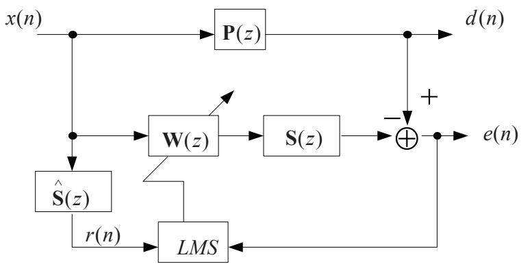  
Figure 1

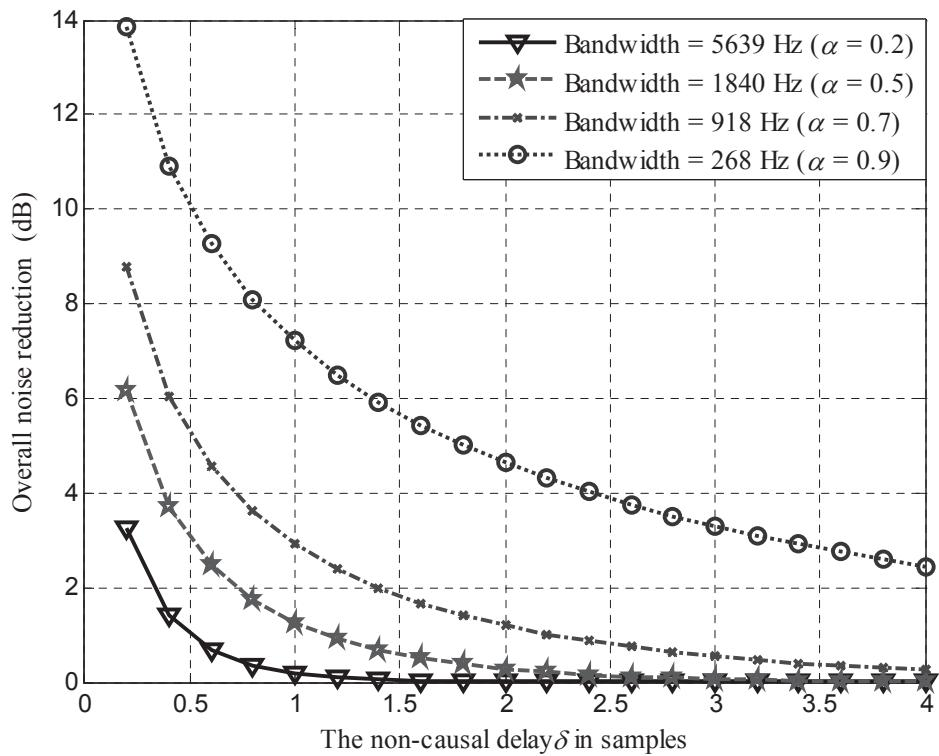  
Figure 2

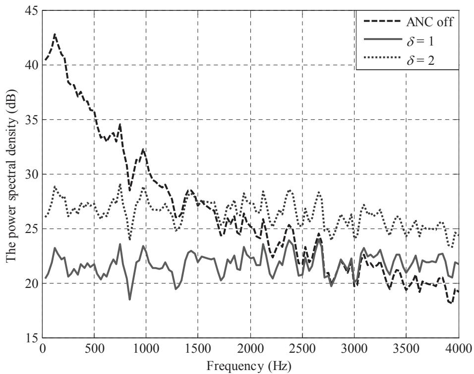  
Figure 3

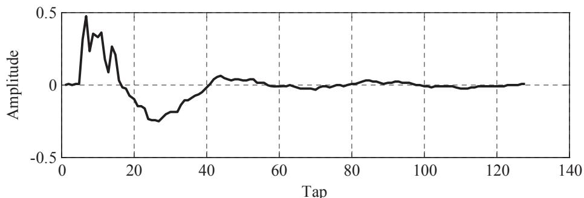  
Figure 4   
(a)

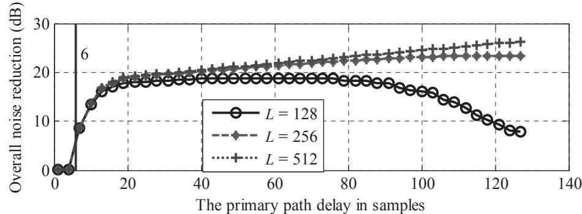  
(b)

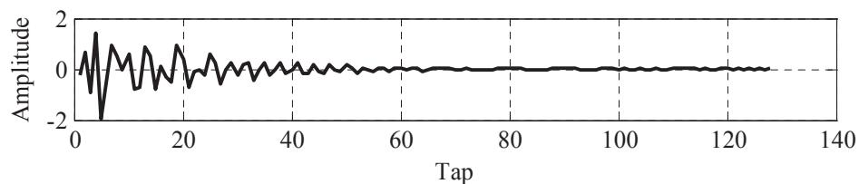  
Figure 5   
(a)

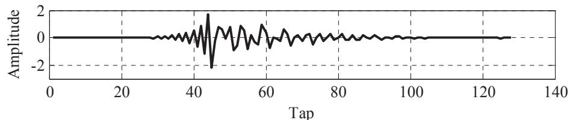  
(b)

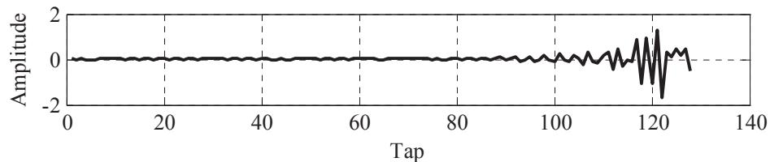  
(c)

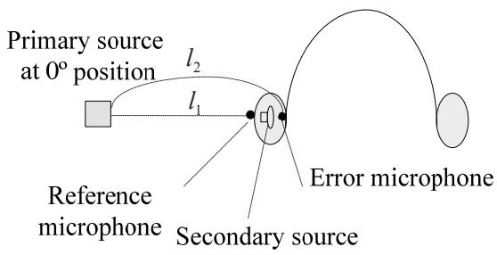  
Figure 6

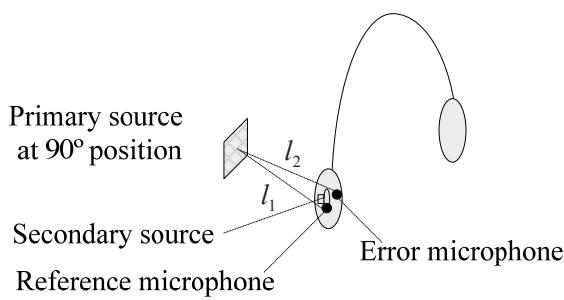  
(a)   
(c)

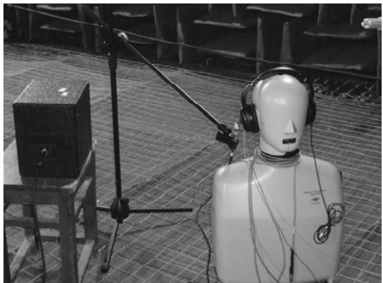

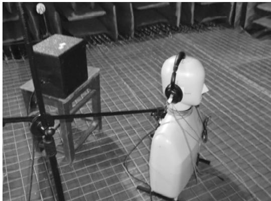  
(b)   
(d)

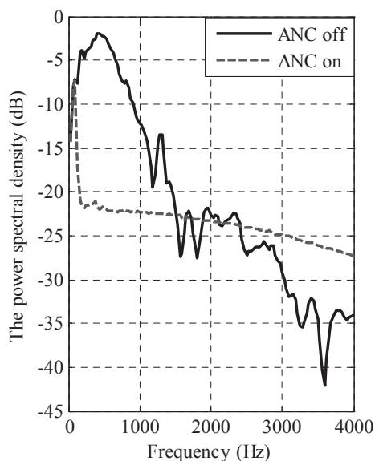  
Figure 7   
(a)

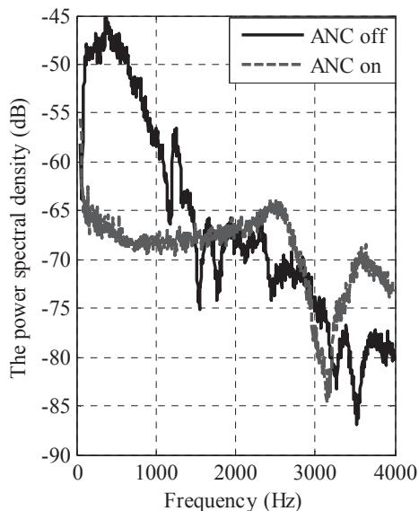  
(b)

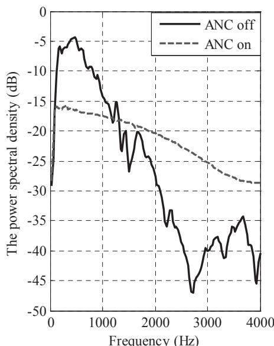  
Figure 8   
(a)

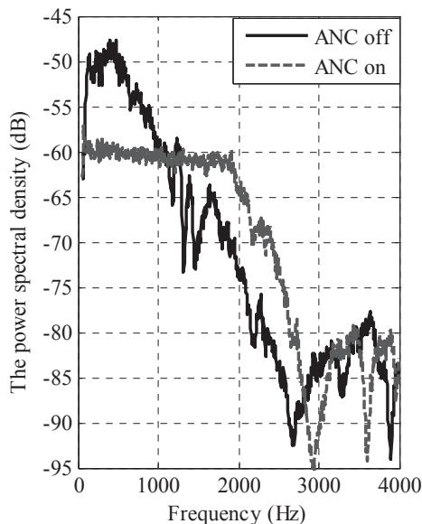  
(b)

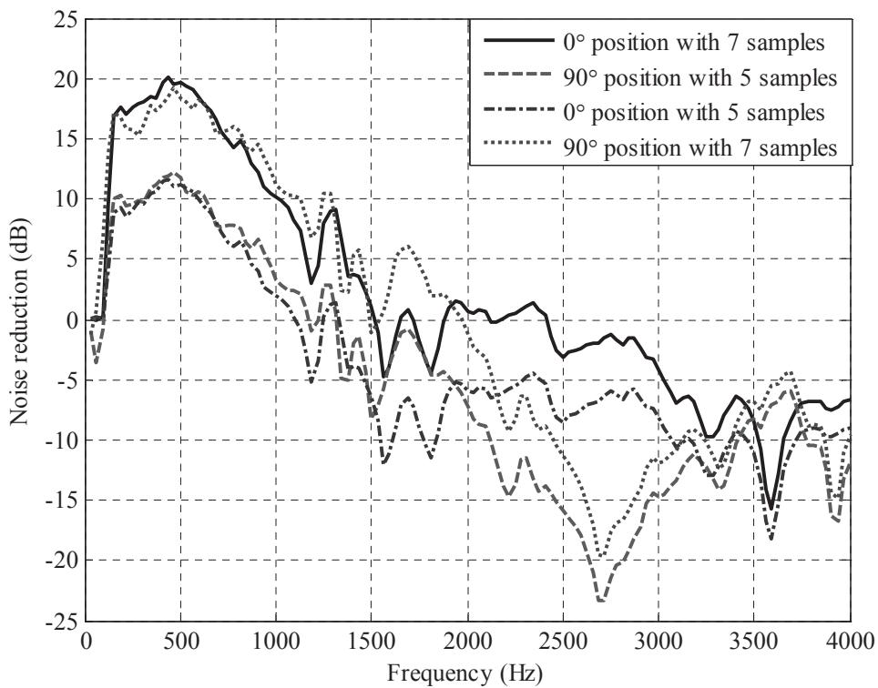  
Figure 9

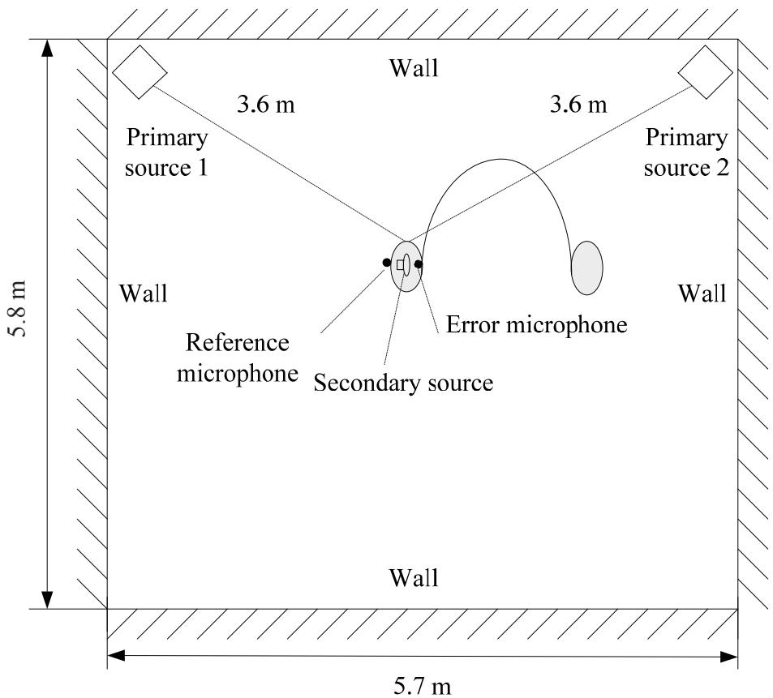  
Figure 10

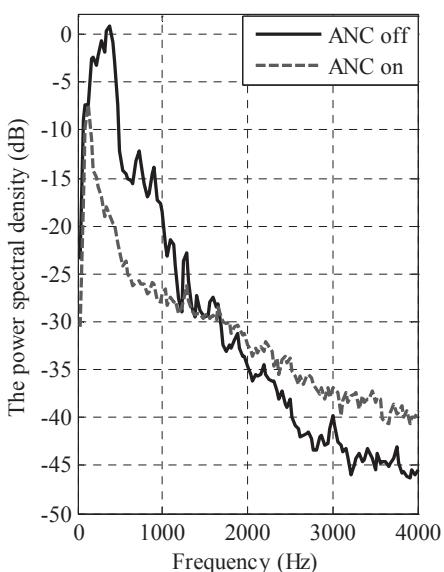  
Figure 11   
(a)

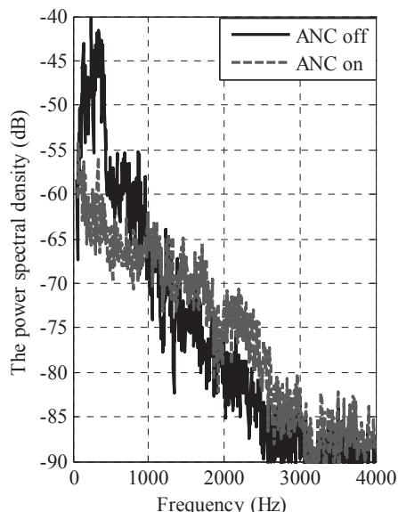  
(b)
