# Enhanced Acoustic Howling Suppression via Hybrid Kalman Filter and Deep Learning Models

Hao Zhang , Member, IEEE, Yixuan Zhang , Student Member, IEEE, Meng Yu , Member, IEEE, and Dong Yu , Fellow, IEEE

Abstract—This paper presents a comprehensive study addressing the challenging problem ofacoustic howling suppression (AHS) through the fusion of Kalman filter and deep learning techniques. We introduce two integration approaches: HybridAHS, which concatenates Kalman and neural networks (NN), and NeuralKalmanAHS, where NN modules are embedded inside the Kalman filter for signal and parameter estimation. In HybridAHS, we explore two implementation methods. One is trained offline using pre-processed signals with a light training burden, while the other employs a recursive training strategy with training signals generated adaptively. The offline model serves as an initialization for recursively training the other model. With NeuralKalmanAHS, we harness the power of NN modules to refine the reference signal and improve covariance matrices estimation in the Kalman filter, resulting in enhanced feedback suppression. Our methods capitalize on the strengths of traditional and deep learning-based AHS techniques. We have explored different variants of combining Kalman filter and NN and systematically compared their howling suppression performance, providing users with versatile solutions for addressing AHS. Furthermore, by employing the proposed recursive training, we effectively mitigate the mismatch issues that plagued previous NN-based AHS methods. Extensive experimental results show the superiority of our approach over baseline techniques.

Index Terms—Acoustic howling suppression, hybrid method, Kalman filter, neural networks, recursive training.

## I. INTRODUCTION

COUSTIC howling is a common phenomenon in acoustic amplification systems where amplified sound from a loudspeaker inadvertently gets captured by nearby microphones and subsequently re-amplified, leading to an undesirable feedback loop that repeatedly amplifies specific frequencies [1], [2], [3]. This self-reinforcing process leads to a high-pitched, bothersome sound known as acoustic howling. It is commonly observed in audio systems like hearing aids [4], [5], public addressing systems [6], and karaoke. The presence of howling not only poses a threat to the functionality of the audio devices but also poses potential risks to the human hearing system.

Existing techniques for mitigating acoustic howling, known as acoustic howling suppression (AHS), comprise passive and active methods. Passive approaches involve manual interventions, like repositioning microphones or loudspeakers and adjusting loudspeaker volumes. While effective to some extent, these methods are limited by their reliance on human adjustments and may not be practical in real-time dynamic scenarios. Active methods, on the other hand, process microphone signals for howling suppression. Traditional techniques include gain control [7], [8], which adjusts microphone gain automatically to manage feedback amplification but may struggle with complex howling scenarios. Notch filters [9], [10], [11] target specific frequencies associated with howling, but may lack stableness and be harmful to target sound. The adaptive feedback cancellation (AFC) method uses adaptive filters to estimate the howling component in the microphone signal and then subtracts it to suppress howling [5], [12], [13], [14], [15]. Although AFC techniques like Kalman filter [16], [17] demonstrate greater adaptability compared to some traditional methods, they exhibit sensitivity to control parameters and may face challenges in addressing nonlinear distortions.

Distinguishing acoustic howling from other acoustic irregularities, particularly acoustic echo [18], [19], [20], [21], is essential for the development of effective suppression techniques. Acoustic howling and acoustic echo share some common traits, both being products of feedback in communication systems, and mishandling acoustic echo can trigger howling [22]. However, these two issues diverge in their origin and attributes. Howling originates from the same source as the target signal and emerges gradually, rendering its suppression notably more complex when contrasted with acoustic echo, which typically stems from a different source (e.g., a far-end speaker).

Deep learning has showcased remarkable capabilities in dealing with acoustic echo problems [23], [24], [25], [26], [27], and more recently, it has emerged as a viable solution for tackling AHS tasks [22], [28], [29], [30], [31], [32], [33]. Chen et al. [28] introduced a deep learning method for howling detection, and subsequent approaches leveraged deep learning for howling suppression. Methods like howling noise suppression [29] and deep marginal feedback cancellation (DeepMFC) [30] treat AHS as a noise suppression task and train an NN module offline to directly enhance target signal from microphone recording that already has howling in it. Recently, Zhang et al. [22], [31] proposed a solution named DeepAHS for howling suppression by utilizing teacher-forcing learning [34], [35] and demonstrating better performance compared to previous methods. Neural network (NN) based methods demonstrate remarkable performance and the ability to learn intricate patterns from data, making them well-suited for nonlinear modeling and feature extraction. However, previous NN-based AHS methods have limitations as they are trained on offline-generated microphone signals without considering the recursive nature of acoustic howling during model training, leading to a mismatch during real-time inference and limiting their effectiveness [36]. This highlights the need for further research to address this challenge and enhance the robustness of deep learning-based approaches for acoustic howling suppression.

In this paper, we propose to hybrid traditional Kalman filter and NN for howling suppression. Two distinct approaches are introduced: HybridAHS and NeuralKalmanAHS. In the HybridAHS approach, we cascade the Kalman filter and NN to form a two-stage system where the Kalman filter is utilized for initial howling suppression. Its output, together with the microphone signal, is subsequently fed into the NN for further enhancement. Two variants of HybridAHS are explored in our study. One is trained using Kalman filter pre-processed signals and microphone signals generated offline through teacher forcing learning, facilitating efficient offline training and reducing training burden. The other variant employs recursively training with adaptively generated training signals to mitigate the mismatch problem, thereby enhancing performance during real-time inference. Importantly, the offline model plays a vital role as an initialization for the recursively trained model. The second approach, NeuralKalmanAHS, also utilizes the recursive training strategy but combines Kalman and NN in a different manner. In this approach, we embed the NN module inside the Kalman filter, leveraging its power to estimate a refined reference signal and accurate covariance matrices for updating the weights of the Kalman filter. This incorporation enhances feedback suppression capabilities, enabling more effective howling suppression.

This study makes three significant contributions. First, the proposed approaches harness the benefits of both Kalman filter and NN, and offer a comprehensive solution to the complex problem of howling suppression. Second, we introduce a novel training paradigm that recursively generates training signals to ensure consistency between training and inference stages, effectively eliminating the mismatch problem, and holding the potential to deliver exceptional performance. Third, we investigate different variants of the proposed methods and systematically compare their performance, providing users with the flexibility to employ these approaches in diverse configurations.

The remainder of this paper is organized as follows. Section II introduces the signal model of acoustic howling and existing methods for howling suppression. Sections III and IV describe the proposed HybridAHS and NeuralKalmanAHS methods, respectively. The experimental setup is given in Section V.

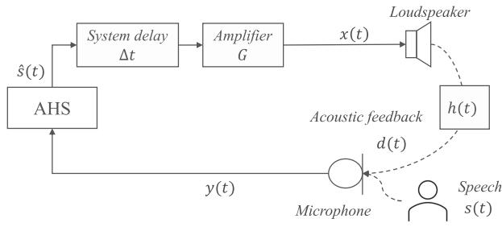  
Fig. 1. Configuration of an AHS system.

Section VI shows the evaluation results and comparisons. Finally, Section VII concludes the paper.

## II. ACOUSTIC HOWLING SUPPRESSION

## A. Acoustic Howling

Let us consider a typical single-channel acoustic amplification system as shown in Fig. 1. In this setup, the microphone captures the target speech signal, represented as $s ( t )$ , which is then transmitted to the loudspeaker for acoustic amplification. The loudspeaker signal $x ( t )$ is played out and arrives at the microphone as an acoustic feedback denoted as $d ( t )$

$$
d (t) = x (t) * h (t)\tag{1}
$$

and the corresponding microphone signal is:

$$
y (t) = s (t) + d (t)\tag{2}
$$

where t denotes the time instant, denotes linear convolution, $h ( t )$ represents the acoustic path from loudspeaker to microphone.

Without any AHS processing, the loudspeaker signal $x ( t )$ will be an amplified version of the previous microphone signal $y ( t - \Delta t )$ and undergo repeated re-entry into the pickup, leading to the representation of the microphone signal as:

$$
y (t) = s (t) + \left[ y (t - \Delta t) \cdot G \right] * h (t)\tag{3}
$$

where $\Delta t$ indicates the system delay from the microphone to the loudspeaker, and G denotes the amplifier gain. With proper howling suppression, the AHS module will output an estimate of the target signal sˆ, and the corresponding microphone signal will be:

$$
y (t) = s (t) + [ \hat {s} (t - \Delta t) \cdot G ] * h (t)\tag{4}
$$

The recursive relationship between $y ( t )$ and $y ( t - \Delta t )$ and the possible leakage in $\hat { s } ( t - \Delta t )$ give rise to the re-amplification of the playback signal, creating a feedback loop that manifests as an unpleasant, high-pitched sound known as acoustic howling.

The expression in (2) closely resembles the formulation of the acoustic echo cancellation (AEC) problem. However, it’s crucial to note that in AEC, the signal d(t) is typically deterministic and originates from far-end speech, remaining independent of the near-end speech. In this context, leveraging the far-end signal $x ( t )$ as a reference signal facilitates the estimation of the playback component in microphone recordings, enabling effective echo removal. Conversely, in the context of the AHS problem, the playback signal $d ( t )$ is intricately tied to the microphone signal received. Any leakage of the playback signal will be amplified and subsequently captured again by the microphone. Additionally, the playback signal in this context encompasses the same content as that of the target speech, posing a challenge in suppressing howling without distorting the speech, rendering it a more complex task compared to AEC.

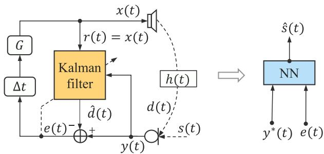  
Fig. 2. Diagrams of HybridAHS\_v1: Offline training method.

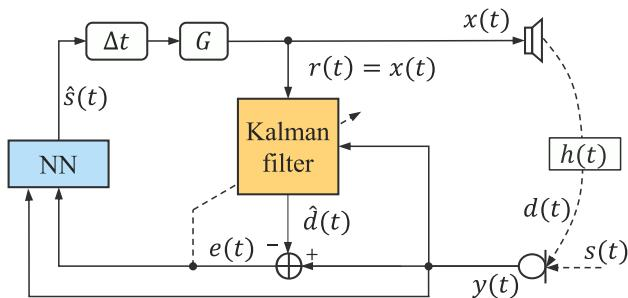  
Fig. 3. Diagrams of HybridAHS\_v2: Recursive training method.

## B. Kalman Filter for AHS

Kalman filter based methods address howling suppression by modeling the acoustic path between loudspeaker and microphone with an adaptive filter $w ( t )$ and then subtracting the corresponding estimated playback signal $\hat { d } ( t )$ from microphone recording [16], as shown in the left side ofFig. 2. In this study, we implement the Kalman filter in the frequency domain and denote the filter as $\mathbf { W } _ { m }$ where m denotes the frame index. We refer to the diagram of our proposed NueuralKalmanAHS method, given in Fig. 4, for introducing the frequency-domain Kalman filter (FDKF). FDKF can be interpreted as a two-step procedure, prediction and updating. The estimating of filter weights is achieved through the iterative feedback from the two steps.

In the prediction step, the estimated near-end signal $\hat { \mathbf { S } } _ { m } .$ , also known as the error signal $\mathbf { E } _ { m }$ of the system, is obtained as:

$$
\mathbf {E} _ {m} = \mathbf {Y} _ {m} - \mathbf {R} _ {m} \hat {\mathbf {W}} _ {m}\tag{5}
$$

where $\mathbf { S } _ { m } , \mathbf { Y } _ { m } ,$ and ${ \mathbf { R } _ { m } }$ are the short-time Fourier transform (STFT) of the target speech, microphone, and reference signal respectively. For the AHS task, we use the loudspeaker signal obtained in the previous frame, $\mathbf X _ { m - 1 }$ , as the reference signal ${ \mathbf { R } _ { m } }$

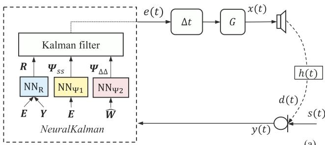

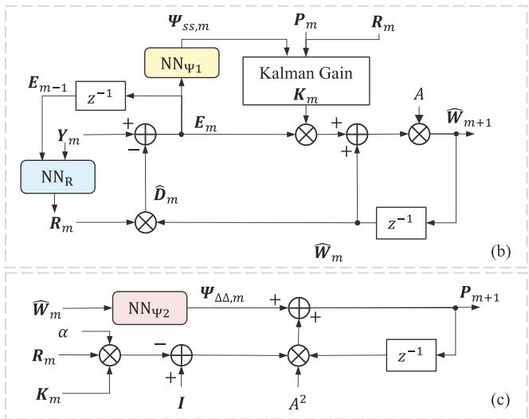  
Fig. 4. NN augmented Kalman filter (NeuralKalmanAHS): (a) Overall system, (b) prediction of adaptive filter Wˆ , and (c) prediction of state estimation error covariance P.

In the update step, as shown in Fig. 4(b), the state equation for updating echo path $\hat { \mathbf { W } } _ { m }$ is defined as,

$$
\hat {\mathbf {W}} _ {m + 1} = A [ \hat {\mathbf {W}} _ {m} + \mathbf {K} _ {m} \mathbf {E} _ {m} ]\tag{6}
$$

where A is the transition factor. ${ \bf K } _ { m }$ denotes the Kalman gain, which is calculated as:

$$
\mathbf {K} _ {m} = \mathbf {P} _ {m} \mathbf {R} _ {m} ^ {H} [ \mathbf {R} _ {m} \mathbf {P} _ {m} \mathbf {R} _ {m} ^ {H} + \boldsymbol {\Psi} _ {S S, m} ] ^ {- 1}\tag{7}
$$

with the state estimation error covariance $\mathbf { P } _ { m }$ estimated through:

$$
\mathbf {P} _ {m + 1} = A ^ {2} [ \mathbf {I} - \alpha \mathbf {K} _ {m} \mathbf {R} _ {m} ] \mathbf {P} _ {m} + \boldsymbol {\Psi} _ {\Delta \Delta , m}\tag{8}
$$

where $\Psi _ { S S , m }$ and $\Psi _ { \Delta \Delta , m }$ are observation noise covariance and process noise covariance, respectively. They are approximated by the covariance of the estimated near-end signal $\mathbf { E } _ { m }$ and the echo-path $\hat { \mathbf { W } } _ { m } .$ , respectively:

$$
\pmb {\Psi} _ {S S, m + 1} = \lambda \pmb {\Psi} _ {S S, m} + (1 - \lambda) | \mathbf {E} _ {m} | ^ {2}\tag{9}
$$

$$
\Psi_ {\Delta \Delta , m + 1} = \lambda \Psi_ {\Delta \Delta , m} + (1 - \lambda) (1 - A ^ {2}) | \hat {\mathbf {W}} _ {m} | ^ {2}\tag{10}
$$

where λ represents a smoothing parameter ranging from 0 to 1. More details can be found in [16]. Noted that the approximations presented in (7) and (8) rely largely on the presumption of accurately estimated covariance matrices $\Psi _ { S S , m }$ and $\Psi _ { \Delta \Delta , m } .$ Inaccurate estimation of covariance metrics hinders the performance of the Kalman filter.

## C. Deep Learning Based AHS and the Mismatch Problem

The recursive nature of acoustic howling poses challenges in generating suitable training signals, as the current input depends on the previous outputs. Previous NN-based methods address AHS by training models using offline-generated microphone signals. Howling noise suppression [29] and DeepMFC [30] trains the NN model by extracting the target signal from the microphone signal generated using (3), i.e., microphone signal without considering AHS in the acoustic loop. On the other hand, DeepAHS is based on the assumption that once the model is properly trained, it should attenuate feedback and send only the target speech to the loudspeaker for amplification. Therefore, the microphone signals used for training DeepAHS are generated through teacher forcing learning by replacing sˆ(t) with the teacher signal s(t) in (4):

$$
y ^ {*} (t) = s (t) + [ s (t - \Delta t) \cdot G ] * h (t)\tag{11}
$$

However, all of these methods encounter a mismatch problem during the inference stage, as the real microphone signal received during inference is generated recursively using the processed microphone signal ${ \hat { s } } ( t )$ , described by (4), differs from the training signals used for training these NN methods. While DeepAHS improves upon DeepMFC by employing teacher-forcing learning, the issue of mismatch persists.

## III. HYBRIDAHS: CONCATENATION OF KALMAN FILTER AND NN

This section presents the proposed HybridAHS method. HybridAHS combines the Kalman filter and NN in a cascade manner to address acoustic howling. Specifically, the FDKF initially processes the microphone recording. The output of this process, combined with the original microphone recording, serves as input for training the NN module to obtain an estimation of the target signal. By cascading the Kalman filter and NN, we leverage the advantages of both methods: 1) using the FDKF pre-processed signal provides more information for training the NN module, and 2) using NN could further enhance the output of FDKF and leads to a robust AHS solution. We implement this approach using offline and recursive training strategies, and corresponding diagrams are shown in Figs. 2 and 3, respectively.

## A. HybridASH\_v1: Offline Training With Pre-Processed Signals

The initial version of HybridAHS, denoted as HybridAHS\_v1, is trained offline utilizing pre-processed signals. Specifically, the process involves the pre-processing of the microphone signal using the Kalman filter, yielding the output $e ( t )$ Separately, the NN module is trained offline using e(t) and an ideal microphone signal generated through teacher forcing learning, denoted as $y ^ { \ast } ( t )$ (as shown in (11)), for estimating the target signal sˆ(t). A comprehensive illustration of the proposed method can be found in Fig. 2. The method is implemented using frequency domain processing techniques. To enhance the clarity of signal relationships and facilitate a better understanding of the entire process, we utilize time-domain labels for method description.

Algorithm 1: HybridAHS_v1 With Offline Training.

procedure TRAINING($\mathbf{Y}^* \to \hat{\mathbf{S}}$)
Randomly select a speech and AHS settings: $\mathbf{S}, \Delta t, G$
Generate training microphone signal through (11):
$\mathbf{Y}^* = \mathbf{S} + G \cdot \text{Delayed\_S} \cdot \mathbf{H}$
Initialize Kalman filter $\mathbb{K}(\cdot)$
while $m \leq M$ do $\triangleright M$ is the total number of frames
$\mathbf{E}_m \leftarrow \mathbb{K}(\mathbf{Y}_m, \mathbf{R}_m) \quad \triangleright \text{Output of Kalman filter}$ $\mathbb{K} \leftarrow (\mathbf{E}_m, \mathbf{R}_m) \quad \triangleright \text{Update Kalman filter}$ $\mathbf{R}_{m+1} \leftarrow \mathbf{X}_m = \text{Delayed\_E}_m \cdot G \quad \triangleright \text{Update Ref.}$ $\mathbf{Y}_{m+1} = \mathbf{S}_{m+1} + \mathbf{X}_m \cdot \mathbf{H} \quad \triangleright \text{Update Mic.}$
end while
$\mathbf{E} \leftarrow \mathbf{E}_m \quad \triangleright \text{Save processed frame to output}$ $\hat{\mathbf{S}} \leftarrow \mathbb{N}\mathbb{N}(\mathbf{Y}^*, \mathbf{E}) \quad \triangleright \text{Note that both } \mathbf{Y}^* \text{ and } \mathbf{E} \text{ are generated offline before NN training}$ $Loss \leftarrow (\mathbf{S}, \hat{\mathbf{S}}) \quad \triangleright \text{Get loss}$ $\mathbb{N}\mathbb{N}(\cdot) \leftarrow Loss \quad \triangleright \text{Update DNN parameters}$
end procedure

procedure STREAMING INFERENCE($\mathbf{Y}_m \to \hat{\mathbf{S}}_m$)
Randomly select a speech and AHS settings: $S, \Delta t, G$
Initialize Kalman filter $\mathbb{K}(\cdot)$, load NN module $\mathbb{N}\mathbb{N}(\cdot)$
while $m \leq M$ do
$\mathbf{E}_m \leftarrow \mathbb{K}(\mathbf{Y}_m, \mathbf{R}_m)$ $\hat{\mathbf{S}}_m \leftarrow \mathbb{N}\mathbb{N}(\mathbf{Y}_m, \mathbf{E}_m) \quad \triangleright AHS\text{ output at frame } m$ $\mathbb{K} \leftarrow (\mathbf{E}_m, \mathbf{R}_m) \quad \triangleright \text{Update Kalman filter}$ $\mathbf{R}_{m+1} \leftarrow \mathbf{X}_m = \text{Delayed\_}\hat{\mathbf{S}}_m \cdot G$ $\mathbf{Y}_{m+1} = \mathbf{S}_{m+1} + \mathbf{X}_m \cdot \mathbf{H}$
end while
$\hat{\mathbf{S}} \leftarrow \hat{\mathbf{S}}_m$
end procedure

Once the NN module is trained, the pre-trained model is inserted into the acoustic loop during streaming inference to evaluate its performance for howling suppression. The detailed algorithm is shown in Algorithm 1, where NN( ) and K( ) denote the parameters of the NN and Kalman module, respectively. As illustrated in Algorithm 1, HybridASH\_v1 follows distinct procedures during offline training and streaming inference stages. Specifically, the loudspeaker signal X, employed as the reference signal R in the Kalman filter, is derived from the error signal E and the output of the NN module Sˆ during offline training and streaming inference, respectively. Additionally, the pre-processed signals $\mathbf { Y } ^ { * }$ and E are employed for training NN( ) offline, whereas the inputs utilized during inference are generated recursively, resulting in a mismatch issue. However, the utilization of FDKF pre-processed signals contributes to enhanced information and diminishes the mismatch, particularly when compared to preceding NN-only-based AHS approaches [30], [31].

## B. HybridAHS\_v2: Recursive Training ofNN

Based on the foundation ofHybridAHS\_v1, we closely examine the fundamental process of howling formation and introduce a novel training framework to address the mismatch issue. The modified version, referred to as HybridAHS\_v2, maintains the same inference processings as HybridAHS\_v1 but introduces a novel training paradigm to ensure consistency between the processing procedures during training and inference. In the training stage, we integrate the NN module into the acoustic loop, generating signals online in a recursive manner. Each processed frame serves as the input for the subsequent frame, preserving the recursive nature of howling suppression.

Algorithm 2: HybridAHS_v2 With Recursive Training.

procedure TRAINING/INFERENCE($Y_m \to \hat{S}_m$)
Randomly select a speech and AHS settings: S, Δt, G
Initialize Kalman filter K(·)
if Training then
    Initialize NN module NN(·)
    or load offline pre-trained HybridAHS_v1 model
end if
if Streaming inference then
    Load pre-trained NN module NN(·)
end if
while m ≤ M do
    $E_m \leftarrow K(Y_m, R_m)$ $\hat{S}_m \leftarrow NN(Y_m, E_m) \quad \triangleright$ AHS output at frame m
    $\mathbb{K} \leftarrow (E_m, R_m)$    ▷ Update Kalman filter
    $R_{m+1} \leftarrow X_m = Delayed\_ \hat{S}_m \cdot G \quad \triangleright$ Update Ref.
    $Y_{m+1} = S_{m+1} + X_m \cdot H \quad \triangleright$ Update Mic.
end while
    $\hat{S} \leftarrow \hat{S}_m \quad \triangleright$ Save processed frame to final output
if Training then
    $Loss \leftarrow (S, \hat{S}) \quad \triangleright$ Get loss
    $NN(\cdot) \leftarrow Loss \quad \triangleright$ Update DNN parameters
end if
end procedure

Algorithm 3: NeuralKalmanAHS.

procedure TRAINING/INFERENCE($Y_m \to \hat{S}_m$)
Randomly select a speech and AHS settings: S, Δt, G
Initialize Kalman filter K(·) with filter weights Ŵ₀
if Training then
    Initialize NN modules: NN$_R(\cdot)$, NN$_{\Psi1}(\cdot)$, NN$_{\Psi2}(\cdot)$
end if
if Streaming inference then
    Load pre-trained NN modules:
    NN$_R(\cdot)$, NN$_{\Psi1}(\cdot)$, NN$_{\Psi2}(\cdot)$
end if
while m ≤ M do
    $E_m = Y_m - R_m \cdot \hat{W}_m \quad \triangleright$ Output of Kalman filter
    Ŵ$_{m+1} \leftarrow (\hat{W}_m, E_m, R_m, \Phi_{SS,m}, \Phi_{\Delta\Delta,m}) \quad \triangleright$ Update Kalman filter K(·)
    Y$_{m+1} = S_{m+1} + G \cdot Delayed\_ E_m \cdot H \quad \triangleright$ Mic.
    R$_{m+1} \leftarrow NN_r(Y_m, E_m) \quad \triangleright$ Estimate Ref.
    Φ$_{SS,m+1} \leftarrow NN_{\Phi1}(E_m) \quad \triangleright$ Estimate Φ$_{SS}$
    Φ$_{\Delta\Delta,m+1} \leftarrow NN_{\Phi2}(\hat{W}_m) \quad \triangleright$ Estimate Φ$_{\Delta\Delta}$
end while
    Ŝ ← E$_m$    ▷ Save processed frame to final output
if Training then
    Loss ← (S, Ŝ)    ▷ Get loss
    NN$_R(\cdot)$, NN$_{\Psi1}(\cdot)$, NN$_{\Psi2}(\cdot)$ ← Loss    ▷ Update NN
end if

Although this methodology requires more training time, it effectively circumvents the mismatch problem that previous NN-based AHS methods encountered and results in enhanced performance and improved robustness. Details of the proposed method are shown in Fig. 3 and Algorithm 2.

## C. Trainability: From HybridAHS\_v1 to HybridAHS\_v2

Introducing recursive training for NN-based AHS presents some unique challenges, mainly related to achieving convergence. The parameters of the NN module are typically initialized randomly, which does not guarantee any howling suppression during the initial training stages. Therefore, the recursive nature of howling generation can lead to severe signal accumulation and energy explosion, causing signal values to exceed Python’s maximum limit and triggering “not a number (NAN)” warnings. Consequently, the NAN issue hinders the gradient calculations required for model updates. This issue is especially prominent during batch training, where the convergence failure of one utterance affects the loss value calculated for the entire batch. To address the convergence problem and enhance trainability, we propose two strategies: howling detection (HD) and initialization using an offline-trained model, HybridAHS\_v1.

1) Howling Detection: One effective strategy is to incorporate howling detection into the training process. Specifically, during recursive training, we continuously monitor the microphone signal for the presence of howling, identified by the amplitude of the microphone signal consistently exceeding a threshold for 100 consecutive samples. Upon detection, further processing of the current utterance is halted, and only the already processed portion is used for loss calculation. By excluding the howling signal from further processing and loss calculation, the potential NAN issue is avoided and its impact on the convergence of the NN module is minimized.

2) Initializing HybridAHS\_v2 Using Pre-Trained HybridAHS\_v1: Another strategy that significantly enhances trainability and accelerates the training process involves utilizing the pre-trained offline model, HybridAHS\_v1, to initialize the NN parameters in HybridAHS\_v2. Despite potential mismatches in online streaming scenarios, the pre-trained offline model still demonstrates superior howling suppression compared to randomly initialized NN modules during the initial training stages. By employing it as an initialization for the NN module in HybridAHS\_v2, we prevent the occurrence of NAN issues and ensure convergence. Through this, the training of HybridAHS\_v2 can be seen as a recursive fine-tuning of HybridAHS\_v1, mitigating the mismatch problem that arises from training with offline signals.

## IV. NEURALKALMANAHS: INTEGRATING NN INTO KALMAN FILTER

This section introduces the proposed NeuralKalmanAHS method. The NeuralKalmanAHS method enhances the Kalman filter, described in Section II-B, by incorporating neural network modules for estimating reference signals and covariance matrices. The implementation details of this approach are elaborated in Fig. 4 and Algorithm 3.

## A. NeuralKalmanAHS With Estimated Reference Signal

The reference signal holds paramount importance in the Kalman filter. It serves as a crucial foundation for accurate estimation and adaptive filtering. In the context of acoustic howling suppression, a proper reference signal aids the filter in distinguishing between desired speech and undesired feedback components, guiding the howling suppression process effectively. In the conventional setup of the Kalman filter for AHS, the processed signal from the preceding frame is employed as the reference signal. However, in scenarios with severe howling, especially during the convergence period, the reference signal could have strong leakage and might not accurately represent the actual acoustic environment. This can mislead the filter and potentially result in suboptimal or unstable suppression outcomes.

Introducing NN to refine or adjust the original reference signal has been established in previous research as an effective means to amplify the capabilities of adaptive algorithms [37], [38], [39]. To heighten this approach, we propose a method that integrates a learned reference signal ${ \mathbf { R } _ { m } }$ into the Kalman filter framework by using original reference signal $\mathbf { E } _ { m - 1 }$ and microphone recording $\mathbf { Y } _ { m }$ as inputs:

$$
\mathbf {R} _ {m} = N N _ {R} (\mathbf {Y} _ {m}, \mathbf {E} _ {m - 1})\tag{12}
$$

where $N N _ { R }$ denotes the parameters of the network responsible for estimating the reference signal.

This advancement leverages the ability of the learned reference signal to encompass intricate aspects of the acoustic environment. It has the potential to reduce the updating complexity of the Kalman filter, resulting in enhanced acoustic howling suppression and a more resilient system. Furthermore, it’s noteworthy that the traditional algorithm simplistically models the playback signal as a linear transformation of the reference signal, disregarding the nonlinear distortions introduced by amplifiers and loudspeakers.

## B. NeuralKalmanAHS With Estimated Covariance Matrices

Within the Kalman filter framework, covariance matrices $\Psi _ { S S , m }$ and $\Psi _ { \Delta \Delta , m }$ encapsulate the uncertainties associated with state and measurement variables. In the context of AHS, the accuracy with which covariance matrices are estimated influences the filter’s ability to make accurate predictions and adapt to changing conditions.

Conventional approaches to estimating covariance matrices in the Kalman filter typically assume linearity and stationary conditions, as demonstrated in (9) and (10). However, these methods can be sensitive to noise and outliers, leading to potentially unstable estimates.

We propose to use neural networks to learn these covariance matrices:

$$
\boldsymbol {\Psi} _ {s s, m} = N N _ {\Psi 1} (\mathbf {E} _ {m})\tag{13}
$$

$$
\Psi_ {\Delta \Delta , m} = N N _ {\Psi 2} (\hat {\mathbf {W}} _ {m})\tag{14}
$$

where $N N _ { \Psi 1 }$ and $N N _ { \Psi 2 }$ denote the two NN modules utilized for estimating $\Psi _ { s s , m }$ and $\Psi _ { \Delta \Delta , m }$ , respectively. Estimating these covariance matrices using NN modules trained jointly excels in capturing intricate relationships, enhancing accuracy and robustness.

## V. EXPERIMENTAL SETUP

## A. Data Preparation

The experiments are carried out using the AISHELL-2 dataset [40]. We simulate 10,000 pairs of room impulse responses (RIRs) using the image method [41] with random room characteristics and reverberation times (RT60) randomly selected within the range of 0 to 0.6 seconds. Each RIR pair includes RIRs for the near-end speaker and loudspeaker positions. The system delay $\Delta t$ is randomly generated within the range of 0.15 to 0.25 seconds, and the amplification gain is randomly selected within the range of 1 to 3. For models trained offline, we randomly select a pair of RIRs and a speech signal, generating the training signals offline following Fig. 2. In the case of models trained recursively, the chosen RIRs and speech signals are fed to the closed loop to recursively generate the training signals and train the model. The training, validation, and testing set we used includes 38,000, 1000, and 200 utterances, respectively. The testing data compares different utterances and RIRs compared to the training and validation data.

## B. Implementation Details

The NN modules in the proposed methods can be implemented using different network structures. We utilize recurrent neural networks with long short-term memory (LSTM) [42] in our proposed methods and process signals in the frequency domain in a frame-by-frame manner. To reduce the latency and make the model feasible for deployment on real devices, we restrict the frame size and frame shift to 8 ms and 4 ms, respectively, and used only the magnitude spectrogram of signals as input features for model training. The NN modules used for signal estimation are implemented using a 2-layer LSTM with 300 units in each hidden layer, and the NN modules for covariance matrices are implemented using an LSTM cell with 65 units.

1) HybridAHS\_v1: The magnitude spectrogram of $\mathbf { Y } ^ { * }$ and E are concatenated and fed to the 2-layer LSTM. The output of LSTM goes through a linear layer followed by a sigmoid activation function to estimate a ratio mask M. This ratio mask is then applied upon $\lvert \mathbf { Y } ^ { * } \rvert$ to get an estimate of the magnitude of the target signal:

$$
| \hat {\mathbf {S}} | = \mathbf {M} \cdot | \mathbf {Y} ^ {*} |\tag{15}
$$

where represents point-wise multiplication. The training loss is defined as the mean absolute error (MAE) of magnitude spectrogram:

$$
L o s s = \mathrm{MAE} (| \hat {\mathbf {S}} |, | \mathbf {S} |)\tag{16}
$$

2) HybridAHS\_v2: The network structure ofNN and the loss function used in HybridAHS\_v2 remain identical to those of HybridAHS\_v1. The key difference lies in the generation of inputs and the training process. It’s important to note that while the input signals are processed recursively in a frame-by-frame manner, the loss function is calculated at the utterance level after processing a complete utterance, as shown in Algorithm 2.

3) NeuralKalmanAHS: The $N N _ { R }$ module for reference signal estimation is the 2-layer LSTM described previously. A mask ${ { \mathbf { M } } _ { R } }$ is obtained through N $N _ { R }$ and applied on microphone signal to get a refined reference signal:

$$
| \mathbf {R} | = \mathbf {M} _ {R} \cdot | \mathbf {Y} |\tag{17}
$$

The covariance matrices are estimated using two LSTM cells each followed a linear layer and a sigmoidal activation layer, denoted as $N N _ { \Psi _ { 1 } }$ and $N N _ { \Psi _ { 1 } }$ , respectively. Note that we do not have ground truth for R, $\Psi _ { \Delta \Delta }$ , and $\Psi _ { s s }$ to guide model training. These estimations are regarded as intermediate outputs which are used directly in the Kalman filter for filter weights updating. The three NN modules in NeuralKamanAHS are trained jointly to minimize the difference between the output of Kalman filter and the target signal:

$$
L o s s = \operatorname{MAE} (| \mathbf {E} |, | \mathbf {S} |)\tag{18}
$$

## C. Comparison Methods

We compare our proposed methods with traditional Kalman filter based AFC and three recently proposed NN-based AHS methods. For a fair comparison, all the NN-based baseline methods are implemented using the same two-layer LSTM network and experimental setup as that utilized in our proposed methods. Ifnot mentioned particularly, magnitude ratio mask (RM) is used for signal estimation in all NN-based methods.

\- Kalman filter [16]: We refer to the introduction in Section II-B for implementing Kalman filter based AFC. In our implementation, we set the transition factor A to 0.9999, α to 0.5, and λ to 0.9 to achieve good howling suppression and balance the convergence speed.

DeepMFC [30]: We implement this method utilizing the parallel signal generation strategy introduced in [30]. The input for training the DeepMFC is a microphone signal generated using a closed-loop system, y(t) in (3), operating at marginally stable gain. To fulfill the marginally stable scenario, the training signals are generated with the aid of howling detection, and only microphone signals without howling or with light howling are utilized for model training.

DeepAHS [31]: Microphone signal generated through teacher forcing learning, $y ^ { \ast } ( t )$ and a delayed version of it are used for training DeepAHS. It is shown in [31] that using a delayed microphone as additional input helps improve howling suppression performance and the delay is estimated during the initial stage using cross-correlation methods.

NNAFC [43], [44]: This method is a variant of the neural-AFC method proposed in [43], where NN is used for step size estimation in the traditional AFC method. Another recently proposed method employs the same idea and utilizes a trainable NN to output the adaptive Kalman gain in real-time [44]. We refer to these two papers and implement an NN-boosted AFC method, denoted as NNAFC.

## D. Evaluation Metrics

Two metrics are used to evaluate AHS performance: signal-todistortion ratio (SDR) [45] and perceptual evaluation of speech quality (PESQ) [46]. Given PESQ’s insensitivity to scale, we emphasize SDR results to demonstrate the effectiveness of suppressing howling, while relying on PESQ to assess speech quality preservation. Larger results indicate better howling suppression and speech quality.

## VI. EXPERIMENTAL RESULTS

## A. Comparison ofDifferent AHS Methods

We initiate our analysis by comparing the proposed techniques with baseline methods across different amplification gain scenarios. Average SDR and PESQ values are tabulated in Table I, while Fig. 5 offers corresponding spectrograms.1 The presented results are based on testing over 200 utterances and are expressed as mean  standard deviation. This presentation underscores the efficacy and consistency of the AHS methods in suppressing howling.

It is seen from the table that without implementing any form of howling suppression, “no AHS”, the average SDR values of the output remain below 30 dB when the amplification gain is larger than or equal to 2. This indicates that howling dominates the output signal, overwhelming the speech signal to the point that we primarily hear howling with minimal discernible speech information, as seen from Fig. 5(b). Consequently, calculating PESQ values for the “no AHS” case becomes redundant, as the presence of meaningful speech is negligible in this context. Utilizing the Kalman filter achieves a notable howling suppression compared to the “no AHS” case, contributing to an average SDR increase of 21.53 dB for $\mathbf { \vec { G } } = 2 \mathbf { \vec { \theta } }$ , 18.22 dB for ${ } ^ { 6 6 } \mathrm { G } =$ 2.5”, and 14.96 dB for $\mathrm { \Omega } ^ { 6 } \mathrm { G } = 3 \mathrm { \Omega } ^ { , , }$ . Despite this improvement, residual howling remains prominent within the output. Moving to NN-based AHS methods, such as DeepMFC, DeepAHS, and NNAFC, a substantial enhancement in howling suppression is achieved. These methods notably surpass the performance of the Kalman filter in terms of both SDR and PESQ.

Among our proposed methods, HybridAHS\_v1 is trained offline and demonstrates comparable SDR and improved PESQ outcomes compared to the finest baseline method. The HybridAHS\_v2 approach, which undergoes recursive closed-loop training, achieves notably superior SDR and PESQ results compared to the baselines, particularly at higher amplification gain (G) levels. Additionally, NeuralKalmanAHS, trained recursively as well, attains higher SDR and comparable PESQ results when compared against HybridAHS\_v2. In the later part, we will delve into the performance of the proposed Hybrid\_v2 method by experimenting with different masking strategies. Among these strategies, the one that uses complex ratio mask estimation [47], denoted as “HybridAHS\_v2 (cRM2)”, emerges as the most effective overall performer, is also shown in the table.

TABLE I  
AVERAGE SDR AND PESQ RESULTS OF DIFFERENT METHODS FOR HOWLING SUPPRESSION

<table><tr><td>Models</td><td colspan="3">SDR ↑</td><td colspan="3">PESQ ↑</td></tr><tr><td>G</td><td>2</td><td>2.5</td><td>3</td><td>2</td><td>2.5</td><td>3</td></tr><tr><td>no AHS</td><td>-31.86 ± 5.66</td><td>-33.10 ± 3.96</td><td>-33.21 ± 3.94</td><td>-</td><td>-</td><td>-</td></tr><tr><td>Kalman filter [16]</td><td>-10.33 ± 14.84</td><td>-14.88 ± 15.14</td><td>-18.25 ± 14.77</td><td>1.65 ± 0.73</td><td>1.44 ± 0.70</td><td>1.30 ± 0.64</td></tr><tr><td>DeepMFC [30]</td><td>-2.78 ± 9.44</td><td>-5.59 ± 11.40</td><td>-7.69 ± 12.26</td><td>1.88 ± 0.59</td><td>1.70 ± 0.62</td><td>1.56 ± 0.59</td></tr><tr><td>DeepAHS [31]</td><td>0.04 ± 8.60</td><td>-3.15 ± 12.01</td><td>-6.32 ± 14.07</td><td>2.42 ± 0.65</td><td>2.04 ± 0.79</td><td>1.84 ± 0.77</td></tr><tr><td>NNAFC [43]</td><td>1.63 ± 3.34</td><td>-0.46 ± 7.46</td><td>-2.50 ± 9.94</td><td>2.14 ± 0.44</td><td>1.95 ± 0.48</td><td>1.80 ± 0.53</td></tr><tr><td>HybridAHS_v1</td><td>1.25 ± 5.79</td><td>-1.45 ± 9.60</td><td>-3.49 ±10.90</td><td>2.33 ± 0.53</td><td>2.22 ± 0.59</td><td>1.95 ± 0.62</td></tr><tr><td>HybridAHS_v2</td><td>1.92 ± 1.70</td><td>1.28 ± 1.47</td><td>0.84 ± 1.30</td><td>2.35 ± 0.36</td><td>2.21 ± 0.34</td><td>2.11 ± 0.32</td></tr><tr><td>HybridAHS_v2 (cRM2)</td><td>3.04 ± 1.34</td><td>2.49 ± 1.11</td><td>2.11 ± 0.98</td><td>2.40 ± 0.38</td><td>2.25 ± 0.36</td><td>2.13 ± 0.34</td></tr><tr><td>NeuralKalmanAHS</td><td>2.65 ± 1.70</td><td>1.98 ± 1.49</td><td>1.45 ± 1.31</td><td>2.33 ± 0.41</td><td>2.17 ± 0.39</td><td>2.04 ± 0.37</td></tr></table>

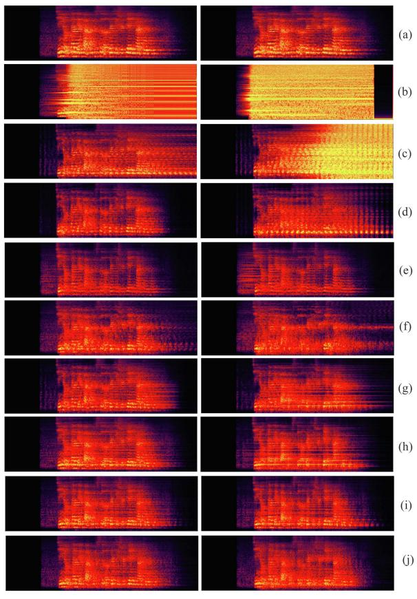  
Moderate howling (G=1.5)  
Severe howling (G=3)  
Fig. 5. Spectrograms of a test utterance at two different G levels: (a) Target signal, (b) no AHS, (c) Kalman filter, (d) DeepMFC, (e) DeepAHS, (f) NNAFC (g) HybridAHS\_v1, (h) HybridAHS\_v2, (i) HybridAHS\_v2 (cRM2), and (j) NeuralKalmanAHS.

significantly lower standard deviations in comparison to their offline-trained counterparts. This discrepancy can be attributed to the mismatch issue discussed earlier. The recursive training of the NN module within the closed loop effectively mitigates this mismatch problem, leading to a more stable and consistent howling suppression performance.

Focusing on the standard deviation values of these methods, it’s evident that the proposed recursively trained methods exhibit

Fig. 5 displays spectrograms of a test utterance assessed under moderate and severe howling scenarios. The output without howling suppression bears a strong howling component, rendering it unpleasant to listen to. Traditional Kalman filter-based AFC partially suppresses howling at moderate levels, but its efficacy diminishes as amplification gain becomes larger, leading to severe howling. Neural Network based AHS methods succeed in suppressing howling in both moderate and severe scenarios. DeepMFC (Fig. 5(d)), trained under conditions of marginally stable gain, functions effectively at low amplification levels but encounters difficulties as gains become higher. DeepAHS tends to excessively suppress the target signal, leading to energy reduction, which isn’t ideal for acoustic amplification. NNAFC’s outputs retain howling traces. Proposed methods exhibit better performance. Recursively trained HybridAHS\_v2 surpasses offline trained HybridAHS\_v1. However, mild howling persists (depicted as continuous horizontal lines) in the enhanced spectrogram (Fig. 5(h)). Employing complex-domain estimation in HybridAHS\_v2 resolves this issue, as shown in Fig. 5(i). In contrast, the NeuralKalmanAHS method, also trained recursively, doesn’t display this mild howling problem. A detailed comparison between HybridAHS and NeuralKalmanAHS will be shown later in Section VI-D.

## B. Explorations Regarding HybridAHS

This section delves into our investigation of the HybridAHS approach, focusing on its convergence performance and the impact of employing various inputs and masking strategies.

1) Convergence: The recursive training of HybridAHS\_v2 poses challenges in terms of achieving convergence. The influence of the proposed strategies, specifically the howling detection and initialization using HybridAHS\_v1, on the convergence of HybridAHS\_v2 is visually depicted in Fig. 6 by showing the descent of the validation loss obtained during the initial stage of training. Without the implementation of any strategies, achieving convergence is uncertain due to the NAN issue highlighted in Section III-C. Introducing the HD strategy effectively circumvents this issue and ensures the model’s trainability. Furthermore, the initialization of the NN module using a pre-trained HybridAHS\_v1 model plays a pivotal role in the successful recursive training of HybridAHS\_v2, leading to substantial enhancements in training convergence.

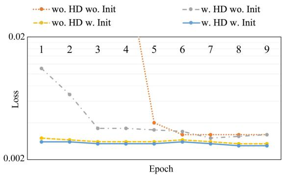  
Fig. 6. Convergence exploration of HybridAHS\_v2 with recursive training.

TABLE II  
AVERAGE SDR AND PESQ RESULTS OF HYBRIDAHS\_V2 USING DIFFERENT INPUTS AT G = 2.

<table><tr><td>Inputs</td><td>Masked upon</td><td>SDR ↑</td><td>PESQ ↑</td></tr><tr><td>[Kalman, Est]</td><td>Kalman</td><td>2.00</td><td>2.15</td></tr><tr><td>[Mic, Kalman]</td><td>Mic</td><td>1.92</td><td>2.35</td></tr><tr><td>[Mic, Kalman, Est]</td><td>Mic</td><td>1.89</td><td>2.34</td></tr></table>

While the incorporation of both strategies marginally improves convergence compared to using only initialization, it’s important to note that the presence of the HD strategy remains crucial. In scenarios where an offline pre-trained model is unavailable, utilizing the HD strategy remains the most effective means of addressing the NAN issue and guaranteeing the convergence of model training

2) Inputs: Our investigation extends to probing the howling suppression capabilities of HybridAHS using different input signals. In the context of the recursive training of HybridAHS, there are three signals available during training that prove relevant: the microphone signal y(t), the output of the Kalman filter e(t), and the estimated target signal sˆ(t). We’ve undertaken an exploration by employing various combinations of these signals as inputs for model training, and the outcomes of these tests are presented in Table II.

In the first row of the table, we employ the Kalman filter’s output as the main input signal and the estimated target signal as the reference for training the NN module in HybridAHS ${ \bf \underline { { \tau } } } \mathbf { v } 2 .$ The estimated mask is subsequently applied to the main input signal, Kalman’s output, for estimating the target speech. The experiment shown in the second row differs in that the microphone signal serves as the main input signal with Kalman’s output as reference signal.

The choice of the primary input signal prompts a significant discussion. Intuitively, using the Kalman filter’s output as the main input appears logical since it has already executed a certain degree of howling suppression. Consequently, extracting the target signal from this output e(t) should theoretically be easier in comparison to direct extraction from the raw microphone signal $y ( t )$ . However, this assumption relies on the premise that the Kalman filter effectively tackles the howling issue without introducing distortions to the target signal. Yet, the reality unfolds a different story — the Kalman filter can inadvertently distort the target signal while suppressing the howling component. This inadvertently hampers the recovery of the target from Kalman’s output, especially when distortions are severe. In contrast, the raw microphone signal preserves the entirety of the target signal component. Extracting the target signal from this raw signal might prove relatively challenging, as evidenced by a slightly lower SDR compared to the first row. However, the PESQ value is higher, indicating improved speech quality.

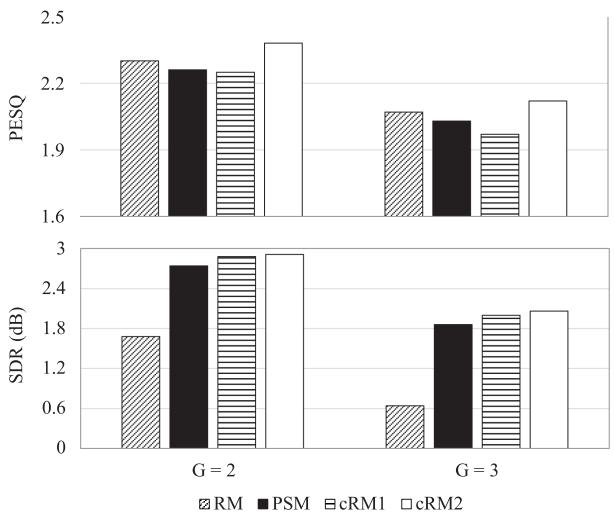  
Fig. 7. Average SDR and PESQ results of HybridAHS\_v2 using differen masking strategies.

Incorporating all three signals as input doesn’t yield substantial performance variations but introduces added input dimensions. As a result, we utilize the input configuration outlined in the second row for our proposed method.

3) Masking Strategies: The aim of this exploration is to assess the impact of phase enhancement on overall performance. Notably, Fig. 5(g) and (h) reveal the presence of slight howling in the HybridAHS output, indicated by continuous horizontal lines. This effect is primarily attributed to the network’s relatively small size and the absence of phase enhancement. To address this, we analyze how different masking strategies influence howling suppression within HybridAHS $\mathbf { \nabla } _ { - } \mathbf { v } 2 { : }$ ratio mask (RM), phase-sensitive mask (PSM) [48], and complex ratio mask (cRM) [47]. Specifically, cRM2 utilizes a concatenation of $[ | \mathbf { Y } | , | \mathbf { E } | , \mathbf { Y } _ { r } , \mathbf { Y } _ { i } ]$ as input, where $| * | , \mathbf { \epsilon } _ { r } ,$ and $* _ { i }$ denote magnitude, real, and imaginary spectrograms, respectively. In contrast, cRM1 employs a concatenation of $[ { \bf Y } _ { r } , { \bf Y } _ { i } , { \bf E } _ { r } , { \bf E } _ { i } ]$ as input. The SDR and PESQ results are shown in Fig. 7.

Evidently, enhancing phase information results in better SDR albeit with a slightly diminished PESQ value. This outcome arises from the fact that, while complex-domain estimation enhances phase information and mitigates mild howling leakage in the enhanced signal, the process of training becomes comparatively more challenging than magnitude-only estimation. Through comparison, we observe that including magnitude information in the inputs for complex-domain estimation, as demonstrated by cRM2 achieves the best performance.

TABLE III  
EXPLORATIONS REGARDING NEURALKALMANAHS

<table><tr><td>SDR ↑</td><td>G=2</td><td>G=2.5</td><td>G=3</td></tr><tr><td>Kalman filter</td><td>-10.33</td><td>-14.88</td><td>-18.25</td></tr><tr><td>Kalman filter +  $NN_{\Psi 1} + NN_{\Psi 2}$ </td><td>1.38</td><td>0.98</td><td>0.60</td></tr><tr><td>Kalman filter +  $NN_{R}$ </td><td>2.28</td><td>1.55</td><td>1.04</td></tr><tr><td>NeuralKalmanAHS</td><td>2.65</td><td>1.98</td><td>1.45</td></tr><tr><td>PESQ ↑</td><td>G=2</td><td>G=2.5</td><td>G=3</td></tr><tr><td>Kalman filter</td><td>1.65</td><td>1.44</td><td>1.30</td></tr><tr><td>Kalman filter +  $NN_{\Psi 1} + NN_{\Psi 2}$ </td><td>1.77</td><td>1.64</td><td>1.51</td></tr><tr><td>Kalman filter +  $NN_{R}$ </td><td>2.24</td><td>2.07</td><td>1.94</td></tr><tr><td>NeuralKalmanAHS</td><td>2.33</td><td>2.17</td><td>2.04</td></tr></table>

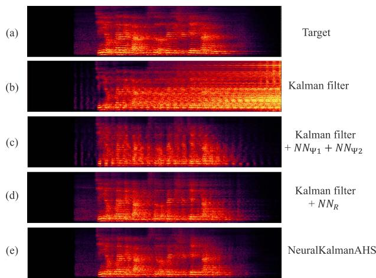  
Fig. 8. Spectrograms of an utterance tested under $G = 2 \colon$ (a) target signal, (b) Kalman filter, (c) Kalman filter with covariance matrices estimation, (d) Kalman filter with reference signal estimation, and (e) proposed NeuralKalmanAHS.

## C. Explorations Regarding NeuralKalmanAHS

This section undertakes an ablation study of NeuralKalmanAHS, specifically exploring the impact of the estimated reference signal and covariance matrices on overall performance.

1) NeuralKalmanAHS With Different Configurations: We contrast the proposed NeuralKalmanAHS with its variants wherein we only utilize NN modules for covariance matrices estimation (denoted as “Kalman filter $+ \ N N _ { \Psi 1 } + N { N _ { \Psi 2 } } \ ^ { \prime \prime } )$ and/or reference signal estimation (denoted as Kalman filter + $N N _ { R } )$ . Table III illustrates the results and the corresponding spectrogram is provided in Fig. 8.

The results reveal that utilizing NN modules for either covariance matrices or reference signal estimation results in noteworthy performance improvement compared to the original Kalman filter. Importantly, the improvement achieved from estimating reference signal surpasses that of estimating covariance matrices, underscoring its vital role in improving overall performance.

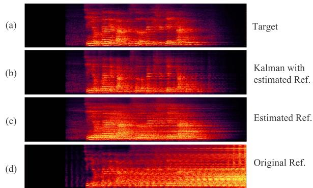  
Fig. 9. Spectrograms of an utterance tested under $G = 2 \mathrm { : }$ (a) target signal, (b) output of proposed method with only reference signal estimation, (c) the estimated reference signal, and (d) the original reference signal of Kalman filter.

Jointly estimating the reference signal and covariance matrices, the proposed NeuralKamanAHS method, achieves further improvement

2) Benefits ofUsing the Learned Reference Signal: To highlight the advantages ofreference signal estimation, a comparison is drawn between the reference signal estimation utilized in the original Kalman filter and the estimated one obtained from “Kalman filter + $N N _ { R } { \mathrm { ? } }$ . The related signals are shown in Fig. 9. Notably, the reference signal in the Kalman filter corresponds to the prior processed output, resulting in the same spectrogram as that of the Kalman filter’s output with a one-frame delay. The estimated reference signal, employed in our method, effectively eliminates a substantial portion of the howling component. This, in turn, facilitates a refined reference signal for the Kalman filter’s weight updating, ultimately contributing to an improved howling suppression performance.

## D. HybridAHS vs. NeuralKalmanAHS

This section conducts a comparative analysis of the proposed HybridAHS and NeuralKalmanAHS methods. While both approaches integrate Kalman filters with neural networks, they differ in how they address howling suppression, creating a trade-off between the degree of howling suppression and the distortions introduced to the enhanced speech.

HybridAHS treats AHS as a speech enhancement task, utilizing the neural network to directly estimate target speech from microphone recordings. This approach is particularly effective in interference attenuation, specifically feedback suppression in the context of AHS. However, it inevitably introduces artifacts to the enhanced signal, a common challenge associated with NN-based enhancement methods. On the contrary, NeuralKalmanAHS adopts the strategy of traditional AFC methods, achieving howling suppression through the recursive subtraction of the estimated feedback signal from the microphone recording. While this approach may show limited suppression power, it has a gentler impact on the target speech due to the subtraction process, often resulting in superior speech quality.”

Results in Table I have highlighted the superior howling suppression achieved by HybridAHS, particularly HybridAHS\_v2 (cRM2), in comparison to NeuralKalmanAHS. To substantiate our analysis concerning potential distortions in the enhanced signal, we employ automatic speech recognition (ASR) results as an additional measure. We employ a general-purpose Mandarin speech recognition API [49] to evaluate the ASR performance of the proposed methods. The word error rate (WER) results are shown in Fig. 10. Lower WER values correspond to improved recognition performance. It’s important to emphasize that the primary focus of AHS is not ASR performance enhancement. We opt for a low-power model to address the computational burden and latency considerations and tested under the severe howling scenario, which may contribute to the WER results shown in Fig. 10 not reaching the typical levels reported in ASR-related studies.

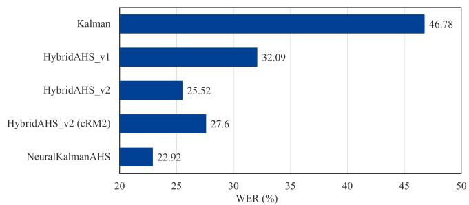  
Fig. 10. Word error rate (WER) results of proposed methods evaluated in severe howling scenario.

In our evaluation, NeuralKalmanAHS outperforms HybridAHS in terms of recognition performance, indicating less distortion and better speech quality. Interestingly, “HybridAHS\_v2 (cRM2)”, which excels in howling suppression performance in terms of SDR and PESQ, exhibits slightly lower recognition performance when compared to “HybridAHS\_v2”. One plausible explanation is that the complexity needed for complex domain estimation is generally higher. Therefore, the cRM2 version may experience slightly more distortions than the RM version due to insufficient network complexity.

## E. Stableness of Recursive Training

Utilizing recursive training effectively eliminates the mismatch issue encountered in previous NN-based AHS studies. The advantage of employing this training strategy extends beyond improved howling suppression; it also enhances robustness. To illustrate this, we randomly select a subset of 50 test signals and increase the amplification from 1 to 3 for evaluation. The average SDR and PESQ values at different amplification levels are plotted in Fig. 11, where HybridAHS\_v1 is trained using offline-generated signals, and HybridAHS\_v2 and NeuralKalmanAHS use recursive training. The results reveal that the offline model can suppress howling at lower amplification gain levels, but its performance drops significantly at G levels larger than 2.2. In contrast, the other two methods utilizing recursive training exhibit robust performance across these evaluation scenarios.

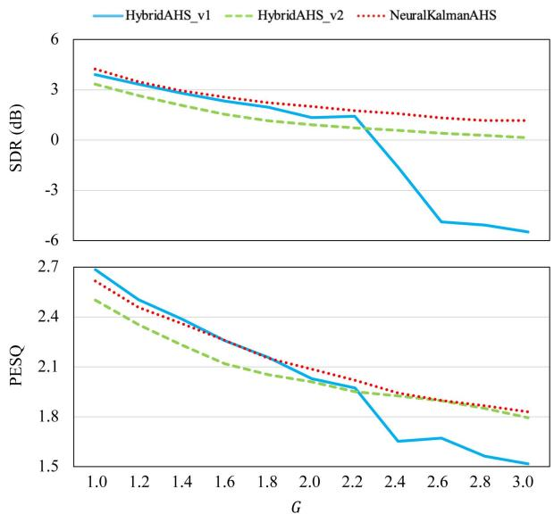  
Fig. 11. Acoustic howling suppression performance of proposed methods with fixed RIR and fixed system delay at different G levels.

## F. Robustness Test of the Proposed Methods

In real-world applications, accounting for nonlinear distortions and variations in the feedback path is crucial. This section is dedicated to examining the robustness of the proposed methods in addressing these challenges.

Initially, we explore the performance of the proposed methods in the presence of nonlinear (NL) distortions. Previous studies [31], [32] have demonstrated the robustness of deep learning-based AHS methods to nonlinear distortions. Following a similar setup [32], [50], we retrain the proposed methods to accommodate the nonlinear distortions stemming from inherent limitations in components like power amplifiers and loudspeakers To simulate the characteristics of a power amplifier, we apply a hard clipping operation [51] to the loudspeaker signal x(t):

$$
x _ {\mathrm{clip}} (t) = \left\{ \begin{array}{l l} - x _ {\max} & x (t) <   - x _ {\max} \\ x (t) & | x (t) | \leq x _ {\max} \\ x _ {\max} & x (t) > x _ {\max} \end{array} \right.\tag{19}
$$

where $x _ { \tt m a x }$ is set to 0.8 of the maximum amplitude of x(t) . Subsequently, a memoryless sigmoidal nonlinearity [52] is applied to the clipped signal to simulate asymmetric loudspeaker distortion:

$$
x _ {\mathrm{NL}} (t) = \gamma \left(\frac {2}{1 + \exp (- a \cdot b (t))} - 1\right)\tag{20}
$$

where $b ( t ) = b _ { 1 } \times x _ { \tt c l i p } ( t ) - b _ { 2 } \times x _ { \tt c l i p } ^ { 2 } ( t )$ . To address the variability in nonlinearities, we randomly select $b _ { 1 }$ from [1,2] and $b _ { 2 }$ from [0.1, 0.6] for each utterance. The sigmoid gain γ is randomly selected from [1,4], while the sigmoid slope a is set to a random value within [1, 5] i $\dot { \mathbf { \theta } } _ { b ( t ) } > 0$ , and [0.1, 0.6] otherwise.

Secondly, we examine the impact offeedback path changes on the efficacy of the proposed howling suppression methods. During the evaluation, two RIRs are generated for each utterance, denoted as RIR\_1 and RIR\_2, representing the feedback path. Subsequently, an abrupt change is introduced in the feedback path by transitioning from RIR\_1 to RIR\_2 at the midpoint of a test signal.

TABLE IV  
ROBUSTNESS TEST AGAINST NONLINEAR (NL) DISTORTIONS AND RIR CHANGE

<table><tr><td>SDR ↑</td><td>NL distortions</td><td>RIR change</td></tr><tr><td>HybridAHS_v1</td><td>0.05</td><td>-1.83</td></tr><tr><td>HybridAHS_v2</td><td>2.38</td><td>1.74</td></tr><tr><td>HybridAHS_v2 (cRM2)</td><td>3.14</td><td>2.33</td></tr><tr><td>NeuralKalmanAHS</td><td>2.67</td><td>2.12</td></tr><tr><td>PESQ ↑</td><td>NL distortions</td><td>RIR change</td></tr><tr><td>HybridAHS_v1</td><td>1.97</td><td>2.18</td></tr><tr><td>HybridAHS_v2</td><td>2.18</td><td>2.28</td></tr><tr><td>HybridAHS_v2 (cRM2)</td><td>2.16</td><td>2.30</td></tr><tr><td>NeuralKalmanAHS</td><td>2.13</td><td>2.19</td></tr></table>

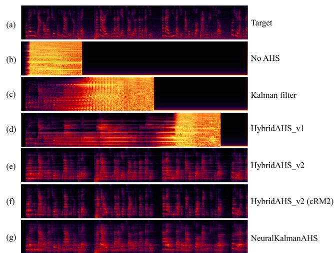  
Fig. 12. Spectrograms of an utterance tested using real-world recordings: (a) target signal, (b) no AHS, (c) Kalman, (d) HybridAHS\_v1, (e) HybridAHS\_v2, (f) HybridAHS\_v2 (cRM2), and (g) NeuralKalmanAHS.

We conduct two separate evaluations to assess performance under different conditions: one for examining the impact of nonlinear distortions and the other for evaluating feedback path changes. Each evaluation includes 100 utterances, with the system delay randomly assigned within the range of 0.15 to 0.25 seconds, and the value of amplification gain randomly selected between 1 and 3. The evaluation outcomes, as detailed in Table IV, indicate that nonlinear distortions lead to a slight reduction in the PESQ value, while changes in the feedback path have a minor impact on the SDR results. Nonetheless, the overall outcomes still demonstrate the robustness of the proposed method against NL distortions and feedback path changes.

Additionally, we assess the performance of the proposed method using real-world recordings. The spectrograms of a test utterance under a severe howling scenario are depicted in Fig. 12, and the corresponding sound files are available on our demo page. The figure illustrates that without AHS or with a traditional Kalman filter, the outputs contain severe acoustic howling. In general, the results suggest that considering variations in system delay, amplification gain, room sizes, loudspeakermicrophone positions, and their respective RIRs, as described in Section V-A, enables the models trained on simulated signals to demonstrate stability and effectiveness in handling real recordings. Specifically, with the offline-trained HybridAHS method, HybridAHS\_v1, the acoustic howling is suppressed to some extent, but there is still residual howling in the output under severe howling scenarios. While the recursively trained methods exhibit robust howling suppression with real-world recordings.

## VII. CONCLUSION

In this study, we introduce two distinctive approaches, HybridAHS and NeuralKalmanAHS, which unite the traditional Kalman filter with neural networks for the purpose of acoustic howling suppression. To tackle the mismatch problem that existed in previous NN-based AHS methods, we introduce an innovative training framework that involves recursive training, rooted in an examination of the underlying acoustic howling formation process. The multifaceted integration and the employment of a recursive training strategy address the mismatch issue effectively, leading to substantial enhancements in howling suppression capabilities.

Our exploration encompasses various implementation approaches of these methods, which we systematically compared to provide a thorough assessment. Experimental results illustrate the power that arises from combining the Kalman filter with deep learning methodologies. The proposed methods exhibit superior performance and present valuable options for users seeking effective solutions in real-world audio communication systems.

## ACKNOWLEDGMENT

Yixuan Zhang contributed to this work during her internship at Tencent AI Lab.

## REFERENCES

[1] R. V. Waterhouse, “Theory of howlback in reverberant rooms,” J. Acoustical Soc. Amer., vol. 37, no. 5, pp. 921–923, 1965.

[2] T. V. Waterschoot and M. Moonen, “Fifty years of acoustic feedback control: State of the art and future challenges,” Proc. IEEE, vol. 99, no. 2, pp. 288–327, Feb. 2011.

[3] W. Loetwassana, R. Punchalard, A. Lorsawatsiri, J. Koseeyaporn, and P. Wardkein, “Adaptive howling suppressor in an audio amplifier system,” in Proc. IEEE Asia-Pacific Conf. Commun., 2007, pp. 445–448.

[4] M. G. Siqueira and A. Alwan, “Steady-state analysis of continuous adaptation in acoustic feedback reduction systems for hearing-aids,” IEEE Speech Audio Process., vol. 8, no. 4, pp. 443–453, Jul. 2000.

[5] H. A. L. Joson, F. Asano, Y. Suzuki, and T. Sone, “Adaptive feedback cancellation with frequency compression for hearing aids,” J. Acoustical Soc. Amer., vol. 94, no. 6, pp. 3248–3254, 1993.

[6] M. R. Schroeder, “Improvement offeedback stability ofpublic address systems by frequency shifting,” J.Audio Eng. Soc., vol. 10, no. 2, pp. 108–109, 1962.

[7] M. R. Schroeder, “Improvement of acoustic-feedback stability by frequency shifting,” J. Acoustical Soc. Amer., vol. 36, no. 9, pp. 1718–1724, 1964.

[8] A. Pandey and V. J. Mathews, “Howling suppression in hearing aids using least-squares estimation and perceptually motivated gain control,” in Proc. IEEE Int. Conf. Acoust. Speech Signal Process. Proc., vol. 5, pp. V–V, 2006.

[9] P. Gil-Cacho, T. V. Waterschoot, M. Moonen, and S. H. Jensen, “Regularized adaptive notch filters for acoustic howling suppression,” in Proc. 17th Eur. Signal Process. Conf., 2009, pp. 2574–2578.

[10] T. V. Waterschoot and M. Moonen, “Comparative evaluation of howling detection criteria in notch-filter-based howling suppression,” J. Audio Eng. Soc., vol. 58, no. 11, pp. 923–940, 2010.

[11] W. Leotwassana, R. Punchalard, and W. Silaphan, “Adaptive howling canceller using adaptive IIR notch filter: Simulation and implementation,” in Proc. IEEE Int. Conf. Neural Netw. Signal Process., 2003, pp. 848–851.

[12] A. Spriet, G. Rombouts, M. Moonen, and J. Wouters, “Adaptive feedback cancellation in hearing aids,” J. Franklin Inst., vol. 343, no. 6, pp. 545–573, 2006.

[13] T. V. Waterschoot and M. Moonen, “Adaptive feedback cancellation for audio applications,” Signal Process., vol. 89, no. 11, pp. 2185–2201, 2009.

[14] F. Strasser and H. Puder, “Adaptive feedback cancellation for realistic hearing aid applications,” IEEE/ACM Trans. Audio, Speech, Lang. Process., vol. 23, no. 12, pp. 2322–2333, Dec. 2015.

[15] F. Albu, L. T. T. Tran, and S. Nordholm, “The hybrid simplified Kalman filter for adaptive feedback cancellation,” in Proc. IEEE Int. Conf. Commun., 2018, pp. 45–50.

[16] G. Enzner and P. Vary, “Frequency-domain adaptive Kalman filter for acoustic echo control in hands-free telephones,” Signal Process., vol. 86, no. 6, pp. 1140–1156, 2006.

[17] F. Yang, G. Enzner, and J. Yang, “Frequency-domain adaptive Kalman filter with fast recovery of abrupt echo-path changes,” IEEE Signal Process. Lett., vol. 24, no. 12, pp. 1778–1782, Dec. 2017.

[18] J. Benesty, T. Gänsler, D. R. Morgan, M. M. Sondhi, and S. L. Gay, Advances in Network and Acoustic Echo Cancellation. Berlin, Germany: Springer, 2001.

[19] G. Enzner, H. Buchner, A. Favrot, and F. Kuech, “Acoustic echo control,” in Academic Press Library in Signal Processing, vol. 4. Amsterdam, The Netherlands: Elsevier, 2014, pp. 807–877.

[20] M. Bekrani, A. W. Khong, and M. Lotfizad, “Neural network based adaptive echo cancellation for stereophonic teleconferencing application,” in Proc. IEEE Int. Conf. Multimedia Expo, 2010, pp. 1172–1177.

[21] M. Bekrani, A. W. Khong, and M. Lotfizad, “A linear neural network-based approach to stereophonic acoustic echo cancellation,” IEEE Trans. Audio, Speech, Lang. Process., vol. 19, no. 6, pp. 1743–1753, Aug. 2011.

[22] H. Zhang, M. Yu, and D. Yu, “Deep learning for joint acoustic echo and acoustic howling suppression in hybrid meetings,” in Proc. ASRU, 2023, pp. 1–7.

[23] H. Zhang and D. Wang, “Deep learning for acoustic echo cancellation in noisy and double-talk scenarios,” in Proc. Interspeech, 2018, pp. 3239–3243.

[24] H. Zhang, K. Tan, and D. Wang, “Deep learning for joint acoustic echo and noise cancellation with nonlinear distortions,” in Proc. Interspeech, 2019, pp. 4255–4259.

[25] H. Zhang and D. Wang, “A deep learning approach to multi-channel and multi-microphone acoustic echo cancellation,” in Proc. Interspeech, 2021, pp. 1139–1143.

[26] H. Zhang and D. Wang, “Neural cascade architecture for joint acoustic echo and noise suppression,” in Proc. IEEE Int. Conf. Acoust., Speech Signal Process., 2022, pp. 671–675.

[27] H. Zhang and D. Wang, “Neural cascade architecture for multi-channel acoustic echo suppression,” IEEE/ACM Trans. Audio, Speech, Lang. Process., vol. 30, pp. 2326–2336, 2022.

[28] Z. Chen, Y. Hao, Y. Chen, G. Chen, and L. Ruan, “A neural network-based howling detection method for real-time communication applications,” in Proc. IEEE Int. Conf. Acoust., Speech Signal Process., 2022, pp. 206–210.

[29] H. Gan, G. Luo, Y. Luo, and W. Luo, “Howling noise cancellation in time– frequency domain by deep neural networks,” in Proc. Sixth Int. Congr. Inf. Commun. Technol.. 2022, pp. 319–332.

[30] C. Zheng, M. Wang, X. Li, and B. C. Moore, “A deep learning solution to the marginal stability problems of acoustic feedback systems for hearing aids,” J. Acoustical Soc. Amer., vol. 152, no. 6, pp. 3616–3634, 2022.

[31] H. Zhang, M. Yu, and D. Yu, “Deep AHS: A deep learning approach to acoustic howling suppression,” in Proc. IEEE Int. Conf. Acoust., Speech Signal Process., 2023, pp. 1–5.

[32] H. Zhang, M. Yu, Y. Wu, T. Yu, and D. Yu, “Hybrid AHS: A hybrid of Kalman filter and deep learning for acoustic howling suppression,” in Proc. Interspeech, 2023, pp. 834–838.

[33] Y. Zhang, H. Zhang, M. Yu, and D. Yu, “Neural network augmented Kalman filter for robust acoustic howling suppression,” 2023, arXiv:2309.16049.

[34] R. J. Williams and D. Zipser, “A learning algorithm for continually running fully recurrent neural networks,” Neural Computation, vol. 1, no. 2, pp. 270–280, 1989.

[35] A. M. Lamb et al., “Professor forcing: A new algorithm for training recurrent networks,” in Proc. Annu. Conf. Neural Inf. Process. Syst., 2016.

[36] H. Zhang, Y. Zhang, M. Yu, and D. Yu, “Advancing acoustic howling suppression through recursive training of neural networks,” in Proc. Int. Conf. Acoust., Speech Signal Process., 2024, pp. 711–715.

[37] H. Zhang, S. Kandadai, H. Rao, M. Kim, T. Pruthi, and T. Kristjansson, “Deep adaptive Aec: Hybrid of deep learning and adaptive acoustic echo cancellation,” in Proc. IEEE Int. Conf. Acoust., Speech Signal Process., 2022, pp. 756–760.

[38] Y. Zhang, M. Yu, H. Zhang, D. Yu, and D. Wang, “NeuralKalman: A learnable Kalman filter for acoustic echo cancellation,” in Proc. IEEE Autom. Speech Recognit. Understanding Workshop, 2023, pp. 1–7.

[39] J. Casebeer, N. J. Bryan, and P. Smaragdis, “Meta-AF: Meta-learning for adaptive filters,” IEEE/ACM Trans. Audio, Speech, Lang. Process., vol. 31, pp. 355–370, 2023.

[40] J. Du, X. Na, X. Liu, and H. Bu, “Aishell-2: Transforming mandarin ASR research into industrial scale,” 2018, arXiv:1808.10583.

[41] J. B. Allen and D. A. Berkley, “Image method for efficiently simulating small-room acoustics,” J. Acoustical Soc. Amer., vol. 65, no. 4, pp. 943–950, 1979.

[42] A. Graves and A. Graves, “Long short-term memory,” in Supervised Sequence Labelling With Recurrent Neural Networks, Berlin, Germany: Springer, 2012, pp. 37–45.

[43] B. Soleimani, H. Schepker, and M. Mirbagheri, “Neural-AFC: Learningbased step-size control for adaptive feedback cancellation with closed-loop model training,” in Proc. IEEE Int. Conf. Acoust., Speech Signal Process., 2023, pp. 1–5.

[44] D. Yang, F. Jiang, W. Wu, X. Fang, and M. Cao, “Low-complexity acoustic echo cancellation with neural Kalman filtering,” in Proc. IEEE Int. Conf. Acoust., Speech Signal Process., 2023, pp. 1–5.

[45] J. L. Roux, S. Wisdom, H. Erdogan, and J. R. Hershey, “SDR–half-baked or well done?,” in Proc. IEEE Int. Conf. Acoust., Speech Signal Process., 2019, pp. 626–630.

[46] A. W. Rix, J. G. Beerends, M. P. Hollier, and A. P. Hekstra, “Perceptual evaluation of speech quality (PESQ)-a new method for speech quality assessment of telephone networks and codecs,” in Proc. IEEE Int. Conf. Acoust., Speech Signal Process., 2001, pp. 749–752.

[47] D. S. Williamson, Y. Wang, and D. Wang, “Complex ratio masking for monaural speech separation,” IEEE/ACM Trans. Audio, Speech, Lang. Process., vol. 24, no. 3, pp. 483–492, Mar. 2016.

[48] H. Erdogan, J. R. Hershey, S. Watanabe, and J. L. Roux, “Phase-sensitive and recognition-boosted speech separation using deep recurrent neural networks,” in Proc. IEEE Int. Conf. Acoust., Speech Signal Process., 2015, pp. 708–712.

[49] “Tencent ASR,” 2022. [Online]. Available: https://ai.qq.com/product/ aaiasr.shtml

[50] R. Cutler et al., “ICASSP 2022 acoustic echo cancellation challenge,” in Proc. IEEE Int. Conf. Acoust., Speech Signal Process., 2022, pp. 9107–9111.

[51] S. Malik and G. Enzner, “State-space frequency-domain adaptive filtering for nonlinear acoustic echo cancellation,” IEEE Trans. Audio, Speech, Lang. Process., vol. 20, no. 7, pp. 2065–2079, Sep. 2012.

[52] D. Comminiello, M. Scarpiniti, L. A. Azpicueta-Ruiz, J. Arenas-Garcia, and A. Uncini, “Functional link adaptive filters for nonlinear acoustic echo cancellation,” IEEE Trans. Audio, Speech, Lang. Process., vol. 21, no. 7, pp. 1502–1512, Jul. 2013.