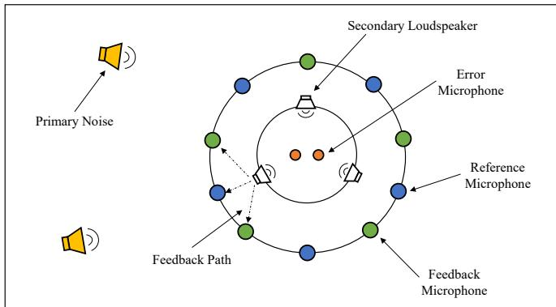
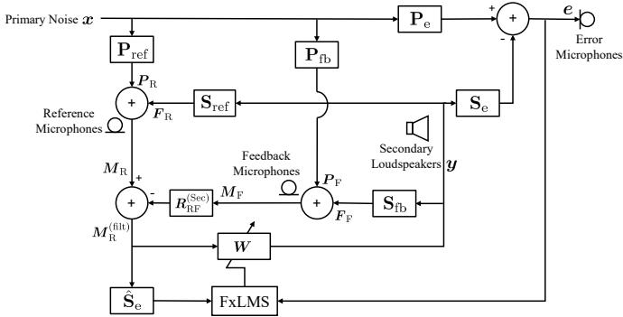
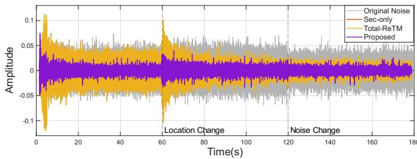
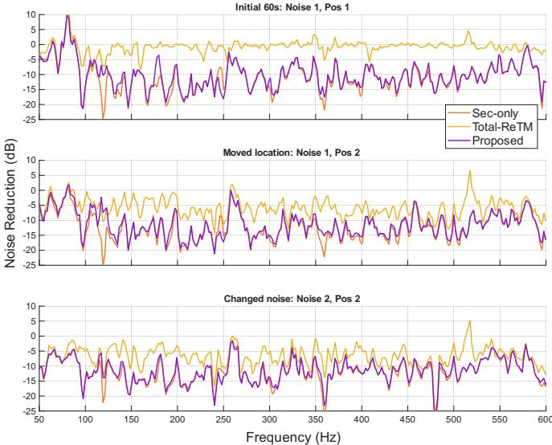

# Acoustic Feedback Path Mitigation for Multichannel Active Noise Control

Yile (Angela) Zhang, Thushara D. Abhayapala, Prasanga N. Samarasinghe, Amy Bastine

Audio & Acoustic Signal Processing Group

The Australian National University

Canberra, Australia

Abstract—Acoustic feedback from secondary loudspeakers to reference microphones remains a major challenge for multichannel feedforward active noise control (ANC), particularly when the primary noise cannot be switched off to measure feedback paths. This paper proposes a feedback path mitigation method based on the Relative Transfer Matrix (ReTM) with covariance subtraction. Microphones are divided into a reference group and a feedback group, and the ReTM is estimated as a spatial mapping from the feedback group to the reference group using measurements with secondary source probing enabled and disabled. Subtracting the corresponding covariance estimates suppresses the contribution of persistent primary noise, enabling identification under ongoing noise without requiring repeated measurements of individual feedback paths. As the ReTM maps between microphone groups, it depends only on the acoustic transfer structure and not on the primary noise signal. The estimated ReTM is used to subtract the loudspeaker feedback component from the reference signals prior to the conventional FxLMS algorithm. Simulations show that the proposed method remains robust to changes in primary noise source location and to changes in the primary noise signal.

Index Terms—Acoustic feedback cancellation, Feedback neutralization, Multichannel feedforward ANC

## I. INTRODUCTION

Multichannel active noise control (ANC) has been widely studied as a practical approach for controlling noise over a region using multiple microphones and secondary loudspeakers, where single-channel systems are insufficient [1]. Representative applications include noise attenuation through open apertures and windows [2]–[6], the creation of quiet zones in vehicles [7], [8], and broader spatial ANC [9], [10], including its spatially selective variant [11], [12]. These systems commonly adopt the multichannel feedforward ANC architecture.

A key challenge in feedforward ANC is the acoustic feedback from the secondary loudspeakers to the reference microphones. This feedback contaminates the reference signals with the secondary loudspeaker output, creating a positive-feedback loop that can destabilize the ANC system and degrade noise reduction performance if left uncompensated [1], [13]. Several techniques have been proposed to mitigate this problem. One class of approaches modifies the physical setup, such as employing directional microphones or loudspeakers [14]– [16]. In addition, hardware-oriented dual-reference sensing has been explored in single-channel duct ANC to reduce the pickup of the secondary loudspeaker signal at the reference microphone [17].

Algorithmic solutions, such as infinite impulse response filters [18], [19] and feedback neutralization using feedback path modelling (FBPM) [20], offer a more flexible alternative to hardware modifications. Feedback neutralization is achieved by subtracting an estimated feedback component from the reference signal. Conventionally, FBPM is performed offline by exciting the secondary loudspeaker with a probe signal while the ANC controller is frozen [20]. In realistic deployments, however, persistent primary noise contaminates the reference microphones, which biases the feedback path estimation. While various online FBPM algorithms have been developed to address this in single-channel settings [20]–[24], there are limited solutions for the multichannel case in the presence of persistent noise [25], [26]. This motivates the need for methods that can leverage the spatial diversity to identify feedback paths without requiring the primary noise source to be silenced.

This paper proposes a feedback mitigation approach that remains feasible under persistent primary noise by exploiting spatial diversity and covariance-domain subtraction. We divide the microphones into two groups: a reference microphone group, used by the ANC controller, and a feedback microphone group that is used to observe loudspeaker leakage. Using the relative transfer matrix (ReTM) framework [27], [28], we estimate a mapping from the feedback microphone group to the reference microphone group for the secondary-loudspeaker component. The proposed estimator operates under ongoing primary noise and avoids repeated identification of individual feedback paths. The estimated ReTM is then used to subtract the loudspeaker feedback component from the reference signals prior to a conventional multichannel FxLMS controller.

## II. PROBLEM FORMULATION

Consider the scenario in a room as shown in Fig. 1, where there are J primary sources emitting noise that needs to be attenuated. There are L secondary loudspeakers producing the anti-noise signals. We use R error microphones to monitor the residual noise. A reference microphone group is placed to measure the primary noise signal, and a feedback microphone group is additionally placed. There are $J _ { \mathrm { R } }$ and $J _ { \mathrm { F } }$ number of microphones in the reference microphone group and feedback microphone group, respectively. Let $\mathbf { P } _ { \mathrm { r e f } } , \mathbf { P } _ { \mathrm { f b } } , \mathbf { P } _ { \epsilon }$ and ${ \bf S } _ { \mathrm { r e f } } , { \bf S } _ { \mathrm { f b } } , { \bf S } _ { \mathrm { e } }$ denote the primary- and secondary-paths to the reference, feedback and error microphones, respectively.

  
Fig. 1. Problem setup: Consider a room ANC system in which primary noise sources are attenuated by secondary loudspeakers generating anti-noise, monitored by error microphones. Reference microphones provide a feedforward measurement of the primary noise for the adaptive ANC algorithm. In practice, secondary outputs leak to the reference microphones, forming acoustic feedback paths that need to be mitigated.

We express all signals in the short-time Fourier transform (STFT) domain with f and t denoting frequency bin and timeframe index, respectively. Let ${ \mathbf { } } x ( f , t )$ be $J \times 1$ vector of the emitted primary noise signals, ${ \mathbf { } } y ( f , t )$ be $L \times 1$ vector of secondary loudspeaker signals, $e ( f , t )$ be $R \times 1$ vector of error microphone signals. $M _ { \mathrm { R } } ( f , t )$ is the reference microphone group signal with $J _ { \mathrm { R } } \times 1$ vector and $M _ { \mathrm { F } } ( f , t )$ is the feedback microphone group, a $J _ { \mathrm { F } } \times 1$ vector of signals.

Let us denote the primary noise component due to the primary noise source ${ \mathbf { } } x ( f , t )$ at the microphone groups as $_ { r }$ and the feedback component due to the secondary loudspeaker output ${ \mathbf { } } y ( f , t )$ at the microphones as F. Therefore, $\pmb { P } \propto \pmb { x } ( f , t )$ and $\pmb { F } \propto \pmb { y } ( f , t )$ . For the two microphone groups, we have

$$
\boldsymbol {M} _ {\mathrm{R}} (f, t) = \boldsymbol {P} _ {\mathrm{R}} (f, t) + \boldsymbol {F} _ {\mathrm{R}} (f, t),\tag{1}
$$

$$
\boldsymbol {M} _ {\mathrm{F}} (f, t) = \boldsymbol {P} _ {\mathrm{F}} (f, t) + \boldsymbol {F} _ {\mathrm{F}} (f, t).\tag{2}
$$

In an adaptive LMS algorithm, the adaptive weight update is dependent on the reference signal $M _ { \mathrm { R } }$ containing the feedback leakage from the secondary loudspeakers. The objective is to use the available signal from $M _ { \mathrm { F } } ,$ , in the presence of persistent primary noise, to neutralize the feedback component in $M _ { \mathrm { R } }$ for the downstream ANC algorithm. Without loss of generality, we omit the $( f , t )$ notation for brevity.

## III. RELATIVE TRANSFER MATRIX-BASED FEEDBACK MODELING

In this section, we detail the calculation of the Relative Transfer Matrix (ReTM). This formulation is used to cancel the feedback component in the reference microphone signal, thereby enabling the use in conventional adaptive ANC algorithms.

## A. Relative Transfer Matrix

Prior to the ANC operation, an initial offline ReTM identification stage is conducted. Let us define the ReTM [27] $\pmb { R } _ { \mathrm { R F } } \in \mathbb { C } ^ { J _ { \mathrm { R } } \times J _ { \mathrm { F } } }$ as the spatial mapping from the feedback microphone group to the reference microphone group, where

$$
M _ {\mathrm{R}} = R _ {\mathrm{RF}} M _ {\mathrm{F}}.\tag{3}
$$

The ReTM used for feedback neutralization concerns the secondary loudspeaker-only field, i.e., the acoustic field generated by the secondary loudspeakers when the primary noise sources are silent. In this secondary-only setting,

$$
\pmb {F} _ {\mathrm{R}} = \mathbf {S} _ {\mathrm{ref}} \pmb {y}, \quad \pmb {F} _ {\mathrm{F}} = \mathbf {S} _ {\mathrm{fb}} \pmb {y},\tag{4}
$$

where $\mathbf { S } _ { \mathrm { r e f } } \in \mathbb { C } ^ { J _ { \mathrm { R } } \times L }$ and $\mathbf { S } _ { \mathrm { f b } } \in \mathbb { C } ^ { J _ { \mathrm { F } } \times L }$ . The secondary-field ReTM is defined as the mapping from the feedback-group secondary field to the reference-group secondary field,

$$
\pmb {R} _ {\mathrm{RF}} ^ {(\mathrm{Sec})} \triangleq \mathbf {S} _ {\mathrm{ref}} \mathbf {S} _ {\mathrm{fb}} ^ {\dagger},\tag{5}
$$

where $( \cdot ) ^ { \dagger }$ denotes the pseudo-inverse. Therefore, $R _ { \mathrm { R F } } ^ { \mathrm { ( S e c ) } }$ depends only on the acoustic structure of $( { \bf S } _ { \mathrm { r e f } } , { \bf S } _ { \mathrm { f b } } )$ and is independent of the emitted signal y and of the primary noise characteristics.

In an ideal setting where the primary noise can be silenced, $R _ { \mathrm { R F } } ^ { ( \mathrm { S e c } ) }$ can be estimated directly from secondary-only measurements by exciting the loudspeakers with probing signals via

$$
\boldsymbol {M} _ {\mathrm{R}} ^ {(\mathrm{Sec})} = \boldsymbol {R} _ {\mathrm{RF}} ^ {(\mathrm{Sec})} \boldsymbol {M} _ {\mathrm{F}} ^ {(\mathrm{Sec})},\tag{6}
$$

$$
\pmb {R} _ {\mathrm{RF}} ^ {(\mathrm{Sec})} \approx \Phi_ {\mathrm{RR}} ^ {(\mathrm{Sec})} \Phi_ {\mathrm{FR}} ^ {(\mathrm{Sec}) ^ {\dagger}}.\tag{7}
$$

Here, the auto- and cross-covariance matrices are defined as

$$
\Phi_ {\mathrm{RR}} ^ {(\mathrm{Sec})} = \mathbb {E} \{M _ {\mathrm{R}} ^ {(\mathrm{Sec})} M _ {\mathrm{R}} ^ {(\mathrm{Sec}) ^ {H}} \}, \Phi_ {\mathrm{FR}} ^ {(\mathrm{Sec})} = \mathbb {E} \{M _ {\mathrm{F}} ^ {(\mathrm{Sec})} M _ {\mathrm{R}} ^ {(\mathrm{Sec}) ^ {H}} \},\tag{8}
$$

where $( \cdot ) ^ { H }$ denotes the complex transpose, and the expectation operator $\mathbb { E } \{ \cdot \}$ is approximated by averaging across time frames. In practice, however, disabling the primary noise to isolate the secondary field is often infeasible, motivating the covariance-subtraction estimator described next.

Following the covariance-additivity property for mutually independent source components [28], the covariance of multiple sources can be written as the sum of the covariance contributions from the individual components. In the present problem, these components consist of the J primary noise sources and the L secondary loudspeaker signals. We conduct two measurement stages to distinguish these components. First, we measure the primary noise field only (with the secondary loudspeakers disabled), yielding the primary-only covariance matrices

$$
\Phi_ {\mathrm{RR}} ^ {(\mathrm{Pri})} = \sum_ {j = 1} ^ {J} \Phi_ {\mathrm{RR}} ^ {(j)}, \quad \Phi_ {\mathrm{FR}} ^ {(\mathrm{Pri})} = \sum_ {j = 1} ^ {J} \Phi_ {\mathrm{FR}} ^ {(j)},\tag{9}
$$

where $\Phi _ { \mathrm { R R } } ^ { ( j ) }$ and $\Phi _ { \mathrm { F R } } ^ { ( j ) }$ denote the covariance contributions of the j-th primary source.

Second, we enable the L secondary loudspeakers to emit mutually independent probing signals while the primary noise is still present. The total covariance matrices become

$$
\Phi_ {\mathrm{RR}} ^ {(\mathrm{Tot})} = \sum_ {j = 1} ^ {J} \Phi_ {\mathrm{RR}} ^ {(j)} + \sum_ {l = 1} ^ {L} \Phi_ {\mathrm{RR}} ^ {(l)},\tag{10}
$$

$$
\Phi_ {\mathrm{FR}} ^ {(\mathrm{Tot})} = \sum_ {j = 1} ^ {J} \Phi_ {\mathrm{FR}} ^ {(j)} + \sum_ {l = 1} ^ {L} \Phi_ {\mathrm{FR}} ^ {(l)},\tag{11}
$$

with $\Phi _ { \mathrm { R R } } ^ { ( l ) }$ and $\Phi _ { \mathrm { F R } } ^ { ( l ) }$ the covariance contributions of the l-th secondary loudspeaker. Hence, the secondary-only covariance contributions are isolated as

$$
\Phi_ {\mathrm{RR}} ^ {(\mathrm{Sec})} = \sum_ {l = 1} ^ {L} \Phi_ {\mathrm{RR}} ^ {(l)} = \Phi_ {\mathrm{RR}} ^ {(\mathrm{Tot})} - \Phi_ {\mathrm{RR}} ^ {(\mathrm{Pri})},\tag{12}
$$

$$
\Phi_ {\mathrm{FR}} ^ {(\mathrm{Sec})} = \sum_ {l = 1} ^ {L} \Phi_ {\mathrm{FR}} ^ {(l)} = \Phi_ {\mathrm{FR}} ^ {(\mathrm{Tot})} - \Phi_ {\mathrm{FR}} ^ {(\mathrm{Pri})}.\tag{13}
$$

Finally, the secondary-field ReTM can be estimated by

$$
\begin{array}{r} \pmb {R} _ {\mathrm{RF}} ^ {(\mathrm{Sec})} \approx \Phi_ {\mathrm{RR}} ^ {(\mathrm{Sec})} \Phi_ {\mathrm{FR}} ^ {(\mathrm{Sec}) ^ {\dagger}} \\ = (\Phi_ {\mathrm{RR}} ^ {(\mathrm{Tot})} - \Phi_ {\mathrm{RR}} ^ {(\mathrm{Pri})}) (\Phi_ {\mathrm{FR}} ^ {(\mathrm{Tot})} - \Phi_ {\mathrm{FR}} ^ {(\mathrm{Pri})}) ^ {\dagger}. \end{array}\tag{14}
$$

B. Feedback Subtraction using Relative Transfer Matrix

  
Fig. 2. Proposed ANC system with feedback subtraction using the ReTM.

Fig. 2 shows the proposed approach for using the ReTM during ANC operation. The ReTM can be used to subtract the feedback component from $M _ { \mathrm { R } }$

$$
\begin{array}{r l} & M _ {\mathrm{R}} ^ {(\mathrm{filt})} = M _ {\mathrm{R}} - R _ {\mathrm{RF}} ^ {(\mathrm{Sec})} M _ {\mathrm{F}} \\ & \quad = (P _ {\mathrm{R}} + F _ {\mathrm{R}}) - R _ {\mathrm{RF}} ^ {(\mathrm{Sec})} (P _ {\mathrm{F}} + F _ {\mathrm{F}}) \\ & \quad = P _ {\mathrm{R}} + \underbrace {(S _ {\mathrm{ref}} y - R _ {\mathrm{RF}} ^ {(\mathrm{Sec})} S _ {\mathrm{fb}} y)} _ {\approx 0} - R _ {\mathrm{RF}} ^ {(\mathrm{Sec})} P _ {\mathrm{F}} \\ & \quad \approx P _ {\mathrm{R}} - R _ {\mathrm{RF}} ^ {(\mathrm{Sec})} P _ {\mathrm{F}}. \end{array}\tag{15}
$$

The filtered reference signal $M _ { \mathrm { R } } ^ { \mathrm { ( f i l t ) } }$ , which depends exclusively on the primary noise components $( P _ { \mathrm { { R } } }$ and $P _ { \mathrm { F } } )$ , is effectively free of secondary loudspeaker feedback and remains proportional to the primary source signal x.

## C. ANC algorithm

We employ the normalized frequency domain FxLMS algorithm from [1]. When there is no feedback subtraction, the complex FxLMS update equation is given by

$$
\boldsymbol {W} (f, t + 1) = \boldsymbol {W} (f, t) + \boldsymbol {\mu} (f, t) \boldsymbol {M} _ {\mathrm{R}} ^ {\prime *} (f, t) \boldsymbol {e} (f, t),\tag{16}
$$

where W is the adaptive weight term, $M _ { \mathrm { R } } ^ { \prime }$ is the reference microphone signal filtered by the secondary path, and $( \cdot ) ^ { * }$ is the complex conjugate. $\mu ( f , t )$ is the step size at frequency bin $f ,$

$$
\boldsymbol {\mu} (f, t) = \frac {\mu}{\hat {\mathbf {P}} (f , t)},\tag{17}
$$

and

$$
\hat {\mathbf {P}} (f, t) = (1 - \alpha) \hat {\mathbf {P}} (f, t - 1) + \alpha | \boldsymbol {M} _ {\mathrm{R}} (f, t) | ^ {2},\tag{18}
$$

where $\mu$ is the step size, $\hat { \mathbf { P } }$ is the averaged power estimate of the reference signal and α is the smoothing factor.

With the proposed feedback subtraction, we replace the filtered reference term $M _ { \mathrm { R } } ^ { \prime }$ in Eq. (16) with the filtered feedback-subtracted signal $M _ { \mathrm { R } } ^ { \mathrm { ( f i l t ) ^ { \prime } } }$ , and similarly the reference term $M _ { \mathrm { R } }$ in Eq. (18) with $M _ { \mathrm { R } } ^ { \mathrm { ( f i l t ) } }$

## IV. SIMULATION RESULTS

## A. Simulations Setup

We simulate an ANC system in a room of size [6, 7, 3] m with $T _ { 6 0 } ~ = ~ 0 . 7 ~ \mathrm { ~ s ~ }$ . All primary, secondary, and feedback room impulse responses are generated using the image-source method [29], [30]. The primary source $( J = 1 )$ is located at [4.78, 3.6, 1.59] m. Two secondary loudspeakers $( L = 2 )$ are placed symmetrically on a circle centered at [3.08, 3.6, 1.54] m with radius $r _ { s } \in \{ 0 . 2 , 0 . 3 , 0 . 3 5 \}$ m, while two error microphones $( R = 2 )$ are placed on a concentric circle of radius 0.3 m in the same plane. The reference and feedback microphone groups consist of $J _ { r } = 8$ and $J _ { f } = 8$ microphones, interleaved on a circle of radius 0.5 m in the same plane as the loudspeakers and error microphones. The speed of sound is $\mathrm { 3 4 0 m / s }$ . ANC performance is evaluated over 50 to 600 Hz. For normalized FxLMS, α is set to 0.1, and the secondary paths are assumed known (i.e., $\hat { S } _ { e } = S _ { e } )$

Two washer-dryer noise recordings [31] are resampled to $f _ { s } = 8 0 0 0 ~ \mathrm { H z }$ . The first recording is used for ReTM identification and initial ANC, while the second is introduced at t = 120 s during ANC to simulate a primary noise change. ReTMs are identified using mutually independent white Gaussian probing signals emitted by the secondary loudspeakers, scaled to a nominal 0 dB probe-to-primary noise ratio at the reference microphone group. Independent measurement noise is added to each microphone channel with 40 dB SNR. The average noise reduction (NR) performance in dB is reported as D

$$
\mathrm{NR(dB)} = 1 0 \log_ {1 0} \left(\frac {\frac {1}{R} \sum_ {r = 1} ^ {R} \| \boldsymbol {e} _ {r} \| _ {2} ^ {2}}{\frac {1}{R} \sum_ {r = 1} ^ {R} \| \boldsymbol {d} _ {r} \| _ {2} ^ {2}}\right),\tag{19}
$$

where ∥·∥2 is the $\ell _ { 2 }$ norm and d denotes the uncontrolled primary noise observed at the error microphone (i.e., ANC off).

NOISE REDUCTION (dB) COMPARISON ACROSS DIFFERENT SPEAKER LOCATIONS AND STEP SIZES (µ). ‘NAN’ INDICATES INSTABILITY.  
TABLE I

<table><tr><td rowspan="2"> $r_s$  (m)</td><td rowspan="2">Method</td><td colspan="3">Step Size ( $\mu$ )</td></tr><tr><td>0.0025</td><td>0.005</td><td>0.01</td></tr><tr><td rowspan="4">0.2</td><td>Sec-only</td><td>-13.461</td><td>-17.110</td><td>-18.308</td></tr><tr><td>Total-ReTM</td><td>-1.591</td><td>-1.823</td><td>-2.169</td></tr><tr><td>Proposed</td><td>-12.128</td><td>-14.691</td><td>-15.467</td></tr><tr><td>NoSub</td><td>-12.150</td><td>-14.646</td><td>-14.989</td></tr><tr><td rowspan="4">0.3</td><td>Sec-only</td><td>-12.150</td><td>-14.495</td><td>-15.351</td></tr><tr><td>Total-ReTM</td><td>-1.448</td><td>-1.627</td><td>-1.731</td></tr><tr><td>Proposed</td><td>-11.389</td><td>-13.481</td><td>-14.285</td></tr><tr><td>NoSub</td><td>-10.039</td><td>-11.321</td><td>NaN</td></tr><tr><td rowspan="4">0.35</td><td>Sec-only</td><td>-10.928</td><td>-12.415</td><td>-12.742</td></tr><tr><td>Total-ReTM</td><td>-1.217</td><td>-1.310</td><td>-1.067</td></tr><tr><td>Proposed</td><td>-10.480</td><td>-11.871</td><td>-12.380</td></tr><tr><td>NoSub</td><td>NaN</td><td>NaN</td><td>NaN</td></tr></table>

We compare four variants: (1) Sec-only, which represents an ideal upper bound where the ReTM is identified from secondary loudspeaker-only probe measurements, without primary-noise contamination. Note that acoustic feedback is still present during ANC operation. (2) Total-ReTM, which estimates the ReTM directly from total field without covariance subtraction; (3) Proposed, which applies covariance subtraction to suppress primary noise bias; and (4) NoSub, which applies FxLMS directly without any feedback mitigation. Table I reports the steady-state NR for the initial washer-dryer noise after convergence, sweeping step size $\mu \in \{ 0 . 0 0 2 5 , 0 . 0 0 5 , 0 . 0 1 \}$ and various secondary loudspeaker radius $r _ { s }$ . The baseline without feedback subtraction becomes unstable with increased loudspeaker spacings and/or larger µ values, consistent with acoustic feedback limiting closedloop stability. In contrast, the proposed method remains stable across all tested configurations and achieves attenuation close to the ideal secondary-only upper bound, whereas the total ReTM baseline remains near −2 dB across settings, indicating strong bias when the ReTM is estimated from statistics contaminated by the primary noise.

  
Fig. 3. Time-domain residual signal at the error microphone for ANC off, Proposed, Sec-only, and Total-ReTM. Sec-only overlaps with Proposed curve and is visually indistinguishable. Vertical markers indicate scenario changes at t = 60 s (primary source displacement) and $t = 1 2 0 ~ \mathrm { s }$ (washer-dryer noise change).

To assess robustness to primary noise variations, we apply (i) a primary source displacement at $\textit { t } = \textit { } 6 0 \textit { } s$ by $[ 0 . 0 5 , - 0 . 0 5 , - 0 . 1 ]$ m from its original location and (ii) a change in the washer-dryer recording at $t = 1 2 0 \mathrm { ~ s } .$ The step size is set to $\mu = 0 . 0 1$ and the secondary-speaker radius to 0.3 m. Figure 3 shows representative time-domain error signals for the uncontrolled case, the proposed method, and the total-ReTM baseline. The proposed method closely matches the seconly upper bound, and thus the latter is visually indistinguishable. The no feedback subtraction baseline is omitted due to its divergence. The proposed method maintains a consistently lower residual level and exhibits smaller transients at both change points, whereas the total-ReTM baseline shows a larger residual and a longer settling transient.

  
Fig. 4. Frequency-domain NR snapshots computed for time before $t = 6 0 ~ \mathrm { s }$ (top; before primary source displacement), t = 120 s (middle; before washerdryer noise change), and $t = \bar { 1 } 8 0 \mathrm { ~ s ~ }$ (bottom).

Figure 4 shows frequency-dependent NR snapshots for time ending immediately before $t = 6 0 \mathrm { ~ s ~ }$ (before a primary source location change), t = 120 s (before change in the washerdryer noise recording), and $t ~ = ~ 1 8 0 ~ \mathrm { ~ s ~ }$ . Across all three stages, the proposed method provides stronger attenuation than the total-ReTM baseline over most of 50 to 600 Hz, with a typical separation of approximately 6–10 dB in the dominant frequency regions, indicating robustness to primary noise variations.

## V. CONCLUSION

This paper addressed acoustic feedback in multichannel ANC systems in the presence of persistent primary noise. We proposed a ReTM-based feedback mitigation method using covariance subtraction to estimate and remove secondaryloudspeaker leakage from the reference signals prior to FxLMS adaptation, without silencing the primary noise. Simulation results show that the proposed method remains stable across the tested step sizes and secondary-speaker spacings and achieves attenuation comparable to the secondary-only upper bound, whereas the total ReTM baseline suffers from estimation bias and the no-subtraction baseline becomes unstable. The proposed method also remains robust under dynamic acoustic conditions, including primary source displacements and noise changes. Future work will extend this framework to online tracking for time-varying feedback paths.

## REFERENCES

[1] S. M. Kuo and D. R. Morgan, “Active noise control: a tutorial review,” Proceedings of the IEEE, vol. 87, no. 6, pp. 943–973, 1999.

[2] H. Huang, X. Qiu, and J. Kang, “Active noise attenuation in ventilation windows,” The Journal of the Acoustical Society of America, vol. 130, no. 1, pp. 176–188, 2011.

[3] S. Wang, J. Tao, and X. Qiu, “Controlling sound radiation through an opening with secondary loudspeakers along its boundaries,” Scientific Reports, vol. 7, p. 13385, 2017.

[4] B. Lam, C. Shi, and W.-S. Gan, “Active noise control systems for open windows: Current updates and future perspectives,” in Proceedings of the 24th International Congress on Sound and Vibration, 2017, pp. 1–7.

[5] B. Lam, D. Shi, W.-S. Gan, S. J. Elliott, and M. Nishimura, “Active control of broadband sound through the open aperture of a full-sized domestic window,” Scientific Reports, vol. 10, no. 1, p. 10021, 2020.

[6] Z. Luo, D. Shi, J. Ji, X. Shen, and W.-S. Gan, “Real-time implementation and explainable ai analysis of delayless cnn-based selective fixed-filter active noise control,” Mechanical Systems and Signal Processing, vol. 214, p. 111364, 2024.

[7] S. J. Elliott, W. Jung, and J. Cheer, “Head tracking extends local active control of broadband sound to higher frequencies,” Scientific reports, vol. 8, no. 1, p. 5403, 2018.

[8] Z. Liang, H. Wang, Y. Yang, W. Zhang, and T. D. Abhayapala, “Active road noise control based on data-driven predictions of passenger ear noise signal,” in 2024 18th International Workshop on Acoustic Signal Enhancement (IWAENC), 2024, pp. 424–428.

[9] J. Zhang, T. D. Abhayapala, W. Zhang, and P. N. Samarasinghe, “Active noise control over space: A subspace method for performance analysis,” Applied Sciences, vol. 9, no. 6, p. 1250, 2019.

[10] S. Koyama, J. Brunnstrom, H. Ito, N. Ueno, and H. Saruwatari, “Spatial¨ active noise control based on kernel interpolation of sound field,” IEEE/ACM Transactions on Audio, Speech, and Language Processing, vol. 29, pp. 3052–3063, 2021.

[11] T. Xiao, B. Xu, and C. Zhao, “Spatially selective active noise control systems,” The Journal of the Acoustical Society of America, vol. 153, no. 5, pp. 2733–2744, 2023.

[12] H. Zhang, H. J. Sun, J. A. Zhang, P. Samarasinghe, and Y. A. Zhang, “A spherical-harmonic domain selective spatial active noise control system based on sound field reproduction,” in ICASSP 2025-2025 IEEE International Conference on Acoustics, Speech and Signal Processing (ICASSP). IEEE, 2025, pp. 1–5.

[13] M. R. Bai and T. Wu, “Study of the acoustic feedback problem of active noise control by using the l 1 and l 2 vector space optimization approaches,” The Journal of the Acoustical Society of America, vol. 102, no. 2, pp. 1004–1012, 1997.

[14] K. Eghtesadi and H. Leventhall, “Active attenuation of noise: the chelsea dipole,” Journal of Sound and Vibration, vol. 75, no. 1, pp. 127–134, 1981.

[15] J.-D. Wu and M. R. Bai, “Effects of directional microphone and transducer in spatially feedforward active noise control system,” Japanese Journal of Applied Physics, vol. 40, no. 10R, p. 6133, 2001.

[16] J. Prezelj and M. Cudina, “A secondary source configuration for con- ˇ trol of a ventilation fan noise in ducts,” Strojniski vestnik-Journal of ˇ Mechanical Engineering, vol. 57, no. 6, pp. 468–476, 2011.

[17] M. Takahashi, T. Kuribayashi, K. Asami, T. Enokida, H. Hamada, and T. Miura, “Broadband active sound control system for air-conditioning duct noise,” Journal of the Acoustical Society of Japan (E), vol. 8, no. 6, pp. 263–269, 1987.

[18] L. Eriksson, “Development of the filtered-u algorithm for active noise control,” The Journal ofthe Acoustical Society ofAmerica, vol. 89, no. 1, pp. 257–265, 1991.

[19] H.-W. Kim, H.-S. Park, S.-K. Lee, and K. Shin, “Modified-filtered-u lms algorithm for active noise control and its application to a short acoustic duct,” Mechanical Systems and Signal Processing, vol. 25, no. 1, pp. 475–484, 2011.

[20] M. T. Akhtar, M. Abe, and M. Kawamata, “On active noise control systems with online acoustic feedback path modeling,” IEEE transactions on audio, speech, and language processing, vol. 15, no. 2, pp. 593–600, 2007.

[21] S. Ahmed, M. T. Akhtar, and X. Zhang, “Online acoustic feedback mitigation with improved noise-reduction performance in active noise control systems,” IET Signal Processing, vol. 7, no. 6, pp. 505–514, 2013.

[22] S. Ahmed and M. T. Akhtar, “Gain scheduling of auxiliary noise and variable step-size for online acoustic feedback cancellation in narrowband active noise control systems,” IEEE/ACM Transactions on Audio, Speech, and Language Processing, vol. 25, no. 2, pp. 333–343, 2016.

[23] A. Haseeb, M. Tufail, S. Ahmed, and W. Ahmed, “A robust approach for online feedback path modeling in single-channel narrow-band active noise control systems using two distinct variable step size methods,” Applied Acoustics, vol. 133, pp. 133–143, 2018.

[24] T. Bai, Y. Xiao, Y. Ma, J. Ding, and J. Lin, “Active noise control with online feedback-path modeling using adaptive notch filter,” in 2018 International Conference on Advanced Mechatronic Systems (ICAMechS). IEEE, 2018, pp. 309–313.

[25] M. T. Akhtar, M. Abe, M. Kawamata, and W. Mitsuhashi, “A simplified method for online acoustic feedback path modeling and neutralization in multichannel active noise control systems,” Signal Processing, vol. 89, no. 6, pp. 1090–1099, 2009.

[26] M. T. Akhtar and W. Mitsuhashi, “Variable step-size based method for acoustic feedback modeling and neutralization in active noise control systems,” Applied acoustics, vol. 72, no. 5, pp. 297–304, 2011.

[27] T. D. Abhayapala, L. Birnie, M. Kumar, D. Grixti-Cheng, and P. N. Samarasinghe, “Generalizing the relative transfer function to a matrix for multiple sources and multichannel microphones,” in 2023 31st European Signal Processing Conference (EUSIPCO). IEEE, 2023, pp. 336–340.

[28] W. N. Manamperi and T. D. Abhayapala, “Relative transfer matrix estimator using covariance subtraction,” arXiv preprint arXiv:2510.19439, 2025.

[29] J. B. Allen and D. A. Berkley, “Image method for efficiently simulating small-room acoustics,” J. Acoust. Soc. Am., vol. 65, no. 4, pp. 943–950, 1979.

[30] E. A. Habets, “Room impulse response generator,” Technische Universiteit Eindhoven, Tech. Rep, vol. 2, no. 2.4, p. 1, 2006.

[31] C. K. Reddy, E. Beyrami, J. Pool, R. Cutler, S. Srinivasan, and J. Gehrke, “A scalable noisy speech dataset and online subjective test framework,” Proc. Interspeech 2019, pp. 1816–1820, 2019.