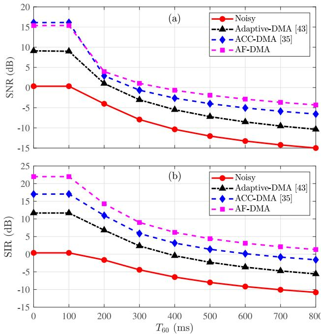
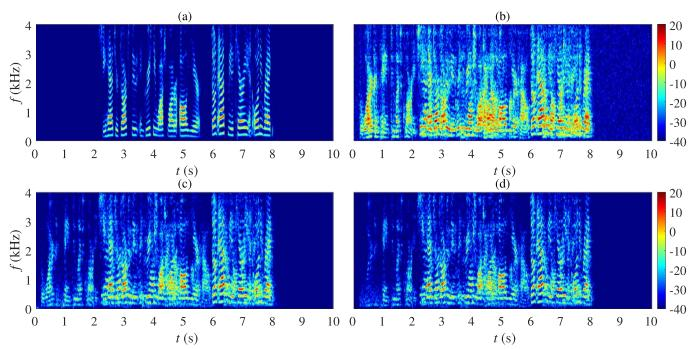

# Robust Fusion of Differential Beamformers for Speech Enhancement in Dynamic Interference Conditions

Kunlong Zhao , Graduate Student Member, IEEE, Xueqin Luo , Graduate Student Member, IEEE, Jilu Jin , Graduate Student Member, IEEE, Danqi Jin, Member, IEEE, and Gongping Huang , Senior Member, IEEE

Abstract—Differential microphone arrays are widely used for far-field sound acquisition due to their high directivity and compact geometry. However, they lack the flexibility to adapt in dynamic acoustic environments with multiple or moving interferers. This paper proposes a novel method for fusing multiple differential beamformers to improve robustness under such conditions. A set of beamformers is designed with distortionless constraints in the target direction and nulls in various potential interference directions. An online fusion strategy is then applied, where a subset of beamformer outputs is selected and adaptively combined at each time frame based on the criterion of minimizing the instantaneous output variance. Simulation results demonstrate that the proposed method achieves superior interference suppression and speech quality, while maintaining low computational complexity suitable for real-time processing.

Index Terms—Differential microphone arrays, online adaptive fusion, adaptive differential beamforming.

## I. INTRODUCTION

ITH the growing demand for voice communication and with microphone arrays beamforming methods has become increasingly critical [1], [2], [3], [4], [5], as it directly affects downstream applications. High-quality audio is essential in scenarios such as meeting transcription, smart home systems, humancomputer interaction, and intelligent classrooms [6], [7], [8], [9], [10]. To achieve high-quality speech capture, researchers have developed two main categories of microphone array-based beamforming methods: fixed beamforming [11], [12], [13], [14], [15], [16], [17] and adaptive beamforming [18], [19], [20].

In complex acoustic environments, although adaptive beamforming can better suppress noise and interference, inaccurate estimation of parameters (such as the noise covariance matrix) may lead to severe signal distortion [21], [22], [23]. Compared to adaptive beamforming, fixed beamforming is generally more robust and efficient in practical applications. One representative fixed beamforming is differential beamforming [24], [25], [26], which has attracted significant attention due to its high directivity and frequency-invariant properties [12], [27], [28], [29], [30], [31].

In a multi-speaker meeting scenario with a known desired speaker location, interference can be suppressed by aligning the beamformer’s nulls with the interfering sources [13], [32]. However, when with multiple or moving interferers, a single differential beamformer is often insufficient [33], [34]. An adaptive combination method was proposed to address this limitation [35], which integrates multiple differential beamformers using an adaptive convex combination (ACC) strategy. This approach offers improved performance in multi-interference scenarios [35], [36]. However, the weights with ACC are updated using an exponential gradient method that relies on gradient information from the current frame. In rapidly changing interference conditions, the gradient estimates may become delayed or inaccurate. As a result, the null-steering capability of the beamformer may fail to align effectively with the direction of interferers, leading to suboptimal performance and reduced efficiency in real-world dynamic environments.

In this work, we propose a novel method for fusing multiple differential beamformers to enhance performance in real-world scenarios with dynamic interference. First, we design a set ofdifferential beamformers along with a delay-and-sum (DS) beamformer. All beamformers satisfy the distortionless constraint in the desired direction while imposing null constraints in different interfering directions. Next, we introduce an online combination strategy to fuse the outputs of these beamformers. The fusion strategy is straightforward: at each time frame, we select a subset of beamformer outputs and compute a weighted combination as the final output. The selection criterion, which aims to minimize the instantaneous variance of the weighted output, is reformulated into a simple and tractable linear programming problem using Jensen’s inequality [37]. A special case of this approach is selecting the output of the beamformer with the minimum instantaneous variance. This can be intuitively justified: under the distortionless constraint in the target direction, the beamformer output with the lowest absolute energy provides the greatest attenuation of interference and noise. The proposed fusion strategy requires no statistical information about the signals, making it suitable for real-time processing. Moreover, the proposed method is simple and efficient, maintains a distortionless response in the desired direction, and enables high-fidelity audio output with potential for further signal-to-noise ration (SNR) enhancement through post-processing [38].

## II. SIGNAL MODEL AND PERFORMANCE MEASURES

Consider a uniform linear array (ULA) with M microphones spaced by a distance δ in the x-y plane. Assume a far-field plane wave arrives at the array in an anechoic environment, with the speed of sound c. Let the azimuth angle of arrival be $\theta \in [ 0 , 2 \pi )$ The steering vector is given by

$$
\mathbf {d} _ {\theta} (\omega) = \left[ \begin{array}{c c c c} 1 & e ^ {- \jmath \omega \delta \cos \theta / c} & \dots & e ^ {- \jmath (M - 1) \omega \delta \cos \theta / c} \end{array} \right] ^ {T}\tag{1}
$$

where j is the imaginary unit, the superscript T stands for the transpose operator, ω is the angular frequency.

Consider a multi-speaker conference scenario with a desired sound source located at direction $\theta _ { \mathrm { s } } ,$ whose signal is denoted by $X _ { \mathrm { s } } ( \omega , t )$ . And $P$ interference sources are present at distinct azimuth angles $\theta _ { \mathrm { i } , p } ,$ with signals denoted as $X _ { \mathrm { i } , p } ( \omega , t )$ $p = 1 , 2 , \ldots , P .$ The observation vector at the microphone array is then expressed as

$$
\begin{array}{r l} \mathbf {y} (\omega , t) & = [ Y _ {1} (\omega , t) Y _ {2} (\omega , t) \dots Y _ {M} (\omega , t) ] ^ {T} \\ & = X _ {\mathrm{s}} (\omega , t) \mathbf {d} _ {\theta_ {\mathrm{s}}} (\omega) \\ & + \sum_ {p = 1} ^ {P} X _ {\mathrm{i}, p} (\omega , t) \mathbf {d} _ {\theta_ {\mathrm{i}, p}} (\omega) + \mathbf {v} (\omega , t), \end{array}\tag{2}
$$

where $Y _ { m } ( \omega , t )$ is the signal received by the mth microphone and the noise vector $\mathbf { v } ( \omega , t )$ is defined similarly to $\mathbf { y } ( \omega , t )$

In the process of beamforming, the observations from microphones are filtered by complex weight vector of length M, denoted as $\mathbf { h } ( \omega , t )$

$$
\begin{array}{l} Z (\omega , t) = \mathbf {h} ^ {H} (\omega , t) \mathbf {y} (\omega , t) \\ \qquad = X _ {\mathrm{s}} (\omega , t) \mathbf {h} ^ {H} (\omega , t) \mathbf {d} _ {\theta_ {\mathrm{s}}} (\omega) \\ \qquad + \sum_ {p = 1} ^ {P} X _ {\mathrm{i}, p} (\omega , t) \mathbf {h} ^ {H} (\omega , t) \mathbf {d} _ {\theta_ {\mathrm{i}}, P} (\omega) \\ \qquad + \mathbf {h} ^ {H} (\omega , t) \mathbf {v} (\omega , t), \end{array}\tag{3}
$$

where $Z ( \omega , t )$ is an estimate of the desired signal. To ensure the desired signal passes through the beamformer without distortion, the distortionless constraint is required:

$$
\mathbf {h} ^ {H} (\omega , t) \mathbf {d} _ {\theta_ {\mathrm{s}}} (\omega) = 1.\tag{4}
$$

The goal of beamforming is to determine the filter $\mathbf { h } ( \omega , t )$ which satisfies the distortionless constraint (4).

Two key metrics are used to evaluate the practical performance of beamforming. The first is the SNR gain, which measures the improvement of the SNR after beamforming. It is defined as the ratio of the output SNR (oSNR) to the input SNR (iSNR) [39], [40]:

$$
\mathcal {G} \left[ \mathbf {h} (\omega , t) \right] = \frac {\mathrm{oSNR} \left[ \mathbf {h} (\omega , t) \right]}{\mathrm{iSNR} (\omega , t)}\tag{5}
$$

$$
= \frac {\left| \mathbf {h} ^ {H} (\omega , t) \mathbf {d} _ {\theta_ {\mathrm{s}}} (\omega) \right| ^ {2}}{\mathbf {h} ^ {H} (\omega , t) \boldsymbol {\Gamma} _ {\mathbf {v}} (\omega , t) \mathbf {h} (\omega , t)},\tag{6}
$$

where $\Gamma _ { \mathbf { v } } ( \omega , t ) = \Phi _ { \mathbf { v } } ( \omega , t ) / \phi _ { V } ( \omega , t )$ with $\Phi _ { \mathbf { v } } ( \omega , t ) =$ $E [ \mathbf { v } ( \omega , t ) \mathbf { v } ^ { H } ( \omega , t ) ]$ and $\dot { \phi } _ { V } ( \omega , t ) = E [ | V _ { 1 } ( \omega , t ) | ^ { 2 } ]$ and $\bar { V _ { 1 } ( \omega , t ) }$ denotes the unwanted noise observed at the first microphone.

The second metric is the signal-to-interference ratio (SIR) gain, which quantifies the improvement in suppressing interfering sources. Assuming P interferences arriving from distinct directions denoted as $\bar { \theta } _ { \mathrm { i } , p } , p = 1 , 2 , \ldots , P$ , the SIR gain is defined as [40]:

$$
\begin{array}{c} \mathcal {I} [ \mathbf {h} (\omega , t) ] = \frac {\left| \mathbf {h} ^ {H} (\omega , t) \mathbf {d} _ {\theta_ {\mathrm{s}}} (\omega) \right| ^ {2}}{\sum_ {p = 1} ^ {P} \left| \mathbf {h} ^ {H} (\omega , t) \mathbf {d} _ {\theta_ {\mathrm{i} , p}} (\omega) \right| ^ {2}} \\ = \frac {\left| \mathbf {h} ^ {H} (\omega , t) \mathbf {d} _ {\theta_ {\mathrm{s}}} (\omega) \right| ^ {2}}{\mathbf {h} ^ {H} (\omega , t) \boldsymbol {\Gamma} _ {\mathrm{i}} (\omega) \mathbf {h} (\omega , t)}, \end{array}\tag{7}
$$

where $\mathbf { { { T } _ { i } } }$ is the pseudo-coherence matrix, given by:

$$
\boldsymbol {\Gamma} _ {\mathrm{i}} (\omega) = \boldsymbol {\Lambda} _ {\mathrm{i}} (\omega) \boldsymbol {\Lambda} _ {\mathrm{i}} ^ {H} (\omega),\tag{8}
$$

$$
\boldsymbol {\Lambda} _ {i} (\omega) = \left[ \begin{array}{c c c c} \mathbf {d} _ {\theta_ {i, 1}} (\omega) & \mathbf {d} _ {\theta_ {i, 2}} (\omega) & \dots & \mathbf {d} _ {\theta_ {i, P}} (\omega) \end{array} \right].\tag{9}
$$

To simplify notation, we omit the explicit notation of the frequency variable ω and time index t in the remaining parts of this paper.

## III. ADAPTIVE FUSION OF MULTI-BEAMFORMERS

## A. Combination of Multi-Differential Beamformers

In this work, we focus on acoustic environments where a target sound source coexists with one or multiple interfering sound sources, a scenario commonly encountered in meeting rooms. However, in practical applications, a single fixed beamformer may insufficient for handling multiple interference sources or moving interferers. A practical solution is to predesign a set of differential beamformers as candidates and adaptively select or combine their outputs based. In this paper, we propose a simple and efficient online selection scheme to achieve adaptive differential beamforming.

For a DMA, when the desired source is located in the end-fire direction $( \mathrm { i . e . , ~ } \theta _ { \mathrm { s } } = 0 ^ { \circ } )$ , interference is maximally suppressed when the beamformer’s null aligns with the interference direction. We design a set of $K + { \bar { 1 } }$ fixed beamformers, including K different null-constrained differential beamformers [41] hDMA,k, $k = 1 , 2 , \ldots , K$ , and the maximum white noise gain (MWNG) beamformer [6], $\mathbf { h } _ { \mathrm { M W N G } }$ . The construction of these beamformers follows the procedures described in [6], [41], where detailed derivations and design methods are provided. The resulting beamformers are then assembled into a matrix as

$$
\mathbf {H} = \left[ \begin{array}{c c c c} \mathbf {h} _ {\mathrm{DMA}, 1} & \dots & \mathbf {h} _ {\mathrm{DMA}, K} & \mathbf {h} _ {\mathrm{MWNG}} \end{array} \right].\tag{10}
$$

We combine the beamformers’ output as follows:

$$
\mathbf {h} _ {\mathrm{opt}} = \mathbf {H} \mathbf {w},\tag{11}
$$

where

$$
\mathbf {w} = \left[ \begin{array}{c c c c} w _ {1} & \dots & w _ {K} & w _ {K +} \end{array} \right] ^ {T}\tag{12}
$$

is the combined weight vector that varies with time and frequency, where each element $0 \leq w _ { k } \leq 1 \mathrm { f o r } k = 1 , 2 , \ldots , K +$ 1, and

$$
\sum_ {k = 1} ^ {K + 1} w _ {k} = 1.\tag{13}
$$

It is straightforward to verify that the constraint (13) can ensure that the distortionless constraint (4) with $\mathbf { h } _ { \mathrm { o p t } }$ . The final output

can be expressed as

$$
\begin{array}{c} Z _ {\mathrm{opt}} = \mathbf {w} ^ {T} \mathbf {H} ^ {H} \mathbf {y} \\ = \mathbf {w} ^ {T} \mathbf {z}, \end{array}\tag{14}
$$

where

$$
\mathbf {z} = \left[ \begin{array}{c c c c} Z _ {\mathrm{DMA}, 1} & \dots & Z _ {\mathrm{DMA}, K} & Z _ {\mathrm{MWNG}} \end{array} \right] ^ {T}\tag{15}
$$

denotes the output vector of the $K + 1$ beamformers.

## B. Optimal Adaptive Fusion

From (5) and (7), it is clear that, under the distortionless constraint $\dot { \mathbf { h } } ^ { H } \mathbf { d } _ { \theta _ { \mathrm { s } } } = 1$ , maximizing SNR and SIR gain amounts to minimizing the residual noise and interference power in the beamformed output. Substituting (11) into the SNR and SIR formulas yields:

$$
\mathcal {G} [ \mathbf {w} ] = \frac {1}{\mathbf {w} ^ {T} \mathbf {H} ^ {H} \boldsymbol {\Gamma} _ {\mathbf {v}} \mathbf {H} \mathbf {w}},\tag{16}
$$

$$
\mathcal {I} [ \mathbf {w} ] = \frac {1}{\mathbf {w} ^ {T} \mathbf {H} ^ {H} \boldsymbol {\Gamma} _ {\mathrm{i}} \mathbf {H} \mathbf {w}}.\tag{17}
$$

In practice, since $\mathbf { { { \Gamma } } } _ { \mathbf { { v } } }$ and $\mathbf { { { T } _ { i } } }$ are often unavailable or difficult to estimate reliably in dynamic environments. We approximate the maximization of (16) by minimizing the instantaneous variance of the weighted combination of the $K { + 1 }$ beamformer outputs, i.e.,

$$
\min _ {\mathbf {w}} | \mathbf {w} ^ {T} \mathbf {z} | ^ {2}, \text {   s.   t.   } \left\{ \begin{array}{l} \sum_ {k = 1} ^ {K + 1} w _ {k} = 1 \\ 0 \leq w _ {k} \leq 1, \forall k = 1, \ldots , K + 1. \end{array} \right.\tag{18}
$$

Since the objective function is convex, by using Jensen’s inequality [37], we get:

$$
\left| \mathbf {w} ^ {T} \mathbf {z} \right| ^ {2} \leq \sum_ {k = 1} ^ {K} w _ {k} \left| Z _ {\mathrm{DMA}, k} \right| ^ {2} + w _ {K + 1} \left| Z _ {\mathrm{MWNG}} \right| ^ {2}.\tag{19}
$$

Then, using (19), the optimization problem (18) can be relaxed as:

$$
\min _ {\mathbf {w}} \sum_ {k = 1} ^ {K + 1} w _ {k} \mathcal {E} _ {k}, \text {   s.   t.   } \left\{ \begin{array}{l} \sum_ {k = 1} ^ {K + 1} w _ {k} = 1 \\ 0 \leq w _ {k} \leq 1, \forall k = 1, \ldots , K + 1 \end{array} \right.,\tag{20}
$$

where $\mathcal { E } _ { k } = | Z _ { \mathrm { D M A } , k } | ^ { 2 } , k = 1 , \ldots , K$ and $\mathcal { E } _ { K + 1 } = \mathcal { E } _ { \mathrm { M W N G } } =$ $| Z _ { \mathrm { M W N G } } | ^ { 2 }$ denote the residual energy of the output from the kth null-constrained differential beamformer and the MWNG beamformer, respectively. To determine the optimal weight w, we consider two cases:

\- Case 1: The residual variances of the $K + 1$ beamformers have a unique minimum. Without loss of generality, we assume that the output of the lth beamformer has the minimum residual variance, i.e.,

$$
\mathcal {E} _ {l} <   \mathcal {E} _ {k}, \forall k \neq l (l, k = 1, \dots , K + 1).\tag{21}
$$

It is easy to prove that in this case, the optimization problem reaches its minimum if and only if the weight of the lth beamformer is 1, while all others are 0, i.e.,

$$
w _ {k} = \left\{ \begin{array}{l l} 1, & k = l \\ 0, & \text { otherwise } \end{array} \right..\tag{22}
$$

\- Case 2: The residual variances of the $K + 1$ beamformers have $Q$ minimum values, where $1 < Q \leq K + 1$ . We assume that the set of beamformer indices corresponding to these minimum values is $\{ l , p , \ldots , q \}$ , and $Q$ is the cardinality of this set.

$$
\begin{array}{c} \mathcal {E} _ {l} = \mathcal {E} _ {p} = \dots = \mathcal {E} _ {q} <   \mathcal {E} _ {k}, \\ \forall k \neq l \neq p \neq q (k, l, p, q = 1, \ldots , K + 1). \end{array}\tag{23}
$$

Specifically, any convex combination of the weights corresponding to the beamformers with the minimal residual variance will yield the same optimal value. For example, one could choose the weights $w _ { k }$ to be uniform one. Therefore, the optimal weight vector w can be expressed as:

$$
w _ {k} = \left\{ \begin{array}{l} \frac {1}{Q}, \forall k \in \{l, p, \ldots , q \} \\ 0, \text { otherwise } \end{array} \right..\tag{24}
$$

This approach can adapt to dynamic acoustic environments, achieving maximum interference suppression while maintaining a distortionless response in the desired direction.

## IV. SIMULATIONS

In this section, we evaluate the speech processing performance of the proposed method through experiments. We consider a ULA with $M = 8$ microphones spaced at $\delta = 1 . 0$ cm. Room impulse responses (RIRs) were generated for a rectangular room measuring $8 \mathrm { m } \times 6 \mathrm { m } \times 3 \mathrm { m }$ using the image method [42]. The microphone array was positioned at the center coordinate (4, 2, 1), while the target source was placed 2 meters from the array center at an azimuth angle of $\theta _ { \mathrm { s } } = 0 ^ { \circ }$

For comparison, the following methods are included:

\- Three first order conventional differential beamformers designed using the null-constrained method [41], each with a null at 90◦, 120◦, and 180◦, denoted as DMA-I, DMA-II, and DMA-III, respectively.

\- The MWNG beamformer [6].

The adaptive differential beamforming method [43], which designs forward and backward cardioid differential beamformers and dynamically adapts null directions by updating combination coefficients via the normalized least mean squares algorithm (with a learning rate of 0.005) in timevarying acoustic environments. This method is referred to as Adaptive-DMA.

\- The ACC method that combines multiple differential beamformers online using an adaptive convex combination strategy [35], referred to as ACC-DMA.

\- The proposed method, which adaptively fuses the three differential beamformers (DMA-I, DMA-II, and DMA-III) and the MWNG beamformer, referred to as AF-DMA.

In the first set of experiments, we consider a moving interfering source rotating from $9 0 ^ { \circ }$ to 180◦ at a speed of $1 0 ^ { \circ }$ per second over a duration of 10 seconds. Clean source signals, each 10 seconds long, were randomly selected from the TIMIT database [44]. The microphone observations consisted of the desired source convolved with its corresponding RIR, the interfering source convolved with its RIR, and white Gaussian noise. The input power ratio between the direct-path target signal and the white Gaussian noise was set to 20 dB. The array signals were processed using the short-time Fourier transform with a frame length of 256 samples, 75% overlap, and a Kaiser window.

We evaluate the performance of all methods in terms of SNR and SIR under different reverberation conditions, with both metrics calculated in the time domain. For SNR computation, the direct-path component is regarded as the desired signal, while reverberation, interference, and background noise are treated as noise. For SIR computation, the direct-path component is also considered the desired signal, all interfering sources are treated as noise. For each condition, 100 Monte Carlo simulations were conducted, and the final metrics were obtained by averaging the results. To facilitate a clear comparison in the figure, we present only the performance of the noisy signal captured by the first microphone, along with the outputs of the Adaptive-DMA, ACC-DMA, and the proposed AF-DMA methods. The results are shown in Fig. 1. As observed, all methods effectively improve the SNR and SIR of the observed signals. However, their performance degrades as reverberation increases. In comparison, the proposed AF-DMA method consistently outperforms both the Adaptive-DMA and ACC-DMA methods in terms of SNR and SIR, achieving the highest level of interference suppression across all reverberation conditions.

  
Fig. 1. Performance of the Adaptive-DMA, ACC-DMA, and proposed AF-DMA methods under different reverberation conditions: (a) SNR and (b) SIR.

We further evaluate the performance of the proposed method in a multi-interferer scenario. The experimental setup is the same as described above, with an additional fixed interfering source placed at 210◦, and the reverberation time set to approximately 300 ms. Both overlapping and non-overlapping speech conditions are considered: from 0 to 2 seconds, only the moving interferer is active; from 2 to 8 seconds, the target speech and both interferers are active simultaneously; and from 8 to 10 seconds, only background noise is present. We compare the performance of the three individual DMAs, MWNG, Adaptive-DMA, ACC-DMA, and the proposed AF-DMA method in terms of SNR, SIR, perceptual evaluation of speech quality (PESQ) [45], and short-time objective intelligibility (STOI). The results are summarized in Table I. As observed, all methods effectively improve the SNR and SIR of the observed signal. However, single DMAs and MWNG alone are not capable of sufficiently suppressing interference. In contrast, combining multiple DMAs leads to significantly improved performance. The proposed AF-DMA method clearly outperforms both Adaptive-DMA and ACC-DMA across all metrics, demonstrating its effectiveness in complex interference scenarios. In addition, Fig. 2 shows the spectrograms ofthe clean signal, the noisy signal received at the first microphone, the output of ACC-DMA, and the output of the proposed AF-DMA. It can be seen that the proposed AF-DMA provides significantly better interference suppression than ACC-DMA. Note that all methods maintain a distortionless response in the desired direction, thereby ensuring high-fidelity audio output and allowing for further SNR enhancement through post-processing; however, this work focuses on fusing multiple distortionless beamformers, and such post-processing is therefore not discussed.

TABLE I  
PERFORMANCE OF DIFFERENTIAL BEAMFORMER DESIGNED WITH THE DIFFERENT METHODS IN REVERBERANT ENVIRONMENTS. CONDITION: T = 300 ms.

<table><tr><td></td><td>SNR (dB)</td><td>SIR (dB)</td><td>PESQ</td><td>STOI</td></tr><tr><td>Unprocessed</td><td>-9.19</td><td>-6.96</td><td>1.31</td><td>0.52</td></tr><tr><td>DMA-I [41]</td><td>-4.75</td><td>-3.23</td><td>1.41</td><td>0.58</td></tr><tr><td>DMA-II [41]</td><td>-2.52</td><td>2.88</td><td>1.82</td><td>0.68</td></tr><tr><td>DMA-III [41]</td><td>-3.93</td><td>1.33</td><td>1.74</td><td>0.66</td></tr><tr><td>MWNG [6]</td><td>-8.64</td><td>-6.08</td><td>1.40</td><td>0.57</td></tr><tr><td>Adaptive-DMA [43]</td><td>-4.30</td><td>0.76</td><td>1.56</td><td>0.60</td></tr><tr><td>ACC-DMA [35]</td><td>-1.84</td><td>4.49</td><td>1.81</td><td>0.69</td></tr><tr><td>AF-DMA</td><td>0.07</td><td>7.66</td><td>1.95</td><td>0.69</td></tr></table>

  
Fig. 2. Spectrograms of the (a) clean signal, (b) noisy signal received at the first microphone, (c) output of the ACC-DMA method, and (d) output of the proposed AF-DMA method.

## V. CONCLUSION

This letter presents an adaptive differential beamforming design method based on multi-beamformer fusion. By precomputing a set of differential beamformers with different null positions as candidates and dynamically selecting or combining their outputs, the proposed method achieves robust interference suppression in complex acoustic environments. The optimization framework ensures a distortionless response in the desired direction meanwhile minimizing residual noise and interference energy. The proposed scheme is computationally efficient and suitable for real-time implementation, making it a practical solution for applications such as speech enhancement, hearing aids, and beamforming in smart devices. Moreover, the proposed method maintain a distortionless response in the desired direction, thereby ensuring high-fidelity audio output and allowing for further SNR enhancement through post-processing.

## REFERENCES

[1] J. Benesty, J. Chen, and Y. Huang, Microphone Array Signal Processing. Berlin, Germany: Springer-Verlag, 2008.

[2] M. Brandstein and D. Ward, Microphone Arrays: Signal Processing Techniques and Applications. Berlin, Germany: Springer-Verlag, 2001.

[3] A. Bernardini, M. D. Aria, R. Sannino, and A. Sarti, “Efficient continuous beam steering for planar arrays of differential microphones,” IEEE Signa Process. Lett., vol. 24, no. 6, pp. 794–798, Jun. 2017.

[4] X. Wu, H. Chen, J. Zhou, and T. Guo, “Study of the mainlobe misorientation of the first-order steerable differential array in the presence of microphone gain and phase errors,” IEEE Signal Process. Lett., vol. 21, no. 6, pp. 667–671, Jun. 2014.

[5] A. Bernardini, F. Antonacci, and A. Sarti, “Wave digital implementation of robust first-order differential microphone arrays,” IEEE Signal Process. Lett., vol. 25, no. 2, pp. 253–257, Feb. 2018.

[6] J. Benesty, G. Huang, J. Chen, and N. Pan, Microphone Arrays, vol. 22. Berlin, Germany: Springer-Verlag, 2023.

[7] P. Loizou, Speech Enhancement: Theory and Practice. Boca Raton, FL, USA: CRC Press, 2007.

[8] E. Tiana-Roig, F. Jacobsen, and E. Fernandez-Grande, “Beamforming with a circular array of microphones mounted on a rigid sphere,” J. Acoust. Soc. Amer., vol. 130, pp. 1095–1098, Sep. 2011.

[9] G. Huang et al., “Advances in microphone array processing and multichannel speech enhancement,” in Proc. IEEE Int. Conf. Acoust., Speech Signal Process., 2025, pp. 1–5.

[10] K. Zhao, G. Huang, X. Zhao, J. Chen, J. Benesty, and Z. Cvetkovic, “On the design of a robust superdirective beamformer and topology parameter optimization with frustum-shaped microphone arrays featuring multiple rings,” in Proc. Interspeech, 2025, pp. 1–5.

[11] K. Zhao, X. Luo, J. Jin, G. Huang, J. Chen, and J. Benesty, “Design of robust differential beamformers with microphone arrays ofarbitrary planar geometry,” in Proc. IEEE Int. Conf. Acoust., Speech Signal Process., 2025, pp. 1–5.

[12] E. D. Sena, H. Hacihabiboglu, and Z. Cvetkovic, “On the design and implementation of higher-order differential microphones,” IEEE Trans. Audio, Speech, Lang. Process., vol. 20, no. 1, pp. 162–174, Jan. 2012.

[13] X. Luo, J. Jin, G. Huang, J. Chen, and J. Benesty, “Design ofsteerable linear differential microphone arrays with omnidirectional and bidirectiona sensors,” IEEE Signal Process. Lett., vol. 30, pp. 463–467, 2023.

[14] E. Mabande, A. Schad, and W. Kellermann, “Design of robust superdirective beamformers as a convex optimization problem,” in Proc. IEEE Int. Conf. Acoust., Speech Signal Process., 2009, pp. 77–80.

[15] C. C. Lai, S. Nordholm, and Y. H. Leung, “Design of steerable spherical broadband beamformers with flexible sensor configurations,” IEEE Trans. Audio, Speech, Lang. Process., vol. 21, no. 2, pp. 427–438, Feb. 2013.

[16] D. Kitamura, H. Saruwatari, H. Kameoka, Y. Takahashi, K. Kondo, and S. Nakamura, “Multichannel signal separation combining directional clustering and nonnegative matrix factorization with spectrogram restoration,” IEEE/ACM Trans. Audio, Speech, Lang. Process., vol. 23, no. 4, pp. 654–669, Apr. 2015.

[17] F. Borra, A. Bernardini, F. Antonacci, and A. Sarti, “Efficient implementations of first-order steerable differential microphone arrays with arbitrary planar geometry,” IEEE/ACM Trans. Audio, Speech, Lang. Process., vol. 28, pp. 1755–1766, 2020.

[18] S. Shahbazpanahi, A. B. Gershman, Z.-Q. Luo, and K. M. Wong, “Robust adaptive beamforming for general-rank signal models,” IEEE Trans. Signal Process., vol. 51, no. 9, pp. 2257–2269, Sep. 2003.

[19] R. A. Monzingo and T. W. Miller, Introduction to Adaptive Arrays. Raleigh, NC, USA: SciTech Publishing, Inc, 2004.

[20] J. Kealey, J. R. Hershey, and F. Grondin, “Unsupervised improved MVDR beamforming for sound enhancement,” in Proc. Interspeech, 2024, pp. 2175–2179.

[21] V. M. Tavakoli, J. R. Jensen, M. G. Christenseny, and J. Benesty, “Pseudocoherence-based MVDR beamformer for speech enhancement with ad hoc microphone arrays,” in Proc. IEEE Int. Conf. Acoust., Speech Signal Process., 2015, pp. 2659–2663.

[22] C. Pan, J. Chen, and J. Benesty, “Performance study of the MVDR beamformer as a function of the source incidence angle,” IEEE/ACM Trans. Audio, Speech, Lang. Process., vol. 22, no. 1, pp. 67–79, Jan. 2014.

[23] F. Zhang, C. Pan, J. Chen, and J. benesty, “MPPCAD: Minimum power pattern constrained adaptive differential beamforming,” IEEE Signal Process. Lett., vol. 32, pp. 2099–2103, 2025.

[24] G. W. Elko, “Differential microphone arrays,” in Audio Signal Processing for Next-Generation Multimedia Communication Systems. New York, NY, USA: Springer, 2004, pp. 11–65.

[25] J. Bitzer and K. U. Simmer, “Superdirective microphone arrays,” in Microphone Arrays. New York, NY, USA: Springer, 2001, pp. 19–38.

[26] G. W. Elko, “Superdirectional microphone arrays,” in Acoustic Signal Processing for Telecommunication. New York, NY, USA: Springer, 2000, pp. 181–237.

[27] F. Borra, A. Bernardini, F. Antonacci, and A. Sarti, “Uniform linear arrays of first-order steerable differential microphones,” IEEE/ACM Trans. Audio, Speech, Lang. Process., vol. 27, no. 12, pp. 1906–1918, Dec. 2019.

[28] G. Huang, J. Chen, and J. Benesty, “Insights into frequency-invariant beamforming with concentric circular microphone arrays,” IEEE/ACM Trans. Audio, Speech, Lang. Process., vol. 26, no. 12, pp. 2305–2318, Dec. 2018.

[29] G. Huang, J. Benesty, and J. Chen, “On the design of frequency-invariant beampatterns with uniform circular microphone arrays,” IEEE/ACM Trans. Audio, Speech, Lang. Process., vol. 25, no. 5, pp. 1140–1153, May 2017.

[30] J. Jin, G. Huang, X. Wang, J. Chen, J. Benesty, and I. Cohen, “Steering study of linear differential microphone arrays,” IEEE/ACM Trans. Audio, Speech, Lang. Process., vol. 29, pp. 158–170, 2021.

[31] J. Jin, G. Huang, J. Chen, and J. Benesty, “Design of optimal linear differential microphone arrays based array geometry optimization,” in Proc. IEEE Int. Conf. Acoust., Speech Signal Process., 2019, pp. 5741–5745.

[32] W. Liu, J. Benesty, G. Huang, and J. Chen, “Beamforming in the shorttime fourier transform domain via dimensionality reduction,” IEEE Trans. Audio, Speech, Lang. Process., vol. 33, pp. 1730–1742, 2025.

[33] X. Luo, J. Jin, G. Huang, J. Chen, and J. Benesty, “Design of fully steerable differential beamformers with linear superarrays,” IEEE/ACM Trans. Audio, Speech, Lang. Process., vol. 32, pp. 3076–3089, 2024.

[34] Y. Wang, A. Politis, and T. Virtanen, “Attention-driven multichannel speech enhancement in moving sound source scenarios,” in Proc. IEEE Int. Conf. Acoust., Speech Signal Process., 2024, pp. 11221–11225.

[35] J. Jin, X. Luo, G. Huang, J. Chen, and J. Benesty, “Beamforming through online convex combination of differential beamformers,” in Proc. IEEE Int. Conf. Acoust., Speech Signal Process., 2024, pp. 8561–8565.

[36] K. Yamaoka, N. Ono, and S. Makino, “Time-frequency-bin-wise linear combination of beamformers for distortionless signal enhancement,” IEEE/ACM Trans. Audio, Speech, Lang. Process., vol. 29, pp. 3461–3475, 2021.

[37] S. Boyd, S. P. Boyd, and L. Vandenberghe, Convex Optimization. Cambridge, U.K.: Cambridge Univ. Press, 2004.

[38] X. Yang, G. Huang, J. Jin, J. Chen, and J. Benesty, “Design and optimization of superdirective beamforming and post-filtering for speech enhancement,” in Proc. IEEE Int. Conf. Acoust., Speech Signal Process., 2025, pp. 1–5.

[39] J. Chen, J. Benesty, and C. Pan, “On the design and implementation of linear differential microphone arrays,” J. Acoust. Soc. Amer., vol. 136, pp. 3097–3113, Dec. 2014.

[40] J. Jin, X. Luo, G. Huang, J. Chen, and J. Benesty, “On the design of robust linear differential microphone arrays against low-rank noise,” IEEE Trans. Audio, Speech Lang. Process., vol. 33, pp. 2874–2886, 2025.

[41] J. Benesty and J. Chen, Study and Design of Differential Microphone Arrays. Berlin, Germany: Springer-Verlag, 2012.

[42] J. Allen and D. Berkley, “Image method for efficiently simulating smallroom acoustics,” J. Acoust. Soc. Amer., vol. 65, no. 4, pp. 943–950, 1979.

[43] H. Teutsch and G. W. Elko, “First-and second-order adaptive differential microphone arrays,” in Proc. IWAENC Int. Workshop Acoust. Signal Enhancement, 2001, pp. 35–38.

[44] J. Garofolo et al., “TIMIT acoustic-phonetic continuous speech corpus LDC93S1,” Philadelphia, PA, USA: Linguistic Data Consortium, 1993.

[45] Wideband Extension to Recommendation P.862 for the Assessment of Wideband Telephone Networks and Speech Codecs, Rec. ITU-T P. 862.2, International Telecommunications Union, Geneva, Switzerland, 2007.