# Sixty Years of Frequency-Domain Monaural Speech Enhancement: From Traditional to Deep Learning Methods

Trends in Hearing Volume 27: 1–52 © The Author(s) 2023 Article reuse guidelines: sagepub.com/journals-permissions DOI: 10.1177/23312165231209913 journals.sagepub.com/home/tia

Chengshi Zheng1,2,\* , Huiyong Zhang1,2, Wenzhe Liu1,2, Xiaoxue Luo1,2, Andong Li1,2, Xiaodong Li1,2 and Brian C. J. Moore3,\*

## Abstract

Frequency-domain monaural speech enhancement has been extensively studied for over 60 years, and a great number of methods have been proposed and applied to many devices. In the last decade, monaural speech enhancement has made tremendous progress with the advent and development of deep learning, and performance using such methods has been greatly improved relative to traditional methods. This survey paper first provides a comprehensive overview of traditional and deeplearning methods for monaural speech enhancement in the frequency domain. The fundamental assumptions of each approach are then summarized and analyzed to clarify their limitations and advantages. A comprehensive evaluation of some typica methods was conducted using the WSJ + Deep Noise Suppression (DNS) challenge and Voice Bank + DEMAND datasets to give an intuitive and unified comparison. The benefits of monaural speech enhancement methods using objective metrics relevant for normal-hearing and hearing-impaired listeners were evaluated. The objective test results showed that compression of the input features was important for simulated normal-hearing listeners but not for simulated hearing-impaired listeners. Potential future research and development topics in monaural speech enhancement are suggested.

## Keywords

speech enhancement, speech dereverberation, multistage learning, noise estimation, deep complex network

Received 2 December 2022; accepted 9 October 2023

## Introduction

The aim of monaural speech enhancement is to extract clean speech or to improve the speech-to-background ratio by removing noise and reverberation from a noisy-reverberant speech signal captured by a microphone (Lim, 1983; Benesty et al., 2006; Martin et al., 2008; Naylor & Gaubitch, 2010; Loizou, 2013). This is especially important for improving speech quality and/or intelligibility for digital speech communication devices, such as hearing aids and other assistive listening devices (Dillon, 2012; Popelka et al., 2016), audio-visual conference equipment, smartphones, and true wireless earphones. It is also important for automatic speech recognition systems (Hansen, 1996; Li et al., 2014), such as smart home appliances, in-car voice assistants, and speech transcription services. It should be noted that it is not always necessary to reconstruct the time-domain speech signal for the purpose of automatic speech recognition; enhancement of extracted features often leads to improve speech recognition performance (Schuller et al., 2009; Krueger & Haeb-Umbach, 2010). The present paper focuses on monaural speech enhancement for human hearing rather than for machine hearing, where the timedomain waveform of the clean speech needs to be reconstructed.

## Corresponding Author:

Chengshi Zheng, Key Laboratory of Noise and Vibration Research, Institute of Acoustics, Chinese Academy of Sciences, 100190, Beijing, China; University of Chinese Academy of Sciences, 100049, Beijing, China. Email: cszheng@mail.ioa.ac.cn

Both time- and frequency-domain methods of monaural speech enhancement have been proposed and widely studied. For the former, the clean speech is estimated directly in the time domain without (short-term) spectral analysis and synthesis (Lee & Jung, 2000; Benesty & Chen, 2011; Luo & Mesgarani, 2018; Macartney & Weyde, 2018; Pandey & Wang, 2018, 2019b; Hao et al., 2019; Pandey & Wang, 2019a; Von Neumann et al., 2020; Zucatelli & Coelho, 2021; Pandey & Wang, 2022). For the latter, the short-term complex spectrum of the clean speech is estimated, the spectrum is converted back to a time-domain signal, and this process is repeated for a series of overlapping frames (time segments) to reconstruct the complete time-domain signal, using the overlap-add method (Allen, 1977; Boll, 1979; Ephraim & Malah, 1984; Griffin & Lim, 1984; Loizou, 2013; Wang & Chen, 2018). There are some hybrid methods, in which the appropriate gain for each of several frequency sub-bands is estimated in a first stage, and a timedomain enhancement filter is designed in a second stage to partially remove the noise and reverberation (Vary, 2006; Löllmann & Vary, 2007; Zheng et al., 2022). Among these methods, frequency-domain methods have been the most extensively studied, for the following reasons. First, shortterm spectral analysis and synthesis can be efficiently performed by the fast Fourier transform (FFT) algorithm, although the Fourier decomposition may not be optimal for speech enhancement (Johnson et al., 2007; Benesty et al., 2009). Second, the spectral magnitude and phase of the speech are decoupled, and thus one can process the spectral magnitude alone or optimize the spectral magnitude and the phase step by step or jointly depending the hardware resources and the desired performance (Paliwal et al., 2011; Gerkmann et al., 2015; Li et al., 2022a). Third, the human ear works as a frequency analyzer (Plomp, 1964). In particular, different places on the basilar membrane within the cochlea respond to different frequency ranges in sound (Moore, 2013). Hence, it seems very natural to enhance speech in a way that mimics the operation of the normal healthy ear. Fourth, speech is sparse in the frequency domain, which facilitates removal of nonspeech components, while it is not sparse in the time domain (He et al., 2007) Fifth, frequency-domain methods can readily be used in combination with special applications, such as frequencydependent amplification to compensate for hearing loss (Kates, 2008). Finally, frequency-domain monaural speech enhancement methods usually achieve higher objective and subjective scores than time-domain methods (Hu et al., 2020; Li et al., 2021a, 2021), although this may in part be the case because more effort has been put into frequencydomain methods than into time-domain methods. For the above reasons, this paper reviews only frequency-domain monaural speech enhancement methods, which have been extensively studied over the 60 years since Schroeder (1965, 1968) first proposed a noise suppression method using an analog implementation.

In the last ten years, monaural speech enhancement has made great progress with the development of deep learning methods (Hochreiter & Schmidhuber, 1997; Hinton & Salakhutdinov, 2006; LeCun et al., 2015). A large number of deep-learning-based frequency-domain methods have been proposed (Wang et al., 2014; Xu et al., 2014b, 2015), and they have been shown to surpass traditional frequencydomain methods in challenging conditions such as at low speech-to-noise ratios (SNRs), in high reverberation, and when the noise is nonstationary. Deep-learning methods can be categorized into two types: spectral magnitude-only enhancement and complex spectrum enhancement. The former estimate only the spectral magnitude of the clean speech. The noisy phase is used to reconstruct the timedomain speech signal. The latter estimate the real and imaginary parts of the complex spectrum of the clean speech directly, which has the potential to further improve speech quality. In general, deep-learning methods have much more computational complexity and greater storage requirements than traditional frequency-domain methods. Although many researchers have proposed ways of reducing the number of parameters and the complexity (Tan & Wang, 2021), it is still challenging to implement advanced deep-learning-based methods in resource-limited devices such as hearing aids. In contrast, traditional frequencydomain speech enhancement methods have been extensively applied in devices such as digital hearing aids, smartphones, and audio-visual communication systems. However, it is becoming more feasible to implement deep-learning methods in such devices because of the development of lowresource deep-learning methods in combination with increases in computing performance and memory capacity of signal-processing chips.

The purposes of this paper are fourfold. Firstly, the paper provides an overview of both traditional and deep-learning frequency-domain monaural speech enhancement methods that have been proposed over the last six decades. Although many review papers and books have been published on traditional methods (Loizou, 2013; Gerkmann et al., 2015) or deep-learning methods (Wang & Chen, 2018), the reviews do not give a deep insight into the advantages and disadvantages of the two categories of methods. The second purpose is to clearly reveal the fundamental assumptions underlying the different methods and the consequences of these in practical applications. The third purpose is to compare the objective performance of the two types of methods using the same speech corpus and noise corpus. To our knowledge, such a comprehensive evaluation has not been reported before. Finally, challenges for the future are formulated and some potential research topics are outlined.

The remainder of this paper is organized as follows. Firstly, the processing stages in frequency-domain monaural speech enhancement are formulated, and different estimation targets are presented. After that, traditional methods are described, including a complete flowchart of these methods and a review of each key module. Deep learning-based methods are then presented, and the reasons why deep-learning methods surpass traditional methods are discussed. The two types of methods are evaluated using a common set of objective measures. Finally, future research topics in monaural speech enhancement are discussed.

## Signal Model and Problem Formulation

For monaural speech enhancement, only a single sensor, such as a microphone, is used to pick up a sound. Thus, the signal can be represented as

$$
y (t) = s (t) * h (t) + v (t),\tag{1}
$$

where s(t) denotes the clean speech, h(t) is the transfer function from the clean speech to the microphone, v(t) is the noise with t the time index, and \* denotes the convolution operation. When the microphone picks up the clean speech in an enclosure, the microphone signal includes the direct and early and late reflected speech components. It is usually assumed that early reflections make a positive contribution to intelligibility, while late reflections degrade speech quality and intelligibility (Bradley et al., 2003; Yoshioka et al., 2012; Hu & Kokkinakis, 2014).

With the short-time Fourier transform (STFT), the timefrequency (T-F) representation of Equation (1) can be written as

$$
Y (k, l) = S (k, l) H (k, l) + V (k, l),\tag{2}
$$

where $Y ( k , l ) , S ( k , l ) .$ , and $V ( k , l )$ are the complex spectra of y(t), s(t), and v(t), respectively, with k the frequency bin index and l the frame index. H(k, l) is the frequency-domain representation of h(t). Y(k, l) can be computed as:

$$
Y (k, l) = \sum_ {\mu = 0} ^ {K - 1} y (l R + \mu) w (\mu) e ^ {- j \frac {2 \pi k \mu}{K}},\tag{3}
$$

where w(t) is a window, R is the frame shift and K is the frame length. When y(t) is replaced by s(t) and v(t) in Equation (3), S(k, l) and V(k, l) can be obtained. For frequency-domain monaural speech enhancement, a speech dereverberation method is often designed to suppress late reflected speech components (Naylor & Gaubitch, 2010; Nakatani et al., 2010; Jukić et al., 2015), while a denoising method is designed to suppress N(k, l) (Benesty et al., 2006; Loizou, 2013). When both late reflected speech components and noise are suppressed, this is denoted joint noise reduction and dereverberation (Doire et al., 2016; Li et al., 2021a; Reddy et al., 2021).

This paper focuses on reviewing and evaluating monaural speech denoising methods. It should be noted that many speech denoising methods have been extended to perform speech dereverberation (Lebart et al., 2001), based on the assumption that late reverberant speech components are uncorrelated with the direct and early-reflected speech components (see Braun et al., 2018, and references therein). This assumption is reasonable when the speech rate is reasonably rapid, so that a given speech sound at the microphone has been completed before the late reverberation from that sound arrives at the microphone. The assumption may also be reasonable if the impulse response h(t) changes over time, as pointed out by Elko et al. (2003).

Without sound reflections, h(t) is the discrete unit sample function δ(t), and Equation (1) becomes

$$
y (t) = s (t) + v (t),\tag{4}
$$

so the T-F representation of Equation (4) reduces to

$$
Y (k, l) = S (k, l) + V (k, l)\tag{5}
$$

because $H ( k , l ) \equiv 1$ in this case.

For frequency-domain monaural speech enhancement methods, the goal is to estimate the complex spectrum of the clean speech from Y(k, l), so that the time-domain speech signal can be reconstructed using the inverse STFT and overlap-add method. In this paper, the estimated complex spectrum of S(k, l) is denoted $\widehat { S } ( k , l )$ and the estimated time-domain clean speech signal is denoted s(t).

There are many ways to obtain $\widehat { S } ( k , l ) .$ , and these can be roughly categorized into two classes: indirect and direct. Almost all traditional methods and some deep-learning methods belong to the first class. For this indirect class, a spectral gain function G(k, l) is first estimated or mapped by a network based on the noisy observations Y(k, l), and this is then multiplied with Y (k, l), i.e., $\widehat { S } ( k , l ) = G ( k , l ) Y ( k , l )$ . Commonly, these methods estimate only the clean speech spectral magnitude, such that G(k, l) is a real value ranging from 0 to 1, while the noisy phase is unaltered and used for time-domain speech reconstruction.

Recent studies have confirmed that it is important to minimize the phase difference between the estimated speech and the clean speech (Paliwal et al., 2011), and phase processing for speech enhancement has attracted considerable attention in the last decade (Gerkmann, 2014; Krawczyk & Gerkmann, 2014; Gerkmann et al., 2015). Because it is diffi- cult if not impossible to estimate the phase of the clean speech at low SNRs, traditional methods of phase processing do not greatly improve speech quality. For deep-learning speech enhancement methods, it has been shown that performance can be improved in terms of both objective and subjective metrics if the clean speech phase can be estimated before reconstructing the estimated time-domain speech signal (Williamson et al., 2016; Fu et al., 2017; Williamson & Wang, 2017; Tan & Wang, 2019, 2020; Yin et al., 2020).

In recent years, many direct methods have been proposed, where the magnitude of $\widehat { \cdot } \widehat { S } ( k , l ) , \widehat { \vert } \widehat { S } ( k , l ) \vert$ , or the real and imaginary parts of S(k, $l ) , \widehat { S } _ { r } ( k , l )$ and $\widehat { S } _ { i } ( k , l )$ , are mapped directly by deep complex networks (Tan & Wang, 2020; Li et al., 2021c, 2021). In the next two sections, an overview of traditional methods and deep-learning methods is presented, and their crucial modules are reviewed and discussed.

## Traditional Methods

This section reviews statistical signal-processing-based methods for monaural speech enhancement. These methods are usually based on the assumption that the speech and noise are independent, and that the speech or noise follows a specific distribution, such as Gaussian (McAulay & Malpass, 1980; Ephraim & Malah, 1984, 1985), Gamma (Martin, 2002), Laplacian (Chen & Loizou, 2007), or Super-Gaussian (Breithaupt & Martin, 2003). Hendriks et al. (2007) and McCallum & Guillemin (2013) assumed that speech was a combined stochastic-deterministic signal instead of a completely stochastic signal. Note that a great number of traditional methods do not make use of any stochastic model (Boll, 1979; Berouti et al., 1979; Gülzow et al., 2003; Li et al., 2008; Loizou, 2013). Rather, they are heuristic (rule-based) or the speech is assumed to be a deterministic signal. For example, spectral subtraction, for which the estimated spectrum of the noise is subtracted from the spectrum of the speech-plus-noise, is a typical heuristic method, and although it is not a perfect solution for monaural speech enhancement, it has been widely used in practical applications. For all of these traditional methods, five key modules are often used, namely estimation of: noise, a priori SNR, speech-presence probability, spectral gain, and phase. The a priori SNR is the true short-term power ratio between each spectral component of the clean speech and the noise. It can be contrasted with the a posteriori SNR, which is the short-term power ratio between each spectral component of the observed noisy speech and noise.

Figure 1 shows a flow diagram of typical traditional frequency-domain speech enhancement methods. In this figure, both a spectral magnitude enhancement module and a phase-processing module are included. Note that all five modules are not necessarily used in all traditional methods. For example, when Boll (1979) proposed spectral subtraction, which involves subtraction of the estimated noise spectrum from the speech+noise spectrum for each time-frequency bin, he used only two modules, noise estimation and spectral gain estimation. The estimate of the noise power spectral density (PSD) was updated based on segments estimated to contain only noise, via a voice activity detector (VAD). Ephraim & Malah (1984) proposed the decision-directed method to estimate the a priori SNR, and Cappé (1994) analyzed its importance in suppressing the well-known “musical noise” artifact. McAulay & Malpass (1980) first introduced a two-state model $( \mathcal { H } _ { 0 } ( k , l )$ and $\mathcal { H } _ { 1 } ( k , l )$ representing the speech-absent and speech-present states, respectively). The speech-presence probability (SPP) $( P ( \mathcal { H } _ { 1 } ( k , l ) | Y ( k , l ) )$ was adjusted to give a good balance between noise suppression and speech distortion. Malah et al. (1999) and Cohen & Berdugo (2001) combined the SPP with the spectral gain estimation to further reduce speech distortion and increase noise reduction. Without phase processing, the spectral gain of the log-spectral amplitude (LSA) estimator derived by Cohen & Berdugo (2001) can be expressed by

$$
G (k, l) = \left(G _ {\mathcal {H} _ {1}} (k, l)\right) ^ {p (k, l)} (G _ {\min} (k, l)) ^ {1 - p (k, l)},\tag{6}
$$

where $G _ { \mathcal { H } _ { 1 } } ( k , l )$ is the spectral gain when speech is present and $G _ { \mathrm { m i n } } ( k , l )$ is often set to a constant value ranging from 30 dB $\mathbf { t o } - 1 2 \mathrm { d } \mathbf { B } . G _ { \mathrm { m i n } } ( k , l )$ can be regarded as a predefined spectral gain when the speech is absent and its value can be different in each T-F bin depending on the noise characteristics (Gustafsson et al., 1998). $p ( k , l )$ is the SPP, which is estimated from the a posteriori SNR, a priori SNR, and the a priori probability of speech absence (Cohen & Berdugo, 2001), given by

$$
p (k, l) = \left(1 + \frac {q (k , l)}{1 - q (k , l)} (1 + \xi (k, l)) \exp (- v (k, l))\right) ^ {- 1},\tag{7}
$$

where $q ( k , l ) = P ( \mathcal { H } _ { 0 } ( k , l ) )$ is the a priori probability of speech absence and $\xi ( k , l ) = E \{ | S ( k , l ) | ^ { 2 } \} / \sigma _ { \nu } ^ { 2 } ( k , l )$ is the a priori SNR. υ(k, l) is defined as

$$
v (k, l) = \frac {\xi (k , l)}{1 + \xi (k , l)} \gamma (k, l),\tag{8}
$$

where $\gamma ( k , l ) = | Y ( k , l ) | ^ { 2 } / \sigma _ { \nu } ^ { 2 } ( k , l )$ is the a posteriori SNR. For both the a posteriori SNR and a priori SNR, the noise PSD, $\sigma _ { \nu } ^ { 2 } ( k , l )$ , needs to be estimated beforehand, and the accuracy with which this is done has a significant impact on the performance of traditional methods.

In the following five sections, the five modules are each overviewed. Then, the valid and invalid assumptions of traditional methods are described and limitations of the methods are discussed.

## Noise Estimation

The noise-estimation module plays an important role for almost all traditional frequency-domain speech enhancement methods. Its performance has a direct effect on both noise reduction and speech distortion. When the noise PSD is underestimated, the amount of noise reduction is reduced, leading to speech-amplification distortion (Loizou & Kim, $2 0 1 1 ) . ^ { \mathrm { \bar { 1 } } }$ This can explain why traditional methods do not improve the intelligibility of speech in nonstationary noises for normal-hearing listeners (Loizou & Kim, 2011), although they can improve the quality of speech in quasi-stationary noises for both hearing-impaired and normal-hearing listeners (Sang et al., 2014, 2015). In contrast, when the noise PSD is overestimated, this results in speech-attenuation distortion, even though the amount of noise reduction increases. Because of the importance of estimation of the noise PSD, many types of noise PSD estimators have been proposed.

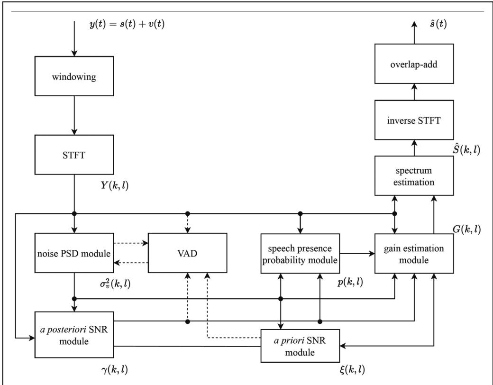  
Figure 1. A flow-process diagram of traditional methods.

In early work on this topic, noise estimation was based on the use of a VAD (Lim et al., 1978; Boll, 1979; McAulay & Malpass, 1980; Ephraim & Malah, 1984, 1985). This exploits the fact that speech usually contains brief pauses, for example before or after a stop consonant. With this approach, each time frame was categorized into one of two states: speech absent and speech present. The noise PSD was updated in speech-absent frames and the estimate was maintained across subsequent speech-present frames. This is represented by

$$
\sigma_ {v} ^ {2} (k, l) = \left\{ \begin{array}{l l} \alpha_ {v} \sigma_ {v} ^ {2} (k, l - 1) + (1 - \alpha_ {v}) | Y (k, l) | ^ {2}, & S A \\ \sigma_ {v} ^ {2} (k, l - 1), & S P \end{array} \right.\tag{9}
$$

where $\alpha _ { \nu } \in ( 0 1 )$ is a smoothing factor, SA indicates speech absent, and SP indicates speech present.

There are two drawbacks of this VAD-based noise PSD estimator. Firstly, noise-estimation accuracy depends strongly on the performance of the VAD. Misclassification of speech-present frames as speech-absent frames leads to overestimation of the noise, resulting in speech attenuation distortion. Unfortunately, this misclassification problem cannot be avoided when the SNR is low (Sohn et al., 1999; Tan et al., 2020), especially when the noise is nonstationary. Secondly, since the noise PSD is not updated during frames classified as speech present, the sparsity of speech in the T-F domain is not fully exploited. This sparsity is readily apparent in spectrograms of clean speech from a single talker (Darwin, 2009); there are many T-F regions with very low energy.

If the noise PSD is estimated via use of a VAD, this implicitly assumes that the noise is quasi-stationary and that its PSD changes slowly over time. To avoid use of a VAD, one more assumption is necessary, namely that the PSD of each speech-plus-noise T-F bin is always larger than or equal to the noise PSD for the corresponding T-F bin, i.e., $E \{ | Y ( k , l ) | ^ { 2 } \} \geq E \{ | V ( k , l ) | ^ { 2 } \}$ . This assumption is always true because the noisy PSD equals the sum of the speech and noise PSDs, i.e., ${ \cal E } \{ | Y ( k , l ) | ^ { 2 } \} = { \cal E } \{ | S ( k , l ) | ^ { 2 } \} + { \cal E } \{ | V ( k , l ) | ^ { 2 } \}$ Accordingly, a recursive method of estimating the noise spectral magnitude without a VAD was proposed by Hirsch & Ehrlicher (1995). This method is expressed by

$$
\sigma_ {v} (k, l) = \left\{ \begin{array}{l} \alpha_ {v} \sigma_ {v} (k, l - 1) + (1 - \alpha_ {v}) | Y (k, l) |, \\ i f | Y (k, l) | \leq \beta_ {v} \sigma_ {v} (k, l - 1) \\ \sigma_ {v} (k, l - 1), \quad \text { otherwise } \end{array} \right.\tag{10}
$$

where $\beta _ { \nu }$ ranges from 1.5 to 2.5 in practical applications. Doblinger (1995) proposed a similar method for estimating the noise PSD recursively without a VAD. A histogram-based recursive noise estimation method was also presented by Hirsch & Ehrlicher (1995). With this method, each bin was roughly categorised as noise only if $| Y ( k , l ) | \le \beta _ { \nu } \sigma _ { \nu } ( k , l - 1 )$ Histograms of about 40 past noise bins in each subband (a subband corresponds to a limited frequency region) were created and the estimated noise level for a given subband was set to the value at the peak of the distribution for that noise band. Martin (1994)

proposed a well-known noise estimation method, called minimum statistics, which can be expressed as

$$
\sigma_ {v} ^ {2} (k, l) = O _ {\min} \min \left\{P _ {y} (k, \ell) \big | _ {\ell = l - D + 1, \dots , l} \right\},\tag{11}
$$

where $O _ { \mathrm { m i n } }$ was introduced to reduce the estimation bias and D determines the number of past frames used to estimate the noise PSD. For a discussion of estimation bias and its compensation, see Martin (2006). $P _ { y } ( k , l )$ is a recursive average of $| Y ( k , l ) | ^ { 2 } .$ given by $P _ { y } ( k , l ) = \alpha _ { y } P _ { y } ( k , l - 1 ) +$ $( 1 - \alpha _ { y } ) | Y ( k , l ) | ^ { 2 }$ , with $\alpha _ { y }$ the smoothing factor. Martin (2001) improved the noise estimation performance of the minimum statistics method using optimally recursive smoothing of the noisy PSD and bias compensation. More precisely, $\alpha _ { y }$ was replaced by $\alpha _ { \mathrm { y } } ( k , l )$ , according to the extent to which the PSD fluctuated over time for each bin, and $O _ { \mathrm { m i n } }$ became a T-F varying quantity, whose value depended on $D$ and the smoothing factor $\alpha _ { \mathrm { y } } ( k , l )$

Cohen (2003) proposed an improved minima-controlled recursive averaging method for noise estimation. In this method, the noise PSD is first roughly estimated using the minimum statistics method, and the SPP is then estimated to control the smoothing factor used in estimating the noise PSD. This can be written as

$$
\begin{array}{c} \bar {\sigma} _ {v} ^ {2} (k, l) = \alpha_ {v} (k, l) \bar {\sigma} _ {v} ^ {2} (k, l - 1) \\ + (1 - \alpha_ {v} (k, l)) | Y (k, l) | ^ {2}, \end{array}\tag{12}
$$

where $\alpha _ { \nu } ( k , l ) = \alpha _ { \nu } + ( 1 - \alpha _ { \nu } ) p ( k , l )$ , with $\alpha _ { \nu }$ a constant smoothing factor, and $\sigma _ { \nu } ^ { 2 } ( k , l ) = O _ { \nu } \bar { \sigma } _ { \nu } ^ { 2 } ( k , l )$ , with $O _ { \nu }$ a bias compensation factor.

Hendriks et al. (2010) and Gerkmann & Hendriks (2012) suggested estimating the noise PSD based on the minimum mean-square error (MMSE) criterion2 of the noise magnitude-squared STFT coefficients. The estimated noise PSD can then be calculated from the conditional expectation of $| N ( k , l ) | ^ { 2 }$ given Y (k, l), i.e., $E \{ | N ( k , l ) | ^ { 2 } | Y ( k , l ) \}$ , which can be evaluated using Bayes’ rule. The MMSE-based method achieved the best performance in terms of the mean and variance of the logarithmic difference between the true and estimated noise PSD among the traditional noise PSD estimators available at that time (Taghia et al., 2011). Because of its low complexity and low latency, this MMSE-based method has become one of the most popular methods for traditional monaural speech enhancement.

Although many researchers have attempted to improve noise-estimation accuracy when the noise is nonstationary (Cohen, 2003; Rangachari & Loizou, 2006; Hendriks et al., 2010; Gerkmann & Hendriks, 2012; Zhang et al., 2019), this remains a challenging task for highly nonstationary noises, such as babble noise, siren noise, and wind noise. As mentioned above, the performance degradation of traditional noise PSD estimators when the noise is nonstationary limits the performance of traditional methods. As a result, data-driven methods have been proposed to improve noisetracking performance (Erkelens & Heusdens, 2008; Li et al., 2019; Liu et al., 2021).

## A Priori SNR estimation

Before Cappé (1994) analyzed the operation of the decisiondirected method in reducing musical-noise artifacts without sacrificing the quality of speech, the importance of the a priori SNR in speech enhancement had not been appreciated, although the maximum-likelihood method for estimation of the a priori SNR had been proposed a long time previously (Boll, 1979; McAulay & Malpass, 1980; Ephraim & Malah, 1984). Maximum likelihood and decision-directed estimation of the a priori SNR can be, respectively, given by

$$
\xi_ {\mathrm{ML}} (k, l) = \max \bigl \{\gamma (k, l) - \beta_ {\gamma}, 0 \bigr \},\tag{13}
$$

and

$$
\begin{array}{r l} & {\xi_ {\mathrm{DD}} (k, l) = \alpha_ {\xi} \frac {\left| \widehat {S} (k , l - 1) \right| ^ {2}}{\sigma_ {\nu} ^ {2} (k , l)}} \\ & {\qquad + \big (1 - \alpha_ {\xi} \big) \max \big \{\gamma (k, l) - \beta_ {\gamma}, 0 \big \},} \end{array}\tag{14}
$$

where $\beta _ { \gamma }$ is a constant value, usually set to $1 , \widehat { S } ( k , l - 1 )$ is the estimated complex speech spectrum for the previous frame, and the smoothing factor $\alpha _ { \xi }$ is very close to one. $\xi _ { \mathrm { D D } } ( k , l )$ reduces to $\xi _ { \mathrm { M L } } ( k , l )$ when $\alpha _ { \xi } = 0$ , so $\xi _ { \mathrm { D D } } ( k , l )$ can be interpreted as a recursive average of $\xi _ { \mathrm { M L } } ( k , l )$ , which can be written as

$$
\begin{array}{r l} & {\xi_ {\mathrm{DD}} (k, l) = \alpha_ {\xi} G _ {\mathcal {H} _ {1}} ^ {2} (k, l - 1) \gamma (k, l - 1)} \\ & {\qquad + \big (1 - \alpha_ {\xi} \big) \max \big \{\gamma (k, l) - \beta_ {\gamma}, 0 \big \},} \end{array}\tag{15}
$$

where $G _ { \mathcal { H } _ { 1 } } ( k , l )$ is the spectral gain when speech is present. In the work of Ephraim & Malah (1984, 1985) and Cohen & Berdugo (2001), $G _ { \mathcal { H } _ { 1 } } ( k , l )$ was a function of both the a posteriori SNR and the a priori SNR. As shown by Cappé (1994), the a priori SNR is the key parameter in determining the spectral gain, and thus it is sufficient to use $G _ { \mathcal { H } _ { 1 } } ( k , l ) =$ $\xi ( k , l ) / ( 1 + \xi ( k , l ) )$ in practical applications.

There are two drawbacks of the decision-directed method, as pointed out by Cohen (2005) and Plapous et al. (2006). Firstly, a delay of one frame is needed to track the a priori SNR at speech onsets, leading to speech distortion. Secondly, a delay of one frame is needed to track the a posteriori SNR at speech offsets (Cohen, 2005). By taking into account the correlation between adjacent speech frames, Cohen (2005) proposed causal and noncausal methods for a priori SNR estimation. The causal method can solve the first problem of the decision-directed method, reducing speech distortion, while the noncausal method can solve the two abovementioned problems simultaneously at the expense of three additional frames delay. Plapous et al. (2004, 2006) proposed a two-stage SNR estimator, solving the two drawbacks of the decision-directed method simultaneously without introducing further algorithmic delay. The two-stage SNR estimator is given by

$$
\xi_ {\mathrm{TSNR}} (k, l) = G _ {\mathcal {H} _ {1}} ^ {2} (k, l) \gamma (k, l),\tag{16}
$$

where $G _ { \mathcal { H } _ { 1 } } ( k , l ) = \xi _ { \mathrm { D D } } ( k , l ) / ( 1 + \xi _ { \mathrm { D D } } ( k , l ) )$ was used by Plapous et al. (2006). In the first stage of the two-stage SNR estimator, the a priori SNR is roughly estimated with the decision-directed method, and this estimated a priori SNR is then used to calculate the Wiener filter gain to weight the a posteriori SNR in the second stage. This Wiener filter gain is derived by minimizing the mean-square error (MSE) between the estimated clean speech and the true speech. Note that $\xi _ { \mathrm { T S N R } } ( k , l )$ is determined by both $\xi _ { \mathrm { D D } } ( k , l )$ and $\gamma ( k , l )$ . For noise-only segments, $\xi _ { \mathrm { D D } } ( k , l )$ is reliable and close to zero, while $\xi _ { \mathrm { T S N R } } ( k , l )$ is also close to zero because $\gamma ( k , l )$ is small. For speech-onset frames, although $\xi _ { \mathrm { D D } } ( k , l )$ is small because of the one-frame delay of the decisiondirected method, $\gamma ( k , l )$ is often not small, and thus the use of $\xi _ { \mathrm { T S N R } } ( k , l )$ solves the one-frame delay problem effectively. For speech-offset frames, $\xi _ { \mathrm { D D } } ( k , l )$ is not small because of the one-frame delay of the decision-directed method, while $\gamma ( k , l )$ approaches zero, and thus $\xi _ { \mathrm { T S N R } } ( k , l )$ becomes much smaller than $\xi _ { \mathrm { D D } } ( k , l ) ,$ as expected.

Except for the maximum-likelihood method, the abovementioned methods for estimating the a priori SNR only exploit the correlation over time for each frequency bin, while the correlation over frequency is ignored. Breithaupt et al. (2008) exploited the latter to develop a novel a priori SNR estimator by selectively smoothing the maximumlikehood estimate of the speech power in the cepstral domain. This SNR estimator surpassed the decision-directed method in both stationary and nonstationary noise scenarios. With this new method, the residual noise sounded more natural than for the decision-directed method and the musical-noise problem was reduced.

All of the above-mentioned a priori SNR estimators need to make an initial estimate of the a posteriori SNR. If the a posteriori SNR is overestimated due to underestimation of the noise PSD, this often leads to an overestimate of the a priori SNR. There are two ways of solving this problem. One is to improve the accuracy of the noise PSD estimate using datadriven methods (Erkelens & Heusdens, 2008; Li et al., 2019; Liu et al., 2021). The other is to estimate the a priori SNR directly using data-driven methods without estimating the noise PSD (Nicolson & Paliwal, 2019, 2020; Zhang et al., 2020). Strictly speaking, these data-driven methods should not be classified as traditional methods, but since they can be used for parameter estimation, they are still mentioned in this section.

## Speech Presence Probability Estimation

As shown in Equation (7), the SPP depends on three parameters: the a posteriori SNR, γ(k, l), the a priori SNR, ξ(k, l), and the a priori probability of speech absence $q ( k , l ) .$ . All three parameters need to be estimated for each T-F bin. Methods for estimating $\xi ( k , l )$ are reviewed above. This section presents a brief survey of methods for estimating $q ( k , l )$ and describes some improved SPP estimators that do not require estimation of the a priori SNR.

The a priori probability of speech absence is defined as q(k, $l ) = P ( \mathcal { H } _ { 0 } ( k , l ) )$ . In general, q(k, l) is different in each T-F bin. However, for initialization, $q ( k , l )$ is often set to a constant value. For example, McAulay & Malpass (1980) set $q ( k , l )$ to 0.5, which is equivalent to assuming that speech presence and absence are equally probable, i.e., $P ( \mathcal { H } _ { 0 } ( k , l ) ) = P ( \mathcal { H } _ { 1 } ( k , l ) ) = 0 . 5 .$ . Ephraim & Malah (1984) analyzed the impact of $q ( k , l )$ on the spectral gain, and showed that increasing q(k, l) led to a decrease of the spectral gain as $\gamma ( k , l )$ decreased when $\xi ( k , l )$ was large. Malah et al. (1999) estimated $q ( k , l )$ as

$$
q (k, l) = \alpha_ {q} q (k, l - 1) + (1 - \alpha_ {q}) I (k, l),\tag{17}
$$

where $\alpha _ { q }$ is a smoothing factor, and $I ( k , l )$ is set to 1 if $\mathcal { H } _ { 0 } ( k , l )$ holds true while it is set to 0 if $\mathcal { H } _ { 1 } ( k , l )$ holds true. In the approach of Malah et al. (1999), I(k, l) only depended on $\gamma ( k , l ) .$ , and $I ( k , l )$ was set to 1 when $\gamma ( k , l ) \leq \gamma _ { \mathrm { T H } }$ while it was set to 0 otherwise. Cohen (2003) did not smooth q(k, l) over time. Its value depended only on the local smoothed a posteriori SNR values, with q(k, l) ranging from 0 to 1. As in Malah et al. (1999), q(k, l) was set to be close to 1 when the a posteriori SNR and its smoothed version were small, and q(k, l) reduced as the a posteriori SNR and its smoothed version increased.

After estimating γ(k, l), ξ(k, l), and q(k, l), the SPP can be calculated using Equation (7) (Malah et al., 1999; Cohen, 2003). To reduce the estimation variance, Malah et al. (1999) and Cohen (2003) introduced smoothing over time for the estimation of q(k, l) and γ(k, l). Gerkmann et al. (2008) proposed an improved SPP estimator using a fixed a priori probability of speech absence and a fixed a priori SNR. In this way, the SPP depended only on the a posteriori SNR. Instead of using only one T-F bin, smoothed a posteriori SNR values were used to determine the local and global SPP, the local SPP using many fewer frames and frequency bins than the global SPP. The final SPP value was a multiplicative combination of the local and global SPP. As pointed out by Gerkmann et al. (2008), by decoupling the SPP estimation from the a priori SNR estimation and the estimation of the a priori probability of speech absence, SPP estimation performance was improved. This happened because both q(k, l) and $\xi ( k , l )$ depend on the accuracy of the estimate of $\gamma ( k , l ) .$ If γ(k, l) is overestimated, leading to overestimates of both q(k, l) and $\xi ( k , l ) ,$ the problems produced by overestimating the SPP will be increased.

## Spectral Gain Estimation

Spectral gain estimation methods can be categorized into three groups: deterministic, stochastic, and stochasticdeterministic. In the following, each of these three groups is reviewed.

Deterministic Methods. The first group derives the spectral gain under the assumption that the speech and noise are independent of each other and that $E \{ | Y ( k , l ) | ^ { 2 } \} =$ $E \{ | S ( k , l ) | ^ { 2 } \} + E \{ | V ( k , l ) | ^ { 2 } \}$ always holds true. Because speech is highly nonstationary, leading to nonstationary characteristics of the corresponding noisy speech, only a very limited number of frames should be used to estimate $E \{ | S ( k , l ) | ^ { 2 } \}$ and $E \{ | Y ( k , l ) | ^ { 2 } \}$ . On the other hand, the noise is often assumed to be stationary or quasi-stationary, so its PSD does not rapidly change over time, and more frames can be used to estimate $E \{ | V ( k , l ) | ^ { 2 } \}$ . This leads to the following approximation equation

$$
| Y (k, l) | ^ {\alpha_ {g}} \approx | S (k, l) | ^ {\alpha_ {g}} + \sigma_ {v} ^ {\alpha_ {g}} (k, l),\tag{18}
$$

where $\alpha _ { g }$ is an exponent to which the magnitude of each STFT bin is raised (Sim et al., 1998). Using Equation (18), the speech spectral magnitude can be estimated by

$$
| S (k, l) | = (\max \left\{\left| Y (k, l) \right| ^ {\alpha_ {g}} - \beta_ {g} \sigma_ {v} ^ {\alpha_ {g}} (k, l), 0 \right\}) ^ {1 / \alpha_ {g}},\tag{19}
$$

where $\beta _ { g }$ is the subtraction factor. When $\alpha _ { g } = 1$ , Equation (19) expresses spectral subtraction of magnitudes (Boll, 1979). When $\alpha _ { g } = 2$ , equation (19) expresses spectral subtraction of powers (Lim & Oppenheim, 1979). It is interesting that square-root spectral subtraction (setting $\alpha _ { g }$ to 0.5) can give better performance in reducing the log kurtosis ratio3 and cepstral distance while keeping the same amount of noise reduction as the magnitude and power spectralsubtraction methods (Inoue et al., 2010a, 2010). Evaluations with human listeners have confirmed the benefit of using $\alpha _ { g } = 0 . 5$ . Equation (19) can be re-written as

$$
G (k, l) = \frac {\max \left\{\gamma^ {\alpha_ {g} / 2} (k , l) - \beta_ {g} , 0 \right\}}{\gamma^ {\alpha_ {g} / 2} (k , l)},\tag{20}
$$

which holds true because the noisy phase is used directly. Assuming that $\xi ^ { \alpha _ { g } / 2 } = \operatorname* { m a x } \left\{ \gamma ^ { \alpha _ { g } / 2 } - \beta _ { g } , 0 \right\}$ , G(k, l) in Equation (20) reduces to

$$
G (k, l) = \frac {\xi^ {\alpha_ {g} / 2} (k , l)}{\xi^ {\alpha_ {g} / 2} (k , l) + \beta_ {g}},\tag{21}
$$

and when $\alpha _ { g } = 2$ and $\beta _ { g } = 1$ , Equation (21) reduces to the standard Wiener filtering method. Comparing Equation (20) with Equation (21), the former depends on the a posteriori SNR, while the latter depends on the a priori SNR. As mentioned above, except for the maximum-likelihood estimator for a priori SNR estimation, several existing estimators such as the decision-directed method can effectively reduce large fluctuations of the a posteriori SNR in noiseonly segments and track the a posteriori SNR in noisy segments with high SNR values, leading to alleviation of the musical noise problem and reduced speech distortion.

When the spectral gain is determined only by the a posteriori SNR, as in Equation (20), the musical noise problem arises. There are many ways to reduce this problem. One is to increase the value of $\beta _ { g }$ (Boll, 1979) and reduce the value of $\alpha _ { g }$ (Inoue et al., 2010b, 2010). A second method is to introduce a noise floor to mask the annoying musical noise (Lim & Oppenheim, 1979; Boll, 1979). A third method is to smooth the noise PSD over frequency (Hu & Loizou, 2004) and to smooth the spectral gain adaptively over time (Gustafsson et al., 2001). A fourth method is to exploit the masking properties of the human auditory system (Gustafsson et al., 1998; Virag, 1999). Virag (1999) calculated the masked threshold of the noise in the presence of the speech, and used this to determine the subtraction factor $\beta _ { g }$ and the residual noise floor $G _ { \mathrm { m i n } }$ in each T-F bin. Gustafsson et al. (1998) proposed a novel spectral gain estimation method, where the spectral gain was designed to make the residual noise inaudible. With this method, the spectral gain can be written as

$$
G (k, l) = \min \left\{\sqrt {\frac {R _ {T} (k , l)}{\sigma_ {\nu} ^ {2} (k , l)}} + G _ {\min}, 1 \right\},\tag{22}
$$

where $R _ { T } ( k , l )$ is the masked threshold of the noise. The method for calculating $R _ { T } ( k , l )$ can be found in Fastl & Zwicker (2007).

Equation (18) is only an approximation and the two cross terms, S(k, $l ) V ^ { * } ( k , l )$ and $S ^ { * } ( k , l ) V ( k , l ) .$ , cannot be ignored without the mathematical expectation operator. Lu & Loizou (2008) considered this approximation error and proposed a geometric approach for speech enhancement. In this method, the geometric relationship among the phases of the noisy, clean, and noise spectra was used to derive the suppression function. As shown by Lu & Loizou (2008), this geometric approach has similar properties to the MMSE method proposed by Ephraim & Malah (1984).

Stochastic Methods. McAulay & Malpass (1980) assumed that the speech and noise are two statistically independent Gaussian random processes and used a maximum-likelihood method to estimate the speech spectrum. Based on modeling the real and imaginary parts of the speech and noise complex spectra as statistically independent Gaussian random variables, Ephraim & Malah (1984) derived the MMSE shorttime spectral amplitude (MMSE-STSA) estimator. Its spectral gain under the condition of speech presence is given by

$$
G _ {\mathcal {H} _ {1}} (k, l) = \Gamma (1. 5) \frac {\sqrt {v (k , l)}}{\gamma (k , l)} M (- 0. 5; 1, - v (k, l)),\tag{23}
$$

where $\Gamma ( \bullet )$ is the Gamma function and $M ( \bullet ; \bullet ; \bullet )$ is the confluent hypergeometric function (Ephraim & Malah, 1984). Using the same stochastic assumptions, Ephraim & Malah (1985) derived the MMSE-LSA estimator whose spectral gain under the condition of speech presence is

given by

$$
G _ {\mathcal {H} _ {1}} (k, l) = \frac {\xi (k , l)}{1 + \xi (k , l)} \exp \left(\frac {1}{2} \int_ {v (k, l)} ^ {+ \infty} \frac {e ^ {- t}}{t} d t\right).\tag{24}
$$

As demonstrated by Ephraim & Malah (1985), the MMSE-LSA estimator suppressed noise better than the MMSE-STSA estimator without introducing more noticeable speech distortion. There are two obvious differences between the MMSE-LSA estimator and the MMSE-STSA estimator: one is that the former attenuates more noise, and the other is that the former minimizes the MSE of the log power spectra while the latter minimizes the MSE of the magnitude spectra, which can, respectively, be given by

$$
E \left\{\left(\log \left(\left| \widehat {S} (k, l) \right|\right) - \log (| S (k, l) |)\right) ^ {2} \right\},\tag{25}
$$

and

$$
E \left\{\left(\left| \widehat {S} (k, l) \right| - | S (k, l) |\right) ^ {2} \right\}.\tag{26}
$$

Taking the logarithm of the speech power spectrum reduces its dynamic range dramatically, which emphasizes estimation errors of the low-energy parts of the speech spectrum. Because $G _ { \mathcal { H } _ { 1 } } ( k , l )$ is derived under the condition of speech presence, if residual noise exists when $S ( k , l ) = 0 .$ the estimation error of the log power spectrum is much larger than that of the power spectrum, and thus the residual noise tends to be more suppressed with the MMSE-LSA estimator. You et al. (2005) introduced the $\beta \mathrm { \cdot }$ -order MMSE-STSA estimator for which the MSE to be minimized was defined as

$$
E \left\{\left(\left| \hat {S} (k, l) \right| ^ {\beta_ {s}} - | S (k, l) | ^ {\beta_ {s}}\right) ^ {2} \right\},\tag{27}
$$

where $\beta _ { s }$ is the compression factor. The spectral gain of the β-order MMSE-STSA estimator, as given by You et al. (2005), is

$$
\begin{array}{c} G _ {\mathcal {H} _ {1}} (k, l) \qquad = \frac {\sqrt {v (k , l)}}{\gamma (k , l)} \times \\ \left(\Gamma \Big (\frac {\beta_ {s}}{2} + 1 \Big) M \Big (- \frac {\beta_ {s}}{2}; 1; - v (k, l) \Big)\right) ^ {1 / \beta_ {s}}. \end{array}\tag{28}
$$

As pointed out by You et al. (2005), Equation (28) reduces to the MMSE-STSA estimator when $\beta _ { s } = 1$ and to the MMSE-LSA estimator when $\beta _ { s }  0 .$ Breithaupt et al. (2008) extended the β-order MMSE-STSA estimator to a more general MMSE-STSA estimator, in which the Chi distribution with an arbitrary number of degrees of freedom was introduced to model the power spectrum. Note that the number of degrees of freedom is 2 for the MMSE-STSA estimator when using the Gaussian statistical model (Ephraim & Malah, 1984).

Loizou (2005) proposed a group of perceptually motivated Bayesian estimators of the STSA based on some perceptually related quantity that is to be minimized, such as the

Itakura-Saito divergence (Itakura & Satio, 1968), weighted likelihood-ratio distortion, and weighted square estimation error. They showed that the best performance in terms of a specific objective measure was achieved if that same objective measure was chosen as the quantity to be minimized.

Although the Gaussian statistical model has been widely used for modeling speech and noise, it is well accepted that speech is non-Gaussian (Martin, 2002; Breithaupt & Martin, 2003; Cohen, 2005; Chen & Loizou, 2007) and that different types of noise follow different distributions (Davis et al., 2006). It is sometimes reasonable to assume that the noise has a Gaussian distribution, but a non-Gaussian statistical model may be more appropriate for speech. Using different statistical models of the speech, different MMSE-STSA estimators have been derived and have been shown to improve speech enhancement performance when compared with use of a Gaussian statistical model. In addition to modeling the speech and noise with the same statistical model, Martin (2002) derived two novel MMSE-STSA estimators using different distributions for the speech and noise. Both estimators were based on a Gamma distribution for the speech, but one was based on a Gaussian noise model and the other on a Laplacian noise model. Modeling both speech and noise with non-Gaussian statistical models led to increases in the amount of noise reduction, but only a marginal objective performance improvement was found.

Deterministic-stochastic Methods. In one well known speechproduction model (Quatieri, 2006), speech can be linearly predicted as follows

$$
s (t) = \sum_ {t _ {0} = 1} ^ {t _ {P}} a (t _ {0}) s (t - t _ {0}) + e (t),\tag{29}
$$

where $a ( t _ { 0 } )$ , with $t _ { 0 } = 1 , \ldots , t _ { P } .$ , are the linear prediction coefficients and $e ( t )$ is the excitation signal. For voiced segments, $e ( t )$ is a periodic pulse train or saw-tooth wave and is not stochastic (the waveform produced by vibration of the vocal folds is approximately saw-tooth shaped), while for unvoiced segments, e(t) can be modeled as a Gaussian stochastic signal. Since s(t) is not a fully stochastic signal, it may be better to use such a deterministic-stochastic model for the speech. Stylianou (2001) used the harmonic-plus-noise model in speech synthesis, and this was later extended to speech enhancement by Zavarehei et al. (2007). The harmonic-plus-noise model can be given by

$$
\begin{array}{l} s (t) = s _ {h} (t) + s _ {n h} (t) \\ = \sum_ {k _ {h} = - K _ {h} (t)} ^ {K _ {h} (t)} A _ {k _ {h}} (t) e ^ {j k _ {h} \omega_ {0} (t) t} + s _ {n h} (t), \end{array}\tag{30}
$$

where $s _ { h } ( t )$ and $s _ { n h } ( t )$ denote the harmonic and non-harmonic (noise) components, respectively. $\omega _ { 0 } ( t )$ denotes the fundamental frequency at time index t and $K _ { h } ( t )$ is the number of harmonics. The harmonic term $s _ { h } ( t )$ is deterministic and the noise term $s _ { n h } ( t )$ is stochastic. This deterministic-stochastic speech model gives a better characterization of the distribution of amplitudes in speech than deterministic-only and stochastic-only models.

Hendriks et al. (2007) proposed an MMSE-STSA estimator based on a stochastic-deterministic speech model. The estimated speech spectrum was a linear combination of the noisy spectrum filtered by a Wiener filter and the expectation of the noisy spectrum, where the linear combination factor was determined by the uncertainty of the speech presence. McCallum & Guillemin (2013) also proposed a stochasticdeterministic MMSE-STSA estimator that explicitly exploited the periodic structure of speech.

Evaluations using objective measures of speech quality/ intelligibility have demonstrated the superiority of MMSE-STSA estimators based on stochastic-deterministic speech models over those based on stochastic models (Hendriks et al., 2007; McCallum & Guillemin, 2013). However, this superiority is marginal. Informal listening tests also show only a marginal benefit of stochastic-deterministic speech models (McCallum & Guillemin, 2013).

Some Remarks. All of the above-mentioned spectral gain estimation methods need to estimate the noise PSD. Some do this using only the a posteriori SNR or a priori SNR, while others use both types of SNR. Because the gain functions discussed above are all real and non-negative, they extract clean speech nonlinearly, especially when oversubtraction $( \beta _ { g } > 1 . 0$ in Equation (19)) and other nonlinear operations are applied to spectral gain functions to alleviate “musical noise” (Hussain et al., 2007; Udrea et al., 2008; Parchami et al., 2016). For linear filtering of noisy speech, the complex-valued Wiener filter gain, defined as the ratio of the cross-PSD between the clean speech and noisy speech and the noisy PSD, should be used (Parchami et al., 2016). Under the assumption that the noise and speech are uncorrelated, the complex-valued Wiener filter gain reduces to the real-valued Wiener filter gain shown in Equation (21) with $\alpha _ { g } = 2$ and $\beta _ { g } = 1$ . Estimation methods using stochastic and stochastic-deterministic speech models often show better performance than methods using deterministic models when evaluated using objective metrics, such as the segmental SNR, noise reduction, and PESQ (Rix et al., 2001). However, these objective measures are not always consistent with the results of listening tests. For example, as shown by Gustafsson et al. (1998), the MMSE-STSA estimator achieved better performance in terms of speech preservation and noise attenuation than a psychoacoustically motivated speech-enhancement method, but the former led to audible residual noise that led to markedly poorer scores in listening tests. For all these model-based methods, performance is poorer when the speech and noise are not consistent with the assumed model. This problem is difficult to solve because there are many types of noise with differing amplitude distributions, so no single model is appropriate for all types of noise. It is highly desirable for the spectral gain to be automatically chosen according to the noise characteristics, which would be expected to lead to good performance for a large variety of noise types. However, this is an extremely difficult task, if not impossible, without supervised methods. This issue is discussed later in this paper.

## Phase Processing

Wang & Lim (1982) were among the first to consider whether or not phase estimation is necessary. They concluded that the phase was unimportant for monaural enhancement of speech in white Gaussian noise. Based on this finding, phase estimation was ignored for a long time. In any case, it is extremely difficult to estimate the phase of the clean speech directly from the noisy speech, especially when the SNR is low.

Instead of modifying the STSA of the noisy spectrum, Wojcicki et al. (2008) described a method of changing the noisy phase spectrum. This changed phase spectrum was combined with the noisy amplitude spectrum to reconstruct the complex spectrum of the enhanced speech. This also sup pressed noise and preserved the speech, and Wojcicki et al. (2008) showed that changing the noisy phase spectrum outperformed the spectral subtraction method proposed by Boll (1979) and the MMSE-STSA estimator proposed by Ephraim & Malah (1984) in mean PESQ scores. Paliwal et al. (2011) conducted four experiments to assess the importance of phase estimation. They concluded that using the clean speech phase spectrum can greatly improve speech quality when using mismatched analysis windows for the spectral amplitude and phase estimation. In such approaches, windows with low dynamic range, such as Dolph-Chebyshev windows, are used for phase estimation and Hanning/ Hamming windows are commonly used for spectral amplitude estimation. When the MMSE-STSA estimator was implemented with the phase spectrum compensation (PSC) method incorporated, better performance was found than when modifying only the amplitude spectrum or only the phase spectrum (Paliwal et al., 2011).

Gerkmann et al. (2015) give a comprehensive overview of phase-processing-based monaural speech enhancement methods. Interested readers are referred to that paper for details.

Only a few researchers have proposed enhancing speech in the complex-spectrum domain, based on the assumption that the real and imaginary parts of the complex spectrum are statistically independent (Martin, 2005; Erkelens et al., 2007; Zhang & Zhao, 2013; Schwerin & Paliwal, 2014). As stated by Parchami et al. (2016), this assumption is an alternative to the assumption that the magnitude and phase of the complex spectrum are independent; the assumptions are not the same (Martin, 2005). Without some sort of independence assumption, a closed-form estimator for speech enhancement cannot be derived. For deep-learning methods, such assumptions are not necessary, and the magnitude and phase or the real and imaginary parts of complex spectrum are often jointly optimized. We return to this issue later.

## Discussion

For most traditional frequency-domain speech enhancement methods, there are four underlying assumptions. The first is that the speech and noise are statistically independent. The second is that the noise is much more stationary than the speech. The third is that each T-F bin is statistically independent of other bins when deriving the spectral gain function under a specific statistical model. The last is that the speech phase is not as important as the speech spectral amplitude. While the first assumption is reasonable, the other three are not, and this constrains the application scenarios and limits the performance of methods based on these assumptions.

The second assumption is fundamental to most existing noise PSD estimators, such as the VAD (Boll, 1979), minimum statistics (Martin, 2001), and MMSE (Gerkmann & Hendriks, 2012) methods. Without this assumption, the noise PSD cannot be estimated using noise-only segments or represented by the minimum value of the noisy PSDs of several past frames. This assumption also limits the application scenarios, and most noise PSD estimators only work well for quasi-stationary noises. The noise PSD is often underestimated for highly nonstationary noises, such as babble noise (Loizou & Kim, 2011), siren noise (Sherratt et al., 1999), and transient noises (Talmon et al., 2011). To improve the performance of speech enhancement in highly nonstationary noise scenarios, each highly nonstationary noise needs a specially designed method. To the best of our knowledge, a common framework for handling all types of highly nonstationary noise does not exist for traditional methods. It is highly desirable to be able to reduce both stationary and nonstationary noises using a unified framework.

The third assumption ignores the fact that the speech spectrogram has clear structure over time and frequency, as shown in Figure 2(b ). For unvoiced speech segments, the energy is concentrated at high frequencies, while there are obvious harmonic components for voiced speech segments. Although the T-F independence assumption is critical in deriving the spectral gain using a specific statistical model, the time-correlation between adjacent speech spectral components has actually been exploited for speech enhancement over the last four decades. As an example, the decisiondirected method proposed by Ephraim & Malah (1984) implicitly uses the time-correlation between successive speech spectral components, such that the estimated a priori SNR for the current frame is influenced by the estimated clean speech amplitude for the previous frame. Cohen (2005) explicitly exploited the correlation between successive frames and derived causal and noncausal a priori SNR estimators, which gave improved performance as assessed using objective measures when compared with the decision-directed method. Breithaupt et al. (2007, 2008) implicitly considered both the time-correlation and frequency-correlation of speech in the cepstral domain. Benesty & Huang (2011) first proposed a multiframe approach for single-channel speech enhancement, and this approach was further studied by Huang & Benesty (2012) and Schasse & Martin (2014). As shown by Huang & Benesty (2012), both narrowband and wideband actual SNRs can be improved when the interframe correlation of speech is taken into account. Making use of the interframe correlation led to residual noise being less artificial and more harmonic components being preserved (Huang & Benesty, 2012; Schasse & Martin, 2014). Some methods have explicitly exploited the harmonic structure of voiced speech to improve suppression of residual noise and/or to regenerate harmonic speech components (Lim et al., 1978; Plapous et al., 2006; Zavarehei et al., 2007; Jin et al., 2010; Hou & Zhu, 2011), leading to improvements in the amount of noise reduction in nonstationary noise scenarios. Speech has both short-term and long-term structure but it is difficult to exploit all forms of structure with traditional methods. It can be expected that monaural speech enhancement would be markedly improved if all of the forms of structure in speech were exploited.

The last assumption has had a significant impact on the progress of research on frequency-domain monaural speech enhancement. Most traditional methods do not take into account the importance of phase estimation in improving speech quality. As shown in Figure 2(c ), the speech phase spectrogram is stochastic and has no clear time or frequency correlation, resulting in difficulty estimating the phase of clean speech4 .

The unstructured nature of speech phase using typical analysis methods makes it difficult to estimate the phase of the clean speech directly from noisy observations. To tackle this problem, two-stage traditional methods have been proposed. In the first stage, the spectral amplitude of the clean speech is estimated. Iterative approaches for phase estimation are then applied to reconstruct the timedomain signal (Griffin & Lim, 1984). The spectral amplitude has been estimated using the MMSE-STSA estimator, and the phase has been separately estimated using a PSC algorithm (Wojcicki et al., 2008; Paliwal et al., 2011). Wojcicki et al. (2008) and Paliwal et al. (2011) showed that use of the PSC algorithm alone can suppress noise, and that higher PESQ scores were achieved when the PSC algorithm was combined with other speech enhancement methods such as MMST-STSA. Mowlaee & Saeidi (2013) proposed a method for joint optimization of spectral amplitude and phase in an iterative manner. This method can be regarded as an iterative version of two-stage traditional methods. Pruša et al. (2017) proposed a noniterative method, namely

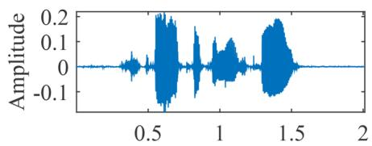  
(a1)

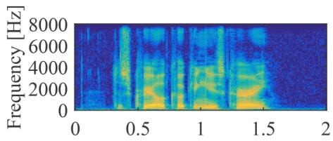

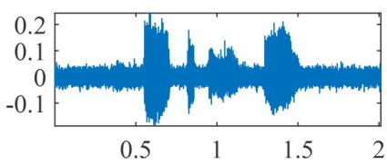  
(a2)

(b1)  
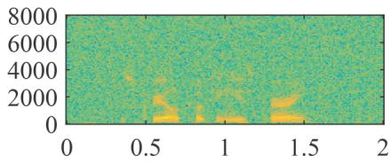  
(b2)

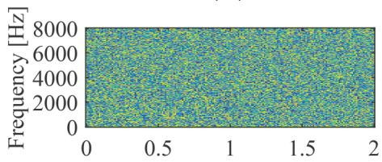  
(c1)

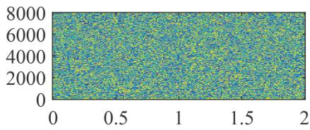

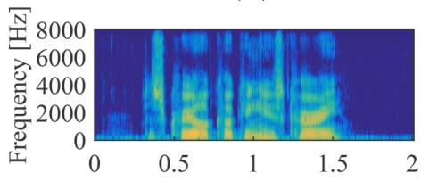  
(d1)

(c2)  
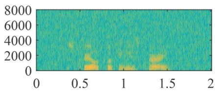

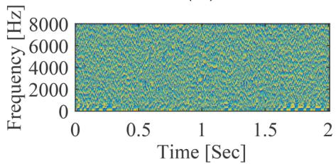  
(e1)

(d2)  
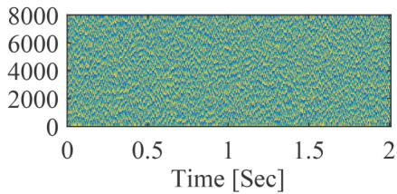  
(e2)  
Figure 2. Time-domain clean speech and noisy speech, and their corresponding magnitude and phase spectrograms. (a ) time-domain clean speech; (b1) magnitude spectrogram of clean speech with frame length 320 and frame shift 160; (c1) phase spectrogram of clean speech with the same frame length and shift as $( b _ { 1 } ) ; ( d _ { 1 } )$ magnitude spectrogram of clean speech with frame length 64 and frame shift 16; $( \mathsf { e } _ { 1 } )$ phase spectrogram of clean speech with the same frame length and shift as (d1). (a2) to (e2) correspond to (a1) to (e1) with noisy speech at SNR = 5 dB.

phase gradient heap iteration (PGHI), for phase reconstruction from the STFT magnitude. PGHI is based on the simple relationship between the partial derivatives of the phase and log-spectral magnitude when a Gaussian window is used when computing the STFT coefficients (Portnoff, 1979). This method was computationally efficient, and achieved competitive performance when compared with many state-of-the-art algorithms. As described earlier, a higher PESQ score can be achieved when both spectral amplitude and phase are estimated. Unfortunately, because the spectral amplitude of clean speech is not estimated accurately using traditional methods, the accuracy of the phase estimation is limited, which in turn limits the contribution of phase estimation in improving speech quality.

As discussed above, the use of the last three assumptions largely explains why traditional methods do not work well in nonstationary noise scenarios. The performance degradation in low SNR environments can largely be explained by use of the third assumption. Because each T-F spectral amplitude bin is assumed to be independent of other bins, the SNR for each T-F bin is the only physical quantity used to determine whether or not that T-F bin contains speech. It is diffi- cult to estimate the a priori SNR in low SNR environments. Most methods are biased towards underestimation in order to reduce musical noise. Without exploiting the structure of clean speech in time and frequency, the low SNR T-F bins containing speech cannot be recovered. In the next section, deep learning methods are reviewed. These methods implicitly relax the unrealistic assumptions, thus improving speech enhancement performance.

Before deep learning methods became the most popular methods for speech enhancement, researchers proposed many methods for solving the problems of traditional methods, including nonnegative matrix factorization (NMF) (Lee & Seung, 1999; Wilson et al., 2008; Mohammadiha et al., 2013; Sun et al., 2015) and K-means singular value decomposition (K-SVD) (Aharon et al., 2006), which is a method for factoring a matrix. For supervised NMF approaches, the speech and noise basis matrices5 are respectively learned from the speech and noise datasets in a first stage. The noisy NMF coefficients are then obtained from the noisy speech magnitude and the two basis matrices. Finally, speech denoising is performed using the two basis matrices and their corresponding coefficients (Mohammadiha et al., 2013). For unsupervised NMF approaches, the noise basis matrix is learned from the noisy speech directly without use of the noise dataset. Mohammadiha et al. (2013), using objective assessment metrics, showed that both supervised and unsupervised approaches outperformed traditional methods such as Wiener filtering and the MMSE estimator of speech discretetime Fourier transform coefficients based on a generalized Gamma distribution (Erkelens et al., 2007). For K-SVDbased approaches, noise dictionaries are trained using K-SVD, and they are then applied to speech denoising (Aharon et al., 2006). K-SVD-based approaches often work better than traditional methods in terms of noise attenuation.

Shallow neural networks (Tamura, 1989) and codebookbased methods were applied to speech denoising some time ago (Zavarehei et al., 2007; Suhadi et al., 2011). For example, Zavarehei et al. (2007) proposed pretraining the harmonic-noise model (HNM) codebook using a dataset comprising only clean speech. A codebook-mapping algorithm was then developed to create the estimated clean speech with the pretrained HNM codebook. However, while these methods improved speech enhancement in some specific scenarios, their ability to generalize to other scenarios, such as different types of background noise, was limited. This limitation mainly comes from the limited modeling ability of these methods due to the limited maximum number of dictionaries/basis matrices or the limited number of hidden layers and the difficulty of training a model with the limited computational resources and limited storage available at that time. Moreover, training models with greater numbers of hidden layers and more hidden units per layer was challenging before an effective initialization method was proposed by Hinton & Salakhutdinov (2006). In the next section, we review deep learning methods to clarify how these problems have been alleviated.

## Deep Learning Methods

Over the last 15 years, deep learning methods have become pervasive, and they have been successfully applied to computer vision (He et al., 2016; Krizhevsky et al., 2017; Huang et al., 2017), speech processing (Yu & Deng, 2011; Hinton et al., 2012; Dahl et al., 2012; Abdel-Hamid et al., 2014), and other practical applications because of their powerful high-dimensional nonlinear modeling capability. About ten years ago, deep learning was extended to monaural speech enhancement. Many effective network architectures were proposed for denoising (Wang & Wang, 2012, 2013) and dereverberation (Han et al., 2014). Figure 3 shows a flow-chart of typical deep learning-based frequency-domain methods. These methods involve two stages: training and testing. For the training stage, there are four modules: feature extraction, network architecture, learning target, and loss function. For the testing stage, there are also four modules. The feature extraction and network architecture modules are the same as for the training stage. The target spectrum reconstruction and time-domain speech reconstruction modules are used to generate the processed time-domain speech signal. The last two modules of the testing stage are straightforward to realize. Therefore, in the following, only the four modules of the training phase are reviewed and discussed.

## Feature Extraction

Feature extraction is the first step for deep learning methods. A good feature set can improve the discrimination of speech from noise. Chen et al. (2014) extracted a range of acoustic features from speech in noise at low SNRs and evaluated their influence on the classification of T-F bins as speechdominated or noise-dominated. Classification accuracy was assessed in terms of hits (the proportion of correctly identi-fied speech-dominated T-F bins) and false alarms (the proportion of noise-dominated T-F bins that were incorrectly classified as speech dominated). It was concluded that features derived using a gammatone filterbank, which is intended to represent the frequency analysis that takes place in the human auditory system (Moore, 2013), achieved better performance than other types of features, such as perceptual linear prediction (PLP) (Hermansky, 1990), power normalized cepstral coefficients (Kim & Stern, 2016), and Gabor filterbank features. Delfarah & Wang (2017) evaluated several acoustic features of speech in noise, including the amplitude modulation spectrogram as used by Kim et al. (2009), the relative spectral transform-PLP (RASTA) as used by Hermansky & Morgan (1994), gammatone frequency cepstral coefficients, Mel-Frequency Cepstral Coefficients (MFCCs) as used by Xu et al. (2017), log-amplitude spectral features (LOG-AMP) as used by Han et al. (2015), and fundamental-frequency-based features as used by Hu (2006), using the short-time objective intelligibility (STOI) score as the objective performance metric. The time required to extract each feature was also determined. Gammatone-domain features led to higher STOI scores than LOG-AMP, log-mel filterbank features and MFCC. However, the gammatone-domain features required more extraction time than the other features. Perhaps because of this, gammatone-domain features have not been used as widely as MFCC and LOG-AMP features for applications in resource-limited devices and real-time systems.

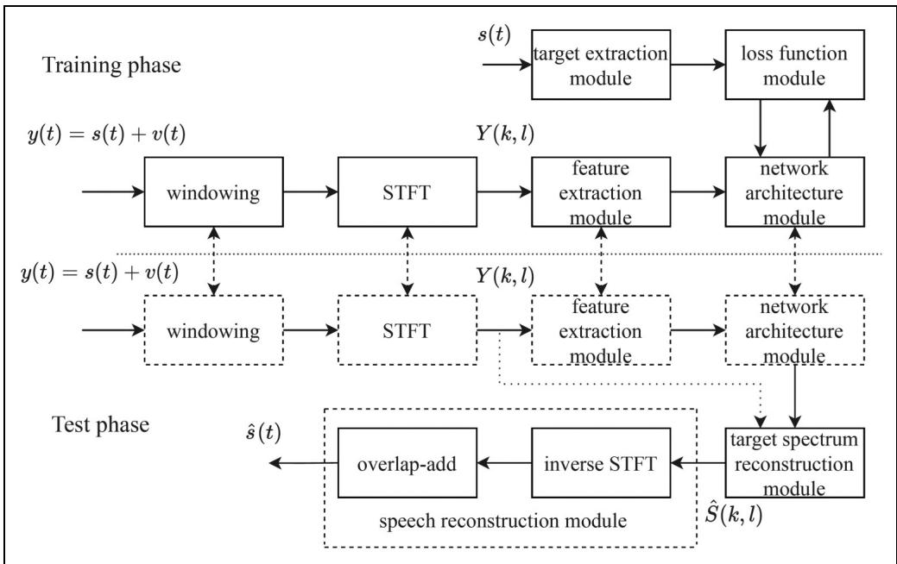  
Figure 3. A generic flow-process diagram of deep learning methods.

Various easily extracted features of noisy speech have been used in deep neural network (DNN) models designed to extract clean speech from noisy speech, including the LOG-AMP, the log-power spectrum (Xu et al., 2014b, 2015), spectral amplitudes (Tan & Wang, 2018) and the spectral amplitudes raised to a power less than 1 (Zhao et al., 2020), which represents a form of amplitude compression. The cube-root of the spectral amplitudes generally led to the best performance, perhaps because taking the cube-root reduces the dynamic range of the speech, facilitating the training process (Luo et al., 2022). Tan & Wang (2020) extracted the real and imaginary parts of the complex spectrum of noisy speech as input features. The mapping targets were the corresponding real and imaginary parts of the complex spectrum of the clean speech. Better performance was achieved than with networks that only mapped spectral magnitudes, because of the implicit phase recovery (Tan & Wang, 2020). It was also shown that compression of the complex spectrum improved speech dereverberation performance based on both objective metric scores and subjective preference scores (Li et al., 2021d). Better performance with compression in the joint denoising and dereveberation task was shown in the 3rd deep noise suppression (DNS) Challenge (Li et al., 2021a).

Extraction of STFT-domain features is computationally efficient, so their computational load is often small relative to the load of the DNN itself. However, the number of features increases with increasing frame length, and fine frequency resolution, which facilitates the discrimination of speech and noise, requires a large frame length. It is generally accepted that the frequency resolution of the human auditory system can be characterized using the ERB-Number frequency scale, for which the bandwidths of the auditory filters in Hz increase with increasing center frequency (Moore, 2013). The Bark scale (Fastl & Zwicker, 2007) has similar properties, but differs from the ERB-Number scale in resolution at low frequencies. These psychoacoustically based scales have been applied to reduce the number of STFT-domain features. For example, Valin (2018) extracted 22 Bark-frequency cepstral coefficients (BFCCs), the first and second derivatives of the first six BFCCs, and the strength of the dominant periodicity for the first six bands, which is related to the fundamental frequency (F0), and used them as input features for real-time speech enhancement. This reduced the number of features per frame from 481 for the STSAs (when the sampling rate was 48,000 Hz and the window length was 20 ms) to 42. Valin (2018) also computed and used at input features the period (1/F0) and a spectral nonstationary metric that measured the spectrum variation over time. To improve performance, Valin et al. (2020) used 70 input features. To extract these features, the audible frequency range was split into 34 bands based roughly on the ERB-number scale, and the magnitude of each band for the third future frame and the pitch correlation of each band for the current frame were computed and used to obtain 68 input features. The other two input features were the period (1/F0) and an estimate of the correlation of the period across frames. The computational load was about 40 million floating point operations per second when 42 features per frame were used (Valin, 2018) and about 800 million multiply-accumulate operations per second (Valin et al., 2020) when 70 features were used. Valin et al. (2020) showed that the quality of the enhanced speech was signifi- cantly improved in terms of mean opinion score (MOS) and PESQ when compared with the previous work by Valin (2018).

Another advantage of using perceptually based features occurs when full-band6 speech is to be enhanced. For fullband speech, the number of the input features increases markedly when features are extracted on a linear frequency scale, resulting in much greater computational complexity. The number of input features can be reduced by extracting them on a logarithmic frequency scale, or by using ERB-based or Bark-based filter banks to extract input features (Schröter et al., 2022).

F0-based features have been widely used in computational auditory scene analysis to separate speech from simultaneous talkers, but their effectiveness in enhancing speech in noise is poor at low SNRs because of inaccurate estimation of F0-based features (Wang & Chen, 2018). Furthermore, as shown by Delfarah & Wang (2017), the extraction of F0-based features with a 64-channel gammatone filterbank followed by F0 estimation for each channel takes longer than the extraction of other features. Some researchers have used F0 information only implicitly. For example, Valin (2018) extracted the correlation of F0 estimates over time for the first six bands as supplementary features. Wang et al. (2022) extracted F0 information as an additional feature for predicting a mask as a postprocessing filter, further suppressing residual noise between harmonics of voiced speech and reducing speech distortion.

Comparison of the effectiveness of input features is often conducted using a specific DNN. A specific feature set may yield improved performance when used with a given DNN but may not with another DNN. In recent years, the importance of magnitude compression and phase has been con-firmed using several different DNNs (Williamson & Wang, 2017; Zhao et al., 2020; Tan & Wang, 2020). As a result, the compressed complex spectrum has become popular. There are many benefits of magnitude compression in practical applications (Li et al., 2021d). The first is that while noisy speech is typically quantized with 16-bit resolution, only 8 bits are needed to represent the compressed magnitude if the compression exponent is 0.5. This leads to reduced computational complexity and memory requirements, which are important for practical applications of DNNs. The second benefit is that speech distortion and noise reduction can be better balanced when compared with the raw magnitude without compression, resulting in improving speech quality. This may be the case because compression reduces the dynamic range of the magnitude values, facilitating the training process (Luo et al., 2022). Compression of the magnitude of the noisy spectrum can be expressed by:

$$
\left| Y _ {\mathrm{cp}} (k, l) \right| = \left| Y (k, l) \right| ^ {\alpha_ {\mathrm{cp}}},\tag{31}
$$

where $\alpha _ { \mathrm { c p } } \in ( 0 \ 1 ]$ is the compression factor. In Equation (18), $\alpha _ { g }$ ranges from 0 to 2 (Sim et al., 1998; Loizou, 2005; Breithaupt et al., 2008), while $\alpha _ { \mathrm { c p } }$ here is often set to $1 / 2$ or 1/3 for deep learning methods (Zhao et al., 2020; Li et al., 2021d). It is interesting that both deep learning and traditional methods, such as spectral subtraction, usually achieve better performance when the spectral magnitude is compressed (Inoue et al., 2011; Zhao et al., 2020; Li et al., 2021d). The compressed input complex spectrum can be expressed as:

$$
\begin{array}{c} Y _ {\mathrm{cp}} (k, l) = | Y _ {\mathrm{cp}} (k, l) | \exp {(j \angle Y (k, l))} \\ = Y _ {\mathrm{cp,r}} (k, l) + j Y _ {\mathrm{cp,i}} (k, l), \end{array}\tag{32}
$$

where $Y _ { \mathrm { c p } } ( k , l )$ is the compressed complex spectrum of the noisy speech with real part $Y _ { \mathrm { c p , r } } ( k , l )$ and imaginary part $Y _ { \mathrm { c p , i } } ( k , l )$ . These compressed spectra are used as the input features in some of the evaluations presented later in this paper.

## Network Architecture

Early DNN-based speech enhancement methods operated in the T-F domain by enhancing the magnitude spectrum but leaving the phase spectrum unaltered. These methods focussed on capturing information in changes over time and in patterns across frequency. To capture information related to changes over time, Xu et al. (2014b) concatenated up to 11 frames and used the concatenated frames as input features to a fully connected DNN in which each node of the previous layer was connected to all nodes of the current layer. However, the use of such long features increases the number of input features and limits the generalization capabilities of fully connected DNNs. Recurrent neural networks (RNNs), which are naturally suitable for temporal modeling, were then proposed for speech enhancement. The main difference between fully connected DNNs and RNNs is that although both have connections between nodes, only the latter allow the output from some nodes to influence subsequent input on the same nodes. Returning to the speech production model specified by Equation (29), each time sample of speech can be recursively estimated from its previous tP time samples. To capture the temporal characteristic of speech over time scales from samples to seconds, long shortterm memory (LSTM)-based models, first proposed by Hochreiter & Schmidhuber (1997), have been applied to both masking-based (Chen & Wang, 2017) and mappingbased (Sun et al., 2017) approaches (the difference between the two types of approach is discussed later). Multiple-target learning, which jointly learns the clean spectrum and the mask, has also been used to develop an

LSTM-based speech enhancement method (Sun et al., 2017). Both objective and subjective results showed that exploiting the temporal characteristic of speech with RNNs or LSTMs led to better performance (Chen et al., 2016; Healy et al., 2021). Valin (2018) proposed an RNN called RNNoise as a low-complexity speech enhancement method that uses a gate recurrent unit (GRU7 )-based model with many fewer parameters than the LSTM-based model.

Recently, deep learning-based speech enhancement has benefited immensely from the use of convolutional neural networks (CNNs), which were inspired from biology and first proposed by Fukushima (1980) and developed extensively by LeCun et al. (1989). For CNNs, at least one convolutional layer is included in the architecture, performing a dot product of a convolution kernel with the input of this layer. The number of parameters of CNNs is markedly lower than for fully connected DNNs, although this does not necessarily reduce computational complexity. Park & Lee (2017) utilized a convolutional encoder-decoder network for spectral mapping, achieving comparable performance to an RNN-based model, while having many fewer trainable parameters. Convolutional recurrent networks (CRNs) that combine CNNs and RNNs or LSTMs into one model were first proposed by Pinheiro & Collobert (2014), and they have become one of the most popular architectures for image and speech processing, because they combine the feature-extraction capability of CNNs and the temporal modeling capability of RNNs or LSTMs. Naithani et al. (2017) developed a CRN by successively stacking convolutional layers, LSTM layers and fullyconnected layers. Takahashi et al. (2018) developed a CRN that combines convolutional layers and recurrent layers at multiple scales. The two CRN models proposed by Naithani et al. (2017) and Takahashi et al. (2018) achieved higher signal-to-distortion ratios (SDRs) than the simple combination of CNN and RNN models.

The approaches described above enhanced the noisy speech only in the magnitude domain. However, considerable improvements in both objective and subjective measures of speech quality can be achieved by recovering the phase of the clean speech (Paliwal et al., 2011). To this end, Williamson et al. (2016) employed stacked fully connected layers to estimate a complex ideal ratio mask (cIRM), which is applied to the real and imaginary parts of the spectrum to recover the magnitude and phase of the clean speech (the definition of cIRM is presented later). Subsequently, Fu et al. (2017) proposed a CNN for estimating the real and imaginary parts of the clean complex spectrum from the noisy features. Tan & Wang (2019) first applied CRNs to complex spectrum mapping-based speech enhancement, an approach they called GCRN. Two CRNs were used to separately estimate the real and imaginary parts of the clean complex spectrum and a gate mechanism was employed for both the encoder and decoder. The RNN utilized in GCRN did not effectively model extremely long sequences because of the problem of vanishing gradients and exploding gradients. These refer to situations where the error that is to be minimized changes hardly at all with changes in model parameters (vanishing gradients) or changes considerably with small changes in model parameters (exploding gradients). Vanishing gradients prevent tuning of the model parameters, while exploding gradients cause very large changes in the model parameters, resulting in the training being unstable and divergent. To deal with this, Le et al. (2021) proposed DPCRN, in which the RNN was replaced by a dual-path RNN. This dual-path RNN contained an intrachunk RNN that was used to model the spectrum of a single time frame over frequency and an inter-chunk RNN that was used to model the variation of the spectrum over time.

Although the above-mentioned networks generated the complex spectrum of the clean speech or the cIRM, they themselves applied real-valued multiplication and addition operations. Choi et al. (2019) first introduced complex convolutional layers into the real-valued U-Net, which is a convolutional network architecture, proposed by Ronneberger et al. (2015) for speech enhancement. State-of-the-art performance was achieved in terms of many objective metrics, such as CSIG, CBAK and COVL (Hu & Loizou, 2008). Hu et al. (2020) proposed a complex CRN, called DCCRN, and reported significant performance improvements in both objective metric scores and subjective listening scores over the LSTM and CRN models, as well as over the baseline model (NSNet) provided by the DNS Challenge organizer (Xia et al., 2020). The DCCRN model was ranked first in the first DNS Challenge organized by Microsoft (Reddy et al., 2020).

Recently, approaches that decompose the speech enhancement task into several progressive tasks have been developed. These are called progressive task-oriented training approaches. The processing in earlier stages can improve the optimization of later stages. Experiments conducted using the Voice Bank + DEMAND dataset showed a large objective improvement relative to earlier methods without progressive learning, such as MMSE-GAN (Soni et al., 2018). Gao et al. (2016) first introduced the progressive learning concept into speech enhancement. They decomposed the mapping from noisy to clean speech into multiple stages so as to increase the SNR progressively. Inspired by Gao et al. (2016), a subband decomposition-based progressive learning framework was proposed by Li et al. (2021e). The progressive learning approaches proposed by Gao et al. (2016) and Li et al. (2021e) improved PESQ and STOI scores for SNR values 0 dB relative to comparable deep learning frameworks without progressive learning.

A related but somewhat different approach is to break down the speech-enhancement task into separate goals, and to optimize these goals sequentially or in parallel. For example, Yin et al. (2020) proposed a network called PHASEN for recovering magnitude and phase in a parallel processing topology. Fu et al. (2022) proposed Uformer, in which a U-Net based dilated complex-and-real dual-path conformer network was designed to improve performance in the complex-valued and magnitude domains simultaneously. Some other networks use a sequential processing structure to decompose the speech-enhancement task. For example, Strake et al. (2019) used a first task of noise suppression and a second task of restoring the parts of the speech that had been removed during noise suppression. A similar task-splitting method was used by Hao et al. (2020), who called the two tasks “masking and inpainting”.

Another task-decoupling approach is to enhance spectral magnitude in the frequency domain in a first stage and then to further reduce noise in the time domain. For example, Westhausen & Meyer (2020) combined two signal transformation methods, i.e., the STFT and a learnable analysis/ synthesis method, achieving competitive results in the Interspeech2020 DNS-Challenge (Reddy et al., 2021). Note that this learnable analysis/synthesis method was introduced for feature extraction with a data-driven approach; the idea had already been proposed by Luo & Mesgarani (2019) for speech separation. This decoupling method was independently proposed by Du et al. (2020). These authors designed a cascade framework including a Mel-domain denoising autoencoder8 for magnitude recovery and a generative vocoder for waveform synthesis. The denoising autoencoder was first proposed by Vincent et al. (2008) for image processing to improve the robustness of feature extraction. It is often used to extract features for model training. Using the denoising autoencoder for speech enhancement led to improved model generalizability across different noisy conditions (Lu et al., 2013; Yu et al., 2020). Many other autoencoders have been introduced and applied to speech enhancement (Leglaive et al., 2018, 2020; Bie et al., 2022).

Different from the above decoupling approaches, Li et al. (2021b) proposed a complex spectral refinement network. A magnitude spectral estimation network was used to recover phase implicitly. This framework, called SDDNet, achieved state-of-the-art performance in the ICASSP2021 DNS-Challenge. Subsequently, Wang et al. (2021) pointed out that the estimated spectral magnitude and phase are related, and showed that it is better to estimate the spectral magnitude and the residual complex spectral component. It can be inferred that estimating spectral magnitudes first and then recovering phase is not necessarily the best choice. Wang et al. (2022) introduced a magnitude refinement module after estimation of the complex spectrum of the clean speech. Li et al. (2022b) and Fu et al. (2022) adopted parallel structures to optimize both the complex spectrum and the magnitude. Other examples of decoupling-style frameworks include decomposing the speech-enhancement task into noise estimation and speech recovery, and performing these tasks using parallel and serial structures, respectively. Zheng et al. (2021), and Liu et al. (2021) decomposed the speech enhancement process into two stages: in the first, the magnitude of the noise was estimated and used as a priori information for the second stage, which estimated the complex spectrum of the clean speech. Zhang et al. (2021) proposed a dual-branch framework for spectrum and waveform modeling. All of the above-mentioned decoupling methods achieved better performance in terms of PESQ and STOI or Extended STOI (ESTOI) scores than methods mapping learning targets directly.

## Training Target

The training target plays an important role in deep learning methods. A well-defined training target is important for obtaining good speech intelligibility and quality. The training target should be suitable for supervised learning. Many training targets have been developed in the T-F domain. They can be divided into two main groups i.e., masking-based and mapping-based.

One masking-based target is the ideal binary mask (IBM) (Wang & Wang, 2013). For each T-F bin, the value of the IBM is either 1 or 0. A value of 1 means that the estimated SNR for this bin is larger than a predefined threshold value, while a value of 0 means that the estimated SNR is smaller than this threshold. The IBM is applied to the T-F matrix for that frame, effectively selecting the T-F bins that are to be preserved. The IBM can be expressed as

$$
I B M (k, l) = \left\{ \begin{array}{l} 1, | S (k, l) | \geq \theta_ {\mathrm{th}} | V (k, l) | \\ 0, \text { otherwise } \end{array} \right.\tag{33}
$$

where $\theta _ { \mathrm { t h } }$ is the threshold, which typically has a value ranging from 0.5 to 1 in amplitude units (corresponding to 6 dB to 0 dB). The IBM labels every T-F unit as either target-dominated or noise-dominated, and the speech enhancement task is treated as a supervised classification problem. Use of the IBM results in good speech intelligibility but only moderate speech quality (Wang et al., 2014). Instead of using a hard threshold for each T-F unit, the ideal ratio mask (IRM) proposed by Narayanan & Wang (2013) applies an attenuation to each T-F bin that increases as the estimated SNR for that bin decreases. The IRM is defined as

$$
I R M (k, l) = \left(\frac {| S (k , l) | ^ {\alpha_ {\mathrm{irm}}}}{| S (k , l) | ^ {\alpha_ {\mathrm{irm}}} + | V (k , l) | ^ {\alpha_ {\mathrm{irm}}}}\right) ^ {\beta_ {\mathrm{irm}}},\tag{34}
$$

where $\alpha _ { \mathrm { i r m } } \geq 0$ and $\beta _ { \mathrm { i r m } } \geq 0$ are tunable parameters. $\beta _ { \mathrm { i r m } }$ is often set to 0.5. The IRM leads to better speech quality than the IBM. The IBM and IRM operate in the magnitude domain; the phase is not taken into consideration (Narayanan & Wang, 2013). Erdogan et al. (2015) first proposed a phase-sensitive mask (PSM) that takes phase into account. The PSM is defined as

$$
P S M (k, l) = \frac {| S (k , l) |}{| Y (k , l) |} \cos \Phi_ {\Delta},\tag{35}
$$

where $\Phi _ { \Delta }$ denotes the phase difference between the clean speech and noisy speech within a given T-F unit. The introduction of the phase difference in the training target led to a higher SNR of the enhanced speech (Erdogan et al., 2015). Later, Williamson et al. (2016) noted that both the real and imaginary parts of the complex spectrum of speech have a clear structure, while when the magnitude and phase are treated separately a clear structure exists only in the magnitude spectrum. Accordingly, Williamson et al. (2016) proposed a cIRM, which can be regarded as an extension of the IRM to the complex-valued domain. The cIRM is defined as

$$
c I R M (k, l) = M _ {r} (k, l) + i M _ {i} (k, l),\tag{36}
$$

where $M _ { r } ( k , l )$ and $M _ { i } ( k , l )$ are, respectively, given by:

$$
M _ {r} (k, l) = \frac {Y _ {r} (k , l) S _ {r} (k , l) + Y _ {i} (k , l) S _ {i} (k , l)}{Y _ {r} ^ {2} (k , l) + Y _ {i} ^ {2} (k , l)},\tag{37}
$$

$$
M _ {i} (k, l) = \frac {Y _ {r} (k , l) S _ {i} (k , l) - Y _ {i} (k , l) S _ {r} (k , l)}{Y _ {r} ^ {2} (k , l) + Y _ {i} ^ {2} (k , l)}.\tag{38}
$$

As can be seen from Equation (36), the cIRM has real and imaginary parts, like the complex spectrum of speech, and thus it should be able to recover the phase of the clean speech, unlike the IBM and IRM.

For mapping-based targets, a spectral representation of the clean speech is mapped directly using a pretrained deep-learning model. In much early work, mapping-based supervised speech-enhancement methods focussed on mapping from the noisy magnitude spectrum to the clean magnitude spectrum while leaving the phase unaltered. Because the dynamic range of the magnitude is large, the log-power spectrum was initially proposed as the mapping target (Xu et al., 2015, 2014b). However, Zhao et al. (2020) showed that power compression of the magnitude led to better performance than logarithmic compression. More recently, motivated by the fact that appropriate use of phase information could notably improve speech quality, especially at low SNRs (Paliwal et al., 2011), complex-valued spectrum mapping has become mainstream. Li et al. (2021d) proposed combining the noisy phase with the power-compressed magnitude. The compressed complex spectrum $S _ { \mathrm { c p } } ( k , l )$ in this case can be expressed by

$$
\begin{array}{c} S _ {\mathrm{cp}} (k, l) = | S _ {\mathrm{cp}} (k, l) | \exp {(j \angle S (k, l))} \\ = S _ {\mathrm{cp,r}} (k, l) + j S _ {\mathrm{cp,i}} (k, l), \end{array}\tag{39}
$$

where $| S _ { \mathrm { c p } } ( k , l ) | = | S ( k , l ) | ^ { \alpha _ { \mathrm { c p } } } . \ S _ { \mathrm { c p , r } } ( k , l )$ and $S _ { \mathrm { c p , i } } ( k , l )$ are the real and imaginary parts of $S _ { \mathrm { c p } } ( k , l ) .$ , respectively. This compressed complex spectrum has become popular as a training target because it leads to better performance for both objective and subjective measures than the uncompressed complex spectrum or magnitude-based training targets.

Some researchers have used mapping targets in addition to the spectrum or mask (Xu et al., 2017; Fang et al., 2023). Xu et al. (2017) proposed a DNN that learned the magnitude spectrum as the primary target and MFCC as the secondary target. The additional MFCC estimation imposed constraints that were not applicable in the prediction of the magnitude spectrum alone, improving the prediction performance of the primary target. Fang et al. (2023) proposed a framework for jointly modeling random uncertainties and uncertainties due to insufficient training data for deep-learning-based Wiener filter estimation for speech enhancement. The involvement of modeling uncertainties increased the robustness of the estimator, and it was shown that this method preserved more speech at the cost of decreasing the amount of noise reduction slightly.

## Loss Function

For deep-learning approaches, the loss function, also known as the cost function, evaluates how well a model is currently performing on a specific dataset, and tunes the model parameters based on the gradient of performance with respect to these parameters (Yu & Deng, 2011; Hinton et al., 2012). The training loss function is one of the key components for deep learning methods, and it is commonly used to assess how well the trained model fits the training data. An appropriate loss function can lead to a good balance between performance on the one hand and storage memory and/or computational complexity on the other hand. The commonly used loss functions for speech enhancement can be divided into three categories: frequency-domain, time-domain, and perceptually motivated.

In the frequency domain, early work used a neural network to map the IBM, and used binary cross entropy to supervise the model training. As mentioned above, for each T-F bin the value of the IBM is either 1 or 0, and thus this binary cross entropy measures the dissimilarity between the predicted and true labels of a dataset. Later, with the increasing complexity of training targets, the speech-enhancement task began to be regarded as an approximation or regression problem rather than a classification problem, and commonly used loss functions were the Kullback-Leibler divergence proposed by Kullback (1997), the Itakura-Saito distance proposed by Itakura & Satio (1968), and the MSE. Liu et al. (2014) showed that both the Kullback-Leibler divergence and the Itakura-Saito distance led to worse performance than the MSE, and since then the MSE has become a very popular loss function for monaural speech enhancement. The models are often trained by minimizing the MSE between the magnitude/complex spectrum of the clean speech and the estimated spectrum, a method denoted signal approximation (SA), rather than by minimizing the MSE between the true mask and the estimated mask (Huang et al., 2014; Weninger et al., 2014; Wang & Chen, 2018). Better objective metric scores have been obtained with SA (Weninger et al., 2014) than when the MSE between the estimated mask and the true one was minimized, provided that the same network architecture was used. Spectral magnitude-based MSE (Weninger et al., 2015), phase-sensitive MSE (Erdogan et al., 2015) and complex spectrum-based MSE (Fu et al., 2017) have all been proposed. The spectral magnitude-based MSE and complex spectrum-based MSE loss functions can be expressed as:

$$
\mathcal {L} _ {M a g} = \| | S | - | \widehat {S} | \| _ {F} ^ {2},\tag{40}
$$

and

$$
\mathcal {L} _ {R I} = \| S _ {r} - \widehat {S _ {r}} \| _ {F} ^ {2} + \| S _ {i} - \widehat {S _ {i}} \| _ {F} ^ {2},\tag{41}
$$

where $| \cdot | , ( \cdot ) _ { r }$ and $( \cdot ) _ { i }$ extract the spectral magnitude, and the real and imaginary parts of the complex spectrum, respectively. $\| \bullet \| _ { F }$ represents the Frobenius norm, defined as the square root of the sum of the squares of all the elements of a matrix or a vector. When the spectral magnitude-based MSE loss function is used, spectral magnitude distortion is minimized and the phase is unaltered. When the complex spectrum-based MSE loss function is used, the phase estimation error is reduced but spectral magnitude distortion increases. The trade-off between spectral magnitude distortion and phase recovery has been called the “compensation effect” (Wang et al., 2021; Luo et al., 2022). To reduce both magnitude and phase distortion, a combined loss function has been proposed, which is formulated as:

$$
\mathcal {L} _ {R I + M a g} = \alpha_ {\mathrm{com}} \mathcal {L} _ {M a g} + (1 - \alpha_ {\mathrm{com}}) \mathcal {L} _ {R I},\tag{42}
$$

where $\alpha _ { \mathrm { c o m } }$ is a linear combination coefficient. A comprehensive evaluation of different loss functions was conducted by Braun & Tashev (2021). They showed that combining the magnitude and phase-aware losses led to performance improvement, even when only the noisy phase was used to reconstruct the time-domain speech, indicating the importance of including the phase-aware loss in the loss function in the training stage. Moreover, using compressed spectrum loss functions yielded further significant performance improvement.

The mean absolute error (MAE) between the estimated and clean speech magnitudes (Qi et al., 2020) has also been explored as a complex spectral distance metric, based on the assumption that the real and imaginary parts of each STFT bin follow a Laplacian distribution rather than a Gaussian distribution (Braun & Tashev, 2021). Tu et al. (2018) used a log-spectral MSE loss function for magnitude estimation, because human perception of auditory magnitudes roughly corresponds to a logarithmic scale. More recently, a power-law-compressed spectral MSE loss function (Yin et al., 2020) has been shown to be effective in denoising. This method can be formulated as:

$$
\begin{array}{r l} & {\mathcal {L} _ {c p r s} = (1 - \alpha) (\| | S | ^ {c} \cos (\phi_ {S}) - | \widehat {S} | ^ {c} \cos (\phi_ {\widehat {S}}) \| _ {F} ^ {2}} \\ & {\qquad + \| | S | ^ {c} \sin (\phi_ {S}) - | \widehat {S} | ^ {c} \sin (\phi_ {\widehat {S}}) \| _ {F} ^ {2})} \\ & {\qquad + \alpha \| | S | ^ {c} - | \widehat {S} | ^ {c} \| _ {F} ^ {2}.} \end{array}\tag{43}
$$

It should be noted that the time-domain loss functions commonly used for separating simultaneous talkers have been extended to speech enhancement, and have been shown to be effective (Rethage et al., 2018; Choi et al., 2019; Hu et al., 2020). In addition to time-domain MAE (or MSE) loss functions (Rethage et al., 2018), signal energy-based loss functions have become popular, such as the SDR and scale invariant SDR loss functions (Choi et al., 2019; Hu et al., 2020). In addition, restricting the SNR loss to a certain range was proposed for use with a time-domain progressive speech enhancement approach (Nian et al., 2022). The restricted SNR loss was introduced to preserve the relative values of the clean speech target, intermediate speech target, and input noisy speech.

Perceptually motivated loss functions have been developed to optimize DNNs based on objective metrics such as PESQ, cepstral distance, and STOI (Zhao et al., 2019). As described earlier, when used singly, these loss functions generally achieve better performance when assessed with the metric used for optimization (Fu et al., 2020), but not for other metrics, while combining these loss functions often results in improvement of multiple objective metric scores simultaneously (Fu et al., 2017).

For deep learning approaches, “overfitting” can occur when the number of training parameters is too large relative to the size of the training dataset. When this happens, performance evaluated using the training dataset is much better than performance evaluated using an independent but similar dataset. Overfitting can be avoided by stopping the training early (Wang & Chen, 2018). In addition, a learnable loss mix-up approach, in which two loss functions were combined together with a learnable parameter, has been proposed to improve the generalization of DNN-based speechenhancement models (Chang et al., 2021). The purpose of introducing the learnable parameter was to automatically optimize the weighting factor of the two loss functions with the training dataset in the training stage.

## Discussion

As described above, unrealistic assumptions limit the performance of traditional frequency-domain monaural speech enhancement methods. In contrast, deep learning methods do not depend on any specific assumptions about the properties of the speech or noise. For example, it is well known that deep learning methods can handle nonstationary noises better than traditional methods, because the former are not based on assumptions about the statistics of the noise, while the latter are often based on the assumption that the noise is stationary or quasi-stationary. Also, deep learning methods can utilize speech contextual information and the speech spectral structure to reconstruct clean speech or to separate speech from noise. The earliest deep learning speech enhancement methods estimated only the spectral magnitude of the clean speech, ignoring the importance of speech phase for speech quality and speech intelligibility. This was done because it was thought that speech phase is unstructured, and thus cannot be learned or mapped by deep learning methods.

However, the real and imaginary parts of the complex spectrum both have structure.

The speech phase can be implicitly recovered in two ways: one is to estimate the cIRM (Williamson et al., 2016) and the other is to estimate the real and imaginary parts of the complex speech spectrum (Wang & Chen, 2018). Note that these two ways have some similarities: the former often maps the cIRM directly and uses the MSE between the true and estimated cIRM as the loss function (Williamson et al., 2016), while the latter often maps the real and imaginary parts of the complex speech spectrum and uses the MSE between the true and estimated complex spectrum as the loss function. The loss function is often based on the distance between the mapped target and the true one. For example, Tan & Wang (2020) used the MSE between the true and estimated complex spectrum as the loss function for training, while the mapped target was the cIRM. However, this is not a mandatory requirement. For example, Choi et al. (2019) proposed mapping the cIRM, but a time-domain loss function that considers both the speech prediction error and noise prediction error, namely the weighted SDR, was used to train the model.

Although most deep learning methods train models using parallel noisy and clean speech, this is not always necessary. Some researchers have trained models using nonparallel noisy and clean data and achieved moderate performance in terms of both objective and subjective measures (Xiang & Bao, 2020; Xiang et al., 2020; Yu et al., 2022; Bie et al., 2022), although performance did not surpass that of models trained with a large amount of parallel data. Deep learning methods trained without parallel data are often referred to as unsupervised methods, while those trained with parallel data are referred to as supervised methods. Bie et al. (2022) categorized unsupervised methods into two types, noise-dependent and noise-agnostic. The latter methods require only clean speech, and thus in principle they can handle any type of noise (Bando et al., 2018; Bie et al., 2022), while the former methods also require noisy speech or noise although the noisy and clean speech signals are not necessarily parallel. Unsupervised noise-agnostic methods (Bando et al., 2018; Bie et al., 2022) learn the characteristics of the clean speech from the clean speech dataset in the training stage, and the noise signal is only modeled in the test stage. Some NMF methods also learn the speech basis matrix using clean speech and the noise basis matrix is estimated in the denoising stage using information from the speech basis matrix (Mohammadiha et al., 2013).

One interesting question is: what information do deep learning methods use to learn the mapping from noisy to clean speech. It is nearly always the case that the speech and noise have different T-F characteristics, so these differences can be used to distinguish speech from noise or to estimate the SNR for each bin. For monaural speech enhancement, important differences are: the noise is often more stationary than the speech; the speech has a more sparse spectral structure than the noise; in voiced segments, the F0 does not change rapidly, resulting in a correlation over time, and the harmonic structure shows a patterning in frequency; and voiced and unvoiced segments tend to alternate, unvoiced segments having most of their energy at mid and high frequencies and voiced segments having most of their energy at low and mid frequencies. These differences are presumably exploited by deep-learning methods.

Environmental noise can be roughly divided into four categories: industrial, construction, traffic, and noise resulting from social activities (Han et al., 2018). These noise types have different T-F characteristics, and, unlike speech, noise cannot be treated in a unified way and described by a simple model. Hence, it is relatively difficult for DNNs to learn the characteristics of noise. However, when speech is mixed with noise, if the speech can be reconstructed from its corresponding noisy version, the noise can then be estimated by subtracting the estimated complex spectrum of the speech from that for the noisy speech. This information can in turn be used to improve the speech enhancement process.

Zhang et al. (2020) estimated the a priori SNR using the Deep Xi model proposed by Nicolson & Paliwal (2019). The noise PSD was then estimated using the MMSE-based approach proposed by Gerkmann & Hendriks (2012). Xu et al. (2014a) have shown the benefits of noise-aware training for DNN-based speech enhancement. In the noise-aware training, information about the noise, such as its short-term spectrum, is used to provide supplementary features. This leads to better mapping of the clean speech spectrum. Liu et al. (2021) and Liu et al. (2022) further showed that estimating the noise spectrum in a first stage improved the performance of single and multimicrophone denoising and dereverberation methods.

A special case is when the background sound is competing speech from one or more talkers. In this case, the problem reduces to speech separation, which is outside the scope of this paper. However, speech from more than one talker often occurs in social interactions, and this is challenging for speech enhancement. A recent study showed that a DNN designed for single-talker speech enhancement performed poorly when it was required that speech from two talkers was to be preserved simultaneously in noisy and reverberant environments (Zheng et al., 2023). This happened because the speech from two talkers is very different from the speech of a single talker. For example, for two overlapping voiced segments there are two simultaneous F0s, and the spectral pattern is much more complex than for a single talker. Increasing the number of talkers generally results in worse performance of DNN-based methods. It seems that most current DNN methods are mainly applicable to single-talker situations. To reduce speech distortion for multiple desired speakers, the training dataset should contain multiple simultaneous talkers and the mixed speech should be regarded as the target when training the DNN (Zheng et al., 2023).

Traditional and deep learning methods differ in several ways in how they reconstruct clean speech. Firstly, the esti mated short-term SNR for each T-F bin determines the IRM for mask-based deep learning methods, while the a priori SNR is the key parameter determining the gain func tion for traditional methods. For the latter, “musical noise” is a serious problem due to the large variability in the estimate of the spectrum for a given frame when time-averaging or frequency-averaging are not used. If the short-term SNR instead of the expected SNR can be accurately estimated for each T-F bin, “musical noise” can be largely eliminated. Unfortunately, it is extremely difficult if not impossible to estimate the short-term SNR using traditional methods, making it difficult to achieve a good balance between the suppression of “musical noise” and the reduction of speech distortion. A second difference between traditional and deep learning methods is that traditional methods estimate the spectral magnitude and phase to reconstruct the timedomain speech signal, while most deep-learning methods estimate the real and imaginary parts of the complex clean speech or estimate the spectral magnitude in a first stage and then estimate the residual complex component of the clean speech in a second stage. In other words, deep learning methods often recover the phase implicitly and indirectly, while traditional methods estimate the phase explicitly and directly. Note that phase reconstruction from the STFT magnitude using DNN approaches has been proposed by Oyamada et al. (2018), Masuyama et al. (2019), Takamichi et al. (2020), Masuyama et al. (2021), and Peer et al. (2022). The effectiveness of DNN-based phase reconstruction has been shown by the reconstruction of clean speech/ audio phase without knowledge of the phase spectrogram. However, although DNN-based phase reconstruction has been applied to speech separation (Wang et al., 2018), only a few researchers have explicitly estimated the clean speech phase for the purpose of enhancing speech in noise (Peer & Gerkmann, 2022).

Finally, while deep learning methods suffer less from the musical noise problem than traditional methods, the former can introduce artificial noise components that degrade speech quality. This artificial noise needs to be suppressed to achieve good speech perceptual quality. Li et al. (2021a) showed that a low-complexity spectral subtraction method used in a postprocessing stage to suppress the artificial noise improved subjective preference scores, although PESQ scores were somewhat decreased. It is interesting that DNSMOS scores (Reddy et al., 2021) correctly reflected subjective preference scores, supporting the effectiveness of DNSMOS in estimating subjective speech quality.

## Hybrid Methods

As mentioned above, traditional methods cannot suppress nonstationary noise completely because the noise PSD cannot be accurately tracked, especially when the noise

PSD increases rapidly or fluctuates strongly over time. One straightforward way to alleviate this problem is to improve noise tracking using data-driven methods (Erkelens & Heusdens, 2008). Another way is to jointly estimate the speech PSD and the noise PSD, so that Wiener-type filtering can be applied to the noisy speech (Zavarehei et al., 2007; Suhadi et al., 2011; Mohammadiha et al., 2013). Although nonstationary noise is better removed using these methods, the speech distortion for low SNR T-F bins still occurs, thus limiting the quality of speech recovery.

Although traditional and deep-learning methods are quite different, the latter have been considerably influenced by the former. Also, there are some hybrid methods for which key parameters extracted using traditional methods are mapped using DNN methods. For example, mapping the a priori SNR using the Deep Xi DNN proposed by Nicolson & Paliwal (2019, 2020) and integrating it into the MMSE-STSA estimator led to good speech quality. Another approach is to combine DNNs with NMF (see Bando et al., 2018, Bie et al., 2022, and references therein). The results showed better performance in terms of objective metrics than for both supervised and unsupervised noise-dependent models for unseen noise scenarios. A complete survey of hybrid models is outside the scope of this paper.

## Evaluation of Different Methods

## Datasets

To evaluate the performance of the different types of speech enhancement methods, we used two datasets, namely WSJ + DNS and Voice Bank + Demand (Valentini-Botinhao et al., 2016). The WSJ + DNS training dataset was generated using the WSJ0-SI84 and Interspeech 2020 DNS-Challenge noise datasets. They contain 150,000 mixtures of speech and noise together with the corresponding clean speech, amounting to about 300 hours in total. The clean utterances were selected from the WSJ0-SI84 dataset (Paul & Baker, 1992), which comprises 7138 utterances spoken by 83 speakers (42 males and 41 females). 5428 and 957 utterances spoken by 77 speakers were selected for model training and model validation, respectively. 150 utterances spoken by the remaining 6 speakers (3 males and 3 females) were used for testing. This was done to assess the generalization capability of the models for different speakers. The noise clips, which include about 20,000 noise types, were selected from the noise set of the Interspeech 2020 DNS-Challenge dataset (Reddy et al., 2021). Their total duration was about 55 hours. To create a training mixture, a randomly selected training utterance was mixed with a randomly cut segment from the noises at a given SNR. The SNR range for training was 5 to 0 dB in steps of 1 dB. Testing used a stationary white Gaussian noise and two highly nonstationary noises, namely babble and factory1, all taken from NOISEX92 (Varga & Steeneken, 1993). SNRs of 5, 0, 5, and 10 dB were used for the test set. 150 noisy-clean pairs were generated for each noise type and each SNR.

Voice Bank + Demand includes 11,572 utterances for training. 824 utterances were used for testing. The clean speech set was a selection of 30 speakers taken from the Voice Bank corpus (Veaux et al., 2013): 28 speakers were used for training and the remaining 2 speakers were used for testing. To create the noisy training set, 40 conditions were used: 10 types of noise (2 artificial noises and 8 noises taken from the Demand database (Thiemann et al., 2013)), each mixed with clean speech at SNRs of 15, 10, 5, and 0 dB. There were about 10 sentences in each condition for each training speaker. For the test set, 20 conditions were used: 5 types of noise (all from the Demand database) with 4 SNRs (17.5, 12.5, 7.5, and 2.5 dB). There were about 20 sentences in each condition for each test speaker. Note that the test set was totally unseen because it used different speakers, noises, and SNRs from the training set.

## Parameter Values

All of the utterances were sampled at 16 kHz. For all of the models except the four models marked with asterisks in tables, the window duration and hop size were 20 ms and 10 ms, respectively, and thus the FFT length was 320. Pytorch was used to train the models, based on the Adam optimizer $( \beta _ { 1 } = 0 . 9 , \beta _ { 2 } = 0 . 9 9 9 )$ (Kingma & Ba, 2014). The initial learning rate was set to 0.001, and it was divided by 2 if three consecutive validation loss9 increments occurred. Training was stopped early if five consecutive validation loss increments occurred. 60 epochs were used for network training, and the batch size was set to 16 at the utterance level. For magnitude-spectrum mapping DNNs, two training targets were studied: one was the uncompressed magnitude and the other was the compressed magnitude with $\alpha _ { c p } = 0 . 5$ . For complex-spectrum DNNs, there were also two training targets. One was the real and imaginary parts of the uncompressed complex spectrum and the other was the real and imaginary parts of the compressed complex spectrum $S _ { c p } ( k , l ) .$ , as presented in Equation (39), with the compression coefficient $\alpha _ { \mathrm { c p } } = 0 . 5$

## Methods Evaluated

The DNNs that were evaluated can be categorized into three groups: magnitude-spectrum based, complex-spectrum based, and decoupling style. For each group, the STFT spectrum or compressed spectrum of the noisy speech were used as the input features, and the training targets were the corresponding STFT spectrum or compressed spectrum of the clean speech. For all models, spectral MSE loss functions were utilized. All of the models were consistent with the best configurations reported by the authors of those models.

For completeness, six representative traditional methods were evaluated, including the MMSE-STSA estimator (Ephraim & Malah, 1984), the MMSE-LSA estimator (Ephraim & Malah, 1985), the β-order MMSE-STSA estimator (with $\beta = 0 . 5 )$ (You et al., 2005), the magnitude spectral subtraction (MSS) (Boll, 1979), power spectral subtraction (PSS) (Lim & Oppenheim, 1979), and square root of MSS (SQ-MSS) models (Inoue et al., 2010b). Note that the MMSE-STSA and MMSE-LSA estimators are two special cases of the β-order MMSE-STSA estimator: β-order MMSE-STSA becomes MMSE-STSA when $\beta = 1$ , while it reduces to MMSE-LSA when $\beta  0 .$ . In the following, the β-order MMSE-STSA estimator is referred to as MMSE-STSA(β) for brievity. These methods required estimation of the noise PSD. The MMSE-based method proposed by Gerkmann & Hendriks (2012) was used for noise PSD estimation. The subtraction factor $\beta _ { g }$ described in Equation (19) was set to different values for different spectral subtraction methods. Its value was adjusted so as to give a noise reduction of 17 dB, which led to a good balance between musical noise and noise reduction. In previous studies the amount of noise reduction was set to range from 12 to 25 dB for normal-hearing listeners (Cohen, 2003; Inoue et al., 2011) and from 14 to 20 dB for hearing-impaired listeners who wore hearing aids (Wong et al., 2018). The value of 17 dB used here was chosen to fall in the middle of these ranges. The six traditional methods are denoted group 1.

Two hybrid methods were chosen, namely DeepXi-LSA and DeepXi-STSA. These are denoted group 2.

1. DeepXi-LSA: The a priori SNR is estimated using the Deep Xi framework proposed by Nicolson & Paliwal (2019), and the a posteriori SNR is computed as the estimated a priori SNR plus one. With the estimated a priori SNR and a posteriori SNR, the spectral gain can be computed using Equation (24).

2. DeepXi-STSA: As for DeepXi-LSA, the a priori SNR and a posteriori SNR are estimated, and the spectral gain is then computed using Equation (23). Note that DeepXi-LSA and DeepXi-STSA use the same network architecture to estimate the a priori SNR. The only difference is in the method of determining spectral gain from the estimated a priori SNR and a posteriori SNR. The window duration and hop size of DeepXi-LSA and DeepXI-STSA were set to 32 ms and 16 ms, respectively, so as to be consistent with the parameter settings of the model proposed by Nicolson & Paliwal (2019).

For magnitude-spectrum mapping DNNs, three one-stage causal models were selected and denoted group 3, namely LSTM (Sun et al., 2017), FullSubNet (Hao et al., 2021), and CRN (Tan & Wang, 2018):

1. LSTM: the LSTM-based model contains four LSTM layers, each with 1024 units. The output layer is a 161-unit fully connected layer. The input and output are the noisy and estimated clean speech magnitudes, respectively.

2. FullSubNet: FullSubNet is a full-band and sub-band fusion model, which was ranked 11th in the ICASSP 2021 DNS-Challenge. Full-band and sub-band refer to models that input full-band and sub-band noisy spectral features and output full-band and sub-band speech targets, respectively. The window duration and hop size were set to 32 ms and 16 ms, respectively, so as to be consistent with the parameter settings of the model proposed by Hao et al. (2021).

3. CRN: CRN contains an encoder and a decoder with two LSTM layers. The input and output are the magnitude of the noisy and estimated speech, respectively.

Five single-stage complex spectrum mapping DNN-based causal models were chosen as group 4, namely GCRN (Tan & Wang, 2020), DPCRN (Le et al., 2021), Uformer (Fu et al., 2022), and DCCRN (Hu et al., 2020):

1. GCRN: GCRN is a complex spectral mapping network based on CRN, where both the spectral magnitude and phase are estimated. GCRN comprises one encoder and two decoders, and both the real and imaginary components of the clean speech complex spectrum are estimated.

2. DPCRN: DPCRN was ranked second in the Interspeech 2021 DNS-Challenge. The RNNs in the CRN were replaced by dual-path RNN modules, where the intrachunk RNNs were used to model the spectral pattern of a single frame and the inter-chunk RNNs were used to model the inter-dependence of successive frames.

3. Uformer: Uformer is a U-Net based dilated complex and real dual-path conformer network, which processes speech in both complex and magnitude domains. The window duration and hop size were set to 25 ms and 10 ms, respectively, and the FFT length was 512, so as to be consistent with the parameter settings of the model proposed by Fu et al. (2022).

4. DCCRN: DCCRN was ranked first in the Interspeech 2020 DNS-Challenge. Both convolutional encoderdecoder and LSTM structures are handled by complexvalued operations. The window duration and hop size were set to 32 ms and 8 ms, respectively, so as to be consistent with the parameter settings of the model proposed by Hu et al. (2020).

5. DCCRN(SNR): DCCRN(SNR) has the same network architecture, input features and learning targets as DCCRN. The only difference is in their loss functions. DCCRN(SNR) used the SNR loss instead of the MSE loss. The SNR loss was used because initial evaluations showed that a DCCRN model trained using the MSE loss performed much worse than a DCCRN model trained with the SNR loss for the Voice Bank + DEMAND dataset, although the two models had comparable performance for the WSJ + DNS dataset.

Three decoupling-style multi-stage causal frameworks were chosen as group 5: i.e., CTSNet (Li et al., 2021b), G2Net (Li et al., 2022b), and TaylorSENet (Li et al., 2022a):

1. CTSNet: CTSNet is a two-stage pipeline that initially generates a coarse estimate of the magnitude spectrum and then predicts a complex residual component that is used to refine the coarse estimate. CTSNet was ranked first in the ICASSP 2021 DNS-Challenge.

2. GaGNet: GaGNet is an improved version of CTSNet. It uses a parallel structure for coarse magnitude and refined complex spectrum estimation, enabling bifurcate and joint optimization to estimate the complex spectrum of the clean speech.

3. TaylorSENet: TaylorSENet is a decoupling-style framework based on Taylor’s approximation theory. The complex target spectrum is reconstructed by the superimposition of 0th-order and higher-order network estimations following Taylor’s formula.

The models listed above were chosen to be representative of a wide range of models of different types. They were not chosen because they gave the best performance for a given type of processing. The models were trained and evaluated using the same datasets and using the same evaluation metrics, thus allowing a fair comparison across methods for both simulated normal-hearing and simulated hearingimpaired listeners. This allowed a fair assessment of the improvement achieved by each advance in signal-processing method.

## Evaluation Metrics

Four objective metrics were chosen to estimate speech quality for normal-hearing listeners, namely PESQ (Rix et al., 2001), the extended STOI (ESTOI) (Jensen & Taal, 2016), the SDR (Vincent et al., 2007), and DNSMOS (Reddy et al., 2021). Note that the first three metrics are intrusive, requiring knowledge of the clean speech to compute their scores. The DNSMOS is nonintrusive, and it is used to evaluate and rank different DNS methods. Its predictions correspond well with MOS values (Reddy et al., 2021). The hearing-aid speech quality index (HASQI) version 2 proposed by Kates & Arehart (2014) and hearing-aid speech perception index (HASPI) version 2 proposed by Kates & Arehart (2021) were chosen as two objective measures to evaluate speech quality and intelligibility, respectively, for both normal-hearing listeners and hearing-impaired listeners.

PESQ scores are usually highly correlated with human estimates of speech quality. Both the narrow-band version and the wideband version recommended in ITU-T P.862 were used, and the two versions are denoted NB-PESQ and WB-PESQ, respectively. Note that NB-PESQ uses the raw scores provided by P.862 directly, while WB-PESQ maps raw scores to the MOS-listening quality objective (MOS-LQO) domain. NB-PESQ scores and WB-PESQ scores therefore have different ranges. NB-PESQ scores range from 0.5 to 4.5, while WB-PESQ scores range from 1.0 to 4.5.

The ESTOI is another measure that is widely used to evaluate speech intelligibility. Its value ranges from 0 to 1 (Jensen & Taal, 2016; Zhao et al., 2018). Only raw ESTOI scores are provided in this paper. In other words, we did not map the ESTOI scores to intelligibility because the parameters of this mapping depend on many factors, such as the test material and the test paradigm (Jensen & Taal, 2016).

The SDR is a time-domain metric that is widely used in blind speech separation and can also be applied for speech quality evaluation. DNSMOS is a robust speech quality metric serving as a proxy for subjective scores, which consists of three sub-metrics, i.e., DNS-OVL, DNS-SIG, and DNS-BAK, evaluating overall signal quality, signal distortion, and background distortion, respectively. The values of the three DNSMOS metrics range from 1 to 5. For all these metrics, a higher score indicates better performance.

The HASQI and HASPI can be used to evaluate speech quality and speech intelligibility, respectively, for both simulated normal-hearing and hearing-impaired listeners when the audiometric thresholds of the simulated listener are given (Kates & Arehart, 2014, 2021). The two metrics use a model of the auditory periphery. For normal-hearing listeners, the audiometric thresholds were set to 0 dB HL at all frequencies required by HASQI and HASPI (250, 500, 1000, 2000, 4000, and 6000 Hz). For hearing-impaired listeners, the audiometric thresholds were specified as greater than 0 dB HL and the auditory model was modified so as to take into account some of the typical consequences of hearing loss, such as reduced frequency selectivity (Glasberg & Moore, 1986) and reduced compression in the cochlea (Moore et al., 1996). In this paper, only mild and moderate hearing losses were considered. Bisgaard et al. (2010) divided standard audiograms into two groups: A flat and moderately sloping group, and a steeply sloping group. The first group included seven audiograms characterizing different degrees of hearing loss, while the second group had three audiograms with different degrees of hearing loss. Here, two standard audiograms, N2 and N3, with mild and moderate sloping hearing losses, respectively, were used, as shown in Figure 4. Both the HASQI and HASPI provide the option of applying frequency-dependent gain to compensate for the reduced audibility produced by the hearing loss, based on the NAL-R method (Byrne & Dillon, 1986). That option was used here. The software packages for calculating HASQI and HASPI scores were used with the default setting that a signal with a root-mean-square (RMS) value of 1 has a level of 65 dB SPL. In all tests, each signal was normalized to have an RMS value of 1, so the effective input level was 65 dB SPL. The NAL-R recommended gains are suitable for this level. The values of the HASQI and HASPI, expressed as a percentage, range from 0% to 100%, where higher scores indicate better performance.

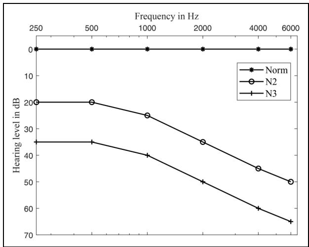  
Figure 4. Standard audiograms for two of the audiograms defined by Bisgaard et al. (2010): Norm: normal, N2: mild sensorineural loss, N3: moderate sensorineural loss.

## Results and Analysis

## Results for the WSJ + DNS Dataset

Simulated Normal-hearing Listeners. Tables 1–6 give the results for the five groups of speech enhancement methods. Several observations can be made. First, all deep-learning methods and hybrid methods achieved much better performance than traditional methods, regardless of whether or not the input feature, magnitude or complex spectrum, was compressed. Second, almost all deep-learning methods performed better when the compressed input features were used. Third, when the phase was implicitly estimated by deep-learning methods, better performance was achieved than when only spectral magnitudes were processed, and this gap became larger when compressed input features were used. Fourth, when the magnitude was mapped in the first stage and the residual complex spectrum of the clean speech was recovered in the second stage, performance was further improved. Fifth, a more recent method did not always work better than earlier ones when the input feature changed from the compressed complex spectrum to the uncompressed complex spectrum. For example, TaylorSENet worked better than CTSNet when the input features were compressed, while CTSNet worked better than TaylorSENet when no compression was applied. A similar effect was observed for GCRN and DCCRN; their performance was comparable when the input features were uncompressed, but DCCRN performed better when the input features were compressed.

Table 1. Scores for the objective measures WB-PESQ and NB-PESQ for the different methods using the WSJ + DNS dataset.

<table><tr><td rowspan="2">Noise type</td><td rowspan="2">Model</td><td colspan="5">WB-PESQ</td><td colspan="5">NB-PESQ</td></tr><tr><td>-5 dB</td><td>0 dB</td><td>5 dB</td><td>10 dB</td><td>Ave.</td><td>-5 dB</td><td>0 dB</td><td>5 dB</td><td>10 dB</td><td>Ave.</td></tr><tr><td rowspan="20">FactoryI</td><td>Noisy</td><td>1.09</td><td>1.22</td><td>1.47</td><td>1.84</td><td>1.41</td><td>1.42</td><td>1.74</td><td>2.10</td><td>2.47</td><td>1.93</td></tr><tr><td>MMSE-LSA</td><td>1.09</td><td>1.22</td><td>1.47</td><td>1.84</td><td>1.41</td><td>1.70</td><td>2.12</td><td>2.50</td><td>2.86</td><td>2.30</td></tr><tr><td>MMSE-STSA (1)</td><td>1.09</td><td>1.22</td><td>1.47</td><td>1.84</td><td>1.41</td><td>1.70</td><td>2.12</td><td>2.50</td><td>2.87</td><td>2.30</td></tr><tr><td>MMSE-STSA (0.5)</td><td>1.09</td><td>1.22</td><td>1.47</td><td>1.82</td><td>1.40</td><td>1.70</td><td>2.12</td><td>2.49</td><td>2.84</td><td>2.29</td></tr><tr><td>MSS</td><td>1.07</td><td>1.19</td><td>1.42</td><td>1.85</td><td>1.38</td><td>1.65</td><td>2.07</td><td>2.47</td><td>2.85</td><td>2.26</td></tr><tr><td>PSS</td><td>1.08</td><td>1.19</td><td>1.40</td><td>1.78</td><td>1.36</td><td>1.65</td><td>2.06</td><td>2.44</td><td>2.82</td><td>2.24</td></tr><tr><td>SQ-MSS</td><td>1.07</td><td>1.17</td><td>1.42</td><td>1.88</td><td>1.39</td><td>1.63</td><td>2.04</td><td>2.45</td><td>2.83</td><td>2.24</td></tr><tr><td>DeepXi-LSA*</td><td>1.28</td><td>1.61</td><td>2.03</td><td>2.50</td><td>1.85</td><td>2.06</td><td>2.56</td><td>2.92</td><td>3.25</td><td>2.70</td></tr><tr><td>DeepXi-STSA*</td><td>1.26</td><td>1.58</td><td>1.98</td><td>2.45</td><td>1.82</td><td>2.05</td><td>2.53</td><td>2.88</td><td>3.20</td><td>2.66</td></tr><tr><td>LSTM</td><td>1.23</td><td>1.49</td><td>1.84</td><td>2.28</td><td>1.71</td><td>1.98</td><td>2.42</td><td>2.77</td><td>3.08</td><td>2.56</td></tr><tr><td>FullSubNet*</td><td>1.33</td><td>1.68</td><td>2.12</td><td>2.60</td><td>1.93</td><td>2.24</td><td>2.65</td><td>3.00</td><td>3.30</td><td>2.80</td></tr><tr><td>CRN</td><td>1.22</td><td>1.47</td><td>1.81</td><td>2.20</td><td>1.67</td><td>1.96</td><td>2.41</td><td>2.78</td><td>3.11</td><td>2.57</td></tr><tr><td>GCRN</td><td>1.35</td><td>1.72</td><td>2.16</td><td>2.61</td><td>1.96</td><td>2.22</td><td>2.70</td><td>3.03</td><td>3.33</td><td>2.82</td></tr><tr><td>DPCRN</td><td>1.25</td><td>1.55</td><td>1.95</td><td>2.41</td><td>1.79</td><td>2.03</td><td>2.52</td><td>2.89</td><td>3.22</td><td>2.66</td></tr><tr><td>Uformer*</td><td>1.42</td><td>1.82</td><td>2.27</td><td>2.69</td><td>2.05</td><td>2.32</td><td>2.77</td><td>3.12</td><td>3.39</td><td>2.90</td></tr><tr><td>DCCRN*</td><td>1.35</td><td>1.73</td><td>2.20</td><td>2.69</td><td>1.99</td><td>2.19</td><td>2.69</td><td>3.06</td><td>3.37</td><td>2.83</td></tr><tr><td>DCCRN*(SNR)</td><td>1.28</td><td>1.62</td><td>2.10</td><td>2.72</td><td>1.93</td><td>2.14</td><td>2.64</td><td>3.02</td><td>3.37</td><td>2.80</td></tr><tr><td>CTSNet</td><td>1.49</td><td>1.96</td><td>2.44</td><td>2.90</td><td>2.20</td><td>2.40</td><td>2.86</td><td>3.20</td><td>3.46</td><td>2.98</td></tr><tr><td>G2Net</td><td>1.45</td><td>1.88</td><td>2.31</td><td>2.74</td><td>2.09</td><td>2.34</td><td>2.81</td><td>3.14</td><td>3.41</td><td>2.92</td></tr><tr><td>TaylorSENet</td><td>1.44</td><td>1.88</td><td>2.34</td><td>2.79</td><td>2.11</td><td>2.31</td><td>2.78</td><td>3.13</td><td>3.42</td><td>2.91</td></tr><tr><td rowspan="20">Cafe</td><td>noisy</td><td>1.09</td><td>1.18</td><td>1.37</td><td>1.65</td><td>1.32</td><td>1.54</td><td>1.86</td><td>2.20</td><td>2.53</td><td>2.03</td></tr><tr><td>MMSE-LSA</td><td>1.09</td><td>1.18</td><td>1.37</td><td>1.65</td><td>1.32</td><td>1.58</td><td>1.98</td><td>2.36</td><td>2.72</td><td>2.16</td></tr><tr><td>MMSE-STSA (1)</td><td>1.08</td><td>1.18</td><td>1.37</td><td>1.65</td><td>1.32</td><td>1.59</td><td>1.98</td><td>2.36</td><td>2.72</td><td>2.16</td></tr><tr><td>MMSE-STSA (0.5)</td><td>1.08</td><td>1.18</td><td>1.36</td><td>1.64</td><td>1.32</td><td>1.58</td><td>1.97</td><td>2.35</td><td>2.71</td><td>2.15</td></tr><tr><td>MSS</td><td>1.08</td><td>1.17</td><td>1.37</td><td>1.67</td><td>1.32</td><td>1.59</td><td>1.98</td><td>2.36</td><td>2.73</td><td>2.17</td></tr><tr><td>PSS</td><td>1.08</td><td>1.17</td><td>1.34</td><td>1.62</td><td>1.30</td><td>1.57</td><td>1.95</td><td>2.33</td><td>2.69</td><td>2.13</td></tr><tr><td>SQ-MSS</td><td>1.08</td><td>1.17</td><td>1.38</td><td>1.71</td><td>1.33</td><td>1.61</td><td>2.00</td><td>2.38</td><td>2.75</td><td>2.19</td></tr><tr><td>DeepXi-LSA*</td><td>1.29</td><td>1.63</td><td>2.05</td><td>2.51</td><td>1.87</td><td>2.09</td><td>2.58</td><td>2.96</td><td>3.29</td><td>2.73</td></tr><tr><td>DeepXi-STSA*</td><td>1.28</td><td>1.60</td><td>2.00</td><td>2.45</td><td>1.83</td><td>2.07</td><td>2.55</td><td>2.92</td><td>3.24</td><td>2.70</td></tr><tr><td>LSTM</td><td>1.26</td><td>1.51</td><td>1.87</td><td>2.28</td><td>1.73</td><td>2.02</td><td>2.46</td><td>2.83</td><td>3.12</td><td>2.61</td></tr><tr><td>FullSubNet*</td><td>1.33</td><td>1.70</td><td>2.15</td><td>2.63</td><td>1.95</td><td>2.21</td><td>2.66</td><td>3.01</td><td>3.32</td><td>2.80</td></tr><tr><td>CRN</td><td>1.23</td><td>1.48</td><td>1.80</td><td>2.17</td><td>1.67</td><td>1.99</td><td>2.46</td><td>2.83</td><td>3.15</td><td>2.61</td></tr><tr><td>GCRN</td><td>1.42</td><td>1.82</td><td>2.26</td><td>2.65</td><td>2.04</td><td>2.31</td><td>2.75</td><td>3.09</td><td>3.36</td><td>2.88</td></tr><tr><td>DPCRN</td><td>1.27</td><td>1.57</td><td>2.96</td><td>2.39</td><td>1.80</td><td>2.04</td><td>2.55</td><td>2.92</td><td>3.24</td><td>2.69</td></tr><tr><td>Uformer*</td><td>1.44</td><td>1.86</td><td>2.29</td><td>2.71</td><td>2.08</td><td>2.35</td><td>2.82</td><td>3.16</td><td>3.43</td><td>2.94</td></tr><tr><td>DCCRN*</td><td>1.38</td><td>1.80</td><td>2.27</td><td>2.74</td><td>2.05</td><td>2.20</td><td>2.74</td><td>3.11</td><td>3.43</td><td>2.87</td></tr><tr><td>DCCRN*(SNR)</td><td>1.36</td><td>1.76</td><td>2.26</td><td>2.78</td><td>2.04</td><td>2.21</td><td>2.71</td><td>3.10</td><td>3.43</td><td>2.86</td></tr><tr><td>CTSNet</td><td>1.58</td><td>2.09</td><td>2.58</td><td>2.98</td><td>2.31</td><td>2.48</td><td>2.95</td><td>3.27</td><td>3.51</td><td>3.05</td></tr><tr><td>G2Net</td><td>1.56</td><td>2.00</td><td>2.43</td><td>2.81</td><td>2.20</td><td>2.45</td><td>2.90</td><td>3.21</td><td>3.45</td><td>3.00</td></tr><tr><td>TaylorSENet</td><td>1.54</td><td>2.00</td><td>2.45</td><td>2.83</td><td>2.20</td><td>2.42</td><td>2.87</td><td>3.21</td><td>3.47</td><td>2.99</td></tr><tr><td rowspan="3">Babble</td><td>noisy</td><td>1.11</td><td>1.23</td><td>1.45</td><td>1.73</td><td>1.38</td><td>1.52</td><td>1.83</td><td>2.16</td><td>2.49</td><td>2.00</td></tr><tr><td>MMSE-LSA</td><td>1.11</td><td>1.23</td><td>1.45</td><td>1.73</td><td>1.38</td><td>1.62</td><td>2.02</td><td>2.38</td><td>2.74</td><td>2.19</td></tr><tr><td>MMSE-STSA (1)</td><td>1.11</td><td>1.23</td><td>1.44</td><td>1.73</td><td>1.38</td><td>1.62</td><td>2.02</td><td>2.38</td><td>2.74</td><td>2.19</td></tr></table>

(continued)

Table 1. Continued.

<table><tr><td rowspan="2">Noise type</td><td rowspan="2">Model</td><td colspan="5">WB-PESQ</td><td colspan="5">NB-PESQ</td></tr><tr><td>-5 dB</td><td>0 dB</td><td>5 dB</td><td>10 dB</td><td>Ave.</td><td>-5 dB</td><td>0 dB</td><td>5 dB</td><td>10 dB</td><td>Ave.</td></tr><tr><td></td><td>MMSE-STSA (0.5)</td><td>1.11</td><td>1.23</td><td>1.44</td><td>1.72</td><td>1.38</td><td>1.62</td><td>2.02</td><td>2.37</td><td>2.73</td><td>2.19</td></tr><tr><td></td><td>MSS</td><td>1.09</td><td>1.20</td><td>1.42</td><td>1.74</td><td>1.36</td><td>1.60</td><td>2.00</td><td>2.37</td><td>2.73</td><td>2.17</td></tr><tr><td></td><td>PSS</td><td>1.09</td><td>1.20</td><td>1.40</td><td>1.69</td><td>1.34</td><td>1.57</td><td>1.96</td><td>2.33</td><td>2.69</td><td>2.14</td></tr><tr><td></td><td>SQ-MSS</td><td>1.09</td><td>1.19</td><td>1.41</td><td>1.76</td><td>1.36</td><td>1.63</td><td>2.02</td><td>2.39</td><td>2.74</td><td>2.20</td></tr><tr><td></td><td>DeepXi-LSA*</td><td>1.22</td><td>1.52</td><td>1.95</td><td>2.45</td><td>1.79</td><td>1.85</td><td>2.41</td><td>2.85</td><td>3.20</td><td>2.58</td></tr><tr><td></td><td>DeepXi-STSA*</td><td>1.21</td><td>1.50</td><td>1.91</td><td>2.39</td><td>1.75</td><td>1.83</td><td>2.39</td><td>2.81</td><td>3.15</td><td>2.54</td></tr><tr><td></td><td>LSTM</td><td>1.19</td><td>1.43</td><td>1.78</td><td>2.20</td><td>1.65</td><td>1.81</td><td>2.31</td><td>2.71</td><td>3.03</td><td>2.46</td></tr><tr><td></td><td>FullSubNet*</td><td>1.24</td><td>1.56</td><td>2.03</td><td>2.54</td><td>1.84</td><td>1.97</td><td>2.47</td><td>2.87</td><td>3.21</td><td>2.63</td></tr><tr><td></td><td>CRN</td><td>1.18</td><td>1.42</td><td>1.74</td><td>2.11</td><td>1.61</td><td>1.78</td><td>2.32</td><td>2.73</td><td>3.06</td><td>2.47</td></tr><tr><td></td><td>GCRN</td><td>1.32</td><td>1.69</td><td>2.16</td><td>2.57</td><td>1.93</td><td>2.03</td><td>2.58</td><td>2.99</td><td>3.29</td><td>2.72</td></tr><tr><td></td><td>DPCRN</td><td>1.21</td><td>1.48</td><td>1.89</td><td>2.34</td><td>1.73</td><td>1.78</td><td>2.38</td><td>2.82</td><td>3.15</td><td>2.53</td></tr><tr><td></td><td>Uformer*</td><td>1.33</td><td>1.75</td><td>2.21</td><td>2.64</td><td>1.98</td><td>2.07</td><td>2.66</td><td>3.06</td><td>3.35</td><td>2.79</td></tr><tr><td></td><td>DCCRN*</td><td>1.29</td><td>1.65</td><td>2.12</td><td>2.60</td><td>1.91</td><td>1.95</td><td>2.55</td><td>2.99</td><td>3.32</td><td>2.70</td></tr><tr><td></td><td>DCCRN*(SNR)</td><td>1.27</td><td>1.64</td><td>2.15</td><td>2.69</td><td>1.94</td><td>1.96</td><td>2.54</td><td>2.98</td><td>3.32</td><td>2.70</td></tr><tr><td></td><td>CTSNet</td><td>1.44</td><td>2.00</td><td>2.54</td><td>2.95</td><td>2.23</td><td>2.22</td><td>2.83</td><td>3.21</td><td>3.45</td><td>2.93</td></tr><tr><td></td><td>G2Net</td><td>1.39</td><td>1.84</td><td>2.35</td><td>2.79</td><td>2.10</td><td>2.17</td><td>2.73</td><td>3.12</td><td>3.39</td><td>2.85</td></tr><tr><td></td><td>TaylorSENet</td><td>1.38</td><td>1.85</td><td>2.35</td><td>2.78</td><td>2.09</td><td>2.15</td><td>2.70</td><td>3.10</td><td>3.39</td><td>2.83</td></tr></table>

For all deep learning methods, the uncompressed spectrum was used. Bold font indicates the best average score in each group. DNS = deep noise suppression; SNR = speech-to-noise ratio; MMSE = minimum mean-square error; LSA = log-spectral amplitude; STSA = short-time spectral amplitude; MSS = magnitude spectral subtraction; PSS = power spectral subtraction; LSTM = long short-term memory; CRN = convolutional recurrent network.

Hybrid methods obtained comparable performance to single-stage deep learning based magnitude-only mapping methods in terms of PESQ, ESTOI, and SDR scores, con-firming that the a priori SNR is a key parameter for magnitude estimation in the speech-enhancement task. The hybrid methods performed more poorly than the deep-learning methods of groups 2, futher confirming the importance of phase recovery for speech enhancement. As can be seen from Table 5, hybrid methods yielded much lower DNS-MOS scores than the deep-learning methods of groups 3–5, especially for low-SNR scenarios. On the other hand, the hybrid methods worked better for relatively high SNR scenarios, and this finding was confirmed by the objective test results using the Voice Bank + DEMAND dataset, as described below. The poorer performance of hybrid methods for low-SNR scenarios may have occurred because speech distortion is inevitable using traditional spectral gain functions when many bins have low a priori SNR values.

The HASQI scores for simulated normal-hearing listeners denoted by “Normal” and shown in Tables 7 and 8 were consistent with the scores in Tables 1–6. Also, the HASPI scores for simulated normal-hearing listeners shown in Tables 9 and 10 were consistent with the HASQI scores for simulated normal-hearing listeners. Over the SNR range from 5 to

0 dB, the HASPI scores were significantly improved by deep learning methods for all three types of noise.

Simulated Hearing-impaired Listeners. Tables 7 and 8 present the HASQI scores for the different methods for all three simulated listener groups. The results differ in some interesting ways from those for the simulated normal-hearing listeners. First, MSS and SQ-MSS achieved better performance than MMSE-LSA. Second, all deep-learning methods gave lower or comparable HASQI scores when the input features were compressed than when they were not, which is opposite to the results for the simulated normal-hearing listeners. Third, for all of the single-stage deep-learning methods, the HASQI scores were not improved when the phase was also implicitly estimated, in contrast to the metrics for simulated normal-hearing listeners. Fourth, the most recently proposed methods did not always achieve the best performance. Fifth, for relatively high SNRs, the HASQI score for the enhanced speech was sometimes lower than that for the noisy speech, especially for the traditional methods. For the deep-learning methods, the benefit of speech enhancement reduced dramatically for high SNRs and only a small improvement was obtained when the SNR was 10 dB. Finally, the HASQI scores increased with increasing hearing loss, perhaps because the speech degradation produced by signal processing has a smaller perceptual effect for listeners with more severe hearing loss (Kates & Arehart, 2022).

Table 2. Scores for the objective measures ESTOI and SDR for the different methods using the WSJ + DNS dataset.

<table><tr><td rowspan="2">Noise type</td><td rowspan="2">Model</td><td colspan="5">ESTOI</td><td colspan="5">SDR</td></tr><tr><td>-5 dB</td><td>0 dB</td><td>5 dB</td><td>10 dB</td><td>Ave.</td><td>-5 dB</td><td>0 dB</td><td>5 dB</td><td>10 dB</td><td>Ave.</td></tr><tr><td rowspan="20">FactoryI</td><td>noisy</td><td>0.26</td><td>0.41</td><td>0.57</td><td>0.72</td><td>0.49</td><td>-4.94</td><td>0.05</td><td>5.03</td><td>10.03</td><td>2.54</td></tr><tr><td>MMSE-LSA</td><td>0.26</td><td>0.41</td><td>0.57</td><td>0.73</td><td>0.49</td><td>0.58</td><td>5.53</td><td>9.44</td><td>13.15</td><td>7.17</td></tr><tr><td>MMSE-STSA (1)</td><td>0.26</td><td>0.42</td><td>0.58</td><td>0.73</td><td>0.50</td><td>0.54</td><td>5.50</td><td>9.45</td><td>13.19</td><td>7.17</td></tr><tr><td>MMSE-STSA (0.5)</td><td>0.26</td><td>0.41</td><td>0.57</td><td>0.72</td><td>0.49</td><td>0.62</td><td>5.53</td><td>9.40</td><td>13.07</td><td>7.16</td></tr><tr><td>MSS</td><td>0.27</td><td>0.42</td><td>0.59</td><td>0.74</td><td>0.50</td><td>-1.08</td><td>4.53</td><td>9.14</td><td>13.18</td><td>6.44</td></tr><tr><td>PSS</td><td>0.26</td><td>0.42</td><td>0.58</td><td>0.73</td><td>0.50</td><td>-0.93</td><td>4.49</td><td>9.00</td><td>13.14</td><td>6.43</td></tr><tr><td>SQ-MSS</td><td>0.27</td><td>0.42</td><td>0.59</td><td>0.74</td><td>0.51</td><td>-1.62</td><td>4.24</td><td>8.95</td><td>12.62</td><td>6.05</td></tr><tr><td>DeepXi-LSA*</td><td>0.44</td><td>0.62</td><td>0.76</td><td>0.85</td><td>0.67</td><td>4.63</td><td>8.58</td><td>12.11</td><td>15.60</td><td>10.23</td></tr><tr><td>DeepXi-STSA*</td><td>0.44</td><td>0.62</td><td>0.76</td><td>0.85</td><td>0.67</td><td>4.45</td><td>8.39</td><td>11.90</td><td>15.31</td><td>10.01</td></tr><tr><td>LSTM</td><td>0.47</td><td>0.64</td><td>0.76</td><td>0.84</td><td>0.68</td><td>3.73</td><td>7.74</td><td>11.14</td><td>13.94</td><td>9.14</td></tr><tr><td>FullSubNet*</td><td>0.48</td><td>0.66</td><td>0.78</td><td>0.86</td><td>0.70</td><td>5.62</td><td>9.47</td><td>13.03</td><td>16.44</td><td>11.14</td></tr><tr><td>CRN</td><td>0.46</td><td>0.64</td><td>0.76</td><td>0.85</td><td>0.68</td><td>3.33</td><td>7.51</td><td>11.31</td><td>14.70</td><td>9.21</td></tr><tr><td>GCRN</td><td>0.54</td><td>0.70</td><td>0.80</td><td>0.86</td><td>0.73</td><td>4.91</td><td>8.06</td><td>10.66</td><td>13.35</td><td>9.24</td></tr><tr><td>DPCRN</td><td>0.48</td><td>0.66</td><td>0.78</td><td>0.86</td><td>0.70</td><td>3.93</td><td>8.38</td><td>12.10</td><td>15.46</td><td>9.97</td></tr><tr><td>Uformer*</td><td>0.55</td><td>0.72</td><td>0.81</td><td>0.88</td><td>0.74</td><td>5.84</td><td>9.67</td><td>13.12</td><td>16.42</td><td>11.26</td></tr><tr><td>DCCRN*</td><td>0.51</td><td>0.69</td><td>0.80</td><td>0.87</td><td>0.72</td><td>5.54</td><td>9.72</td><td>13.24</td><td>16.51</td><td>11.25</td></tr><tr><td>DCCRN*(SNR)</td><td>0.52</td><td>0.70</td><td>0.81</td><td>0.89</td><td>0.73</td><td>4.92</td><td>9.39</td><td>13.24</td><td>16.81</td><td>11.09</td></tr><tr><td>CTSNet</td><td>0.60</td><td>0.75</td><td>0.84</td><td>0.89</td><td>0.77</td><td>7.65</td><td>11.36</td><td>14.43</td><td>17.27</td><td>12.68</td></tr><tr><td>G2Net</td><td>0.60</td><td>0.76</td><td>0.84</td><td>0.89</td><td>0.77</td><td>7.63</td><td>11.32</td><td>14.41</td><td>17.38</td><td>12.69</td></tr><tr><td>TaylorSENet</td><td>0.59</td><td>0.74</td><td>0.83</td><td>0.89</td><td>0.76</td><td>7.42</td><td>11.14</td><td>14.26</td><td>17.22</td><td>12.51</td></tr><tr><td rowspan="20">cafe</td><td>noisy</td><td>0.31.</td><td>0.45</td><td>0.60</td><td>73.76</td><td>0.52</td><td>-4.92</td><td>0.04</td><td>5.03</td><td>10.03</td><td>2.55</td></tr><tr><td>MMSE-LSA</td><td>0.30</td><td>0.44</td><td>0.59</td><td>0.74</td><td>0.52</td><td>-3.01</td><td>2.81</td><td>7.75</td><td>12.13</td><td>4.92</td></tr><tr><td>MMSE-STSA (1)</td><td>0.31</td><td>0.45</td><td>0.60</td><td>0.74</td><td>0.52</td><td>-3.00</td><td>2.80</td><td>7.74</td><td>12.14</td><td>4.92</td></tr><tr><td>MMSE-STSA (0.5)</td><td>0.30</td><td>0.44</td><td>0.59</td><td>0.73</td><td>0.52</td><td>-3.02</td><td>2.80</td><td>7.72</td><td>12.07</td><td>4.89</td></tr><tr><td>MSS</td><td>0.31</td><td>0.46</td><td>0.61</td><td>0.75</td><td>0.53</td><td>-3.30</td><td>2.62</td><td>7.81</td><td>12.31</td><td>4.86</td></tr><tr><td>PSS</td><td>0.31</td><td>0.45</td><td>0.60</td><td>0.75</td><td>0.53</td><td>-3.22</td><td>2.57</td><td>7.64</td><td>12.19</td><td>4.80</td></tr><tr><td>SQ-MSS</td><td>0.31</td><td>0.46</td><td>0.61</td><td>0.75</td><td>0.53</td><td>-3.62</td><td>2.44</td><td>7.74</td><td>11.94</td><td>4.62</td></tr><tr><td>DeepXi-LSA*</td><td>0.49</td><td>0.66</td><td>0.78</td><td>0.86</td><td>0.70</td><td>4.20</td><td>8.63</td><td>12.17</td><td>15.76</td><td>10.19</td></tr><tr><td>DeepXi-STSA*</td><td>0.49</td><td>0.66</td><td>0.78</td><td>0.86</td><td>0.70</td><td>3.96</td><td>8.39</td><td>11.92</td><td>15.46</td><td>9.93</td></tr><tr><td>LSTM</td><td>0.52</td><td>0.67</td><td>0.78</td><td>0.85</td><td>0.71</td><td>3.65</td><td>7.90</td><td>11.21</td><td>14.04</td><td>9.20</td></tr><tr><td>FullSubNet*</td><td>0.52</td><td>0.69</td><td>0.80</td><td>0.88</td><td>0.72</td><td>4.98</td><td>9.59</td><td>13.25</td><td>16.74</td><td>11.14</td></tr><tr><td>CRN</td><td>0.51</td><td>0.67</td><td>0.78</td><td>0.87</td><td>0.71</td><td>3.44</td><td>7.83</td><td>11.44</td><td>14.94</td><td>9.41</td></tr><tr><td>GCRN</td><td>0.60</td><td>0.73</td><td>0.82</td><td>0.87</td><td>0.76</td><td>5.33</td><td>8.55</td><td>11.16</td><td>13.74</td><td>9.69</td></tr><tr><td>DPCRN</td><td>0.52</td><td>0.70</td><td>0.80</td><td>0.88</td><td>0.72</td><td>3.96</td><td>8.66</td><td>12.29</td><td>15.69</td><td>10.15</td></tr><tr><td>Uformer*</td><td>0.60</td><td>0.75</td><td>0.83</td><td>0.89</td><td>0.77</td><td>5.98</td><td>10.07</td><td>13.44</td><td>16.78</td><td>11.57</td></tr><tr><td>DCCRN*</td><td>0.56</td><td>0.72</td><td>0.82</td><td>0.89</td><td>0.75</td><td>5.47</td><td>10.03</td><td>13.53</td><td>16.82</td><td>11.46</td></tr><tr><td>DCCRN*(SNR)</td><td>0.58</td><td>0.74</td><td>0.84</td><td>0.90</td><td>0.76</td><td>6.17</td><td>10.69</td><td>14.30</td><td>17.62</td><td>12.20</td></tr><tr><td>CTSNet</td><td>0.66</td><td>0.79</td><td>0.86</td><td>0.91</td><td>0.80</td><td>7.98</td><td>11.97</td><td>15.04</td><td>17.86</td><td>13.21</td></tr><tr><td>G2Net</td><td>0.66</td><td>0.79</td><td>0.86</td><td>0.91</td><td>0.80</td><td>8.32</td><td>12.08</td><td>15.06</td><td>18.01</td><td>13.37</td></tr><tr><td>TaylorSENet</td><td>0.65</td><td>0.78</td><td>0.85</td><td>0.90</td><td>0.79</td><td>8.02</td><td>11.84</td><td>14.89</td><td>17.78</td><td>13.13</td></tr><tr><td rowspan="3">Babble</td><td>noisy</td><td>0.27</td><td>0.40</td><td>0.55</td><td>0.69</td><td>0.48</td><td>-4.91</td><td>0.05</td><td>5.03</td><td>10.02</td><td>2.55</td></tr><tr><td>MMSE-LSA</td><td>0.27</td><td>0.40</td><td>0.55</td><td>0.70</td><td>0.48</td><td>-0.25</td><td>4.80</td><td>8.81</td><td>12.61</td><td>6.49</td></tr><tr><td>MMSE-STSA (1)</td><td>0.27</td><td>0.40</td><td>0.55</td><td>0.71</td><td>0.48</td><td>-0.34</td><td>4.74</td><td>8.81</td><td>12.63</td><td>6.46</td></tr></table>

(continued)

Table 2. Continued.

<table><tr><td rowspan="2">Noise type</td><td rowspan="2">Model</td><td colspan="5">ESTOI</td><td colspan="5">SDR</td></tr><tr><td>-5 dB</td><td>0 dB</td><td>5 dB</td><td>10 dB</td><td>Ave.</td><td>-5 dB</td><td>0 dB</td><td>5 dB</td><td>10 dB</td><td>Ave.</td></tr><tr><td></td><td>MMSE-STSA (0.5)</td><td>0.26</td><td>0.39</td><td>0.54</td><td>0.70</td><td>0.47</td><td>-0.20</td><td>4.81</td><td>8.78</td><td>12.53</td><td>6.48</td></tr><tr><td></td><td>MSS</td><td>0.27</td><td>0.41</td><td>0.56</td><td>0.71</td><td>0.49</td><td>-1.44</td><td>4.07</td><td>8.61</td><td>12.73</td><td>5.99</td></tr><tr><td></td><td>PSS</td><td>0.27</td><td>0.40</td><td>0.55</td><td>0.71</td><td>0.48</td><td>-1.52</td><td>2.88</td><td>8.40</td><td>12.63</td><td>5.85</td></tr><tr><td></td><td>SQ-MSS</td><td>0.27</td><td>0.41</td><td>0.56</td><td>0.72</td><td>0.49</td><td>-1.61</td><td>4.01</td><td>8.52</td><td>12.23</td><td>5.79</td></tr><tr><td></td><td>DeepXi-LSA*</td><td>0.43</td><td>0.61</td><td>0.74</td><td>0.84</td><td>0.66</td><td>2.62</td><td>7.48</td><td>11.39</td><td>15.12</td><td>9.15</td></tr><tr><td></td><td>DeepXi-STSA*</td><td>0.43</td><td>0.61</td><td>0.74</td><td>0.84</td><td>0.66</td><td>2.33</td><td>7.22</td><td>11.14</td><td>14.80</td><td>8.87</td></tr><tr><td></td><td>LSTM</td><td>0.46</td><td>0.63</td><td>0.75</td><td>0.83</td><td>0.67</td><td>1.58</td><td>6.41</td><td>10.39</td><td>13.52</td><td>7.98</td></tr><tr><td></td><td>FullSubNet*</td><td>0.45</td><td>0.64</td><td>0.77</td><td>0.86</td><td>0.68</td><td>2.88</td><td>8.03</td><td>12.36</td><td>16.08</td><td>9.84</td></tr><tr><td></td><td>CRN</td><td>0.46</td><td>0.64</td><td>0.76</td><td>0.84</td><td>0.68</td><td>1.47</td><td>6.56</td><td>10.63</td><td>14.27</td><td>8.23</td></tr><tr><td></td><td>GCRN</td><td>0.54</td><td>0.71</td><td>0.80</td><td>0.86</td><td>0.73</td><td>3.26</td><td>7.36</td><td>10.37</td><td>13.08</td><td>8.52</td></tr><tr><td></td><td>DPCRN</td><td>0.45</td><td>0.65</td><td>0.78</td><td>0.86</td><td>0.69</td><td>1.47</td><td>7.24</td><td>11.50</td><td>15.11</td><td>8.83</td></tr><tr><td></td><td>Uformer*</td><td>0.53</td><td>0.71</td><td>0.81</td><td>0.88</td><td>0.73</td><td>3.81</td><td>8.76</td><td>12.66</td><td>16.10</td><td>10.33</td></tr><tr><td></td><td>DCCRN*</td><td>0.50</td><td>0.68</td><td>0.79</td><td>0.87</td><td>0.71</td><td>3.30</td><td>8.55</td><td>12.54</td><td>16.10</td><td>10.12</td></tr><tr><td></td><td>DCCRN*(SNR)</td><td>0.52</td><td>0.70</td><td>0.81</td><td>0.88</td><td>0.73</td><td>3.05</td><td>8.54</td><td>12.81</td><td>16.71</td><td>10.28</td></tr><tr><td></td><td>CTSNet</td><td>0.61</td><td>0.77</td><td>0.85</td><td>0.90</td><td>0.78</td><td>6.12</td><td>11.03</td><td>14.46</td><td>17.24</td><td>12.21</td></tr><tr><td></td><td>G2Net</td><td>0.61</td><td>0.76</td><td>0.85</td><td>0.89</td><td>0.78</td><td>6.17</td><td>10.97</td><td>14.53</td><td>17.51</td><td>12.30</td></tr><tr><td></td><td>TaylorSENet</td><td>0.59</td><td>0.75</td><td>0.84</td><td>0.89</td><td>0.77</td><td>6.05</td><td>10.79</td><td>14.29</td><td>17.29</td><td>12.10</td></tr></table>

For all deep learning methods, the uncompressed spectrum was used. Bold font indicates the best average score in each group. SDR = signal-to-distortion ratio; MMSE = minimum mean-square error; LSA = log-spectral amplitude; STSA = short-time spectral amplitude; MSS = magnitude spectral subtraction; PSS = power spectral subtraction; LSTM = long short-term memory; CRN = convolutional recurrent network

Tables 9 and 10 present the HASPI scores for listeners with simulated mild and moderate hearing losses, denoted “Mild” and “Moderate,” respectively. In contrast to the HASQI scores, the HASPI scores decreased with increasing hearing loss, probably because the simulated hearing loss itself leads to poorer speech intelligibility. When the input SNR was lower than 5 dB, deep learning methods improved the HASPI score in most cases, but this was not the case when the input SNR was 10 dB. Moreover, as was the case for the HASQI scores for the simulated hearing-impaired listeners, compression of the input features did not improve HASPI scores, perhaps because the reduction of speech distortion and residual noise gained by compression of the input features was not audible for the simulated hearing-impaired listeners.

## Results for Voice Bank + DEMAND Dataset

Simulated Normal-hearing Listeners. Tables 11 and 12 give the results for the five groups of speech enhancement methods. Several observations can be made. First, all metric scores were relatively high and most were above the corresponding metric scores for the noisy speech signals at 10 dB SNR in the WSJ + DNS dataset. Second, when the input features were not compressed, NB-PESQ scores were sometimes lower for the deep-learning methods than for the conventional methods, while the other metric scores were much higher.

Third, when the input features were compressed, the performance gap between conventional methods and deep-learning methods became larger. Fourth, estimating the phase implicitly did not improve all of the metric scores for the singlestage deep-learning methods, while performance improved markedly when decoupling-style deep-learning methods were used. Fifth, the performance of DCCRN was strongly influenced by the loss function for relatively high SNRs. When the MSE was used as the loss function, the PESQ, ESTOI, DNS-SIG scores for the enhanced speech signals were sometimes lower than those for the unprocessed noisy speech signals. However, when the SNR was used as the loss function for DCCRN, denoted DCCRN(SNR), scores markedly improved, except for the SDR. Finally, hybrid methods yielded the second-highest scores in terms of NB-PESQ, WB-PESQ, and ESTOI when the input features for the deep-learning methods were uncompressed. Because the SNR in the Voice Bank + DEMAND dataset is relatively high, the competitive performance of hybrid methods for this dataset further confirms that these methods may be more suitable for relatively high SNR scenarios.

The HASQI and HASPI scores for simulated normal-hearing listeners denoted by “Normal” are shown in Table 13. The deep learning methods only slightly increased the HASQI and HASPI scores when the input features were not compressed, and the HASQI scores were increased by only about 10% when the input features were compressed. The small benefit for the HASQI scores partly reflects the fact that the HASPI scores for the unprocessed noisy speech were high, e.g. 97.1% for the simulated normal-hearing listeners. The results in Table 13 confirm that compression of the input features is important for deep learning methods when the enhanced speech is intended for normal-hearing listeners.

Table 3. As Table 1 but using the compressed spectrum as input features for all deep learning methods.

<table><tr><td rowspan="2">Noise type</td><td rowspan="2">Model</td><td colspan="5">WB-PESQ</td><td colspan="5">NB-PESQ</td></tr><tr><td>-5 dB</td><td>0 dB</td><td>5 dB</td><td>10 dB</td><td>Ave.</td><td>-5 dB</td><td>0 dB</td><td>5 dB</td><td>10 dB</td><td>Ave.</td></tr><tr><td rowspan="11">Factory1</td><td>Noisy</td><td>1.09</td><td>1.22</td><td>1.47</td><td>1.84</td><td>1.41</td><td>1.42</td><td>1.74</td><td>2.10</td><td>2.47</td><td>1.93</td></tr><tr><td>LSTM</td><td>1.24</td><td>1.51</td><td>1.88</td><td>2.36</td><td>1.75</td><td>1.96</td><td>2.45</td><td>2.82</td><td>3.17</td><td>2.60</td></tr><tr><td>FullSubNet*</td><td>1.38</td><td>1.75</td><td>2.22</td><td>2.74</td><td>2.02</td><td>2.28</td><td>2.74</td><td>3.10</td><td>3.40</td><td>2.88</td></tr><tr><td>CRN</td><td>1.24</td><td>1.49</td><td>1.87</td><td>2.32</td><td>1.73</td><td>1.97</td><td>2.44</td><td>2.84</td><td>3.17</td><td>2.60</td></tr><tr><td>GCRN</td><td>1.27</td><td>1.65</td><td>2.14</td><td>2.65</td><td>1.93</td><td>1.97</td><td>2.59</td><td>3.01</td><td>3.33</td><td>2.72</td></tr><tr><td>DPCRN</td><td>1.26</td><td>1.55</td><td>1.94</td><td>2.41</td><td>1.79</td><td>2.02</td><td>2.56</td><td>2.97</td><td>2.71</td><td>2.56</td></tr><tr><td>Uformer*</td><td>1.54</td><td>2.03</td><td>2.53</td><td>2.99</td><td>2.27</td><td>2.48</td><td>2.96</td><td>3.30</td><td>3.55</td><td>3.08</td></tr><tr><td>DCCRN*</td><td>1.46</td><td>1.97</td><td>2.48</td><td>2.93</td><td>2.21</td><td>2.35</td><td>2.91</td><td>3.26</td><td>3.52</td><td>3.01</td></tr><tr><td>CTSNet</td><td>1.49</td><td>1.98</td><td>2.52</td><td>3.00</td><td>2.25</td><td>2.35</td><td>2.88</td><td>3.26</td><td>3.54</td><td>3.01</td></tr><tr><td>G2Net</td><td>1.50</td><td>2.01</td><td>2.53</td><td>3.05</td><td>2.27</td><td>2.37</td><td>2.89</td><td>3.27</td><td>3.55</td><td>3.02</td></tr><tr><td>TaylorSENet</td><td>1.50</td><td>1.99</td><td>2.55</td><td>3.04</td><td>2.27</td><td>2.37</td><td>2.89</td><td>3.27</td><td>3.55</td><td>3.02</td></tr><tr><td rowspan="11">Cafe</td><td>noisy</td><td>1.09</td><td>1.18</td><td>1.37</td><td>1.65</td><td>1.32</td><td>1.54</td><td>1.86</td><td>2.20</td><td>2.53</td><td>2.03</td></tr><tr><td>LSTM</td><td>1.27</td><td>1.54</td><td>1.92</td><td>2.40</td><td>1.78</td><td>2.02</td><td>2.49</td><td>2.90</td><td>3.24</td><td>2.66</td></tr><tr><td>FullSubNet*</td><td>1.38</td><td>1.79</td><td>2.29</td><td>2.80</td><td>2.06</td><td>2.26</td><td>2.75</td><td>3.12</td><td>3.44</td><td>2.89</td></tr><tr><td>CRN</td><td>1.25</td><td>1.52</td><td>1.88</td><td>2.30</td><td>1.74</td><td>1.98</td><td>2.50</td><td>2.89</td><td>3.23</td><td>2.65</td></tr><tr><td>GCRN</td><td>1.35</td><td>1.76</td><td>2.28</td><td>2.75</td><td>2.03</td><td>2.07</td><td>2.68</td><td>3.08</td><td>3.40</td><td>2.81</td></tr><tr><td>DPCRN</td><td>1.29</td><td>1.61</td><td>1.99</td><td>2.45</td><td>1.83</td><td>2.06</td><td>2.62</td><td>3.01</td><td>3.35</td><td>2.76</td></tr><tr><td>Uformer*</td><td>1.60</td><td>2.13</td><td>2.64</td><td>3.09</td><td>2.36</td><td>2.53</td><td>3.02</td><td>3.35</td><td>3.61</td><td>3.13</td></tr><tr><td>DCCRN*</td><td>1.51</td><td>2.10</td><td>2.64</td><td>3.05</td><td>2.33</td><td>2.37</td><td>2.99</td><td>3.34</td><td>3.58</td><td>3.07</td></tr><tr><td>CTSNet</td><td>1.58</td><td>2.15</td><td>2.67</td><td>3.10</td><td>2.38</td><td>2.45</td><td>3.00</td><td>3.34</td><td>3.60</td><td>3.10</td></tr><tr><td>G2Net</td><td>1.63</td><td>2.20</td><td>2.72</td><td>3.15</td><td>2.43</td><td>2.51</td><td>3.00</td><td>3.34</td><td>3.59</td><td>3.11</td></tr><tr><td>TaylorSENet</td><td>1.64</td><td>2.20</td><td>2.73</td><td>3.15</td><td>2.43</td><td>2.52</td><td>3.02</td><td>3.37</td><td>3.62</td><td>3.13</td></tr><tr><td rowspan="11">Babble</td><td>noisy</td><td>1.11</td><td>1.23</td><td>1.45</td><td>1.73</td><td>1.38</td><td>1.52</td><td>1.83</td><td>2.16</td><td>2.49</td><td>2.00</td></tr><tr><td>LSTM</td><td>1.20</td><td>1.46</td><td>1.85</td><td>2.33</td><td>1.71</td><td>1.80</td><td>2.35</td><td>2.77</td><td>3.14</td><td>2.52</td></tr><tr><td>FullSubNet*</td><td>1.28</td><td>1.66</td><td>2.22</td><td>2.81</td><td>1.99</td><td>2.01</td><td>2.58</td><td>3.02</td><td>3.36</td><td>2.74</td></tr><tr><td>CRN</td><td>1.19</td><td>1.45</td><td>1.83</td><td>2.29</td><td>1.69</td><td>1.72</td><td>2.33</td><td>2.79</td><td>3.14</td><td>2.49</td></tr><tr><td>GCRN</td><td>1.26</td><td>1.66</td><td>2.19</td><td>2.69</td><td>1.95</td><td>1.80</td><td>2.52</td><td>2.99</td><td>3.33</td><td>2.66</td></tr><tr><td>DPCRN</td><td>1.22</td><td>1.52</td><td>1.97</td><td>2.44</td><td>1.79</td><td>1.78</td><td>2.42</td><td>2.92</td><td>3.27</td><td>2.60</td></tr><tr><td>Uformer*</td><td>1.44</td><td>2.00</td><td>2.55</td><td>3.00</td><td>2.25</td><td>2.23</td><td>2.88</td><td>3.27</td><td>3.54</td><td>2.98</td></tr><tr><td>DCCRN*</td><td>1.37</td><td>1.93</td><td>2.54</td><td>3.02</td><td>2.21</td><td>2.07</td><td>2.81</td><td>3.26</td><td>3.55</td><td>2.92</td></tr><tr><td>CTSNet</td><td>1.45</td><td>2.04</td><td>2.62</td><td>3.07</td><td>2.30</td><td>2.21</td><td>2.87</td><td>3.28</td><td>3.55</td><td>2.98</td></tr><tr><td>G2Net</td><td>1.43</td><td>1.98</td><td>2.60</td><td>3.09</td><td>2.27</td><td>2.21</td><td>2.81</td><td>3.25</td><td>3.53</td><td>2.95</td></tr><tr><td>TaylorSENet</td><td>1.46</td><td>2.04</td><td>2.63</td><td>3.11</td><td>2.31</td><td>2.24</td><td>2.87</td><td>3.28</td><td>3.56</td><td>2.99</td></tr></table>

LSTM = long short-term memory; CRN = convolutional recurrent network.

Simulated Hearing-impaired Listeners. The HASQI and HASPI scores for two types of simulated hearing-impaired listeners are also presented in Table 13. All of the traditional methods yielded lower (worse) HASQI and HASPI scores than for the unprocessed noisy speech. For all deep-learning methods, the HASQI and HASPI scores for the enhanced speech signals were similar to or only slightly higher than those for unprocessed signals. These negative findings for speech quality for the simulated hearing-impaired listeners could be a result of the relatively high SNR of the noisy speech in the Voice Bank + DEMAND dataset, which is probably, on average, above 10 dB, as inferred from the metric scores for the noisy speech signals. The performance of DCCRN depended on the loss function, better performance being obtained when the SNR was used as the loss function.

Table 4. As Table 2 but using the compressed spectrum as input features for all deep learning methods.

<table><tr><td rowspan="2">Noise type</td><td rowspan="2">Model</td><td colspan="5">ESTOI</td><td colspan="5">SDR</td></tr><tr><td>-5 dB</td><td>0 dB</td><td>5 dB</td><td>10 dB</td><td>Ave.</td><td>-5 dB</td><td>0 dB</td><td>5 dB</td><td>10 dB</td><td>Ave.</td></tr><tr><td rowspan="11">FactoryI</td><td>noisy</td><td>0.26</td><td>0.41</td><td>0.57</td><td>0.72</td><td>0.49</td><td>-4.94</td><td>0.05</td><td>5.03</td><td>10.03</td><td>2.54</td></tr><tr><td>LSTM</td><td>0.47</td><td>0.65</td><td>0.77</td><td>0.85</td><td>0.69</td><td>3.91</td><td>7.89</td><td>11.29</td><td>14.31</td><td>9.35</td></tr><tr><td>FullSubNet*</td><td>0.49</td><td>0.68</td><td>0.79</td><td>0.87</td><td>0.71</td><td>6.22</td><td>9.94</td><td>13.43</td><td>16.78</td><td>11.59</td></tr><tr><td>CRN</td><td>0.49</td><td>0.65</td><td>0.77</td><td>0.86</td><td>0.69</td><td>3.79</td><td>7.92</td><td>11.63</td><td>15.06</td><td>9.60</td></tr><tr><td>GCRN</td><td>0.49</td><td>0.70</td><td>0.81</td><td>0.88</td><td>0.72</td><td>4.42</td><td>8.99</td><td>12.63</td><td>15.58</td><td>10.41</td></tr><tr><td>DPCRN</td><td>0.50</td><td>0.68</td><td>0.80</td><td>0.87</td><td>0.71</td><td>4.59</td><td>8.85</td><td>12.39</td><td>15.55</td><td>10.34</td></tr><tr><td>Uformer*</td><td>0.60</td><td>0.75</td><td>0.84</td><td>0.90</td><td>0.77</td><td>6.69</td><td>10.29</td><td>13.61</td><td>16.87</td><td>11.87</td></tr><tr><td>DCCRN*</td><td>0.57</td><td>0.74</td><td>0.83</td><td>0.89</td><td>0.76</td><td>6.74</td><td>10.73</td><td>14.09</td><td>17.17</td><td>12.18</td></tr><tr><td>CTSNet</td><td>0.60</td><td>0.76</td><td>0.84</td><td>0.90</td><td>0.78</td><td>7.67</td><td>11.35</td><td>14.44</td><td>17.27</td><td>12.68</td></tr><tr><td>G2Net</td><td>0.61</td><td>0.76</td><td>0.85</td><td>0.90</td><td>0.78</td><td>7.70</td><td>11.34</td><td>14.43</td><td>17.36</td><td>12.71</td></tr><tr><td>TaylorSENet</td><td>0.62</td><td>0.77</td><td>0.85</td><td>0.90</td><td>0.79</td><td>7.96</td><td>11.52</td><td>14.62</td><td>17.53</td><td>12.91</td></tr><tr><td rowspan="11">Cafe</td><td>noisy</td><td>0.31</td><td>0.45</td><td>0.60</td><td>0.74</td><td>0.52</td><td>-4.92</td><td>0.04</td><td>5.03</td><td>10.03</td><td>2.55</td></tr><tr><td>LSTM</td><td>0.53</td><td>0.69</td><td>0.79</td><td>0.87</td><td>0.72</td><td>4.08</td><td>8.12</td><td>11.51</td><td>14.52</td><td>9.56</td></tr><tr><td>FullSubNet*</td><td>0.54</td><td>0.71</td><td>0.81</td><td>0.89</td><td>0.74</td><td>5.90</td><td>10.11</td><td>13.61</td><td>17.05</td><td>11.67</td></tr><tr><td>CRN</td><td>0.53</td><td>0.69</td><td>0.80</td><td>0.87</td><td>0.72</td><td>3.64</td><td>8.06</td><td>11.66</td><td>15.17</td><td>9.63</td></tr><tr><td>GCRN</td><td>0.56</td><td>0.73</td><td>0.84</td><td>0.89</td><td>0.76</td><td>5.21</td><td>9.47</td><td>12.97</td><td>16.05</td><td>10.93</td></tr><tr><td>DPCRN</td><td>0.55</td><td>0.71</td><td>0.82</td><td>0.89</td><td>0.74</td><td>4.82</td><td>9.18</td><td>12.54</td><td>15.80</td><td>10.59</td></tr><tr><td>Uformer*</td><td>0.65</td><td>0.78</td><td>0.86</td><td>0.91</td><td>0.80</td><td>6.85</td><td>10.77</td><td>14.03</td><td>17.32</td><td>12.24</td></tr><tr><td>DCCRN*</td><td>0.62</td><td>0.77</td><td>0.86</td><td>0.91</td><td>0.79</td><td>6.74</td><td>11.23</td><td>14.53</td><td>17.55</td><td>12.51</td></tr><tr><td>CTSNet</td><td>0.66</td><td>0.79</td><td>0.86</td><td>0.91</td><td>0.81</td><td>8.02</td><td>11.96</td><td>14.96</td><td>17.79</td><td>13.18</td></tr><tr><td>G2Net</td><td>0.68</td><td>0.80</td><td>0.87</td><td>0.91</td><td>0.81</td><td>8.47</td><td>12.10</td><td>15.02</td><td>17.89</td><td>13.37</td></tr><tr><td>TaylorSENet</td><td>0.69</td><td>0.80</td><td>0.87</td><td>0.91</td><td>0.82</td><td>8.75</td><td>12.33</td><td>15.29</td><td>18.12</td><td>13.62</td></tr><tr><td rowspan="11">Babble</td><td>noisy</td><td>0.27</td><td>0.40</td><td>0.55</td><td>0.69</td><td>0.48</td><td>-4.91</td><td>0.05</td><td>5.03</td><td>10.02</td><td>2.55</td></tr><tr><td>LSTM</td><td>0.47</td><td>0.65</td><td>0.77</td><td>0.85</td><td>0.69</td><td>2.11</td><td>6.88</td><td>10.73</td><td>14.04</td><td>8.44</td></tr><tr><td>FullSubNet*</td><td>0.47</td><td>0.66</td><td>0.79</td><td>0.87</td><td>0.70</td><td>4.08</td><td>8.94</td><td>12.88</td><td>16.42</td><td>10.58</td></tr><tr><td>CRN</td><td>0.46</td><td>0.66</td><td>0.77</td><td>0.85</td><td>0.69</td><td>1.52</td><td>6.82</td><td>10.89</td><td>14.52</td><td>8.44</td></tr><tr><td>GCRN</td><td>0.51</td><td>0.72</td><td>0.82</td><td>0.88</td><td>0.73</td><td>3.50</td><td>8.74</td><td>12.51</td><td>15.45</td><td>10.05</td></tr><tr><td>DPCRN</td><td>0.48</td><td>0.68</td><td>0.80</td><td>0.87</td><td>0.71</td><td>2.67</td><td>7.81</td><td>11.89</td><td>15.26</td><td>9.41</td></tr><tr><td>Uformer*</td><td>0.59</td><td>0.75</td><td>0.84</td><td>0.89</td><td>0.77</td><td>4.74</td><td>9.47</td><td>13.15</td><td>16.56</td><td>10.98</td></tr><tr><td>DCCRN*</td><td>0.55</td><td>0.74</td><td>0.84</td><td>0.90</td><td>0.76</td><td>4.62</td><td>9.86</td><td>13.72</td><td>16.98</td><td>11.30</td></tr><tr><td>CTSNet</td><td>0.61</td><td>0.77</td><td>0.85</td><td>0.90</td><td>0.78</td><td>6.31</td><td>11.04</td><td>14.31</td><td>17.15</td><td>12.20</td></tr><tr><td>G2Net</td><td>0.62</td><td>0.77</td><td>0.86</td><td>0.90</td><td>0.79</td><td>6.28</td><td>10.91</td><td>14.41</td><td>17.34</td><td>12.24</td></tr><tr><td>TaylorSENet</td><td>0.63</td><td>0.78</td><td>0.86</td><td>0.91</td><td>0.80</td><td>6.82</td><td>11.32</td><td>14.68</td><td>17.66</td><td>12.62</td></tr></table>

LSTM = long short-term memory; CRN = convolutional recurrent network.

With increasing hearing loss, speech quality increased, while speech intelligibility decreased, consistent with the results for the WSJ + DNS dataset. Although speech quality was somewhat improved by deep-learning methods, speech intelligibility was only marginally improved, partly because intelligibility was relatively high for the noisy speech in the Voiced Band + DEMAND dataset. However, for simulated hearing-impaired listeners with moderate loss, although the HASPI score was only 64.7% for the unprocessed noisy speech, deep learning methods still did not markedly improve intelligibility, indicating some limitation of deep learning methods. Because speech intelligibility was at least not decreased, removing noise may increase the acceptable noise level, and hearing-impaired listeners may then be more willing to wear hearing aids (Nabelek et al., 2006).

Table 5. As Table 1 but using DNS-MOS as the evaluation metric.

<table><tr><td rowspan="2">Noise type</td><td rowspan="2">Model</td><td colspan="5">DNS-OVL</td><td colspan="5">DNS-SIG</td><td colspan="5">DNS-BAK</td></tr><tr><td>-5 dB</td><td>0 dB</td><td>5 dB</td><td>10 dB</td><td>Ave.</td><td>-5 dB</td><td>0 dB</td><td>5 dB</td><td>10 dB</td><td>Ave.</td><td>-5 dB</td><td>0 dB</td><td>5 dB</td><td>10 dB</td><td>Ave.</td></tr><tr><td rowspan="20">Factory I</td><td>noisy</td><td>1.24</td><td>1.69</td><td>2.23</td><td>2.57</td><td>1.93</td><td>1.53</td><td>2.40</td><td>3.04</td><td>3.28</td><td>2.56</td><td>1.27</td><td>1.77</td><td>2.54</td><td>3.13</td><td>2.18</td></tr><tr><td>MMSE-LSA</td><td>1.58</td><td>1.96</td><td>2.26</td><td>2.53</td><td>2.08</td><td>2.04</td><td>2.51</td><td>2.79</td><td>2.99</td><td>2.58</td><td>2.24</td><td>2.966</td><td>3.39</td><td>3.68</td><td>3.06</td></tr><tr><td>MMSE-STSA (I)</td><td>1.54</td><td>1.96</td><td>2.26</td><td>2.54</td><td>2.07</td><td>1.99</td><td>2.51</td><td>2.79</td><td>3.00</td><td>2.57</td><td>2.19</td><td>2.94</td><td>3.38</td><td>3.67</td><td>3.04</td></tr><tr><td>MMSE-STSA (0.5)</td><td>1.63</td><td>1.98</td><td>2.25</td><td>2.53</td><td>2.10</td><td>2.13</td><td>2.53</td><td>2.78</td><td>2.99</td><td>2.61</td><td>2.32</td><td>2.97</td><td>3.39</td><td>3.67</td><td>3.09</td></tr><tr><td>MSS</td><td>1.23</td><td>1.70</td><td>2.17</td><td>2.47</td><td>1.89</td><td>1.45</td><td>2.29</td><td>2.82</td><td>3.00</td><td>2.39</td><td>1.45</td><td>2.33</td><td>3.06</td><td>3.48</td><td>2.58</td></tr><tr><td>PSS</td><td>1.25</td><td>1.72</td><td>2.17</td><td>2.48</td><td>1.90</td><td>1.44</td><td>2.28</td><td>2.81</td><td>3.04</td><td>2.39</td><td>1.56</td><td>2.46</td><td>3.04</td><td>3.41</td><td>2.62</td></tr><tr><td>SQ-MSS</td><td>2.28</td><td>1.74</td><td>2.12</td><td>2.38</td><td>1.88</td><td>1.58</td><td>2.37</td><td>2.74</td><td>2.89</td><td>2.39</td><td>1.51</td><td>2.37</td><td>3.13</td><td>3.56</td><td>2.64</td></tr><tr><td>DeepXi-LSA*</td><td>1.86</td><td>2.23</td><td>2.57</td><td>2.79</td><td>2.36</td><td>2.16</td><td>2.59</td><td>2.93</td><td>3.14</td><td>2.70</td><td>3.69</td><td>3.81</td><td>3.92</td><td>3.98</td><td>3.85</td></tr><tr><td>DeepXi-STSA*</td><td>1.87</td><td>2.24</td><td>2.58</td><td>2.79</td><td>2.37</td><td>2.19</td><td>2.62</td><td>2.95</td><td>3.14</td><td>2.73</td><td>3.63</td><td>3.75</td><td>3.88</td><td>3.96</td><td>3.80</td></tr><tr><td>LSTM</td><td>2.16</td><td>2.45</td><td>2.73</td><td>2.87</td><td>2.55</td><td>2.58</td><td>2.84</td><td>3.08</td><td>3.20</td><td>2.93</td><td>3.55</td><td>3.75</td><td>3.93</td><td>3.99</td><td>3.80</td></tr><tr><td>FullSubNet*</td><td>2.23</td><td>2.50</td><td>2.74</td><td>2.89</td><td>2.59</td><td>2.70</td><td>2.91</td><td>3.11</td><td>3.23</td><td>2.99</td><td>3.54</td><td>3.77</td><td>3.92</td><td>3.98</td><td>3.80</td></tr><tr><td>CRN</td><td>2.15</td><td>2.45</td><td>2.71</td><td>2.88</td><td>2.55</td><td>2.61</td><td>2.86</td><td>3.08</td><td>3.23</td><td>2.94</td><td>3.48</td><td>3.73</td><td>3.92</td><td>4.00</td><td>3.78</td></tr><tr><td>GCRN</td><td>2.13</td><td>2.49</td><td>2.74</td><td>2.89</td><td>2.56</td><td>2.53</td><td>2.58</td><td>3.08</td><td>3.21</td><td>2.85</td><td>3.60</td><td>3.84</td><td>3.97</td><td>4.02</td><td>3.86</td></tr><tr><td>DPCRN</td><td>2.16</td><td>2.49</td><td>2.78</td><td>2.93</td><td>2.59</td><td>2.62</td><td>2.89</td><td>3.12</td><td>3.26</td><td>2.97</td><td>3.50</td><td>3.77</td><td>3.96</td><td>4.02</td><td>3.81</td></tr><tr><td>Uformer*</td><td>2.39</td><td>2.64</td><td>2.86</td><td>2.98</td><td>2.72</td><td>2.80</td><td>3.01</td><td>3.19</td><td>3.30</td><td>3.07</td><td>3.77</td><td>3.92</td><td>4.01</td><td>4.05</td><td>3.94</td></tr><tr><td>DCCRN*</td><td>2.22</td><td>2.54</td><td>2.79</td><td>2.92</td><td>2.62</td><td>2.61</td><td>2.90</td><td>3.12</td><td>3.25</td><td>2.97</td><td>3.73</td><td>3.89</td><td>3.99</td><td>4.03</td><td>3.91</td></tr><tr><td>DCCRN*(SNR)</td><td>2.31</td><td>2.64</td><td>2.86</td><td>2.97</td><td>2.69</td><td>2.67</td><td>2.98</td><td>3.17</td><td>3.28</td><td>3.03</td><td>3.79</td><td>3.96</td><td>4.05</td><td>4.08</td><td>3.97</td></tr><tr><td>CTSNet</td><td>2.52</td><td>2.79</td><td>2.95</td><td>3.03</td><td>2.82</td><td>2.90</td><td>3.13</td><td>3.27</td><td>3.33</td><td>3.16</td><td>3.85</td><td>3.99</td><td>4.05</td><td>4.08</td><td>3.99</td></tr><tr><td>G2Net</td><td>2.45</td><td>2.81</td><td>2.97</td><td>3.05</td><td>2.82</td><td>2.85</td><td>3.15</td><td>3.29</td><td>3.36</td><td>3.16</td><td>3.76</td><td>3.98</td><td>4.05</td><td>4.08</td><td>3.97</td></tr><tr><td>TaylorSENet</td><td>2.30</td><td>2.67</td><td>2.89</td><td>2.99</td><td>2.71</td><td>2.76</td><td>3.04</td><td>3.22</td><td>3.31</td><td>3.08</td><td>3.60</td><td>3.88</td><td>4.00</td><td>4.04</td><td>3.88</td></tr><tr><td rowspan="20">Cafe</td><td>noisy</td><td>1.23</td><td>1.55</td><td>2.09</td><td>2.47</td><td>1.84</td><td>1.47</td><td>2.09</td><td>2.80</td><td>3.17</td><td>2.38</td><td>1.26</td><td>1.63</td><td>2.37</td><td>2.99</td><td>2.06</td></tr><tr><td>MMSE-LSA</td><td>1.54</td><td>1.89</td><td>2.23</td><td>2.51</td><td>2.04</td><td>1.95</td><td>2.46</td><td>2.88</td><td>3.10</td><td>2.60</td><td>2.20</td><td>2.71</td><td>3.12</td><td>3.43</td><td>2.86</td></tr><tr><td>MMSE-STSA (I)</td><td>1.54</td><td>1.89</td><td>2.24</td><td>2.51</td><td>2.04</td><td>1.95</td><td>2.47</td><td>2.89</td><td>3.10</td><td>2.60</td><td>2.20</td><td>2.71</td><td>3.11</td><td>3.42</td><td>2.86</td></tr><tr><td>MMSE-STSA (0.5)</td><td>1.54</td><td>1.90</td><td>2.23</td><td>2.51</td><td>2.04</td><td>1.95</td><td>2.47</td><td>2.87</td><td>3.09</td><td>2.60</td><td>2.22</td><td>2.73</td><td>3.13</td><td>3.43</td><td>2.88</td></tr><tr><td>MSS</td><td>1.42</td><td>1.77</td><td>2.19</td><td>2.47</td><td>1.96</td><td>1.76</td><td>2.36</td><td>2.88</td><td>3.10</td><td>2.52</td><td>1.90</td><td>2.44</td><td>2.97</td><td>3.32</td><td>2.66</td></tr><tr><td>PSS</td><td>1.46</td><td>1.80</td><td>2.19</td><td>2.48</td><td>1.98</td><td>1.78</td><td>2.38</td><td>2.89</td><td>3.13</td><td>2.55</td><td>2.09</td><td>2.54</td><td>2.93</td><td>3.25</td><td>2.70</td></tr><tr><td>SQ-MSS</td><td>1.38</td><td>1.74</td><td>2.14</td><td>2.41</td><td>1.92</td><td>1.74</td><td>2.33</td><td>2.79</td><td>2.99</td><td>2.46</td><td>1.71</td><td>2.34</td><td>3.01</td><td>3.42</td><td>2.62</td></tr><tr><td>DeepXi-LSA*</td><td>1.92</td><td>2.28</td><td>2.61</td><td>2.84</td><td>2.41</td><td>2.27</td><td>2.67</td><td>2.99</td><td>3.19</td><td>2.78</td><td>3.58</td><td>3.72</td><td>3.86</td><td>3.96</td><td>3.78</td></tr><tr><td>DeepXi-STSA*</td><td>1.94</td><td>2.29</td><td>2.61</td><td>2.83</td><td>2.42</td><td>2.31</td><td>2.70</td><td>3.00</td><td>3.20</td><td>2.81</td><td>3.51</td><td>3.67</td><td>3.82</td><td>3.92</td><td>3.73</td></tr><tr><td>LSTM</td><td>2.25</td><td>2.53</td><td>2.78</td><td>2.91</td><td>2.62</td><td>2.70</td><td>2.93</td><td>3.14</td><td>3.25</td><td>3.01</td><td>3.511</td><td>3.75</td><td>3.92</td><td>3.99</td><td>3.79</td></tr><tr><td>FullSubNet*</td><td>2.26</td><td>2.54</td><td>2.77</td><td>2.93</td><td>2.62</td><td>2.82</td><td>3.01</td><td>3.17</td><td>3.28</td><td>3.07</td><td>3.30</td><td>3.64</td><td>3.87</td><td>3.97</td><td>3.70</td></tr><tr><td>CRN</td><td>2.29</td><td>2.55</td><td>2.79</td><td>2.94</td><td>2.64</td><td>2.79</td><td>2.98</td><td>3.15</td><td>3.28</td><td>3.05</td><td>3.46</td><td>3.72</td><td>3.91</td><td>4.00</td><td>3.77</td></tr><tr><td>GCRN</td><td>2.24</td><td>2.55</td><td>2.81</td><td>2.92</td><td>2.63</td><td>2.66</td><td>2.93</td><td>3.14</td><td>3.25</td><td>3.00</td><td>3.61</td><td>3.84</td><td>3.98</td><td>4.03</td><td>3.87</td></tr><tr><td>DPCRN</td><td>2.26</td><td>2.57</td><td>2.83</td><td>2.97</td><td>2.66</td><td>2.76</td><td>2.99</td><td>3.20</td><td>3.31</td><td>3.07</td><td>3.45</td><td>3.74</td><td>3.93</td><td>4.00</td><td>3.78</td></tr><tr><td>Uformer*</td><td>2.50</td><td>2.73</td><td>2.91</td><td>3.02</td><td>2.79</td><td>2.93</td><td>3.10</td><td>3.25</td><td>3.34</td><td>3.16</td><td>3.73</td><td>3.91</td><td>4.01</td><td>4.05</td><td>3.92</td></tr><tr><td>DCCRN*</td><td>2.28</td><td>2.60</td><td>2.84</td><td>2.97</td><td>2.67</td><td>2.69</td><td>2.97</td><td>3.17</td><td>3.29</td><td>3.03</td><td>3.68</td><td>3.88</td><td>4.00</td><td>4.04</td><td>3.90</td></tr><tr><td>DCCRN*(SNR)</td><td>2.32</td><td>2.62</td><td>2.87</td><td>2.99</td><td>2.70</td><td>2.68</td><td>2.97</td><td>3.20</td><td>3.31</td><td>3.04</td><td>3.77</td><td>3.91</td><td>4.02</td><td>4.04</td><td>3.93</td></tr><tr><td>CTSNet</td><td>2.62</td><td>2.85</td><td>3.00</td><td>3.06</td><td>2.88</td><td>3.00</td><td>3.19</td><td>3.31</td><td>3.37</td><td>3.22</td><td>3.84</td><td>3.99</td><td>4.06</td><td>4.08</td><td>3.99</td></tr><tr><td>G2Net</td><td>2.55</td><td>2.83</td><td>3.00</td><td>3.07</td><td>2.86</td><td>2.97</td><td>3.18</td><td>3.32</td><td>3.38</td><td>3.21</td><td>3.75</td><td>3.95</td><td>4.05</td><td>4.07</td><td>3.95</td></tr><tr><td>TaylorSENet</td><td>2.43</td><td>2.73</td><td>3.94</td><td>3.02</td><td>3.03</td><td>2.88</td><td>3.10</td><td>3.27</td><td>3.34</td><td>3.15</td><td>3.64</td><td>3.89</td><td>4.01</td><td>4.05</td><td>3.90</td></tr><tr><td rowspan="9">Babble</td><td>noisy</td><td>1.21</td><td>1.50</td><td>1.83</td><td>2.23</td><td>1.69</td><td>1.42</td><td>2.03</td><td>2.50</td><td>2.90</td><td>2.21</td><td>1.26</td><td>1.60</td><td>2.04</td><td>2.72</td><td>1.91</td></tr><tr><td>MMSE-LSA</td><td>1.48</td><td>1.77</td><td>2.10</td><td>2.41</td><td>1.94</td><td>1.97</td><td>2.29</td><td>2.66</td><td>2.96</td><td>2.47</td><td>2.17</td><td>2.77</td><td>3.17</td><td>3.45</td><td>2.89</td></tr><tr><td>MMSE-STSA (I)</td><td>1.48</td><td>1.76</td><td>2.10</td><td>2.41</td><td>1.94</td><td>1.95</td><td>2.28</td><td>2.66</td><td>2.97</td><td>2.47</td><td>2.15</td><td>2.76</td><td>3.16</td><td>3.44</td><td>2.88</td></tr><tr><td>MMSE-STSA (0.5)</td><td>1.50</td><td>1.78</td><td>2.09</td><td>2.41</td><td>1.95</td><td>2.00</td><td>2.31</td><td>2.66</td><td>2.96</td><td>2.48</td><td>2.21</td><td>2.79</td><td>3.17</td><td>3.45</td><td>2.91</td></tr><tr><td>MSS</td><td>1.34</td><td>1.62</td><td>2.01</td><td>2.36</td><td>1.83</td><td>1.68</td><td>2.14</td><td>2.59</td><td>2.94</td><td>2.34</td><td>1.72</td><td>2.43</td><td>2.98</td><td>3.36</td><td>2.62</td></tr><tr><td>PSS</td><td>1.39</td><td>1.66</td><td>2.02</td><td>2.37</td><td>1.86</td><td>1.72</td><td>2.12</td><td>2.60</td><td>2.97</td><td>2.35</td><td>1.95</td><td>2.66</td><td>2.99</td><td>3.29</td><td>2.72</td></tr><tr><td>SQ-MSS</td><td>1.30</td><td>1.59</td><td>1.97</td><td>2.29</td><td>1.79</td><td>1.65</td><td>2.16</td><td>2.55</td><td>2.83</td><td>2.30</td><td>1.56</td><td>2.24</td><td>2.97</td><td>3.42</td><td>2.55</td></tr><tr><td>DeepXi-LSA*</td><td>1.76</td><td>2.14</td><td>2.49</td><td>2.77</td><td>2.29</td><td>2.06</td><td>2.51</td><td>2.87</td><td>3.12</td><td>2.64</td><td>3.49</td><td>3.68</td><td>3.82</td><td>3.95</td><td>3.73</td></tr><tr><td>DeepXi-STSA*</td><td>1.77</td><td>2.15</td><td>2.49</td><td>2.75</td><td>2.29</td><td>2.09</td><td>2.54</td><td>2.88</td><td>2.12</td><td>2.66</td><td>3.30</td><td>3.61</td><td>3.78</td><td>3.91</td><td>3.65</td></tr></table>

(continued)

Table 5. Continued.

<table><tr><td rowspan="2">Noise type</td><td rowspan="2">Model</td><td colspan="5">DNS-OVL</td><td colspan="5">DNS-SIG</td><td colspan="5">DNS-BAK</td></tr><tr><td>-5 dB</td><td>0 dB</td><td>5 dB</td><td>10 dB</td><td>Ave.</td><td>-5 dB</td><td>0 dB</td><td>5 dB</td><td>10 dB</td><td>Ave.</td><td>-5 dB</td><td>0 dB</td><td>5 dB</td><td>10 dB</td><td>Ave.</td></tr><tr><td></td><td>LSTM</td><td>2.15</td><td>2.40</td><td>2.67</td><td>2.86</td><td>2.52</td><td>2.63</td><td>2.84</td><td>3.04</td><td>3.19</td><td>2.93</td><td>3.35</td><td>3.61</td><td>3.88</td><td>4.00</td><td>3.71</td></tr><tr><td></td><td>FullSubNet*</td><td>2.13</td><td>2.41</td><td>2.69</td><td>2.88</td><td>2.53</td><td>2.75</td><td>2.95</td><td>3.12</td><td>3.24</td><td>3.01</td><td>3.02</td><td>3.43</td><td>3.77</td><td>3.95</td><td>3.54</td></tr><tr><td></td><td>CRN</td><td>2.12</td><td>2.43</td><td>2.69</td><td>2.87</td><td>2.53</td><td>2.57</td><td>2.83</td><td>3.05</td><td>3.20</td><td>2.91</td><td>3.45</td><td>3.73</td><td>3.92</td><td>4.02</td><td>3.78</td></tr><tr><td></td><td>GCRN</td><td>2.09</td><td>2.45</td><td>2.71</td><td>2.87</td><td>2.53</td><td>2.53</td><td>2.84</td><td>3.06</td><td>3.20</td><td>2.91</td><td>3.47</td><td>3.75</td><td>3.94</td><td>4.01</td><td>3.79</td></tr><tr><td></td><td>DPCRN</td><td>2.07</td><td>2.45</td><td>2.74</td><td>2.93</td><td>2.55</td><td>2.57</td><td>2.88</td><td>3.09</td><td>3.25</td><td>2.95</td><td>3.27</td><td>3.67</td><td>3.92</td><td>4.02</td><td>3.72</td></tr><tr><td></td><td>Uformer*</td><td>2.37</td><td>2.65</td><td>2.86</td><td>2.99</td><td>2.72</td><td>2.81</td><td>3.03</td><td>3.20</td><td>3.32</td><td>3.09</td><td>3.64</td><td>3.87</td><td>3.99</td><td>4.04</td><td>3.89</td></tr><tr><td></td><td>DCCRN*</td><td>2.12</td><td>3.48</td><td>2.78</td><td>2.93</td><td>2.58</td><td>2.55</td><td>2.88</td><td>3.12</td><td>3.26</td><td>2.95</td><td>3.50</td><td>3.78</td><td>3.96</td><td>4.03</td><td>3.82</td></tr></table>

DNS = deep noise suppression; MOS = deep noise suppression; MMSE = minimum mean-square error; LSA = log-spectral amplitude; MSS = magnitude spectral subtraction; PSS = power spectral subtraction.

## Discussion

Based on the metrics for simulated normal-hearing listeners, most deep-learning methods and hybrid methods gave better speech quality than traditional methods, even when the SNR was relatively high. Deep-learning methods gave markedly better performance with compressed input features than with uncompressed input features. The decouplingstyle deep-learning methods performed best among the three groups of deep-learning methods, indicating that it is important to optimize the magnitude and phase separately. With decoupling, interaction effects between the magnitude and the phase can be avoided, thus improving estimation accuracy for both magnitude and phase. It might be expected that decoupling-style deep-learning methods would require more parameters and more computational resources than single-stage methods. Fortunately, this is not the case. To demonstrate this, Table 14 presents the model size and number of multiply-accumulate operations (MACs) in GMAC per second for each deep-learning method and the hybrid methods (Because DeepXi-LSA and DeepXi-STSA use the same network architecture, only a single model size and computational complexity are shown for this csae). For traditional methods, the model size and number of MACs are less than 5 K and 10 million MACs, respectively. It is clear that better performance does not necessarily require greater storage and computation. For example, the hybrid method has the second smallest model size, but it yielded good performance for relatively high SNRs.

Based on the metrics for the simulated hearing-impaired listeners, there was no benefit of using compressed input features; most of the deep-learning methods gave higher HASQI scores using the uncompressed features than using the compressed features. When the SNR was relatively low, e.g., 10 dB, the HASQI improvement relative to unprocessed speech was significant, while the improvement was minor when the SNR was high. However, hearing-impaired listeners have special difficulties at low SNRs (Moore, 2007), so effective noise reduction at low SNRs is likely to be bene-ficial. Both the traditional and the deep-learning methods led to positive effects on speech quality at low SNRs. Better performance was achieved using deep-learning methods and a benefit from deep-learning methods occurred over a wider range of SNRs. Hybrid methods achieved promising performance, and they even surpassed deeplearning-only methods in terms of several objective metrics, indicating that traditional speech enhancement can be improved by using deep-learning methods to estimate some key parameters.

## Conclusions and Future Prospects

This paper has reviewed many representative frequencydomain monaural speech enhancement methods proposed over the last six decades. Traditional methods are often not data-driven and often rely on specific statistical models of the speech and noise and/or a deterministic model of the speech. Early researchers in this area often assumed a model, derived a method based on this model, and then evaluated the proposed method by simulation or experiment. Traditional methods usually did not estimate the complex spectrum of the clean speech in a single stage; even for the simplest traditional method, the noise PSD had to be estimated in an initial stage. In contrast, deep-learning methods are usually data-driven and their performance depends on the training dataset, the input features provided, the learning target, and the deep-learning network architecture. Deep learning methods do not require the assumption of a statistical signal model. Note that a given deep-learning architecture may yield signifi- cantly different performance when trained using different datasets and schemes. A disadvantage of deep-learning methods is their “black box” nature. It is hard to understand in detail how a DNN achieves its results, and it can be hard to interpret performance changes produced by changing the architecture of the DNN. From a theoretical viewpoint, it is important to open the black boxes to allow understanding of the mechanisms underlying better performance. This may in turn lead to better methods.

Table 6. As Table 3 but using DNS-MOS as the evaluation metric.

<table><tr><td rowspan="2">Noise type</td><td rowspan="2">Model</td><td colspan="5">DNS-OVL</td><td colspan="5">DNS-SIG</td><td colspan="5">DNS-BAK</td></tr><tr><td>-5 dB</td><td>0 dB</td><td>5 dB</td><td>10 dB</td><td>Ave.</td><td>-5 dB</td><td>0 dB</td><td>5 dB</td><td>10 dB</td><td>Ave.</td><td>-5 dB</td><td>0 dB</td><td>5 dB</td><td>10 dB</td><td>Ave.</td></tr><tr><td rowspan="11">Factory1</td><td>noisy</td><td>1.24</td><td>1.69</td><td>2.23</td><td>2.57</td><td>1.93</td><td>1.53</td><td>2.40</td><td>3.04</td><td>3.28</td><td>2.56</td><td>1.27</td><td>1.77</td><td>2.54</td><td>3.13</td><td>2.18</td></tr><tr><td>LSTM</td><td>2.19</td><td>2.51</td><td>2.76</td><td>2.91</td><td>2.59</td><td>2.53</td><td>2.86</td><td>3.09</td><td>3.24</td><td>2.93</td><td>3.76</td><td>3.88</td><td>3.98</td><td>4.03</td><td>3.91</td></tr><tr><td>FullSubNet*</td><td>2.19</td><td>2.53</td><td>2.79</td><td>295</td><td>2.62</td><td>2.55</td><td>2.88</td><td>3.12</td><td>3.27</td><td>2.95</td><td>3.78</td><td>3.91</td><td>4.01</td><td>4.05</td><td>3.94</td></tr><tr><td>CRN</td><td>2.18</td><td>2.52</td><td>2.78</td><td>2.94</td><td>2.60</td><td>2.54</td><td>2.88</td><td>3.12</td><td>3.26</td><td>2.95</td><td>3.72</td><td>3.87</td><td>3.99</td><td>4.04</td><td>3.90</td></tr><tr><td>GCRN</td><td>1.96</td><td>2.51</td><td>2.83</td><td>2.98</td><td>2.57</td><td>2.22</td><td>2.83</td><td>3.14</td><td>3.29</td><td>2.87</td><td>3.84</td><td>3.97</td><td>4.04</td><td>4.08</td><td>3.98</td></tr><tr><td>DPCRN</td><td>2.11</td><td>2.50</td><td>2.79</td><td>2.26</td><td>2.42</td><td>2.42</td><td>2.83</td><td>3.10</td><td>3.27</td><td>2.90</td><td>3.81</td><td>3.94</td><td>4.04</td><td>4.04</td><td>3.96</td></tr><tr><td>Uformer*</td><td>2.45</td><td>2.70</td><td>2.90</td><td>3.02</td><td>2.77</td><td>2.78</td><td>3.03</td><td>3.22</td><td>3.22</td><td>3.06</td><td>3.96</td><td>4.00</td><td>4.05</td><td>4.08</td><td>4.02</td></tr><tr><td>DCCRN*</td><td>2.46</td><td>2.72</td><td>2.91</td><td>3.03</td><td>2.78</td><td>2.79</td><td>3.04</td><td>3.22</td><td>3.32</td><td>3.09</td><td>3.97</td><td>4.03</td><td>4.07</td><td>4.10</td><td>4.04</td></tr><tr><td>CTSNet</td><td>2.51</td><td>2.81</td><td>2.97</td><td>3.06</td><td>2.84</td><td>2.84</td><td>3.13</td><td>3.29</td><td>3.36</td><td>3.15</td><td>3.95</td><td>4.02</td><td>4.06</td><td>4.09</td><td>4.03</td></tr><tr><td>G2Net</td><td>2.47</td><td>2.79</td><td>3.97</td><td>3.05</td><td>2.82</td><td>2.80</td><td>3.11</td><td>3.28</td><td>3.35</td><td>3.14</td><td>3.93</td><td>4.02</td><td>4.06</td><td>4.09</td><td>4.02</td></tr><tr><td>TaylorSENet</td><td>2.53</td><td>2.82</td><td>3.00</td><td>3.07</td><td>2.86</td><td>2.86</td><td>3.14</td><td>3.31</td><td>3.37</td><td>3.17</td><td>3.96</td><td>4.04</td><td>4.08</td><td>4.10</td><td>4.05</td></tr><tr><td rowspan="11">Cafe</td><td>noisy</td><td>1.23</td><td>1.55</td><td>2.09</td><td>2.47</td><td>1.84</td><td>1.47</td><td>2.09</td><td>2.80</td><td>3.17</td><td>2.38</td><td>1.26</td><td>1.63</td><td>2.37</td><td>2.99</td><td>2.06</td></tr><tr><td>LSTM</td><td>2.30</td><td>2.58</td><td>2.83</td><td>2.95</td><td>2.67</td><td>2.68</td><td>2.95</td><td>3.17</td><td>3.28</td><td>3.02</td><td>3.71</td><td>3.86</td><td>3.98</td><td>4.02</td><td>3.89</td></tr><tr><td>FullSubNet*</td><td>2.26</td><td>2.59</td><td>2.86</td><td>3.00</td><td>2.68</td><td>2.68</td><td>2.96</td><td>3.19</td><td>3.31</td><td>3.04</td><td>3.67</td><td>3.88</td><td>4.01</td><td>4.07</td><td>3.91</td></tr><tr><td>CRN</td><td>2.33</td><td>2.61</td><td>2.85</td><td>2.98</td><td>2.69</td><td>2.73</td><td>2.99</td><td>3.20</td><td>3.31</td><td>3.06</td><td>3.68</td><td>3.86</td><td>3.98</td><td>4.04</td><td>3.89</td></tr><tr><td>GCRN</td><td>2.16</td><td>2.59</td><td>2.88</td><td>3.02</td><td>2.66</td><td>2.45</td><td>2.91</td><td>3.19</td><td>3.32</td><td>2.97</td><td>3.86</td><td>3.97</td><td>4.05</td><td>4.09</td><td>3.99</td></tr><tr><td>DPCRN</td><td>2.26</td><td>2.62</td><td>2.88</td><td>3.04</td><td>2.70</td><td>2.61</td><td>2.96</td><td>3.20</td><td>3.34</td><td>3.03</td><td>3.78</td><td>3.94</td><td>4.04</td><td>4.10</td><td>3.96</td></tr><tr><td>Uformer*</td><td>2.57</td><td>2.81</td><td>2.97</td><td>3.06</td><td>2.85</td><td>2.92</td><td>3.13</td><td>3.28</td><td>3.37</td><td>3.18</td><td>3.94</td><td>4.01</td><td>4.06</td><td>4.09</td><td>4.02</td></tr><tr><td>DCCRN*</td><td>2.56</td><td>2.80</td><td>2.97</td><td>3.07</td><td>2.85</td><td>2.89</td><td>3.12</td><td>3.27</td><td>3.36</td><td>3.16</td><td>3.97</td><td>4.04</td><td>4.09</td><td>4.11</td><td>4.05</td></tr><tr><td>CTSNet</td><td>2.62</td><td>2.88</td><td>3.03</td><td>3.10</td><td>2.91</td><td>2.96</td><td>3.19</td><td>3.344</td><td>3.39</td><td>3.22</td><td>3.95</td><td>4.04</td><td>4.09</td><td>4.10</td><td>4.04</td></tr><tr><td>G2Net</td><td>2.62</td><td>2.84</td><td>3.01</td><td>3.08</td><td>2.89</td><td>2.96</td><td>3.16</td><td>3.31</td><td>3.38</td><td>3.20</td><td>3.96</td><td>4.03</td><td>4.08</td><td>4.09</td><td>4.04</td></tr><tr><td>TaylorSENet</td><td>2.67</td><td>2.90</td><td>3.03</td><td>3.09</td><td>2.92</td><td>3.00</td><td>3.21</td><td>3.33</td><td>3.39</td><td>3.23</td><td>3.98</td><td>4.06</td><td>4.10</td><td>4.11</td><td>4.06</td></tr><tr><td rowspan="11">Babble</td><td>noisy</td><td>1.21</td><td>1.50</td><td>1.83</td><td>2.23</td><td>1.69</td><td>1.42</td><td>2.03</td><td>2.50</td><td>2.90</td><td>2.21</td><td>1.26</td><td>1.60</td><td>2.04</td><td>2.72</td><td>1.91</td></tr><tr><td>LSTM</td><td>2.18</td><td>2.49</td><td>2.74</td><td>2.90</td><td>2.58</td><td>2.56</td><td>2.86</td><td>3.08</td><td>3.22</td><td>2.93</td><td>3.61</td><td>3.79</td><td>3.94</td><td>4.02</td><td>3.84</td></tr><tr><td>FullSubNet*</td><td>2.13</td><td>2.49</td><td>2.80</td><td>2.95</td><td>2.59</td><td>2.56</td><td>2.88</td><td>3.14</td><td>3.27</td><td>2.96</td><td>3.53</td><td>3.77</td><td>3.96</td><td>4.03</td><td>3.82</td></tr><tr><td>CRN</td><td>2.15</td><td>2.52</td><td>2.78</td><td>2.98</td><td>2.61</td><td>2.49</td><td>2.86</td><td>3.10</td><td>3.24</td><td>2.93</td><td>3.71</td><td>3.88</td><td>4.00</td><td>4.05</td><td>3.91</td></tr><tr><td>GCRN</td><td>2.01</td><td>2.54</td><td>2.84</td><td>2.99</td><td>2.60</td><td>2.30</td><td>2.87</td><td>3.16</td><td>3.29</td><td>2.90</td><td>3.78</td><td>3.94</td><td>4.03</td><td>4.08</td><td>3.96</td></tr><tr><td>DPCRN</td><td>2.06</td><td>2.48</td><td>2.79</td><td>2.98</td><td>2.58</td><td>2.37</td><td>2.81</td><td>3.10</td><td>3.28</td><td>2.89</td><td>3.73</td><td>3.90</td><td>4.03</td><td>4.10</td><td>3.94</td></tr><tr><td>Uformer*</td><td>2.46</td><td>2.73</td><td>2.93</td><td>3.03</td><td>2.79</td><td>2.80</td><td>3.07</td><td>3.24</td><td>3.34</td><td>3.11</td><td>3.91</td><td>3.99</td><td>4.04</td><td>4.08</td><td>4.00</td></tr><tr><td>DCCRN*</td><td>2.42</td><td>2.74</td><td>2.95</td><td>3.05</td><td>2.79</td><td>2.75</td><td>3.06</td><td>3.25</td><td>3.35</td><td>3.10</td><td>3.92</td><td>4.01</td><td>4.08</td><td>4.10</td><td>4.03</td></tr><tr><td>CTSNet</td><td>2.54</td><td>2.87</td><td>3.01</td><td>3.07</td><td>2.87</td><td>2.88</td><td>3.19</td><td>3.31</td><td>3.37</td><td>3.19</td><td>3.91</td><td>4.03</td><td>4.07</td><td>408</td><td>4.02</td></tr><tr><td>G2Net</td><td>2.49</td><td>2.81</td><td>2.99</td><td>3.06</td><td>2.83</td><td>2.85</td><td>3.14</td><td>3.30</td><td>3.36</td><td>3.16</td><td>3.86</td><td>4.00</td><td>4.05</td><td>4.07</td><td>4.00</td></tr><tr><td>TaylorSENet</td><td>2.56</td><td>2.88</td><td>3.02</td><td>3.08</td><td>2.88</td><td>2.90</td><td>3.19</td><td>3.32</td><td>3.38</td><td>3.20</td><td>3.90</td><td>4.03</td><td>4.07</td><td>4.09</td><td>4.02</td></tr></table>

DNS = deep noise suppression; MOS = deep noise suppression; LSTM = long short-term memory; CRN = convolutional recurrent network.

As demonstrated in the evaluations presented in this paper, deep-learning speech enhancement methods10 can yield much better performance than traditional methods. However their storage and computational requirements are much higher than for traditional methods, which limits their application in low-resource devices, such as hearing aids and cochlear implants. Moreover, a majority of deep-learning speech enhancement methods are noncausal and their algorithmic delay covers a wide range; some of them are even sentence based. Although many researchers have developed frame-wise deep-learning speech enhancement methods, the algorithmic delay is still larger than 30 ms in most cases. This delay is small enough for some applications, such as audio-visual conferences, smart home devices, and smartphones, but it is too long for hearing-assistance devices (Stone & Moore, 1999; Stone et al., 2008) and on-site sound reinforcement systems. For hearing aids it is generally believed that the delay should

Table 7. As Table 1 but using HASQI (%) as the evaluation metric. The HASQI scores for simulated normal-hearing and hearing-impaired listeners are included for completeness.

<table><tr><td rowspan="2">Noise type</td><td rowspan="2">Model</td><td colspan="5">Normal</td><td colspan="5">Mild</td><td colspan="5">Moderate</td></tr><tr><td>-5 dB</td><td>0 dB</td><td>5 dB</td><td>10 dB</td><td>Ave.</td><td>-5 dB</td><td>0 dB</td><td>5 dB</td><td>10 dB</td><td>Ave.</td><td>-5 dB</td><td>0 dB</td><td>5 dB</td><td>10 dB</td><td>Ave.</td></tr><tr><td rowspan="20">FactoryI</td><td>noisy</td><td>5.48</td><td>12.14</td><td>21.99</td><td>33.66</td><td>18.32</td><td>10.17</td><td>23.12</td><td>40.41</td><td>58.56</td><td>33.07</td><td>20.81</td><td>44.20</td><td>67.73</td><td>84.66</td><td>54.35</td></tr><tr><td>MMSE-LSA</td><td>8.46</td><td>16.11</td><td>24.98</td><td>35.36</td><td>21.23</td><td>17.27</td><td>31.48</td><td>45.07</td><td>58.80</td><td>38.16</td><td>28.62</td><td>44.19</td><td>58.31</td><td>73.35</td><td>51.12</td></tr><tr><td>MMSE-STSA (1)</td><td>8.53</td><td>16.16</td><td>25.03</td><td>35.40</td><td>21.28</td><td>17.35</td><td>31.66</td><td>45.41</td><td>59.25</td><td>38.42</td><td>28.94</td><td>44.82</td><td>59.09</td><td>74.09</td><td>51.74</td></tr><tr><td>MMSE-STSA (0.5)</td><td>8.37</td><td>16.01</td><td>24.85</td><td>35.14</td><td>21.09</td><td>17.14</td><td>31.16</td><td>44.52</td><td>58.09</td><td>37.73</td><td>28.14</td><td>43.33</td><td>57.31</td><td>72.51</td><td>50.32</td></tr><tr><td>MSS</td><td>7.73</td><td>15.12</td><td>23.95</td><td>34.29</td><td>20.27</td><td>16.16</td><td>30.86</td><td>45.23</td><td>59.24</td><td>37.87</td><td>29.48</td><td>47.10</td><td>61.26</td><td>74.57</td><td>53.10</td></tr><tr><td>PSS</td><td>7.98</td><td>15.33</td><td>23.99</td><td>34.12</td><td>20.36</td><td>16.20</td><td>30.76</td><td>45.27</td><td>59.78</td><td>38.00</td><td>29.14</td><td>47.04</td><td>62.11</td><td>76.74</td><td>53.76</td></tr><tr><td>SQ-MSS</td><td>7.17</td><td>14.55</td><td>23.49</td><td>33.91</td><td>19.78</td><td>15.89</td><td>30.24</td><td>42.95</td><td>54.53</td><td>35.90</td><td>27.92</td><td>43.19</td><td>54.07</td><td>64.38</td><td>47.39</td></tr><tr><td>DeepXi-LSA*</td><td>21.49</td><td>32.39</td><td>41.27</td><td>49.24</td><td>36.10</td><td>30.82</td><td>47.58</td><td>60.40</td><td>71.55</td><td>52.59</td><td>36.27</td><td>58.92</td><td>75.48</td><td>86.85</td><td>64.38</td></tr><tr><td>DeepXi-STSA*</td><td>21.61</td><td>32.40</td><td>41.12</td><td>49.03</td><td>36.04</td><td>31.72</td><td>48.66</td><td>61.35</td><td>72.32</td><td>53.51</td><td>38.10</td><td>60.60</td><td>76.55</td><td>87.42</td><td>65.67</td></tr><tr><td>LSTM</td><td>20.94</td><td>30.36</td><td>37.59</td><td>44.13</td><td>33.26</td><td>34.32</td><td>49.65</td><td>60.68</td><td>69.50</td><td>53.54</td><td>43.30</td><td>62.97</td><td>75.87</td><td>84.44</td><td>66.65</td></tr><tr><td>FullSubNet*</td><td>21.05</td><td>31.02</td><td>39.34</td><td>46.51</td><td>34.48</td><td>36.12</td><td>52.02</td><td>63.38</td><td>72.51</td><td>56.01</td><td>48.97</td><td>68.35</td><td>81.12</td><td>89.57</td><td>72.00</td></tr><tr><td>CRN</td><td>20.29</td><td>29.65</td><td>36.94</td><td>43.60</td><td>32.62</td><td>34.50</td><td>50.54</td><td>62.99</td><td>73.07</td><td>55.28</td><td>42.81</td><td>63.54</td><td>77.63</td><td>87.13</td><td>67.78</td></tr><tr><td>GCRN</td><td>23.30</td><td>33.47</td><td>41.11</td><td>47.44</td><td>36.33</td><td>41.06</td><td>56.59</td><td>66.71</td><td>74.93</td><td>59.82</td><td>51.00</td><td>71.42</td><td>82.80</td><td>89.85</td><td>73.77</td></tr><tr><td>DPCRN</td><td>21.52</td><td>32.03</td><td>40.31</td><td>47.61</td><td>35.37</td><td>35.67</td><td>52.78</td><td>64.32</td><td>73.83</td><td>56.65</td><td>44.78</td><td>66.52</td><td>79.79</td><td>88.93</td><td>70.01</td></tr><tr><td>Uformer*</td><td>27.11</td><td>36.95</td><td>44.28</td><td>50.39</td><td>39.68</td><td>43.03</td><td>56.91</td><td>66.76</td><td>75.18</td><td>60.47</td><td>53.89</td><td>70.76</td><td>82.03</td><td>89.99</td><td>74.17</td></tr><tr><td>DCCRN*</td><td>24.43</td><td>34.86</td><td>42.73</td><td>49.42</td><td>37.86</td><td>37.44</td><td>53.35</td><td>64.56</td><td>73.76</td><td>57.28</td><td>45.52</td><td>66.68</td><td>80.08</td><td>88.81</td><td>70.27</td></tr><tr><td>DCCRN*(SNR)</td><td>18.77</td><td>27.89</td><td>35.86</td><td>43.06</td><td>31.40</td><td>34.11</td><td>50.02</td><td>61.80</td><td>72.24</td><td>54.54</td><td>46.09</td><td>68.30</td><td>81.66</td><td>90.43</td><td>71.62</td></tr><tr><td>CTSNet</td><td>29.53</td><td>38.82</td><td>45.74</td><td>52.01</td><td>41.53</td><td>46.33</td><td>60.80</td><td>70.41</td><td>77.86</td><td>63.85</td><td>58.27</td><td>76.44</td><td>86.50</td><td>92.43</td><td>78.39</td></tr><tr><td>G2Net</td><td>26.30</td><td>35.47</td><td>42.04</td><td>47.79</td><td>37.90</td><td>44.08</td><td>58.94</td><td>68.76</td><td>76.82</td><td>62.15</td><td>57.06</td><td>75.94</td><td>86.31</td><td>92.45</td><td>77.94</td></tr><tr><td>TaylorSENet</td><td>25.82</td><td>35.71</td><td>43.19</td><td>49.30</td><td>38.51</td><td>43.74</td><td>59.22</td><td>69.22</td><td>76.99</td><td>62.29</td><td>56.55</td><td>75.25</td><td>85.73</td><td>92.04</td><td>71.62</td></tr><tr><td rowspan="12">Cafe</td><td>noisy</td><td>7.41</td><td>14.48</td><td>23.67</td><td>34.69</td><td>20.06</td><td>12.84</td><td>25.47</td><td>41.98</td><td>59.30</td><td>34.90</td><td>22.25</td><td>44.43</td><td>67.73</td><td>84.59</td><td>54.75</td></tr><tr><td>MMSE-LSA</td><td>8.46</td><td>16.11</td><td>24.98</td><td>35.36</td><td>21.23</td><td>15.42</td><td>29.26</td><td>43.79</td><td>57.30</td><td>36.44</td><td>23.97</td><td>41.68</td><td>59.45</td><td>75.05</td><td>50.04</td></tr><tr><td>MMSE-STSA (1)</td><td>8.99</td><td>16.05</td><td>24.05</td><td>33.46</td><td>20.64</td><td>15.49</td><td>29.37</td><td>43.95</td><td>57.56</td><td>36.59</td><td>24.23</td><td>42.12</td><td>60.01</td><td>75.57</td><td>50.48</td></tr><tr><td>MMSE-STSA (0.5)</td><td>8.98</td><td>16.03</td><td>23.96</td><td>33.30</td><td>20.57</td><td>15.28</td><td>29.02</td><td>43.36</td><td>56.69</td><td>36.09</td><td>23.55</td><td>40.93</td><td>58.63</td><td>74.36</td><td>49.37</td></tr><tr><td>MSS</td><td>7.73</td><td>15.12</td><td>23.95</td><td>34.29</td><td>20.27</td><td>15.32</td><td>29.24</td><td>44.39</td><td>58.22</td><td>36.79</td><td>25.23</td><td>44.25</td><td>61.90</td><td>75.94</td><td>51.83</td></tr><tr><td>PSS</td><td>7.98</td><td>15.33</td><td>23.99</td><td>34.12</td><td>20.36</td><td>15.17</td><td>28.83</td><td>43.83</td><td>58.03</td><td>36.47</td><td>24.72</td><td>43.75</td><td>62.36</td><td>77.66</td><td>52.12</td></tr><tr><td>SQ-MSS</td><td>7.17</td><td>14.55</td><td>23.49</td><td>33.91</td><td>19.78</td><td>15.10</td><td>28.86</td><td>42.83</td><td>54.63</td><td>35.36</td><td>24.21</td><td>41.09</td><td>55.35</td><td>66.70</td><td>46.84</td></tr><tr><td>DeepXi-LSA*</td><td>22.71</td><td>34.17</td><td>43.20</td><td>51.46</td><td>37.89</td><td>33.56</td><td>50.51</td><td>63.05</td><td>73.34</td><td>55.12</td><td>38.87</td><td>61.10</td><td>76.64</td><td>87.27</td><td>65.97</td></tr><tr><td>DeepXi-STSA*</td><td>22.70</td><td>34.15</td><td>43.13</td><td>51.44</td><td>37.86</td><td>34.21</td><td>51.40</td><td>63.88</td><td>74.01</td><td>55.88</td><td>40.17</td><td>62.46</td><td>77.57</td><td>87.80</td><td>67.00</td></tr><tr><td>LSTM</td><td>22.31</td><td>32.50</td><td>39.74</td><td>46.11</td><td>35.17</td><td>36.52</td><td>52.34</td><td>63.25</td><td>71.45</td><td>55.89</td><td>44.53</td><td>64.26</td><td>77.31</td><td>85.32</td><td>67.86</td></tr><tr><td>FullSubNet*</td><td>21.12</td><td>31.81</td><td>40.37</td><td>48.45</td><td>35.44</td><td>36.66</td><td>53.63</td><td>65.63</td><td>74.89</td><td>57.70</td><td>48.83</td><td>69.42</td><td>82.42</td><td>90.37</td><td>72.76</td></tr><tr><td>CRN</td><td>21.43</td><td>31.06</td><td>38.57</td><td>46.11</td><td>34.29</td><td>36.71</td><td>53.46</td><td>65.62</td><td>75.20</td><td>57.75</td><td>43.24</td><td>64.22</td><td>78.47</td><td>87.78</td><td>68.43</td></tr></table>

Table 7. Continued.

<table><tr><td rowspan="2">Noise type</td><td rowspan="2">Model</td><td colspan="5">Normal</td><td colspan="5">Mild</td><td colspan="5">Moderate</td></tr><tr><td>-5 dB</td><td>0 dB</td><td>5 dB</td><td>10 dB</td><td>Ave.</td><td>-5 dB</td><td>0 dB</td><td>5 dB</td><td>10 dB</td><td>Ave.</td><td>-5 dB</td><td>0 dB</td><td>5 dB</td><td>10 dB</td><td>Ave.</td></tr><tr><td rowspan="5"></td><td>GCRN</td><td>26.11</td><td>36.34</td><td>43.38</td><td>49.77</td><td>38.90</td><td>44.35</td><td>59.55</td><td>69.24</td><td>76.60</td><td>62.44</td><td>53.49</td><td>72.24</td><td>83.33</td><td>89.68</td><td>74.69</td></tr><tr><td>DPCRN</td><td>22.53</td><td>33.16</td><td>41.49</td><td>49.30</td><td>36.62</td><td>37.63</td><td>55.29</td><td>66.78</td><td>75.67</td><td>58.84</td><td>44.93</td><td>67.25</td><td>80.84</td><td>89.25</td><td>70.57</td></tr><tr><td>Uformer*</td><td>27.65</td><td>38.36</td><td>45.77</td><td>52.22</td><td>41.00</td><td>45.14</td><td>59.97</td><td>69.63</td><td>77.58</td><td>63.08</td><td>53.92</td><td>72.47</td><td>83.56</td><td>90.77</td><td>75.18</td></tr><tr><td>DCCRN*</td><td>25.82</td><td>36.84</td><td>44.54</td><td>51.70</td><td>39.73</td><td>39.79</td><td>56.44</td><td>67.26</td><td>76.02</td><td>59.88</td><td>46.39</td><td>67.99</td><td>81.08</td><td>89.30</td><td>71.19</td></tr><tr><td>DCCRN*(SNR)</td><td>21.27</td><td>30.21</td><td>37.05</td><td>44.05</td><td>33.15</td><td>38.05</td><td>54.02</td><td>65.24</td><td>75.10</td><td>58.10</td><td>49.38</td><td>70.17</td><td>83.01</td><td>90.92</td><td>73.37</td></tr><tr><td rowspan="3"></td><td>CTSNet</td><td>32.32</td><td>41.63</td><td>48.43</td><td>54.63</td><td>44.25</td><td>50.38</td><td>64.16</td><td>73.05</td><td>80.02</td><td>66.90</td><td>61.34</td><td>77.92</td><td>87.07</td><td>92.80</td><td>79.78</td></tr><tr><td>G2Net</td><td>29.79</td><td>38.54</td><td>44.49</td><td>50.31</td><td>40.78</td><td>49.20</td><td>63.02</td><td>71.92</td><td>78.99</td><td>65.78</td><td>61.07</td><td>77.95</td><td>87.41</td><td>92.81</td><td>79.81</td></tr><tr><td>TaylorSENet</td><td>29.11</td><td>38.58</td><td>45.61</td><td>51.41</td><td>41.18</td><td>48.48</td><td>62.85</td><td>72.34</td><td>79.38</td><td>65.69</td><td>60.45</td><td>77.07</td><td>86.99</td><td>92.58</td><td>79.27</td></tr><tr><td rowspan="20">Babble</td><td>noisy</td><td>8.21</td><td>15.02</td><td>24.60</td><td>35.43</td><td>20.82</td><td>11.29</td><td>22.68</td><td>38.79</td><td>55.81</td><td>32.14</td><td>17.16</td><td>38.58</td><td>63.11</td><td>81.71</td><td>50.14</td></tr><tr><td>MMSE-LSA</td><td>9.76</td><td>15.85</td><td>23.67</td><td>32.15</td><td>20.36</td><td>14.10</td><td>26.72</td><td>41.63</td><td>55.70</td><td>34.54</td><td>22.16</td><td>39.19</td><td>55.40</td><td>70.86</td><td>46.90</td></tr><tr><td>MMSE-STSA (I)</td><td>9.70</td><td>15.80</td><td>23.63</td><td>32.10</td><td>20.31</td><td>14.06</td><td>26.71</td><td>41.71</td><td>55.90</td><td>34.60</td><td>22.24</td><td>39.55</td><td>55.98</td><td>71.49</td><td>47.32</td></tr><tr><td>MMSE-STSA (0.5)</td><td>9.77</td><td>15.80</td><td>23.59</td><td>32.02</td><td>20.30</td><td>14.04</td><td>26.56</td><td>41.26</td><td>55.15</td><td>34.25</td><td>21.86</td><td>38.47</td><td>54.48</td><td>70.02</td><td>46.21</td></tr><tr><td>MSS</td><td>9.20</td><td>15.35</td><td>23.11</td><td>31.90</td><td>19.89</td><td>13.49</td><td>26.23</td><td>41.50</td><td>56.16</td><td>34.35</td><td>22.28</td><td>41.12</td><td>58.13</td><td>72.39</td><td>48.48</td></tr><tr><td>PSS</td><td>8.90</td><td>14.95</td><td>22.65</td><td>31.20</td><td>19.43</td><td>13.17</td><td>25.68</td><td>40.86</td><td>55.83</td><td>33.89</td><td>21.46</td><td>40.18</td><td>58.08</td><td>73.78</td><td>48.38</td></tr><tr><td>SQ-MSS</td><td>9.55</td><td>15.65</td><td>12.22</td><td>32.20</td><td>20.18</td><td>13.69</td><td>26.37</td><td>40.60</td><td>53.25</td><td>33.48</td><td>22.16</td><td>39.12</td><td>52.73</td><td>63.66</td><td>44.42</td></tr><tr><td>DeepXi-LSA*</td><td>19.73</td><td>31.19</td><td>41.74</td><td>50.86</td><td>35.88</td><td>28.27</td><td>45.98</td><td>60.41</td><td>71.56</td><td>51.56</td><td>30.28</td><td>54.33</td><td>72.29</td><td>84.63</td><td>60.38</td></tr><tr><td>DeepXi-STSA*</td><td>19.77</td><td>31.28</td><td>41.81</td><td>50.92</td><td>35.95</td><td>28.68</td><td>46.63</td><td>61.10</td><td>72.13</td><td>52.14</td><td>31.39</td><td>55.66</td><td>73.41</td><td>85.29</td><td>61.44</td></tr><tr><td>LSTM</td><td>17.95</td><td>28.67</td><td>38.03</td><td>44.86</td><td>32.38</td><td>30.40</td><td>48.30</td><td>61.13</td><td>69.84</td><td>52.42</td><td>35.41</td><td>58.88</td><td>74.11</td><td>83.36</td><td>62.94</td></tr><tr><td>FullSubNet*</td><td>18.65</td><td>30.39</td><td>40.67</td><td>49.22</td><td>34.73</td><td>29.65</td><td>47.88</td><td>62.02</td><td>72.35</td><td>52.98</td><td>39.15</td><td>63.13</td><td>78.49</td><td>88.27</td><td>67.26</td></tr><tr><td>CRN</td><td>17.83</td><td>28.80</td><td>37.49</td><td>45.06</td><td>32.30</td><td>31.26</td><td>49.98</td><td>63.48</td><td>73.55</td><td>54.57</td><td>34.37</td><td>58.51</td><td>75.09</td><td>85.64</td><td>63.40</td></tr><tr><td>GCRN</td><td>21.81</td><td>32.79</td><td>41.62</td><td>48.24</td><td>36.12</td><td>37.48</td><td>55.67</td><td>67.46</td><td>75.11</td><td>58.93</td><td>43.81</td><td>67.66</td><td>80.89</td><td>88.29</td><td>70.16</td></tr><tr><td>DPCRN</td><td>18.26</td><td>30.24</td><td>40.53</td><td>48.72</td><td>34.44</td><td>30.82</td><td>51.10</td><td>64.61</td><td>73.99</td><td>55.13</td><td>35.29</td><td>61.17</td><td>77.31</td><td>87.18</td><td>65.24</td></tr><tr><td>Uformer*</td><td>22.52</td><td>35.42</td><td>44.94</td><td>52.07</td><td>38.74</td><td>38.09</td><td>56.38</td><td>67.55</td><td>75.74</td><td>59.44</td><td>43.91</td><td>66.88</td><td>80.26</td><td>88.57</td><td>69.91</td></tr><tr><td>DCCRN*</td><td>21.37</td><td>33.31</td><td>42.89</td><td>50.54</td><td>37.03</td><td>33.59</td><td>52.14</td><td>64.81</td><td>73.99</td><td>56.13</td><td>37.58</td><td>61.88</td><td>77.17</td><td>86.91</td><td>65.89</td></tr><tr><td>DCCRN*(SNR)</td><td>16.76</td><td>27.21</td><td>35.03</td><td>42.30</td><td>30.33</td><td>32.65</td><td>50.54</td><td>63.28</td><td>72.98</td><td>54.86</td><td>39.99</td><td>65.21</td><td>80.09</td><td>89.23</td><td>68.63</td></tr><tr><td>CTSNet</td><td>28.49</td><td>40.40</td><td>48.67</td><td>55.28</td><td>43.21</td><td>43.88</td><td>61.39</td><td>71.64</td><td>78.69</td><td>63.90</td><td>51.56</td><td>74.16</td><td>85.36</td><td>91.28</td><td>75.59</td></tr><tr><td>G2Net</td><td>25.55</td><td>35.93</td><td>44.00</td><td>50.51</td><td>39.00</td><td>43.04</td><td>59.91</td><td>70.19</td><td>77.48</td><td>62.66</td><td>52.43</td><td>74.00</td><td>85.03</td><td>91.48</td><td>75.74</td></tr><tr><td>TaylorSENet</td><td>25.11</td><td>36.33</td><td>44.79</td><td>51.10</td><td>39.33</td><td>41.84</td><td>59.29</td><td>70.36</td><td>78.05</td><td>62.39</td><td>51.01</td><td>65.21</td><td>80.09</td><td>89.23</td><td>68.63</td></tr></table>

s Table 3 but using HASQI (%) as the evaluat

<table><tr><td rowspan="2">Noise type</td><td rowspan="2">Model</td><td colspan="5">Normal</td><td colspan="5">Mild</td><td colspan="5">Moderate</td></tr><tr><td>-5 dB</td><td>0 dB</td><td>5 dB</td><td>10 dB</td><td>Ave.</td><td>-5 dB</td><td>0 dB</td><td>5 dB</td><td>10 dB</td><td>Ave.</td><td>-5 dB</td><td>0 dB</td><td>5 dB</td><td>10 dB</td><td>Ave.</td></tr><tr><td rowspan="11">Factory I</td><td>noisy</td><td>5.48</td><td>12.14</td><td>21.99</td><td>33.66</td><td>18.32</td><td>10.17</td><td>23.12</td><td>40.41</td><td>58.56</td><td>33.07</td><td>20.81</td><td>44.20</td><td>67.73</td><td>84.66</td><td>54.35</td></tr><tr><td>LSTM</td><td>22.70</td><td>33.51</td><td>41.95</td><td>49.44</td><td>36.90</td><td>32.92</td><td>49.07</td><td>60.72</td><td>70.31</td><td>53.26</td><td>39.86</td><td>60.98</td><td>74.41</td><td>83.72</td><td>64.74</td></tr><tr><td>FullSubNet*</td><td>22.46</td><td>32.95</td><td>41.24</td><td>47.97</td><td>36.16</td><td>33.25</td><td>49.01</td><td>61.21</td><td>71.49</td><td>53.74</td><td>43.93</td><td>65.68</td><td>79.90</td><td>89.01</td><td>69.63</td></tr><tr><td>CRN</td><td>23.35</td><td>33.67</td><td>42.28</td><td>49.97</td><td>37.32</td><td>35.22</td><td>51.08</td><td>63.30</td><td>73.11</td><td>55.68</td><td>41.41</td><td>63.04</td><td>77.77</td><td>87.30</td><td>67.38</td></tr><tr><td>GCRN</td><td>22.49</td><td>34.80</td><td>42.90</td><td>49.09</td><td>37.32</td><td>29.59</td><td>48.46</td><td>61.83</td><td>71.75</td><td>52.91</td><td>34.80</td><td>61.90</td><td>78.55</td><td>87.54</td><td>65.70</td></tr><tr><td>DPCRN</td><td>23.65</td><td>34.10</td><td>42.16</td><td>48.33</td><td>37.06</td><td>34.39</td><td>50.41</td><td>62.00</td><td>71.91</td><td>54.68</td><td>41.21</td><td>64.17</td><td>78.46</td><td>87.90</td><td>67.94</td></tr><tr><td>Uformer*</td><td>31.90</td><td>41.06</td><td>47.58</td><td>52.95</td><td>43.37</td><td>42.54</td><td>56.81</td><td>67.06</td><td>75.71</td><td>60.53</td><td>52.38</td><td>71.57</td><td>83.28</td><td>90.80</td><td>74.51</td></tr><tr><td>DCCRN*</td><td>29.01</td><td>38.50</td><td>44.65</td><td>49.74</td><td>40.48</td><td>37.99</td><td>53.60</td><td>64.34</td><td>73.39</td><td>57.33</td><td>47.06</td><td>69.43</td><td>82.37</td><td>90.25</td><td>72.28</td></tr><tr><td>CTSNet</td><td>31.57</td><td>41.57</td><td>48.54</td><td>54.03</td><td>43.93</td><td>42.14</td><td>57.95</td><td>68.46</td><td>76.44</td><td>61.25</td><td>53.95</td><td>74.35</td><td>85.49</td><td>91.69</td><td>76.37</td></tr><tr><td>G2Net</td><td>31.31</td><td>41.12</td><td>47.92</td><td>53.60</td><td>43.49</td><td>42.66</td><td>57.80</td><td>68.21</td><td>76.59</td><td>61.32</td><td>54.29</td><td>74.66</td><td>85.57</td><td>91.96</td><td>76.62</td></tr><tr><td>TaylorSENet</td><td>31.43</td><td>41.25</td><td>48.00</td><td>53.56</td><td>43.56</td><td>42.45</td><td>57.82</td><td>68.39</td><td>76.45</td><td>61.28</td><td>54.68</td><td>74.85</td><td>86.09</td><td>92.19</td><td>76.95</td></tr><tr><td rowspan="11">Cafe</td><td>noisy</td><td>7.41</td><td>14.48</td><td>23.67</td><td>34.69</td><td>20.06</td><td>12.84</td><td>25.47</td><td>41.98</td><td>59.30</td><td>34.90</td><td>22.25</td><td>44.43</td><td>67.73</td><td>84.59</td><td>54.75</td></tr><tr><td>LSTM</td><td>25.35</td><td>36.07</td><td>44.62</td><td>52.14</td><td>39.55</td><td>36.38</td><td>52.36</td><td>63.89</td><td>82.84</td><td>58.87</td><td>42.46</td><td>62.57</td><td>76.32</td><td>84.60</td><td>66.49</td></tr><tr><td>FullSubNet*</td><td>23.29</td><td>33.96</td><td>42.20</td><td>49.57</td><td>37.26</td><td>35.93</td><td>52.03</td><td>64.19</td><td>72.23</td><td>56.60</td><td>45.25</td><td>66.29</td><td>80.59</td><td>89.53</td><td>70.42</td></tr><tr><td>CRN</td><td>25.43</td><td>36.55</td><td>45.14</td><td>52.74</td><td>39.97</td><td>37.24</td><td>54.42</td><td>66.36</td><td>75.77</td><td>58.45</td><td>42.11</td><td>64.08</td><td>78.80</td><td>88.23</td><td>68.31</td></tr><tr><td>GCRN</td><td>26.59</td><td>37.76</td><td>45.41</td><td>51.40</td><td>40.29</td><td>34.28</td><td>52.24</td><td>65.07</td><td>74.38</td><td>56.49</td><td>38.96</td><td>63.26</td><td>79.46</td><td>88.33</td><td>67.50</td></tr><tr><td>DPCRN</td><td>25.08</td><td>35.52</td><td>43.22</td><td>50.06</td><td>38.47</td><td>37.70</td><td>53.98</td><td>65.19</td><td>74.59</td><td>57.87</td><td>44.01</td><td>66.09</td><td>79.63</td><td>88.87</td><td>69.65</td></tr><tr><td>Uformer*</td><td>34.36</td><td>43.81</td><td>45.77</td><td>49.77</td><td>43.43</td><td>46.30</td><td>60.51</td><td>70.31</td><td>78.15</td><td>63.77</td><td>54.72</td><td>73.30</td><td>84.31</td><td>91.41</td><td>75.94</td></tr><tr><td>DCCRN*</td><td>30.87</td><td>40.70</td><td>46.35</td><td>51.43</td><td>42.34</td><td>40.59</td><td>57.60</td><td>67.75</td><td>75.86</td><td>60.45</td><td>47.83</td><td>71.43</td><td>83.66</td><td>90.48</td><td>73.35</td></tr><tr><td>CTSNet</td><td>34.33</td><td>44.64</td><td>50.93</td><td>56.45</td><td>46.59</td><td>46.56</td><td>61.89</td><td>71.24</td><td>78.71</td><td>64.60</td><td>56.82</td><td>75.91</td><td>85.92</td><td>92.06</td><td>77.68</td></tr><tr><td>G2Net</td><td>35.35</td><td>44.61</td><td>50.66</td><td>56.05</td><td>46.67</td><td>48.23</td><td>62.11</td><td>71.49</td><td>78.71</td><td>65.14</td><td>58.44</td><td>76.50</td><td>86.46</td><td>92.15</td><td>78.39</td></tr><tr><td>TaylorSENet</td><td>35.45</td><td>44.60</td><td>50.75</td><td>56.17</td><td>46.74</td><td>48.46</td><td>62.40</td><td>71.79</td><td>78.89</td><td>65.39</td><td>59.76</td><td>77.39</td><td>87.18</td><td>92.56</td><td>79.22</td></tr><tr><td rowspan="11">Babble</td><td>noisy</td><td>8.21</td><td>15.02</td><td>24.60</td><td>35.43</td><td>20.82</td><td>11.29</td><td>22.68</td><td>38.79</td><td>55.81</td><td>32.14</td><td>17.16</td><td>38.58</td><td>63.11</td><td>81.71</td><td>50.14</td></tr><tr><td>LSTM</td><td>21.09</td><td>32.97</td><td>43.54</td><td>51.84</td><td>37.36</td><td>31.14</td><td>49.16</td><td>61.82</td><td>71.42</td><td>53.39</td><td>34.01</td><td>57.83</td><td>72.92</td><td>82.78</td><td>61.89</td></tr><tr><td>FullSubNet*</td><td>16.83</td><td>27.59</td><td>37.95</td><td>46.87</td><td>32.31</td><td>29.48</td><td>47.65</td><td>61.21</td><td>71.93</td><td>52.57</td><td>34.32</td><td>59.92</td><td>76.41</td><td>87.12</td><td>64.44</td></tr><tr><td>CRN</td><td>21.28</td><td>35.00</td><td>45.27</td><td>53.50</td><td>38.76</td><td>30.01</td><td>50.52</td><td>63.97</td><td>73.92</td><td>54.61</td><td>30.50</td><td>57.57</td><td>75.11</td><td>85.90</td><td>62.27</td></tr><tr><td>GCRN</td><td>22.30</td><td>35.65</td><td>44.66</td><td>51.07</td><td>38.42</td><td>29.52</td><td>50.05</td><td>63.77</td><td>72.65</td><td>54.00</td><td>30.90</td><td>59.87</td><td>77.15</td><td>86.23</td><td>63.54</td></tr><tr><td>DPCRN</td><td>20.72</td><td>32.72</td><td>42.96</td><td>50.16</td><td>36.64</td><td>31.45</td><td>49.93</td><td>63.52</td><td>72.86</td><td>54.44</td><td>33.67</td><td>59.19</td><td>76.62</td><td>86.82</td><td>64.04</td></tr><tr><td>Uformer*</td><td>29.48</td><td>41.48</td><td>48.99</td><td>55.03</td><td>43.75</td><td>39.85</td><td>57.26</td><td>68.27</td><td>76.37</td><td>60.44</td><td>44.76</td><td>67.97</td><td>81.27</td><td>89.35</td><td>70.84</td></tr><tr><td>DCCRN*</td><td>26.24</td><td>38.53</td><td>46.41</td><td>52.19</td><td>40.84</td><td>34.84</td><td>54.06</td><td>66.00</td><td>74.36</td><td>57.32</td><td>37.94</td><td>65.39</td><td>80.50</td><td>88.84</td><td>68.17</td></tr><tr><td>CTSNet</td><td>30.81</td><td>43.43</td><td>50.72</td><td>56.52</td><td>45.37</td><td>41.45</td><td>59.38</td><td>69.69</td><td>76.97</td><td>61.87</td><td>48.52</td><td>72.04</td><td>83.79</td><td>90.51</td><td>73.72</td></tr><tr><td>G2Net</td><td>29.62</td><td>41.57</td><td>50.02</td><td>55.84</td><td>44.26</td><td>42.38</td><td>59.02</td><td>69.80</td><td>77.97</td><td>62.29</td><td>49.35</td><td>71.82</td><td>83.94</td><td>90.59</td><td>73.93</td></tr><tr><td>TaylorSENet</td><td>30.68</td><td>42.55</td><td>50.20</td><td>56.22</td><td>44.91</td><td>42.91</td><td>59.79</td><td>70.03</td><td>77.34</td><td>62.52</td><td>50.94</td><td>73.45</td><td>84.86</td><td>91.14</td><td>75.10</td></tr></table>

HASQI = hearing-aid speech quality index; LSTM = long short-term memory; CRN = convolutional recurrent network.

Table 9. As Table 1 but using HASPI (%) as the evaluation metric.

<table><tr><td rowspan="2">Noise type</td><td rowspan="2">Model</td><td colspan="5">Normal</td><td colspan="5">Mild</td><td colspan="5">Moderate</td></tr><tr><td>-5 dB</td><td>0 dB</td><td>5 dB</td><td>10 dB</td><td>Ave.</td><td>-5 dB</td><td>0 dB</td><td>5 dB</td><td>10 dB</td><td>Ave.</td><td>-5 dB</td><td>0 dB</td><td>5 dB</td><td>10 dB</td><td>Ave.</td></tr><tr><td rowspan="20">FactoryI</td><td>noisy</td><td>18.09</td><td>63.90</td><td>92.48</td><td>98.63</td><td>68.28</td><td>11.92</td><td>49.72</td><td>83.36</td><td>94.54</td><td>59.89</td><td>6.38</td><td>34.98</td><td>67.20</td><td>76.87</td><td>46.36</td></tr><tr><td>MMSE-LSA</td><td>26.01</td><td>73.39</td><td>94.03</td><td>98.67</td><td>73.03</td><td>14.00</td><td>57.70</td><td>81.25</td><td>89.87</td><td>60.71</td><td>8.21</td><td>36.68</td><td>58.14</td><td>68.29</td><td>42.83</td></tr><tr><td>MMSE-STSA (1)</td><td>26.74</td><td>73.91</td><td>94.08</td><td>98.69</td><td>73.36</td><td>14.28</td><td>58.03</td><td>81.52</td><td>90.15</td><td>61.00</td><td>8.55</td><td>37.13</td><td>58.59</td><td>68.65</td><td>43.23</td></tr><tr><td>MMSE-STSA (0.5)</td><td>24.53</td><td>72.32</td><td>93.74</td><td>98.58</td><td>72.29</td><td>13.59</td><td>56.97</td><td>80.73</td><td>89.48</td><td>60.19</td><td>7.84</td><td>36.13</td><td>57.79</td><td>68.02</td><td>42.45</td></tr><tr><td>MSS</td><td>25.40</td><td>72.05</td><td>93.22</td><td>98.59</td><td>72.32</td><td>13.60</td><td>55.06</td><td>81.04</td><td>90.79</td><td>60.12</td><td>8.33</td><td>37.40</td><td>60.34</td><td>67.90</td><td>43.49</td></tr><tr><td>PSS</td><td>25.82</td><td>72.49</td><td>92.82</td><td>98.48</td><td>72.40</td><td>14.15</td><td>56.30</td><td>81.11</td><td>91.31</td><td>60.72</td><td>8.75</td><td>38.82</td><td>61.43</td><td>69.58</td><td>44.65</td></tr><tr><td>SQ-MSS</td><td>23.11</td><td>70.43</td><td>93.27</td><td>98.65</td><td>71.37</td><td>11.52</td><td>52.53</td><td>78.86</td><td>87.93</td><td>57.71</td><td>7.20</td><td>34.11</td><td>56.41</td><td>62.95</td><td>40.17</td></tr><tr><td>DeepXi-LSA*</td><td>76.96</td><td>97.37</td><td>99.39</td><td>99.81</td><td>93.38</td><td>50.33</td><td>79.64</td><td>88.93</td><td>93.10</td><td>78.00</td><td>28.42</td><td>55.17</td><td>67..66</td><td>73.63</td><td>56.22</td></tr><tr><td>DeepXi-STSA*</td><td>76.68</td><td>97.33</td><td>99.37</td><td>99.81</td><td>93.30</td><td>52.28</td><td>81.57</td><td>90.13</td><td>93.75</td><td>79.43</td><td>31.21</td><td>58.50</td><td>70.04</td><td>74.93</td><td>58.67</td></tr><tr><td>LSTM</td><td>76.82</td><td>95.74</td><td>98.55</td><td>99.47</td><td>92.65</td><td>57.59</td><td>82.70</td><td>88.41</td><td>91.30</td><td>80.00</td><td>41.22</td><td>62.80</td><td>69.66</td><td>72.46</td><td>61.54</td></tr><tr><td>FullSubNet*</td><td>76.68</td><td>96.67</td><td>99.26</td><td>99.70</td><td>93.08</td><td>58.05</td><td>85.23</td><td>92.38</td><td>94.73</td><td>82.60</td><td>43.18</td><td>63.41</td><td>72.18</td><td>75.98</td><td>63.69</td></tr><tr><td>CRN</td><td>76.50</td><td>95.50</td><td>98.38</td><td>99.35</td><td>92.43</td><td>61.96</td><td>84.47</td><td>90.10</td><td>92.08</td><td>82.15</td><td>41.89</td><td>63.94</td><td>70.80</td><td>73.28</td><td>62.48</td></tr><tr><td>GCRN</td><td>81.42</td><td>96.49</td><td>98.65</td><td>99.47</td><td>94.01</td><td>61.99</td><td>85.10</td><td>90.69</td><td>92.93</td><td>82.68</td><td>40.08</td><td>64.62</td><td>72.03</td><td>74.32</td><td>62.76</td></tr><tr><td>DPCRN</td><td>79.39</td><td>96.65</td><td>98.79</td><td>99.59</td><td>93.61</td><td>61.97</td><td>84.66</td><td>89.49</td><td>91.83</td><td>81.99</td><td>40.86</td><td>62.72</td><td>70.22</td><td>73.37</td><td>61.79</td></tr><tr><td>Uformer*</td><td>89.18</td><td>98.29</td><td>99.40</td><td>99.73</td><td>96.65</td><td>73.95</td><td>87.51</td><td>90.69</td><td>92.46</td><td>86.15</td><td>53.39</td><td>65.28</td><td>71.39</td><td>74.04</td><td>66.03</td></tr><tr><td>DCCRN*</td><td>86.09</td><td>97.82</td><td>99.39</td><td>99.76</td><td>95.77</td><td>63.54</td><td>85.63</td><td>91.64</td><td>93.55</td><td>83.59</td><td>38.65</td><td>61.34</td><td>70.15</td><td>73.81</td><td>60.99</td></tr><tr><td>DCCRN*(SNR)</td><td>69.02</td><td>93.00</td><td>98.00</td><td>99.45</td><td>89.87</td><td>55.88</td><td>81.99</td><td>89.72</td><td>92.69</td><td>80.07</td><td>38.68</td><td>60.62</td><td>69.87</td><td>73.82</td><td>60.75</td></tr><tr><td>CTSNet</td><td>90.76</td><td>97.67</td><td>98.99</td><td>99.62</td><td>96.76</td><td>70.03</td><td>86.77</td><td>91.26</td><td>93.45</td><td>85.38</td><td>49.45</td><td>68.01</td><td>75.24</td><td>74.99</td><td>66.92</td></tr><tr><td>G2Net</td><td>89.21</td><td>97.54</td><td>98.81</td><td>99.35</td><td>96.23</td><td>73.07</td><td>87.46</td><td>90.65</td><td>92.76</td><td>85.99</td><td>50.49</td><td>68.27</td><td>73.48</td><td>75.19</td><td>66.86</td></tr><tr><td>TaylorSENet</td><td>87.89</td><td>97.63</td><td>99.07</td><td>99.65</td><td>96.06</td><td>70.67</td><td>87.68</td><td>91.37</td><td>93.28</td><td>85.75</td><td>49.43</td><td>68.50</td><td>73.67</td><td>75.33</td><td>66.73</td></tr><tr><td rowspan="12">Cafe</td><td>noisy</td><td>31.74</td><td>72.72</td><td>93.88</td><td>98.52</td><td>74.22</td><td>14.01</td><td>45.74</td><td>78.37</td><td>92.01</td><td>57.53</td><td>6.53</td><td>29.99</td><td>61.88</td><td>74.74</td><td>43.29</td></tr><tr><td>MMSE-LSA</td><td>38.61</td><td>76.04</td><td>93.35</td><td>98.15</td><td>76.54</td><td>12.82</td><td>46.83</td><td>73.25</td><td>86.64</td><td>54.89</td><td>6.22</td><td>25.42</td><td>50.25</td><td>65.36</td><td>36.81</td></tr><tr><td>MMSE-STSA (1)</td><td>38.67</td><td>75.89</td><td>93.28</td><td>98.15</td><td>76.50</td><td>13.03</td><td>46.88</td><td>73.40</td><td>86.84</td><td>55.04</td><td>6.39</td><td>25.77</td><td>50.56</td><td>65.69</td><td>37.10</td></tr><tr><td>MMSE-STSA (0.5)</td><td>37.85</td><td>75.59</td><td>93.16</td><td>98.06</td><td>76.17</td><td>12.45</td><td>46.36</td><td>72.67</td><td>86.21</td><td>54.42</td><td>5.96</td><td>25.00</td><td>50.02</td><td>65.10</td><td>36.52</td></tr><tr><td>MSS</td><td>38.59</td><td>73.87</td><td>92.90</td><td>97.99</td><td>75.84</td><td>13.30</td><td>46.12</td><td>74.58</td><td>87.78</td><td>55.45</td><td>6.50</td><td>28.08</td><td>52.37</td><td>65.16</td><td>38.03</td></tr><tr><td>PSS</td><td>37.85</td><td>73.51</td><td>92.06</td><td>97.58</td><td>75.25</td><td>13.53</td><td>45.99</td><td>73.47</td><td>87.59</td><td>55.15</td><td>6.60</td><td>27.94</td><td>52.27</td><td>66.37</td><td>38.30</td></tr><tr><td>SQ-MSS</td><td>38.72</td><td>74.92</td><td>93.71</td><td>98.33</td><td>76.42</td><td>11.91</td><td>44.89</td><td>73.98</td><td>85.94</td><td>54.18</td><td>5.75</td><td>26.66</td><td>49.79</td><td>61.06</td><td>35.82</td></tr><tr><td>DeepXi-LSA*</td><td>85.18</td><td>97.97</td><td>99.54</td><td>99.86</td><td>95.64</td><td>49.27</td><td>80.02</td><td>89.87</td><td>93.96</td><td>78.28</td><td>27.62</td><td>556.87</td><td>68.16</td><td>74.20</td><td>56.71</td></tr><tr><td>DeepXi-STSA*</td><td>84.97</td><td>97.93</td><td>99.54</td><td>99.86</td><td>95.58</td><td>51.02</td><td>81.43</td><td>90.85</td><td>94.45</td><td>79.44</td><td>29.76</td><td>59.22</td><td>69.94</td><td>75.36</td><td>58.57</td></tr><tr><td>LSTM</td><td>85.30</td><td>97.19</td><td>99.18</td><td>99.60</td><td>95.32</td><td>60.02</td><td>83.64</td><td>89.94</td><td>92.12</td><td>81.43</td><td>40.80</td><td>62.66</td><td>69.64</td><td>73.14</td><td>61.56</td></tr><tr><td>FullSubNet*</td><td>84.37</td><td>97.35</td><td>99.18</td><td>99.76</td><td>95.17</td><td>54.93</td><td>83.34</td><td>92.92</td><td>95.56</td><td>81.69</td><td>37.17</td><td>63.08</td><td>72.54</td><td>76.55</td><td>62.34</td></tr><tr><td>CRN</td><td>83.47</td><td>96.44</td><td>98.97</td><td>99.57</td><td>94.61</td><td>63.74</td><td>84.52</td><td>90.79</td><td>92.93</td><td>83.00</td><td>42.45</td><td>62.48</td><td>70.17</td><td>73.39</td><td>62.12</td></tr></table>

Table 9. Continued.

<table><tr><td rowspan="2">Noise type</td><td rowspan="2">Model</td><td colspan="5">Normal</td><td colspan="5">Mild</td><td colspan="5">Moderate</td></tr><tr><td>-5 dB</td><td>0 dB</td><td>5 dB</td><td>10 dB</td><td>Ave.</td><td>-5 dB</td><td>0 dB</td><td>5 dB</td><td>10 dB</td><td>Ave.</td><td>-5 dB</td><td>0 dB</td><td>5 dB</td><td>10 dB</td><td>Ave.</td></tr><tr><td rowspan="5"></td><td>GCRN</td><td>87.81</td><td>97.37</td><td>99.20</td><td>99.70</td><td>96.02</td><td>66.36</td><td>86.55</td><td>91.66</td><td>93.46</td><td>84.51</td><td>43.93</td><td>65.91</td><td>72.04</td><td>74.32</td><td>61.05</td></tr><tr><td>DPCRN</td><td>85.37</td><td>97.34</td><td>99.26</td><td>99.74</td><td>95.43</td><td>62.55</td><td>84.21</td><td>90.37</td><td>92.66</td><td>82.45</td><td>40.77</td><td>62.87</td><td>70.18</td><td>73.66</td><td>61.87</td></tr><tr><td>Uformer*</td><td>93.61</td><td>98.97</td><td>99.62</td><td>99.84</td><td>98.01</td><td>75.94</td><td>88.07</td><td>91.56</td><td>93.42</td><td>87.25</td><td>53.74</td><td>66.32</td><td>71.97</td><td>74.31</td><td>66.59</td></tr><tr><td>DCCRN*</td><td>91.17</td><td>98.599</td><td>99.57</td><td>99.86</td><td>97.30</td><td>65.02</td><td>86.04</td><td>92.05</td><td>94.35</td><td>84.37</td><td>40.38</td><td>63.15</td><td>70.71</td><td>74.05</td><td>62.07</td></tr><tr><td>DCCRN*(SNR)</td><td>76.98</td><td>94.54</td><td>98.25</td><td>99.46</td><td>92.31</td><td>57.80</td><td>82.79</td><td>90.69</td><td>93.43</td><td>81.18</td><td>39.99</td><td>61.74</td><td>70.53</td><td>74.17</td><td>61.61</td></tr><tr><td rowspan="3"></td><td>CTSNet</td><td>94.06</td><td>98.59</td><td>99.47</td><td>99.81</td><td>97.63</td><td>75.33</td><td>89.08</td><td>92.15</td><td>94.07</td><td>87.66</td><td>54.15</td><td>69.56</td><td>73.70</td><td>75.07</td><td>68.12</td></tr><tr><td>G2Net</td><td>93.36</td><td>98.35</td><td>99.12</td><td>99.68</td><td>97.63</td><td>78.28</td><td>89.47</td><td>911.92</td><td>93.45</td><td>88.28</td><td>56.28</td><td>69.79</td><td>73.80</td><td>75.31</td><td>68.80</td></tr><tr><td>TaylorSENet</td><td>93.20</td><td>98.42</td><td>99.46</td><td>99.79</td><td>97.72</td><td>75.83</td><td>89.30</td><td>92.65</td><td>94.15</td><td>87.98</td><td>55.18</td><td>70.03</td><td>73.96</td><td>75.58</td><td>68.69</td></tr><tr><td rowspan="20">Babble</td><td>noisy</td><td>34.63</td><td>74.85</td><td>93.80</td><td>98.07</td><td>75.34</td><td>10.29</td><td>35.14</td><td>72.04</td><td>90.83</td><td>52.08</td><td>2.68</td><td>15.86</td><td>54.24</td><td>75.68</td><td>37.12</td></tr><tr><td>MMSE-LSA</td><td>37.27</td><td>74.39</td><td>91.97</td><td>97.25</td><td>75.55</td><td>7.78</td><td>33.13</td><td>69.37</td><td>86.18</td><td>49.12</td><td>3.20</td><td>17.96</td><td>49.10</td><td>65.74</td><td>34.00</td></tr><tr><td>MMSE-STSA (I)</td><td>36.87</td><td>73.86</td><td>91.79</td><td>97.15</td><td>74.92</td><td>7.80</td><td>33.05</td><td>69.17</td><td>86.21</td><td>49.06</td><td>3.23</td><td>18.12</td><td>49.20</td><td>65.93</td><td>34.12</td></tr><tr><td>MMSE-STSA (0.5)</td><td>37.41</td><td>74.14</td><td>91.74</td><td>97.26</td><td>75.14</td><td>7.67</td><td>32.84</td><td>69.06</td><td>85.79</td><td>48.84</td><td>3.18</td><td>17.63</td><td>48.93</td><td>65.53</td><td>33.82</td></tr><tr><td>MSS</td><td>33.67</td><td>71.28</td><td>91.18</td><td>96.93</td><td>73.27</td><td>7.28</td><td>31.44</td><td>68.83</td><td>87.47</td><td>48.76</td><td>2.92</td><td>18.45</td><td>51.04</td><td>66.27</td><td>34.67</td></tr><tr><td>PSS</td><td>32.17</td><td>68.95</td><td>89.72</td><td>96.32</td><td>71.79</td><td>7.26</td><td>31.07</td><td>66.76</td><td>86.65</td><td>47.94</td><td>3.03</td><td>18.05</td><td>50.05</td><td>66.74</td><td>34.47</td></tr><tr><td>SQ-MSS</td><td>36.87</td><td>74.19</td><td>92.43</td><td>97.56</td><td>75.26</td><td>6.67</td><td>31.12</td><td>69.93</td><td>86.69</td><td>48.60</td><td>2.76</td><td>18.22</td><td>49.69</td><td>62.54</td><td>33.30</td></tr><tr><td>DeepXi-LSA*</td><td>78.54</td><td>97.25</td><td>99.24</td><td>99.67</td><td>93.68</td><td>33.95</td><td>72.67</td><td>88.97</td><td>94.08</td><td>72.42</td><td>17.26</td><td>47.56</td><td>66.30</td><td>73.59</td><td>51.18</td></tr><tr><td>DeepXi-STSA*</td><td>78.28</td><td>97.20</td><td>99.23</td><td>99.66</td><td>93.59</td><td>35.19</td><td>73.92</td><td>89.70</td><td>94.50</td><td>73.33</td><td>18.41</td><td>49.86</td><td>68.52</td><td>74.86</td><td>52.91</td></tr><tr><td>LSTM</td><td>75.31</td><td>96.22</td><td>98.98</td><td>99.50</td><td>92.50</td><td>38.42</td><td>75.89</td><td>89.03</td><td>91.90</td><td>73.81</td><td>25.48</td><td>54.28</td><td>68.47</td><td>72.40</td><td>55.16</td></tr><tr><td>FullSubNet*</td><td>74.51</td><td>95.57</td><td>98.63</td><td>99.25</td><td>91.99</td><td>32.43</td><td>71.14</td><td>90.55</td><td>94.80</td><td>72.23</td><td>21.18</td><td>52.29</td><td>70.25</td><td>76.21</td><td>54.98</td></tr><tr><td>CRN</td><td>72.29</td><td>95.87</td><td>98.94</td><td>99.60</td><td>91.68</td><td>47.02</td><td>81.89</td><td>90.59</td><td>93.02</td><td>78.13</td><td>27.81</td><td>57.82</td><td>69.38</td><td>73.20</td><td>57.05</td></tr><tr><td>GCRN</td><td>79.67</td><td>96.36</td><td>98.97</td><td>99.56</td><td>93.64</td><td>49.72</td><td>80.54</td><td>90.97</td><td>93.32</td><td>78.64</td><td>27.61</td><td>58.08</td><td>70.97</td><td>74.19</td><td>57.71</td></tr><tr><td>DPCRN</td><td>76.26</td><td>96.63</td><td>99.39</td><td>99.74</td><td>93.01</td><td>43.79</td><td>78.79</td><td>89.71</td><td>92.32</td><td>76.15</td><td>23.92</td><td>53.96</td><td>68.59</td><td>72.87</td><td>54.84</td></tr><tr><td>Uformer*</td><td>87.31</td><td>98.76</td><td>99.68</td><td>99.85</td><td>96.40</td><td>61.43</td><td>85.91</td><td>91.63</td><td>93.42</td><td>83.10</td><td>37.85</td><td>61.49</td><td>70.69</td><td>74.04</td><td>61.02</td></tr><tr><td>DCCRN*</td><td>83.29</td><td>97.80</td><td>99.38</td><td>99.70</td><td>95.04</td><td>46.60</td><td>80.80</td><td>91.21</td><td>94.27</td><td>78.22</td><td>24.87</td><td>55.29</td><td>69.01</td><td>73.59</td><td>55.69</td></tr><tr><td>DCCRN*(SNR)</td><td>58.13</td><td>91.04</td><td>97.16</td><td>98.76</td><td>86.27</td><td>38.79</td><td>75.74</td><td>89.66</td><td>93.25</td><td>74.36</td><td>22.88</td><td>55.20</td><td>69.35</td><td>73.92</td><td>55.34</td></tr><tr><td>CTSNet</td><td>91.43</td><td>98.52</td><td>99.64</td><td>99.87</td><td>97.37</td><td>63.53</td><td>87.58</td><td>92.21</td><td>93.95</td><td>84.32</td><td>40.17</td><td>66.57</td><td>73.33</td><td>75.29</td><td>63.84</td></tr><tr><td>G2Net</td><td>89.19</td><td>97.37</td><td>99.25</td><td>99.54</td><td>96.34</td><td>63.59</td><td>86.40</td><td>91.61</td><td>93.43</td><td>83.76</td><td>39.61</td><td>65.12</td><td>73.00</td><td>75.33</td><td>63.27</td></tr><tr><td>TaylorSENet</td><td>89.08</td><td>98.06</td><td>99.47</td><td>99.79</td><td>96.60</td><td>60.62</td><td>85.73</td><td>91.96</td><td>94.16</td><td>83.12</td><td>38.43</td><td>65.19</td><td>73.24</td><td>75.57</td><td>63.11</td></tr></table>

As Table 3 but using HASPI (%) as the evalua

<table><tr><td rowspan="2">Noise type</td><td rowspan="2">Model</td><td colspan="5">Normal</td><td colspan="5">Mild</td><td colspan="5">Moderate</td></tr><tr><td>-5 dB</td><td>0 dB</td><td>5 dB</td><td>10 dB</td><td>Ave.</td><td>-5 dB</td><td>0 dB</td><td>5 dB</td><td>10 dB</td><td>Ave.</td><td>-5 dB</td><td>0 dB</td><td>5 dB</td><td>10 dB</td><td>Ave.</td></tr><tr><td rowspan="11">Factory I</td><td>noisy</td><td>18.09</td><td>63.90</td><td>92.48</td><td>98.63</td><td>68.28</td><td>11.92</td><td>49.72</td><td>83.36</td><td>94.54</td><td>59.89</td><td>6.38</td><td>34.98</td><td>67.20</td><td>76.87</td><td>46.36</td></tr><tr><td>LSTM</td><td>81.22</td><td>97.55</td><td>99.13</td><td>99.68</td><td>94.40</td><td>58.71</td><td>82.96</td><td>88.85</td><td>91.70</td><td>80.56</td><td>39.50</td><td>61.99</td><td>69.53</td><td>72.84</td><td>60.97</td></tr><tr><td>FullSubNet*</td><td>81.05</td><td>97.64</td><td>99.36</td><td>99.72</td><td>94.44</td><td>57.13</td><td>83.39</td><td>91.42</td><td>94.35</td><td>81.57</td><td>39.24</td><td>59.72</td><td>69.64</td><td>74.68</td><td>60.82</td></tr><tr><td>CRN</td><td>82.86</td><td>97.33</td><td>99.07</td><td>99.63</td><td>94.72</td><td>64.95</td><td>84.31</td><td>89.09</td><td>91.46</td><td>82.45</td><td>39.92</td><td>62.09</td><td>69.68</td><td>72.91</td><td>61.15</td></tr><tr><td>GCRN</td><td>82.85</td><td>96.99</td><td>98.92</td><td>99.65</td><td>94.60</td><td>49.72</td><td>80.60</td><td>89.50</td><td>92.91</td><td>78.18</td><td>24.92</td><td>57.83</td><td>70.01</td><td>73.96</td><td>56.68</td></tr><tr><td>DPCRN</td><td>85.31</td><td>97.21</td><td>98.81</td><td>99.54</td><td>95.22</td><td>63.96</td><td>83.92</td><td>89.48</td><td>91.89</td><td>82.31</td><td>34.41</td><td>59.02</td><td>68.93</td><td>73.00</td><td>58.84</td></tr><tr><td>Uformer*</td><td>94.49</td><td>98.83</td><td>99.38</td><td>99.72</td><td>98.10</td><td>76.45</td><td>87.52</td><td>91.14</td><td>93.28</td><td>87.10</td><td>50.00</td><td>65.37</td><td>72.23</td><td>74.76</td><td>65.59</td></tr><tr><td>DCCRN*</td><td>93.55</td><td>98.61</td><td>99.35</td><td>99.72</td><td>97.81</td><td>68.15</td><td>85.14</td><td>90.39</td><td>93.11</td><td>84.20</td><td>42.61</td><td>62.54</td><td>71.02</td><td>74.21</td><td>62.60</td></tr><tr><td>CTSNet</td><td>92.95</td><td>98.32</td><td>99.23</td><td>99.67</td><td>97.54</td><td>63.49</td><td>85.61</td><td>90.93</td><td>93.31</td><td>83.34</td><td>42.76</td><td>65.53</td><td>72.86</td><td>75.17</td><td>64.08</td></tr><tr><td>G2Net</td><td>94.83</td><td>98.58</td><td>99.32</td><td>99.73</td><td>98.12</td><td>70.48</td><td>85.86</td><td>90.65</td><td>93.13</td><td>85.03</td><td>45.16</td><td>65.61</td><td>73.15</td><td>75.01</td><td>64.73</td></tr><tr><td>TaylorSENet</td><td>94.77</td><td>98.48</td><td>99.21</td><td>99.69</td><td>98.04</td><td>70.84</td><td>86.93</td><td>90.82</td><td>93.07</td><td>85.42</td><td>45.07</td><td>66.89</td><td>73.14</td><td>75.18</td><td>65.07</td></tr><tr><td rowspan="11">Cafe</td><td>noisy</td><td>31.74</td><td>72.72</td><td>93.88</td><td>98.52</td><td>74.22</td><td>14.01</td><td>45.74</td><td>78.37</td><td>92.01</td><td>57.53</td><td>6.53</td><td>29.99</td><td>61.88</td><td>74.74</td><td>43.29</td></tr><tr><td>LSTM</td><td>90.34</td><td>98.30</td><td>99.56</td><td>99.81</td><td>97.00</td><td>62.32</td><td>84.38</td><td>90.20</td><td>92.70</td><td>82.40</td><td>41.09</td><td>62.11</td><td>69.98</td><td>73.29</td><td>61.62</td></tr><tr><td>FullSubNet*</td><td>87.56</td><td>97.82</td><td>99.30</td><td>99.77</td><td>96.11</td><td>55.94</td><td>83.04</td><td>92.45</td><td>95.27</td><td>81.68</td><td>37.47</td><td>60.98</td><td>70.59</td><td>75.44</td><td>61.12</td></tr><tr><td>CRN</td><td>89.23</td><td>98.32</td><td>99.55</td><td>99.80</td><td>96.73</td><td>65.62</td><td>84.88</td><td>90.35</td><td>92.62</td><td>83.37</td><td>41.00</td><td>61.55</td><td>69.86</td><td>73.11</td><td>61.38</td></tr><tr><td>GCRN</td><td>88.71</td><td>97.99</td><td>99.49</td><td>99.82</td><td>96.51</td><td>58.78</td><td>84.36</td><td>90.66</td><td>93.64</td><td>81.86</td><td>33.58</td><td>61.12</td><td>71.03</td><td>73.98</td><td>59.93</td></tr><tr><td>DPCRN</td><td>89.33</td><td>97.78</td><td>99.23</td><td>99.71</td><td>96.51</td><td>65.28</td><td>85.12</td><td>90.32</td><td>93.04</td><td>83.44</td><td>37.91</td><td>61.17</td><td>69.63</td><td>73.69</td><td>60.60</td></tr><tr><td>Uformer*</td><td>97.40</td><td>99.37</td><td>99.68</td><td>99.86</td><td>99.08</td><td>78.65</td><td>88.99</td><td>92.08</td><td>94.09</td><td>88.45</td><td>54.50</td><td>67.22</td><td>72.84</td><td>74.83</td><td>67.35</td></tr><tr><td>DCCRN*</td><td>95.38</td><td>99.18</td><td>99.65</td><td>99.85</td><td>98.52</td><td>71.78</td><td>87.57</td><td>91.79</td><td>94.09</td><td>86.31</td><td>46.28</td><td>65.47</td><td>71.76</td><td>74.60</td><td>64.53</td></tr><tr><td>CTSNet</td><td>95.21</td><td>99.07</td><td>99.63</td><td>99.86</td><td>98.44</td><td>72.77</td><td>88.68</td><td>91.99</td><td>94.02</td><td>86.87</td><td>49.06</td><td>68.08</td><td>73.55</td><td>75.37</td><td>66.52</td></tr><tr><td>G2Net</td><td>97.10</td><td>99.23</td><td>99.70</td><td>99.87</td><td>98.98</td><td>78.12</td><td>88.77</td><td>92.06</td><td>93.79</td><td>88.19</td><td>53.33</td><td>68.13</td><td>73.61</td><td>75.36</td><td>67.61</td></tr><tr><td>TaylorSENet</td><td>96.85</td><td>99.07</td><td>99.62</td><td>99.85</td><td>98.85</td><td>78.24</td><td>88.89</td><td>92.24</td><td>93.89</td><td>88.32</td><td>54.15</td><td>69.34</td><td>74.08</td><td>75.52</td><td>68.27</td></tr><tr><td rowspan="11">Babble</td><td>noisy</td><td>34.63</td><td>74.85</td><td>93.80</td><td>98.07</td><td>75.34</td><td>10.29</td><td>35.14</td><td>72.04</td><td>90.83</td><td>52.08</td><td>2.68</td><td>15.86</td><td>54.24</td><td>75.68</td><td>37.12</td></tr><tr><td>LSTM</td><td>84.28</td><td>98.24</td><td>99.65</td><td>99.87</td><td>95.51</td><td>43.88</td><td>78.45</td><td>90.03</td><td>92.97</td><td>76.33</td><td>27.09</td><td>56.19</td><td>68.83</td><td>72.70</td><td>56.20</td></tr><tr><td>FullSubNet*</td><td>79.33</td><td>96.67</td><td>99.05</td><td>99.64</td><td>93.67</td><td>38.73</td><td>77.32</td><td>91.41</td><td>94.79</td><td>75.56</td><td>23.72</td><td>53.56</td><td>68.21</td><td>74.45</td><td>54.99</td></tr><tr><td>CRN</td><td>82.84</td><td>98.64</td><td>99.05</td><td>99.64</td><td>93.67</td><td>46.95</td><td>82.02</td><td>90.03</td><td>92.55</td><td>77.89</td><td>25.09</td><td>56.60</td><td>68.07</td><td>72.45</td><td>55.55</td></tr><tr><td>GCRN</td><td>79.69</td><td>97.56</td><td>99.48</td><td>99.82</td><td>94.14</td><td>43.51</td><td>79.03</td><td>90.32</td><td>93.43</td><td>76.57</td><td>19.84</td><td>53.83</td><td>69.58</td><td>73.82</td><td>54.27</td></tr><tr><td>DPCRN</td><td>81.57</td><td>97.19</td><td>99.45</td><td>99.72</td><td>94.48</td><td>48.51</td><td>80.67</td><td>90.31</td><td>92.70</td><td>78.05</td><td>21.79</td><td>52.81</td><td>68.14</td><td>72.85</td><td>53.90</td></tr><tr><td>Uformer*</td><td>95.33</td><td>99.45</td><td>99.81</td><td>99.91</td><td>98.63</td><td>69.04</td><td>87.74</td><td>92.18</td><td>93.99</td><td>85.74</td><td>40.39</td><td>64.63</td><td>72.48</td><td>74.99</td><td>63.12</td></tr><tr><td>DCCRN*</td><td>92.74</td><td>99.15</td><td>99.70</td><td>99.85</td><td>97.86</td><td>60.52</td><td>85.20</td><td>91.62</td><td>93.93</td><td>82.82</td><td>31.42</td><td>59.67</td><td>70.51</td><td>74.31</td><td>58.98</td></tr><tr><td>CTSNet</td><td>93.42</td><td>99.24</td><td>99.80</td><td>99.92</td><td>98.10</td><td>63.60</td><td>87.30</td><td>91.98</td><td>93.81</td><td>84.17</td><td>36.03</td><td>64.00</td><td>72.80</td><td>75.58</td><td>62.10</td></tr><tr><td>G2Net</td><td>93.60</td><td>99.03</td><td>99.79</td><td>99.91</td><td>98.08</td><td>64.25</td><td>86.21</td><td>91.81</td><td>93.72</td><td>84.00</td><td>36.22</td><td>62.98</td><td>72.56</td><td>75.16</td><td>61.73</td></tr><tr><td>TaylorSENet</td><td>94.01</td><td>99.09</td><td>99.75</td><td>99.91</td><td>98.19</td><td>65.01</td><td>87.23</td><td>92.20</td><td>93.53</td><td>84.49</td><td>39.06</td><td>65.61</td><td>73.36</td><td>75.60</td><td>63.41</td></tr></table>

HASPI = hearing-aid speech perception index; LSTM = long short-term memory; CRN = convolutional recurrent network.

Table 11. Objective test results using the Voice Bank + DEMAND dataset when the input feature was uncompressed.

<table><tr><td>Model</td><td>WB-PESQ</td><td>NB-PESQ</td><td>ESTOI</td><td>SDR</td><td>DNS-OVL</td><td>DNS-SIG</td><td>DNS-BAK</td></tr><tr><td>Noisy</td><td>1.97</td><td>3.02</td><td>0.79</td><td>8.54</td><td>2.69</td><td>3.34</td><td>3.12</td></tr><tr><td>MMSE-LSA</td><td>2.39</td><td>3.27</td><td>0.79</td><td>15.32</td><td>2.79</td><td>3.29</td><td>3.48</td></tr><tr><td>MMSE-STSA (1)</td><td>2.38</td><td>3.27</td><td>0.79</td><td>15.20</td><td>2.79</td><td>3.29</td><td>3.47</td></tr><tr><td>MMSE-STSA (0.5)</td><td>2.36</td><td>3.26</td><td>0.79</td><td>15.38</td><td>2.80</td><td>3.30</td><td>3.49</td></tr><tr><td>MSS</td><td>2.37</td><td>3.27</td><td>0.79</td><td>13.99</td><td>2.71</td><td>3.24</td><td>3.37</td></tr><tr><td>PSS</td><td>2.28</td><td>2.92</td><td>0.74</td><td>12.32</td><td>2.68</td><td>3.23</td><td>3.32</td></tr><tr><td>SQ-MSS</td><td>2.48</td><td>3.28</td><td>0.79</td><td>13.90</td><td>2.76</td><td>3.25</td><td>3.47</td></tr><tr><td>DeepXi-LSA*</td><td>2.67</td><td>3.41</td><td>0.84</td><td>18.54</td><td>3.05</td><td>3.37</td><td>3.95</td></tr><tr><td>DeepXi-STSA*</td><td>2.67</td><td>3.37</td><td>0.84</td><td>17.73</td><td>3.05</td><td>3.38</td><td>3.92</td></tr><tr><td>LSTM</td><td>2.27</td><td>3.10</td><td>0.78</td><td>15.59</td><td>3.08</td><td>3.40</td><td>3.95</td></tr><tr><td>FullSubNet*</td><td>2.58</td><td>3.33</td><td>0.83</td><td>19.90</td><td>3.07</td><td>3.41</td><td>3.92</td></tr><tr><td>CRN</td><td>2.50</td><td>3.24</td><td>0.83</td><td>17.91</td><td>3.09</td><td>3.43</td><td>3.92</td></tr><tr><td>GCRN</td><td>2.33</td><td>3.18</td><td>0.81</td><td>18.66</td><td>3.09</td><td>3.43</td><td>3.92</td></tr><tr><td>DPCRN</td><td>2.49</td><td>3.29</td><td>0.83</td><td>18.73</td><td>3.06</td><td>3.39</td><td>3.92</td></tr><tr><td>Uformer*</td><td>2.72</td><td>3.45</td><td>0.85</td><td>20.55</td><td>3.09</td><td>3.40</td><td>3.97</td></tr><tr><td>DCCRN*</td><td>2.12</td><td>2.93</td><td>0.76</td><td>16.19</td><td>2.77</td><td>3.17</td><td>3.68</td></tr><tr><td>DCCRN (SNR)</td><td>2.72</td><td>3.47</td><td>0.85</td><td>14.89</td><td>3.08</td><td>3.41</td><td>3.95</td></tr><tr><td>CTSNet</td><td>2.48</td><td>3.25</td><td>0.82</td><td>19.38</td><td>3.12</td><td>3.44</td><td>3.95</td></tr><tr><td>G2Net</td><td>2.50</td><td>3.29</td><td>0.83</td><td>19.70</td><td>3.07</td><td>3.43</td><td>3.87</td></tr><tr><td>TaylorSENet</td><td>2.52</td><td>3.38</td><td>0.83</td><td>19.76</td><td>3.08</td><td>3.44</td><td>3.88</td></tr></table>

Best scores are highlighted in bold. SDR = signal-to-distortion ratio; DNS = deep noise suppression; MMSE = minimum mean-square error; LSA = log-spectra amplitude; STSA = short-time spectral amplitude; MSS = magnitude spectral subtraction; PSS = power spectral subtraction; CRN = convolutional recurrent network.

Table 12. As Table 11 but for the compressed input feature.

<table><tr><td>Model</td><td>WB-PESQ</td><td>NB-PESQ</td><td>ESTOI</td><td>SDR</td><td>DNS-OVL</td><td>DNS-SIG</td><td>DNS-BAK</td></tr><tr><td>Noisy</td><td>1.97</td><td>3.02</td><td>0.79</td><td>8.54</td><td>2.69</td><td>3.34</td><td>3.12</td></tr><tr><td>LSTM</td><td>2.75</td><td>3.43</td><td>0.84</td><td>17.29</td><td>3.12</td><td>3.43</td><td>3.98</td></tr><tr><td>FullSubNet*</td><td>2.75</td><td>3.51</td><td>0.85</td><td>20.62</td><td>3.12</td><td>3.42</td><td>4.01</td></tr><tr><td>CRN</td><td>2.70</td><td>3.42</td><td>0.84</td><td>18.42</td><td>3.11</td><td>3.43</td><td>3.96</td></tr><tr><td>GCRN</td><td>2.68</td><td>3.42</td><td>0.84</td><td>19.17</td><td>3.12</td><td>3.42</td><td>3.98</td></tr><tr><td>DPCRN</td><td>2.79</td><td>3.46</td><td>0.85</td><td>19.46</td><td>3.11</td><td>3.40</td><td>4.01</td></tr><tr><td>Uformer*</td><td>3.07</td><td>3.64</td><td>0.87</td><td>21.18</td><td>3.13</td><td>3.41</td><td>4.03</td></tr><tr><td>DCCRN*</td><td>2.13</td><td>2.94</td><td>0.77</td><td>16.12</td><td>2.81</td><td>3.18</td><td>3.78</td></tr><tr><td>CTSNet</td><td>2.92</td><td>3.58</td><td>0.86</td><td>20.07</td><td>3.12</td><td>3.41</td><td>4.01</td></tr><tr><td>G2Net</td><td>2.94</td><td>3.58</td><td>0.86</td><td>19.33</td><td>3.14</td><td>3.45</td><td>3.99</td></tr><tr><td>TaylorSENet</td><td>3.02</td><td>3.62</td><td>0.86</td><td>20.22</td><td>3.17</td><td>3.45</td><td>4.04</td></tr></table>

SDR = signal-to-distortion ratio; DNS = deep noise suppression; LSTM = long short-term memory; CRN = convolutional recurrent network.

be as small as possible, and some hearing aids have delays as small as 0.5 ms. It is still challenging to reduce the delay to below 4 ms without affecting performance, although some researchers have tried to solve this problem (Vary, 2006; Schröter et al., 2022; Zheng et al., 2022). Tammen & Doclo (2021) proposed a deep multiframe approach to reduce the delay for hearing aids, and this approach was further extended for binaural noise reduction (Tammen & Doclo, 2022). From the application perspective, future work should concentrate on reducing the complexity, storage, and latency of deep-learning methods to facilitate their application in hearing aids and cochlear implants.

Table 13. Values of the HASQI (%)/HASPI (%) for the different methods using the Voice Bank + DEMAND dataset.

<table><tr><td rowspan="2">Model</td><td colspan="3">Uncompressed</td><td colspan="3">Compressed</td></tr><tr><td>Normal</td><td>Mild</td><td>Moderate</td><td>Normal</td><td>Mild</td><td>Moderate</td></tr><tr><td>Noisy</td><td>49.54/97.06</td><td>80.50/83.10</td><td>92.74/64.70</td><td>49.54/97.06</td><td>80.50/83.10</td><td>92.74/64.70</td></tr><tr><td>MMSE-LSA</td><td>46.37/96.18</td><td>76.68/78.41</td><td>89.41/61.95</td><td>-</td><td>-</td><td>-</td></tr><tr><td>MMSE-STSA (I)</td><td>46.37/96.20</td><td>76.89/78.55</td><td>89.63/62.13</td><td>-</td><td>-</td><td>-</td></tr><tr><td>MMSE-STSA (0.5)</td><td>45.95/96.09</td><td>76.15/78.26</td><td>89.06/61.79</td><td>-</td><td>-</td><td>-</td></tr><tr><td>MSS</td><td>46.86/96.22</td><td>77.02/78.11</td><td>89.03/61.15</td><td>-</td><td>-</td><td>-</td></tr><tr><td>PSS</td><td>46.00/95.79</td><td>78.02/78.91</td><td>90.48/62.21</td><td>-</td><td>-</td><td>-</td></tr><tr><td>SQ-MSS</td><td>46.15/96.65</td><td>70.38/75.10</td><td>81.37/57.51</td><td>-</td><td>-</td><td>-</td></tr><tr><td>DeepXi-LSA*</td><td>57.15/99.06</td><td>84.04/84.44</td><td>94.26/65.09</td><td>-</td><td>-</td><td>-</td></tr><tr><td>DeepXi-STSA*</td><td>57.04/99.02</td><td>84.15/84.80</td><td>94.26/65.51</td><td>-</td><td>-</td><td>-</td></tr><tr><td>LSTM</td><td>43.10/97.95</td><td>72.94/80.06</td><td>87.12/63.16</td><td>55.95/98.68</td><td>80.88/82.99</td><td>89.88/64.93</td></tr><tr><td>FullSubNet*</td><td>50.86/98.14</td><td>82.95/83.53</td><td>94.87/65.20</td><td>54.32/98.92</td><td>84.11/84.79</td><td>94.87/65.19</td></tr><tr><td>CRN</td><td>54.22/98.53</td><td>83.49/83.12</td><td>93.38/64.96</td><td>59.31/98.80</td><td>84.32/83.44</td><td>93.44/64.42</td></tr><tr><td>GCRN</td><td>48.60/97.71</td><td>81.96/82.31</td><td>93.71/64.89</td><td>55.37/98.78</td><td>83.91/84.06</td><td>93.91/64.99</td></tr><tr><td>DPCRN</td><td>52.46/98.37</td><td>82.39/83.22</td><td>93.80/65.22</td><td>57.36/98.76</td><td>83.67/83.62</td><td>93.49/64.64</td></tr><tr><td>Uformer*</td><td>57.65/99.00</td><td>85.51/84.64</td><td>94.89/65.58</td><td>60.40/99.28</td><td>86.37/85.07</td><td>95.18/65.35</td></tr><tr><td>DCCRN*</td><td>45.63/89.17</td><td>73.12/69.50</td><td>83.68/55.96</td><td>47.21/89.29</td><td>73.31/69.51</td><td>83.01/55.42</td></tr><tr><td>DCCRN (SNR)</td><td>52.94/98.69</td><td>82.98/84.94</td><td>91.40/65.50</td><td>-</td><td>-</td><td>-</td></tr><tr><td>CTSNet</td><td>50.46/98.11</td><td>82.97/85.28</td><td>94.35/65.86</td><td>55.91/99.04</td><td>86.03/84.21</td><td>95.56/65.38</td></tr><tr><td>G2Net</td><td>50.60/98.23</td><td>85.12/84.67</td><td>95.12/65.72</td><td>60.04/99.10</td><td>86.89/85.12</td><td>95.56/65.71</td></tr><tr><td>TaylorSENet</td><td>52.81/98.19</td><td>86.09/84.61</td><td>95.42/65.67</td><td>60.07/98.97</td><td>86.49/84.85</td><td>95.58/65.56</td></tr></table>

For all deep-learning methods, both the uncompressed spectrum and the compressed spectrum were used. Bold font indicates the best average score in each group. HASQI = hearing-aid speech quality index; HASPI = hearing-aid speech perception index; MMSE = minimum mean-square error; LSA = log-spectra amplitude; STSA = short-time spectral amplitude; LSTM = long short-term memory; CRN = convolutional recurrent network; SNR = speech-to-noise ratio.

Table 14. Comparisons in terms of model size (in million) and MACs (in GMAC per second).

<table><tr><td>Model</td><td>Model size (M)</td><td>MACs (G/s)</td></tr><tr><td>DeepXi</td><td>1.95</td><td>0.12</td></tr><tr><td>LSTM</td><td>21.82</td><td>2.19</td></tr><tr><td>FullSubNet</td><td>5.64</td><td>29.83</td></tr><tr><td>CRN</td><td>17.58</td><td>2.57</td></tr><tr><td>GCRN</td><td>9.77</td><td>2.42</td></tr><tr><td>DPCRN</td><td>0.72</td><td>0.77</td></tr><tr><td>Uformer</td><td>3.34</td><td>5.29</td></tr><tr><td>DCCRN</td><td>3.67</td><td>11.13</td></tr><tr><td>CTSNet</td><td>4.35</td><td>5.57</td></tr><tr><td>G2Net</td><td>7.39</td><td>2.83</td></tr><tr><td>TaylorSENet</td><td>5.45</td><td>6.43</td></tr></table>

LSTM = long short-term memory; CRN = convolutional recurrent network.

For multitalker scenarios, all deep-learning methods show reduced performance. Although training deeplearning models with multitalker speech signals can reduce the performance degradation, this problem is far from being solved.

Finally, subjective listening tests using both normalhearing and hearing-impaired listeners are needed to fully evaluate the benefits of deep-learning methods for speech intelligibility and speech quality, and to evaluate the disturbing effects of the remaining background noise.

## Acknowledgments

We thank three reviewers and the associate editor Torsten Dau for very helpful and insightful comments on an earlier version of this paper.

## Declaration of Conflicting Interests

The authors declared no potential conflicts of interest with respect to the research, authorship, and/or publication of this article.

## Funding

The authors disclosed receipt of the following financial support for the research, authorship, and/or publication of this article: This work was supported by the National Key Research & Development (R&D) Program of China (2021YFB3201702).

## ORCID iDs

Chengshi Zheng https://orcid.org/0000-0001-5656-994X Brian C. J. Moore https://orcid.org/0000-0001-7071-0671

## Notes

1. Loizou & Kim (2011) divided the distortions relative to clean speech into three regions: In the first region, the magnitude of the estimated clean speech is smaller than that of the true clean speech, while in the second and third regions, the reverse is true. The first region corresponds to speech-attenuation distortion while the other two regions correspond to speech-amplification distortion. This speech-amplification distortion happens when the estimated spectral gain is larger than the ideal spectral gain.

2. In statistical signal processing, an MMSE estimator is an estimation method that minimizes the mean square error of a specific physical quantity between the true and estimated values.

3. The log kurtosis ratio is defined as the ratio of the kurtosis of the enhanced speech and that of the noisy speech, on a logarithmic scale (Inoue et al., 2010a). The kurtosis was introduced because it reflects the percentage of tonal components among all components. A larger kurtosis means more “musical noise” components.

4. This conclusion about the unstructured nature of speech phase only applies when the Hamming/Hanning window is used as the analysis window before performing the STFT analysis. Paliwal et al. (2011) have discussed the impact of the shape and duration of the analysis window on the short-time phase spectrum and showed that speaker-dependent information is contained in the phase spectrum when the analysis window is replaced by a Chebyshev window. Moreover, the phase difference between adjacent frames of voiced speech segments is not random, and thus speech phase can be recovered frame by frame with proper initialization (Gerkmann et al., 2015).

5. Mohammadiha et al. (2013) defined the speech and noise basis matrices as $\mathbf { b } ^ { ( s ) }$ and $\mathbf { b } ^ { ( n ) }$ , respectively. These can be obtained respectively by decomposing the speech and noise matrices s with $\mathbf { s } _ { k , l } = | S ( k , l )$ and n with $\mathbf { n } _ { k , l } = | N ( k , l ) |$ into a linear combination of their corresponding basis matrices, i.e., $\mathbf { s } = \mathbf { b } ^ { ( \mathbf { s } ) } \mathbf { v } ^ { ( \mathbf { s } ) }$ and $\mathbf { n } = \mathbf { b } ^ { ( n ) } \mathbf { v } ^ { ( n ) }$ , with $\mathbf { v } ^ { ( s ) }$ and $\mathbf { v } ^ { ( n ) }$ referred to as the speech and noise NMF coefficients, respectively.

6. Many speech enhancement approaches only handle noisy speech sampled at 8 or 16 kHz. Such speech is referred to as narrowband or wideband speech. When higher sampling rates are used, the speech is referred to as super-wideband or fullband speech.

7. A GRU is a variation of an RNN proposed by Cho et al. (2014). Like an LSTM model, a variant of GRU with minimal gate unit has only one forget gate, which decides how much of the previous data will be forgotten and how much will be retained for use in the next steps. However, a GRU does not contain an output gate and has many fewer parameters than an LSTM.

8. An autoencoder is often used to learn a representation (encoding) of a specific dataset. An autoencoder creates a dimensionreduced representation of the dataset. If the autoencoder is effective, the dataset can be reconstructed by the autoencoder.

9. Validation loss between the mapped target and the true target is an objective metric that is often used to evaluate the performance of a deep learning model for the validation dataset. In contrast, training loss is a metric for evaluating the performance of a deep learning model for the training dataset. The training loss is also used to adjust the model parameters.

10. All source codes are available at: https://github.com/cszheng-ioa/ Sixty-years-of-frequency-domain-monaural-speech-enhancement.

## References

Abdel-Hamid, O., Mohamed, Ar., Jiang, H., Deng, L., Penn, G., & Yu, D. (2014). Convolutional neural networks for speech recognition. IEEE/ACM Transactions on Audio, Speech, and Language Processing, 22(10), 1533–1545. https://doi.org/10. 1109/TASLP.2014.2339736

Aharon, M., Elad, M., & Bruckstein, A. (2006). K-SVD: An algorithm for designing overcomplete dictionaries for sparse representation. IEEE Transactions on Signal Processing, 54(11), 4311–4322. https://doi.org/10.1109/TSP.2006.881199

Allen, J. (1977). Short term spectral analysis, synthesis, and modi-fication by discrete Fourier transform. IEEE Transactions on Acoustics, Speech, and Signal Processing, 25(3), 235–238.

Bando, Y., Mimura, M., Itoyama, K., Yoshii, K., & Kawahara, T. (2018). Statistical speech enhancement based on probabilistic integration of variational autoencoder and non-negative matrix factorization. In 2018 IEEE International Conference on Acoustics, Speech and Signal Processing (ICASSP) (pp. 716–720). IEEE.

Benesty, J., & Chen, J. (2011). Optimal time-domain noise reduction filters: A theoretical study. Springer. https://doi.org/10. 1007/978-3-642-19601-0.

Benesty, J., Chen, J., Huang, Y., & Cohen, I. (2009). Noise reduction in speech processing. 2. Springer Science & Business Media.https://doi.org/10.1007/978-3-642-00296-0

Benesty, J., & Huang, Y. (2011). A single-channel noise reduction MVDR filter. In 2011 IEEE International Conference on Acoustics, Speech and Signal Processing (ICASSP) (pp. 273–276). https://doi.org/10.1109/ICASSP.2011.5946393.

Benesty, J., Makino, S., & & Chen, J. (2006). Speech enhancement. Springer Science & Business Media. https://doi.org/10.1007/3- 540-27489-8.

Berouti, M., Schwartz, R., & Makhoul, J. (1979) Enhancement of speech corrupted by acoustic noise. In 1979 IEEE International Conference on Acoustics, Speech, and Signal Processing (vol. 4, pp. 208–211). Washington, DC, USA. https://doi.org/10.1109/TENCON.1993.320066.

Bie, X., Leglaive, S., Alameda-Pineda, X., & Girin, L. (2022). Unsupervised speech enhancement using dynamical variational autoencoders. IEEE/ACM Transactions on Audio, Speech, and Language Processing, 30, 2993–3007.

Bisgaard, N., Vlaming, M. S., & Dahlquist, M. (2010). Standard audiograms for the IEC 60118-15 measurement procedure. Trends in Amplification, 14(2), 113–120.

Boll, S. F. (1979). Suppression of acoustic noise in speech using spectral subtraction. IEEE Transactions on Acoustics, Speech, and Signal Processing, 27(2), 113–120. https://doi.org/10. 1109/TASSP.1979.1163209

Bradley, J. S., Sato, H., & Picard, M. (2003). On the importance of early reflections for speech in rooms. Journal of the Acoustical Society of America, 113(6), 3233–3244. https://doi.org/10. 1121/1.1570439

Braun, S., Kuklasiń ski, A., Schwartz, O., Thiergart, O., Habets, E. A., Gannot, S., Doclo, S., & Jensen, J. (2018). Evaluation and comparison of late reverberation power spectral density estimators. IEEE/ACM Transactions on Audio, Speech, and Language Processing, 26(6), 1056–1071.

Braun, S., & Tashev, I. (2021). A consolidated view of loss functions for supervised deep learning-based speech enhancement. In 2021 44th International Conference on Telecommunications

and Signal Processing (TSP) (pp. 72–76). https://doi.org/10. 1109/TSP52935.2021.9522648.

Breithaupt, C., Gerkmann, T., & Martin, R. (2007). Cepstral smoothing of spectral filter gains for speech enhancement without musical noise. IEEE Signal Processing Letters, 14(12), 1036–1039. https://doi.org/10.1109/LSP.2007. 906208

Breithaupt, C., Gerkmann, T., & Martin, R. (2008). A novel a priori SNR estimation approach based on selective cepstro-temporal smoothing. In 2008 IEEE International Conference on Acoustics, Speech and Signal Processing (pp. 4897–4900). https://doi.org/10.1109/ICASSP.2008.4518755.

Breithaupt, C., Krawczyk, M., & Martin, R. (2008). Parameterized MMSE spectral magnitude estimation for the enhancement of noisy speech. In 2008 IEEE International Conference on Acoustics, Speech and Signal Processing (pp. 4037–4040). https://doi.org/10.1109/ICASSP.2008.4518540.

Breithaupt, C., & Martin, R. (2003). MMSE estimation of magnitude-squared DFT coefficients with superGaussian priors. In 2003 IEEE International Conference on Acoustics, Speech, and Signal Processing (pp. 896–899). https://doi.org/ 10.1109/ICASSP.2003.1198926.

Byrne, D., & Dillon, H. (1986). The National Acoustic Laboratories’(NAL) new procedure for selecting the gain and frequency response of a hearing aid. Ear and Hearing, 7(4), 257–265.

Cappé, O. (1994). Elimination of the musical noise phenomenon with the Ephraim and Malah noise suppressor. IEEE Transactions on Speech and Audio Processing, 2(2), 345–349. https://doi.org/10.1109/89.279283

Chang, O., Tran, D. N., & Koishida, K. (2021). Single-channel speech enhancement using learnable loss mixup. In Interspeech (pp. 2696–2700).

Chen, B., & Loizou, P. C. (2007). A Laplacian-based MMSE estimator for speech enhancement. Speech Communication, 49(2), 134–143. https://doi.org/10.1016/j.specom.2006.12.005

Chen, J., & Wang, D. (2017). Long short-term memory for speaker generalization in supervised speech separation. Journal of the Acoustical Society of America, 141(6), 4705–4714. https://doi. org/10.1121/1.4986931

Chen, J., Wang, Y., & Wang, D. (2014). A feature study for classification-based speech separation at low signal-to-noise ratios. IEEE/ACM Transactions on Audio, Speech, and Language Processing, 22(12), 1993–2002. https://doi.org/10. 1109/TASLP.2014.2359159

Chen, J., Wang, Y., Yoho, S. E., Wang, D., & Healy, E. W. (2016). Large-scale training to increase speech intelligibility for hearing-impaired listeners in novel noises. Journal of the Acoustical Society of America, 139(5), 2604–2612. https://doi. org/10.1121/1.4948445

Cho, K., van Merriënboer, B., Bahdanau, D., & Bengio, Y. (2014). On the properties of neural machine translation: Encoder– decoder approaches. In Proceedings of SSST 2014 - 8th Workshop on Syntax, Semantics and Structure in Statistical Translation (pp. 103–111). https://doi.org/10.3115/v1/W14-4012.

Choi, H. S., Kim, J. H., Huh, J., Kim, A., Ha, J. W., & Lee, K. (2019). Phase-aware speech enhancement with deep complex U-net. In 2019 International Conference on Learning Representations (pp. 1–20).

Cohen, I. (2003). Noise spectrum estimation in adverse environments: Improved minima controlled recursive averaging. IEEE Transactions on Speech and Audio Processing, 11(5), 466– 475. https://doi.org/10.1109/TSA.2003.811544

Cohen, I. (2005). Relaxed statistical model for speech enhancement and a priori SNR estimation. IEEE Transactions on Speech and Audio Processing, 13(5), 870–881. https://doi.org/10.1109/TSA. 2005.851940

Cohen, I. (2005). Speech enhancement using super-Gaussian speech models and noncausal a priori SNR estimation. Speech Communication, 47(3), 336–350. https://doi.org/10.1016/j. specom.2005.02.011

Cohen, I., & Berdugo, B. (2001). Speech enhancement for nonstationary noise environments. Signal Processing, 81(11), 2403–2418. https://doi.org/10.1016/S0165-1684(01)00128-1

Dahl, G. E., Yu, D., Deng, L., & Acero, A. (2012). Context-dependent pre-trained deep neural networks for largevocabulary speech recognition. IEEE Transactions on Audio, Speech, and Language Processing, 20(1), 30–42. https://doi. org/10.1109/TASL.2011.2134090

Darwin, C. (2009). Listening to speech in the presence of other sounds. In B. C. J. Moore, L. K. Tyler, & W. D. Marslen-Wilsen (Eds.), The Perception of Speech: From Sound to Meaning (pp. 151–169). Oxford University Press. https://doi.org/10.1098/rstb.2007.2156.

Davis, A., Nordholm, S., & Togneri, R. (2006). Statistical voice activity detection using low-variance spectrum estimation and an adaptive threshold. IEEE Transactions on Audio, Speech, and Language Processing, 14(2), 412–424. https://doi.org/10. 1109/TSA.2005.855842

Delfarah, M., & Wang, D. (2017). Features for masking-based monaural speech separation in reverberant conditions. IEEE/ACM Transactions on Audio, Speech, and Language Processing, 25(5), 1085–1094. https://doi.org/10.1109/TASLP.2017.2687829

Dillon, H. (2012). Hearing aids (2nd ed.). Boomerang Press.

Doblinger, G. (1995). Computationally efficient speech enhancement by spectral minima tracking in subbands. Proceedings of EUROSPEECH, 2, 1–4.

Doire, C. S., Brookes, M., Naylor, P. A., Hicks, C. M., Betts, D., Dmour, M. A., & Jensen, S. H. (2016). Single-channel online enhancement of speech corrupted by reverberation and noise. IEEE/ACM Transactions on Audio, Speech, and Language Processing, 25(3), 572–587. https://doi.org/10.1109/TASLP. 2016.2641904

Du, Z., Zhang, X., & Han, J. (2020). A joint framework of denoising autoencoder and generative vocoder for monaural speech enhancement. IEEE/ACM Transactions on Audio, Speech, and Language Processing, 28, 1493–1505. https://doi.org/10.1109/ TASLP.2020.2991537

Elko, G. W., Diethorn, E., & Gänsler, T. (2003). Room impulse response variation due to temperature fluctuations and its impact on acoustic echo cancellation. In Proc. International Workshop on Acoustic Echo and Noise Control (pp. 67–70). Citeseer.

Ephraim, Y, & Malah, D (1984). Speech enhancement using a minimum-mean square error short-time spectral amplitude estimator. IEEE Transactions on Acoustics, Speech, and Signal Processing, 32(6), 1109–1121. https://doi.org/10.1109/TASSP. 1984.1164453

Ephraim, Y., & Malah, D. (1985). Speech enhancement using a minimum mean-square error log-spectral amplitude estimator.

IEEE Transactions on Acoustics, Speech, and Signal Processing, 33(2), 443–445. https://doi.org/10.1109/TASSP.1985.1164550

Erdogan, H., Hershey, J. R., Watanabe, S., & Le Roux, J. (2015). Phase-sensitive and recognition-boosted speech separation using deep recurrent neural networks. In 2015 IEEE International Conference on Acoustics, Speech and Signal Processing (ICASSP) (pp. 708–712). https://doi.org/10.1109/ ICASSP.2015.7178061.

Erkelens, J., & Heusdens, R. (2008). Tracking of nonstationary noise based on data-driven recursive noise power estimation. IEEE Transactions on Audio, Speech, and Language Processing, 16(6), 1112–1123. https://doi.org/10.1109/TASL.2008.2001108

Erkelens, J. S., Hendriks, R. C., Heusdens, R., & Jensen, J. (2007). Minimum mean-square error estimation of discrete Fourier coef-ficients with generalized Gamma priors. IEEE Transactions on Audio, Speech, and Language Processing, 15(6), 1741–1752. https://doi.org/10.1109/TASL.2007.899233

Fang, H., Becker, D., Wermter, S., & Gerkmann, T. (2023). Integrating uncertainty into neural network-based speech enhancement. IEEE/ACM Transactions on Audio, Speech, and Language Processing, 31, 1587-1600. https://doi.org/10.1109/ TASLP.2023.3265202.

Fastl, H., & Zwicker, E. (2007). Psychoacoustics: Facts and models. 3rd edition Springer Science & Business Media, Berlin Heidelberg. https://doi.org/10.1007/978-3-540-68888-4

Fu, S. W., Hu, T.y., Tsao, Y., & Lu, X. (2017). Complex spectrogram enhancement by convolutional neural network with multimetrics learning. In 2017 IEEE 27th international workshop on machine learning for signal processing (pp. 1–6). https://doi.org/ 10.48550/arXiv.1704.08504.

Fu, S. W., Liao, C. F., & Tsao, Y. (2020). Learning with learned loss function: Speech enhancement with quality-net to improve perceptual evaluation of speech quality. IEEE Signal Processing Letters, 27, 26–30. https://doi.org/10.1109/LSP.2019.2953810

Fu, Y., Liu, Y., Li, J., Luo, D., Lv, S., Jv, Y., & Xie, L. (2022). Uformer: A Unet based dilated complex and real dual-path conformer network for simultaneous speech enhancement and dereverberation. In 2022 IEEE International Conference on Acoustics, Speech and Signal Processing (pp. 7417–7421). https://doi.org/10.1109/ICASSP43922.2022.9746020.

Fukushima, K. (1980). Neocognitron: A self-organizing neural network model for a mechanism of pattern recognition unaffected by shift in position. Biological Cybernetics, 36(4), 193–202.

Gao, T., Du, J., Dai, L. R., & Lee, C. H. (2016). SNR-based progressive learning of deep neural network for speech enhancement. In Proc. Interspeech 2016 (pp. 3713–3717). https://doi.org/10. 21437/Interspeech.2016-224.

Gerkmann, T. (2014). Bayesian estimation of clean speech spectral coefficients given a priori knowledge of the phase. IEEE Transactions on Signal Processing, 62(16), 4199–4208. https:// doi.org/10.1109/TSP.2014.2336615

Gerkmann, T., Breithaupt, C., & Martin, R. (2008). Improved a posteriori speech presence probability estimation based on a likelihood ratio with fixed priors. IEEE Transactions on Audio, Speech, and Language Processing, 16(5), 910–919. https://doi. org/10.1109/TASL.2008.921764

Gerkmann, T., & Hendriks, R. C. (2012). Unbiased MMSE-based noise power estimation with low complexity and low tracking delay. IEEE Transactions on Audio, Speech, and Language

Processing, 20(4), 1383–1393. https://doi.org/10.1109/TASL. 2011.2180896

Gerkmann, T., Krawczyk-Becker, M., & Le Roux, J. (2015). Phase processing for single-channel speech enhancement: History and recent advances. IEEE Signal Processing Magazine, 32(2), 55– 66. https://doi.org/10.1109/MSP.2014.2369251

Glasberg, B. R., & Moore, B. C. J. (1986). Auditory filter shapes in subjects with unilateral and bilateral cochlear impairments. Journal of the Acoustical Society of America, 79(4), 1020–1033.

Griffin, D., & Lim, J. (1984). Signal estimation from modified shorttime Fourier transform. IEEE Transactions on Acoustics, Speech, and Signal Processing, 32(2), 236–243. https://doi.org/ 10.1109/ICASSP.1983.1172092

Gülzow, T., Ludwig, T., & Heute, U. (2003). Spectral-subtraction speech enhancement in multirate systems with and without nonuniform and adaptive bandwidths. Signal Processing, 83(8), 1613–1631. https://doi.org/10.1016/S0165-1684(03)00080-X

Gustafsson, H., Nordholm, S., & Claesson, I. (2001). Spectral subtraction using reduced delay convolution and adaptive averaging. IEEE Transactions on Speech and Audio Processing, 9(8), 799–807. https://doi.org/10.1109/89.966083

Gustafsson, S., Jax, P., & Vary, P. (1998). A novel psychoacoustically motivated audio enhancement algorithm preserving background noise characteristics. In Proceedings of the 1998 IEEE International Conference on Acoustics, Speech and Signal Processing, ICASSP ’98 (Cat. No.98CH36181) (vol. 1. pp. 397–400 vol. 1). https://doi.org/10.1109/ICASSP.1998.674451.

Han, K., Wang, Y., & Wang, D. (2014). Learning spectral mapping for speech dereverberation. In 2014 IEEE International Conference on Acoustics, Speech and Signal Processing (pp. 4628–4632). https:// doi.org/10.1109/TASLP.2015.2416653.

Han, K., Wang, Y., Wang, D., Woods, W. S., Merks, I., & Zhang, T. (2015). Learning spectral mapping for speech dereverberation and denoising. IEEE/ACM Transactions on Audio, Speech, and Language Processing, 23(6), 982–992. https://doi.org/10. 1109/TASLP.2015.2416653

Han, X., Huang, X., Liang, H., Ma, S., & Gong, J. (2018). Analysis of the relationships between environmental noise and urban morphology. Environmental Pollution, 233, 755–763. https://doi. org/10.1016/j.envpol.2017.10.126

Hansen, J.H. (1996). Analysis and compensation of speech under stress and noise for environmental robustness in speech recognition. Speech Communication, 20(1-2), 151–173. https://doi.org/ 10.1016/S0167-6393(96)00050-7

Hao, X., Su, X., Horaud, R., & Li, X. (2021). Fullsubnet: A fullband and sub-band fusion model for real-time single-channel speech enhancement. In 2021 IEEE International Conference on Acoustics, Speech and Signal Processing (pp. 6633–6637). https://doi.org/10.1109/ICASSP39728.2021.9414177.

Hao, X., Su, X., Wang, Z., & Zhang, H.Batushiren (2019). UNetGAN: A robust speech enhancement approach in time domain for extremely low signal-to-noise ratio condition. In Proc. Interspeech 2019 (pp. 1786–1790). https://doi.org/10. 1109/10.21437/Interspeech.2019-1567.

Hao, X., Su, X., Wen, S., Wang, Z., Pan, Y., Bao, F., & Chen, W. (2020). Masking and inpainting: A two-stage speech enhancement approach for low SNR and non-stationary noise. In ICASSP 2020 - 2020 IEEE International Conference on Acoustics, Speech and Signal Processing (ICASSP)

(pp. 6959–6963). https://doi.org/10.1109/10.1109/ICASSP40776. 2020.9053188.

He, K., Zhang, X., Ren, S., & Sun, J. (2016). Deep residual learning for image recognition. In 2016 IEEE Conference on Computer Vision and Pattern Recognition (pp. 770–778). https://doi.org/ 10.1109/CVPR.2016.90.

He, Z., Xie, S., Ding, S., & Cichocki, A. (2007). Convolutive blind source separation in the frequency domain based on sparse representation. IEEE Transactions on Audio, Speech, and Language Processing, 15(5), 1551–1563. https://doi.org/10.1109/TASL. 2007.898457

Healy, E. W., Tan, K., Johnson, E. M., & Wang, D. (2021). An effectively causal deep learning algorithm to increase intelligibility in untrained noises for hearing-impaired listeners. Journal of the Acoustical Society of America, 149(6), 3943–3953. https:// doi.org/10.1121/10.0005089

Hendriks, R. C., Heusdens, R., & Jensen, J. (2007). An MMSE estimator for speech enhancement under a combined stochastic– deterministic speech model. IEEE Transactions on Audio, Speech, and Language Processing, 15(2), 406–415. https://doi. org/10.1109/TASL.2006.881666

Hendriks, R.C., Heusdens, R., & Jensen, J. (2010). MMSE based noise PSD tracking with low complexity. In 2010 IEEE International Conference on Acoustics, Speech and Signal Processing (pp. 4266–4269). https://doi.org/10.1109/ICASSP. 2010.5495680.

Hermansky, H. (1990). Perceptual linear predictive (PLP) analysis of speech. Journal of the Acoustical Society of America, 87(4), 1738–1752.

Hermansky, H., & Morgan, N. (1994). Rasta processing of speech. IEEE transactions on speech and audio processing, 2(4), 578–589.

Hinton, G., Deng, L., Yu, D., Dahl, G. E., Mohamed, A.r., Jaitly, N., Senior, A., Vanhoucke, V., Nguyen, P., Sainath, T. N., & Kingsbury, B. (2012). Deep neural networks for acoustic modeling in speech recognition: The shared views of four research groups. IEEE Signal Processing Magazine, 29(6), 82–97. https://doi.org/10.1109/MSP.2012.2205597

Hinton, G. E., & Salakhutdinov, R. R. (2006). Reducing the dimensionality of data with neural networks. Science, 313(5786), 504–507. https://doi.org/10.1126/science.1127647

Hirsch, H. G., & Ehrlicher, C. (1995). Noise estimation techniques for robust speech recognition. In 1995 International Conference on Acoustics, Speech, and Signal Processing (vol. 1, pp. 153–156). https://doi.org/10.1109/ICASSP.1995.479387.

Hochreiter, S., & Schmidhuber, J. (1997). Long short-term memory. Neural Computation, 9(8), 1735–1780. https://doi.org/10.1162/ neco.1997.9.8.1735

Hou, X., & Zhu, X. (2011). Speech enhancement using harmonic regeneration. In 2011 IEEE International Conference on Computer Science and Automation Engineering (vol. 1, pp. 150–152. https://doi.org/10.1109/CSAE.2011.5953190.

Hu, G. (2006). Monaural speech organization and segregation [PhD Thesis], The Ohio State University.

Hu, Y., & Kokkinakis, K. (2014). Effects of early and late reflections on intelligibility of reverberated speech by cochlear implant listeners. Journal of the Acoustical Society of America, 135(1), EL22–EL28. https://doi.org/10.1121/1.4834455

Hu, Y., Liu, Y., Lv, S., Xing, M., Zhang, S., Fu, Y., Wu, J., Zhang, B., & Xie, L. (2020). DCCRN: Deep complex convolution

recurrent network for phase-aware speech enhancement. arXiv preprint arXiv:2008.00264.

Hu, Y., & Loizou, P. C. (2004). Speech enhancement based on wavelet thresholding the multitaper spectrum. IEEE Transactions on Speech and Audio processing, 12(1), 59–67. https://doi.org/10.1109/TSA.2003.819949

Hu, Y., & Loizou, P. C. (2008). Evaluation of objective quality measures for speech enhancement. IEEE Transactions on Audio, Speech, and Language Processing, 16(1), 229–238. https://doi. org/10.1109/TASL.2007.911054

Huang, G., Liu, Z., Van Der Maaten, L., & Weinberger, K. Q. (2017). Densely connected convolutional networks. In 2017 IEEE Conference on Computer Vision and Pattern Recognition (pp. 2261–2269). https://doi.org/10.1109/CVPR.2017.243.

Huang, P. S., Kim, M., Hasegawa-Johnson, M., & Smaragdis, P. (2014). Deep learning for monaural speech separation. In 2014 IEEE International Conference on Acoustics, Speech and Signal Processing (ICASSP) (pp. 1562–1566). https://doi.org 10.1109/ICASSP.2014.6853860.

Huang, Y. A., & Benesty, J. (2012). A multi-frame approach to the frequency-domain single-channel noise reduction problem. IEEE Transactions on Audio, Speech, and Language Processing, 20(4), 1256–1269. https://doi.org/10.1109/TASL.2011.2174226

Hussain, A., Chetouani, M., Squartini, S., Bastari, A., & Piazza, F. (2007). Nonlinear speech enhancement: An overview. Progress in Nonlinear Speech Processing, 217–248.

Inoue, T., Saruwatari, H., Shikano, K., & Kondo, K. (2011). Theoretical analysis of musical noise in Wiener filtering family via higher-order statistics. In 2011 IEEE International Conference on Acoustics, Speech and Signal Processing (ICASSP) (pp. 5076–5079). https://doi.org/10.1109/ICASSP.2011.5947498.

Inoue, T., Saruwatari, H., Takahashi, Y., Shikano, K., & Kondo, K. (2010a). Theoretical analysis of musical noise in generalized spectral subtraction based on higher order statistics. IEEE Transactions on Audio, Speech, and Language Processing, 19(6), 1770–1779. https://doi.org/10.1109/TASL.2010. 2098871

Inoue, T., Takahashi, Y., Saruwatari, H., Shikano, K., & Rondo, K. (2010b). Theoretical analysis of musical noise in generalized spectral subtraction: Why should not use power/amplitude subtraction? In 2010 18th European Signal Processing Conference (pp. 994–998).

Itakura, F., & Satio, S. (1968). Analysis synthesis telephony based on the maximum likelihood method. In Proc. 6th of the International Congress on Acoustics. IEEE, p. C-17–C-20.

Jensen, J., & Taal, C. H. (2016). An algorithm for predicting the intelligibility of speech masked by modulated noise maskers. IEEE/ ACM Transactions on Audio, Speech, and Language Processing, 24(11), 2009–2022. https://doi.org/10.1109/TASLP.2016.2585878

Jin, W., Liu, X., Scordilis, M. S., & Han, L. (2010). Speech enhancement using harmonic emphasis and adaptive comb filtering. IEEE Transactions on Audio, Speech, and Language Processing, 18(2), 356–368. https://doi.org/10.1109/TASL.2009. 2028916

Johnson, M. T., Yuan, X., & Ren, Y. (2007). Speech signal enhancement through adaptive wavelet thresholding. Speech Communication, 49(2), 123–133. https://doi.org/10.1016/j. specom.2006.12.002

Jukić, A., Waterschoot, T.v., Gerkmann, T., & Doclo, S. (2015). Multi-channel linear prediction-based speech dereverberation

with sparse priors. IEEE/ACM Transactions on Audio, Speech, and Language Processing, 23(9), 1509–1520. https://doi.org/ 10.1109/TASLP.2015.2438549

Kates, J. M. (2008). Digital hearing aids. Plural Publishing.

Kates, J. M., & Arehart, K. H. (2014). The hearing-aid speech quality index (HASQI) version 2. Journal of the Audio Engineering Society, 62(3), 99–117. https://doi.org/10.17743/ jaes.2014.0006

Kates, J. M., & Arehart, K. H. (2021). The hearing-aid speech perception index (HASPI) version 2. Speech Communication, 131, 35–46.

Kates, J. M., & Arehart, K. H. (2022). An overview of the HASPI and HASQI metrics for predicting speech intelligibility and speech quality for normal hearing, hearing loss, and hearing aids. Hearing Research, 426, 108608. https://doi.org/10.1016/j. heares.2022.108608

Kim, C., & Stern, R. M. (2016). Power-normalized cepstral coeffi- cients (PNCC) for robust speech recognition. IEEE/ACM Transactions on Audio, Speech, and Language Processing, 24(7), 1315–1329.

Kim, G., Lu, Y., Hu, Y., & Loizou, P. C. (2009). An algorithm that improves speech intelligibility in noise for normal-hearing listeners. Journal of the Acoustical Society of America, 126(3), 1486–1494.

Kingma, D. P., & Ba, J. (2014). Adam: A method for stochastic optimization. https://doi.org/10.48550/ARXIV.1412.6980.

Krawczyk, M., & Gerkmann, T. (2014). STFT phase reconstruction in voiced speech for an improved single-channel speech enhancement. IEEE/ACM Transactions on Audio, Speech, and Language Processing, 22(12), 1931–1940. https://doi.org/10. 1109/TASLP.2014.2354236

Krizhevsky, A., Sutskever, I., & Hinton, G. E. (2017). Imagenet classification with deep convolutional neural networks. Communications of the ACM, 60(6), 84–90.

Krueger, A., & Haeb-Umbach, R. (2010). Model-based feature enhancement for reverberant speech recognition. IEEE Transactions on Audio, Speech, and Language Processing, 18(7), 1692–1707. https://doi.org/10.1109/TASL.2010.2049684

Kullback, S. (1997). Information theory and statistics. Courier Corporation.

Le, X., Chen, H., Chen, K., & Lu, J. (2021). DPCRN: Dual-path convolution recurrent network for single channel speech enhancement. arXiv preprint arXiv:2107.05429.

Lebart, K., Boucher, J. M., & Denbigh, P. N. (2001). A new method based on spectral subtraction for speech dereverberation. Acta Acustica united with Acustica, 87, 359–366.

LeCun, Y., Bengio, Y., & Hinton, G. (2015). Deep learning. Nature, 521(7553), 436–444. https://doi.org/10.1038/nature14539

LeCun, Y., Boser, B., Denker, J. S., Henderson, D., Howard, R. E., Hubbard, W., & Jackel, L. D. (1989). Backpropagation applied to handwritten zip code recognition. Neural Computation, 1(4), 541–551. https://doi.org/10.1162/neco.1989.1.4.541

Lee, D. L., & Seung, H. S. (1999). Learning the parts of objects by non-negative matrix factorization. Nature, 401, 788–791. https:// doi.org/10.1038/44565

Lee, K. Y., & Jung, S. (2000). Time-domain approach using multiple Kalman filters and EM algorithm to speech enhancement with nonstationary noise. IEEE Transactions on Speech and Audio Processing, 8(3), 282–291. https://doi.org/10.1109/89. 841210

Leglaive, S., Alameda-Pineda, X., Girin, L., & Horaud, R. (2020). A recurrent variational autoencoder for speech enhancement. In ICASSP 2020-2020 IEEE International Conference on Acoustics, Speech and Signal Processing (ICASSP) (pp. 371–375). IEEE.

Leglaive, S., Girin, L., & Horaud, R. (2018). A variance modeling framework based on variational autoencoders for speech enhancement. In 2018 IEEE 28th International Workshop on Machine Learning for Signal Processing (MLSP) (pp. 1–6). IEEE.

Li, A., Liu, W., Luo, X., Yu, G., Zheng, C., & Li, X. (2021a). A Simultaneous Denoising and Dereverberation Framework with Target Decoupling. In Proc. Interspeech 2021 (pp. 2801–2805). https://doi.org/10.21437/Interspeech.2021-1137.

Li, A., Liu, W., Luo, X., Zheng, C., & Li, X. (2021b). ICASSP 2021 Deep Noise Suppression Challenge: Decoupling magnitude and phase optimization with a two-stage deep network. In ICASSP 2021 - 2021 IEEE International Conference on Acoustics, Speech and Signal Processing (ICASSP) (pp. 6628–6632). https://doi.org/10.1109/ICASSP39728.2021.9414062.

Li, A., Liu, W., Zheng, C., Fan, C., & Li, X. (2021c). Two heads are better than one: A two-stage complex spectral mapping approach for monaural speech enhancement. IEEE/ACM Transactions on Audio, Speech, and Language Processing, 29, 1829–1843. https://doi.org/10.1109/TASLP.2021.3079813

Li, A., You, S., Yu, G., Zheng, C., & Li, X. (2022a). Taylor, can you hear me now? a Taylor-unfolding framework for monaural speech enhancement. In L. D. Raedt (Ed.), Proceedings of the Thirty-First International Joint Conference on Artificial Intelligence, IJCAI-22 (pp. 4193–4200). International Joint Conferences on Artificial Intelligence Organization. https://doi. org/10.24963/ijcai.2022/582. Main Track.

Li, A., Zheng, C., Peng, R., & Li, X. (2021d). On the importance of power compression and phase estimation in monaural speech dereverberation. JASA Express Letters, 1(1), 14802. https://doi. org/10.1121/10.0003321

Li, A., Zheng, C., Zhang, L., & Li, X. (2022b). Glance and gaze: A collaborative learning framework for single-channel speech enhancement. Applied Acoustics, 187, 108499. https://doi.org/ 10.1016/j.apacoust.2021.108499

Li, J., Deng, L., Gong, Y., & Haeb-Umbach, R. (2014). An overview of noise-robust automatic speech recognition. IEEE/ACM Transactions on Audio, Speech, and Language Processing, 22(4), 745–777. https://doi.org/10.1109/TASLP.2014.2304637

Li, J., Luo, D., Liu, Y., Zhu, Y., Li, Z., Cui, G., Tang, W., & Chen, W. (2021e). Densely connected multi-stage model with channel wise subband feature for real-time speech enhancement. In 2021 IEEE International Conference on Acoustics, Speech and Signal Processing (pp. 6638–6642). https://doi.org/10.1109/ ICASSP39728.2021.9413967.

Li, J., Sakamoto, S., Hongo, S., Akagi, M., & Suzuki, Y. (2008). Adaptive β-order generalized spectral subtraction for speech enhancement. Signal Processing, 88(11), 2764–2776. https:// doi.org/10.1016/j.sigpro.2008.06.005

Li, X., Leglaive, S., Girin, L., & Horaud, R. (2019). Audio-noise power spectral density estimation using long short-term memory. IEEE Signal Processing Letters, 26(6), 918–922. https://doi.org/10.1109/LSP.2019.2911879

Lim, J., Oppenheim, A., & Braida, L. (1978). Evaluation of an adaptive comb filtering method for enhancing speech degraded by

white noise addition. IEEE Transactions on Acoustics, Speech, and Signal Processing, 26(4), 354–358. https://doi.org/10. 1109/TASSP.1978.1163117

Lim, J. S. (1983). Speech enhancement. Prentice-Hall Englewood Cliffs.

Lim, J. S., & Oppenheim, A. V. (1979). Enhancement and bandwidth compression of noisy speech. Proceedings of the IEEE, 67(12), 1586–1604. https://doi.org/10.1109/PROC.1979.11540

Liu, D., Smaragdis, P., & Kim, M. (2014). Experiments on deep learning for speech denoising. In Fifteenth Annual Conference of the International Speech Communication Association.

Liu, W., Li, A., Ke, Y., Zheng, C., & Li, X. (2021). Know Your Enemy, Know Yourself: A Unified Two-Stage Framework for Speech Enhancement. In Proc. Interspeech 2021 (pp. 186– 190). https://doi.org/10.21437/Interspeech.2021-238.

Liu, W., Li, A., Zheng, C., & Li, X. (2022). A separation and interaction framework for causal multi-channel speech enhancement. Digital Signal Processing, 126, 103519. https://doi.org/10.1016/ j.dsp.2022.103519

Loizou, P. (2005). Speech enhancement based on perceptually motivated Bayesian estimators of the magnitude spectrum. IEEE Transactions on Speech and Audio Processing, 13(5), 857– 869. https://doi.org/10.1109/TSA.2005.851929

Loizou, P. C. (2013). Speech Enhancement: Theory and Practice. CRC Press. https://doi.org/10.1201/b14529

Loizou, P. C., & Kim, G (2011). Reasons why current speech-enhancement algorithms do not improve speech intelligibility and suggested solutions. IEEE Transactions on Audio, Speech, and Language Processing, 19(1), 47–56. https://doi. org/10.1109/TASL.2010.2045180

Löllmann, H. W., & Vary, P. (2007). Uniform and warped low delay filter-banks for speech enhancement. Speech Communication, 49(7-8), 574–587. https://doi.org/10.1016/j. specom.2007.04.009

Lu, X., Tsao, Y., Matsuda, S., & Hori, C. (2013). Speech enhancement based on deep denoising autoencoder. In Proc. Interspeech 2013 (pp. 436–440). https://doi.org/10.21437/Interspeech.2013-130.

Lu, Y., & Loizou, P. C. (2008). A geometric approach to spectral subtraction. Speech Communication, 50(6), 453–466. https:// doi.org/10.1016/j.specom.2008.01.003

Luo, X., Zheng, C., Li, A., Ke, Y., & Li, X. (2022). Analysis of trade-offs between magnitude and phase estimation in loss functions for speech denoising and dereverberation. Speech Communication, 145, 71–87. https://doi.org/10.1016/j.specom. 2022.10.003

Luo, Y., & Mesgarani, N. (2018). TaSNet: Time-domain audio separation network for real-time, single-channel speech separation. In 2018 IEEE International Conference on Acoustics, Speech and Signal Processing (pp. 696–700). https://doi.org/ 10.1109/ICASSP.2018.8462116.

Luo, Y., & Mesgarani, N. (2019). Conv-TasNet: Surpassing ideal time-frequency magnitude masking for speech separation. IEEE/ACM Transactions on Audio Speech and Language Processing, 27(8), 1256–1266. https://doi.org/10.1109/TASLP. 2019.2915167

Macartney, C., & Weyde, T. (2018). Improved speech enhancement with the Wave-U-Net. arXiv:1811.11307 [cs, eess] https://doi. org/10.48550/arXiv.1811.11307

Malah, D., Cox, R., & Accardi, A. (1999). Tracking speech-presence uncertainty to improve speech enhancement in non-stationary

noise environments. In 1999 IEEE International Conference on Acoustics, Speech, and Signal Processing, volume 2.

Martin, R. (1994). Spectral subtraction based on minimum statistics. In: 1994 European Signal Processing Conference (pp. 1182– 1185).

Martin, R. (2001). Noise power spectral density estimation based on optimal smoothing and minimum statistics. IEEE Transactions on Speech and Audio Processing, 9(5), 504–512. https://doi. org/10.1109/89.928915

Martin, R. (2002). Speech enhancement using MMSE short time spectral estimation with Gamma distributed speech priors. In 2002 IEEE International Conference on Acoustics, Speech, and Signal Processing (Vol. 1, pp. I-253–I-256). https://doi. org/10.1109/ICASSP.2002.5743702.

Martin, R. (2005). Speech enhancement based on minimum meansquare error estimation and superGaussian priors. IEEE transactions on speech and audio processing, 13(5), 845–856.

Martin, R. (2006). Bias compensation methods for minimum statistics noise power spectral density estimation. Signal Processing, 86(6), 1215–1229. https://doi.org/10.1016/j.sigpro.2005.07.037

Martin, R., Heute, U., & Antweiler, C. (2008). Advances in digital speech transmission. John Wiley & Sons.

Masuyama, Y., Yatabe, K., Koizumi, Y., Oikawa, Y., & Harada, N. (2019). Deep Griffin-Lim iteration. In ICASSP 2019-2019 IEEE International Conference on Acoustics, Speech and Signal Processing (ICASSP) (pp. 61–65). IEEE.

Masuyama, Y., Yatabe, K., Koizumi, Y., Oikawa, Y., & Harada, N. (2021). Deep Griffin–Lim iteration: Trainable iterative phase reconstruction using neural network. IEEE Journal of Selected Topics in Signal Processing, 15(1), 37–50. https://doi.org/10. 1109/JSTSP.2020.3034486

McAulay, R., & Malpass, M. (1980). Speech enhancement using a soft-decision noise suppression filter. IEEE Transactions on Acoustics, Speech, and Signal Processing, 28(2), 137–145. https://doi.org/10.1109/TASSP.1980.1163394

McCallum, M., & Guillemin, B. (2013). Stochastic-deterministic MMSE STFT speech enhancement with general a priori information. IEEE Transactions on Audio, Speech, and Language Processing, 21(7), 1445–1457. https://doi.org/10.1109/TASL. 2013.2253100

Mohammadiha, N., Smaragdis, P., & Leijon, A. (2013). Supervised and unsupervised speech enhancement using nonnegative matrix factorization. IEEE Transactions on Audio, Speech, and Language Processing, 21(10), 2140–2151. https://doi.org/10. 1109/TASL.2013.2270369

Moore, B. C. J. (2013). An introduction to the psychology of hearing (6th Ed.), Brill.

Moore, B. C. J. (2007). Cochlear Hearing Loss: Physiological, Psychological and Technical Issues (2nd Ed.), Wiley.

Moore, B. C. J., Wojtczak, M., & Vickers, D. A. (1996). Effect of loudness recruitment on the perception of amplitude modulation. Journal of the Acoustical Society of America, 100(1), 481–489.

Mowlaee, P., & Saeidi, R. (2013). Iterative closed-loop phase-aware single-channel speech enhancement. IEEE Signal Processing Letters, 20(12), 1235–1239. https://doi.org/10.1109/LSP.2013. 2286748

Nabelek, A. K., Freyaldenhoven, M. C., Tampas, J. W., Burchfield, S. B., & Muenchen, R. A. (2006). Acceptable noise level as a

predictor of hearing aid use. Journal of the American Academy of Audiology, 17(09), 626–639.

Naithani, G., Barker, T., Parascandolo, G., Bramslw, L., Pontoppidan, N. H., & Virtanen, T. (2017). Low latency sound source separation using convolutional recurrent neural networks. In 2017 IEEE Workshop on Applications of Signal Processing to Audio and Acoustics (pp. 71–75). https://doi.org/10.1109/ WASPAA.2017.8169997.

Nakatani, T., Yoshioka, T., Kinoshita, K., Miyoshi, M., & Juang, B. H. (2010). Speech dereverberation based on variancenormalized delayed linear prediction. IEEE Transactions on Audio, Speech, and Language Processing, 18(7), 1717–1731. https://doi.org/10.1109/TASL.2010.2052251

Narayanan, A., & Wang, D. (2013). Ideal ratio mask estimation using deep neural networks for robust speech recognition. In 2013 IEEE International Conference on Acoustics, Speech and Signal Processing (pp. 7092–7096). https://doi.org/10.1109/ ICASSP.2013.6639038.

Naylor, P. A., & Gaubitch, N. D. (2010). Speech dereverberation. Springer. https://doi.org/10.1007/978-1-84996-056-4

Nian, Z., Du, J., Yeung, Y. T., & Wang, R. (2022). A time domain progressive learning approach with SNR constriction for singlechannel speech enhancement and recognition. In ICASSP 2022-2022 IEEE International Conference on Acoustics, Speech and Signal Processing (ICASSP) (pp. 6277–6281). IEEE.

Nicolson, A., & Paliwal, K. K. (2019). Deep learning for minimum mean-square error approaches to speech enhancement. Speech Communication, 111, 44–55. https://doi.org/10.1016/j.specom. 2019.06.002

Nicolson, A., & Paliwal, K. K. (2020). Deep Xi as a front-end for robust automatic speech recognition. In 2020 IEEE Asia-Pacific Conference on Computer Science and Data Engineering (pp. 1–6).

Oyamada, K., Kameoka, H., Kaneko, T., Tanaka, K., Hojo, N., & Ando, H. (2018). Generative adversarial network-based approach to signal reconstruction from magnitude spectrogram. In 2018 26th European Signal Processing Conference (EUSIPCO) (pp. 2514–2518). IEEE.

Paliwal, K., Wójcicki, K., & Shannon, B. (2011). The importance of phase in speech enhancement. Speech Communication, 53(4), 465–494. https://doi.org/10.1016/j.specom.2010.12.003

Pandey, A., & Wang, D. (2019b). TCNN: Temporal convolutional neural network for real-time speech enhancement in the time domain. In ICASSP 2019 - 2019 IEEE International Conference on Acoustics, Speech and Signal Processing (ICASSP) (pp. 6875–6879). https://doi.org/10.1109/ICASSP. 2019.8683634.

Pandey, A., & Wang, D. (2018). A new framework for supervised speech enhancement in the time domain. In Proc. Interspeech 2018 (pp. 1136–1140). https://doi.org/10.21437/Interspeech. 2018-1223.

Pandey, A., & Wang, D. (2022). Self-attending RNN for speech enhancement to improve cross-corpus generalization. IEEE/ ACM Transactions on Audio, Speech, and Language Processing, 30, 1374–1385. https://doi.org/10.1109/TASLP. 2022.3161143

Pandey, A., & Wang, D. (2019a). A new framework for CNN-based speech enhancement in the time domain. IEEE/ACM

Transactions on Audio Speech and Language Processing, 27(7), 1179–1188. https://doi.org/10.1109/TASLP.2019.2913512

Parchami, M., Zhu, W. P., Champagne, B., & Plourde, E. (2016). Recent developments in speech enhancement in the short-time Fourier transform domain. IEEE Circuits and Systems Magazine, 16(3), 45–77.

Park, S. R., & Lee, J. W. (2017). A fully convolutional neural network for speech enhancement. In Proc. Interspeech 2017 (pp. 1993– 1997). https://doi.org/10.21437/Interspeech.2017-1465.

Paul, D. B., & Baker, J. M. (1992). The design for the Wall Street Journal-based CSR corpus. In Human Language Technology (pp. 357–362). https://doi.org/10.3115/1075527.1075614.

Peer, T., & Gerkmann, T. (2022). Phase-aware deep speech enhancement: It’s all about the frame length. JASA Express Letters, 2(10), 104802.

Peer, T., Welker, S., & Gerkmann, T. (2022). DiffPhase: Generative diffusion-based STFT phase retrieval. arXiv preprint arXiv:2211.04332.

Pinheiro, P., & Collobert, R. (2014). Recurrent convolutional neural networks for scene labeling. In E. P. Xing, & T. Jebara (Eds.), Proceedings of the 31st International Conference on Machine Learning, Proceedings of Machine Learning Research (vol. 32, pp. 82–90). PMLR.

Plapous, C., Marro, C., Mauuary, L., & Scalart, P. (2004). A two-step noise reduction technique. In: 2004 IEEE International Conference on Acoustics, Speech, and Signal Processing (vol. 1, pp. I–289–92). https://doi.org/10.1109/ ICASSP.2004.1325979.

Plapous, C., Marro, C., & Scalart, P. (2006). Improved signal-to-noise ratio estimation for speech enhancement. IEEE Transactions on Audio, Speech and Language Processing, 14(6), 2098–2108. https://doi.org/10.1109/TASL.2006.872621

Plomp, R. (1964). The ear as a frequency analyzer. Journal of the Acoustical Society of America, 36(9), 1628–1636. https://doi. org/10.1121/1.1919256

Popelka, G. R., Moore, B. C. J, Fay, R. R., & Popper, A. N. (2016). Hearing aids. Springer. :https://doi.org/10.1007/978-3-319-33036-5

Portnoff, M. (1979). Magnitude-phase relationships for short-time Fourier transforms based on Gaussian analysis windows. In ICASSP’79. IEEE International Conference on Acoustics, Speech, and Signal Processing (vol. 4, pp. 186–189). IEEE.

Pruša, Z., Balazs, P., & Søndergaard, P. L. (2017). A noniterative method for reconstruction of phase from STFT magnitude. IEEE/ACM Transactions on Audio, Speech, and Language Processing, 25(5), 1154–1164.

Qi, J., Du, J., Siniscalchi, S. M., Ma, X., & Lee, C. H. (2020). On mean absolute error for deep neural network based vector-to-vector regression. IEEE Signal Processing Letters, 27, 1485–1489. https://doi.org/10.1109/LSP.2020.3016837

Quatieri, T. F. (2006). Discrete-time speech signal processing: Principles and practice. Pearson Education India.

Rangachari, S., & Loizou, P. C. (2006). A noise-estimation algorithm for highly non-stationary environments. Speech Communication, 48(2), 220–231. https://doi.org/10.1016/j. specom.2005.08.005

Reddy, C. K., Dubey, H., Koishida, K., Nair, A., Gopal, V., Cutler, R., Braun, S., Gamper, H., Aichner, R., & Srinivasan, S. (2021). INTERSPEECH 2021 Deep Noise Suppression Challenge 2796– 2800. https://doi.org/10.21437/Interspeech.2021-1609.

Reddy, C. K., Gopal, V., & Cutler, R. (2021). DNSMOS: A nonintrusive perceptual objective speech quality metric to evaluate noise suppressors. In 2021 IEEE International Conference on Acoustics, Speech and Signal Processing (pp. 6493–6497). https://doi.org/10.1109/ICASSP39728.2021.9414878.

Reddy, C. K., Gopal, V., Cutler, R., Beyrami, E., Cheng, R., Dubey, H., Matusevych, S., Aichner, R., Aazami, A., Braun, S., Rana, P., Srinivasan, S., & Gehrke, J. (2020). The INTERSPEECH 2020 Deep Noise Suppression Challenge: Datasets, subjective testing framework, and challenge results. https://doi.org/10. 21437/Interspeech.2020-3038.

Rethage, D., Pons, J., & Serra, X. (2018). A wavenet for speech denoising. In 2018 IEEE International Conference on Acoustics, Speech and Signal Processing (ICASSP) (pp. 5069– 5073). https://doi.org/10.1109/ICASSP.2018.8462417.

Rix, A. W., Beerends, J. G., Hollier, M. P., & Hekstra, A. P. (2001). Perceptual evaluation of speech quality (PESQ)-a new method for speech quality assessment of telephone networks and codecs. In 2001 IEEE International Conference on Acoustics, Speech, and Signal Processing (vol. 2, pp. 749–752). https:// doi.org/10.1109/ICASSP.2001.941023.

Ronneberger, O., Fischer, P., & Brox, T. (2015). U-Net: Convolutional networks for biomedical image segmentation. In N Navab, J Hornegger, W. M. Wells, & A. F. Frangi (Eds.), Medical Image Computing and Computer-Assisted Intervention – MICCAI 2015 (pp. 234–241). Springer International Publishing. https://doi.org/10.1007/978-3-319- 24574-4˙28.

Sang, J., Hu, H., Zheng, C., Li, G., Lutman, M. E., & Bleeck, S. (2014). Evaluation of the sparse coding shrinkage noise reduction algorithm in normal hearing and hearing impaired listeners. Hearing Research, 310, 36–47. https://doi.org/10.1016/j.heares. 2014.01.006

Sang, J., Hu, H., Zheng, C., Li, G., Lutman, M. E., & Bleeck, S. (2015). Speech quality evaluation of a sparse coding shrinkage noise reduction algorithm with normal hearing and hearing impaired listeners. Hearing Research, 327, 175–185. https:// doi.org/10.1016/j.heares.2015.07.019

Schasse, A., & Martin, R. (2014). Estimation of subband speech correlations for noise reduction via MVDR processing. IEEE/ ACM Transactions on Audio, Speech, and Language Processing, 22(9), 1355–1365. https://doi.org/10.1109/TASLP. 2014.2329633

Schroeder, M. R. (1965). Apparatus for suppressing noise and distortion in communication signals. US Patent 3, 180, 936.

Schroeder, M. R. (1968). Processing of communications signals to reduce effects of noise. US Patent 3, 403, 224.

Schröter, H., Escalante-B, A. N., & Rosenkranz, T., & (2022). Deepfilternet: A low complexity speech enhancement framework for full-band audio based on deep filtering. In ICASSP 2022-2022 IEEE International Conference on Acoustics, Speech and Signal Processing (ICASSP) (pp. 7407–7411). IEEE.

Schröter, H., Rosenkranz, T., Escalante-B, A. N., & Maier, A. (2022). Low latency speech enhancement for hearing aids using deep filtering. IEEE/ACM Transactions on Audio, Speech, and Language Processing, 30, 2716–2728. https://doi. org/10.1109/TASLP.2022.3198548

Schuller, B., Wöllmer, M., Moosmayr, T., & Rigoll, G. (2009). Recognition of noisy speech: A comparative survey of robust

model architecture and feature enhancement. EURASIP Journal on Audio, Speech, and Music Processing, 2009, 1–17. https://doi.org/10.1155/2009/942617

Schwerin, B., & Paliwal, K. (2014). Using STFT real and imaginary parts of modulation signals for MMSE-based speech enhancement. Speech Communication, 58, 49–68.

Sherratt, R., Townsend, D., & Guy, C. (1999). Cancellation of siren noise from two way voice communications inside emergency vehicles. In 1999 IEEE International Conference on Acoustics, Speech, and Signal Processing. Proceedings. ICASSP99 (Cat. No.99CH36258) (vol. 4, pp. 2395–2398). https://doi.org/10. 1109/ICASSP.1999.758421.

Sim, B. L., Tong, Y. C., Chang, J., & Tan, C. T. (1998). A parametric formulation of the generalized spectral subtraction method. IEEE Transactions on Speech and Audio Processing, 6(4), 328–337. https://doi.org/10.1109/89.701361

Sohn, J., Kim, N. S., & Sung, W. (1999). A statistical model-based voice activity detection. IEEE Signal Processing Letters, 6(1), 1–3. https://doi.org/10.1109/97.736233

Soni, M. H., Shah, N., & Patil, H. A. (2018). Time-frequency masking-based speech enhancement using generative adversarial network. In 2018 IEEE International Conference on Acoustics, Speech and Signal Processing (ICASSP) (pp. 5039–5043). https://doi.org/10.1109/ICASSP.2018.8462068.

Stone, M. A., & Moore, B. C. J. (1999). Tolerable hearing aid delays. I. Estimation of limits imposed by the auditory path alone using simulated hearing losses. Ear and Hearing, 20(3), 182–192. https://doi.org/10.1097/00003446-199906000-00002

Stone, M. A., Moore, B. C. J., Meisenbacher, K., & Derleth, R. P. (2008). Tolerable hearing aid delays. V. estimation of limits for open canal fittings. Ear and Hearing, 29(4), 601–617. https://doi.org/10.1097/AUD.0b013e3181734ef2

Strake, M., Defraene, B., Fluyt, K., Tirry, W., & Fingscheidt, T. (2019). Separated noise suppression and speech restoration: LSTM-based speech enhancement in two stages. In 2019 IEEE Workshop on Applications of Signal Processing to Audio and Acoustics (pp. 239–243). https://doi.org/10.1109/WASPAA. 2019.8937222.

Stylianou, Y. (2001). Applying the harmonic plus noise model in concatenative speech synthesis. IEEE Transactions on Speech and Audio Processing, 9(1), 21–29. https://doi.org/10.1109/89.890068

Suhadi, S., Last, C., & Fingscheidt, T. (2011). A data-driven approach to a priori SNR estimation. IEEE Transactions on Audio, Speech, and Language Processing, 19(1), 186–195. https://doi.org/10.1109/TASL.2010.2045799

Sun, L., Du, J., Dai, L. R., & Lee, C. H. (2017). Multiple-target deep learning for LSTM-RNN based speech enhancement. In 2017 Hands-free Speech Communications and Microphone Arrays (HSCMA) (pp. 136–140). https://doi.org/10.1109/HSCMA. 2017.7895577.

Sun, M., Li, Y., Gemmeke, J. F., & Zhang, X. (2015). Speech enhancement under low SNR conditions via noise estimation using sparse and low-rank NMF with Kullback–Leibler divergence. IEEE/ACM Transactions on Audio, Speech, and Language Processing, 23(7), 1233–1242. https://doi.org/10. 1109/TASLP.2015.2427520

Taghia, J., Taghia, J., Mohammadiha, N., Sang, J., Bouse, V., & Martin, R. (2011). An evaluation of noise power spectral density estimation algorithms in adverse acoustic environments. In 2011 IEEE International Conference on Acoustics, Speech

and Signal Processing (ICASSP) (pp. 4640–4643). https://doi. org/10.1109/ICASSP.2011.5947389.

Takahashi, N., Goswami, N., & Mitsufuji, Y. (2018). MMDenseLSTM: An efficient combination of convolutional and recurrent neural networks for audio source separation. In 2018 International Workshop on Acoustic Echo and Noise Control (pp. 106–110). https://doi.org/10.1109/IWAENC.2018. 8521383.

Takamichi, S., Saito, Y., Takamune, N., Kitamura, D., & Saruwatari, H. (2020). Phase reconstruction from amplitude spectrograms based on directional-statistics deep neural networks. Signal Processing, 169, 107368.

Talmon, R., Cohen, I., & Gannot, S. (2011). Transient noise reduction using nonlocal diffusion filters. IEEE Transactions on Audio, Speech, and Language Processing, 19(6), 1584–1599. https://doi.org/10.1109/TASL.2010.2093651

Tammen, M., & Doclo, S. (2021). Deep multi-frame MVDR filtering for single-microphone speech enhancement. In ICASSP 2021 - 2021 IEEE International Conference on Acoustics, Speech and Signal Processing (ICASSP) (pp. 8443–8447). https://doi.org/10. 1109/ICASSP39728.2021.9413775.

Tammen, M., & Doclo, S. (2022). Deep multi-frame MVDR filtering for binaural noise reduction. In 2022 International Workshop on Acoustic Signal Enhancement (IWAENC) (pp. 1–5). https:// doi.org/10.1109/IWAENC53105.2022.9914742.

Tamura, S. (1989). An analysis of a noise reduction neural network. In 1989 International Conference on Acoustics, Speech, and Signal Processing (vol. 3, pp. 2001–2004). https://doi.org/10. 1109/ICASSP.1989.266851.

Tan, K., & Wang, D. (2018). A convolutional recurrent neural network for real-time speech enhancement. In Proc. Interspeech 2018 (pp. 3229–3233). https://doi.org/10.21437/ Interspeech.2018-1405.

Tan, K., & Wang, D. (2019). Complex spectral mapping with a convolutional recurrent network for monaural speech enhancement. In 2019 IEEE International Conference on Acoustics, Speech and Signal Processing (pp. 6865–6869). https://doi.org/10. 1109/ICASSP.2019.8682834.

Tan, K., & Wang, D. (2020). Learning complex spectral mapping with gated convolutional recurrent networks for monaural speech enhancement. IEEE/ACM Transactions on Audio, Speech, and Language Processing, 28, 380–390. https://doi. org/10.1109/TASLP.2019.2955276

Tan, K., & Wang, D. (2021). Towards model compression for deep learning based speech enhancement. IEEE/ACM Transactions Audio, Speech Language Processing, 29(5), 1785–1794. https://doi.org/10.1109/TASLP.2021.3082282

Tan, Z. H., Dehak, N. et al. (2020). rVAD: An unsupervised segment-based robust voice activity detection method. Computer Speech & Language, 59, 1–21. https://doi.org/10. 1016/j.csl.2019.06.005

Thiemann, J., Ito, N., & Vincent, E. (2013). The diverse environments multi-channel acoustic noise database (DEMAND): A database of multichannel environmental noise recordings. Journal of the Acoustical Society of America, 133, 3591–3591. https://doi.org/10.1121/1.4799597

Tu, Y., Tashev, I., Zarar, S., & Lee, C. H. (2018). A hybrid approach to combining conventional and deep learning techniques for single-channel speech enhancement and recognition. In 2018 IEEE International Conference on Acoustics, Speech and

Signal Processing (pp. 2531–2535). https://doi.org/10.1109/ ICASSP.2018.8461944.

Udrea, R. M., Vizireanu, N., Ciochina, S., & Halunga, S. (2008). Nonlinear spectral subtraction method for colored noise reduction using multi-band bark scale. Signal Processing, 88(5), 1299–1303.

Valentini-Botinhao, C., Wang, X., Takaki, S., & Yamagishi, J. (2016). Investigating RNN-based speech enhancement methods for noise-robust text-to-speech. In 2016 9th ISCA Speech Synthesis Workshop. https://doi.org/10.21437/SSW. 2016-24.

Valin, J. M. (2018). A hybrid DSP/deep learning approach to real-time full-band speech enhancement. In 2018 IEEE 20th International Workshop on Multimedia Signal Processing (pp. 1–5). https://doi.org/10.1109/MMSP.2018. 8547084.

Valin, J. M., Isik, U., Phansalkar, N., Giri, R., Helwani, K., & Krishnaswamy, A. (2020). A Perceptually-Motivated Approach for Low-Complexity, Real-Time Enhancement of Fullband Speech. In Proc. Interspeech 2020 (pp. 2482–2486). https://doi.org/10.21437/Interspeech.2020-2730.

Varga, A., & Steeneken, H. J. M. (1993). Assessment for automatic speech recognition: II. NOISEX-92: A database and an experiment to study the effect of additive noise on speech recognition systems. Speech Communication, 12, 247–251. https://doi.org/ 10.1016/0167-6393(93)90095-3

Vary, P. (2006). An adaptive filter-bank equalizer for speech enhancement. Signal Processing, 86(6), 1206–1214. https://doi. org/10.1016/j.sigpro.2005.06.020

Veaux, C., Yamagishi, J., & King, S. (2013). The voice bank corpus: Design, collection and data analysis of a large regional accent speech database. In 2013 International Conference Oriental COCOSDA held jointly with 2013 Conference on Asian Spoken Language Research and Evaluation (pp. 1–4). https://doi.org/10.1109/ICSDA.2013.6709856.

Vincent, E., Sawada, H., Bofill, P., Makino, S., & Rosca, J. P. (2007). First stereo audio source separation evaluation campaign: Data, algorithms and results. In 2007 International Conference on Independent Component Analysis and Signal Separation (pp. 552–559). https://doi.org/10.1007/978-3-540- 74494-8˙69.

Vincent, P., Larochelle, H., Bengio, Y., & Manzagol, P. A. (2008). Extracting and composing robust features with denoising autoencoders. In Proceedings of the 25th International Conference on Machine Learning (pp. 1096–1103). https://doi.org/10. 1145/1390156.1390294.

Virag, N. (1999). Single channel speech enhancement based on masking properties of the human auditory system. IEEE Transactions on Speech and Audio Processing, 7(2), 126–137. https://doi.org/10.1109/89.748118

Von Neumann, T., Kinoshita, K., Drude, L., Boeddeker, C., Delcroix, M., Nakatani, T., & Haeb-Umbach, R. (2020). End-to-end training of time domain audio separation and recognition. In 2020 IEEE International Conference on Acoustics, Speech and Signal Processing (pp. 7004–7008). https://doi.org/ 10.1109/ICASSP40776.2020.9053461.

Wang, D., & Chen, J. (2018). Supervised speech separation based on deep learning: An overview. IEEE/ACM Transactions on Audio, Speech, and Language Processing, 26(10), 1702–1726. https://doi.org/10.1109/TASLP.2018.2842159

Wang, D., & Lim, J. (1982). The unimportance of phase in speech enhancement. IEEE Transactions on Acoustics, Speech, and Signal Processing, 30(4), 679–681. https://doi.org/10.1109/ TASSP.1982.1163920

Wang, T., Zhu, W., Gao, Y., Feng, J., & Zhang, S. (2022). HGCN: Harmonic gated compensation network for speech enhancement. In 2022 IEEE International Conference on Acoustics, Speech and Signal Processing (pp. 371–375). https://doi.org/10.1109/ ICASSP43922.2022.9747521.

Wang, Y., Narayanan, A., & Wang, D. (2014). On training targets for supervised speech separation. IEEE/ACM Transactions on Audio, Speech, and Language Processing, 22(12), 1849–1858. https://doi.org/10.1109/TASLP.2014.2352935

Wang, Y., & Wang, D. (2012). Cocktail party processing via structured prediction. Advances in Neural Information Processing Systems, 25.

Wang, Y., & Wang, D. (2013). Towards scaling up classificationbased speech separation. IEEE/ACM Transactions on Audio, Speech, and Language Processing, 21(7), 1381–1390. https:// doi.org/10.1109/TASL.2013.2250961

Wang, Z. Q., Roux, J. L., Wang, D., & Hershey, J. R. (2018). End-to-end speech separation with unfolded iterative phase reconstruction. arXiv preprint arXiv:1804.10204.

Wang, Z. Q., Wichern, G., & Roux, J. L. (2021). On the compensation between magnitude and phase in speech separation. IEEE Signal Processing Letters, 28, 2018–2022. https://doi.org/10. 1109/LSP.2021.3116502

Weninger, F., Erdogan, H., Watanabe, S., Vincent, E., Le Roux, J., Hershey, J. R., & Schuller, B. (2015). Speech enhancement with LSTM recurrent neural networks and its application to noiserobust asr. In: Latent Variable Analysis and Signal Separation (pp. 91–99). Cham. https://doi.org/10.1007/978-3-319-22482- 4˙11.

Weninger, F., Hershey, J. R., Le Roux, J., & Schuller, B: (2014). Discriminatively trained recurrent neural networks for singlechannel speech separation. In 2014 IEEE Global Conference on Signal and Information Processing (GlobalSIP) (pp. 577– 581). https://doi.org/10.1109/GlobalSIP.2014.7032183.

Westhausen, N. L., & Meyer, B. T. (2020). Dual-signal transformation LSTM network for real-time noise suppression. In Proc. Interspeech 2020 (pp. 2477–2481). https://doi.org/10.21437/ Interspeech.2020-2631.

Williamson, D. S., & Wang, D. (2017). Time-frequency masking in the complex domain for speech dereverberation and denoising. IEEE/ACM Transactions on Audio, Speech, and Language Processing, 25(7), 1492–1501. https://doi.org/10.1109/TASLP. 2017.2696307

Williamson, D. S., Wang, Y., & Wang, D. (2016). Complex ratio masking for monaural speech separation. IEEE/ACM Transactions on Audio, Speech, and Language Processing, 24(3), 483–492. https://doi.org/10.1109/TASLP.2015.2512042

Wilson, K. W., Raj, B., Smaragdis, P., & Divakaran, A. (2008). Speech denoising using nonnegative matrix factorization with priors. In 2008 IEEE International Conference on Acoustics, Speech and Signal Processing (pp. 4029–4032). https://doi.org/ 10.1109/ICASSP.2008.4518538.

Wojcicki, K., Milacic, M., Stark, A., Lyons, J., & Paliwal, K. (2008). Exploiting conjugate symmetry of the short-time Fourier spectrum for speech enhancement. IEEE Signal

Processing Letters, 15, 461–464. https://doi.org/10.1109/LSP. 2008.923579

Wong, L. L. N., Chen, Y., Wang, Q., & Kuehnel, V. (2018). Efficacy of a hearing aid noise reduction function. Trends in Hearing, 22, 2331216518782839. https://doi.org/10.1177/ 2331216518782839

Xia, Y., Braun, S., Reddy, C. K. A., Dubey, H., Cutler, R., & Tashev, I. (2020). Weighted speech distortion losses for neural-network-based real-time speech enhancement. In ICASSP 2020 - 2020 IEEE International Conference on Acoustics, Speech and Signal Processing (ICASSP) (pp. 871– 875). https://doi.org/10.1109/ICASSP40776.2020.9054254.

Xiang, Y., & Bao, C. (2020). A parallel-data-free speech enhancement method using multi-objective learning cycle-consistent generative adversarial network. IEEE/ACM Transactions on Audio, Speech, and Language Processing, 28, 1826–1838.

Xiang, Y., Bao, C., & Yuan, J. (2020). A weekly supervised speech enhancement strategy using cycle-gan. In 2020 IEEE International Conference on Signal Processing, Communications and Computing (ICSPCC) (pp. 1–5). IEEE.

Xu, Y., Du, J., Dai, L. R., & Lee, C. H. (2014a). Dynamic noise aware training for speech enhancement based on deep neural networks. In Proc. Interspeech 2014. pp. 2670-2674. DOI: 10.21437/Interspeech.2014-571.

Xu, Y., Du, J., Dai, L. R., & Lee, C. H. (2014b). An experimental study on speech enhancement based on deep neural networks. IEEE Signal Processing Letters, 21(1), 65–68. https://doi.org/ 10.1109/LSP.2013.2291240

Xu, Y., Du, J., Dai, L. R., & Lee, C. H. (2015). A regression approach to speech enhancement based on deep neural networks. IEEE/ACM Transactions on Audio, Speech, and Language Processing, 23(1), 7–19. https://doi.org/10.1109/TASLP.2014. 2364452

Xu, Y., Du, J., Huang, Z., Dai, L. R., & Lee, C. H. (2017). Multi-objective learning and mask-based post-processing for deep neural network based speech enhancement. arXiv preprint arXiv:1703.07172.

Yin, D., Luo, C., Xiong, Z., & Zeng, W. (2020). PHASEN: A phase-and-harmonics-aware speech enhancement network. In 2020 34th AAAI Conference on Artificial Intelligence (pp. 9458–9465). https://doi.org/10.1609/aaai.v34i05.6489.

Yoshioka, T., Sehr, A., Delcroix, M., Kinoshita, K., Maas, R., Nakatani, T., & Kellermann, W. (2012). Making machines understand us in reverberant rooms: Robustness against reverberation for automatic speech recognition. IEEE Signal Processing Magazine, 29(6), 114–126. https://doi.org/10.1109/MSP.2012.2205029

You, C. H., Koh, S. N., & Rahardja, S. (2005). β-order MMSE spectral amplitude estimation for speech enhancement. IEEE Transactions on Speech and Audio Processing, 13(4), 475– 486. https://doi.org/10.1109/TSA.2005.848883

Yu, C., Zezario, R. E., Wang, S. S., Sherman, J., Hsieh, Y. Y., Lu, X., Wang, H. M., & Tsao, Y. (2020). Speech enhancement based on denoising autoencoder with multi-branched encoders. IEEE/ ACM Transactions on Audio, Speech, and Language Processing, 28, 2756–2769.

Yu, D., & Deng, L. (2011). Deep learning and its applications to signal and information processing. IEEE Signal Processing Magazine, 28(1), 145–154. https://doi.org/10.1109/MSP.2010. 939038

Yu, G., Li, A., Wang, Y., Guo, Y., Wang, H., & Zheng, C. (2022). Joint magnitude estimation and phase recovery using cycle-in-cycle gan for non-parallel speech enhancement. In ICASSP 2022-2022 IEEE International Conference on Acoustics, Speech and Signal Processing (ICASSP) (pp. 6967–6971). IEEE.

Zavarehei, E., Vaseghi, S., & Yan, Q. (2007). Noisy speech enhancement using harmonic-noise model and codebook-based post-processing. IEEE Transactions on Audio, Speech, and Language Processing, 15(4), 1194–1203. https://doi.org/10. 1109/TASL.2007.894516

Zhang, K., He, S., Li, H., & Zhang, X. (2021). DBNet: A dualbranch network architecture processing on spectrum and waveform for single-channel speech enhancement. In: 2021 Interspeech. https://doi.org/10.21437/Interspeech.2021-1042.

Zhang, Q., Nicolson, A., Wang, M., Paliwal, K. K., & Wang, C. (2020). DeepMMSE: A deep learning approach to MMSE-based noise power spectral density estimation. IEEE/ ACM Transactions on Audio Speech and Language Processing, 28, 1404–1415. https://doi.org/10.1109/TASLP.2020.2987441

Zhang, Q., Wang, M., Lu, Y., Zhang, L., & Idrees, M. (2019). A novel fast nonstationary noise tracking approach based on MMSE spectral power estimator. Digital Signal Processing, 88, 41–52. https://doi.org/10.1016/j.dsp.2019.01.019

Zhang, Y., & Zhao, Y. (2013). Real and imaginary modulation spectral subtraction for speech enhancement. Speech Communication, 55(4), 509–522.

Zhao, Y., Wang, D., Johnson, E. M., & Healy, E. W. (2018). A deep learning based segregation algorithm to increase speech intelligibility for hearing-impaired listeners in reverberant-noisy

conditions. Journal of the Acoustical Society of America, 144(3), 1627–1637. https://doi.org/10.1121/1.5055562

Zhao, Y., Wang, D., Xu, B., & Zhang, T. (2020). Monaural speech dereverberation using temporal convolutional networks with self attention. IEEE/ACM Transactions on Audio, Speech, and Language Processing, 28, 1598–1607. https://doi.org/10.1109/ TASLP.2020.2995273

Zhao, Z., Elshamy, S., & Fingscheidt, T. (2019). A perceptual weighting filter loss for DNN training in speech enhancement. In 2019 IEEE Workshop on Applications of Signal Processing to Audio and Acoustics (pp. 229–233). https://doi.org/10.1109/ WASPAA.2019.8937189.

Zheng, C., Ke, Y., Luo, X., & Li, X. (2023). Convolutional neural network-based models for speech denoising and dereverberation: Algorithms and applications. In M. Naved, V. A. Devi, L. Gaur, & A. A. Elngar (Eds.), IoT-enabled convolutional neural networks: Techniques and applications (pp. 65–95). River Publishers.

Zheng, C., Liu, W., Li, A., Ke, Y., & Li, X. (2022). Low-latency monaural speech enhancement with deep filter-bank equalizer. Journal of the Acoustial Society of America, 151(5), 3291– 3304. https://doi.org/10.1121/10.0011396

Zheng, C., Peng, X., Zhang, Y., Srinivasan, S., & Lu, Y. (2021). Interactive speech and noise modeling for speech enhancement. 2021 Proceedings of the AAAI Conference on Artificial Intelligence, 35(16), 14549–14557.

Zucatelli, G., & Coelho, R. (2021). Harmonic and non-harmonic based noisy reverberant speech enhancement in time domain. arXiv:2112.04949 [cs, eess] https://doi.org/10.48550/arXiv. 2112.04949.